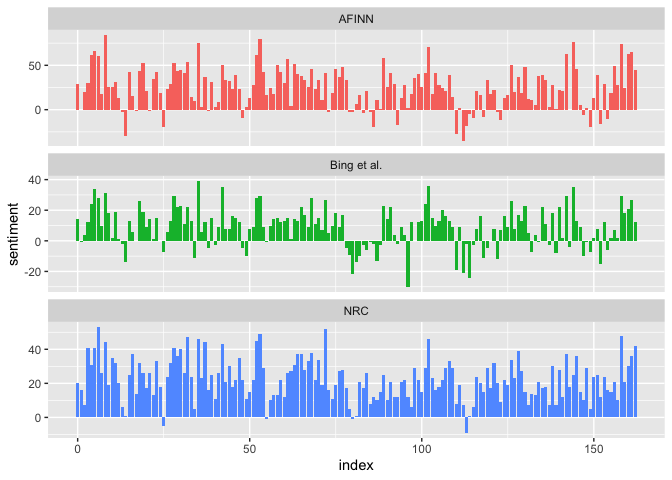
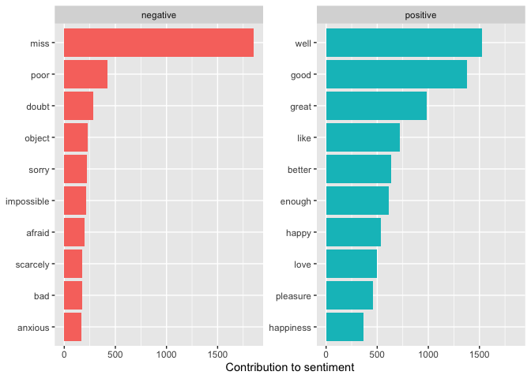

# Load packages for assignment


```r
library(tidytext)
library(dplyr)
```

```
## 
## Attaching package: 'dplyr'
```

```
## The following objects are masked from 'package:stats':
## 
##     filter, lag
```

```
## The following objects are masked from 'package:base':
## 
##     intersect, setdiff, setequal, union
```

```r
library(stringr)
library(tidyr)
library(ggplot2)
```

# Following the Chapter

### View sample of AFINN (FINN ARUP Nielsen) sentiment lexicon

"The AFINN lexicon assigns words with a score that runs between -5 and 5, with negative scores indicating negative sentiment and positive scores indicating positive sentiment."


```r
get_sentiments("afinn")
```

<div data-pagedtable="false">
  <script data-pagedtable-source type="application/json">
{"columns":[{"label":["word"],"name":[1],"type":["chr"],"align":["left"]},{"label":["value"],"name":[2],"type":["dbl"],"align":["right"]}],"data":[{"1":"abandon","2":"-2"},{"1":"abandoned","2":"-2"},{"1":"abandons","2":"-2"},{"1":"abducted","2":"-2"},{"1":"abduction","2":"-2"},{"1":"abductions","2":"-2"},{"1":"abhor","2":"-3"},{"1":"abhorred","2":"-3"},{"1":"abhorrent","2":"-3"},{"1":"abhors","2":"-3"},{"1":"abilities","2":"2"},{"1":"ability","2":"2"},{"1":"aboard","2":"1"},{"1":"absentee","2":"-1"},{"1":"absentees","2":"-1"},{"1":"absolve","2":"2"},{"1":"absolved","2":"2"},{"1":"absolves","2":"2"},{"1":"absolving","2":"2"},{"1":"absorbed","2":"1"},{"1":"abuse","2":"-3"},{"1":"abused","2":"-3"},{"1":"abuses","2":"-3"},{"1":"abusive","2":"-3"},{"1":"accept","2":"1"},{"1":"accepted","2":"1"},{"1":"accepting","2":"1"},{"1":"accepts","2":"1"},{"1":"accident","2":"-2"},{"1":"accidental","2":"-2"},{"1":"accidentally","2":"-2"},{"1":"accidents","2":"-2"},{"1":"accomplish","2":"2"},{"1":"accomplished","2":"2"},{"1":"accomplishes","2":"2"},{"1":"accusation","2":"-2"},{"1":"accusations","2":"-2"},{"1":"accuse","2":"-2"},{"1":"accused","2":"-2"},{"1":"accuses","2":"-2"},{"1":"accusing","2":"-2"},{"1":"ache","2":"-2"},{"1":"achievable","2":"1"},{"1":"aching","2":"-2"},{"1":"acquit","2":"2"},{"1":"acquits","2":"2"},{"1":"acquitted","2":"2"},{"1":"acquitting","2":"2"},{"1":"acrimonious","2":"-3"},{"1":"active","2":"1"},{"1":"adequate","2":"1"},{"1":"admire","2":"3"},{"1":"admired","2":"3"},{"1":"admires","2":"3"},{"1":"admiring","2":"3"},{"1":"admit","2":"-1"},{"1":"admits","2":"-1"},{"1":"admitted","2":"-1"},{"1":"admonish","2":"-2"},{"1":"admonished","2":"-2"},{"1":"adopt","2":"1"},{"1":"adopts","2":"1"},{"1":"adorable","2":"3"},{"1":"adore","2":"3"},{"1":"adored","2":"3"},{"1":"adores","2":"3"},{"1":"advanced","2":"1"},{"1":"advantage","2":"2"},{"1":"advantages","2":"2"},{"1":"adventure","2":"2"},{"1":"adventures","2":"2"},{"1":"adventurous","2":"2"},{"1":"affected","2":"-1"},{"1":"affection","2":"3"},{"1":"affectionate","2":"3"},{"1":"afflicted","2":"-1"},{"1":"affronted","2":"-1"},{"1":"afraid","2":"-2"},{"1":"aggravate","2":"-2"},{"1":"aggravated","2":"-2"},{"1":"aggravates","2":"-2"},{"1":"aggravating","2":"-2"},{"1":"aggression","2":"-2"},{"1":"aggressions","2":"-2"},{"1":"aggressive","2":"-2"},{"1":"aghast","2":"-2"},{"1":"agog","2":"2"},{"1":"agonise","2":"-3"},{"1":"agonised","2":"-3"},{"1":"agonises","2":"-3"},{"1":"agonising","2":"-3"},{"1":"agonize","2":"-3"},{"1":"agonized","2":"-3"},{"1":"agonizes","2":"-3"},{"1":"agonizing","2":"-3"},{"1":"agree","2":"1"},{"1":"agreeable","2":"2"},{"1":"agreed","2":"1"},{"1":"agreement","2":"1"},{"1":"agrees","2":"1"},{"1":"alarm","2":"-2"},{"1":"alarmed","2":"-2"},{"1":"alarmist","2":"-2"},{"1":"alarmists","2":"-2"},{"1":"alas","2":"-1"},{"1":"alert","2":"-1"},{"1":"alienation","2":"-2"},{"1":"alive","2":"1"},{"1":"allergic","2":"-2"},{"1":"allow","2":"1"},{"1":"alone","2":"-2"},{"1":"amaze","2":"2"},{"1":"amazed","2":"2"},{"1":"amazes","2":"2"},{"1":"amazing","2":"4"},{"1":"ambitious","2":"2"},{"1":"ambivalent","2":"-1"},{"1":"amuse","2":"3"},{"1":"amused","2":"3"},{"1":"amusement","2":"3"},{"1":"amusements","2":"3"},{"1":"anger","2":"-3"},{"1":"angers","2":"-3"},{"1":"angry","2":"-3"},{"1":"anguish","2":"-3"},{"1":"anguished","2":"-3"},{"1":"animosity","2":"-2"},{"1":"annoy","2":"-2"},{"1":"annoyance","2":"-2"},{"1":"annoyed","2":"-2"},{"1":"annoying","2":"-2"},{"1":"annoys","2":"-2"},{"1":"antagonistic","2":"-2"},{"1":"anti","2":"-1"},{"1":"anticipation","2":"1"},{"1":"anxiety","2":"-2"},{"1":"anxious","2":"-2"},{"1":"apathetic","2":"-3"},{"1":"apathy","2":"-3"},{"1":"apeshit","2":"-3"},{"1":"apocalyptic","2":"-2"},{"1":"apologise","2":"-1"},{"1":"apologised","2":"-1"},{"1":"apologises","2":"-1"},{"1":"apologising","2":"-1"},{"1":"apologize","2":"-1"},{"1":"apologized","2":"-1"},{"1":"apologizes","2":"-1"},{"1":"apologizing","2":"-1"},{"1":"apology","2":"-1"},{"1":"appalled","2":"-2"},{"1":"appalling","2":"-2"},{"1":"appease","2":"2"},{"1":"appeased","2":"2"},{"1":"appeases","2":"2"},{"1":"appeasing","2":"2"},{"1":"applaud","2":"2"},{"1":"applauded","2":"2"},{"1":"applauding","2":"2"},{"1":"applauds","2":"2"},{"1":"applause","2":"2"},{"1":"appreciate","2":"2"},{"1":"appreciated","2":"2"},{"1":"appreciates","2":"2"},{"1":"appreciating","2":"2"},{"1":"appreciation","2":"2"},{"1":"apprehensive","2":"-2"},{"1":"approval","2":"2"},{"1":"approved","2":"2"},{"1":"approves","2":"2"},{"1":"ardent","2":"1"},{"1":"arrest","2":"-2"},{"1":"arrested","2":"-3"},{"1":"arrests","2":"-2"},{"1":"arrogant","2":"-2"},{"1":"ashame","2":"-2"},{"1":"ashamed","2":"-2"},{"1":"ass","2":"-4"},{"1":"assassination","2":"-3"},{"1":"assassinations","2":"-3"},{"1":"asset","2":"2"},{"1":"assets","2":"2"},{"1":"assfucking","2":"-4"},{"1":"asshole","2":"-4"},{"1":"astonished","2":"2"},{"1":"astound","2":"3"},{"1":"astounded","2":"3"},{"1":"astounding","2":"3"},{"1":"astoundingly","2":"3"},{"1":"astounds","2":"3"},{"1":"attack","2":"-1"},{"1":"attacked","2":"-1"},{"1":"attacking","2":"-1"},{"1":"attacks","2":"-1"},{"1":"attract","2":"1"},{"1":"attracted","2":"1"},{"1":"attracting","2":"2"},{"1":"attraction","2":"2"},{"1":"attractions","2":"2"},{"1":"attracts","2":"1"},{"1":"audacious","2":"3"},{"1":"authority","2":"1"},{"1":"avert","2":"-1"},{"1":"averted","2":"-1"},{"1":"averts","2":"-1"},{"1":"avid","2":"2"},{"1":"avoid","2":"-1"},{"1":"avoided","2":"-1"},{"1":"avoids","2":"-1"},{"1":"await","2":"-1"},{"1":"awaited","2":"-1"},{"1":"awaits","2":"-1"},{"1":"award","2":"3"},{"1":"awarded","2":"3"},{"1":"awards","2":"3"},{"1":"awesome","2":"4"},{"1":"awful","2":"-3"},{"1":"awkward","2":"-2"},{"1":"axe","2":"-1"},{"1":"axed","2":"-1"},{"1":"backed","2":"1"},{"1":"backing","2":"2"},{"1":"backs","2":"1"},{"1":"bad","2":"-3"},{"1":"badass","2":"-3"},{"1":"badly","2":"-3"},{"1":"bailout","2":"-2"},{"1":"bamboozle","2":"-2"},{"1":"bamboozled","2":"-2"},{"1":"bamboozles","2":"-2"},{"1":"ban","2":"-2"},{"1":"banish","2":"-1"},{"1":"bankrupt","2":"-3"},{"1":"bankster","2":"-3"},{"1":"banned","2":"-2"},{"1":"bargain","2":"2"},{"1":"barrier","2":"-2"},{"1":"bastard","2":"-5"},{"1":"bastards","2":"-5"},{"1":"battle","2":"-1"},{"1":"battles","2":"-1"},{"1":"beaten","2":"-2"},{"1":"beatific","2":"3"},{"1":"beating","2":"-1"},{"1":"beauties","2":"3"},{"1":"beautiful","2":"3"},{"1":"beautifully","2":"3"},{"1":"beautify","2":"3"},{"1":"belittle","2":"-2"},{"1":"belittled","2":"-2"},{"1":"beloved","2":"3"},{"1":"benefit","2":"2"},{"1":"benefits","2":"2"},{"1":"benefitted","2":"2"},{"1":"benefitting","2":"2"},{"1":"bereave","2":"-2"},{"1":"bereaved","2":"-2"},{"1":"bereaves","2":"-2"},{"1":"bereaving","2":"-2"},{"1":"best","2":"3"},{"1":"betray","2":"-3"},{"1":"betrayal","2":"-3"},{"1":"betrayed","2":"-3"},{"1":"betraying","2":"-3"},{"1":"betrays","2":"-3"},{"1":"better","2":"2"},{"1":"bias","2":"-1"},{"1":"biased","2":"-2"},{"1":"big","2":"1"},{"1":"bitch","2":"-5"},{"1":"bitches","2":"-5"},{"1":"bitter","2":"-2"},{"1":"bitterly","2":"-2"},{"1":"bizarre","2":"-2"},{"1":"blah","2":"-2"},{"1":"blame","2":"-2"},{"1":"blamed","2":"-2"},{"1":"blames","2":"-2"},{"1":"blaming","2":"-2"},{"1":"bless","2":"2"},{"1":"blesses","2":"2"},{"1":"blessing","2":"3"},{"1":"blind","2":"-1"},{"1":"bliss","2":"3"},{"1":"blissful","2":"3"},{"1":"blithe","2":"2"},{"1":"block","2":"-1"},{"1":"blockbuster","2":"3"},{"1":"blocked","2":"-1"},{"1":"blocking","2":"-1"},{"1":"blocks","2":"-1"},{"1":"bloody","2":"-3"},{"1":"blurry","2":"-2"},{"1":"boastful","2":"-2"},{"1":"bold","2":"2"},{"1":"boldly","2":"2"},{"1":"bomb","2":"-1"},{"1":"boost","2":"1"},{"1":"boosted","2":"1"},{"1":"boosting","2":"1"},{"1":"boosts","2":"1"},{"1":"bore","2":"-2"},{"1":"bored","2":"-2"},{"1":"boring","2":"-3"},{"1":"bother","2":"-2"},{"1":"bothered","2":"-2"},{"1":"bothers","2":"-2"},{"1":"bothersome","2":"-2"},{"1":"boycott","2":"-2"},{"1":"boycotted","2":"-2"},{"1":"boycotting","2":"-2"},{"1":"boycotts","2":"-2"},{"1":"brainwashing","2":"-3"},{"1":"brave","2":"2"},{"1":"breakthrough","2":"3"},{"1":"breathtaking","2":"5"},{"1":"bribe","2":"-3"},{"1":"bright","2":"1"},{"1":"brightest","2":"2"},{"1":"brightness","2":"1"},{"1":"brilliant","2":"4"},{"1":"brisk","2":"2"},{"1":"broke","2":"-1"},{"1":"broken","2":"-1"},{"1":"brooding","2":"-2"},{"1":"bullied","2":"-2"},{"1":"bullshit","2":"-4"},{"1":"bully","2":"-2"},{"1":"bullying","2":"-2"},{"1":"bummer","2":"-2"},{"1":"buoyant","2":"2"},{"1":"burden","2":"-2"},{"1":"burdened","2":"-2"},{"1":"burdening","2":"-2"},{"1":"burdens","2":"-2"},{"1":"calm","2":"2"},{"1":"calmed","2":"2"},{"1":"calming","2":"2"},{"1":"calms","2":"2"},{"1":"can't stand","2":"-3"},{"1":"cancel","2":"-1"},{"1":"cancelled","2":"-1"},{"1":"cancelling","2":"-1"},{"1":"cancels","2":"-1"},{"1":"cancer","2":"-1"},{"1":"capable","2":"1"},{"1":"captivated","2":"3"},{"1":"care","2":"2"},{"1":"carefree","2":"1"},{"1":"careful","2":"2"},{"1":"carefully","2":"2"},{"1":"careless","2":"-2"},{"1":"cares","2":"2"},{"1":"cashing in","2":"-2"},{"1":"casualty","2":"-2"},{"1":"catastrophe","2":"-3"},{"1":"catastrophic","2":"-4"},{"1":"cautious","2":"-1"},{"1":"celebrate","2":"3"},{"1":"celebrated","2":"3"},{"1":"celebrates","2":"3"},{"1":"celebrating","2":"3"},{"1":"censor","2":"-2"},{"1":"censored","2":"-2"},{"1":"censors","2":"-2"},{"1":"certain","2":"1"},{"1":"chagrin","2":"-2"},{"1":"chagrined","2":"-2"},{"1":"challenge","2":"-1"},{"1":"chance","2":"2"},{"1":"chances","2":"2"},{"1":"chaos","2":"-2"},{"1":"chaotic","2":"-2"},{"1":"charged","2":"-3"},{"1":"charges","2":"-2"},{"1":"charm","2":"3"},{"1":"charming","2":"3"},{"1":"charmless","2":"-3"},{"1":"chastise","2":"-3"},{"1":"chastised","2":"-3"},{"1":"chastises","2":"-3"},{"1":"chastising","2":"-3"},{"1":"cheat","2":"-3"},{"1":"cheated","2":"-3"},{"1":"cheater","2":"-3"},{"1":"cheaters","2":"-3"},{"1":"cheats","2":"-3"},{"1":"cheer","2":"2"},{"1":"cheered","2":"2"},{"1":"cheerful","2":"2"},{"1":"cheering","2":"2"},{"1":"cheerless","2":"-2"},{"1":"cheers","2":"2"},{"1":"cheery","2":"3"},{"1":"cherish","2":"2"},{"1":"cherished","2":"2"},{"1":"cherishes","2":"2"},{"1":"cherishing","2":"2"},{"1":"chic","2":"2"},{"1":"childish","2":"-2"},{"1":"chilling","2":"-1"},{"1":"choke","2":"-2"},{"1":"choked","2":"-2"},{"1":"chokes","2":"-2"},{"1":"choking","2":"-2"},{"1":"clarifies","2":"2"},{"1":"clarity","2":"2"},{"1":"clash","2":"-2"},{"1":"classy","2":"3"},{"1":"clean","2":"2"},{"1":"cleaner","2":"2"},{"1":"clear","2":"1"},{"1":"cleared","2":"1"},{"1":"clearly","2":"1"},{"1":"clears","2":"1"},{"1":"clever","2":"2"},{"1":"clouded","2":"-1"},{"1":"clueless","2":"-2"},{"1":"cock","2":"-5"},{"1":"cocksucker","2":"-5"},{"1":"cocksuckers","2":"-5"},{"1":"cocky","2":"-2"},{"1":"coerced","2":"-2"},{"1":"collapse","2":"-2"},{"1":"collapsed","2":"-2"},{"1":"collapses","2":"-2"},{"1":"collapsing","2":"-2"},{"1":"collide","2":"-1"},{"1":"collides","2":"-1"},{"1":"colliding","2":"-1"},{"1":"collision","2":"-2"},{"1":"collisions","2":"-2"},{"1":"colluding","2":"-3"},{"1":"combat","2":"-1"},{"1":"combats","2":"-1"},{"1":"comedy","2":"1"},{"1":"comfort","2":"2"},{"1":"comfortable","2":"2"},{"1":"comforting","2":"2"},{"1":"comforts","2":"2"},{"1":"commend","2":"2"},{"1":"commended","2":"2"},{"1":"commit","2":"1"},{"1":"commitment","2":"2"},{"1":"commits","2":"1"},{"1":"committed","2":"1"},{"1":"committing","2":"1"},{"1":"compassionate","2":"2"},{"1":"compelled","2":"1"},{"1":"competent","2":"2"},{"1":"competitive","2":"2"},{"1":"complacent","2":"-2"},{"1":"complain","2":"-2"},{"1":"complained","2":"-2"},{"1":"complains","2":"-2"},{"1":"comprehensive","2":"2"},{"1":"conciliate","2":"2"},{"1":"conciliated","2":"2"},{"1":"conciliates","2":"2"},{"1":"conciliating","2":"2"},{"1":"condemn","2":"-2"},{"1":"condemnation","2":"-2"},{"1":"condemned","2":"-2"},{"1":"condemns","2":"-2"},{"1":"confidence","2":"2"},{"1":"confident","2":"2"},{"1":"conflict","2":"-2"},{"1":"conflicting","2":"-2"},{"1":"conflictive","2":"-2"},{"1":"conflicts","2":"-2"},{"1":"confuse","2":"-2"},{"1":"confused","2":"-2"},{"1":"confusing","2":"-2"},{"1":"congrats","2":"2"},{"1":"congratulate","2":"2"},{"1":"congratulation","2":"2"},{"1":"congratulations","2":"2"},{"1":"consent","2":"2"},{"1":"consents","2":"2"},{"1":"consolable","2":"2"},{"1":"conspiracy","2":"-3"},{"1":"constrained","2":"-2"},{"1":"contagion","2":"-2"},{"1":"contagions","2":"-2"},{"1":"contagious","2":"-1"},{"1":"contempt","2":"-2"},{"1":"contemptuous","2":"-2"},{"1":"contemptuously","2":"-2"},{"1":"contend","2":"-1"},{"1":"contender","2":"-1"},{"1":"contending","2":"-1"},{"1":"contentious","2":"-2"},{"1":"contestable","2":"-2"},{"1":"controversial","2":"-2"},{"1":"controversially","2":"-2"},{"1":"convince","2":"1"},{"1":"convinced","2":"1"},{"1":"convinces","2":"1"},{"1":"convivial","2":"2"},{"1":"cool","2":"1"},{"1":"cool stuff","2":"3"},{"1":"cornered","2":"-2"},{"1":"corpse","2":"-1"},{"1":"costly","2":"-2"},{"1":"courage","2":"2"},{"1":"courageous","2":"2"},{"1":"courteous","2":"2"},{"1":"courtesy","2":"2"},{"1":"cover-up","2":"-3"},{"1":"coward","2":"-2"},{"1":"cowardly","2":"-2"},{"1":"coziness","2":"2"},{"1":"cramp","2":"-1"},{"1":"crap","2":"-3"},{"1":"crash","2":"-2"},{"1":"crazier","2":"-2"},{"1":"craziest","2":"-2"},{"1":"crazy","2":"-2"},{"1":"creative","2":"2"},{"1":"crestfallen","2":"-2"},{"1":"cried","2":"-2"},{"1":"cries","2":"-2"},{"1":"crime","2":"-3"},{"1":"criminal","2":"-3"},{"1":"criminals","2":"-3"},{"1":"crisis","2":"-3"},{"1":"critic","2":"-2"},{"1":"criticism","2":"-2"},{"1":"criticize","2":"-2"},{"1":"criticized","2":"-2"},{"1":"criticizes","2":"-2"},{"1":"criticizing","2":"-2"},{"1":"critics","2":"-2"},{"1":"cruel","2":"-3"},{"1":"cruelty","2":"-3"},{"1":"crush","2":"-1"},{"1":"crushed","2":"-2"},{"1":"crushes","2":"-1"},{"1":"crushing","2":"-1"},{"1":"cry","2":"-1"},{"1":"crying","2":"-2"},{"1":"cunt","2":"-5"},{"1":"curious","2":"1"},{"1":"curse","2":"-1"},{"1":"cut","2":"-1"},{"1":"cute","2":"2"},{"1":"cuts","2":"-1"},{"1":"cutting","2":"-1"},{"1":"cynic","2":"-2"},{"1":"cynical","2":"-2"},{"1":"cynicism","2":"-2"},{"1":"damage","2":"-3"},{"1":"damages","2":"-3"},{"1":"damn","2":"-4"},{"1":"damned","2":"-4"},{"1":"damnit","2":"-4"},{"1":"danger","2":"-2"},{"1":"daredevil","2":"2"},{"1":"daring","2":"2"},{"1":"darkest","2":"-2"},{"1":"darkness","2":"-1"},{"1":"dauntless","2":"2"},{"1":"dead","2":"-3"},{"1":"deadlock","2":"-2"},{"1":"deafening","2":"-1"},{"1":"dear","2":"2"},{"1":"dearly","2":"3"},{"1":"death","2":"-2"},{"1":"debonair","2":"2"},{"1":"debt","2":"-2"},{"1":"deceit","2":"-3"},{"1":"deceitful","2":"-3"},{"1":"deceive","2":"-3"},{"1":"deceived","2":"-3"},{"1":"deceives","2":"-3"},{"1":"deceiving","2":"-3"},{"1":"deception","2":"-3"},{"1":"decisive","2":"1"},{"1":"dedicated","2":"2"},{"1":"defeated","2":"-2"},{"1":"defect","2":"-3"},{"1":"defects","2":"-3"},{"1":"defender","2":"2"},{"1":"defenders","2":"2"},{"1":"defenseless","2":"-2"},{"1":"defer","2":"-1"},{"1":"deferring","2":"-1"},{"1":"defiant","2":"-1"},{"1":"deficit","2":"-2"},{"1":"degrade","2":"-2"},{"1":"degraded","2":"-2"},{"1":"degrades","2":"-2"},{"1":"dehumanize","2":"-2"},{"1":"dehumanized","2":"-2"},{"1":"dehumanizes","2":"-2"},{"1":"dehumanizing","2":"-2"},{"1":"deject","2":"-2"},{"1":"dejected","2":"-2"},{"1":"dejecting","2":"-2"},{"1":"dejects","2":"-2"},{"1":"delay","2":"-1"},{"1":"delayed","2":"-1"},{"1":"delight","2":"3"},{"1":"delighted","2":"3"},{"1":"delighting","2":"3"},{"1":"delights","2":"3"},{"1":"demand","2":"-1"},{"1":"demanded","2":"-1"},{"1":"demanding","2":"-1"},{"1":"demands","2":"-1"},{"1":"demonstration","2":"-1"},{"1":"demoralized","2":"-2"},{"1":"denied","2":"-2"},{"1":"denier","2":"-2"},{"1":"deniers","2":"-2"},{"1":"denies","2":"-2"},{"1":"denounce","2":"-2"},{"1":"denounces","2":"-2"},{"1":"deny","2":"-2"},{"1":"denying","2":"-2"},{"1":"depressed","2":"-2"},{"1":"depressing","2":"-2"},{"1":"derail","2":"-2"},{"1":"derailed","2":"-2"},{"1":"derails","2":"-2"},{"1":"deride","2":"-2"},{"1":"derided","2":"-2"},{"1":"derides","2":"-2"},{"1":"deriding","2":"-2"},{"1":"derision","2":"-2"},{"1":"desirable","2":"2"},{"1":"desire","2":"1"},{"1":"desired","2":"2"},{"1":"desirous","2":"2"},{"1":"despair","2":"-3"},{"1":"despairing","2":"-3"},{"1":"despairs","2":"-3"},{"1":"desperate","2":"-3"},{"1":"desperately","2":"-3"},{"1":"despondent","2":"-3"},{"1":"destroy","2":"-3"},{"1":"destroyed","2":"-3"},{"1":"destroying","2":"-3"},{"1":"destroys","2":"-3"},{"1":"destruction","2":"-3"},{"1":"destructive","2":"-3"},{"1":"detached","2":"-1"},{"1":"detain","2":"-2"},{"1":"detained","2":"-2"},{"1":"detention","2":"-2"},{"1":"determined","2":"2"},{"1":"devastate","2":"-2"},{"1":"devastated","2":"-2"},{"1":"devastating","2":"-2"},{"1":"devoted","2":"3"},{"1":"diamond","2":"1"},{"1":"dick","2":"-4"},{"1":"dickhead","2":"-4"},{"1":"die","2":"-3"},{"1":"died","2":"-3"},{"1":"difficult","2":"-1"},{"1":"diffident","2":"-2"},{"1":"dilemma","2":"-1"},{"1":"dipshit","2":"-3"},{"1":"dire","2":"-3"},{"1":"direful","2":"-3"},{"1":"dirt","2":"-2"},{"1":"dirtier","2":"-2"},{"1":"dirtiest","2":"-2"},{"1":"dirty","2":"-2"},{"1":"disabling","2":"-1"},{"1":"disadvantage","2":"-2"},{"1":"disadvantaged","2":"-2"},{"1":"disappear","2":"-1"},{"1":"disappeared","2":"-1"},{"1":"disappears","2":"-1"},{"1":"disappoint","2":"-2"},{"1":"disappointed","2":"-2"},{"1":"disappointing","2":"-2"},{"1":"disappointment","2":"-2"},{"1":"disappointments","2":"-2"},{"1":"disappoints","2":"-2"},{"1":"disaster","2":"-2"},{"1":"disasters","2":"-2"},{"1":"disastrous","2":"-3"},{"1":"disbelieve","2":"-2"},{"1":"discard","2":"-1"},{"1":"discarded","2":"-1"},{"1":"discarding","2":"-1"},{"1":"discards","2":"-1"},{"1":"disconsolate","2":"-2"},{"1":"disconsolation","2":"-2"},{"1":"discontented","2":"-2"},{"1":"discord","2":"-2"},{"1":"discounted","2":"-1"},{"1":"discouraged","2":"-2"},{"1":"discredited","2":"-2"},{"1":"disdain","2":"-2"},{"1":"disgrace","2":"-2"},{"1":"disgraced","2":"-2"},{"1":"disguise","2":"-1"},{"1":"disguised","2":"-1"},{"1":"disguises","2":"-1"},{"1":"disguising","2":"-1"},{"1":"disgust","2":"-3"},{"1":"disgusted","2":"-3"},{"1":"disgusting","2":"-3"},{"1":"disheartened","2":"-2"},{"1":"dishonest","2":"-2"},{"1":"disillusioned","2":"-2"},{"1":"disinclined","2":"-2"},{"1":"disjointed","2":"-2"},{"1":"dislike","2":"-2"},{"1":"dismal","2":"-2"},{"1":"dismayed","2":"-2"},{"1":"disorder","2":"-2"},{"1":"disorganized","2":"-2"},{"1":"disoriented","2":"-2"},{"1":"disparage","2":"-2"},{"1":"disparaged","2":"-2"},{"1":"disparages","2":"-2"},{"1":"disparaging","2":"-2"},{"1":"displeased","2":"-2"},{"1":"dispute","2":"-2"},{"1":"disputed","2":"-2"},{"1":"disputes","2":"-2"},{"1":"disputing","2":"-2"},{"1":"disqualified","2":"-2"},{"1":"disquiet","2":"-2"},{"1":"disregard","2":"-2"},{"1":"disregarded","2":"-2"},{"1":"disregarding","2":"-2"},{"1":"disregards","2":"-2"},{"1":"disrespect","2":"-2"},{"1":"disrespected","2":"-2"},{"1":"disruption","2":"-2"},{"1":"disruptions","2":"-2"},{"1":"disruptive","2":"-2"},{"1":"dissatisfied","2":"-2"},{"1":"distort","2":"-2"},{"1":"distorted","2":"-2"},{"1":"distorting","2":"-2"},{"1":"distorts","2":"-2"},{"1":"distract","2":"-2"},{"1":"distracted","2":"-2"},{"1":"distraction","2":"-2"},{"1":"distracts","2":"-2"},{"1":"distress","2":"-2"},{"1":"distressed","2":"-2"},{"1":"distresses","2":"-2"},{"1":"distressing","2":"-2"},{"1":"distrust","2":"-3"},{"1":"distrustful","2":"-3"},{"1":"disturb","2":"-2"},{"1":"disturbed","2":"-2"},{"1":"disturbing","2":"-2"},{"1":"disturbs","2":"-2"},{"1":"dithering","2":"-2"},{"1":"dizzy","2":"-1"},{"1":"dodging","2":"-2"},{"1":"dodgy","2":"-2"},{"1":"does not work","2":"-3"},{"1":"dolorous","2":"-2"},{"1":"dont like","2":"-2"},{"1":"doom","2":"-2"},{"1":"doomed","2":"-2"},{"1":"doubt","2":"-1"},{"1":"doubted","2":"-1"},{"1":"doubtful","2":"-1"},{"1":"doubting","2":"-1"},{"1":"doubts","2":"-1"},{"1":"douche","2":"-3"},{"1":"douchebag","2":"-3"},{"1":"downcast","2":"-2"},{"1":"downhearted","2":"-2"},{"1":"downside","2":"-2"},{"1":"drag","2":"-1"},{"1":"dragged","2":"-1"},{"1":"drags","2":"-1"},{"1":"drained","2":"-2"},{"1":"dread","2":"-2"},{"1":"dreaded","2":"-2"},{"1":"dreadful","2":"-3"},{"1":"dreading","2":"-2"},{"1":"dream","2":"1"},{"1":"dreams","2":"1"},{"1":"dreary","2":"-2"},{"1":"droopy","2":"-2"},{"1":"drop","2":"-1"},{"1":"drown","2":"-2"},{"1":"drowned","2":"-2"},{"1":"drowns","2":"-2"},{"1":"drunk","2":"-2"},{"1":"dubious","2":"-2"},{"1":"dud","2":"-2"},{"1":"dull","2":"-2"},{"1":"dumb","2":"-3"},{"1":"dumbass","2":"-3"},{"1":"dump","2":"-1"},{"1":"dumped","2":"-2"},{"1":"dumps","2":"-1"},{"1":"dupe","2":"-2"},{"1":"duped","2":"-2"},{"1":"dysfunction","2":"-2"},{"1":"eager","2":"2"},{"1":"earnest","2":"2"},{"1":"ease","2":"2"},{"1":"easy","2":"1"},{"1":"ecstatic","2":"4"},{"1":"eerie","2":"-2"},{"1":"eery","2":"-2"},{"1":"effective","2":"2"},{"1":"effectively","2":"2"},{"1":"elated","2":"3"},{"1":"elation","2":"3"},{"1":"elegant","2":"2"},{"1":"elegantly","2":"2"},{"1":"embarrass","2":"-2"},{"1":"embarrassed","2":"-2"},{"1":"embarrasses","2":"-2"},{"1":"embarrassing","2":"-2"},{"1":"embarrassment","2":"-2"},{"1":"embittered","2":"-2"},{"1":"embrace","2":"1"},{"1":"emergency","2":"-2"},{"1":"empathetic","2":"2"},{"1":"emptiness","2":"-1"},{"1":"empty","2":"-1"},{"1":"enchanted","2":"2"},{"1":"encourage","2":"2"},{"1":"encouraged","2":"2"},{"1":"encouragement","2":"2"},{"1":"encourages","2":"2"},{"1":"endorse","2":"2"},{"1":"endorsed","2":"2"},{"1":"endorsement","2":"2"},{"1":"endorses","2":"2"},{"1":"enemies","2":"-2"},{"1":"enemy","2":"-2"},{"1":"energetic","2":"2"},{"1":"engage","2":"1"},{"1":"engages","2":"1"},{"1":"engrossed","2":"1"},{"1":"enjoy","2":"2"},{"1":"enjoying","2":"2"},{"1":"enjoys","2":"2"},{"1":"enlighten","2":"2"},{"1":"enlightened","2":"2"},{"1":"enlightening","2":"2"},{"1":"enlightens","2":"2"},{"1":"ennui","2":"-2"},{"1":"enrage","2":"-2"},{"1":"enraged","2":"-2"},{"1":"enrages","2":"-2"},{"1":"enraging","2":"-2"},{"1":"enrapture","2":"3"},{"1":"enslave","2":"-2"},{"1":"enslaved","2":"-2"},{"1":"enslaves","2":"-2"},{"1":"ensure","2":"1"},{"1":"ensuring","2":"1"},{"1":"enterprising","2":"1"},{"1":"entertaining","2":"2"},{"1":"enthral","2":"3"},{"1":"enthusiastic","2":"3"},{"1":"entitled","2":"1"},{"1":"entrusted","2":"2"},{"1":"envies","2":"-1"},{"1":"envious","2":"-2"},{"1":"envy","2":"-1"},{"1":"envying","2":"-1"},{"1":"erroneous","2":"-2"},{"1":"error","2":"-2"},{"1":"errors","2":"-2"},{"1":"escape","2":"-1"},{"1":"escapes","2":"-1"},{"1":"escaping","2":"-1"},{"1":"esteemed","2":"2"},{"1":"ethical","2":"2"},{"1":"euphoria","2":"3"},{"1":"euphoric","2":"4"},{"1":"eviction","2":"-1"},{"1":"evil","2":"-3"},{"1":"exaggerate","2":"-2"},{"1":"exaggerated","2":"-2"},{"1":"exaggerates","2":"-2"},{"1":"exaggerating","2":"-2"},{"1":"exasperated","2":"2"},{"1":"excellence","2":"3"},{"1":"excellent","2":"3"},{"1":"excite","2":"3"},{"1":"excited","2":"3"},{"1":"excitement","2":"3"},{"1":"exciting","2":"3"},{"1":"exclude","2":"-1"},{"1":"excluded","2":"-2"},{"1":"exclusion","2":"-1"},{"1":"exclusive","2":"2"},{"1":"excuse","2":"-1"},{"1":"exempt","2":"-1"},{"1":"exhausted","2":"-2"},{"1":"exhilarated","2":"3"},{"1":"exhilarates","2":"3"},{"1":"exhilarating","2":"3"},{"1":"exonerate","2":"2"},{"1":"exonerated","2":"2"},{"1":"exonerates","2":"2"},{"1":"exonerating","2":"2"},{"1":"expand","2":"1"},{"1":"expands","2":"1"},{"1":"expel","2":"-2"},{"1":"expelled","2":"-2"},{"1":"expelling","2":"-2"},{"1":"expels","2":"-2"},{"1":"exploit","2":"-2"},{"1":"exploited","2":"-2"},{"1":"exploiting","2":"-2"},{"1":"exploits","2":"-2"},{"1":"exploration","2":"1"},{"1":"explorations","2":"1"},{"1":"expose","2":"-1"},{"1":"exposed","2":"-1"},{"1":"exposes","2":"-1"},{"1":"exposing","2":"-1"},{"1":"extend","2":"1"},{"1":"extends","2":"1"},{"1":"exuberant","2":"4"},{"1":"exultant","2":"3"},{"1":"exultantly","2":"3"},{"1":"fabulous","2":"4"},{"1":"fad","2":"-2"},{"1":"fag","2":"-3"},{"1":"faggot","2":"-3"},{"1":"faggots","2":"-3"},{"1":"fail","2":"-2"},{"1":"failed","2":"-2"},{"1":"failing","2":"-2"},{"1":"fails","2":"-2"},{"1":"failure","2":"-2"},{"1":"failures","2":"-2"},{"1":"fainthearted","2":"-2"},{"1":"fair","2":"2"},{"1":"faith","2":"1"},{"1":"faithful","2":"3"},{"1":"fake","2":"-3"},{"1":"fakes","2":"-3"},{"1":"faking","2":"-3"},{"1":"fallen","2":"-2"},{"1":"falling","2":"-1"},{"1":"falsified","2":"-3"},{"1":"falsify","2":"-3"},{"1":"fame","2":"1"},{"1":"fan","2":"3"},{"1":"fantastic","2":"4"},{"1":"farce","2":"-1"},{"1":"fascinate","2":"3"},{"1":"fascinated","2":"3"},{"1":"fascinates","2":"3"},{"1":"fascinating","2":"3"},{"1":"fascist","2":"-2"},{"1":"fascists","2":"-2"},{"1":"fatalities","2":"-3"},{"1":"fatality","2":"-3"},{"1":"fatigue","2":"-2"},{"1":"fatigued","2":"-2"},{"1":"fatigues","2":"-2"},{"1":"fatiguing","2":"-2"},{"1":"favor","2":"2"},{"1":"favored","2":"2"},{"1":"favorite","2":"2"},{"1":"favorited","2":"2"},{"1":"favorites","2":"2"},{"1":"favors","2":"2"},{"1":"fear","2":"-2"},{"1":"fearful","2":"-2"},{"1":"fearing","2":"-2"},{"1":"fearless","2":"2"},{"1":"fearsome","2":"-2"},{"1":"fed up","2":"-3"},{"1":"feeble","2":"-2"},{"1":"feeling","2":"1"},{"1":"felonies","2":"-3"},{"1":"felony","2":"-3"},{"1":"fervent","2":"2"},{"1":"fervid","2":"2"},{"1":"festive","2":"2"},{"1":"fiasco","2":"-3"},{"1":"fidgety","2":"-2"},{"1":"fight","2":"-1"},{"1":"fine","2":"2"},{"1":"fire","2":"-2"},{"1":"fired","2":"-2"},{"1":"firing","2":"-2"},{"1":"fit","2":"1"},{"1":"fitness","2":"1"},{"1":"flagship","2":"2"},{"1":"flees","2":"-1"},{"1":"flop","2":"-2"},{"1":"flops","2":"-2"},{"1":"flu","2":"-2"},{"1":"flustered","2":"-2"},{"1":"focused","2":"2"},{"1":"fond","2":"2"},{"1":"fondness","2":"2"},{"1":"fool","2":"-2"},{"1":"foolish","2":"-2"},{"1":"fools","2":"-2"},{"1":"forced","2":"-1"},{"1":"foreclosure","2":"-2"},{"1":"foreclosures","2":"-2"},{"1":"forget","2":"-1"},{"1":"forgetful","2":"-2"},{"1":"forgive","2":"1"},{"1":"forgiving","2":"1"},{"1":"forgotten","2":"-1"},{"1":"fortunate","2":"2"},{"1":"frantic","2":"-1"},{"1":"fraud","2":"-4"},{"1":"frauds","2":"-4"},{"1":"fraudster","2":"-4"},{"1":"fraudsters","2":"-4"},{"1":"fraudulence","2":"-4"},{"1":"fraudulent","2":"-4"},{"1":"free","2":"1"},{"1":"freedom","2":"2"},{"1":"frenzy","2":"-3"},{"1":"fresh","2":"1"},{"1":"friendly","2":"2"},{"1":"fright","2":"-2"},{"1":"frightened","2":"-2"},{"1":"frightening","2":"-3"},{"1":"frikin","2":"-2"},{"1":"frisky","2":"2"},{"1":"frowning","2":"-1"},{"1":"frustrate","2":"-2"},{"1":"frustrated","2":"-2"},{"1":"frustrates","2":"-2"},{"1":"frustrating","2":"-2"},{"1":"frustration","2":"-2"},{"1":"ftw","2":"3"},{"1":"fuck","2":"-4"},{"1":"fucked","2":"-4"},{"1":"fucker","2":"-4"},{"1":"fuckers","2":"-4"},{"1":"fuckface","2":"-4"},{"1":"fuckhead","2":"-4"},{"1":"fucking","2":"-4"},{"1":"fucktard","2":"-4"},{"1":"fud","2":"-3"},{"1":"fuked","2":"-4"},{"1":"fuking","2":"-4"},{"1":"fulfill","2":"2"},{"1":"fulfilled","2":"2"},{"1":"fulfills","2":"2"},{"1":"fuming","2":"-2"},{"1":"fun","2":"4"},{"1":"funeral","2":"-1"},{"1":"funerals","2":"-1"},{"1":"funky","2":"2"},{"1":"funnier","2":"4"},{"1":"funny","2":"4"},{"1":"furious","2":"-3"},{"1":"futile","2":"2"},{"1":"gag","2":"-2"},{"1":"gagged","2":"-2"},{"1":"gain","2":"2"},{"1":"gained","2":"2"},{"1":"gaining","2":"2"},{"1":"gains","2":"2"},{"1":"gallant","2":"3"},{"1":"gallantly","2":"3"},{"1":"gallantry","2":"3"},{"1":"generous","2":"2"},{"1":"genial","2":"3"},{"1":"ghost","2":"-1"},{"1":"giddy","2":"-2"},{"1":"gift","2":"2"},{"1":"glad","2":"3"},{"1":"glamorous","2":"3"},{"1":"glamourous","2":"3"},{"1":"glee","2":"3"},{"1":"gleeful","2":"3"},{"1":"gloom","2":"-1"},{"1":"gloomy","2":"-2"},{"1":"glorious","2":"2"},{"1":"glory","2":"2"},{"1":"glum","2":"-2"},{"1":"god","2":"1"},{"1":"goddamn","2":"-3"},{"1":"godsend","2":"4"},{"1":"good","2":"3"},{"1":"goodness","2":"3"},{"1":"grace","2":"1"},{"1":"gracious","2":"3"},{"1":"grand","2":"3"},{"1":"grant","2":"1"},{"1":"granted","2":"1"},{"1":"granting","2":"1"},{"1":"grants","2":"1"},{"1":"grateful","2":"3"},{"1":"gratification","2":"2"},{"1":"grave","2":"-2"},{"1":"gray","2":"-1"},{"1":"great","2":"3"},{"1":"greater","2":"3"},{"1":"greatest","2":"3"},{"1":"greed","2":"-3"},{"1":"greedy","2":"-2"},{"1":"green wash","2":"-3"},{"1":"green washing","2":"-3"},{"1":"greenwash","2":"-3"},{"1":"greenwasher","2":"-3"},{"1":"greenwashers","2":"-3"},{"1":"greenwashing","2":"-3"},{"1":"greet","2":"1"},{"1":"greeted","2":"1"},{"1":"greeting","2":"1"},{"1":"greetings","2":"2"},{"1":"greets","2":"1"},{"1":"grey","2":"-1"},{"1":"grief","2":"-2"},{"1":"grieved","2":"-2"},{"1":"gross","2":"-2"},{"1":"growing","2":"1"},{"1":"growth","2":"2"},{"1":"guarantee","2":"1"},{"1":"guilt","2":"-3"},{"1":"guilty","2":"-3"},{"1":"gullibility","2":"-2"},{"1":"gullible","2":"-2"},{"1":"gun","2":"-1"},{"1":"ha","2":"2"},{"1":"hacked","2":"-1"},{"1":"haha","2":"3"},{"1":"hahaha","2":"3"},{"1":"hahahah","2":"3"},{"1":"hail","2":"2"},{"1":"hailed","2":"2"},{"1":"hapless","2":"-2"},{"1":"haplessness","2":"-2"},{"1":"happiness","2":"3"},{"1":"happy","2":"3"},{"1":"hard","2":"-1"},{"1":"hardier","2":"2"},{"1":"hardship","2":"-2"},{"1":"hardy","2":"2"},{"1":"harm","2":"-2"},{"1":"harmed","2":"-2"},{"1":"harmful","2":"-2"},{"1":"harming","2":"-2"},{"1":"harms","2":"-2"},{"1":"harried","2":"-2"},{"1":"harsh","2":"-2"},{"1":"harsher","2":"-2"},{"1":"harshest","2":"-2"},{"1":"hate","2":"-3"},{"1":"hated","2":"-3"},{"1":"haters","2":"-3"},{"1":"hates","2":"-3"},{"1":"hating","2":"-3"},{"1":"haunt","2":"-1"},{"1":"haunted","2":"-2"},{"1":"haunting","2":"1"},{"1":"haunts","2":"-1"},{"1":"havoc","2":"-2"},{"1":"healthy","2":"2"},{"1":"heartbreaking","2":"-3"},{"1":"heartbroken","2":"-3"},{"1":"heartfelt","2":"3"},{"1":"heaven","2":"2"},{"1":"heavenly","2":"4"},{"1":"heavyhearted","2":"-2"},{"1":"hell","2":"-4"},{"1":"help","2":"2"},{"1":"helpful","2":"2"},{"1":"helping","2":"2"},{"1":"helpless","2":"-2"},{"1":"helps","2":"2"},{"1":"hero","2":"2"},{"1":"heroes","2":"2"},{"1":"heroic","2":"3"},{"1":"hesitant","2":"-2"},{"1":"hesitate","2":"-2"},{"1":"hid","2":"-1"},{"1":"hide","2":"-1"},{"1":"hides","2":"-1"},{"1":"hiding","2":"-1"},{"1":"highlight","2":"2"},{"1":"hilarious","2":"2"},{"1":"hindrance","2":"-2"},{"1":"hoax","2":"-2"},{"1":"homesick","2":"-2"},{"1":"honest","2":"2"},{"1":"honor","2":"2"},{"1":"honored","2":"2"},{"1":"honoring","2":"2"},{"1":"honour","2":"2"},{"1":"honoured","2":"2"},{"1":"honouring","2":"2"},{"1":"hooligan","2":"-2"},{"1":"hooliganism","2":"-2"},{"1":"hooligans","2":"-2"},{"1":"hope","2":"2"},{"1":"hopeful","2":"2"},{"1":"hopefully","2":"2"},{"1":"hopeless","2":"-2"},{"1":"hopelessness","2":"-2"},{"1":"hopes","2":"2"},{"1":"hoping","2":"2"},{"1":"horrendous","2":"-3"},{"1":"horrible","2":"-3"},{"1":"horrific","2":"-3"},{"1":"horrified","2":"-3"},{"1":"hostile","2":"-2"},{"1":"huckster","2":"-2"},{"1":"hug","2":"2"},{"1":"huge","2":"1"},{"1":"hugs","2":"2"},{"1":"humerous","2":"3"},{"1":"humiliated","2":"-3"},{"1":"humiliation","2":"-3"},{"1":"humor","2":"2"},{"1":"humorous","2":"2"},{"1":"humour","2":"2"},{"1":"humourous","2":"2"},{"1":"hunger","2":"-2"},{"1":"hurrah","2":"5"},{"1":"hurt","2":"-2"},{"1":"hurting","2":"-2"},{"1":"hurts","2":"-2"},{"1":"hypocritical","2":"-2"},{"1":"hysteria","2":"-3"},{"1":"hysterical","2":"-3"},{"1":"hysterics","2":"-3"},{"1":"idiot","2":"-3"},{"1":"idiotic","2":"-3"},{"1":"ignorance","2":"-2"},{"1":"ignorant","2":"-2"},{"1":"ignore","2":"-1"},{"1":"ignored","2":"-2"},{"1":"ignores","2":"-1"},{"1":"ill","2":"-2"},{"1":"illegal","2":"-3"},{"1":"illiteracy","2":"-2"},{"1":"illness","2":"-2"},{"1":"illnesses","2":"-2"},{"1":"imbecile","2":"-3"},{"1":"immobilized","2":"-1"},{"1":"immortal","2":"2"},{"1":"immune","2":"1"},{"1":"impatient","2":"-2"},{"1":"imperfect","2":"-2"},{"1":"importance","2":"2"},{"1":"important","2":"2"},{"1":"impose","2":"-1"},{"1":"imposed","2":"-1"},{"1":"imposes","2":"-1"},{"1":"imposing","2":"-1"},{"1":"impotent","2":"-2"},{"1":"impress","2":"3"},{"1":"impressed","2":"3"},{"1":"impresses","2":"3"},{"1":"impressive","2":"3"},{"1":"imprisoned","2":"-2"},{"1":"improve","2":"2"},{"1":"improved","2":"2"},{"1":"improvement","2":"2"},{"1":"improves","2":"2"},{"1":"improving","2":"2"},{"1":"inability","2":"-2"},{"1":"inaction","2":"-2"},{"1":"inadequate","2":"-2"},{"1":"incapable","2":"-2"},{"1":"incapacitated","2":"-2"},{"1":"incensed","2":"-2"},{"1":"incompetence","2":"-2"},{"1":"incompetent","2":"-2"},{"1":"inconsiderate","2":"-2"},{"1":"inconvenience","2":"-2"},{"1":"inconvenient","2":"-2"},{"1":"increase","2":"1"},{"1":"increased","2":"1"},{"1":"indecisive","2":"-2"},{"1":"indestructible","2":"2"},{"1":"indifference","2":"-2"},{"1":"indifferent","2":"-2"},{"1":"indignant","2":"-2"},{"1":"indignation","2":"-2"},{"1":"indoctrinate","2":"-2"},{"1":"indoctrinated","2":"-2"},{"1":"indoctrinates","2":"-2"},{"1":"indoctrinating","2":"-2"},{"1":"ineffective","2":"-2"},{"1":"ineffectively","2":"-2"},{"1":"infatuated","2":"2"},{"1":"infatuation","2":"2"},{"1":"infected","2":"-2"},{"1":"inferior","2":"-2"},{"1":"inflamed","2":"-2"},{"1":"influential","2":"2"},{"1":"infringement","2":"-2"},{"1":"infuriate","2":"-2"},{"1":"infuriated","2":"-2"},{"1":"infuriates","2":"-2"},{"1":"infuriating","2":"-2"},{"1":"inhibit","2":"-1"},{"1":"injured","2":"-2"},{"1":"injury","2":"-2"},{"1":"injustice","2":"-2"},{"1":"innovate","2":"1"},{"1":"innovates","2":"1"},{"1":"innovation","2":"1"},{"1":"innovative","2":"2"},{"1":"inquisition","2":"-2"},{"1":"inquisitive","2":"2"},{"1":"insane","2":"-2"},{"1":"insanity","2":"-2"},{"1":"insecure","2":"-2"},{"1":"insensitive","2":"-2"},{"1":"insensitivity","2":"-2"},{"1":"insignificant","2":"-2"},{"1":"insipid","2":"-2"},{"1":"inspiration","2":"2"},{"1":"inspirational","2":"2"},{"1":"inspire","2":"2"},{"1":"inspired","2":"2"},{"1":"inspires","2":"2"},{"1":"inspiring","2":"3"},{"1":"insult","2":"-2"},{"1":"insulted","2":"-2"},{"1":"insulting","2":"-2"},{"1":"insults","2":"-2"},{"1":"intact","2":"2"},{"1":"integrity","2":"2"},{"1":"intelligent","2":"2"},{"1":"intense","2":"1"},{"1":"interest","2":"1"},{"1":"interested","2":"2"},{"1":"interesting","2":"2"},{"1":"interests","2":"1"},{"1":"interrogated","2":"-2"},{"1":"interrupt","2":"-2"},{"1":"interrupted","2":"-2"},{"1":"interrupting","2":"-2"},{"1":"interruption","2":"-2"},{"1":"interrupts","2":"-2"},{"1":"intimidate","2":"-2"},{"1":"intimidated","2":"-2"},{"1":"intimidates","2":"-2"},{"1":"intimidating","2":"-2"},{"1":"intimidation","2":"-2"},{"1":"intricate","2":"2"},{"1":"intrigues","2":"1"},{"1":"invincible","2":"2"},{"1":"invite","2":"1"},{"1":"inviting","2":"1"},{"1":"invulnerable","2":"2"},{"1":"irate","2":"-3"},{"1":"ironic","2":"-1"},{"1":"irony","2":"-1"},{"1":"irrational","2":"-1"},{"1":"irresistible","2":"2"},{"1":"irresolute","2":"-2"},{"1":"irresponsible","2":"2"},{"1":"irreversible","2":"-1"},{"1":"irritate","2":"-3"},{"1":"irritated","2":"-3"},{"1":"irritating","2":"-3"},{"1":"isolated","2":"-1"},{"1":"itchy","2":"-2"},{"1":"jackass","2":"-4"},{"1":"jackasses","2":"-4"},{"1":"jailed","2":"-2"},{"1":"jaunty","2":"2"},{"1":"jealous","2":"-2"},{"1":"jeopardy","2":"-2"},{"1":"jerk","2":"-3"},{"1":"jesus","2":"1"},{"1":"jewel","2":"1"},{"1":"jewels","2":"1"},{"1":"jocular","2":"2"},{"1":"join","2":"1"},{"1":"joke","2":"2"},{"1":"jokes","2":"2"},{"1":"jolly","2":"2"},{"1":"jovial","2":"2"},{"1":"joy","2":"3"},{"1":"joyful","2":"3"},{"1":"joyfully","2":"3"},{"1":"joyless","2":"-2"},{"1":"joyous","2":"3"},{"1":"jubilant","2":"3"},{"1":"jumpy","2":"-1"},{"1":"justice","2":"2"},{"1":"justifiably","2":"2"},{"1":"justified","2":"2"},{"1":"keen","2":"1"},{"1":"kill","2":"-3"},{"1":"killed","2":"-3"},{"1":"killing","2":"-3"},{"1":"kills","2":"-3"},{"1":"kind","2":"2"},{"1":"kinder","2":"2"},{"1":"kiss","2":"2"},{"1":"kudos","2":"3"},{"1":"lack","2":"-2"},{"1":"lackadaisical","2":"-2"},{"1":"lag","2":"-1"},{"1":"lagged","2":"-2"},{"1":"lagging","2":"-2"},{"1":"lags","2":"-2"},{"1":"lame","2":"-2"},{"1":"landmark","2":"2"},{"1":"laugh","2":"1"},{"1":"laughed","2":"1"},{"1":"laughing","2":"1"},{"1":"laughs","2":"1"},{"1":"laughting","2":"1"},{"1":"launched","2":"1"},{"1":"lawl","2":"3"},{"1":"lawsuit","2":"-2"},{"1":"lawsuits","2":"-2"},{"1":"lazy","2":"-1"},{"1":"leak","2":"-1"},{"1":"leaked","2":"-1"},{"1":"leave","2":"-1"},{"1":"legal","2":"1"},{"1":"legally","2":"1"},{"1":"lenient","2":"1"},{"1":"lethargic","2":"-2"},{"1":"lethargy","2":"-2"},{"1":"liar","2":"-3"},{"1":"liars","2":"-3"},{"1":"libelous","2":"-2"},{"1":"lied","2":"-2"},{"1":"lifesaver","2":"4"},{"1":"lighthearted","2":"1"},{"1":"like","2":"2"},{"1":"liked","2":"2"},{"1":"likes","2":"2"},{"1":"limitation","2":"-1"},{"1":"limited","2":"-1"},{"1":"limits","2":"-1"},{"1":"litigation","2":"-1"},{"1":"litigious","2":"-2"},{"1":"lively","2":"2"},{"1":"livid","2":"-2"},{"1":"lmao","2":"4"},{"1":"lmfao","2":"4"},{"1":"loathe","2":"-3"},{"1":"loathed","2":"-3"},{"1":"loathes","2":"-3"},{"1":"loathing","2":"-3"},{"1":"lobby","2":"-2"},{"1":"lobbying","2":"-2"},{"1":"lol","2":"3"},{"1":"lonely","2":"-2"},{"1":"lonesome","2":"-2"},{"1":"longing","2":"-1"},{"1":"loom","2":"-1"},{"1":"loomed","2":"-1"},{"1":"looming","2":"-1"},{"1":"looms","2":"-1"},{"1":"loose","2":"-3"},{"1":"looses","2":"-3"},{"1":"loser","2":"-3"},{"1":"losing","2":"-3"},{"1":"loss","2":"-3"},{"1":"lost","2":"-3"},{"1":"lovable","2":"3"},{"1":"love","2":"3"},{"1":"loved","2":"3"},{"1":"lovelies","2":"3"},{"1":"lovely","2":"3"},{"1":"loving","2":"2"},{"1":"lowest","2":"-1"},{"1":"loyal","2":"3"},{"1":"loyalty","2":"3"},{"1":"luck","2":"3"},{"1":"luckily","2":"3"},{"1":"lucky","2":"3"},{"1":"lugubrious","2":"-2"},{"1":"lunatic","2":"-3"},{"1":"lunatics","2":"-3"},{"1":"lurk","2":"-1"},{"1":"lurking","2":"-1"},{"1":"lurks","2":"-1"},{"1":"mad","2":"-3"},{"1":"maddening","2":"-3"},{"1":"made-up","2":"-1"},{"1":"madly","2":"-3"},{"1":"madness","2":"-3"},{"1":"mandatory","2":"-1"},{"1":"manipulated","2":"-1"},{"1":"manipulating","2":"-1"},{"1":"manipulation","2":"-1"},{"1":"marvel","2":"3"},{"1":"marvelous","2":"3"},{"1":"marvels","2":"3"},{"1":"masterpiece","2":"4"},{"1":"masterpieces","2":"4"},{"1":"matter","2":"1"},{"1":"matters","2":"1"},{"1":"mature","2":"2"},{"1":"meaningful","2":"2"},{"1":"meaningless","2":"-2"},{"1":"medal","2":"3"},{"1":"mediocrity","2":"-3"},{"1":"meditative","2":"1"},{"1":"melancholy","2":"-2"},{"1":"menace","2":"-2"},{"1":"menaced","2":"-2"},{"1":"mercy","2":"2"},{"1":"merry","2":"3"},{"1":"mess","2":"-2"},{"1":"messed","2":"-2"},{"1":"messing up","2":"-2"},{"1":"methodical","2":"2"},{"1":"mindless","2":"-2"},{"1":"miracle","2":"4"},{"1":"mirth","2":"3"},{"1":"mirthful","2":"3"},{"1":"mirthfully","2":"3"},{"1":"misbehave","2":"-2"},{"1":"misbehaved","2":"-2"},{"1":"misbehaves","2":"-2"},{"1":"misbehaving","2":"-2"},{"1":"mischief","2":"-1"},{"1":"mischiefs","2":"-1"},{"1":"miserable","2":"-3"},{"1":"misery","2":"-2"},{"1":"misgiving","2":"-2"},{"1":"misinformation","2":"-2"},{"1":"misinformed","2":"-2"},{"1":"misinterpreted","2":"-2"},{"1":"misleading","2":"-3"},{"1":"misread","2":"-1"},{"1":"misreporting","2":"-2"},{"1":"misrepresentation","2":"-2"},{"1":"miss","2":"-2"},{"1":"missed","2":"-2"},{"1":"missing","2":"-2"},{"1":"mistake","2":"-2"},{"1":"mistaken","2":"-2"},{"1":"mistakes","2":"-2"},{"1":"mistaking","2":"-2"},{"1":"misunderstand","2":"-2"},{"1":"misunderstanding","2":"-2"},{"1":"misunderstands","2":"-2"},{"1":"misunderstood","2":"-2"},{"1":"moan","2":"-2"},{"1":"moaned","2":"-2"},{"1":"moaning","2":"-2"},{"1":"moans","2":"-2"},{"1":"mock","2":"-2"},{"1":"mocked","2":"-2"},{"1":"mocking","2":"-2"},{"1":"mocks","2":"-2"},{"1":"mongering","2":"-2"},{"1":"monopolize","2":"-2"},{"1":"monopolized","2":"-2"},{"1":"monopolizes","2":"-2"},{"1":"monopolizing","2":"-2"},{"1":"moody","2":"-1"},{"1":"mope","2":"-1"},{"1":"moping","2":"-1"},{"1":"moron","2":"-3"},{"1":"motherfucker","2":"-5"},{"1":"motherfucking","2":"-5"},{"1":"motivate","2":"1"},{"1":"motivated","2":"2"},{"1":"motivating","2":"2"},{"1":"motivation","2":"1"},{"1":"mourn","2":"-2"},{"1":"mourned","2":"-2"},{"1":"mournful","2":"-2"},{"1":"mourning","2":"-2"},{"1":"mourns","2":"-2"},{"1":"mumpish","2":"-2"},{"1":"murder","2":"-2"},{"1":"murderer","2":"-2"},{"1":"murdering","2":"-3"},{"1":"murderous","2":"-3"},{"1":"murders","2":"-2"},{"1":"myth","2":"-1"},{"1":"n00b","2":"-2"},{"1":"naive","2":"-2"},{"1":"nasty","2":"-3"},{"1":"natural","2":"1"},{"1":"naïve","2":"-2"},{"1":"needy","2":"-2"},{"1":"negative","2":"-2"},{"1":"negativity","2":"-2"},{"1":"neglect","2":"-2"},{"1":"neglected","2":"-2"},{"1":"neglecting","2":"-2"},{"1":"neglects","2":"-2"},{"1":"nerves","2":"-1"},{"1":"nervous","2":"-2"},{"1":"nervously","2":"-2"},{"1":"nice","2":"3"},{"1":"nifty","2":"2"},{"1":"niggas","2":"-5"},{"1":"nigger","2":"-5"},{"1":"no","2":"-1"},{"1":"no fun","2":"-3"},{"1":"noble","2":"2"},{"1":"noisy","2":"-1"},{"1":"nonsense","2":"-2"},{"1":"noob","2":"-2"},{"1":"nosey","2":"-2"},{"1":"not good","2":"-2"},{"1":"not working","2":"-3"},{"1":"notorious","2":"-2"},{"1":"novel","2":"2"},{"1":"numb","2":"-1"},{"1":"nuts","2":"-3"},{"1":"obliterate","2":"-2"},{"1":"obliterated","2":"-2"},{"1":"obnoxious","2":"-3"},{"1":"obscene","2":"-2"},{"1":"obsessed","2":"2"},{"1":"obsolete","2":"-2"},{"1":"obstacle","2":"-2"},{"1":"obstacles","2":"-2"},{"1":"obstinate","2":"-2"},{"1":"odd","2":"-2"},{"1":"offend","2":"-2"},{"1":"offended","2":"-2"},{"1":"offender","2":"-2"},{"1":"offending","2":"-2"},{"1":"offends","2":"-2"},{"1":"offline","2":"-1"},{"1":"oks","2":"2"},{"1":"ominous","2":"3"},{"1":"once-in-a-lifetime","2":"3"},{"1":"opportunities","2":"2"},{"1":"opportunity","2":"2"},{"1":"oppressed","2":"-2"},{"1":"oppressive","2":"-2"},{"1":"optimism","2":"2"},{"1":"optimistic","2":"2"},{"1":"optionless","2":"-2"},{"1":"outcry","2":"-2"},{"1":"outmaneuvered","2":"-2"},{"1":"outrage","2":"-3"},{"1":"outraged","2":"-3"},{"1":"outreach","2":"2"},{"1":"outstanding","2":"5"},{"1":"overjoyed","2":"4"},{"1":"overload","2":"-1"},{"1":"overlooked","2":"-1"},{"1":"overreact","2":"-2"},{"1":"overreacted","2":"-2"},{"1":"overreaction","2":"-2"},{"1":"overreacts","2":"-2"},{"1":"oversell","2":"-2"},{"1":"overselling","2":"-2"},{"1":"oversells","2":"-2"},{"1":"oversimplification","2":"-2"},{"1":"oversimplified","2":"-2"},{"1":"oversimplifies","2":"-2"},{"1":"oversimplify","2":"-2"},{"1":"overstatement","2":"-2"},{"1":"overstatements","2":"-2"},{"1":"overweight","2":"-1"},{"1":"oxymoron","2":"-1"},{"1":"pain","2":"-2"},{"1":"pained","2":"-2"},{"1":"panic","2":"-3"},{"1":"panicked","2":"-3"},{"1":"panics","2":"-3"},{"1":"paradise","2":"3"},{"1":"paradox","2":"-1"},{"1":"pardon","2":"2"},{"1":"pardoned","2":"2"},{"1":"pardoning","2":"2"},{"1":"pardons","2":"2"},{"1":"parley","2":"-1"},{"1":"passionate","2":"2"},{"1":"passive","2":"-1"},{"1":"passively","2":"-1"},{"1":"pathetic","2":"-2"},{"1":"pay","2":"-1"},{"1":"peace","2":"2"},{"1":"peaceful","2":"2"},{"1":"peacefully","2":"2"},{"1":"penalty","2":"-2"},{"1":"pensive","2":"-1"},{"1":"perfect","2":"3"},{"1":"perfected","2":"2"},{"1":"perfectly","2":"3"},{"1":"perfects","2":"2"},{"1":"peril","2":"-2"},{"1":"perjury","2":"-3"},{"1":"perpetrator","2":"-2"},{"1":"perpetrators","2":"-2"},{"1":"perplexed","2":"-2"},{"1":"persecute","2":"-2"},{"1":"persecuted","2":"-2"},{"1":"persecutes","2":"-2"},{"1":"persecuting","2":"-2"},{"1":"perturbed","2":"-2"},{"1":"pesky","2":"-2"},{"1":"pessimism","2":"-2"},{"1":"pessimistic","2":"-2"},{"1":"petrified","2":"-2"},{"1":"phobic","2":"-2"},{"1":"picturesque","2":"2"},{"1":"pileup","2":"-1"},{"1":"pique","2":"-2"},{"1":"piqued","2":"-2"},{"1":"piss","2":"-4"},{"1":"pissed","2":"-4"},{"1":"pissing","2":"-3"},{"1":"piteous","2":"-2"},{"1":"pitied","2":"-1"},{"1":"pity","2":"-2"},{"1":"playful","2":"2"},{"1":"pleasant","2":"3"},{"1":"please","2":"1"},{"1":"pleased","2":"3"},{"1":"pleasure","2":"3"},{"1":"poised","2":"-2"},{"1":"poison","2":"-2"},{"1":"poisoned","2":"-2"},{"1":"poisons","2":"-2"},{"1":"pollute","2":"-2"},{"1":"polluted","2":"-2"},{"1":"polluter","2":"-2"},{"1":"polluters","2":"-2"},{"1":"pollutes","2":"-2"},{"1":"poor","2":"-2"},{"1":"poorer","2":"-2"},{"1":"poorest","2":"-2"},{"1":"popular","2":"3"},{"1":"positive","2":"2"},{"1":"positively","2":"2"},{"1":"possessive","2":"-2"},{"1":"postpone","2":"-1"},{"1":"postponed","2":"-1"},{"1":"postpones","2":"-1"},{"1":"postponing","2":"-1"},{"1":"poverty","2":"-1"},{"1":"powerful","2":"2"},{"1":"powerless","2":"-2"},{"1":"praise","2":"3"},{"1":"praised","2":"3"},{"1":"praises","2":"3"},{"1":"praising","2":"3"},{"1":"pray","2":"1"},{"1":"praying","2":"1"},{"1":"prays","2":"1"},{"1":"prblm","2":"-2"},{"1":"prblms","2":"-2"},{"1":"prepared","2":"1"},{"1":"pressure","2":"-1"},{"1":"pressured","2":"-2"},{"1":"pretend","2":"-1"},{"1":"pretending","2":"-1"},{"1":"pretends","2":"-1"},{"1":"pretty","2":"1"},{"1":"prevent","2":"-1"},{"1":"prevented","2":"-1"},{"1":"preventing","2":"-1"},{"1":"prevents","2":"-1"},{"1":"prick","2":"-5"},{"1":"prison","2":"-2"},{"1":"prisoner","2":"-2"},{"1":"prisoners","2":"-2"},{"1":"privileged","2":"2"},{"1":"proactive","2":"2"},{"1":"problem","2":"-2"},{"1":"problems","2":"-2"},{"1":"profiteer","2":"-2"},{"1":"progress","2":"2"},{"1":"prominent","2":"2"},{"1":"promise","2":"1"},{"1":"promised","2":"1"},{"1":"promises","2":"1"},{"1":"promote","2":"1"},{"1":"promoted","2":"1"},{"1":"promotes","2":"1"},{"1":"promoting","2":"1"},{"1":"propaganda","2":"-2"},{"1":"prosecute","2":"-1"},{"1":"prosecuted","2":"-2"},{"1":"prosecutes","2":"-1"},{"1":"prosecution","2":"-1"},{"1":"prospect","2":"1"},{"1":"prospects","2":"1"},{"1":"prosperous","2":"3"},{"1":"protect","2":"1"},{"1":"protected","2":"1"},{"1":"protects","2":"1"},{"1":"protest","2":"-2"},{"1":"protesters","2":"-2"},{"1":"protesting","2":"-2"},{"1":"protests","2":"-2"},{"1":"proud","2":"2"},{"1":"proudly","2":"2"},{"1":"provoke","2":"-1"},{"1":"provoked","2":"-1"},{"1":"provokes","2":"-1"},{"1":"provoking","2":"-1"},{"1":"pseudoscience","2":"-3"},{"1":"punish","2":"-2"},{"1":"punished","2":"-2"},{"1":"punishes","2":"-2"},{"1":"punitive","2":"-2"},{"1":"pushy","2":"-1"},{"1":"puzzled","2":"-2"},{"1":"quaking","2":"-2"},{"1":"questionable","2":"-2"},{"1":"questioned","2":"-1"},{"1":"questioning","2":"-1"},{"1":"racism","2":"-3"},{"1":"racist","2":"-3"},{"1":"racists","2":"-3"},{"1":"rage","2":"-2"},{"1":"rageful","2":"-2"},{"1":"rainy","2":"-1"},{"1":"rant","2":"-3"},{"1":"ranter","2":"-3"},{"1":"ranters","2":"-3"},{"1":"rants","2":"-3"},{"1":"rape","2":"-4"},{"1":"rapist","2":"-4"},{"1":"rapture","2":"2"},{"1":"raptured","2":"2"},{"1":"raptures","2":"2"},{"1":"rapturous","2":"4"},{"1":"rash","2":"-2"},{"1":"ratified","2":"2"},{"1":"reach","2":"1"},{"1":"reached","2":"1"},{"1":"reaches","2":"1"},{"1":"reaching","2":"1"},{"1":"reassure","2":"1"},{"1":"reassured","2":"1"},{"1":"reassures","2":"1"},{"1":"reassuring","2":"2"},{"1":"rebellion","2":"-2"},{"1":"recession","2":"-2"},{"1":"reckless","2":"-2"},{"1":"recommend","2":"2"},{"1":"recommended","2":"2"},{"1":"recommends","2":"2"},{"1":"redeemed","2":"2"},{"1":"refuse","2":"-2"},{"1":"refused","2":"-2"},{"1":"refusing","2":"-2"},{"1":"regret","2":"-2"},{"1":"regretful","2":"-2"},{"1":"regrets","2":"-2"},{"1":"regretted","2":"-2"},{"1":"regretting","2":"-2"},{"1":"reject","2":"-1"},{"1":"rejected","2":"-1"},{"1":"rejecting","2":"-1"},{"1":"rejects","2":"-1"},{"1":"rejoice","2":"4"},{"1":"rejoiced","2":"4"},{"1":"rejoices","2":"4"},{"1":"rejoicing","2":"4"},{"1":"relaxed","2":"2"},{"1":"relentless","2":"-1"},{"1":"reliant","2":"2"},{"1":"relieve","2":"1"},{"1":"relieved","2":"2"},{"1":"relieves","2":"1"},{"1":"relieving","2":"2"},{"1":"relishing","2":"2"},{"1":"remarkable","2":"2"},{"1":"remorse","2":"-2"},{"1":"repulse","2":"-1"},{"1":"repulsed","2":"-2"},{"1":"rescue","2":"2"},{"1":"rescued","2":"2"},{"1":"rescues","2":"2"},{"1":"resentful","2":"-2"},{"1":"resign","2":"-1"},{"1":"resigned","2":"-1"},{"1":"resigning","2":"-1"},{"1":"resigns","2":"-1"},{"1":"resolute","2":"2"},{"1":"resolve","2":"2"},{"1":"resolved","2":"2"},{"1":"resolves","2":"2"},{"1":"resolving","2":"2"},{"1":"respected","2":"2"},{"1":"responsible","2":"2"},{"1":"responsive","2":"2"},{"1":"restful","2":"2"},{"1":"restless","2":"-2"},{"1":"restore","2":"1"},{"1":"restored","2":"1"},{"1":"restores","2":"1"},{"1":"restoring","2":"1"},{"1":"restrict","2":"-2"},{"1":"restricted","2":"-2"},{"1":"restricting","2":"-2"},{"1":"restriction","2":"-2"},{"1":"restricts","2":"-2"},{"1":"retained","2":"-1"},{"1":"retard","2":"-2"},{"1":"retarded","2":"-2"},{"1":"retreat","2":"-1"},{"1":"revenge","2":"-2"},{"1":"revengeful","2":"-2"},{"1":"revered","2":"2"},{"1":"revive","2":"2"},{"1":"revives","2":"2"},{"1":"reward","2":"2"},{"1":"rewarded","2":"2"},{"1":"rewarding","2":"2"},{"1":"rewards","2":"2"},{"1":"rich","2":"2"},{"1":"ridiculous","2":"-3"},{"1":"rig","2":"-1"},{"1":"rigged","2":"-1"},{"1":"right direction","2":"3"},{"1":"rigorous","2":"3"},{"1":"rigorously","2":"3"},{"1":"riot","2":"-2"},{"1":"riots","2":"-2"},{"1":"risk","2":"-2"},{"1":"risks","2":"-2"},{"1":"rob","2":"-2"},{"1":"robber","2":"-2"},{"1":"robed","2":"-2"},{"1":"robing","2":"-2"},{"1":"robs","2":"-2"},{"1":"robust","2":"2"},{"1":"rofl","2":"4"},{"1":"roflcopter","2":"4"},{"1":"roflmao","2":"4"},{"1":"romance","2":"2"},{"1":"rotfl","2":"4"},{"1":"rotflmfao","2":"4"},{"1":"rotflol","2":"4"},{"1":"ruin","2":"-2"},{"1":"ruined","2":"-2"},{"1":"ruining","2":"-2"},{"1":"ruins","2":"-2"},{"1":"sabotage","2":"-2"},{"1":"sad","2":"-2"},{"1":"sadden","2":"-2"},{"1":"saddened","2":"-2"},{"1":"sadly","2":"-2"},{"1":"safe","2":"1"},{"1":"safely","2":"1"},{"1":"safety","2":"1"},{"1":"salient","2":"1"},{"1":"sappy","2":"-1"},{"1":"sarcastic","2":"-2"},{"1":"satisfied","2":"2"},{"1":"save","2":"2"},{"1":"saved","2":"2"},{"1":"scam","2":"-2"},{"1":"scams","2":"-2"},{"1":"scandal","2":"-3"},{"1":"scandalous","2":"-3"},{"1":"scandals","2":"-3"},{"1":"scapegoat","2":"-2"},{"1":"scapegoats","2":"-2"},{"1":"scare","2":"-2"},{"1":"scared","2":"-2"},{"1":"scary","2":"-2"},{"1":"sceptical","2":"-2"},{"1":"scold","2":"-2"},{"1":"scoop","2":"3"},{"1":"scorn","2":"-2"},{"1":"scornful","2":"-2"},{"1":"scream","2":"-2"},{"1":"screamed","2":"-2"},{"1":"screaming","2":"-2"},{"1":"screams","2":"-2"},{"1":"screwed","2":"-2"},{"1":"screwed up","2":"-3"},{"1":"scumbag","2":"-4"},{"1":"secure","2":"2"},{"1":"secured","2":"2"},{"1":"secures","2":"2"},{"1":"sedition","2":"-2"},{"1":"seditious","2":"-2"},{"1":"seduced","2":"-1"},{"1":"self-confident","2":"2"},{"1":"self-deluded","2":"-2"},{"1":"selfish","2":"-3"},{"1":"selfishness","2":"-3"},{"1":"sentence","2":"-2"},{"1":"sentenced","2":"-2"},{"1":"sentences","2":"-2"},{"1":"sentencing","2":"-2"},{"1":"serene","2":"2"},{"1":"severe","2":"-2"},{"1":"sexy","2":"3"},{"1":"shaky","2":"-2"},{"1":"shame","2":"-2"},{"1":"shamed","2":"-2"},{"1":"shameful","2":"-2"},{"1":"share","2":"1"},{"1":"shared","2":"1"},{"1":"shares","2":"1"},{"1":"shattered","2":"-2"},{"1":"shit","2":"-4"},{"1":"shithead","2":"-4"},{"1":"shitty","2":"-3"},{"1":"shock","2":"-2"},{"1":"shocked","2":"-2"},{"1":"shocking","2":"-2"},{"1":"shocks","2":"-2"},{"1":"shoot","2":"-1"},{"1":"short-sighted","2":"-2"},{"1":"short-sightedness","2":"-2"},{"1":"shortage","2":"-2"},{"1":"shortages","2":"-2"},{"1":"shrew","2":"-4"},{"1":"shy","2":"-1"},{"1":"sick","2":"-2"},{"1":"sigh","2":"-2"},{"1":"significance","2":"1"},{"1":"significant","2":"1"},{"1":"silencing","2":"-1"},{"1":"silly","2":"-1"},{"1":"sincere","2":"2"},{"1":"sincerely","2":"2"},{"1":"sincerest","2":"2"},{"1":"sincerity","2":"2"},{"1":"sinful","2":"-3"},{"1":"singleminded","2":"-2"},{"1":"skeptic","2":"-2"},{"1":"skeptical","2":"-2"},{"1":"skepticism","2":"-2"},{"1":"skeptics","2":"-2"},{"1":"slam","2":"-2"},{"1":"slash","2":"-2"},{"1":"slashed","2":"-2"},{"1":"slashes","2":"-2"},{"1":"slashing","2":"-2"},{"1":"slavery","2":"-3"},{"1":"sleeplessness","2":"-2"},{"1":"slick","2":"2"},{"1":"slicker","2":"2"},{"1":"slickest","2":"2"},{"1":"sluggish","2":"-2"},{"1":"slut","2":"-5"},{"1":"smart","2":"1"},{"1":"smarter","2":"2"},{"1":"smartest","2":"2"},{"1":"smear","2":"-2"},{"1":"smile","2":"2"},{"1":"smiled","2":"2"},{"1":"smiles","2":"2"},{"1":"smiling","2":"2"},{"1":"smog","2":"-2"},{"1":"sneaky","2":"-1"},{"1":"snub","2":"-2"},{"1":"snubbed","2":"-2"},{"1":"snubbing","2":"-2"},{"1":"snubs","2":"-2"},{"1":"sobering","2":"1"},{"1":"solemn","2":"-1"},{"1":"solid","2":"2"},{"1":"solidarity","2":"2"},{"1":"solution","2":"1"},{"1":"solutions","2":"1"},{"1":"solve","2":"1"},{"1":"solved","2":"1"},{"1":"solves","2":"1"},{"1":"solving","2":"1"},{"1":"somber","2":"-2"},{"1":"some kind","2":"0"},{"1":"son-of-a-bitch","2":"-5"},{"1":"soothe","2":"3"},{"1":"soothed","2":"3"},{"1":"soothing","2":"3"},{"1":"sophisticated","2":"2"},{"1":"sore","2":"-1"},{"1":"sorrow","2":"-2"},{"1":"sorrowful","2":"-2"},{"1":"sorry","2":"-1"},{"1":"spam","2":"-2"},{"1":"spammer","2":"-3"},{"1":"spammers","2":"-3"},{"1":"spamming","2":"-2"},{"1":"spark","2":"1"},{"1":"sparkle","2":"3"},{"1":"sparkles","2":"3"},{"1":"sparkling","2":"3"},{"1":"speculative","2":"-2"},{"1":"spirit","2":"1"},{"1":"spirited","2":"2"},{"1":"spiritless","2":"-2"},{"1":"spiteful","2":"-2"},{"1":"splendid","2":"3"},{"1":"sprightly","2":"2"},{"1":"squelched","2":"-1"},{"1":"stab","2":"-2"},{"1":"stabbed","2":"-2"},{"1":"stable","2":"2"},{"1":"stabs","2":"-2"},{"1":"stall","2":"-2"},{"1":"stalled","2":"-2"},{"1":"stalling","2":"-2"},{"1":"stamina","2":"2"},{"1":"stampede","2":"-2"},{"1":"startled","2":"-2"},{"1":"starve","2":"-2"},{"1":"starved","2":"-2"},{"1":"starves","2":"-2"},{"1":"starving","2":"-2"},{"1":"steadfast","2":"2"},{"1":"steal","2":"-2"},{"1":"steals","2":"-2"},{"1":"stereotype","2":"-2"},{"1":"stereotyped","2":"-2"},{"1":"stifled","2":"-1"},{"1":"stimulate","2":"1"},{"1":"stimulated","2":"1"},{"1":"stimulates","2":"1"},{"1":"stimulating","2":"2"},{"1":"stingy","2":"-2"},{"1":"stolen","2":"-2"},{"1":"stop","2":"-1"},{"1":"stopped","2":"-1"},{"1":"stopping","2":"-1"},{"1":"stops","2":"-1"},{"1":"stout","2":"2"},{"1":"straight","2":"1"},{"1":"strange","2":"-1"},{"1":"strangely","2":"-1"},{"1":"strangled","2":"-2"},{"1":"strength","2":"2"},{"1":"strengthen","2":"2"},{"1":"strengthened","2":"2"},{"1":"strengthening","2":"2"},{"1":"strengthens","2":"2"},{"1":"stressed","2":"-2"},{"1":"stressor","2":"-2"},{"1":"stressors","2":"-2"},{"1":"stricken","2":"-2"},{"1":"strike","2":"-1"},{"1":"strikers","2":"-2"},{"1":"strikes","2":"-1"},{"1":"strong","2":"2"},{"1":"stronger","2":"2"},{"1":"strongest","2":"2"},{"1":"struck","2":"-1"},{"1":"struggle","2":"-2"},{"1":"struggled","2":"-2"},{"1":"struggles","2":"-2"},{"1":"struggling","2":"-2"},{"1":"stubborn","2":"-2"},{"1":"stuck","2":"-2"},{"1":"stunned","2":"-2"},{"1":"stunning","2":"4"},{"1":"stupid","2":"-2"},{"1":"stupidly","2":"-2"},{"1":"suave","2":"2"},{"1":"substantial","2":"1"},{"1":"substantially","2":"1"},{"1":"subversive","2":"-2"},{"1":"success","2":"2"},{"1":"successful","2":"3"},{"1":"suck","2":"-3"},{"1":"sucks","2":"-3"},{"1":"suffer","2":"-2"},{"1":"suffering","2":"-2"},{"1":"suffers","2":"-2"},{"1":"suicidal","2":"-2"},{"1":"suicide","2":"-2"},{"1":"suing","2":"-2"},{"1":"sulking","2":"-2"},{"1":"sulky","2":"-2"},{"1":"sullen","2":"-2"},{"1":"sunshine","2":"2"},{"1":"super","2":"3"},{"1":"superb","2":"5"},{"1":"superior","2":"2"},{"1":"support","2":"2"},{"1":"supported","2":"2"},{"1":"supporter","2":"1"},{"1":"supporters","2":"1"},{"1":"supporting","2":"1"},{"1":"supportive","2":"2"},{"1":"supports","2":"2"},{"1":"survived","2":"2"},{"1":"surviving","2":"2"},{"1":"survivor","2":"2"},{"1":"suspect","2":"-1"},{"1":"suspected","2":"-1"},{"1":"suspecting","2":"-1"},{"1":"suspects","2":"-1"},{"1":"suspend","2":"-1"},{"1":"suspended","2":"-1"},{"1":"suspicious","2":"-2"},{"1":"swear","2":"-2"},{"1":"swearing","2":"-2"},{"1":"swears","2":"-2"},{"1":"sweet","2":"2"},{"1":"swift","2":"2"},{"1":"swiftly","2":"2"},{"1":"swindle","2":"-3"},{"1":"swindles","2":"-3"},{"1":"swindling","2":"-3"},{"1":"sympathetic","2":"2"},{"1":"sympathy","2":"2"},{"1":"tard","2":"-2"},{"1":"tears","2":"-2"},{"1":"tender","2":"2"},{"1":"tense","2":"-2"},{"1":"tension","2":"-1"},{"1":"terrible","2":"-3"},{"1":"terribly","2":"-3"},{"1":"terrific","2":"4"},{"1":"terrified","2":"-3"},{"1":"terror","2":"-3"},{"1":"terrorize","2":"-3"},{"1":"terrorized","2":"-3"},{"1":"terrorizes","2":"-3"},{"1":"thank","2":"2"},{"1":"thankful","2":"2"},{"1":"thanks","2":"2"},{"1":"thorny","2":"-2"},{"1":"thoughtful","2":"2"},{"1":"thoughtless","2":"-2"},{"1":"threat","2":"-2"},{"1":"threaten","2":"-2"},{"1":"threatened","2":"-2"},{"1":"threatening","2":"-2"},{"1":"threatens","2":"-2"},{"1":"threats","2":"-2"},{"1":"thrilled","2":"5"},{"1":"thwart","2":"-2"},{"1":"thwarted","2":"-2"},{"1":"thwarting","2":"-2"},{"1":"thwarts","2":"-2"},{"1":"timid","2":"-2"},{"1":"timorous","2":"-2"},{"1":"tired","2":"-2"},{"1":"tits","2":"-2"},{"1":"tolerant","2":"2"},{"1":"toothless","2":"-2"},{"1":"top","2":"2"},{"1":"tops","2":"2"},{"1":"torn","2":"-2"},{"1":"torture","2":"-4"},{"1":"tortured","2":"-4"},{"1":"tortures","2":"-4"},{"1":"torturing","2":"-4"},{"1":"totalitarian","2":"-2"},{"1":"totalitarianism","2":"-2"},{"1":"tout","2":"-2"},{"1":"touted","2":"-2"},{"1":"touting","2":"-2"},{"1":"touts","2":"-2"},{"1":"tragedy","2":"-2"},{"1":"tragic","2":"-2"},{"1":"tranquil","2":"2"},{"1":"trap","2":"-1"},{"1":"trapped","2":"-2"},{"1":"trauma","2":"-3"},{"1":"traumatic","2":"-3"},{"1":"travesty","2":"-2"},{"1":"treason","2":"-3"},{"1":"treasonous","2":"-3"},{"1":"treasure","2":"2"},{"1":"treasures","2":"2"},{"1":"trembling","2":"-2"},{"1":"tremulous","2":"-2"},{"1":"tricked","2":"-2"},{"1":"trickery","2":"-2"},{"1":"triumph","2":"4"},{"1":"triumphant","2":"4"},{"1":"trouble","2":"-2"},{"1":"troubled","2":"-2"},{"1":"troubles","2":"-2"},{"1":"true","2":"2"},{"1":"trust","2":"1"},{"1":"trusted","2":"2"},{"1":"tumor","2":"-2"},{"1":"twat","2":"-5"},{"1":"ugly","2":"-3"},{"1":"unacceptable","2":"-2"},{"1":"unappreciated","2":"-2"},{"1":"unapproved","2":"-2"},{"1":"unaware","2":"-2"},{"1":"unbelievable","2":"-1"},{"1":"unbelieving","2":"-1"},{"1":"unbiased","2":"2"},{"1":"uncertain","2":"-1"},{"1":"unclear","2":"-1"},{"1":"uncomfortable","2":"-2"},{"1":"unconcerned","2":"-2"},{"1":"unconfirmed","2":"-1"},{"1":"unconvinced","2":"-1"},{"1":"uncredited","2":"-1"},{"1":"undecided","2":"-1"},{"1":"underestimate","2":"-1"},{"1":"underestimated","2":"-1"},{"1":"underestimates","2":"-1"},{"1":"underestimating","2":"-1"},{"1":"undermine","2":"-2"},{"1":"undermined","2":"-2"},{"1":"undermines","2":"-2"},{"1":"undermining","2":"-2"},{"1":"undeserving","2":"-2"},{"1":"undesirable","2":"-2"},{"1":"uneasy","2":"-2"},{"1":"unemployment","2":"-2"},{"1":"unequal","2":"-1"},{"1":"unequaled","2":"2"},{"1":"unethical","2":"-2"},{"1":"unfair","2":"-2"},{"1":"unfocused","2":"-2"},{"1":"unfulfilled","2":"-2"},{"1":"unhappy","2":"-2"},{"1":"unhealthy","2":"-2"},{"1":"unified","2":"1"},{"1":"unimpressed","2":"-2"},{"1":"unintelligent","2":"-2"},{"1":"united","2":"1"},{"1":"unjust","2":"-2"},{"1":"unlovable","2":"-2"},{"1":"unloved","2":"-2"},{"1":"unmatched","2":"1"},{"1":"unmotivated","2":"-2"},{"1":"unprofessional","2":"-2"},{"1":"unresearched","2":"-2"},{"1":"unsatisfied","2":"-2"},{"1":"unsecured","2":"-2"},{"1":"unsettled","2":"-1"},{"1":"unsophisticated","2":"-2"},{"1":"unstable","2":"-2"},{"1":"unstoppable","2":"2"},{"1":"unsupported","2":"-2"},{"1":"unsure","2":"-1"},{"1":"untarnished","2":"2"},{"1":"unwanted","2":"-2"},{"1":"unworthy","2":"-2"},{"1":"upset","2":"-2"},{"1":"upsets","2":"-2"},{"1":"upsetting","2":"-2"},{"1":"uptight","2":"-2"},{"1":"urgent","2":"-1"},{"1":"useful","2":"2"},{"1":"usefulness","2":"2"},{"1":"useless","2":"-2"},{"1":"uselessness","2":"-2"},{"1":"vague","2":"-2"},{"1":"validate","2":"1"},{"1":"validated","2":"1"},{"1":"validates","2":"1"},{"1":"validating","2":"1"},{"1":"verdict","2":"-1"},{"1":"verdicts","2":"-1"},{"1":"vested","2":"1"},{"1":"vexation","2":"-2"},{"1":"vexing","2":"-2"},{"1":"vibrant","2":"3"},{"1":"vicious","2":"-2"},{"1":"victim","2":"-3"},{"1":"victimize","2":"-3"},{"1":"victimized","2":"-3"},{"1":"victimizes","2":"-3"},{"1":"victimizing","2":"-3"},{"1":"victims","2":"-3"},{"1":"vigilant","2":"3"},{"1":"vile","2":"-3"},{"1":"vindicate","2":"2"},{"1":"vindicated","2":"2"},{"1":"vindicates","2":"2"},{"1":"vindicating","2":"2"},{"1":"violate","2":"-2"},{"1":"violated","2":"-2"},{"1":"violates","2":"-2"},{"1":"violating","2":"-2"},{"1":"violence","2":"-3"},{"1":"violent","2":"-3"},{"1":"virtuous","2":"2"},{"1":"virulent","2":"-2"},{"1":"vision","2":"1"},{"1":"visionary","2":"3"},{"1":"visioning","2":"1"},{"1":"visions","2":"1"},{"1":"vitality","2":"3"},{"1":"vitamin","2":"1"},{"1":"vitriolic","2":"-3"},{"1":"vivacious","2":"3"},{"1":"vociferous","2":"-1"},{"1":"vulnerability","2":"-2"},{"1":"vulnerable","2":"-2"},{"1":"walkout","2":"-2"},{"1":"walkouts","2":"-2"},{"1":"wanker","2":"-3"},{"1":"want","2":"1"},{"1":"war","2":"-2"},{"1":"warfare","2":"-2"},{"1":"warm","2":"1"},{"1":"warmth","2":"2"},{"1":"warn","2":"-2"},{"1":"warned","2":"-2"},{"1":"warning","2":"-3"},{"1":"warnings","2":"-3"},{"1":"warns","2":"-2"},{"1":"waste","2":"-1"},{"1":"wasted","2":"-2"},{"1":"wasting","2":"-2"},{"1":"wavering","2":"-1"},{"1":"weak","2":"-2"},{"1":"weakness","2":"-2"},{"1":"wealth","2":"3"},{"1":"wealthy","2":"2"},{"1":"weary","2":"-2"},{"1":"weep","2":"-2"},{"1":"weeping","2":"-2"},{"1":"weird","2":"-2"},{"1":"welcome","2":"2"},{"1":"welcomed","2":"2"},{"1":"welcomes","2":"2"},{"1":"whimsical","2":"1"},{"1":"whitewash","2":"-3"},{"1":"whore","2":"-4"},{"1":"wicked","2":"-2"},{"1":"widowed","2":"-1"},{"1":"willingness","2":"2"},{"1":"win","2":"4"},{"1":"winner","2":"4"},{"1":"winning","2":"4"},{"1":"wins","2":"4"},{"1":"winwin","2":"3"},{"1":"wish","2":"1"},{"1":"wishes","2":"1"},{"1":"wishing","2":"1"},{"1":"withdrawal","2":"-3"},{"1":"woebegone","2":"-2"},{"1":"woeful","2":"-3"},{"1":"won","2":"3"},{"1":"wonderful","2":"4"},{"1":"woo","2":"3"},{"1":"woohoo","2":"3"},{"1":"wooo","2":"4"},{"1":"woow","2":"4"},{"1":"worn","2":"-1"},{"1":"worried","2":"-3"},{"1":"worry","2":"-3"},{"1":"worrying","2":"-3"},{"1":"worse","2":"-3"},{"1":"worsen","2":"-3"},{"1":"worsened","2":"-3"},{"1":"worsening","2":"-3"},{"1":"worsens","2":"-3"},{"1":"worshiped","2":"3"},{"1":"worst","2":"-3"},{"1":"worth","2":"2"},{"1":"worthless","2":"-2"},{"1":"worthy","2":"2"},{"1":"wow","2":"4"},{"1":"wowow","2":"4"},{"1":"wowww","2":"4"},{"1":"wrathful","2":"-3"},{"1":"wreck","2":"-2"},{"1":"wrong","2":"-2"},{"1":"wronged","2":"-2"},{"1":"wtf","2":"-4"},{"1":"yeah","2":"1"},{"1":"yearning","2":"1"},{"1":"yeees","2":"2"},{"1":"yes","2":"1"},{"1":"youthful","2":"2"},{"1":"yucky","2":"-2"},{"1":"yummy","2":"3"},{"1":"zealot","2":"-2"},{"1":"zealots","2":"-2"},{"1":"zealous","2":"2"}],"options":{"columns":{"min":{},"max":[10]},"rows":{"min":[10],"max":[10]},"pages":{}}}
  </script>
</div>
### View sample of Bing (Bing Liu and collaborators) sentiment lexicon

"The bing lexicon categorizes words in a binary fashion into positive and negative categories."


```r
get_sentiments("bing")
```

<div data-pagedtable="false">
  <script data-pagedtable-source type="application/json">
{"columns":[{"label":["word"],"name":[1],"type":["chr"],"align":["left"]},{"label":["sentiment"],"name":[2],"type":["chr"],"align":["left"]}],"data":[{"1":"2-faces","2":"negative"},{"1":"abnormal","2":"negative"},{"1":"abolish","2":"negative"},{"1":"abominable","2":"negative"},{"1":"abominably","2":"negative"},{"1":"abominate","2":"negative"},{"1":"abomination","2":"negative"},{"1":"abort","2":"negative"},{"1":"aborted","2":"negative"},{"1":"aborts","2":"negative"},{"1":"abound","2":"positive"},{"1":"abounds","2":"positive"},{"1":"abrade","2":"negative"},{"1":"abrasive","2":"negative"},{"1":"abrupt","2":"negative"},{"1":"abruptly","2":"negative"},{"1":"abscond","2":"negative"},{"1":"absence","2":"negative"},{"1":"absent-minded","2":"negative"},{"1":"absentee","2":"negative"},{"1":"absurd","2":"negative"},{"1":"absurdity","2":"negative"},{"1":"absurdly","2":"negative"},{"1":"absurdness","2":"negative"},{"1":"abundance","2":"positive"},{"1":"abundant","2":"positive"},{"1":"abuse","2":"negative"},{"1":"abused","2":"negative"},{"1":"abuses","2":"negative"},{"1":"abusive","2":"negative"},{"1":"abysmal","2":"negative"},{"1":"abysmally","2":"negative"},{"1":"abyss","2":"negative"},{"1":"accessable","2":"positive"},{"1":"accessible","2":"positive"},{"1":"accidental","2":"negative"},{"1":"acclaim","2":"positive"},{"1":"acclaimed","2":"positive"},{"1":"acclamation","2":"positive"},{"1":"accolade","2":"positive"},{"1":"accolades","2":"positive"},{"1":"accommodative","2":"positive"},{"1":"accomodative","2":"positive"},{"1":"accomplish","2":"positive"},{"1":"accomplished","2":"positive"},{"1":"accomplishment","2":"positive"},{"1":"accomplishments","2":"positive"},{"1":"accost","2":"negative"},{"1":"accurate","2":"positive"},{"1":"accurately","2":"positive"},{"1":"accursed","2":"negative"},{"1":"accusation","2":"negative"},{"1":"accusations","2":"negative"},{"1":"accuse","2":"negative"},{"1":"accuses","2":"negative"},{"1":"accusing","2":"negative"},{"1":"accusingly","2":"negative"},{"1":"acerbate","2":"negative"},{"1":"acerbic","2":"negative"},{"1":"acerbically","2":"negative"},{"1":"ache","2":"negative"},{"1":"ached","2":"negative"},{"1":"aches","2":"negative"},{"1":"achey","2":"negative"},{"1":"achievable","2":"positive"},{"1":"achievement","2":"positive"},{"1":"achievements","2":"positive"},{"1":"achievible","2":"positive"},{"1":"aching","2":"negative"},{"1":"acrid","2":"negative"},{"1":"acridly","2":"negative"},{"1":"acridness","2":"negative"},{"1":"acrimonious","2":"negative"},{"1":"acrimoniously","2":"negative"},{"1":"acrimony","2":"negative"},{"1":"acumen","2":"positive"},{"1":"adamant","2":"negative"},{"1":"adamantly","2":"negative"},{"1":"adaptable","2":"positive"},{"1":"adaptive","2":"positive"},{"1":"addict","2":"negative"},{"1":"addicted","2":"negative"},{"1":"addicting","2":"negative"},{"1":"addicts","2":"negative"},{"1":"adequate","2":"positive"},{"1":"adjustable","2":"positive"},{"1":"admirable","2":"positive"},{"1":"admirably","2":"positive"},{"1":"admiration","2":"positive"},{"1":"admire","2":"positive"},{"1":"admirer","2":"positive"},{"1":"admiring","2":"positive"},{"1":"admiringly","2":"positive"},{"1":"admonish","2":"negative"},{"1":"admonisher","2":"negative"},{"1":"admonishingly","2":"negative"},{"1":"admonishment","2":"negative"},{"1":"admonition","2":"negative"},{"1":"adorable","2":"positive"},{"1":"adore","2":"positive"},{"1":"adored","2":"positive"},{"1":"adorer","2":"positive"},{"1":"adoring","2":"positive"},{"1":"adoringly","2":"positive"},{"1":"adroit","2":"positive"},{"1":"adroitly","2":"positive"},{"1":"adulate","2":"positive"},{"1":"adulation","2":"positive"},{"1":"adulatory","2":"positive"},{"1":"adulterate","2":"negative"},{"1":"adulterated","2":"negative"},{"1":"adulteration","2":"negative"},{"1":"adulterier","2":"negative"},{"1":"advanced","2":"positive"},{"1":"advantage","2":"positive"},{"1":"advantageous","2":"positive"},{"1":"advantageously","2":"positive"},{"1":"advantages","2":"positive"},{"1":"adventuresome","2":"positive"},{"1":"adventurous","2":"positive"},{"1":"adversarial","2":"negative"},{"1":"adversary","2":"negative"},{"1":"adverse","2":"negative"},{"1":"adversity","2":"negative"},{"1":"advocate","2":"positive"},{"1":"advocated","2":"positive"},{"1":"advocates","2":"positive"},{"1":"affability","2":"positive"},{"1":"affable","2":"positive"},{"1":"affably","2":"positive"},{"1":"affectation","2":"positive"},{"1":"affection","2":"positive"},{"1":"affectionate","2":"positive"},{"1":"affinity","2":"positive"},{"1":"affirm","2":"positive"},{"1":"affirmation","2":"positive"},{"1":"affirmative","2":"positive"},{"1":"afflict","2":"negative"},{"1":"affliction","2":"negative"},{"1":"afflictive","2":"negative"},{"1":"affluence","2":"positive"},{"1":"affluent","2":"positive"},{"1":"afford","2":"positive"},{"1":"affordable","2":"positive"},{"1":"affordably","2":"positive"},{"1":"affront","2":"negative"},{"1":"afordable","2":"positive"},{"1":"afraid","2":"negative"},{"1":"aggravate","2":"negative"},{"1":"aggravating","2":"negative"},{"1":"aggravation","2":"negative"},{"1":"aggression","2":"negative"},{"1":"aggressive","2":"negative"},{"1":"aggressiveness","2":"negative"},{"1":"aggressor","2":"negative"},{"1":"aggrieve","2":"negative"},{"1":"aggrieved","2":"negative"},{"1":"aggrivation","2":"negative"},{"1":"aghast","2":"negative"},{"1":"agile","2":"positive"},{"1":"agilely","2":"positive"},{"1":"agility","2":"positive"},{"1":"agonies","2":"negative"},{"1":"agonize","2":"negative"},{"1":"agonizing","2":"negative"},{"1":"agonizingly","2":"negative"},{"1":"agony","2":"negative"},{"1":"agreeable","2":"positive"},{"1":"agreeableness","2":"positive"},{"1":"agreeably","2":"positive"},{"1":"aground","2":"negative"},{"1":"ail","2":"negative"},{"1":"ailing","2":"negative"},{"1":"ailment","2":"negative"},{"1":"aimless","2":"negative"},{"1":"alarm","2":"negative"},{"1":"alarmed","2":"negative"},{"1":"alarming","2":"negative"},{"1":"alarmingly","2":"negative"},{"1":"alienate","2":"negative"},{"1":"alienated","2":"negative"},{"1":"alienation","2":"negative"},{"1":"all-around","2":"positive"},{"1":"allegation","2":"negative"},{"1":"allegations","2":"negative"},{"1":"allege","2":"negative"},{"1":"allergic","2":"negative"},{"1":"allergies","2":"negative"},{"1":"allergy","2":"negative"},{"1":"alluring","2":"positive"},{"1":"alluringly","2":"positive"},{"1":"aloof","2":"negative"},{"1":"altercation","2":"negative"},{"1":"altruistic","2":"positive"},{"1":"altruistically","2":"positive"},{"1":"amaze","2":"positive"},{"1":"amazed","2":"positive"},{"1":"amazement","2":"positive"},{"1":"amazes","2":"positive"},{"1":"amazing","2":"positive"},{"1":"amazingly","2":"positive"},{"1":"ambiguity","2":"negative"},{"1":"ambiguous","2":"negative"},{"1":"ambitious","2":"positive"},{"1":"ambitiously","2":"positive"},{"1":"ambivalence","2":"negative"},{"1":"ambivalent","2":"negative"},{"1":"ambush","2":"negative"},{"1":"ameliorate","2":"positive"},{"1":"amenable","2":"positive"},{"1":"amenity","2":"positive"},{"1":"amiability","2":"positive"},{"1":"amiabily","2":"positive"},{"1":"amiable","2":"positive"},{"1":"amicability","2":"positive"},{"1":"amicable","2":"positive"},{"1":"amicably","2":"positive"},{"1":"amiss","2":"negative"},{"1":"amity","2":"positive"},{"1":"ample","2":"positive"},{"1":"amply","2":"positive"},{"1":"amputate","2":"negative"},{"1":"amuse","2":"positive"},{"1":"amusing","2":"positive"},{"1":"amusingly","2":"positive"},{"1":"anarchism","2":"negative"},{"1":"anarchist","2":"negative"},{"1":"anarchistic","2":"negative"},{"1":"anarchy","2":"negative"},{"1":"anemic","2":"negative"},{"1":"angel","2":"positive"},{"1":"angelic","2":"positive"},{"1":"anger","2":"negative"},{"1":"angrily","2":"negative"},{"1":"angriness","2":"negative"},{"1":"angry","2":"negative"},{"1":"anguish","2":"negative"},{"1":"animosity","2":"negative"},{"1":"annihilate","2":"negative"},{"1":"annihilation","2":"negative"},{"1":"annoy","2":"negative"},{"1":"annoyance","2":"negative"},{"1":"annoyances","2":"negative"},{"1":"annoyed","2":"negative"},{"1":"annoying","2":"negative"},{"1":"annoyingly","2":"negative"},{"1":"annoys","2":"negative"},{"1":"anomalous","2":"negative"},{"1":"anomaly","2":"negative"},{"1":"antagonism","2":"negative"},{"1":"antagonist","2":"negative"},{"1":"antagonistic","2":"negative"},{"1":"antagonize","2":"negative"},{"1":"anti-","2":"negative"},{"1":"anti-american","2":"negative"},{"1":"anti-israeli","2":"negative"},{"1":"anti-occupation","2":"negative"},{"1":"anti-proliferation","2":"negative"},{"1":"anti-semites","2":"negative"},{"1":"anti-social","2":"negative"},{"1":"anti-us","2":"negative"},{"1":"anti-white","2":"negative"},{"1":"antipathy","2":"negative"},{"1":"antiquated","2":"negative"},{"1":"antithetical","2":"negative"},{"1":"anxieties","2":"negative"},{"1":"anxiety","2":"negative"},{"1":"anxious","2":"negative"},{"1":"anxiously","2":"negative"},{"1":"anxiousness","2":"negative"},{"1":"apathetic","2":"negative"},{"1":"apathetically","2":"negative"},{"1":"apathy","2":"negative"},{"1":"apocalypse","2":"negative"},{"1":"apocalyptic","2":"negative"},{"1":"apologist","2":"negative"},{"1":"apologists","2":"negative"},{"1":"apotheosis","2":"positive"},{"1":"appal","2":"negative"},{"1":"appall","2":"negative"},{"1":"appalled","2":"negative"},{"1":"appalling","2":"negative"},{"1":"appallingly","2":"negative"},{"1":"appeal","2":"positive"},{"1":"appealing","2":"positive"},{"1":"applaud","2":"positive"},{"1":"appreciable","2":"positive"},{"1":"appreciate","2":"positive"},{"1":"appreciated","2":"positive"},{"1":"appreciates","2":"positive"},{"1":"appreciative","2":"positive"},{"1":"appreciatively","2":"positive"},{"1":"apprehension","2":"negative"},{"1":"apprehensions","2":"negative"},{"1":"apprehensive","2":"negative"},{"1":"apprehensively","2":"negative"},{"1":"appropriate","2":"positive"},{"1":"approval","2":"positive"},{"1":"approve","2":"positive"},{"1":"arbitrary","2":"negative"},{"1":"arcane","2":"negative"},{"1":"archaic","2":"negative"},{"1":"ardent","2":"positive"},{"1":"ardently","2":"positive"},{"1":"ardor","2":"positive"},{"1":"arduous","2":"negative"},{"1":"arduously","2":"negative"},{"1":"argumentative","2":"negative"},{"1":"arrogance","2":"negative"},{"1":"arrogant","2":"negative"},{"1":"arrogantly","2":"negative"},{"1":"articulate","2":"positive"},{"1":"ashamed","2":"negative"},{"1":"asinine","2":"negative"},{"1":"asininely","2":"negative"},{"1":"asinininity","2":"negative"},{"1":"askance","2":"negative"},{"1":"asperse","2":"negative"},{"1":"aspersion","2":"negative"},{"1":"aspersions","2":"negative"},{"1":"aspiration","2":"positive"},{"1":"aspirations","2":"positive"},{"1":"aspire","2":"positive"},{"1":"assail","2":"negative"},{"1":"assassin","2":"negative"},{"1":"assassinate","2":"negative"},{"1":"assault","2":"negative"},{"1":"assult","2":"negative"},{"1":"assurance","2":"positive"},{"1":"assurances","2":"positive"},{"1":"assure","2":"positive"},{"1":"assuredly","2":"positive"},{"1":"assuring","2":"positive"},{"1":"astonish","2":"positive"},{"1":"astonished","2":"positive"},{"1":"astonishing","2":"positive"},{"1":"astonishingly","2":"positive"},{"1":"astonishment","2":"positive"},{"1":"astound","2":"positive"},{"1":"astounded","2":"positive"},{"1":"astounding","2":"positive"},{"1":"astoundingly","2":"positive"},{"1":"astray","2":"negative"},{"1":"astutely","2":"positive"},{"1":"asunder","2":"negative"},{"1":"atrocious","2":"negative"},{"1":"atrocities","2":"negative"},{"1":"atrocity","2":"negative"},{"1":"atrophy","2":"negative"},{"1":"attack","2":"negative"},{"1":"attacks","2":"negative"},{"1":"attentive","2":"positive"},{"1":"attraction","2":"positive"},{"1":"attractive","2":"positive"},{"1":"attractively","2":"positive"},{"1":"attune","2":"positive"},{"1":"audacious","2":"negative"},{"1":"audaciously","2":"negative"},{"1":"audaciousness","2":"negative"},{"1":"audacity","2":"negative"},{"1":"audible","2":"positive"},{"1":"audibly","2":"positive"},{"1":"audiciously","2":"negative"},{"1":"auspicious","2":"positive"},{"1":"austere","2":"negative"},{"1":"authentic","2":"positive"},{"1":"authoritarian","2":"negative"},{"1":"authoritative","2":"positive"},{"1":"autocrat","2":"negative"},{"1":"autocratic","2":"negative"},{"1":"autonomous","2":"positive"},{"1":"available","2":"positive"},{"1":"avalanche","2":"negative"},{"1":"avarice","2":"negative"},{"1":"avaricious","2":"negative"},{"1":"avariciously","2":"negative"},{"1":"avenge","2":"negative"},{"1":"aver","2":"positive"},{"1":"averse","2":"negative"},{"1":"aversion","2":"negative"},{"1":"avid","2":"positive"},{"1":"avidly","2":"positive"},{"1":"award","2":"positive"},{"1":"awarded","2":"positive"},{"1":"awards","2":"positive"},{"1":"awe","2":"positive"},{"1":"awed","2":"positive"},{"1":"aweful","2":"negative"},{"1":"awesome","2":"positive"},{"1":"awesomely","2":"positive"},{"1":"awesomeness","2":"positive"},{"1":"awestruck","2":"positive"},{"1":"awful","2":"negative"},{"1":"awfully","2":"negative"},{"1":"awfulness","2":"negative"},{"1":"awkward","2":"negative"},{"1":"awkwardness","2":"negative"},{"1":"awsome","2":"positive"},{"1":"ax","2":"negative"},{"1":"babble","2":"negative"},{"1":"back-logged","2":"negative"},{"1":"back-wood","2":"negative"},{"1":"back-woods","2":"negative"},{"1":"backache","2":"negative"},{"1":"backaches","2":"negative"},{"1":"backaching","2":"negative"},{"1":"backbite","2":"negative"},{"1":"backbiting","2":"negative"},{"1":"backbone","2":"positive"},{"1":"backward","2":"negative"},{"1":"backwardness","2":"negative"},{"1":"backwood","2":"negative"},{"1":"backwoods","2":"negative"},{"1":"bad","2":"negative"},{"1":"badly","2":"negative"},{"1":"baffle","2":"negative"},{"1":"baffled","2":"negative"},{"1":"bafflement","2":"negative"},{"1":"baffling","2":"negative"},{"1":"bait","2":"negative"},{"1":"balanced","2":"positive"},{"1":"balk","2":"negative"},{"1":"banal","2":"negative"},{"1":"banalize","2":"negative"},{"1":"bane","2":"negative"},{"1":"banish","2":"negative"},{"1":"banishment","2":"negative"},{"1":"bankrupt","2":"negative"},{"1":"barbarian","2":"negative"},{"1":"barbaric","2":"negative"},{"1":"barbarically","2":"negative"},{"1":"barbarity","2":"negative"},{"1":"barbarous","2":"negative"},{"1":"barbarously","2":"negative"},{"1":"bargain","2":"positive"},{"1":"barren","2":"negative"},{"1":"baseless","2":"negative"},{"1":"bash","2":"negative"},{"1":"bashed","2":"negative"},{"1":"bashful","2":"negative"},{"1":"bashing","2":"negative"},{"1":"bastard","2":"negative"},{"1":"bastards","2":"negative"},{"1":"battered","2":"negative"},{"1":"battering","2":"negative"},{"1":"batty","2":"negative"},{"1":"bearish","2":"negative"},{"1":"beastly","2":"negative"},{"1":"beauteous","2":"positive"},{"1":"beautiful","2":"positive"},{"1":"beautifullly","2":"positive"},{"1":"beautifully","2":"positive"},{"1":"beautify","2":"positive"},{"1":"beauty","2":"positive"},{"1":"beckon","2":"positive"},{"1":"beckoned","2":"positive"},{"1":"beckoning","2":"positive"},{"1":"beckons","2":"positive"},{"1":"bedlam","2":"negative"},{"1":"bedlamite","2":"negative"},{"1":"befoul","2":"negative"},{"1":"beg","2":"negative"},{"1":"beggar","2":"negative"},{"1":"beggarly","2":"negative"},{"1":"begging","2":"negative"},{"1":"beguile","2":"negative"},{"1":"belabor","2":"negative"},{"1":"belated","2":"negative"},{"1":"beleaguer","2":"negative"},{"1":"belie","2":"negative"},{"1":"believable","2":"positive"},{"1":"believeable","2":"positive"},{"1":"belittle","2":"negative"},{"1":"belittled","2":"negative"},{"1":"belittling","2":"negative"},{"1":"bellicose","2":"negative"},{"1":"belligerence","2":"negative"},{"1":"belligerent","2":"negative"},{"1":"belligerently","2":"negative"},{"1":"beloved","2":"positive"},{"1":"bemoan","2":"negative"},{"1":"bemoaning","2":"negative"},{"1":"bemused","2":"negative"},{"1":"benefactor","2":"positive"},{"1":"beneficent","2":"positive"},{"1":"beneficial","2":"positive"},{"1":"beneficially","2":"positive"},{"1":"beneficiary","2":"positive"},{"1":"benefit","2":"positive"},{"1":"benefits","2":"positive"},{"1":"benevolence","2":"positive"},{"1":"benevolent","2":"positive"},{"1":"benifits","2":"positive"},{"1":"bent","2":"negative"},{"1":"berate","2":"negative"},{"1":"bereave","2":"negative"},{"1":"bereavement","2":"negative"},{"1":"bereft","2":"negative"},{"1":"berserk","2":"negative"},{"1":"beseech","2":"negative"},{"1":"beset","2":"negative"},{"1":"besiege","2":"negative"},{"1":"besmirch","2":"negative"},{"1":"best","2":"positive"},{"1":"best-known","2":"positive"},{"1":"best-performing","2":"positive"},{"1":"best-selling","2":"positive"},{"1":"bestial","2":"negative"},{"1":"betray","2":"negative"},{"1":"betrayal","2":"negative"},{"1":"betrayals","2":"negative"},{"1":"betrayer","2":"negative"},{"1":"betraying","2":"negative"},{"1":"betrays","2":"negative"},{"1":"better","2":"positive"},{"1":"better-known","2":"positive"},{"1":"better-than-expected","2":"positive"},{"1":"beutifully","2":"positive"},{"1":"bewail","2":"negative"},{"1":"beware","2":"negative"},{"1":"bewilder","2":"negative"},{"1":"bewildered","2":"negative"},{"1":"bewildering","2":"negative"},{"1":"bewilderingly","2":"negative"},{"1":"bewilderment","2":"negative"},{"1":"bewitch","2":"negative"},{"1":"bias","2":"negative"},{"1":"biased","2":"negative"},{"1":"biases","2":"negative"},{"1":"bicker","2":"negative"},{"1":"bickering","2":"negative"},{"1":"bid-rigging","2":"negative"},{"1":"bigotries","2":"negative"},{"1":"bigotry","2":"negative"},{"1":"bitch","2":"negative"},{"1":"bitchy","2":"negative"},{"1":"biting","2":"negative"},{"1":"bitingly","2":"negative"},{"1":"bitter","2":"negative"},{"1":"bitterly","2":"negative"},{"1":"bitterness","2":"negative"},{"1":"bizarre","2":"negative"},{"1":"blab","2":"negative"},{"1":"blabber","2":"negative"},{"1":"blackmail","2":"negative"},{"1":"blah","2":"negative"},{"1":"blame","2":"negative"},{"1":"blameless","2":"positive"},{"1":"blameworthy","2":"negative"},{"1":"bland","2":"negative"},{"1":"blandish","2":"negative"},{"1":"blaspheme","2":"negative"},{"1":"blasphemous","2":"negative"},{"1":"blasphemy","2":"negative"},{"1":"blasted","2":"negative"},{"1":"blatant","2":"negative"},{"1":"blatantly","2":"negative"},{"1":"blather","2":"negative"},{"1":"bleak","2":"negative"},{"1":"bleakly","2":"negative"},{"1":"bleakness","2":"negative"},{"1":"bleed","2":"negative"},{"1":"bleeding","2":"negative"},{"1":"bleeds","2":"negative"},{"1":"blemish","2":"negative"},{"1":"bless","2":"positive"},{"1":"blessing","2":"positive"},{"1":"blind","2":"negative"},{"1":"blinding","2":"negative"},{"1":"blindingly","2":"negative"},{"1":"blindside","2":"negative"},{"1":"bliss","2":"positive"},{"1":"blissful","2":"positive"},{"1":"blissfully","2":"positive"},{"1":"blister","2":"negative"},{"1":"blistering","2":"negative"},{"1":"blithe","2":"positive"},{"1":"bloated","2":"negative"},{"1":"blockage","2":"negative"},{"1":"blockbuster","2":"positive"},{"1":"blockhead","2":"negative"},{"1":"bloodshed","2":"negative"},{"1":"bloodthirsty","2":"negative"},{"1":"bloody","2":"negative"},{"1":"bloom","2":"positive"},{"1":"blossom","2":"positive"},{"1":"blotchy","2":"negative"},{"1":"blow","2":"negative"},{"1":"blunder","2":"negative"},{"1":"blundering","2":"negative"},{"1":"blunders","2":"negative"},{"1":"blunt","2":"negative"},{"1":"blur","2":"negative"},{"1":"bluring","2":"negative"},{"1":"blurred","2":"negative"},{"1":"blurring","2":"negative"},{"1":"blurry","2":"negative"},{"1":"blurs","2":"negative"},{"1":"blurt","2":"negative"},{"1":"boastful","2":"negative"},{"1":"boggle","2":"negative"},{"1":"bogus","2":"negative"},{"1":"boil","2":"negative"},{"1":"boiling","2":"negative"},{"1":"boisterous","2":"negative"},{"1":"bolster","2":"positive"},{"1":"bomb","2":"negative"},{"1":"bombard","2":"negative"},{"1":"bombardment","2":"negative"},{"1":"bombastic","2":"negative"},{"1":"bondage","2":"negative"},{"1":"bonkers","2":"negative"},{"1":"bonny","2":"positive"},{"1":"bonus","2":"positive"},{"1":"bonuses","2":"positive"},{"1":"boom","2":"positive"},{"1":"booming","2":"positive"},{"1":"boost","2":"positive"},{"1":"bore","2":"negative"},{"1":"bored","2":"negative"},{"1":"boredom","2":"negative"},{"1":"bores","2":"negative"},{"1":"boring","2":"negative"},{"1":"botch","2":"negative"},{"1":"bother","2":"negative"},{"1":"bothered","2":"negative"},{"1":"bothering","2":"negative"},{"1":"bothers","2":"negative"},{"1":"bothersome","2":"negative"},{"1":"boundless","2":"positive"},{"1":"bountiful","2":"positive"},{"1":"bowdlerize","2":"negative"},{"1":"boycott","2":"negative"},{"1":"braggart","2":"negative"},{"1":"bragger","2":"negative"},{"1":"brainiest","2":"positive"},{"1":"brainless","2":"negative"},{"1":"brainwash","2":"negative"},{"1":"brainy","2":"positive"},{"1":"brand-new","2":"positive"},{"1":"brash","2":"negative"},{"1":"brashly","2":"negative"},{"1":"brashness","2":"negative"},{"1":"brat","2":"negative"},{"1":"bravado","2":"negative"},{"1":"brave","2":"positive"},{"1":"bravery","2":"positive"},{"1":"bravo","2":"positive"},{"1":"brazen","2":"negative"},{"1":"brazenly","2":"negative"},{"1":"brazenness","2":"negative"},{"1":"breach","2":"negative"},{"1":"break","2":"negative"},{"1":"break-up","2":"negative"},{"1":"break-ups","2":"negative"},{"1":"breakdown","2":"negative"},{"1":"breaking","2":"negative"},{"1":"breaks","2":"negative"},{"1":"breakthrough","2":"positive"},{"1":"breakthroughs","2":"positive"},{"1":"breakup","2":"negative"},{"1":"breakups","2":"negative"},{"1":"breathlessness","2":"positive"},{"1":"breathtaking","2":"positive"},{"1":"breathtakingly","2":"positive"},{"1":"breeze","2":"positive"},{"1":"bribery","2":"negative"},{"1":"bright","2":"positive"},{"1":"brighten","2":"positive"},{"1":"brighter","2":"positive"},{"1":"brightest","2":"positive"},{"1":"brilliance","2":"positive"},{"1":"brilliances","2":"positive"},{"1":"brilliant","2":"positive"},{"1":"brilliantly","2":"positive"},{"1":"brimstone","2":"negative"},{"1":"brisk","2":"positive"},{"1":"bristle","2":"negative"},{"1":"brittle","2":"negative"},{"1":"broke","2":"negative"},{"1":"broken","2":"negative"},{"1":"broken-hearted","2":"negative"},{"1":"brood","2":"negative"},{"1":"brotherly","2":"positive"},{"1":"browbeat","2":"negative"},{"1":"bruise","2":"negative"},{"1":"bruised","2":"negative"},{"1":"bruises","2":"negative"},{"1":"bruising","2":"negative"},{"1":"brusque","2":"negative"},{"1":"brutal","2":"negative"},{"1":"brutalising","2":"negative"},{"1":"brutalities","2":"negative"},{"1":"brutality","2":"negative"},{"1":"brutalize","2":"negative"},{"1":"brutalizing","2":"negative"},{"1":"brutally","2":"negative"},{"1":"brute","2":"negative"},{"1":"brutish","2":"negative"},{"1":"bs","2":"negative"},{"1":"buckle","2":"negative"},{"1":"bug","2":"negative"},{"1":"bugging","2":"negative"},{"1":"buggy","2":"negative"},{"1":"bugs","2":"negative"},{"1":"bulkier","2":"negative"},{"1":"bulkiness","2":"negative"},{"1":"bulky","2":"negative"},{"1":"bulkyness","2":"negative"},{"1":"bull----","2":"negative"},{"1":"bull****","2":"negative"},{"1":"bullies","2":"negative"},{"1":"bullish","2":"positive"},{"1":"bullshit","2":"negative"},{"1":"bullshyt","2":"negative"},{"1":"bully","2":"negative"},{"1":"bullying","2":"negative"},{"1":"bullyingly","2":"negative"},{"1":"bum","2":"negative"},{"1":"bump","2":"negative"},{"1":"bumped","2":"negative"},{"1":"bumping","2":"negative"},{"1":"bumpping","2":"negative"},{"1":"bumps","2":"negative"},{"1":"bumpy","2":"negative"},{"1":"bungle","2":"negative"},{"1":"bungler","2":"negative"},{"1":"bungling","2":"negative"},{"1":"bunk","2":"negative"},{"1":"buoyant","2":"positive"},{"1":"burden","2":"negative"},{"1":"burdensome","2":"negative"},{"1":"burdensomely","2":"negative"},{"1":"burn","2":"negative"},{"1":"burned","2":"negative"},{"1":"burning","2":"negative"},{"1":"burns","2":"negative"},{"1":"bust","2":"negative"},{"1":"busts","2":"negative"},{"1":"busybody","2":"negative"},{"1":"butcher","2":"negative"},{"1":"butchery","2":"negative"},{"1":"buzzing","2":"negative"},{"1":"byzantine","2":"negative"},{"1":"cackle","2":"negative"},{"1":"cajole","2":"positive"},{"1":"calamities","2":"negative"},{"1":"calamitous","2":"negative"},{"1":"calamitously","2":"negative"},{"1":"calamity","2":"negative"},{"1":"callous","2":"negative"},{"1":"calm","2":"positive"},{"1":"calming","2":"positive"},{"1":"calmness","2":"positive"},{"1":"calumniate","2":"negative"},{"1":"calumniation","2":"negative"},{"1":"calumnies","2":"negative"},{"1":"calumnious","2":"negative"},{"1":"calumniously","2":"negative"},{"1":"calumny","2":"negative"},{"1":"cancer","2":"negative"},{"1":"cancerous","2":"negative"},{"1":"cannibal","2":"negative"},{"1":"cannibalize","2":"negative"},{"1":"capability","2":"positive"},{"1":"capable","2":"positive"},{"1":"capably","2":"positive"},{"1":"capitulate","2":"negative"},{"1":"capricious","2":"negative"},{"1":"capriciously","2":"negative"},{"1":"capriciousness","2":"negative"},{"1":"capsize","2":"negative"},{"1":"captivate","2":"positive"},{"1":"captivating","2":"positive"},{"1":"carefree","2":"positive"},{"1":"careless","2":"negative"},{"1":"carelessness","2":"negative"},{"1":"caricature","2":"negative"},{"1":"carnage","2":"negative"},{"1":"carp","2":"negative"},{"1":"cartoonish","2":"negative"},{"1":"cash-strapped","2":"negative"},{"1":"cashback","2":"positive"},{"1":"cashbacks","2":"positive"},{"1":"castigate","2":"negative"},{"1":"castrated","2":"negative"},{"1":"casualty","2":"negative"},{"1":"cataclysm","2":"negative"},{"1":"cataclysmal","2":"negative"},{"1":"cataclysmic","2":"negative"},{"1":"cataclysmically","2":"negative"},{"1":"catastrophe","2":"negative"},{"1":"catastrophes","2":"negative"},{"1":"catastrophic","2":"negative"},{"1":"catastrophically","2":"negative"},{"1":"catastrophies","2":"negative"},{"1":"catchy","2":"positive"},{"1":"caustic","2":"negative"},{"1":"caustically","2":"negative"},{"1":"cautionary","2":"negative"},{"1":"cave","2":"negative"},{"1":"celebrate","2":"positive"},{"1":"celebrated","2":"positive"},{"1":"celebration","2":"positive"},{"1":"celebratory","2":"positive"},{"1":"censure","2":"negative"},{"1":"chafe","2":"negative"},{"1":"chaff","2":"negative"},{"1":"chagrin","2":"negative"},{"1":"challenging","2":"negative"},{"1":"champ","2":"positive"},{"1":"champion","2":"positive"},{"1":"chaos","2":"negative"},{"1":"chaotic","2":"negative"},{"1":"charisma","2":"positive"},{"1":"charismatic","2":"positive"},{"1":"charitable","2":"positive"},{"1":"charm","2":"positive"},{"1":"charming","2":"positive"},{"1":"charmingly","2":"positive"},{"1":"chaste","2":"positive"},{"1":"chasten","2":"negative"},{"1":"chastise","2":"negative"},{"1":"chastisement","2":"negative"},{"1":"chatter","2":"negative"},{"1":"chatterbox","2":"negative"},{"1":"cheap","2":"negative"},{"1":"cheapen","2":"negative"},{"1":"cheaper","2":"positive"},{"1":"cheapest","2":"positive"},{"1":"cheaply","2":"negative"},{"1":"cheat","2":"negative"},{"1":"cheated","2":"negative"},{"1":"cheater","2":"negative"},{"1":"cheating","2":"negative"},{"1":"cheats","2":"negative"},{"1":"checkered","2":"negative"},{"1":"cheer","2":"positive"},{"1":"cheerful","2":"positive"},{"1":"cheerless","2":"negative"},{"1":"cheery","2":"positive"},{"1":"cheesy","2":"negative"},{"1":"cherish","2":"positive"},{"1":"cherished","2":"positive"},{"1":"cherub","2":"positive"},{"1":"chic","2":"positive"},{"1":"chide","2":"negative"},{"1":"childish","2":"negative"},{"1":"chill","2":"negative"},{"1":"chilly","2":"negative"},{"1":"chintzy","2":"negative"},{"1":"chivalrous","2":"positive"},{"1":"chivalry","2":"positive"},{"1":"choke","2":"negative"},{"1":"choleric","2":"negative"},{"1":"choppy","2":"negative"},{"1":"chore","2":"negative"},{"1":"chronic","2":"negative"},{"1":"chunky","2":"negative"},{"1":"civility","2":"positive"},{"1":"civilize","2":"positive"},{"1":"clamor","2":"negative"},{"1":"clamorous","2":"negative"},{"1":"clarity","2":"positive"},{"1":"clash","2":"negative"},{"1":"classic","2":"positive"},{"1":"classy","2":"positive"},{"1":"clean","2":"positive"},{"1":"cleaner","2":"positive"},{"1":"cleanest","2":"positive"},{"1":"cleanliness","2":"positive"},{"1":"cleanly","2":"positive"},{"1":"clear","2":"positive"},{"1":"clear-cut","2":"positive"},{"1":"cleared","2":"positive"},{"1":"clearer","2":"positive"},{"1":"clearly","2":"positive"},{"1":"clears","2":"positive"},{"1":"clever","2":"positive"},{"1":"cleverly","2":"positive"},{"1":"cliche","2":"negative"},{"1":"cliched","2":"negative"},{"1":"clique","2":"negative"},{"1":"clog","2":"negative"},{"1":"clogged","2":"negative"},{"1":"clogs","2":"negative"},{"1":"cloud","2":"negative"},{"1":"clouding","2":"negative"},{"1":"cloudy","2":"negative"},{"1":"clueless","2":"negative"},{"1":"clumsy","2":"negative"},{"1":"clunky","2":"negative"},{"1":"coarse","2":"negative"},{"1":"cocky","2":"negative"},{"1":"coerce","2":"negative"},{"1":"coercion","2":"negative"},{"1":"coercive","2":"negative"},{"1":"cohere","2":"positive"},{"1":"coherence","2":"positive"},{"1":"coherent","2":"positive"},{"1":"cohesive","2":"positive"},{"1":"cold","2":"negative"},{"1":"coldly","2":"negative"},{"1":"collapse","2":"negative"},{"1":"collude","2":"negative"},{"1":"collusion","2":"negative"},{"1":"colorful","2":"positive"},{"1":"combative","2":"negative"},{"1":"combust","2":"negative"},{"1":"comely","2":"positive"},{"1":"comfort","2":"positive"},{"1":"comfortable","2":"positive"},{"1":"comfortably","2":"positive"},{"1":"comforting","2":"positive"},{"1":"comfy","2":"positive"},{"1":"comical","2":"negative"},{"1":"commend","2":"positive"},{"1":"commendable","2":"positive"},{"1":"commendably","2":"positive"},{"1":"commiserate","2":"negative"},{"1":"commitment","2":"positive"},{"1":"commodious","2":"positive"},{"1":"commonplace","2":"negative"},{"1":"commotion","2":"negative"},{"1":"commotions","2":"negative"},{"1":"compact","2":"positive"},{"1":"compactly","2":"positive"},{"1":"compassion","2":"positive"},{"1":"compassionate","2":"positive"},{"1":"compatible","2":"positive"},{"1":"competitive","2":"positive"},{"1":"complacent","2":"negative"},{"1":"complain","2":"negative"},{"1":"complained","2":"negative"},{"1":"complaining","2":"negative"},{"1":"complains","2":"negative"},{"1":"complaint","2":"negative"},{"1":"complaints","2":"negative"},{"1":"complement","2":"positive"},{"1":"complementary","2":"positive"},{"1":"complemented","2":"positive"},{"1":"complements","2":"positive"},{"1":"complex","2":"negative"},{"1":"compliant","2":"positive"},{"1":"complicated","2":"negative"},{"1":"complication","2":"negative"},{"1":"complicit","2":"negative"},{"1":"compliment","2":"positive"},{"1":"complimentary","2":"positive"},{"1":"comprehensive","2":"positive"},{"1":"compulsion","2":"negative"},{"1":"compulsive","2":"negative"},{"1":"concede","2":"negative"},{"1":"conceded","2":"negative"},{"1":"conceit","2":"negative"},{"1":"conceited","2":"negative"},{"1":"concen","2":"negative"},{"1":"concens","2":"negative"},{"1":"concern","2":"negative"},{"1":"concerned","2":"negative"},{"1":"concerns","2":"negative"},{"1":"concession","2":"negative"},{"1":"concessions","2":"negative"},{"1":"conciliate","2":"positive"},{"1":"conciliatory","2":"positive"},{"1":"concise","2":"positive"},{"1":"condemn","2":"negative"},{"1":"condemnable","2":"negative"},{"1":"condemnation","2":"negative"},{"1":"condemned","2":"negative"},{"1":"condemns","2":"negative"},{"1":"condescend","2":"negative"},{"1":"condescending","2":"negative"},{"1":"condescendingly","2":"negative"},{"1":"condescension","2":"negative"},{"1":"confess","2":"negative"},{"1":"confession","2":"negative"},{"1":"confessions","2":"negative"},{"1":"confidence","2":"positive"},{"1":"confident","2":"positive"},{"1":"confined","2":"negative"},{"1":"conflict","2":"negative"},{"1":"conflicted","2":"negative"},{"1":"conflicting","2":"negative"},{"1":"conflicts","2":"negative"},{"1":"confound","2":"negative"},{"1":"confounded","2":"negative"},{"1":"confounding","2":"negative"},{"1":"confront","2":"negative"},{"1":"confrontation","2":"negative"},{"1":"confrontational","2":"negative"},{"1":"confuse","2":"negative"},{"1":"confused","2":"negative"},{"1":"confuses","2":"negative"},{"1":"confusing","2":"negative"},{"1":"confusion","2":"negative"},{"1":"confusions","2":"negative"},{"1":"congenial","2":"positive"},{"1":"congested","2":"negative"},{"1":"congestion","2":"negative"},{"1":"congratulate","2":"positive"},{"1":"congratulation","2":"positive"},{"1":"congratulations","2":"positive"},{"1":"congratulatory","2":"positive"},{"1":"cons","2":"negative"},{"1":"conscientious","2":"positive"},{"1":"conscons","2":"negative"},{"1":"conservative","2":"negative"},{"1":"considerate","2":"positive"},{"1":"consistent","2":"positive"},{"1":"consistently","2":"positive"},{"1":"conspicuous","2":"negative"},{"1":"conspicuously","2":"negative"},{"1":"conspiracies","2":"negative"},{"1":"conspiracy","2":"negative"},{"1":"conspirator","2":"negative"},{"1":"conspiratorial","2":"negative"},{"1":"conspire","2":"negative"},{"1":"consternation","2":"negative"},{"1":"constructive","2":"positive"},{"1":"consummate","2":"positive"},{"1":"contagious","2":"negative"},{"1":"contaminate","2":"negative"},{"1":"contaminated","2":"negative"},{"1":"contaminates","2":"negative"},{"1":"contaminating","2":"negative"},{"1":"contamination","2":"negative"},{"1":"contempt","2":"negative"},{"1":"contemptible","2":"negative"},{"1":"contemptuous","2":"negative"},{"1":"contemptuously","2":"negative"},{"1":"contend","2":"negative"},{"1":"contention","2":"negative"},{"1":"contentious","2":"negative"},{"1":"contentment","2":"positive"},{"1":"continuity","2":"positive"},{"1":"contort","2":"negative"},{"1":"contortions","2":"negative"},{"1":"contradict","2":"negative"},{"1":"contradiction","2":"negative"},{"1":"contradictory","2":"negative"},{"1":"contrariness","2":"negative"},{"1":"contrasty","2":"positive"},{"1":"contravene","2":"negative"},{"1":"contribution","2":"positive"},{"1":"contrive","2":"negative"},{"1":"contrived","2":"negative"},{"1":"controversial","2":"negative"},{"1":"controversy","2":"negative"},{"1":"convenience","2":"positive"},{"1":"convenient","2":"positive"},{"1":"conveniently","2":"positive"},{"1":"convience","2":"positive"},{"1":"convienient","2":"positive"},{"1":"convient","2":"positive"},{"1":"convincing","2":"positive"},{"1":"convincingly","2":"positive"},{"1":"convoluted","2":"negative"},{"1":"cool","2":"positive"},{"1":"coolest","2":"positive"},{"1":"cooperative","2":"positive"},{"1":"cooperatively","2":"positive"},{"1":"cornerstone","2":"positive"},{"1":"correct","2":"positive"},{"1":"correctly","2":"positive"},{"1":"corrode","2":"negative"},{"1":"corrosion","2":"negative"},{"1":"corrosions","2":"negative"},{"1":"corrosive","2":"negative"},{"1":"corrupt","2":"negative"},{"1":"corrupted","2":"negative"},{"1":"corrupting","2":"negative"},{"1":"corruption","2":"negative"},{"1":"corrupts","2":"negative"},{"1":"corruptted","2":"negative"},{"1":"cost-effective","2":"positive"},{"1":"cost-saving","2":"positive"},{"1":"costlier","2":"negative"},{"1":"costly","2":"negative"},{"1":"counter-attack","2":"positive"},{"1":"counter-attacks","2":"positive"},{"1":"counter-productive","2":"negative"},{"1":"counterproductive","2":"negative"},{"1":"coupists","2":"negative"},{"1":"courage","2":"positive"},{"1":"courageous","2":"positive"},{"1":"courageously","2":"positive"},{"1":"courageousness","2":"positive"},{"1":"courteous","2":"positive"},{"1":"courtly","2":"positive"},{"1":"covenant","2":"positive"},{"1":"covetous","2":"negative"},{"1":"coward","2":"negative"},{"1":"cowardly","2":"negative"},{"1":"cozy","2":"positive"},{"1":"crabby","2":"negative"},{"1":"crack","2":"negative"},{"1":"cracked","2":"negative"},{"1":"cracks","2":"negative"},{"1":"craftily","2":"negative"},{"1":"craftly","2":"negative"},{"1":"crafty","2":"negative"},{"1":"cramp","2":"negative"},{"1":"cramped","2":"negative"},{"1":"cramping","2":"negative"},{"1":"cranky","2":"negative"},{"1":"crap","2":"negative"},{"1":"crappy","2":"negative"},{"1":"craps","2":"negative"},{"1":"crash","2":"negative"},{"1":"crashed","2":"negative"},{"1":"crashes","2":"negative"},{"1":"crashing","2":"negative"},{"1":"crass","2":"negative"},{"1":"craven","2":"negative"},{"1":"cravenly","2":"negative"},{"1":"craze","2":"negative"},{"1":"crazily","2":"negative"},{"1":"craziness","2":"negative"},{"1":"crazy","2":"negative"},{"1":"creak","2":"negative"},{"1":"creaking","2":"negative"},{"1":"creaks","2":"negative"},{"1":"creative","2":"positive"},{"1":"credence","2":"positive"},{"1":"credible","2":"positive"},{"1":"credulous","2":"negative"},{"1":"creep","2":"negative"},{"1":"creeping","2":"negative"},{"1":"creeps","2":"negative"},{"1":"creepy","2":"negative"},{"1":"crept","2":"negative"},{"1":"crime","2":"negative"},{"1":"criminal","2":"negative"},{"1":"cringe","2":"negative"},{"1":"cringed","2":"negative"},{"1":"cringes","2":"negative"},{"1":"cripple","2":"negative"},{"1":"crippled","2":"negative"},{"1":"cripples","2":"negative"},{"1":"crippling","2":"negative"},{"1":"crisis","2":"negative"},{"1":"crisp","2":"positive"},{"1":"crisper","2":"positive"},{"1":"critic","2":"negative"},{"1":"critical","2":"negative"},{"1":"criticism","2":"negative"},{"1":"criticisms","2":"negative"},{"1":"criticize","2":"negative"},{"1":"criticized","2":"negative"},{"1":"criticizing","2":"negative"},{"1":"critics","2":"negative"},{"1":"cronyism","2":"negative"},{"1":"crook","2":"negative"},{"1":"crooked","2":"negative"},{"1":"crooks","2":"negative"},{"1":"crowded","2":"negative"},{"1":"crowdedness","2":"negative"},{"1":"crude","2":"negative"},{"1":"cruel","2":"negative"},{"1":"crueler","2":"negative"},{"1":"cruelest","2":"negative"},{"1":"cruelly","2":"negative"},{"1":"cruelness","2":"negative"},{"1":"cruelties","2":"negative"},{"1":"cruelty","2":"negative"},{"1":"crumble","2":"negative"},{"1":"crumbling","2":"negative"},{"1":"crummy","2":"negative"},{"1":"crumple","2":"negative"},{"1":"crumpled","2":"negative"},{"1":"crumples","2":"negative"},{"1":"crush","2":"negative"},{"1":"crushed","2":"negative"},{"1":"crushing","2":"negative"},{"1":"cry","2":"negative"},{"1":"culpable","2":"negative"},{"1":"culprit","2":"negative"},{"1":"cumbersome","2":"negative"},{"1":"cunt","2":"negative"},{"1":"cunts","2":"negative"},{"1":"cuplrit","2":"negative"},{"1":"cure","2":"positive"},{"1":"cure-all","2":"positive"},{"1":"curse","2":"negative"},{"1":"cursed","2":"negative"},{"1":"curses","2":"negative"},{"1":"curt","2":"negative"},{"1":"cushy","2":"positive"},{"1":"cuss","2":"negative"},{"1":"cussed","2":"negative"},{"1":"cute","2":"positive"},{"1":"cuteness","2":"positive"},{"1":"cutthroat","2":"negative"},{"1":"cynical","2":"negative"},{"1":"cynicism","2":"negative"},{"1":"d*mn","2":"negative"},{"1":"damage","2":"negative"},{"1":"damaged","2":"negative"},{"1":"damages","2":"negative"},{"1":"damaging","2":"negative"},{"1":"damn","2":"negative"},{"1":"damnable","2":"negative"},{"1":"damnably","2":"negative"},{"1":"damnation","2":"negative"},{"1":"damned","2":"negative"},{"1":"damning","2":"negative"},{"1":"damper","2":"negative"},{"1":"danger","2":"negative"},{"1":"dangerous","2":"negative"},{"1":"dangerousness","2":"negative"},{"1":"danke","2":"positive"},{"1":"danken","2":"positive"},{"1":"daring","2":"positive"},{"1":"daringly","2":"positive"},{"1":"dark","2":"negative"},{"1":"darken","2":"negative"},{"1":"darkened","2":"negative"},{"1":"darker","2":"negative"},{"1":"darkness","2":"negative"},{"1":"darling","2":"positive"},{"1":"dashing","2":"positive"},{"1":"dastard","2":"negative"},{"1":"dastardly","2":"negative"},{"1":"daunt","2":"negative"},{"1":"daunting","2":"negative"},{"1":"dauntingly","2":"negative"},{"1":"dauntless","2":"positive"},{"1":"dawdle","2":"negative"},{"1":"dawn","2":"positive"},{"1":"daze","2":"negative"},{"1":"dazed","2":"negative"},{"1":"dazzle","2":"positive"},{"1":"dazzled","2":"positive"},{"1":"dazzling","2":"positive"},{"1":"dead","2":"negative"},{"1":"dead-cheap","2":"positive"},{"1":"dead-on","2":"positive"},{"1":"deadbeat","2":"negative"},{"1":"deadlock","2":"negative"},{"1":"deadly","2":"negative"},{"1":"deadweight","2":"negative"},{"1":"deaf","2":"negative"},{"1":"dearth","2":"negative"},{"1":"death","2":"negative"},{"1":"debacle","2":"negative"},{"1":"debase","2":"negative"},{"1":"debasement","2":"negative"},{"1":"debaser","2":"negative"},{"1":"debatable","2":"negative"},{"1":"debauch","2":"negative"},{"1":"debaucher","2":"negative"},{"1":"debauchery","2":"negative"},{"1":"debilitate","2":"negative"},{"1":"debilitating","2":"negative"},{"1":"debility","2":"negative"},{"1":"debt","2":"negative"},{"1":"debts","2":"negative"},{"1":"decadence","2":"negative"},{"1":"decadent","2":"negative"},{"1":"decay","2":"negative"},{"1":"decayed","2":"negative"},{"1":"deceit","2":"negative"},{"1":"deceitful","2":"negative"},{"1":"deceitfully","2":"negative"},{"1":"deceitfulness","2":"negative"},{"1":"deceive","2":"negative"},{"1":"deceiver","2":"negative"},{"1":"deceivers","2":"negative"},{"1":"deceiving","2":"negative"},{"1":"decency","2":"positive"},{"1":"decent","2":"positive"},{"1":"deception","2":"negative"},{"1":"deceptive","2":"negative"},{"1":"deceptively","2":"negative"},{"1":"decisive","2":"positive"},{"1":"decisiveness","2":"positive"},{"1":"declaim","2":"negative"},{"1":"decline","2":"negative"},{"1":"declines","2":"negative"},{"1":"declining","2":"negative"},{"1":"decrement","2":"negative"},{"1":"decrepit","2":"negative"},{"1":"decrepitude","2":"negative"},{"1":"decry","2":"negative"},{"1":"dedicated","2":"positive"},{"1":"defamation","2":"negative"},{"1":"defamations","2":"negative"},{"1":"defamatory","2":"negative"},{"1":"defame","2":"negative"},{"1":"defeat","2":"positive"},{"1":"defeated","2":"positive"},{"1":"defeating","2":"positive"},{"1":"defeats","2":"positive"},{"1":"defect","2":"negative"},{"1":"defective","2":"negative"},{"1":"defects","2":"negative"},{"1":"defender","2":"positive"},{"1":"defensive","2":"negative"},{"1":"deference","2":"positive"},{"1":"defiance","2":"negative"},{"1":"defiant","2":"negative"},{"1":"defiantly","2":"negative"},{"1":"deficiencies","2":"negative"},{"1":"deficiency","2":"negative"},{"1":"deficient","2":"negative"},{"1":"defile","2":"negative"},{"1":"defiler","2":"negative"},{"1":"deform","2":"negative"},{"1":"deformed","2":"negative"},{"1":"defrauding","2":"negative"},{"1":"deft","2":"positive"},{"1":"defunct","2":"negative"},{"1":"defy","2":"negative"},{"1":"degenerate","2":"negative"},{"1":"degenerately","2":"negative"},{"1":"degeneration","2":"negative"},{"1":"deginified","2":"positive"},{"1":"degradation","2":"negative"},{"1":"degrade","2":"negative"},{"1":"degrading","2":"negative"},{"1":"degradingly","2":"negative"},{"1":"dehumanization","2":"negative"},{"1":"dehumanize","2":"negative"},{"1":"deign","2":"negative"},{"1":"deject","2":"negative"},{"1":"dejected","2":"negative"},{"1":"dejectedly","2":"negative"},{"1":"dejection","2":"negative"},{"1":"delay","2":"negative"},{"1":"delayed","2":"negative"},{"1":"delaying","2":"negative"},{"1":"delays","2":"negative"},{"1":"delectable","2":"positive"},{"1":"delicacy","2":"positive"},{"1":"delicate","2":"positive"},{"1":"delicious","2":"positive"},{"1":"delight","2":"positive"},{"1":"delighted","2":"positive"},{"1":"delightful","2":"positive"},{"1":"delightfully","2":"positive"},{"1":"delightfulness","2":"positive"},{"1":"delinquency","2":"negative"},{"1":"delinquent","2":"negative"},{"1":"delirious","2":"negative"},{"1":"delirium","2":"negative"},{"1":"delude","2":"negative"},{"1":"deluded","2":"negative"},{"1":"deluge","2":"negative"},{"1":"delusion","2":"negative"},{"1":"delusional","2":"negative"},{"1":"delusions","2":"negative"},{"1":"demean","2":"negative"},{"1":"demeaning","2":"negative"},{"1":"demise","2":"negative"},{"1":"demolish","2":"negative"},{"1":"demolisher","2":"negative"},{"1":"demon","2":"negative"},{"1":"demonic","2":"negative"},{"1":"demonize","2":"negative"},{"1":"demonized","2":"negative"},{"1":"demonizes","2":"negative"},{"1":"demonizing","2":"negative"},{"1":"demoralize","2":"negative"},{"1":"demoralizing","2":"negative"},{"1":"demoralizingly","2":"negative"},{"1":"denial","2":"negative"},{"1":"denied","2":"negative"},{"1":"denies","2":"negative"},{"1":"denigrate","2":"negative"},{"1":"denounce","2":"negative"},{"1":"dense","2":"negative"},{"1":"dent","2":"negative"},{"1":"dented","2":"negative"},{"1":"dents","2":"negative"},{"1":"denunciate","2":"negative"},{"1":"denunciation","2":"negative"},{"1":"denunciations","2":"negative"},{"1":"deny","2":"negative"},{"1":"denying","2":"negative"},{"1":"dependable","2":"positive"},{"1":"dependably","2":"positive"},{"1":"deplete","2":"negative"},{"1":"deplorable","2":"negative"},{"1":"deplorably","2":"negative"},{"1":"deplore","2":"negative"},{"1":"deploring","2":"negative"},{"1":"deploringly","2":"negative"},{"1":"deprave","2":"negative"},{"1":"depraved","2":"negative"},{"1":"depravedly","2":"negative"},{"1":"deprecate","2":"negative"},{"1":"depress","2":"negative"},{"1":"depressed","2":"negative"},{"1":"depressing","2":"negative"},{"1":"depressingly","2":"negative"},{"1":"depression","2":"negative"},{"1":"depressions","2":"negative"},{"1":"deprive","2":"negative"},{"1":"deprived","2":"negative"},{"1":"deride","2":"negative"},{"1":"derision","2":"negative"},{"1":"derisive","2":"negative"},{"1":"derisively","2":"negative"},{"1":"derisiveness","2":"negative"},{"1":"derogatory","2":"negative"},{"1":"desecrate","2":"negative"},{"1":"desert","2":"negative"},{"1":"desertion","2":"negative"},{"1":"deservedly","2":"positive"},{"1":"deserving","2":"positive"},{"1":"desiccate","2":"negative"},{"1":"desiccated","2":"negative"},{"1":"desirable","2":"positive"},{"1":"desiring","2":"positive"},{"1":"desirous","2":"positive"},{"1":"desititute","2":"negative"},{"1":"desolate","2":"negative"},{"1":"desolately","2":"negative"},{"1":"desolation","2":"negative"},{"1":"despair","2":"negative"},{"1":"despairing","2":"negative"},{"1":"despairingly","2":"negative"},{"1":"desperate","2":"negative"},{"1":"desperately","2":"negative"},{"1":"desperation","2":"negative"},{"1":"despicable","2":"negative"},{"1":"despicably","2":"negative"},{"1":"despise","2":"negative"},{"1":"despised","2":"negative"},{"1":"despoil","2":"negative"},{"1":"despoiler","2":"negative"},{"1":"despondence","2":"negative"},{"1":"despondency","2":"negative"},{"1":"despondent","2":"negative"},{"1":"despondently","2":"negative"},{"1":"despot","2":"negative"},{"1":"despotic","2":"negative"},{"1":"despotism","2":"negative"},{"1":"destabilisation","2":"negative"},{"1":"destains","2":"negative"},{"1":"destiny","2":"positive"},{"1":"destitute","2":"negative"},{"1":"destitution","2":"negative"},{"1":"destroy","2":"negative"},{"1":"destroyer","2":"negative"},{"1":"destruction","2":"negative"},{"1":"destructive","2":"negative"},{"1":"desultory","2":"negative"},{"1":"detachable","2":"positive"},{"1":"deter","2":"negative"},{"1":"deteriorate","2":"negative"},{"1":"deteriorating","2":"negative"},{"1":"deterioration","2":"negative"},{"1":"deterrent","2":"negative"},{"1":"detest","2":"negative"},{"1":"detestable","2":"negative"},{"1":"detestably","2":"negative"},{"1":"detested","2":"negative"},{"1":"detesting","2":"negative"},{"1":"detests","2":"negative"},{"1":"detract","2":"negative"},{"1":"detracted","2":"negative"},{"1":"detracting","2":"negative"},{"1":"detraction","2":"negative"},{"1":"detracts","2":"negative"},{"1":"detriment","2":"negative"},{"1":"detrimental","2":"negative"},{"1":"devastate","2":"negative"},{"1":"devastated","2":"negative"},{"1":"devastates","2":"negative"},{"1":"devastating","2":"negative"},{"1":"devastatingly","2":"negative"},{"1":"devastation","2":"negative"},{"1":"deviate","2":"negative"},{"1":"deviation","2":"negative"},{"1":"devil","2":"negative"},{"1":"devilish","2":"negative"},{"1":"devilishly","2":"negative"},{"1":"devilment","2":"negative"},{"1":"devilry","2":"negative"},{"1":"devious","2":"negative"},{"1":"deviously","2":"negative"},{"1":"deviousness","2":"negative"},{"1":"devoid","2":"negative"},{"1":"devout","2":"positive"},{"1":"dexterous","2":"positive"},{"1":"dexterously","2":"positive"},{"1":"dextrous","2":"positive"},{"1":"diabolic","2":"negative"},{"1":"diabolical","2":"negative"},{"1":"diabolically","2":"negative"},{"1":"diametrically","2":"negative"},{"1":"diappointed","2":"negative"},{"1":"diatribe","2":"negative"},{"1":"diatribes","2":"negative"},{"1":"dick","2":"negative"},{"1":"dictator","2":"negative"},{"1":"dictatorial","2":"negative"},{"1":"die","2":"negative"},{"1":"die-hard","2":"negative"},{"1":"died","2":"negative"},{"1":"dies","2":"negative"},{"1":"difficult","2":"negative"},{"1":"difficulties","2":"negative"},{"1":"difficulty","2":"negative"},{"1":"diffidence","2":"negative"},{"1":"dignified","2":"positive"},{"1":"dignify","2":"positive"},{"1":"dignity","2":"positive"},{"1":"dilapidated","2":"negative"},{"1":"dilemma","2":"negative"},{"1":"diligence","2":"positive"},{"1":"diligent","2":"positive"},{"1":"diligently","2":"positive"},{"1":"dilly-dally","2":"negative"},{"1":"dim","2":"negative"},{"1":"dimmer","2":"negative"},{"1":"din","2":"negative"},{"1":"ding","2":"negative"},{"1":"dings","2":"negative"},{"1":"dinky","2":"negative"},{"1":"diplomatic","2":"positive"},{"1":"dire","2":"negative"},{"1":"direly","2":"negative"},{"1":"direness","2":"negative"},{"1":"dirt","2":"negative"},{"1":"dirt-cheap","2":"positive"},{"1":"dirtbag","2":"negative"},{"1":"dirtbags","2":"negative"},{"1":"dirts","2":"negative"},{"1":"dirty","2":"negative"},{"1":"disable","2":"negative"},{"1":"disabled","2":"negative"},{"1":"disaccord","2":"negative"},{"1":"disadvantage","2":"negative"},{"1":"disadvantaged","2":"negative"},{"1":"disadvantageous","2":"negative"},{"1":"disadvantages","2":"negative"},{"1":"disaffect","2":"negative"},{"1":"disaffected","2":"negative"},{"1":"disaffirm","2":"negative"},{"1":"disagree","2":"negative"},{"1":"disagreeable","2":"negative"},{"1":"disagreeably","2":"negative"},{"1":"disagreed","2":"negative"},{"1":"disagreeing","2":"negative"},{"1":"disagreement","2":"negative"},{"1":"disagrees","2":"negative"},{"1":"disallow","2":"negative"},{"1":"disapointed","2":"negative"},{"1":"disapointing","2":"negative"},{"1":"disapointment","2":"negative"},{"1":"disappoint","2":"negative"},{"1":"disappointed","2":"negative"},{"1":"disappointing","2":"negative"},{"1":"disappointingly","2":"negative"},{"1":"disappointment","2":"negative"},{"1":"disappointments","2":"negative"},{"1":"disappoints","2":"negative"},{"1":"disapprobation","2":"negative"},{"1":"disapproval","2":"negative"},{"1":"disapprove","2":"negative"},{"1":"disapproving","2":"negative"},{"1":"disarm","2":"negative"},{"1":"disarray","2":"negative"},{"1":"disaster","2":"negative"},{"1":"disasterous","2":"negative"},{"1":"disastrous","2":"negative"},{"1":"disastrously","2":"negative"},{"1":"disavow","2":"negative"},{"1":"disavowal","2":"negative"},{"1":"disbelief","2":"negative"},{"1":"disbelieve","2":"negative"},{"1":"disbeliever","2":"negative"},{"1":"disclaim","2":"negative"},{"1":"discombobulate","2":"negative"},{"1":"discomfit","2":"negative"},{"1":"discomfititure","2":"negative"},{"1":"discomfort","2":"negative"},{"1":"discompose","2":"negative"},{"1":"disconcert","2":"negative"},{"1":"disconcerted","2":"negative"},{"1":"disconcerting","2":"negative"},{"1":"disconcertingly","2":"negative"},{"1":"disconsolate","2":"negative"},{"1":"disconsolately","2":"negative"},{"1":"disconsolation","2":"negative"},{"1":"discontent","2":"negative"},{"1":"discontented","2":"negative"},{"1":"discontentedly","2":"negative"},{"1":"discontinued","2":"negative"},{"1":"discontinuity","2":"negative"},{"1":"discontinuous","2":"negative"},{"1":"discord","2":"negative"},{"1":"discordance","2":"negative"},{"1":"discordant","2":"negative"},{"1":"discountenance","2":"negative"},{"1":"discourage","2":"negative"},{"1":"discouragement","2":"negative"},{"1":"discouraging","2":"negative"},{"1":"discouragingly","2":"negative"},{"1":"discourteous","2":"negative"},{"1":"discourteously","2":"negative"},{"1":"discoutinous","2":"negative"},{"1":"discredit","2":"negative"},{"1":"discrepant","2":"negative"},{"1":"discriminate","2":"negative"},{"1":"discrimination","2":"negative"},{"1":"discriminatory","2":"negative"},{"1":"disdain","2":"negative"},{"1":"disdained","2":"negative"},{"1":"disdainful","2":"negative"},{"1":"disdainfully","2":"negative"},{"1":"disfavor","2":"negative"},{"1":"disgrace","2":"negative"},{"1":"disgraced","2":"negative"},{"1":"disgraceful","2":"negative"},{"1":"disgracefully","2":"negative"},{"1":"disgruntle","2":"negative"},{"1":"disgruntled","2":"negative"},{"1":"disgust","2":"negative"},{"1":"disgusted","2":"negative"},{"1":"disgustedly","2":"negative"},{"1":"disgustful","2":"negative"},{"1":"disgustfully","2":"negative"},{"1":"disgusting","2":"negative"},{"1":"disgustingly","2":"negative"},{"1":"dishearten","2":"negative"},{"1":"disheartening","2":"negative"},{"1":"dishearteningly","2":"negative"},{"1":"dishonest","2":"negative"},{"1":"dishonestly","2":"negative"},{"1":"dishonesty","2":"negative"},{"1":"dishonor","2":"negative"},{"1":"dishonorable","2":"negative"},{"1":"dishonorablely","2":"negative"},{"1":"disillusion","2":"negative"},{"1":"disillusioned","2":"negative"},{"1":"disillusionment","2":"negative"},{"1":"disillusions","2":"negative"},{"1":"disinclination","2":"negative"},{"1":"disinclined","2":"negative"},{"1":"disingenuous","2":"negative"},{"1":"disingenuously","2":"negative"},{"1":"disintegrate","2":"negative"},{"1":"disintegrated","2":"negative"},{"1":"disintegrates","2":"negative"},{"1":"disintegration","2":"negative"},{"1":"disinterest","2":"negative"},{"1":"disinterested","2":"negative"},{"1":"dislike","2":"negative"},{"1":"disliked","2":"negative"},{"1":"dislikes","2":"negative"},{"1":"disliking","2":"negative"},{"1":"dislocated","2":"negative"},{"1":"disloyal","2":"negative"},{"1":"disloyalty","2":"negative"},{"1":"dismal","2":"negative"},{"1":"dismally","2":"negative"},{"1":"dismalness","2":"negative"},{"1":"dismay","2":"negative"},{"1":"dismayed","2":"negative"},{"1":"dismaying","2":"negative"},{"1":"dismayingly","2":"negative"},{"1":"dismissive","2":"negative"},{"1":"dismissively","2":"negative"},{"1":"disobedience","2":"negative"},{"1":"disobedient","2":"negative"},{"1":"disobey","2":"negative"},{"1":"disoobedient","2":"negative"},{"1":"disorder","2":"negative"},{"1":"disordered","2":"negative"},{"1":"disorderly","2":"negative"},{"1":"disorganized","2":"negative"},{"1":"disorient","2":"negative"},{"1":"disoriented","2":"negative"},{"1":"disown","2":"negative"},{"1":"disparage","2":"negative"},{"1":"disparaging","2":"negative"},{"1":"disparagingly","2":"negative"},{"1":"dispensable","2":"negative"},{"1":"dispirit","2":"negative"},{"1":"dispirited","2":"negative"},{"1":"dispiritedly","2":"negative"},{"1":"dispiriting","2":"negative"},{"1":"displace","2":"negative"},{"1":"displaced","2":"negative"},{"1":"displease","2":"negative"},{"1":"displeased","2":"negative"},{"1":"displeasing","2":"negative"},{"1":"displeasure","2":"negative"},{"1":"disproportionate","2":"negative"},{"1":"disprove","2":"negative"},{"1":"disputable","2":"negative"},{"1":"dispute","2":"negative"},{"1":"disputed","2":"negative"},{"1":"disquiet","2":"negative"},{"1":"disquieting","2":"negative"},{"1":"disquietingly","2":"negative"},{"1":"disquietude","2":"negative"},{"1":"disregard","2":"negative"},{"1":"disregardful","2":"negative"},{"1":"disreputable","2":"negative"},{"1":"disrepute","2":"negative"},{"1":"disrespect","2":"negative"},{"1":"disrespectable","2":"negative"},{"1":"disrespectablity","2":"negative"},{"1":"disrespectful","2":"negative"},{"1":"disrespectfully","2":"negative"},{"1":"disrespectfulness","2":"negative"},{"1":"disrespecting","2":"negative"},{"1":"disrupt","2":"negative"},{"1":"disruption","2":"negative"},{"1":"disruptive","2":"negative"},{"1":"diss","2":"negative"},{"1":"dissapointed","2":"negative"},{"1":"dissappointed","2":"negative"},{"1":"dissappointing","2":"negative"},{"1":"dissatisfaction","2":"negative"},{"1":"dissatisfactory","2":"negative"},{"1":"dissatisfied","2":"negative"},{"1":"dissatisfies","2":"negative"},{"1":"dissatisfy","2":"negative"},{"1":"dissatisfying","2":"negative"},{"1":"dissed","2":"negative"},{"1":"dissemble","2":"negative"},{"1":"dissembler","2":"negative"},{"1":"dissension","2":"negative"},{"1":"dissent","2":"negative"},{"1":"dissenter","2":"negative"},{"1":"dissention","2":"negative"},{"1":"disservice","2":"negative"},{"1":"disses","2":"negative"},{"1":"dissidence","2":"negative"},{"1":"dissident","2":"negative"},{"1":"dissidents","2":"negative"},{"1":"dissing","2":"negative"},{"1":"dissocial","2":"negative"},{"1":"dissolute","2":"negative"},{"1":"dissolution","2":"negative"},{"1":"dissonance","2":"negative"},{"1":"dissonant","2":"negative"},{"1":"dissonantly","2":"negative"},{"1":"dissuade","2":"negative"},{"1":"dissuasive","2":"negative"},{"1":"distains","2":"negative"},{"1":"distaste","2":"negative"},{"1":"distasteful","2":"negative"},{"1":"distastefully","2":"negative"},{"1":"distinction","2":"positive"},{"1":"distinctive","2":"positive"},{"1":"distinguished","2":"positive"},{"1":"distort","2":"negative"},{"1":"distorted","2":"negative"},{"1":"distortion","2":"negative"},{"1":"distorts","2":"negative"},{"1":"distract","2":"negative"},{"1":"distracting","2":"negative"},{"1":"distraction","2":"negative"},{"1":"distraught","2":"negative"},{"1":"distraughtly","2":"negative"},{"1":"distraughtness","2":"negative"},{"1":"distress","2":"negative"},{"1":"distressed","2":"negative"},{"1":"distressing","2":"negative"},{"1":"distressingly","2":"negative"},{"1":"distrust","2":"negative"},{"1":"distrustful","2":"negative"},{"1":"distrusting","2":"negative"},{"1":"disturb","2":"negative"},{"1":"disturbance","2":"negative"},{"1":"disturbed","2":"negative"},{"1":"disturbing","2":"negative"},{"1":"disturbingly","2":"negative"},{"1":"disunity","2":"negative"},{"1":"disvalue","2":"negative"},{"1":"divergent","2":"negative"},{"1":"diversified","2":"positive"},{"1":"divine","2":"positive"},{"1":"divinely","2":"positive"},{"1":"divisive","2":"negative"},{"1":"divisively","2":"negative"},{"1":"divisiveness","2":"negative"},{"1":"dizzing","2":"negative"},{"1":"dizzingly","2":"negative"},{"1":"dizzy","2":"negative"},{"1":"doddering","2":"negative"},{"1":"dodgey","2":"negative"},{"1":"dogged","2":"negative"},{"1":"doggedly","2":"negative"},{"1":"dogmatic","2":"negative"},{"1":"doldrums","2":"negative"},{"1":"dominate","2":"positive"},{"1":"dominated","2":"positive"},{"1":"dominates","2":"positive"},{"1":"domineer","2":"negative"},{"1":"domineering","2":"negative"},{"1":"donside","2":"negative"},{"1":"doom","2":"negative"},{"1":"doomed","2":"negative"},{"1":"doomsday","2":"negative"},{"1":"dope","2":"negative"},{"1":"dote","2":"positive"},{"1":"dotingly","2":"positive"},{"1":"doubt","2":"negative"},{"1":"doubtful","2":"negative"},{"1":"doubtfully","2":"negative"},{"1":"doubtless","2":"positive"},{"1":"doubts","2":"negative"},{"1":"douchbag","2":"negative"},{"1":"douchebag","2":"negative"},{"1":"douchebags","2":"negative"},{"1":"downbeat","2":"negative"},{"1":"downcast","2":"negative"},{"1":"downer","2":"negative"},{"1":"downfall","2":"negative"},{"1":"downfallen","2":"negative"},{"1":"downgrade","2":"negative"},{"1":"downhearted","2":"negative"},{"1":"downheartedly","2":"negative"},{"1":"downhill","2":"negative"},{"1":"downside","2":"negative"},{"1":"downsides","2":"negative"},{"1":"downturn","2":"negative"},{"1":"downturns","2":"negative"},{"1":"drab","2":"negative"},{"1":"draconian","2":"negative"},{"1":"draconic","2":"negative"},{"1":"drag","2":"negative"},{"1":"dragged","2":"negative"},{"1":"dragging","2":"negative"},{"1":"dragoon","2":"negative"},{"1":"drags","2":"negative"},{"1":"drain","2":"negative"},{"1":"drained","2":"negative"},{"1":"draining","2":"negative"},{"1":"drains","2":"negative"},{"1":"drastic","2":"negative"},{"1":"drastically","2":"negative"},{"1":"drawback","2":"negative"},{"1":"drawbacks","2":"negative"},{"1":"dread","2":"negative"},{"1":"dreadful","2":"negative"},{"1":"dreadfully","2":"negative"},{"1":"dreadfulness","2":"negative"},{"1":"dreamland","2":"positive"},{"1":"dreary","2":"negative"},{"1":"dripped","2":"negative"},{"1":"dripping","2":"negative"},{"1":"drippy","2":"negative"},{"1":"drips","2":"negative"},{"1":"drones","2":"negative"},{"1":"droop","2":"negative"},{"1":"droops","2":"negative"},{"1":"drop-out","2":"negative"},{"1":"drop-outs","2":"negative"},{"1":"dropout","2":"negative"},{"1":"dropouts","2":"negative"},{"1":"drought","2":"negative"},{"1":"drowning","2":"negative"},{"1":"drunk","2":"negative"},{"1":"drunkard","2":"negative"},{"1":"drunken","2":"negative"},{"1":"dubious","2":"negative"},{"1":"dubiously","2":"negative"},{"1":"dubitable","2":"negative"},{"1":"dud","2":"negative"},{"1":"dull","2":"negative"},{"1":"dullard","2":"negative"},{"1":"dumb","2":"negative"},{"1":"dumbfound","2":"negative"},{"1":"dumbfounded","2":"positive"},{"1":"dumbfounding","2":"positive"},{"1":"dummy-proof","2":"positive"},{"1":"dump","2":"negative"},{"1":"dumped","2":"negative"},{"1":"dumping","2":"negative"},{"1":"dumps","2":"negative"},{"1":"dunce","2":"negative"},{"1":"dungeon","2":"negative"},{"1":"dungeons","2":"negative"},{"1":"dupe","2":"negative"},{"1":"durable","2":"positive"},{"1":"dust","2":"negative"},{"1":"dusty","2":"negative"},{"1":"dwindling","2":"negative"},{"1":"dying","2":"negative"},{"1":"dynamic","2":"positive"},{"1":"eager","2":"positive"},{"1":"eagerly","2":"positive"},{"1":"eagerness","2":"positive"},{"1":"earnest","2":"positive"},{"1":"earnestly","2":"positive"},{"1":"earnestness","2":"positive"},{"1":"earsplitting","2":"negative"},{"1":"ease","2":"positive"},{"1":"eased","2":"positive"},{"1":"eases","2":"positive"},{"1":"easier","2":"positive"},{"1":"easiest","2":"positive"},{"1":"easiness","2":"positive"},{"1":"easing","2":"positive"},{"1":"easy","2":"positive"},{"1":"easy-to-use","2":"positive"},{"1":"easygoing","2":"positive"},{"1":"ebullience","2":"positive"},{"1":"ebullient","2":"positive"},{"1":"ebulliently","2":"positive"},{"1":"eccentric","2":"negative"},{"1":"eccentricity","2":"negative"},{"1":"ecenomical","2":"positive"},{"1":"economical","2":"positive"},{"1":"ecstasies","2":"positive"},{"1":"ecstasy","2":"positive"},{"1":"ecstatic","2":"positive"},{"1":"ecstatically","2":"positive"},{"1":"edify","2":"positive"},{"1":"educated","2":"positive"},{"1":"effective","2":"positive"},{"1":"effectively","2":"positive"},{"1":"effectiveness","2":"positive"},{"1":"effectual","2":"positive"},{"1":"efficacious","2":"positive"},{"1":"efficient","2":"positive"},{"1":"efficiently","2":"positive"},{"1":"effigy","2":"negative"},{"1":"effortless","2":"positive"},{"1":"effortlessly","2":"positive"},{"1":"effrontery","2":"negative"},{"1":"effusion","2":"positive"},{"1":"effusive","2":"positive"},{"1":"effusively","2":"positive"},{"1":"effusiveness","2":"positive"},{"1":"egocentric","2":"negative"},{"1":"egomania","2":"negative"},{"1":"egotism","2":"negative"},{"1":"egotistical","2":"negative"},{"1":"egotistically","2":"negative"},{"1":"egregious","2":"negative"},{"1":"egregiously","2":"negative"},{"1":"elan","2":"positive"},{"1":"elate","2":"positive"},{"1":"elated","2":"positive"},{"1":"elatedly","2":"positive"},{"1":"elation","2":"positive"},{"1":"election-rigger","2":"negative"},{"1":"electrify","2":"positive"},{"1":"elegance","2":"positive"},{"1":"elegant","2":"positive"},{"1":"elegantly","2":"positive"},{"1":"elevate","2":"positive"},{"1":"elimination","2":"negative"},{"1":"elite","2":"positive"},{"1":"eloquence","2":"positive"},{"1":"eloquent","2":"positive"},{"1":"eloquently","2":"positive"},{"1":"emaciated","2":"negative"},{"1":"emasculate","2":"negative"},{"1":"embarrass","2":"negative"},{"1":"embarrassing","2":"negative"},{"1":"embarrassingly","2":"negative"},{"1":"embarrassment","2":"negative"},{"1":"embattled","2":"negative"},{"1":"embolden","2":"positive"},{"1":"embroil","2":"negative"},{"1":"embroiled","2":"negative"},{"1":"embroilment","2":"negative"},{"1":"emergency","2":"negative"},{"1":"eminence","2":"positive"},{"1":"eminent","2":"positive"},{"1":"empathize","2":"positive"},{"1":"empathy","2":"positive"},{"1":"emphatic","2":"negative"},{"1":"emphatically","2":"negative"},{"1":"empower","2":"positive"},{"1":"empowerment","2":"positive"},{"1":"emptiness","2":"negative"},{"1":"enchant","2":"positive"},{"1":"enchanted","2":"positive"},{"1":"enchanting","2":"positive"},{"1":"enchantingly","2":"positive"},{"1":"encourage","2":"positive"},{"1":"encouragement","2":"positive"},{"1":"encouraging","2":"positive"},{"1":"encouragingly","2":"positive"},{"1":"encroach","2":"negative"},{"1":"encroachment","2":"negative"},{"1":"endanger","2":"negative"},{"1":"endear","2":"positive"},{"1":"endearing","2":"positive"},{"1":"endorse","2":"positive"},{"1":"endorsed","2":"positive"},{"1":"endorsement","2":"positive"},{"1":"endorses","2":"positive"},{"1":"endorsing","2":"positive"},{"1":"enemies","2":"negative"},{"1":"enemy","2":"negative"},{"1":"energetic","2":"positive"},{"1":"energize","2":"positive"},{"1":"energy-efficient","2":"positive"},{"1":"energy-saving","2":"positive"},{"1":"enervate","2":"negative"},{"1":"enfeeble","2":"negative"},{"1":"enflame","2":"negative"},{"1":"engaging","2":"positive"},{"1":"engrossing","2":"positive"},{"1":"engulf","2":"negative"},{"1":"enhance","2":"positive"},{"1":"enhanced","2":"positive"},{"1":"enhancement","2":"positive"},{"1":"enhances","2":"positive"},{"1":"enjoin","2":"negative"},{"1":"enjoy","2":"positive"},{"1":"enjoyable","2":"positive"},{"1":"enjoyably","2":"positive"},{"1":"enjoyed","2":"positive"},{"1":"enjoying","2":"positive"},{"1":"enjoyment","2":"positive"},{"1":"enjoys","2":"positive"},{"1":"enlighten","2":"positive"},{"1":"enlightenment","2":"positive"},{"1":"enliven","2":"positive"},{"1":"enmity","2":"negative"},{"1":"ennoble","2":"positive"},{"1":"enough","2":"positive"},{"1":"enrage","2":"negative"},{"1":"enraged","2":"negative"},{"1":"enraging","2":"negative"},{"1":"enrapt","2":"positive"},{"1":"enrapture","2":"positive"},{"1":"enraptured","2":"positive"},{"1":"enrich","2":"positive"},{"1":"enrichment","2":"positive"},{"1":"enslave","2":"negative"},{"1":"entangle","2":"negative"},{"1":"entanglement","2":"negative"},{"1":"enterprising","2":"positive"},{"1":"entertain","2":"positive"},{"1":"entertaining","2":"positive"},{"1":"entertains","2":"positive"},{"1":"enthral","2":"positive"},{"1":"enthrall","2":"positive"},{"1":"enthralled","2":"positive"},{"1":"enthuse","2":"positive"},{"1":"enthusiasm","2":"positive"},{"1":"enthusiast","2":"positive"},{"1":"enthusiastic","2":"positive"},{"1":"enthusiastically","2":"positive"},{"1":"entice","2":"positive"},{"1":"enticed","2":"positive"},{"1":"enticing","2":"positive"},{"1":"enticingly","2":"positive"},{"1":"entranced","2":"positive"},{"1":"entrancing","2":"positive"},{"1":"entrap","2":"negative"},{"1":"entrapment","2":"negative"},{"1":"entrust","2":"positive"},{"1":"enviable","2":"positive"},{"1":"enviably","2":"positive"},{"1":"envious","2":"positive"},{"1":"envious","2":"negative"},{"1":"enviously","2":"positive"},{"1":"enviously","2":"negative"},{"1":"enviousness","2":"positive"},{"1":"enviousness","2":"negative"},{"1":"envy","2":"positive"},{"1":"epidemic","2":"negative"},{"1":"equitable","2":"positive"},{"1":"equivocal","2":"negative"},{"1":"erase","2":"negative"},{"1":"ergonomical","2":"positive"},{"1":"erode","2":"negative"},{"1":"erodes","2":"negative"},{"1":"erosion","2":"negative"},{"1":"err","2":"negative"},{"1":"err-free","2":"positive"},{"1":"errant","2":"negative"},{"1":"erratic","2":"negative"},{"1":"erratically","2":"negative"},{"1":"erroneous","2":"negative"},{"1":"erroneously","2":"negative"},{"1":"error","2":"negative"},{"1":"errors","2":"negative"},{"1":"erudite","2":"positive"},{"1":"eruptions","2":"negative"},{"1":"escapade","2":"negative"},{"1":"eschew","2":"negative"},{"1":"estranged","2":"negative"},{"1":"ethical","2":"positive"},{"1":"eulogize","2":"positive"},{"1":"euphoria","2":"positive"},{"1":"euphoric","2":"positive"},{"1":"euphorically","2":"positive"},{"1":"evade","2":"negative"},{"1":"evaluative","2":"positive"},{"1":"evasion","2":"negative"},{"1":"evasive","2":"negative"},{"1":"evenly","2":"positive"},{"1":"eventful","2":"positive"},{"1":"everlasting","2":"positive"},{"1":"evil","2":"negative"},{"1":"evildoer","2":"negative"},{"1":"evils","2":"negative"},{"1":"eviscerate","2":"negative"},{"1":"evocative","2":"positive"},{"1":"exacerbate","2":"negative"},{"1":"exagerate","2":"negative"},{"1":"exagerated","2":"negative"},{"1":"exagerates","2":"negative"},{"1":"exaggerate","2":"negative"},{"1":"exaggeration","2":"negative"},{"1":"exalt","2":"positive"},{"1":"exaltation","2":"positive"},{"1":"exalted","2":"positive"},{"1":"exaltedly","2":"positive"},{"1":"exalting","2":"positive"},{"1":"exaltingly","2":"positive"},{"1":"examplar","2":"positive"},{"1":"examplary","2":"positive"},{"1":"exasperate","2":"negative"},{"1":"exasperated","2":"negative"},{"1":"exasperating","2":"negative"},{"1":"exasperatingly","2":"negative"},{"1":"exasperation","2":"negative"},{"1":"excallent","2":"positive"},{"1":"exceed","2":"positive"},{"1":"exceeded","2":"positive"},{"1":"exceeding","2":"positive"},{"1":"exceedingly","2":"positive"},{"1":"exceeds","2":"positive"},{"1":"excel","2":"positive"},{"1":"exceled","2":"positive"},{"1":"excelent","2":"positive"},{"1":"excellant","2":"positive"},{"1":"excelled","2":"positive"},{"1":"excellence","2":"positive"},{"1":"excellency","2":"positive"},{"1":"excellent","2":"positive"},{"1":"excellently","2":"positive"},{"1":"excels","2":"positive"},{"1":"exceptional","2":"positive"},{"1":"exceptionally","2":"positive"},{"1":"excessive","2":"negative"},{"1":"excessively","2":"negative"},{"1":"excite","2":"positive"},{"1":"excited","2":"positive"},{"1":"excitedly","2":"positive"},{"1":"excitedness","2":"positive"},{"1":"excitement","2":"positive"},{"1":"excites","2":"positive"},{"1":"exciting","2":"positive"},{"1":"excitingly","2":"positive"},{"1":"exclusion","2":"negative"},{"1":"excoriate","2":"negative"},{"1":"excruciating","2":"negative"},{"1":"excruciatingly","2":"negative"},{"1":"excuse","2":"negative"},{"1":"excuses","2":"negative"},{"1":"execrate","2":"negative"},{"1":"exellent","2":"positive"},{"1":"exemplar","2":"positive"},{"1":"exemplary","2":"positive"},{"1":"exhaust","2":"negative"},{"1":"exhausted","2":"negative"},{"1":"exhaustion","2":"negative"},{"1":"exhausts","2":"negative"},{"1":"exhilarate","2":"positive"},{"1":"exhilarating","2":"positive"},{"1":"exhilaratingly","2":"positive"},{"1":"exhilaration","2":"positive"},{"1":"exhorbitant","2":"negative"},{"1":"exhort","2":"negative"},{"1":"exile","2":"negative"},{"1":"exonerate","2":"positive"},{"1":"exorbitant","2":"negative"},{"1":"exorbitantance","2":"negative"},{"1":"exorbitantly","2":"negative"},{"1":"expansive","2":"positive"},{"1":"expeditiously","2":"positive"},{"1":"expel","2":"negative"},{"1":"expensive","2":"negative"},{"1":"expertly","2":"positive"},{"1":"expire","2":"negative"},{"1":"expired","2":"negative"},{"1":"explode","2":"negative"},{"1":"exploit","2":"negative"},{"1":"exploitation","2":"negative"},{"1":"explosive","2":"negative"},{"1":"expropriate","2":"negative"},{"1":"expropriation","2":"negative"},{"1":"expulse","2":"negative"},{"1":"expunge","2":"negative"},{"1":"exquisite","2":"positive"},{"1":"exquisitely","2":"positive"},{"1":"exterminate","2":"negative"},{"1":"extermination","2":"negative"},{"1":"extinguish","2":"negative"},{"1":"extol","2":"positive"},{"1":"extoll","2":"positive"},{"1":"extort","2":"negative"},{"1":"extortion","2":"negative"},{"1":"extraneous","2":"negative"},{"1":"extraordinarily","2":"positive"},{"1":"extraordinary","2":"positive"},{"1":"extravagance","2":"negative"},{"1":"extravagant","2":"negative"},{"1":"extravagantly","2":"negative"},{"1":"extremism","2":"negative"},{"1":"extremist","2":"negative"},{"1":"extremists","2":"negative"},{"1":"exuberance","2":"positive"},{"1":"exuberant","2":"positive"},{"1":"exuberantly","2":"positive"},{"1":"exult","2":"positive"},{"1":"exultant","2":"positive"},{"1":"exultation","2":"positive"},{"1":"exultingly","2":"positive"},{"1":"eye-catch","2":"positive"},{"1":"eye-catching","2":"positive"},{"1":"eyecatch","2":"positive"},{"1":"eyecatching","2":"positive"},{"1":"eyesore","2":"negative"},{"1":"f**k","2":"negative"},{"1":"fabricate","2":"negative"},{"1":"fabrication","2":"negative"},{"1":"fabulous","2":"positive"},{"1":"fabulously","2":"positive"},{"1":"facetious","2":"negative"},{"1":"facetiously","2":"negative"},{"1":"facilitate","2":"positive"},{"1":"fail","2":"negative"},{"1":"failed","2":"negative"},{"1":"failing","2":"negative"},{"1":"fails","2":"negative"},{"1":"failure","2":"negative"},{"1":"failures","2":"negative"},{"1":"faint","2":"negative"},{"1":"fainthearted","2":"negative"},{"1":"fair","2":"positive"},{"1":"fairly","2":"positive"},{"1":"fairness","2":"positive"},{"1":"faith","2":"positive"},{"1":"faithful","2":"positive"},{"1":"faithfully","2":"positive"},{"1":"faithfulness","2":"positive"},{"1":"faithless","2":"negative"},{"1":"fake","2":"negative"},{"1":"fall","2":"negative"},{"1":"fallacies","2":"negative"},{"1":"fallacious","2":"negative"},{"1":"fallaciously","2":"negative"},{"1":"fallaciousness","2":"negative"},{"1":"fallacy","2":"negative"},{"1":"fallen","2":"negative"},{"1":"falling","2":"negative"},{"1":"fallout","2":"negative"},{"1":"falls","2":"negative"},{"1":"false","2":"negative"},{"1":"falsehood","2":"negative"},{"1":"falsely","2":"negative"},{"1":"falsify","2":"negative"},{"1":"falter","2":"negative"},{"1":"faltered","2":"negative"},{"1":"fame","2":"positive"},{"1":"famed","2":"positive"},{"1":"famine","2":"negative"},{"1":"famished","2":"negative"},{"1":"famous","2":"positive"},{"1":"famously","2":"positive"},{"1":"fanatic","2":"negative"},{"1":"fanatical","2":"negative"},{"1":"fanatically","2":"negative"},{"1":"fanaticism","2":"negative"},{"1":"fanatics","2":"negative"},{"1":"fancier","2":"positive"},{"1":"fanciful","2":"negative"},{"1":"fancinating","2":"positive"},{"1":"fancy","2":"positive"},{"1":"fanfare","2":"positive"},{"1":"fans","2":"positive"},{"1":"fantastic","2":"positive"},{"1":"fantastically","2":"positive"},{"1":"far-fetched","2":"negative"},{"1":"farce","2":"negative"},{"1":"farcical","2":"negative"},{"1":"farcical-yet-provocative","2":"negative"},{"1":"farcically","2":"negative"},{"1":"farfetched","2":"negative"},{"1":"fascinate","2":"positive"},{"1":"fascinating","2":"positive"},{"1":"fascinatingly","2":"positive"},{"1":"fascination","2":"positive"},{"1":"fascism","2":"negative"},{"1":"fascist","2":"negative"},{"1":"fashionable","2":"positive"},{"1":"fashionably","2":"positive"},{"1":"fast","2":"positive"},{"1":"fast-growing","2":"positive"},{"1":"fast-paced","2":"positive"},{"1":"faster","2":"positive"},{"1":"fastest","2":"positive"},{"1":"fastest-growing","2":"positive"},{"1":"fastidious","2":"negative"},{"1":"fastidiously","2":"negative"},{"1":"fastuous","2":"negative"},{"1":"fat","2":"negative"},{"1":"fat-cat","2":"negative"},{"1":"fat-cats","2":"negative"},{"1":"fatal","2":"negative"},{"1":"fatalistic","2":"negative"},{"1":"fatalistically","2":"negative"},{"1":"fatally","2":"negative"},{"1":"fatcat","2":"negative"},{"1":"fatcats","2":"negative"},{"1":"fateful","2":"negative"},{"1":"fatefully","2":"negative"},{"1":"fathomless","2":"negative"},{"1":"fatigue","2":"negative"},{"1":"fatigued","2":"negative"},{"1":"fatique","2":"negative"},{"1":"fatty","2":"negative"},{"1":"fatuity","2":"negative"},{"1":"fatuous","2":"negative"},{"1":"fatuously","2":"negative"},{"1":"fault","2":"negative"},{"1":"faultless","2":"positive"},{"1":"faults","2":"negative"},{"1":"faulty","2":"negative"},{"1":"fav","2":"positive"},{"1":"fave","2":"positive"},{"1":"favor","2":"positive"},{"1":"favorable","2":"positive"},{"1":"favored","2":"positive"},{"1":"favorite","2":"positive"},{"1":"favorited","2":"positive"},{"1":"favour","2":"positive"},{"1":"fawningly","2":"negative"},{"1":"faze","2":"negative"},{"1":"fear","2":"negative"},{"1":"fearful","2":"negative"},{"1":"fearfully","2":"negative"},{"1":"fearless","2":"positive"},{"1":"fearlessly","2":"positive"},{"1":"fears","2":"negative"},{"1":"fearsome","2":"negative"},{"1":"feasible","2":"positive"},{"1":"feasibly","2":"positive"},{"1":"feat","2":"positive"},{"1":"feature-rich","2":"positive"},{"1":"fecilitous","2":"positive"},{"1":"feckless","2":"negative"},{"1":"feeble","2":"negative"},{"1":"feeblely","2":"negative"},{"1":"feebleminded","2":"negative"},{"1":"feign","2":"negative"},{"1":"feint","2":"negative"},{"1":"feisty","2":"positive"},{"1":"felicitate","2":"positive"},{"1":"felicitous","2":"positive"},{"1":"felicity","2":"positive"},{"1":"fell","2":"negative"},{"1":"felon","2":"negative"},{"1":"felonious","2":"negative"},{"1":"ferociously","2":"negative"},{"1":"ferocity","2":"negative"},{"1":"fertile","2":"positive"},{"1":"fervent","2":"positive"},{"1":"fervently","2":"positive"},{"1":"fervid","2":"positive"},{"1":"fervidly","2":"positive"},{"1":"fervor","2":"positive"},{"1":"festive","2":"positive"},{"1":"fetid","2":"negative"},{"1":"fever","2":"negative"},{"1":"feverish","2":"negative"},{"1":"fevers","2":"negative"},{"1":"fiasco","2":"negative"},{"1":"fib","2":"negative"},{"1":"fibber","2":"negative"},{"1":"fickle","2":"negative"},{"1":"fiction","2":"negative"},{"1":"fictional","2":"negative"},{"1":"fictitious","2":"negative"},{"1":"fidelity","2":"positive"},{"1":"fidget","2":"negative"},{"1":"fidgety","2":"negative"},{"1":"fiend","2":"negative"},{"1":"fiendish","2":"negative"},{"1":"fierce","2":"negative"},{"1":"fiery","2":"positive"},{"1":"figurehead","2":"negative"},{"1":"filth","2":"negative"},{"1":"filthy","2":"negative"},{"1":"finagle","2":"negative"},{"1":"fine","2":"positive"},{"1":"fine-looking","2":"positive"},{"1":"finely","2":"positive"},{"1":"finer","2":"positive"},{"1":"finest","2":"positive"},{"1":"finicky","2":"negative"},{"1":"firmer","2":"positive"},{"1":"first-class","2":"positive"},{"1":"first-in-class","2":"positive"},{"1":"first-rate","2":"positive"},{"1":"fissures","2":"negative"},{"1":"fist","2":"negative"},{"1":"flabbergast","2":"negative"},{"1":"flabbergasted","2":"negative"},{"1":"flagging","2":"negative"},{"1":"flagrant","2":"negative"},{"1":"flagrantly","2":"negative"},{"1":"flair","2":"negative"},{"1":"flairs","2":"negative"},{"1":"flak","2":"negative"},{"1":"flake","2":"negative"},{"1":"flakey","2":"negative"},{"1":"flakieness","2":"negative"},{"1":"flaking","2":"negative"},{"1":"flaky","2":"negative"},{"1":"flare","2":"negative"},{"1":"flares","2":"negative"},{"1":"flareup","2":"negative"},{"1":"flareups","2":"negative"},{"1":"flashy","2":"positive"},{"1":"flat-out","2":"negative"},{"1":"flatter","2":"positive"},{"1":"flattering","2":"positive"},{"1":"flatteringly","2":"positive"},{"1":"flaunt","2":"negative"},{"1":"flaw","2":"negative"},{"1":"flawed","2":"negative"},{"1":"flawless","2":"positive"},{"1":"flawlessly","2":"positive"},{"1":"flaws","2":"negative"},{"1":"flee","2":"negative"},{"1":"fleed","2":"negative"},{"1":"fleeing","2":"negative"},{"1":"fleer","2":"negative"},{"1":"flees","2":"negative"},{"1":"fleeting","2":"negative"},{"1":"flexibility","2":"positive"},{"1":"flexible","2":"positive"},{"1":"flicering","2":"negative"},{"1":"flicker","2":"negative"},{"1":"flickering","2":"negative"},{"1":"flickers","2":"negative"},{"1":"flighty","2":"negative"},{"1":"flimflam","2":"negative"},{"1":"flimsy","2":"negative"},{"1":"flirt","2":"negative"},{"1":"flirty","2":"negative"},{"1":"floored","2":"negative"},{"1":"flounder","2":"negative"},{"1":"floundering","2":"negative"},{"1":"flourish","2":"positive"},{"1":"flourishing","2":"positive"},{"1":"flout","2":"negative"},{"1":"fluent","2":"positive"},{"1":"fluster","2":"negative"},{"1":"flutter","2":"positive"},{"1":"foe","2":"negative"},{"1":"fond","2":"positive"},{"1":"fondly","2":"positive"},{"1":"fondness","2":"positive"},{"1":"fool","2":"negative"},{"1":"fooled","2":"negative"},{"1":"foolhardy","2":"negative"},{"1":"foolish","2":"negative"},{"1":"foolishly","2":"negative"},{"1":"foolishness","2":"negative"},{"1":"foolproof","2":"positive"},{"1":"forbid","2":"negative"},{"1":"forbidden","2":"negative"},{"1":"forbidding","2":"negative"},{"1":"forceful","2":"negative"},{"1":"foreboding","2":"negative"},{"1":"forebodingly","2":"negative"},{"1":"foremost","2":"positive"},{"1":"foresight","2":"positive"},{"1":"forfeit","2":"negative"},{"1":"forged","2":"negative"},{"1":"forgetful","2":"negative"},{"1":"forgetfully","2":"negative"},{"1":"forgetfulness","2":"negative"},{"1":"forlorn","2":"negative"},{"1":"forlornly","2":"negative"},{"1":"formidable","2":"positive"},{"1":"forsake","2":"negative"},{"1":"forsaken","2":"negative"},{"1":"forswear","2":"negative"},{"1":"fortitude","2":"positive"},{"1":"fortuitous","2":"positive"},{"1":"fortuitously","2":"positive"},{"1":"fortunate","2":"positive"},{"1":"fortunately","2":"positive"},{"1":"fortune","2":"positive"},{"1":"foul","2":"negative"},{"1":"foully","2":"negative"},{"1":"foulness","2":"negative"},{"1":"fractious","2":"negative"},{"1":"fractiously","2":"negative"},{"1":"fracture","2":"negative"},{"1":"fragile","2":"negative"},{"1":"fragmented","2":"negative"},{"1":"fragrant","2":"positive"},{"1":"frail","2":"negative"},{"1":"frantic","2":"negative"},{"1":"frantically","2":"negative"},{"1":"franticly","2":"negative"},{"1":"fraud","2":"negative"},{"1":"fraudulent","2":"negative"},{"1":"fraught","2":"negative"},{"1":"frazzle","2":"negative"},{"1":"frazzled","2":"negative"},{"1":"freak","2":"negative"},{"1":"freaking","2":"negative"},{"1":"freakish","2":"negative"},{"1":"freakishly","2":"negative"},{"1":"freaks","2":"negative"},{"1":"free","2":"positive"},{"1":"freed","2":"positive"},{"1":"freedom","2":"positive"},{"1":"freedoms","2":"positive"},{"1":"freeze","2":"negative"},{"1":"freezes","2":"negative"},{"1":"freezing","2":"negative"},{"1":"frenetic","2":"negative"},{"1":"frenetically","2":"negative"},{"1":"frenzied","2":"negative"},{"1":"frenzy","2":"negative"},{"1":"fresh","2":"positive"},{"1":"fresher","2":"positive"},{"1":"freshest","2":"positive"},{"1":"fret","2":"negative"},{"1":"fretful","2":"negative"},{"1":"frets","2":"negative"},{"1":"friction","2":"negative"},{"1":"frictions","2":"negative"},{"1":"fried","2":"negative"},{"1":"friendliness","2":"positive"},{"1":"friendly","2":"positive"},{"1":"friggin","2":"negative"},{"1":"frigging","2":"negative"},{"1":"fright","2":"negative"},{"1":"frighten","2":"negative"},{"1":"frightening","2":"negative"},{"1":"frighteningly","2":"negative"},{"1":"frightful","2":"negative"},{"1":"frightfully","2":"negative"},{"1":"frigid","2":"negative"},{"1":"frolic","2":"positive"},{"1":"frost","2":"negative"},{"1":"frown","2":"negative"},{"1":"froze","2":"negative"},{"1":"frozen","2":"negative"},{"1":"frugal","2":"positive"},{"1":"fruitful","2":"positive"},{"1":"fruitless","2":"negative"},{"1":"fruitlessly","2":"negative"},{"1":"frustrate","2":"negative"},{"1":"frustrated","2":"negative"},{"1":"frustrates","2":"negative"},{"1":"frustrating","2":"negative"},{"1":"frustratingly","2":"negative"},{"1":"frustration","2":"negative"},{"1":"frustrations","2":"negative"},{"1":"ftw","2":"positive"},{"1":"fuck","2":"negative"},{"1":"fucking","2":"negative"},{"1":"fudge","2":"negative"},{"1":"fugitive","2":"negative"},{"1":"fulfillment","2":"positive"},{"1":"full-blown","2":"negative"},{"1":"fulminate","2":"negative"},{"1":"fumble","2":"negative"},{"1":"fume","2":"negative"},{"1":"fumes","2":"negative"},{"1":"fun","2":"positive"},{"1":"fundamentalism","2":"negative"},{"1":"funky","2":"negative"},{"1":"funnily","2":"negative"},{"1":"funny","2":"negative"},{"1":"furious","2":"negative"},{"1":"furiously","2":"negative"},{"1":"furor","2":"negative"},{"1":"fury","2":"negative"},{"1":"fuss","2":"negative"},{"1":"fussy","2":"negative"},{"1":"fustigate","2":"negative"},{"1":"fusty","2":"negative"},{"1":"futile","2":"negative"},{"1":"futilely","2":"negative"},{"1":"futility","2":"negative"},{"1":"futurestic","2":"positive"},{"1":"futuristic","2":"positive"},{"1":"fuzzy","2":"negative"},{"1":"gabble","2":"negative"},{"1":"gaff","2":"negative"},{"1":"gaffe","2":"negative"},{"1":"gaiety","2":"positive"},{"1":"gaily","2":"positive"},{"1":"gain","2":"positive"},{"1":"gained","2":"positive"},{"1":"gainful","2":"positive"},{"1":"gainfully","2":"positive"},{"1":"gaining","2":"positive"},{"1":"gains","2":"positive"},{"1":"gainsay","2":"negative"},{"1":"gainsayer","2":"negative"},{"1":"gall","2":"negative"},{"1":"gallant","2":"positive"},{"1":"gallantly","2":"positive"},{"1":"galling","2":"negative"},{"1":"gallingly","2":"negative"},{"1":"galls","2":"negative"},{"1":"galore","2":"positive"},{"1":"gangster","2":"negative"},{"1":"gape","2":"negative"},{"1":"garbage","2":"negative"},{"1":"garish","2":"negative"},{"1":"gasp","2":"negative"},{"1":"gauche","2":"negative"},{"1":"gaudy","2":"negative"},{"1":"gawk","2":"negative"},{"1":"gawky","2":"negative"},{"1":"geekier","2":"positive"},{"1":"geeky","2":"positive"},{"1":"geezer","2":"negative"},{"1":"gem","2":"positive"},{"1":"gems","2":"positive"},{"1":"generosity","2":"positive"},{"1":"generous","2":"positive"},{"1":"generously","2":"positive"},{"1":"genial","2":"positive"},{"1":"genius","2":"positive"},{"1":"genocide","2":"negative"},{"1":"gentle","2":"positive"},{"1":"gentlest","2":"positive"},{"1":"genuine","2":"positive"},{"1":"get-rich","2":"negative"},{"1":"ghastly","2":"negative"},{"1":"ghetto","2":"negative"},{"1":"ghosting","2":"negative"},{"1":"gibber","2":"negative"},{"1":"gibberish","2":"negative"},{"1":"gibe","2":"negative"},{"1":"giddy","2":"negative"},{"1":"gifted","2":"positive"},{"1":"gimmick","2":"negative"},{"1":"gimmicked","2":"negative"},{"1":"gimmicking","2":"negative"},{"1":"gimmicks","2":"negative"},{"1":"gimmicky","2":"negative"},{"1":"glad","2":"positive"},{"1":"gladden","2":"positive"},{"1":"gladly","2":"positive"},{"1":"gladness","2":"positive"},{"1":"glamorous","2":"positive"},{"1":"glare","2":"negative"},{"1":"glaringly","2":"negative"},{"1":"glee","2":"positive"},{"1":"gleeful","2":"positive"},{"1":"gleefully","2":"positive"},{"1":"glib","2":"negative"},{"1":"glibly","2":"negative"},{"1":"glimmer","2":"positive"},{"1":"glimmering","2":"positive"},{"1":"glisten","2":"positive"},{"1":"glistening","2":"positive"},{"1":"glitch","2":"negative"},{"1":"glitches","2":"negative"},{"1":"glitter","2":"positive"},{"1":"glitz","2":"positive"},{"1":"gloatingly","2":"negative"},{"1":"gloom","2":"negative"},{"1":"gloomy","2":"negative"},{"1":"glorify","2":"positive"},{"1":"glorious","2":"positive"},{"1":"gloriously","2":"positive"},{"1":"glory","2":"positive"},{"1":"glow","2":"positive"},{"1":"glower","2":"negative"},{"1":"glowing","2":"positive"},{"1":"glowingly","2":"positive"},{"1":"glum","2":"negative"},{"1":"glut","2":"negative"},{"1":"gnawing","2":"negative"},{"1":"goad","2":"negative"},{"1":"goading","2":"negative"},{"1":"god-awful","2":"negative"},{"1":"god-given","2":"positive"},{"1":"god-send","2":"positive"},{"1":"godlike","2":"positive"},{"1":"godsend","2":"positive"},{"1":"gold","2":"positive"},{"1":"golden","2":"positive"},{"1":"good","2":"positive"},{"1":"goodly","2":"positive"},{"1":"goodness","2":"positive"},{"1":"goodwill","2":"positive"},{"1":"goof","2":"negative"},{"1":"goofy","2":"negative"},{"1":"goon","2":"negative"},{"1":"goood","2":"positive"},{"1":"gooood","2":"positive"},{"1":"gorgeous","2":"positive"},{"1":"gorgeously","2":"positive"},{"1":"gossip","2":"negative"},{"1":"grace","2":"positive"},{"1":"graceful","2":"positive"},{"1":"gracefully","2":"positive"},{"1":"graceless","2":"negative"},{"1":"gracelessly","2":"negative"},{"1":"gracious","2":"positive"},{"1":"graciously","2":"positive"},{"1":"graciousness","2":"positive"},{"1":"graft","2":"negative"},{"1":"grainy","2":"negative"},{"1":"grand","2":"positive"},{"1":"grandeur","2":"positive"},{"1":"grapple","2":"negative"},{"1":"grate","2":"negative"},{"1":"grateful","2":"positive"},{"1":"gratefully","2":"positive"},{"1":"gratification","2":"positive"},{"1":"gratified","2":"positive"},{"1":"gratifies","2":"positive"},{"1":"gratify","2":"positive"},{"1":"gratifying","2":"positive"},{"1":"gratifyingly","2":"positive"},{"1":"grating","2":"negative"},{"1":"gratitude","2":"positive"},{"1":"gravely","2":"negative"},{"1":"greasy","2":"negative"},{"1":"great","2":"positive"},{"1":"greatest","2":"positive"},{"1":"greatness","2":"positive"},{"1":"greed","2":"negative"},{"1":"greedy","2":"negative"},{"1":"grief","2":"negative"},{"1":"grievance","2":"negative"},{"1":"grievances","2":"negative"},{"1":"grieve","2":"negative"},{"1":"grieving","2":"negative"},{"1":"grievous","2":"negative"},{"1":"grievously","2":"negative"},{"1":"grim","2":"negative"},{"1":"grimace","2":"negative"},{"1":"grin","2":"positive"},{"1":"grind","2":"negative"},{"1":"gripe","2":"negative"},{"1":"gripes","2":"negative"},{"1":"grisly","2":"negative"},{"1":"gritty","2":"negative"},{"1":"gross","2":"negative"},{"1":"grossly","2":"negative"},{"1":"grotesque","2":"negative"},{"1":"grouch","2":"negative"},{"1":"grouchy","2":"negative"},{"1":"groundbreaking","2":"positive"},{"1":"groundless","2":"negative"},{"1":"grouse","2":"negative"},{"1":"growl","2":"negative"},{"1":"grudge","2":"negative"},{"1":"grudges","2":"negative"},{"1":"grudging","2":"negative"},{"1":"grudgingly","2":"negative"},{"1":"gruesome","2":"negative"},{"1":"gruesomely","2":"negative"},{"1":"gruff","2":"negative"},{"1":"grumble","2":"negative"},{"1":"grumpier","2":"negative"},{"1":"grumpiest","2":"negative"},{"1":"grumpily","2":"negative"},{"1":"grumpish","2":"negative"},{"1":"grumpy","2":"negative"},{"1":"guarantee","2":"positive"},{"1":"guidance","2":"positive"},{"1":"guile","2":"negative"},{"1":"guilt","2":"negative"},{"1":"guiltily","2":"negative"},{"1":"guiltless","2":"positive"},{"1":"guilty","2":"negative"},{"1":"gullible","2":"negative"},{"1":"gumption","2":"positive"},{"1":"gush","2":"positive"},{"1":"gusto","2":"positive"},{"1":"gutless","2":"negative"},{"1":"gutsy","2":"positive"},{"1":"gutter","2":"negative"},{"1":"hack","2":"negative"},{"1":"hacks","2":"negative"},{"1":"haggard","2":"negative"},{"1":"haggle","2":"negative"},{"1":"hail","2":"positive"},{"1":"hairloss","2":"negative"},{"1":"halcyon","2":"positive"},{"1":"hale","2":"positive"},{"1":"halfhearted","2":"negative"},{"1":"halfheartedly","2":"negative"},{"1":"hallmark","2":"positive"},{"1":"hallmarks","2":"positive"},{"1":"hallowed","2":"positive"},{"1":"hallucinate","2":"negative"},{"1":"hallucination","2":"negative"},{"1":"hamper","2":"negative"},{"1":"hampered","2":"negative"},{"1":"handicapped","2":"negative"},{"1":"handier","2":"positive"},{"1":"handily","2":"positive"},{"1":"hands-down","2":"positive"},{"1":"handsome","2":"positive"},{"1":"handsomely","2":"positive"},{"1":"handy","2":"positive"},{"1":"hang","2":"negative"},{"1":"hangs","2":"negative"},{"1":"haphazard","2":"negative"},{"1":"hapless","2":"negative"},{"1":"happier","2":"positive"},{"1":"happily","2":"positive"},{"1":"happiness","2":"positive"},{"1":"happy","2":"positive"},{"1":"harangue","2":"negative"},{"1":"harass","2":"negative"},{"1":"harassed","2":"negative"},{"1":"harasses","2":"negative"},{"1":"harassment","2":"negative"},{"1":"harboring","2":"negative"},{"1":"harbors","2":"negative"},{"1":"hard","2":"negative"},{"1":"hard-hit","2":"negative"},{"1":"hard-line","2":"negative"},{"1":"hard-liner","2":"negative"},{"1":"hard-working","2":"positive"},{"1":"hardball","2":"negative"},{"1":"harden","2":"negative"},{"1":"hardened","2":"negative"},{"1":"hardheaded","2":"negative"},{"1":"hardhearted","2":"negative"},{"1":"hardier","2":"positive"},{"1":"hardliner","2":"negative"},{"1":"hardliners","2":"negative"},{"1":"hardship","2":"negative"},{"1":"hardships","2":"negative"},{"1":"hardy","2":"positive"},{"1":"harm","2":"negative"},{"1":"harmed","2":"negative"},{"1":"harmful","2":"negative"},{"1":"harmless","2":"positive"},{"1":"harmonious","2":"positive"},{"1":"harmoniously","2":"positive"},{"1":"harmonize","2":"positive"},{"1":"harmony","2":"positive"},{"1":"harms","2":"negative"},{"1":"harpy","2":"negative"},{"1":"harridan","2":"negative"},{"1":"harried","2":"negative"},{"1":"harrow","2":"negative"},{"1":"harsh","2":"negative"},{"1":"harshly","2":"negative"},{"1":"hasseling","2":"negative"},{"1":"hassle","2":"negative"},{"1":"hassled","2":"negative"},{"1":"hassles","2":"negative"},{"1":"haste","2":"negative"},{"1":"hastily","2":"negative"},{"1":"hasty","2":"negative"},{"1":"hate","2":"negative"},{"1":"hated","2":"negative"},{"1":"hateful","2":"negative"},{"1":"hatefully","2":"negative"},{"1":"hatefulness","2":"negative"},{"1":"hater","2":"negative"},{"1":"haters","2":"negative"},{"1":"hates","2":"negative"},{"1":"hating","2":"negative"},{"1":"hatred","2":"negative"},{"1":"haughtily","2":"negative"},{"1":"haughty","2":"negative"},{"1":"haunt","2":"negative"},{"1":"haunting","2":"negative"},{"1":"havoc","2":"negative"},{"1":"hawkish","2":"negative"},{"1":"haywire","2":"negative"},{"1":"hazard","2":"negative"},{"1":"hazardous","2":"negative"},{"1":"haze","2":"negative"},{"1":"hazy","2":"negative"},{"1":"head-aches","2":"negative"},{"1":"headache","2":"negative"},{"1":"headaches","2":"negative"},{"1":"headway","2":"positive"},{"1":"heal","2":"positive"},{"1":"healthful","2":"positive"},{"1":"healthy","2":"positive"},{"1":"heartbreaker","2":"negative"},{"1":"heartbreaking","2":"negative"},{"1":"heartbreakingly","2":"negative"},{"1":"hearten","2":"positive"},{"1":"heartening","2":"positive"},{"1":"heartfelt","2":"positive"},{"1":"heartily","2":"positive"},{"1":"heartless","2":"negative"},{"1":"heartwarming","2":"positive"},{"1":"heathen","2":"negative"},{"1":"heaven","2":"positive"},{"1":"heavenly","2":"positive"},{"1":"heavy-handed","2":"negative"},{"1":"heavyhearted","2":"negative"},{"1":"heck","2":"negative"},{"1":"heckle","2":"negative"},{"1":"heckled","2":"negative"},{"1":"heckles","2":"negative"},{"1":"hectic","2":"negative"},{"1":"hedge","2":"negative"},{"1":"hedonistic","2":"negative"},{"1":"heedless","2":"negative"},{"1":"hefty","2":"negative"},{"1":"hegemonism","2":"negative"},{"1":"hegemonistic","2":"negative"},{"1":"hegemony","2":"negative"},{"1":"heinous","2":"negative"},{"1":"hell","2":"negative"},{"1":"hell-bent","2":"negative"},{"1":"hellion","2":"negative"},{"1":"hells","2":"negative"},{"1":"helped","2":"positive"},{"1":"helpful","2":"positive"},{"1":"helping","2":"positive"},{"1":"helpless","2":"negative"},{"1":"helplessly","2":"negative"},{"1":"helplessness","2":"negative"},{"1":"heresy","2":"negative"},{"1":"heretic","2":"negative"},{"1":"heretical","2":"negative"},{"1":"hero","2":"positive"},{"1":"heroic","2":"positive"},{"1":"heroically","2":"positive"},{"1":"heroine","2":"positive"},{"1":"heroize","2":"positive"},{"1":"heros","2":"positive"},{"1":"hesitant","2":"negative"},{"1":"hestitant","2":"negative"},{"1":"hideous","2":"negative"},{"1":"hideously","2":"negative"},{"1":"hideousness","2":"negative"},{"1":"high-priced","2":"negative"},{"1":"high-quality","2":"positive"},{"1":"high-spirited","2":"positive"},{"1":"hilarious","2":"positive"},{"1":"hiliarious","2":"negative"},{"1":"hinder","2":"negative"},{"1":"hindrance","2":"negative"},{"1":"hiss","2":"negative"},{"1":"hissed","2":"negative"},{"1":"hissing","2":"negative"},{"1":"ho-hum","2":"negative"},{"1":"hoard","2":"negative"},{"1":"hoax","2":"negative"},{"1":"hobble","2":"negative"},{"1":"hogs","2":"negative"},{"1":"hollow","2":"negative"},{"1":"holy","2":"positive"},{"1":"homage","2":"positive"},{"1":"honest","2":"positive"},{"1":"honesty","2":"positive"},{"1":"honor","2":"positive"},{"1":"honorable","2":"positive"},{"1":"honored","2":"positive"},{"1":"honoring","2":"positive"},{"1":"hoodium","2":"negative"},{"1":"hoodwink","2":"negative"},{"1":"hooligan","2":"negative"},{"1":"hooray","2":"positive"},{"1":"hopeful","2":"positive"},{"1":"hopeless","2":"negative"},{"1":"hopelessly","2":"negative"},{"1":"hopelessness","2":"negative"},{"1":"horde","2":"negative"},{"1":"horrendous","2":"negative"},{"1":"horrendously","2":"negative"},{"1":"horrible","2":"negative"},{"1":"horrid","2":"negative"},{"1":"horrific","2":"negative"},{"1":"horrified","2":"negative"},{"1":"horrifies","2":"negative"},{"1":"horrify","2":"negative"},{"1":"horrifying","2":"negative"},{"1":"horrifys","2":"negative"},{"1":"hospitable","2":"positive"},{"1":"hostage","2":"negative"},{"1":"hostile","2":"negative"},{"1":"hostilities","2":"negative"},{"1":"hostility","2":"negative"},{"1":"hot","2":"positive"},{"1":"hotbeds","2":"negative"},{"1":"hotcake","2":"positive"},{"1":"hotcakes","2":"positive"},{"1":"hothead","2":"negative"},{"1":"hotheaded","2":"negative"},{"1":"hothouse","2":"negative"},{"1":"hottest","2":"positive"},{"1":"hubris","2":"negative"},{"1":"huckster","2":"negative"},{"1":"hug","2":"positive"},{"1":"hum","2":"negative"},{"1":"humane","2":"positive"},{"1":"humble","2":"positive"},{"1":"humid","2":"negative"},{"1":"humiliate","2":"negative"},{"1":"humiliating","2":"negative"},{"1":"humiliation","2":"negative"},{"1":"humility","2":"positive"},{"1":"humming","2":"negative"},{"1":"humor","2":"positive"},{"1":"humorous","2":"positive"},{"1":"humorously","2":"positive"},{"1":"humour","2":"positive"},{"1":"humourous","2":"positive"},{"1":"hung","2":"negative"},{"1":"hurt","2":"negative"},{"1":"hurted","2":"negative"},{"1":"hurtful","2":"negative"},{"1":"hurting","2":"negative"},{"1":"hurts","2":"negative"},{"1":"hustler","2":"negative"},{"1":"hype","2":"negative"},{"1":"hypocricy","2":"negative"},{"1":"hypocrisy","2":"negative"},{"1":"hypocrite","2":"negative"},{"1":"hypocrites","2":"negative"},{"1":"hypocritical","2":"negative"},{"1":"hypocritically","2":"negative"},{"1":"hysteria","2":"negative"},{"1":"hysteric","2":"negative"},{"1":"hysterical","2":"negative"},{"1":"hysterically","2":"negative"},{"1":"hysterics","2":"negative"},{"1":"ideal","2":"positive"},{"1":"idealize","2":"positive"},{"1":"ideally","2":"positive"},{"1":"idiocies","2":"negative"},{"1":"idiocy","2":"negative"},{"1":"idiot","2":"negative"},{"1":"idiotic","2":"negative"},{"1":"idiotically","2":"negative"},{"1":"idiots","2":"negative"},{"1":"idle","2":"negative"},{"1":"idol","2":"positive"},{"1":"idolize","2":"positive"},{"1":"idolized","2":"positive"},{"1":"idyllic","2":"positive"},{"1":"ignoble","2":"negative"},{"1":"ignominious","2":"negative"},{"1":"ignominiously","2":"negative"},{"1":"ignominy","2":"negative"},{"1":"ignorance","2":"negative"},{"1":"ignorant","2":"negative"},{"1":"ignore","2":"negative"},{"1":"ill-advised","2":"negative"},{"1":"ill-conceived","2":"negative"},{"1":"ill-defined","2":"negative"},{"1":"ill-designed","2":"negative"},{"1":"ill-fated","2":"negative"},{"1":"ill-favored","2":"negative"},{"1":"ill-formed","2":"negative"},{"1":"ill-mannered","2":"negative"},{"1":"ill-natured","2":"negative"},{"1":"ill-sorted","2":"negative"},{"1":"ill-tempered","2":"negative"},{"1":"ill-treated","2":"negative"},{"1":"ill-treatment","2":"negative"},{"1":"ill-usage","2":"negative"},{"1":"ill-used","2":"negative"},{"1":"illegal","2":"negative"},{"1":"illegally","2":"negative"},{"1":"illegitimate","2":"negative"},{"1":"illicit","2":"negative"},{"1":"illiterate","2":"negative"},{"1":"illness","2":"negative"},{"1":"illogic","2":"negative"},{"1":"illogical","2":"negative"},{"1":"illogically","2":"negative"},{"1":"illuminate","2":"positive"},{"1":"illuminati","2":"positive"},{"1":"illuminating","2":"positive"},{"1":"illumine","2":"positive"},{"1":"illusion","2":"negative"},{"1":"illusions","2":"negative"},{"1":"illusory","2":"negative"},{"1":"illustrious","2":"positive"},{"1":"ilu","2":"positive"},{"1":"imaculate","2":"positive"},{"1":"imaginary","2":"negative"},{"1":"imaginative","2":"positive"},{"1":"imbalance","2":"negative"},{"1":"imbecile","2":"negative"},{"1":"imbroglio","2":"negative"},{"1":"immaculate","2":"positive"},{"1":"immaculately","2":"positive"},{"1":"immaterial","2":"negative"},{"1":"immature","2":"negative"},{"1":"immense","2":"positive"},{"1":"imminence","2":"negative"},{"1":"imminently","2":"negative"},{"1":"immobilized","2":"negative"},{"1":"immoderate","2":"negative"},{"1":"immoderately","2":"negative"},{"1":"immodest","2":"negative"},{"1":"immoral","2":"negative"},{"1":"immorality","2":"negative"},{"1":"immorally","2":"negative"},{"1":"immovable","2":"negative"},{"1":"impair","2":"negative"},{"1":"impaired","2":"negative"},{"1":"impartial","2":"positive"},{"1":"impartiality","2":"positive"},{"1":"impartially","2":"positive"},{"1":"impasse","2":"negative"},{"1":"impassioned","2":"positive"},{"1":"impatience","2":"negative"},{"1":"impatient","2":"negative"},{"1":"impatiently","2":"negative"},{"1":"impeach","2":"negative"},{"1":"impeccable","2":"positive"},{"1":"impeccably","2":"positive"},{"1":"impedance","2":"negative"},{"1":"impede","2":"negative"},{"1":"impediment","2":"negative"},{"1":"impending","2":"negative"},{"1":"impenitent","2":"negative"},{"1":"imperfect","2":"negative"},{"1":"imperfection","2":"negative"},{"1":"imperfections","2":"negative"},{"1":"imperfectly","2":"negative"},{"1":"imperialist","2":"negative"},{"1":"imperil","2":"negative"},{"1":"imperious","2":"negative"},{"1":"imperiously","2":"negative"},{"1":"impermissible","2":"negative"},{"1":"impersonal","2":"negative"},{"1":"impertinent","2":"negative"},{"1":"impetuous","2":"negative"},{"1":"impetuously","2":"negative"},{"1":"impiety","2":"negative"},{"1":"impinge","2":"negative"},{"1":"impious","2":"negative"},{"1":"implacable","2":"negative"},{"1":"implausible","2":"negative"},{"1":"implausibly","2":"negative"},{"1":"implicate","2":"negative"},{"1":"implication","2":"negative"},{"1":"implode","2":"negative"},{"1":"impolite","2":"negative"},{"1":"impolitely","2":"negative"},{"1":"impolitic","2":"negative"},{"1":"important","2":"positive"},{"1":"importunate","2":"negative"},{"1":"importune","2":"negative"},{"1":"impose","2":"negative"},{"1":"imposers","2":"negative"},{"1":"imposing","2":"negative"},{"1":"imposition","2":"negative"},{"1":"impossible","2":"negative"},{"1":"impossiblity","2":"negative"},{"1":"impossibly","2":"negative"},{"1":"impotent","2":"negative"},{"1":"impoverish","2":"negative"},{"1":"impoverished","2":"negative"},{"1":"impractical","2":"negative"},{"1":"imprecate","2":"negative"},{"1":"imprecise","2":"negative"},{"1":"imprecisely","2":"negative"},{"1":"imprecision","2":"negative"},{"1":"impress","2":"positive"},{"1":"impressed","2":"positive"},{"1":"impresses","2":"positive"},{"1":"impressive","2":"positive"},{"1":"impressively","2":"positive"},{"1":"impressiveness","2":"positive"},{"1":"imprison","2":"negative"},{"1":"imprisonment","2":"negative"},{"1":"improbability","2":"negative"},{"1":"improbable","2":"negative"},{"1":"improbably","2":"negative"},{"1":"improper","2":"negative"},{"1":"improperly","2":"negative"},{"1":"impropriety","2":"negative"},{"1":"improve","2":"positive"},{"1":"improved","2":"positive"},{"1":"improvement","2":"positive"},{"1":"improvements","2":"positive"},{"1":"improves","2":"positive"},{"1":"improving","2":"positive"},{"1":"imprudence","2":"negative"},{"1":"imprudent","2":"negative"},{"1":"impudence","2":"negative"},{"1":"impudent","2":"negative"},{"1":"impudently","2":"negative"},{"1":"impugn","2":"negative"},{"1":"impulsive","2":"negative"},{"1":"impulsively","2":"negative"},{"1":"impunity","2":"negative"},{"1":"impure","2":"negative"},{"1":"impurity","2":"negative"},{"1":"inability","2":"negative"},{"1":"inaccuracies","2":"negative"},{"1":"inaccuracy","2":"negative"},{"1":"inaccurate","2":"negative"},{"1":"inaccurately","2":"negative"},{"1":"inaction","2":"negative"},{"1":"inactive","2":"negative"},{"1":"inadequacy","2":"negative"},{"1":"inadequate","2":"negative"},{"1":"inadequately","2":"negative"},{"1":"inadverent","2":"negative"},{"1":"inadverently","2":"negative"},{"1":"inadvisable","2":"negative"},{"1":"inadvisably","2":"negative"},{"1":"inane","2":"negative"},{"1":"inanely","2":"negative"},{"1":"inappropriate","2":"negative"},{"1":"inappropriately","2":"negative"},{"1":"inapt","2":"negative"},{"1":"inaptitude","2":"negative"},{"1":"inarticulate","2":"negative"},{"1":"inattentive","2":"negative"},{"1":"inaudible","2":"negative"},{"1":"incapable","2":"negative"},{"1":"incapably","2":"negative"},{"1":"incautious","2":"negative"},{"1":"incendiary","2":"negative"},{"1":"incense","2":"negative"},{"1":"incessant","2":"negative"},{"1":"incessantly","2":"negative"},{"1":"incite","2":"negative"},{"1":"incitement","2":"negative"},{"1":"incivility","2":"negative"},{"1":"inclement","2":"negative"},{"1":"incognizant","2":"negative"},{"1":"incoherence","2":"negative"},{"1":"incoherent","2":"negative"},{"1":"incoherently","2":"negative"},{"1":"incommensurate","2":"negative"},{"1":"incomparable","2":"negative"},{"1":"incomparably","2":"negative"},{"1":"incompatability","2":"negative"},{"1":"incompatibility","2":"negative"},{"1":"incompatible","2":"negative"},{"1":"incompetence","2":"negative"},{"1":"incompetent","2":"negative"},{"1":"incompetently","2":"negative"},{"1":"incomplete","2":"negative"},{"1":"incompliant","2":"negative"},{"1":"incomprehensible","2":"negative"},{"1":"incomprehension","2":"negative"},{"1":"inconceivable","2":"negative"},{"1":"inconceivably","2":"negative"},{"1":"incongruous","2":"negative"},{"1":"incongruously","2":"negative"},{"1":"inconsequent","2":"negative"},{"1":"inconsequential","2":"negative"},{"1":"inconsequentially","2":"negative"},{"1":"inconsequently","2":"negative"},{"1":"inconsiderate","2":"negative"},{"1":"inconsiderately","2":"negative"},{"1":"inconsistence","2":"negative"},{"1":"inconsistencies","2":"negative"},{"1":"inconsistency","2":"negative"},{"1":"inconsistent","2":"negative"},{"1":"inconsolable","2":"negative"},{"1":"inconsolably","2":"negative"},{"1":"inconstant","2":"negative"},{"1":"inconvenience","2":"negative"},{"1":"inconveniently","2":"negative"},{"1":"incorrect","2":"negative"},{"1":"incorrectly","2":"negative"},{"1":"incorrigible","2":"negative"},{"1":"incorrigibly","2":"negative"},{"1":"incredible","2":"positive"},{"1":"incredibly","2":"positive"},{"1":"incredulous","2":"negative"},{"1":"incredulously","2":"negative"},{"1":"inculcate","2":"negative"},{"1":"indebted","2":"positive"},{"1":"indecency","2":"negative"},{"1":"indecent","2":"negative"},{"1":"indecently","2":"negative"},{"1":"indecision","2":"negative"},{"1":"indecisive","2":"negative"},{"1":"indecisively","2":"negative"},{"1":"indecorum","2":"negative"},{"1":"indefensible","2":"negative"},{"1":"indelicate","2":"negative"},{"1":"indeterminable","2":"negative"},{"1":"indeterminably","2":"negative"},{"1":"indeterminate","2":"negative"},{"1":"indifference","2":"negative"},{"1":"indifferent","2":"negative"},{"1":"indigent","2":"negative"},{"1":"indignant","2":"negative"},{"1":"indignantly","2":"negative"},{"1":"indignation","2":"negative"},{"1":"indignity","2":"negative"},{"1":"indiscernible","2":"negative"},{"1":"indiscreet","2":"negative"},{"1":"indiscreetly","2":"negative"},{"1":"indiscretion","2":"negative"},{"1":"indiscriminate","2":"negative"},{"1":"indiscriminately","2":"negative"},{"1":"indiscriminating","2":"negative"},{"1":"indistinguishable","2":"negative"},{"1":"individualized","2":"positive"},{"1":"indoctrinate","2":"negative"},{"1":"indoctrination","2":"negative"},{"1":"indolent","2":"negative"},{"1":"indulge","2":"negative"},{"1":"indulgence","2":"positive"},{"1":"indulgent","2":"positive"},{"1":"industrious","2":"positive"},{"1":"ineffective","2":"negative"},{"1":"ineffectively","2":"negative"},{"1":"ineffectiveness","2":"negative"},{"1":"ineffectual","2":"negative"},{"1":"ineffectually","2":"negative"},{"1":"ineffectualness","2":"negative"},{"1":"inefficacious","2":"negative"},{"1":"inefficacy","2":"negative"},{"1":"inefficiency","2":"negative"},{"1":"inefficient","2":"negative"},{"1":"inefficiently","2":"negative"},{"1":"inelegance","2":"negative"},{"1":"inelegant","2":"negative"},{"1":"ineligible","2":"negative"},{"1":"ineloquent","2":"negative"},{"1":"ineloquently","2":"negative"},{"1":"inept","2":"negative"},{"1":"ineptitude","2":"negative"},{"1":"ineptly","2":"negative"},{"1":"inequalities","2":"negative"},{"1":"inequality","2":"negative"},{"1":"inequitable","2":"negative"},{"1":"inequitably","2":"negative"},{"1":"inequities","2":"negative"},{"1":"inescapable","2":"negative"},{"1":"inescapably","2":"negative"},{"1":"inessential","2":"negative"},{"1":"inestimable","2":"positive"},{"1":"inestimably","2":"positive"},{"1":"inevitable","2":"negative"},{"1":"inevitably","2":"negative"},{"1":"inexcusable","2":"negative"},{"1":"inexcusably","2":"negative"},{"1":"inexorable","2":"negative"},{"1":"inexorably","2":"negative"},{"1":"inexpensive","2":"positive"},{"1":"inexperience","2":"negative"},{"1":"inexperienced","2":"negative"},{"1":"inexpert","2":"negative"},{"1":"inexpertly","2":"negative"},{"1":"inexpiable","2":"negative"},{"1":"inexplainable","2":"negative"},{"1":"inextricable","2":"negative"},{"1":"inextricably","2":"negative"},{"1":"infallibility","2":"positive"},{"1":"infallible","2":"positive"},{"1":"infallibly","2":"positive"},{"1":"infamous","2":"negative"},{"1":"infamously","2":"negative"},{"1":"infamy","2":"negative"},{"1":"infected","2":"negative"},{"1":"infection","2":"negative"},{"1":"infections","2":"negative"},{"1":"inferior","2":"negative"},{"1":"inferiority","2":"negative"},{"1":"infernal","2":"negative"},{"1":"infest","2":"negative"},{"1":"infested","2":"negative"},{"1":"infidel","2":"negative"},{"1":"infidels","2":"negative"},{"1":"infiltrator","2":"negative"},{"1":"infiltrators","2":"negative"},{"1":"infirm","2":"negative"},{"1":"inflame","2":"negative"},{"1":"inflammation","2":"negative"},{"1":"inflammatory","2":"negative"},{"1":"inflammed","2":"negative"},{"1":"inflated","2":"negative"},{"1":"inflationary","2":"negative"},{"1":"inflexible","2":"negative"},{"1":"inflict","2":"negative"},{"1":"influential","2":"positive"},{"1":"infraction","2":"negative"},{"1":"infringe","2":"negative"},{"1":"infringement","2":"negative"},{"1":"infringements","2":"negative"},{"1":"infuriate","2":"negative"},{"1":"infuriated","2":"negative"},{"1":"infuriating","2":"negative"},{"1":"infuriatingly","2":"negative"},{"1":"ingenious","2":"positive"},{"1":"ingeniously","2":"positive"},{"1":"ingenuity","2":"positive"},{"1":"ingenuous","2":"positive"},{"1":"ingenuously","2":"positive"},{"1":"inglorious","2":"negative"},{"1":"ingrate","2":"negative"},{"1":"ingratitude","2":"negative"},{"1":"inhibit","2":"negative"},{"1":"inhibition","2":"negative"},{"1":"inhospitable","2":"negative"},{"1":"inhospitality","2":"negative"},{"1":"inhuman","2":"negative"},{"1":"inhumane","2":"negative"},{"1":"inhumanity","2":"negative"},{"1":"inimical","2":"negative"},{"1":"inimically","2":"negative"},{"1":"iniquitous","2":"negative"},{"1":"iniquity","2":"negative"},{"1":"injudicious","2":"negative"},{"1":"injure","2":"negative"},{"1":"injurious","2":"negative"},{"1":"injury","2":"negative"},{"1":"injustice","2":"negative"},{"1":"injustices","2":"negative"},{"1":"innocuous","2":"positive"},{"1":"innovation","2":"positive"},{"1":"innovative","2":"positive"},{"1":"innuendo","2":"negative"},{"1":"inoperable","2":"negative"},{"1":"inopportune","2":"negative"},{"1":"inordinate","2":"negative"},{"1":"inordinately","2":"negative"},{"1":"inpressed","2":"positive"},{"1":"insane","2":"negative"},{"1":"insanely","2":"negative"},{"1":"insanity","2":"negative"},{"1":"insatiable","2":"negative"},{"1":"insecure","2":"negative"},{"1":"insecurity","2":"negative"},{"1":"insensible","2":"negative"},{"1":"insensitive","2":"negative"},{"1":"insensitively","2":"negative"},{"1":"insensitivity","2":"negative"},{"1":"insidious","2":"negative"},{"1":"insidiously","2":"negative"},{"1":"insightful","2":"positive"},{"1":"insightfully","2":"positive"},{"1":"insignificance","2":"negative"},{"1":"insignificant","2":"negative"},{"1":"insignificantly","2":"negative"},{"1":"insincere","2":"negative"},{"1":"insincerely","2":"negative"},{"1":"insincerity","2":"negative"},{"1":"insinuate","2":"negative"},{"1":"insinuating","2":"negative"},{"1":"insinuation","2":"negative"},{"1":"insociable","2":"negative"},{"1":"insolence","2":"negative"},{"1":"insolent","2":"negative"},{"1":"insolently","2":"negative"},{"1":"insolvent","2":"negative"},{"1":"insouciance","2":"negative"},{"1":"inspiration","2":"positive"},{"1":"inspirational","2":"positive"},{"1":"inspire","2":"positive"},{"1":"inspiring","2":"positive"},{"1":"instability","2":"negative"},{"1":"instable","2":"negative"},{"1":"instantly","2":"positive"},{"1":"instigate","2":"negative"},{"1":"instigator","2":"negative"},{"1":"instigators","2":"negative"},{"1":"instructive","2":"positive"},{"1":"instrumental","2":"positive"},{"1":"insubordinate","2":"negative"},{"1":"insubstantial","2":"negative"},{"1":"insubstantially","2":"negative"},{"1":"insufferable","2":"negative"},{"1":"insufferably","2":"negative"},{"1":"insufficiency","2":"negative"},{"1":"insufficient","2":"negative"},{"1":"insufficiently","2":"negative"},{"1":"insular","2":"negative"},{"1":"insult","2":"negative"},{"1":"insulted","2":"negative"},{"1":"insulting","2":"negative"},{"1":"insultingly","2":"negative"},{"1":"insults","2":"negative"},{"1":"insupportable","2":"negative"},{"1":"insupportably","2":"negative"},{"1":"insurmountable","2":"negative"},{"1":"insurmountably","2":"negative"},{"1":"insurrection","2":"negative"},{"1":"intefere","2":"negative"},{"1":"inteferes","2":"negative"},{"1":"integral","2":"positive"},{"1":"integrated","2":"positive"},{"1":"intelligence","2":"positive"},{"1":"intelligent","2":"positive"},{"1":"intelligible","2":"positive"},{"1":"intense","2":"negative"},{"1":"interesting","2":"positive"},{"1":"interests","2":"positive"},{"1":"interfere","2":"negative"},{"1":"interference","2":"negative"},{"1":"interferes","2":"negative"},{"1":"intermittent","2":"negative"},{"1":"interrupt","2":"negative"},{"1":"interruption","2":"negative"},{"1":"interruptions","2":"negative"},{"1":"intimacy","2":"positive"},{"1":"intimate","2":"positive"},{"1":"intimidate","2":"negative"},{"1":"intimidating","2":"negative"},{"1":"intimidatingly","2":"negative"},{"1":"intimidation","2":"negative"},{"1":"intolerable","2":"negative"},{"1":"intolerablely","2":"negative"},{"1":"intolerance","2":"negative"},{"1":"intoxicate","2":"negative"},{"1":"intractable","2":"negative"},{"1":"intransigence","2":"negative"},{"1":"intransigent","2":"negative"},{"1":"intricate","2":"positive"},{"1":"intrigue","2":"positive"},{"1":"intriguing","2":"positive"},{"1":"intriguingly","2":"positive"},{"1":"intrude","2":"negative"},{"1":"intrusion","2":"negative"},{"1":"intrusive","2":"negative"},{"1":"intuitive","2":"positive"},{"1":"inundate","2":"negative"},{"1":"inundated","2":"negative"},{"1":"invader","2":"negative"},{"1":"invalid","2":"negative"},{"1":"invalidate","2":"negative"},{"1":"invalidity","2":"negative"},{"1":"invaluable","2":"positive"},{"1":"invaluablely","2":"positive"},{"1":"invasive","2":"negative"},{"1":"invective","2":"negative"},{"1":"inveigle","2":"negative"},{"1":"inventive","2":"positive"},{"1":"invidious","2":"negative"},{"1":"invidiously","2":"negative"},{"1":"invidiousness","2":"negative"},{"1":"invigorate","2":"positive"},{"1":"invigorating","2":"positive"},{"1":"invincibility","2":"positive"},{"1":"invincible","2":"positive"},{"1":"inviolable","2":"positive"},{"1":"inviolate","2":"positive"},{"1":"invisible","2":"negative"},{"1":"involuntarily","2":"negative"},{"1":"involuntary","2":"negative"},{"1":"invulnerable","2":"positive"},{"1":"irascible","2":"negative"},{"1":"irate","2":"negative"},{"1":"irately","2":"negative"},{"1":"ire","2":"negative"},{"1":"irk","2":"negative"},{"1":"irked","2":"negative"},{"1":"irking","2":"negative"},{"1":"irks","2":"negative"},{"1":"irksome","2":"negative"},{"1":"irksomely","2":"negative"},{"1":"irksomeness","2":"negative"},{"1":"irksomenesses","2":"negative"},{"1":"ironic","2":"negative"},{"1":"ironical","2":"negative"},{"1":"ironically","2":"negative"},{"1":"ironies","2":"negative"},{"1":"irony","2":"negative"},{"1":"irragularity","2":"negative"},{"1":"irrational","2":"negative"},{"1":"irrationalities","2":"negative"},{"1":"irrationality","2":"negative"},{"1":"irrationally","2":"negative"},{"1":"irrationals","2":"negative"},{"1":"irreconcilable","2":"negative"},{"1":"irrecoverable","2":"negative"},{"1":"irrecoverableness","2":"negative"},{"1":"irrecoverablenesses","2":"negative"},{"1":"irrecoverably","2":"negative"},{"1":"irredeemable","2":"negative"},{"1":"irredeemably","2":"negative"},{"1":"irreformable","2":"negative"},{"1":"irregular","2":"negative"},{"1":"irregularity","2":"negative"},{"1":"irrelevance","2":"negative"},{"1":"irrelevant","2":"negative"},{"1":"irreparable","2":"negative"},{"1":"irreplaceable","2":"positive"},{"1":"irreplacible","2":"negative"},{"1":"irrepressible","2":"negative"},{"1":"irreproachable","2":"positive"},{"1":"irresistible","2":"positive"},{"1":"irresistibly","2":"positive"},{"1":"irresolute","2":"negative"},{"1":"irresolvable","2":"negative"},{"1":"irresponsible","2":"negative"},{"1":"irresponsibly","2":"negative"},{"1":"irretating","2":"negative"},{"1":"irretrievable","2":"negative"},{"1":"irreversible","2":"negative"},{"1":"irritable","2":"negative"},{"1":"irritably","2":"negative"},{"1":"irritant","2":"negative"},{"1":"irritate","2":"negative"},{"1":"irritated","2":"negative"},{"1":"irritating","2":"negative"},{"1":"irritation","2":"negative"},{"1":"irritations","2":"negative"},{"1":"isolate","2":"negative"},{"1":"isolated","2":"negative"},{"1":"isolation","2":"negative"},{"1":"issue","2":"negative"},{"1":"issue-free","2":"positive"},{"1":"issues","2":"negative"},{"1":"itch","2":"negative"},{"1":"itching","2":"negative"},{"1":"itchy","2":"negative"},{"1":"jabber","2":"negative"},{"1":"jaded","2":"negative"},{"1":"jagged","2":"negative"},{"1":"jam","2":"negative"},{"1":"jarring","2":"negative"},{"1":"jaundiced","2":"negative"},{"1":"jaw-droping","2":"positive"},{"1":"jaw-dropping","2":"positive"},{"1":"jealous","2":"negative"},{"1":"jealously","2":"negative"},{"1":"jealousness","2":"negative"},{"1":"jealousy","2":"negative"},{"1":"jeer","2":"negative"},{"1":"jeering","2":"negative"},{"1":"jeeringly","2":"negative"},{"1":"jeers","2":"negative"},{"1":"jeopardize","2":"negative"},{"1":"jeopardy","2":"negative"},{"1":"jerk","2":"negative"},{"1":"jerky","2":"negative"},{"1":"jitter","2":"negative"},{"1":"jitters","2":"negative"},{"1":"jittery","2":"negative"},{"1":"job-killing","2":"negative"},{"1":"jobless","2":"negative"},{"1":"joke","2":"negative"},{"1":"joker","2":"negative"},{"1":"jollify","2":"positive"},{"1":"jolly","2":"positive"},{"1":"jolt","2":"negative"},{"1":"jovial","2":"positive"},{"1":"joy","2":"positive"},{"1":"joyful","2":"positive"},{"1":"joyfully","2":"positive"},{"1":"joyous","2":"positive"},{"1":"joyously","2":"positive"},{"1":"jubilant","2":"positive"},{"1":"jubilantly","2":"positive"},{"1":"jubilate","2":"positive"},{"1":"jubilation","2":"positive"},{"1":"jubiliant","2":"positive"},{"1":"judder","2":"negative"},{"1":"juddering","2":"negative"},{"1":"judders","2":"negative"},{"1":"judicious","2":"positive"},{"1":"jumpy","2":"negative"},{"1":"junk","2":"negative"},{"1":"junky","2":"negative"},{"1":"junkyard","2":"negative"},{"1":"justly","2":"positive"},{"1":"jutter","2":"negative"},{"1":"jutters","2":"negative"},{"1":"kaput","2":"negative"},{"1":"keen","2":"positive"},{"1":"keenly","2":"positive"},{"1":"keenness","2":"positive"},{"1":"kid-friendly","2":"positive"},{"1":"kill","2":"negative"},{"1":"killed","2":"negative"},{"1":"killer","2":"negative"},{"1":"killing","2":"negative"},{"1":"killjoy","2":"negative"},{"1":"kills","2":"negative"},{"1":"kindliness","2":"positive"},{"1":"kindly","2":"positive"},{"1":"kindness","2":"positive"},{"1":"knave","2":"negative"},{"1":"knife","2":"negative"},{"1":"knock","2":"negative"},{"1":"knotted","2":"negative"},{"1":"knowledgeable","2":"positive"},{"1":"kook","2":"negative"},{"1":"kooky","2":"negative"},{"1":"kudos","2":"positive"},{"1":"lack","2":"negative"},{"1":"lackadaisical","2":"negative"},{"1":"lacked","2":"negative"},{"1":"lackey","2":"negative"},{"1":"lackeys","2":"negative"},{"1":"lacking","2":"negative"},{"1":"lackluster","2":"negative"},{"1":"lacks","2":"negative"},{"1":"laconic","2":"negative"},{"1":"lag","2":"negative"},{"1":"lagged","2":"negative"},{"1":"lagging","2":"negative"},{"1":"laggy","2":"negative"},{"1":"lags","2":"negative"},{"1":"laid-off","2":"negative"},{"1":"lambast","2":"negative"},{"1":"lambaste","2":"negative"},{"1":"lame","2":"negative"},{"1":"lame-duck","2":"negative"},{"1":"lament","2":"negative"},{"1":"lamentable","2":"negative"},{"1":"lamentably","2":"negative"},{"1":"languid","2":"negative"},{"1":"languish","2":"negative"},{"1":"languor","2":"negative"},{"1":"languorous","2":"negative"},{"1":"languorously","2":"negative"},{"1":"lanky","2":"negative"},{"1":"lapse","2":"negative"},{"1":"lapsed","2":"negative"},{"1":"lapses","2":"negative"},{"1":"large-capacity","2":"positive"},{"1":"lascivious","2":"negative"},{"1":"last-ditch","2":"negative"},{"1":"latency","2":"negative"},{"1":"laud","2":"positive"},{"1":"laudable","2":"positive"},{"1":"laudably","2":"positive"},{"1":"laughable","2":"negative"},{"1":"laughably","2":"negative"},{"1":"laughingstock","2":"negative"},{"1":"lavish","2":"positive"},{"1":"lavishly","2":"positive"},{"1":"law-abiding","2":"positive"},{"1":"lawbreaker","2":"negative"},{"1":"lawbreaking","2":"negative"},{"1":"lawful","2":"positive"},{"1":"lawfully","2":"positive"},{"1":"lawless","2":"negative"},{"1":"lawlessness","2":"negative"},{"1":"layoff","2":"negative"},{"1":"layoff-happy","2":"negative"},{"1":"lazy","2":"negative"},{"1":"lead","2":"positive"},{"1":"leading","2":"positive"},{"1":"leads","2":"positive"},{"1":"leak","2":"negative"},{"1":"leakage","2":"negative"},{"1":"leakages","2":"negative"},{"1":"leaking","2":"negative"},{"1":"leaks","2":"negative"},{"1":"leaky","2":"negative"},{"1":"lean","2":"positive"},{"1":"lech","2":"negative"},{"1":"lecher","2":"negative"},{"1":"lecherous","2":"negative"},{"1":"lechery","2":"negative"},{"1":"led","2":"positive"},{"1":"leech","2":"negative"},{"1":"leer","2":"negative"},{"1":"leery","2":"negative"},{"1":"left-leaning","2":"negative"},{"1":"legendary","2":"positive"},{"1":"lemon","2":"negative"},{"1":"lengthy","2":"negative"},{"1":"less-developed","2":"negative"},{"1":"lesser-known","2":"negative"},{"1":"letch","2":"negative"},{"1":"lethal","2":"negative"},{"1":"lethargic","2":"negative"},{"1":"lethargy","2":"negative"},{"1":"leverage","2":"positive"},{"1":"levity","2":"positive"},{"1":"lewd","2":"negative"},{"1":"lewdly","2":"negative"},{"1":"lewdness","2":"negative"},{"1":"liability","2":"negative"},{"1":"liable","2":"negative"},{"1":"liar","2":"negative"},{"1":"liars","2":"negative"},{"1":"liberate","2":"positive"},{"1":"liberation","2":"positive"},{"1":"liberty","2":"positive"},{"1":"licentious","2":"negative"},{"1":"licentiously","2":"negative"},{"1":"licentiousness","2":"negative"},{"1":"lie","2":"negative"},{"1":"lied","2":"negative"},{"1":"lier","2":"negative"},{"1":"lies","2":"negative"},{"1":"life-threatening","2":"negative"},{"1":"lifeless","2":"negative"},{"1":"lifesaver","2":"positive"},{"1":"light-hearted","2":"positive"},{"1":"lighter","2":"positive"},{"1":"likable","2":"positive"},{"1":"like","2":"positive"},{"1":"liked","2":"positive"},{"1":"likes","2":"positive"},{"1":"liking","2":"positive"},{"1":"limit","2":"negative"},{"1":"limitation","2":"negative"},{"1":"limitations","2":"negative"},{"1":"limited","2":"negative"},{"1":"limits","2":"negative"},{"1":"limp","2":"negative"},{"1":"lionhearted","2":"positive"},{"1":"listless","2":"negative"},{"1":"litigious","2":"negative"},{"1":"little-known","2":"negative"},{"1":"lively","2":"positive"},{"1":"livid","2":"negative"},{"1":"lividly","2":"negative"},{"1":"loath","2":"negative"},{"1":"loathe","2":"negative"},{"1":"loathing","2":"negative"},{"1":"loathly","2":"negative"},{"1":"loathsome","2":"negative"},{"1":"loathsomely","2":"negative"},{"1":"logical","2":"positive"},{"1":"lone","2":"negative"},{"1":"loneliness","2":"negative"},{"1":"lonely","2":"negative"},{"1":"loner","2":"negative"},{"1":"lonesome","2":"negative"},{"1":"long-lasting","2":"positive"},{"1":"long-time","2":"negative"},{"1":"long-winded","2":"negative"},{"1":"longing","2":"negative"},{"1":"longingly","2":"negative"},{"1":"loophole","2":"negative"},{"1":"loopholes","2":"negative"},{"1":"loose","2":"negative"},{"1":"loot","2":"negative"},{"1":"lorn","2":"negative"},{"1":"lose","2":"negative"},{"1":"loser","2":"negative"},{"1":"losers","2":"negative"},{"1":"loses","2":"negative"},{"1":"losing","2":"negative"},{"1":"loss","2":"negative"},{"1":"losses","2":"negative"},{"1":"lost","2":"negative"},{"1":"loud","2":"negative"},{"1":"louder","2":"negative"},{"1":"lousy","2":"negative"},{"1":"lovable","2":"positive"},{"1":"lovably","2":"positive"},{"1":"love","2":"positive"},{"1":"loved","2":"positive"},{"1":"loveless","2":"negative"},{"1":"loveliness","2":"positive"},{"1":"lovelorn","2":"negative"},{"1":"lovely","2":"positive"},{"1":"lover","2":"positive"},{"1":"loves","2":"positive"},{"1":"loving","2":"positive"},{"1":"low-cost","2":"positive"},{"1":"low-price","2":"positive"},{"1":"low-priced","2":"positive"},{"1":"low-rated","2":"negative"},{"1":"low-risk","2":"positive"},{"1":"lower-priced","2":"positive"},{"1":"lowly","2":"negative"},{"1":"loyal","2":"positive"},{"1":"loyalty","2":"positive"},{"1":"lucid","2":"positive"},{"1":"lucidly","2":"positive"},{"1":"luck","2":"positive"},{"1":"luckier","2":"positive"},{"1":"luckiest","2":"positive"},{"1":"luckiness","2":"positive"},{"1":"lucky","2":"positive"},{"1":"lucrative","2":"positive"},{"1":"ludicrous","2":"negative"},{"1":"ludicrously","2":"negative"},{"1":"lugubrious","2":"negative"},{"1":"lukewarm","2":"negative"},{"1":"lull","2":"negative"},{"1":"luminous","2":"positive"},{"1":"lumpy","2":"negative"},{"1":"lunatic","2":"negative"},{"1":"lunaticism","2":"negative"},{"1":"lurch","2":"negative"},{"1":"lure","2":"negative"},{"1":"lurid","2":"negative"},{"1":"lurk","2":"negative"},{"1":"lurking","2":"negative"},{"1":"lush","2":"positive"},{"1":"luster","2":"positive"},{"1":"lustrous","2":"positive"},{"1":"luxuriant","2":"positive"},{"1":"luxuriate","2":"positive"},{"1":"luxurious","2":"positive"},{"1":"luxuriously","2":"positive"},{"1":"luxury","2":"positive"},{"1":"lying","2":"negative"},{"1":"lyrical","2":"positive"},{"1":"macabre","2":"negative"},{"1":"mad","2":"negative"},{"1":"madden","2":"negative"},{"1":"maddening","2":"negative"},{"1":"maddeningly","2":"negative"},{"1":"madder","2":"negative"},{"1":"madly","2":"negative"},{"1":"madman","2":"negative"},{"1":"madness","2":"negative"},{"1":"magic","2":"positive"},{"1":"magical","2":"positive"},{"1":"magnanimous","2":"positive"},{"1":"magnanimously","2":"positive"},{"1":"magnificence","2":"positive"},{"1":"magnificent","2":"positive"},{"1":"magnificently","2":"positive"},{"1":"majestic","2":"positive"},{"1":"majesty","2":"positive"},{"1":"maladjusted","2":"negative"},{"1":"maladjustment","2":"negative"},{"1":"malady","2":"negative"},{"1":"malaise","2":"negative"},{"1":"malcontent","2":"negative"},{"1":"malcontented","2":"negative"},{"1":"maledict","2":"negative"},{"1":"malevolence","2":"negative"},{"1":"malevolent","2":"negative"},{"1":"malevolently","2":"negative"},{"1":"malice","2":"negative"},{"1":"malicious","2":"negative"},{"1":"maliciously","2":"negative"},{"1":"maliciousness","2":"negative"},{"1":"malign","2":"negative"},{"1":"malignant","2":"negative"},{"1":"malodorous","2":"negative"},{"1":"maltreatment","2":"negative"},{"1":"manageable","2":"positive"},{"1":"maneuverable","2":"positive"},{"1":"mangle","2":"negative"},{"1":"mangled","2":"negative"},{"1":"mangles","2":"negative"},{"1":"mangling","2":"negative"},{"1":"mania","2":"negative"},{"1":"maniac","2":"negative"},{"1":"maniacal","2":"negative"},{"1":"manic","2":"negative"},{"1":"manipulate","2":"negative"},{"1":"manipulation","2":"negative"},{"1":"manipulative","2":"negative"},{"1":"manipulators","2":"negative"},{"1":"mar","2":"negative"},{"1":"marginal","2":"negative"},{"1":"marginally","2":"negative"},{"1":"martyrdom","2":"negative"},{"1":"martyrdom-seeking","2":"negative"},{"1":"marvel","2":"positive"},{"1":"marveled","2":"positive"},{"1":"marvelled","2":"positive"},{"1":"marvellous","2":"positive"},{"1":"marvelous","2":"positive"},{"1":"marvelously","2":"positive"},{"1":"marvelousness","2":"positive"},{"1":"marvels","2":"positive"},{"1":"mashed","2":"negative"},{"1":"massacre","2":"negative"},{"1":"massacres","2":"negative"},{"1":"master","2":"positive"},{"1":"masterful","2":"positive"},{"1":"masterfully","2":"positive"},{"1":"masterpiece","2":"positive"},{"1":"masterpieces","2":"positive"},{"1":"masters","2":"positive"},{"1":"mastery","2":"positive"},{"1":"matchless","2":"positive"},{"1":"matte","2":"negative"},{"1":"mature","2":"positive"},{"1":"maturely","2":"positive"},{"1":"maturity","2":"positive"},{"1":"mawkish","2":"negative"},{"1":"mawkishly","2":"negative"},{"1":"mawkishness","2":"negative"},{"1":"meager","2":"negative"},{"1":"meaningful","2":"positive"},{"1":"meaningless","2":"negative"},{"1":"meanness","2":"negative"},{"1":"measly","2":"negative"},{"1":"meddle","2":"negative"},{"1":"meddlesome","2":"negative"},{"1":"mediocre","2":"negative"},{"1":"mediocrity","2":"negative"},{"1":"melancholy","2":"negative"},{"1":"melodramatic","2":"negative"},{"1":"melodramatically","2":"negative"},{"1":"meltdown","2":"negative"},{"1":"memorable","2":"positive"},{"1":"menace","2":"negative"},{"1":"menacing","2":"negative"},{"1":"menacingly","2":"negative"},{"1":"mendacious","2":"negative"},{"1":"mendacity","2":"negative"},{"1":"menial","2":"negative"},{"1":"merciful","2":"positive"},{"1":"mercifully","2":"positive"},{"1":"merciless","2":"negative"},{"1":"mercilessly","2":"negative"},{"1":"mercy","2":"positive"},{"1":"merit","2":"positive"},{"1":"meritorious","2":"positive"},{"1":"merrily","2":"positive"},{"1":"merriment","2":"positive"},{"1":"merriness","2":"positive"},{"1":"merry","2":"positive"},{"1":"mesmerize","2":"positive"},{"1":"mesmerized","2":"positive"},{"1":"mesmerizes","2":"positive"},{"1":"mesmerizing","2":"positive"},{"1":"mesmerizingly","2":"positive"},{"1":"mess","2":"negative"},{"1":"messed","2":"negative"},{"1":"messes","2":"negative"},{"1":"messing","2":"negative"},{"1":"messy","2":"negative"},{"1":"meticulous","2":"positive"},{"1":"meticulously","2":"positive"},{"1":"midget","2":"negative"},{"1":"miff","2":"negative"},{"1":"mightily","2":"positive"},{"1":"mighty","2":"positive"},{"1":"militancy","2":"negative"},{"1":"mind-blowing","2":"positive"},{"1":"mindless","2":"negative"},{"1":"mindlessly","2":"negative"},{"1":"miracle","2":"positive"},{"1":"miracles","2":"positive"},{"1":"miraculous","2":"positive"},{"1":"miraculously","2":"positive"},{"1":"miraculousness","2":"positive"},{"1":"mirage","2":"negative"},{"1":"mire","2":"negative"},{"1":"misalign","2":"negative"},{"1":"misaligned","2":"negative"},{"1":"misaligns","2":"negative"},{"1":"misapprehend","2":"negative"},{"1":"misbecome","2":"negative"},{"1":"misbecoming","2":"negative"},{"1":"misbegotten","2":"negative"},{"1":"misbehave","2":"negative"},{"1":"misbehavior","2":"negative"},{"1":"miscalculate","2":"negative"},{"1":"miscalculation","2":"negative"},{"1":"miscellaneous","2":"negative"},{"1":"mischief","2":"negative"},{"1":"mischievous","2":"negative"},{"1":"mischievously","2":"negative"},{"1":"misconception","2":"negative"},{"1":"misconceptions","2":"negative"},{"1":"miscreant","2":"negative"},{"1":"miscreants","2":"negative"},{"1":"misdirection","2":"negative"},{"1":"miser","2":"negative"},{"1":"miserable","2":"negative"},{"1":"miserableness","2":"negative"},{"1":"miserably","2":"negative"},{"1":"miseries","2":"negative"},{"1":"miserly","2":"negative"},{"1":"misery","2":"negative"},{"1":"misfit","2":"negative"},{"1":"misfortune","2":"negative"},{"1":"misgiving","2":"negative"},{"1":"misgivings","2":"negative"},{"1":"misguidance","2":"negative"},{"1":"misguide","2":"negative"},{"1":"misguided","2":"negative"},{"1":"mishandle","2":"negative"},{"1":"mishap","2":"negative"},{"1":"misinform","2":"negative"},{"1":"misinformed","2":"negative"},{"1":"misinterpret","2":"negative"},{"1":"misjudge","2":"negative"},{"1":"misjudgment","2":"negative"},{"1":"mislead","2":"negative"},{"1":"misleading","2":"negative"},{"1":"misleadingly","2":"negative"},{"1":"mislike","2":"negative"},{"1":"mismanage","2":"negative"},{"1":"mispronounce","2":"negative"},{"1":"mispronounced","2":"negative"},{"1":"mispronounces","2":"negative"},{"1":"misread","2":"negative"},{"1":"misreading","2":"negative"},{"1":"misrepresent","2":"negative"},{"1":"misrepresentation","2":"negative"},{"1":"miss","2":"negative"},{"1":"missed","2":"negative"},{"1":"misses","2":"negative"},{"1":"misstatement","2":"negative"},{"1":"mist","2":"negative"},{"1":"mistake","2":"negative"},{"1":"mistaken","2":"negative"},{"1":"mistakenly","2":"negative"},{"1":"mistakes","2":"negative"},{"1":"mistified","2":"negative"},{"1":"mistress","2":"negative"},{"1":"mistrust","2":"negative"},{"1":"mistrustful","2":"negative"},{"1":"mistrustfully","2":"negative"},{"1":"mists","2":"negative"},{"1":"misunderstand","2":"negative"},{"1":"misunderstanding","2":"negative"},{"1":"misunderstandings","2":"negative"},{"1":"misunderstood","2":"negative"},{"1":"misuse","2":"negative"},{"1":"moan","2":"negative"},{"1":"mobster","2":"negative"},{"1":"mock","2":"negative"},{"1":"mocked","2":"negative"},{"1":"mockeries","2":"negative"},{"1":"mockery","2":"negative"},{"1":"mocking","2":"negative"},{"1":"mockingly","2":"negative"},{"1":"mocks","2":"negative"},{"1":"modern","2":"positive"},{"1":"modest","2":"positive"},{"1":"modesty","2":"positive"},{"1":"molest","2":"negative"},{"1":"molestation","2":"negative"},{"1":"momentous","2":"positive"},{"1":"monotonous","2":"negative"},{"1":"monotony","2":"negative"},{"1":"monster","2":"negative"},{"1":"monstrosities","2":"negative"},{"1":"monstrosity","2":"negative"},{"1":"monstrous","2":"negative"},{"1":"monstrously","2":"negative"},{"1":"monumental","2":"positive"},{"1":"monumentally","2":"positive"},{"1":"moody","2":"negative"},{"1":"moot","2":"negative"},{"1":"mope","2":"negative"},{"1":"morality","2":"positive"},{"1":"morbid","2":"negative"},{"1":"morbidly","2":"negative"},{"1":"mordant","2":"negative"},{"1":"mordantly","2":"negative"},{"1":"moribund","2":"negative"},{"1":"moron","2":"negative"},{"1":"moronic","2":"negative"},{"1":"morons","2":"negative"},{"1":"mortification","2":"negative"},{"1":"mortified","2":"negative"},{"1":"mortify","2":"negative"},{"1":"mortifying","2":"negative"},{"1":"motionless","2":"negative"},{"1":"motivated","2":"positive"},{"1":"motley","2":"negative"},{"1":"mourn","2":"negative"},{"1":"mourner","2":"negative"},{"1":"mournful","2":"negative"},{"1":"mournfully","2":"negative"},{"1":"muddle","2":"negative"},{"1":"muddy","2":"negative"},{"1":"mudslinger","2":"negative"},{"1":"mudslinging","2":"negative"},{"1":"mulish","2":"negative"},{"1":"multi-polarization","2":"negative"},{"1":"multi-purpose","2":"positive"},{"1":"mundane","2":"negative"},{"1":"murder","2":"negative"},{"1":"murderer","2":"negative"},{"1":"murderous","2":"negative"},{"1":"murderously","2":"negative"},{"1":"murky","2":"negative"},{"1":"muscle-flexing","2":"negative"},{"1":"mushy","2":"negative"},{"1":"musty","2":"negative"},{"1":"mysterious","2":"negative"},{"1":"mysteriously","2":"negative"},{"1":"mystery","2":"negative"},{"1":"mystify","2":"negative"},{"1":"myth","2":"negative"},{"1":"nag","2":"negative"},{"1":"nagging","2":"negative"},{"1":"naive","2":"negative"},{"1":"naively","2":"negative"},{"1":"narrower","2":"negative"},{"1":"nastily","2":"negative"},{"1":"nastiness","2":"negative"},{"1":"nasty","2":"negative"},{"1":"naughty","2":"negative"},{"1":"nauseate","2":"negative"},{"1":"nauseates","2":"negative"},{"1":"nauseating","2":"negative"},{"1":"nauseatingly","2":"negative"},{"1":"navigable","2":"positive"},{"1":"neat","2":"positive"},{"1":"neatest","2":"positive"},{"1":"neatly","2":"positive"},{"1":"nebulous","2":"negative"},{"1":"nebulously","2":"negative"},{"1":"needless","2":"negative"},{"1":"needlessly","2":"negative"},{"1":"needy","2":"negative"},{"1":"nefarious","2":"negative"},{"1":"nefariously","2":"negative"},{"1":"negate","2":"negative"},{"1":"negation","2":"negative"},{"1":"negative","2":"negative"},{"1":"negatives","2":"negative"},{"1":"negativity","2":"negative"},{"1":"neglect","2":"negative"},{"1":"neglected","2":"negative"},{"1":"negligence","2":"negative"},{"1":"negligent","2":"negative"},{"1":"nemesis","2":"negative"},{"1":"nepotism","2":"negative"},{"1":"nervous","2":"negative"},{"1":"nervously","2":"negative"},{"1":"nervousness","2":"negative"},{"1":"nettle","2":"negative"},{"1":"nettlesome","2":"negative"},{"1":"neurotic","2":"negative"},{"1":"neurotically","2":"negative"},{"1":"nice","2":"positive"},{"1":"nicely","2":"positive"},{"1":"nicer","2":"positive"},{"1":"nicest","2":"positive"},{"1":"nifty","2":"positive"},{"1":"niggle","2":"negative"},{"1":"niggles","2":"negative"},{"1":"nightmare","2":"negative"},{"1":"nightmarish","2":"negative"},{"1":"nightmarishly","2":"negative"},{"1":"nimble","2":"positive"},{"1":"nitpick","2":"negative"},{"1":"nitpicking","2":"negative"},{"1":"noble","2":"positive"},{"1":"nobly","2":"positive"},{"1":"noise","2":"negative"},{"1":"noiseless","2":"positive"},{"1":"noises","2":"negative"},{"1":"noisier","2":"negative"},{"1":"noisy","2":"negative"},{"1":"non-confidence","2":"negative"},{"1":"non-violence","2":"positive"},{"1":"non-violent","2":"positive"},{"1":"nonexistent","2":"negative"},{"1":"nonresponsive","2":"negative"},{"1":"nonsense","2":"negative"},{"1":"nosey","2":"negative"},{"1":"notably","2":"positive"},{"1":"noteworthy","2":"positive"},{"1":"notoriety","2":"negative"},{"1":"notorious","2":"negative"},{"1":"notoriously","2":"negative"},{"1":"nourish","2":"positive"},{"1":"nourishing","2":"positive"},{"1":"nourishment","2":"positive"},{"1":"novelty","2":"positive"},{"1":"noxious","2":"negative"},{"1":"nuisance","2":"negative"},{"1":"numb","2":"negative"},{"1":"nurturing","2":"positive"},{"1":"oasis","2":"positive"},{"1":"obese","2":"negative"},{"1":"object","2":"negative"},{"1":"objection","2":"negative"},{"1":"objectionable","2":"negative"},{"1":"objections","2":"negative"},{"1":"oblique","2":"negative"},{"1":"obliterate","2":"negative"},{"1":"obliterated","2":"negative"},{"1":"oblivious","2":"negative"},{"1":"obnoxious","2":"negative"},{"1":"obnoxiously","2":"negative"},{"1":"obscene","2":"negative"},{"1":"obscenely","2":"negative"},{"1":"obscenity","2":"negative"},{"1":"obscure","2":"negative"},{"1":"obscured","2":"negative"},{"1":"obscures","2":"negative"},{"1":"obscurity","2":"negative"},{"1":"obsess","2":"negative"},{"1":"obsession","2":"positive"},{"1":"obsessions","2":"positive"},{"1":"obsessive","2":"negative"},{"1":"obsessively","2":"negative"},{"1":"obsessiveness","2":"negative"},{"1":"obsolete","2":"negative"},{"1":"obstacle","2":"negative"},{"1":"obstinate","2":"negative"},{"1":"obstinately","2":"negative"},{"1":"obstruct","2":"negative"},{"1":"obstructed","2":"negative"},{"1":"obstructing","2":"negative"},{"1":"obstruction","2":"negative"},{"1":"obstructs","2":"negative"},{"1":"obtainable","2":"positive"},{"1":"obtrusive","2":"negative"},{"1":"obtuse","2":"negative"},{"1":"occlude","2":"negative"},{"1":"occluded","2":"negative"},{"1":"occludes","2":"negative"},{"1":"occluding","2":"negative"},{"1":"odd","2":"negative"},{"1":"odder","2":"negative"},{"1":"oddest","2":"negative"},{"1":"oddities","2":"negative"},{"1":"oddity","2":"negative"},{"1":"oddly","2":"negative"},{"1":"odor","2":"negative"},{"1":"offence","2":"negative"},{"1":"offend","2":"negative"},{"1":"offender","2":"negative"},{"1":"offending","2":"negative"},{"1":"offenses","2":"negative"},{"1":"offensive","2":"negative"},{"1":"offensively","2":"negative"},{"1":"offensiveness","2":"negative"},{"1":"officious","2":"negative"},{"1":"ominous","2":"negative"},{"1":"ominously","2":"negative"},{"1":"omission","2":"negative"},{"1":"omit","2":"negative"},{"1":"one-sided","2":"negative"},{"1":"onerous","2":"negative"},{"1":"onerously","2":"negative"},{"1":"onslaught","2":"negative"},{"1":"openly","2":"positive"},{"1":"openness","2":"positive"},{"1":"opinionated","2":"negative"},{"1":"opponent","2":"negative"},{"1":"opportunistic","2":"negative"},{"1":"oppose","2":"negative"},{"1":"opposition","2":"negative"},{"1":"oppositions","2":"negative"},{"1":"oppress","2":"negative"},{"1":"oppression","2":"negative"},{"1":"oppressive","2":"negative"},{"1":"oppressively","2":"negative"},{"1":"oppressiveness","2":"negative"},{"1":"oppressors","2":"negative"},{"1":"optimal","2":"positive"},{"1":"optimism","2":"positive"},{"1":"optimistic","2":"positive"},{"1":"opulent","2":"positive"},{"1":"ordeal","2":"negative"},{"1":"orderly","2":"positive"},{"1":"originality","2":"positive"},{"1":"orphan","2":"negative"},{"1":"ostracize","2":"negative"},{"1":"outbreak","2":"negative"},{"1":"outburst","2":"negative"},{"1":"outbursts","2":"negative"},{"1":"outcast","2":"negative"},{"1":"outcry","2":"negative"},{"1":"outdo","2":"positive"},{"1":"outdone","2":"positive"},{"1":"outlaw","2":"negative"},{"1":"outmoded","2":"negative"},{"1":"outperform","2":"positive"},{"1":"outperformed","2":"positive"},{"1":"outperforming","2":"positive"},{"1":"outperforms","2":"positive"},{"1":"outrage","2":"negative"},{"1":"outraged","2":"negative"},{"1":"outrageous","2":"negative"},{"1":"outrageously","2":"negative"},{"1":"outrageousness","2":"negative"},{"1":"outrages","2":"negative"},{"1":"outshine","2":"positive"},{"1":"outshone","2":"positive"},{"1":"outsider","2":"negative"},{"1":"outsmart","2":"positive"},{"1":"outstanding","2":"positive"},{"1":"outstandingly","2":"positive"},{"1":"outstrip","2":"positive"},{"1":"outwit","2":"positive"},{"1":"ovation","2":"positive"},{"1":"over-acted","2":"negative"},{"1":"over-awe","2":"negative"},{"1":"over-balanced","2":"negative"},{"1":"over-hyped","2":"negative"},{"1":"over-priced","2":"negative"},{"1":"over-valuation","2":"negative"},{"1":"overact","2":"negative"},{"1":"overacted","2":"negative"},{"1":"overawe","2":"negative"},{"1":"overbalance","2":"negative"},{"1":"overbalanced","2":"negative"},{"1":"overbearing","2":"negative"},{"1":"overbearingly","2":"negative"},{"1":"overblown","2":"negative"},{"1":"overdo","2":"negative"},{"1":"overdone","2":"negative"},{"1":"overdue","2":"negative"},{"1":"overemphasize","2":"negative"},{"1":"overheat","2":"negative"},{"1":"overjoyed","2":"positive"},{"1":"overkill","2":"negative"},{"1":"overloaded","2":"negative"},{"1":"overlook","2":"negative"},{"1":"overpaid","2":"negative"},{"1":"overpayed","2":"negative"},{"1":"overplay","2":"negative"},{"1":"overpower","2":"negative"},{"1":"overpriced","2":"negative"},{"1":"overrated","2":"negative"},{"1":"overreach","2":"negative"},{"1":"overrun","2":"negative"},{"1":"overshadow","2":"negative"},{"1":"oversight","2":"negative"},{"1":"oversights","2":"negative"},{"1":"oversimplification","2":"negative"},{"1":"oversimplified","2":"negative"},{"1":"oversimplify","2":"negative"},{"1":"oversize","2":"negative"},{"1":"overstate","2":"negative"},{"1":"overstated","2":"negative"},{"1":"overstatement","2":"negative"},{"1":"overstatements","2":"negative"},{"1":"overstates","2":"negative"},{"1":"overtake","2":"positive"},{"1":"overtaken","2":"positive"},{"1":"overtakes","2":"positive"},{"1":"overtaking","2":"positive"},{"1":"overtaxed","2":"negative"},{"1":"overthrow","2":"negative"},{"1":"overthrows","2":"negative"},{"1":"overtook","2":"positive"},{"1":"overture","2":"positive"},{"1":"overturn","2":"negative"},{"1":"overweight","2":"negative"},{"1":"overwhelm","2":"negative"},{"1":"overwhelmed","2":"negative"},{"1":"overwhelming","2":"negative"},{"1":"overwhelmingly","2":"negative"},{"1":"overwhelms","2":"negative"},{"1":"overzealous","2":"negative"},{"1":"overzealously","2":"negative"},{"1":"overzelous","2":"negative"},{"1":"pain","2":"negative"},{"1":"pain-free","2":"positive"},{"1":"painful","2":"negative"},{"1":"painfull","2":"negative"},{"1":"painfully","2":"negative"},{"1":"painless","2":"positive"},{"1":"painlessly","2":"positive"},{"1":"pains","2":"negative"},{"1":"palatial","2":"positive"},{"1":"pale","2":"negative"},{"1":"pales","2":"negative"},{"1":"paltry","2":"negative"},{"1":"pamper","2":"positive"},{"1":"pampered","2":"positive"},{"1":"pamperedly","2":"positive"},{"1":"pamperedness","2":"positive"},{"1":"pampers","2":"positive"},{"1":"pan","2":"negative"},{"1":"pandemonium","2":"negative"},{"1":"pander","2":"negative"},{"1":"pandering","2":"negative"},{"1":"panders","2":"negative"},{"1":"panic","2":"negative"},{"1":"panick","2":"negative"},{"1":"panicked","2":"negative"},{"1":"panicking","2":"negative"},{"1":"panicky","2":"negative"},{"1":"panoramic","2":"positive"},{"1":"paradise","2":"positive"},{"1":"paradoxical","2":"negative"},{"1":"paradoxically","2":"negative"},{"1":"paralize","2":"negative"},{"1":"paralyzed","2":"negative"},{"1":"paramount","2":"positive"},{"1":"paranoia","2":"negative"},{"1":"paranoid","2":"negative"},{"1":"parasite","2":"negative"},{"1":"pardon","2":"positive"},{"1":"pariah","2":"negative"},{"1":"parody","2":"negative"},{"1":"partiality","2":"negative"},{"1":"partisan","2":"negative"},{"1":"partisans","2":"negative"},{"1":"passe","2":"negative"},{"1":"passion","2":"positive"},{"1":"passionate","2":"positive"},{"1":"passionately","2":"positive"},{"1":"passive","2":"negative"},{"1":"passiveness","2":"negative"},{"1":"pathetic","2":"negative"},{"1":"pathetically","2":"negative"},{"1":"patience","2":"positive"},{"1":"patient","2":"positive"},{"1":"patiently","2":"positive"},{"1":"patriot","2":"positive"},{"1":"patriotic","2":"positive"},{"1":"patronize","2":"negative"},{"1":"paucity","2":"negative"},{"1":"pauper","2":"negative"},{"1":"paupers","2":"negative"},{"1":"payback","2":"negative"},{"1":"peace","2":"positive"},{"1":"peaceable","2":"positive"},{"1":"peaceful","2":"positive"},{"1":"peacefully","2":"positive"},{"1":"peacekeepers","2":"positive"},{"1":"peach","2":"positive"},{"1":"peculiar","2":"negative"},{"1":"peculiarly","2":"negative"},{"1":"pedantic","2":"negative"},{"1":"peeled","2":"negative"},{"1":"peerless","2":"positive"},{"1":"peeve","2":"negative"},{"1":"peeved","2":"negative"},{"1":"peevish","2":"negative"},{"1":"peevishly","2":"negative"},{"1":"penalize","2":"negative"},{"1":"penalty","2":"negative"},{"1":"pep","2":"positive"},{"1":"pepped","2":"positive"},{"1":"pepping","2":"positive"},{"1":"peppy","2":"positive"},{"1":"peps","2":"positive"},{"1":"perfect","2":"positive"},{"1":"perfection","2":"positive"},{"1":"perfectly","2":"positive"},{"1":"perfidious","2":"negative"},{"1":"perfidity","2":"negative"},{"1":"perfunctory","2":"negative"},{"1":"peril","2":"negative"},{"1":"perilous","2":"negative"},{"1":"perilously","2":"negative"},{"1":"perish","2":"negative"},{"1":"permissible","2":"positive"},{"1":"pernicious","2":"negative"},{"1":"perplex","2":"negative"},{"1":"perplexed","2":"negative"},{"1":"perplexing","2":"negative"},{"1":"perplexity","2":"negative"},{"1":"persecute","2":"negative"},{"1":"persecution","2":"negative"},{"1":"perseverance","2":"positive"},{"1":"persevere","2":"positive"},{"1":"personages","2":"positive"},{"1":"personalized","2":"positive"},{"1":"pertinacious","2":"negative"},{"1":"pertinaciously","2":"negative"},{"1":"pertinacity","2":"negative"},{"1":"perturb","2":"negative"},{"1":"perturbed","2":"negative"},{"1":"pervasive","2":"negative"},{"1":"perverse","2":"negative"},{"1":"perversely","2":"negative"},{"1":"perversion","2":"negative"},{"1":"perversity","2":"negative"},{"1":"pervert","2":"negative"},{"1":"perverted","2":"negative"},{"1":"perverts","2":"negative"},{"1":"pessimism","2":"negative"},{"1":"pessimistic","2":"negative"},{"1":"pessimistically","2":"negative"},{"1":"pest","2":"negative"},{"1":"pestilent","2":"negative"},{"1":"petrified","2":"negative"},{"1":"petrify","2":"negative"},{"1":"pettifog","2":"negative"},{"1":"petty","2":"negative"},{"1":"phenomenal","2":"positive"},{"1":"phenomenally","2":"positive"},{"1":"phobia","2":"negative"},{"1":"phobic","2":"negative"},{"1":"phony","2":"negative"},{"1":"picket","2":"negative"},{"1":"picketed","2":"negative"},{"1":"picketing","2":"negative"},{"1":"pickets","2":"negative"},{"1":"picky","2":"negative"},{"1":"picturesque","2":"positive"},{"1":"piety","2":"positive"},{"1":"pig","2":"negative"},{"1":"pigs","2":"negative"},{"1":"pillage","2":"negative"},{"1":"pillory","2":"negative"},{"1":"pimple","2":"negative"},{"1":"pinch","2":"negative"},{"1":"pinnacle","2":"positive"},{"1":"pique","2":"negative"},{"1":"pitiable","2":"negative"},{"1":"pitiful","2":"negative"},{"1":"pitifully","2":"negative"},{"1":"pitiless","2":"negative"},{"1":"pitilessly","2":"negative"},{"1":"pittance","2":"negative"},{"1":"pity","2":"negative"},{"1":"plagiarize","2":"negative"},{"1":"plague","2":"negative"},{"1":"plasticky","2":"negative"},{"1":"playful","2":"positive"},{"1":"playfully","2":"positive"},{"1":"plaything","2":"negative"},{"1":"plea","2":"negative"},{"1":"pleas","2":"negative"},{"1":"pleasant","2":"positive"},{"1":"pleasantly","2":"positive"},{"1":"pleased","2":"positive"},{"1":"pleases","2":"positive"},{"1":"pleasing","2":"positive"},{"1":"pleasingly","2":"positive"},{"1":"pleasurable","2":"positive"},{"1":"pleasurably","2":"positive"},{"1":"pleasure","2":"positive"},{"1":"plebeian","2":"negative"},{"1":"plentiful","2":"positive"},{"1":"plight","2":"negative"},{"1":"plot","2":"negative"},{"1":"plotters","2":"negative"},{"1":"ploy","2":"negative"},{"1":"plunder","2":"negative"},{"1":"plunderer","2":"negative"},{"1":"pluses","2":"positive"},{"1":"plush","2":"positive"},{"1":"plusses","2":"positive"},{"1":"poetic","2":"positive"},{"1":"poeticize","2":"positive"},{"1":"poignant","2":"positive"},{"1":"pointless","2":"negative"},{"1":"pointlessly","2":"negative"},{"1":"poise","2":"positive"},{"1":"poised","2":"positive"},{"1":"poison","2":"negative"},{"1":"poisonous","2":"negative"},{"1":"poisonously","2":"negative"},{"1":"pokey","2":"negative"},{"1":"poky","2":"negative"},{"1":"polarisation","2":"negative"},{"1":"polemize","2":"negative"},{"1":"polished","2":"positive"},{"1":"polite","2":"positive"},{"1":"politeness","2":"positive"},{"1":"pollute","2":"negative"},{"1":"polluter","2":"negative"},{"1":"polluters","2":"negative"},{"1":"polution","2":"negative"},{"1":"pompous","2":"negative"},{"1":"poor","2":"negative"},{"1":"poorer","2":"negative"},{"1":"poorest","2":"negative"},{"1":"poorly","2":"negative"},{"1":"popular","2":"positive"},{"1":"portable","2":"positive"},{"1":"posh","2":"positive"},{"1":"positive","2":"positive"},{"1":"positively","2":"positive"},{"1":"positives","2":"positive"},{"1":"posturing","2":"negative"},{"1":"pout","2":"negative"},{"1":"poverty","2":"negative"},{"1":"powerful","2":"positive"},{"1":"powerfully","2":"positive"},{"1":"powerless","2":"negative"},{"1":"praise","2":"positive"},{"1":"praiseworthy","2":"positive"},{"1":"praising","2":"positive"},{"1":"prate","2":"negative"},{"1":"pratfall","2":"negative"},{"1":"prattle","2":"negative"},{"1":"pre-eminent","2":"positive"},{"1":"precarious","2":"negative"},{"1":"precariously","2":"negative"},{"1":"precious","2":"positive"},{"1":"precipitate","2":"negative"},{"1":"precipitous","2":"negative"},{"1":"precise","2":"positive"},{"1":"precisely","2":"positive"},{"1":"predatory","2":"negative"},{"1":"predicament","2":"negative"},{"1":"preeminent","2":"positive"},{"1":"prefer","2":"positive"},{"1":"preferable","2":"positive"},{"1":"preferably","2":"positive"},{"1":"prefered","2":"positive"},{"1":"preferes","2":"positive"},{"1":"preferring","2":"positive"},{"1":"prefers","2":"positive"},{"1":"prejudge","2":"negative"},{"1":"prejudice","2":"negative"},{"1":"prejudices","2":"negative"},{"1":"prejudicial","2":"negative"},{"1":"premeditated","2":"negative"},{"1":"premier","2":"positive"},{"1":"preoccupy","2":"negative"},{"1":"preposterous","2":"negative"},{"1":"preposterously","2":"negative"},{"1":"prestige","2":"positive"},{"1":"prestigious","2":"positive"},{"1":"presumptuous","2":"negative"},{"1":"presumptuously","2":"negative"},{"1":"pretence","2":"negative"},{"1":"pretend","2":"negative"},{"1":"pretense","2":"negative"},{"1":"pretentious","2":"negative"},{"1":"pretentiously","2":"negative"},{"1":"prettily","2":"positive"},{"1":"pretty","2":"positive"},{"1":"prevaricate","2":"negative"},{"1":"priceless","2":"positive"},{"1":"pricey","2":"negative"},{"1":"pricier","2":"negative"},{"1":"prick","2":"negative"},{"1":"prickle","2":"negative"},{"1":"prickles","2":"negative"},{"1":"pride","2":"positive"},{"1":"prideful","2":"negative"},{"1":"prik","2":"negative"},{"1":"primitive","2":"negative"},{"1":"principled","2":"positive"},{"1":"prison","2":"negative"},{"1":"prisoner","2":"negative"},{"1":"privilege","2":"positive"},{"1":"privileged","2":"positive"},{"1":"prize","2":"positive"},{"1":"proactive","2":"positive"},{"1":"problem","2":"negative"},{"1":"problem-free","2":"positive"},{"1":"problem-solver","2":"positive"},{"1":"problematic","2":"negative"},{"1":"problems","2":"negative"},{"1":"procrastinate","2":"negative"},{"1":"procrastinates","2":"negative"},{"1":"procrastination","2":"negative"},{"1":"prodigious","2":"positive"},{"1":"prodigiously","2":"positive"},{"1":"prodigy","2":"positive"},{"1":"productive","2":"positive"},{"1":"productively","2":"positive"},{"1":"profane","2":"negative"},{"1":"profanity","2":"negative"},{"1":"proficient","2":"positive"},{"1":"proficiently","2":"positive"},{"1":"profound","2":"positive"},{"1":"profoundly","2":"positive"},{"1":"profuse","2":"positive"},{"1":"profusion","2":"positive"},{"1":"progress","2":"positive"},{"1":"progressive","2":"positive"},{"1":"prohibit","2":"negative"},{"1":"prohibitive","2":"negative"},{"1":"prohibitively","2":"negative"},{"1":"prolific","2":"positive"},{"1":"prominence","2":"positive"},{"1":"prominent","2":"positive"},{"1":"promise","2":"positive"},{"1":"promised","2":"positive"},{"1":"promises","2":"positive"},{"1":"promising","2":"positive"},{"1":"promoter","2":"positive"},{"1":"prompt","2":"positive"},{"1":"promptly","2":"positive"},{"1":"propaganda","2":"negative"},{"1":"propagandize","2":"negative"},{"1":"proper","2":"positive"},{"1":"properly","2":"positive"},{"1":"propitious","2":"positive"},{"1":"propitiously","2":"positive"},{"1":"proprietary","2":"negative"},{"1":"pros","2":"positive"},{"1":"prosecute","2":"negative"},{"1":"prosper","2":"positive"},{"1":"prosperity","2":"positive"},{"1":"prosperous","2":"positive"},{"1":"prospros","2":"positive"},{"1":"protect","2":"positive"},{"1":"protection","2":"positive"},{"1":"protective","2":"positive"},{"1":"protest","2":"negative"},{"1":"protested","2":"negative"},{"1":"protesting","2":"negative"},{"1":"protests","2":"negative"},{"1":"protracted","2":"negative"},{"1":"proud","2":"positive"},{"1":"proven","2":"positive"},{"1":"proves","2":"positive"},{"1":"providence","2":"positive"},{"1":"proving","2":"positive"},{"1":"provocation","2":"negative"},{"1":"provocative","2":"negative"},{"1":"provoke","2":"negative"},{"1":"prowess","2":"positive"},{"1":"prudence","2":"positive"},{"1":"prudent","2":"positive"},{"1":"prudently","2":"positive"},{"1":"pry","2":"negative"},{"1":"pugnacious","2":"negative"},{"1":"pugnaciously","2":"negative"},{"1":"pugnacity","2":"negative"},{"1":"punch","2":"negative"},{"1":"punctual","2":"positive"},{"1":"punish","2":"negative"},{"1":"punishable","2":"negative"},{"1":"punitive","2":"negative"},{"1":"punk","2":"negative"},{"1":"puny","2":"negative"},{"1":"puppet","2":"negative"},{"1":"puppets","2":"negative"},{"1":"pure","2":"positive"},{"1":"purify","2":"positive"},{"1":"purposeful","2":"positive"},{"1":"puzzled","2":"negative"},{"1":"puzzlement","2":"negative"},{"1":"puzzling","2":"negative"},{"1":"quack","2":"negative"},{"1":"quaint","2":"positive"},{"1":"qualified","2":"positive"},{"1":"qualify","2":"positive"},{"1":"qualm","2":"negative"},{"1":"qualms","2":"negative"},{"1":"quandary","2":"negative"},{"1":"quarrel","2":"negative"},{"1":"quarrellous","2":"negative"},{"1":"quarrellously","2":"negative"},{"1":"quarrels","2":"negative"},{"1":"quarrelsome","2":"negative"},{"1":"quash","2":"negative"},{"1":"queer","2":"negative"},{"1":"questionable","2":"negative"},{"1":"quibble","2":"negative"},{"1":"quibbles","2":"negative"},{"1":"quicker","2":"positive"},{"1":"quiet","2":"positive"},{"1":"quieter","2":"positive"},{"1":"quitter","2":"negative"},{"1":"rabid","2":"negative"},{"1":"racism","2":"negative"},{"1":"racist","2":"negative"},{"1":"racists","2":"negative"},{"1":"racy","2":"negative"},{"1":"radiance","2":"positive"},{"1":"radiant","2":"positive"},{"1":"radical","2":"negative"},{"1":"radicalization","2":"negative"},{"1":"radically","2":"negative"},{"1":"radicals","2":"negative"},{"1":"rage","2":"negative"},{"1":"ragged","2":"negative"},{"1":"raging","2":"negative"},{"1":"rail","2":"negative"},{"1":"raked","2":"negative"},{"1":"rampage","2":"negative"},{"1":"rampant","2":"negative"},{"1":"ramshackle","2":"negative"},{"1":"rancor","2":"negative"},{"1":"randomly","2":"negative"},{"1":"rankle","2":"negative"},{"1":"rant","2":"negative"},{"1":"ranted","2":"negative"},{"1":"ranting","2":"negative"},{"1":"rantingly","2":"negative"},{"1":"rants","2":"negative"},{"1":"rape","2":"negative"},{"1":"raped","2":"negative"},{"1":"rapid","2":"positive"},{"1":"raping","2":"negative"},{"1":"rapport","2":"positive"},{"1":"rapt","2":"positive"},{"1":"rapture","2":"positive"},{"1":"raptureous","2":"positive"},{"1":"raptureously","2":"positive"},{"1":"rapturous","2":"positive"},{"1":"rapturously","2":"positive"},{"1":"rascal","2":"negative"},{"1":"rascals","2":"negative"},{"1":"rash","2":"negative"},{"1":"rational","2":"positive"},{"1":"rattle","2":"negative"},{"1":"rattled","2":"negative"},{"1":"rattles","2":"negative"},{"1":"ravage","2":"negative"},{"1":"raving","2":"negative"},{"1":"razor-sharp","2":"positive"},{"1":"reachable","2":"positive"},{"1":"reactionary","2":"negative"},{"1":"readable","2":"positive"},{"1":"readily","2":"positive"},{"1":"ready","2":"positive"},{"1":"reaffirm","2":"positive"},{"1":"reaffirmation","2":"positive"},{"1":"realistic","2":"positive"},{"1":"realizable","2":"positive"},{"1":"reasonable","2":"positive"},{"1":"reasonably","2":"positive"},{"1":"reasoned","2":"positive"},{"1":"reassurance","2":"positive"},{"1":"reassure","2":"positive"},{"1":"rebellious","2":"negative"},{"1":"rebuff","2":"negative"},{"1":"rebuke","2":"negative"},{"1":"recalcitrant","2":"negative"},{"1":"recant","2":"negative"},{"1":"receptive","2":"positive"},{"1":"recession","2":"negative"},{"1":"recessionary","2":"negative"},{"1":"reckless","2":"negative"},{"1":"recklessly","2":"negative"},{"1":"recklessness","2":"negative"},{"1":"reclaim","2":"positive"},{"1":"recoil","2":"negative"},{"1":"recomend","2":"positive"},{"1":"recommend","2":"positive"},{"1":"recommendation","2":"positive"},{"1":"recommendations","2":"positive"},{"1":"recommended","2":"positive"},{"1":"reconcile","2":"positive"},{"1":"reconciliation","2":"positive"},{"1":"record-setting","2":"positive"},{"1":"recourses","2":"negative"},{"1":"recover","2":"positive"},{"1":"recovery","2":"positive"},{"1":"rectification","2":"positive"},{"1":"rectify","2":"positive"},{"1":"rectifying","2":"positive"},{"1":"redeem","2":"positive"},{"1":"redeeming","2":"positive"},{"1":"redemption","2":"positive"},{"1":"redundancy","2":"negative"},{"1":"redundant","2":"negative"},{"1":"refine","2":"positive"},{"1":"refined","2":"positive"},{"1":"refinement","2":"positive"},{"1":"reform","2":"positive"},{"1":"reformed","2":"positive"},{"1":"reforming","2":"positive"},{"1":"reforms","2":"positive"},{"1":"refresh","2":"positive"},{"1":"refreshed","2":"positive"},{"1":"refreshing","2":"positive"},{"1":"refund","2":"positive"},{"1":"refunded","2":"positive"},{"1":"refusal","2":"negative"},{"1":"refuse","2":"negative"},{"1":"refused","2":"negative"},{"1":"refuses","2":"negative"},{"1":"refusing","2":"negative"},{"1":"refutation","2":"negative"},{"1":"refute","2":"negative"},{"1":"refuted","2":"negative"},{"1":"refutes","2":"negative"},{"1":"refuting","2":"negative"},{"1":"regal","2":"positive"},{"1":"regally","2":"positive"},{"1":"regard","2":"positive"},{"1":"regress","2":"negative"},{"1":"regression","2":"negative"},{"1":"regressive","2":"negative"},{"1":"regret","2":"negative"},{"1":"regreted","2":"negative"},{"1":"regretful","2":"negative"},{"1":"regretfully","2":"negative"},{"1":"regrets","2":"negative"},{"1":"regrettable","2":"negative"},{"1":"regrettably","2":"negative"},{"1":"regretted","2":"negative"},{"1":"reject","2":"negative"},{"1":"rejected","2":"negative"},{"1":"rejecting","2":"negative"},{"1":"rejection","2":"negative"},{"1":"rejects","2":"negative"},{"1":"rejoice","2":"positive"},{"1":"rejoicing","2":"positive"},{"1":"rejoicingly","2":"positive"},{"1":"rejuvenate","2":"positive"},{"1":"rejuvenated","2":"positive"},{"1":"rejuvenating","2":"positive"},{"1":"relapse","2":"negative"},{"1":"relaxed","2":"positive"},{"1":"relent","2":"positive"},{"1":"relentless","2":"negative"},{"1":"relentlessly","2":"negative"},{"1":"relentlessness","2":"negative"},{"1":"reliable","2":"positive"},{"1":"reliably","2":"positive"},{"1":"relief","2":"positive"},{"1":"relish","2":"positive"},{"1":"reluctance","2":"negative"},{"1":"reluctant","2":"negative"},{"1":"reluctantly","2":"negative"},{"1":"remarkable","2":"positive"},{"1":"remarkably","2":"positive"},{"1":"remedy","2":"positive"},{"1":"remission","2":"positive"},{"1":"remorse","2":"negative"},{"1":"remorseful","2":"negative"},{"1":"remorsefully","2":"negative"},{"1":"remorseless","2":"negative"},{"1":"remorselessly","2":"negative"},{"1":"remorselessness","2":"negative"},{"1":"remunerate","2":"positive"},{"1":"renaissance","2":"positive"},{"1":"renewed","2":"positive"},{"1":"renounce","2":"negative"},{"1":"renown","2":"positive"},{"1":"renowned","2":"positive"},{"1":"renunciation","2":"negative"},{"1":"repel","2":"negative"},{"1":"repetitive","2":"negative"},{"1":"replaceable","2":"positive"},{"1":"reprehensible","2":"negative"},{"1":"reprehensibly","2":"negative"},{"1":"reprehension","2":"negative"},{"1":"reprehensive","2":"negative"},{"1":"repress","2":"negative"},{"1":"repression","2":"negative"},{"1":"repressive","2":"negative"},{"1":"reprimand","2":"negative"},{"1":"reproach","2":"negative"},{"1":"reproachful","2":"negative"},{"1":"reprove","2":"negative"},{"1":"reprovingly","2":"negative"},{"1":"repudiate","2":"negative"},{"1":"repudiation","2":"negative"},{"1":"repugn","2":"negative"},{"1":"repugnance","2":"negative"},{"1":"repugnant","2":"negative"},{"1":"repugnantly","2":"negative"},{"1":"repulse","2":"negative"},{"1":"repulsed","2":"negative"},{"1":"repulsing","2":"negative"},{"1":"repulsive","2":"negative"},{"1":"repulsively","2":"negative"},{"1":"repulsiveness","2":"negative"},{"1":"reputable","2":"positive"},{"1":"reputation","2":"positive"},{"1":"resent","2":"negative"},{"1":"resentful","2":"negative"},{"1":"resentment","2":"negative"},{"1":"resignation","2":"negative"},{"1":"resigned","2":"negative"},{"1":"resilient","2":"positive"},{"1":"resistance","2":"negative"},{"1":"resolute","2":"positive"},{"1":"resound","2":"positive"},{"1":"resounding","2":"positive"},{"1":"resourceful","2":"positive"},{"1":"resourcefulness","2":"positive"},{"1":"respect","2":"positive"},{"1":"respectable","2":"positive"},{"1":"respectful","2":"positive"},{"1":"respectfully","2":"positive"},{"1":"respite","2":"positive"},{"1":"resplendent","2":"positive"},{"1":"responsibly","2":"positive"},{"1":"responsive","2":"positive"},{"1":"restful","2":"positive"},{"1":"restless","2":"negative"},{"1":"restlessness","2":"negative"},{"1":"restored","2":"positive"},{"1":"restrict","2":"negative"},{"1":"restricted","2":"negative"},{"1":"restriction","2":"negative"},{"1":"restrictive","2":"negative"},{"1":"restructure","2":"positive"},{"1":"restructured","2":"positive"},{"1":"restructuring","2":"positive"},{"1":"resurgent","2":"negative"},{"1":"retaliate","2":"negative"},{"1":"retaliatory","2":"negative"},{"1":"retard","2":"negative"},{"1":"retarded","2":"negative"},{"1":"retardedness","2":"negative"},{"1":"retards","2":"negative"},{"1":"reticent","2":"negative"},{"1":"retract","2":"negative"},{"1":"retractable","2":"positive"},{"1":"retreat","2":"negative"},{"1":"retreated","2":"negative"},{"1":"revel","2":"positive"},{"1":"revelation","2":"positive"},{"1":"revenge","2":"negative"},{"1":"revengeful","2":"negative"},{"1":"revengefully","2":"negative"},{"1":"revere","2":"positive"},{"1":"reverence","2":"positive"},{"1":"reverent","2":"positive"},{"1":"reverently","2":"positive"},{"1":"revert","2":"negative"},{"1":"revile","2":"negative"},{"1":"reviled","2":"negative"},{"1":"revitalize","2":"positive"},{"1":"revival","2":"positive"},{"1":"revive","2":"positive"},{"1":"revives","2":"positive"},{"1":"revoke","2":"negative"},{"1":"revolt","2":"negative"},{"1":"revolting","2":"negative"},{"1":"revoltingly","2":"negative"},{"1":"revolutionary","2":"positive"},{"1":"revolutionize","2":"positive"},{"1":"revolutionized","2":"positive"},{"1":"revolutionizes","2":"positive"},{"1":"revulsion","2":"negative"},{"1":"revulsive","2":"negative"},{"1":"reward","2":"positive"},{"1":"rewarding","2":"positive"},{"1":"rewardingly","2":"positive"},{"1":"rhapsodize","2":"negative"},{"1":"rhetoric","2":"negative"},{"1":"rhetorical","2":"negative"},{"1":"ricer","2":"negative"},{"1":"rich","2":"positive"},{"1":"richer","2":"positive"},{"1":"richly","2":"positive"},{"1":"richness","2":"positive"},{"1":"ridicule","2":"negative"},{"1":"ridicules","2":"negative"},{"1":"ridiculous","2":"negative"},{"1":"ridiculously","2":"negative"},{"1":"rife","2":"negative"},{"1":"rift","2":"negative"},{"1":"rifts","2":"negative"},{"1":"right","2":"positive"},{"1":"righten","2":"positive"},{"1":"righteous","2":"positive"},{"1":"righteously","2":"positive"},{"1":"righteousness","2":"positive"},{"1":"rightful","2":"positive"},{"1":"rightfully","2":"positive"},{"1":"rightly","2":"positive"},{"1":"rightness","2":"positive"},{"1":"rigid","2":"negative"},{"1":"rigidity","2":"negative"},{"1":"rigidness","2":"negative"},{"1":"rile","2":"negative"},{"1":"riled","2":"negative"},{"1":"rip","2":"negative"},{"1":"rip-off","2":"negative"},{"1":"ripoff","2":"negative"},{"1":"ripped","2":"negative"},{"1":"risk","2":"negative"},{"1":"risk-free","2":"positive"},{"1":"risks","2":"negative"},{"1":"risky","2":"negative"},{"1":"rival","2":"negative"},{"1":"rivalry","2":"negative"},{"1":"roadblocks","2":"negative"},{"1":"robust","2":"positive"},{"1":"rock-star","2":"positive"},{"1":"rock-stars","2":"positive"},{"1":"rockstar","2":"positive"},{"1":"rockstars","2":"positive"},{"1":"rocky","2":"negative"},{"1":"rogue","2":"negative"},{"1":"rollercoaster","2":"negative"},{"1":"romantic","2":"positive"},{"1":"romantically","2":"positive"},{"1":"romanticize","2":"positive"},{"1":"roomier","2":"positive"},{"1":"roomy","2":"positive"},{"1":"rosy","2":"positive"},{"1":"rot","2":"negative"},{"1":"rotten","2":"negative"},{"1":"rough","2":"negative"},{"1":"rremediable","2":"negative"},{"1":"rubbish","2":"negative"},{"1":"rude","2":"negative"},{"1":"rue","2":"negative"},{"1":"ruffian","2":"negative"},{"1":"ruffle","2":"negative"},{"1":"ruin","2":"negative"},{"1":"ruined","2":"negative"},{"1":"ruining","2":"negative"},{"1":"ruinous","2":"negative"},{"1":"ruins","2":"negative"},{"1":"rumbling","2":"negative"},{"1":"rumor","2":"negative"},{"1":"rumors","2":"negative"},{"1":"rumours","2":"negative"},{"1":"rumple","2":"negative"},{"1":"run-down","2":"negative"},{"1":"runaway","2":"negative"},{"1":"rupture","2":"negative"},{"1":"rust","2":"negative"},{"1":"rusts","2":"negative"},{"1":"rusty","2":"negative"},{"1":"rut","2":"negative"},{"1":"ruthless","2":"negative"},{"1":"ruthlessly","2":"negative"},{"1":"ruthlessness","2":"negative"},{"1":"ruts","2":"negative"},{"1":"sabotage","2":"negative"},{"1":"sack","2":"negative"},{"1":"sacrificed","2":"negative"},{"1":"sad","2":"negative"},{"1":"sadden","2":"negative"},{"1":"sadly","2":"negative"},{"1":"sadness","2":"negative"},{"1":"safe","2":"positive"},{"1":"safely","2":"positive"},{"1":"sag","2":"negative"},{"1":"sagacity","2":"positive"},{"1":"sagely","2":"positive"},{"1":"sagged","2":"negative"},{"1":"sagging","2":"negative"},{"1":"saggy","2":"negative"},{"1":"sags","2":"negative"},{"1":"saint","2":"positive"},{"1":"saintliness","2":"positive"},{"1":"saintly","2":"positive"},{"1":"salacious","2":"negative"},{"1":"salutary","2":"positive"},{"1":"salute","2":"positive"},{"1":"sanctimonious","2":"negative"},{"1":"sane","2":"positive"},{"1":"sap","2":"negative"},{"1":"sarcasm","2":"negative"},{"1":"sarcastic","2":"negative"},{"1":"sarcastically","2":"negative"},{"1":"sardonic","2":"negative"},{"1":"sardonically","2":"negative"},{"1":"sass","2":"negative"},{"1":"satirical","2":"negative"},{"1":"satirize","2":"negative"},{"1":"satisfactorily","2":"positive"},{"1":"satisfactory","2":"positive"},{"1":"satisfied","2":"positive"},{"1":"satisfies","2":"positive"},{"1":"satisfy","2":"positive"},{"1":"satisfying","2":"positive"},{"1":"satisified","2":"positive"},{"1":"savage","2":"negative"},{"1":"savaged","2":"negative"},{"1":"savagery","2":"negative"},{"1":"savages","2":"negative"},{"1":"saver","2":"positive"},{"1":"savings","2":"positive"},{"1":"savior","2":"positive"},{"1":"savvy","2":"positive"},{"1":"scaly","2":"negative"},{"1":"scam","2":"negative"},{"1":"scams","2":"negative"},{"1":"scandal","2":"negative"},{"1":"scandalize","2":"negative"},{"1":"scandalized","2":"negative"},{"1":"scandalous","2":"negative"},{"1":"scandalously","2":"negative"},{"1":"scandals","2":"negative"},{"1":"scandel","2":"negative"},{"1":"scandels","2":"negative"},{"1":"scant","2":"negative"},{"1":"scapegoat","2":"negative"},{"1":"scar","2":"negative"},{"1":"scarce","2":"negative"},{"1":"scarcely","2":"negative"},{"1":"scarcity","2":"negative"},{"1":"scare","2":"negative"},{"1":"scared","2":"negative"},{"1":"scarier","2":"negative"},{"1":"scariest","2":"negative"},{"1":"scarily","2":"negative"},{"1":"scarred","2":"negative"},{"1":"scars","2":"negative"},{"1":"scary","2":"negative"},{"1":"scathing","2":"negative"},{"1":"scathingly","2":"negative"},{"1":"scenic","2":"positive"},{"1":"sceptical","2":"negative"},{"1":"scoff","2":"negative"},{"1":"scoffingly","2":"negative"},{"1":"scold","2":"negative"},{"1":"scolded","2":"negative"},{"1":"scolding","2":"negative"},{"1":"scoldingly","2":"negative"},{"1":"scorching","2":"negative"},{"1":"scorchingly","2":"negative"},{"1":"scorn","2":"negative"},{"1":"scornful","2":"negative"},{"1":"scornfully","2":"negative"},{"1":"scoundrel","2":"negative"},{"1":"scourge","2":"negative"},{"1":"scowl","2":"negative"},{"1":"scramble","2":"negative"},{"1":"scrambled","2":"negative"},{"1":"scrambles","2":"negative"},{"1":"scrambling","2":"negative"},{"1":"scrap","2":"negative"},{"1":"scratch","2":"negative"},{"1":"scratched","2":"negative"},{"1":"scratches","2":"negative"},{"1":"scratchy","2":"negative"},{"1":"scream","2":"negative"},{"1":"screech","2":"negative"},{"1":"screw-up","2":"negative"},{"1":"screwed","2":"negative"},{"1":"screwed-up","2":"negative"},{"1":"screwy","2":"negative"},{"1":"scuff","2":"negative"},{"1":"scuffs","2":"negative"},{"1":"scum","2":"negative"},{"1":"scummy","2":"negative"},{"1":"seamless","2":"positive"},{"1":"seasoned","2":"positive"},{"1":"second-class","2":"negative"},{"1":"second-tier","2":"negative"},{"1":"secretive","2":"negative"},{"1":"secure","2":"positive"},{"1":"securely","2":"positive"},{"1":"sedentary","2":"negative"},{"1":"seedy","2":"negative"},{"1":"seethe","2":"negative"},{"1":"seething","2":"negative"},{"1":"selective","2":"positive"},{"1":"self-coup","2":"negative"},{"1":"self-criticism","2":"negative"},{"1":"self-defeating","2":"negative"},{"1":"self-destructive","2":"negative"},{"1":"self-determination","2":"positive"},{"1":"self-humiliation","2":"negative"},{"1":"self-interest","2":"negative"},{"1":"self-interested","2":"negative"},{"1":"self-respect","2":"positive"},{"1":"self-satisfaction","2":"positive"},{"1":"self-serving","2":"negative"},{"1":"self-sufficiency","2":"positive"},{"1":"self-sufficient","2":"positive"},{"1":"selfinterested","2":"negative"},{"1":"selfish","2":"negative"},{"1":"selfishly","2":"negative"},{"1":"selfishness","2":"negative"},{"1":"semi-retarded","2":"negative"},{"1":"senile","2":"negative"},{"1":"sensation","2":"positive"},{"1":"sensational","2":"positive"},{"1":"sensationalize","2":"negative"},{"1":"sensationally","2":"positive"},{"1":"sensations","2":"positive"},{"1":"senseless","2":"negative"},{"1":"senselessly","2":"negative"},{"1":"sensible","2":"positive"},{"1":"sensibly","2":"positive"},{"1":"sensitive","2":"positive"},{"1":"serene","2":"positive"},{"1":"serenity","2":"positive"},{"1":"seriousness","2":"negative"},{"1":"sermonize","2":"negative"},{"1":"servitude","2":"negative"},{"1":"set-up","2":"negative"},{"1":"setback","2":"negative"},{"1":"setbacks","2":"negative"},{"1":"sever","2":"negative"},{"1":"severe","2":"negative"},{"1":"severity","2":"negative"},{"1":"sexy","2":"positive"},{"1":"sh*t","2":"negative"},{"1":"shabby","2":"negative"},{"1":"shadowy","2":"negative"},{"1":"shady","2":"negative"},{"1":"shake","2":"negative"},{"1":"shaky","2":"negative"},{"1":"shallow","2":"negative"},{"1":"sham","2":"negative"},{"1":"shambles","2":"negative"},{"1":"shame","2":"negative"},{"1":"shameful","2":"negative"},{"1":"shamefully","2":"negative"},{"1":"shamefulness","2":"negative"},{"1":"shameless","2":"negative"},{"1":"shamelessly","2":"negative"},{"1":"shamelessness","2":"negative"},{"1":"shark","2":"negative"},{"1":"sharp","2":"positive"},{"1":"sharper","2":"positive"},{"1":"sharpest","2":"positive"},{"1":"sharply","2":"negative"},{"1":"shatter","2":"negative"},{"1":"shemale","2":"negative"},{"1":"shimmer","2":"negative"},{"1":"shimmering","2":"positive"},{"1":"shimmeringly","2":"positive"},{"1":"shimmy","2":"negative"},{"1":"shine","2":"positive"},{"1":"shiny","2":"positive"},{"1":"shipwreck","2":"negative"},{"1":"shirk","2":"negative"},{"1":"shirker","2":"negative"},{"1":"shit","2":"negative"},{"1":"shiver","2":"negative"},{"1":"shock","2":"negative"},{"1":"shocked","2":"negative"},{"1":"shocking","2":"negative"},{"1":"shockingly","2":"negative"},{"1":"shoddy","2":"negative"},{"1":"short-lived","2":"negative"},{"1":"shortage","2":"negative"},{"1":"shortchange","2":"negative"},{"1":"shortcoming","2":"negative"},{"1":"shortcomings","2":"negative"},{"1":"shortness","2":"negative"},{"1":"shortsighted","2":"negative"},{"1":"shortsightedness","2":"negative"},{"1":"showdown","2":"negative"},{"1":"shrew","2":"negative"},{"1":"shriek","2":"negative"},{"1":"shrill","2":"negative"},{"1":"shrilly","2":"negative"},{"1":"shrivel","2":"negative"},{"1":"shroud","2":"negative"},{"1":"shrouded","2":"negative"},{"1":"shrug","2":"negative"},{"1":"shun","2":"negative"},{"1":"shunned","2":"negative"},{"1":"sick","2":"negative"},{"1":"sicken","2":"negative"},{"1":"sickening","2":"negative"},{"1":"sickeningly","2":"negative"},{"1":"sickly","2":"negative"},{"1":"sickness","2":"negative"},{"1":"sidetrack","2":"negative"},{"1":"sidetracked","2":"negative"},{"1":"siege","2":"negative"},{"1":"significant","2":"positive"},{"1":"silent","2":"positive"},{"1":"sillily","2":"negative"},{"1":"silly","2":"negative"},{"1":"simpler","2":"positive"},{"1":"simplest","2":"positive"},{"1":"simplified","2":"positive"},{"1":"simplifies","2":"positive"},{"1":"simplify","2":"positive"},{"1":"simplifying","2":"positive"},{"1":"simplistic","2":"negative"},{"1":"simplistically","2":"negative"},{"1":"sin","2":"negative"},{"1":"sincere","2":"positive"},{"1":"sincerely","2":"positive"},{"1":"sincerity","2":"positive"},{"1":"sinful","2":"negative"},{"1":"sinfully","2":"negative"},{"1":"sinister","2":"negative"},{"1":"sinisterly","2":"negative"},{"1":"sink","2":"negative"},{"1":"sinking","2":"negative"},{"1":"skeletons","2":"negative"},{"1":"skeptic","2":"negative"},{"1":"skeptical","2":"negative"},{"1":"skeptically","2":"negative"},{"1":"skepticism","2":"negative"},{"1":"sketchy","2":"negative"},{"1":"skill","2":"positive"},{"1":"skilled","2":"positive"},{"1":"skillful","2":"positive"},{"1":"skillfully","2":"positive"},{"1":"skimpy","2":"negative"},{"1":"skinny","2":"negative"},{"1":"skittish","2":"negative"},{"1":"skittishly","2":"negative"},{"1":"skulk","2":"negative"},{"1":"slack","2":"negative"},{"1":"slammin","2":"positive"},{"1":"slander","2":"negative"},{"1":"slanderer","2":"negative"},{"1":"slanderous","2":"negative"},{"1":"slanderously","2":"negative"},{"1":"slanders","2":"negative"},{"1":"slap","2":"negative"},{"1":"slashing","2":"negative"},{"1":"slaughter","2":"negative"},{"1":"slaughtered","2":"negative"},{"1":"slave","2":"negative"},{"1":"slaves","2":"negative"},{"1":"sleazy","2":"negative"},{"1":"sleek","2":"positive"},{"1":"slick","2":"positive"},{"1":"slime","2":"negative"},{"1":"slog","2":"negative"},{"1":"slogged","2":"negative"},{"1":"slogging","2":"negative"},{"1":"slogs","2":"negative"},{"1":"sloooooooooooooow","2":"negative"},{"1":"sloooow","2":"negative"},{"1":"slooow","2":"negative"},{"1":"sloow","2":"negative"},{"1":"sloppily","2":"negative"},{"1":"sloppy","2":"negative"},{"1":"sloth","2":"negative"},{"1":"slothful","2":"negative"},{"1":"slow","2":"negative"},{"1":"slow-moving","2":"negative"},{"1":"slowed","2":"negative"},{"1":"slower","2":"negative"},{"1":"slowest","2":"negative"},{"1":"slowly","2":"negative"},{"1":"sloww","2":"negative"},{"1":"slowww","2":"negative"},{"1":"slowwww","2":"negative"},{"1":"slug","2":"negative"},{"1":"sluggish","2":"negative"},{"1":"slump","2":"negative"},{"1":"slumping","2":"negative"},{"1":"slumpping","2":"negative"},{"1":"slur","2":"negative"},{"1":"slut","2":"negative"},{"1":"sluts","2":"negative"},{"1":"sly","2":"negative"},{"1":"smack","2":"negative"},{"1":"smallish","2":"negative"},{"1":"smart","2":"positive"},{"1":"smarter","2":"positive"},{"1":"smartest","2":"positive"},{"1":"smartly","2":"positive"},{"1":"smash","2":"negative"},{"1":"smear","2":"negative"},{"1":"smell","2":"negative"},{"1":"smelled","2":"negative"},{"1":"smelling","2":"negative"},{"1":"smells","2":"negative"},{"1":"smelly","2":"negative"},{"1":"smelt","2":"negative"},{"1":"smile","2":"positive"},{"1":"smiles","2":"positive"},{"1":"smiling","2":"positive"},{"1":"smilingly","2":"positive"},{"1":"smitten","2":"positive"},{"1":"smoke","2":"negative"},{"1":"smokescreen","2":"negative"},{"1":"smolder","2":"negative"},{"1":"smoldering","2":"negative"},{"1":"smooth","2":"positive"},{"1":"smoother","2":"positive"},{"1":"smoothes","2":"positive"},{"1":"smoothest","2":"positive"},{"1":"smoothly","2":"positive"},{"1":"smother","2":"negative"},{"1":"smoulder","2":"negative"},{"1":"smouldering","2":"negative"},{"1":"smudge","2":"negative"},{"1":"smudged","2":"negative"},{"1":"smudges","2":"negative"},{"1":"smudging","2":"negative"},{"1":"smug","2":"negative"},{"1":"smugly","2":"negative"},{"1":"smut","2":"negative"},{"1":"smuttier","2":"negative"},{"1":"smuttiest","2":"negative"},{"1":"smutty","2":"negative"},{"1":"snag","2":"negative"},{"1":"snagged","2":"negative"},{"1":"snagging","2":"negative"},{"1":"snags","2":"negative"},{"1":"snappish","2":"negative"},{"1":"snappishly","2":"negative"},{"1":"snappy","2":"positive"},{"1":"snare","2":"negative"},{"1":"snarky","2":"negative"},{"1":"snarl","2":"negative"},{"1":"snazzy","2":"positive"},{"1":"sneak","2":"negative"},{"1":"sneakily","2":"negative"},{"1":"sneaky","2":"negative"},{"1":"sneer","2":"negative"},{"1":"sneering","2":"negative"},{"1":"sneeringly","2":"negative"},{"1":"snob","2":"negative"},{"1":"snobbish","2":"negative"},{"1":"snobby","2":"negative"},{"1":"snobish","2":"negative"},{"1":"snobs","2":"negative"},{"1":"snub","2":"negative"},{"1":"so-cal","2":"negative"},{"1":"soapy","2":"negative"},{"1":"sob","2":"negative"},{"1":"sober","2":"negative"},{"1":"sobering","2":"negative"},{"1":"sociable","2":"positive"},{"1":"soft","2":"positive"},{"1":"softer","2":"positive"},{"1":"solace","2":"positive"},{"1":"solemn","2":"negative"},{"1":"solicitous","2":"positive"},{"1":"solicitously","2":"positive"},{"1":"solicitude","2":"negative"},{"1":"solid","2":"positive"},{"1":"solidarity","2":"positive"},{"1":"somber","2":"negative"},{"1":"soothe","2":"positive"},{"1":"soothingly","2":"positive"},{"1":"sophisticated","2":"positive"},{"1":"sore","2":"negative"},{"1":"sorely","2":"negative"},{"1":"soreness","2":"negative"},{"1":"sorrow","2":"negative"},{"1":"sorrowful","2":"negative"},{"1":"sorrowfully","2":"negative"},{"1":"sorry","2":"negative"},{"1":"soulful","2":"positive"},{"1":"soundly","2":"positive"},{"1":"soundness","2":"positive"},{"1":"sour","2":"negative"},{"1":"sourly","2":"negative"},{"1":"spacious","2":"positive"},{"1":"spade","2":"negative"},{"1":"spank","2":"negative"},{"1":"sparkle","2":"positive"},{"1":"sparkling","2":"positive"},{"1":"spectacular","2":"positive"},{"1":"spectacularly","2":"positive"},{"1":"speedily","2":"positive"},{"1":"speedy","2":"positive"},{"1":"spellbind","2":"positive"},{"1":"spellbinding","2":"positive"},{"1":"spellbindingly","2":"positive"},{"1":"spellbound","2":"positive"},{"1":"spendy","2":"negative"},{"1":"spew","2":"negative"},{"1":"spewed","2":"negative"},{"1":"spewing","2":"negative"},{"1":"spews","2":"negative"},{"1":"spilling","2":"negative"},{"1":"spinster","2":"negative"},{"1":"spirited","2":"positive"},{"1":"spiritless","2":"negative"},{"1":"spiritual","2":"positive"},{"1":"spite","2":"negative"},{"1":"spiteful","2":"negative"},{"1":"spitefully","2":"negative"},{"1":"spitefulness","2":"negative"},{"1":"splatter","2":"negative"},{"1":"splendid","2":"positive"},{"1":"splendidly","2":"positive"},{"1":"splendor","2":"positive"},{"1":"split","2":"negative"},{"1":"splitting","2":"negative"},{"1":"spoil","2":"negative"},{"1":"spoilage","2":"negative"},{"1":"spoilages","2":"negative"},{"1":"spoiled","2":"negative"},{"1":"spoilled","2":"negative"},{"1":"spoils","2":"negative"},{"1":"spontaneous","2":"positive"},{"1":"spook","2":"negative"},{"1":"spookier","2":"negative"},{"1":"spookiest","2":"negative"},{"1":"spookily","2":"negative"},{"1":"spooky","2":"negative"},{"1":"spoon-fed","2":"negative"},{"1":"spoon-feed","2":"negative"},{"1":"spoonfed","2":"negative"},{"1":"sporadic","2":"negative"},{"1":"sporty","2":"positive"},{"1":"spotless","2":"positive"},{"1":"spotty","2":"negative"},{"1":"sprightly","2":"positive"},{"1":"spurious","2":"negative"},{"1":"spurn","2":"negative"},{"1":"sputter","2":"negative"},{"1":"squabble","2":"negative"},{"1":"squabbling","2":"negative"},{"1":"squander","2":"negative"},{"1":"squash","2":"negative"},{"1":"squeak","2":"negative"},{"1":"squeaks","2":"negative"},{"1":"squeaky","2":"negative"},{"1":"squeal","2":"negative"},{"1":"squealing","2":"negative"},{"1":"squeals","2":"negative"},{"1":"squirm","2":"negative"},{"1":"stab","2":"negative"},{"1":"stability","2":"positive"},{"1":"stabilize","2":"positive"},{"1":"stable","2":"positive"},{"1":"stagnant","2":"negative"},{"1":"stagnate","2":"negative"},{"1":"stagnation","2":"negative"},{"1":"staid","2":"negative"},{"1":"stain","2":"negative"},{"1":"stainless","2":"positive"},{"1":"stains","2":"negative"},{"1":"stale","2":"negative"},{"1":"stalemate","2":"negative"},{"1":"stall","2":"negative"},{"1":"stalls","2":"negative"},{"1":"stammer","2":"negative"},{"1":"stampede","2":"negative"},{"1":"standout","2":"positive"},{"1":"standstill","2":"negative"},{"1":"stark","2":"negative"},{"1":"starkly","2":"negative"},{"1":"startle","2":"negative"},{"1":"startling","2":"negative"},{"1":"startlingly","2":"negative"},{"1":"starvation","2":"negative"},{"1":"starve","2":"negative"},{"1":"state-of-the-art","2":"positive"},{"1":"stately","2":"positive"},{"1":"static","2":"negative"},{"1":"statuesque","2":"positive"},{"1":"staunch","2":"positive"},{"1":"staunchly","2":"positive"},{"1":"staunchness","2":"positive"},{"1":"steadfast","2":"positive"},{"1":"steadfastly","2":"positive"},{"1":"steadfastness","2":"positive"},{"1":"steadiest","2":"positive"},{"1":"steadiness","2":"positive"},{"1":"steady","2":"positive"},{"1":"steal","2":"negative"},{"1":"stealing","2":"negative"},{"1":"steals","2":"negative"},{"1":"steep","2":"negative"},{"1":"steeply","2":"negative"},{"1":"stellar","2":"positive"},{"1":"stellarly","2":"positive"},{"1":"stench","2":"negative"},{"1":"stereotype","2":"negative"},{"1":"stereotypical","2":"negative"},{"1":"stereotypically","2":"negative"},{"1":"stern","2":"negative"},{"1":"stew","2":"negative"},{"1":"sticky","2":"negative"},{"1":"stiff","2":"negative"},{"1":"stiffness","2":"negative"},{"1":"stifle","2":"negative"},{"1":"stifling","2":"negative"},{"1":"stiflingly","2":"negative"},{"1":"stigma","2":"negative"},{"1":"stigmatize","2":"negative"},{"1":"stimulate","2":"positive"},{"1":"stimulates","2":"positive"},{"1":"stimulating","2":"positive"},{"1":"stimulative","2":"positive"},{"1":"sting","2":"negative"},{"1":"stinging","2":"negative"},{"1":"stingingly","2":"negative"},{"1":"stingy","2":"negative"},{"1":"stink","2":"negative"},{"1":"stinks","2":"negative"},{"1":"stirringly","2":"positive"},{"1":"stodgy","2":"negative"},{"1":"stole","2":"negative"},{"1":"stolen","2":"negative"},{"1":"stooge","2":"negative"},{"1":"stooges","2":"negative"},{"1":"stormy","2":"negative"},{"1":"straggle","2":"negative"},{"1":"straggler","2":"negative"},{"1":"straighten","2":"positive"},{"1":"straightforward","2":"positive"},{"1":"strain","2":"negative"},{"1":"strained","2":"negative"},{"1":"straining","2":"negative"},{"1":"strange","2":"negative"},{"1":"strangely","2":"negative"},{"1":"stranger","2":"negative"},{"1":"strangest","2":"negative"},{"1":"strangle","2":"negative"},{"1":"streaky","2":"negative"},{"1":"streamlined","2":"positive"},{"1":"strenuous","2":"negative"},{"1":"stress","2":"negative"},{"1":"stresses","2":"negative"},{"1":"stressful","2":"negative"},{"1":"stressfully","2":"negative"},{"1":"stricken","2":"negative"},{"1":"strict","2":"negative"},{"1":"strictly","2":"negative"},{"1":"strident","2":"negative"},{"1":"stridently","2":"negative"},{"1":"strife","2":"negative"},{"1":"strike","2":"negative"},{"1":"striking","2":"positive"},{"1":"strikingly","2":"positive"},{"1":"stringent","2":"negative"},{"1":"stringently","2":"negative"},{"1":"striving","2":"positive"},{"1":"strong","2":"positive"},{"1":"stronger","2":"positive"},{"1":"strongest","2":"positive"},{"1":"struck","2":"negative"},{"1":"struggle","2":"negative"},{"1":"struggled","2":"negative"},{"1":"struggles","2":"negative"},{"1":"struggling","2":"negative"},{"1":"strut","2":"negative"},{"1":"stubborn","2":"negative"},{"1":"stubbornly","2":"negative"},{"1":"stubbornness","2":"negative"},{"1":"stuck","2":"negative"},{"1":"stuffy","2":"negative"},{"1":"stumble","2":"negative"},{"1":"stumbled","2":"negative"},{"1":"stumbles","2":"negative"},{"1":"stump","2":"negative"},{"1":"stumped","2":"negative"},{"1":"stumps","2":"negative"},{"1":"stun","2":"negative"},{"1":"stunned","2":"positive"},{"1":"stunning","2":"positive"},{"1":"stunningly","2":"positive"},{"1":"stunt","2":"negative"},{"1":"stunted","2":"negative"},{"1":"stupendous","2":"positive"},{"1":"stupendously","2":"positive"},{"1":"stupid","2":"negative"},{"1":"stupidest","2":"negative"},{"1":"stupidity","2":"negative"},{"1":"stupidly","2":"negative"},{"1":"stupified","2":"negative"},{"1":"stupify","2":"negative"},{"1":"stupor","2":"negative"},{"1":"sturdier","2":"positive"},{"1":"sturdy","2":"positive"},{"1":"stutter","2":"negative"},{"1":"stuttered","2":"negative"},{"1":"stuttering","2":"negative"},{"1":"stutters","2":"negative"},{"1":"sty","2":"negative"},{"1":"stylish","2":"positive"},{"1":"stylishly","2":"positive"},{"1":"stylized","2":"positive"},{"1":"stymied","2":"negative"},{"1":"suave","2":"positive"},{"1":"suavely","2":"positive"},{"1":"sub-par","2":"negative"},{"1":"subdued","2":"negative"},{"1":"subjected","2":"negative"},{"1":"subjection","2":"negative"},{"1":"subjugate","2":"negative"},{"1":"subjugation","2":"negative"},{"1":"sublime","2":"positive"},{"1":"submissive","2":"negative"},{"1":"subordinate","2":"negative"},{"1":"subpoena","2":"negative"},{"1":"subpoenas","2":"negative"},{"1":"subservience","2":"negative"},{"1":"subservient","2":"negative"},{"1":"subsidize","2":"positive"},{"1":"subsidized","2":"positive"},{"1":"subsidizes","2":"positive"},{"1":"subsidizing","2":"positive"},{"1":"substandard","2":"negative"},{"1":"substantive","2":"positive"},{"1":"subtract","2":"negative"},{"1":"subversion","2":"negative"},{"1":"subversive","2":"negative"},{"1":"subversively","2":"negative"},{"1":"subvert","2":"negative"},{"1":"succeed","2":"positive"},{"1":"succeeded","2":"positive"},{"1":"succeeding","2":"positive"},{"1":"succeeds","2":"positive"},{"1":"succes","2":"positive"},{"1":"success","2":"positive"},{"1":"successes","2":"positive"},{"1":"successful","2":"positive"},{"1":"successfully","2":"positive"},{"1":"succumb","2":"negative"},{"1":"suck","2":"negative"},{"1":"sucked","2":"negative"},{"1":"sucker","2":"negative"},{"1":"sucks","2":"negative"},{"1":"sucky","2":"negative"},{"1":"sue","2":"negative"},{"1":"sued","2":"negative"},{"1":"sueing","2":"negative"},{"1":"sues","2":"negative"},{"1":"suffer","2":"negative"},{"1":"suffered","2":"negative"},{"1":"sufferer","2":"negative"},{"1":"sufferers","2":"negative"},{"1":"suffering","2":"negative"},{"1":"suffers","2":"negative"},{"1":"suffice","2":"positive"},{"1":"sufficed","2":"positive"},{"1":"suffices","2":"positive"},{"1":"sufficient","2":"positive"},{"1":"sufficiently","2":"positive"},{"1":"suffocate","2":"negative"},{"1":"sugar-coat","2":"negative"},{"1":"sugar-coated","2":"negative"},{"1":"sugarcoated","2":"negative"},{"1":"suicidal","2":"negative"},{"1":"suicide","2":"negative"},{"1":"suitable","2":"positive"},{"1":"sulk","2":"negative"},{"1":"sullen","2":"negative"},{"1":"sully","2":"negative"},{"1":"sumptuous","2":"positive"},{"1":"sumptuously","2":"positive"},{"1":"sumptuousness","2":"positive"},{"1":"sunder","2":"negative"},{"1":"sunk","2":"negative"},{"1":"sunken","2":"negative"},{"1":"super","2":"positive"},{"1":"superb","2":"positive"},{"1":"superbly","2":"positive"},{"1":"superficial","2":"negative"},{"1":"superficiality","2":"negative"},{"1":"superficially","2":"negative"},{"1":"superfluous","2":"negative"},{"1":"superior","2":"positive"},{"1":"superiority","2":"positive"},{"1":"superstition","2":"negative"},{"1":"superstitious","2":"negative"},{"1":"supple","2":"positive"},{"1":"support","2":"positive"},{"1":"supported","2":"positive"},{"1":"supporter","2":"positive"},{"1":"supporting","2":"positive"},{"1":"supportive","2":"positive"},{"1":"supports","2":"positive"},{"1":"suppress","2":"negative"},{"1":"suppression","2":"negative"},{"1":"supremacy","2":"positive"},{"1":"supreme","2":"positive"},{"1":"supremely","2":"positive"},{"1":"supurb","2":"positive"},{"1":"supurbly","2":"positive"},{"1":"surmount","2":"positive"},{"1":"surpass","2":"positive"},{"1":"surreal","2":"positive"},{"1":"surrender","2":"negative"},{"1":"survival","2":"positive"},{"1":"survivor","2":"positive"},{"1":"susceptible","2":"negative"},{"1":"suspect","2":"negative"},{"1":"suspicion","2":"negative"},{"1":"suspicions","2":"negative"},{"1":"suspicious","2":"negative"},{"1":"suspiciously","2":"negative"},{"1":"sustainability","2":"positive"},{"1":"sustainable","2":"positive"},{"1":"swagger","2":"negative"},{"1":"swamped","2":"negative"},{"1":"swank","2":"positive"},{"1":"swankier","2":"positive"},{"1":"swankiest","2":"positive"},{"1":"swanky","2":"positive"},{"1":"sweaty","2":"negative"},{"1":"sweeping","2":"positive"},{"1":"sweet","2":"positive"},{"1":"sweeten","2":"positive"},{"1":"sweetheart","2":"positive"},{"1":"sweetly","2":"positive"},{"1":"sweetness","2":"positive"},{"1":"swelled","2":"negative"},{"1":"swelling","2":"negative"},{"1":"swift","2":"positive"},{"1":"swiftness","2":"positive"},{"1":"swindle","2":"negative"},{"1":"swipe","2":"negative"},{"1":"swollen","2":"negative"},{"1":"symptom","2":"negative"},{"1":"symptoms","2":"negative"},{"1":"syndrome","2":"negative"},{"1":"taboo","2":"negative"},{"1":"tacky","2":"negative"},{"1":"taint","2":"negative"},{"1":"tainted","2":"negative"},{"1":"talent","2":"positive"},{"1":"talented","2":"positive"},{"1":"talents","2":"positive"},{"1":"tamper","2":"negative"},{"1":"tangle","2":"negative"},{"1":"tangled","2":"negative"},{"1":"tangles","2":"negative"},{"1":"tank","2":"negative"},{"1":"tanked","2":"negative"},{"1":"tanks","2":"negative"},{"1":"tantalize","2":"positive"},{"1":"tantalizing","2":"positive"},{"1":"tantalizingly","2":"positive"},{"1":"tantrum","2":"negative"},{"1":"tardy","2":"negative"},{"1":"tarnish","2":"negative"},{"1":"tarnished","2":"negative"},{"1":"tarnishes","2":"negative"},{"1":"tarnishing","2":"negative"},{"1":"tattered","2":"negative"},{"1":"taunt","2":"negative"},{"1":"taunting","2":"negative"},{"1":"tauntingly","2":"negative"},{"1":"taunts","2":"negative"},{"1":"taut","2":"negative"},{"1":"tawdry","2":"negative"},{"1":"taxing","2":"negative"},{"1":"tease","2":"negative"},{"1":"teasingly","2":"negative"},{"1":"tedious","2":"negative"},{"1":"tediously","2":"negative"},{"1":"temerity","2":"negative"},{"1":"temper","2":"negative"},{"1":"tempest","2":"negative"},{"1":"tempt","2":"positive"},{"1":"temptation","2":"negative"},{"1":"tempting","2":"positive"},{"1":"temptingly","2":"positive"},{"1":"tenacious","2":"positive"},{"1":"tenaciously","2":"positive"},{"1":"tenacity","2":"positive"},{"1":"tender","2":"positive"},{"1":"tenderly","2":"positive"},{"1":"tenderness","2":"negative"},{"1":"tense","2":"negative"},{"1":"tension","2":"negative"},{"1":"tentative","2":"negative"},{"1":"tentatively","2":"negative"},{"1":"tenuous","2":"negative"},{"1":"tenuously","2":"negative"},{"1":"tepid","2":"negative"},{"1":"terrible","2":"negative"},{"1":"terribleness","2":"negative"},{"1":"terribly","2":"negative"},{"1":"terrific","2":"positive"},{"1":"terrifically","2":"positive"},{"1":"terror","2":"negative"},{"1":"terror-genic","2":"negative"},{"1":"terrorism","2":"negative"},{"1":"terrorize","2":"negative"},{"1":"testily","2":"negative"},{"1":"testy","2":"negative"},{"1":"tetchily","2":"negative"},{"1":"tetchy","2":"negative"},{"1":"thank","2":"positive"},{"1":"thankful","2":"positive"},{"1":"thankless","2":"negative"},{"1":"thicker","2":"negative"},{"1":"thinner","2":"positive"},{"1":"thirst","2":"negative"},{"1":"thorny","2":"negative"},{"1":"thoughtful","2":"positive"},{"1":"thoughtfully","2":"positive"},{"1":"thoughtfulness","2":"positive"},{"1":"thoughtless","2":"negative"},{"1":"thoughtlessly","2":"negative"},{"1":"thoughtlessness","2":"negative"},{"1":"thrash","2":"negative"},{"1":"threat","2":"negative"},{"1":"threaten","2":"negative"},{"1":"threatening","2":"negative"},{"1":"threats","2":"negative"},{"1":"threesome","2":"negative"},{"1":"thrift","2":"positive"},{"1":"thrifty","2":"positive"},{"1":"thrill","2":"positive"},{"1":"thrilled","2":"positive"},{"1":"thrilling","2":"positive"},{"1":"thrillingly","2":"positive"},{"1":"thrills","2":"positive"},{"1":"thrive","2":"positive"},{"1":"thriving","2":"positive"},{"1":"throb","2":"negative"},{"1":"throbbed","2":"negative"},{"1":"throbbing","2":"negative"},{"1":"throbs","2":"negative"},{"1":"throttle","2":"negative"},{"1":"thug","2":"negative"},{"1":"thumb-down","2":"negative"},{"1":"thumb-up","2":"positive"},{"1":"thumbs-down","2":"negative"},{"1":"thumbs-up","2":"positive"},{"1":"thwart","2":"negative"},{"1":"tickle","2":"positive"},{"1":"tidy","2":"positive"},{"1":"time-consuming","2":"negative"},{"1":"time-honored","2":"positive"},{"1":"timely","2":"positive"},{"1":"timid","2":"negative"},{"1":"timidity","2":"negative"},{"1":"timidly","2":"negative"},{"1":"timidness","2":"negative"},{"1":"tin-y","2":"negative"},{"1":"tingle","2":"positive"},{"1":"tingled","2":"negative"},{"1":"tingling","2":"negative"},{"1":"tired","2":"negative"},{"1":"tiresome","2":"negative"},{"1":"tiring","2":"negative"},{"1":"tiringly","2":"negative"},{"1":"titillate","2":"positive"},{"1":"titillating","2":"positive"},{"1":"titillatingly","2":"positive"},{"1":"togetherness","2":"positive"},{"1":"toil","2":"negative"},{"1":"tolerable","2":"positive"},{"1":"toll","2":"negative"},{"1":"toll-free","2":"positive"},{"1":"top","2":"positive"},{"1":"top-heavy","2":"negative"},{"1":"top-notch","2":"positive"},{"1":"top-quality","2":"positive"},{"1":"topnotch","2":"positive"},{"1":"topple","2":"negative"},{"1":"tops","2":"positive"},{"1":"torment","2":"negative"},{"1":"tormented","2":"negative"},{"1":"torrent","2":"negative"},{"1":"tortuous","2":"negative"},{"1":"torture","2":"negative"},{"1":"tortured","2":"negative"},{"1":"tortures","2":"negative"},{"1":"torturing","2":"negative"},{"1":"torturous","2":"negative"},{"1":"torturously","2":"negative"},{"1":"totalitarian","2":"negative"},{"1":"touchy","2":"negative"},{"1":"tough","2":"positive"},{"1":"tougher","2":"positive"},{"1":"toughest","2":"positive"},{"1":"toughness","2":"negative"},{"1":"tout","2":"negative"},{"1":"touted","2":"negative"},{"1":"touts","2":"negative"},{"1":"toxic","2":"negative"},{"1":"traction","2":"positive"},{"1":"traduce","2":"negative"},{"1":"tragedy","2":"negative"},{"1":"tragic","2":"negative"},{"1":"tragically","2":"negative"},{"1":"traitor","2":"negative"},{"1":"traitorous","2":"negative"},{"1":"traitorously","2":"negative"},{"1":"tramp","2":"negative"},{"1":"trample","2":"negative"},{"1":"tranquil","2":"positive"},{"1":"tranquility","2":"positive"},{"1":"transgress","2":"negative"},{"1":"transgression","2":"negative"},{"1":"transparent","2":"positive"},{"1":"trap","2":"negative"},{"1":"traped","2":"negative"},{"1":"trapped","2":"negative"},{"1":"trash","2":"negative"},{"1":"trashed","2":"negative"},{"1":"trashy","2":"negative"},{"1":"trauma","2":"negative"},{"1":"traumatic","2":"negative"},{"1":"traumatically","2":"negative"},{"1":"traumatize","2":"negative"},{"1":"traumatized","2":"negative"},{"1":"travesties","2":"negative"},{"1":"travesty","2":"negative"},{"1":"treacherous","2":"negative"},{"1":"treacherously","2":"negative"},{"1":"treachery","2":"negative"},{"1":"treason","2":"negative"},{"1":"treasonous","2":"negative"},{"1":"treasure","2":"positive"},{"1":"tremendously","2":"positive"},{"1":"trendy","2":"positive"},{"1":"trick","2":"negative"},{"1":"tricked","2":"negative"},{"1":"trickery","2":"negative"},{"1":"tricky","2":"negative"},{"1":"triumph","2":"positive"},{"1":"triumphal","2":"positive"},{"1":"triumphant","2":"positive"},{"1":"triumphantly","2":"positive"},{"1":"trivial","2":"negative"},{"1":"trivialize","2":"negative"},{"1":"trivially","2":"positive"},{"1":"trophy","2":"positive"},{"1":"trouble","2":"negative"},{"1":"trouble-free","2":"positive"},{"1":"troubled","2":"negative"},{"1":"troublemaker","2":"negative"},{"1":"troubles","2":"negative"},{"1":"troublesome","2":"negative"},{"1":"troublesomely","2":"negative"},{"1":"troubling","2":"negative"},{"1":"troublingly","2":"negative"},{"1":"truant","2":"negative"},{"1":"trump","2":"positive"},{"1":"trumpet","2":"positive"},{"1":"trust","2":"positive"},{"1":"trusted","2":"positive"},{"1":"trusting","2":"positive"},{"1":"trustingly","2":"positive"},{"1":"trustworthiness","2":"positive"},{"1":"trustworthy","2":"positive"},{"1":"trusty","2":"positive"},{"1":"truthful","2":"positive"},{"1":"truthfully","2":"positive"},{"1":"truthfulness","2":"positive"},{"1":"tumble","2":"negative"},{"1":"tumbled","2":"negative"},{"1":"tumbles","2":"negative"},{"1":"tumultuous","2":"negative"},{"1":"turbulent","2":"negative"},{"1":"turmoil","2":"negative"},{"1":"twinkly","2":"positive"},{"1":"twist","2":"negative"},{"1":"twisted","2":"negative"},{"1":"twists","2":"negative"},{"1":"two-faced","2":"negative"},{"1":"two-faces","2":"negative"},{"1":"tyrannical","2":"negative"},{"1":"tyrannically","2":"negative"},{"1":"tyranny","2":"negative"},{"1":"tyrant","2":"negative"},{"1":"ugh","2":"negative"},{"1":"uglier","2":"negative"},{"1":"ugliest","2":"negative"},{"1":"ugliness","2":"negative"},{"1":"ugly","2":"negative"},{"1":"ulterior","2":"negative"},{"1":"ultimatum","2":"negative"},{"1":"ultimatums","2":"negative"},{"1":"ultra-crisp","2":"positive"},{"1":"ultra-hardline","2":"negative"},{"1":"un-viewable","2":"negative"},{"1":"unabashed","2":"positive"},{"1":"unabashedly","2":"positive"},{"1":"unable","2":"negative"},{"1":"unacceptable","2":"negative"},{"1":"unacceptablely","2":"negative"},{"1":"unacceptably","2":"negative"},{"1":"unaccessible","2":"negative"},{"1":"unaccustomed","2":"negative"},{"1":"unachievable","2":"negative"},{"1":"unaffected","2":"positive"},{"1":"unaffordable","2":"negative"},{"1":"unappealing","2":"negative"},{"1":"unassailable","2":"positive"},{"1":"unattractive","2":"negative"},{"1":"unauthentic","2":"negative"},{"1":"unavailable","2":"negative"},{"1":"unavoidably","2":"negative"},{"1":"unbearable","2":"negative"},{"1":"unbearablely","2":"negative"},{"1":"unbeatable","2":"positive"},{"1":"unbelievable","2":"negative"},{"1":"unbelievably","2":"negative"},{"1":"unbiased","2":"positive"},{"1":"unbound","2":"positive"},{"1":"uncaring","2":"negative"},{"1":"uncertain","2":"negative"},{"1":"uncivil","2":"negative"},{"1":"uncivilized","2":"negative"},{"1":"unclean","2":"negative"},{"1":"unclear","2":"negative"},{"1":"uncollectible","2":"negative"},{"1":"uncomfortable","2":"negative"},{"1":"uncomfortably","2":"negative"},{"1":"uncomfy","2":"negative"},{"1":"uncompetitive","2":"negative"},{"1":"uncomplicated","2":"positive"},{"1":"uncompromising","2":"negative"},{"1":"uncompromisingly","2":"negative"},{"1":"unconditional","2":"positive"},{"1":"unconfirmed","2":"negative"},{"1":"unconstitutional","2":"negative"},{"1":"uncontrolled","2":"negative"},{"1":"unconvincing","2":"negative"},{"1":"unconvincingly","2":"negative"},{"1":"uncooperative","2":"negative"},{"1":"uncouth","2":"negative"},{"1":"uncreative","2":"negative"},{"1":"undamaged","2":"positive"},{"1":"undaunted","2":"positive"},{"1":"undecided","2":"negative"},{"1":"undefined","2":"negative"},{"1":"undependability","2":"negative"},{"1":"undependable","2":"negative"},{"1":"undercut","2":"negative"},{"1":"undercuts","2":"negative"},{"1":"undercutting","2":"negative"},{"1":"underdog","2":"negative"},{"1":"underestimate","2":"negative"},{"1":"underlings","2":"negative"},{"1":"undermine","2":"negative"},{"1":"undermined","2":"negative"},{"1":"undermines","2":"negative"},{"1":"undermining","2":"negative"},{"1":"underpaid","2":"negative"},{"1":"underpowered","2":"negative"},{"1":"undersized","2":"negative"},{"1":"understandable","2":"positive"},{"1":"undesirable","2":"negative"},{"1":"undetermined","2":"negative"},{"1":"undid","2":"negative"},{"1":"undignified","2":"negative"},{"1":"undisputable","2":"positive"},{"1":"undisputably","2":"positive"},{"1":"undisputed","2":"positive"},{"1":"undissolved","2":"negative"},{"1":"undocumented","2":"negative"},{"1":"undone","2":"negative"},{"1":"undue","2":"negative"},{"1":"unease","2":"negative"},{"1":"uneasily","2":"negative"},{"1":"uneasiness","2":"negative"},{"1":"uneasy","2":"negative"},{"1":"uneconomical","2":"negative"},{"1":"unemployed","2":"negative"},{"1":"unencumbered","2":"positive"},{"1":"unequal","2":"negative"},{"1":"unequivocal","2":"positive"},{"1":"unequivocally","2":"positive"},{"1":"unethical","2":"negative"},{"1":"uneven","2":"negative"},{"1":"uneventful","2":"negative"},{"1":"unexpected","2":"negative"},{"1":"unexpectedly","2":"negative"},{"1":"unexplained","2":"negative"},{"1":"unfairly","2":"negative"},{"1":"unfaithful","2":"negative"},{"1":"unfaithfully","2":"negative"},{"1":"unfamiliar","2":"negative"},{"1":"unfavorable","2":"negative"},{"1":"unfazed","2":"positive"},{"1":"unfeeling","2":"negative"},{"1":"unfettered","2":"positive"},{"1":"unfinished","2":"negative"},{"1":"unfit","2":"negative"},{"1":"unforeseen","2":"negative"},{"1":"unforgettable","2":"positive"},{"1":"unforgiving","2":"negative"},{"1":"unfortunate","2":"negative"},{"1":"unfortunately","2":"negative"},{"1":"unfounded","2":"negative"},{"1":"unfriendly","2":"negative"},{"1":"unfulfilled","2":"negative"},{"1":"unfunded","2":"negative"},{"1":"ungovernable","2":"negative"},{"1":"ungrateful","2":"negative"},{"1":"unhappily","2":"negative"},{"1":"unhappiness","2":"negative"},{"1":"unhappy","2":"negative"},{"1":"unhealthy","2":"negative"},{"1":"unhelpful","2":"negative"},{"1":"unilateralism","2":"negative"},{"1":"unimaginable","2":"negative"},{"1":"unimaginably","2":"negative"},{"1":"unimportant","2":"negative"},{"1":"uninformed","2":"negative"},{"1":"uninsured","2":"negative"},{"1":"unintelligible","2":"negative"},{"1":"unintelligile","2":"negative"},{"1":"unipolar","2":"negative"},{"1":"unity","2":"positive"},{"1":"unjust","2":"negative"},{"1":"unjustifiable","2":"negative"},{"1":"unjustifiably","2":"negative"},{"1":"unjustified","2":"negative"},{"1":"unjustly","2":"negative"},{"1":"unkind","2":"negative"},{"1":"unkindly","2":"negative"},{"1":"unknown","2":"negative"},{"1":"unlamentable","2":"negative"},{"1":"unlamentably","2":"negative"},{"1":"unlawful","2":"negative"},{"1":"unlawfully","2":"negative"},{"1":"unlawfulness","2":"negative"},{"1":"unleash","2":"negative"},{"1":"unlicensed","2":"negative"},{"1":"unlikely","2":"negative"},{"1":"unlimited","2":"positive"},{"1":"unlucky","2":"negative"},{"1":"unmatched","2":"positive"},{"1":"unmoved","2":"negative"},{"1":"unnatural","2":"negative"},{"1":"unnaturally","2":"negative"},{"1":"unnecessary","2":"negative"},{"1":"unneeded","2":"negative"},{"1":"unnerve","2":"negative"},{"1":"unnerved","2":"negative"},{"1":"unnerving","2":"negative"},{"1":"unnervingly","2":"negative"},{"1":"unnoticed","2":"negative"},{"1":"unobserved","2":"negative"},{"1":"unorthodox","2":"negative"},{"1":"unorthodoxy","2":"negative"},{"1":"unparalleled","2":"positive"},{"1":"unpleasant","2":"negative"},{"1":"unpleasantries","2":"negative"},{"1":"unpopular","2":"negative"},{"1":"unpredictable","2":"negative"},{"1":"unprepared","2":"negative"},{"1":"unproductive","2":"negative"},{"1":"unprofitable","2":"negative"},{"1":"unprove","2":"negative"},{"1":"unproved","2":"negative"},{"1":"unproven","2":"negative"},{"1":"unproves","2":"negative"},{"1":"unproving","2":"negative"},{"1":"unqualified","2":"negative"},{"1":"unquestionable","2":"positive"},{"1":"unquestionably","2":"positive"},{"1":"unravel","2":"negative"},{"1":"unraveled","2":"negative"},{"1":"unreachable","2":"negative"},{"1":"unreadable","2":"negative"},{"1":"unreal","2":"positive"},{"1":"unrealistic","2":"negative"},{"1":"unreasonable","2":"negative"},{"1":"unreasonably","2":"negative"},{"1":"unrelenting","2":"negative"},{"1":"unrelentingly","2":"negative"},{"1":"unreliability","2":"negative"},{"1":"unreliable","2":"negative"},{"1":"unresolved","2":"negative"},{"1":"unresponsive","2":"negative"},{"1":"unrest","2":"negative"},{"1":"unrestricted","2":"positive"},{"1":"unrivaled","2":"positive"},{"1":"unruly","2":"negative"},{"1":"unsafe","2":"negative"},{"1":"unsatisfactory","2":"negative"},{"1":"unsavory","2":"negative"},{"1":"unscrupulous","2":"negative"},{"1":"unscrupulously","2":"negative"},{"1":"unsecure","2":"negative"},{"1":"unseemly","2":"negative"},{"1":"unselfish","2":"positive"},{"1":"unsettle","2":"negative"},{"1":"unsettled","2":"negative"},{"1":"unsettling","2":"negative"},{"1":"unsettlingly","2":"negative"},{"1":"unskilled","2":"negative"},{"1":"unsophisticated","2":"negative"},{"1":"unsound","2":"negative"},{"1":"unspeakable","2":"negative"},{"1":"unspeakablely","2":"negative"},{"1":"unspecified","2":"negative"},{"1":"unstable","2":"negative"},{"1":"unsteadily","2":"negative"},{"1":"unsteadiness","2":"negative"},{"1":"unsteady","2":"negative"},{"1":"unsuccessful","2":"negative"},{"1":"unsuccessfully","2":"negative"},{"1":"unsupported","2":"negative"},{"1":"unsupportive","2":"negative"},{"1":"unsure","2":"negative"},{"1":"unsuspecting","2":"negative"},{"1":"unsustainable","2":"negative"},{"1":"untenable","2":"negative"},{"1":"untested","2":"negative"},{"1":"unthinkable","2":"negative"},{"1":"unthinkably","2":"negative"},{"1":"untimely","2":"negative"},{"1":"untouched","2":"negative"},{"1":"untrue","2":"negative"},{"1":"untrustworthy","2":"negative"},{"1":"untruthful","2":"negative"},{"1":"unusable","2":"negative"},{"1":"unusably","2":"negative"},{"1":"unuseable","2":"negative"},{"1":"unuseably","2":"negative"},{"1":"unusual","2":"negative"},{"1":"unusually","2":"negative"},{"1":"unviewable","2":"negative"},{"1":"unwanted","2":"negative"},{"1":"unwarranted","2":"negative"},{"1":"unwatchable","2":"negative"},{"1":"unwavering","2":"positive"},{"1":"unwelcome","2":"negative"},{"1":"unwell","2":"negative"},{"1":"unwieldy","2":"negative"},{"1":"unwilling","2":"negative"},{"1":"unwillingly","2":"negative"},{"1":"unwillingness","2":"negative"},{"1":"unwise","2":"negative"},{"1":"unwisely","2":"negative"},{"1":"unworkable","2":"negative"},{"1":"unworthy","2":"negative"},{"1":"unyielding","2":"negative"},{"1":"upbeat","2":"positive"},{"1":"upbraid","2":"negative"},{"1":"upgradable","2":"positive"},{"1":"upgradeable","2":"positive"},{"1":"upgraded","2":"positive"},{"1":"upheaval","2":"negative"},{"1":"upheld","2":"positive"},{"1":"uphold","2":"positive"},{"1":"uplift","2":"positive"},{"1":"uplifting","2":"positive"},{"1":"upliftingly","2":"positive"},{"1":"upliftment","2":"positive"},{"1":"uprising","2":"negative"},{"1":"uproar","2":"negative"},{"1":"uproarious","2":"negative"},{"1":"uproariously","2":"negative"},{"1":"uproarous","2":"negative"},{"1":"uproarously","2":"negative"},{"1":"uproot","2":"negative"},{"1":"upscale","2":"positive"},{"1":"upset","2":"negative"},{"1":"upseting","2":"negative"},{"1":"upsets","2":"negative"},{"1":"upsetting","2":"negative"},{"1":"upsettingly","2":"negative"},{"1":"urgent","2":"negative"},{"1":"usable","2":"positive"},{"1":"useable","2":"positive"},{"1":"useful","2":"positive"},{"1":"useless","2":"negative"},{"1":"user-friendly","2":"positive"},{"1":"user-replaceable","2":"positive"},{"1":"usurp","2":"negative"},{"1":"usurper","2":"negative"},{"1":"utterly","2":"negative"},{"1":"vagrant","2":"negative"},{"1":"vague","2":"negative"},{"1":"vagueness","2":"negative"},{"1":"vain","2":"negative"},{"1":"vainly","2":"negative"},{"1":"valiant","2":"positive"},{"1":"valiantly","2":"positive"},{"1":"valor","2":"positive"},{"1":"valuable","2":"positive"},{"1":"vanity","2":"negative"},{"1":"variety","2":"positive"},{"1":"vehement","2":"negative"},{"1":"vehemently","2":"negative"},{"1":"venerate","2":"positive"},{"1":"vengeance","2":"negative"},{"1":"vengeful","2":"negative"},{"1":"vengefully","2":"negative"},{"1":"vengefulness","2":"negative"},{"1":"venom","2":"negative"},{"1":"venomous","2":"negative"},{"1":"venomously","2":"negative"},{"1":"vent","2":"negative"},{"1":"verifiable","2":"positive"},{"1":"veritable","2":"positive"},{"1":"versatile","2":"positive"},{"1":"versatility","2":"positive"},{"1":"vestiges","2":"negative"},{"1":"vex","2":"negative"},{"1":"vexation","2":"negative"},{"1":"vexing","2":"negative"},{"1":"vexingly","2":"negative"},{"1":"vibrant","2":"positive"},{"1":"vibrantly","2":"positive"},{"1":"vibrate","2":"negative"},{"1":"vibrated","2":"negative"},{"1":"vibrates","2":"negative"},{"1":"vibrating","2":"negative"},{"1":"vibration","2":"negative"},{"1":"vice","2":"negative"},{"1":"vicious","2":"negative"},{"1":"viciously","2":"negative"},{"1":"viciousness","2":"negative"},{"1":"victimize","2":"negative"},{"1":"victorious","2":"positive"},{"1":"victory","2":"positive"},{"1":"viewable","2":"positive"},{"1":"vigilance","2":"positive"},{"1":"vigilant","2":"positive"},{"1":"vile","2":"negative"},{"1":"vileness","2":"negative"},{"1":"vilify","2":"negative"},{"1":"villainous","2":"negative"},{"1":"villainously","2":"negative"},{"1":"villains","2":"negative"},{"1":"villian","2":"negative"},{"1":"villianous","2":"negative"},{"1":"villianously","2":"negative"},{"1":"villify","2":"negative"},{"1":"vindictive","2":"negative"},{"1":"vindictively","2":"negative"},{"1":"vindictiveness","2":"negative"},{"1":"violate","2":"negative"},{"1":"violation","2":"negative"},{"1":"violator","2":"negative"},{"1":"violators","2":"negative"},{"1":"violent","2":"negative"},{"1":"violently","2":"negative"},{"1":"viper","2":"negative"},{"1":"virtue","2":"positive"},{"1":"virtuous","2":"positive"},{"1":"virtuously","2":"positive"},{"1":"virulence","2":"negative"},{"1":"virulent","2":"negative"},{"1":"virulently","2":"negative"},{"1":"virus","2":"negative"},{"1":"visionary","2":"positive"},{"1":"vivacious","2":"positive"},{"1":"vivid","2":"positive"},{"1":"vociferous","2":"negative"},{"1":"vociferously","2":"negative"},{"1":"volatile","2":"negative"},{"1":"volatility","2":"negative"},{"1":"vomit","2":"negative"},{"1":"vomited","2":"negative"},{"1":"vomiting","2":"negative"},{"1":"vomits","2":"negative"},{"1":"vouch","2":"positive"},{"1":"vouchsafe","2":"positive"},{"1":"vulgar","2":"negative"},{"1":"vulnerable","2":"negative"},{"1":"wack","2":"negative"},{"1":"wail","2":"negative"},{"1":"wallow","2":"negative"},{"1":"wane","2":"negative"},{"1":"waning","2":"negative"},{"1":"wanton","2":"negative"},{"1":"war-like","2":"negative"},{"1":"warily","2":"negative"},{"1":"wariness","2":"negative"},{"1":"warlike","2":"negative"},{"1":"warm","2":"positive"},{"1":"warmer","2":"positive"},{"1":"warmhearted","2":"positive"},{"1":"warmly","2":"positive"},{"1":"warmth","2":"positive"},{"1":"warned","2":"negative"},{"1":"warning","2":"negative"},{"1":"warp","2":"negative"},{"1":"warped","2":"negative"},{"1":"wary","2":"negative"},{"1":"washed-out","2":"negative"},{"1":"waste","2":"negative"},{"1":"wasted","2":"negative"},{"1":"wasteful","2":"negative"},{"1":"wastefulness","2":"negative"},{"1":"wasting","2":"negative"},{"1":"water-down","2":"negative"},{"1":"watered-down","2":"negative"},{"1":"wayward","2":"negative"},{"1":"weak","2":"negative"},{"1":"weaken","2":"negative"},{"1":"weakening","2":"negative"},{"1":"weaker","2":"negative"},{"1":"weakness","2":"negative"},{"1":"weaknesses","2":"negative"},{"1":"wealthy","2":"positive"},{"1":"weariness","2":"negative"},{"1":"wearisome","2":"negative"},{"1":"weary","2":"negative"},{"1":"wedge","2":"negative"},{"1":"weed","2":"negative"},{"1":"weep","2":"negative"},{"1":"weird","2":"negative"},{"1":"weirdly","2":"negative"},{"1":"welcome","2":"positive"},{"1":"well","2":"positive"},{"1":"well-backlit","2":"positive"},{"1":"well-balanced","2":"positive"},{"1":"well-behaved","2":"positive"},{"1":"well-being","2":"positive"},{"1":"well-bred","2":"positive"},{"1":"well-connected","2":"positive"},{"1":"well-educated","2":"positive"},{"1":"well-established","2":"positive"},{"1":"well-informed","2":"positive"},{"1":"well-intentioned","2":"positive"},{"1":"well-known","2":"positive"},{"1":"well-made","2":"positive"},{"1":"well-managed","2":"positive"},{"1":"well-mannered","2":"positive"},{"1":"well-positioned","2":"positive"},{"1":"well-received","2":"positive"},{"1":"well-regarded","2":"positive"},{"1":"well-rounded","2":"positive"},{"1":"well-run","2":"positive"},{"1":"well-wishers","2":"positive"},{"1":"wellbeing","2":"positive"},{"1":"wheedle","2":"negative"},{"1":"whimper","2":"negative"},{"1":"whine","2":"negative"},{"1":"whining","2":"negative"},{"1":"whiny","2":"negative"},{"1":"whips","2":"negative"},{"1":"whoa","2":"positive"},{"1":"wholeheartedly","2":"positive"},{"1":"wholesome","2":"positive"},{"1":"whooa","2":"positive"},{"1":"whoooa","2":"positive"},{"1":"whore","2":"negative"},{"1":"whores","2":"negative"},{"1":"wicked","2":"negative"},{"1":"wickedly","2":"negative"},{"1":"wickedness","2":"negative"},{"1":"wieldy","2":"positive"},{"1":"wild","2":"negative"},{"1":"wildly","2":"negative"},{"1":"wiles","2":"negative"},{"1":"willing","2":"positive"},{"1":"willingly","2":"positive"},{"1":"willingness","2":"positive"},{"1":"wilt","2":"negative"},{"1":"wily","2":"negative"},{"1":"wimpy","2":"negative"},{"1":"win","2":"positive"},{"1":"wince","2":"negative"},{"1":"windfall","2":"positive"},{"1":"winnable","2":"positive"},{"1":"winner","2":"positive"},{"1":"winners","2":"positive"},{"1":"winning","2":"positive"},{"1":"wins","2":"positive"},{"1":"wisdom","2":"positive"},{"1":"wise","2":"positive"},{"1":"wisely","2":"positive"},{"1":"witty","2":"positive"},{"1":"wobble","2":"negative"},{"1":"wobbled","2":"negative"},{"1":"wobbles","2":"negative"},{"1":"woe","2":"negative"},{"1":"woebegone","2":"negative"},{"1":"woeful","2":"negative"},{"1":"woefully","2":"negative"},{"1":"womanizer","2":"negative"},{"1":"womanizing","2":"negative"},{"1":"won","2":"positive"},{"1":"wonder","2":"positive"},{"1":"wonderful","2":"positive"},{"1":"wonderfully","2":"positive"},{"1":"wonderous","2":"positive"},{"1":"wonderously","2":"positive"},{"1":"wonders","2":"positive"},{"1":"wondrous","2":"positive"},{"1":"woo","2":"positive"},{"1":"work","2":"positive"},{"1":"workable","2":"positive"},{"1":"worked","2":"positive"},{"1":"works","2":"positive"},{"1":"world-famous","2":"positive"},{"1":"worn","2":"negative"},{"1":"worried","2":"negative"},{"1":"worriedly","2":"negative"},{"1":"worrier","2":"negative"},{"1":"worries","2":"negative"},{"1":"worrisome","2":"negative"},{"1":"worry","2":"negative"},{"1":"worrying","2":"negative"},{"1":"worryingly","2":"negative"},{"1":"worse","2":"negative"},{"1":"worsen","2":"negative"},{"1":"worsening","2":"negative"},{"1":"worst","2":"negative"},{"1":"worth","2":"positive"},{"1":"worth-while","2":"positive"},{"1":"worthiness","2":"positive"},{"1":"worthless","2":"negative"},{"1":"worthlessly","2":"negative"},{"1":"worthlessness","2":"negative"},{"1":"worthwhile","2":"positive"},{"1":"worthy","2":"positive"},{"1":"wound","2":"negative"},{"1":"wounds","2":"negative"},{"1":"wow","2":"positive"},{"1":"wowed","2":"positive"},{"1":"wowing","2":"positive"},{"1":"wows","2":"positive"},{"1":"wrangle","2":"negative"},{"1":"wrath","2":"negative"},{"1":"wreak","2":"negative"},{"1":"wreaked","2":"negative"},{"1":"wreaks","2":"negative"},{"1":"wreck","2":"negative"},{"1":"wrest","2":"negative"},{"1":"wrestle","2":"negative"},{"1":"wretch","2":"negative"},{"1":"wretched","2":"negative"},{"1":"wretchedly","2":"negative"},{"1":"wretchedness","2":"negative"},{"1":"wrinkle","2":"negative"},{"1":"wrinkled","2":"negative"},{"1":"wrinkles","2":"negative"},{"1":"wrip","2":"negative"},{"1":"wripped","2":"negative"},{"1":"wripping","2":"negative"},{"1":"writhe","2":"negative"},{"1":"wrong","2":"negative"},{"1":"wrongful","2":"negative"},{"1":"wrongly","2":"negative"},{"1":"wrought","2":"negative"},{"1":"yawn","2":"negative"},{"1":"yay","2":"positive"},{"1":"youthful","2":"positive"},{"1":"zap","2":"negative"},{"1":"zapped","2":"negative"},{"1":"zaps","2":"negative"},{"1":"zeal","2":"positive"},{"1":"zealot","2":"negative"},{"1":"zealous","2":"negative"},{"1":"zealously","2":"negative"},{"1":"zenith","2":"positive"},{"1":"zest","2":"positive"},{"1":"zippy","2":"positive"},{"1":"zombie","2":"negative"}],"options":{"columns":{"min":{},"max":[10]},"rows":{"min":[10],"max":[10]},"pages":{}}}
  </script>
</div>

### View sample of NRC (Saif Mohammad and Peter Turney) sentiment lexicon

"The nrc lexicon categorizes words in a binary fashion (“yes”/“no”) into categories of positive, negative, anger, anticipation, disgust, fear, joy, sadness, surprise, and trust."


```r
get_sentiments("nrc")
```

<div data-pagedtable="false">
  <script data-pagedtable-source type="application/json">
{"columns":[{"label":["word"],"name":[1],"type":["chr"],"align":["left"]},{"label":["sentiment"],"name":[2],"type":["chr"],"align":["left"]}],"data":[{"1":"abacus","2":"trust"},{"1":"abandon","2":"fear"},{"1":"abandon","2":"negative"},{"1":"abandon","2":"sadness"},{"1":"abandoned","2":"anger"},{"1":"abandoned","2":"fear"},{"1":"abandoned","2":"negative"},{"1":"abandoned","2":"sadness"},{"1":"abandonment","2":"anger"},{"1":"abandonment","2":"fear"},{"1":"abandonment","2":"negative"},{"1":"abandonment","2":"sadness"},{"1":"abandonment","2":"surprise"},{"1":"abba","2":"positive"},{"1":"abbot","2":"trust"},{"1":"abduction","2":"fear"},{"1":"abduction","2":"negative"},{"1":"abduction","2":"sadness"},{"1":"abduction","2":"surprise"},{"1":"aberrant","2":"negative"},{"1":"aberration","2":"disgust"},{"1":"aberration","2":"negative"},{"1":"abhor","2":"anger"},{"1":"abhor","2":"disgust"},{"1":"abhor","2":"fear"},{"1":"abhor","2":"negative"},{"1":"abhorrent","2":"anger"},{"1":"abhorrent","2":"disgust"},{"1":"abhorrent","2":"fear"},{"1":"abhorrent","2":"negative"},{"1":"ability","2":"positive"},{"1":"abject","2":"disgust"},{"1":"abject","2":"negative"},{"1":"abnormal","2":"disgust"},{"1":"abnormal","2":"negative"},{"1":"abolish","2":"anger"},{"1":"abolish","2":"negative"},{"1":"abolition","2":"negative"},{"1":"abominable","2":"disgust"},{"1":"abominable","2":"fear"},{"1":"abominable","2":"negative"},{"1":"abomination","2":"anger"},{"1":"abomination","2":"disgust"},{"1":"abomination","2":"fear"},{"1":"abomination","2":"negative"},{"1":"abort","2":"negative"},{"1":"abortion","2":"disgust"},{"1":"abortion","2":"fear"},{"1":"abortion","2":"negative"},{"1":"abortion","2":"sadness"},{"1":"abortive","2":"negative"},{"1":"abortive","2":"sadness"},{"1":"abovementioned","2":"positive"},{"1":"abrasion","2":"negative"},{"1":"abrogate","2":"negative"},{"1":"abrupt","2":"surprise"},{"1":"abscess","2":"negative"},{"1":"abscess","2":"sadness"},{"1":"absence","2":"fear"},{"1":"absence","2":"negative"},{"1":"absence","2":"sadness"},{"1":"absent","2":"negative"},{"1":"absent","2":"sadness"},{"1":"absentee","2":"negative"},{"1":"absentee","2":"sadness"},{"1":"absenteeism","2":"negative"},{"1":"absolute","2":"positive"},{"1":"absolution","2":"joy"},{"1":"absolution","2":"positive"},{"1":"absolution","2":"trust"},{"1":"absorbed","2":"positive"},{"1":"absurd","2":"negative"},{"1":"absurdity","2":"negative"},{"1":"abundance","2":"anticipation"},{"1":"abundance","2":"disgust"},{"1":"abundance","2":"joy"},{"1":"abundance","2":"negative"},{"1":"abundance","2":"positive"},{"1":"abundance","2":"trust"},{"1":"abundant","2":"joy"},{"1":"abundant","2":"positive"},{"1":"abuse","2":"anger"},{"1":"abuse","2":"disgust"},{"1":"abuse","2":"fear"},{"1":"abuse","2":"negative"},{"1":"abuse","2":"sadness"},{"1":"abysmal","2":"negative"},{"1":"abysmal","2":"sadness"},{"1":"abyss","2":"fear"},{"1":"abyss","2":"negative"},{"1":"abyss","2":"sadness"},{"1":"academic","2":"positive"},{"1":"academic","2":"trust"},{"1":"academy","2":"positive"},{"1":"accelerate","2":"anticipation"},{"1":"acceptable","2":"positive"},{"1":"acceptance","2":"positive"},{"1":"accessible","2":"positive"},{"1":"accident","2":"fear"},{"1":"accident","2":"negative"},{"1":"accident","2":"sadness"},{"1":"accident","2":"surprise"},{"1":"accidental","2":"fear"},{"1":"accidental","2":"negative"},{"1":"accidental","2":"surprise"},{"1":"accidentally","2":"surprise"},{"1":"accolade","2":"anticipation"},{"1":"accolade","2":"joy"},{"1":"accolade","2":"positive"},{"1":"accolade","2":"surprise"},{"1":"accolade","2":"trust"},{"1":"accommodation","2":"positive"},{"1":"accompaniment","2":"anticipation"},{"1":"accompaniment","2":"joy"},{"1":"accompaniment","2":"positive"},{"1":"accompaniment","2":"trust"},{"1":"accomplish","2":"joy"},{"1":"accomplish","2":"positive"},{"1":"accomplished","2":"joy"},{"1":"accomplished","2":"positive"},{"1":"accomplishment","2":"positive"},{"1":"accord","2":"positive"},{"1":"accord","2":"trust"},{"1":"account","2":"trust"},{"1":"accountability","2":"positive"},{"1":"accountability","2":"trust"},{"1":"accountable","2":"positive"},{"1":"accountable","2":"trust"},{"1":"accountant","2":"trust"},{"1":"accounts","2":"trust"},{"1":"accredited","2":"positive"},{"1":"accredited","2":"trust"},{"1":"accueil","2":"positive"},{"1":"accurate","2":"positive"},{"1":"accurate","2":"trust"},{"1":"accursed","2":"anger"},{"1":"accursed","2":"fear"},{"1":"accursed","2":"negative"},{"1":"accursed","2":"sadness"},{"1":"accusation","2":"anger"},{"1":"accusation","2":"disgust"},{"1":"accusation","2":"negative"},{"1":"accusative","2":"negative"},{"1":"accused","2":"anger"},{"1":"accused","2":"fear"},{"1":"accused","2":"negative"},{"1":"accuser","2":"anger"},{"1":"accuser","2":"fear"},{"1":"accuser","2":"negative"},{"1":"accusing","2":"anger"},{"1":"accusing","2":"fear"},{"1":"accusing","2":"negative"},{"1":"ace","2":"positive"},{"1":"ache","2":"negative"},{"1":"ache","2":"sadness"},{"1":"achieve","2":"joy"},{"1":"achieve","2":"positive"},{"1":"achieve","2":"trust"},{"1":"achievement","2":"anticipation"},{"1":"achievement","2":"joy"},{"1":"achievement","2":"positive"},{"1":"achievement","2":"trust"},{"1":"aching","2":"negative"},{"1":"aching","2":"sadness"},{"1":"acid","2":"negative"},{"1":"acknowledgment","2":"positive"},{"1":"acquire","2":"positive"},{"1":"acquiring","2":"anticipation"},{"1":"acquiring","2":"positive"},{"1":"acrobat","2":"fear"},{"1":"acrobat","2":"joy"},{"1":"acrobat","2":"positive"},{"1":"acrobat","2":"trust"},{"1":"action","2":"positive"},{"1":"actionable","2":"anger"},{"1":"actionable","2":"disgust"},{"1":"actionable","2":"negative"},{"1":"actual","2":"positive"},{"1":"acuity","2":"positive"},{"1":"acumen","2":"positive"},{"1":"adapt","2":"positive"},{"1":"adaptable","2":"positive"},{"1":"adder","2":"anger"},{"1":"adder","2":"disgust"},{"1":"adder","2":"fear"},{"1":"adder","2":"negative"},{"1":"adder","2":"sadness"},{"1":"addiction","2":"negative"},{"1":"addresses","2":"anticipation"},{"1":"addresses","2":"positive"},{"1":"adept","2":"positive"},{"1":"adequacy","2":"positive"},{"1":"adhering","2":"trust"},{"1":"adipose","2":"negative"},{"1":"adjudicate","2":"fear"},{"1":"adjudicate","2":"negative"},{"1":"adjunct","2":"positive"},{"1":"administrative","2":"trust"},{"1":"admirable","2":"joy"},{"1":"admirable","2":"positive"},{"1":"admirable","2":"trust"},{"1":"admiral","2":"positive"},{"1":"admiral","2":"trust"},{"1":"admiration","2":"joy"},{"1":"admiration","2":"positive"},{"1":"admiration","2":"trust"},{"1":"admire","2":"positive"},{"1":"admire","2":"trust"},{"1":"admirer","2":"positive"},{"1":"admissible","2":"positive"},{"1":"admissible","2":"trust"},{"1":"admonition","2":"fear"},{"1":"admonition","2":"negative"},{"1":"adorable","2":"joy"},{"1":"adorable","2":"positive"},{"1":"adoration","2":"joy"},{"1":"adoration","2":"positive"},{"1":"adoration","2":"trust"},{"1":"adore","2":"anticipation"},{"1":"adore","2":"joy"},{"1":"adore","2":"positive"},{"1":"adore","2":"trust"},{"1":"adrift","2":"anticipation"},{"1":"adrift","2":"fear"},{"1":"adrift","2":"negative"},{"1":"adrift","2":"sadness"},{"1":"adulterated","2":"negative"},{"1":"adultery","2":"disgust"},{"1":"adultery","2":"negative"},{"1":"adultery","2":"sadness"},{"1":"advance","2":"anticipation"},{"1":"advance","2":"fear"},{"1":"advance","2":"joy"},{"1":"advance","2":"positive"},{"1":"advance","2":"surprise"},{"1":"advanced","2":"positive"},{"1":"advancement","2":"positive"},{"1":"advantage","2":"positive"},{"1":"advantageous","2":"positive"},{"1":"advent","2":"anticipation"},{"1":"advent","2":"joy"},{"1":"advent","2":"positive"},{"1":"advent","2":"trust"},{"1":"adventure","2":"anticipation"},{"1":"adventure","2":"positive"},{"1":"adventurous","2":"positive"},{"1":"adversary","2":"anger"},{"1":"adversary","2":"negative"},{"1":"adverse","2":"anger"},{"1":"adverse","2":"disgust"},{"1":"adverse","2":"fear"},{"1":"adverse","2":"negative"},{"1":"adverse","2":"sadness"},{"1":"adversity","2":"anger"},{"1":"adversity","2":"fear"},{"1":"adversity","2":"negative"},{"1":"adversity","2":"sadness"},{"1":"advice","2":"trust"},{"1":"advisable","2":"positive"},{"1":"advisable","2":"trust"},{"1":"advise","2":"positive"},{"1":"advise","2":"trust"},{"1":"advised","2":"trust"},{"1":"adviser","2":"positive"},{"1":"adviser","2":"trust"},{"1":"advocacy","2":"anger"},{"1":"advocacy","2":"anticipation"},{"1":"advocacy","2":"joy"},{"1":"advocacy","2":"positive"},{"1":"advocacy","2":"trust"},{"1":"advocate","2":"trust"},{"1":"aesthetic","2":"positive"},{"1":"aesthetics","2":"joy"},{"1":"aesthetics","2":"positive"},{"1":"affable","2":"positive"},{"1":"affection","2":"joy"},{"1":"affection","2":"positive"},{"1":"affection","2":"trust"},{"1":"affiliated","2":"positive"},{"1":"affirm","2":"positive"},{"1":"affirm","2":"trust"},{"1":"affirmation","2":"positive"},{"1":"affirmative","2":"positive"},{"1":"affirmatively","2":"positive"},{"1":"affirmatively","2":"trust"},{"1":"afflict","2":"fear"},{"1":"afflict","2":"negative"},{"1":"afflict","2":"sadness"},{"1":"afflicted","2":"negative"},{"1":"affliction","2":"disgust"},{"1":"affliction","2":"fear"},{"1":"affliction","2":"negative"},{"1":"affliction","2":"sadness"},{"1":"affluence","2":"joy"},{"1":"affluence","2":"positive"},{"1":"affluent","2":"positive"},{"1":"afford","2":"positive"},{"1":"affront","2":"anger"},{"1":"affront","2":"disgust"},{"1":"affront","2":"fear"},{"1":"affront","2":"negative"},{"1":"affront","2":"sadness"},{"1":"affront","2":"surprise"},{"1":"afraid","2":"fear"},{"1":"afraid","2":"negative"},{"1":"aftermath","2":"anger"},{"1":"aftermath","2":"disgust"},{"1":"aftermath","2":"fear"},{"1":"aftermath","2":"negative"},{"1":"aftermath","2":"sadness"},{"1":"aftertaste","2":"negative"},{"1":"aga","2":"fear"},{"1":"aga","2":"positive"},{"1":"aga","2":"trust"},{"1":"aggravated","2":"anger"},{"1":"aggravated","2":"negative"},{"1":"aggravating","2":"anger"},{"1":"aggravating","2":"negative"},{"1":"aggravating","2":"sadness"},{"1":"aggravation","2":"anger"},{"1":"aggravation","2":"disgust"},{"1":"aggravation","2":"negative"},{"1":"aggression","2":"anger"},{"1":"aggression","2":"fear"},{"1":"aggression","2":"negative"},{"1":"aggressive","2":"anger"},{"1":"aggressive","2":"fear"},{"1":"aggressive","2":"negative"},{"1":"aggressor","2":"anger"},{"1":"aggressor","2":"fear"},{"1":"aggressor","2":"negative"},{"1":"aghast","2":"disgust"},{"1":"aghast","2":"fear"},{"1":"aghast","2":"negative"},{"1":"aghast","2":"surprise"},{"1":"agile","2":"positive"},{"1":"agility","2":"positive"},{"1":"agitated","2":"anger"},{"1":"agitated","2":"negative"},{"1":"agitation","2":"anger"},{"1":"agitation","2":"negative"},{"1":"agonizing","2":"fear"},{"1":"agonizing","2":"negative"},{"1":"agony","2":"anger"},{"1":"agony","2":"fear"},{"1":"agony","2":"negative"},{"1":"agony","2":"sadness"},{"1":"agree","2":"positive"},{"1":"agreeable","2":"positive"},{"1":"agreeable","2":"trust"},{"1":"agreed","2":"positive"},{"1":"agreed","2":"trust"},{"1":"agreeing","2":"positive"},{"1":"agreeing","2":"trust"},{"1":"agreement","2":"positive"},{"1":"agreement","2":"trust"},{"1":"agriculture","2":"positive"},{"1":"aground","2":"negative"},{"1":"ahead","2":"positive"},{"1":"aid","2":"positive"},{"1":"aiding","2":"positive"},{"1":"ail","2":"negative"},{"1":"ail","2":"sadness"},{"1":"ailing","2":"fear"},{"1":"ailing","2":"negative"},{"1":"ailing","2":"sadness"},{"1":"aimless","2":"negative"},{"1":"airport","2":"anticipation"},{"1":"airs","2":"disgust"},{"1":"airs","2":"negative"},{"1":"akin","2":"trust"},{"1":"alabaster","2":"positive"},{"1":"alarm","2":"fear"},{"1":"alarm","2":"negative"},{"1":"alarm","2":"surprise"},{"1":"alarming","2":"fear"},{"1":"alarming","2":"negative"},{"1":"alarming","2":"surprise"},{"1":"alb","2":"trust"},{"1":"alcoholism","2":"anger"},{"1":"alcoholism","2":"disgust"},{"1":"alcoholism","2":"fear"},{"1":"alcoholism","2":"negative"},{"1":"alcoholism","2":"sadness"},{"1":"alertness","2":"anticipation"},{"1":"alertness","2":"fear"},{"1":"alertness","2":"positive"},{"1":"alertness","2":"surprise"},{"1":"alerts","2":"anticipation"},{"1":"alerts","2":"fear"},{"1":"alerts","2":"surprise"},{"1":"alien","2":"disgust"},{"1":"alien","2":"fear"},{"1":"alien","2":"negative"},{"1":"alienate","2":"anger"},{"1":"alienate","2":"disgust"},{"1":"alienate","2":"negative"},{"1":"alienated","2":"negative"},{"1":"alienated","2":"sadness"},{"1":"alienation","2":"anger"},{"1":"alienation","2":"disgust"},{"1":"alienation","2":"fear"},{"1":"alienation","2":"negative"},{"1":"alienation","2":"sadness"},{"1":"alimentation","2":"positive"},{"1":"alimony","2":"negative"},{"1":"alive","2":"anticipation"},{"1":"alive","2":"joy"},{"1":"alive","2":"positive"},{"1":"alive","2":"trust"},{"1":"allay","2":"positive"},{"1":"allegation","2":"anger"},{"1":"allegation","2":"negative"},{"1":"allege","2":"negative"},{"1":"allegiance","2":"positive"},{"1":"allegiance","2":"trust"},{"1":"allegro","2":"positive"},{"1":"alleviate","2":"positive"},{"1":"alleviation","2":"positive"},{"1":"alliance","2":"trust"},{"1":"allied","2":"positive"},{"1":"allied","2":"trust"},{"1":"allowable","2":"positive"},{"1":"allure","2":"anticipation"},{"1":"allure","2":"joy"},{"1":"allure","2":"positive"},{"1":"allure","2":"surprise"},{"1":"alluring","2":"positive"},{"1":"ally","2":"positive"},{"1":"ally","2":"trust"},{"1":"almighty","2":"positive"},{"1":"aloha","2":"anticipation"},{"1":"aloha","2":"joy"},{"1":"aloha","2":"positive"},{"1":"aloof","2":"negative"},{"1":"altercation","2":"anger"},{"1":"altercation","2":"negative"},{"1":"amaze","2":"surprise"},{"1":"amazingly","2":"joy"},{"1":"amazingly","2":"positive"},{"1":"amazingly","2":"surprise"},{"1":"ambassador","2":"positive"},{"1":"ambassador","2":"trust"},{"1":"ambiguous","2":"negative"},{"1":"ambition","2":"anticipation"},{"1":"ambition","2":"joy"},{"1":"ambition","2":"positive"},{"1":"ambition","2":"trust"},{"1":"ambulance","2":"fear"},{"1":"ambulance","2":"trust"},{"1":"ambush","2":"anger"},{"1":"ambush","2":"fear"},{"1":"ambush","2":"negative"},{"1":"ambush","2":"surprise"},{"1":"ameliorate","2":"positive"},{"1":"amen","2":"joy"},{"1":"amen","2":"positive"},{"1":"amen","2":"trust"},{"1":"amenable","2":"positive"},{"1":"amend","2":"positive"},{"1":"amends","2":"positive"},{"1":"amenity","2":"positive"},{"1":"amiable","2":"positive"},{"1":"amicable","2":"joy"},{"1":"amicable","2":"positive"},{"1":"ammonia","2":"disgust"},{"1":"amnesia","2":"negative"},{"1":"amnesty","2":"joy"},{"1":"amnesty","2":"positive"},{"1":"amortization","2":"trust"},{"1":"amour","2":"anticipation"},{"1":"amour","2":"joy"},{"1":"amour","2":"positive"},{"1":"amour","2":"trust"},{"1":"amphetamines","2":"disgust"},{"1":"amphetamines","2":"negative"},{"1":"amuse","2":"joy"},{"1":"amuse","2":"positive"},{"1":"amused","2":"joy"},{"1":"amused","2":"positive"},{"1":"amusement","2":"joy"},{"1":"amusement","2":"positive"},{"1":"amusing","2":"joy"},{"1":"amusing","2":"positive"},{"1":"anaconda","2":"disgust"},{"1":"anaconda","2":"fear"},{"1":"anaconda","2":"negative"},{"1":"anal","2":"negative"},{"1":"analyst","2":"anticipation"},{"1":"analyst","2":"positive"},{"1":"analyst","2":"trust"},{"1":"anarchism","2":"anger"},{"1":"anarchism","2":"fear"},{"1":"anarchism","2":"negative"},{"1":"anarchist","2":"anger"},{"1":"anarchist","2":"fear"},{"1":"anarchist","2":"negative"},{"1":"anarchy","2":"anger"},{"1":"anarchy","2":"fear"},{"1":"anarchy","2":"negative"},{"1":"anathema","2":"anger"},{"1":"anathema","2":"disgust"},{"1":"anathema","2":"fear"},{"1":"anathema","2":"negative"},{"1":"anathema","2":"sadness"},{"1":"ancestral","2":"trust"},{"1":"anchor","2":"positive"},{"1":"anchorage","2":"positive"},{"1":"anchorage","2":"sadness"},{"1":"ancient","2":"negative"},{"1":"angel","2":"anticipation"},{"1":"angel","2":"joy"},{"1":"angel","2":"positive"},{"1":"angel","2":"surprise"},{"1":"angel","2":"trust"},{"1":"angelic","2":"joy"},{"1":"angelic","2":"positive"},{"1":"angelic","2":"trust"},{"1":"anger","2":"anger"},{"1":"anger","2":"negative"},{"1":"angina","2":"fear"},{"1":"angina","2":"negative"},{"1":"angling","2":"anticipation"},{"1":"angling","2":"negative"},{"1":"angry","2":"anger"},{"1":"angry","2":"disgust"},{"1":"angry","2":"negative"},{"1":"anguish","2":"anger"},{"1":"anguish","2":"fear"},{"1":"anguish","2":"negative"},{"1":"anguish","2":"sadness"},{"1":"animate","2":"positive"},{"1":"animated","2":"joy"},{"1":"animated","2":"positive"},{"1":"animosity","2":"anger"},{"1":"animosity","2":"disgust"},{"1":"animosity","2":"fear"},{"1":"animosity","2":"negative"},{"1":"animosity","2":"sadness"},{"1":"animus","2":"anger"},{"1":"animus","2":"negative"},{"1":"annihilate","2":"anger"},{"1":"annihilate","2":"fear"},{"1":"annihilate","2":"negative"},{"1":"annihilated","2":"anger"},{"1":"annihilated","2":"fear"},{"1":"annihilated","2":"negative"},{"1":"annihilated","2":"sadness"},{"1":"annihilation","2":"anger"},{"1":"annihilation","2":"fear"},{"1":"annihilation","2":"negative"},{"1":"annihilation","2":"sadness"},{"1":"announcement","2":"anticipation"},{"1":"annoy","2":"anger"},{"1":"annoy","2":"disgust"},{"1":"annoy","2":"negative"},{"1":"annoyance","2":"anger"},{"1":"annoyance","2":"disgust"},{"1":"annoyance","2":"negative"},{"1":"annoying","2":"anger"},{"1":"annoying","2":"negative"},{"1":"annul","2":"negative"},{"1":"annulment","2":"negative"},{"1":"annulment","2":"sadness"},{"1":"anomaly","2":"fear"},{"1":"anomaly","2":"negative"},{"1":"anomaly","2":"surprise"},{"1":"anonymous","2":"negative"},{"1":"answerable","2":"trust"},{"1":"antagonism","2":"anger"},{"1":"antagonism","2":"negative"},{"1":"antagonist","2":"anger"},{"1":"antagonist","2":"negative"},{"1":"antagonistic","2":"anger"},{"1":"antagonistic","2":"disgust"},{"1":"antagonistic","2":"negative"},{"1":"anthrax","2":"disgust"},{"1":"anthrax","2":"fear"},{"1":"anthrax","2":"negative"},{"1":"anthrax","2":"sadness"},{"1":"antibiotics","2":"positive"},{"1":"antichrist","2":"anger"},{"1":"antichrist","2":"disgust"},{"1":"antichrist","2":"fear"},{"1":"antichrist","2":"negative"},{"1":"anticipation","2":"anticipation"},{"1":"anticipatory","2":"anticipation"},{"1":"antidote","2":"anticipation"},{"1":"antidote","2":"positive"},{"1":"antidote","2":"trust"},{"1":"antifungal","2":"positive"},{"1":"antifungal","2":"trust"},{"1":"antipathy","2":"anger"},{"1":"antipathy","2":"disgust"},{"1":"antipathy","2":"negative"},{"1":"antiquated","2":"negative"},{"1":"antique","2":"positive"},{"1":"antiseptic","2":"positive"},{"1":"antiseptic","2":"trust"},{"1":"antisocial","2":"anger"},{"1":"antisocial","2":"disgust"},{"1":"antisocial","2":"fear"},{"1":"antisocial","2":"negative"},{"1":"antisocial","2":"sadness"},{"1":"antithesis","2":"anger"},{"1":"antithesis","2":"negative"},{"1":"anxiety","2":"anger"},{"1":"anxiety","2":"anticipation"},{"1":"anxiety","2":"fear"},{"1":"anxiety","2":"negative"},{"1":"anxiety","2":"sadness"},{"1":"anxious","2":"anticipation"},{"1":"anxious","2":"fear"},{"1":"anxious","2":"negative"},{"1":"apache","2":"fear"},{"1":"apache","2":"negative"},{"1":"apathetic","2":"negative"},{"1":"apathetic","2":"sadness"},{"1":"apathy","2":"negative"},{"1":"apathy","2":"sadness"},{"1":"aphid","2":"disgust"},{"1":"aphid","2":"negative"},{"1":"aplomb","2":"positive"},{"1":"apologetic","2":"positive"},{"1":"apologetic","2":"trust"},{"1":"apologize","2":"positive"},{"1":"apologize","2":"sadness"},{"1":"apologize","2":"trust"},{"1":"apology","2":"positive"},{"1":"apostle","2":"positive"},{"1":"apostle","2":"trust"},{"1":"apostolic","2":"trust"},{"1":"appalling","2":"disgust"},{"1":"appalling","2":"fear"},{"1":"appalling","2":"negative"},{"1":"apparition","2":"fear"},{"1":"apparition","2":"surprise"},{"1":"appeal","2":"anticipation"},{"1":"appendicitis","2":"fear"},{"1":"appendicitis","2":"negative"},{"1":"appendicitis","2":"sadness"},{"1":"applause","2":"joy"},{"1":"applause","2":"positive"},{"1":"applause","2":"surprise"},{"1":"applause","2":"trust"},{"1":"applicant","2":"anticipation"},{"1":"appreciation","2":"joy"},{"1":"appreciation","2":"positive"},{"1":"appreciation","2":"trust"},{"1":"apprehend","2":"fear"},{"1":"apprehension","2":"fear"},{"1":"apprehension","2":"negative"},{"1":"apprehensive","2":"anticipation"},{"1":"apprehensive","2":"fear"},{"1":"apprehensive","2":"negative"},{"1":"apprentice","2":"trust"},{"1":"approaching","2":"anticipation"},{"1":"approbation","2":"positive"},{"1":"approbation","2":"trust"},{"1":"appropriation","2":"negative"},{"1":"approval","2":"positive"},{"1":"approve","2":"joy"},{"1":"approve","2":"positive"},{"1":"approve","2":"trust"},{"1":"approving","2":"positive"},{"1":"apt","2":"positive"},{"1":"aptitude","2":"positive"},{"1":"arbiter","2":"trust"},{"1":"arbitration","2":"anticipation"},{"1":"arbitrator","2":"trust"},{"1":"archaeology","2":"anticipation"},{"1":"archaeology","2":"positive"},{"1":"archaic","2":"negative"},{"1":"architecture","2":"trust"},{"1":"ardent","2":"anticipation"},{"1":"ardent","2":"joy"},{"1":"ardent","2":"positive"},{"1":"ardor","2":"positive"},{"1":"arduous","2":"negative"},{"1":"argue","2":"anger"},{"1":"argue","2":"negative"},{"1":"argument","2":"anger"},{"1":"argument","2":"negative"},{"1":"argumentation","2":"anger"},{"1":"argumentative","2":"negative"},{"1":"arguments","2":"anger"},{"1":"arid","2":"negative"},{"1":"arid","2":"sadness"},{"1":"aristocracy","2":"positive"},{"1":"aristocratic","2":"positive"},{"1":"armament","2":"anger"},{"1":"armament","2":"fear"},{"1":"armaments","2":"fear"},{"1":"armaments","2":"negative"},{"1":"armed","2":"anger"},{"1":"armed","2":"fear"},{"1":"armed","2":"negative"},{"1":"armed","2":"positive"},{"1":"armor","2":"fear"},{"1":"armor","2":"positive"},{"1":"armor","2":"trust"},{"1":"armored","2":"fear"},{"1":"armory","2":"trust"},{"1":"aroma","2":"positive"},{"1":"arouse","2":"anticipation"},{"1":"arouse","2":"positive"},{"1":"arraignment","2":"anger"},{"1":"arraignment","2":"fear"},{"1":"arraignment","2":"negative"},{"1":"arraignment","2":"sadness"},{"1":"array","2":"positive"},{"1":"arrears","2":"negative"},{"1":"arrest","2":"negative"},{"1":"arrival","2":"anticipation"},{"1":"arrive","2":"anticipation"},{"1":"arrogance","2":"negative"},{"1":"arrogant","2":"anger"},{"1":"arrogant","2":"disgust"},{"1":"arrogant","2":"negative"},{"1":"arsenic","2":"disgust"},{"1":"arsenic","2":"fear"},{"1":"arsenic","2":"negative"},{"1":"arsenic","2":"sadness"},{"1":"arson","2":"anger"},{"1":"arson","2":"fear"},{"1":"arson","2":"negative"},{"1":"art","2":"anticipation"},{"1":"art","2":"joy"},{"1":"art","2":"positive"},{"1":"art","2":"sadness"},{"1":"art","2":"surprise"},{"1":"articulate","2":"positive"},{"1":"articulation","2":"positive"},{"1":"artillery","2":"fear"},{"1":"artillery","2":"negative"},{"1":"artisan","2":"positive"},{"1":"artiste","2":"positive"},{"1":"artistic","2":"positive"},{"1":"ascendancy","2":"positive"},{"1":"ascent","2":"positive"},{"1":"ash","2":"negative"},{"1":"ashamed","2":"disgust"},{"1":"ashamed","2":"negative"},{"1":"ashamed","2":"sadness"},{"1":"ashes","2":"negative"},{"1":"ashes","2":"sadness"},{"1":"asp","2":"fear"},{"1":"aspiration","2":"anticipation"},{"1":"aspiration","2":"joy"},{"1":"aspiration","2":"positive"},{"1":"aspiration","2":"surprise"},{"1":"aspiration","2":"trust"},{"1":"aspire","2":"anticipation"},{"1":"aspire","2":"joy"},{"1":"aspire","2":"positive"},{"1":"aspiring","2":"anticipation"},{"1":"aspiring","2":"joy"},{"1":"aspiring","2":"positive"},{"1":"aspiring","2":"trust"},{"1":"ass","2":"negative"},{"1":"assail","2":"anger"},{"1":"assail","2":"fear"},{"1":"assail","2":"negative"},{"1":"assail","2":"surprise"},{"1":"assailant","2":"anger"},{"1":"assailant","2":"fear"},{"1":"assailant","2":"negative"},{"1":"assailant","2":"sadness"},{"1":"assassin","2":"anger"},{"1":"assassin","2":"fear"},{"1":"assassin","2":"negative"},{"1":"assassin","2":"sadness"},{"1":"assassinate","2":"anger"},{"1":"assassinate","2":"fear"},{"1":"assassinate","2":"negative"},{"1":"assassination","2":"anger"},{"1":"assassination","2":"fear"},{"1":"assassination","2":"negative"},{"1":"assassination","2":"sadness"},{"1":"assault","2":"anger"},{"1":"assault","2":"fear"},{"1":"assault","2":"negative"},{"1":"assembly","2":"positive"},{"1":"assembly","2":"trust"},{"1":"assent","2":"positive"},{"1":"asserting","2":"positive"},{"1":"asserting","2":"trust"},{"1":"assessment","2":"surprise"},{"1":"assessment","2":"trust"},{"1":"assessor","2":"trust"},{"1":"assets","2":"positive"},{"1":"asshole","2":"anger"},{"1":"asshole","2":"disgust"},{"1":"asshole","2":"negative"},{"1":"assignee","2":"trust"},{"1":"assist","2":"positive"},{"1":"assist","2":"trust"},{"1":"assistance","2":"positive"},{"1":"associate","2":"positive"},{"1":"associate","2":"trust"},{"1":"association","2":"trust"},{"1":"assuage","2":"positive"},{"1":"assurance","2":"positive"},{"1":"assurance","2":"trust"},{"1":"assure","2":"trust"},{"1":"assured","2":"positive"},{"1":"assured","2":"trust"},{"1":"assuredly","2":"trust"},{"1":"astonishingly","2":"positive"},{"1":"astonishingly","2":"surprise"},{"1":"astonishment","2":"joy"},{"1":"astonishment","2":"positive"},{"1":"astonishment","2":"surprise"},{"1":"astray","2":"fear"},{"1":"astray","2":"negative"},{"1":"astringent","2":"negative"},{"1":"astrologer","2":"anticipation"},{"1":"astrologer","2":"positive"},{"1":"astronaut","2":"positive"},{"1":"astronomer","2":"anticipation"},{"1":"astronomer","2":"positive"},{"1":"astute","2":"positive"},{"1":"asylum","2":"fear"},{"1":"asylum","2":"negative"},{"1":"asymmetry","2":"disgust"},{"1":"atheism","2":"negative"},{"1":"atherosclerosis","2":"fear"},{"1":"atherosclerosis","2":"negative"},{"1":"atherosclerosis","2":"sadness"},{"1":"athlete","2":"positive"},{"1":"athletic","2":"positive"},{"1":"atom","2":"positive"},{"1":"atone","2":"anticipation"},{"1":"atone","2":"joy"},{"1":"atone","2":"positive"},{"1":"atone","2":"trust"},{"1":"atonement","2":"positive"},{"1":"atrocious","2":"anger"},{"1":"atrocious","2":"disgust"},{"1":"atrocious","2":"negative"},{"1":"atrocity","2":"anger"},{"1":"atrocity","2":"disgust"},{"1":"atrocity","2":"fear"},{"1":"atrocity","2":"negative"},{"1":"atrocity","2":"sadness"},{"1":"atrophy","2":"disgust"},{"1":"atrophy","2":"fear"},{"1":"atrophy","2":"negative"},{"1":"atrophy","2":"sadness"},{"1":"attachment","2":"positive"},{"1":"attack","2":"anger"},{"1":"attack","2":"fear"},{"1":"attack","2":"negative"},{"1":"attacking","2":"anger"},{"1":"attacking","2":"disgust"},{"1":"attacking","2":"fear"},{"1":"attacking","2":"negative"},{"1":"attacking","2":"sadness"},{"1":"attacking","2":"surprise"},{"1":"attainable","2":"anticipation"},{"1":"attainable","2":"positive"},{"1":"attainment","2":"positive"},{"1":"attempt","2":"anticipation"},{"1":"attendance","2":"anticipation"},{"1":"attendant","2":"positive"},{"1":"attendant","2":"trust"},{"1":"attention","2":"positive"},{"1":"attentive","2":"positive"},{"1":"attentive","2":"trust"},{"1":"attenuated","2":"negative"},{"1":"attenuation","2":"negative"},{"1":"attenuation","2":"sadness"},{"1":"attest","2":"positive"},{"1":"attest","2":"trust"},{"1":"attestation","2":"trust"},{"1":"attorney","2":"anger"},{"1":"attorney","2":"fear"},{"1":"attorney","2":"positive"},{"1":"attorney","2":"trust"},{"1":"attraction","2":"positive"},{"1":"attractiveness","2":"positive"},{"1":"auction","2":"anticipation"},{"1":"audacity","2":"negative"},{"1":"audience","2":"anticipation"},{"1":"auditor","2":"fear"},{"1":"auditor","2":"trust"},{"1":"augment","2":"positive"},{"1":"august","2":"positive"},{"1":"aunt","2":"positive"},{"1":"aunt","2":"trust"},{"1":"aura","2":"positive"},{"1":"auspicious","2":"anticipation"},{"1":"auspicious","2":"joy"},{"1":"auspicious","2":"positive"},{"1":"austere","2":"fear"},{"1":"austere","2":"negative"},{"1":"austere","2":"sadness"},{"1":"austerity","2":"negative"},{"1":"authentic","2":"joy"},{"1":"authentic","2":"positive"},{"1":"authentic","2":"trust"},{"1":"authenticate","2":"trust"},{"1":"authentication","2":"trust"},{"1":"authenticity","2":"positive"},{"1":"authenticity","2":"trust"},{"1":"author","2":"positive"},{"1":"author","2":"trust"},{"1":"authoritative","2":"positive"},{"1":"authoritative","2":"trust"},{"1":"authority","2":"positive"},{"1":"authority","2":"trust"},{"1":"authorization","2":"positive"},{"1":"authorization","2":"trust"},{"1":"authorize","2":"trust"},{"1":"authorized","2":"positive"},{"1":"autocratic","2":"negative"},{"1":"automatic","2":"trust"},{"1":"autopsy","2":"disgust"},{"1":"autopsy","2":"fear"},{"1":"autopsy","2":"negative"},{"1":"autopsy","2":"sadness"},{"1":"avalanche","2":"fear"},{"1":"avalanche","2":"negative"},{"1":"avalanche","2":"sadness"},{"1":"avalanche","2":"surprise"},{"1":"avarice","2":"anger"},{"1":"avarice","2":"disgust"},{"1":"avarice","2":"negative"},{"1":"avatar","2":"positive"},{"1":"avenger","2":"anger"},{"1":"avenger","2":"negative"},{"1":"averse","2":"anger"},{"1":"averse","2":"disgust"},{"1":"averse","2":"fear"},{"1":"averse","2":"negative"},{"1":"aversion","2":"anger"},{"1":"aversion","2":"disgust"},{"1":"aversion","2":"fear"},{"1":"aversion","2":"negative"},{"1":"avoid","2":"fear"},{"1":"avoid","2":"negative"},{"1":"avoidance","2":"fear"},{"1":"avoidance","2":"negative"},{"1":"avoiding","2":"fear"},{"1":"await","2":"anticipation"},{"1":"award","2":"anticipation"},{"1":"award","2":"joy"},{"1":"award","2":"positive"},{"1":"award","2":"surprise"},{"1":"award","2":"trust"},{"1":"awful","2":"anger"},{"1":"awful","2":"disgust"},{"1":"awful","2":"fear"},{"1":"awful","2":"negative"},{"1":"awful","2":"sadness"},{"1":"awkwardness","2":"disgust"},{"1":"awkwardness","2":"negative"},{"1":"awry","2":"negative"},{"1":"axiom","2":"trust"},{"1":"axiomatic","2":"trust"},{"1":"ay","2":"positive"},{"1":"aye","2":"positive"},{"1":"babble","2":"negative"},{"1":"babbling","2":"negative"},{"1":"baboon","2":"disgust"},{"1":"baboon","2":"negative"},{"1":"baby","2":"joy"},{"1":"baby","2":"positive"},{"1":"babysitter","2":"trust"},{"1":"baccalaureate","2":"positive"},{"1":"backbone","2":"anger"},{"1":"backbone","2":"positive"},{"1":"backbone","2":"trust"},{"1":"backer","2":"trust"},{"1":"backward","2":"negative"},{"1":"backwards","2":"disgust"},{"1":"backwards","2":"negative"},{"1":"backwater","2":"negative"},{"1":"backwater","2":"sadness"},{"1":"bacteria","2":"disgust"},{"1":"bacteria","2":"fear"},{"1":"bacteria","2":"negative"},{"1":"bacteria","2":"sadness"},{"1":"bacterium","2":"disgust"},{"1":"bacterium","2":"fear"},{"1":"bacterium","2":"negative"},{"1":"bad","2":"anger"},{"1":"bad","2":"disgust"},{"1":"bad","2":"fear"},{"1":"bad","2":"negative"},{"1":"bad","2":"sadness"},{"1":"badge","2":"trust"},{"1":"badger","2":"anger"},{"1":"badger","2":"negative"},{"1":"badly","2":"negative"},{"1":"badly","2":"sadness"},{"1":"badness","2":"anger"},{"1":"badness","2":"disgust"},{"1":"badness","2":"fear"},{"1":"badness","2":"negative"},{"1":"bailiff","2":"fear"},{"1":"bailiff","2":"negative"},{"1":"bailiff","2":"trust"},{"1":"bait","2":"fear"},{"1":"bait","2":"negative"},{"1":"bait","2":"trust"},{"1":"balance","2":"positive"},{"1":"balanced","2":"positive"},{"1":"bale","2":"fear"},{"1":"bale","2":"negative"},{"1":"balk","2":"negative"},{"1":"ballad","2":"positive"},{"1":"ballet","2":"positive"},{"1":"ballot","2":"anticipation"},{"1":"ballot","2":"positive"},{"1":"ballot","2":"trust"},{"1":"balm","2":"anticipation"},{"1":"balm","2":"joy"},{"1":"balm","2":"negative"},{"1":"balm","2":"positive"},{"1":"balsam","2":"positive"},{"1":"ban","2":"negative"},{"1":"bandit","2":"negative"},{"1":"bane","2":"anger"},{"1":"bane","2":"disgust"},{"1":"bane","2":"fear"},{"1":"bane","2":"negative"},{"1":"bang","2":"anger"},{"1":"bang","2":"disgust"},{"1":"bang","2":"fear"},{"1":"bang","2":"negative"},{"1":"bang","2":"sadness"},{"1":"bang","2":"surprise"},{"1":"banger","2":"anger"},{"1":"banger","2":"anticipation"},{"1":"banger","2":"fear"},{"1":"banger","2":"negative"},{"1":"banger","2":"surprise"},{"1":"banish","2":"anger"},{"1":"banish","2":"disgust"},{"1":"banish","2":"fear"},{"1":"banish","2":"negative"},{"1":"banish","2":"sadness"},{"1":"banished","2":"anger"},{"1":"banished","2":"fear"},{"1":"banished","2":"negative"},{"1":"banished","2":"sadness"},{"1":"banishment","2":"anger"},{"1":"banishment","2":"disgust"},{"1":"banishment","2":"negative"},{"1":"banishment","2":"sadness"},{"1":"bank","2":"trust"},{"1":"banker","2":"trust"},{"1":"bankrupt","2":"fear"},{"1":"bankrupt","2":"negative"},{"1":"bankrupt","2":"sadness"},{"1":"bankruptcy","2":"anger"},{"1":"bankruptcy","2":"disgust"},{"1":"bankruptcy","2":"fear"},{"1":"bankruptcy","2":"negative"},{"1":"bankruptcy","2":"sadness"},{"1":"banquet","2":"anticipation"},{"1":"banquet","2":"joy"},{"1":"banquet","2":"positive"},{"1":"banshee","2":"anger"},{"1":"banshee","2":"disgust"},{"1":"banshee","2":"fear"},{"1":"banshee","2":"negative"},{"1":"banshee","2":"sadness"},{"1":"baptism","2":"positive"},{"1":"baptismal","2":"joy"},{"1":"baptismal","2":"positive"},{"1":"barb","2":"anger"},{"1":"barb","2":"negative"},{"1":"barbarian","2":"fear"},{"1":"barbarian","2":"negative"},{"1":"barbaric","2":"anger"},{"1":"barbaric","2":"disgust"},{"1":"barbaric","2":"fear"},{"1":"barbaric","2":"negative"},{"1":"barbarism","2":"negative"},{"1":"bard","2":"positive"},{"1":"barf","2":"disgust"},{"1":"bargain","2":"positive"},{"1":"bargain","2":"trust"},{"1":"bark","2":"anger"},{"1":"bark","2":"negative"},{"1":"barred","2":"negative"},{"1":"barren","2":"negative"},{"1":"barren","2":"sadness"},{"1":"barricade","2":"fear"},{"1":"barricade","2":"negative"},{"1":"barrier","2":"anger"},{"1":"barrier","2":"negative"},{"1":"barrow","2":"disgust"},{"1":"bartender","2":"trust"},{"1":"barter","2":"trust"},{"1":"base","2":"trust"},{"1":"baseless","2":"negative"},{"1":"basketball","2":"anticipation"},{"1":"basketball","2":"joy"},{"1":"basketball","2":"positive"},{"1":"bastard","2":"disgust"},{"1":"bastard","2":"negative"},{"1":"bastard","2":"sadness"},{"1":"bastion","2":"anger"},{"1":"bastion","2":"positive"},{"1":"bath","2":"positive"},{"1":"battalion","2":"anger"},{"1":"batter","2":"anger"},{"1":"batter","2":"fear"},{"1":"batter","2":"negative"},{"1":"battered","2":"fear"},{"1":"battered","2":"negative"},{"1":"battered","2":"sadness"},{"1":"battery","2":"anger"},{"1":"battery","2":"negative"},{"1":"battle","2":"anger"},{"1":"battle","2":"negative"},{"1":"battled","2":"anger"},{"1":"battled","2":"fear"},{"1":"battled","2":"negative"},{"1":"battled","2":"sadness"},{"1":"battlefield","2":"fear"},{"1":"battlefield","2":"negative"},{"1":"bawdy","2":"negative"},{"1":"bayonet","2":"anger"},{"1":"bayonet","2":"fear"},{"1":"bayonet","2":"negative"},{"1":"beach","2":"joy"},{"1":"beam","2":"joy"},{"1":"beam","2":"positive"},{"1":"beaming","2":"anticipation"},{"1":"beaming","2":"joy"},{"1":"beaming","2":"positive"},{"1":"bear","2":"anger"},{"1":"bear","2":"fear"},{"1":"bearer","2":"negative"},{"1":"bearish","2":"anger"},{"1":"bearish","2":"fear"},{"1":"beast","2":"anger"},{"1":"beast","2":"fear"},{"1":"beast","2":"negative"},{"1":"beastly","2":"disgust"},{"1":"beastly","2":"fear"},{"1":"beastly","2":"negative"},{"1":"beating","2":"anger"},{"1":"beating","2":"fear"},{"1":"beating","2":"negative"},{"1":"beating","2":"sadness"},{"1":"beautification","2":"joy"},{"1":"beautification","2":"positive"},{"1":"beautification","2":"trust"},{"1":"beautiful","2":"joy"},{"1":"beautiful","2":"positive"},{"1":"beautify","2":"joy"},{"1":"beautify","2":"positive"},{"1":"beauty","2":"joy"},{"1":"beauty","2":"positive"},{"1":"bedrock","2":"positive"},{"1":"bedrock","2":"trust"},{"1":"bee","2":"anger"},{"1":"bee","2":"fear"},{"1":"beer","2":"joy"},{"1":"beer","2":"positive"},{"1":"befall","2":"negative"},{"1":"befitting","2":"positive"},{"1":"befriend","2":"joy"},{"1":"befriend","2":"positive"},{"1":"befriend","2":"trust"},{"1":"beg","2":"negative"},{"1":"beg","2":"sadness"},{"1":"beggar","2":"negative"},{"1":"beggar","2":"sadness"},{"1":"begging","2":"negative"},{"1":"begun","2":"anticipation"},{"1":"behemoth","2":"fear"},{"1":"behemoth","2":"negative"},{"1":"beholden","2":"negative"},{"1":"belated","2":"negative"},{"1":"believed","2":"trust"},{"1":"believer","2":"trust"},{"1":"believing","2":"positive"},{"1":"believing","2":"trust"},{"1":"belittle","2":"anger"},{"1":"belittle","2":"disgust"},{"1":"belittle","2":"fear"},{"1":"belittle","2":"negative"},{"1":"belittle","2":"sadness"},{"1":"belligerent","2":"anger"},{"1":"belligerent","2":"fear"},{"1":"belligerent","2":"negative"},{"1":"bellows","2":"anger"},{"1":"belt","2":"anger"},{"1":"belt","2":"fear"},{"1":"belt","2":"negative"},{"1":"bender","2":"negative"},{"1":"benefactor","2":"positive"},{"1":"benefactor","2":"trust"},{"1":"beneficial","2":"positive"},{"1":"benefit","2":"positive"},{"1":"benevolence","2":"joy"},{"1":"benevolence","2":"positive"},{"1":"benevolence","2":"trust"},{"1":"benign","2":"joy"},{"1":"benign","2":"positive"},{"1":"bequest","2":"trust"},{"1":"bereaved","2":"negative"},{"1":"bereaved","2":"sadness"},{"1":"bereavement","2":"negative"},{"1":"bereavement","2":"sadness"},{"1":"bereft","2":"negative"},{"1":"berserk","2":"anger"},{"1":"berserk","2":"negative"},{"1":"berth","2":"positive"},{"1":"bestial","2":"disgust"},{"1":"bestial","2":"fear"},{"1":"bestial","2":"negative"},{"1":"betray","2":"anger"},{"1":"betray","2":"disgust"},{"1":"betray","2":"negative"},{"1":"betray","2":"sadness"},{"1":"betray","2":"surprise"},{"1":"betrayal","2":"anger"},{"1":"betrayal","2":"disgust"},{"1":"betrayal","2":"negative"},{"1":"betrayal","2":"sadness"},{"1":"betrothed","2":"anticipation"},{"1":"betrothed","2":"joy"},{"1":"betrothed","2":"positive"},{"1":"betrothed","2":"trust"},{"1":"betterment","2":"positive"},{"1":"beverage","2":"positive"},{"1":"beware","2":"anticipation"},{"1":"beware","2":"fear"},{"1":"beware","2":"negative"},{"1":"bewildered","2":"fear"},{"1":"bewildered","2":"negative"},{"1":"bewildered","2":"surprise"},{"1":"bewilderment","2":"fear"},{"1":"bewilderment","2":"surprise"},{"1":"bias","2":"anger"},{"1":"bias","2":"negative"},{"1":"biased","2":"negative"},{"1":"biblical","2":"positive"},{"1":"bickering","2":"anger"},{"1":"bickering","2":"disgust"},{"1":"bickering","2":"negative"},{"1":"biennial","2":"anticipation"},{"1":"bier","2":"fear"},{"1":"bier","2":"negative"},{"1":"bier","2":"sadness"},{"1":"bigot","2":"anger"},{"1":"bigot","2":"disgust"},{"1":"bigot","2":"fear"},{"1":"bigot","2":"negative"},{"1":"bigoted","2":"anger"},{"1":"bigoted","2":"disgust"},{"1":"bigoted","2":"fear"},{"1":"bigoted","2":"negative"},{"1":"bigoted","2":"sadness"},{"1":"bile","2":"anger"},{"1":"bile","2":"disgust"},{"1":"bile","2":"negative"},{"1":"bilingual","2":"positive"},{"1":"biopsy","2":"fear"},{"1":"biopsy","2":"negative"},{"1":"birch","2":"anger"},{"1":"birch","2":"disgust"},{"1":"birch","2":"fear"},{"1":"birch","2":"negative"},{"1":"birth","2":"anticipation"},{"1":"birth","2":"fear"},{"1":"birth","2":"joy"},{"1":"birth","2":"positive"},{"1":"birth","2":"trust"},{"1":"birthday","2":"anticipation"},{"1":"birthday","2":"joy"},{"1":"birthday","2":"positive"},{"1":"birthday","2":"surprise"},{"1":"birthplace","2":"anger"},{"1":"birthplace","2":"negative"},{"1":"bitch","2":"anger"},{"1":"bitch","2":"disgust"},{"1":"bitch","2":"fear"},{"1":"bitch","2":"negative"},{"1":"bitch","2":"sadness"},{"1":"bite","2":"negative"},{"1":"bitterly","2":"anger"},{"1":"bitterly","2":"disgust"},{"1":"bitterly","2":"negative"},{"1":"bitterly","2":"sadness"},{"1":"bitterness","2":"anger"},{"1":"bitterness","2":"disgust"},{"1":"bitterness","2":"negative"},{"1":"bitterness","2":"sadness"},{"1":"bizarre","2":"negative"},{"1":"bizarre","2":"surprise"},{"1":"blackjack","2":"negative"},{"1":"blackmail","2":"anger"},{"1":"blackmail","2":"fear"},{"1":"blackmail","2":"negative"},{"1":"blackness","2":"fear"},{"1":"blackness","2":"negative"},{"1":"blackness","2":"sadness"},{"1":"blame","2":"anger"},{"1":"blame","2":"disgust"},{"1":"blame","2":"negative"},{"1":"blameless","2":"positive"},{"1":"bland","2":"negative"},{"1":"blanket","2":"trust"},{"1":"blasphemous","2":"anger"},{"1":"blasphemous","2":"disgust"},{"1":"blasphemous","2":"negative"},{"1":"blasphemy","2":"anger"},{"1":"blasphemy","2":"negative"},{"1":"blast","2":"anger"},{"1":"blast","2":"fear"},{"1":"blast","2":"negative"},{"1":"blast","2":"surprise"},{"1":"blatant","2":"anger"},{"1":"blatant","2":"disgust"},{"1":"blatant","2":"negative"},{"1":"blather","2":"negative"},{"1":"blaze","2":"anger"},{"1":"blaze","2":"negative"},{"1":"bleak","2":"negative"},{"1":"bleak","2":"sadness"},{"1":"bleeding","2":"disgust"},{"1":"bleeding","2":"fear"},{"1":"bleeding","2":"negative"},{"1":"bleeding","2":"sadness"},{"1":"blemish","2":"anger"},{"1":"blemish","2":"disgust"},{"1":"blemish","2":"fear"},{"1":"blemish","2":"negative"},{"1":"blemish","2":"sadness"},{"1":"bless","2":"anticipation"},{"1":"bless","2":"joy"},{"1":"bless","2":"positive"},{"1":"bless","2":"trust"},{"1":"blessed","2":"joy"},{"1":"blessed","2":"positive"},{"1":"blessing","2":"anticipation"},{"1":"blessing","2":"joy"},{"1":"blessing","2":"positive"},{"1":"blessing","2":"trust"},{"1":"blessings","2":"anticipation"},{"1":"blessings","2":"joy"},{"1":"blessings","2":"positive"},{"1":"blessings","2":"surprise"},{"1":"blessings","2":"trust"},{"1":"blight","2":"disgust"},{"1":"blight","2":"fear"},{"1":"blight","2":"negative"},{"1":"blight","2":"sadness"},{"1":"blighted","2":"disgust"},{"1":"blighted","2":"negative"},{"1":"blighted","2":"sadness"},{"1":"blinded","2":"negative"},{"1":"blindfold","2":"anticipation"},{"1":"blindfold","2":"fear"},{"1":"blindfold","2":"surprise"},{"1":"blindly","2":"negative"},{"1":"blindly","2":"sadness"},{"1":"blindness","2":"negative"},{"1":"blindness","2":"sadness"},{"1":"bliss","2":"joy"},{"1":"bliss","2":"positive"},{"1":"blissful","2":"joy"},{"1":"blissful","2":"positive"},{"1":"blister","2":"disgust"},{"1":"blister","2":"negative"},{"1":"blitz","2":"surprise"},{"1":"bloated","2":"disgust"},{"1":"bloated","2":"negative"},{"1":"blob","2":"disgust"},{"1":"blob","2":"fear"},{"1":"blob","2":"negative"},{"1":"blockade","2":"anger"},{"1":"blockade","2":"fear"},{"1":"blockade","2":"negative"},{"1":"blockade","2":"sadness"},{"1":"bloodless","2":"positive"},{"1":"bloodshed","2":"anger"},{"1":"bloodshed","2":"disgust"},{"1":"bloodshed","2":"fear"},{"1":"bloodshed","2":"negative"},{"1":"bloodshed","2":"sadness"},{"1":"bloodshed","2":"surprise"},{"1":"bloodthirsty","2":"anger"},{"1":"bloodthirsty","2":"disgust"},{"1":"bloodthirsty","2":"fear"},{"1":"bloodthirsty","2":"negative"},{"1":"bloody","2":"anger"},{"1":"bloody","2":"disgust"},{"1":"bloody","2":"fear"},{"1":"bloody","2":"negative"},{"1":"bloody","2":"sadness"},{"1":"bloom","2":"anticipation"},{"1":"bloom","2":"joy"},{"1":"bloom","2":"positive"},{"1":"bloom","2":"trust"},{"1":"blossom","2":"joy"},{"1":"blossom","2":"positive"},{"1":"blot","2":"negative"},{"1":"blower","2":"negative"},{"1":"blowout","2":"negative"},{"1":"blue","2":"sadness"},{"1":"blues","2":"fear"},{"1":"blues","2":"negative"},{"1":"blues","2":"sadness"},{"1":"bluff","2":"negative"},{"1":"blunder","2":"disgust"},{"1":"blunder","2":"negative"},{"1":"blunder","2":"sadness"},{"1":"blur","2":"negative"},{"1":"blurred","2":"negative"},{"1":"blush","2":"negative"},{"1":"board","2":"anticipation"},{"1":"boast","2":"negative"},{"1":"boast","2":"positive"},{"1":"boasting","2":"negative"},{"1":"bodyguard","2":"positive"},{"1":"bodyguard","2":"trust"},{"1":"bog","2":"negative"},{"1":"bogus","2":"anger"},{"1":"bogus","2":"disgust"},{"1":"bogus","2":"negative"},{"1":"boil","2":"disgust"},{"1":"boil","2":"negative"},{"1":"boilerplate","2":"negative"},{"1":"boisterous","2":"anger"},{"1":"boisterous","2":"anticipation"},{"1":"boisterous","2":"joy"},{"1":"boisterous","2":"negative"},{"1":"boisterous","2":"positive"},{"1":"bold","2":"positive"},{"1":"boldness","2":"positive"},{"1":"bolster","2":"positive"},{"1":"bomb","2":"anger"},{"1":"bomb","2":"fear"},{"1":"bomb","2":"negative"},{"1":"bomb","2":"sadness"},{"1":"bomb","2":"surprise"},{"1":"bombard","2":"anger"},{"1":"bombard","2":"fear"},{"1":"bombard","2":"negative"},{"1":"bombardment","2":"anger"},{"1":"bombardment","2":"fear"},{"1":"bombardment","2":"negative"},{"1":"bombed","2":"disgust"},{"1":"bombed","2":"negative"},{"1":"bomber","2":"fear"},{"1":"bomber","2":"sadness"},{"1":"bonanza","2":"joy"},{"1":"bonanza","2":"positive"},{"1":"bondage","2":"fear"},{"1":"bondage","2":"negative"},{"1":"bondage","2":"sadness"},{"1":"bonds","2":"negative"},{"1":"bonne","2":"positive"},{"1":"bonus","2":"anticipation"},{"1":"bonus","2":"joy"},{"1":"bonus","2":"positive"},{"1":"bonus","2":"surprise"},{"1":"boo","2":"negative"},{"1":"booby","2":"negative"},{"1":"bookish","2":"positive"},{"1":"bookshop","2":"positive"},{"1":"bookworm","2":"negative"},{"1":"bookworm","2":"positive"},{"1":"boomerang","2":"anticipation"},{"1":"boomerang","2":"trust"},{"1":"boon","2":"positive"},{"1":"booze","2":"negative"},{"1":"bore","2":"negative"},{"1":"boredom","2":"negative"},{"1":"boredom","2":"sadness"},{"1":"boring","2":"negative"},{"1":"borrower","2":"negative"},{"1":"bother","2":"negative"},{"1":"bothering","2":"anger"},{"1":"bothering","2":"negative"},{"1":"bothering","2":"sadness"},{"1":"bottom","2":"negative"},{"1":"bottom","2":"sadness"},{"1":"bottomless","2":"fear"},{"1":"bound","2":"negative"},{"1":"bountiful","2":"anticipation"},{"1":"bountiful","2":"joy"},{"1":"bountiful","2":"positive"},{"1":"bounty","2":"anticipation"},{"1":"bounty","2":"joy"},{"1":"bounty","2":"positive"},{"1":"bounty","2":"trust"},{"1":"bouquet","2":"joy"},{"1":"bouquet","2":"positive"},{"1":"bouquet","2":"trust"},{"1":"bout","2":"anger"},{"1":"bout","2":"negative"},{"1":"bovine","2":"disgust"},{"1":"bovine","2":"negative"},{"1":"bowels","2":"disgust"},{"1":"boxing","2":"anger"},{"1":"boycott","2":"negative"},{"1":"brag","2":"negative"},{"1":"brains","2":"positive"},{"1":"bran","2":"disgust"},{"1":"brandy","2":"negative"},{"1":"bravado","2":"negative"},{"1":"bravery","2":"positive"},{"1":"brawl","2":"anger"},{"1":"brawl","2":"disgust"},{"1":"brawl","2":"fear"},{"1":"brawl","2":"negative"},{"1":"brazen","2":"anger"},{"1":"brazen","2":"negative"},{"1":"breach","2":"negative"},{"1":"break","2":"surprise"},{"1":"breakdown","2":"negative"},{"1":"breakfast","2":"positive"},{"1":"breakneck","2":"negative"},{"1":"breakup","2":"negative"},{"1":"breakup","2":"sadness"},{"1":"bribe","2":"negative"},{"1":"bribery","2":"disgust"},{"1":"bribery","2":"negative"},{"1":"bridal","2":"anticipation"},{"1":"bridal","2":"joy"},{"1":"bridal","2":"positive"},{"1":"bridal","2":"trust"},{"1":"bride","2":"anticipation"},{"1":"bride","2":"joy"},{"1":"bride","2":"positive"},{"1":"bride","2":"trust"},{"1":"bridegroom","2":"anticipation"},{"1":"bridegroom","2":"joy"},{"1":"bridegroom","2":"positive"},{"1":"bridegroom","2":"trust"},{"1":"bridesmaid","2":"joy"},{"1":"bridesmaid","2":"positive"},{"1":"bridesmaid","2":"trust"},{"1":"brigade","2":"fear"},{"1":"brigade","2":"negative"},{"1":"brighten","2":"joy"},{"1":"brighten","2":"positive"},{"1":"brighten","2":"surprise"},{"1":"brighten","2":"trust"},{"1":"brightness","2":"positive"},{"1":"brilliant","2":"anticipation"},{"1":"brilliant","2":"joy"},{"1":"brilliant","2":"positive"},{"1":"brilliant","2":"trust"},{"1":"brimstone","2":"anger"},{"1":"brimstone","2":"fear"},{"1":"brimstone","2":"negative"},{"1":"bristle","2":"negative"},{"1":"broadside","2":"anticipation"},{"1":"broadside","2":"negative"},{"1":"brocade","2":"positive"},{"1":"broil","2":"anger"},{"1":"broil","2":"negative"},{"1":"broke","2":"fear"},{"1":"broke","2":"negative"},{"1":"broke","2":"sadness"},{"1":"broken","2":"anger"},{"1":"broken","2":"fear"},{"1":"broken","2":"negative"},{"1":"broken","2":"sadness"},{"1":"brothel","2":"disgust"},{"1":"brothel","2":"negative"},{"1":"brother","2":"positive"},{"1":"brother","2":"trust"},{"1":"brotherhood","2":"positive"},{"1":"brotherhood","2":"trust"},{"1":"brotherly","2":"anticipation"},{"1":"brotherly","2":"joy"},{"1":"brotherly","2":"positive"},{"1":"brotherly","2":"trust"},{"1":"bruise","2":"anticipation"},{"1":"bruise","2":"negative"},{"1":"brunt","2":"anger"},{"1":"brunt","2":"negative"},{"1":"brutal","2":"anger"},{"1":"brutal","2":"fear"},{"1":"brutal","2":"negative"},{"1":"brutality","2":"anger"},{"1":"brutality","2":"fear"},{"1":"brutality","2":"negative"},{"1":"brute","2":"anger"},{"1":"brute","2":"fear"},{"1":"brute","2":"negative"},{"1":"brute","2":"sadness"},{"1":"buck","2":"fear"},{"1":"buck","2":"negative"},{"1":"buck","2":"positive"},{"1":"buck","2":"surprise"},{"1":"buddy","2":"anticipation"},{"1":"buddy","2":"joy"},{"1":"buddy","2":"positive"},{"1":"buddy","2":"trust"},{"1":"budget","2":"trust"},{"1":"buffet","2":"anger"},{"1":"buffet","2":"negative"},{"1":"bug","2":"disgust"},{"1":"bug","2":"fear"},{"1":"bug","2":"negative"},{"1":"bugaboo","2":"anger"},{"1":"bugaboo","2":"fear"},{"1":"bugaboo","2":"negative"},{"1":"bugaboo","2":"sadness"},{"1":"bugle","2":"anticipation"},{"1":"build","2":"positive"},{"1":"building","2":"positive"},{"1":"bulbous","2":"negative"},{"1":"bulldog","2":"positive"},{"1":"bulletproof","2":"positive"},{"1":"bully","2":"anger"},{"1":"bully","2":"fear"},{"1":"bully","2":"negative"},{"1":"bum","2":"disgust"},{"1":"bum","2":"negative"},{"1":"bum","2":"sadness"},{"1":"bummer","2":"anger"},{"1":"bummer","2":"disgust"},{"1":"bummer","2":"negative"},{"1":"bunker","2":"fear"},{"1":"buoy","2":"positive"},{"1":"burdensome","2":"fear"},{"1":"burdensome","2":"negative"},{"1":"burdensome","2":"sadness"},{"1":"bureaucracy","2":"negative"},{"1":"bureaucracy","2":"trust"},{"1":"bureaucrat","2":"disgust"},{"1":"bureaucrat","2":"negative"},{"1":"burglar","2":"disgust"},{"1":"burglar","2":"fear"},{"1":"burglar","2":"negative"},{"1":"burglary","2":"negative"},{"1":"burial","2":"anger"},{"1":"burial","2":"fear"},{"1":"burial","2":"negative"},{"1":"burial","2":"sadness"},{"1":"buried","2":"fear"},{"1":"buried","2":"negative"},{"1":"buried","2":"sadness"},{"1":"burke","2":"anger"},{"1":"burke","2":"disgust"},{"1":"burke","2":"fear"},{"1":"burke","2":"negative"},{"1":"burke","2":"sadness"},{"1":"burlesque","2":"surprise"},{"1":"burnt","2":"disgust"},{"1":"burnt","2":"negative"},{"1":"bursary","2":"trust"},{"1":"bury","2":"sadness"},{"1":"buss","2":"joy"},{"1":"buss","2":"positive"},{"1":"busted","2":"anger"},{"1":"busted","2":"fear"},{"1":"busted","2":"negative"},{"1":"butcher","2":"anger"},{"1":"butcher","2":"disgust"},{"1":"butcher","2":"fear"},{"1":"butcher","2":"negative"},{"1":"butler","2":"positive"},{"1":"butler","2":"trust"},{"1":"butt","2":"negative"},{"1":"buttery","2":"positive"},{"1":"buxom","2":"positive"},{"1":"buzz","2":"anticipation"},{"1":"buzz","2":"fear"},{"1":"buzz","2":"positive"},{"1":"buzzed","2":"negative"},{"1":"bye","2":"anticipation"},{"1":"bylaw","2":"trust"},{"1":"cab","2":"positive"},{"1":"cabal","2":"fear"},{"1":"cabal","2":"negative"},{"1":"cabinet","2":"positive"},{"1":"cabinet","2":"trust"},{"1":"cable","2":"surprise"},{"1":"cacophony","2":"anger"},{"1":"cacophony","2":"disgust"},{"1":"cacophony","2":"negative"},{"1":"cad","2":"anger"},{"1":"cad","2":"disgust"},{"1":"cad","2":"negative"},{"1":"cadaver","2":"disgust"},{"1":"cadaver","2":"fear"},{"1":"cadaver","2":"negative"},{"1":"cadaver","2":"sadness"},{"1":"cadaver","2":"surprise"},{"1":"cafe","2":"positive"},{"1":"cage","2":"negative"},{"1":"cage","2":"sadness"},{"1":"calamity","2":"sadness"},{"1":"calculating","2":"negative"},{"1":"calculation","2":"anticipation"},{"1":"calculator","2":"positive"},{"1":"calculator","2":"trust"},{"1":"calf","2":"joy"},{"1":"calf","2":"positive"},{"1":"calf","2":"trust"},{"1":"callous","2":"anger"},{"1":"callous","2":"disgust"},{"1":"callous","2":"negative"},{"1":"calls","2":"anticipation"},{"1":"calls","2":"negative"},{"1":"calls","2":"trust"},{"1":"calm","2":"positive"},{"1":"camouflage","2":"surprise"},{"1":"camouflaged","2":"surprise"},{"1":"campaigning","2":"anger"},{"1":"campaigning","2":"fear"},{"1":"campaigning","2":"negative"},{"1":"canary","2":"positive"},{"1":"cancel","2":"negative"},{"1":"cancel","2":"sadness"},{"1":"cancer","2":"anger"},{"1":"cancer","2":"disgust"},{"1":"cancer","2":"fear"},{"1":"cancer","2":"negative"},{"1":"cancer","2":"sadness"},{"1":"candid","2":"anticipation"},{"1":"candid","2":"joy"},{"1":"candid","2":"positive"},{"1":"candid","2":"surprise"},{"1":"candid","2":"trust"},{"1":"candidate","2":"positive"},{"1":"candied","2":"positive"},{"1":"cane","2":"anger"},{"1":"cane","2":"fear"},{"1":"canker","2":"anger"},{"1":"canker","2":"disgust"},{"1":"canker","2":"negative"},{"1":"cannibal","2":"disgust"},{"1":"cannibal","2":"fear"},{"1":"cannibal","2":"negative"},{"1":"cannibalism","2":"disgust"},{"1":"cannibalism","2":"negative"},{"1":"cannon","2":"anger"},{"1":"cannon","2":"fear"},{"1":"cannon","2":"negative"},{"1":"canons","2":"trust"},{"1":"cap","2":"anticipation"},{"1":"cap","2":"trust"},{"1":"capitalist","2":"positive"},{"1":"captain","2":"positive"},{"1":"captivate","2":"anticipation"},{"1":"captivate","2":"joy"},{"1":"captivate","2":"positive"},{"1":"captivate","2":"surprise"},{"1":"captivate","2":"trust"},{"1":"captivating","2":"positive"},{"1":"captive","2":"fear"},{"1":"captive","2":"negative"},{"1":"captive","2":"sadness"},{"1":"captivity","2":"negative"},{"1":"captivity","2":"sadness"},{"1":"captor","2":"fear"},{"1":"captor","2":"negative"},{"1":"capture","2":"negative"},{"1":"carcass","2":"disgust"},{"1":"carcass","2":"fear"},{"1":"carcass","2":"negative"},{"1":"carcass","2":"sadness"},{"1":"carcinoma","2":"fear"},{"1":"carcinoma","2":"negative"},{"1":"carcinoma","2":"sadness"},{"1":"cardiomyopathy","2":"fear"},{"1":"cardiomyopathy","2":"negative"},{"1":"cardiomyopathy","2":"sadness"},{"1":"career","2":"anticipation"},{"1":"career","2":"positive"},{"1":"careful","2":"positive"},{"1":"carefully","2":"positive"},{"1":"carelessness","2":"anger"},{"1":"carelessness","2":"disgust"},{"1":"carelessness","2":"negative"},{"1":"caress","2":"positive"},{"1":"caretaker","2":"positive"},{"1":"caretaker","2":"trust"},{"1":"caricature","2":"negative"},{"1":"caries","2":"disgust"},{"1":"caries","2":"negative"},{"1":"carnage","2":"anger"},{"1":"carnage","2":"disgust"},{"1":"carnage","2":"fear"},{"1":"carnage","2":"negative"},{"1":"carnage","2":"sadness"},{"1":"carnage","2":"surprise"},{"1":"carnal","2":"negative"},{"1":"carnivorous","2":"fear"},{"1":"carnivorous","2":"negative"},{"1":"carol","2":"joy"},{"1":"carol","2":"positive"},{"1":"carol","2":"trust"},{"1":"cartel","2":"negative"},{"1":"cartridge","2":"fear"},{"1":"cascade","2":"positive"},{"1":"case","2":"fear"},{"1":"case","2":"negative"},{"1":"case","2":"sadness"},{"1":"cash","2":"anger"},{"1":"cash","2":"anticipation"},{"1":"cash","2":"fear"},{"1":"cash","2":"joy"},{"1":"cash","2":"positive"},{"1":"cash","2":"trust"},{"1":"cashier","2":"trust"},{"1":"casket","2":"fear"},{"1":"casket","2":"negative"},{"1":"casket","2":"sadness"},{"1":"caste","2":"negative"},{"1":"casualty","2":"anger"},{"1":"casualty","2":"fear"},{"1":"casualty","2":"negative"},{"1":"casualty","2":"sadness"},{"1":"cataract","2":"anticipation"},{"1":"cataract","2":"fear"},{"1":"cataract","2":"negative"},{"1":"cataract","2":"sadness"},{"1":"catastrophe","2":"anger"},{"1":"catastrophe","2":"disgust"},{"1":"catastrophe","2":"fear"},{"1":"catastrophe","2":"negative"},{"1":"catastrophe","2":"sadness"},{"1":"catastrophe","2":"surprise"},{"1":"catch","2":"surprise"},{"1":"catechism","2":"disgust"},{"1":"categorical","2":"positive"},{"1":"cater","2":"positive"},{"1":"cathartic","2":"positive"},{"1":"cathedral","2":"joy"},{"1":"cathedral","2":"positive"},{"1":"cathedral","2":"trust"},{"1":"catheter","2":"negative"},{"1":"caution","2":"anger"},{"1":"caution","2":"anticipation"},{"1":"caution","2":"fear"},{"1":"caution","2":"negative"},{"1":"cautionary","2":"fear"},{"1":"cautious","2":"anticipation"},{"1":"cautious","2":"fear"},{"1":"cautious","2":"positive"},{"1":"cautious","2":"trust"},{"1":"cautiously","2":"fear"},{"1":"cautiously","2":"positive"},{"1":"cede","2":"negative"},{"1":"celebrated","2":"anticipation"},{"1":"celebrated","2":"joy"},{"1":"celebrated","2":"positive"},{"1":"celebrating","2":"anticipation"},{"1":"celebrating","2":"joy"},{"1":"celebrating","2":"positive"},{"1":"celebration","2":"anticipation"},{"1":"celebration","2":"joy"},{"1":"celebration","2":"positive"},{"1":"celebration","2":"surprise"},{"1":"celebration","2":"trust"},{"1":"celebrity","2":"anger"},{"1":"celebrity","2":"anticipation"},{"1":"celebrity","2":"disgust"},{"1":"celebrity","2":"joy"},{"1":"celebrity","2":"negative"},{"1":"celebrity","2":"positive"},{"1":"celebrity","2":"surprise"},{"1":"celebrity","2":"trust"},{"1":"celestial","2":"anticipation"},{"1":"celestial","2":"joy"},{"1":"celestial","2":"positive"},{"1":"cement","2":"anticipation"},{"1":"cement","2":"trust"},{"1":"cemetery","2":"fear"},{"1":"cemetery","2":"negative"},{"1":"cemetery","2":"sadness"},{"1":"censor","2":"anger"},{"1":"censor","2":"disgust"},{"1":"censor","2":"fear"},{"1":"censor","2":"negative"},{"1":"censor","2":"trust"},{"1":"censure","2":"negative"},{"1":"center","2":"positive"},{"1":"center","2":"trust"},{"1":"centurion","2":"positive"},{"1":"cerebral","2":"positive"},{"1":"ceremony","2":"joy"},{"1":"ceremony","2":"positive"},{"1":"ceremony","2":"surprise"},{"1":"certainty","2":"positive"},{"1":"certify","2":"trust"},{"1":"cess","2":"disgust"},{"1":"cess","2":"negative"},{"1":"cessation","2":"negative"},{"1":"chaff","2":"anger"},{"1":"chaff","2":"fear"},{"1":"chaff","2":"negative"},{"1":"chafing","2":"negative"},{"1":"chagrin","2":"disgust"},{"1":"chagrin","2":"negative"},{"1":"chagrin","2":"sadness"},{"1":"chairman","2":"positive"},{"1":"chairman","2":"trust"},{"1":"chairwoman","2":"positive"},{"1":"chairwoman","2":"trust"},{"1":"challenge","2":"anger"},{"1":"challenge","2":"fear"},{"1":"challenge","2":"negative"},{"1":"champion","2":"anticipation"},{"1":"champion","2":"joy"},{"1":"champion","2":"positive"},{"1":"champion","2":"trust"},{"1":"chance","2":"surprise"},{"1":"chancellor","2":"trust"},{"1":"change","2":"fear"},{"1":"changeable","2":"anticipation"},{"1":"changeable","2":"surprise"},{"1":"chant","2":"anger"},{"1":"chant","2":"anticipation"},{"1":"chant","2":"joy"},{"1":"chant","2":"positive"},{"1":"chant","2":"surprise"},{"1":"chaos","2":"anger"},{"1":"chaos","2":"fear"},{"1":"chaos","2":"negative"},{"1":"chaos","2":"sadness"},{"1":"chaotic","2":"anger"},{"1":"chaotic","2":"negative"},{"1":"chaplain","2":"trust"},{"1":"charade","2":"negative"},{"1":"chargeable","2":"fear"},{"1":"chargeable","2":"negative"},{"1":"chargeable","2":"sadness"},{"1":"charger","2":"positive"},{"1":"charitable","2":"anticipation"},{"1":"charitable","2":"joy"},{"1":"charitable","2":"positive"},{"1":"charitable","2":"trust"},{"1":"charity","2":"joy"},{"1":"charity","2":"positive"},{"1":"charm","2":"positive"},{"1":"charmed","2":"joy"},{"1":"charmed","2":"negative"},{"1":"charmed","2":"positive"},{"1":"charming","2":"positive"},{"1":"chart","2":"trust"},{"1":"chase","2":"negative"},{"1":"chasm","2":"fear"},{"1":"chastisement","2":"negative"},{"1":"chastity","2":"anticipation"},{"1":"chastity","2":"positive"},{"1":"chastity","2":"trust"},{"1":"chattering","2":"positive"},{"1":"chatty","2":"negative"},{"1":"cheap","2":"negative"},{"1":"cheat","2":"anger"},{"1":"cheat","2":"disgust"},{"1":"cheat","2":"negative"},{"1":"checklist","2":"positive"},{"1":"checklist","2":"trust"},{"1":"cheer","2":"anticipation"},{"1":"cheer","2":"joy"},{"1":"cheer","2":"positive"},{"1":"cheer","2":"surprise"},{"1":"cheer","2":"trust"},{"1":"cheerful","2":"joy"},{"1":"cheerful","2":"positive"},{"1":"cheerful","2":"surprise"},{"1":"cheerfulness","2":"anticipation"},{"1":"cheerfulness","2":"joy"},{"1":"cheerfulness","2":"positive"},{"1":"cheerfulness","2":"trust"},{"1":"cheering","2":"joy"},{"1":"cheering","2":"positive"},{"1":"cheery","2":"anticipation"},{"1":"cheery","2":"joy"},{"1":"cheery","2":"positive"},{"1":"cheesecake","2":"negative"},{"1":"chemist","2":"positive"},{"1":"chemist","2":"trust"},{"1":"cherish","2":"anticipation"},{"1":"cherish","2":"joy"},{"1":"cherish","2":"positive"},{"1":"cherish","2":"surprise"},{"1":"cherish","2":"trust"},{"1":"cherry","2":"positive"},{"1":"chicane","2":"anticipation"},{"1":"chicane","2":"negative"},{"1":"chicane","2":"surprise"},{"1":"chicane","2":"trust"},{"1":"chicken","2":"fear"},{"1":"chieftain","2":"positive"},{"1":"child","2":"anticipation"},{"1":"child","2":"joy"},{"1":"child","2":"positive"},{"1":"childhood","2":"joy"},{"1":"childhood","2":"positive"},{"1":"childish","2":"negative"},{"1":"chilly","2":"negative"},{"1":"chimera","2":"fear"},{"1":"chimera","2":"surprise"},{"1":"chirp","2":"joy"},{"1":"chirp","2":"positive"},{"1":"chisel","2":"positive"},{"1":"chivalry","2":"positive"},{"1":"chloroform","2":"negative"},{"1":"chocolate","2":"anticipation"},{"1":"chocolate","2":"joy"},{"1":"chocolate","2":"positive"},{"1":"chocolate","2":"trust"},{"1":"choice","2":"positive"},{"1":"choir","2":"joy"},{"1":"choir","2":"positive"},{"1":"choir","2":"trust"},{"1":"choke","2":"anger"},{"1":"choke","2":"negative"},{"1":"choke","2":"sadness"},{"1":"cholera","2":"disgust"},{"1":"cholera","2":"fear"},{"1":"cholera","2":"negative"},{"1":"cholera","2":"sadness"},{"1":"chop","2":"negative"},{"1":"choral","2":"joy"},{"1":"choral","2":"positive"},{"1":"chore","2":"negative"},{"1":"chorus","2":"positive"},{"1":"chosen","2":"positive"},{"1":"chowder","2":"positive"},{"1":"chronic","2":"negative"},{"1":"chronic","2":"sadness"},{"1":"chronicle","2":"positive"},{"1":"chronicle","2":"trust"},{"1":"chuckle","2":"anticipation"},{"1":"chuckle","2":"joy"},{"1":"chuckle","2":"positive"},{"1":"chuckle","2":"surprise"},{"1":"chuckle","2":"trust"},{"1":"church","2":"anticipation"},{"1":"church","2":"joy"},{"1":"church","2":"positive"},{"1":"church","2":"trust"},{"1":"cider","2":"positive"},{"1":"cigarette","2":"negative"},{"1":"circumcision","2":"positive"},{"1":"circumvention","2":"negative"},{"1":"circumvention","2":"positive"},{"1":"citizen","2":"positive"},{"1":"civil","2":"positive"},{"1":"civility","2":"positive"},{"1":"civilization","2":"positive"},{"1":"civilization","2":"trust"},{"1":"civilized","2":"joy"},{"1":"civilized","2":"positive"},{"1":"civilized","2":"trust"},{"1":"claimant","2":"anger"},{"1":"claimant","2":"disgust"},{"1":"clairvoyant","2":"positive"},{"1":"clamor","2":"anger"},{"1":"clamor","2":"anticipation"},{"1":"clamor","2":"disgust"},{"1":"clamor","2":"negative"},{"1":"clamor","2":"surprise"},{"1":"clan","2":"trust"},{"1":"clap","2":"anticipation"},{"1":"clap","2":"joy"},{"1":"clap","2":"positive"},{"1":"clap","2":"trust"},{"1":"clarify","2":"positive"},{"1":"clash","2":"anger"},{"1":"clash","2":"negative"},{"1":"clashing","2":"anger"},{"1":"clashing","2":"fear"},{"1":"clashing","2":"negative"},{"1":"classic","2":"positive"},{"1":"classical","2":"positive"},{"1":"classics","2":"joy"},{"1":"classics","2":"positive"},{"1":"classify","2":"positive"},{"1":"claw","2":"anger"},{"1":"claw","2":"fear"},{"1":"claw","2":"negative"},{"1":"clean","2":"joy"},{"1":"clean","2":"positive"},{"1":"clean","2":"trust"},{"1":"cleaning","2":"positive"},{"1":"cleanliness","2":"positive"},{"1":"cleanly","2":"positive"},{"1":"cleanse","2":"positive"},{"1":"cleansing","2":"positive"},{"1":"clearance","2":"positive"},{"1":"clearance","2":"trust"},{"1":"clearness","2":"positive"},{"1":"cleave","2":"fear"},{"1":"clerical","2":"positive"},{"1":"clerical","2":"trust"},{"1":"clever","2":"positive"},{"1":"cleverness","2":"positive"},{"1":"cliff","2":"fear"},{"1":"climax","2":"anticipation"},{"1":"climax","2":"joy"},{"1":"climax","2":"positive"},{"1":"climax","2":"surprise"},{"1":"climax","2":"trust"},{"1":"clock","2":"anticipation"},{"1":"cloister","2":"negative"},{"1":"closeness","2":"joy"},{"1":"closeness","2":"positive"},{"1":"closeness","2":"trust"},{"1":"closure","2":"anticipation"},{"1":"closure","2":"joy"},{"1":"closure","2":"positive"},{"1":"closure","2":"sadness"},{"1":"clothe","2":"positive"},{"1":"clouded","2":"negative"},{"1":"clouded","2":"sadness"},{"1":"cloudiness","2":"fear"},{"1":"cloudiness","2":"negative"},{"1":"cloudy","2":"sadness"},{"1":"clown","2":"anticipation"},{"1":"clown","2":"joy"},{"1":"clown","2":"positive"},{"1":"clown","2":"surprise"},{"1":"clue","2":"anticipation"},{"1":"clump","2":"negative"},{"1":"clumsy","2":"disgust"},{"1":"clumsy","2":"negative"},{"1":"coach","2":"trust"},{"1":"coalesce","2":"trust"},{"1":"coalition","2":"positive"},{"1":"coast","2":"positive"},{"1":"coax","2":"trust"},{"1":"cobra","2":"fear"},{"1":"cocaine","2":"negative"},{"1":"cocaine","2":"sadness"},{"1":"coerce","2":"anger"},{"1":"coerce","2":"disgust"},{"1":"coerce","2":"fear"},{"1":"coerce","2":"negative"},{"1":"coercion","2":"anger"},{"1":"coercion","2":"disgust"},{"1":"coercion","2":"fear"},{"1":"coercion","2":"negative"},{"1":"coercion","2":"sadness"},{"1":"coexist","2":"positive"},{"1":"coexist","2":"trust"},{"1":"coexisting","2":"trust"},{"1":"coffin","2":"fear"},{"1":"coffin","2":"negative"},{"1":"coffin","2":"sadness"},{"1":"cogent","2":"positive"},{"1":"cogent","2":"trust"},{"1":"cognitive","2":"positive"},{"1":"coherence","2":"positive"},{"1":"coherent","2":"positive"},{"1":"cohesion","2":"trust"},{"1":"cohesive","2":"positive"},{"1":"cohesive","2":"trust"},{"1":"coincidence","2":"surprise"},{"1":"cold","2":"negative"},{"1":"coldly","2":"negative"},{"1":"coldness","2":"anger"},{"1":"coldness","2":"disgust"},{"1":"coldness","2":"fear"},{"1":"coldness","2":"negative"},{"1":"coldness","2":"sadness"},{"1":"colic","2":"negative"},{"1":"collaborator","2":"trust"},{"1":"collapse","2":"disgust"},{"1":"collapse","2":"fear"},{"1":"collapse","2":"negative"},{"1":"collapse","2":"sadness"},{"1":"collateral","2":"trust"},{"1":"collectively","2":"positive"},{"1":"collectively","2":"trust"},{"1":"collision","2":"anger"},{"1":"collision","2":"negative"},{"1":"collusion","2":"anger"},{"1":"collusion","2":"disgust"},{"1":"collusion","2":"fear"},{"1":"collusion","2":"negative"},{"1":"collusion","2":"sadness"},{"1":"colonel","2":"positive"},{"1":"colonel","2":"trust"},{"1":"colossal","2":"positive"},{"1":"coma","2":"fear"},{"1":"coma","2":"negative"},{"1":"coma","2":"sadness"},{"1":"comatose","2":"fear"},{"1":"comatose","2":"negative"},{"1":"comatose","2":"sadness"},{"1":"combat","2":"anger"},{"1":"combat","2":"fear"},{"1":"combat","2":"negative"},{"1":"combatant","2":"anger"},{"1":"combatant","2":"fear"},{"1":"combatant","2":"negative"},{"1":"combative","2":"anger"},{"1":"combative","2":"fear"},{"1":"combative","2":"negative"},{"1":"comfort","2":"anticipation"},{"1":"comfort","2":"joy"},{"1":"comfort","2":"positive"},{"1":"comfort","2":"trust"},{"1":"coming","2":"anticipation"},{"1":"commandant","2":"positive"},{"1":"commandant","2":"trust"},{"1":"commanding","2":"positive"},{"1":"commanding","2":"trust"},{"1":"commemorate","2":"anticipation"},{"1":"commemorate","2":"joy"},{"1":"commemorate","2":"positive"},{"1":"commemorate","2":"sadness"},{"1":"commemoration","2":"anticipation"},{"1":"commemoration","2":"joy"},{"1":"commemoration","2":"positive"},{"1":"commemorative","2":"anticipation"},{"1":"commemorative","2":"positive"},{"1":"commend","2":"positive"},{"1":"commendable","2":"joy"},{"1":"commendable","2":"positive"},{"1":"commendable","2":"trust"},{"1":"commentator","2":"positive"},{"1":"commerce","2":"trust"},{"1":"commission","2":"trust"},{"1":"committal","2":"negative"},{"1":"committal","2":"sadness"},{"1":"committed","2":"positive"},{"1":"committed","2":"trust"},{"1":"committee","2":"trust"},{"1":"commodore","2":"positive"},{"1":"commodore","2":"trust"},{"1":"commonplace","2":"anticipation"},{"1":"commonplace","2":"trust"},{"1":"commonwealth","2":"positive"},{"1":"commonwealth","2":"trust"},{"1":"commotion","2":"anger"},{"1":"commotion","2":"negative"},{"1":"communicate","2":"positive"},{"1":"communicate","2":"trust"},{"1":"communication","2":"trust"},{"1":"communicative","2":"positive"},{"1":"communion","2":"joy"},{"1":"communion","2":"positive"},{"1":"communion","2":"trust"},{"1":"communism","2":"anger"},{"1":"communism","2":"fear"},{"1":"communism","2":"negative"},{"1":"communism","2":"sadness"},{"1":"communist","2":"negative"},{"1":"community","2":"positive"},{"1":"commutation","2":"positive"},{"1":"commute","2":"positive"},{"1":"compact","2":"trust"},{"1":"companion","2":"joy"},{"1":"companion","2":"positive"},{"1":"companion","2":"trust"},{"1":"compass","2":"trust"},{"1":"compassion","2":"fear"},{"1":"compassion","2":"positive"},{"1":"compassionate","2":"positive"},{"1":"compatibility","2":"positive"},{"1":"compatible","2":"positive"},{"1":"compelling","2":"positive"},{"1":"compensate","2":"anticipation"},{"1":"compensate","2":"joy"},{"1":"compensate","2":"positive"},{"1":"compensate","2":"surprise"},{"1":"compensate","2":"trust"},{"1":"compensatory","2":"positive"},{"1":"competence","2":"positive"},{"1":"competence","2":"trust"},{"1":"competency","2":"positive"},{"1":"competency","2":"trust"},{"1":"competent","2":"positive"},{"1":"competent","2":"trust"},{"1":"competition","2":"anticipation"},{"1":"competition","2":"negative"},{"1":"complacency","2":"positive"},{"1":"complain","2":"anger"},{"1":"complain","2":"negative"},{"1":"complain","2":"sadness"},{"1":"complaint","2":"anger"},{"1":"complaint","2":"negative"},{"1":"complement","2":"anticipation"},{"1":"complement","2":"joy"},{"1":"complement","2":"positive"},{"1":"complement","2":"surprise"},{"1":"complement","2":"trust"},{"1":"complementary","2":"positive"},{"1":"completely","2":"positive"},{"1":"completeness","2":"positive"},{"1":"completing","2":"anticipation"},{"1":"completing","2":"joy"},{"1":"completing","2":"positive"},{"1":"completion","2":"anticipation"},{"1":"completion","2":"joy"},{"1":"completion","2":"positive"},{"1":"complexed","2":"negative"},{"1":"complexity","2":"negative"},{"1":"compliance","2":"positive"},{"1":"compliance","2":"trust"},{"1":"compliant","2":"positive"},{"1":"complicate","2":"anger"},{"1":"complicate","2":"negative"},{"1":"complicated","2":"negative"},{"1":"complication","2":"negative"},{"1":"complicity","2":"negative"},{"1":"complicity","2":"positive"},{"1":"compliment","2":"anticipation"},{"1":"compliment","2":"joy"},{"1":"compliment","2":"positive"},{"1":"compliment","2":"surprise"},{"1":"compliment","2":"trust"},{"1":"composed","2":"positive"},{"1":"composer","2":"positive"},{"1":"compost","2":"disgust"},{"1":"compost","2":"negative"},{"1":"composure","2":"positive"},{"1":"comprehend","2":"positive"},{"1":"comprehensive","2":"positive"},{"1":"compress","2":"anger"},{"1":"comptroller","2":"trust"},{"1":"compulsion","2":"anger"},{"1":"compulsion","2":"negative"},{"1":"compulsory","2":"negative"},{"1":"comrade","2":"positive"},{"1":"comrade","2":"trust"},{"1":"conceal","2":"negative"},{"1":"conceal","2":"sadness"},{"1":"concealed","2":"anticipation"},{"1":"concealed","2":"fear"},{"1":"concealed","2":"negative"},{"1":"concealed","2":"surprise"},{"1":"concealment","2":"anger"},{"1":"concealment","2":"anticipation"},{"1":"concealment","2":"fear"},{"1":"concealment","2":"negative"},{"1":"conceit","2":"negative"},{"1":"conceited","2":"negative"},{"1":"concentric","2":"positive"},{"1":"concerned","2":"fear"},{"1":"concerned","2":"sadness"},{"1":"conciliation","2":"joy"},{"1":"conciliation","2":"positive"},{"1":"conciliation","2":"trust"},{"1":"concluding","2":"positive"},{"1":"concord","2":"positive"},{"1":"concord","2":"trust"},{"1":"concordance","2":"positive"},{"1":"concordance","2":"trust"},{"1":"concussion","2":"anger"},{"1":"concussion","2":"negative"},{"1":"concussion","2":"sadness"},{"1":"condemn","2":"anger"},{"1":"condemn","2":"negative"},{"1":"condemnation","2":"anger"},{"1":"condemnation","2":"anticipation"},{"1":"condemnation","2":"disgust"},{"1":"condemnation","2":"fear"},{"1":"condemnation","2":"negative"},{"1":"condemnation","2":"sadness"},{"1":"condescending","2":"negative"},{"1":"condescension","2":"anger"},{"1":"condescension","2":"disgust"},{"1":"condescension","2":"negative"},{"1":"condescension","2":"sadness"},{"1":"condolence","2":"positive"},{"1":"condolence","2":"sadness"},{"1":"condone","2":"positive"},{"1":"conducive","2":"positive"},{"1":"conductivity","2":"positive"},{"1":"confederate","2":"positive"},{"1":"confederate","2":"trust"},{"1":"confess","2":"negative"},{"1":"confess","2":"positive"},{"1":"confess","2":"trust"},{"1":"confession","2":"anticipation"},{"1":"confession","2":"fear"},{"1":"confession","2":"negative"},{"1":"confession","2":"sadness"},{"1":"confession","2":"surprise"},{"1":"confessional","2":"fear"},{"1":"confessional","2":"trust"},{"1":"confide","2":"trust"},{"1":"confidence","2":"fear"},{"1":"confidence","2":"joy"},{"1":"confidence","2":"positive"},{"1":"confidence","2":"trust"},{"1":"confident","2":"joy"},{"1":"confident","2":"positive"},{"1":"confident","2":"trust"},{"1":"confidential","2":"trust"},{"1":"confidentially","2":"trust"},{"1":"confine","2":"anger"},{"1":"confine","2":"fear"},{"1":"confine","2":"negative"},{"1":"confine","2":"sadness"},{"1":"confined","2":"anger"},{"1":"confined","2":"disgust"},{"1":"confined","2":"fear"},{"1":"confined","2":"negative"},{"1":"confined","2":"sadness"},{"1":"confinement","2":"anger"},{"1":"confinement","2":"fear"},{"1":"confinement","2":"negative"},{"1":"confinement","2":"sadness"},{"1":"confirmation","2":"trust"},{"1":"confirmed","2":"positive"},{"1":"confirmed","2":"trust"},{"1":"confiscate","2":"anger"},{"1":"confiscate","2":"negative"},{"1":"confiscate","2":"sadness"},{"1":"confiscation","2":"negative"},{"1":"conflagration","2":"anger"},{"1":"conflagration","2":"fear"},{"1":"conflagration","2":"negative"},{"1":"conflict","2":"anger"},{"1":"conflict","2":"fear"},{"1":"conflict","2":"negative"},{"1":"conflict","2":"sadness"},{"1":"conflicting","2":"negative"},{"1":"conformance","2":"positive"},{"1":"conformity","2":"trust"},{"1":"confound","2":"negative"},{"1":"confounded","2":"negative"},{"1":"confront","2":"anger"},{"1":"confuse","2":"negative"},{"1":"confusion","2":"anger"},{"1":"confusion","2":"fear"},{"1":"confusion","2":"negative"},{"1":"congenial","2":"positive"},{"1":"congestion","2":"negative"},{"1":"conglomerate","2":"trust"},{"1":"congratulatory","2":"joy"},{"1":"congratulatory","2":"positive"},{"1":"congregation","2":"positive"},{"1":"congregation","2":"trust"},{"1":"congress","2":"disgust"},{"1":"congress","2":"trust"},{"1":"congressman","2":"trust"},{"1":"congruence","2":"positive"},{"1":"congruence","2":"trust"},{"1":"conjecture","2":"anticipation"},{"1":"conjure","2":"anticipation"},{"1":"conjure","2":"surprise"},{"1":"conjuring","2":"negative"},{"1":"connective","2":"trust"},{"1":"connoisseur","2":"joy"},{"1":"connoisseur","2":"positive"},{"1":"connoisseur","2":"trust"},{"1":"conquest","2":"anger"},{"1":"conquest","2":"fear"},{"1":"conquest","2":"negative"},{"1":"conscience","2":"positive"},{"1":"conscience","2":"trust"},{"1":"conscientious","2":"positive"},{"1":"conscientious","2":"trust"},{"1":"consciousness","2":"positive"},{"1":"consecration","2":"anticipation"},{"1":"consecration","2":"joy"},{"1":"consecration","2":"positive"},{"1":"consecration","2":"sadness"},{"1":"consecration","2":"trust"},{"1":"consequent","2":"anticipation"},{"1":"conservation","2":"anticipation"},{"1":"conservation","2":"positive"},{"1":"conservation","2":"trust"},{"1":"conserve","2":"positive"},{"1":"considerable","2":"positive"},{"1":"considerate","2":"positive"},{"1":"considerate","2":"trust"},{"1":"consistency","2":"positive"},{"1":"consistency","2":"trust"},{"1":"console","2":"positive"},{"1":"console","2":"sadness"},{"1":"consonant","2":"positive"},{"1":"consort","2":"trust"},{"1":"conspiracy","2":"fear"},{"1":"conspirator","2":"anger"},{"1":"conspirator","2":"anticipation"},{"1":"conspirator","2":"disgust"},{"1":"conspirator","2":"fear"},{"1":"conspirator","2":"negative"},{"1":"conspire","2":"fear"},{"1":"conspire","2":"negative"},{"1":"constable","2":"trust"},{"1":"constancy","2":"positive"},{"1":"constancy","2":"trust"},{"1":"constant","2":"positive"},{"1":"constant","2":"trust"},{"1":"constantly","2":"trust"},{"1":"consternation","2":"anger"},{"1":"consternation","2":"fear"},{"1":"consternation","2":"negative"},{"1":"constipation","2":"disgust"},{"1":"constipation","2":"negative"},{"1":"constitute","2":"trust"},{"1":"constitutional","2":"positive"},{"1":"constitutional","2":"trust"},{"1":"constrain","2":"fear"},{"1":"constrain","2":"negative"},{"1":"constrained","2":"negative"},{"1":"constraint","2":"anger"},{"1":"constraint","2":"fear"},{"1":"constraint","2":"negative"},{"1":"constraint","2":"sadness"},{"1":"construct","2":"positive"},{"1":"consul","2":"trust"},{"1":"consult","2":"trust"},{"1":"consummate","2":"positive"},{"1":"contact","2":"positive"},{"1":"contagion","2":"anticipation"},{"1":"contagion","2":"disgust"},{"1":"contagion","2":"fear"},{"1":"contagion","2":"negative"},{"1":"contagious","2":"disgust"},{"1":"contagious","2":"fear"},{"1":"contagious","2":"negative"},{"1":"contaminate","2":"disgust"},{"1":"contaminate","2":"negative"},{"1":"contaminated","2":"disgust"},{"1":"contaminated","2":"fear"},{"1":"contaminated","2":"negative"},{"1":"contaminated","2":"sadness"},{"1":"contamination","2":"disgust"},{"1":"contamination","2":"negative"},{"1":"contemplation","2":"positive"},{"1":"contempt","2":"anger"},{"1":"contempt","2":"disgust"},{"1":"contempt","2":"fear"},{"1":"contempt","2":"negative"},{"1":"contemptible","2":"anger"},{"1":"contemptible","2":"disgust"},{"1":"contemptible","2":"negative"},{"1":"contemptuous","2":"anger"},{"1":"contemptuous","2":"negative"},{"1":"content","2":"joy"},{"1":"content","2":"positive"},{"1":"content","2":"trust"},{"1":"contentious","2":"anger"},{"1":"contentious","2":"disgust"},{"1":"contentious","2":"fear"},{"1":"contentious","2":"negative"},{"1":"contingent","2":"anticipation"},{"1":"continuation","2":"anticipation"},{"1":"continue","2":"anticipation"},{"1":"continue","2":"positive"},{"1":"continue","2":"trust"},{"1":"contour","2":"positive"},{"1":"contraband","2":"anger"},{"1":"contraband","2":"disgust"},{"1":"contraband","2":"fear"},{"1":"contraband","2":"negative"},{"1":"contracted","2":"negative"},{"1":"contradict","2":"anger"},{"1":"contradict","2":"negative"},{"1":"contradiction","2":"negative"},{"1":"contradictory","2":"negative"},{"1":"contrary","2":"negative"},{"1":"contrasted","2":"negative"},{"1":"contravene","2":"negative"},{"1":"contravention","2":"negative"},{"1":"contribute","2":"positive"},{"1":"contributor","2":"positive"},{"1":"contributor","2":"trust"},{"1":"controversial","2":"anger"},{"1":"controversial","2":"negative"},{"1":"controversy","2":"negative"},{"1":"convenience","2":"positive"},{"1":"convenient","2":"positive"},{"1":"convent","2":"positive"},{"1":"convent","2":"trust"},{"1":"convention","2":"positive"},{"1":"convergence","2":"anticipation"},{"1":"conversant","2":"positive"},{"1":"conversational","2":"positive"},{"1":"convert","2":"positive"},{"1":"conveyancing","2":"trust"},{"1":"convict","2":"anger"},{"1":"convict","2":"disgust"},{"1":"convict","2":"fear"},{"1":"convict","2":"negative"},{"1":"convict","2":"sadness"},{"1":"conviction","2":"negative"},{"1":"convince","2":"anticipation"},{"1":"convince","2":"positive"},{"1":"convince","2":"trust"},{"1":"convinced","2":"trust"},{"1":"convincing","2":"trust"},{"1":"cool","2":"positive"},{"1":"coolness","2":"positive"},{"1":"coop","2":"anger"},{"1":"coop","2":"disgust"},{"1":"coop","2":"negative"},{"1":"cooperate","2":"positive"},{"1":"cooperating","2":"positive"},{"1":"cooperating","2":"trust"},{"1":"cooperation","2":"positive"},{"1":"cooperation","2":"trust"},{"1":"cooperative","2":"positive"},{"1":"cooperative","2":"trust"},{"1":"cop","2":"fear"},{"1":"cop","2":"trust"},{"1":"copy","2":"negative"},{"1":"copycat","2":"anger"},{"1":"copycat","2":"disgust"},{"1":"copycat","2":"negative"},{"1":"core","2":"positive"},{"1":"coronation","2":"joy"},{"1":"coronation","2":"positive"},{"1":"coronation","2":"trust"},{"1":"coroner","2":"negative"},{"1":"corporal","2":"negative"},{"1":"corporation","2":"positive"},{"1":"corporation","2":"trust"},{"1":"corporeal","2":"positive"},{"1":"corpse","2":"disgust"},{"1":"corpse","2":"negative"},{"1":"corpse","2":"sadness"},{"1":"correction","2":"negative"},{"1":"corrective","2":"positive"},{"1":"correctness","2":"trust"},{"1":"correspondence","2":"anticipation"},{"1":"correspondence","2":"positive"},{"1":"corroborate","2":"positive"},{"1":"corroborate","2":"trust"},{"1":"corroboration","2":"trust"},{"1":"corrosion","2":"negative"},{"1":"corrosive","2":"fear"},{"1":"corrosive","2":"negative"},{"1":"corrupt","2":"negative"},{"1":"corrupting","2":"anger"},{"1":"corrupting","2":"disgust"},{"1":"corrupting","2":"fear"},{"1":"corrupting","2":"negative"},{"1":"corrupting","2":"sadness"},{"1":"corruption","2":"disgust"},{"1":"corruption","2":"negative"},{"1":"corse","2":"sadness"},{"1":"cosmopolitan","2":"positive"},{"1":"cosmopolitan","2":"trust"},{"1":"cosy","2":"positive"},{"1":"couch","2":"sadness"},{"1":"cough","2":"disgust"},{"1":"cough","2":"negative"},{"1":"council","2":"anticipation"},{"1":"council","2":"positive"},{"1":"council","2":"trust"},{"1":"counsel","2":"positive"},{"1":"counsel","2":"trust"},{"1":"counsellor","2":"anger"},{"1":"counsellor","2":"fear"},{"1":"counsellor","2":"negative"},{"1":"counsellor","2":"trust"},{"1":"counselor","2":"positive"},{"1":"counselor","2":"trust"},{"1":"count","2":"positive"},{"1":"count","2":"trust"},{"1":"countdown","2":"anticipation"},{"1":"countess","2":"positive"},{"1":"countryman","2":"trust"},{"1":"county","2":"trust"},{"1":"coup","2":"anger"},{"1":"coup","2":"surprise"},{"1":"courage","2":"positive"},{"1":"courageous","2":"fear"},{"1":"courageous","2":"positive"},{"1":"courier","2":"trust"},{"1":"coursing","2":"negative"},{"1":"court","2":"anger"},{"1":"court","2":"anticipation"},{"1":"court","2":"fear"},{"1":"courteous","2":"positive"},{"1":"courtesy","2":"positive"},{"1":"courtship","2":"anticipation"},{"1":"courtship","2":"joy"},{"1":"courtship","2":"positive"},{"1":"courtship","2":"trust"},{"1":"cove","2":"anticipation"},{"1":"cove","2":"disgust"},{"1":"cove","2":"fear"},{"1":"cove","2":"joy"},{"1":"cove","2":"positive"},{"1":"covenant","2":"positive"},{"1":"covenant","2":"trust"},{"1":"cover","2":"trust"},{"1":"covet","2":"negative"},{"1":"coward","2":"disgust"},{"1":"coward","2":"fear"},{"1":"coward","2":"negative"},{"1":"coward","2":"sadness"},{"1":"cowardice","2":"fear"},{"1":"cowardice","2":"negative"},{"1":"cowardly","2":"fear"},{"1":"cowardly","2":"negative"},{"1":"coy","2":"fear"},{"1":"coyote","2":"fear"},{"1":"crabby","2":"anger"},{"1":"crabby","2":"negative"},{"1":"crack","2":"negative"},{"1":"cracked","2":"anger"},{"1":"cracked","2":"fear"},{"1":"cracked","2":"negative"},{"1":"cracking","2":"negative"},{"1":"cradle","2":"anticipation"},{"1":"cradle","2":"joy"},{"1":"cradle","2":"positive"},{"1":"cradle","2":"trust"},{"1":"craft","2":"positive"},{"1":"craftsman","2":"positive"},{"1":"cramp","2":"anticipation"},{"1":"cramp","2":"negative"},{"1":"cramped","2":"negative"},{"1":"crank","2":"negative"},{"1":"cranky","2":"anger"},{"1":"cranky","2":"negative"},{"1":"crap","2":"disgust"},{"1":"crap","2":"negative"},{"1":"craps","2":"anticipation"},{"1":"crash","2":"fear"},{"1":"crash","2":"negative"},{"1":"crash","2":"sadness"},{"1":"crash","2":"surprise"},{"1":"crave","2":"anticipation"},{"1":"craving","2":"anticipation"},{"1":"crawl","2":"disgust"},{"1":"crawl","2":"negative"},{"1":"crazed","2":"anger"},{"1":"crazed","2":"fear"},{"1":"crazed","2":"negative"},{"1":"crazy","2":"anger"},{"1":"crazy","2":"fear"},{"1":"crazy","2":"negative"},{"1":"crazy","2":"sadness"},{"1":"creaking","2":"negative"},{"1":"cream","2":"anticipation"},{"1":"cream","2":"joy"},{"1":"cream","2":"positive"},{"1":"cream","2":"surprise"},{"1":"create","2":"joy"},{"1":"create","2":"positive"},{"1":"creative","2":"positive"},{"1":"creature","2":"disgust"},{"1":"creature","2":"fear"},{"1":"creature","2":"negative"},{"1":"credence","2":"positive"},{"1":"credence","2":"trust"},{"1":"credential","2":"positive"},{"1":"credential","2":"trust"},{"1":"credibility","2":"positive"},{"1":"credibility","2":"trust"},{"1":"credible","2":"positive"},{"1":"credible","2":"trust"},{"1":"credit","2":"positive"},{"1":"credit","2":"trust"},{"1":"creditable","2":"positive"},{"1":"creditable","2":"trust"},{"1":"credited","2":"positive"},{"1":"creep","2":"negative"},{"1":"creeping","2":"anticipation"},{"1":"cremation","2":"sadness"},{"1":"crescendo","2":"anticipation"},{"1":"crescendo","2":"joy"},{"1":"crescendo","2":"positive"},{"1":"crescendo","2":"surprise"},{"1":"crescendo","2":"trust"},{"1":"crew","2":"trust"},{"1":"crime","2":"anger"},{"1":"crime","2":"negative"},{"1":"criminal","2":"anger"},{"1":"criminal","2":"disgust"},{"1":"criminal","2":"fear"},{"1":"criminal","2":"negative"},{"1":"criminality","2":"anger"},{"1":"criminality","2":"disgust"},{"1":"criminality","2":"fear"},{"1":"criminality","2":"negative"},{"1":"cringe","2":"disgust"},{"1":"cringe","2":"fear"},{"1":"cringe","2":"negative"},{"1":"cringe","2":"sadness"},{"1":"cripple","2":"fear"},{"1":"cripple","2":"negative"},{"1":"cripple","2":"sadness"},{"1":"crippled","2":"negative"},{"1":"crippled","2":"sadness"},{"1":"crisis","2":"negative"},{"1":"crisp","2":"negative"},{"1":"crisp","2":"trust"},{"1":"critic","2":"negative"},{"1":"criticism","2":"anger"},{"1":"criticism","2":"negative"},{"1":"criticism","2":"sadness"},{"1":"criticize","2":"anger"},{"1":"criticize","2":"disgust"},{"1":"criticize","2":"fear"},{"1":"criticize","2":"negative"},{"1":"criticize","2":"sadness"},{"1":"critique","2":"positive"},{"1":"critter","2":"disgust"},{"1":"crocodile","2":"fear"},{"1":"crook","2":"negative"},{"1":"cross","2":"anger"},{"1":"cross","2":"fear"},{"1":"cross","2":"negative"},{"1":"cross","2":"sadness"},{"1":"crouch","2":"fear"},{"1":"crouching","2":"fear"},{"1":"crouching","2":"negative"},{"1":"crowning","2":"anticipation"},{"1":"crowning","2":"joy"},{"1":"crowning","2":"positive"},{"1":"crowning","2":"surprise"},{"1":"crowning","2":"trust"},{"1":"crucial","2":"positive"},{"1":"crucial","2":"trust"},{"1":"cruciate","2":"negative"},{"1":"crucifixion","2":"anger"},{"1":"crucifixion","2":"disgust"},{"1":"crucifixion","2":"fear"},{"1":"crucifixion","2":"negative"},{"1":"crucifixion","2":"sadness"},{"1":"crude","2":"disgust"},{"1":"crude","2":"negative"},{"1":"cruel","2":"anger"},{"1":"cruel","2":"disgust"},{"1":"cruel","2":"fear"},{"1":"cruel","2":"negative"},{"1":"cruel","2":"sadness"},{"1":"cruelly","2":"anger"},{"1":"cruelly","2":"fear"},{"1":"cruelly","2":"negative"},{"1":"cruelty","2":"anger"},{"1":"cruelty","2":"disgust"},{"1":"cruelty","2":"fear"},{"1":"cruelty","2":"negative"},{"1":"cruelty","2":"sadness"},{"1":"crumbling","2":"negative"},{"1":"crumbling","2":"sadness"},{"1":"crunch","2":"anger"},{"1":"crunch","2":"negative"},{"1":"crusade","2":"anger"},{"1":"crusade","2":"fear"},{"1":"crusade","2":"negative"},{"1":"crushed","2":"anger"},{"1":"crushed","2":"disgust"},{"1":"crushed","2":"fear"},{"1":"crushed","2":"negative"},{"1":"crushed","2":"sadness"},{"1":"crushing","2":"anger"},{"1":"crushing","2":"disgust"},{"1":"crushing","2":"fear"},{"1":"crushing","2":"negative"},{"1":"crusty","2":"disgust"},{"1":"crusty","2":"negative"},{"1":"cry","2":"negative"},{"1":"cry","2":"sadness"},{"1":"crying","2":"negative"},{"1":"crying","2":"sadness"},{"1":"crypt","2":"fear"},{"1":"crypt","2":"negative"},{"1":"crypt","2":"sadness"},{"1":"crystal","2":"positive"},{"1":"cube","2":"trust"},{"1":"cuckold","2":"disgust"},{"1":"cuckold","2":"negative"},{"1":"cuckoo","2":"negative"},{"1":"cuddle","2":"joy"},{"1":"cuddle","2":"positive"},{"1":"cuddle","2":"trust"},{"1":"cue","2":"anticipation"},{"1":"culinary","2":"positive"},{"1":"culinary","2":"trust"},{"1":"cull","2":"negative"},{"1":"culmination","2":"positive"},{"1":"culpability","2":"negative"},{"1":"culpable","2":"negative"},{"1":"culprit","2":"negative"},{"1":"cult","2":"fear"},{"1":"cult","2":"negative"},{"1":"cultivate","2":"anticipation"},{"1":"cultivate","2":"positive"},{"1":"cultivate","2":"trust"},{"1":"cultivated","2":"positive"},{"1":"cultivation","2":"positive"},{"1":"culture","2":"positive"},{"1":"cumbersome","2":"negative"},{"1":"cumbersome","2":"sadness"},{"1":"cunning","2":"negative"},{"1":"cunning","2":"positive"},{"1":"cupping","2":"disgust"},{"1":"cupping","2":"fear"},{"1":"cupping","2":"negative"},{"1":"cupping","2":"sadness"},{"1":"cur","2":"anger"},{"1":"cur","2":"disgust"},{"1":"cur","2":"fear"},{"1":"cur","2":"negative"},{"1":"curable","2":"positive"},{"1":"curable","2":"trust"},{"1":"curiosity","2":"anticipation"},{"1":"curiosity","2":"positive"},{"1":"curiosity","2":"surprise"},{"1":"curl","2":"positive"},{"1":"curse","2":"anger"},{"1":"curse","2":"disgust"},{"1":"curse","2":"fear"},{"1":"curse","2":"negative"},{"1":"curse","2":"sadness"},{"1":"cursed","2":"anger"},{"1":"cursed","2":"fear"},{"1":"cursed","2":"negative"},{"1":"cursed","2":"sadness"},{"1":"cursing","2":"anger"},{"1":"cursing","2":"disgust"},{"1":"cursing","2":"negative"},{"1":"cursory","2":"negative"},{"1":"cushion","2":"positive"},{"1":"cussed","2":"anger"},{"1":"custodian","2":"trust"},{"1":"custody","2":"trust"},{"1":"customer","2":"positive"},{"1":"cute","2":"positive"},{"1":"cutter","2":"fear"},{"1":"cutter","2":"negative"},{"1":"cutters","2":"positive"},{"1":"cutthroat","2":"anger"},{"1":"cutthroat","2":"fear"},{"1":"cutthroat","2":"negative"},{"1":"cutting","2":"anger"},{"1":"cutting","2":"disgust"},{"1":"cutting","2":"fear"},{"1":"cutting","2":"negative"},{"1":"cutting","2":"sadness"},{"1":"cyanide","2":"fear"},{"1":"cyanide","2":"negative"},{"1":"cyclone","2":"fear"},{"1":"cyclone","2":"negative"},{"1":"cyclone","2":"surprise"},{"1":"cyst","2":"fear"},{"1":"cyst","2":"negative"},{"1":"cyst","2":"sadness"},{"1":"cystic","2":"disgust"},{"1":"cytomegalovirus","2":"negative"},{"1":"cytomegalovirus","2":"sadness"},{"1":"dabbling","2":"anger"},{"1":"dabbling","2":"disgust"},{"1":"dabbling","2":"negative"},{"1":"daemon","2":"anger"},{"1":"daemon","2":"disgust"},{"1":"daemon","2":"fear"},{"1":"daemon","2":"negative"},{"1":"daemon","2":"sadness"},{"1":"daemon","2":"surprise"},{"1":"daft","2":"disgust"},{"1":"daft","2":"negative"},{"1":"dagger","2":"fear"},{"1":"dagger","2":"negative"},{"1":"daily","2":"anticipation"},{"1":"damage","2":"anger"},{"1":"damage","2":"disgust"},{"1":"damage","2":"negative"},{"1":"damage","2":"sadness"},{"1":"damages","2":"negative"},{"1":"damages","2":"sadness"},{"1":"dame","2":"anger"},{"1":"dame","2":"disgust"},{"1":"dame","2":"positive"},{"1":"dame","2":"trust"},{"1":"damn","2":"anger"},{"1":"damn","2":"disgust"},{"1":"damn","2":"negative"},{"1":"damnation","2":"anger"},{"1":"damnation","2":"fear"},{"1":"damnation","2":"negative"},{"1":"damnation","2":"sadness"},{"1":"damned","2":"negative"},{"1":"damper","2":"negative"},{"1":"dance","2":"joy"},{"1":"dance","2":"positive"},{"1":"dance","2":"trust"},{"1":"dandruff","2":"negative"},{"1":"dandy","2":"disgust"},{"1":"dandy","2":"negative"},{"1":"danger","2":"fear"},{"1":"danger","2":"negative"},{"1":"danger","2":"sadness"},{"1":"dangerous","2":"fear"},{"1":"dangerous","2":"negative"},{"1":"dank","2":"disgust"},{"1":"dare","2":"anticipation"},{"1":"dare","2":"trust"},{"1":"daring","2":"positive"},{"1":"dark","2":"sadness"},{"1":"darken","2":"fear"},{"1":"darken","2":"negative"},{"1":"darken","2":"sadness"},{"1":"darkened","2":"fear"},{"1":"darkened","2":"negative"},{"1":"darkened","2":"sadness"},{"1":"darkness","2":"anger"},{"1":"darkness","2":"fear"},{"1":"darkness","2":"negative"},{"1":"darkness","2":"sadness"},{"1":"darling","2":"joy"},{"1":"darling","2":"positive"},{"1":"darling","2":"trust"},{"1":"dart","2":"fear"},{"1":"dashed","2":"anger"},{"1":"dashed","2":"fear"},{"1":"dashed","2":"negative"},{"1":"dashed","2":"sadness"},{"1":"dashing","2":"positive"},{"1":"dastardly","2":"anger"},{"1":"dastardly","2":"disgust"},{"1":"dastardly","2":"fear"},{"1":"dastardly","2":"negative"},{"1":"daughter","2":"joy"},{"1":"daughter","2":"positive"},{"1":"dawn","2":"anticipation"},{"1":"dawn","2":"joy"},{"1":"dawn","2":"positive"},{"1":"dawn","2":"surprise"},{"1":"dawn","2":"trust"},{"1":"dazed","2":"negative"},{"1":"deacon","2":"trust"},{"1":"deactivate","2":"negative"},{"1":"deadlock","2":"negative"},{"1":"deadly","2":"anger"},{"1":"deadly","2":"disgust"},{"1":"deadly","2":"fear"},{"1":"deadly","2":"negative"},{"1":"deadly","2":"sadness"},{"1":"deal","2":"anticipation"},{"1":"deal","2":"joy"},{"1":"deal","2":"positive"},{"1":"deal","2":"surprise"},{"1":"deal","2":"trust"},{"1":"dealings","2":"trust"},{"1":"dear","2":"positive"},{"1":"death","2":"anger"},{"1":"death","2":"anticipation"},{"1":"death","2":"disgust"},{"1":"death","2":"fear"},{"1":"death","2":"negative"},{"1":"death","2":"sadness"},{"1":"death","2":"surprise"},{"1":"debacle","2":"fear"},{"1":"debacle","2":"negative"},{"1":"debacle","2":"sadness"},{"1":"debate","2":"positive"},{"1":"debauchery","2":"disgust"},{"1":"debauchery","2":"fear"},{"1":"debauchery","2":"negative"},{"1":"debenture","2":"anticipation"},{"1":"debris","2":"disgust"},{"1":"debris","2":"negative"},{"1":"debt","2":"negative"},{"1":"debt","2":"sadness"},{"1":"debtor","2":"negative"},{"1":"decay","2":"fear"},{"1":"decay","2":"negative"},{"1":"decay","2":"sadness"},{"1":"decayed","2":"disgust"},{"1":"decayed","2":"negative"},{"1":"decayed","2":"sadness"},{"1":"deceased","2":"negative"},{"1":"deceased","2":"sadness"},{"1":"deceit","2":"anger"},{"1":"deceit","2":"disgust"},{"1":"deceit","2":"fear"},{"1":"deceit","2":"negative"},{"1":"deceit","2":"sadness"},{"1":"deceit","2":"surprise"},{"1":"deceitful","2":"disgust"},{"1":"deceitful","2":"negative"},{"1":"deceitful","2":"sadness"},{"1":"deceive","2":"anger"},{"1":"deceive","2":"disgust"},{"1":"deceive","2":"negative"},{"1":"deceive","2":"sadness"},{"1":"deceived","2":"anger"},{"1":"deceived","2":"negative"},{"1":"deceiving","2":"negative"},{"1":"deceiving","2":"trust"},{"1":"decency","2":"positive"},{"1":"decent","2":"positive"},{"1":"deception","2":"negative"},{"1":"deceptive","2":"negative"},{"1":"declaratory","2":"positive"},{"1":"declination","2":"negative"},{"1":"decline","2":"negative"},{"1":"declining","2":"negative"},{"1":"decompose","2":"disgust"},{"1":"decomposed","2":"sadness"},{"1":"decomposition","2":"disgust"},{"1":"decomposition","2":"fear"},{"1":"decomposition","2":"negative"},{"1":"decomposition","2":"sadness"},{"1":"decoy","2":"surprise"},{"1":"decrease","2":"negative"},{"1":"decrement","2":"negative"},{"1":"decrepit","2":"negative"},{"1":"decry","2":"anger"},{"1":"decry","2":"negative"},{"1":"dedication","2":"positive"},{"1":"deduct","2":"negative"},{"1":"deed","2":"trust"},{"1":"defamation","2":"disgust"},{"1":"defamation","2":"fear"},{"1":"defamation","2":"negative"},{"1":"defamatory","2":"anger"},{"1":"defamatory","2":"negative"},{"1":"default","2":"disgust"},{"1":"default","2":"fear"},{"1":"default","2":"negative"},{"1":"default","2":"sadness"},{"1":"defeat","2":"negative"},{"1":"defeated","2":"negative"},{"1":"defeated","2":"sadness"},{"1":"defect","2":"anger"},{"1":"defect","2":"negative"},{"1":"defection","2":"fear"},{"1":"defection","2":"negative"},{"1":"defective","2":"disgust"},{"1":"defective","2":"negative"},{"1":"defend","2":"fear"},{"1":"defend","2":"positive"},{"1":"defendant","2":"anger"},{"1":"defendant","2":"fear"},{"1":"defendant","2":"sadness"},{"1":"defended","2":"positive"},{"1":"defended","2":"trust"},{"1":"defender","2":"positive"},{"1":"defender","2":"trust"},{"1":"defending","2":"positive"},{"1":"defense","2":"anger"},{"1":"defense","2":"anticipation"},{"1":"defense","2":"fear"},{"1":"defense","2":"positive"},{"1":"defenseless","2":"fear"},{"1":"defenseless","2":"negative"},{"1":"defenseless","2":"sadness"},{"1":"deference","2":"positive"},{"1":"deference","2":"trust"},{"1":"deferral","2":"negative"},{"1":"defiance","2":"anger"},{"1":"defiance","2":"disgust"},{"1":"defiance","2":"fear"},{"1":"defiance","2":"negative"},{"1":"defiant","2":"anger"},{"1":"defiant","2":"negative"},{"1":"deficiency","2":"negative"},{"1":"deficit","2":"negative"},{"1":"definitive","2":"positive"},{"1":"definitive","2":"trust"},{"1":"deflate","2":"anger"},{"1":"deflate","2":"negative"},{"1":"deflate","2":"sadness"},{"1":"deflation","2":"fear"},{"1":"deflation","2":"negative"},{"1":"deform","2":"disgust"},{"1":"deform","2":"negative"},{"1":"deformed","2":"disgust"},{"1":"deformed","2":"negative"},{"1":"deformed","2":"sadness"},{"1":"deformity","2":"disgust"},{"1":"deformity","2":"fear"},{"1":"deformity","2":"negative"},{"1":"deformity","2":"sadness"},{"1":"defraud","2":"anger"},{"1":"defraud","2":"disgust"},{"1":"defraud","2":"negative"},{"1":"defunct","2":"negative"},{"1":"defunct","2":"sadness"},{"1":"defy","2":"anger"},{"1":"defy","2":"fear"},{"1":"defy","2":"negative"},{"1":"defy","2":"sadness"},{"1":"defy","2":"surprise"},{"1":"degeneracy","2":"anger"},{"1":"degeneracy","2":"disgust"},{"1":"degeneracy","2":"negative"},{"1":"degeneracy","2":"sadness"},{"1":"degenerate","2":"negative"},{"1":"degradation","2":"negative"},{"1":"degrade","2":"disgust"},{"1":"degrade","2":"negative"},{"1":"degrading","2":"disgust"},{"1":"degrading","2":"fear"},{"1":"degrading","2":"negative"},{"1":"degrading","2":"sadness"},{"1":"degree","2":"positive"},{"1":"delay","2":"anger"},{"1":"delay","2":"disgust"},{"1":"delay","2":"fear"},{"1":"delay","2":"negative"},{"1":"delay","2":"sadness"},{"1":"delayed","2":"negative"},{"1":"delectable","2":"positive"},{"1":"delegate","2":"positive"},{"1":"delegate","2":"trust"},{"1":"deleterious","2":"anger"},{"1":"deleterious","2":"disgust"},{"1":"deleterious","2":"fear"},{"1":"deleterious","2":"negative"},{"1":"deletion","2":"negative"},{"1":"deliberate","2":"positive"},{"1":"delicious","2":"joy"},{"1":"delicious","2":"positive"},{"1":"delight","2":"anticipation"},{"1":"delight","2":"joy"},{"1":"delight","2":"positive"},{"1":"delighted","2":"anticipation"},{"1":"delighted","2":"joy"},{"1":"delighted","2":"positive"},{"1":"delighted","2":"surprise"},{"1":"delightful","2":"anticipation"},{"1":"delightful","2":"joy"},{"1":"delightful","2":"positive"},{"1":"delightful","2":"trust"},{"1":"delinquency","2":"negative"},{"1":"delinquent","2":"anger"},{"1":"delinquent","2":"disgust"},{"1":"delinquent","2":"negative"},{"1":"delirious","2":"negative"},{"1":"delirious","2":"sadness"},{"1":"delirium","2":"disgust"},{"1":"delirium","2":"negative"},{"1":"delirium","2":"sadness"},{"1":"deliverance","2":"anticipation"},{"1":"deliverance","2":"joy"},{"1":"deliverance","2":"positive"},{"1":"deliverance","2":"trust"},{"1":"delivery","2":"anticipation"},{"1":"delivery","2":"positive"},{"1":"deluge","2":"fear"},{"1":"deluge","2":"negative"},{"1":"deluge","2":"sadness"},{"1":"deluge","2":"surprise"},{"1":"delusion","2":"anger"},{"1":"delusion","2":"fear"},{"1":"delusion","2":"negative"},{"1":"delusion","2":"sadness"},{"1":"delusional","2":"anger"},{"1":"delusional","2":"fear"},{"1":"delusional","2":"negative"},{"1":"demand","2":"anger"},{"1":"demand","2":"negative"},{"1":"demanding","2":"negative"},{"1":"demented","2":"fear"},{"1":"demented","2":"negative"},{"1":"dementia","2":"fear"},{"1":"dementia","2":"negative"},{"1":"dementia","2":"sadness"},{"1":"demise","2":"fear"},{"1":"demise","2":"negative"},{"1":"demise","2":"sadness"},{"1":"democracy","2":"positive"},{"1":"demolish","2":"anger"},{"1":"demolish","2":"negative"},{"1":"demolish","2":"sadness"},{"1":"demolition","2":"negative"},{"1":"demon","2":"anger"},{"1":"demon","2":"disgust"},{"1":"demon","2":"fear"},{"1":"demon","2":"negative"},{"1":"demon","2":"sadness"},{"1":"demonic","2":"anger"},{"1":"demonic","2":"disgust"},{"1":"demonic","2":"fear"},{"1":"demonic","2":"negative"},{"1":"demonic","2":"sadness"},{"1":"demonstrable","2":"positive"},{"1":"demonstrative","2":"joy"},{"1":"demonstrative","2":"positive"},{"1":"demonstrative","2":"sadness"},{"1":"demoralized","2":"fear"},{"1":"demoralized","2":"negative"},{"1":"demoralized","2":"sadness"},{"1":"denial","2":"negative"},{"1":"denied","2":"negative"},{"1":"denied","2":"sadness"},{"1":"denounce","2":"anger"},{"1":"denounce","2":"disgust"},{"1":"denounce","2":"negative"},{"1":"dentistry","2":"fear"},{"1":"denunciation","2":"anger"},{"1":"denunciation","2":"disgust"},{"1":"denunciation","2":"fear"},{"1":"denunciation","2":"negative"},{"1":"deny","2":"anger"},{"1":"deny","2":"negative"},{"1":"denying","2":"anticipation"},{"1":"denying","2":"negative"},{"1":"depart","2":"anticipation"},{"1":"depart","2":"sadness"},{"1":"departed","2":"negative"},{"1":"departed","2":"sadness"},{"1":"departure","2":"negative"},{"1":"departure","2":"sadness"},{"1":"depend","2":"anticipation"},{"1":"depend","2":"trust"},{"1":"dependence","2":"fear"},{"1":"dependence","2":"negative"},{"1":"dependence","2":"sadness"},{"1":"dependency","2":"negative"},{"1":"dependent","2":"negative"},{"1":"dependent","2":"positive"},{"1":"dependent","2":"trust"},{"1":"deplorable","2":"anger"},{"1":"deplorable","2":"disgust"},{"1":"deplorable","2":"fear"},{"1":"deplorable","2":"negative"},{"1":"deplorable","2":"sadness"},{"1":"deplore","2":"anger"},{"1":"deplore","2":"disgust"},{"1":"deplore","2":"negative"},{"1":"deplore","2":"sadness"},{"1":"deport","2":"fear"},{"1":"deport","2":"negative"},{"1":"deport","2":"sadness"},{"1":"deportation","2":"anger"},{"1":"deportation","2":"fear"},{"1":"deportation","2":"negative"},{"1":"deportation","2":"sadness"},{"1":"depository","2":"trust"},{"1":"depraved","2":"anger"},{"1":"depraved","2":"anticipation"},{"1":"depraved","2":"disgust"},{"1":"depraved","2":"fear"},{"1":"depraved","2":"negative"},{"1":"depraved","2":"sadness"},{"1":"depravity","2":"anger"},{"1":"depravity","2":"disgust"},{"1":"depravity","2":"negative"},{"1":"depreciate","2":"anger"},{"1":"depreciate","2":"disgust"},{"1":"depreciate","2":"negative"},{"1":"depreciated","2":"anger"},{"1":"depreciated","2":"disgust"},{"1":"depreciated","2":"fear"},{"1":"depreciated","2":"negative"},{"1":"depreciated","2":"sadness"},{"1":"depreciation","2":"fear"},{"1":"depreciation","2":"negative"},{"1":"depress","2":"fear"},{"1":"depress","2":"negative"},{"1":"depress","2":"sadness"},{"1":"depressed","2":"anger"},{"1":"depressed","2":"fear"},{"1":"depressed","2":"negative"},{"1":"depressed","2":"sadness"},{"1":"depressing","2":"disgust"},{"1":"depressing","2":"negative"},{"1":"depressing","2":"sadness"},{"1":"depression","2":"negative"},{"1":"depression","2":"sadness"},{"1":"depressive","2":"negative"},{"1":"depressive","2":"sadness"},{"1":"deprivation","2":"anger"},{"1":"deprivation","2":"disgust"},{"1":"deprivation","2":"fear"},{"1":"deprivation","2":"negative"},{"1":"deprivation","2":"sadness"},{"1":"depth","2":"positive"},{"1":"depth","2":"trust"},{"1":"deputy","2":"trust"},{"1":"deranged","2":"anger"},{"1":"deranged","2":"disgust"},{"1":"deranged","2":"fear"},{"1":"deranged","2":"negative"},{"1":"derelict","2":"negative"},{"1":"derision","2":"anger"},{"1":"derision","2":"disgust"},{"1":"derision","2":"negative"},{"1":"dermatologist","2":"trust"},{"1":"derogation","2":"anger"},{"1":"derogation","2":"disgust"},{"1":"derogation","2":"fear"},{"1":"derogation","2":"negative"},{"1":"derogation","2":"sadness"},{"1":"derogatory","2":"anger"},{"1":"derogatory","2":"disgust"},{"1":"derogatory","2":"fear"},{"1":"derogatory","2":"negative"},{"1":"derogatory","2":"sadness"},{"1":"descent","2":"fear"},{"1":"descent","2":"sadness"},{"1":"descriptive","2":"positive"},{"1":"desecration","2":"anger"},{"1":"desecration","2":"disgust"},{"1":"desecration","2":"fear"},{"1":"desecration","2":"negative"},{"1":"desecration","2":"sadness"},{"1":"desert","2":"anger"},{"1":"desert","2":"disgust"},{"1":"desert","2":"fear"},{"1":"desert","2":"negative"},{"1":"desert","2":"sadness"},{"1":"deserted","2":"anger"},{"1":"deserted","2":"disgust"},{"1":"deserted","2":"fear"},{"1":"deserted","2":"negative"},{"1":"deserted","2":"sadness"},{"1":"desertion","2":"negative"},{"1":"deserve","2":"anger"},{"1":"deserve","2":"anticipation"},{"1":"deserve","2":"positive"},{"1":"deserve","2":"trust"},{"1":"deserved","2":"positive"},{"1":"designation","2":"trust"},{"1":"designer","2":"positive"},{"1":"desirable","2":"positive"},{"1":"desiring","2":"positive"},{"1":"desirous","2":"positive"},{"1":"desist","2":"anger"},{"1":"desist","2":"disgust"},{"1":"desist","2":"negative"},{"1":"desolation","2":"fear"},{"1":"desolation","2":"negative"},{"1":"desolation","2":"sadness"},{"1":"despair","2":"anger"},{"1":"despair","2":"disgust"},{"1":"despair","2":"fear"},{"1":"despair","2":"negative"},{"1":"despair","2":"sadness"},{"1":"despairing","2":"fear"},{"1":"despairing","2":"negative"},{"1":"despairing","2":"sadness"},{"1":"desperate","2":"negative"},{"1":"despicable","2":"anger"},{"1":"despicable","2":"disgust"},{"1":"despicable","2":"negative"},{"1":"despise","2":"anger"},{"1":"despise","2":"disgust"},{"1":"despise","2":"negative"},{"1":"despotic","2":"fear"},{"1":"despotic","2":"negative"},{"1":"despotism","2":"anger"},{"1":"despotism","2":"disgust"},{"1":"despotism","2":"fear"},{"1":"despotism","2":"negative"},{"1":"despotism","2":"sadness"},{"1":"destination","2":"anticipation"},{"1":"destination","2":"fear"},{"1":"destination","2":"joy"},{"1":"destination","2":"positive"},{"1":"destination","2":"sadness"},{"1":"destination","2":"surprise"},{"1":"destined","2":"anticipation"},{"1":"destitute","2":"fear"},{"1":"destitute","2":"negative"},{"1":"destitute","2":"sadness"},{"1":"destroyed","2":"anger"},{"1":"destroyed","2":"fear"},{"1":"destroyed","2":"negative"},{"1":"destroyed","2":"sadness"},{"1":"destroyer","2":"anger"},{"1":"destroyer","2":"fear"},{"1":"destroyer","2":"negative"},{"1":"destroying","2":"anger"},{"1":"destroying","2":"fear"},{"1":"destroying","2":"negative"},{"1":"destroying","2":"sadness"},{"1":"destruction","2":"anger"},{"1":"destruction","2":"negative"},{"1":"destructive","2":"anger"},{"1":"destructive","2":"disgust"},{"1":"destructive","2":"fear"},{"1":"destructive","2":"negative"},{"1":"detachment","2":"negative"},{"1":"detain","2":"negative"},{"1":"detainee","2":"anger"},{"1":"detainee","2":"anticipation"},{"1":"detainee","2":"fear"},{"1":"detainee","2":"negative"},{"1":"detainee","2":"sadness"},{"1":"detect","2":"positive"},{"1":"detection","2":"positive"},{"1":"detention","2":"negative"},{"1":"detention","2":"sadness"},{"1":"deteriorate","2":"fear"},{"1":"deteriorate","2":"negative"},{"1":"deteriorate","2":"sadness"},{"1":"deteriorated","2":"disgust"},{"1":"deteriorated","2":"negative"},{"1":"deteriorated","2":"sadness"},{"1":"deterioration","2":"anger"},{"1":"deterioration","2":"disgust"},{"1":"deterioration","2":"fear"},{"1":"deterioration","2":"negative"},{"1":"deterioration","2":"sadness"},{"1":"determinate","2":"anticipation"},{"1":"determinate","2":"trust"},{"1":"determination","2":"positive"},{"1":"determination","2":"trust"},{"1":"determined","2":"positive"},{"1":"detest","2":"anger"},{"1":"detest","2":"disgust"},{"1":"detest","2":"negative"},{"1":"detonate","2":"fear"},{"1":"detonate","2":"negative"},{"1":"detonate","2":"surprise"},{"1":"detonation","2":"anger"},{"1":"detract","2":"anger"},{"1":"detract","2":"negative"},{"1":"detriment","2":"negative"},{"1":"detrimental","2":"negative"},{"1":"detritus","2":"negative"},{"1":"devastate","2":"anger"},{"1":"devastate","2":"fear"},{"1":"devastate","2":"negative"},{"1":"devastate","2":"sadness"},{"1":"devastating","2":"anger"},{"1":"devastating","2":"disgust"},{"1":"devastating","2":"fear"},{"1":"devastating","2":"negative"},{"1":"devastating","2":"sadness"},{"1":"devastating","2":"trust"},{"1":"devastation","2":"anger"},{"1":"devastation","2":"fear"},{"1":"devastation","2":"negative"},{"1":"devastation","2":"sadness"},{"1":"devastation","2":"surprise"},{"1":"develop","2":"anticipation"},{"1":"develop","2":"positive"},{"1":"deviation","2":"sadness"},{"1":"devil","2":"anger"},{"1":"devil","2":"anticipation"},{"1":"devil","2":"disgust"},{"1":"devil","2":"fear"},{"1":"devil","2":"negative"},{"1":"devil","2":"sadness"},{"1":"devilish","2":"disgust"},{"1":"devilish","2":"fear"},{"1":"devilish","2":"negative"},{"1":"devious","2":"negative"},{"1":"devolution","2":"negative"},{"1":"devotional","2":"positive"},{"1":"devotional","2":"trust"},{"1":"devour","2":"negative"},{"1":"devout","2":"anticipation"},{"1":"devout","2":"joy"},{"1":"devout","2":"positive"},{"1":"devout","2":"trust"},{"1":"dexterity","2":"positive"},{"1":"diabolical","2":"anger"},{"1":"diabolical","2":"disgust"},{"1":"diabolical","2":"fear"},{"1":"diabolical","2":"negative"},{"1":"diagnosis","2":"anticipation"},{"1":"diagnosis","2":"fear"},{"1":"diagnosis","2":"negative"},{"1":"diagnosis","2":"trust"},{"1":"diamond","2":"joy"},{"1":"diamond","2":"positive"},{"1":"diaper","2":"disgust"},{"1":"diarrhoea","2":"disgust"},{"1":"diary","2":"joy"},{"1":"diary","2":"positive"},{"1":"diary","2":"trust"},{"1":"diatribe","2":"anger"},{"1":"diatribe","2":"disgust"},{"1":"diatribe","2":"negative"},{"1":"dictator","2":"fear"},{"1":"dictator","2":"negative"},{"1":"dictatorial","2":"anger"},{"1":"dictatorial","2":"negative"},{"1":"dictatorship","2":"anger"},{"1":"dictatorship","2":"anticipation"},{"1":"dictatorship","2":"disgust"},{"1":"dictatorship","2":"fear"},{"1":"dictatorship","2":"negative"},{"1":"dictatorship","2":"sadness"},{"1":"dictionary","2":"positive"},{"1":"dictionary","2":"trust"},{"1":"dictum","2":"trust"},{"1":"didactic","2":"positive"},{"1":"die","2":"fear"},{"1":"die","2":"negative"},{"1":"die","2":"sadness"},{"1":"dietary","2":"anticipation"},{"1":"dietary","2":"positive"},{"1":"differential","2":"trust"},{"1":"differently","2":"surprise"},{"1":"difficult","2":"fear"},{"1":"difficulties","2":"negative"},{"1":"difficulties","2":"sadness"},{"1":"difficulty","2":"anger"},{"1":"difficulty","2":"fear"},{"1":"difficulty","2":"negative"},{"1":"difficulty","2":"sadness"},{"1":"digit","2":"trust"},{"1":"dignified","2":"positive"},{"1":"dignity","2":"positive"},{"1":"dignity","2":"trust"},{"1":"digress","2":"anticipation"},{"1":"digress","2":"negative"},{"1":"dike","2":"fear"},{"1":"dilapidated","2":"disgust"},{"1":"dilapidated","2":"negative"},{"1":"dilapidated","2":"sadness"},{"1":"diligence","2":"positive"},{"1":"diligence","2":"trust"},{"1":"dilute","2":"negative"},{"1":"diminish","2":"negative"},{"1":"diminish","2":"sadness"},{"1":"diminished","2":"negative"},{"1":"din","2":"negative"},{"1":"dinner","2":"positive"},{"1":"dinosaur","2":"fear"},{"1":"diplomacy","2":"anticipation"},{"1":"diplomacy","2":"positive"},{"1":"diplomacy","2":"trust"},{"1":"diplomatic","2":"positive"},{"1":"diplomatic","2":"trust"},{"1":"dire","2":"disgust"},{"1":"dire","2":"fear"},{"1":"dire","2":"negative"},{"1":"dire","2":"sadness"},{"1":"dire","2":"surprise"},{"1":"director","2":"positive"},{"1":"director","2":"trust"},{"1":"dirt","2":"disgust"},{"1":"dirt","2":"negative"},{"1":"dirty","2":"disgust"},{"1":"dirty","2":"negative"},{"1":"disability","2":"negative"},{"1":"disability","2":"sadness"},{"1":"disable","2":"fear"},{"1":"disable","2":"negative"},{"1":"disable","2":"sadness"},{"1":"disabled","2":"fear"},{"1":"disabled","2":"negative"},{"1":"disabled","2":"sadness"},{"1":"disaffected","2":"negative"},{"1":"disagree","2":"anger"},{"1":"disagree","2":"negative"},{"1":"disagreeing","2":"anger"},{"1":"disagreeing","2":"negative"},{"1":"disagreeing","2":"sadness"},{"1":"disagreement","2":"anger"},{"1":"disagreement","2":"negative"},{"1":"disagreement","2":"sadness"},{"1":"disallowed","2":"anger"},{"1":"disallowed","2":"disgust"},{"1":"disallowed","2":"fear"},{"1":"disallowed","2":"negative"},{"1":"disallowed","2":"sadness"},{"1":"disappear","2":"fear"},{"1":"disappoint","2":"anger"},{"1":"disappoint","2":"disgust"},{"1":"disappoint","2":"negative"},{"1":"disappoint","2":"sadness"},{"1":"disappointed","2":"anger"},{"1":"disappointed","2":"disgust"},{"1":"disappointed","2":"negative"},{"1":"disappointed","2":"sadness"},{"1":"disappointing","2":"negative"},{"1":"disappointing","2":"sadness"},{"1":"disappointment","2":"disgust"},{"1":"disappointment","2":"negative"},{"1":"disappointment","2":"sadness"},{"1":"disapproval","2":"negative"},{"1":"disapproval","2":"sadness"},{"1":"disapprove","2":"anger"},{"1":"disapprove","2":"disgust"},{"1":"disapprove","2":"fear"},{"1":"disapprove","2":"negative"},{"1":"disapprove","2":"sadness"},{"1":"disapproved","2":"anger"},{"1":"disapproved","2":"negative"},{"1":"disapproved","2":"sadness"},{"1":"disapproving","2":"anger"},{"1":"disapproving","2":"disgust"},{"1":"disapproving","2":"negative"},{"1":"disapproving","2":"sadness"},{"1":"disaster","2":"anger"},{"1":"disaster","2":"disgust"},{"1":"disaster","2":"fear"},{"1":"disaster","2":"negative"},{"1":"disaster","2":"sadness"},{"1":"disaster","2":"surprise"},{"1":"disastrous","2":"anger"},{"1":"disastrous","2":"fear"},{"1":"disastrous","2":"negative"},{"1":"disastrous","2":"sadness"},{"1":"disbelieve","2":"negative"},{"1":"discards","2":"negative"},{"1":"discharge","2":"negative"},{"1":"disciple","2":"trust"},{"1":"discipline","2":"fear"},{"1":"discipline","2":"negative"},{"1":"disclaim","2":"anger"},{"1":"disclaim","2":"disgust"},{"1":"disclaim","2":"negative"},{"1":"disclaim","2":"trust"},{"1":"disclosed","2":"trust"},{"1":"discoloration","2":"disgust"},{"1":"discoloration","2":"negative"},{"1":"discolored","2":"disgust"},{"1":"discolored","2":"negative"},{"1":"discolored","2":"sadness"},{"1":"discomfort","2":"negative"},{"1":"discomfort","2":"sadness"},{"1":"disconnect","2":"negative"},{"1":"disconnect","2":"sadness"},{"1":"disconnected","2":"negative"},{"1":"disconnected","2":"sadness"},{"1":"disconnection","2":"negative"},{"1":"discontent","2":"anger"},{"1":"discontent","2":"disgust"},{"1":"discontent","2":"fear"},{"1":"discontent","2":"negative"},{"1":"discontent","2":"sadness"},{"1":"discontinue","2":"negative"},{"1":"discontinuity","2":"disgust"},{"1":"discontinuity","2":"fear"},{"1":"discontinuity","2":"negative"},{"1":"discontinuity","2":"sadness"},{"1":"discord","2":"anger"},{"1":"discord","2":"disgust"},{"1":"discord","2":"negative"},{"1":"discourage","2":"fear"},{"1":"discourage","2":"negative"},{"1":"discourage","2":"sadness"},{"1":"discouragement","2":"negative"},{"1":"discovery","2":"positive"},{"1":"discredit","2":"negative"},{"1":"discreet","2":"anticipation"},{"1":"discreet","2":"positive"},{"1":"discretion","2":"anticipation"},{"1":"discretion","2":"positive"},{"1":"discretion","2":"trust"},{"1":"discretionary","2":"positive"},{"1":"discriminate","2":"anger"},{"1":"discriminate","2":"negative"},{"1":"discriminate","2":"sadness"},{"1":"discriminating","2":"disgust"},{"1":"discriminating","2":"negative"},{"1":"discrimination","2":"anger"},{"1":"discrimination","2":"disgust"},{"1":"discrimination","2":"fear"},{"1":"discrimination","2":"negative"},{"1":"discrimination","2":"sadness"},{"1":"discussion","2":"positive"},{"1":"disdain","2":"anger"},{"1":"disdain","2":"disgust"},{"1":"disdain","2":"negative"},{"1":"disease","2":"anger"},{"1":"disease","2":"disgust"},{"1":"disease","2":"fear"},{"1":"disease","2":"negative"},{"1":"disease","2":"sadness"},{"1":"diseased","2":"disgust"},{"1":"diseased","2":"fear"},{"1":"diseased","2":"negative"},{"1":"diseased","2":"sadness"},{"1":"disembodied","2":"fear"},{"1":"disembodied","2":"negative"},{"1":"disembodied","2":"sadness"},{"1":"disengagement","2":"negative"},{"1":"disfigured","2":"anger"},{"1":"disfigured","2":"disgust"},{"1":"disfigured","2":"fear"},{"1":"disfigured","2":"negative"},{"1":"disfigured","2":"sadness"},{"1":"disgrace","2":"anger"},{"1":"disgrace","2":"disgust"},{"1":"disgrace","2":"negative"},{"1":"disgrace","2":"sadness"},{"1":"disgraced","2":"anger"},{"1":"disgraced","2":"disgust"},{"1":"disgraced","2":"negative"},{"1":"disgraced","2":"sadness"},{"1":"disgraceful","2":"anger"},{"1":"disgraceful","2":"disgust"},{"1":"disgraceful","2":"negative"},{"1":"disgruntled","2":"anger"},{"1":"disgruntled","2":"disgust"},{"1":"disgruntled","2":"negative"},{"1":"disgruntled","2":"sadness"},{"1":"disgust","2":"anger"},{"1":"disgust","2":"disgust"},{"1":"disgust","2":"fear"},{"1":"disgust","2":"negative"},{"1":"disgust","2":"sadness"},{"1":"disgusting","2":"anger"},{"1":"disgusting","2":"disgust"},{"1":"disgusting","2":"fear"},{"1":"disgusting","2":"negative"},{"1":"disheartened","2":"negative"},{"1":"disheartened","2":"sadness"},{"1":"disheartening","2":"negative"},{"1":"disheartening","2":"sadness"},{"1":"dishonest","2":"anger"},{"1":"dishonest","2":"disgust"},{"1":"dishonest","2":"negative"},{"1":"dishonest","2":"sadness"},{"1":"dishonesty","2":"disgust"},{"1":"dishonesty","2":"negative"},{"1":"dishonor","2":"anger"},{"1":"dishonor","2":"disgust"},{"1":"dishonor","2":"fear"},{"1":"dishonor","2":"negative"},{"1":"dishonor","2":"sadness"},{"1":"disillusionment","2":"anger"},{"1":"disillusionment","2":"disgust"},{"1":"disillusionment","2":"negative"},{"1":"disillusionment","2":"sadness"},{"1":"disinfection","2":"positive"},{"1":"disinformation","2":"anger"},{"1":"disinformation","2":"fear"},{"1":"disinformation","2":"negative"},{"1":"disingenuous","2":"disgust"},{"1":"disingenuous","2":"negative"},{"1":"disintegrate","2":"disgust"},{"1":"disintegrate","2":"fear"},{"1":"disintegrate","2":"negative"},{"1":"disintegration","2":"negative"},{"1":"disinterested","2":"negative"},{"1":"dislike","2":"anger"},{"1":"dislike","2":"disgust"},{"1":"dislike","2":"negative"},{"1":"disliked","2":"anger"},{"1":"disliked","2":"negative"},{"1":"disliked","2":"sadness"},{"1":"dislocated","2":"anger"},{"1":"dislocated","2":"disgust"},{"1":"dislocated","2":"fear"},{"1":"dislocated","2":"negative"},{"1":"dislocated","2":"sadness"},{"1":"dismal","2":"disgust"},{"1":"dismal","2":"fear"},{"1":"dismal","2":"negative"},{"1":"dismal","2":"sadness"},{"1":"dismay","2":"anger"},{"1":"dismay","2":"anticipation"},{"1":"dismay","2":"fear"},{"1":"dismay","2":"negative"},{"1":"dismay","2":"sadness"},{"1":"dismay","2":"surprise"},{"1":"dismemberment","2":"disgust"},{"1":"dismemberment","2":"fear"},{"1":"dismemberment","2":"negative"},{"1":"dismemberment","2":"sadness"},{"1":"dismissal","2":"anger"},{"1":"dismissal","2":"disgust"},{"1":"dismissal","2":"fear"},{"1":"dismissal","2":"negative"},{"1":"dismissal","2":"sadness"},{"1":"dismissal","2":"surprise"},{"1":"disobedience","2":"anger"},{"1":"disobedience","2":"disgust"},{"1":"disobedience","2":"negative"},{"1":"disobedient","2":"anger"},{"1":"disobedient","2":"negative"},{"1":"disobey","2":"anger"},{"1":"disobey","2":"disgust"},{"1":"disobey","2":"negative"},{"1":"disorder","2":"fear"},{"1":"disorder","2":"negative"},{"1":"disorderly","2":"negative"},{"1":"disorganized","2":"negative"},{"1":"disparage","2":"anger"},{"1":"disparage","2":"disgust"},{"1":"disparage","2":"negative"},{"1":"disparage","2":"sadness"},{"1":"disparaging","2":"anger"},{"1":"disparaging","2":"disgust"},{"1":"disparaging","2":"negative"},{"1":"disparaging","2":"sadness"},{"1":"disparity","2":"anger"},{"1":"disparity","2":"disgust"},{"1":"disparity","2":"negative"},{"1":"disparity","2":"sadness"},{"1":"dispassionate","2":"negative"},{"1":"dispassionate","2":"sadness"},{"1":"dispel","2":"negative"},{"1":"dispel","2":"sadness"},{"1":"dispersion","2":"negative"},{"1":"displace","2":"negative"},{"1":"displaced","2":"anger"},{"1":"displaced","2":"fear"},{"1":"displaced","2":"sadness"},{"1":"displeased","2":"anger"},{"1":"displeased","2":"disgust"},{"1":"displeased","2":"fear"},{"1":"displeased","2":"negative"},{"1":"displeased","2":"sadness"},{"1":"displeasure","2":"disgust"},{"1":"displeasure","2":"negative"},{"1":"disposal","2":"negative"},{"1":"dispose","2":"disgust"},{"1":"disposed","2":"anticipation"},{"1":"disposed","2":"positive"},{"1":"disposed","2":"trust"},{"1":"dispossessed","2":"anger"},{"1":"dispossessed","2":"fear"},{"1":"dispossessed","2":"negative"},{"1":"dispossessed","2":"sadness"},{"1":"dispute","2":"anger"},{"1":"dispute","2":"negative"},{"1":"disqualification","2":"negative"},{"1":"disqualified","2":"anger"},{"1":"disqualified","2":"disgust"},{"1":"disqualified","2":"negative"},{"1":"disqualified","2":"sadness"},{"1":"disqualify","2":"negative"},{"1":"disqualify","2":"sadness"},{"1":"disregard","2":"negative"},{"1":"disregarded","2":"disgust"},{"1":"disregarded","2":"negative"},{"1":"disreputable","2":"anger"},{"1":"disreputable","2":"disgust"},{"1":"disreputable","2":"fear"},{"1":"disreputable","2":"negative"},{"1":"disrespect","2":"anger"},{"1":"disrespect","2":"negative"},{"1":"disrespectful","2":"anger"},{"1":"disrespectful","2":"disgust"},{"1":"disrespectful","2":"fear"},{"1":"disrespectful","2":"negative"},{"1":"disrespectful","2":"sadness"},{"1":"disruption","2":"anger"},{"1":"disruption","2":"fear"},{"1":"disruption","2":"negative"},{"1":"disruption","2":"surprise"},{"1":"dissatisfaction","2":"negative"},{"1":"dissection","2":"disgust"},{"1":"disseminate","2":"positive"},{"1":"dissension","2":"anger"},{"1":"dissension","2":"negative"},{"1":"dissenting","2":"negative"},{"1":"disservice","2":"anger"},{"1":"disservice","2":"disgust"},{"1":"disservice","2":"negative"},{"1":"disservice","2":"sadness"},{"1":"dissident","2":"anger"},{"1":"dissident","2":"fear"},{"1":"dissident","2":"negative"},{"1":"dissolution","2":"anger"},{"1":"dissolution","2":"fear"},{"1":"dissolution","2":"negative"},{"1":"dissolution","2":"sadness"},{"1":"dissolution","2":"surprise"},{"1":"dissonance","2":"anger"},{"1":"dissonance","2":"negative"},{"1":"distaste","2":"disgust"},{"1":"distaste","2":"negative"},{"1":"distasteful","2":"disgust"},{"1":"distasteful","2":"negative"},{"1":"distillation","2":"positive"},{"1":"distinction","2":"positive"},{"1":"distorted","2":"disgust"},{"1":"distorted","2":"negative"},{"1":"distortion","2":"negative"},{"1":"distract","2":"negative"},{"1":"distracted","2":"anger"},{"1":"distracted","2":"negative"},{"1":"distracting","2":"anger"},{"1":"distracting","2":"anticipation"},{"1":"distracting","2":"negative"},{"1":"distraction","2":"negative"},{"1":"distraught","2":"negative"},{"1":"distraught","2":"sadness"},{"1":"distress","2":"anger"},{"1":"distress","2":"disgust"},{"1":"distress","2":"fear"},{"1":"distress","2":"negative"},{"1":"distress","2":"sadness"},{"1":"distress","2":"surprise"},{"1":"distressed","2":"fear"},{"1":"distressed","2":"negative"},{"1":"distressing","2":"anger"},{"1":"distressing","2":"fear"},{"1":"distressing","2":"negative"},{"1":"distrust","2":"anger"},{"1":"distrust","2":"disgust"},{"1":"distrust","2":"fear"},{"1":"distrust","2":"negative"},{"1":"disturbance","2":"anger"},{"1":"disturbance","2":"fear"},{"1":"disturbance","2":"negative"},{"1":"disturbance","2":"sadness"},{"1":"disturbance","2":"surprise"},{"1":"disturbed","2":"anger"},{"1":"disturbed","2":"negative"},{"1":"disturbed","2":"sadness"},{"1":"disuse","2":"negative"},{"1":"disused","2":"anger"},{"1":"disused","2":"negative"},{"1":"ditty","2":"joy"},{"1":"ditty","2":"positive"},{"1":"divan","2":"trust"},{"1":"divergent","2":"negative"},{"1":"divergent","2":"surprise"},{"1":"diverse","2":"negative"},{"1":"diverse","2":"positive"},{"1":"diversified","2":"positive"},{"1":"diversion","2":"positive"},{"1":"diversion","2":"surprise"},{"1":"divested","2":"negative"},{"1":"divestment","2":"negative"},{"1":"divination","2":"anticipation"},{"1":"divinity","2":"positive"},{"1":"divorce","2":"anger"},{"1":"divorce","2":"disgust"},{"1":"divorce","2":"fear"},{"1":"divorce","2":"negative"},{"1":"divorce","2":"sadness"},{"1":"divorce","2":"surprise"},{"1":"divorce","2":"trust"},{"1":"dizziness","2":"negative"},{"1":"dizzy","2":"negative"},{"1":"docked","2":"negative"},{"1":"doctor","2":"positive"},{"1":"doctor","2":"trust"},{"1":"doctrine","2":"trust"},{"1":"doer","2":"positive"},{"1":"dogged","2":"positive"},{"1":"dogma","2":"trust"},{"1":"doit","2":"negative"},{"1":"doldrums","2":"negative"},{"1":"doldrums","2":"sadness"},{"1":"dole","2":"negative"},{"1":"dole","2":"sadness"},{"1":"doll","2":"joy"},{"1":"dolor","2":"negative"},{"1":"dolor","2":"sadness"},{"1":"dolphin","2":"joy"},{"1":"dolphin","2":"positive"},{"1":"dolphin","2":"surprise"},{"1":"dolphin","2":"trust"},{"1":"dominant","2":"fear"},{"1":"dominant","2":"negative"},{"1":"dominate","2":"anger"},{"1":"dominate","2":"fear"},{"1":"dominate","2":"negative"},{"1":"dominate","2":"positive"},{"1":"domination","2":"anger"},{"1":"domination","2":"fear"},{"1":"domination","2":"negative"},{"1":"domination","2":"sadness"},{"1":"dominion","2":"fear"},{"1":"dominion","2":"trust"},{"1":"don","2":"positive"},{"1":"don","2":"trust"},{"1":"donation","2":"positive"},{"1":"donkey","2":"disgust"},{"1":"donkey","2":"negative"},{"1":"doodle","2":"negative"},{"1":"doom","2":"fear"},{"1":"doom","2":"negative"},{"1":"doomed","2":"fear"},{"1":"doomed","2":"negative"},{"1":"doomed","2":"sadness"},{"1":"doomsday","2":"anger"},{"1":"doomsday","2":"anticipation"},{"1":"doomsday","2":"disgust"},{"1":"doomsday","2":"fear"},{"1":"doomsday","2":"negative"},{"1":"doomsday","2":"sadness"},{"1":"doubt","2":"fear"},{"1":"doubt","2":"negative"},{"1":"doubt","2":"sadness"},{"1":"doubt","2":"trust"},{"1":"doubtful","2":"negative"},{"1":"doubting","2":"negative"},{"1":"doubtless","2":"positive"},{"1":"doubtless","2":"trust"},{"1":"douche","2":"negative"},{"1":"dour","2":"negative"},{"1":"dove","2":"anticipation"},{"1":"dove","2":"joy"},{"1":"dove","2":"positive"},{"1":"dove","2":"trust"},{"1":"downfall","2":"fear"},{"1":"downfall","2":"negative"},{"1":"downfall","2":"sadness"},{"1":"downright","2":"trust"},{"1":"downy","2":"positive"},{"1":"drab","2":"negative"},{"1":"drab","2":"sadness"},{"1":"draft","2":"anticipation"},{"1":"dragon","2":"fear"},{"1":"drainage","2":"negative"},{"1":"drawback","2":"negative"},{"1":"dread","2":"anticipation"},{"1":"dread","2":"fear"},{"1":"dread","2":"negative"},{"1":"dreadful","2":"anger"},{"1":"dreadful","2":"anticipation"},{"1":"dreadful","2":"disgust"},{"1":"dreadful","2":"fear"},{"1":"dreadful","2":"negative"},{"1":"dreadful","2":"sadness"},{"1":"dreadfully","2":"disgust"},{"1":"dreadfully","2":"fear"},{"1":"dreadfully","2":"negative"},{"1":"dreadfully","2":"sadness"},{"1":"dreadfully","2":"surprise"},{"1":"dreary","2":"negative"},{"1":"dreary","2":"sadness"},{"1":"drinking","2":"negative"},{"1":"drivel","2":"disgust"},{"1":"drivel","2":"negative"},{"1":"drone","2":"negative"},{"1":"drool","2":"disgust"},{"1":"drooping","2":"negative"},{"1":"drought","2":"negative"},{"1":"drown","2":"fear"},{"1":"drown","2":"negative"},{"1":"drown","2":"sadness"},{"1":"drowsiness","2":"negative"},{"1":"drudgery","2":"negative"},{"1":"drugged","2":"sadness"},{"1":"drunken","2":"disgust"},{"1":"drunken","2":"negative"},{"1":"drunkenness","2":"negative"},{"1":"dubious","2":"fear"},{"1":"dubious","2":"negative"},{"1":"dubious","2":"trust"},{"1":"duel","2":"anger"},{"1":"duel","2":"anticipation"},{"1":"duel","2":"fear"},{"1":"duet","2":"positive"},{"1":"duke","2":"positive"},{"1":"dull","2":"negative"},{"1":"dull","2":"sadness"},{"1":"dumb","2":"negative"},{"1":"dummy","2":"negative"},{"1":"dumps","2":"anger"},{"1":"dumps","2":"negative"},{"1":"dumps","2":"sadness"},{"1":"dun","2":"negative"},{"1":"dung","2":"disgust"},{"1":"dungeon","2":"fear"},{"1":"dungeon","2":"negative"},{"1":"dupe","2":"anger"},{"1":"dupe","2":"negative"},{"1":"duplicity","2":"anger"},{"1":"duplicity","2":"negative"},{"1":"durability","2":"positive"},{"1":"durability","2":"trust"},{"1":"durable","2":"positive"},{"1":"durable","2":"trust"},{"1":"duress","2":"anger"},{"1":"duress","2":"disgust"},{"1":"duress","2":"fear"},{"1":"duress","2":"negative"},{"1":"duress","2":"sadness"},{"1":"dust","2":"negative"},{"1":"dutiful","2":"anticipation"},{"1":"dutiful","2":"positive"},{"1":"dutiful","2":"trust"},{"1":"dwarfed","2":"fear"},{"1":"dwarfed","2":"negative"},{"1":"dwarfed","2":"sadness"},{"1":"dying","2":"anger"},{"1":"dying","2":"disgust"},{"1":"dying","2":"fear"},{"1":"dying","2":"negative"},{"1":"dying","2":"sadness"},{"1":"dynamic","2":"surprise"},{"1":"dysentery","2":"disgust"},{"1":"dysentery","2":"negative"},{"1":"dysentery","2":"sadness"},{"1":"eager","2":"anticipation"},{"1":"eager","2":"joy"},{"1":"eager","2":"positive"},{"1":"eager","2":"surprise"},{"1":"eager","2":"trust"},{"1":"eagerness","2":"anticipation"},{"1":"eagerness","2":"joy"},{"1":"eagerness","2":"positive"},{"1":"eagerness","2":"trust"},{"1":"eagle","2":"trust"},{"1":"earl","2":"positive"},{"1":"earn","2":"positive"},{"1":"earnest","2":"positive"},{"1":"earnestly","2":"positive"},{"1":"earnestness","2":"positive"},{"1":"earthquake","2":"anger"},{"1":"earthquake","2":"fear"},{"1":"earthquake","2":"negative"},{"1":"earthquake","2":"sadness"},{"1":"earthquake","2":"surprise"},{"1":"ease","2":"positive"},{"1":"easement","2":"positive"},{"1":"easygoing","2":"positive"},{"1":"eat","2":"positive"},{"1":"eavesdropping","2":"negative"},{"1":"economy","2":"trust"},{"1":"ecstasy","2":"anticipation"},{"1":"ecstasy","2":"joy"},{"1":"ecstasy","2":"positive"},{"1":"ecstatic","2":"anticipation"},{"1":"ecstatic","2":"joy"},{"1":"ecstatic","2":"positive"},{"1":"ecstatic","2":"surprise"},{"1":"edict","2":"fear"},{"1":"edict","2":"negative"},{"1":"edification","2":"anticipation"},{"1":"edification","2":"joy"},{"1":"edification","2":"positive"},{"1":"edification","2":"trust"},{"1":"edition","2":"anticipation"},{"1":"educate","2":"positive"},{"1":"educated","2":"positive"},{"1":"educational","2":"positive"},{"1":"educational","2":"trust"},{"1":"eel","2":"fear"},{"1":"effective","2":"positive"},{"1":"effective","2":"trust"},{"1":"effeminate","2":"negative"},{"1":"efficacy","2":"positive"},{"1":"efficiency","2":"positive"},{"1":"efficient","2":"anticipation"},{"1":"efficient","2":"positive"},{"1":"efficient","2":"trust"},{"1":"effigy","2":"anger"},{"1":"effort","2":"positive"},{"1":"egotistical","2":"disgust"},{"1":"egotistical","2":"negative"},{"1":"egregious","2":"anger"},{"1":"egregious","2":"disgust"},{"1":"egregious","2":"negative"},{"1":"ejaculation","2":"anticipation"},{"1":"ejaculation","2":"joy"},{"1":"ejaculation","2":"positive"},{"1":"ejaculation","2":"surprise"},{"1":"ejaculation","2":"trust"},{"1":"eject","2":"negative"},{"1":"ejection","2":"negative"},{"1":"elaboration","2":"positive"},{"1":"elated","2":"joy"},{"1":"elated","2":"positive"},{"1":"elbow","2":"anger"},{"1":"elder","2":"positive"},{"1":"elder","2":"trust"},{"1":"elders","2":"positive"},{"1":"elders","2":"trust"},{"1":"elect","2":"positive"},{"1":"elect","2":"trust"},{"1":"electorate","2":"trust"},{"1":"electric","2":"joy"},{"1":"electric","2":"positive"},{"1":"electric","2":"surprise"},{"1":"electricity","2":"positive"},{"1":"elegance","2":"anticipation"},{"1":"elegance","2":"joy"},{"1":"elegance","2":"positive"},{"1":"elegance","2":"trust"},{"1":"elegant","2":"joy"},{"1":"elegant","2":"positive"},{"1":"elevation","2":"anticipation"},{"1":"elevation","2":"fear"},{"1":"elevation","2":"joy"},{"1":"elevation","2":"positive"},{"1":"elevation","2":"trust"},{"1":"elf","2":"anger"},{"1":"elf","2":"disgust"},{"1":"elf","2":"fear"},{"1":"eligible","2":"positive"},{"1":"elimination","2":"anger"},{"1":"elimination","2":"disgust"},{"1":"elimination","2":"fear"},{"1":"elimination","2":"negative"},{"1":"elimination","2":"sadness"},{"1":"elite","2":"anticipation"},{"1":"elite","2":"joy"},{"1":"elite","2":"positive"},{"1":"elite","2":"trust"},{"1":"eloquence","2":"positive"},{"1":"eloquent","2":"positive"},{"1":"elucidate","2":"positive"},{"1":"elucidate","2":"trust"},{"1":"elusive","2":"negative"},{"1":"elusive","2":"surprise"},{"1":"emaciated","2":"fear"},{"1":"emaciated","2":"negative"},{"1":"emaciated","2":"sadness"},{"1":"emancipation","2":"anticipation"},{"1":"emancipation","2":"joy"},{"1":"emancipation","2":"positive"},{"1":"embargo","2":"negative"},{"1":"embarrass","2":"negative"},{"1":"embarrass","2":"sadness"},{"1":"embarrassing","2":"negative"},{"1":"embarrassment","2":"fear"},{"1":"embarrassment","2":"negative"},{"1":"embarrassment","2":"sadness"},{"1":"embarrassment","2":"surprise"},{"1":"embezzlement","2":"negative"},{"1":"embolism","2":"fear"},{"1":"embolism","2":"negative"},{"1":"embolism","2":"sadness"},{"1":"embrace","2":"anticipation"},{"1":"embrace","2":"joy"},{"1":"embrace","2":"positive"},{"1":"embrace","2":"surprise"},{"1":"embrace","2":"trust"},{"1":"embroiled","2":"negative"},{"1":"emergency","2":"fear"},{"1":"emergency","2":"negative"},{"1":"emergency","2":"sadness"},{"1":"emergency","2":"surprise"},{"1":"emeritus","2":"positive"},{"1":"eminence","2":"positive"},{"1":"eminence","2":"trust"},{"1":"eminent","2":"positive"},{"1":"eminently","2":"positive"},{"1":"emir","2":"positive"},{"1":"empathy","2":"positive"},{"1":"emphasize","2":"trust"},{"1":"employ","2":"trust"},{"1":"empower","2":"positive"},{"1":"emptiness","2":"sadness"},{"1":"emulate","2":"positive"},{"1":"enable","2":"positive"},{"1":"enable","2":"trust"},{"1":"enablement","2":"positive"},{"1":"enablement","2":"trust"},{"1":"enchant","2":"anticipation"},{"1":"enchant","2":"joy"},{"1":"enchant","2":"positive"},{"1":"enchant","2":"surprise"},{"1":"enchanted","2":"joy"},{"1":"enchanted","2":"positive"},{"1":"enchanted","2":"trust"},{"1":"enchanting","2":"anticipation"},{"1":"enchanting","2":"joy"},{"1":"enchanting","2":"positive"},{"1":"enclave","2":"negative"},{"1":"encore","2":"positive"},{"1":"encourage","2":"joy"},{"1":"encourage","2":"positive"},{"1":"encourage","2":"trust"},{"1":"encouragement","2":"positive"},{"1":"encroachment","2":"fear"},{"1":"encroachment","2":"negative"},{"1":"encumbrance","2":"anger"},{"1":"encumbrance","2":"fear"},{"1":"encumbrance","2":"negative"},{"1":"encumbrance","2":"sadness"},{"1":"encyclopedia","2":"positive"},{"1":"encyclopedia","2":"trust"},{"1":"endanger","2":"anticipation"},{"1":"endanger","2":"fear"},{"1":"endanger","2":"negative"},{"1":"endangered","2":"fear"},{"1":"endangered","2":"negative"},{"1":"endeavor","2":"anticipation"},{"1":"endeavor","2":"positive"},{"1":"endemic","2":"disgust"},{"1":"endemic","2":"fear"},{"1":"endemic","2":"negative"},{"1":"endemic","2":"sadness"},{"1":"endless","2":"anger"},{"1":"endless","2":"fear"},{"1":"endless","2":"joy"},{"1":"endless","2":"negative"},{"1":"endless","2":"positive"},{"1":"endless","2":"sadness"},{"1":"endless","2":"trust"},{"1":"endocarditis","2":"fear"},{"1":"endocarditis","2":"sadness"},{"1":"endow","2":"positive"},{"1":"endow","2":"trust"},{"1":"endowed","2":"positive"},{"1":"endowment","2":"positive"},{"1":"endowment","2":"trust"},{"1":"endurance","2":"positive"},{"1":"endure","2":"positive"},{"1":"enema","2":"disgust"},{"1":"enemy","2":"anger"},{"1":"enemy","2":"disgust"},{"1":"enemy","2":"fear"},{"1":"enemy","2":"negative"},{"1":"energetic","2":"positive"},{"1":"enforce","2":"anger"},{"1":"enforce","2":"fear"},{"1":"enforce","2":"negative"},{"1":"enforce","2":"positive"},{"1":"enforcement","2":"negative"},{"1":"engaged","2":"anticipation"},{"1":"engaged","2":"joy"},{"1":"engaged","2":"positive"},{"1":"engaged","2":"trust"},{"1":"engaging","2":"joy"},{"1":"engaging","2":"positive"},{"1":"engaging","2":"trust"},{"1":"engulf","2":"anticipation"},{"1":"enhance","2":"positive"},{"1":"enigmatic","2":"fear"},{"1":"enigmatic","2":"negative"},{"1":"enjoy","2":"anticipation"},{"1":"enjoy","2":"joy"},{"1":"enjoy","2":"positive"},{"1":"enjoy","2":"trust"},{"1":"enjoying","2":"anticipation"},{"1":"enjoying","2":"joy"},{"1":"enjoying","2":"positive"},{"1":"enjoying","2":"trust"},{"1":"enlighten","2":"joy"},{"1":"enlighten","2":"positive"},{"1":"enlighten","2":"trust"},{"1":"enlightenment","2":"joy"},{"1":"enlightenment","2":"positive"},{"1":"enlightenment","2":"trust"},{"1":"enliven","2":"joy"},{"1":"enliven","2":"positive"},{"1":"enliven","2":"surprise"},{"1":"enliven","2":"trust"},{"1":"enmity","2":"anger"},{"1":"enmity","2":"fear"},{"1":"enmity","2":"negative"},{"1":"enmity","2":"sadness"},{"1":"enrich","2":"positive"},{"1":"enroll","2":"anticipation"},{"1":"enroll","2":"trust"},{"1":"ensemble","2":"positive"},{"1":"ensemble","2":"trust"},{"1":"ensign","2":"positive"},{"1":"enslave","2":"negative"},{"1":"enslaved","2":"anger"},{"1":"enslaved","2":"disgust"},{"1":"enslaved","2":"fear"},{"1":"enslaved","2":"negative"},{"1":"enslaved","2":"sadness"},{"1":"enslavement","2":"negative"},{"1":"entangled","2":"anger"},{"1":"entangled","2":"disgust"},{"1":"entangled","2":"fear"},{"1":"entangled","2":"negative"},{"1":"entangled","2":"sadness"},{"1":"entanglement","2":"negative"},{"1":"enterprising","2":"positive"},{"1":"entertain","2":"joy"},{"1":"entertain","2":"positive"},{"1":"entertained","2":"joy"},{"1":"entertained","2":"positive"},{"1":"entertaining","2":"anticipation"},{"1":"entertaining","2":"joy"},{"1":"entertaining","2":"positive"},{"1":"entertainment","2":"anticipation"},{"1":"entertainment","2":"joy"},{"1":"entertainment","2":"positive"},{"1":"entertainment","2":"surprise"},{"1":"entertainment","2":"trust"},{"1":"enthusiasm","2":"anticipation"},{"1":"enthusiasm","2":"joy"},{"1":"enthusiasm","2":"positive"},{"1":"enthusiasm","2":"surprise"},{"1":"enthusiast","2":"anticipation"},{"1":"enthusiast","2":"joy"},{"1":"enthusiast","2":"positive"},{"1":"enthusiast","2":"surprise"},{"1":"entrails","2":"disgust"},{"1":"entrails","2":"negative"},{"1":"entrust","2":"trust"},{"1":"envious","2":"negative"},{"1":"environ","2":"positive"},{"1":"ephemeris","2":"positive"},{"1":"epic","2":"positive"},{"1":"epidemic","2":"anger"},{"1":"epidemic","2":"anticipation"},{"1":"epidemic","2":"disgust"},{"1":"epidemic","2":"fear"},{"1":"epidemic","2":"negative"},{"1":"epidemic","2":"sadness"},{"1":"epidemic","2":"surprise"},{"1":"epilepsy","2":"negative"},{"1":"episcopal","2":"trust"},{"1":"epitaph","2":"sadness"},{"1":"epitome","2":"positive"},{"1":"equality","2":"joy"},{"1":"equality","2":"positive"},{"1":"equality","2":"trust"},{"1":"equally","2":"positive"},{"1":"equilibrium","2":"positive"},{"1":"equity","2":"positive"},{"1":"eradicate","2":"anger"},{"1":"eradicate","2":"negative"},{"1":"eradication","2":"anger"},{"1":"eradication","2":"disgust"},{"1":"eradication","2":"fear"},{"1":"eradication","2":"negative"},{"1":"erase","2":"fear"},{"1":"erase","2":"negative"},{"1":"erosion","2":"negative"},{"1":"erotic","2":"anticipation"},{"1":"erotic","2":"joy"},{"1":"erotic","2":"negative"},{"1":"erotic","2":"positive"},{"1":"erotic","2":"surprise"},{"1":"erotic","2":"trust"},{"1":"err","2":"negative"},{"1":"errand","2":"anticipation"},{"1":"errand","2":"positive"},{"1":"errand","2":"trust"},{"1":"errant","2":"negative"},{"1":"erratic","2":"negative"},{"1":"erratic","2":"surprise"},{"1":"erratum","2":"negative"},{"1":"erroneous","2":"negative"},{"1":"error","2":"negative"},{"1":"error","2":"sadness"},{"1":"erudite","2":"positive"},{"1":"erupt","2":"anger"},{"1":"erupt","2":"negative"},{"1":"erupt","2":"surprise"},{"1":"eruption","2":"anger"},{"1":"eruption","2":"fear"},{"1":"eruption","2":"negative"},{"1":"eruption","2":"surprise"},{"1":"escalate","2":"anger"},{"1":"escalate","2":"negative"},{"1":"escape","2":"anticipation"},{"1":"escape","2":"fear"},{"1":"escape","2":"negative"},{"1":"escape","2":"positive"},{"1":"escaped","2":"fear"},{"1":"eschew","2":"anger"},{"1":"eschew","2":"negative"},{"1":"eschew","2":"sadness"},{"1":"escort","2":"trust"},{"1":"espionage","2":"negative"},{"1":"esprit","2":"positive"},{"1":"essential","2":"positive"},{"1":"establish","2":"trust"},{"1":"established","2":"joy"},{"1":"established","2":"positive"},{"1":"esteem","2":"joy"},{"1":"esteem","2":"positive"},{"1":"esteem","2":"sadness"},{"1":"esteem","2":"trust"},{"1":"esthetic","2":"positive"},{"1":"estranged","2":"negative"},{"1":"ethereal","2":"fear"},{"1":"ethical","2":"positive"},{"1":"ethics","2":"positive"},{"1":"euthanasia","2":"fear"},{"1":"euthanasia","2":"negative"},{"1":"euthanasia","2":"sadness"},{"1":"evacuate","2":"fear"},{"1":"evacuate","2":"negative"},{"1":"evacuation","2":"negative"},{"1":"evade","2":"anger"},{"1":"evade","2":"disgust"},{"1":"evade","2":"fear"},{"1":"evade","2":"negative"},{"1":"evanescence","2":"sadness"},{"1":"evanescence","2":"surprise"},{"1":"evasion","2":"fear"},{"1":"evasion","2":"negative"},{"1":"evasion","2":"sadness"},{"1":"eventual","2":"anticipation"},{"1":"eventuality","2":"anticipation"},{"1":"eventuality","2":"fear"},{"1":"evergreen","2":"joy"},{"1":"evergreen","2":"positive"},{"1":"evergreen","2":"trust"},{"1":"everlasting","2":"positive"},{"1":"evict","2":"negative"},{"1":"evict","2":"sadness"},{"1":"eviction","2":"anger"},{"1":"eviction","2":"disgust"},{"1":"eviction","2":"fear"},{"1":"eviction","2":"negative"},{"1":"eviction","2":"sadness"},{"1":"evident","2":"positive"},{"1":"evident","2":"trust"},{"1":"evil","2":"anger"},{"1":"evil","2":"disgust"},{"1":"evil","2":"fear"},{"1":"evil","2":"negative"},{"1":"evil","2":"sadness"},{"1":"evolution","2":"positive"},{"1":"exacerbate","2":"negative"},{"1":"exacerbation","2":"anger"},{"1":"exacerbation","2":"fear"},{"1":"exacerbation","2":"negative"},{"1":"exacting","2":"negative"},{"1":"exaggerate","2":"anger"},{"1":"exaggerate","2":"negative"},{"1":"exaggerated","2":"negative"},{"1":"exalt","2":"anticipation"},{"1":"exalt","2":"joy"},{"1":"exalt","2":"positive"},{"1":"exalt","2":"trust"},{"1":"exaltation","2":"joy"},{"1":"exaltation","2":"positive"},{"1":"exaltation","2":"trust"},{"1":"exalted","2":"joy"},{"1":"exalted","2":"positive"},{"1":"exalted","2":"trust"},{"1":"examination","2":"fear"},{"1":"examination","2":"negative"},{"1":"examination","2":"surprise"},{"1":"exasperation","2":"anger"},{"1":"exasperation","2":"disgust"},{"1":"exasperation","2":"negative"},{"1":"excavation","2":"anticipation"},{"1":"excavation","2":"negative"},{"1":"excavation","2":"surprise"},{"1":"exceed","2":"anticipation"},{"1":"exceed","2":"joy"},{"1":"exceed","2":"positive"},{"1":"excel","2":"anticipation"},{"1":"excel","2":"joy"},{"1":"excel","2":"positive"},{"1":"excel","2":"surprise"},{"1":"excel","2":"trust"},{"1":"excellence","2":"disgust"},{"1":"excellence","2":"joy"},{"1":"excellence","2":"positive"},{"1":"excellence","2":"trust"},{"1":"excellent","2":"joy"},{"1":"excellent","2":"positive"},{"1":"excellent","2":"trust"},{"1":"excess","2":"negative"},{"1":"exchange","2":"positive"},{"1":"exchange","2":"trust"},{"1":"excise","2":"negative"},{"1":"excitable","2":"positive"},{"1":"excitation","2":"anger"},{"1":"excitation","2":"anticipation"},{"1":"excitation","2":"fear"},{"1":"excitation","2":"joy"},{"1":"excitation","2":"positive"},{"1":"excitation","2":"surprise"},{"1":"excite","2":"anger"},{"1":"excite","2":"anticipation"},{"1":"excite","2":"fear"},{"1":"excite","2":"joy"},{"1":"excite","2":"positive"},{"1":"excite","2":"surprise"},{"1":"excited","2":"anticipation"},{"1":"excited","2":"joy"},{"1":"excited","2":"positive"},{"1":"excited","2":"surprise"},{"1":"excited","2":"trust"},{"1":"excitement","2":"anticipation"},{"1":"excitement","2":"joy"},{"1":"excitement","2":"positive"},{"1":"excitement","2":"surprise"},{"1":"exciting","2":"anticipation"},{"1":"exciting","2":"joy"},{"1":"exciting","2":"positive"},{"1":"exciting","2":"surprise"},{"1":"exclaim","2":"surprise"},{"1":"excluded","2":"disgust"},{"1":"excluded","2":"negative"},{"1":"excluded","2":"sadness"},{"1":"excluding","2":"negative"},{"1":"excluding","2":"sadness"},{"1":"exclusion","2":"disgust"},{"1":"exclusion","2":"fear"},{"1":"exclusion","2":"negative"},{"1":"exclusion","2":"sadness"},{"1":"excrement","2":"disgust"},{"1":"excrement","2":"negative"},{"1":"excretion","2":"disgust"},{"1":"excruciating","2":"fear"},{"1":"excruciating","2":"negative"},{"1":"excuse","2":"negative"},{"1":"execution","2":"anger"},{"1":"execution","2":"fear"},{"1":"execution","2":"negative"},{"1":"execution","2":"sadness"},{"1":"execution","2":"trust"},{"1":"executioner","2":"anger"},{"1":"executioner","2":"fear"},{"1":"executioner","2":"negative"},{"1":"executioner","2":"sadness"},{"1":"executor","2":"trust"},{"1":"exemplary","2":"positive"},{"1":"exemption","2":"positive"},{"1":"exhaust","2":"negative"},{"1":"exhausted","2":"negative"},{"1":"exhausted","2":"sadness"},{"1":"exhaustion","2":"anticipation"},{"1":"exhaustion","2":"negative"},{"1":"exhaustion","2":"sadness"},{"1":"exhaustive","2":"trust"},{"1":"exhilaration","2":"joy"},{"1":"exhilaration","2":"positive"},{"1":"exhilaration","2":"surprise"},{"1":"exhort","2":"positive"},{"1":"exhortation","2":"positive"},{"1":"exigent","2":"anticipation"},{"1":"exigent","2":"disgust"},{"1":"exigent","2":"fear"},{"1":"exigent","2":"negative"},{"1":"exigent","2":"surprise"},{"1":"exile","2":"anger"},{"1":"exile","2":"fear"},{"1":"exile","2":"negative"},{"1":"exile","2":"sadness"},{"1":"existence","2":"positive"},{"1":"exorcism","2":"fear"},{"1":"exorcism","2":"negative"},{"1":"exorcism","2":"sadness"},{"1":"exotic","2":"positive"},{"1":"expatriate","2":"negative"},{"1":"expect","2":"anticipation"},{"1":"expect","2":"positive"},{"1":"expect","2":"surprise"},{"1":"expect","2":"trust"},{"1":"expectancy","2":"anticipation"},{"1":"expectant","2":"anticipation"},{"1":"expectation","2":"anticipation"},{"1":"expectation","2":"positive"},{"1":"expected","2":"anticipation"},{"1":"expecting","2":"anticipation"},{"1":"expedient","2":"joy"},{"1":"expedient","2":"positive"},{"1":"expedient","2":"trust"},{"1":"expedition","2":"anticipation"},{"1":"expedition","2":"positive"},{"1":"expel","2":"anger"},{"1":"expel","2":"disgust"},{"1":"expel","2":"fear"},{"1":"expel","2":"negative"},{"1":"expel","2":"sadness"},{"1":"expenditure","2":"negative"},{"1":"expenses","2":"negative"},{"1":"experienced","2":"positive"},{"1":"experienced","2":"trust"},{"1":"experiment","2":"anticipation"},{"1":"experiment","2":"surprise"},{"1":"expert","2":"positive"},{"1":"expert","2":"trust"},{"1":"expertise","2":"positive"},{"1":"expertise","2":"trust"},{"1":"expire","2":"negative"},{"1":"expire","2":"sadness"},{"1":"expired","2":"negative"},{"1":"explain","2":"positive"},{"1":"explain","2":"trust"},{"1":"expletive","2":"anger"},{"1":"expletive","2":"negative"},{"1":"explode","2":"anger"},{"1":"explode","2":"fear"},{"1":"explode","2":"negative"},{"1":"explode","2":"sadness"},{"1":"explode","2":"surprise"},{"1":"explore","2":"anticipation"},{"1":"explosion","2":"fear"},{"1":"explosion","2":"negative"},{"1":"explosion","2":"surprise"},{"1":"explosive","2":"anger"},{"1":"explosive","2":"anticipation"},{"1":"explosive","2":"fear"},{"1":"explosive","2":"negative"},{"1":"explosive","2":"surprise"},{"1":"expose","2":"anticipation"},{"1":"expose","2":"fear"},{"1":"exposed","2":"negative"},{"1":"expropriation","2":"negative"},{"1":"expulsion","2":"anger"},{"1":"expulsion","2":"disgust"},{"1":"expulsion","2":"fear"},{"1":"expulsion","2":"negative"},{"1":"expulsion","2":"sadness"},{"1":"exquisite","2":"joy"},{"1":"exquisite","2":"positive"},{"1":"exquisitely","2":"positive"},{"1":"extend","2":"positive"},{"1":"extensive","2":"positive"},{"1":"exterminate","2":"fear"},{"1":"exterminate","2":"negative"},{"1":"exterminate","2":"sadness"},{"1":"extermination","2":"anger"},{"1":"extermination","2":"fear"},{"1":"extermination","2":"negative"},{"1":"extinct","2":"negative"},{"1":"extinct","2":"sadness"},{"1":"extinguish","2":"anger"},{"1":"extinguish","2":"negative"},{"1":"extra","2":"positive"},{"1":"extrajudicial","2":"fear"},{"1":"extrajudicial","2":"negative"},{"1":"extraordinary","2":"positive"},{"1":"extremity","2":"negative"},{"1":"extricate","2":"anticipation"},{"1":"extricate","2":"positive"},{"1":"exuberance","2":"joy"},{"1":"exuberance","2":"positive"},{"1":"eyewitness","2":"trust"},{"1":"fabricate","2":"negative"},{"1":"fabrication","2":"negative"},{"1":"fabrication","2":"trust"},{"1":"facilitate","2":"positive"},{"1":"fact","2":"trust"},{"1":"facts","2":"positive"},{"1":"facts","2":"trust"},{"1":"faculty","2":"positive"},{"1":"faculty","2":"trust"},{"1":"fade","2":"negative"},{"1":"faeces","2":"disgust"},{"1":"faeces","2":"negative"},{"1":"failing","2":"anger"},{"1":"failing","2":"anticipation"},{"1":"failing","2":"fear"},{"1":"failing","2":"negative"},{"1":"failing","2":"sadness"},{"1":"failure","2":"disgust"},{"1":"failure","2":"fear"},{"1":"failure","2":"negative"},{"1":"failure","2":"sadness"},{"1":"fain","2":"anticipation"},{"1":"fain","2":"joy"},{"1":"fain","2":"positive"},{"1":"fain","2":"trust"},{"1":"fainting","2":"fear"},{"1":"fainting","2":"negative"},{"1":"fainting","2":"sadness"},{"1":"fainting","2":"surprise"},{"1":"fair","2":"positive"},{"1":"fairly","2":"positive"},{"1":"fairly","2":"trust"},{"1":"faith","2":"anticipation"},{"1":"faith","2":"joy"},{"1":"faith","2":"positive"},{"1":"faith","2":"trust"},{"1":"faithful","2":"positive"},{"1":"faithful","2":"trust"},{"1":"faithless","2":"negative"},{"1":"faithless","2":"sadness"},{"1":"fake","2":"negative"},{"1":"fall","2":"negative"},{"1":"fall","2":"sadness"},{"1":"fallacious","2":"anger"},{"1":"fallacious","2":"negative"},{"1":"fallacy","2":"negative"},{"1":"fallible","2":"negative"},{"1":"falling","2":"negative"},{"1":"falling","2":"sadness"},{"1":"fallow","2":"negative"},{"1":"falsehood","2":"anger"},{"1":"falsehood","2":"negative"},{"1":"falsehood","2":"trust"},{"1":"falsely","2":"negative"},{"1":"falsification","2":"anger"},{"1":"falsification","2":"negative"},{"1":"falsify","2":"disgust"},{"1":"falsify","2":"negative"},{"1":"falsity","2":"disgust"},{"1":"falsity","2":"negative"},{"1":"falter","2":"fear"},{"1":"falter","2":"negative"},{"1":"fame","2":"positive"},{"1":"familiar","2":"positive"},{"1":"familiar","2":"trust"},{"1":"familiarity","2":"anticipation"},{"1":"familiarity","2":"joy"},{"1":"familiarity","2":"positive"},{"1":"familiarity","2":"trust"},{"1":"famine","2":"negative"},{"1":"famine","2":"sadness"},{"1":"famous","2":"positive"},{"1":"famously","2":"positive"},{"1":"fanatic","2":"negative"},{"1":"fanaticism","2":"fear"},{"1":"fancy","2":"anticipation"},{"1":"fancy","2":"joy"},{"1":"fancy","2":"positive"},{"1":"fanfare","2":"anticipation"},{"1":"fanfare","2":"joy"},{"1":"fanfare","2":"positive"},{"1":"fanfare","2":"surprise"},{"1":"fang","2":"fear"},{"1":"fangs","2":"fear"},{"1":"farce","2":"negative"},{"1":"farcical","2":"disgust"},{"1":"farcical","2":"negative"},{"1":"farm","2":"anticipation"},{"1":"fascinating","2":"positive"},{"1":"fascination","2":"positive"},{"1":"fashionable","2":"positive"},{"1":"fasting","2":"negative"},{"1":"fasting","2":"sadness"},{"1":"fat","2":"disgust"},{"1":"fat","2":"negative"},{"1":"fat","2":"sadness"},{"1":"fatal","2":"anger"},{"1":"fatal","2":"fear"},{"1":"fatal","2":"negative"},{"1":"fatal","2":"sadness"},{"1":"fatality","2":"fear"},{"1":"fatality","2":"negative"},{"1":"fatality","2":"sadness"},{"1":"fate","2":"anticipation"},{"1":"fate","2":"negative"},{"1":"father","2":"trust"},{"1":"fatigue","2":"negative"},{"1":"fatigued","2":"negative"},{"1":"fatigued","2":"sadness"},{"1":"fatty","2":"disgust"},{"1":"fatty","2":"negative"},{"1":"fatty","2":"sadness"},{"1":"fault","2":"negative"},{"1":"fault","2":"sadness"},{"1":"faultless","2":"positive"},{"1":"faultless","2":"trust"},{"1":"faulty","2":"negative"},{"1":"favorable","2":"anticipation"},{"1":"favorable","2":"joy"},{"1":"favorable","2":"positive"},{"1":"favorable","2":"surprise"},{"1":"favorable","2":"trust"},{"1":"favorite","2":"joy"},{"1":"favorite","2":"positive"},{"1":"favorite","2":"trust"},{"1":"favoritism","2":"positive"},{"1":"fawn","2":"negative"},{"1":"fear","2":"anger"},{"1":"fear","2":"fear"},{"1":"fear","2":"negative"},{"1":"fearful","2":"fear"},{"1":"fearful","2":"negative"},{"1":"fearful","2":"sadness"},{"1":"fearfully","2":"fear"},{"1":"fearfully","2":"negative"},{"1":"fearfully","2":"sadness"},{"1":"fearfully","2":"surprise"},{"1":"fearing","2":"fear"},{"1":"fearing","2":"negative"},{"1":"fearless","2":"fear"},{"1":"fearless","2":"positive"},{"1":"feat","2":"anticipation"},{"1":"feat","2":"joy"},{"1":"feat","2":"positive"},{"1":"feat","2":"surprise"},{"1":"feature","2":"positive"},{"1":"febrile","2":"negative"},{"1":"fecal","2":"disgust"},{"1":"fecal","2":"negative"},{"1":"feces","2":"disgust"},{"1":"feces","2":"negative"},{"1":"fee","2":"anger"},{"1":"fee","2":"negative"},{"1":"feeble","2":"negative"},{"1":"feeble","2":"sadness"},{"1":"feeling","2":"anger"},{"1":"feeling","2":"anticipation"},{"1":"feeling","2":"disgust"},{"1":"feeling","2":"fear"},{"1":"feeling","2":"joy"},{"1":"feeling","2":"negative"},{"1":"feeling","2":"positive"},{"1":"feeling","2":"sadness"},{"1":"feeling","2":"surprise"},{"1":"feeling","2":"trust"},{"1":"feigned","2":"negative"},{"1":"felicity","2":"joy"},{"1":"felicity","2":"positive"},{"1":"fell","2":"negative"},{"1":"fell","2":"sadness"},{"1":"fellow","2":"positive"},{"1":"fellow","2":"trust"},{"1":"fellowship","2":"positive"},{"1":"felon","2":"fear"},{"1":"felon","2":"negative"},{"1":"felony","2":"negative"},{"1":"fenced","2":"anger"},{"1":"fender","2":"trust"},{"1":"ferment","2":"anticipation"},{"1":"ferment","2":"negative"},{"1":"fermentation","2":"anticipation"},{"1":"ferocious","2":"anger"},{"1":"ferocious","2":"disgust"},{"1":"ferocious","2":"fear"},{"1":"ferocious","2":"negative"},{"1":"ferocity","2":"anger"},{"1":"ferocity","2":"negative"},{"1":"fertile","2":"positive"},{"1":"fervor","2":"anger"},{"1":"fervor","2":"joy"},{"1":"fervor","2":"positive"},{"1":"festival","2":"anticipation"},{"1":"festival","2":"joy"},{"1":"festival","2":"positive"},{"1":"festival","2":"surprise"},{"1":"festive","2":"joy"},{"1":"festive","2":"positive"},{"1":"fete","2":"anticipation"},{"1":"fete","2":"joy"},{"1":"fete","2":"positive"},{"1":"fete","2":"surprise"},{"1":"feud","2":"anger"},{"1":"feud","2":"negative"},{"1":"feudal","2":"negative"},{"1":"feudalism","2":"anger"},{"1":"feudalism","2":"negative"},{"1":"feudalism","2":"sadness"},{"1":"fever","2":"fear"},{"1":"feverish","2":"negative"},{"1":"fiasco","2":"negative"},{"1":"fib","2":"anger"},{"1":"fib","2":"negative"},{"1":"fickle","2":"negative"},{"1":"fictitious","2":"negative"},{"1":"fidelity","2":"joy"},{"1":"fidelity","2":"positive"},{"1":"fidelity","2":"trust"},{"1":"fiend","2":"anger"},{"1":"fiend","2":"disgust"},{"1":"fiend","2":"fear"},{"1":"fiend","2":"negative"},{"1":"fierce","2":"anger"},{"1":"fierce","2":"disgust"},{"1":"fierce","2":"fear"},{"1":"fierce","2":"negative"},{"1":"fiesta","2":"anticipation"},{"1":"fiesta","2":"joy"},{"1":"fiesta","2":"positive"},{"1":"fiesta","2":"surprise"},{"1":"fiesta","2":"trust"},{"1":"fight","2":"anger"},{"1":"fight","2":"fear"},{"1":"fight","2":"negative"},{"1":"fighting","2":"anger"},{"1":"fighting","2":"negative"},{"1":"filibuster","2":"negative"},{"1":"fill","2":"trust"},{"1":"filth","2":"disgust"},{"1":"filth","2":"negative"},{"1":"filthy","2":"disgust"},{"1":"filthy","2":"negative"},{"1":"finally","2":"anticipation"},{"1":"finally","2":"disgust"},{"1":"finally","2":"joy"},{"1":"finally","2":"positive"},{"1":"finally","2":"surprise"},{"1":"finally","2":"trust"},{"1":"finery","2":"positive"},{"1":"finesse","2":"positive"},{"1":"fire","2":"fear"},{"1":"firearms","2":"anger"},{"1":"firearms","2":"fear"},{"1":"firearms","2":"negative"},{"1":"fireball","2":"positive"},{"1":"fireman","2":"trust"},{"1":"fireproof","2":"positive"},{"1":"firmness","2":"positive"},{"1":"firmness","2":"trust"},{"1":"firstborn","2":"anticipation"},{"1":"firstborn","2":"joy"},{"1":"firstborn","2":"positive"},{"1":"firstborn","2":"trust"},{"1":"fits","2":"anger"},{"1":"fits","2":"negative"},{"1":"fitting","2":"anticipation"},{"1":"fitting","2":"joy"},{"1":"fitting","2":"positive"},{"1":"fitting","2":"trust"},{"1":"fixed","2":"trust"},{"1":"fixture","2":"positive"},{"1":"flabby","2":"disgust"},{"1":"flabby","2":"negative"},{"1":"flaccid","2":"negative"},{"1":"flaccid","2":"sadness"},{"1":"flagging","2":"negative"},{"1":"flagrant","2":"anger"},{"1":"flagrant","2":"disgust"},{"1":"flagrant","2":"negative"},{"1":"flagship","2":"trust"},{"1":"flake","2":"negative"},{"1":"flange","2":"trust"},{"1":"flap","2":"negative"},{"1":"flattering","2":"joy"},{"1":"flattering","2":"positive"},{"1":"flatulence","2":"disgust"},{"1":"flatulence","2":"negative"},{"1":"flaunt","2":"negative"},{"1":"flaw","2":"negative"},{"1":"flaw","2":"sadness"},{"1":"flea","2":"disgust"},{"1":"flea","2":"negative"},{"1":"fled","2":"fear"},{"1":"flee","2":"fear"},{"1":"flee","2":"negative"},{"1":"fleece","2":"anger"},{"1":"fleece","2":"disgust"},{"1":"fleece","2":"negative"},{"1":"fleece","2":"sadness"},{"1":"fleet","2":"positive"},{"1":"flesh","2":"disgust"},{"1":"fleshy","2":"negative"},{"1":"flexibility","2":"positive"},{"1":"flinch","2":"anticipation"},{"1":"flinch","2":"disgust"},{"1":"flinch","2":"fear"},{"1":"flinch","2":"negative"},{"1":"flinch","2":"sadness"},{"1":"flinch","2":"surprise"},{"1":"flirt","2":"anticipation"},{"1":"flirt","2":"joy"},{"1":"flirt","2":"negative"},{"1":"flirt","2":"positive"},{"1":"flirt","2":"surprise"},{"1":"flirt","2":"trust"},{"1":"flog","2":"anger"},{"1":"flog","2":"disgust"},{"1":"flog","2":"fear"},{"1":"flog","2":"negative"},{"1":"flog","2":"sadness"},{"1":"flood","2":"fear"},{"1":"flop","2":"disgust"},{"1":"flop","2":"negative"},{"1":"flop","2":"sadness"},{"1":"floral","2":"positive"},{"1":"flounder","2":"fear"},{"1":"flounder","2":"negative"},{"1":"flounder","2":"sadness"},{"1":"flow","2":"positive"},{"1":"flowery","2":"positive"},{"1":"flu","2":"fear"},{"1":"flu","2":"negative"},{"1":"fluctuation","2":"anger"},{"1":"fluctuation","2":"fear"},{"1":"fluctuation","2":"negative"},{"1":"fluke","2":"surprise"},{"1":"flush","2":"positive"},{"1":"flying","2":"fear"},{"1":"flying","2":"positive"},{"1":"focus","2":"positive"},{"1":"foe","2":"anger"},{"1":"foe","2":"fear"},{"1":"foe","2":"negative"},{"1":"foiled","2":"negative"},{"1":"follower","2":"trust"},{"1":"folly","2":"negative"},{"1":"fondness","2":"joy"},{"1":"fondness","2":"positive"},{"1":"food","2":"joy"},{"1":"food","2":"positive"},{"1":"food","2":"trust"},{"1":"fool","2":"disgust"},{"1":"fool","2":"negative"},{"1":"foolish","2":"negative"},{"1":"foolishness","2":"negative"},{"1":"football","2":"anticipation"},{"1":"football","2":"joy"},{"1":"football","2":"positive"},{"1":"footing","2":"trust"},{"1":"forage","2":"negative"},{"1":"foray","2":"anger"},{"1":"foray","2":"negative"},{"1":"forbearance","2":"positive"},{"1":"forbid","2":"negative"},{"1":"forbid","2":"sadness"},{"1":"forbidding","2":"anger"},{"1":"forbidding","2":"fear"},{"1":"forbidding","2":"negative"},{"1":"force","2":"anger"},{"1":"force","2":"fear"},{"1":"force","2":"negative"},{"1":"forced","2":"fear"},{"1":"forced","2":"negative"},{"1":"forcibly","2":"anger"},{"1":"forcibly","2":"fear"},{"1":"forcibly","2":"negative"},{"1":"fore","2":"positive"},{"1":"forearm","2":"anger"},{"1":"forearm","2":"anticipation"},{"1":"foreboding","2":"anticipation"},{"1":"foreboding","2":"fear"},{"1":"foreboding","2":"negative"},{"1":"forecast","2":"anticipation"},{"1":"forecast","2":"trust"},{"1":"foreclose","2":"fear"},{"1":"foreclose","2":"negative"},{"1":"foreclose","2":"sadness"},{"1":"forefathers","2":"joy"},{"1":"forefathers","2":"positive"},{"1":"forefathers","2":"trust"},{"1":"forego","2":"negative"},{"1":"foregoing","2":"positive"},{"1":"foreign","2":"negative"},{"1":"foreigner","2":"fear"},{"1":"foreigner","2":"negative"},{"1":"foreman","2":"positive"},{"1":"forerunner","2":"positive"},{"1":"foresee","2":"anticipation"},{"1":"foresee","2":"positive"},{"1":"foresee","2":"surprise"},{"1":"foresee","2":"trust"},{"1":"foreseen","2":"anticipation"},{"1":"foreseen","2":"positive"},{"1":"foresight","2":"anticipation"},{"1":"foresight","2":"positive"},{"1":"foresight","2":"trust"},{"1":"forewarned","2":"anticipation"},{"1":"forewarned","2":"fear"},{"1":"forewarned","2":"negative"},{"1":"forfeit","2":"anger"},{"1":"forfeit","2":"negative"},{"1":"forfeit","2":"sadness"},{"1":"forfeited","2":"negative"},{"1":"forfeiture","2":"fear"},{"1":"forfeiture","2":"negative"},{"1":"forfeiture","2":"sadness"},{"1":"forge","2":"positive"},{"1":"forgery","2":"negative"},{"1":"forget","2":"negative"},{"1":"forgive","2":"positive"},{"1":"forgiven","2":"positive"},{"1":"forgiving","2":"positive"},{"1":"forgiving","2":"trust"},{"1":"forgotten","2":"fear"},{"1":"forgotten","2":"negative"},{"1":"forgotten","2":"sadness"},{"1":"forlorn","2":"negative"},{"1":"forlorn","2":"sadness"},{"1":"formality","2":"trust"},{"1":"formative","2":"positive"},{"1":"formative","2":"trust"},{"1":"formidable","2":"fear"},{"1":"forming","2":"anticipation"},{"1":"formless","2":"negative"},{"1":"formula","2":"positive"},{"1":"formula","2":"trust"},{"1":"fornication","2":"negative"},{"1":"forsake","2":"negative"},{"1":"forsake","2":"sadness"},{"1":"forsaken","2":"anger"},{"1":"forsaken","2":"negative"},{"1":"forsaken","2":"sadness"},{"1":"fort","2":"trust"},{"1":"forte","2":"positive"},{"1":"forthcoming","2":"positive"},{"1":"fortify","2":"positive"},{"1":"fortitude","2":"joy"},{"1":"fortitude","2":"positive"},{"1":"fortitude","2":"trust"},{"1":"fortress","2":"fear"},{"1":"fortress","2":"positive"},{"1":"fortress","2":"sadness"},{"1":"fortress","2":"trust"},{"1":"fortunate","2":"positive"},{"1":"fortune","2":"anticipation"},{"1":"fortune","2":"joy"},{"1":"fortune","2":"positive"},{"1":"fortune","2":"surprise"},{"1":"fortune","2":"trust"},{"1":"forward","2":"positive"},{"1":"foul","2":"anger"},{"1":"foul","2":"disgust"},{"1":"foul","2":"fear"},{"1":"foul","2":"negative"},{"1":"found","2":"joy"},{"1":"found","2":"positive"},{"1":"found","2":"trust"},{"1":"foundation","2":"positive"},{"1":"fracture","2":"negative"},{"1":"fragile","2":"fear"},{"1":"fragile","2":"negative"},{"1":"fragile","2":"sadness"},{"1":"fragrant","2":"positive"},{"1":"frailty","2":"negative"},{"1":"frailty","2":"sadness"},{"1":"framework","2":"trust"},{"1":"frank","2":"positive"},{"1":"frank","2":"trust"},{"1":"frankness","2":"positive"},{"1":"frankness","2":"trust"},{"1":"frantic","2":"anticipation"},{"1":"frantic","2":"disgust"},{"1":"frantic","2":"fear"},{"1":"frantic","2":"negative"},{"1":"frantic","2":"surprise"},{"1":"fraternal","2":"joy"},{"1":"fraternal","2":"positive"},{"1":"fraternal","2":"trust"},{"1":"fraud","2":"anger"},{"1":"fraud","2":"negative"},{"1":"fraudulent","2":"anger"},{"1":"fraudulent","2":"disgust"},{"1":"fraudulent","2":"negative"},{"1":"fraught","2":"fear"},{"1":"fraught","2":"negative"},{"1":"fraught","2":"sadness"},{"1":"fray","2":"negative"},{"1":"frayed","2":"negative"},{"1":"frayed","2":"sadness"},{"1":"freakish","2":"disgust"},{"1":"freakish","2":"fear"},{"1":"freakish","2":"negative"},{"1":"freakish","2":"surprise"},{"1":"freedom","2":"joy"},{"1":"freedom","2":"positive"},{"1":"freedom","2":"trust"},{"1":"freely","2":"joy"},{"1":"freely","2":"positive"},{"1":"freely","2":"trust"},{"1":"freezing","2":"negative"},{"1":"frenetic","2":"anger"},{"1":"frenetic","2":"fear"},{"1":"frenetic","2":"negative"},{"1":"frenetic","2":"surprise"},{"1":"frenzied","2":"anger"},{"1":"frenzied","2":"fear"},{"1":"frenzied","2":"negative"},{"1":"frenzy","2":"negative"},{"1":"fret","2":"fear"},{"1":"fret","2":"negative"},{"1":"friction","2":"anger"},{"1":"friend","2":"joy"},{"1":"friend","2":"positive"},{"1":"friend","2":"trust"},{"1":"friendliness","2":"joy"},{"1":"friendliness","2":"positive"},{"1":"friendliness","2":"trust"},{"1":"friendly","2":"anticipation"},{"1":"friendly","2":"joy"},{"1":"friendly","2":"positive"},{"1":"friendly","2":"trust"},{"1":"friendship","2":"joy"},{"1":"friendship","2":"positive"},{"1":"friendship","2":"trust"},{"1":"frigate","2":"fear"},{"1":"fright","2":"fear"},{"1":"fright","2":"negative"},{"1":"fright","2":"surprise"},{"1":"frighten","2":"fear"},{"1":"frighten","2":"negative"},{"1":"frighten","2":"sadness"},{"1":"frighten","2":"surprise"},{"1":"frightened","2":"fear"},{"1":"frightened","2":"negative"},{"1":"frightened","2":"surprise"},{"1":"frightful","2":"anger"},{"1":"frightful","2":"fear"},{"1":"frightful","2":"negative"},{"1":"frightful","2":"sadness"},{"1":"frigid","2":"negative"},{"1":"frisky","2":"anticipation"},{"1":"frisky","2":"joy"},{"1":"frisky","2":"positive"},{"1":"frisky","2":"surprise"},{"1":"frivolous","2":"negative"},{"1":"frolic","2":"joy"},{"1":"frolic","2":"positive"},{"1":"frostbite","2":"negative"},{"1":"froth","2":"negative"},{"1":"frown","2":"negative"},{"1":"frown","2":"sadness"},{"1":"frowning","2":"anger"},{"1":"frowning","2":"disgust"},{"1":"frowning","2":"negative"},{"1":"frowning","2":"sadness"},{"1":"frugal","2":"positive"},{"1":"fruitful","2":"positive"},{"1":"fruitless","2":"negative"},{"1":"fruitless","2":"sadness"},{"1":"frustrate","2":"anger"},{"1":"frustrate","2":"disgust"},{"1":"frustrate","2":"negative"},{"1":"frustrate","2":"sadness"},{"1":"frustrated","2":"anger"},{"1":"frustrated","2":"negative"},{"1":"frustration","2":"anger"},{"1":"frustration","2":"negative"},{"1":"fudge","2":"negative"},{"1":"fugitive","2":"anger"},{"1":"fugitive","2":"disgust"},{"1":"fugitive","2":"fear"},{"1":"fugitive","2":"negative"},{"1":"fugitive","2":"sadness"},{"1":"fugitive","2":"trust"},{"1":"fulfill","2":"joy"},{"1":"fulfill","2":"positive"},{"1":"fulfillment","2":"anticipation"},{"1":"fulfillment","2":"joy"},{"1":"fulfillment","2":"positive"},{"1":"fulfillment","2":"trust"},{"1":"full","2":"positive"},{"1":"fully","2":"positive"},{"1":"fully","2":"trust"},{"1":"fumble","2":"negative"},{"1":"fume","2":"negative"},{"1":"fuming","2":"anger"},{"1":"fuming","2":"negative"},{"1":"fun","2":"anticipation"},{"1":"fun","2":"joy"},{"1":"fun","2":"positive"},{"1":"fundamental","2":"positive"},{"1":"fundamental","2":"trust"},{"1":"funeral","2":"sadness"},{"1":"fungus","2":"disgust"},{"1":"fungus","2":"negative"},{"1":"funk","2":"negative"},{"1":"funk","2":"sadness"},{"1":"furious","2":"anger"},{"1":"furious","2":"disgust"},{"1":"furious","2":"negative"},{"1":"furiously","2":"anger"},{"1":"furnace","2":"anger"},{"1":"furor","2":"anger"},{"1":"furor","2":"negative"},{"1":"furrow","2":"sadness"},{"1":"fury","2":"anger"},{"1":"fury","2":"fear"},{"1":"fury","2":"negative"},{"1":"fury","2":"sadness"},{"1":"fuse","2":"positive"},{"1":"fuse","2":"trust"},{"1":"fusion","2":"positive"},{"1":"fuss","2":"anger"},{"1":"fuss","2":"negative"},{"1":"fuss","2":"sadness"},{"1":"fussy","2":"disgust"},{"1":"fussy","2":"negative"},{"1":"futile","2":"negative"},{"1":"futile","2":"sadness"},{"1":"futility","2":"negative"},{"1":"gaby","2":"disgust"},{"1":"gaby","2":"negative"},{"1":"gag","2":"disgust"},{"1":"gag","2":"negative"},{"1":"gage","2":"trust"},{"1":"gain","2":"anticipation"},{"1":"gain","2":"joy"},{"1":"gain","2":"positive"},{"1":"gaining","2":"positive"},{"1":"gall","2":"anger"},{"1":"gall","2":"disgust"},{"1":"gall","2":"negative"},{"1":"gallant","2":"positive"},{"1":"gallantry","2":"positive"},{"1":"gallows","2":"anger"},{"1":"gallows","2":"fear"},{"1":"gallows","2":"negative"},{"1":"gallows","2":"sadness"},{"1":"galore","2":"positive"},{"1":"gamble","2":"negative"},{"1":"gambler","2":"anticipation"},{"1":"gambler","2":"negative"},{"1":"gambler","2":"surprise"},{"1":"gambling","2":"anticipation"},{"1":"gambling","2":"negative"},{"1":"gambling","2":"surprise"},{"1":"gang","2":"anger"},{"1":"gang","2":"fear"},{"1":"gang","2":"negative"},{"1":"gaol","2":"negative"},{"1":"gap","2":"negative"},{"1":"gape","2":"surprise"},{"1":"garbage","2":"disgust"},{"1":"garbage","2":"negative"},{"1":"garden","2":"joy"},{"1":"garden","2":"positive"},{"1":"garish","2":"disgust"},{"1":"garish","2":"negative"},{"1":"garish","2":"surprise"},{"1":"garnet","2":"positive"},{"1":"garnish","2":"negative"},{"1":"garrison","2":"positive"},{"1":"garrison","2":"trust"},{"1":"gash","2":"fear"},{"1":"gash","2":"negative"},{"1":"gasp","2":"surprise"},{"1":"gasping","2":"fear"},{"1":"gasping","2":"negative"},{"1":"gate","2":"trust"},{"1":"gateway","2":"trust"},{"1":"gauche","2":"negative"},{"1":"gauging","2":"trust"},{"1":"gaunt","2":"negative"},{"1":"gawk","2":"surprise"},{"1":"gazette","2":"positive"},{"1":"gazette","2":"trust"},{"1":"gear","2":"positive"},{"1":"gelatin","2":"disgust"},{"1":"gem","2":"joy"},{"1":"gem","2":"positive"},{"1":"general","2":"positive"},{"1":"general","2":"trust"},{"1":"generosity","2":"anticipation"},{"1":"generosity","2":"joy"},{"1":"generosity","2":"positive"},{"1":"generosity","2":"surprise"},{"1":"generosity","2":"trust"},{"1":"generous","2":"joy"},{"1":"generous","2":"positive"},{"1":"generous","2":"trust"},{"1":"genial","2":"joy"},{"1":"genial","2":"positive"},{"1":"genius","2":"positive"},{"1":"gent","2":"anger"},{"1":"gent","2":"disgust"},{"1":"gent","2":"fear"},{"1":"gent","2":"negative"},{"1":"genteel","2":"positive"},{"1":"gentleman","2":"positive"},{"1":"gentleman","2":"trust"},{"1":"gentleness","2":"positive"},{"1":"gentry","2":"positive"},{"1":"gentry","2":"trust"},{"1":"genuine","2":"positive"},{"1":"genuine","2":"trust"},{"1":"geranium","2":"positive"},{"1":"geriatric","2":"negative"},{"1":"geriatric","2":"sadness"},{"1":"germ","2":"anticipation"},{"1":"germ","2":"disgust"},{"1":"germination","2":"anticipation"},{"1":"ghastly","2":"disgust"},{"1":"ghastly","2":"fear"},{"1":"ghastly","2":"negative"},{"1":"ghetto","2":"disgust"},{"1":"ghetto","2":"fear"},{"1":"ghetto","2":"negative"},{"1":"ghetto","2":"sadness"},{"1":"ghost","2":"fear"},{"1":"ghostly","2":"fear"},{"1":"ghostly","2":"negative"},{"1":"giant","2":"fear"},{"1":"gibberish","2":"anger"},{"1":"gibberish","2":"negative"},{"1":"gift","2":"anticipation"},{"1":"gift","2":"joy"},{"1":"gift","2":"positive"},{"1":"gift","2":"surprise"},{"1":"gifted","2":"positive"},{"1":"gigantic","2":"positive"},{"1":"giggle","2":"joy"},{"1":"giggle","2":"positive"},{"1":"girder","2":"positive"},{"1":"girder","2":"trust"},{"1":"giving","2":"positive"},{"1":"glacial","2":"negative"},{"1":"glad","2":"anticipation"},{"1":"glad","2":"joy"},{"1":"glad","2":"positive"},{"1":"gladiator","2":"fear"},{"1":"gladness","2":"joy"},{"1":"gladness","2":"positive"},{"1":"glare","2":"anger"},{"1":"glare","2":"fear"},{"1":"glare","2":"negative"},{"1":"glaring","2":"anger"},{"1":"glaring","2":"negative"},{"1":"glee","2":"joy"},{"1":"glee","2":"positive"},{"1":"glib","2":"negative"},{"1":"glide","2":"anticipation"},{"1":"glide","2":"joy"},{"1":"glide","2":"positive"},{"1":"glimmer","2":"anticipation"},{"1":"glimmer","2":"joy"},{"1":"glimmer","2":"positive"},{"1":"glimmer","2":"surprise"},{"1":"glitter","2":"disgust"},{"1":"glitter","2":"joy"},{"1":"glittering","2":"positive"},{"1":"gloom","2":"negative"},{"1":"gloom","2":"sadness"},{"1":"gloomy","2":"negative"},{"1":"gloomy","2":"sadness"},{"1":"glorification","2":"joy"},{"1":"glorification","2":"positive"},{"1":"glorify","2":"anticipation"},{"1":"glorify","2":"joy"},{"1":"glorify","2":"positive"},{"1":"glorify","2":"surprise"},{"1":"glorify","2":"trust"},{"1":"glory","2":"anticipation"},{"1":"glory","2":"joy"},{"1":"glory","2":"positive"},{"1":"glory","2":"trust"},{"1":"gloss","2":"positive"},{"1":"glow","2":"anticipation"},{"1":"glow","2":"joy"},{"1":"glow","2":"positive"},{"1":"glow","2":"trust"},{"1":"glowing","2":"positive"},{"1":"glum","2":"negative"},{"1":"glum","2":"sadness"},{"1":"glut","2":"disgust"},{"1":"glut","2":"negative"},{"1":"gluttony","2":"disgust"},{"1":"gluttony","2":"negative"},{"1":"gnome","2":"anger"},{"1":"gnome","2":"disgust"},{"1":"gnome","2":"fear"},{"1":"gnome","2":"negative"},{"1":"gob","2":"disgust"},{"1":"goblin","2":"disgust"},{"1":"goblin","2":"fear"},{"1":"goblin","2":"negative"},{"1":"god","2":"anticipation"},{"1":"god","2":"fear"},{"1":"god","2":"joy"},{"1":"god","2":"positive"},{"1":"god","2":"trust"},{"1":"godless","2":"anger"},{"1":"godless","2":"negative"},{"1":"godly","2":"joy"},{"1":"godly","2":"positive"},{"1":"godly","2":"trust"},{"1":"godsend","2":"joy"},{"1":"godsend","2":"positive"},{"1":"godsend","2":"surprise"},{"1":"gold","2":"positive"},{"1":"gonorrhea","2":"anger"},{"1":"gonorrhea","2":"disgust"},{"1":"gonorrhea","2":"fear"},{"1":"gonorrhea","2":"negative"},{"1":"gonorrhea","2":"sadness"},{"1":"goo","2":"disgust"},{"1":"goo","2":"negative"},{"1":"good","2":"anticipation"},{"1":"good","2":"joy"},{"1":"good","2":"positive"},{"1":"good","2":"surprise"},{"1":"good","2":"trust"},{"1":"goodly","2":"positive"},{"1":"goodness","2":"anticipation"},{"1":"goodness","2":"joy"},{"1":"goodness","2":"positive"},{"1":"goodness","2":"surprise"},{"1":"goodness","2":"trust"},{"1":"goods","2":"positive"},{"1":"goodwill","2":"positive"},{"1":"gore","2":"anger"},{"1":"gore","2":"disgust"},{"1":"gore","2":"fear"},{"1":"gore","2":"negative"},{"1":"gore","2":"sadness"},{"1":"gorge","2":"disgust"},{"1":"gorge","2":"negative"},{"1":"gorgeous","2":"joy"},{"1":"gorgeous","2":"positive"},{"1":"gorilla","2":"negative"},{"1":"gory","2":"anger"},{"1":"gory","2":"disgust"},{"1":"gory","2":"fear"},{"1":"gory","2":"negative"},{"1":"gory","2":"sadness"},{"1":"gospel","2":"positive"},{"1":"gospel","2":"trust"},{"1":"gossip","2":"negative"},{"1":"gouge","2":"negative"},{"1":"gout","2":"negative"},{"1":"govern","2":"positive"},{"1":"govern","2":"trust"},{"1":"governess","2":"trust"},{"1":"government","2":"fear"},{"1":"government","2":"negative"},{"1":"governor","2":"trust"},{"1":"grab","2":"anger"},{"1":"grab","2":"negative"},{"1":"grace","2":"positive"},{"1":"graceful","2":"positive"},{"1":"gracious","2":"positive"},{"1":"graciously","2":"positive"},{"1":"gradual","2":"anticipation"},{"1":"graduation","2":"anticipation"},{"1":"graduation","2":"fear"},{"1":"graduation","2":"joy"},{"1":"graduation","2":"positive"},{"1":"graduation","2":"surprise"},{"1":"graduation","2":"trust"},{"1":"grammar","2":"trust"},{"1":"grandchildren","2":"anticipation"},{"1":"grandchildren","2":"joy"},{"1":"grandchildren","2":"positive"},{"1":"grandchildren","2":"trust"},{"1":"grandeur","2":"positive"},{"1":"grandfather","2":"trust"},{"1":"grandmother","2":"positive"},{"1":"grant","2":"anticipation"},{"1":"grant","2":"joy"},{"1":"grant","2":"positive"},{"1":"grant","2":"trust"},{"1":"granted","2":"positive"},{"1":"grasping","2":"anticipation"},{"1":"grasping","2":"negative"},{"1":"grate","2":"negative"},{"1":"grated","2":"anger"},{"1":"grated","2":"negative"},{"1":"grateful","2":"positive"},{"1":"gratify","2":"joy"},{"1":"gratify","2":"positive"},{"1":"gratify","2":"surprise"},{"1":"grating","2":"anger"},{"1":"grating","2":"disgust"},{"1":"grating","2":"negative"},{"1":"gratitude","2":"joy"},{"1":"gratitude","2":"positive"},{"1":"gratuitous","2":"disgust"},{"1":"grave","2":"fear"},{"1":"grave","2":"negative"},{"1":"grave","2":"sadness"},{"1":"gravitate","2":"anticipation"},{"1":"gray","2":"disgust"},{"1":"gray","2":"sadness"},{"1":"greasy","2":"disgust"},{"1":"greater","2":"positive"},{"1":"greatness","2":"joy"},{"1":"greatness","2":"positive"},{"1":"greatness","2":"surprise"},{"1":"greatness","2":"trust"},{"1":"greed","2":"anger"},{"1":"greed","2":"disgust"},{"1":"greed","2":"negative"},{"1":"greedy","2":"disgust"},{"1":"greedy","2":"negative"},{"1":"green","2":"joy"},{"1":"green","2":"positive"},{"1":"green","2":"trust"},{"1":"greeting","2":"positive"},{"1":"greeting","2":"surprise"},{"1":"gregarious","2":"positive"},{"1":"grenade","2":"fear"},{"1":"grenade","2":"negative"},{"1":"grief","2":"negative"},{"1":"grief","2":"sadness"},{"1":"grievance","2":"anger"},{"1":"grievance","2":"disgust"},{"1":"grievance","2":"negative"},{"1":"grievance","2":"sadness"},{"1":"grieve","2":"fear"},{"1":"grieve","2":"negative"},{"1":"grieve","2":"sadness"},{"1":"grievous","2":"anger"},{"1":"grievous","2":"fear"},{"1":"grievous","2":"negative"},{"1":"grievous","2":"sadness"},{"1":"grim","2":"anger"},{"1":"grim","2":"anticipation"},{"1":"grim","2":"disgust"},{"1":"grim","2":"fear"},{"1":"grim","2":"negative"},{"1":"grim","2":"sadness"},{"1":"grime","2":"disgust"},{"1":"grime","2":"negative"},{"1":"grimy","2":"disgust"},{"1":"grimy","2":"negative"},{"1":"grin","2":"anticipation"},{"1":"grin","2":"joy"},{"1":"grin","2":"positive"},{"1":"grin","2":"surprise"},{"1":"grin","2":"trust"},{"1":"grinding","2":"negative"},{"1":"grisly","2":"disgust"},{"1":"grisly","2":"fear"},{"1":"grisly","2":"negative"},{"1":"grist","2":"positive"},{"1":"grit","2":"positive"},{"1":"grit","2":"trust"},{"1":"grizzly","2":"fear"},{"1":"grizzly","2":"negative"},{"1":"groan","2":"disgust"},{"1":"groan","2":"negative"},{"1":"groan","2":"sadness"},{"1":"grope","2":"anger"},{"1":"grope","2":"disgust"},{"1":"grope","2":"fear"},{"1":"grope","2":"negative"},{"1":"gross","2":"disgust"},{"1":"gross","2":"negative"},{"1":"grotesque","2":"disgust"},{"1":"grotesque","2":"negative"},{"1":"ground","2":"trust"},{"1":"grounded","2":"fear"},{"1":"grounded","2":"negative"},{"1":"grounded","2":"sadness"},{"1":"groundless","2":"negative"},{"1":"groundwork","2":"positive"},{"1":"grow","2":"anticipation"},{"1":"grow","2":"joy"},{"1":"grow","2":"positive"},{"1":"grow","2":"trust"},{"1":"growl","2":"anger"},{"1":"growl","2":"fear"},{"1":"growl","2":"negative"},{"1":"growling","2":"anger"},{"1":"growling","2":"disgust"},{"1":"growling","2":"fear"},{"1":"growling","2":"negative"},{"1":"growth","2":"positive"},{"1":"grudge","2":"anger"},{"1":"grudge","2":"negative"},{"1":"grudgingly","2":"negative"},{"1":"gruesome","2":"disgust"},{"1":"gruesome","2":"negative"},{"1":"gruff","2":"anger"},{"1":"gruff","2":"disgust"},{"1":"gruff","2":"negative"},{"1":"grumble","2":"anger"},{"1":"grumble","2":"disgust"},{"1":"grumble","2":"negative"},{"1":"grumpy","2":"anger"},{"1":"grumpy","2":"disgust"},{"1":"grumpy","2":"negative"},{"1":"grumpy","2":"sadness"},{"1":"guarantee","2":"positive"},{"1":"guarantee","2":"trust"},{"1":"guard","2":"fear"},{"1":"guard","2":"positive"},{"1":"guard","2":"trust"},{"1":"guarded","2":"trust"},{"1":"guardian","2":"positive"},{"1":"guardian","2":"trust"},{"1":"guardianship","2":"positive"},{"1":"guardianship","2":"trust"},{"1":"gubernatorial","2":"positive"},{"1":"gubernatorial","2":"trust"},{"1":"guerilla","2":"fear"},{"1":"guerilla","2":"negative"},{"1":"guess","2":"surprise"},{"1":"guidance","2":"positive"},{"1":"guidance","2":"trust"},{"1":"guide","2":"positive"},{"1":"guide","2":"trust"},{"1":"guidebook","2":"positive"},{"1":"guidebook","2":"trust"},{"1":"guile","2":"negative"},{"1":"guillotine","2":"anger"},{"1":"guillotine","2":"anticipation"},{"1":"guillotine","2":"disgust"},{"1":"guillotine","2":"fear"},{"1":"guillotine","2":"negative"},{"1":"guillotine","2":"sadness"},{"1":"guilt","2":"disgust"},{"1":"guilt","2":"negative"},{"1":"guilt","2":"sadness"},{"1":"guilty","2":"anger"},{"1":"guilty","2":"negative"},{"1":"guilty","2":"sadness"},{"1":"guise","2":"negative"},{"1":"gull","2":"negative"},{"1":"gullible","2":"negative"},{"1":"gullible","2":"sadness"},{"1":"gullible","2":"trust"},{"1":"gulp","2":"fear"},{"1":"gulp","2":"surprise"},{"1":"gun","2":"anger"},{"1":"gun","2":"fear"},{"1":"gun","2":"negative"},{"1":"gunpowder","2":"fear"},{"1":"guru","2":"positive"},{"1":"guru","2":"trust"},{"1":"gush","2":"disgust"},{"1":"gush","2":"joy"},{"1":"gush","2":"negative"},{"1":"gusset","2":"trust"},{"1":"gut","2":"disgust"},{"1":"guts","2":"positive"},{"1":"gutter","2":"disgust"},{"1":"guzzling","2":"negative"},{"1":"gymnast","2":"positive"},{"1":"gypsy","2":"negative"},{"1":"habitat","2":"positive"},{"1":"habitual","2":"anticipation"},{"1":"hag","2":"disgust"},{"1":"hag","2":"fear"},{"1":"hag","2":"negative"},{"1":"haggard","2":"negative"},{"1":"haggard","2":"sadness"},{"1":"hail","2":"negative"},{"1":"hail","2":"positive"},{"1":"hail","2":"trust"},{"1":"hairy","2":"disgust"},{"1":"hairy","2":"negative"},{"1":"hale","2":"positive"},{"1":"halfway","2":"negative"},{"1":"hallucination","2":"fear"},{"1":"hallucination","2":"negative"},{"1":"halter","2":"anger"},{"1":"halter","2":"fear"},{"1":"halter","2":"negative"},{"1":"halter","2":"sadness"},{"1":"halting","2":"fear"},{"1":"halting","2":"negative"},{"1":"halting","2":"sadness"},{"1":"hamper","2":"negative"},{"1":"hamstring","2":"anger"},{"1":"hamstring","2":"negative"},{"1":"hamstring","2":"sadness"},{"1":"handbook","2":"trust"},{"1":"handicap","2":"negative"},{"1":"handicap","2":"sadness"},{"1":"handy","2":"positive"},{"1":"hanging","2":"anger"},{"1":"hanging","2":"disgust"},{"1":"hanging","2":"fear"},{"1":"hanging","2":"negative"},{"1":"hanging","2":"sadness"},{"1":"hangman","2":"fear"},{"1":"hangman","2":"negative"},{"1":"hankering","2":"anticipation"},{"1":"hap","2":"anticipation"},{"1":"hap","2":"surprise"},{"1":"happen","2":"anticipation"},{"1":"happily","2":"joy"},{"1":"happily","2":"positive"},{"1":"happiness","2":"anticipation"},{"1":"happiness","2":"joy"},{"1":"happiness","2":"positive"},{"1":"happy","2":"anticipation"},{"1":"happy","2":"joy"},{"1":"happy","2":"positive"},{"1":"happy","2":"trust"},{"1":"harass","2":"anger"},{"1":"harass","2":"disgust"},{"1":"harass","2":"negative"},{"1":"harassing","2":"anger"},{"1":"harbinger","2":"anger"},{"1":"harbinger","2":"anticipation"},{"1":"harbinger","2":"fear"},{"1":"harbinger","2":"negative"},{"1":"harbor","2":"trust"},{"1":"hardened","2":"anger"},{"1":"hardened","2":"disgust"},{"1":"hardened","2":"fear"},{"1":"hardened","2":"negative"},{"1":"hardness","2":"negative"},{"1":"hardship","2":"negative"},{"1":"hardship","2":"sadness"},{"1":"hardy","2":"joy"},{"1":"hardy","2":"positive"},{"1":"hardy","2":"trust"},{"1":"harlot","2":"disgust"},{"1":"harlot","2":"negative"},{"1":"harm","2":"fear"},{"1":"harm","2":"negative"},{"1":"harmful","2":"anger"},{"1":"harmful","2":"disgust"},{"1":"harmful","2":"fear"},{"1":"harmful","2":"negative"},{"1":"harmful","2":"sadness"},{"1":"harmoniously","2":"joy"},{"1":"harmoniously","2":"positive"},{"1":"harmoniously","2":"trust"},{"1":"harmony","2":"joy"},{"1":"harmony","2":"positive"},{"1":"harmony","2":"trust"},{"1":"harrowing","2":"fear"},{"1":"harrowing","2":"negative"},{"1":"harry","2":"anger"},{"1":"harry","2":"negative"},{"1":"harry","2":"sadness"},{"1":"harshness","2":"anger"},{"1":"harshness","2":"fear"},{"1":"harshness","2":"negative"},{"1":"harvest","2":"anticipation"},{"1":"harvest","2":"joy"},{"1":"harvest","2":"positive"},{"1":"hash","2":"negative"},{"1":"hashish","2":"negative"},{"1":"haste","2":"anticipation"},{"1":"hasty","2":"negative"},{"1":"hate","2":"anger"},{"1":"hate","2":"disgust"},{"1":"hate","2":"fear"},{"1":"hate","2":"negative"},{"1":"hate","2":"sadness"},{"1":"hateful","2":"anger"},{"1":"hateful","2":"disgust"},{"1":"hateful","2":"fear"},{"1":"hateful","2":"negative"},{"1":"hateful","2":"sadness"},{"1":"hating","2":"anger"},{"1":"hating","2":"negative"},{"1":"hatred","2":"anger"},{"1":"hatred","2":"disgust"},{"1":"hatred","2":"fear"},{"1":"hatred","2":"negative"},{"1":"hatred","2":"sadness"},{"1":"haughty","2":"anger"},{"1":"haughty","2":"negative"},{"1":"haunt","2":"fear"},{"1":"haunt","2":"negative"},{"1":"haunted","2":"fear"},{"1":"haunted","2":"negative"},{"1":"haunted","2":"sadness"},{"1":"haven","2":"positive"},{"1":"haven","2":"trust"},{"1":"havoc","2":"anger"},{"1":"havoc","2":"fear"},{"1":"havoc","2":"negative"},{"1":"hawk","2":"fear"},{"1":"hazard","2":"fear"},{"1":"hazard","2":"negative"},{"1":"hazardous","2":"fear"},{"1":"hazardous","2":"negative"},{"1":"haze","2":"fear"},{"1":"haze","2":"negative"},{"1":"headache","2":"negative"},{"1":"headlight","2":"anticipation"},{"1":"headway","2":"positive"},{"1":"heady","2":"negative"},{"1":"heal","2":"joy"},{"1":"heal","2":"positive"},{"1":"heal","2":"trust"},{"1":"healing","2":"anticipation"},{"1":"healing","2":"joy"},{"1":"healing","2":"positive"},{"1":"healing","2":"trust"},{"1":"healthful","2":"joy"},{"1":"healthful","2":"positive"},{"1":"healthy","2":"positive"},{"1":"hearing","2":"fear"},{"1":"hearing","2":"negative"},{"1":"hearsay","2":"negative"},{"1":"hearse","2":"fear"},{"1":"hearse","2":"negative"},{"1":"hearse","2":"sadness"},{"1":"heartache","2":"negative"},{"1":"heartache","2":"sadness"},{"1":"heartburn","2":"negative"},{"1":"heartfelt","2":"joy"},{"1":"heartfelt","2":"positive"},{"1":"heartfelt","2":"sadness"},{"1":"heartfelt","2":"trust"},{"1":"hearth","2":"positive"},{"1":"heartily","2":"joy"},{"1":"heartily","2":"positive"},{"1":"heartless","2":"negative"},{"1":"heartless","2":"sadness"},{"1":"heartworm","2":"disgust"},{"1":"heathen","2":"fear"},{"1":"heathen","2":"negative"},{"1":"heavenly","2":"anticipation"},{"1":"heavenly","2":"joy"},{"1":"heavenly","2":"positive"},{"1":"heavenly","2":"trust"},{"1":"heavens","2":"joy"},{"1":"heavens","2":"positive"},{"1":"heavens","2":"trust"},{"1":"heavily","2":"negative"},{"1":"hedonism","2":"joy"},{"1":"hedonism","2":"negative"},{"1":"hedonism","2":"positive"},{"1":"heel","2":"negative"},{"1":"heft","2":"anticipation"},{"1":"heft","2":"fear"},{"1":"heft","2":"positive"},{"1":"heighten","2":"fear"},{"1":"heighten","2":"negative"},{"1":"heinous","2":"negative"},{"1":"hell","2":"anger"},{"1":"hell","2":"disgust"},{"1":"hell","2":"fear"},{"1":"hell","2":"negative"},{"1":"hell","2":"sadness"},{"1":"hellish","2":"anger"},{"1":"hellish","2":"disgust"},{"1":"hellish","2":"fear"},{"1":"hellish","2":"negative"},{"1":"hellish","2":"sadness"},{"1":"helmet","2":"fear"},{"1":"helmet","2":"positive"},{"1":"helper","2":"positive"},{"1":"helper","2":"trust"},{"1":"helpful","2":"joy"},{"1":"helpful","2":"positive"},{"1":"helpful","2":"trust"},{"1":"helpless","2":"fear"},{"1":"helpless","2":"negative"},{"1":"helpless","2":"sadness"},{"1":"helplessness","2":"fear"},{"1":"helplessness","2":"negative"},{"1":"helplessness","2":"sadness"},{"1":"hemorrhage","2":"disgust"},{"1":"hemorrhage","2":"fear"},{"1":"hemorrhage","2":"negative"},{"1":"hemorrhage","2":"sadness"},{"1":"hemorrhoids","2":"negative"},{"1":"herbal","2":"positive"},{"1":"heresy","2":"negative"},{"1":"heretic","2":"disgust"},{"1":"heretic","2":"negative"},{"1":"heritage","2":"trust"},{"1":"hermaphrodite","2":"negative"},{"1":"hermaphrodite","2":"surprise"},{"1":"hermit","2":"sadness"},{"1":"hermit","2":"trust"},{"1":"hero","2":"anticipation"},{"1":"hero","2":"joy"},{"1":"hero","2":"positive"},{"1":"hero","2":"surprise"},{"1":"hero","2":"trust"},{"1":"heroic","2":"joy"},{"1":"heroic","2":"positive"},{"1":"heroic","2":"surprise"},{"1":"heroic","2":"trust"},{"1":"heroics","2":"positive"},{"1":"heroin","2":"negative"},{"1":"heroine","2":"positive"},{"1":"heroine","2":"trust"},{"1":"heroism","2":"anticipation"},{"1":"heroism","2":"joy"},{"1":"heroism","2":"positive"},{"1":"heroism","2":"surprise"},{"1":"heroism","2":"trust"},{"1":"herpes","2":"disgust"},{"1":"herpes","2":"negative"},{"1":"herpesvirus","2":"disgust"},{"1":"herpesvirus","2":"negative"},{"1":"hesitation","2":"fear"},{"1":"hesitation","2":"negative"},{"1":"heyday","2":"anticipation"},{"1":"heyday","2":"joy"},{"1":"heyday","2":"positive"},{"1":"heyday","2":"trust"},{"1":"hidden","2":"negative"},{"1":"hide","2":"fear"},{"1":"hideous","2":"disgust"},{"1":"hideous","2":"fear"},{"1":"hideous","2":"negative"},{"1":"hideous","2":"sadness"},{"1":"hiding","2":"fear"},{"1":"highest","2":"anticipation"},{"1":"highest","2":"fear"},{"1":"highest","2":"joy"},{"1":"highest","2":"negative"},{"1":"highest","2":"positive"},{"1":"highest","2":"surprise"},{"1":"hilarious","2":"joy"},{"1":"hilarious","2":"positive"},{"1":"hilarious","2":"surprise"},{"1":"hilarity","2":"joy"},{"1":"hilarity","2":"positive"},{"1":"hindering","2":"negative"},{"1":"hindering","2":"sadness"},{"1":"hindrance","2":"negative"},{"1":"hippie","2":"negative"},{"1":"hire","2":"anticipation"},{"1":"hire","2":"joy"},{"1":"hire","2":"positive"},{"1":"hire","2":"trust"},{"1":"hiss","2":"anger"},{"1":"hiss","2":"fear"},{"1":"hiss","2":"negative"},{"1":"hissing","2":"negative"},{"1":"hit","2":"anger"},{"1":"hit","2":"negative"},{"1":"hitherto","2":"negative"},{"1":"hive","2":"negative"},{"1":"hoarse","2":"negative"},{"1":"hoary","2":"negative"},{"1":"hoary","2":"sadness"},{"1":"hoax","2":"anger"},{"1":"hoax","2":"disgust"},{"1":"hoax","2":"negative"},{"1":"hoax","2":"sadness"},{"1":"hoax","2":"surprise"},{"1":"hobby","2":"joy"},{"1":"hobby","2":"positive"},{"1":"hobo","2":"negative"},{"1":"hobo","2":"sadness"},{"1":"hog","2":"disgust"},{"1":"hog","2":"negative"},{"1":"holiday","2":"anticipation"},{"1":"holiday","2":"joy"},{"1":"holiday","2":"positive"},{"1":"holiness","2":"anticipation"},{"1":"holiness","2":"fear"},{"1":"holiness","2":"joy"},{"1":"holiness","2":"positive"},{"1":"holiness","2":"surprise"},{"1":"holiness","2":"trust"},{"1":"hollow","2":"negative"},{"1":"hollow","2":"sadness"},{"1":"holocaust","2":"anger"},{"1":"holocaust","2":"disgust"},{"1":"holocaust","2":"fear"},{"1":"holocaust","2":"negative"},{"1":"holocaust","2":"sadness"},{"1":"holy","2":"positive"},{"1":"homage","2":"positive"},{"1":"homeless","2":"anger"},{"1":"homeless","2":"anticipation"},{"1":"homeless","2":"disgust"},{"1":"homeless","2":"fear"},{"1":"homeless","2":"negative"},{"1":"homeless","2":"sadness"},{"1":"homesick","2":"negative"},{"1":"homesick","2":"sadness"},{"1":"homework","2":"fear"},{"1":"homicidal","2":"anger"},{"1":"homicidal","2":"fear"},{"1":"homicidal","2":"negative"},{"1":"homicide","2":"anger"},{"1":"homicide","2":"disgust"},{"1":"homicide","2":"fear"},{"1":"homicide","2":"negative"},{"1":"homicide","2":"sadness"},{"1":"homology","2":"positive"},{"1":"homosexuality","2":"negative"},{"1":"honest","2":"anger"},{"1":"honest","2":"disgust"},{"1":"honest","2":"fear"},{"1":"honest","2":"joy"},{"1":"honest","2":"positive"},{"1":"honest","2":"sadness"},{"1":"honest","2":"trust"},{"1":"honesty","2":"positive"},{"1":"honesty","2":"trust"},{"1":"honey","2":"positive"},{"1":"honeymoon","2":"anticipation"},{"1":"honeymoon","2":"joy"},{"1":"honeymoon","2":"positive"},{"1":"honeymoon","2":"surprise"},{"1":"honeymoon","2":"trust"},{"1":"honor","2":"positive"},{"1":"honor","2":"trust"},{"1":"honorable","2":"positive"},{"1":"honorable","2":"trust"},{"1":"hood","2":"anger"},{"1":"hood","2":"disgust"},{"1":"hood","2":"fear"},{"1":"hood","2":"negative"},{"1":"hooded","2":"fear"},{"1":"hooked","2":"negative"},{"1":"hoot","2":"anger"},{"1":"hoot","2":"disgust"},{"1":"hoot","2":"negative"},{"1":"hope","2":"anticipation"},{"1":"hope","2":"joy"},{"1":"hope","2":"positive"},{"1":"hope","2":"surprise"},{"1":"hope","2":"trust"},{"1":"hopeful","2":"anticipation"},{"1":"hopeful","2":"joy"},{"1":"hopeful","2":"positive"},{"1":"hopeful","2":"surprise"},{"1":"hopeful","2":"trust"},{"1":"hopeless","2":"fear"},{"1":"hopeless","2":"negative"},{"1":"hopeless","2":"sadness"},{"1":"hopelessness","2":"anger"},{"1":"hopelessness","2":"disgust"},{"1":"hopelessness","2":"fear"},{"1":"hopelessness","2":"negative"},{"1":"hopelessness","2":"sadness"},{"1":"horde","2":"negative"},{"1":"horde","2":"surprise"},{"1":"horizon","2":"anticipation"},{"1":"horizon","2":"positive"},{"1":"horoscope","2":"anticipation"},{"1":"horrible","2":"anger"},{"1":"horrible","2":"disgust"},{"1":"horrible","2":"fear"},{"1":"horrible","2":"negative"},{"1":"horribly","2":"negative"},{"1":"horrid","2":"anger"},{"1":"horrid","2":"disgust"},{"1":"horrid","2":"fear"},{"1":"horrid","2":"negative"},{"1":"horrid","2":"sadness"},{"1":"horrific","2":"anger"},{"1":"horrific","2":"disgust"},{"1":"horrific","2":"fear"},{"1":"horrific","2":"negative"},{"1":"horrific","2":"sadness"},{"1":"horrified","2":"fear"},{"1":"horrified","2":"negative"},{"1":"horrifying","2":"disgust"},{"1":"horrifying","2":"fear"},{"1":"horrifying","2":"negative"},{"1":"horrifying","2":"sadness"},{"1":"horror","2":"anger"},{"1":"horror","2":"disgust"},{"1":"horror","2":"fear"},{"1":"horror","2":"negative"},{"1":"horror","2":"sadness"},{"1":"horror","2":"surprise"},{"1":"horrors","2":"fear"},{"1":"horrors","2":"negative"},{"1":"horrors","2":"sadness"},{"1":"horse","2":"trust"},{"1":"hospice","2":"sadness"},{"1":"hospital","2":"fear"},{"1":"hospital","2":"sadness"},{"1":"hospital","2":"trust"},{"1":"hospitality","2":"positive"},{"1":"hostage","2":"anger"},{"1":"hostage","2":"fear"},{"1":"hostage","2":"negative"},{"1":"hostile","2":"anger"},{"1":"hostile","2":"disgust"},{"1":"hostile","2":"fear"},{"1":"hostile","2":"negative"},{"1":"hostilities","2":"anger"},{"1":"hostilities","2":"fear"},{"1":"hostilities","2":"negative"},{"1":"hostility","2":"anger"},{"1":"hostility","2":"disgust"},{"1":"hostility","2":"negative"},{"1":"hot","2":"anger"},{"1":"household","2":"positive"},{"1":"housekeeping","2":"positive"},{"1":"howl","2":"anger"},{"1":"howl","2":"disgust"},{"1":"howl","2":"fear"},{"1":"howl","2":"negative"},{"1":"howl","2":"sadness"},{"1":"howl","2":"surprise"},{"1":"huff","2":"anger"},{"1":"huff","2":"disgust"},{"1":"huff","2":"negative"},{"1":"hug","2":"joy"},{"1":"hug","2":"positive"},{"1":"hug","2":"trust"},{"1":"hulk","2":"disgust"},{"1":"humane","2":"positive"},{"1":"humanitarian","2":"anticipation"},{"1":"humanitarian","2":"joy"},{"1":"humanitarian","2":"positive"},{"1":"humanitarian","2":"surprise"},{"1":"humanitarian","2":"trust"},{"1":"humanity","2":"joy"},{"1":"humanity","2":"positive"},{"1":"humanity","2":"trust"},{"1":"humble","2":"disgust"},{"1":"humble","2":"negative"},{"1":"humble","2":"positive"},{"1":"humble","2":"sadness"},{"1":"humbled","2":"positive"},{"1":"humbled","2":"sadness"},{"1":"humbly","2":"positive"},{"1":"humbug","2":"anger"},{"1":"humbug","2":"disgust"},{"1":"humbug","2":"negative"},{"1":"humbug","2":"sadness"},{"1":"humiliate","2":"anger"},{"1":"humiliate","2":"negative"},{"1":"humiliate","2":"sadness"},{"1":"humiliating","2":"disgust"},{"1":"humiliating","2":"negative"},{"1":"humiliation","2":"disgust"},{"1":"humiliation","2":"negative"},{"1":"humiliation","2":"sadness"},{"1":"humility","2":"positive"},{"1":"humility","2":"trust"},{"1":"humorist","2":"positive"},{"1":"humorous","2":"joy"},{"1":"humorous","2":"positive"},{"1":"hunch","2":"negative"},{"1":"hungry","2":"anticipation"},{"1":"hungry","2":"negative"},{"1":"hunter","2":"anticipation"},{"1":"hunter","2":"fear"},{"1":"hunter","2":"negative"},{"1":"hunter","2":"sadness"},{"1":"hunting","2":"anger"},{"1":"hunting","2":"anticipation"},{"1":"hunting","2":"fear"},{"1":"hunting","2":"negative"},{"1":"hurrah","2":"joy"},{"1":"hurrah","2":"positive"},{"1":"hurricane","2":"fear"},{"1":"hurricane","2":"negative"},{"1":"hurried","2":"anticipation"},{"1":"hurried","2":"negative"},{"1":"hurry","2":"anticipation"},{"1":"hurt","2":"anger"},{"1":"hurt","2":"fear"},{"1":"hurt","2":"negative"},{"1":"hurt","2":"sadness"},{"1":"hurtful","2":"anger"},{"1":"hurtful","2":"disgust"},{"1":"hurtful","2":"fear"},{"1":"hurtful","2":"negative"},{"1":"hurtful","2":"sadness"},{"1":"hurting","2":"anger"},{"1":"hurting","2":"fear"},{"1":"hurting","2":"negative"},{"1":"hurting","2":"sadness"},{"1":"husbandry","2":"positive"},{"1":"husbandry","2":"trust"},{"1":"hush","2":"positive"},{"1":"hustler","2":"negative"},{"1":"hut","2":"positive"},{"1":"hut","2":"sadness"},{"1":"hydra","2":"fear"},{"1":"hydra","2":"negative"},{"1":"hydrocephalus","2":"disgust"},{"1":"hydrocephalus","2":"fear"},{"1":"hydrocephalus","2":"negative"},{"1":"hydrocephalus","2":"sadness"},{"1":"hygienic","2":"positive"},{"1":"hymn","2":"anticipation"},{"1":"hymn","2":"joy"},{"1":"hymn","2":"positive"},{"1":"hymn","2":"sadness"},{"1":"hymn","2":"trust"},{"1":"hype","2":"anticipation"},{"1":"hype","2":"negative"},{"1":"hyperbole","2":"negative"},{"1":"hypertrophy","2":"disgust"},{"1":"hypertrophy","2":"fear"},{"1":"hypertrophy","2":"surprise"},{"1":"hypocrisy","2":"negative"},{"1":"hypocrite","2":"disgust"},{"1":"hypocrite","2":"negative"},{"1":"hypocritical","2":"disgust"},{"1":"hypocritical","2":"negative"},{"1":"hypothesis","2":"anticipation"},{"1":"hypothesis","2":"surprise"},{"1":"hysteria","2":"fear"},{"1":"hysteria","2":"negative"},{"1":"hysterical","2":"anger"},{"1":"hysterical","2":"fear"},{"1":"hysterical","2":"negative"},{"1":"idealism","2":"positive"},{"1":"idiocy","2":"anger"},{"1":"idiocy","2":"disgust"},{"1":"idiocy","2":"negative"},{"1":"idiocy","2":"sadness"},{"1":"idiot","2":"disgust"},{"1":"idiot","2":"negative"},{"1":"idiotic","2":"anger"},{"1":"idiotic","2":"disgust"},{"1":"idiotic","2":"negative"},{"1":"idler","2":"negative"},{"1":"idol","2":"positive"},{"1":"idolatry","2":"disgust"},{"1":"idolatry","2":"fear"},{"1":"idolatry","2":"negative"},{"1":"ignorance","2":"negative"},{"1":"ignorant","2":"disgust"},{"1":"ignorant","2":"negative"},{"1":"ignore","2":"negative"},{"1":"ill","2":"anger"},{"1":"ill","2":"disgust"},{"1":"ill","2":"fear"},{"1":"ill","2":"negative"},{"1":"ill","2":"sadness"},{"1":"illegal","2":"anger"},{"1":"illegal","2":"disgust"},{"1":"illegal","2":"fear"},{"1":"illegal","2":"negative"},{"1":"illegal","2":"sadness"},{"1":"illegality","2":"anger"},{"1":"illegality","2":"disgust"},{"1":"illegality","2":"fear"},{"1":"illegality","2":"negative"},{"1":"illegible","2":"negative"},{"1":"illegitimate","2":"anger"},{"1":"illegitimate","2":"disgust"},{"1":"illegitimate","2":"fear"},{"1":"illegitimate","2":"negative"},{"1":"illegitimate","2":"sadness"},{"1":"illegitimate","2":"surprise"},{"1":"illicit","2":"anger"},{"1":"illicit","2":"disgust"},{"1":"illicit","2":"fear"},{"1":"illicit","2":"negative"},{"1":"illiterate","2":"disgust"},{"1":"illiterate","2":"negative"},{"1":"illness","2":"fear"},{"1":"illness","2":"negative"},{"1":"illness","2":"sadness"},{"1":"illogical","2":"negative"},{"1":"illuminate","2":"anticipation"},{"1":"illuminate","2":"joy"},{"1":"illuminate","2":"positive"},{"1":"illuminate","2":"surprise"},{"1":"illumination","2":"joy"},{"1":"illumination","2":"positive"},{"1":"illumination","2":"surprise"},{"1":"illumination","2":"trust"},{"1":"illusion","2":"negative"},{"1":"illusion","2":"surprise"},{"1":"illustrate","2":"positive"},{"1":"illustrious","2":"positive"},{"1":"imaginative","2":"positive"},{"1":"imitated","2":"negative"},{"1":"imitation","2":"negative"},{"1":"immaculate","2":"joy"},{"1":"immaculate","2":"positive"},{"1":"immaculate","2":"trust"},{"1":"immature","2":"anticipation"},{"1":"immature","2":"negative"},{"1":"immaturity","2":"anger"},{"1":"immaturity","2":"anticipation"},{"1":"immaturity","2":"negative"},{"1":"immediacy","2":"surprise"},{"1":"immediately","2":"anticipation"},{"1":"immediately","2":"negative"},{"1":"immediately","2":"positive"},{"1":"immense","2":"positive"},{"1":"immerse","2":"anticipation"},{"1":"immerse","2":"fear"},{"1":"immerse","2":"joy"},{"1":"immerse","2":"positive"},{"1":"immerse","2":"surprise"},{"1":"immerse","2":"trust"},{"1":"immigrant","2":"fear"},{"1":"imminent","2":"anticipation"},{"1":"imminent","2":"fear"},{"1":"immoral","2":"anger"},{"1":"immoral","2":"disgust"},{"1":"immoral","2":"fear"},{"1":"immoral","2":"negative"},{"1":"immoral","2":"sadness"},{"1":"immorality","2":"anger"},{"1":"immorality","2":"disgust"},{"1":"immorality","2":"negative"},{"1":"immortal","2":"positive"},{"1":"immortality","2":"anticipation"},{"1":"immovable","2":"negative"},{"1":"immovable","2":"positive"},{"1":"immovable","2":"trust"},{"1":"immunization","2":"trust"},{"1":"impair","2":"negative"},{"1":"impairment","2":"negative"},{"1":"impart","2":"positive"},{"1":"impart","2":"trust"},{"1":"impartial","2":"positive"},{"1":"impartial","2":"trust"},{"1":"impartiality","2":"positive"},{"1":"impartiality","2":"trust"},{"1":"impassable","2":"negative"},{"1":"impatience","2":"negative"},{"1":"impatient","2":"anticipation"},{"1":"impatient","2":"negative"},{"1":"impeach","2":"disgust"},{"1":"impeach","2":"fear"},{"1":"impeach","2":"negative"},{"1":"impeachment","2":"negative"},{"1":"impeccable","2":"positive"},{"1":"impeccable","2":"trust"},{"1":"impede","2":"negative"},{"1":"impending","2":"anticipation"},{"1":"impending","2":"fear"},{"1":"impenetrable","2":"trust"},{"1":"imperfection","2":"negative"},{"1":"imperfectly","2":"negative"},{"1":"impermeable","2":"anger"},{"1":"impermeable","2":"fear"},{"1":"impersonate","2":"negative"},{"1":"impersonation","2":"negative"},{"1":"impervious","2":"positive"},{"1":"implacable","2":"negative"},{"1":"implicate","2":"anger"},{"1":"implicate","2":"negative"},{"1":"impolite","2":"disgust"},{"1":"impolite","2":"negative"},{"1":"importance","2":"anticipation"},{"1":"importance","2":"positive"},{"1":"important","2":"positive"},{"1":"important","2":"trust"},{"1":"imposition","2":"negative"},{"1":"impossible","2":"negative"},{"1":"impossible","2":"sadness"},{"1":"impotence","2":"anger"},{"1":"impotence","2":"fear"},{"1":"impotence","2":"negative"},{"1":"impotence","2":"sadness"},{"1":"impotent","2":"negative"},{"1":"impound","2":"negative"},{"1":"impracticable","2":"negative"},{"1":"impress","2":"positive"},{"1":"impression","2":"positive"},{"1":"impressionable","2":"trust"},{"1":"imprison","2":"negative"},{"1":"imprisoned","2":"anger"},{"1":"imprisoned","2":"disgust"},{"1":"imprisoned","2":"fear"},{"1":"imprisoned","2":"negative"},{"1":"imprisoned","2":"sadness"},{"1":"imprisonment","2":"anger"},{"1":"imprisonment","2":"disgust"},{"1":"imprisonment","2":"fear"},{"1":"imprisonment","2":"negative"},{"1":"imprisonment","2":"sadness"},{"1":"impropriety","2":"negative"},{"1":"improve","2":"anticipation"},{"1":"improve","2":"joy"},{"1":"improve","2":"positive"},{"1":"improve","2":"trust"},{"1":"improved","2":"positive"},{"1":"improvement","2":"joy"},{"1":"improvement","2":"positive"},{"1":"improvement","2":"trust"},{"1":"improving","2":"positive"},{"1":"improvisation","2":"surprise"},{"1":"improvise","2":"anticipation"},{"1":"improvise","2":"positive"},{"1":"improvise","2":"surprise"},{"1":"imprudent","2":"negative"},{"1":"imprudent","2":"sadness"},{"1":"impure","2":"disgust"},{"1":"impure","2":"negative"},{"1":"impurity","2":"disgust"},{"1":"impurity","2":"negative"},{"1":"imputation","2":"negative"},{"1":"inability","2":"negative"},{"1":"inability","2":"sadness"},{"1":"inaccessible","2":"negative"},{"1":"inaccurate","2":"negative"},{"1":"inaction","2":"negative"},{"1":"inactivity","2":"negative"},{"1":"inadequacy","2":"negative"},{"1":"inadequate","2":"negative"},{"1":"inadequate","2":"sadness"},{"1":"inadmissible","2":"anger"},{"1":"inadmissible","2":"disgust"},{"1":"inadmissible","2":"negative"},{"1":"inalienable","2":"positive"},{"1":"inane","2":"negative"},{"1":"inapplicable","2":"negative"},{"1":"inappropriate","2":"anger"},{"1":"inappropriate","2":"disgust"},{"1":"inappropriate","2":"negative"},{"1":"inappropriate","2":"sadness"},{"1":"inattention","2":"anger"},{"1":"inattention","2":"negative"},{"1":"inaudible","2":"negative"},{"1":"inaugural","2":"anticipation"},{"1":"inauguration","2":"anticipation"},{"1":"inauguration","2":"joy"},{"1":"inauguration","2":"positive"},{"1":"inauguration","2":"trust"},{"1":"incalculable","2":"negative"},{"1":"incapacity","2":"negative"},{"1":"incarceration","2":"anger"},{"1":"incarceration","2":"disgust"},{"1":"incarceration","2":"fear"},{"1":"incarceration","2":"negative"},{"1":"incarceration","2":"sadness"},{"1":"incase","2":"anger"},{"1":"incase","2":"disgust"},{"1":"incase","2":"fear"},{"1":"incase","2":"negative"},{"1":"incase","2":"sadness"},{"1":"incendiary","2":"anger"},{"1":"incendiary","2":"fear"},{"1":"incendiary","2":"negative"},{"1":"incendiary","2":"surprise"},{"1":"incense","2":"anger"},{"1":"incense","2":"negative"},{"1":"incessant","2":"negative"},{"1":"incest","2":"anger"},{"1":"incest","2":"disgust"},{"1":"incest","2":"fear"},{"1":"incest","2":"negative"},{"1":"incest","2":"sadness"},{"1":"incestuous","2":"disgust"},{"1":"incestuous","2":"negative"},{"1":"incident","2":"surprise"},{"1":"incineration","2":"negative"},{"1":"incisive","2":"positive"},{"1":"incite","2":"anger"},{"1":"incite","2":"anticipation"},{"1":"incite","2":"fear"},{"1":"incite","2":"negative"},{"1":"inclement","2":"negative"},{"1":"incline","2":"trust"},{"1":"include","2":"positive"},{"1":"included","2":"positive"},{"1":"including","2":"positive"},{"1":"inclusion","2":"trust"},{"1":"inclusive","2":"positive"},{"1":"incoherent","2":"negative"},{"1":"income","2":"anticipation"},{"1":"income","2":"joy"},{"1":"income","2":"negative"},{"1":"income","2":"positive"},{"1":"income","2":"sadness"},{"1":"income","2":"trust"},{"1":"incompatible","2":"anger"},{"1":"incompatible","2":"disgust"},{"1":"incompatible","2":"negative"},{"1":"incompatible","2":"sadness"},{"1":"incompetence","2":"negative"},{"1":"incompetent","2":"anger"},{"1":"incompetent","2":"negative"},{"1":"incompetent","2":"sadness"},{"1":"incompleteness","2":"negative"},{"1":"incomprehensible","2":"negative"},{"1":"incongruous","2":"anger"},{"1":"incongruous","2":"negative"},{"1":"inconsequential","2":"negative"},{"1":"inconsequential","2":"sadness"},{"1":"inconsiderate","2":"anger"},{"1":"inconsiderate","2":"disgust"},{"1":"inconsiderate","2":"negative"},{"1":"inconsiderate","2":"sadness"},{"1":"inconsistency","2":"negative"},{"1":"incontinence","2":"surprise"},{"1":"inconvenient","2":"anger"},{"1":"inconvenient","2":"disgust"},{"1":"inconvenient","2":"negative"},{"1":"inconvenient","2":"sadness"},{"1":"incorrect","2":"negative"},{"1":"increase","2":"positive"},{"1":"incredulous","2":"anger"},{"1":"incredulous","2":"disgust"},{"1":"incredulous","2":"negative"},{"1":"incrimination","2":"fear"},{"1":"incrimination","2":"negative"},{"1":"incrimination","2":"sadness"},{"1":"incubus","2":"disgust"},{"1":"incubus","2":"fear"},{"1":"incubus","2":"negative"},{"1":"incur","2":"negative"},{"1":"incurable","2":"anger"},{"1":"incurable","2":"disgust"},{"1":"incurable","2":"fear"},{"1":"incurable","2":"negative"},{"1":"incurable","2":"sadness"},{"1":"incursion","2":"fear"},{"1":"incursion","2":"negative"},{"1":"indecency","2":"anger"},{"1":"indecency","2":"disgust"},{"1":"indecent","2":"disgust"},{"1":"indecent","2":"negative"},{"1":"indecision","2":"negative"},{"1":"indecisive","2":"negative"},{"1":"indefensible","2":"fear"},{"1":"indefensible","2":"negative"},{"1":"indelible","2":"positive"},{"1":"indelible","2":"trust"},{"1":"indemnify","2":"negative"},{"1":"indemnity","2":"positive"},{"1":"indemnity","2":"trust"},{"1":"indent","2":"trust"},{"1":"indenture","2":"anger"},{"1":"indenture","2":"negative"},{"1":"independence","2":"anticipation"},{"1":"independence","2":"joy"},{"1":"independence","2":"positive"},{"1":"independence","2":"surprise"},{"1":"independence","2":"trust"},{"1":"indestructible","2":"positive"},{"1":"indestructible","2":"trust"},{"1":"indeterminate","2":"negative"},{"1":"indict","2":"anger"},{"1":"indict","2":"fear"},{"1":"indict","2":"negative"},{"1":"indictment","2":"fear"},{"1":"indictment","2":"negative"},{"1":"indifference","2":"anger"},{"1":"indifference","2":"disgust"},{"1":"indifference","2":"fear"},{"1":"indifference","2":"negative"},{"1":"indifference","2":"sadness"},{"1":"indigent","2":"negative"},{"1":"indigent","2":"sadness"},{"1":"indignant","2":"anger"},{"1":"indignant","2":"negative"},{"1":"indignation","2":"anger"},{"1":"indignation","2":"disgust"},{"1":"indignation","2":"negative"},{"1":"indistinct","2":"negative"},{"1":"individuality","2":"positive"},{"1":"indivisible","2":"trust"},{"1":"indoctrination","2":"anger"},{"1":"indoctrination","2":"fear"},{"1":"indoctrination","2":"negative"},{"1":"indolent","2":"negative"},{"1":"indomitable","2":"fear"},{"1":"indomitable","2":"positive"},{"1":"ineffable","2":"positive"},{"1":"ineffective","2":"negative"},{"1":"ineffectual","2":"disgust"},{"1":"ineffectual","2":"negative"},{"1":"inefficiency","2":"disgust"},{"1":"inefficiency","2":"negative"},{"1":"inefficiency","2":"sadness"},{"1":"inefficient","2":"negative"},{"1":"inefficient","2":"sadness"},{"1":"inept","2":"anger"},{"1":"inept","2":"disgust"},{"1":"inept","2":"negative"},{"1":"ineptitude","2":"disgust"},{"1":"ineptitude","2":"fear"},{"1":"ineptitude","2":"negative"},{"1":"ineptitude","2":"sadness"},{"1":"inequality","2":"anger"},{"1":"inequality","2":"fear"},{"1":"inequality","2":"negative"},{"1":"inequality","2":"sadness"},{"1":"inequitable","2":"negative"},{"1":"inert","2":"negative"},{"1":"inexcusable","2":"anger"},{"1":"inexcusable","2":"disgust"},{"1":"inexcusable","2":"negative"},{"1":"inexcusable","2":"sadness"},{"1":"inexpensive","2":"positive"},{"1":"inexperience","2":"negative"},{"1":"inexperienced","2":"negative"},{"1":"inexplicable","2":"negative"},{"1":"inexplicable","2":"surprise"},{"1":"infallibility","2":"trust"},{"1":"infallible","2":"positive"},{"1":"infamous","2":"anger"},{"1":"infamous","2":"disgust"},{"1":"infamous","2":"fear"},{"1":"infamous","2":"negative"},{"1":"infamy","2":"negative"},{"1":"infamy","2":"sadness"},{"1":"infant","2":"anticipation"},{"1":"infant","2":"fear"},{"1":"infant","2":"joy"},{"1":"infant","2":"positive"},{"1":"infant","2":"surprise"},{"1":"infanticide","2":"anger"},{"1":"infanticide","2":"anticipation"},{"1":"infanticide","2":"disgust"},{"1":"infanticide","2":"fear"},{"1":"infanticide","2":"negative"},{"1":"infanticide","2":"sadness"},{"1":"infantile","2":"anger"},{"1":"infantile","2":"disgust"},{"1":"infantile","2":"negative"},{"1":"infarct","2":"fear"},{"1":"infarct","2":"negative"},{"1":"infarct","2":"surprise"},{"1":"infect","2":"disgust"},{"1":"infect","2":"negative"},{"1":"infection","2":"fear"},{"1":"infection","2":"negative"},{"1":"infectious","2":"disgust"},{"1":"infectious","2":"fear"},{"1":"infectious","2":"negative"},{"1":"infectious","2":"sadness"},{"1":"inferior","2":"negative"},{"1":"inferior","2":"sadness"},{"1":"inferiority","2":"negative"},{"1":"inferno","2":"anger"},{"1":"inferno","2":"fear"},{"1":"inferno","2":"negative"},{"1":"infertility","2":"negative"},{"1":"infertility","2":"sadness"},{"1":"infestation","2":"disgust"},{"1":"infestation","2":"fear"},{"1":"infestation","2":"negative"},{"1":"infidel","2":"anger"},{"1":"infidel","2":"disgust"},{"1":"infidel","2":"fear"},{"1":"infidel","2":"negative"},{"1":"infidelity","2":"anger"},{"1":"infidelity","2":"disgust"},{"1":"infidelity","2":"fear"},{"1":"infidelity","2":"negative"},{"1":"infidelity","2":"sadness"},{"1":"infiltration","2":"negative"},{"1":"infiltration","2":"positive"},{"1":"infinite","2":"positive"},{"1":"infinity","2":"anticipation"},{"1":"infinity","2":"joy"},{"1":"infinity","2":"positive"},{"1":"infinity","2":"trust"},{"1":"infirm","2":"negative"},{"1":"infirmity","2":"fear"},{"1":"infirmity","2":"negative"},{"1":"inflammation","2":"negative"},{"1":"inflated","2":"negative"},{"1":"inflation","2":"fear"},{"1":"inflation","2":"negative"},{"1":"inflict","2":"anger"},{"1":"inflict","2":"fear"},{"1":"inflict","2":"negative"},{"1":"inflict","2":"sadness"},{"1":"infliction","2":"fear"},{"1":"infliction","2":"negative"},{"1":"infliction","2":"sadness"},{"1":"influence","2":"negative"},{"1":"influence","2":"positive"},{"1":"influential","2":"positive"},{"1":"influential","2":"trust"},{"1":"influenza","2":"negative"},{"1":"inform","2":"trust"},{"1":"information","2":"positive"},{"1":"informer","2":"negative"},{"1":"infraction","2":"anger"},{"1":"infraction","2":"negative"},{"1":"infrequent","2":"surprise"},{"1":"infrequently","2":"negative"},{"1":"infringement","2":"negative"},{"1":"ingenious","2":"positive"},{"1":"inheritance","2":"anticipation"},{"1":"inheritance","2":"joy"},{"1":"inheritance","2":"positive"},{"1":"inheritance","2":"surprise"},{"1":"inheritance","2":"trust"},{"1":"inhibit","2":"anger"},{"1":"inhibit","2":"disgust"},{"1":"inhibit","2":"negative"},{"1":"inhibit","2":"sadness"},{"1":"inhospitable","2":"negative"},{"1":"inhospitable","2":"sadness"},{"1":"inhuman","2":"anger"},{"1":"inhuman","2":"disgust"},{"1":"inhuman","2":"fear"},{"1":"inhuman","2":"negative"},{"1":"inhuman","2":"sadness"},{"1":"inhumanity","2":"negative"},{"1":"inhumanity","2":"sadness"},{"1":"inimical","2":"anger"},{"1":"inimical","2":"negative"},{"1":"inimical","2":"sadness"},{"1":"inimitable","2":"positive"},{"1":"inimitable","2":"trust"},{"1":"iniquity","2":"disgust"},{"1":"iniquity","2":"negative"},{"1":"injection","2":"fear"},{"1":"injunction","2":"negative"},{"1":"injure","2":"anger"},{"1":"injure","2":"fear"},{"1":"injure","2":"negative"},{"1":"injure","2":"sadness"},{"1":"injured","2":"fear"},{"1":"injured","2":"negative"},{"1":"injured","2":"sadness"},{"1":"injurious","2":"anger"},{"1":"injurious","2":"fear"},{"1":"injurious","2":"negative"},{"1":"injurious","2":"sadness"},{"1":"injury","2":"anger"},{"1":"injury","2":"fear"},{"1":"injury","2":"negative"},{"1":"injury","2":"sadness"},{"1":"injustice","2":"anger"},{"1":"injustice","2":"negative"},{"1":"inmate","2":"disgust"},{"1":"inmate","2":"fear"},{"1":"inmate","2":"negative"},{"1":"innocence","2":"positive"},{"1":"innocent","2":"positive"},{"1":"innocent","2":"trust"},{"1":"innocently","2":"positive"},{"1":"innocuous","2":"positive"},{"1":"innovate","2":"positive"},{"1":"innovation","2":"positive"},{"1":"inoculation","2":"anticipation"},{"1":"inoculation","2":"trust"},{"1":"inoperative","2":"anger"},{"1":"inoperative","2":"negative"},{"1":"inquirer","2":"positive"},{"1":"inquiry","2":"anticipation"},{"1":"inquiry","2":"positive"},{"1":"inquisitive","2":"positive"},{"1":"insane","2":"anger"},{"1":"insane","2":"fear"},{"1":"insane","2":"negative"},{"1":"insanity","2":"anger"},{"1":"insanity","2":"disgust"},{"1":"insanity","2":"fear"},{"1":"insanity","2":"negative"},{"1":"insanity","2":"sadness"},{"1":"insecure","2":"anger"},{"1":"insecure","2":"fear"},{"1":"insecure","2":"negative"},{"1":"insecure","2":"sadness"},{"1":"insecurity","2":"fear"},{"1":"insecurity","2":"negative"},{"1":"inseparable","2":"joy"},{"1":"inseparable","2":"positive"},{"1":"inseparable","2":"trust"},{"1":"insidious","2":"anger"},{"1":"insidious","2":"disgust"},{"1":"insidious","2":"fear"},{"1":"insidious","2":"negative"},{"1":"insignia","2":"positive"},{"1":"insignificance","2":"negative"},{"1":"insignificant","2":"anger"},{"1":"insignificant","2":"negative"},{"1":"insignificant","2":"sadness"},{"1":"insipid","2":"negative"},{"1":"insolent","2":"negative"},{"1":"insolvency","2":"fear"},{"1":"insolvency","2":"negative"},{"1":"insolvency","2":"sadness"},{"1":"insolvency","2":"surprise"},{"1":"insolvent","2":"fear"},{"1":"insolvent","2":"negative"},{"1":"insolvent","2":"sadness"},{"1":"insolvent","2":"trust"},{"1":"inspector","2":"positive"},{"1":"inspiration","2":"anticipation"},{"1":"inspiration","2":"joy"},{"1":"inspiration","2":"positive"},{"1":"inspire","2":"anticipation"},{"1":"inspire","2":"joy"},{"1":"inspire","2":"positive"},{"1":"inspire","2":"trust"},{"1":"inspired","2":"joy"},{"1":"inspired","2":"positive"},{"1":"inspired","2":"surprise"},{"1":"inspired","2":"trust"},{"1":"instability","2":"disgust"},{"1":"instability","2":"fear"},{"1":"instability","2":"negative"},{"1":"install","2":"anticipation"},{"1":"instigate","2":"negative"},{"1":"instigation","2":"negative"},{"1":"instinctive","2":"anger"},{"1":"instinctive","2":"disgust"},{"1":"instinctive","2":"fear"},{"1":"instinctive","2":"positive"},{"1":"institute","2":"trust"},{"1":"instruct","2":"positive"},{"1":"instruct","2":"trust"},{"1":"instruction","2":"positive"},{"1":"instruction","2":"trust"},{"1":"instructions","2":"anticipation"},{"1":"instructions","2":"trust"},{"1":"instructor","2":"anticipation"},{"1":"instructor","2":"positive"},{"1":"instructor","2":"trust"},{"1":"instrumental","2":"positive"},{"1":"insufficiency","2":"anger"},{"1":"insufficiency","2":"negative"},{"1":"insufficient","2":"negative"},{"1":"insufficiently","2":"negative"},{"1":"insulation","2":"trust"},{"1":"insult","2":"anger"},{"1":"insult","2":"disgust"},{"1":"insult","2":"negative"},{"1":"insult","2":"sadness"},{"1":"insult","2":"surprise"},{"1":"insulting","2":"anger"},{"1":"insulting","2":"disgust"},{"1":"insulting","2":"fear"},{"1":"insulting","2":"negative"},{"1":"insulting","2":"sadness"},{"1":"insure","2":"positive"},{"1":"insure","2":"trust"},{"1":"insurgent","2":"negative"},{"1":"insurmountable","2":"fear"},{"1":"insurmountable","2":"negative"},{"1":"insurmountable","2":"sadness"},{"1":"insurrection","2":"anger"},{"1":"insurrection","2":"negative"},{"1":"intact","2":"positive"},{"1":"intact","2":"trust"},{"1":"integrity","2":"positive"},{"1":"integrity","2":"trust"},{"1":"intellect","2":"positive"},{"1":"intellectual","2":"positive"},{"1":"intelligence","2":"fear"},{"1":"intelligence","2":"joy"},{"1":"intelligence","2":"positive"},{"1":"intelligence","2":"trust"},{"1":"intelligent","2":"positive"},{"1":"intelligent","2":"trust"},{"1":"intend","2":"trust"},{"1":"intended","2":"anticipation"},{"1":"intended","2":"positive"},{"1":"intense","2":"anger"},{"1":"intense","2":"disgust"},{"1":"intense","2":"fear"},{"1":"intense","2":"joy"},{"1":"intense","2":"negative"},{"1":"intense","2":"positive"},{"1":"intense","2":"surprise"},{"1":"intense","2":"trust"},{"1":"inter","2":"negative"},{"1":"inter","2":"sadness"},{"1":"intercede","2":"fear"},{"1":"intercede","2":"sadness"},{"1":"intercession","2":"trust"},{"1":"intercourse","2":"positive"},{"1":"interdiction","2":"negative"},{"1":"interest","2":"positive"},{"1":"interested","2":"disgust"},{"1":"interested","2":"positive"},{"1":"interested","2":"sadness"},{"1":"interesting","2":"positive"},{"1":"interference","2":"negative"},{"1":"interim","2":"anticipation"},{"1":"interior","2":"disgust"},{"1":"interior","2":"positive"},{"1":"interior","2":"trust"},{"1":"interlocutory","2":"positive"},{"1":"interlude","2":"positive"},{"1":"interment","2":"negative"},{"1":"interment","2":"sadness"},{"1":"interminable","2":"anger"},{"1":"interminable","2":"anticipation"},{"1":"interminable","2":"negative"},{"1":"interminable","2":"positive"},{"1":"intermission","2":"anticipation"},{"1":"interrogate","2":"fear"},{"1":"interrogation","2":"fear"},{"1":"interrupt","2":"anger"},{"1":"interrupt","2":"negative"},{"1":"interrupt","2":"surprise"},{"1":"interrupted","2":"negative"},{"1":"interrupted","2":"sadness"},{"1":"intervention","2":"negative"},{"1":"intervention","2":"positive"},{"1":"intervention","2":"sadness"},{"1":"interviewer","2":"fear"},{"1":"intestate","2":"negative"},{"1":"intestinal","2":"disgust"},{"1":"intimate","2":"anticipation"},{"1":"intimate","2":"joy"},{"1":"intimate","2":"positive"},{"1":"intimate","2":"trust"},{"1":"intimately","2":"anticipation"},{"1":"intimately","2":"fear"},{"1":"intimately","2":"joy"},{"1":"intimidate","2":"fear"},{"1":"intimidate","2":"negative"},{"1":"intimidation","2":"anger"},{"1":"intimidation","2":"fear"},{"1":"intimidation","2":"negative"},{"1":"intolerable","2":"anger"},{"1":"intolerable","2":"negative"},{"1":"intolerance","2":"anger"},{"1":"intolerance","2":"disgust"},{"1":"intolerance","2":"fear"},{"1":"intolerance","2":"negative"},{"1":"intolerant","2":"anger"},{"1":"intolerant","2":"disgust"},{"1":"intolerant","2":"fear"},{"1":"intolerant","2":"negative"},{"1":"intolerant","2":"sadness"},{"1":"intonation","2":"positive"},{"1":"intoxicated","2":"disgust"},{"1":"intoxicated","2":"negative"},{"1":"intractable","2":"anger"},{"1":"intractable","2":"negative"},{"1":"intrepid","2":"positive"},{"1":"intrigue","2":"anticipation"},{"1":"intrigue","2":"fear"},{"1":"intrigue","2":"negative"},{"1":"intrigue","2":"surprise"},{"1":"intruder","2":"anger"},{"1":"intruder","2":"fear"},{"1":"intruder","2":"negative"},{"1":"intruder","2":"surprise"},{"1":"intrusion","2":"fear"},{"1":"intrusion","2":"negative"},{"1":"intrusive","2":"anger"},{"1":"intrusive","2":"disgust"},{"1":"intrusive","2":"fear"},{"1":"intrusive","2":"negative"},{"1":"intrusive","2":"surprise"},{"1":"intuition","2":"positive"},{"1":"intuition","2":"trust"},{"1":"intuitive","2":"positive"},{"1":"intuitively","2":"anticipation"},{"1":"invade","2":"anger"},{"1":"invade","2":"fear"},{"1":"invade","2":"negative"},{"1":"invade","2":"sadness"},{"1":"invade","2":"surprise"},{"1":"invader","2":"anger"},{"1":"invader","2":"fear"},{"1":"invader","2":"negative"},{"1":"invader","2":"sadness"},{"1":"invalid","2":"sadness"},{"1":"invalidate","2":"negative"},{"1":"invalidation","2":"negative"},{"1":"invalidity","2":"negative"},{"1":"invariably","2":"positive"},{"1":"invasion","2":"anger"},{"1":"invasion","2":"negative"},{"1":"inventive","2":"positive"},{"1":"inventor","2":"positive"},{"1":"investigate","2":"positive"},{"1":"investigation","2":"anticipation"},{"1":"invigorate","2":"positive"},{"1":"invitation","2":"anticipation"},{"1":"invitation","2":"positive"},{"1":"invite","2":"anticipation"},{"1":"invite","2":"joy"},{"1":"invite","2":"positive"},{"1":"invite","2":"surprise"},{"1":"invite","2":"trust"},{"1":"inviting","2":"anticipation"},{"1":"inviting","2":"joy"},{"1":"inviting","2":"positive"},{"1":"inviting","2":"surprise"},{"1":"inviting","2":"trust"},{"1":"invocation","2":"anticipation"},{"1":"invocation","2":"trust"},{"1":"invoke","2":"anticipation"},{"1":"involuntary","2":"negative"},{"1":"involution","2":"anger"},{"1":"involution","2":"negative"},{"1":"involvement","2":"anger"},{"1":"irate","2":"anger"},{"1":"irate","2":"negative"},{"1":"ire","2":"anger"},{"1":"ire","2":"negative"},{"1":"iris","2":"fear"},{"1":"iron","2":"positive"},{"1":"iron","2":"trust"},{"1":"irons","2":"negative"},{"1":"irrational","2":"disgust"},{"1":"irrational","2":"fear"},{"1":"irrational","2":"negative"},{"1":"irrationality","2":"negative"},{"1":"irreconcilable","2":"anger"},{"1":"irreconcilable","2":"fear"},{"1":"irreconcilable","2":"negative"},{"1":"irreconcilable","2":"sadness"},{"1":"irreducible","2":"positive"},{"1":"irrefutable","2":"positive"},{"1":"irrefutable","2":"trust"},{"1":"irregular","2":"negative"},{"1":"irregularity","2":"negative"},{"1":"irrelevant","2":"negative"},{"1":"irreparable","2":"fear"},{"1":"irreparable","2":"negative"},{"1":"irreparable","2":"sadness"},{"1":"irresponsible","2":"negative"},{"1":"irreverent","2":"negative"},{"1":"irrevocable","2":"negative"},{"1":"irritability","2":"anger"},{"1":"irritability","2":"negative"},{"1":"irritable","2":"anger"},{"1":"irritable","2":"negative"},{"1":"irritating","2":"anger"},{"1":"irritating","2":"disgust"},{"1":"irritating","2":"negative"},{"1":"irritation","2":"anger"},{"1":"irritation","2":"disgust"},{"1":"irritation","2":"negative"},{"1":"irritation","2":"sadness"},{"1":"isolate","2":"sadness"},{"1":"isolated","2":"fear"},{"1":"isolated","2":"negative"},{"1":"isolated","2":"sadness"},{"1":"isolation","2":"negative"},{"1":"isolation","2":"sadness"},{"1":"jab","2":"anger"},{"1":"jabber","2":"negative"},{"1":"jackpot","2":"anticipation"},{"1":"jackpot","2":"joy"},{"1":"jackpot","2":"positive"},{"1":"jackpot","2":"surprise"},{"1":"jail","2":"fear"},{"1":"jail","2":"negative"},{"1":"jail","2":"sadness"},{"1":"jam","2":"positive"},{"1":"janitor","2":"disgust"},{"1":"jargon","2":"negative"},{"1":"jarring","2":"fear"},{"1":"jarring","2":"negative"},{"1":"jarring","2":"sadness"},{"1":"jaundice","2":"fear"},{"1":"jaundice","2":"negative"},{"1":"jaws","2":"fear"},{"1":"jealous","2":"anger"},{"1":"jealous","2":"disgust"},{"1":"jealous","2":"negative"},{"1":"jealousy","2":"anger"},{"1":"jealousy","2":"disgust"},{"1":"jealousy","2":"fear"},{"1":"jealousy","2":"negative"},{"1":"jealousy","2":"sadness"},{"1":"jeopardize","2":"anger"},{"1":"jeopardize","2":"fear"},{"1":"jeopardize","2":"negative"},{"1":"jeopardy","2":"anticipation"},{"1":"jeopardy","2":"fear"},{"1":"jeopardy","2":"negative"},{"1":"jerk","2":"anger"},{"1":"jerk","2":"surprise"},{"1":"jest","2":"joy"},{"1":"jest","2":"positive"},{"1":"jest","2":"surprise"},{"1":"job","2":"positive"},{"1":"john","2":"disgust"},{"1":"john","2":"negative"},{"1":"join","2":"positive"},{"1":"joined","2":"positive"},{"1":"joke","2":"negative"},{"1":"joker","2":"joy"},{"1":"joker","2":"positive"},{"1":"joker","2":"surprise"},{"1":"joking","2":"positive"},{"1":"jolt","2":"surprise"},{"1":"jornada","2":"negative"},{"1":"journalism","2":"trust"},{"1":"journalist","2":"positive"},{"1":"journey","2":"anticipation"},{"1":"journey","2":"fear"},{"1":"journey","2":"joy"},{"1":"journey","2":"positive"},{"1":"journeyman","2":"trust"},{"1":"jovial","2":"joy"},{"1":"jovial","2":"positive"},{"1":"joy","2":"joy"},{"1":"joy","2":"positive"},{"1":"joyful","2":"joy"},{"1":"joyful","2":"positive"},{"1":"joyful","2":"trust"},{"1":"joyous","2":"joy"},{"1":"joyous","2":"positive"},{"1":"jubilant","2":"joy"},{"1":"jubilant","2":"positive"},{"1":"jubilant","2":"surprise"},{"1":"jubilant","2":"trust"},{"1":"jubilee","2":"joy"},{"1":"jubilee","2":"positive"},{"1":"jubilee","2":"surprise"},{"1":"judgment","2":"surprise"},{"1":"judicial","2":"anticipation"},{"1":"judicial","2":"positive"},{"1":"judicial","2":"trust"},{"1":"judiciary","2":"anticipation"},{"1":"judiciary","2":"trust"},{"1":"judicious","2":"positive"},{"1":"judicious","2":"trust"},{"1":"jumble","2":"negative"},{"1":"jump","2":"joy"},{"1":"jump","2":"positive"},{"1":"jungle","2":"fear"},{"1":"junk","2":"negative"},{"1":"junta","2":"negative"},{"1":"jurisprudence","2":"sadness"},{"1":"jurist","2":"trust"},{"1":"jury","2":"trust"},{"1":"justice","2":"positive"},{"1":"justice","2":"trust"},{"1":"justifiable","2":"positive"},{"1":"justifiable","2":"trust"},{"1":"justification","2":"positive"},{"1":"juvenile","2":"negative"},{"1":"keepsake","2":"positive"},{"1":"ken","2":"positive"},{"1":"kennel","2":"sadness"},{"1":"kern","2":"negative"},{"1":"kerosene","2":"fear"},{"1":"keynote","2":"positive"},{"1":"keystone","2":"positive"},{"1":"khan","2":"fear"},{"1":"khan","2":"trust"},{"1":"kick","2":"anger"},{"1":"kick","2":"negative"},{"1":"kicking","2":"anger"},{"1":"kidnap","2":"anger"},{"1":"kidnap","2":"fear"},{"1":"kidnap","2":"negative"},{"1":"kidnap","2":"sadness"},{"1":"kidnap","2":"surprise"},{"1":"kill","2":"fear"},{"1":"kill","2":"negative"},{"1":"kill","2":"sadness"},{"1":"killing","2":"anger"},{"1":"killing","2":"fear"},{"1":"killing","2":"negative"},{"1":"killing","2":"sadness"},{"1":"kind","2":"joy"},{"1":"kind","2":"positive"},{"1":"kind","2":"trust"},{"1":"kindness","2":"positive"},{"1":"kindred","2":"anticipation"},{"1":"kindred","2":"joy"},{"1":"kindred","2":"positive"},{"1":"kindred","2":"trust"},{"1":"king","2":"positive"},{"1":"kiss","2":"anticipation"},{"1":"kiss","2":"joy"},{"1":"kiss","2":"positive"},{"1":"kiss","2":"surprise"},{"1":"kite","2":"disgust"},{"1":"kite","2":"negative"},{"1":"kitten","2":"joy"},{"1":"kitten","2":"positive"},{"1":"kitten","2":"trust"},{"1":"knack","2":"positive"},{"1":"knell","2":"fear"},{"1":"knell","2":"negative"},{"1":"knell","2":"sadness"},{"1":"knickers","2":"trust"},{"1":"knight","2":"positive"},{"1":"knotted","2":"negative"},{"1":"knowing","2":"positive"},{"1":"knowledge","2":"positive"},{"1":"kudos","2":"joy"},{"1":"kudos","2":"positive"},{"1":"label","2":"trust"},{"1":"labor","2":"anticipation"},{"1":"labor","2":"joy"},{"1":"labor","2":"positive"},{"1":"labor","2":"surprise"},{"1":"labor","2":"trust"},{"1":"labored","2":"negative"},{"1":"labored","2":"sadness"},{"1":"laborious","2":"negative"},{"1":"labyrinth","2":"anticipation"},{"1":"labyrinth","2":"negative"},{"1":"lace","2":"anger"},{"1":"lace","2":"fear"},{"1":"lace","2":"negative"},{"1":"lace","2":"positive"},{"1":"lace","2":"sadness"},{"1":"lace","2":"trust"},{"1":"lack","2":"negative"},{"1":"lacking","2":"negative"},{"1":"lackluster","2":"negative"},{"1":"laden","2":"negative"},{"1":"lag","2":"negative"},{"1":"lagging","2":"anger"},{"1":"lagging","2":"anticipation"},{"1":"lagging","2":"disgust"},{"1":"lagging","2":"negative"},{"1":"lagging","2":"sadness"},{"1":"lair","2":"negative"},{"1":"lamb","2":"joy"},{"1":"lamb","2":"positive"},{"1":"lamb","2":"trust"},{"1":"lament","2":"disgust"},{"1":"lament","2":"fear"},{"1":"lament","2":"negative"},{"1":"lament","2":"sadness"},{"1":"lamenting","2":"sadness"},{"1":"land","2":"positive"},{"1":"landed","2":"positive"},{"1":"landmark","2":"trust"},{"1":"landslide","2":"fear"},{"1":"landslide","2":"negative"},{"1":"landslide","2":"sadness"},{"1":"languid","2":"negative"},{"1":"languish","2":"negative"},{"1":"languishing","2":"fear"},{"1":"languishing","2":"negative"},{"1":"languishing","2":"sadness"},{"1":"lapse","2":"negative"},{"1":"larceny","2":"disgust"},{"1":"larceny","2":"negative"},{"1":"larger","2":"disgust"},{"1":"larger","2":"surprise"},{"1":"larger","2":"trust"},{"1":"laser","2":"positive"},{"1":"laser","2":"trust"},{"1":"lash","2":"anger"},{"1":"lash","2":"fear"},{"1":"lash","2":"negative"},{"1":"late","2":"negative"},{"1":"late","2":"sadness"},{"1":"lateness","2":"negative"},{"1":"latent","2":"anger"},{"1":"latent","2":"anticipation"},{"1":"latent","2":"disgust"},{"1":"latent","2":"negative"},{"1":"latent","2":"surprise"},{"1":"latrines","2":"disgust"},{"1":"latrines","2":"negative"},{"1":"laudable","2":"positive"},{"1":"laugh","2":"joy"},{"1":"laugh","2":"positive"},{"1":"laugh","2":"surprise"},{"1":"laughable","2":"disgust"},{"1":"laughable","2":"negative"},{"1":"laughing","2":"joy"},{"1":"laughing","2":"positive"},{"1":"laughter","2":"anticipation"},{"1":"laughter","2":"joy"},{"1":"laughter","2":"positive"},{"1":"laughter","2":"surprise"},{"1":"launch","2":"anticipation"},{"1":"launch","2":"positive"},{"1":"laureate","2":"positive"},{"1":"laureate","2":"trust"},{"1":"laurel","2":"positive"},{"1":"laurels","2":"joy"},{"1":"laurels","2":"positive"},{"1":"lava","2":"anger"},{"1":"lava","2":"fear"},{"1":"lava","2":"negative"},{"1":"lavatory","2":"disgust"},{"1":"lavish","2":"positive"},{"1":"law","2":"trust"},{"1":"lawful","2":"positive"},{"1":"lawful","2":"trust"},{"1":"lawlessness","2":"anger"},{"1":"lawlessness","2":"fear"},{"1":"lawlessness","2":"negative"},{"1":"lawsuit","2":"anger"},{"1":"lawsuit","2":"disgust"},{"1":"lawsuit","2":"fear"},{"1":"lawsuit","2":"negative"},{"1":"lawsuit","2":"sadness"},{"1":"lawsuit","2":"surprise"},{"1":"lawyer","2":"anger"},{"1":"lawyer","2":"disgust"},{"1":"lawyer","2":"fear"},{"1":"lawyer","2":"negative"},{"1":"lax","2":"negative"},{"1":"lax","2":"sadness"},{"1":"laxative","2":"disgust"},{"1":"laxative","2":"fear"},{"1":"laxative","2":"negative"},{"1":"lazy","2":"negative"},{"1":"lead","2":"positive"},{"1":"leader","2":"positive"},{"1":"leader","2":"trust"},{"1":"leading","2":"trust"},{"1":"league","2":"positive"},{"1":"leak","2":"negative"},{"1":"leakage","2":"negative"},{"1":"leaky","2":"negative"},{"1":"leaning","2":"trust"},{"1":"learn","2":"positive"},{"1":"learning","2":"positive"},{"1":"leave","2":"negative"},{"1":"leave","2":"sadness"},{"1":"leave","2":"surprise"},{"1":"lecturer","2":"positive"},{"1":"leech","2":"negative"},{"1":"leeches","2":"disgust"},{"1":"leeches","2":"fear"},{"1":"leeches","2":"negative"},{"1":"leer","2":"disgust"},{"1":"leer","2":"negative"},{"1":"leery","2":"surprise"},{"1":"leeway","2":"positive"},{"1":"legal","2":"positive"},{"1":"legal","2":"trust"},{"1":"legalized","2":"anger"},{"1":"legalized","2":"fear"},{"1":"legalized","2":"joy"},{"1":"legalized","2":"positive"},{"1":"legalized","2":"trust"},{"1":"legendary","2":"positive"},{"1":"legibility","2":"positive"},{"1":"legible","2":"positive"},{"1":"legislator","2":"trust"},{"1":"legislature","2":"trust"},{"1":"legitimacy","2":"trust"},{"1":"leisure","2":"anticipation"},{"1":"leisure","2":"joy"},{"1":"leisure","2":"positive"},{"1":"leisure","2":"surprise"},{"1":"leisure","2":"trust"},{"1":"leisurely","2":"positive"},{"1":"lemma","2":"positive"},{"1":"lemon","2":"disgust"},{"1":"lemon","2":"negative"},{"1":"lender","2":"trust"},{"1":"lenient","2":"positive"},{"1":"leprosy","2":"disgust"},{"1":"leprosy","2":"fear"},{"1":"leprosy","2":"negative"},{"1":"leprosy","2":"sadness"},{"1":"lessen","2":"anticipation"},{"1":"lessen","2":"negative"},{"1":"lesser","2":"disgust"},{"1":"lesser","2":"negative"},{"1":"lesson","2":"anticipation"},{"1":"lesson","2":"positive"},{"1":"lesson","2":"trust"},{"1":"lethal","2":"disgust"},{"1":"lethal","2":"fear"},{"1":"lethal","2":"negative"},{"1":"lethal","2":"sadness"},{"1":"lethargy","2":"negative"},{"1":"lethargy","2":"sadness"},{"1":"letter","2":"anticipation"},{"1":"lettered","2":"anticipation"},{"1":"lettered","2":"positive"},{"1":"lettered","2":"trust"},{"1":"leukemia","2":"anger"},{"1":"leukemia","2":"fear"},{"1":"leukemia","2":"negative"},{"1":"leukemia","2":"sadness"},{"1":"levee","2":"trust"},{"1":"level","2":"positive"},{"1":"level","2":"trust"},{"1":"leverage","2":"positive"},{"1":"levy","2":"negative"},{"1":"lewd","2":"disgust"},{"1":"lewd","2":"negative"},{"1":"liaison","2":"negative"},{"1":"liar","2":"disgust"},{"1":"liar","2":"negative"},{"1":"libel","2":"anger"},{"1":"libel","2":"fear"},{"1":"libel","2":"negative"},{"1":"libel","2":"trust"},{"1":"liberal","2":"negative"},{"1":"liberal","2":"positive"},{"1":"liberate","2":"anger"},{"1":"liberate","2":"anticipation"},{"1":"liberate","2":"joy"},{"1":"liberate","2":"positive"},{"1":"liberate","2":"surprise"},{"1":"liberate","2":"trust"},{"1":"liberation","2":"anticipation"},{"1":"liberation","2":"joy"},{"1":"liberation","2":"positive"},{"1":"liberation","2":"surprise"},{"1":"liberty","2":"anticipation"},{"1":"liberty","2":"joy"},{"1":"liberty","2":"positive"},{"1":"liberty","2":"surprise"},{"1":"liberty","2":"trust"},{"1":"library","2":"positive"},{"1":"lick","2":"disgust"},{"1":"lick","2":"negative"},{"1":"lie","2":"anger"},{"1":"lie","2":"disgust"},{"1":"lie","2":"negative"},{"1":"lie","2":"sadness"},{"1":"lieutenant","2":"trust"},{"1":"lifeblood","2":"positive"},{"1":"lifeless","2":"fear"},{"1":"lifeless","2":"negative"},{"1":"lifeless","2":"sadness"},{"1":"lighthouse","2":"positive"},{"1":"lightning","2":"anger"},{"1":"lightning","2":"fear"},{"1":"lightning","2":"surprise"},{"1":"liking","2":"joy"},{"1":"liking","2":"positive"},{"1":"liking","2":"trust"},{"1":"limited","2":"anger"},{"1":"limited","2":"negative"},{"1":"limited","2":"sadness"},{"1":"limp","2":"negative"},{"1":"lines","2":"fear"},{"1":"linger","2":"anticipation"},{"1":"linguist","2":"positive"},{"1":"linguist","2":"trust"},{"1":"lint","2":"negative"},{"1":"lion","2":"fear"},{"1":"lion","2":"positive"},{"1":"liquor","2":"anger"},{"1":"liquor","2":"joy"},{"1":"liquor","2":"negative"},{"1":"liquor","2":"sadness"},{"1":"listless","2":"negative"},{"1":"listless","2":"sadness"},{"1":"lithe","2":"positive"},{"1":"litigant","2":"negative"},{"1":"litigate","2":"anger"},{"1":"litigate","2":"anticipation"},{"1":"litigate","2":"disgust"},{"1":"litigate","2":"fear"},{"1":"litigate","2":"negative"},{"1":"litigate","2":"sadness"},{"1":"litigation","2":"negative"},{"1":"litigious","2":"anger"},{"1":"litigious","2":"disgust"},{"1":"litigious","2":"negative"},{"1":"litter","2":"negative"},{"1":"livid","2":"anger"},{"1":"livid","2":"disgust"},{"1":"livid","2":"negative"},{"1":"loaf","2":"negative"},{"1":"loafer","2":"negative"},{"1":"loath","2":"anger"},{"1":"loath","2":"negative"},{"1":"loathe","2":"anger"},{"1":"loathe","2":"disgust"},{"1":"loathe","2":"negative"},{"1":"loathing","2":"disgust"},{"1":"loathing","2":"negative"},{"1":"loathsome","2":"anger"},{"1":"loathsome","2":"disgust"},{"1":"loathsome","2":"negative"},{"1":"lobbyist","2":"negative"},{"1":"localize","2":"anticipation"},{"1":"lockup","2":"fear"},{"1":"lockup","2":"negative"},{"1":"lockup","2":"sadness"},{"1":"locust","2":"fear"},{"1":"locust","2":"negative"},{"1":"lodging","2":"trust"},{"1":"lofty","2":"negative"},{"1":"logical","2":"positive"},{"1":"lone","2":"sadness"},{"1":"loneliness","2":"fear"},{"1":"loneliness","2":"negative"},{"1":"loneliness","2":"sadness"},{"1":"lonely","2":"anger"},{"1":"lonely","2":"disgust"},{"1":"lonely","2":"fear"},{"1":"lonely","2":"negative"},{"1":"lonely","2":"sadness"},{"1":"lonesome","2":"negative"},{"1":"lonesome","2":"sadness"},{"1":"long","2":"anticipation"},{"1":"longevity","2":"positive"},{"1":"longing","2":"anticipation"},{"1":"longing","2":"sadness"},{"1":"loo","2":"disgust"},{"1":"loo","2":"negative"},{"1":"loom","2":"anticipation"},{"1":"loom","2":"fear"},{"1":"loom","2":"negative"},{"1":"loon","2":"disgust"},{"1":"loon","2":"negative"},{"1":"loony","2":"negative"},{"1":"loot","2":"negative"},{"1":"lord","2":"disgust"},{"1":"lord","2":"negative"},{"1":"lord","2":"positive"},{"1":"lord","2":"trust"},{"1":"lordship","2":"positive"},{"1":"lose","2":"anger"},{"1":"lose","2":"disgust"},{"1":"lose","2":"fear"},{"1":"lose","2":"negative"},{"1":"lose","2":"sadness"},{"1":"lose","2":"surprise"},{"1":"losing","2":"anger"},{"1":"losing","2":"negative"},{"1":"losing","2":"sadness"},{"1":"loss","2":"anger"},{"1":"loss","2":"fear"},{"1":"loss","2":"negative"},{"1":"loss","2":"sadness"},{"1":"lost","2":"negative"},{"1":"lost","2":"sadness"},{"1":"lottery","2":"anticipation"},{"1":"loudness","2":"anger"},{"1":"loudness","2":"negative"},{"1":"lounge","2":"negative"},{"1":"louse","2":"disgust"},{"1":"louse","2":"negative"},{"1":"lovable","2":"joy"},{"1":"lovable","2":"positive"},{"1":"lovable","2":"trust"},{"1":"love","2":"joy"},{"1":"love","2":"positive"},{"1":"lovely","2":"anticipation"},{"1":"lovely","2":"joy"},{"1":"lovely","2":"positive"},{"1":"lovely","2":"sadness"},{"1":"lovely","2":"surprise"},{"1":"lovely","2":"trust"},{"1":"lovemaking","2":"joy"},{"1":"lovemaking","2":"positive"},{"1":"lovemaking","2":"trust"},{"1":"lover","2":"anticipation"},{"1":"lover","2":"joy"},{"1":"lover","2":"positive"},{"1":"lover","2":"trust"},{"1":"loving","2":"joy"},{"1":"loving","2":"positive"},{"1":"loving","2":"trust"},{"1":"lower","2":"negative"},{"1":"lower","2":"sadness"},{"1":"lowering","2":"negative"},{"1":"lowest","2":"negative"},{"1":"lowest","2":"sadness"},{"1":"lowlands","2":"negative"},{"1":"lowly","2":"negative"},{"1":"lowly","2":"sadness"},{"1":"loyal","2":"fear"},{"1":"loyal","2":"joy"},{"1":"loyal","2":"positive"},{"1":"loyal","2":"surprise"},{"1":"loyal","2":"trust"},{"1":"loyalty","2":"positive"},{"1":"loyalty","2":"trust"},{"1":"luck","2":"anticipation"},{"1":"luck","2":"joy"},{"1":"luck","2":"positive"},{"1":"luck","2":"surprise"},{"1":"lucky","2":"joy"},{"1":"lucky","2":"positive"},{"1":"lucky","2":"surprise"},{"1":"ludicrous","2":"negative"},{"1":"lull","2":"anticipation"},{"1":"lumbering","2":"negative"},{"1":"lump","2":"negative"},{"1":"lumpy","2":"disgust"},{"1":"lumpy","2":"negative"},{"1":"lunacy","2":"anger"},{"1":"lunacy","2":"disgust"},{"1":"lunacy","2":"fear"},{"1":"lunacy","2":"negative"},{"1":"lunacy","2":"sadness"},{"1":"lunatic","2":"anger"},{"1":"lunatic","2":"disgust"},{"1":"lunatic","2":"fear"},{"1":"lunatic","2":"negative"},{"1":"lunge","2":"surprise"},{"1":"lurch","2":"negative"},{"1":"lure","2":"negative"},{"1":"lurid","2":"disgust"},{"1":"lurid","2":"negative"},{"1":"lurk","2":"negative"},{"1":"lurking","2":"negative"},{"1":"luscious","2":"anticipation"},{"1":"luscious","2":"joy"},{"1":"luscious","2":"positive"},{"1":"lush","2":"disgust"},{"1":"lush","2":"negative"},{"1":"lush","2":"sadness"},{"1":"lust","2":"anticipation"},{"1":"lust","2":"negative"},{"1":"luster","2":"joy"},{"1":"luster","2":"positive"},{"1":"lustful","2":"negative"},{"1":"lustrous","2":"positive"},{"1":"lusty","2":"disgust"},{"1":"luxuriant","2":"positive"},{"1":"luxurious","2":"joy"},{"1":"luxurious","2":"positive"},{"1":"luxury","2":"joy"},{"1":"luxury","2":"positive"},{"1":"lying","2":"anger"},{"1":"lying","2":"disgust"},{"1":"lying","2":"negative"},{"1":"lynch","2":"anger"},{"1":"lynch","2":"disgust"},{"1":"lynch","2":"fear"},{"1":"lynch","2":"negative"},{"1":"lynch","2":"sadness"},{"1":"lyre","2":"joy"},{"1":"lyre","2":"positive"},{"1":"lyrical","2":"joy"},{"1":"lyrical","2":"positive"},{"1":"mace","2":"fear"},{"1":"mace","2":"negative"},{"1":"machine","2":"trust"},{"1":"mad","2":"anger"},{"1":"mad","2":"disgust"},{"1":"mad","2":"fear"},{"1":"mad","2":"negative"},{"1":"mad","2":"sadness"},{"1":"madden","2":"anger"},{"1":"madden","2":"fear"},{"1":"madden","2":"negative"},{"1":"madman","2":"anger"},{"1":"madman","2":"fear"},{"1":"madman","2":"negative"},{"1":"madness","2":"anger"},{"1":"madness","2":"fear"},{"1":"madness","2":"negative"},{"1":"mafia","2":"fear"},{"1":"mafia","2":"negative"},{"1":"mage","2":"fear"},{"1":"maggot","2":"disgust"},{"1":"maggot","2":"negative"},{"1":"magical","2":"anticipation"},{"1":"magical","2":"joy"},{"1":"magical","2":"positive"},{"1":"magical","2":"surprise"},{"1":"magician","2":"surprise"},{"1":"magnet","2":"positive"},{"1":"magnet","2":"trust"},{"1":"magnetism","2":"positive"},{"1":"magnetite","2":"positive"},{"1":"magnificence","2":"anticipation"},{"1":"magnificence","2":"joy"},{"1":"magnificence","2":"positive"},{"1":"magnificence","2":"trust"},{"1":"magnificent","2":"anticipation"},{"1":"magnificent","2":"joy"},{"1":"magnificent","2":"positive"},{"1":"magnificent","2":"surprise"},{"1":"magnificent","2":"trust"},{"1":"maiden","2":"positive"},{"1":"mail","2":"anticipation"},{"1":"main","2":"positive"},{"1":"mainstay","2":"positive"},{"1":"mainstay","2":"trust"},{"1":"maintenance","2":"trust"},{"1":"majestic","2":"anticipation"},{"1":"majestic","2":"joy"},{"1":"majestic","2":"positive"},{"1":"majestic","2":"surprise"},{"1":"majestic","2":"trust"},{"1":"majesty","2":"positive"},{"1":"majesty","2":"trust"},{"1":"major","2":"positive"},{"1":"majority","2":"joy"},{"1":"majority","2":"positive"},{"1":"majority","2":"trust"},{"1":"makeshift","2":"negative"},{"1":"malady","2":"negative"},{"1":"malaise","2":"negative"},{"1":"malaise","2":"sadness"},{"1":"malaria","2":"disgust"},{"1":"malaria","2":"fear"},{"1":"malaria","2":"negative"},{"1":"malaria","2":"sadness"},{"1":"malevolent","2":"anger"},{"1":"malevolent","2":"disgust"},{"1":"malevolent","2":"fear"},{"1":"malevolent","2":"negative"},{"1":"malevolent","2":"sadness"},{"1":"malfeasance","2":"disgust"},{"1":"malfeasance","2":"negative"},{"1":"malformation","2":"negative"},{"1":"malice","2":"anger"},{"1":"malice","2":"fear"},{"1":"malice","2":"negative"},{"1":"malicious","2":"anger"},{"1":"malicious","2":"disgust"},{"1":"malicious","2":"fear"},{"1":"malicious","2":"negative"},{"1":"malicious","2":"sadness"},{"1":"malign","2":"anger"},{"1":"malign","2":"disgust"},{"1":"malign","2":"negative"},{"1":"malignancy","2":"fear"},{"1":"malignancy","2":"negative"},{"1":"malignancy","2":"sadness"},{"1":"malignant","2":"anger"},{"1":"malignant","2":"fear"},{"1":"malignant","2":"negative"},{"1":"malpractice","2":"anger"},{"1":"malpractice","2":"negative"},{"1":"mamma","2":"trust"},{"1":"manage","2":"positive"},{"1":"manage","2":"trust"},{"1":"management","2":"positive"},{"1":"management","2":"trust"},{"1":"mandamus","2":"fear"},{"1":"mandamus","2":"negative"},{"1":"mandarin","2":"positive"},{"1":"mandarin","2":"trust"},{"1":"mange","2":"disgust"},{"1":"mange","2":"fear"},{"1":"mange","2":"negative"},{"1":"mangle","2":"anger"},{"1":"mangle","2":"disgust"},{"1":"mangle","2":"fear"},{"1":"mangle","2":"negative"},{"1":"mangle","2":"sadness"},{"1":"manhood","2":"positive"},{"1":"mania","2":"negative"},{"1":"maniac","2":"anger"},{"1":"maniac","2":"fear"},{"1":"maniac","2":"negative"},{"1":"maniacal","2":"negative"},{"1":"manifestation","2":"fear"},{"1":"manifested","2":"positive"},{"1":"manipulate","2":"negative"},{"1":"manipulation","2":"anger"},{"1":"manipulation","2":"fear"},{"1":"manipulation","2":"negative"},{"1":"manly","2":"positive"},{"1":"manna","2":"positive"},{"1":"mannered","2":"positive"},{"1":"manners","2":"positive"},{"1":"manslaughter","2":"anger"},{"1":"manslaughter","2":"disgust"},{"1":"manslaughter","2":"fear"},{"1":"manslaughter","2":"negative"},{"1":"manslaughter","2":"sadness"},{"1":"manslaughter","2":"surprise"},{"1":"manual","2":"trust"},{"1":"manufacturer","2":"positive"},{"1":"manure","2":"disgust"},{"1":"manure","2":"negative"},{"1":"mar","2":"negative"},{"1":"march","2":"positive"},{"1":"margin","2":"negative"},{"1":"margin","2":"sadness"},{"1":"marine","2":"trust"},{"1":"marked","2":"positive"},{"1":"marketable","2":"positive"},{"1":"maroon","2":"negative"},{"1":"marquis","2":"positive"},{"1":"marriage","2":"anticipation"},{"1":"marriage","2":"joy"},{"1":"marriage","2":"positive"},{"1":"marriage","2":"trust"},{"1":"marrow","2":"joy"},{"1":"marrow","2":"positive"},{"1":"marrow","2":"trust"},{"1":"marry","2":"anticipation"},{"1":"marry","2":"fear"},{"1":"marry","2":"joy"},{"1":"marry","2":"positive"},{"1":"marry","2":"surprise"},{"1":"marry","2":"trust"},{"1":"marshal","2":"positive"},{"1":"marshal","2":"trust"},{"1":"martial","2":"anger"},{"1":"martingale","2":"negative"},{"1":"martyr","2":"fear"},{"1":"martyr","2":"negative"},{"1":"martyr","2":"sadness"},{"1":"martyrdom","2":"fear"},{"1":"martyrdom","2":"negative"},{"1":"martyrdom","2":"sadness"},{"1":"marvel","2":"positive"},{"1":"marvel","2":"surprise"},{"1":"marvelous","2":"joy"},{"1":"marvelous","2":"positive"},{"1":"marvelously","2":"joy"},{"1":"marvelously","2":"positive"},{"1":"masculine","2":"positive"},{"1":"masochism","2":"anger"},{"1":"masochism","2":"disgust"},{"1":"masochism","2":"fear"},{"1":"masochism","2":"negative"},{"1":"massacre","2":"anger"},{"1":"massacre","2":"disgust"},{"1":"massacre","2":"fear"},{"1":"massacre","2":"negative"},{"1":"massacre","2":"sadness"},{"1":"massage","2":"joy"},{"1":"massage","2":"positive"},{"1":"master","2":"positive"},{"1":"masterpiece","2":"joy"},{"1":"masterpiece","2":"positive"},{"1":"mastery","2":"anger"},{"1":"mastery","2":"joy"},{"1":"mastery","2":"positive"},{"1":"mastery","2":"trust"},{"1":"matchmaker","2":"anticipation"},{"1":"mate","2":"positive"},{"1":"mate","2":"trust"},{"1":"materialism","2":"negative"},{"1":"materialist","2":"disgust"},{"1":"materialist","2":"negative"},{"1":"maternal","2":"anticipation"},{"1":"maternal","2":"negative"},{"1":"maternal","2":"positive"},{"1":"mathematical","2":"trust"},{"1":"matrimony","2":"anticipation"},{"1":"matrimony","2":"joy"},{"1":"matrimony","2":"positive"},{"1":"matrimony","2":"trust"},{"1":"matron","2":"positive"},{"1":"matron","2":"trust"},{"1":"mausoleum","2":"sadness"},{"1":"maxim","2":"trust"},{"1":"maximum","2":"positive"},{"1":"mayor","2":"positive"},{"1":"meadow","2":"positive"},{"1":"meandering","2":"negative"},{"1":"meaningless","2":"negative"},{"1":"meaningless","2":"sadness"},{"1":"measles","2":"disgust"},{"1":"measles","2":"fear"},{"1":"measles","2":"negative"},{"1":"measles","2":"sadness"},{"1":"measure","2":"trust"},{"1":"measured","2":"positive"},{"1":"measured","2":"trust"},{"1":"medal","2":"anticipation"},{"1":"medal","2":"joy"},{"1":"medal","2":"positive"},{"1":"medal","2":"surprise"},{"1":"medal","2":"trust"},{"1":"meddle","2":"anger"},{"1":"meddle","2":"negative"},{"1":"mediate","2":"anticipation"},{"1":"mediate","2":"positive"},{"1":"mediate","2":"trust"},{"1":"mediation","2":"positive"},{"1":"mediator","2":"anticipation"},{"1":"mediator","2":"positive"},{"1":"mediator","2":"trust"},{"1":"medical","2":"anticipation"},{"1":"medical","2":"fear"},{"1":"medical","2":"positive"},{"1":"medical","2":"trust"},{"1":"mediocre","2":"negative"},{"1":"mediocrity","2":"negative"},{"1":"meditate","2":"anticipation"},{"1":"meditate","2":"joy"},{"1":"meditate","2":"positive"},{"1":"meditate","2":"trust"},{"1":"mediterranean","2":"positive"},{"1":"medley","2":"positive"},{"1":"meek","2":"sadness"},{"1":"melancholic","2":"negative"},{"1":"melancholic","2":"sadness"},{"1":"melancholy","2":"negative"},{"1":"melancholy","2":"sadness"},{"1":"melee","2":"fear"},{"1":"melee","2":"negative"},{"1":"melodrama","2":"anger"},{"1":"melodrama","2":"negative"},{"1":"melodrama","2":"sadness"},{"1":"meltdown","2":"negative"},{"1":"meltdown","2":"sadness"},{"1":"memento","2":"positive"},{"1":"memorable","2":"joy"},{"1":"memorable","2":"positive"},{"1":"memorable","2":"surprise"},{"1":"memorable","2":"trust"},{"1":"memorials","2":"sadness"},{"1":"menace","2":"anger"},{"1":"menace","2":"fear"},{"1":"menace","2":"negative"},{"1":"menacing","2":"anger"},{"1":"menacing","2":"fear"},{"1":"menacing","2":"negative"},{"1":"mending","2":"positive"},{"1":"menial","2":"negative"},{"1":"menses","2":"positive"},{"1":"mentor","2":"positive"},{"1":"mentor","2":"trust"},{"1":"mercenary","2":"fear"},{"1":"mercenary","2":"negative"},{"1":"merchant","2":"trust"},{"1":"merciful","2":"positive"},{"1":"merciless","2":"fear"},{"1":"merciless","2":"negative"},{"1":"mercy","2":"positive"},{"1":"merge","2":"anticipation"},{"1":"merge","2":"positive"},{"1":"merit","2":"positive"},{"1":"merit","2":"trust"},{"1":"meritorious","2":"joy"},{"1":"meritorious","2":"positive"},{"1":"meritorious","2":"trust"},{"1":"merriment","2":"joy"},{"1":"merriment","2":"positive"},{"1":"merriment","2":"surprise"},{"1":"merry","2":"joy"},{"1":"merry","2":"positive"},{"1":"mess","2":"disgust"},{"1":"mess","2":"negative"},{"1":"messenger","2":"trust"},{"1":"messy","2":"disgust"},{"1":"messy","2":"negative"},{"1":"metastasis","2":"negative"},{"1":"methanol","2":"negative"},{"1":"metropolitan","2":"positive"},{"1":"mettle","2":"positive"},{"1":"microscope","2":"trust"},{"1":"microscopy","2":"positive"},{"1":"midwife","2":"anticipation"},{"1":"midwife","2":"joy"},{"1":"midwife","2":"negative"},{"1":"midwife","2":"positive"},{"1":"midwife","2":"trust"},{"1":"midwifery","2":"positive"},{"1":"mighty","2":"anger"},{"1":"mighty","2":"fear"},{"1":"mighty","2":"joy"},{"1":"mighty","2":"positive"},{"1":"mighty","2":"trust"},{"1":"mildew","2":"disgust"},{"1":"mildew","2":"negative"},{"1":"military","2":"fear"},{"1":"militia","2":"anger"},{"1":"militia","2":"fear"},{"1":"militia","2":"negative"},{"1":"militia","2":"sadness"},{"1":"mill","2":"anticipation"},{"1":"mime","2":"positive"},{"1":"mimicry","2":"negative"},{"1":"mimicry","2":"surprise"},{"1":"mindful","2":"positive"},{"1":"mindfulness","2":"positive"},{"1":"minimize","2":"negative"},{"1":"minimum","2":"negative"},{"1":"ministry","2":"joy"},{"1":"ministry","2":"positive"},{"1":"ministry","2":"trust"},{"1":"minority","2":"negative"},{"1":"miracle","2":"anticipation"},{"1":"miracle","2":"joy"},{"1":"miracle","2":"positive"},{"1":"miracle","2":"surprise"},{"1":"miracle","2":"trust"},{"1":"miraculous","2":"joy"},{"1":"miraculous","2":"positive"},{"1":"miraculous","2":"surprise"},{"1":"mire","2":"disgust"},{"1":"mire","2":"negative"},{"1":"mirth","2":"joy"},{"1":"mirth","2":"positive"},{"1":"misbehavior","2":"anger"},{"1":"misbehavior","2":"disgust"},{"1":"misbehavior","2":"negative"},{"1":"misbehavior","2":"surprise"},{"1":"miscarriage","2":"fear"},{"1":"miscarriage","2":"negative"},{"1":"miscarriage","2":"sadness"},{"1":"mischief","2":"negative"},{"1":"mischievous","2":"negative"},{"1":"misconception","2":"anger"},{"1":"misconception","2":"disgust"},{"1":"misconception","2":"fear"},{"1":"misconception","2":"negative"},{"1":"misconduct","2":"disgust"},{"1":"misconduct","2":"negative"},{"1":"miserable","2":"anger"},{"1":"miserable","2":"disgust"},{"1":"miserable","2":"negative"},{"1":"miserable","2":"sadness"},{"1":"miserably","2":"negative"},{"1":"miserably","2":"sadness"},{"1":"misery","2":"anger"},{"1":"misery","2":"disgust"},{"1":"misery","2":"fear"},{"1":"misery","2":"negative"},{"1":"misery","2":"sadness"},{"1":"misfortune","2":"fear"},{"1":"misfortune","2":"negative"},{"1":"misfortune","2":"sadness"},{"1":"misguided","2":"disgust"},{"1":"misguided","2":"negative"},{"1":"mishap","2":"disgust"},{"1":"mishap","2":"fear"},{"1":"mishap","2":"negative"},{"1":"mishap","2":"sadness"},{"1":"mishap","2":"surprise"},{"1":"misinterpretation","2":"negative"},{"1":"mislead","2":"anger"},{"1":"mislead","2":"fear"},{"1":"mislead","2":"negative"},{"1":"mislead","2":"trust"},{"1":"misleading","2":"anger"},{"1":"misleading","2":"disgust"},{"1":"misleading","2":"negative"},{"1":"mismanagement","2":"negative"},{"1":"mismatch","2":"negative"},{"1":"misnomer","2":"negative"},{"1":"misplace","2":"anger"},{"1":"misplace","2":"disgust"},{"1":"misplace","2":"negative"},{"1":"misplaced","2":"negative"},{"1":"misrepresent","2":"negative"},{"1":"misrepresentation","2":"negative"},{"1":"misrepresentation","2":"sadness"},{"1":"misrepresented","2":"anger"},{"1":"misrepresented","2":"negative"},{"1":"missile","2":"fear"},{"1":"missing","2":"fear"},{"1":"missing","2":"negative"},{"1":"missing","2":"sadness"},{"1":"missionary","2":"positive"},{"1":"misstatement","2":"anger"},{"1":"misstatement","2":"disgust"},{"1":"misstatement","2":"negative"},{"1":"mistake","2":"negative"},{"1":"mistake","2":"sadness"},{"1":"mistaken","2":"fear"},{"1":"mistaken","2":"negative"},{"1":"mistress","2":"anger"},{"1":"mistress","2":"disgust"},{"1":"mistress","2":"negative"},{"1":"mistrust","2":"disgust"},{"1":"mistrust","2":"fear"},{"1":"mistrust","2":"negative"},{"1":"misunderstand","2":"negative"},{"1":"misunderstanding","2":"anger"},{"1":"misunderstanding","2":"negative"},{"1":"misunderstanding","2":"sadness"},{"1":"misuse","2":"negative"},{"1":"mite","2":"disgust"},{"1":"mite","2":"negative"},{"1":"moan","2":"fear"},{"1":"moan","2":"sadness"},{"1":"moat","2":"trust"},{"1":"mob","2":"anger"},{"1":"mob","2":"fear"},{"1":"mob","2":"negative"},{"1":"mobile","2":"anticipation"},{"1":"mockery","2":"disgust"},{"1":"mockery","2":"negative"},{"1":"mocking","2":"anger"},{"1":"mocking","2":"disgust"},{"1":"mocking","2":"negative"},{"1":"mocking","2":"sadness"},{"1":"model","2":"positive"},{"1":"moderate","2":"positive"},{"1":"moderator","2":"positive"},{"1":"moderator","2":"trust"},{"1":"modest","2":"positive"},{"1":"modest","2":"trust"},{"1":"modesty","2":"positive"},{"1":"modify","2":"surprise"},{"1":"molestation","2":"anger"},{"1":"molestation","2":"disgust"},{"1":"molestation","2":"fear"},{"1":"molestation","2":"negative"},{"1":"molestation","2":"sadness"},{"1":"momentum","2":"anticipation"},{"1":"momentum","2":"positive"},{"1":"monetary","2":"anticipation"},{"1":"monetary","2":"positive"},{"1":"money","2":"anger"},{"1":"money","2":"anticipation"},{"1":"money","2":"joy"},{"1":"money","2":"positive"},{"1":"money","2":"surprise"},{"1":"money","2":"trust"},{"1":"monk","2":"positive"},{"1":"monk","2":"trust"},{"1":"monochrome","2":"disgust"},{"1":"monochrome","2":"negative"},{"1":"monogamy","2":"trust"},{"1":"monopolist","2":"negative"},{"1":"monsoon","2":"negative"},{"1":"monsoon","2":"sadness"},{"1":"monster","2":"fear"},{"1":"monster","2":"negative"},{"1":"monstrosity","2":"anger"},{"1":"monstrosity","2":"disgust"},{"1":"monstrosity","2":"fear"},{"1":"monstrosity","2":"negative"},{"1":"monstrosity","2":"surprise"},{"1":"monument","2":"positive"},{"1":"moody","2":"anger"},{"1":"moody","2":"negative"},{"1":"moody","2":"sadness"},{"1":"moorings","2":"trust"},{"1":"moot","2":"negative"},{"1":"moral","2":"anger"},{"1":"moral","2":"positive"},{"1":"moral","2":"trust"},{"1":"morality","2":"positive"},{"1":"morality","2":"trust"},{"1":"morals","2":"anger"},{"1":"morals","2":"anticipation"},{"1":"morals","2":"disgust"},{"1":"morals","2":"joy"},{"1":"morals","2":"positive"},{"1":"morals","2":"surprise"},{"1":"morals","2":"trust"},{"1":"morbid","2":"negative"},{"1":"morbid","2":"sadness"},{"1":"morbidity","2":"anger"},{"1":"morbidity","2":"disgust"},{"1":"morbidity","2":"fear"},{"1":"morbidity","2":"negative"},{"1":"morbidity","2":"sadness"},{"1":"morgue","2":"disgust"},{"1":"morgue","2":"fear"},{"1":"morgue","2":"negative"},{"1":"morgue","2":"sadness"},{"1":"moribund","2":"negative"},{"1":"moribund","2":"sadness"},{"1":"morn","2":"anticipation"},{"1":"moron","2":"negative"},{"1":"moronic","2":"negative"},{"1":"morrow","2":"anticipation"},{"1":"morsel","2":"negative"},{"1":"mortal","2":"negative"},{"1":"mortality","2":"anger"},{"1":"mortality","2":"fear"},{"1":"mortality","2":"negative"},{"1":"mortality","2":"sadness"},{"1":"mortar","2":"positive"},{"1":"mortgage","2":"fear"},{"1":"mortgagee","2":"trust"},{"1":"mortgagor","2":"fear"},{"1":"mortification","2":"anticipation"},{"1":"mortification","2":"disgust"},{"1":"mortification","2":"fear"},{"1":"mortification","2":"negative"},{"1":"mortification","2":"sadness"},{"1":"mortuary","2":"fear"},{"1":"mortuary","2":"negative"},{"1":"mortuary","2":"sadness"},{"1":"mosque","2":"anger"},{"1":"mosquito","2":"anger"},{"1":"mosquito","2":"disgust"},{"1":"mosquito","2":"negative"},{"1":"mother","2":"anticipation"},{"1":"mother","2":"joy"},{"1":"mother","2":"negative"},{"1":"mother","2":"positive"},{"1":"mother","2":"sadness"},{"1":"mother","2":"trust"},{"1":"motherhood","2":"joy"},{"1":"motherhood","2":"positive"},{"1":"motherhood","2":"trust"},{"1":"motion","2":"anticipation"},{"1":"motive","2":"positive"},{"1":"mountain","2":"anticipation"},{"1":"mourn","2":"negative"},{"1":"mourn","2":"sadness"},{"1":"mournful","2":"anger"},{"1":"mournful","2":"fear"},{"1":"mournful","2":"negative"},{"1":"mournful","2":"sadness"},{"1":"mourning","2":"negative"},{"1":"mourning","2":"sadness"},{"1":"mouth","2":"surprise"},{"1":"mouthful","2":"disgust"},{"1":"movable","2":"positive"},{"1":"mover","2":"positive"},{"1":"muck","2":"disgust"},{"1":"muck","2":"negative"},{"1":"mucous","2":"disgust"},{"1":"mucus","2":"disgust"},{"1":"mud","2":"negative"},{"1":"muddle","2":"negative"},{"1":"muddled","2":"negative"},{"1":"muddy","2":"disgust"},{"1":"muddy","2":"negative"},{"1":"muff","2":"anger"},{"1":"muff","2":"disgust"},{"1":"muff","2":"negative"},{"1":"mug","2":"anger"},{"1":"mug","2":"fear"},{"1":"mug","2":"negative"},{"1":"mug","2":"positive"},{"1":"mug","2":"sadness"},{"1":"mule","2":"anger"},{"1":"mule","2":"negative"},{"1":"mule","2":"trust"},{"1":"mum","2":"fear"},{"1":"mum","2":"negative"},{"1":"mumble","2":"negative"},{"1":"mumps","2":"negative"},{"1":"murder","2":"anger"},{"1":"murder","2":"disgust"},{"1":"murder","2":"fear"},{"1":"murder","2":"negative"},{"1":"murder","2":"sadness"},{"1":"murder","2":"surprise"},{"1":"murderer","2":"anger"},{"1":"murderer","2":"disgust"},{"1":"murderer","2":"fear"},{"1":"murderer","2":"negative"},{"1":"murderer","2":"sadness"},{"1":"murderous","2":"anger"},{"1":"murderous","2":"disgust"},{"1":"murderous","2":"fear"},{"1":"murderous","2":"negative"},{"1":"murderous","2":"sadness"},{"1":"murderous","2":"surprise"},{"1":"murky","2":"disgust"},{"1":"murky","2":"negative"},{"1":"murky","2":"sadness"},{"1":"muscular","2":"positive"},{"1":"music","2":"joy"},{"1":"music","2":"positive"},{"1":"music","2":"sadness"},{"1":"musical","2":"anger"},{"1":"musical","2":"anticipation"},{"1":"musical","2":"joy"},{"1":"musical","2":"positive"},{"1":"musical","2":"sadness"},{"1":"musical","2":"surprise"},{"1":"musical","2":"trust"},{"1":"musket","2":"fear"},{"1":"muss","2":"negative"},{"1":"musty","2":"disgust"},{"1":"musty","2":"negative"},{"1":"mutable","2":"anticipation"},{"1":"mutable","2":"positive"},{"1":"mutant","2":"negative"},{"1":"mutilated","2":"disgust"},{"1":"mutilated","2":"negative"},{"1":"mutilation","2":"anger"},{"1":"mutilation","2":"disgust"},{"1":"mutilation","2":"fear"},{"1":"mutilation","2":"negative"},{"1":"mutilation","2":"sadness"},{"1":"mutiny","2":"anger"},{"1":"mutiny","2":"disgust"},{"1":"mutiny","2":"fear"},{"1":"mutiny","2":"negative"},{"1":"mutiny","2":"surprise"},{"1":"mutter","2":"anger"},{"1":"mutter","2":"negative"},{"1":"mutual","2":"positive"},{"1":"muzzle","2":"fear"},{"1":"muzzle","2":"negative"},{"1":"myopia","2":"anger"},{"1":"myopia","2":"negative"},{"1":"myopia","2":"sadness"},{"1":"mysterious","2":"anticipation"},{"1":"mysterious","2":"fear"},{"1":"mysterious","2":"surprise"},{"1":"mystery","2":"anticipation"},{"1":"mystery","2":"surprise"},{"1":"mystic","2":"surprise"},{"1":"nab","2":"negative"},{"1":"nab","2":"surprise"},{"1":"nadir","2":"negative"},{"1":"nag","2":"anger"},{"1":"nag","2":"negative"},{"1":"naive","2":"negative"},{"1":"nameless","2":"disgust"},{"1":"nameless","2":"negative"},{"1":"nap","2":"joy"},{"1":"nap","2":"positive"},{"1":"napkin","2":"sadness"},{"1":"nappy","2":"disgust"},{"1":"nappy","2":"negative"},{"1":"narcotic","2":"negative"},{"1":"nascent","2":"anticipation"},{"1":"nasty","2":"anger"},{"1":"nasty","2":"disgust"},{"1":"nasty","2":"fear"},{"1":"nasty","2":"negative"},{"1":"nasty","2":"sadness"},{"1":"nation","2":"trust"},{"1":"naturalist","2":"positive"},{"1":"naughty","2":"negative"},{"1":"nausea","2":"disgust"},{"1":"nausea","2":"negative"},{"1":"nauseous","2":"disgust"},{"1":"nauseous","2":"negative"},{"1":"nauseous","2":"sadness"},{"1":"navigable","2":"anticipation"},{"1":"navigable","2":"positive"},{"1":"navigator","2":"anticipation"},{"1":"navigator","2":"trust"},{"1":"nay","2":"negative"},{"1":"neatly","2":"positive"},{"1":"necessity","2":"sadness"},{"1":"nectar","2":"positive"},{"1":"needful","2":"negative"},{"1":"needle","2":"positive"},{"1":"needy","2":"negative"},{"1":"nefarious","2":"disgust"},{"1":"nefarious","2":"fear"},{"1":"nefarious","2":"negative"},{"1":"nefarious","2":"sadness"},{"1":"nefarious","2":"surprise"},{"1":"negation","2":"anger"},{"1":"negation","2":"negative"},{"1":"negative","2":"negative"},{"1":"negative","2":"sadness"},{"1":"neglect","2":"negative"},{"1":"neglected","2":"anger"},{"1":"neglected","2":"disgust"},{"1":"neglected","2":"negative"},{"1":"neglected","2":"sadness"},{"1":"neglecting","2":"negative"},{"1":"negligence","2":"negative"},{"1":"negligent","2":"negative"},{"1":"negligently","2":"negative"},{"1":"negotiate","2":"positive"},{"1":"negotiate","2":"trust"},{"1":"negotiator","2":"positive"},{"1":"negro","2":"negative"},{"1":"negro","2":"sadness"},{"1":"neighbor","2":"anticipation"},{"1":"neighbor","2":"positive"},{"1":"neighbor","2":"trust"},{"1":"neighborhood","2":"anticipation"},{"1":"nepotism","2":"anger"},{"1":"nepotism","2":"disgust"},{"1":"nepotism","2":"negative"},{"1":"nepotism","2":"sadness"},{"1":"nerve","2":"positive"},{"1":"nervous","2":"anticipation"},{"1":"nervous","2":"fear"},{"1":"nervous","2":"negative"},{"1":"nervousness","2":"fear"},{"1":"nest","2":"trust"},{"1":"nestle","2":"positive"},{"1":"nestle","2":"trust"},{"1":"nether","2":"anger"},{"1":"nether","2":"fear"},{"1":"nether","2":"negative"},{"1":"nether","2":"sadness"},{"1":"nettle","2":"anger"},{"1":"nettle","2":"disgust"},{"1":"nettle","2":"negative"},{"1":"network","2":"anticipation"},{"1":"neuralgia","2":"fear"},{"1":"neuralgia","2":"negative"},{"1":"neuralgia","2":"sadness"},{"1":"neurosis","2":"fear"},{"1":"neurosis","2":"negative"},{"1":"neurosis","2":"sadness"},{"1":"neurotic","2":"disgust"},{"1":"neurotic","2":"fear"},{"1":"neurotic","2":"negative"},{"1":"neutral","2":"anticipation"},{"1":"neutral","2":"trust"},{"1":"neutrality","2":"trust"},{"1":"newcomer","2":"fear"},{"1":"newcomer","2":"surprise"},{"1":"nicotine","2":"disgust"},{"1":"nicotine","2":"negative"},{"1":"nigger","2":"negative"},{"1":"nightmare","2":"fear"},{"1":"nightmare","2":"negative"},{"1":"nihilism","2":"negative"},{"1":"nobility","2":"anticipation"},{"1":"nobility","2":"positive"},{"1":"nobility","2":"trust"},{"1":"noble","2":"positive"},{"1":"noble","2":"trust"},{"1":"nobleman","2":"positive"},{"1":"nobleman","2":"trust"},{"1":"noise","2":"negative"},{"1":"noisy","2":"anger"},{"1":"noisy","2":"negative"},{"1":"nomination","2":"positive"},{"1":"noncompliance","2":"anger"},{"1":"noncompliance","2":"anticipation"},{"1":"noncompliance","2":"fear"},{"1":"noncompliance","2":"negative"},{"1":"noncompliance","2":"sadness"},{"1":"nonsense","2":"negative"},{"1":"nonsensical","2":"negative"},{"1":"nonsensical","2":"sadness"},{"1":"noose","2":"negative"},{"1":"noose","2":"sadness"},{"1":"normality","2":"positive"},{"1":"nose","2":"disgust"},{"1":"notable","2":"joy"},{"1":"notable","2":"positive"},{"1":"notable","2":"trust"},{"1":"notables","2":"positive"},{"1":"notary","2":"trust"},{"1":"noted","2":"positive"},{"1":"nothingness","2":"negative"},{"1":"nothingness","2":"sadness"},{"1":"notification","2":"anticipation"},{"1":"notion","2":"positive"},{"1":"notoriety","2":"anger"},{"1":"notoriety","2":"disgust"},{"1":"notoriety","2":"fear"},{"1":"notoriety","2":"negative"},{"1":"notoriety","2":"positive"},{"1":"nourishment","2":"positive"},{"1":"noxious","2":"disgust"},{"1":"noxious","2":"fear"},{"1":"noxious","2":"negative"},{"1":"nuisance","2":"anger"},{"1":"nuisance","2":"negative"},{"1":"nul","2":"negative"},{"1":"nullify","2":"negative"},{"1":"nullify","2":"surprise"},{"1":"numb","2":"negative"},{"1":"numbers","2":"positive"},{"1":"numbness","2":"negative"},{"1":"numbness","2":"sadness"},{"1":"nun","2":"negative"},{"1":"nun","2":"trust"},{"1":"nurse","2":"positive"},{"1":"nurse","2":"trust"},{"1":"nursery","2":"joy"},{"1":"nursery","2":"positive"},{"1":"nursery","2":"trust"},{"1":"nurture","2":"anger"},{"1":"nurture","2":"anticipation"},{"1":"nurture","2":"disgust"},{"1":"nurture","2":"fear"},{"1":"nurture","2":"joy"},{"1":"nurture","2":"positive"},{"1":"nurture","2":"trust"},{"1":"nutritious","2":"positive"},{"1":"nutritious","2":"sadness"},{"1":"oaf","2":"negative"},{"1":"oak","2":"positive"},{"1":"oasis","2":"anticipation"},{"1":"oasis","2":"joy"},{"1":"oasis","2":"positive"},{"1":"oasis","2":"trust"},{"1":"oath","2":"positive"},{"1":"oath","2":"trust"},{"1":"obedience","2":"positive"},{"1":"obedience","2":"trust"},{"1":"obese","2":"disgust"},{"1":"obese","2":"negative"},{"1":"obesity","2":"disgust"},{"1":"obesity","2":"negative"},{"1":"obesity","2":"sadness"},{"1":"obey","2":"fear"},{"1":"obey","2":"trust"},{"1":"obi","2":"disgust"},{"1":"obi","2":"fear"},{"1":"obi","2":"negative"},{"1":"obit","2":"negative"},{"1":"obit","2":"sadness"},{"1":"obit","2":"surprise"},{"1":"obituary","2":"negative"},{"1":"obituary","2":"sadness"},{"1":"objection","2":"anger"},{"1":"objection","2":"negative"},{"1":"objectionable","2":"negative"},{"1":"objective","2":"anticipation"},{"1":"objective","2":"positive"},{"1":"objective","2":"trust"},{"1":"oblige","2":"negative"},{"1":"oblige","2":"trust"},{"1":"obliging","2":"anger"},{"1":"obliging","2":"anticipation"},{"1":"obliging","2":"disgust"},{"1":"obliging","2":"fear"},{"1":"obliging","2":"joy"},{"1":"obliging","2":"positive"},{"1":"obliging","2":"surprise"},{"1":"obliging","2":"trust"},{"1":"obligor","2":"fear"},{"1":"obligor","2":"negative"},{"1":"obliterate","2":"anger"},{"1":"obliterate","2":"fear"},{"1":"obliterate","2":"negative"},{"1":"obliterate","2":"sadness"},{"1":"obliterated","2":"anger"},{"1":"obliterated","2":"fear"},{"1":"obliterated","2":"negative"},{"1":"obliteration","2":"fear"},{"1":"obliteration","2":"negative"},{"1":"obliteration","2":"sadness"},{"1":"oblivion","2":"anger"},{"1":"oblivion","2":"fear"},{"1":"oblivion","2":"negative"},{"1":"obnoxious","2":"anger"},{"1":"obnoxious","2":"disgust"},{"1":"obnoxious","2":"negative"},{"1":"obnoxious","2":"sadness"},{"1":"obscene","2":"disgust"},{"1":"obscene","2":"negative"},{"1":"obscenity","2":"anger"},{"1":"obscenity","2":"disgust"},{"1":"obscenity","2":"negative"},{"1":"obscurity","2":"negative"},{"1":"observant","2":"positive"},{"1":"obstacle","2":"anger"},{"1":"obstacle","2":"fear"},{"1":"obstacle","2":"negative"},{"1":"obstacle","2":"sadness"},{"1":"obstetrician","2":"trust"},{"1":"obstinate","2":"negative"},{"1":"obstruct","2":"anger"},{"1":"obstruct","2":"fear"},{"1":"obstruct","2":"negative"},{"1":"obstruction","2":"negative"},{"1":"obstructive","2":"anger"},{"1":"obstructive","2":"negative"},{"1":"obtainable","2":"joy"},{"1":"obtainable","2":"positive"},{"1":"obtuse","2":"negative"},{"1":"obvious","2":"positive"},{"1":"obvious","2":"trust"},{"1":"occasional","2":"surprise"},{"1":"occult","2":"disgust"},{"1":"occult","2":"fear"},{"1":"occult","2":"negative"},{"1":"occupant","2":"positive"},{"1":"occupant","2":"trust"},{"1":"occupation","2":"positive"},{"1":"occupy","2":"positive"},{"1":"octopus","2":"disgust"},{"1":"oddity","2":"disgust"},{"1":"oddity","2":"negative"},{"1":"oddity","2":"sadness"},{"1":"oddity","2":"surprise"},{"1":"odious","2":"anger"},{"1":"odious","2":"disgust"},{"1":"odious","2":"fear"},{"1":"odious","2":"negative"},{"1":"odor","2":"negative"},{"1":"offend","2":"anger"},{"1":"offend","2":"disgust"},{"1":"offend","2":"negative"},{"1":"offended","2":"anger"},{"1":"offended","2":"negative"},{"1":"offended","2":"sadness"},{"1":"offender","2":"anger"},{"1":"offender","2":"disgust"},{"1":"offender","2":"fear"},{"1":"offender","2":"negative"},{"1":"offender","2":"sadness"},{"1":"offense","2":"anger"},{"1":"offense","2":"disgust"},{"1":"offense","2":"fear"},{"1":"offense","2":"negative"},{"1":"offense","2":"sadness"},{"1":"offensive","2":"anger"},{"1":"offensive","2":"disgust"},{"1":"offensive","2":"negative"},{"1":"offer","2":"positive"},{"1":"offering","2":"trust"},{"1":"offhand","2":"negative"},{"1":"officer","2":"positive"},{"1":"officer","2":"trust"},{"1":"official","2":"trust"},{"1":"offing","2":"negative"},{"1":"offset","2":"anticipation"},{"1":"offset","2":"positive"},{"1":"offshoot","2":"positive"},{"1":"ogre","2":"disgust"},{"1":"ogre","2":"fear"},{"1":"ogre","2":"negative"},{"1":"olfactory","2":"anticipation"},{"1":"olfactory","2":"negative"},{"1":"oligarchy","2":"negative"},{"1":"omen","2":"anticipation"},{"1":"omen","2":"fear"},{"1":"omen","2":"negative"},{"1":"ominous","2":"anticipation"},{"1":"ominous","2":"fear"},{"1":"ominous","2":"negative"},{"1":"omit","2":"negative"},{"1":"omnipotence","2":"fear"},{"1":"omnipotence","2":"negative"},{"1":"omnipotence","2":"positive"},{"1":"omniscient","2":"positive"},{"1":"omniscient","2":"trust"},{"1":"onerous","2":"anger"},{"1":"onerous","2":"negative"},{"1":"onerous","2":"sadness"},{"1":"ongoing","2":"anticipation"},{"1":"onset","2":"anticipation"},{"1":"onus","2":"negative"},{"1":"ooze","2":"disgust"},{"1":"ooze","2":"negative"},{"1":"opaque","2":"negative"},{"1":"openness","2":"positive"},{"1":"opera","2":"anger"},{"1":"opera","2":"anticipation"},{"1":"opera","2":"fear"},{"1":"opera","2":"joy"},{"1":"opera","2":"positive"},{"1":"opera","2":"sadness"},{"1":"opera","2":"surprise"},{"1":"opera","2":"trust"},{"1":"operatic","2":"negative"},{"1":"operation","2":"fear"},{"1":"operation","2":"trust"},{"1":"opiate","2":"negative"},{"1":"opinionated","2":"anger"},{"1":"opinionated","2":"negative"},{"1":"opium","2":"anger"},{"1":"opium","2":"disgust"},{"1":"opium","2":"fear"},{"1":"opium","2":"negative"},{"1":"opium","2":"sadness"},{"1":"opponent","2":"anger"},{"1":"opponent","2":"anticipation"},{"1":"opponent","2":"disgust"},{"1":"opponent","2":"fear"},{"1":"opponent","2":"negative"},{"1":"opportune","2":"joy"},{"1":"opportune","2":"positive"},{"1":"opportunity","2":"anticipation"},{"1":"opportunity","2":"positive"},{"1":"oppose","2":"negative"},{"1":"opposed","2":"anger"},{"1":"opposed","2":"fear"},{"1":"opposed","2":"negative"},{"1":"opposition","2":"anger"},{"1":"opposition","2":"negative"},{"1":"oppress","2":"anger"},{"1":"oppress","2":"disgust"},{"1":"oppress","2":"fear"},{"1":"oppress","2":"negative"},{"1":"oppress","2":"sadness"},{"1":"oppression","2":"anger"},{"1":"oppression","2":"disgust"},{"1":"oppression","2":"fear"},{"1":"oppression","2":"negative"},{"1":"oppression","2":"sadness"},{"1":"oppressive","2":"anger"},{"1":"oppressive","2":"disgust"},{"1":"oppressive","2":"fear"},{"1":"oppressive","2":"negative"},{"1":"oppressive","2":"sadness"},{"1":"oppressor","2":"anger"},{"1":"oppressor","2":"fear"},{"1":"oppressor","2":"negative"},{"1":"oppressor","2":"sadness"},{"1":"optimism","2":"anticipation"},{"1":"optimism","2":"joy"},{"1":"optimism","2":"positive"},{"1":"optimism","2":"surprise"},{"1":"optimism","2":"trust"},{"1":"optimist","2":"positive"},{"1":"optimist","2":"trust"},{"1":"option","2":"positive"},{"1":"optional","2":"positive"},{"1":"oracle","2":"anticipation"},{"1":"oracle","2":"positive"},{"1":"oracle","2":"trust"},{"1":"oration","2":"positive"},{"1":"orc","2":"anger"},{"1":"orc","2":"disgust"},{"1":"orc","2":"fear"},{"1":"orc","2":"negative"},{"1":"orchestra","2":"anger"},{"1":"orchestra","2":"joy"},{"1":"orchestra","2":"positive"},{"1":"orchestra","2":"sadness"},{"1":"orchestra","2":"trust"},{"1":"ordained","2":"positive"},{"1":"ordained","2":"trust"},{"1":"ordeal","2":"anger"},{"1":"ordeal","2":"negative"},{"1":"ordeal","2":"surprise"},{"1":"orderly","2":"positive"},{"1":"ordinance","2":"trust"},{"1":"ordination","2":"anticipation"},{"1":"ordination","2":"joy"},{"1":"ordination","2":"positive"},{"1":"ordination","2":"trust"},{"1":"ordnance","2":"fear"},{"1":"ordnance","2":"negative"},{"1":"organ","2":"anticipation"},{"1":"organ","2":"joy"},{"1":"organic","2":"positive"},{"1":"organization","2":"anticipation"},{"1":"organization","2":"joy"},{"1":"organization","2":"positive"},{"1":"organization","2":"surprise"},{"1":"organization","2":"trust"},{"1":"organize","2":"positive"},{"1":"organized","2":"positive"},{"1":"orgasm","2":"anticipation"},{"1":"orgasm","2":"joy"},{"1":"orgasm","2":"positive"},{"1":"originality","2":"positive"},{"1":"originality","2":"surprise"},{"1":"ornamented","2":"positive"},{"1":"ornate","2":"positive"},{"1":"orphan","2":"fear"},{"1":"orphan","2":"negative"},{"1":"orphan","2":"sadness"},{"1":"orthodoxy","2":"trust"},{"1":"ostensibly","2":"negative"},{"1":"oust","2":"anger"},{"1":"oust","2":"negative"},{"1":"oust","2":"sadness"},{"1":"outburst","2":"anger"},{"1":"outburst","2":"fear"},{"1":"outburst","2":"joy"},{"1":"outburst","2":"negative"},{"1":"outburst","2":"positive"},{"1":"outburst","2":"sadness"},{"1":"outburst","2":"surprise"},{"1":"outcast","2":"disgust"},{"1":"outcast","2":"fear"},{"1":"outcast","2":"negative"},{"1":"outcast","2":"sadness"},{"1":"outcome","2":"positive"},{"1":"outcry","2":"anger"},{"1":"outcry","2":"fear"},{"1":"outcry","2":"negative"},{"1":"outcry","2":"surprise"},{"1":"outdo","2":"anticipation"},{"1":"outdo","2":"positive"},{"1":"outhouse","2":"disgust"},{"1":"outhouse","2":"negative"},{"1":"outlandish","2":"negative"},{"1":"outlaw","2":"negative"},{"1":"outpost","2":"fear"},{"1":"outrage","2":"anger"},{"1":"outrage","2":"disgust"},{"1":"outrage","2":"negative"},{"1":"outrageous","2":"surprise"},{"1":"outsider","2":"fear"},{"1":"outstanding","2":"joy"},{"1":"outstanding","2":"negative"},{"1":"outstanding","2":"positive"},{"1":"outward","2":"positive"},{"1":"ovation","2":"negative"},{"1":"ovation","2":"sadness"},{"1":"overbearing","2":"anger"},{"1":"overbearing","2":"negative"},{"1":"overburden","2":"negative"},{"1":"overcast","2":"negative"},{"1":"overdo","2":"negative"},{"1":"overdose","2":"negative"},{"1":"overdue","2":"anticipation"},{"1":"overdue","2":"negative"},{"1":"overdue","2":"sadness"},{"1":"overdue","2":"surprise"},{"1":"overestimate","2":"surprise"},{"1":"overestimated","2":"negative"},{"1":"overflow","2":"negative"},{"1":"overgrown","2":"negative"},{"1":"overjoyed","2":"joy"},{"1":"overjoyed","2":"positive"},{"1":"overload","2":"negative"},{"1":"overload","2":"sadness"},{"1":"overpaid","2":"negative"},{"1":"overpower","2":"negative"},{"1":"overpowering","2":"anger"},{"1":"overpowering","2":"fear"},{"1":"overpowering","2":"negative"},{"1":"overpriced","2":"anger"},{"1":"overpriced","2":"disgust"},{"1":"overpriced","2":"negative"},{"1":"overpriced","2":"sadness"},{"1":"oversight","2":"negative"},{"1":"overt","2":"fear"},{"1":"overthrow","2":"anticipation"},{"1":"overthrow","2":"fear"},{"1":"overthrow","2":"negative"},{"1":"overture","2":"anticipation"},{"1":"overturn","2":"negative"},{"1":"overwhelm","2":"negative"},{"1":"overwhelmed","2":"negative"},{"1":"overwhelmed","2":"sadness"},{"1":"overwhelming","2":"positive"},{"1":"owing","2":"anger"},{"1":"owing","2":"anticipation"},{"1":"owing","2":"disgust"},{"1":"owing","2":"fear"},{"1":"owing","2":"negative"},{"1":"owing","2":"sadness"},{"1":"owing","2":"trust"},{"1":"ownership","2":"positive"},{"1":"oxidation","2":"negative"},{"1":"pacific","2":"positive"},{"1":"pact","2":"trust"},{"1":"pad","2":"positive"},{"1":"padding","2":"positive"},{"1":"paddle","2":"anticipation"},{"1":"paddle","2":"positive"},{"1":"pain","2":"fear"},{"1":"pain","2":"negative"},{"1":"pain","2":"sadness"},{"1":"pained","2":"fear"},{"1":"pained","2":"negative"},{"1":"pained","2":"sadness"},{"1":"painful","2":"anger"},{"1":"painful","2":"disgust"},{"1":"painful","2":"fear"},{"1":"painful","2":"negative"},{"1":"painful","2":"sadness"},{"1":"painfully","2":"negative"},{"1":"painfully","2":"sadness"},{"1":"pains","2":"negative"},{"1":"palatable","2":"positive"},{"1":"palliative","2":"positive"},{"1":"palpable","2":"surprise"},{"1":"palsy","2":"disgust"},{"1":"palsy","2":"fear"},{"1":"palsy","2":"negative"},{"1":"palsy","2":"sadness"},{"1":"panacea","2":"positive"},{"1":"panache","2":"positive"},{"1":"pandemic","2":"fear"},{"1":"pandemic","2":"negative"},{"1":"pandemic","2":"sadness"},{"1":"pang","2":"negative"},{"1":"pang","2":"surprise"},{"1":"panic","2":"fear"},{"1":"panic","2":"negative"},{"1":"panier","2":"positive"},{"1":"paprika","2":"positive"},{"1":"parachute","2":"fear"},{"1":"parade","2":"anticipation"},{"1":"parade","2":"fear"},{"1":"parade","2":"joy"},{"1":"parade","2":"negative"},{"1":"parade","2":"positive"},{"1":"parade","2":"surprise"},{"1":"paragon","2":"anticipation"},{"1":"paragon","2":"joy"},{"1":"paragon","2":"positive"},{"1":"paragon","2":"trust"},{"1":"paralysis","2":"anger"},{"1":"paralysis","2":"anticipation"},{"1":"paralysis","2":"fear"},{"1":"paralysis","2":"negative"},{"1":"paralysis","2":"sadness"},{"1":"paramount","2":"positive"},{"1":"paranoia","2":"fear"},{"1":"paranoia","2":"negative"},{"1":"paraphrase","2":"negative"},{"1":"paraphrase","2":"positive"},{"1":"parasite","2":"disgust"},{"1":"parasite","2":"fear"},{"1":"parasite","2":"negative"},{"1":"pardon","2":"positive"},{"1":"pare","2":"anger"},{"1":"pare","2":"anticipation"},{"1":"pare","2":"fear"},{"1":"pare","2":"negative"},{"1":"pare","2":"sadness"},{"1":"parentage","2":"positive"},{"1":"parietal","2":"positive"},{"1":"parietal","2":"trust"},{"1":"parish","2":"trust"},{"1":"parliament","2":"trust"},{"1":"parole","2":"anticipation"},{"1":"parrot","2":"disgust"},{"1":"parrot","2":"negative"},{"1":"parsimonious","2":"negative"},{"1":"partake","2":"positive"},{"1":"partake","2":"trust"},{"1":"participation","2":"positive"},{"1":"parting","2":"sadness"},{"1":"partisan","2":"negative"},{"1":"partner","2":"positive"},{"1":"partnership","2":"positive"},{"1":"partnership","2":"trust"},{"1":"passe","2":"negative"},{"1":"passenger","2":"anticipation"},{"1":"passion","2":"anticipation"},{"1":"passion","2":"joy"},{"1":"passion","2":"positive"},{"1":"passion","2":"trust"},{"1":"passionate","2":"anticipation"},{"1":"passionate","2":"joy"},{"1":"passionate","2":"positive"},{"1":"passionate","2":"trust"},{"1":"passive","2":"negative"},{"1":"passivity","2":"negative"},{"1":"pastime","2":"positive"},{"1":"pastor","2":"joy"},{"1":"pastor","2":"positive"},{"1":"pastor","2":"trust"},{"1":"pastry","2":"joy"},{"1":"pastry","2":"positive"},{"1":"pasture","2":"positive"},{"1":"patch","2":"negative"},{"1":"patent","2":"positive"},{"1":"pathetic","2":"disgust"},{"1":"pathetic","2":"negative"},{"1":"pathetic","2":"sadness"},{"1":"patience","2":"anticipation"},{"1":"patience","2":"positive"},{"1":"patience","2":"trust"},{"1":"patient","2":"anticipation"},{"1":"patient","2":"positive"},{"1":"patriarchal","2":"positive"},{"1":"patriarchal","2":"trust"},{"1":"patrol","2":"trust"},{"1":"patron","2":"positive"},{"1":"patron","2":"trust"},{"1":"patronage","2":"positive"},{"1":"patronage","2":"trust"},{"1":"patronizing","2":"negative"},{"1":"patter","2":"anger"},{"1":"patter","2":"negative"},{"1":"paucity","2":"anger"},{"1":"paucity","2":"disgust"},{"1":"paucity","2":"negative"},{"1":"paucity","2":"sadness"},{"1":"pauper","2":"negative"},{"1":"pauper","2":"sadness"},{"1":"pavement","2":"trust"},{"1":"pawn","2":"negative"},{"1":"pawn","2":"trust"},{"1":"pay","2":"anticipation"},{"1":"pay","2":"joy"},{"1":"pay","2":"positive"},{"1":"pay","2":"trust"},{"1":"payback","2":"anger"},{"1":"payback","2":"negative"},{"1":"payment","2":"negative"},{"1":"peace","2":"anticipation"},{"1":"peace","2":"joy"},{"1":"peace","2":"positive"},{"1":"peace","2":"trust"},{"1":"peaceable","2":"positive"},{"1":"peaceful","2":"anticipation"},{"1":"peaceful","2":"joy"},{"1":"peaceful","2":"positive"},{"1":"peaceful","2":"surprise"},{"1":"peaceful","2":"trust"},{"1":"peacock","2":"positive"},{"1":"peck","2":"positive"},{"1":"peculiarities","2":"negative"},{"1":"peculiarity","2":"positive"},{"1":"pedestrian","2":"negative"},{"1":"pedigree","2":"positive"},{"1":"pedigree","2":"trust"},{"1":"peerless","2":"positive"},{"1":"penal","2":"fear"},{"1":"penal","2":"negative"},{"1":"penal","2":"sadness"},{"1":"penalty","2":"anger"},{"1":"penalty","2":"fear"},{"1":"penalty","2":"negative"},{"1":"penalty","2":"sadness"},{"1":"penance","2":"fear"},{"1":"penance","2":"sadness"},{"1":"penchant","2":"positive"},{"1":"penetration","2":"anger"},{"1":"penetration","2":"fear"},{"1":"penetration","2":"negative"},{"1":"penitentiary","2":"anger"},{"1":"penitentiary","2":"negative"},{"1":"pensive","2":"sadness"},{"1":"perceive","2":"positive"},{"1":"perceive","2":"trust"},{"1":"perceptible","2":"positive"},{"1":"perchance","2":"surprise"},{"1":"perdition","2":"anger"},{"1":"perdition","2":"disgust"},{"1":"perdition","2":"fear"},{"1":"perdition","2":"negative"},{"1":"perdition","2":"sadness"},{"1":"perennial","2":"positive"},{"1":"perennial","2":"trust"},{"1":"perfect","2":"anticipation"},{"1":"perfect","2":"joy"},{"1":"perfect","2":"positive"},{"1":"perfect","2":"trust"},{"1":"perfection","2":"anticipation"},{"1":"perfection","2":"joy"},{"1":"perfection","2":"positive"},{"1":"perfection","2":"surprise"},{"1":"perfection","2":"trust"},{"1":"performer","2":"positive"},{"1":"peri","2":"surprise"},{"1":"peril","2":"anticipation"},{"1":"peril","2":"fear"},{"1":"peril","2":"negative"},{"1":"peril","2":"sadness"},{"1":"perilous","2":"anticipation"},{"1":"perilous","2":"fear"},{"1":"perilous","2":"negative"},{"1":"perilous","2":"sadness"},{"1":"periodicity","2":"trust"},{"1":"perish","2":"fear"},{"1":"perish","2":"negative"},{"1":"perish","2":"sadness"},{"1":"perishable","2":"negative"},{"1":"perished","2":"negative"},{"1":"perished","2":"sadness"},{"1":"perishing","2":"fear"},{"1":"perishing","2":"negative"},{"1":"perishing","2":"sadness"},{"1":"perjury","2":"fear"},{"1":"perjury","2":"negative"},{"1":"perjury","2":"surprise"},{"1":"perk","2":"positive"},{"1":"permission","2":"positive"},{"1":"pernicious","2":"anger"},{"1":"pernicious","2":"fear"},{"1":"pernicious","2":"negative"},{"1":"pernicious","2":"sadness"},{"1":"perpetrator","2":"anger"},{"1":"perpetrator","2":"disgust"},{"1":"perpetrator","2":"fear"},{"1":"perpetrator","2":"negative"},{"1":"perpetrator","2":"sadness"},{"1":"perpetuate","2":"anticipation"},{"1":"perpetuation","2":"negative"},{"1":"perpetuity","2":"anticipation"},{"1":"perpetuity","2":"positive"},{"1":"perpetuity","2":"trust"},{"1":"perplexed","2":"negative"},{"1":"perplexity","2":"negative"},{"1":"perplexity","2":"sadness"},{"1":"persecute","2":"anger"},{"1":"persecute","2":"fear"},{"1":"persecute","2":"negative"},{"1":"persecution","2":"anger"},{"1":"persecution","2":"disgust"},{"1":"persecution","2":"fear"},{"1":"persecution","2":"negative"},{"1":"persecution","2":"sadness"},{"1":"persistence","2":"positive"},{"1":"persistent","2":"positive"},{"1":"personable","2":"positive"},{"1":"personal","2":"trust"},{"1":"perspiration","2":"disgust"},{"1":"persuade","2":"trust"},{"1":"pertinent","2":"positive"},{"1":"pertinent","2":"trust"},{"1":"perturbation","2":"fear"},{"1":"perturbation","2":"negative"},{"1":"pertussis","2":"negative"},{"1":"perverse","2":"anger"},{"1":"perverse","2":"disgust"},{"1":"perverse","2":"fear"},{"1":"perverse","2":"negative"},{"1":"perversion","2":"anger"},{"1":"perversion","2":"disgust"},{"1":"perversion","2":"negative"},{"1":"perversion","2":"sadness"},{"1":"pervert","2":"anger"},{"1":"pervert","2":"disgust"},{"1":"pervert","2":"negative"},{"1":"perverted","2":"disgust"},{"1":"perverted","2":"negative"},{"1":"pessimism","2":"anger"},{"1":"pessimism","2":"fear"},{"1":"pessimism","2":"negative"},{"1":"pessimism","2":"sadness"},{"1":"pessimist","2":"fear"},{"1":"pessimist","2":"negative"},{"1":"pessimist","2":"sadness"},{"1":"pest","2":"anger"},{"1":"pest","2":"disgust"},{"1":"pest","2":"fear"},{"1":"pest","2":"negative"},{"1":"pestilence","2":"disgust"},{"1":"pestilence","2":"fear"},{"1":"pestilence","2":"negative"},{"1":"pet","2":"negative"},{"1":"petroleum","2":"disgust"},{"1":"petroleum","2":"negative"},{"1":"petroleum","2":"positive"},{"1":"petty","2":"negative"},{"1":"phalanx","2":"fear"},{"1":"phalanx","2":"trust"},{"1":"phantom","2":"fear"},{"1":"phantom","2":"negative"},{"1":"pharmaceutical","2":"positive"},{"1":"philanthropic","2":"trust"},{"1":"philanthropist","2":"positive"},{"1":"philanthropist","2":"trust"},{"1":"philanthropy","2":"positive"},{"1":"philosopher","2":"positive"},{"1":"philosopher","2":"trust"},{"1":"phlegm","2":"disgust"},{"1":"phlegm","2":"negative"},{"1":"phoenix","2":"positive"},{"1":"phonetic","2":"positive"},{"1":"phony","2":"anger"},{"1":"phony","2":"disgust"},{"1":"phony","2":"negative"},{"1":"physician","2":"positive"},{"1":"physician","2":"trust"},{"1":"physicist","2":"trust"},{"1":"physics","2":"positive"},{"1":"physiology","2":"positive"},{"1":"physique","2":"positive"},{"1":"pick","2":"positive"},{"1":"picket","2":"anger"},{"1":"picket","2":"anticipation"},{"1":"picket","2":"fear"},{"1":"picket","2":"negative"},{"1":"picketing","2":"anger"},{"1":"picketing","2":"negative"},{"1":"pickle","2":"negative"},{"1":"picnic","2":"anticipation"},{"1":"picnic","2":"joy"},{"1":"picnic","2":"positive"},{"1":"picnic","2":"surprise"},{"1":"picnic","2":"trust"},{"1":"picturesque","2":"joy"},{"1":"picturesque","2":"positive"},{"1":"piety","2":"positive"},{"1":"pig","2":"disgust"},{"1":"pig","2":"negative"},{"1":"pigeon","2":"negative"},{"1":"piles","2":"disgust"},{"1":"piles","2":"negative"},{"1":"pill","2":"positive"},{"1":"pill","2":"trust"},{"1":"pillage","2":"anger"},{"1":"pillage","2":"disgust"},{"1":"pillage","2":"fear"},{"1":"pillage","2":"negative"},{"1":"pillow","2":"positive"},{"1":"pilot","2":"positive"},{"1":"pilot","2":"trust"},{"1":"pimp","2":"negative"},{"1":"pimple","2":"disgust"},{"1":"pimple","2":"negative"},{"1":"pine","2":"negative"},{"1":"pine","2":"sadness"},{"1":"pinion","2":"fear"},{"1":"pinion","2":"negative"},{"1":"pinnacle","2":"positive"},{"1":"pioneer","2":"positive"},{"1":"pious","2":"disgust"},{"1":"pious","2":"positive"},{"1":"pious","2":"sadness"},{"1":"pious","2":"trust"},{"1":"pique","2":"anger"},{"1":"pique","2":"negative"},{"1":"piracy","2":"negative"},{"1":"pirate","2":"anger"},{"1":"pirate","2":"negative"},{"1":"pistol","2":"negative"},{"1":"pitfall","2":"anger"},{"1":"pitfall","2":"disgust"},{"1":"pitfall","2":"fear"},{"1":"pitfall","2":"negative"},{"1":"pitfall","2":"sadness"},{"1":"pitfall","2":"surprise"},{"1":"pith","2":"positive"},{"1":"pith","2":"trust"},{"1":"pity","2":"sadness"},{"1":"pivot","2":"positive"},{"1":"pivot","2":"trust"},{"1":"placard","2":"surprise"},{"1":"placid","2":"positive"},{"1":"plagiarism","2":"disgust"},{"1":"plagiarism","2":"negative"},{"1":"plague","2":"disgust"},{"1":"plague","2":"fear"},{"1":"plague","2":"negative"},{"1":"plague","2":"sadness"},{"1":"plaintiff","2":"negative"},{"1":"plaintive","2":"sadness"},{"1":"plan","2":"anticipation"},{"1":"planning","2":"anticipation"},{"1":"planning","2":"positive"},{"1":"planning","2":"trust"},{"1":"plated","2":"negative"},{"1":"player","2":"negative"},{"1":"playful","2":"anger"},{"1":"playful","2":"joy"},{"1":"playful","2":"positive"},{"1":"playful","2":"surprise"},{"1":"playful","2":"trust"},{"1":"playground","2":"anticipation"},{"1":"playground","2":"joy"},{"1":"playground","2":"positive"},{"1":"playground","2":"surprise"},{"1":"playground","2":"trust"},{"1":"playhouse","2":"joy"},{"1":"playhouse","2":"positive"},{"1":"plea","2":"anticipation"},{"1":"plea","2":"fear"},{"1":"plea","2":"negative"},{"1":"plea","2":"sadness"},{"1":"pleasant","2":"anticipation"},{"1":"pleasant","2":"joy"},{"1":"pleasant","2":"positive"},{"1":"pleasant","2":"surprise"},{"1":"pleasant","2":"trust"},{"1":"pleased","2":"joy"},{"1":"pleased","2":"positive"},{"1":"pleasurable","2":"joy"},{"1":"pleasurable","2":"positive"},{"1":"pledge","2":"joy"},{"1":"pledge","2":"positive"},{"1":"pledge","2":"trust"},{"1":"plenary","2":"positive"},{"1":"plentiful","2":"positive"},{"1":"plexus","2":"positive"},{"1":"plight","2":"anticipation"},{"1":"plight","2":"disgust"},{"1":"plight","2":"fear"},{"1":"plight","2":"negative"},{"1":"plight","2":"sadness"},{"1":"plodding","2":"negative"},{"1":"plum","2":"positive"},{"1":"plumb","2":"positive"},{"1":"plummet","2":"fear"},{"1":"plummet","2":"negative"},{"1":"plump","2":"anticipation"},{"1":"plunder","2":"anger"},{"1":"plunder","2":"disgust"},{"1":"plunder","2":"fear"},{"1":"plunder","2":"negative"},{"1":"plunder","2":"sadness"},{"1":"plunder","2":"surprise"},{"1":"plunge","2":"fear"},{"1":"plunge","2":"negative"},{"1":"plush","2":"positive"},{"1":"ply","2":"positive"},{"1":"pneumonia","2":"fear"},{"1":"pneumonia","2":"negative"},{"1":"poaching","2":"anger"},{"1":"poaching","2":"disgust"},{"1":"poaching","2":"fear"},{"1":"poaching","2":"negative"},{"1":"poaching","2":"sadness"},{"1":"pointedly","2":"positive"},{"1":"pointless","2":"negative"},{"1":"pointless","2":"sadness"},{"1":"poison","2":"anger"},{"1":"poison","2":"disgust"},{"1":"poison","2":"fear"},{"1":"poison","2":"negative"},{"1":"poison","2":"sadness"},{"1":"poisoned","2":"anger"},{"1":"poisoned","2":"disgust"},{"1":"poisoned","2":"fear"},{"1":"poisoned","2":"negative"},{"1":"poisoned","2":"sadness"},{"1":"poisoning","2":"disgust"},{"1":"poisoning","2":"negative"},{"1":"poisonous","2":"anger"},{"1":"poisonous","2":"disgust"},{"1":"poisonous","2":"fear"},{"1":"poisonous","2":"negative"},{"1":"poisonous","2":"sadness"},{"1":"poke","2":"anticipation"},{"1":"poke","2":"negative"},{"1":"polarity","2":"surprise"},{"1":"polemic","2":"anger"},{"1":"polemic","2":"disgust"},{"1":"polemic","2":"negative"},{"1":"police","2":"fear"},{"1":"police","2":"positive"},{"1":"police","2":"trust"},{"1":"policeman","2":"fear"},{"1":"policeman","2":"positive"},{"1":"policeman","2":"trust"},{"1":"policy","2":"trust"},{"1":"polio","2":"fear"},{"1":"polio","2":"negative"},{"1":"polio","2":"sadness"},{"1":"polish","2":"positive"},{"1":"polished","2":"positive"},{"1":"polite","2":"positive"},{"1":"politeness","2":"positive"},{"1":"politic","2":"disgust"},{"1":"politic","2":"positive"},{"1":"politics","2":"anger"},{"1":"poll","2":"trust"},{"1":"pollute","2":"disgust"},{"1":"pollute","2":"negative"},{"1":"pollution","2":"disgust"},{"1":"pollution","2":"negative"},{"1":"polygamy","2":"disgust"},{"1":"polygamy","2":"negative"},{"1":"pomp","2":"negative"},{"1":"pompous","2":"disgust"},{"1":"pompous","2":"negative"},{"1":"ponderous","2":"negative"},{"1":"pontiff","2":"trust"},{"1":"pool","2":"positive"},{"1":"poorly","2":"negative"},{"1":"pop","2":"negative"},{"1":"pop","2":"surprise"},{"1":"pope","2":"positive"},{"1":"popularity","2":"positive"},{"1":"popularized","2":"positive"},{"1":"population","2":"positive"},{"1":"porcupine","2":"negative"},{"1":"porn","2":"disgust"},{"1":"porn","2":"negative"},{"1":"porno","2":"negative"},{"1":"pornographic","2":"negative"},{"1":"pornography","2":"disgust"},{"1":"pornography","2":"negative"},{"1":"portable","2":"positive"},{"1":"pose","2":"negative"},{"1":"posse","2":"fear"},{"1":"possess","2":"anticipation"},{"1":"possess","2":"joy"},{"1":"possess","2":"positive"},{"1":"possess","2":"trust"},{"1":"possessed","2":"anger"},{"1":"possessed","2":"disgust"},{"1":"possessed","2":"fear"},{"1":"possessed","2":"negative"},{"1":"possession","2":"anger"},{"1":"possession","2":"disgust"},{"1":"possession","2":"fear"},{"1":"possession","2":"negative"},{"1":"possibility","2":"anticipation"},{"1":"posthumous","2":"negative"},{"1":"posthumous","2":"sadness"},{"1":"postponement","2":"negative"},{"1":"postponement","2":"surprise"},{"1":"potable","2":"positive"},{"1":"potency","2":"positive"},{"1":"pound","2":"anger"},{"1":"pound","2":"negative"},{"1":"poverty","2":"anger"},{"1":"poverty","2":"disgust"},{"1":"poverty","2":"fear"},{"1":"poverty","2":"negative"},{"1":"poverty","2":"sadness"},{"1":"pow","2":"anger"},{"1":"powerful","2":"anger"},{"1":"powerful","2":"anticipation"},{"1":"powerful","2":"disgust"},{"1":"powerful","2":"fear"},{"1":"powerful","2":"joy"},{"1":"powerful","2":"positive"},{"1":"powerful","2":"trust"},{"1":"powerfully","2":"fear"},{"1":"powerfully","2":"positive"},{"1":"powerless","2":"anger"},{"1":"powerless","2":"disgust"},{"1":"powerless","2":"fear"},{"1":"powerless","2":"negative"},{"1":"powerless","2":"sadness"},{"1":"practice","2":"positive"},{"1":"practiced","2":"joy"},{"1":"practiced","2":"positive"},{"1":"practiced","2":"surprise"},{"1":"practiced","2":"trust"},{"1":"practise","2":"anticipation"},{"1":"practise","2":"positive"},{"1":"praise","2":"joy"},{"1":"praise","2":"positive"},{"1":"praise","2":"trust"},{"1":"praised","2":"joy"},{"1":"praised","2":"positive"},{"1":"praiseworthy","2":"anticipation"},{"1":"praiseworthy","2":"joy"},{"1":"praiseworthy","2":"positive"},{"1":"praiseworthy","2":"surprise"},{"1":"praiseworthy","2":"trust"},{"1":"prank","2":"negative"},{"1":"prank","2":"surprise"},{"1":"pray","2":"anticipation"},{"1":"pray","2":"fear"},{"1":"pray","2":"joy"},{"1":"pray","2":"positive"},{"1":"pray","2":"surprise"},{"1":"pray","2":"trust"},{"1":"precarious","2":"anticipation"},{"1":"precarious","2":"fear"},{"1":"precarious","2":"negative"},{"1":"precarious","2":"sadness"},{"1":"precaution","2":"positive"},{"1":"precede","2":"positive"},{"1":"precedence","2":"positive"},{"1":"precedence","2":"trust"},{"1":"precinct","2":"negative"},{"1":"precious","2":"anticipation"},{"1":"precious","2":"joy"},{"1":"precious","2":"positive"},{"1":"precious","2":"surprise"},{"1":"precipice","2":"fear"},{"1":"precise","2":"positive"},{"1":"precision","2":"positive"},{"1":"preclude","2":"anger"},{"1":"precursor","2":"anticipation"},{"1":"predatory","2":"negative"},{"1":"predicament","2":"fear"},{"1":"predicament","2":"negative"},{"1":"predict","2":"anticipation"},{"1":"prediction","2":"anticipation"},{"1":"predilection","2":"anticipation"},{"1":"predilection","2":"positive"},{"1":"predispose","2":"anticipation"},{"1":"predominant","2":"positive"},{"1":"predominant","2":"trust"},{"1":"preeminent","2":"positive"},{"1":"prefer","2":"positive"},{"1":"prefer","2":"trust"},{"1":"pregnancy","2":"disgust"},{"1":"pregnancy","2":"negative"},{"1":"prejudice","2":"anger"},{"1":"prejudice","2":"negative"},{"1":"prejudiced","2":"disgust"},{"1":"prejudiced","2":"fear"},{"1":"prejudiced","2":"negative"},{"1":"prejudicial","2":"anger"},{"1":"prejudicial","2":"negative"},{"1":"preliminary","2":"anticipation"},{"1":"premature","2":"surprise"},{"1":"premeditated","2":"fear"},{"1":"premeditated","2":"negative"},{"1":"premier","2":"positive"},{"1":"premises","2":"positive"},{"1":"preparation","2":"anticipation"},{"1":"preparatory","2":"anticipation"},{"1":"prepare","2":"anticipation"},{"1":"prepare","2":"positive"},{"1":"prepared","2":"anticipation"},{"1":"prepared","2":"positive"},{"1":"prepared","2":"trust"},{"1":"preparedness","2":"anticipation"},{"1":"preponderance","2":"trust"},{"1":"prerequisite","2":"anticipation"},{"1":"prescient","2":"anticipation"},{"1":"prescient","2":"positive"},{"1":"presence","2":"positive"},{"1":"present","2":"anticipation"},{"1":"present","2":"joy"},{"1":"present","2":"positive"},{"1":"present","2":"surprise"},{"1":"present","2":"trust"},{"1":"presentable","2":"positive"},{"1":"presentment","2":"negative"},{"1":"presentment","2":"positive"},{"1":"preservative","2":"anticipation"},{"1":"preservative","2":"joy"},{"1":"preservative","2":"positive"},{"1":"preservative","2":"surprise"},{"1":"preservative","2":"trust"},{"1":"preserve","2":"positive"},{"1":"president","2":"positive"},{"1":"president","2":"trust"},{"1":"pressure","2":"negative"},{"1":"prestige","2":"joy"},{"1":"prestige","2":"positive"},{"1":"prestige","2":"trust"},{"1":"presto","2":"joy"},{"1":"presto","2":"positive"},{"1":"presto","2":"surprise"},{"1":"presumption","2":"trust"},{"1":"presumptuous","2":"anger"},{"1":"presumptuous","2":"disgust"},{"1":"presumptuous","2":"negative"},{"1":"pretend","2":"negative"},{"1":"pretended","2":"negative"},{"1":"pretending","2":"anger"},{"1":"pretending","2":"negative"},{"1":"pretense","2":"negative"},{"1":"pretensions","2":"negative"},{"1":"pretty","2":"anticipation"},{"1":"pretty","2":"joy"},{"1":"pretty","2":"positive"},{"1":"pretty","2":"trust"},{"1":"prevail","2":"anticipation"},{"1":"prevail","2":"joy"},{"1":"prevail","2":"positive"},{"1":"prevalent","2":"trust"},{"1":"prevent","2":"fear"},{"1":"prevention","2":"anticipation"},{"1":"prevention","2":"positive"},{"1":"preventive","2":"negative"},{"1":"prey","2":"fear"},{"1":"prey","2":"negative"},{"1":"priceless","2":"positive"},{"1":"prick","2":"anger"},{"1":"prick","2":"disgust"},{"1":"prick","2":"fear"},{"1":"prick","2":"negative"},{"1":"prick","2":"surprise"},{"1":"prickly","2":"negative"},{"1":"pride","2":"joy"},{"1":"pride","2":"positive"},{"1":"priest","2":"positive"},{"1":"priest","2":"trust"},{"1":"priesthood","2":"anticipation"},{"1":"priesthood","2":"joy"},{"1":"priesthood","2":"positive"},{"1":"priesthood","2":"sadness"},{"1":"priesthood","2":"trust"},{"1":"priestly","2":"positive"},{"1":"primacy","2":"positive"},{"1":"primary","2":"positive"},{"1":"prime","2":"positive"},{"1":"primer","2":"positive"},{"1":"primer","2":"trust"},{"1":"prince","2":"positive"},{"1":"princely","2":"anticipation"},{"1":"princely","2":"joy"},{"1":"princely","2":"positive"},{"1":"princely","2":"surprise"},{"1":"princely","2":"trust"},{"1":"princess","2":"positive"},{"1":"principal","2":"positive"},{"1":"principal","2":"trust"},{"1":"prison","2":"anger"},{"1":"prison","2":"fear"},{"1":"prison","2":"negative"},{"1":"prison","2":"sadness"},{"1":"prisoner","2":"anger"},{"1":"prisoner","2":"disgust"},{"1":"prisoner","2":"fear"},{"1":"prisoner","2":"negative"},{"1":"prisoner","2":"sadness"},{"1":"pristine","2":"positive"},{"1":"privileged","2":"joy"},{"1":"privileged","2":"positive"},{"1":"privileged","2":"trust"},{"1":"privy","2":"negative"},{"1":"privy","2":"trust"},{"1":"probability","2":"anticipation"},{"1":"probation","2":"anticipation"},{"1":"probation","2":"fear"},{"1":"probation","2":"sadness"},{"1":"probity","2":"positive"},{"1":"probity","2":"trust"},{"1":"problem","2":"fear"},{"1":"problem","2":"negative"},{"1":"problem","2":"sadness"},{"1":"procedure","2":"fear"},{"1":"procedure","2":"positive"},{"1":"proceeding","2":"anticipation"},{"1":"procession","2":"joy"},{"1":"procession","2":"positive"},{"1":"procession","2":"sadness"},{"1":"procession","2":"surprise"},{"1":"procrastinate","2":"negative"},{"1":"procrastination","2":"negative"},{"1":"proctor","2":"positive"},{"1":"proctor","2":"trust"},{"1":"procure","2":"positive"},{"1":"prodigal","2":"negative"},{"1":"prodigal","2":"positive"},{"1":"prodigious","2":"positive"},{"1":"prodigy","2":"positive"},{"1":"producer","2":"positive"},{"1":"producing","2":"positive"},{"1":"production","2":"anticipation"},{"1":"production","2":"positive"},{"1":"productive","2":"positive"},{"1":"productivity","2":"positive"},{"1":"profane","2":"anger"},{"1":"profane","2":"negative"},{"1":"profanity","2":"anger"},{"1":"profanity","2":"negative"},{"1":"profession","2":"positive"},{"1":"professional","2":"positive"},{"1":"professional","2":"trust"},{"1":"professor","2":"positive"},{"1":"professor","2":"trust"},{"1":"professorship","2":"trust"},{"1":"proficiency","2":"anticipation"},{"1":"proficiency","2":"joy"},{"1":"proficiency","2":"positive"},{"1":"proficiency","2":"surprise"},{"1":"proficiency","2":"trust"},{"1":"proficient","2":"positive"},{"1":"proficient","2":"trust"},{"1":"profuse","2":"positive"},{"1":"profusion","2":"negative"},{"1":"prognosis","2":"anticipation"},{"1":"prognosis","2":"fear"},{"1":"prognostic","2":"anticipation"},{"1":"progress","2":"anticipation"},{"1":"progress","2":"joy"},{"1":"progress","2":"positive"},{"1":"progression","2":"anticipation"},{"1":"progression","2":"joy"},{"1":"progression","2":"positive"},{"1":"progression","2":"sadness"},{"1":"progression","2":"trust"},{"1":"progressive","2":"positive"},{"1":"prohibited","2":"anger"},{"1":"prohibited","2":"disgust"},{"1":"prohibited","2":"fear"},{"1":"prohibited","2":"negative"},{"1":"prohibition","2":"negative"},{"1":"projectile","2":"fear"},{"1":"projectiles","2":"fear"},{"1":"prolific","2":"positive"},{"1":"prologue","2":"anticipation"},{"1":"prolong","2":"disgust"},{"1":"prolong","2":"negative"},{"1":"prominence","2":"positive"},{"1":"prominently","2":"positive"},{"1":"promiscuous","2":"negative"},{"1":"promise","2":"joy"},{"1":"promise","2":"positive"},{"1":"promise","2":"trust"},{"1":"promising","2":"positive"},{"1":"promotion","2":"positive"},{"1":"proof","2":"trust"},{"1":"prop","2":"positive"},{"1":"propaganda","2":"negative"},{"1":"proper","2":"positive"},{"1":"prophecy","2":"anticipation"},{"1":"prophet","2":"anticipation"},{"1":"prophet","2":"positive"},{"1":"prophet","2":"trust"},{"1":"prophetic","2":"anticipation"},{"1":"prophylactic","2":"anticipation"},{"1":"prophylactic","2":"positive"},{"1":"prophylactic","2":"trust"},{"1":"proposition","2":"positive"},{"1":"prosecute","2":"anger"},{"1":"prosecute","2":"fear"},{"1":"prosecute","2":"negative"},{"1":"prosecute","2":"sadness"},{"1":"prosecution","2":"disgust"},{"1":"prosecution","2":"negative"},{"1":"prospect","2":"positive"},{"1":"prospectively","2":"anticipation"},{"1":"prosper","2":"anticipation"},{"1":"prosper","2":"joy"},{"1":"prosper","2":"positive"},{"1":"prosperity","2":"positive"},{"1":"prosperous","2":"joy"},{"1":"prosperous","2":"positive"},{"1":"prostitute","2":"disgust"},{"1":"prostitute","2":"negative"},{"1":"prostitution","2":"disgust"},{"1":"prostitution","2":"negative"},{"1":"prostitution","2":"sadness"},{"1":"protect","2":"positive"},{"1":"protected","2":"trust"},{"1":"protecting","2":"positive"},{"1":"protecting","2":"trust"},{"1":"protective","2":"positive"},{"1":"protector","2":"positive"},{"1":"protector","2":"trust"},{"1":"proud","2":"anticipation"},{"1":"proud","2":"joy"},{"1":"proud","2":"positive"},{"1":"proud","2":"trust"},{"1":"prove","2":"positive"},{"1":"proven","2":"trust"},{"1":"proverbial","2":"positive"},{"1":"provide","2":"positive"},{"1":"provide","2":"trust"},{"1":"providing","2":"anticipation"},{"1":"providing","2":"joy"},{"1":"providing","2":"positive"},{"1":"providing","2":"trust"},{"1":"proviso","2":"trust"},{"1":"provocation","2":"anger"},{"1":"provocation","2":"negative"},{"1":"provoking","2":"anger"},{"1":"provoking","2":"disgust"},{"1":"provoking","2":"negative"},{"1":"prowl","2":"fear"},{"1":"prowl","2":"surprise"},{"1":"proxy","2":"trust"},{"1":"prudence","2":"positive"},{"1":"prudent","2":"positive"},{"1":"prudent","2":"trust"},{"1":"pry","2":"anger"},{"1":"pry","2":"anticipation"},{"1":"pry","2":"negative"},{"1":"pry","2":"trust"},{"1":"prying","2":"negative"},{"1":"psalm","2":"positive"},{"1":"psychosis","2":"anger"},{"1":"psychosis","2":"fear"},{"1":"psychosis","2":"negative"},{"1":"psychosis","2":"sadness"},{"1":"public","2":"anticipation"},{"1":"public","2":"positive"},{"1":"publicist","2":"negative"},{"1":"puffy","2":"negative"},{"1":"puke","2":"disgust"},{"1":"pull","2":"positive"},{"1":"pulpit","2":"positive"},{"1":"puma","2":"fear"},{"1":"puma","2":"surprise"},{"1":"punch","2":"anger"},{"1":"punch","2":"fear"},{"1":"punch","2":"negative"},{"1":"punch","2":"sadness"},{"1":"punch","2":"surprise"},{"1":"punctual","2":"anticipation"},{"1":"punctual","2":"positive"},{"1":"punctual","2":"trust"},{"1":"punctuality","2":"positive"},{"1":"pungent","2":"disgust"},{"1":"pungent","2":"negative"},{"1":"punish","2":"fear"},{"1":"punish","2":"negative"},{"1":"punished","2":"anger"},{"1":"punished","2":"anticipation"},{"1":"punished","2":"disgust"},{"1":"punished","2":"fear"},{"1":"punished","2":"negative"},{"1":"punished","2":"sadness"},{"1":"punishing","2":"anger"},{"1":"punishing","2":"fear"},{"1":"punishing","2":"negative"},{"1":"punishing","2":"sadness"},{"1":"punishment","2":"anger"},{"1":"punishment","2":"disgust"},{"1":"punishment","2":"fear"},{"1":"punishment","2":"negative"},{"1":"punitive","2":"anger"},{"1":"punitive","2":"fear"},{"1":"punitive","2":"negative"},{"1":"punitive","2":"sadness"},{"1":"punt","2":"anticipation"},{"1":"puppy","2":"anticipation"},{"1":"puppy","2":"positive"},{"1":"puppy","2":"trust"},{"1":"purely","2":"positive"},{"1":"purely","2":"trust"},{"1":"purgatory","2":"disgust"},{"1":"purgatory","2":"fear"},{"1":"purgatory","2":"negative"},{"1":"purge","2":"fear"},{"1":"purge","2":"negative"},{"1":"purification","2":"positive"},{"1":"purification","2":"trust"},{"1":"purify","2":"joy"},{"1":"purify","2":"positive"},{"1":"purify","2":"trust"},{"1":"purist","2":"positive"},{"1":"purity","2":"positive"},{"1":"purity","2":"surprise"},{"1":"purr","2":"joy"},{"1":"purr","2":"positive"},{"1":"purr","2":"trust"},{"1":"pus","2":"disgust"},{"1":"pus","2":"negative"},{"1":"putative","2":"trust"},{"1":"quack","2":"disgust"},{"1":"quack","2":"negative"},{"1":"quagmire","2":"disgust"},{"1":"quagmire","2":"negative"},{"1":"quail","2":"fear"},{"1":"quail","2":"negative"},{"1":"quaint","2":"joy"},{"1":"quaint","2":"positive"},{"1":"quaint","2":"trust"},{"1":"quake","2":"fear"},{"1":"qualified","2":"positive"},{"1":"qualified","2":"trust"},{"1":"qualifying","2":"positive"},{"1":"quandary","2":"anger"},{"1":"quandary","2":"fear"},{"1":"quandary","2":"negative"},{"1":"quarantine","2":"fear"},{"1":"quarrel","2":"anger"},{"1":"quarrel","2":"negative"},{"1":"quash","2":"fear"},{"1":"quash","2":"negative"},{"1":"quell","2":"negative"},{"1":"quest","2":"anticipation"},{"1":"quest","2":"positive"},{"1":"question","2":"positive"},{"1":"questionable","2":"disgust"},{"1":"questionable","2":"negative"},{"1":"quicken","2":"anticipation"},{"1":"quickness","2":"positive"},{"1":"quickness","2":"surprise"},{"1":"quicksilver","2":"negative"},{"1":"quicksilver","2":"surprise"},{"1":"quiescent","2":"positive"},{"1":"quiet","2":"positive"},{"1":"quiet","2":"sadness"},{"1":"quinine","2":"positive"},{"1":"quit","2":"negative"},{"1":"quiver","2":"fear"},{"1":"quiver","2":"negative"},{"1":"quivering","2":"fear"},{"1":"quivering","2":"negative"},{"1":"quiz","2":"negative"},{"1":"quote","2":"anticipation"},{"1":"quote","2":"negative"},{"1":"quote","2":"positive"}],"options":{"columns":{"min":{},"max":[10]},"rows":{"min":[10],"max":[10]},"pages":{}}}
  </script>
</div>

## Begin Analysis into Jane Austen


```r
library(janeaustenr)
```

For all books in austen_books(), add metadata for the books relative linenumber, and chapter. Then use unnest_tokens() function to generate 1-gram tokens


```r
tidy_books <- austen_books() %>%
  group_by(book) %>%
  mutate(
    linenumber = row_number(),
    chapter = cumsum(str_detect(text, 
                                regex("^chapter [\\divxlc]", 
                                      ignore_case = TRUE)))) %>%
  ungroup() %>%
  unnest_tokens(word, text)
```


We can now begin performing sentiment analysis using the sentment lexicons showcased before. 


```r
# create a subset of the NRC lexicon that only includes words relating to "joy"
nrc_joy <- get_sentiments("nrc") %>% 
  filter(sentiment == "joy")

# filter tidy_books to only focus on book: "Emma". Then use an inner_join with the nrc_joy object to identify which words are in "Emma" that convey joy.
tidy_books %>%
  filter(book == "Emma") %>%
  inner_join(nrc_joy) %>%
  count(word, sort = TRUE)
```

```
## Joining, by = "word"
```

<div data-pagedtable="false">
  <script data-pagedtable-source type="application/json">
{"columns":[{"label":["word"],"name":[1],"type":["chr"],"align":["left"]},{"label":["n"],"name":[2],"type":["int"],"align":["right"]}],"data":[{"1":"good","2":"359"},{"1":"friend","2":"166"},{"1":"hope","2":"143"},{"1":"happy","2":"125"},{"1":"love","2":"117"},{"1":"deal","2":"92"},{"1":"found","2":"92"},{"1":"present","2":"89"},{"1":"kind","2":"82"},{"1":"happiness","2":"76"},{"1":"pretty","2":"68"},{"1":"true","2":"66"},{"1":"comfort","2":"65"},{"1":"spirits","2":"64"},{"1":"marry","2":"63"},{"1":"mother","2":"57"},{"1":"feeling","2":"56"},{"1":"satisfied","2":"52"},{"1":"affection","2":"50"},{"1":"glad","2":"50"},{"1":"daughter","2":"47"},{"1":"pleased","2":"47"},{"1":"smile","2":"44"},{"1":"respect","2":"43"},{"1":"delightful","2":"41"},{"1":"pleasant","2":"41"},{"1":"fortune","2":"39"},{"1":"engaged","2":"38"},{"1":"fancy","2":"38"},{"1":"child","2":"35"},{"1":"marriage","2":"35"},{"1":"excellent","2":"34"},{"1":"obliging","2":"34"},{"1":"perfect","2":"34"},{"1":"compliment","2":"31"},{"1":"praise","2":"31"},{"1":"smiling","2":"31"},{"1":"delighted","2":"30"},{"1":"beauty","2":"29"},{"1":"cheerful","2":"29"},{"1":"gratitude","2":"29"},{"1":"companion","2":"27"},{"1":"friendship","2":"26"},{"1":"pray","2":"26"},{"1":"elegant","2":"25"},{"1":"pay","2":"25"},{"1":"admiration","2":"24"},{"1":"beautiful","2":"24"},{"1":"music","2":"24"},{"1":"dance","2":"22"},{"1":"sweet","2":"22"},{"1":"delight","2":"21"},{"1":"promise","2":"21"},{"1":"safe","2":"21"},{"1":"eager","2":"19"},{"1":"amused","2":"18"},{"1":"friendly","2":"18"},{"1":"happily","2":"18"},{"1":"joy","2":"18"},{"1":"pride","2":"18"},{"1":"confidence","2":"17"},{"1":"laughing","2":"17"},{"1":"amusement","2":"16"},{"1":"elegance","2":"16"},{"1":"laugh","2":"16"},{"1":"share","2":"15"},{"1":"musical","2":"14"},{"1":"receiving","2":"14"},{"1":"tender","2":"14"},{"1":"bride","2":"13"},{"1":"intelligence","2":"13"},{"1":"invite","2":"13"},{"1":"leisure","2":"13"},{"1":"wonderful","2":"13"},{"1":"blessing","2":"12"},{"1":"journey","2":"12"},{"1":"peace","2":"12"},{"1":"silly","2":"12"},{"1":"accomplished","2":"11"},{"1":"garden","2":"11"},{"1":"highest","2":"11"},{"1":"independence","2":"11"},{"1":"lovely","2":"11"},{"1":"luck","2":"11"},{"1":"success","2":"11"},{"1":"youth","2":"11"},{"1":"eagerness","2":"10"},{"1":"felicity","2":"10"},{"1":"grow","2":"10"},{"1":"improvement","2":"10"},{"1":"income","2":"10"},{"1":"intimate","2":"10"},{"1":"lucky","2":"10"},{"1":"money","2":"10"},{"1":"perfection","2":"10"},{"1":"resources","2":"10"},{"1":"enjoy","2":"9"},{"1":"exquisite","2":"9"},{"1":"liberty","2":"9"},{"1":"progress","2":"9"},{"1":"visitor","2":"9"},{"1":"amuse","2":"8"},{"1":"birth","2":"8"},{"1":"god","2":"8"},{"1":"matrimony","2":"8"},{"1":"passion","2":"8"},{"1":"precious","2":"8"},{"1":"proud","2":"8"},{"1":"amusing","2":"7"},{"1":"approve","2":"7"},{"1":"blessed","2":"7"},{"1":"ceremony","2":"7"},{"1":"church","2":"7"},{"1":"engaging","2":"7"},{"1":"goodness","2":"7"},{"1":"improve","2":"7"},{"1":"lover","2":"7"},{"1":"parade","2":"7"},{"1":"wealth","2":"7"},{"1":"astonishment","2":"6"},{"1":"baby","2":"6"},{"1":"blessings","2":"6"},{"1":"brilliant","2":"6"},{"1":"charity","2":"6"},{"1":"cheerfulness","2":"6"},{"1":"entertainment","2":"6"},{"1":"excited","2":"6"},{"1":"glow","2":"6"},{"1":"heartily","2":"6"},{"1":"liking","2":"6"},{"1":"rejoice","2":"6"},{"1":"rising","2":"6"},{"1":"save","2":"6"},{"1":"sun","2":"6"},{"1":"tenderness","2":"6"},{"1":"triumph","2":"6"},{"1":"abundance","2":"5"},{"1":"angel","2":"5"},{"1":"animated","2":"5"},{"1":"bless","2":"5"},{"1":"entertaining","2":"5"},{"1":"established","2":"5"},{"1":"excellence","2":"5"},{"1":"exciting","2":"5"},{"1":"faith","2":"5"},{"1":"honest","2":"5"},{"1":"powerful","2":"5"},{"1":"praised","2":"5"},{"1":"prosperous","2":"5"},{"1":"retirement","2":"5"},{"1":"sex","2":"5"},{"1":"succeed","2":"5"},{"1":"succeeding","2":"5"},{"1":"thankful","2":"5"},{"1":"advance","2":"4"},{"1":"beer","2":"4"},{"1":"benevolence","2":"4"},{"1":"bloom","2":"4"},{"1":"charitable","2":"4"},{"1":"cheer","2":"4"},{"1":"enjoying","2":"4"},{"1":"entertain","2":"4"},{"1":"equality","2":"4"},{"1":"exceed","2":"4"},{"1":"flattering","2":"4"},{"1":"fortitude","2":"4"},{"1":"gain","2":"4"},{"1":"generosity","2":"4"},{"1":"generous","2":"4"},{"1":"inviting","2":"4"},{"1":"luxury","2":"4"},{"1":"prevail","2":"4"},{"1":"ribbon","2":"4"},{"1":"sing","2":"4"},{"1":"teach","2":"4"},{"1":"tranquil","2":"4"},{"1":"tree","2":"4"},{"1":"unexpected","2":"4"},{"1":"weight","2":"4"},{"1":"welcomed","2":"4"},{"1":"zeal","2":"4"},{"1":"admirable","2":"3"},{"1":"alive","2":"3"},{"1":"confident","2":"3"},{"1":"elevation","2":"3"},{"1":"encourage","2":"3"},{"1":"entertained","2":"3"},{"1":"esteem","2":"3"},{"1":"excite","2":"3"},{"1":"food","2":"3"},{"1":"freedom","2":"3"},{"1":"friendliness","2":"3"},{"1":"grant","2":"3"},{"1":"gratify","2":"3"},{"1":"humanity","2":"3"},{"1":"joyful","2":"3"},{"1":"joyous","2":"3"},{"1":"luxurious","2":"3"},{"1":"nursery","2":"3"},{"1":"reconciliation","2":"3"},{"1":"remarkable","2":"3"},{"1":"salary","2":"3"},{"1":"successful","2":"3"},{"1":"treasure","2":"3"},{"1":"accomplish","2":"2"},{"1":"adoration","2":"2"},{"1":"amazingly","2":"2"},{"1":"ambition","2":"2"},{"1":"ardent","2":"2"},{"1":"art","2":"2"},{"1":"beam","2":"2"},{"1":"bountiful","2":"2"},{"1":"brotherly","2":"2"},{"1":"cheering","2":"2"},{"1":"childhood","2":"2"},{"1":"congratulatory","2":"2"},{"1":"create","2":"2"},{"1":"delicious","2":"2"},{"1":"destination","2":"2"},{"1":"fondness","2":"2"},{"1":"glory","2":"2"},{"1":"harmony","2":"2"},{"1":"heal","2":"2"},{"1":"heavens","2":"2"},{"1":"hero","2":"2"},{"1":"heroism","2":"2"},{"1":"holiday","2":"2"},{"1":"jump","2":"2"},{"1":"magnificent","2":"2"},{"1":"merriment","2":"2"},{"1":"merry","2":"2"},{"1":"playful","2":"2"},{"1":"possess","2":"2"},{"1":"privileged","2":"2"},{"1":"readiness","2":"2"},{"1":"rescue","2":"2"},{"1":"reverie","2":"2"},{"1":"reward","2":"2"},{"1":"romance","2":"2"},{"1":"score","2":"2"},{"1":"soothing","2":"2"},{"1":"treat","2":"2"},{"1":"witty","2":"2"},{"1":"abundant","2":"1"},{"1":"accompaniment","2":"1"},{"1":"achievement","2":"1"},{"1":"beaming","2":"1"},{"1":"befriend","2":"1"},{"1":"birthday","2":"1"},{"1":"blossom","2":"1"},{"1":"charmed","2":"1"},{"1":"clean","2":"1"},{"1":"completion","2":"1"},{"1":"courtship","2":"1"},{"1":"cream","2":"1"},{"1":"darling","2":"1"},{"1":"ejaculation","2":"1"},{"1":"enchanted","2":"1"},{"1":"enchanting","2":"1"},{"1":"enliven","2":"1"},{"1":"expedient","2":"1"},{"1":"genial","2":"1"},{"1":"giggle","2":"1"},{"1":"gladness","2":"1"},{"1":"glee","2":"1"},{"1":"greatness","2":"1"},{"1":"hardy","2":"1"},{"1":"heartfelt","2":"1"},{"1":"illumination","2":"1"},{"1":"infant","2":"1"},{"1":"infinity","2":"1"},{"1":"inheritance","2":"1"},{"1":"inspiration","2":"1"},{"1":"inspire","2":"1"},{"1":"inspired","2":"1"},{"1":"intimately","2":"1"},{"1":"kindred","2":"1"},{"1":"lamb","2":"1"},{"1":"laurels","2":"1"},{"1":"liquor","2":"1"},{"1":"mighty","2":"1"},{"1":"mirth","2":"1"},{"1":"opportune","2":"1"},{"1":"picnic","2":"1"},{"1":"quaint","2":"1"},{"1":"rave","2":"1"},{"1":"raving","2":"1"},{"1":"rejoicing","2":"1"},{"1":"remedy","2":"1"},{"1":"respite","2":"1"},{"1":"romantic","2":"1"},{"1":"serenity","2":"1"},{"1":"shopping","2":"1"},{"1":"sunshine","2":"1"},{"1":"surprise","2":"1"},{"1":"thriving","2":"1"},{"1":"triumphant","2":"1"},{"1":"vacation","2":"1"},{"1":"whim","2":"1"},{"1":"winning","2":"1"},{"1":"worship","2":"1"}],"options":{"columns":{"min":{},"max":[10]},"rows":{"min":[10],"max":[10]},"pages":{}}}
  </script>
</div>


Now we will examine how to capture a sentiment score for a subset of lines within a book. We will perform a similar analysis as we did above, only this time we will join all of Jane Austens Books against the Bing sentiment lexicon. Following this, we will count the positive and negative sentiment scores by book, index, and sentiment level. The index buckets will include 80 lines of text from a given book (including too much or too little text in an index will reduce the effectiveness of the subsequent sentiment score)


```r
jane_austen_sentiment <- tidy_books %>%
  inner_join(get_sentiments("bing")) %>%
  count(book, index = linenumber %/% 80, sentiment) %>%
  pivot_wider(names_from = sentiment, values_from = n, values_fill = 0) %>% 
  mutate(sentiment = positive - negative)
```

```
## Joining, by = "word"
```


```r
ggplot(jane_austen_sentiment, aes(index, sentiment, fill = book)) +
  geom_col(show.legend = FALSE) +
  facet_wrap(~book, ncol = 2, scales = "free_x")
```

<!-- -->

Which sentiment lexicon is best? Or more approporiately, how are the sentiment lexicons different from one another?

We can test this by running each of the lexicons against a single book, Pride and Prejudice.


```r
pride_prejudice <- tidy_books %>% 
  filter(book == "Pride & Prejudice")
```


```r
# Because AFINN lexicon uses a different structure than the other two (by using scores from -5:5 to indicate sentiment rather than binary classification), we will use a slightly different approach for the calculation
afinn <- pride_prejudice %>% 
  inner_join(get_sentiments("afinn")) %>% 
  group_by(index = linenumber %/% 80) %>% 
  summarise(sentiment = sum(value)) %>% 
  mutate(method = "AFINN")
```

```
## Joining, by = "word"
```

```r
bing_and_nrc <- bind_rows(
  pride_prejudice %>% 
    inner_join(get_sentiments("bing")) %>%
    mutate(method = "Bing et al."),
  pride_prejudice %>% 
    inner_join(get_sentiments("nrc") %>% 
                 filter(sentiment %in% c("positive", 
                                         "negative"))
    ) %>%
    mutate(method = "NRC")) %>%
  count(method, index = linenumber %/% 80, sentiment) %>%
  pivot_wider(names_from = sentiment,
              values_from = n,
              values_fill = 0) %>% 
  mutate(sentiment = positive - negative)
```

```
## Joining, by = "word"
## Joining, by = "word"
```

We can plot the response from all lexicons to get a better sense of how they differ in terms of sentiment scores across the Jane Austen book Pride and Prejudice


```r
bind_rows(afinn, 
          bing_and_nrc) %>%
  ggplot(aes(index, sentiment, fill = method)) +
  geom_col(show.legend = FALSE) +
  facet_wrap(~method, ncol = 1, scales = "free_y")
```

<!-- -->
"We find similar differences between the methods when looking at other novels; the NRC sentiment is high, the AFINN sentiment has more variance, the Bing et al. sentiment appears to find longer stretches of similar text, but all three agree roughly on the overall trends in the sentiment through a narrative arc."


```r
get_sentiments("nrc") %>% 
  filter(sentiment %in% c("positive", "negative")) %>% 
  count(sentiment)
```

<div data-pagedtable="false">
  <script data-pagedtable-source type="application/json">
{"columns":[{"label":["sentiment"],"name":[1],"type":["chr"],"align":["left"]},{"label":["n"],"name":[2],"type":["int"],"align":["right"]}],"data":[{"1":"negative","2":"3318"},{"1":"positive","2":"2308"}],"options":{"columns":{"min":{},"max":[10]},"rows":{"min":[10],"max":[10]},"pages":{}}}
  </script>
</div>


```r
get_sentiments("bing") %>% 
  count(sentiment)
```

<div data-pagedtable="false">
  <script data-pagedtable-source type="application/json">
{"columns":[{"label":["sentiment"],"name":[1],"type":["chr"],"align":["left"]},{"label":["n"],"name":[2],"type":["int"],"align":["right"]}],"data":[{"1":"negative","2":"4781"},{"1":"positive","2":"2005"}],"options":{"columns":{"min":{},"max":[10]},"rows":{"min":[10],"max":[10]},"pages":{}}}
  </script>
</div>

## Most common positive and negative words

We can use count() to get the most common positive or negative words from a corpus


```r
bing_word_counts <- tidy_books %>%
  inner_join(get_sentiments("bing")) %>%
  count(word, sentiment, sort = TRUE) %>%
  ungroup()
```

```
## Joining, by = "word"
```

```r
bing_word_counts
```

<div data-pagedtable="false">
  <script data-pagedtable-source type="application/json">
{"columns":[{"label":["word"],"name":[1],"type":["chr"],"align":["left"]},{"label":["sentiment"],"name":[2],"type":["chr"],"align":["left"]},{"label":["n"],"name":[3],"type":["int"],"align":["right"]}],"data":[{"1":"miss","2":"negative","3":"1855"},{"1":"well","2":"positive","3":"1523"},{"1":"good","2":"positive","3":"1380"},{"1":"great","2":"positive","3":"981"},{"1":"like","2":"positive","3":"725"},{"1":"better","2":"positive","3":"639"},{"1":"enough","2":"positive","3":"613"},{"1":"happy","2":"positive","3":"534"},{"1":"love","2":"positive","3":"495"},{"1":"pleasure","2":"positive","3":"462"},{"1":"poor","2":"negative","3":"424"},{"1":"happiness","2":"positive","3":"369"},{"1":"right","2":"positive","3":"329"},{"1":"best","2":"positive","3":"323"},{"1":"comfort","2":"positive","3":"292"},{"1":"doubt","2":"negative","3":"281"},{"1":"affection","2":"positive","3":"272"},{"1":"perfectly","2":"positive","3":"271"},{"1":"glad","2":"positive","3":"263"},{"1":"agreeable","2":"positive","3":"242"},{"1":"pretty","2":"positive","3":"242"},{"1":"object","2":"negative","3":"233"},{"1":"ready","2":"positive","3":"226"},{"1":"sorry","2":"negative","3":"219"},{"1":"fine","2":"positive","3":"216"},{"1":"impossible","2":"negative","3":"215"},{"1":"regard","2":"positive","3":"214"},{"1":"wonder","2":"positive","3":"206"},{"1":"kindness","2":"positive","3":"200"},{"1":"afraid","2":"negative","3":"198"},{"1":"fortune","2":"positive","3":"197"},{"1":"satisfied","2":"positive","3":"196"},{"1":"assure","2":"positive","3":"192"},{"1":"pleased","2":"positive","3":"186"},{"1":"strong","2":"positive","3":"178"},{"1":"bad","2":"negative","3":"174"},{"1":"scarcely","2":"negative","3":"174"},{"1":"smile","2":"positive","3":"170"},{"1":"handsome","2":"positive","3":"169"},{"1":"anxious","2":"negative","3":"165"},{"1":"advantage","2":"positive","3":"162"},{"1":"respect","2":"positive","3":"160"},{"1":"pain","2":"negative","3":"151"},{"1":"worth","2":"positive","3":"147"},{"1":"pleasant","2":"positive","3":"144"},{"1":"spite","2":"negative","3":"143"},{"1":"greatest","2":"positive","3":"142"},{"1":"temper","2":"negative","3":"142"},{"1":"fancy","2":"positive","3":"139"},{"1":"wrong","2":"negative","3":"138"},{"1":"cold","2":"negative","3":"137"},{"1":"proper","2":"positive","3":"136"},{"1":"work","2":"positive","3":"135"},{"1":"beauty","2":"positive","3":"134"},{"1":"delighted","2":"positive","3":"133"},{"1":"evil","2":"negative","3":"133"},{"1":"fond","2":"positive","3":"133"},{"1":"worse","2":"negative","3":"133"},{"1":"comfortable","2":"positive","3":"131"},{"1":"delightful","2":"positive","3":"130"},{"1":"instantly","2":"positive","3":"128"},{"1":"silent","2":"positive","3":"128"},{"1":"easy","2":"positive","3":"126"},{"1":"sensible","2":"positive","3":"126"},{"1":"loved","2":"positive","3":"123"},{"1":"praise","2":"positive","3":"123"},{"1":"lost","2":"negative","3":"121"},{"1":"amiable","2":"positive","3":"120"},{"1":"danger","2":"negative","3":"120"},{"1":"excellent","2":"positive","3":"120"},{"1":"favour","2":"positive","3":"119"},{"1":"admiration","2":"positive","3":"118"},{"1":"fair","2":"positive","3":"118"},{"1":"distress","2":"negative","3":"116"},{"1":"pride","2":"positive","3":"116"},{"1":"regret","2":"negative","3":"116"},{"1":"delight","2":"positive","3":"115"},{"1":"thank","2":"positive","3":"115"},{"1":"superior","2":"positive","3":"114"},{"1":"gratitude","2":"positive","3":"113"},{"1":"absence","2":"negative","3":"111"},{"1":"concern","2":"negative","3":"110"},{"1":"perfect","2":"positive","3":"107"},{"1":"struck","2":"negative","3":"107"},{"1":"trouble","2":"negative","3":"107"},{"1":"enjoyment","2":"positive","3":"106"},{"1":"mistaken","2":"negative","3":"106"},{"1":"disappointment","2":"negative","3":"105"},{"1":"quiet","2":"positive","3":"105"},{"1":"vain","2":"negative","3":"104"},{"1":"ashamed","2":"negative","3":"102"},{"1":"exceedingly","2":"positive","3":"102"},{"1":"charming","2":"positive","3":"100"},{"1":"ease","2":"positive","3":"100"},{"1":"led","2":"positive","3":"99"},{"1":"loss","2":"negative","3":"99"},{"1":"compliment","2":"positive","3":"97"},{"1":"interesting","2":"positive","3":"97"},{"1":"alarm","2":"negative","3":"96"},{"1":"angry","2":"negative","3":"96"},{"1":"anxiety","2":"negative","3":"96"},{"1":"confidence","2":"positive","3":"96"},{"1":"eager","2":"positive","3":"96"},{"1":"humour","2":"positive","3":"96"},{"1":"civility","2":"positive","3":"95"},{"1":"difficulty","2":"negative","3":"95"},{"1":"promised","2":"positive","3":"95"},{"1":"warm","2":"positive","3":"95"},{"1":"fear","2":"negative","3":"93"},{"1":"excuse","2":"negative","3":"92"},{"1":"promise","2":"positive","3":"92"},{"1":"pity","2":"negative","3":"90"},{"1":"pleasing","2":"positive","3":"89"},{"1":"misery","2":"negative","3":"87"},{"1":"welcome","2":"positive","3":"86"},{"1":"strange","2":"negative","3":"85"},{"1":"astonishment","2":"positive","3":"84"},{"1":"joy","2":"positive","3":"84"},{"1":"indifference","2":"negative","3":"83"},{"1":"useful","2":"positive","3":"83"},{"1":"smiling","2":"positive","3":"82"},{"1":"cheerful","2":"positive","3":"81"},{"1":"affectionate","2":"positive","3":"80"},{"1":"beautiful","2":"positive","3":"80"},{"1":"extraordinary","2":"positive","3":"80"},{"1":"vanity","2":"negative","3":"80"},{"1":"disappointed","2":"negative","3":"79"},{"1":"dreadful","2":"negative","3":"79"},{"1":"safe","2":"positive","3":"79"},{"1":"suffered","2":"negative","3":"79"},{"1":"sweet","2":"positive","3":"78"},{"1":"capable","2":"positive","3":"77"},{"1":"concerned","2":"negative","3":"76"},{"1":"important","2":"positive","3":"76"},{"1":"liked","2":"positive","3":"76"},{"1":"intimacy","2":"positive","3":"75"},{"1":"rich","2":"positive","3":"75"},{"1":"unhappy","2":"negative","3":"75"},{"1":"difficulties","2":"negative","3":"74"},{"1":"intelligence","2":"positive","3":"74"},{"1":"respectable","2":"positive","3":"74"},{"1":"lively","2":"positive","3":"73"},{"1":"painful","2":"negative","3":"73"},{"1":"suffering","2":"negative","3":"73"},{"1":"delay","2":"negative","3":"72"},{"1":"encouragement","2":"positive","3":"72"},{"1":"odd","2":"negative","3":"72"},{"1":"lose","2":"negative","3":"71"},{"1":"indifferent","2":"negative","3":"70"},{"1":"objection","2":"negative","3":"70"},{"1":"tired","2":"negative","3":"70"},{"1":"delicacy","2":"positive","3":"69"},{"1":"dislike","2":"negative","3":"69"},{"1":"fears","2":"negative","3":"69"},{"1":"secure","2":"positive","3":"69"},{"1":"trust","2":"positive","3":"69"},{"1":"death","2":"negative","3":"68"},{"1":"elegant","2":"positive","3":"68"},{"1":"reasonable","2":"positive","3":"68"},{"1":"support","2":"positive","3":"68"},{"1":"clear","2":"positive","3":"67"},{"1":"eagerly","2":"positive","3":"67"},{"1":"suspicion","2":"negative","3":"67"},{"1":"clever","2":"positive","3":"66"},{"1":"disagreeable","2":"negative","3":"66"},{"1":"fresh","2":"positive","3":"66"},{"1":"solicitude","2":"negative","3":"66"},{"1":"earnest","2":"positive","3":"65"},{"1":"elegance","2":"positive","3":"65"},{"1":"relief","2":"positive","3":"65"},{"1":"astonished","2":"positive","3":"64"},{"1":"confess","2":"negative","3":"64"},{"1":"felicity","2":"positive","3":"64"},{"1":"hard","2":"negative","3":"64"},{"1":"suffer","2":"negative","3":"64"},{"1":"warmth","2":"positive","3":"64"},{"1":"beg","2":"negative","3":"63"},{"1":"desirable","2":"positive","3":"62"},{"1":"earnestly","2":"positive","3":"62"},{"1":"grateful","2":"positive","3":"62"},{"1":"tenderness","2":"negative","3":"62"},{"1":"warmly","2":"positive","3":"62"},{"1":"admire","2":"positive","3":"61"},{"1":"compassion","2":"positive","3":"61"},{"1":"gentle","2":"positive","3":"61"},{"1":"confusion","2":"negative","3":"60"},{"1":"improvement","2":"positive","3":"60"},{"1":"intimate","2":"positive","3":"60"},{"1":"properly","2":"positive","3":"60"},{"1":"unpleasant","2":"negative","3":"59"},{"1":"melancholy","2":"negative","3":"58"},{"1":"success","2":"positive","3":"58"},{"1":"fault","2":"negative","3":"57"},{"1":"resentment","2":"negative","3":"57"},{"1":"sad","2":"negative","3":"57"},{"1":"fortunate","2":"positive","3":"56"},{"1":"indulgence","2":"positive","3":"56"},{"1":"liberty","2":"positive","3":"56"},{"1":"master","2":"positive","3":"56"},{"1":"nonsense","2":"negative","3":"56"},{"1":"peace","2":"positive","3":"56"},{"1":"severe","2":"negative","3":"56"},{"1":"gained","2":"positive","3":"55"},{"1":"impatient","2":"negative","3":"55"},{"1":"miserable","2":"negative","3":"55"},{"1":"politeness","2":"positive","3":"55"},{"1":"proud","2":"positive","3":"55"},{"1":"merit","2":"positive","3":"54"},{"1":"mistake","2":"negative","3":"54"},{"1":"nice","2":"positive","3":"54"},{"1":"recommend","2":"positive","3":"54"},{"1":"reproach","2":"negative","3":"54"},{"1":"satisfy","2":"positive","3":"54"},{"1":"steady","2":"positive","3":"54"},{"1":"suspect","2":"negative","3":"54"},{"1":"tender","2":"positive","3":"54"},{"1":"friendly","2":"positive","3":"53"},{"1":"readily","2":"positive","3":"53"},{"1":"smiles","2":"positive","3":"53"},{"1":"inconvenience","2":"negative","3":"52"},{"1":"mistress","2":"negative","3":"52"},{"1":"unable","2":"negative","3":"52"},{"1":"eagerness","2":"positive","3":"51"},{"1":"pardon","2":"positive","3":"51"},{"1":"shame","2":"negative","3":"51"},{"1":"afford","2":"positive","3":"50"},{"1":"improved","2":"positive","3":"50"},{"1":"succeeded","2":"positive","3":"50"},{"1":"wretched","2":"negative","3":"50"},{"1":"courage","2":"positive","3":"49"},{"1":"fall","2":"negative","3":"49"},{"1":"rational","2":"positive","3":"49"},{"1":"sensations","2":"positive","3":"49"},{"1":"sufficient","2":"positive","3":"49"},{"1":"anger","2":"negative","3":"48"},{"1":"assurance","2":"positive","3":"48"},{"1":"gratified","2":"positive","3":"48"},{"1":"patience","2":"positive","3":"48"},{"1":"tolerable","2":"positive","3":"48"},{"1":"unwilling","2":"negative","3":"48"},{"1":"distressed","2":"negative","3":"47"},{"1":"enjoy","2":"positive","3":"47"},{"1":"excessively","2":"negative","3":"47"},{"1":"harm","2":"negative","3":"47"},{"1":"heartily","2":"positive","3":"47"},{"1":"kindly","2":"positive","3":"47"},{"1":"worst","2":"negative","3":"47"},{"1":"calm","2":"positive","3":"46"},{"1":"fell","2":"negative","3":"46"},{"1":"happily","2":"positive","3":"46"},{"1":"luck","2":"positive","3":"46"},{"1":"selfish","2":"negative","3":"46"},{"1":"willing","2":"positive","3":"46"},{"1":"blessing","2":"positive","3":"45"},{"1":"happier","2":"positive","3":"45"},{"1":"hastily","2":"negative","3":"45"},{"1":"illness","2":"negative","3":"45"},{"1":"inferior","2":"negative","3":"45"},{"1":"refuse","2":"negative","3":"45"},{"1":"wonderful","2":"positive","3":"45"},{"1":"broken","2":"negative","3":"44"},{"1":"fast","2":"positive","3":"44"},{"1":"ignorance","2":"negative","3":"44"},{"1":"sick","2":"negative","3":"44"},{"1":"unfortunate","2":"negative","3":"44"},{"1":"beloved","2":"positive","3":"43"},{"1":"blame","2":"negative","3":"43"},{"1":"concerns","2":"negative","3":"43"},{"1":"difficult","2":"negative","3":"43"},{"1":"faults","2":"negative","3":"43"},{"1":"lead","2":"positive","3":"43"},{"1":"safely","2":"positive","3":"43"},{"1":"variety","2":"positive","3":"43"},{"1":"attentive","2":"positive","3":"42"},{"1":"dignity","2":"positive","3":"42"},{"1":"progress","2":"positive","3":"42"},{"1":"stronger","2":"positive","3":"42"},{"1":"unnecessary","2":"negative","3":"42"},{"1":"dread","2":"negative","3":"41"},{"1":"embarrassment","2":"negative","3":"41"},{"1":"excited","2":"positive","3":"41"},{"1":"ignorant","2":"negative","3":"41"},{"1":"lucky","2":"positive","3":"41"},{"1":"noise","2":"negative","3":"41"},{"1":"sincerely","2":"positive","3":"41"},{"1":"uneasiness","2":"negative","3":"41"},{"1":"free","2":"positive","3":"40"},{"1":"opposition","2":"negative","3":"40"},{"1":"pains","2":"negative","3":"40"},{"1":"remarkably","2":"positive","3":"40"},{"1":"trusted","2":"positive","3":"40"},{"1":"goodness","2":"positive","3":"39"},{"1":"hurt","2":"negative","3":"39"},{"1":"indignation","2":"negative","3":"39"},{"1":"sincere","2":"positive","3":"39"},{"1":"triumph","2":"positive","3":"39"},{"1":"uncomfortable","2":"negative","3":"39"},{"1":"uneasy","2":"negative","3":"39"},{"1":"valuable","2":"positive","3":"39"},{"1":"vexation","2":"negative","3":"39"},{"1":"calmness","2":"positive","3":"38"},{"1":"distressing","2":"negative","3":"38"},{"1":"foolish","2":"negative","3":"38"},{"1":"impatience","2":"negative","3":"38"},{"1":"missed","2":"negative","3":"38"},{"1":"neglect","2":"negative","3":"38"},{"1":"recommended","2":"positive","3":"38"},{"1":"sunk","2":"negative","3":"38"},{"1":"wild","2":"negative","3":"38"},{"1":"charm","2":"positive","3":"37"},{"1":"confined","2":"negative","3":"37"},{"1":"hot","2":"positive","3":"37"},{"1":"offence","2":"negative","3":"37"},{"1":"partiality","2":"negative","3":"37"},{"1":"delicate","2":"positive","3":"36"},{"1":"distinction","2":"positive","3":"36"},{"1":"hate","2":"negative","3":"36"},{"1":"peculiar","2":"negative","3":"36"},{"1":"shocked","2":"negative","3":"36"},{"1":"advantages","2":"positive","3":"35"},{"1":"dark","2":"negative","3":"35"},{"1":"fearful","2":"negative","3":"35"},{"1":"heaven","2":"positive","3":"35"},{"1":"idle","2":"negative","3":"35"},{"1":"interference","2":"negative","3":"35"},{"1":"lovely","2":"positive","3":"35"},{"1":"striking","2":"positive","3":"35"},{"1":"violent","2":"negative","3":"35"},{"1":"worthy","2":"positive","3":"35"},{"1":"accomplished","2":"positive","3":"34"},{"1":"awkward","2":"negative","3":"34"},{"1":"cure","2":"positive","3":"34"},{"1":"died","2":"negative","3":"34"},{"1":"doubts","2":"negative","3":"34"},{"1":"encouraging","2":"positive","3":"34"},{"1":"generous","2":"positive","3":"34"},{"1":"humble","2":"positive","3":"34"},{"1":"mortification","2":"negative","3":"34"},{"1":"noble","2":"positive","3":"34"},{"1":"objections","2":"negative","3":"34"},{"1":"pretend","2":"negative","3":"34"},{"1":"shocking","2":"negative","3":"34"},{"1":"supported","2":"positive","3":"34"},{"1":"apprehension","2":"negative","3":"33"},{"1":"distinguished","2":"positive","3":"33"},{"1":"leading","2":"positive","3":"33"},{"1":"lover","2":"positive","3":"33"},{"1":"openly","2":"positive","3":"33"},{"1":"restored","2":"positive","3":"33"},{"1":"stupid","2":"negative","3":"33"},{"1":"superiority","2":"positive","3":"33"},{"1":"thankful","2":"positive","3":"33"},{"1":"amazement","2":"positive","3":"32"},{"1":"dull","2":"negative","3":"32"},{"1":"evils","2":"negative","3":"32"},{"1":"haste","2":"negative","3":"32"},{"1":"refused","2":"negative","3":"32"},{"1":"silly","2":"negative","3":"32"},{"1":"approve","2":"positive","3":"31"},{"1":"bore","2":"negative","3":"31"},{"1":"censure","2":"negative","3":"31"},{"1":"convenience","2":"positive","3":"31"},{"1":"cruel","2":"negative","3":"31"},{"1":"disgrace","2":"negative","3":"31"},{"1":"fallen","2":"negative","3":"31"},{"1":"imprudence","2":"negative","3":"31"},{"1":"positive","2":"positive","3":"31"},{"1":"rejoice","2":"positive","3":"31"},{"1":"worn","2":"negative","3":"31"},{"1":"advanced","2":"positive","3":"30"},{"1":"alarming","2":"negative","3":"30"},{"1":"displeasure","2":"negative","3":"30"},{"1":"engaging","2":"positive","3":"30"},{"1":"excite","2":"positive","3":"30"},{"1":"fail","2":"negative","3":"30"},{"1":"fairly","2":"positive","3":"30"},{"1":"falling","2":"negative","3":"30"},{"1":"gaiety","2":"positive","3":"30"},{"1":"jealousy","2":"negative","3":"30"},{"1":"peculiarly","2":"negative","3":"30"},{"1":"risk","2":"negative","3":"30"},{"1":"sorrow","2":"negative","3":"30"},{"1":"suspicions","2":"negative","3":"30"},{"1":"unreasonable","2":"negative","3":"30"},{"1":"assurances","2":"positive","3":"29"},{"1":"break","2":"negative","3":"29"},{"1":"deny","2":"negative","3":"29"},{"1":"error","2":"negative","3":"29"},{"1":"glow","2":"positive","3":"29"},{"1":"imprudent","2":"negative","3":"29"},{"1":"loves","2":"positive","3":"29"},{"1":"misfortune","2":"negative","3":"29"},{"1":"pleasantly","2":"positive","3":"29"},{"1":"prefer","2":"positive","3":"29"},{"1":"renewed","2":"positive","3":"29"},{"1":"stranger","2":"negative","3":"29"},{"1":"unwelcome","2":"negative","3":"29"},{"1":"unworthy","2":"negative","3":"29"},{"1":"wretchedness","2":"negative","3":"29"},{"1":"affliction","2":"negative","3":"28"},{"1":"alarmed","2":"negative","3":"28"},{"1":"blind","2":"negative","3":"28"},{"1":"careless","2":"negative","3":"28"},{"1":"dangerous","2":"negative","3":"28"},{"1":"desirous","2":"positive","3":"28"},{"1":"failed","2":"negative","3":"28"},{"1":"false","2":"negative","3":"28"},{"1":"gratifying","2":"positive","3":"28"},{"1":"honest","2":"positive","3":"28"},{"1":"recommendation","2":"positive","3":"28"},{"1":"remarkable","2":"positive","3":"28"},{"1":"selfishness","2":"negative","3":"28"},{"1":"shake","2":"negative","3":"28"},{"1":"staid","2":"negative","3":"28"},{"1":"displeased","2":"negative","3":"27"},{"1":"fatigue","2":"negative","3":"27"},{"1":"grief","2":"negative","3":"27"},{"1":"insensible","2":"negative","3":"27"},{"1":"liking","2":"positive","3":"27"},{"1":"modest","2":"positive","3":"27"},{"1":"mortified","2":"negative","3":"27"},{"1":"nervous","2":"negative","3":"27"},{"1":"recover","2":"positive","3":"27"},{"1":"sink","2":"negative","3":"27"},{"1":"unexpected","2":"negative","3":"27"},{"1":"attack","2":"negative","3":"26"},{"1":"benefit","2":"positive","3":"26"},{"1":"contempt","2":"negative","3":"26"},{"1":"dead","2":"negative","3":"26"},{"1":"doubtful","2":"negative","3":"26"},{"1":"envy","2":"positive","3":"26"},{"1":"finest","2":"positive","3":"26"},{"1":"likes","2":"positive","3":"26"},{"1":"satisfactory","2":"positive","3":"26"},{"1":"sincerity","2":"positive","3":"26"},{"1":"solemn","2":"negative","3":"26"},{"1":"sweetness","2":"positive","3":"26"},{"1":"talents","2":"positive","3":"26"},{"1":"unjust","2":"negative","3":"26"},{"1":"unknown","2":"negative","3":"26"},{"1":"wise","2":"positive","3":"26"},{"1":"amuse","2":"positive","3":"25"},{"1":"attraction","2":"positive","3":"25"},{"1":"bless","2":"positive","3":"25"},{"1":"denied","2":"negative","3":"25"},{"1":"despair","2":"negative","3":"25"},{"1":"exquisite","2":"positive","3":"25"},{"1":"flatter","2":"positive","3":"25"},{"1":"gain","2":"positive","3":"25"},{"1":"grandeur","2":"positive","3":"25"},{"1":"incapable","2":"negative","3":"25"},{"1":"intelligible","2":"positive","3":"25"},{"1":"interruption","2":"negative","3":"25"},{"1":"jealous","2":"negative","3":"25"},{"1":"modern","2":"positive","3":"25"},{"1":"precious","2":"positive","3":"25"},{"1":"promising","2":"positive","3":"25"},{"1":"sufficiently","2":"positive","3":"25"},{"1":"uncertain","2":"negative","3":"25"},{"1":"unfortunately","2":"negative","3":"25"},{"1":"unlucky","2":"negative","3":"25"},{"1":"amusing","2":"positive","3":"24"},{"1":"comfortably","2":"positive","3":"24"},{"1":"convenient","2":"positive","3":"24"},{"1":"dirty","2":"negative","3":"24"},{"1":"dreadfully","2":"negative","3":"24"},{"1":"fortitude","2":"positive","3":"24"},{"1":"grace","2":"positive","3":"24"},{"1":"hasty","2":"negative","3":"24"},{"1":"justly","2":"positive","3":"24"},{"1":"mortifying","2":"negative","3":"24"},{"1":"novelty","2":"positive","3":"24"},{"1":"shock","2":"negative","3":"24"},{"1":"slowly","2":"negative","3":"24"},{"1":"succeed","2":"positive","3":"24"},{"1":"temptation","2":"negative","3":"24"},{"1":"worked","2":"positive","3":"24"},{"1":"anxiously","2":"negative","3":"23"},{"1":"disinterested","2":"negative","3":"23"},{"1":"earnestness","2":"positive","3":"23"},{"1":"enjoyed","2":"positive","3":"23"},{"1":"guilt","2":"negative","3":"23"},{"1":"hopeless","2":"negative","3":"23"},{"1":"improve","2":"positive","3":"23"},{"1":"injury","2":"negative","3":"23"},{"1":"longing","2":"negative","3":"23"},{"1":"loud","2":"negative","3":"23"},{"1":"passion","2":"positive","3":"23"},{"1":"quarrel","2":"negative","3":"23"},{"1":"refusal","2":"negative","3":"23"},{"1":"reward","2":"positive","3":"23"},{"1":"ridiculous","2":"negative","3":"23"},{"1":"ruin","2":"negative","3":"23"},{"1":"sensation","2":"positive","3":"23"},{"1":"smart","2":"positive","3":"23"},{"1":"speedily","2":"positive","3":"23"},{"1":"struggle","2":"negative","3":"23"},{"1":"broke","2":"negative","3":"22"},{"1":"congratulate","2":"positive","3":"22"},{"1":"congratulations","2":"positive","3":"22"},{"1":"cool","2":"positive","3":"22"},{"1":"denial","2":"negative","3":"22"},{"1":"encourage","2":"positive","3":"22"},{"1":"flattering","2":"positive","3":"22"},{"1":"gratification","2":"positive","3":"22"},{"1":"improvements","2":"positive","3":"22"},{"1":"joke","2":"negative","3":"22"},{"1":"modesty","2":"positive","3":"22"},{"1":"oppose","2":"negative","3":"22"},{"1":"precisely","2":"positive","3":"22"},{"1":"prudence","2":"positive","3":"22"},{"1":"reasonably","2":"positive","3":"22"},{"1":"regretted","2":"negative","3":"22"},{"1":"succeeding","2":"positive","3":"22"},{"1":"unaffected","2":"positive","3":"22"},{"1":"unequal","2":"negative","3":"22"},{"1":"weak","2":"negative","3":"22"},{"1":"weakness","2":"negative","3":"22"},{"1":"agony","2":"negative","3":"21"},{"1":"amazingly","2":"positive","3":"21"},{"1":"cruelty","2":"negative","3":"21"},{"1":"deficient","2":"negative","3":"21"},{"1":"delayed","2":"negative","3":"21"},{"1":"disapprobation","2":"negative","3":"21"},{"1":"excessive","2":"negative","3":"21"},{"1":"fever","2":"negative","3":"21"},{"1":"gravely","2":"negative","3":"21"},{"1":"impertinent","2":"negative","3":"21"},{"1":"improper","2":"negative","3":"21"},{"1":"mischief","2":"negative","3":"21"},{"1":"positively","2":"positive","3":"21"},{"1":"recovery","2":"positive","3":"21"},{"1":"refusing","2":"negative","3":"21"},{"1":"regrets","2":"negative","3":"21"},{"1":"strike","2":"negative","3":"21"},{"1":"symptoms","2":"negative","3":"21"},{"1":"talent","2":"positive","3":"21"},{"1":"terror","2":"negative","3":"21"},{"1":"unkind","2":"negative","3":"21"},{"1":"virtue","2":"positive","3":"21"},{"1":"wound","2":"negative","3":"21"},{"1":"bright","2":"positive","3":"20"},{"1":"deceive","2":"negative","3":"20"},{"1":"decent","2":"positive","3":"20"},{"1":"disgust","2":"negative","3":"20"},{"1":"excellence","2":"positive","3":"20"},{"1":"fool","2":"negative","3":"20"},{"1":"genius","2":"positive","3":"20"},{"1":"gladly","2":"positive","3":"20"},{"1":"hung","2":"negative","3":"20"},{"1":"impropriety","2":"negative","3":"20"},{"1":"indulge","2":"negative","3":"20"},{"1":"perfection","2":"positive","3":"20"},{"1":"polite","2":"positive","3":"20"},{"1":"prudent","2":"positive","3":"20"},{"1":"rapid","2":"positive","3":"20"},{"1":"slow","2":"negative","3":"20"},{"1":"strongest","2":"positive","3":"20"},{"1":"tempt","2":"positive","3":"20"},{"1":"absurd","2":"negative","3":"19"},{"1":"bent","2":"negative","3":"19"},{"1":"cleared","2":"positive","3":"19"},{"1":"complaint","2":"negative","3":"19"},{"1":"distrust","2":"negative","3":"19"},{"1":"entertain","2":"positive","3":"19"},{"1":"faith","2":"positive","3":"19"},{"1":"flutter","2":"positive","3":"19"},{"1":"genuine","2":"positive","3":"19"},{"1":"gracious","2":"positive","3":"19"},{"1":"inevitable","2":"negative","3":"19"},{"1":"injustice","2":"negative","3":"19"},{"1":"irritation","2":"negative","3":"19"},{"1":"perseverance","2":"positive","3":"19"},{"1":"protested","2":"negative","3":"19"},{"1":"sinking","2":"negative","3":"19"},{"1":"soft","2":"positive","3":"19"},{"1":"thoughtful","2":"positive","3":"19"},{"1":"troublesome","2":"negative","3":"19"},{"1":"ungrateful","2":"negative","3":"19"},{"1":"awful","2":"negative","3":"18"},{"1":"blow","2":"negative","3":"18"},{"1":"breaking","2":"negative","3":"18"},{"1":"complain","2":"negative","3":"18"},{"1":"conceit","2":"negative","3":"18"},{"1":"deficiency","2":"negative","3":"18"},{"1":"deserving","2":"positive","3":"18"},{"1":"dirt","2":"negative","3":"18"},{"1":"disturbed","2":"negative","3":"18"},{"1":"enjoying","2":"positive","3":"18"},{"1":"falsehood","2":"negative","3":"18"},{"1":"gallant","2":"positive","3":"18"},{"1":"generosity","2":"positive","3":"18"},{"1":"gloom","2":"negative","3":"18"},{"1":"goodwill","2":"positive","3":"18"},{"1":"grand","2":"positive","3":"18"},{"1":"horrible","2":"negative","3":"18"},{"1":"horrid","2":"negative","3":"18"},{"1":"joyful","2":"positive","3":"18"},{"1":"neglected","2":"negative","3":"18"},{"1":"noisy","2":"negative","3":"18"},{"1":"pale","2":"negative","3":"18"},{"1":"perplexity","2":"negative","3":"18"},{"1":"poverty","2":"negative","3":"18"},{"1":"pretence","2":"negative","3":"18"},{"1":"trick","2":"negative","3":"18"},{"1":"unusual","2":"negative","3":"18"},{"1":"unwell","2":"negative","3":"18"},{"1":"abominable","2":"negative","3":"17"},{"1":"admiring","2":"positive","3":"17"},{"1":"angel","2":"positive","3":"17"},{"1":"awkwardness","2":"negative","3":"17"},{"1":"complaints","2":"negative","3":"17"},{"1":"confession","2":"negative","3":"17"},{"1":"confused","2":"negative","3":"17"},{"1":"deference","2":"positive","3":"17"},{"1":"delightfully","2":"positive","3":"17"},{"1":"desperate","2":"negative","3":"17"},{"1":"excuses","2":"negative","3":"17"},{"1":"fatigued","2":"negative","3":"17"},{"1":"guilty","2":"negative","3":"17"},{"1":"handsomely","2":"positive","3":"17"},{"1":"heroine","2":"positive","3":"17"},{"1":"improving","2":"positive","3":"17"},{"1":"lament","2":"negative","3":"17"},{"1":"losing","2":"negative","3":"17"},{"1":"neat","2":"positive","3":"17"},{"1":"openness","2":"positive","3":"17"},{"1":"restless","2":"negative","3":"17"},{"1":"rude","2":"negative","3":"17"},{"1":"suitable","2":"positive","3":"17"},{"1":"unfit","2":"negative","3":"17"},{"1":"urgent","2":"negative","3":"17"},{"1":"willingly","2":"positive","3":"17"},{"1":"accomplishments","2":"positive","3":"16"},{"1":"amazed","2":"positive","3":"16"},{"1":"amiss","2":"negative","3":"16"},{"1":"contrived","2":"negative","3":"16"},{"1":"die","2":"negative","3":"16"},{"1":"drawback","2":"negative","3":"16"},{"1":"fortunately","2":"positive","3":"16"},{"1":"imaginary","2":"negative","3":"16"},{"1":"indebted","2":"positive","3":"16"},{"1":"insufficient","2":"negative","3":"16"},{"1":"intelligent","2":"positive","3":"16"},{"1":"offend","2":"negative","3":"16"},{"1":"patient","2":"positive","3":"16"},{"1":"powerful","2":"positive","3":"16"},{"1":"prejudice","2":"negative","3":"16"},{"1":"privilege","2":"positive","3":"16"},{"1":"protection","2":"positive","3":"16"},{"1":"protest","2":"negative","3":"16"},{"1":"sharp","2":"positive","3":"16"},{"1":"sore","2":"negative","3":"16"},{"1":"strict","2":"negative","3":"16"},{"1":"unfeeling","2":"negative","3":"16"},{"1":"unnatural","2":"negative","3":"16"},{"1":"useless","2":"negative","3":"16"},{"1":"vulgar","2":"negative","3":"16"},{"1":"zeal","2":"positive","3":"16"},{"1":"appeal","2":"positive","3":"15"},{"1":"assuring","2":"positive","3":"15"},{"1":"bitter","2":"negative","3":"15"},{"1":"bloom","2":"positive","3":"15"},{"1":"confident","2":"positive","3":"15"},{"1":"consistent","2":"positive","3":"15"},{"1":"cry","2":"negative","3":"15"},{"1":"debts","2":"negative","3":"15"},{"1":"dissatisfied","2":"negative","3":"15"},{"1":"disturb","2":"negative","3":"15"},{"1":"dying","2":"negative","3":"15"},{"1":"faint","2":"negative","3":"15"},{"1":"famous","2":"positive","3":"15"},{"1":"forlorn","2":"negative","3":"15"},{"1":"gloomy","2":"negative","3":"15"},{"1":"gratefully","2":"positive","3":"15"},{"1":"irresistible","2":"positive","3":"15"},{"1":"liable","2":"negative","3":"15"},{"1":"mad","2":"negative","3":"15"},{"1":"prosperity","2":"positive","3":"15"},{"1":"qualified","2":"positive","3":"15"},{"1":"reconciliation","2":"positive","3":"15"},{"1":"reluctance","2":"negative","3":"15"},{"1":"resigned","2":"negative","3":"15"},{"1":"sadly","2":"negative","3":"15"},{"1":"smooth","2":"positive","3":"15"},{"1":"speedy","2":"positive","3":"15"},{"1":"steadiness","2":"positive","3":"15"},{"1":"tiresome","2":"negative","3":"15"},{"1":"tranquil","2":"positive","3":"15"},{"1":"unhappiness","2":"negative","3":"15"},{"1":"unwillingness","2":"negative","3":"15"},{"1":"abundance","2":"positive","3":"14"},{"1":"admirer","2":"positive","3":"14"},{"1":"amazing","2":"positive","3":"14"},{"1":"ample","2":"positive","3":"14"},{"1":"astonishing","2":"positive","3":"14"},{"1":"betray","2":"negative","3":"14"},{"1":"bitterness","2":"negative","3":"14"},{"1":"clearer","2":"positive","3":"14"},{"1":"clearly","2":"positive","3":"14"},{"1":"conceited","2":"negative","3":"14"},{"1":"contrive","2":"negative","3":"14"},{"1":"correct","2":"positive","3":"14"},{"1":"decline","2":"negative","3":"14"},{"1":"dignified","2":"positive","3":"14"},{"1":"disdain","2":"negative","3":"14"},{"1":"exciting","2":"positive","3":"14"},{"1":"extravagance","2":"negative","3":"14"},{"1":"exultation","2":"positive","3":"14"},{"1":"faithful","2":"positive","3":"14"},{"1":"fashionable","2":"positive","3":"14"},{"1":"formidable","2":"positive","3":"14"},{"1":"graceful","2":"positive","3":"14"},{"1":"harmony","2":"positive","3":"14"},{"1":"hated","2":"negative","3":"14"},{"1":"inferiority","2":"negative","3":"14"},{"1":"merry","2":"positive","3":"14"},{"1":"proving","2":"positive","3":"14"},{"1":"puzzled","2":"negative","3":"14"},{"1":"reconcile","2":"positive","3":"14"},{"1":"resent","2":"negative","3":"14"},{"1":"sickly","2":"negative","3":"14"},{"1":"successful","2":"positive","3":"14"},{"1":"terrible","2":"negative","3":"14"},{"1":"top","2":"positive","3":"14"},{"1":"trusting","2":"positive","3":"14"},{"1":"unlikely","2":"negative","3":"14"},{"1":"weary","2":"negative","3":"14"},{"1":"benevolence","2":"positive","3":"13"},{"1":"bitterly","2":"negative","3":"13"},{"1":"brilliant","2":"positive","3":"13"},{"1":"compassionate","2":"positive","3":"13"},{"1":"contradict","2":"negative","3":"13"},{"1":"decisive","2":"positive","3":"13"},{"1":"declining","2":"negative","3":"13"},{"1":"deprived","2":"negative","3":"13"},{"1":"forbid","2":"negative","3":"13"},{"1":"frightful","2":"negative","3":"13"},{"1":"gaining","2":"positive","3":"13"},{"1":"hardened","2":"negative","3":"13"},{"1":"humility","2":"positive","3":"13"},{"1":"incessant","2":"negative","3":"13"},{"1":"luxury","2":"positive","3":"13"},{"1":"obstinate","2":"negative","3":"13"},{"1":"overlook","2":"negative","3":"13"},{"1":"promises","2":"positive","3":"13"},{"1":"prosperous","2":"positive","3":"13"},{"1":"provoke","2":"negative","3":"13"},{"1":"ridicule","2":"negative","3":"13"},{"1":"rough","2":"negative","3":"13"},{"1":"skill","2":"positive","3":"13"},{"1":"sly","2":"negative","3":"13"},{"1":"sober","2":"negative","3":"13"},{"1":"stupidity","2":"negative","3":"13"},{"1":"tease","2":"negative","3":"13"},{"1":"thoughtless","2":"negative","3":"13"},{"1":"torment","2":"negative","3":"13"},{"1":"abruptly","2":"negative","3":"12"},{"1":"absurdity","2":"negative","3":"12"},{"1":"advantageous","2":"positive","3":"12"},{"1":"apprehensive","2":"negative","3":"12"},{"1":"betraying","2":"negative","3":"12"},{"1":"coarse","2":"negative","3":"12"},{"1":"considerate","2":"positive","3":"12"},{"1":"convincing","2":"positive","3":"12"},{"1":"denying","2":"negative","3":"12"},{"1":"diffidence","2":"negative","3":"12"},{"1":"disappoint","2":"negative","3":"12"},{"1":"ecstasy","2":"positive","3":"12"},{"1":"entertaining","2":"positive","3":"12"},{"1":"extravagant","2":"negative","3":"12"},{"1":"fondness","2":"positive","3":"12"},{"1":"freedom","2":"positive","3":"12"},{"1":"glowing","2":"positive","3":"12"},{"1":"gold","2":"positive","3":"12"},{"1":"gratify","2":"positive","3":"12"},{"1":"grievous","2":"negative","3":"12"},{"1":"headache","2":"negative","3":"12"},{"1":"inevitably","2":"negative","3":"12"},{"1":"ingenuity","2":"positive","3":"12"},{"1":"misunderstood","2":"negative","3":"12"},{"1":"monstrous","2":"negative","3":"12"},{"1":"playful","2":"positive","3":"12"},{"1":"rejected","2":"negative","3":"12"},{"1":"rejoicing","2":"positive","3":"12"},{"1":"ruined","2":"negative","3":"12"},{"1":"spirited","2":"positive","3":"12"},{"1":"subdued","2":"negative","3":"12"},{"1":"symptom","2":"negative","3":"12"},{"1":"waste","2":"negative","3":"12"},{"1":"works","2":"positive","3":"12"},{"1":"accidental","2":"negative","3":"11"},{"1":"accomplishment","2":"positive","3":"11"},{"1":"affront","2":"negative","3":"11"},{"1":"apprehensions","2":"negative","3":"11"},{"1":"awe","2":"positive","3":"11"},{"1":"bewildered","2":"negative","3":"11"},{"1":"blunder","2":"negative","3":"11"},{"1":"breach","2":"negative","3":"11"},{"1":"daring","2":"positive","3":"11"},{"1":"debt","2":"negative","3":"11"},{"1":"destiny","2":"positive","3":"11"},{"1":"disadvantage","2":"negative","3":"11"},{"1":"disappointments","2":"negative","3":"11"},{"1":"disinclination","2":"negative","3":"11"},{"1":"dissuade","2":"negative","3":"11"},{"1":"errors","2":"negative","3":"11"},{"1":"exceed","2":"positive","3":"11"},{"1":"failing","2":"negative","3":"11"},{"1":"glory","2":"positive","3":"11"},{"1":"grieve","2":"negative","3":"11"},{"1":"grieving","2":"negative","3":"11"},{"1":"hardship","2":"negative","3":"11"},{"1":"helped","2":"positive","3":"11"},{"1":"helpless","2":"negative","3":"11"},{"1":"improbable","2":"negative","3":"11"},{"1":"indulgent","2":"positive","3":"11"},{"1":"insolent","2":"negative","3":"11"},{"1":"insult","2":"negative","3":"11"},{"1":"invalid","2":"negative","3":"11"},{"1":"joyfully","2":"positive","3":"11"},{"1":"judicious","2":"positive","3":"11"},{"1":"killed","2":"negative","3":"11"},{"1":"limited","2":"negative","3":"11"},{"1":"mystery","2":"negative","3":"11"},{"1":"needless","2":"negative","3":"11"},{"1":"negligent","2":"negative","3":"11"},{"1":"pitiable","2":"negative","3":"11"},{"1":"plague","2":"negative","3":"11"},{"1":"plea","2":"negative","3":"11"},{"1":"prompt","2":"positive","3":"11"},{"1":"recommendations","2":"positive","3":"11"},{"1":"resolute","2":"positive","3":"11"},{"1":"solicitous","2":"positive","3":"11"},{"1":"solid","2":"positive","3":"11"},{"1":"sorrowful","2":"negative","3":"11"},{"1":"stable","2":"positive","3":"11"},{"1":"violently","2":"negative","3":"11"},{"1":"wonders","2":"positive","3":"11"},{"1":"accuse","2":"negative","3":"10"},{"1":"banish","2":"negative","3":"10"},{"1":"begging","2":"negative","3":"10"},{"1":"benevolent","2":"positive","3":"10"},{"1":"blameless","2":"positive","3":"10"},{"1":"cheap","2":"negative","3":"10"},{"1":"critical","2":"negative","3":"10"},{"1":"darling","2":"positive","3":"10"},{"1":"defect","2":"negative","3":"10"},{"1":"dejection","2":"negative","3":"10"},{"1":"delays","2":"negative","3":"10"},{"1":"depressed","2":"negative","3":"10"},{"1":"detest","2":"negative","3":"10"},{"1":"devil","2":"negative","3":"10"},{"1":"disagreement","2":"negative","3":"10"},{"1":"discontent","2":"negative","3":"10"},{"1":"disgusted","2":"negative","3":"10"},{"1":"disgusting","2":"negative","3":"10"},{"1":"disliked","2":"negative","3":"10"},{"1":"easier","2":"positive","3":"10"},{"1":"educated","2":"positive","3":"10"},{"1":"effusion","2":"positive","3":"10"},{"1":"expensive","2":"negative","3":"10"},{"1":"gross","2":"negative","3":"10"},{"1":"hedge","2":"negative","3":"10"},{"1":"hero","2":"positive","3":"10"},{"1":"honesty","2":"positive","3":"10"},{"1":"impatiently","2":"negative","3":"10"},{"1":"incomprehensible","2":"negative","3":"10"},{"1":"indolent","2":"negative","3":"10"},{"1":"insolence","2":"negative","3":"10"},{"1":"interfere","2":"negative","3":"10"},{"1":"intrusion","2":"negative","3":"10"},{"1":"irritated","2":"negative","3":"10"},{"1":"languid","2":"negative","3":"10"},{"1":"languor","2":"negative","3":"10"},{"1":"lie","2":"negative","3":"10"},{"1":"negative","2":"negative","3":"10"},{"1":"objectionable","2":"negative","3":"10"},{"1":"offending","2":"negative","3":"10"},{"1":"officious","2":"negative","3":"10"},{"1":"picturesque","2":"positive","3":"10"},{"1":"pitiful","2":"negative","3":"10"},{"1":"pure","2":"positive","3":"10"},{"1":"rightly","2":"positive","3":"10"},{"1":"scold","2":"negative","3":"10"},{"1":"scolded","2":"negative","3":"10"},{"1":"significant","2":"positive","3":"10"},{"1":"soothe","2":"positive","3":"10"},{"1":"spacious","2":"positive","3":"10"},{"1":"suffice","2":"positive","3":"10"},{"1":"suspicious","2":"negative","3":"10"},{"1":"thoughtfulness","2":"positive","3":"10"},{"1":"treasure","2":"positive","3":"10"},{"1":"trivial","2":"negative","3":"10"},{"1":"unexpectedly","2":"negative","3":"10"},{"1":"unsettled","2":"negative","3":"10"},{"1":"unwillingly","2":"negative","3":"10"},{"1":"willingness","2":"positive","3":"10"},{"1":"affectation","2":"positive","3":"9"},{"1":"affluence","2":"positive","3":"9"},{"1":"agreeably","2":"positive","3":"9"},{"1":"astray","2":"negative","3":"9"},{"1":"attractive","2":"positive","3":"9"},{"1":"blunders","2":"negative","3":"9"},{"1":"celebrated","2":"positive","3":"9"},{"1":"condemn","2":"negative","3":"9"},{"1":"condescension","2":"negative","3":"9"},{"1":"contentment","2":"positive","3":"9"},{"1":"courteous","2":"positive","3":"9"},{"1":"crowded","2":"negative","3":"9"},{"1":"deception","2":"negative","3":"9"},{"1":"defects","2":"negative","3":"9"},{"1":"defiance","2":"negative","3":"9"},{"1":"destroy","2":"negative","3":"9"},{"1":"disgraceful","2":"negative","3":"9"},{"1":"disorder","2":"negative","3":"9"},{"1":"eloquence","2":"positive","3":"9"},{"1":"enthusiasm","2":"positive","3":"9"},{"1":"fame","2":"positive","3":"9"},{"1":"faultless","2":"positive","3":"9"},{"1":"fearless","2":"positive","3":"9"},{"1":"fervent","2":"positive","3":"9"},{"1":"feverish","2":"negative","3":"9"},{"1":"flirt","2":"negative","3":"9"},{"1":"fondly","2":"positive","3":"9"},{"1":"fright","2":"negative","3":"9"},{"1":"fun","2":"positive","3":"9"},{"1":"glee","2":"positive","3":"9"},{"1":"humiliation","2":"negative","3":"9"},{"1":"impartial","2":"positive","3":"9"},{"1":"incredible","2":"positive","3":"9"},{"1":"ingratitude","2":"negative","3":"9"},{"1":"insufferable","2":"negative","3":"9"},{"1":"interests","2":"positive","3":"9"},{"1":"interrupt","2":"negative","3":"9"},{"1":"knife","2":"negative","3":"9"},{"1":"knock","2":"negative","3":"9"},{"1":"lies","2":"negative","3":"9"},{"1":"loving","2":"positive","3":"9"},{"1":"madness","2":"negative","3":"9"},{"1":"mercy","2":"positive","3":"9"},{"1":"preferring","2":"positive","3":"9"},{"1":"prettily","2":"positive","3":"9"},{"1":"prodigious","2":"positive","3":"9"},{"1":"punctual","2":"positive","3":"9"},{"1":"rapturous","2":"positive","3":"9"},{"1":"romantic","2":"positive","3":"9"},{"1":"sacrificed","2":"negative","3":"9"},{"1":"scolding","2":"negative","3":"9"},{"1":"sickness","2":"negative","3":"9"},{"1":"sparkling","2":"positive","3":"9"},{"1":"struggled","2":"negative","3":"9"},{"1":"vice","2":"negative","3":"9"},{"1":"warmer","2":"positive","3":"9"},{"1":"won","2":"positive","3":"9"},{"1":"abuse","2":"negative","3":"8"},{"1":"admirable","2":"positive","3":"8"},{"1":"affability","2":"positive","3":"8"},{"1":"agreeableness","2":"positive","3":"8"},{"1":"amply","2":"positive","3":"8"},{"1":"ardent","2":"positive","3":"8"},{"1":"astonish","2":"positive","3":"8"},{"1":"asunder","2":"negative","3":"8"},{"1":"bias","2":"negative","3":"8"},{"1":"charmingly","2":"positive","3":"8"},{"1":"crime","2":"negative","3":"8"},{"1":"defy","2":"negative","3":"8"},{"1":"despise","2":"negative","3":"8"},{"1":"dick","2":"negative","3":"8"},{"1":"disappointing","2":"negative","3":"8"},{"1":"enemy","2":"negative","3":"8"},{"1":"exhausted","2":"negative","3":"8"},{"1":"falls","2":"negative","3":"8"},{"1":"faster","2":"positive","3":"8"},{"1":"faulty","2":"negative","3":"8"},{"1":"friendliness","2":"positive","3":"8"},{"1":"frighten","2":"negative","3":"8"},{"1":"frost","2":"negative","3":"8"},{"1":"gaily","2":"positive","3":"8"},{"1":"graciously","2":"positive","3":"8"},{"1":"guidance","2":"positive","3":"8"},{"1":"hazard","2":"negative","3":"8"},{"1":"impose","2":"negative","3":"8"},{"1":"improperly","2":"negative","3":"8"},{"1":"impudence","2":"negative","3":"8"},{"1":"inattentive","2":"negative","3":"8"},{"1":"inconceivable","2":"negative","3":"8"},{"1":"inconsistency","2":"negative","3":"8"},{"1":"indignant","2":"negative","3":"8"},{"1":"injure","2":"negative","3":"8"},{"1":"injurious","2":"negative","3":"8"},{"1":"involuntarily","2":"negative","3":"8"},{"1":"keenly","2":"positive","3":"8"},{"1":"lying","2":"negative","3":"8"},{"1":"magnificent","2":"positive","3":"8"},{"1":"merriment","2":"positive","3":"8"},{"1":"motionless","2":"negative","3":"8"},{"1":"nicely","2":"positive","3":"8"},{"1":"noises","2":"negative","3":"8"},{"1":"offensive","2":"negative","3":"8"},{"1":"persevere","2":"positive","3":"8"},{"1":"polished","2":"positive","3":"8"},{"1":"privileged","2":"positive","3":"8"},{"1":"prize","2":"positive","3":"8"},{"1":"protesting","2":"negative","3":"8"},{"1":"refinement","2":"positive","3":"8"},{"1":"resentful","2":"negative","3":"8"},{"1":"respectful","2":"positive","3":"8"},{"1":"revenge","2":"negative","3":"8"},{"1":"sensibly","2":"positive","3":"8"},{"1":"shameful","2":"negative","3":"8"},{"1":"slave","2":"negative","3":"8"},{"1":"spoiled","2":"negative","3":"8"},{"1":"striving","2":"positive","3":"8"},{"1":"sufferer","2":"negative","3":"8"},{"1":"tenderly","2":"positive","3":"8"},{"1":"thoughtlessness","2":"negative","3":"8"},{"1":"triumphant","2":"positive","3":"8"},{"1":"uncivil","2":"negative","3":"8"},{"1":"vex","2":"negative","3":"8"},{"1":"weariness","2":"negative","3":"8"},{"1":"wholesome","2":"positive","3":"8"},{"1":"wisely","2":"positive","3":"8"},{"1":"wretchedly","2":"negative","3":"8"},{"1":"abominably","2":"negative","3":"7"},{"1":"accomplish","2":"positive","3":"7"},{"1":"advocate","2":"positive","3":"7"},{"1":"aggravation","2":"negative","3":"7"},{"1":"butcher","2":"negative","3":"7"},{"1":"carelessness","2":"negative","3":"7"},{"1":"charitable","2":"positive","3":"7"},{"1":"cherished","2":"positive","3":"7"},{"1":"commonplace","2":"negative","3":"7"},{"1":"condemnation","2":"negative","3":"7"},{"1":"contemptible","2":"negative","3":"7"},{"1":"contend","2":"negative","3":"7"},{"1":"cruelly","2":"negative","3":"7"},{"1":"dashing","2":"positive","3":"7"},{"1":"deficiencies","2":"negative","3":"7"},{"1":"degradation","2":"negative","3":"7"},{"1":"degrading","2":"negative","3":"7"},{"1":"dejected","2":"negative","3":"7"},{"1":"desert","2":"negative","3":"7"},{"1":"despised","2":"negative","3":"7"},{"1":"disadvantages","2":"negative","3":"7"},{"1":"discredit","2":"negative","3":"7"},{"1":"dispute","2":"negative","3":"7"},{"1":"disturbance","2":"negative","3":"7"},{"1":"eloquent","2":"positive","3":"7"},{"1":"exceeding","2":"positive","3":"7"},{"1":"fastidious","2":"negative","3":"7"},{"1":"finer","2":"positive","3":"7"},{"1":"forbidden","2":"negative","3":"7"},{"1":"foresight","2":"positive","3":"7"},{"1":"graciousness","2":"positive","3":"7"},{"1":"greatness","2":"positive","3":"7"},{"1":"grievances","2":"negative","3":"7"},{"1":"healthy","2":"positive","3":"7"},{"1":"hysterics","2":"negative","3":"7"},{"1":"impudent","2":"negative","3":"7"},{"1":"incivility","2":"negative","3":"7"},{"1":"incompatible","2":"negative","3":"7"},{"1":"indecision","2":"negative","3":"7"},{"1":"insignificance","2":"negative","3":"7"},{"1":"insignificant","2":"negative","3":"7"},{"1":"inspire","2":"positive","3":"7"},{"1":"involuntary","2":"negative","3":"7"},{"1":"irksome","2":"negative","3":"7"},{"1":"irritable","2":"negative","3":"7"},{"1":"joyous","2":"positive","3":"7"},{"1":"leads","2":"positive","3":"7"},{"1":"louder","2":"negative","3":"7"},{"1":"loveliness","2":"positive","3":"7"},{"1":"masters","2":"positive","3":"7"},{"1":"miserably","2":"negative","3":"7"},{"1":"mysterious","2":"negative","3":"7"},{"1":"negligence","2":"negative","3":"7"},{"1":"nicest","2":"positive","3":"7"},{"1":"pleases","2":"positive","3":"7"},{"1":"productive","2":"positive","3":"7"},{"1":"quicker","2":"positive","3":"7"},{"1":"rapture","2":"positive","3":"7"},{"1":"reasoned","2":"positive","3":"7"},{"1":"reluctant","2":"negative","3":"7"},{"1":"repulsive","2":"negative","3":"7"},{"1":"resistance","2":"negative","3":"7"},{"1":"retract","2":"negative","3":"7"},{"1":"retreated","2":"negative","3":"7"},{"1":"revive","2":"positive","3":"7"},{"1":"sagacity","2":"positive","3":"7"},{"1":"satisfying","2":"positive","3":"7"},{"1":"scandalous","2":"negative","3":"7"},{"1":"serenity","2":"positive","3":"7"},{"1":"severity","2":"negative","3":"7"},{"1":"strikingly","2":"positive","3":"7"},{"1":"struggling","2":"negative","3":"7"},{"1":"swelling","2":"negative","3":"7"},{"1":"tedious","2":"negative","3":"7"},{"1":"torture","2":"negative","3":"7"},{"1":"ugly","2":"negative","3":"7"},{"1":"unfairly","2":"negative","3":"7"},{"1":"unintelligible","2":"negative","3":"7"},{"1":"unjustifiable","2":"negative","3":"7"},{"1":"unnoticed","2":"negative","3":"7"},{"1":"unquestionably","2":"positive","3":"7"},{"1":"unreasonably","2":"negative","3":"7"},{"1":"unsteady","2":"negative","3":"7"},{"1":"wasted","2":"negative","3":"7"},{"1":"weaken","2":"negative","3":"7"},{"1":"wealthy","2":"positive","3":"7"},{"1":"wicked","2":"negative","3":"7"},{"1":"wisdom","2":"positive","3":"7"},{"1":"youthful","2":"positive","3":"7"},{"1":"abused","2":"negative","3":"6"},{"1":"admirably","2":"positive","3":"6"},{"1":"anguish","2":"negative","3":"6"},{"1":"attacks","2":"negative","3":"6"},{"1":"audible","2":"positive","3":"6"},{"1":"avarice","2":"negative","3":"6"},{"1":"bargain","2":"positive","3":"6"},{"1":"beautifully","2":"positive","3":"6"},{"1":"brighter","2":"positive","3":"6"},{"1":"captivating","2":"positive","3":"6"},{"1":"compatible","2":"positive","3":"6"},{"1":"complained","2":"negative","3":"6"},{"1":"condemned","2":"negative","3":"6"},{"1":"congratulation","2":"positive","3":"6"},{"1":"conscientious","2":"positive","3":"6"},{"1":"contemptuous","2":"negative","3":"6"},{"1":"darkness","2":"negative","3":"6"},{"1":"deceitful","2":"negative","3":"6"},{"1":"deplorable","2":"negative","3":"6"},{"1":"desiring","2":"positive","3":"6"},{"1":"destruction","2":"negative","3":"6"},{"1":"diligence","2":"positive","3":"6"},{"1":"disapprove","2":"negative","3":"6"},{"1":"discontented","2":"negative","3":"6"},{"1":"disgraced","2":"negative","3":"6"},{"1":"disrespect","2":"negative","3":"6"},{"1":"doubtless","2":"positive","3":"6"},{"1":"easiest","2":"positive","3":"6"},{"1":"err","2":"negative","3":"6"},{"1":"failure","2":"negative","3":"6"},{"1":"fat","2":"negative","3":"6"},{"1":"fearfully","2":"negative","3":"6"},{"1":"fuss","2":"negative","3":"6"},{"1":"gossip","2":"negative","3":"6"},{"1":"grievance","2":"negative","3":"6"},{"1":"grossly","2":"negative","3":"6"},{"1":"hardships","2":"negative","3":"6"},{"1":"harmless","2":"positive","3":"6"},{"1":"hospitable","2":"positive","3":"6"},{"1":"hysterical","2":"negative","3":"6"},{"1":"immovable","2":"negative","3":"6"},{"1":"impediment","2":"negative","3":"6"},{"1":"imperfection","2":"negative","3":"6"},{"1":"impressed","2":"positive","3":"6"},{"1":"inequality","2":"negative","3":"6"},{"1":"infamous","2":"negative","3":"6"},{"1":"infamy","2":"negative","3":"6"},{"1":"infection","2":"negative","3":"6"},{"1":"ingenious","2":"positive","3":"6"},{"1":"insulted","2":"negative","3":"6"},{"1":"intolerable","2":"negative","3":"6"},{"1":"invaluable","2":"positive","3":"6"},{"1":"issue","2":"negative","3":"6"},{"1":"limits","2":"negative","3":"6"},{"1":"mistakes","2":"negative","3":"6"},{"1":"morality","2":"positive","3":"6"},{"1":"poorly","2":"negative","3":"6"},{"1":"prejudices","2":"negative","3":"6"},{"1":"prison","2":"negative","3":"6"},{"1":"profusion","2":"positive","3":"6"},{"1":"provocation","2":"negative","3":"6"},{"1":"queer","2":"negative","3":"6"},{"1":"refreshing","2":"positive","3":"6"},{"1":"reputation","2":"positive","3":"6"},{"1":"resignation","2":"negative","3":"6"},{"1":"richer","2":"positive","3":"6"},{"1":"rival","2":"negative","3":"6"},{"1":"sadness","2":"negative","3":"6"},{"1":"shabby","2":"negative","3":"6"},{"1":"shortness","2":"negative","3":"6"},{"1":"spoil","2":"negative","3":"6"},{"1":"steep","2":"negative","3":"6"},{"1":"strictly","2":"negative","3":"6"},{"1":"successfully","2":"positive","3":"6"},{"1":"suppress","2":"negative","3":"6"},{"1":"swelled","2":"negative","3":"6"},{"1":"threatening","2":"negative","3":"6"},{"1":"timidity","2":"negative","3":"6"},{"1":"tragedy","2":"negative","3":"6"},{"1":"unqualified","2":"negative","3":"6"},{"1":"vent","2":"negative","3":"6"},{"1":"wickedness","2":"negative","3":"6"},{"1":"wonderfully","2":"positive","3":"6"},{"1":"worthless","2":"negative","3":"6"},{"1":"abrupt","2":"negative","3":"5"},{"1":"accusation","2":"negative","3":"5"},{"1":"aches","2":"negative","3":"5"},{"1":"addicted","2":"negative","3":"5"},{"1":"affirmative","2":"positive","3":"5"},{"1":"agonies","2":"negative","3":"5"},{"1":"ambitious","2":"positive","3":"5"},{"1":"angrily","2":"negative","3":"5"},{"1":"anxieties","2":"negative","3":"5"},{"1":"appropriate","2":"positive","3":"5"},{"1":"arrogance","2":"negative","3":"5"},{"1":"barbarous","2":"negative","3":"5"},{"1":"blockhead","2":"negative","3":"5"},{"1":"burn","2":"negative","3":"5"},{"1":"burning","2":"negative","3":"5"},{"1":"captivate","2":"positive","3":"5"},{"1":"cheer","2":"positive","3":"5"},{"1":"cloud","2":"negative","3":"5"},{"1":"coldly","2":"negative","3":"5"},{"1":"complimentary","2":"positive","3":"5"},{"1":"comprehensive","2":"positive","3":"5"},{"1":"concession","2":"negative","3":"5"},{"1":"concise","2":"positive","3":"5"},{"1":"confounded","2":"negative","3":"5"},{"1":"consternation","2":"negative","3":"5"},{"1":"contradiction","2":"negative","3":"5"},{"1":"conveniently","2":"positive","3":"5"},{"1":"darker","2":"negative","3":"5"},{"1":"deaf","2":"negative","3":"5"},{"1":"deceiving","2":"negative","3":"5"},{"1":"delicious","2":"positive","3":"5"},{"1":"delusion","2":"negative","3":"5"},{"1":"despondence","2":"negative","3":"5"},{"1":"detestable","2":"negative","3":"5"},{"1":"dies","2":"negative","3":"5"},{"1":"disagree","2":"negative","3":"5"},{"1":"disdained","2":"negative","3":"5"},{"1":"disliking","2":"negative","3":"5"},{"1":"dismay","2":"negative","3":"5"},{"1":"disordered","2":"negative","3":"5"},{"1":"disrespectful","2":"negative","3":"5"},{"1":"disrespectfully","2":"negative","3":"5"},{"1":"doomed","2":"negative","3":"5"},{"1":"dupe","2":"negative","3":"5"},{"1":"dust","2":"negative","3":"5"},{"1":"elevate","2":"positive","3":"5"},{"1":"exceeded","2":"positive","3":"5"},{"1":"expeditiously","2":"positive","3":"5"},{"1":"faithfully","2":"positive","3":"5"},{"1":"fanciful","2":"negative","3":"5"},{"1":"firmer","2":"positive","3":"5"},{"1":"fret","2":"negative","3":"5"},{"1":"fruitless","2":"negative","3":"5"},{"1":"grievously","2":"negative","3":"5"},{"1":"hates","2":"negative","3":"5"},{"1":"hating","2":"negative","3":"5"},{"1":"heartfelt","2":"positive","3":"5"},{"1":"heavenly","2":"positive","3":"5"},{"1":"heedless","2":"negative","3":"5"},{"1":"helping","2":"positive","3":"5"},{"1":"heroic","2":"positive","3":"5"},{"1":"hindrance","2":"negative","3":"5"},{"1":"illiterate","2":"negative","3":"5"},{"1":"immense","2":"positive","3":"5"},{"1":"impartiality","2":"positive","3":"5"},{"1":"imperfect","2":"negative","3":"5"},{"1":"imperfectly","2":"negative","3":"5"},{"1":"inadequate","2":"negative","3":"5"},{"1":"incessantly","2":"negative","3":"5"},{"1":"inconstant","2":"negative","3":"5"},{"1":"indignantly","2":"negative","3":"5"},{"1":"indignity","2":"negative","3":"5"},{"1":"inexcusable","2":"negative","3":"5"},{"1":"insincere","2":"negative","3":"5"},{"1":"irrational","2":"negative","3":"5"},{"1":"irresolute","2":"negative","3":"5"},{"1":"keen","2":"positive","3":"5"},{"1":"kill","2":"negative","3":"5"},{"1":"luxurious","2":"positive","3":"5"},{"1":"malice","2":"negative","3":"5"},{"1":"meanness","2":"negative","3":"5"},{"1":"misunderstand","2":"negative","3":"5"},{"1":"mortify","2":"negative","3":"5"},{"1":"obstacle","2":"negative","3":"5"},{"1":"oppression","2":"negative","3":"5"},{"1":"overtaken","2":"positive","3":"5"},{"1":"overtook","2":"positive","3":"5"},{"1":"perverse","2":"negative","3":"5"},{"1":"poignant","2":"positive","3":"5"},{"1":"preferable","2":"positive","3":"5"},{"1":"prodigiously","2":"positive","3":"5"},{"1":"punish","2":"negative","3":"5"},{"1":"rage","2":"negative","3":"5"},{"1":"rant","2":"negative","3":"5"},{"1":"rattle","2":"negative","3":"5"},{"1":"refined","2":"positive","3":"5"},{"1":"refresh","2":"positive","3":"5"},{"1":"rejection","2":"negative","3":"5"},{"1":"remedy","2":"positive","3":"5"},{"1":"remorse","2":"negative","3":"5"},{"1":"reprehensible","2":"negative","3":"5"},{"1":"revival","2":"positive","3":"5"},{"1":"richly","2":"positive","3":"5"},{"1":"rupture","2":"negative","3":"5"},{"1":"spiritless","2":"negative","3":"5"},{"1":"splendid","2":"positive","3":"5"},{"1":"spontaneous","2":"positive","3":"5"},{"1":"stolen","2":"negative","3":"5"},{"1":"struggles","2":"negative","3":"5"},{"1":"stubborn","2":"negative","3":"5"},{"1":"subjection","2":"negative","3":"5"},{"1":"submissive","2":"negative","3":"5"},{"1":"tempting","2":"positive","3":"5"},{"1":"timid","2":"negative","3":"5"},{"1":"tormented","2":"negative","3":"5"},{"1":"treachery","2":"negative","3":"5"},{"1":"triumphantly","2":"positive","3":"5"},{"1":"troubles","2":"negative","3":"5"},{"1":"twisted","2":"negative","3":"5"},{"1":"undecided","2":"negative","3":"5"},{"1":"unemployed","2":"negative","3":"5"},{"1":"unfounded","2":"negative","3":"5"},{"1":"unhappily","2":"negative","3":"5"},{"1":"unprepared","2":"negative","3":"5"},{"1":"unsafe","2":"negative","3":"5"},{"1":"untouched","2":"negative","3":"5"},{"1":"vague","2":"negative","3":"5"},{"1":"vouch","2":"positive","3":"5"},{"1":"zealous","2":"negative","3":"5"},{"1":"accurately","2":"positive","3":"4"},{"1":"accusations","2":"negative","3":"4"},{"1":"aching","2":"negative","3":"4"},{"1":"affable","2":"positive","3":"4"},{"1":"aghast","2":"negative","3":"4"},{"1":"alienated","2":"negative","3":"4"},{"1":"annihilation","2":"negative","3":"4"},{"1":"appreciate","2":"positive","3":"4"},{"1":"aversion","2":"negative","3":"4"},{"1":"breeze","2":"positive","3":"4"},{"1":"brightest","2":"positive","3":"4"},{"1":"cheat","2":"negative","3":"4"},{"1":"cheerless","2":"negative","3":"4"},{"1":"commend","2":"positive","3":"4"},{"1":"commodious","2":"positive","3":"4"},{"1":"complaining","2":"negative","3":"4"},{"1":"condescend","2":"negative","3":"4"},{"1":"creep","2":"negative","3":"4"},{"1":"crisis","2":"negative","3":"4"},{"1":"decency","2":"positive","3":"4"},{"1":"defective","2":"negative","3":"4"},{"1":"deplore","2":"negative","3":"4"},{"1":"depression","2":"negative","3":"4"},{"1":"deprive","2":"negative","3":"4"},{"1":"deservedly","2":"positive","3":"4"},{"1":"desperately","2":"negative","3":"4"},{"1":"desperation","2":"negative","3":"4"},{"1":"disconcerted","2":"negative","3":"4"},{"1":"discouragement","2":"negative","3":"4"},{"1":"discrimination","2":"negative","3":"4"},{"1":"disinclined","2":"negative","3":"4"},{"1":"displease","2":"negative","3":"4"},{"1":"dissatisfaction","2":"negative","3":"4"},{"1":"disservice","2":"negative","3":"4"},{"1":"drunk","2":"negative","3":"4"},{"1":"durable","2":"positive","3":"4"},{"1":"elated","2":"positive","3":"4"},{"1":"elegantly","2":"positive","3":"4"},{"1":"embarrassing","2":"negative","3":"4"},{"1":"eminence","2":"positive","3":"4"},{"1":"enhance","2":"positive","3":"4"},{"1":"fatal","2":"negative","3":"4"},{"1":"feeble","2":"negative","3":"4"},{"1":"fidelity","2":"positive","3":"4"},{"1":"fidget","2":"negative","3":"4"},{"1":"foolishly","2":"negative","3":"4"},{"1":"foreboding","2":"negative","3":"4"},{"1":"forfeit","2":"negative","3":"4"},{"1":"forgetfulness","2":"negative","3":"4"},{"1":"foul","2":"negative","3":"4"},{"1":"frown","2":"negative","3":"4"},{"1":"generously","2":"positive","3":"4"},{"1":"gifted","2":"positive","3":"4"},{"1":"glare","2":"negative","3":"4"},{"1":"hang","2":"negative","3":"4"},{"1":"harden","2":"negative","3":"4"},{"1":"harshly","2":"negative","3":"4"},{"1":"hatred","2":"negative","3":"4"},{"1":"haughty","2":"negative","3":"4"},{"1":"heal","2":"positive","3":"4"},{"1":"hollow","2":"negative","3":"4"},{"1":"hopeful","2":"positive","3":"4"},{"1":"humiliating","2":"negative","3":"4"},{"1":"impetuous","2":"negative","3":"4"},{"1":"imposing","2":"negative","3":"4"},{"1":"imprisonment","2":"negative","3":"4"},{"1":"inconsistent","2":"negative","3":"4"},{"1":"infirm","2":"negative","3":"4"},{"1":"injudicious","2":"negative","3":"4"},{"1":"insidious","2":"negative","3":"4"},{"1":"insinuating","2":"negative","3":"4"},{"1":"insupportable","2":"negative","3":"4"},{"1":"interruptions","2":"negative","3":"4"},{"1":"irritate","2":"negative","3":"4"},{"1":"lazy","2":"negative","3":"4"},{"1":"losses","2":"negative","3":"4"},{"1":"lowly","2":"negative","3":"4"},{"1":"luckiest","2":"positive","3":"4"},{"1":"merciful","2":"positive","3":"4"},{"1":"mighty","2":"positive","3":"4"},{"1":"mischievous","2":"negative","3":"4"},{"1":"misunderstandings","2":"negative","3":"4"},{"1":"nobly","2":"positive","3":"4"},{"1":"obscurity","2":"negative","3":"4"},{"1":"oddest","2":"negative","3":"4"},{"1":"omit","2":"negative","3":"4"},{"1":"oppress","2":"negative","3":"4"},{"1":"overpower","2":"negative","3":"4"},{"1":"overthrow","2":"negative","3":"4"},{"1":"painfully","2":"negative","3":"4"},{"1":"paltry","2":"negative","3":"4"},{"1":"passionately","2":"positive","3":"4"},{"1":"perplexed","2":"negative","3":"4"},{"1":"petty","2":"negative","3":"4"},{"1":"pompous","2":"negative","3":"4"},{"1":"popular","2":"positive","3":"4"},{"1":"precipitate","2":"negative","3":"4"},{"1":"precise","2":"positive","3":"4"},{"1":"prominent","2":"positive","3":"4"},{"1":"providence","2":"positive","3":"4"},{"1":"quarrelsome","2":"negative","3":"4"},{"1":"reject","2":"negative","3":"4"},{"1":"relish","2":"positive","3":"4"},{"1":"reluctantly","2":"negative","3":"4"},{"1":"repress","2":"negative","3":"4"},{"1":"restlessness","2":"negative","3":"4"},{"1":"retreat","2":"negative","3":"4"},{"1":"risks","2":"negative","3":"4"},{"1":"satisfactorily","2":"positive","3":"4"},{"1":"scarce","2":"negative","3":"4"},{"1":"seriousness","2":"negative","3":"4"},{"1":"shamefully","2":"negative","3":"4"},{"1":"simplest","2":"positive","3":"4"},{"1":"sin","2":"negative","3":"4"},{"1":"stately","2":"positive","3":"4"},{"1":"stormy","2":"negative","3":"4"},{"1":"strain","2":"negative","3":"4"},{"1":"strangely","2":"negative","3":"4"},{"1":"sturdy","2":"positive","3":"4"},{"1":"suffers","2":"negative","3":"4"},{"1":"supporting","2":"positive","3":"4"},{"1":"surpass","2":"positive","3":"4"},{"1":"tempest","2":"negative","3":"4"},{"1":"terrific","2":"positive","3":"4"},{"1":"thoughtfully","2":"positive","3":"4"},{"1":"tidy","2":"positive","3":"4"},{"1":"tragic","2":"negative","3":"4"},{"1":"tyranny","2":"negative","3":"4"},{"1":"undesirable","2":"negative","3":"4"},{"1":"undone","2":"negative","3":"4"},{"1":"unfriendly","2":"negative","3":"4"},{"1":"unimportant","2":"negative","3":"4"},{"1":"unsuccessfully","2":"negative","3":"4"},{"1":"victory","2":"positive","3":"4"},{"1":"vile","2":"negative","3":"4"},{"1":"violation","2":"negative","3":"4"},{"1":"witty","2":"positive","3":"4"},{"1":"woe","2":"negative","3":"4"},{"1":"worry","2":"negative","3":"4"},{"1":"abominate","2":"negative","3":"3"},{"1":"ached","2":"negative","3":"3"},{"1":"adequate","2":"positive","3":"3"},{"1":"advantageously","2":"positive","3":"3"},{"1":"adverse","2":"negative","3":"3"},{"1":"alarmingly","2":"negative","3":"3"},{"1":"amity","2":"positive","3":"3"},{"1":"approval","2":"positive","3":"3"},{"1":"articulate","2":"positive","3":"3"},{"1":"authoritative","2":"positive","3":"3"},{"1":"awed","2":"positive","3":"3"},{"1":"beneficial","2":"positive","3":"3"},{"1":"biased","2":"negative","3":"3"},{"1":"blunt","2":"negative","3":"3"},{"1":"brotherly","2":"positive","3":"3"},{"1":"brute","2":"negative","3":"3"},{"1":"cheated","2":"negative","3":"3"},{"1":"cherish","2":"positive","3":"3"},{"1":"clamorous","2":"negative","3":"3"},{"1":"clean","2":"positive","3":"3"},{"1":"compact","2":"positive","3":"3"},{"1":"complains","2":"negative","3":"3"},{"1":"congratulatory","2":"positive","3":"3"},{"1":"contemptuously","2":"negative","3":"3"},{"1":"contention","2":"negative","3":"3"},{"1":"contradictory","2":"negative","3":"3"},{"1":"correctly","2":"positive","3":"3"},{"1":"crept","2":"negative","3":"3"},{"1":"criminal","2":"negative","3":"3"},{"1":"cursed","2":"negative","3":"3"},{"1":"decay","2":"negative","3":"3"},{"1":"deceit","2":"negative","3":"3"},{"1":"desertion","2":"negative","3":"3"},{"1":"desolate","2":"negative","3":"3"},{"1":"deviation","2":"negative","3":"3"},{"1":"dim","2":"negative","3":"3"},{"1":"discompose","2":"negative","3":"3"},{"1":"dismal","2":"negative","3":"3"},{"1":"dispirited","2":"negative","3":"3"},{"1":"disquiet","2":"negative","3":"3"},{"1":"dissent","2":"negative","3":"3"},{"1":"distaste","2":"negative","3":"3"},{"1":"distract","2":"negative","3":"3"},{"1":"diversified","2":"positive","3":"3"},{"1":"divine","2":"positive","3":"3"},{"1":"easiness","2":"positive","3":"3"},{"1":"eccentric","2":"negative","3":"3"},{"1":"economical","2":"positive","3":"3"},{"1":"ecstasies","2":"positive","3":"3"},{"1":"effectual","2":"positive","3":"3"},{"1":"elation","2":"positive","3":"3"},{"1":"endearing","2":"positive","3":"3"},{"1":"enemies","2":"negative","3":"3"},{"1":"enliven","2":"positive","3":"3"},{"1":"enraged","2":"negative","3":"3"},{"1":"enrich","2":"positive","3":"3"},{"1":"estranged","2":"negative","3":"3"},{"1":"exaggeration","2":"negative","3":"3"},{"1":"exasperate","2":"negative","3":"3"},{"1":"excel","2":"positive","3":"3"},{"1":"exorbitant","2":"negative","3":"3"},{"1":"exultingly","2":"positive","3":"3"},{"1":"failures","2":"negative","3":"3"},{"1":"fascination","2":"positive","3":"3"},{"1":"feasible","2":"positive","3":"3"},{"1":"fickle","2":"negative","3":"3"},{"1":"foolishness","2":"negative","3":"3"},{"1":"forbidding","2":"negative","3":"3"},{"1":"frozen","2":"negative","3":"3"},{"1":"fury","2":"negative","3":"3"},{"1":"gladden","2":"positive","3":"3"},{"1":"harangue","2":"negative","3":"3"},{"1":"hateful","2":"negative","3":"3"},{"1":"hideous","2":"negative","3":"3"},{"1":"hum","2":"negative","3":"3"},{"1":"hurts","2":"negative","3":"3"},{"1":"hypocrite","2":"negative","3":"3"},{"1":"immoderately","2":"negative","3":"3"},{"1":"impartially","2":"positive","3":"3"},{"1":"impede","2":"negative","3":"3"},{"1":"impending","2":"negative","3":"3"},{"1":"impolitic","2":"negative","3":"3"},{"1":"importunate","2":"negative","3":"3"},{"1":"improves","2":"positive","3":"3"},{"1":"inconsiderate","2":"negative","3":"3"},{"1":"inconsiderately","2":"negative","3":"3"},{"1":"inconsistencies","2":"negative","3":"3"},{"1":"inconsolable","2":"negative","3":"3"},{"1":"incredulous","2":"negative","3":"3"},{"1":"indecorum","2":"negative","3":"3"},{"1":"indiscretion","2":"negative","3":"3"},{"1":"ineffectual","2":"negative","3":"3"},{"1":"inexperience","2":"negative","3":"3"},{"1":"inexperienced","2":"negative","3":"3"},{"1":"infamously","2":"negative","3":"3"},{"1":"inflict","2":"negative","3":"3"},{"1":"insincerity","2":"negative","3":"3"},{"1":"insufferably","2":"negative","3":"3"},{"1":"insulting","2":"negative","3":"3"},{"1":"intrude","2":"negative","3":"3"},{"1":"irregular","2":"negative","3":"3"},{"1":"irreproachable","2":"positive","3":"3"},{"1":"knave","2":"negative","3":"3"},{"1":"lame","2":"negative","3":"3"},{"1":"laudable","2":"positive","3":"3"},{"1":"levity","2":"positive","3":"3"},{"1":"lighter","2":"positive","3":"3"},{"1":"lonely","2":"negative","3":"3"},{"1":"loose","2":"negative","3":"3"},{"1":"lurking","2":"negative","3":"3"},{"1":"malady","2":"negative","3":"3"},{"1":"malicious","2":"negative","3":"3"},{"1":"mature","2":"positive","3":"3"},{"1":"mess","2":"negative","3":"3"},{"1":"miracle","2":"positive","3":"3"},{"1":"misses","2":"negative","3":"3"},{"1":"mock","2":"negative","3":"3"},{"1":"murder","2":"negative","3":"3"},{"1":"mysteriously","2":"negative","3":"3"},{"1":"narrower","2":"negative","3":"3"},{"1":"nasty","2":"negative","3":"3"},{"1":"neatly","2":"positive","3":"3"},{"1":"needlessly","2":"negative","3":"3"},{"1":"offenses","2":"negative","3":"3"},{"1":"omission","2":"negative","3":"3"},{"1":"orderly","2":"positive","3":"3"},{"1":"orphan","2":"negative","3":"3"},{"1":"overbearing","2":"negative","3":"3"},{"1":"pales","2":"negative","3":"3"},{"1":"passive","2":"negative","3":"3"},{"1":"pathetic","2":"negative","3":"3"},{"1":"patiently","2":"positive","3":"3"},{"1":"plentiful","2":"positive","3":"3"},{"1":"poison","2":"negative","3":"3"},{"1":"powerless","2":"negative","3":"3"},{"1":"praising","2":"positive","3":"3"},{"1":"predicament","2":"negative","3":"3"},{"1":"protracted","2":"negative","3":"3"},{"1":"proves","2":"positive","3":"3"},{"1":"puzzling","2":"negative","3":"3"},{"1":"quieter","2":"positive","3":"3"},{"1":"ranting","2":"negative","3":"3"},{"1":"rapturously","2":"positive","3":"3"},{"1":"rascal","2":"negative","3":"3"},{"1":"reform","2":"positive","3":"3"},{"1":"rejecting","2":"negative","3":"3"},{"1":"relapse","2":"negative","3":"3"},{"1":"reprimand","2":"negative","3":"3"},{"1":"repulsed","2":"negative","3":"3"},{"1":"ruining","2":"negative","3":"3"},{"1":"ruins","2":"negative","3":"3"},{"1":"sarcastic","2":"negative","3":"3"},{"1":"satirical","2":"negative","3":"3"},{"1":"scoundrel","2":"negative","3":"3"},{"1":"sedentary","2":"negative","3":"3"},{"1":"shady","2":"negative","3":"3"},{"1":"shark","2":"negative","3":"3"},{"1":"smilingly","2":"positive","3":"3"},{"1":"smoothly","2":"positive","3":"3"},{"1":"sneering","2":"negative","3":"3"},{"1":"softer","2":"positive","3":"3"},{"1":"solace","2":"positive","3":"3"},{"1":"sorrowfully","2":"negative","3":"3"},{"1":"sour","2":"negative","3":"3"},{"1":"stability","2":"positive","3":"3"},{"1":"steadfast","2":"positive","3":"3"},{"1":"steadfastly","2":"positive","3":"3"},{"1":"stiffness","2":"negative","3":"3"},{"1":"sting","2":"negative","3":"3"},{"1":"stole","2":"negative","3":"3"},{"1":"straightforward","2":"positive","3":"3"},{"1":"straining","2":"negative","3":"3"},{"1":"strangest","2":"negative","3":"3"},{"1":"stupidest","2":"negative","3":"3"},{"1":"sufficed","2":"positive","3":"3"},{"1":"supports","2":"positive","3":"3"},{"1":"suspiciously","2":"negative","3":"3"},{"1":"sweetly","2":"positive","3":"3"},{"1":"terribly","2":"negative","3":"3"},{"1":"threats","2":"negative","3":"3"},{"1":"thrill","2":"positive","3":"3"},{"1":"toil","2":"negative","3":"3"},{"1":"treacherous","2":"negative","3":"3"},{"1":"tricked","2":"negative","3":"3"},{"1":"troubled","2":"negative","3":"3"},{"1":"undue","2":"negative","3":"3"},{"1":"unforgiving","2":"negative","3":"3"},{"1":"uninformed","2":"negative","3":"3"},{"1":"unmoved","2":"negative","3":"3"},{"1":"unprofitable","2":"negative","3":"3"},{"1":"unsatisfactory","2":"negative","3":"3"},{"1":"unsteadiness","2":"negative","3":"3"},{"1":"unusually","2":"negative","3":"3"},{"1":"utterly","2":"negative","3":"3"},{"1":"virtuous","2":"positive","3":"3"},{"1":"vouchsafe","2":"positive","3":"3"},{"1":"wanton","2":"negative","3":"3"},{"1":"wasting","2":"negative","3":"3"},{"1":"weakening","2":"negative","3":"3"},{"1":"wearisome","2":"negative","3":"3"},{"1":"wildly","2":"negative","3":"3"},{"1":"win","2":"positive","3":"3"},{"1":"worried","2":"negative","3":"3"},{"1":"wrought","2":"negative","3":"3"},{"1":"yawn","2":"negative","3":"3"},{"1":"abundant","2":"positive","3":"2"},{"1":"abusive","2":"negative","3":"2"},{"1":"accurate","2":"positive","3":"2"},{"1":"adored","2":"positive","3":"2"},{"1":"affinity","2":"positive","3":"2"},{"1":"affirm","2":"positive","3":"2"},{"1":"affluent","2":"positive","3":"2"},{"1":"ailment","2":"negative","3":"2"},{"1":"aloof","2":"negative","3":"2"},{"1":"annoyance","2":"negative","3":"2"},{"1":"antagonist","2":"negative","3":"2"},{"1":"appalling","2":"negative","3":"2"},{"1":"apprehensively","2":"negative","3":"2"},{"1":"ardently","2":"positive","3":"2"},{"1":"astonishingly","2":"positive","3":"2"},{"1":"audibly","2":"positive","3":"2"},{"1":"backward","2":"negative","3":"2"},{"1":"backwardness","2":"negative","3":"2"},{"1":"barbarously","2":"negative","3":"2"},{"1":"bashful","2":"negative","3":"2"},{"1":"bewildering","2":"negative","3":"2"},{"1":"blasted","2":"negative","3":"2"},{"1":"blinding","2":"negative","3":"2"},{"1":"bliss","2":"positive","3":"2"},{"1":"bountiful","2":"positive","3":"2"},{"1":"brave","2":"positive","3":"2"},{"1":"brisk","2":"positive","3":"2"},{"1":"bulky","2":"negative","3":"2"},{"1":"capability","2":"positive","3":"2"},{"1":"caricature","2":"negative","3":"2"},{"1":"catastrophe","2":"negative","3":"2"},{"1":"celebration","2":"positive","3":"2"},{"1":"chatter","2":"negative","3":"2"},{"1":"chill","2":"negative","3":"2"},{"1":"cleanest","2":"positive","3":"2"},{"1":"complication","2":"negative","3":"2"},{"1":"concessions","2":"negative","3":"2"},{"1":"conciliate","2":"positive","3":"2"},{"1":"conciliatory","2":"positive","3":"2"},{"1":"condescending","2":"negative","3":"2"},{"1":"confound","2":"negative","3":"2"},{"1":"confuse","2":"negative","3":"2"},{"1":"consistently","2":"positive","3":"2"},{"1":"conspicuous","2":"negative","3":"2"},{"1":"contribution","2":"positive","3":"2"},{"1":"corrupted","2":"negative","3":"2"},{"1":"costly","2":"negative","3":"2"},{"1":"cramp","2":"negative","3":"2"},{"1":"creeping","2":"negative","3":"2"},{"1":"criticism","2":"negative","3":"2"},{"1":"crooked","2":"negative","3":"2"},{"1":"curse","2":"negative","3":"2"},{"1":"debasement","2":"negative","3":"2"},{"1":"demean","2":"negative","3":"2"},{"1":"derision","2":"negative","3":"2"},{"1":"despicable","2":"negative","3":"2"},{"1":"despondency","2":"negative","3":"2"},{"1":"destroyer","2":"negative","3":"2"},{"1":"deter","2":"negative","3":"2"},{"1":"detested","2":"negative","3":"2"},{"1":"devilish","2":"negative","3":"2"},{"1":"devoid","2":"negative","3":"2"},{"1":"dictatorial","2":"negative","3":"2"},{"1":"disabled","2":"negative","3":"2"},{"1":"disapproving","2":"negative","3":"2"},{"1":"disarm","2":"negative","3":"2"},{"1":"discomfort","2":"negative","3":"2"},{"1":"disconcert","2":"negative","3":"2"},{"1":"discourage","2":"negative","3":"2"},{"1":"disgustingly","2":"negative","3":"2"},{"1":"dishonorable","2":"negative","3":"2"},{"1":"displace","2":"negative","3":"2"},{"1":"disputable","2":"negative","3":"2"},{"1":"disregard","2":"negative","3":"2"},{"1":"dissolution","2":"negative","3":"2"},{"1":"disturbing","2":"negative","3":"2"},{"1":"downcast","2":"negative","3":"2"},{"1":"drain","2":"negative","3":"2"},{"1":"dripping","2":"negative","3":"2"},{"1":"ecstatic","2":"positive","3":"2"},{"1":"eminent","2":"positive","3":"2"},{"1":"emphatically","2":"negative","3":"2"},{"1":"emptiness","2":"negative","3":"2"},{"1":"enchanted","2":"positive","3":"2"},{"1":"encroach","2":"negative","3":"2"},{"1":"endanger","2":"negative","3":"2"},{"1":"endear","2":"positive","3":"2"},{"1":"energetic","2":"positive","3":"2"},{"1":"engrossing","2":"positive","3":"2"},{"1":"entertains","2":"positive","3":"2"},{"1":"enthusiastic","2":"positive","3":"2"},{"1":"enviable","2":"positive","3":"2"},{"1":"envious","2":"negative","3":"2"},{"1":"envious","2":"positive","3":"2"},{"1":"equivocal","2":"negative","3":"2"},{"1":"evade","2":"negative","3":"2"},{"1":"excellently","2":"positive","3":"2"},{"1":"excites","2":"positive","3":"2"},{"1":"exclusion","2":"negative","3":"2"},{"1":"exquisitely","2":"positive","3":"2"},{"1":"extort","2":"negative","3":"2"},{"1":"exuberance","2":"positive","3":"2"},{"1":"fails","2":"negative","3":"2"},{"1":"falsely","2":"negative","3":"2"},{"1":"faltered","2":"negative","3":"2"},{"1":"finely","2":"positive","3":"2"},{"1":"flagrant","2":"negative","3":"2"},{"1":"flourishing","2":"positive","3":"2"},{"1":"foremost","2":"positive","3":"2"},{"1":"forgetful","2":"negative","3":"2"},{"1":"fraught","2":"negative","3":"2"},{"1":"freaks","2":"negative","3":"2"},{"1":"freed","2":"positive","3":"2"},{"1":"freeze","2":"negative","3":"2"},{"1":"fresher","2":"positive","3":"2"},{"1":"fried","2":"negative","3":"2"},{"1":"frightening","2":"negative","3":"2"},{"1":"frolic","2":"positive","3":"2"},{"1":"gape","2":"negative","3":"2"},{"1":"genial","2":"positive","3":"2"},{"1":"giddy","2":"negative","3":"2"},{"1":"glorious","2":"positive","3":"2"},{"1":"gracefully","2":"positive","3":"2"},{"1":"grate","2":"negative","3":"2"},{"1":"greedy","2":"negative","3":"2"},{"1":"groundless","2":"negative","3":"2"},{"1":"guile","2":"negative","3":"2"},{"1":"hack","2":"negative","3":"2"},{"1":"handy","2":"positive","3":"2"},{"1":"haphazard","2":"negative","3":"2"},{"1":"harassed","2":"negative","3":"2"},{"1":"hardy","2":"positive","3":"2"},{"1":"harsh","2":"negative","3":"2"},{"1":"healthful","2":"positive","3":"2"},{"1":"heathen","2":"negative","3":"2"},{"1":"helplessness","2":"negative","3":"2"},{"1":"honor","2":"positive","3":"2"},{"1":"hug","2":"positive","3":"2"},{"1":"hypocrisy","2":"negative","3":"2"},{"1":"hypocritical","2":"negative","3":"2"},{"1":"idolized","2":"positive","3":"2"},{"1":"impassioned","2":"positive","3":"2"},{"1":"imperfections","2":"negative","3":"2"},{"1":"importune","2":"negative","3":"2"},{"1":"imposition","2":"negative","3":"2"},{"1":"impress","2":"positive","3":"2"},{"1":"impressively","2":"positive","3":"2"},{"1":"inability","2":"negative","3":"2"},{"1":"inarticulate","2":"negative","3":"2"},{"1":"indelicate","2":"negative","3":"2"},{"1":"indiscreet","2":"negative","3":"2"},{"1":"industrious","2":"positive","3":"2"},{"1":"ineligible","2":"negative","3":"2"},{"1":"inestimable","2":"positive","3":"2"},{"1":"infallibly","2":"positive","3":"2"},{"1":"ingeniously","2":"positive","3":"2"},{"1":"inhumanity","2":"negative","3":"2"},{"1":"innovation","2":"positive","3":"2"},{"1":"insinuate","2":"negative","3":"2"},{"1":"inspiring","2":"positive","3":"2"},{"1":"instigator","2":"negative","3":"2"},{"1":"instrumental","2":"positive","3":"2"},{"1":"intense","2":"negative","3":"2"},{"1":"intimidate","2":"negative","3":"2"},{"1":"intricate","2":"positive","3":"2"},{"1":"intrigue","2":"positive","3":"2"},{"1":"irksomeness","2":"negative","3":"2"},{"1":"irreconcilable","2":"negative","3":"2"},{"1":"irrepressible","2":"negative","3":"2"},{"1":"irritations","2":"negative","3":"2"},{"1":"jaded","2":"negative","3":"2"},{"1":"lagged","2":"negative","3":"2"},{"1":"lawful","2":"positive","3":"2"},{"1":"lawfully","2":"positive","3":"2"},{"1":"licentiousness","2":"negative","3":"2"},{"1":"limitation","2":"negative","3":"2"},{"1":"loser","2":"negative","3":"2"},{"1":"luxuriant","2":"positive","3":"2"},{"1":"mediocrity","2":"negative","3":"2"},{"1":"miraculous","2":"positive","3":"2"},{"1":"misconception","2":"negative","3":"2"},{"1":"miseries","2":"negative","3":"2"},{"1":"miserly","2":"negative","3":"2"},{"1":"misinformed","2":"negative","3":"2"},{"1":"mislead","2":"negative","3":"2"},{"1":"misrepresentation","2":"negative","3":"2"},{"1":"mist","2":"negative","3":"2"},{"1":"mistrust","2":"negative","3":"2"},{"1":"misunderstanding","2":"negative","3":"2"},{"1":"momentous","2":"positive","3":"2"},{"1":"neatest","2":"positive","3":"2"},{"1":"nervousness","2":"negative","3":"2"},{"1":"nicer","2":"positive","3":"2"},{"1":"nourishment","2":"positive","3":"2"},{"1":"nuisance","2":"negative","3":"2"},{"1":"oddities","2":"negative","3":"2"},{"1":"oddly","2":"negative","3":"2"},{"1":"oppressive","2":"negative","3":"2"},{"1":"outdone","2":"positive","3":"2"},{"1":"overjoyed","2":"positive","3":"2"},{"1":"overrated","2":"negative","3":"2"},{"1":"overtake","2":"positive","3":"2"},{"1":"panic","2":"negative","3":"2"},{"1":"peevish","2":"negative","3":"2"},{"1":"pique","2":"negative","3":"2"},{"1":"playfully","2":"positive","3":"2"},{"1":"prefers","2":"positive","3":"2"},{"1":"premeditated","2":"negative","3":"2"},{"1":"prodigy","2":"positive","3":"2"},{"1":"proficient","2":"positive","3":"2"},{"1":"propitious","2":"positive","3":"2"},{"1":"quarrels","2":"negative","3":"2"},{"1":"questionable","2":"negative","3":"2"},{"1":"ragged","2":"negative","3":"2"},{"1":"rants","2":"negative","3":"2"},{"1":"rash","2":"negative","3":"2"},{"1":"redeem","2":"positive","3":"2"},{"1":"refine","2":"positive","3":"2"},{"1":"refreshed","2":"positive","3":"2"},{"1":"refutation","2":"negative","3":"2"},{"1":"refute","2":"negative","3":"2"},{"1":"reproachful","2":"negative","3":"2"},{"1":"repugnance","2":"negative","3":"2"},{"1":"respectfully","2":"positive","3":"2"},{"1":"respite","2":"positive","3":"2"},{"1":"revolt","2":"negative","3":"2"},{"1":"revolting","2":"negative","3":"2"},{"1":"robust","2":"positive","3":"2"},{"1":"roomy","2":"positive","3":"2"},{"1":"saint","2":"positive","3":"2"},{"1":"satisfies","2":"positive","3":"2"},{"1":"scorn","2":"negative","3":"2"},{"1":"scornfully","2":"negative","3":"2"},{"1":"scramble","2":"negative","3":"2"},{"1":"scrambling","2":"negative","3":"2"},{"1":"screwed","2":"negative","3":"2"},{"1":"securely","2":"positive","3":"2"},{"1":"senseless","2":"negative","3":"2"},{"1":"shameless","2":"negative","3":"2"},{"1":"shine","2":"positive","3":"2"},{"1":"smell","2":"negative","3":"2"},{"1":"smells","2":"negative","3":"2"},{"1":"smoke","2":"negative","3":"2"},{"1":"sneer","2":"negative","3":"2"},{"1":"sobering","2":"negative","3":"2"},{"1":"sociable","2":"positive","3":"2"},{"1":"sorely","2":"negative","3":"2"},{"1":"stab","2":"negative","3":"2"},{"1":"stagnation","2":"negative","3":"2"},{"1":"stain","2":"negative","3":"2"},{"1":"stains","2":"negative","3":"2"},{"1":"startle","2":"negative","3":"2"},{"1":"steadiest","2":"positive","3":"2"},{"1":"stealing","2":"negative","3":"2"},{"1":"stimulative","2":"positive","3":"2"},{"1":"stress","2":"negative","3":"2"},{"1":"stuck","2":"negative","3":"2"},{"1":"stunned","2":"positive","3":"2"},{"1":"subordinate","2":"negative","3":"2"},{"1":"sue","2":"negative","3":"2"},{"1":"sufferers","2":"negative","3":"2"},{"1":"sullen","2":"negative","3":"2"},{"1":"supporter","2":"positive","3":"2"},{"1":"surrender","2":"negative","3":"2"},{"1":"sweeping","2":"positive","3":"2"},{"1":"tenacious","2":"positive","3":"2"},{"1":"tenaciously","2":"positive","3":"2"},{"1":"thicker","2":"negative","3":"2"},{"1":"thinner","2":"positive","3":"2"},{"1":"threat","2":"negative","3":"2"},{"1":"threaten","2":"negative","3":"2"},{"1":"thrive","2":"positive","3":"2"},{"1":"tortured","2":"negative","3":"2"},{"1":"trash","2":"negative","3":"2"},{"1":"tumble","2":"negative","3":"2"},{"1":"tumbled","2":"negative","3":"2"},{"1":"unavoidably","2":"negative","3":"2"},{"1":"unbiased","2":"positive","3":"2"},{"1":"uncomfortably","2":"negative","3":"2"},{"1":"undefined","2":"negative","3":"2"},{"1":"undersized","2":"negative","3":"2"},{"1":"unequivocal","2":"positive","3":"2"},{"1":"unequivocally","2":"positive","3":"2"},{"1":"uneventful","2":"negative","3":"2"},{"1":"unfinished","2":"negative","3":"2"},{"1":"unhealthy","2":"negative","3":"2"},{"1":"unjustly","2":"negative","3":"2"},{"1":"unkindly","2":"negative","3":"2"},{"1":"unlimited","2":"positive","3":"2"},{"1":"unnaturally","2":"negative","3":"2"},{"1":"unobserved","2":"negative","3":"2"},{"1":"unspeakable","2":"negative","3":"2"},{"1":"unwise","2":"negative","3":"2"},{"1":"uproar","2":"negative","3":"2"},{"1":"upset","2":"negative","3":"2"},{"1":"vainly","2":"negative","3":"2"},{"1":"vicious","2":"negative","3":"2"},{"1":"warned","2":"negative","3":"2"},{"1":"warning","2":"negative","3":"2"},{"1":"weaker","2":"negative","3":"2"},{"1":"weaknesses","2":"negative","3":"2"},{"1":"woeful","2":"negative","3":"2"},{"1":"worrying","2":"negative","3":"2"},{"1":"worthlessness","2":"negative","3":"2"},{"1":"wretch","2":"negative","3":"2"},{"1":"wrinkles","2":"negative","3":"2"},{"1":"zealously","2":"negative","3":"2"},{"1":"abound","2":"positive","3":"1"},{"1":"abuses","2":"negative","3":"1"},{"1":"abyss","2":"negative","3":"1"},{"1":"accessible","2":"positive","3":"1"},{"1":"accusing","2":"negative","3":"1"},{"1":"achievement","2":"positive","3":"1"},{"1":"achievements","2":"positive","3":"1"},{"1":"acrimony","2":"negative","3":"1"},{"1":"adoring","2":"positive","3":"1"},{"1":"adventurous","2":"positive","3":"1"},{"1":"afflict","2":"negative","3":"1"},{"1":"aggression","2":"negative","3":"1"},{"1":"alienate","2":"negative","3":"1"},{"1":"altercation","2":"negative","3":"1"},{"1":"amaze","2":"positive","3":"1"},{"1":"amazes","2":"positive","3":"1"},{"1":"ambiguous","2":"negative","3":"1"},{"1":"amenable","2":"positive","3":"1"},{"1":"amicable","2":"positive","3":"1"},{"1":"angelic","2":"positive","3":"1"},{"1":"annoyed","2":"negative","3":"1"},{"1":"anxiousness","2":"negative","3":"1"},{"1":"appalled","2":"negative","3":"1"},{"1":"appreciated","2":"positive","3":"1"},{"1":"arbitrary","2":"negative","3":"1"},{"1":"argumentative","2":"negative","3":"1"},{"1":"arrogant","2":"negative","3":"1"},{"1":"aspersion","2":"negative","3":"1"},{"1":"aspire","2":"positive","3":"1"},{"1":"assail","2":"negative","3":"1"},{"1":"atrocities","2":"negative","3":"1"},{"1":"audacious","2":"negative","3":"1"},{"1":"audacity","2":"negative","3":"1"},{"1":"auspicious","2":"positive","3":"1"},{"1":"authentic","2":"positive","3":"1"},{"1":"awfulness","2":"negative","3":"1"},{"1":"badly","2":"negative","3":"1"},{"1":"balanced","2":"positive","3":"1"},{"1":"bane","2":"negative","3":"1"},{"1":"banishment","2":"negative","3":"1"},{"1":"beauteous","2":"positive","3":"1"},{"1":"beckoning","2":"positive","3":"1"},{"1":"belie","2":"negative","3":"1"},{"1":"benefits","2":"positive","3":"1"},{"1":"beseech","2":"negative","3":"1"},{"1":"beset","2":"negative","3":"1"},{"1":"beware","2":"negative","3":"1"},{"1":"bitch","2":"negative","3":"1"},{"1":"biting","2":"negative","3":"1"},{"1":"bleak","2":"negative","3":"1"},{"1":"blemish","2":"negative","3":"1"},{"1":"blister","2":"negative","3":"1"},{"1":"blossom","2":"positive","3":"1"},{"1":"boastful","2":"negative","3":"1"},{"1":"boil","2":"negative","3":"1"},{"1":"boiling","2":"negative","3":"1"},{"1":"boisterous","2":"negative","3":"1"},{"1":"bores","2":"negative","3":"1"},{"1":"bother","2":"negative","3":"1"},{"1":"boundless","2":"positive","3":"1"},{"1":"bravado","2":"negative","3":"1"},{"1":"bravo","2":"positive","3":"1"},{"1":"breaks","2":"negative","3":"1"},{"1":"bribery","2":"negative","3":"1"},{"1":"brighten","2":"positive","3":"1"},{"1":"brittle","2":"negative","3":"1"},{"1":"brood","2":"negative","3":"1"},{"1":"bruise","2":"negative","3":"1"},{"1":"bruised","2":"negative","3":"1"},{"1":"bruises","2":"negative","3":"1"},{"1":"brutal","2":"negative","3":"1"},{"1":"burden","2":"negative","3":"1"},{"1":"calming","2":"positive","3":"1"},{"1":"capricious","2":"negative","3":"1"},{"1":"capriciousness","2":"negative","3":"1"},{"1":"cave","2":"negative","3":"1"},{"1":"chagrin","2":"negative","3":"1"},{"1":"challenging","2":"negative","3":"1"},{"1":"champion","2":"positive","3":"1"},{"1":"cheating","2":"negative","3":"1"},{"1":"chilly","2":"negative","3":"1"},{"1":"chivalry","2":"positive","3":"1"},{"1":"clash","2":"negative","3":"1"},{"1":"classic","2":"positive","3":"1"},{"1":"cleanliness","2":"positive","3":"1"},{"1":"clogged","2":"negative","3":"1"},{"1":"clogs","2":"negative","3":"1"},{"1":"cloudy","2":"negative","3":"1"},{"1":"clumsy","2":"negative","3":"1"},{"1":"coherent","2":"positive","3":"1"},{"1":"comforting","2":"positive","3":"1"},{"1":"commendable","2":"positive","3":"1"},{"1":"complacent","2":"negative","3":"1"},{"1":"compliant","2":"positive","3":"1"},{"1":"complicated","2":"negative","3":"1"},{"1":"condescendingly","2":"negative","3":"1"},{"1":"conflicts","2":"negative","3":"1"},{"1":"congenial","2":"positive","3":"1"},{"1":"consummate","2":"positive","3":"1"},{"1":"corrupting","2":"negative","3":"1"},{"1":"corruption","2":"negative","3":"1"},{"1":"courageous","2":"positive","3":"1"},{"1":"courageously","2":"positive","3":"1"},{"1":"covenant","2":"positive","3":"1"},{"1":"cowardly","2":"negative","3":"1"},{"1":"cramped","2":"negative","3":"1"},{"1":"creative","2":"positive","3":"1"},{"1":"credible","2":"positive","3":"1"},{"1":"credulous","2":"negative","3":"1"},{"1":"cripple","2":"negative","3":"1"},{"1":"critic","2":"negative","3":"1"},{"1":"criticisms","2":"negative","3":"1"},{"1":"crushed","2":"negative","3":"1"},{"1":"crushing","2":"negative","3":"1"},{"1":"culpable","2":"negative","3":"1"},{"1":"culprit","2":"negative","3":"1"},{"1":"cumbersome","2":"negative","3":"1"},{"1":"daringly","2":"positive","3":"1"},{"1":"darkened","2":"negative","3":"1"},{"1":"dawdle","2":"negative","3":"1"},{"1":"dazzling","2":"positive","3":"1"},{"1":"debility","2":"negative","3":"1"},{"1":"decayed","2":"negative","3":"1"},{"1":"decrepitude","2":"negative","3":"1"},{"1":"defeat","2":"positive","3":"1"},{"1":"defeating","2":"positive","3":"1"},{"1":"defunct","2":"negative","3":"1"},{"1":"degenerate","2":"negative","3":"1"},{"1":"degrade","2":"negative","3":"1"},{"1":"dejectedly","2":"negative","3":"1"},{"1":"delaying","2":"negative","3":"1"},{"1":"delirium","2":"negative","3":"1"},{"1":"depress","2":"negative","3":"1"},{"1":"depressing","2":"negative","3":"1"},{"1":"derogatory","2":"negative","3":"1"},{"1":"despicably","2":"negative","3":"1"},{"1":"destitute","2":"negative","3":"1"},{"1":"destructive","2":"negative","3":"1"},{"1":"desultory","2":"negative","3":"1"},{"1":"detestably","2":"negative","3":"1"},{"1":"detesting","2":"negative","3":"1"},{"1":"detract","2":"negative","3":"1"},{"1":"dexterously","2":"positive","3":"1"},{"1":"diabolical","2":"negative","3":"1"},{"1":"diligently","2":"positive","3":"1"},{"1":"disagreeably","2":"negative","3":"1"},{"1":"disagreed","2":"negative","3":"1"},{"1":"disagrees","2":"negative","3":"1"},{"1":"disallow","2":"negative","3":"1"},{"1":"disaster","2":"negative","3":"1"},{"1":"disastrous","2":"negative","3":"1"},{"1":"disbelief","2":"negative","3":"1"},{"1":"disclaim","2":"negative","3":"1"},{"1":"discontinued","2":"negative","3":"1"},{"1":"disdainful","2":"negative","3":"1"},{"1":"dishonest","2":"negative","3":"1"},{"1":"dishonesty","2":"negative","3":"1"},{"1":"disingenuous","2":"negative","3":"1"},{"1":"dislikes","2":"negative","3":"1"},{"1":"dislocated","2":"negative","3":"1"},{"1":"disobedience","2":"negative","3":"1"},{"1":"disobedient","2":"negative","3":"1"},{"1":"dispiriting","2":"negative","3":"1"},{"1":"disproportionate","2":"negative","3":"1"},{"1":"dissemble","2":"negative","3":"1"},{"1":"distasteful","2":"negative","3":"1"},{"1":"distracting","2":"negative","3":"1"},{"1":"distraction","2":"negative","3":"1"},{"1":"distrusting","2":"negative","3":"1"},{"1":"doom","2":"negative","3":"1"},{"1":"dote","2":"positive","3":"1"},{"1":"doubtfully","2":"negative","3":"1"},{"1":"dragged","2":"negative","3":"1"},{"1":"drains","2":"negative","3":"1"},{"1":"drawbacks","2":"negative","3":"1"},{"1":"drunken","2":"negative","3":"1"},{"1":"dubious","2":"negative","3":"1"},{"1":"dusty","2":"negative","3":"1"},{"1":"eased","2":"positive","3":"1"},{"1":"edify","2":"positive","3":"1"},{"1":"egregious","2":"negative","3":"1"},{"1":"embarrass","2":"negative","3":"1"},{"1":"emergency","2":"negative","3":"1"},{"1":"emphatic","2":"negative","3":"1"},{"1":"enchanting","2":"positive","3":"1"},{"1":"enhanced","2":"positive","3":"1"},{"1":"enhancement","2":"positive","3":"1"},{"1":"enjoyable","2":"positive","3":"1"},{"1":"enlighten","2":"positive","3":"1"},{"1":"enmity","2":"negative","3":"1"},{"1":"ennoble","2":"positive","3":"1"},{"1":"entanglement","2":"negative","3":"1"},{"1":"enthusiast","2":"positive","3":"1"},{"1":"equitable","2":"positive","3":"1"},{"1":"errant","2":"negative","3":"1"},{"1":"erroneous","2":"negative","3":"1"},{"1":"eventful","2":"positive","3":"1"},{"1":"everlasting","2":"positive","3":"1"},{"1":"exaggerate","2":"negative","3":"1"},{"1":"exalt","2":"positive","3":"1"},{"1":"exceeds","2":"positive","3":"1"},{"1":"excellency","2":"positive","3":"1"},{"1":"exceptional","2":"positive","3":"1"},{"1":"excitement","2":"positive","3":"1"},{"1":"exemplary","2":"positive","3":"1"},{"1":"exhaust","2":"negative","3":"1"},{"1":"exhilaration","2":"positive","3":"1"},{"1":"exile","2":"negative","3":"1"},{"1":"expel","2":"negative","3":"1"},{"1":"expire","2":"negative","3":"1"},{"1":"expired","2":"negative","3":"1"},{"1":"extinguish","2":"negative","3":"1"},{"1":"extraordinarily","2":"positive","3":"1"},{"1":"exuberant","2":"positive","3":"1"},{"1":"exult","2":"positive","3":"1"},{"1":"facilitate","2":"positive","3":"1"},{"1":"fairness","2":"positive","3":"1"},{"1":"falter","2":"negative","3":"1"},{"1":"famed","2":"positive","3":"1"},{"1":"famously","2":"positive","3":"1"},{"1":"farce","2":"negative","3":"1"},{"1":"fascinating","2":"positive","3":"1"},{"1":"fearlessly","2":"positive","3":"1"},{"1":"feign","2":"negative","3":"1"},{"1":"felicitous","2":"positive","3":"1"},{"1":"fertile","2":"positive","3":"1"},{"1":"fervently","2":"positive","3":"1"},{"1":"fidgety","2":"negative","3":"1"},{"1":"fiend","2":"negative","3":"1"},{"1":"flourish","2":"positive","3":"1"},{"1":"forswear","2":"negative","3":"1"},{"1":"fortuitous","2":"positive","3":"1"},{"1":"fragmented","2":"negative","3":"1"},{"1":"frantic","2":"negative","3":"1"},{"1":"fraud","2":"negative","3":"1"},{"1":"freak","2":"negative","3":"1"},{"1":"freshest","2":"positive","3":"1"},{"1":"fretful","2":"negative","3":"1"},{"1":"frightfully","2":"negative","3":"1"},{"1":"fruitful","2":"positive","3":"1"},{"1":"furious","2":"negative","3":"1"},{"1":"gains","2":"positive","3":"1"},{"1":"gallantly","2":"positive","3":"1"},{"1":"galling","2":"negative","3":"1"},{"1":"gasp","2":"negative","3":"1"},{"1":"gaudy","2":"negative","3":"1"},{"1":"gentlest","2":"positive","3":"1"},{"1":"gladness","2":"positive","3":"1"},{"1":"glibly","2":"negative","3":"1"},{"1":"glimmer","2":"positive","3":"1"},{"1":"gnawing","2":"negative","3":"1"},{"1":"goodly","2":"positive","3":"1"},{"1":"grating","2":"negative","3":"1"},{"1":"greasy","2":"negative","3":"1"},{"1":"grudge","2":"negative","3":"1"},{"1":"guiltless","2":"positive","3":"1"},{"1":"haggard","2":"negative","3":"1"},{"1":"hail","2":"positive","3":"1"},{"1":"hale","2":"positive","3":"1"},{"1":"hangs","2":"negative","3":"1"},{"1":"harasses","2":"negative","3":"1"},{"1":"hatefully","2":"negative","3":"1"},{"1":"haunt","2":"negative","3":"1"},{"1":"haunting","2":"negative","3":"1"},{"1":"havoc","2":"negative","3":"1"},{"1":"hazy","2":"negative","3":"1"},{"1":"headaches","2":"negative","3":"1"},{"1":"heartening","2":"positive","3":"1"},{"1":"heartless","2":"negative","3":"1"},{"1":"hectic","2":"negative","3":"1"},{"1":"heinous","2":"negative","3":"1"},{"1":"heroically","2":"positive","3":"1"},{"1":"hinder","2":"negative","3":"1"},{"1":"hoard","2":"negative","3":"1"},{"1":"holy","2":"positive","3":"1"},{"1":"homage","2":"positive","3":"1"},{"1":"honorable","2":"positive","3":"1"},{"1":"hopelessness","2":"negative","3":"1"},{"1":"hostile","2":"negative","3":"1"},{"1":"humane","2":"positive","3":"1"},{"1":"humming","2":"negative","3":"1"},{"1":"humorous","2":"positive","3":"1"},{"1":"hurtful","2":"negative","3":"1"},{"1":"hurting","2":"negative","3":"1"},{"1":"idiot","2":"negative","3":"1"},{"1":"illusion","2":"negative","3":"1"},{"1":"illustrious","2":"positive","3":"1"},{"1":"immaterial","2":"negative","3":"1"},{"1":"immoral","2":"negative","3":"1"},{"1":"impair","2":"negative","3":"1"},{"1":"impaired","2":"negative","3":"1"},{"1":"imperiously","2":"negative","3":"1"},{"1":"implacable","2":"negative","3":"1"},{"1":"impolite","2":"negative","3":"1"},{"1":"impoverished","2":"negative","3":"1"},{"1":"impressive","2":"positive","3":"1"},{"1":"impudently","2":"negative","3":"1"},{"1":"impunity","2":"negative","3":"1"},{"1":"inaction","2":"negative","3":"1"},{"1":"inactive","2":"negative","3":"1"},{"1":"incitement","2":"negative","3":"1"},{"1":"incoherent","2":"negative","3":"1"},{"1":"incoherently","2":"negative","3":"1"},{"1":"incompetent","2":"negative","3":"1"},{"1":"incomplete","2":"negative","3":"1"},{"1":"inconceivably","2":"negative","3":"1"},{"1":"incongruous","2":"negative","3":"1"},{"1":"inconveniently","2":"negative","3":"1"},{"1":"incredulously","2":"negative","3":"1"},{"1":"indecisive","2":"negative","3":"1"},{"1":"indefensible","2":"negative","3":"1"},{"1":"indigent","2":"negative","3":"1"},{"1":"indiscreetly","2":"negative","3":"1"},{"1":"indiscriminately","2":"negative","3":"1"},{"1":"indiscriminating","2":"negative","3":"1"},{"1":"inelegance","2":"negative","3":"1"},{"1":"inelegant","2":"negative","3":"1"},{"1":"inequalities","2":"negative","3":"1"},{"1":"inexpensive","2":"positive","3":"1"},{"1":"infected","2":"negative","3":"1"},{"1":"inflated","2":"negative","3":"1"},{"1":"inimical","2":"negative","3":"1"},{"1":"iniquitous","2":"negative","3":"1"},{"1":"insane","2":"negative","3":"1"},{"1":"insanity","2":"negative","3":"1"},{"1":"inspiration","2":"positive","3":"1"},{"1":"instability","2":"negative","3":"1"},{"1":"insufficiency","2":"negative","3":"1"},{"1":"insupportably","2":"negative","3":"1"},{"1":"insurmountable","2":"negative","3":"1"},{"1":"invective","2":"negative","3":"1"},{"1":"inventive","2":"positive","3":"1"},{"1":"invigorating","2":"positive","3":"1"},{"1":"ire","2":"negative","3":"1"},{"1":"irrecoverably","2":"negative","3":"1"},{"1":"irregularity","2":"negative","3":"1"},{"1":"irrelevant","2":"negative","3":"1"},{"1":"irreparable","2":"negative","3":"1"},{"1":"irresistibly","2":"positive","3":"1"},{"1":"irretrievable","2":"negative","3":"1"},{"1":"irritating","2":"negative","3":"1"},{"1":"itch","2":"negative","3":"1"},{"1":"jolt","2":"negative","3":"1"},{"1":"joyously","2":"positive","3":"1"},{"1":"keenness","2":"positive","3":"1"},{"1":"killing","2":"negative","3":"1"},{"1":"laconic","2":"negative","3":"1"},{"1":"languish","2":"negative","3":"1"},{"1":"lapse","2":"negative","3":"1"},{"1":"lavish","2":"positive","3":"1"},{"1":"lawlessness","2":"negative","3":"1"},{"1":"lean","2":"positive","3":"1"},{"1":"lifeless","2":"negative","3":"1"},{"1":"limitations","2":"negative","3":"1"},{"1":"loneliness","2":"negative","3":"1"},{"1":"losers","2":"negative","3":"1"},{"1":"loyal","2":"positive","3":"1"},{"1":"loyalty","2":"positive","3":"1"},{"1":"magnificence","2":"positive","3":"1"},{"1":"majesty","2":"positive","3":"1"},{"1":"malevolence","2":"negative","3":"1"},{"1":"malevolent","2":"negative","3":"1"},{"1":"malignant","2":"negative","3":"1"},{"1":"mania","2":"negative","3":"1"},{"1":"mar","2":"negative","3":"1"},{"1":"maturity","2":"positive","3":"1"},{"1":"memorable","2":"positive","3":"1"},{"1":"meritorious","2":"positive","3":"1"},{"1":"mightily","2":"positive","3":"1"},{"1":"misbehave","2":"negative","3":"1"},{"1":"mischievously","2":"negative","3":"1"},{"1":"misconceptions","2":"negative","3":"1"},{"1":"misleading","2":"negative","3":"1"},{"1":"misuse","2":"negative","3":"1"},{"1":"moan","2":"negative","3":"1"},{"1":"mockery","2":"negative","3":"1"},{"1":"monotonous","2":"negative","3":"1"},{"1":"monotony","2":"negative","3":"1"},{"1":"mourn","2":"negative","3":"1"},{"1":"mourner","2":"negative","3":"1"},{"1":"mournful","2":"negative","3":"1"},{"1":"mournfully","2":"negative","3":"1"},{"1":"murderer","2":"negative","3":"1"},{"1":"negatives","2":"negative","3":"1"},{"1":"nervously","2":"negative","3":"1"},{"1":"noisier","2":"negative","3":"1"},{"1":"notoriety","2":"negative","3":"1"},{"1":"nourish","2":"positive","3":"1"},{"1":"nourishing","2":"positive","3":"1"},{"1":"obscure","2":"negative","3":"1"},{"1":"obsolete","2":"negative","3":"1"},{"1":"obstructed","2":"negative","3":"1"},{"1":"obtrusive","2":"negative","3":"1"},{"1":"oddity","2":"negative","3":"1"},{"1":"oppressively","2":"negative","3":"1"},{"1":"originality","2":"positive","3":"1"},{"1":"outcry","2":"negative","3":"1"},{"1":"outdo","2":"positive","3":"1"},{"1":"outrage","2":"negative","3":"1"},{"1":"outraged","2":"negative","3":"1"},{"1":"outstrip","2":"positive","3":"1"},{"1":"overture","2":"positive","3":"1"},{"1":"overturn","2":"negative","3":"1"},{"1":"overwhelmed","2":"negative","3":"1"},{"1":"pan","2":"negative","3":"1"},{"1":"parody","2":"negative","3":"1"},{"1":"passionate","2":"positive","3":"1"},{"1":"patronize","2":"negative","3":"1"},{"1":"pedantic","2":"negative","3":"1"},{"1":"penalty","2":"negative","3":"1"},{"1":"perplexing","2":"negative","3":"1"},{"1":"persecution","2":"negative","3":"1"},{"1":"personages","2":"positive","3":"1"},{"1":"pertinacity","2":"negative","3":"1"},{"1":"perturbed","2":"negative","3":"1"},{"1":"perversion","2":"negative","3":"1"},{"1":"pervert","2":"negative","3":"1"},{"1":"petrified","2":"negative","3":"1"},{"1":"piety","2":"positive","3":"1"},{"1":"pigs","2":"negative","3":"1"},{"1":"pitiless","2":"negative","3":"1"},{"1":"plight","2":"negative","3":"1"},{"1":"plot","2":"negative","3":"1"},{"1":"poisonous","2":"negative","3":"1"},{"1":"poorer","2":"negative","3":"1"},{"1":"powerfully","2":"positive","3":"1"},{"1":"praiseworthy","2":"positive","3":"1"},{"1":"preeminent","2":"positive","3":"1"},{"1":"presumptuous","2":"negative","3":"1"},{"1":"pretense","2":"negative","3":"1"},{"1":"principled","2":"positive","3":"1"},{"1":"prisoner","2":"negative","3":"1"},{"1":"profound","2":"positive","3":"1"},{"1":"profuse","2":"positive","3":"1"},{"1":"promptly","2":"positive","3":"1"},{"1":"prosper","2":"positive","3":"1"},{"1":"protect","2":"positive","3":"1"},{"1":"protests","2":"negative","3":"1"},{"1":"prudently","2":"positive","3":"1"},{"1":"pry","2":"negative","3":"1"},{"1":"punch","2":"negative","3":"1"},{"1":"puny","2":"negative","3":"1"},{"1":"quaint","2":"positive","3":"1"},{"1":"qualify","2":"positive","3":"1"},{"1":"rail","2":"negative","3":"1"},{"1":"rapt","2":"positive","3":"1"},{"1":"rattled","2":"negative","3":"1"},{"1":"raving","2":"negative","3":"1"},{"1":"readable","2":"positive","3":"1"},{"1":"reassure","2":"positive","3":"1"},{"1":"rebuke","2":"negative","3":"1"},{"1":"reclaim","2":"positive","3":"1"},{"1":"rectify","2":"positive","3":"1"},{"1":"reformed","2":"positive","3":"1"},{"1":"refuted","2":"negative","3":"1"},{"1":"regal","2":"positive","3":"1"},{"1":"relent","2":"positive","3":"1"},{"1":"renown","2":"positive","3":"1"},{"1":"repel","2":"negative","3":"1"},{"1":"reprehension","2":"negative","3":"1"},{"1":"reprove","2":"negative","3":"1"},{"1":"repugnant","2":"negative","3":"1"},{"1":"repulse","2":"negative","3":"1"},{"1":"repulsively","2":"negative","3":"1"},{"1":"reputable","2":"positive","3":"1"},{"1":"resounding","2":"positive","3":"1"},{"1":"restricted","2":"negative","3":"1"},{"1":"restriction","2":"negative","3":"1"},{"1":"retaliate","2":"negative","3":"1"},{"1":"retarded","2":"negative","3":"1"},{"1":"revel","2":"positive","3":"1"},{"1":"revert","2":"negative","3":"1"},{"1":"richness","2":"positive","3":"1"},{"1":"rightful","2":"positive","3":"1"},{"1":"rigid","2":"negative","3":"1"},{"1":"rivalry","2":"negative","3":"1"},{"1":"rocky","2":"negative","3":"1"},{"1":"rosy","2":"positive","3":"1"},{"1":"rubbish","2":"negative","3":"1"},{"1":"ruffle","2":"negative","3":"1"},{"1":"rumours","2":"negative","3":"1"},{"1":"rut","2":"negative","3":"1"},{"1":"sack","2":"negative","3":"1"},{"1":"salutary","2":"positive","3":"1"},{"1":"sarcastically","2":"negative","3":"1"},{"1":"savage","2":"negative","3":"1"},{"1":"savings","2":"positive","3":"1"},{"1":"scandal","2":"negative","3":"1"},{"1":"scarcity","2":"negative","3":"1"},{"1":"scare","2":"negative","3":"1"},{"1":"scornful","2":"negative","3":"1"},{"1":"scrambled","2":"negative","3":"1"},{"1":"scrap","2":"negative","3":"1"},{"1":"scratch","2":"negative","3":"1"},{"1":"scratched","2":"negative","3":"1"},{"1":"scream","2":"negative","3":"1"},{"1":"selfishly","2":"negative","3":"1"},{"1":"sensitive","2":"positive","3":"1"},{"1":"shallow","2":"negative","3":"1"},{"1":"sharply","2":"negative","3":"1"},{"1":"shipwreck","2":"negative","3":"1"},{"1":"shrug","2":"negative","3":"1"},{"1":"sickening","2":"negative","3":"1"},{"1":"simpler","2":"positive","3":"1"},{"1":"slap","2":"negative","3":"1"},{"1":"slaves","2":"negative","3":"1"},{"1":"sleek","2":"positive","3":"1"},{"1":"sluggish","2":"negative","3":"1"},{"1":"smitten","2":"positive","3":"1"},{"1":"smother","2":"negative","3":"1"},{"1":"sob","2":"negative","3":"1"},{"1":"solicitously","2":"positive","3":"1"},{"1":"sparkle","2":"positive","3":"1"},{"1":"spiteful","2":"negative","3":"1"},{"1":"splendidly","2":"positive","3":"1"},{"1":"spoils","2":"negative","3":"1"},{"1":"spotless","2":"positive","3":"1"},{"1":"spurn","2":"negative","3":"1"},{"1":"squabble","2":"negative","3":"1"},{"1":"squabbling","2":"negative","3":"1"},{"1":"stale","2":"negative","3":"1"},{"1":"stall","2":"negative","3":"1"},{"1":"starve","2":"negative","3":"1"},{"1":"staunch","2":"positive","3":"1"},{"1":"steal","2":"negative","3":"1"},{"1":"stern","2":"negative","3":"1"},{"1":"stew","2":"negative","3":"1"},{"1":"stifling","2":"negative","3":"1"},{"1":"stimulate","2":"positive","3":"1"},{"1":"strained","2":"negative","3":"1"},{"1":"strenuous","2":"negative","3":"1"},{"1":"stricken","2":"negative","3":"1"},{"1":"stubbornness","2":"negative","3":"1"},{"1":"stuffy","2":"negative","3":"1"},{"1":"stupified","2":"negative","3":"1"},{"1":"stupor","2":"negative","3":"1"},{"1":"stylish","2":"positive","3":"1"},{"1":"sublime","2":"positive","3":"1"},{"1":"subservient","2":"negative","3":"1"},{"1":"succeeds","2":"positive","3":"1"},{"1":"super","2":"positive","3":"1"},{"1":"superficial","2":"negative","3":"1"},{"1":"surmount","2":"positive","3":"1"},{"1":"survivor","2":"positive","3":"1"},{"1":"susceptible","2":"negative","3":"1"},{"1":"swift","2":"positive","3":"1"},{"1":"swiftness","2":"positive","3":"1"},{"1":"swollen","2":"negative","3":"1"},{"1":"tainted","2":"negative","3":"1"},{"1":"tardy","2":"negative","3":"1"},{"1":"tarnished","2":"negative","3":"1"},{"1":"tattered","2":"negative","3":"1"},{"1":"tauntingly","2":"negative","3":"1"},{"1":"tediously","2":"negative","3":"1"},{"1":"temptingly","2":"positive","3":"1"},{"1":"thankless","2":"negative","3":"1"},{"1":"thrilling","2":"positive","3":"1"},{"1":"thriving","2":"positive","3":"1"},{"1":"tops","2":"positive","3":"1"},{"1":"torrent","2":"negative","3":"1"},{"1":"torturing","2":"negative","3":"1"},{"1":"tough","2":"positive","3":"1"},{"1":"tranquility","2":"positive","3":"1"},{"1":"transgression","2":"negative","3":"1"},{"1":"trap","2":"negative","3":"1"},{"1":"treason","2":"negative","3":"1"},{"1":"troubling","2":"negative","3":"1"},{"1":"tyrannical","2":"negative","3":"1"},{"1":"uglier","2":"negative","3":"1"},{"1":"unabashed","2":"positive","3":"1"},{"1":"unacceptable","2":"negative","3":"1"},{"1":"unbound","2":"positive","3":"1"},{"1":"uncontrolled","2":"negative","3":"1"},{"1":"uncouth","2":"negative","3":"1"},{"1":"undaunted","2":"positive","3":"1"},{"1":"undetermined","2":"negative","3":"1"},{"1":"undisputed","2":"positive","3":"1"},{"1":"unforeseen","2":"negative","3":"1"},{"1":"unfulfilled","2":"negative","3":"1"},{"1":"ungovernable","2":"negative","3":"1"},{"1":"unproductive","2":"negative","3":"1"},{"1":"unquestionable","2":"positive","3":"1"},{"1":"unselfish","2":"positive","3":"1"},{"1":"unsettle","2":"negative","3":"1"},{"1":"unsophisticated","2":"negative","3":"1"},{"1":"unsuccessful","2":"negative","3":"1"},{"1":"unyielding","2":"negative","3":"1"},{"1":"upbraid","2":"negative","3":"1"},{"1":"useable","2":"positive","3":"1"},{"1":"vehement","2":"negative","3":"1"},{"1":"vehemently","2":"negative","3":"1"},{"1":"vexing","2":"negative","3":"1"},{"1":"villainous","2":"negative","3":"1"},{"1":"villains","2":"negative","3":"1"},{"1":"virulence","2":"negative","3":"1"},{"1":"volatility","2":"negative","3":"1"},{"1":"vulnerable","2":"negative","3":"1"},{"1":"warped","2":"negative","3":"1"},{"1":"wary","2":"negative","3":"1"},{"1":"wasteful","2":"negative","3":"1"},{"1":"weep","2":"negative","3":"1"},{"1":"whine","2":"negative","3":"1"},{"1":"winner","2":"positive","3":"1"},{"1":"winning","2":"positive","3":"1"},{"1":"wins","2":"positive","3":"1"},{"1":"worries","2":"negative","3":"1"},{"1":"wounds","2":"negative","3":"1"},{"1":"wreck","2":"negative","3":"1"}],"options":{"columns":{"min":{},"max":[10]},"rows":{"min":[10],"max":[10]},"pages":{}}}
  </script>
</div>


```r
bing_word_counts %>%
  group_by(sentiment) %>%
  slice_max(n, n = 10) %>% 
  ungroup() %>%
  mutate(word = reorder(word, n)) %>%
  ggplot(aes(n, word, fill = sentiment)) +
  geom_col(show.legend = FALSE) +
  facet_wrap(~sentiment, scales = "free_y") +
  labs(x = "Contribution to sentiment",
       y = NULL)
```

<!-- -->
Looking at the above graphs, we see that the term "miss" is registered in the Bing lexicon as a "negative" term, but we know from context that "miss" in this book likely means a "young, unmarried woman". With knowledge like this, we can create our own custom stop-words upfront to deal with these types of inaccuracies.


```r
custom_stop_words <- bind_rows(tibble(word = c("miss"),  
                                      lexicon = c("custom")), 
                               stop_words)

custom_stop_words
```

<div data-pagedtable="false">
  <script data-pagedtable-source type="application/json">
{"columns":[{"label":["word"],"name":[1],"type":["chr"],"align":["left"]},{"label":["lexicon"],"name":[2],"type":["chr"],"align":["left"]}],"data":[{"1":"miss","2":"custom"},{"1":"a","2":"SMART"},{"1":"a's","2":"SMART"},{"1":"able","2":"SMART"},{"1":"about","2":"SMART"},{"1":"above","2":"SMART"},{"1":"according","2":"SMART"},{"1":"accordingly","2":"SMART"},{"1":"across","2":"SMART"},{"1":"actually","2":"SMART"},{"1":"after","2":"SMART"},{"1":"afterwards","2":"SMART"},{"1":"again","2":"SMART"},{"1":"against","2":"SMART"},{"1":"ain't","2":"SMART"},{"1":"all","2":"SMART"},{"1":"allow","2":"SMART"},{"1":"allows","2":"SMART"},{"1":"almost","2":"SMART"},{"1":"alone","2":"SMART"},{"1":"along","2":"SMART"},{"1":"already","2":"SMART"},{"1":"also","2":"SMART"},{"1":"although","2":"SMART"},{"1":"always","2":"SMART"},{"1":"am","2":"SMART"},{"1":"among","2":"SMART"},{"1":"amongst","2":"SMART"},{"1":"an","2":"SMART"},{"1":"and","2":"SMART"},{"1":"another","2":"SMART"},{"1":"any","2":"SMART"},{"1":"anybody","2":"SMART"},{"1":"anyhow","2":"SMART"},{"1":"anyone","2":"SMART"},{"1":"anything","2":"SMART"},{"1":"anyway","2":"SMART"},{"1":"anyways","2":"SMART"},{"1":"anywhere","2":"SMART"},{"1":"apart","2":"SMART"},{"1":"appear","2":"SMART"},{"1":"appreciate","2":"SMART"},{"1":"appropriate","2":"SMART"},{"1":"are","2":"SMART"},{"1":"aren't","2":"SMART"},{"1":"around","2":"SMART"},{"1":"as","2":"SMART"},{"1":"aside","2":"SMART"},{"1":"ask","2":"SMART"},{"1":"asking","2":"SMART"},{"1":"associated","2":"SMART"},{"1":"at","2":"SMART"},{"1":"available","2":"SMART"},{"1":"away","2":"SMART"},{"1":"awfully","2":"SMART"},{"1":"b","2":"SMART"},{"1":"be","2":"SMART"},{"1":"became","2":"SMART"},{"1":"because","2":"SMART"},{"1":"become","2":"SMART"},{"1":"becomes","2":"SMART"},{"1":"becoming","2":"SMART"},{"1":"been","2":"SMART"},{"1":"before","2":"SMART"},{"1":"beforehand","2":"SMART"},{"1":"behind","2":"SMART"},{"1":"being","2":"SMART"},{"1":"believe","2":"SMART"},{"1":"below","2":"SMART"},{"1":"beside","2":"SMART"},{"1":"besides","2":"SMART"},{"1":"best","2":"SMART"},{"1":"better","2":"SMART"},{"1":"between","2":"SMART"},{"1":"beyond","2":"SMART"},{"1":"both","2":"SMART"},{"1":"brief","2":"SMART"},{"1":"but","2":"SMART"},{"1":"by","2":"SMART"},{"1":"c","2":"SMART"},{"1":"c'mon","2":"SMART"},{"1":"c's","2":"SMART"},{"1":"came","2":"SMART"},{"1":"can","2":"SMART"},{"1":"can't","2":"SMART"},{"1":"cannot","2":"SMART"},{"1":"cant","2":"SMART"},{"1":"cause","2":"SMART"},{"1":"causes","2":"SMART"},{"1":"certain","2":"SMART"},{"1":"certainly","2":"SMART"},{"1":"changes","2":"SMART"},{"1":"clearly","2":"SMART"},{"1":"co","2":"SMART"},{"1":"com","2":"SMART"},{"1":"come","2":"SMART"},{"1":"comes","2":"SMART"},{"1":"concerning","2":"SMART"},{"1":"consequently","2":"SMART"},{"1":"consider","2":"SMART"},{"1":"considering","2":"SMART"},{"1":"contain","2":"SMART"},{"1":"containing","2":"SMART"},{"1":"contains","2":"SMART"},{"1":"corresponding","2":"SMART"},{"1":"could","2":"SMART"},{"1":"couldn't","2":"SMART"},{"1":"course","2":"SMART"},{"1":"currently","2":"SMART"},{"1":"d","2":"SMART"},{"1":"definitely","2":"SMART"},{"1":"described","2":"SMART"},{"1":"despite","2":"SMART"},{"1":"did","2":"SMART"},{"1":"didn't","2":"SMART"},{"1":"different","2":"SMART"},{"1":"do","2":"SMART"},{"1":"does","2":"SMART"},{"1":"doesn't","2":"SMART"},{"1":"doing","2":"SMART"},{"1":"don't","2":"SMART"},{"1":"done","2":"SMART"},{"1":"down","2":"SMART"},{"1":"downwards","2":"SMART"},{"1":"during","2":"SMART"},{"1":"e","2":"SMART"},{"1":"each","2":"SMART"},{"1":"edu","2":"SMART"},{"1":"eg","2":"SMART"},{"1":"eight","2":"SMART"},{"1":"either","2":"SMART"},{"1":"else","2":"SMART"},{"1":"elsewhere","2":"SMART"},{"1":"enough","2":"SMART"},{"1":"entirely","2":"SMART"},{"1":"especially","2":"SMART"},{"1":"et","2":"SMART"},{"1":"etc","2":"SMART"},{"1":"even","2":"SMART"},{"1":"ever","2":"SMART"},{"1":"every","2":"SMART"},{"1":"everybody","2":"SMART"},{"1":"everyone","2":"SMART"},{"1":"everything","2":"SMART"},{"1":"everywhere","2":"SMART"},{"1":"ex","2":"SMART"},{"1":"exactly","2":"SMART"},{"1":"example","2":"SMART"},{"1":"except","2":"SMART"},{"1":"f","2":"SMART"},{"1":"far","2":"SMART"},{"1":"few","2":"SMART"},{"1":"fifth","2":"SMART"},{"1":"first","2":"SMART"},{"1":"five","2":"SMART"},{"1":"followed","2":"SMART"},{"1":"following","2":"SMART"},{"1":"follows","2":"SMART"},{"1":"for","2":"SMART"},{"1":"former","2":"SMART"},{"1":"formerly","2":"SMART"},{"1":"forth","2":"SMART"},{"1":"four","2":"SMART"},{"1":"from","2":"SMART"},{"1":"further","2":"SMART"},{"1":"furthermore","2":"SMART"},{"1":"g","2":"SMART"},{"1":"get","2":"SMART"},{"1":"gets","2":"SMART"},{"1":"getting","2":"SMART"},{"1":"given","2":"SMART"},{"1":"gives","2":"SMART"},{"1":"go","2":"SMART"},{"1":"goes","2":"SMART"},{"1":"going","2":"SMART"},{"1":"gone","2":"SMART"},{"1":"got","2":"SMART"},{"1":"gotten","2":"SMART"},{"1":"greetings","2":"SMART"},{"1":"h","2":"SMART"},{"1":"had","2":"SMART"},{"1":"hadn't","2":"SMART"},{"1":"happens","2":"SMART"},{"1":"hardly","2":"SMART"},{"1":"has","2":"SMART"},{"1":"hasn't","2":"SMART"},{"1":"have","2":"SMART"},{"1":"haven't","2":"SMART"},{"1":"having","2":"SMART"},{"1":"he","2":"SMART"},{"1":"he's","2":"SMART"},{"1":"hello","2":"SMART"},{"1":"help","2":"SMART"},{"1":"hence","2":"SMART"},{"1":"her","2":"SMART"},{"1":"here","2":"SMART"},{"1":"here's","2":"SMART"},{"1":"hereafter","2":"SMART"},{"1":"hereby","2":"SMART"},{"1":"herein","2":"SMART"},{"1":"hereupon","2":"SMART"},{"1":"hers","2":"SMART"},{"1":"herself","2":"SMART"},{"1":"hi","2":"SMART"},{"1":"him","2":"SMART"},{"1":"himself","2":"SMART"},{"1":"his","2":"SMART"},{"1":"hither","2":"SMART"},{"1":"hopefully","2":"SMART"},{"1":"how","2":"SMART"},{"1":"howbeit","2":"SMART"},{"1":"however","2":"SMART"},{"1":"i","2":"SMART"},{"1":"i'd","2":"SMART"},{"1":"i'll","2":"SMART"},{"1":"i'm","2":"SMART"},{"1":"i've","2":"SMART"},{"1":"ie","2":"SMART"},{"1":"if","2":"SMART"},{"1":"ignored","2":"SMART"},{"1":"immediate","2":"SMART"},{"1":"in","2":"SMART"},{"1":"inasmuch","2":"SMART"},{"1":"inc","2":"SMART"},{"1":"indeed","2":"SMART"},{"1":"indicate","2":"SMART"},{"1":"indicated","2":"SMART"},{"1":"indicates","2":"SMART"},{"1":"inner","2":"SMART"},{"1":"insofar","2":"SMART"},{"1":"instead","2":"SMART"},{"1":"into","2":"SMART"},{"1":"inward","2":"SMART"},{"1":"is","2":"SMART"},{"1":"isn't","2":"SMART"},{"1":"it","2":"SMART"},{"1":"it'd","2":"SMART"},{"1":"it'll","2":"SMART"},{"1":"it's","2":"SMART"},{"1":"its","2":"SMART"},{"1":"itself","2":"SMART"},{"1":"j","2":"SMART"},{"1":"just","2":"SMART"},{"1":"k","2":"SMART"},{"1":"keep","2":"SMART"},{"1":"keeps","2":"SMART"},{"1":"kept","2":"SMART"},{"1":"know","2":"SMART"},{"1":"knows","2":"SMART"},{"1":"known","2":"SMART"},{"1":"l","2":"SMART"},{"1":"last","2":"SMART"},{"1":"lately","2":"SMART"},{"1":"later","2":"SMART"},{"1":"latter","2":"SMART"},{"1":"latterly","2":"SMART"},{"1":"least","2":"SMART"},{"1":"less","2":"SMART"},{"1":"lest","2":"SMART"},{"1":"let","2":"SMART"},{"1":"let's","2":"SMART"},{"1":"like","2":"SMART"},{"1":"liked","2":"SMART"},{"1":"likely","2":"SMART"},{"1":"little","2":"SMART"},{"1":"look","2":"SMART"},{"1":"looking","2":"SMART"},{"1":"looks","2":"SMART"},{"1":"ltd","2":"SMART"},{"1":"m","2":"SMART"},{"1":"mainly","2":"SMART"},{"1":"many","2":"SMART"},{"1":"may","2":"SMART"},{"1":"maybe","2":"SMART"},{"1":"me","2":"SMART"},{"1":"mean","2":"SMART"},{"1":"meanwhile","2":"SMART"},{"1":"merely","2":"SMART"},{"1":"might","2":"SMART"},{"1":"more","2":"SMART"},{"1":"moreover","2":"SMART"},{"1":"most","2":"SMART"},{"1":"mostly","2":"SMART"},{"1":"much","2":"SMART"},{"1":"must","2":"SMART"},{"1":"my","2":"SMART"},{"1":"myself","2":"SMART"},{"1":"n","2":"SMART"},{"1":"name","2":"SMART"},{"1":"namely","2":"SMART"},{"1":"nd","2":"SMART"},{"1":"near","2":"SMART"},{"1":"nearly","2":"SMART"},{"1":"necessary","2":"SMART"},{"1":"need","2":"SMART"},{"1":"needs","2":"SMART"},{"1":"neither","2":"SMART"},{"1":"never","2":"SMART"},{"1":"nevertheless","2":"SMART"},{"1":"new","2":"SMART"},{"1":"next","2":"SMART"},{"1":"nine","2":"SMART"},{"1":"no","2":"SMART"},{"1":"nobody","2":"SMART"},{"1":"non","2":"SMART"},{"1":"none","2":"SMART"},{"1":"noone","2":"SMART"},{"1":"nor","2":"SMART"},{"1":"normally","2":"SMART"},{"1":"not","2":"SMART"},{"1":"nothing","2":"SMART"},{"1":"novel","2":"SMART"},{"1":"now","2":"SMART"},{"1":"nowhere","2":"SMART"},{"1":"o","2":"SMART"},{"1":"obviously","2":"SMART"},{"1":"of","2":"SMART"},{"1":"off","2":"SMART"},{"1":"often","2":"SMART"},{"1":"oh","2":"SMART"},{"1":"ok","2":"SMART"},{"1":"okay","2":"SMART"},{"1":"old","2":"SMART"},{"1":"on","2":"SMART"},{"1":"once","2":"SMART"},{"1":"one","2":"SMART"},{"1":"ones","2":"SMART"},{"1":"only","2":"SMART"},{"1":"onto","2":"SMART"},{"1":"or","2":"SMART"},{"1":"other","2":"SMART"},{"1":"others","2":"SMART"},{"1":"otherwise","2":"SMART"},{"1":"ought","2":"SMART"},{"1":"our","2":"SMART"},{"1":"ours","2":"SMART"},{"1":"ourselves","2":"SMART"},{"1":"out","2":"SMART"},{"1":"outside","2":"SMART"},{"1":"over","2":"SMART"},{"1":"overall","2":"SMART"},{"1":"own","2":"SMART"},{"1":"p","2":"SMART"},{"1":"particular","2":"SMART"},{"1":"particularly","2":"SMART"},{"1":"per","2":"SMART"},{"1":"perhaps","2":"SMART"},{"1":"placed","2":"SMART"},{"1":"please","2":"SMART"},{"1":"plus","2":"SMART"},{"1":"possible","2":"SMART"},{"1":"presumably","2":"SMART"},{"1":"probably","2":"SMART"},{"1":"provides","2":"SMART"},{"1":"q","2":"SMART"},{"1":"que","2":"SMART"},{"1":"quite","2":"SMART"},{"1":"qv","2":"SMART"},{"1":"r","2":"SMART"},{"1":"rather","2":"SMART"},{"1":"rd","2":"SMART"},{"1":"re","2":"SMART"},{"1":"really","2":"SMART"},{"1":"reasonably","2":"SMART"},{"1":"regarding","2":"SMART"},{"1":"regardless","2":"SMART"},{"1":"regards","2":"SMART"},{"1":"relatively","2":"SMART"},{"1":"respectively","2":"SMART"},{"1":"right","2":"SMART"},{"1":"s","2":"SMART"},{"1":"said","2":"SMART"},{"1":"same","2":"SMART"},{"1":"saw","2":"SMART"},{"1":"say","2":"SMART"},{"1":"saying","2":"SMART"},{"1":"says","2":"SMART"},{"1":"second","2":"SMART"},{"1":"secondly","2":"SMART"},{"1":"see","2":"SMART"},{"1":"seeing","2":"SMART"},{"1":"seem","2":"SMART"},{"1":"seemed","2":"SMART"},{"1":"seeming","2":"SMART"},{"1":"seems","2":"SMART"},{"1":"seen","2":"SMART"},{"1":"self","2":"SMART"},{"1":"selves","2":"SMART"},{"1":"sensible","2":"SMART"},{"1":"sent","2":"SMART"},{"1":"serious","2":"SMART"},{"1":"seriously","2":"SMART"},{"1":"seven","2":"SMART"},{"1":"several","2":"SMART"},{"1":"shall","2":"SMART"},{"1":"she","2":"SMART"},{"1":"should","2":"SMART"},{"1":"shouldn't","2":"SMART"},{"1":"since","2":"SMART"},{"1":"six","2":"SMART"},{"1":"so","2":"SMART"},{"1":"some","2":"SMART"},{"1":"somebody","2":"SMART"},{"1":"somehow","2":"SMART"},{"1":"someone","2":"SMART"},{"1":"something","2":"SMART"},{"1":"sometime","2":"SMART"},{"1":"sometimes","2":"SMART"},{"1":"somewhat","2":"SMART"},{"1":"somewhere","2":"SMART"},{"1":"soon","2":"SMART"},{"1":"sorry","2":"SMART"},{"1":"specified","2":"SMART"},{"1":"specify","2":"SMART"},{"1":"specifying","2":"SMART"},{"1":"still","2":"SMART"},{"1":"sub","2":"SMART"},{"1":"such","2":"SMART"},{"1":"sup","2":"SMART"},{"1":"sure","2":"SMART"},{"1":"t","2":"SMART"},{"1":"t's","2":"SMART"},{"1":"take","2":"SMART"},{"1":"taken","2":"SMART"},{"1":"tell","2":"SMART"},{"1":"tends","2":"SMART"},{"1":"th","2":"SMART"},{"1":"than","2":"SMART"},{"1":"thank","2":"SMART"},{"1":"thanks","2":"SMART"},{"1":"thanx","2":"SMART"},{"1":"that","2":"SMART"},{"1":"that's","2":"SMART"},{"1":"thats","2":"SMART"},{"1":"the","2":"SMART"},{"1":"their","2":"SMART"},{"1":"theirs","2":"SMART"},{"1":"them","2":"SMART"},{"1":"themselves","2":"SMART"},{"1":"then","2":"SMART"},{"1":"thence","2":"SMART"},{"1":"there","2":"SMART"},{"1":"there's","2":"SMART"},{"1":"thereafter","2":"SMART"},{"1":"thereby","2":"SMART"},{"1":"therefore","2":"SMART"},{"1":"therein","2":"SMART"},{"1":"theres","2":"SMART"},{"1":"thereupon","2":"SMART"},{"1":"these","2":"SMART"},{"1":"they","2":"SMART"},{"1":"they'd","2":"SMART"},{"1":"they'll","2":"SMART"},{"1":"they're","2":"SMART"},{"1":"they've","2":"SMART"},{"1":"think","2":"SMART"},{"1":"third","2":"SMART"},{"1":"this","2":"SMART"},{"1":"thorough","2":"SMART"},{"1":"thoroughly","2":"SMART"},{"1":"those","2":"SMART"},{"1":"though","2":"SMART"},{"1":"three","2":"SMART"},{"1":"through","2":"SMART"},{"1":"throughout","2":"SMART"},{"1":"thru","2":"SMART"},{"1":"thus","2":"SMART"},{"1":"to","2":"SMART"},{"1":"together","2":"SMART"},{"1":"too","2":"SMART"},{"1":"took","2":"SMART"},{"1":"toward","2":"SMART"},{"1":"towards","2":"SMART"},{"1":"tried","2":"SMART"},{"1":"tries","2":"SMART"},{"1":"truly","2":"SMART"},{"1":"try","2":"SMART"},{"1":"trying","2":"SMART"},{"1":"twice","2":"SMART"},{"1":"two","2":"SMART"},{"1":"u","2":"SMART"},{"1":"un","2":"SMART"},{"1":"under","2":"SMART"},{"1":"unfortunately","2":"SMART"},{"1":"unless","2":"SMART"},{"1":"unlikely","2":"SMART"},{"1":"until","2":"SMART"},{"1":"unto","2":"SMART"},{"1":"up","2":"SMART"},{"1":"upon","2":"SMART"},{"1":"us","2":"SMART"},{"1":"use","2":"SMART"},{"1":"used","2":"SMART"},{"1":"useful","2":"SMART"},{"1":"uses","2":"SMART"},{"1":"using","2":"SMART"},{"1":"usually","2":"SMART"},{"1":"uucp","2":"SMART"},{"1":"v","2":"SMART"},{"1":"value","2":"SMART"},{"1":"various","2":"SMART"},{"1":"very","2":"SMART"},{"1":"via","2":"SMART"},{"1":"viz","2":"SMART"},{"1":"vs","2":"SMART"},{"1":"w","2":"SMART"},{"1":"want","2":"SMART"},{"1":"wants","2":"SMART"},{"1":"was","2":"SMART"},{"1":"wasn't","2":"SMART"},{"1":"way","2":"SMART"},{"1":"we","2":"SMART"},{"1":"we'd","2":"SMART"},{"1":"we'll","2":"SMART"},{"1":"we're","2":"SMART"},{"1":"we've","2":"SMART"},{"1":"welcome","2":"SMART"},{"1":"well","2":"SMART"},{"1":"went","2":"SMART"},{"1":"were","2":"SMART"},{"1":"weren't","2":"SMART"},{"1":"what","2":"SMART"},{"1":"what's","2":"SMART"},{"1":"whatever","2":"SMART"},{"1":"when","2":"SMART"},{"1":"whence","2":"SMART"},{"1":"whenever","2":"SMART"},{"1":"where","2":"SMART"},{"1":"where's","2":"SMART"},{"1":"whereafter","2":"SMART"},{"1":"whereas","2":"SMART"},{"1":"whereby","2":"SMART"},{"1":"wherein","2":"SMART"},{"1":"whereupon","2":"SMART"},{"1":"wherever","2":"SMART"},{"1":"whether","2":"SMART"},{"1":"which","2":"SMART"},{"1":"while","2":"SMART"},{"1":"whither","2":"SMART"},{"1":"who","2":"SMART"},{"1":"who's","2":"SMART"},{"1":"whoever","2":"SMART"},{"1":"whole","2":"SMART"},{"1":"whom","2":"SMART"},{"1":"whose","2":"SMART"},{"1":"why","2":"SMART"},{"1":"will","2":"SMART"},{"1":"willing","2":"SMART"},{"1":"wish","2":"SMART"},{"1":"with","2":"SMART"},{"1":"within","2":"SMART"},{"1":"without","2":"SMART"},{"1":"won't","2":"SMART"},{"1":"wonder","2":"SMART"},{"1":"would","2":"SMART"},{"1":"would","2":"SMART"},{"1":"wouldn't","2":"SMART"},{"1":"x","2":"SMART"},{"1":"y","2":"SMART"},{"1":"yes","2":"SMART"},{"1":"yet","2":"SMART"},{"1":"you","2":"SMART"},{"1":"you'd","2":"SMART"},{"1":"you'll","2":"SMART"},{"1":"you're","2":"SMART"},{"1":"you've","2":"SMART"},{"1":"your","2":"SMART"},{"1":"yours","2":"SMART"},{"1":"yourself","2":"SMART"},{"1":"yourselves","2":"SMART"},{"1":"z","2":"SMART"},{"1":"zero","2":"SMART"},{"1":"i","2":"snowball"},{"1":"me","2":"snowball"},{"1":"my","2":"snowball"},{"1":"myself","2":"snowball"},{"1":"we","2":"snowball"},{"1":"our","2":"snowball"},{"1":"ours","2":"snowball"},{"1":"ourselves","2":"snowball"},{"1":"you","2":"snowball"},{"1":"your","2":"snowball"},{"1":"yours","2":"snowball"},{"1":"yourself","2":"snowball"},{"1":"yourselves","2":"snowball"},{"1":"he","2":"snowball"},{"1":"him","2":"snowball"},{"1":"his","2":"snowball"},{"1":"himself","2":"snowball"},{"1":"she","2":"snowball"},{"1":"her","2":"snowball"},{"1":"hers","2":"snowball"},{"1":"herself","2":"snowball"},{"1":"it","2":"snowball"},{"1":"its","2":"snowball"},{"1":"itself","2":"snowball"},{"1":"they","2":"snowball"},{"1":"them","2":"snowball"},{"1":"their","2":"snowball"},{"1":"theirs","2":"snowball"},{"1":"themselves","2":"snowball"},{"1":"what","2":"snowball"},{"1":"which","2":"snowball"},{"1":"who","2":"snowball"},{"1":"whom","2":"snowball"},{"1":"this","2":"snowball"},{"1":"that","2":"snowball"},{"1":"these","2":"snowball"},{"1":"those","2":"snowball"},{"1":"am","2":"snowball"},{"1":"is","2":"snowball"},{"1":"are","2":"snowball"},{"1":"was","2":"snowball"},{"1":"were","2":"snowball"},{"1":"be","2":"snowball"},{"1":"been","2":"snowball"},{"1":"being","2":"snowball"},{"1":"have","2":"snowball"},{"1":"has","2":"snowball"},{"1":"had","2":"snowball"},{"1":"having","2":"snowball"},{"1":"do","2":"snowball"},{"1":"does","2":"snowball"},{"1":"did","2":"snowball"},{"1":"doing","2":"snowball"},{"1":"would","2":"snowball"},{"1":"should","2":"snowball"},{"1":"could","2":"snowball"},{"1":"ought","2":"snowball"},{"1":"i'm","2":"snowball"},{"1":"you're","2":"snowball"},{"1":"he's","2":"snowball"},{"1":"she's","2":"snowball"},{"1":"it's","2":"snowball"},{"1":"we're","2":"snowball"},{"1":"they're","2":"snowball"},{"1":"i've","2":"snowball"},{"1":"you've","2":"snowball"},{"1":"we've","2":"snowball"},{"1":"they've","2":"snowball"},{"1":"i'd","2":"snowball"},{"1":"you'd","2":"snowball"},{"1":"he'd","2":"snowball"},{"1":"she'd","2":"snowball"},{"1":"we'd","2":"snowball"},{"1":"they'd","2":"snowball"},{"1":"i'll","2":"snowball"},{"1":"you'll","2":"snowball"},{"1":"he'll","2":"snowball"},{"1":"she'll","2":"snowball"},{"1":"we'll","2":"snowball"},{"1":"they'll","2":"snowball"},{"1":"isn't","2":"snowball"},{"1":"aren't","2":"snowball"},{"1":"wasn't","2":"snowball"},{"1":"weren't","2":"snowball"},{"1":"hasn't","2":"snowball"},{"1":"haven't","2":"snowball"},{"1":"hadn't","2":"snowball"},{"1":"doesn't","2":"snowball"},{"1":"don't","2":"snowball"},{"1":"didn't","2":"snowball"},{"1":"won't","2":"snowball"},{"1":"wouldn't","2":"snowball"},{"1":"shan't","2":"snowball"},{"1":"shouldn't","2":"snowball"},{"1":"can't","2":"snowball"},{"1":"cannot","2":"snowball"},{"1":"couldn't","2":"snowball"},{"1":"mustn't","2":"snowball"},{"1":"let's","2":"snowball"},{"1":"that's","2":"snowball"},{"1":"who's","2":"snowball"},{"1":"what's","2":"snowball"},{"1":"here's","2":"snowball"},{"1":"there's","2":"snowball"},{"1":"when's","2":"snowball"},{"1":"where's","2":"snowball"},{"1":"why's","2":"snowball"},{"1":"how's","2":"snowball"},{"1":"a","2":"snowball"},{"1":"an","2":"snowball"},{"1":"the","2":"snowball"},{"1":"and","2":"snowball"},{"1":"but","2":"snowball"},{"1":"if","2":"snowball"},{"1":"or","2":"snowball"},{"1":"because","2":"snowball"},{"1":"as","2":"snowball"},{"1":"until","2":"snowball"},{"1":"while","2":"snowball"},{"1":"of","2":"snowball"},{"1":"at","2":"snowball"},{"1":"by","2":"snowball"},{"1":"for","2":"snowball"},{"1":"with","2":"snowball"},{"1":"about","2":"snowball"},{"1":"against","2":"snowball"},{"1":"between","2":"snowball"},{"1":"into","2":"snowball"},{"1":"through","2":"snowball"},{"1":"during","2":"snowball"},{"1":"before","2":"snowball"},{"1":"after","2":"snowball"},{"1":"above","2":"snowball"},{"1":"below","2":"snowball"},{"1":"to","2":"snowball"},{"1":"from","2":"snowball"},{"1":"up","2":"snowball"},{"1":"down","2":"snowball"},{"1":"in","2":"snowball"},{"1":"out","2":"snowball"},{"1":"on","2":"snowball"},{"1":"off","2":"snowball"},{"1":"over","2":"snowball"},{"1":"under","2":"snowball"},{"1":"again","2":"snowball"},{"1":"further","2":"snowball"},{"1":"then","2":"snowball"},{"1":"once","2":"snowball"},{"1":"here","2":"snowball"},{"1":"there","2":"snowball"},{"1":"when","2":"snowball"},{"1":"where","2":"snowball"},{"1":"why","2":"snowball"},{"1":"how","2":"snowball"},{"1":"all","2":"snowball"},{"1":"any","2":"snowball"},{"1":"both","2":"snowball"},{"1":"each","2":"snowball"},{"1":"few","2":"snowball"},{"1":"more","2":"snowball"},{"1":"most","2":"snowball"},{"1":"other","2":"snowball"},{"1":"some","2":"snowball"},{"1":"such","2":"snowball"},{"1":"no","2":"snowball"},{"1":"nor","2":"snowball"},{"1":"not","2":"snowball"},{"1":"only","2":"snowball"},{"1":"own","2":"snowball"},{"1":"same","2":"snowball"},{"1":"so","2":"snowball"},{"1":"than","2":"snowball"},{"1":"too","2":"snowball"},{"1":"very","2":"snowball"},{"1":"a","2":"onix"},{"1":"about","2":"onix"},{"1":"above","2":"onix"},{"1":"across","2":"onix"},{"1":"after","2":"onix"},{"1":"again","2":"onix"},{"1":"against","2":"onix"},{"1":"all","2":"onix"},{"1":"almost","2":"onix"},{"1":"alone","2":"onix"},{"1":"along","2":"onix"},{"1":"already","2":"onix"},{"1":"also","2":"onix"},{"1":"although","2":"onix"},{"1":"always","2":"onix"},{"1":"among","2":"onix"},{"1":"an","2":"onix"},{"1":"and","2":"onix"},{"1":"another","2":"onix"},{"1":"any","2":"onix"},{"1":"anybody","2":"onix"},{"1":"anyone","2":"onix"},{"1":"anything","2":"onix"},{"1":"anywhere","2":"onix"},{"1":"are","2":"onix"},{"1":"area","2":"onix"},{"1":"areas","2":"onix"},{"1":"around","2":"onix"},{"1":"as","2":"onix"},{"1":"ask","2":"onix"},{"1":"asked","2":"onix"},{"1":"asking","2":"onix"},{"1":"asks","2":"onix"},{"1":"at","2":"onix"},{"1":"away","2":"onix"},{"1":"back","2":"onix"},{"1":"backed","2":"onix"},{"1":"backing","2":"onix"},{"1":"backs","2":"onix"},{"1":"be","2":"onix"},{"1":"became","2":"onix"},{"1":"because","2":"onix"},{"1":"become","2":"onix"},{"1":"becomes","2":"onix"},{"1":"been","2":"onix"},{"1":"before","2":"onix"},{"1":"began","2":"onix"},{"1":"behind","2":"onix"},{"1":"being","2":"onix"},{"1":"beings","2":"onix"},{"1":"best","2":"onix"},{"1":"better","2":"onix"},{"1":"between","2":"onix"},{"1":"big","2":"onix"},{"1":"both","2":"onix"},{"1":"but","2":"onix"},{"1":"by","2":"onix"},{"1":"came","2":"onix"},{"1":"can","2":"onix"},{"1":"cannot","2":"onix"},{"1":"case","2":"onix"},{"1":"cases","2":"onix"},{"1":"certain","2":"onix"},{"1":"certainly","2":"onix"},{"1":"clear","2":"onix"},{"1":"clearly","2":"onix"},{"1":"come","2":"onix"},{"1":"could","2":"onix"},{"1":"did","2":"onix"},{"1":"differ","2":"onix"},{"1":"different","2":"onix"},{"1":"differently","2":"onix"},{"1":"do","2":"onix"},{"1":"does","2":"onix"},{"1":"done","2":"onix"},{"1":"down","2":"onix"},{"1":"down","2":"onix"},{"1":"downed","2":"onix"},{"1":"downing","2":"onix"},{"1":"downs","2":"onix"},{"1":"during","2":"onix"},{"1":"each","2":"onix"},{"1":"early","2":"onix"},{"1":"either","2":"onix"},{"1":"end","2":"onix"},{"1":"ended","2":"onix"},{"1":"ending","2":"onix"},{"1":"ends","2":"onix"},{"1":"enough","2":"onix"},{"1":"even","2":"onix"},{"1":"evenly","2":"onix"},{"1":"ever","2":"onix"},{"1":"every","2":"onix"},{"1":"everybody","2":"onix"},{"1":"everyone","2":"onix"},{"1":"everything","2":"onix"},{"1":"everywhere","2":"onix"},{"1":"face","2":"onix"},{"1":"faces","2":"onix"},{"1":"fact","2":"onix"},{"1":"facts","2":"onix"},{"1":"far","2":"onix"},{"1":"felt","2":"onix"},{"1":"few","2":"onix"},{"1":"find","2":"onix"},{"1":"finds","2":"onix"},{"1":"first","2":"onix"},{"1":"for","2":"onix"},{"1":"four","2":"onix"},{"1":"from","2":"onix"},{"1":"full","2":"onix"},{"1":"fully","2":"onix"},{"1":"further","2":"onix"},{"1":"furthered","2":"onix"},{"1":"furthering","2":"onix"},{"1":"furthers","2":"onix"},{"1":"gave","2":"onix"},{"1":"general","2":"onix"},{"1":"generally","2":"onix"},{"1":"get","2":"onix"},{"1":"gets","2":"onix"},{"1":"give","2":"onix"},{"1":"given","2":"onix"},{"1":"gives","2":"onix"},{"1":"go","2":"onix"},{"1":"going","2":"onix"},{"1":"good","2":"onix"},{"1":"goods","2":"onix"},{"1":"got","2":"onix"},{"1":"great","2":"onix"},{"1":"greater","2":"onix"},{"1":"greatest","2":"onix"},{"1":"group","2":"onix"},{"1":"grouped","2":"onix"},{"1":"grouping","2":"onix"},{"1":"groups","2":"onix"},{"1":"had","2":"onix"},{"1":"has","2":"onix"},{"1":"have","2":"onix"},{"1":"having","2":"onix"},{"1":"he","2":"onix"},{"1":"her","2":"onix"},{"1":"here","2":"onix"},{"1":"herself","2":"onix"},{"1":"high","2":"onix"},{"1":"high","2":"onix"},{"1":"high","2":"onix"},{"1":"higher","2":"onix"},{"1":"highest","2":"onix"},{"1":"him","2":"onix"},{"1":"himself","2":"onix"},{"1":"his","2":"onix"},{"1":"how","2":"onix"},{"1":"however","2":"onix"},{"1":"i","2":"onix"},{"1":"if","2":"onix"},{"1":"important","2":"onix"},{"1":"in","2":"onix"},{"1":"interest","2":"onix"},{"1":"interested","2":"onix"},{"1":"interesting","2":"onix"},{"1":"interests","2":"onix"},{"1":"into","2":"onix"},{"1":"is","2":"onix"},{"1":"it","2":"onix"},{"1":"its","2":"onix"},{"1":"itself","2":"onix"},{"1":"just","2":"onix"},{"1":"keep","2":"onix"},{"1":"keeps","2":"onix"},{"1":"kind","2":"onix"},{"1":"knew","2":"onix"},{"1":"know","2":"onix"},{"1":"known","2":"onix"},{"1":"knows","2":"onix"},{"1":"large","2":"onix"},{"1":"largely","2":"onix"},{"1":"last","2":"onix"},{"1":"later","2":"onix"},{"1":"latest","2":"onix"},{"1":"least","2":"onix"},{"1":"less","2":"onix"},{"1":"let","2":"onix"},{"1":"lets","2":"onix"},{"1":"like","2":"onix"},{"1":"likely","2":"onix"},{"1":"long","2":"onix"},{"1":"longer","2":"onix"},{"1":"longest","2":"onix"},{"1":"made","2":"onix"},{"1":"make","2":"onix"},{"1":"making","2":"onix"},{"1":"man","2":"onix"},{"1":"many","2":"onix"},{"1":"may","2":"onix"},{"1":"me","2":"onix"},{"1":"member","2":"onix"},{"1":"members","2":"onix"},{"1":"men","2":"onix"},{"1":"might","2":"onix"},{"1":"more","2":"onix"},{"1":"most","2":"onix"},{"1":"mostly","2":"onix"},{"1":"mr","2":"onix"},{"1":"mrs","2":"onix"},{"1":"much","2":"onix"},{"1":"must","2":"onix"},{"1":"my","2":"onix"},{"1":"myself","2":"onix"},{"1":"necessary","2":"onix"},{"1":"need","2":"onix"},{"1":"needed","2":"onix"},{"1":"needing","2":"onix"},{"1":"needs","2":"onix"},{"1":"never","2":"onix"},{"1":"new","2":"onix"},{"1":"new","2":"onix"},{"1":"newer","2":"onix"},{"1":"newest","2":"onix"},{"1":"next","2":"onix"},{"1":"no","2":"onix"},{"1":"nobody","2":"onix"},{"1":"non","2":"onix"},{"1":"noone","2":"onix"},{"1":"not","2":"onix"},{"1":"nothing","2":"onix"},{"1":"now","2":"onix"},{"1":"nowhere","2":"onix"},{"1":"number","2":"onix"},{"1":"numbers","2":"onix"},{"1":"of","2":"onix"},{"1":"off","2":"onix"},{"1":"often","2":"onix"},{"1":"old","2":"onix"},{"1":"older","2":"onix"},{"1":"oldest","2":"onix"},{"1":"on","2":"onix"},{"1":"once","2":"onix"},{"1":"one","2":"onix"},{"1":"only","2":"onix"},{"1":"open","2":"onix"},{"1":"opened","2":"onix"},{"1":"opening","2":"onix"},{"1":"opens","2":"onix"},{"1":"or","2":"onix"},{"1":"order","2":"onix"},{"1":"ordered","2":"onix"},{"1":"ordering","2":"onix"},{"1":"orders","2":"onix"},{"1":"other","2":"onix"},{"1":"others","2":"onix"},{"1":"our","2":"onix"},{"1":"out","2":"onix"},{"1":"over","2":"onix"},{"1":"part","2":"onix"},{"1":"parted","2":"onix"},{"1":"parting","2":"onix"},{"1":"parts","2":"onix"},{"1":"per","2":"onix"},{"1":"perhaps","2":"onix"},{"1":"place","2":"onix"},{"1":"places","2":"onix"},{"1":"point","2":"onix"},{"1":"pointed","2":"onix"},{"1":"pointing","2":"onix"},{"1":"points","2":"onix"},{"1":"possible","2":"onix"},{"1":"present","2":"onix"},{"1":"presented","2":"onix"},{"1":"presenting","2":"onix"},{"1":"presents","2":"onix"},{"1":"problem","2":"onix"},{"1":"problems","2":"onix"},{"1":"put","2":"onix"},{"1":"puts","2":"onix"},{"1":"quite","2":"onix"},{"1":"rather","2":"onix"},{"1":"really","2":"onix"},{"1":"right","2":"onix"},{"1":"right","2":"onix"},{"1":"room","2":"onix"},{"1":"rooms","2":"onix"},{"1":"said","2":"onix"},{"1":"same","2":"onix"},{"1":"saw","2":"onix"},{"1":"say","2":"onix"},{"1":"says","2":"onix"},{"1":"second","2":"onix"},{"1":"seconds","2":"onix"},{"1":"see","2":"onix"},{"1":"seem","2":"onix"},{"1":"seemed","2":"onix"},{"1":"seeming","2":"onix"},{"1":"seems","2":"onix"},{"1":"sees","2":"onix"},{"1":"several","2":"onix"},{"1":"shall","2":"onix"},{"1":"she","2":"onix"},{"1":"should","2":"onix"},{"1":"show","2":"onix"},{"1":"showed","2":"onix"},{"1":"showing","2":"onix"},{"1":"shows","2":"onix"},{"1":"side","2":"onix"},{"1":"sides","2":"onix"},{"1":"since","2":"onix"},{"1":"small","2":"onix"},{"1":"smaller","2":"onix"},{"1":"smallest","2":"onix"},{"1":"some","2":"onix"},{"1":"somebody","2":"onix"},{"1":"someone","2":"onix"},{"1":"something","2":"onix"},{"1":"somewhere","2":"onix"},{"1":"state","2":"onix"},{"1":"states","2":"onix"},{"1":"still","2":"onix"},{"1":"still","2":"onix"},{"1":"such","2":"onix"},{"1":"sure","2":"onix"},{"1":"take","2":"onix"},{"1":"taken","2":"onix"},{"1":"than","2":"onix"},{"1":"that","2":"onix"},{"1":"the","2":"onix"},{"1":"their","2":"onix"},{"1":"them","2":"onix"},{"1":"then","2":"onix"},{"1":"there","2":"onix"},{"1":"therefore","2":"onix"},{"1":"these","2":"onix"},{"1":"they","2":"onix"},{"1":"thing","2":"onix"},{"1":"things","2":"onix"},{"1":"think","2":"onix"},{"1":"thinks","2":"onix"},{"1":"this","2":"onix"},{"1":"those","2":"onix"},{"1":"though","2":"onix"},{"1":"thought","2":"onix"},{"1":"thoughts","2":"onix"},{"1":"three","2":"onix"},{"1":"through","2":"onix"},{"1":"thus","2":"onix"},{"1":"to","2":"onix"},{"1":"today","2":"onix"},{"1":"together","2":"onix"},{"1":"too","2":"onix"},{"1":"took","2":"onix"},{"1":"toward","2":"onix"},{"1":"turn","2":"onix"},{"1":"turned","2":"onix"},{"1":"turning","2":"onix"},{"1":"turns","2":"onix"},{"1":"two","2":"onix"},{"1":"under","2":"onix"},{"1":"until","2":"onix"},{"1":"up","2":"onix"},{"1":"upon","2":"onix"},{"1":"us","2":"onix"},{"1":"use","2":"onix"},{"1":"used","2":"onix"},{"1":"uses","2":"onix"},{"1":"very","2":"onix"},{"1":"want","2":"onix"},{"1":"wanted","2":"onix"},{"1":"wanting","2":"onix"},{"1":"wants","2":"onix"},{"1":"was","2":"onix"},{"1":"way","2":"onix"},{"1":"ways","2":"onix"},{"1":"we","2":"onix"},{"1":"well","2":"onix"},{"1":"wells","2":"onix"},{"1":"went","2":"onix"},{"1":"were","2":"onix"},{"1":"what","2":"onix"},{"1":"when","2":"onix"},{"1":"where","2":"onix"},{"1":"whether","2":"onix"},{"1":"which","2":"onix"},{"1":"while","2":"onix"},{"1":"who","2":"onix"},{"1":"whole","2":"onix"},{"1":"whose","2":"onix"},{"1":"why","2":"onix"},{"1":"will","2":"onix"},{"1":"with","2":"onix"},{"1":"within","2":"onix"},{"1":"without","2":"onix"},{"1":"work","2":"onix"},{"1":"worked","2":"onix"},{"1":"working","2":"onix"},{"1":"works","2":"onix"},{"1":"would","2":"onix"},{"1":"year","2":"onix"},{"1":"years","2":"onix"},{"1":"yet","2":"onix"},{"1":"you","2":"onix"},{"1":"young","2":"onix"},{"1":"younger","2":"onix"},{"1":"youngest","2":"onix"},{"1":"your","2":"onix"},{"1":"yours","2":"onix"}],"options":{"columns":{"min":{},"max":[10]},"rows":{"min":[10],"max":[10]},"pages":{}}}
  </script>
</div>
## WordClouds

Using the wordcloud package, we can easily create wordclouds based on the frequencies of terms in a text.


```r
library(wordcloud)
```

```
## Loading required package: RColorBrewer
```

```r
tidy_books %>%
  anti_join(stop_words) %>%
  count(word) %>%
  with(wordcloud(word, n, max.words = 100))
```

```
## Joining, by = "word"
```

<!-- -->

Using comparison.cloud requires a little more preprocessing upfront, wherein we much convert our dataframe to a matrix. However, the resulting effect is worth it because it breakds the wordcloud down between positive and negative groupings.


```r
library(reshape2)
```

```
## 
## Attaching package: 'reshape2'
```

```
## The following object is masked from 'package:tidyr':
## 
##     smiths
```

```r
tidy_books %>%
  inner_join(get_sentiments("bing")) %>%
  count(word, sentiment, sort = TRUE) %>%
  acast(word ~ sentiment, value.var = "n", fill = 0) %>%
  comparison.cloud(colors = c("gray20", "gray80"),
                   max.words = 100)
```

```
## Joining, by = "word"
```

<!-- -->


## Looking at units beyond just words

Not all sentiment analysis looks simply at single 1-grams (words). Other algorithms require n-grams, or sentenses for processing. As an example, the following code demonstrate breaking a text down into tokens based on sentences, rather than single words:


```r
p_and_p_sentences <- tibble(text = prideprejudice) %>% 
  unnest_tokens(sentence, text, token = "sentences")
```


```r
p_and_p_sentences
```

<div data-pagedtable="false">
  <script data-pagedtable-source type="application/json">
{"columns":[{"label":["sentence"],"name":[1],"type":["chr"],"align":["left"]}],"data":[{"1":"pride and prejudice"},{"1":"by jane austen"},{"1":"chapter 1"},{"1":"it is a truth universally acknowledged, that a single man in possession"},{"1":"of a good fortune, must be in want of a wife."},{"1":"however little known the feelings or views of such a man may be on his"},{"1":"first entering a neighbourhood, this truth is so well fixed in the minds"},{"1":"of the surrounding families, that he is considered the rightful property"},{"1":"of some one or other of their daughters."},{"1":"\"my dear mr."},{"1":"bennet,\" said his lady to him one day, \"have you heard that"},{"1":"netherfield park is let at last?\""},{"1":"mr."},{"1":"bennet replied that he had not."},{"1":"\"but it is,\" returned she; \"for mrs."},{"1":"long has just been here, and she"},{"1":"told me all about it.\""},{"1":"mr."},{"1":"bennet made no answer."},{"1":"\"do you not want to know who has taken it?\""},{"1":"cried his wife impatiently."},{"1":"\"_you_ want to tell me, and i have no objection to hearing it.\""},{"1":"this was invitation enough."},{"1":"\"why, my dear, you must know, mrs."},{"1":"long says that netherfield is taken"},{"1":"by a young man of large fortune from the north of england; that he came"},{"1":"down on monday in a chaise and four to see the place, and was so much"},{"1":"delighted with it, that he agreed with mr."},{"1":"morris immediately; that he"},{"1":"is to take possession before michaelmas, and some of his servants are to"},{"1":"be in the house by the end of next week.\""},{"1":"\"what is his name?\""},{"1":"\"bingley.\""},{"1":"\"is he married or single?\""},{"1":"\"oh!"},{"1":"single, my dear, to be sure!"},{"1":"a single man of large fortune; four or"},{"1":"five thousand a year."},{"1":"what a fine thing for our girls!\""},{"1":"\"how so?"},{"1":"how can it affect them?\""},{"1":"\"my dear mr."},{"1":"bennet,\" replied his wife, \"how can you be so tiresome!"},{"1":"you"},{"1":"must know that i am thinking of his marrying one of them.\""},{"1":"\"is that his design in settling here?\""},{"1":"\"design!"},{"1":"nonsense, how can you talk so!"},{"1":"but it is very likely that he"},{"1":"_may_ fall in love with one of them, and therefore you must visit him as"},{"1":"soon as he comes.\""},{"1":"\"i see no occasion for that."},{"1":"you and the girls may go, or you may send"},{"1":"them by themselves, which perhaps will be still better, for as you are"},{"1":"as handsome as any of them, mr."},{"1":"bingley may like you the best of the"},{"1":"party.\""},{"1":"\"my dear, you flatter me."},{"1":"i certainly _have_ had my share of beauty, but"},{"1":"i do not pretend to be anything extraordinary now."},{"1":"when a woman has five"},{"1":"grown-up daughters, she ought to give over thinking of her own beauty.\""},{"1":"\"in such cases, a woman has not often much beauty to think of.\""},{"1":"\"but, my dear, you must indeed go and see mr."},{"1":"bingley when he comes into"},{"1":"the neighbourhood.\""},{"1":"\"it is more than i engage for, i assure you.\""},{"1":"\"but consider your daughters."},{"1":"only think what an establishment it would"},{"1":"be for one of them."},{"1":"sir william and lady lucas are determined to"},{"1":"go, merely on that account, for in general, you know, they visit no"},{"1":"newcomers."},{"1":"indeed you must go, for it will be impossible for _us_ to"},{"1":"visit him if you do not.\""},{"1":"\"you are over-scrupulous, surely."},{"1":"i dare say mr."},{"1":"bingley will be very"},{"1":"glad to see you; and i will send a few lines by you to assure him of my"},{"1":"hearty consent to his marrying whichever he chooses of the girls; though"},{"1":"i must throw in a good word for my little lizzy.\""},{"1":"\"i desire you will do no such thing."},{"1":"lizzy is not a bit better than the"},{"1":"others; and i am sure she is not half so handsome as jane, nor half so"},{"1":"good-humoured as lydia."},{"1":"but you are always giving _her_ the preference.\""},{"1":"\"they have none of them much to recommend them,\" replied he; \"they are"},{"1":"all silly and ignorant like other girls; but lizzy has something more of"},{"1":"quickness than her sisters.\""},{"1":"\"mr."},{"1":"bennet, how _can_ you abuse your own children in such a way?"},{"1":"you"},{"1":"take delight in vexing me."},{"1":"you have no compassion for my poor nerves.\""},{"1":"\"you mistake me, my dear."},{"1":"i have a high respect for your nerves."},{"1":"they"},{"1":"are my old friends."},{"1":"i have heard you mention them with consideration"},{"1":"these last twenty years at least.\""},{"1":"\"ah, you do not know what i suffer.\""},{"1":"\"but i hope you will get over it, and live to see many young men of four"},{"1":"thousand a year come into the neighbourhood.\""},{"1":"\"it will be no use to us, if twenty such should come, since you will not"},{"1":"visit them.\""},{"1":"\"depend upon it, my dear, that when there are twenty, i will visit them"},{"1":"all.\""},{"1":"mr."},{"1":"bennet was so odd a mixture of quick parts, sarcastic humour,"},{"1":"reserve, and caprice, that the experience of three-and-twenty years had"},{"1":"been insufficient to make his wife understand his character."},{"1":"_her_ mind"},{"1":"was less difficult to develop."},{"1":"she was a woman of mean understanding,"},{"1":"little information, and uncertain temper."},{"1":"when she was discontented,"},{"1":"she fancied herself nervous."},{"1":"the business of her life was to get her"},{"1":"daughters married; its solace was visiting and news."},{"1":"chapter 2"},{"1":"mr."},{"1":"bennet was among the earliest of those who waited on mr."},{"1":"bingley."},{"1":"he"},{"1":"had always intended to visit him, though to the last always assuring"},{"1":"his wife that he should not go; and till the evening after the visit was"},{"1":"paid she had no knowledge of it."},{"1":"it was then disclosed in the following"},{"1":"manner."},{"1":"observing his second daughter employed in trimming a hat, he"},{"1":"suddenly addressed her with:"},{"1":"\"i hope mr."},{"1":"bingley will like it, lizzy.\""},{"1":"\"we are not in a way to know _what_ mr."},{"1":"bingley likes,\" said her mother"},{"1":"resentfully, \"since we are not to visit.\""},{"1":"\"but you forget, mamma,\" said elizabeth, \"that we shall meet him at the"},{"1":"assemblies, and that mrs."},{"1":"long promised to introduce him.\""},{"1":"\"i do not believe mrs."},{"1":"long will do any such thing."},{"1":"she has two nieces"},{"1":"of her own."},{"1":"she is a selfish, hypocritical woman, and i have no opinion"},{"1":"of her.\""},{"1":"\"no more have i,\" said mr."},{"1":"bennet; \"and i am glad to find that you do"},{"1":"not depend on her serving you.\""},{"1":"mrs."},{"1":"bennet deigned not to make any reply, but, unable to contain"},{"1":"herself, began scolding one of her daughters."},{"1":"\"don't keep coughing so, kitty, for heaven's sake!"},{"1":"have a little"},{"1":"compassion on my nerves."},{"1":"you tear them to pieces.\""},{"1":"\"kitty has no discretion in her coughs,\" said her father; \"she times"},{"1":"them ill.\""},{"1":"\"i do not cough for my own amusement,\" replied kitty fretfully."},{"1":"\"when is"},{"1":"your next ball to be, lizzy?\""},{"1":"\"to-morrow fortnight.\""},{"1":"\"aye, so it is,\" cried her mother, \"and mrs."},{"1":"long does not come back"},{"1":"till the day before; so it will be impossible for her to introduce him,"},{"1":"for she will not know him herself.\""},{"1":"\"then, my dear, you may have the advantage of your friend, and introduce"},{"1":"mr."},{"1":"bingley to _her_.\""},{"1":"\"impossible, mr."},{"1":"bennet, impossible, when i am not acquainted with him"},{"1":"myself; how can you be so teasing?\""},{"1":"\"i honour your circumspection."},{"1":"a fortnight's acquaintance is certainly"},{"1":"very little."},{"1":"one cannot know what a man really is by the end of a"},{"1":"fortnight."},{"1":"but if _we_ do not venture somebody else will; and after all,"},{"1":"mrs."},{"1":"long and her neices must stand their chance; and, therefore, as"},{"1":"she will think it an act of kindness, if you decline the office, i will"},{"1":"take it on myself.\""},{"1":"the girls stared at their father."},{"1":"mrs."},{"1":"bennet said only, \"nonsense,"},{"1":"nonsense!\""},{"1":"\"what can be the meaning of that emphatic exclamation?\""},{"1":"cried he."},{"1":"\"do"},{"1":"you consider the forms of introduction, and the stress that is laid on"},{"1":"them, as nonsense?"},{"1":"i cannot quite agree with you _there_."},{"1":"what say you,"},{"1":"mary?"},{"1":"for you are a young lady of deep reflection, i know, and read"},{"1":"great books and make extracts.\""},{"1":"mary wished to say something sensible, but knew not how."},{"1":"\"while mary is adjusting her ideas,\" he continued, \"let us return to mr."},{"1":"bingley.\""},{"1":"\"i am sick of mr."},{"1":"bingley,\" cried his wife."},{"1":"\"i am sorry to hear _that_; but why did not you tell me that before?"},{"1":"if"},{"1":"i had known as much this morning i certainly would not have called"},{"1":"on him."},{"1":"it is very unlucky; but as i have actually paid the visit, we"},{"1":"cannot escape the acquaintance now.\""},{"1":"the astonishment of the ladies was just what he wished; that of mrs."},{"1":"bennet perhaps surpassing the rest; though, when the first tumult of joy"},{"1":"was over, she began to declare that it was what she had expected all the"},{"1":"while."},{"1":"\"how good it was in you, my dear mr."},{"1":"bennet!"},{"1":"but i knew i should"},{"1":"persuade you at last."},{"1":"i was sure you loved your girls too well to"},{"1":"neglect such an acquaintance."},{"1":"well, how pleased i am!"},{"1":"and it is such a"},{"1":"good joke, too, that you should have gone this morning and never said a"},{"1":"word about it till now.\""},{"1":"\"now, kitty, you may cough as much as you choose,\" said mr."},{"1":"bennet; and,"},{"1":"as he spoke, he left the room, fatigued with the raptures of his wife."},{"1":"\"what an excellent father you have, girls!\""},{"1":"said she, when the door was"},{"1":"shut."},{"1":"\"i do not know how you will ever make him amends for his kindness;"},{"1":"or me, either, for that matter."},{"1":"at our time of life it is not so"},{"1":"pleasant, i can tell you, to be making new acquaintances every day; but"},{"1":"for your sakes, we would do anything."},{"1":"lydia, my love, though you _are_"},{"1":"the youngest, i dare say mr."},{"1":"bingley will dance with you at the next"},{"1":"ball.\""},{"1":"\"oh!\""},{"1":"said lydia stoutly, \"i am not afraid; for though i _am_ the"},{"1":"youngest, i'm the tallest.\""},{"1":"the rest of the evening was spent in conjecturing how soon he would"},{"1":"return mr."},{"1":"bennet's visit, and determining when they should ask him to"},{"1":"dinner."},{"1":"chapter 3"},{"1":"not all that mrs."},{"1":"bennet, however, with the assistance of her five"},{"1":"daughters, could ask on the subject, was sufficient to draw from her"},{"1":"husband any satisfactory description of mr."},{"1":"bingley."},{"1":"they attacked him"},{"1":"in various ways--with barefaced questions, ingenious suppositions, and"},{"1":"distant surmises; but he eluded the skill of them all, and they were at"},{"1":"last obliged to accept the second-hand intelligence of their neighbour,"},{"1":"lady lucas."},{"1":"her report was highly favourable."},{"1":"sir william had been"},{"1":"delighted with him."},{"1":"he was quite young, wonderfully handsome, extremely"},{"1":"agreeable, and, to crown the whole, he meant to be at the next assembly"},{"1":"with a large party."},{"1":"nothing could be more delightful!"},{"1":"to be fond of"},{"1":"dancing was a certain step towards falling in love; and very lively"},{"1":"hopes of mr."},{"1":"bingley's heart were entertained."},{"1":"\"if i can but see one of my daughters happily settled at netherfield,\""},{"1":"said mrs."},{"1":"bennet to her husband, \"and all the others equally well"},{"1":"married, i shall have nothing to wish for.\""},{"1":"in a few days mr."},{"1":"bingley returned mr."},{"1":"bennet's visit, and sat about"},{"1":"ten minutes with him in his library."},{"1":"he had entertained hopes of being"},{"1":"admitted to a sight of the young ladies, of whose beauty he had"},{"1":"heard much; but he saw only the father."},{"1":"the ladies were somewhat more"},{"1":"fortunate, for they had the advantage of ascertaining from an upper"},{"1":"window that he wore a blue coat, and rode a black horse."},{"1":"an invitation to dinner was soon afterwards dispatched; and already"},{"1":"had mrs."},{"1":"bennet planned the courses that were to do credit to her"},{"1":"housekeeping, when an answer arrived which deferred it all."},{"1":"mr."},{"1":"bingley"},{"1":"was obliged to be in town the following day, and, consequently, unable"},{"1":"to accept the honour of their invitation, etc."},{"1":"mrs."},{"1":"bennet was quite"},{"1":"disconcerted."},{"1":"she could not imagine what business he could have in town"},{"1":"so soon after his arrival in hertfordshire; and she began to fear that"},{"1":"he might be always flying about from one place to another, and never"},{"1":"settled at netherfield as he ought to be."},{"1":"lady lucas quieted her fears"},{"1":"a little by starting the idea of his being gone to london only to get"},{"1":"a large party for the ball; and a report soon followed that mr."},{"1":"bingley"},{"1":"was to bring twelve ladies and seven gentlemen with him to the assembly."},{"1":"the girls grieved over such a number of ladies, but were comforted the"},{"1":"day before the ball by hearing, that instead of twelve he brought only"},{"1":"six with him from london--his five sisters and a cousin."},{"1":"and when"},{"1":"the party entered the assembly room it consisted of only five"},{"1":"altogether--mr."},{"1":"bingley, his two sisters, the husband of the eldest, and"},{"1":"another young man."},{"1":"mr."},{"1":"bingley was good-looking and gentlemanlike; he had a pleasant"},{"1":"countenance, and easy, unaffected manners."},{"1":"his sisters were fine women,"},{"1":"with an air of decided fashion."},{"1":"his brother-in-law, mr."},{"1":"hurst, merely"},{"1":"looked the gentleman; but his friend mr."},{"1":"darcy soon drew the attention"},{"1":"of the room by his fine, tall person, handsome features, noble mien, and"},{"1":"the report which was in general circulation within five minutes"},{"1":"after his entrance, of his having ten thousand a year."},{"1":"the gentlemen"},{"1":"pronounced him to be a fine figure of a man, the ladies declared he"},{"1":"was much handsomer than mr."},{"1":"bingley, and he was looked at with great"},{"1":"admiration for about half the evening, till his manners gave a disgust"},{"1":"which turned the tide of his popularity; for he was discovered to be"},{"1":"proud; to be above his company, and above being pleased; and not all"},{"1":"his large estate in derbyshire could then save him from having a most"},{"1":"forbidding, disagreeable countenance, and being unworthy to be compared"},{"1":"with his friend."},{"1":"mr."},{"1":"bingley had soon made himself acquainted with all the principal"},{"1":"people in the room; he was lively and unreserved, danced every dance,"},{"1":"was angry that the ball closed so early, and talked of giving"},{"1":"one himself at netherfield."},{"1":"such amiable qualities must speak for"},{"1":"themselves."},{"1":"what a contrast between him and his friend!"},{"1":"mr."},{"1":"darcy danced"},{"1":"only once with mrs."},{"1":"hurst and once with miss bingley, declined being"},{"1":"introduced to any other lady, and spent the rest of the evening in"},{"1":"walking about the room, speaking occasionally to one of his own party."},{"1":"his character was decided."},{"1":"he was the proudest, most disagreeable man"},{"1":"in the world, and everybody hoped that he would never come there again."},{"1":"amongst the most violent against him was mrs."},{"1":"bennet, whose dislike of"},{"1":"his general behaviour was sharpened into particular resentment by his"},{"1":"having slighted one of her daughters."},{"1":"elizabeth bennet had been obliged, by the scarcity of gentlemen, to sit"},{"1":"down for two dances; and during part of that time, mr."},{"1":"darcy had been"},{"1":"standing near enough for her to hear a conversation between him and mr."},{"1":"bingley, who came from the dance for a few minutes, to press his friend"},{"1":"to join it."},{"1":"\"come, darcy,\" said he, \"i must have you dance."},{"1":"i hate to see you"},{"1":"standing about by yourself in this stupid manner."},{"1":"you had much better"},{"1":"dance.\""},{"1":"\"i certainly shall not."},{"1":"you know how i detest it, unless i am"},{"1":"particularly acquainted with my partner."},{"1":"at such an assembly as this"},{"1":"it would be insupportable."},{"1":"your sisters are engaged, and there is not"},{"1":"another woman in the room whom it would not be a punishment to me to"},{"1":"stand up with.\""},{"1":"\"i would not be so fastidious as you are,\" cried mr."},{"1":"bingley, \"for a"},{"1":"kingdom!"},{"1":"upon my honour, i never met with so many pleasant girls in"},{"1":"my life as i have this evening; and there are several of them you see"},{"1":"uncommonly pretty.\""},{"1":"\"_you_ are dancing with the only handsome girl in the room,\" said mr."},{"1":"darcy, looking at the eldest miss bennet."},{"1":"\"oh!"},{"1":"she is the most beautiful creature i ever beheld!"},{"1":"but there is one"},{"1":"of her sisters sitting down just behind you, who is very pretty, and i"},{"1":"dare say very agreeable."},{"1":"do let me ask my partner to introduce you.\""},{"1":"\"which do you mean?\""},{"1":"and turning round he looked for a moment at"},{"1":"elizabeth, till catching her eye, he withdrew his own and coldly said:"},{"1":"\"she is tolerable, but not handsome enough to tempt _me_; i am in no"},{"1":"humour at present to give consequence to young ladies who are slighted"},{"1":"by other men."},{"1":"you had better return to your partner and enjoy her"},{"1":"smiles, for you are wasting your time with me.\""},{"1":"mr."},{"1":"bingley followed his advice."},{"1":"mr."},{"1":"darcy walked off; and elizabeth"},{"1":"remained with no very cordial feelings toward him."},{"1":"she told the story,"},{"1":"however, with great spirit among her friends; for she had a lively,"},{"1":"playful disposition, which delighted in anything ridiculous."},{"1":"the evening altogether passed off pleasantly to the whole family."},{"1":"mrs."},{"1":"bennet had seen her eldest daughter much admired by the netherfield"},{"1":"party."},{"1":"mr."},{"1":"bingley had danced with her twice, and she had been"},{"1":"distinguished by his sisters."},{"1":"jane was as much gratified by this as"},{"1":"her mother could be, though in a quieter way."},{"1":"elizabeth felt jane's"},{"1":"pleasure."},{"1":"mary had heard herself mentioned to miss bingley as the most"},{"1":"accomplished girl in the neighbourhood; and catherine and lydia had been"},{"1":"fortunate enough never to be without partners, which was all that they"},{"1":"had yet learnt to care for at a ball."},{"1":"they returned, therefore, in good"},{"1":"spirits to longbourn, the village where they lived, and of which they"},{"1":"were the principal inhabitants."},{"1":"they found mr."},{"1":"bennet still up."},{"1":"with"},{"1":"a book he was regardless of time; and on the present occasion he had a"},{"1":"good deal of curiosity as to the event of an evening which had raised"},{"1":"such splendid expectations."},{"1":"he had rather hoped that his wife's views on"},{"1":"the stranger would be disappointed; but he soon found out that he had a"},{"1":"different story to hear."},{"1":"\"oh!"},{"1":"my dear mr."},{"1":"bennet,\" as she entered the room, \"we have had a most"},{"1":"delightful evening, a most excellent ball."},{"1":"i wish you had been there."},{"1":"jane was so admired, nothing could be like it."},{"1":"everybody said how well"},{"1":"she looked; and mr."},{"1":"bingley thought her quite beautiful, and danced with"},{"1":"her twice!"},{"1":"only think of _that_, my dear; he actually danced with her"},{"1":"twice!"},{"1":"and she was the only creature in the room that he asked a second"},{"1":"time."},{"1":"first of all, he asked miss lucas."},{"1":"i was so vexed to see him stand"},{"1":"up with her!"},{"1":"but, however, he did not admire her at all; indeed, nobody"},{"1":"can, you know; and he seemed quite struck with jane as she was going"},{"1":"down the dance."},{"1":"so he inquired who she was, and got introduced, and"},{"1":"asked her for the two next."},{"1":"then the two third he danced with miss king,"},{"1":"and the two fourth with maria lucas, and the two fifth with jane again,"},{"1":"and the two sixth with lizzy, and the _boulanger_--\""},{"1":"\"if he had had any compassion for _me_,\" cried her husband impatiently,"},{"1":"\"he would not have danced half so much!"},{"1":"for god's sake, say no more of"},{"1":"his partners."},{"1":"oh that he had sprained his ankle in the first dance!\""},{"1":"\"oh!"},{"1":"my dear, i am quite delighted with him."},{"1":"he is so excessively"},{"1":"handsome!"},{"1":"and his sisters are charming women."},{"1":"i never in my life saw"},{"1":"anything more elegant than their dresses."},{"1":"i dare say the lace upon mrs."},{"1":"hurst's gown--\""},{"1":"here she was interrupted again."},{"1":"mr."},{"1":"bennet protested against any"},{"1":"description of finery."},{"1":"she was therefore obliged to seek another branch"},{"1":"of the subject, and related, with much bitterness of spirit and some"},{"1":"exaggeration, the shocking rudeness of mr."},{"1":"darcy."},{"1":"\"but i can assure you,\" she added, \"that lizzy does not lose much by not"},{"1":"suiting _his_ fancy; for he is a most disagreeable, horrid man, not at"},{"1":"all worth pleasing."},{"1":"so high and so conceited that there was no enduring"},{"1":"him!"},{"1":"he walked here, and he walked there, fancying himself so very"},{"1":"great!"},{"1":"not handsome enough to dance with!"},{"1":"i wish you had been there, my"},{"1":"dear, to have given him one of your set-downs."},{"1":"i quite detest the man.\""},{"1":"chapter 4"},{"1":"when jane and elizabeth were alone, the former, who had been cautious in"},{"1":"her praise of mr."},{"1":"bingley before, expressed to her sister just how very"},{"1":"much she admired him."},{"1":"\"he is just what a young man ought to be,\" said she, \"sensible,"},{"1":"good-humoured, lively; and i never saw such happy manners!--so much"},{"1":"ease, with such perfect good breeding!\""},{"1":"\"he is also handsome,\" replied elizabeth, \"which a young man ought"},{"1":"likewise to be, if he possibly can."},{"1":"his character is thereby complete.\""},{"1":"\"i was very much flattered by his asking me to dance a second time."},{"1":"i"},{"1":"did not expect such a compliment.\""},{"1":"\"did not you?"},{"1":"i did for you."},{"1":"but that is one great difference between"},{"1":"us."},{"1":"compliments always take _you_ by surprise, and _me_ never."},{"1":"what"},{"1":"could be more natural than his asking you again?"},{"1":"he could not help"},{"1":"seeing that you were about five times as pretty as every other woman"},{"1":"in the room."},{"1":"no thanks to his gallantry for that."},{"1":"well, he certainly is"},{"1":"very agreeable, and i give you leave to like him."},{"1":"you have liked many a"},{"1":"stupider person.\""},{"1":"\"dear lizzy!\""},{"1":"\"oh!"},{"1":"you are a great deal too apt, you know, to like people in general."},{"1":"you never see a fault in anybody."},{"1":"all the world are good and agreeable"},{"1":"in your eyes."},{"1":"i never heard you speak ill of a human being in your"},{"1":"life.\""},{"1":"\"i would not wish to be hasty in censuring anyone; but i always speak"},{"1":"what i think.\""},{"1":"\"i know you do; and it is _that_ which makes the wonder."},{"1":"with _your_"},{"1":"good sense, to be so honestly blind to the follies and nonsense of"},{"1":"others!"},{"1":"affectation of candour is common enough--one meets with it"},{"1":"everywhere."},{"1":"but to be candid without ostentation or design--to take the"},{"1":"good of everybody's character and make it still better, and say nothing"},{"1":"of the bad--belongs to you alone."},{"1":"and so you like this man's sisters,"},{"1":"too, do you?"},{"1":"their manners are not equal to his.\""},{"1":"\"certainly not--at first."},{"1":"but they are very pleasing women when you"},{"1":"converse with them."},{"1":"miss bingley is to live with her brother, and keep"},{"1":"his house; and i am much mistaken if we shall not find a very charming"},{"1":"neighbour in her.\""},{"1":"elizabeth listened in silence, but was not convinced; their behaviour at"},{"1":"the assembly had not been calculated to please in general; and with more"},{"1":"quickness of observation and less pliancy of temper than her sister,"},{"1":"and with a judgement too unassailed by any attention to herself, she"},{"1":"was very little disposed to approve them."},{"1":"they were in fact very fine"},{"1":"ladies; not deficient in good humour when they were pleased, nor in the"},{"1":"power of making themselves agreeable when they chose it, but proud and"},{"1":"conceited."},{"1":"they were rather handsome, had been educated in one of the"},{"1":"first private seminaries in town, had a fortune of twenty thousand"},{"1":"pounds, were in the habit of spending more than they ought, and of"},{"1":"associating with people of rank, and were therefore in every respect"},{"1":"entitled to think well of themselves, and meanly of others."},{"1":"they were of"},{"1":"a respectable family in the north of england; a circumstance more deeply"},{"1":"impressed on their memories than that their brother's fortune and their"},{"1":"own had been acquired by trade."},{"1":"mr."},{"1":"bingley inherited property to the amount of nearly a hundred"},{"1":"thousand pounds from his father, who had intended to purchase an"},{"1":"estate, but did not live to do it."},{"1":"mr."},{"1":"bingley intended it likewise, and"},{"1":"sometimes made choice of his county; but as he was now provided with a"},{"1":"good house and the liberty of a manor, it was doubtful to many of those"},{"1":"who best knew the easiness of his temper, whether he might not spend the"},{"1":"remainder of his days at netherfield, and leave the next generation to"},{"1":"purchase."},{"1":"his sisters were anxious for his having an estate of his own; but,"},{"1":"though he was now only established as a tenant, miss bingley was by no"},{"1":"means unwilling to preside at his table--nor was mrs."},{"1":"hurst, who had"},{"1":"married a man of more fashion than fortune, less disposed to consider"},{"1":"his house as her home when it suited her."},{"1":"mr."},{"1":"bingley had not been of"},{"1":"age two years, when he was tempted by an accidental recommendation"},{"1":"to look at netherfield house."},{"1":"he did look at it, and into it for"},{"1":"half-an-hour--was pleased with the situation and the principal"},{"1":"rooms, satisfied with what the owner said in its praise, and took it"},{"1":"immediately."},{"1":"between him and darcy there was a very steady friendship, in spite of"},{"1":"great opposition of character."},{"1":"bingley was endeared to darcy by the"},{"1":"easiness, openness, and ductility of his temper, though no disposition"},{"1":"could offer a greater contrast to his own, and though with his own he"},{"1":"never appeared dissatisfied."},{"1":"on the strength of darcy's regard, bingley"},{"1":"had the firmest reliance, and of his judgement the highest opinion."},{"1":"in understanding, darcy was the superior."},{"1":"bingley was by no means"},{"1":"deficient, but darcy was clever."},{"1":"he was at the same time haughty,"},{"1":"reserved, and fastidious, and his manners, though well-bred, were not"},{"1":"inviting."},{"1":"in that respect his friend had greatly the advantage."},{"1":"bingley"},{"1":"was sure of being liked wherever he appeared, darcy was continually"},{"1":"giving offense."},{"1":"the manner in which they spoke of the meryton assembly was sufficiently"},{"1":"characteristic."},{"1":"bingley had never met with more pleasant people or"},{"1":"prettier girls in his life; everybody had been most kind and attentive"},{"1":"to him; there had been no formality, no stiffness; he had soon felt"},{"1":"acquainted with all the room; and, as to miss bennet, he could not"},{"1":"conceive an angel more beautiful."},{"1":"darcy, on the contrary, had seen a"},{"1":"collection of people in whom there was little beauty and no fashion, for"},{"1":"none of whom he had felt the smallest interest, and from none received"},{"1":"either attention or pleasure."},{"1":"miss bennet he acknowledged to be pretty,"},{"1":"but she smiled too much."},{"1":"mrs."},{"1":"hurst and her sister allowed it to be so--but still they admired"},{"1":"her and liked her, and pronounced her to be a sweet girl, and one"},{"1":"whom they would not object to know more of."},{"1":"miss bennet was therefore"},{"1":"established as a sweet girl, and their brother felt authorized by such"},{"1":"commendation to think of her as he chose."},{"1":"chapter 5"},{"1":"within a short walk of longbourn lived a family with whom the bennets"},{"1":"were particularly intimate."},{"1":"sir william lucas had been formerly in trade"},{"1":"in meryton, where he had made a tolerable fortune, and risen to the"},{"1":"honour of knighthood by an address to the king during his mayoralty."},{"1":"the distinction had perhaps been felt too strongly."},{"1":"it had given him a"},{"1":"disgust to his business, and to his residence in a small market town;"},{"1":"and, in quitting them both, he had removed with his family to a house"},{"1":"about a mile from meryton, denominated from that period lucas lodge,"},{"1":"where he could think with pleasure of his own importance, and,"},{"1":"unshackled by business, occupy himself solely in being civil to all"},{"1":"the world."},{"1":"for, though elated by his rank, it did not render him"},{"1":"supercilious; on the contrary, he was all attention to everybody."},{"1":"by"},{"1":"nature inoffensive, friendly, and obliging, his presentation at st."},{"1":"james's had made him courteous."},{"1":"lady lucas was a very good kind of woman, not too clever to be a"},{"1":"valuable neighbour to mrs."},{"1":"bennet."},{"1":"they had several children."},{"1":"the eldest"},{"1":"of them, a sensible, intelligent young woman, about twenty-seven, was"},{"1":"elizabeth's intimate friend."},{"1":"that the miss lucases and the miss bennets should meet to talk over"},{"1":"a ball was absolutely necessary; and the morning after the assembly"},{"1":"brought the former to longbourn to hear and to communicate."},{"1":"\"_you_ began the evening well, charlotte,\" said mrs."},{"1":"bennet with civil"},{"1":"self-command to miss lucas."},{"1":"\"_you_ were mr."},{"1":"bingley's first choice.\""},{"1":"\"yes; but he seemed to like his second better.\""},{"1":"\"oh!"},{"1":"you mean jane, i suppose, because he danced with her twice."},{"1":"to be"},{"1":"sure that _did_ seem as if he admired her--indeed i rather believe he"},{"1":"_did_--i heard something about it--but i hardly know what--something"},{"1":"about mr."},{"1":"robinson.\""},{"1":"\"perhaps you mean what i overheard between him and mr."},{"1":"robinson; did not"},{"1":"i mention it to you?"},{"1":"mr."},{"1":"robinson's asking him how he liked our meryton"},{"1":"assemblies, and whether he did not think there were a great many"},{"1":"pretty women in the room, and _which_ he thought the prettiest?"},{"1":"and his"},{"1":"answering immediately to the last question: 'oh!"},{"1":"the eldest miss bennet,"},{"1":"beyond a doubt; there cannot be two opinions on that point.'\""},{"1":"\"upon my word!"},{"1":"well, that is very decided indeed--that does seem as"},{"1":"if--but, however, it may all come to nothing, you know.\""},{"1":"\"_my_ overhearings were more to the purpose than _yours_, eliza,\" said"},{"1":"charlotte."},{"1":"\"mr."},{"1":"darcy is not so well worth listening to as his friend,"},{"1":"is he?--poor eliza!--to be only just _tolerable_.\""},{"1":"\"i beg you would not put it into lizzy's head to be vexed by his"},{"1":"ill-treatment, for he is such a disagreeable man, that it would be quite"},{"1":"a misfortune to be liked by him."},{"1":"mrs."},{"1":"long told me last night that he"},{"1":"sat close to her for half-an-hour without once opening his lips.\""},{"1":"\"are you quite sure, ma'am?--is not there a little mistake?\""},{"1":"said jane."},{"1":"\"i certainly saw mr."},{"1":"darcy speaking to her.\""},{"1":"\"aye--because she asked him at last how he liked netherfield, and he"},{"1":"could not help answering her; but she said he seemed quite angry at"},{"1":"being spoke to.\""},{"1":"\"miss bingley told me,\" said jane, \"that he never speaks much,"},{"1":"unless among his intimate acquaintances."},{"1":"with _them_ he is remarkably"},{"1":"agreeable.\""},{"1":"\"i do not believe a word of it, my dear."},{"1":"if he had been so very"},{"1":"agreeable, he would have talked to mrs."},{"1":"long."},{"1":"but i can guess how it"},{"1":"was; everybody says that he is eat up with pride, and i dare say he had"},{"1":"heard somehow that mrs."},{"1":"long does not keep a carriage, and had come to"},{"1":"the ball in a hack chaise.\""},{"1":"\"i do not mind his not talking to mrs."},{"1":"long,\" said miss lucas, \"but i"},{"1":"wish he had danced with eliza.\""},{"1":"\"another time, lizzy,\" said her mother, \"i would not dance with _him_,"},{"1":"if i were you.\""},{"1":"\"i believe, ma'am, i may safely promise you _never_ to dance with him.\""},{"1":"\"his pride,\" said miss lucas, \"does not offend _me_ so much as pride"},{"1":"often does, because there is an excuse for it."},{"1":"one cannot wonder that so"},{"1":"very fine a young man, with family, fortune, everything in his favour,"},{"1":"should think highly of himself."},{"1":"if i may so express it, he has a _right_"},{"1":"to be proud.\""},{"1":"\"that is very true,\" replied elizabeth, \"and i could easily forgive"},{"1":"_his_ pride, if he had not mortified _mine_.\""},{"1":"\"pride,\" observed mary, who piqued herself upon the solidity of her"},{"1":"reflections, \"is a very common failing, i believe."},{"1":"by all that i have"},{"1":"ever read, i am convinced that it is very common indeed; that human"},{"1":"nature is particularly prone to it, and that there are very few of us"},{"1":"who do not cherish a feeling of self-complacency on the score of some"},{"1":"quality or other, real or imaginary."},{"1":"vanity and pride are different"},{"1":"things, though the words are often used synonymously."},{"1":"a person may"},{"1":"be proud without being vain."},{"1":"pride relates more to our opinion of"},{"1":"ourselves, vanity to what we would have others think of us.\""},{"1":"\"if i were as rich as mr."},{"1":"darcy,\" cried a young lucas, who came with"},{"1":"his sisters, \"i should not care how proud i was."},{"1":"i would keep a pack of"},{"1":"foxhounds, and drink a bottle of wine a day.\""},{"1":"\"then you would drink a great deal more than you ought,\" said mrs."},{"1":"bennet; \"and if i were to see you at it, i should take away your bottle"},{"1":"directly.\""},{"1":"the boy protested that she should not; she continued to declare that she"},{"1":"would, and the argument ended only with the visit."},{"1":"chapter 6"},{"1":"the ladies of longbourn soon waited on those of netherfield."},{"1":"the visit"},{"1":"was soon returned in due form."},{"1":"miss bennet's pleasing manners grew on"},{"1":"the goodwill of mrs."},{"1":"hurst and miss bingley; and though the mother was"},{"1":"found to be intolerable, and the younger sisters not worth speaking to,"},{"1":"a wish of being better acquainted with _them_ was expressed towards"},{"1":"the two eldest."},{"1":"by jane, this attention was received with the greatest"},{"1":"pleasure, but elizabeth still saw superciliousness in their treatment"},{"1":"of everybody, hardly excepting even her sister, and could not like them;"},{"1":"though their kindness to jane, such as it was, had a value as arising in"},{"1":"all probability from the influence of their brother's admiration."},{"1":"it"},{"1":"was generally evident whenever they met, that he _did_ admire her and"},{"1":"to _her_ it was equally evident that jane was yielding to the preference"},{"1":"which she had begun to entertain for him from the first, and was in a"},{"1":"way to be very much in love; but she considered with pleasure that it"},{"1":"was not likely to be discovered by the world in general, since jane"},{"1":"united, with great strength of feeling, a composure of temper and a"},{"1":"uniform cheerfulness of manner which would guard her from the suspicions"},{"1":"of the impertinent."},{"1":"she mentioned this to her friend miss lucas."},{"1":"\"it may perhaps be pleasant,\" replied charlotte, \"to be able to impose"},{"1":"on the public in such a case; but it is sometimes a disadvantage to be"},{"1":"so very guarded."},{"1":"if a woman conceals her affection with the same skill"},{"1":"from the object of it, she may lose the opportunity of fixing him; and"},{"1":"it will then be but poor consolation to believe the world equally in"},{"1":"the dark."},{"1":"there is so much of gratitude or vanity in almost every"},{"1":"attachment, that it is not safe to leave any to itself."},{"1":"we can all"},{"1":"_begin_ freely--a slight preference is natural enough; but there are"},{"1":"very few of us who have heart enough to be really in love without"},{"1":"encouragement."},{"1":"in nine cases out of ten a women had better show _more_"},{"1":"affection than she feels."},{"1":"bingley likes your sister undoubtedly; but he"},{"1":"may never do more than like her, if she does not help him on.\""},{"1":"\"but she does help him on, as much as her nature will allow."},{"1":"if i can"},{"1":"perceive her regard for him, he must be a simpleton, indeed, not to"},{"1":"discover it too.\""},{"1":"\"remember, eliza, that he does not know jane's disposition as you do.\""},{"1":"\"but if a woman is partial to a man, and does not endeavour to conceal"},{"1":"it, he must find it out.\""},{"1":"\"perhaps he must, if he sees enough of her."},{"1":"but, though bingley and jane"},{"1":"meet tolerably often, it is never for many hours together; and, as they"},{"1":"always see each other in large mixed parties, it is impossible that"},{"1":"every moment should be employed in conversing together."},{"1":"jane should"},{"1":"therefore make the most of every half-hour in which she can command his"},{"1":"attention."},{"1":"when she is secure of him, there will be more leisure for"},{"1":"falling in love as much as she chooses.\""},{"1":"\"your plan is a good one,\" replied elizabeth, \"where nothing is in"},{"1":"question but the desire of being well married, and if i were determined"},{"1":"to get a rich husband, or any husband, i dare say i should adopt it."},{"1":"but"},{"1":"these are not jane's feelings; she is not acting by design."},{"1":"as yet,"},{"1":"she cannot even be certain of the degree of her own regard nor of its"},{"1":"reasonableness."},{"1":"she has known him only a fortnight."},{"1":"she danced four"},{"1":"dances with him at meryton; she saw him one morning at his own house,"},{"1":"and has since dined with him in company four times."},{"1":"this is not quite"},{"1":"enough to make her understand his character.\""},{"1":"\"not as you represent it."},{"1":"had she merely _dined_ with him, she might"},{"1":"only have discovered whether he had a good appetite; but you must"},{"1":"remember that four evenings have also been spent together--and four"},{"1":"evenings may do a great deal.\""},{"1":"\"yes; these four evenings have enabled them to ascertain that they"},{"1":"both like vingt-un better than commerce; but with respect to any other"},{"1":"leading characteristic, i do not imagine that much has been unfolded.\""},{"1":"\"well,\" said charlotte, \"i wish jane success with all my heart; and"},{"1":"if she were married to him to-morrow, i should think she had as good a"},{"1":"chance of happiness as if she were to be studying his character for a"},{"1":"twelvemonth."},{"1":"happiness in marriage is entirely a matter of chance."},{"1":"if"},{"1":"the dispositions of the parties are ever so well known to each other or"},{"1":"ever so similar beforehand, it does not advance their felicity in the"},{"1":"least."},{"1":"they always continue to grow sufficiently unlike afterwards to"},{"1":"have their share of vexation; and it is better to know as little as"},{"1":"possible of the defects of the person with whom you are to pass your"},{"1":"life.\""},{"1":"\"you make me laugh, charlotte; but it is not sound."},{"1":"you know it is not"},{"1":"sound, and that you would never act in this way yourself.\""},{"1":"occupied in observing mr."},{"1":"bingley's attentions to her sister, elizabeth"},{"1":"was far from suspecting that she was herself becoming an object of some"},{"1":"interest in the eyes of his friend."},{"1":"mr."},{"1":"darcy had at first scarcely"},{"1":"allowed her to be pretty; he had looked at her without admiration at the"},{"1":"ball; and when they next met, he looked at her only to criticise."},{"1":"but no"},{"1":"sooner had he made it clear to himself and his friends that she hardly"},{"1":"had a good feature in her face, than he began to find it was rendered"},{"1":"uncommonly intelligent by the beautiful expression of her dark eyes."},{"1":"to"},{"1":"this discovery succeeded some others equally mortifying."},{"1":"though he had"},{"1":"detected with a critical eye more than one failure of perfect symmetry"},{"1":"in her form, he was forced to acknowledge her figure to be light and"},{"1":"pleasing; and in spite of his asserting that her manners were not those"},{"1":"of the fashionable world, he was caught by their easy playfulness."},{"1":"of"},{"1":"this she was perfectly unaware; to her he was only the man who made"},{"1":"himself agreeable nowhere, and who had not thought her handsome enough"},{"1":"to dance with."},{"1":"he began to wish to know more of her, and as a step towards conversing"},{"1":"with her himself, attended to her conversation with others."},{"1":"his doing so"},{"1":"drew her notice."},{"1":"it was at sir william lucas's, where a large party were"},{"1":"assembled."},{"1":"\"what does mr."},{"1":"darcy mean,\" said she to charlotte, \"by listening to my"},{"1":"conversation with colonel forster?\""},{"1":"\"that is a question which mr."},{"1":"darcy only can answer.\""},{"1":"\"but if he does it any more i shall certainly let him know that i see"},{"1":"what he is about."},{"1":"he has a very satirical eye, and if i do not begin by"},{"1":"being impertinent myself, i shall soon grow afraid of him.\""},{"1":"on his approaching them soon afterwards, though without seeming to have"},{"1":"any intention of speaking, miss lucas defied her friend to mention such"},{"1":"a subject to him; which immediately provoking elizabeth to do it, she"},{"1":"turned to him and said:"},{"1":"\"did you not think, mr."},{"1":"darcy, that i expressed myself uncommonly"},{"1":"well just now, when i was teasing colonel forster to give us a ball at"},{"1":"meryton?\""},{"1":"\"with great energy; but it is always a subject which makes a lady"},{"1":"energetic.\""},{"1":"\"you are severe on us.\""},{"1":"\"it will be _her_ turn soon to be teased,\" said miss lucas."},{"1":"\"i am going"},{"1":"to open the instrument, eliza, and you know what follows.\""},{"1":"\"you are a very strange creature by way of a friend!--always wanting me"},{"1":"to play and sing before anybody and everybody!"},{"1":"if my vanity had taken"},{"1":"a musical turn, you would have been invaluable; but as it is, i would"},{"1":"really rather not sit down before those who must be in the habit of"},{"1":"hearing the very best performers.\""},{"1":"on miss lucas's persevering, however,"},{"1":"she added, \"very well, if it must be so, it must.\""},{"1":"and gravely glancing"},{"1":"at mr."},{"1":"darcy, \"there is a fine old saying, which everybody here is of"},{"1":"course familiar with: 'keep your breath to cool your porridge'; and i"},{"1":"shall keep mine to swell my song.\""},{"1":"her performance was pleasing, though by no means capital."},{"1":"after a song"},{"1":"or two, and before she could reply to the entreaties of several that"},{"1":"she would sing again, she was eagerly succeeded at the instrument by her"},{"1":"sister mary, who having, in consequence of being the only plain one in"},{"1":"the family, worked hard for knowledge and accomplishments, was always"},{"1":"impatient for display."},{"1":"mary had neither genius nor taste; and though vanity had given her"},{"1":"application, it had given her likewise a pedantic air and conceited"},{"1":"manner, which would have injured a higher degree of excellence than she"},{"1":"had reached."},{"1":"elizabeth, easy and unaffected, had been listened to with"},{"1":"much more pleasure, though not playing half so well; and mary, at the"},{"1":"end of a long concerto, was glad to purchase praise and gratitude by"},{"1":"scotch and irish airs, at the request of her younger sisters, who,"},{"1":"with some of the lucases, and two or three officers, joined eagerly in"},{"1":"dancing at one end of the room."},{"1":"mr."},{"1":"darcy stood near them in silent indignation at such a mode of"},{"1":"passing the evening, to the exclusion of all conversation, and was too"},{"1":"much engrossed by his thoughts to perceive that sir william lucas was"},{"1":"his neighbour, till sir william thus began:"},{"1":"\"what a charming amusement for young people this is, mr."},{"1":"darcy!"},{"1":"there"},{"1":"is nothing like dancing after all."},{"1":"i consider it as one of the first"},{"1":"refinements of polished society.\""},{"1":"\"certainly, sir; and it has the advantage also of being in vogue amongst"},{"1":"the less polished societies of the world."},{"1":"every savage can dance.\""},{"1":"sir william only smiled."},{"1":"\"your friend performs delightfully,\" he"},{"1":"continued after a pause, on seeing bingley join the group; \"and i doubt"},{"1":"not that you are an adept in the science yourself, mr."},{"1":"darcy.\""},{"1":"\"you saw me dance at meryton, i believe, sir.\""},{"1":"\"yes, indeed, and received no inconsiderable pleasure from the sight."},{"1":"do"},{"1":"you often dance at st."},{"1":"james's?\""},{"1":"\"never, sir.\""},{"1":"\"do you not think it would be a proper compliment to the place?\""},{"1":"\"it is a compliment which i never pay to any place if i can avoid it.\""},{"1":"\"you have a house in town, i conclude?\""},{"1":"mr."},{"1":"darcy bowed."},{"1":"\"i had once had some thought of fixing in town myself--for i am fond"},{"1":"of superior society; but i did not feel quite certain that the air of"},{"1":"london would agree with lady lucas.\""},{"1":"he paused in hopes of an answer; but his companion was not disposed"},{"1":"to make any; and elizabeth at that instant moving towards them, he was"},{"1":"struck with the action of doing a very gallant thing, and called out to"},{"1":"her:"},{"1":"\"my dear miss eliza, why are you not dancing?"},{"1":"mr."},{"1":"darcy, you must allow"},{"1":"me to present this young lady to you as a very desirable partner."},{"1":"you"},{"1":"cannot refuse to dance, i am sure when so much beauty is before you.\""},{"1":"and, taking her hand, he would have given it to mr."},{"1":"darcy who, though"},{"1":"extremely surprised, was not unwilling to receive it, when she instantly"},{"1":"drew back, and said with some discomposure to sir william:"},{"1":"\"indeed, sir, i have not the least intention of dancing."},{"1":"i entreat you"},{"1":"not to suppose that i moved this way in order to beg for a partner.\""},{"1":"mr."},{"1":"darcy, with grave propriety, requested to be allowed the honour of"},{"1":"her hand, but in vain."},{"1":"elizabeth was determined; nor did sir william at"},{"1":"all shake her purpose by his attempt at persuasion."},{"1":"\"you excel so much in the dance, miss eliza, that it is cruel to deny"},{"1":"me the happiness of seeing you; and though this gentleman dislikes the"},{"1":"amusement in general, he can have no objection, i am sure, to oblige us"},{"1":"for one half-hour.\""},{"1":"\"mr."},{"1":"darcy is all politeness,\" said elizabeth, smiling."},{"1":"\"he is, indeed; but, considering the inducement, my dear miss eliza,"},{"1":"we cannot wonder at his complaisance--for who would object to such a"},{"1":"partner?\""},{"1":"elizabeth looked archly, and turned away."},{"1":"her resistance had not"},{"1":"injured her with the gentleman, and he was thinking of her with some"},{"1":"complacency, when thus accosted by miss bingley:"},{"1":"\"i can guess the subject of your reverie.\""},{"1":"\"i should imagine not.\""},{"1":"\"you are considering how insupportable it would be to pass many evenings"},{"1":"in this manner--in such society; and indeed i am quite of your opinion."},{"1":"i was never more annoyed!"},{"1":"the insipidity, and yet the noise--the"},{"1":"nothingness, and yet the self-importance of all those people!"},{"1":"what would"},{"1":"i give to hear your strictures on them!\""},{"1":"\"your conjecture is totally wrong, i assure you."},{"1":"my mind was more"},{"1":"agreeably engaged."},{"1":"i have been meditating on the very great pleasure"},{"1":"which a pair of fine eyes in the face of a pretty woman can bestow.\""},{"1":"miss bingley immediately fixed her eyes on his face, and desired he"},{"1":"would tell her what lady had the credit of inspiring such reflections."},{"1":"mr."},{"1":"darcy replied with great intrepidity:"},{"1":"\"miss elizabeth bennet.\""},{"1":"\"miss elizabeth bennet!\""},{"1":"repeated miss bingley."},{"1":"\"i am all astonishment."},{"1":"how long has she been such a favourite?--and pray, when am i to wish you"},{"1":"joy?\""},{"1":"\"that is exactly the question which i expected you to ask."},{"1":"a lady's"},{"1":"imagination is very rapid; it jumps from admiration to love, from love"},{"1":"to matrimony, in a moment."},{"1":"i knew you would be wishing me joy.\""},{"1":"\"nay, if you are serious about it, i shall consider the matter is"},{"1":"absolutely settled."},{"1":"you will be having a charming mother-in-law, indeed;"},{"1":"and, of course, she will always be at pemberley with you.\""},{"1":"he listened to her with perfect indifference while she chose to"},{"1":"entertain herself in this manner; and as his composure convinced her"},{"1":"that all was safe, her wit flowed long."},{"1":"chapter 7"},{"1":"mr."},{"1":"bennet's property consisted almost entirely in an estate of two"},{"1":"thousand a year, which, unfortunately for his daughters, was entailed,"},{"1":"in default of heirs male, on a distant relation; and their mother's"},{"1":"fortune, though ample for her situation in life, could but ill supply"},{"1":"the deficiency of his."},{"1":"her father had been an attorney in meryton, and"},{"1":"had left her four thousand pounds."},{"1":"she had a sister married to a mr."},{"1":"phillips, who had been a clerk to"},{"1":"their father and succeeded him in the business, and a brother settled in"},{"1":"london in a respectable line of trade."},{"1":"the village of longbourn was only one mile from meryton; a most"},{"1":"convenient distance for the young ladies, who were usually tempted"},{"1":"thither three or four times a week, to pay their duty to their aunt and"},{"1":"to a milliner's shop just over the way."},{"1":"the two youngest of the family,"},{"1":"catherine and lydia, were particularly frequent in these attentions;"},{"1":"their minds were more vacant than their sisters', and when nothing"},{"1":"better offered, a walk to meryton was necessary to amuse their morning"},{"1":"hours and furnish conversation for the evening; and however bare of news"},{"1":"the country in general might be, they always contrived to learn some"},{"1":"from their aunt."},{"1":"at present, indeed, they were well supplied both with"},{"1":"news and happiness by the recent arrival of a militia regiment in the"},{"1":"neighbourhood; it was to remain the whole winter, and meryton was the"},{"1":"headquarters."},{"1":"their visits to mrs."},{"1":"phillips were now productive of the most"},{"1":"interesting intelligence."},{"1":"every day added something to their knowledge"},{"1":"of the officers' names and connections."},{"1":"their lodgings were not long a"},{"1":"secret, and at length they began to know the officers themselves."},{"1":"mr."},{"1":"phillips visited them all, and this opened to his nieces a store of"},{"1":"felicity unknown before."},{"1":"they could talk of nothing but officers; and"},{"1":"mr."},{"1":"bingley's large fortune, the mention of which gave animation"},{"1":"to their mother, was worthless in their eyes when opposed to the"},{"1":"regimentals of an ensign."},{"1":"after listening one morning to their effusions on this subject, mr."},{"1":"bennet coolly observed:"},{"1":"\"from all that i can collect by your manner of talking, you must be two"},{"1":"of the silliest girls in the country."},{"1":"i have suspected it some time, but"},{"1":"i am now convinced.\""},{"1":"catherine was disconcerted, and made no answer; but lydia, with perfect"},{"1":"indifference, continued to express her admiration of captain carter,"},{"1":"and her hope of seeing him in the course of the day, as he was going the"},{"1":"next morning to london."},{"1":"\"i am astonished, my dear,\" said mrs."},{"1":"bennet, \"that you should be so"},{"1":"ready to think your own children silly."},{"1":"if i wished to think slightingly"},{"1":"of anybody's children, it should not be of my own, however.\""},{"1":"\"if my children are silly, i must hope to be always sensible of it.\""},{"1":"\"yes--but as it happens, they are all of them very clever.\""},{"1":"\"this is the only point, i flatter myself, on which we do not agree."},{"1":"i"},{"1":"had hoped that our sentiments coincided in every particular, but i must"},{"1":"so far differ from you as to think our two youngest daughters uncommonly"},{"1":"foolish.\""},{"1":"\"my dear mr."},{"1":"bennet, you must not expect such girls to have the sense of"},{"1":"their father and mother."},{"1":"when they get to our age, i dare say they will"},{"1":"not think about officers any more than we do."},{"1":"i remember the time when"},{"1":"i liked a red coat myself very well--and, indeed, so i do still at my"},{"1":"heart; and if a smart young colonel, with five or six thousand a year,"},{"1":"should want one of my girls i shall not say nay to him; and i thought"},{"1":"colonel forster looked very becoming the other night at sir william's in"},{"1":"his regimentals.\""},{"1":"\"mamma,\" cried lydia, \"my aunt says that colonel forster and captain"},{"1":"carter do not go so often to miss watson's as they did when they first"},{"1":"came; she sees them now very often standing in clarke's library.\""},{"1":"mrs."},{"1":"bennet was prevented replying by the entrance of the footman with"},{"1":"a note for miss bennet; it came from netherfield, and the servant waited"},{"1":"for an answer."},{"1":"mrs."},{"1":"bennet's eyes sparkled with pleasure, and she was"},{"1":"eagerly calling out, while her daughter read,"},{"1":"\"well, jane, who is it from?"},{"1":"what is it about?"},{"1":"what does he say?"},{"1":"well,"},{"1":"jane, make haste and tell us; make haste, my love.\""},{"1":"\"it is from miss bingley,\" said jane, and then read it aloud."},{"1":"\"my dear friend,--"},{"1":"\"if you are not so compassionate as to dine to-day with louisa and me,"},{"1":"we shall be in danger of hating each other for the rest of our lives,"},{"1":"for a whole day's tete-a-tete between two women can never end without a"},{"1":"quarrel."},{"1":"come as soon as you can on receipt of this."},{"1":"my brother and the"},{"1":"gentlemen are to dine with the officers.--yours ever,"},{"1":"\"caroline bingley\""},{"1":"\"with the officers!\""},{"1":"cried lydia."},{"1":"\"i wonder my aunt did not tell us of"},{"1":"_that_.\""},{"1":"\"dining out,\" said mrs."},{"1":"bennet, \"that is very unlucky.\""},{"1":"\"can i have the carriage?\""},{"1":"said jane."},{"1":"\"no, my dear, you had better go on horseback, because it seems likely to"},{"1":"rain; and then you must stay all night.\""},{"1":"\"that would be a good scheme,\" said elizabeth, \"if you were sure that"},{"1":"they would not offer to send her home.\""},{"1":"\"oh!"},{"1":"but the gentlemen will have mr."},{"1":"bingley's chaise to go to meryton,"},{"1":"and the hursts have no horses to theirs.\""},{"1":"\"i had much rather go in the coach.\""},{"1":"\"but, my dear, your father cannot spare the horses, i am sure."},{"1":"they are"},{"1":"wanted in the farm, mr."},{"1":"bennet, are they not?\""},{"1":"\"they are wanted in the farm much oftener than i can get them.\""},{"1":"\"but if you have got them to-day,\" said elizabeth, \"my mother's purpose"},{"1":"will be answered.\""},{"1":"she did at last extort from her father an acknowledgment that the horses"},{"1":"were engaged."},{"1":"jane was therefore obliged to go on horseback, and her"},{"1":"mother attended her to the door with many cheerful prognostics of a"},{"1":"bad day."},{"1":"her hopes were answered; jane had not been gone long before"},{"1":"it rained hard."},{"1":"her sisters were uneasy for her, but her mother was"},{"1":"delighted."},{"1":"the rain continued the whole evening without intermission;"},{"1":"jane certainly could not come back."},{"1":"\"this was a lucky idea of mine, indeed!\""},{"1":"said mrs."},{"1":"bennet more than"},{"1":"once, as if the credit of making it rain were all her own."},{"1":"till the"},{"1":"next morning, however, she was not aware of all the felicity of her"},{"1":"contrivance."},{"1":"breakfast was scarcely over when a servant from netherfield"},{"1":"brought the following note for elizabeth:"},{"1":"\"my dearest lizzy,--"},{"1":"\"i find myself very unwell this morning, which, i suppose, is to be"},{"1":"imputed to my getting wet through yesterday."},{"1":"my kind friends will not"},{"1":"hear of my returning till i am better."},{"1":"they insist also on my seeing mr."},{"1":"jones--therefore do not be alarmed if you should hear of his having been"},{"1":"to me--and, excepting a sore throat and headache, there is not much the"},{"1":"matter with me.--yours, etc.\""},{"1":"\"well, my dear,\" said mr."},{"1":"bennet, when elizabeth had read the note"},{"1":"aloud, \"if your daughter should have a dangerous fit of illness--if she"},{"1":"should die, it would be a comfort to know that it was all in pursuit of"},{"1":"mr."},{"1":"bingley, and under your orders.\""},{"1":"\"oh!"},{"1":"i am not afraid of her dying."},{"1":"people do not die of little trifling"},{"1":"colds."},{"1":"she will be taken good care of."},{"1":"as long as she stays there, it is"},{"1":"all very well."},{"1":"i would go and see her if i could have the carriage.\""},{"1":"elizabeth, feeling really anxious, was determined to go to her, though"},{"1":"the carriage was not to be had; and as she was no horsewoman, walking"},{"1":"was her only alternative."},{"1":"she declared her resolution."},{"1":"\"how can you be so silly,\" cried her mother, \"as to think of such a"},{"1":"thing, in all this dirt!"},{"1":"you will not be fit to be seen when you get"},{"1":"there.\""},{"1":"\"i shall be very fit to see jane--which is all i want.\""},{"1":"\"is this a hint to me, lizzy,\" said her father, \"to send for the"},{"1":"horses?\""},{"1":"\"no, indeed, i do not wish to avoid the walk."},{"1":"the distance is nothing"},{"1":"when one has a motive; only three miles."},{"1":"i shall be back by dinner.\""},{"1":"\"i admire the activity of your benevolence,\" observed mary, \"but every"},{"1":"impulse of feeling should be guided by reason; and, in my opinion,"},{"1":"exertion should always be in proportion to what is required.\""},{"1":"\"we will go as far as meryton with you,\" said catherine and lydia."},{"1":"elizabeth accepted their company, and the three young ladies set off"},{"1":"together."},{"1":"\"if we make haste,\" said lydia, as they walked along, \"perhaps we may"},{"1":"see something of captain carter before he goes.\""},{"1":"in meryton they parted; the two youngest repaired to the lodgings of one"},{"1":"of the officers' wives, and elizabeth continued her walk alone, crossing"},{"1":"field after field at a quick pace, jumping over stiles and springing"},{"1":"over puddles with impatient activity, and finding herself at last"},{"1":"within view of the house, with weary ankles, dirty stockings, and a face"},{"1":"glowing with the warmth of exercise."},{"1":"she was shown into the breakfast-parlour, where all but jane were"},{"1":"assembled, and where her appearance created a great deal of surprise."},{"1":"that she should have walked three miles so early in the day, in such"},{"1":"dirty weather, and by herself, was almost incredible to mrs."},{"1":"hurst and"},{"1":"miss bingley; and elizabeth was convinced that they held her in contempt"},{"1":"for it."},{"1":"she was received, however, very politely by them; and in their"},{"1":"brother's manners there was something better than politeness; there"},{"1":"was good humour and kindness."},{"1":"mr."},{"1":"darcy said very little, and mr."},{"1":"hurst nothing at all."},{"1":"the former was divided between admiration of the"},{"1":"brilliancy which exercise had given to her complexion, and doubt as"},{"1":"to the occasion's justifying her coming so far alone."},{"1":"the latter was"},{"1":"thinking only of his breakfast."},{"1":"her inquiries after her sister were not very favourably answered."},{"1":"miss"},{"1":"bennet had slept ill, and though up, was very feverish, and not"},{"1":"well enough to leave her room."},{"1":"elizabeth was glad to be taken to her"},{"1":"immediately; and jane, who had only been withheld by the fear of giving"},{"1":"alarm or inconvenience from expressing in her note how much she longed"},{"1":"for such a visit, was delighted at her entrance."},{"1":"she was not equal,"},{"1":"however, to much conversation, and when miss bingley left them"},{"1":"together, could attempt little besides expressions of gratitude for the"},{"1":"extraordinary kindness she was treated with."},{"1":"elizabeth silently attended"},{"1":"her."},{"1":"when breakfast was over they were joined by the sisters; and elizabeth"},{"1":"began to like them herself, when she saw how much affection and"},{"1":"solicitude they showed for jane."},{"1":"the apothecary came, and having"},{"1":"examined his patient, said, as might be supposed, that she had caught"},{"1":"a violent cold, and that they must endeavour to get the better of it;"},{"1":"advised her to return to bed, and promised her some draughts."},{"1":"the advice"},{"1":"was followed readily, for the feverish symptoms increased, and her head"},{"1":"ached acutely."},{"1":"elizabeth did not quit her room for a moment; nor were"},{"1":"the other ladies often absent; the gentlemen being out, they had, in"},{"1":"fact, nothing to do elsewhere."},{"1":"when the clock struck three, elizabeth felt that she must go, and very"},{"1":"unwillingly said so."},{"1":"miss bingley offered her the carriage, and she only"},{"1":"wanted a little pressing to accept it, when jane testified such concern"},{"1":"in parting with her, that miss bingley was obliged to convert the offer"},{"1":"of the chaise to an invitation to remain at netherfield for the present."},{"1":"elizabeth most thankfully consented, and a servant was dispatched to"},{"1":"longbourn to acquaint the family with her stay and bring back a supply"},{"1":"of clothes."},{"1":"chapter 8"},{"1":"at five o'clock the two ladies retired to dress, and at half-past six"},{"1":"elizabeth was summoned to dinner."},{"1":"to the civil inquiries which then"},{"1":"poured in, and amongst which she had the pleasure of distinguishing the"},{"1":"much superior solicitude of mr."},{"1":"bingley's, she could not make a very"},{"1":"favourable answer."},{"1":"jane was by no means better."},{"1":"the sisters, on hearing"},{"1":"this, repeated three or four times how much they were grieved, how"},{"1":"shocking it was to have a bad cold, and how excessively they disliked"},{"1":"being ill themselves; and then thought no more of the matter: and their"},{"1":"indifference towards jane when not immediately before them restored"},{"1":"elizabeth to the enjoyment of all her former dislike."},{"1":"their brother, indeed, was the only one of the party whom she could"},{"1":"regard with any complacency."},{"1":"his anxiety for jane was evident, and his"},{"1":"attentions to herself most pleasing, and they prevented her feeling"},{"1":"herself so much an intruder as she believed she was considered by the"},{"1":"others."},{"1":"she had very little notice from any but him."},{"1":"miss bingley was"},{"1":"engrossed by mr."},{"1":"darcy, her sister scarcely less so; and as for mr."},{"1":"hurst, by whom elizabeth sat, he was an indolent man, who lived only to"},{"1":"eat, drink, and play at cards; who, when he found her to prefer a plain"},{"1":"dish to a ragout, had nothing to say to her."},{"1":"when dinner was over, she returned directly to jane, and miss bingley"},{"1":"began abusing her as soon as she was out of the room."},{"1":"her manners were"},{"1":"pronounced to be very bad indeed, a mixture of pride and impertinence;"},{"1":"she had no conversation, no style, no beauty."},{"1":"mrs."},{"1":"hurst thought the"},{"1":"same, and added:"},{"1":"\"she has nothing, in short, to recommend her, but being an excellent"},{"1":"walker."},{"1":"i shall never forget her appearance this morning."},{"1":"she really"},{"1":"looked almost wild.\""},{"1":"\"she did, indeed, louisa."},{"1":"i could hardly keep my countenance."},{"1":"very"},{"1":"nonsensical to come at all!"},{"1":"why must _she_ be scampering about the"},{"1":"country, because her sister had a cold?"},{"1":"her hair, so untidy, so blowsy!\""},{"1":"\"yes, and her petticoat; i hope you saw her petticoat, six inches deep"},{"1":"in mud, i am absolutely certain; and the gown which had been let down to"},{"1":"hide it not doing its office.\""},{"1":"\"your picture may be very exact, louisa,\" said bingley; \"but this was"},{"1":"all lost upon me."},{"1":"i thought miss elizabeth bennet looked remarkably"},{"1":"well when she came into the room this morning."},{"1":"her dirty petticoat quite"},{"1":"escaped my notice.\""},{"1":"\"_you_ observed it, mr."},{"1":"darcy, i am sure,\" said miss bingley; \"and i am"},{"1":"inclined to think that you would not wish to see _your_ sister make such"},{"1":"an exhibition.\""},{"1":"\"certainly not.\""},{"1":"\"to walk three miles, or four miles, or five miles, or whatever it is,"},{"1":"above her ankles in dirt, and alone, quite alone!"},{"1":"what could she mean by"},{"1":"it?"},{"1":"it seems to me to show an abominable sort of conceited independence,"},{"1":"a most country-town indifference to decorum.\""},{"1":"\"it shows an affection for her sister that is very pleasing,\" said"},{"1":"bingley."},{"1":"\"i am afraid, mr."},{"1":"darcy,\" observed miss bingley in a half whisper, \"that"},{"1":"this adventure has rather affected your admiration of her fine eyes.\""},{"1":"\"not at all,\" he replied; \"they were brightened by the exercise.\""},{"1":"a"},{"1":"short pause followed this speech, and mrs."},{"1":"hurst began again:"},{"1":"\"i have an excessive regard for miss jane bennet, she is really a very"},{"1":"sweet girl, and i wish with all my heart she were well settled."},{"1":"but with"},{"1":"such a father and mother, and such low connections, i am afraid there is"},{"1":"no chance of it.\""},{"1":"\"i think i have heard you say that their uncle is an attorney in"},{"1":"meryton.\""},{"1":"\"yes; and they have another, who lives somewhere near cheapside.\""},{"1":"\"that is capital,\" added her sister, and they both laughed heartily."},{"1":"\"if they had uncles enough to fill _all_ cheapside,\" cried bingley, \"it"},{"1":"would not make them one jot less agreeable.\""},{"1":"\"but it must very materially lessen their chance of marrying men of any"},{"1":"consideration in the world,\" replied darcy."},{"1":"to this speech bingley made no answer; but his sisters gave it their"},{"1":"hearty assent, and indulged their mirth for some time at the expense of"},{"1":"their dear friend's vulgar relations."},{"1":"with a renewal of tenderness, however, they returned to her room on"},{"1":"leaving the dining-parlour, and sat with her till summoned to coffee."},{"1":"she was still very poorly, and elizabeth would not quit her at all, till"},{"1":"late in the evening, when she had the comfort of seeing her sleep, and"},{"1":"when it seemed to her rather right than pleasant that she should go"},{"1":"downstairs herself."},{"1":"on entering the drawing-room she found the whole"},{"1":"party at loo, and was immediately invited to join them; but suspecting"},{"1":"them to be playing high she declined it, and making her sister the"},{"1":"excuse, said she would amuse herself for the short time she could stay"},{"1":"below, with a book."},{"1":"mr."},{"1":"hurst looked at her with astonishment."},{"1":"\"do you prefer reading to cards?\""},{"1":"said he; \"that is rather singular.\""},{"1":"\"miss eliza bennet,\" said miss bingley, \"despises cards."},{"1":"she is a great"},{"1":"reader, and has no pleasure in anything else.\""},{"1":"\"i deserve neither such praise nor such censure,\" cried elizabeth; \"i am"},{"1":"_not_ a great reader, and i have pleasure in many things.\""},{"1":"\"in nursing your sister i am sure you have pleasure,\" said bingley; \"and"},{"1":"i hope it will be soon increased by seeing her quite well.\""},{"1":"elizabeth thanked him from her heart, and then walked towards the"},{"1":"table where a few books were lying."},{"1":"he immediately offered to fetch her"},{"1":"others--all that his library afforded."},{"1":"\"and i wish my collection were larger for your benefit and my own"},{"1":"credit; but i am an idle fellow, and though i have not many, i have more"},{"1":"than i ever looked into.\""},{"1":"elizabeth assured him that she could suit herself perfectly with those"},{"1":"in the room."},{"1":"\"i am astonished,\" said miss bingley, \"that my father should have left"},{"1":"so small a collection of books."},{"1":"what a delightful library you have at"},{"1":"pemberley, mr."},{"1":"darcy!\""},{"1":"\"it ought to be good,\" he replied, \"it has been the work of many"},{"1":"generations.\""},{"1":"\"and then you have added so much to it yourself, you are always buying"},{"1":"books.\""},{"1":"\"i cannot comprehend the neglect of a family library in such days as"},{"1":"these.\""},{"1":"\"neglect!"},{"1":"i am sure you neglect nothing that can add to the beauties of"},{"1":"that noble place."},{"1":"charles, when you build _your_ house, i wish it may be"},{"1":"half as delightful as pemberley.\""},{"1":"\"i wish it may.\""},{"1":"\"but i would really advise you to make your purchase in that"},{"1":"neighbourhood, and take pemberley for a kind of model."},{"1":"there is not a"},{"1":"finer county in england than derbyshire.\""},{"1":"\"with all my heart; i will buy pemberley itself if darcy will sell it.\""},{"1":"\"i am talking of possibilities, charles.\""},{"1":"\"upon my word, caroline, i should think it more possible to get"},{"1":"pemberley by purchase than by imitation.\""},{"1":"elizabeth was so much caught with what passed, as to leave her very"},{"1":"little attention for her book; and soon laying it wholly aside, she drew"},{"1":"near the card-table, and stationed herself between mr."},{"1":"bingley and his"},{"1":"eldest sister, to observe the game."},{"1":"\"is miss darcy much grown since the spring?\""},{"1":"said miss bingley; \"will"},{"1":"she be as tall as i am?\""},{"1":"\"i think she will."},{"1":"she is now about miss elizabeth bennet's height, or"},{"1":"rather taller.\""},{"1":"\"how i long to see her again!"},{"1":"i never met with anybody who delighted me"},{"1":"so much."},{"1":"such a countenance, such manners!"},{"1":"and so extremely accomplished"},{"1":"for her age!"},{"1":"her performance on the pianoforte is exquisite.\""},{"1":"\"it is amazing to me,\" said bingley, \"how young ladies can have patience"},{"1":"to be so very accomplished as they all are.\""},{"1":"\"all young ladies accomplished!"},{"1":"my dear charles, what do you mean?\""},{"1":"\"yes, all of them, i think."},{"1":"they all paint tables, cover screens, and"},{"1":"net purses."},{"1":"i scarcely know anyone who cannot do all this, and i am sure"},{"1":"i never heard a young lady spoken of for the first time, without being"},{"1":"informed that she was very accomplished.\""},{"1":"\"your list of the common extent of accomplishments,\" said darcy, \"has"},{"1":"too much truth."},{"1":"the word is applied to many a woman who deserves it no"},{"1":"otherwise than by netting a purse or covering a screen."},{"1":"but i am very"},{"1":"far from agreeing with you in your estimation of ladies in general."},{"1":"i"},{"1":"cannot boast of knowing more than half-a-dozen, in the whole range of my"},{"1":"acquaintance, that are really accomplished.\""},{"1":"\"nor i, i am sure,\" said miss bingley."},{"1":"\"then,\" observed elizabeth, \"you must comprehend a great deal in your"},{"1":"idea of an accomplished woman.\""},{"1":"\"yes, i do comprehend a great deal in it.\""},{"1":"\"oh!"},{"1":"certainly,\" cried his faithful assistant, \"no one can be really"},{"1":"esteemed accomplished who does not greatly surpass what is usually met"},{"1":"with."},{"1":"a woman must have a thorough knowledge of music, singing, drawing,"},{"1":"dancing, and the modern languages, to deserve the word; and besides"},{"1":"all this, she must possess a certain something in her air and manner of"},{"1":"walking, the tone of her voice, her address and expressions, or the word"},{"1":"will be but half-deserved.\""},{"1":"\"all this she must possess,\" added darcy, \"and to all this she must"},{"1":"yet add something more substantial, in the improvement of her mind by"},{"1":"extensive reading.\""},{"1":"\"i am no longer surprised at your knowing _only_ six accomplished women."},{"1":"i rather wonder now at your knowing _any_.\""},{"1":"\"are you so severe upon your own sex as to doubt the possibility of all"},{"1":"this?\""},{"1":"\"i never saw such a woman."},{"1":"i never saw such capacity, and taste, and"},{"1":"application, and elegance, as you describe united.\""},{"1":"mrs."},{"1":"hurst and miss bingley both cried out against the injustice of her"},{"1":"implied doubt, and were both protesting that they knew many women who"},{"1":"answered this description, when mr."},{"1":"hurst called them to order, with"},{"1":"bitter complaints of their inattention to what was going forward."},{"1":"as all"},{"1":"conversation was thereby at an end, elizabeth soon afterwards left the"},{"1":"room."},{"1":"\"elizabeth bennet,\" said miss bingley, when the door was closed on her,"},{"1":"\"is one of those young ladies who seek to recommend themselves to the"},{"1":"other sex by undervaluing their own; and with many men, i dare say, it"},{"1":"succeeds."},{"1":"but, in my opinion, it is a paltry device, a very mean art.\""},{"1":"\"undoubtedly,\" replied darcy, to whom this remark was chiefly addressed,"},{"1":"\"there is a meanness in _all_ the arts which ladies sometimes condescend"},{"1":"to employ for captivation."},{"1":"whatever bears affinity to cunning is"},{"1":"despicable.\""},{"1":"miss bingley was not so entirely satisfied with this reply as to"},{"1":"continue the subject."},{"1":"elizabeth joined them again only to say that her sister was worse, and"},{"1":"that she could not leave her."},{"1":"bingley urged mr."},{"1":"jones being sent for"},{"1":"immediately; while his sisters, convinced that no country advice could"},{"1":"be of any service, recommended an express to town for one of the most"},{"1":"eminent physicians."},{"1":"this she would not hear of; but she was not so"},{"1":"unwilling to comply with their brother's proposal; and it was settled"},{"1":"that mr."},{"1":"jones should be sent for early in the morning, if miss bennet"},{"1":"were not decidedly better."},{"1":"bingley was quite uncomfortable; his sisters"},{"1":"declared that they were miserable."},{"1":"they solaced their wretchedness,"},{"1":"however, by duets after supper, while he could find no better relief"},{"1":"to his feelings than by giving his housekeeper directions that every"},{"1":"attention might be paid to the sick lady and her sister."},{"1":"chapter 9"},{"1":"elizabeth passed the chief of the night in her sister's room, and in the"},{"1":"morning had the pleasure of being able to send a tolerable answer to the"},{"1":"inquiries which she very early received from mr."},{"1":"bingley by a housemaid,"},{"1":"and some time afterwards from the two elegant ladies who waited on his"},{"1":"sisters."},{"1":"in spite of this amendment, however, she requested to have a"},{"1":"note sent to longbourn, desiring her mother to visit jane, and form her"},{"1":"own judgement of her situation."},{"1":"the note was immediately dispatched, and"},{"1":"its contents as quickly complied with."},{"1":"mrs."},{"1":"bennet, accompanied by her"},{"1":"two youngest girls, reached netherfield soon after the family breakfast."},{"1":"had she found jane in any apparent danger, mrs."},{"1":"bennet would have been"},{"1":"very miserable; but being satisfied on seeing her that her illness was"},{"1":"not alarming, she had no wish of her recovering immediately, as her"},{"1":"restoration to health would probably remove her from netherfield."},{"1":"she"},{"1":"would not listen, therefore, to her daughter's proposal of being carried"},{"1":"home; neither did the apothecary, who arrived about the same time, think"},{"1":"it at all advisable."},{"1":"after sitting a little while with jane, on miss"},{"1":"bingley's appearance and invitation, the mother and three daughters all"},{"1":"attended her into the breakfast parlour."},{"1":"bingley met them with hopes"},{"1":"that mrs."},{"1":"bennet had not found miss bennet worse than she expected."},{"1":"\"indeed i have, sir,\" was her answer."},{"1":"\"she is a great deal too ill to be"},{"1":"moved."},{"1":"mr."},{"1":"jones says we must not think of moving her."},{"1":"we must trespass"},{"1":"a little longer on your kindness.\""},{"1":"\"removed!\""},{"1":"cried bingley."},{"1":"\"it must not be thought of."},{"1":"my sister, i am"},{"1":"sure, will not hear of her removal.\""},{"1":"\"you may depend upon it, madam,\" said miss bingley, with cold civility,"},{"1":"\"that miss bennet will receive every possible attention while she"},{"1":"remains with us.\""},{"1":"mrs."},{"1":"bennet was profuse in her acknowledgments."},{"1":"\"i am sure,\" she added, \"if it was not for such good friends i do not"},{"1":"know what would become of her, for she is very ill indeed, and suffers"},{"1":"a vast deal, though with the greatest patience in the world, which is"},{"1":"always the way with her, for she has, without exception, the sweetest"},{"1":"temper i have ever met with."},{"1":"i often tell my other girls they are"},{"1":"nothing to _her_."},{"1":"you have a sweet room here, mr."},{"1":"bingley, and a"},{"1":"charming prospect over the gravel walk."},{"1":"i do not know a place in the"},{"1":"country that is equal to netherfield."},{"1":"you will not think of quitting it"},{"1":"in a hurry, i hope, though you have but a short lease.\""},{"1":"\"whatever i do is done in a hurry,\" replied he; \"and therefore if i"},{"1":"should resolve to quit netherfield, i should probably be off in five"},{"1":"minutes."},{"1":"at present, however, i consider myself as quite fixed here.\""},{"1":"\"that is exactly what i should have supposed of you,\" said elizabeth."},{"1":"\"you begin to comprehend me, do you?\""},{"1":"cried he, turning towards her."},{"1":"\"oh!"},{"1":"yes--i understand you perfectly.\""},{"1":"\"i wish i might take this for a compliment; but to be so easily seen"},{"1":"through i am afraid is pitiful.\""},{"1":"\"that is as it happens."},{"1":"it does not follow that a deep, intricate"},{"1":"character is more or less estimable than such a one as yours.\""},{"1":"\"lizzy,\" cried her mother, \"remember where you are, and do not run on in"},{"1":"the wild manner that you are suffered to do at home.\""},{"1":"\"i did not know before,\" continued bingley immediately, \"that you were a"},{"1":"studier of character."},{"1":"it must be an amusing study.\""},{"1":"\"yes, but intricate characters are the _most_ amusing."},{"1":"they have at"},{"1":"least that advantage.\""},{"1":"\"the country,\" said darcy, \"can in general supply but a few subjects for"},{"1":"such a study."},{"1":"in a country neighbourhood you move in a very confined and"},{"1":"unvarying society.\""},{"1":"\"but people themselves alter so much, that there is something new to be"},{"1":"observed in them for ever.\""},{"1":"\"yes, indeed,\" cried mrs."},{"1":"bennet, offended by his manner of mentioning"},{"1":"a country neighbourhood."},{"1":"\"i assure you there is quite as much of _that_"},{"1":"going on in the country as in town.\""},{"1":"everybody was surprised, and darcy, after looking at her for a moment,"},{"1":"turned silently away."},{"1":"mrs."},{"1":"bennet, who fancied she had gained a complete"},{"1":"victory over him, continued her triumph."},{"1":"\"i cannot see that london has any great advantage over the country, for"},{"1":"my part, except the shops and public places."},{"1":"the country is a vast deal"},{"1":"pleasanter, is it not, mr."},{"1":"bingley?\""},{"1":"\"when i am in the country,\" he replied, \"i never wish to leave it;"},{"1":"and when i am in town it is pretty much the same."},{"1":"they have each their"},{"1":"advantages, and i can be equally happy in either.\""},{"1":"\"aye--that is because you have the right disposition."},{"1":"but that"},{"1":"gentleman,\" looking at darcy, \"seemed to think the country was nothing"},{"1":"at all.\""},{"1":"\"indeed, mamma, you are mistaken,\" said elizabeth, blushing for her"},{"1":"mother."},{"1":"\"you quite mistook mr."},{"1":"darcy."},{"1":"he only meant that there was not"},{"1":"such a variety of people to be met with in the country as in the town,"},{"1":"which you must acknowledge to be true.\""},{"1":"\"certainly, my dear, nobody said there were; but as to not meeting"},{"1":"with many people in this neighbourhood, i believe there are few"},{"1":"neighbourhoods larger."},{"1":"i know we dine with four-and-twenty families.\""},{"1":"nothing but concern for elizabeth could enable bingley to keep his"},{"1":"countenance."},{"1":"his sister was less delicate, and directed her eyes towards"},{"1":"mr."},{"1":"darcy with a very expressive smile."},{"1":"elizabeth, for the sake of"},{"1":"saying something that might turn her mother's thoughts, now asked her if"},{"1":"charlotte lucas had been at longbourn since _her_ coming away."},{"1":"\"yes, she called yesterday with her father."},{"1":"what an agreeable man sir"},{"1":"william is, mr."},{"1":"bingley, is not he?"},{"1":"so much the man of fashion!"},{"1":"so"},{"1":"genteel and easy!"},{"1":"he has always something to say to everybody."},{"1":"_that_"},{"1":"is my idea of good breeding; and those persons who fancy themselves very"},{"1":"important, and never open their mouths, quite mistake the matter.\""},{"1":"\"did charlotte dine with you?\""},{"1":"\"no, she would go home."},{"1":"i fancy she was wanted about the mince-pies."},{"1":"for"},{"1":"my part, mr."},{"1":"bingley, i always keep servants that can do their own work;"},{"1":"_my_ daughters are brought up very differently."},{"1":"but everybody is to"},{"1":"judge for themselves, and the lucases are a very good sort of girls,"},{"1":"i assure you."},{"1":"it is a pity they are not handsome!"},{"1":"not that i think"},{"1":"charlotte so _very_ plain--but then she is our particular friend.\""},{"1":"\"she seems a very pleasant young woman.\""},{"1":"\"oh!"},{"1":"dear, yes; but you must own she is very plain."},{"1":"lady lucas herself"},{"1":"has often said so, and envied me jane's beauty."},{"1":"i do not like to boast"},{"1":"of my own child, but to be sure, jane--one does not often see anybody"},{"1":"better looking."},{"1":"it is what everybody says."},{"1":"i do not trust my own"},{"1":"partiality."},{"1":"when she was only fifteen, there was a man at my brother"},{"1":"gardiner's in town so much in love with her that my sister-in-law was"},{"1":"sure he would make her an offer before we came away."},{"1":"but, however, he"},{"1":"did not."},{"1":"perhaps he thought her too young."},{"1":"however, he wrote some verses"},{"1":"on her, and very pretty they were.\""},{"1":"\"and so ended his affection,\" said elizabeth impatiently."},{"1":"\"there has"},{"1":"been many a one, i fancy, overcome in the same way."},{"1":"i wonder who first"},{"1":"discovered the efficacy of poetry in driving away love!\""},{"1":"\"i have been used to consider poetry as the _food_ of love,\" said darcy."},{"1":"\"of a fine, stout, healthy love it may."},{"1":"everything nourishes what is"},{"1":"strong already."},{"1":"but if it be only a slight, thin sort of inclination, i"},{"1":"am convinced that one good sonnet will starve it entirely away.\""},{"1":"darcy only smiled; and the general pause which ensued made elizabeth"},{"1":"tremble lest her mother should be exposing herself again."},{"1":"she longed to"},{"1":"speak, but could think of nothing to say; and after a short silence mrs."},{"1":"bennet began repeating her thanks to mr."},{"1":"bingley for his kindness to"},{"1":"jane, with an apology for troubling him also with lizzy."},{"1":"mr."},{"1":"bingley was"},{"1":"unaffectedly civil in his answer, and forced his younger sister to be"},{"1":"civil also, and say what the occasion required."},{"1":"she performed her part"},{"1":"indeed without much graciousness, but mrs."},{"1":"bennet was satisfied, and"},{"1":"soon afterwards ordered her carriage."},{"1":"upon this signal, the youngest of"},{"1":"her daughters put herself forward."},{"1":"the two girls had been whispering to"},{"1":"each other during the whole visit, and the result of it was, that the"},{"1":"youngest should tax mr."},{"1":"bingley with having promised on his first coming"},{"1":"into the country to give a ball at netherfield."},{"1":"lydia was a stout, well-grown girl of fifteen, with a fine complexion"},{"1":"and good-humoured countenance; a favourite with her mother, whose"},{"1":"affection had brought her into public at an early age."},{"1":"she had high"},{"1":"animal spirits, and a sort of natural self-consequence, which the"},{"1":"attention of the officers, to whom her uncle's good dinners, and her own"},{"1":"easy manners recommended her, had increased into assurance."},{"1":"she was very"},{"1":"equal, therefore, to address mr."},{"1":"bingley on the subject of the ball, and"},{"1":"abruptly reminded him of his promise; adding, that it would be the most"},{"1":"shameful thing in the world if he did not keep it."},{"1":"his answer to this"},{"1":"sudden attack was delightful to their mother's ear:"},{"1":"\"i am perfectly ready, i assure you, to keep my engagement; and when"},{"1":"your sister is recovered, you shall, if you please, name the very day of"},{"1":"the ball."},{"1":"but you would not wish to be dancing when she is ill.\""},{"1":"lydia declared herself satisfied."},{"1":"\"oh!"},{"1":"yes--it would be much better to"},{"1":"wait till jane was well, and by that time most likely captain carter"},{"1":"would be at meryton again."},{"1":"and when you have given _your_ ball,\" she"},{"1":"added, \"i shall insist on their giving one also."},{"1":"i shall tell colonel"},{"1":"forster it will be quite a shame if he does not.\""},{"1":"mrs."},{"1":"bennet and her daughters then departed, and elizabeth returned"},{"1":"instantly to jane, leaving her own and her relations' behaviour to the"},{"1":"remarks of the two ladies and mr."},{"1":"darcy; the latter of whom, however,"},{"1":"could not be prevailed on to join in their censure of _her_, in spite of"},{"1":"all miss bingley's witticisms on _fine eyes_."},{"1":"chapter 10"},{"1":"the day passed much as the day before had done."},{"1":"mrs."},{"1":"hurst and miss"},{"1":"bingley had spent some hours of the morning with the invalid, who"},{"1":"continued, though slowly, to mend; and in the evening elizabeth joined"},{"1":"their party in the drawing-room."},{"1":"the loo-table, however, did not appear."},{"1":"mr."},{"1":"darcy was writing, and miss bingley, seated near him, was watching"},{"1":"the progress of his letter and repeatedly calling off his attention by"},{"1":"messages to his sister."},{"1":"mr."},{"1":"hurst and mr."},{"1":"bingley were at piquet, and"},{"1":"mrs."},{"1":"hurst was observing their game."},{"1":"elizabeth took up some needlework, and was sufficiently amused in"},{"1":"attending to what passed between darcy and his companion."},{"1":"the perpetual"},{"1":"commendations of the lady, either on his handwriting, or on the evenness"},{"1":"of his lines, or on the length of his letter, with the perfect unconcern"},{"1":"with which her praises were received, formed a curious dialogue, and was"},{"1":"exactly in union with her opinion of each."},{"1":"\"how delighted miss darcy will be to receive such a letter!\""},{"1":"he made no answer."},{"1":"\"you write uncommonly fast.\""},{"1":"\"you are mistaken."},{"1":"i write rather slowly.\""},{"1":"\"how many letters you must have occasion to write in the course of a"},{"1":"year!"},{"1":"letters of business, too!"},{"1":"how odious i should think them!\""},{"1":"\"it is fortunate, then, that they fall to my lot instead of yours.\""},{"1":"\"pray tell your sister that i long to see her.\""},{"1":"\"i have already told her so once, by your desire.\""},{"1":"\"i am afraid you do not like your pen."},{"1":"let me mend it for you."},{"1":"i mend"},{"1":"pens remarkably well.\""},{"1":"\"thank you--but i always mend my own.\""},{"1":"\"how can you contrive to write so even?\""},{"1":"he was silent."},{"1":"\"tell your sister i am delighted to hear of her improvement on the harp;"},{"1":"and pray let her know that i am quite in raptures with her beautiful"},{"1":"little design for a table, and i think it infinitely superior to miss"},{"1":"grantley's.\""},{"1":"\"will you give me leave to defer your raptures till i write again?"},{"1":"at"},{"1":"present i have not room to do them justice.\""},{"1":"\"oh!"},{"1":"it is of no consequence."},{"1":"i shall see her in january."},{"1":"but do you"},{"1":"always write such charming long letters to her, mr."},{"1":"darcy?\""},{"1":"\"they are generally long; but whether always charming it is not for me"},{"1":"to determine.\""},{"1":"\"it is a rule with me, that a person who can write a long letter with"},{"1":"ease, cannot write ill.\""},{"1":"\"that will not do for a compliment to darcy, caroline,\" cried her"},{"1":"brother, \"because he does _not_ write with ease."},{"1":"he studies too much for"},{"1":"words of four syllables."},{"1":"do not you, darcy?\""},{"1":"\"my style of writing is very different from yours.\""},{"1":"\"oh!\""},{"1":"cried miss bingley, \"charles writes in the most careless way"},{"1":"imaginable."},{"1":"he leaves out half his words, and blots the rest.\""},{"1":"\"my ideas flow so rapidly that i have not time to express them--by which"},{"1":"means my letters sometimes convey no ideas at all to my correspondents.\""},{"1":"\"your humility, mr."},{"1":"bingley,\" said elizabeth, \"must disarm reproof.\""},{"1":"\"nothing is more deceitful,\" said darcy, \"than the appearance of"},{"1":"humility."},{"1":"it is often only carelessness of opinion, and sometimes an"},{"1":"indirect boast.\""},{"1":"\"and which of the two do you call _my_ little recent piece of modesty?\""},{"1":"\"the indirect boast; for you are really proud of your defects in"},{"1":"writing, because you consider them as proceeding from a rapidity of"},{"1":"thought and carelessness of execution, which, if not estimable, you"},{"1":"think at least highly interesting."},{"1":"the power of doing anything with"},{"1":"quickness is always prized much by the possessor, and often without any"},{"1":"attention to the imperfection of the performance."},{"1":"when you told mrs."},{"1":"bennet this morning that if you ever resolved upon quitting netherfield"},{"1":"you should be gone in five minutes, you meant it to be a sort of"},{"1":"panegyric, of compliment to yourself--and yet what is there so very"},{"1":"laudable in a precipitance which must leave very necessary business"},{"1":"undone, and can be of no real advantage to yourself or anyone else?\""},{"1":"\"nay,\" cried bingley, \"this is too much, to remember at night all the"},{"1":"foolish things that were said in the morning."},{"1":"and yet, upon my honour,"},{"1":"i believe what i said of myself to be true, and i believe it at this"},{"1":"moment."},{"1":"at least, therefore, i did not assume the character of needless"},{"1":"precipitance merely to show off before the ladies.\""},{"1":"\"i dare say you believed it; but i am by no means convinced that"},{"1":"you would be gone with such celerity."},{"1":"your conduct would be quite as"},{"1":"dependent on chance as that of any man i know; and if, as you were"},{"1":"mounting your horse, a friend were to say, 'bingley, you had better"},{"1":"stay till next week,' you would probably do it, you would probably not"},{"1":"go--and at another word, might stay a month.\""},{"1":"\"you have only proved by this,\" cried elizabeth, \"that mr."},{"1":"bingley did"},{"1":"not do justice to his own disposition."},{"1":"you have shown him off now much"},{"1":"more than he did himself.\""},{"1":"\"i am exceedingly gratified,\" said bingley, \"by your converting what my"},{"1":"friend says into a compliment on the sweetness of my temper."},{"1":"but i am"},{"1":"afraid you are giving it a turn which that gentleman did by no means"},{"1":"intend; for he would certainly think better of me, if under such a"},{"1":"circumstance i were to give a flat denial, and ride off as fast as i"},{"1":"could.\""},{"1":"\"would mr."},{"1":"darcy then consider the rashness of your original intentions"},{"1":"as atoned for by your obstinacy in adhering to it?\""},{"1":"\"upon my word, i cannot exactly explain the matter; darcy must speak for"},{"1":"himself.\""},{"1":"\"you expect me to account for opinions which you choose to call mine,"},{"1":"but which i have never acknowledged."},{"1":"allowing the case, however, to"},{"1":"stand according to your representation, you must remember, miss bennet,"},{"1":"that the friend who is supposed to desire his return to the house, and"},{"1":"the delay of his plan, has merely desired it, asked it without offering"},{"1":"one argument in favour of its propriety.\""},{"1":"\"to yield readily--easily--to the _persuasion_ of a friend is no merit"},{"1":"with you.\""},{"1":"\"to yield without conviction is no compliment to the understanding of"},{"1":"either.\""},{"1":"\"you appear to me, mr."},{"1":"darcy, to allow nothing for the influence of"},{"1":"friendship and affection."},{"1":"a regard for the requester would often make"},{"1":"one readily yield to a request, without waiting for arguments to reason"},{"1":"one into it."},{"1":"i am not particularly speaking of such a case as you have"},{"1":"supposed about mr."},{"1":"bingley."},{"1":"we may as well wait, perhaps, till the"},{"1":"circumstance occurs before we discuss the discretion of his behaviour"},{"1":"thereupon."},{"1":"but in general and ordinary cases between friend and friend,"},{"1":"where one of them is desired by the other to change a resolution of no"},{"1":"very great moment, should you think ill of that person for complying"},{"1":"with the desire, without waiting to be argued into it?\""},{"1":"\"will it not be advisable, before we proceed on this subject, to"},{"1":"arrange with rather more precision the degree of importance which is to"},{"1":"appertain to this request, as well as the degree of intimacy subsisting"},{"1":"between the parties?\""},{"1":"\"by all means,\" cried bingley; \"let us hear all the particulars, not"},{"1":"forgetting their comparative height and size; for that will have more"},{"1":"weight in the argument, miss bennet, than you may be aware of."},{"1":"i assure"},{"1":"you, that if darcy were not such a great tall fellow, in comparison with"},{"1":"myself, i should not pay him half so much deference."},{"1":"i declare i do not"},{"1":"know a more awful object than darcy, on particular occasions, and in"},{"1":"particular places; at his own house especially, and of a sunday evening,"},{"1":"when he has nothing to do.\""},{"1":"mr."},{"1":"darcy smiled; but elizabeth thought she could perceive that he was"},{"1":"rather offended, and therefore checked her laugh."},{"1":"miss bingley warmly"},{"1":"resented the indignity he had received, in an expostulation with her"},{"1":"brother for talking such nonsense."},{"1":"\"i see your design, bingley,\" said his friend."},{"1":"\"you dislike an argument,"},{"1":"and want to silence this.\""},{"1":"\"perhaps i do."},{"1":"arguments are too much like disputes."},{"1":"if you and miss"},{"1":"bennet will defer yours till i am out of the room, i shall be very"},{"1":"thankful; and then you may say whatever you like of me.\""},{"1":"\"what you ask,\" said elizabeth, \"is no sacrifice on my side; and mr."},{"1":"darcy had much better finish his letter.\""},{"1":"mr."},{"1":"darcy took her advice, and did finish his letter."},{"1":"when that business was over, he applied to miss bingley and elizabeth"},{"1":"for an indulgence of some music."},{"1":"miss bingley moved with some alacrity"},{"1":"to the pianoforte; and, after a polite request that elizabeth would lead"},{"1":"the way which the other as politely and more earnestly negatived, she"},{"1":"seated herself."},{"1":"mrs."},{"1":"hurst sang with her sister, and while they were thus employed,"},{"1":"elizabeth could not help observing, as she turned over some music-books"},{"1":"that lay on the instrument, how frequently mr."},{"1":"darcy's eyes were fixed"},{"1":"on her."},{"1":"she hardly knew how to suppose that she could be an object of"},{"1":"admiration to so great a man; and yet that he should look at her"},{"1":"because he disliked her, was still more strange."},{"1":"she could only imagine,"},{"1":"however, at last that she drew his notice because there was something"},{"1":"more wrong and reprehensible, according to his ideas of right, than in"},{"1":"any other person present."},{"1":"the supposition did not pain her."},{"1":"she liked"},{"1":"him too little to care for his approbation."},{"1":"after playing some italian songs, miss bingley varied the charm by"},{"1":"a lively scotch air; and soon afterwards mr."},{"1":"darcy, drawing near"},{"1":"elizabeth, said to her:"},{"1":"\"do not you feel a great inclination, miss bennet, to seize such an"},{"1":"opportunity of dancing a reel?\""},{"1":"she smiled, but made no answer."},{"1":"he repeated the question, with some"},{"1":"surprise at her silence."},{"1":"\"oh!\""},{"1":"said she, \"i heard you before, but i could not immediately"},{"1":"determine what to say in reply."},{"1":"you wanted me, i know, to say 'yes,'"},{"1":"that you might have the pleasure of despising my taste; but i always"},{"1":"delight in overthrowing those kind of schemes, and cheating a person of"},{"1":"their premeditated contempt."},{"1":"i have, therefore, made up my mind to tell"},{"1":"you, that i do not want to dance a reel at all--and now despise me if"},{"1":"you dare.\""},{"1":"\"indeed i do not dare.\""},{"1":"elizabeth, having rather expected to affront him, was amazed at his"},{"1":"gallantry; but there was a mixture of sweetness and archness in her"},{"1":"manner which made it difficult for her to affront anybody; and darcy"},{"1":"had never been so bewitched by any woman as he was by her."},{"1":"he really"},{"1":"believed, that were it not for the inferiority of her connections, he"},{"1":"should be in some danger."},{"1":"miss bingley saw, or suspected enough to be jealous; and her great"},{"1":"anxiety for the recovery of her dear friend jane received some"},{"1":"assistance from her desire of getting rid of elizabeth."},{"1":"she often tried to provoke darcy into disliking her guest, by talking of"},{"1":"their supposed marriage, and planning his happiness in such an alliance."},{"1":"\"i hope,\" said she, as they were walking together in the shrubbery"},{"1":"the next day, \"you will give your mother-in-law a few hints, when this"},{"1":"desirable event takes place, as to the advantage of holding her tongue;"},{"1":"and if you can compass it, do cure the younger girls of running after"},{"1":"officers."},{"1":"and, if i may mention so delicate a subject, endeavour to"},{"1":"check that little something, bordering on conceit and impertinence,"},{"1":"which your lady possesses.\""},{"1":"\"have you anything else to propose for my domestic felicity?\""},{"1":"\"oh!"},{"1":"yes."},{"1":"do let the portraits of your uncle and aunt phillips be placed"},{"1":"in the gallery at pemberley."},{"1":"put them next to your great-uncle the"},{"1":"judge."},{"1":"they are in the same profession, you know, only in different"},{"1":"lines."},{"1":"as for your elizabeth's picture, you must not have it taken, for"},{"1":"what painter could do justice to those beautiful eyes?\""},{"1":"\"it would not be easy, indeed, to catch their expression, but their"},{"1":"colour and shape, and the eyelashes, so remarkably fine, might be"},{"1":"copied.\""},{"1":"at that moment they were met from another walk by mrs."},{"1":"hurst and"},{"1":"elizabeth herself."},{"1":"\"i did not know that you intended to walk,\" said miss bingley, in some"},{"1":"confusion, lest they had been overheard."},{"1":"\"you used us abominably ill,\" answered mrs."},{"1":"hurst, \"running away without"},{"1":"telling us that you were coming out.\""},{"1":"then taking the disengaged arm of mr."},{"1":"darcy, she left elizabeth to walk"},{"1":"by herself."},{"1":"the path just admitted three."},{"1":"mr."},{"1":"darcy felt their rudeness,"},{"1":"and immediately said:"},{"1":"\"this walk is not wide enough for our party."},{"1":"we had better go into the"},{"1":"avenue.\""},{"1":"but elizabeth, who had not the least inclination to remain with them,"},{"1":"laughingly answered:"},{"1":"\"no, no; stay where you are."},{"1":"you are charmingly grouped, and appear"},{"1":"to uncommon advantage."},{"1":"the picturesque would be spoilt by admitting a"},{"1":"fourth."},{"1":"good-bye.\""},{"1":"she then ran gaily off, rejoicing as she rambled about, in the hope of"},{"1":"being at home again in a day or two."},{"1":"jane was already so much recovered"},{"1":"as to intend leaving her room for a couple of hours that evening."},{"1":"chapter 11"},{"1":"when the ladies removed after dinner, elizabeth ran up to her"},{"1":"sister, and seeing her well guarded from cold, attended her into the"},{"1":"drawing-room, where she was welcomed by her two friends with many"},{"1":"professions of pleasure; and elizabeth had never seen them so agreeable"},{"1":"as they were during the hour which passed before the gentlemen appeared."},{"1":"their powers of conversation were considerable."},{"1":"they could describe an"},{"1":"entertainment with accuracy, relate an anecdote with humour, and laugh"},{"1":"at their acquaintance with spirit."},{"1":"but when the gentlemen entered, jane was no longer the first object;"},{"1":"miss bingley's eyes were instantly turned toward darcy, and she had"},{"1":"something to say to him before he had advanced many steps."},{"1":"he addressed"},{"1":"himself to miss bennet, with a polite congratulation; mr."},{"1":"hurst also"},{"1":"made her a slight bow, and said he was \"very glad;\" but diffuseness"},{"1":"and warmth remained for bingley's salutation."},{"1":"he was full of joy and"},{"1":"attention."},{"1":"the first half-hour was spent in piling up the fire, lest she"},{"1":"should suffer from the change of room; and she removed at his desire"},{"1":"to the other side of the fireplace, that she might be further from"},{"1":"the door."},{"1":"he then sat down by her, and talked scarcely to anyone"},{"1":"else."},{"1":"elizabeth, at work in the opposite corner, saw it all with great"},{"1":"delight."},{"1":"when tea was over, mr."},{"1":"hurst reminded his sister-in-law of the"},{"1":"card-table--but in vain."},{"1":"she had obtained private intelligence that mr."},{"1":"darcy did not wish for cards; and mr."},{"1":"hurst soon found even his open"},{"1":"petition rejected."},{"1":"she assured him that no one intended to play, and"},{"1":"the silence of the whole party on the subject seemed to justify her."},{"1":"mr."},{"1":"hurst had therefore nothing to do, but to stretch himself on one of the"},{"1":"sofas and go to sleep."},{"1":"darcy took up a book; miss bingley did the same;"},{"1":"and mrs."},{"1":"hurst, principally occupied in playing with her bracelets"},{"1":"and rings, joined now and then in her brother's conversation with miss"},{"1":"bennet."},{"1":"miss bingley's attention was quite as much engaged in watching mr."},{"1":"darcy's progress through _his_ book, as in reading her own; and she"},{"1":"was perpetually either making some inquiry, or looking at his page."},{"1":"she"},{"1":"could not win him, however, to any conversation; he merely answered her"},{"1":"question, and read on."},{"1":"at length, quite exhausted by the attempt to be"},{"1":"amused with her own book, which she had only chosen because it was the"},{"1":"second volume of his, she gave a great yawn and said, \"how pleasant"},{"1":"it is to spend an evening in this way!"},{"1":"i declare after all there is no"},{"1":"enjoyment like reading!"},{"1":"how much sooner one tires of anything than of a"},{"1":"book!"},{"1":"when i have a house of my own, i shall be miserable if i have not"},{"1":"an excellent library.\""},{"1":"no one made any reply."},{"1":"she then yawned again, threw aside her book, and"},{"1":"cast her eyes round the room in quest for some amusement; when hearing"},{"1":"her brother mentioning a ball to miss bennet, she turned suddenly"},{"1":"towards him and said:"},{"1":"\"by the bye, charles, are you really serious in meditating a dance at"},{"1":"netherfield?"},{"1":"i would advise you, before you determine on it, to consult"},{"1":"the wishes of the present party; i am much mistaken if there are"},{"1":"not some among us to whom a ball would be rather a punishment than a"},{"1":"pleasure.\""},{"1":"\"if you mean darcy,\" cried her brother, \"he may go to bed, if he"},{"1":"chooses, before it begins--but as for the ball, it is quite a settled"},{"1":"thing; and as soon as nicholls has made white soup enough, i shall send"},{"1":"round my cards.\""},{"1":"\"i should like balls infinitely better,\" she replied, \"if they were"},{"1":"carried on in a different manner; but there is something insufferably"},{"1":"tedious in the usual process of such a meeting."},{"1":"it would surely be much"},{"1":"more rational if conversation instead of dancing were made the order of"},{"1":"the day.\""},{"1":"\"much more rational, my dear caroline, i dare say, but it would not be"},{"1":"near so much like a ball.\""},{"1":"miss bingley made no answer, and soon afterwards she got up and walked"},{"1":"about the room."},{"1":"her figure was elegant, and she walked well; but"},{"1":"darcy, at whom it was all aimed, was still inflexibly studious."},{"1":"in"},{"1":"the desperation of her feelings, she resolved on one effort more, and,"},{"1":"turning to elizabeth, said:"},{"1":"\"miss eliza bennet, let me persuade you to follow my example, and take a"},{"1":"turn about the room."},{"1":"i assure you it is very refreshing after sitting so"},{"1":"long in one attitude.\""},{"1":"elizabeth was surprised, but agreed to it immediately."},{"1":"miss bingley"},{"1":"succeeded no less in the real object of her civility; mr."},{"1":"darcy looked"},{"1":"up."},{"1":"he was as much awake to the novelty of attention in that quarter as"},{"1":"elizabeth herself could be, and unconsciously closed his book."},{"1":"he was"},{"1":"directly invited to join their party, but he declined it, observing that"},{"1":"he could imagine but two motives for their choosing to walk up and down"},{"1":"the room together, with either of which motives his joining them would"},{"1":"interfere."},{"1":"\"what could he mean?"},{"1":"she was dying to know what could be his"},{"1":"meaning?\"--and asked elizabeth whether she could at all understand him?"},{"1":"\"not at all,\" was her answer; \"but depend upon it, he means to be severe"},{"1":"on us, and our surest way of disappointing him will be to ask nothing"},{"1":"about it.\""},{"1":"miss bingley, however, was incapable of disappointing mr."},{"1":"darcy in"},{"1":"anything, and persevered therefore in requiring an explanation of his"},{"1":"two motives."},{"1":"\"i have not the smallest objection to explaining them,\" said he, as soon"},{"1":"as she allowed him to speak."},{"1":"\"you either choose this method of passing"},{"1":"the evening because you are in each other's confidence, and have secret"},{"1":"affairs to discuss, or because you are conscious that your figures"},{"1":"appear to the greatest advantage in walking; if the first, i would be"},{"1":"completely in your way, and if the second, i can admire you much better"},{"1":"as i sit by the fire.\""},{"1":"\"oh!"},{"1":"shocking!\""},{"1":"cried miss bingley."},{"1":"\"i never heard anything so"},{"1":"abominable."},{"1":"how shall we punish him for such a speech?\""},{"1":"\"nothing so easy, if you have but the inclination,\" said elizabeth."},{"1":"\"we"},{"1":"can all plague and punish one another."},{"1":"tease him--laugh at him."},{"1":"intimate"},{"1":"as you are, you must know how it is to be done.\""},{"1":"\"but upon my honour, i do _not_."},{"1":"i do assure you that my intimacy has"},{"1":"not yet taught me _that_."},{"1":"tease calmness of manner and presence of"},{"1":"mind!"},{"1":"no, no; i feel he may defy us there."},{"1":"and as to laughter, we will"},{"1":"not expose ourselves, if you please, by attempting to laugh without a"},{"1":"subject."},{"1":"mr."},{"1":"darcy may hug himself.\""},{"1":"\"mr."},{"1":"darcy is not to be laughed at!\""},{"1":"cried elizabeth."},{"1":"\"that is an"},{"1":"uncommon advantage, and uncommon i hope it will continue, for it would"},{"1":"be a great loss to _me_ to have many such acquaintances."},{"1":"i dearly love a"},{"1":"laugh.\""},{"1":"\"miss bingley,\" said he, \"has given me more credit than can be."},{"1":"the wisest and the best of men--nay, the wisest and best of their"},{"1":"actions--may be rendered ridiculous by a person whose first object in"},{"1":"life is a joke.\""},{"1":"\"certainly,\" replied elizabeth--\"there are such people, but i hope i"},{"1":"am not one of _them_."},{"1":"i hope i never ridicule what is wise and good."},{"1":"follies and nonsense, whims and inconsistencies, _do_ divert me, i own,"},{"1":"and i laugh at them whenever i can."},{"1":"but these, i suppose, are precisely"},{"1":"what you are without.\""},{"1":"\"perhaps that is not possible for anyone."},{"1":"but it has been the study"},{"1":"of my life to avoid those weaknesses which often expose a strong"},{"1":"understanding to ridicule.\""},{"1":"\"such as vanity and pride.\""},{"1":"\"yes, vanity is a weakness indeed."},{"1":"but pride--where there is a real"},{"1":"superiority of mind, pride will be always under good regulation.\""},{"1":"elizabeth turned away to hide a smile."},{"1":"\"your examination of mr."},{"1":"darcy is over, i presume,\" said miss bingley;"},{"1":"\"and pray what is the result?\""},{"1":"\"i am perfectly convinced by it that mr."},{"1":"darcy has no defect."},{"1":"he owns it"},{"1":"himself without disguise.\""},{"1":"\"no,\" said darcy, \"i have made no such pretension."},{"1":"i have faults enough,"},{"1":"but they are not, i hope, of understanding."},{"1":"my temper i dare not vouch"},{"1":"for."},{"1":"it is, i believe, too little yielding--certainly too little for the"},{"1":"convenience of the world."},{"1":"i cannot forget the follies and vices of others"},{"1":"so soon as i ought, nor their offenses against myself."},{"1":"my feelings"},{"1":"are not puffed about with every attempt to move them."},{"1":"my temper"},{"1":"would perhaps be called resentful."},{"1":"my good opinion once lost, is lost"},{"1":"forever.\""},{"1":"\"_that_ is a failing indeed!\""},{"1":"cried elizabeth."},{"1":"\"implacable resentment"},{"1":"_is_ a shade in a character."},{"1":"but you have chosen your fault well."},{"1":"i"},{"1":"really cannot _laugh_ at it."},{"1":"you are safe from me.\""},{"1":"\"there is, i believe, in every disposition a tendency to some particular"},{"1":"evil--a natural defect, which not even the best education can overcome.\""},{"1":"\"and _your_ defect is to hate everybody.\""},{"1":"\"and yours,\" he replied with a smile, \"is willfully to misunderstand"},{"1":"them.\""},{"1":"\"do let us have a little music,\" cried miss bingley, tired of a"},{"1":"conversation in which she had no share."},{"1":"\"louisa, you will not mind my"},{"1":"waking mr."},{"1":"hurst?\""},{"1":"her sister had not the smallest objection, and the pianoforte was"},{"1":"opened; and darcy, after a few moments' recollection, was not sorry for"},{"1":"it."},{"1":"he began to feel the danger of paying elizabeth too much attention."},{"1":"chapter 12"},{"1":"in consequence of an agreement between the sisters, elizabeth wrote the"},{"1":"next morning to their mother, to beg that the carriage might be sent for"},{"1":"them in the course of the day."},{"1":"but mrs."},{"1":"bennet, who had calculated on"},{"1":"her daughters remaining at netherfield till the following tuesday, which"},{"1":"would exactly finish jane's week, could not bring herself to receive"},{"1":"them with pleasure before."},{"1":"her answer, therefore, was not propitious, at"},{"1":"least not to elizabeth's wishes, for she was impatient to get home."},{"1":"mrs."},{"1":"bennet sent them word that they could not possibly have the carriage"},{"1":"before tuesday; and in her postscript it was added, that if mr."},{"1":"bingley"},{"1":"and his sister pressed them to stay longer, she could spare them"},{"1":"very well."},{"1":"against staying longer, however, elizabeth was positively"},{"1":"resolved--nor did she much expect it would be asked; and fearful, on the"},{"1":"contrary, as being considered as intruding themselves needlessly long,"},{"1":"she urged jane to borrow mr."},{"1":"bingley's carriage immediately, and at"},{"1":"length it was settled that their original design of leaving netherfield"},{"1":"that morning should be mentioned, and the request made."},{"1":"the communication excited many professions of concern; and enough was"},{"1":"said of wishing them to stay at least till the following day to work"},{"1":"on jane; and till the morrow their going was deferred."},{"1":"miss bingley was"},{"1":"then sorry that she had proposed the delay, for her jealousy and dislike"},{"1":"of one sister much exceeded her affection for the other."},{"1":"the master of the house heard with real sorrow that they were to go so"},{"1":"soon, and repeatedly tried to persuade miss bennet that it would not be"},{"1":"safe for her--that she was not enough recovered; but jane was firm where"},{"1":"she felt herself to be right."},{"1":"to mr."},{"1":"darcy it was welcome intelligence--elizabeth had been at"},{"1":"netherfield long enough."},{"1":"she attracted him more than he liked--and miss"},{"1":"bingley was uncivil to _her_, and more teasing than usual to himself."},{"1":"he wisely resolved to be particularly careful that no sign of admiration"},{"1":"should _now_ escape him, nothing that could elevate her with the hope"},{"1":"of influencing his felicity; sensible that if such an idea had been"},{"1":"suggested, his behaviour during the last day must have material weight"},{"1":"in confirming or crushing it."},{"1":"steady to his purpose, he scarcely spoke"},{"1":"ten words to her through the whole of saturday, and though they were"},{"1":"at one time left by themselves for half-an-hour, he adhered most"},{"1":"conscientiously to his book, and would not even look at her."},{"1":"on sunday, after morning service, the separation, so agreeable to almost"},{"1":"all, took place."},{"1":"miss bingley's civility to elizabeth increased at last"},{"1":"very rapidly, as well as her affection for jane; and when they parted,"},{"1":"after assuring the latter of the pleasure it would always give her"},{"1":"to see her either at longbourn or netherfield, and embracing her most"},{"1":"tenderly, she even shook hands with the former."},{"1":"elizabeth took leave of"},{"1":"the whole party in the liveliest of spirits."},{"1":"they were not welcomed home very cordially by their mother."},{"1":"mrs."},{"1":"bennet"},{"1":"wondered at their coming, and thought them very wrong to give so much"},{"1":"trouble, and was sure jane would have caught cold again."},{"1":"but their"},{"1":"father, though very laconic in his expressions of pleasure, was really"},{"1":"glad to see them; he had felt their importance in the family circle."},{"1":"the"},{"1":"evening conversation, when they were all assembled, had lost much of"},{"1":"its animation, and almost all its sense by the absence of jane and"},{"1":"elizabeth."},{"1":"they found mary, as usual, deep in the study of thorough-bass and human"},{"1":"nature; and had some extracts to admire, and some new observations of"},{"1":"threadbare morality to listen to."},{"1":"catherine and lydia had information"},{"1":"for them of a different sort."},{"1":"much had been done and much had been said"},{"1":"in the regiment since the preceding wednesday; several of the officers"},{"1":"had dined lately with their uncle, a private had been flogged, and it"},{"1":"had actually been hinted that colonel forster was going to be married."},{"1":"chapter 13"},{"1":"\"i hope, my dear,\" said mr."},{"1":"bennet to his wife, as they were at"},{"1":"breakfast the next morning, \"that you have ordered a good dinner to-day,"},{"1":"because i have reason to expect an addition to our family party.\""},{"1":"\"who do you mean, my dear?"},{"1":"i know of nobody that is coming, i am sure,"},{"1":"unless charlotte lucas should happen to call in--and i hope _my_ dinners"},{"1":"are good enough for her."},{"1":"i do not believe she often sees such at home.\""},{"1":"\"the person of whom i speak is a gentleman, and a stranger.\""},{"1":"mrs."},{"1":"bennet's eyes sparkled."},{"1":"\"a gentleman and a stranger!"},{"1":"it is mr."},{"1":"bingley, i am sure!"},{"1":"well, i am sure i shall be extremely glad to see mr."},{"1":"bingley."},{"1":"but--good lord!"},{"1":"how unlucky!"},{"1":"there is not a bit of fish to be"},{"1":"got to-day."},{"1":"lydia, my love, ring the bell--i must speak to hill this"},{"1":"moment.\""},{"1":"\"it is _not_ mr."},{"1":"bingley,\" said her husband; \"it is a person whom i"},{"1":"never saw in the whole course of my life.\""},{"1":"this roused a general astonishment; and he had the pleasure of being"},{"1":"eagerly questioned by his wife and his five daughters at once."},{"1":"after amusing himself some time with their curiosity, he thus explained:"},{"1":"\"about a month ago i received this letter; and about a fortnight ago"},{"1":"i answered it, for i thought it a case of some delicacy, and requiring"},{"1":"early attention."},{"1":"it is from my cousin, mr."},{"1":"collins, who, when i am dead,"},{"1":"may turn you all out of this house as soon as he pleases.\""},{"1":"\"oh!"},{"1":"my dear,\" cried his wife, \"i cannot bear to hear that mentioned."},{"1":"pray do not talk of that odious man."},{"1":"i do think it is the hardest thing"},{"1":"in the world, that your estate should be entailed away from your own"},{"1":"children; and i am sure, if i had been you, i should have tried long ago"},{"1":"to do something or other about it.\""},{"1":"jane and elizabeth tried to explain to her the nature of an entail."},{"1":"they"},{"1":"had often attempted to do it before, but it was a subject on which"},{"1":"mrs."},{"1":"bennet was beyond the reach of reason, and she continued to rail"},{"1":"bitterly against the cruelty of settling an estate away from a family of"},{"1":"five daughters, in favour of a man whom nobody cared anything about."},{"1":"\"it certainly is a most iniquitous affair,\" said mr."},{"1":"bennet, \"and"},{"1":"nothing can clear mr."},{"1":"collins from the guilt of inheriting longbourn."},{"1":"but if you will listen to his letter, you may perhaps be a little"},{"1":"softened by his manner of expressing himself.\""},{"1":"\"no, that i am sure i shall not; and i think it is very impertinent of"},{"1":"him to write to you at all, and very hypocritical."},{"1":"i hate such false"},{"1":"friends."},{"1":"why could he not keep on quarreling with you, as his father did"},{"1":"before him?\""},{"1":"\"why, indeed; he does seem to have had some filial scruples on that"},{"1":"head, as you will hear.\""},{"1":"\"hunsford, near westerham, kent, 15th october."},{"1":"\"dear sir,--"},{"1":"\"the disagreement subsisting between yourself and my late honoured"},{"1":"father always gave me much uneasiness, and since i have had the"},{"1":"misfortune to lose him, i have frequently wished to heal the breach; but"},{"1":"for some time i was kept back by my own doubts, fearing lest it might"},{"1":"seem disrespectful to his memory for me to be on good terms with anyone"},{"1":"with whom it had always pleased him to be at variance.--'there, mrs."},{"1":"bennet.'--my mind, however, is now made up on the subject, for having"},{"1":"received ordination at easter, i have been so fortunate as to be"},{"1":"distinguished by the patronage of the right honourable lady catherine de"},{"1":"bourgh, widow of sir lewis de bourgh, whose bounty and beneficence has"},{"1":"preferred me to the valuable rectory of this parish, where it shall be"},{"1":"my earnest endeavour to demean myself with grateful respect towards her"},{"1":"ladyship, and be ever ready to perform those rites and ceremonies which"},{"1":"are instituted by the church of england."},{"1":"as a clergyman, moreover, i"},{"1":"feel it my duty to promote and establish the blessing of peace in"},{"1":"all families within the reach of my influence; and on these grounds i"},{"1":"flatter myself that my present overtures are highly commendable, and"},{"1":"that the circumstance of my being next in the entail of longbourn estate"},{"1":"will be kindly overlooked on your side, and not lead you to reject the"},{"1":"offered olive-branch."},{"1":"i cannot be otherwise than concerned at being the"},{"1":"means of injuring your amiable daughters, and beg leave to apologise for"},{"1":"it, as well as to assure you of my readiness to make them every possible"},{"1":"amends--but of this hereafter."},{"1":"if you should have no objection to"},{"1":"receive me into your house, i propose myself the satisfaction of waiting"},{"1":"on you and your family, monday, november 18th, by four o'clock, and"},{"1":"shall probably trespass on your hospitality till the saturday se'ennight"},{"1":"following, which i can do without any inconvenience, as lady catherine"},{"1":"is far from objecting to my occasional absence on a sunday, provided"},{"1":"that some other clergyman is engaged to do the duty of the day.--i"},{"1":"remain, dear sir, with respectful compliments to your lady and"},{"1":"daughters, your well-wisher and friend,"},{"1":"\"william collins\""},{"1":"\"at four o'clock, therefore, we may expect this peace-making gentleman,\""},{"1":"said mr."},{"1":"bennet, as he folded up the letter."},{"1":"\"he seems to be a most"},{"1":"conscientious and polite young man, upon my word, and i doubt not will"},{"1":"prove a valuable acquaintance, especially if lady catherine should be so"},{"1":"indulgent as to let him come to us again.\""},{"1":"\"there is some sense in what he says about the girls, however, and if"},{"1":"he is disposed to make them any amends, i shall not be the person to"},{"1":"discourage him.\""},{"1":"\"though it is difficult,\" said jane, \"to guess in what way he can mean"},{"1":"to make us the atonement he thinks our due, the wish is certainly to his"},{"1":"credit.\""},{"1":"elizabeth was chiefly struck by his extraordinary deference for lady"},{"1":"catherine, and his kind intention of christening, marrying, and burying"},{"1":"his parishioners whenever it were required."},{"1":"\"he must be an oddity, i think,\" said she."},{"1":"\"i cannot make him"},{"1":"out.--there is something very pompous in his style.--and what can he"},{"1":"mean by apologising for being next in the entail?--we cannot suppose he"},{"1":"would help it if he could.--could he be a sensible man, sir?\""},{"1":"\"no, my dear, i think not."},{"1":"i have great hopes of finding him quite the"},{"1":"reverse."},{"1":"there is a mixture of servility and self-importance in his"},{"1":"letter, which promises well."},{"1":"i am impatient to see him.\""},{"1":"\"in point of composition,\" said mary, \"the letter does not seem"},{"1":"defective."},{"1":"the idea of the olive-branch perhaps is not wholly new, yet i"},{"1":"think it is well expressed.\""},{"1":"to catherine and lydia, neither the letter nor its writer were in any"},{"1":"degree interesting."},{"1":"it was next to impossible that their cousin should"},{"1":"come in a scarlet coat, and it was now some weeks since they had"},{"1":"received pleasure from the society of a man in any other colour."},{"1":"as for"},{"1":"their mother, mr."},{"1":"collins's letter had done away much of her ill-will,"},{"1":"and she was preparing to see him with a degree of composure which"},{"1":"astonished her husband and daughters."},{"1":"mr."},{"1":"collins was punctual to his time, and was received with great"},{"1":"politeness by the whole family."},{"1":"mr."},{"1":"bennet indeed said little; but the"},{"1":"ladies were ready enough to talk, and mr."},{"1":"collins seemed neither in"},{"1":"need of encouragement, nor inclined to be silent himself."},{"1":"he was a"},{"1":"tall, heavy-looking young man of five-and-twenty."},{"1":"his air was grave and"},{"1":"stately, and his manners were very formal."},{"1":"he had not been long seated"},{"1":"before he complimented mrs."},{"1":"bennet on having so fine a family of"},{"1":"daughters; said he had heard much of their beauty, but that in this"},{"1":"instance fame had fallen short of the truth; and added, that he did"},{"1":"not doubt her seeing them all in due time disposed of in marriage."},{"1":"this"},{"1":"gallantry was not much to the taste of some of his hearers; but mrs."},{"1":"bennet, who quarreled with no compliments, answered most readily."},{"1":"\"you are very kind, i am sure; and i wish with all my heart it may"},{"1":"prove so, for else they will be destitute enough."},{"1":"things are settled so"},{"1":"oddly.\""},{"1":"\"you allude, perhaps, to the entail of this estate.\""},{"1":"\"ah!"},{"1":"sir, i do indeed."},{"1":"it is a grievous affair to my poor girls, you"},{"1":"must confess."},{"1":"not that i mean to find fault with _you_, for such things"},{"1":"i know are all chance in this world."},{"1":"there is no knowing how estates"},{"1":"will go when once they come to be entailed.\""},{"1":"\"i am very sensible, madam, of the hardship to my fair cousins, and"},{"1":"could say much on the subject, but that i am cautious of appearing"},{"1":"forward and precipitate."},{"1":"but i can assure the young ladies that i come"},{"1":"prepared to admire them."},{"1":"at present i will not say more; but, perhaps,"},{"1":"when we are better acquainted--\""},{"1":"he was interrupted by a summons to dinner; and the girls smiled on each"},{"1":"other."},{"1":"they were not the only objects of mr."},{"1":"collins's admiration."},{"1":"the"},{"1":"hall, the dining-room, and all its furniture, were examined and praised;"},{"1":"and his commendation of everything would have touched mrs."},{"1":"bennet's"},{"1":"heart, but for the mortifying supposition of his viewing it all as his"},{"1":"own future property."},{"1":"the dinner too in its turn was highly admired; and"},{"1":"he begged to know to which of his fair cousins the excellency of its"},{"1":"cooking was owing."},{"1":"but he was set right there by mrs."},{"1":"bennet, who"},{"1":"assured him with some asperity that they were very well able to keep a"},{"1":"good cook, and that her daughters had nothing to do in the kitchen."},{"1":"he"},{"1":"begged pardon for having displeased her."},{"1":"in a softened tone she declared"},{"1":"herself not at all offended; but he continued to apologise for about a"},{"1":"quarter of an hour."},{"1":"chapter 14"},{"1":"during dinner, mr."},{"1":"bennet scarcely spoke at all; but when the servants"},{"1":"were withdrawn, he thought it time to have some conversation with his"},{"1":"guest, and therefore started a subject in which he expected him to"},{"1":"shine, by observing that he seemed very fortunate in his patroness."},{"1":"lady"},{"1":"catherine de bourgh's attention to his wishes, and consideration for"},{"1":"his comfort, appeared very remarkable."},{"1":"mr."},{"1":"bennet could not have chosen"},{"1":"better."},{"1":"mr."},{"1":"collins was eloquent in her praise."},{"1":"the subject elevated him"},{"1":"to more than usual solemnity of manner, and with a most important aspect"},{"1":"he protested that \"he had never in his life witnessed such behaviour in"},{"1":"a person of rank--such affability and condescension, as he had himself"},{"1":"experienced from lady catherine."},{"1":"she had been graciously pleased to"},{"1":"approve of both of the discourses which he had already had the honour of"},{"1":"preaching before her."},{"1":"she had also asked him twice to dine at rosings,"},{"1":"and had sent for him only the saturday before, to make up her pool of"},{"1":"quadrille in the evening."},{"1":"lady catherine was reckoned proud by many"},{"1":"people he knew, but _he_ had never seen anything but affability in her."},{"1":"she had always spoken to him as she would to any other gentleman; she"},{"1":"made not the smallest objection to his joining in the society of the"},{"1":"neighbourhood nor to his leaving the parish occasionally for a week or"},{"1":"two, to visit his relations."},{"1":"she had even condescended to advise him to"},{"1":"marry as soon as he could, provided he chose with discretion; and had"},{"1":"once paid him a visit in his humble parsonage, where she had perfectly"},{"1":"approved all the alterations he had been making, and had even vouchsafed"},{"1":"to suggest some herself--some shelves in the closet up stairs.\""},{"1":"\"that is all very proper and civil, i am sure,\" said mrs."},{"1":"bennet, \"and"},{"1":"i dare say she is a very agreeable woman."},{"1":"it is a pity that great ladies"},{"1":"in general are not more like her."},{"1":"does she live near you, sir?\""},{"1":"\"the garden in which stands my humble abode is separated only by a lane"},{"1":"from rosings park, her ladyship's residence.\""},{"1":"\"i think you said she was a widow, sir?"},{"1":"has she any family?\""},{"1":"\"she has only one daughter, the heiress of rosings, and of very"},{"1":"extensive property.\""},{"1":"\"ah!\""},{"1":"said mrs."},{"1":"bennet, shaking her head, \"then she is better off than"},{"1":"many girls."},{"1":"and what sort of young lady is she?"},{"1":"is she handsome?\""},{"1":"\"she is a most charming young lady indeed."},{"1":"lady catherine herself says"},{"1":"that, in point of true beauty, miss de bourgh is far superior to the"},{"1":"handsomest of her sex, because there is that in her features which marks"},{"1":"the young lady of distinguished birth."},{"1":"she is unfortunately of a sickly"},{"1":"constitution, which has prevented her from making that progress in many"},{"1":"accomplishments which she could not have otherwise failed of, as i am"},{"1":"informed by the lady who superintended her education, and who still"},{"1":"resides with them."},{"1":"but she is perfectly amiable, and often condescends"},{"1":"to drive by my humble abode in her little phaeton and ponies.\""},{"1":"\"has she been presented?"},{"1":"i do not remember her name among the ladies at"},{"1":"court.\""},{"1":"\"her indifferent state of health unhappily prevents her being in town;"},{"1":"and by that means, as i told lady catherine one day, has deprived the"},{"1":"british court of its brightest ornament."},{"1":"her ladyship seemed pleased"},{"1":"with the idea; and you may imagine that i am happy on every occasion to"},{"1":"offer those little delicate compliments which are always acceptable"},{"1":"to ladies."},{"1":"i have more than once observed to lady catherine, that"},{"1":"her charming daughter seemed born to be a duchess, and that the most"},{"1":"elevated rank, instead of giving her consequence, would be adorned by"},{"1":"her."},{"1":"these are the kind of little things which please her ladyship, and"},{"1":"it is a sort of attention which i conceive myself peculiarly bound to"},{"1":"pay.\""},{"1":"\"you judge very properly,\" said mr."},{"1":"bennet, \"and it is happy for you"},{"1":"that you possess the talent of flattering with delicacy."},{"1":"may i ask"},{"1":"whether these pleasing attentions proceed from the impulse of the"},{"1":"moment, or are the result of previous study?\""},{"1":"\"they arise chiefly from what is passing at the time, and though i"},{"1":"sometimes amuse myself with suggesting and arranging such little elegant"},{"1":"compliments as may be adapted to ordinary occasions, i always wish to"},{"1":"give them as unstudied an air as possible.\""},{"1":"mr."},{"1":"bennet's expectations were fully answered."},{"1":"his cousin was as absurd"},{"1":"as he had hoped, and he listened to him with the keenest enjoyment,"},{"1":"maintaining at the same time the most resolute composure of countenance,"},{"1":"and, except in an occasional glance at elizabeth, requiring no partner"},{"1":"in his pleasure."},{"1":"by tea-time, however, the dose had been enough, and mr."},{"1":"bennet was glad"},{"1":"to take his guest into the drawing-room again, and, when tea was over,"},{"1":"glad to invite him to read aloud to the ladies."},{"1":"mr."},{"1":"collins readily"},{"1":"assented, and a book was produced; but, on beholding it (for everything"},{"1":"announced it to be from a circulating library), he started back, and"},{"1":"begging pardon, protested that he never read novels."},{"1":"kitty stared at"},{"1":"him, and lydia exclaimed."},{"1":"other books were produced, and after some"},{"1":"deliberation he chose fordyce's sermons."},{"1":"lydia gaped as he opened the"},{"1":"volume, and before he had, with very monotonous solemnity, read three"},{"1":"pages, she interrupted him with:"},{"1":"\"do you know, mamma, that my uncle phillips talks of turning away"},{"1":"richard; and if he does, colonel forster will hire him."},{"1":"my aunt told me"},{"1":"so herself on saturday."},{"1":"i shall walk to meryton to-morrow to hear more"},{"1":"about it, and to ask when mr."},{"1":"denny comes back from town.\""},{"1":"lydia was bid by her two eldest sisters to hold her tongue; but mr."},{"1":"collins, much offended, laid aside his book, and said:"},{"1":"\"i have often observed how little young ladies are interested by books"},{"1":"of a serious stamp, though written solely for their benefit."},{"1":"it amazes"},{"1":"me, i confess; for, certainly, there can be nothing so advantageous to"},{"1":"them as instruction."},{"1":"but i will no longer importune my young cousin.\""},{"1":"then turning to mr."},{"1":"bennet, he offered himself as his antagonist at"},{"1":"backgammon."},{"1":"mr."},{"1":"bennet accepted the challenge, observing that he acted"},{"1":"very wisely in leaving the girls to their own trifling amusements."},{"1":"mrs."},{"1":"bennet and her daughters apologised most civilly for lydia's"},{"1":"interruption, and promised that it should not occur again, if he would"},{"1":"resume his book; but mr."},{"1":"collins, after assuring them that he bore his"},{"1":"young cousin no ill-will, and should never resent her behaviour as any"},{"1":"affront, seated himself at another table with mr."},{"1":"bennet, and prepared"},{"1":"for backgammon."},{"1":"chapter 15"},{"1":"mr."},{"1":"collins was not a sensible man, and the deficiency of nature had"},{"1":"been but little assisted by education or society; the greatest part"},{"1":"of his life having been spent under the guidance of an illiterate and"},{"1":"miserly father; and though he belonged to one of the universities, he"},{"1":"had merely kept the necessary terms, without forming at it any useful"},{"1":"acquaintance."},{"1":"the subjection in which his father had brought him up had"},{"1":"given him originally great humility of manner; but it was now a"},{"1":"good deal counteracted by the self-conceit of a weak head, living in"},{"1":"retirement, and the consequential feelings of early and unexpected"},{"1":"prosperity."},{"1":"a fortunate chance had recommended him to lady catherine de"},{"1":"bourgh when the living of hunsford was vacant; and the respect which"},{"1":"he felt for her high rank, and his veneration for her as his patroness,"},{"1":"mingling with a very good opinion of himself, of his authority as a"},{"1":"clergyman, and his right as a rector, made him altogether a mixture of"},{"1":"pride and obsequiousness, self-importance and humility."},{"1":"having now a good house and a very sufficient income, he intended to"},{"1":"marry; and in seeking a reconciliation with the longbourn family he had"},{"1":"a wife in view, as he meant to choose one of the daughters, if he found"},{"1":"them as handsome and amiable as they were represented by common report."},{"1":"this was his plan of amends--of atonement--for inheriting their father's"},{"1":"estate; and he thought it an excellent one, full of eligibility and"},{"1":"suitableness, and excessively generous and disinterested on his own"},{"1":"part."},{"1":"his plan did not vary on seeing them."},{"1":"miss bennet's lovely face"},{"1":"confirmed his views, and established all his strictest notions of what"},{"1":"was due to seniority; and for the first evening _she_ was his settled"},{"1":"choice."},{"1":"the next morning, however, made an alteration; for in a"},{"1":"quarter of an hour's tete-a-tete with mrs."},{"1":"bennet before breakfast, a"},{"1":"conversation beginning with his parsonage-house, and leading naturally"},{"1":"to the avowal of his hopes, that a mistress might be found for it at"},{"1":"longbourn, produced from her, amid very complaisant smiles and general"},{"1":"encouragement, a caution against the very jane he had fixed on."},{"1":"\"as to"},{"1":"her _younger_ daughters, she could not take upon her to say--she could"},{"1":"not positively answer--but she did not _know_ of any prepossession; her"},{"1":"_eldest_ daughter, she must just mention--she felt it incumbent on her"},{"1":"to hint, was likely to be very soon engaged.\""},{"1":"mr."},{"1":"collins had only to change from jane to elizabeth--and it was soon"},{"1":"done--done while mrs."},{"1":"bennet was stirring the fire."},{"1":"elizabeth, equally"},{"1":"next to jane in birth and beauty, succeeded her of course."},{"1":"mrs."},{"1":"bennet treasured up the hint, and trusted that she might soon have"},{"1":"two daughters married; and the man whom she could not bear to speak of"},{"1":"the day before was now high in her good graces."},{"1":"lydia's intention of walking to meryton was not forgotten; every sister"},{"1":"except mary agreed to go with her; and mr."},{"1":"collins was to attend them,"},{"1":"at the request of mr."},{"1":"bennet, who was most anxious to get rid of him,"},{"1":"and have his library to himself; for thither mr."},{"1":"collins had followed"},{"1":"him after breakfast; and there he would continue, nominally engaged with"},{"1":"one of the largest folios in the collection, but really talking to mr."},{"1":"bennet, with little cessation, of his house and garden at hunsford."},{"1":"such"},{"1":"doings discomposed mr."},{"1":"bennet exceedingly."},{"1":"in his library he had been"},{"1":"always sure of leisure and tranquillity; and though prepared, as he told"},{"1":"elizabeth, to meet with folly and conceit in every other room of the"},{"1":"house, he was used to be free from them there; his civility, therefore,"},{"1":"was most prompt in inviting mr."},{"1":"collins to join his daughters in their"},{"1":"walk; and mr."},{"1":"collins, being in fact much better fitted for a walker"},{"1":"than a reader, was extremely pleased to close his large book, and go."},{"1":"in pompous nothings on his side, and civil assents on that of his"},{"1":"cousins, their time passed till they entered meryton."},{"1":"the attention of"},{"1":"the younger ones was then no longer to be gained by him."},{"1":"their eyes were"},{"1":"immediately wandering up in the street in quest of the officers, and"},{"1":"nothing less than a very smart bonnet indeed, or a really new muslin in"},{"1":"a shop window, could recall them."},{"1":"but the attention of every lady was soon caught by a young man, whom"},{"1":"they had never seen before, of most gentlemanlike appearance, walking"},{"1":"with another officer on the other side of the way."},{"1":"the officer was"},{"1":"the very mr."},{"1":"denny concerning whose return from london lydia came"},{"1":"to inquire, and he bowed as they passed."},{"1":"all were struck with the"},{"1":"stranger's air, all wondered who he could be; and kitty and lydia,"},{"1":"determined if possible to find out, led the way across the street, under"},{"1":"pretense of wanting something in an opposite shop, and fortunately"},{"1":"had just gained the pavement when the two gentlemen, turning back, had"},{"1":"reached the same spot."},{"1":"mr."},{"1":"denny addressed them directly, and entreated"},{"1":"permission to introduce his friend, mr."},{"1":"wickham, who had returned with"},{"1":"him the day before from town, and he was happy to say had accepted a"},{"1":"commission in their corps."},{"1":"this was exactly as it should be; for the"},{"1":"young man wanted only regimentals to make him completely charming."},{"1":"his appearance was greatly in his favour; he had all the best part of"},{"1":"beauty, a fine countenance, a good figure, and very pleasing address."},{"1":"the introduction was followed up on his side by a happy readiness"},{"1":"of conversation--a readiness at the same time perfectly correct and"},{"1":"unassuming; and the whole party were still standing and talking together"},{"1":"very agreeably, when the sound of horses drew their notice, and darcy"},{"1":"and bingley were seen riding down the street."},{"1":"on distinguishing the"},{"1":"ladies of the group, the two gentlemen came directly towards them, and"},{"1":"began the usual civilities."},{"1":"bingley was the principal spokesman, and"},{"1":"miss bennet the principal object."},{"1":"he was then, he said, on his way to"},{"1":"longbourn on purpose to inquire after her."},{"1":"mr."},{"1":"darcy corroborated"},{"1":"it with a bow, and was beginning to determine not to fix his eyes"},{"1":"on elizabeth, when they were suddenly arrested by the sight of the"},{"1":"stranger, and elizabeth happening to see the countenance of both as they"},{"1":"looked at each other, was all astonishment at the effect of the meeting."},{"1":"both changed colour, one looked white, the other red."},{"1":"mr."},{"1":"wickham,"},{"1":"after a few moments, touched his hat--a salutation which mr."},{"1":"darcy just"},{"1":"deigned to return."},{"1":"what could be the meaning of it?"},{"1":"it was impossible to"},{"1":"imagine; it was impossible not to long to know."},{"1":"in another minute, mr."},{"1":"bingley, but without seeming to have noticed what"},{"1":"passed, took leave and rode on with his friend."},{"1":"mr."},{"1":"denny and mr."},{"1":"wickham walked with the young ladies to the door of"},{"1":"mr."},{"1":"phillip's house, and then made their bows, in spite of miss lydia's"},{"1":"pressing entreaties that they should come in, and even in spite of"},{"1":"mrs."},{"1":"phillips's throwing up the parlour window and loudly seconding the"},{"1":"invitation."},{"1":"mrs."},{"1":"phillips was always glad to see her nieces; and the two eldest,"},{"1":"from their recent absence, were particularly welcome, and she was"},{"1":"eagerly expressing her surprise at their sudden return home, which, as"},{"1":"their own carriage had not fetched them, she should have known nothing"},{"1":"about, if she had not happened to see mr."},{"1":"jones's shop-boy in the"},{"1":"street, who had told her that they were not to send any more draughts to"},{"1":"netherfield because the miss bennets were come away, when her civility"},{"1":"was claimed towards mr."},{"1":"collins by jane's introduction of him."},{"1":"she"},{"1":"received him with her very best politeness, which he returned with"},{"1":"as much more, apologising for his intrusion, without any previous"},{"1":"acquaintance with her, which he could not help flattering himself,"},{"1":"however, might be justified by his relationship to the young ladies who"},{"1":"introduced him to her notice."},{"1":"mrs."},{"1":"phillips was quite awed by such an"},{"1":"excess of good breeding; but her contemplation of one stranger was soon"},{"1":"put to an end by exclamations and inquiries about the other; of whom,"},{"1":"however, she could only tell her nieces what they already knew, that"},{"1":"mr."},{"1":"denny had brought him from london, and that he was to have a"},{"1":"lieutenant's commission in the ----shire."},{"1":"she had been watching him the"},{"1":"last hour, she said, as he walked up and down the street, and had mr."},{"1":"wickham appeared, kitty and lydia would certainly have continued the"},{"1":"occupation, but unluckily no one passed windows now except a few of the"},{"1":"officers, who, in comparison with the stranger, were become \"stupid,"},{"1":"disagreeable fellows.\""},{"1":"some of them were to dine with the phillipses"},{"1":"the next day, and their aunt promised to make her husband call on mr."},{"1":"wickham, and give him an invitation also, if the family from longbourn"},{"1":"would come in the evening."},{"1":"this was agreed to, and mrs."},{"1":"phillips"},{"1":"protested that they would have a nice comfortable noisy game of lottery"},{"1":"tickets, and a little bit of hot supper afterwards."},{"1":"the prospect of such"},{"1":"delights was very cheering, and they parted in mutual good spirits."},{"1":"mr."},{"1":"collins repeated his apologies in quitting the room, and was assured"},{"1":"with unwearying civility that they were perfectly needless."},{"1":"as they walked home, elizabeth related to jane what she had seen pass"},{"1":"between the two gentlemen; but though jane would have defended either"},{"1":"or both, had they appeared to be in the wrong, she could no more explain"},{"1":"such behaviour than her sister."},{"1":"mr."},{"1":"collins on his return highly gratified mrs."},{"1":"bennet by admiring"},{"1":"mrs."},{"1":"phillips's manners and politeness."},{"1":"he protested that, except lady"},{"1":"catherine and her daughter, he had never seen a more elegant woman;"},{"1":"for she had not only received him with the utmost civility, but even"},{"1":"pointedly included him in her invitation for the next evening, although"},{"1":"utterly unknown to her before."},{"1":"something, he supposed, might be"},{"1":"attributed to his connection with them, but yet he had never met with so"},{"1":"much attention in the whole course of his life."},{"1":"chapter 16"},{"1":"as no objection was made to the young people's engagement with their"},{"1":"aunt, and all mr."},{"1":"collins's scruples of leaving mr. and mrs."},{"1":"bennet for"},{"1":"a single evening during his visit were most steadily resisted, the coach"},{"1":"conveyed him and his five cousins at a suitable hour to meryton; and"},{"1":"the girls had the pleasure of hearing, as they entered the drawing-room,"},{"1":"that mr."},{"1":"wickham had accepted their uncle's invitation, and was then in"},{"1":"the house."},{"1":"when this information was given, and they had all taken their seats, mr."},{"1":"collins was at leisure to look around him and admire, and he was so much"},{"1":"struck with the size and furniture of the apartment, that he declared he"},{"1":"might almost have supposed himself in the small summer breakfast"},{"1":"parlour at rosings; a comparison that did not at first convey much"},{"1":"gratification; but when mrs."},{"1":"phillips understood from him what"},{"1":"rosings was, and who was its proprietor--when she had listened to the"},{"1":"description of only one of lady catherine's drawing-rooms, and found"},{"1":"that the chimney-piece alone had cost eight hundred pounds, she felt all"},{"1":"the force of the compliment, and would hardly have resented a comparison"},{"1":"with the housekeeper's room."},{"1":"in describing to her all the grandeur of lady catherine and her mansion,"},{"1":"with occasional digressions in praise of his own humble abode, and"},{"1":"the improvements it was receiving, he was happily employed until the"},{"1":"gentlemen joined them; and he found in mrs."},{"1":"phillips a very attentive"},{"1":"listener, whose opinion of his consequence increased with what she"},{"1":"heard, and who was resolving to retail it all among her neighbours as"},{"1":"soon as she could."},{"1":"to the girls, who could not listen to their cousin,"},{"1":"and who had nothing to do but to wish for an instrument, and examine"},{"1":"their own indifferent imitations of china on the mantelpiece, the"},{"1":"interval of waiting appeared very long."},{"1":"it was over at last, however."},{"1":"the gentlemen did approach, and when mr."},{"1":"wickham walked into the room,"},{"1":"elizabeth felt that she had neither been seeing him before, nor thinking"},{"1":"of him since, with the smallest degree of unreasonable admiration."},{"1":"the officers of the ----shire were in general a very creditable,"},{"1":"gentlemanlike set, and the best of them were of the present party; but"},{"1":"mr."},{"1":"wickham was as far beyond them all in person, countenance, air, and"},{"1":"walk, as _they_ were superior to the broad-faced, stuffy uncle phillips,"},{"1":"breathing port wine, who followed them into the room."},{"1":"mr."},{"1":"wickham was the happy man towards whom almost every female eye was"},{"1":"turned, and elizabeth was the happy woman by whom he finally seated"},{"1":"himself; and the agreeable manner in which he immediately fell into"},{"1":"conversation, though it was only on its being a wet night, made her feel"},{"1":"that the commonest, dullest, most threadbare topic might be rendered"},{"1":"interesting by the skill of the speaker."},{"1":"with such rivals for the notice of the fair as mr."},{"1":"wickham and the"},{"1":"officers, mr."},{"1":"collins seemed to sink into insignificance; to the young"},{"1":"ladies he certainly was nothing; but he had still at intervals a kind"},{"1":"listener in mrs."},{"1":"phillips, and was by her watchfulness, most abundantly"},{"1":"supplied with coffee and muffin."},{"1":"when the card-tables were placed, he"},{"1":"had the opportunity of obliging her in turn, by sitting down to whist."},{"1":"\"i know little of the game at present,\" said he, \"but i shall be glad"},{"1":"to improve myself, for in my situation in life--\" mrs."},{"1":"phillips was very"},{"1":"glad for his compliance, but could not wait for his reason."},{"1":"mr."},{"1":"wickham did not play at whist, and with ready delight was he"},{"1":"received at the other table between elizabeth and lydia."},{"1":"at first there"},{"1":"seemed danger of lydia's engrossing him entirely, for she was a most"},{"1":"determined talker; but being likewise extremely fond of lottery tickets,"},{"1":"she soon grew too much interested in the game, too eager in making bets"},{"1":"and exclaiming after prizes to have attention for anyone in particular."},{"1":"allowing for the common demands of the game, mr."},{"1":"wickham was therefore"},{"1":"at leisure to talk to elizabeth, and she was very willing to hear"},{"1":"him, though what she chiefly wished to hear she could not hope to be"},{"1":"told--the history of his acquaintance with mr."},{"1":"darcy."},{"1":"she dared not"},{"1":"even mention that gentleman."},{"1":"her curiosity, however, was unexpectedly"},{"1":"relieved."},{"1":"mr."},{"1":"wickham began the subject himself."},{"1":"he inquired how far"},{"1":"netherfield was from meryton; and, after receiving her answer, asked in"},{"1":"a hesitating manner how long mr."},{"1":"darcy had been staying there."},{"1":"\"about a month,\" said elizabeth; and then, unwilling to let the subject"},{"1":"drop, added, \"he is a man of very large property in derbyshire, i"},{"1":"understand.\""},{"1":"\"yes,\" replied mr."},{"1":"wickham; \"his estate there is a noble one."},{"1":"a clear"},{"1":"ten thousand per annum."},{"1":"you could not have met with a person more"},{"1":"capable of giving you certain information on that head than myself, for"},{"1":"i have been connected with his family in a particular manner from my"},{"1":"infancy.\""},{"1":"elizabeth could not but look surprised."},{"1":"\"you may well be surprised, miss bennet, at such an assertion, after"},{"1":"seeing, as you probably might, the very cold manner of our meeting"},{"1":"yesterday."},{"1":"are you much acquainted with mr."},{"1":"darcy?\""},{"1":"\"as much as i ever wish to be,\" cried elizabeth very warmly."},{"1":"\"i have"},{"1":"spent four days in the same house with him, and i think him very"},{"1":"disagreeable.\""},{"1":"\"i have no right to give _my_ opinion,\" said wickham, \"as to his being"},{"1":"agreeable or otherwise."},{"1":"i am not qualified to form one."},{"1":"i have known him"},{"1":"too long and too well to be a fair judge."},{"1":"it is impossible for _me_"},{"1":"to be impartial."},{"1":"but i believe your opinion of him would in general"},{"1":"astonish--and perhaps you would not express it quite so strongly"},{"1":"anywhere else."},{"1":"here you are in your own family.\""},{"1":"\"upon my word, i say no more _here_ than i might say in any house in"},{"1":"the neighbourhood, except netherfield."},{"1":"he is not at all liked in"},{"1":"hertfordshire."},{"1":"everybody is disgusted with his pride."},{"1":"you will not find"},{"1":"him more favourably spoken of by anyone.\""},{"1":"\"i cannot pretend to be sorry,\" said wickham, after a short"},{"1":"interruption, \"that he or that any man should not be estimated beyond"},{"1":"their deserts; but with _him_ i believe it does not often happen."},{"1":"the"},{"1":"world is blinded by his fortune and consequence, or frightened by his"},{"1":"high and imposing manners, and sees him only as he chooses to be seen.\""},{"1":"\"i should take him, even on _my_ slight acquaintance, to be an"},{"1":"ill-tempered man.\""},{"1":"wickham only shook his head."},{"1":"\"i wonder,\" said he, at the next opportunity of speaking, \"whether he is"},{"1":"likely to be in this country much longer.\""},{"1":"\"i do not at all know; but i _heard_ nothing of his going away when i"},{"1":"was at netherfield."},{"1":"i hope your plans in favour of the ----shire will"},{"1":"not be affected by his being in the neighbourhood.\""},{"1":"\"oh!"},{"1":"no--it is not for _me_ to be driven away by mr."},{"1":"darcy."},{"1":"if _he_"},{"1":"wishes to avoid seeing _me_, he must go."},{"1":"we are not on friendly terms,"},{"1":"and it always gives me pain to meet him, but i have no reason for"},{"1":"avoiding _him_ but what i might proclaim before all the world, a sense"},{"1":"of very great ill-usage, and most painful regrets at his being what he"},{"1":"is."},{"1":"his father, miss bennet, the late mr."},{"1":"darcy, was one of the best men"},{"1":"that ever breathed, and the truest friend i ever had; and i can never"},{"1":"be in company with this mr."},{"1":"darcy without being grieved to the soul by"},{"1":"a thousand tender recollections."},{"1":"his behaviour to myself has been"},{"1":"scandalous; but i verily believe i could forgive him anything and"},{"1":"everything, rather than his disappointing the hopes and disgracing the"},{"1":"memory of his father.\""},{"1":"elizabeth found the interest of the subject increase, and listened with"},{"1":"all her heart; but the delicacy of it prevented further inquiry."},{"1":"mr."},{"1":"wickham began to speak on more general topics, meryton, the"},{"1":"neighbourhood, the society, appearing highly pleased with all that"},{"1":"he had yet seen, and speaking of the latter with gentle but very"},{"1":"intelligible gallantry."},{"1":"\"it was the prospect of constant society, and good society,\" he added,"},{"1":"\"which was my chief inducement to enter the ----shire."},{"1":"i knew it to be"},{"1":"a most respectable, agreeable corps, and my friend denny tempted me"},{"1":"further by his account of their present quarters, and the very great"},{"1":"attentions and excellent acquaintances meryton had procured them."},{"1":"society, i own, is necessary to me."},{"1":"i have been a disappointed man, and"},{"1":"my spirits will not bear solitude."},{"1":"i _must_ have employment and society."},{"1":"a military life is not what i was intended for, but circumstances have"},{"1":"now made it eligible."},{"1":"the church _ought_ to have been my profession--i"},{"1":"was brought up for the church, and i should at this time have been in"},{"1":"possession of a most valuable living, had it pleased the gentleman we"},{"1":"were speaking of just now.\""},{"1":"\"indeed!\""},{"1":"\"yes--the late mr."},{"1":"darcy bequeathed me the next presentation of the best"},{"1":"living in his gift."},{"1":"he was my godfather, and excessively attached to me."},{"1":"i cannot do justice to his kindness."},{"1":"he meant to provide for me amply,"},{"1":"and thought he had done it; but when the living fell, it was given"},{"1":"elsewhere.\""},{"1":"\"good heavens!\""},{"1":"cried elizabeth; \"but how could _that_ be?"},{"1":"how could his"},{"1":"will be disregarded?"},{"1":"why did you not seek legal redress?\""},{"1":"\"there was just such an informality in the terms of the bequest as to"},{"1":"give me no hope from law."},{"1":"a man of honour could not have doubted the"},{"1":"intention, but mr."},{"1":"darcy chose to doubt it--or to treat it as a merely"},{"1":"conditional recommendation, and to assert that i had forfeited all claim"},{"1":"to it by extravagance, imprudence--in short anything or nothing."},{"1":"certain"},{"1":"it is, that the living became vacant two years ago, exactly as i was"},{"1":"of an age to hold it, and that it was given to another man; and no"},{"1":"less certain is it, that i cannot accuse myself of having really done"},{"1":"anything to deserve to lose it."},{"1":"i have a warm, unguarded temper, and"},{"1":"i may have spoken my opinion _of_ him, and _to_ him, too freely."},{"1":"i can"},{"1":"recall nothing worse."},{"1":"but the fact is, that we are very different sort"},{"1":"of men, and that he hates me.\""},{"1":"\"this is quite shocking!"},{"1":"he deserves to be publicly disgraced.\""},{"1":"\"some time or other he _will_ be--but it shall not be by _me_."},{"1":"till i"},{"1":"can forget his father, i can never defy or expose _him_.\""},{"1":"elizabeth honoured him for such feelings, and thought him handsomer than"},{"1":"ever as he expressed them."},{"1":"\"but what,\" said she, after a pause, \"can have been his motive?"},{"1":"what can"},{"1":"have induced him to behave so cruelly?\""},{"1":"\"a thorough, determined dislike of me--a dislike which i cannot but"},{"1":"attribute in some measure to jealousy."},{"1":"had the late mr."},{"1":"darcy liked me"},{"1":"less, his son might have borne with me better; but his father's uncommon"},{"1":"attachment to me irritated him, i believe, very early in life."},{"1":"he had"},{"1":"not a temper to bear the sort of competition in which we stood--the sort"},{"1":"of preference which was often given me.\""},{"1":"\"i had not thought mr."},{"1":"darcy so bad as this--though i have never liked"},{"1":"him."},{"1":"i had not thought so very ill of him."},{"1":"i had supposed him to be"},{"1":"despising his fellow-creatures in general, but did not suspect him of"},{"1":"descending to such malicious revenge, such injustice, such inhumanity as"},{"1":"this.\""},{"1":"after a few minutes' reflection, however, she continued, \"i _do_"},{"1":"remember his boasting one day, at netherfield, of the implacability of"},{"1":"his resentments, of his having an unforgiving temper."},{"1":"his disposition"},{"1":"must be dreadful.\""},{"1":"\"i will not trust myself on the subject,\" replied wickham; \"i can hardly"},{"1":"be just to him.\""},{"1":"elizabeth was again deep in thought, and after a time exclaimed, \"to"},{"1":"treat in such a manner the godson, the friend, the favourite of his"},{"1":"father!\""},{"1":"she could have added, \"a young man, too, like _you_, whose very"},{"1":"countenance may vouch for your being amiable\"--but she contented herself"},{"1":"with, \"and one, too, who had probably been his companion from childhood,"},{"1":"connected together, as i think you said, in the closest manner!\""},{"1":"\"we were born in the same parish, within the same park; the greatest"},{"1":"part of our youth was passed together; inmates of the same house,"},{"1":"sharing the same amusements, objects of the same parental care."},{"1":"_my_"},{"1":"father began life in the profession which your uncle, mr."},{"1":"phillips,"},{"1":"appears to do so much credit to--but he gave up everything to be of"},{"1":"use to the late mr."},{"1":"darcy and devoted all his time to the care of the"},{"1":"pemberley property."},{"1":"he was most highly esteemed by mr."},{"1":"darcy, a most"},{"1":"intimate, confidential friend."},{"1":"mr."},{"1":"darcy often acknowledged himself to"},{"1":"be under the greatest obligations to my father's active superintendence,"},{"1":"and when, immediately before my father's death, mr."},{"1":"darcy gave him a"},{"1":"voluntary promise of providing for me, i am convinced that he felt it to"},{"1":"be as much a debt of gratitude to _him_, as of his affection to myself.\""},{"1":"\"how strange!\""},{"1":"cried elizabeth."},{"1":"\"how abominable!"},{"1":"i wonder that the very"},{"1":"pride of this mr."},{"1":"darcy has not made him just to you!"},{"1":"if from no better"},{"1":"motive, that he should not have been too proud to be dishonest--for"},{"1":"dishonesty i must call it.\""},{"1":"\"it _is_ wonderful,\" replied wickham, \"for almost all his actions may"},{"1":"be traced to pride; and pride had often been his best friend."},{"1":"it has"},{"1":"connected him nearer with virtue than with any other feeling."},{"1":"but we are"},{"1":"none of us consistent, and in his behaviour to me there were stronger"},{"1":"impulses even than pride.\""},{"1":"\"can such abominable pride as his have ever done him good?\""},{"1":"\"yes."},{"1":"it has often led him to be liberal and generous, to give his money"},{"1":"freely, to display hospitality, to assist his tenants, and relieve the"},{"1":"poor."},{"1":"family pride, and _filial_ pride--for he is very proud of what"},{"1":"his father was--have done this."},{"1":"not to appear to disgrace his family,"},{"1":"to degenerate from the popular qualities, or lose the influence of the"},{"1":"pemberley house, is a powerful motive."},{"1":"he has also _brotherly_ pride,"},{"1":"which, with _some_ brotherly affection, makes him a very kind and"},{"1":"careful guardian of his sister, and you will hear him generally cried up"},{"1":"as the most attentive and best of brothers.\""},{"1":"\"what sort of girl is miss darcy?\""},{"1":"he shook his head."},{"1":"\"i wish i could call her amiable."},{"1":"it gives me pain to"},{"1":"speak ill of a darcy."},{"1":"but she is too much like her brother--very, very"},{"1":"proud."},{"1":"as a child, she was affectionate and pleasing, and extremely fond"},{"1":"of me; and i have devoted hours and hours to her amusement."},{"1":"but she is"},{"1":"nothing to me now."},{"1":"she is a handsome girl, about fifteen or sixteen,"},{"1":"and, i understand, highly accomplished."},{"1":"since her father's death, her"},{"1":"home has been london, where a lady lives with her, and superintends her"},{"1":"education.\""},{"1":"after many pauses and many trials of other subjects, elizabeth could not"},{"1":"help reverting once more to the first, and saying:"},{"1":"\"i am astonished at his intimacy with mr."},{"1":"bingley!"},{"1":"how can mr."},{"1":"bingley,"},{"1":"who seems good humour itself, and is, i really believe, truly amiable,"},{"1":"be in friendship with such a man?"},{"1":"how can they suit each other?"},{"1":"do you"},{"1":"know mr."},{"1":"bingley?\""},{"1":"\"not at all.\""},{"1":"\"he is a sweet-tempered, amiable, charming man."},{"1":"he cannot know what mr."},{"1":"darcy is.\""},{"1":"\"probably not; but mr."},{"1":"darcy can please where he chooses."},{"1":"he does not"},{"1":"want abilities."},{"1":"he can be a conversible companion if he thinks it worth"},{"1":"his while."},{"1":"among those who are at all his equals in consequence, he is"},{"1":"a very different man from what he is to the less prosperous."},{"1":"his"},{"1":"pride never deserts him; but with the rich he is liberal-minded, just,"},{"1":"sincere, rational, honourable, and perhaps agreeable--allowing something"},{"1":"for fortune and figure.\""},{"1":"the whist party soon afterwards breaking up, the players gathered round"},{"1":"the other table and mr."},{"1":"collins took his station between his cousin"},{"1":"elizabeth and mrs."},{"1":"phillips."},{"1":"the usual inquiries as to his success were"},{"1":"made by the latter."},{"1":"it had not been very great; he had lost every"},{"1":"point; but when mrs."},{"1":"phillips began to express her concern thereupon,"},{"1":"he assured her with much earnest gravity that it was not of the least"},{"1":"importance, that he considered the money as a mere trifle, and begged"},{"1":"that she would not make herself uneasy."},{"1":"\"i know very well, madam,\" said he, \"that when persons sit down to a"},{"1":"card-table, they must take their chances of these things, and happily i"},{"1":"am not in such circumstances as to make five shillings any object."},{"1":"there"},{"1":"are undoubtedly many who could not say the same, but thanks to lady"},{"1":"catherine de bourgh, i am removed far beyond the necessity of regarding"},{"1":"little matters.\""},{"1":"mr."},{"1":"wickham's attention was caught; and after observing mr."},{"1":"collins for"},{"1":"a few moments, he asked elizabeth in a low voice whether her relation"},{"1":"was very intimately acquainted with the family of de bourgh."},{"1":"\"lady catherine de bourgh,\" she replied, \"has very lately given him"},{"1":"a living."},{"1":"i hardly know how mr."},{"1":"collins was first introduced to her"},{"1":"notice, but he certainly has not known her long.\""},{"1":"\"you know of course that lady catherine de bourgh and lady anne darcy"},{"1":"were sisters; consequently that she is aunt to the present mr."},{"1":"darcy.\""},{"1":"\"no, indeed, i did not."},{"1":"i knew nothing at all of lady catherine's"},{"1":"connections."},{"1":"i never heard of her existence till the day before"},{"1":"yesterday.\""},{"1":"\"her daughter, miss de bourgh, will have a very large fortune, and it is"},{"1":"believed that she and her cousin will unite the two estates.\""},{"1":"this information made elizabeth smile, as she thought of poor miss"},{"1":"bingley."},{"1":"vain indeed must be all her attentions, vain and useless her"},{"1":"affection for his sister and her praise of himself, if he were already"},{"1":"self-destined for another."},{"1":"\"mr."},{"1":"collins,\" said she, \"speaks highly both of lady catherine and her"},{"1":"daughter; but from some particulars that he has related of her ladyship,"},{"1":"i suspect his gratitude misleads him, and that in spite of her being his"},{"1":"patroness, she is an arrogant, conceited woman.\""},{"1":"\"i believe her to be both in a great degree,\" replied wickham; \"i have"},{"1":"not seen her for many years, but i very well remember that i never liked"},{"1":"her, and that her manners were dictatorial and insolent."},{"1":"she has the"},{"1":"reputation of being remarkably sensible and clever; but i rather believe"},{"1":"she derives part of her abilities from her rank and fortune, part from"},{"1":"her authoritative manner, and the rest from the pride for her"},{"1":"nephew, who chooses that everyone connected with him should have an"},{"1":"understanding of the first class.\""},{"1":"elizabeth allowed that he had given a very rational account of it, and"},{"1":"they continued talking together, with mutual satisfaction till supper"},{"1":"put an end to cards, and gave the rest of the ladies their share of mr."},{"1":"wickham's attentions."},{"1":"there could be no conversation in the noise"},{"1":"of mrs."},{"1":"phillips's supper party, but his manners recommended him to"},{"1":"everybody."},{"1":"whatever he said, was said well; and whatever he did, done"},{"1":"gracefully."},{"1":"elizabeth went away with her head full of him."},{"1":"she could"},{"1":"think of nothing but of mr."},{"1":"wickham, and of what he had told her, all"},{"1":"the way home; but there was not time for her even to mention his name"},{"1":"as they went, for neither lydia nor mr."},{"1":"collins were once silent."},{"1":"lydia"},{"1":"talked incessantly of lottery tickets, of the fish she had lost and the"},{"1":"fish she had won; and mr."},{"1":"collins in describing the civility of mr. and"},{"1":"mrs."},{"1":"phillips, protesting that he did not in the least regard his losses"},{"1":"at whist, enumerating all the dishes at supper, and repeatedly fearing"},{"1":"that he crowded his cousins, had more to say than he could well manage"},{"1":"before the carriage stopped at longbourn house."},{"1":"chapter 17"},{"1":"elizabeth related to jane the next day what had passed between mr."},{"1":"wickham and herself."},{"1":"jane listened with astonishment and concern; she"},{"1":"knew not how to believe that mr."},{"1":"darcy could be so unworthy of mr."},{"1":"bingley's regard; and yet, it was not in her nature to question the"},{"1":"veracity of a young man of such amiable appearance as wickham."},{"1":"the"},{"1":"possibility of his having endured such unkindness, was enough to"},{"1":"interest all her tender feelings; and nothing remained therefore to be"},{"1":"done, but to think well of them both, to defend the conduct of each,"},{"1":"and throw into the account of accident or mistake whatever could not be"},{"1":"otherwise explained."},{"1":"\"they have both,\" said she, \"been deceived, i dare say, in some way"},{"1":"or other, of which we can form no idea."},{"1":"interested people have perhaps"},{"1":"misrepresented each to the other."},{"1":"it is, in short, impossible for us to"},{"1":"conjecture the causes or circumstances which may have alienated them,"},{"1":"without actual blame on either side.\""},{"1":"\"very true, indeed; and now, my dear jane, what have you got to say on"},{"1":"behalf of the interested people who have probably been concerned in the"},{"1":"business?"},{"1":"do clear _them_ too, or we shall be obliged to think ill of"},{"1":"somebody.\""},{"1":"\"laugh as much as you choose, but you will not laugh me out of my"},{"1":"opinion."},{"1":"my dearest lizzy, do but consider in what a disgraceful light"},{"1":"it places mr."},{"1":"darcy, to be treating his father's favourite in such"},{"1":"a manner, one whom his father had promised to provide for."},{"1":"it is"},{"1":"impossible."},{"1":"no man of common humanity, no man who had any value for his"},{"1":"character, could be capable of it."},{"1":"can his most intimate friends be so"},{"1":"excessively deceived in him?"},{"1":"oh!"},{"1":"no.\""},{"1":"\"i can much more easily believe mr."},{"1":"bingley's being imposed on, than"},{"1":"that mr."},{"1":"wickham should invent such a history of himself as he gave me"},{"1":"last night; names, facts, everything mentioned without ceremony."},{"1":"if it"},{"1":"be not so, let mr."},{"1":"darcy contradict it."},{"1":"besides, there was truth in his"},{"1":"looks.\""},{"1":"\"it is difficult indeed--it is distressing."},{"1":"one does not know what to"},{"1":"think.\""},{"1":"\"i beg your pardon; one knows exactly what to think.\""},{"1":"but jane could think with certainty on only one point--that mr."},{"1":"bingley,"},{"1":"if he _had_ been imposed on, would have much to suffer when the affair"},{"1":"became public."},{"1":"the two young ladies were summoned from the shrubbery, where this"},{"1":"conversation passed, by the arrival of the very persons of whom they had"},{"1":"been speaking; mr."},{"1":"bingley and his sisters came to give their personal"},{"1":"invitation for the long-expected ball at netherfield, which was fixed"},{"1":"for the following tuesday."},{"1":"the two ladies were delighted to see their"},{"1":"dear friend again, called it an age since they had met, and repeatedly"},{"1":"asked what she had been doing with herself since their separation."},{"1":"to"},{"1":"the rest of the family they paid little attention; avoiding mrs."},{"1":"bennet"},{"1":"as much as possible, saying not much to elizabeth, and nothing at all to"},{"1":"the others."},{"1":"they were soon gone again, rising from their seats with an"},{"1":"activity which took their brother by surprise, and hurrying off as if"},{"1":"eager to escape from mrs."},{"1":"bennet's civilities."},{"1":"the prospect of the netherfield ball was extremely agreeable to every"},{"1":"female of the family."},{"1":"mrs."},{"1":"bennet chose to consider it as given in"},{"1":"compliment to her eldest daughter, and was particularly flattered"},{"1":"by receiving the invitation from mr."},{"1":"bingley himself, instead of a"},{"1":"ceremonious card."},{"1":"jane pictured to herself a happy evening in the"},{"1":"society of her two friends, and the attentions of their brother; and"},{"1":"elizabeth thought with pleasure of dancing a great deal with mr."},{"1":"wickham, and of seeing a confirmation of everything in mr."},{"1":"darcy's look"},{"1":"and behaviour."},{"1":"the happiness anticipated by catherine and lydia depended"},{"1":"less on any single event, or any particular person, for though they"},{"1":"each, like elizabeth, meant to dance half the evening with mr."},{"1":"wickham,"},{"1":"he was by no means the only partner who could satisfy them, and a ball"},{"1":"was, at any rate, a ball."},{"1":"and even mary could assure her family that she"},{"1":"had no disinclination for it."},{"1":"\"while i can have my mornings to myself,\" said she, \"it is enough--i"},{"1":"think it is no sacrifice to join occasionally in evening engagements."},{"1":"society has claims on us all; and i profess myself one of those"},{"1":"who consider intervals of recreation and amusement as desirable for"},{"1":"everybody.\""},{"1":"elizabeth's spirits were so high on this occasion, that though she did"},{"1":"not often speak unnecessarily to mr."},{"1":"collins, she could not help asking"},{"1":"him whether he intended to accept mr."},{"1":"bingley's invitation, and if"},{"1":"he did, whether he would think it proper to join in the evening's"},{"1":"amusement; and she was rather surprised to find that he entertained no"},{"1":"scruple whatever on that head, and was very far from dreading a rebuke"},{"1":"either from the archbishop, or lady catherine de bourgh, by venturing to"},{"1":"dance."},{"1":"\"i am by no means of the opinion, i assure you,\" said he, \"that a ball"},{"1":"of this kind, given by a young man of character, to respectable people,"},{"1":"can have any evil tendency; and i am so far from objecting to dancing"},{"1":"myself, that i shall hope to be honoured with the hands of all my fair"},{"1":"cousins in the course of the evening; and i take this opportunity of"},{"1":"soliciting yours, miss elizabeth, for the two first dances especially,"},{"1":"a preference which i trust my cousin jane will attribute to the right"},{"1":"cause, and not to any disrespect for her.\""},{"1":"elizabeth felt herself completely taken in."},{"1":"she had fully proposed being"},{"1":"engaged by mr."},{"1":"wickham for those very dances; and to have mr."},{"1":"collins"},{"1":"instead!"},{"1":"her liveliness had never been worse timed."},{"1":"there was no help"},{"1":"for it, however."},{"1":"mr."},{"1":"wickham's happiness and her own were perforce"},{"1":"delayed a little longer, and mr."},{"1":"collins's proposal accepted with as"},{"1":"good a grace as she could."},{"1":"she was not the better pleased with his"},{"1":"gallantry from the idea it suggested of something more."},{"1":"it now first"},{"1":"struck her, that _she_ was selected from among her sisters as worthy"},{"1":"of being mistress of hunsford parsonage, and of assisting to form a"},{"1":"quadrille table at rosings, in the absence of more eligible visitors."},{"1":"the idea soon reached to conviction, as she observed his increasing"},{"1":"civilities toward herself, and heard his frequent attempt at a"},{"1":"compliment on her wit and vivacity; and though more astonished than"},{"1":"gratified herself by this effect of her charms, it was not long before"},{"1":"her mother gave her to understand that the probability of their marriage"},{"1":"was extremely agreeable to _her_."},{"1":"elizabeth, however, did not choose"},{"1":"to take the hint, being well aware that a serious dispute must be the"},{"1":"consequence of any reply."},{"1":"mr."},{"1":"collins might never make the offer, and"},{"1":"till he did, it was useless to quarrel about him."},{"1":"if there had not been a netherfield ball to prepare for and talk of, the"},{"1":"younger miss bennets would have been in a very pitiable state at this"},{"1":"time, for from the day of the invitation, to the day of the ball, there"},{"1":"was such a succession of rain as prevented their walking to meryton"},{"1":"once."},{"1":"no aunt, no officers, no news could be sought after--the very"},{"1":"shoe-roses for netherfield were got by proxy."},{"1":"even elizabeth might have"},{"1":"found some trial of her patience in weather which totally suspended the"},{"1":"improvement of her acquaintance with mr."},{"1":"wickham; and nothing less than"},{"1":"a dance on tuesday, could have made such a friday, saturday, sunday, and"},{"1":"monday endurable to kitty and lydia."},{"1":"chapter 18"},{"1":"till elizabeth entered the drawing-room at netherfield, and looked in"},{"1":"vain for mr."},{"1":"wickham among the cluster of red coats there assembled, a"},{"1":"doubt of his being present had never occurred to her."},{"1":"the certainty"},{"1":"of meeting him had not been checked by any of those recollections that"},{"1":"might not unreasonably have alarmed her."},{"1":"she had dressed with more than"},{"1":"usual care, and prepared in the highest spirits for the conquest of all"},{"1":"that remained unsubdued of his heart, trusting that it was not more than"},{"1":"might be won in the course of the evening."},{"1":"but in an instant arose"},{"1":"the dreadful suspicion of his being purposely omitted for mr."},{"1":"darcy's"},{"1":"pleasure in the bingleys' invitation to the officers; and though"},{"1":"this was not exactly the case, the absolute fact of his absence was"},{"1":"pronounced by his friend denny, to whom lydia eagerly applied, and who"},{"1":"told them that wickham had been obliged to go to town on business the"},{"1":"day before, and was not yet returned; adding, with a significant smile,"},{"1":"\"i do not imagine his business would have called him away just now, if"},{"1":"he had not wanted to avoid a certain gentleman here.\""},{"1":"this part of his intelligence, though unheard by lydia, was caught by"},{"1":"elizabeth, and, as it assured her that darcy was not less answerable for"},{"1":"wickham's absence than if her first surmise had been just, every"},{"1":"feeling of displeasure against the former was so sharpened by immediate"},{"1":"disappointment, that she could hardly reply with tolerable civility to"},{"1":"the polite inquiries which he directly afterwards approached to make."},{"1":"attendance, forbearance, patience with darcy, was injury to wickham."},{"1":"she"},{"1":"was resolved against any sort of conversation with him, and turned away"},{"1":"with a degree of ill-humour which she could not wholly surmount even in"},{"1":"speaking to mr."},{"1":"bingley, whose blind partiality provoked her."},{"1":"but elizabeth was not formed for ill-humour; and though every prospect"},{"1":"of her own was destroyed for the evening, it could not dwell long on her"},{"1":"spirits; and having told all her griefs to charlotte lucas, whom she had"},{"1":"not seen for a week, she was soon able to make a voluntary transition"},{"1":"to the oddities of her cousin, and to point him out to her particular"},{"1":"notice."},{"1":"the first two dances, however, brought a return of distress;"},{"1":"they were dances of mortification."},{"1":"mr."},{"1":"collins, awkward and solemn,"},{"1":"apologising instead of attending, and often moving wrong without being"},{"1":"aware of it, gave her all the shame and misery which a disagreeable"},{"1":"partner for a couple of dances can give."},{"1":"the moment of her release from"},{"1":"him was ecstasy."},{"1":"she danced next with an officer, and had the refreshment of talking of"},{"1":"wickham, and of hearing that he was universally liked."},{"1":"when those dances"},{"1":"were over, she returned to charlotte lucas, and was in conversation with"},{"1":"her, when she found herself suddenly addressed by mr."},{"1":"darcy who took"},{"1":"her so much by surprise in his application for her hand, that,"},{"1":"without knowing what she did, she accepted him."},{"1":"he walked away again"},{"1":"immediately, and she was left to fret over her own want of presence of"},{"1":"mind; charlotte tried to console her:"},{"1":"\"i dare say you will find him very agreeable.\""},{"1":"\"heaven forbid!"},{"1":"_that_ would be the greatest misfortune of all!"},{"1":"to find"},{"1":"a man agreeable whom one is determined to hate!"},{"1":"do not wish me such an"},{"1":"evil.\""},{"1":"when the dancing recommenced, however, and darcy approached to claim her"},{"1":"hand, charlotte could not help cautioning her in a whisper, not to be a"},{"1":"simpleton, and allow her fancy for wickham to make her appear unpleasant"},{"1":"in the eyes of a man ten times his consequence."},{"1":"elizabeth made no"},{"1":"answer, and took her place in the set, amazed at the dignity to which"},{"1":"she was arrived in being allowed to stand opposite to mr."},{"1":"darcy, and"},{"1":"reading in her neighbours' looks, their equal amazement in beholding"},{"1":"it."},{"1":"they stood for some time without speaking a word; and she began to"},{"1":"imagine that their silence was to last through the two dances, and at"},{"1":"first was resolved not to break it; till suddenly fancying that it would"},{"1":"be the greater punishment to her partner to oblige him to talk, she made"},{"1":"some slight observation on the dance."},{"1":"he replied, and was again"},{"1":"silent."},{"1":"after a pause of some minutes, she addressed him a second time"},{"1":"with:--\"it is _your_ turn to say something now, mr."},{"1":"darcy."},{"1":"i talked"},{"1":"about the dance, and _you_ ought to make some sort of remark on the size"},{"1":"of the room, or the number of couples.\""},{"1":"he smiled, and assured her that whatever she wished him to say should be"},{"1":"said."},{"1":"\"very well."},{"1":"that reply will do for the present."},{"1":"perhaps by and by i may"},{"1":"observe that private balls are much pleasanter than public ones."},{"1":"but"},{"1":"_now_ we may be silent.\""},{"1":"\"do you talk by rule, then, while you are dancing?\""},{"1":"\"sometimes."},{"1":"one must speak a little, you know."},{"1":"it would look odd to be"},{"1":"entirely silent for half an hour together; and yet for the advantage of"},{"1":"_some_, conversation ought to be so arranged, as that they may have the"},{"1":"trouble of saying as little as possible.\""},{"1":"\"are you consulting your own feelings in the present case, or do you"},{"1":"imagine that you are gratifying mine?\""},{"1":"\"both,\" replied elizabeth archly; \"for i have always seen a great"},{"1":"similarity in the turn of our minds."},{"1":"we are each of an unsocial,"},{"1":"taciturn disposition, unwilling to speak, unless we expect to say"},{"1":"something that will amaze the whole room, and be handed down to"},{"1":"posterity with all the eclat of a proverb.\""},{"1":"\"this is no very striking resemblance of your own character, i am sure,\""},{"1":"said he."},{"1":"\"how near it may be to _mine_, i cannot pretend to say."},{"1":"_you_"},{"1":"think it a faithful portrait undoubtedly.\""},{"1":"\"i must not decide on my own performance.\""},{"1":"he made no answer, and they were again silent till they had gone down"},{"1":"the dance, when he asked her if she and her sisters did not very often"},{"1":"walk to meryton."},{"1":"she answered in the affirmative, and, unable to resist"},{"1":"the temptation, added, \"when you met us there the other day, we had just"},{"1":"been forming a new acquaintance.\""},{"1":"the effect was immediate."},{"1":"a deeper shade of _hauteur_ overspread his"},{"1":"features, but he said not a word, and elizabeth, though blaming herself"},{"1":"for her own weakness, could not go on."},{"1":"at length darcy spoke, and in a"},{"1":"constrained manner said, \"mr."},{"1":"wickham is blessed with such happy manners"},{"1":"as may ensure his _making_ friends--whether he may be equally capable of"},{"1":"_retaining_ them, is less certain.\""},{"1":"\"he has been so unlucky as to lose _your_ friendship,\" replied elizabeth"},{"1":"with emphasis, \"and in a manner which he is likely to suffer from all"},{"1":"his life.\""},{"1":"darcy made no answer, and seemed desirous of changing the subject."},{"1":"at"},{"1":"that moment, sir william lucas appeared close to them, meaning to pass"},{"1":"through the set to the other side of the room; but on perceiving mr."},{"1":"darcy, he stopped with a bow of superior courtesy to compliment him on"},{"1":"his dancing and his partner."},{"1":"\"i have been most highly gratified indeed, my dear sir."},{"1":"such very"},{"1":"superior dancing is not often seen."},{"1":"it is evident that you belong to the"},{"1":"first circles."},{"1":"allow me to say, however, that your fair partner does not"},{"1":"disgrace you, and that i must hope to have this pleasure often repeated,"},{"1":"especially when a certain desirable event, my dear eliza (glancing at"},{"1":"her sister and bingley) shall take place."},{"1":"what congratulations will then"},{"1":"flow in!"},{"1":"i appeal to mr."},{"1":"darcy:--but let me not interrupt you, sir."},{"1":"you"},{"1":"will not thank me for detaining you from the bewitching converse of that"},{"1":"young lady, whose bright eyes are also upbraiding me.\""},{"1":"the latter part of this address was scarcely heard by darcy; but sir"},{"1":"william's allusion to his friend seemed to strike him forcibly, and his"},{"1":"eyes were directed with a very serious expression towards bingley and"},{"1":"jane, who were dancing together."},{"1":"recovering himself, however, shortly,"},{"1":"he turned to his partner, and said, \"sir william's interruption has made"},{"1":"me forget what we were talking of.\""},{"1":"\"i do not think we were speaking at all."},{"1":"sir william could not have"},{"1":"interrupted two people in the room who had less to say for themselves."},{"1":"we have tried two or three subjects already without success, and what we"},{"1":"are to talk of next i cannot imagine.\""},{"1":"\"what think you of books?\""},{"1":"said he, smiling."},{"1":"\"books--oh!"},{"1":"no."},{"1":"i am sure we never read the same, or not with the same"},{"1":"feelings.\""},{"1":"\"i am sorry you think so; but if that be the case, there can at least be"},{"1":"no want of subject."},{"1":"we may compare our different opinions.\""},{"1":"\"no--i cannot talk of books in a ball-room; my head is always full of"},{"1":"something else.\""},{"1":"\"the _present_ always occupies you in such scenes--does it?\""},{"1":"said he,"},{"1":"with a look of doubt."},{"1":"\"yes, always,\" she replied, without knowing what she said, for her"},{"1":"thoughts had wandered far from the subject, as soon afterwards appeared"},{"1":"by her suddenly exclaiming, \"i remember hearing you once say, mr."},{"1":"darcy,"},{"1":"that you hardly ever forgave, that your resentment once created was"},{"1":"unappeasable."},{"1":"you are very cautious, i suppose, as to its _being"},{"1":"created_.\""},{"1":"\"i am,\" said he, with a firm voice."},{"1":"\"and never allow yourself to be blinded by prejudice?\""},{"1":"\"i hope not.\""},{"1":"\"it is particularly incumbent on those who never change their opinion,"},{"1":"to be secure of judging properly at first.\""},{"1":"\"may i ask to what these questions tend?\""},{"1":"\"merely to the illustration of _your_ character,\" said she, endeavouring"},{"1":"to shake off her gravity."},{"1":"\"i am trying to make it out.\""},{"1":"\"and what is your success?\""},{"1":"she shook her head."},{"1":"\"i do not get on at all."},{"1":"i hear such different"},{"1":"accounts of you as puzzle me exceedingly.\""},{"1":"\"i can readily believe,\" answered he gravely, \"that reports may vary"},{"1":"greatly with respect to me; and i could wish, miss bennet, that you were"},{"1":"not to sketch my character at the present moment, as there is reason to"},{"1":"fear that the performance would reflect no credit on either.\""},{"1":"\"but if i do not take your likeness now, i may never have another"},{"1":"opportunity.\""},{"1":"\"i would by no means suspend any pleasure of yours,\" he coldly replied."},{"1":"she said no more, and they went down the other dance and parted in"},{"1":"silence; and on each side dissatisfied, though not to an equal degree,"},{"1":"for in darcy's breast there was a tolerably powerful feeling towards"},{"1":"her, which soon procured her pardon, and directed all his anger against"},{"1":"another."},{"1":"they had not long separated, when miss bingley came towards her, and"},{"1":"with an expression of civil disdain accosted her:"},{"1":"\"so, miss eliza, i hear you are quite delighted with george wickham!"},{"1":"your sister has been talking to me about him, and asking me a thousand"},{"1":"questions; and i find that the young man quite forgot to tell you, among"},{"1":"his other communication, that he was the son of old wickham, the late"},{"1":"mr."},{"1":"darcy's steward."},{"1":"let me recommend you, however, as a friend, not to"},{"1":"give implicit confidence to all his assertions; for as to mr."},{"1":"darcy's"},{"1":"using him ill, it is perfectly false; for, on the contrary, he has"},{"1":"always been remarkably kind to him, though george wickham has treated"},{"1":"mr."},{"1":"darcy in a most infamous manner."},{"1":"i do not know the particulars, but"},{"1":"i know very well that mr."},{"1":"darcy is not in the least to blame, that he"},{"1":"cannot bear to hear george wickham mentioned, and that though my brother"},{"1":"thought that he could not well avoid including him in his invitation to"},{"1":"the officers, he was excessively glad to find that he had taken himself"},{"1":"out of the way."},{"1":"his coming into the country at all is a most insolent"},{"1":"thing, indeed, and i wonder how he could presume to do it."},{"1":"i pity you,"},{"1":"miss eliza, for this discovery of your favourite's guilt; but really,"},{"1":"considering his descent, one could not expect much better.\""},{"1":"\"his guilt and his descent appear by your account to be the same,\" said"},{"1":"elizabeth angrily; \"for i have heard you accuse him of nothing worse"},{"1":"than of being the son of mr."},{"1":"darcy's steward, and of _that_, i can"},{"1":"assure you, he informed me himself.\""},{"1":"\"i beg your pardon,\" replied miss bingley, turning away with a sneer."},{"1":"\"excuse my interference--it was kindly meant.\""},{"1":"\"insolent girl!\""},{"1":"said elizabeth to herself."},{"1":"\"you are much mistaken"},{"1":"if you expect to influence me by such a paltry attack as this."},{"1":"i see"},{"1":"nothing in it but your own wilful ignorance and the malice of mr."},{"1":"darcy.\""},{"1":"she then sought her eldest sister, who had undertaken to make"},{"1":"inquiries on the same subject of bingley."},{"1":"jane met her with a smile of"},{"1":"such sweet complacency, a glow of such happy expression, as sufficiently"},{"1":"marked how well she was satisfied with the occurrences of the evening."},{"1":"elizabeth instantly read her feelings, and at that moment solicitude for"},{"1":"wickham, resentment against his enemies, and everything else, gave way"},{"1":"before the hope of jane's being in the fairest way for happiness."},{"1":"\"i want to know,\" said she, with a countenance no less smiling than her"},{"1":"sister's, \"what you have learnt about mr."},{"1":"wickham."},{"1":"but perhaps you have"},{"1":"been too pleasantly engaged to think of any third person; in which case"},{"1":"you may be sure of my pardon.\""},{"1":"\"no,\" replied jane, \"i have not forgotten him; but i have nothing"},{"1":"satisfactory to tell you."},{"1":"mr."},{"1":"bingley does not know the whole of"},{"1":"his history, and is quite ignorant of the circumstances which have"},{"1":"principally offended mr."},{"1":"darcy; but he will vouch for the good conduct,"},{"1":"the probity, and honour of his friend, and is perfectly convinced that"},{"1":"mr."},{"1":"wickham has deserved much less attention from mr."},{"1":"darcy than he has"},{"1":"received; and i am sorry to say by his account as well as his sister's,"},{"1":"mr."},{"1":"wickham is by no means a respectable young man."},{"1":"i am afraid he has"},{"1":"been very imprudent, and has deserved to lose mr."},{"1":"darcy's regard.\""},{"1":"\"mr."},{"1":"bingley does not know mr."},{"1":"wickham himself?\""},{"1":"\"no; he never saw him till the other morning at meryton.\""},{"1":"\"this account then is what he has received from mr."},{"1":"darcy."},{"1":"i am"},{"1":"satisfied."},{"1":"but what does he say of the living?\""},{"1":"\"he does not exactly recollect the circumstances, though he has heard"},{"1":"them from mr."},{"1":"darcy more than once, but he believes that it was left to"},{"1":"him _conditionally_ only.\""},{"1":"\"i have not a doubt of mr."},{"1":"bingley's sincerity,\" said elizabeth warmly;"},{"1":"\"but you must excuse my not being convinced by assurances only."},{"1":"mr."},{"1":"bingley's defense of his friend was a very able one, i dare say; but"},{"1":"since he is unacquainted with several parts of the story, and has learnt"},{"1":"the rest from that friend himself, i shall venture to still think of"},{"1":"both gentlemen as i did before.\""},{"1":"she then changed the discourse to one more gratifying to each, and on"},{"1":"which there could be no difference of sentiment."},{"1":"elizabeth listened with"},{"1":"delight to the happy, though modest hopes which jane entertained of mr."},{"1":"bingley's regard, and said all in her power to heighten her confidence"},{"1":"in it."},{"1":"on their being joined by mr."},{"1":"bingley himself, elizabeth withdrew"},{"1":"to miss lucas; to whose inquiry after the pleasantness of her last"},{"1":"partner she had scarcely replied, before mr."},{"1":"collins came up to them,"},{"1":"and told her with great exultation that he had just been so fortunate as"},{"1":"to make a most important discovery."},{"1":"\"i have found out,\" said he, \"by a singular accident, that there is now"},{"1":"in the room a near relation of my patroness."},{"1":"i happened to overhear the"},{"1":"gentleman himself mentioning to the young lady who does the honours of"},{"1":"the house the names of his cousin miss de bourgh, and of her mother lady"},{"1":"catherine."},{"1":"how wonderfully these sort of things occur!"},{"1":"who would have"},{"1":"thought of my meeting with, perhaps, a nephew of lady catherine de"},{"1":"bourgh in this assembly!"},{"1":"i am most thankful that the discovery is made"},{"1":"in time for me to pay my respects to him, which i am now going to"},{"1":"do, and trust he will excuse my not having done it before."},{"1":"my total"},{"1":"ignorance of the connection must plead my apology.\""},{"1":"\"you are not going to introduce yourself to mr."},{"1":"darcy!\""},{"1":"\"indeed i am."},{"1":"i shall entreat his pardon for not having done it earlier."},{"1":"i believe him to be lady catherine's _nephew_."},{"1":"it will be in my power to"},{"1":"assure him that her ladyship was quite well yesterday se'nnight.\""},{"1":"elizabeth tried hard to dissuade him from such a scheme, assuring him"},{"1":"that mr."},{"1":"darcy would consider his addressing him without introduction"},{"1":"as an impertinent freedom, rather than a compliment to his aunt; that"},{"1":"it was not in the least necessary there should be any notice on either"},{"1":"side; and that if it were, it must belong to mr."},{"1":"darcy, the superior in"},{"1":"consequence, to begin the acquaintance."},{"1":"mr."},{"1":"collins listened to her"},{"1":"with the determined air of following his own inclination, and, when she"},{"1":"ceased speaking, replied thus:"},{"1":"\"my dear miss elizabeth, i have the highest opinion in the world in"},{"1":"your excellent judgement in all matters within the scope of your"},{"1":"understanding; but permit me to say, that there must be a wide"},{"1":"difference between the established forms of ceremony amongst the laity,"},{"1":"and those which regulate the clergy; for, give me leave to observe that"},{"1":"i consider the clerical office as equal in point of dignity with"},{"1":"the highest rank in the kingdom--provided that a proper humility of"},{"1":"behaviour is at the same time maintained."},{"1":"you must therefore allow me to"},{"1":"follow the dictates of my conscience on this occasion, which leads me to"},{"1":"perform what i look on as a point of duty."},{"1":"pardon me for neglecting to"},{"1":"profit by your advice, which on every other subject shall be my constant"},{"1":"guide, though in the case before us i consider myself more fitted by"},{"1":"education and habitual study to decide on what is right than a young"},{"1":"lady like yourself.\""},{"1":"and with a low bow he left her to attack mr."},{"1":"darcy, whose reception of his advances she eagerly watched, and whose"},{"1":"astonishment at being so addressed was very evident."},{"1":"her cousin prefaced"},{"1":"his speech with a solemn bow and though she could not hear a word of"},{"1":"it, she felt as if hearing it all, and saw in the motion of his lips the"},{"1":"words \"apology,\" \"hunsford,\" and \"lady catherine de bourgh.\""},{"1":"it vexed"},{"1":"her to see him expose himself to such a man."},{"1":"mr."},{"1":"darcy was eyeing him"},{"1":"with unrestrained wonder, and when at last mr."},{"1":"collins allowed him time"},{"1":"to speak, replied with an air of distant civility."},{"1":"mr."},{"1":"collins, however,"},{"1":"was not discouraged from speaking again, and mr."},{"1":"darcy's contempt seemed"},{"1":"abundantly increasing with the length of his second speech, and at the"},{"1":"end of it he only made him a slight bow, and moved another way."},{"1":"mr."},{"1":"collins then returned to elizabeth."},{"1":"\"i have no reason, i assure you,\" said he, \"to be dissatisfied with my"},{"1":"reception."},{"1":"mr."},{"1":"darcy seemed much pleased with the attention."},{"1":"he answered"},{"1":"me with the utmost civility, and even paid me the compliment of saying"},{"1":"that he was so well convinced of lady catherine's discernment as to be"},{"1":"certain she could never bestow a favour unworthily."},{"1":"it was really a very"},{"1":"handsome thought."},{"1":"upon the whole, i am much pleased with him.\""},{"1":"as elizabeth had no longer any interest of her own to pursue, she turned"},{"1":"her attention almost entirely on her sister and mr."},{"1":"bingley; and the"},{"1":"train of agreeable reflections which her observations gave birth to,"},{"1":"made her perhaps almost as happy as jane."},{"1":"she saw her in idea settled in"},{"1":"that very house, in all the felicity which a marriage of true affection"},{"1":"could bestow; and she felt capable, under such circumstances, of"},{"1":"endeavouring even to like bingley's two sisters."},{"1":"her mother's thoughts"},{"1":"she plainly saw were bent the same way, and she determined not to"},{"1":"venture near her, lest she might hear too much."},{"1":"when they sat down to"},{"1":"supper, therefore, she considered it a most unlucky perverseness which"},{"1":"placed them within one of each other; and deeply was she vexed to find"},{"1":"that her mother was talking to that one person (lady lucas) freely,"},{"1":"openly, and of nothing else but her expectation that jane would soon"},{"1":"be married to mr."},{"1":"bingley."},{"1":"it was an animating subject, and mrs."},{"1":"bennet"},{"1":"seemed incapable of fatigue while enumerating the advantages of the"},{"1":"match."},{"1":"his being such a charming young man, and so rich, and living but"},{"1":"three miles from them, were the first points of self-gratulation; and"},{"1":"then it was such a comfort to think how fond the two sisters were of"},{"1":"jane, and to be certain that they must desire the connection as much as"},{"1":"she could do."},{"1":"it was, moreover, such a promising thing for her younger"},{"1":"daughters, as jane's marrying so greatly must throw them in the way of"},{"1":"other rich men; and lastly, it was so pleasant at her time of life to be"},{"1":"able to consign her single daughters to the care of their sister, that"},{"1":"she might not be obliged to go into company more than she liked."},{"1":"it was"},{"1":"necessary to make this circumstance a matter of pleasure, because on"},{"1":"such occasions it is the etiquette; but no one was less likely than mrs."},{"1":"bennet to find comfort in staying home at any period of her life."},{"1":"she"},{"1":"concluded with many good wishes that lady lucas might soon be equally"},{"1":"fortunate, though evidently and triumphantly believing there was no"},{"1":"chance of it."},{"1":"in vain did elizabeth endeavour to check the rapidity of her mother's"},{"1":"words, or persuade her to describe her felicity in a less audible"},{"1":"whisper; for, to her inexpressible vexation, she could perceive that the"},{"1":"chief of it was overheard by mr."},{"1":"darcy, who sat opposite to them."},{"1":"her"},{"1":"mother only scolded her for being nonsensical."},{"1":"\"what is mr."},{"1":"darcy to me, pray, that i should be afraid of him?"},{"1":"i am"},{"1":"sure we owe him no such particular civility as to be obliged to say"},{"1":"nothing _he_ may not like to hear.\""},{"1":"\"for heaven's sake, madam, speak lower."},{"1":"what advantage can it be for you"},{"1":"to offend mr."},{"1":"darcy?"},{"1":"you will never recommend yourself to his friend by"},{"1":"so doing!\""},{"1":"nothing that she could say, however, had any influence."},{"1":"her mother would"},{"1":"talk of her views in the same intelligible tone."},{"1":"elizabeth blushed and"},{"1":"blushed again with shame and vexation."},{"1":"she could not help frequently"},{"1":"glancing her eye at mr."},{"1":"darcy, though every glance convinced her of what"},{"1":"she dreaded; for though he was not always looking at her mother, she was"},{"1":"convinced that his attention was invariably fixed by her."},{"1":"the expression"},{"1":"of his face changed gradually from indignant contempt to a composed and"},{"1":"steady gravity."},{"1":"at length, however, mrs."},{"1":"bennet had no more to say; and lady lucas, who"},{"1":"had been long yawning at the repetition of delights which she saw no"},{"1":"likelihood of sharing, was left to the comforts of cold ham and"},{"1":"chicken."},{"1":"elizabeth now began to revive."},{"1":"but not long was the interval of"},{"1":"tranquillity; for, when supper was over, singing was talked of, and"},{"1":"she had the mortification of seeing mary, after very little entreaty,"},{"1":"preparing to oblige the company."},{"1":"by many significant looks and silent"},{"1":"entreaties, did she endeavour to prevent such a proof of complaisance,"},{"1":"but in vain; mary would not understand them; such an opportunity of"},{"1":"exhibiting was delightful to her, and she began her song."},{"1":"elizabeth's"},{"1":"eyes were fixed on her with most painful sensations, and she watched her"},{"1":"progress through the several stanzas with an impatience which was very"},{"1":"ill rewarded at their close; for mary, on receiving, amongst the thanks"},{"1":"of the table, the hint of a hope that she might be prevailed on to"},{"1":"favour them again, after the pause of half a minute began another."},{"1":"mary's powers were by no means fitted for such a display; her voice was"},{"1":"weak, and her manner affected."},{"1":"elizabeth was in agonies."},{"1":"she looked at"},{"1":"jane, to see how she bore it; but jane was very composedly talking to"},{"1":"bingley."},{"1":"she looked at his two sisters, and saw them making signs"},{"1":"of derision at each other, and at darcy, who continued, however,"},{"1":"imperturbably grave."},{"1":"she looked at her father to entreat his"},{"1":"interference, lest mary should be singing all night."},{"1":"he took the hint,"},{"1":"and when mary had finished her second song, said aloud, \"that will do"},{"1":"extremely well, child."},{"1":"you have delighted us long enough."},{"1":"let the other"},{"1":"young ladies have time to exhibit.\""},{"1":"mary, though pretending not to hear, was somewhat disconcerted; and"},{"1":"elizabeth, sorry for her, and sorry for her father's speech, was afraid"},{"1":"her anxiety had done no good."},{"1":"others of the party were now applied to."},{"1":"\"if i,\" said mr."},{"1":"collins, \"were so fortunate as to be able to sing, i"},{"1":"should have great pleasure, i am sure, in obliging the company with an"},{"1":"air; for i consider music as a very innocent diversion, and perfectly"},{"1":"compatible with the profession of a clergyman."},{"1":"i do not mean, however,"},{"1":"to assert that we can be justified in devoting too much of our time"},{"1":"to music, for there are certainly other things to be attended to."},{"1":"the"},{"1":"rector of a parish has much to do."},{"1":"in the first place, he must make"},{"1":"such an agreement for tithes as may be beneficial to himself and not"},{"1":"offensive to his patron."},{"1":"he must write his own sermons; and the time"},{"1":"that remains will not be too much for his parish duties, and the care"},{"1":"and improvement of his dwelling, which he cannot be excused from making"},{"1":"as comfortable as possible."},{"1":"and i do not think it of light importance"},{"1":"that he should have attentive and conciliatory manners towards everybody,"},{"1":"especially towards those to whom he owes his preferment."},{"1":"i cannot acquit"},{"1":"him of that duty; nor could i think well of the man who should omit an"},{"1":"occasion of testifying his respect towards anybody connected with the"},{"1":"family.\""},{"1":"and with a bow to mr."},{"1":"darcy, he concluded his speech, which had"},{"1":"been spoken so loud as to be heard by half the room."},{"1":"many stared--many"},{"1":"smiled; but no one looked more amused than mr."},{"1":"bennet himself, while his"},{"1":"wife seriously commended mr."},{"1":"collins for having spoken so sensibly,"},{"1":"and observed in a half-whisper to lady lucas, that he was a remarkably"},{"1":"clever, good kind of young man."},{"1":"to elizabeth it appeared that, had her family made an agreement to"},{"1":"expose themselves as much as they could during the evening, it would"},{"1":"have been impossible for them to play their parts with more spirit or"},{"1":"finer success; and happy did she think it for bingley and her sister"},{"1":"that some of the exhibition had escaped his notice, and that his"},{"1":"feelings were not of a sort to be much distressed by the folly which he"},{"1":"must have witnessed."},{"1":"that his two sisters and mr."},{"1":"darcy, however, should"},{"1":"have such an opportunity of ridiculing her relations, was bad enough,"},{"1":"and she could not determine whether the silent contempt of the"},{"1":"gentleman, or the insolent smiles of the ladies, were more intolerable."},{"1":"the rest of the evening brought her little amusement."},{"1":"she was teased by"},{"1":"mr."},{"1":"collins, who continued most perseveringly by her side, and though"},{"1":"he could not prevail on her to dance with him again, put it out of her"},{"1":"power to dance with others."},{"1":"in vain did she entreat him to stand up with"},{"1":"somebody else, and offer to introduce him to any young lady in the room."},{"1":"he assured her, that as to dancing, he was perfectly indifferent to it;"},{"1":"that his chief object was by delicate attentions to recommend himself to"},{"1":"her and that he should therefore make a point of remaining close to her"},{"1":"the whole evening."},{"1":"there was no arguing upon such a project."},{"1":"she owed"},{"1":"her greatest relief to her friend miss lucas, who often joined them, and"},{"1":"good-naturedly engaged mr."},{"1":"collins's conversation to herself."},{"1":"she was at least free from the offense of mr."},{"1":"darcy's further notice;"},{"1":"though often standing within a very short distance of her, quite"},{"1":"disengaged, he never came near enough to speak."},{"1":"she felt it to be the"},{"1":"probable consequence of her allusions to mr."},{"1":"wickham, and rejoiced in"},{"1":"it."},{"1":"the longbourn party were the last of all the company to depart, and, by"},{"1":"a manoeuvre of mrs."},{"1":"bennet, had to wait for their carriage a quarter of"},{"1":"an hour after everybody else was gone, which gave them time to see how"},{"1":"heartily they were wished away by some of the family."},{"1":"mrs."},{"1":"hurst and her"},{"1":"sister scarcely opened their mouths, except to complain of fatigue, and"},{"1":"were evidently impatient to have the house to themselves."},{"1":"they repulsed"},{"1":"every attempt of mrs."},{"1":"bennet at conversation, and by so doing threw a"},{"1":"languor over the whole party, which was very little relieved by the"},{"1":"long speeches of mr."},{"1":"collins, who was complimenting mr."},{"1":"bingley and his"},{"1":"sisters on the elegance of their entertainment, and the hospitality and"},{"1":"politeness which had marked their behaviour to their guests."},{"1":"darcy said"},{"1":"nothing at all."},{"1":"mr."},{"1":"bennet, in equal silence, was enjoying the scene."},{"1":"mr."},{"1":"bingley and jane were standing together, a little detached from the"},{"1":"rest, and talked only to each other."},{"1":"elizabeth preserved as steady a"},{"1":"silence as either mrs."},{"1":"hurst or miss bingley; and even lydia was too"},{"1":"much fatigued to utter more than the occasional exclamation of \"lord,"},{"1":"how tired i am!\""},{"1":"accompanied by a violent yawn."},{"1":"when at length they arose to take leave, mrs."},{"1":"bennet was most pressingly"},{"1":"civil in her hope of seeing the whole family soon at longbourn, and"},{"1":"addressed herself especially to mr."},{"1":"bingley, to assure him how happy he"},{"1":"would make them by eating a family dinner with them at any time, without"},{"1":"the ceremony of a formal invitation."},{"1":"bingley was all grateful pleasure,"},{"1":"and he readily engaged for taking the earliest opportunity of waiting on"},{"1":"her, after his return from london, whither he was obliged to go the next"},{"1":"day for a short time."},{"1":"mrs."},{"1":"bennet was perfectly satisfied, and quitted the house under the"},{"1":"delightful persuasion that, allowing for the necessary preparations of"},{"1":"settlements, new carriages, and wedding clothes, she should undoubtedly"},{"1":"see her daughter settled at netherfield in the course of three or four"},{"1":"months."},{"1":"of having another daughter married to mr."},{"1":"collins, she thought"},{"1":"with equal certainty, and with considerable, though not equal, pleasure."},{"1":"elizabeth was the least dear to her of all her children; and though the"},{"1":"man and the match were quite good enough for _her_, the worth of each"},{"1":"was eclipsed by mr."},{"1":"bingley and netherfield."},{"1":"chapter 19"},{"1":"the next day opened a new scene at longbourn."},{"1":"mr."},{"1":"collins made his"},{"1":"declaration in form."},{"1":"having resolved to do it without loss of time, as"},{"1":"his leave of absence extended only to the following saturday, and having"},{"1":"no feelings of diffidence to make it distressing to himself even at"},{"1":"the moment, he set about it in a very orderly manner, with all the"},{"1":"observances, which he supposed a regular part of the business."},{"1":"on"},{"1":"finding mrs."},{"1":"bennet, elizabeth, and one of the younger girls together,"},{"1":"soon after breakfast, he addressed the mother in these words:"},{"1":"\"may i hope, madam, for your interest with your fair daughter elizabeth,"},{"1":"when i solicit for the honour of a private audience with her in the"},{"1":"course of this morning?\""},{"1":"before elizabeth had time for anything but a blush of surprise, mrs."},{"1":"bennet answered instantly, \"oh dear!--yes--certainly."},{"1":"i am sure lizzy"},{"1":"will be very happy--i am sure she can have no objection."},{"1":"come, kitty, i"},{"1":"want you up stairs.\""},{"1":"and, gathering her work together, she was hastening"},{"1":"away, when elizabeth called out:"},{"1":"\"dear madam, do not go."},{"1":"i beg you will not go."},{"1":"mr."},{"1":"collins must excuse"},{"1":"me."},{"1":"he can have nothing to say to me that anybody need not hear."},{"1":"i am"},{"1":"going away myself.\""},{"1":"\"no, no, nonsense, lizzy."},{"1":"i desire you to stay where you are.\""},{"1":"and upon"},{"1":"elizabeth's seeming really, with vexed and embarrassed looks, about to"},{"1":"escape, she added: \"lizzy, i _insist_ upon your staying and hearing mr."},{"1":"collins.\""},{"1":"elizabeth would not oppose such an injunction--and a moment's"},{"1":"consideration making her also sensible that it would be wisest to get it"},{"1":"over as soon and as quietly as possible, she sat down again and tried to"},{"1":"conceal, by incessant employment the feelings which were divided between"},{"1":"distress and diversion."},{"1":"mrs."},{"1":"bennet and kitty walked off, and as soon as"},{"1":"they were gone, mr."},{"1":"collins began."},{"1":"\"believe me, my dear miss elizabeth, that your modesty, so far from"},{"1":"doing you any disservice, rather adds to your other perfections."},{"1":"you"},{"1":"would have been less amiable in my eyes had there _not_ been this little"},{"1":"unwillingness; but allow me to assure you, that i have your respected"},{"1":"mother's permission for this address."},{"1":"you can hardly doubt the"},{"1":"purport of my discourse, however your natural delicacy may lead you to"},{"1":"dissemble; my attentions have been too marked to be mistaken."},{"1":"almost as"},{"1":"soon as i entered the house, i singled you out as the companion of"},{"1":"my future life."},{"1":"but before i am run away with by my feelings on this"},{"1":"subject, perhaps it would be advisable for me to state my reasons for"},{"1":"marrying--and, moreover, for coming into hertfordshire with the design"},{"1":"of selecting a wife, as i certainly did.\""},{"1":"the idea of mr."},{"1":"collins, with all his solemn composure, being run away"},{"1":"with by his feelings, made elizabeth so near laughing, that she could"},{"1":"not use the short pause he allowed in any attempt to stop him further,"},{"1":"and he continued:"},{"1":"\"my reasons for marrying are, first, that i think it a right thing for"},{"1":"every clergyman in easy circumstances (like myself) to set the example"},{"1":"of matrimony in his parish; secondly, that i am convinced that it will"},{"1":"add very greatly to my happiness; and thirdly--which perhaps i ought"},{"1":"to have mentioned earlier, that it is the particular advice and"},{"1":"recommendation of the very noble lady whom i have the honour of calling"},{"1":"patroness."},{"1":"twice has she condescended to give me her opinion (unasked"},{"1":"too!)"},{"1":"on this subject; and it was but the very saturday night before i"},{"1":"left hunsford--between our pools at quadrille, while mrs."},{"1":"jenkinson was"},{"1":"arranging miss de bourgh's footstool, that she said, 'mr."},{"1":"collins, you"},{"1":"must marry."},{"1":"a clergyman like you must marry."},{"1":"choose properly, choose"},{"1":"a gentlewoman for _my_ sake; and for your _own_, let her be an active,"},{"1":"useful sort of person, not brought up high, but able to make a small"},{"1":"income go a good way."},{"1":"this is my advice."},{"1":"find such a woman as soon as"},{"1":"you can, bring her to hunsford, and i will visit her.'"},{"1":"allow me, by the"},{"1":"way, to observe, my fair cousin, that i do not reckon the notice"},{"1":"and kindness of lady catherine de bourgh as among the least of the"},{"1":"advantages in my power to offer."},{"1":"you will find her manners beyond"},{"1":"anything i can describe; and your wit and vivacity, i think, must be"},{"1":"acceptable to her, especially when tempered with the silence and"},{"1":"respect which her rank will inevitably excite."},{"1":"thus much for my general"},{"1":"intention in favour of matrimony; it remains to be told why my views"},{"1":"were directed towards longbourn instead of my own neighbourhood, where i"},{"1":"can assure you there are many amiable young women."},{"1":"but the fact is, that"},{"1":"being, as i am, to inherit this estate after the death of your honoured"},{"1":"father (who, however, may live many years longer), i could not satisfy"},{"1":"myself without resolving to choose a wife from among his daughters, that"},{"1":"the loss to them might be as little as possible, when the melancholy"},{"1":"event takes place--which, however, as i have already said, may not"},{"1":"be for several years."},{"1":"this has been my motive, my fair cousin, and"},{"1":"i flatter myself it will not sink me in your esteem."},{"1":"and now nothing"},{"1":"remains for me but to assure you in the most animated language of the"},{"1":"violence of my affection."},{"1":"to fortune i am perfectly indifferent, and"},{"1":"shall make no demand of that nature on your father, since i am well"},{"1":"aware that it could not be complied with; and that one thousand pounds"},{"1":"in the four per cents, which will not be yours till after your mother's"},{"1":"decease, is all that you may ever be entitled to."},{"1":"on that head,"},{"1":"therefore, i shall be uniformly silent; and you may assure yourself that"},{"1":"no ungenerous reproach shall ever pass my lips when we are married.\""},{"1":"it was absolutely necessary to interrupt him now."},{"1":"\"you are too hasty, sir,\" she cried."},{"1":"\"you forget that i have made no"},{"1":"answer."},{"1":"let me do it without further loss of time."},{"1":"accept my thanks for"},{"1":"the compliment you are paying me."},{"1":"i am very sensible of the honour of"},{"1":"your proposals, but it is impossible for me to do otherwise than to"},{"1":"decline them.\""},{"1":"\"i am not now to learn,\" replied mr."},{"1":"collins, with a formal wave of the"},{"1":"hand, \"that it is usual with young ladies to reject the addresses of the"},{"1":"man whom they secretly mean to accept, when he first applies for their"},{"1":"favour; and that sometimes the refusal is repeated a second, or even a"},{"1":"third time."},{"1":"i am therefore by no means discouraged by what you have just"},{"1":"said, and shall hope to lead you to the altar ere long.\""},{"1":"\"upon my word, sir,\" cried elizabeth, \"your hope is a rather"},{"1":"extraordinary one after my declaration."},{"1":"i do assure you that i am not"},{"1":"one of those young ladies (if such young ladies there are) who are so"},{"1":"daring as to risk their happiness on the chance of being asked a second"},{"1":"time."},{"1":"i am perfectly serious in my refusal."},{"1":"you could not make _me_"},{"1":"happy, and i am convinced that i am the last woman in the world who"},{"1":"could make you so."},{"1":"nay, were your friend lady catherine to know me, i"},{"1":"am persuaded she would find me in every respect ill qualified for the"},{"1":"situation.\""},{"1":"\"were it certain that lady catherine would think so,\" said mr."},{"1":"collins"},{"1":"very gravely--\"but i cannot imagine that her ladyship would at all"},{"1":"disapprove of you."},{"1":"and you may be certain when i have the honour of"},{"1":"seeing her again, i shall speak in the very highest terms of your"},{"1":"modesty, economy, and other amiable qualification.\""},{"1":"\"indeed, mr."},{"1":"collins, all praise of me will be unnecessary."},{"1":"you"},{"1":"must give me leave to judge for myself, and pay me the compliment"},{"1":"of believing what i say."},{"1":"i wish you very happy and very rich, and by"},{"1":"refusing your hand, do all in my power to prevent your being otherwise."},{"1":"in making me the offer, you must have satisfied the delicacy of your"},{"1":"feelings with regard to my family, and may take possession of longbourn"},{"1":"estate whenever it falls, without any self-reproach."},{"1":"this matter may"},{"1":"be considered, therefore, as finally settled.\""},{"1":"and rising as she"},{"1":"thus spoke, she would have quitted the room, had mr."},{"1":"collins not thus"},{"1":"addressed her:"},{"1":"\"when i do myself the honour of speaking to you next on the subject, i"},{"1":"shall hope to receive a more favourable answer than you have now given"},{"1":"me; though i am far from accusing you of cruelty at present, because i"},{"1":"know it to be the established custom of your sex to reject a man on"},{"1":"the first application, and perhaps you have even now said as much to"},{"1":"encourage my suit as would be consistent with the true delicacy of the"},{"1":"female character.\""},{"1":"\"really, mr."},{"1":"collins,\" cried elizabeth with some warmth, \"you puzzle me"},{"1":"exceedingly."},{"1":"if what i have hitherto said can appear to you in the form"},{"1":"of encouragement, i know not how to express my refusal in such a way as"},{"1":"to convince you of its being one.\""},{"1":"\"you must give me leave to flatter myself, my dear cousin, that your"},{"1":"refusal of my addresses is merely words of course."},{"1":"my reasons for"},{"1":"believing it are briefly these: it does not appear to me that my hand is"},{"1":"unworthy of your acceptance, or that the establishment i can offer would"},{"1":"be any other than highly desirable."},{"1":"my situation in life, my connections"},{"1":"with the family of de bourgh, and my relationship to your own, are"},{"1":"circumstances highly in my favour; and you should take it into further"},{"1":"consideration, that in spite of your manifold attractions, it is by no"},{"1":"means certain that another offer of marriage may ever be made you."},{"1":"your"},{"1":"portion is unhappily so small that it will in all likelihood undo"},{"1":"the effects of your loveliness and amiable qualifications."},{"1":"as i must"},{"1":"therefore conclude that you are not serious in your rejection of me,"},{"1":"i shall choose to attribute it to your wish of increasing my love by"},{"1":"suspense, according to the usual practice of elegant females.\""},{"1":"\"i do assure you, sir, that i have no pretensions whatever to that kind"},{"1":"of elegance which consists in tormenting a respectable man."},{"1":"i would"},{"1":"rather be paid the compliment of being believed sincere."},{"1":"i thank you"},{"1":"again and again for the honour you have done me in your proposals, but"},{"1":"to accept them is absolutely impossible."},{"1":"my feelings in every respect"},{"1":"forbid it."},{"1":"can i speak plainer?"},{"1":"do not consider me now as an elegant"},{"1":"female, intending to plague you, but as a rational creature, speaking"},{"1":"the truth from her heart.\""},{"1":"\"you are uniformly charming!\""},{"1":"cried he, with an air of awkward"},{"1":"gallantry; \"and i am persuaded that when sanctioned by the express"},{"1":"authority of both your excellent parents, my proposals will not fail of"},{"1":"being acceptable.\""},{"1":"to such perseverance in wilful self-deception elizabeth would make"},{"1":"no reply, and immediately and in silence withdrew; determined, if"},{"1":"he persisted in considering her repeated refusals as flattering"},{"1":"encouragement, to apply to her father, whose negative might be uttered"},{"1":"in such a manner as to be decisive, and whose behaviour at least could"},{"1":"not be mistaken for the affectation and coquetry of an elegant female."},{"1":"chapter 20"},{"1":"mr."},{"1":"collins was not left long to the silent contemplation of his"},{"1":"successful love; for mrs."},{"1":"bennet, having dawdled about in the vestibule"},{"1":"to watch for the end of the conference, no sooner saw elizabeth open"},{"1":"the door and with quick step pass her towards the staircase, than she"},{"1":"entered the breakfast-room, and congratulated both him and herself in"},{"1":"warm terms on the happy prospect of their nearer connection."},{"1":"mr."},{"1":"collins"},{"1":"received and returned these felicitations with equal pleasure, and then"},{"1":"proceeded to relate the particulars of their interview, with the result"},{"1":"of which he trusted he had every reason to be satisfied, since the"},{"1":"refusal which his cousin had steadfastly given him would naturally flow"},{"1":"from her bashful modesty and the genuine delicacy of her character."},{"1":"this information, however, startled mrs."},{"1":"bennet; she would have been"},{"1":"glad to be equally satisfied that her daughter had meant to encourage"},{"1":"him by protesting against his proposals, but she dared not believe it,"},{"1":"and could not help saying so."},{"1":"\"but, depend upon it, mr."},{"1":"collins,\" she added, \"that lizzy shall be"},{"1":"brought to reason."},{"1":"i will speak to her about it directly."},{"1":"she is a very"},{"1":"headstrong, foolish girl, and does not know her own interest but i will"},{"1":"_make_ her know it.\""},{"1":"\"pardon me for interrupting you, madam,\" cried mr."},{"1":"collins; \"but if"},{"1":"she is really headstrong and foolish, i know not whether she would"},{"1":"altogether be a very desirable wife to a man in my situation, who"},{"1":"naturally looks for happiness in the marriage state."},{"1":"if therefore she"},{"1":"actually persists in rejecting my suit, perhaps it were better not"},{"1":"to force her into accepting me, because if liable to such defects of"},{"1":"temper, she could not contribute much to my felicity.\""},{"1":"\"sir, you quite misunderstand me,\" said mrs."},{"1":"bennet, alarmed."},{"1":"\"lizzy is"},{"1":"only headstrong in such matters as these."},{"1":"in everything else she is as"},{"1":"good-natured a girl as ever lived."},{"1":"i will go directly to mr."},{"1":"bennet, and"},{"1":"we shall very soon settle it with her, i am sure.\""},{"1":"she would not give him time to reply, but hurrying instantly to her"},{"1":"husband, called out as she entered the library, \"oh!"},{"1":"mr."},{"1":"bennet, you"},{"1":"are wanted immediately; we are all in an uproar."},{"1":"you must come and make"},{"1":"lizzy marry mr."},{"1":"collins, for she vows she will not have him, and if you"},{"1":"do not make haste he will change his mind and not have _her_.\""},{"1":"mr."},{"1":"bennet raised his eyes from his book as she entered, and fixed them"},{"1":"on her face with a calm unconcern which was not in the least altered by"},{"1":"her communication."},{"1":"\"i have not the pleasure of understanding you,\" said he, when she had"},{"1":"finished her speech."},{"1":"\"of what are you talking?\""},{"1":"\"of mr."},{"1":"collins and lizzy."},{"1":"lizzy declares she will not have mr."},{"1":"collins,"},{"1":"and mr."},{"1":"collins begins to say that he will not have lizzy.\""},{"1":"\"and what am i to do on the occasion?"},{"1":"it seems an hopeless business.\""},{"1":"\"speak to lizzy about it yourself."},{"1":"tell her that you insist upon her"},{"1":"marrying him.\""},{"1":"\"let her be called down."},{"1":"she shall hear my opinion.\""},{"1":"mrs."},{"1":"bennet rang the bell, and miss elizabeth was summoned to the"},{"1":"library."},{"1":"\"come here, child,\" cried her father as she appeared."},{"1":"\"i have sent for"},{"1":"you on an affair of importance."},{"1":"i understand that mr."},{"1":"collins has made"},{"1":"you an offer of marriage."},{"1":"is it true?\""},{"1":"elizabeth replied that it was."},{"1":"\"very well--and this offer of marriage you have refused?\""},{"1":"\"i have, sir.\""},{"1":"\"very well."},{"1":"we now come to the point."},{"1":"your mother insists upon your"},{"1":"accepting it."},{"1":"is it not so, mrs."},{"1":"bennet?\""},{"1":"\"yes, or i will never see her again.\""},{"1":"\"an unhappy alternative is before you, elizabeth."},{"1":"from this day you must"},{"1":"be a stranger to one of your parents."},{"1":"your mother will never see you"},{"1":"again if you do _not_ marry mr."},{"1":"collins, and i will never see you again"},{"1":"if you _do_.\""},{"1":"elizabeth could not but smile at such a conclusion of such a beginning,"},{"1":"but mrs."},{"1":"bennet, who had persuaded herself that her husband regarded the"},{"1":"affair as she wished, was excessively disappointed."},{"1":"\"what do you mean, mr."},{"1":"bennet, in talking this way?"},{"1":"you promised me to"},{"1":"_insist_ upon her marrying him.\""},{"1":"\"my dear,\" replied her husband, \"i have two small favours to request."},{"1":"first, that you will allow me the free use of my understanding on the"},{"1":"present occasion; and secondly, of my room."},{"1":"i shall be glad to have the"},{"1":"library to myself as soon as may be.\""},{"1":"not yet, however, in spite of her disappointment in her husband, did"},{"1":"mrs."},{"1":"bennet give up the point."},{"1":"she talked to elizabeth again and again;"},{"1":"coaxed and threatened her by turns."},{"1":"she endeavoured to secure jane"},{"1":"in her interest; but jane, with all possible mildness, declined"},{"1":"interfering; and elizabeth, sometimes with real earnestness, and"},{"1":"sometimes with playful gaiety, replied to her attacks."},{"1":"though her manner"},{"1":"varied, however, her determination never did."},{"1":"mr."},{"1":"collins, meanwhile, was meditating in solitude on what had passed."},{"1":"he thought too well of himself to comprehend on what motives his cousin"},{"1":"could refuse him; and though his pride was hurt, he suffered in no other"},{"1":"way."},{"1":"his regard for her was quite imaginary; and the possibility of her"},{"1":"deserving her mother's reproach prevented his feeling any regret."},{"1":"while the family were in this confusion, charlotte lucas came to spend"},{"1":"the day with them."},{"1":"she was met in the vestibule by lydia, who, flying to"},{"1":"her, cried in a half whisper, \"i am glad you are come, for there is such"},{"1":"fun here!"},{"1":"what do you think has happened this morning?"},{"1":"mr."},{"1":"collins has"},{"1":"made an offer to lizzy, and she will not have him.\""},{"1":"charlotte hardly had time to answer, before they were joined by kitty,"},{"1":"who came to tell the same news; and no sooner had they entered the"},{"1":"breakfast-room, where mrs."},{"1":"bennet was alone, than she likewise began on"},{"1":"the subject, calling on miss lucas for her compassion, and entreating"},{"1":"her to persuade her friend lizzy to comply with the wishes of all her"},{"1":"family."},{"1":"\"pray do, my dear miss lucas,\" she added in a melancholy tone,"},{"1":"\"for nobody is on my side, nobody takes part with me."},{"1":"i am cruelly used,"},{"1":"nobody feels for my poor nerves.\""},{"1":"charlotte's reply was spared by the entrance of jane and elizabeth."},{"1":"\"aye, there she comes,\" continued mrs."},{"1":"bennet, \"looking as unconcerned"},{"1":"as may be, and caring no more for us than if we were at york, provided"},{"1":"she can have her own way."},{"1":"but i tell you, miss lizzy--if you take it"},{"1":"into your head to go on refusing every offer of marriage in this way,"},{"1":"you will never get a husband at all--and i am sure i do not know who is"},{"1":"to maintain you when your father is dead."},{"1":"i shall not be able to keep"},{"1":"you--and so i warn you."},{"1":"i have done with you from this very day."},{"1":"i told"},{"1":"you in the library, you know, that i should never speak to you again,"},{"1":"and you will find me as good as my word."},{"1":"i have no pleasure in talking"},{"1":"to undutiful children."},{"1":"not that i have much pleasure, indeed, in talking"},{"1":"to anybody."},{"1":"people who suffer as i do from nervous complaints can have"},{"1":"no great inclination for talking."},{"1":"nobody can tell what i suffer!"},{"1":"but it"},{"1":"is always so."},{"1":"those who do not complain are never pitied.\""},{"1":"her daughters listened in silence to this effusion, sensible that"},{"1":"any attempt to reason with her or soothe her would only increase the"},{"1":"irritation."},{"1":"she talked on, therefore, without interruption from any of"},{"1":"them, till they were joined by mr."},{"1":"collins, who entered the room with"},{"1":"an air more stately than usual, and on perceiving whom, she said to"},{"1":"the girls, \"now, i do insist upon it, that you, all of you, hold"},{"1":"your tongues, and let me and mr."},{"1":"collins have a little conversation"},{"1":"together.\""},{"1":"elizabeth passed quietly out of the room, jane and kitty followed, but"},{"1":"lydia stood her ground, determined to hear all she could; and charlotte,"},{"1":"detained first by the civility of mr."},{"1":"collins, whose inquiries after"},{"1":"herself and all her family were very minute, and then by a little"},{"1":"curiosity, satisfied herself with walking to the window and pretending"},{"1":"not to hear."},{"1":"in a doleful voice mrs."},{"1":"bennet began the projected"},{"1":"conversation: \"oh!"},{"1":"mr."},{"1":"collins!\""},{"1":"\"my dear madam,\" replied he, \"let us be for ever silent on this point."},{"1":"far be it from me,\" he presently continued, in a voice that marked his"},{"1":"displeasure, \"to resent the behaviour of your daughter."},{"1":"resignation"},{"1":"to inevitable evils is the duty of us all; the peculiar duty of a"},{"1":"young man who has been so fortunate as i have been in early preferment;"},{"1":"and i trust i am resigned."},{"1":"perhaps not the less so from feeling a doubt"},{"1":"of my positive happiness had my fair cousin honoured me with her hand;"},{"1":"for i have often observed that resignation is never so perfect as"},{"1":"when the blessing denied begins to lose somewhat of its value in our"},{"1":"estimation."},{"1":"you will not, i hope, consider me as showing any disrespect"},{"1":"to your family, my dear madam, by thus withdrawing my pretensions to"},{"1":"your daughter's favour, without having paid yourself and mr."},{"1":"bennet the"},{"1":"compliment of requesting you to interpose your authority in my"},{"1":"behalf."},{"1":"my conduct may, i fear, be objectionable in having accepted my"},{"1":"dismission from your daughter's lips instead of your own."},{"1":"but we are all"},{"1":"liable to error."},{"1":"i have certainly meant well through the whole affair."},{"1":"my object has been to secure an amiable companion for myself, with due"},{"1":"consideration for the advantage of all your family, and if my _manner_"},{"1":"has been at all reprehensible, i here beg leave to apologise.\""},{"1":"chapter 21"},{"1":"the discussion of mr."},{"1":"collins's offer was now nearly at an end, and"},{"1":"elizabeth had only to suffer from the uncomfortable feelings necessarily"},{"1":"attending it, and occasionally from some peevish allusions of her"},{"1":"mother."},{"1":"as for the gentleman himself, _his_ feelings were chiefly"},{"1":"expressed, not by embarrassment or dejection, or by trying to avoid her,"},{"1":"but by stiffness of manner and resentful silence."},{"1":"he scarcely ever spoke"},{"1":"to her, and the assiduous attentions which he had been so sensible of"},{"1":"himself were transferred for the rest of the day to miss lucas, whose"},{"1":"civility in listening to him was a seasonable relief to them all, and"},{"1":"especially to her friend."},{"1":"the morrow produced no abatement of mrs."},{"1":"bennet's ill-humour or ill"},{"1":"health."},{"1":"mr."},{"1":"collins was also in the same state of angry pride."},{"1":"elizabeth"},{"1":"had hoped that his resentment might shorten his visit, but his plan did"},{"1":"not appear in the least affected by it."},{"1":"he was always to have gone on"},{"1":"saturday, and to saturday he meant to stay."},{"1":"after breakfast, the girls walked to meryton to inquire if mr."},{"1":"wickham"},{"1":"were returned, and to lament over his absence from the netherfield ball."},{"1":"he joined them on their entering the town, and attended them to their"},{"1":"aunt's where his regret and vexation, and the concern of everybody, was"},{"1":"well talked over."},{"1":"to elizabeth, however, he voluntarily acknowledged"},{"1":"that the necessity of his absence _had_ been self-imposed."},{"1":"\"i found,\" said he, \"as the time drew near that i had better not meet"},{"1":"mr."},{"1":"darcy; that to be in the same room, the same party with him for so"},{"1":"many hours together, might be more than i could bear, and that scenes"},{"1":"might arise unpleasant to more than myself.\""},{"1":"she highly approved his forbearance, and they had leisure for a full"},{"1":"discussion of it, and for all the commendation which they civilly"},{"1":"bestowed on each other, as wickham and another officer walked back with"},{"1":"them to longbourn, and during the walk he particularly attended to"},{"1":"her."},{"1":"his accompanying them was a double advantage; she felt all the"},{"1":"compliment it offered to herself, and it was most acceptable as an"},{"1":"occasion of introducing him to her father and mother."},{"1":"soon after their return, a letter was delivered to miss bennet; it came"},{"1":"from netherfield."},{"1":"the envelope contained a sheet of elegant, little,"},{"1":"hot-pressed paper, well covered with a lady's fair, flowing hand; and"},{"1":"elizabeth saw her sister's countenance change as she read it, and saw"},{"1":"her dwelling intently on some particular passages."},{"1":"jane recollected"},{"1":"herself soon, and putting the letter away, tried to join with her usual"},{"1":"cheerfulness in the general conversation; but elizabeth felt an anxiety"},{"1":"on the subject which drew off her attention even from wickham; and no"},{"1":"sooner had he and his companion taken leave, than a glance from jane"},{"1":"invited her to follow her up stairs."},{"1":"when they had gained their own room,"},{"1":"jane, taking out the letter, said:"},{"1":"\"this is from caroline bingley; what it contains has surprised me a good"},{"1":"deal."},{"1":"the whole party have left netherfield by this time, and are on"},{"1":"their way to town--and without any intention of coming back again."},{"1":"you"},{"1":"shall hear what she says.\""},{"1":"she then read the first sentence aloud, which comprised the information"},{"1":"of their having just resolved to follow their brother to town directly,"},{"1":"and of their meaning to dine in grosvenor street, where mr."},{"1":"hurst had a"},{"1":"house."},{"1":"the next was in these words: \"i do not pretend to regret anything"},{"1":"i shall leave in hertfordshire, except your society, my dearest friend;"},{"1":"but we will hope, at some future period, to enjoy many returns of that"},{"1":"delightful intercourse we have known, and in the meanwhile may"},{"1":"lessen the pain of separation by a very frequent and most unreserved"},{"1":"correspondence."},{"1":"i depend on you for that.\""},{"1":"to these highflown"},{"1":"expressions elizabeth listened with all the insensibility of distrust;"},{"1":"and though the suddenness of their removal surprised her, she saw"},{"1":"nothing in it really to lament; it was not to be supposed that their"},{"1":"absence from netherfield would prevent mr."},{"1":"bingley's being there; and as"},{"1":"to the loss of their society, she was persuaded that jane must cease to"},{"1":"regard it, in the enjoyment of his."},{"1":"\"it is unlucky,\" said she, after a short pause, \"that you should not be"},{"1":"able to see your friends before they leave the country."},{"1":"but may we not"},{"1":"hope that the period of future happiness to which miss bingley looks"},{"1":"forward may arrive earlier than she is aware, and that the delightful"},{"1":"intercourse you have known as friends will be renewed with yet greater"},{"1":"satisfaction as sisters?"},{"1":"mr."},{"1":"bingley will not be detained in london by"},{"1":"them.\""},{"1":"\"caroline decidedly says that none of the party will return into"},{"1":"hertfordshire this winter."},{"1":"i will read it to you:\""},{"1":"\"when my brother left us yesterday, he imagined that the business which"},{"1":"took him to london might be concluded in three or four days; but as we"},{"1":"are certain it cannot be so, and at the same time convinced that when"},{"1":"charles gets to town he will be in no hurry to leave it again, we have"},{"1":"determined on following him thither, that he may not be obliged to spend"},{"1":"his vacant hours in a comfortless hotel."},{"1":"many of my acquaintances are"},{"1":"already there for the winter; i wish that i could hear that you, my"},{"1":"dearest friend, had any intention of making one of the crowd--but of"},{"1":"that i despair."},{"1":"i sincerely hope your christmas in hertfordshire may"},{"1":"abound in the gaieties which that season generally brings, and that your"},{"1":"beaux will be so numerous as to prevent your feeling the loss of the"},{"1":"three of whom we shall deprive you.\""},{"1":"\"it is evident by this,\" added jane, \"that he comes back no more this"},{"1":"winter.\""},{"1":"\"it is only evident that miss bingley does not mean that he _should_.\""},{"1":"\"why will you think so?"},{"1":"it must be his own doing."},{"1":"he is his own"},{"1":"master."},{"1":"but you do not know _all_."},{"1":"i _will_ read you the passage which"},{"1":"particularly hurts me."},{"1":"i will have no reserves from _you_.\""},{"1":"\"mr."},{"1":"darcy is impatient to see his sister; and, to confess the truth,"},{"1":"_we_ are scarcely less eager to meet her again."},{"1":"i really do not think"},{"1":"georgiana darcy has her equal for beauty, elegance, and accomplishments;"},{"1":"and the affection she inspires in louisa and myself is heightened into"},{"1":"something still more interesting, from the hope we dare entertain of"},{"1":"her being hereafter our sister."},{"1":"i do not know whether i ever before"},{"1":"mentioned to you my feelings on this subject; but i will not leave the"},{"1":"country without confiding them, and i trust you will not esteem them"},{"1":"unreasonable."},{"1":"my brother admires her greatly already; he will have"},{"1":"frequent opportunity now of seeing her on the most intimate footing;"},{"1":"her relations all wish the connection as much as his own; and a sister's"},{"1":"partiality is not misleading me, i think, when i call charles most"},{"1":"capable of engaging any woman's heart."},{"1":"with all these circumstances to"},{"1":"favour an attachment, and nothing to prevent it, am i wrong, my dearest"},{"1":"jane, in indulging the hope of an event which will secure the happiness"},{"1":"of so many?\""},{"1":"\"what do you think of _this_ sentence, my dear lizzy?\""},{"1":"said jane as she"},{"1":"finished it."},{"1":"\"is it not clear enough?"},{"1":"does it not expressly declare that"},{"1":"caroline neither expects nor wishes me to be her sister; that she is"},{"1":"perfectly convinced of her brother's indifference; and that if she"},{"1":"suspects the nature of my feelings for him, she means (most kindly!)"},{"1":"to"},{"1":"put me on my guard?"},{"1":"can there be any other opinion on the subject?\""},{"1":"\"yes, there can; for mine is totally different."},{"1":"will you hear it?\""},{"1":"\"most willingly.\""},{"1":"\"you shall have it in a few words."},{"1":"miss bingley sees that her brother is"},{"1":"in love with you, and wants him to marry miss darcy."},{"1":"she follows him"},{"1":"to town in hope of keeping him there, and tries to persuade you that he"},{"1":"does not care about you.\""},{"1":"jane shook her head."},{"1":"\"indeed, jane, you ought to believe me."},{"1":"no one who has ever seen you"},{"1":"together can doubt his affection."},{"1":"miss bingley, i am sure, cannot."},{"1":"she"},{"1":"is not such a simpleton."},{"1":"could she have seen half as much love in mr."},{"1":"darcy for herself, she would have ordered her wedding clothes."},{"1":"but the"},{"1":"case is this: we are not rich enough or grand enough for them; and she"},{"1":"is the more anxious to get miss darcy for her brother, from the notion"},{"1":"that when there has been _one_ intermarriage, she may have less trouble"},{"1":"in achieving a second; in which there is certainly some ingenuity, and"},{"1":"i dare say it would succeed, if miss de bourgh were out of the way."},{"1":"but,"},{"1":"my dearest jane, you cannot seriously imagine that because miss bingley"},{"1":"tells you her brother greatly admires miss darcy, he is in the smallest"},{"1":"degree less sensible of _your_ merit than when he took leave of you on"},{"1":"tuesday, or that it will be in her power to persuade him that, instead"},{"1":"of being in love with you, he is very much in love with her friend.\""},{"1":"\"if we thought alike of miss bingley,\" replied jane, \"your"},{"1":"representation of all this might make me quite easy."},{"1":"but i know the"},{"1":"foundation is unjust."},{"1":"caroline is incapable of wilfully deceiving"},{"1":"anyone; and all that i can hope in this case is that she is deceiving"},{"1":"herself.\""},{"1":"\"that is right."},{"1":"you could not have started a more happy idea, since you"},{"1":"will not take comfort in mine."},{"1":"believe her to be deceived, by all means."},{"1":"you have now done your duty by her, and must fret no longer.\""},{"1":"\"but, my dear sister, can i be happy, even supposing the best, in"},{"1":"accepting a man whose sisters and friends are all wishing him to marry"},{"1":"elsewhere?\""},{"1":"\"you must decide for yourself,\" said elizabeth; \"and if, upon mature"},{"1":"deliberation, you find that the misery of disobliging his two sisters is"},{"1":"more than equivalent to the happiness of being his wife, i advise you by"},{"1":"all means to refuse him.\""},{"1":"\"how can you talk so?\""},{"1":"said jane, faintly smiling."},{"1":"\"you must know that"},{"1":"though i should be exceedingly grieved at their disapprobation, i could"},{"1":"not hesitate.\""},{"1":"\"i did not think you would; and that being the case, i cannot consider"},{"1":"your situation with much compassion.\""},{"1":"\"but if he returns no more this winter, my choice will never be"},{"1":"required."},{"1":"a thousand things may arise in six months!\""},{"1":"the idea of his returning no more elizabeth treated with the utmost"},{"1":"contempt."},{"1":"it appeared to her merely the suggestion of caroline's"},{"1":"interested wishes, and she could not for a moment suppose that those"},{"1":"wishes, however openly or artfully spoken, could influence a young man"},{"1":"so totally independent of everyone."},{"1":"she represented to her sister as forcibly as possible what she felt"},{"1":"on the subject, and had soon the pleasure of seeing its happy effect."},{"1":"jane's temper was not desponding, and she was gradually led to hope,"},{"1":"though the diffidence of affection sometimes overcame the hope, that"},{"1":"bingley would return to netherfield and answer every wish of her heart."},{"1":"they agreed that mrs."},{"1":"bennet should only hear of the departure of the"},{"1":"family, without being alarmed on the score of the gentleman's conduct;"},{"1":"but even this partial communication gave her a great deal of concern,"},{"1":"and she bewailed it as exceedingly unlucky that the ladies should happen"},{"1":"to go away just as they were all getting so intimate together."},{"1":"after"},{"1":"lamenting it, however, at some length, she had the consolation that mr."},{"1":"bingley would be soon down again and soon dining at longbourn, and the"},{"1":"conclusion of all was the comfortable declaration, that though he had"},{"1":"been invited only to a family dinner, she would take care to have two"},{"1":"full courses."},{"1":"chapter 22"},{"1":"the bennets were engaged to dine with the lucases and again during the"},{"1":"chief of the day was miss lucas so kind as to listen to mr."},{"1":"collins."},{"1":"elizabeth took an opportunity of thanking her."},{"1":"\"it keeps him in good"},{"1":"humour,\" said she, \"and i am more obliged to you than i can express.\""},{"1":"charlotte assured her friend of her satisfaction in being useful, and"},{"1":"that it amply repaid her for the little sacrifice of her time."},{"1":"this was"},{"1":"very amiable, but charlotte's kindness extended farther than elizabeth"},{"1":"had any conception of; its object was nothing else than to secure her"},{"1":"from any return of mr."},{"1":"collins's addresses, by engaging them towards"},{"1":"herself."},{"1":"such was miss lucas's scheme; and appearances were so"},{"1":"favourable, that when they parted at night, she would have felt almost"},{"1":"secure of success if he had not been to leave hertfordshire so very"},{"1":"soon."},{"1":"but here she did injustice to the fire and independence of his"},{"1":"character, for it led him to escape out of longbourn house the next"},{"1":"morning with admirable slyness, and hasten to lucas lodge to throw"},{"1":"himself at her feet."},{"1":"he was anxious to avoid the notice of his cousins,"},{"1":"from a conviction that if they saw him depart, they could not fail to"},{"1":"conjecture his design, and he was not willing to have the attempt known"},{"1":"till its success might be known likewise; for though feeling almost"},{"1":"secure, and with reason, for charlotte had been tolerably encouraging,"},{"1":"he was comparatively diffident since the adventure of wednesday."},{"1":"his reception, however, was of the most flattering kind."},{"1":"miss lucas"},{"1":"perceived him from an upper window as he walked towards the house, and"},{"1":"instantly set out to meet him accidentally in the lane."},{"1":"but little had"},{"1":"she dared to hope that so much love and eloquence awaited her there."},{"1":"in as short a time as mr."},{"1":"collins's long speeches would allow,"},{"1":"everything was settled between them to the satisfaction of both; and as"},{"1":"they entered the house he earnestly entreated her to name the day that"},{"1":"was to make him the happiest of men; and though such a solicitation must"},{"1":"be waived for the present, the lady felt no inclination to trifle with"},{"1":"his happiness."},{"1":"the stupidity with which he was favoured by nature must"},{"1":"guard his courtship from any charm that could make a woman wish for its"},{"1":"continuance; and miss lucas, who accepted him solely from the pure"},{"1":"and disinterested desire of an establishment, cared not how soon that"},{"1":"establishment were gained."},{"1":"sir william and lady lucas were speedily applied to for their consent;"},{"1":"and it was bestowed with a most joyful alacrity."},{"1":"mr."},{"1":"collins's present"},{"1":"circumstances made it a most eligible match for their daughter, to whom"},{"1":"they could give little fortune; and his prospects of future wealth were"},{"1":"exceedingly fair."},{"1":"lady lucas began directly to calculate, with more"},{"1":"interest than the matter had ever excited before, how many years longer"},{"1":"mr."},{"1":"bennet was likely to live; and sir william gave it as his decided"},{"1":"opinion, that whenever mr."},{"1":"collins should be in possession of the"},{"1":"longbourn estate, it would be highly expedient that both he and his wife"},{"1":"should make their appearance at st."},{"1":"james's."},{"1":"the whole family, in short,"},{"1":"were properly overjoyed on the occasion."},{"1":"the younger girls formed hopes"},{"1":"of _coming out_ a year or two sooner than they might otherwise have"},{"1":"done; and the boys were relieved from their apprehension of charlotte's"},{"1":"dying an old maid."},{"1":"charlotte herself was tolerably composed."},{"1":"she had"},{"1":"gained her point, and had time to consider of it."},{"1":"her reflections were"},{"1":"in general satisfactory."},{"1":"mr."},{"1":"collins, to be sure, was neither sensible"},{"1":"nor agreeable; his society was irksome, and his attachment to her must"},{"1":"be imaginary."},{"1":"but still he would be her husband."},{"1":"without thinking highly"},{"1":"either of men or matrimony, marriage had always been her object; it was"},{"1":"the only provision for well-educated young women of small fortune,"},{"1":"and however uncertain of giving happiness, must be their pleasantest"},{"1":"preservative from want."},{"1":"this preservative she had now obtained; and at"},{"1":"the age of twenty-seven, without having ever been handsome, she felt all"},{"1":"the good luck of it."},{"1":"the least agreeable circumstance in the business"},{"1":"was the surprise it must occasion to elizabeth bennet, whose friendship"},{"1":"she valued beyond that of any other person."},{"1":"elizabeth would wonder,"},{"1":"and probably would blame her; and though her resolution was not to be"},{"1":"shaken, her feelings must be hurt by such a disapprobation."},{"1":"she resolved"},{"1":"to give her the information herself, and therefore charged mr."},{"1":"collins,"},{"1":"when he returned to longbourn to dinner, to drop no hint of what had"},{"1":"passed before any of the family."},{"1":"a promise of secrecy was of course very"},{"1":"dutifully given, but it could not be kept without difficulty; for the"},{"1":"curiosity excited by his long absence burst forth in such very direct"},{"1":"questions on his return as required some ingenuity to evade, and he was"},{"1":"at the same time exercising great self-denial, for he was longing to"},{"1":"publish his prosperous love."},{"1":"as he was to begin his journey too early on the morrow to see any of the"},{"1":"family, the ceremony of leave-taking was performed when the ladies moved"},{"1":"for the night; and mrs."},{"1":"bennet, with great politeness and cordiality,"},{"1":"said how happy they should be to see him at longbourn again, whenever"},{"1":"his engagements might allow him to visit them."},{"1":"\"my dear madam,\" he replied, \"this invitation is particularly"},{"1":"gratifying, because it is what i have been hoping to receive; and"},{"1":"you may be very certain that i shall avail myself of it as soon as"},{"1":"possible.\""},{"1":"they were all astonished; and mr."},{"1":"bennet, who could by no means wish for"},{"1":"so speedy a return, immediately said:"},{"1":"\"but is there not danger of lady catherine's disapprobation here, my"},{"1":"good sir?"},{"1":"you had better neglect your relations than run the risk of"},{"1":"offending your patroness.\""},{"1":"\"my dear sir,\" replied mr."},{"1":"collins, \"i am particularly obliged to you"},{"1":"for this friendly caution, and you may depend upon my not taking so"},{"1":"material a step without her ladyship's concurrence.\""},{"1":"\"you cannot be too much upon your guard."},{"1":"risk anything rather than her"},{"1":"displeasure; and if you find it likely to be raised by your coming to us"},{"1":"again, which i should think exceedingly probable, stay quietly at home,"},{"1":"and be satisfied that _we_ shall take no offence.\""},{"1":"\"believe me, my dear sir, my gratitude is warmly excited by such"},{"1":"affectionate attention; and depend upon it, you will speedily receive"},{"1":"from me a letter of thanks for this, and for every other mark of your"},{"1":"regard during my stay in hertfordshire."},{"1":"as for my fair cousins, though"},{"1":"my absence may not be long enough to render it necessary, i shall now"},{"1":"take the liberty of wishing them health and happiness, not excepting my"},{"1":"cousin elizabeth.\""},{"1":"with proper civilities the ladies then withdrew; all of them equally"},{"1":"surprised that he meditated a quick return."},{"1":"mrs."},{"1":"bennet wished to"},{"1":"understand by it that he thought of paying his addresses to one of her"},{"1":"younger girls, and mary might have been prevailed on to accept him."},{"1":"she rated his abilities much higher than any of the others; there was"},{"1":"a solidity in his reflections which often struck her, and though by no"},{"1":"means so clever as herself, she thought that if encouraged to read"},{"1":"and improve himself by such an example as hers, he might become a very"},{"1":"agreeable companion."},{"1":"but on the following morning, every hope of this"},{"1":"kind was done away."},{"1":"miss lucas called soon after breakfast, and in a"},{"1":"private conference with elizabeth related the event of the day before."},{"1":"the possibility of mr."},{"1":"collins's fancying himself in love with her"},{"1":"friend had once occurred to elizabeth within the last day or two; but"},{"1":"that charlotte could encourage him seemed almost as far from"},{"1":"possibility as she could encourage him herself, and her astonishment was"},{"1":"consequently so great as to overcome at first the bounds of decorum, and"},{"1":"she could not help crying out:"},{"1":"\"engaged to mr."},{"1":"collins!"},{"1":"my dear charlotte--impossible!\""},{"1":"the steady countenance which miss lucas had commanded in telling her"},{"1":"story, gave way to a momentary confusion here on receiving so direct a"},{"1":"reproach; though, as it was no more than she expected, she soon regained"},{"1":"her composure, and calmly replied:"},{"1":"\"why should you be surprised, my dear eliza?"},{"1":"do you think it incredible"},{"1":"that mr."},{"1":"collins should be able to procure any woman's good opinion,"},{"1":"because he was not so happy as to succeed with you?\""},{"1":"but elizabeth had now recollected herself, and making a strong effort"},{"1":"for it, was able to assure with tolerable firmness that the prospect of"},{"1":"their relationship was highly grateful to her, and that she wished her"},{"1":"all imaginable happiness."},{"1":"\"i see what you are feeling,\" replied charlotte."},{"1":"\"you must be surprised,"},{"1":"very much surprised--so lately as mr."},{"1":"collins was wishing to marry"},{"1":"you."},{"1":"but when you have had time to think it over, i hope you will be"},{"1":"satisfied with what i have done."},{"1":"i am not romantic, you know; i never"},{"1":"was."},{"1":"i ask only a comfortable home; and considering mr."},{"1":"collins's"},{"1":"character, connection, and situation in life, i am convinced that my"},{"1":"chance of happiness with him is as fair as most people can boast on"},{"1":"entering the marriage state.\""},{"1":"elizabeth quietly answered \"undoubtedly;\" and after an awkward pause,"},{"1":"they returned to the rest of the family."},{"1":"charlotte did not stay much"},{"1":"longer, and elizabeth was then left to reflect on what she had heard."},{"1":"it was a long time before she became at all reconciled to the idea of so"},{"1":"unsuitable a match."},{"1":"the strangeness of mr."},{"1":"collins's making two offers"},{"1":"of marriage within three days was nothing in comparison of his being now"},{"1":"accepted."},{"1":"she had always felt that charlotte's opinion of matrimony was"},{"1":"not exactly like her own, but she had not supposed it to be possible"},{"1":"that, when called into action, she would have sacrificed every better"},{"1":"feeling to worldly advantage."},{"1":"charlotte the wife of mr."},{"1":"collins was a"},{"1":"most humiliating picture!"},{"1":"and to the pang of a friend disgracing herself"},{"1":"and sunk in her esteem, was added the distressing conviction that it"},{"1":"was impossible for that friend to be tolerably happy in the lot she had"},{"1":"chosen."},{"1":"chapter 23"},{"1":"elizabeth was sitting with her mother and sisters, reflecting on what"},{"1":"she had heard, and doubting whether she was authorised to mention"},{"1":"it, when sir william lucas himself appeared, sent by his daughter, to"},{"1":"announce her engagement to the family."},{"1":"with many compliments to them,"},{"1":"and much self-gratulation on the prospect of a connection between the"},{"1":"houses, he unfolded the matter--to an audience not merely wondering, but"},{"1":"incredulous; for mrs."},{"1":"bennet, with more perseverance than politeness,"},{"1":"protested he must be entirely mistaken; and lydia, always unguarded and"},{"1":"often uncivil, boisterously exclaimed:"},{"1":"\"good lord!"},{"1":"sir william, how can you tell such a story?"},{"1":"do not you know"},{"1":"that mr."},{"1":"collins wants to marry lizzy?\""},{"1":"nothing less than the complaisance of a courtier could have borne"},{"1":"without anger such treatment; but sir william's good breeding carried"},{"1":"him through it all; and though he begged leave to be positive as to the"},{"1":"truth of his information, he listened to all their impertinence with the"},{"1":"most forbearing courtesy."},{"1":"elizabeth, feeling it incumbent on her to relieve him from so unpleasant"},{"1":"a situation, now put herself forward to confirm his account, by"},{"1":"mentioning her prior knowledge of it from charlotte herself; and"},{"1":"endeavoured to put a stop to the exclamations of her mother and sisters"},{"1":"by the earnestness of her congratulations to sir william, in which she"},{"1":"was readily joined by jane, and by making a variety of remarks on the"},{"1":"happiness that might be expected from the match, the excellent character"},{"1":"of mr."},{"1":"collins, and the convenient distance of hunsford from london."},{"1":"mrs."},{"1":"bennet was in fact too much overpowered to say a great deal while"},{"1":"sir william remained; but no sooner had he left them than her feelings"},{"1":"found a rapid vent."},{"1":"in the first place, she persisted in disbelieving"},{"1":"the whole of the matter; secondly, she was very sure that mr."},{"1":"collins"},{"1":"had been taken in; thirdly, she trusted that they would never be"},{"1":"happy together; and fourthly, that the match might be broken off."},{"1":"two"},{"1":"inferences, however, were plainly deduced from the whole: one, that"},{"1":"elizabeth was the real cause of the mischief; and the other that she"},{"1":"herself had been barbarously misused by them all; and on these two"},{"1":"points she principally dwelt during the rest of the day."},{"1":"nothing could"},{"1":"console and nothing could appease her."},{"1":"nor did that day wear out her"},{"1":"resentment."},{"1":"a week elapsed before she could see elizabeth without"},{"1":"scolding her, a month passed away before she could speak to sir william"},{"1":"or lady lucas without being rude, and many months were gone before she"},{"1":"could at all forgive their daughter."},{"1":"mr."},{"1":"bennet's emotions were much more tranquil on the occasion, and such"},{"1":"as he did experience he pronounced to be of a most agreeable sort; for"},{"1":"it gratified him, he said, to discover that charlotte lucas, whom he had"},{"1":"been used to think tolerably sensible, was as foolish as his wife, and"},{"1":"more foolish than his daughter!"},{"1":"jane confessed herself a little surprised at the match; but she said"},{"1":"less of her astonishment than of her earnest desire for their happiness;"},{"1":"nor could elizabeth persuade her to consider it as improbable."},{"1":"kitty"},{"1":"and lydia were far from envying miss lucas, for mr."},{"1":"collins was only a"},{"1":"clergyman; and it affected them in no other way than as a piece of news"},{"1":"to spread at meryton."},{"1":"lady lucas could not be insensible of triumph on being able to retort"},{"1":"on mrs."},{"1":"bennet the comfort of having a daughter well married; and she"},{"1":"called at longbourn rather oftener than usual to say how happy she was,"},{"1":"though mrs."},{"1":"bennet's sour looks and ill-natured remarks might have been"},{"1":"enough to drive happiness away."},{"1":"between elizabeth and charlotte there was a restraint which kept them"},{"1":"mutually silent on the subject; and elizabeth felt persuaded that"},{"1":"no real confidence could ever subsist between them again."},{"1":"her"},{"1":"disappointment in charlotte made her turn with fonder regard to her"},{"1":"sister, of whose rectitude and delicacy she was sure her opinion could"},{"1":"never be shaken, and for whose happiness she grew daily more anxious,"},{"1":"as bingley had now been gone a week and nothing more was heard of his"},{"1":"return."},{"1":"jane had sent caroline an early answer to her letter, and was counting"},{"1":"the days till she might reasonably hope to hear again."},{"1":"the promised"},{"1":"letter of thanks from mr."},{"1":"collins arrived on tuesday, addressed to"},{"1":"their father, and written with all the solemnity of gratitude which a"},{"1":"twelvemonth's abode in the family might have prompted."},{"1":"after discharging"},{"1":"his conscience on that head, he proceeded to inform them, with many"},{"1":"rapturous expressions, of his happiness in having obtained the affection"},{"1":"of their amiable neighbour, miss lucas, and then explained that it was"},{"1":"merely with the view of enjoying her society that he had been so ready"},{"1":"to close with their kind wish of seeing him again at longbourn, whither"},{"1":"he hoped to be able to return on monday fortnight; for lady catherine,"},{"1":"he added, so heartily approved his marriage, that she wished it to take"},{"1":"place as soon as possible, which he trusted would be an unanswerable"},{"1":"argument with his amiable charlotte to name an early day for making him"},{"1":"the happiest of men."},{"1":"mr."},{"1":"collins's return into hertfordshire was no longer a matter of"},{"1":"pleasure to mrs."},{"1":"bennet."},{"1":"on the contrary, she was as much disposed to"},{"1":"complain of it as her husband."},{"1":"it was very strange that he should come"},{"1":"to longbourn instead of to lucas lodge; it was also very inconvenient"},{"1":"and exceedingly troublesome."},{"1":"she hated having visitors in the house"},{"1":"while her health was so indifferent, and lovers were of all people the"},{"1":"most disagreeable."},{"1":"such were the gentle murmurs of mrs."},{"1":"bennet, and"},{"1":"they gave way only to the greater distress of mr."},{"1":"bingley's continued"},{"1":"absence."},{"1":"neither jane nor elizabeth were comfortable on this subject."},{"1":"day after"},{"1":"day passed away without bringing any other tidings of him than the"},{"1":"report which shortly prevailed in meryton of his coming no more to"},{"1":"netherfield the whole winter; a report which highly incensed mrs."},{"1":"bennet, and which she never failed to contradict as a most scandalous"},{"1":"falsehood."},{"1":"even elizabeth began to fear--not that bingley was indifferent--but that"},{"1":"his sisters would be successful in keeping him away."},{"1":"unwilling as"},{"1":"she was to admit an idea so destructive of jane's happiness, and so"},{"1":"dishonorable to the stability of her lover, she could not prevent its"},{"1":"frequently occurring."},{"1":"the united efforts of his two unfeeling sisters"},{"1":"and of his overpowering friend, assisted by the attractions of miss"},{"1":"darcy and the amusements of london might be too much, she feared, for"},{"1":"the strength of his attachment."},{"1":"as for jane, _her_ anxiety under this suspense was, of course, more"},{"1":"painful than elizabeth's, but whatever she felt she was desirous of"},{"1":"concealing, and between herself and elizabeth, therefore, the subject"},{"1":"was never alluded to."},{"1":"but as no such delicacy restrained her mother,"},{"1":"an hour seldom passed in which she did not talk of bingley, express her"},{"1":"impatience for his arrival, or even require jane to confess that if he"},{"1":"did not come back she would think herself very ill used."},{"1":"it needed"},{"1":"all jane's steady mildness to bear these attacks with tolerable"},{"1":"tranquillity."},{"1":"mr."},{"1":"collins returned most punctually on monday fortnight, but his"},{"1":"reception at longbourn was not quite so gracious as it had been on his"},{"1":"first introduction."},{"1":"he was too happy, however, to need much attention;"},{"1":"and luckily for the others, the business of love-making relieved them"},{"1":"from a great deal of his company."},{"1":"the chief of every day was spent by"},{"1":"him at lucas lodge, and he sometimes returned to longbourn only in time"},{"1":"to make an apology for his absence before the family went to bed."},{"1":"mrs."},{"1":"bennet was really in a most pitiable state."},{"1":"the very mention of"},{"1":"anything concerning the match threw her into an agony of ill-humour,"},{"1":"and wherever she went she was sure of hearing it talked of."},{"1":"the sight"},{"1":"of miss lucas was odious to her."},{"1":"as her successor in that house, she"},{"1":"regarded her with jealous abhorrence."},{"1":"whenever charlotte came to see"},{"1":"them, she concluded her to be anticipating the hour of possession; and"},{"1":"whenever she spoke in a low voice to mr."},{"1":"collins, was convinced that"},{"1":"they were talking of the longbourn estate, and resolving to turn herself"},{"1":"and her daughters out of the house, as soon as mr."},{"1":"bennet were dead."},{"1":"she"},{"1":"complained bitterly of all this to her husband."},{"1":"\"indeed, mr."},{"1":"bennet,\" said she, \"it is very hard to think that charlotte"},{"1":"lucas should ever be mistress of this house, that i should be forced to"},{"1":"make way for _her_, and live to see her take her place in it!\""},{"1":"\"my dear, do not give way to such gloomy thoughts."},{"1":"let us hope for"},{"1":"better things."},{"1":"let us flatter ourselves that i may be the survivor.\""},{"1":"this was not very consoling to mrs."},{"1":"bennet, and therefore, instead of"},{"1":"making any answer, she went on as before."},{"1":"\"i cannot bear to think that they should have all this estate."},{"1":"if it was"},{"1":"not for the entail, i should not mind it.\""},{"1":"\"what should not you mind?\""},{"1":"\"i should not mind anything at all.\""},{"1":"\"let us be thankful that you are preserved from a state of such"},{"1":"insensibility.\""},{"1":"\"i never can be thankful, mr."},{"1":"bennet, for anything about the entail."},{"1":"how"},{"1":"anyone could have the conscience to entail away an estate from one's own"},{"1":"daughters, i cannot understand; and all for the sake of mr."},{"1":"collins too!"},{"1":"why should _he_ have it more than anybody else?\""},{"1":"\"i leave it to yourself to determine,\" said mr."},{"1":"bennet."},{"1":"chapter 24"},{"1":"miss bingley's letter arrived, and put an end to doubt."},{"1":"the very first"},{"1":"sentence conveyed the assurance of their being all settled in london for"},{"1":"the winter, and concluded with her brother's regret at not having had"},{"1":"time to pay his respects to his friends in hertfordshire before he left"},{"1":"the country."},{"1":"hope was over, entirely over; and when jane could attend to the rest"},{"1":"of the letter, she found little, except the professed affection of the"},{"1":"writer, that could give her any comfort."},{"1":"miss darcy's praise occupied"},{"1":"the chief of it."},{"1":"her many attractions were again dwelt on, and caroline"},{"1":"boasted joyfully of their increasing intimacy, and ventured to predict"},{"1":"the accomplishment of the wishes which had been unfolded in her former"},{"1":"letter."},{"1":"she wrote also with great pleasure of her brother's being an"},{"1":"inmate of mr."},{"1":"darcy's house, and mentioned with raptures some plans of"},{"1":"the latter with regard to new furniture."},{"1":"elizabeth, to whom jane very soon communicated the chief of all this,"},{"1":"heard it in silent indignation."},{"1":"her heart was divided between concern"},{"1":"for her sister, and resentment against all others."},{"1":"to caroline's"},{"1":"assertion of her brother's being partial to miss darcy she paid no"},{"1":"credit."},{"1":"that he was really fond of jane, she doubted no more than she"},{"1":"had ever done; and much as she had always been disposed to like him, she"},{"1":"could not think without anger, hardly without contempt, on that easiness"},{"1":"of temper, that want of proper resolution, which now made him the slave"},{"1":"of his designing friends, and led him to sacrifice of his own happiness"},{"1":"to the caprice of their inclination."},{"1":"had his own happiness, however,"},{"1":"been the only sacrifice, he might have been allowed to sport with it in"},{"1":"whatever manner he thought best, but her sister's was involved in it, as"},{"1":"she thought he must be sensible himself."},{"1":"it was a subject, in short,"},{"1":"on which reflection would be long indulged, and must be unavailing."},{"1":"she"},{"1":"could think of nothing else; and yet whether bingley's regard had really"},{"1":"died away, or were suppressed by his friends' interference; whether"},{"1":"he had been aware of jane's attachment, or whether it had escaped his"},{"1":"observation; whatever were the case, though her opinion of him must be"},{"1":"materially affected by the difference, her sister's situation remained"},{"1":"the same, her peace equally wounded."},{"1":"a day or two passed before jane had courage to speak of her feelings to"},{"1":"elizabeth; but at last, on mrs."},{"1":"bennet's leaving them together, after a"},{"1":"longer irritation than usual about netherfield and its master, she could"},{"1":"not help saying:"},{"1":"\"oh, that my dear mother had more command over herself!"},{"1":"she can have no"},{"1":"idea of the pain she gives me by her continual reflections on him."},{"1":"but"},{"1":"i will not repine."},{"1":"it cannot last long."},{"1":"he will be forgot, and we shall"},{"1":"all be as we were before.\""},{"1":"elizabeth looked at her sister with incredulous solicitude, but said"},{"1":"nothing."},{"1":"\"you doubt me,\" cried jane, slightly colouring; \"indeed, you have"},{"1":"no reason."},{"1":"he may live in my memory as the most amiable man of my"},{"1":"acquaintance, but that is all."},{"1":"i have nothing either to hope or fear,"},{"1":"and nothing to reproach him with."},{"1":"thank god!"},{"1":"i have not _that_ pain."},{"1":"a"},{"1":"little time, therefore--i shall certainly try to get the better.\""},{"1":"with a stronger voice she soon added, \"i have this comfort immediately,"},{"1":"that it has not been more than an error of fancy on my side, and that it"},{"1":"has done no harm to anyone but myself.\""},{"1":"\"my dear jane!\""},{"1":"exclaimed elizabeth, \"you are too good."},{"1":"your sweetness"},{"1":"and disinterestedness are really angelic; i do not know what to say"},{"1":"to you."},{"1":"i feel as if i had never done you justice, or loved you as you"},{"1":"deserve.\""},{"1":"miss bennet eagerly disclaimed all extraordinary merit, and threw back"},{"1":"the praise on her sister's warm affection."},{"1":"\"nay,\" said elizabeth, \"this is not fair."},{"1":"_you_ wish to think all the"},{"1":"world respectable, and are hurt if i speak ill of anybody."},{"1":"i only want"},{"1":"to think _you_ perfect, and you set yourself against it."},{"1":"do not"},{"1":"be afraid of my running into any excess, of my encroaching on your"},{"1":"privilege of universal good-will."},{"1":"you need not."},{"1":"there are few people"},{"1":"whom i really love, and still fewer of whom i think well."},{"1":"the more i see"},{"1":"of the world, the more am i dissatisfied with it; and every day confirms"},{"1":"my belief of the inconsistency of all human characters, and of the"},{"1":"little dependence that can be placed on the appearance of merit or"},{"1":"sense."},{"1":"i have met with two instances lately, one i will not mention; the"},{"1":"other is charlotte's marriage."},{"1":"it is unaccountable!"},{"1":"in every view it is"},{"1":"unaccountable!\""},{"1":"\"my dear lizzy, do not give way to such feelings as these."},{"1":"they will"},{"1":"ruin your happiness."},{"1":"you do not make allowance enough for difference"},{"1":"of situation and temper."},{"1":"consider mr."},{"1":"collins's respectability, and"},{"1":"charlotte's steady, prudent character."},{"1":"remember that she is one of a"},{"1":"large family; that as to fortune, it is a most eligible match; and be"},{"1":"ready to believe, for everybody's sake, that she may feel something like"},{"1":"regard and esteem for our cousin.\""},{"1":"\"to oblige you, i would try to believe almost anything, but no one else"},{"1":"could be benefited by such a belief as this; for were i persuaded that"},{"1":"charlotte had any regard for him, i should only think worse of her"},{"1":"understanding than i now do of her heart."},{"1":"my dear jane, mr."},{"1":"collins is a"},{"1":"conceited, pompous, narrow-minded, silly man; you know he is, as well as"},{"1":"i do; and you must feel, as well as i do, that the woman who married him"},{"1":"cannot have a proper way of thinking."},{"1":"you shall not defend her, though"},{"1":"it is charlotte lucas."},{"1":"you shall not, for the sake of one individual,"},{"1":"change the meaning of principle and integrity, nor endeavour to persuade"},{"1":"yourself or me, that selfishness is prudence, and insensibility of"},{"1":"danger security for happiness.\""},{"1":"\"i must think your language too strong in speaking of both,\" replied"},{"1":"jane; \"and i hope you will be convinced of it by seeing them happy"},{"1":"together."},{"1":"but enough of this."},{"1":"you alluded to something else."},{"1":"you"},{"1":"mentioned _two_ instances."},{"1":"i cannot misunderstand you, but i entreat"},{"1":"you, dear lizzy, not to pain me by thinking _that person_ to blame, and"},{"1":"saying your opinion of him is sunk."},{"1":"we must not be so ready to fancy"},{"1":"ourselves intentionally injured."},{"1":"we must not expect a lively young man"},{"1":"to be always so guarded and circumspect."},{"1":"it is very often nothing but"},{"1":"our own vanity that deceives us."},{"1":"women fancy admiration means more than"},{"1":"it does.\""},{"1":"\"and men take care that they should.\""},{"1":"\"if it is designedly done, they cannot be justified; but i have no idea"},{"1":"of there being so much design in the world as some persons imagine.\""},{"1":"\"i am far from attributing any part of mr."},{"1":"bingley's conduct to design,\""},{"1":"said elizabeth; \"but without scheming to do wrong, or to make others"},{"1":"unhappy, there may be error, and there may be misery."},{"1":"thoughtlessness,"},{"1":"want of attention to other people's feelings, and want of resolution,"},{"1":"will do the business.\""},{"1":"\"and do you impute it to either of those?\""},{"1":"\"yes; to the last."},{"1":"but if i go on, i shall displease you by saying what"},{"1":"i think of persons you esteem."},{"1":"stop me whilst you can.\""},{"1":"\"you persist, then, in supposing his sisters influence him?\""},{"1":"\"yes, in conjunction with his friend.\""},{"1":"\"i cannot believe it."},{"1":"why should they try to influence him?"},{"1":"they can"},{"1":"only wish his happiness; and if he is attached to me, no other woman can"},{"1":"secure it.\""},{"1":"\"your first position is false."},{"1":"they may wish many things besides his"},{"1":"happiness; they may wish his increase of wealth and consequence; they"},{"1":"may wish him to marry a girl who has all the importance of money, great"},{"1":"connections, and pride.\""},{"1":"\"beyond a doubt, they _do_ wish him to choose miss darcy,\" replied jane;"},{"1":"\"but this may be from better feelings than you are supposing."},{"1":"they have"},{"1":"known her much longer than they have known me; no wonder if they love"},{"1":"her better."},{"1":"but, whatever may be their own wishes, it is very unlikely"},{"1":"they should have opposed their brother's."},{"1":"what sister would think"},{"1":"herself at liberty to do it, unless there were something very"},{"1":"objectionable?"},{"1":"if they believed him attached to me, they would not try"},{"1":"to part us; if he were so, they could not succeed."},{"1":"by supposing such an"},{"1":"affection, you make everybody acting unnaturally and wrong, and me most"},{"1":"unhappy."},{"1":"do not distress me by the idea."},{"1":"i am not ashamed of having been"},{"1":"mistaken--or, at least, it is light, it is nothing in comparison of what"},{"1":"i should feel in thinking ill of him or his sisters."},{"1":"let me take it in"},{"1":"the best light, in the light in which it may be understood.\""},{"1":"elizabeth could not oppose such a wish; and from this time mr."},{"1":"bingley's"},{"1":"name was scarcely ever mentioned between them."},{"1":"mrs."},{"1":"bennet still continued to wonder and repine at his returning no"},{"1":"more, and though a day seldom passed in which elizabeth did not account"},{"1":"for it clearly, there was little chance of her ever considering it with"},{"1":"less perplexity."},{"1":"her daughter endeavoured to convince her of what she"},{"1":"did not believe herself, that his attentions to jane had been merely the"},{"1":"effect of a common and transient liking, which ceased when he saw her"},{"1":"no more; but though the probability of the statement was admitted at"},{"1":"the time, she had the same story to repeat every day."},{"1":"mrs."},{"1":"bennet's best"},{"1":"comfort was that mr."},{"1":"bingley must be down again in the summer."},{"1":"mr."},{"1":"bennet treated the matter differently."},{"1":"\"so, lizzy,\" said he one day,"},{"1":"\"your sister is crossed in love, i find."},{"1":"i congratulate her."},{"1":"next to"},{"1":"being married, a girl likes to be crossed a little in love now and then."},{"1":"it is something to think of, and it gives her a sort of distinction"},{"1":"among her companions."},{"1":"when is your turn to come?"},{"1":"you will hardly bear to"},{"1":"be long outdone by jane."},{"1":"now is your time."},{"1":"here are officers enough in"},{"1":"meryton to disappoint all the young ladies in the country."},{"1":"let wickham"},{"1":"be _your_ man."},{"1":"he is a pleasant fellow, and would jilt you creditably.\""},{"1":"\"thank you, sir, but a less agreeable man would satisfy me."},{"1":"we must not"},{"1":"all expect jane's good fortune.\""},{"1":"\"true,\" said mr."},{"1":"bennet, \"but it is a comfort to think that whatever of"},{"1":"that kind may befall you, you have an affectionate mother who will make"},{"1":"the most of it.\""},{"1":"mr."},{"1":"wickham's society was of material service in dispelling the gloom"},{"1":"which the late perverse occurrences had thrown on many of the longbourn"},{"1":"family."},{"1":"they saw him often, and to his other recommendations was now"},{"1":"added that of general unreserve."},{"1":"the whole of what elizabeth had already"},{"1":"heard, his claims on mr."},{"1":"darcy, and all that he had suffered from him,"},{"1":"was now openly acknowledged and publicly canvassed; and everybody was"},{"1":"pleased to know how much they had always disliked mr."},{"1":"darcy before they"},{"1":"had known anything of the matter."},{"1":"miss bennet was the only creature who could suppose there might be"},{"1":"any extenuating circumstances in the case, unknown to the society"},{"1":"of hertfordshire; her mild and steady candour always pleaded for"},{"1":"allowances, and urged the possibility of mistakes--but by everybody else"},{"1":"mr."},{"1":"darcy was condemned as the worst of men."},{"1":"chapter 25"},{"1":"after a week spent in professions of love and schemes of felicity,"},{"1":"mr."},{"1":"collins was called from his amiable charlotte by the arrival of"},{"1":"saturday."},{"1":"the pain of separation, however, might be alleviated on his"},{"1":"side, by preparations for the reception of his bride; as he had reason"},{"1":"to hope, that shortly after his return into hertfordshire, the day would"},{"1":"be fixed that was to make him the happiest of men."},{"1":"he took leave of his"},{"1":"relations at longbourn with as much solemnity as before; wished his fair"},{"1":"cousins health and happiness again, and promised their father another"},{"1":"letter of thanks."},{"1":"on the following monday, mrs."},{"1":"bennet had the pleasure of receiving"},{"1":"her brother and his wife, who came as usual to spend the christmas"},{"1":"at longbourn."},{"1":"mr."},{"1":"gardiner was a sensible, gentlemanlike man, greatly"},{"1":"superior to his sister, as well by nature as education."},{"1":"the netherfield"},{"1":"ladies would have had difficulty in believing that a man who lived"},{"1":"by trade, and within view of his own warehouses, could have been so"},{"1":"well-bred and agreeable."},{"1":"mrs."},{"1":"gardiner, who was several years younger"},{"1":"than mrs."},{"1":"bennet and mrs."},{"1":"phillips, was an amiable, intelligent, elegant"},{"1":"woman, and a great favourite with all her longbourn nieces."},{"1":"between the"},{"1":"two eldest and herself especially, there subsisted a particular regard."},{"1":"they had frequently been staying with her in town."},{"1":"the first part of mrs."},{"1":"gardiner's business on her arrival was to"},{"1":"distribute her presents and describe the newest fashions."},{"1":"when this was"},{"1":"done she had a less active part to play."},{"1":"it became her turn to listen."},{"1":"mrs."},{"1":"bennet had many grievances to relate, and much to complain of."},{"1":"they"},{"1":"had all been very ill-used since she last saw her sister."},{"1":"two of her"},{"1":"girls had been upon the point of marriage, and after all there was"},{"1":"nothing in it."},{"1":"\"i do not blame jane,\" she continued, \"for jane would have got mr."},{"1":"bingley if she could."},{"1":"but lizzy!"},{"1":"oh, sister!"},{"1":"it is very hard to think"},{"1":"that she might have been mr."},{"1":"collins's wife by this time, had it not"},{"1":"been for her own perverseness."},{"1":"he made her an offer in this very room,"},{"1":"and she refused him."},{"1":"the consequence of it is, that lady lucas will have"},{"1":"a daughter married before i have, and that the longbourn estate is just"},{"1":"as much entailed as ever."},{"1":"the lucases are very artful people indeed,"},{"1":"sister."},{"1":"they are all for what they can get."},{"1":"i am sorry to say it of"},{"1":"them, but so it is."},{"1":"it makes me very nervous and poorly, to be thwarted"},{"1":"so in my own family, and to have neighbours who think of themselves"},{"1":"before anybody else."},{"1":"however, your coming just at this time is the"},{"1":"greatest of comforts, and i am very glad to hear what you tell us, of"},{"1":"long sleeves.\""},{"1":"mrs."},{"1":"gardiner, to whom the chief of this news had been given before,"},{"1":"in the course of jane and elizabeth's correspondence with her, made her"},{"1":"sister a slight answer, and, in compassion to her nieces, turned the"},{"1":"conversation."},{"1":"when alone with elizabeth afterwards, she spoke more on the subject."},{"1":"\"it"},{"1":"seems likely to have been a desirable match for jane,\" said she."},{"1":"\"i am"},{"1":"sorry it went off."},{"1":"but these things happen so often!"},{"1":"a young man, such"},{"1":"as you describe mr."},{"1":"bingley, so easily falls in love with a pretty girl"},{"1":"for a few weeks, and when accident separates them, so easily forgets"},{"1":"her, that these sort of inconsistencies are very frequent.\""},{"1":"\"an excellent consolation in its way,\" said elizabeth, \"but it will not"},{"1":"do for _us_."},{"1":"we do not suffer by _accident_."},{"1":"it does not often"},{"1":"happen that the interference of friends will persuade a young man of"},{"1":"independent fortune to think no more of a girl whom he was violently in"},{"1":"love with only a few days before.\""},{"1":"\"but that expression of 'violently in love' is so hackneyed, so"},{"1":"doubtful, so indefinite, that it gives me very little idea."},{"1":"it is as"},{"1":"often applied to feelings which arise from a half-hour's acquaintance,"},{"1":"as to a real, strong attachment."},{"1":"pray, how _violent was_ mr."},{"1":"bingley's"},{"1":"love?\""},{"1":"\"i never saw a more promising inclination; he was growing quite"},{"1":"inattentive to other people, and wholly engrossed by her."},{"1":"every time"},{"1":"they met, it was more decided and remarkable."},{"1":"at his own ball he"},{"1":"offended two or three young ladies, by not asking them to dance; and i"},{"1":"spoke to him twice myself, without receiving an answer."},{"1":"could there be"},{"1":"finer symptoms?"},{"1":"is not general incivility the very essence of love?\""},{"1":"\"oh, yes!--of that kind of love which i suppose him to have felt."},{"1":"poor"},{"1":"jane!"},{"1":"i am sorry for her, because, with her disposition, she may not get"},{"1":"over it immediately."},{"1":"it had better have happened to _you_, lizzy; you"},{"1":"would have laughed yourself out of it sooner."},{"1":"but do you think she"},{"1":"would be prevailed upon to go back with us?"},{"1":"change of scene might be"},{"1":"of service--and perhaps a little relief from home may be as useful as"},{"1":"anything.\""},{"1":"elizabeth was exceedingly pleased with this proposal, and felt persuaded"},{"1":"of her sister's ready acquiescence."},{"1":"\"i hope,\" added mrs."},{"1":"gardiner, \"that no consideration with regard to"},{"1":"this young man will influence her."},{"1":"we live in so different a part of"},{"1":"town, all our connections are so different, and, as you well know, we go"},{"1":"out so little, that it is very improbable that they should meet at all,"},{"1":"unless he really comes to see her.\""},{"1":"\"and _that_ is quite impossible; for he is now in the custody of his"},{"1":"friend, and mr."},{"1":"darcy would no more suffer him to call on jane in such"},{"1":"a part of london!"},{"1":"my dear aunt, how could you think of it?"},{"1":"mr."},{"1":"darcy may"},{"1":"perhaps have _heard_ of such a place as gracechurch street, but he"},{"1":"would hardly think a month's ablution enough to cleanse him from its"},{"1":"impurities, were he once to enter it; and depend upon it, mr."},{"1":"bingley"},{"1":"never stirs without him.\""},{"1":"\"so much the better."},{"1":"i hope they will not meet at all."},{"1":"but does not jane"},{"1":"correspond with his sister?"},{"1":"_she_ will not be able to help calling.\""},{"1":"\"she will drop the acquaintance entirely.\""},{"1":"but in spite of the certainty in which elizabeth affected to place this"},{"1":"point, as well as the still more interesting one of bingley's being"},{"1":"withheld from seeing jane, she felt a solicitude on the subject which"},{"1":"convinced her, on examination, that she did not consider it entirely"},{"1":"hopeless."},{"1":"it was possible, and sometimes she thought it probable, that"},{"1":"his affection might be reanimated, and the influence of his friends"},{"1":"successfully combated by the more natural influence of jane's"},{"1":"attractions."},{"1":"miss bennet accepted her aunt's invitation with pleasure; and the"},{"1":"bingleys were no otherwise in her thoughts at the same time, than as she"},{"1":"hoped by caroline's not living in the same house with her brother,"},{"1":"she might occasionally spend a morning with her, without any danger of"},{"1":"seeing him."},{"1":"the gardiners stayed a week at longbourn; and what with the phillipses,"},{"1":"the lucases, and the officers, there was not a day without its"},{"1":"engagement."},{"1":"mrs."},{"1":"bennet had so carefully provided for the entertainment"},{"1":"of her brother and sister, that they did not once sit down to a family"},{"1":"dinner."},{"1":"when the engagement was for home, some of the officers always"},{"1":"made part of it--of which officers mr."},{"1":"wickham was sure to be one; and"},{"1":"on these occasions, mrs."},{"1":"gardiner, rendered suspicious by elizabeth's"},{"1":"warm commendation, narrowly observed them both."},{"1":"without supposing them,"},{"1":"from what she saw, to be very seriously in love, their preference"},{"1":"of each other was plain enough to make her a little uneasy; and"},{"1":"she resolved to speak to elizabeth on the subject before she left"},{"1":"hertfordshire, and represent to her the imprudence of encouraging such"},{"1":"an attachment."},{"1":"to mrs."},{"1":"gardiner, wickham had one means of affording pleasure,"},{"1":"unconnected with his general powers."},{"1":"about ten or a dozen years ago,"},{"1":"before her marriage, she had spent a considerable time in that very"},{"1":"part of derbyshire to which he belonged."},{"1":"they had, therefore, many"},{"1":"acquaintances in common; and though wickham had been little there since"},{"1":"the death of darcy's father, it was yet in his power to give her fresher"},{"1":"intelligence of her former friends than she had been in the way of"},{"1":"procuring."},{"1":"mrs."},{"1":"gardiner had seen pemberley, and known the late mr."},{"1":"darcy by"},{"1":"character perfectly well."},{"1":"here consequently was an inexhaustible subject"},{"1":"of discourse."},{"1":"in comparing her recollection of pemberley with the minute"},{"1":"description which wickham could give, and in bestowing her tribute of"},{"1":"praise on the character of its late possessor, she was delighting both"},{"1":"him and herself."},{"1":"on being made acquainted with the present mr."},{"1":"darcy's"},{"1":"treatment of him, she tried to remember some of that gentleman's"},{"1":"reputed disposition when quite a lad which might agree with it, and"},{"1":"was confident at last that she recollected having heard mr."},{"1":"fitzwilliam"},{"1":"darcy formerly spoken of as a very proud, ill-natured boy."},{"1":"chapter 26"},{"1":"mrs."},{"1":"gardiner's caution to elizabeth was punctually and kindly given"},{"1":"on the first favourable opportunity of speaking to her alone; after"},{"1":"honestly telling her what she thought, she thus went on:"},{"1":"\"you are too sensible a girl, lizzy, to fall in love merely because"},{"1":"you are warned against it; and, therefore, i am not afraid of speaking"},{"1":"openly."},{"1":"seriously, i would have you be on your guard."},{"1":"do not involve"},{"1":"yourself or endeavour to involve him in an affection which the want"},{"1":"of fortune would make so very imprudent."},{"1":"i have nothing to say against"},{"1":"_him_; he is a most interesting young man; and if he had the fortune he"},{"1":"ought to have, i should think you could not do better."},{"1":"but as it is, you"},{"1":"must not let your fancy run away with you."},{"1":"you have sense, and we all"},{"1":"expect you to use it."},{"1":"your father would depend on _your_ resolution and"},{"1":"good conduct, i am sure."},{"1":"you must not disappoint your father.\""},{"1":"\"my dear aunt, this is being serious indeed.\""},{"1":"\"yes, and i hope to engage you to be serious likewise.\""},{"1":"\"well, then, you need not be under any alarm."},{"1":"i will take care of"},{"1":"myself, and of mr."},{"1":"wickham too."},{"1":"he shall not be in love with me, if i"},{"1":"can prevent it.\""},{"1":"\"elizabeth, you are not serious now.\""},{"1":"\"i beg your pardon, i will try again."},{"1":"at present i am not in love with"},{"1":"mr."},{"1":"wickham; no, i certainly am not."},{"1":"but he is, beyond all comparison,"},{"1":"the most agreeable man i ever saw--and if he becomes really attached to"},{"1":"me--i believe it will be better that he should not."},{"1":"i see the imprudence"},{"1":"of it."},{"1":"oh!"},{"1":"_that_ abominable mr."},{"1":"darcy!"},{"1":"my father's opinion of me does"},{"1":"me the greatest honour, and i should be miserable to forfeit it."},{"1":"my"},{"1":"father, however, is partial to mr."},{"1":"wickham."},{"1":"in short, my dear aunt, i"},{"1":"should be very sorry to be the means of making any of you unhappy; but"},{"1":"since we see every day that where there is affection, young people"},{"1":"are seldom withheld by immediate want of fortune from entering into"},{"1":"engagements with each other, how can i promise to be wiser than so many"},{"1":"of my fellow-creatures if i am tempted, or how am i even to know that it"},{"1":"would be wisdom to resist?"},{"1":"all that i can promise you, therefore, is not"},{"1":"to be in a hurry."},{"1":"i will not be in a hurry to believe myself his first"},{"1":"object."},{"1":"when i am in company with him, i will not be wishing."},{"1":"in short,"},{"1":"i will do my best.\""},{"1":"\"perhaps it will be as well if you discourage his coming here so very"},{"1":"often."},{"1":"at least, you should not _remind_ your mother of inviting him.\""},{"1":"\"as i did the other day,\" said elizabeth with a conscious smile: \"very"},{"1":"true, it will be wise in me to refrain from _that_."},{"1":"but do not imagine"},{"1":"that he is always here so often."},{"1":"it is on your account that he has been"},{"1":"so frequently invited this week."},{"1":"you know my mother's ideas as to the"},{"1":"necessity of constant company for her friends."},{"1":"but really, and upon my"},{"1":"honour, i will try to do what i think to be the wisest; and now i hope"},{"1":"you are satisfied.\""},{"1":"her aunt assured her that she was, and elizabeth having thanked her for"},{"1":"the kindness of her hints, they parted; a wonderful instance of advice"},{"1":"being given on such a point, without being resented."},{"1":"mr."},{"1":"collins returned into hertfordshire soon after it had been quitted"},{"1":"by the gardiners and jane; but as he took up his abode with the lucases,"},{"1":"his arrival was no great inconvenience to mrs."},{"1":"bennet."},{"1":"his marriage was"},{"1":"now fast approaching, and she was at length so far resigned as to think"},{"1":"it inevitable, and even repeatedly to say, in an ill-natured tone, that"},{"1":"she \"_wished_ they might be happy.\""},{"1":"thursday was to be the wedding day,"},{"1":"and on wednesday miss lucas paid her farewell visit; and when she"},{"1":"rose to take leave, elizabeth, ashamed of her mother's ungracious and"},{"1":"reluctant good wishes, and sincerely affected herself, accompanied her"},{"1":"out of the room."},{"1":"as they went downstairs together, charlotte said:"},{"1":"\"i shall depend on hearing from you very often, eliza.\""},{"1":"\"_that_ you certainly shall.\""},{"1":"\"and i have another favour to ask you."},{"1":"will you come and see me?\""},{"1":"\"we shall often meet, i hope, in hertfordshire.\""},{"1":"\"i am not likely to leave kent for some time."},{"1":"promise me, therefore, to"},{"1":"come to hunsford.\""},{"1":"elizabeth could not refuse, though she foresaw little pleasure in the"},{"1":"visit."},{"1":"\"my father and maria are coming to me in march,\" added charlotte, \"and i"},{"1":"hope you will consent to be of the party."},{"1":"indeed, eliza, you will be as"},{"1":"welcome as either of them.\""},{"1":"the wedding took place; the bride and bridegroom set off for kent from"},{"1":"the church door, and everybody had as much to say, or to hear, on"},{"1":"the subject as usual."},{"1":"elizabeth soon heard from her friend; and their"},{"1":"correspondence was as regular and frequent as it had ever been; that"},{"1":"it should be equally unreserved was impossible."},{"1":"elizabeth could never"},{"1":"address her without feeling that all the comfort of intimacy was over,"},{"1":"and though determined not to slacken as a correspondent, it was for the"},{"1":"sake of what had been, rather than what was."},{"1":"charlotte's first letters"},{"1":"were received with a good deal of eagerness; there could not but be"},{"1":"curiosity to know how she would speak of her new home, how she would"},{"1":"like lady catherine, and how happy she would dare pronounce herself to"},{"1":"be; though, when the letters were read, elizabeth felt that charlotte"},{"1":"expressed herself on every point exactly as she might have foreseen."},{"1":"she"},{"1":"wrote cheerfully, seemed surrounded with comforts, and mentioned nothing"},{"1":"which she could not praise."},{"1":"the house, furniture, neighbourhood, and"},{"1":"roads, were all to her taste, and lady catherine's behaviour was most"},{"1":"friendly and obliging."},{"1":"it was mr."},{"1":"collins's picture of hunsford and"},{"1":"rosings rationally softened; and elizabeth perceived that she must wait"},{"1":"for her own visit there to know the rest."},{"1":"jane had already written a few lines to her sister to announce their"},{"1":"safe arrival in london; and when she wrote again, elizabeth hoped it"},{"1":"would be in her power to say something of the bingleys."},{"1":"her impatience for this second letter was as well rewarded as impatience"},{"1":"generally is."},{"1":"jane had been a week in town without either seeing or"},{"1":"hearing from caroline."},{"1":"she accounted for it, however, by supposing that"},{"1":"her last letter to her friend from longbourn had by some accident been"},{"1":"lost."},{"1":"\"my aunt,\" she continued, \"is going to-morrow into that part of the"},{"1":"town, and i shall take the opportunity of calling in grosvenor street.\""},{"1":"she wrote again when the visit was paid, and she had seen miss bingley."},{"1":"\"i did not think caroline in spirits,\" were her words, \"but she was very"},{"1":"glad to see me, and reproached me for giving her no notice of my coming"},{"1":"to london."},{"1":"i was right, therefore, my last letter had never reached"},{"1":"her."},{"1":"i inquired after their brother, of course."},{"1":"he was well, but so much"},{"1":"engaged with mr."},{"1":"darcy that they scarcely ever saw him."},{"1":"i found that"},{"1":"miss darcy was expected to dinner."},{"1":"i wish i could see her."},{"1":"my visit was"},{"1":"not long, as caroline and mrs."},{"1":"hurst were going out."},{"1":"i dare say i shall"},{"1":"see them soon here.\""},{"1":"elizabeth shook her head over this letter."},{"1":"it convinced her that"},{"1":"accident only could discover to mr."},{"1":"bingley her sister's being in town."},{"1":"four weeks passed away, and jane saw nothing of him."},{"1":"she endeavoured to"},{"1":"persuade herself that she did not regret it; but she could no longer be"},{"1":"blind to miss bingley's inattention."},{"1":"after waiting at home every morning"},{"1":"for a fortnight, and inventing every evening a fresh excuse for her, the"},{"1":"visitor did at last appear; but the shortness of her stay, and yet more,"},{"1":"the alteration of her manner would allow jane to deceive herself no"},{"1":"longer."},{"1":"the letter which she wrote on this occasion to her sister will"},{"1":"prove what she felt."},{"1":"\"my dearest lizzy will, i am sure, be incapable of triumphing in her"},{"1":"better judgement, at my expense, when i confess myself to have been"},{"1":"entirely deceived in miss bingley's regard for me."},{"1":"but, my dear sister,"},{"1":"though the event has proved you right, do not think me obstinate if i"},{"1":"still assert that, considering what her behaviour was, my confidence was"},{"1":"as natural as your suspicion."},{"1":"i do not at all comprehend her reason for"},{"1":"wishing to be intimate with me; but if the same circumstances were to"},{"1":"happen again, i am sure i should be deceived again."},{"1":"caroline did not"},{"1":"return my visit till yesterday; and not a note, not a line, did i"},{"1":"receive in the meantime."},{"1":"when she did come, it was very evident that"},{"1":"she had no pleasure in it; she made a slight, formal apology, for not"},{"1":"calling before, said not a word of wishing to see me again, and was"},{"1":"in every respect so altered a creature, that when she went away i was"},{"1":"perfectly resolved to continue the acquaintance no longer."},{"1":"i pity,"},{"1":"though i cannot help blaming her."},{"1":"she was very wrong in singling me out"},{"1":"as she did; i can safely say that every advance to intimacy began on"},{"1":"her side."},{"1":"but i pity her, because she must feel that she has been acting"},{"1":"wrong, and because i am very sure that anxiety for her brother is the"},{"1":"cause of it."},{"1":"i need not explain myself farther; and though _we_ know"},{"1":"this anxiety to be quite needless, yet if she feels it, it will easily"},{"1":"account for her behaviour to me; and so deservedly dear as he is to"},{"1":"his sister, whatever anxiety she must feel on his behalf is natural and"},{"1":"amiable."},{"1":"i cannot but wonder, however, at her having any such fears now,"},{"1":"because, if he had at all cared about me, we must have met, long ago."},{"1":"he knows of my being in town, i am certain, from something she said"},{"1":"herself; and yet it would seem, by her manner of talking, as if she"},{"1":"wanted to persuade herself that he is really partial to miss darcy."},{"1":"i"},{"1":"cannot understand it."},{"1":"if i were not afraid of judging harshly, i should"},{"1":"be almost tempted to say that there is a strong appearance of duplicity"},{"1":"in all this."},{"1":"but i will endeavour to banish every painful thought,"},{"1":"and think only of what will make me happy--your affection, and the"},{"1":"invariable kindness of my dear uncle and aunt."},{"1":"let me hear from you very"},{"1":"soon."},{"1":"miss bingley said something of his never returning to netherfield"},{"1":"again, of giving up the house, but not with any certainty."},{"1":"we had better"},{"1":"not mention it."},{"1":"i am extremely glad that you have such pleasant accounts"},{"1":"from our friends at hunsford."},{"1":"pray go to see them, with sir william and"},{"1":"maria."},{"1":"i am sure you will be very comfortable there.--yours, etc.\""},{"1":"this letter gave elizabeth some pain; but her spirits returned as she"},{"1":"considered that jane would no longer be duped, by the sister at least."},{"1":"all expectation from the brother was now absolutely over."},{"1":"she would not"},{"1":"even wish for a renewal of his attentions."},{"1":"his character sunk on"},{"1":"every review of it; and as a punishment for him, as well as a possible"},{"1":"advantage to jane, she seriously hoped he might really soon marry mr."},{"1":"darcy's sister, as by wickham's account, she would make him abundantly"},{"1":"regret what he had thrown away."},{"1":"mrs."},{"1":"gardiner about this time reminded elizabeth of her promise"},{"1":"concerning that gentleman, and required information; and elizabeth"},{"1":"had such to send as might rather give contentment to her aunt than to"},{"1":"herself."},{"1":"his apparent partiality had subsided, his attentions were over,"},{"1":"he was the admirer of some one else."},{"1":"elizabeth was watchful enough to"},{"1":"see it all, but she could see it and write of it without material pain."},{"1":"her heart had been but slightly touched, and her vanity was satisfied"},{"1":"with believing that _she_ would have been his only choice, had fortune"},{"1":"permitted it."},{"1":"the sudden acquisition of ten thousand pounds was the most"},{"1":"remarkable charm of the young lady to whom he was now rendering himself"},{"1":"agreeable; but elizabeth, less clear-sighted perhaps in this case than"},{"1":"in charlotte's, did not quarrel with him for his wish of independence."},{"1":"nothing, on the contrary, could be more natural; and while able to"},{"1":"suppose that it cost him a few struggles to relinquish her, she was"},{"1":"ready to allow it a wise and desirable measure for both, and could very"},{"1":"sincerely wish him happy."},{"1":"all this was acknowledged to mrs."},{"1":"gardiner; and after relating the"},{"1":"circumstances, she thus went on: \"i am now convinced, my dear aunt, that"},{"1":"i have never been much in love; for had i really experienced that pure"},{"1":"and elevating passion, i should at present detest his very name, and"},{"1":"wish him all manner of evil."},{"1":"but my feelings are not only cordial"},{"1":"towards _him_; they are even impartial towards miss king."},{"1":"i cannot find"},{"1":"out that i hate her at all, or that i am in the least unwilling to"},{"1":"think her a very good sort of girl."},{"1":"there can be no love in all this."},{"1":"my"},{"1":"watchfulness has been effectual; and though i certainly should be a more"},{"1":"interesting object to all my acquaintances were i distractedly in love"},{"1":"with him, i cannot say that i regret my comparative insignificance."},{"1":"importance may sometimes be purchased too dearly."},{"1":"kitty and lydia take"},{"1":"his defection much more to heart than i do."},{"1":"they are young in the"},{"1":"ways of the world, and not yet open to the mortifying conviction that"},{"1":"handsome young men must have something to live on as well as the plain.\""},{"1":"chapter 27"},{"1":"with no greater events than these in the longbourn family, and otherwise"},{"1":"diversified by little beyond the walks to meryton, sometimes dirty and"},{"1":"sometimes cold, did january and february pass away."},{"1":"march was to take"},{"1":"elizabeth to hunsford."},{"1":"she had not at first thought very seriously of"},{"1":"going thither; but charlotte, she soon found, was depending on the plan"},{"1":"and she gradually learned to consider it herself with greater pleasure"},{"1":"as well as greater certainty."},{"1":"absence had increased her desire of seeing"},{"1":"charlotte again, and weakened her disgust of mr."},{"1":"collins."},{"1":"there"},{"1":"was novelty in the scheme, and as, with such a mother and such"},{"1":"uncompanionable sisters, home could not be faultless, a little change"},{"1":"was not unwelcome for its own sake."},{"1":"the journey would moreover give her"},{"1":"a peep at jane; and, in short, as the time drew near, she would have"},{"1":"been very sorry for any delay."},{"1":"everything, however, went on smoothly,"},{"1":"and was finally settled according to charlotte's first sketch."},{"1":"she was"},{"1":"to accompany sir william and his second daughter."},{"1":"the improvement"},{"1":"of spending a night in london was added in time, and the plan became"},{"1":"perfect as plan could be."},{"1":"the only pain was in leaving her father, who would certainly miss her,"},{"1":"and who, when it came to the point, so little liked her going, that he"},{"1":"told her to write to him, and almost promised to answer her letter."},{"1":"the farewell between herself and mr."},{"1":"wickham was perfectly friendly; on"},{"1":"his side even more."},{"1":"his present pursuit could not make him forget that"},{"1":"elizabeth had been the first to excite and to deserve his attention, the"},{"1":"first to listen and to pity, the first to be admired; and in his manner"},{"1":"of bidding her adieu, wishing her every enjoyment, reminding her of"},{"1":"what she was to expect in lady catherine de bourgh, and trusting their"},{"1":"opinion of her--their opinion of everybody--would always coincide, there"},{"1":"was a solicitude, an interest which she felt must ever attach her to"},{"1":"him with a most sincere regard; and she parted from him convinced that,"},{"1":"whether married or single, he must always be her model of the amiable"},{"1":"and pleasing."},{"1":"her fellow-travellers the next day were not of a kind to make her"},{"1":"think him less agreeable."},{"1":"sir william lucas, and his daughter maria, a"},{"1":"good-humoured girl, but as empty-headed as himself, had nothing to say"},{"1":"that could be worth hearing, and were listened to with about as much"},{"1":"delight as the rattle of the chaise."},{"1":"elizabeth loved absurdities, but"},{"1":"she had known sir william's too long."},{"1":"he could tell her nothing new of"},{"1":"the wonders of his presentation and knighthood; and his civilities were"},{"1":"worn out, like his information."},{"1":"it was a journey of only twenty-four miles, and they began it so early"},{"1":"as to be in gracechurch street by noon."},{"1":"as they drove to mr."},{"1":"gardiner's"},{"1":"door, jane was at a drawing-room window watching their arrival; when"},{"1":"they entered the passage she was there to welcome them, and elizabeth,"},{"1":"looking earnestly in her face, was pleased to see it healthful and"},{"1":"lovely as ever."},{"1":"on the stairs were a troop of little boys and girls,"},{"1":"whose eagerness for their cousin's appearance would not allow them to"},{"1":"wait in the drawing-room, and whose shyness, as they had not seen"},{"1":"her for a twelvemonth, prevented their coming lower."},{"1":"all was joy and"},{"1":"kindness."},{"1":"the day passed most pleasantly away; the morning in bustle and"},{"1":"shopping, and the evening at one of the theatres."},{"1":"elizabeth then contrived to sit by her aunt."},{"1":"their first object was her"},{"1":"sister; and she was more grieved than astonished to hear, in reply to"},{"1":"her minute inquiries, that though jane always struggled to support her"},{"1":"spirits, there were periods of dejection."},{"1":"it was reasonable, however,"},{"1":"to hope that they would not continue long."},{"1":"mrs."},{"1":"gardiner gave her the"},{"1":"particulars also of miss bingley's visit in gracechurch street, and"},{"1":"repeated conversations occurring at different times between jane and"},{"1":"herself, which proved that the former had, from her heart, given up the"},{"1":"acquaintance."},{"1":"mrs."},{"1":"gardiner then rallied her niece on wickham's desertion, and"},{"1":"complimented her on bearing it so well."},{"1":"\"but my dear elizabeth,\" she added, \"what sort of girl is miss king?"},{"1":"i"},{"1":"should be sorry to think our friend mercenary.\""},{"1":"\"pray, my dear aunt, what is the difference in matrimonial affairs,"},{"1":"between the mercenary and the prudent motive?"},{"1":"where does discretion end,"},{"1":"and avarice begin?"},{"1":"last christmas you were afraid of his marrying me,"},{"1":"because it would be imprudent; and now, because he is trying to get"},{"1":"a girl with only ten thousand pounds, you want to find out that he is"},{"1":"mercenary.\""},{"1":"\"if you will only tell me what sort of girl miss king is, i shall know"},{"1":"what to think.\""},{"1":"\"she is a very good kind of girl, i believe."},{"1":"i know no harm of her.\""},{"1":"\"but he paid her not the smallest attention till her grandfather's death"},{"1":"made her mistress of this fortune.\""},{"1":"\"no--why should he?"},{"1":"if it were not allowable for him to gain _my_"},{"1":"affections because i had no money, what occasion could there be for"},{"1":"making love to a girl whom he did not care about, and who was equally"},{"1":"poor?\""},{"1":"\"but there seems an indelicacy in directing his attentions towards her"},{"1":"so soon after this event.\""},{"1":"\"a man in distressed circumstances has not time for all those elegant"},{"1":"decorums which other people may observe."},{"1":"if _she_ does not object to it,"},{"1":"why should _we_?\""},{"1":"\"_her_ not objecting does not justify _him_."},{"1":"it only shows her being"},{"1":"deficient in something herself--sense or feeling.\""},{"1":"\"well,\" cried elizabeth, \"have it as you choose."},{"1":"_he_ shall be"},{"1":"mercenary, and _she_ shall be foolish.\""},{"1":"\"no, lizzy, that is what i do _not_ choose."},{"1":"i should be sorry, you know,"},{"1":"to think ill of a young man who has lived so long in derbyshire.\""},{"1":"\"oh!"},{"1":"if that is all, i have a very poor opinion of young men who live in"},{"1":"derbyshire; and their intimate friends who live in hertfordshire are not"},{"1":"much better."},{"1":"i am sick of them all."},{"1":"thank heaven!"},{"1":"i am going to-morrow"},{"1":"where i shall find a man who has not one agreeable quality, who has"},{"1":"neither manner nor sense to recommend him."},{"1":"stupid men are the only ones"},{"1":"worth knowing, after all.\""},{"1":"\"take care, lizzy; that speech savours strongly of disappointment.\""},{"1":"before they were separated by the conclusion of the play, she had the"},{"1":"unexpected happiness of an invitation to accompany her uncle and aunt in"},{"1":"a tour of pleasure which they proposed taking in the summer."},{"1":"\"we have not determined how far it shall carry us,\" said mrs."},{"1":"gardiner,"},{"1":"\"but, perhaps, to the lakes.\""},{"1":"no scheme could have been more agreeable to elizabeth, and her"},{"1":"acceptance of the invitation was most ready and grateful."},{"1":"\"oh, my dear,"},{"1":"dear aunt,\" she rapturously cried, \"what delight!"},{"1":"what felicity!"},{"1":"you"},{"1":"give me fresh life and vigour."},{"1":"adieu to disappointment and spleen."},{"1":"what"},{"1":"are young men to rocks and mountains?"},{"1":"oh!"},{"1":"what hours of transport"},{"1":"we shall spend!"},{"1":"and when we _do_ return, it shall not be like other"},{"1":"travellers, without being able to give one accurate idea of anything."},{"1":"we"},{"1":"_will_ know where we have gone--we _will_ recollect what we have seen."},{"1":"lakes, mountains, and rivers shall not be jumbled together in our"},{"1":"imaginations; nor when we attempt to describe any particular scene,"},{"1":"will we begin quarreling about its relative situation."},{"1":"let _our_"},{"1":"first effusions be less insupportable than those of the generality of"},{"1":"travellers.\""},{"1":"chapter 28"},{"1":"every object in the next day's journey was new and interesting to"},{"1":"elizabeth; and her spirits were in a state of enjoyment; for she had"},{"1":"seen her sister looking so well as to banish all fear for her health,"},{"1":"and the prospect of her northern tour was a constant source of delight."},{"1":"when they left the high road for the lane to hunsford, every eye was in"},{"1":"search of the parsonage, and every turning expected to bring it in view."},{"1":"the palings of rosings park was their boundary on one side."},{"1":"elizabeth"},{"1":"smiled at the recollection of all that she had heard of its inhabitants."},{"1":"at length the parsonage was discernible."},{"1":"the garden sloping to the"},{"1":"road, the house standing in it, the green pales, and the laurel hedge,"},{"1":"everything declared they were arriving."},{"1":"mr."},{"1":"collins and charlotte"},{"1":"appeared at the door, and the carriage stopped at the small gate which"},{"1":"led by a short gravel walk to the house, amidst the nods and smiles of"},{"1":"the whole party."},{"1":"in a moment they were all out of the chaise, rejoicing"},{"1":"at the sight of each other."},{"1":"mrs."},{"1":"collins welcomed her friend with the"},{"1":"liveliest pleasure, and elizabeth was more and more satisfied with"},{"1":"coming when she found herself so affectionately received."},{"1":"she saw"},{"1":"instantly that her cousin's manners were not altered by his marriage;"},{"1":"his formal civility was just what it had been, and he detained her some"},{"1":"minutes at the gate to hear and satisfy his inquiries after all her"},{"1":"family."},{"1":"they were then, with no other delay than his pointing out the"},{"1":"neatness of the entrance, taken into the house; and as soon as they"},{"1":"were in the parlour, he welcomed them a second time, with ostentatious"},{"1":"formality to his humble abode, and punctually repeated all his wife's"},{"1":"offers of refreshment."},{"1":"elizabeth was prepared to see him in his glory; and she could not help"},{"1":"in fancying that in displaying the good proportion of the room, its"},{"1":"aspect and its furniture, he addressed himself particularly to her,"},{"1":"as if wishing to make her feel what she had lost in refusing him."},{"1":"but"},{"1":"though everything seemed neat and comfortable, she was not able to"},{"1":"gratify him by any sigh of repentance, and rather looked with wonder at"},{"1":"her friend that she could have so cheerful an air with such a companion."},{"1":"when mr."},{"1":"collins said anything of which his wife might reasonably be"},{"1":"ashamed, which certainly was not unseldom, she involuntarily turned her"},{"1":"eye on charlotte."},{"1":"once or twice she could discern a faint blush; but"},{"1":"in general charlotte wisely did not hear."},{"1":"after sitting long enough to"},{"1":"admire every article of furniture in the room, from the sideboard to"},{"1":"the fender, to give an account of their journey, and of all that had"},{"1":"happened in london, mr."},{"1":"collins invited them to take a stroll in the"},{"1":"garden, which was large and well laid out, and to the cultivation of"},{"1":"which he attended himself."},{"1":"to work in this garden was one of his most"},{"1":"respectable pleasures; and elizabeth admired the command of countenance"},{"1":"with which charlotte talked of the healthfulness of the exercise, and"},{"1":"owned she encouraged it as much as possible."},{"1":"here, leading the way"},{"1":"through every walk and cross walk, and scarcely allowing them an"},{"1":"interval to utter the praises he asked for, every view was pointed out"},{"1":"with a minuteness which left beauty entirely behind."},{"1":"he could number the"},{"1":"fields in every direction, and could tell how many trees there were in"},{"1":"the most distant clump."},{"1":"but of all the views which his garden, or which"},{"1":"the country or kingdom could boast, none were to be compared with the"},{"1":"prospect of rosings, afforded by an opening in the trees that bordered"},{"1":"the park nearly opposite the front of his house."},{"1":"it was a handsome"},{"1":"modern building, well situated on rising ground."},{"1":"from his garden, mr."},{"1":"collins would have led them round his two meadows;"},{"1":"but the ladies, not having shoes to encounter the remains of a white"},{"1":"frost, turned back; and while sir william accompanied him, charlotte"},{"1":"took her sister and friend over the house, extremely well pleased,"},{"1":"probably, to have the opportunity of showing it without her husband's"},{"1":"help."},{"1":"it was rather small, but well built and convenient; and everything"},{"1":"was fitted up and arranged with a neatness and consistency of which"},{"1":"elizabeth gave charlotte all the credit."},{"1":"when mr."},{"1":"collins could be"},{"1":"forgotten, there was really an air of great comfort throughout, and by"},{"1":"charlotte's evident enjoyment of it, elizabeth supposed he must be often"},{"1":"forgotten."},{"1":"she had already learnt that lady catherine was still in the country."},{"1":"it"},{"1":"was spoken of again while they were at dinner, when mr."},{"1":"collins joining"},{"1":"in, observed:"},{"1":"\"yes, miss elizabeth, you will have the honour of seeing lady catherine"},{"1":"de bourgh on the ensuing sunday at church, and i need not say you will"},{"1":"be delighted with her."},{"1":"she is all affability and condescension, and i"},{"1":"doubt not but you will be honoured with some portion of her notice"},{"1":"when service is over."},{"1":"i have scarcely any hesitation in saying she"},{"1":"will include you and my sister maria in every invitation with which she"},{"1":"honours us during your stay here."},{"1":"her behaviour to my dear charlotte is"},{"1":"charming."},{"1":"we dine at rosings twice every week, and are never allowed"},{"1":"to walk home."},{"1":"her ladyship's carriage is regularly ordered for us."},{"1":"i"},{"1":"_should_ say, one of her ladyship's carriages, for she has several.\""},{"1":"\"lady catherine is a very respectable, sensible woman indeed,\" added"},{"1":"charlotte, \"and a most attentive neighbour.\""},{"1":"\"very true, my dear, that is exactly what i say."},{"1":"she is the sort of"},{"1":"woman whom one cannot regard with too much deference.\""},{"1":"the evening was spent chiefly in talking over hertfordshire news,"},{"1":"and telling again what had already been written; and when it closed,"},{"1":"elizabeth, in the solitude of her chamber, had to meditate upon"},{"1":"charlotte's degree of contentment, to understand her address in guiding,"},{"1":"and composure in bearing with, her husband, and to acknowledge that it"},{"1":"was all done very well."},{"1":"she had also to anticipate how her visit"},{"1":"would pass, the quiet tenor of their usual employments, the vexatious"},{"1":"interruptions of mr."},{"1":"collins, and the gaieties of their intercourse with"},{"1":"rosings."},{"1":"a lively imagination soon settled it all."},{"1":"about the middle of the next day, as she was in her room getting ready"},{"1":"for a walk, a sudden noise below seemed to speak the whole house in"},{"1":"confusion; and, after listening a moment, she heard somebody running"},{"1":"up stairs in a violent hurry, and calling loudly after her."},{"1":"she opened"},{"1":"the door and met maria in the landing place, who, breathless with"},{"1":"agitation, cried out--"},{"1":"\"oh, my dear eliza!"},{"1":"pray make haste and come into the dining-room, for"},{"1":"there is such a sight to be seen!"},{"1":"i will not tell you what it is."},{"1":"make"},{"1":"haste, and come down this moment.\""},{"1":"elizabeth asked questions in vain; maria would tell her nothing more,"},{"1":"and down they ran into the dining-room, which fronted the lane, in"},{"1":"quest of this wonder; it was two ladies stopping in a low phaeton at the"},{"1":"garden gate."},{"1":"\"and is this all?\""},{"1":"cried elizabeth."},{"1":"\"i expected at least that the pigs"},{"1":"were got into the garden, and here is nothing but lady catherine and her"},{"1":"daughter.\""},{"1":"\"la!"},{"1":"my dear,\" said maria, quite shocked at the mistake, \"it is not"},{"1":"lady catherine."},{"1":"the old lady is mrs."},{"1":"jenkinson, who lives with them;"},{"1":"the other is miss de bourgh."},{"1":"only look at her."},{"1":"she is quite a little"},{"1":"creature."},{"1":"who would have thought that she could be so thin and small?\""},{"1":"\"she is abominably rude to keep charlotte out of doors in all this wind."},{"1":"why does she not come in?\""},{"1":"\"oh, charlotte says she hardly ever does."},{"1":"it is the greatest of favours"},{"1":"when miss de bourgh comes in.\""},{"1":"\"i like her appearance,\" said elizabeth, struck with other ideas."},{"1":"\"she"},{"1":"looks sickly and cross."},{"1":"yes, she will do for him very well."},{"1":"she will"},{"1":"make him a very proper wife.\""},{"1":"mr."},{"1":"collins and charlotte were both standing at the gate in conversation"},{"1":"with the ladies; and sir william, to elizabeth's high diversion, was"},{"1":"stationed in the doorway, in earnest contemplation of the greatness"},{"1":"before him, and constantly bowing whenever miss de bourgh looked that"},{"1":"way."},{"1":"at length there was nothing more to be said; the ladies drove on, and"},{"1":"the others returned into the house."},{"1":"mr."},{"1":"collins no sooner saw the two"},{"1":"girls than he began to congratulate them on their good fortune, which"},{"1":"charlotte explained by letting them know that the whole party was asked"},{"1":"to dine at rosings the next day."},{"1":"chapter 29"},{"1":"mr."},{"1":"collins's triumph, in consequence of this invitation, was complete."},{"1":"the power of displaying the grandeur of his patroness to his wondering"},{"1":"visitors, and of letting them see her civility towards himself and his"},{"1":"wife, was exactly what he had wished for; and that an opportunity"},{"1":"of doing it should be given so soon, was such an instance of lady"},{"1":"catherine's condescension, as he knew not how to admire enough."},{"1":"\"i confess,\" said he, \"that i should not have been at all surprised by"},{"1":"her ladyship's asking us on sunday to drink tea and spend the evening at"},{"1":"rosings."},{"1":"i rather expected, from my knowledge of her affability, that it"},{"1":"would happen."},{"1":"but who could have foreseen such an attention as this?"},{"1":"who"},{"1":"could have imagined that we should receive an invitation to dine there"},{"1":"(an invitation, moreover, including the whole party) so immediately"},{"1":"after your arrival!\""},{"1":"\"i am the less surprised at what has happened,\" replied sir william,"},{"1":"\"from that knowledge of what the manners of the great really are, which"},{"1":"my situation in life has allowed me to acquire."},{"1":"about the court, such"},{"1":"instances of elegant breeding are not uncommon.\""},{"1":"scarcely anything was talked of the whole day or next morning but their"},{"1":"visit to rosings."},{"1":"mr."},{"1":"collins was carefully instructing them in what"},{"1":"they were to expect, that the sight of such rooms, so many servants, and"},{"1":"so splendid a dinner, might not wholly overpower them."},{"1":"when the ladies were separating for the toilette, he said to elizabeth--"},{"1":"\"do not make yourself uneasy, my dear cousin, about your apparel."},{"1":"lady"},{"1":"catherine is far from requiring that elegance of dress in us which"},{"1":"becomes herself and her daughter."},{"1":"i would advise you merely to put on"},{"1":"whatever of your clothes is superior to the rest--there is no occasion"},{"1":"for anything more."},{"1":"lady catherine will not think the worse of you"},{"1":"for being simply dressed."},{"1":"she likes to have the distinction of rank"},{"1":"preserved.\""},{"1":"while they were dressing, he came two or three times to their different"},{"1":"doors, to recommend their being quick, as lady catherine very much"},{"1":"objected to be kept waiting for her dinner."},{"1":"such formidable accounts of"},{"1":"her ladyship, and her manner of living, quite frightened maria lucas"},{"1":"who had been little used to company, and she looked forward to her"},{"1":"introduction at rosings with as much apprehension as her father had done"},{"1":"to his presentation at st."},{"1":"james's."},{"1":"as the weather was fine, they had a pleasant walk of about half a"},{"1":"mile across the park."},{"1":"every park has its beauty and its prospects; and"},{"1":"elizabeth saw much to be pleased with, though she could not be in such"},{"1":"raptures as mr."},{"1":"collins expected the scene to inspire, and was but"},{"1":"slightly affected by his enumeration of the windows in front of the"},{"1":"house, and his relation of what the glazing altogether had originally"},{"1":"cost sir lewis de bourgh."},{"1":"when they ascended the steps to the hall, maria's alarm was every"},{"1":"moment increasing, and even sir william did not look perfectly calm."},{"1":"elizabeth's courage did not fail her."},{"1":"she had heard nothing of lady"},{"1":"catherine that spoke her awful from any extraordinary talents or"},{"1":"miraculous virtue, and the mere stateliness of money or rank she thought"},{"1":"she could witness without trepidation."},{"1":"from the entrance-hall, of which mr."},{"1":"collins pointed out, with a"},{"1":"rapturous air, the fine proportion and the finished ornaments, they"},{"1":"followed the servants through an ante-chamber, to the room where lady"},{"1":"catherine, her daughter, and mrs."},{"1":"jenkinson were sitting."},{"1":"her ladyship,"},{"1":"with great condescension, arose to receive them; and as mrs."},{"1":"collins had"},{"1":"settled it with her husband that the office of introduction should"},{"1":"be hers, it was performed in a proper manner, without any of those"},{"1":"apologies and thanks which he would have thought necessary."},{"1":"in spite of having been at st."},{"1":"james's, sir william was so completely"},{"1":"awed by the grandeur surrounding him, that he had but just courage"},{"1":"enough to make a very low bow, and take his seat without saying a word;"},{"1":"and his daughter, frightened almost out of her senses, sat on the edge"},{"1":"of her chair, not knowing which way to look."},{"1":"elizabeth found herself"},{"1":"quite equal to the scene, and could observe the three ladies before her"},{"1":"composedly."},{"1":"lady catherine was a tall, large woman, with strongly-marked"},{"1":"features, which might once have been handsome."},{"1":"her air was not"},{"1":"conciliating, nor was her manner of receiving them such as to make her"},{"1":"visitors forget their inferior rank."},{"1":"she was not rendered formidable by"},{"1":"silence; but whatever she said was spoken in so authoritative a tone,"},{"1":"as marked her self-importance, and brought mr."},{"1":"wickham immediately to"},{"1":"elizabeth's mind; and from the observation of the day altogether, she"},{"1":"believed lady catherine to be exactly what he represented."},{"1":"when, after examining the mother, in whose countenance and deportment"},{"1":"she soon found some resemblance of mr."},{"1":"darcy, she turned her eyes on the"},{"1":"daughter, she could almost have joined in maria's astonishment at her"},{"1":"being so thin and so small."},{"1":"there was neither in figure nor face any"},{"1":"likeness between the ladies."},{"1":"miss de bourgh was pale and sickly; her"},{"1":"features, though not plain, were insignificant; and she spoke very"},{"1":"little, except in a low voice, to mrs."},{"1":"jenkinson, in whose appearance"},{"1":"there was nothing remarkable, and who was entirely engaged in listening"},{"1":"to what she said, and placing a screen in the proper direction before"},{"1":"her eyes."},{"1":"after sitting a few minutes, they were all sent to one of the windows to"},{"1":"admire the view, mr."},{"1":"collins attending them to point out its beauties,"},{"1":"and lady catherine kindly informing them that it was much better worth"},{"1":"looking at in the summer."},{"1":"the dinner was exceedingly handsome, and there were all the servants and"},{"1":"all the articles of plate which mr."},{"1":"collins had promised; and, as he had"},{"1":"likewise foretold, he took his seat at the bottom of the table, by her"},{"1":"ladyship's desire, and looked as if he felt that life could furnish"},{"1":"nothing greater."},{"1":"he carved, and ate, and praised with delighted"},{"1":"alacrity; and every dish was commended, first by him and then by sir"},{"1":"william, who was now enough recovered to echo whatever his son-in-law"},{"1":"said, in a manner which elizabeth wondered lady catherine could bear."},{"1":"but lady catherine seemed gratified by their excessive admiration, and"},{"1":"gave most gracious smiles, especially when any dish on the table proved"},{"1":"a novelty to them."},{"1":"the party did not supply much conversation."},{"1":"elizabeth"},{"1":"was ready to speak whenever there was an opening, but she was seated"},{"1":"between charlotte and miss de bourgh--the former of whom was engaged in"},{"1":"listening to lady catherine, and the latter said not a word to her all"},{"1":"dinner-time."},{"1":"mrs."},{"1":"jenkinson was chiefly employed in watching how little"},{"1":"miss de bourgh ate, pressing her to try some other dish, and fearing"},{"1":"she was indisposed."},{"1":"maria thought speaking out of the question, and the"},{"1":"gentlemen did nothing but eat and admire."},{"1":"when the ladies returned to the drawing-room, there was little to"},{"1":"be done but to hear lady catherine talk, which she did without any"},{"1":"intermission till coffee came in, delivering her opinion on every"},{"1":"subject in so decisive a manner, as proved that she was not used to"},{"1":"have her judgement controverted."},{"1":"she inquired into charlotte's domestic"},{"1":"concerns familiarly and minutely, gave her a great deal of advice as"},{"1":"to the management of them all; told her how everything ought to be"},{"1":"regulated in so small a family as hers, and instructed her as to the"},{"1":"care of her cows and her poultry."},{"1":"elizabeth found that nothing was"},{"1":"beneath this great lady's attention, which could furnish her with an"},{"1":"occasion of dictating to others."},{"1":"in the intervals of her discourse"},{"1":"with mrs."},{"1":"collins, she addressed a variety of questions to maria and"},{"1":"elizabeth, but especially to the latter, of whose connections she knew"},{"1":"the least, and who she observed to mrs."},{"1":"collins was a very genteel,"},{"1":"pretty kind of girl."},{"1":"she asked her, at different times, how many sisters"},{"1":"she had, whether they were older or younger than herself, whether any of"},{"1":"them were likely to be married, whether they were handsome, where they"},{"1":"had been educated, what carriage her father kept, and what had been"},{"1":"her mother's maiden name?"},{"1":"elizabeth felt all the impertinence of"},{"1":"her questions but answered them very composedly."},{"1":"lady catherine then"},{"1":"observed,"},{"1":"\"your father's estate is entailed on mr."},{"1":"collins, i think."},{"1":"for your"},{"1":"sake,\" turning to charlotte, \"i am glad of it; but otherwise i see no"},{"1":"occasion for entailing estates from the female line."},{"1":"it was not thought"},{"1":"necessary in sir lewis de bourgh's family."},{"1":"do you play and sing, miss"},{"1":"bennet?\""},{"1":"\"a little.\""},{"1":"\"oh!"},{"1":"then--some time or other we shall be happy to hear you."},{"1":"our"},{"1":"instrument is a capital one, probably superior to----you shall try it"},{"1":"some day."},{"1":"do your sisters play and sing?\""},{"1":"\"one of them does.\""},{"1":"\"why did not you all learn?"},{"1":"you ought all to have learned."},{"1":"the miss"},{"1":"webbs all play, and their father has not so good an income as yours."},{"1":"do"},{"1":"you draw?\""},{"1":"\"no, not at all.\""},{"1":"\"what, none of you?\""},{"1":"\"not one.\""},{"1":"\"that is very strange."},{"1":"but i suppose you had no opportunity."},{"1":"your mother"},{"1":"should have taken you to town every spring for the benefit of masters.\""},{"1":"\"my mother would have had no objection, but my father hates london.\""},{"1":"\"has your governess left you?\""},{"1":"\"we never had any governess.\""},{"1":"\"no governess!"},{"1":"how was that possible?"},{"1":"five daughters brought up at home"},{"1":"without a governess!"},{"1":"i never heard of such a thing."},{"1":"your mother must"},{"1":"have been quite a slave to your education.\""},{"1":"elizabeth could hardly help smiling as she assured her that had not been"},{"1":"the case."},{"1":"\"then, who taught you?"},{"1":"who attended to you?"},{"1":"without a governess, you"},{"1":"must have been neglected.\""},{"1":"\"compared with some families, i believe we were; but such of us as"},{"1":"wished to learn never wanted the means."},{"1":"we were always encouraged to"},{"1":"read, and had all the masters that were necessary."},{"1":"those who chose to be"},{"1":"idle, certainly might.\""},{"1":"\"aye, no doubt; but that is what a governess will prevent, and if i had"},{"1":"known your mother, i should have advised her most strenuously to engage"},{"1":"one."},{"1":"i always say that nothing is to be done in education without steady"},{"1":"and regular instruction, and nobody but a governess can give it."},{"1":"it is"},{"1":"wonderful how many families i have been the means of supplying in that"},{"1":"way."},{"1":"i am always glad to get a young person well placed out."},{"1":"four nieces"},{"1":"of mrs."},{"1":"jenkinson are most delightfully situated through my means; and"},{"1":"it was but the other day that i recommended another young person,"},{"1":"who was merely accidentally mentioned to me, and the family are quite"},{"1":"delighted with her."},{"1":"mrs."},{"1":"collins, did i tell you of lady metcalf's"},{"1":"calling yesterday to thank me?"},{"1":"she finds miss pope a treasure."},{"1":"'lady"},{"1":"catherine,' said she, 'you have given me a treasure.'"},{"1":"are any of your"},{"1":"younger sisters out, miss bennet?\""},{"1":"\"yes, ma'am, all.\""},{"1":"\"all!"},{"1":"what, all five out at once?"},{"1":"very odd!"},{"1":"and you only the second."},{"1":"the"},{"1":"younger ones out before the elder ones are married!"},{"1":"your younger sisters"},{"1":"must be very young?\""},{"1":"\"yes, my youngest is not sixteen."},{"1":"perhaps _she_ is full young to be"},{"1":"much in company."},{"1":"but really, ma'am, i think it would be very hard upon"},{"1":"younger sisters, that they should not have their share of society and"},{"1":"amusement, because the elder may not have the means or inclination to"},{"1":"marry early."},{"1":"the last-born has as good a right to the pleasures of youth"},{"1":"as the first."},{"1":"and to be kept back on _such_ a motive!"},{"1":"i think it would"},{"1":"not be very likely to promote sisterly affection or delicacy of mind.\""},{"1":"\"upon my word,\" said her ladyship, \"you give your opinion very decidedly"},{"1":"for so young a person."},{"1":"pray, what is your age?\""},{"1":"\"with three younger sisters grown up,\" replied elizabeth, smiling, \"your"},{"1":"ladyship can hardly expect me to own it.\""},{"1":"lady catherine seemed quite astonished at not receiving a direct answer;"},{"1":"and elizabeth suspected herself to be the first creature who had ever"},{"1":"dared to trifle with so much dignified impertinence."},{"1":"\"you cannot be more than twenty, i am sure, therefore you need not"},{"1":"conceal your age.\""},{"1":"\"i am not one-and-twenty.\""},{"1":"when the gentlemen had joined them, and tea was over, the card-tables"},{"1":"were placed."},{"1":"lady catherine, sir william, and mr. and mrs."},{"1":"collins sat"},{"1":"down to quadrille; and as miss de bourgh chose to play at cassino, the"},{"1":"two girls had the honour of assisting mrs."},{"1":"jenkinson to make up her"},{"1":"party."},{"1":"their table was superlatively stupid."},{"1":"scarcely a syllable was"},{"1":"uttered that did not relate to the game, except when mrs."},{"1":"jenkinson"},{"1":"expressed her fears of miss de bourgh's being too hot or too cold, or"},{"1":"having too much or too little light."},{"1":"a great deal more passed at the"},{"1":"other table."},{"1":"lady catherine was generally speaking--stating the mistakes"},{"1":"of the three others, or relating some anecdote of herself."},{"1":"mr."},{"1":"collins"},{"1":"was employed in agreeing to everything her ladyship said, thanking her"},{"1":"for every fish he won, and apologising if he thought he won too many."},{"1":"sir william did not say much."},{"1":"he was storing his memory with anecdotes"},{"1":"and noble names."},{"1":"when lady catherine and her daughter had played as long as they chose,"},{"1":"the tables were broken up, the carriage was offered to mrs."},{"1":"collins,"},{"1":"gratefully accepted and immediately ordered."},{"1":"the party then gathered"},{"1":"round the fire to hear lady catherine determine what weather they were"},{"1":"to have on the morrow."},{"1":"from these instructions they were summoned by"},{"1":"the arrival of the coach; and with many speeches of thankfulness on mr."},{"1":"collins's side and as many bows on sir william's they departed."},{"1":"as soon"},{"1":"as they had driven from the door, elizabeth was called on by her cousin"},{"1":"to give her opinion of all that she had seen at rosings, which, for"},{"1":"charlotte's sake, she made more favourable than it really was."},{"1":"but her"},{"1":"commendation, though costing her some trouble, could by no means satisfy"},{"1":"mr."},{"1":"collins, and he was very soon obliged to take her ladyship's praise"},{"1":"into his own hands."},{"1":"chapter 30"},{"1":"sir william stayed only a week at hunsford, but his visit was long"},{"1":"enough to convince him of his daughter's being most comfortably settled,"},{"1":"and of her possessing such a husband and such a neighbour as were not"},{"1":"often met with."},{"1":"while sir william was with them, mr."},{"1":"collins devoted his"},{"1":"morning to driving him out in his gig, and showing him the country; but"},{"1":"when he went away, the whole family returned to their usual employments,"},{"1":"and elizabeth was thankful to find that they did not see more of her"},{"1":"cousin by the alteration, for the chief of the time between breakfast"},{"1":"and dinner was now passed by him either at work in the garden or in"},{"1":"reading and writing, and looking out of the window in his own book-room,"},{"1":"which fronted the road."},{"1":"the room in which the ladies sat was backwards."},{"1":"elizabeth had at first rather wondered that charlotte should not prefer"},{"1":"the dining-parlour for common use; it was a better sized room, and had a"},{"1":"more pleasant aspect; but she soon saw that her friend had an excellent"},{"1":"reason for what she did, for mr."},{"1":"collins would undoubtedly have been"},{"1":"much less in his own apartment, had they sat in one equally lively; and"},{"1":"she gave charlotte credit for the arrangement."},{"1":"from the drawing-room they could distinguish nothing in the lane, and"},{"1":"were indebted to mr."},{"1":"collins for the knowledge of what carriages went"},{"1":"along, and how often especially miss de bourgh drove by in her phaeton,"},{"1":"which he never failed coming to inform them of, though it happened"},{"1":"almost every day."},{"1":"she not unfrequently stopped at the parsonage, and"},{"1":"had a few minutes' conversation with charlotte, but was scarcely ever"},{"1":"prevailed upon to get out."},{"1":"very few days passed in which mr."},{"1":"collins did not walk to rosings, and"},{"1":"not many in which his wife did not think it necessary to go likewise;"},{"1":"and till elizabeth recollected that there might be other family livings"},{"1":"to be disposed of, she could not understand the sacrifice of so many"},{"1":"hours."},{"1":"now and then they were honoured with a call from her ladyship,"},{"1":"and nothing escaped her observation that was passing in the room during"},{"1":"these visits."},{"1":"she examined into their employments, looked at their work,"},{"1":"and advised them to do it differently; found fault with the arrangement"},{"1":"of the furniture; or detected the housemaid in negligence; and if she"},{"1":"accepted any refreshment, seemed to do it only for the sake of finding"},{"1":"out that mrs."},{"1":"collins's joints of meat were too large for her family."},{"1":"elizabeth soon perceived, that though this great lady was not in"},{"1":"commission of the peace of the county, she was a most active magistrate"},{"1":"in her own parish, the minutest concerns of which were carried to her"},{"1":"by mr."},{"1":"collins; and whenever any of the cottagers were disposed to"},{"1":"be quarrelsome, discontented, or too poor, she sallied forth into the"},{"1":"village to settle their differences, silence their complaints, and scold"},{"1":"them into harmony and plenty."},{"1":"the entertainment of dining at rosings was repeated about twice a week;"},{"1":"and, allowing for the loss of sir william, and there being only one"},{"1":"card-table in the evening, every such entertainment was the counterpart"},{"1":"of the first."},{"1":"their other engagements were few, as the style of living"},{"1":"in the neighbourhood in general was beyond mr."},{"1":"collins's reach."},{"1":"this,"},{"1":"however, was no evil to elizabeth, and upon the whole she spent her time"},{"1":"comfortably enough; there were half-hours of pleasant conversation with"},{"1":"charlotte, and the weather was so fine for the time of year that she had"},{"1":"often great enjoyment out of doors."},{"1":"her favourite walk, and where she"},{"1":"frequently went while the others were calling on lady catherine, was"},{"1":"along the open grove which edged that side of the park, where there was"},{"1":"a nice sheltered path, which no one seemed to value but herself, and"},{"1":"where she felt beyond the reach of lady catherine's curiosity."},{"1":"in this quiet way, the first fortnight of her visit soon passed away."},{"1":"easter was approaching, and the week preceding it was to bring an"},{"1":"addition to the family at rosings, which in so small a circle must be"},{"1":"important."},{"1":"elizabeth had heard soon after her arrival that mr."},{"1":"darcy was"},{"1":"expected there in the course of a few weeks, and though there were not"},{"1":"many of her acquaintances whom she did not prefer, his coming would"},{"1":"furnish one comparatively new to look at in their rosings parties, and"},{"1":"she might be amused in seeing how hopeless miss bingley's designs on him"},{"1":"were, by his behaviour to his cousin, for whom he was evidently"},{"1":"destined by lady catherine, who talked of his coming with the greatest"},{"1":"satisfaction, spoke of him in terms of the highest admiration, and"},{"1":"seemed almost angry to find that he had already been frequently seen by"},{"1":"miss lucas and herself."},{"1":"his arrival was soon known at the parsonage; for mr."},{"1":"collins was walking"},{"1":"the whole morning within view of the lodges opening into hunsford lane,"},{"1":"in order to have the earliest assurance of it, and after making his"},{"1":"bow as the carriage turned into the park, hurried home with the great"},{"1":"intelligence."},{"1":"on the following morning he hastened to rosings to pay his"},{"1":"respects."},{"1":"there were two nephews of lady catherine to require them, for"},{"1":"mr."},{"1":"darcy had brought with him a colonel fitzwilliam, the younger son of"},{"1":"his uncle lord ----, and, to the great surprise of all the party, when"},{"1":"mr."},{"1":"collins returned, the gentlemen accompanied him."},{"1":"charlotte had seen"},{"1":"them from her husband's room, crossing the road, and immediately running"},{"1":"into the other, told the girls what an honour they might expect, adding:"},{"1":"\"i may thank you, eliza, for this piece of civility."},{"1":"mr."},{"1":"darcy would"},{"1":"never have come so soon to wait upon me.\""},{"1":"elizabeth had scarcely time to disclaim all right to the compliment,"},{"1":"before their approach was announced by the door-bell, and shortly"},{"1":"afterwards the three gentlemen entered the room."},{"1":"colonel fitzwilliam,"},{"1":"who led the way, was about thirty, not handsome, but in person and"},{"1":"address most truly the gentleman."},{"1":"mr."},{"1":"darcy looked just as he had been"},{"1":"used to look in hertfordshire--paid his compliments, with his usual"},{"1":"reserve, to mrs."},{"1":"collins, and whatever might be his feelings toward her"},{"1":"friend, met her with every appearance of composure."},{"1":"elizabeth merely"},{"1":"curtseyed to him without saying a word."},{"1":"colonel fitzwilliam entered into conversation directly with the"},{"1":"readiness and ease of a well-bred man, and talked very pleasantly; but"},{"1":"his cousin, after having addressed a slight observation on the house and"},{"1":"garden to mrs."},{"1":"collins, sat for some time without speaking to anybody."},{"1":"at length, however, his civility was so far awakened as to inquire of"},{"1":"elizabeth after the health of her family."},{"1":"she answered him in the usual"},{"1":"way, and after a moment's pause, added:"},{"1":"\"my eldest sister has been in town these three months."},{"1":"have you never"},{"1":"happened to see her there?\""},{"1":"she was perfectly sensible that he never had; but she wished to see"},{"1":"whether he would betray any consciousness of what had passed between"},{"1":"the bingleys and jane, and she thought he looked a little confused as he"},{"1":"answered that he had never been so fortunate as to meet miss bennet."},{"1":"the"},{"1":"subject was pursued no farther, and the gentlemen soon afterwards went"},{"1":"away."},{"1":"chapter 31"},{"1":"colonel fitzwilliam's manners were very much admired at the parsonage,"},{"1":"and the ladies all felt that he must add considerably to the pleasures"},{"1":"of their engagements at rosings."},{"1":"it was some days, however, before they"},{"1":"received any invitation thither--for while there were visitors in the"},{"1":"house, they could not be necessary; and it was not till easter-day,"},{"1":"almost a week after the gentlemen's arrival, that they were honoured by"},{"1":"such an attention, and then they were merely asked on leaving church to"},{"1":"come there in the evening."},{"1":"for the last week they had seen very little"},{"1":"of lady catherine or her daughter."},{"1":"colonel fitzwilliam had called at the"},{"1":"parsonage more than once during the time, but mr."},{"1":"darcy they had seen"},{"1":"only at church."},{"1":"the invitation was accepted of course, and at a proper hour they joined"},{"1":"the party in lady catherine's drawing-room."},{"1":"her ladyship received"},{"1":"them civilly, but it was plain that their company was by no means so"},{"1":"acceptable as when she could get nobody else; and she was, in fact,"},{"1":"almost engrossed by her nephews, speaking to them, especially to darcy,"},{"1":"much more than to any other person in the room."},{"1":"colonel fitzwilliam seemed really glad to see them; anything was a"},{"1":"welcome relief to him at rosings; and mrs."},{"1":"collins's pretty friend had"},{"1":"moreover caught his fancy very much."},{"1":"he now seated himself by her, and"},{"1":"talked so agreeably of kent and hertfordshire, of travelling and staying"},{"1":"at home, of new books and music, that elizabeth had never been half so"},{"1":"well entertained in that room before; and they conversed with so much"},{"1":"spirit and flow, as to draw the attention of lady catherine herself,"},{"1":"as well as of mr."},{"1":"darcy."},{"1":"_his_ eyes had been soon and repeatedly turned"},{"1":"towards them with a look of curiosity; and that her ladyship, after a"},{"1":"while, shared the feeling, was more openly acknowledged, for she did not"},{"1":"scruple to call out:"},{"1":"\"what is that you are saying, fitzwilliam?"},{"1":"what is it you are talking"},{"1":"of?"},{"1":"what are you telling miss bennet?"},{"1":"let me hear what it is.\""},{"1":"\"we are speaking of music, madam,\" said he, when no longer able to avoid"},{"1":"a reply."},{"1":"\"of music!"},{"1":"then pray speak aloud."},{"1":"it is of all subjects my delight."},{"1":"i"},{"1":"must have my share in the conversation if you are speaking of music."},{"1":"there are few people in england, i suppose, who have more true enjoyment"},{"1":"of music than myself, or a better natural taste."},{"1":"if i had ever learnt,"},{"1":"i should have been a great proficient."},{"1":"and so would anne, if her health"},{"1":"had allowed her to apply."},{"1":"i am confident that she would have performed"},{"1":"delightfully."},{"1":"how does georgiana get on, darcy?\""},{"1":"mr."},{"1":"darcy spoke with affectionate praise of his sister's proficiency."},{"1":"\"i am very glad to hear such a good account of her,\" said lady"},{"1":"catherine; \"and pray tell her from me, that she cannot expect to excel"},{"1":"if she does not practice a good deal.\""},{"1":"\"i assure you, madam,\" he replied, \"that she does not need such advice."},{"1":"she practises very constantly.\""},{"1":"\"so much the better."},{"1":"it cannot be done too much; and when i next write"},{"1":"to her, i shall charge her not to neglect it on any account."},{"1":"i often"},{"1":"tell young ladies that no excellence in music is to be acquired without"},{"1":"constant practice."},{"1":"i have told miss bennet several times, that she"},{"1":"will never play really well unless she practises more; and though mrs."},{"1":"collins has no instrument, she is very welcome, as i have often told"},{"1":"her, to come to rosings every day, and play on the pianoforte in mrs."},{"1":"jenkinson's room."},{"1":"she would be in nobody's way, you know, in that part"},{"1":"of the house.\""},{"1":"mr."},{"1":"darcy looked a little ashamed of his aunt's ill-breeding, and made"},{"1":"no answer."},{"1":"when coffee was over, colonel fitzwilliam reminded elizabeth of having"},{"1":"promised to play to him; and she sat down directly to the instrument."},{"1":"he"},{"1":"drew a chair near her."},{"1":"lady catherine listened to half a song, and then"},{"1":"talked, as before, to her other nephew; till the latter walked away"},{"1":"from her, and making with his usual deliberation towards the pianoforte"},{"1":"stationed himself so as to command a full view of the fair performer's"},{"1":"countenance."},{"1":"elizabeth saw what he was doing, and at the first"},{"1":"convenient pause, turned to him with an arch smile, and said:"},{"1":"\"you mean to frighten me, mr."},{"1":"darcy, by coming in all this state to hear"},{"1":"me?"},{"1":"i will not be alarmed though your sister _does_ play so well."},{"1":"there"},{"1":"is a stubbornness about me that never can bear to be frightened at the"},{"1":"will of others."},{"1":"my courage always rises at every attempt to intimidate"},{"1":"me.\""},{"1":"\"i shall not say you are mistaken,\" he replied, \"because you could not"},{"1":"really believe me to entertain any design of alarming you; and i have"},{"1":"had the pleasure of your acquaintance long enough to know that you find"},{"1":"great enjoyment in occasionally professing opinions which in fact are"},{"1":"not your own.\""},{"1":"elizabeth laughed heartily at this picture of herself, and said to"},{"1":"colonel fitzwilliam, \"your cousin will give you a very pretty notion of"},{"1":"me, and teach you not to believe a word i say."},{"1":"i am particularly unlucky"},{"1":"in meeting with a person so able to expose my real character, in a part"},{"1":"of the world where i had hoped to pass myself off with some degree of"},{"1":"credit."},{"1":"indeed, mr."},{"1":"darcy, it is very ungenerous in you to mention all"},{"1":"that you knew to my disadvantage in hertfordshire--and, give me leave to"},{"1":"say, very impolitic too--for it is provoking me to retaliate, and such"},{"1":"things may come out as will shock your relations to hear.\""},{"1":"\"i am not afraid of you,\" said he, smilingly."},{"1":"\"pray let me hear what you have to accuse him of,\" cried colonel"},{"1":"fitzwilliam."},{"1":"\"i should like to know how he behaves among strangers.\""},{"1":"\"you shall hear then--but prepare yourself for something very dreadful."},{"1":"the first time of my ever seeing him in hertfordshire, you must know,"},{"1":"was at a ball--and at this ball, what do you think he did?"},{"1":"he danced"},{"1":"only four dances, though gentlemen were scarce; and, to my certain"},{"1":"knowledge, more than one young lady was sitting down in want of a"},{"1":"partner."},{"1":"mr."},{"1":"darcy, you cannot deny the fact.\""},{"1":"\"i had not at that time the honour of knowing any lady in the assembly"},{"1":"beyond my own party.\""},{"1":"\"true; and nobody can ever be introduced in a ball-room."},{"1":"well, colonel"},{"1":"fitzwilliam, what do i play next?"},{"1":"my fingers wait your orders.\""},{"1":"\"perhaps,\" said darcy, \"i should have judged better, had i sought an"},{"1":"introduction; but i am ill-qualified to recommend myself to strangers.\""},{"1":"\"shall we ask your cousin the reason of this?\""},{"1":"said elizabeth, still"},{"1":"addressing colonel fitzwilliam."},{"1":"\"shall we ask him why a man of sense and"},{"1":"education, and who has lived in the world, is ill qualified to recommend"},{"1":"himself to strangers?\""},{"1":"\"i can answer your question,\" said fitzwilliam, \"without applying to"},{"1":"him."},{"1":"it is because he will not give himself the trouble.\""},{"1":"\"i certainly have not the talent which some people possess,\" said darcy,"},{"1":"\"of conversing easily with those i have never seen before."},{"1":"i cannot"},{"1":"catch their tone of conversation, or appear interested in their"},{"1":"concerns, as i often see done.\""},{"1":"\"my fingers,\" said elizabeth, \"do not move over this instrument in the"},{"1":"masterly manner which i see so many women's do."},{"1":"they have not the same"},{"1":"force or rapidity, and do not produce the same expression."},{"1":"but then i"},{"1":"have always supposed it to be my own fault--because i will not take the"},{"1":"trouble of practising."},{"1":"it is not that i do not believe _my_ fingers as"},{"1":"capable as any other woman's of superior execution.\""},{"1":"darcy smiled and said, \"you are perfectly right."},{"1":"you have employed your"},{"1":"time much better."},{"1":"no one admitted to the privilege of hearing you can"},{"1":"think anything wanting."},{"1":"we neither of us perform to strangers.\""},{"1":"here they were interrupted by lady catherine, who called out to know"},{"1":"what they were talking of."},{"1":"elizabeth immediately began playing again."},{"1":"lady catherine approached, and, after listening for a few minutes, said"},{"1":"to darcy:"},{"1":"\"miss bennet would not play at all amiss if she practised more, and"},{"1":"could have the advantage of a london master."},{"1":"she has a very good notion"},{"1":"of fingering, though her taste is not equal to anne's."},{"1":"anne would have"},{"1":"been a delightful performer, had her health allowed her to learn.\""},{"1":"elizabeth looked at darcy to see how cordially he assented to his"},{"1":"cousin's praise; but neither at that moment nor at any other could she"},{"1":"discern any symptom of love; and from the whole of his behaviour to miss"},{"1":"de bourgh she derived this comfort for miss bingley, that he might have"},{"1":"been just as likely to marry _her_, had she been his relation."},{"1":"lady catherine continued her remarks on elizabeth's performance, mixing"},{"1":"with them many instructions on execution and taste."},{"1":"elizabeth received"},{"1":"them with all the forbearance of civility, and, at the request of the"},{"1":"gentlemen, remained at the instrument till her ladyship's carriage was"},{"1":"ready to take them all home."},{"1":"chapter 32"},{"1":"elizabeth was sitting by herself the next morning, and writing to jane"},{"1":"while mrs."},{"1":"collins and maria were gone on business into the village,"},{"1":"when she was startled by a ring at the door, the certain signal of a"},{"1":"visitor."},{"1":"as she had heard no carriage, she thought it not unlikely to"},{"1":"be lady catherine, and under that apprehension was putting away her"},{"1":"half-finished letter that she might escape all impertinent questions,"},{"1":"when the door opened, and, to her very great surprise, mr."},{"1":"darcy, and"},{"1":"mr."},{"1":"darcy only, entered the room."},{"1":"he seemed astonished too on finding her alone, and apologised for his"},{"1":"intrusion by letting her know that he had understood all the ladies were"},{"1":"to be within."},{"1":"they then sat down, and when her inquiries after rosings were made,"},{"1":"seemed in danger of sinking into total silence."},{"1":"it was absolutely"},{"1":"necessary, therefore, to think of something, and in this emergence"},{"1":"recollecting _when_ she had seen him last in hertfordshire, and"},{"1":"feeling curious to know what he would say on the subject of their hasty"},{"1":"departure, she observed:"},{"1":"\"how very suddenly you all quitted netherfield last november, mr."},{"1":"darcy!"},{"1":"it must have been a most agreeable surprise to mr."},{"1":"bingley to see you"},{"1":"all after him so soon; for, if i recollect right, he went but the day"},{"1":"before."},{"1":"he and his sisters were well, i hope, when you left london?\""},{"1":"\"perfectly so, i thank you.\""},{"1":"she found that she was to receive no other answer, and, after a short"},{"1":"pause added:"},{"1":"\"i think i have understood that mr."},{"1":"bingley has not much idea of ever"},{"1":"returning to netherfield again?\""},{"1":"\"i have never heard him say so; but it is probable that he may spend"},{"1":"very little of his time there in the future."},{"1":"he has many friends, and"},{"1":"is at a time of life when friends and engagements are continually"},{"1":"increasing.\""},{"1":"\"if he means to be but little at netherfield, it would be better for"},{"1":"the neighbourhood that he should give up the place entirely, for then we"},{"1":"might possibly get a settled family there."},{"1":"but, perhaps, mr."},{"1":"bingley did"},{"1":"not take the house so much for the convenience of the neighbourhood as"},{"1":"for his own, and we must expect him to keep it or quit it on the same"},{"1":"principle.\""},{"1":"\"i should not be surprised,\" said darcy, \"if he were to give it up as"},{"1":"soon as any eligible purchase offers.\""},{"1":"elizabeth made no answer."},{"1":"she was afraid of talking longer of his"},{"1":"friend; and, having nothing else to say, was now determined to leave the"},{"1":"trouble of finding a subject to him."},{"1":"he took the hint, and soon began with, \"this seems a very comfortable"},{"1":"house."},{"1":"lady catherine, i believe, did a great deal to it when mr."},{"1":"collins first came to hunsford.\""},{"1":"\"i believe she did--and i am sure she could not have bestowed her"},{"1":"kindness on a more grateful object.\""},{"1":"\"mr."},{"1":"collins appears to be very fortunate in his choice of a wife.\""},{"1":"\"yes, indeed, his friends may well rejoice in his having met with one"},{"1":"of the very few sensible women who would have accepted him, or have made"},{"1":"him happy if they had."},{"1":"my friend has an excellent understanding--though"},{"1":"i am not certain that i consider her marrying mr."},{"1":"collins as the"},{"1":"wisest thing she ever did."},{"1":"she seems perfectly happy, however, and in a"},{"1":"prudential light it is certainly a very good match for her.\""},{"1":"\"it must be very agreeable for her to be settled within so easy a"},{"1":"distance of her own family and friends.\""},{"1":"\"an easy distance, do you call it?"},{"1":"it is nearly fifty miles.\""},{"1":"\"and what is fifty miles of good road?"},{"1":"little more than half a day's"},{"1":"journey."},{"1":"yes, i call it a _very_ easy distance.\""},{"1":"\"i should never have considered the distance as one of the _advantages_"},{"1":"of the match,\" cried elizabeth."},{"1":"\"i should never have said mrs."},{"1":"collins"},{"1":"was settled _near_ her family.\""},{"1":"\"it is a proof of your own attachment to hertfordshire."},{"1":"anything beyond"},{"1":"the very neighbourhood of longbourn, i suppose, would appear far.\""},{"1":"as he spoke there was a sort of smile which elizabeth fancied she"},{"1":"understood; he must be supposing her to be thinking of jane and"},{"1":"netherfield, and she blushed as she answered:"},{"1":"\"i do not mean to say that a woman may not be settled too near her"},{"1":"family."},{"1":"the far and the near must be relative, and depend on many"},{"1":"varying circumstances."},{"1":"where there is fortune to make the expenses of"},{"1":"travelling unimportant, distance becomes no evil."},{"1":"but that is not the"},{"1":"case _here_."},{"1":"mr. and mrs."},{"1":"collins have a comfortable income, but not"},{"1":"such a one as will allow of frequent journeys--and i am persuaded my"},{"1":"friend would not call herself _near_ her family under less than _half_"},{"1":"the present distance.\""},{"1":"mr."},{"1":"darcy drew his chair a little towards her, and said, \"_you_ cannot"},{"1":"have a right to such very strong local attachment."},{"1":"_you_ cannot have"},{"1":"been always at longbourn.\""},{"1":"elizabeth looked surprised."},{"1":"the gentleman experienced some change of"},{"1":"feeling; he drew back his chair, took a newspaper from the table, and"},{"1":"glancing over it, said, in a colder voice:"},{"1":"\"are you pleased with kent?\""},{"1":"a short dialogue on the subject of the country ensued, on either side"},{"1":"calm and concise--and soon put an end to by the entrance of charlotte"},{"1":"and her sister, just returned from her walk."},{"1":"the tete-a-tete surprised"},{"1":"them."},{"1":"mr."},{"1":"darcy related the mistake which had occasioned his intruding"},{"1":"on miss bennet, and after sitting a few minutes longer without saying"},{"1":"much to anybody, went away."},{"1":"\"what can be the meaning of this?\""},{"1":"said charlotte, as soon as he was"},{"1":"gone."},{"1":"\"my dear, eliza, he must be in love with you, or he would never"},{"1":"have called us in this familiar way.\""},{"1":"but when elizabeth told of his silence, it did not seem very likely,"},{"1":"even to charlotte's wishes, to be the case; and after various"},{"1":"conjectures, they could at last only suppose his visit to proceed from"},{"1":"the difficulty of finding anything to do, which was the more probable"},{"1":"from the time of year."},{"1":"all field sports were over."},{"1":"within doors there"},{"1":"was lady catherine, books, and a billiard-table, but gentlemen cannot"},{"1":"always be within doors; and in the nearness of the parsonage, or the"},{"1":"pleasantness of the walk to it, or of the people who lived in it, the"},{"1":"two cousins found a temptation from this period of walking thither"},{"1":"almost every day."},{"1":"they called at various times of the morning, sometimes"},{"1":"separately, sometimes together, and now and then accompanied by their"},{"1":"aunt."},{"1":"it was plain to them all that colonel fitzwilliam came because he"},{"1":"had pleasure in their society, a persuasion which of course recommended"},{"1":"him still more; and elizabeth was reminded by her own satisfaction in"},{"1":"being with him, as well as by his evident admiration of her, of her"},{"1":"former favourite george wickham; and though, in comparing them, she saw"},{"1":"there was less captivating softness in colonel fitzwilliam's manners,"},{"1":"she believed he might have the best informed mind."},{"1":"but why mr."},{"1":"darcy came so often to the parsonage, it was more difficult"},{"1":"to understand."},{"1":"it could not be for society, as he frequently sat there"},{"1":"ten minutes together without opening his lips; and when he did speak,"},{"1":"it seemed the effect of necessity rather than of choice--a sacrifice"},{"1":"to propriety, not a pleasure to himself."},{"1":"he seldom appeared really"},{"1":"animated."},{"1":"mrs."},{"1":"collins knew not what to make of him."},{"1":"colonel"},{"1":"fitzwilliam's occasionally laughing at his stupidity, proved that he was"},{"1":"generally different, which her own knowledge of him could not have told"},{"1":"her; and as she would liked to have believed this change the effect"},{"1":"of love, and the object of that love her friend eliza, she set herself"},{"1":"seriously to work to find it out."},{"1":"she watched him whenever they were at"},{"1":"rosings, and whenever he came to hunsford; but without much success."},{"1":"he"},{"1":"certainly looked at her friend a great deal, but the expression of that"},{"1":"look was disputable."},{"1":"it was an earnest, steadfast gaze, but she often"},{"1":"doubted whether there were much admiration in it, and sometimes it"},{"1":"seemed nothing but absence of mind."},{"1":"she had once or twice suggested to elizabeth the possibility of his"},{"1":"being partial to her, but elizabeth always laughed at the idea; and mrs."},{"1":"collins did not think it right to press the subject, from the danger of"},{"1":"raising expectations which might only end in disappointment; for in her"},{"1":"opinion it admitted not of a doubt, that all her friend's dislike would"},{"1":"vanish, if she could suppose him to be in her power."},{"1":"in her kind schemes for elizabeth, she sometimes planned her marrying"},{"1":"colonel fitzwilliam."},{"1":"he was beyond comparison the most pleasant man; he"},{"1":"certainly admired her, and his situation in life was most eligible; but,"},{"1":"to counterbalance these advantages, mr."},{"1":"darcy had considerable patronage"},{"1":"in the church, and his cousin could have none at all."},{"1":"chapter 33"},{"1":"more than once did elizabeth, in her ramble within the park,"},{"1":"unexpectedly meet mr."},{"1":"darcy."},{"1":"she felt all the perverseness of the"},{"1":"mischance that should bring him where no one else was brought, and, to"},{"1":"prevent its ever happening again, took care to inform him at first that"},{"1":"it was a favourite haunt of hers."},{"1":"how it could occur a second time,"},{"1":"therefore, was very odd!"},{"1":"yet it did, and even a third."},{"1":"it seemed like"},{"1":"wilful ill-nature, or a voluntary penance, for on these occasions it was"},{"1":"not merely a few formal inquiries and an awkward pause and then away,"},{"1":"but he actually thought it necessary to turn back and walk with her."},{"1":"he"},{"1":"never said a great deal, nor did she give herself the trouble of talking"},{"1":"or of listening much; but it struck her in the course of their third"},{"1":"rencontre that he was asking some odd unconnected questions--about"},{"1":"her pleasure in being at hunsford, her love of solitary walks, and her"},{"1":"opinion of mr. and mrs."},{"1":"collins's happiness; and that in speaking of"},{"1":"rosings and her not perfectly understanding the house, he seemed to"},{"1":"expect that whenever she came into kent again she would be staying"},{"1":"_there_ too."},{"1":"his words seemed to imply it."},{"1":"could he have colonel"},{"1":"fitzwilliam in his thoughts?"},{"1":"she supposed, if he meant anything, he must"},{"1":"mean an allusion to what might arise in that quarter."},{"1":"it distressed"},{"1":"her a little, and she was quite glad to find herself at the gate in the"},{"1":"pales opposite the parsonage."},{"1":"she was engaged one day as she walked, in perusing jane's last letter,"},{"1":"and dwelling on some passages which proved that jane had not written in"},{"1":"spirits, when, instead of being again surprised by mr."},{"1":"darcy, she saw"},{"1":"on looking up that colonel fitzwilliam was meeting her."},{"1":"putting away the"},{"1":"letter immediately and forcing a smile, she said:"},{"1":"\"i did not know before that you ever walked this way.\""},{"1":"\"i have been making the tour of the park,\" he replied, \"as i generally"},{"1":"do every year, and intend to close it with a call at the parsonage."},{"1":"are"},{"1":"you going much farther?\""},{"1":"\"no, i should have turned in a moment.\""},{"1":"and accordingly she did turn, and they walked towards the parsonage"},{"1":"together."},{"1":"\"do you certainly leave kent on saturday?\""},{"1":"said she."},{"1":"\"yes--if darcy does not put it off again."},{"1":"but i am at his disposal."},{"1":"he"},{"1":"arranges the business just as he pleases.\""},{"1":"\"and if not able to please himself in the arrangement, he has at least"},{"1":"pleasure in the great power of choice."},{"1":"i do not know anybody who seems"},{"1":"more to enjoy the power of doing what he likes than mr."},{"1":"darcy.\""},{"1":"\"he likes to have his own way very well,\" replied colonel fitzwilliam."},{"1":"\"but so we all do."},{"1":"it is only that he has better means of having it"},{"1":"than many others, because he is rich, and many others are poor."},{"1":"i speak"},{"1":"feelingly."},{"1":"a younger son, you know, must be inured to self-denial and"},{"1":"dependence.\""},{"1":"\"in my opinion, the younger son of an earl can know very little of"},{"1":"either."},{"1":"now seriously, what have you ever known of self-denial and"},{"1":"dependence?"},{"1":"when have you been prevented by want of money from going"},{"1":"wherever you chose, or procuring anything you had a fancy for?\""},{"1":"\"these are home questions--and perhaps i cannot say that i have"},{"1":"experienced many hardships of that nature."},{"1":"but in matters of greater"},{"1":"weight, i may suffer from want of money."},{"1":"younger sons cannot marry where"},{"1":"they like.\""},{"1":"\"unless where they like women of fortune, which i think they very often"},{"1":"do.\""},{"1":"\"our habits of expense make us too dependent, and there are not many"},{"1":"in my rank of life who can afford to marry without some attention to"},{"1":"money.\""},{"1":"\"is this,\" thought elizabeth, \"meant for me?\""},{"1":"and she coloured at the"},{"1":"idea; but, recovering herself, said in a lively tone, \"and pray, what"},{"1":"is the usual price of an earl's younger son?"},{"1":"unless the elder brother is"},{"1":"very sickly, i suppose you would not ask above fifty thousand pounds.\""},{"1":"he answered her in the same style, and the subject dropped."},{"1":"to interrupt"},{"1":"a silence which might make him fancy her affected with what had passed,"},{"1":"she soon afterwards said:"},{"1":"\"i imagine your cousin brought you down with him chiefly for the sake of"},{"1":"having someone at his disposal."},{"1":"i wonder he does not marry, to secure a"},{"1":"lasting convenience of that kind."},{"1":"but, perhaps, his sister does as well"},{"1":"for the present, and, as she is under his sole care, he may do what he"},{"1":"likes with her.\""},{"1":"\"no,\" said colonel fitzwilliam, \"that is an advantage which he must"},{"1":"divide with me."},{"1":"i am joined with him in the guardianship of miss darcy.\""},{"1":"\"are you indeed?"},{"1":"and pray what sort of guardians do you make?"},{"1":"does your"},{"1":"charge give you much trouble?"},{"1":"young ladies of her age are sometimes a"},{"1":"little difficult to manage, and if she has the true darcy spirit, she"},{"1":"may like to have her own way.\""},{"1":"as she spoke she observed him looking at her earnestly; and the manner"},{"1":"in which he immediately asked her why she supposed miss darcy likely to"},{"1":"give them any uneasiness, convinced her that she had somehow or other"},{"1":"got pretty near the truth."},{"1":"she directly replied:"},{"1":"\"you need not be frightened."},{"1":"i never heard any harm of her; and i dare"},{"1":"say she is one of the most tractable creatures in the world."},{"1":"she is a"},{"1":"very great favourite with some ladies of my acquaintance, mrs."},{"1":"hurst and"},{"1":"miss bingley."},{"1":"i think i have heard you say that you know them.\""},{"1":"\"i know them a little."},{"1":"their brother is a pleasant gentlemanlike man--he"},{"1":"is a great friend of darcy's.\""},{"1":"\"oh!"},{"1":"yes,\" said elizabeth drily; \"mr."},{"1":"darcy is uncommonly kind to mr."},{"1":"bingley, and takes a prodigious deal of care of him.\""},{"1":"\"care of him!"},{"1":"yes, i really believe darcy _does_ take care of him in"},{"1":"those points where he most wants care."},{"1":"from something that he told me in"},{"1":"our journey hither, i have reason to think bingley very much indebted to"},{"1":"him."},{"1":"but i ought to beg his pardon, for i have no right to suppose that"},{"1":"bingley was the person meant."},{"1":"it was all conjecture.\""},{"1":"\"what is it you mean?\""},{"1":"\"it is a circumstance which darcy could not wish to be generally known,"},{"1":"because if it were to get round to the lady's family, it would be an"},{"1":"unpleasant thing.\""},{"1":"\"you may depend upon my not mentioning it.\""},{"1":"\"and remember that i have not much reason for supposing it to be"},{"1":"bingley."},{"1":"what he told me was merely this: that he congratulated himself"},{"1":"on having lately saved a friend from the inconveniences of a most"},{"1":"imprudent marriage, but without mentioning names or any other"},{"1":"particulars, and i only suspected it to be bingley from believing"},{"1":"him the kind of young man to get into a scrape of that sort, and from"},{"1":"knowing them to have been together the whole of last summer.\""},{"1":"\"did mr."},{"1":"darcy give you reasons for this interference?\""},{"1":"\"i understood that there were some very strong objections against the"},{"1":"lady.\""},{"1":"\"and what arts did he use to separate them?\""},{"1":"\"he did not talk to me of his own arts,\" said fitzwilliam, smiling."},{"1":"\"he"},{"1":"only told me what i have now told you.\""},{"1":"elizabeth made no answer, and walked on, her heart swelling with"},{"1":"indignation."},{"1":"after watching her a little, fitzwilliam asked her why she"},{"1":"was so thoughtful."},{"1":"\"i am thinking of what you have been telling me,\" said she."},{"1":"\"your"},{"1":"cousin's conduct does not suit my feelings."},{"1":"why was he to be the judge?\""},{"1":"\"you are rather disposed to call his interference officious?\""},{"1":"\"i do not see what right mr."},{"1":"darcy had to decide on the propriety of his"},{"1":"friend's inclination, or why, upon his own judgement alone, he was to"},{"1":"determine and direct in what manner his friend was to be happy."},{"1":"but,\" she continued, recollecting herself, \"as we know none of the"},{"1":"particulars, it is not fair to condemn him."},{"1":"it is not to be supposed"},{"1":"that there was much affection in the case.\""},{"1":"\"that is not an unnatural surmise,\" said fitzwilliam, \"but it is a"},{"1":"lessening of the honour of my cousin's triumph very sadly.\""},{"1":"this was spoken jestingly; but it appeared to her so just a picture"},{"1":"of mr."},{"1":"darcy, that she would not trust herself with an answer, and"},{"1":"therefore, abruptly changing the conversation talked on indifferent"},{"1":"matters until they reached the parsonage."},{"1":"there, shut into her own room,"},{"1":"as soon as their visitor left them, she could think without interruption"},{"1":"of all that she had heard."},{"1":"it was not to be supposed that any other"},{"1":"people could be meant than those with whom she was connected."},{"1":"there"},{"1":"could not exist in the world _two_ men over whom mr."},{"1":"darcy could have"},{"1":"such boundless influence."},{"1":"that he had been concerned in the measures"},{"1":"taken to separate bingley and jane she had never doubted; but she had"},{"1":"always attributed to miss bingley the principal design and arrangement"},{"1":"of them."},{"1":"if his own vanity, however, did not mislead him, _he_ was"},{"1":"the cause, his pride and caprice were the cause, of all that jane had"},{"1":"suffered, and still continued to suffer."},{"1":"he had ruined for a while"},{"1":"every hope of happiness for the most affectionate, generous heart in the"},{"1":"world; and no one could say how lasting an evil he might have inflicted."},{"1":"\"there were some very strong objections against the lady,\" were colonel"},{"1":"fitzwilliam's words; and those strong objections probably were, her"},{"1":"having one uncle who was a country attorney, and another who was in"},{"1":"business in london."},{"1":"\"to jane herself,\" she exclaimed, \"there could be no possibility of"},{"1":"objection; all loveliness and goodness as she is!--her understanding"},{"1":"excellent, her mind improved, and her manners captivating."},{"1":"neither"},{"1":"could anything be urged against my father, who, though with some"},{"1":"peculiarities, has abilities mr."},{"1":"darcy himself need not disdain, and"},{"1":"respectability which he will probably never reach.\""},{"1":"when she thought of"},{"1":"her mother, her confidence gave way a little; but she would not allow"},{"1":"that any objections _there_ had material weight with mr."},{"1":"darcy, whose"},{"1":"pride, she was convinced, would receive a deeper wound from the want of"},{"1":"importance in his friend's connections, than from their want of sense;"},{"1":"and she was quite decided, at last, that he had been partly governed"},{"1":"by this worst kind of pride, and partly by the wish of retaining mr."},{"1":"bingley for his sister."},{"1":"the agitation and tears which the subject occasioned, brought on a"},{"1":"headache; and it grew so much worse towards the evening, that, added to"},{"1":"her unwillingness to see mr."},{"1":"darcy, it determined her not to attend her"},{"1":"cousins to rosings, where they were engaged to drink tea."},{"1":"mrs."},{"1":"collins,"},{"1":"seeing that she was really unwell, did not press her to go and as much"},{"1":"as possible prevented her husband from pressing her; but mr."},{"1":"collins"},{"1":"could not conceal his apprehension of lady catherine's being rather"},{"1":"displeased by her staying at home."},{"1":"chapter 34"},{"1":"when they were gone, elizabeth, as if intending to exasperate herself"},{"1":"as much as possible against mr."},{"1":"darcy, chose for her employment the"},{"1":"examination of all the letters which jane had written to her since her"},{"1":"being in kent."},{"1":"they contained no actual complaint, nor was there any"},{"1":"revival of past occurrences, or any communication of present suffering."},{"1":"but in all, and in almost every line of each, there was a want of that"},{"1":"cheerfulness which had been used to characterise her style, and which,"},{"1":"proceeding from the serenity of a mind at ease with itself and kindly"},{"1":"disposed towards everyone, had been scarcely ever clouded."},{"1":"elizabeth"},{"1":"noticed every sentence conveying the idea of uneasiness, with an"},{"1":"attention which it had hardly received on the first perusal."},{"1":"mr."},{"1":"darcy's"},{"1":"shameful boast of what misery he had been able to inflict, gave her"},{"1":"a keener sense of her sister's sufferings."},{"1":"it was some consolation"},{"1":"to think that his visit to rosings was to end on the day after the"},{"1":"next--and, a still greater, that in less than a fortnight she should"},{"1":"herself be with jane again, and enabled to contribute to the recovery of"},{"1":"her spirits, by all that affection could do."},{"1":"she could not think of darcy's leaving kent without remembering that"},{"1":"his cousin was to go with him; but colonel fitzwilliam had made it clear"},{"1":"that he had no intentions at all, and agreeable as he was, she did not"},{"1":"mean to be unhappy about him."},{"1":"while settling this point, she was suddenly roused by the sound of the"},{"1":"door-bell, and her spirits were a little fluttered by the idea of its"},{"1":"being colonel fitzwilliam himself, who had once before called late in"},{"1":"the evening, and might now come to inquire particularly after her."},{"1":"but this idea was soon banished, and her spirits were very differently"},{"1":"affected, when, to her utter amazement, she saw mr."},{"1":"darcy walk into the"},{"1":"room."},{"1":"in an hurried manner he immediately began an inquiry after her"},{"1":"health, imputing his visit to a wish of hearing that she were better."},{"1":"she answered him with cold civility."},{"1":"he sat down for a few moments, and"},{"1":"then getting up, walked about the room."},{"1":"elizabeth was surprised, but"},{"1":"said not a word."},{"1":"after a silence of several minutes, he came towards her"},{"1":"in an agitated manner, and thus began:"},{"1":"\"in vain i have struggled."},{"1":"it will not do."},{"1":"my feelings will not be"},{"1":"repressed."},{"1":"you must allow me to tell you how ardently i admire and love"},{"1":"you.\""},{"1":"elizabeth's astonishment was beyond expression."},{"1":"she stared, coloured,"},{"1":"doubted, and was silent."},{"1":"this he considered sufficient encouragement;"},{"1":"and the avowal of all that he felt, and had long felt for her,"},{"1":"immediately followed."},{"1":"he spoke well; but there were feelings besides"},{"1":"those of the heart to be detailed; and he was not more eloquent on the"},{"1":"subject of tenderness than of pride."},{"1":"his sense of her inferiority--of"},{"1":"its being a degradation--of the family obstacles which had always"},{"1":"opposed to inclination, were dwelt on with a warmth which seemed due to"},{"1":"the consequence he was wounding, but was very unlikely to recommend his"},{"1":"suit."},{"1":"in spite of her deeply-rooted dislike, she could not be insensible to"},{"1":"the compliment of such a man's affection, and though her intentions did"},{"1":"not vary for an instant, she was at first sorry for the pain he was to"},{"1":"receive; till, roused to resentment by his subsequent language, she"},{"1":"lost all compassion in anger."},{"1":"she tried, however, to compose herself to"},{"1":"answer him with patience, when he should have done."},{"1":"he concluded with"},{"1":"representing to her the strength of that attachment which, in spite"},{"1":"of all his endeavours, he had found impossible to conquer; and with"},{"1":"expressing his hope that it would now be rewarded by her acceptance of"},{"1":"his hand."},{"1":"as he said this, she could easily see that he had no doubt"},{"1":"of a favourable answer."},{"1":"he _spoke_ of apprehension and anxiety, but"},{"1":"his countenance expressed real security."},{"1":"such a circumstance could"},{"1":"only exasperate farther, and, when he ceased, the colour rose into her"},{"1":"cheeks, and she said:"},{"1":"\"in such cases as this, it is, i believe, the established mode to"},{"1":"express a sense of obligation for the sentiments avowed, however"},{"1":"unequally they may be returned."},{"1":"it is natural that obligation should"},{"1":"be felt, and if i could _feel_ gratitude, i would now thank you."},{"1":"but i"},{"1":"cannot--i have never desired your good opinion, and you have certainly"},{"1":"bestowed it most unwillingly."},{"1":"i am sorry to have occasioned pain to"},{"1":"anyone."},{"1":"it has been most unconsciously done, however, and i hope will be"},{"1":"of short duration."},{"1":"the feelings which, you tell me, have long prevented"},{"1":"the acknowledgment of your regard, can have little difficulty in"},{"1":"overcoming it after this explanation.\""},{"1":"mr."},{"1":"darcy, who was leaning against the mantelpiece with his eyes fixed"},{"1":"on her face, seemed to catch her words with no less resentment than"},{"1":"surprise."},{"1":"his complexion became pale with anger, and the disturbance"},{"1":"of his mind was visible in every feature."},{"1":"he was struggling for the"},{"1":"appearance of composure, and would not open his lips till he believed"},{"1":"himself to have attained it."},{"1":"the pause was to elizabeth's feelings"},{"1":"dreadful."},{"1":"at length, with a voice of forced calmness, he said:"},{"1":"\"and this is all the reply which i am to have the honour of expecting!"},{"1":"i might, perhaps, wish to be informed why, with so little _endeavour_ at"},{"1":"civility, i am thus rejected."},{"1":"but it is of small importance.\""},{"1":"\"i might as well inquire,\" replied she, \"why with so evident a desire"},{"1":"of offending and insulting me, you chose to tell me that you liked me"},{"1":"against your will, against your reason, and even against your character?"},{"1":"was not this some excuse for incivility, if i _was_ uncivil?"},{"1":"but i have"},{"1":"other provocations."},{"1":"you know i have."},{"1":"had not my feelings decided against"},{"1":"you--had they been indifferent, or had they even been favourable, do you"},{"1":"think that any consideration would tempt me to accept the man who has"},{"1":"been the means of ruining, perhaps for ever, the happiness of a most"},{"1":"beloved sister?\""},{"1":"as she pronounced these words, mr."},{"1":"darcy changed colour; but the emotion"},{"1":"was short, and he listened without attempting to interrupt her while she"},{"1":"continued:"},{"1":"\"i have every reason in the world to think ill of you."},{"1":"no motive can"},{"1":"excuse the unjust and ungenerous part you acted _there_."},{"1":"you dare not,"},{"1":"you cannot deny, that you have been the principal, if not the only means"},{"1":"of dividing them from each other--of exposing one to the censure of the"},{"1":"world for caprice and instability, and the other to its derision for"},{"1":"disappointed hopes, and involving them both in misery of the acutest"},{"1":"kind.\""},{"1":"she paused, and saw with no slight indignation that he was listening"},{"1":"with an air which proved him wholly unmoved by any feeling of remorse."},{"1":"he even looked at her with a smile of affected incredulity."},{"1":"\"can you deny that you have done it?\""},{"1":"she repeated."},{"1":"with assumed tranquillity he then replied: \"i have no wish of denying"},{"1":"that i did everything in my power to separate my friend from your"},{"1":"sister, or that i rejoice in my success."},{"1":"towards _him_ i have been"},{"1":"kinder than towards myself.\""},{"1":"elizabeth disdained the appearance of noticing this civil reflection,"},{"1":"but its meaning did not escape, nor was it likely to conciliate her."},{"1":"\"but it is not merely this affair,\" she continued, \"on which my dislike"},{"1":"is founded."},{"1":"long before it had taken place my opinion of you was"},{"1":"decided."},{"1":"your character was unfolded in the recital which i received"},{"1":"many months ago from mr."},{"1":"wickham."},{"1":"on this subject, what can you have to"},{"1":"say?"},{"1":"in what imaginary act of friendship can you here defend yourself?"},{"1":"or under what misrepresentation can you here impose upon others?\""},{"1":"\"you take an eager interest in that gentleman's concerns,\" said darcy,"},{"1":"in a less tranquil tone, and with a heightened colour."},{"1":"\"who that knows what his misfortunes have been, can help feeling an"},{"1":"interest in him?\""},{"1":"\"his misfortunes!\""},{"1":"repeated darcy contemptuously; \"yes, his misfortunes"},{"1":"have been great indeed.\""},{"1":"\"and of your infliction,\" cried elizabeth with energy."},{"1":"\"you have reduced"},{"1":"him to his present state of poverty--comparative poverty."},{"1":"you have"},{"1":"withheld the advantages which you must know to have been designed for"},{"1":"him."},{"1":"you have deprived the best years of his life of that independence"},{"1":"which was no less his due than his desert."},{"1":"you have done all this!"},{"1":"and yet you can treat the mention of his misfortune with contempt and"},{"1":"ridicule.\""},{"1":"\"and this,\" cried darcy, as he walked with quick steps across the room,"},{"1":"\"is your opinion of me!"},{"1":"this is the estimation in which you hold me!"},{"1":"i thank you for explaining it so fully."},{"1":"my faults, according to this"},{"1":"calculation, are heavy indeed!"},{"1":"but perhaps,\" added he, stopping in"},{"1":"his walk, and turning towards her, \"these offenses might have been"},{"1":"overlooked, had not your pride been hurt by my honest confession of the"},{"1":"scruples that had long prevented my forming any serious design."},{"1":"these"},{"1":"bitter accusations might have been suppressed, had i, with greater"},{"1":"policy, concealed my struggles, and flattered you into the belief of"},{"1":"my being impelled by unqualified, unalloyed inclination; by reason, by"},{"1":"reflection, by everything."},{"1":"but disguise of every sort is my abhorrence."},{"1":"nor am i ashamed of the feelings i related."},{"1":"they were natural and"},{"1":"just."},{"1":"could you expect me to rejoice in the inferiority of your"},{"1":"connections?--to congratulate myself on the hope of relations, whose"},{"1":"condition in life is so decidedly beneath my own?\""},{"1":"elizabeth felt herself growing more angry every moment; yet she tried to"},{"1":"the utmost to speak with composure when she said:"},{"1":"\"you are mistaken, mr."},{"1":"darcy, if you suppose that the mode of your"},{"1":"declaration affected me in any other way, than as it spared me the concern"},{"1":"which i might have felt in refusing you, had you behaved in a more"},{"1":"gentlemanlike manner.\""},{"1":"she saw him start at this, but he said nothing, and she continued:"},{"1":"\"you could not have made the offer of your hand in any possible way that"},{"1":"would have tempted me to accept it.\""},{"1":"again his astonishment was obvious; and he looked at her with an"},{"1":"expression of mingled incredulity and mortification."},{"1":"she went on:"},{"1":"\"from the very beginning--from the first moment, i may almost say--of"},{"1":"my acquaintance with you, your manners, impressing me with the fullest"},{"1":"belief of your arrogance, your conceit, and your selfish disdain of"},{"1":"the feelings of others, were such as to form the groundwork of"},{"1":"disapprobation on which succeeding events have built so immovable a"},{"1":"dislike; and i had not known you a month before i felt that you were the"},{"1":"last man in the world whom i could ever be prevailed on to marry.\""},{"1":"\"you have said quite enough, madam."},{"1":"i perfectly comprehend your"},{"1":"feelings, and have now only to be ashamed of what my own have been."},{"1":"forgive me for having taken up so much of your time, and accept my best"},{"1":"wishes for your health and happiness.\""},{"1":"and with these words he hastily left the room, and elizabeth heard him"},{"1":"the next moment open the front door and quit the house."},{"1":"the tumult of her mind, was now painfully great."},{"1":"she knew not how"},{"1":"to support herself, and from actual weakness sat down and cried for"},{"1":"half-an-hour."},{"1":"her astonishment, as she reflected on what had passed,"},{"1":"was increased by every review of it."},{"1":"that she should receive an offer of"},{"1":"marriage from mr."},{"1":"darcy!"},{"1":"that he should have been in love with her for"},{"1":"so many months!"},{"1":"so much in love as to wish to marry her in spite of"},{"1":"all the objections which had made him prevent his friend's marrying"},{"1":"her sister, and which must appear at least with equal force in his"},{"1":"own case--was almost incredible!"},{"1":"it was gratifying to have inspired"},{"1":"unconsciously so strong an affection."},{"1":"but his pride, his abominable"},{"1":"pride--his shameless avowal of what he had done with respect to"},{"1":"jane--his unpardonable assurance in acknowledging, though he could"},{"1":"not justify it, and the unfeeling manner in which he had mentioned mr."},{"1":"wickham, his cruelty towards whom he had not attempted to deny, soon"},{"1":"overcame the pity which the consideration of his attachment had for"},{"1":"a moment excited."},{"1":"she continued in very agitated reflections till the"},{"1":"sound of lady catherine's carriage made her feel how unequal she was to"},{"1":"encounter charlotte's observation, and hurried her away to her room."},{"1":"chapter 35"},{"1":"elizabeth awoke the next morning to the same thoughts and meditations"},{"1":"which had at length closed her eyes."},{"1":"she could not yet recover from the"},{"1":"surprise of what had happened; it was impossible to think of anything"},{"1":"else; and, totally indisposed for employment, she resolved, soon after"},{"1":"breakfast, to indulge herself in air and exercise."},{"1":"she was proceeding"},{"1":"directly to her favourite walk, when the recollection of mr."},{"1":"darcy's"},{"1":"sometimes coming there stopped her, and instead of entering the park,"},{"1":"she turned up the lane, which led farther from the turnpike-road."},{"1":"the"},{"1":"park paling was still the boundary on one side, and she soon passed one"},{"1":"of the gates into the ground."},{"1":"after walking two or three times along that part of the lane, she was"},{"1":"tempted, by the pleasantness of the morning, to stop at the gates and"},{"1":"look into the park."},{"1":"the five weeks which she had now passed in kent had"},{"1":"made a great difference in the country, and every day was adding to the"},{"1":"verdure of the early trees."},{"1":"she was on the point of continuing her walk,"},{"1":"when she caught a glimpse of a gentleman within the sort of grove which"},{"1":"edged the park; he was moving that way; and, fearful of its being mr."},{"1":"darcy, she was directly retreating."},{"1":"but the person who advanced was now"},{"1":"near enough to see her, and stepping forward with eagerness, pronounced"},{"1":"her name."},{"1":"she had turned away; but on hearing herself called, though"},{"1":"in a voice which proved it to be mr."},{"1":"darcy, she moved again towards the"},{"1":"gate."},{"1":"he had by that time reached it also, and, holding out a letter,"},{"1":"which she instinctively took, said, with a look of haughty composure,"},{"1":"\"i have been walking in the grove some time in the hope of meeting you."},{"1":"will you do me the honour of reading that letter?\""},{"1":"and then, with a"},{"1":"slight bow, turned again into the plantation, and was soon out of sight."},{"1":"with no expectation of pleasure, but with the strongest curiosity,"},{"1":"elizabeth opened the letter, and, to her still increasing wonder,"},{"1":"perceived an envelope containing two sheets of letter-paper, written"},{"1":"quite through, in a very close hand."},{"1":"the envelope itself was likewise"},{"1":"full."},{"1":"pursuing her way along the lane, she then began it."},{"1":"it was dated"},{"1":"from rosings, at eight o'clock in the morning, and was as follows:--"},{"1":"\"be not alarmed, madam, on receiving this letter, by the apprehension"},{"1":"of its containing any repetition of those sentiments or renewal of those"},{"1":"offers which were last night so disgusting to you."},{"1":"i write without any"},{"1":"intention of paining you, or humbling myself, by dwelling on wishes"},{"1":"which, for the happiness of both, cannot be too soon forgotten; and the"},{"1":"effort which the formation and the perusal of this letter must occasion,"},{"1":"should have been spared, had not my character required it to be written"},{"1":"and read."},{"1":"you must, therefore, pardon the freedom with which i demand"},{"1":"your attention; your feelings, i know, will bestow it unwillingly, but i"},{"1":"demand it of your justice."},{"1":"\"two offenses of a very different nature, and by no means of equal"},{"1":"magnitude, you last night laid to my charge."},{"1":"the first mentioned was,"},{"1":"that, regardless of the sentiments of either, i had detached mr."},{"1":"bingley"},{"1":"from your sister, and the other, that i had, in defiance of various"},{"1":"claims, in defiance of honour and humanity, ruined the immediate"},{"1":"prosperity and blasted the prospects of mr."},{"1":"wickham."},{"1":"wilfully and"},{"1":"wantonly to have thrown off the companion of my youth, the acknowledged"},{"1":"favourite of my father, a young man who had scarcely any other"},{"1":"dependence than on our patronage, and who had been brought up to expect"},{"1":"its exertion, would be a depravity, to which the separation of two young"},{"1":"persons, whose affection could be the growth of only a few weeks, could"},{"1":"bear no comparison."},{"1":"but from the severity of that blame which was last"},{"1":"night so liberally bestowed, respecting each circumstance, i shall hope"},{"1":"to be in the future secured, when the following account of my actions"},{"1":"and their motives has been read."},{"1":"if, in the explanation of them, which"},{"1":"is due to myself, i am under the necessity of relating feelings which"},{"1":"may be offensive to yours, i can only say that i am sorry."},{"1":"the necessity"},{"1":"must be obeyed, and further apology would be absurd."},{"1":"\"i had not been long in hertfordshire, before i saw, in common with"},{"1":"others, that bingley preferred your elder sister to any other young"},{"1":"woman in the country."},{"1":"but it was not till the evening of the dance"},{"1":"at netherfield that i had any apprehension of his feeling a serious"},{"1":"attachment."},{"1":"i had often seen him in love before."},{"1":"at that ball, while i"},{"1":"had the honour of dancing with you, i was first made acquainted, by sir"},{"1":"william lucas's accidental information, that bingley's attentions to"},{"1":"your sister had given rise to a general expectation of their marriage."},{"1":"he spoke of it as a certain event, of which the time alone could"},{"1":"be undecided."},{"1":"from that moment i observed my friend's behaviour"},{"1":"attentively; and i could then perceive that his partiality for miss"},{"1":"bennet was beyond what i had ever witnessed in him."},{"1":"your sister i also"},{"1":"watched."},{"1":"her look and manners were open, cheerful, and engaging as ever,"},{"1":"but without any symptom of peculiar regard, and i remained convinced"},{"1":"from the evening's scrutiny, that though she received his attentions"},{"1":"with pleasure, she did not invite them by any participation of"},{"1":"sentiment."},{"1":"if _you_ have not been mistaken here, _i_ must have been"},{"1":"in error."},{"1":"your superior knowledge of your sister must make the latter"},{"1":"probable."},{"1":"if it be so, if i have been misled by such error to inflict"},{"1":"pain on her, your resentment has not been unreasonable."},{"1":"but i shall not"},{"1":"scruple to assert, that the serenity of your sister's countenance and"},{"1":"air was such as might have given the most acute observer a conviction"},{"1":"that, however amiable her temper, her heart was not likely to be"},{"1":"easily touched."},{"1":"that i was desirous of believing her indifferent is"},{"1":"certain--but i will venture to say that my investigation and decisions"},{"1":"are not usually influenced by my hopes or fears."},{"1":"i did not believe"},{"1":"her to be indifferent because i wished it; i believed it on impartial"},{"1":"conviction, as truly as i wished it in reason."},{"1":"my objections to the"},{"1":"marriage were not merely those which i last night acknowledged to have"},{"1":"the utmost force of passion to put aside, in my own case; the want of"},{"1":"connection could not be so great an evil to my friend as to me."},{"1":"but"},{"1":"there were other causes of repugnance; causes which, though still"},{"1":"existing, and existing to an equal degree in both instances, i had"},{"1":"myself endeavoured to forget, because they were not immediately before"},{"1":"me."},{"1":"these causes must be stated, though briefly."},{"1":"the situation of your"},{"1":"mother's family, though objectionable, was nothing in comparison to that"},{"1":"total want of propriety so frequently, so almost uniformly betrayed by"},{"1":"herself, by your three younger sisters, and occasionally even by your"},{"1":"father."},{"1":"pardon me."},{"1":"it pains me to offend you."},{"1":"but amidst your concern"},{"1":"for the defects of your nearest relations, and your displeasure at this"},{"1":"representation of them, let it give you consolation to consider that, to"},{"1":"have conducted yourselves so as to avoid any share of the like censure,"},{"1":"is praise no less generally bestowed on you and your elder sister, than"},{"1":"it is honourable to the sense and disposition of both."},{"1":"i will only say"},{"1":"farther that from what passed that evening, my opinion of all parties"},{"1":"was confirmed, and every inducement heightened which could have led"},{"1":"me before, to preserve my friend from what i esteemed a most unhappy"},{"1":"connection."},{"1":"he left netherfield for london, on the day following, as"},{"1":"you, i am certain, remember, with the design of soon returning."},{"1":"\"the part which i acted is now to be explained."},{"1":"his sisters' uneasiness"},{"1":"had been equally excited with my own; our coincidence of feeling was"},{"1":"soon discovered, and, alike sensible that no time was to be lost in"},{"1":"detaching their brother, we shortly resolved on joining him directly in"},{"1":"london."},{"1":"we accordingly went--and there i readily engaged in the office"},{"1":"of pointing out to my friend the certain evils of such a choice."},{"1":"i"},{"1":"described, and enforced them earnestly."},{"1":"but, however this remonstrance"},{"1":"might have staggered or delayed his determination, i do not suppose"},{"1":"that it would ultimately have prevented the marriage, had it not been"},{"1":"seconded by the assurance that i hesitated not in giving, of your"},{"1":"sister's indifference."},{"1":"he had before believed her to return his"},{"1":"affection with sincere, if not with equal regard."},{"1":"but bingley has great"},{"1":"natural modesty, with a stronger dependence on my judgement than on his"},{"1":"own."},{"1":"to convince him, therefore, that he had deceived himself, was"},{"1":"no very difficult point."},{"1":"to persuade him against returning into"},{"1":"hertfordshire, when that conviction had been given, was scarcely the"},{"1":"work of a moment."},{"1":"i cannot blame myself for having done thus much."},{"1":"there"},{"1":"is but one part of my conduct in the whole affair on which i do not"},{"1":"reflect with satisfaction; it is that i condescended to adopt the"},{"1":"measures of art so far as to conceal from him your sister's being in"},{"1":"town."},{"1":"i knew it myself, as it was known to miss bingley; but her"},{"1":"brother is even yet ignorant of it."},{"1":"that they might have met without"},{"1":"ill consequence is perhaps probable; but his regard did not appear to me"},{"1":"enough extinguished for him to see her without some danger."},{"1":"perhaps this"},{"1":"concealment, this disguise was beneath me; it is done, however, and it"},{"1":"was done for the best."},{"1":"on this subject i have nothing more to say, no"},{"1":"other apology to offer."},{"1":"if i have wounded your sister's feelings, it"},{"1":"was unknowingly done and though the motives which governed me may to"},{"1":"you very naturally appear insufficient, i have not yet learnt to condemn"},{"1":"them."},{"1":"\"with respect to that other, more weighty accusation, of having injured"},{"1":"mr."},{"1":"wickham, i can only refute it by laying before you the whole of his"},{"1":"connection with my family."},{"1":"of what he has _particularly_ accused me i"},{"1":"am ignorant; but of the truth of what i shall relate, i can summon more"},{"1":"than one witness of undoubted veracity."},{"1":"\"mr."},{"1":"wickham is the son of a very respectable man, who had for many"},{"1":"years the management of all the pemberley estates, and whose good"},{"1":"conduct in the discharge of his trust naturally inclined my father to"},{"1":"be of service to him; and on george wickham, who was his godson, his"},{"1":"kindness was therefore liberally bestowed."},{"1":"my father supported him at"},{"1":"school, and afterwards at cambridge--most important assistance, as his"},{"1":"own father, always poor from the extravagance of his wife, would have"},{"1":"been unable to give him a gentleman's education."},{"1":"my father was not only"},{"1":"fond of this young man's society, whose manners were always engaging; he"},{"1":"had also the highest opinion of him, and hoping the church would be"},{"1":"his profession, intended to provide for him in it."},{"1":"as for myself, it is"},{"1":"many, many years since i first began to think of him in a very different"},{"1":"manner."},{"1":"the vicious propensities--the want of principle, which he was"},{"1":"careful to guard from the knowledge of his best friend, could not escape"},{"1":"the observation of a young man of nearly the same age with himself,"},{"1":"and who had opportunities of seeing him in unguarded moments, which mr."},{"1":"darcy could not have."},{"1":"here again i shall give you pain--to what degree"},{"1":"you only can tell."},{"1":"but whatever may be the sentiments which mr."},{"1":"wickham"},{"1":"has created, a suspicion of their nature shall not prevent me from"},{"1":"unfolding his real character--it adds even another motive."},{"1":"\"my excellent father died about five years ago; and his attachment to"},{"1":"mr."},{"1":"wickham was to the last so steady, that in his will he particularly"},{"1":"recommended it to me, to promote his advancement in the best manner"},{"1":"that his profession might allow--and if he took orders, desired that a"},{"1":"valuable family living might be his as soon as it became vacant."},{"1":"there"},{"1":"was also a legacy of one thousand pounds."},{"1":"his own father did not long"},{"1":"survive mine, and within half a year from these events, mr."},{"1":"wickham"},{"1":"wrote to inform me that, having finally resolved against taking orders,"},{"1":"he hoped i should not think it unreasonable for him to expect some more"},{"1":"immediate pecuniary advantage, in lieu of the preferment, by which he"},{"1":"could not be benefited."},{"1":"he had some intention, he added, of studying"},{"1":"law, and i must be aware that the interest of one thousand pounds would"},{"1":"be a very insufficient support therein."},{"1":"i rather wished, than believed"},{"1":"him to be sincere; but, at any rate, was perfectly ready to accede to"},{"1":"his proposal."},{"1":"i knew that mr."},{"1":"wickham ought not to be a clergyman; the"},{"1":"business was therefore soon settled--he resigned all claim to assistance"},{"1":"in the church, were it possible that he could ever be in a situation to"},{"1":"receive it, and accepted in return three thousand pounds."},{"1":"all connection"},{"1":"between us seemed now dissolved."},{"1":"i thought too ill of him to invite him"},{"1":"to pemberley, or admit his society in town."},{"1":"in town i believe he chiefly"},{"1":"lived, but his studying the law was a mere pretence, and being now free"},{"1":"from all restraint, his life was a life of idleness and dissipation."},{"1":"for about three years i heard little of him; but on the decease of the"},{"1":"incumbent of the living which had been designed for him, he applied to"},{"1":"me again by letter for the presentation."},{"1":"his circumstances, he assured"},{"1":"me, and i had no difficulty in believing it, were exceedingly bad."},{"1":"he"},{"1":"had found the law a most unprofitable study, and was now absolutely"},{"1":"resolved on being ordained, if i would present him to the living in"},{"1":"question--of which he trusted there could be little doubt, as he was"},{"1":"well assured that i had no other person to provide for, and i could not"},{"1":"have forgotten my revered father's intentions."},{"1":"you will hardly blame"},{"1":"me for refusing to comply with this entreaty, or for resisting every"},{"1":"repetition to it."},{"1":"his resentment was in proportion to the distress of"},{"1":"his circumstances--and he was doubtless as violent in his abuse of me"},{"1":"to others as in his reproaches to myself."},{"1":"after this period every"},{"1":"appearance of acquaintance was dropped."},{"1":"how he lived i know not."},{"1":"but"},{"1":"last summer he was again most painfully obtruded on my notice."},{"1":"\"i must now mention a circumstance which i would wish to forget myself,"},{"1":"and which no obligation less than the present should induce me to unfold"},{"1":"to any human being."},{"1":"having said thus much, i feel no doubt of your"},{"1":"secrecy."},{"1":"my sister, who is more than ten years my junior, was left to"},{"1":"the guardianship of my mother's nephew, colonel fitzwilliam, and myself."},{"1":"about a year ago, she was taken from school, and an establishment formed"},{"1":"for her in london; and last summer she went with the lady who presided"},{"1":"over it, to ramsgate; and thither also went mr."},{"1":"wickham, undoubtedly by"},{"1":"design; for there proved to have been a prior acquaintance between him"},{"1":"and mrs."},{"1":"younge, in whose character we were most unhappily deceived; and"},{"1":"by her connivance and aid, he so far recommended himself to georgiana,"},{"1":"whose affectionate heart retained a strong impression of his kindness to"},{"1":"her as a child, that she was persuaded to believe herself in love, and"},{"1":"to consent to an elopement."},{"1":"she was then but fifteen, which must be her"},{"1":"excuse; and after stating her imprudence, i am happy to add, that i owed"},{"1":"the knowledge of it to herself."},{"1":"i joined them unexpectedly a day or two"},{"1":"before the intended elopement, and then georgiana, unable to support the"},{"1":"idea of grieving and offending a brother whom she almost looked up to as"},{"1":"a father, acknowledged the whole to me."},{"1":"you may imagine what i felt and"},{"1":"how i acted."},{"1":"regard for my sister's credit and feelings prevented"},{"1":"any public exposure; but i wrote to mr."},{"1":"wickham, who left the place"},{"1":"immediately, and mrs."},{"1":"younge was of course removed from her charge."},{"1":"mr."},{"1":"wickham's chief object was unquestionably my sister's fortune, which"},{"1":"is thirty thousand pounds; but i cannot help supposing that the hope of"},{"1":"revenging himself on me was a strong inducement."},{"1":"his revenge would have"},{"1":"been complete indeed."},{"1":"\"this, madam, is a faithful narrative of every event in which we have"},{"1":"been concerned together; and if you do not absolutely reject it as"},{"1":"false, you will, i hope, acquit me henceforth of cruelty towards mr."},{"1":"wickham."},{"1":"i know not in what manner, under what form of falsehood he"},{"1":"had imposed on you; but his success is not perhaps to be wondered"},{"1":"at."},{"1":"ignorant as you previously were of everything concerning either,"},{"1":"detection could not be in your power, and suspicion certainly not in"},{"1":"your inclination."},{"1":"\"you may possibly wonder why all this was not told you last night; but"},{"1":"i was not then master enough of myself to know what could or ought to"},{"1":"be revealed."},{"1":"for the truth of everything here related, i can appeal more"},{"1":"particularly to the testimony of colonel fitzwilliam, who, from our"},{"1":"near relationship and constant intimacy, and, still more, as one of"},{"1":"the executors of my father's will, has been unavoidably acquainted"},{"1":"with every particular of these transactions."},{"1":"if your abhorrence of _me_"},{"1":"should make _my_ assertions valueless, you cannot be prevented by"},{"1":"the same cause from confiding in my cousin; and that there may be"},{"1":"the possibility of consulting him, i shall endeavour to find some"},{"1":"opportunity of putting this letter in your hands in the course of the"},{"1":"morning."},{"1":"i will only add, god bless you."},{"1":"\"fitzwilliam darcy\""},{"1":"chapter 36"},{"1":"if elizabeth, when mr."},{"1":"darcy gave her the letter, did not expect it to"},{"1":"contain a renewal of his offers, she had formed no expectation at all of"},{"1":"its contents."},{"1":"but such as they were, it may well be supposed how eagerly"},{"1":"she went through them, and what a contrariety of emotion they excited."},{"1":"her feelings as she read were scarcely to be defined."},{"1":"with amazement did"},{"1":"she first understand that he believed any apology to be in his power;"},{"1":"and steadfastly was she persuaded, that he could have no explanation"},{"1":"to give, which a just sense of shame would not conceal."},{"1":"with a strong"},{"1":"prejudice against everything he might say, she began his account of what"},{"1":"had happened at netherfield."},{"1":"she read with an eagerness which hardly"},{"1":"left her power of comprehension, and from impatience of knowing what the"},{"1":"next sentence might bring, was incapable of attending to the sense of"},{"1":"the one before her eyes."},{"1":"his belief of her sister's insensibility she"},{"1":"instantly resolved to be false; and his account of the real, the worst"},{"1":"objections to the match, made her too angry to have any wish of doing"},{"1":"him justice."},{"1":"he expressed no regret for what he had done which satisfied"},{"1":"her; his style was not penitent, but haughty."},{"1":"it was all pride and"},{"1":"insolence."},{"1":"but when this subject was succeeded by his account of mr."},{"1":"wickham--when"},{"1":"she read with somewhat clearer attention a relation of events which,"},{"1":"if true, must overthrow every cherished opinion of his worth, and which"},{"1":"bore so alarming an affinity to his own history of himself--her"},{"1":"feelings were yet more acutely painful and more difficult of definition."},{"1":"astonishment, apprehension, and even horror, oppressed her."},{"1":"she wished"},{"1":"to discredit it entirely, repeatedly exclaiming, \"this must be false!"},{"1":"this cannot be!"},{"1":"this must be the grossest falsehood!\"--and when she had"},{"1":"gone through the whole letter, though scarcely knowing anything of the"},{"1":"last page or two, put it hastily away, protesting that she would not"},{"1":"regard it, that she would never look in it again."},{"1":"in this perturbed state of mind, with thoughts that could rest on"},{"1":"nothing, she walked on; but it would not do; in half a minute the letter"},{"1":"was unfolded again, and collecting herself as well as she could, she"},{"1":"again began the mortifying perusal of all that related to wickham, and"},{"1":"commanded herself so far as to examine the meaning of every sentence."},{"1":"the account of his connection with the pemberley family was exactly what"},{"1":"he had related himself; and the kindness of the late mr."},{"1":"darcy, though"},{"1":"she had not before known its extent, agreed equally well with his own"},{"1":"words."},{"1":"so far each recital confirmed the other; but when she came to the"},{"1":"will, the difference was great."},{"1":"what wickham had said of the living"},{"1":"was fresh in her memory, and as she recalled his very words, it was"},{"1":"impossible not to feel that there was gross duplicity on one side or the"},{"1":"other; and, for a few moments, she flattered herself that her wishes did"},{"1":"not err."},{"1":"but when she read and re-read with the closest attention, the"},{"1":"particulars immediately following of wickham's resigning all pretensions"},{"1":"to the living, of his receiving in lieu so considerable a sum as three"},{"1":"thousand pounds, again was she forced to hesitate."},{"1":"she put down"},{"1":"the letter, weighed every circumstance with what she meant to be"},{"1":"impartiality--deliberated on the probability of each statement--but with"},{"1":"little success."},{"1":"on both sides it was only assertion."},{"1":"again she read"},{"1":"on; but every line proved more clearly that the affair, which she had"},{"1":"believed it impossible that any contrivance could so represent as to"},{"1":"render mr."},{"1":"darcy's conduct in it less than infamous, was capable of a"},{"1":"turn which must make him entirely blameless throughout the whole."},{"1":"the extravagance and general profligacy which he scrupled not to lay at"},{"1":"mr."},{"1":"wickham's charge, exceedingly shocked her; the more so, as she could"},{"1":"bring no proof of its injustice."},{"1":"she had never heard of him before his"},{"1":"entrance into the ----shire militia, in which he had engaged at the"},{"1":"persuasion of the young man who, on meeting him accidentally in town,"},{"1":"had there renewed a slight acquaintance."},{"1":"of his former way of life"},{"1":"nothing had been known in hertfordshire but what he told himself."},{"1":"as"},{"1":"to his real character, had information been in her power, she had"},{"1":"never felt a wish of inquiring."},{"1":"his countenance, voice, and manner had"},{"1":"established him at once in the possession of every virtue."},{"1":"she tried"},{"1":"to recollect some instance of goodness, some distinguished trait of"},{"1":"integrity or benevolence, that might rescue him from the attacks of"},{"1":"mr."},{"1":"darcy; or at least, by the predominance of virtue, atone for those"},{"1":"casual errors under which she would endeavour to class what mr."},{"1":"darcy"},{"1":"had described as the idleness and vice of many years' continuance."},{"1":"but"},{"1":"no such recollection befriended her."},{"1":"she could see him instantly before"},{"1":"her, in every charm of air and address; but she could remember no more"},{"1":"substantial good than the general approbation of the neighbourhood, and"},{"1":"the regard which his social powers had gained him in the mess."},{"1":"after"},{"1":"pausing on this point a considerable while, she once more continued to"},{"1":"read."},{"1":"but, alas!"},{"1":"the story which followed, of his designs on miss"},{"1":"darcy, received some confirmation from what had passed between colonel"},{"1":"fitzwilliam and herself only the morning before; and at last she was"},{"1":"referred for the truth of every particular to colonel fitzwilliam"},{"1":"himself--from whom she had previously received the information of his"},{"1":"near concern in all his cousin's affairs, and whose character she had no"},{"1":"reason to question."},{"1":"at one time she had almost resolved on applying to"},{"1":"him, but the idea was checked by the awkwardness of the application, and"},{"1":"at length wholly banished by the conviction that mr."},{"1":"darcy would never"},{"1":"have hazarded such a proposal, if he had not been well assured of his"},{"1":"cousin's corroboration."},{"1":"she perfectly remembered everything that had passed in conversation"},{"1":"between wickham and herself, in their first evening at mr."},{"1":"phillips's."},{"1":"many of his expressions were still fresh in her memory."},{"1":"she was _now_"},{"1":"struck with the impropriety of such communications to a stranger, and"},{"1":"wondered it had escaped her before."},{"1":"she saw the indelicacy of putting"},{"1":"himself forward as he had done, and the inconsistency of his professions"},{"1":"with his conduct."},{"1":"she remembered that he had boasted of having no fear"},{"1":"of seeing mr."},{"1":"darcy--that mr."},{"1":"darcy might leave the country, but that"},{"1":"_he_ should stand his ground; yet he had avoided the netherfield ball"},{"1":"the very next week."},{"1":"she remembered also that, till the netherfield"},{"1":"family had quitted the country, he had told his story to no one but"},{"1":"herself; but that after their removal it had been everywhere discussed;"},{"1":"that he had then no reserves, no scruples in sinking mr."},{"1":"darcy's"},{"1":"character, though he had assured her that respect for the father would"},{"1":"always prevent his exposing the son."},{"1":"how differently did everything now appear in which he was concerned!"},{"1":"his attentions to miss king were now the consequence of views solely and"},{"1":"hatefully mercenary; and the mediocrity of her fortune proved no longer"},{"1":"the moderation of his wishes, but his eagerness to grasp at anything."},{"1":"his behaviour to herself could now have had no tolerable motive; he had"},{"1":"either been deceived with regard to her fortune, or had been gratifying"},{"1":"his vanity by encouraging the preference which she believed she had most"},{"1":"incautiously shown."},{"1":"every lingering struggle in his favour grew fainter"},{"1":"and fainter; and in farther justification of mr."},{"1":"darcy, she could not"},{"1":"but allow that mr."},{"1":"bingley, when questioned by jane, had long ago"},{"1":"asserted his blamelessness in the affair; that proud and repulsive as"},{"1":"were his manners, she had never, in the whole course of their"},{"1":"acquaintance--an acquaintance which had latterly brought them much"},{"1":"together, and given her a sort of intimacy with his ways--seen anything"},{"1":"that betrayed him to be unprincipled or unjust--anything that spoke him"},{"1":"of irreligious or immoral habits; that among his own connections he was"},{"1":"esteemed and valued--that even wickham had allowed him merit as a"},{"1":"brother, and that she had often heard him speak so affectionately of his"},{"1":"sister as to prove him capable of _some_ amiable feeling; that had his"},{"1":"actions been what mr."},{"1":"wickham represented them, so gross a violation of"},{"1":"everything right could hardly have been concealed from the world; and"},{"1":"that friendship between a person capable of it, and such an amiable man"},{"1":"as mr."},{"1":"bingley, was incomprehensible."},{"1":"she grew absolutely ashamed of herself."},{"1":"of neither darcy nor wickham"},{"1":"could she think without feeling she had been blind, partial, prejudiced,"},{"1":"absurd."},{"1":"\"how despicably i have acted!\""},{"1":"she cried; \"i, who have prided myself"},{"1":"on my discernment!"},{"1":"i, who have valued myself on my abilities!"},{"1":"who have"},{"1":"often disdained the generous candour of my sister, and gratified"},{"1":"my vanity in useless or blameable mistrust!"},{"1":"how humiliating is this"},{"1":"discovery!"},{"1":"yet, how just a humiliation!"},{"1":"had i been in love, i could"},{"1":"not have been more wretchedly blind!"},{"1":"but vanity, not love, has been my"},{"1":"folly."},{"1":"pleased with the preference of one, and offended by the neglect"},{"1":"of the other, on the very beginning of our acquaintance, i have courted"},{"1":"prepossession and ignorance, and driven reason away, where either were"},{"1":"concerned."},{"1":"till this moment i never knew myself.\""},{"1":"from herself to jane--from jane to bingley, her thoughts were in a line"},{"1":"which soon brought to her recollection that mr."},{"1":"darcy's explanation"},{"1":"_there_ had appeared very insufficient, and she read it again."},{"1":"widely"},{"1":"different was the effect of a second perusal."},{"1":"how could she deny that"},{"1":"credit to his assertions in one instance, which she had been obliged to"},{"1":"give in the other?"},{"1":"he declared himself to be totally unsuspicious of her"},{"1":"sister's attachment; and she could not help remembering what charlotte's"},{"1":"opinion had always been."},{"1":"neither could she deny the justice of his"},{"1":"description of jane."},{"1":"she felt that jane's feelings, though fervent, were"},{"1":"little displayed, and that there was a constant complacency in her air"},{"1":"and manner not often united with great sensibility."},{"1":"when she came to that part of the letter in which her family were"},{"1":"mentioned in terms of such mortifying, yet merited reproach, her sense"},{"1":"of shame was severe."},{"1":"the justice of the charge struck her too forcibly"},{"1":"for denial, and the circumstances to which he particularly alluded as"},{"1":"having passed at the netherfield ball, and as confirming all his first"},{"1":"disapprobation, could not have made a stronger impression on his mind"},{"1":"than on hers."},{"1":"the compliment to herself and her sister was not unfelt."},{"1":"it soothed,"},{"1":"but it could not console her for the contempt which had thus been"},{"1":"self-attracted by the rest of her family; and as she considered"},{"1":"that jane's disappointment had in fact been the work of her nearest"},{"1":"relations, and reflected how materially the credit of both must be hurt"},{"1":"by such impropriety of conduct, she felt depressed beyond anything she"},{"1":"had ever known before."},{"1":"after wandering along the lane for two hours, giving way to every"},{"1":"variety of thought--re-considering events, determining probabilities,"},{"1":"and reconciling herself, as well as she could, to a change so sudden and"},{"1":"so important, fatigue, and a recollection of her long absence, made"},{"1":"her at length return home; and she entered the house with the wish"},{"1":"of appearing cheerful as usual, and the resolution of repressing such"},{"1":"reflections as must make her unfit for conversation."},{"1":"she was immediately told that the two gentlemen from rosings had each"},{"1":"called during her absence; mr."},{"1":"darcy, only for a few minutes, to take"},{"1":"leave--but that colonel fitzwilliam had been sitting with them at least"},{"1":"an hour, hoping for her return, and almost resolving to walk after her"},{"1":"till she could be found."},{"1":"elizabeth could but just _affect_ concern"},{"1":"in missing him; she really rejoiced at it."},{"1":"colonel fitzwilliam was no"},{"1":"longer an object; she could think only of her letter."},{"1":"chapter 37"},{"1":"the two gentlemen left rosings the next morning, and mr."},{"1":"collins having"},{"1":"been in waiting near the lodges, to make them his parting obeisance, was"},{"1":"able to bring home the pleasing intelligence, of their appearing in very"},{"1":"good health, and in as tolerable spirits as could be expected, after the"},{"1":"melancholy scene so lately gone through at rosings."},{"1":"to rosings he then"},{"1":"hastened, to console lady catherine and her daughter; and on his return"},{"1":"brought back, with great satisfaction, a message from her ladyship,"},{"1":"importing that she felt herself so dull as to make her very desirous of"},{"1":"having them all to dine with her."},{"1":"elizabeth could not see lady catherine without recollecting that, had"},{"1":"she chosen it, she might by this time have been presented to her as"},{"1":"her future niece; nor could she think, without a smile, of what her"},{"1":"ladyship's indignation would have been."},{"1":"\"what would she have said?"},{"1":"how"},{"1":"would she have behaved?\""},{"1":"were questions with which she amused herself."},{"1":"their first subject was the diminution of the rosings party."},{"1":"\"i assure"},{"1":"you, i feel it exceedingly,\" said lady catherine; \"i believe no one"},{"1":"feels the loss of friends so much as i do."},{"1":"but i am particularly"},{"1":"attached to these young men, and know them to be so much attached to"},{"1":"me!"},{"1":"they were excessively sorry to go!"},{"1":"but so they always are."},{"1":"the"},{"1":"dear colonel rallied his spirits tolerably till just at last; but darcy"},{"1":"seemed to feel it most acutely, more, i think, than last year."},{"1":"his"},{"1":"attachment to rosings certainly increases.\""},{"1":"mr."},{"1":"collins had a compliment, and an allusion to throw in here, which"},{"1":"were kindly smiled on by the mother and daughter."},{"1":"lady catherine observed, after dinner, that miss bennet seemed out of"},{"1":"spirits, and immediately accounting for it by herself, by supposing that"},{"1":"she did not like to go home again so soon, she added:"},{"1":"\"but if that is the case, you must write to your mother and beg that"},{"1":"you may stay a little longer."},{"1":"mrs."},{"1":"collins will be very glad of your"},{"1":"company, i am sure.\""},{"1":"\"i am much obliged to your ladyship for your kind invitation,\" replied"},{"1":"elizabeth, \"but it is not in my power to accept it."},{"1":"i must be in town"},{"1":"next saturday.\""},{"1":"\"why, at that rate, you will have been here only six weeks."},{"1":"i expected"},{"1":"you to stay two months."},{"1":"i told mrs."},{"1":"collins so before you came."},{"1":"there"},{"1":"can be no occasion for your going so soon."},{"1":"mrs."},{"1":"bennet could certainly"},{"1":"spare you for another fortnight.\""},{"1":"\"but my father cannot."},{"1":"he wrote last week to hurry my return.\""},{"1":"\"oh!"},{"1":"your father of course may spare you, if your mother can."},{"1":"daughters"},{"1":"are never of so much consequence to a father."},{"1":"and if you will stay"},{"1":"another _month_ complete, it will be in my power to take one of you as"},{"1":"far as london, for i am going there early in june, for a week; and as"},{"1":"dawson does not object to the barouche-box, there will be very good room"},{"1":"for one of you--and indeed, if the weather should happen to be cool, i"},{"1":"should not object to taking you both, as you are neither of you large.\""},{"1":"\"you are all kindness, madam; but i believe we must abide by our"},{"1":"original plan.\""},{"1":"lady catherine seemed resigned."},{"1":"\"mrs."},{"1":"collins, you must send a servant"},{"1":"with them."},{"1":"you know i always speak my mind, and i cannot bear the idea"},{"1":"of two young women travelling post by themselves."},{"1":"it is highly improper."},{"1":"you must contrive to send somebody."},{"1":"i have the greatest dislike in"},{"1":"the world to that sort of thing."},{"1":"young women should always be properly"},{"1":"guarded and attended, according to their situation in life."},{"1":"when my"},{"1":"niece georgiana went to ramsgate last summer, i made a point of her"},{"1":"having two men-servants go with her."},{"1":"miss darcy, the daughter of"},{"1":"mr."},{"1":"darcy, of pemberley, and lady anne, could not have appeared with"},{"1":"propriety in a different manner."},{"1":"i am excessively attentive to all those"},{"1":"things."},{"1":"you must send john with the young ladies, mrs."},{"1":"collins."},{"1":"i"},{"1":"am glad it occurred to me to mention it; for it would really be"},{"1":"discreditable to _you_ to let them go alone.\""},{"1":"\"my uncle is to send a servant for us.\""},{"1":"\"oh!"},{"1":"your uncle!"},{"1":"he keeps a man-servant, does he?"},{"1":"i am very glad you"},{"1":"have somebody who thinks of these things."},{"1":"where shall you change horses?"},{"1":"oh!"},{"1":"bromley, of course."},{"1":"if you mention my name at the bell, you will be"},{"1":"attended to.\""},{"1":"lady catherine had many other questions to ask respecting their journey,"},{"1":"and as she did not answer them all herself, attention was necessary,"},{"1":"which elizabeth believed to be lucky for her; or, with a mind so"},{"1":"occupied, she might have forgotten where she was."},{"1":"reflection must be"},{"1":"reserved for solitary hours; whenever she was alone, she gave way to it"},{"1":"as the greatest relief; and not a day went by without a solitary"},{"1":"walk, in which she might indulge in all the delight of unpleasant"},{"1":"recollections."},{"1":"mr."},{"1":"darcy's letter she was in a fair way of soon knowing by heart."},{"1":"she"},{"1":"studied every sentence; and her feelings towards its writer were at"},{"1":"times widely different."},{"1":"when she remembered the style of his address,"},{"1":"she was still full of indignation; but when she considered how unjustly"},{"1":"she had condemned and upbraided him, her anger was turned against"},{"1":"herself; and his disappointed feelings became the object of compassion."},{"1":"his attachment excited gratitude, his general character respect; but she"},{"1":"could not approve him; nor could she for a moment repent her refusal,"},{"1":"or feel the slightest inclination ever to see him again."},{"1":"in her own past"},{"1":"behaviour, there was a constant source of vexation and regret; and in"},{"1":"the unhappy defects of her family, a subject of yet heavier chagrin."},{"1":"they were hopeless of remedy."},{"1":"her father, contented with laughing at"},{"1":"them, would never exert himself to restrain the wild giddiness of his"},{"1":"youngest daughters; and her mother, with manners so far from right"},{"1":"herself, was entirely insensible of the evil."},{"1":"elizabeth had frequently"},{"1":"united with jane in an endeavour to check the imprudence of catherine"},{"1":"and lydia; but while they were supported by their mother's indulgence,"},{"1":"what chance could there be of improvement?"},{"1":"catherine, weak-spirited,"},{"1":"irritable, and completely under lydia's guidance, had been always"},{"1":"affronted by their advice; and lydia, self-willed and careless, would"},{"1":"scarcely give them a hearing."},{"1":"they were ignorant, idle, and vain."},{"1":"while"},{"1":"there was an officer in meryton, they would flirt with him; and while"},{"1":"meryton was within a walk of longbourn, they would be going there"},{"1":"forever."},{"1":"anxiety on jane's behalf was another prevailing concern; and mr."},{"1":"darcy's"},{"1":"explanation, by restoring bingley to all her former good opinion,"},{"1":"heightened the sense of what jane had lost."},{"1":"his affection was proved"},{"1":"to have been sincere, and his conduct cleared of all blame, unless any"},{"1":"could attach to the implicitness of his confidence in his friend."},{"1":"how"},{"1":"grievous then was the thought that, of a situation so desirable in every"},{"1":"respect, so replete with advantage, so promising for happiness, jane had"},{"1":"been deprived, by the folly and indecorum of her own family!"},{"1":"when to these recollections was added the development of wickham's"},{"1":"character, it may be easily believed that the happy spirits which had"},{"1":"seldom been depressed before, were now so much affected as to make it"},{"1":"almost impossible for her to appear tolerably cheerful."},{"1":"their engagements at rosings were as frequent during the last week of"},{"1":"her stay as they had been at first."},{"1":"the very last evening was spent"},{"1":"there; and her ladyship again inquired minutely into the particulars of"},{"1":"their journey, gave them directions as to the best method of packing,"},{"1":"and was so urgent on the necessity of placing gowns in the only right"},{"1":"way, that maria thought herself obliged, on her return, to undo all the"},{"1":"work of the morning, and pack her trunk afresh."},{"1":"when they parted, lady catherine, with great condescension, wished them"},{"1":"a good journey, and invited them to come to hunsford again next year;"},{"1":"and miss de bourgh exerted herself so far as to curtsey and hold out her"},{"1":"hand to both."},{"1":"chapter 38"},{"1":"on saturday morning elizabeth and mr."},{"1":"collins met for breakfast a few"},{"1":"minutes before the others appeared; and he took the opportunity of"},{"1":"paying the parting civilities which he deemed indispensably necessary."},{"1":"\"i know not, miss elizabeth,\" said he, \"whether mrs."},{"1":"collins has yet"},{"1":"expressed her sense of your kindness in coming to us; but i am very"},{"1":"certain you will not leave the house without receiving her thanks for"},{"1":"it."},{"1":"the favour of your company has been much felt, i assure you."},{"1":"we"},{"1":"know how little there is to tempt anyone to our humble abode."},{"1":"our plain"},{"1":"manner of living, our small rooms and few domestics, and the little we"},{"1":"see of the world, must make hunsford extremely dull to a young lady like"},{"1":"yourself; but i hope you will believe us grateful for the condescension,"},{"1":"and that we have done everything in our power to prevent your spending"},{"1":"your time unpleasantly.\""},{"1":"elizabeth was eager with her thanks and assurances of happiness."},{"1":"she"},{"1":"had spent six weeks with great enjoyment; and the pleasure of being with"},{"1":"charlotte, and the kind attentions she had received, must make _her_"},{"1":"feel the obliged."},{"1":"mr."},{"1":"collins was gratified, and with a more smiling"},{"1":"solemnity replied:"},{"1":"\"it gives me great pleasure to hear that you have passed your time not"},{"1":"disagreeably."},{"1":"we have certainly done our best; and most fortunately"},{"1":"having it in our power to introduce you to very superior society, and,"},{"1":"from our connection with rosings, the frequent means of varying the"},{"1":"humble home scene, i think we may flatter ourselves that your hunsford"},{"1":"visit cannot have been entirely irksome."},{"1":"our situation with regard to"},{"1":"lady catherine's family is indeed the sort of extraordinary advantage"},{"1":"and blessing which few can boast."},{"1":"you see on what a footing we are."},{"1":"you"},{"1":"see how continually we are engaged there."},{"1":"in truth i must acknowledge"},{"1":"that, with all the disadvantages of this humble parsonage, i should"},{"1":"not think anyone abiding in it an object of compassion, while they are"},{"1":"sharers of our intimacy at rosings.\""},{"1":"words were insufficient for the elevation of his feelings; and he was"},{"1":"obliged to walk about the room, while elizabeth tried to unite civility"},{"1":"and truth in a few short sentences."},{"1":"\"you may, in fact, carry a very favourable report of us into"},{"1":"hertfordshire, my dear cousin."},{"1":"i flatter myself at least that you will"},{"1":"be able to do so."},{"1":"lady catherine's great attentions to mrs."},{"1":"collins you"},{"1":"have been a daily witness of; and altogether i trust it does not appear"},{"1":"that your friend has drawn an unfortunate--but on this point it will be"},{"1":"as well to be silent."},{"1":"only let me assure you, my dear miss elizabeth,"},{"1":"that i can from my heart most cordially wish you equal felicity in"},{"1":"marriage."},{"1":"my dear charlotte and i have but one mind and one way of"},{"1":"thinking."},{"1":"there is in everything a most remarkable resemblance of"},{"1":"character and ideas between us."},{"1":"we seem to have been designed for each"},{"1":"other.\""},{"1":"elizabeth could safely say that it was a great happiness where that was"},{"1":"the case, and with equal sincerity could add, that she firmly believed"},{"1":"and rejoiced in his domestic comforts."},{"1":"she was not sorry, however, to"},{"1":"have the recital of them interrupted by the lady from whom they sprang."},{"1":"poor charlotte!"},{"1":"it was melancholy to leave her to such society!"},{"1":"but she"},{"1":"had chosen it with her eyes open; and though evidently regretting that"},{"1":"her visitors were to go, she did not seem to ask for compassion."},{"1":"her"},{"1":"home and her housekeeping, her parish and her poultry, and all their"},{"1":"dependent concerns, had not yet lost their charms."},{"1":"at length the chaise arrived, the trunks were fastened on, the parcels"},{"1":"placed within, and it was pronounced to be ready."},{"1":"after an affectionate"},{"1":"parting between the friends, elizabeth was attended to the carriage by"},{"1":"mr."},{"1":"collins, and as they walked down the garden he was commissioning her"},{"1":"with his best respects to all her family, not forgetting his thanks"},{"1":"for the kindness he had received at longbourn in the winter, and his"},{"1":"compliments to mr. and mrs."},{"1":"gardiner, though unknown."},{"1":"he then handed her"},{"1":"in, maria followed, and the door was on the point of being closed,"},{"1":"when he suddenly reminded them, with some consternation, that they had"},{"1":"hitherto forgotten to leave any message for the ladies at rosings."},{"1":"\"but,\" he added, \"you will of course wish to have your humble respects"},{"1":"delivered to them, with your grateful thanks for their kindness to you"},{"1":"while you have been here.\""},{"1":"elizabeth made no objection; the door was then allowed to be shut, and"},{"1":"the carriage drove off."},{"1":"\"good gracious!\""},{"1":"cried maria, after a few minutes' silence, \"it seems"},{"1":"but a day or two since we first came!"},{"1":"and yet how many things have"},{"1":"happened!\""},{"1":"\"a great many indeed,\" said her companion with a sigh."},{"1":"\"we have dined nine times at rosings, besides drinking tea there twice!"},{"1":"how much i shall have to tell!\""},{"1":"elizabeth added privately, \"and how much i shall have to conceal!\""},{"1":"their journey was performed without much conversation, or any alarm; and"},{"1":"within four hours of their leaving hunsford they reached mr."},{"1":"gardiner's"},{"1":"house, where they were to remain a few days."},{"1":"jane looked well, and elizabeth had little opportunity of studying her"},{"1":"spirits, amidst the various engagements which the kindness of her"},{"1":"aunt had reserved for them."},{"1":"but jane was to go home with her, and at"},{"1":"longbourn there would be leisure enough for observation."},{"1":"it was not without an effort, meanwhile, that she could wait even for"},{"1":"longbourn, before she told her sister of mr."},{"1":"darcy's proposals."},{"1":"to know"},{"1":"that she had the power of revealing what would so exceedingly astonish"},{"1":"jane, and must, at the same time, so highly gratify whatever of her own"},{"1":"vanity she had not yet been able to reason away, was such a temptation"},{"1":"to openness as nothing could have conquered but the state of indecision"},{"1":"in which she remained as to the extent of what she should communicate;"},{"1":"and her fear, if she once entered on the subject, of being hurried"},{"1":"into repeating something of bingley which might only grieve her sister"},{"1":"further."},{"1":"chapter 39"},{"1":"it was the second week in may, in which the three young ladies set out"},{"1":"together from gracechurch street for the town of ----, in hertfordshire;"},{"1":"and, as they drew near the appointed inn where mr."},{"1":"bennet's carriage"},{"1":"was to meet them, they quickly perceived, in token of the coachman's"},{"1":"punctuality, both kitty and lydia looking out of a dining-room up stairs."},{"1":"these two girls had been above an hour in the place, happily employed"},{"1":"in visiting an opposite milliner, watching the sentinel on guard, and"},{"1":"dressing a salad and cucumber."},{"1":"after welcoming their sisters, they triumphantly displayed a table set"},{"1":"out with such cold meat as an inn larder usually affords, exclaiming,"},{"1":"\"is not this nice?"},{"1":"is not this an agreeable surprise?\""},{"1":"\"and we mean to treat you all,\" added lydia, \"but you must lend us the"},{"1":"money, for we have just spent ours at the shop out there.\""},{"1":"then, showing"},{"1":"her purchases--\"look here, i have bought this bonnet."},{"1":"i do not think"},{"1":"it is very pretty; but i thought i might as well buy it as not."},{"1":"i shall"},{"1":"pull it to pieces as soon as i get home, and see if i can make it up any"},{"1":"better.\""},{"1":"and when her sisters abused it as ugly, she added, with perfect"},{"1":"unconcern, \"oh!"},{"1":"but there were two or three much uglier in the shop; and"},{"1":"when i have bought some prettier-coloured satin to trim it with fresh, i"},{"1":"think it will be very tolerable."},{"1":"besides, it will not much signify what"},{"1":"one wears this summer, after the ----shire have left meryton, and they"},{"1":"are going in a fortnight.\""},{"1":"\"are they indeed!\""},{"1":"cried elizabeth, with the greatest satisfaction."},{"1":"\"they are going to be encamped near brighton; and i do so want papa to"},{"1":"take us all there for the summer!"},{"1":"it would be such a delicious scheme;"},{"1":"and i dare say would hardly cost anything at all."},{"1":"mamma would like to"},{"1":"go too of all things!"},{"1":"only think what a miserable summer else we shall"},{"1":"have!\""},{"1":"\"yes,\" thought elizabeth, \"_that_ would be a delightful scheme indeed,"},{"1":"and completely do for us at once."},{"1":"good heaven!"},{"1":"brighton, and a whole"},{"1":"campful of soldiers, to us, who have been overset already by one poor"},{"1":"regiment of militia, and the monthly balls of meryton!\""},{"1":"\"now i have got some news for you,\" said lydia, as they sat down at"},{"1":"table."},{"1":"\"what do you think?"},{"1":"it is excellent news--capital news--and about"},{"1":"a certain person we all like!\""},{"1":"jane and elizabeth looked at each other, and the waiter was told he need"},{"1":"not stay."},{"1":"lydia laughed, and said:"},{"1":"\"aye, that is just like your formality and discretion."},{"1":"you thought the"},{"1":"waiter must not hear, as if he cared!"},{"1":"i dare say he often hears worse"},{"1":"things said than i am going to say."},{"1":"but he is an ugly fellow!"},{"1":"i am glad"},{"1":"he is gone."},{"1":"i never saw such a long chin in my life."},{"1":"well, but now for"},{"1":"my news; it is about dear wickham; too good for the waiter, is it not?"},{"1":"there is no danger of wickham's marrying mary king."},{"1":"there's for you!"},{"1":"she"},{"1":"is gone down to her uncle at liverpool: gone to stay."},{"1":"wickham is safe.\""},{"1":"\"and mary king is safe!\""},{"1":"added elizabeth; \"safe from a connection"},{"1":"imprudent as to fortune.\""},{"1":"\"she is a great fool for going away, if she liked him.\""},{"1":"\"but i hope there is no strong attachment on either side,\" said jane."},{"1":"\"i am sure there is not on _his_."},{"1":"i will answer for it, he never cared"},{"1":"three straws about her--who could about such a nasty little freckled"},{"1":"thing?\""},{"1":"elizabeth was shocked to think that, however incapable of such"},{"1":"coarseness of _expression_ herself, the coarseness of the _sentiment_"},{"1":"was little other than her own breast had harboured and fancied liberal!"},{"1":"as soon as all had ate, and the elder ones paid, the carriage was"},{"1":"ordered; and after some contrivance, the whole party, with all their"},{"1":"boxes, work-bags, and parcels, and the unwelcome addition of kitty's and"},{"1":"lydia's purchases, were seated in it."},{"1":"\"how nicely we are all crammed in,\" cried lydia."},{"1":"\"i am glad i bought my"},{"1":"bonnet, if it is only for the fun of having another bandbox!"},{"1":"well, now"},{"1":"let us be quite comfortable and snug, and talk and laugh all the way"},{"1":"home."},{"1":"and in the first place, let us hear what has happened to you all"},{"1":"since you went away."},{"1":"have you seen any pleasant men?"},{"1":"have you had any"},{"1":"flirting?"},{"1":"i was in great hopes that one of you would have got a husband"},{"1":"before you came back."},{"1":"jane will be quite an old maid soon, i declare."},{"1":"she is almost three-and-twenty!"},{"1":"lord, how ashamed i should be of not"},{"1":"being married before three-and-twenty!"},{"1":"my aunt phillips wants you so to"},{"1":"get husbands, you can't think."},{"1":"she says lizzy had better have taken mr."},{"1":"collins; but _i_ do not think there would have been any fun in it."},{"1":"lord!"},{"1":"how i should like to be married before any of you; and then i would"},{"1":"chaperon you about to all the balls."},{"1":"dear me!"},{"1":"we had such a good piece"},{"1":"of fun the other day at colonel forster's."},{"1":"kitty and me were to spend"},{"1":"the day there, and mrs."},{"1":"forster promised to have a little dance in the"},{"1":"evening; (by the bye, mrs."},{"1":"forster and me are _such_ friends!)"},{"1":"and so"},{"1":"she asked the two harringtons to come, but harriet was ill, and so pen"},{"1":"was forced to come by herself; and then, what do you think we did?"},{"1":"we"},{"1":"dressed up chamberlayne in woman's clothes on purpose to pass for a"},{"1":"lady, only think what fun!"},{"1":"not a soul knew of it, but colonel and mrs."},{"1":"forster, and kitty and me, except my aunt, for we were forced to borrow"},{"1":"one of her gowns; and you cannot imagine how well he looked!"},{"1":"when denny,"},{"1":"and wickham, and pratt, and two or three more of the men came in, they"},{"1":"did not know him in the least."},{"1":"lord!"},{"1":"how i laughed!"},{"1":"and so did mrs."},{"1":"forster."},{"1":"i thought i should have died."},{"1":"and _that_ made the men suspect"},{"1":"something, and then they soon found out what was the matter.\""},{"1":"with such kinds of histories of their parties and good jokes, did"},{"1":"lydia, assisted by kitty's hints and additions, endeavour to amuse her"},{"1":"companions all the way to longbourn."},{"1":"elizabeth listened as little as she"},{"1":"could, but there was no escaping the frequent mention of wickham's name."},{"1":"their reception at home was most kind."},{"1":"mrs."},{"1":"bennet rejoiced to see jane"},{"1":"in undiminished beauty; and more than once during dinner did mr."},{"1":"bennet"},{"1":"say voluntarily to elizabeth:"},{"1":"\"i am glad you are come back, lizzy.\""},{"1":"their party in the dining-room was large, for almost all the lucases"},{"1":"came to meet maria and hear the news; and various were the subjects that"},{"1":"occupied them: lady lucas was inquiring of maria, after the welfare and"},{"1":"poultry of her eldest daughter; mrs."},{"1":"bennet was doubly engaged, on one"},{"1":"hand collecting an account of the present fashions from jane, who sat"},{"1":"some way below her, and, on the other, retailing them all to the younger"},{"1":"lucases; and lydia, in a voice rather louder than any other person's,"},{"1":"was enumerating the various pleasures of the morning to anybody who"},{"1":"would hear her."},{"1":"\"oh!"},{"1":"mary,\" said she, \"i wish you had gone with us, for we had such fun!"},{"1":"as we went along, kitty and i drew up the blinds, and pretended there"},{"1":"was nobody in the coach; and i should have gone so all the way, if kitty"},{"1":"had not been sick; and when we got to the george, i do think we behaved"},{"1":"very handsomely, for we treated the other three with the nicest cold"},{"1":"luncheon in the world, and if you would have gone, we would have treated"},{"1":"you too."},{"1":"and then when we came away it was such fun!"},{"1":"i thought we never"},{"1":"should have got into the coach."},{"1":"i was ready to die of laughter."},{"1":"and then"},{"1":"we were so merry all the way home!"},{"1":"we talked and laughed so loud, that"},{"1":"anybody might have heard us ten miles off!\""},{"1":"to this mary very gravely replied, \"far be it from me, my dear sister,"},{"1":"to depreciate such pleasures!"},{"1":"they would doubtless be congenial with the"},{"1":"generality of female minds."},{"1":"but i confess they would have no charms for"},{"1":"_me_--i should infinitely prefer a book.\""},{"1":"but of this answer lydia heard not a word."},{"1":"she seldom listened to"},{"1":"anybody for more than half a minute, and never attended to mary at all."},{"1":"in the afternoon lydia was urgent with the rest of the girls to walk"},{"1":"to meryton, and to see how everybody went on; but elizabeth steadily"},{"1":"opposed the scheme."},{"1":"it should not be said that the miss bennets could"},{"1":"not be at home half a day before they were in pursuit of the officers."},{"1":"there was another reason too for her opposition."},{"1":"she dreaded seeing mr."},{"1":"wickham again, and was resolved to avoid it as long as possible."},{"1":"the"},{"1":"comfort to _her_ of the regiment's approaching removal was indeed beyond"},{"1":"expression."},{"1":"in a fortnight they were to go--and once gone, she hoped"},{"1":"there could be nothing more to plague her on his account."},{"1":"she had not been many hours at home before she found that the brighton"},{"1":"scheme, of which lydia had given them a hint at the inn, was under"},{"1":"frequent discussion between her parents."},{"1":"elizabeth saw directly that her"},{"1":"father had not the smallest intention of yielding; but his answers were"},{"1":"at the same time so vague and equivocal, that her mother, though often"},{"1":"disheartened, had never yet despaired of succeeding at last."},{"1":"chapter 40"},{"1":"elizabeth's impatience to acquaint jane with what had happened could"},{"1":"no longer be overcome; and at length, resolving to suppress every"},{"1":"particular in which her sister was concerned, and preparing her to be"},{"1":"surprised, she related to her the next morning the chief of the scene"},{"1":"between mr."},{"1":"darcy and herself."},{"1":"miss bennet's astonishment was soon lessened by the strong sisterly"},{"1":"partiality which made any admiration of elizabeth appear perfectly"},{"1":"natural; and all surprise was shortly lost in other feelings."},{"1":"she was"},{"1":"sorry that mr."},{"1":"darcy should have delivered his sentiments in a manner so"},{"1":"little suited to recommend them; but still more was she grieved for the"},{"1":"unhappiness which her sister's refusal must have given him."},{"1":"\"his being so sure of succeeding was wrong,\" said she, \"and certainly"},{"1":"ought not to have appeared; but consider how much it must increase his"},{"1":"disappointment!\""},{"1":"\"indeed,\" replied elizabeth, \"i am heartily sorry for him; but he has"},{"1":"other feelings, which will probably soon drive away his regard for me."},{"1":"you do not blame me, however, for refusing him?\""},{"1":"\"blame you!"},{"1":"oh, no.\""},{"1":"\"but you blame me for having spoken so warmly of wickham?\""},{"1":"\"no--i do not know that you were wrong in saying what you did.\""},{"1":"\"but you _will_ know it, when i tell you what happened the very next"},{"1":"day.\""},{"1":"she then spoke of the letter, repeating the whole of its contents as far"},{"1":"as they concerned george wickham."},{"1":"what a stroke was this for poor jane!"},{"1":"who would willingly have gone through the world without believing that"},{"1":"so much wickedness existed in the whole race of mankind, as was here"},{"1":"collected in one individual."},{"1":"nor was darcy's vindication, though"},{"1":"grateful to her feelings, capable of consoling her for such discovery."},{"1":"most earnestly did she labour to prove the probability of error, and"},{"1":"seek to clear the one without involving the other."},{"1":"\"this will not do,\" said elizabeth; \"you never will be able to make both"},{"1":"of them good for anything."},{"1":"take your choice, but you must be satisfied"},{"1":"with only one."},{"1":"there is but such a quantity of merit between them; just"},{"1":"enough to make one good sort of man; and of late it has been shifting"},{"1":"about pretty much."},{"1":"for my part, i am inclined to believe it all darcy's;"},{"1":"but you shall do as you choose.\""},{"1":"it was some time, however, before a smile could be extorted from jane."},{"1":"\"i do not know when i have been more shocked,\" said she."},{"1":"\"wickham so"},{"1":"very bad!"},{"1":"it is almost past belief."},{"1":"and poor mr."},{"1":"darcy!"},{"1":"dear lizzy, only"},{"1":"consider what he must have suffered."},{"1":"such a disappointment!"},{"1":"and with the"},{"1":"knowledge of your ill opinion, too!"},{"1":"and having to relate such a thing"},{"1":"of his sister!"},{"1":"it is really too distressing."},{"1":"i am sure you must feel it"},{"1":"so.\""},{"1":"\"oh!"},{"1":"no, my regret and compassion are all done away by seeing you so"},{"1":"full of both."},{"1":"i know you will do him such ample justice, that i am"},{"1":"growing every moment more unconcerned and indifferent."},{"1":"your profusion"},{"1":"makes me saving; and if you lament over him much longer, my heart will"},{"1":"be as light as a feather.\""},{"1":"\"poor wickham!"},{"1":"there is such an expression of goodness in his"},{"1":"countenance!"},{"1":"such an openness and gentleness in his manner!\""},{"1":"\"there certainly was some great mismanagement in the education of those"},{"1":"two young men."},{"1":"one has got all the goodness, and the other all the"},{"1":"appearance of it.\""},{"1":"\"i never thought mr."},{"1":"darcy so deficient in the _appearance_ of it as you"},{"1":"used to do.\""},{"1":"\"and yet i meant to be uncommonly clever in taking so decided a dislike"},{"1":"to him, without any reason."},{"1":"it is such a spur to one's genius, such an"},{"1":"opening for wit, to have a dislike of that kind."},{"1":"one may be continually"},{"1":"abusive without saying anything just; but one cannot always be laughing"},{"1":"at a man without now and then stumbling on something witty.\""},{"1":"\"lizzy, when you first read that letter, i am sure you could not treat"},{"1":"the matter as you do now.\""},{"1":"\"indeed, i could not."},{"1":"i was uncomfortable enough, i may say unhappy."},{"1":"and"},{"1":"with no one to speak to about what i felt, no jane to comfort me and say"},{"1":"that i had not been so very weak and vain and nonsensical as i knew i"},{"1":"had!"},{"1":"oh!"},{"1":"how i wanted you!\""},{"1":"\"how unfortunate that you should have used such very strong expressions"},{"1":"in speaking of wickham to mr."},{"1":"darcy, for now they _do_ appear wholly"},{"1":"undeserved.\""},{"1":"\"certainly."},{"1":"but the misfortune of speaking with bitterness is a most"},{"1":"natural consequence of the prejudices i had been encouraging."},{"1":"there"},{"1":"is one point on which i want your advice."},{"1":"i want to be told whether i"},{"1":"ought, or ought not, to make our acquaintances in general understand"},{"1":"wickham's character.\""},{"1":"miss bennet paused a little, and then replied, \"surely there can be no"},{"1":"occasion for exposing him so dreadfully."},{"1":"what is your opinion?\""},{"1":"\"that it ought not to be attempted."},{"1":"mr."},{"1":"darcy has not authorised me"},{"1":"to make his communication public."},{"1":"on the contrary, every particular"},{"1":"relative to his sister was meant to be kept as much as possible to"},{"1":"myself; and if i endeavour to undeceive people as to the rest of his"},{"1":"conduct, who will believe me?"},{"1":"the general prejudice against mr."},{"1":"darcy"},{"1":"is so violent, that it would be the death of half the good people in"},{"1":"meryton to attempt to place him in an amiable light."},{"1":"i am not equal"},{"1":"to it."},{"1":"wickham will soon be gone; and therefore it will not signify to"},{"1":"anyone here what he really is."},{"1":"some time hence it will be all found out,"},{"1":"and then we may laugh at their stupidity in not knowing it before."},{"1":"at"},{"1":"present i will say nothing about it.\""},{"1":"\"you are quite right."},{"1":"to have his errors made public might ruin him for"},{"1":"ever."},{"1":"he is now, perhaps, sorry for what he has done, and anxious to"},{"1":"re-establish a character."},{"1":"we must not make him desperate.\""},{"1":"the tumult of elizabeth's mind was allayed by this conversation."},{"1":"she had"},{"1":"got rid of two of the secrets which had weighed on her for a fortnight,"},{"1":"and was certain of a willing listener in jane, whenever she might wish"},{"1":"to talk again of either."},{"1":"but there was still something lurking behind,"},{"1":"of which prudence forbade the disclosure."},{"1":"she dared not relate the other"},{"1":"half of mr."},{"1":"darcy's letter, nor explain to her sister how sincerely she"},{"1":"had been valued by her friend."},{"1":"here was knowledge in which no one"},{"1":"could partake; and she was sensible that nothing less than a perfect"},{"1":"understanding between the parties could justify her in throwing off"},{"1":"this last encumbrance of mystery."},{"1":"\"and then,\" said she, \"if that very"},{"1":"improbable event should ever take place, i shall merely be able to"},{"1":"tell what bingley may tell in a much more agreeable manner himself."},{"1":"the"},{"1":"liberty of communication cannot be mine till it has lost all its value!\""},{"1":"she was now, on being settled at home, at leisure to observe the real"},{"1":"state of her sister's spirits."},{"1":"jane was not happy."},{"1":"she still cherished a"},{"1":"very tender affection for bingley."},{"1":"having never even fancied herself"},{"1":"in love before, her regard had all the warmth of first attachment,"},{"1":"and, from her age and disposition, greater steadiness than most first"},{"1":"attachments often boast; and so fervently did she value his remembrance,"},{"1":"and prefer him to every other man, that all her good sense, and all her"},{"1":"attention to the feelings of her friends, were requisite to check the"},{"1":"indulgence of those regrets which must have been injurious to her own"},{"1":"health and their tranquillity."},{"1":"\"well, lizzy,\" said mrs."},{"1":"bennet one day, \"what is your opinion _now_ of"},{"1":"this sad business of jane's?"},{"1":"for my part, i am determined never to speak"},{"1":"of it again to anybody."},{"1":"i told my sister phillips so the other day."},{"1":"but"},{"1":"i cannot find out that jane saw anything of him in london."},{"1":"well, he is"},{"1":"a very undeserving young man--and i do not suppose there's the least"},{"1":"chance in the world of her ever getting him now."},{"1":"there is no talk of"},{"1":"his coming to netherfield again in the summer; and i have inquired of"},{"1":"everybody, too, who is likely to know.\""},{"1":"\"i do not believe he will ever live at netherfield any more.\""},{"1":"\"oh well!"},{"1":"it is just as he chooses."},{"1":"nobody wants him to come."},{"1":"though i"},{"1":"shall always say he used my daughter extremely ill; and if i was her, i"},{"1":"would not have put up with it."},{"1":"well, my comfort is, i am sure jane will"},{"1":"die of a broken heart; and then he will be sorry for what he has done.\""},{"1":"but as elizabeth could not receive comfort from any such expectation,"},{"1":"she made no answer."},{"1":"\"well, lizzy,\" continued her mother, soon afterwards, \"and so the"},{"1":"collinses live very comfortable, do they?"},{"1":"well, well, i only hope"},{"1":"it will last."},{"1":"and what sort of table do they keep?"},{"1":"charlotte is an"},{"1":"excellent manager, i dare say."},{"1":"if she is half as sharp as her"},{"1":"mother, she is saving enough."},{"1":"there is nothing extravagant in _their_"},{"1":"housekeeping, i dare say.\""},{"1":"\"no, nothing at all.\""},{"1":"\"a great deal of good management, depend upon it."},{"1":"yes, yes, _they_ will"},{"1":"take care not to outrun their income."},{"1":"_they_ will never be distressed"},{"1":"for money."},{"1":"well, much good may it do them!"},{"1":"and so, i suppose, they often"},{"1":"talk of having longbourn when your father is dead."},{"1":"they look upon it as"},{"1":"quite their own, i dare say, whenever that happens.\""},{"1":"\"it was a subject which they could not mention before me.\""},{"1":"\"no; it would have been strange if they had; but i make no doubt they"},{"1":"often talk of it between themselves."},{"1":"well, if they can be easy with an"},{"1":"estate that is not lawfully their own, so much the better."},{"1":"i should be"},{"1":"ashamed of having one that was only entailed on me.\""},{"1":"chapter 41"},{"1":"the first week of their return was soon gone."},{"1":"the second began."},{"1":"it was"},{"1":"the last of the regiment's stay in meryton, and all the young ladies"},{"1":"in the neighbourhood were drooping apace."},{"1":"the dejection was almost"},{"1":"universal."},{"1":"the elder miss bennets alone were still able to eat, drink,"},{"1":"and sleep, and pursue the usual course of their employments."},{"1":"very"},{"1":"frequently were they reproached for this insensibility by kitty and"},{"1":"lydia, whose own misery was extreme, and who could not comprehend such"},{"1":"hard-heartedness in any of the family."},{"1":"\"good heaven!"},{"1":"what is to become of us?"},{"1":"what are we to do?\""},{"1":"would they"},{"1":"often exclaim in the bitterness of woe."},{"1":"\"how can you be smiling so,"},{"1":"lizzy?\""},{"1":"their affectionate mother shared all their grief; she remembered what"},{"1":"she had herself endured on a similar occasion, five-and-twenty years"},{"1":"ago."},{"1":"\"i am sure,\" said she, \"i cried for two days together when colonel"},{"1":"miller's regiment went away."},{"1":"i thought i should have broken my heart.\""},{"1":"\"i am sure i shall break _mine_,\" said lydia."},{"1":"\"if one could but go to brighton!\""},{"1":"observed mrs."},{"1":"bennet."},{"1":"\"oh, yes!--if one could but go to brighton!"},{"1":"but papa is so"},{"1":"disagreeable.\""},{"1":"\"a little sea-bathing would set me up forever.\""},{"1":"\"and my aunt phillips is sure it would do _me_ a great deal of good,\""},{"1":"added kitty."},{"1":"such were the kind of lamentations resounding perpetually through"},{"1":"longbourn house."},{"1":"elizabeth tried to be diverted by them; but all sense"},{"1":"of pleasure was lost in shame."},{"1":"she felt anew the justice of mr."},{"1":"darcy's"},{"1":"objections; and never had she been so much disposed to pardon his"},{"1":"interference in the views of his friend."},{"1":"but the gloom of lydia's prospect was shortly cleared away; for she"},{"1":"received an invitation from mrs."},{"1":"forster, the wife of the colonel of"},{"1":"the regiment, to accompany her to brighton."},{"1":"this invaluable friend was a"},{"1":"very young woman, and very lately married."},{"1":"a resemblance in good humour"},{"1":"and good spirits had recommended her and lydia to each other, and out of"},{"1":"their _three_ months' acquaintance they had been intimate _two_."},{"1":"the rapture of lydia on this occasion, her adoration of mrs."},{"1":"forster,"},{"1":"the delight of mrs."},{"1":"bennet, and the mortification of kitty, are scarcely"},{"1":"to be described."},{"1":"wholly inattentive to her sister's feelings, lydia"},{"1":"flew about the house in restless ecstasy, calling for everyone's"},{"1":"congratulations, and laughing and talking with more violence than ever;"},{"1":"whilst the luckless kitty continued in the parlour repined at her fate"},{"1":"in terms as unreasonable as her accent was peevish."},{"1":"\"i cannot see why mrs."},{"1":"forster should not ask _me_ as well as lydia,\""},{"1":"said she, \"though i am _not_ her particular friend."},{"1":"i have just as much"},{"1":"right to be asked as she has, and more too, for i am two years older.\""},{"1":"in vain did elizabeth attempt to make her reasonable, and jane to make"},{"1":"her resigned."},{"1":"as for elizabeth herself, this invitation was so far from"},{"1":"exciting in her the same feelings as in her mother and lydia, that she"},{"1":"considered it as the death warrant of all possibility of common sense"},{"1":"for the latter; and detestable as such a step must make her were it"},{"1":"known, she could not help secretly advising her father not to let her"},{"1":"go."},{"1":"she represented to him all the improprieties of lydia's general"},{"1":"behaviour, the little advantage she could derive from the friendship of"},{"1":"such a woman as mrs."},{"1":"forster, and the probability of her being yet more"},{"1":"imprudent with such a companion at brighton, where the temptations must"},{"1":"be greater than at home."},{"1":"he heard her attentively, and then said:"},{"1":"\"lydia will never be easy until she has exposed herself in some public"},{"1":"place or other, and we can never expect her to do it with so"},{"1":"little expense or inconvenience to her family as under the present"},{"1":"circumstances.\""},{"1":"\"if you were aware,\" said elizabeth, \"of the very great disadvantage to"},{"1":"us all which must arise from the public notice of lydia's unguarded and"},{"1":"imprudent manner--nay, which has already arisen from it, i am sure you"},{"1":"would judge differently in the affair.\""},{"1":"\"already arisen?\""},{"1":"repeated mr."},{"1":"bennet."},{"1":"\"what, has she frightened away"},{"1":"some of your lovers?"},{"1":"poor little lizzy!"},{"1":"but do not be cast down."},{"1":"such"},{"1":"squeamish youths as cannot bear to be connected with a little absurdity"},{"1":"are not worth a regret."},{"1":"come, let me see the list of pitiful fellows who"},{"1":"have been kept aloof by lydia's folly.\""},{"1":"\"indeed you are mistaken."},{"1":"i have no such injuries to resent."},{"1":"it is not"},{"1":"of particular, but of general evils, which i am now complaining."},{"1":"our"},{"1":"importance, our respectability in the world must be affected by the"},{"1":"wild volatility, the assurance and disdain of all restraint which mark"},{"1":"lydia's character."},{"1":"excuse me, for i must speak plainly."},{"1":"if you, my dear"},{"1":"father, will not take the trouble of checking her exuberant spirits, and"},{"1":"of teaching her that her present pursuits are not to be the business of"},{"1":"her life, she will soon be beyond the reach of amendment."},{"1":"her character"},{"1":"will be fixed, and she will, at sixteen, be the most determined flirt"},{"1":"that ever made herself or her family ridiculous; a flirt, too, in the"},{"1":"worst and meanest degree of flirtation; without any attraction beyond"},{"1":"youth and a tolerable person; and, from the ignorance and emptiness"},{"1":"of her mind, wholly unable to ward off any portion of that universal"},{"1":"contempt which her rage for admiration will excite."},{"1":"in this danger"},{"1":"kitty also is comprehended."},{"1":"she will follow wherever lydia leads."},{"1":"vain,"},{"1":"ignorant, idle, and absolutely uncontrolled!"},{"1":"oh!"},{"1":"my dear father, can you"},{"1":"suppose it possible that they will not be censured and despised wherever"},{"1":"they are known, and that their sisters will not be often involved in the"},{"1":"disgrace?\""},{"1":"mr."},{"1":"bennet saw that her whole heart was in the subject, and"},{"1":"affectionately taking her hand said in reply:"},{"1":"\"do not make yourself uneasy, my love."},{"1":"wherever you and jane are known"},{"1":"you must be respected and valued; and you will not appear to less"},{"1":"advantage for having a couple of--or i may say, three--very silly"},{"1":"sisters."},{"1":"we shall have no peace at longbourn if lydia does not go to"},{"1":"brighton."},{"1":"let her go, then."},{"1":"colonel forster is a sensible man, and will"},{"1":"keep her out of any real mischief; and she is luckily too poor to be an"},{"1":"object of prey to anybody."},{"1":"at brighton she will be of less importance"},{"1":"even as a common flirt than she has been here."},{"1":"the officers will find"},{"1":"women better worth their notice."},{"1":"let us hope, therefore, that her being"},{"1":"there may teach her her own insignificance."},{"1":"at any rate, she cannot grow"},{"1":"many degrees worse, without authorising us to lock her up for the rest"},{"1":"of her life.\""},{"1":"with this answer elizabeth was forced to be content; but her own opinion"},{"1":"continued the same, and she left him disappointed and sorry."},{"1":"it was not"},{"1":"in her nature, however, to increase her vexations by dwelling on"},{"1":"them."},{"1":"she was confident of having performed her duty, and to fret"},{"1":"over unavoidable evils, or augment them by anxiety, was no part of her"},{"1":"disposition."},{"1":"had lydia and her mother known the substance of her conference with her"},{"1":"father, their indignation would hardly have found expression in their"},{"1":"united volubility."},{"1":"in lydia's imagination, a visit to brighton comprised"},{"1":"every possibility of earthly happiness."},{"1":"she saw, with the creative eye"},{"1":"of fancy, the streets of that gay bathing-place covered with officers."},{"1":"she saw herself the object of attention, to tens and to scores of them"},{"1":"at present unknown."},{"1":"she saw all the glories of the camp--its tents"},{"1":"stretched forth in beauteous uniformity of lines, crowded with the young"},{"1":"and the gay, and dazzling with scarlet; and, to complete the view, she"},{"1":"saw herself seated beneath a tent, tenderly flirting with at least six"},{"1":"officers at once."},{"1":"had she known her sister sought to tear her from such prospects and such"},{"1":"realities as these, what would have been her sensations?"},{"1":"they could have"},{"1":"been understood only by her mother, who might have felt nearly the same."},{"1":"lydia's going to brighton was all that consoled her for her melancholy"},{"1":"conviction of her husband's never intending to go there himself."},{"1":"but they were entirely ignorant of what had passed; and their raptures"},{"1":"continued, with little intermission, to the very day of lydia's leaving"},{"1":"home."},{"1":"elizabeth was now to see mr."},{"1":"wickham for the last time."},{"1":"having been"},{"1":"frequently in company with him since her return, agitation was pretty"},{"1":"well over; the agitations of former partiality entirely so."},{"1":"she had even"},{"1":"learnt to detect, in the very gentleness which had first delighted"},{"1":"her, an affectation and a sameness to disgust and weary."},{"1":"in his present"},{"1":"behaviour to herself, moreover, she had a fresh source of displeasure,"},{"1":"for the inclination he soon testified of renewing those intentions which"},{"1":"had marked the early part of their acquaintance could only serve, after"},{"1":"what had since passed, to provoke her."},{"1":"she lost all concern for him in"},{"1":"finding herself thus selected as the object of such idle and frivolous"},{"1":"gallantry; and while she steadily repressed it, could not but feel the"},{"1":"reproof contained in his believing, that however long, and for whatever"},{"1":"cause, his attentions had been withdrawn, her vanity would be gratified,"},{"1":"and her preference secured at any time by their renewal."},{"1":"on the very last day of the regiment's remaining at meryton, he dined,"},{"1":"with other of the officers, at longbourn; and so little was elizabeth"},{"1":"disposed to part from him in good humour, that on his making some"},{"1":"inquiry as to the manner in which her time had passed at hunsford, she"},{"1":"mentioned colonel fitzwilliam's and mr."},{"1":"darcy's having both spent three"},{"1":"weeks at rosings, and asked him, if he was acquainted with the former."},{"1":"he looked surprised, displeased, alarmed; but with a moment's"},{"1":"recollection and a returning smile, replied, that he had formerly seen"},{"1":"him often; and, after observing that he was a very gentlemanlike man,"},{"1":"asked her how she had liked him."},{"1":"her answer was warmly in his favour."},{"1":"with an air of indifference he soon afterwards added:"},{"1":"\"how long did you say he was at rosings?\""},{"1":"\"nearly three weeks.\""},{"1":"\"and you saw him frequently?\""},{"1":"\"yes, almost every day.\""},{"1":"\"his manners are very different from his cousin's.\""},{"1":"\"yes, very different."},{"1":"but i think mr."},{"1":"darcy improves upon acquaintance.\""},{"1":"\"indeed!\""},{"1":"cried mr."},{"1":"wickham with a look which did not escape her."},{"1":"\"and"},{"1":"pray, may i ask?--\" but checking himself, he added, in a gayer tone, \"is"},{"1":"it in address that he improves?"},{"1":"has he deigned to add aught of civility"},{"1":"to his ordinary style?--for i dare not hope,\" he continued in a lower"},{"1":"and more serious tone, \"that he is improved in essentials.\""},{"1":"\"oh, no!\""},{"1":"said elizabeth."},{"1":"\"in essentials, i believe, he is very much"},{"1":"what he ever was.\""},{"1":"while she spoke, wickham looked as if scarcely knowing whether to"},{"1":"rejoice over her words, or to distrust their meaning."},{"1":"there was a"},{"1":"something in her countenance which made him listen with an apprehensive"},{"1":"and anxious attention, while she added:"},{"1":"\"when i said that he improved on acquaintance, i did not mean that"},{"1":"his mind or his manners were in a state of improvement, but that, from"},{"1":"knowing him better, his disposition was better understood.\""},{"1":"wickham's alarm now appeared in a heightened complexion and agitated"},{"1":"look; for a few minutes he was silent, till, shaking off his"},{"1":"embarrassment, he turned to her again, and said in the gentlest of"},{"1":"accents:"},{"1":"\"you, who so well know my feeling towards mr."},{"1":"darcy, will readily"},{"1":"comprehend how sincerely i must rejoice that he is wise enough to assume"},{"1":"even the _appearance_ of what is right."},{"1":"his pride, in that direction,"},{"1":"may be of service, if not to himself, to many others, for it must only"},{"1":"deter him from such foul misconduct as i have suffered by."},{"1":"i only"},{"1":"fear that the sort of cautiousness to which you, i imagine, have been"},{"1":"alluding, is merely adopted on his visits to his aunt, of whose good"},{"1":"opinion and judgement he stands much in awe."},{"1":"his fear of her has always"},{"1":"operated, i know, when they were together; and a good deal is to be"},{"1":"imputed to his wish of forwarding the match with miss de bourgh, which i"},{"1":"am certain he has very much at heart.\""},{"1":"elizabeth could not repress a smile at this, but she answered only by a"},{"1":"slight inclination of the head."},{"1":"she saw that he wanted to engage her on"},{"1":"the old subject of his grievances, and she was in no humour to indulge"},{"1":"him."},{"1":"the rest of the evening passed with the _appearance_, on his"},{"1":"side, of usual cheerfulness, but with no further attempt to distinguish"},{"1":"elizabeth; and they parted at last with mutual civility, and possibly a"},{"1":"mutual desire of never meeting again."},{"1":"when the party broke up, lydia returned with mrs."},{"1":"forster to meryton,"},{"1":"from whence they were to set out early the next morning."},{"1":"the separation"},{"1":"between her and her family was rather noisy than pathetic."},{"1":"kitty was the"},{"1":"only one who shed tears; but she did weep from vexation and envy."},{"1":"mrs."},{"1":"bennet was diffuse in her good wishes for the felicity of her daughter,"},{"1":"and impressive in her injunctions that she should not miss the"},{"1":"opportunity of enjoying herself as much as possible--advice which"},{"1":"there was every reason to believe would be well attended to; and in"},{"1":"the clamorous happiness of lydia herself in bidding farewell, the more"},{"1":"gentle adieus of her sisters were uttered without being heard."},{"1":"chapter 42"},{"1":"had elizabeth's opinion been all drawn from her own family, she could"},{"1":"not have formed a very pleasing opinion of conjugal felicity or domestic"},{"1":"comfort."},{"1":"her father, captivated by youth and beauty, and that appearance"},{"1":"of good humour which youth and beauty generally give, had married a"},{"1":"woman whose weak understanding and illiberal mind had very early in"},{"1":"their marriage put an end to all real affection for her."},{"1":"respect,"},{"1":"esteem, and confidence had vanished for ever; and all his views"},{"1":"of domestic happiness were overthrown."},{"1":"but mr."},{"1":"bennet was not of"},{"1":"a disposition to seek comfort for the disappointment which his own"},{"1":"imprudence had brought on, in any of those pleasures which too often"},{"1":"console the unfortunate for their folly or their vice."},{"1":"he was fond of"},{"1":"the country and of books; and from these tastes had arisen his principal"},{"1":"enjoyments."},{"1":"to his wife he was very little otherwise indebted, than as"},{"1":"her ignorance and folly had contributed to his amusement."},{"1":"this is not"},{"1":"the sort of happiness which a man would in general wish to owe to his"},{"1":"wife; but where other powers of entertainment are wanting, the true"},{"1":"philosopher will derive benefit from such as are given."},{"1":"elizabeth, however, had never been blind to the impropriety of her"},{"1":"father's behaviour as a husband."},{"1":"she had always seen it with pain; but"},{"1":"respecting his abilities, and grateful for his affectionate treatment of"},{"1":"herself, she endeavoured to forget what she could not overlook, and to"},{"1":"banish from her thoughts that continual breach of conjugal obligation"},{"1":"and decorum which, in exposing his wife to the contempt of her own"},{"1":"children, was so highly reprehensible."},{"1":"but she had never felt so"},{"1":"strongly as now the disadvantages which must attend the children of so"},{"1":"unsuitable a marriage, nor ever been so fully aware of the evils arising"},{"1":"from so ill-judged a direction of talents; talents, which, rightly used,"},{"1":"might at least have preserved the respectability of his daughters, even"},{"1":"if incapable of enlarging the mind of his wife."},{"1":"when elizabeth had rejoiced over wickham's departure she found little"},{"1":"other cause for satisfaction in the loss of the regiment."},{"1":"their parties"},{"1":"abroad were less varied than before, and at home she had a mother and"},{"1":"sister whose constant repinings at the dullness of everything around"},{"1":"them threw a real gloom over their domestic circle; and, though kitty"},{"1":"might in time regain her natural degree of sense, since the disturbers"},{"1":"of her brain were removed, her other sister, from whose disposition"},{"1":"greater evil might be apprehended, was likely to be hardened in all"},{"1":"her folly and assurance by a situation of such double danger as a"},{"1":"watering-place and a camp."},{"1":"upon the whole, therefore, she found, what"},{"1":"has been sometimes found before, that an event to which she had been"},{"1":"looking with impatient desire did not, in taking place, bring all the"},{"1":"satisfaction she had promised herself."},{"1":"it was consequently necessary to"},{"1":"name some other period for the commencement of actual felicity--to have"},{"1":"some other point on which her wishes and hopes might be fixed, and by"},{"1":"again enjoying the pleasure of anticipation, console herself for the"},{"1":"present, and prepare for another disappointment."},{"1":"her tour to the lakes"},{"1":"was now the object of her happiest thoughts; it was her best consolation"},{"1":"for all the uncomfortable hours which the discontentedness of her mother"},{"1":"and kitty made inevitable; and could she have included jane in the"},{"1":"scheme, every part of it would have been perfect."},{"1":"\"but it is fortunate,\" thought she, \"that i have something to wish for."},{"1":"were the whole arrangement complete, my disappointment would be certain."},{"1":"but here, by carrying with me one ceaseless source of regret in my"},{"1":"sister's absence, i may reasonably hope to have all my expectations of"},{"1":"pleasure realised."},{"1":"a scheme of which every part promises delight can"},{"1":"never be successful; and general disappointment is only warded off by"},{"1":"the defence of some little peculiar vexation.\""},{"1":"when lydia went away she promised to write very often and very minutely"},{"1":"to her mother and kitty; but her letters were always long expected, and"},{"1":"always very short."},{"1":"those to her mother contained little else than that"},{"1":"they were just returned from the library, where such and such officers"},{"1":"had attended them, and where she had seen such beautiful ornaments as"},{"1":"made her quite wild; that she had a new gown, or a new parasol, which"},{"1":"she would have described more fully, but was obliged to leave off in a"},{"1":"violent hurry, as mrs."},{"1":"forster called her, and they were going off to"},{"1":"the camp; and from her correspondence with her sister, there was still"},{"1":"less to be learnt--for her letters to kitty, though rather longer, were"},{"1":"much too full of lines under the words to be made public."},{"1":"after the first fortnight or three weeks of her absence, health, good"},{"1":"humour, and cheerfulness began to reappear at longbourn."},{"1":"everything wore"},{"1":"a happier aspect."},{"1":"the families who had been in town for the winter came"},{"1":"back again, and summer finery and summer engagements arose."},{"1":"mrs."},{"1":"bennet"},{"1":"was restored to her usual querulous serenity; and, by the middle of"},{"1":"june, kitty was so much recovered as to be able to enter meryton without"},{"1":"tears; an event of such happy promise as to make elizabeth hope that by"},{"1":"the following christmas she might be so tolerably reasonable as not to"},{"1":"mention an officer above once a day, unless, by some cruel and malicious"},{"1":"arrangement at the war office, another regiment should be quartered in"},{"1":"meryton."},{"1":"the time fixed for the beginning of their northern tour was now fast"},{"1":"approaching, and a fortnight only was wanting of it, when a letter"},{"1":"arrived from mrs."},{"1":"gardiner, which at once delayed its commencement and"},{"1":"curtailed its extent."},{"1":"mr."},{"1":"gardiner would be prevented by business from"},{"1":"setting out till a fortnight later in july, and must be in london again"},{"1":"within a month, and as that left too short a period for them to go so"},{"1":"far, and see so much as they had proposed, or at least to see it with"},{"1":"the leisure and comfort they had built on, they were obliged to give up"},{"1":"the lakes, and substitute a more contracted tour, and, according to the"},{"1":"present plan, were to go no farther northwards than derbyshire."},{"1":"in that"},{"1":"county there was enough to be seen to occupy the chief of their three"},{"1":"weeks; and to mrs."},{"1":"gardiner it had a peculiarly strong attraction."},{"1":"the"},{"1":"town where she had formerly passed some years of her life, and where"},{"1":"they were now to spend a few days, was probably as great an object of"},{"1":"her curiosity as all the celebrated beauties of matlock, chatsworth,"},{"1":"dovedale, or the peak."},{"1":"elizabeth was excessively disappointed; she had set her heart on seeing"},{"1":"the lakes, and still thought there might have been time enough."},{"1":"but it"},{"1":"was her business to be satisfied--and certainly her temper to be happy;"},{"1":"and all was soon right again."},{"1":"with the mention of derbyshire there were many ideas connected."},{"1":"it was"},{"1":"impossible for her to see the word without thinking of pemberley and its"},{"1":"owner."},{"1":"\"but surely,\" said she, \"i may enter his county with impunity,"},{"1":"and rob it of a few petrified spars without his perceiving me.\""},{"1":"the period of expectation was now doubled."},{"1":"four weeks were to pass away"},{"1":"before her uncle and aunt's arrival."},{"1":"but they did pass away, and mr."},{"1":"and mrs."},{"1":"gardiner, with their four children, did at length appear at"},{"1":"longbourn."},{"1":"the children, two girls of six and eight years old, and two"},{"1":"younger boys, were to be left under the particular care of their"},{"1":"cousin jane, who was the general favourite, and whose steady sense and"},{"1":"sweetness of temper exactly adapted her for attending to them in every"},{"1":"way--teaching them, playing with them, and loving them."},{"1":"the gardiners stayed only one night at longbourn, and set off the"},{"1":"next morning with elizabeth in pursuit of novelty and amusement."},{"1":"one enjoyment was certain--that of suitableness of companions;"},{"1":"a suitableness which comprehended health and temper to bear"},{"1":"inconveniences--cheerfulness to enhance every pleasure--and affection"},{"1":"and intelligence, which might supply it among themselves if there were"},{"1":"disappointments abroad."},{"1":"it is not the object of this work to give a description of derbyshire,"},{"1":"nor of any of the remarkable places through which their route thither"},{"1":"lay; oxford, blenheim, warwick, kenilworth, birmingham, etc. are"},{"1":"sufficiently known."},{"1":"a small part of derbyshire is all the present"},{"1":"concern."},{"1":"to the little town of lambton, the scene of mrs."},{"1":"gardiner's"},{"1":"former residence, and where she had lately learned some acquaintance"},{"1":"still remained, they bent their steps, after having seen all the"},{"1":"principal wonders of the country; and within five miles of lambton,"},{"1":"elizabeth found from her aunt that pemberley was situated."},{"1":"it was not"},{"1":"in their direct road, nor more than a mile or two out of it."},{"1":"in"},{"1":"talking over their route the evening before, mrs."},{"1":"gardiner expressed"},{"1":"an inclination to see the place again."},{"1":"mr."},{"1":"gardiner declared his"},{"1":"willingness, and elizabeth was applied to for her approbation."},{"1":"\"my love, should not you like to see a place of which you have heard"},{"1":"so much?\""},{"1":"said her aunt; \"a place, too, with which so many of your"},{"1":"acquaintances are connected."},{"1":"wickham passed all his youth there, you"},{"1":"know.\""},{"1":"elizabeth was distressed."},{"1":"she felt that she had no business at"},{"1":"pemberley, and was obliged to assume a disinclination for seeing it."},{"1":"she"},{"1":"must own that she was tired of seeing great houses; after going over so"},{"1":"many, she really had no pleasure in fine carpets or satin curtains."},{"1":"mrs."},{"1":"gardiner abused her stupidity."},{"1":"\"if it were merely a fine house"},{"1":"richly furnished,\" said she, \"i should not care about it myself; but"},{"1":"the grounds are delightful."},{"1":"they have some of the finest woods in the"},{"1":"country.\""},{"1":"elizabeth said no more--but her mind could not acquiesce."},{"1":"the"},{"1":"possibility of meeting mr."},{"1":"darcy, while viewing the place, instantly"},{"1":"occurred."},{"1":"it would be dreadful!"},{"1":"she blushed at the very idea, and"},{"1":"thought it would be better to speak openly to her aunt than to run such"},{"1":"a risk."},{"1":"but against this there were objections; and she finally resolved"},{"1":"that it could be the last resource, if her private inquiries to the"},{"1":"absence of the family were unfavourably answered."},{"1":"accordingly, when she retired at night, she asked the chambermaid"},{"1":"whether pemberley were not a very fine place?"},{"1":"what was the name of its"},{"1":"proprietor?"},{"1":"and, with no little alarm, whether the family were down for"},{"1":"the summer?"},{"1":"a most welcome negative followed the last question--and her"},{"1":"alarms now being removed, she was at leisure to feel a great deal of"},{"1":"curiosity to see the house herself; and when the subject was revived the"},{"1":"next morning, and she was again applied to, could readily answer, and"},{"1":"with a proper air of indifference, that she had not really any dislike"},{"1":"to the scheme."},{"1":"to pemberley, therefore, they were to go."},{"1":"chapter 43"},{"1":"elizabeth, as they drove along, watched for the first appearance of"},{"1":"pemberley woods with some perturbation; and when at length they turned"},{"1":"in at the lodge, her spirits were in a high flutter."},{"1":"the park was very large, and contained great variety of ground."},{"1":"they"},{"1":"entered it in one of its lowest points, and drove for some time through"},{"1":"a beautiful wood stretching over a wide extent."},{"1":"elizabeth's mind was too full for conversation, but she saw and admired"},{"1":"every remarkable spot and point of view."},{"1":"they gradually ascended for"},{"1":"half-a-mile, and then found themselves at the top of a considerable"},{"1":"eminence, where the wood ceased, and the eye was instantly caught by"},{"1":"pemberley house, situated on the opposite side of a valley, into which"},{"1":"the road with some abruptness wound."},{"1":"it was a large, handsome stone"},{"1":"building, standing well on rising ground, and backed by a ridge of"},{"1":"high woody hills; and in front, a stream of some natural importance was"},{"1":"swelled into greater, but without any artificial appearance."},{"1":"its banks"},{"1":"were neither formal nor falsely adorned."},{"1":"elizabeth was delighted."},{"1":"she"},{"1":"had never seen a place for which nature had done more, or where natural"},{"1":"beauty had been so little counteracted by an awkward taste."},{"1":"they were"},{"1":"all of them warm in their admiration; and at that moment she felt that"},{"1":"to be mistress of pemberley might be something!"},{"1":"they descended the hill, crossed the bridge, and drove to the door; and,"},{"1":"while examining the nearer aspect of the house, all her apprehension of"},{"1":"meeting its owner returned."},{"1":"she dreaded lest the chambermaid had been"},{"1":"mistaken."},{"1":"on applying to see the place, they were admitted into the"},{"1":"hall; and elizabeth, as they waited for the housekeeper, had leisure to"},{"1":"wonder at her being where she was."},{"1":"the housekeeper came; a respectable-looking elderly woman, much less"},{"1":"fine, and more civil, than she had any notion of finding her."},{"1":"they"},{"1":"followed her into the dining-parlour."},{"1":"it was a large, well proportioned"},{"1":"room, handsomely fitted up."},{"1":"elizabeth, after slightly surveying it, went"},{"1":"to a window to enjoy its prospect."},{"1":"the hill, crowned with wood, which"},{"1":"they had descended, receiving increased abruptness from the distance,"},{"1":"was a beautiful object."},{"1":"every disposition of the ground was good; and"},{"1":"she looked on the whole scene, the river, the trees scattered on its"},{"1":"banks and the winding of the valley, as far as she could trace it,"},{"1":"with delight."},{"1":"as they passed into other rooms these objects were taking"},{"1":"different positions; but from every window there were beauties to be"},{"1":"seen."},{"1":"the rooms were lofty and handsome, and their furniture suitable to"},{"1":"the fortune of its proprietor; but elizabeth saw, with admiration of"},{"1":"his taste, that it was neither gaudy nor uselessly fine; with less of"},{"1":"splendour, and more real elegance, than the furniture of rosings."},{"1":"\"and of this place,\" thought she, \"i might have been mistress!"},{"1":"with"},{"1":"these rooms i might now have been familiarly acquainted!"},{"1":"instead of"},{"1":"viewing them as a stranger, i might have rejoiced in them as my own, and"},{"1":"welcomed to them as visitors my uncle and aunt."},{"1":"but no,\"--recollecting"},{"1":"herself--\"that could never be; my uncle and aunt would have been lost to"},{"1":"me; i should not have been allowed to invite them.\""},{"1":"this was a lucky recollection--it saved her from something very like"},{"1":"regret."},{"1":"she longed to inquire of the housekeeper whether her master was really"},{"1":"absent, but had not the courage for it."},{"1":"at length however, the question"},{"1":"was asked by her uncle; and she turned away with alarm, while mrs."},{"1":"reynolds replied that he was, adding, \"but we expect him to-morrow, with"},{"1":"a large party of friends.\""},{"1":"how rejoiced was elizabeth that their own"},{"1":"journey had not by any circumstance been delayed a day!"},{"1":"her aunt now called her to look at a picture."},{"1":"she approached and saw the"},{"1":"likeness of mr."},{"1":"wickham, suspended, amongst several other miniatures,"},{"1":"over the mantelpiece."},{"1":"her aunt asked her, smilingly, how she liked it."},{"1":"the housekeeper came forward, and told them it was a picture of a young"},{"1":"gentleman, the son of her late master's steward, who had been brought"},{"1":"up by him at his own expense."},{"1":"\"he is now gone into the army,\" she added;"},{"1":"\"but i am afraid he has turned out very wild.\""},{"1":"mrs."},{"1":"gardiner looked at her niece with a smile, but elizabeth could not"},{"1":"return it."},{"1":"\"and that,\" said mrs."},{"1":"reynolds, pointing to another of the miniatures,"},{"1":"\"is my master--and very like him."},{"1":"it was drawn at the same time as the"},{"1":"other--about eight years ago.\""},{"1":"\"i have heard much of your master's fine person,\" said mrs."},{"1":"gardiner,"},{"1":"looking at the picture; \"it is a handsome face."},{"1":"but, lizzy, you can tell"},{"1":"us whether it is like or not.\""},{"1":"mrs."},{"1":"reynolds respect for elizabeth seemed to increase on this"},{"1":"intimation of her knowing her master."},{"1":"\"does that young lady know mr."},{"1":"darcy?\""},{"1":"elizabeth coloured, and said: \"a little.\""},{"1":"\"and do not you think him a very handsome gentleman, ma'am?\""},{"1":"\"yes, very handsome.\""},{"1":"\"i am sure i know none so handsome; but in the gallery up stairs you"},{"1":"will see a finer, larger picture of him than this."},{"1":"this room was my late"},{"1":"master's favourite room, and these miniatures are just as they used to"},{"1":"be then."},{"1":"he was very fond of them.\""},{"1":"this accounted to elizabeth for mr."},{"1":"wickham's being among them."},{"1":"mrs."},{"1":"reynolds then directed their attention to one of miss darcy, drawn"},{"1":"when she was only eight years old."},{"1":"\"and is miss darcy as handsome as her brother?\""},{"1":"said mrs."},{"1":"gardiner."},{"1":"\"oh!"},{"1":"yes--the handsomest young lady that ever was seen; and so"},{"1":"accomplished!--she plays and sings all day long."},{"1":"in the next room is"},{"1":"a new instrument just come down for her--a present from my master; she"},{"1":"comes here to-morrow with him.\""},{"1":"mr."},{"1":"gardiner, whose manners were very easy and pleasant, encouraged her"},{"1":"communicativeness by his questions and remarks; mrs."},{"1":"reynolds, either"},{"1":"by pride or attachment, had evidently great pleasure in talking of her"},{"1":"master and his sister."},{"1":"\"is your master much at pemberley in the course of the year?\""},{"1":"\"not so much as i could wish, sir; but i dare say he may spend half his"},{"1":"time here; and miss darcy is always down for the summer months.\""},{"1":"\"except,\" thought elizabeth, \"when she goes to ramsgate.\""},{"1":"\"if your master would marry, you might see more of him.\""},{"1":"\"yes, sir; but i do not know when _that_ will be."},{"1":"i do not know who is"},{"1":"good enough for him.\""},{"1":"mr. and mrs."},{"1":"gardiner smiled."},{"1":"elizabeth could not help saying, \"it is"},{"1":"very much to his credit, i am sure, that you should think so.\""},{"1":"\"i say no more than the truth, and everybody will say that knows him,\""},{"1":"replied the other."},{"1":"elizabeth thought this was going pretty far; and she"},{"1":"listened with increasing astonishment as the housekeeper added, \"i have"},{"1":"never known a cross word from him in my life, and i have known him ever"},{"1":"since he was four years old.\""},{"1":"this was praise, of all others most extraordinary, most opposite to her"},{"1":"ideas."},{"1":"that he was not a good-tempered man had been her firmest opinion."},{"1":"her keenest attention was awakened; she longed to hear more, and was"},{"1":"grateful to her uncle for saying:"},{"1":"\"there are very few people of whom so much can be said."},{"1":"you are lucky in"},{"1":"having such a master.\""},{"1":"\"yes, sir, i know i am."},{"1":"if i were to go through the world, i could"},{"1":"not meet with a better."},{"1":"but i have always observed, that they who are"},{"1":"good-natured when children, are good-natured when they grow up; and"},{"1":"he was always the sweetest-tempered, most generous-hearted boy in the"},{"1":"world.\""},{"1":"elizabeth almost stared at her."},{"1":"\"can this be mr."},{"1":"darcy?\""},{"1":"thought she."},{"1":"\"his father was an excellent man,\" said mrs."},{"1":"gardiner."},{"1":"\"yes, ma'am, that he was indeed; and his son will be just like him--just"},{"1":"as affable to the poor.\""},{"1":"elizabeth listened, wondered, doubted, and was impatient for more."},{"1":"mrs."},{"1":"reynolds could interest her on no other point."},{"1":"she related the subjects"},{"1":"of the pictures, the dimensions of the rooms, and the price of the"},{"1":"furniture, in vain."},{"1":"mr."},{"1":"gardiner, highly amused by the kind of family"},{"1":"prejudice to which he attributed her excessive commendation of her"},{"1":"master, soon led again to the subject; and she dwelt with energy on his"},{"1":"many merits as they proceeded together up the great staircase."},{"1":"\"he is the best landlord, and the best master,\" said she, \"that ever"},{"1":"lived; not like the wild young men nowadays, who think of nothing but"},{"1":"themselves."},{"1":"there is not one of his tenants or servants but will give"},{"1":"him a good name."},{"1":"some people call him proud; but i am sure i never saw"},{"1":"anything of it."},{"1":"to my fancy, it is only because he does not rattle away"},{"1":"like other young men.\""},{"1":"\"in what an amiable light does this place him!\""},{"1":"thought elizabeth."},{"1":"\"this fine account of him,\" whispered her aunt as they walked, \"is not"},{"1":"quite consistent with his behaviour to our poor friend.\""},{"1":"\"perhaps we might be deceived.\""},{"1":"\"that is not very likely; our authority was too good.\""},{"1":"on reaching the spacious lobby above they were shown into a very pretty"},{"1":"sitting-room, lately fitted up with greater elegance and lightness than"},{"1":"the apartments below; and were informed that it was but just done to"},{"1":"give pleasure to miss darcy, who had taken a liking to the room when"},{"1":"last at pemberley."},{"1":"\"he is certainly a good brother,\" said elizabeth, as she walked towards"},{"1":"one of the windows."},{"1":"mrs."},{"1":"reynolds anticipated miss darcy's delight, when she should enter"},{"1":"the room."},{"1":"\"and this is always the way with him,\" she added."},{"1":"\"whatever"},{"1":"can give his sister any pleasure is sure to be done in a moment."},{"1":"there"},{"1":"is nothing he would not do for her.\""},{"1":"the picture-gallery, and two or three of the principal bedrooms, were"},{"1":"all that remained to be shown."},{"1":"in the former were many good paintings;"},{"1":"but elizabeth knew nothing of the art; and from such as had been already"},{"1":"visible below, she had willingly turned to look at some drawings of miss"},{"1":"darcy's, in crayons, whose subjects were usually more interesting, and"},{"1":"also more intelligible."},{"1":"in the gallery there were many family portraits, but they could have"},{"1":"little to fix the attention of a stranger."},{"1":"elizabeth walked in quest of"},{"1":"the only face whose features would be known to her."},{"1":"at last it arrested"},{"1":"her--and she beheld a striking resemblance to mr."},{"1":"darcy, with such a"},{"1":"smile over the face as she remembered to have sometimes seen when he"},{"1":"looked at her."},{"1":"she stood several minutes before the picture, in earnest"},{"1":"contemplation, and returned to it again before they quitted the gallery."},{"1":"mrs."},{"1":"reynolds informed them that it had been taken in his father's"},{"1":"lifetime."},{"1":"there was certainly at this moment, in elizabeth's mind, a more gentle"},{"1":"sensation towards the original than she had ever felt at the height of"},{"1":"their acquaintance."},{"1":"the commendation bestowed on him by mrs."},{"1":"reynolds"},{"1":"was of no trifling nature."},{"1":"what praise is more valuable than the praise"},{"1":"of an intelligent servant?"},{"1":"as a brother, a landlord, a master, she"},{"1":"considered how many people's happiness were in his guardianship!--how"},{"1":"much of pleasure or pain was it in his power to bestow!--how much of"},{"1":"good or evil must be done by him!"},{"1":"every idea that had been brought"},{"1":"forward by the housekeeper was favourable to his character, and as she"},{"1":"stood before the canvas on which he was represented, and fixed his"},{"1":"eyes upon herself, she thought of his regard with a deeper sentiment of"},{"1":"gratitude than it had ever raised before; she remembered its warmth, and"},{"1":"softened its impropriety of expression."},{"1":"when all of the house that was open to general inspection had been seen,"},{"1":"they returned downstairs, and, taking leave of the housekeeper, were"},{"1":"consigned over to the gardener, who met them at the hall-door."},{"1":"as they walked across the hall towards the river, elizabeth turned back"},{"1":"to look again; her uncle and aunt stopped also, and while the former"},{"1":"was conjecturing as to the date of the building, the owner of it himself"},{"1":"suddenly came forward from the road, which led behind it to the stables."},{"1":"they were within twenty yards of each other, and so abrupt was his"},{"1":"appearance, that it was impossible to avoid his sight."},{"1":"their eyes"},{"1":"instantly met, and the cheeks of both were overspread with the deepest"},{"1":"blush."},{"1":"he absolutely started, and for a moment seemed immovable from"},{"1":"surprise; but shortly recovering himself, advanced towards the party,"},{"1":"and spoke to elizabeth, if not in terms of perfect composure, at least"},{"1":"of perfect civility."},{"1":"she had instinctively turned away; but stopping on his approach,"},{"1":"received his compliments with an embarrassment impossible to be"},{"1":"overcome."},{"1":"had his first appearance, or his resemblance to the picture"},{"1":"they had just been examining, been insufficient to assure the other two"},{"1":"that they now saw mr."},{"1":"darcy, the gardener's expression of surprise, on"},{"1":"beholding his master, must immediately have told it."},{"1":"they stood a little"},{"1":"aloof while he was talking to their niece, who, astonished and confused,"},{"1":"scarcely dared lift her eyes to his face, and knew not what answer"},{"1":"she returned to his civil inquiries after her family."},{"1":"amazed at the"},{"1":"alteration of his manner since they last parted, every sentence that"},{"1":"he uttered was increasing her embarrassment; and every idea of the"},{"1":"impropriety of her being found there recurring to her mind, the few"},{"1":"minutes in which they continued were some of the most uncomfortable in"},{"1":"her life."},{"1":"nor did he seem much more at ease; when he spoke, his accent"},{"1":"had none of its usual sedateness; and he repeated his inquiries as"},{"1":"to the time of her having left longbourn, and of her having stayed in"},{"1":"derbyshire, so often, and in so hurried a way, as plainly spoke the"},{"1":"distraction of his thoughts."},{"1":"at length every idea seemed to fail him; and, after standing a few"},{"1":"moments without saying a word, he suddenly recollected himself, and took"},{"1":"leave."},{"1":"the others then joined her, and expressed admiration of his figure; but"},{"1":"elizabeth heard not a word, and wholly engrossed by her own feelings,"},{"1":"followed them in silence."},{"1":"she was overpowered by shame and vexation."},{"1":"her"},{"1":"coming there was the most unfortunate, the most ill-judged thing in the"},{"1":"world!"},{"1":"how strange it must appear to him!"},{"1":"in what a disgraceful light"},{"1":"might it not strike so vain a man!"},{"1":"it might seem as if she had purposely"},{"1":"thrown herself in his way again!"},{"1":"oh!"},{"1":"why did she come?"},{"1":"or, why did he"},{"1":"thus come a day before he was expected?"},{"1":"had they been only ten minutes"},{"1":"sooner, they should have been beyond the reach of his discrimination;"},{"1":"for it was plain that he was that moment arrived--that moment alighted"},{"1":"from his horse or his carriage."},{"1":"she blushed again and again over"},{"1":"the perverseness of the meeting."},{"1":"and his behaviour, so strikingly"},{"1":"altered--what could it mean?"},{"1":"that he should even speak to her was"},{"1":"amazing!--but to speak with such civility, to inquire after her family!"},{"1":"never in her life had she seen his manners so little dignified, never"},{"1":"had he spoken with such gentleness as on this unexpected meeting."},{"1":"what"},{"1":"a contrast did it offer to his last address in rosings park, when he put"},{"1":"his letter into her hand!"},{"1":"she knew not what to think, or how to account"},{"1":"for it."},{"1":"they had now entered a beautiful walk by the side of the water, and"},{"1":"every step was bringing forward a nobler fall of ground, or a finer"},{"1":"reach of the woods to which they were approaching; but it was some time"},{"1":"before elizabeth was sensible of any of it; and, though she answered"},{"1":"mechanically to the repeated appeals of her uncle and aunt, and"},{"1":"seemed to direct her eyes to such objects as they pointed out, she"},{"1":"distinguished no part of the scene."},{"1":"her thoughts were all fixed on that"},{"1":"one spot of pemberley house, whichever it might be, where mr."},{"1":"darcy then"},{"1":"was."},{"1":"she longed to know what at the moment was passing in his mind--in"},{"1":"what manner he thought of her, and whether, in defiance of everything,"},{"1":"she was still dear to him."},{"1":"perhaps he had been civil only because he"},{"1":"felt himself at ease; yet there had been _that_ in his voice which was"},{"1":"not like ease."},{"1":"whether he had felt more of pain or of pleasure in"},{"1":"seeing her she could not tell, but he certainly had not seen her with"},{"1":"composure."},{"1":"at length, however, the remarks of her companions on her absence of mind"},{"1":"aroused her, and she felt the necessity of appearing more like herself."},{"1":"they entered the woods, and bidding adieu to the river for a while,"},{"1":"ascended some of the higher grounds; when, in spots where the opening of"},{"1":"the trees gave the eye power to wander, were many charming views of the"},{"1":"valley, the opposite hills, with the long range of woods overspreading"},{"1":"many, and occasionally part of the stream."},{"1":"mr."},{"1":"gardiner expressed a wish"},{"1":"of going round the whole park, but feared it might be beyond a walk."},{"1":"with a triumphant smile they were told that it was ten miles round."},{"1":"it settled the matter; and they pursued the accustomed circuit; which"},{"1":"brought them again, after some time, in a descent among hanging woods,"},{"1":"to the edge of the water, and one of its narrowest parts."},{"1":"they crossed"},{"1":"it by a simple bridge, in character with the general air of the scene;"},{"1":"it was a spot less adorned than any they had yet visited; and the"},{"1":"valley, here contracted into a glen, allowed room only for the stream,"},{"1":"and a narrow walk amidst the rough coppice-wood which bordered it."},{"1":"elizabeth longed to explore its windings; but when they had crossed the"},{"1":"bridge, and perceived their distance from the house, mrs."},{"1":"gardiner,"},{"1":"who was not a great walker, could go no farther, and thought only"},{"1":"of returning to the carriage as quickly as possible."},{"1":"her niece was,"},{"1":"therefore, obliged to submit, and they took their way towards the house"},{"1":"on the opposite side of the river, in the nearest direction; but their"},{"1":"progress was slow, for mr."},{"1":"gardiner, though seldom able to indulge the"},{"1":"taste, was very fond of fishing, and was so much engaged in watching the"},{"1":"occasional appearance of some trout in the water, and talking to the"},{"1":"man about them, that he advanced but little."},{"1":"whilst wandering on in this"},{"1":"slow manner, they were again surprised, and elizabeth's astonishment"},{"1":"was quite equal to what it had been at first, by the sight of mr."},{"1":"darcy"},{"1":"approaching them, and at no great distance."},{"1":"the walk being here"},{"1":"less sheltered than on the other side, allowed them to see him before"},{"1":"they met."},{"1":"elizabeth, however astonished, was at least more prepared"},{"1":"for an interview than before, and resolved to appear and to speak with"},{"1":"calmness, if he really intended to meet them."},{"1":"for a few moments, indeed,"},{"1":"she felt that he would probably strike into some other path."},{"1":"the idea"},{"1":"lasted while a turning in the walk concealed him from their view; the"},{"1":"turning past, he was immediately before them."},{"1":"with a glance, she saw"},{"1":"that he had lost none of his recent civility; and, to imitate his"},{"1":"politeness, she began, as they met, to admire the beauty of the place;"},{"1":"but she had not got beyond the words \"delightful,\" and \"charming,\" when"},{"1":"some unlucky recollections obtruded, and she fancied that praise of"},{"1":"pemberley from her might be mischievously construed."},{"1":"her colour changed,"},{"1":"and she said no more."},{"1":"mrs."},{"1":"gardiner was standing a little behind; and on her pausing, he asked"},{"1":"her if she would do him the honour of introducing him to her friends."},{"1":"this was a stroke of civility for which she was quite unprepared;"},{"1":"and she could hardly suppress a smile at his being now seeking the"},{"1":"acquaintance of some of those very people against whom his pride had"},{"1":"revolted in his offer to herself."},{"1":"\"what will be his surprise,\" thought"},{"1":"she, \"when he knows who they are?"},{"1":"he takes them now for people of"},{"1":"fashion.\""},{"1":"the introduction, however, was immediately made; and as she named their"},{"1":"relationship to herself, she stole a sly look at him, to see how he bore"},{"1":"it, and was not without the expectation of his decamping as fast as he"},{"1":"could from such disgraceful companions."},{"1":"that he was _surprised_ by the"},{"1":"connection was evident; he sustained it, however, with fortitude, and"},{"1":"so far from going away, turned back with them, and entered into"},{"1":"conversation with mr."},{"1":"gardiner."},{"1":"elizabeth could not but be pleased,"},{"1":"could not but triumph."},{"1":"it was consoling that he should know she had"},{"1":"some relations for whom there was no need to blush."},{"1":"she listened most"},{"1":"attentively to all that passed between them, and gloried in every"},{"1":"expression, every sentence of her uncle, which marked his intelligence,"},{"1":"his taste, or his good manners."},{"1":"the conversation soon turned upon fishing; and she heard mr."},{"1":"darcy"},{"1":"invite him, with the greatest civility, to fish there as often as he"},{"1":"chose while he continued in the neighbourhood, offering at the same time"},{"1":"to supply him with fishing tackle, and pointing out those parts of"},{"1":"the stream where there was usually most sport."},{"1":"mrs."},{"1":"gardiner, who was"},{"1":"walking arm-in-arm with elizabeth, gave her a look expressive of wonder."},{"1":"elizabeth said nothing, but it gratified her exceedingly; the compliment"},{"1":"must be all for herself."},{"1":"her astonishment, however, was extreme, and"}],"options":{"columns":{"min":{},"max":[10]},"rows":{"min":[10],"max":[10]},"pages":{}}}
  </script>
</div>

# Applying learnings to another corpus and lexicon

Using everything we've learned so far, I want to apply these steps to another corpus. For this I will choose books by Author HG Wells


```r
library(gutenbergr)

hgwells <- gutenberg_download(c(35, 36, 5230, 159))
```

```
## Determining mirror for Project Gutenberg from http://www.gutenberg.org/robot/harvest
```

```
## Using mirror http://aleph.gutenberg.org
```

First we will tidy the HGwells text to include linenumbers


```r
tidy_hgwells <- hgwells %>%
  group_by(gutenberg_id) %>%
  mutate(
    linenumber = row_number()) %>%
  ungroup() %>%
  unnest_tokens(word, text)
```


```r
tidy_hgwells
```

<div data-pagedtable="false">
  <script data-pagedtable-source type="application/json">
{"columns":[{"label":["gutenberg_id"],"name":[1],"type":["int"],"align":["right"]},{"label":["linenumber"],"name":[2],"type":["int"],"align":["right"]},{"label":["word"],"name":[3],"type":["chr"],"align":["left"]}],"data":[{"1":"35","2":"1","3":"the"},{"1":"35","2":"1","3":"time"},{"1":"35","2":"1","3":"machine"},{"1":"35","2":"3","3":"an"},{"1":"35","2":"3","3":"invention"},{"1":"35","2":"5","3":"by"},{"1":"35","2":"5","3":"h"},{"1":"35","2":"5","3":"g"},{"1":"35","2":"5","3":"wells"},{"1":"35","2":"8","3":"contents"},{"1":"35","2":"10","3":"i"},{"1":"35","2":"10","3":"introduction"},{"1":"35","2":"11","3":"ii"},{"1":"35","2":"11","3":"the"},{"1":"35","2":"11","3":"machine"},{"1":"35","2":"12","3":"iii"},{"1":"35","2":"12","3":"the"},{"1":"35","2":"12","3":"time"},{"1":"35","2":"12","3":"traveller"},{"1":"35","2":"12","3":"returns"},{"1":"35","2":"13","3":"iv"},{"1":"35","2":"13","3":"time"},{"1":"35","2":"13","3":"travelling"},{"1":"35","2":"14","3":"v"},{"1":"35","2":"14","3":"in"},{"1":"35","2":"14","3":"the"},{"1":"35","2":"14","3":"golden"},{"1":"35","2":"14","3":"age"},{"1":"35","2":"15","3":"vi"},{"1":"35","2":"15","3":"the"},{"1":"35","2":"15","3":"sunset"},{"1":"35","2":"15","3":"of"},{"1":"35","2":"15","3":"mankind"},{"1":"35","2":"16","3":"vii"},{"1":"35","2":"16","3":"a"},{"1":"35","2":"16","3":"sudden"},{"1":"35","2":"16","3":"shock"},{"1":"35","2":"17","3":"viii"},{"1":"35","2":"17","3":"explanation"},{"1":"35","2":"18","3":"ix"},{"1":"35","2":"18","3":"the"},{"1":"35","2":"18","3":"morlocks"},{"1":"35","2":"19","3":"x"},{"1":"35","2":"19","3":"when"},{"1":"35","2":"19","3":"night"},{"1":"35","2":"19","3":"came"},{"1":"35","2":"20","3":"xi"},{"1":"35","2":"20","3":"the"},{"1":"35","2":"20","3":"palace"},{"1":"35","2":"20","3":"of"},{"1":"35","2":"20","3":"green"},{"1":"35","2":"20","3":"porcelain"},{"1":"35","2":"21","3":"xii"},{"1":"35","2":"21","3":"in"},{"1":"35","2":"21","3":"the"},{"1":"35","2":"21","3":"darkness"},{"1":"35","2":"22","3":"xiii"},{"1":"35","2":"22","3":"the"},{"1":"35","2":"22","3":"trap"},{"1":"35","2":"22","3":"of"},{"1":"35","2":"22","3":"the"},{"1":"35","2":"22","3":"white"},{"1":"35","2":"22","3":"sphinx"},{"1":"35","2":"23","3":"xiv"},{"1":"35","2":"23","3":"the"},{"1":"35","2":"23","3":"further"},{"1":"35","2":"23","3":"vision"},{"1":"35","2":"24","3":"xv"},{"1":"35","2":"24","3":"the"},{"1":"35","2":"24","3":"time"},{"1":"35","2":"24","3":"traveller’s"},{"1":"35","2":"24","3":"return"},{"1":"35","2":"25","3":"xvi"},{"1":"35","2":"25","3":"after"},{"1":"35","2":"25","3":"the"},{"1":"35","2":"25","3":"story"},{"1":"35","2":"26","3":"epilogue"},{"1":"35","2":"31","3":"i"},{"1":"35","2":"32","3":"introduction"},{"1":"35","2":"35","3":"the"},{"1":"35","2":"35","3":"time"},{"1":"35","2":"35","3":"traveller"},{"1":"35","2":"35","3":"for"},{"1":"35","2":"35","3":"so"},{"1":"35","2":"35","3":"it"},{"1":"35","2":"35","3":"will"},{"1":"35","2":"35","3":"be"},{"1":"35","2":"35","3":"convenient"},{"1":"35","2":"35","3":"to"},{"1":"35","2":"35","3":"speak"},{"1":"35","2":"35","3":"of"},{"1":"35","2":"35","3":"him"},{"1":"35","2":"35","3":"was"},{"1":"35","2":"36","3":"expounding"},{"1":"35","2":"36","3":"a"},{"1":"35","2":"36","3":"recondite"},{"1":"35","2":"36","3":"matter"},{"1":"35","2":"36","3":"to"},{"1":"35","2":"36","3":"us"},{"1":"35","2":"36","3":"his"},{"1":"35","2":"36","3":"pale"},{"1":"35","2":"36","3":"grey"},{"1":"35","2":"36","3":"eyes"},{"1":"35","2":"36","3":"shone"},{"1":"35","2":"36","3":"and"},{"1":"35","2":"37","3":"twinkled"},{"1":"35","2":"37","3":"and"},{"1":"35","2":"37","3":"his"},{"1":"35","2":"37","3":"usually"},{"1":"35","2":"37","3":"pale"},{"1":"35","2":"37","3":"face"},{"1":"35","2":"37","3":"was"},{"1":"35","2":"37","3":"flushed"},{"1":"35","2":"37","3":"and"},{"1":"35","2":"37","3":"animated"},{"1":"35","2":"37","3":"the"},{"1":"35","2":"37","3":"fire"},{"1":"35","2":"38","3":"burnt"},{"1":"35","2":"38","3":"brightly"},{"1":"35","2":"38","3":"and"},{"1":"35","2":"38","3":"the"},{"1":"35","2":"38","3":"soft"},{"1":"35","2":"38","3":"radiance"},{"1":"35","2":"38","3":"of"},{"1":"35","2":"38","3":"the"},{"1":"35","2":"38","3":"incandescent"},{"1":"35","2":"38","3":"lights"},{"1":"35","2":"38","3":"in"},{"1":"35","2":"38","3":"the"},{"1":"35","2":"39","3":"lilies"},{"1":"35","2":"39","3":"of"},{"1":"35","2":"39","3":"silver"},{"1":"35","2":"39","3":"caught"},{"1":"35","2":"39","3":"the"},{"1":"35","2":"39","3":"bubbles"},{"1":"35","2":"39","3":"that"},{"1":"35","2":"39","3":"flashed"},{"1":"35","2":"39","3":"and"},{"1":"35","2":"39","3":"passed"},{"1":"35","2":"39","3":"in"},{"1":"35","2":"39","3":"our"},{"1":"35","2":"40","3":"glasses"},{"1":"35","2":"40","3":"our"},{"1":"35","2":"40","3":"chairs"},{"1":"35","2":"40","3":"being"},{"1":"35","2":"40","3":"his"},{"1":"35","2":"40","3":"patents"},{"1":"35","2":"40","3":"embraced"},{"1":"35","2":"40","3":"and"},{"1":"35","2":"40","3":"caressed"},{"1":"35","2":"40","3":"us"},{"1":"35","2":"40","3":"rather"},{"1":"35","2":"41","3":"than"},{"1":"35","2":"41","3":"submitted"},{"1":"35","2":"41","3":"to"},{"1":"35","2":"41","3":"be"},{"1":"35","2":"41","3":"sat"},{"1":"35","2":"41","3":"upon"},{"1":"35","2":"41","3":"and"},{"1":"35","2":"41","3":"there"},{"1":"35","2":"41","3":"was"},{"1":"35","2":"41","3":"that"},{"1":"35","2":"41","3":"luxurious"},{"1":"35","2":"42","3":"after"},{"1":"35","2":"42","3":"dinner"},{"1":"35","2":"42","3":"atmosphere"},{"1":"35","2":"42","3":"when"},{"1":"35","2":"42","3":"thought"},{"1":"35","2":"42","3":"runs"},{"1":"35","2":"42","3":"gracefully"},{"1":"35","2":"42","3":"free"},{"1":"35","2":"42","3":"of"},{"1":"35","2":"42","3":"the"},{"1":"35","2":"43","3":"trammels"},{"1":"35","2":"43","3":"of"},{"1":"35","2":"43","3":"precision"},{"1":"35","2":"43","3":"and"},{"1":"35","2":"43","3":"he"},{"1":"35","2":"43","3":"put"},{"1":"35","2":"43","3":"it"},{"1":"35","2":"43","3":"to"},{"1":"35","2":"43","3":"us"},{"1":"35","2":"43","3":"in"},{"1":"35","2":"43","3":"this"},{"1":"35","2":"43","3":"way"},{"1":"35","2":"43","3":"marking"},{"1":"35","2":"43","3":"the"},{"1":"35","2":"44","3":"points"},{"1":"35","2":"44","3":"with"},{"1":"35","2":"44","3":"a"},{"1":"35","2":"44","3":"lean"},{"1":"35","2":"44","3":"forefinger"},{"1":"35","2":"44","3":"as"},{"1":"35","2":"44","3":"we"},{"1":"35","2":"44","3":"sat"},{"1":"35","2":"44","3":"and"},{"1":"35","2":"44","3":"lazily"},{"1":"35","2":"44","3":"admired"},{"1":"35","2":"44","3":"his"},{"1":"35","2":"45","3":"earnestness"},{"1":"35","2":"45","3":"over"},{"1":"35","2":"45","3":"this"},{"1":"35","2":"45","3":"new"},{"1":"35","2":"45","3":"paradox"},{"1":"35","2":"45","3":"as"},{"1":"35","2":"45","3":"we"},{"1":"35","2":"45","3":"thought"},{"1":"35","2":"45","3":"it"},{"1":"35","2":"45","3":"and"},{"1":"35","2":"45","3":"his"},{"1":"35","2":"45","3":"fecundity"},{"1":"35","2":"47","3":"you"},{"1":"35","2":"47","3":"must"},{"1":"35","2":"47","3":"follow"},{"1":"35","2":"47","3":"me"},{"1":"35","2":"47","3":"carefully"},{"1":"35","2":"47","3":"i"},{"1":"35","2":"47","3":"shall"},{"1":"35","2":"47","3":"have"},{"1":"35","2":"47","3":"to"},{"1":"35","2":"47","3":"controvert"},{"1":"35","2":"47","3":"one"},{"1":"35","2":"47","3":"or"},{"1":"35","2":"47","3":"two"},{"1":"35","2":"48","3":"ideas"},{"1":"35","2":"48","3":"that"},{"1":"35","2":"48","3":"are"},{"1":"35","2":"48","3":"almost"},{"1":"35","2":"48","3":"universally"},{"1":"35","2":"48","3":"accepted"},{"1":"35","2":"48","3":"the"},{"1":"35","2":"48","3":"geometry"},{"1":"35","2":"48","3":"for"},{"1":"35","2":"48","3":"instance"},{"1":"35","2":"49","3":"they"},{"1":"35","2":"49","3":"taught"},{"1":"35","2":"49","3":"you"},{"1":"35","2":"49","3":"at"},{"1":"35","2":"49","3":"school"},{"1":"35","2":"49","3":"is"},{"1":"35","2":"49","3":"founded"},{"1":"35","2":"49","3":"on"},{"1":"35","2":"49","3":"a"},{"1":"35","2":"49","3":"misconception"},{"1":"35","2":"51","3":"is"},{"1":"35","2":"51","3":"not"},{"1":"35","2":"51","3":"that"},{"1":"35","2":"51","3":"rather"},{"1":"35","2":"51","3":"a"},{"1":"35","2":"51","3":"large"},{"1":"35","2":"51","3":"thing"},{"1":"35","2":"51","3":"to"},{"1":"35","2":"51","3":"expect"},{"1":"35","2":"51","3":"us"},{"1":"35","2":"51","3":"to"},{"1":"35","2":"51","3":"begin"},{"1":"35","2":"51","3":"upon"},{"1":"35","2":"51","3":"said"},{"1":"35","2":"52","3":"filby"},{"1":"35","2":"52","3":"an"},{"1":"35","2":"52","3":"argumentative"},{"1":"35","2":"52","3":"person"},{"1":"35","2":"52","3":"with"},{"1":"35","2":"52","3":"red"},{"1":"35","2":"52","3":"hair"},{"1":"35","2":"54","3":"i"},{"1":"35","2":"54","3":"do"},{"1":"35","2":"54","3":"not"},{"1":"35","2":"54","3":"mean"},{"1":"35","2":"54","3":"to"},{"1":"35","2":"54","3":"ask"},{"1":"35","2":"54","3":"you"},{"1":"35","2":"54","3":"to"},{"1":"35","2":"54","3":"accept"},{"1":"35","2":"54","3":"anything"},{"1":"35","2":"54","3":"without"},{"1":"35","2":"54","3":"reasonable"},{"1":"35","2":"54","3":"ground"},{"1":"35","2":"55","3":"for"},{"1":"35","2":"55","3":"it"},{"1":"35","2":"55","3":"you"},{"1":"35","2":"55","3":"will"},{"1":"35","2":"55","3":"soon"},{"1":"35","2":"55","3":"admit"},{"1":"35","2":"55","3":"as"},{"1":"35","2":"55","3":"much"},{"1":"35","2":"55","3":"as"},{"1":"35","2":"55","3":"i"},{"1":"35","2":"55","3":"need"},{"1":"35","2":"55","3":"from"},{"1":"35","2":"55","3":"you"},{"1":"35","2":"55","3":"you"},{"1":"35","2":"55","3":"know"},{"1":"35","2":"55","3":"of"},{"1":"35","2":"56","3":"course"},{"1":"35","2":"56","3":"that"},{"1":"35","2":"56","3":"a"},{"1":"35","2":"56","3":"mathematical"},{"1":"35","2":"56","3":"line"},{"1":"35","2":"56","3":"a"},{"1":"35","2":"56","3":"line"},{"1":"35","2":"56","3":"of"},{"1":"35","2":"56","3":"thickness"},{"1":"35","2":"56","3":"_nil_"},{"1":"35","2":"56","3":"has"},{"1":"35","2":"56","3":"no"},{"1":"35","2":"56","3":"real"},{"1":"35","2":"57","3":"existence"},{"1":"35","2":"57","3":"they"},{"1":"35","2":"57","3":"taught"},{"1":"35","2":"57","3":"you"},{"1":"35","2":"57","3":"that"},{"1":"35","2":"57","3":"neither"},{"1":"35","2":"57","3":"has"},{"1":"35","2":"57","3":"a"},{"1":"35","2":"57","3":"mathematical"},{"1":"35","2":"57","3":"plane"},{"1":"35","2":"58","3":"these"},{"1":"35","2":"58","3":"things"},{"1":"35","2":"58","3":"are"},{"1":"35","2":"58","3":"mere"},{"1":"35","2":"58","3":"abstractions"},{"1":"35","2":"60","3":"that"},{"1":"35","2":"60","3":"is"},{"1":"35","2":"60","3":"all"},{"1":"35","2":"60","3":"right"},{"1":"35","2":"60","3":"said"},{"1":"35","2":"60","3":"the"},{"1":"35","2":"60","3":"psychologist"},{"1":"35","2":"62","3":"nor"},{"1":"35","2":"62","3":"having"},{"1":"35","2":"62","3":"only"},{"1":"35","2":"62","3":"length"},{"1":"35","2":"62","3":"breadth"},{"1":"35","2":"62","3":"and"},{"1":"35","2":"62","3":"thickness"},{"1":"35","2":"62","3":"can"},{"1":"35","2":"62","3":"a"},{"1":"35","2":"62","3":"cube"},{"1":"35","2":"62","3":"have"},{"1":"35","2":"62","3":"a"},{"1":"35","2":"63","3":"real"},{"1":"35","2":"63","3":"existence"},{"1":"35","2":"65","3":"there"},{"1":"35","2":"65","3":"i"},{"1":"35","2":"65","3":"object"},{"1":"35","2":"65","3":"said"},{"1":"35","2":"65","3":"filby"},{"1":"35","2":"65","3":"of"},{"1":"35","2":"65","3":"course"},{"1":"35","2":"65","3":"a"},{"1":"35","2":"65","3":"solid"},{"1":"35","2":"65","3":"body"},{"1":"35","2":"65","3":"may"},{"1":"35","2":"65","3":"exist"},{"1":"35","2":"65","3":"all"},{"1":"35","2":"66","3":"real"},{"1":"35","2":"66","3":"things"},{"1":"35","2":"68","3":"so"},{"1":"35","2":"68","3":"most"},{"1":"35","2":"68","3":"people"},{"1":"35","2":"68","3":"think"},{"1":"35","2":"68","3":"but"},{"1":"35","2":"68","3":"wait"},{"1":"35","2":"68","3":"a"},{"1":"35","2":"68","3":"moment"},{"1":"35","2":"68","3":"can"},{"1":"35","2":"68","3":"an"},{"1":"35","2":"68","3":"_instantaneous_"},{"1":"35","2":"68","3":"cube"},{"1":"35","2":"69","3":"exist"},{"1":"35","2":"71","3":"don’t"},{"1":"35","2":"71","3":"follow"},{"1":"35","2":"71","3":"you"},{"1":"35","2":"71","3":"said"},{"1":"35","2":"71","3":"filby"},{"1":"35","2":"73","3":"can"},{"1":"35","2":"73","3":"a"},{"1":"35","2":"73","3":"cube"},{"1":"35","2":"73","3":"that"},{"1":"35","2":"73","3":"does"},{"1":"35","2":"73","3":"not"},{"1":"35","2":"73","3":"last"},{"1":"35","2":"73","3":"for"},{"1":"35","2":"73","3":"any"},{"1":"35","2":"73","3":"time"},{"1":"35","2":"73","3":"at"},{"1":"35","2":"73","3":"all"},{"1":"35","2":"73","3":"have"},{"1":"35","2":"73","3":"a"},{"1":"35","2":"73","3":"real"},{"1":"35","2":"74","3":"existence"},{"1":"35","2":"76","3":"filby"},{"1":"35","2":"76","3":"became"},{"1":"35","2":"76","3":"pensive"},{"1":"35","2":"76","3":"clearly"},{"1":"35","2":"76","3":"the"},{"1":"35","2":"76","3":"time"},{"1":"35","2":"76","3":"traveller"},{"1":"35","2":"76","3":"proceeded"},{"1":"35","2":"76","3":"any"},{"1":"35","2":"77","3":"real"},{"1":"35","2":"77","3":"body"},{"1":"35","2":"77","3":"must"},{"1":"35","2":"77","3":"have"},{"1":"35","2":"77","3":"extension"},{"1":"35","2":"77","3":"in"},{"1":"35","2":"77","3":"_four_"},{"1":"35","2":"77","3":"directions"},{"1":"35","2":"77","3":"it"},{"1":"35","2":"77","3":"must"},{"1":"35","2":"77","3":"have"},{"1":"35","2":"78","3":"length"},{"1":"35","2":"78","3":"breadth"},{"1":"35","2":"78","3":"thickness"},{"1":"35","2":"78","3":"and"},{"1":"35","2":"78","3":"duration"},{"1":"35","2":"78","3":"but"},{"1":"35","2":"78","3":"through"},{"1":"35","2":"78","3":"a"},{"1":"35","2":"78","3":"natural"},{"1":"35","2":"79","3":"infirmity"},{"1":"35","2":"79","3":"of"},{"1":"35","2":"79","3":"the"},{"1":"35","2":"79","3":"flesh"},{"1":"35","2":"79","3":"which"},{"1":"35","2":"79","3":"i"},{"1":"35","2":"79","3":"will"},{"1":"35","2":"79","3":"explain"},{"1":"35","2":"79","3":"to"},{"1":"35","2":"79","3":"you"},{"1":"35","2":"79","3":"in"},{"1":"35","2":"79","3":"a"},{"1":"35","2":"79","3":"moment"},{"1":"35","2":"79","3":"we"},{"1":"35","2":"80","3":"incline"},{"1":"35","2":"80","3":"to"},{"1":"35","2":"80","3":"overlook"},{"1":"35","2":"80","3":"this"},{"1":"35","2":"80","3":"fact"},{"1":"35","2":"80","3":"there"},{"1":"35","2":"80","3":"are"},{"1":"35","2":"80","3":"really"},{"1":"35","2":"80","3":"four"},{"1":"35","2":"80","3":"dimensions"},{"1":"35","2":"80","3":"three"},{"1":"35","2":"81","3":"which"},{"1":"35","2":"81","3":"we"},{"1":"35","2":"81","3":"call"},{"1":"35","2":"81","3":"the"},{"1":"35","2":"81","3":"three"},{"1":"35","2":"81","3":"planes"},{"1":"35","2":"81","3":"of"},{"1":"35","2":"81","3":"space"},{"1":"35","2":"81","3":"and"},{"1":"35","2":"81","3":"a"},{"1":"35","2":"81","3":"fourth"},{"1":"35","2":"81","3":"time"},{"1":"35","2":"81","3":"there"},{"1":"35","2":"81","3":"is"},{"1":"35","2":"82","3":"however"},{"1":"35","2":"82","3":"a"},{"1":"35","2":"82","3":"tendency"},{"1":"35","2":"82","3":"to"},{"1":"35","2":"82","3":"draw"},{"1":"35","2":"82","3":"an"},{"1":"35","2":"82","3":"unreal"},{"1":"35","2":"82","3":"distinction"},{"1":"35","2":"82","3":"between"},{"1":"35","2":"82","3":"the"},{"1":"35","2":"82","3":"former"},{"1":"35","2":"83","3":"three"},{"1":"35","2":"83","3":"dimensions"},{"1":"35","2":"83","3":"and"},{"1":"35","2":"83","3":"the"},{"1":"35","2":"83","3":"latter"},{"1":"35","2":"83","3":"because"},{"1":"35","2":"83","3":"it"},{"1":"35","2":"83","3":"happens"},{"1":"35","2":"83","3":"that"},{"1":"35","2":"83","3":"our"},{"1":"35","2":"84","3":"consciousness"},{"1":"35","2":"84","3":"moves"},{"1":"35","2":"84","3":"intermittently"},{"1":"35","2":"84","3":"in"},{"1":"35","2":"84","3":"one"},{"1":"35","2":"84","3":"direction"},{"1":"35","2":"84","3":"along"},{"1":"35","2":"84","3":"the"},{"1":"35","2":"84","3":"latter"},{"1":"35","2":"85","3":"from"},{"1":"35","2":"85","3":"the"},{"1":"35","2":"85","3":"beginning"},{"1":"35","2":"85","3":"to"},{"1":"35","2":"85","3":"the"},{"1":"35","2":"85","3":"end"},{"1":"35","2":"85","3":"of"},{"1":"35","2":"85","3":"our"},{"1":"35","2":"85","3":"lives"},{"1":"35","2":"87","3":"that"},{"1":"35","2":"87","3":"said"},{"1":"35","2":"87","3":"a"},{"1":"35","2":"87","3":"very"},{"1":"35","2":"87","3":"young"},{"1":"35","2":"87","3":"man"},{"1":"35","2":"87","3":"making"},{"1":"35","2":"87","3":"spasmodic"},{"1":"35","2":"87","3":"efforts"},{"1":"35","2":"87","3":"to"},{"1":"35","2":"87","3":"relight"},{"1":"35","2":"87","3":"his"},{"1":"35","2":"88","3":"cigar"},{"1":"35","2":"88","3":"over"},{"1":"35","2":"88","3":"the"},{"1":"35","2":"88","3":"lamp"},{"1":"35","2":"88","3":"that"},{"1":"35","2":"88","3":"very"},{"1":"35","2":"88","3":"clear"},{"1":"35","2":"88","3":"indeed"},{"1":"35","2":"90","3":"now"},{"1":"35","2":"90","3":"it"},{"1":"35","2":"90","3":"is"},{"1":"35","2":"90","3":"very"},{"1":"35","2":"90","3":"remarkable"},{"1":"35","2":"90","3":"that"},{"1":"35","2":"90","3":"this"},{"1":"35","2":"90","3":"is"},{"1":"35","2":"90","3":"so"},{"1":"35","2":"90","3":"extensively"},{"1":"35","2":"90","3":"overlooked"},{"1":"35","2":"91","3":"continued"},{"1":"35","2":"91","3":"the"},{"1":"35","2":"91","3":"time"},{"1":"35","2":"91","3":"traveller"},{"1":"35","2":"91","3":"with"},{"1":"35","2":"91","3":"a"},{"1":"35","2":"91","3":"slight"},{"1":"35","2":"91","3":"accession"},{"1":"35","2":"91","3":"of"},{"1":"35","2":"91","3":"cheerfulness"},{"1":"35","2":"92","3":"really"},{"1":"35","2":"92","3":"this"},{"1":"35","2":"92","3":"is"},{"1":"35","2":"92","3":"what"},{"1":"35","2":"92","3":"is"},{"1":"35","2":"92","3":"meant"},{"1":"35","2":"92","3":"by"},{"1":"35","2":"92","3":"the"},{"1":"35","2":"92","3":"fourth"},{"1":"35","2":"92","3":"dimension"},{"1":"35","2":"92","3":"though"},{"1":"35","2":"92","3":"some"},{"1":"35","2":"93","3":"people"},{"1":"35","2":"93","3":"who"},{"1":"35","2":"93","3":"talk"},{"1":"35","2":"93","3":"about"},{"1":"35","2":"93","3":"the"},{"1":"35","2":"93","3":"fourth"},{"1":"35","2":"93","3":"dimension"},{"1":"35","2":"93","3":"do"},{"1":"35","2":"93","3":"not"},{"1":"35","2":"93","3":"know"},{"1":"35","2":"93","3":"they"},{"1":"35","2":"93","3":"mean"},{"1":"35","2":"93","3":"it"},{"1":"35","2":"93","3":"it"},{"1":"35","2":"94","3":"is"},{"1":"35","2":"94","3":"only"},{"1":"35","2":"94","3":"another"},{"1":"35","2":"94","3":"way"},{"1":"35","2":"94","3":"of"},{"1":"35","2":"94","3":"looking"},{"1":"35","2":"94","3":"at"},{"1":"35","2":"94","3":"time"},{"1":"35","2":"94","3":"_there"},{"1":"35","2":"94","3":"is"},{"1":"35","2":"94","3":"no"},{"1":"35","2":"94","3":"difference"},{"1":"35","2":"94","3":"between"},{"1":"35","2":"95","3":"time"},{"1":"35","2":"95","3":"and"},{"1":"35","2":"95","3":"any"},{"1":"35","2":"95","3":"of"},{"1":"35","2":"95","3":"the"},{"1":"35","2":"95","3":"three"},{"1":"35","2":"95","3":"dimensions"},{"1":"35","2":"95","3":"of"},{"1":"35","2":"95","3":"space"},{"1":"35","2":"95","3":"except"},{"1":"35","2":"95","3":"that"},{"1":"35","2":"95","3":"our"},{"1":"35","2":"96","3":"consciousness"},{"1":"35","2":"96","3":"moves"},{"1":"35","2":"96","3":"along"},{"1":"35","2":"96","3":"it_"},{"1":"35","2":"96","3":"but"},{"1":"35","2":"96","3":"some"},{"1":"35","2":"96","3":"foolish"},{"1":"35","2":"96","3":"people"},{"1":"35","2":"96","3":"have"},{"1":"35","2":"96","3":"got"},{"1":"35","2":"96","3":"hold"},{"1":"35","2":"96","3":"of"},{"1":"35","2":"97","3":"the"},{"1":"35","2":"97","3":"wrong"},{"1":"35","2":"97","3":"side"},{"1":"35","2":"97","3":"of"},{"1":"35","2":"97","3":"that"},{"1":"35","2":"97","3":"idea"},{"1":"35","2":"97","3":"you"},{"1":"35","2":"97","3":"have"},{"1":"35","2":"97","3":"all"},{"1":"35","2":"97","3":"heard"},{"1":"35","2":"97","3":"what"},{"1":"35","2":"97","3":"they"},{"1":"35","2":"97","3":"have"},{"1":"35","2":"97","3":"to"},{"1":"35","2":"97","3":"say"},{"1":"35","2":"98","3":"about"},{"1":"35","2":"98","3":"this"},{"1":"35","2":"98","3":"fourth"},{"1":"35","2":"98","3":"dimension"},{"1":"35","2":"100","3":"_i_"},{"1":"35","2":"100","3":"have"},{"1":"35","2":"100","3":"not"},{"1":"35","2":"100","3":"said"},{"1":"35","2":"100","3":"the"},{"1":"35","2":"100","3":"provincial"},{"1":"35","2":"100","3":"mayor"},{"1":"35","2":"102","3":"it"},{"1":"35","2":"102","3":"is"},{"1":"35","2":"102","3":"simply"},{"1":"35","2":"102","3":"this"},{"1":"35","2":"102","3":"that"},{"1":"35","2":"102","3":"space"},{"1":"35","2":"102","3":"as"},{"1":"35","2":"102","3":"our"},{"1":"35","2":"102","3":"mathematicians"},{"1":"35","2":"102","3":"have"},{"1":"35","2":"102","3":"it"},{"1":"35","2":"102","3":"is"},{"1":"35","2":"103","3":"spoken"},{"1":"35","2":"103","3":"of"},{"1":"35","2":"103","3":"as"},{"1":"35","2":"103","3":"having"},{"1":"35","2":"103","3":"three"},{"1":"35","2":"103","3":"dimensions"},{"1":"35","2":"103","3":"which"},{"1":"35","2":"103","3":"one"},{"1":"35","2":"103","3":"may"},{"1":"35","2":"103","3":"call"},{"1":"35","2":"103","3":"length"},{"1":"35","2":"104","3":"breadth"},{"1":"35","2":"104","3":"and"},{"1":"35","2":"104","3":"thickness"},{"1":"35","2":"104","3":"and"},{"1":"35","2":"104","3":"is"},{"1":"35","2":"104","3":"always"},{"1":"35","2":"104","3":"definable"},{"1":"35","2":"104","3":"by"},{"1":"35","2":"104","3":"reference"},{"1":"35","2":"104","3":"to"},{"1":"35","2":"104","3":"three"},{"1":"35","2":"105","3":"planes"},{"1":"35","2":"105","3":"each"},{"1":"35","2":"105","3":"at"},{"1":"35","2":"105","3":"right"},{"1":"35","2":"105","3":"angles"},{"1":"35","2":"105","3":"to"},{"1":"35","2":"105","3":"the"},{"1":"35","2":"105","3":"others"},{"1":"35","2":"105","3":"but"},{"1":"35","2":"105","3":"some"},{"1":"35","2":"105","3":"philosophical"},{"1":"35","2":"106","3":"people"},{"1":"35","2":"106","3":"have"},{"1":"35","2":"106","3":"been"},{"1":"35","2":"106","3":"asking"},{"1":"35","2":"106","3":"why"},{"1":"35","2":"106","3":"_three_"},{"1":"35","2":"106","3":"dimensions"},{"1":"35","2":"106","3":"particularly"},{"1":"35","2":"106","3":"why"},{"1":"35","2":"106","3":"not"},{"1":"35","2":"107","3":"another"},{"1":"35","2":"107","3":"direction"},{"1":"35","2":"107","3":"at"},{"1":"35","2":"107","3":"right"},{"1":"35","2":"107","3":"angles"},{"1":"35","2":"107","3":"to"},{"1":"35","2":"107","3":"the"},{"1":"35","2":"107","3":"other"},{"1":"35","2":"107","3":"three"},{"1":"35","2":"107","3":"and"},{"1":"35","2":"107","3":"have"},{"1":"35","2":"107","3":"even"},{"1":"35","2":"108","3":"tried"},{"1":"35","2":"108","3":"to"},{"1":"35","2":"108","3":"construct"},{"1":"35","2":"108","3":"a"},{"1":"35","2":"108","3":"four"},{"1":"35","2":"108","3":"dimensional"},{"1":"35","2":"108","3":"geometry"},{"1":"35","2":"108","3":"professor"},{"1":"35","2":"108","3":"simon"},{"1":"35","2":"108","3":"newcomb"},{"1":"35","2":"109","3":"was"},{"1":"35","2":"109","3":"expounding"},{"1":"35","2":"109","3":"this"},{"1":"35","2":"109","3":"to"},{"1":"35","2":"109","3":"the"},{"1":"35","2":"109","3":"new"},{"1":"35","2":"109","3":"york"},{"1":"35","2":"109","3":"mathematical"},{"1":"35","2":"109","3":"society"},{"1":"35","2":"109","3":"only"},{"1":"35","2":"109","3":"a"},{"1":"35","2":"109","3":"month"},{"1":"35","2":"110","3":"or"},{"1":"35","2":"110","3":"so"},{"1":"35","2":"110","3":"ago"},{"1":"35","2":"110","3":"you"},{"1":"35","2":"110","3":"know"},{"1":"35","2":"110","3":"how"},{"1":"35","2":"110","3":"on"},{"1":"35","2":"110","3":"a"},{"1":"35","2":"110","3":"flat"},{"1":"35","2":"110","3":"surface"},{"1":"35","2":"110","3":"which"},{"1":"35","2":"110","3":"has"},{"1":"35","2":"110","3":"only"},{"1":"35","2":"110","3":"two"},{"1":"35","2":"111","3":"dimensions"},{"1":"35","2":"111","3":"we"},{"1":"35","2":"111","3":"can"},{"1":"35","2":"111","3":"represent"},{"1":"35","2":"111","3":"a"},{"1":"35","2":"111","3":"figure"},{"1":"35","2":"111","3":"of"},{"1":"35","2":"111","3":"a"},{"1":"35","2":"111","3":"three"},{"1":"35","2":"111","3":"dimensional"},{"1":"35","2":"111","3":"solid"},{"1":"35","2":"111","3":"and"},{"1":"35","2":"112","3":"similarly"},{"1":"35","2":"112","3":"they"},{"1":"35","2":"112","3":"think"},{"1":"35","2":"112","3":"that"},{"1":"35","2":"112","3":"by"},{"1":"35","2":"112","3":"models"},{"1":"35","2":"112","3":"of"},{"1":"35","2":"112","3":"three"},{"1":"35","2":"112","3":"dimensions"},{"1":"35","2":"112","3":"they"},{"1":"35","2":"112","3":"could"},{"1":"35","2":"113","3":"represent"},{"1":"35","2":"113","3":"one"},{"1":"35","2":"113","3":"of"},{"1":"35","2":"113","3":"four"},{"1":"35","2":"113","3":"if"},{"1":"35","2":"113","3":"they"},{"1":"35","2":"113","3":"could"},{"1":"35","2":"113","3":"master"},{"1":"35","2":"113","3":"the"},{"1":"35","2":"113","3":"perspective"},{"1":"35","2":"113","3":"of"},{"1":"35","2":"113","3":"the"},{"1":"35","2":"114","3":"thing"},{"1":"35","2":"114","3":"see"},{"1":"35","2":"116","3":"i"},{"1":"35","2":"116","3":"think"},{"1":"35","2":"116","3":"so"},{"1":"35","2":"116","3":"murmured"},{"1":"35","2":"116","3":"the"},{"1":"35","2":"116","3":"provincial"},{"1":"35","2":"116","3":"mayor"},{"1":"35","2":"116","3":"and"},{"1":"35","2":"116","3":"knitting"},{"1":"35","2":"116","3":"his"},{"1":"35","2":"116","3":"brows"},{"1":"35","2":"117","3":"he"},{"1":"35","2":"117","3":"lapsed"},{"1":"35","2":"117","3":"into"},{"1":"35","2":"117","3":"an"},{"1":"35","2":"117","3":"introspective"},{"1":"35","2":"117","3":"state"},{"1":"35","2":"117","3":"his"},{"1":"35","2":"117","3":"lips"},{"1":"35","2":"117","3":"moving"},{"1":"35","2":"117","3":"as"},{"1":"35","2":"117","3":"one"},{"1":"35","2":"117","3":"who"},{"1":"35","2":"118","3":"repeats"},{"1":"35","2":"118","3":"mystic"},{"1":"35","2":"118","3":"words"},{"1":"35","2":"118","3":"yes"},{"1":"35","2":"118","3":"i"},{"1":"35","2":"118","3":"think"},{"1":"35","2":"118","3":"i"},{"1":"35","2":"118","3":"see"},{"1":"35","2":"118","3":"it"},{"1":"35","2":"118","3":"now"},{"1":"35","2":"118","3":"he"},{"1":"35","2":"118","3":"said"},{"1":"35","2":"118","3":"after"},{"1":"35","2":"118","3":"some"},{"1":"35","2":"119","3":"time"},{"1":"35","2":"119","3":"brightening"},{"1":"35","2":"119","3":"in"},{"1":"35","2":"119","3":"a"},{"1":"35","2":"119","3":"quite"},{"1":"35","2":"119","3":"transitory"},{"1":"35","2":"119","3":"manner"},{"1":"35","2":"121","3":"well"},{"1":"35","2":"121","3":"i"},{"1":"35","2":"121","3":"do"},{"1":"35","2":"121","3":"not"},{"1":"35","2":"121","3":"mind"},{"1":"35","2":"121","3":"telling"},{"1":"35","2":"121","3":"you"},{"1":"35","2":"121","3":"i"},{"1":"35","2":"121","3":"have"},{"1":"35","2":"121","3":"been"},{"1":"35","2":"121","3":"at"},{"1":"35","2":"121","3":"work"},{"1":"35","2":"121","3":"upon"},{"1":"35","2":"121","3":"this"},{"1":"35","2":"121","3":"geometry"},{"1":"35","2":"122","3":"of"},{"1":"35","2":"122","3":"four"},{"1":"35","2":"122","3":"dimensions"},{"1":"35","2":"122","3":"for"},{"1":"35","2":"122","3":"some"},{"1":"35","2":"122","3":"time"},{"1":"35","2":"122","3":"some"},{"1":"35","2":"122","3":"of"},{"1":"35","2":"122","3":"my"},{"1":"35","2":"122","3":"results"},{"1":"35","2":"122","3":"are"},{"1":"35","2":"122","3":"curious"},{"1":"35","2":"122","3":"for"},{"1":"35","2":"123","3":"instance"},{"1":"35","2":"123","3":"here"},{"1":"35","2":"123","3":"is"},{"1":"35","2":"123","3":"a"},{"1":"35","2":"123","3":"portrait"},{"1":"35","2":"123","3":"of"},{"1":"35","2":"123","3":"a"},{"1":"35","2":"123","3":"man"},{"1":"35","2":"123","3":"at"},{"1":"35","2":"123","3":"eight"},{"1":"35","2":"123","3":"years"},{"1":"35","2":"123","3":"old"},{"1":"35","2":"123","3":"another"},{"1":"35","2":"123","3":"at"},{"1":"35","2":"124","3":"fifteen"},{"1":"35","2":"124","3":"another"},{"1":"35","2":"124","3":"at"},{"1":"35","2":"124","3":"seventeen"},{"1":"35","2":"124","3":"another"},{"1":"35","2":"124","3":"at"},{"1":"35","2":"124","3":"twenty"},{"1":"35","2":"124","3":"three"},{"1":"35","2":"124","3":"and"},{"1":"35","2":"124","3":"so"},{"1":"35","2":"124","3":"on"},{"1":"35","2":"124","3":"all"},{"1":"35","2":"125","3":"these"},{"1":"35","2":"125","3":"are"},{"1":"35","2":"125","3":"evidently"},{"1":"35","2":"125","3":"sections"},{"1":"35","2":"125","3":"as"},{"1":"35","2":"125","3":"it"},{"1":"35","2":"125","3":"were"},{"1":"35","2":"125","3":"three"},{"1":"35","2":"125","3":"dimensional"},{"1":"35","2":"126","3":"representations"},{"1":"35","2":"126","3":"of"},{"1":"35","2":"126","3":"his"},{"1":"35","2":"126","3":"four"},{"1":"35","2":"126","3":"dimensioned"},{"1":"35","2":"126","3":"being"},{"1":"35","2":"126","3":"which"},{"1":"35","2":"126","3":"is"},{"1":"35","2":"126","3":"a"},{"1":"35","2":"126","3":"fixed"},{"1":"35","2":"126","3":"and"},{"1":"35","2":"127","3":"unalterable"},{"1":"35","2":"127","3":"thing"},{"1":"35","2":"129","3":"scientific"},{"1":"35","2":"129","3":"people"},{"1":"35","2":"129","3":"proceeded"},{"1":"35","2":"129","3":"the"},{"1":"35","2":"129","3":"time"},{"1":"35","2":"129","3":"traveller"},{"1":"35","2":"129","3":"after"},{"1":"35","2":"129","3":"the"},{"1":"35","2":"129","3":"pause"},{"1":"35","2":"130","3":"required"},{"1":"35","2":"130","3":"for"},{"1":"35","2":"130","3":"the"},{"1":"35","2":"130","3":"proper"},{"1":"35","2":"130","3":"assimilation"},{"1":"35","2":"130","3":"of"},{"1":"35","2":"130","3":"this"},{"1":"35","2":"130","3":"know"},{"1":"35","2":"130","3":"very"},{"1":"35","2":"130","3":"well"},{"1":"35","2":"130","3":"that"},{"1":"35","2":"130","3":"time"},{"1":"35","2":"131","3":"is"},{"1":"35","2":"131","3":"only"},{"1":"35","2":"131","3":"a"},{"1":"35","2":"131","3":"kind"},{"1":"35","2":"131","3":"of"},{"1":"35","2":"131","3":"space"},{"1":"35","2":"131","3":"here"},{"1":"35","2":"131","3":"is"},{"1":"35","2":"131","3":"a"},{"1":"35","2":"131","3":"popular"},{"1":"35","2":"131","3":"scientific"},{"1":"35","2":"131","3":"diagram"},{"1":"35","2":"131","3":"a"},{"1":"35","2":"132","3":"weather"},{"1":"35","2":"132","3":"record"},{"1":"35","2":"132","3":"this"},{"1":"35","2":"132","3":"line"},{"1":"35","2":"132","3":"i"},{"1":"35","2":"132","3":"trace"},{"1":"35","2":"132","3":"with"},{"1":"35","2":"132","3":"my"},{"1":"35","2":"132","3":"finger"},{"1":"35","2":"132","3":"shows"},{"1":"35","2":"132","3":"the"},{"1":"35","2":"132","3":"movement"},{"1":"35","2":"132","3":"of"},{"1":"35","2":"133","3":"the"},{"1":"35","2":"133","3":"barometer"},{"1":"35","2":"133","3":"yesterday"},{"1":"35","2":"133","3":"it"},{"1":"35","2":"133","3":"was"},{"1":"35","2":"133","3":"so"},{"1":"35","2":"133","3":"high"},{"1":"35","2":"133","3":"yesterday"},{"1":"35","2":"133","3":"night"},{"1":"35","2":"133","3":"it"},{"1":"35","2":"133","3":"fell"},{"1":"35","2":"133","3":"then"},{"1":"35","2":"134","3":"this"},{"1":"35","2":"134","3":"morning"},{"1":"35","2":"134","3":"it"},{"1":"35","2":"134","3":"rose"},{"1":"35","2":"134","3":"again"},{"1":"35","2":"134","3":"and"},{"1":"35","2":"134","3":"so"},{"1":"35","2":"134","3":"gently"},{"1":"35","2":"134","3":"upward"},{"1":"35","2":"134","3":"to"},{"1":"35","2":"134","3":"here"},{"1":"35","2":"134","3":"surely"},{"1":"35","2":"134","3":"the"},{"1":"35","2":"135","3":"mercury"},{"1":"35","2":"135","3":"did"},{"1":"35","2":"135","3":"not"},{"1":"35","2":"135","3":"trace"},{"1":"35","2":"135","3":"this"},{"1":"35","2":"135","3":"line"},{"1":"35","2":"135","3":"in"},{"1":"35","2":"135","3":"any"},{"1":"35","2":"135","3":"of"},{"1":"35","2":"135","3":"the"},{"1":"35","2":"135","3":"dimensions"},{"1":"35","2":"135","3":"of"},{"1":"35","2":"135","3":"space"},{"1":"35","2":"136","3":"generally"},{"1":"35","2":"136","3":"recognised"},{"1":"35","2":"136","3":"but"},{"1":"35","2":"136","3":"certainly"},{"1":"35","2":"136","3":"it"},{"1":"35","2":"136","3":"traced"},{"1":"35","2":"136","3":"such"},{"1":"35","2":"136","3":"a"},{"1":"35","2":"136","3":"line"},{"1":"35","2":"136","3":"and"},{"1":"35","2":"136","3":"that"},{"1":"35","2":"137","3":"line"},{"1":"35","2":"137","3":"therefore"},{"1":"35","2":"137","3":"we"},{"1":"35","2":"137","3":"must"},{"1":"35","2":"137","3":"conclude"},{"1":"35","2":"137","3":"was"},{"1":"35","2":"137","3":"along"},{"1":"35","2":"137","3":"the"},{"1":"35","2":"137","3":"time"},{"1":"35","2":"137","3":"dimension"},{"1":"35","2":"139","3":"but"},{"1":"35","2":"139","3":"said"},{"1":"35","2":"139","3":"the"},{"1":"35","2":"139","3":"medical"},{"1":"35","2":"139","3":"man"},{"1":"35","2":"139","3":"staring"},{"1":"35","2":"139","3":"hard"},{"1":"35","2":"139","3":"at"},{"1":"35","2":"139","3":"a"},{"1":"35","2":"139","3":"coal"},{"1":"35","2":"139","3":"in"},{"1":"35","2":"139","3":"the"},{"1":"35","2":"139","3":"fire"},{"1":"35","2":"139","3":"if"},{"1":"35","2":"140","3":"time"},{"1":"35","2":"140","3":"is"},{"1":"35","2":"140","3":"really"},{"1":"35","2":"140","3":"only"},{"1":"35","2":"140","3":"a"},{"1":"35","2":"140","3":"fourth"},{"1":"35","2":"140","3":"dimension"},{"1":"35","2":"140","3":"of"},{"1":"35","2":"140","3":"space"},{"1":"35","2":"140","3":"why"},{"1":"35","2":"140","3":"is"},{"1":"35","2":"140","3":"it"},{"1":"35","2":"140","3":"and"},{"1":"35","2":"140","3":"why"},{"1":"35","2":"140","3":"has"},{"1":"35","2":"141","3":"it"},{"1":"35","2":"141","3":"always"},{"1":"35","2":"141","3":"been"},{"1":"35","2":"141","3":"regarded"},{"1":"35","2":"141","3":"as"},{"1":"35","2":"141","3":"something"},{"1":"35","2":"141","3":"different"},{"1":"35","2":"141","3":"and"},{"1":"35","2":"141","3":"why"},{"1":"35","2":"141","3":"cannot"},{"1":"35","2":"141","3":"we"},{"1":"35","2":"141","3":"move"},{"1":"35","2":"142","3":"in"},{"1":"35","2":"142","3":"time"},{"1":"35","2":"142","3":"as"},{"1":"35","2":"142","3":"we"},{"1":"35","2":"142","3":"move"},{"1":"35","2":"142","3":"about"},{"1":"35","2":"142","3":"in"},{"1":"35","2":"142","3":"the"},{"1":"35","2":"142","3":"other"},{"1":"35","2":"142","3":"dimensions"},{"1":"35","2":"142","3":"of"},{"1":"35","2":"142","3":"space"},{"1":"35","2":"144","3":"the"},{"1":"35","2":"144","3":"time"},{"1":"35","2":"144","3":"traveller"},{"1":"35","2":"144","3":"smiled"},{"1":"35","2":"144","3":"are"},{"1":"35","2":"144","3":"you"},{"1":"35","2":"144","3":"so"},{"1":"35","2":"144","3":"sure"},{"1":"35","2":"144","3":"we"},{"1":"35","2":"144","3":"can"},{"1":"35","2":"144","3":"move"},{"1":"35","2":"144","3":"freely"},{"1":"35","2":"144","3":"in"},{"1":"35","2":"145","3":"space"},{"1":"35","2":"145","3":"right"},{"1":"35","2":"145","3":"and"},{"1":"35","2":"145","3":"left"},{"1":"35","2":"145","3":"we"},{"1":"35","2":"145","3":"can"},{"1":"35","2":"145","3":"go"},{"1":"35","2":"145","3":"backward"},{"1":"35","2":"145","3":"and"},{"1":"35","2":"145","3":"forward"},{"1":"35","2":"145","3":"freely"},{"1":"35","2":"145","3":"enough"},{"1":"35","2":"146","3":"and"},{"1":"35","2":"146","3":"men"},{"1":"35","2":"146","3":"always"},{"1":"35","2":"146","3":"have"},{"1":"35","2":"146","3":"done"},{"1":"35","2":"146","3":"so"},{"1":"35","2":"146","3":"i"},{"1":"35","2":"146","3":"admit"},{"1":"35","2":"146","3":"we"},{"1":"35","2":"146","3":"move"},{"1":"35","2":"146","3":"freely"},{"1":"35","2":"146","3":"in"},{"1":"35","2":"146","3":"two"},{"1":"35","2":"146","3":"dimensions"},{"1":"35","2":"147","3":"but"},{"1":"35","2":"147","3":"how"},{"1":"35","2":"147","3":"about"},{"1":"35","2":"147","3":"up"},{"1":"35","2":"147","3":"and"},{"1":"35","2":"147","3":"down"},{"1":"35","2":"147","3":"gravitation"},{"1":"35","2":"147","3":"limits"},{"1":"35","2":"147","3":"us"},{"1":"35","2":"147","3":"there"},{"1":"35","2":"149","3":"not"},{"1":"35","2":"149","3":"exactly"},{"1":"35","2":"149","3":"said"},{"1":"35","2":"149","3":"the"},{"1":"35","2":"149","3":"medical"},{"1":"35","2":"149","3":"man"},{"1":"35","2":"149","3":"there"},{"1":"35","2":"149","3":"are"},{"1":"35","2":"149","3":"balloons"},{"1":"35","2":"151","3":"but"},{"1":"35","2":"151","3":"before"},{"1":"35","2":"151","3":"the"},{"1":"35","2":"151","3":"balloons"},{"1":"35","2":"151","3":"save"},{"1":"35","2":"151","3":"for"},{"1":"35","2":"151","3":"spasmodic"},{"1":"35","2":"151","3":"jumping"},{"1":"35","2":"151","3":"and"},{"1":"35","2":"151","3":"the"},{"1":"35","2":"152","3":"inequalities"},{"1":"35","2":"152","3":"of"},{"1":"35","2":"152","3":"the"},{"1":"35","2":"152","3":"surface"},{"1":"35","2":"152","3":"man"},{"1":"35","2":"152","3":"had"},{"1":"35","2":"152","3":"no"},{"1":"35","2":"152","3":"freedom"},{"1":"35","2":"152","3":"of"},{"1":"35","2":"152","3":"vertical"},{"1":"35","2":"152","3":"movement"},{"1":"35","2":"154","3":"still"},{"1":"35","2":"154","3":"they"},{"1":"35","2":"154","3":"could"},{"1":"35","2":"154","3":"move"},{"1":"35","2":"154","3":"a"},{"1":"35","2":"154","3":"little"},{"1":"35","2":"154","3":"up"},{"1":"35","2":"154","3":"and"},{"1":"35","2":"154","3":"down"},{"1":"35","2":"154","3":"said"},{"1":"35","2":"154","3":"the"},{"1":"35","2":"154","3":"medical"},{"1":"35","2":"154","3":"man"},{"1":"35","2":"156","3":"easier"},{"1":"35","2":"156","3":"far"},{"1":"35","2":"156","3":"easier"},{"1":"35","2":"156","3":"down"},{"1":"35","2":"156","3":"than"},{"1":"35","2":"156","3":"up"},{"1":"35","2":"158","3":"and"},{"1":"35","2":"158","3":"you"},{"1":"35","2":"158","3":"cannot"},{"1":"35","2":"158","3":"move"},{"1":"35","2":"158","3":"at"},{"1":"35","2":"158","3":"all"},{"1":"35","2":"158","3":"in"},{"1":"35","2":"158","3":"time"},{"1":"35","2":"158","3":"you"},{"1":"35","2":"158","3":"cannot"},{"1":"35","2":"158","3":"get"},{"1":"35","2":"158","3":"away"},{"1":"35","2":"158","3":"from"},{"1":"35","2":"158","3":"the"},{"1":"35","2":"159","3":"present"},{"1":"35","2":"159","3":"moment"},{"1":"35","2":"161","3":"my"},{"1":"35","2":"161","3":"dear"},{"1":"35","2":"161","3":"sir"},{"1":"35","2":"161","3":"that"},{"1":"35","2":"161","3":"is"},{"1":"35","2":"161","3":"just"},{"1":"35","2":"161","3":"where"},{"1":"35","2":"161","3":"you"},{"1":"35","2":"161","3":"are"},{"1":"35","2":"161","3":"wrong"},{"1":"35","2":"161","3":"that"},{"1":"35","2":"161","3":"is"},{"1":"35","2":"161","3":"just"},{"1":"35","2":"161","3":"where"},{"1":"35","2":"161","3":"the"},{"1":"35","2":"162","3":"whole"},{"1":"35","2":"162","3":"world"},{"1":"35","2":"162","3":"has"},{"1":"35","2":"162","3":"gone"},{"1":"35","2":"162","3":"wrong"},{"1":"35","2":"162","3":"we"},{"1":"35","2":"162","3":"are"},{"1":"35","2":"162","3":"always"},{"1":"35","2":"162","3":"getting"},{"1":"35","2":"162","3":"away"},{"1":"35","2":"162","3":"from"},{"1":"35","2":"162","3":"the"},{"1":"35","2":"162","3":"present"},{"1":"35","2":"163","3":"moment"},{"1":"35","2":"163","3":"our"},{"1":"35","2":"163","3":"mental"},{"1":"35","2":"163","3":"existences"},{"1":"35","2":"163","3":"which"},{"1":"35","2":"163","3":"are"},{"1":"35","2":"163","3":"immaterial"},{"1":"35","2":"163","3":"and"},{"1":"35","2":"163","3":"have"},{"1":"35","2":"163","3":"no"},{"1":"35","2":"164","3":"dimensions"},{"1":"35","2":"164","3":"are"},{"1":"35","2":"164","3":"passing"},{"1":"35","2":"164","3":"along"},{"1":"35","2":"164","3":"the"},{"1":"35","2":"164","3":"time"},{"1":"35","2":"164","3":"dimension"},{"1":"35","2":"164","3":"with"},{"1":"35","2":"164","3":"a"},{"1":"35","2":"164","3":"uniform"},{"1":"35","2":"165","3":"velocity"},{"1":"35","2":"165","3":"from"},{"1":"35","2":"165","3":"the"},{"1":"35","2":"165","3":"cradle"},{"1":"35","2":"165","3":"to"},{"1":"35","2":"165","3":"the"},{"1":"35","2":"165","3":"grave"},{"1":"35","2":"165","3":"just"},{"1":"35","2":"165","3":"as"},{"1":"35","2":"165","3":"we"},{"1":"35","2":"165","3":"should"},{"1":"35","2":"165","3":"travel"},{"1":"35","2":"165","3":"_down_"},{"1":"35","2":"166","3":"if"},{"1":"35","2":"166","3":"we"},{"1":"35","2":"166","3":"began"},{"1":"35","2":"166","3":"our"},{"1":"35","2":"166","3":"existence"},{"1":"35","2":"166","3":"fifty"},{"1":"35","2":"166","3":"miles"},{"1":"35","2":"166","3":"above"},{"1":"35","2":"166","3":"the"},{"1":"35","2":"166","3":"earth’s"},{"1":"35","2":"166","3":"surface"},{"1":"35","2":"168","3":"but"},{"1":"35","2":"168","3":"the"},{"1":"35","2":"168","3":"great"},{"1":"35","2":"168","3":"difficulty"},{"1":"35","2":"168","3":"is"},{"1":"35","2":"168","3":"this"},{"1":"35","2":"168","3":"interrupted"},{"1":"35","2":"168","3":"the"},{"1":"35","2":"168","3":"psychologist"},{"1":"35","2":"168","3":"you"},{"1":"35","2":"169","3":"_can_"},{"1":"35","2":"169","3":"move"},{"1":"35","2":"169","3":"about"},{"1":"35","2":"169","3":"in"},{"1":"35","2":"169","3":"all"},{"1":"35","2":"169","3":"directions"},{"1":"35","2":"169","3":"of"},{"1":"35","2":"169","3":"space"},{"1":"35","2":"169","3":"but"},{"1":"35","2":"169","3":"you"},{"1":"35","2":"169","3":"cannot"},{"1":"35","2":"169","3":"move"},{"1":"35","2":"169","3":"about"},{"1":"35","2":"170","3":"in"},{"1":"35","2":"170","3":"time"},{"1":"35","2":"172","3":"that"},{"1":"35","2":"172","3":"is"},{"1":"35","2":"172","3":"the"},{"1":"35","2":"172","3":"germ"},{"1":"35","2":"172","3":"of"},{"1":"35","2":"172","3":"my"},{"1":"35","2":"172","3":"great"},{"1":"35","2":"172","3":"discovery"},{"1":"35","2":"172","3":"but"},{"1":"35","2":"172","3":"you"},{"1":"35","2":"172","3":"are"},{"1":"35","2":"172","3":"wrong"},{"1":"35","2":"172","3":"to"},{"1":"35","2":"172","3":"say"},{"1":"35","2":"172","3":"that"},{"1":"35","2":"173","3":"we"},{"1":"35","2":"173","3":"cannot"},{"1":"35","2":"173","3":"move"},{"1":"35","2":"173","3":"about"},{"1":"35","2":"173","3":"in"},{"1":"35","2":"173","3":"time"},{"1":"35","2":"173","3":"for"},{"1":"35","2":"173","3":"instance"},{"1":"35","2":"173","3":"if"},{"1":"35","2":"173","3":"i"},{"1":"35","2":"173","3":"am"},{"1":"35","2":"173","3":"recalling"},{"1":"35","2":"173","3":"an"},{"1":"35","2":"174","3":"incident"},{"1":"35","2":"174","3":"very"},{"1":"35","2":"174","3":"vividly"},{"1":"35","2":"174","3":"i"},{"1":"35","2":"174","3":"go"},{"1":"35","2":"174","3":"back"},{"1":"35","2":"174","3":"to"},{"1":"35","2":"174","3":"the"},{"1":"35","2":"174","3":"instant"},{"1":"35","2":"174","3":"of"},{"1":"35","2":"174","3":"its"},{"1":"35","2":"174","3":"occurrence"},{"1":"35","2":"174","3":"i"},{"1":"35","2":"175","3":"become"},{"1":"35","2":"175","3":"absent"},{"1":"35","2":"175","3":"minded"},{"1":"35","2":"175","3":"as"},{"1":"35","2":"175","3":"you"},{"1":"35","2":"175","3":"say"},{"1":"35","2":"175","3":"i"},{"1":"35","2":"175","3":"jump"},{"1":"35","2":"175","3":"back"},{"1":"35","2":"175","3":"for"},{"1":"35","2":"175","3":"a"},{"1":"35","2":"175","3":"moment"},{"1":"35","2":"175","3":"of"},{"1":"35","2":"175","3":"course"},{"1":"35","2":"176","3":"we"},{"1":"35","2":"176","3":"have"},{"1":"35","2":"176","3":"no"},{"1":"35","2":"176","3":"means"},{"1":"35","2":"176","3":"of"},{"1":"35","2":"176","3":"staying"},{"1":"35","2":"176","3":"back"},{"1":"35","2":"176","3":"for"},{"1":"35","2":"176","3":"any"},{"1":"35","2":"176","3":"length"},{"1":"35","2":"176","3":"of"},{"1":"35","2":"176","3":"time"},{"1":"35","2":"176","3":"any"},{"1":"35","2":"176","3":"more"},{"1":"35","2":"176","3":"than"},{"1":"35","2":"177","3":"a"},{"1":"35","2":"177","3":"savage"},{"1":"35","2":"177","3":"or"},{"1":"35","2":"177","3":"an"},{"1":"35","2":"177","3":"animal"},{"1":"35","2":"177","3":"has"},{"1":"35","2":"177","3":"of"},{"1":"35","2":"177","3":"staying"},{"1":"35","2":"177","3":"six"},{"1":"35","2":"177","3":"feet"},{"1":"35","2":"177","3":"above"},{"1":"35","2":"177","3":"the"},{"1":"35","2":"177","3":"ground"},{"1":"35","2":"177","3":"but"},{"1":"35","2":"177","3":"a"},{"1":"35","2":"178","3":"civilised"},{"1":"35","2":"178","3":"man"},{"1":"35","2":"178","3":"is"},{"1":"35","2":"178","3":"better"},{"1":"35","2":"178","3":"off"},{"1":"35","2":"178","3":"than"},{"1":"35","2":"178","3":"the"},{"1":"35","2":"178","3":"savage"},{"1":"35","2":"178","3":"in"},{"1":"35","2":"178","3":"this"},{"1":"35","2":"178","3":"respect"},{"1":"35","2":"178","3":"he"},{"1":"35","2":"178","3":"can"},{"1":"35","2":"178","3":"go"},{"1":"35","2":"179","3":"up"},{"1":"35","2":"179","3":"against"},{"1":"35","2":"179","3":"gravitation"},{"1":"35","2":"179","3":"in"},{"1":"35","2":"179","3":"a"},{"1":"35","2":"179","3":"balloon"},{"1":"35","2":"179","3":"and"},{"1":"35","2":"179","3":"why"},{"1":"35","2":"179","3":"should"},{"1":"35","2":"179","3":"he"},{"1":"35","2":"179","3":"not"},{"1":"35","2":"179","3":"hope"},{"1":"35","2":"179","3":"that"},{"1":"35","2":"180","3":"ultimately"},{"1":"35","2":"180","3":"he"},{"1":"35","2":"180","3":"may"},{"1":"35","2":"180","3":"be"},{"1":"35","2":"180","3":"able"},{"1":"35","2":"180","3":"to"},{"1":"35","2":"180","3":"stop"},{"1":"35","2":"180","3":"or"},{"1":"35","2":"180","3":"accelerate"},{"1":"35","2":"180","3":"his"},{"1":"35","2":"180","3":"drift"},{"1":"35","2":"180","3":"along"},{"1":"35","2":"180","3":"the"},{"1":"35","2":"181","3":"time"},{"1":"35","2":"181","3":"dimension"},{"1":"35","2":"181","3":"or"},{"1":"35","2":"181","3":"even"},{"1":"35","2":"181","3":"turn"},{"1":"35","2":"181","3":"about"},{"1":"35","2":"181","3":"and"},{"1":"35","2":"181","3":"travel"},{"1":"35","2":"181","3":"the"},{"1":"35","2":"181","3":"other"},{"1":"35","2":"181","3":"way"},{"1":"35","2":"183","3":"oh"},{"1":"35","2":"183","3":"_this_"},{"1":"35","2":"183","3":"began"},{"1":"35","2":"183","3":"filby"},{"1":"35","2":"183","3":"is"},{"1":"35","2":"183","3":"all"},{"1":"35","2":"185","3":"why"},{"1":"35","2":"185","3":"not"},{"1":"35","2":"185","3":"said"},{"1":"35","2":"185","3":"the"},{"1":"35","2":"185","3":"time"},{"1":"35","2":"185","3":"traveller"},{"1":"35","2":"187","3":"it’s"},{"1":"35","2":"187","3":"against"},{"1":"35","2":"187","3":"reason"},{"1":"35","2":"187","3":"said"},{"1":"35","2":"187","3":"filby"},{"1":"35","2":"189","3":"what"},{"1":"35","2":"189","3":"reason"},{"1":"35","2":"189","3":"said"},{"1":"35","2":"189","3":"the"},{"1":"35","2":"189","3":"time"},{"1":"35","2":"189","3":"traveller"},{"1":"35","2":"191","3":"you"},{"1":"35","2":"191","3":"can"},{"1":"35","2":"191","3":"show"},{"1":"35","2":"191","3":"black"},{"1":"35","2":"191","3":"is"},{"1":"35","2":"191","3":"white"},{"1":"35","2":"191","3":"by"},{"1":"35","2":"191","3":"argument"},{"1":"35","2":"191","3":"said"},{"1":"35","2":"191","3":"filby"},{"1":"35","2":"191","3":"but"},{"1":"35","2":"191","3":"you"},{"1":"35","2":"191","3":"will"},{"1":"35","2":"192","3":"never"},{"1":"35","2":"192","3":"convince"},{"1":"35","2":"192","3":"me"},{"1":"35","2":"194","3":"possibly"},{"1":"35","2":"194","3":"not"},{"1":"35","2":"194","3":"said"},{"1":"35","2":"194","3":"the"},{"1":"35","2":"194","3":"time"},{"1":"35","2":"194","3":"traveller"},{"1":"35","2":"194","3":"but"},{"1":"35","2":"194","3":"now"},{"1":"35","2":"194","3":"you"},{"1":"35","2":"194","3":"begin"},{"1":"35","2":"194","3":"to"},{"1":"35","2":"194","3":"see"},{"1":"35","2":"194","3":"the"},{"1":"35","2":"195","3":"object"},{"1":"35","2":"195","3":"of"},{"1":"35","2":"195","3":"my"},{"1":"35","2":"195","3":"investigations"},{"1":"35","2":"195","3":"into"},{"1":"35","2":"195","3":"the"},{"1":"35","2":"195","3":"geometry"},{"1":"35","2":"195","3":"of"},{"1":"35","2":"195","3":"four"},{"1":"35","2":"195","3":"dimensions"},{"1":"35","2":"195","3":"long"},{"1":"35","2":"196","3":"ago"},{"1":"35","2":"196","3":"i"},{"1":"35","2":"196","3":"had"},{"1":"35","2":"196","3":"a"},{"1":"35","2":"196","3":"vague"},{"1":"35","2":"196","3":"inkling"},{"1":"35","2":"196","3":"of"},{"1":"35","2":"196","3":"a"},{"1":"35","2":"196","3":"machine"},{"1":"35","2":"198","3":"to"},{"1":"35","2":"198","3":"travel"},{"1":"35","2":"198","3":"through"},{"1":"35","2":"198","3":"time"},{"1":"35","2":"198","3":"exclaimed"},{"1":"35","2":"198","3":"the"},{"1":"35","2":"198","3":"very"},{"1":"35","2":"198","3":"young"},{"1":"35","2":"198","3":"man"},{"1":"35","2":"200","3":"that"},{"1":"35","2":"200","3":"shall"},{"1":"35","2":"200","3":"travel"},{"1":"35","2":"200","3":"indifferently"},{"1":"35","2":"200","3":"in"},{"1":"35","2":"200","3":"any"},{"1":"35","2":"200","3":"direction"},{"1":"35","2":"200","3":"of"},{"1":"35","2":"200","3":"space"},{"1":"35","2":"200","3":"and"},{"1":"35","2":"200","3":"time"},{"1":"35","2":"200","3":"as"},{"1":"35","2":"201","3":"the"},{"1":"35","2":"201","3":"driver"},{"1":"35","2":"201","3":"determines"},{"1":"35","2":"203","3":"filby"},{"1":"35","2":"203","3":"contented"},{"1":"35","2":"203","3":"himself"},{"1":"35","2":"203","3":"with"},{"1":"35","2":"203","3":"laughter"},{"1":"35","2":"205","3":"but"},{"1":"35","2":"205","3":"i"},{"1":"35","2":"205","3":"have"},{"1":"35","2":"205","3":"experimental"},{"1":"35","2":"205","3":"verification"},{"1":"35","2":"205","3":"said"},{"1":"35","2":"205","3":"the"},{"1":"35","2":"205","3":"time"},{"1":"35","2":"205","3":"traveller"},{"1":"35","2":"207","3":"it"},{"1":"35","2":"207","3":"would"},{"1":"35","2":"207","3":"be"},{"1":"35","2":"207","3":"remarkably"},{"1":"35","2":"207","3":"convenient"},{"1":"35","2":"207","3":"for"},{"1":"35","2":"207","3":"the"},{"1":"35","2":"207","3":"historian"},{"1":"35","2":"207","3":"the"},{"1":"35","2":"207","3":"psychologist"},{"1":"35","2":"208","3":"suggested"},{"1":"35","2":"208","3":"one"},{"1":"35","2":"208","3":"might"},{"1":"35","2":"208","3":"travel"},{"1":"35","2":"208","3":"back"},{"1":"35","2":"208","3":"and"},{"1":"35","2":"208","3":"verify"},{"1":"35","2":"208","3":"the"},{"1":"35","2":"208","3":"accepted"},{"1":"35","2":"208","3":"account"},{"1":"35","2":"208","3":"of"},{"1":"35","2":"209","3":"the"},{"1":"35","2":"209","3":"battle"},{"1":"35","2":"209","3":"of"},{"1":"35","2":"209","3":"hastings"},{"1":"35","2":"209","3":"for"},{"1":"35","2":"209","3":"instance"},{"1":"35","2":"211","3":"don’t"},{"1":"35","2":"211","3":"you"},{"1":"35","2":"211","3":"think"},{"1":"35","2":"211","3":"you"},{"1":"35","2":"211","3":"would"},{"1":"35","2":"211","3":"attract"},{"1":"35","2":"211","3":"attention"},{"1":"35","2":"211","3":"said"},{"1":"35","2":"211","3":"the"},{"1":"35","2":"211","3":"medical"},{"1":"35","2":"211","3":"man"},{"1":"35","2":"212","3":"our"},{"1":"35","2":"212","3":"ancestors"},{"1":"35","2":"212","3":"had"},{"1":"35","2":"212","3":"no"},{"1":"35","2":"212","3":"great"},{"1":"35","2":"212","3":"tolerance"},{"1":"35","2":"212","3":"for"},{"1":"35","2":"212","3":"anachronisms"},{"1":"35","2":"214","3":"one"},{"1":"35","2":"214","3":"might"},{"1":"35","2":"214","3":"get"},{"1":"35","2":"214","3":"one’s"},{"1":"35","2":"214","3":"greek"},{"1":"35","2":"214","3":"from"},{"1":"35","2":"214","3":"the"},{"1":"35","2":"214","3":"very"},{"1":"35","2":"214","3":"lips"},{"1":"35","2":"214","3":"of"},{"1":"35","2":"214","3":"homer"},{"1":"35","2":"214","3":"and"},{"1":"35","2":"214","3":"plato"},{"1":"35","2":"214","3":"the"},{"1":"35","2":"215","3":"very"},{"1":"35","2":"215","3":"young"},{"1":"35","2":"215","3":"man"},{"1":"35","2":"215","3":"thought"},{"1":"35","2":"217","3":"in"},{"1":"35","2":"217","3":"which"},{"1":"35","2":"217","3":"case"},{"1":"35","2":"217","3":"they"},{"1":"35","2":"217","3":"would"},{"1":"35","2":"217","3":"certainly"},{"1":"35","2":"217","3":"plough"},{"1":"35","2":"217","3":"you"},{"1":"35","2":"217","3":"for"},{"1":"35","2":"217","3":"the"},{"1":"35","2":"217","3":"little"},{"1":"35","2":"217","3":"go"},{"1":"35","2":"217","3":"the"},{"1":"35","2":"218","3":"german"},{"1":"35","2":"218","3":"scholars"},{"1":"35","2":"218","3":"have"},{"1":"35","2":"218","3":"improved"},{"1":"35","2":"218","3":"greek"},{"1":"35","2":"218","3":"so"},{"1":"35","2":"218","3":"much"},{"1":"35","2":"220","3":"then"},{"1":"35","2":"220","3":"there"},{"1":"35","2":"220","3":"is"},{"1":"35","2":"220","3":"the"},{"1":"35","2":"220","3":"future"},{"1":"35","2":"220","3":"said"},{"1":"35","2":"220","3":"the"},{"1":"35","2":"220","3":"very"},{"1":"35","2":"220","3":"young"},{"1":"35","2":"220","3":"man"},{"1":"35","2":"220","3":"just"},{"1":"35","2":"220","3":"think"},{"1":"35","2":"220","3":"one"},{"1":"35","2":"221","3":"might"},{"1":"35","2":"221","3":"invest"},{"1":"35","2":"221","3":"all"},{"1":"35","2":"221","3":"one’s"},{"1":"35","2":"221","3":"money"},{"1":"35","2":"221","3":"leave"},{"1":"35","2":"221","3":"it"},{"1":"35","2":"221","3":"to"},{"1":"35","2":"221","3":"accumulate"},{"1":"35","2":"221","3":"at"},{"1":"35","2":"221","3":"interest"},{"1":"35","2":"221","3":"and"},{"1":"35","2":"222","3":"hurry"},{"1":"35","2":"222","3":"on"},{"1":"35","2":"222","3":"ahead"},{"1":"35","2":"224","3":"to"},{"1":"35","2":"224","3":"discover"},{"1":"35","2":"224","3":"a"},{"1":"35","2":"224","3":"society"},{"1":"35","2":"224","3":"said"},{"1":"35","2":"224","3":"i"},{"1":"35","2":"224","3":"erected"},{"1":"35","2":"224","3":"on"},{"1":"35","2":"224","3":"a"},{"1":"35","2":"224","3":"strictly"},{"1":"35","2":"224","3":"communistic"},{"1":"35","2":"225","3":"basis"},{"1":"35","2":"227","3":"of"},{"1":"35","2":"227","3":"all"},{"1":"35","2":"227","3":"the"},{"1":"35","2":"227","3":"wild"},{"1":"35","2":"227","3":"extravagant"},{"1":"35","2":"227","3":"theories"},{"1":"35","2":"227","3":"began"},{"1":"35","2":"227","3":"the"},{"1":"35","2":"227","3":"psychologist"},{"1":"35","2":"229","3":"yes"},{"1":"35","2":"229","3":"so"},{"1":"35","2":"229","3":"it"},{"1":"35","2":"229","3":"seemed"},{"1":"35","2":"229","3":"to"},{"1":"35","2":"229","3":"me"},{"1":"35","2":"229","3":"and"},{"1":"35","2":"229","3":"so"},{"1":"35","2":"229","3":"i"},{"1":"35","2":"229","3":"never"},{"1":"35","2":"229","3":"talked"},{"1":"35","2":"229","3":"of"},{"1":"35","2":"229","3":"it"},{"1":"35","2":"229","3":"until"},{"1":"35","2":"231","3":"experimental"},{"1":"35","2":"231","3":"verification"},{"1":"35","2":"231","3":"cried"},{"1":"35","2":"231","3":"i"},{"1":"35","2":"231","3":"you"},{"1":"35","2":"231","3":"are"},{"1":"35","2":"231","3":"going"},{"1":"35","2":"231","3":"to"},{"1":"35","2":"231","3":"verify"},{"1":"35","2":"231","3":"_that_"},{"1":"35","2":"233","3":"the"},{"1":"35","2":"233","3":"experiment"},{"1":"35","2":"233","3":"cried"},{"1":"35","2":"233","3":"filby"},{"1":"35","2":"233","3":"who"},{"1":"35","2":"233","3":"was"},{"1":"35","2":"233","3":"getting"},{"1":"35","2":"233","3":"brain"},{"1":"35","2":"233","3":"weary"},{"1":"35","2":"235","3":"let’s"},{"1":"35","2":"235","3":"see"},{"1":"35","2":"235","3":"your"},{"1":"35","2":"235","3":"experiment"},{"1":"35","2":"235","3":"anyhow"},{"1":"35","2":"235","3":"said"},{"1":"35","2":"235","3":"the"},{"1":"35","2":"235","3":"psychologist"},{"1":"35","2":"235","3":"though"},{"1":"35","2":"235","3":"it’s"},{"1":"35","2":"236","3":"all"},{"1":"35","2":"236","3":"humbug"},{"1":"35","2":"236","3":"you"},{"1":"35","2":"236","3":"know"},{"1":"35","2":"238","3":"the"},{"1":"35","2":"238","3":"time"},{"1":"35","2":"238","3":"traveller"},{"1":"35","2":"238","3":"smiled"},{"1":"35","2":"238","3":"round"},{"1":"35","2":"238","3":"at"},{"1":"35","2":"238","3":"us"},{"1":"35","2":"238","3":"then"},{"1":"35","2":"238","3":"still"},{"1":"35","2":"238","3":"smiling"},{"1":"35","2":"238","3":"faintly"},{"1":"35","2":"238","3":"and"},{"1":"35","2":"239","3":"with"},{"1":"35","2":"239","3":"his"},{"1":"35","2":"239","3":"hands"},{"1":"35","2":"239","3":"deep"},{"1":"35","2":"239","3":"in"},{"1":"35","2":"239","3":"his"},{"1":"35","2":"239","3":"trousers"},{"1":"35","2":"239","3":"pockets"},{"1":"35","2":"239","3":"he"},{"1":"35","2":"239","3":"walked"},{"1":"35","2":"239","3":"slowly"},{"1":"35","2":"239","3":"out"},{"1":"35","2":"239","3":"of"},{"1":"35","2":"240","3":"the"},{"1":"35","2":"240","3":"room"},{"1":"35","2":"240","3":"and"},{"1":"35","2":"240","3":"we"},{"1":"35","2":"240","3":"heard"},{"1":"35","2":"240","3":"his"},{"1":"35","2":"240","3":"slippers"},{"1":"35","2":"240","3":"shuffling"},{"1":"35","2":"240","3":"down"},{"1":"35","2":"240","3":"the"},{"1":"35","2":"240","3":"long"},{"1":"35","2":"240","3":"passage"},{"1":"35","2":"240","3":"to"},{"1":"35","2":"241","3":"his"},{"1":"35","2":"241","3":"laboratory"},{"1":"35","2":"243","3":"the"},{"1":"35","2":"243","3":"psychologist"},{"1":"35","2":"243","3":"looked"},{"1":"35","2":"243","3":"at"},{"1":"35","2":"243","3":"us"},{"1":"35","2":"243","3":"i"},{"1":"35","2":"243","3":"wonder"},{"1":"35","2":"243","3":"what"},{"1":"35","2":"243","3":"he’s"},{"1":"35","2":"243","3":"got"},{"1":"35","2":"245","3":"some"},{"1":"35","2":"245","3":"sleight"},{"1":"35","2":"245","3":"of"},{"1":"35","2":"245","3":"hand"},{"1":"35","2":"245","3":"trick"},{"1":"35","2":"245","3":"or"},{"1":"35","2":"245","3":"other"},{"1":"35","2":"245","3":"said"},{"1":"35","2":"245","3":"the"},{"1":"35","2":"245","3":"medical"},{"1":"35","2":"245","3":"man"},{"1":"35","2":"245","3":"and"},{"1":"35","2":"245","3":"filby"},{"1":"35","2":"246","3":"tried"},{"1":"35","2":"246","3":"to"},{"1":"35","2":"246","3":"tell"},{"1":"35","2":"246","3":"us"},{"1":"35","2":"246","3":"about"},{"1":"35","2":"246","3":"a"},{"1":"35","2":"246","3":"conjuror"},{"1":"35","2":"246","3":"he"},{"1":"35","2":"246","3":"had"},{"1":"35","2":"246","3":"seen"},{"1":"35","2":"246","3":"at"},{"1":"35","2":"246","3":"burslem"},{"1":"35","2":"246","3":"but"},{"1":"35","2":"246","3":"before"},{"1":"35","2":"246","3":"he"},{"1":"35","2":"247","3":"had"},{"1":"35","2":"247","3":"finished"},{"1":"35","2":"247","3":"his"},{"1":"35","2":"247","3":"preface"},{"1":"35","2":"247","3":"the"},{"1":"35","2":"247","3":"time"},{"1":"35","2":"247","3":"traveller"},{"1":"35","2":"247","3":"came"},{"1":"35","2":"247","3":"back"},{"1":"35","2":"247","3":"and"},{"1":"35","2":"247","3":"filby’s"},{"1":"35","2":"248","3":"anecdote"},{"1":"35","2":"248","3":"collapsed"},{"1":"35","2":"253","3":"ii"},{"1":"35","2":"254","3":"the"},{"1":"35","2":"254","3":"machine"},{"1":"35","2":"257","3":"the"},{"1":"35","2":"257","3":"thing"},{"1":"35","2":"257","3":"the"},{"1":"35","2":"257","3":"time"},{"1":"35","2":"257","3":"traveller"},{"1":"35","2":"257","3":"held"},{"1":"35","2":"257","3":"in"},{"1":"35","2":"257","3":"his"},{"1":"35","2":"257","3":"hand"},{"1":"35","2":"257","3":"was"},{"1":"35","2":"257","3":"a"},{"1":"35","2":"257","3":"glittering"},{"1":"35","2":"257","3":"metallic"},{"1":"35","2":"258","3":"framework"},{"1":"35","2":"258","3":"scarcely"},{"1":"35","2":"258","3":"larger"},{"1":"35","2":"258","3":"than"},{"1":"35","2":"258","3":"a"},{"1":"35","2":"258","3":"small"},{"1":"35","2":"258","3":"clock"},{"1":"35","2":"258","3":"and"},{"1":"35","2":"258","3":"very"},{"1":"35","2":"258","3":"delicately"},{"1":"35","2":"259","3":"made"},{"1":"35","2":"259","3":"there"},{"1":"35","2":"259","3":"was"},{"1":"35","2":"259","3":"ivory"},{"1":"35","2":"259","3":"in"},{"1":"35","2":"259","3":"it"},{"1":"35","2":"259","3":"and"},{"1":"35","2":"259","3":"some"},{"1":"35","2":"259","3":"transparent"},{"1":"35","2":"259","3":"crystalline"},{"1":"35","2":"260","3":"substance"},{"1":"35","2":"260","3":"and"},{"1":"35","2":"260","3":"now"},{"1":"35","2":"260","3":"i"},{"1":"35","2":"260","3":"must"},{"1":"35","2":"260","3":"be"},{"1":"35","2":"260","3":"explicit"},{"1":"35","2":"260","3":"for"},{"1":"35","2":"260","3":"this"},{"1":"35","2":"260","3":"that"},{"1":"35","2":"260","3":"follows"},{"1":"35","2":"260","3":"unless"},{"1":"35","2":"260","3":"his"},{"1":"35","2":"261","3":"explanation"},{"1":"35","2":"261","3":"is"},{"1":"35","2":"261","3":"to"},{"1":"35","2":"261","3":"be"},{"1":"35","2":"261","3":"accepted"},{"1":"35","2":"261","3":"is"},{"1":"35","2":"261","3":"an"},{"1":"35","2":"261","3":"absolutely"},{"1":"35","2":"261","3":"unaccountable"},{"1":"35","2":"261","3":"thing"},{"1":"35","2":"261","3":"he"},{"1":"35","2":"262","3":"took"},{"1":"35","2":"262","3":"one"},{"1":"35","2":"262","3":"of"},{"1":"35","2":"262","3":"the"},{"1":"35","2":"262","3":"small"},{"1":"35","2":"262","3":"octagonal"},{"1":"35","2":"262","3":"tables"},{"1":"35","2":"262","3":"that"},{"1":"35","2":"262","3":"were"},{"1":"35","2":"262","3":"scattered"},{"1":"35","2":"262","3":"about"},{"1":"35","2":"262","3":"the"},{"1":"35","2":"263","3":"room"},{"1":"35","2":"263","3":"and"},{"1":"35","2":"263","3":"set"},{"1":"35","2":"263","3":"it"},{"1":"35","2":"263","3":"in"},{"1":"35","2":"263","3":"front"},{"1":"35","2":"263","3":"of"},{"1":"35","2":"263","3":"the"},{"1":"35","2":"263","3":"fire"},{"1":"35","2":"263","3":"with"},{"1":"35","2":"263","3":"two"},{"1":"35","2":"263","3":"legs"},{"1":"35","2":"263","3":"on"},{"1":"35","2":"263","3":"the"},{"1":"35","2":"263","3":"hearthrug"},{"1":"35","2":"264","3":"on"},{"1":"35","2":"264","3":"this"},{"1":"35","2":"264","3":"table"},{"1":"35","2":"264","3":"he"},{"1":"35","2":"264","3":"placed"},{"1":"35","2":"264","3":"the"},{"1":"35","2":"264","3":"mechanism"},{"1":"35","2":"264","3":"then"},{"1":"35","2":"264","3":"he"},{"1":"35","2":"264","3":"drew"},{"1":"35","2":"264","3":"up"},{"1":"35","2":"264","3":"a"},{"1":"35","2":"264","3":"chair"},{"1":"35","2":"264","3":"and"},{"1":"35","2":"264","3":"sat"},{"1":"35","2":"265","3":"down"},{"1":"35","2":"265","3":"the"},{"1":"35","2":"265","3":"only"},{"1":"35","2":"265","3":"other"},{"1":"35","2":"265","3":"object"},{"1":"35","2":"265","3":"on"},{"1":"35","2":"265","3":"the"},{"1":"35","2":"265","3":"table"},{"1":"35","2":"265","3":"was"},{"1":"35","2":"265","3":"a"},{"1":"35","2":"265","3":"small"},{"1":"35","2":"265","3":"shaded"},{"1":"35","2":"265","3":"lamp"},{"1":"35","2":"265","3":"the"},{"1":"35","2":"266","3":"bright"},{"1":"35","2":"266","3":"light"},{"1":"35","2":"266","3":"of"},{"1":"35","2":"266","3":"which"},{"1":"35","2":"266","3":"fell"},{"1":"35","2":"266","3":"upon"},{"1":"35","2":"266","3":"the"},{"1":"35","2":"266","3":"model"},{"1":"35","2":"266","3":"there"},{"1":"35","2":"266","3":"were"},{"1":"35","2":"266","3":"also"},{"1":"35","2":"266","3":"perhaps"},{"1":"35","2":"266","3":"a"},{"1":"35","2":"267","3":"dozen"},{"1":"35","2":"267","3":"candles"},{"1":"35","2":"267","3":"about"},{"1":"35","2":"267","3":"two"},{"1":"35","2":"267","3":"in"},{"1":"35","2":"267","3":"brass"},{"1":"35","2":"267","3":"candlesticks"},{"1":"35","2":"267","3":"upon"},{"1":"35","2":"267","3":"the"},{"1":"35","2":"267","3":"mantel"},{"1":"35","2":"267","3":"and"},{"1":"35","2":"268","3":"several"},{"1":"35","2":"268","3":"in"},{"1":"35","2":"268","3":"sconces"},{"1":"35","2":"268","3":"so"},{"1":"35","2":"268","3":"that"},{"1":"35","2":"268","3":"the"},{"1":"35","2":"268","3":"room"},{"1":"35","2":"268","3":"was"},{"1":"35","2":"268","3":"brilliantly"},{"1":"35","2":"268","3":"illuminated"},{"1":"35","2":"268","3":"i"},{"1":"35","2":"268","3":"sat"},{"1":"35","2":"269","3":"in"},{"1":"35","2":"269","3":"a"},{"1":"35","2":"269","3":"low"},{"1":"35","2":"269","3":"arm"},{"1":"35","2":"269","3":"chair"},{"1":"35","2":"269","3":"nearest"},{"1":"35","2":"269","3":"the"},{"1":"35","2":"269","3":"fire"},{"1":"35","2":"269","3":"and"},{"1":"35","2":"269","3":"i"},{"1":"35","2":"269","3":"drew"},{"1":"35","2":"269","3":"this"},{"1":"35","2":"269","3":"forward"},{"1":"35","2":"269","3":"so"},{"1":"35","2":"269","3":"as"},{"1":"35","2":"269","3":"to"},{"1":"35","2":"270","3":"be"},{"1":"35","2":"270","3":"almost"},{"1":"35","2":"270","3":"between"},{"1":"35","2":"270","3":"the"},{"1":"35","2":"270","3":"time"},{"1":"35","2":"270","3":"traveller"},{"1":"35","2":"270","3":"and"},{"1":"35","2":"270","3":"the"},{"1":"35","2":"270","3":"fireplace"},{"1":"35","2":"270","3":"filby"},{"1":"35","2":"270","3":"sat"},{"1":"35","2":"271","3":"behind"},{"1":"35","2":"271","3":"him"},{"1":"35","2":"271","3":"looking"},{"1":"35","2":"271","3":"over"},{"1":"35","2":"271","3":"his"},{"1":"35","2":"271","3":"shoulder"},{"1":"35","2":"271","3":"the"},{"1":"35","2":"271","3":"medical"},{"1":"35","2":"271","3":"man"},{"1":"35","2":"271","3":"and"},{"1":"35","2":"271","3":"the"},{"1":"35","2":"272","3":"provincial"},{"1":"35","2":"272","3":"mayor"},{"1":"35","2":"272","3":"watched"},{"1":"35","2":"272","3":"him"},{"1":"35","2":"272","3":"in"},{"1":"35","2":"272","3":"profile"},{"1":"35","2":"272","3":"from"},{"1":"35","2":"272","3":"the"},{"1":"35","2":"272","3":"right"},{"1":"35","2":"272","3":"the"},{"1":"35","2":"273","3":"psychologist"},{"1":"35","2":"273","3":"from"},{"1":"35","2":"273","3":"the"},{"1":"35","2":"273","3":"left"},{"1":"35","2":"273","3":"the"},{"1":"35","2":"273","3":"very"},{"1":"35","2":"273","3":"young"},{"1":"35","2":"273","3":"man"},{"1":"35","2":"273","3":"stood"},{"1":"35","2":"273","3":"behind"},{"1":"35","2":"273","3":"the"},{"1":"35","2":"274","3":"psychologist"},{"1":"35","2":"274","3":"we"},{"1":"35","2":"274","3":"were"},{"1":"35","2":"274","3":"all"},{"1":"35","2":"274","3":"on"},{"1":"35","2":"274","3":"the"},{"1":"35","2":"274","3":"alert"},{"1":"35","2":"274","3":"it"},{"1":"35","2":"274","3":"appears"},{"1":"35","2":"274","3":"incredible"},{"1":"35","2":"274","3":"to"},{"1":"35","2":"274","3":"me"},{"1":"35","2":"275","3":"that"},{"1":"35","2":"275","3":"any"},{"1":"35","2":"275","3":"kind"},{"1":"35","2":"275","3":"of"},{"1":"35","2":"275","3":"trick"},{"1":"35","2":"275","3":"however"},{"1":"35","2":"275","3":"subtly"},{"1":"35","2":"275","3":"conceived"},{"1":"35","2":"275","3":"and"},{"1":"35","2":"275","3":"however"},{"1":"35","2":"275","3":"adroitly"},{"1":"35","2":"276","3":"done"},{"1":"35","2":"276","3":"could"},{"1":"35","2":"276","3":"have"},{"1":"35","2":"276","3":"been"},{"1":"35","2":"276","3":"played"},{"1":"35","2":"276","3":"upon"},{"1":"35","2":"276","3":"us"},{"1":"35","2":"276","3":"under"},{"1":"35","2":"276","3":"these"},{"1":"35","2":"276","3":"conditions"},{"1":"35","2":"278","3":"the"},{"1":"35","2":"278","3":"time"},{"1":"35","2":"278","3":"traveller"},{"1":"35","2":"278","3":"looked"},{"1":"35","2":"278","3":"at"},{"1":"35","2":"278","3":"us"},{"1":"35","2":"278","3":"and"},{"1":"35","2":"278","3":"then"},{"1":"35","2":"278","3":"at"},{"1":"35","2":"278","3":"the"},{"1":"35","2":"278","3":"mechanism"},{"1":"35","2":"278","3":"well"},{"1":"35","2":"279","3":"said"},{"1":"35","2":"279","3":"the"},{"1":"35","2":"279","3":"psychologist"},{"1":"35","2":"281","3":"this"},{"1":"35","2":"281","3":"little"},{"1":"35","2":"281","3":"affair"},{"1":"35","2":"281","3":"said"},{"1":"35","2":"281","3":"the"},{"1":"35","2":"281","3":"time"},{"1":"35","2":"281","3":"traveller"},{"1":"35","2":"281","3":"resting"},{"1":"35","2":"281","3":"his"},{"1":"35","2":"281","3":"elbows"},{"1":"35","2":"281","3":"upon"},{"1":"35","2":"282","3":"the"},{"1":"35","2":"282","3":"table"},{"1":"35","2":"282","3":"and"},{"1":"35","2":"282","3":"pressing"},{"1":"35","2":"282","3":"his"},{"1":"35","2":"282","3":"hands"},{"1":"35","2":"282","3":"together"},{"1":"35","2":"282","3":"above"},{"1":"35","2":"282","3":"the"},{"1":"35","2":"282","3":"apparatus"},{"1":"35","2":"282","3":"is"},{"1":"35","2":"282","3":"only"},{"1":"35","2":"283","3":"a"},{"1":"35","2":"283","3":"model"},{"1":"35","2":"283","3":"it"},{"1":"35","2":"283","3":"is"},{"1":"35","2":"283","3":"my"},{"1":"35","2":"283","3":"plan"},{"1":"35","2":"283","3":"for"},{"1":"35","2":"283","3":"a"},{"1":"35","2":"283","3":"machine"},{"1":"35","2":"283","3":"to"},{"1":"35","2":"283","3":"travel"},{"1":"35","2":"283","3":"through"},{"1":"35","2":"283","3":"time"},{"1":"35","2":"283","3":"you"},{"1":"35","2":"283","3":"will"},{"1":"35","2":"284","3":"notice"},{"1":"35","2":"284","3":"that"},{"1":"35","2":"284","3":"it"},{"1":"35","2":"284","3":"looks"},{"1":"35","2":"284","3":"singularly"},{"1":"35","2":"284","3":"askew"},{"1":"35","2":"284","3":"and"},{"1":"35","2":"284","3":"that"},{"1":"35","2":"284","3":"there"},{"1":"35","2":"284","3":"is"},{"1":"35","2":"284","3":"an"},{"1":"35","2":"284","3":"odd"},{"1":"35","2":"285","3":"twinkling"},{"1":"35","2":"285","3":"appearance"},{"1":"35","2":"285","3":"about"},{"1":"35","2":"285","3":"this"},{"1":"35","2":"285","3":"bar"},{"1":"35","2":"285","3":"as"},{"1":"35","2":"285","3":"though"},{"1":"35","2":"285","3":"it"},{"1":"35","2":"285","3":"was"},{"1":"35","2":"285","3":"in"},{"1":"35","2":"285","3":"some"},{"1":"35","2":"285","3":"way"},{"1":"35","2":"286","3":"unreal"},{"1":"35","2":"286","3":"he"},{"1":"35","2":"286","3":"pointed"},{"1":"35","2":"286","3":"to"},{"1":"35","2":"286","3":"the"},{"1":"35","2":"286","3":"part"},{"1":"35","2":"286","3":"with"},{"1":"35","2":"286","3":"his"},{"1":"35","2":"286","3":"finger"},{"1":"35","2":"286","3":"also"},{"1":"35","2":"286","3":"here"},{"1":"35","2":"286","3":"is"},{"1":"35","2":"286","3":"one"},{"1":"35","2":"287","3":"little"},{"1":"35","2":"287","3":"white"},{"1":"35","2":"287","3":"lever"},{"1":"35","2":"287","3":"and"},{"1":"35","2":"287","3":"here"},{"1":"35","2":"287","3":"is"},{"1":"35","2":"287","3":"another"},{"1":"35","2":"289","3":"the"},{"1":"35","2":"289","3":"medical"},{"1":"35","2":"289","3":"man"},{"1":"35","2":"289","3":"got"},{"1":"35","2":"289","3":"up"},{"1":"35","2":"289","3":"out"},{"1":"35","2":"289","3":"of"},{"1":"35","2":"289","3":"his"},{"1":"35","2":"289","3":"chair"},{"1":"35","2":"289","3":"and"},{"1":"35","2":"289","3":"peered"},{"1":"35","2":"289","3":"into"},{"1":"35","2":"289","3":"the"},{"1":"35","2":"289","3":"thing"},{"1":"35","2":"290","3":"it’s"},{"1":"35","2":"290","3":"beautifully"},{"1":"35","2":"290","3":"made"},{"1":"35","2":"290","3":"he"},{"1":"35","2":"290","3":"said"},{"1":"35","2":"292","3":"it"},{"1":"35","2":"292","3":"took"},{"1":"35","2":"292","3":"two"},{"1":"35","2":"292","3":"years"},{"1":"35","2":"292","3":"to"},{"1":"35","2":"292","3":"make"},{"1":"35","2":"292","3":"retorted"},{"1":"35","2":"292","3":"the"},{"1":"35","2":"292","3":"time"},{"1":"35","2":"292","3":"traveller"},{"1":"35","2":"292","3":"then"},{"1":"35","2":"292","3":"when"},{"1":"35","2":"292","3":"we"},{"1":"35","2":"293","3":"had"},{"1":"35","2":"293","3":"all"},{"1":"35","2":"293","3":"imitated"},{"1":"35","2":"293","3":"the"},{"1":"35","2":"293","3":"action"},{"1":"35","2":"293","3":"of"},{"1":"35","2":"293","3":"the"},{"1":"35","2":"293","3":"medical"},{"1":"35","2":"293","3":"man"},{"1":"35","2":"293","3":"he"},{"1":"35","2":"293","3":"said"},{"1":"35","2":"293","3":"now"},{"1":"35","2":"293","3":"i"},{"1":"35","2":"293","3":"want"},{"1":"35","2":"294","3":"you"},{"1":"35","2":"294","3":"clearly"},{"1":"35","2":"294","3":"to"},{"1":"35","2":"294","3":"understand"},{"1":"35","2":"294","3":"that"},{"1":"35","2":"294","3":"this"},{"1":"35","2":"294","3":"lever"},{"1":"35","2":"294","3":"being"},{"1":"35","2":"294","3":"pressed"},{"1":"35","2":"294","3":"over"},{"1":"35","2":"294","3":"sends"},{"1":"35","2":"295","3":"the"},{"1":"35","2":"295","3":"machine"},{"1":"35","2":"295","3":"gliding"},{"1":"35","2":"295","3":"into"},{"1":"35","2":"295","3":"the"},{"1":"35","2":"295","3":"future"},{"1":"35","2":"295","3":"and"},{"1":"35","2":"295","3":"this"},{"1":"35","2":"295","3":"other"},{"1":"35","2":"295","3":"reverses"},{"1":"35","2":"295","3":"the"},{"1":"35","2":"296","3":"motion"},{"1":"35","2":"296","3":"this"},{"1":"35","2":"296","3":"saddle"},{"1":"35","2":"296","3":"represents"},{"1":"35","2":"296","3":"the"},{"1":"35","2":"296","3":"seat"},{"1":"35","2":"296","3":"of"},{"1":"35","2":"296","3":"a"},{"1":"35","2":"296","3":"time"},{"1":"35","2":"296","3":"traveller"},{"1":"35","2":"296","3":"presently"},{"1":"35","2":"297","3":"i"},{"1":"35","2":"297","3":"am"},{"1":"35","2":"297","3":"going"},{"1":"35","2":"297","3":"to"},{"1":"35","2":"297","3":"press"},{"1":"35","2":"297","3":"the"},{"1":"35","2":"297","3":"lever"},{"1":"35","2":"297","3":"and"},{"1":"35","2":"297","3":"off"},{"1":"35","2":"297","3":"the"},{"1":"35","2":"297","3":"machine"},{"1":"35","2":"297","3":"will"},{"1":"35","2":"297","3":"go"},{"1":"35","2":"297","3":"it"},{"1":"35","2":"297","3":"will"},{"1":"35","2":"298","3":"vanish"},{"1":"35","2":"298","3":"pass"},{"1":"35","2":"298","3":"into"},{"1":"35","2":"298","3":"future"},{"1":"35","2":"298","3":"time"},{"1":"35","2":"298","3":"and"},{"1":"35","2":"298","3":"disappear"},{"1":"35","2":"298","3":"have"},{"1":"35","2":"298","3":"a"},{"1":"35","2":"298","3":"good"},{"1":"35","2":"298","3":"look"},{"1":"35","2":"298","3":"at"},{"1":"35","2":"298","3":"the"},{"1":"35","2":"299","3":"thing"},{"1":"35","2":"299","3":"look"},{"1":"35","2":"299","3":"at"},{"1":"35","2":"299","3":"the"},{"1":"35","2":"299","3":"table"},{"1":"35","2":"299","3":"too"},{"1":"35","2":"299","3":"and"},{"1":"35","2":"299","3":"satisfy"},{"1":"35","2":"299","3":"yourselves"},{"1":"35","2":"299","3":"there"},{"1":"35","2":"299","3":"is"},{"1":"35","2":"299","3":"no"},{"1":"35","2":"300","3":"trickery"},{"1":"35","2":"300","3":"i"},{"1":"35","2":"300","3":"don’t"},{"1":"35","2":"300","3":"want"},{"1":"35","2":"300","3":"to"},{"1":"35","2":"300","3":"waste"},{"1":"35","2":"300","3":"this"},{"1":"35","2":"300","3":"model"},{"1":"35","2":"300","3":"and"},{"1":"35","2":"300","3":"then"},{"1":"35","2":"300","3":"be"},{"1":"35","2":"300","3":"told"},{"1":"35","2":"300","3":"i’m"},{"1":"35","2":"300","3":"a"},{"1":"35","2":"301","3":"quack"},{"1":"35","2":"303","3":"there"},{"1":"35","2":"303","3":"was"},{"1":"35","2":"303","3":"a"},{"1":"35","2":"303","3":"minute’s"},{"1":"35","2":"303","3":"pause"},{"1":"35","2":"303","3":"perhaps"},{"1":"35","2":"303","3":"the"},{"1":"35","2":"303","3":"psychologist"},{"1":"35","2":"303","3":"seemed"},{"1":"35","2":"303","3":"about"},{"1":"35","2":"303","3":"to"},{"1":"35","2":"304","3":"speak"},{"1":"35","2":"304","3":"to"},{"1":"35","2":"304","3":"me"},{"1":"35","2":"304","3":"but"},{"1":"35","2":"304","3":"changed"},{"1":"35","2":"304","3":"his"},{"1":"35","2":"304","3":"mind"},{"1":"35","2":"304","3":"then"},{"1":"35","2":"304","3":"the"},{"1":"35","2":"304","3":"time"},{"1":"35","2":"304","3":"traveller"},{"1":"35","2":"304","3":"put"},{"1":"35","2":"304","3":"forth"},{"1":"35","2":"305","3":"his"},{"1":"35","2":"305","3":"finger"},{"1":"35","2":"305","3":"towards"},{"1":"35","2":"305","3":"the"},{"1":"35","2":"305","3":"lever"},{"1":"35","2":"305","3":"no"},{"1":"35","2":"305","3":"he"},{"1":"35","2":"305","3":"said"},{"1":"35","2":"305","3":"suddenly"},{"1":"35","2":"305","3":"lend"},{"1":"35","2":"305","3":"me"},{"1":"35","2":"305","3":"your"},{"1":"35","2":"306","3":"hand"},{"1":"35","2":"306","3":"and"},{"1":"35","2":"306","3":"turning"},{"1":"35","2":"306","3":"to"},{"1":"35","2":"306","3":"the"},{"1":"35","2":"306","3":"psychologist"},{"1":"35","2":"306","3":"he"},{"1":"35","2":"306","3":"took"},{"1":"35","2":"306","3":"that"},{"1":"35","2":"306","3":"individual’s"},{"1":"35","2":"306","3":"hand"},{"1":"35","2":"307","3":"in"},{"1":"35","2":"307","3":"his"},{"1":"35","2":"307","3":"own"},{"1":"35","2":"307","3":"and"},{"1":"35","2":"307","3":"told"},{"1":"35","2":"307","3":"him"},{"1":"35","2":"307","3":"to"},{"1":"35","2":"307","3":"put"},{"1":"35","2":"307","3":"out"},{"1":"35","2":"307","3":"his"},{"1":"35","2":"307","3":"forefinger"},{"1":"35","2":"307","3":"so"},{"1":"35","2":"307","3":"that"},{"1":"35","2":"307","3":"it"},{"1":"35","2":"307","3":"was"},{"1":"35","2":"307","3":"the"},{"1":"35","2":"308","3":"psychologist"},{"1":"35","2":"308","3":"himself"},{"1":"35","2":"308","3":"who"},{"1":"35","2":"308","3":"sent"},{"1":"35","2":"308","3":"forth"},{"1":"35","2":"308","3":"the"},{"1":"35","2":"308","3":"model"},{"1":"35","2":"308","3":"time"},{"1":"35","2":"308","3":"machine"},{"1":"35","2":"308","3":"on"},{"1":"35","2":"308","3":"its"},{"1":"35","2":"309","3":"interminable"},{"1":"35","2":"309","3":"voyage"},{"1":"35","2":"309","3":"we"},{"1":"35","2":"309","3":"all"},{"1":"35","2":"309","3":"saw"},{"1":"35","2":"309","3":"the"},{"1":"35","2":"309","3":"lever"},{"1":"35","2":"309","3":"turn"},{"1":"35","2":"309","3":"i"},{"1":"35","2":"309","3":"am"},{"1":"35","2":"309","3":"absolutely"},{"1":"35","2":"309","3":"certain"},{"1":"35","2":"310","3":"there"},{"1":"35","2":"310","3":"was"},{"1":"35","2":"310","3":"no"},{"1":"35","2":"310","3":"trickery"},{"1":"35","2":"310","3":"there"},{"1":"35","2":"310","3":"was"},{"1":"35","2":"310","3":"a"},{"1":"35","2":"310","3":"breath"},{"1":"35","2":"310","3":"of"},{"1":"35","2":"310","3":"wind"},{"1":"35","2":"310","3":"and"},{"1":"35","2":"310","3":"the"},{"1":"35","2":"310","3":"lamp"},{"1":"35","2":"310","3":"flame"},{"1":"35","2":"311","3":"jumped"},{"1":"35","2":"311","3":"one"},{"1":"35","2":"311","3":"of"},{"1":"35","2":"311","3":"the"},{"1":"35","2":"311","3":"candles"},{"1":"35","2":"311","3":"on"},{"1":"35","2":"311","3":"the"},{"1":"35","2":"311","3":"mantel"},{"1":"35","2":"311","3":"was"},{"1":"35","2":"311","3":"blown"},{"1":"35","2":"311","3":"out"},{"1":"35","2":"311","3":"and"},{"1":"35","2":"311","3":"the"},{"1":"35","2":"311","3":"little"},{"1":"35","2":"312","3":"machine"},{"1":"35","2":"312","3":"suddenly"},{"1":"35","2":"312","3":"swung"},{"1":"35","2":"312","3":"round"},{"1":"35","2":"312","3":"became"},{"1":"35","2":"312","3":"indistinct"},{"1":"35","2":"312","3":"was"},{"1":"35","2":"312","3":"seen"},{"1":"35","2":"312","3":"as"},{"1":"35","2":"312","3":"a"},{"1":"35","2":"312","3":"ghost"},{"1":"35","2":"313","3":"for"},{"1":"35","2":"313","3":"a"},{"1":"35","2":"313","3":"second"},{"1":"35","2":"313","3":"perhaps"},{"1":"35","2":"313","3":"as"},{"1":"35","2":"313","3":"an"},{"1":"35","2":"313","3":"eddy"},{"1":"35","2":"313","3":"of"},{"1":"35","2":"313","3":"faintly"},{"1":"35","2":"313","3":"glittering"},{"1":"35","2":"313","3":"brass"},{"1":"35","2":"313","3":"and"},{"1":"35","2":"313","3":"ivory"},{"1":"35","2":"314","3":"and"},{"1":"35","2":"314","3":"it"},{"1":"35","2":"314","3":"was"},{"1":"35","2":"314","3":"gone"},{"1":"35","2":"314","3":"vanished"},{"1":"35","2":"314","3":"save"},{"1":"35","2":"314","3":"for"},{"1":"35","2":"314","3":"the"},{"1":"35","2":"314","3":"lamp"},{"1":"35","2":"314","3":"the"},{"1":"35","2":"314","3":"table"},{"1":"35","2":"314","3":"was"},{"1":"35","2":"314","3":"bare"},{"1":"35","2":"316","3":"everyone"},{"1":"35","2":"316","3":"was"},{"1":"35","2":"316","3":"silent"},{"1":"35","2":"316","3":"for"},{"1":"35","2":"316","3":"a"},{"1":"35","2":"316","3":"minute"},{"1":"35","2":"316","3":"then"},{"1":"35","2":"316","3":"filby"},{"1":"35","2":"316","3":"said"},{"1":"35","2":"316","3":"he"},{"1":"35","2":"316","3":"was"},{"1":"35","2":"316","3":"damned"},{"1":"35","2":"318","3":"the"},{"1":"35","2":"318","3":"psychologist"},{"1":"35","2":"318","3":"recovered"},{"1":"35","2":"318","3":"from"},{"1":"35","2":"318","3":"his"},{"1":"35","2":"318","3":"stupor"},{"1":"35","2":"318","3":"and"},{"1":"35","2":"318","3":"suddenly"},{"1":"35","2":"318","3":"looked"},{"1":"35","2":"318","3":"under"},{"1":"35","2":"319","3":"the"},{"1":"35","2":"319","3":"table"},{"1":"35","2":"319","3":"at"},{"1":"35","2":"319","3":"that"},{"1":"35","2":"319","3":"the"},{"1":"35","2":"319","3":"time"},{"1":"35","2":"319","3":"traveller"},{"1":"35","2":"319","3":"laughed"},{"1":"35","2":"319","3":"cheerfully"},{"1":"35","2":"319","3":"well"},{"1":"35","2":"319","3":"he"},{"1":"35","2":"320","3":"said"},{"1":"35","2":"320","3":"with"},{"1":"35","2":"320","3":"a"},{"1":"35","2":"320","3":"reminiscence"},{"1":"35","2":"320","3":"of"},{"1":"35","2":"320","3":"the"},{"1":"35","2":"320","3":"psychologist"},{"1":"35","2":"320","3":"then"},{"1":"35","2":"320","3":"getting"},{"1":"35","2":"320","3":"up"},{"1":"35","2":"320","3":"he"},{"1":"35","2":"321","3":"went"},{"1":"35","2":"321","3":"to"},{"1":"35","2":"321","3":"the"},{"1":"35","2":"321","3":"tobacco"},{"1":"35","2":"321","3":"jar"},{"1":"35","2":"321","3":"on"},{"1":"35","2":"321","3":"the"},{"1":"35","2":"321","3":"mantel"},{"1":"35","2":"321","3":"and"},{"1":"35","2":"321","3":"with"},{"1":"35","2":"321","3":"his"},{"1":"35","2":"321","3":"back"},{"1":"35","2":"321","3":"to"},{"1":"35","2":"321","3":"us"},{"1":"35","2":"321","3":"began"},{"1":"35","2":"321","3":"to"},{"1":"35","2":"322","3":"fill"},{"1":"35","2":"322","3":"his"},{"1":"35","2":"322","3":"pipe"},{"1":"35","2":"324","3":"we"},{"1":"35","2":"324","3":"stared"},{"1":"35","2":"324","3":"at"},{"1":"35","2":"324","3":"each"},{"1":"35","2":"324","3":"other"},{"1":"35","2":"324","3":"look"},{"1":"35","2":"324","3":"here"},{"1":"35","2":"324","3":"said"},{"1":"35","2":"324","3":"the"},{"1":"35","2":"324","3":"medical"},{"1":"35","2":"324","3":"man"},{"1":"35","2":"324","3":"are"},{"1":"35","2":"324","3":"you"},{"1":"35","2":"324","3":"in"},{"1":"35","2":"325","3":"earnest"},{"1":"35","2":"325","3":"about"},{"1":"35","2":"325","3":"this"},{"1":"35","2":"325","3":"do"},{"1":"35","2":"325","3":"you"},{"1":"35","2":"325","3":"seriously"},{"1":"35","2":"325","3":"believe"},{"1":"35","2":"325","3":"that"},{"1":"35","2":"325","3":"that"},{"1":"35","2":"325","3":"machine"},{"1":"35","2":"325","3":"has"},{"1":"35","2":"326","3":"travelled"},{"1":"35","2":"326","3":"into"},{"1":"35","2":"326","3":"time"},{"1":"35","2":"328","3":"certainly"},{"1":"35","2":"328","3":"said"},{"1":"35","2":"328","3":"the"},{"1":"35","2":"328","3":"time"},{"1":"35","2":"328","3":"traveller"},{"1":"35","2":"328","3":"stooping"},{"1":"35","2":"328","3":"to"},{"1":"35","2":"328","3":"light"},{"1":"35","2":"328","3":"a"},{"1":"35","2":"328","3":"spill"},{"1":"35","2":"328","3":"at"},{"1":"35","2":"328","3":"the"},{"1":"35","2":"329","3":"fire"},{"1":"35","2":"329","3":"then"},{"1":"35","2":"329","3":"he"},{"1":"35","2":"329","3":"turned"},{"1":"35","2":"329","3":"lighting"},{"1":"35","2":"329","3":"his"},{"1":"35","2":"329","3":"pipe"},{"1":"35","2":"329","3":"to"},{"1":"35","2":"329","3":"look"},{"1":"35","2":"329","3":"at"},{"1":"35","2":"329","3":"the"},{"1":"35","2":"329","3":"psychologist’s"},{"1":"35","2":"330","3":"face"},{"1":"35","2":"330","3":"the"},{"1":"35","2":"330","3":"psychologist"},{"1":"35","2":"330","3":"to"},{"1":"35","2":"330","3":"show"},{"1":"35","2":"330","3":"that"},{"1":"35","2":"330","3":"he"},{"1":"35","2":"330","3":"was"},{"1":"35","2":"330","3":"not"},{"1":"35","2":"330","3":"unhinged"},{"1":"35","2":"330","3":"helped"},{"1":"35","2":"331","3":"himself"},{"1":"35","2":"331","3":"to"},{"1":"35","2":"331","3":"a"},{"1":"35","2":"331","3":"cigar"},{"1":"35","2":"331","3":"and"},{"1":"35","2":"331","3":"tried"},{"1":"35","2":"331","3":"to"},{"1":"35","2":"331","3":"light"},{"1":"35","2":"331","3":"it"},{"1":"35","2":"331","3":"uncut"},{"1":"35","2":"331","3":"what"},{"1":"35","2":"331","3":"is"},{"1":"35","2":"331","3":"more"},{"1":"35","2":"331","3":"i"},{"1":"35","2":"331","3":"have"},{"1":"35","2":"332","3":"a"},{"1":"35","2":"332","3":"big"},{"1":"35","2":"332","3":"machine"},{"1":"35","2":"332","3":"nearly"},{"1":"35","2":"332","3":"finished"},{"1":"35","2":"332","3":"in"},{"1":"35","2":"332","3":"there"},{"1":"35","2":"332","3":"he"},{"1":"35","2":"332","3":"indicated"},{"1":"35","2":"332","3":"the"},{"1":"35","2":"333","3":"laboratory"},{"1":"35","2":"333","3":"and"},{"1":"35","2":"333","3":"when"},{"1":"35","2":"333","3":"that"},{"1":"35","2":"333","3":"is"},{"1":"35","2":"333","3":"put"},{"1":"35","2":"333","3":"together"},{"1":"35","2":"333","3":"i"},{"1":"35","2":"333","3":"mean"},{"1":"35","2":"333","3":"to"},{"1":"35","2":"333","3":"have"},{"1":"35","2":"333","3":"a"},{"1":"35","2":"333","3":"journey"},{"1":"35","2":"333","3":"on"},{"1":"35","2":"334","3":"my"},{"1":"35","2":"334","3":"own"},{"1":"35","2":"334","3":"account"},{"1":"35","2":"336","3":"you"},{"1":"35","2":"336","3":"mean"},{"1":"35","2":"336","3":"to"},{"1":"35","2":"336","3":"say"},{"1":"35","2":"336","3":"that"},{"1":"35","2":"336","3":"that"},{"1":"35","2":"336","3":"machine"},{"1":"35","2":"336","3":"has"},{"1":"35","2":"336","3":"travelled"},{"1":"35","2":"336","3":"into"},{"1":"35","2":"336","3":"the"},{"1":"35","2":"336","3":"future"},{"1":"35","2":"336","3":"said"},{"1":"35","2":"337","3":"filby"},{"1":"35","2":"339","3":"into"},{"1":"35","2":"339","3":"the"},{"1":"35","2":"339","3":"future"},{"1":"35","2":"339","3":"or"},{"1":"35","2":"339","3":"the"},{"1":"35","2":"339","3":"past"},{"1":"35","2":"339","3":"i"},{"1":"35","2":"339","3":"don’t"},{"1":"35","2":"339","3":"for"},{"1":"35","2":"339","3":"certain"},{"1":"35","2":"339","3":"know"},{"1":"35","2":"339","3":"which"},{"1":"35","2":"341","3":"after"},{"1":"35","2":"341","3":"an"},{"1":"35","2":"341","3":"interval"},{"1":"35","2":"341","3":"the"},{"1":"35","2":"341","3":"psychologist"},{"1":"35","2":"341","3":"had"},{"1":"35","2":"341","3":"an"},{"1":"35","2":"341","3":"inspiration"},{"1":"35","2":"341","3":"it"},{"1":"35","2":"341","3":"must"},{"1":"35","2":"341","3":"have"},{"1":"35","2":"342","3":"gone"},{"1":"35","2":"342","3":"into"},{"1":"35","2":"342","3":"the"},{"1":"35","2":"342","3":"past"},{"1":"35","2":"342","3":"if"},{"1":"35","2":"342","3":"it"},{"1":"35","2":"342","3":"has"},{"1":"35","2":"342","3":"gone"},{"1":"35","2":"342","3":"anywhere"},{"1":"35","2":"342","3":"he"},{"1":"35","2":"342","3":"said"},{"1":"35","2":"344","3":"why"},{"1":"35","2":"344","3":"said"},{"1":"35","2":"344","3":"the"},{"1":"35","2":"344","3":"time"},{"1":"35","2":"344","3":"traveller"},{"1":"35","2":"346","3":"because"},{"1":"35","2":"346","3":"i"},{"1":"35","2":"346","3":"presume"},{"1":"35","2":"346","3":"that"},{"1":"35","2":"346","3":"it"},{"1":"35","2":"346","3":"has"},{"1":"35","2":"346","3":"not"},{"1":"35","2":"346","3":"moved"},{"1":"35","2":"346","3":"in"},{"1":"35","2":"346","3":"space"},{"1":"35","2":"346","3":"and"},{"1":"35","2":"346","3":"if"},{"1":"35","2":"346","3":"it"},{"1":"35","2":"346","3":"travelled"},{"1":"35","2":"347","3":"into"},{"1":"35","2":"347","3":"the"},{"1":"35","2":"347","3":"future"},{"1":"35","2":"347","3":"it"},{"1":"35","2":"347","3":"would"},{"1":"35","2":"347","3":"still"},{"1":"35","2":"347","3":"be"},{"1":"35","2":"347","3":"here"},{"1":"35","2":"347","3":"all"},{"1":"35","2":"347","3":"this"},{"1":"35","2":"347","3":"time"},{"1":"35","2":"347","3":"since"},{"1":"35","2":"347","3":"it"},{"1":"35","2":"347","3":"must"},{"1":"35","2":"348","3":"have"},{"1":"35","2":"348","3":"travelled"},{"1":"35","2":"348","3":"through"},{"1":"35","2":"348","3":"this"},{"1":"35","2":"348","3":"time"},{"1":"35","2":"350","3":"but"},{"1":"35","2":"350","3":"said"},{"1":"35","2":"350","3":"i"},{"1":"35","2":"350","3":"if"},{"1":"35","2":"350","3":"it"},{"1":"35","2":"350","3":"travelled"},{"1":"35","2":"350","3":"into"},{"1":"35","2":"350","3":"the"},{"1":"35","2":"350","3":"past"},{"1":"35","2":"350","3":"it"},{"1":"35","2":"350","3":"would"},{"1":"35","2":"350","3":"have"},{"1":"35","2":"350","3":"been"},{"1":"35","2":"351","3":"visible"},{"1":"35","2":"351","3":"when"},{"1":"35","2":"351","3":"we"},{"1":"35","2":"351","3":"came"},{"1":"35","2":"351","3":"first"},{"1":"35","2":"351","3":"into"},{"1":"35","2":"351","3":"this"},{"1":"35","2":"351","3":"room"},{"1":"35","2":"351","3":"and"},{"1":"35","2":"351","3":"last"},{"1":"35","2":"351","3":"thursday"},{"1":"35","2":"351","3":"when"},{"1":"35","2":"351","3":"we"},{"1":"35","2":"352","3":"were"},{"1":"35","2":"352","3":"here"},{"1":"35","2":"352","3":"and"},{"1":"35","2":"352","3":"the"},{"1":"35","2":"352","3":"thursday"},{"1":"35","2":"352","3":"before"},{"1":"35","2":"352","3":"that"},{"1":"35","2":"352","3":"and"},{"1":"35","2":"352","3":"so"},{"1":"35","2":"352","3":"forth"},{"1":"35","2":"354","3":"serious"},{"1":"35","2":"354","3":"objections"},{"1":"35","2":"354","3":"remarked"},{"1":"35","2":"354","3":"the"},{"1":"35","2":"354","3":"provincial"},{"1":"35","2":"354","3":"mayor"},{"1":"35","2":"354","3":"with"},{"1":"35","2":"354","3":"an"},{"1":"35","2":"354","3":"air"},{"1":"35","2":"354","3":"of"},{"1":"35","2":"355","3":"impartiality"},{"1":"35","2":"355","3":"turning"},{"1":"35","2":"355","3":"towards"},{"1":"35","2":"355","3":"the"},{"1":"35","2":"355","3":"time"},{"1":"35","2":"355","3":"traveller"},{"1":"35","2":"357","3":"not"},{"1":"35","2":"357","3":"a"},{"1":"35","2":"357","3":"bit"},{"1":"35","2":"357","3":"said"},{"1":"35","2":"357","3":"the"},{"1":"35","2":"357","3":"time"},{"1":"35","2":"357","3":"traveller"},{"1":"35","2":"357","3":"and"},{"1":"35","2":"357","3":"to"},{"1":"35","2":"357","3":"the"},{"1":"35","2":"357","3":"psychologist"},{"1":"35","2":"357","3":"you"},{"1":"35","2":"358","3":"think"},{"1":"35","2":"358","3":"_you_"},{"1":"35","2":"358","3":"can"},{"1":"35","2":"358","3":"explain"},{"1":"35","2":"358","3":"that"},{"1":"35","2":"358","3":"it’s"},{"1":"35","2":"358","3":"presentation"},{"1":"35","2":"358","3":"below"},{"1":"35","2":"358","3":"the"},{"1":"35","2":"358","3":"threshold"},{"1":"35","2":"359","3":"you"},{"1":"35","2":"359","3":"know"},{"1":"35","2":"359","3":"diluted"},{"1":"35","2":"359","3":"presentation"},{"1":"35","2":"361","3":"of"},{"1":"35","2":"361","3":"course"},{"1":"35","2":"361","3":"said"},{"1":"35","2":"361","3":"the"},{"1":"35","2":"361","3":"psychologist"},{"1":"35","2":"361","3":"and"},{"1":"35","2":"361","3":"reassured"},{"1":"35","2":"361","3":"us"},{"1":"35","2":"361","3":"that’s"},{"1":"35","2":"361","3":"a"},{"1":"35","2":"361","3":"simple"},{"1":"35","2":"362","3":"point"},{"1":"35","2":"362","3":"of"},{"1":"35","2":"362","3":"psychology"},{"1":"35","2":"362","3":"i"},{"1":"35","2":"362","3":"should"},{"1":"35","2":"362","3":"have"},{"1":"35","2":"362","3":"thought"},{"1":"35","2":"362","3":"of"},{"1":"35","2":"362","3":"it"},{"1":"35","2":"362","3":"it’s"},{"1":"35","2":"362","3":"plain"},{"1":"35","2":"362","3":"enough"},{"1":"35","2":"363","3":"and"},{"1":"35","2":"363","3":"helps"},{"1":"35","2":"363","3":"the"},{"1":"35","2":"363","3":"paradox"},{"1":"35","2":"363","3":"delightfully"},{"1":"35","2":"363","3":"we"},{"1":"35","2":"363","3":"cannot"},{"1":"35","2":"363","3":"see"},{"1":"35","2":"363","3":"it"},{"1":"35","2":"363","3":"nor"},{"1":"35","2":"363","3":"can"},{"1":"35","2":"363","3":"we"},{"1":"35","2":"364","3":"appreciate"},{"1":"35","2":"364","3":"this"},{"1":"35","2":"364","3":"machine"},{"1":"35","2":"364","3":"any"},{"1":"35","2":"364","3":"more"},{"1":"35","2":"364","3":"than"},{"1":"35","2":"364","3":"we"},{"1":"35","2":"364","3":"can"},{"1":"35","2":"364","3":"the"},{"1":"35","2":"364","3":"spoke"},{"1":"35","2":"364","3":"of"},{"1":"35","2":"364","3":"a"},{"1":"35","2":"364","3":"wheel"},{"1":"35","2":"365","3":"spinning"},{"1":"35","2":"365","3":"or"},{"1":"35","2":"365","3":"a"},{"1":"35","2":"365","3":"bullet"},{"1":"35","2":"365","3":"flying"},{"1":"35","2":"365","3":"through"},{"1":"35","2":"365","3":"the"},{"1":"35","2":"365","3":"air"},{"1":"35","2":"365","3":"if"},{"1":"35","2":"365","3":"it"},{"1":"35","2":"365","3":"is"},{"1":"35","2":"365","3":"travelling"},{"1":"35","2":"366","3":"through"},{"1":"35","2":"366","3":"time"},{"1":"35","2":"366","3":"fifty"},{"1":"35","2":"366","3":"times"},{"1":"35","2":"366","3":"or"},{"1":"35","2":"366","3":"a"},{"1":"35","2":"366","3":"hundred"},{"1":"35","2":"366","3":"times"},{"1":"35","2":"366","3":"faster"},{"1":"35","2":"366","3":"than"},{"1":"35","2":"366","3":"we"},{"1":"35","2":"366","3":"are"},{"1":"35","2":"366","3":"if"},{"1":"35","2":"366","3":"it"},{"1":"35","2":"367","3":"gets"},{"1":"35","2":"367","3":"through"},{"1":"35","2":"367","3":"a"},{"1":"35","2":"367","3":"minute"},{"1":"35","2":"367","3":"while"},{"1":"35","2":"367","3":"we"},{"1":"35","2":"367","3":"get"},{"1":"35","2":"367","3":"through"},{"1":"35","2":"367","3":"a"},{"1":"35","2":"367","3":"second"},{"1":"35","2":"367","3":"the"},{"1":"35","2":"367","3":"impression"},{"1":"35","2":"367","3":"it"},{"1":"35","2":"368","3":"creates"},{"1":"35","2":"368","3":"will"},{"1":"35","2":"368","3":"of"},{"1":"35","2":"368","3":"course"},{"1":"35","2":"368","3":"be"},{"1":"35","2":"368","3":"only"},{"1":"35","2":"368","3":"one"},{"1":"35","2":"368","3":"fiftieth"},{"1":"35","2":"368","3":"or"},{"1":"35","2":"368","3":"one"},{"1":"35","2":"368","3":"hundredth"},{"1":"35","2":"368","3":"of"},{"1":"35","2":"368","3":"what"},{"1":"35","2":"368","3":"it"},{"1":"35","2":"369","3":"would"},{"1":"35","2":"369","3":"make"},{"1":"35","2":"369","3":"if"},{"1":"35","2":"369","3":"it"},{"1":"35","2":"369","3":"were"},{"1":"35","2":"369","3":"not"},{"1":"35","2":"369","3":"travelling"},{"1":"35","2":"369","3":"in"},{"1":"35","2":"369","3":"time"},{"1":"35","2":"369","3":"that’s"},{"1":"35","2":"369","3":"plain"},{"1":"35","2":"369","3":"enough"},{"1":"35","2":"369","3":"he"},{"1":"35","2":"370","3":"passed"},{"1":"35","2":"370","3":"his"},{"1":"35","2":"370","3":"hand"},{"1":"35","2":"370","3":"through"},{"1":"35","2":"370","3":"the"},{"1":"35","2":"370","3":"space"},{"1":"35","2":"370","3":"in"},{"1":"35","2":"370","3":"which"},{"1":"35","2":"370","3":"the"},{"1":"35","2":"370","3":"machine"},{"1":"35","2":"370","3":"had"},{"1":"35","2":"370","3":"been"},{"1":"35","2":"370","3":"you"},{"1":"35","2":"371","3":"see"},{"1":"35","2":"371","3":"he"},{"1":"35","2":"371","3":"said"},{"1":"35","2":"371","3":"laughing"},{"1":"35","2":"373","3":"we"},{"1":"35","2":"373","3":"sat"},{"1":"35","2":"373","3":"and"},{"1":"35","2":"373","3":"stared"},{"1":"35","2":"373","3":"at"},{"1":"35","2":"373","3":"the"},{"1":"35","2":"373","3":"vacant"},{"1":"35","2":"373","3":"table"},{"1":"35","2":"373","3":"for"},{"1":"35","2":"373","3":"a"},{"1":"35","2":"373","3":"minute"},{"1":"35","2":"373","3":"or"},{"1":"35","2":"373","3":"so"},{"1":"35","2":"373","3":"then"},{"1":"35","2":"373","3":"the"},{"1":"35","2":"373","3":"time"},{"1":"35","2":"374","3":"traveller"},{"1":"35","2":"374","3":"asked"},{"1":"35","2":"374","3":"us"},{"1":"35","2":"374","3":"what"},{"1":"35","2":"374","3":"we"},{"1":"35","2":"374","3":"thought"},{"1":"35","2":"374","3":"of"},{"1":"35","2":"374","3":"it"},{"1":"35","2":"374","3":"all"},{"1":"35","2":"376","3":"it"},{"1":"35","2":"376","3":"sounds"},{"1":"35","2":"376","3":"plausible"},{"1":"35","2":"376","3":"enough"},{"1":"35","2":"376","3":"tonight"},{"1":"35","2":"376","3":"said"},{"1":"35","2":"376","3":"the"},{"1":"35","2":"376","3":"medical"},{"1":"35","2":"376","3":"man"},{"1":"35","2":"376","3":"but"},{"1":"35","2":"376","3":"wait"},{"1":"35","2":"377","3":"until"},{"1":"35","2":"377","3":"tomorrow"},{"1":"35","2":"377","3":"wait"},{"1":"35","2":"377","3":"for"},{"1":"35","2":"377","3":"the"},{"1":"35","2":"377","3":"common"},{"1":"35","2":"377","3":"sense"},{"1":"35","2":"377","3":"of"},{"1":"35","2":"377","3":"the"},{"1":"35","2":"377","3":"morning"},{"1":"35","2":"379","3":"would"},{"1":"35","2":"379","3":"you"},{"1":"35","2":"379","3":"like"},{"1":"35","2":"379","3":"to"},{"1":"35","2":"379","3":"see"},{"1":"35","2":"379","3":"the"},{"1":"35","2":"379","3":"time"},{"1":"35","2":"379","3":"machine"},{"1":"35","2":"379","3":"itself"},{"1":"35","2":"379","3":"asked"},{"1":"35","2":"379","3":"the"},{"1":"35","2":"379","3":"time"},{"1":"35","2":"380","3":"traveller"},{"1":"35","2":"380","3":"and"},{"1":"35","2":"380","3":"therewith"},{"1":"35","2":"380","3":"taking"},{"1":"35","2":"380","3":"the"},{"1":"35","2":"380","3":"lamp"},{"1":"35","2":"380","3":"in"},{"1":"35","2":"380","3":"his"},{"1":"35","2":"380","3":"hand"},{"1":"35","2":"380","3":"he"},{"1":"35","2":"380","3":"led"},{"1":"35","2":"380","3":"the"},{"1":"35","2":"380","3":"way"},{"1":"35","2":"381","3":"down"},{"1":"35","2":"381","3":"the"},{"1":"35","2":"381","3":"long"},{"1":"35","2":"381","3":"draughty"},{"1":"35","2":"381","3":"corridor"},{"1":"35","2":"381","3":"to"},{"1":"35","2":"381","3":"his"},{"1":"35","2":"381","3":"laboratory"},{"1":"35","2":"381","3":"i"},{"1":"35","2":"381","3":"remember"},{"1":"35","2":"381","3":"vividly"},{"1":"35","2":"382","3":"the"},{"1":"35","2":"382","3":"flickering"},{"1":"35","2":"382","3":"light"},{"1":"35","2":"382","3":"his"},{"1":"35","2":"382","3":"queer"},{"1":"35","2":"382","3":"broad"},{"1":"35","2":"382","3":"head"},{"1":"35","2":"382","3":"in"},{"1":"35","2":"382","3":"silhouette"},{"1":"35","2":"382","3":"the"},{"1":"35","2":"382","3":"dance"},{"1":"35","2":"382","3":"of"},{"1":"35","2":"383","3":"the"},{"1":"35","2":"383","3":"shadows"},{"1":"35","2":"383","3":"how"},{"1":"35","2":"383","3":"we"},{"1":"35","2":"383","3":"all"},{"1":"35","2":"383","3":"followed"},{"1":"35","2":"383","3":"him"},{"1":"35","2":"383","3":"puzzled"},{"1":"35","2":"383","3":"but"},{"1":"35","2":"383","3":"incredulous"},{"1":"35","2":"383","3":"and"},{"1":"35","2":"383","3":"how"},{"1":"35","2":"384","3":"there"},{"1":"35","2":"384","3":"in"},{"1":"35","2":"384","3":"the"},{"1":"35","2":"384","3":"laboratory"},{"1":"35","2":"384","3":"we"},{"1":"35","2":"384","3":"beheld"},{"1":"35","2":"384","3":"a"},{"1":"35","2":"384","3":"larger"},{"1":"35","2":"384","3":"edition"},{"1":"35","2":"384","3":"of"},{"1":"35","2":"384","3":"the"},{"1":"35","2":"384","3":"little"},{"1":"35","2":"385","3":"mechanism"},{"1":"35","2":"385","3":"which"},{"1":"35","2":"385","3":"we"},{"1":"35","2":"385","3":"had"},{"1":"35","2":"385","3":"seen"},{"1":"35","2":"385","3":"vanish"},{"1":"35","2":"385","3":"from"},{"1":"35","2":"385","3":"before"},{"1":"35","2":"385","3":"our"},{"1":"35","2":"385","3":"eyes"},{"1":"35","2":"385","3":"parts"},{"1":"35","2":"385","3":"were"},{"1":"35","2":"385","3":"of"},{"1":"35","2":"386","3":"nickel"},{"1":"35","2":"386","3":"parts"},{"1":"35","2":"386","3":"of"},{"1":"35","2":"386","3":"ivory"},{"1":"35","2":"386","3":"parts"},{"1":"35","2":"386","3":"had"},{"1":"35","2":"386","3":"certainly"},{"1":"35","2":"386","3":"been"},{"1":"35","2":"386","3":"filed"},{"1":"35","2":"386","3":"or"},{"1":"35","2":"386","3":"sawn"},{"1":"35","2":"386","3":"out"},{"1":"35","2":"386","3":"of"},{"1":"35","2":"387","3":"rock"},{"1":"35","2":"387","3":"crystal"},{"1":"35","2":"387","3":"the"},{"1":"35","2":"387","3":"thing"},{"1":"35","2":"387","3":"was"},{"1":"35","2":"387","3":"generally"},{"1":"35","2":"387","3":"complete"},{"1":"35","2":"387","3":"but"},{"1":"35","2":"387","3":"the"},{"1":"35","2":"387","3":"twisted"},{"1":"35","2":"388","3":"crystalline"},{"1":"35","2":"388","3":"bars"},{"1":"35","2":"388","3":"lay"},{"1":"35","2":"388","3":"unfinished"},{"1":"35","2":"388","3":"upon"},{"1":"35","2":"388","3":"the"},{"1":"35","2":"388","3":"bench"},{"1":"35","2":"388","3":"beside"},{"1":"35","2":"388","3":"some"},{"1":"35","2":"388","3":"sheets"},{"1":"35","2":"388","3":"of"},{"1":"35","2":"389","3":"drawings"},{"1":"35","2":"389","3":"and"},{"1":"35","2":"389","3":"i"},{"1":"35","2":"389","3":"took"},{"1":"35","2":"389","3":"one"},{"1":"35","2":"389","3":"up"},{"1":"35","2":"389","3":"for"},{"1":"35","2":"389","3":"a"},{"1":"35","2":"389","3":"better"},{"1":"35","2":"389","3":"look"},{"1":"35","2":"389","3":"at"},{"1":"35","2":"389","3":"it"},{"1":"35","2":"389","3":"quartz"},{"1":"35","2":"389","3":"it"},{"1":"35","2":"389","3":"seemed"},{"1":"35","2":"390","3":"to"},{"1":"35","2":"390","3":"be"},{"1":"35","2":"392","3":"look"},{"1":"35","2":"392","3":"here"},{"1":"35","2":"392","3":"said"},{"1":"35","2":"392","3":"the"},{"1":"35","2":"392","3":"medical"},{"1":"35","2":"392","3":"man"},{"1":"35","2":"392","3":"are"},{"1":"35","2":"392","3":"you"},{"1":"35","2":"392","3":"perfectly"},{"1":"35","2":"392","3":"serious"},{"1":"35","2":"392","3":"or"},{"1":"35","2":"392","3":"is"},{"1":"35","2":"393","3":"this"},{"1":"35","2":"393","3":"a"},{"1":"35","2":"393","3":"trick"},{"1":"35","2":"393","3":"like"},{"1":"35","2":"393","3":"that"},{"1":"35","2":"393","3":"ghost"},{"1":"35","2":"393","3":"you"},{"1":"35","2":"393","3":"showed"},{"1":"35","2":"393","3":"us"},{"1":"35","2":"393","3":"last"},{"1":"35","2":"393","3":"christmas"},{"1":"35","2":"395","3":"upon"},{"1":"35","2":"395","3":"that"},{"1":"35","2":"395","3":"machine"},{"1":"35","2":"395","3":"said"},{"1":"35","2":"395","3":"the"},{"1":"35","2":"395","3":"time"},{"1":"35","2":"395","3":"traveller"},{"1":"35","2":"395","3":"holding"},{"1":"35","2":"395","3":"the"},{"1":"35","2":"395","3":"lamp"},{"1":"35","2":"395","3":"aloft"},{"1":"35","2":"396","3":"i"},{"1":"35","2":"396","3":"intend"},{"1":"35","2":"396","3":"to"},{"1":"35","2":"396","3":"explore"},{"1":"35","2":"396","3":"time"},{"1":"35","2":"396","3":"is"},{"1":"35","2":"396","3":"that"},{"1":"35","2":"396","3":"plain"},{"1":"35","2":"396","3":"i"},{"1":"35","2":"396","3":"was"},{"1":"35","2":"396","3":"never"},{"1":"35","2":"396","3":"more"},{"1":"35","2":"396","3":"serious"},{"1":"35","2":"396","3":"in"},{"1":"35","2":"397","3":"my"},{"1":"35","2":"397","3":"life"},{"1":"35","2":"399","3":"none"},{"1":"35","2":"399","3":"of"},{"1":"35","2":"399","3":"us"},{"1":"35","2":"399","3":"quite"},{"1":"35","2":"399","3":"knew"},{"1":"35","2":"399","3":"how"},{"1":"35","2":"399","3":"to"},{"1":"35","2":"399","3":"take"},{"1":"35","2":"399","3":"it"},{"1":"35","2":"401","3":"i"},{"1":"35","2":"401","3":"caught"},{"1":"35","2":"401","3":"filby’s"},{"1":"35","2":"401","3":"eye"},{"1":"35","2":"401","3":"over"},{"1":"35","2":"401","3":"the"},{"1":"35","2":"401","3":"shoulder"},{"1":"35","2":"401","3":"of"},{"1":"35","2":"401","3":"the"},{"1":"35","2":"401","3":"medical"},{"1":"35","2":"401","3":"man"},{"1":"35","2":"401","3":"and"},{"1":"35","2":"401","3":"he"},{"1":"35","2":"402","3":"winked"},{"1":"35","2":"402","3":"at"},{"1":"35","2":"402","3":"me"},{"1":"35","2":"402","3":"solemnly"},{"1":"35","2":"407","3":"iii"},{"1":"35","2":"408","3":"the"},{"1":"35","2":"408","3":"time"},{"1":"35","2":"408","3":"traveller"},{"1":"35","2":"408","3":"returns"},{"1":"35","2":"411","3":"i"},{"1":"35","2":"411","3":"think"},{"1":"35","2":"411","3":"that"},{"1":"35","2":"411","3":"at"},{"1":"35","2":"411","3":"that"},{"1":"35","2":"411","3":"time"},{"1":"35","2":"411","3":"none"},{"1":"35","2":"411","3":"of"},{"1":"35","2":"411","3":"us"},{"1":"35","2":"411","3":"quite"},{"1":"35","2":"411","3":"believed"},{"1":"35","2":"411","3":"in"},{"1":"35","2":"411","3":"the"},{"1":"35","2":"411","3":"time"},{"1":"35","2":"412","3":"machine"},{"1":"35","2":"412","3":"the"},{"1":"35","2":"412","3":"fact"},{"1":"35","2":"412","3":"is"},{"1":"35","2":"412","3":"the"},{"1":"35","2":"412","3":"time"},{"1":"35","2":"412","3":"traveller"},{"1":"35","2":"412","3":"was"},{"1":"35","2":"412","3":"one"},{"1":"35","2":"412","3":"of"},{"1":"35","2":"412","3":"those"},{"1":"35","2":"412","3":"men"},{"1":"35","2":"412","3":"who"},{"1":"35","2":"412","3":"are"},{"1":"35","2":"413","3":"too"},{"1":"35","2":"413","3":"clever"},{"1":"35","2":"413","3":"to"},{"1":"35","2":"413","3":"be"},{"1":"35","2":"413","3":"believed"},{"1":"35","2":"413","3":"you"},{"1":"35","2":"413","3":"never"},{"1":"35","2":"413","3":"felt"},{"1":"35","2":"413","3":"that"},{"1":"35","2":"413","3":"you"},{"1":"35","2":"413","3":"saw"},{"1":"35","2":"413","3":"all"},{"1":"35","2":"413","3":"round"},{"1":"35","2":"413","3":"him"},{"1":"35","2":"414","3":"you"},{"1":"35","2":"414","3":"always"},{"1":"35","2":"414","3":"suspected"},{"1":"35","2":"414","3":"some"},{"1":"35","2":"414","3":"subtle"},{"1":"35","2":"414","3":"reserve"},{"1":"35","2":"414","3":"some"},{"1":"35","2":"414","3":"ingenuity"},{"1":"35","2":"414","3":"in"},{"1":"35","2":"414","3":"ambush"},{"1":"35","2":"415","3":"behind"},{"1":"35","2":"415","3":"his"},{"1":"35","2":"415","3":"lucid"},{"1":"35","2":"415","3":"frankness"},{"1":"35","2":"415","3":"had"},{"1":"35","2":"415","3":"filby"},{"1":"35","2":"415","3":"shown"},{"1":"35","2":"415","3":"the"},{"1":"35","2":"415","3":"model"},{"1":"35","2":"415","3":"and"},{"1":"35","2":"415","3":"explained"},{"1":"35","2":"415","3":"the"},{"1":"35","2":"416","3":"matter"},{"1":"35","2":"416","3":"in"},{"1":"35","2":"416","3":"the"},{"1":"35","2":"416","3":"time"},{"1":"35","2":"416","3":"traveller’s"},{"1":"35","2":"416","3":"words"},{"1":"35","2":"416","3":"we"},{"1":"35","2":"416","3":"should"},{"1":"35","2":"416","3":"have"},{"1":"35","2":"416","3":"shown"},{"1":"35","2":"416","3":"_him_"},{"1":"35","2":"416","3":"far"},{"1":"35","2":"417","3":"less"},{"1":"35","2":"417","3":"scepticism"},{"1":"35","2":"417","3":"for"},{"1":"35","2":"417","3":"we"},{"1":"35","2":"417","3":"should"},{"1":"35","2":"417","3":"have"},{"1":"35","2":"417","3":"perceived"},{"1":"35","2":"417","3":"his"},{"1":"35","2":"417","3":"motives"},{"1":"35","2":"417","3":"a"},{"1":"35","2":"418","3":"pork"},{"1":"35","2":"418","3":"butcher"},{"1":"35","2":"418","3":"could"},{"1":"35","2":"418","3":"understand"},{"1":"35","2":"418","3":"filby"},{"1":"35","2":"418","3":"but"},{"1":"35","2":"418","3":"the"},{"1":"35","2":"418","3":"time"},{"1":"35","2":"418","3":"traveller"},{"1":"35","2":"418","3":"had"},{"1":"35","2":"418","3":"more"},{"1":"35","2":"419","3":"than"},{"1":"35","2":"419","3":"a"},{"1":"35","2":"419","3":"touch"},{"1":"35","2":"419","3":"of"},{"1":"35","2":"419","3":"whim"},{"1":"35","2":"419","3":"among"},{"1":"35","2":"419","3":"his"},{"1":"35","2":"419","3":"elements"},{"1":"35","2":"419","3":"and"},{"1":"35","2":"419","3":"we"},{"1":"35","2":"419","3":"distrusted"},{"1":"35","2":"419","3":"him"},{"1":"35","2":"419","3":"things"},{"1":"35","2":"420","3":"that"},{"1":"35","2":"420","3":"would"},{"1":"35","2":"420","3":"have"},{"1":"35","2":"420","3":"made"},{"1":"35","2":"420","3":"the"},{"1":"35","2":"420","3":"fame"},{"1":"35","2":"420","3":"of"},{"1":"35","2":"420","3":"a"},{"1":"35","2":"420","3":"less"},{"1":"35","2":"420","3":"clever"},{"1":"35","2":"420","3":"man"},{"1":"35","2":"420","3":"seemed"},{"1":"35","2":"420","3":"tricks"},{"1":"35","2":"420","3":"in"},{"1":"35","2":"420","3":"his"},{"1":"35","2":"421","3":"hands"},{"1":"35","2":"421","3":"it"},{"1":"35","2":"421","3":"is"},{"1":"35","2":"421","3":"a"},{"1":"35","2":"421","3":"mistake"},{"1":"35","2":"421","3":"to"},{"1":"35","2":"421","3":"do"},{"1":"35","2":"421","3":"things"},{"1":"35","2":"421","3":"too"},{"1":"35","2":"421","3":"easily"},{"1":"35","2":"421","3":"the"},{"1":"35","2":"421","3":"serious"},{"1":"35","2":"421","3":"people"},{"1":"35","2":"421","3":"who"},{"1":"35","2":"422","3":"took"},{"1":"35","2":"422","3":"him"},{"1":"35","2":"422","3":"seriously"},{"1":"35","2":"422","3":"never"},{"1":"35","2":"422","3":"felt"},{"1":"35","2":"422","3":"quite"},{"1":"35","2":"422","3":"sure"},{"1":"35","2":"422","3":"of"},{"1":"35","2":"422","3":"his"},{"1":"35","2":"422","3":"deportment"},{"1":"35","2":"422","3":"they"},{"1":"35","2":"422","3":"were"},{"1":"35","2":"423","3":"somehow"},{"1":"35","2":"423","3":"aware"},{"1":"35","2":"423","3":"that"},{"1":"35","2":"423","3":"trusting"},{"1":"35","2":"423","3":"their"},{"1":"35","2":"423","3":"reputations"},{"1":"35","2":"423","3":"for"},{"1":"35","2":"423","3":"judgment"},{"1":"35","2":"423","3":"with"},{"1":"35","2":"423","3":"him"},{"1":"35","2":"423","3":"was"},{"1":"35","2":"424","3":"like"},{"1":"35","2":"424","3":"furnishing"},{"1":"35","2":"424","3":"a"},{"1":"35","2":"424","3":"nursery"},{"1":"35","2":"424","3":"with"},{"1":"35","2":"424","3":"eggshell"},{"1":"35","2":"424","3":"china"},{"1":"35","2":"424","3":"so"},{"1":"35","2":"424","3":"i"},{"1":"35","2":"424","3":"don’t"},{"1":"35","2":"424","3":"think"},{"1":"35","2":"424","3":"any"},{"1":"35","2":"424","3":"of"},{"1":"35","2":"425","3":"us"},{"1":"35","2":"425","3":"said"},{"1":"35","2":"425","3":"very"},{"1":"35","2":"425","3":"much"},{"1":"35","2":"425","3":"about"},{"1":"35","2":"425","3":"time"},{"1":"35","2":"425","3":"travelling"},{"1":"35","2":"425","3":"in"},{"1":"35","2":"425","3":"the"},{"1":"35","2":"425","3":"interval"},{"1":"35","2":"425","3":"between"},{"1":"35","2":"425","3":"that"},{"1":"35","2":"426","3":"thursday"},{"1":"35","2":"426","3":"and"},{"1":"35","2":"426","3":"the"},{"1":"35","2":"426","3":"next"},{"1":"35","2":"426","3":"though"},{"1":"35","2":"426","3":"its"},{"1":"35","2":"426","3":"odd"},{"1":"35","2":"426","3":"potentialities"},{"1":"35","2":"426","3":"ran"},{"1":"35","2":"426","3":"no"},{"1":"35","2":"426","3":"doubt"},{"1":"35","2":"426","3":"in"},{"1":"35","2":"427","3":"most"},{"1":"35","2":"427","3":"of"},{"1":"35","2":"427","3":"our"},{"1":"35","2":"427","3":"minds"},{"1":"35","2":"427","3":"its"},{"1":"35","2":"427","3":"plausibility"},{"1":"35","2":"427","3":"that"},{"1":"35","2":"427","3":"is"},{"1":"35","2":"427","3":"its"},{"1":"35","2":"427","3":"practical"},{"1":"35","2":"428","3":"incredibleness"},{"1":"35","2":"428","3":"the"},{"1":"35","2":"428","3":"curious"},{"1":"35","2":"428","3":"possibilities"},{"1":"35","2":"428","3":"of"},{"1":"35","2":"428","3":"anachronism"},{"1":"35","2":"428","3":"and"},{"1":"35","2":"428","3":"of"},{"1":"35","2":"428","3":"utter"},{"1":"35","2":"429","3":"confusion"},{"1":"35","2":"429","3":"it"},{"1":"35","2":"429","3":"suggested"},{"1":"35","2":"429","3":"for"},{"1":"35","2":"429","3":"my"},{"1":"35","2":"429","3":"own"},{"1":"35","2":"429","3":"part"},{"1":"35","2":"429","3":"i"},{"1":"35","2":"429","3":"was"},{"1":"35","2":"429","3":"particularly"},{"1":"35","2":"429","3":"preoccupied"},{"1":"35","2":"430","3":"with"},{"1":"35","2":"430","3":"the"},{"1":"35","2":"430","3":"trick"},{"1":"35","2":"430","3":"of"},{"1":"35","2":"430","3":"the"},{"1":"35","2":"430","3":"model"},{"1":"35","2":"430","3":"that"},{"1":"35","2":"430","3":"i"},{"1":"35","2":"430","3":"remember"},{"1":"35","2":"430","3":"discussing"},{"1":"35","2":"430","3":"with"},{"1":"35","2":"430","3":"the"},{"1":"35","2":"431","3":"medical"},{"1":"35","2":"431","3":"man"},{"1":"35","2":"431","3":"whom"},{"1":"35","2":"431","3":"i"},{"1":"35","2":"431","3":"met"},{"1":"35","2":"431","3":"on"},{"1":"35","2":"431","3":"friday"},{"1":"35","2":"431","3":"at"},{"1":"35","2":"431","3":"the"},{"1":"35","2":"431","3":"linnæan"},{"1":"35","2":"431","3":"he"},{"1":"35","2":"431","3":"said"},{"1":"35","2":"431","3":"he"},{"1":"35","2":"431","3":"had"},{"1":"35","2":"431","3":"seen"},{"1":"35","2":"431","3":"a"},{"1":"35","2":"432","3":"similar"},{"1":"35","2":"432","3":"thing"},{"1":"35","2":"432","3":"at"},{"1":"35","2":"432","3":"tübingen"},{"1":"35","2":"432","3":"and"},{"1":"35","2":"432","3":"laid"},{"1":"35","2":"432","3":"considerable"},{"1":"35","2":"432","3":"stress"},{"1":"35","2":"432","3":"on"},{"1":"35","2":"432","3":"the"},{"1":"35","2":"433","3":"blowing"},{"1":"35","2":"433","3":"out"},{"1":"35","2":"433","3":"of"},{"1":"35","2":"433","3":"the"},{"1":"35","2":"433","3":"candle"},{"1":"35","2":"433","3":"but"},{"1":"35","2":"433","3":"how"},{"1":"35","2":"433","3":"the"},{"1":"35","2":"433","3":"trick"},{"1":"35","2":"433","3":"was"},{"1":"35","2":"433","3":"done"},{"1":"35","2":"433","3":"he"},{"1":"35","2":"433","3":"could"},{"1":"35","2":"433","3":"not"},{"1":"35","2":"434","3":"explain"},{"1":"35","2":"436","3":"the"},{"1":"35","2":"436","3":"next"},{"1":"35","2":"436","3":"thursday"},{"1":"35","2":"436","3":"i"},{"1":"35","2":"436","3":"went"},{"1":"35","2":"436","3":"again"},{"1":"35","2":"436","3":"to"},{"1":"35","2":"436","3":"richmond"},{"1":"35","2":"436","3":"i"},{"1":"35","2":"436","3":"suppose"},{"1":"35","2":"436","3":"i"},{"1":"35","2":"436","3":"was"},{"1":"35","2":"436","3":"one"},{"1":"35","2":"436","3":"of"},{"1":"35","2":"436","3":"the"},{"1":"35","2":"437","3":"time"},{"1":"35","2":"437","3":"traveller’s"},{"1":"35","2":"437","3":"most"},{"1":"35","2":"437","3":"constant"},{"1":"35","2":"437","3":"guests"},{"1":"35","2":"437","3":"and"},{"1":"35","2":"437","3":"arriving"},{"1":"35","2":"437","3":"late"},{"1":"35","2":"437","3":"found"},{"1":"35","2":"437","3":"four"},{"1":"35","2":"437","3":"or"},{"1":"35","2":"438","3":"five"},{"1":"35","2":"438","3":"men"},{"1":"35","2":"438","3":"already"},{"1":"35","2":"438","3":"assembled"},{"1":"35","2":"438","3":"in"},{"1":"35","2":"438","3":"his"},{"1":"35","2":"438","3":"drawing"},{"1":"35","2":"438","3":"room"},{"1":"35","2":"438","3":"the"},{"1":"35","2":"438","3":"medical"},{"1":"35","2":"438","3":"man"},{"1":"35","2":"438","3":"was"},{"1":"35","2":"439","3":"standing"},{"1":"35","2":"439","3":"before"},{"1":"35","2":"439","3":"the"},{"1":"35","2":"439","3":"fire"},{"1":"35","2":"439","3":"with"},{"1":"35","2":"439","3":"a"},{"1":"35","2":"439","3":"sheet"},{"1":"35","2":"439","3":"of"},{"1":"35","2":"439","3":"paper"},{"1":"35","2":"439","3":"in"},{"1":"35","2":"439","3":"one"},{"1":"35","2":"439","3":"hand"},{"1":"35","2":"439","3":"and"},{"1":"35","2":"439","3":"his"},{"1":"35","2":"440","3":"watch"},{"1":"35","2":"440","3":"in"},{"1":"35","2":"440","3":"the"},{"1":"35","2":"440","3":"other"},{"1":"35","2":"440","3":"i"},{"1":"35","2":"440","3":"looked"},{"1":"35","2":"440","3":"round"},{"1":"35","2":"440","3":"for"},{"1":"35","2":"440","3":"the"},{"1":"35","2":"440","3":"time"},{"1":"35","2":"440","3":"traveller"},{"1":"35","2":"440","3":"and"},{"1":"35","2":"440","3":"it’s"},{"1":"35","2":"441","3":"half"},{"1":"35","2":"441","3":"past"},{"1":"35","2":"441","3":"seven"},{"1":"35","2":"441","3":"now"},{"1":"35","2":"441","3":"said"},{"1":"35","2":"441","3":"the"},{"1":"35","2":"441","3":"medical"},{"1":"35","2":"441","3":"man"},{"1":"35","2":"441","3":"i"},{"1":"35","2":"441","3":"suppose"},{"1":"35","2":"441","3":"we’d"},{"1":"35","2":"441","3":"better"},{"1":"35","2":"441","3":"have"},{"1":"35","2":"442","3":"dinner"},{"1":"35","2":"444","3":"where’s"},{"1":"35","2":"444","3":"said"},{"1":"35","2":"444","3":"i"},{"1":"35","2":"444","3":"naming"},{"1":"35","2":"444","3":"our"},{"1":"35","2":"444","3":"host"},{"1":"35","2":"446","3":"you’ve"},{"1":"35","2":"446","3":"just"},{"1":"35","2":"446","3":"come"},{"1":"35","2":"446","3":"it’s"},{"1":"35","2":"446","3":"rather"},{"1":"35","2":"446","3":"odd"},{"1":"35","2":"446","3":"he’s"},{"1":"35","2":"446","3":"unavoidably"},{"1":"35","2":"446","3":"detained"},{"1":"35","2":"446","3":"he"},{"1":"35","2":"446","3":"asks"},{"1":"35","2":"447","3":"me"},{"1":"35","2":"447","3":"in"},{"1":"35","2":"447","3":"this"},{"1":"35","2":"447","3":"note"},{"1":"35","2":"447","3":"to"},{"1":"35","2":"447","3":"lead"},{"1":"35","2":"447","3":"off"},{"1":"35","2":"447","3":"with"},{"1":"35","2":"447","3":"dinner"},{"1":"35","2":"447","3":"at"},{"1":"35","2":"447","3":"seven"},{"1":"35","2":"447","3":"if"},{"1":"35","2":"447","3":"he’s"},{"1":"35","2":"447","3":"not"},{"1":"35","2":"447","3":"back"},{"1":"35","2":"447","3":"says"},{"1":"35","2":"448","3":"he’ll"},{"1":"35","2":"448","3":"explain"},{"1":"35","2":"448","3":"when"},{"1":"35","2":"448","3":"he"},{"1":"35","2":"448","3":"comes"},{"1":"35","2":"450","3":"it"},{"1":"35","2":"450","3":"seems"},{"1":"35","2":"450","3":"a"},{"1":"35","2":"450","3":"pity"},{"1":"35","2":"450","3":"to"},{"1":"35","2":"450","3":"let"},{"1":"35","2":"450","3":"the"},{"1":"35","2":"450","3":"dinner"},{"1":"35","2":"450","3":"spoil"},{"1":"35","2":"450","3":"said"},{"1":"35","2":"450","3":"the"},{"1":"35","2":"450","3":"editor"},{"1":"35","2":"450","3":"of"},{"1":"35","2":"450","3":"a"},{"1":"35","2":"451","3":"well"},{"1":"35","2":"451","3":"known"},{"1":"35","2":"451","3":"daily"},{"1":"35","2":"451","3":"paper"},{"1":"35","2":"451","3":"and"},{"1":"35","2":"451","3":"thereupon"},{"1":"35","2":"451","3":"the"},{"1":"35","2":"451","3":"doctor"},{"1":"35","2":"451","3":"rang"},{"1":"35","2":"451","3":"the"},{"1":"35","2":"451","3":"bell"},{"1":"35","2":"453","3":"the"},{"1":"35","2":"453","3":"psychologist"},{"1":"35","2":"453","3":"was"},{"1":"35","2":"453","3":"the"},{"1":"35","2":"453","3":"only"},{"1":"35","2":"453","3":"person"},{"1":"35","2":"453","3":"besides"},{"1":"35","2":"453","3":"the"},{"1":"35","2":"453","3":"doctor"},{"1":"35","2":"453","3":"and"},{"1":"35","2":"453","3":"myself"},{"1":"35","2":"453","3":"who"},{"1":"35","2":"454","3":"had"},{"1":"35","2":"454","3":"attended"},{"1":"35","2":"454","3":"the"},{"1":"35","2":"454","3":"previous"},{"1":"35","2":"454","3":"dinner"},{"1":"35","2":"454","3":"the"},{"1":"35","2":"454","3":"other"},{"1":"35","2":"454","3":"men"},{"1":"35","2":"454","3":"were"},{"1":"35","2":"454","3":"blank"},{"1":"35","2":"454","3":"the"},{"1":"35","2":"454","3":"editor"},{"1":"35","2":"455","3":"aforementioned"},{"1":"35","2":"455","3":"a"},{"1":"35","2":"455","3":"certain"},{"1":"35","2":"455","3":"journalist"},{"1":"35","2":"455","3":"and"},{"1":"35","2":"455","3":"another"},{"1":"35","2":"455","3":"a"},{"1":"35","2":"455","3":"quiet"},{"1":"35","2":"455","3":"shy"},{"1":"35","2":"455","3":"man"},{"1":"35","2":"455","3":"with"},{"1":"35","2":"456","3":"a"},{"1":"35","2":"456","3":"beard"},{"1":"35","2":"456","3":"whom"},{"1":"35","2":"456","3":"i"},{"1":"35","2":"456","3":"didn’t"},{"1":"35","2":"456","3":"know"},{"1":"35","2":"456","3":"and"},{"1":"35","2":"456","3":"who"},{"1":"35","2":"456","3":"as"},{"1":"35","2":"456","3":"far"},{"1":"35","2":"456","3":"as"},{"1":"35","2":"456","3":"my"},{"1":"35","2":"456","3":"observation"},{"1":"35","2":"456","3":"went"},{"1":"35","2":"457","3":"never"},{"1":"35","2":"457","3":"opened"},{"1":"35","2":"457","3":"his"},{"1":"35","2":"457","3":"mouth"},{"1":"35","2":"457","3":"all"},{"1":"35","2":"457","3":"the"},{"1":"35","2":"457","3":"evening"},{"1":"35","2":"457","3":"there"},{"1":"35","2":"457","3":"was"},{"1":"35","2":"457","3":"some"},{"1":"35","2":"457","3":"speculation"},{"1":"35","2":"457","3":"at"},{"1":"35","2":"458","3":"the"},{"1":"35","2":"458","3":"dinner"},{"1":"35","2":"458","3":"table"},{"1":"35","2":"458","3":"about"},{"1":"35","2":"458","3":"the"},{"1":"35","2":"458","3":"time"},{"1":"35","2":"458","3":"traveller’s"},{"1":"35","2":"458","3":"absence"},{"1":"35","2":"458","3":"and"},{"1":"35","2":"458","3":"i"},{"1":"35","2":"458","3":"suggested"},{"1":"35","2":"459","3":"time"},{"1":"35","2":"459","3":"travelling"},{"1":"35","2":"459","3":"in"},{"1":"35","2":"459","3":"a"},{"1":"35","2":"459","3":"half"},{"1":"35","2":"459","3":"jocular"},{"1":"35","2":"459","3":"spirit"},{"1":"35","2":"459","3":"the"},{"1":"35","2":"459","3":"editor"},{"1":"35","2":"459","3":"wanted"},{"1":"35","2":"459","3":"that"},{"1":"35","2":"460","3":"explained"},{"1":"35","2":"460","3":"to"},{"1":"35","2":"460","3":"him"},{"1":"35","2":"460","3":"and"},{"1":"35","2":"460","3":"the"},{"1":"35","2":"460","3":"psychologist"},{"1":"35","2":"460","3":"volunteered"},{"1":"35","2":"460","3":"a"},{"1":"35","2":"460","3":"wooden"},{"1":"35","2":"460","3":"account"},{"1":"35","2":"460","3":"of"},{"1":"35","2":"461","3":"the"},{"1":"35","2":"461","3":"ingenious"},{"1":"35","2":"461","3":"paradox"},{"1":"35","2":"461","3":"and"},{"1":"35","2":"461","3":"trick"},{"1":"35","2":"461","3":"we"},{"1":"35","2":"461","3":"had"},{"1":"35","2":"461","3":"witnessed"},{"1":"35","2":"461","3":"that"},{"1":"35","2":"461","3":"day"},{"1":"35","2":"461","3":"week"},{"1":"35","2":"461","3":"he"},{"1":"35","2":"462","3":"was"},{"1":"35","2":"462","3":"in"},{"1":"35","2":"462","3":"the"},{"1":"35","2":"462","3":"midst"},{"1":"35","2":"462","3":"of"},{"1":"35","2":"462","3":"his"},{"1":"35","2":"462","3":"exposition"},{"1":"35","2":"462","3":"when"},{"1":"35","2":"462","3":"the"},{"1":"35","2":"462","3":"door"},{"1":"35","2":"462","3":"from"},{"1":"35","2":"462","3":"the"},{"1":"35","2":"462","3":"corridor"},{"1":"35","2":"463","3":"opened"},{"1":"35","2":"463","3":"slowly"},{"1":"35","2":"463","3":"and"},{"1":"35","2":"463","3":"without"},{"1":"35","2":"463","3":"noise"},{"1":"35","2":"463","3":"i"},{"1":"35","2":"463","3":"was"},{"1":"35","2":"463","3":"facing"},{"1":"35","2":"463","3":"the"},{"1":"35","2":"463","3":"door"},{"1":"35","2":"463","3":"and"},{"1":"35","2":"463","3":"saw"},{"1":"35","2":"463","3":"it"},{"1":"35","2":"464","3":"first"},{"1":"35","2":"464","3":"hallo"},{"1":"35","2":"464","3":"i"},{"1":"35","2":"464","3":"said"},{"1":"35","2":"464","3":"at"},{"1":"35","2":"464","3":"last"},{"1":"35","2":"464","3":"and"},{"1":"35","2":"464","3":"the"},{"1":"35","2":"464","3":"door"},{"1":"35","2":"464","3":"opened"},{"1":"35","2":"464","3":"wider"},{"1":"35","2":"464","3":"and"},{"1":"35","2":"464","3":"the"},{"1":"35","2":"465","3":"time"},{"1":"35","2":"465","3":"traveller"},{"1":"35","2":"465","3":"stood"},{"1":"35","2":"465","3":"before"},{"1":"35","2":"465","3":"us"},{"1":"35","2":"465","3":"i"},{"1":"35","2":"465","3":"gave"},{"1":"35","2":"465","3":"a"},{"1":"35","2":"465","3":"cry"},{"1":"35","2":"465","3":"of"},{"1":"35","2":"465","3":"surprise"},{"1":"35","2":"465","3":"good"},{"1":"35","2":"466","3":"heavens"},{"1":"35","2":"466","3":"man"},{"1":"35","2":"466","3":"what’s"},{"1":"35","2":"466","3":"the"},{"1":"35","2":"466","3":"matter"},{"1":"35","2":"466","3":"cried"},{"1":"35","2":"466","3":"the"},{"1":"35","2":"466","3":"medical"},{"1":"35","2":"466","3":"man"},{"1":"35","2":"466","3":"who"},{"1":"35","2":"466","3":"saw"},{"1":"35","2":"466","3":"him"},{"1":"35","2":"467","3":"next"},{"1":"35","2":"467","3":"and"},{"1":"35","2":"467","3":"the"},{"1":"35","2":"467","3":"whole"},{"1":"35","2":"467","3":"tableful"},{"1":"35","2":"467","3":"turned"},{"1":"35","2":"467","3":"towards"},{"1":"35","2":"467","3":"the"},{"1":"35","2":"467","3":"door"},{"1":"35","2":"469","3":"he"},{"1":"35","2":"469","3":"was"},{"1":"35","2":"469","3":"in"},{"1":"35","2":"469","3":"an"},{"1":"35","2":"469","3":"amazing"},{"1":"35","2":"469","3":"plight"},{"1":"35","2":"469","3":"his"},{"1":"35","2":"469","3":"coat"},{"1":"35","2":"469","3":"was"},{"1":"35","2":"469","3":"dusty"},{"1":"35","2":"469","3":"and"},{"1":"35","2":"469","3":"dirty"},{"1":"35","2":"469","3":"and"},{"1":"35","2":"469","3":"smeared"},{"1":"35","2":"470","3":"with"},{"1":"35","2":"470","3":"green"},{"1":"35","2":"470","3":"down"},{"1":"35","2":"470","3":"the"},{"1":"35","2":"470","3":"sleeves"},{"1":"35","2":"470","3":"his"},{"1":"35","2":"470","3":"hair"},{"1":"35","2":"470","3":"disordered"},{"1":"35","2":"470","3":"and"},{"1":"35","2":"470","3":"as"},{"1":"35","2":"470","3":"it"},{"1":"35","2":"470","3":"seemed"},{"1":"35","2":"470","3":"to"},{"1":"35","2":"471","3":"me"},{"1":"35","2":"471","3":"greyer"},{"1":"35","2":"471","3":"either"},{"1":"35","2":"471","3":"with"},{"1":"35","2":"471","3":"dust"},{"1":"35","2":"471","3":"and"},{"1":"35","2":"471","3":"dirt"},{"1":"35","2":"471","3":"or"},{"1":"35","2":"471","3":"because"},{"1":"35","2":"471","3":"its"},{"1":"35","2":"471","3":"colour"},{"1":"35","2":"471","3":"had"},{"1":"35","2":"471","3":"actually"},{"1":"35","2":"472","3":"faded"},{"1":"35","2":"472","3":"his"},{"1":"35","2":"472","3":"face"},{"1":"35","2":"472","3":"was"},{"1":"35","2":"472","3":"ghastly"},{"1":"35","2":"472","3":"pale"},{"1":"35","2":"472","3":"his"},{"1":"35","2":"472","3":"chin"},{"1":"35","2":"472","3":"had"},{"1":"35","2":"472","3":"a"},{"1":"35","2":"472","3":"brown"},{"1":"35","2":"472","3":"cut"},{"1":"35","2":"472","3":"on"},{"1":"35","2":"472","3":"it"},{"1":"35","2":"472","3":"a"},{"1":"35","2":"472","3":"cut"},{"1":"35","2":"473","3":"half"},{"1":"35","2":"473","3":"healed"},{"1":"35","2":"473","3":"his"},{"1":"35","2":"473","3":"expression"},{"1":"35","2":"473","3":"was"},{"1":"35","2":"473","3":"haggard"},{"1":"35","2":"473","3":"and"},{"1":"35","2":"473","3":"drawn"},{"1":"35","2":"473","3":"as"},{"1":"35","2":"473","3":"by"},{"1":"35","2":"473","3":"intense"},{"1":"35","2":"474","3":"suffering"},{"1":"35","2":"474","3":"for"},{"1":"35","2":"474","3":"a"},{"1":"35","2":"474","3":"moment"},{"1":"35","2":"474","3":"he"},{"1":"35","2":"474","3":"hesitated"},{"1":"35","2":"474","3":"in"},{"1":"35","2":"474","3":"the"},{"1":"35","2":"474","3":"doorway"},{"1":"35","2":"474","3":"as"},{"1":"35","2":"474","3":"if"},{"1":"35","2":"474","3":"he"},{"1":"35","2":"474","3":"had"},{"1":"35","2":"474","3":"been"},{"1":"35","2":"475","3":"dazzled"},{"1":"35","2":"475","3":"by"},{"1":"35","2":"475","3":"the"},{"1":"35","2":"475","3":"light"},{"1":"35","2":"475","3":"then"},{"1":"35","2":"475","3":"he"},{"1":"35","2":"475","3":"came"},{"1":"35","2":"475","3":"into"},{"1":"35","2":"475","3":"the"},{"1":"35","2":"475","3":"room"},{"1":"35","2":"475","3":"he"},{"1":"35","2":"475","3":"walked"},{"1":"35","2":"475","3":"with"},{"1":"35","2":"475","3":"just"},{"1":"35","2":"476","3":"such"},{"1":"35","2":"476","3":"a"},{"1":"35","2":"476","3":"limp"},{"1":"35","2":"476","3":"as"},{"1":"35","2":"476","3":"i"},{"1":"35","2":"476","3":"have"},{"1":"35","2":"476","3":"seen"},{"1":"35","2":"476","3":"in"},{"1":"35","2":"476","3":"footsore"},{"1":"35","2":"476","3":"tramps"},{"1":"35","2":"476","3":"we"},{"1":"35","2":"476","3":"stared"},{"1":"35","2":"476","3":"at"},{"1":"35","2":"476","3":"him"},{"1":"35","2":"476","3":"in"},{"1":"35","2":"477","3":"silence"},{"1":"35","2":"477","3":"expecting"},{"1":"35","2":"477","3":"him"},{"1":"35","2":"477","3":"to"},{"1":"35","2":"477","3":"speak"},{"1":"35","2":"479","3":"he"},{"1":"35","2":"479","3":"said"},{"1":"35","2":"479","3":"not"},{"1":"35","2":"479","3":"a"},{"1":"35","2":"479","3":"word"},{"1":"35","2":"479","3":"but"},{"1":"35","2":"479","3":"came"},{"1":"35","2":"479","3":"painfully"},{"1":"35","2":"479","3":"to"},{"1":"35","2":"479","3":"the"},{"1":"35","2":"479","3":"table"},{"1":"35","2":"479","3":"and"},{"1":"35","2":"479","3":"made"},{"1":"35","2":"479","3":"a"},{"1":"35","2":"479","3":"motion"},{"1":"35","2":"480","3":"towards"},{"1":"35","2":"480","3":"the"},{"1":"35","2":"480","3":"wine"},{"1":"35","2":"480","3":"the"},{"1":"35","2":"480","3":"editor"},{"1":"35","2":"480","3":"filled"},{"1":"35","2":"480","3":"a"},{"1":"35","2":"480","3":"glass"},{"1":"35","2":"480","3":"of"},{"1":"35","2":"480","3":"champagne"},{"1":"35","2":"480","3":"and"},{"1":"35","2":"480","3":"pushed"},{"1":"35","2":"480","3":"it"},{"1":"35","2":"481","3":"towards"},{"1":"35","2":"481","3":"him"},{"1":"35","2":"481","3":"he"},{"1":"35","2":"481","3":"drained"},{"1":"35","2":"481","3":"it"},{"1":"35","2":"481","3":"and"},{"1":"35","2":"481","3":"it"},{"1":"35","2":"481","3":"seemed"},{"1":"35","2":"481","3":"to"},{"1":"35","2":"481","3":"do"},{"1":"35","2":"481","3":"him"},{"1":"35","2":"481","3":"good"},{"1":"35","2":"481","3":"for"},{"1":"35","2":"481","3":"he"},{"1":"35","2":"481","3":"looked"},{"1":"35","2":"482","3":"round"},{"1":"35","2":"482","3":"the"},{"1":"35","2":"482","3":"table"},{"1":"35","2":"482","3":"and"},{"1":"35","2":"482","3":"the"},{"1":"35","2":"482","3":"ghost"},{"1":"35","2":"482","3":"of"},{"1":"35","2":"482","3":"his"},{"1":"35","2":"482","3":"old"},{"1":"35","2":"482","3":"smile"},{"1":"35","2":"482","3":"flickered"},{"1":"35","2":"482","3":"across"},{"1":"35","2":"482","3":"his"},{"1":"35","2":"483","3":"face"},{"1":"35","2":"483","3":"what"},{"1":"35","2":"483","3":"on"},{"1":"35","2":"483","3":"earth"},{"1":"35","2":"483","3":"have"},{"1":"35","2":"483","3":"you"},{"1":"35","2":"483","3":"been"},{"1":"35","2":"483","3":"up"},{"1":"35","2":"483","3":"to"},{"1":"35","2":"483","3":"man"},{"1":"35","2":"483","3":"said"},{"1":"35","2":"483","3":"the"},{"1":"35","2":"483","3":"doctor"},{"1":"35","2":"483","3":"the"},{"1":"35","2":"484","3":"time"},{"1":"35","2":"484","3":"traveller"},{"1":"35","2":"484","3":"did"},{"1":"35","2":"484","3":"not"},{"1":"35","2":"484","3":"seem"},{"1":"35","2":"484","3":"to"},{"1":"35","2":"484","3":"hear"},{"1":"35","2":"484","3":"don’t"},{"1":"35","2":"484","3":"let"},{"1":"35","2":"484","3":"me"},{"1":"35","2":"484","3":"disturb"},{"1":"35","2":"484","3":"you"},{"1":"35","2":"484","3":"he"},{"1":"35","2":"485","3":"said"},{"1":"35","2":"485","3":"with"},{"1":"35","2":"485","3":"a"},{"1":"35","2":"485","3":"certain"},{"1":"35","2":"485","3":"faltering"},{"1":"35","2":"485","3":"articulation"},{"1":"35","2":"485","3":"i’m"},{"1":"35","2":"485","3":"all"},{"1":"35","2":"485","3":"right"},{"1":"35","2":"485","3":"he"},{"1":"35","2":"486","3":"stopped"},{"1":"35","2":"486","3":"held"},{"1":"35","2":"486","3":"out"},{"1":"35","2":"486","3":"his"},{"1":"35","2":"486","3":"glass"},{"1":"35","2":"486","3":"for"},{"1":"35","2":"486","3":"more"},{"1":"35","2":"486","3":"and"},{"1":"35","2":"486","3":"took"},{"1":"35","2":"486","3":"it"},{"1":"35","2":"486","3":"off"},{"1":"35","2":"486","3":"at"},{"1":"35","2":"486","3":"a"},{"1":"35","2":"486","3":"draught"},{"1":"35","2":"487","3":"that’s"},{"1":"35","2":"487","3":"good"},{"1":"35","2":"487","3":"he"},{"1":"35","2":"487","3":"said"},{"1":"35","2":"487","3":"his"},{"1":"35","2":"487","3":"eyes"},{"1":"35","2":"487","3":"grew"},{"1":"35","2":"487","3":"brighter"},{"1":"35","2":"487","3":"and"},{"1":"35","2":"487","3":"a"},{"1":"35","2":"487","3":"faint"},{"1":"35","2":"487","3":"colour"},{"1":"35","2":"487","3":"came"},{"1":"35","2":"488","3":"into"},{"1":"35","2":"488","3":"his"},{"1":"35","2":"488","3":"cheeks"},{"1":"35","2":"488","3":"his"},{"1":"35","2":"488","3":"glance"},{"1":"35","2":"488","3":"flickered"},{"1":"35","2":"488","3":"over"},{"1":"35","2":"488","3":"our"},{"1":"35","2":"488","3":"faces"},{"1":"35","2":"488","3":"with"},{"1":"35","2":"488","3":"a"},{"1":"35","2":"488","3":"certain"},{"1":"35","2":"489","3":"dull"},{"1":"35","2":"489","3":"approval"},{"1":"35","2":"489","3":"and"},{"1":"35","2":"489","3":"then"},{"1":"35","2":"489","3":"went"},{"1":"35","2":"489","3":"round"},{"1":"35","2":"489","3":"the"},{"1":"35","2":"489","3":"warm"},{"1":"35","2":"489","3":"and"},{"1":"35","2":"489","3":"comfortable"},{"1":"35","2":"489","3":"room"},{"1":"35","2":"489","3":"then"},{"1":"35","2":"490","3":"he"},{"1":"35","2":"490","3":"spoke"},{"1":"35","2":"490","3":"again"},{"1":"35","2":"490","3":"still"},{"1":"35","2":"490","3":"as"},{"1":"35","2":"490","3":"it"},{"1":"35","2":"490","3":"were"},{"1":"35","2":"490","3":"feeling"},{"1":"35","2":"490","3":"his"},{"1":"35","2":"490","3":"way"},{"1":"35","2":"490","3":"among"},{"1":"35","2":"490","3":"his"},{"1":"35","2":"490","3":"words"},{"1":"35","2":"490","3":"i’m"},{"1":"35","2":"491","3":"going"},{"1":"35","2":"491","3":"to"},{"1":"35","2":"491","3":"wash"},{"1":"35","2":"491","3":"and"},{"1":"35","2":"491","3":"dress"},{"1":"35","2":"491","3":"and"},{"1":"35","2":"491","3":"then"},{"1":"35","2":"491","3":"i’ll"},{"1":"35","2":"491","3":"come"},{"1":"35","2":"491","3":"down"},{"1":"35","2":"491","3":"and"},{"1":"35","2":"491","3":"explain"},{"1":"35","2":"491","3":"things"},{"1":"35","2":"492","3":"save"},{"1":"35","2":"492","3":"me"},{"1":"35","2":"492","3":"some"},{"1":"35","2":"492","3":"of"},{"1":"35","2":"492","3":"that"},{"1":"35","2":"492","3":"mutton"},{"1":"35","2":"492","3":"i’m"},{"1":"35","2":"492","3":"starving"},{"1":"35","2":"492","3":"for"},{"1":"35","2":"492","3":"a"},{"1":"35","2":"492","3":"bit"},{"1":"35","2":"492","3":"of"},{"1":"35","2":"492","3":"meat"},{"1":"35","2":"494","3":"he"},{"1":"35","2":"494","3":"looked"},{"1":"35","2":"494","3":"across"},{"1":"35","2":"494","3":"at"},{"1":"35","2":"494","3":"the"},{"1":"35","2":"494","3":"editor"},{"1":"35","2":"494","3":"who"},{"1":"35","2":"494","3":"was"},{"1":"35","2":"494","3":"a"},{"1":"35","2":"494","3":"rare"},{"1":"35","2":"494","3":"visitor"},{"1":"35","2":"494","3":"and"},{"1":"35","2":"494","3":"hoped"},{"1":"35","2":"494","3":"he"},{"1":"35","2":"495","3":"was"},{"1":"35","2":"495","3":"all"},{"1":"35","2":"495","3":"right"},{"1":"35","2":"495","3":"the"},{"1":"35","2":"495","3":"editor"},{"1":"35","2":"495","3":"began"},{"1":"35","2":"495","3":"a"},{"1":"35","2":"495","3":"question"},{"1":"35","2":"495","3":"tell"},{"1":"35","2":"495","3":"you"},{"1":"35","2":"495","3":"presently"},{"1":"35","2":"495","3":"said"},{"1":"35","2":"496","3":"the"},{"1":"35","2":"496","3":"time"},{"1":"35","2":"496","3":"traveller"},{"1":"35","2":"496","3":"i’m"},{"1":"35","2":"496","3":"funny"},{"1":"35","2":"496","3":"be"},{"1":"35","2":"496","3":"all"},{"1":"35","2":"496","3":"right"},{"1":"35","2":"496","3":"in"},{"1":"35","2":"496","3":"a"},{"1":"35","2":"496","3":"minute"},{"1":"35","2":"498","3":"he"},{"1":"35","2":"498","3":"put"},{"1":"35","2":"498","3":"down"},{"1":"35","2":"498","3":"his"},{"1":"35","2":"498","3":"glass"},{"1":"35","2":"498","3":"and"},{"1":"35","2":"498","3":"walked"},{"1":"35","2":"498","3":"towards"},{"1":"35","2":"498","3":"the"},{"1":"35","2":"498","3":"staircase"},{"1":"35","2":"498","3":"door"},{"1":"35","2":"498","3":"again"},{"1":"35","2":"498","3":"i"},{"1":"35","2":"499","3":"remarked"},{"1":"35","2":"499","3":"his"},{"1":"35","2":"499","3":"lameness"},{"1":"35","2":"499","3":"and"},{"1":"35","2":"499","3":"the"},{"1":"35","2":"499","3":"soft"},{"1":"35","2":"499","3":"padding"},{"1":"35","2":"499","3":"sound"},{"1":"35","2":"499","3":"of"},{"1":"35","2":"499","3":"his"},{"1":"35","2":"499","3":"footfall"},{"1":"35","2":"499","3":"and"},{"1":"35","2":"500","3":"standing"},{"1":"35","2":"500","3":"up"},{"1":"35","2":"500","3":"in"},{"1":"35","2":"500","3":"my"},{"1":"35","2":"500","3":"place"},{"1":"35","2":"500","3":"i"},{"1":"35","2":"500","3":"saw"},{"1":"35","2":"500","3":"his"},{"1":"35","2":"500","3":"feet"},{"1":"35","2":"500","3":"as"},{"1":"35","2":"500","3":"he"},{"1":"35","2":"500","3":"went"},{"1":"35","2":"500","3":"out"},{"1":"35","2":"500","3":"he"},{"1":"35","2":"500","3":"had"},{"1":"35","2":"500","3":"nothing"},{"1":"35","2":"501","3":"on"},{"1":"35","2":"501","3":"them"},{"1":"35","2":"501","3":"but"},{"1":"35","2":"501","3":"a"},{"1":"35","2":"501","3":"pair"},{"1":"35","2":"501","3":"of"},{"1":"35","2":"501","3":"tattered"},{"1":"35","2":"501","3":"blood"},{"1":"35","2":"501","3":"stained"},{"1":"35","2":"501","3":"socks"},{"1":"35","2":"501","3":"then"},{"1":"35","2":"501","3":"the"},{"1":"35","2":"501","3":"door"},{"1":"35","2":"502","3":"closed"},{"1":"35","2":"502","3":"upon"},{"1":"35","2":"502","3":"him"},{"1":"35","2":"502","3":"i"},{"1":"35","2":"502","3":"had"},{"1":"35","2":"502","3":"half"},{"1":"35","2":"502","3":"a"},{"1":"35","2":"502","3":"mind"},{"1":"35","2":"502","3":"to"},{"1":"35","2":"502","3":"follow"},{"1":"35","2":"502","3":"till"},{"1":"35","2":"502","3":"i"},{"1":"35","2":"502","3":"remembered"},{"1":"35","2":"502","3":"how"},{"1":"35","2":"502","3":"he"},{"1":"35","2":"503","3":"detested"},{"1":"35","2":"503","3":"any"},{"1":"35","2":"503","3":"fuss"},{"1":"35","2":"503","3":"about"},{"1":"35","2":"503","3":"himself"},{"1":"35","2":"503","3":"for"},{"1":"35","2":"503","3":"a"},{"1":"35","2":"503","3":"minute"},{"1":"35","2":"503","3":"perhaps"},{"1":"35","2":"503","3":"my"},{"1":"35","2":"503","3":"mind"},{"1":"35","2":"503","3":"was"},{"1":"35","2":"504","3":"wool"},{"1":"35","2":"504","3":"gathering"},{"1":"35","2":"504","3":"then"},{"1":"35","2":"504","3":"remarkable"},{"1":"35","2":"504","3":"behaviour"},{"1":"35","2":"504","3":"of"},{"1":"35","2":"504","3":"an"},{"1":"35","2":"504","3":"eminent"},{"1":"35","2":"504","3":"scientist"},{"1":"35","2":"504","3":"i"},{"1":"35","2":"505","3":"heard"},{"1":"35","2":"505","3":"the"},{"1":"35","2":"505","3":"editor"},{"1":"35","2":"505","3":"say"},{"1":"35","2":"505","3":"thinking"},{"1":"35","2":"505","3":"after"},{"1":"35","2":"505","3":"his"},{"1":"35","2":"505","3":"wont"},{"1":"35","2":"505","3":"in"},{"1":"35","2":"505","3":"headlines"},{"1":"35","2":"505","3":"and"},{"1":"35","2":"505","3":"this"},{"1":"35","2":"506","3":"brought"},{"1":"35","2":"506","3":"my"},{"1":"35","2":"506","3":"attention"},{"1":"35","2":"506","3":"back"},{"1":"35","2":"506","3":"to"},{"1":"35","2":"506","3":"the"},{"1":"35","2":"506","3":"bright"},{"1":"35","2":"506","3":"dinner"},{"1":"35","2":"506","3":"table"},{"1":"35","2":"508","3":"what’s"},{"1":"35","2":"508","3":"the"},{"1":"35","2":"508","3":"game"},{"1":"35","2":"508","3":"said"},{"1":"35","2":"508","3":"the"},{"1":"35","2":"508","3":"journalist"},{"1":"35","2":"508","3":"has"},{"1":"35","2":"508","3":"he"},{"1":"35","2":"508","3":"been"},{"1":"35","2":"508","3":"doing"},{"1":"35","2":"508","3":"the"},{"1":"35","2":"508","3":"amateur"},{"1":"35","2":"509","3":"cadger"},{"1":"35","2":"509","3":"i"},{"1":"35","2":"509","3":"don’t"},{"1":"35","2":"509","3":"follow"},{"1":"35","2":"509","3":"i"},{"1":"35","2":"509","3":"met"},{"1":"35","2":"509","3":"the"},{"1":"35","2":"509","3":"eye"},{"1":"35","2":"509","3":"of"},{"1":"35","2":"509","3":"the"},{"1":"35","2":"509","3":"psychologist"},{"1":"35","2":"509","3":"and"},{"1":"35","2":"509","3":"read"},{"1":"35","2":"509","3":"my"},{"1":"35","2":"510","3":"own"},{"1":"35","2":"510","3":"interpretation"},{"1":"35","2":"510","3":"in"},{"1":"35","2":"510","3":"his"},{"1":"35","2":"510","3":"face"},{"1":"35","2":"510","3":"i"},{"1":"35","2":"510","3":"thought"},{"1":"35","2":"510","3":"of"},{"1":"35","2":"510","3":"the"},{"1":"35","2":"510","3":"time"},{"1":"35","2":"510","3":"traveller"},{"1":"35","2":"510","3":"limping"},{"1":"35","2":"511","3":"painfully"},{"1":"35","2":"511","3":"upstairs"},{"1":"35","2":"511","3":"i"},{"1":"35","2":"511","3":"don’t"},{"1":"35","2":"511","3":"think"},{"1":"35","2":"511","3":"anyone"},{"1":"35","2":"511","3":"else"},{"1":"35","2":"511","3":"had"},{"1":"35","2":"511","3":"noticed"},{"1":"35","2":"511","3":"his"},{"1":"35","2":"511","3":"lameness"},{"1":"35","2":"513","3":"the"},{"1":"35","2":"513","3":"first"},{"1":"35","2":"513","3":"to"},{"1":"35","2":"513","3":"recover"},{"1":"35","2":"513","3":"completely"},{"1":"35","2":"513","3":"from"},{"1":"35","2":"513","3":"this"},{"1":"35","2":"513","3":"surprise"},{"1":"35","2":"513","3":"was"},{"1":"35","2":"513","3":"the"},{"1":"35","2":"513","3":"medical"},{"1":"35","2":"513","3":"man"},{"1":"35","2":"514","3":"who"},{"1":"35","2":"514","3":"rang"},{"1":"35","2":"514","3":"the"},{"1":"35","2":"514","3":"bell"},{"1":"35","2":"514","3":"the"},{"1":"35","2":"514","3":"time"},{"1":"35","2":"514","3":"traveller"},{"1":"35","2":"514","3":"hated"},{"1":"35","2":"514","3":"to"},{"1":"35","2":"514","3":"have"},{"1":"35","2":"514","3":"servants"},{"1":"35","2":"514","3":"waiting"},{"1":"35","2":"514","3":"at"},{"1":"35","2":"515","3":"dinner"},{"1":"35","2":"515","3":"for"},{"1":"35","2":"515","3":"a"},{"1":"35","2":"515","3":"hot"},{"1":"35","2":"515","3":"plate"},{"1":"35","2":"515","3":"at"},{"1":"35","2":"515","3":"that"},{"1":"35","2":"515","3":"the"},{"1":"35","2":"515","3":"editor"},{"1":"35","2":"515","3":"turned"},{"1":"35","2":"515","3":"to"},{"1":"35","2":"515","3":"his"},{"1":"35","2":"515","3":"knife"},{"1":"35","2":"515","3":"and"},{"1":"35","2":"515","3":"fork"},{"1":"35","2":"516","3":"with"},{"1":"35","2":"516","3":"a"},{"1":"35","2":"516","3":"grunt"},{"1":"35","2":"516","3":"and"},{"1":"35","2":"516","3":"the"},{"1":"35","2":"516","3":"silent"},{"1":"35","2":"516","3":"man"},{"1":"35","2":"516","3":"followed"},{"1":"35","2":"516","3":"suit"},{"1":"35","2":"516","3":"the"},{"1":"35","2":"516","3":"dinner"},{"1":"35","2":"516","3":"was"},{"1":"35","2":"516","3":"resumed"},{"1":"35","2":"517","3":"conversation"},{"1":"35","2":"517","3":"was"},{"1":"35","2":"517","3":"exclamatory"},{"1":"35","2":"517","3":"for"},{"1":"35","2":"517","3":"a"},{"1":"35","2":"517","3":"little"},{"1":"35","2":"517","3":"while"},{"1":"35","2":"517","3":"with"},{"1":"35","2":"517","3":"gaps"},{"1":"35","2":"517","3":"of"},{"1":"35","2":"518","3":"wonderment"},{"1":"35","2":"518","3":"and"},{"1":"35","2":"518","3":"then"},{"1":"35","2":"518","3":"the"},{"1":"35","2":"518","3":"editor"},{"1":"35","2":"518","3":"got"},{"1":"35","2":"518","3":"fervent"},{"1":"35","2":"518","3":"in"},{"1":"35","2":"518","3":"his"},{"1":"35","2":"518","3":"curiosity"},{"1":"35","2":"518","3":"does"},{"1":"35","2":"518","3":"our"},{"1":"35","2":"519","3":"friend"},{"1":"35","2":"519","3":"eke"},{"1":"35","2":"519","3":"out"},{"1":"35","2":"519","3":"his"},{"1":"35","2":"519","3":"modest"},{"1":"35","2":"519","3":"income"},{"1":"35","2":"519","3":"with"},{"1":"35","2":"519","3":"a"},{"1":"35","2":"519","3":"crossing"},{"1":"35","2":"519","3":"or"},{"1":"35","2":"519","3":"has"},{"1":"35","2":"519","3":"he"},{"1":"35","2":"519","3":"his"},{"1":"35","2":"520","3":"nebuchadnezzar"},{"1":"35","2":"520","3":"phases"},{"1":"35","2":"520","3":"he"},{"1":"35","2":"520","3":"inquired"},{"1":"35","2":"520","3":"i"},{"1":"35","2":"520","3":"feel"},{"1":"35","2":"520","3":"assured"},{"1":"35","2":"520","3":"it’s"},{"1":"35","2":"520","3":"this"},{"1":"35","2":"520","3":"business"},{"1":"35","2":"521","3":"of"},{"1":"35","2":"521","3":"the"},{"1":"35","2":"521","3":"time"},{"1":"35","2":"521","3":"machine"},{"1":"35","2":"521","3":"i"},{"1":"35","2":"521","3":"said"},{"1":"35","2":"521","3":"and"},{"1":"35","2":"521","3":"took"},{"1":"35","2":"521","3":"up"},{"1":"35","2":"521","3":"the"},{"1":"35","2":"521","3":"psychologist’s"},{"1":"35","2":"521","3":"account"},{"1":"35","2":"521","3":"of"},{"1":"35","2":"522","3":"our"},{"1":"35","2":"522","3":"previous"},{"1":"35","2":"522","3":"meeting"},{"1":"35","2":"522","3":"the"},{"1":"35","2":"522","3":"new"},{"1":"35","2":"522","3":"guests"},{"1":"35","2":"522","3":"were"},{"1":"35","2":"522","3":"frankly"},{"1":"35","2":"522","3":"incredulous"},{"1":"35","2":"522","3":"the"},{"1":"35","2":"523","3":"editor"},{"1":"35","2":"523","3":"raised"},{"1":"35","2":"523","3":"objections"},{"1":"35","2":"523","3":"what"},{"1":"35","2":"523","3":"_was_"},{"1":"35","2":"523","3":"this"},{"1":"35","2":"523","3":"time"},{"1":"35","2":"523","3":"travelling"},{"1":"35","2":"523","3":"a"},{"1":"35","2":"523","3":"man"},{"1":"35","2":"524","3":"couldn’t"},{"1":"35","2":"524","3":"cover"},{"1":"35","2":"524","3":"himself"},{"1":"35","2":"524","3":"with"},{"1":"35","2":"524","3":"dust"},{"1":"35","2":"524","3":"by"},{"1":"35","2":"524","3":"rolling"},{"1":"35","2":"524","3":"in"},{"1":"35","2":"524","3":"a"},{"1":"35","2":"524","3":"paradox"},{"1":"35","2":"524","3":"could"},{"1":"35","2":"524","3":"he"},{"1":"35","2":"525","3":"and"},{"1":"35","2":"525","3":"then"},{"1":"35","2":"525","3":"as"},{"1":"35","2":"525","3":"the"},{"1":"35","2":"525","3":"idea"},{"1":"35","2":"525","3":"came"},{"1":"35","2":"525","3":"home"},{"1":"35","2":"525","3":"to"},{"1":"35","2":"525","3":"him"},{"1":"35","2":"525","3":"he"},{"1":"35","2":"525","3":"resorted"},{"1":"35","2":"525","3":"to"},{"1":"35","2":"525","3":"caricature"},{"1":"35","2":"526","3":"hadn’t"},{"1":"35","2":"526","3":"they"},{"1":"35","2":"526","3":"any"},{"1":"35","2":"526","3":"clothes"},{"1":"35","2":"526","3":"brushes"},{"1":"35","2":"526","3":"in"},{"1":"35","2":"526","3":"the"},{"1":"35","2":"526","3":"future"},{"1":"35","2":"526","3":"the"},{"1":"35","2":"526","3":"journalist"},{"1":"35","2":"526","3":"too"},{"1":"35","2":"527","3":"would"},{"1":"35","2":"527","3":"not"},{"1":"35","2":"527","3":"believe"},{"1":"35","2":"527","3":"at"},{"1":"35","2":"527","3":"any"},{"1":"35","2":"527","3":"price"},{"1":"35","2":"527","3":"and"},{"1":"35","2":"527","3":"joined"},{"1":"35","2":"527","3":"the"},{"1":"35","2":"527","3":"editor"},{"1":"35","2":"527","3":"in"},{"1":"35","2":"527","3":"the"},{"1":"35","2":"527","3":"easy"},{"1":"35","2":"527","3":"work"},{"1":"35","2":"528","3":"of"},{"1":"35","2":"528","3":"heaping"},{"1":"35","2":"528","3":"ridicule"},{"1":"35","2":"528","3":"on"},{"1":"35","2":"528","3":"the"},{"1":"35","2":"528","3":"whole"},{"1":"35","2":"528","3":"thing"},{"1":"35","2":"528","3":"they"},{"1":"35","2":"528","3":"were"},{"1":"35","2":"528","3":"both"},{"1":"35","2":"528","3":"the"},{"1":"35","2":"528","3":"new"},{"1":"35","2":"528","3":"kind"},{"1":"35","2":"528","3":"of"},{"1":"35","2":"529","3":"journalist"},{"1":"35","2":"529","3":"very"},{"1":"35","2":"529","3":"joyous"},{"1":"35","2":"529","3":"irreverent"},{"1":"35","2":"529","3":"young"},{"1":"35","2":"529","3":"men"},{"1":"35","2":"529","3":"our"},{"1":"35","2":"529","3":"special"},{"1":"35","2":"530","3":"correspondent"},{"1":"35","2":"530","3":"in"},{"1":"35","2":"530","3":"the"},{"1":"35","2":"530","3":"day"},{"1":"35","2":"530","3":"after"},{"1":"35","2":"530","3":"tomorrow"},{"1":"35","2":"530","3":"reports"},{"1":"35","2":"530","3":"the"},{"1":"35","2":"530","3":"journalist"},{"1":"35","2":"530","3":"was"},{"1":"35","2":"531","3":"saying"},{"1":"35","2":"531","3":"or"},{"1":"35","2":"531","3":"rather"},{"1":"35","2":"531","3":"shouting"},{"1":"35","2":"531","3":"when"},{"1":"35","2":"531","3":"the"},{"1":"35","2":"531","3":"time"},{"1":"35","2":"531","3":"traveller"},{"1":"35","2":"531","3":"came"},{"1":"35","2":"531","3":"back"},{"1":"35","2":"531","3":"he"},{"1":"35","2":"531","3":"was"},{"1":"35","2":"532","3":"dressed"},{"1":"35","2":"532","3":"in"},{"1":"35","2":"532","3":"ordinary"},{"1":"35","2":"532","3":"evening"},{"1":"35","2":"532","3":"clothes"},{"1":"35","2":"532","3":"and"},{"1":"35","2":"532","3":"nothing"},{"1":"35","2":"532","3":"save"},{"1":"35","2":"532","3":"his"},{"1":"35","2":"532","3":"haggard"},{"1":"35","2":"532","3":"look"},{"1":"35","2":"533","3":"remained"},{"1":"35","2":"533","3":"of"},{"1":"35","2":"533","3":"the"},{"1":"35","2":"533","3":"change"},{"1":"35","2":"533","3":"that"},{"1":"35","2":"533","3":"had"},{"1":"35","2":"533","3":"startled"},{"1":"35","2":"533","3":"me"},{"1":"35","2":"535","3":"i"},{"1":"35","2":"535","3":"say"},{"1":"35","2":"535","3":"said"},{"1":"35","2":"535","3":"the"},{"1":"35","2":"535","3":"editor"},{"1":"35","2":"535","3":"hilariously"},{"1":"35","2":"535","3":"these"},{"1":"35","2":"535","3":"chaps"},{"1":"35","2":"535","3":"here"},{"1":"35","2":"535","3":"say"},{"1":"35","2":"535","3":"you"},{"1":"35","2":"535","3":"have"},{"1":"35","2":"536","3":"been"},{"1":"35","2":"536","3":"travelling"},{"1":"35","2":"536","3":"into"},{"1":"35","2":"536","3":"the"},{"1":"35","2":"536","3":"middle"},{"1":"35","2":"536","3":"of"},{"1":"35","2":"536","3":"next"},{"1":"35","2":"536","3":"week"},{"1":"35","2":"536","3":"tell"},{"1":"35","2":"536","3":"us"},{"1":"35","2":"536","3":"all"},{"1":"35","2":"536","3":"about"},{"1":"35","2":"536","3":"little"},{"1":"35","2":"537","3":"rosebery"},{"1":"35","2":"537","3":"will"},{"1":"35","2":"537","3":"you"},{"1":"35","2":"537","3":"what"},{"1":"35","2":"537","3":"will"},{"1":"35","2":"537","3":"you"},{"1":"35","2":"537","3":"take"},{"1":"35","2":"537","3":"for"},{"1":"35","2":"537","3":"the"},{"1":"35","2":"537","3":"lot"},{"1":"35","2":"539","3":"the"},{"1":"35","2":"539","3":"time"},{"1":"35","2":"539","3":"traveller"},{"1":"35","2":"539","3":"came"},{"1":"35","2":"539","3":"to"},{"1":"35","2":"539","3":"the"},{"1":"35","2":"539","3":"place"},{"1":"35","2":"539","3":"reserved"},{"1":"35","2":"539","3":"for"},{"1":"35","2":"539","3":"him"},{"1":"35","2":"539","3":"without"},{"1":"35","2":"539","3":"a"},{"1":"35","2":"539","3":"word"},{"1":"35","2":"540","3":"he"},{"1":"35","2":"540","3":"smiled"},{"1":"35","2":"540","3":"quietly"},{"1":"35","2":"540","3":"in"},{"1":"35","2":"540","3":"his"},{"1":"35","2":"540","3":"old"},{"1":"35","2":"540","3":"way"},{"1":"35","2":"540","3":"where’s"},{"1":"35","2":"540","3":"my"},{"1":"35","2":"540","3":"mutton"},{"1":"35","2":"540","3":"he"},{"1":"35","2":"540","3":"said"},{"1":"35","2":"540","3":"what"},{"1":"35","2":"541","3":"a"},{"1":"35","2":"541","3":"treat"},{"1":"35","2":"541","3":"it"},{"1":"35","2":"541","3":"is"},{"1":"35","2":"541","3":"to"},{"1":"35","2":"541","3":"stick"},{"1":"35","2":"541","3":"a"},{"1":"35","2":"541","3":"fork"},{"1":"35","2":"541","3":"into"},{"1":"35","2":"541","3":"meat"},{"1":"35","2":"541","3":"again"},{"1":"35","2":"543","3":"story"},{"1":"35","2":"543","3":"cried"},{"1":"35","2":"543","3":"the"},{"1":"35","2":"543","3":"editor"},{"1":"35","2":"545","3":"story"},{"1":"35","2":"545","3":"be"},{"1":"35","2":"545","3":"damned"},{"1":"35","2":"545","3":"said"},{"1":"35","2":"545","3":"the"},{"1":"35","2":"545","3":"time"},{"1":"35","2":"545","3":"traveller"},{"1":"35","2":"545","3":"i"},{"1":"35","2":"545","3":"want"},{"1":"35","2":"545","3":"something"},{"1":"35","2":"545","3":"to"},{"1":"35","2":"545","3":"eat"},{"1":"35","2":"545","3":"i"},{"1":"35","2":"546","3":"won’t"},{"1":"35","2":"546","3":"say"},{"1":"35","2":"546","3":"a"},{"1":"35","2":"546","3":"word"},{"1":"35","2":"546","3":"until"},{"1":"35","2":"546","3":"i"},{"1":"35","2":"546","3":"get"},{"1":"35","2":"546","3":"some"},{"1":"35","2":"546","3":"peptone"},{"1":"35","2":"546","3":"into"},{"1":"35","2":"546","3":"my"},{"1":"35","2":"546","3":"arteries"},{"1":"35","2":"546","3":"thanks"},{"1":"35","2":"546","3":"and"},{"1":"35","2":"547","3":"the"},{"1":"35","2":"547","3":"salt"},{"1":"35","2":"549","3":"one"},{"1":"35","2":"549","3":"word"},{"1":"35","2":"549","3":"said"},{"1":"35","2":"549","3":"i"},{"1":"35","2":"549","3":"have"},{"1":"35","2":"549","3":"you"},{"1":"35","2":"549","3":"been"},{"1":"35","2":"549","3":"time"},{"1":"35","2":"549","3":"travelling"},{"1":"35","2":"551","3":"yes"},{"1":"35","2":"551","3":"said"},{"1":"35","2":"551","3":"the"},{"1":"35","2":"551","3":"time"},{"1":"35","2":"551","3":"traveller"},{"1":"35","2":"551","3":"with"},{"1":"35","2":"551","3":"his"},{"1":"35","2":"551","3":"mouth"},{"1":"35","2":"551","3":"full"},{"1":"35","2":"551","3":"nodding"},{"1":"35","2":"551","3":"his"},{"1":"35","2":"551","3":"head"},{"1":"35","2":"553","3":"i’d"},{"1":"35","2":"553","3":"give"},{"1":"35","2":"553","3":"a"},{"1":"35","2":"553","3":"shilling"},{"1":"35","2":"553","3":"a"},{"1":"35","2":"553","3":"line"},{"1":"35","2":"553","3":"for"},{"1":"35","2":"553","3":"a"},{"1":"35","2":"553","3":"verbatim"},{"1":"35","2":"553","3":"note"},{"1":"35","2":"553","3":"said"},{"1":"35","2":"553","3":"the"},{"1":"35","2":"553","3":"editor"},{"1":"35","2":"553","3":"the"},{"1":"35","2":"554","3":"time"},{"1":"35","2":"554","3":"traveller"},{"1":"35","2":"554","3":"pushed"},{"1":"35","2":"554","3":"his"},{"1":"35","2":"554","3":"glass"},{"1":"35","2":"554","3":"towards"},{"1":"35","2":"554","3":"the"},{"1":"35","2":"554","3":"silent"},{"1":"35","2":"554","3":"man"},{"1":"35","2":"554","3":"and"},{"1":"35","2":"554","3":"rang"},{"1":"35","2":"554","3":"it"},{"1":"35","2":"554","3":"with"},{"1":"35","2":"555","3":"his"},{"1":"35","2":"555","3":"fingernail"},{"1":"35","2":"555","3":"at"},{"1":"35","2":"555","3":"which"},{"1":"35","2":"555","3":"the"},{"1":"35","2":"555","3":"silent"},{"1":"35","2":"555","3":"man"},{"1":"35","2":"555","3":"who"},{"1":"35","2":"555","3":"had"},{"1":"35","2":"555","3":"been"},{"1":"35","2":"555","3":"staring"},{"1":"35","2":"555","3":"at"},{"1":"35","2":"555","3":"his"},{"1":"35","2":"556","3":"face"},{"1":"35","2":"556","3":"started"},{"1":"35","2":"556","3":"convulsively"},{"1":"35","2":"556","3":"and"},{"1":"35","2":"556","3":"poured"},{"1":"35","2":"556","3":"him"},{"1":"35","2":"556","3":"wine"},{"1":"35","2":"556","3":"the"},{"1":"35","2":"556","3":"rest"},{"1":"35","2":"556","3":"of"},{"1":"35","2":"556","3":"the"},{"1":"35","2":"556","3":"dinner"},{"1":"35","2":"557","3":"was"},{"1":"35","2":"557","3":"uncomfortable"},{"1":"35","2":"557","3":"for"},{"1":"35","2":"557","3":"my"},{"1":"35","2":"557","3":"own"},{"1":"35","2":"557","3":"part"},{"1":"35","2":"557","3":"sudden"},{"1":"35","2":"557","3":"questions"},{"1":"35","2":"557","3":"kept"},{"1":"35","2":"557","3":"on"},{"1":"35","2":"557","3":"rising"},{"1":"35","2":"557","3":"to"},{"1":"35","2":"558","3":"my"},{"1":"35","2":"558","3":"lips"},{"1":"35","2":"558","3":"and"},{"1":"35","2":"558","3":"i"},{"1":"35","2":"558","3":"dare"},{"1":"35","2":"558","3":"say"},{"1":"35","2":"558","3":"it"},{"1":"35","2":"558","3":"was"},{"1":"35","2":"558","3":"the"},{"1":"35","2":"558","3":"same"},{"1":"35","2":"558","3":"with"},{"1":"35","2":"558","3":"the"},{"1":"35","2":"558","3":"others"},{"1":"35","2":"558","3":"the"},{"1":"35","2":"558","3":"journalist"},{"1":"35","2":"559","3":"tried"},{"1":"35","2":"559","3":"to"},{"1":"35","2":"559","3":"relieve"},{"1":"35","2":"559","3":"the"},{"1":"35","2":"559","3":"tension"},{"1":"35","2":"559","3":"by"},{"1":"35","2":"559","3":"telling"},{"1":"35","2":"559","3":"anecdotes"},{"1":"35","2":"559","3":"of"},{"1":"35","2":"559","3":"hettie"},{"1":"35","2":"559","3":"potter"},{"1":"35","2":"559","3":"the"},{"1":"35","2":"560","3":"time"},{"1":"35","2":"560","3":"traveller"},{"1":"35","2":"560","3":"devoted"},{"1":"35","2":"560","3":"his"},{"1":"35","2":"560","3":"attention"},{"1":"35","2":"560","3":"to"},{"1":"35","2":"560","3":"his"},{"1":"35","2":"560","3":"dinner"},{"1":"35","2":"560","3":"and"},{"1":"35","2":"560","3":"displayed"},{"1":"35","2":"560","3":"the"},{"1":"35","2":"561","3":"appetite"},{"1":"35","2":"561","3":"of"},{"1":"35","2":"561","3":"a"},{"1":"35","2":"561","3":"tramp"},{"1":"35","2":"561","3":"the"},{"1":"35","2":"561","3":"medical"},{"1":"35","2":"561","3":"man"},{"1":"35","2":"561","3":"smoked"},{"1":"35","2":"561","3":"a"},{"1":"35","2":"561","3":"cigarette"},{"1":"35","2":"561","3":"and"},{"1":"35","2":"561","3":"watched"},{"1":"35","2":"562","3":"the"},{"1":"35","2":"562","3":"time"},{"1":"35","2":"562","3":"traveller"},{"1":"35","2":"562","3":"through"},{"1":"35","2":"562","3":"his"},{"1":"35","2":"562","3":"eyelashes"},{"1":"35","2":"562","3":"the"},{"1":"35","2":"562","3":"silent"},{"1":"35","2":"562","3":"man"},{"1":"35","2":"562","3":"seemed"},{"1":"35","2":"562","3":"even"},{"1":"35","2":"563","3":"more"},{"1":"35","2":"563","3":"clumsy"},{"1":"35","2":"563","3":"than"},{"1":"35","2":"563","3":"usual"},{"1":"35","2":"563","3":"and"},{"1":"35","2":"563","3":"drank"},{"1":"35","2":"563","3":"champagne"},{"1":"35","2":"563","3":"with"},{"1":"35","2":"563","3":"regularity"},{"1":"35","2":"563","3":"and"},{"1":"35","2":"564","3":"determination"},{"1":"35","2":"564","3":"out"},{"1":"35","2":"564","3":"of"},{"1":"35","2":"564","3":"sheer"},{"1":"35","2":"564","3":"nervousness"},{"1":"35","2":"564","3":"at"},{"1":"35","2":"564","3":"last"},{"1":"35","2":"564","3":"the"},{"1":"35","2":"564","3":"time"},{"1":"35","2":"564","3":"traveller"},{"1":"35","2":"565","3":"pushed"},{"1":"35","2":"565","3":"his"},{"1":"35","2":"565","3":"plate"},{"1":"35","2":"565","3":"away"},{"1":"35","2":"565","3":"and"},{"1":"35","2":"565","3":"looked"},{"1":"35","2":"565","3":"round"},{"1":"35","2":"565","3":"us"},{"1":"35","2":"565","3":"i"},{"1":"35","2":"565","3":"suppose"},{"1":"35","2":"565","3":"i"},{"1":"35","2":"565","3":"must"},{"1":"35","2":"566","3":"apologise"},{"1":"35","2":"566","3":"he"},{"1":"35","2":"566","3":"said"},{"1":"35","2":"566","3":"i"},{"1":"35","2":"566","3":"was"},{"1":"35","2":"566","3":"simply"},{"1":"35","2":"566","3":"starving"},{"1":"35","2":"566","3":"i’ve"},{"1":"35","2":"566","3":"had"},{"1":"35","2":"566","3":"a"},{"1":"35","2":"566","3":"most"},{"1":"35","2":"566","3":"amazing"},{"1":"35","2":"567","3":"time"},{"1":"35","2":"567","3":"he"},{"1":"35","2":"567","3":"reached"},{"1":"35","2":"567","3":"out"},{"1":"35","2":"567","3":"his"},{"1":"35","2":"567","3":"hand"},{"1":"35","2":"567","3":"for"},{"1":"35","2":"567","3":"a"},{"1":"35","2":"567","3":"cigar"},{"1":"35","2":"567","3":"and"},{"1":"35","2":"567","3":"cut"},{"1":"35","2":"567","3":"the"},{"1":"35","2":"567","3":"end"},{"1":"35","2":"567","3":"but"},{"1":"35","2":"567","3":"come"},{"1":"35","2":"568","3":"into"},{"1":"35","2":"568","3":"the"},{"1":"35","2":"568","3":"smoking"},{"1":"35","2":"568","3":"room"},{"1":"35","2":"568","3":"it’s"},{"1":"35","2":"568","3":"too"},{"1":"35","2":"568","3":"long"},{"1":"35","2":"568","3":"a"},{"1":"35","2":"568","3":"story"},{"1":"35","2":"568","3":"to"},{"1":"35","2":"568","3":"tell"},{"1":"35","2":"568","3":"over"},{"1":"35","2":"568","3":"greasy"},{"1":"35","2":"569","3":"plates"},{"1":"35","2":"569","3":"and"},{"1":"35","2":"569","3":"ringing"},{"1":"35","2":"569","3":"the"},{"1":"35","2":"569","3":"bell"},{"1":"35","2":"569","3":"in"},{"1":"35","2":"569","3":"passing"},{"1":"35","2":"569","3":"he"},{"1":"35","2":"569","3":"led"},{"1":"35","2":"569","3":"the"},{"1":"35","2":"569","3":"way"},{"1":"35","2":"569","3":"into"},{"1":"35","2":"569","3":"the"},{"1":"35","2":"570","3":"adjoining"},{"1":"35","2":"570","3":"room"},{"1":"35","2":"572","3":"you"},{"1":"35","2":"572","3":"have"},{"1":"35","2":"572","3":"told"},{"1":"35","2":"572","3":"blank"},{"1":"35","2":"572","3":"and"},{"1":"35","2":"572","3":"dash"},{"1":"35","2":"572","3":"and"},{"1":"35","2":"572","3":"chose"},{"1":"35","2":"572","3":"about"},{"1":"35","2":"572","3":"the"},{"1":"35","2":"572","3":"machine"},{"1":"35","2":"572","3":"he"},{"1":"35","2":"572","3":"said"},{"1":"35","2":"573","3":"to"},{"1":"35","2":"573","3":"me"},{"1":"35","2":"573","3":"leaning"},{"1":"35","2":"573","3":"back"},{"1":"35","2":"573","3":"in"},{"1":"35","2":"573","3":"his"},{"1":"35","2":"573","3":"easy"},{"1":"35","2":"573","3":"chair"},{"1":"35","2":"573","3":"and"},{"1":"35","2":"573","3":"naming"},{"1":"35","2":"573","3":"the"},{"1":"35","2":"573","3":"three"},{"1":"35","2":"573","3":"new"},{"1":"35","2":"573","3":"guests"},{"1":"35","2":"575","3":"but"},{"1":"35","2":"575","3":"the"},{"1":"35","2":"575","3":"thing’s"},{"1":"35","2":"575","3":"a"},{"1":"35","2":"575","3":"mere"},{"1":"35","2":"575","3":"paradox"},{"1":"35","2":"575","3":"said"},{"1":"35","2":"575","3":"the"},{"1":"35","2":"575","3":"editor"},{"1":"35","2":"577","3":"i"},{"1":"35","2":"577","3":"can’t"},{"1":"35","2":"577","3":"argue"},{"1":"35","2":"577","3":"tonight"},{"1":"35","2":"577","3":"i"},{"1":"35","2":"577","3":"don’t"},{"1":"35","2":"577","3":"mind"},{"1":"35","2":"577","3":"telling"},{"1":"35","2":"577","3":"you"},{"1":"35","2":"577","3":"the"},{"1":"35","2":"577","3":"story"},{"1":"35","2":"577","3":"but"},{"1":"35","2":"577","3":"i"},{"1":"35","2":"577","3":"can’t"},{"1":"35","2":"578","3":"argue"},{"1":"35","2":"578","3":"i"},{"1":"35","2":"578","3":"will"},{"1":"35","2":"578","3":"he"},{"1":"35","2":"578","3":"went"},{"1":"35","2":"578","3":"on"},{"1":"35","2":"578","3":"tell"},{"1":"35","2":"578","3":"you"},{"1":"35","2":"578","3":"the"},{"1":"35","2":"578","3":"story"},{"1":"35","2":"578","3":"of"},{"1":"35","2":"578","3":"what"},{"1":"35","2":"578","3":"has"},{"1":"35","2":"578","3":"happened"},{"1":"35","2":"578","3":"to"},{"1":"35","2":"579","3":"me"},{"1":"35","2":"579","3":"if"},{"1":"35","2":"579","3":"you"},{"1":"35","2":"579","3":"like"},{"1":"35","2":"579","3":"but"},{"1":"35","2":"579","3":"you"},{"1":"35","2":"579","3":"must"},{"1":"35","2":"579","3":"refrain"},{"1":"35","2":"579","3":"from"},{"1":"35","2":"579","3":"interruptions"},{"1":"35","2":"579","3":"i"},{"1":"35","2":"579","3":"want"},{"1":"35","2":"579","3":"to"},{"1":"35","2":"580","3":"tell"},{"1":"35","2":"580","3":"it"},{"1":"35","2":"580","3":"badly"},{"1":"35","2":"580","3":"most"},{"1":"35","2":"580","3":"of"},{"1":"35","2":"580","3":"it"},{"1":"35","2":"580","3":"will"},{"1":"35","2":"580","3":"sound"},{"1":"35","2":"580","3":"like"},{"1":"35","2":"580","3":"lying"},{"1":"35","2":"580","3":"so"},{"1":"35","2":"580","3":"be"},{"1":"35","2":"580","3":"it"},{"1":"35","2":"580","3":"it’s"},{"1":"35","2":"581","3":"true"},{"1":"35","2":"581","3":"every"},{"1":"35","2":"581","3":"word"},{"1":"35","2":"581","3":"of"},{"1":"35","2":"581","3":"it"},{"1":"35","2":"581","3":"all"},{"1":"35","2":"581","3":"the"},{"1":"35","2":"581","3":"same"},{"1":"35","2":"581","3":"i"},{"1":"35","2":"581","3":"was"},{"1":"35","2":"581","3":"in"},{"1":"35","2":"581","3":"my"},{"1":"35","2":"581","3":"laboratory"},{"1":"35","2":"581","3":"at"},{"1":"35","2":"581","3":"four"},{"1":"35","2":"582","3":"o’clock"},{"1":"35","2":"582","3":"and"},{"1":"35","2":"582","3":"since"},{"1":"35","2":"582","3":"then"},{"1":"35","2":"582","3":"i’ve"},{"1":"35","2":"582","3":"lived"},{"1":"35","2":"582","3":"eight"},{"1":"35","2":"582","3":"days"},{"1":"35","2":"582","3":"such"},{"1":"35","2":"582","3":"days"},{"1":"35","2":"582","3":"as"},{"1":"35","2":"582","3":"no"},{"1":"35","2":"582","3":"human"},{"1":"35","2":"583","3":"being"},{"1":"35","2":"583","3":"ever"},{"1":"35","2":"583","3":"lived"},{"1":"35","2":"583","3":"before"},{"1":"35","2":"583","3":"i’m"},{"1":"35","2":"583","3":"nearly"},{"1":"35","2":"583","3":"worn"},{"1":"35","2":"583","3":"out"},{"1":"35","2":"583","3":"but"},{"1":"35","2":"583","3":"i"},{"1":"35","2":"583","3":"shan’t"},{"1":"35","2":"583","3":"sleep"},{"1":"35","2":"583","3":"till"},{"1":"35","2":"584","3":"i’ve"},{"1":"35","2":"584","3":"told"},{"1":"35","2":"584","3":"this"},{"1":"35","2":"584","3":"thing"},{"1":"35","2":"584","3":"over"},{"1":"35","2":"584","3":"to"},{"1":"35","2":"584","3":"you"},{"1":"35","2":"584","3":"then"},{"1":"35","2":"584","3":"i"},{"1":"35","2":"584","3":"shall"},{"1":"35","2":"584","3":"go"},{"1":"35","2":"584","3":"to"},{"1":"35","2":"584","3":"bed"},{"1":"35","2":"584","3":"but"},{"1":"35","2":"584","3":"no"},{"1":"35","2":"585","3":"interruptions"},{"1":"35","2":"585","3":"is"},{"1":"35","2":"585","3":"it"},{"1":"35","2":"585","3":"agreed"},{"1":"35","2":"587","3":"agreed"},{"1":"35","2":"587","3":"said"},{"1":"35","2":"587","3":"the"},{"1":"35","2":"587","3":"editor"},{"1":"35","2":"587","3":"and"},{"1":"35","2":"587","3":"the"},{"1":"35","2":"587","3":"rest"},{"1":"35","2":"587","3":"of"},{"1":"35","2":"587","3":"us"},{"1":"35","2":"587","3":"echoed"},{"1":"35","2":"587","3":"agreed"},{"1":"35","2":"587","3":"and"},{"1":"35","2":"587","3":"with"},{"1":"35","2":"588","3":"that"},{"1":"35","2":"588","3":"the"},{"1":"35","2":"588","3":"time"},{"1":"35","2":"588","3":"traveller"},{"1":"35","2":"588","3":"began"},{"1":"35","2":"588","3":"his"},{"1":"35","2":"588","3":"story"},{"1":"35","2":"588","3":"as"},{"1":"35","2":"588","3":"i"},{"1":"35","2":"588","3":"have"},{"1":"35","2":"588","3":"set"},{"1":"35","2":"588","3":"it"},{"1":"35","2":"588","3":"forth"},{"1":"35","2":"588","3":"he"},{"1":"35","2":"588","3":"sat"},{"1":"35","2":"589","3":"back"},{"1":"35","2":"589","3":"in"},{"1":"35","2":"589","3":"his"},{"1":"35","2":"589","3":"chair"},{"1":"35","2":"589","3":"at"},{"1":"35","2":"589","3":"first"},{"1":"35","2":"589","3":"and"},{"1":"35","2":"589","3":"spoke"},{"1":"35","2":"589","3":"like"},{"1":"35","2":"589","3":"a"},{"1":"35","2":"589","3":"weary"},{"1":"35","2":"589","3":"man"},{"1":"35","2":"589","3":"afterwards"},{"1":"35","2":"589","3":"he"},{"1":"35","2":"590","3":"got"},{"1":"35","2":"590","3":"more"},{"1":"35","2":"590","3":"animated"},{"1":"35","2":"590","3":"in"},{"1":"35","2":"590","3":"writing"},{"1":"35","2":"590","3":"it"},{"1":"35","2":"590","3":"down"},{"1":"35","2":"590","3":"i"},{"1":"35","2":"590","3":"feel"},{"1":"35","2":"590","3":"with"},{"1":"35","2":"590","3":"only"},{"1":"35","2":"590","3":"too"},{"1":"35","2":"590","3":"much"},{"1":"35","2":"591","3":"keenness"},{"1":"35","2":"591","3":"the"},{"1":"35","2":"591","3":"inadequacy"},{"1":"35","2":"591","3":"of"},{"1":"35","2":"591","3":"pen"},{"1":"35","2":"591","3":"and"},{"1":"35","2":"591","3":"ink"},{"1":"35","2":"591","3":"and"},{"1":"35","2":"591","3":"above"},{"1":"35","2":"591","3":"all"},{"1":"35","2":"591","3":"my"},{"1":"35","2":"591","3":"own"},{"1":"35","2":"592","3":"inadequacy"},{"1":"35","2":"592","3":"to"},{"1":"35","2":"592","3":"express"},{"1":"35","2":"592","3":"its"},{"1":"35","2":"592","3":"quality"},{"1":"35","2":"592","3":"you"},{"1":"35","2":"592","3":"read"},{"1":"35","2":"592","3":"i"},{"1":"35","2":"592","3":"will"},{"1":"35","2":"592","3":"suppose"},{"1":"35","2":"593","3":"attentively"},{"1":"35","2":"593","3":"enough"},{"1":"35","2":"593","3":"but"},{"1":"35","2":"593","3":"you"},{"1":"35","2":"593","3":"cannot"},{"1":"35","2":"593","3":"see"},{"1":"35","2":"593","3":"the"},{"1":"35","2":"593","3":"speaker’s"},{"1":"35","2":"593","3":"white"},{"1":"35","2":"593","3":"sincere"},{"1":"35","2":"594","3":"face"},{"1":"35","2":"594","3":"in"},{"1":"35","2":"594","3":"the"},{"1":"35","2":"594","3":"bright"},{"1":"35","2":"594","3":"circle"},{"1":"35","2":"594","3":"of"},{"1":"35","2":"594","3":"the"},{"1":"35","2":"594","3":"little"},{"1":"35","2":"594","3":"lamp"},{"1":"35","2":"594","3":"nor"},{"1":"35","2":"594","3":"hear"},{"1":"35","2":"594","3":"the"},{"1":"35","2":"594","3":"intonation"},{"1":"35","2":"595","3":"of"},{"1":"35","2":"595","3":"his"},{"1":"35","2":"595","3":"voice"},{"1":"35","2":"595","3":"you"},{"1":"35","2":"595","3":"cannot"},{"1":"35","2":"595","3":"know"},{"1":"35","2":"595","3":"how"},{"1":"35","2":"595","3":"his"},{"1":"35","2":"595","3":"expression"},{"1":"35","2":"595","3":"followed"},{"1":"35","2":"595","3":"the"},{"1":"35","2":"595","3":"turns"},{"1":"35","2":"595","3":"of"},{"1":"35","2":"596","3":"his"},{"1":"35","2":"596","3":"story"},{"1":"35","2":"596","3":"most"},{"1":"35","2":"596","3":"of"},{"1":"35","2":"596","3":"us"},{"1":"35","2":"596","3":"hearers"},{"1":"35","2":"596","3":"were"},{"1":"35","2":"596","3":"in"},{"1":"35","2":"596","3":"shadow"},{"1":"35","2":"596","3":"for"},{"1":"35","2":"596","3":"the"},{"1":"35","2":"596","3":"candles"},{"1":"35","2":"596","3":"in"},{"1":"35","2":"596","3":"the"},{"1":"35","2":"597","3":"smoking"},{"1":"35","2":"597","3":"room"},{"1":"35","2":"597","3":"had"},{"1":"35","2":"597","3":"not"},{"1":"35","2":"597","3":"been"},{"1":"35","2":"597","3":"lighted"},{"1":"35","2":"597","3":"and"},{"1":"35","2":"597","3":"only"},{"1":"35","2":"597","3":"the"},{"1":"35","2":"597","3":"face"},{"1":"35","2":"597","3":"of"},{"1":"35","2":"597","3":"the"},{"1":"35","2":"597","3":"journalist"},{"1":"35","2":"598","3":"and"},{"1":"35","2":"598","3":"the"},{"1":"35","2":"598","3":"legs"},{"1":"35","2":"598","3":"of"},{"1":"35","2":"598","3":"the"},{"1":"35","2":"598","3":"silent"},{"1":"35","2":"598","3":"man"},{"1":"35","2":"598","3":"from"},{"1":"35","2":"598","3":"the"},{"1":"35","2":"598","3":"knees"},{"1":"35","2":"598","3":"downward"},{"1":"35","2":"598","3":"were"},{"1":"35","2":"599","3":"illuminated"},{"1":"35","2":"599","3":"at"},{"1":"35","2":"599","3":"first"},{"1":"35","2":"599","3":"we"},{"1":"35","2":"599","3":"glanced"},{"1":"35","2":"599","3":"now"},{"1":"35","2":"599","3":"and"},{"1":"35","2":"599","3":"again"},{"1":"35","2":"599","3":"at"},{"1":"35","2":"599","3":"each"},{"1":"35","2":"599","3":"other"},{"1":"35","2":"599","3":"after"},{"1":"35","2":"599","3":"a"},{"1":"35","2":"600","3":"time"},{"1":"35","2":"600","3":"we"},{"1":"35","2":"600","3":"ceased"},{"1":"35","2":"600","3":"to"},{"1":"35","2":"600","3":"do"},{"1":"35","2":"600","3":"that"},{"1":"35","2":"600","3":"and"},{"1":"35","2":"600","3":"looked"},{"1":"35","2":"600","3":"only"},{"1":"35","2":"600","3":"at"},{"1":"35","2":"600","3":"the"},{"1":"35","2":"600","3":"time"},{"1":"35","2":"600","3":"traveller’s"},{"1":"35","2":"601","3":"face"},{"1":"35","2":"606","3":"iv"},{"1":"35","2":"607","3":"time"},{"1":"35","2":"607","3":"travelling"},{"1":"35","2":"610","3":"i"},{"1":"35","2":"610","3":"told"},{"1":"35","2":"610","3":"some"},{"1":"35","2":"610","3":"of"},{"1":"35","2":"610","3":"you"},{"1":"35","2":"610","3":"last"},{"1":"35","2":"610","3":"thursday"},{"1":"35","2":"610","3":"of"},{"1":"35","2":"610","3":"the"},{"1":"35","2":"610","3":"principles"},{"1":"35","2":"610","3":"of"},{"1":"35","2":"610","3":"the"},{"1":"35","2":"610","3":"time"},{"1":"35","2":"611","3":"machine"},{"1":"35","2":"611","3":"and"},{"1":"35","2":"611","3":"showed"},{"1":"35","2":"611","3":"you"},{"1":"35","2":"611","3":"the"},{"1":"35","2":"611","3":"actual"},{"1":"35","2":"611","3":"thing"},{"1":"35","2":"611","3":"itself"},{"1":"35","2":"611","3":"incomplete"},{"1":"35","2":"611","3":"in"},{"1":"35","2":"611","3":"the"},{"1":"35","2":"612","3":"workshop"},{"1":"35","2":"612","3":"there"},{"1":"35","2":"612","3":"it"},{"1":"35","2":"612","3":"is"},{"1":"35","2":"612","3":"now"},{"1":"35","2":"612","3":"a"},{"1":"35","2":"612","3":"little"},{"1":"35","2":"612","3":"travel"},{"1":"35","2":"612","3":"worn"},{"1":"35","2":"612","3":"truly"},{"1":"35","2":"612","3":"and"},{"1":"35","2":"612","3":"one"},{"1":"35","2":"612","3":"of"},{"1":"35","2":"612","3":"the"},{"1":"35","2":"613","3":"ivory"},{"1":"35","2":"613","3":"bars"},{"1":"35","2":"613","3":"is"},{"1":"35","2":"613","3":"cracked"},{"1":"35","2":"613","3":"and"},{"1":"35","2":"613","3":"a"},{"1":"35","2":"613","3":"brass"},{"1":"35","2":"613","3":"rail"},{"1":"35","2":"613","3":"bent"},{"1":"35","2":"613","3":"but"},{"1":"35","2":"613","3":"the"},{"1":"35","2":"613","3":"rest"},{"1":"35","2":"613","3":"of"},{"1":"35","2":"613","3":"it’s"},{"1":"35","2":"614","3":"sound"},{"1":"35","2":"614","3":"enough"},{"1":"35","2":"614","3":"i"},{"1":"35","2":"614","3":"expected"},{"1":"35","2":"614","3":"to"},{"1":"35","2":"614","3":"finish"},{"1":"35","2":"614","3":"it"},{"1":"35","2":"614","3":"on"},{"1":"35","2":"614","3":"friday"},{"1":"35","2":"614","3":"but"},{"1":"35","2":"614","3":"on"},{"1":"35","2":"614","3":"friday"},{"1":"35","2":"614","3":"when"},{"1":"35","2":"615","3":"the"},{"1":"35","2":"615","3":"putting"},{"1":"35","2":"615","3":"together"},{"1":"35","2":"615","3":"was"},{"1":"35","2":"615","3":"nearly"},{"1":"35","2":"615","3":"done"},{"1":"35","2":"615","3":"i"},{"1":"35","2":"615","3":"found"},{"1":"35","2":"615","3":"that"},{"1":"35","2":"615","3":"one"},{"1":"35","2":"615","3":"of"},{"1":"35","2":"615","3":"the"},{"1":"35","2":"615","3":"nickel"},{"1":"35","2":"616","3":"bars"},{"1":"35","2":"616","3":"was"},{"1":"35","2":"616","3":"exactly"},{"1":"35","2":"616","3":"one"},{"1":"35","2":"616","3":"inch"},{"1":"35","2":"616","3":"too"},{"1":"35","2":"616","3":"short"},{"1":"35","2":"616","3":"and"},{"1":"35","2":"616","3":"this"},{"1":"35","2":"616","3":"i"},{"1":"35","2":"616","3":"had"},{"1":"35","2":"616","3":"to"},{"1":"35","2":"616","3":"get"},{"1":"35","2":"616","3":"remade"},{"1":"35","2":"616","3":"so"},{"1":"35","2":"617","3":"that"},{"1":"35","2":"617","3":"the"},{"1":"35","2":"617","3":"thing"},{"1":"35","2":"617","3":"was"},{"1":"35","2":"617","3":"not"},{"1":"35","2":"617","3":"complete"},{"1":"35","2":"617","3":"until"},{"1":"35","2":"617","3":"this"},{"1":"35","2":"617","3":"morning"},{"1":"35","2":"617","3":"it"},{"1":"35","2":"617","3":"was"},{"1":"35","2":"617","3":"at"},{"1":"35","2":"617","3":"ten"},{"1":"35","2":"618","3":"o’clock"},{"1":"35","2":"618","3":"today"},{"1":"35","2":"618","3":"that"},{"1":"35","2":"618","3":"the"},{"1":"35","2":"618","3":"first"},{"1":"35","2":"618","3":"of"},{"1":"35","2":"618","3":"all"},{"1":"35","2":"618","3":"time"},{"1":"35","2":"618","3":"machines"},{"1":"35","2":"618","3":"began"},{"1":"35","2":"618","3":"its"},{"1":"35","2":"618","3":"career"},{"1":"35","2":"618","3":"i"},{"1":"35","2":"619","3":"gave"},{"1":"35","2":"619","3":"it"},{"1":"35","2":"619","3":"a"},{"1":"35","2":"619","3":"last"},{"1":"35","2":"619","3":"tap"},{"1":"35","2":"619","3":"tried"},{"1":"35","2":"619","3":"all"},{"1":"35","2":"619","3":"the"},{"1":"35","2":"619","3":"screws"},{"1":"35","2":"619","3":"again"},{"1":"35","2":"619","3":"put"},{"1":"35","2":"619","3":"one"},{"1":"35","2":"619","3":"more"},{"1":"35","2":"619","3":"drop"},{"1":"35","2":"619","3":"of"},{"1":"35","2":"620","3":"oil"},{"1":"35","2":"620","3":"on"},{"1":"35","2":"620","3":"the"},{"1":"35","2":"620","3":"quartz"},{"1":"35","2":"620","3":"rod"},{"1":"35","2":"620","3":"and"},{"1":"35","2":"620","3":"sat"},{"1":"35","2":"620","3":"myself"},{"1":"35","2":"620","3":"in"},{"1":"35","2":"620","3":"the"},{"1":"35","2":"620","3":"saddle"},{"1":"35","2":"620","3":"i"},{"1":"35","2":"620","3":"suppose"},{"1":"35","2":"620","3":"a"},{"1":"35","2":"621","3":"suicide"},{"1":"35","2":"621","3":"who"},{"1":"35","2":"621","3":"holds"},{"1":"35","2":"621","3":"a"},{"1":"35","2":"621","3":"pistol"},{"1":"35","2":"621","3":"to"},{"1":"35","2":"621","3":"his"},{"1":"35","2":"621","3":"skull"},{"1":"35","2":"621","3":"feels"},{"1":"35","2":"621","3":"much"},{"1":"35","2":"621","3":"the"},{"1":"35","2":"621","3":"same"},{"1":"35","2":"621","3":"wonder"},{"1":"35","2":"621","3":"at"},{"1":"35","2":"622","3":"what"},{"1":"35","2":"622","3":"will"},{"1":"35","2":"622","3":"come"},{"1":"35","2":"622","3":"next"},{"1":"35","2":"622","3":"as"},{"1":"35","2":"622","3":"i"},{"1":"35","2":"622","3":"felt"},{"1":"35","2":"622","3":"then"},{"1":"35","2":"622","3":"i"},{"1":"35","2":"622","3":"took"},{"1":"35","2":"622","3":"the"},{"1":"35","2":"622","3":"starting"},{"1":"35","2":"622","3":"lever"},{"1":"35","2":"622","3":"in"},{"1":"35","2":"622","3":"one"},{"1":"35","2":"623","3":"hand"},{"1":"35","2":"623","3":"and"},{"1":"35","2":"623","3":"the"},{"1":"35","2":"623","3":"stopping"},{"1":"35","2":"623","3":"one"},{"1":"35","2":"623","3":"in"},{"1":"35","2":"623","3":"the"},{"1":"35","2":"623","3":"other"},{"1":"35","2":"623","3":"pressed"},{"1":"35","2":"623","3":"the"},{"1":"35","2":"623","3":"first"},{"1":"35","2":"623","3":"and"},{"1":"35","2":"623","3":"almost"},{"1":"35","2":"624","3":"immediately"},{"1":"35","2":"624","3":"the"},{"1":"35","2":"624","3":"second"},{"1":"35","2":"624","3":"i"},{"1":"35","2":"624","3":"seemed"},{"1":"35","2":"624","3":"to"},{"1":"35","2":"624","3":"reel"},{"1":"35","2":"624","3":"i"},{"1":"35","2":"624","3":"felt"},{"1":"35","2":"624","3":"a"},{"1":"35","2":"624","3":"nightmare"},{"1":"35","2":"624","3":"sensation"},{"1":"35","2":"625","3":"of"},{"1":"35","2":"625","3":"falling"},{"1":"35","2":"625","3":"and"},{"1":"35","2":"625","3":"looking"},{"1":"35","2":"625","3":"round"},{"1":"35","2":"625","3":"i"},{"1":"35","2":"625","3":"saw"},{"1":"35","2":"625","3":"the"},{"1":"35","2":"625","3":"laboratory"},{"1":"35","2":"625","3":"exactly"},{"1":"35","2":"625","3":"as"},{"1":"35","2":"625","3":"before"},{"1":"35","2":"626","3":"had"},{"1":"35","2":"626","3":"anything"},{"1":"35","2":"626","3":"happened"},{"1":"35","2":"626","3":"for"},{"1":"35","2":"626","3":"a"},{"1":"35","2":"626","3":"moment"},{"1":"35","2":"626","3":"i"},{"1":"35","2":"626","3":"suspected"},{"1":"35","2":"626","3":"that"},{"1":"35","2":"626","3":"my"},{"1":"35","2":"626","3":"intellect"},{"1":"35","2":"626","3":"had"},{"1":"35","2":"627","3":"tricked"},{"1":"35","2":"627","3":"me"},{"1":"35","2":"627","3":"then"},{"1":"35","2":"627","3":"i"},{"1":"35","2":"627","3":"noted"},{"1":"35","2":"627","3":"the"},{"1":"35","2":"627","3":"clock"},{"1":"35","2":"627","3":"a"},{"1":"35","2":"627","3":"moment"},{"1":"35","2":"627","3":"before"},{"1":"35","2":"627","3":"as"},{"1":"35","2":"627","3":"it"},{"1":"35","2":"627","3":"seemed"},{"1":"35","2":"627","3":"it"},{"1":"35","2":"628","3":"had"},{"1":"35","2":"628","3":"stood"},{"1":"35","2":"628","3":"at"},{"1":"35","2":"628","3":"a"},{"1":"35","2":"628","3":"minute"},{"1":"35","2":"628","3":"or"},{"1":"35","2":"628","3":"so"},{"1":"35","2":"628","3":"past"},{"1":"35","2":"628","3":"ten"},{"1":"35","2":"628","3":"now"},{"1":"35","2":"628","3":"it"},{"1":"35","2":"628","3":"was"},{"1":"35","2":"628","3":"nearly"},{"1":"35","2":"628","3":"half"},{"1":"35","2":"628","3":"past"},{"1":"35","2":"629","3":"three"},{"1":"35","2":"631","3":"i"},{"1":"35","2":"631","3":"drew"},{"1":"35","2":"631","3":"a"},{"1":"35","2":"631","3":"breath"},{"1":"35","2":"631","3":"set"},{"1":"35","2":"631","3":"my"},{"1":"35","2":"631","3":"teeth"},{"1":"35","2":"631","3":"gripped"},{"1":"35","2":"631","3":"the"},{"1":"35","2":"631","3":"starting"},{"1":"35","2":"631","3":"lever"},{"1":"35","2":"631","3":"with"},{"1":"35","2":"631","3":"both"},{"1":"35","2":"632","3":"hands"},{"1":"35","2":"632","3":"and"},{"1":"35","2":"632","3":"went"},{"1":"35","2":"632","3":"off"},{"1":"35","2":"632","3":"with"},{"1":"35","2":"632","3":"a"},{"1":"35","2":"632","3":"thud"},{"1":"35","2":"632","3":"the"},{"1":"35","2":"632","3":"laboratory"},{"1":"35","2":"632","3":"got"},{"1":"35","2":"632","3":"hazy"},{"1":"35","2":"632","3":"and"},{"1":"35","2":"632","3":"went"},{"1":"35","2":"632","3":"dark"},{"1":"35","2":"633","3":"mrs"},{"1":"35","2":"633","3":"watchett"},{"1":"35","2":"633","3":"came"},{"1":"35","2":"633","3":"in"},{"1":"35","2":"633","3":"and"},{"1":"35","2":"633","3":"walked"},{"1":"35","2":"633","3":"apparently"},{"1":"35","2":"633","3":"without"},{"1":"35","2":"633","3":"seeing"},{"1":"35","2":"633","3":"me"},{"1":"35","2":"633","3":"towards"},{"1":"35","2":"634","3":"the"},{"1":"35","2":"634","3":"garden"},{"1":"35","2":"634","3":"door"},{"1":"35","2":"634","3":"i"},{"1":"35","2":"634","3":"suppose"},{"1":"35","2":"634","3":"it"},{"1":"35","2":"634","3":"took"},{"1":"35","2":"634","3":"her"},{"1":"35","2":"634","3":"a"},{"1":"35","2":"634","3":"minute"},{"1":"35","2":"634","3":"or"},{"1":"35","2":"634","3":"so"},{"1":"35","2":"634","3":"to"},{"1":"35","2":"634","3":"traverse"},{"1":"35","2":"634","3":"the"},{"1":"35","2":"635","3":"place"},{"1":"35","2":"635","3":"but"},{"1":"35","2":"635","3":"to"},{"1":"35","2":"635","3":"me"},{"1":"35","2":"635","3":"she"},{"1":"35","2":"635","3":"seemed"},{"1":"35","2":"635","3":"to"},{"1":"35","2":"635","3":"shoot"},{"1":"35","2":"635","3":"across"},{"1":"35","2":"635","3":"the"},{"1":"35","2":"635","3":"room"},{"1":"35","2":"635","3":"like"},{"1":"35","2":"635","3":"a"},{"1":"35","2":"635","3":"rocket"},{"1":"35","2":"635","3":"i"},{"1":"35","2":"636","3":"pressed"},{"1":"35","2":"636","3":"the"},{"1":"35","2":"636","3":"lever"},{"1":"35","2":"636","3":"over"},{"1":"35","2":"636","3":"to"},{"1":"35","2":"636","3":"its"},{"1":"35","2":"636","3":"extreme"},{"1":"35","2":"636","3":"position"},{"1":"35","2":"636","3":"the"},{"1":"35","2":"636","3":"night"},{"1":"35","2":"636","3":"came"},{"1":"35","2":"636","3":"like"},{"1":"35","2":"636","3":"the"},{"1":"35","2":"637","3":"turning"},{"1":"35","2":"637","3":"out"},{"1":"35","2":"637","3":"of"},{"1":"35","2":"637","3":"a"},{"1":"35","2":"637","3":"lamp"},{"1":"35","2":"637","3":"and"},{"1":"35","2":"637","3":"in"},{"1":"35","2":"637","3":"another"},{"1":"35","2":"637","3":"moment"},{"1":"35","2":"637","3":"came"},{"1":"35","2":"637","3":"tomorrow"},{"1":"35","2":"637","3":"the"},{"1":"35","2":"638","3":"laboratory"},{"1":"35","2":"638","3":"grew"},{"1":"35","2":"638","3":"faint"},{"1":"35","2":"638","3":"and"},{"1":"35","2":"638","3":"hazy"},{"1":"35","2":"638","3":"then"},{"1":"35","2":"638","3":"fainter"},{"1":"35","2":"638","3":"and"},{"1":"35","2":"638","3":"ever"},{"1":"35","2":"638","3":"fainter"},{"1":"35","2":"638","3":"tomorrow"},{"1":"35","2":"639","3":"night"},{"1":"35","2":"639","3":"came"},{"1":"35","2":"639","3":"black"},{"1":"35","2":"639","3":"then"},{"1":"35","2":"639","3":"day"},{"1":"35","2":"639","3":"again"},{"1":"35","2":"639","3":"night"},{"1":"35","2":"639","3":"again"},{"1":"35","2":"639","3":"day"},{"1":"35","2":"639","3":"again"},{"1":"35","2":"639","3":"faster"},{"1":"35","2":"639","3":"and"},{"1":"35","2":"640","3":"faster"},{"1":"35","2":"640","3":"still"},{"1":"35","2":"640","3":"an"},{"1":"35","2":"640","3":"eddying"},{"1":"35","2":"640","3":"murmur"},{"1":"35","2":"640","3":"filled"},{"1":"35","2":"640","3":"my"},{"1":"35","2":"640","3":"ears"},{"1":"35","2":"640","3":"and"},{"1":"35","2":"640","3":"a"},{"1":"35","2":"640","3":"strange"},{"1":"35","2":"640","3":"dumb"},{"1":"35","2":"641","3":"confusedness"},{"1":"35","2":"641","3":"descended"},{"1":"35","2":"641","3":"on"},{"1":"35","2":"641","3":"my"},{"1":"35","2":"641","3":"mind"},{"1":"35","2":"643","3":"i"},{"1":"35","2":"643","3":"am"},{"1":"35","2":"643","3":"afraid"},{"1":"35","2":"643","3":"i"},{"1":"35","2":"643","3":"cannot"},{"1":"35","2":"643","3":"convey"},{"1":"35","2":"643","3":"the"},{"1":"35","2":"643","3":"peculiar"},{"1":"35","2":"643","3":"sensations"},{"1":"35","2":"643","3":"of"},{"1":"35","2":"643","3":"time"},{"1":"35","2":"644","3":"travelling"},{"1":"35","2":"644","3":"they"},{"1":"35","2":"644","3":"are"},{"1":"35","2":"644","3":"excessively"},{"1":"35","2":"644","3":"unpleasant"},{"1":"35","2":"644","3":"there"},{"1":"35","2":"644","3":"is"},{"1":"35","2":"644","3":"a"},{"1":"35","2":"644","3":"feeling"},{"1":"35","2":"644","3":"exactly"},{"1":"35","2":"645","3":"like"},{"1":"35","2":"645","3":"that"},{"1":"35","2":"645","3":"one"},{"1":"35","2":"645","3":"has"},{"1":"35","2":"645","3":"upon"},{"1":"35","2":"645","3":"a"},{"1":"35","2":"645","3":"switchback"},{"1":"35","2":"645","3":"of"},{"1":"35","2":"645","3":"a"},{"1":"35","2":"645","3":"helpless"},{"1":"35","2":"645","3":"headlong"},{"1":"35","2":"645","3":"motion"},{"1":"35","2":"645","3":"i"},{"1":"35","2":"646","3":"felt"},{"1":"35","2":"646","3":"the"},{"1":"35","2":"646","3":"same"},{"1":"35","2":"646","3":"horrible"},{"1":"35","2":"646","3":"anticipation"},{"1":"35","2":"646","3":"too"},{"1":"35","2":"646","3":"of"},{"1":"35","2":"646","3":"an"},{"1":"35","2":"646","3":"imminent"},{"1":"35","2":"646","3":"smash"},{"1":"35","2":"646","3":"as"},{"1":"35","2":"646","3":"i"},{"1":"35","2":"647","3":"put"},{"1":"35","2":"647","3":"on"},{"1":"35","2":"647","3":"pace"},{"1":"35","2":"647","3":"night"},{"1":"35","2":"647","3":"followed"},{"1":"35","2":"647","3":"day"},{"1":"35","2":"647","3":"like"},{"1":"35","2":"647","3":"the"},{"1":"35","2":"647","3":"flapping"},{"1":"35","2":"647","3":"of"},{"1":"35","2":"647","3":"a"},{"1":"35","2":"647","3":"black"},{"1":"35","2":"647","3":"wing"},{"1":"35","2":"647","3":"the"},{"1":"35","2":"648","3":"dim"},{"1":"35","2":"648","3":"suggestion"},{"1":"35","2":"648","3":"of"},{"1":"35","2":"648","3":"the"},{"1":"35","2":"648","3":"laboratory"},{"1":"35","2":"648","3":"seemed"},{"1":"35","2":"648","3":"presently"},{"1":"35","2":"648","3":"to"},{"1":"35","2":"648","3":"fall"},{"1":"35","2":"648","3":"away"},{"1":"35","2":"648","3":"from"},{"1":"35","2":"648","3":"me"},{"1":"35","2":"649","3":"and"},{"1":"35","2":"649","3":"i"},{"1":"35","2":"649","3":"saw"},{"1":"35","2":"649","3":"the"},{"1":"35","2":"649","3":"sun"},{"1":"35","2":"649","3":"hopping"},{"1":"35","2":"649","3":"swiftly"},{"1":"35","2":"649","3":"across"},{"1":"35","2":"649","3":"the"},{"1":"35","2":"649","3":"sky"},{"1":"35","2":"649","3":"leaping"},{"1":"35","2":"649","3":"it"},{"1":"35","2":"649","3":"every"},{"1":"35","2":"650","3":"minute"},{"1":"35","2":"650","3":"and"},{"1":"35","2":"650","3":"every"},{"1":"35","2":"650","3":"minute"},{"1":"35","2":"650","3":"marking"},{"1":"35","2":"650","3":"a"},{"1":"35","2":"650","3":"day"},{"1":"35","2":"650","3":"i"},{"1":"35","2":"650","3":"supposed"},{"1":"35","2":"650","3":"the"},{"1":"35","2":"650","3":"laboratory"},{"1":"35","2":"650","3":"had"},{"1":"35","2":"651","3":"been"},{"1":"35","2":"651","3":"destroyed"},{"1":"35","2":"651","3":"and"},{"1":"35","2":"651","3":"i"},{"1":"35","2":"651","3":"had"},{"1":"35","2":"651","3":"come"},{"1":"35","2":"651","3":"into"},{"1":"35","2":"651","3":"the"},{"1":"35","2":"651","3":"open"},{"1":"35","2":"651","3":"air"},{"1":"35","2":"651","3":"i"},{"1":"35","2":"651","3":"had"},{"1":"35","2":"651","3":"a"},{"1":"35","2":"651","3":"dim"},{"1":"35","2":"651","3":"impression"},{"1":"35","2":"652","3":"of"},{"1":"35","2":"652","3":"scaffolding"},{"1":"35","2":"652","3":"but"},{"1":"35","2":"652","3":"i"},{"1":"35","2":"652","3":"was"},{"1":"35","2":"652","3":"already"},{"1":"35","2":"652","3":"going"},{"1":"35","2":"652","3":"too"},{"1":"35","2":"652","3":"fast"},{"1":"35","2":"652","3":"to"},{"1":"35","2":"652","3":"be"},{"1":"35","2":"652","3":"conscious"},{"1":"35","2":"652","3":"of"},{"1":"35","2":"652","3":"any"},{"1":"35","2":"653","3":"moving"},{"1":"35","2":"653","3":"things"},{"1":"35","2":"653","3":"the"},{"1":"35","2":"653","3":"slowest"},{"1":"35","2":"653","3":"snail"},{"1":"35","2":"653","3":"that"},{"1":"35","2":"653","3":"ever"},{"1":"35","2":"653","3":"crawled"},{"1":"35","2":"653","3":"dashed"},{"1":"35","2":"653","3":"by"},{"1":"35","2":"653","3":"too"},{"1":"35","2":"653","3":"fast"},{"1":"35","2":"654","3":"for"},{"1":"35","2":"654","3":"me"},{"1":"35","2":"654","3":"the"},{"1":"35","2":"654","3":"twinkling"},{"1":"35","2":"654","3":"succession"},{"1":"35","2":"654","3":"of"},{"1":"35","2":"654","3":"darkness"},{"1":"35","2":"654","3":"and"},{"1":"35","2":"654","3":"light"},{"1":"35","2":"654","3":"was"},{"1":"35","2":"654","3":"excessively"},{"1":"35","2":"655","3":"painful"},{"1":"35","2":"655","3":"to"},{"1":"35","2":"655","3":"the"},{"1":"35","2":"655","3":"eye"},{"1":"35","2":"655","3":"then"},{"1":"35","2":"655","3":"in"},{"1":"35","2":"655","3":"the"},{"1":"35","2":"655","3":"intermittent"},{"1":"35","2":"655","3":"darknesses"},{"1":"35","2":"655","3":"i"},{"1":"35","2":"655","3":"saw"},{"1":"35","2":"655","3":"the"},{"1":"35","2":"656","3":"moon"},{"1":"35","2":"656","3":"spinning"},{"1":"35","2":"656","3":"swiftly"},{"1":"35","2":"656","3":"through"},{"1":"35","2":"656","3":"her"},{"1":"35","2":"656","3":"quarters"},{"1":"35","2":"656","3":"from"},{"1":"35","2":"656","3":"new"},{"1":"35","2":"656","3":"to"},{"1":"35","2":"656","3":"full"},{"1":"35","2":"656","3":"and"},{"1":"35","2":"656","3":"had"},{"1":"35","2":"656","3":"a"},{"1":"35","2":"657","3":"faint"},{"1":"35","2":"657","3":"glimpse"},{"1":"35","2":"657","3":"of"},{"1":"35","2":"657","3":"the"},{"1":"35","2":"657","3":"circling"},{"1":"35","2":"657","3":"stars"},{"1":"35","2":"657","3":"presently"},{"1":"35","2":"657","3":"as"},{"1":"35","2":"657","3":"i"},{"1":"35","2":"657","3":"went"},{"1":"35","2":"657","3":"on"},{"1":"35","2":"657","3":"still"},{"1":"35","2":"658","3":"gaining"},{"1":"35","2":"658","3":"velocity"},{"1":"35","2":"658","3":"the"},{"1":"35","2":"658","3":"palpitation"},{"1":"35","2":"658","3":"of"},{"1":"35","2":"658","3":"night"},{"1":"35","2":"658","3":"and"},{"1":"35","2":"658","3":"day"},{"1":"35","2":"658","3":"merged"},{"1":"35","2":"658","3":"into"},{"1":"35","2":"658","3":"one"},{"1":"35","2":"659","3":"continuous"},{"1":"35","2":"659","3":"greyness"},{"1":"35","2":"659","3":"the"},{"1":"35","2":"659","3":"sky"},{"1":"35","2":"659","3":"took"},{"1":"35","2":"659","3":"on"},{"1":"35","2":"659","3":"a"},{"1":"35","2":"659","3":"wonderful"},{"1":"35","2":"659","3":"deepness"},{"1":"35","2":"659","3":"of"},{"1":"35","2":"659","3":"blue"},{"1":"35","2":"659","3":"a"},{"1":"35","2":"660","3":"splendid"},{"1":"35","2":"660","3":"luminous"},{"1":"35","2":"660","3":"colour"},{"1":"35","2":"660","3":"like"},{"1":"35","2":"660","3":"that"},{"1":"35","2":"660","3":"of"},{"1":"35","2":"660","3":"early"},{"1":"35","2":"660","3":"twilight"},{"1":"35","2":"660","3":"the"},{"1":"35","2":"660","3":"jerking"},{"1":"35","2":"660","3":"sun"},{"1":"35","2":"661","3":"became"},{"1":"35","2":"661","3":"a"},{"1":"35","2":"661","3":"streak"},{"1":"35","2":"661","3":"of"},{"1":"35","2":"661","3":"fire"},{"1":"35","2":"661","3":"a"},{"1":"35","2":"661","3":"brilliant"},{"1":"35","2":"661","3":"arch"},{"1":"35","2":"661","3":"in"},{"1":"35","2":"661","3":"space"},{"1":"35","2":"661","3":"the"},{"1":"35","2":"661","3":"moon"},{"1":"35","2":"661","3":"a"},{"1":"35","2":"661","3":"fainter"},{"1":"35","2":"662","3":"fluctuating"},{"1":"35","2":"662","3":"band"},{"1":"35","2":"662","3":"and"},{"1":"35","2":"662","3":"i"},{"1":"35","2":"662","3":"could"},{"1":"35","2":"662","3":"see"},{"1":"35","2":"662","3":"nothing"},{"1":"35","2":"662","3":"of"},{"1":"35","2":"662","3":"the"},{"1":"35","2":"662","3":"stars"},{"1":"35","2":"662","3":"save"},{"1":"35","2":"662","3":"now"},{"1":"35","2":"662","3":"and"},{"1":"35","2":"663","3":"then"},{"1":"35","2":"663","3":"a"},{"1":"35","2":"663","3":"brighter"},{"1":"35","2":"663","3":"circle"},{"1":"35","2":"663","3":"flickering"},{"1":"35","2":"663","3":"in"},{"1":"35","2":"663","3":"the"},{"1":"35","2":"663","3":"blue"},{"1":"35","2":"665","3":"the"},{"1":"35","2":"665","3":"landscape"},{"1":"35","2":"665","3":"was"},{"1":"35","2":"665","3":"misty"},{"1":"35","2":"665","3":"and"},{"1":"35","2":"665","3":"vague"},{"1":"35","2":"665","3":"i"},{"1":"35","2":"665","3":"was"},{"1":"35","2":"665","3":"still"},{"1":"35","2":"665","3":"on"},{"1":"35","2":"665","3":"the"},{"1":"35","2":"665","3":"hillside"},{"1":"35","2":"665","3":"upon"},{"1":"35","2":"666","3":"which"},{"1":"35","2":"666","3":"this"},{"1":"35","2":"666","3":"house"},{"1":"35","2":"666","3":"now"},{"1":"35","2":"666","3":"stands"},{"1":"35","2":"666","3":"and"},{"1":"35","2":"666","3":"the"},{"1":"35","2":"666","3":"shoulder"},{"1":"35","2":"666","3":"rose"},{"1":"35","2":"666","3":"above"},{"1":"35","2":"666","3":"me"},{"1":"35","2":"666","3":"grey"},{"1":"35","2":"666","3":"and"},{"1":"35","2":"667","3":"dim"},{"1":"35","2":"667","3":"i"},{"1":"35","2":"667","3":"saw"},{"1":"35","2":"667","3":"trees"},{"1":"35","2":"667","3":"growing"},{"1":"35","2":"667","3":"and"},{"1":"35","2":"667","3":"changing"},{"1":"35","2":"667","3":"like"},{"1":"35","2":"667","3":"puffs"},{"1":"35","2":"667","3":"of"},{"1":"35","2":"667","3":"vapour"},{"1":"35","2":"667","3":"now"},{"1":"35","2":"667","3":"brown"},{"1":"35","2":"668","3":"now"},{"1":"35","2":"668","3":"green"},{"1":"35","2":"668","3":"they"},{"1":"35","2":"668","3":"grew"},{"1":"35","2":"668","3":"spread"},{"1":"35","2":"668","3":"shivered"},{"1":"35","2":"668","3":"and"},{"1":"35","2":"668","3":"passed"},{"1":"35","2":"668","3":"away"},{"1":"35","2":"668","3":"i"},{"1":"35","2":"668","3":"saw"},{"1":"35","2":"668","3":"huge"},{"1":"35","2":"669","3":"buildings"},{"1":"35","2":"669","3":"rise"},{"1":"35","2":"669","3":"up"},{"1":"35","2":"669","3":"faint"},{"1":"35","2":"669","3":"and"},{"1":"35","2":"669","3":"fair"},{"1":"35","2":"669","3":"and"},{"1":"35","2":"669","3":"pass"},{"1":"35","2":"669","3":"like"},{"1":"35","2":"669","3":"dreams"},{"1":"35","2":"669","3":"the"},{"1":"35","2":"669","3":"whole"},{"1":"35","2":"670","3":"surface"},{"1":"35","2":"670","3":"of"},{"1":"35","2":"670","3":"the"},{"1":"35","2":"670","3":"earth"},{"1":"35","2":"670","3":"seemed"},{"1":"35","2":"670","3":"changed"},{"1":"35","2":"670","3":"melting"},{"1":"35","2":"670","3":"and"},{"1":"35","2":"670","3":"flowing"},{"1":"35","2":"670","3":"under"},{"1":"35","2":"670","3":"my"},{"1":"35","2":"670","3":"eyes"},{"1":"35","2":"671","3":"the"},{"1":"35","2":"671","3":"little"},{"1":"35","2":"671","3":"hands"},{"1":"35","2":"671","3":"upon"},{"1":"35","2":"671","3":"the"},{"1":"35","2":"671","3":"dials"},{"1":"35","2":"671","3":"that"},{"1":"35","2":"671","3":"registered"},{"1":"35","2":"671","3":"my"},{"1":"35","2":"671","3":"speed"},{"1":"35","2":"671","3":"raced"},{"1":"35","2":"671","3":"round"},{"1":"35","2":"672","3":"faster"},{"1":"35","2":"672","3":"and"},{"1":"35","2":"672","3":"faster"},{"1":"35","2":"672","3":"presently"},{"1":"35","2":"672","3":"i"},{"1":"35","2":"672","3":"noted"},{"1":"35","2":"672","3":"that"},{"1":"35","2":"672","3":"the"},{"1":"35","2":"672","3":"sun"},{"1":"35","2":"672","3":"belt"},{"1":"35","2":"672","3":"swayed"},{"1":"35","2":"672","3":"up"},{"1":"35","2":"672","3":"and"},{"1":"35","2":"673","3":"down"},{"1":"35","2":"673","3":"from"},{"1":"35","2":"673","3":"solstice"},{"1":"35","2":"673","3":"to"},{"1":"35","2":"673","3":"solstice"},{"1":"35","2":"673","3":"in"},{"1":"35","2":"673","3":"a"},{"1":"35","2":"673","3":"minute"},{"1":"35","2":"673","3":"or"},{"1":"35","2":"673","3":"less"},{"1":"35","2":"673","3":"and"},{"1":"35","2":"673","3":"that"},{"1":"35","2":"674","3":"consequently"},{"1":"35","2":"674","3":"my"},{"1":"35","2":"674","3":"pace"},{"1":"35","2":"674","3":"was"},{"1":"35","2":"674","3":"over"},{"1":"35","2":"674","3":"a"},{"1":"35","2":"674","3":"year"},{"1":"35","2":"674","3":"a"},{"1":"35","2":"674","3":"minute"},{"1":"35","2":"674","3":"and"},{"1":"35","2":"674","3":"minute"},{"1":"35","2":"674","3":"by"},{"1":"35","2":"674","3":"minute"},{"1":"35","2":"674","3":"the"},{"1":"35","2":"675","3":"white"},{"1":"35","2":"675","3":"snow"},{"1":"35","2":"675","3":"flashed"},{"1":"35","2":"675","3":"across"},{"1":"35","2":"675","3":"the"},{"1":"35","2":"675","3":"world"},{"1":"35","2":"675","3":"and"},{"1":"35","2":"675","3":"vanished"},{"1":"35","2":"675","3":"and"},{"1":"35","2":"675","3":"was"},{"1":"35","2":"675","3":"followed"},{"1":"35","2":"675","3":"by"},{"1":"35","2":"676","3":"the"},{"1":"35","2":"676","3":"bright"},{"1":"35","2":"676","3":"brief"},{"1":"35","2":"676","3":"green"},{"1":"35","2":"676","3":"of"},{"1":"35","2":"676","3":"spring"},{"1":"35","2":"678","3":"the"},{"1":"35","2":"678","3":"unpleasant"},{"1":"35","2":"678","3":"sensations"},{"1":"35","2":"678","3":"of"},{"1":"35","2":"678","3":"the"},{"1":"35","2":"678","3":"start"},{"1":"35","2":"678","3":"were"},{"1":"35","2":"678","3":"less"},{"1":"35","2":"678","3":"poignant"},{"1":"35","2":"678","3":"now"},{"1":"35","2":"678","3":"they"},{"1":"35","2":"679","3":"merged"},{"1":"35","2":"679","3":"at"},{"1":"35","2":"679","3":"last"},{"1":"35","2":"679","3":"into"},{"1":"35","2":"679","3":"a"},{"1":"35","2":"679","3":"kind"},{"1":"35","2":"679","3":"of"},{"1":"35","2":"679","3":"hysterical"},{"1":"35","2":"679","3":"exhilaration"},{"1":"35","2":"679","3":"i"},{"1":"35","2":"679","3":"remarked"},{"1":"35","2":"680","3":"indeed"},{"1":"35","2":"680","3":"a"},{"1":"35","2":"680","3":"clumsy"},{"1":"35","2":"680","3":"swaying"},{"1":"35","2":"680","3":"of"},{"1":"35","2":"680","3":"the"},{"1":"35","2":"680","3":"machine"},{"1":"35","2":"680","3":"for"},{"1":"35","2":"680","3":"which"},{"1":"35","2":"680","3":"i"},{"1":"35","2":"680","3":"was"},{"1":"35","2":"680","3":"unable"},{"1":"35","2":"680","3":"to"},{"1":"35","2":"681","3":"account"},{"1":"35","2":"681","3":"but"},{"1":"35","2":"681","3":"my"},{"1":"35","2":"681","3":"mind"},{"1":"35","2":"681","3":"was"},{"1":"35","2":"681","3":"too"},{"1":"35","2":"681","3":"confused"},{"1":"35","2":"681","3":"to"},{"1":"35","2":"681","3":"attend"},{"1":"35","2":"681","3":"to"},{"1":"35","2":"681","3":"it"},{"1":"35","2":"681","3":"so"},{"1":"35","2":"681","3":"with"},{"1":"35","2":"681","3":"a"},{"1":"35","2":"681","3":"kind"},{"1":"35","2":"682","3":"of"},{"1":"35","2":"682","3":"madness"},{"1":"35","2":"682","3":"growing"},{"1":"35","2":"682","3":"upon"},{"1":"35","2":"682","3":"me"},{"1":"35","2":"682","3":"i"},{"1":"35","2":"682","3":"flung"},{"1":"35","2":"682","3":"myself"},{"1":"35","2":"682","3":"into"},{"1":"35","2":"682","3":"futurity"},{"1":"35","2":"682","3":"at"},{"1":"35","2":"682","3":"first"},{"1":"35","2":"682","3":"i"},{"1":"35","2":"683","3":"scarce"},{"1":"35","2":"683","3":"thought"},{"1":"35","2":"683","3":"of"},{"1":"35","2":"683","3":"stopping"},{"1":"35","2":"683","3":"scarce"},{"1":"35","2":"683","3":"thought"},{"1":"35","2":"683","3":"of"},{"1":"35","2":"683","3":"anything"},{"1":"35","2":"683","3":"but"},{"1":"35","2":"683","3":"these"},{"1":"35","2":"683","3":"new"},{"1":"35","2":"684","3":"sensations"},{"1":"35","2":"684","3":"but"},{"1":"35","2":"684","3":"presently"},{"1":"35","2":"684","3":"a"},{"1":"35","2":"684","3":"fresh"},{"1":"35","2":"684","3":"series"},{"1":"35","2":"684","3":"of"},{"1":"35","2":"684","3":"impressions"},{"1":"35","2":"684","3":"grew"},{"1":"35","2":"684","3":"up"},{"1":"35","2":"684","3":"in"},{"1":"35","2":"684","3":"my"},{"1":"35","2":"685","3":"mind"},{"1":"35","2":"685","3":"a"},{"1":"35","2":"685","3":"certain"},{"1":"35","2":"685","3":"curiosity"},{"1":"35","2":"685","3":"and"},{"1":"35","2":"685","3":"therewith"},{"1":"35","2":"685","3":"a"},{"1":"35","2":"685","3":"certain"},{"1":"35","2":"685","3":"dread"},{"1":"35","2":"685","3":"until"},{"1":"35","2":"685","3":"at"},{"1":"35","2":"685","3":"last"},{"1":"35","2":"686","3":"they"},{"1":"35","2":"686","3":"took"},{"1":"35","2":"686","3":"complete"},{"1":"35","2":"686","3":"possession"},{"1":"35","2":"686","3":"of"},{"1":"35","2":"686","3":"me"},{"1":"35","2":"686","3":"what"},{"1":"35","2":"686","3":"strange"},{"1":"35","2":"686","3":"developments"},{"1":"35","2":"686","3":"of"},{"1":"35","2":"687","3":"humanity"},{"1":"35","2":"687","3":"what"},{"1":"35","2":"687","3":"wonderful"},{"1":"35","2":"687","3":"advances"},{"1":"35","2":"687","3":"upon"},{"1":"35","2":"687","3":"our"},{"1":"35","2":"687","3":"rudimentary"},{"1":"35","2":"687","3":"civilisation"},{"1":"35","2":"687","3":"i"},{"1":"35","2":"688","3":"thought"},{"1":"35","2":"688","3":"might"},{"1":"35","2":"688","3":"not"},{"1":"35","2":"688","3":"appear"},{"1":"35","2":"688","3":"when"},{"1":"35","2":"688","3":"i"},{"1":"35","2":"688","3":"came"},{"1":"35","2":"688","3":"to"},{"1":"35","2":"688","3":"look"},{"1":"35","2":"688","3":"nearly"},{"1":"35","2":"688","3":"into"},{"1":"35","2":"688","3":"the"},{"1":"35","2":"688","3":"dim"},{"1":"35","2":"689","3":"elusive"},{"1":"35","2":"689","3":"world"},{"1":"35","2":"689","3":"that"},{"1":"35","2":"689","3":"raced"},{"1":"35","2":"689","3":"and"},{"1":"35","2":"689","3":"fluctuated"},{"1":"35","2":"689","3":"before"},{"1":"35","2":"689","3":"my"},{"1":"35","2":"689","3":"eyes"},{"1":"35","2":"689","3":"i"},{"1":"35","2":"689","3":"saw"},{"1":"35","2":"689","3":"great"},{"1":"35","2":"689","3":"and"},{"1":"35","2":"690","3":"splendid"},{"1":"35","2":"690","3":"architecture"},{"1":"35","2":"690","3":"rising"},{"1":"35","2":"690","3":"about"},{"1":"35","2":"690","3":"me"},{"1":"35","2":"690","3":"more"},{"1":"35","2":"690","3":"massive"},{"1":"35","2":"690","3":"than"},{"1":"35","2":"690","3":"any"},{"1":"35","2":"690","3":"buildings"},{"1":"35","2":"691","3":"of"},{"1":"35","2":"691","3":"our"},{"1":"35","2":"691","3":"own"},{"1":"35","2":"691","3":"time"},{"1":"35","2":"691","3":"and"},{"1":"35","2":"691","3":"yet"},{"1":"35","2":"691","3":"as"},{"1":"35","2":"691","3":"it"},{"1":"35","2":"691","3":"seemed"},{"1":"35","2":"691","3":"built"},{"1":"35","2":"691","3":"of"},{"1":"35","2":"691","3":"glimmer"},{"1":"35","2":"691","3":"and"},{"1":"35","2":"691","3":"mist"},{"1":"35","2":"691","3":"i"},{"1":"35","2":"692","3":"saw"},{"1":"35","2":"692","3":"a"},{"1":"35","2":"692","3":"richer"},{"1":"35","2":"692","3":"green"},{"1":"35","2":"692","3":"flow"},{"1":"35","2":"692","3":"up"},{"1":"35","2":"692","3":"the"},{"1":"35","2":"692","3":"hillside"},{"1":"35","2":"692","3":"and"},{"1":"35","2":"692","3":"remain"},{"1":"35","2":"692","3":"there"},{"1":"35","2":"692","3":"without"},{"1":"35","2":"692","3":"any"},{"1":"35","2":"693","3":"wintry"},{"1":"35","2":"693","3":"intermission"},{"1":"35","2":"693","3":"even"},{"1":"35","2":"693","3":"through"},{"1":"35","2":"693","3":"the"},{"1":"35","2":"693","3":"veil"},{"1":"35","2":"693","3":"of"},{"1":"35","2":"693","3":"my"},{"1":"35","2":"693","3":"confusion"},{"1":"35","2":"693","3":"the"},{"1":"35","2":"693","3":"earth"},{"1":"35","2":"694","3":"seemed"},{"1":"35","2":"694","3":"very"},{"1":"35","2":"694","3":"fair"},{"1":"35","2":"694","3":"and"},{"1":"35","2":"694","3":"so"},{"1":"35","2":"694","3":"my"},{"1":"35","2":"694","3":"mind"},{"1":"35","2":"694","3":"came"},{"1":"35","2":"694","3":"round"},{"1":"35","2":"694","3":"to"},{"1":"35","2":"694","3":"the"},{"1":"35","2":"694","3":"business"},{"1":"35","2":"694","3":"of"},{"1":"35","2":"695","3":"stopping"},{"1":"35","2":"697","3":"the"},{"1":"35","2":"697","3":"peculiar"},{"1":"35","2":"697","3":"risk"},{"1":"35","2":"697","3":"lay"},{"1":"35","2":"697","3":"in"},{"1":"35","2":"697","3":"the"},{"1":"35","2":"697","3":"possibility"},{"1":"35","2":"697","3":"of"},{"1":"35","2":"697","3":"my"},{"1":"35","2":"697","3":"finding"},{"1":"35","2":"697","3":"some"},{"1":"35","2":"697","3":"substance"},{"1":"35","2":"698","3":"in"},{"1":"35","2":"698","3":"the"},{"1":"35","2":"698","3":"space"},{"1":"35","2":"698","3":"which"},{"1":"35","2":"698","3":"i"},{"1":"35","2":"698","3":"or"},{"1":"35","2":"698","3":"the"},{"1":"35","2":"698","3":"machine"},{"1":"35","2":"698","3":"occupied"},{"1":"35","2":"698","3":"so"},{"1":"35","2":"698","3":"long"},{"1":"35","2":"698","3":"as"},{"1":"35","2":"698","3":"i"},{"1":"35","2":"698","3":"travelled"},{"1":"35","2":"699","3":"at"},{"1":"35","2":"699","3":"a"},{"1":"35","2":"699","3":"high"},{"1":"35","2":"699","3":"velocity"},{"1":"35","2":"699","3":"through"},{"1":"35","2":"699","3":"time"},{"1":"35","2":"699","3":"this"},{"1":"35","2":"699","3":"scarcely"},{"1":"35","2":"699","3":"mattered"},{"1":"35","2":"699","3":"i"},{"1":"35","2":"699","3":"was"},{"1":"35","2":"699","3":"so"},{"1":"35","2":"699","3":"to"},{"1":"35","2":"700","3":"speak"},{"1":"35","2":"700","3":"attenuated"},{"1":"35","2":"700","3":"was"},{"1":"35","2":"700","3":"slipping"},{"1":"35","2":"700","3":"like"},{"1":"35","2":"700","3":"a"},{"1":"35","2":"700","3":"vapour"},{"1":"35","2":"700","3":"through"},{"1":"35","2":"700","3":"the"},{"1":"35","2":"700","3":"interstices"},{"1":"35","2":"700","3":"of"},{"1":"35","2":"701","3":"intervening"},{"1":"35","2":"701","3":"substances"},{"1":"35","2":"701","3":"but"},{"1":"35","2":"701","3":"to"},{"1":"35","2":"701","3":"come"},{"1":"35","2":"701","3":"to"},{"1":"35","2":"701","3":"a"},{"1":"35","2":"701","3":"stop"},{"1":"35","2":"701","3":"involved"},{"1":"35","2":"701","3":"the"},{"1":"35","2":"701","3":"jamming"},{"1":"35","2":"701","3":"of"},{"1":"35","2":"702","3":"myself"},{"1":"35","2":"702","3":"molecule"},{"1":"35","2":"702","3":"by"},{"1":"35","2":"702","3":"molecule"},{"1":"35","2":"702","3":"into"},{"1":"35","2":"702","3":"whatever"},{"1":"35","2":"702","3":"lay"},{"1":"35","2":"702","3":"in"},{"1":"35","2":"702","3":"my"},{"1":"35","2":"702","3":"way"},{"1":"35","2":"702","3":"meant"},{"1":"35","2":"703","3":"bringing"},{"1":"35","2":"703","3":"my"},{"1":"35","2":"703","3":"atoms"},{"1":"35","2":"703","3":"into"},{"1":"35","2":"703","3":"such"},{"1":"35","2":"703","3":"intimate"},{"1":"35","2":"703","3":"contact"},{"1":"35","2":"703","3":"with"},{"1":"35","2":"703","3":"those"},{"1":"35","2":"703","3":"of"},{"1":"35","2":"703","3":"the"},{"1":"35","2":"703","3":"obstacle"},{"1":"35","2":"704","3":"that"},{"1":"35","2":"704","3":"a"},{"1":"35","2":"704","3":"profound"},{"1":"35","2":"704","3":"chemical"},{"1":"35","2":"704","3":"reaction"},{"1":"35","2":"704","3":"possibly"},{"1":"35","2":"704","3":"a"},{"1":"35","2":"704","3":"far"},{"1":"35","2":"704","3":"reaching"},{"1":"35","2":"705","3":"explosion"},{"1":"35","2":"705","3":"would"},{"1":"35","2":"705","3":"result"},{"1":"35","2":"705","3":"and"},{"1":"35","2":"705","3":"blow"},{"1":"35","2":"705","3":"myself"},{"1":"35","2":"705","3":"and"},{"1":"35","2":"705","3":"my"},{"1":"35","2":"705","3":"apparatus"},{"1":"35","2":"705","3":"out"},{"1":"35","2":"705","3":"of"},{"1":"35","2":"705","3":"all"},{"1":"35","2":"706","3":"possible"},{"1":"35","2":"706","3":"dimensions"},{"1":"35","2":"706","3":"into"},{"1":"35","2":"706","3":"the"},{"1":"35","2":"706","3":"unknown"},{"1":"35","2":"706","3":"this"},{"1":"35","2":"706","3":"possibility"},{"1":"35","2":"706","3":"had"},{"1":"35","2":"706","3":"occurred"},{"1":"35","2":"706","3":"to"},{"1":"35","2":"707","3":"me"},{"1":"35","2":"707","3":"again"},{"1":"35","2":"707","3":"and"},{"1":"35","2":"707","3":"again"},{"1":"35","2":"707","3":"while"},{"1":"35","2":"707","3":"i"},{"1":"35","2":"707","3":"was"},{"1":"35","2":"707","3":"making"},{"1":"35","2":"707","3":"the"},{"1":"35","2":"707","3":"machine"},{"1":"35","2":"707","3":"but"},{"1":"35","2":"707","3":"then"},{"1":"35","2":"707","3":"i"},{"1":"35","2":"707","3":"had"},{"1":"35","2":"708","3":"cheerfully"},{"1":"35","2":"708","3":"accepted"},{"1":"35","2":"708","3":"it"},{"1":"35","2":"708","3":"as"},{"1":"35","2":"708","3":"an"},{"1":"35","2":"708","3":"unavoidable"},{"1":"35","2":"708","3":"risk"},{"1":"35","2":"708","3":"one"},{"1":"35","2":"708","3":"of"},{"1":"35","2":"708","3":"the"},{"1":"35","2":"708","3":"risks"},{"1":"35","2":"708","3":"a"},{"1":"35","2":"708","3":"man"},{"1":"35","2":"709","3":"has"},{"1":"35","2":"709","3":"got"},{"1":"35","2":"709","3":"to"},{"1":"35","2":"709","3":"take"},{"1":"35","2":"709","3":"now"},{"1":"35","2":"709","3":"the"},{"1":"35","2":"709","3":"risk"},{"1":"35","2":"709","3":"was"},{"1":"35","2":"709","3":"inevitable"},{"1":"35","2":"709","3":"i"},{"1":"35","2":"709","3":"no"},{"1":"35","2":"709","3":"longer"},{"1":"35","2":"709","3":"saw"},{"1":"35","2":"709","3":"it"},{"1":"35","2":"709","3":"in"},{"1":"35","2":"709","3":"the"},{"1":"35","2":"710","3":"same"},{"1":"35","2":"710","3":"cheerful"},{"1":"35","2":"710","3":"light"},{"1":"35","2":"710","3":"the"},{"1":"35","2":"710","3":"fact"},{"1":"35","2":"710","3":"is"},{"1":"35","2":"710","3":"that"},{"1":"35","2":"710","3":"insensibly"},{"1":"35","2":"710","3":"the"},{"1":"35","2":"710","3":"absolute"},{"1":"35","2":"711","3":"strangeness"},{"1":"35","2":"711","3":"of"},{"1":"35","2":"711","3":"everything"},{"1":"35","2":"711","3":"the"},{"1":"35","2":"711","3":"sickly"},{"1":"35","2":"711","3":"jarring"},{"1":"35","2":"711","3":"and"},{"1":"35","2":"711","3":"swaying"},{"1":"35","2":"711","3":"of"},{"1":"35","2":"711","3":"the"},{"1":"35","2":"712","3":"machine"},{"1":"35","2":"712","3":"above"},{"1":"35","2":"712","3":"all"},{"1":"35","2":"712","3":"the"},{"1":"35","2":"712","3":"feeling"},{"1":"35","2":"712","3":"of"},{"1":"35","2":"712","3":"prolonged"},{"1":"35","2":"712","3":"falling"},{"1":"35","2":"712","3":"had"},{"1":"35","2":"712","3":"absolutely"},{"1":"35","2":"713","3":"upset"},{"1":"35","2":"713","3":"my"},{"1":"35","2":"713","3":"nerves"},{"1":"35","2":"713","3":"i"},{"1":"35","2":"713","3":"told"},{"1":"35","2":"713","3":"myself"},{"1":"35","2":"713","3":"that"},{"1":"35","2":"713","3":"i"},{"1":"35","2":"713","3":"could"},{"1":"35","2":"713","3":"never"},{"1":"35","2":"713","3":"stop"},{"1":"35","2":"713","3":"and"},{"1":"35","2":"713","3":"with"},{"1":"35","2":"713","3":"a"},{"1":"35","2":"713","3":"gust"},{"1":"35","2":"714","3":"of"},{"1":"35","2":"714","3":"petulance"},{"1":"35","2":"714","3":"i"},{"1":"35","2":"714","3":"resolved"},{"1":"35","2":"714","3":"to"},{"1":"35","2":"714","3":"stop"},{"1":"35","2":"714","3":"forthwith"},{"1":"35","2":"714","3":"like"},{"1":"35","2":"714","3":"an"},{"1":"35","2":"714","3":"impatient"},{"1":"35","2":"714","3":"fool"},{"1":"35","2":"714","3":"i"},{"1":"35","2":"715","3":"lugged"},{"1":"35","2":"715","3":"over"},{"1":"35","2":"715","3":"the"},{"1":"35","2":"715","3":"lever"},{"1":"35","2":"715","3":"and"},{"1":"35","2":"715","3":"incontinently"},{"1":"35","2":"715","3":"the"},{"1":"35","2":"715","3":"thing"},{"1":"35","2":"715","3":"went"},{"1":"35","2":"715","3":"reeling"},{"1":"35","2":"715","3":"over"},{"1":"35","2":"716","3":"and"},{"1":"35","2":"716","3":"i"},{"1":"35","2":"716","3":"was"},{"1":"35","2":"716","3":"flung"},{"1":"35","2":"716","3":"headlong"},{"1":"35","2":"716","3":"through"},{"1":"35","2":"716","3":"the"},{"1":"35","2":"716","3":"air"},{"1":"35","2":"718","3":"there"},{"1":"35","2":"718","3":"was"},{"1":"35","2":"718","3":"the"},{"1":"35","2":"718","3":"sound"},{"1":"35","2":"718","3":"of"},{"1":"35","2":"718","3":"a"},{"1":"35","2":"718","3":"clap"},{"1":"35","2":"718","3":"of"},{"1":"35","2":"718","3":"thunder"},{"1":"35","2":"718","3":"in"},{"1":"35","2":"718","3":"my"},{"1":"35","2":"718","3":"ears"},{"1":"35","2":"718","3":"i"},{"1":"35","2":"718","3":"may"},{"1":"35","2":"718","3":"have"},{"1":"35","2":"718","3":"been"},{"1":"35","2":"719","3":"stunned"},{"1":"35","2":"719","3":"for"},{"1":"35","2":"719","3":"a"},{"1":"35","2":"719","3":"moment"},{"1":"35","2":"719","3":"a"},{"1":"35","2":"719","3":"pitiless"},{"1":"35","2":"719","3":"hail"},{"1":"35","2":"719","3":"was"},{"1":"35","2":"719","3":"hissing"},{"1":"35","2":"719","3":"round"},{"1":"35","2":"719","3":"me"},{"1":"35","2":"719","3":"and"},{"1":"35","2":"719","3":"i"},{"1":"35","2":"719","3":"was"},{"1":"35","2":"720","3":"sitting"},{"1":"35","2":"720","3":"on"},{"1":"35","2":"720","3":"soft"},{"1":"35","2":"720","3":"turf"},{"1":"35","2":"720","3":"in"},{"1":"35","2":"720","3":"front"},{"1":"35","2":"720","3":"of"},{"1":"35","2":"720","3":"the"},{"1":"35","2":"720","3":"overset"},{"1":"35","2":"720","3":"machine"},{"1":"35","2":"720","3":"everything"},{"1":"35","2":"720","3":"still"},{"1":"35","2":"721","3":"seemed"},{"1":"35","2":"721","3":"grey"},{"1":"35","2":"721","3":"but"},{"1":"35","2":"721","3":"presently"},{"1":"35","2":"721","3":"i"},{"1":"35","2":"721","3":"remarked"},{"1":"35","2":"721","3":"that"},{"1":"35","2":"721","3":"the"},{"1":"35","2":"721","3":"confusion"},{"1":"35","2":"721","3":"in"},{"1":"35","2":"721","3":"my"},{"1":"35","2":"721","3":"ears"},{"1":"35","2":"721","3":"was"},{"1":"35","2":"722","3":"gone"},{"1":"35","2":"722","3":"i"},{"1":"35","2":"722","3":"looked"},{"1":"35","2":"722","3":"round"},{"1":"35","2":"722","3":"me"},{"1":"35","2":"722","3":"i"},{"1":"35","2":"722","3":"was"},{"1":"35","2":"722","3":"on"},{"1":"35","2":"722","3":"what"},{"1":"35","2":"722","3":"seemed"},{"1":"35","2":"722","3":"to"},{"1":"35","2":"722","3":"be"},{"1":"35","2":"722","3":"a"},{"1":"35","2":"722","3":"little"},{"1":"35","2":"722","3":"lawn"},{"1":"35","2":"722","3":"in"},{"1":"35","2":"722","3":"a"},{"1":"35","2":"723","3":"garden"},{"1":"35","2":"723","3":"surrounded"},{"1":"35","2":"723","3":"by"},{"1":"35","2":"723","3":"rhododendron"},{"1":"35","2":"723","3":"bushes"},{"1":"35","2":"723","3":"and"},{"1":"35","2":"723","3":"i"},{"1":"35","2":"723","3":"noticed"},{"1":"35","2":"723","3":"that"},{"1":"35","2":"723","3":"their"},{"1":"35","2":"724","3":"mauve"},{"1":"35","2":"724","3":"and"},{"1":"35","2":"724","3":"purple"},{"1":"35","2":"724","3":"blossoms"},{"1":"35","2":"724","3":"were"},{"1":"35","2":"724","3":"dropping"},{"1":"35","2":"724","3":"in"},{"1":"35","2":"724","3":"a"},{"1":"35","2":"724","3":"shower"},{"1":"35","2":"724","3":"under"},{"1":"35","2":"724","3":"the"},{"1":"35","2":"724","3":"beating"},{"1":"35","2":"725","3":"of"},{"1":"35","2":"725","3":"the"},{"1":"35","2":"725","3":"hailstones"},{"1":"35","2":"725","3":"the"},{"1":"35","2":"725","3":"rebounding"},{"1":"35","2":"725","3":"dancing"},{"1":"35","2":"725","3":"hail"},{"1":"35","2":"725","3":"hung"},{"1":"35","2":"725","3":"in"},{"1":"35","2":"725","3":"a"},{"1":"35","2":"725","3":"little"},{"1":"35","2":"725","3":"cloud"},{"1":"35","2":"726","3":"over"},{"1":"35","2":"726","3":"the"},{"1":"35","2":"726","3":"machine"},{"1":"35","2":"726","3":"and"},{"1":"35","2":"726","3":"drove"},{"1":"35","2":"726","3":"along"},{"1":"35","2":"726","3":"the"},{"1":"35","2":"726","3":"ground"},{"1":"35","2":"726","3":"like"},{"1":"35","2":"726","3":"smoke"},{"1":"35","2":"726","3":"in"},{"1":"35","2":"726","3":"a"},{"1":"35","2":"726","3":"moment"},{"1":"35","2":"726","3":"i"},{"1":"35","2":"727","3":"was"},{"1":"35","2":"727","3":"wet"},{"1":"35","2":"727","3":"to"},{"1":"35","2":"727","3":"the"},{"1":"35","2":"727","3":"skin"},{"1":"35","2":"727","3":"fine"},{"1":"35","2":"727","3":"hospitality"},{"1":"35","2":"727","3":"said"},{"1":"35","2":"727","3":"i"},{"1":"35","2":"727","3":"to"},{"1":"35","2":"727","3":"a"},{"1":"35","2":"727","3":"man"},{"1":"35","2":"727","3":"who"},{"1":"35","2":"727","3":"has"},{"1":"35","2":"728","3":"travelled"},{"1":"35","2":"728","3":"innumerable"},{"1":"35","2":"728","3":"years"},{"1":"35","2":"728","3":"to"},{"1":"35","2":"728","3":"see"},{"1":"35","2":"728","3":"you"},{"1":"35","2":"730","3":"presently"},{"1":"35","2":"730","3":"i"},{"1":"35","2":"730","3":"thought"},{"1":"35","2":"730","3":"what"},{"1":"35","2":"730","3":"a"},{"1":"35","2":"730","3":"fool"},{"1":"35","2":"730","3":"i"},{"1":"35","2":"730","3":"was"},{"1":"35","2":"730","3":"to"},{"1":"35","2":"730","3":"get"},{"1":"35","2":"730","3":"wet"},{"1":"35","2":"730","3":"i"},{"1":"35","2":"730","3":"stood"},{"1":"35","2":"730","3":"up"},{"1":"35","2":"730","3":"and"},{"1":"35","2":"731","3":"looked"},{"1":"35","2":"731","3":"round"},{"1":"35","2":"731","3":"me"},{"1":"35","2":"731","3":"a"},{"1":"35","2":"731","3":"colossal"},{"1":"35","2":"731","3":"figure"},{"1":"35","2":"731","3":"carved"},{"1":"35","2":"731","3":"apparently"},{"1":"35","2":"731","3":"in"},{"1":"35","2":"731","3":"some"},{"1":"35","2":"731","3":"white"},{"1":"35","2":"732","3":"stone"},{"1":"35","2":"732","3":"loomed"},{"1":"35","2":"732","3":"indistinctly"},{"1":"35","2":"732","3":"beyond"},{"1":"35","2":"732","3":"the"},{"1":"35","2":"732","3":"rhododendrons"},{"1":"35","2":"732","3":"through"},{"1":"35","2":"732","3":"the"},{"1":"35","2":"732","3":"hazy"},{"1":"35","2":"733","3":"downpour"},{"1":"35","2":"733","3":"but"},{"1":"35","2":"733","3":"all"},{"1":"35","2":"733","3":"else"},{"1":"35","2":"733","3":"of"},{"1":"35","2":"733","3":"the"},{"1":"35","2":"733","3":"world"},{"1":"35","2":"733","3":"was"},{"1":"35","2":"733","3":"invisible"},{"1":"35","2":"735","3":"my"},{"1":"35","2":"735","3":"sensations"},{"1":"35","2":"735","3":"would"},{"1":"35","2":"735","3":"be"},{"1":"35","2":"735","3":"hard"},{"1":"35","2":"735","3":"to"},{"1":"35","2":"735","3":"describe"},{"1":"35","2":"735","3":"as"},{"1":"35","2":"735","3":"the"},{"1":"35","2":"735","3":"columns"},{"1":"35","2":"735","3":"of"},{"1":"35","2":"735","3":"hail"},{"1":"35","2":"735","3":"grew"},{"1":"35","2":"736","3":"thinner"},{"1":"35","2":"736","3":"i"},{"1":"35","2":"736","3":"saw"},{"1":"35","2":"736","3":"the"},{"1":"35","2":"736","3":"white"},{"1":"35","2":"736","3":"figure"},{"1":"35","2":"736","3":"more"},{"1":"35","2":"736","3":"distinctly"},{"1":"35","2":"736","3":"it"},{"1":"35","2":"736","3":"was"},{"1":"35","2":"736","3":"very"},{"1":"35","2":"736","3":"large"},{"1":"35","2":"736","3":"for"},{"1":"35","2":"737","3":"a"},{"1":"35","2":"737","3":"silver"},{"1":"35","2":"737","3":"birch"},{"1":"35","2":"737","3":"tree"},{"1":"35","2":"737","3":"touched"},{"1":"35","2":"737","3":"its"},{"1":"35","2":"737","3":"shoulder"},{"1":"35","2":"737","3":"it"},{"1":"35","2":"737","3":"was"},{"1":"35","2":"737","3":"of"},{"1":"35","2":"737","3":"white"},{"1":"35","2":"737","3":"marble"},{"1":"35","2":"737","3":"in"},{"1":"35","2":"738","3":"shape"},{"1":"35","2":"738","3":"something"},{"1":"35","2":"738","3":"like"},{"1":"35","2":"738","3":"a"},{"1":"35","2":"738","3":"winged"},{"1":"35","2":"738","3":"sphinx"},{"1":"35","2":"738","3":"but"},{"1":"35","2":"738","3":"the"},{"1":"35","2":"738","3":"wings"},{"1":"35","2":"738","3":"instead"},{"1":"35","2":"738","3":"of"},{"1":"35","2":"738","3":"being"},{"1":"35","2":"739","3":"carried"},{"1":"35","2":"739","3":"vertically"},{"1":"35","2":"739","3":"at"},{"1":"35","2":"739","3":"the"},{"1":"35","2":"739","3":"sides"},{"1":"35","2":"739","3":"were"},{"1":"35","2":"739","3":"spread"},{"1":"35","2":"739","3":"so"},{"1":"35","2":"739","3":"that"},{"1":"35","2":"739","3":"it"},{"1":"35","2":"739","3":"seemed"},{"1":"35","2":"739","3":"to"},{"1":"35","2":"740","3":"hover"},{"1":"35","2":"740","3":"the"},{"1":"35","2":"740","3":"pedestal"},{"1":"35","2":"740","3":"it"},{"1":"35","2":"740","3":"appeared"},{"1":"35","2":"740","3":"to"},{"1":"35","2":"740","3":"me"},{"1":"35","2":"740","3":"was"},{"1":"35","2":"740","3":"of"},{"1":"35","2":"740","3":"bronze"},{"1":"35","2":"740","3":"and"},{"1":"35","2":"740","3":"was"},{"1":"35","2":"740","3":"thick"},{"1":"35","2":"741","3":"with"},{"1":"35","2":"741","3":"verdigris"},{"1":"35","2":"741","3":"it"},{"1":"35","2":"741","3":"chanced"},{"1":"35","2":"741","3":"that"},{"1":"35","2":"741","3":"the"},{"1":"35","2":"741","3":"face"},{"1":"35","2":"741","3":"was"},{"1":"35","2":"741","3":"towards"},{"1":"35","2":"741","3":"me"},{"1":"35","2":"741","3":"the"},{"1":"35","2":"741","3":"sightless"},{"1":"35","2":"742","3":"eyes"},{"1":"35","2":"742","3":"seemed"},{"1":"35","2":"742","3":"to"},{"1":"35","2":"742","3":"watch"},{"1":"35","2":"742","3":"me"},{"1":"35","2":"742","3":"there"},{"1":"35","2":"742","3":"was"},{"1":"35","2":"742","3":"the"},{"1":"35","2":"742","3":"faint"},{"1":"35","2":"742","3":"shadow"},{"1":"35","2":"742","3":"of"},{"1":"35","2":"742","3":"a"},{"1":"35","2":"742","3":"smile"},{"1":"35","2":"742","3":"on"},{"1":"35","2":"742","3":"the"},{"1":"35","2":"743","3":"lips"},{"1":"35","2":"743","3":"it"},{"1":"35","2":"743","3":"was"},{"1":"35","2":"743","3":"greatly"},{"1":"35","2":"743","3":"weather"},{"1":"35","2":"743","3":"worn"},{"1":"35","2":"743","3":"and"},{"1":"35","2":"743","3":"that"},{"1":"35","2":"743","3":"imparted"},{"1":"35","2":"743","3":"an"},{"1":"35","2":"743","3":"unpleasant"},{"1":"35","2":"744","3":"suggestion"},{"1":"35","2":"744","3":"of"},{"1":"35","2":"744","3":"disease"},{"1":"35","2":"744","3":"i"},{"1":"35","2":"744","3":"stood"},{"1":"35","2":"744","3":"looking"},{"1":"35","2":"744","3":"at"},{"1":"35","2":"744","3":"it"},{"1":"35","2":"744","3":"for"},{"1":"35","2":"744","3":"a"},{"1":"35","2":"744","3":"little"},{"1":"35","2":"744","3":"space"},{"1":"35","2":"744","3":"half"},{"1":"35","2":"744","3":"a"},{"1":"35","2":"745","3":"minute"},{"1":"35","2":"745","3":"perhaps"},{"1":"35","2":"745","3":"or"},{"1":"35","2":"745","3":"half"},{"1":"35","2":"745","3":"an"},{"1":"35","2":"745","3":"hour"},{"1":"35","2":"745","3":"it"},{"1":"35","2":"745","3":"seemed"},{"1":"35","2":"745","3":"to"},{"1":"35","2":"745","3":"advance"},{"1":"35","2":"745","3":"and"},{"1":"35","2":"745","3":"to"},{"1":"35","2":"745","3":"recede"},{"1":"35","2":"745","3":"as"},{"1":"35","2":"746","3":"the"},{"1":"35","2":"746","3":"hail"},{"1":"35","2":"746","3":"drove"},{"1":"35","2":"746","3":"before"},{"1":"35","2":"746","3":"it"},{"1":"35","2":"746","3":"denser"},{"1":"35","2":"746","3":"or"},{"1":"35","2":"746","3":"thinner"},{"1":"35","2":"746","3":"at"},{"1":"35","2":"746","3":"last"},{"1":"35","2":"746","3":"i"},{"1":"35","2":"746","3":"tore"},{"1":"35","2":"746","3":"my"},{"1":"35","2":"746","3":"eyes"},{"1":"35","2":"746","3":"from"},{"1":"35","2":"747","3":"it"},{"1":"35","2":"747","3":"for"},{"1":"35","2":"747","3":"a"},{"1":"35","2":"747","3":"moment"},{"1":"35","2":"747","3":"and"},{"1":"35","2":"747","3":"saw"},{"1":"35","2":"747","3":"that"},{"1":"35","2":"747","3":"the"},{"1":"35","2":"747","3":"hail"},{"1":"35","2":"747","3":"curtain"},{"1":"35","2":"747","3":"had"},{"1":"35","2":"747","3":"worn"},{"1":"35","2":"747","3":"threadbare"},{"1":"35","2":"747","3":"and"},{"1":"35","2":"748","3":"that"},{"1":"35","2":"748","3":"the"},{"1":"35","2":"748","3":"sky"},{"1":"35","2":"748","3":"was"},{"1":"35","2":"748","3":"lightening"},{"1":"35","2":"748","3":"with"},{"1":"35","2":"748","3":"the"},{"1":"35","2":"748","3":"promise"},{"1":"35","2":"748","3":"of"},{"1":"35","2":"748","3":"the"},{"1":"35","2":"748","3":"sun"},{"1":"35","2":"750","3":"i"},{"1":"35","2":"750","3":"looked"},{"1":"35","2":"750","3":"up"},{"1":"35","2":"750","3":"again"},{"1":"35","2":"750","3":"at"},{"1":"35","2":"750","3":"the"},{"1":"35","2":"750","3":"crouching"},{"1":"35","2":"750","3":"white"},{"1":"35","2":"750","3":"shape"},{"1":"35","2":"750","3":"and"},{"1":"35","2":"750","3":"the"},{"1":"35","2":"750","3":"full"},{"1":"35","2":"750","3":"temerity"},{"1":"35","2":"751","3":"of"},{"1":"35","2":"751","3":"my"},{"1":"35","2":"751","3":"voyage"},{"1":"35","2":"751","3":"came"},{"1":"35","2":"751","3":"suddenly"},{"1":"35","2":"751","3":"upon"},{"1":"35","2":"751","3":"me"},{"1":"35","2":"751","3":"what"},{"1":"35","2":"751","3":"might"},{"1":"35","2":"751","3":"appear"},{"1":"35","2":"751","3":"when"},{"1":"35","2":"751","3":"that"},{"1":"35","2":"751","3":"hazy"},{"1":"35","2":"752","3":"curtain"},{"1":"35","2":"752","3":"was"},{"1":"35","2":"752","3":"altogether"},{"1":"35","2":"752","3":"withdrawn"},{"1":"35","2":"752","3":"what"},{"1":"35","2":"752","3":"might"},{"1":"35","2":"752","3":"not"},{"1":"35","2":"752","3":"have"},{"1":"35","2":"752","3":"happened"},{"1":"35","2":"752","3":"to"},{"1":"35","2":"752","3":"men"},{"1":"35","2":"753","3":"what"},{"1":"35","2":"753","3":"if"},{"1":"35","2":"753","3":"cruelty"},{"1":"35","2":"753","3":"had"},{"1":"35","2":"753","3":"grown"},{"1":"35","2":"753","3":"into"},{"1":"35","2":"753","3":"a"},{"1":"35","2":"753","3":"common"},{"1":"35","2":"753","3":"passion"},{"1":"35","2":"753","3":"what"},{"1":"35","2":"753","3":"if"},{"1":"35","2":"753","3":"in"},{"1":"35","2":"753","3":"this"},{"1":"35","2":"754","3":"interval"},{"1":"35","2":"754","3":"the"},{"1":"35","2":"754","3":"race"},{"1":"35","2":"754","3":"had"},{"1":"35","2":"754","3":"lost"},{"1":"35","2":"754","3":"its"},{"1":"35","2":"754","3":"manliness"},{"1":"35","2":"754","3":"and"},{"1":"35","2":"754","3":"had"},{"1":"35","2":"754","3":"developed"},{"1":"35","2":"754","3":"into"},{"1":"35","2":"755","3":"something"},{"1":"35","2":"755","3":"inhuman"},{"1":"35","2":"755","3":"unsympathetic"},{"1":"35","2":"755","3":"and"},{"1":"35","2":"755","3":"overwhelmingly"},{"1":"35","2":"755","3":"powerful"},{"1":"35","2":"755","3":"i"},{"1":"35","2":"755","3":"might"},{"1":"35","2":"756","3":"seem"},{"1":"35","2":"756","3":"some"},{"1":"35","2":"756","3":"old"},{"1":"35","2":"756","3":"world"},{"1":"35","2":"756","3":"savage"},{"1":"35","2":"756","3":"animal"},{"1":"35","2":"756","3":"only"},{"1":"35","2":"756","3":"the"},{"1":"35","2":"756","3":"more"},{"1":"35","2":"756","3":"dreadful"},{"1":"35","2":"756","3":"and"},{"1":"35","2":"757","3":"disgusting"},{"1":"35","2":"757","3":"for"},{"1":"35","2":"757","3":"our"},{"1":"35","2":"757","3":"common"},{"1":"35","2":"757","3":"likeness"},{"1":"35","2":"757","3":"a"},{"1":"35","2":"757","3":"foul"},{"1":"35","2":"757","3":"creature"},{"1":"35","2":"757","3":"to"},{"1":"35","2":"757","3":"be"},{"1":"35","2":"757","3":"incontinently"},{"1":"35","2":"758","3":"slain"},{"1":"35","2":"760","3":"already"},{"1":"35","2":"760","3":"i"},{"1":"35","2":"760","3":"saw"},{"1":"35","2":"760","3":"other"},{"1":"35","2":"760","3":"vast"},{"1":"35","2":"760","3":"shapes"},{"1":"35","2":"760","3":"huge"},{"1":"35","2":"760","3":"buildings"},{"1":"35","2":"760","3":"with"},{"1":"35","2":"760","3":"intricate"},{"1":"35","2":"760","3":"parapets"},{"1":"35","2":"761","3":"and"},{"1":"35","2":"761","3":"tall"},{"1":"35","2":"761","3":"columns"},{"1":"35","2":"761","3":"with"},{"1":"35","2":"761","3":"a"},{"1":"35","2":"761","3":"wooded"},{"1":"35","2":"761","3":"hillside"},{"1":"35","2":"761","3":"dimly"},{"1":"35","2":"761","3":"creeping"},{"1":"35","2":"761","3":"in"},{"1":"35","2":"761","3":"upon"},{"1":"35","2":"761","3":"me"},{"1":"35","2":"762","3":"through"},{"1":"35","2":"762","3":"the"},{"1":"35","2":"762","3":"lessening"},{"1":"35","2":"762","3":"storm"},{"1":"35","2":"762","3":"i"},{"1":"35","2":"762","3":"was"},{"1":"35","2":"762","3":"seized"},{"1":"35","2":"762","3":"with"},{"1":"35","2":"762","3":"a"},{"1":"35","2":"762","3":"panic"},{"1":"35","2":"762","3":"fear"},{"1":"35","2":"762","3":"i"},{"1":"35","2":"762","3":"turned"},{"1":"35","2":"763","3":"frantically"},{"1":"35","2":"763","3":"to"},{"1":"35","2":"763","3":"the"},{"1":"35","2":"763","3":"time"},{"1":"35","2":"763","3":"machine"},{"1":"35","2":"763","3":"and"},{"1":"35","2":"763","3":"strove"},{"1":"35","2":"763","3":"hard"},{"1":"35","2":"763","3":"to"},{"1":"35","2":"763","3":"readjust"},{"1":"35","2":"763","3":"it"},{"1":"35","2":"763","3":"as"},{"1":"35","2":"763","3":"i"},{"1":"35","2":"764","3":"did"},{"1":"35","2":"764","3":"so"},{"1":"35","2":"764","3":"the"},{"1":"35","2":"764","3":"shafts"},{"1":"35","2":"764","3":"of"},{"1":"35","2":"764","3":"the"},{"1":"35","2":"764","3":"sun"},{"1":"35","2":"764","3":"smote"},{"1":"35","2":"764","3":"through"},{"1":"35","2":"764","3":"the"},{"1":"35","2":"764","3":"thunderstorm"},{"1":"35","2":"764","3":"the"},{"1":"35","2":"764","3":"grey"},{"1":"35","2":"765","3":"downpour"},{"1":"35","2":"765","3":"was"},{"1":"35","2":"765","3":"swept"},{"1":"35","2":"765","3":"aside"},{"1":"35","2":"765","3":"and"},{"1":"35","2":"765","3":"vanished"},{"1":"35","2":"765","3":"like"},{"1":"35","2":"765","3":"the"},{"1":"35","2":"765","3":"trailing"},{"1":"35","2":"765","3":"garments"},{"1":"35","2":"765","3":"of"},{"1":"35","2":"765","3":"a"},{"1":"35","2":"766","3":"ghost"},{"1":"35","2":"766","3":"above"},{"1":"35","2":"766","3":"me"},{"1":"35","2":"766","3":"in"},{"1":"35","2":"766","3":"the"},{"1":"35","2":"766","3":"intense"},{"1":"35","2":"766","3":"blue"},{"1":"35","2":"766","3":"of"},{"1":"35","2":"766","3":"the"},{"1":"35","2":"766","3":"summer"},{"1":"35","2":"766","3":"sky"},{"1":"35","2":"766","3":"some"},{"1":"35","2":"766","3":"faint"},{"1":"35","2":"767","3":"brown"},{"1":"35","2":"767","3":"shreds"},{"1":"35","2":"767","3":"of"},{"1":"35","2":"767","3":"cloud"},{"1":"35","2":"767","3":"whirled"},{"1":"35","2":"767","3":"into"},{"1":"35","2":"767","3":"nothingness"},{"1":"35","2":"767","3":"the"},{"1":"35","2":"767","3":"great"},{"1":"35","2":"767","3":"buildings"},{"1":"35","2":"768","3":"about"},{"1":"35","2":"768","3":"me"},{"1":"35","2":"768","3":"stood"},{"1":"35","2":"768","3":"out"},{"1":"35","2":"768","3":"clear"},{"1":"35","2":"768","3":"and"},{"1":"35","2":"768","3":"distinct"},{"1":"35","2":"768","3":"shining"},{"1":"35","2":"768","3":"with"},{"1":"35","2":"768","3":"the"},{"1":"35","2":"768","3":"wet"},{"1":"35","2":"768","3":"of"},{"1":"35","2":"768","3":"the"},{"1":"35","2":"769","3":"thunderstorm"},{"1":"35","2":"769","3":"and"},{"1":"35","2":"769","3":"picked"},{"1":"35","2":"769","3":"out"},{"1":"35","2":"769","3":"in"},{"1":"35","2":"769","3":"white"},{"1":"35","2":"769","3":"by"},{"1":"35","2":"769","3":"the"},{"1":"35","2":"769","3":"unmelted"},{"1":"35","2":"769","3":"hailstones"},{"1":"35","2":"769","3":"piled"},{"1":"35","2":"770","3":"along"},{"1":"35","2":"770","3":"their"},{"1":"35","2":"770","3":"courses"},{"1":"35","2":"770","3":"i"},{"1":"35","2":"770","3":"felt"},{"1":"35","2":"770","3":"naked"},{"1":"35","2":"770","3":"in"},{"1":"35","2":"770","3":"a"},{"1":"35","2":"770","3":"strange"},{"1":"35","2":"770","3":"world"},{"1":"35","2":"770","3":"i"},{"1":"35","2":"770","3":"felt"},{"1":"35","2":"770","3":"as"},{"1":"35","2":"770","3":"perhaps"},{"1":"35","2":"771","3":"a"},{"1":"35","2":"771","3":"bird"},{"1":"35","2":"771","3":"may"},{"1":"35","2":"771","3":"feel"},{"1":"35","2":"771","3":"in"},{"1":"35","2":"771","3":"the"},{"1":"35","2":"771","3":"clear"},{"1":"35","2":"771","3":"air"},{"1":"35","2":"771","3":"knowing"},{"1":"35","2":"771","3":"the"},{"1":"35","2":"771","3":"hawk"},{"1":"35","2":"771","3":"wings"},{"1":"35","2":"771","3":"above"},{"1":"35","2":"771","3":"and"},{"1":"35","2":"771","3":"will"},{"1":"35","2":"772","3":"swoop"},{"1":"35","2":"772","3":"my"},{"1":"35","2":"772","3":"fear"},{"1":"35","2":"772","3":"grew"},{"1":"35","2":"772","3":"to"},{"1":"35","2":"772","3":"frenzy"},{"1":"35","2":"772","3":"i"},{"1":"35","2":"772","3":"took"},{"1":"35","2":"772","3":"a"},{"1":"35","2":"772","3":"breathing"},{"1":"35","2":"772","3":"space"},{"1":"35","2":"772","3":"set"},{"1":"35","2":"772","3":"my"},{"1":"35","2":"772","3":"teeth"},{"1":"35","2":"773","3":"and"},{"1":"35","2":"773","3":"again"},{"1":"35","2":"773","3":"grappled"},{"1":"35","2":"773","3":"fiercely"},{"1":"35","2":"773","3":"wrist"},{"1":"35","2":"773","3":"and"},{"1":"35","2":"773","3":"knee"},{"1":"35","2":"773","3":"with"},{"1":"35","2":"773","3":"the"},{"1":"35","2":"773","3":"machine"},{"1":"35","2":"773","3":"it"},{"1":"35","2":"773","3":"gave"},{"1":"35","2":"774","3":"under"},{"1":"35","2":"774","3":"my"},{"1":"35","2":"774","3":"desperate"},{"1":"35","2":"774","3":"onset"},{"1":"35","2":"774","3":"and"},{"1":"35","2":"774","3":"turned"},{"1":"35","2":"774","3":"over"},{"1":"35","2":"774","3":"it"},{"1":"35","2":"774","3":"struck"},{"1":"35","2":"774","3":"my"},{"1":"35","2":"774","3":"chin"},{"1":"35","2":"774","3":"violently"},{"1":"35","2":"775","3":"one"},{"1":"35","2":"775","3":"hand"},{"1":"35","2":"775","3":"on"},{"1":"35","2":"775","3":"the"},{"1":"35","2":"775","3":"saddle"},{"1":"35","2":"775","3":"the"},{"1":"35","2":"775","3":"other"},{"1":"35","2":"775","3":"on"},{"1":"35","2":"775","3":"the"},{"1":"35","2":"775","3":"lever"},{"1":"35","2":"775","3":"i"},{"1":"35","2":"775","3":"stood"},{"1":"35","2":"775","3":"panting"},{"1":"35","2":"775","3":"heavily"},{"1":"35","2":"776","3":"in"},{"1":"35","2":"776","3":"attitude"},{"1":"35","2":"776","3":"to"},{"1":"35","2":"776","3":"mount"},{"1":"35","2":"776","3":"again"},{"1":"35","2":"778","3":"but"},{"1":"35","2":"778","3":"with"},{"1":"35","2":"778","3":"this"},{"1":"35","2":"778","3":"recovery"},{"1":"35","2":"778","3":"of"},{"1":"35","2":"778","3":"a"},{"1":"35","2":"778","3":"prompt"},{"1":"35","2":"778","3":"retreat"},{"1":"35","2":"778","3":"my"},{"1":"35","2":"778","3":"courage"},{"1":"35","2":"778","3":"recovered"},{"1":"35","2":"778","3":"i"},{"1":"35","2":"779","3":"looked"},{"1":"35","2":"779","3":"more"},{"1":"35","2":"779","3":"curiously"},{"1":"35","2":"779","3":"and"},{"1":"35","2":"779","3":"less"},{"1":"35","2":"779","3":"fearfully"},{"1":"35","2":"779","3":"at"},{"1":"35","2":"779","3":"this"},{"1":"35","2":"779","3":"world"},{"1":"35","2":"779","3":"of"},{"1":"35","2":"779","3":"the"},{"1":"35","2":"779","3":"remote"},{"1":"35","2":"780","3":"future"},{"1":"35","2":"780","3":"in"},{"1":"35","2":"780","3":"a"},{"1":"35","2":"780","3":"circular"},{"1":"35","2":"780","3":"opening"},{"1":"35","2":"780","3":"high"},{"1":"35","2":"780","3":"up"},{"1":"35","2":"780","3":"in"},{"1":"35","2":"780","3":"the"},{"1":"35","2":"780","3":"wall"},{"1":"35","2":"780","3":"of"},{"1":"35","2":"780","3":"the"},{"1":"35","2":"780","3":"nearer"},{"1":"35","2":"780","3":"house"},{"1":"35","2":"781","3":"i"},{"1":"35","2":"781","3":"saw"},{"1":"35","2":"781","3":"a"},{"1":"35","2":"781","3":"group"},{"1":"35","2":"781","3":"of"},{"1":"35","2":"781","3":"figures"},{"1":"35","2":"781","3":"clad"},{"1":"35","2":"781","3":"in"},{"1":"35","2":"781","3":"rich"},{"1":"35","2":"781","3":"soft"},{"1":"35","2":"781","3":"robes"},{"1":"35","2":"781","3":"they"},{"1":"35","2":"781","3":"had"},{"1":"35","2":"781","3":"seen"},{"1":"35","2":"781","3":"me"},{"1":"35","2":"781","3":"and"},{"1":"35","2":"782","3":"their"},{"1":"35","2":"782","3":"faces"},{"1":"35","2":"782","3":"were"},{"1":"35","2":"782","3":"directed"},{"1":"35","2":"782","3":"towards"},{"1":"35","2":"782","3":"me"},{"1":"35","2":"784","3":"then"},{"1":"35","2":"784","3":"i"},{"1":"35","2":"784","3":"heard"},{"1":"35","2":"784","3":"voices"},{"1":"35","2":"784","3":"approaching"},{"1":"35","2":"784","3":"me"},{"1":"35","2":"784","3":"coming"},{"1":"35","2":"784","3":"through"},{"1":"35","2":"784","3":"the"},{"1":"35","2":"784","3":"bushes"},{"1":"35","2":"784","3":"by"},{"1":"35","2":"784","3":"the"},{"1":"35","2":"785","3":"white"},{"1":"35","2":"785","3":"sphinx"},{"1":"35","2":"785","3":"were"},{"1":"35","2":"785","3":"the"},{"1":"35","2":"785","3":"heads"},{"1":"35","2":"785","3":"and"},{"1":"35","2":"785","3":"shoulders"},{"1":"35","2":"785","3":"of"},{"1":"35","2":"785","3":"men"},{"1":"35","2":"785","3":"running"},{"1":"35","2":"785","3":"one"},{"1":"35","2":"785","3":"of"},{"1":"35","2":"785","3":"these"},{"1":"35","2":"786","3":"emerged"},{"1":"35","2":"786","3":"in"},{"1":"35","2":"786","3":"a"},{"1":"35","2":"786","3":"pathway"},{"1":"35","2":"786","3":"leading"},{"1":"35","2":"786","3":"straight"},{"1":"35","2":"786","3":"to"},{"1":"35","2":"786","3":"the"},{"1":"35","2":"786","3":"little"},{"1":"35","2":"786","3":"lawn"},{"1":"35","2":"786","3":"upon"},{"1":"35","2":"786","3":"which"},{"1":"35","2":"786","3":"i"},{"1":"35","2":"787","3":"stood"},{"1":"35","2":"787","3":"with"},{"1":"35","2":"787","3":"my"},{"1":"35","2":"787","3":"machine"},{"1":"35","2":"787","3":"he"},{"1":"35","2":"787","3":"was"},{"1":"35","2":"787","3":"a"},{"1":"35","2":"787","3":"slight"},{"1":"35","2":"787","3":"creature"},{"1":"35","2":"787","3":"perhaps"},{"1":"35","2":"787","3":"four"},{"1":"35","2":"787","3":"feet"},{"1":"35","2":"788","3":"high"},{"1":"35","2":"788","3":"clad"},{"1":"35","2":"788","3":"in"},{"1":"35","2":"788","3":"a"},{"1":"35","2":"788","3":"purple"},{"1":"35","2":"788","3":"tunic"},{"1":"35","2":"788","3":"girdled"},{"1":"35","2":"788","3":"at"},{"1":"35","2":"788","3":"the"},{"1":"35","2":"788","3":"waist"},{"1":"35","2":"788","3":"with"},{"1":"35","2":"788","3":"a"},{"1":"35","2":"788","3":"leather"},{"1":"35","2":"788","3":"belt"},{"1":"35","2":"789","3":"sandals"},{"1":"35","2":"789","3":"or"},{"1":"35","2":"789","3":"buskins"},{"1":"35","2":"789","3":"i"},{"1":"35","2":"789","3":"could"},{"1":"35","2":"789","3":"not"},{"1":"35","2":"789","3":"clearly"},{"1":"35","2":"789","3":"distinguish"},{"1":"35","2":"789","3":"which"},{"1":"35","2":"789","3":"were"},{"1":"35","2":"789","3":"on"},{"1":"35","2":"789","3":"his"},{"1":"35","2":"790","3":"feet"},{"1":"35","2":"790","3":"his"},{"1":"35","2":"790","3":"legs"},{"1":"35","2":"790","3":"were"},{"1":"35","2":"790","3":"bare"},{"1":"35","2":"790","3":"to"},{"1":"35","2":"790","3":"the"},{"1":"35","2":"790","3":"knees"},{"1":"35","2":"790","3":"and"},{"1":"35","2":"790","3":"his"},{"1":"35","2":"790","3":"head"},{"1":"35","2":"790","3":"was"},{"1":"35","2":"790","3":"bare"},{"1":"35","2":"790","3":"noticing"},{"1":"35","2":"791","3":"that"},{"1":"35","2":"791","3":"i"},{"1":"35","2":"791","3":"noticed"},{"1":"35","2":"791","3":"for"},{"1":"35","2":"791","3":"the"},{"1":"35","2":"791","3":"first"},{"1":"35","2":"791","3":"time"},{"1":"35","2":"791","3":"how"},{"1":"35","2":"791","3":"warm"},{"1":"35","2":"791","3":"the"},{"1":"35","2":"791","3":"air"},{"1":"35","2":"791","3":"was"},{"1":"35","2":"793","3":"he"},{"1":"35","2":"793","3":"struck"},{"1":"35","2":"793","3":"me"},{"1":"35","2":"793","3":"as"},{"1":"35","2":"793","3":"being"},{"1":"35","2":"793","3":"a"},{"1":"35","2":"793","3":"very"},{"1":"35","2":"793","3":"beautiful"},{"1":"35","2":"793","3":"and"},{"1":"35","2":"793","3":"graceful"},{"1":"35","2":"793","3":"creature"},{"1":"35","2":"793","3":"but"},{"1":"35","2":"794","3":"indescribably"},{"1":"35","2":"794","3":"frail"},{"1":"35","2":"794","3":"his"},{"1":"35","2":"794","3":"flushed"},{"1":"35","2":"794","3":"face"},{"1":"35","2":"794","3":"reminded"},{"1":"35","2":"794","3":"me"},{"1":"35","2":"794","3":"of"},{"1":"35","2":"794","3":"the"},{"1":"35","2":"794","3":"more"},{"1":"35","2":"794","3":"beautiful"},{"1":"35","2":"795","3":"kind"},{"1":"35","2":"795","3":"of"},{"1":"35","2":"795","3":"consumptive"},{"1":"35","2":"795","3":"that"},{"1":"35","2":"795","3":"hectic"},{"1":"35","2":"795","3":"beauty"},{"1":"35","2":"795","3":"of"},{"1":"35","2":"795","3":"which"},{"1":"35","2":"795","3":"we"},{"1":"35","2":"795","3":"used"},{"1":"35","2":"795","3":"to"},{"1":"35","2":"795","3":"hear"},{"1":"35","2":"795","3":"so"},{"1":"35","2":"796","3":"much"},{"1":"35","2":"796","3":"at"},{"1":"35","2":"796","3":"the"},{"1":"35","2":"796","3":"sight"},{"1":"35","2":"796","3":"of"},{"1":"35","2":"796","3":"him"},{"1":"35","2":"796","3":"i"},{"1":"35","2":"796","3":"suddenly"},{"1":"35","2":"796","3":"regained"},{"1":"35","2":"796","3":"confidence"},{"1":"35","2":"796","3":"i"},{"1":"35","2":"796","3":"took"},{"1":"35","2":"796","3":"my"},{"1":"35","2":"797","3":"hands"},{"1":"35","2":"797","3":"from"},{"1":"35","2":"797","3":"the"},{"1":"35","2":"797","3":"machine"},{"1":"35","2":"802","3":"v"},{"1":"35","2":"803","3":"in"},{"1":"35","2":"803","3":"the"},{"1":"35","2":"803","3":"golden"},{"1":"35","2":"803","3":"age"},{"1":"35","2":"806","3":"in"},{"1":"35","2":"806","3":"another"},{"1":"35","2":"806","3":"moment"},{"1":"35","2":"806","3":"we"},{"1":"35","2":"806","3":"were"},{"1":"35","2":"806","3":"standing"},{"1":"35","2":"806","3":"face"},{"1":"35","2":"806","3":"to"},{"1":"35","2":"806","3":"face"},{"1":"35","2":"806","3":"i"},{"1":"35","2":"806","3":"and"},{"1":"35","2":"806","3":"this"},{"1":"35","2":"806","3":"fragile"},{"1":"35","2":"807","3":"thing"},{"1":"35","2":"807","3":"out"},{"1":"35","2":"807","3":"of"},{"1":"35","2":"807","3":"futurity"},{"1":"35","2":"807","3":"he"},{"1":"35","2":"807","3":"came"},{"1":"35","2":"807","3":"straight"},{"1":"35","2":"807","3":"up"},{"1":"35","2":"807","3":"to"},{"1":"35","2":"807","3":"me"},{"1":"35","2":"807","3":"and"},{"1":"35","2":"807","3":"laughed"},{"1":"35","2":"807","3":"into"},{"1":"35","2":"807","3":"my"},{"1":"35","2":"808","3":"eyes"},{"1":"35","2":"808","3":"the"},{"1":"35","2":"808","3":"absence"},{"1":"35","2":"808","3":"from"},{"1":"35","2":"808","3":"his"},{"1":"35","2":"808","3":"bearing"},{"1":"35","2":"808","3":"of"},{"1":"35","2":"808","3":"any"},{"1":"35","2":"808","3":"sign"},{"1":"35","2":"808","3":"of"},{"1":"35","2":"808","3":"fear"},{"1":"35","2":"808","3":"struck"},{"1":"35","2":"808","3":"me"},{"1":"35","2":"808","3":"at"},{"1":"35","2":"809","3":"once"},{"1":"35","2":"809","3":"then"},{"1":"35","2":"809","3":"he"},{"1":"35","2":"809","3":"turned"},{"1":"35","2":"809","3":"to"},{"1":"35","2":"809","3":"the"},{"1":"35","2":"809","3":"two"},{"1":"35","2":"809","3":"others"},{"1":"35","2":"809","3":"who"},{"1":"35","2":"809","3":"were"},{"1":"35","2":"809","3":"following"},{"1":"35","2":"809","3":"him"},{"1":"35","2":"809","3":"and"},{"1":"35","2":"809","3":"spoke"},{"1":"35","2":"810","3":"to"},{"1":"35","2":"810","3":"them"},{"1":"35","2":"810","3":"in"},{"1":"35","2":"810","3":"a"},{"1":"35","2":"810","3":"strange"},{"1":"35","2":"810","3":"and"},{"1":"35","2":"810","3":"very"},{"1":"35","2":"810","3":"sweet"},{"1":"35","2":"810","3":"and"},{"1":"35","2":"810","3":"liquid"},{"1":"35","2":"810","3":"tongue"},{"1":"35","2":"812","3":"there"},{"1":"35","2":"812","3":"were"},{"1":"35","2":"812","3":"others"},{"1":"35","2":"812","3":"coming"},{"1":"35","2":"812","3":"and"},{"1":"35","2":"812","3":"presently"},{"1":"35","2":"812","3":"a"},{"1":"35","2":"812","3":"little"},{"1":"35","2":"812","3":"group"},{"1":"35","2":"812","3":"of"},{"1":"35","2":"812","3":"perhaps"},{"1":"35","2":"813","3":"eight"},{"1":"35","2":"813","3":"or"},{"1":"35","2":"813","3":"ten"},{"1":"35","2":"813","3":"of"},{"1":"35","2":"813","3":"these"},{"1":"35","2":"813","3":"exquisite"},{"1":"35","2":"813","3":"creatures"},{"1":"35","2":"813","3":"were"},{"1":"35","2":"813","3":"about"},{"1":"35","2":"813","3":"me"},{"1":"35","2":"813","3":"one"},{"1":"35","2":"813","3":"of"},{"1":"35","2":"813","3":"them"},{"1":"35","2":"814","3":"addressed"},{"1":"35","2":"814","3":"me"},{"1":"35","2":"814","3":"it"},{"1":"35","2":"814","3":"came"},{"1":"35","2":"814","3":"into"},{"1":"35","2":"814","3":"my"},{"1":"35","2":"814","3":"head"},{"1":"35","2":"814","3":"oddly"},{"1":"35","2":"814","3":"enough"},{"1":"35","2":"814","3":"that"},{"1":"35","2":"814","3":"my"},{"1":"35","2":"814","3":"voice"},{"1":"35","2":"814","3":"was"},{"1":"35","2":"814","3":"too"},{"1":"35","2":"815","3":"harsh"},{"1":"35","2":"815","3":"and"},{"1":"35","2":"815","3":"deep"},{"1":"35","2":"815","3":"for"},{"1":"35","2":"815","3":"them"},{"1":"35","2":"815","3":"so"},{"1":"35","2":"815","3":"i"},{"1":"35","2":"815","3":"shook"},{"1":"35","2":"815","3":"my"},{"1":"35","2":"815","3":"head"},{"1":"35","2":"815","3":"and"},{"1":"35","2":"815","3":"pointing"},{"1":"35","2":"815","3":"to"},{"1":"35","2":"815","3":"my"},{"1":"35","2":"815","3":"ears"},{"1":"35","2":"816","3":"shook"},{"1":"35","2":"816","3":"it"},{"1":"35","2":"816","3":"again"},{"1":"35","2":"816","3":"he"},{"1":"35","2":"816","3":"came"},{"1":"35","2":"816","3":"a"},{"1":"35","2":"816","3":"step"},{"1":"35","2":"816","3":"forward"},{"1":"35","2":"816","3":"hesitated"},{"1":"35","2":"816","3":"and"},{"1":"35","2":"816","3":"then"},{"1":"35","2":"816","3":"touched"},{"1":"35","2":"816","3":"my"},{"1":"35","2":"817","3":"hand"},{"1":"35","2":"817","3":"then"},{"1":"35","2":"817","3":"i"},{"1":"35","2":"817","3":"felt"},{"1":"35","2":"817","3":"other"},{"1":"35","2":"817","3":"soft"},{"1":"35","2":"817","3":"little"},{"1":"35","2":"817","3":"tentacles"},{"1":"35","2":"817","3":"upon"},{"1":"35","2":"817","3":"my"},{"1":"35","2":"817","3":"back"},{"1":"35","2":"817","3":"and"},{"1":"35","2":"818","3":"shoulders"},{"1":"35","2":"818","3":"they"},{"1":"35","2":"818","3":"wanted"},{"1":"35","2":"818","3":"to"},{"1":"35","2":"818","3":"make"},{"1":"35","2":"818","3":"sure"},{"1":"35","2":"818","3":"i"},{"1":"35","2":"818","3":"was"},{"1":"35","2":"818","3":"real"},{"1":"35","2":"818","3":"there"},{"1":"35","2":"818","3":"was"},{"1":"35","2":"818","3":"nothing"},{"1":"35","2":"818","3":"in"},{"1":"35","2":"819","3":"this"},{"1":"35","2":"819","3":"at"},{"1":"35","2":"819","3":"all"},{"1":"35","2":"819","3":"alarming"},{"1":"35","2":"819","3":"indeed"},{"1":"35","2":"819","3":"there"},{"1":"35","2":"819","3":"was"},{"1":"35","2":"819","3":"something"},{"1":"35","2":"819","3":"in"},{"1":"35","2":"819","3":"these"},{"1":"35","2":"819","3":"pretty"},{"1":"35","2":"820","3":"little"},{"1":"35","2":"820","3":"people"},{"1":"35","2":"820","3":"that"},{"1":"35","2":"820","3":"inspired"},{"1":"35","2":"820","3":"confidence"},{"1":"35","2":"820","3":"a"},{"1":"35","2":"820","3":"graceful"},{"1":"35","2":"820","3":"gentleness"},{"1":"35","2":"820","3":"a"},{"1":"35","2":"820","3":"certain"},{"1":"35","2":"821","3":"childlike"},{"1":"35","2":"821","3":"ease"},{"1":"35","2":"821","3":"and"},{"1":"35","2":"821","3":"besides"},{"1":"35","2":"821","3":"they"},{"1":"35","2":"821","3":"looked"},{"1":"35","2":"821","3":"so"},{"1":"35","2":"821","3":"frail"},{"1":"35","2":"821","3":"that"},{"1":"35","2":"821","3":"i"},{"1":"35","2":"821","3":"could"},{"1":"35","2":"821","3":"fancy"},{"1":"35","2":"822","3":"myself"},{"1":"35","2":"822","3":"flinging"},{"1":"35","2":"822","3":"the"},{"1":"35","2":"822","3":"whole"},{"1":"35","2":"822","3":"dozen"},{"1":"35","2":"822","3":"of"},{"1":"35","2":"822","3":"them"},{"1":"35","2":"822","3":"about"},{"1":"35","2":"822","3":"like"},{"1":"35","2":"822","3":"ninepins"},{"1":"35","2":"822","3":"but"},{"1":"35","2":"822","3":"i"},{"1":"35","2":"822","3":"made"},{"1":"35","2":"823","3":"a"},{"1":"35","2":"823","3":"sudden"},{"1":"35","2":"823","3":"motion"},{"1":"35","2":"823","3":"to"},{"1":"35","2":"823","3":"warn"},{"1":"35","2":"823","3":"them"},{"1":"35","2":"823","3":"when"},{"1":"35","2":"823","3":"i"},{"1":"35","2":"823","3":"saw"},{"1":"35","2":"823","3":"their"},{"1":"35","2":"823","3":"little"},{"1":"35","2":"823","3":"pink"},{"1":"35","2":"823","3":"hands"},{"1":"35","2":"823","3":"feeling"},{"1":"35","2":"824","3":"at"},{"1":"35","2":"824","3":"the"},{"1":"35","2":"824","3":"time"},{"1":"35","2":"824","3":"machine"},{"1":"35","2":"824","3":"happily"},{"1":"35","2":"824","3":"then"},{"1":"35","2":"824","3":"when"},{"1":"35","2":"824","3":"it"},{"1":"35","2":"824","3":"was"},{"1":"35","2":"824","3":"not"},{"1":"35","2":"824","3":"too"},{"1":"35","2":"824","3":"late"},{"1":"35","2":"824","3":"i"},{"1":"35","2":"824","3":"thought"},{"1":"35","2":"825","3":"of"},{"1":"35","2":"825","3":"a"},{"1":"35","2":"825","3":"danger"},{"1":"35","2":"825","3":"i"},{"1":"35","2":"825","3":"had"},{"1":"35","2":"825","3":"hitherto"},{"1":"35","2":"825","3":"forgotten"},{"1":"35","2":"825","3":"and"},{"1":"35","2":"825","3":"reaching"},{"1":"35","2":"825","3":"over"},{"1":"35","2":"825","3":"the"},{"1":"35","2":"825","3":"bars"},{"1":"35","2":"825","3":"of"},{"1":"35","2":"825","3":"the"},{"1":"35","2":"826","3":"machine"},{"1":"35","2":"826","3":"i"},{"1":"35","2":"826","3":"unscrewed"},{"1":"35","2":"826","3":"the"},{"1":"35","2":"826","3":"little"},{"1":"35","2":"826","3":"levers"},{"1":"35","2":"826","3":"that"},{"1":"35","2":"826","3":"would"},{"1":"35","2":"826","3":"set"},{"1":"35","2":"826","3":"it"},{"1":"35","2":"826","3":"in"},{"1":"35","2":"826","3":"motion"},{"1":"35","2":"826","3":"and"},{"1":"35","2":"827","3":"put"},{"1":"35","2":"827","3":"these"},{"1":"35","2":"827","3":"in"},{"1":"35","2":"827","3":"my"},{"1":"35","2":"827","3":"pocket"},{"1":"35","2":"827","3":"then"},{"1":"35","2":"827","3":"i"},{"1":"35","2":"827","3":"turned"},{"1":"35","2":"827","3":"again"},{"1":"35","2":"827","3":"to"},{"1":"35","2":"827","3":"see"},{"1":"35","2":"827","3":"what"},{"1":"35","2":"827","3":"i"},{"1":"35","2":"827","3":"could"},{"1":"35","2":"827","3":"do"},{"1":"35","2":"827","3":"in"},{"1":"35","2":"828","3":"the"},{"1":"35","2":"828","3":"way"},{"1":"35","2":"828","3":"of"},{"1":"35","2":"828","3":"communication"},{"1":"35","2":"830","3":"and"},{"1":"35","2":"830","3":"then"},{"1":"35","2":"830","3":"looking"},{"1":"35","2":"830","3":"more"},{"1":"35","2":"830","3":"nearly"},{"1":"35","2":"830","3":"into"},{"1":"35","2":"830","3":"their"},{"1":"35","2":"830","3":"features"},{"1":"35","2":"830","3":"i"},{"1":"35","2":"830","3":"saw"},{"1":"35","2":"830","3":"some"},{"1":"35","2":"830","3":"further"},{"1":"35","2":"831","3":"peculiarities"},{"1":"35","2":"831","3":"in"},{"1":"35","2":"831","3":"their"},{"1":"35","2":"831","3":"dresden"},{"1":"35","2":"831","3":"china"},{"1":"35","2":"831","3":"type"},{"1":"35","2":"831","3":"of"},{"1":"35","2":"831","3":"prettiness"},{"1":"35","2":"831","3":"their"},{"1":"35","2":"831","3":"hair"},{"1":"35","2":"832","3":"which"},{"1":"35","2":"832","3":"was"},{"1":"35","2":"832","3":"uniformly"},{"1":"35","2":"832","3":"curly"},{"1":"35","2":"832","3":"came"},{"1":"35","2":"832","3":"to"},{"1":"35","2":"832","3":"a"},{"1":"35","2":"832","3":"sharp"},{"1":"35","2":"832","3":"end"},{"1":"35","2":"832","3":"at"},{"1":"35","2":"832","3":"the"},{"1":"35","2":"832","3":"neck"},{"1":"35","2":"832","3":"and"},{"1":"35","2":"832","3":"cheek"},{"1":"35","2":"833","3":"there"},{"1":"35","2":"833","3":"was"},{"1":"35","2":"833","3":"not"},{"1":"35","2":"833","3":"the"},{"1":"35","2":"833","3":"faintest"},{"1":"35","2":"833","3":"suggestion"},{"1":"35","2":"833","3":"of"},{"1":"35","2":"833","3":"it"},{"1":"35","2":"833","3":"on"},{"1":"35","2":"833","3":"the"},{"1":"35","2":"833","3":"face"},{"1":"35","2":"833","3":"and"},{"1":"35","2":"833","3":"their"},{"1":"35","2":"833","3":"ears"},{"1":"35","2":"834","3":"were"},{"1":"35","2":"834","3":"singularly"},{"1":"35","2":"834","3":"minute"},{"1":"35","2":"834","3":"the"},{"1":"35","2":"834","3":"mouths"},{"1":"35","2":"834","3":"were"},{"1":"35","2":"834","3":"small"},{"1":"35","2":"834","3":"with"},{"1":"35","2":"834","3":"bright"},{"1":"35","2":"834","3":"red"},{"1":"35","2":"834","3":"rather"},{"1":"35","2":"835","3":"thin"},{"1":"35","2":"835","3":"lips"},{"1":"35","2":"835","3":"and"},{"1":"35","2":"835","3":"the"},{"1":"35","2":"835","3":"little"},{"1":"35","2":"835","3":"chins"},{"1":"35","2":"835","3":"ran"},{"1":"35","2":"835","3":"to"},{"1":"35","2":"835","3":"a"},{"1":"35","2":"835","3":"point"},{"1":"35","2":"835","3":"the"},{"1":"35","2":"835","3":"eyes"},{"1":"35","2":"835","3":"were"},{"1":"35","2":"835","3":"large"},{"1":"35","2":"835","3":"and"},{"1":"35","2":"836","3":"mild"},{"1":"35","2":"836","3":"and"},{"1":"35","2":"836","3":"this"},{"1":"35","2":"836","3":"may"},{"1":"35","2":"836","3":"seem"},{"1":"35","2":"836","3":"egotism"},{"1":"35","2":"836","3":"on"},{"1":"35","2":"836","3":"my"},{"1":"35","2":"836","3":"part"},{"1":"35","2":"836","3":"i"},{"1":"35","2":"836","3":"fancied"},{"1":"35","2":"836","3":"even"},{"1":"35","2":"836","3":"that"},{"1":"35","2":"836","3":"there"},{"1":"35","2":"837","3":"was"},{"1":"35","2":"837","3":"a"},{"1":"35","2":"837","3":"certain"},{"1":"35","2":"837","3":"lack"},{"1":"35","2":"837","3":"of"},{"1":"35","2":"837","3":"the"},{"1":"35","2":"837","3":"interest"},{"1":"35","2":"837","3":"i"},{"1":"35","2":"837","3":"might"},{"1":"35","2":"837","3":"have"},{"1":"35","2":"837","3":"expected"},{"1":"35","2":"837","3":"in"},{"1":"35","2":"837","3":"them"},{"1":"35","2":"839","3":"as"},{"1":"35","2":"839","3":"they"},{"1":"35","2":"839","3":"made"},{"1":"35","2":"839","3":"no"},{"1":"35","2":"839","3":"effort"},{"1":"35","2":"839","3":"to"},{"1":"35","2":"839","3":"communicate"},{"1":"35","2":"839","3":"with"},{"1":"35","2":"839","3":"me"},{"1":"35","2":"839","3":"but"},{"1":"35","2":"839","3":"simply"},{"1":"35","2":"839","3":"stood"},{"1":"35","2":"839","3":"round"},{"1":"35","2":"840","3":"me"},{"1":"35","2":"840","3":"smiling"},{"1":"35","2":"840","3":"and"},{"1":"35","2":"840","3":"speaking"},{"1":"35","2":"840","3":"in"},{"1":"35","2":"840","3":"soft"},{"1":"35","2":"840","3":"cooing"},{"1":"35","2":"840","3":"notes"},{"1":"35","2":"840","3":"to"},{"1":"35","2":"840","3":"each"},{"1":"35","2":"840","3":"other"},{"1":"35","2":"840","3":"i"},{"1":"35","2":"840","3":"began"},{"1":"35","2":"840","3":"the"},{"1":"35","2":"841","3":"conversation"},{"1":"35","2":"841","3":"i"},{"1":"35","2":"841","3":"pointed"},{"1":"35","2":"841","3":"to"},{"1":"35","2":"841","3":"the"},{"1":"35","2":"841","3":"time"},{"1":"35","2":"841","3":"machine"},{"1":"35","2":"841","3":"and"},{"1":"35","2":"841","3":"to"},{"1":"35","2":"841","3":"myself"},{"1":"35","2":"841","3":"then"},{"1":"35","2":"842","3":"hesitating"},{"1":"35","2":"842","3":"for"},{"1":"35","2":"842","3":"a"},{"1":"35","2":"842","3":"moment"},{"1":"35","2":"842","3":"how"},{"1":"35","2":"842","3":"to"},{"1":"35","2":"842","3":"express"},{"1":"35","2":"842","3":"time"},{"1":"35","2":"842","3":"i"},{"1":"35","2":"842","3":"pointed"},{"1":"35","2":"842","3":"to"},{"1":"35","2":"842","3":"the"},{"1":"35","2":"842","3":"sun"},{"1":"35","2":"842","3":"at"},{"1":"35","2":"843","3":"once"},{"1":"35","2":"843","3":"a"},{"1":"35","2":"843","3":"quaintly"},{"1":"35","2":"843","3":"pretty"},{"1":"35","2":"843","3":"little"},{"1":"35","2":"843","3":"figure"},{"1":"35","2":"843","3":"in"},{"1":"35","2":"843","3":"chequered"},{"1":"35","2":"843","3":"purple"},{"1":"35","2":"843","3":"and"},{"1":"35","2":"843","3":"white"},{"1":"35","2":"844","3":"followed"},{"1":"35","2":"844","3":"my"},{"1":"35","2":"844","3":"gesture"},{"1":"35","2":"844","3":"and"},{"1":"35","2":"844","3":"then"},{"1":"35","2":"844","3":"astonished"},{"1":"35","2":"844","3":"me"},{"1":"35","2":"844","3":"by"},{"1":"35","2":"844","3":"imitating"},{"1":"35","2":"844","3":"the"},{"1":"35","2":"844","3":"sound"},{"1":"35","2":"844","3":"of"},{"1":"35","2":"845","3":"thunder"},{"1":"35","2":"847","3":"for"},{"1":"35","2":"847","3":"a"},{"1":"35","2":"847","3":"moment"},{"1":"35","2":"847","3":"i"},{"1":"35","2":"847","3":"was"},{"1":"35","2":"847","3":"staggered"},{"1":"35","2":"847","3":"though"},{"1":"35","2":"847","3":"the"},{"1":"35","2":"847","3":"import"},{"1":"35","2":"847","3":"of"},{"1":"35","2":"847","3":"his"},{"1":"35","2":"847","3":"gesture"},{"1":"35","2":"847","3":"was"},{"1":"35","2":"848","3":"plain"},{"1":"35","2":"848","3":"enough"},{"1":"35","2":"848","3":"the"},{"1":"35","2":"848","3":"question"},{"1":"35","2":"848","3":"had"},{"1":"35","2":"848","3":"come"},{"1":"35","2":"848","3":"into"},{"1":"35","2":"848","3":"my"},{"1":"35","2":"848","3":"mind"},{"1":"35","2":"848","3":"abruptly"},{"1":"35","2":"848","3":"were"},{"1":"35","2":"848","3":"these"},{"1":"35","2":"849","3":"creatures"},{"1":"35","2":"849","3":"fools"},{"1":"35","2":"849","3":"you"},{"1":"35","2":"849","3":"may"},{"1":"35","2":"849","3":"hardly"},{"1":"35","2":"849","3":"understand"},{"1":"35","2":"849","3":"how"},{"1":"35","2":"849","3":"it"},{"1":"35","2":"849","3":"took"},{"1":"35","2":"849","3":"me"},{"1":"35","2":"849","3":"you"},{"1":"35","2":"849","3":"see"},{"1":"35","2":"849","3":"i"},{"1":"35","2":"850","3":"had"},{"1":"35","2":"850","3":"always"},{"1":"35","2":"850","3":"anticipated"},{"1":"35","2":"850","3":"that"},{"1":"35","2":"850","3":"the"},{"1":"35","2":"850","3":"people"},{"1":"35","2":"850","3":"of"},{"1":"35","2":"850","3":"the"},{"1":"35","2":"850","3":"year"},{"1":"35","2":"850","3":"eight"},{"1":"35","2":"850","3":"hundred"},{"1":"35","2":"850","3":"and"},{"1":"35","2":"851","3":"two"},{"1":"35","2":"851","3":"thousand"},{"1":"35","2":"851","3":"odd"},{"1":"35","2":"851","3":"would"},{"1":"35","2":"851","3":"be"},{"1":"35","2":"851","3":"incredibly"},{"1":"35","2":"851","3":"in"},{"1":"35","2":"851","3":"front"},{"1":"35","2":"851","3":"of"},{"1":"35","2":"851","3":"us"},{"1":"35","2":"851","3":"in"},{"1":"35","2":"851","3":"knowledge"},{"1":"35","2":"851","3":"art"},{"1":"35","2":"852","3":"everything"},{"1":"35","2":"852","3":"then"},{"1":"35","2":"852","3":"one"},{"1":"35","2":"852","3":"of"},{"1":"35","2":"852","3":"them"},{"1":"35","2":"852","3":"suddenly"},{"1":"35","2":"852","3":"asked"},{"1":"35","2":"852","3":"me"},{"1":"35","2":"852","3":"a"},{"1":"35","2":"852","3":"question"},{"1":"35","2":"852","3":"that"},{"1":"35","2":"852","3":"showed"},{"1":"35","2":"853","3":"him"},{"1":"35","2":"853","3":"to"},{"1":"35","2":"853","3":"be"},{"1":"35","2":"853","3":"on"},{"1":"35","2":"853","3":"the"},{"1":"35","2":"853","3":"intellectual"},{"1":"35","2":"853","3":"level"},{"1":"35","2":"853","3":"of"},{"1":"35","2":"853","3":"one"},{"1":"35","2":"853","3":"of"},{"1":"35","2":"853","3":"our"},{"1":"35","2":"853","3":"five"},{"1":"35","2":"853","3":"year"},{"1":"35","2":"853","3":"old"},{"1":"35","2":"854","3":"children"},{"1":"35","2":"854","3":"asked"},{"1":"35","2":"854","3":"me"},{"1":"35","2":"854","3":"in"},{"1":"35","2":"854","3":"fact"},{"1":"35","2":"854","3":"if"},{"1":"35","2":"854","3":"i"},{"1":"35","2":"854","3":"had"},{"1":"35","2":"854","3":"come"},{"1":"35","2":"854","3":"from"},{"1":"35","2":"854","3":"the"},{"1":"35","2":"854","3":"sun"},{"1":"35","2":"854","3":"in"},{"1":"35","2":"854","3":"a"},{"1":"35","2":"855","3":"thunderstorm"},{"1":"35","2":"855","3":"it"},{"1":"35","2":"855","3":"let"},{"1":"35","2":"855","3":"loose"},{"1":"35","2":"855","3":"the"},{"1":"35","2":"855","3":"judgment"},{"1":"35","2":"855","3":"i"},{"1":"35","2":"855","3":"had"},{"1":"35","2":"855","3":"suspended"},{"1":"35","2":"855","3":"upon"},{"1":"35","2":"855","3":"their"},{"1":"35","2":"856","3":"clothes"},{"1":"35","2":"856","3":"their"},{"1":"35","2":"856","3":"frail"},{"1":"35","2":"856","3":"light"},{"1":"35","2":"856","3":"limbs"},{"1":"35","2":"856","3":"and"},{"1":"35","2":"856","3":"fragile"},{"1":"35","2":"856","3":"features"},{"1":"35","2":"856","3":"a"},{"1":"35","2":"856","3":"flow"},{"1":"35","2":"856","3":"of"},{"1":"35","2":"857","3":"disappointment"},{"1":"35","2":"857","3":"rushed"},{"1":"35","2":"857","3":"across"},{"1":"35","2":"857","3":"my"},{"1":"35","2":"857","3":"mind"},{"1":"35","2":"857","3":"for"},{"1":"35","2":"857","3":"a"},{"1":"35","2":"857","3":"moment"},{"1":"35","2":"857","3":"i"},{"1":"35","2":"857","3":"felt"},{"1":"35","2":"857","3":"that"},{"1":"35","2":"857","3":"i"},{"1":"35","2":"857","3":"had"},{"1":"35","2":"858","3":"built"},{"1":"35","2":"858","3":"the"},{"1":"35","2":"858","3":"time"},{"1":"35","2":"858","3":"machine"},{"1":"35","2":"858","3":"in"},{"1":"35","2":"858","3":"vain"},{"1":"35","2":"860","3":"i"},{"1":"35","2":"860","3":"nodded"},{"1":"35","2":"860","3":"pointed"},{"1":"35","2":"860","3":"to"},{"1":"35","2":"860","3":"the"},{"1":"35","2":"860","3":"sun"},{"1":"35","2":"860","3":"and"},{"1":"35","2":"860","3":"gave"},{"1":"35","2":"860","3":"them"},{"1":"35","2":"860","3":"such"},{"1":"35","2":"860","3":"a"},{"1":"35","2":"860","3":"vivid"},{"1":"35","2":"860","3":"rendering"},{"1":"35","2":"860","3":"of"},{"1":"35","2":"861","3":"a"},{"1":"35","2":"861","3":"thunderclap"},{"1":"35","2":"861","3":"as"},{"1":"35","2":"861","3":"startled"},{"1":"35","2":"861","3":"them"},{"1":"35","2":"861","3":"they"},{"1":"35","2":"861","3":"all"},{"1":"35","2":"861","3":"withdrew"},{"1":"35","2":"861","3":"a"},{"1":"35","2":"861","3":"pace"},{"1":"35","2":"861","3":"or"},{"1":"35","2":"861","3":"so"},{"1":"35","2":"861","3":"and"},{"1":"35","2":"862","3":"bowed"},{"1":"35","2":"862","3":"then"},{"1":"35","2":"862","3":"came"},{"1":"35","2":"862","3":"one"},{"1":"35","2":"862","3":"laughing"},{"1":"35","2":"862","3":"towards"},{"1":"35","2":"862","3":"me"},{"1":"35","2":"862","3":"carrying"},{"1":"35","2":"862","3":"a"},{"1":"35","2":"862","3":"chain"},{"1":"35","2":"862","3":"of"},{"1":"35","2":"862","3":"beautiful"},{"1":"35","2":"863","3":"flowers"},{"1":"35","2":"863","3":"altogether"},{"1":"35","2":"863","3":"new"},{"1":"35","2":"863","3":"to"},{"1":"35","2":"863","3":"me"},{"1":"35","2":"863","3":"and"},{"1":"35","2":"863","3":"put"},{"1":"35","2":"863","3":"it"},{"1":"35","2":"863","3":"about"},{"1":"35","2":"863","3":"my"},{"1":"35","2":"863","3":"neck"},{"1":"35","2":"863","3":"the"},{"1":"35","2":"863","3":"idea"},{"1":"35","2":"863","3":"was"},{"1":"35","2":"864","3":"received"},{"1":"35","2":"864","3":"with"},{"1":"35","2":"864","3":"melodious"},{"1":"35","2":"864","3":"applause"},{"1":"35","2":"864","3":"and"},{"1":"35","2":"864","3":"presently"},{"1":"35","2":"864","3":"they"},{"1":"35","2":"864","3":"were"},{"1":"35","2":"864","3":"all"},{"1":"35","2":"864","3":"running"},{"1":"35","2":"865","3":"to"},{"1":"35","2":"865","3":"and"},{"1":"35","2":"865","3":"fro"},{"1":"35","2":"865","3":"for"},{"1":"35","2":"865","3":"flowers"},{"1":"35","2":"865","3":"and"},{"1":"35","2":"865","3":"laughingly"},{"1":"35","2":"865","3":"flinging"},{"1":"35","2":"865","3":"them"},{"1":"35","2":"865","3":"upon"},{"1":"35","2":"865","3":"me"},{"1":"35","2":"865","3":"until"},{"1":"35","2":"865","3":"i"},{"1":"35","2":"866","3":"was"},{"1":"35","2":"866","3":"almost"},{"1":"35","2":"866","3":"smothered"},{"1":"35","2":"866","3":"with"},{"1":"35","2":"866","3":"blossom"},{"1":"35","2":"866","3":"you"},{"1":"35","2":"866","3":"who"},{"1":"35","2":"866","3":"have"},{"1":"35","2":"866","3":"never"},{"1":"35","2":"866","3":"seen"},{"1":"35","2":"866","3":"the"},{"1":"35","2":"866","3":"like"},{"1":"35","2":"866","3":"can"},{"1":"35","2":"867","3":"scarcely"},{"1":"35","2":"867","3":"imagine"},{"1":"35","2":"867","3":"what"},{"1":"35","2":"867","3":"delicate"},{"1":"35","2":"867","3":"and"},{"1":"35","2":"867","3":"wonderful"},{"1":"35","2":"867","3":"flowers"},{"1":"35","2":"867","3":"countless"},{"1":"35","2":"867","3":"years"},{"1":"35","2":"867","3":"of"},{"1":"35","2":"868","3":"culture"},{"1":"35","2":"868","3":"had"},{"1":"35","2":"868","3":"created"},{"1":"35","2":"868","3":"then"},{"1":"35","2":"868","3":"someone"},{"1":"35","2":"868","3":"suggested"},{"1":"35","2":"868","3":"that"},{"1":"35","2":"868","3":"their"},{"1":"35","2":"868","3":"plaything"},{"1":"35","2":"868","3":"should"},{"1":"35","2":"869","3":"be"},{"1":"35","2":"869","3":"exhibited"},{"1":"35","2":"869","3":"in"},{"1":"35","2":"869","3":"the"},{"1":"35","2":"869","3":"nearest"},{"1":"35","2":"869","3":"building"},{"1":"35","2":"869","3":"and"},{"1":"35","2":"869","3":"so"},{"1":"35","2":"869","3":"i"},{"1":"35","2":"869","3":"was"},{"1":"35","2":"869","3":"led"},{"1":"35","2":"869","3":"past"},{"1":"35","2":"869","3":"the"},{"1":"35","2":"869","3":"sphinx"},{"1":"35","2":"870","3":"of"},{"1":"35","2":"870","3":"white"},{"1":"35","2":"870","3":"marble"},{"1":"35","2":"870","3":"which"},{"1":"35","2":"870","3":"had"},{"1":"35","2":"870","3":"seemed"},{"1":"35","2":"870","3":"to"},{"1":"35","2":"870","3":"watch"},{"1":"35","2":"870","3":"me"},{"1":"35","2":"870","3":"all"},{"1":"35","2":"870","3":"the"},{"1":"35","2":"870","3":"while"},{"1":"35","2":"870","3":"with"},{"1":"35","2":"870","3":"a"},{"1":"35","2":"871","3":"smile"},{"1":"35","2":"871","3":"at"},{"1":"35","2":"871","3":"my"},{"1":"35","2":"871","3":"astonishment"},{"1":"35","2":"871","3":"towards"},{"1":"35","2":"871","3":"a"},{"1":"35","2":"871","3":"vast"},{"1":"35","2":"871","3":"grey"},{"1":"35","2":"871","3":"edifice"},{"1":"35","2":"871","3":"of"},{"1":"35","2":"871","3":"fretted"},{"1":"35","2":"871","3":"stone"},{"1":"35","2":"872","3":"as"},{"1":"35","2":"872","3":"i"},{"1":"35","2":"872","3":"went"},{"1":"35","2":"872","3":"with"},{"1":"35","2":"872","3":"them"},{"1":"35","2":"872","3":"the"},{"1":"35","2":"872","3":"memory"},{"1":"35","2":"872","3":"of"},{"1":"35","2":"872","3":"my"},{"1":"35","2":"872","3":"confident"},{"1":"35","2":"872","3":"anticipations"},{"1":"35","2":"872","3":"of"},{"1":"35","2":"872","3":"a"},{"1":"35","2":"873","3":"profoundly"},{"1":"35","2":"873","3":"grave"},{"1":"35","2":"873","3":"and"},{"1":"35","2":"873","3":"intellectual"},{"1":"35","2":"873","3":"posterity"},{"1":"35","2":"873","3":"came"},{"1":"35","2":"873","3":"with"},{"1":"35","2":"873","3":"irresistible"},{"1":"35","2":"874","3":"merriment"},{"1":"35","2":"874","3":"to"},{"1":"35","2":"874","3":"my"},{"1":"35","2":"874","3":"mind"},{"1":"35","2":"876","3":"the"},{"1":"35","2":"876","3":"building"},{"1":"35","2":"876","3":"had"},{"1":"35","2":"876","3":"a"},{"1":"35","2":"876","3":"huge"},{"1":"35","2":"876","3":"entry"},{"1":"35","2":"876","3":"and"},{"1":"35","2":"876","3":"was"},{"1":"35","2":"876","3":"altogether"},{"1":"35","2":"876","3":"of"},{"1":"35","2":"876","3":"colossal"},{"1":"35","2":"877","3":"dimensions"},{"1":"35","2":"877","3":"i"},{"1":"35","2":"877","3":"was"},{"1":"35","2":"877","3":"naturally"},{"1":"35","2":"877","3":"most"},{"1":"35","2":"877","3":"occupied"},{"1":"35","2":"877","3":"with"},{"1":"35","2":"877","3":"the"},{"1":"35","2":"877","3":"growing"},{"1":"35","2":"877","3":"crowd"},{"1":"35","2":"877","3":"of"},{"1":"35","2":"878","3":"little"},{"1":"35","2":"878","3":"people"},{"1":"35","2":"878","3":"and"},{"1":"35","2":"878","3":"with"},{"1":"35","2":"878","3":"the"},{"1":"35","2":"878","3":"big"},{"1":"35","2":"878","3":"open"},{"1":"35","2":"878","3":"portals"},{"1":"35","2":"878","3":"that"},{"1":"35","2":"878","3":"yawned"},{"1":"35","2":"878","3":"before"},{"1":"35","2":"878","3":"me"},{"1":"35","2":"879","3":"shadowy"},{"1":"35","2":"879","3":"and"},{"1":"35","2":"879","3":"mysterious"},{"1":"35","2":"879","3":"my"},{"1":"35","2":"879","3":"general"},{"1":"35","2":"879","3":"impression"},{"1":"35","2":"879","3":"of"},{"1":"35","2":"879","3":"the"},{"1":"35","2":"879","3":"world"},{"1":"35","2":"879","3":"i"},{"1":"35","2":"879","3":"saw"},{"1":"35","2":"879","3":"over"},{"1":"35","2":"880","3":"their"},{"1":"35","2":"880","3":"heads"},{"1":"35","2":"880","3":"was"},{"1":"35","2":"880","3":"a"},{"1":"35","2":"880","3":"tangled"},{"1":"35","2":"880","3":"waste"},{"1":"35","2":"880","3":"of"},{"1":"35","2":"880","3":"beautiful"},{"1":"35","2":"880","3":"bushes"},{"1":"35","2":"880","3":"and"},{"1":"35","2":"880","3":"flowers"},{"1":"35","2":"880","3":"a"},{"1":"35","2":"880","3":"long"},{"1":"35","2":"881","3":"neglected"},{"1":"35","2":"881","3":"and"},{"1":"35","2":"881","3":"yet"},{"1":"35","2":"881","3":"weedless"},{"1":"35","2":"881","3":"garden"},{"1":"35","2":"881","3":"i"},{"1":"35","2":"881","3":"saw"},{"1":"35","2":"881","3":"a"},{"1":"35","2":"881","3":"number"},{"1":"35","2":"881","3":"of"},{"1":"35","2":"881","3":"tall"},{"1":"35","2":"881","3":"spikes"},{"1":"35","2":"881","3":"of"},{"1":"35","2":"882","3":"strange"},{"1":"35","2":"882","3":"white"},{"1":"35","2":"882","3":"flowers"},{"1":"35","2":"882","3":"measuring"},{"1":"35","2":"882","3":"a"},{"1":"35","2":"882","3":"foot"},{"1":"35","2":"882","3":"perhaps"},{"1":"35","2":"882","3":"across"},{"1":"35","2":"882","3":"the"},{"1":"35","2":"882","3":"spread"},{"1":"35","2":"882","3":"of"},{"1":"35","2":"883","3":"the"},{"1":"35","2":"883","3":"waxen"},{"1":"35","2":"883","3":"petals"},{"1":"35","2":"883","3":"they"},{"1":"35","2":"883","3":"grew"},{"1":"35","2":"883","3":"scattered"},{"1":"35","2":"883","3":"as"},{"1":"35","2":"883","3":"if"},{"1":"35","2":"883","3":"wild"},{"1":"35","2":"883","3":"among"},{"1":"35","2":"883","3":"the"},{"1":"35","2":"883","3":"variegated"},{"1":"35","2":"884","3":"shrubs"},{"1":"35","2":"884","3":"but"},{"1":"35","2":"884","3":"as"},{"1":"35","2":"884","3":"i"},{"1":"35","2":"884","3":"say"},{"1":"35","2":"884","3":"i"},{"1":"35","2":"884","3":"did"},{"1":"35","2":"884","3":"not"},{"1":"35","2":"884","3":"examine"},{"1":"35","2":"884","3":"them"},{"1":"35","2":"884","3":"closely"},{"1":"35","2":"884","3":"at"},{"1":"35","2":"884","3":"this"},{"1":"35","2":"884","3":"time"},{"1":"35","2":"884","3":"the"},{"1":"35","2":"885","3":"time"},{"1":"35","2":"885","3":"machine"},{"1":"35","2":"885","3":"was"},{"1":"35","2":"885","3":"left"},{"1":"35","2":"885","3":"deserted"},{"1":"35","2":"885","3":"on"},{"1":"35","2":"885","3":"the"},{"1":"35","2":"885","3":"turf"},{"1":"35","2":"885","3":"among"},{"1":"35","2":"885","3":"the"},{"1":"35","2":"885","3":"rhododendrons"},{"1":"35","2":"887","3":"the"},{"1":"35","2":"887","3":"arch"},{"1":"35","2":"887","3":"of"},{"1":"35","2":"887","3":"the"},{"1":"35","2":"887","3":"doorway"},{"1":"35","2":"887","3":"was"},{"1":"35","2":"887","3":"richly"},{"1":"35","2":"887","3":"carved"},{"1":"35","2":"887","3":"but"},{"1":"35","2":"887","3":"naturally"},{"1":"35","2":"887","3":"i"},{"1":"35","2":"887","3":"did"},{"1":"35","2":"887","3":"not"},{"1":"35","2":"888","3":"observe"},{"1":"35","2":"888","3":"the"},{"1":"35","2":"888","3":"carving"},{"1":"35","2":"888","3":"very"},{"1":"35","2":"888","3":"narrowly"},{"1":"35","2":"888","3":"though"},{"1":"35","2":"888","3":"i"},{"1":"35","2":"888","3":"fancied"},{"1":"35","2":"888","3":"i"},{"1":"35","2":"888","3":"saw"},{"1":"35","2":"888","3":"suggestions"},{"1":"35","2":"889","3":"of"},{"1":"35","2":"889","3":"old"},{"1":"35","2":"889","3":"phœnician"},{"1":"35","2":"889","3":"decorations"},{"1":"35","2":"889","3":"as"},{"1":"35","2":"889","3":"i"},{"1":"35","2":"889","3":"passed"},{"1":"35","2":"889","3":"through"},{"1":"35","2":"889","3":"and"},{"1":"35","2":"889","3":"it"},{"1":"35","2":"889","3":"struck"},{"1":"35","2":"889","3":"me"},{"1":"35","2":"889","3":"that"},{"1":"35","2":"890","3":"they"},{"1":"35","2":"890","3":"were"},{"1":"35","2":"890","3":"very"},{"1":"35","2":"890","3":"badly"},{"1":"35","2":"890","3":"broken"},{"1":"35","2":"890","3":"and"},{"1":"35","2":"890","3":"weather"},{"1":"35","2":"890","3":"worn"},{"1":"35","2":"890","3":"several"},{"1":"35","2":"890","3":"more"},{"1":"35","2":"890","3":"brightly"},{"1":"35","2":"891","3":"clad"},{"1":"35","2":"891","3":"people"},{"1":"35","2":"891","3":"met"},{"1":"35","2":"891","3":"me"},{"1":"35","2":"891","3":"in"},{"1":"35","2":"891","3":"the"},{"1":"35","2":"891","3":"doorway"},{"1":"35","2":"891","3":"and"},{"1":"35","2":"891","3":"so"},{"1":"35","2":"891","3":"we"},{"1":"35","2":"891","3":"entered"},{"1":"35","2":"891","3":"i"},{"1":"35","2":"891","3":"dressed"},{"1":"35","2":"891","3":"in"},{"1":"35","2":"892","3":"dingy"},{"1":"35","2":"892","3":"nineteenth"},{"1":"35","2":"892","3":"century"},{"1":"35","2":"892","3":"garments"},{"1":"35","2":"892","3":"looking"},{"1":"35","2":"892","3":"grotesque"},{"1":"35","2":"892","3":"enough"},{"1":"35","2":"892","3":"garlanded"},{"1":"35","2":"893","3":"with"},{"1":"35","2":"893","3":"flowers"},{"1":"35","2":"893","3":"and"},{"1":"35","2":"893","3":"surrounded"},{"1":"35","2":"893","3":"by"},{"1":"35","2":"893","3":"an"},{"1":"35","2":"893","3":"eddying"},{"1":"35","2":"893","3":"mass"},{"1":"35","2":"893","3":"of"},{"1":"35","2":"893","3":"bright"},{"1":"35","2":"894","3":"soft"},{"1":"35","2":"894","3":"coloured"},{"1":"35","2":"894","3":"robes"},{"1":"35","2":"894","3":"and"},{"1":"35","2":"894","3":"shining"},{"1":"35","2":"894","3":"white"},{"1":"35","2":"894","3":"limbs"},{"1":"35","2":"894","3":"in"},{"1":"35","2":"894","3":"a"},{"1":"35","2":"894","3":"melodious"},{"1":"35","2":"894","3":"whirl"},{"1":"35","2":"894","3":"of"},{"1":"35","2":"895","3":"laughter"},{"1":"35","2":"895","3":"and"},{"1":"35","2":"895","3":"laughing"},{"1":"35","2":"895","3":"speech"},{"1":"35","2":"897","3":"the"},{"1":"35","2":"897","3":"big"},{"1":"35","2":"897","3":"doorway"},{"1":"35","2":"897","3":"opened"},{"1":"35","2":"897","3":"into"},{"1":"35","2":"897","3":"a"},{"1":"35","2":"897","3":"proportionately"},{"1":"35","2":"897","3":"great"},{"1":"35","2":"897","3":"hall"},{"1":"35","2":"897","3":"hung"},{"1":"35","2":"897","3":"with"},{"1":"35","2":"898","3":"brown"},{"1":"35","2":"898","3":"the"},{"1":"35","2":"898","3":"roof"},{"1":"35","2":"898","3":"was"},{"1":"35","2":"898","3":"in"},{"1":"35","2":"898","3":"shadow"},{"1":"35","2":"898","3":"and"},{"1":"35","2":"898","3":"the"},{"1":"35","2":"898","3":"windows"},{"1":"35","2":"898","3":"partially"},{"1":"35","2":"898","3":"glazed"},{"1":"35","2":"898","3":"with"},{"1":"35","2":"899","3":"coloured"},{"1":"35","2":"899","3":"glass"},{"1":"35","2":"899","3":"and"},{"1":"35","2":"899","3":"partially"},{"1":"35","2":"899","3":"unglazed"},{"1":"35","2":"899","3":"admitted"},{"1":"35","2":"899","3":"a"},{"1":"35","2":"899","3":"tempered"},{"1":"35","2":"899","3":"light"},{"1":"35","2":"899","3":"the"},{"1":"35","2":"900","3":"floor"},{"1":"35","2":"900","3":"was"},{"1":"35","2":"900","3":"made"},{"1":"35","2":"900","3":"up"},{"1":"35","2":"900","3":"of"},{"1":"35","2":"900","3":"huge"},{"1":"35","2":"900","3":"blocks"},{"1":"35","2":"900","3":"of"},{"1":"35","2":"900","3":"some"},{"1":"35","2":"900","3":"very"},{"1":"35","2":"900","3":"hard"},{"1":"35","2":"900","3":"white"},{"1":"35","2":"900","3":"metal"},{"1":"35","2":"900","3":"not"},{"1":"35","2":"901","3":"plates"},{"1":"35","2":"901","3":"nor"},{"1":"35","2":"901","3":"slabs"},{"1":"35","2":"901","3":"blocks"},{"1":"35","2":"901","3":"and"},{"1":"35","2":"901","3":"it"},{"1":"35","2":"901","3":"was"},{"1":"35","2":"901","3":"so"},{"1":"35","2":"901","3":"much"},{"1":"35","2":"901","3":"worn"},{"1":"35","2":"901","3":"as"},{"1":"35","2":"901","3":"i"},{"1":"35","2":"901","3":"judged"},{"1":"35","2":"901","3":"by"},{"1":"35","2":"901","3":"the"},{"1":"35","2":"902","3":"going"},{"1":"35","2":"902","3":"to"},{"1":"35","2":"902","3":"and"},{"1":"35","2":"902","3":"fro"},{"1":"35","2":"902","3":"of"},{"1":"35","2":"902","3":"past"},{"1":"35","2":"902","3":"generations"},{"1":"35","2":"902","3":"as"},{"1":"35","2":"902","3":"to"},{"1":"35","2":"902","3":"be"},{"1":"35","2":"902","3":"deeply"},{"1":"35","2":"902","3":"channelled"},{"1":"35","2":"902","3":"along"},{"1":"35","2":"903","3":"the"},{"1":"35","2":"903","3":"more"},{"1":"35","2":"903","3":"frequented"},{"1":"35","2":"903","3":"ways"},{"1":"35","2":"903","3":"transverse"},{"1":"35","2":"903","3":"to"},{"1":"35","2":"903","3":"the"},{"1":"35","2":"903","3":"length"},{"1":"35","2":"903","3":"were"},{"1":"35","2":"903","3":"innumerable"},{"1":"35","2":"904","3":"tables"},{"1":"35","2":"904","3":"made"},{"1":"35","2":"904","3":"of"},{"1":"35","2":"904","3":"slabs"},{"1":"35","2":"904","3":"of"},{"1":"35","2":"904","3":"polished"},{"1":"35","2":"904","3":"stone"},{"1":"35","2":"904","3":"raised"},{"1":"35","2":"904","3":"perhaps"},{"1":"35","2":"904","3":"a"},{"1":"35","2":"904","3":"foot"},{"1":"35","2":"904","3":"from"},{"1":"35","2":"905","3":"the"},{"1":"35","2":"905","3":"floor"},{"1":"35","2":"905","3":"and"},{"1":"35","2":"905","3":"upon"},{"1":"35","2":"905","3":"these"},{"1":"35","2":"905","3":"were"},{"1":"35","2":"905","3":"heaps"},{"1":"35","2":"905","3":"of"},{"1":"35","2":"905","3":"fruits"},{"1":"35","2":"905","3":"some"},{"1":"35","2":"905","3":"i"},{"1":"35","2":"905","3":"recognised"},{"1":"35","2":"905","3":"as"},{"1":"35","2":"905","3":"a"},{"1":"35","2":"906","3":"kind"},{"1":"35","2":"906","3":"of"},{"1":"35","2":"906","3":"hypertrophied"},{"1":"35","2":"906","3":"raspberry"},{"1":"35","2":"906","3":"and"},{"1":"35","2":"906","3":"orange"},{"1":"35","2":"906","3":"but"},{"1":"35","2":"906","3":"for"},{"1":"35","2":"906","3":"the"},{"1":"35","2":"906","3":"most"},{"1":"35","2":"906","3":"part"},{"1":"35","2":"906","3":"they"},{"1":"35","2":"907","3":"were"},{"1":"35","2":"907","3":"strange"},{"1":"35","2":"909","3":"between"},{"1":"35","2":"909","3":"the"},{"1":"35","2":"909","3":"tables"},{"1":"35","2":"909","3":"was"},{"1":"35","2":"909","3":"scattered"},{"1":"35","2":"909","3":"a"},{"1":"35","2":"909","3":"great"},{"1":"35","2":"909","3":"number"},{"1":"35","2":"909","3":"of"},{"1":"35","2":"909","3":"cushions"},{"1":"35","2":"909","3":"upon"},{"1":"35","2":"910","3":"these"},{"1":"35","2":"910","3":"my"},{"1":"35","2":"910","3":"conductors"},{"1":"35","2":"910","3":"seated"},{"1":"35","2":"910","3":"themselves"},{"1":"35","2":"910","3":"signing"},{"1":"35","2":"910","3":"for"},{"1":"35","2":"910","3":"me"},{"1":"35","2":"910","3":"to"},{"1":"35","2":"910","3":"do"},{"1":"35","2":"910","3":"likewise"},{"1":"35","2":"911","3":"with"},{"1":"35","2":"911","3":"a"},{"1":"35","2":"911","3":"pretty"},{"1":"35","2":"911","3":"absence"},{"1":"35","2":"911","3":"of"},{"1":"35","2":"911","3":"ceremony"},{"1":"35","2":"911","3":"they"},{"1":"35","2":"911","3":"began"},{"1":"35","2":"911","3":"to"},{"1":"35","2":"911","3":"eat"},{"1":"35","2":"911","3":"the"},{"1":"35","2":"911","3":"fruit"},{"1":"35","2":"911","3":"with"},{"1":"35","2":"912","3":"their"},{"1":"35","2":"912","3":"hands"},{"1":"35","2":"912","3":"flinging"},{"1":"35","2":"912","3":"peel"},{"1":"35","2":"912","3":"and"},{"1":"35","2":"912","3":"stalks"},{"1":"35","2":"912","3":"and"},{"1":"35","2":"912","3":"so"},{"1":"35","2":"912","3":"forth"},{"1":"35","2":"912","3":"into"},{"1":"35","2":"912","3":"the"},{"1":"35","2":"912","3":"round"},{"1":"35","2":"913","3":"openings"},{"1":"35","2":"913","3":"in"},{"1":"35","2":"913","3":"the"},{"1":"35","2":"913","3":"sides"},{"1":"35","2":"913","3":"of"},{"1":"35","2":"913","3":"the"},{"1":"35","2":"913","3":"tables"},{"1":"35","2":"913","3":"i"},{"1":"35","2":"913","3":"was"},{"1":"35","2":"913","3":"not"},{"1":"35","2":"913","3":"loath"},{"1":"35","2":"913","3":"to"},{"1":"35","2":"913","3":"follow"},{"1":"35","2":"913","3":"their"},{"1":"35","2":"914","3":"example"},{"1":"35","2":"914","3":"for"},{"1":"35","2":"914","3":"i"},{"1":"35","2":"914","3":"felt"},{"1":"35","2":"914","3":"thirsty"},{"1":"35","2":"914","3":"and"},{"1":"35","2":"914","3":"hungry"},{"1":"35","2":"914","3":"as"},{"1":"35","2":"914","3":"i"},{"1":"35","2":"914","3":"did"},{"1":"35","2":"914","3":"so"},{"1":"35","2":"914","3":"i"},{"1":"35","2":"914","3":"surveyed"},{"1":"35","2":"914","3":"the"},{"1":"35","2":"914","3":"hall"},{"1":"35","2":"915","3":"at"},{"1":"35","2":"915","3":"my"},{"1":"35","2":"915","3":"leisure"},{"1":"35","2":"917","3":"and"},{"1":"35","2":"917","3":"perhaps"},{"1":"35","2":"917","3":"the"},{"1":"35","2":"917","3":"thing"},{"1":"35","2":"917","3":"that"},{"1":"35","2":"917","3":"struck"},{"1":"35","2":"917","3":"me"},{"1":"35","2":"917","3":"most"},{"1":"35","2":"917","3":"was"},{"1":"35","2":"917","3":"its"},{"1":"35","2":"917","3":"dilapidated"},{"1":"35","2":"917","3":"look"},{"1":"35","2":"918","3":"the"},{"1":"35","2":"918","3":"stained"},{"1":"35","2":"918","3":"glass"},{"1":"35","2":"918","3":"windows"},{"1":"35","2":"918","3":"which"},{"1":"35","2":"918","3":"displayed"},{"1":"35","2":"918","3":"only"},{"1":"35","2":"918","3":"a"},{"1":"35","2":"918","3":"geometrical"},{"1":"35","2":"918","3":"pattern"},{"1":"35","2":"919","3":"were"},{"1":"35","2":"919","3":"broken"},{"1":"35","2":"919","3":"in"},{"1":"35","2":"919","3":"many"},{"1":"35","2":"919","3":"places"},{"1":"35","2":"919","3":"and"},{"1":"35","2":"919","3":"the"},{"1":"35","2":"919","3":"curtains"},{"1":"35","2":"919","3":"that"},{"1":"35","2":"919","3":"hung"},{"1":"35","2":"919","3":"across"},{"1":"35","2":"919","3":"the"},{"1":"35","2":"919","3":"lower"},{"1":"35","2":"920","3":"end"},{"1":"35","2":"920","3":"were"},{"1":"35","2":"920","3":"thick"},{"1":"35","2":"920","3":"with"},{"1":"35","2":"920","3":"dust"},{"1":"35","2":"920","3":"and"},{"1":"35","2":"920","3":"it"},{"1":"35","2":"920","3":"caught"},{"1":"35","2":"920","3":"my"},{"1":"35","2":"920","3":"eye"},{"1":"35","2":"920","3":"that"},{"1":"35","2":"920","3":"the"},{"1":"35","2":"920","3":"corner"},{"1":"35","2":"920","3":"of"},{"1":"35","2":"920","3":"the"},{"1":"35","2":"921","3":"marble"},{"1":"35","2":"921","3":"table"},{"1":"35","2":"921","3":"near"},{"1":"35","2":"921","3":"me"},{"1":"35","2":"921","3":"was"},{"1":"35","2":"921","3":"fractured"},{"1":"35","2":"921","3":"nevertheless"},{"1":"35","2":"921","3":"the"},{"1":"35","2":"921","3":"general"},{"1":"35","2":"921","3":"effect"},{"1":"35","2":"922","3":"was"},{"1":"35","2":"922","3":"extremely"},{"1":"35","2":"922","3":"rich"},{"1":"35","2":"922","3":"and"},{"1":"35","2":"922","3":"picturesque"},{"1":"35","2":"922","3":"there"},{"1":"35","2":"922","3":"were"},{"1":"35","2":"922","3":"perhaps"},{"1":"35","2":"922","3":"a"},{"1":"35","2":"922","3":"couple"},{"1":"35","2":"922","3":"of"},{"1":"35","2":"923","3":"hundred"},{"1":"35","2":"923","3":"people"},{"1":"35","2":"923","3":"dining"},{"1":"35","2":"923","3":"in"},{"1":"35","2":"923","3":"the"},{"1":"35","2":"923","3":"hall"},{"1":"35","2":"923","3":"and"},{"1":"35","2":"923","3":"most"},{"1":"35","2":"923","3":"of"},{"1":"35","2":"923","3":"them"},{"1":"35","2":"923","3":"seated"},{"1":"35","2":"923","3":"as"},{"1":"35","2":"923","3":"near"},{"1":"35","2":"923","3":"to"},{"1":"35","2":"924","3":"me"},{"1":"35","2":"924","3":"as"},{"1":"35","2":"924","3":"they"},{"1":"35","2":"924","3":"could"},{"1":"35","2":"924","3":"come"},{"1":"35","2":"924","3":"were"},{"1":"35","2":"924","3":"watching"},{"1":"35","2":"924","3":"me"},{"1":"35","2":"924","3":"with"},{"1":"35","2":"924","3":"interest"},{"1":"35","2":"924","3":"their"},{"1":"35","2":"924","3":"little"},{"1":"35","2":"925","3":"eyes"},{"1":"35","2":"925","3":"shining"},{"1":"35","2":"925","3":"over"},{"1":"35","2":"925","3":"the"},{"1":"35","2":"925","3":"fruit"},{"1":"35","2":"925","3":"they"},{"1":"35","2":"925","3":"were"},{"1":"35","2":"925","3":"eating"},{"1":"35","2":"925","3":"all"},{"1":"35","2":"925","3":"were"},{"1":"35","2":"925","3":"clad"},{"1":"35","2":"925","3":"in"},{"1":"35","2":"925","3":"the"},{"1":"35","2":"925","3":"same"},{"1":"35","2":"926","3":"soft"},{"1":"35","2":"926","3":"and"},{"1":"35","2":"926","3":"yet"},{"1":"35","2":"926","3":"strong"},{"1":"35","2":"926","3":"silky"},{"1":"35","2":"926","3":"material"},{"1":"35","2":"928","3":"fruit"},{"1":"35","2":"928","3":"by"},{"1":"35","2":"928","3":"the"},{"1":"35","2":"928","3":"bye"},{"1":"35","2":"928","3":"was"},{"1":"35","2":"928","3":"all"},{"1":"35","2":"928","3":"their"},{"1":"35","2":"928","3":"diet"},{"1":"35","2":"928","3":"these"},{"1":"35","2":"928","3":"people"},{"1":"35","2":"928","3":"of"},{"1":"35","2":"928","3":"the"},{"1":"35","2":"928","3":"remote"},{"1":"35","2":"929","3":"future"},{"1":"35","2":"929","3":"were"},{"1":"35","2":"929","3":"strict"},{"1":"35","2":"929","3":"vegetarians"},{"1":"35","2":"929","3":"and"},{"1":"35","2":"929","3":"while"},{"1":"35","2":"929","3":"i"},{"1":"35","2":"929","3":"was"},{"1":"35","2":"929","3":"with"},{"1":"35","2":"929","3":"them"},{"1":"35","2":"929","3":"in"},{"1":"35","2":"929","3":"spite"},{"1":"35","2":"929","3":"of"},{"1":"35","2":"930","3":"some"},{"1":"35","2":"930","3":"carnal"},{"1":"35","2":"930","3":"cravings"},{"1":"35","2":"930","3":"i"},{"1":"35","2":"930","3":"had"},{"1":"35","2":"930","3":"to"},{"1":"35","2":"930","3":"be"},{"1":"35","2":"930","3":"frugivorous"},{"1":"35","2":"930","3":"also"},{"1":"35","2":"930","3":"indeed"},{"1":"35","2":"930","3":"i"},{"1":"35","2":"930","3":"found"},{"1":"35","2":"931","3":"afterwards"},{"1":"35","2":"931","3":"that"},{"1":"35","2":"931","3":"horses"},{"1":"35","2":"931","3":"cattle"},{"1":"35","2":"931","3":"sheep"},{"1":"35","2":"931","3":"dogs"},{"1":"35","2":"931","3":"had"},{"1":"35","2":"931","3":"followed"},{"1":"35","2":"931","3":"the"},{"1":"35","2":"932","3":"ichthyosaurus"},{"1":"35","2":"932","3":"into"},{"1":"35","2":"932","3":"extinction"},{"1":"35","2":"932","3":"but"},{"1":"35","2":"932","3":"the"},{"1":"35","2":"932","3":"fruits"},{"1":"35","2":"932","3":"were"},{"1":"35","2":"932","3":"very"},{"1":"35","2":"932","3":"delightful"},{"1":"35","2":"933","3":"one"},{"1":"35","2":"933","3":"in"},{"1":"35","2":"933","3":"particular"},{"1":"35","2":"933","3":"that"},{"1":"35","2":"933","3":"seemed"},{"1":"35","2":"933","3":"to"},{"1":"35","2":"933","3":"be"},{"1":"35","2":"933","3":"in"},{"1":"35","2":"933","3":"season"},{"1":"35","2":"933","3":"all"},{"1":"35","2":"933","3":"the"},{"1":"35","2":"933","3":"time"},{"1":"35","2":"933","3":"i"},{"1":"35","2":"933","3":"was"},{"1":"35","2":"934","3":"there"},{"1":"35","2":"934","3":"a"},{"1":"35","2":"934","3":"floury"},{"1":"35","2":"934","3":"thing"},{"1":"35","2":"934","3":"in"},{"1":"35","2":"934","3":"a"},{"1":"35","2":"934","3":"three"},{"1":"35","2":"934","3":"sided"},{"1":"35","2":"934","3":"husk"},{"1":"35","2":"934","3":"was"},{"1":"35","2":"934","3":"especially"},{"1":"35","2":"934","3":"good"},{"1":"35","2":"934","3":"and"},{"1":"35","2":"934","3":"i"},{"1":"35","2":"935","3":"made"},{"1":"35","2":"935","3":"it"},{"1":"35","2":"935","3":"my"},{"1":"35","2":"935","3":"staple"},{"1":"35","2":"935","3":"at"},{"1":"35","2":"935","3":"first"},{"1":"35","2":"935","3":"i"},{"1":"35","2":"935","3":"was"},{"1":"35","2":"935","3":"puzzled"},{"1":"35","2":"935","3":"by"},{"1":"35","2":"935","3":"all"},{"1":"35","2":"935","3":"these"},{"1":"35","2":"935","3":"strange"},{"1":"35","2":"935","3":"fruits"},{"1":"35","2":"936","3":"and"},{"1":"35","2":"936","3":"by"},{"1":"35","2":"936","3":"the"},{"1":"35","2":"936","3":"strange"},{"1":"35","2":"936","3":"flowers"},{"1":"35","2":"936","3":"i"},{"1":"35","2":"936","3":"saw"},{"1":"35","2":"936","3":"but"},{"1":"35","2":"936","3":"later"},{"1":"35","2":"936","3":"i"},{"1":"35","2":"936","3":"began"},{"1":"35","2":"936","3":"to"},{"1":"35","2":"936","3":"perceive"},{"1":"35","2":"936","3":"their"},{"1":"35","2":"937","3":"import"},{"1":"35","2":"939","3":"however"},{"1":"35","2":"939","3":"i"},{"1":"35","2":"939","3":"am"},{"1":"35","2":"939","3":"telling"},{"1":"35","2":"939","3":"you"},{"1":"35","2":"939","3":"of"},{"1":"35","2":"939","3":"my"},{"1":"35","2":"939","3":"fruit"},{"1":"35","2":"939","3":"dinner"},{"1":"35","2":"939","3":"in"},{"1":"35","2":"939","3":"the"},{"1":"35","2":"939","3":"distant"},{"1":"35","2":"939","3":"future"},{"1":"35","2":"940","3":"now"},{"1":"35","2":"940","3":"so"},{"1":"35","2":"940","3":"soon"},{"1":"35","2":"940","3":"as"},{"1":"35","2":"940","3":"my"},{"1":"35","2":"940","3":"appetite"},{"1":"35","2":"940","3":"was"},{"1":"35","2":"940","3":"a"},{"1":"35","2":"940","3":"little"},{"1":"35","2":"940","3":"checked"},{"1":"35","2":"940","3":"i"},{"1":"35","2":"940","3":"determined"},{"1":"35","2":"940","3":"to"},{"1":"35","2":"940","3":"make"},{"1":"35","2":"941","3":"a"},{"1":"35","2":"941","3":"resolute"},{"1":"35","2":"941","3":"attempt"},{"1":"35","2":"941","3":"to"},{"1":"35","2":"941","3":"learn"},{"1":"35","2":"941","3":"the"},{"1":"35","2":"941","3":"speech"},{"1":"35","2":"941","3":"of"},{"1":"35","2":"941","3":"these"},{"1":"35","2":"941","3":"new"},{"1":"35","2":"941","3":"men"},{"1":"35","2":"941","3":"of"},{"1":"35","2":"941","3":"mine"},{"1":"35","2":"942","3":"clearly"},{"1":"35","2":"942","3":"that"},{"1":"35","2":"942","3":"was"},{"1":"35","2":"942","3":"the"},{"1":"35","2":"942","3":"next"},{"1":"35","2":"942","3":"thing"},{"1":"35","2":"942","3":"to"},{"1":"35","2":"942","3":"do"},{"1":"35","2":"942","3":"the"},{"1":"35","2":"942","3":"fruits"},{"1":"35","2":"942","3":"seemed"},{"1":"35","2":"942","3":"a"},{"1":"35","2":"942","3":"convenient"},{"1":"35","2":"943","3":"thing"},{"1":"35","2":"943","3":"to"},{"1":"35","2":"943","3":"begin"},{"1":"35","2":"943","3":"upon"},{"1":"35","2":"943","3":"and"},{"1":"35","2":"943","3":"holding"},{"1":"35","2":"943","3":"one"},{"1":"35","2":"943","3":"of"},{"1":"35","2":"943","3":"these"},{"1":"35","2":"943","3":"up"},{"1":"35","2":"943","3":"i"},{"1":"35","2":"943","3":"began"},{"1":"35","2":"943","3":"a"},{"1":"35","2":"943","3":"series"},{"1":"35","2":"943","3":"of"},{"1":"35","2":"944","3":"interrogative"},{"1":"35","2":"944","3":"sounds"},{"1":"35","2":"944","3":"and"},{"1":"35","2":"944","3":"gestures"},{"1":"35","2":"944","3":"i"},{"1":"35","2":"944","3":"had"},{"1":"35","2":"944","3":"some"},{"1":"35","2":"944","3":"considerable"},{"1":"35","2":"944","3":"difficulty"},{"1":"35","2":"945","3":"in"},{"1":"35","2":"945","3":"conveying"},{"1":"35","2":"945","3":"my"},{"1":"35","2":"945","3":"meaning"},{"1":"35","2":"945","3":"at"},{"1":"35","2":"945","3":"first"},{"1":"35","2":"945","3":"my"},{"1":"35","2":"945","3":"efforts"},{"1":"35","2":"945","3":"met"},{"1":"35","2":"945","3":"with"},{"1":"35","2":"945","3":"a"},{"1":"35","2":"945","3":"stare"},{"1":"35","2":"945","3":"of"},{"1":"35","2":"946","3":"surprise"},{"1":"35","2":"946","3":"or"},{"1":"35","2":"946","3":"inextinguishable"},{"1":"35","2":"946","3":"laughter"},{"1":"35","2":"946","3":"but"},{"1":"35","2":"946","3":"presently"},{"1":"35","2":"946","3":"a"},{"1":"35","2":"946","3":"fair"},{"1":"35","2":"946","3":"haired"},{"1":"35","2":"947","3":"little"},{"1":"35","2":"947","3":"creature"},{"1":"35","2":"947","3":"seemed"},{"1":"35","2":"947","3":"to"},{"1":"35","2":"947","3":"grasp"},{"1":"35","2":"947","3":"my"},{"1":"35","2":"947","3":"intention"},{"1":"35","2":"947","3":"and"},{"1":"35","2":"947","3":"repeated"},{"1":"35","2":"947","3":"a"},{"1":"35","2":"947","3":"name"},{"1":"35","2":"947","3":"they"},{"1":"35","2":"948","3":"had"},{"1":"35","2":"948","3":"to"},{"1":"35","2":"948","3":"chatter"},{"1":"35","2":"948","3":"and"},{"1":"35","2":"948","3":"explain"},{"1":"35","2":"948","3":"the"},{"1":"35","2":"948","3":"business"},{"1":"35","2":"948","3":"at"},{"1":"35","2":"948","3":"great"},{"1":"35","2":"948","3":"length"},{"1":"35","2":"948","3":"to"},{"1":"35","2":"948","3":"each"},{"1":"35","2":"948","3":"other"},{"1":"35","2":"949","3":"and"},{"1":"35","2":"949","3":"my"},{"1":"35","2":"949","3":"first"},{"1":"35","2":"949","3":"attempts"},{"1":"35","2":"949","3":"to"},{"1":"35","2":"949","3":"make"},{"1":"35","2":"949","3":"the"},{"1":"35","2":"949","3":"exquisite"},{"1":"35","2":"949","3":"little"},{"1":"35","2":"949","3":"sounds"},{"1":"35","2":"949","3":"of"},{"1":"35","2":"949","3":"their"},{"1":"35","2":"950","3":"language"},{"1":"35","2":"950","3":"caused"},{"1":"35","2":"950","3":"an"},{"1":"35","2":"950","3":"immense"},{"1":"35","2":"950","3":"amount"},{"1":"35","2":"950","3":"of"},{"1":"35","2":"950","3":"genuine"},{"1":"35","2":"950","3":"if"},{"1":"35","2":"950","3":"uncivil"},{"1":"35","2":"950","3":"amusement"},{"1":"35","2":"951","3":"however"},{"1":"35","2":"951","3":"i"},{"1":"35","2":"951","3":"felt"},{"1":"35","2":"951","3":"like"},{"1":"35","2":"951","3":"a"},{"1":"35","2":"951","3":"schoolmaster"},{"1":"35","2":"951","3":"amidst"},{"1":"35","2":"951","3":"children"},{"1":"35","2":"951","3":"and"},{"1":"35","2":"951","3":"persisted"},{"1":"35","2":"951","3":"and"},{"1":"35","2":"952","3":"presently"},{"1":"35","2":"952","3":"i"},{"1":"35","2":"952","3":"had"},{"1":"35","2":"952","3":"a"},{"1":"35","2":"952","3":"score"},{"1":"35","2":"952","3":"of"},{"1":"35","2":"952","3":"noun"},{"1":"35","2":"952","3":"substantives"},{"1":"35","2":"952","3":"at"},{"1":"35","2":"952","3":"least"},{"1":"35","2":"952","3":"at"},{"1":"35","2":"952","3":"my"},{"1":"35","2":"952","3":"command"},{"1":"35","2":"953","3":"and"},{"1":"35","2":"953","3":"then"},{"1":"35","2":"953","3":"i"},{"1":"35","2":"953","3":"got"},{"1":"35","2":"953","3":"to"},{"1":"35","2":"953","3":"demonstrative"},{"1":"35","2":"953","3":"pronouns"},{"1":"35","2":"953","3":"and"},{"1":"35","2":"953","3":"even"},{"1":"35","2":"953","3":"the"},{"1":"35","2":"953","3":"verb"},{"1":"35","2":"953","3":"to"},{"1":"35","2":"953","3":"eat"},{"1":"35","2":"954","3":"but"},{"1":"35","2":"954","3":"it"},{"1":"35","2":"954","3":"was"},{"1":"35","2":"954","3":"slow"},{"1":"35","2":"954","3":"work"},{"1":"35","2":"954","3":"and"},{"1":"35","2":"954","3":"the"},{"1":"35","2":"954","3":"little"},{"1":"35","2":"954","3":"people"},{"1":"35","2":"954","3":"soon"},{"1":"35","2":"954","3":"tired"},{"1":"35","2":"954","3":"and"},{"1":"35","2":"954","3":"wanted"},{"1":"35","2":"954","3":"to"},{"1":"35","2":"955","3":"get"},{"1":"35","2":"955","3":"away"},{"1":"35","2":"955","3":"from"},{"1":"35","2":"955","3":"my"},{"1":"35","2":"955","3":"interrogations"},{"1":"35","2":"955","3":"so"},{"1":"35","2":"955","3":"i"},{"1":"35","2":"955","3":"determined"},{"1":"35","2":"955","3":"rather"},{"1":"35","2":"955","3":"of"},{"1":"35","2":"955","3":"necessity"},{"1":"35","2":"956","3":"to"},{"1":"35","2":"956","3":"let"},{"1":"35","2":"956","3":"them"},{"1":"35","2":"956","3":"give"},{"1":"35","2":"956","3":"their"},{"1":"35","2":"956","3":"lessons"},{"1":"35","2":"956","3":"in"},{"1":"35","2":"956","3":"little"},{"1":"35","2":"956","3":"doses"},{"1":"35","2":"956","3":"when"},{"1":"35","2":"956","3":"they"},{"1":"35","2":"956","3":"felt"},{"1":"35","2":"956","3":"inclined"},{"1":"35","2":"957","3":"and"},{"1":"35","2":"957","3":"very"},{"1":"35","2":"957","3":"little"},{"1":"35","2":"957","3":"doses"},{"1":"35","2":"957","3":"i"},{"1":"35","2":"957","3":"found"},{"1":"35","2":"957","3":"they"},{"1":"35","2":"957","3":"were"},{"1":"35","2":"957","3":"before"},{"1":"35","2":"957","3":"long"},{"1":"35","2":"957","3":"for"},{"1":"35","2":"957","3":"i"},{"1":"35","2":"957","3":"never"},{"1":"35","2":"957","3":"met"},{"1":"35","2":"958","3":"people"},{"1":"35","2":"958","3":"more"},{"1":"35","2":"958","3":"indolent"},{"1":"35","2":"958","3":"or"},{"1":"35","2":"958","3":"more"},{"1":"35","2":"958","3":"easily"},{"1":"35","2":"958","3":"fatigued"},{"1":"35","2":"963","3":"vi"},{"1":"35","2":"964","3":"the"},{"1":"35","2":"964","3":"sunset"},{"1":"35","2":"964","3":"of"},{"1":"35","2":"964","3":"mankind"},{"1":"35","2":"967","3":"a"},{"1":"35","2":"967","3":"queer"},{"1":"35","2":"967","3":"thing"},{"1":"35","2":"967","3":"i"},{"1":"35","2":"967","3":"soon"},{"1":"35","2":"967","3":"discovered"},{"1":"35","2":"967","3":"about"},{"1":"35","2":"967","3":"my"},{"1":"35","2":"967","3":"little"},{"1":"35","2":"967","3":"hosts"},{"1":"35","2":"967","3":"and"},{"1":"35","2":"967","3":"that"},{"1":"35","2":"967","3":"was"},{"1":"35","2":"968","3":"their"},{"1":"35","2":"968","3":"lack"},{"1":"35","2":"968","3":"of"},{"1":"35","2":"968","3":"interest"},{"1":"35","2":"968","3":"they"},{"1":"35","2":"968","3":"would"},{"1":"35","2":"968","3":"come"},{"1":"35","2":"968","3":"to"},{"1":"35","2":"968","3":"me"},{"1":"35","2":"968","3":"with"},{"1":"35","2":"968","3":"eager"},{"1":"35","2":"968","3":"cries"},{"1":"35","2":"968","3":"of"},{"1":"35","2":"969","3":"astonishment"},{"1":"35","2":"969","3":"like"},{"1":"35","2":"969","3":"children"},{"1":"35","2":"969","3":"but"},{"1":"35","2":"969","3":"like"},{"1":"35","2":"969","3":"children"},{"1":"35","2":"969","3":"they"},{"1":"35","2":"969","3":"would"},{"1":"35","2":"969","3":"soon"},{"1":"35","2":"969","3":"stop"},{"1":"35","2":"970","3":"examining"},{"1":"35","2":"970","3":"me"},{"1":"35","2":"970","3":"and"},{"1":"35","2":"970","3":"wander"},{"1":"35","2":"970","3":"away"},{"1":"35","2":"970","3":"after"},{"1":"35","2":"970","3":"some"},{"1":"35","2":"970","3":"other"},{"1":"35","2":"970","3":"toy"},{"1":"35","2":"970","3":"the"},{"1":"35","2":"970","3":"dinner"},{"1":"35","2":"970","3":"and"},{"1":"35","2":"970","3":"my"},{"1":"35","2":"971","3":"conversational"},{"1":"35","2":"971","3":"beginnings"},{"1":"35","2":"971","3":"ended"},{"1":"35","2":"971","3":"i"},{"1":"35","2":"971","3":"noted"},{"1":"35","2":"971","3":"for"},{"1":"35","2":"971","3":"the"},{"1":"35","2":"971","3":"first"},{"1":"35","2":"971","3":"time"},{"1":"35","2":"971","3":"that"},{"1":"35","2":"971","3":"almost"},{"1":"35","2":"972","3":"all"},{"1":"35","2":"972","3":"those"},{"1":"35","2":"972","3":"who"},{"1":"35","2":"972","3":"had"},{"1":"35","2":"972","3":"surrounded"},{"1":"35","2":"972","3":"me"},{"1":"35","2":"972","3":"at"},{"1":"35","2":"972","3":"first"},{"1":"35","2":"972","3":"were"},{"1":"35","2":"972","3":"gone"},{"1":"35","2":"972","3":"it"},{"1":"35","2":"972","3":"is"},{"1":"35","2":"972","3":"odd"},{"1":"35","2":"972","3":"too"},{"1":"35","2":"972","3":"how"},{"1":"35","2":"973","3":"speedily"},{"1":"35","2":"973","3":"i"},{"1":"35","2":"973","3":"came"},{"1":"35","2":"973","3":"to"},{"1":"35","2":"973","3":"disregard"},{"1":"35","2":"973","3":"these"},{"1":"35","2":"973","3":"little"},{"1":"35","2":"973","3":"people"},{"1":"35","2":"973","3":"i"},{"1":"35","2":"973","3":"went"},{"1":"35","2":"973","3":"out"},{"1":"35","2":"973","3":"through"},{"1":"35","2":"974","3":"the"},{"1":"35","2":"974","3":"portal"},{"1":"35","2":"974","3":"into"},{"1":"35","2":"974","3":"the"},{"1":"35","2":"974","3":"sunlit"},{"1":"35","2":"974","3":"world"},{"1":"35","2":"974","3":"again"},{"1":"35","2":"974","3":"as"},{"1":"35","2":"974","3":"soon"},{"1":"35","2":"974","3":"as"},{"1":"35","2":"974","3":"my"},{"1":"35","2":"974","3":"hunger"},{"1":"35","2":"974","3":"was"},{"1":"35","2":"975","3":"satisfied"},{"1":"35","2":"975","3":"i"},{"1":"35","2":"975","3":"was"},{"1":"35","2":"975","3":"continually"},{"1":"35","2":"975","3":"meeting"},{"1":"35","2":"975","3":"more"},{"1":"35","2":"975","3":"of"},{"1":"35","2":"975","3":"these"},{"1":"35","2":"975","3":"men"},{"1":"35","2":"975","3":"of"},{"1":"35","2":"975","3":"the"},{"1":"35","2":"975","3":"future"},{"1":"35","2":"976","3":"who"},{"1":"35","2":"976","3":"would"},{"1":"35","2":"976","3":"follow"},{"1":"35","2":"976","3":"me"},{"1":"35","2":"976","3":"a"},{"1":"35","2":"976","3":"little"},{"1":"35","2":"976","3":"distance"},{"1":"35","2":"976","3":"chatter"},{"1":"35","2":"976","3":"and"},{"1":"35","2":"976","3":"laugh"},{"1":"35","2":"976","3":"about"},{"1":"35","2":"976","3":"me"},{"1":"35","2":"976","3":"and"},{"1":"35","2":"977","3":"having"},{"1":"35","2":"977","3":"smiled"},{"1":"35","2":"977","3":"and"},{"1":"35","2":"977","3":"gesticulated"},{"1":"35","2":"977","3":"in"},{"1":"35","2":"977","3":"a"},{"1":"35","2":"977","3":"friendly"},{"1":"35","2":"977","3":"way"},{"1":"35","2":"977","3":"leave"},{"1":"35","2":"977","3":"me"},{"1":"35","2":"977","3":"again"},{"1":"35","2":"977","3":"to"},{"1":"35","2":"977","3":"my"},{"1":"35","2":"978","3":"own"},{"1":"35","2":"978","3":"devices"},{"1":"35","2":"980","3":"the"},{"1":"35","2":"980","3":"calm"},{"1":"35","2":"980","3":"of"},{"1":"35","2":"980","3":"evening"},{"1":"35","2":"980","3":"was"},{"1":"35","2":"980","3":"upon"},{"1":"35","2":"980","3":"the"},{"1":"35","2":"980","3":"world"},{"1":"35","2":"980","3":"as"},{"1":"35","2":"980","3":"i"},{"1":"35","2":"980","3":"emerged"},{"1":"35","2":"980","3":"from"},{"1":"35","2":"980","3":"the"},{"1":"35","2":"980","3":"great"},{"1":"35","2":"981","3":"hall"},{"1":"35","2":"981","3":"and"},{"1":"35","2":"981","3":"the"},{"1":"35","2":"981","3":"scene"},{"1":"35","2":"981","3":"was"},{"1":"35","2":"981","3":"lit"},{"1":"35","2":"981","3":"by"},{"1":"35","2":"981","3":"the"},{"1":"35","2":"981","3":"warm"},{"1":"35","2":"981","3":"glow"},{"1":"35","2":"981","3":"of"},{"1":"35","2":"981","3":"the"},{"1":"35","2":"981","3":"setting"},{"1":"35","2":"981","3":"sun"},{"1":"35","2":"981","3":"at"},{"1":"35","2":"982","3":"first"},{"1":"35","2":"982","3":"things"},{"1":"35","2":"982","3":"were"},{"1":"35","2":"982","3":"very"},{"1":"35","2":"982","3":"confusing"},{"1":"35","2":"982","3":"everything"},{"1":"35","2":"982","3":"was"},{"1":"35","2":"982","3":"so"},{"1":"35","2":"982","3":"entirely"},{"1":"35","2":"982","3":"different"},{"1":"35","2":"983","3":"from"},{"1":"35","2":"983","3":"the"},{"1":"35","2":"983","3":"world"},{"1":"35","2":"983","3":"i"},{"1":"35","2":"983","3":"had"},{"1":"35","2":"983","3":"known"},{"1":"35","2":"983","3":"even"},{"1":"35","2":"983","3":"the"},{"1":"35","2":"983","3":"flowers"},{"1":"35","2":"983","3":"the"},{"1":"35","2":"983","3":"big"},{"1":"35","2":"983","3":"building"},{"1":"35","2":"983","3":"i"},{"1":"35","2":"983","3":"had"},{"1":"35","2":"984","3":"left"},{"1":"35","2":"984","3":"was"},{"1":"35","2":"984","3":"situated"},{"1":"35","2":"984","3":"on"},{"1":"35","2":"984","3":"the"},{"1":"35","2":"984","3":"slope"},{"1":"35","2":"984","3":"of"},{"1":"35","2":"984","3":"a"},{"1":"35","2":"984","3":"broad"},{"1":"35","2":"984","3":"river"},{"1":"35","2":"984","3":"valley"},{"1":"35","2":"984","3":"but"},{"1":"35","2":"984","3":"the"},{"1":"35","2":"984","3":"thames"},{"1":"35","2":"985","3":"had"},{"1":"35","2":"985","3":"shifted"},{"1":"35","2":"985","3":"perhaps"},{"1":"35","2":"985","3":"a"},{"1":"35","2":"985","3":"mile"},{"1":"35","2":"985","3":"from"},{"1":"35","2":"985","3":"its"},{"1":"35","2":"985","3":"present"},{"1":"35","2":"985","3":"position"},{"1":"35","2":"985","3":"i"},{"1":"35","2":"985","3":"resolved"},{"1":"35","2":"985","3":"to"},{"1":"35","2":"986","3":"mount"},{"1":"35","2":"986","3":"to"},{"1":"35","2":"986","3":"the"},{"1":"35","2":"986","3":"summit"},{"1":"35","2":"986","3":"of"},{"1":"35","2":"986","3":"a"},{"1":"35","2":"986","3":"crest"},{"1":"35","2":"986","3":"perhaps"},{"1":"35","2":"986","3":"a"},{"1":"35","2":"986","3":"mile"},{"1":"35","2":"986","3":"and"},{"1":"35","2":"986","3":"a"},{"1":"35","2":"986","3":"half"},{"1":"35","2":"986","3":"away"},{"1":"35","2":"986","3":"from"},{"1":"35","2":"987","3":"which"},{"1":"35","2":"987","3":"i"},{"1":"35","2":"987","3":"could"},{"1":"35","2":"987","3":"get"},{"1":"35","2":"987","3":"a"},{"1":"35","2":"987","3":"wider"},{"1":"35","2":"987","3":"view"},{"1":"35","2":"987","3":"of"},{"1":"35","2":"987","3":"this"},{"1":"35","2":"987","3":"our"},{"1":"35","2":"987","3":"planet"},{"1":"35","2":"987","3":"in"},{"1":"35","2":"987","3":"the"},{"1":"35","2":"987","3":"year"},{"1":"35","2":"987","3":"eight"},{"1":"35","2":"988","3":"hundred"},{"1":"35","2":"988","3":"and"},{"1":"35","2":"988","3":"two"},{"1":"35","2":"988","3":"thousand"},{"1":"35","2":"988","3":"seven"},{"1":"35","2":"988","3":"hundred"},{"1":"35","2":"988","3":"and"},{"1":"35","2":"988","3":"one"},{"1":"35","2":"988","3":"a.d"},{"1":"35","2":"988","3":"for"},{"1":"35","2":"988","3":"that"},{"1":"35","2":"988","3":"i"},{"1":"35","2":"988","3":"should"},{"1":"35","2":"989","3":"explain"},{"1":"35","2":"989","3":"was"},{"1":"35","2":"989","3":"the"},{"1":"35","2":"989","3":"date"},{"1":"35","2":"989","3":"the"},{"1":"35","2":"989","3":"little"},{"1":"35","2":"989","3":"dials"},{"1":"35","2":"989","3":"of"},{"1":"35","2":"989","3":"my"},{"1":"35","2":"989","3":"machine"},{"1":"35","2":"989","3":"recorded"},{"1":"35","2":"991","3":"as"},{"1":"35","2":"991","3":"i"},{"1":"35","2":"991","3":"walked"},{"1":"35","2":"991","3":"i"},{"1":"35","2":"991","3":"was"},{"1":"35","2":"991","3":"watching"},{"1":"35","2":"991","3":"for"},{"1":"35","2":"991","3":"every"},{"1":"35","2":"991","3":"impression"},{"1":"35","2":"991","3":"that"},{"1":"35","2":"991","3":"could"},{"1":"35","2":"991","3":"possibly"},{"1":"35","2":"992","3":"help"},{"1":"35","2":"992","3":"to"},{"1":"35","2":"992","3":"explain"},{"1":"35","2":"992","3":"the"},{"1":"35","2":"992","3":"condition"},{"1":"35","2":"992","3":"of"},{"1":"35","2":"992","3":"ruinous"},{"1":"35","2":"992","3":"splendour"},{"1":"35","2":"992","3":"in"},{"1":"35","2":"992","3":"which"},{"1":"35","2":"992","3":"i"},{"1":"35","2":"992","3":"found"},{"1":"35","2":"992","3":"the"},{"1":"35","2":"993","3":"world"},{"1":"35","2":"993","3":"for"},{"1":"35","2":"993","3":"ruinous"},{"1":"35","2":"993","3":"it"},{"1":"35","2":"993","3":"was"},{"1":"35","2":"993","3":"a"},{"1":"35","2":"993","3":"little"},{"1":"35","2":"993","3":"way"},{"1":"35","2":"993","3":"up"},{"1":"35","2":"993","3":"the"},{"1":"35","2":"993","3":"hill"},{"1":"35","2":"993","3":"for"},{"1":"35","2":"993","3":"instance"},{"1":"35","2":"993","3":"was"},{"1":"35","2":"993","3":"a"},{"1":"35","2":"994","3":"great"},{"1":"35","2":"994","3":"heap"},{"1":"35","2":"994","3":"of"},{"1":"35","2":"994","3":"granite"},{"1":"35","2":"994","3":"bound"},{"1":"35","2":"994","3":"together"},{"1":"35","2":"994","3":"by"},{"1":"35","2":"994","3":"masses"},{"1":"35","2":"994","3":"of"},{"1":"35","2":"994","3":"aluminium"},{"1":"35","2":"994","3":"a"},{"1":"35","2":"994","3":"vast"},{"1":"35","2":"995","3":"labyrinth"},{"1":"35","2":"995","3":"of"},{"1":"35","2":"995","3":"precipitous"},{"1":"35","2":"995","3":"walls"},{"1":"35","2":"995","3":"and"},{"1":"35","2":"995","3":"crumpled"},{"1":"35","2":"995","3":"heaps"},{"1":"35","2":"995","3":"amidst"},{"1":"35","2":"995","3":"which"},{"1":"35","2":"995","3":"were"},{"1":"35","2":"996","3":"thick"},{"1":"35","2":"996","3":"heaps"},{"1":"35","2":"996","3":"of"},{"1":"35","2":"996","3":"very"},{"1":"35","2":"996","3":"beautiful"},{"1":"35","2":"996","3":"pagoda"},{"1":"35","2":"996","3":"like"},{"1":"35","2":"996","3":"plants"},{"1":"35","2":"996","3":"nettles"},{"1":"35","2":"996","3":"possibly"},{"1":"35","2":"996","3":"but"},{"1":"35","2":"997","3":"wonderfully"},{"1":"35","2":"997","3":"tinted"},{"1":"35","2":"997","3":"with"},{"1":"35","2":"997","3":"brown"},{"1":"35","2":"997","3":"about"},{"1":"35","2":"997","3":"the"},{"1":"35","2":"997","3":"leaves"},{"1":"35","2":"997","3":"and"},{"1":"35","2":"997","3":"incapable"},{"1":"35","2":"997","3":"of"},{"1":"35","2":"998","3":"stinging"},{"1":"35","2":"998","3":"it"},{"1":"35","2":"998","3":"was"},{"1":"35","2":"998","3":"evidently"},{"1":"35","2":"998","3":"the"},{"1":"35","2":"998","3":"derelict"},{"1":"35","2":"998","3":"remains"},{"1":"35","2":"998","3":"of"},{"1":"35","2":"998","3":"some"},{"1":"35","2":"998","3":"vast"},{"1":"35","2":"998","3":"structure"},{"1":"35","2":"999","3":"to"},{"1":"35","2":"999","3":"what"},{"1":"35","2":"999","3":"end"},{"1":"35","2":"999","3":"built"},{"1":"35","2":"999","3":"i"},{"1":"35","2":"999","3":"could"},{"1":"35","2":"999","3":"not"},{"1":"35","2":"999","3":"determine"},{"1":"35","2":"999","3":"it"},{"1":"35","2":"999","3":"was"},{"1":"35","2":"999","3":"here"},{"1":"35","2":"999","3":"that"},{"1":"35","2":"999","3":"i"},{"1":"35","2":"999","3":"was"},{"1":"35","2":"1000","3":"destined"},{"1":"35","2":"1000","3":"at"},{"1":"35","2":"1000","3":"a"},{"1":"35","2":"1000","3":"later"},{"1":"35","2":"1000","3":"date"},{"1":"35","2":"1000","3":"to"},{"1":"35","2":"1000","3":"have"},{"1":"35","2":"1000","3":"a"},{"1":"35","2":"1000","3":"very"},{"1":"35","2":"1000","3":"strange"},{"1":"35","2":"1000","3":"experience"},{"1":"35","2":"1000","3":"the"},{"1":"35","2":"1000","3":"first"},{"1":"35","2":"1001","3":"intimation"},{"1":"35","2":"1001","3":"of"},{"1":"35","2":"1001","3":"a"},{"1":"35","2":"1001","3":"still"},{"1":"35","2":"1001","3":"stranger"},{"1":"35","2":"1001","3":"discovery"},{"1":"35","2":"1001","3":"but"},{"1":"35","2":"1001","3":"of"},{"1":"35","2":"1001","3":"that"},{"1":"35","2":"1001","3":"i"},{"1":"35","2":"1001","3":"will"},{"1":"35","2":"1001","3":"speak"},{"1":"35","2":"1001","3":"in"},{"1":"35","2":"1002","3":"its"},{"1":"35","2":"1002","3":"proper"},{"1":"35","2":"1002","3":"place"},{"1":"35","2":"1004","3":"looking"},{"1":"35","2":"1004","3":"round"},{"1":"35","2":"1004","3":"with"},{"1":"35","2":"1004","3":"a"},{"1":"35","2":"1004","3":"sudden"},{"1":"35","2":"1004","3":"thought"},{"1":"35","2":"1004","3":"from"},{"1":"35","2":"1004","3":"a"},{"1":"35","2":"1004","3":"terrace"},{"1":"35","2":"1004","3":"on"},{"1":"35","2":"1004","3":"which"},{"1":"35","2":"1004","3":"i"},{"1":"35","2":"1004","3":"rested"},{"1":"35","2":"1005","3":"for"},{"1":"35","2":"1005","3":"a"},{"1":"35","2":"1005","3":"while"},{"1":"35","2":"1005","3":"i"},{"1":"35","2":"1005","3":"realised"},{"1":"35","2":"1005","3":"that"},{"1":"35","2":"1005","3":"there"},{"1":"35","2":"1005","3":"were"},{"1":"35","2":"1005","3":"no"},{"1":"35","2":"1005","3":"small"},{"1":"35","2":"1005","3":"houses"},{"1":"35","2":"1005","3":"to"},{"1":"35","2":"1005","3":"be"},{"1":"35","2":"1005","3":"seen"},{"1":"35","2":"1006","3":"apparently"},{"1":"35","2":"1006","3":"the"},{"1":"35","2":"1006","3":"single"},{"1":"35","2":"1006","3":"house"},{"1":"35","2":"1006","3":"and"},{"1":"35","2":"1006","3":"possibly"},{"1":"35","2":"1006","3":"even"},{"1":"35","2":"1006","3":"the"},{"1":"35","2":"1006","3":"household"},{"1":"35","2":"1006","3":"had"},{"1":"35","2":"1007","3":"vanished"},{"1":"35","2":"1007","3":"here"},{"1":"35","2":"1007","3":"and"},{"1":"35","2":"1007","3":"there"},{"1":"35","2":"1007","3":"among"},{"1":"35","2":"1007","3":"the"},{"1":"35","2":"1007","3":"greenery"},{"1":"35","2":"1007","3":"were"},{"1":"35","2":"1007","3":"palace"},{"1":"35","2":"1007","3":"like"},{"1":"35","2":"1007","3":"buildings"},{"1":"35","2":"1008","3":"but"},{"1":"35","2":"1008","3":"the"},{"1":"35","2":"1008","3":"house"},{"1":"35","2":"1008","3":"and"},{"1":"35","2":"1008","3":"the"},{"1":"35","2":"1008","3":"cottage"},{"1":"35","2":"1008","3":"which"},{"1":"35","2":"1008","3":"form"},{"1":"35","2":"1008","3":"such"},{"1":"35","2":"1008","3":"characteristic"},{"1":"35","2":"1008","3":"features"},{"1":"35","2":"1009","3":"of"},{"1":"35","2":"1009","3":"our"},{"1":"35","2":"1009","3":"own"},{"1":"35","2":"1009","3":"english"},{"1":"35","2":"1009","3":"landscape"},{"1":"35","2":"1009","3":"had"},{"1":"35","2":"1009","3":"disappeared"},{"1":"35","2":"1011","3":"communism"},{"1":"35","2":"1011","3":"said"},{"1":"35","2":"1011","3":"i"},{"1":"35","2":"1011","3":"to"},{"1":"35","2":"1011","3":"myself"},{"1":"35","2":"1013","3":"and"},{"1":"35","2":"1013","3":"on"},{"1":"35","2":"1013","3":"the"},{"1":"35","2":"1013","3":"heels"},{"1":"35","2":"1013","3":"of"},{"1":"35","2":"1013","3":"that"},{"1":"35","2":"1013","3":"came"},{"1":"35","2":"1013","3":"another"},{"1":"35","2":"1013","3":"thought"},{"1":"35","2":"1013","3":"i"},{"1":"35","2":"1013","3":"looked"},{"1":"35","2":"1013","3":"at"},{"1":"35","2":"1013","3":"the"},{"1":"35","2":"1014","3":"half"},{"1":"35","2":"1014","3":"dozen"},{"1":"35","2":"1014","3":"little"},{"1":"35","2":"1014","3":"figures"},{"1":"35","2":"1014","3":"that"},{"1":"35","2":"1014","3":"were"},{"1":"35","2":"1014","3":"following"},{"1":"35","2":"1014","3":"me"},{"1":"35","2":"1014","3":"then"},{"1":"35","2":"1014","3":"in"},{"1":"35","2":"1014","3":"a"},{"1":"35","2":"1014","3":"flash"},{"1":"35","2":"1014","3":"i"},{"1":"35","2":"1015","3":"perceived"},{"1":"35","2":"1015","3":"that"},{"1":"35","2":"1015","3":"all"},{"1":"35","2":"1015","3":"had"},{"1":"35","2":"1015","3":"the"},{"1":"35","2":"1015","3":"same"},{"1":"35","2":"1015","3":"form"},{"1":"35","2":"1015","3":"of"},{"1":"35","2":"1015","3":"costume"},{"1":"35","2":"1015","3":"the"},{"1":"35","2":"1015","3":"same"},{"1":"35","2":"1015","3":"soft"},{"1":"35","2":"1015","3":"hairless"},{"1":"35","2":"1016","3":"visage"},{"1":"35","2":"1016","3":"and"},{"1":"35","2":"1016","3":"the"},{"1":"35","2":"1016","3":"same"},{"1":"35","2":"1016","3":"girlish"},{"1":"35","2":"1016","3":"rotundity"},{"1":"35","2":"1016","3":"of"},{"1":"35","2":"1016","3":"limb"},{"1":"35","2":"1016","3":"it"},{"1":"35","2":"1016","3":"may"},{"1":"35","2":"1016","3":"seem"},{"1":"35","2":"1016","3":"strange"},{"1":"35","2":"1017","3":"perhaps"},{"1":"35","2":"1017","3":"that"},{"1":"35","2":"1017","3":"i"},{"1":"35","2":"1017","3":"had"},{"1":"35","2":"1017","3":"not"},{"1":"35","2":"1017","3":"noticed"},{"1":"35","2":"1017","3":"this"},{"1":"35","2":"1017","3":"before"},{"1":"35","2":"1017","3":"but"},{"1":"35","2":"1017","3":"everything"},{"1":"35","2":"1017","3":"was"},{"1":"35","2":"1017","3":"so"},{"1":"35","2":"1018","3":"strange"},{"1":"35","2":"1018","3":"now"},{"1":"35","2":"1018","3":"i"},{"1":"35","2":"1018","3":"saw"},{"1":"35","2":"1018","3":"the"},{"1":"35","2":"1018","3":"fact"},{"1":"35","2":"1018","3":"plainly"},{"1":"35","2":"1018","3":"enough"},{"1":"35","2":"1018","3":"in"},{"1":"35","2":"1018","3":"costume"},{"1":"35","2":"1018","3":"and"},{"1":"35","2":"1018","3":"in"},{"1":"35","2":"1018","3":"all"},{"1":"35","2":"1018","3":"the"},{"1":"35","2":"1019","3":"differences"},{"1":"35","2":"1019","3":"of"},{"1":"35","2":"1019","3":"texture"},{"1":"35","2":"1019","3":"and"},{"1":"35","2":"1019","3":"bearing"},{"1":"35","2":"1019","3":"that"},{"1":"35","2":"1019","3":"now"},{"1":"35","2":"1019","3":"mark"},{"1":"35","2":"1019","3":"off"},{"1":"35","2":"1019","3":"the"},{"1":"35","2":"1019","3":"sexes"},{"1":"35","2":"1019","3":"from"},{"1":"35","2":"1020","3":"each"},{"1":"35","2":"1020","3":"other"},{"1":"35","2":"1020","3":"these"},{"1":"35","2":"1020","3":"people"},{"1":"35","2":"1020","3":"of"},{"1":"35","2":"1020","3":"the"},{"1":"35","2":"1020","3":"future"},{"1":"35","2":"1020","3":"were"},{"1":"35","2":"1020","3":"alike"},{"1":"35","2":"1020","3":"and"},{"1":"35","2":"1020","3":"the"},{"1":"35","2":"1020","3":"children"},{"1":"35","2":"1021","3":"seemed"},{"1":"35","2":"1021","3":"to"},{"1":"35","2":"1021","3":"my"},{"1":"35","2":"1021","3":"eyes"},{"1":"35","2":"1021","3":"to"},{"1":"35","2":"1021","3":"be"},{"1":"35","2":"1021","3":"but"},{"1":"35","2":"1021","3":"the"},{"1":"35","2":"1021","3":"miniatures"},{"1":"35","2":"1021","3":"of"},{"1":"35","2":"1021","3":"their"},{"1":"35","2":"1021","3":"parents"},{"1":"35","2":"1021","3":"i"},{"1":"35","2":"1021","3":"judged"},{"1":"35","2":"1022","3":"then"},{"1":"35","2":"1022","3":"that"},{"1":"35","2":"1022","3":"the"},{"1":"35","2":"1022","3":"children"},{"1":"35","2":"1022","3":"of"},{"1":"35","2":"1022","3":"that"},{"1":"35","2":"1022","3":"time"},{"1":"35","2":"1022","3":"were"},{"1":"35","2":"1022","3":"extremely"},{"1":"35","2":"1022","3":"precocious"},{"1":"35","2":"1023","3":"physically"},{"1":"35","2":"1023","3":"at"},{"1":"35","2":"1023","3":"least"},{"1":"35","2":"1023","3":"and"},{"1":"35","2":"1023","3":"i"},{"1":"35","2":"1023","3":"found"},{"1":"35","2":"1023","3":"afterwards"},{"1":"35","2":"1023","3":"abundant"},{"1":"35","2":"1023","3":"verification"},{"1":"35","2":"1023","3":"of"},{"1":"35","2":"1023","3":"my"},{"1":"35","2":"1024","3":"opinion"},{"1":"35","2":"1026","3":"seeing"},{"1":"35","2":"1026","3":"the"},{"1":"35","2":"1026","3":"ease"},{"1":"35","2":"1026","3":"and"},{"1":"35","2":"1026","3":"security"},{"1":"35","2":"1026","3":"in"},{"1":"35","2":"1026","3":"which"},{"1":"35","2":"1026","3":"these"},{"1":"35","2":"1026","3":"people"},{"1":"35","2":"1026","3":"were"},{"1":"35","2":"1026","3":"living"},{"1":"35","2":"1026","3":"i"},{"1":"35","2":"1026","3":"felt"},{"1":"35","2":"1027","3":"that"},{"1":"35","2":"1027","3":"this"},{"1":"35","2":"1027","3":"close"},{"1":"35","2":"1027","3":"resemblance"},{"1":"35","2":"1027","3":"of"},{"1":"35","2":"1027","3":"the"},{"1":"35","2":"1027","3":"sexes"},{"1":"35","2":"1027","3":"was"},{"1":"35","2":"1027","3":"after"},{"1":"35","2":"1027","3":"all"},{"1":"35","2":"1027","3":"what"},{"1":"35","2":"1027","3":"one"},{"1":"35","2":"1027","3":"would"},{"1":"35","2":"1028","3":"expect"},{"1":"35","2":"1028","3":"for"},{"1":"35","2":"1028","3":"the"},{"1":"35","2":"1028","3":"strength"},{"1":"35","2":"1028","3":"of"},{"1":"35","2":"1028","3":"a"},{"1":"35","2":"1028","3":"man"},{"1":"35","2":"1028","3":"and"},{"1":"35","2":"1028","3":"the"},{"1":"35","2":"1028","3":"softness"},{"1":"35","2":"1028","3":"of"},{"1":"35","2":"1028","3":"a"},{"1":"35","2":"1028","3":"woman"},{"1":"35","2":"1028","3":"the"},{"1":"35","2":"1029","3":"institution"},{"1":"35","2":"1029","3":"of"},{"1":"35","2":"1029","3":"the"},{"1":"35","2":"1029","3":"family"},{"1":"35","2":"1029","3":"and"},{"1":"35","2":"1029","3":"the"},{"1":"35","2":"1029","3":"differentiation"},{"1":"35","2":"1029","3":"of"},{"1":"35","2":"1029","3":"occupations"},{"1":"35","2":"1029","3":"are"},{"1":"35","2":"1030","3":"mere"},{"1":"35","2":"1030","3":"militant"},{"1":"35","2":"1030","3":"necessities"},{"1":"35","2":"1030","3":"of"},{"1":"35","2":"1030","3":"an"},{"1":"35","2":"1030","3":"age"},{"1":"35","2":"1030","3":"of"},{"1":"35","2":"1030","3":"physical"},{"1":"35","2":"1030","3":"force"},{"1":"35","2":"1030","3":"where"},{"1":"35","2":"1030","3":"population"},{"1":"35","2":"1031","3":"is"},{"1":"35","2":"1031","3":"balanced"},{"1":"35","2":"1031","3":"and"},{"1":"35","2":"1031","3":"abundant"},{"1":"35","2":"1031","3":"much"},{"1":"35","2":"1031","3":"childbearing"},{"1":"35","2":"1031","3":"becomes"},{"1":"35","2":"1031","3":"an"},{"1":"35","2":"1031","3":"evil"},{"1":"35","2":"1031","3":"rather"},{"1":"35","2":"1031","3":"than"},{"1":"35","2":"1032","3":"a"},{"1":"35","2":"1032","3":"blessing"},{"1":"35","2":"1032","3":"to"},{"1":"35","2":"1032","3":"the"},{"1":"35","2":"1032","3":"state"},{"1":"35","2":"1032","3":"where"},{"1":"35","2":"1032","3":"violence"},{"1":"35","2":"1032","3":"comes"},{"1":"35","2":"1032","3":"but"},{"1":"35","2":"1032","3":"rarely"},{"1":"35","2":"1032","3":"and"},{"1":"35","2":"1032","3":"offspring"},{"1":"35","2":"1033","3":"are"},{"1":"35","2":"1033","3":"secure"},{"1":"35","2":"1033","3":"there"},{"1":"35","2":"1033","3":"is"},{"1":"35","2":"1033","3":"less"},{"1":"35","2":"1033","3":"necessity"},{"1":"35","2":"1033","3":"indeed"},{"1":"35","2":"1033","3":"there"},{"1":"35","2":"1033","3":"is"},{"1":"35","2":"1033","3":"no"},{"1":"35","2":"1033","3":"necessity"},{"1":"35","2":"1033","3":"for"},{"1":"35","2":"1033","3":"an"},{"1":"35","2":"1034","3":"efficient"},{"1":"35","2":"1034","3":"family"},{"1":"35","2":"1034","3":"and"},{"1":"35","2":"1034","3":"the"},{"1":"35","2":"1034","3":"specialisation"},{"1":"35","2":"1034","3":"of"},{"1":"35","2":"1034","3":"the"},{"1":"35","2":"1034","3":"sexes"},{"1":"35","2":"1034","3":"with"},{"1":"35","2":"1034","3":"reference"},{"1":"35","2":"1034","3":"to"},{"1":"35","2":"1035","3":"their"},{"1":"35","2":"1035","3":"children’s"},{"1":"35","2":"1035","3":"needs"},{"1":"35","2":"1035","3":"disappears"},{"1":"35","2":"1035","3":"we"},{"1":"35","2":"1035","3":"see"},{"1":"35","2":"1035","3":"some"},{"1":"35","2":"1035","3":"beginnings"},{"1":"35","2":"1035","3":"of"},{"1":"35","2":"1035","3":"this"},{"1":"35","2":"1035","3":"even"},{"1":"35","2":"1036","3":"in"},{"1":"35","2":"1036","3":"our"},{"1":"35","2":"1036","3":"own"},{"1":"35","2":"1036","3":"time"},{"1":"35","2":"1036","3":"and"},{"1":"35","2":"1036","3":"in"},{"1":"35","2":"1036","3":"this"},{"1":"35","2":"1036","3":"future"},{"1":"35","2":"1036","3":"age"},{"1":"35","2":"1036","3":"it"},{"1":"35","2":"1036","3":"was"},{"1":"35","2":"1036","3":"complete"},{"1":"35","2":"1036","3":"this"},{"1":"35","2":"1036","3":"i"},{"1":"35","2":"1036","3":"must"},{"1":"35","2":"1037","3":"remind"},{"1":"35","2":"1037","3":"you"},{"1":"35","2":"1037","3":"was"},{"1":"35","2":"1037","3":"my"},{"1":"35","2":"1037","3":"speculation"},{"1":"35","2":"1037","3":"at"},{"1":"35","2":"1037","3":"the"},{"1":"35","2":"1037","3":"time"},{"1":"35","2":"1037","3":"later"},{"1":"35","2":"1037","3":"i"},{"1":"35","2":"1037","3":"was"},{"1":"35","2":"1037","3":"to"},{"1":"35","2":"1037","3":"appreciate"},{"1":"35","2":"1038","3":"how"},{"1":"35","2":"1038","3":"far"},{"1":"35","2":"1038","3":"it"},{"1":"35","2":"1038","3":"fell"},{"1":"35","2":"1038","3":"short"},{"1":"35","2":"1038","3":"of"},{"1":"35","2":"1038","3":"the"},{"1":"35","2":"1038","3":"reality"},{"1":"35","2":"1040","3":"while"},{"1":"35","2":"1040","3":"i"},{"1":"35","2":"1040","3":"was"},{"1":"35","2":"1040","3":"musing"},{"1":"35","2":"1040","3":"upon"},{"1":"35","2":"1040","3":"these"},{"1":"35","2":"1040","3":"things"},{"1":"35","2":"1040","3":"my"},{"1":"35","2":"1040","3":"attention"},{"1":"35","2":"1040","3":"was"},{"1":"35","2":"1040","3":"attracted"},{"1":"35","2":"1040","3":"by"},{"1":"35","2":"1040","3":"a"},{"1":"35","2":"1041","3":"pretty"},{"1":"35","2":"1041","3":"little"},{"1":"35","2":"1041","3":"structure"},{"1":"35","2":"1041","3":"like"},{"1":"35","2":"1041","3":"a"},{"1":"35","2":"1041","3":"well"},{"1":"35","2":"1041","3":"under"},{"1":"35","2":"1041","3":"a"},{"1":"35","2":"1041","3":"cupola"},{"1":"35","2":"1041","3":"i"},{"1":"35","2":"1041","3":"thought"},{"1":"35","2":"1041","3":"in"},{"1":"35","2":"1041","3":"a"},{"1":"35","2":"1042","3":"transitory"},{"1":"35","2":"1042","3":"way"},{"1":"35","2":"1042","3":"of"},{"1":"35","2":"1042","3":"the"},{"1":"35","2":"1042","3":"oddness"},{"1":"35","2":"1042","3":"of"},{"1":"35","2":"1042","3":"wells"},{"1":"35","2":"1042","3":"still"},{"1":"35","2":"1042","3":"existing"},{"1":"35","2":"1042","3":"and"},{"1":"35","2":"1042","3":"then"},{"1":"35","2":"1042","3":"resumed"},{"1":"35","2":"1043","3":"the"},{"1":"35","2":"1043","3":"thread"},{"1":"35","2":"1043","3":"of"},{"1":"35","2":"1043","3":"my"},{"1":"35","2":"1043","3":"speculations"},{"1":"35","2":"1043","3":"there"},{"1":"35","2":"1043","3":"were"},{"1":"35","2":"1043","3":"no"},{"1":"35","2":"1043","3":"large"},{"1":"35","2":"1043","3":"buildings"},{"1":"35","2":"1043","3":"towards"},{"1":"35","2":"1044","3":"the"},{"1":"35","2":"1044","3":"top"},{"1":"35","2":"1044","3":"of"},{"1":"35","2":"1044","3":"the"},{"1":"35","2":"1044","3":"hill"},{"1":"35","2":"1044","3":"and"},{"1":"35","2":"1044","3":"as"},{"1":"35","2":"1044","3":"my"},{"1":"35","2":"1044","3":"walking"},{"1":"35","2":"1044","3":"powers"},{"1":"35","2":"1044","3":"were"},{"1":"35","2":"1044","3":"evidently"},{"1":"35","2":"1045","3":"miraculous"},{"1":"35","2":"1045","3":"i"},{"1":"35","2":"1045","3":"was"},{"1":"35","2":"1045","3":"presently"},{"1":"35","2":"1045","3":"left"},{"1":"35","2":"1045","3":"alone"},{"1":"35","2":"1045","3":"for"},{"1":"35","2":"1045","3":"the"},{"1":"35","2":"1045","3":"first"},{"1":"35","2":"1045","3":"time"},{"1":"35","2":"1045","3":"with"},{"1":"35","2":"1045","3":"a"},{"1":"35","2":"1046","3":"strange"},{"1":"35","2":"1046","3":"sense"},{"1":"35","2":"1046","3":"of"},{"1":"35","2":"1046","3":"freedom"},{"1":"35","2":"1046","3":"and"},{"1":"35","2":"1046","3":"adventure"},{"1":"35","2":"1046","3":"i"},{"1":"35","2":"1046","3":"pushed"},{"1":"35","2":"1046","3":"on"},{"1":"35","2":"1046","3":"up"},{"1":"35","2":"1046","3":"to"},{"1":"35","2":"1046","3":"the"},{"1":"35","2":"1046","3":"crest"},{"1":"35","2":"1048","3":"there"},{"1":"35","2":"1048","3":"i"},{"1":"35","2":"1048","3":"found"},{"1":"35","2":"1048","3":"a"},{"1":"35","2":"1048","3":"seat"},{"1":"35","2":"1048","3":"of"},{"1":"35","2":"1048","3":"some"},{"1":"35","2":"1048","3":"yellow"},{"1":"35","2":"1048","3":"metal"},{"1":"35","2":"1048","3":"that"},{"1":"35","2":"1048","3":"i"},{"1":"35","2":"1048","3":"did"},{"1":"35","2":"1048","3":"not"},{"1":"35","2":"1048","3":"recognise"},{"1":"35","2":"1049","3":"corroded"},{"1":"35","2":"1049","3":"in"},{"1":"35","2":"1049","3":"places"},{"1":"35","2":"1049","3":"with"},{"1":"35","2":"1049","3":"a"},{"1":"35","2":"1049","3":"kind"},{"1":"35","2":"1049","3":"of"},{"1":"35","2":"1049","3":"pinkish"},{"1":"35","2":"1049","3":"rust"},{"1":"35","2":"1049","3":"and"},{"1":"35","2":"1049","3":"half"},{"1":"35","2":"1049","3":"smothered"},{"1":"35","2":"1049","3":"in"},{"1":"35","2":"1050","3":"soft"},{"1":"35","2":"1050","3":"moss"},{"1":"35","2":"1050","3":"the"},{"1":"35","2":"1050","3":"arm"},{"1":"35","2":"1050","3":"rests"},{"1":"35","2":"1050","3":"cast"},{"1":"35","2":"1050","3":"and"},{"1":"35","2":"1050","3":"filed"},{"1":"35","2":"1050","3":"into"},{"1":"35","2":"1050","3":"the"},{"1":"35","2":"1050","3":"resemblance"},{"1":"35","2":"1050","3":"of"},{"1":"35","2":"1051","3":"griffins"},{"1":"35","2":"1051","3":"heads"},{"1":"35","2":"1051","3":"i"},{"1":"35","2":"1051","3":"sat"},{"1":"35","2":"1051","3":"down"},{"1":"35","2":"1051","3":"on"},{"1":"35","2":"1051","3":"it"},{"1":"35","2":"1051","3":"and"},{"1":"35","2":"1051","3":"i"},{"1":"35","2":"1051","3":"surveyed"},{"1":"35","2":"1051","3":"the"},{"1":"35","2":"1051","3":"broad"},{"1":"35","2":"1051","3":"view"},{"1":"35","2":"1051","3":"of"},{"1":"35","2":"1051","3":"our"},{"1":"35","2":"1052","3":"old"},{"1":"35","2":"1052","3":"world"},{"1":"35","2":"1052","3":"under"},{"1":"35","2":"1052","3":"the"},{"1":"35","2":"1052","3":"sunset"},{"1":"35","2":"1052","3":"of"},{"1":"35","2":"1052","3":"that"},{"1":"35","2":"1052","3":"long"},{"1":"35","2":"1052","3":"day"},{"1":"35","2":"1052","3":"it"},{"1":"35","2":"1052","3":"was"},{"1":"35","2":"1052","3":"as"},{"1":"35","2":"1052","3":"sweet"},{"1":"35","2":"1052","3":"and"},{"1":"35","2":"1052","3":"fair"},{"1":"35","2":"1052","3":"a"},{"1":"35","2":"1053","3":"view"},{"1":"35","2":"1053","3":"as"},{"1":"35","2":"1053","3":"i"},{"1":"35","2":"1053","3":"have"},{"1":"35","2":"1053","3":"ever"},{"1":"35","2":"1053","3":"seen"},{"1":"35","2":"1053","3":"the"},{"1":"35","2":"1053","3":"sun"},{"1":"35","2":"1053","3":"had"},{"1":"35","2":"1053","3":"already"},{"1":"35","2":"1053","3":"gone"},{"1":"35","2":"1053","3":"below"},{"1":"35","2":"1053","3":"the"},{"1":"35","2":"1053","3":"horizon"},{"1":"35","2":"1054","3":"and"},{"1":"35","2":"1054","3":"the"},{"1":"35","2":"1054","3":"west"},{"1":"35","2":"1054","3":"was"},{"1":"35","2":"1054","3":"flaming"},{"1":"35","2":"1054","3":"gold"},{"1":"35","2":"1054","3":"touched"},{"1":"35","2":"1054","3":"with"},{"1":"35","2":"1054","3":"some"},{"1":"35","2":"1054","3":"horizontal"},{"1":"35","2":"1054","3":"bars"},{"1":"35","2":"1054","3":"of"},{"1":"35","2":"1055","3":"purple"},{"1":"35","2":"1055","3":"and"},{"1":"35","2":"1055","3":"crimson"},{"1":"35","2":"1055","3":"below"},{"1":"35","2":"1055","3":"was"},{"1":"35","2":"1055","3":"the"},{"1":"35","2":"1055","3":"valley"},{"1":"35","2":"1055","3":"of"},{"1":"35","2":"1055","3":"the"},{"1":"35","2":"1055","3":"thames"},{"1":"35","2":"1055","3":"in"},{"1":"35","2":"1055","3":"which"},{"1":"35","2":"1055","3":"the"},{"1":"35","2":"1056","3":"river"},{"1":"35","2":"1056","3":"lay"},{"1":"35","2":"1056","3":"like"},{"1":"35","2":"1056","3":"a"},{"1":"35","2":"1056","3":"band"},{"1":"35","2":"1056","3":"of"},{"1":"35","2":"1056","3":"burnished"},{"1":"35","2":"1056","3":"steel"},{"1":"35","2":"1056","3":"i"},{"1":"35","2":"1056","3":"have"},{"1":"35","2":"1056","3":"already"},{"1":"35","2":"1056","3":"spoken"},{"1":"35","2":"1056","3":"of"},{"1":"35","2":"1056","3":"the"},{"1":"35","2":"1057","3":"great"},{"1":"35","2":"1057","3":"palaces"},{"1":"35","2":"1057","3":"dotted"},{"1":"35","2":"1057","3":"about"},{"1":"35","2":"1057","3":"among"},{"1":"35","2":"1057","3":"the"},{"1":"35","2":"1057","3":"variegated"},{"1":"35","2":"1057","3":"greenery"},{"1":"35","2":"1057","3":"some"},{"1":"35","2":"1057","3":"in"},{"1":"35","2":"1057","3":"ruins"},{"1":"35","2":"1058","3":"and"},{"1":"35","2":"1058","3":"some"},{"1":"35","2":"1058","3":"still"},{"1":"35","2":"1058","3":"occupied"},{"1":"35","2":"1058","3":"here"},{"1":"35","2":"1058","3":"and"},{"1":"35","2":"1058","3":"there"},{"1":"35","2":"1058","3":"rose"},{"1":"35","2":"1058","3":"a"},{"1":"35","2":"1058","3":"white"},{"1":"35","2":"1058","3":"or"},{"1":"35","2":"1058","3":"silvery"},{"1":"35","2":"1058","3":"figure"},{"1":"35","2":"1059","3":"in"},{"1":"35","2":"1059","3":"the"},{"1":"35","2":"1059","3":"waste"},{"1":"35","2":"1059","3":"garden"},{"1":"35","2":"1059","3":"of"},{"1":"35","2":"1059","3":"the"},{"1":"35","2":"1059","3":"earth"},{"1":"35","2":"1059","3":"here"},{"1":"35","2":"1059","3":"and"},{"1":"35","2":"1059","3":"there"},{"1":"35","2":"1059","3":"came"},{"1":"35","2":"1059","3":"the"},{"1":"35","2":"1059","3":"sharp"},{"1":"35","2":"1060","3":"vertical"},{"1":"35","2":"1060","3":"line"},{"1":"35","2":"1060","3":"of"},{"1":"35","2":"1060","3":"some"},{"1":"35","2":"1060","3":"cupola"},{"1":"35","2":"1060","3":"or"},{"1":"35","2":"1060","3":"obelisk"},{"1":"35","2":"1060","3":"there"},{"1":"35","2":"1060","3":"were"},{"1":"35","2":"1060","3":"no"},{"1":"35","2":"1060","3":"hedges"},{"1":"35","2":"1060","3":"no"},{"1":"35","2":"1060","3":"signs"},{"1":"35","2":"1061","3":"of"},{"1":"35","2":"1061","3":"proprietary"},{"1":"35","2":"1061","3":"rights"},{"1":"35","2":"1061","3":"no"},{"1":"35","2":"1061","3":"evidences"},{"1":"35","2":"1061","3":"of"},{"1":"35","2":"1061","3":"agriculture"},{"1":"35","2":"1061","3":"the"},{"1":"35","2":"1061","3":"whole"},{"1":"35","2":"1061","3":"earth"},{"1":"35","2":"1061","3":"had"},{"1":"35","2":"1062","3":"become"},{"1":"35","2":"1062","3":"a"},{"1":"35","2":"1062","3":"garden"},{"1":"35","2":"1064","3":"so"},{"1":"35","2":"1064","3":"watching"},{"1":"35","2":"1064","3":"i"},{"1":"35","2":"1064","3":"began"},{"1":"35","2":"1064","3":"to"},{"1":"35","2":"1064","3":"put"},{"1":"35","2":"1064","3":"my"},{"1":"35","2":"1064","3":"interpretation"},{"1":"35","2":"1064","3":"upon"},{"1":"35","2":"1064","3":"the"},{"1":"35","2":"1064","3":"things"},{"1":"35","2":"1064","3":"i"},{"1":"35","2":"1064","3":"had"},{"1":"35","2":"1065","3":"seen"},{"1":"35","2":"1065","3":"and"},{"1":"35","2":"1065","3":"as"},{"1":"35","2":"1065","3":"it"},{"1":"35","2":"1065","3":"shaped"},{"1":"35","2":"1065","3":"itself"},{"1":"35","2":"1065","3":"to"},{"1":"35","2":"1065","3":"me"},{"1":"35","2":"1065","3":"that"},{"1":"35","2":"1065","3":"evening"},{"1":"35","2":"1065","3":"my"}],"options":{"columns":{"min":{},"max":[10]},"rows":{"min":[10],"max":[10]},"pages":{}}}
  </script>
</div>

Now, as we demonstrated before, we can join the tidy_hgwells tokens to a set of sentiment lexicons. Let's use the Bing sentiment lexicon first


```r
hgwells_bing_sentiment <- tidy_hgwells %>%
  inner_join(get_sentiments("bing")) %>%
  count(gutenberg_id, index = linenumber %/% 80, sentiment) %>%
  pivot_wider(names_from = sentiment, values_from = n, values_fill = 0) %>% 
  mutate(sentiment = positive - negative)
```

```
## Joining, by = "word"
```

And as before, we can see how the Bing sentiment lexicon worked for the 4 books in this corpus


```r
ggplot(hgwells_bing_sentiment, aes(index, sentiment, fill = gutenberg_id)) +
  geom_col(show.legend = FALSE) +
  facet_wrap(~gutenberg_id, ncol = 2, scales = "free_x")
```

<!-- -->

WOW! Unlike the Jane Austen Bing Scores, we can see that HGWells is generally a much more negative writer!

Let's try to compare the sentiment scores from all three sentiment lexicons described in this chapter so far


```r
afinn_hgwells <- tidy_hgwells %>% 
  inner_join(get_sentiments("afinn")) %>% 
  group_by(index = linenumber %/% 80) %>% 
  summarise(sentiment = sum(value)) %>% 
  mutate(method = "AFINN")
```

```
## Joining, by = "word"
```

```r
bing_and_nrc_hgwells <- bind_rows(
  tidy_hgwells %>% 
    inner_join(get_sentiments("bing")) %>%
    mutate(method = "Bing et al."),
  tidy_hgwells %>% 
    inner_join(get_sentiments("nrc") %>% 
                 filter(sentiment %in% c("positive", 
                                         "negative"))
    ) %>%
    mutate(method = "NRC")) %>%
  count(method, index = linenumber %/% 80, sentiment) %>%
  pivot_wider(names_from = sentiment,
              values_from = n,
              values_fill = 0) %>% 
  mutate(sentiment = positive - negative)
```

```
## Joining, by = "word"
## Joining, by = "word"
```

And just like before, let's plot the values


```r
bind_rows(afinn_hgwells, 
          bing_and_nrc_hgwells) %>%
  ggplot(aes(index, sentiment, fill = method)) +
  geom_col(show.legend = FALSE) +
  facet_wrap(~method, ncol = 1, scales = "free_y")
```

<!-- -->

What are the most positive and negative words from a corpus?


```r
hgwells_bing_word_counts <- tidy_hgwells %>%
  inner_join(get_sentiments("bing")) %>%
  count(word, sentiment, sort = TRUE) %>%
  ungroup()
```

```
## Joining, by = "word"
```

```r
hgwells_bing_word_counts
```

<div data-pagedtable="false">
  <script data-pagedtable-source type="application/json">
{"columns":[{"label":["word"],"name":[1],"type":["chr"],"align":["left"]},{"label":["sentiment"],"name":[2],"type":["chr"],"align":["left"]},{"label":["n"],"name":[3],"type":["int"],"align":["right"]}],"data":[{"1":"like","2":"positive","3":"338"},{"1":"invisible","2":"negative","3":"200"},{"1":"strange","2":"negative","3":"149"},{"1":"great","2":"positive","3":"139"},{"1":"well","2":"positive","3":"137"},{"1":"marvel","2":"positive","3":"114"},{"1":"dark","2":"negative","3":"106"},{"1":"smoke","2":"negative","3":"100"},{"1":"dead","2":"negative","3":"98"},{"1":"slowly","2":"negative","3":"95"},{"1":"fell","2":"negative","3":"89"},{"1":"right","2":"positive","3":"87"},{"1":"enough","2":"positive","3":"86"},{"1":"good","2":"positive","3":"86"},{"1":"darkness","2":"negative","3":"84"},{"1":"work","2":"positive","3":"83"},{"1":"fear","2":"negative","3":"76"},{"1":"struck","2":"negative","3":"74"},{"1":"pain","2":"negative","3":"68"},{"1":"stranger","2":"negative","3":"66"},{"1":"clear","2":"positive","3":"65"},{"1":"faint","2":"negative","3":"65"},{"1":"silent","2":"positive","3":"64"},{"1":"death","2":"negative","3":"61"},{"1":"scarcely","2":"negative","3":"60"},{"1":"broken","2":"negative","3":"59"},{"1":"doubt","2":"negative","3":"59"},{"1":"better","2":"positive","3":"55"},{"1":"bright","2":"positive","3":"51"},{"1":"hot","2":"positive","3":"49"},{"1":"abruptly","2":"negative","3":"48"},{"1":"dust","2":"negative","3":"48"},{"1":"terror","2":"negative","3":"48"},{"1":"odd","2":"negative","3":"46"},{"1":"hard","2":"negative","3":"45"},{"1":"noise","2":"negative","3":"44"},{"1":"quiet","2":"positive","3":"44"},{"1":"dim","2":"negative","3":"41"},{"1":"burning","2":"negative","3":"40"},{"1":"dawn","2":"positive","3":"38"},{"1":"ruins","2":"negative","3":"38"},{"1":"struggle","2":"negative","3":"38"},{"1":"clearly","2":"positive","3":"37"},{"1":"danger","2":"negative","3":"37"},{"1":"fallen","2":"negative","3":"37"},{"1":"horrible","2":"negative","3":"37"},{"1":"lost","2":"negative","3":"37"},{"1":"brute","2":"negative","3":"36"},{"1":"cold","2":"negative","3":"36"},{"1":"poor","2":"negative","3":"35"},{"1":"violently","2":"negative","3":"35"},{"1":"grotesque","2":"negative","3":"34"},{"1":"cuss","2":"negative","3":"33"},{"1":"weed","2":"negative","3":"33"},{"1":"fall","2":"negative","3":"32"},{"1":"extraordinary","2":"positive","3":"31"},{"1":"killed","2":"negative","3":"31"},{"1":"falling","2":"negative","3":"30"},{"1":"hung","2":"negative","3":"30"},{"1":"lying","2":"negative","3":"30"},{"1":"blow","2":"negative","3":"29"},{"1":"cry","2":"negative","3":"29"},{"1":"excited","2":"positive","3":"29"},{"1":"pale","2":"negative","3":"29"},{"1":"spite","2":"negative","3":"29"},{"1":"strong","2":"positive","3":"29"},{"1":"top","2":"positive","3":"29"},{"1":"vague","2":"negative","3":"29"},{"1":"silly","2":"negative","3":"28"},{"1":"peculiar","2":"negative","3":"27"},{"1":"terrible","2":"negative","3":"27"},{"1":"object","2":"negative","3":"26"},{"1":"crept","2":"negative","3":"25"},{"1":"difficulty","2":"negative","3":"25"},{"1":"kill","2":"negative","3":"25"},{"1":"painful","2":"negative","3":"25"},{"1":"queer","2":"negative","3":"25"},{"1":"sharp","2":"positive","3":"25"},{"1":"weary","2":"negative","3":"25"},{"1":"devil","2":"negative","3":"24"},{"1":"impossible","2":"negative","3":"24"},{"1":"loose","2":"negative","3":"24"},{"1":"mad","2":"negative","3":"24"},{"1":"wonderful","2":"positive","3":"24"},{"1":"afraid","2":"negative","3":"23"},{"1":"best","2":"positive","3":"23"},{"1":"confusion","2":"negative","3":"23"},{"1":"destruction","2":"negative","3":"23"},{"1":"dirty","2":"negative","3":"23"},{"1":"fool","2":"negative","3":"23"},{"1":"hastily","2":"negative","3":"23"},{"1":"struggled","2":"negative","3":"23"},{"1":"swift","2":"positive","3":"23"},{"1":"wild","2":"negative","3":"23"},{"1":"worked","2":"positive","3":"23"},{"1":"excitement","2":"positive","3":"22"},{"1":"fancy","2":"positive","3":"22"},{"1":"glare","2":"negative","3":"22"},{"1":"motionless","2":"negative","3":"22"},{"1":"slow","2":"negative","3":"22"},{"1":"soft","2":"positive","3":"22"},{"1":"vain","2":"negative","3":"22"},{"1":"vivid","2":"positive","3":"22"},{"1":"warm","2":"positive","3":"22"},{"1":"advanced","2":"positive","3":"21"},{"1":"broke","2":"negative","3":"21"},{"1":"confidence","2":"positive","3":"21"},{"1":"courage","2":"positive","3":"21"},{"1":"died","2":"negative","3":"21"},{"1":"failed","2":"negative","3":"21"},{"1":"intelligence","2":"positive","3":"21"},{"1":"led","2":"positive","3":"21"},{"1":"monster","2":"negative","3":"21"},{"1":"panic","2":"negative","3":"21"},{"1":"ready","2":"positive","3":"21"},{"1":"safe","2":"positive","3":"21"},{"1":"trouble","2":"negative","3":"21"},{"1":"unknown","2":"negative","3":"21"},{"1":"astonished","2":"positive","3":"20"},{"1":"die","2":"negative","3":"20"},{"1":"dull","2":"negative","3":"20"},{"1":"fresh","2":"positive","3":"20"},{"1":"master","2":"positive","3":"20"},{"1":"pretty","2":"positive","3":"20"},{"1":"scared","2":"negative","3":"20"},{"1":"sharply","2":"negative","3":"20"},{"1":"wrong","2":"negative","3":"20"},{"1":"bent","2":"negative","3":"19"},{"1":"clean","2":"positive","3":"19"},{"1":"creeping","2":"negative","3":"19"},{"1":"crowded","2":"negative","3":"19"},{"1":"killing","2":"negative","3":"19"},{"1":"tired","2":"negative","3":"19"},{"1":"blind","2":"negative","3":"18"},{"1":"clumsy","2":"negative","3":"18"},{"1":"fast","2":"positive","3":"18"},{"1":"frantic","2":"negative","3":"18"},{"1":"incredible","2":"positive","3":"18"},{"1":"perfectly","2":"positive","3":"18"},{"1":"steady","2":"positive","3":"18"},{"1":"tumultuous","2":"negative","3":"18"},{"1":"wonder","2":"positive","3":"18"},{"1":"astonishment","2":"positive","3":"17"},{"1":"cloud","2":"negative","3":"17"},{"1":"dense","2":"negative","3":"17"},{"1":"dread","2":"negative","3":"17"},{"1":"intense","2":"negative","3":"17"},{"1":"puzzled","2":"negative","3":"17"},{"1":"smash","2":"negative","3":"17"},{"1":"strangely","2":"negative","3":"17"},{"1":"striking","2":"positive","3":"17"},{"1":"struggling","2":"negative","3":"17"},{"1":"sweet","2":"positive","3":"17"},{"1":"weak","2":"negative","3":"17"},{"1":"angry","2":"negative","3":"16"},{"1":"heaven","2":"positive","3":"16"},{"1":"luminous","2":"positive","3":"16"},{"1":"remarkable","2":"positive","3":"16"},{"1":"strangest","2":"negative","3":"16"},{"1":"strike","2":"negative","3":"16"},{"1":"ugly","2":"negative","3":"16"},{"1":"violent","2":"negative","3":"16"},{"1":"beautiful","2":"positive","3":"15"},{"1":"brilliant","2":"positive","3":"15"},{"1":"calm","2":"positive","3":"15"},{"1":"comfort","2":"positive","3":"15"},{"1":"desolate","2":"negative","3":"15"},{"1":"despair","2":"negative","3":"15"},{"1":"flickering","2":"negative","3":"15"},{"1":"foolish","2":"negative","3":"15"},{"1":"free","2":"positive","3":"15"},{"1":"knife","2":"negative","3":"15"},{"1":"missed","2":"negative","3":"15"},{"1":"painfully","2":"negative","3":"15"},{"1":"perfect","2":"positive","3":"15"},{"1":"savage","2":"negative","3":"15"},{"1":"secure","2":"positive","3":"15"},{"1":"wretched","2":"negative","3":"15"},{"1":"breeze","2":"positive","3":"14"},{"1":"evil","2":"negative","3":"14"},{"1":"fair","2":"positive","3":"14"},{"1":"hail","2":"positive","3":"14"},{"1":"haze","2":"negative","3":"14"},{"1":"mist","2":"negative","3":"14"},{"1":"mystery","2":"negative","3":"14"},{"1":"rapid","2":"positive","3":"14"},{"1":"restless","2":"negative","3":"14"},{"1":"slower","2":"negative","3":"14"},{"1":"tangle","2":"negative","3":"14"},{"1":"abundant","2":"positive","3":"13"},{"1":"alarmed","2":"negative","3":"13"},{"1":"amazed","2":"positive","3":"13"},{"1":"anger","2":"negative","3":"13"},{"1":"anxious","2":"negative","3":"13"},{"1":"bad","2":"negative","3":"13"},{"1":"damned","2":"negative","3":"13"},{"1":"hissing","2":"negative","3":"13"},{"1":"hurt","2":"negative","3":"13"},{"1":"intelligent","2":"positive","3":"13"},{"1":"luck","2":"positive","3":"13"},{"1":"rage","2":"negative","3":"13"},{"1":"retreated","2":"negative","3":"13"},{"1":"sloth","2":"negative","3":"13"},{"1":"sorry","2":"negative","3":"13"},{"1":"tramp","2":"negative","3":"13"},{"1":"transparent","2":"positive","3":"13"},{"1":"trick","2":"negative","3":"13"},{"1":"twisted","2":"negative","3":"13"},{"1":"unpleasant","2":"negative","3":"13"},{"1":"break","2":"negative","3":"12"},{"1":"brighter","2":"positive","3":"12"},{"1":"cracked","2":"negative","3":"12"},{"1":"desperate","2":"negative","3":"12"},{"1":"dragged","2":"negative","3":"12"},{"1":"drunk","2":"negative","3":"12"},{"1":"faster","2":"positive","3":"12"},{"1":"glad","2":"positive","3":"12"},{"1":"glow","2":"positive","3":"12"},{"1":"glowing","2":"positive","3":"12"},{"1":"golden","2":"positive","3":"12"},{"1":"happy","2":"positive","3":"12"},{"1":"helpless","2":"negative","3":"12"},{"1":"inevitable","2":"negative","3":"12"},{"1":"inhuman","2":"negative","3":"12"},{"1":"oddly","2":"negative","3":"12"},{"1":"pleasant","2":"positive","3":"12"},{"1":"problem","2":"negative","3":"12"},{"1":"promise","2":"positive","3":"12"},{"1":"rail","2":"negative","3":"12"},{"1":"recover","2":"positive","3":"12"},{"1":"relief","2":"positive","3":"12"},{"1":"satisfied","2":"positive","3":"12"},{"1":"stress","2":"negative","3":"12"},{"1":"tops","2":"positive","3":"12"},{"1":"worn","2":"negative","3":"12"},{"1":"advantage","2":"positive","3":"11"},{"1":"blinding","2":"negative","3":"11"},{"1":"complicated","2":"negative","3":"11"},{"1":"confess","2":"negative","3":"11"},{"1":"disturbed","2":"negative","3":"11"},{"1":"eager","2":"positive","3":"11"},{"1":"gold","2":"positive","3":"11"},{"1":"hazy","2":"negative","3":"11"},{"1":"helped","2":"positive","3":"11"},{"1":"lie","2":"negative","3":"11"},{"1":"mysterious","2":"negative","3":"11"},{"1":"nervous","2":"negative","3":"11"},{"1":"nonsense","2":"negative","3":"11"},{"1":"scrambled","2":"negative","3":"11"},{"1":"shallow","2":"negative","3":"11"},{"1":"stumbled","2":"negative","3":"11"},{"1":"succeeded","2":"positive","3":"11"},{"1":"temper","2":"negative","3":"11"},{"1":"torrent","2":"negative","3":"11"},{"1":"vestiges","2":"negative","3":"11"},{"1":"comfortable","2":"positive","3":"10"},{"1":"crash","2":"negative","3":"10"},{"1":"crushed","2":"negative","3":"10"},{"1":"decay","2":"negative","3":"10"},{"1":"dreadful","2":"negative","3":"10"},{"1":"easy","2":"positive","3":"10"},{"1":"exhausted","2":"negative","3":"10"},{"1":"feeble","2":"negative","3":"10"},{"1":"furious","2":"negative","3":"10"},{"1":"hedge","2":"negative","3":"10"},{"1":"insensible","2":"negative","3":"10"},{"1":"jolly","2":"positive","3":"10"},{"1":"limp","2":"negative","3":"10"},{"1":"loud","2":"negative","3":"10"},{"1":"passion","2":"positive","3":"10"},{"1":"retreat","2":"negative","3":"10"},{"1":"shabby","2":"negative","3":"10"},{"1":"shock","2":"negative","3":"10"},{"1":"stunned","2":"positive","3":"10"},{"1":"unable","2":"negative","3":"10"},{"1":"unfamiliar","2":"negative","3":"10"},{"1":"waste","2":"negative","3":"10"},{"1":"amazement","2":"positive","3":"9"},{"1":"amazing","2":"positive","3":"9"},{"1":"assurance","2":"positive","3":"9"},{"1":"astonishing","2":"positive","3":"9"},{"1":"attack","2":"negative","3":"9"},{"1":"backward","2":"negative","3":"9"},{"1":"blundering","2":"negative","3":"9"},{"1":"breaking","2":"negative","3":"9"},{"1":"confound","2":"negative","3":"9"},{"1":"convenient","2":"positive","3":"9"},{"1":"crack","2":"negative","3":"9"},{"1":"deadly","2":"negative","3":"9"},{"1":"difficult","2":"negative","3":"9"},{"1":"eagerly","2":"positive","3":"9"},{"1":"fairly","2":"positive","3":"9"},{"1":"fears","2":"negative","3":"9"},{"1":"flicker","2":"negative","3":"9"},{"1":"greatest","2":"positive","3":"9"},{"1":"haggard","2":"negative","3":"9"},{"1":"hasty","2":"negative","3":"9"},{"1":"lead","2":"positive","3":"9"},{"1":"leading","2":"positive","3":"9"},{"1":"misery","2":"negative","3":"9"},{"1":"monstrous","2":"negative","3":"9"},{"1":"murder","2":"negative","3":"9"},{"1":"noises","2":"negative","3":"9"},{"1":"noisy","2":"negative","3":"9"},{"1":"opposition","2":"negative","3":"9"},{"1":"peace","2":"positive","3":"9"},{"1":"pity","2":"negative","3":"9"},{"1":"rich","2":"positive","3":"9"},{"1":"sensation","2":"positive","3":"9"},{"1":"sensible","2":"positive","3":"9"},{"1":"smell","2":"negative","3":"9"},{"1":"solid","2":"positive","3":"9"},{"1":"splendid","2":"positive","3":"9"},{"1":"stiff","2":"negative","3":"9"},{"1":"suffering","2":"negative","3":"9"},{"1":"sufficiently","2":"positive","3":"9"},{"1":"sweeping","2":"positive","3":"9"},{"1":"torment","2":"negative","3":"9"},{"1":"triumph","2":"positive","3":"9"},{"1":"troubled","2":"negative","3":"9"},{"1":"worse","2":"negative","3":"9"},{"1":"antagonist","2":"negative","3":"8"},{"1":"audible","2":"positive","3":"8"},{"1":"badly","2":"negative","3":"8"},{"1":"beauty","2":"positive","3":"8"},{"1":"boiling","2":"negative","3":"8"},{"1":"burden","2":"negative","3":"8"},{"1":"concerned","2":"negative","3":"8"},{"1":"damn","2":"negative","3":"8"},{"1":"delight","2":"positive","3":"8"},{"1":"disagreeable","2":"negative","3":"8"},{"1":"dismal","2":"negative","3":"8"},{"1":"disordered","2":"negative","3":"8"},{"1":"distorted","2":"negative","3":"8"},{"1":"dusty","2":"negative","3":"8"},{"1":"dying","2":"negative","3":"8"},{"1":"educated","2":"positive","3":"8"},{"1":"exultation","2":"positive","3":"8"},{"1":"fat","2":"negative","3":"8"},{"1":"fearful","2":"negative","3":"8"},{"1":"gained","2":"positive","3":"8"},{"1":"hopeless","2":"negative","3":"8"},{"1":"incapable","2":"negative","3":"8"},{"1":"incomprehensible","2":"negative","3":"8"},{"1":"irregular","2":"negative","3":"8"},{"1":"keenly","2":"positive","3":"8"},{"1":"lack","2":"negative","3":"8"},{"1":"losing","2":"negative","3":"8"},{"1":"loss","2":"negative","3":"8"},{"1":"miss","2":"negative","3":"8"},{"1":"nervously","2":"negative","3":"8"},{"1":"noiseless","2":"positive","3":"8"},{"1":"overtaken","2":"positive","3":"8"},{"1":"pitiless","2":"negative","3":"8"},{"1":"pleasure","2":"positive","3":"8"},{"1":"refused","2":"negative","3":"8"},{"1":"regard","2":"positive","3":"8"},{"1":"renewed","2":"positive","3":"8"},{"1":"risk","2":"negative","3":"8"},{"1":"rough","2":"negative","3":"8"},{"1":"ruin","2":"negative","3":"8"},{"1":"sensations","2":"positive","3":"8"},{"1":"sickly","2":"negative","3":"8"},{"1":"spade","2":"negative","3":"8"},{"1":"steadfastly","2":"positive","3":"8"},{"1":"sufficient","2":"positive","3":"8"},{"1":"tattered","2":"negative","3":"8"},{"1":"thirst","2":"negative","3":"8"},{"1":"trap","2":"negative","3":"8"},{"1":"uncomfortable","2":"negative","3":"8"},{"1":"unexpected","2":"negative","3":"8"},{"1":"absence","2":"negative","3":"7"},{"1":"available","2":"positive","3":"7"},{"1":"bestial","2":"negative","3":"7"},{"1":"blasted","2":"negative","3":"7"},{"1":"bruised","2":"negative","3":"7"},{"1":"complex","2":"negative","3":"7"},{"1":"confounded","2":"negative","3":"7"},{"1":"confused","2":"negative","3":"7"},{"1":"credible","2":"positive","3":"7"},{"1":"dangerous","2":"negative","3":"7"},{"1":"daring","2":"positive","3":"7"},{"1":"desolation","2":"negative","3":"7"},{"1":"destroy","2":"negative","3":"7"},{"1":"disaster","2":"negative","3":"7"},{"1":"ease","2":"positive","3":"7"},{"1":"excellent","2":"positive","3":"7"},{"1":"excuse","2":"negative","3":"7"},{"1":"fatigue","2":"negative","3":"7"},{"1":"foul","2":"negative","3":"7"},{"1":"freedom","2":"positive","3":"7"},{"1":"frightful","2":"negative","3":"7"},{"1":"furiously","2":"negative","3":"7"},{"1":"ghastly","2":"negative","3":"7"},{"1":"grim","2":"negative","3":"7"},{"1":"ignorance","2":"negative","3":"7"},{"1":"impressed","2":"positive","3":"7"},{"1":"inevitably","2":"negative","3":"7"},{"1":"intolerable","2":"negative","3":"7"},{"1":"irresistible","2":"positive","3":"7"},{"1":"lacked","2":"negative","3":"7"},{"1":"lonely","2":"negative","3":"7"},{"1":"lucky","2":"positive","3":"7"},{"1":"mighty","2":"positive","3":"7"},{"1":"passionate","2":"positive","3":"7"},{"1":"profoundly","2":"positive","3":"7"},{"1":"proper","2":"positive","3":"7"},{"1":"reasonable","2":"positive","3":"7"},{"1":"repulsive","2":"negative","3":"7"},{"1":"resolute","2":"positive","3":"7"},{"1":"respect","2":"positive","3":"7"},{"1":"rigid","2":"negative","3":"7"},{"1":"sane","2":"positive","3":"7"},{"1":"scream","2":"negative","3":"7"},{"1":"sluggish","2":"negative","3":"7"},{"1":"speedily","2":"positive","3":"7"},{"1":"split","2":"negative","3":"7"},{"1":"steep","2":"negative","3":"7"},{"1":"stern","2":"negative","3":"7"},{"1":"stuck","2":"negative","3":"7"},{"1":"stupid","2":"negative","3":"7"},{"1":"sturdy","2":"positive","3":"7"},{"1":"suffer","2":"negative","3":"7"},{"1":"suffered","2":"negative","3":"7"},{"1":"suspicion","2":"negative","3":"7"},{"1":"thank","2":"positive","3":"7"},{"1":"threat","2":"negative","3":"7"},{"1":"tumbled","2":"negative","3":"7"},{"1":"urgent","2":"negative","3":"7"},{"1":"useless","2":"negative","3":"7"},{"1":"whips","2":"negative","3":"7"},{"1":"woe","2":"negative","3":"7"},{"1":"worst","2":"negative","3":"7"},{"1":"aghast","2":"negative","3":"6"},{"1":"agony","2":"negative","3":"6"},{"1":"apprehension","2":"negative","3":"6"},{"1":"ashamed","2":"negative","3":"6"},{"1":"bleeding","2":"negative","3":"6"},{"1":"catastrophe","2":"negative","3":"6"},{"1":"collapse","2":"negative","3":"6"},{"1":"contrived","2":"negative","3":"6"},{"1":"cramped","2":"negative","3":"6"},{"1":"crashing","2":"negative","3":"6"},{"1":"crumpled","2":"negative","3":"6"},{"1":"curses","2":"negative","3":"6"},{"1":"delicate","2":"positive","3":"6"},{"1":"desertion","2":"negative","3":"6"},{"1":"disappointed","2":"negative","3":"6"},{"1":"disgust","2":"negative","3":"6"},{"1":"dismay","2":"negative","3":"6"},{"1":"distinguished","2":"positive","3":"6"},{"1":"disturbance","2":"negative","3":"6"},{"1":"drains","2":"negative","3":"6"},{"1":"eloquent","2":"positive","3":"6"},{"1":"excessively","2":"negative","3":"6"},{"1":"excitedly","2":"positive","3":"6"},{"1":"fantastic","2":"positive","3":"6"},{"1":"fatigued","2":"negative","3":"6"},{"1":"fine","2":"positive","3":"6"},{"1":"fist","2":"negative","3":"6"},{"1":"foremost","2":"positive","3":"6"},{"1":"fury","2":"negative","3":"6"},{"1":"graceful","2":"positive","3":"6"},{"1":"hated","2":"negative","3":"6"},{"1":"helplessly","2":"negative","3":"6"},{"1":"hollow","2":"negative","3":"6"},{"1":"hopelessly","2":"negative","3":"6"},{"1":"incessant","2":"negative","3":"6"},{"1":"incredulous","2":"negative","3":"6"},{"1":"ineffectual","2":"negative","3":"6"},{"1":"infernal","2":"negative","3":"6"},{"1":"inspiration","2":"positive","3":"6"},{"1":"lean","2":"positive","3":"6"},{"1":"louder","2":"negative","3":"6"},{"1":"love","2":"positive","3":"6"},{"1":"lurid","2":"negative","3":"6"},{"1":"lurking","2":"negative","3":"6"},{"1":"mercy","2":"positive","3":"6"},{"1":"miserable","2":"negative","3":"6"},{"1":"muddy","2":"negative","3":"6"},{"1":"ominous","2":"negative","3":"6"},{"1":"overthrow","2":"negative","3":"6"},{"1":"patience","2":"positive","3":"6"},{"1":"perplexed","2":"negative","3":"6"},{"1":"perplexity","2":"negative","3":"6"},{"1":"profound","2":"positive","3":"6"},{"1":"quarrel","2":"negative","3":"6"},{"1":"respectable","2":"positive","3":"6"},{"1":"rubbish","2":"negative","3":"6"},{"1":"ruined","2":"negative","3":"6"},{"1":"satisfy","2":"positive","3":"6"},{"1":"scarce","2":"negative","3":"6"},{"1":"scrap","2":"negative","3":"6"},{"1":"serenity","2":"positive","3":"6"},{"1":"shadowy","2":"negative","3":"6"},{"1":"shiny","2":"positive","3":"6"},{"1":"shriek","2":"negative","3":"6"},{"1":"sick","2":"negative","3":"6"},{"1":"siege","2":"negative","3":"6"},{"1":"skeletons","2":"negative","3":"6"},{"1":"smile","2":"positive","3":"6"},{"1":"startling","2":"negative","3":"6"},{"1":"stronger","2":"positive","3":"6"},{"1":"support","2":"positive","3":"6"},{"1":"tranquil","2":"positive","3":"6"},{"1":"unreal","2":"positive","3":"6"},{"1":"unreasonable","2":"negative","3":"6"},{"1":"useful","2":"positive","3":"6"},{"1":"virtue","2":"positive","3":"6"},{"1":"warned","2":"negative","3":"6"},{"1":"warning","2":"negative","3":"6"},{"1":"weep","2":"negative","3":"6"},{"1":"wound","2":"negative","3":"6"},{"1":"aimless","2":"negative","3":"5"},{"1":"amazingly","2":"positive","3":"5"},{"1":"anguish","2":"negative","3":"5"},{"1":"appreciate","2":"positive","3":"5"},{"1":"awful","2":"negative","3":"5"},{"1":"balanced","2":"positive","3":"5"},{"1":"blame","2":"negative","3":"5"},{"1":"bore","2":"negative","3":"5"},{"1":"brutal","2":"negative","3":"5"},{"1":"burned","2":"negative","3":"5"},{"1":"butcher","2":"negative","3":"5"},{"1":"cleared","2":"positive","3":"5"},{"1":"clearer","2":"positive","3":"5"},{"1":"confined","2":"negative","3":"5"},{"1":"conflict","2":"negative","3":"5"},{"1":"cool","2":"positive","3":"5"},{"1":"dazzled","2":"positive","3":"5"},{"1":"degradation","2":"negative","3":"5"},{"1":"dismally","2":"negative","3":"5"},{"1":"dispute","2":"negative","3":"5"},{"1":"distress","2":"negative","3":"5"},{"1":"doubtful","2":"negative","3":"5"},{"1":"dragging","2":"negative","3":"5"},{"1":"dripped","2":"negative","3":"5"},{"1":"drunken","2":"negative","3":"5"},{"1":"easier","2":"positive","3":"5"},{"1":"enemy","2":"negative","3":"5"},{"1":"exasperation","2":"negative","3":"5"},{"1":"exceedingly","2":"positive","3":"5"},{"1":"extermination","2":"negative","3":"5"},{"1":"filthy","2":"negative","3":"5"},{"1":"formidable","2":"positive","3":"5"},{"1":"frenzy","2":"negative","3":"5"},{"1":"friendly","2":"positive","3":"5"},{"1":"gnawing","2":"negative","3":"5"},{"1":"greasy","2":"negative","3":"5"},{"1":"happily","2":"positive","3":"5"},{"1":"harsh","2":"negative","3":"5"},{"1":"hell","2":"negative","3":"5"},{"1":"helping","2":"positive","3":"5"},{"1":"hoax","2":"negative","3":"5"},{"1":"hum","2":"negative","3":"5"},{"1":"humming","2":"negative","3":"5"},{"1":"hysterical","2":"negative","3":"5"},{"1":"ignorant","2":"negative","3":"5"},{"1":"inarticulate","2":"negative","3":"5"},{"1":"incredibly","2":"positive","3":"5"},{"1":"inferior","2":"negative","3":"5"},{"1":"insane","2":"negative","3":"5"},{"1":"instantly","2":"positive","3":"5"},{"1":"intermittent","2":"negative","3":"5"},{"1":"keen","2":"positive","3":"5"},{"1":"knock","2":"negative","3":"5"},{"1":"lies","2":"negative","3":"5"},{"1":"madness","2":"negative","3":"5"},{"1":"magnificent","2":"positive","3":"5"},{"1":"massacre","2":"negative","3":"5"},{"1":"mess","2":"negative","3":"5"},{"1":"mistake","2":"negative","3":"5"},{"1":"obscurity","2":"negative","3":"5"},{"1":"overwhelming","2":"negative","3":"5"},{"1":"peaceful","2":"positive","3":"5"},{"1":"poison","2":"negative","3":"5"},{"1":"precisely","2":"positive","3":"5"},{"1":"progress","2":"positive","3":"5"},{"1":"promised","2":"positive","3":"5"},{"1":"prompt","2":"positive","3":"5"},{"1":"promptly","2":"positive","3":"5"},{"1":"rattle","2":"negative","3":"5"},{"1":"ripped","2":"negative","3":"5"},{"1":"ruinous","2":"negative","3":"5"},{"1":"saint","2":"positive","3":"5"},{"1":"scars","2":"negative","3":"5"},{"1":"scum","2":"negative","3":"5"},{"1":"sensitive","2":"positive","3":"5"},{"1":"slime","2":"negative","3":"5"},{"1":"sore","2":"negative","3":"5"},{"1":"taint","2":"negative","3":"5"},{"1":"tainted","2":"negative","3":"5"},{"1":"tense","2":"negative","3":"5"},{"1":"thinner","2":"positive","3":"5"},{"1":"threatening","2":"negative","3":"5"},{"1":"torture","2":"negative","3":"5"},{"1":"tragedy","2":"negative","3":"5"},{"1":"vibration","2":"negative","3":"5"},{"1":"wasted","2":"negative","3":"5"},{"1":"weakness","2":"negative","3":"5"},{"1":"weird","2":"negative","3":"5"},{"1":"wounds","2":"negative","3":"5"},{"1":"wrought","2":"negative","3":"5"},{"1":"yawn","2":"negative","3":"5"},{"1":"advantages","2":"positive","3":"4"},{"1":"affection","2":"positive","3":"4"},{"1":"alarm","2":"negative","3":"4"},{"1":"anxiety","2":"negative","3":"4"},{"1":"appalling","2":"negative","3":"4"},{"1":"bitterly","2":"negative","3":"4"},{"1":"bless","2":"positive","3":"4"},{"1":"bored","2":"negative","3":"4"},{"1":"burn","2":"negative","3":"4"},{"1":"calamity","2":"negative","3":"4"},{"1":"capable","2":"positive","3":"4"},{"1":"cheerful","2":"positive","3":"4"},{"1":"chill","2":"negative","3":"4"},{"1":"clash","2":"negative","3":"4"},{"1":"clever","2":"positive","3":"4"},{"1":"creaking","2":"negative","3":"4"},{"1":"crippled","2":"negative","3":"4"},{"1":"cruelty","2":"negative","3":"4"},{"1":"darkened","2":"negative","3":"4"},{"1":"darker","2":"negative","3":"4"},{"1":"dazzling","2":"positive","3":"4"},{"1":"defeated","2":"positive","3":"4"},{"1":"deformed","2":"negative","3":"4"},{"1":"delay","2":"negative","3":"4"},{"1":"delighted","2":"positive","3":"4"},{"1":"depressed","2":"negative","3":"4"},{"1":"dexterous","2":"positive","3":"4"},{"1":"difficulties","2":"negative","3":"4"},{"1":"dirt","2":"negative","3":"4"},{"1":"disadvantage","2":"negative","3":"4"},{"1":"dislike","2":"negative","3":"4"},{"1":"doubts","2":"negative","3":"4"},{"1":"dumb","2":"negative","3":"4"},{"1":"exquisite","2":"positive","3":"4"},{"1":"failure","2":"negative","3":"4"},{"1":"fever","2":"negative","3":"4"},{"1":"feverish","2":"negative","3":"4"},{"1":"fierce","2":"negative","3":"4"},{"1":"finer","2":"positive","3":"4"},{"1":"fortunate","2":"positive","3":"4"},{"1":"foulness","2":"negative","3":"4"},{"1":"frail","2":"negative","3":"4"},{"1":"fugitive","2":"negative","3":"4"},{"1":"gentle","2":"positive","3":"4"},{"1":"glimmer","2":"positive","3":"4"},{"1":"gratitude","2":"positive","3":"4"},{"1":"hang","2":"negative","3":"4"},{"1":"haste","2":"negative","3":"4"},{"1":"hate","2":"negative","3":"4"},{"1":"hideous","2":"negative","3":"4"},{"1":"idiot","2":"negative","3":"4"},{"1":"immense","2":"positive","3":"4"},{"1":"impatient","2":"negative","3":"4"},{"1":"imprisonment","2":"negative","3":"4"},{"1":"infected","2":"negative","3":"4"},{"1":"intimate","2":"positive","3":"4"},{"1":"intricate","2":"positive","3":"4"},{"1":"intrusion","2":"negative","3":"4"},{"1":"irritation","2":"negative","3":"4"},{"1":"lame","2":"negative","3":"4"},{"1":"likes","2":"positive","3":"4"},{"1":"limited","2":"negative","3":"4"},{"1":"loved","2":"positive","3":"4"},{"1":"miracle","2":"positive","3":"4"},{"1":"misfortune","2":"negative","3":"4"},{"1":"mockery","2":"negative","3":"4"},{"1":"nightmare","2":"negative","3":"4"},{"1":"objections","2":"negative","3":"4"},{"1":"obscured","2":"negative","3":"4"},{"1":"offensive","2":"negative","3":"4"},{"1":"outcast","2":"negative","3":"4"},{"1":"patient","2":"positive","3":"4"},{"1":"petty","2":"negative","3":"4"},{"1":"pitiful","2":"negative","3":"4"},{"1":"polished","2":"positive","3":"4"},{"1":"popular","2":"positive","3":"4"},{"1":"powerful","2":"positive","3":"4"},{"1":"prefer","2":"positive","3":"4"},{"1":"properly","2":"positive","3":"4"},{"1":"protection","2":"positive","3":"4"},{"1":"rational","2":"positive","3":"4"},{"1":"rattled","2":"negative","3":"4"},{"1":"recovery","2":"positive","3":"4"},{"1":"reluctantly","2":"negative","3":"4"},{"1":"remarkably","2":"positive","3":"4"},{"1":"remorse","2":"negative","3":"4"},{"1":"rust","2":"negative","3":"4"},{"1":"rusty","2":"negative","3":"4"},{"1":"salute","2":"positive","3":"4"},{"1":"scrambling","2":"negative","3":"4"},{"1":"scratched","2":"negative","3":"4"},{"1":"severe","2":"negative","3":"4"},{"1":"sinking","2":"negative","3":"4"},{"1":"smartly","2":"positive","3":"4"},{"1":"smiling","2":"positive","3":"4"},{"1":"sober","2":"negative","3":"4"},{"1":"splitting","2":"negative","3":"4"},{"1":"squealing","2":"negative","3":"4"},{"1":"stark","2":"negative","3":"4"},{"1":"stinging","2":"negative","3":"4"},{"1":"stumble","2":"negative","3":"4"},{"1":"stupidly","2":"negative","3":"4"},{"1":"subdued","2":"negative","3":"4"},{"1":"sunk","2":"negative","3":"4"},{"1":"suspicious","2":"negative","3":"4"},{"1":"suspiciously","2":"negative","3":"4"},{"1":"thorny","2":"negative","3":"4"},{"1":"treasure","2":"positive","3":"4"},{"1":"trivial","2":"negative","3":"4"},{"1":"uncertain","2":"negative","3":"4"},{"1":"unclean","2":"negative","3":"4"},{"1":"undecided","2":"negative","3":"4"},{"1":"unusual","2":"negative","3":"4"},{"1":"upset","2":"negative","3":"4"},{"1":"valuable","2":"positive","3":"4"},{"1":"vibrating","2":"negative","3":"4"},{"1":"wasting","2":"negative","3":"4"},{"1":"wholesome","2":"positive","3":"4"},{"1":"works","2":"positive","3":"4"},{"1":"worth","2":"positive","3":"4"},{"1":"worthy","2":"positive","3":"4"},{"1":"wretchedness","2":"negative","3":"4"},{"1":"abundance","2":"positive","3":"3"},{"1":"accomplished","2":"positive","3":"3"},{"1":"ached","2":"negative","3":"3"},{"1":"aching","2":"negative","3":"3"},{"1":"appropriate","2":"positive","3":"3"},{"1":"argumentative","2":"negative","3":"3"},{"1":"backbone","2":"positive","3":"3"},{"1":"battered","2":"negative","3":"3"},{"1":"belated","2":"negative","3":"3"},{"1":"betray","2":"negative","3":"3"},{"1":"bleed","2":"negative","3":"3"},{"1":"bloody","2":"negative","3":"3"},{"1":"blossom","2":"positive","3":"3"},{"1":"blunder","2":"negative","3":"3"},{"1":"bother","2":"negative","3":"3"},{"1":"breaks","2":"negative","3":"3"},{"1":"brisk","2":"positive","3":"3"},{"1":"brittle","2":"negative","3":"3"},{"1":"carelessness","2":"negative","3":"3"},{"1":"caricature","2":"negative","3":"3"},{"1":"cheap","2":"negative","3":"3"},{"1":"childish","2":"negative","3":"3"},{"1":"chilly","2":"negative","3":"3"},{"1":"cloudy","2":"negative","3":"3"},{"1":"coarse","2":"negative","3":"3"},{"1":"confident","2":"positive","3":"3"},{"1":"conflicting","2":"negative","3":"3"},{"1":"confusing","2":"negative","3":"3"},{"1":"consternation","2":"negative","3":"3"},{"1":"contempt","2":"negative","3":"3"},{"1":"courageous","2":"positive","3":"3"},{"1":"creep","2":"negative","3":"3"},{"1":"crime","2":"negative","3":"3"},{"1":"cripples","2":"negative","3":"3"},{"1":"crooked","2":"negative","3":"3"},{"1":"curse","2":"negative","3":"3"},{"1":"cursed","2":"negative","3":"3"},{"1":"deaf","2":"negative","3":"3"},{"1":"denial","2":"negative","3":"3"},{"1":"destructive","2":"negative","3":"3"},{"1":"devilish","2":"negative","3":"3"},{"1":"din","2":"negative","3":"3"},{"1":"disappointment","2":"negative","3":"3"},{"1":"disgraceful","2":"negative","3":"3"},{"1":"disorder","2":"negative","3":"3"},{"1":"disorderly","2":"negative","3":"3"},{"1":"disregard","2":"negative","3":"3"},{"1":"doubtfully","2":"negative","3":"3"},{"1":"drab","2":"negative","3":"3"},{"1":"drain","2":"negative","3":"3"},{"1":"dwindling","2":"negative","3":"3"},{"1":"eagerness","2":"positive","3":"3"},{"1":"energetic","2":"positive","3":"3"},{"1":"enjoying","2":"positive","3":"3"},{"1":"exasperated","2":"negative","3":"3"},{"1":"exasperating","2":"negative","3":"3"},{"1":"excessive","2":"negative","3":"3"},{"1":"exciting","2":"positive","3":"3"},{"1":"exhaustion","2":"negative","3":"3"},{"1":"explode","2":"negative","3":"3"},{"1":"explosive","2":"negative","3":"3"},{"1":"fascination","2":"positive","3":"3"},{"1":"fearfully","2":"negative","3":"3"},{"1":"fiery","2":"positive","3":"3"},{"1":"flimsy","2":"negative","3":"3"},{"1":"flutter","2":"positive","3":"3"},{"1":"frantically","2":"negative","3":"3"},{"1":"frightfully","2":"negative","3":"3"},{"1":"gain","2":"positive","3":"3"},{"1":"gaining","2":"positive","3":"3"},{"1":"gibberish","2":"negative","3":"3"},{"1":"growl","2":"negative","3":"3"},{"1":"guidance","2":"positive","3":"3"},{"1":"guiltily","2":"negative","3":"3"},{"1":"harm","2":"negative","3":"3"},{"1":"harmless","2":"positive","3":"3"},{"1":"hateful","2":"negative","3":"3"},{"1":"heal","2":"positive","3":"3"},{"1":"horrified","2":"negative","3":"3"},{"1":"imperfect","2":"negative","3":"3"},{"1":"inadequacy","2":"negative","3":"3"},{"1":"inaudible","2":"negative","3":"3"},{"1":"incoherent","2":"negative","3":"3"},{"1":"inconvenience","2":"negative","3":"3"},{"1":"inhumanity","2":"negative","3":"3"},{"1":"interesting","2":"positive","3":"3"},{"1":"interrupt","2":"negative","3":"3"},{"1":"irresistibly","2":"positive","3":"3"},{"1":"irritable","2":"negative","3":"3"},{"1":"issue","2":"negative","3":"3"},{"1":"jabber","2":"negative","3":"3"},{"1":"kindly","2":"positive","3":"3"},{"1":"kindness","2":"positive","3":"3"},{"1":"lacking","2":"negative","3":"3"},{"1":"languid","2":"negative","3":"3"},{"1":"lapse","2":"negative","3":"3"},{"1":"liable","2":"negative","3":"3"},{"1":"limit","2":"negative","3":"3"},{"1":"loath","2":"negative","3":"3"},{"1":"lunatic","2":"negative","3":"3"},{"1":"luxuriant","2":"positive","3":"3"},{"1":"mangled","2":"negative","3":"3"},{"1":"masters","2":"positive","3":"3"},{"1":"mistaken","2":"negative","3":"3"},{"1":"modest","2":"positive","3":"3"},{"1":"nasty","2":"negative","3":"3"},{"1":"needless","2":"negative","3":"3"},{"1":"nice","2":"positive","3":"3"},{"1":"novelty","2":"positive","3":"3"},{"1":"obstacle","2":"negative","3":"3"},{"1":"oddest","2":"negative","3":"3"},{"1":"oppressive","2":"negative","3":"3"},{"1":"perfection","2":"positive","3":"3"},{"1":"perish","2":"negative","3":"3"},{"1":"petrified","2":"negative","3":"3"},{"1":"powerfully","2":"positive","3":"3"},{"1":"precise","2":"positive","3":"3"},{"1":"problems","2":"negative","3":"3"},{"1":"prominent","2":"positive","3":"3"},{"1":"ragged","2":"negative","3":"3"},{"1":"raving","2":"negative","3":"3"},{"1":"refined","2":"positive","3":"3"},{"1":"refreshed","2":"positive","3":"3"},{"1":"repugnance","2":"negative","3":"3"},{"1":"resignation","2":"negative","3":"3"},{"1":"revert","2":"negative","3":"3"},{"1":"revive","2":"positive","3":"3"},{"1":"rocky","2":"negative","3":"3"},{"1":"sack","2":"negative","3":"3"},{"1":"scarred","2":"negative","3":"3"},{"1":"scramble","2":"negative","3":"3"},{"1":"screwed","2":"negative","3":"3"},{"1":"securely","2":"positive","3":"3"},{"1":"sham","2":"negative","3":"3"},{"1":"shiver","2":"negative","3":"3"},{"1":"shrouded","2":"negative","3":"3"},{"1":"sink","2":"negative","3":"3"},{"1":"smelling","2":"negative","3":"3"},{"1":"smooth","2":"positive","3":"3"},{"1":"smouldering","2":"negative","3":"3"},{"1":"strained","2":"negative","3":"3"},{"1":"strongest","2":"positive","3":"3"},{"1":"struggles","2":"negative","3":"3"},{"1":"stubborn","2":"negative","3":"3"},{"1":"suck","2":"negative","3":"3"},{"1":"suicide","2":"negative","3":"3"},{"1":"sunken","2":"negative","3":"3"},{"1":"superiority","2":"positive","3":"3"},{"1":"surrender","2":"negative","3":"3"},{"1":"survival","2":"positive","3":"3"},{"1":"tangled","2":"negative","3":"3"},{"1":"temerity","2":"negative","3":"3"},{"1":"tenderness","2":"negative","3":"3"},{"1":"tentative","2":"negative","3":"3"},{"1":"threats","2":"negative","3":"3"},{"1":"throb","2":"negative","3":"3"},{"1":"toil","2":"negative","3":"3"},{"1":"toll","2":"negative","3":"3"},{"1":"tormented","2":"negative","3":"3"},{"1":"trickery","2":"negative","3":"3"},{"1":"troubles","2":"negative","3":"3"},{"1":"ugh","2":"negative","3":"3"},{"1":"unexpectedly","2":"negative","3":"3"},{"1":"unfinished","2":"negative","3":"3"},{"1":"unnatural","2":"negative","3":"3"},{"1":"unnaturally","2":"negative","3":"3"},{"1":"unnecessary","2":"negative","3":"3"},{"1":"unstable","2":"negative","3":"3"},{"1":"vanity","2":"negative","3":"3"},{"1":"variety","2":"positive","3":"3"},{"1":"vigilant","2":"positive","3":"3"},{"1":"wane","2":"negative","3":"3"},{"1":"warmer","2":"positive","3":"3"},{"1":"wildly","2":"negative","3":"3"},{"1":"willing","2":"positive","3":"3"},{"1":"wise","2":"positive","3":"3"},{"1":"wonderfully","2":"positive","3":"3"},{"1":"worried","2":"negative","3":"3"},{"1":"worry","2":"negative","3":"3"},{"1":"wrath","2":"negative","3":"3"},{"1":"wretch","2":"negative","3":"3"},{"1":"abnormal","2":"negative","3":"2"},{"1":"abominable","2":"negative","3":"2"},{"1":"abomination","2":"negative","3":"2"},{"1":"abrupt","2":"negative","3":"2"},{"1":"absurd","2":"negative","3":"2"},{"1":"absurdity","2":"negative","3":"2"},{"1":"absurdly","2":"negative","3":"2"},{"1":"abuse","2":"negative","3":"2"},{"1":"accursed","2":"negative","3":"2"},{"1":"adventurous","2":"positive","3":"2"},{"1":"affectation","2":"positive","3":"2"},{"1":"aggressive","2":"negative","3":"2"},{"1":"alarming","2":"negative","3":"2"},{"1":"altercation","2":"negative","3":"2"},{"1":"ambush","2":"negative","3":"2"},{"1":"ample","2":"positive","3":"2"},{"1":"amusing","2":"positive","3":"2"},{"1":"appalled","2":"negative","3":"2"},{"1":"apprehensions","2":"negative","3":"2"},{"1":"articulate","2":"positive","3":"2"},{"1":"askance","2":"negative","3":"2"},{"1":"assurances","2":"positive","3":"2"},{"1":"assure","2":"positive","3":"2"},{"1":"attraction","2":"positive","3":"2"},{"1":"awkward","2":"negative","3":"2"},{"1":"bargain","2":"positive","3":"2"},{"1":"battering","2":"negative","3":"2"},{"1":"beautifully","2":"positive","3":"2"},{"1":"beckoned","2":"positive","3":"2"},{"1":"beggar","2":"negative","3":"2"},{"1":"bewilderment","2":"negative","3":"2"},{"1":"blindingly","2":"negative","3":"2"},{"1":"blistering","2":"negative","3":"2"},{"1":"breakdown","2":"negative","3":"2"},{"1":"brilliantly","2":"positive","3":"2"},{"1":"bruise","2":"negative","3":"2"},{"1":"bruises","2":"negative","3":"2"},{"1":"bulky","2":"negative","3":"2"},{"1":"bunk","2":"negative","3":"2"},{"1":"celebration","2":"positive","3":"2"},{"1":"chaos","2":"negative","3":"2"},{"1":"chatter","2":"negative","3":"2"},{"1":"cheer","2":"positive","3":"2"},{"1":"commonplace","2":"negative","3":"2"},{"1":"complain","2":"negative","3":"2"},{"1":"complaining","2":"negative","3":"2"},{"1":"concern","2":"negative","3":"2"},{"1":"concerns","2":"negative","3":"2"},{"1":"conspicuously","2":"negative","3":"2"},{"1":"contradiction","2":"negative","3":"2"},{"1":"contrive","2":"negative","3":"2"},{"1":"creeps","2":"negative","3":"2"},{"1":"criminal","2":"negative","3":"2"},{"1":"critical","2":"negative","3":"2"},{"1":"cruel","2":"negative","3":"2"},{"1":"crush","2":"negative","3":"2"},{"1":"crushing","2":"negative","3":"2"},{"1":"decadence","2":"negative","3":"2"},{"1":"decadent","2":"negative","3":"2"},{"1":"decayed","2":"negative","3":"2"},{"1":"decency","2":"positive","3":"2"},{"1":"decent","2":"positive","3":"2"},{"1":"decisive","2":"positive","3":"2"},{"1":"delaying","2":"negative","3":"2"},{"1":"delightful","2":"positive","3":"2"},{"1":"depression","2":"negative","3":"2"},{"1":"desirable","2":"positive","3":"2"},{"1":"deter","2":"negative","3":"2"},{"1":"devastation","2":"negative","3":"2"},{"1":"devilry","2":"negative","3":"2"},{"1":"dexterously","2":"positive","3":"2"},{"1":"discomfort","2":"negative","3":"2"},{"1":"discouraging","2":"negative","3":"2"},{"1":"disillusionment","2":"negative","3":"2"},{"1":"disinclination","2":"negative","3":"2"},{"1":"disliked","2":"negative","3":"2"},{"1":"distressed","2":"negative","3":"2"},{"1":"disturbing","2":"negative","3":"2"},{"1":"dominate","2":"positive","3":"2"},{"1":"downcast","2":"negative","3":"2"},{"1":"downhill","2":"negative","3":"2"},{"1":"drag","2":"negative","3":"2"},{"1":"drained","2":"negative","3":"2"},{"1":"dripping","2":"negative","3":"2"},{"1":"drowning","2":"negative","3":"2"},{"1":"dumbfounded","2":"positive","3":"2"},{"1":"eccentric","2":"negative","3":"2"},{"1":"ecstasy","2":"positive","3":"2"},{"1":"efficient","2":"positive","3":"2"},{"1":"elated","2":"positive","3":"2"},{"1":"eminent","2":"positive","3":"2"},{"1":"enemies","2":"negative","3":"2"},{"1":"enthusiasm","2":"positive","3":"2"},{"1":"enthusiastic","2":"positive","3":"2"},{"1":"everlasting","2":"positive","3":"2"},{"1":"excruciating","2":"negative","3":"2"},{"1":"extraordinarily","2":"positive","3":"2"},{"1":"extravagant","2":"negative","3":"2"},{"1":"exultant","2":"positive","3":"2"},{"1":"fabrication","2":"negative","3":"2"},{"1":"faith","2":"positive","3":"2"},{"1":"fame","2":"positive","3":"2"},{"1":"fans","2":"positive","3":"2"},{"1":"fashionable","2":"positive","3":"2"},{"1":"finest","2":"positive","3":"2"},{"1":"flare","2":"negative","3":"2"},{"1":"flexible","2":"positive","3":"2"},{"1":"flourish","2":"positive","3":"2"},{"1":"flourishing","2":"positive","3":"2"},{"1":"fond","2":"positive","3":"2"},{"1":"forbidden","2":"negative","3":"2"},{"1":"forgetfulness","2":"negative","3":"2"},{"1":"fortune","2":"positive","3":"2"},{"1":"fragile","2":"negative","3":"2"},{"1":"fright","2":"negative","3":"2"},{"1":"fuss","2":"negative","3":"2"},{"1":"futile","2":"negative","3":"2"},{"1":"futility","2":"negative","3":"2"},{"1":"generous","2":"positive","3":"2"},{"1":"generously","2":"positive","3":"2"},{"1":"gibber","2":"negative","3":"2"},{"1":"giddy","2":"negative","3":"2"},{"1":"glimmering","2":"positive","3":"2"},{"1":"gloriously","2":"positive","3":"2"},{"1":"glory","2":"positive","3":"2"},{"1":"grand","2":"positive","3":"2"},{"1":"grating","2":"negative","3":"2"},{"1":"grisly","2":"negative","3":"2"},{"1":"hangs","2":"negative","3":"2"},{"1":"hardened","2":"negative","3":"2"},{"1":"harmony","2":"positive","3":"2"},{"1":"harshly","2":"negative","3":"2"},{"1":"heartily","2":"positive","3":"2"},{"1":"helpful","2":"positive","3":"2"},{"1":"helplessness","2":"negative","3":"2"},{"1":"hero","2":"positive","3":"2"},{"1":"hopelessness","2":"negative","3":"2"},{"1":"humour","2":"positive","3":"2"},{"1":"hysterics","2":"negative","3":"2"},{"1":"ideal","2":"positive","3":"2"},{"1":"idiots","2":"negative","3":"2"},{"1":"imaginative","2":"positive","3":"2"},{"1":"immature","2":"negative","3":"2"},{"1":"impatience","2":"negative","3":"2"},{"1":"impersonal","2":"negative","3":"2"},{"1":"impotent","2":"negative","3":"2"},{"1":"impress","2":"positive","3":"2"},{"1":"imprison","2":"negative","3":"2"},{"1":"improbable","2":"negative","3":"2"},{"1":"improve","2":"positive","3":"2"},{"1":"impunity","2":"negative","3":"2"},{"1":"inaction","2":"negative","3":"2"},{"1":"incompatibility","2":"negative","3":"2"},{"1":"inconceivable","2":"negative","3":"2"},{"1":"indolent","2":"negative","3":"2"},{"1":"infuriated","2":"negative","3":"2"},{"1":"ingenious","2":"positive","3":"2"},{"1":"injury","2":"negative","3":"2"},{"1":"insanity","2":"negative","3":"2"},{"1":"insecurity","2":"negative","3":"2"},{"1":"insurmountable","2":"negative","3":"2"},{"1":"intelligible","2":"positive","3":"2"},{"1":"interruptions","2":"negative","3":"2"},{"1":"inundate","2":"negative","3":"2"},{"1":"invulnerable","2":"positive","3":"2"},{"1":"irritated","2":"negative","3":"2"},{"1":"irritating","2":"negative","3":"2"},{"1":"isolated","2":"negative","3":"2"},{"1":"jaded","2":"negative","3":"2"},{"1":"jagged","2":"negative","3":"2"},{"1":"jealousy","2":"negative","3":"2"},{"1":"jerk","2":"negative","3":"2"},{"1":"joker","2":"negative","3":"2"},{"1":"joy","2":"positive","3":"2"},{"1":"kills","2":"negative","3":"2"},{"1":"knotted","2":"negative","3":"2"},{"1":"lapsed","2":"negative","3":"2"},{"1":"leak","2":"negative","3":"2"},{"1":"lemon","2":"negative","3":"2"},{"1":"lifeless","2":"negative","3":"2"},{"1":"lighter","2":"positive","3":"2"},{"1":"liked","2":"positive","3":"2"},{"1":"lively","2":"positive","3":"2"},{"1":"livid","2":"negative","3":"2"},{"1":"logical","2":"positive","3":"2"},{"1":"loneliness","2":"negative","3":"2"},{"1":"longing","2":"negative","3":"2"},{"1":"lose","2":"negative","3":"2"},{"1":"loses","2":"negative","3":"2"},{"1":"loyalty","2":"positive","3":"2"},{"1":"lull","2":"negative","3":"2"},{"1":"madden","2":"negative","3":"2"},{"1":"madly","2":"negative","3":"2"},{"1":"magic","2":"positive","3":"2"},{"1":"melancholy","2":"negative","3":"2"},{"1":"messing","2":"negative","3":"2"},{"1":"miraculously","2":"positive","3":"2"},{"1":"miscellaneous","2":"negative","3":"2"},{"1":"mischief","2":"negative","3":"2"},{"1":"mock","2":"negative","3":"2"},{"1":"mocking","2":"negative","3":"2"},{"1":"monotonous","2":"negative","3":"2"},{"1":"monstrosities","2":"negative","3":"2"},{"1":"morbid","2":"negative","3":"2"},{"1":"narrower","2":"negative","3":"2"},{"1":"neat","2":"positive","3":"2"},{"1":"neglected","2":"negative","3":"2"},{"1":"notorious","2":"negative","3":"2"},{"1":"nourishment","2":"positive","3":"2"},{"1":"nuisance","2":"negative","3":"2"},{"1":"objection","2":"negative","3":"2"},{"1":"oblique","2":"negative","3":"2"},{"1":"obscene","2":"negative","3":"2"},{"1":"obsolete","2":"negative","3":"2"},{"1":"offence","2":"negative","3":"2"},{"1":"optimism","2":"positive","3":"2"},{"1":"optimistic","2":"positive","3":"2"},{"1":"orderly","2":"positive","3":"2"},{"1":"outbreak","2":"negative","3":"2"},{"1":"overlook","2":"negative","3":"2"},{"1":"overtake","2":"positive","3":"2"},{"1":"overtaking","2":"positive","3":"2"},{"1":"pains","2":"negative","3":"2"},{"1":"pardon","2":"positive","3":"2"},{"1":"passionately","2":"positive","3":"2"},{"1":"peculiarly","2":"negative","3":"2"},{"1":"persecution","2":"negative","3":"2"},{"1":"picturesque","2":"positive","3":"2"},{"1":"pig","2":"negative","3":"2"},{"1":"pinch","2":"negative","3":"2"},{"1":"pleasantly","2":"positive","3":"2"},{"1":"plunder","2":"negative","3":"2"},{"1":"poised","2":"positive","3":"2"},{"1":"poisonous","2":"negative","3":"2"},{"1":"poverty","2":"negative","3":"2"},{"1":"precipitous","2":"negative","3":"2"},{"1":"pride","2":"positive","3":"2"},{"1":"privilege","2":"positive","3":"2"},{"1":"protect","2":"positive","3":"2"},{"1":"protested","2":"negative","3":"2"},{"1":"proud","2":"positive","3":"2"},{"1":"proven","2":"positive","3":"2"},{"1":"provocation","2":"negative","3":"2"},{"1":"provoke","2":"negative","3":"2"},{"1":"pugnacious","2":"negative","3":"2"},{"1":"punctual","2":"positive","3":"2"},{"1":"pure","2":"positive","3":"2"},{"1":"radiance","2":"positive","3":"2"},{"1":"raging","2":"negative","3":"2"},{"1":"reassure","2":"positive","3":"2"},{"1":"rebellious","2":"negative","3":"2"},{"1":"refuse","2":"negative","3":"2"},{"1":"relaxed","2":"positive","3":"2"},{"1":"repulse","2":"negative","3":"2"},{"1":"reputation","2":"positive","3":"2"},{"1":"resounding","2":"positive","3":"2"},{"1":"restlessness","2":"negative","3":"2"},{"1":"restored","2":"positive","3":"2"},{"1":"retarded","2":"negative","3":"2"},{"1":"revulsion","2":"negative","3":"2"},{"1":"richer","2":"positive","3":"2"},{"1":"ridicule","2":"negative","3":"2"},{"1":"risks","2":"negative","3":"2"},{"1":"roomy","2":"positive","3":"2"},{"1":"rude","2":"negative","3":"2"},{"1":"rumbling","2":"negative","3":"2"},{"1":"ruthless","2":"negative","3":"2"},{"1":"ruthlessly","2":"negative","3":"2"},{"1":"sad","2":"negative","3":"2"},{"1":"savages","2":"negative","3":"2"},{"1":"scaly","2":"negative","3":"2"},{"1":"scant","2":"negative","3":"2"},{"1":"scratch","2":"negative","3":"2"},{"1":"selfish","2":"negative","3":"2"},{"1":"selfishness","2":"negative","3":"2"},{"1":"serene","2":"positive","3":"2"},{"1":"shady","2":"negative","3":"2"},{"1":"shake","2":"negative","3":"2"},{"1":"shame","2":"negative","3":"2"},{"1":"sickening","2":"negative","3":"2"},{"1":"sickness","2":"negative","3":"2"},{"1":"simplest","2":"positive","3":"2"},{"1":"sinister","2":"negative","3":"2"},{"1":"slave","2":"negative","3":"2"},{"1":"smack","2":"negative","3":"2"},{"1":"smelt","2":"negative","3":"2"},{"1":"snarl","2":"negative","3":"2"},{"1":"sob","2":"negative","3":"2"},{"1":"solemn","2":"negative","3":"2"},{"1":"solicitude","2":"negative","3":"2"},{"1":"sorely","2":"negative","3":"2"},{"1":"sorrow","2":"negative","3":"2"},{"1":"spacious","2":"positive","3":"2"},{"1":"spectacular","2":"positive","3":"2"},{"1":"spoil","2":"negative","3":"2"},{"1":"squeal","2":"negative","3":"2"},{"1":"stagnant","2":"negative","3":"2"},{"1":"stain","2":"negative","3":"2"},{"1":"stains","2":"negative","3":"2"},{"1":"stall","2":"negative","3":"2"},{"1":"stampede","2":"negative","3":"2"},{"1":"startle","2":"negative","3":"2"},{"1":"steal","2":"negative","3":"2"},{"1":"steeply","2":"negative","3":"2"},{"1":"stench","2":"negative","3":"2"},{"1":"stimulate","2":"positive","3":"2"},{"1":"straining","2":"negative","3":"2"},{"1":"stricken","2":"negative","3":"2"},{"1":"stupor","2":"negative","3":"2"},{"1":"succeed","2":"positive","3":"2"},{"1":"success","2":"positive","3":"2"},{"1":"succumb","2":"negative","3":"2"},{"1":"suffice","2":"positive","3":"2"},{"1":"sufficed","2":"positive","3":"2"},{"1":"sullen","2":"negative","3":"2"},{"1":"sumptuous","2":"positive","3":"2"},{"1":"supported","2":"positive","3":"2"},{"1":"supports","2":"positive","3":"2"},{"1":"suspect","2":"negative","3":"2"},{"1":"swamped","2":"negative","3":"2"},{"1":"swiftness","2":"positive","3":"2"},{"1":"tediously","2":"negative","3":"2"},{"1":"tender","2":"positive","3":"2"},{"1":"tension","2":"negative","3":"2"},{"1":"terribly","2":"negative","3":"2"},{"1":"thicker","2":"negative","3":"2"},{"1":"thoughtful","2":"positive","3":"2"},{"1":"throbbed","2":"negative","3":"2"},{"1":"throbbing","2":"negative","3":"2"},{"1":"tidy","2":"positive","3":"2"},{"1":"tortured","2":"negative","3":"2"},{"1":"tough","2":"positive","3":"2"},{"1":"traitor","2":"negative","3":"2"},{"1":"tricked","2":"negative","3":"2"},{"1":"trophy","2":"positive","3":"2"},{"1":"troubling","2":"negative","3":"2"},{"1":"trust","2":"positive","3":"2"},{"1":"trusting","2":"positive","3":"2"},{"1":"tumble","2":"negative","3":"2"},{"1":"twist","2":"negative","3":"2"},{"1":"ugliness","2":"negative","3":"2"},{"1":"undone","2":"negative","3":"2"},{"1":"uneasiness","2":"negative","3":"2"},{"1":"unemployed","2":"negative","3":"2"},{"1":"unfriendly","2":"negative","3":"2"},{"1":"unhappily","2":"negative","3":"2"},{"1":"unnerved","2":"negative","3":"2"},{"1":"unobserved","2":"negative","3":"2"},{"1":"unprepared","2":"negative","3":"2"},{"1":"unsettled","2":"negative","3":"2"},{"1":"unspeakable","2":"negative","3":"2"},{"1":"unsteadily","2":"negative","3":"2"},{"1":"unsuccessful","2":"negative","3":"2"},{"1":"upheld","2":"positive","3":"2"},{"1":"utterly","2":"negative","3":"2"},{"1":"vengeance","2":"negative","3":"2"},{"1":"vent","2":"negative","3":"2"},{"1":"vice","2":"negative","3":"2"},{"1":"vicious","2":"negative","3":"2"},{"1":"viciously","2":"negative","3":"2"},{"1":"vile","2":"negative","3":"2"},{"1":"wanton","2":"negative","3":"2"},{"1":"warped","2":"negative","3":"2"},{"1":"wary","2":"negative","3":"2"},{"1":"weaker","2":"negative","3":"2"},{"1":"wearisome","2":"negative","3":"2"},{"1":"wedge","2":"negative","3":"2"},{"1":"welcome","2":"positive","3":"2"},{"1":"wisdom","2":"positive","3":"2"},{"1":"wonders","2":"positive","3":"2"},{"1":"wrinkled","2":"negative","3":"2"},{"1":"zenith","2":"positive","3":"2"},{"1":"abused","2":"negative","3":"1"},{"1":"abysmal","2":"negative","3":"1"},{"1":"accessible","2":"positive","3":"1"},{"1":"accidental","2":"negative","3":"1"},{"1":"accomplish","2":"positive","3":"1"},{"1":"accomplishment","2":"positive","3":"1"},{"1":"accost","2":"negative","3":"1"},{"1":"adaptive","2":"positive","3":"1"},{"1":"admirable","2":"positive","3":"1"},{"1":"admiring","2":"positive","3":"1"},{"1":"adroitly","2":"positive","3":"1"},{"1":"adversary","2":"negative","3":"1"},{"1":"adverse","2":"negative","3":"1"},{"1":"afford","2":"positive","3":"1"},{"1":"agile","2":"positive","3":"1"},{"1":"agreeable","2":"positive","3":"1"},{"1":"agreeably","2":"positive","3":"1"},{"1":"amaze","2":"positive","3":"1"},{"1":"amenable","2":"positive","3":"1"},{"1":"amuse","2":"positive","3":"1"},{"1":"anarchist","2":"negative","3":"1"},{"1":"angel","2":"positive","3":"1"},{"1":"angrily","2":"negative","3":"1"},{"1":"annoy","2":"negative","3":"1"},{"1":"annoyance","2":"negative","3":"1"},{"1":"annoyed","2":"negative","3":"1"},{"1":"annoying","2":"negative","3":"1"},{"1":"anxieties","2":"negative","3":"1"},{"1":"anxiously","2":"negative","3":"1"},{"1":"apathetic","2":"negative","3":"1"},{"1":"apathy","2":"negative","3":"1"},{"1":"appeal","2":"positive","3":"1"},{"1":"appreciated","2":"positive","3":"1"},{"1":"apprehensive","2":"negative","3":"1"},{"1":"approval","2":"positive","3":"1"},{"1":"aspirations","2":"positive","3":"1"},{"1":"astonishingly","2":"positive","3":"1"},{"1":"astounded","2":"positive","3":"1"},{"1":"astray","2":"negative","3":"1"},{"1":"atrocious","2":"negative","3":"1"},{"1":"atrocity","2":"negative","3":"1"},{"1":"attacks","2":"negative","3":"1"},{"1":"audibly","2":"positive","3":"1"},{"1":"averse","2":"negative","3":"1"},{"1":"awfully","2":"negative","3":"1"},{"1":"bait","2":"negative","3":"1"},{"1":"bane","2":"negative","3":"1"},{"1":"beastly","2":"negative","3":"1"},{"1":"beggarly","2":"negative","3":"1"},{"1":"begging","2":"negative","3":"1"},{"1":"belligerent","2":"negative","3":"1"},{"1":"benefit","2":"positive","3":"1"},{"1":"betrays","2":"negative","3":"1"},{"1":"bewildering","2":"negative","3":"1"},{"1":"biting","2":"negative","3":"1"},{"1":"bitter","2":"negative","3":"1"},{"1":"bitterness","2":"negative","3":"1"},{"1":"bizarre","2":"negative","3":"1"},{"1":"blasphemy","2":"negative","3":"1"},{"1":"blessing","2":"positive","3":"1"},{"1":"blockhead","2":"negative","3":"1"},{"1":"blunt","2":"negative","3":"1"},{"1":"blurred","2":"negative","3":"1"},{"1":"boil","2":"negative","3":"1"},{"1":"boom","2":"positive","3":"1"},{"1":"booming","2":"positive","3":"1"},{"1":"bothered","2":"negative","3":"1"},{"1":"brave","2":"positive","3":"1"},{"1":"bravery","2":"positive","3":"1"},{"1":"brazen","2":"negative","3":"1"},{"1":"breach","2":"negative","3":"1"},{"1":"brighten","2":"positive","3":"1"},{"1":"brilliance","2":"positive","3":"1"},{"1":"bristle","2":"negative","3":"1"},{"1":"brood","2":"negative","3":"1"},{"1":"brutality","2":"negative","3":"1"},{"1":"brutish","2":"negative","3":"1"},{"1":"bump","2":"negative","3":"1"},{"1":"burns","2":"negative","3":"1"},{"1":"bust","2":"negative","3":"1"},{"1":"cannibal","2":"negative","3":"1"},{"1":"careless","2":"negative","3":"1"},{"1":"cataclysmic","2":"negative","3":"1"},{"1":"catastrophes","2":"negative","3":"1"},{"1":"catastrophic","2":"negative","3":"1"},{"1":"celebrated","2":"positive","3":"1"},{"1":"cheaply","2":"negative","3":"1"},{"1":"cheated","2":"negative","3":"1"},{"1":"cheerless","2":"negative","3":"1"},{"1":"cherished","2":"positive","3":"1"},{"1":"chivalry","2":"positive","3":"1"},{"1":"chronic","2":"negative","3":"1"},{"1":"cleanly","2":"positive","3":"1"},{"1":"clog","2":"negative","3":"1"},{"1":"coldly","2":"negative","3":"1"},{"1":"comfortably","2":"positive","3":"1"},{"1":"complained","2":"negative","3":"1"},{"1":"conceited","2":"negative","3":"1"},{"1":"concession","2":"negative","3":"1"},{"1":"concise","2":"positive","3":"1"},{"1":"condemnation","2":"negative","3":"1"},{"1":"condemned","2":"negative","3":"1"},{"1":"congested","2":"negative","3":"1"},{"1":"congestion","2":"negative","3":"1"},{"1":"contagious","2":"negative","3":"1"},{"1":"contemptuously","2":"negative","3":"1"},{"1":"controversy","2":"negative","3":"1"},{"1":"convenience","2":"positive","3":"1"},{"1":"convincing","2":"positive","3":"1"},{"1":"correct","2":"positive","3":"1"},{"1":"correctly","2":"positive","3":"1"},{"1":"cracks","2":"negative","3":"1"},{"1":"cramp","2":"negative","3":"1"},{"1":"crashed","2":"negative","3":"1"},{"1":"craziness","2":"negative","3":"1"},{"1":"creak","2":"negative","3":"1"},{"1":"creative","2":"positive","3":"1"},{"1":"cringe","2":"negative","3":"1"},{"1":"cringed","2":"negative","3":"1"},{"1":"cripple","2":"negative","3":"1"},{"1":"crippling","2":"negative","3":"1"},{"1":"crisis","2":"negative","3":"1"},{"1":"crisp","2":"positive","3":"1"},{"1":"criticism","2":"negative","3":"1"},{"1":"crude","2":"negative","3":"1"},{"1":"cruelly","2":"negative","3":"1"},{"1":"crumbling","2":"negative","3":"1"},{"1":"cumbersome","2":"negative","3":"1"},{"1":"damage","2":"negative","3":"1"},{"1":"damaged","2":"negative","3":"1"},{"1":"damnable","2":"negative","3":"1"},{"1":"damnation","2":"negative","3":"1"},{"1":"darken","2":"negative","3":"1"},{"1":"dashing","2":"positive","3":"1"},{"1":"dazed","2":"negative","3":"1"},{"1":"dazzle","2":"positive","3":"1"},{"1":"debatable","2":"negative","3":"1"},{"1":"deceit","2":"negative","3":"1"},{"1":"deception","2":"negative","3":"1"},{"1":"deceptively","2":"negative","3":"1"},{"1":"decline","2":"negative","3":"1"},{"1":"defeats","2":"positive","3":"1"},{"1":"defective","2":"negative","3":"1"},{"1":"deficiency","2":"negative","3":"1"},{"1":"deficient","2":"negative","3":"1"},{"1":"defunct","2":"negative","3":"1"},{"1":"degenerate","2":"negative","3":"1"},{"1":"degeneration","2":"negative","3":"1"},{"1":"dejected","2":"negative","3":"1"},{"1":"delayed","2":"negative","3":"1"},{"1":"delicious","2":"positive","3":"1"},{"1":"delightfully","2":"positive","3":"1"},{"1":"delusion","2":"negative","3":"1"},{"1":"denied","2":"negative","3":"1"},{"1":"denying","2":"negative","3":"1"},{"1":"derisively","2":"negative","3":"1"},{"1":"desert","2":"negative","3":"1"},{"1":"desiccated","2":"negative","3":"1"},{"1":"desiring","2":"positive","3":"1"},{"1":"despairing","2":"negative","3":"1"},{"1":"desperation","2":"negative","3":"1"},{"1":"despondent","2":"negative","3":"1"},{"1":"destiny","2":"positive","3":"1"},{"1":"destroyer","2":"negative","3":"1"},{"1":"detested","2":"negative","3":"1"},{"1":"diabolical","2":"negative","3":"1"},{"1":"diabolically","2":"negative","3":"1"},{"1":"diametrically","2":"negative","3":"1"},{"1":"dictatorial","2":"negative","3":"1"},{"1":"dies","2":"negative","3":"1"},{"1":"dignified","2":"positive","3":"1"},{"1":"dilapidated","2":"negative","3":"1"},{"1":"disabled","2":"negative","3":"1"},{"1":"disadvantages","2":"negative","3":"1"},{"1":"disagreeably","2":"negative","3":"1"},{"1":"disappointing","2":"negative","3":"1"},{"1":"disarm","2":"negative","3":"1"},{"1":"disarray","2":"negative","3":"1"},{"1":"disastrous","2":"negative","3":"1"},{"1":"disconcerted","2":"negative","3":"1"},{"1":"discontented","2":"negative","3":"1"},{"1":"discontinuous","2":"negative","3":"1"},{"1":"discord","2":"negative","3":"1"},{"1":"discordant","2":"negative","3":"1"},{"1":"discourage","2":"negative","3":"1"},{"1":"disgusting","2":"negative","3":"1"},{"1":"disinclined","2":"negative","3":"1"},{"1":"disintegration","2":"negative","3":"1"},{"1":"disliking","2":"negative","3":"1"},{"1":"dislocated","2":"negative","3":"1"},{"1":"disloyalty","2":"negative","3":"1"},{"1":"dismayed","2":"negative","3":"1"},{"1":"disobedience","2":"negative","3":"1"},{"1":"disobey","2":"negative","3":"1"},{"1":"disreputable","2":"negative","3":"1"},{"1":"dissatisfied","2":"negative","3":"1"},{"1":"distastefully","2":"negative","3":"1"},{"1":"distinction","2":"positive","3":"1"},{"1":"distinctive","2":"positive","3":"1"},{"1":"distressing","2":"negative","3":"1"},{"1":"distrust","2":"negative","3":"1"},{"1":"disturb","2":"negative","3":"1"},{"1":"divine","2":"positive","3":"1"},{"1":"dominated","2":"positive","3":"1"},{"1":"doomed","2":"negative","3":"1"},{"1":"doubtless","2":"positive","3":"1"},{"1":"downfall","2":"negative","3":"1"},{"1":"drawbacks","2":"negative","3":"1"},{"1":"dreadfully","2":"negative","3":"1"},{"1":"droop","2":"negative","3":"1"},{"1":"dubious","2":"negative","3":"1"},{"1":"dubiously","2":"negative","3":"1"},{"1":"earnest","2":"positive","3":"1"},{"1":"earnestly","2":"positive","3":"1"},{"1":"earnestness","2":"positive","3":"1"},{"1":"eccentricity","2":"negative","3":"1"},{"1":"economical","2":"positive","3":"1"},{"1":"ecstatically","2":"positive","3":"1"},{"1":"efficacious","2":"positive","3":"1"},{"1":"egotism","2":"negative","3":"1"},{"1":"egotistical","2":"negative","3":"1"},{"1":"elation","2":"positive","3":"1"},{"1":"eloquently","2":"positive","3":"1"},{"1":"emergency","2":"negative","3":"1"},{"1":"eminence","2":"positive","3":"1"},{"1":"emptiness","2":"negative","3":"1"},{"1":"enhance","2":"positive","3":"1"},{"1":"enhancement","2":"positive","3":"1"},{"1":"enjoy","2":"positive","3":"1"},{"1":"enjoyed","2":"positive","3":"1"},{"1":"enjoys","2":"positive","3":"1"},{"1":"enterprising","2":"positive","3":"1"},{"1":"envious","2":"negative","3":"1"},{"1":"envious","2":"positive","3":"1"},{"1":"envy","2":"positive","3":"1"},{"1":"error","2":"negative","3":"1"},{"1":"errors","2":"negative","3":"1"},{"1":"eventful","2":"positive","3":"1"},{"1":"exaggeration","2":"negative","3":"1"},{"1":"exaltation","2":"positive","3":"1"},{"1":"exceed","2":"positive","3":"1"},{"1":"exceptional","2":"positive","3":"1"},{"1":"exceptionally","2":"positive","3":"1"},{"1":"excuses","2":"negative","3":"1"},{"1":"exhilaration","2":"positive","3":"1"},{"1":"exorbitant","2":"negative","3":"1"},{"1":"expel","2":"negative","3":"1"},{"1":"exterminate","2":"negative","3":"1"},{"1":"exuberance","2":"positive","3":"1"},{"1":"exuberant","2":"positive","3":"1"},{"1":"facetious","2":"negative","3":"1"},{"1":"facilitate","2":"positive","3":"1"},{"1":"fail","2":"negative","3":"1"},{"1":"failing","2":"negative","3":"1"},{"1":"faithful","2":"positive","3":"1"},{"1":"faithfully","2":"positive","3":"1"},{"1":"falls","2":"negative","3":"1"},{"1":"false","2":"negative","3":"1"},{"1":"faltered","2":"negative","3":"1"},{"1":"famous","2":"positive","3":"1"},{"1":"fanciful","2":"negative","3":"1"},{"1":"fastidiously","2":"negative","3":"1"},{"1":"fatal","2":"negative","3":"1"},{"1":"fatty","2":"negative","3":"1"},{"1":"favour","2":"positive","3":"1"},{"1":"fearless","2":"positive","3":"1"},{"1":"ferocity","2":"negative","3":"1"},{"1":"fertile","2":"positive","3":"1"},{"1":"fervent","2":"positive","3":"1"},{"1":"fevers","2":"negative","3":"1"},{"1":"fiction","2":"negative","3":"1"},{"1":"filth","2":"negative","3":"1"},{"1":"flabbergasted","2":"negative","3":"1"},{"1":"flagrant","2":"negative","3":"1"},{"1":"fleeing","2":"negative","3":"1"},{"1":"flexibility","2":"positive","3":"1"},{"1":"floundering","2":"negative","3":"1"},{"1":"foolhardy","2":"negative","3":"1"},{"1":"foolishly","2":"negative","3":"1"},{"1":"foolishness","2":"negative","3":"1"},{"1":"forbid","2":"negative","3":"1"},{"1":"forbidding","2":"negative","3":"1"},{"1":"forsaken","2":"negative","3":"1"},{"1":"fraught","2":"negative","3":"1"},{"1":"freezing","2":"negative","3":"1"},{"1":"fresher","2":"positive","3":"1"},{"1":"friction","2":"negative","3":"1"},{"1":"friendliness","2":"positive","3":"1"},{"1":"frost","2":"negative","3":"1"},{"1":"frozen","2":"negative","3":"1"},{"1":"fruitful","2":"positive","3":"1"},{"1":"fruitless","2":"negative","3":"1"},{"1":"fumes","2":"negative","3":"1"},{"1":"funny","2":"negative","3":"1"},{"1":"gabble","2":"negative","3":"1"},{"1":"gaily","2":"positive","3":"1"},{"1":"gasp","2":"negative","3":"1"},{"1":"gaudy","2":"negative","3":"1"},{"1":"gem","2":"positive","3":"1"},{"1":"genius","2":"positive","3":"1"},{"1":"genuine","2":"positive","3":"1"},{"1":"gifted","2":"positive","3":"1"},{"1":"glaringly","2":"negative","3":"1"},{"1":"gleefully","2":"positive","3":"1"},{"1":"glistening","2":"positive","3":"1"},{"1":"glitter","2":"positive","3":"1"},{"1":"gloom","2":"negative","3":"1"},{"1":"glorious","2":"positive","3":"1"},{"1":"goad","2":"negative","3":"1"},{"1":"godsend","2":"positive","3":"1"},{"1":"gossip","2":"negative","3":"1"},{"1":"grace","2":"positive","3":"1"},{"1":"gracefully","2":"positive","3":"1"},{"1":"grapple","2":"negative","3":"1"},{"1":"grate","2":"negative","3":"1"},{"1":"gratification","2":"positive","3":"1"},{"1":"gratify","2":"positive","3":"1"},{"1":"grief","2":"negative","3":"1"},{"1":"grievance","2":"negative","3":"1"},{"1":"grind","2":"negative","3":"1"},{"1":"grossly","2":"negative","3":"1"},{"1":"grudge","2":"negative","3":"1"},{"1":"gruesome","2":"negative","3":"1"},{"1":"grumble","2":"negative","3":"1"},{"1":"gutter","2":"negative","3":"1"},{"1":"hack","2":"negative","3":"1"},{"1":"hamper","2":"negative","3":"1"},{"1":"hampered","2":"negative","3":"1"},{"1":"handsome","2":"positive","3":"1"},{"1":"handy","2":"positive","3":"1"},{"1":"haphazard","2":"negative","3":"1"},{"1":"happiness","2":"positive","3":"1"},{"1":"harassed","2":"negative","3":"1"},{"1":"hardship","2":"negative","3":"1"},{"1":"harrow","2":"negative","3":"1"},{"1":"haunting","2":"negative","3":"1"},{"1":"healthy","2":"positive","3":"1"},{"1":"hectic","2":"negative","3":"1"},{"1":"heedless","2":"negative","3":"1"},{"1":"hinder","2":"negative","3":"1"},{"1":"hiss","2":"negative","3":"1"},{"1":"hissed","2":"negative","3":"1"},{"1":"hogs","2":"negative","3":"1"},{"1":"humiliation","2":"negative","3":"1"},{"1":"hurting","2":"negative","3":"1"},{"1":"hurts","2":"negative","3":"1"},{"1":"idiotic","2":"negative","3":"1"},{"1":"idyllic","2":"positive","3":"1"},{"1":"illusion","2":"negative","3":"1"},{"1":"immaterial","2":"negative","3":"1"},{"1":"immovable","2":"negative","3":"1"},{"1":"impartiality","2":"positive","3":"1"},{"1":"impatiently","2":"negative","3":"1"},{"1":"impediment","2":"negative","3":"1"},{"1":"impending","2":"negative","3":"1"},{"1":"imperfectly","2":"negative","3":"1"},{"1":"imperious","2":"negative","3":"1"},{"1":"impressive","2":"positive","3":"1"},{"1":"impressively","2":"positive","3":"1"},{"1":"improper","2":"negative","3":"1"},{"1":"improved","2":"positive","3":"1"},{"1":"impulsively","2":"negative","3":"1"},{"1":"inability","2":"negative","3":"1"},{"1":"inaccurate","2":"negative","3":"1"},{"1":"inactive","2":"negative","3":"1"},{"1":"inadequate","2":"negative","3":"1"},{"1":"incessantly","2":"negative","3":"1"},{"1":"incivility","2":"negative","3":"1"},{"1":"incoherently","2":"negative","3":"1"},{"1":"incompatible","2":"negative","3":"1"},{"1":"incomplete","2":"negative","3":"1"},{"1":"inconceivably","2":"negative","3":"1"},{"1":"incongruously","2":"negative","3":"1"},{"1":"inconsistent","2":"negative","3":"1"},{"1":"inconveniently","2":"negative","3":"1"},{"1":"incorrect","2":"negative","3":"1"},{"1":"indecent","2":"negative","3":"1"},{"1":"indeterminate","2":"negative","3":"1"},{"1":"indifference","2":"negative","3":"1"},{"1":"indiscretion","2":"negative","3":"1"},{"1":"indiscriminate","2":"negative","3":"1"},{"1":"indiscriminately","2":"negative","3":"1"},{"1":"indistinguishable","2":"negative","3":"1"},{"1":"inequalities","2":"negative","3":"1"},{"1":"inexperience","2":"negative","3":"1"},{"1":"infamous","2":"negative","3":"1"},{"1":"infested","2":"negative","3":"1"},{"1":"infirm","2":"negative","3":"1"},{"1":"inflammation","2":"negative","3":"1"},{"1":"inflict","2":"negative","3":"1"},{"1":"infuriating","2":"negative","3":"1"},{"1":"ingenuity","2":"positive","3":"1"},{"1":"inimical","2":"negative","3":"1"},{"1":"insidious","2":"negative","3":"1"},{"1":"insincere","2":"negative","3":"1"},{"1":"instability","2":"negative","3":"1"},{"1":"insufficient","2":"negative","3":"1"},{"1":"insult","2":"negative","3":"1"},{"1":"insults","2":"negative","3":"1"},{"1":"insupportable","2":"negative","3":"1"},{"1":"interests","2":"positive","3":"1"},{"1":"interfere","2":"negative","3":"1"},{"1":"interferes","2":"negative","3":"1"},{"1":"interruption","2":"negative","3":"1"},{"1":"intimacy","2":"positive","3":"1"},{"1":"inventive","2":"positive","3":"1"},{"1":"invigorating","2":"positive","3":"1"},{"1":"involuntarily","2":"negative","3":"1"},{"1":"irony","2":"negative","3":"1"},{"1":"irresolute","2":"negative","3":"1"},{"1":"irresponsible","2":"negative","3":"1"},{"1":"irritably","2":"negative","3":"1"},{"1":"isolation","2":"negative","3":"1"},{"1":"itching","2":"negative","3":"1"},{"1":"jarring","2":"negative","3":"1"},{"1":"jealous","2":"negative","3":"1"},{"1":"jealously","2":"negative","3":"1"},{"1":"joke","2":"negative","3":"1"},{"1":"jolt","2":"negative","3":"1"},{"1":"joyful","2":"positive","3":"1"},{"1":"joyous","2":"positive","3":"1"},{"1":"jubilant","2":"positive","3":"1"},{"1":"judicious","2":"positive","3":"1"},{"1":"keenness","2":"positive","3":"1"},{"1":"lackadaisical","2":"negative","3":"1"},{"1":"languor","2":"negative","3":"1"},{"1":"lanky","2":"negative","3":"1"},{"1":"lapses","2":"negative","3":"1"},{"1":"lawless","2":"negative","3":"1"},{"1":"legendary","2":"positive","3":"1"},{"1":"lengthy","2":"negative","3":"1"},{"1":"lethargic","2":"negative","3":"1"},{"1":"lethargy","2":"negative","3":"1"},{"1":"liar","2":"negative","3":"1"},{"1":"liberty","2":"positive","3":"1"},{"1":"limits","2":"negative","3":"1"},{"1":"loathsome","2":"negative","3":"1"},{"1":"lone","2":"negative","3":"1"},{"1":"loophole","2":"negative","3":"1"},{"1":"losses","2":"negative","3":"1"},{"1":"lovely","2":"positive","3":"1"},{"1":"lowly","2":"negative","3":"1"},{"1":"loyal","2":"positive","3":"1"},{"1":"lucid","2":"positive","3":"1"},{"1":"lurk","2":"negative","3":"1"},{"1":"lush","2":"positive","3":"1"},{"1":"luxurious","2":"positive","3":"1"},{"1":"madman","2":"negative","3":"1"},{"1":"malign","2":"negative","3":"1"},{"1":"malignant","2":"negative","3":"1"},{"1":"mania","2":"negative","3":"1"},{"1":"manipulation","2":"negative","3":"1"},{"1":"marvels","2":"positive","3":"1"},{"1":"massacres","2":"negative","3":"1"},{"1":"masterful","2":"positive","3":"1"},{"1":"meaningless","2":"negative","3":"1"},{"1":"meddle","2":"negative","3":"1"},{"1":"memorable","2":"positive","3":"1"},{"1":"menacing","2":"negative","3":"1"},{"1":"menacingly","2":"negative","3":"1"},{"1":"merriment","2":"positive","3":"1"},{"1":"mightily","2":"positive","3":"1"},{"1":"miracles","2":"positive","3":"1"},{"1":"miraculous","2":"positive","3":"1"},{"1":"mischievous","2":"negative","3":"1"},{"1":"misconception","2":"negative","3":"1"},{"1":"miser","2":"negative","3":"1"},{"1":"miseries","2":"negative","3":"1"},{"1":"misgivings","2":"negative","3":"1"},{"1":"misleading","2":"negative","3":"1"},{"1":"misses","2":"negative","3":"1"},{"1":"mockingly","2":"negative","3":"1"},{"1":"mocks","2":"negative","3":"1"},{"1":"modern","2":"positive","3":"1"},{"1":"monotony","2":"negative","3":"1"},{"1":"morality","2":"positive","3":"1"},{"1":"mourn","2":"negative","3":"1"},{"1":"muddle","2":"negative","3":"1"},{"1":"murderer","2":"negative","3":"1"},{"1":"murderous","2":"negative","3":"1"},{"1":"mysteriously","2":"negative","3":"1"},{"1":"nauseatingly","2":"negative","3":"1"},{"1":"neatly","2":"positive","3":"1"},{"1":"needy","2":"negative","3":"1"},{"1":"nemesis","2":"negative","3":"1"},{"1":"nervousness","2":"negative","3":"1"},{"1":"nicely","2":"positive","3":"1"},{"1":"notably","2":"positive","3":"1"},{"1":"oblivious","2":"negative","3":"1"},{"1":"obscure","2":"negative","3":"1"},{"1":"obscures","2":"negative","3":"1"},{"1":"obstinately","2":"negative","3":"1"},{"1":"obstructing","2":"negative","3":"1"},{"1":"odor","2":"negative","3":"1"},{"1":"onslaught","2":"negative","3":"1"},{"1":"openly","2":"positive","3":"1"},{"1":"oppositions","2":"negative","3":"1"},{"1":"oppression","2":"negative","3":"1"},{"1":"oppressors","2":"negative","3":"1"},{"1":"outburst","2":"negative","3":"1"},{"1":"outbursts","2":"negative","3":"1"},{"1":"outcry","2":"negative","3":"1"},{"1":"outrages","2":"negative","3":"1"},{"1":"overawe","2":"negative","3":"1"},{"1":"overbearing","2":"negative","3":"1"},{"1":"overtook","2":"positive","3":"1"},{"1":"overwhelm","2":"negative","3":"1"},{"1":"overwhelmed","2":"negative","3":"1"},{"1":"overwhelmingly","2":"negative","3":"1"},{"1":"painless","2":"positive","3":"1"},{"1":"painlessly","2":"positive","3":"1"},{"1":"pan","2":"negative","3":"1"},{"1":"paradise","2":"positive","3":"1"},{"1":"paradoxical","2":"negative","3":"1"},{"1":"parody","2":"negative","3":"1"},{"1":"passive","2":"negative","3":"1"},{"1":"peach","2":"positive","3":"1"},{"1":"peril","2":"negative","3":"1"},{"1":"perplexing","2":"negative","3":"1"},{"1":"pertinacious","2":"negative","3":"1"},{"1":"perversion","2":"negative","3":"1"},{"1":"piety","2":"positive","3":"1"},{"1":"pigs","2":"negative","3":"1"},{"1":"pinnacle","2":"positive","3":"1"},{"1":"pitifully","2":"negative","3":"1"},{"1":"playful","2":"positive","3":"1"},{"1":"plaything","2":"negative","3":"1"},{"1":"pleased","2":"positive","3":"1"},{"1":"plentiful","2":"positive","3":"1"},{"1":"plight","2":"negative","3":"1"},{"1":"plot","2":"negative","3":"1"},{"1":"poignant","2":"positive","3":"1"},{"1":"poorest","2":"negative","3":"1"},{"1":"poorly","2":"negative","3":"1"},{"1":"positive","2":"positive","3":"1"},{"1":"positively","2":"positive","3":"1"},{"1":"powerless","2":"negative","3":"1"},{"1":"praise","2":"positive","3":"1"},{"1":"praising","2":"positive","3":"1"},{"1":"precious","2":"positive","3":"1"},{"1":"prejudice","2":"negative","3":"1"},{"1":"pretence","2":"negative","3":"1"},{"1":"pretend","2":"negative","3":"1"},{"1":"prettily","2":"positive","3":"1"},{"1":"prick","2":"negative","3":"1"},{"1":"primitive","2":"negative","3":"1"},{"1":"prison","2":"negative","3":"1"},{"1":"prisoner","2":"negative","3":"1"},{"1":"privileged","2":"positive","3":"1"},{"1":"prize","2":"positive","3":"1"},{"1":"prodigious","2":"positive","3":"1"},{"1":"profanity","2":"negative","3":"1"},{"1":"profuse","2":"positive","3":"1"},{"1":"promises","2":"positive","3":"1"},{"1":"promising","2":"positive","3":"1"},{"1":"proprietary","2":"negative","3":"1"},{"1":"protest","2":"negative","3":"1"},{"1":"protests","2":"negative","3":"1"},{"1":"pry","2":"negative","3":"1"},{"1":"pugnaciously","2":"negative","3":"1"},{"1":"pugnacity","2":"negative","3":"1"},{"1":"puzzlement","2":"negative","3":"1"},{"1":"puzzling","2":"negative","3":"1"},{"1":"quack","2":"negative","3":"1"},{"1":"qualm","2":"negative","3":"1"},{"1":"qualms","2":"negative","3":"1"},{"1":"quandary","2":"negative","3":"1"},{"1":"quarrels","2":"negative","3":"1"},{"1":"quarrelsome","2":"negative","3":"1"},{"1":"radiant","2":"positive","3":"1"},{"1":"reckless","2":"negative","3":"1"},{"1":"recklessly","2":"negative","3":"1"},{"1":"recoil","2":"negative","3":"1"},{"1":"refinement","2":"positive","3":"1"},{"1":"refresh","2":"positive","3":"1"},{"1":"refreshing","2":"positive","3":"1"},{"1":"refusing","2":"negative","3":"1"},{"1":"regret","2":"negative","3":"1"},{"1":"regretful","2":"negative","3":"1"},{"1":"regretted","2":"negative","3":"1"},{"1":"reluctant","2":"negative","3":"1"},{"1":"remorseless","2":"negative","3":"1"},{"1":"remorselessly","2":"negative","3":"1"},{"1":"repress","2":"negative","3":"1"},{"1":"repulsed","2":"negative","3":"1"},{"1":"resistance","2":"negative","3":"1"},{"1":"resourceful","2":"positive","3":"1"},{"1":"respectfully","2":"positive","3":"1"},{"1":"resplendent","2":"positive","3":"1"},{"1":"retards","2":"negative","3":"1"},{"1":"reticent","2":"negative","3":"1"},{"1":"revel","2":"positive","3":"1"},{"1":"revenge","2":"negative","3":"1"},{"1":"revengeful","2":"negative","3":"1"},{"1":"revolt","2":"negative","3":"1"},{"1":"richly","2":"positive","3":"1"},{"1":"richness","2":"positive","3":"1"},{"1":"rightly","2":"positive","3":"1"},{"1":"rigidity","2":"negative","3":"1"},{"1":"rip","2":"negative","3":"1"},{"1":"rosy","2":"positive","3":"1"},{"1":"rot","2":"negative","3":"1"},{"1":"rotten","2":"negative","3":"1"},{"1":"rumours","2":"negative","3":"1"},{"1":"runaway","2":"negative","3":"1"},{"1":"safely","2":"positive","3":"1"},{"1":"sagely","2":"positive","3":"1"},{"1":"sap","2":"negative","3":"1"},{"1":"sarcasm","2":"negative","3":"1"},{"1":"satisfactory","2":"positive","3":"1"},{"1":"satisfying","2":"positive","3":"1"},{"1":"scorching","2":"negative","3":"1"},{"1":"scorn","2":"negative","3":"1"},{"1":"scratches","2":"negative","3":"1"},{"1":"secretive","2":"negative","3":"1"},{"1":"seethe","2":"negative","3":"1"},{"1":"seething","2":"negative","3":"1"},{"1":"selective","2":"positive","3":"1"},{"1":"sensational","2":"positive","3":"1"},{"1":"sensibly","2":"positive","3":"1"},{"1":"seriousness","2":"negative","3":"1"},{"1":"shameful","2":"negative","3":"1"},{"1":"shamefully","2":"negative","3":"1"},{"1":"sharpest","2":"positive","3":"1"},{"1":"shimmer","2":"negative","3":"1"},{"1":"shine","2":"positive","3":"1"},{"1":"shirk","2":"negative","3":"1"},{"1":"shocked","2":"negative","3":"1"},{"1":"shocking","2":"negative","3":"1"},{"1":"shortness","2":"negative","3":"1"},{"1":"shortsighted","2":"negative","3":"1"},{"1":"shroud","2":"negative","3":"1"},{"1":"shrug","2":"negative","3":"1"},{"1":"sicken","2":"negative","3":"1"},{"1":"sin","2":"negative","3":"1"},{"1":"sincere","2":"positive","3":"1"},{"1":"sincerity","2":"positive","3":"1"},{"1":"skill","2":"positive","3":"1"},{"1":"skilled","2":"positive","3":"1"},{"1":"slashing","2":"negative","3":"1"},{"1":"slaughter","2":"negative","3":"1"},{"1":"slaves","2":"negative","3":"1"},{"1":"sloppy","2":"negative","3":"1"},{"1":"slowed","2":"negative","3":"1"},{"1":"slowest","2":"negative","3":"1"},{"1":"sly","2":"negative","3":"1"},{"1":"smart","2":"positive","3":"1"},{"1":"smiles","2":"positive","3":"1"},{"1":"smoulder","2":"negative","3":"1"},{"1":"smudged","2":"negative","3":"1"},{"1":"snappishly","2":"negative","3":"1"},{"1":"snare","2":"negative","3":"1"},{"1":"sociable","2":"positive","3":"1"},{"1":"solace","2":"positive","3":"1"},{"1":"sour","2":"negative","3":"1"},{"1":"sparkle","2":"positive","3":"1"},{"1":"spellbound","2":"positive","3":"1"},{"1":"spitefully","2":"negative","3":"1"},{"1":"spoiled","2":"negative","3":"1"},{"1":"sporadic","2":"negative","3":"1"},{"1":"stab","2":"negative","3":"1"},{"1":"stable","2":"positive","3":"1"},{"1":"stammer","2":"negative","3":"1"},{"1":"starvation","2":"negative","3":"1"},{"1":"starve","2":"negative","3":"1"},{"1":"static","2":"negative","3":"1"},{"1":"stifling","2":"negative","3":"1"},{"1":"stolen","2":"negative","3":"1"},{"1":"stormy","2":"negative","3":"1"},{"1":"strain","2":"negative","3":"1"},{"1":"strict","2":"negative","3":"1"},{"1":"strictly","2":"negative","3":"1"},{"1":"stringent","2":"negative","3":"1"},{"1":"striving","2":"positive","3":"1"},{"1":"stuffy","2":"negative","3":"1"},{"1":"stumps","2":"negative","3":"1"},{"1":"stunted","2":"negative","3":"1"},{"1":"subjugation","2":"negative","3":"1"},{"1":"successfully","2":"positive","3":"1"},{"1":"sucked","2":"negative","3":"1"},{"1":"suffices","2":"positive","3":"1"},{"1":"suitable","2":"positive","3":"1"},{"1":"superficial","2":"negative","3":"1"},{"1":"superficially","2":"negative","3":"1"},{"1":"superior","2":"positive","3":"1"},{"1":"superstitious","2":"negative","3":"1"},{"1":"supporting","2":"positive","3":"1"},{"1":"suppression","2":"negative","3":"1"},{"1":"supremely","2":"positive","3":"1"},{"1":"susceptible","2":"negative","3":"1"},{"1":"sweetness","2":"positive","3":"1"},{"1":"swelling","2":"negative","3":"1"},{"1":"swollen","2":"negative","3":"1"},{"1":"talent","2":"positive","3":"1"},{"1":"tanks","2":"negative","3":"1"},{"1":"tawdry","2":"negative","3":"1"},{"1":"tedious","2":"negative","3":"1"},{"1":"tepid","2":"negative","3":"1"},{"1":"thoughtless","2":"negative","3":"1"},{"1":"threaten","2":"negative","3":"1"},{"1":"thrill","2":"positive","3":"1"},{"1":"thwart","2":"negative","3":"1"},{"1":"timidity","2":"negative","3":"1"},{"1":"tiring","2":"negative","3":"1"},{"1":"topple","2":"negative","3":"1"},{"1":"tortuous","2":"negative","3":"1"},{"1":"tortures","2":"negative","3":"1"},{"1":"tragic","2":"negative","3":"1"},{"1":"trapped","2":"negative","3":"1"},{"1":"travesties","2":"negative","3":"1"},{"1":"travesty","2":"negative","3":"1"},{"1":"treacherous","2":"negative","3":"1"},{"1":"treachery","2":"negative","3":"1"},{"1":"troublesome","2":"negative","3":"1"},{"1":"trumpet","2":"positive","3":"1"},{"1":"truthfulness","2":"positive","3":"1"},{"1":"uglier","2":"negative","3":"1"},{"1":"ugliest","2":"negative","3":"1"},{"1":"ultimatum","2":"negative","3":"1"},{"1":"unaccustomed","2":"negative","3":"1"},{"1":"unavoidably","2":"negative","3":"1"},{"1":"uncivil","2":"negative","3":"1"},{"1":"uncomfortably","2":"negative","3":"1"},{"1":"uncouth","2":"negative","3":"1"},{"1":"undignified","2":"negative","3":"1"},{"1":"uneasily","2":"negative","3":"1"},{"1":"uneasy","2":"negative","3":"1"},{"1":"unequal","2":"negative","3":"1"},{"1":"uneven","2":"negative","3":"1"},{"1":"unexplained","2":"negative","3":"1"},{"1":"unfaithful","2":"negative","3":"1"},{"1":"unfeeling","2":"negative","3":"1"},{"1":"unfortunate","2":"negative","3":"1"},{"1":"unfounded","2":"negative","3":"1"},{"1":"ungovernable","2":"negative","3":"1"},{"1":"unhappy","2":"negative","3":"1"},{"1":"unhealthy","2":"negative","3":"1"},{"1":"unlikely","2":"negative","3":"1"},{"1":"unlucky","2":"negative","3":"1"},{"1":"unnerve","2":"negative","3":"1"},{"1":"unparalleled","2":"positive","3":"1"},{"1":"unproven","2":"negative","3":"1"},{"1":"unreasonably","2":"negative","3":"1"},{"1":"unreliable","2":"negative","3":"1"},{"1":"unsatisfactory","2":"negative","3":"1"},{"1":"unsophisticated","2":"negative","3":"1"},{"1":"unsteady","2":"negative","3":"1"},{"1":"unusually","2":"negative","3":"1"},{"1":"upheaval","2":"negative","3":"1"},{"1":"vehement","2":"negative","3":"1"},{"1":"vehemently","2":"negative","3":"1"},{"1":"venomously","2":"negative","3":"1"},{"1":"versatility","2":"positive","3":"1"},{"1":"vexation","2":"negative","3":"1"},{"1":"vibrated","2":"negative","3":"1"},{"1":"vigilance","2":"positive","3":"1"},{"1":"vociferous","2":"negative","3":"1"},{"1":"volatile","2":"negative","3":"1"},{"1":"vulgar","2":"negative","3":"1"},{"1":"waning","2":"negative","3":"1"},{"1":"wasteful","2":"negative","3":"1"},{"1":"weariness","2":"negative","3":"1"},{"1":"weirdly","2":"negative","3":"1"},{"1":"whimper","2":"negative","3":"1"},{"1":"wickedness","2":"negative","3":"1"},{"1":"willingly","2":"positive","3":"1"},{"1":"win","2":"positive","3":"1"},{"1":"wince","2":"negative","3":"1"},{"1":"winning","2":"positive","3":"1"},{"1":"wisely","2":"positive","3":"1"},{"1":"wobbled","2":"negative","3":"1"},{"1":"won","2":"positive","3":"1"},{"1":"worrying","2":"negative","3":"1"},{"1":"wow","2":"positive","3":"1"},{"1":"youthful","2":"positive","3":"1"}],"options":{"columns":{"min":{},"max":[10]},"rows":{"min":[10],"max":[10]},"pages":{}}}
  </script>
</div>


```r
hgwells_bing_word_counts %>%
  group_by(sentiment) %>%
  slice_max(n, n = 10) %>% 
  ungroup() %>%
  mutate(word = reorder(word, n)) %>%
  ggplot(aes(n, word, fill = sentiment)) +
  geom_col(show.legend = FALSE) +
  facet_wrap(~sentiment, scales = "free_y") +
  labs(x = "Contribution to sentiment",
       y = NULL)
```

<!-- -->


And finally, we can generate some word clouds


```r
library(wordcloud)

tidy_hgwells %>%
  anti_join(stop_words) %>%
  count(word) %>%
  with(wordcloud(word, n, max.words = 100))
```

```
## Joining, by = "word"
```

<!-- -->


```r
tidy_hgwells %>%
  inner_join(get_sentiments("bing")) %>%
  count(word, sentiment, sort = TRUE) %>%
  acast(word ~ sentiment, value.var = "n", fill = 0) %>%
  comparison.cloud(colors = c("gray20", "gray80"),
                   max.words = 100)
```

```
## Joining, by = "word"
```

<!-- -->


And finally, let's try to use another lexicon against the tidy_data to see how it differs. The new lexicon we will use is the Loughran-McDonald sentiment lexicon, which was created primarily for use with Financial Documents. This will create some interesting results that SHOULD differ significantly from the three lexicons we have used so far.


Similar to NRC and Bing, the Loughran sentiment lexicon breaks down words into binary sentiment classifications ("positive", "negative")


```r
get_sentiments("loughran")
```

<div data-pagedtable="false">
  <script data-pagedtable-source type="application/json">
{"columns":[{"label":["word"],"name":[1],"type":["chr"],"align":["left"]},{"label":["sentiment"],"name":[2],"type":["chr"],"align":["left"]}],"data":[{"1":"abandon","2":"negative"},{"1":"abandoned","2":"negative"},{"1":"abandoning","2":"negative"},{"1":"abandonment","2":"negative"},{"1":"abandonments","2":"negative"},{"1":"abandons","2":"negative"},{"1":"abdicated","2":"negative"},{"1":"abdicates","2":"negative"},{"1":"abdicating","2":"negative"},{"1":"abdication","2":"negative"},{"1":"abdications","2":"negative"},{"1":"aberrant","2":"negative"},{"1":"aberration","2":"negative"},{"1":"aberrational","2":"negative"},{"1":"aberrations","2":"negative"},{"1":"abetting","2":"negative"},{"1":"abnormal","2":"negative"},{"1":"abnormalities","2":"negative"},{"1":"abnormality","2":"negative"},{"1":"abnormally","2":"negative"},{"1":"abolish","2":"negative"},{"1":"abolished","2":"negative"},{"1":"abolishes","2":"negative"},{"1":"abolishing","2":"negative"},{"1":"abrogate","2":"negative"},{"1":"abrogated","2":"negative"},{"1":"abrogates","2":"negative"},{"1":"abrogating","2":"negative"},{"1":"abrogation","2":"negative"},{"1":"abrogations","2":"negative"},{"1":"abrupt","2":"negative"},{"1":"abruptly","2":"negative"},{"1":"abruptness","2":"negative"},{"1":"absence","2":"negative"},{"1":"absences","2":"negative"},{"1":"absenteeism","2":"negative"},{"1":"abuse","2":"negative"},{"1":"abused","2":"negative"},{"1":"abuses","2":"negative"},{"1":"abusing","2":"negative"},{"1":"abusive","2":"negative"},{"1":"abusively","2":"negative"},{"1":"abusiveness","2":"negative"},{"1":"accident","2":"negative"},{"1":"accidental","2":"negative"},{"1":"accidentally","2":"negative"},{"1":"accidents","2":"negative"},{"1":"accusation","2":"negative"},{"1":"accusations","2":"negative"},{"1":"accuse","2":"negative"},{"1":"accused","2":"negative"},{"1":"accuses","2":"negative"},{"1":"accusing","2":"negative"},{"1":"acquiesce","2":"negative"},{"1":"acquiesced","2":"negative"},{"1":"acquiesces","2":"negative"},{"1":"acquiescing","2":"negative"},{"1":"acquit","2":"negative"},{"1":"acquits","2":"negative"},{"1":"acquittal","2":"negative"},{"1":"acquittals","2":"negative"},{"1":"acquitted","2":"negative"},{"1":"acquitting","2":"negative"},{"1":"adulterate","2":"negative"},{"1":"adulterated","2":"negative"},{"1":"adulterating","2":"negative"},{"1":"adulteration","2":"negative"},{"1":"adulterations","2":"negative"},{"1":"adversarial","2":"negative"},{"1":"adversaries","2":"negative"},{"1":"adversary","2":"negative"},{"1":"adverse","2":"negative"},{"1":"adversely","2":"negative"},{"1":"adversities","2":"negative"},{"1":"adversity","2":"negative"},{"1":"aftermath","2":"negative"},{"1":"aftermaths","2":"negative"},{"1":"against","2":"negative"},{"1":"aggravate","2":"negative"},{"1":"aggravated","2":"negative"},{"1":"aggravates","2":"negative"},{"1":"aggravating","2":"negative"},{"1":"aggravation","2":"negative"},{"1":"aggravations","2":"negative"},{"1":"alerted","2":"negative"},{"1":"alerting","2":"negative"},{"1":"alienate","2":"negative"},{"1":"alienated","2":"negative"},{"1":"alienates","2":"negative"},{"1":"alienating","2":"negative"},{"1":"alienation","2":"negative"},{"1":"alienations","2":"negative"},{"1":"allegation","2":"negative"},{"1":"allegations","2":"negative"},{"1":"allege","2":"negative"},{"1":"alleged","2":"negative"},{"1":"allegedly","2":"negative"},{"1":"alleges","2":"negative"},{"1":"alleging","2":"negative"},{"1":"annoy","2":"negative"},{"1":"annoyance","2":"negative"},{"1":"annoyances","2":"negative"},{"1":"annoyed","2":"negative"},{"1":"annoying","2":"negative"},{"1":"annoys","2":"negative"},{"1":"annul","2":"negative"},{"1":"annulled","2":"negative"},{"1":"annulling","2":"negative"},{"1":"annulment","2":"negative"},{"1":"annulments","2":"negative"},{"1":"annuls","2":"negative"},{"1":"anomalies","2":"negative"},{"1":"anomalous","2":"negative"},{"1":"anomalously","2":"negative"},{"1":"anomaly","2":"negative"},{"1":"anticompetitive","2":"negative"},{"1":"antitrust","2":"negative"},{"1":"argue","2":"negative"},{"1":"argued","2":"negative"},{"1":"arguing","2":"negative"},{"1":"argument","2":"negative"},{"1":"argumentative","2":"negative"},{"1":"arguments","2":"negative"},{"1":"arrearage","2":"negative"},{"1":"arrearages","2":"negative"},{"1":"arrears","2":"negative"},{"1":"arrest","2":"negative"},{"1":"arrested","2":"negative"},{"1":"arrests","2":"negative"},{"1":"artificially","2":"negative"},{"1":"assault","2":"negative"},{"1":"assaulted","2":"negative"},{"1":"assaulting","2":"negative"},{"1":"assaults","2":"negative"},{"1":"assertions","2":"negative"},{"1":"attrition","2":"negative"},{"1":"aversely","2":"negative"},{"1":"backdating","2":"negative"},{"1":"bad","2":"negative"},{"1":"bail","2":"negative"},{"1":"bailout","2":"negative"},{"1":"balk","2":"negative"},{"1":"balked","2":"negative"},{"1":"bankrupt","2":"negative"},{"1":"bankruptcies","2":"negative"},{"1":"bankruptcy","2":"negative"},{"1":"bankrupted","2":"negative"},{"1":"bankrupting","2":"negative"},{"1":"bankrupts","2":"negative"},{"1":"bans","2":"negative"},{"1":"barred","2":"negative"},{"1":"barrier","2":"negative"},{"1":"barriers","2":"negative"},{"1":"bottleneck","2":"negative"},{"1":"bottlenecks","2":"negative"},{"1":"boycott","2":"negative"},{"1":"boycotted","2":"negative"},{"1":"boycotting","2":"negative"},{"1":"boycotts","2":"negative"},{"1":"breach","2":"negative"},{"1":"breached","2":"negative"},{"1":"breaches","2":"negative"},{"1":"breaching","2":"negative"},{"1":"break","2":"negative"},{"1":"breakage","2":"negative"},{"1":"breakages","2":"negative"},{"1":"breakdown","2":"negative"},{"1":"breakdowns","2":"negative"},{"1":"breaking","2":"negative"},{"1":"breaks","2":"negative"},{"1":"bribe","2":"negative"},{"1":"bribed","2":"negative"},{"1":"briberies","2":"negative"},{"1":"bribery","2":"negative"},{"1":"bribes","2":"negative"},{"1":"bribing","2":"negative"},{"1":"bridge","2":"negative"},{"1":"broken","2":"negative"},{"1":"burden","2":"negative"},{"1":"burdened","2":"negative"},{"1":"burdening","2":"negative"},{"1":"burdens","2":"negative"},{"1":"burdensome","2":"negative"},{"1":"burned","2":"negative"},{"1":"calamities","2":"negative"},{"1":"calamitous","2":"negative"},{"1":"calamity","2":"negative"},{"1":"cancel","2":"negative"},{"1":"canceled","2":"negative"},{"1":"canceling","2":"negative"},{"1":"cancellation","2":"negative"},{"1":"cancellations","2":"negative"},{"1":"cancelled","2":"negative"},{"1":"cancelling","2":"negative"},{"1":"cancels","2":"negative"},{"1":"careless","2":"negative"},{"1":"carelessly","2":"negative"},{"1":"carelessness","2":"negative"},{"1":"catastrophe","2":"negative"},{"1":"catastrophes","2":"negative"},{"1":"catastrophic","2":"negative"},{"1":"catastrophically","2":"negative"},{"1":"caution","2":"negative"},{"1":"cautionary","2":"negative"},{"1":"cautioned","2":"negative"},{"1":"cautioning","2":"negative"},{"1":"cautions","2":"negative"},{"1":"cease","2":"negative"},{"1":"ceased","2":"negative"},{"1":"ceases","2":"negative"},{"1":"ceasing","2":"negative"},{"1":"censure","2":"negative"},{"1":"censured","2":"negative"},{"1":"censures","2":"negative"},{"1":"censuring","2":"negative"},{"1":"challenge","2":"negative"},{"1":"challenged","2":"negative"},{"1":"challenges","2":"negative"},{"1":"challenging","2":"negative"},{"1":"chargeoffs","2":"negative"},{"1":"circumvent","2":"negative"},{"1":"circumvented","2":"negative"},{"1":"circumventing","2":"negative"},{"1":"circumvention","2":"negative"},{"1":"circumventions","2":"negative"},{"1":"circumvents","2":"negative"},{"1":"claiming","2":"negative"},{"1":"claims","2":"negative"},{"1":"clawback","2":"negative"},{"1":"closed","2":"negative"},{"1":"closeout","2":"negative"},{"1":"closeouts","2":"negative"},{"1":"closing","2":"negative"},{"1":"closings","2":"negative"},{"1":"closure","2":"negative"},{"1":"closures","2":"negative"},{"1":"coerce","2":"negative"},{"1":"coerced","2":"negative"},{"1":"coerces","2":"negative"},{"1":"coercing","2":"negative"},{"1":"coercion","2":"negative"},{"1":"coercive","2":"negative"},{"1":"collapse","2":"negative"},{"1":"collapsed","2":"negative"},{"1":"collapses","2":"negative"},{"1":"collapsing","2":"negative"},{"1":"collision","2":"negative"},{"1":"collisions","2":"negative"},{"1":"collude","2":"negative"},{"1":"colluded","2":"negative"},{"1":"colludes","2":"negative"},{"1":"colluding","2":"negative"},{"1":"collusion","2":"negative"},{"1":"collusions","2":"negative"},{"1":"collusive","2":"negative"},{"1":"complain","2":"negative"},{"1":"complained","2":"negative"},{"1":"complaining","2":"negative"},{"1":"complains","2":"negative"},{"1":"complaint","2":"negative"},{"1":"complaints","2":"negative"},{"1":"complicate","2":"negative"},{"1":"complicated","2":"negative"},{"1":"complicates","2":"negative"},{"1":"complicating","2":"negative"},{"1":"complication","2":"negative"},{"1":"complications","2":"negative"},{"1":"compulsion","2":"negative"},{"1":"concealed","2":"negative"},{"1":"concealing","2":"negative"},{"1":"concede","2":"negative"},{"1":"conceded","2":"negative"},{"1":"concedes","2":"negative"},{"1":"conceding","2":"negative"},{"1":"concern","2":"negative"},{"1":"concerned","2":"negative"},{"1":"concerns","2":"negative"},{"1":"conciliating","2":"negative"},{"1":"conciliation","2":"negative"},{"1":"conciliations","2":"negative"},{"1":"condemn","2":"negative"},{"1":"condemnation","2":"negative"},{"1":"condemnations","2":"negative"},{"1":"condemned","2":"negative"},{"1":"condemning","2":"negative"},{"1":"condemns","2":"negative"},{"1":"condone","2":"negative"},{"1":"condoned","2":"negative"},{"1":"confess","2":"negative"},{"1":"confessed","2":"negative"},{"1":"confesses","2":"negative"},{"1":"confessing","2":"negative"},{"1":"confession","2":"negative"},{"1":"confine","2":"negative"},{"1":"confined","2":"negative"},{"1":"confinement","2":"negative"},{"1":"confinements","2":"negative"},{"1":"confines","2":"negative"},{"1":"confining","2":"negative"},{"1":"confiscate","2":"negative"},{"1":"confiscated","2":"negative"},{"1":"confiscates","2":"negative"},{"1":"confiscating","2":"negative"},{"1":"confiscation","2":"negative"},{"1":"confiscations","2":"negative"},{"1":"conflict","2":"negative"},{"1":"conflicted","2":"negative"},{"1":"conflicting","2":"negative"},{"1":"conflicts","2":"negative"},{"1":"confront","2":"negative"},{"1":"confrontation","2":"negative"},{"1":"confrontational","2":"negative"},{"1":"confrontations","2":"negative"},{"1":"confronted","2":"negative"},{"1":"confronting","2":"negative"},{"1":"confronts","2":"negative"},{"1":"confuse","2":"negative"},{"1":"confused","2":"negative"},{"1":"confuses","2":"negative"},{"1":"confusing","2":"negative"},{"1":"confusingly","2":"negative"},{"1":"confusion","2":"negative"},{"1":"conspiracies","2":"negative"},{"1":"conspiracy","2":"negative"},{"1":"conspirator","2":"negative"},{"1":"conspiratorial","2":"negative"},{"1":"conspirators","2":"negative"},{"1":"conspire","2":"negative"},{"1":"conspired","2":"negative"},{"1":"conspires","2":"negative"},{"1":"conspiring","2":"negative"},{"1":"contempt","2":"negative"},{"1":"contend","2":"negative"},{"1":"contended","2":"negative"},{"1":"contending","2":"negative"},{"1":"contends","2":"negative"},{"1":"contention","2":"negative"},{"1":"contentions","2":"negative"},{"1":"contentious","2":"negative"},{"1":"contentiously","2":"negative"},{"1":"contested","2":"negative"},{"1":"contesting","2":"negative"},{"1":"contraction","2":"negative"},{"1":"contractions","2":"negative"},{"1":"contradict","2":"negative"},{"1":"contradicted","2":"negative"},{"1":"contradicting","2":"negative"},{"1":"contradiction","2":"negative"},{"1":"contradictions","2":"negative"},{"1":"contradictory","2":"negative"},{"1":"contradicts","2":"negative"},{"1":"contrary","2":"negative"},{"1":"controversial","2":"negative"},{"1":"controversies","2":"negative"},{"1":"controversy","2":"negative"},{"1":"convict","2":"negative"},{"1":"convicted","2":"negative"},{"1":"convicting","2":"negative"},{"1":"conviction","2":"negative"},{"1":"convictions","2":"negative"},{"1":"corrected","2":"negative"},{"1":"correcting","2":"negative"},{"1":"correction","2":"negative"},{"1":"corrections","2":"negative"},{"1":"corrects","2":"negative"},{"1":"corrupt","2":"negative"},{"1":"corrupted","2":"negative"},{"1":"corrupting","2":"negative"},{"1":"corruption","2":"negative"},{"1":"corruptions","2":"negative"},{"1":"corruptly","2":"negative"},{"1":"corruptness","2":"negative"},{"1":"costly","2":"negative"},{"1":"counterclaim","2":"negative"},{"1":"counterclaimed","2":"negative"},{"1":"counterclaiming","2":"negative"},{"1":"counterclaims","2":"negative"},{"1":"counterfeit","2":"negative"},{"1":"counterfeited","2":"negative"},{"1":"counterfeiter","2":"negative"},{"1":"counterfeiters","2":"negative"},{"1":"counterfeiting","2":"negative"},{"1":"counterfeits","2":"negative"},{"1":"countermeasure","2":"negative"},{"1":"countermeasures","2":"negative"},{"1":"crime","2":"negative"},{"1":"crimes","2":"negative"},{"1":"criminal","2":"negative"},{"1":"criminally","2":"negative"},{"1":"criminals","2":"negative"},{"1":"crises","2":"negative"},{"1":"crisis","2":"negative"},{"1":"critical","2":"negative"},{"1":"critically","2":"negative"},{"1":"criticism","2":"negative"},{"1":"criticisms","2":"negative"},{"1":"criticize","2":"negative"},{"1":"criticized","2":"negative"},{"1":"criticizes","2":"negative"},{"1":"criticizing","2":"negative"},{"1":"crucial","2":"negative"},{"1":"crucially","2":"negative"},{"1":"culpability","2":"negative"},{"1":"culpable","2":"negative"},{"1":"culpably","2":"negative"},{"1":"cumbersome","2":"negative"},{"1":"curtail","2":"negative"},{"1":"curtailed","2":"negative"},{"1":"curtailing","2":"negative"},{"1":"curtailment","2":"negative"},{"1":"curtailments","2":"negative"},{"1":"curtails","2":"negative"},{"1":"cut","2":"negative"},{"1":"cutback","2":"negative"},{"1":"cutbacks","2":"negative"},{"1":"cyberattack","2":"negative"},{"1":"cyberattacks","2":"negative"},{"1":"cyberbullying","2":"negative"},{"1":"cybercrime","2":"negative"},{"1":"cybercrimes","2":"negative"},{"1":"cybercriminal","2":"negative"},{"1":"cybercriminals","2":"negative"},{"1":"damage","2":"negative"},{"1":"damaged","2":"negative"},{"1":"damages","2":"negative"},{"1":"damaging","2":"negative"},{"1":"dampen","2":"negative"},{"1":"dampened","2":"negative"},{"1":"danger","2":"negative"},{"1":"dangerous","2":"negative"},{"1":"dangerously","2":"negative"},{"1":"dangers","2":"negative"},{"1":"deadlock","2":"negative"},{"1":"deadlocked","2":"negative"},{"1":"deadlocking","2":"negative"},{"1":"deadlocks","2":"negative"},{"1":"deadweight","2":"negative"},{"1":"deadweights","2":"negative"},{"1":"debarment","2":"negative"},{"1":"debarments","2":"negative"},{"1":"debarred","2":"negative"},{"1":"deceased","2":"negative"},{"1":"deceit","2":"negative"},{"1":"deceitful","2":"negative"},{"1":"deceitfulness","2":"negative"},{"1":"deceive","2":"negative"},{"1":"deceived","2":"negative"},{"1":"deceives","2":"negative"},{"1":"deceiving","2":"negative"},{"1":"deception","2":"negative"},{"1":"deceptions","2":"negative"},{"1":"deceptive","2":"negative"},{"1":"deceptively","2":"negative"},{"1":"decline","2":"negative"},{"1":"declined","2":"negative"},{"1":"declines","2":"negative"},{"1":"declining","2":"negative"},{"1":"deface","2":"negative"},{"1":"defaced","2":"negative"},{"1":"defacement","2":"negative"},{"1":"defamation","2":"negative"},{"1":"defamations","2":"negative"},{"1":"defamatory","2":"negative"},{"1":"defame","2":"negative"},{"1":"defamed","2":"negative"},{"1":"defames","2":"negative"},{"1":"defaming","2":"negative"},{"1":"default","2":"negative"},{"1":"defaulted","2":"negative"},{"1":"defaulting","2":"negative"},{"1":"defaults","2":"negative"},{"1":"defeat","2":"negative"},{"1":"defeated","2":"negative"},{"1":"defeating","2":"negative"},{"1":"defeats","2":"negative"},{"1":"defect","2":"negative"},{"1":"defective","2":"negative"},{"1":"defects","2":"negative"},{"1":"defend","2":"negative"},{"1":"defendant","2":"negative"},{"1":"defendants","2":"negative"},{"1":"defended","2":"negative"},{"1":"defending","2":"negative"},{"1":"defends","2":"negative"},{"1":"defensive","2":"negative"},{"1":"defer","2":"negative"},{"1":"deficiencies","2":"negative"},{"1":"deficiency","2":"negative"},{"1":"deficient","2":"negative"},{"1":"deficit","2":"negative"},{"1":"deficits","2":"negative"},{"1":"defraud","2":"negative"},{"1":"defrauded","2":"negative"},{"1":"defrauding","2":"negative"},{"1":"defrauds","2":"negative"},{"1":"defunct","2":"negative"},{"1":"degradation","2":"negative"},{"1":"degradations","2":"negative"},{"1":"degrade","2":"negative"},{"1":"degraded","2":"negative"},{"1":"degrades","2":"negative"},{"1":"degrading","2":"negative"},{"1":"delay","2":"negative"},{"1":"delayed","2":"negative"},{"1":"delaying","2":"negative"},{"1":"delays","2":"negative"},{"1":"deleterious","2":"negative"},{"1":"deliberate","2":"negative"},{"1":"deliberated","2":"negative"},{"1":"deliberately","2":"negative"},{"1":"delinquencies","2":"negative"},{"1":"delinquency","2":"negative"},{"1":"delinquent","2":"negative"},{"1":"delinquently","2":"negative"},{"1":"delinquents","2":"negative"},{"1":"delist","2":"negative"},{"1":"delisted","2":"negative"},{"1":"delisting","2":"negative"},{"1":"delists","2":"negative"},{"1":"demise","2":"negative"},{"1":"demised","2":"negative"},{"1":"demises","2":"negative"},{"1":"demising","2":"negative"},{"1":"demolish","2":"negative"},{"1":"demolished","2":"negative"},{"1":"demolishes","2":"negative"},{"1":"demolishing","2":"negative"},{"1":"demolition","2":"negative"},{"1":"demolitions","2":"negative"},{"1":"demote","2":"negative"},{"1":"demoted","2":"negative"},{"1":"demotes","2":"negative"},{"1":"demoting","2":"negative"},{"1":"demotion","2":"negative"},{"1":"demotions","2":"negative"},{"1":"denial","2":"negative"},{"1":"denials","2":"negative"},{"1":"denied","2":"negative"},{"1":"denies","2":"negative"},{"1":"denigrate","2":"negative"},{"1":"denigrated","2":"negative"},{"1":"denigrates","2":"negative"},{"1":"denigrating","2":"negative"},{"1":"denigration","2":"negative"},{"1":"deny","2":"negative"},{"1":"denying","2":"negative"},{"1":"deplete","2":"negative"},{"1":"depleted","2":"negative"},{"1":"depletes","2":"negative"},{"1":"depleting","2":"negative"},{"1":"depletion","2":"negative"},{"1":"depletions","2":"negative"},{"1":"deprecation","2":"negative"},{"1":"depress","2":"negative"},{"1":"depressed","2":"negative"},{"1":"depresses","2":"negative"},{"1":"depressing","2":"negative"},{"1":"deprivation","2":"negative"},{"1":"deprive","2":"negative"},{"1":"deprived","2":"negative"},{"1":"deprives","2":"negative"},{"1":"depriving","2":"negative"},{"1":"derelict","2":"negative"},{"1":"dereliction","2":"negative"},{"1":"derogatory","2":"negative"},{"1":"destabilization","2":"negative"},{"1":"destabilize","2":"negative"},{"1":"destabilized","2":"negative"},{"1":"destabilizing","2":"negative"},{"1":"destroy","2":"negative"},{"1":"destroyed","2":"negative"},{"1":"destroying","2":"negative"},{"1":"destroys","2":"negative"},{"1":"destruction","2":"negative"},{"1":"destructive","2":"negative"},{"1":"detain","2":"negative"},{"1":"detained","2":"negative"},{"1":"detention","2":"negative"},{"1":"detentions","2":"negative"},{"1":"deter","2":"negative"},{"1":"deteriorate","2":"negative"},{"1":"deteriorated","2":"negative"},{"1":"deteriorates","2":"negative"},{"1":"deteriorating","2":"negative"},{"1":"deterioration","2":"negative"},{"1":"deteriorations","2":"negative"},{"1":"deterred","2":"negative"},{"1":"deterrence","2":"negative"},{"1":"deterrences","2":"negative"},{"1":"deterrent","2":"negative"},{"1":"deterrents","2":"negative"},{"1":"deterring","2":"negative"},{"1":"deters","2":"negative"},{"1":"detract","2":"negative"},{"1":"detracted","2":"negative"},{"1":"detracting","2":"negative"},{"1":"detriment","2":"negative"},{"1":"detrimental","2":"negative"},{"1":"detrimentally","2":"negative"},{"1":"detriments","2":"negative"},{"1":"devalue","2":"negative"},{"1":"devalued","2":"negative"},{"1":"devalues","2":"negative"},{"1":"devaluing","2":"negative"},{"1":"devastate","2":"negative"},{"1":"devastated","2":"negative"},{"1":"devastating","2":"negative"},{"1":"devastation","2":"negative"},{"1":"deviate","2":"negative"},{"1":"deviated","2":"negative"},{"1":"deviates","2":"negative"},{"1":"deviating","2":"negative"},{"1":"deviation","2":"negative"},{"1":"deviations","2":"negative"},{"1":"devolve","2":"negative"},{"1":"devolved","2":"negative"},{"1":"devolves","2":"negative"},{"1":"devolving","2":"negative"},{"1":"difficult","2":"negative"},{"1":"difficulties","2":"negative"},{"1":"difficultly","2":"negative"},{"1":"difficulty","2":"negative"},{"1":"diminish","2":"negative"},{"1":"diminished","2":"negative"},{"1":"diminishes","2":"negative"},{"1":"diminishing","2":"negative"},{"1":"diminution","2":"negative"},{"1":"disadvantage","2":"negative"},{"1":"disadvantaged","2":"negative"},{"1":"disadvantageous","2":"negative"},{"1":"disadvantages","2":"negative"},{"1":"disaffiliation","2":"negative"},{"1":"disagree","2":"negative"},{"1":"disagreeable","2":"negative"},{"1":"disagreed","2":"negative"},{"1":"disagreeing","2":"negative"},{"1":"disagreement","2":"negative"},{"1":"disagreements","2":"negative"},{"1":"disagrees","2":"negative"},{"1":"disallow","2":"negative"},{"1":"disallowance","2":"negative"},{"1":"disallowances","2":"negative"},{"1":"disallowed","2":"negative"},{"1":"disallowing","2":"negative"},{"1":"disallows","2":"negative"},{"1":"disappear","2":"negative"},{"1":"disappearance","2":"negative"},{"1":"disappearances","2":"negative"},{"1":"disappeared","2":"negative"},{"1":"disappearing","2":"negative"},{"1":"disappears","2":"negative"},{"1":"disappoint","2":"negative"},{"1":"disappointed","2":"negative"},{"1":"disappointing","2":"negative"},{"1":"disappointingly","2":"negative"},{"1":"disappointment","2":"negative"},{"1":"disappointments","2":"negative"},{"1":"disappoints","2":"negative"},{"1":"disapproval","2":"negative"},{"1":"disapprovals","2":"negative"},{"1":"disapprove","2":"negative"},{"1":"disapproved","2":"negative"},{"1":"disapproves","2":"negative"},{"1":"disapproving","2":"negative"},{"1":"disassociates","2":"negative"},{"1":"disassociating","2":"negative"},{"1":"disassociation","2":"negative"},{"1":"disassociations","2":"negative"},{"1":"disaster","2":"negative"},{"1":"disasters","2":"negative"},{"1":"disastrous","2":"negative"},{"1":"disastrously","2":"negative"},{"1":"disavow","2":"negative"},{"1":"disavowal","2":"negative"},{"1":"disavowed","2":"negative"},{"1":"disavowing","2":"negative"},{"1":"disavows","2":"negative"},{"1":"disciplinary","2":"negative"},{"1":"disclaim","2":"negative"},{"1":"disclaimed","2":"negative"},{"1":"disclaimer","2":"negative"},{"1":"disclaimers","2":"negative"},{"1":"disclaiming","2":"negative"},{"1":"disclaims","2":"negative"},{"1":"disclose","2":"negative"},{"1":"disclosed","2":"negative"},{"1":"discloses","2":"negative"},{"1":"disclosing","2":"negative"},{"1":"discontinuance","2":"negative"},{"1":"discontinuances","2":"negative"},{"1":"discontinuation","2":"negative"},{"1":"discontinuations","2":"negative"},{"1":"discontinue","2":"negative"},{"1":"discontinued","2":"negative"},{"1":"discontinues","2":"negative"},{"1":"discontinuing","2":"negative"},{"1":"discourage","2":"negative"},{"1":"discouraged","2":"negative"},{"1":"discourages","2":"negative"},{"1":"discouraging","2":"negative"},{"1":"discredit","2":"negative"},{"1":"discredited","2":"negative"},{"1":"discrediting","2":"negative"},{"1":"discredits","2":"negative"},{"1":"discrepancies","2":"negative"},{"1":"discrepancy","2":"negative"},{"1":"disfavor","2":"negative"},{"1":"disfavored","2":"negative"},{"1":"disfavoring","2":"negative"},{"1":"disfavors","2":"negative"},{"1":"disgorge","2":"negative"},{"1":"disgorged","2":"negative"},{"1":"disgorgement","2":"negative"},{"1":"disgorgements","2":"negative"},{"1":"disgorges","2":"negative"},{"1":"disgorging","2":"negative"},{"1":"disgrace","2":"negative"},{"1":"disgraceful","2":"negative"},{"1":"disgracefully","2":"negative"},{"1":"dishonest","2":"negative"},{"1":"dishonestly","2":"negative"},{"1":"dishonesty","2":"negative"},{"1":"dishonor","2":"negative"},{"1":"dishonorable","2":"negative"},{"1":"dishonorably","2":"negative"},{"1":"dishonored","2":"negative"},{"1":"dishonoring","2":"negative"},{"1":"dishonors","2":"negative"},{"1":"disincentives","2":"negative"},{"1":"disinterested","2":"negative"},{"1":"disinterestedly","2":"negative"},{"1":"disinterestedness","2":"negative"},{"1":"disloyal","2":"negative"},{"1":"disloyally","2":"negative"},{"1":"disloyalty","2":"negative"},{"1":"dismal","2":"negative"},{"1":"dismally","2":"negative"},{"1":"dismiss","2":"negative"},{"1":"dismissal","2":"negative"},{"1":"dismissals","2":"negative"},{"1":"dismissed","2":"negative"},{"1":"dismisses","2":"negative"},{"1":"dismissing","2":"negative"},{"1":"disorderly","2":"negative"},{"1":"disparage","2":"negative"},{"1":"disparaged","2":"negative"},{"1":"disparagement","2":"negative"},{"1":"disparagements","2":"negative"},{"1":"disparages","2":"negative"},{"1":"disparaging","2":"negative"},{"1":"disparagingly","2":"negative"},{"1":"disparities","2":"negative"},{"1":"disparity","2":"negative"},{"1":"displace","2":"negative"},{"1":"displaced","2":"negative"},{"1":"displacement","2":"negative"},{"1":"displacements","2":"negative"},{"1":"displaces","2":"negative"},{"1":"displacing","2":"negative"},{"1":"dispose","2":"negative"},{"1":"dispossess","2":"negative"},{"1":"dispossessed","2":"negative"},{"1":"dispossesses","2":"negative"},{"1":"dispossessing","2":"negative"},{"1":"disproportion","2":"negative"},{"1":"disproportional","2":"negative"},{"1":"disproportionate","2":"negative"},{"1":"disproportionately","2":"negative"},{"1":"dispute","2":"negative"},{"1":"disputed","2":"negative"},{"1":"disputes","2":"negative"},{"1":"disputing","2":"negative"},{"1":"disqualification","2":"negative"},{"1":"disqualifications","2":"negative"},{"1":"disqualified","2":"negative"},{"1":"disqualifies","2":"negative"},{"1":"disqualify","2":"negative"},{"1":"disqualifying","2":"negative"},{"1":"disregard","2":"negative"},{"1":"disregarded","2":"negative"},{"1":"disregarding","2":"negative"},{"1":"disregards","2":"negative"},{"1":"disreputable","2":"negative"},{"1":"disrepute","2":"negative"},{"1":"disrupt","2":"negative"},{"1":"disrupted","2":"negative"},{"1":"disrupting","2":"negative"},{"1":"disruption","2":"negative"},{"1":"disruptions","2":"negative"},{"1":"disruptive","2":"negative"},{"1":"disrupts","2":"negative"},{"1":"dissatisfaction","2":"negative"},{"1":"dissatisfied","2":"negative"},{"1":"dissent","2":"negative"},{"1":"dissented","2":"negative"},{"1":"dissenter","2":"negative"},{"1":"dissenters","2":"negative"},{"1":"dissenting","2":"negative"},{"1":"dissents","2":"negative"},{"1":"dissident","2":"negative"},{"1":"dissidents","2":"negative"},{"1":"dissolution","2":"negative"},{"1":"dissolutions","2":"negative"},{"1":"distort","2":"negative"},{"1":"distorted","2":"negative"},{"1":"distorting","2":"negative"},{"1":"distortion","2":"negative"},{"1":"distortions","2":"negative"},{"1":"distorts","2":"negative"},{"1":"distract","2":"negative"},{"1":"distracted","2":"negative"},{"1":"distracting","2":"negative"},{"1":"distraction","2":"negative"},{"1":"distractions","2":"negative"},{"1":"distracts","2":"negative"},{"1":"distress","2":"negative"},{"1":"distressed","2":"negative"},{"1":"disturb","2":"negative"},{"1":"disturbance","2":"negative"},{"1":"disturbances","2":"negative"},{"1":"disturbed","2":"negative"},{"1":"disturbing","2":"negative"},{"1":"disturbs","2":"negative"},{"1":"diversion","2":"negative"},{"1":"divert","2":"negative"},{"1":"diverted","2":"negative"},{"1":"diverting","2":"negative"},{"1":"diverts","2":"negative"},{"1":"divest","2":"negative"},{"1":"divested","2":"negative"},{"1":"divesting","2":"negative"},{"1":"divestiture","2":"negative"},{"1":"divestitures","2":"negative"},{"1":"divestment","2":"negative"},{"1":"divestments","2":"negative"},{"1":"divests","2":"negative"},{"1":"divorce","2":"negative"},{"1":"divorced","2":"negative"},{"1":"divulge","2":"negative"},{"1":"divulged","2":"negative"},{"1":"divulges","2":"negative"},{"1":"divulging","2":"negative"},{"1":"doubt","2":"negative"},{"1":"doubted","2":"negative"},{"1":"doubtful","2":"negative"},{"1":"doubts","2":"negative"},{"1":"downgrade","2":"negative"},{"1":"downgraded","2":"negative"},{"1":"downgrades","2":"negative"},{"1":"downgrading","2":"negative"},{"1":"downsize","2":"negative"},{"1":"downsized","2":"negative"},{"1":"downsizes","2":"negative"},{"1":"downsizing","2":"negative"},{"1":"downsizings","2":"negative"},{"1":"downtime","2":"negative"},{"1":"downtimes","2":"negative"},{"1":"downturn","2":"negative"},{"1":"downturns","2":"negative"},{"1":"downward","2":"negative"},{"1":"downwards","2":"negative"},{"1":"drag","2":"negative"},{"1":"drastic","2":"negative"},{"1":"drastically","2":"negative"},{"1":"drawback","2":"negative"},{"1":"drawbacks","2":"negative"},{"1":"dropped","2":"negative"},{"1":"drought","2":"negative"},{"1":"droughts","2":"negative"},{"1":"duress","2":"negative"},{"1":"dysfunction","2":"negative"},{"1":"dysfunctional","2":"negative"},{"1":"dysfunctions","2":"negative"},{"1":"easing","2":"negative"},{"1":"egregious","2":"negative"},{"1":"egregiously","2":"negative"},{"1":"embargo","2":"negative"},{"1":"embargoed","2":"negative"},{"1":"embargoes","2":"negative"},{"1":"embargoing","2":"negative"},{"1":"embarrass","2":"negative"},{"1":"embarrassed","2":"negative"},{"1":"embarrasses","2":"negative"},{"1":"embarrassing","2":"negative"},{"1":"embarrassment","2":"negative"},{"1":"embarrassments","2":"negative"},{"1":"embezzle","2":"negative"},{"1":"embezzled","2":"negative"},{"1":"embezzlement","2":"negative"},{"1":"embezzlements","2":"negative"},{"1":"embezzler","2":"negative"},{"1":"embezzles","2":"negative"},{"1":"embezzling","2":"negative"},{"1":"encroach","2":"negative"},{"1":"encroached","2":"negative"},{"1":"encroaches","2":"negative"},{"1":"encroaching","2":"negative"},{"1":"encroachment","2":"negative"},{"1":"encroachments","2":"negative"},{"1":"encumber","2":"negative"},{"1":"encumbered","2":"negative"},{"1":"encumbering","2":"negative"},{"1":"encumbers","2":"negative"},{"1":"encumbrance","2":"negative"},{"1":"encumbrances","2":"negative"},{"1":"endanger","2":"negative"},{"1":"endangered","2":"negative"},{"1":"endangering","2":"negative"},{"1":"endangerment","2":"negative"},{"1":"endangers","2":"negative"},{"1":"enjoin","2":"negative"},{"1":"enjoined","2":"negative"},{"1":"enjoining","2":"negative"},{"1":"enjoins","2":"negative"},{"1":"erode","2":"negative"},{"1":"eroded","2":"negative"},{"1":"erodes","2":"negative"},{"1":"eroding","2":"negative"},{"1":"erosion","2":"negative"},{"1":"erratic","2":"negative"},{"1":"erratically","2":"negative"},{"1":"erred","2":"negative"},{"1":"erring","2":"negative"},{"1":"erroneous","2":"negative"},{"1":"erroneously","2":"negative"},{"1":"error","2":"negative"},{"1":"errors","2":"negative"},{"1":"errs","2":"negative"},{"1":"escalate","2":"negative"},{"1":"escalated","2":"negative"},{"1":"escalates","2":"negative"},{"1":"escalating","2":"negative"},{"1":"evade","2":"negative"},{"1":"evaded","2":"negative"},{"1":"evades","2":"negative"},{"1":"evading","2":"negative"},{"1":"evasion","2":"negative"},{"1":"evasions","2":"negative"},{"1":"evasive","2":"negative"},{"1":"evict","2":"negative"},{"1":"evicted","2":"negative"},{"1":"evicting","2":"negative"},{"1":"eviction","2":"negative"},{"1":"evictions","2":"negative"},{"1":"evicts","2":"negative"},{"1":"exacerbate","2":"negative"},{"1":"exacerbated","2":"negative"},{"1":"exacerbates","2":"negative"},{"1":"exacerbating","2":"negative"},{"1":"exacerbation","2":"negative"},{"1":"exacerbations","2":"negative"},{"1":"exaggerate","2":"negative"},{"1":"exaggerated","2":"negative"},{"1":"exaggerates","2":"negative"},{"1":"exaggerating","2":"negative"},{"1":"exaggeration","2":"negative"},{"1":"excessive","2":"negative"},{"1":"excessively","2":"negative"},{"1":"exculpate","2":"negative"},{"1":"exculpated","2":"negative"},{"1":"exculpates","2":"negative"},{"1":"exculpating","2":"negative"},{"1":"exculpation","2":"negative"},{"1":"exculpations","2":"negative"},{"1":"exculpatory","2":"negative"},{"1":"exonerate","2":"negative"},{"1":"exonerated","2":"negative"},{"1":"exonerates","2":"negative"},{"1":"exonerating","2":"negative"},{"1":"exoneration","2":"negative"},{"1":"exonerations","2":"negative"},{"1":"exploit","2":"negative"},{"1":"exploitation","2":"negative"},{"1":"exploitations","2":"negative"},{"1":"exploitative","2":"negative"},{"1":"exploited","2":"negative"},{"1":"exploiting","2":"negative"},{"1":"exploits","2":"negative"},{"1":"expose","2":"negative"},{"1":"exposed","2":"negative"},{"1":"exposes","2":"negative"},{"1":"exposing","2":"negative"},{"1":"expropriate","2":"negative"},{"1":"expropriated","2":"negative"},{"1":"expropriates","2":"negative"},{"1":"expropriating","2":"negative"},{"1":"expropriation","2":"negative"},{"1":"expropriations","2":"negative"},{"1":"expulsion","2":"negative"},{"1":"expulsions","2":"negative"},{"1":"extenuating","2":"negative"},{"1":"fail","2":"negative"},{"1":"failed","2":"negative"},{"1":"failing","2":"negative"},{"1":"failings","2":"negative"},{"1":"fails","2":"negative"},{"1":"failure","2":"negative"},{"1":"failures","2":"negative"},{"1":"fallout","2":"negative"},{"1":"false","2":"negative"},{"1":"falsely","2":"negative"},{"1":"falsification","2":"negative"},{"1":"falsifications","2":"negative"},{"1":"falsified","2":"negative"},{"1":"falsifies","2":"negative"},{"1":"falsify","2":"negative"},{"1":"falsifying","2":"negative"},{"1":"falsity","2":"negative"},{"1":"fatalities","2":"negative"},{"1":"fatality","2":"negative"},{"1":"fatally","2":"negative"},{"1":"fault","2":"negative"},{"1":"faulted","2":"negative"},{"1":"faults","2":"negative"},{"1":"faulty","2":"negative"},{"1":"fear","2":"negative"},{"1":"fears","2":"negative"},{"1":"felonies","2":"negative"},{"1":"felonious","2":"negative"},{"1":"felony","2":"negative"},{"1":"fictitious","2":"negative"},{"1":"fined","2":"negative"},{"1":"fines","2":"negative"},{"1":"fired","2":"negative"},{"1":"firing","2":"negative"},{"1":"flaw","2":"negative"},{"1":"flawed","2":"negative"},{"1":"flaws","2":"negative"},{"1":"forbid","2":"negative"},{"1":"forbidden","2":"negative"},{"1":"forbidding","2":"negative"},{"1":"forbids","2":"negative"},{"1":"force","2":"negative"},{"1":"forced","2":"negative"},{"1":"forcing","2":"negative"},{"1":"foreclose","2":"negative"},{"1":"foreclosed","2":"negative"},{"1":"forecloses","2":"negative"},{"1":"foreclosing","2":"negative"},{"1":"foreclosure","2":"negative"},{"1":"foreclosures","2":"negative"},{"1":"forego","2":"negative"},{"1":"foregoes","2":"negative"},{"1":"foregone","2":"negative"},{"1":"forestall","2":"negative"},{"1":"forestalled","2":"negative"},{"1":"forestalling","2":"negative"},{"1":"forestalls","2":"negative"},{"1":"forfeit","2":"negative"},{"1":"forfeited","2":"negative"},{"1":"forfeiting","2":"negative"},{"1":"forfeits","2":"negative"},{"1":"forfeiture","2":"negative"},{"1":"forfeitures","2":"negative"},{"1":"forgers","2":"negative"},{"1":"forgery","2":"negative"},{"1":"fraud","2":"negative"},{"1":"frauds","2":"negative"},{"1":"fraudulence","2":"negative"},{"1":"fraudulent","2":"negative"},{"1":"fraudulently","2":"negative"},{"1":"frivolous","2":"negative"},{"1":"frivolously","2":"negative"},{"1":"frustrate","2":"negative"},{"1":"frustrated","2":"negative"},{"1":"frustrates","2":"negative"},{"1":"frustrating","2":"negative"},{"1":"frustratingly","2":"negative"},{"1":"frustration","2":"negative"},{"1":"frustrations","2":"negative"},{"1":"fugitive","2":"negative"},{"1":"fugitives","2":"negative"},{"1":"gratuitous","2":"negative"},{"1":"gratuitously","2":"negative"},{"1":"grievance","2":"negative"},{"1":"grievances","2":"negative"},{"1":"grossly","2":"negative"},{"1":"groundless","2":"negative"},{"1":"guilty","2":"negative"},{"1":"halt","2":"negative"},{"1":"halted","2":"negative"},{"1":"hamper","2":"negative"},{"1":"hampered","2":"negative"},{"1":"hampering","2":"negative"},{"1":"hampers","2":"negative"},{"1":"harass","2":"negative"},{"1":"harassed","2":"negative"},{"1":"harassing","2":"negative"},{"1":"harassment","2":"negative"},{"1":"hardship","2":"negative"},{"1":"hardships","2":"negative"},{"1":"harm","2":"negative"},{"1":"harmed","2":"negative"},{"1":"harmful","2":"negative"},{"1":"harmfully","2":"negative"},{"1":"harming","2":"negative"},{"1":"harms","2":"negative"},{"1":"harsh","2":"negative"},{"1":"harsher","2":"negative"},{"1":"harshest","2":"negative"},{"1":"harshly","2":"negative"},{"1":"harshness","2":"negative"},{"1":"hazard","2":"negative"},{"1":"hazardous","2":"negative"},{"1":"hazards","2":"negative"},{"1":"hinder","2":"negative"},{"1":"hindered","2":"negative"},{"1":"hindering","2":"negative"},{"1":"hinders","2":"negative"},{"1":"hindrance","2":"negative"},{"1":"hindrances","2":"negative"},{"1":"hostile","2":"negative"},{"1":"hostility","2":"negative"},{"1":"hurt","2":"negative"},{"1":"hurting","2":"negative"},{"1":"idle","2":"negative"},{"1":"idled","2":"negative"},{"1":"idling","2":"negative"},{"1":"ignore","2":"negative"},{"1":"ignored","2":"negative"},{"1":"ignores","2":"negative"},{"1":"ignoring","2":"negative"},{"1":"ill","2":"negative"},{"1":"illegal","2":"negative"},{"1":"illegalities","2":"negative"},{"1":"illegality","2":"negative"},{"1":"illegally","2":"negative"},{"1":"illegible","2":"negative"},{"1":"illicit","2":"negative"},{"1":"illicitly","2":"negative"},{"1":"illiquid","2":"negative"},{"1":"illiquidity","2":"negative"},{"1":"imbalance","2":"negative"},{"1":"imbalances","2":"negative"},{"1":"immature","2":"negative"},{"1":"immoral","2":"negative"},{"1":"impair","2":"negative"},{"1":"impaired","2":"negative"},{"1":"impairing","2":"negative"},{"1":"impairment","2":"negative"},{"1":"impairments","2":"negative"},{"1":"impairs","2":"negative"},{"1":"impasse","2":"negative"},{"1":"impasses","2":"negative"},{"1":"impede","2":"negative"},{"1":"impeded","2":"negative"},{"1":"impedes","2":"negative"},{"1":"impediment","2":"negative"},{"1":"impediments","2":"negative"},{"1":"impeding","2":"negative"},{"1":"impending","2":"negative"},{"1":"imperative","2":"negative"},{"1":"imperfection","2":"negative"},{"1":"imperfections","2":"negative"},{"1":"imperil","2":"negative"},{"1":"impermissible","2":"negative"},{"1":"implicate","2":"negative"},{"1":"implicated","2":"negative"},{"1":"implicates","2":"negative"},{"1":"implicating","2":"negative"},{"1":"impossibility","2":"negative"},{"1":"impossible","2":"negative"},{"1":"impound","2":"negative"},{"1":"impounded","2":"negative"},{"1":"impounding","2":"negative"},{"1":"impounds","2":"negative"},{"1":"impracticable","2":"negative"},{"1":"impractical","2":"negative"},{"1":"impracticalities","2":"negative"},{"1":"impracticality","2":"negative"},{"1":"imprisonment","2":"negative"},{"1":"improper","2":"negative"},{"1":"improperly","2":"negative"},{"1":"improprieties","2":"negative"},{"1":"impropriety","2":"negative"},{"1":"imprudent","2":"negative"},{"1":"imprudently","2":"negative"},{"1":"inability","2":"negative"},{"1":"inaccessible","2":"negative"},{"1":"inaccuracies","2":"negative"},{"1":"inaccuracy","2":"negative"},{"1":"inaccurate","2":"negative"},{"1":"inaccurately","2":"negative"},{"1":"inaction","2":"negative"},{"1":"inactions","2":"negative"},{"1":"inactivate","2":"negative"},{"1":"inactivated","2":"negative"},{"1":"inactivates","2":"negative"},{"1":"inactivating","2":"negative"},{"1":"inactivation","2":"negative"},{"1":"inactivations","2":"negative"},{"1":"inactivity","2":"negative"},{"1":"inadequacies","2":"negative"},{"1":"inadequacy","2":"negative"},{"1":"inadequate","2":"negative"},{"1":"inadequately","2":"negative"},{"1":"inadvertent","2":"negative"},{"1":"inadvertently","2":"negative"},{"1":"inadvisability","2":"negative"},{"1":"inadvisable","2":"negative"},{"1":"inappropriate","2":"negative"},{"1":"inappropriately","2":"negative"},{"1":"inattention","2":"negative"},{"1":"incapable","2":"negative"},{"1":"incapacitated","2":"negative"},{"1":"incapacity","2":"negative"},{"1":"incarcerate","2":"negative"},{"1":"incarcerated","2":"negative"},{"1":"incarcerates","2":"negative"},{"1":"incarcerating","2":"negative"},{"1":"incarceration","2":"negative"},{"1":"incarcerations","2":"negative"},{"1":"incidence","2":"negative"},{"1":"incidences","2":"negative"},{"1":"incident","2":"negative"},{"1":"incidents","2":"negative"},{"1":"incompatibilities","2":"negative"},{"1":"incompatibility","2":"negative"},{"1":"incompatible","2":"negative"},{"1":"incompetence","2":"negative"},{"1":"incompetency","2":"negative"},{"1":"incompetent","2":"negative"},{"1":"incompetently","2":"negative"},{"1":"incompetents","2":"negative"},{"1":"incomplete","2":"negative"},{"1":"incompletely","2":"negative"},{"1":"incompleteness","2":"negative"},{"1":"inconclusive","2":"negative"},{"1":"inconsistencies","2":"negative"},{"1":"inconsistency","2":"negative"},{"1":"inconsistent","2":"negative"},{"1":"inconsistently","2":"negative"},{"1":"inconvenience","2":"negative"},{"1":"inconveniences","2":"negative"},{"1":"inconvenient","2":"negative"},{"1":"incorrect","2":"negative"},{"1":"incorrectly","2":"negative"},{"1":"incorrectness","2":"negative"},{"1":"indecency","2":"negative"},{"1":"indecent","2":"negative"},{"1":"indefeasible","2":"negative"},{"1":"indefeasibly","2":"negative"},{"1":"indict","2":"negative"},{"1":"indictable","2":"negative"},{"1":"indicted","2":"negative"},{"1":"indicting","2":"negative"},{"1":"indictment","2":"negative"},{"1":"indictments","2":"negative"},{"1":"ineffective","2":"negative"},{"1":"ineffectively","2":"negative"},{"1":"ineffectiveness","2":"negative"},{"1":"inefficiencies","2":"negative"},{"1":"inefficiency","2":"negative"},{"1":"inefficient","2":"negative"},{"1":"inefficiently","2":"negative"},{"1":"ineligibility","2":"negative"},{"1":"ineligible","2":"negative"},{"1":"inequitable","2":"negative"},{"1":"inequitably","2":"negative"},{"1":"inequities","2":"negative"},{"1":"inequity","2":"negative"},{"1":"inevitable","2":"negative"},{"1":"inexperience","2":"negative"},{"1":"inexperienced","2":"negative"},{"1":"inferior","2":"negative"},{"1":"inflicted","2":"negative"},{"1":"infraction","2":"negative"},{"1":"infractions","2":"negative"},{"1":"infringe","2":"negative"},{"1":"infringed","2":"negative"},{"1":"infringement","2":"negative"},{"1":"infringements","2":"negative"},{"1":"infringes","2":"negative"},{"1":"infringing","2":"negative"},{"1":"inhibited","2":"negative"},{"1":"inimical","2":"negative"},{"1":"injunction","2":"negative"},{"1":"injunctions","2":"negative"},{"1":"injure","2":"negative"},{"1":"injured","2":"negative"},{"1":"injures","2":"negative"},{"1":"injuries","2":"negative"},{"1":"injuring","2":"negative"},{"1":"injurious","2":"negative"},{"1":"injury","2":"negative"},{"1":"inordinate","2":"negative"},{"1":"inordinately","2":"negative"},{"1":"inquiry","2":"negative"},{"1":"insecure","2":"negative"},{"1":"insensitive","2":"negative"},{"1":"insolvencies","2":"negative"},{"1":"insolvency","2":"negative"},{"1":"insolvent","2":"negative"},{"1":"instability","2":"negative"},{"1":"insubordination","2":"negative"},{"1":"insufficiency","2":"negative"},{"1":"insufficient","2":"negative"},{"1":"insufficiently","2":"negative"},{"1":"insurrection","2":"negative"},{"1":"insurrections","2":"negative"},{"1":"intentional","2":"negative"},{"1":"interfere","2":"negative"},{"1":"interfered","2":"negative"},{"1":"interference","2":"negative"},{"1":"interferences","2":"negative"},{"1":"interferes","2":"negative"},{"1":"interfering","2":"negative"},{"1":"intermittent","2":"negative"},{"1":"intermittently","2":"negative"},{"1":"interrupt","2":"negative"},{"1":"interrupted","2":"negative"},{"1":"interrupting","2":"negative"},{"1":"interruption","2":"negative"},{"1":"interruptions","2":"negative"},{"1":"interrupts","2":"negative"},{"1":"intimidation","2":"negative"},{"1":"intrusion","2":"negative"},{"1":"invalid","2":"negative"},{"1":"invalidate","2":"negative"},{"1":"invalidated","2":"negative"},{"1":"invalidates","2":"negative"},{"1":"invalidating","2":"negative"},{"1":"invalidation","2":"negative"},{"1":"invalidity","2":"negative"},{"1":"investigate","2":"negative"},{"1":"investigated","2":"negative"},{"1":"investigates","2":"negative"},{"1":"investigating","2":"negative"},{"1":"investigation","2":"negative"},{"1":"investigations","2":"negative"},{"1":"involuntarily","2":"negative"},{"1":"involuntary","2":"negative"},{"1":"irreconcilable","2":"negative"},{"1":"irreconcilably","2":"negative"},{"1":"irrecoverable","2":"negative"},{"1":"irrecoverably","2":"negative"},{"1":"irregular","2":"negative"},{"1":"irregularities","2":"negative"},{"1":"irregularity","2":"negative"},{"1":"irregularly","2":"negative"},{"1":"irreparable","2":"negative"},{"1":"irreparably","2":"negative"},{"1":"irreversible","2":"negative"},{"1":"jeopardize","2":"negative"},{"1":"jeopardized","2":"negative"},{"1":"justifiable","2":"negative"},{"1":"kickback","2":"negative"},{"1":"kickbacks","2":"negative"},{"1":"knowingly","2":"negative"},{"1":"lack","2":"negative"},{"1":"lacked","2":"negative"},{"1":"lacking","2":"negative"},{"1":"lackluster","2":"negative"},{"1":"lacks","2":"negative"},{"1":"lag","2":"negative"},{"1":"lagged","2":"negative"},{"1":"lagging","2":"negative"},{"1":"lags","2":"negative"},{"1":"lapse","2":"negative"},{"1":"lapsed","2":"negative"},{"1":"lapses","2":"negative"},{"1":"lapsing","2":"negative"},{"1":"late","2":"negative"},{"1":"laundering","2":"negative"},{"1":"layoff","2":"negative"},{"1":"layoffs","2":"negative"},{"1":"lie","2":"negative"},{"1":"limitation","2":"negative"},{"1":"limitations","2":"negative"},{"1":"lingering","2":"negative"},{"1":"liquidate","2":"negative"},{"1":"liquidated","2":"negative"},{"1":"liquidates","2":"negative"},{"1":"liquidating","2":"negative"},{"1":"liquidation","2":"negative"},{"1":"liquidations","2":"negative"},{"1":"liquidator","2":"negative"},{"1":"liquidators","2":"negative"},{"1":"litigant","2":"negative"},{"1":"litigants","2":"negative"},{"1":"litigate","2":"negative"},{"1":"litigated","2":"negative"},{"1":"litigates","2":"negative"},{"1":"litigating","2":"negative"},{"1":"litigation","2":"negative"},{"1":"litigations","2":"negative"},{"1":"lockout","2":"negative"},{"1":"lockouts","2":"negative"},{"1":"lose","2":"negative"},{"1":"loses","2":"negative"},{"1":"losing","2":"negative"},{"1":"loss","2":"negative"},{"1":"losses","2":"negative"},{"1":"lost","2":"negative"},{"1":"lying","2":"negative"},{"1":"malfeasance","2":"negative"},{"1":"malfunction","2":"negative"},{"1":"malfunctioned","2":"negative"},{"1":"malfunctioning","2":"negative"},{"1":"malfunctions","2":"negative"},{"1":"malice","2":"negative"},{"1":"malicious","2":"negative"},{"1":"maliciously","2":"negative"},{"1":"malpractice","2":"negative"},{"1":"manipulate","2":"negative"},{"1":"manipulated","2":"negative"},{"1":"manipulates","2":"negative"},{"1":"manipulating","2":"negative"},{"1":"manipulation","2":"negative"},{"1":"manipulations","2":"negative"},{"1":"manipulative","2":"negative"},{"1":"markdown","2":"negative"},{"1":"markdowns","2":"negative"},{"1":"misapplication","2":"negative"},{"1":"misapplications","2":"negative"},{"1":"misapplied","2":"negative"},{"1":"misapplies","2":"negative"},{"1":"misapply","2":"negative"},{"1":"misapplying","2":"negative"},{"1":"misappropriate","2":"negative"},{"1":"misappropriated","2":"negative"},{"1":"misappropriates","2":"negative"},{"1":"misappropriating","2":"negative"},{"1":"misappropriation","2":"negative"},{"1":"misappropriations","2":"negative"},{"1":"misbranded","2":"negative"},{"1":"miscalculate","2":"negative"},{"1":"miscalculated","2":"negative"},{"1":"miscalculates","2":"negative"},{"1":"miscalculating","2":"negative"},{"1":"miscalculation","2":"negative"},{"1":"miscalculations","2":"negative"},{"1":"mischaracterization","2":"negative"},{"1":"mischief","2":"negative"},{"1":"misclassification","2":"negative"},{"1":"misclassifications","2":"negative"},{"1":"misclassified","2":"negative"},{"1":"misclassify","2":"negative"},{"1":"miscommunication","2":"negative"},{"1":"misconduct","2":"negative"},{"1":"misdated","2":"negative"},{"1":"misdemeanor","2":"negative"},{"1":"misdemeanors","2":"negative"},{"1":"misdirected","2":"negative"},{"1":"mishandle","2":"negative"},{"1":"mishandled","2":"negative"},{"1":"mishandles","2":"negative"},{"1":"mishandling","2":"negative"},{"1":"misinform","2":"negative"},{"1":"misinformation","2":"negative"},{"1":"misinformed","2":"negative"},{"1":"misinforming","2":"negative"},{"1":"misinforms","2":"negative"},{"1":"misinterpret","2":"negative"},{"1":"misinterpretation","2":"negative"},{"1":"misinterpretations","2":"negative"},{"1":"misinterpreted","2":"negative"},{"1":"misinterpreting","2":"negative"},{"1":"misinterprets","2":"negative"},{"1":"misjudge","2":"negative"},{"1":"misjudged","2":"negative"},{"1":"misjudges","2":"negative"},{"1":"misjudging","2":"negative"},{"1":"misjudgment","2":"negative"},{"1":"misjudgments","2":"negative"},{"1":"mislabel","2":"negative"},{"1":"mislabeled","2":"negative"},{"1":"mislabeling","2":"negative"},{"1":"mislabelled","2":"negative"},{"1":"mislabels","2":"negative"},{"1":"mislead","2":"negative"},{"1":"misleading","2":"negative"},{"1":"misleadingly","2":"negative"},{"1":"misleads","2":"negative"},{"1":"misled","2":"negative"},{"1":"mismanage","2":"negative"},{"1":"mismanaged","2":"negative"},{"1":"mismanagement","2":"negative"},{"1":"mismanages","2":"negative"},{"1":"mismanaging","2":"negative"},{"1":"mismatch","2":"negative"},{"1":"mismatched","2":"negative"},{"1":"mismatches","2":"negative"},{"1":"mismatching","2":"negative"},{"1":"misplaced","2":"negative"},{"1":"misprice","2":"negative"},{"1":"mispricing","2":"negative"},{"1":"mispricings","2":"negative"},{"1":"misrepresent","2":"negative"},{"1":"misrepresentation","2":"negative"},{"1":"misrepresentations","2":"negative"},{"1":"misrepresented","2":"negative"},{"1":"misrepresenting","2":"negative"},{"1":"misrepresents","2":"negative"},{"1":"miss","2":"negative"},{"1":"missed","2":"negative"},{"1":"misses","2":"negative"},{"1":"misstate","2":"negative"},{"1":"misstated","2":"negative"},{"1":"misstatement","2":"negative"},{"1":"misstatements","2":"negative"},{"1":"misstates","2":"negative"},{"1":"misstating","2":"negative"},{"1":"misstep","2":"negative"},{"1":"missteps","2":"negative"},{"1":"mistake","2":"negative"},{"1":"mistaken","2":"negative"},{"1":"mistakenly","2":"negative"},{"1":"mistakes","2":"negative"},{"1":"mistaking","2":"negative"},{"1":"mistrial","2":"negative"},{"1":"mistrials","2":"negative"},{"1":"misunderstand","2":"negative"},{"1":"misunderstanding","2":"negative"},{"1":"misunderstandings","2":"negative"},{"1":"misunderstood","2":"negative"},{"1":"misuse","2":"negative"},{"1":"misused","2":"negative"},{"1":"misuses","2":"negative"},{"1":"misusing","2":"negative"},{"1":"monopolistic","2":"negative"},{"1":"monopolists","2":"negative"},{"1":"monopolization","2":"negative"},{"1":"monopolize","2":"negative"},{"1":"monopolized","2":"negative"},{"1":"monopolizes","2":"negative"},{"1":"monopolizing","2":"negative"},{"1":"monopoly","2":"negative"},{"1":"moratoria","2":"negative"},{"1":"moratorium","2":"negative"},{"1":"moratoriums","2":"negative"},{"1":"mothballed","2":"negative"},{"1":"mothballing","2":"negative"},{"1":"negative","2":"negative"},{"1":"negatively","2":"negative"},{"1":"negatives","2":"negative"},{"1":"neglect","2":"negative"},{"1":"neglected","2":"negative"},{"1":"neglectful","2":"negative"},{"1":"neglecting","2":"negative"},{"1":"neglects","2":"negative"},{"1":"negligence","2":"negative"},{"1":"negligences","2":"negative"},{"1":"negligent","2":"negative"},{"1":"negligently","2":"negative"},{"1":"nonattainment","2":"negative"},{"1":"noncompetitive","2":"negative"},{"1":"noncompliance","2":"negative"},{"1":"noncompliances","2":"negative"},{"1":"noncompliant","2":"negative"},{"1":"noncomplying","2":"negative"},{"1":"nonconforming","2":"negative"},{"1":"nonconformities","2":"negative"},{"1":"nonconformity","2":"negative"},{"1":"nondisclosure","2":"negative"},{"1":"nonfunctional","2":"negative"},{"1":"nonpayment","2":"negative"},{"1":"nonpayments","2":"negative"},{"1":"nonperformance","2":"negative"},{"1":"nonperformances","2":"negative"},{"1":"nonperforming","2":"negative"},{"1":"nonproducing","2":"negative"},{"1":"nonproductive","2":"negative"},{"1":"nonrecoverable","2":"negative"},{"1":"nonrenewal","2":"negative"},{"1":"nuisance","2":"negative"},{"1":"nuisances","2":"negative"},{"1":"nullification","2":"negative"},{"1":"nullifications","2":"negative"},{"1":"nullified","2":"negative"},{"1":"nullifies","2":"negative"},{"1":"nullify","2":"negative"},{"1":"nullifying","2":"negative"},{"1":"objected","2":"negative"},{"1":"objecting","2":"negative"},{"1":"objection","2":"negative"},{"1":"objectionable","2":"negative"},{"1":"objectionably","2":"negative"},{"1":"objections","2":"negative"},{"1":"obscene","2":"negative"},{"1":"obscenity","2":"negative"},{"1":"obsolescence","2":"negative"},{"1":"obsolete","2":"negative"},{"1":"obstacle","2":"negative"},{"1":"obstacles","2":"negative"},{"1":"obstruct","2":"negative"},{"1":"obstructed","2":"negative"},{"1":"obstructing","2":"negative"},{"1":"obstruction","2":"negative"},{"1":"obstructions","2":"negative"},{"1":"offence","2":"negative"},{"1":"offences","2":"negative"},{"1":"offend","2":"negative"},{"1":"offended","2":"negative"},{"1":"offender","2":"negative"},{"1":"offenders","2":"negative"},{"1":"offending","2":"negative"},{"1":"offends","2":"negative"},{"1":"omission","2":"negative"},{"1":"omissions","2":"negative"},{"1":"omit","2":"negative"},{"1":"omits","2":"negative"},{"1":"omitted","2":"negative"},{"1":"omitting","2":"negative"},{"1":"onerous","2":"negative"},{"1":"opportunistic","2":"negative"},{"1":"opportunistically","2":"negative"},{"1":"oppose","2":"negative"},{"1":"opposed","2":"negative"},{"1":"opposes","2":"negative"},{"1":"opposing","2":"negative"},{"1":"opposition","2":"negative"},{"1":"oppositions","2":"negative"},{"1":"outage","2":"negative"},{"1":"outages","2":"negative"},{"1":"outdated","2":"negative"},{"1":"outmoded","2":"negative"},{"1":"overage","2":"negative"},{"1":"overages","2":"negative"},{"1":"overbuild","2":"negative"},{"1":"overbuilding","2":"negative"},{"1":"overbuilds","2":"negative"},{"1":"overbuilt","2":"negative"},{"1":"overburden","2":"negative"},{"1":"overburdened","2":"negative"},{"1":"overburdening","2":"negative"},{"1":"overcapacities","2":"negative"},{"1":"overcapacity","2":"negative"},{"1":"overcharge","2":"negative"},{"1":"overcharged","2":"negative"},{"1":"overcharges","2":"negative"},{"1":"overcharging","2":"negative"},{"1":"overcome","2":"negative"},{"1":"overcomes","2":"negative"},{"1":"overcoming","2":"negative"},{"1":"overdue","2":"negative"},{"1":"overestimate","2":"negative"},{"1":"overestimated","2":"negative"},{"1":"overestimates","2":"negative"},{"1":"overestimating","2":"negative"},{"1":"overestimation","2":"negative"},{"1":"overestimations","2":"negative"},{"1":"overload","2":"negative"},{"1":"overloaded","2":"negative"},{"1":"overloading","2":"negative"},{"1":"overloads","2":"negative"},{"1":"overlook","2":"negative"},{"1":"overlooked","2":"negative"},{"1":"overlooking","2":"negative"},{"1":"overlooks","2":"negative"},{"1":"overpaid","2":"negative"},{"1":"overpayment","2":"negative"},{"1":"overpayments","2":"negative"},{"1":"overproduced","2":"negative"},{"1":"overproduces","2":"negative"},{"1":"overproducing","2":"negative"},{"1":"overproduction","2":"negative"},{"1":"overrun","2":"negative"},{"1":"overrunning","2":"negative"},{"1":"overruns","2":"negative"},{"1":"overshadow","2":"negative"},{"1":"overshadowed","2":"negative"},{"1":"overshadowing","2":"negative"},{"1":"overshadows","2":"negative"},{"1":"overstate","2":"negative"},{"1":"overstated","2":"negative"},{"1":"overstatement","2":"negative"},{"1":"overstatements","2":"negative"},{"1":"overstates","2":"negative"},{"1":"overstating","2":"negative"},{"1":"oversupplied","2":"negative"},{"1":"oversupplies","2":"negative"},{"1":"oversupply","2":"negative"},{"1":"oversupplying","2":"negative"},{"1":"overtly","2":"negative"},{"1":"overturn","2":"negative"},{"1":"overturned","2":"negative"},{"1":"overturning","2":"negative"},{"1":"overturns","2":"negative"},{"1":"overvalue","2":"negative"},{"1":"overvalued","2":"negative"},{"1":"overvaluing","2":"negative"},{"1":"panic","2":"negative"},{"1":"panics","2":"negative"},{"1":"penalize","2":"negative"},{"1":"penalized","2":"negative"},{"1":"penalizes","2":"negative"},{"1":"penalizing","2":"negative"},{"1":"penalties","2":"negative"},{"1":"penalty","2":"negative"},{"1":"peril","2":"negative"},{"1":"perils","2":"negative"},{"1":"perjury","2":"negative"},{"1":"perpetrate","2":"negative"},{"1":"perpetrated","2":"negative"},{"1":"perpetrates","2":"negative"},{"1":"perpetrating","2":"negative"},{"1":"perpetration","2":"negative"},{"1":"persist","2":"negative"},{"1":"persisted","2":"negative"},{"1":"persistence","2":"negative"},{"1":"persistent","2":"negative"},{"1":"persistently","2":"negative"},{"1":"persisting","2":"negative"},{"1":"persists","2":"negative"},{"1":"pervasive","2":"negative"},{"1":"pervasively","2":"negative"},{"1":"pervasiveness","2":"negative"},{"1":"petty","2":"negative"},{"1":"picket","2":"negative"},{"1":"picketed","2":"negative"},{"1":"picketing","2":"negative"},{"1":"plaintiff","2":"negative"},{"1":"plaintiffs","2":"negative"},{"1":"plea","2":"negative"},{"1":"plead","2":"negative"},{"1":"pleaded","2":"negative"},{"1":"pleading","2":"negative"},{"1":"pleadings","2":"negative"},{"1":"pleads","2":"negative"},{"1":"pleas","2":"negative"},{"1":"pled","2":"negative"},{"1":"poor","2":"negative"},{"1":"poorly","2":"negative"},{"1":"poses","2":"negative"},{"1":"posing","2":"negative"},{"1":"postpone","2":"negative"},{"1":"postponed","2":"negative"},{"1":"postponement","2":"negative"},{"1":"postponements","2":"negative"},{"1":"postpones","2":"negative"},{"1":"postponing","2":"negative"},{"1":"precipitated","2":"negative"},{"1":"precipitous","2":"negative"},{"1":"precipitously","2":"negative"},{"1":"preclude","2":"negative"},{"1":"precluded","2":"negative"},{"1":"precludes","2":"negative"},{"1":"precluding","2":"negative"},{"1":"predatory","2":"negative"},{"1":"prejudice","2":"negative"},{"1":"prejudiced","2":"negative"},{"1":"prejudices","2":"negative"},{"1":"prejudicial","2":"negative"},{"1":"prejudicing","2":"negative"},{"1":"premature","2":"negative"},{"1":"prematurely","2":"negative"},{"1":"pressing","2":"negative"},{"1":"pretrial","2":"negative"},{"1":"preventing","2":"negative"},{"1":"prevention","2":"negative"},{"1":"prevents","2":"negative"},{"1":"problem","2":"negative"},{"1":"problematic","2":"negative"},{"1":"problematical","2":"negative"},{"1":"problems","2":"negative"},{"1":"prolong","2":"negative"},{"1":"prolongation","2":"negative"},{"1":"prolongations","2":"negative"},{"1":"prolonged","2":"negative"},{"1":"prolonging","2":"negative"},{"1":"prolongs","2":"negative"},{"1":"prone","2":"negative"},{"1":"prosecute","2":"negative"},{"1":"prosecuted","2":"negative"},{"1":"prosecutes","2":"negative"},{"1":"prosecuting","2":"negative"},{"1":"prosecution","2":"negative"},{"1":"prosecutions","2":"negative"},{"1":"protest","2":"negative"},{"1":"protested","2":"negative"},{"1":"protester","2":"negative"},{"1":"protesters","2":"negative"},{"1":"protesting","2":"negative"},{"1":"protestor","2":"negative"},{"1":"protestors","2":"negative"},{"1":"protests","2":"negative"},{"1":"protracted","2":"negative"},{"1":"protraction","2":"negative"},{"1":"provoke","2":"negative"},{"1":"provoked","2":"negative"},{"1":"provokes","2":"negative"},{"1":"provoking","2":"negative"},{"1":"punished","2":"negative"},{"1":"punishes","2":"negative"},{"1":"punishing","2":"negative"},{"1":"punishment","2":"negative"},{"1":"punishments","2":"negative"},{"1":"punitive","2":"negative"},{"1":"purport","2":"negative"},{"1":"purported","2":"negative"},{"1":"purportedly","2":"negative"},{"1":"purporting","2":"negative"},{"1":"purports","2":"negative"},{"1":"question","2":"negative"},{"1":"questionable","2":"negative"},{"1":"questionably","2":"negative"},{"1":"questioned","2":"negative"},{"1":"questioning","2":"negative"},{"1":"questions","2":"negative"},{"1":"quit","2":"negative"},{"1":"quitting","2":"negative"},{"1":"racketeer","2":"negative"},{"1":"racketeering","2":"negative"},{"1":"rationalization","2":"negative"},{"1":"rationalizations","2":"negative"},{"1":"rationalize","2":"negative"},{"1":"rationalized","2":"negative"},{"1":"rationalizes","2":"negative"},{"1":"rationalizing","2":"negative"},{"1":"reassessment","2":"negative"},{"1":"reassessments","2":"negative"},{"1":"reassign","2":"negative"},{"1":"reassigned","2":"negative"},{"1":"reassigning","2":"negative"},{"1":"reassignment","2":"negative"},{"1":"reassignments","2":"negative"},{"1":"reassigns","2":"negative"},{"1":"recall","2":"negative"},{"1":"recalled","2":"negative"},{"1":"recalling","2":"negative"},{"1":"recalls","2":"negative"},{"1":"recession","2":"negative"},{"1":"recessionary","2":"negative"},{"1":"recessions","2":"negative"},{"1":"reckless","2":"negative"},{"1":"recklessly","2":"negative"},{"1":"recklessness","2":"negative"},{"1":"redact","2":"negative"},{"1":"redacted","2":"negative"},{"1":"redacting","2":"negative"},{"1":"redaction","2":"negative"},{"1":"redactions","2":"negative"},{"1":"redefault","2":"negative"},{"1":"redefaulted","2":"negative"},{"1":"redefaults","2":"negative"},{"1":"redress","2":"negative"},{"1":"redressed","2":"negative"},{"1":"redresses","2":"negative"},{"1":"redressing","2":"negative"},{"1":"refusal","2":"negative"},{"1":"refusals","2":"negative"},{"1":"refuse","2":"negative"},{"1":"refused","2":"negative"},{"1":"refuses","2":"negative"},{"1":"refusing","2":"negative"},{"1":"reject","2":"negative"},{"1":"rejected","2":"negative"},{"1":"rejecting","2":"negative"},{"1":"rejection","2":"negative"},{"1":"rejections","2":"negative"},{"1":"rejects","2":"negative"},{"1":"relinquish","2":"negative"},{"1":"relinquished","2":"negative"},{"1":"relinquishes","2":"negative"},{"1":"relinquishing","2":"negative"},{"1":"relinquishment","2":"negative"},{"1":"relinquishments","2":"negative"},{"1":"reluctance","2":"negative"},{"1":"reluctant","2":"negative"},{"1":"renegotiate","2":"negative"},{"1":"renegotiated","2":"negative"},{"1":"renegotiates","2":"negative"},{"1":"renegotiating","2":"negative"},{"1":"renegotiation","2":"negative"},{"1":"renegotiations","2":"negative"},{"1":"renounce","2":"negative"},{"1":"renounced","2":"negative"},{"1":"renouncement","2":"negative"},{"1":"renouncements","2":"negative"},{"1":"renounces","2":"negative"},{"1":"renouncing","2":"negative"},{"1":"reparation","2":"negative"},{"1":"reparations","2":"negative"},{"1":"repossessed","2":"negative"},{"1":"repossesses","2":"negative"},{"1":"repossessing","2":"negative"},{"1":"repossession","2":"negative"},{"1":"repossessions","2":"negative"},{"1":"repudiate","2":"negative"},{"1":"repudiated","2":"negative"},{"1":"repudiates","2":"negative"},{"1":"repudiating","2":"negative"},{"1":"repudiation","2":"negative"},{"1":"repudiations","2":"negative"},{"1":"resign","2":"negative"},{"1":"resignation","2":"negative"},{"1":"resignations","2":"negative"},{"1":"resigned","2":"negative"},{"1":"resigning","2":"negative"},{"1":"resigns","2":"negative"},{"1":"restate","2":"negative"},{"1":"restated","2":"negative"},{"1":"restatement","2":"negative"},{"1":"restatements","2":"negative"},{"1":"restates","2":"negative"},{"1":"restating","2":"negative"},{"1":"restructure","2":"negative"},{"1":"restructured","2":"negative"},{"1":"restructures","2":"negative"},{"1":"restructuring","2":"negative"},{"1":"restructurings","2":"negative"},{"1":"retaliate","2":"negative"},{"1":"retaliated","2":"negative"},{"1":"retaliates","2":"negative"},{"1":"retaliating","2":"negative"},{"1":"retaliation","2":"negative"},{"1":"retaliations","2":"negative"},{"1":"retaliatory","2":"negative"},{"1":"retribution","2":"negative"},{"1":"retributions","2":"negative"},{"1":"revocation","2":"negative"},{"1":"revocations","2":"negative"},{"1":"revoke","2":"negative"},{"1":"revoked","2":"negative"},{"1":"revokes","2":"negative"},{"1":"revoking","2":"negative"},{"1":"ridicule","2":"negative"},{"1":"ridiculed","2":"negative"},{"1":"ridicules","2":"negative"},{"1":"ridiculing","2":"negative"},{"1":"riskier","2":"negative"},{"1":"riskiest","2":"negative"},{"1":"risky","2":"negative"},{"1":"sabotage","2":"negative"},{"1":"sacrifice","2":"negative"},{"1":"sacrificed","2":"negative"},{"1":"sacrifices","2":"negative"},{"1":"sacrificial","2":"negative"},{"1":"sacrificing","2":"negative"},{"1":"scandalous","2":"negative"},{"1":"scandals","2":"negative"},{"1":"scrutinize","2":"negative"},{"1":"scrutinized","2":"negative"},{"1":"scrutinizes","2":"negative"},{"1":"scrutinizing","2":"negative"},{"1":"scrutiny","2":"negative"},{"1":"secrecy","2":"negative"},{"1":"seize","2":"negative"},{"1":"seized","2":"negative"},{"1":"seizes","2":"negative"},{"1":"seizing","2":"negative"},{"1":"sentenced","2":"negative"},{"1":"sentencing","2":"negative"},{"1":"serious","2":"negative"},{"1":"seriously","2":"negative"},{"1":"seriousness","2":"negative"},{"1":"setback","2":"negative"},{"1":"setbacks","2":"negative"},{"1":"sever","2":"negative"},{"1":"severe","2":"negative"},{"1":"severed","2":"negative"},{"1":"severely","2":"negative"},{"1":"severities","2":"negative"},{"1":"severity","2":"negative"},{"1":"sharply","2":"negative"},{"1":"shocked","2":"negative"},{"1":"shortage","2":"negative"},{"1":"shortages","2":"negative"},{"1":"shortfall","2":"negative"},{"1":"shortfalls","2":"negative"},{"1":"shrinkage","2":"negative"},{"1":"shrinkages","2":"negative"},{"1":"shut","2":"negative"},{"1":"shutdown","2":"negative"},{"1":"shutdowns","2":"negative"},{"1":"shuts","2":"negative"},{"1":"shutting","2":"negative"},{"1":"slander","2":"negative"},{"1":"slandered","2":"negative"},{"1":"slanderous","2":"negative"},{"1":"slanders","2":"negative"},{"1":"slippage","2":"negative"},{"1":"slippages","2":"negative"},{"1":"slow","2":"negative"},{"1":"slowdown","2":"negative"},{"1":"slowdowns","2":"negative"},{"1":"slowed","2":"negative"},{"1":"slower","2":"negative"},{"1":"slowest","2":"negative"},{"1":"slowing","2":"negative"},{"1":"slowly","2":"negative"},{"1":"slowness","2":"negative"},{"1":"sluggish","2":"negative"},{"1":"sluggishly","2":"negative"},{"1":"sluggishness","2":"negative"},{"1":"solvencies","2":"negative"},{"1":"solvency","2":"negative"},{"1":"spam","2":"negative"},{"1":"spammers","2":"negative"},{"1":"spamming","2":"negative"},{"1":"staggering","2":"negative"},{"1":"stagnant","2":"negative"},{"1":"stagnate","2":"negative"},{"1":"stagnated","2":"negative"},{"1":"stagnates","2":"negative"},{"1":"stagnating","2":"negative"},{"1":"stagnation","2":"negative"},{"1":"standstill","2":"negative"},{"1":"standstills","2":"negative"},{"1":"stolen","2":"negative"},{"1":"stoppage","2":"negative"},{"1":"stoppages","2":"negative"},{"1":"stopped","2":"negative"},{"1":"stopping","2":"negative"},{"1":"stops","2":"negative"},{"1":"strain","2":"negative"},{"1":"strained","2":"negative"},{"1":"straining","2":"negative"},{"1":"strains","2":"negative"},{"1":"stress","2":"negative"},{"1":"stressed","2":"negative"},{"1":"stresses","2":"negative"},{"1":"stressful","2":"negative"},{"1":"stressing","2":"negative"},{"1":"stringent","2":"negative"},{"1":"subjected","2":"negative"},{"1":"subjecting","2":"negative"},{"1":"subjection","2":"negative"},{"1":"subpoena","2":"negative"},{"1":"subpoenaed","2":"negative"},{"1":"subpoenas","2":"negative"},{"1":"substandard","2":"negative"},{"1":"sue","2":"negative"},{"1":"sued","2":"negative"},{"1":"sues","2":"negative"},{"1":"suffer","2":"negative"},{"1":"suffered","2":"negative"},{"1":"suffering","2":"negative"},{"1":"suffers","2":"negative"},{"1":"suing","2":"negative"},{"1":"summoned","2":"negative"},{"1":"summoning","2":"negative"},{"1":"summons","2":"negative"},{"1":"summonses","2":"negative"},{"1":"susceptibility","2":"negative"},{"1":"susceptible","2":"negative"},{"1":"suspect","2":"negative"},{"1":"suspected","2":"negative"},{"1":"suspects","2":"negative"},{"1":"suspend","2":"negative"},{"1":"suspended","2":"negative"},{"1":"suspending","2":"negative"},{"1":"suspends","2":"negative"},{"1":"suspension","2":"negative"},{"1":"suspensions","2":"negative"},{"1":"suspicion","2":"negative"},{"1":"suspicions","2":"negative"},{"1":"suspicious","2":"negative"},{"1":"suspiciously","2":"negative"},{"1":"taint","2":"negative"},{"1":"tainted","2":"negative"},{"1":"tainting","2":"negative"},{"1":"taints","2":"negative"},{"1":"tampered","2":"negative"},{"1":"tense","2":"negative"},{"1":"terminate","2":"negative"},{"1":"terminated","2":"negative"},{"1":"terminates","2":"negative"},{"1":"terminating","2":"negative"},{"1":"termination","2":"negative"},{"1":"terminations","2":"negative"},{"1":"testify","2":"negative"},{"1":"testifying","2":"negative"},{"1":"threat","2":"negative"},{"1":"threaten","2":"negative"},{"1":"threatened","2":"negative"},{"1":"threatening","2":"negative"},{"1":"threatens","2":"negative"},{"1":"threats","2":"negative"},{"1":"tightening","2":"negative"},{"1":"tolerate","2":"negative"},{"1":"tolerated","2":"negative"},{"1":"tolerates","2":"negative"},{"1":"tolerating","2":"negative"},{"1":"toleration","2":"negative"},{"1":"tortuous","2":"negative"},{"1":"tortuously","2":"negative"},{"1":"tragedies","2":"negative"},{"1":"tragedy","2":"negative"},{"1":"tragic","2":"negative"},{"1":"tragically","2":"negative"},{"1":"traumatic","2":"negative"},{"1":"trouble","2":"negative"},{"1":"troubled","2":"negative"},{"1":"troubles","2":"negative"},{"1":"turbulence","2":"negative"},{"1":"turmoil","2":"negative"},{"1":"unable","2":"negative"},{"1":"unacceptable","2":"negative"},{"1":"unacceptably","2":"negative"},{"1":"unaccounted","2":"negative"},{"1":"unannounced","2":"negative"},{"1":"unanticipated","2":"negative"},{"1":"unapproved","2":"negative"},{"1":"unattractive","2":"negative"},{"1":"unauthorized","2":"negative"},{"1":"unavailability","2":"negative"},{"1":"unavailable","2":"negative"},{"1":"unavoidable","2":"negative"},{"1":"unavoidably","2":"negative"},{"1":"unaware","2":"negative"},{"1":"uncollectable","2":"negative"},{"1":"uncollected","2":"negative"},{"1":"uncollectibility","2":"negative"},{"1":"uncollectible","2":"negative"},{"1":"uncollectibles","2":"negative"},{"1":"uncompetitive","2":"negative"},{"1":"uncompleted","2":"negative"},{"1":"unconscionable","2":"negative"},{"1":"unconscionably","2":"negative"},{"1":"uncontrollable","2":"negative"},{"1":"uncontrollably","2":"negative"},{"1":"uncontrolled","2":"negative"},{"1":"uncorrected","2":"negative"},{"1":"uncover","2":"negative"},{"1":"uncovered","2":"negative"},{"1":"uncovering","2":"negative"},{"1":"uncovers","2":"negative"},{"1":"undeliverable","2":"negative"},{"1":"undelivered","2":"negative"},{"1":"undercapitalized","2":"negative"},{"1":"undercut","2":"negative"},{"1":"undercuts","2":"negative"},{"1":"undercutting","2":"negative"},{"1":"underestimate","2":"negative"},{"1":"underestimated","2":"negative"},{"1":"underestimates","2":"negative"},{"1":"underestimating","2":"negative"},{"1":"underestimation","2":"negative"},{"1":"underfunded","2":"negative"},{"1":"underinsured","2":"negative"},{"1":"undermine","2":"negative"},{"1":"undermined","2":"negative"},{"1":"undermines","2":"negative"},{"1":"undermining","2":"negative"},{"1":"underpaid","2":"negative"},{"1":"underpayment","2":"negative"},{"1":"underpayments","2":"negative"},{"1":"underpays","2":"negative"},{"1":"underperform","2":"negative"},{"1":"underperformance","2":"negative"},{"1":"underperformed","2":"negative"},{"1":"underperforming","2":"negative"},{"1":"underperforms","2":"negative"},{"1":"underproduced","2":"negative"},{"1":"underproduction","2":"negative"},{"1":"underreporting","2":"negative"},{"1":"understate","2":"negative"},{"1":"understated","2":"negative"},{"1":"understatement","2":"negative"},{"1":"understatements","2":"negative"},{"1":"understates","2":"negative"},{"1":"understating","2":"negative"},{"1":"underutilization","2":"negative"},{"1":"underutilized","2":"negative"},{"1":"undesirable","2":"negative"},{"1":"undesired","2":"negative"},{"1":"undetected","2":"negative"},{"1":"undetermined","2":"negative"},{"1":"undisclosed","2":"negative"},{"1":"undocumented","2":"negative"},{"1":"undue","2":"negative"},{"1":"unduly","2":"negative"},{"1":"uneconomic","2":"negative"},{"1":"uneconomical","2":"negative"},{"1":"uneconomically","2":"negative"},{"1":"unemployed","2":"negative"},{"1":"unemployment","2":"negative"},{"1":"unethical","2":"negative"},{"1":"unethically","2":"negative"},{"1":"unexcused","2":"negative"},{"1":"unexpected","2":"negative"},{"1":"unexpectedly","2":"negative"},{"1":"unfair","2":"negative"},{"1":"unfairly","2":"negative"},{"1":"unfavorability","2":"negative"},{"1":"unfavorable","2":"negative"},{"1":"unfavorably","2":"negative"},{"1":"unfavourable","2":"negative"},{"1":"unfeasible","2":"negative"},{"1":"unfit","2":"negative"},{"1":"unfitness","2":"negative"},{"1":"unforeseeable","2":"negative"},{"1":"unforeseen","2":"negative"},{"1":"unforseen","2":"negative"},{"1":"unfortunate","2":"negative"},{"1":"unfortunately","2":"negative"},{"1":"unfounded","2":"negative"},{"1":"unfriendly","2":"negative"},{"1":"unfulfilled","2":"negative"},{"1":"unfunded","2":"negative"},{"1":"uninsured","2":"negative"},{"1":"unintended","2":"negative"},{"1":"unintentional","2":"negative"},{"1":"unintentionally","2":"negative"},{"1":"unjust","2":"negative"},{"1":"unjustifiable","2":"negative"},{"1":"unjustifiably","2":"negative"},{"1":"unjustified","2":"negative"},{"1":"unjustly","2":"negative"},{"1":"unknowing","2":"negative"},{"1":"unknowingly","2":"negative"},{"1":"unlawful","2":"negative"},{"1":"unlawfully","2":"negative"},{"1":"unlicensed","2":"negative"},{"1":"unliquidated","2":"negative"},{"1":"unmarketable","2":"negative"},{"1":"unmerchantable","2":"negative"},{"1":"unmeritorious","2":"negative"},{"1":"unnecessarily","2":"negative"},{"1":"unnecessary","2":"negative"},{"1":"unneeded","2":"negative"},{"1":"unobtainable","2":"negative"},{"1":"unoccupied","2":"negative"},{"1":"unpaid","2":"negative"},{"1":"unperformed","2":"negative"},{"1":"unplanned","2":"negative"},{"1":"unpopular","2":"negative"},{"1":"unpredictability","2":"negative"},{"1":"unpredictable","2":"negative"},{"1":"unpredictably","2":"negative"},{"1":"unpredicted","2":"negative"},{"1":"unproductive","2":"negative"},{"1":"unprofitability","2":"negative"},{"1":"unprofitable","2":"negative"},{"1":"unqualified","2":"negative"},{"1":"unrealistic","2":"negative"},{"1":"unreasonable","2":"negative"},{"1":"unreasonableness","2":"negative"},{"1":"unreasonably","2":"negative"},{"1":"unreceptive","2":"negative"},{"1":"unrecoverable","2":"negative"},{"1":"unrecovered","2":"negative"},{"1":"unreimbursed","2":"negative"},{"1":"unreliable","2":"negative"},{"1":"unremedied","2":"negative"},{"1":"unreported","2":"negative"},{"1":"unresolved","2":"negative"},{"1":"unrest","2":"negative"},{"1":"unsafe","2":"negative"},{"1":"unsalable","2":"negative"},{"1":"unsaleable","2":"negative"},{"1":"unsatisfactory","2":"negative"},{"1":"unsatisfied","2":"negative"},{"1":"unsavory","2":"negative"},{"1":"unscheduled","2":"negative"},{"1":"unsellable","2":"negative"},{"1":"unsold","2":"negative"},{"1":"unsound","2":"negative"},{"1":"unstabilized","2":"negative"},{"1":"unstable","2":"negative"},{"1":"unsubstantiated","2":"negative"},{"1":"unsuccessful","2":"negative"},{"1":"unsuccessfully","2":"negative"},{"1":"unsuitability","2":"negative"},{"1":"unsuitable","2":"negative"},{"1":"unsuitably","2":"negative"},{"1":"unsuited","2":"negative"},{"1":"unsure","2":"negative"},{"1":"unsuspected","2":"negative"},{"1":"unsuspecting","2":"negative"},{"1":"unsustainable","2":"negative"},{"1":"untenable","2":"negative"},{"1":"untimely","2":"negative"},{"1":"untrusted","2":"negative"},{"1":"untruth","2":"negative"},{"1":"untruthful","2":"negative"},{"1":"untruthfully","2":"negative"},{"1":"untruthfulness","2":"negative"},{"1":"untruths","2":"negative"},{"1":"unusable","2":"negative"},{"1":"unwanted","2":"negative"},{"1":"unwarranted","2":"negative"},{"1":"unwelcome","2":"negative"},{"1":"unwilling","2":"negative"},{"1":"unwillingness","2":"negative"},{"1":"upset","2":"negative"},{"1":"urgency","2":"negative"},{"1":"urgent","2":"negative"},{"1":"usurious","2":"negative"},{"1":"usurp","2":"negative"},{"1":"usurped","2":"negative"},{"1":"usurping","2":"negative"},{"1":"usurps","2":"negative"},{"1":"usury","2":"negative"},{"1":"vandalism","2":"negative"},{"1":"verdict","2":"negative"},{"1":"verdicts","2":"negative"},{"1":"vetoed","2":"negative"},{"1":"victims","2":"negative"},{"1":"violate","2":"negative"},{"1":"violated","2":"negative"},{"1":"violates","2":"negative"},{"1":"violating","2":"negative"},{"1":"violation","2":"negative"},{"1":"violations","2":"negative"},{"1":"violative","2":"negative"},{"1":"violator","2":"negative"},{"1":"violators","2":"negative"},{"1":"violence","2":"negative"},{"1":"violent","2":"negative"},{"1":"violently","2":"negative"},{"1":"vitiate","2":"negative"},{"1":"vitiated","2":"negative"},{"1":"vitiates","2":"negative"},{"1":"vitiating","2":"negative"},{"1":"vitiation","2":"negative"},{"1":"voided","2":"negative"},{"1":"voiding","2":"negative"},{"1":"volatile","2":"negative"},{"1":"volatility","2":"negative"},{"1":"vulnerabilities","2":"negative"},{"1":"vulnerability","2":"negative"},{"1":"vulnerable","2":"negative"},{"1":"vulnerably","2":"negative"},{"1":"warn","2":"negative"},{"1":"warned","2":"negative"},{"1":"warning","2":"negative"},{"1":"warnings","2":"negative"},{"1":"warns","2":"negative"},{"1":"wasted","2":"negative"},{"1":"wasteful","2":"negative"},{"1":"wasting","2":"negative"},{"1":"weak","2":"negative"},{"1":"weaken","2":"negative"},{"1":"weakened","2":"negative"},{"1":"weakening","2":"negative"},{"1":"weakens","2":"negative"},{"1":"weaker","2":"negative"},{"1":"weakest","2":"negative"},{"1":"weakly","2":"negative"},{"1":"weakness","2":"negative"},{"1":"weaknesses","2":"negative"},{"1":"willfully","2":"negative"},{"1":"worries","2":"negative"},{"1":"worry","2":"negative"},{"1":"worrying","2":"negative"},{"1":"worse","2":"negative"},{"1":"worsen","2":"negative"},{"1":"worsened","2":"negative"},{"1":"worsening","2":"negative"},{"1":"worsens","2":"negative"},{"1":"worst","2":"negative"},{"1":"worthless","2":"negative"},{"1":"writedown","2":"negative"},{"1":"writedowns","2":"negative"},{"1":"writeoff","2":"negative"},{"1":"writeoffs","2":"negative"},{"1":"wrong","2":"negative"},{"1":"wrongdoing","2":"negative"},{"1":"wrongdoings","2":"negative"},{"1":"wrongful","2":"negative"},{"1":"wrongfully","2":"negative"},{"1":"wrongly","2":"negative"},{"1":"able","2":"positive"},{"1":"abundance","2":"positive"},{"1":"abundant","2":"positive"},{"1":"acclaimed","2":"positive"},{"1":"accomplish","2":"positive"},{"1":"accomplished","2":"positive"},{"1":"accomplishes","2":"positive"},{"1":"accomplishing","2":"positive"},{"1":"accomplishment","2":"positive"},{"1":"accomplishments","2":"positive"},{"1":"achieve","2":"positive"},{"1":"achieved","2":"positive"},{"1":"achievement","2":"positive"},{"1":"achievements","2":"positive"},{"1":"achieves","2":"positive"},{"1":"achieving","2":"positive"},{"1":"adequately","2":"positive"},{"1":"advancement","2":"positive"},{"1":"advancements","2":"positive"},{"1":"advances","2":"positive"},{"1":"advancing","2":"positive"},{"1":"advantage","2":"positive"},{"1":"advantaged","2":"positive"},{"1":"advantageous","2":"positive"},{"1":"advantageously","2":"positive"},{"1":"advantages","2":"positive"},{"1":"alliance","2":"positive"},{"1":"alliances","2":"positive"},{"1":"assure","2":"positive"},{"1":"assured","2":"positive"},{"1":"assures","2":"positive"},{"1":"assuring","2":"positive"},{"1":"attain","2":"positive"},{"1":"attained","2":"positive"},{"1":"attaining","2":"positive"},{"1":"attainment","2":"positive"},{"1":"attainments","2":"positive"},{"1":"attains","2":"positive"},{"1":"attractive","2":"positive"},{"1":"attractiveness","2":"positive"},{"1":"beautiful","2":"positive"},{"1":"beautifully","2":"positive"},{"1":"beneficial","2":"positive"},{"1":"beneficially","2":"positive"},{"1":"benefit","2":"positive"},{"1":"benefited","2":"positive"},{"1":"benefiting","2":"positive"},{"1":"benefitted","2":"positive"},{"1":"benefitting","2":"positive"},{"1":"best","2":"positive"},{"1":"better","2":"positive"},{"1":"bolstered","2":"positive"},{"1":"bolstering","2":"positive"},{"1":"bolsters","2":"positive"},{"1":"boom","2":"positive"},{"1":"booming","2":"positive"},{"1":"boost","2":"positive"},{"1":"boosted","2":"positive"},{"1":"breakthrough","2":"positive"},{"1":"breakthroughs","2":"positive"},{"1":"brilliant","2":"positive"},{"1":"charitable","2":"positive"},{"1":"collaborate","2":"positive"},{"1":"collaborated","2":"positive"},{"1":"collaborates","2":"positive"},{"1":"collaborating","2":"positive"},{"1":"collaboration","2":"positive"},{"1":"collaborations","2":"positive"},{"1":"collaborative","2":"positive"},{"1":"collaborator","2":"positive"},{"1":"collaborators","2":"positive"},{"1":"compliment","2":"positive"},{"1":"complimentary","2":"positive"},{"1":"complimented","2":"positive"},{"1":"complimenting","2":"positive"},{"1":"compliments","2":"positive"},{"1":"conclusive","2":"positive"},{"1":"conclusively","2":"positive"},{"1":"conducive","2":"positive"},{"1":"confident","2":"positive"},{"1":"constructive","2":"positive"},{"1":"constructively","2":"positive"},{"1":"courteous","2":"positive"},{"1":"creative","2":"positive"},{"1":"creatively","2":"positive"},{"1":"creativeness","2":"positive"},{"1":"creativity","2":"positive"},{"1":"delight","2":"positive"},{"1":"delighted","2":"positive"},{"1":"delightful","2":"positive"},{"1":"delightfully","2":"positive"},{"1":"delighting","2":"positive"},{"1":"delights","2":"positive"},{"1":"dependability","2":"positive"},{"1":"dependable","2":"positive"},{"1":"desirable","2":"positive"},{"1":"desired","2":"positive"},{"1":"despite","2":"positive"},{"1":"destined","2":"positive"},{"1":"diligent","2":"positive"},{"1":"diligently","2":"positive"},{"1":"distinction","2":"positive"},{"1":"distinctions","2":"positive"},{"1":"distinctive","2":"positive"},{"1":"distinctively","2":"positive"},{"1":"distinctiveness","2":"positive"},{"1":"dream","2":"positive"},{"1":"easier","2":"positive"},{"1":"easily","2":"positive"},{"1":"easy","2":"positive"},{"1":"effective","2":"positive"},{"1":"efficiencies","2":"positive"},{"1":"efficiency","2":"positive"},{"1":"efficient","2":"positive"},{"1":"efficiently","2":"positive"},{"1":"empower","2":"positive"},{"1":"empowered","2":"positive"},{"1":"empowering","2":"positive"},{"1":"empowers","2":"positive"},{"1":"enable","2":"positive"},{"1":"enabled","2":"positive"},{"1":"enables","2":"positive"},{"1":"enabling","2":"positive"},{"1":"encouraged","2":"positive"},{"1":"encouragement","2":"positive"},{"1":"encourages","2":"positive"},{"1":"encouraging","2":"positive"},{"1":"enhance","2":"positive"},{"1":"enhanced","2":"positive"},{"1":"enhancement","2":"positive"},{"1":"enhancements","2":"positive"},{"1":"enhances","2":"positive"},{"1":"enhancing","2":"positive"},{"1":"enjoy","2":"positive"},{"1":"enjoyable","2":"positive"},{"1":"enjoyably","2":"positive"},{"1":"enjoyed","2":"positive"},{"1":"enjoying","2":"positive"},{"1":"enjoyment","2":"positive"},{"1":"enjoys","2":"positive"},{"1":"enthusiasm","2":"positive"},{"1":"enthusiastic","2":"positive"},{"1":"enthusiastically","2":"positive"},{"1":"excellence","2":"positive"},{"1":"excellent","2":"positive"},{"1":"excelling","2":"positive"},{"1":"excels","2":"positive"},{"1":"exceptional","2":"positive"},{"1":"exceptionally","2":"positive"},{"1":"excited","2":"positive"},{"1":"excitement","2":"positive"},{"1":"exciting","2":"positive"},{"1":"exclusive","2":"positive"},{"1":"exclusively","2":"positive"},{"1":"exclusiveness","2":"positive"},{"1":"exclusives","2":"positive"},{"1":"exclusivity","2":"positive"},{"1":"exemplary","2":"positive"},{"1":"fantastic","2":"positive"},{"1":"favorable","2":"positive"},{"1":"favorably","2":"positive"},{"1":"favored","2":"positive"},{"1":"favoring","2":"positive"},{"1":"favorite","2":"positive"},{"1":"favorites","2":"positive"},{"1":"friendly","2":"positive"},{"1":"gain","2":"positive"},{"1":"gained","2":"positive"},{"1":"gaining","2":"positive"},{"1":"gains","2":"positive"},{"1":"good","2":"positive"},{"1":"great","2":"positive"},{"1":"greater","2":"positive"},{"1":"greatest","2":"positive"},{"1":"greatly","2":"positive"},{"1":"greatness","2":"positive"},{"1":"happiest","2":"positive"},{"1":"happily","2":"positive"},{"1":"happiness","2":"positive"},{"1":"happy","2":"positive"},{"1":"highest","2":"positive"},{"1":"honor","2":"positive"},{"1":"honorable","2":"positive"},{"1":"honored","2":"positive"},{"1":"honoring","2":"positive"},{"1":"honors","2":"positive"},{"1":"ideal","2":"positive"},{"1":"impress","2":"positive"},{"1":"impressed","2":"positive"},{"1":"impresses","2":"positive"},{"1":"impressing","2":"positive"},{"1":"impressive","2":"positive"},{"1":"impressively","2":"positive"},{"1":"improve","2":"positive"},{"1":"improved","2":"positive"},{"1":"improvement","2":"positive"},{"1":"improvements","2":"positive"},{"1":"improves","2":"positive"},{"1":"improving","2":"positive"},{"1":"incredible","2":"positive"},{"1":"incredibly","2":"positive"},{"1":"influential","2":"positive"},{"1":"informative","2":"positive"},{"1":"ingenuity","2":"positive"},{"1":"innovate","2":"positive"},{"1":"innovated","2":"positive"},{"1":"innovates","2":"positive"},{"1":"innovating","2":"positive"},{"1":"innovation","2":"positive"},{"1":"innovations","2":"positive"},{"1":"innovative","2":"positive"},{"1":"innovativeness","2":"positive"},{"1":"innovator","2":"positive"},{"1":"innovators","2":"positive"},{"1":"insightful","2":"positive"},{"1":"inspiration","2":"positive"},{"1":"inspirational","2":"positive"},{"1":"integrity","2":"positive"},{"1":"invent","2":"positive"},{"1":"invented","2":"positive"},{"1":"inventing","2":"positive"},{"1":"invention","2":"positive"},{"1":"inventions","2":"positive"},{"1":"inventive","2":"positive"},{"1":"inventiveness","2":"positive"},{"1":"inventor","2":"positive"},{"1":"inventors","2":"positive"},{"1":"leadership","2":"positive"},{"1":"leading","2":"positive"},{"1":"loyal","2":"positive"},{"1":"lucrative","2":"positive"},{"1":"meritorious","2":"positive"},{"1":"opportunities","2":"positive"},{"1":"opportunity","2":"positive"},{"1":"optimistic","2":"positive"},{"1":"outperform","2":"positive"},{"1":"outperformed","2":"positive"},{"1":"outperforming","2":"positive"},{"1":"outperforms","2":"positive"},{"1":"perfect","2":"positive"},{"1":"perfected","2":"positive"},{"1":"perfectly","2":"positive"},{"1":"perfects","2":"positive"},{"1":"pleasant","2":"positive"},{"1":"pleasantly","2":"positive"},{"1":"pleased","2":"positive"},{"1":"pleasure","2":"positive"},{"1":"plentiful","2":"positive"},{"1":"popular","2":"positive"},{"1":"popularity","2":"positive"},{"1":"positive","2":"positive"},{"1":"positively","2":"positive"},{"1":"preeminence","2":"positive"},{"1":"preeminent","2":"positive"},{"1":"premier","2":"positive"},{"1":"premiere","2":"positive"},{"1":"prestige","2":"positive"},{"1":"prestigious","2":"positive"},{"1":"proactive","2":"positive"},{"1":"proactively","2":"positive"},{"1":"proficiency","2":"positive"},{"1":"proficient","2":"positive"},{"1":"proficiently","2":"positive"},{"1":"profitability","2":"positive"},{"1":"profitable","2":"positive"},{"1":"profitably","2":"positive"},{"1":"progress","2":"positive"},{"1":"progressed","2":"positive"},{"1":"progresses","2":"positive"},{"1":"progressing","2":"positive"},{"1":"prospered","2":"positive"},{"1":"prospering","2":"positive"},{"1":"prosperity","2":"positive"},{"1":"prosperous","2":"positive"},{"1":"prospers","2":"positive"},{"1":"rebound","2":"positive"},{"1":"rebounded","2":"positive"},{"1":"rebounding","2":"positive"},{"1":"receptive","2":"positive"},{"1":"regain","2":"positive"},{"1":"regained","2":"positive"},{"1":"regaining","2":"positive"},{"1":"resolve","2":"positive"},{"1":"revolutionize","2":"positive"},{"1":"revolutionized","2":"positive"},{"1":"revolutionizes","2":"positive"},{"1":"revolutionizing","2":"positive"},{"1":"reward","2":"positive"},{"1":"rewarded","2":"positive"},{"1":"rewarding","2":"positive"},{"1":"rewards","2":"positive"},{"1":"satisfaction","2":"positive"},{"1":"satisfactorily","2":"positive"},{"1":"satisfactory","2":"positive"},{"1":"satisfied","2":"positive"},{"1":"satisfies","2":"positive"},{"1":"satisfy","2":"positive"},{"1":"satisfying","2":"positive"},{"1":"smooth","2":"positive"},{"1":"smoothing","2":"positive"},{"1":"smoothly","2":"positive"},{"1":"smooths","2":"positive"},{"1":"solves","2":"positive"},{"1":"solving","2":"positive"},{"1":"spectacular","2":"positive"},{"1":"spectacularly","2":"positive"},{"1":"stability","2":"positive"},{"1":"stabilization","2":"positive"},{"1":"stabilizations","2":"positive"},{"1":"stabilize","2":"positive"},{"1":"stabilized","2":"positive"},{"1":"stabilizes","2":"positive"},{"1":"stabilizing","2":"positive"},{"1":"stable","2":"positive"},{"1":"strength","2":"positive"},{"1":"strengthen","2":"positive"},{"1":"strengthened","2":"positive"},{"1":"strengthening","2":"positive"},{"1":"strengthens","2":"positive"},{"1":"strengths","2":"positive"},{"1":"strong","2":"positive"},{"1":"stronger","2":"positive"},{"1":"strongest","2":"positive"},{"1":"succeed","2":"positive"},{"1":"succeeded","2":"positive"},{"1":"succeeding","2":"positive"},{"1":"succeeds","2":"positive"},{"1":"success","2":"positive"},{"1":"successes","2":"positive"},{"1":"successful","2":"positive"},{"1":"successfully","2":"positive"},{"1":"superior","2":"positive"},{"1":"surpass","2":"positive"},{"1":"surpassed","2":"positive"},{"1":"surpasses","2":"positive"},{"1":"surpassing","2":"positive"},{"1":"transparency","2":"positive"},{"1":"tremendous","2":"positive"},{"1":"tremendously","2":"positive"},{"1":"unmatched","2":"positive"},{"1":"unparalleled","2":"positive"},{"1":"unsurpassed","2":"positive"},{"1":"upturn","2":"positive"},{"1":"upturns","2":"positive"},{"1":"valuable","2":"positive"},{"1":"versatile","2":"positive"},{"1":"versatility","2":"positive"},{"1":"vibrancy","2":"positive"},{"1":"vibrant","2":"positive"},{"1":"win","2":"positive"},{"1":"winner","2":"positive"},{"1":"winners","2":"positive"},{"1":"winning","2":"positive"},{"1":"worthy","2":"positive"},{"1":"abeyance","2":"uncertainty"},{"1":"abeyances","2":"uncertainty"},{"1":"almost","2":"uncertainty"},{"1":"alteration","2":"uncertainty"},{"1":"alterations","2":"uncertainty"},{"1":"ambiguities","2":"uncertainty"},{"1":"ambiguity","2":"uncertainty"},{"1":"ambiguous","2":"uncertainty"},{"1":"anomalies","2":"uncertainty"},{"1":"anomalous","2":"uncertainty"},{"1":"anomalously","2":"uncertainty"},{"1":"anomaly","2":"uncertainty"},{"1":"anticipate","2":"uncertainty"},{"1":"anticipated","2":"uncertainty"},{"1":"anticipates","2":"uncertainty"},{"1":"anticipating","2":"uncertainty"},{"1":"anticipation","2":"uncertainty"},{"1":"anticipations","2":"uncertainty"},{"1":"apparent","2":"uncertainty"},{"1":"apparently","2":"uncertainty"},{"1":"appear","2":"uncertainty"},{"1":"appeared","2":"uncertainty"},{"1":"appearing","2":"uncertainty"},{"1":"appears","2":"uncertainty"},{"1":"approximate","2":"uncertainty"},{"1":"approximated","2":"uncertainty"},{"1":"approximately","2":"uncertainty"},{"1":"approximates","2":"uncertainty"},{"1":"approximating","2":"uncertainty"},{"1":"approximation","2":"uncertainty"},{"1":"approximations","2":"uncertainty"},{"1":"arbitrarily","2":"uncertainty"},{"1":"arbitrariness","2":"uncertainty"},{"1":"arbitrary","2":"uncertainty"},{"1":"assume","2":"uncertainty"},{"1":"assumed","2":"uncertainty"},{"1":"assumes","2":"uncertainty"},{"1":"assuming","2":"uncertainty"},{"1":"assumption","2":"uncertainty"},{"1":"assumptions","2":"uncertainty"},{"1":"believe","2":"uncertainty"},{"1":"believed","2":"uncertainty"},{"1":"believes","2":"uncertainty"},{"1":"believing","2":"uncertainty"},{"1":"cautious","2":"uncertainty"},{"1":"cautiously","2":"uncertainty"},{"1":"cautiousness","2":"uncertainty"},{"1":"clarification","2":"uncertainty"},{"1":"clarifications","2":"uncertainty"},{"1":"conceivable","2":"uncertainty"},{"1":"conceivably","2":"uncertainty"},{"1":"conditional","2":"uncertainty"},{"1":"conditionally","2":"uncertainty"},{"1":"confuses","2":"uncertainty"},{"1":"confusing","2":"uncertainty"},{"1":"confusingly","2":"uncertainty"},{"1":"confusion","2":"uncertainty"},{"1":"contingencies","2":"uncertainty"},{"1":"contingency","2":"uncertainty"},{"1":"contingent","2":"uncertainty"},{"1":"contingently","2":"uncertainty"},{"1":"contingents","2":"uncertainty"},{"1":"could","2":"uncertainty"},{"1":"crossroad","2":"uncertainty"},{"1":"crossroads","2":"uncertainty"},{"1":"depend","2":"uncertainty"},{"1":"depended","2":"uncertainty"},{"1":"dependence","2":"uncertainty"},{"1":"dependencies","2":"uncertainty"},{"1":"dependency","2":"uncertainty"},{"1":"dependent","2":"uncertainty"},{"1":"depending","2":"uncertainty"},{"1":"depends","2":"uncertainty"},{"1":"destabilizing","2":"uncertainty"},{"1":"deviate","2":"uncertainty"},{"1":"deviated","2":"uncertainty"},{"1":"deviates","2":"uncertainty"},{"1":"deviating","2":"uncertainty"},{"1":"deviation","2":"uncertainty"},{"1":"deviations","2":"uncertainty"},{"1":"differ","2":"uncertainty"},{"1":"differed","2":"uncertainty"},{"1":"differing","2":"uncertainty"},{"1":"differs","2":"uncertainty"},{"1":"doubt","2":"uncertainty"},{"1":"doubted","2":"uncertainty"},{"1":"doubtful","2":"uncertainty"},{"1":"doubts","2":"uncertainty"},{"1":"exposure","2":"uncertainty"},{"1":"exposures","2":"uncertainty"},{"1":"fluctuate","2":"uncertainty"},{"1":"fluctuated","2":"uncertainty"},{"1":"fluctuates","2":"uncertainty"},{"1":"fluctuating","2":"uncertainty"},{"1":"fluctuation","2":"uncertainty"},{"1":"fluctuations","2":"uncertainty"},{"1":"hidden","2":"uncertainty"},{"1":"hinges","2":"uncertainty"},{"1":"imprecise","2":"uncertainty"},{"1":"imprecision","2":"uncertainty"},{"1":"imprecisions","2":"uncertainty"},{"1":"improbability","2":"uncertainty"},{"1":"improbable","2":"uncertainty"},{"1":"incompleteness","2":"uncertainty"},{"1":"indefinite","2":"uncertainty"},{"1":"indefinitely","2":"uncertainty"},{"1":"indefiniteness","2":"uncertainty"},{"1":"indeterminable","2":"uncertainty"},{"1":"indeterminate","2":"uncertainty"},{"1":"inexact","2":"uncertainty"},{"1":"inexactness","2":"uncertainty"},{"1":"instabilities","2":"uncertainty"},{"1":"instability","2":"uncertainty"},{"1":"intangible","2":"uncertainty"},{"1":"intangibles","2":"uncertainty"},{"1":"likelihood","2":"uncertainty"},{"1":"may","2":"uncertainty"},{"1":"maybe","2":"uncertainty"},{"1":"might","2":"uncertainty"},{"1":"nearly","2":"uncertainty"},{"1":"nonassessable","2":"uncertainty"},{"1":"occasionally","2":"uncertainty"},{"1":"ordinarily","2":"uncertainty"},{"1":"pending","2":"uncertainty"},{"1":"perhaps","2":"uncertainty"},{"1":"possibilities","2":"uncertainty"},{"1":"possibility","2":"uncertainty"},{"1":"possible","2":"uncertainty"},{"1":"possibly","2":"uncertainty"},{"1":"precaution","2":"uncertainty"},{"1":"precautionary","2":"uncertainty"},{"1":"precautions","2":"uncertainty"},{"1":"predict","2":"uncertainty"},{"1":"predictability","2":"uncertainty"},{"1":"predicted","2":"uncertainty"},{"1":"predicting","2":"uncertainty"},{"1":"prediction","2":"uncertainty"},{"1":"predictions","2":"uncertainty"},{"1":"predictive","2":"uncertainty"},{"1":"predictor","2":"uncertainty"},{"1":"predictors","2":"uncertainty"},{"1":"predicts","2":"uncertainty"},{"1":"preliminarily","2":"uncertainty"},{"1":"preliminary","2":"uncertainty"},{"1":"presumably","2":"uncertainty"},{"1":"presume","2":"uncertainty"},{"1":"presumed","2":"uncertainty"},{"1":"presumes","2":"uncertainty"},{"1":"presuming","2":"uncertainty"},{"1":"presumption","2":"uncertainty"},{"1":"presumptions","2":"uncertainty"},{"1":"probabilistic","2":"uncertainty"},{"1":"probabilities","2":"uncertainty"},{"1":"probability","2":"uncertainty"},{"1":"probable","2":"uncertainty"},{"1":"probably","2":"uncertainty"},{"1":"random","2":"uncertainty"},{"1":"randomize","2":"uncertainty"},{"1":"randomized","2":"uncertainty"},{"1":"randomizes","2":"uncertainty"},{"1":"randomizing","2":"uncertainty"},{"1":"randomly","2":"uncertainty"},{"1":"randomness","2":"uncertainty"},{"1":"reassess","2":"uncertainty"},{"1":"reassessed","2":"uncertainty"},{"1":"reassesses","2":"uncertainty"},{"1":"reassessing","2":"uncertainty"},{"1":"reassessment","2":"uncertainty"},{"1":"reassessments","2":"uncertainty"},{"1":"recalculate","2":"uncertainty"},{"1":"recalculated","2":"uncertainty"},{"1":"recalculates","2":"uncertainty"},{"1":"recalculating","2":"uncertainty"},{"1":"recalculation","2":"uncertainty"},{"1":"recalculations","2":"uncertainty"},{"1":"reconsider","2":"uncertainty"},{"1":"reconsidered","2":"uncertainty"},{"1":"reconsidering","2":"uncertainty"},{"1":"reconsiders","2":"uncertainty"},{"1":"reexamination","2":"uncertainty"},{"1":"reexamine","2":"uncertainty"},{"1":"reexamining","2":"uncertainty"},{"1":"reinterpret","2":"uncertainty"},{"1":"reinterpretation","2":"uncertainty"},{"1":"reinterpretations","2":"uncertainty"},{"1":"reinterpreted","2":"uncertainty"},{"1":"reinterpreting","2":"uncertainty"},{"1":"reinterprets","2":"uncertainty"},{"1":"revise","2":"uncertainty"},{"1":"revised","2":"uncertainty"},{"1":"risk","2":"uncertainty"},{"1":"risked","2":"uncertainty"},{"1":"riskier","2":"uncertainty"},{"1":"riskiest","2":"uncertainty"},{"1":"riskiness","2":"uncertainty"},{"1":"risking","2":"uncertainty"},{"1":"risks","2":"uncertainty"},{"1":"risky","2":"uncertainty"},{"1":"roughly","2":"uncertainty"},{"1":"rumors","2":"uncertainty"},{"1":"seems","2":"uncertainty"},{"1":"seldom","2":"uncertainty"},{"1":"seldomly","2":"uncertainty"},{"1":"sometime","2":"uncertainty"},{"1":"sometimes","2":"uncertainty"},{"1":"somewhat","2":"uncertainty"},{"1":"somewhere","2":"uncertainty"},{"1":"speculate","2":"uncertainty"},{"1":"speculated","2":"uncertainty"},{"1":"speculates","2":"uncertainty"},{"1":"speculating","2":"uncertainty"},{"1":"speculation","2":"uncertainty"},{"1":"speculations","2":"uncertainty"},{"1":"speculative","2":"uncertainty"},{"1":"speculatively","2":"uncertainty"},{"1":"sporadic","2":"uncertainty"},{"1":"sporadically","2":"uncertainty"},{"1":"sudden","2":"uncertainty"},{"1":"suddenly","2":"uncertainty"},{"1":"suggest","2":"uncertainty"},{"1":"suggested","2":"uncertainty"},{"1":"suggesting","2":"uncertainty"},{"1":"suggests","2":"uncertainty"},{"1":"susceptibility","2":"uncertainty"},{"1":"tending","2":"uncertainty"},{"1":"tentative","2":"uncertainty"},{"1":"tentatively","2":"uncertainty"},{"1":"turbulence","2":"uncertainty"},{"1":"uncertain","2":"uncertainty"},{"1":"uncertainly","2":"uncertainty"},{"1":"uncertainties","2":"uncertainty"},{"1":"uncertainty","2":"uncertainty"},{"1":"unclear","2":"uncertainty"},{"1":"unconfirmed","2":"uncertainty"},{"1":"undecided","2":"uncertainty"},{"1":"undefined","2":"uncertainty"},{"1":"undesignated","2":"uncertainty"},{"1":"undetectable","2":"uncertainty"},{"1":"undeterminable","2":"uncertainty"},{"1":"undetermined","2":"uncertainty"},{"1":"undocumented","2":"uncertainty"},{"1":"unexpected","2":"uncertainty"},{"1":"unexpectedly","2":"uncertainty"},{"1":"unfamiliar","2":"uncertainty"},{"1":"unfamiliarity","2":"uncertainty"},{"1":"unforecasted","2":"uncertainty"},{"1":"unforseen","2":"uncertainty"},{"1":"unguaranteed","2":"uncertainty"},{"1":"unhedged","2":"uncertainty"},{"1":"unidentifiable","2":"uncertainty"},{"1":"unidentified","2":"uncertainty"},{"1":"unknown","2":"uncertainty"},{"1":"unknowns","2":"uncertainty"},{"1":"unobservable","2":"uncertainty"},{"1":"unplanned","2":"uncertainty"},{"1":"unpredictability","2":"uncertainty"},{"1":"unpredictable","2":"uncertainty"},{"1":"unpredictably","2":"uncertainty"},{"1":"unpredicted","2":"uncertainty"},{"1":"unproved","2":"uncertainty"},{"1":"unproven","2":"uncertainty"},{"1":"unquantifiable","2":"uncertainty"},{"1":"unquantified","2":"uncertainty"},{"1":"unreconciled","2":"uncertainty"},{"1":"unseasonable","2":"uncertainty"},{"1":"unseasonably","2":"uncertainty"},{"1":"unsettled","2":"uncertainty"},{"1":"unspecific","2":"uncertainty"},{"1":"unspecified","2":"uncertainty"},{"1":"untested","2":"uncertainty"},{"1":"unusual","2":"uncertainty"},{"1":"unusually","2":"uncertainty"},{"1":"unwritten","2":"uncertainty"},{"1":"vagaries","2":"uncertainty"},{"1":"vague","2":"uncertainty"},{"1":"vaguely","2":"uncertainty"},{"1":"vagueness","2":"uncertainty"},{"1":"vaguenesses","2":"uncertainty"},{"1":"vaguer","2":"uncertainty"},{"1":"vaguest","2":"uncertainty"},{"1":"variability","2":"uncertainty"},{"1":"variable","2":"uncertainty"},{"1":"variables","2":"uncertainty"},{"1":"variably","2":"uncertainty"},{"1":"variance","2":"uncertainty"},{"1":"variances","2":"uncertainty"},{"1":"variant","2":"uncertainty"},{"1":"variants","2":"uncertainty"},{"1":"variation","2":"uncertainty"},{"1":"variations","2":"uncertainty"},{"1":"varied","2":"uncertainty"},{"1":"varies","2":"uncertainty"},{"1":"vary","2":"uncertainty"},{"1":"varying","2":"uncertainty"},{"1":"volatile","2":"uncertainty"},{"1":"volatilities","2":"uncertainty"},{"1":"volatility","2":"uncertainty"},{"1":"abovementioned","2":"litigious"},{"1":"abrogate","2":"litigious"},{"1":"abrogated","2":"litigious"},{"1":"abrogates","2":"litigious"},{"1":"abrogating","2":"litigious"},{"1":"abrogation","2":"litigious"},{"1":"abrogations","2":"litigious"},{"1":"absolve","2":"litigious"},{"1":"absolved","2":"litigious"},{"1":"absolves","2":"litigious"},{"1":"absolving","2":"litigious"},{"1":"accession","2":"litigious"},{"1":"accessions","2":"litigious"},{"1":"acquirees","2":"litigious"},{"1":"acquirors","2":"litigious"},{"1":"acquit","2":"litigious"},{"1":"acquits","2":"litigious"},{"1":"acquittal","2":"litigious"},{"1":"acquittals","2":"litigious"},{"1":"acquittance","2":"litigious"},{"1":"acquittances","2":"litigious"},{"1":"acquitted","2":"litigious"},{"1":"acquitting","2":"litigious"},{"1":"addendums","2":"litigious"},{"1":"adjourn","2":"litigious"},{"1":"adjourned","2":"litigious"},{"1":"adjourning","2":"litigious"},{"1":"adjournment","2":"litigious"},{"1":"adjournments","2":"litigious"},{"1":"adjourns","2":"litigious"},{"1":"adjudge","2":"litigious"},{"1":"adjudged","2":"litigious"},{"1":"adjudges","2":"litigious"},{"1":"adjudging","2":"litigious"},{"1":"adjudicate","2":"litigious"},{"1":"adjudicated","2":"litigious"},{"1":"adjudicates","2":"litigious"},{"1":"adjudicating","2":"litigious"},{"1":"adjudication","2":"litigious"},{"1":"adjudications","2":"litigious"},{"1":"adjudicative","2":"litigious"},{"1":"adjudicator","2":"litigious"},{"1":"adjudicators","2":"litigious"},{"1":"adjudicatory","2":"litigious"},{"1":"admissibility","2":"litigious"},{"1":"admissible","2":"litigious"},{"1":"admissibly","2":"litigious"},{"1":"admission","2":"litigious"},{"1":"admissions","2":"litigious"},{"1":"affidavit","2":"litigious"},{"1":"affidavits","2":"litigious"},{"1":"affirmance","2":"litigious"},{"1":"affreightment","2":"litigious"},{"1":"aforedescribed","2":"litigious"},{"1":"aforementioned","2":"litigious"},{"1":"aforesaid","2":"litigious"},{"1":"aforestated","2":"litigious"},{"1":"aggrieved","2":"litigious"},{"1":"allegation","2":"litigious"},{"1":"allegations","2":"litigious"},{"1":"allege","2":"litigious"},{"1":"alleged","2":"litigious"},{"1":"allegedly","2":"litigious"},{"1":"alleges","2":"litigious"},{"1":"alleging","2":"litigious"},{"1":"amend","2":"litigious"},{"1":"amendable","2":"litigious"},{"1":"amendatory","2":"litigious"},{"1":"amended","2":"litigious"},{"1":"amending","2":"litigious"},{"1":"amendment","2":"litigious"},{"1":"amendments","2":"litigious"},{"1":"amends","2":"litigious"},{"1":"antecedent","2":"litigious"},{"1":"antecedents","2":"litigious"},{"1":"anticorruption","2":"litigious"},{"1":"antitrust","2":"litigious"},{"1":"anywise","2":"litigious"},{"1":"appeal","2":"litigious"},{"1":"appealable","2":"litigious"},{"1":"appealed","2":"litigious"},{"1":"appealing","2":"litigious"},{"1":"appeals","2":"litigious"},{"1":"appellant","2":"litigious"},{"1":"appellants","2":"litigious"},{"1":"appellate","2":"litigious"},{"1":"appellees","2":"litigious"},{"1":"appointor","2":"litigious"},{"1":"appurtenance","2":"litigious"},{"1":"appurtenances","2":"litigious"},{"1":"appurtenant","2":"litigious"},{"1":"arbitrability","2":"litigious"},{"1":"arbitral","2":"litigious"},{"1":"arbitrate","2":"litigious"},{"1":"arbitrated","2":"litigious"},{"1":"arbitrates","2":"litigious"},{"1":"arbitrating","2":"litigious"},{"1":"arbitration","2":"litigious"},{"1":"arbitrational","2":"litigious"},{"1":"arbitrations","2":"litigious"},{"1":"arbitrative","2":"litigious"},{"1":"arbitrator","2":"litigious"},{"1":"arbitrators","2":"litigious"},{"1":"arrearage","2":"litigious"},{"1":"arrearages","2":"litigious"},{"1":"ascendancy","2":"litigious"},{"1":"ascendant","2":"litigious"},{"1":"ascendants","2":"litigious"},{"1":"assertable","2":"litigious"},{"1":"assignation","2":"litigious"},{"1":"assignations","2":"litigious"},{"1":"assumable","2":"litigious"},{"1":"attest","2":"litigious"},{"1":"attestation","2":"litigious"},{"1":"attestations","2":"litigious"},{"1":"attested","2":"litigious"},{"1":"attesting","2":"litigious"},{"1":"attorn","2":"litigious"},{"1":"attorney","2":"litigious"},{"1":"attorneys","2":"litigious"},{"1":"attornment","2":"litigious"},{"1":"attorns","2":"litigious"},{"1":"bail","2":"litigious"},{"1":"bailed","2":"litigious"},{"1":"bailee","2":"litigious"},{"1":"bailees","2":"litigious"},{"1":"bailiff","2":"litigious"},{"1":"bailiffs","2":"litigious"},{"1":"bailment","2":"litigious"},{"1":"beneficiated","2":"litigious"},{"1":"beneficiation","2":"litigious"},{"1":"bona","2":"litigious"},{"1":"bonafide","2":"litigious"},{"1":"breach","2":"litigious"},{"1":"breached","2":"litigious"},{"1":"breaches","2":"litigious"},{"1":"breaching","2":"litigious"},{"1":"cedant","2":"litigious"},{"1":"cedants","2":"litigious"},{"1":"certiorari","2":"litigious"},{"1":"cession","2":"litigious"},{"1":"chattel","2":"litigious"},{"1":"chattels","2":"litigious"},{"1":"choate","2":"litigious"},{"1":"claim","2":"litigious"},{"1":"claimable","2":"litigious"},{"1":"claimant","2":"litigious"},{"1":"claimants","2":"litigious"},{"1":"claimholder","2":"litigious"},{"1":"claims","2":"litigious"},{"1":"clawbacks","2":"litigious"},{"1":"codefendant","2":"litigious"},{"1":"codefendants","2":"litigious"},{"1":"codicil","2":"litigious"},{"1":"codicils","2":"litigious"},{"1":"codification","2":"litigious"},{"1":"codifications","2":"litigious"},{"1":"codified","2":"litigious"},{"1":"codifies","2":"litigious"},{"1":"codify","2":"litigious"},{"1":"codifying","2":"litigious"},{"1":"collusion","2":"litigious"},{"1":"compensatory","2":"litigious"},{"1":"complainant","2":"litigious"},{"1":"complainants","2":"litigious"},{"1":"condemnor","2":"litigious"},{"1":"confiscatory","2":"litigious"},{"1":"consent","2":"litigious"},{"1":"consented","2":"litigious"},{"1":"consenting","2":"litigious"},{"1":"consents","2":"litigious"},{"1":"conservatorships","2":"litigious"},{"1":"constitution","2":"litigious"},{"1":"constitutional","2":"litigious"},{"1":"constitutionality","2":"litigious"},{"1":"constitutionally","2":"litigious"},{"1":"constitutions","2":"litigious"},{"1":"constitutive","2":"litigious"},{"1":"construe","2":"litigious"},{"1":"construed","2":"litigious"},{"1":"construes","2":"litigious"},{"1":"construing","2":"litigious"},{"1":"contestability","2":"litigious"},{"1":"contestation","2":"litigious"},{"1":"contract","2":"litigious"},{"1":"contracted","2":"litigious"},{"1":"contractholder","2":"litigious"},{"1":"contractholders","2":"litigious"},{"1":"contractible","2":"litigious"},{"1":"contractile","2":"litigious"},{"1":"contracting","2":"litigious"},{"1":"contracts","2":"litigious"},{"1":"contractual","2":"litigious"},{"1":"contractually","2":"litigious"},{"1":"contravene","2":"litigious"},{"1":"contravened","2":"litigious"},{"1":"contravenes","2":"litigious"},{"1":"contravening","2":"litigious"},{"1":"contravention","2":"litigious"},{"1":"contraventions","2":"litigious"},{"1":"controvert","2":"litigious"},{"1":"controverted","2":"litigious"},{"1":"controverting","2":"litigious"},{"1":"conveniens","2":"litigious"},{"1":"conveyance","2":"litigious"},{"1":"conveyances","2":"litigious"},{"1":"convict","2":"litigious"},{"1":"convicted","2":"litigious"},{"1":"convicting","2":"litigious"},{"1":"conviction","2":"litigious"},{"1":"convictions","2":"litigious"},{"1":"coterminous","2":"litigious"},{"1":"counsel","2":"litigious"},{"1":"counseled","2":"litigious"},{"1":"counselled","2":"litigious"},{"1":"counsels","2":"litigious"},{"1":"countersignor","2":"litigious"},{"1":"countersued","2":"litigious"},{"1":"countersuit","2":"litigious"},{"1":"countersuits","2":"litigious"},{"1":"court","2":"litigious"},{"1":"courtroom","2":"litigious"},{"1":"courts","2":"litigious"},{"1":"crime","2":"litigious"},{"1":"crimes","2":"litigious"},{"1":"criminal","2":"litigious"},{"1":"criminality","2":"litigious"},{"1":"criminalize","2":"litigious"},{"1":"criminalizing","2":"litigious"},{"1":"criminally","2":"litigious"},{"1":"criminals","2":"litigious"},{"1":"crossclaim","2":"litigious"},{"1":"crossclaims","2":"litigious"},{"1":"decedent","2":"litigious"},{"1":"decedents","2":"litigious"},{"1":"declarant","2":"litigious"},{"1":"decree","2":"litigious"},{"1":"decreed","2":"litigious"},{"1":"decreeing","2":"litigious"},{"1":"decrees","2":"litigious"},{"1":"defalcation","2":"litigious"},{"1":"defalcations","2":"litigious"},{"1":"defeasance","2":"litigious"},{"1":"defeasances","2":"litigious"},{"1":"defease","2":"litigious"},{"1":"defeased","2":"litigious"},{"1":"defeasement","2":"litigious"},{"1":"defeases","2":"litigious"},{"1":"defeasing","2":"litigious"},{"1":"defectively","2":"litigious"},{"1":"defendable","2":"litigious"},{"1":"defendant","2":"litigious"},{"1":"defendants","2":"litigious"},{"1":"deference","2":"litigious"},{"1":"delegable","2":"litigious"},{"1":"delegatable","2":"litigious"},{"1":"delegatee","2":"litigious"},{"1":"delegees","2":"litigious"},{"1":"demurred","2":"litigious"},{"1":"demurrer","2":"litigious"},{"1":"demurrers","2":"litigious"},{"1":"demurring","2":"litigious"},{"1":"demurs","2":"litigious"},{"1":"depose","2":"litigious"},{"1":"deposed","2":"litigious"},{"1":"deposes","2":"litigious"},{"1":"deposing","2":"litigious"},{"1":"deposition","2":"litigious"},{"1":"depositional","2":"litigious"},{"1":"depositions","2":"litigious"},{"1":"derogate","2":"litigious"},{"1":"derogated","2":"litigious"},{"1":"derogates","2":"litigious"},{"1":"derogating","2":"litigious"},{"1":"derogation","2":"litigious"},{"1":"derogations","2":"litigious"},{"1":"designator","2":"litigious"},{"1":"desist","2":"litigious"},{"1":"detainer","2":"litigious"},{"1":"devisees","2":"litigious"},{"1":"disaffiliation","2":"litigious"},{"1":"disaffirm","2":"litigious"},{"1":"disaffirmance","2":"litigious"},{"1":"disaffirmed","2":"litigious"},{"1":"disaffirms","2":"litigious"},{"1":"dispositive","2":"litigious"},{"1":"dispossession","2":"litigious"},{"1":"dispossessory","2":"litigious"},{"1":"distraint","2":"litigious"},{"1":"distributee","2":"litigious"},{"1":"distributees","2":"litigious"},{"1":"docket","2":"litigious"},{"1":"docketed","2":"litigious"},{"1":"docketing","2":"litigious"},{"1":"dockets","2":"litigious"},{"1":"donees","2":"litigious"},{"1":"duly","2":"litigious"},{"1":"ejectment","2":"litigious"},{"1":"encumber","2":"litigious"},{"1":"encumbered","2":"litigious"},{"1":"encumbering","2":"litigious"},{"1":"encumbers","2":"litigious"},{"1":"encumbrance","2":"litigious"},{"1":"encumbrancer","2":"litigious"},{"1":"encumbrancers","2":"litigious"},{"1":"encumbrances","2":"litigious"},{"1":"endorsee","2":"litigious"},{"1":"enforceability","2":"litigious"},{"1":"enforceable","2":"litigious"},{"1":"enforceably","2":"litigious"},{"1":"escheat","2":"litigious"},{"1":"escheated","2":"litigious"},{"1":"escheatment","2":"litigious"},{"1":"escrowing","2":"litigious"},{"1":"estoppel","2":"litigious"},{"1":"evidential","2":"litigious"},{"1":"evidentiary","2":"litigious"},{"1":"exceedance","2":"litigious"},{"1":"exceedances","2":"litigious"},{"1":"exceedences","2":"litigious"},{"1":"excised","2":"litigious"},{"1":"exculpate","2":"litigious"},{"1":"exculpated","2":"litigious"},{"1":"exculpates","2":"litigious"},{"1":"exculpating","2":"litigious"},{"1":"exculpation","2":"litigious"},{"1":"exculpations","2":"litigious"},{"1":"exculpatory","2":"litigious"},{"1":"executor","2":"litigious"},{"1":"executors","2":"litigious"},{"1":"executory","2":"litigious"},{"1":"executrices","2":"litigious"},{"1":"executrix","2":"litigious"},{"1":"executrixes","2":"litigious"},{"1":"extracontractual","2":"litigious"},{"1":"extracorporeal","2":"litigious"},{"1":"extrajudicial","2":"litigious"},{"1":"facie","2":"litigious"},{"1":"facto","2":"litigious"},{"1":"felonies","2":"litigious"},{"1":"felonious","2":"litigious"},{"1":"felony","2":"litigious"},{"1":"fide","2":"litigious"},{"1":"forbade","2":"litigious"},{"1":"forbear","2":"litigious"},{"1":"forbearance","2":"litigious"},{"1":"forbearances","2":"litigious"},{"1":"forbearing","2":"litigious"},{"1":"forbears","2":"litigious"},{"1":"forebear","2":"litigious"},{"1":"forebearance","2":"litigious"},{"1":"forebears","2":"litigious"},{"1":"forfeitability","2":"litigious"},{"1":"forfeitable","2":"litigious"},{"1":"forthwith","2":"litigious"},{"1":"forwhich","2":"litigious"},{"1":"fugitive","2":"litigious"},{"1":"fugitives","2":"litigious"},{"1":"furtherance","2":"litigious"},{"1":"grantor","2":"litigious"},{"1":"grantors","2":"litigious"},{"1":"henceforth","2":"litigious"},{"1":"henceforward","2":"litigious"},{"1":"hereafter","2":"litigious"},{"1":"hereby","2":"litigious"},{"1":"hereditaments","2":"litigious"},{"1":"herefor","2":"litigious"},{"1":"herefore","2":"litigious"},{"1":"herefrom","2":"litigious"},{"1":"herein","2":"litigious"},{"1":"hereinabove","2":"litigious"},{"1":"hereinafter","2":"litigious"},{"1":"hereinbefore","2":"litigious"},{"1":"hereinbelow","2":"litigious"},{"1":"hereof","2":"litigious"},{"1":"hereon","2":"litigious"},{"1":"hereto","2":"litigious"},{"1":"heretofore","2":"litigious"},{"1":"hereunder","2":"litigious"},{"1":"hereunto","2":"litigious"},{"1":"hereupon","2":"litigious"},{"1":"herewith","2":"litigious"},{"1":"herewithin","2":"litigious"},{"1":"immateriality","2":"litigious"},{"1":"impleaded","2":"litigious"},{"1":"inasmuch","2":"litigious"},{"1":"incapacity","2":"litigious"},{"1":"incarcerate","2":"litigious"},{"1":"incarcerated","2":"litigious"},{"1":"incarcerates","2":"litigious"},{"1":"incarcerating","2":"litigious"},{"1":"incarceration","2":"litigious"},{"1":"incarcerations","2":"litigious"},{"1":"inchoate","2":"litigious"},{"1":"incontestability","2":"litigious"},{"1":"incontestable","2":"litigious"},{"1":"indemnifiable","2":"litigious"},{"1":"indemnification","2":"litigious"},{"1":"indemnifications","2":"litigious"},{"1":"indemnified","2":"litigious"},{"1":"indemnifies","2":"litigious"},{"1":"indemnify","2":"litigious"},{"1":"indemnifying","2":"litigious"},{"1":"indemnitee","2":"litigious"},{"1":"indemnitees","2":"litigious"},{"1":"indemnities","2":"litigious"},{"1":"indemnitor","2":"litigious"},{"1":"indemnitors","2":"litigious"},{"1":"indemnity","2":"litigious"},{"1":"indict","2":"litigious"},{"1":"indictable","2":"litigious"},{"1":"indicted","2":"litigious"},{"1":"indicting","2":"litigious"},{"1":"indictment","2":"litigious"},{"1":"indictments","2":"litigious"},{"1":"indorsees","2":"litigious"},{"1":"inforce","2":"litigious"},{"1":"infraction","2":"litigious"},{"1":"infractions","2":"litigious"},{"1":"infringer","2":"litigious"},{"1":"injunction","2":"litigious"},{"1":"injunctions","2":"litigious"},{"1":"injunctive","2":"litigious"},{"1":"insofar","2":"litigious"},{"1":"interlocutory","2":"litigious"},{"1":"interpleader","2":"litigious"},{"1":"interpose","2":"litigious"},{"1":"interposed","2":"litigious"},{"1":"interposes","2":"litigious"},{"1":"interposing","2":"litigious"},{"1":"interposition","2":"litigious"},{"1":"interpositions","2":"litigious"},{"1":"interrogate","2":"litigious"},{"1":"interrogated","2":"litigious"},{"1":"interrogates","2":"litigious"},{"1":"interrogating","2":"litigious"},{"1":"interrogation","2":"litigious"},{"1":"interrogations","2":"litigious"},{"1":"interrogator","2":"litigious"},{"1":"interrogatories","2":"litigious"},{"1":"interrogators","2":"litigious"},{"1":"interrogatory","2":"litigious"},{"1":"intestacy","2":"litigious"},{"1":"intestate","2":"litigious"},{"1":"irrevocability","2":"litigious"},{"1":"irrevocable","2":"litigious"},{"1":"irrevocably","2":"litigious"},{"1":"joinder","2":"litigious"},{"1":"judicial","2":"litigious"},{"1":"judicially","2":"litigious"},{"1":"judiciaries","2":"litigious"},{"1":"judiciary","2":"litigious"},{"1":"juries","2":"litigious"},{"1":"juris","2":"litigious"},{"1":"jurisdiction","2":"litigious"},{"1":"jurisdictional","2":"litigious"},{"1":"jurisdictionally","2":"litigious"},{"1":"jurisdictions","2":"litigious"},{"1":"jurisprudence","2":"litigious"},{"1":"jurist","2":"litigious"},{"1":"jurists","2":"litigious"},{"1":"juror","2":"litigious"},{"1":"jurors","2":"litigious"},{"1":"jury","2":"litigious"},{"1":"juryman","2":"litigious"},{"1":"justice","2":"litigious"},{"1":"justices","2":"litigious"},{"1":"law","2":"litigious"},{"1":"lawful","2":"litigious"},{"1":"lawfully","2":"litigious"},{"1":"lawfulness","2":"litigious"},{"1":"lawmakers","2":"litigious"},{"1":"lawmaking","2":"litigious"},{"1":"laws","2":"litigious"},{"1":"lawsuit","2":"litigious"},{"1":"lawsuits","2":"litigious"},{"1":"lawyer","2":"litigious"},{"1":"lawyers","2":"litigious"},{"1":"legal","2":"litigious"},{"1":"legalese","2":"litigious"},{"1":"legality","2":"litigious"},{"1":"legalization","2":"litigious"},{"1":"legalizations","2":"litigious"},{"1":"legalize","2":"litigious"},{"1":"legalized","2":"litigious"},{"1":"legalizes","2":"litigious"},{"1":"legalizing","2":"litigious"},{"1":"legally","2":"litigious"},{"1":"legals","2":"litigious"},{"1":"legatee","2":"litigious"},{"1":"legatees","2":"litigious"},{"1":"legislate","2":"litigious"},{"1":"legislated","2":"litigious"},{"1":"legislates","2":"litigious"},{"1":"legislating","2":"litigious"},{"1":"legislation","2":"litigious"},{"1":"legislations","2":"litigious"},{"1":"legislative","2":"litigious"},{"1":"legislatively","2":"litigious"},{"1":"legislator","2":"litigious"},{"1":"legislators","2":"litigious"},{"1":"legislature","2":"litigious"},{"1":"legislatures","2":"litigious"},{"1":"libel","2":"litigious"},{"1":"libeled","2":"litigious"},{"1":"libelous","2":"litigious"},{"1":"libels","2":"litigious"},{"1":"licensable","2":"litigious"},{"1":"lienholders","2":"litigious"},{"1":"litigant","2":"litigious"},{"1":"litigants","2":"litigious"},{"1":"litigate","2":"litigious"},{"1":"litigated","2":"litigious"},{"1":"litigates","2":"litigious"},{"1":"litigating","2":"litigious"},{"1":"litigation","2":"litigious"},{"1":"litigations","2":"litigious"},{"1":"litigator","2":"litigious"},{"1":"litigators","2":"litigious"},{"1":"litigious","2":"litigious"},{"1":"litigiousness","2":"litigious"},{"1":"majeure","2":"litigious"},{"1":"mandamus","2":"litigious"},{"1":"mediate","2":"litigious"},{"1":"mediated","2":"litigious"},{"1":"mediates","2":"litigious"},{"1":"mediating","2":"litigious"},{"1":"mediation","2":"litigious"},{"1":"mediations","2":"litigious"},{"1":"mediator","2":"litigious"},{"1":"mediators","2":"litigious"},{"1":"misdemeanor","2":"litigious"},{"1":"misfeasance","2":"litigious"},{"1":"mistrial","2":"litigious"},{"1":"mistrials","2":"litigious"},{"1":"moreover","2":"litigious"},{"1":"motions","2":"litigious"},{"1":"mutandis","2":"litigious"},{"1":"nolo","2":"litigious"},{"1":"nonappealable","2":"litigious"},{"1":"nonbreaching","2":"litigious"},{"1":"noncontingent","2":"litigious"},{"1":"noncontract","2":"litigious"},{"1":"noncontractual","2":"litigious"},{"1":"noncontributory","2":"litigious"},{"1":"nonfeasance","2":"litigious"},{"1":"nonfiduciary","2":"litigious"},{"1":"nonforfeitability","2":"litigious"},{"1":"nonforfeitable","2":"litigious"},{"1":"nonforfeiture","2":"litigious"},{"1":"nonguarantor","2":"litigious"},{"1":"noninfringement","2":"litigious"},{"1":"noninfringing","2":"litigious"},{"1":"nonjudicial","2":"litigious"},{"1":"nonjudicially","2":"litigious"},{"1":"nonjurisdictional","2":"litigious"},{"1":"nonseverable","2":"litigious"},{"1":"nonterminable","2":"litigious"},{"1":"nonusurious","2":"litigious"},{"1":"notarial","2":"litigious"},{"1":"notaries","2":"litigious"},{"1":"notarization","2":"litigious"},{"1":"notarizations","2":"litigious"},{"1":"notarize","2":"litigious"},{"1":"notarized","2":"litigious"},{"1":"notarizing","2":"litigious"},{"1":"notary","2":"litigious"},{"1":"notwithstanding","2":"litigious"},{"1":"novo","2":"litigious"},{"1":"nullification","2":"litigious"},{"1":"nullifications","2":"litigious"},{"1":"nullified","2":"litigious"},{"1":"nullifies","2":"litigious"},{"1":"nullify","2":"litigious"},{"1":"nullifying","2":"litigious"},{"1":"nullities","2":"litigious"},{"1":"nullity","2":"litigious"},{"1":"obligee","2":"litigious"},{"1":"obligees","2":"litigious"},{"1":"obligor","2":"litigious"},{"1":"obligors","2":"litigious"},{"1":"offense","2":"litigious"},{"1":"offeree","2":"litigious"},{"1":"offerees","2":"litigious"},{"1":"offeror","2":"litigious"},{"1":"offerors","2":"litigious"},{"1":"optionee","2":"litigious"},{"1":"optionees","2":"litigious"},{"1":"overrule","2":"litigious"},{"1":"overruled","2":"litigious"},{"1":"overrules","2":"litigious"},{"1":"overruling","2":"litigious"},{"1":"para","2":"litigious"},{"1":"pari","2":"litigious"},{"1":"passu","2":"litigious"},{"1":"patentee","2":"litigious"},{"1":"pecuniarily","2":"litigious"},{"1":"perjury","2":"litigious"},{"1":"permittee","2":"litigious"},{"1":"permittees","2":"litigious"},{"1":"perpetrate","2":"litigious"},{"1":"perpetrated","2":"litigious"},{"1":"perpetrates","2":"litigious"},{"1":"perpetrating","2":"litigious"},{"1":"perpetration","2":"litigious"},{"1":"personam","2":"litigious"},{"1":"petition","2":"litigious"},{"1":"petitioned","2":"litigious"},{"1":"petitioner","2":"litigious"},{"1":"petitioners","2":"litigious"},{"1":"petitioning","2":"litigious"},{"1":"petitions","2":"litigious"},{"1":"plaintiff","2":"litigious"},{"1":"plaintiffs","2":"litigious"},{"1":"pleading","2":"litigious"},{"1":"pleadings","2":"litigious"},{"1":"pleads","2":"litigious"},{"1":"pleas","2":"litigious"},{"1":"pledgee","2":"litigious"},{"1":"pledgees","2":"litigious"},{"1":"pledgor","2":"litigious"},{"1":"pledgors","2":"litigious"},{"1":"possessory","2":"litigious"},{"1":"postclosing","2":"litigious"},{"1":"postclosure","2":"litigious"},{"1":"postcontract","2":"litigious"},{"1":"postjudgment","2":"litigious"},{"1":"preamendment","2":"litigious"},{"1":"predecease","2":"litigious"},{"1":"predeceased","2":"litigious"},{"1":"predeceases","2":"litigious"},{"1":"predeceasing","2":"litigious"},{"1":"prehearing","2":"litigious"},{"1":"prejudice","2":"litigious"},{"1":"prejudiced","2":"litigious"},{"1":"prejudices","2":"litigious"},{"1":"prejudicial","2":"litigious"},{"1":"prejudicing","2":"litigious"},{"1":"prepetition","2":"litigious"},{"1":"presumptively","2":"litigious"},{"1":"pretrial","2":"litigious"},{"1":"prima","2":"litigious"},{"1":"privity","2":"litigious"},{"1":"probate","2":"litigious"},{"1":"probated","2":"litigious"},{"1":"probates","2":"litigious"},{"1":"probating","2":"litigious"},{"1":"probation","2":"litigious"},{"1":"probational","2":"litigious"},{"1":"probationary","2":"litigious"},{"1":"probationer","2":"litigious"},{"1":"probationers","2":"litigious"},{"1":"probations","2":"litigious"},{"1":"promulgate","2":"litigious"},{"1":"promulgated","2":"litigious"},{"1":"promulgates","2":"litigious"},{"1":"promulgating","2":"litigious"},{"1":"promulgation","2":"litigious"},{"1":"promulgations","2":"litigious"},{"1":"promulgator","2":"litigious"},{"1":"promulgators","2":"litigious"},{"1":"prorata","2":"litigious"},{"1":"proration","2":"litigious"},{"1":"prosecute","2":"litigious"},{"1":"prosecuted","2":"litigious"},{"1":"prosecutes","2":"litigious"},{"1":"prosecuting","2":"litigious"},{"1":"prosecution","2":"litigious"},{"1":"prosecutions","2":"litigious"},{"1":"prosecutor","2":"litigious"},{"1":"prosecutorial","2":"litigious"},{"1":"prosecutors","2":"litigious"},{"1":"proviso","2":"litigious"},{"1":"provisoes","2":"litigious"},{"1":"provisos","2":"litigious"},{"1":"punishable","2":"litigious"},{"1":"quitclaim","2":"litigious"},{"1":"quitclaims","2":"litigious"},{"1":"rata","2":"litigious"},{"1":"ratable","2":"litigious"},{"1":"ratably","2":"litigious"},{"1":"reargument","2":"litigious"},{"1":"rebut","2":"litigious"},{"1":"rebuts","2":"litigious"},{"1":"rebuttable","2":"litigious"},{"1":"rebuttably","2":"litigious"},{"1":"rebuttal","2":"litigious"},{"1":"rebuttals","2":"litigious"},{"1":"rebutted","2":"litigious"},{"1":"rebutting","2":"litigious"},{"1":"recordation","2":"litigious"},{"1":"recoupable","2":"litigious"},{"1":"recoupment","2":"litigious"},{"1":"recoupments","2":"litigious"},{"1":"recourse","2":"litigious"},{"1":"recourses","2":"litigious"},{"1":"rectification","2":"litigious"},{"1":"rectifications","2":"litigious"},{"1":"recusal","2":"litigious"},{"1":"recuse","2":"litigious"},{"1":"recused","2":"litigious"},{"1":"recuses","2":"litigious"},{"1":"recusing","2":"litigious"},{"1":"redact","2":"litigious"},{"1":"redacted","2":"litigious"},{"1":"redacting","2":"litigious"},{"1":"redaction","2":"litigious"},{"1":"redactions","2":"litigious"},{"1":"referenda","2":"litigious"},{"1":"referendum","2":"litigious"},{"1":"referendums","2":"litigious"},{"1":"refile","2":"litigious"},{"1":"refiled","2":"litigious"},{"1":"refiles","2":"litigious"},{"1":"refiling","2":"litigious"},{"1":"regulate","2":"litigious"},{"1":"regulated","2":"litigious"},{"1":"regulates","2":"litigious"},{"1":"regulating","2":"litigious"},{"1":"regulation","2":"litigious"},{"1":"regulations","2":"litigious"},{"1":"regulative","2":"litigious"},{"1":"regulator","2":"litigious"},{"1":"regulators","2":"litigious"},{"1":"regulatory","2":"litigious"},{"1":"rehear","2":"litigious"},{"1":"reheard","2":"litigious"},{"1":"rehearing","2":"litigious"},{"1":"rehearings","2":"litigious"},{"1":"releasees","2":"litigious"},{"1":"remand","2":"litigious"},{"1":"remanded","2":"litigious"},{"1":"remanding","2":"litigious"},{"1":"remands","2":"litigious"},{"1":"remediate","2":"litigious"},{"1":"remediated","2":"litigious"},{"1":"remediating","2":"litigious"},{"1":"remediation","2":"litigious"},{"1":"remediations","2":"litigious"},{"1":"remedied","2":"litigious"},{"1":"remised","2":"litigious"},{"1":"repledged","2":"litigious"},{"1":"replevin","2":"litigious"},{"1":"reprorated","2":"litigious"},{"1":"requester","2":"litigious"},{"1":"requestor","2":"litigious"},{"1":"reregulation","2":"litigious"},{"1":"rescind","2":"litigious"},{"1":"rescinded","2":"litigious"},{"1":"rescinding","2":"litigious"},{"1":"rescinds","2":"litigious"},{"1":"rescission","2":"litigious"},{"1":"rescissions","2":"litigious"},{"1":"restitutionary","2":"litigious"},{"1":"retendering","2":"litigious"},{"1":"retrocede","2":"litigious"},{"1":"retroceded","2":"litigious"},{"1":"retrocessionaires","2":"litigious"},{"1":"revocability","2":"litigious"},{"1":"revocation","2":"litigious"},{"1":"revocations","2":"litigious"},{"1":"ruling","2":"litigious"},{"1":"rulings","2":"litigious"},{"1":"sentenced","2":"litigious"},{"1":"sentencing","2":"litigious"},{"1":"sequestrator","2":"litigious"},{"1":"settlement","2":"litigious"},{"1":"settlements","2":"litigious"},{"1":"severability","2":"litigious"},{"1":"severable","2":"litigious"},{"1":"severally","2":"litigious"},{"1":"severance","2":"litigious"},{"1":"severances","2":"litigious"},{"1":"shall","2":"litigious"},{"1":"statute","2":"litigious"},{"1":"statutes","2":"litigious"},{"1":"statutorily","2":"litigious"},{"1":"statutory","2":"litigious"},{"1":"subclause","2":"litigious"},{"1":"subclauses","2":"litigious"},{"1":"subdocket","2":"litigious"},{"1":"subleasee","2":"litigious"},{"1":"subleasehold","2":"litigious"},{"1":"sublessors","2":"litigious"},{"1":"sublicensee","2":"litigious"},{"1":"sublicensor","2":"litigious"},{"1":"subparagraph","2":"litigious"},{"1":"subparagraphs","2":"litigious"},{"1":"subpoena","2":"litigious"},{"1":"subpoenaed","2":"litigious"},{"1":"subpoenas","2":"litigious"},{"1":"subrogated","2":"litigious"},{"1":"subrogation","2":"litigious"},{"1":"subtrust","2":"litigious"},{"1":"subtrusts","2":"litigious"},{"1":"sue","2":"litigious"},{"1":"sued","2":"litigious"},{"1":"sues","2":"litigious"},{"1":"suing","2":"litigious"},{"1":"summoned","2":"litigious"},{"1":"summoning","2":"litigious"},{"1":"summons","2":"litigious"},{"1":"summonses","2":"litigious"},{"1":"supersede","2":"litigious"},{"1":"supersedeas","2":"litigious"},{"1":"superseded","2":"litigious"},{"1":"supersedes","2":"litigious"},{"1":"superseding","2":"litigious"},{"1":"sureties","2":"litigious"},{"1":"surety","2":"litigious"},{"1":"tenantability","2":"litigious"},{"1":"terminable","2":"litigious"},{"1":"terminus","2":"litigious"},{"1":"testamentary","2":"litigious"},{"1":"testify","2":"litigious"},{"1":"testifying","2":"litigious"},{"1":"testimony","2":"litigious"},{"1":"thence","2":"litigious"},{"1":"thenceforth","2":"litigious"},{"1":"thenceforward","2":"litigious"},{"1":"thereafter","2":"litigious"},{"1":"thereat","2":"litigious"},{"1":"therefrom","2":"litigious"},{"1":"therein","2":"litigious"},{"1":"thereinafter","2":"litigious"},{"1":"thereof","2":"litigious"},{"1":"thereon","2":"litigious"},{"1":"thereover","2":"litigious"},{"1":"thereto","2":"litigious"},{"1":"theretofor","2":"litigious"},{"1":"theretofore","2":"litigious"},{"1":"thereunder","2":"litigious"},{"1":"thereunto","2":"litigious"},{"1":"thereupon","2":"litigious"},{"1":"therewith","2":"litigious"},{"1":"tort","2":"litigious"},{"1":"tortious","2":"litigious"},{"1":"tortiously","2":"litigious"},{"1":"torts","2":"litigious"},{"1":"transferor","2":"litigious"},{"1":"transferors","2":"litigious"},{"1":"unappealable","2":"litigious"},{"1":"unappealed","2":"litigious"},{"1":"unconstitutional","2":"litigious"},{"1":"unconstitutionality","2":"litigious"},{"1":"unconstitutionally","2":"litigious"},{"1":"uncontracted","2":"litigious"},{"1":"undefeased","2":"litigious"},{"1":"undischarged","2":"litigious"},{"1":"unencumber","2":"litigious"},{"1":"unencumbered","2":"litigious"},{"1":"unenforceability","2":"litigious"},{"1":"unenforceable","2":"litigious"},{"1":"unlawful","2":"litigious"},{"1":"unlawfully","2":"litigious"},{"1":"unlawfulness","2":"litigious"},{"1":"unremediated","2":"litigious"},{"1":"unstayed","2":"litigious"},{"1":"unto","2":"litigious"},{"1":"usurious","2":"litigious"},{"1":"usurp","2":"litigious"},{"1":"usurpation","2":"litigious"},{"1":"usurped","2":"litigious"},{"1":"usurping","2":"litigious"},{"1":"usurps","2":"litigious"},{"1":"usury","2":"litigious"},{"1":"vendee","2":"litigious"},{"1":"vendees","2":"litigious"},{"1":"verdict","2":"litigious"},{"1":"verdicts","2":"litigious"},{"1":"viatical","2":"litigious"},{"1":"violative","2":"litigious"},{"1":"voidable","2":"litigious"},{"1":"voided","2":"litigious"},{"1":"voiding","2":"litigious"},{"1":"warrantees","2":"litigious"},{"1":"warrantor","2":"litigious"},{"1":"whatever","2":"litigious"},{"1":"whatsoever","2":"litigious"},{"1":"whensoever","2":"litigious"},{"1":"whereabouts","2":"litigious"},{"1":"whereas","2":"litigious"},{"1":"whereat","2":"litigious"},{"1":"whereby","2":"litigious"},{"1":"wherefore","2":"litigious"},{"1":"wherein","2":"litigious"},{"1":"whereof","2":"litigious"},{"1":"whereon","2":"litigious"},{"1":"whereto","2":"litigious"},{"1":"whereunder","2":"litigious"},{"1":"whereupon","2":"litigious"},{"1":"wherewith","2":"litigious"},{"1":"whistleblowers","2":"litigious"},{"1":"whomever","2":"litigious"},{"1":"whomsoever","2":"litigious"},{"1":"whosoever","2":"litigious"},{"1":"wilful","2":"litigious"},{"1":"willful","2":"litigious"},{"1":"willfully","2":"litigious"},{"1":"willfulness","2":"litigious"},{"1":"witness","2":"litigious"},{"1":"witnesses","2":"litigious"},{"1":"writ","2":"litigious"},{"1":"writs","2":"litigious"},{"1":"abide","2":"constraining"},{"1":"abiding","2":"constraining"},{"1":"bound","2":"constraining"},{"1":"bounded","2":"constraining"},{"1":"commit","2":"constraining"},{"1":"commitment","2":"constraining"},{"1":"commitments","2":"constraining"},{"1":"commits","2":"constraining"},{"1":"committed","2":"constraining"},{"1":"committing","2":"constraining"},{"1":"compel","2":"constraining"},{"1":"compelled","2":"constraining"},{"1":"compelling","2":"constraining"},{"1":"compels","2":"constraining"},{"1":"comply","2":"constraining"},{"1":"compulsion","2":"constraining"},{"1":"compulsory","2":"constraining"},{"1":"confine","2":"constraining"},{"1":"confined","2":"constraining"},{"1":"confinement","2":"constraining"},{"1":"confines","2":"constraining"},{"1":"confining","2":"constraining"},{"1":"constrain","2":"constraining"},{"1":"constrained","2":"constraining"},{"1":"constraining","2":"constraining"},{"1":"constrains","2":"constraining"},{"1":"constraint","2":"constraining"},{"1":"constraints","2":"constraining"},{"1":"covenant","2":"constraining"},{"1":"covenanted","2":"constraining"},{"1":"covenanting","2":"constraining"},{"1":"covenants","2":"constraining"},{"1":"depend","2":"constraining"},{"1":"dependance","2":"constraining"},{"1":"dependances","2":"constraining"},{"1":"dependant","2":"constraining"},{"1":"dependencies","2":"constraining"},{"1":"dependent","2":"constraining"},{"1":"depending","2":"constraining"},{"1":"depends","2":"constraining"},{"1":"dictate","2":"constraining"},{"1":"dictated","2":"constraining"},{"1":"dictates","2":"constraining"},{"1":"dictating","2":"constraining"},{"1":"directive","2":"constraining"},{"1":"directives","2":"constraining"},{"1":"earmark","2":"constraining"},{"1":"earmarked","2":"constraining"},{"1":"earmarking","2":"constraining"},{"1":"earmarks","2":"constraining"},{"1":"encumber","2":"constraining"},{"1":"encumbered","2":"constraining"},{"1":"encumbering","2":"constraining"},{"1":"encumbers","2":"constraining"},{"1":"encumbrance","2":"constraining"},{"1":"encumbrances","2":"constraining"},{"1":"entail","2":"constraining"},{"1":"entailed","2":"constraining"},{"1":"entailing","2":"constraining"},{"1":"entails","2":"constraining"},{"1":"entrench","2":"constraining"},{"1":"entrenched","2":"constraining"},{"1":"escrow","2":"constraining"},{"1":"escrowed","2":"constraining"},{"1":"escrows","2":"constraining"},{"1":"forbade","2":"constraining"},{"1":"forbid","2":"constraining"},{"1":"forbidden","2":"constraining"},{"1":"forbidding","2":"constraining"},{"1":"forbids","2":"constraining"},{"1":"impair","2":"constraining"},{"1":"impaired","2":"constraining"},{"1":"impairing","2":"constraining"},{"1":"impairment","2":"constraining"},{"1":"impairments","2":"constraining"},{"1":"impairs","2":"constraining"},{"1":"impose","2":"constraining"},{"1":"imposed","2":"constraining"},{"1":"imposes","2":"constraining"},{"1":"imposing","2":"constraining"},{"1":"imposition","2":"constraining"},{"1":"impositions","2":"constraining"},{"1":"indebted","2":"constraining"},{"1":"inhibit","2":"constraining"},{"1":"inhibited","2":"constraining"},{"1":"inhibiting","2":"constraining"},{"1":"inhibits","2":"constraining"},{"1":"insist","2":"constraining"},{"1":"insisted","2":"constraining"},{"1":"insistence","2":"constraining"},{"1":"insisting","2":"constraining"},{"1":"insists","2":"constraining"},{"1":"irrevocable","2":"constraining"},{"1":"irrevocably","2":"constraining"},{"1":"limit","2":"constraining"},{"1":"limiting","2":"constraining"},{"1":"limits","2":"constraining"},{"1":"mandate","2":"constraining"},{"1":"mandated","2":"constraining"},{"1":"mandates","2":"constraining"},{"1":"mandating","2":"constraining"},{"1":"mandatory","2":"constraining"},{"1":"manditorily","2":"constraining"},{"1":"necessitate","2":"constraining"},{"1":"necessitated","2":"constraining"},{"1":"necessitates","2":"constraining"},{"1":"necessitating","2":"constraining"},{"1":"noncancelable","2":"constraining"},{"1":"noncancellable","2":"constraining"},{"1":"obligate","2":"constraining"},{"1":"obligated","2":"constraining"},{"1":"obligates","2":"constraining"},{"1":"obligating","2":"constraining"},{"1":"obligation","2":"constraining"},{"1":"obligations","2":"constraining"},{"1":"obligatory","2":"constraining"},{"1":"oblige","2":"constraining"},{"1":"obliged","2":"constraining"},{"1":"obliges","2":"constraining"},{"1":"permissible","2":"constraining"},{"1":"permission","2":"constraining"},{"1":"permissions","2":"constraining"},{"1":"permitted","2":"constraining"},{"1":"permitting","2":"constraining"},{"1":"pledge","2":"constraining"},{"1":"pledged","2":"constraining"},{"1":"pledges","2":"constraining"},{"1":"pledging","2":"constraining"},{"1":"preclude","2":"constraining"},{"1":"precluded","2":"constraining"},{"1":"precludes","2":"constraining"},{"1":"precluding","2":"constraining"},{"1":"precondition","2":"constraining"},{"1":"preconditions","2":"constraining"},{"1":"preset","2":"constraining"},{"1":"prevent","2":"constraining"},{"1":"prevented","2":"constraining"},{"1":"preventing","2":"constraining"},{"1":"prevents","2":"constraining"},{"1":"prohibit","2":"constraining"},{"1":"prohibited","2":"constraining"},{"1":"prohibiting","2":"constraining"},{"1":"prohibition","2":"constraining"},{"1":"prohibitions","2":"constraining"},{"1":"prohibitive","2":"constraining"},{"1":"prohibitively","2":"constraining"},{"1":"prohibitory","2":"constraining"},{"1":"prohibits","2":"constraining"},{"1":"refrain","2":"constraining"},{"1":"refraining","2":"constraining"},{"1":"refrains","2":"constraining"},{"1":"require","2":"constraining"},{"1":"required","2":"constraining"},{"1":"requirement","2":"constraining"},{"1":"requirements","2":"constraining"},{"1":"requires","2":"constraining"},{"1":"requiring","2":"constraining"},{"1":"restrain","2":"constraining"},{"1":"restrained","2":"constraining"},{"1":"restraining","2":"constraining"},{"1":"restrains","2":"constraining"},{"1":"restraint","2":"constraining"},{"1":"restraints","2":"constraining"},{"1":"restrict","2":"constraining"},{"1":"restricted","2":"constraining"},{"1":"restricting","2":"constraining"},{"1":"restriction","2":"constraining"},{"1":"restrictions","2":"constraining"},{"1":"restrictive","2":"constraining"},{"1":"restrictively","2":"constraining"},{"1":"restrictiveness","2":"constraining"},{"1":"restricts","2":"constraining"},{"1":"stipulate","2":"constraining"},{"1":"stipulated","2":"constraining"},{"1":"stipulates","2":"constraining"},{"1":"stipulating","2":"constraining"},{"1":"stipulation","2":"constraining"},{"1":"stipulations","2":"constraining"},{"1":"strict","2":"constraining"},{"1":"stricter","2":"constraining"},{"1":"strictest","2":"constraining"},{"1":"strictly","2":"constraining"},{"1":"unavailability","2":"constraining"},{"1":"unavailable","2":"constraining"},{"1":"aegis","2":"superfluous"},{"1":"amorphous","2":"superfluous"},{"1":"anticipatory","2":"superfluous"},{"1":"appertaining","2":"superfluous"},{"1":"assimilate","2":"superfluous"},{"1":"assimilating","2":"superfluous"},{"1":"assimilation","2":"superfluous"},{"1":"bifurcated","2":"superfluous"},{"1":"bifurcation","2":"superfluous"},{"1":"cessions","2":"superfluous"},{"1":"cognizable","2":"superfluous"},{"1":"concomitant","2":"superfluous"},{"1":"correlative","2":"superfluous"},{"1":"deconsolidation","2":"superfluous"},{"1":"delineation","2":"superfluous"},{"1":"demonstrable","2":"superfluous"},{"1":"demonstrably","2":"superfluous"},{"1":"derecognized","2":"superfluous"},{"1":"derecognizes","2":"superfluous"},{"1":"derivatively","2":"superfluous"},{"1":"effectuate","2":"superfluous"},{"1":"effectuated","2":"superfluous"},{"1":"effectuates","2":"superfluous"},{"1":"effectuating","2":"superfluous"},{"1":"effectuation","2":"superfluous"},{"1":"efficacious","2":"superfluous"},{"1":"efficacy","2":"superfluous"},{"1":"exigent","2":"superfluous"},{"1":"expeditiously","2":"superfluous"},{"1":"extant","2":"superfluous"},{"1":"furthermore","2":"superfluous"},{"1":"germane","2":"superfluous"},{"1":"howsoever","2":"superfluous"},{"1":"impost","2":"superfluous"},{"1":"imposts","2":"superfluous"},{"1":"imputation","2":"superfluous"},{"1":"imputed","2":"superfluous"},{"1":"investigatory","2":"superfluous"},{"1":"mandatorily","2":"superfluous"},{"1":"nonetheless","2":"superfluous"},{"1":"obviate","2":"superfluous"},{"1":"plenary","2":"superfluous"},{"1":"preponderance","2":"superfluous"},{"1":"presumptive","2":"superfluous"},{"1":"propagation","2":"superfluous"},{"1":"proscribe","2":"superfluous"},{"1":"putative","2":"superfluous"},{"1":"recharacterization","2":"superfluous"},{"1":"redetermination","2":"superfluous"},{"1":"redetermined","2":"superfluous"},{"1":"stratum","2":"superfluous"},{"1":"superannuation","2":"superfluous"},{"1":"theses","2":"superfluous"},{"1":"ubiquitous","2":"superfluous"},{"1":"wheresoever","2":"superfluous"},{"1":"whilst","2":"superfluous"}],"options":{"columns":{"min":{},"max":[10]},"rows":{"min":[10],"max":[10]},"pages":{}}}
  </script>
</div>


```r
lou_hgwells <- tidy_hgwells %>% 
    inner_join(get_sentiments("loughran")) %>%
    filter(sentiment %in% c("positive", "negative")) %>%
    count(index = linenumber %/% 80, sentiment) %>%
    pivot_wider(names_from = sentiment,
              values_from = n,
              values_fill = 0) %>% 
    mutate(
      sentiment = positive - negative,
      method = "Loughran")
```

```
## Joining, by = "word"
```


```r
lou_hgwells
```

<div data-pagedtable="false">
  <script data-pagedtable-source type="application/json">
{"columns":[{"label":["index"],"name":[1],"type":["dbl"],"align":["right"]},{"label":["negative"],"name":[2],"type":["int"],"align":["right"]},{"label":["positive"],"name":[3],"type":["int"],"align":["right"]},{"label":["sentiment"],"name":[4],"type":["int"],"align":["right"]},{"label":["method"],"name":[5],"type":["chr"],"align":["left"]}],"data":[{"1":"0","2":"29","3":"7","4":"-22","5":"Loughran"},{"1":"1","2":"44","3":"14","4":"-30","5":"Loughran"},{"1":"2","2":"46","3":"18","4":"-28","5":"Loughran"},{"1":"3","2":"28","3":"12","4":"-16","5":"Loughran"},{"1":"4","2":"37","3":"15","4":"-22","5":"Loughran"},{"1":"5","2":"43","3":"14","4":"-29","5":"Loughran"},{"1":"6","2":"32","3":"11","4":"-21","5":"Loughran"},{"1":"7","2":"42","3":"14","4":"-28","5":"Loughran"},{"1":"8","2":"49","3":"13","4":"-36","5":"Loughran"},{"1":"9","2":"47","3":"17","4":"-30","5":"Loughran"},{"1":"10","2":"40","3":"15","4":"-25","5":"Loughran"},{"1":"11","2":"36","3":"21","4":"-15","5":"Loughran"},{"1":"12","2":"40","3":"15","4":"-25","5":"Loughran"},{"1":"13","2":"36","3":"24","4":"-12","5":"Loughran"},{"1":"14","2":"61","3":"33","4":"-28","5":"Loughran"},{"1":"15","2":"58","3":"21","4":"-37","5":"Loughran"},{"1":"16","2":"41","3":"14","4":"-27","5":"Loughran"},{"1":"17","2":"46","3":"15","4":"-31","5":"Loughran"},{"1":"18","2":"58","3":"16","4":"-42","5":"Loughran"},{"1":"19","2":"47","3":"17","4":"-30","5":"Loughran"},{"1":"20","2":"45","3":"13","4":"-32","5":"Loughran"},{"1":"21","2":"46","3":"13","4":"-33","5":"Loughran"},{"1":"22","2":"63","3":"16","4":"-47","5":"Loughran"},{"1":"23","2":"36","3":"11","4":"-25","5":"Loughran"},{"1":"24","2":"44","3":"17","4":"-27","5":"Loughran"},{"1":"25","2":"54","3":"18","4":"-36","5":"Loughran"},{"1":"26","2":"46","3":"16","4":"-30","5":"Loughran"},{"1":"27","2":"45","3":"16","4":"-29","5":"Loughran"},{"1":"28","2":"43","3":"14","4":"-29","5":"Loughran"},{"1":"29","2":"45","3":"20","4":"-25","5":"Loughran"},{"1":"30","2":"37","3":"22","4":"-15","5":"Loughran"},{"1":"31","2":"32","3":"18","4":"-14","5":"Loughran"},{"1":"32","2":"42","3":"11","4":"-31","5":"Loughran"},{"1":"33","2":"66","3":"29","4":"-37","5":"Loughran"},{"1":"34","2":"51","3":"19","4":"-32","5":"Loughran"},{"1":"35","2":"58","3":"9","4":"-49","5":"Loughran"},{"1":"36","2":"57","3":"17","4":"-40","5":"Loughran"},{"1":"37","2":"35","3":"12","4":"-23","5":"Loughran"},{"1":"38","2":"32","3":"17","4":"-15","5":"Loughran"},{"1":"39","2":"32","3":"7","4":"-25","5":"Loughran"},{"1":"40","2":"32","3":"10","4":"-22","5":"Loughran"},{"1":"41","2":"30","3":"6","4":"-24","5":"Loughran"},{"1":"42","2":"28","3":"18","4":"-10","5":"Loughran"},{"1":"43","2":"28","3":"9","4":"-19","5":"Loughran"},{"1":"44","2":"48","3":"8","4":"-40","5":"Loughran"},{"1":"45","2":"42","3":"7","4":"-35","5":"Loughran"},{"1":"46","2":"47","3":"13","4":"-34","5":"Loughran"},{"1":"47","2":"33","3":"4","4":"-29","5":"Loughran"},{"1":"48","2":"44","3":"11","4":"-33","5":"Loughran"},{"1":"49","2":"38","3":"9","4":"-29","5":"Loughran"},{"1":"50","2":"34","3":"7","4":"-27","5":"Loughran"},{"1":"51","2":"32","3":"13","4":"-19","5":"Loughran"},{"1":"52","2":"26","3":"11","4":"-15","5":"Loughran"},{"1":"53","2":"35","3":"10","4":"-25","5":"Loughran"},{"1":"54","2":"39","3":"13","4":"-26","5":"Loughran"},{"1":"55","2":"21","3":"16","4":"-5","5":"Loughran"},{"1":"56","2":"25","3":"14","4":"-11","5":"Loughran"},{"1":"57","2":"47","3":"22","4":"-25","5":"Loughran"},{"1":"58","2":"42","3":"11","4":"-31","5":"Loughran"},{"1":"59","2":"42","3":"17","4":"-25","5":"Loughran"},{"1":"60","2":"38","3":"9","4":"-29","5":"Loughran"},{"1":"61","2":"34","3":"11","4":"-23","5":"Loughran"},{"1":"62","2":"31","3":"6","4":"-25","5":"Loughran"},{"1":"63","2":"22","3":"14","4":"-8","5":"Loughran"},{"1":"64","2":"24","3":"5","4":"-19","5":"Loughran"},{"1":"65","2":"21","3":"4","4":"-17","5":"Loughran"},{"1":"66","2":"26","3":"4","4":"-22","5":"Loughran"},{"1":"67","2":"14","3":"8","4":"-6","5":"Loughran"},{"1":"68","2":"23","3":"7","4":"-16","5":"Loughran"},{"1":"69","2":"27","3":"6","4":"-21","5":"Loughran"},{"1":"70","2":"18","3":"12","4":"-6","5":"Loughran"},{"1":"71","2":"17","3":"9","4":"-8","5":"Loughran"},{"1":"72","2":"5","3":"9","4":"4","5":"Loughran"},{"1":"73","2":"21","3":"3","4":"-18","5":"Loughran"},{"1":"74","2":"10","3":"2","4":"-8","5":"Loughran"},{"1":"75","2":"19","3":"3","4":"-16","5":"Loughran"},{"1":"76","2":"14","3":"7","4":"-7","5":"Loughran"},{"1":"77","2":"12","3":"4","4":"-8","5":"Loughran"},{"1":"78","2":"16","3":"1","4":"-15","5":"Loughran"},{"1":"79","2":"14","3":"4","4":"-10","5":"Loughran"},{"1":"80","2":"16","3":"7","4":"-9","5":"Loughran"}],"options":{"columns":{"min":{},"max":[10]},"rows":{"min":[10],"max":[10]},"pages":{}}}
  </script>
</div>


```r
bind_rows(afinn_hgwells, 
          bing_and_nrc_hgwells,
          lou_hgwells) %>%
  ggplot(aes(index, sentiment, fill = method)) +
  geom_col(show.legend = FALSE) +
  facet_wrap(~method, ncol = 1, scales = "free_y")
```

<!-- -->


