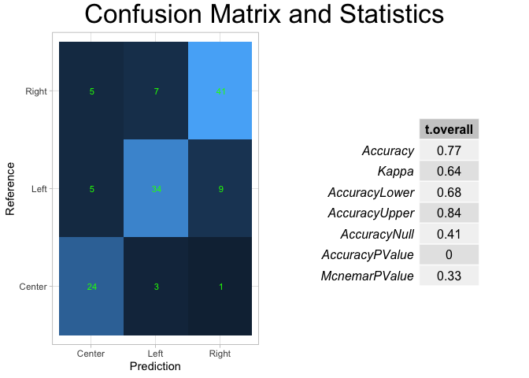
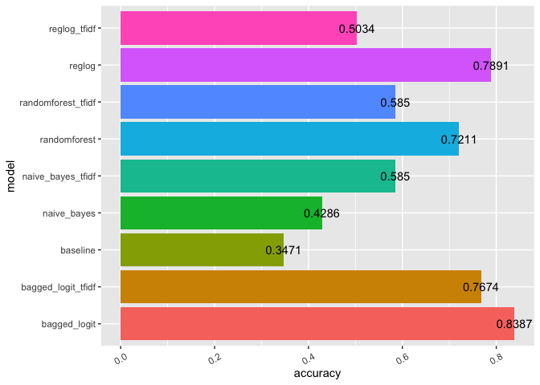

# Project Libraries


```r
library(stringr)
library(tidyverse)
library(dplyr)
library(tm)
library(stringr)
library(stringi)
library(SnowballC)
library(textstem)
library(sentimentr)
library(text2vec)
library(caret)
library(rvest)
library(tidytext)
library(randomForest)
library(topicmodels)
library(wordcloud)
library(wordcloud2)
library(grid)
library(gridExtra)
library(NLP)
set.seed(500)
```

# Project Summary

## Introduction

Much of today's online news media is consumed through social media channels. Unfortunately, it can be very difficult to determine bias when skimming through articles in your news feed. Combining this with the fact that most social media platforms today utilize algorithms that create feedback loops influencing which types of content a user views, we can see how easy it is for an individual to see their newsfeed quickly change to match whatever "bias" they've searched for, liked, or commented on in the past.

This can be particularly dangerous when considering news about public health trends. Taking the COVID pandemic as an example, we can see that online communities have become extremely polarized relative to subjects such as Vaccine Safety, Mask Effectiveness, and Virus Transmisibility. Depending on what type of news a person consumes, that person's perspective of the pandemic could be radically different than the perspective of another individual.

This projects aims to analyze the underlying differences in discource related to COVID by political leanings ("Left", "Right", and "Center"), and to develop a multi-class classification model to identify potential spin for new articles seen online.

## Data Collection

This project uses online news article data, sourced from 10 sources. Articles were scraped and enriched using Python, NewsAPI package, and Newspaper3k package (see github). 

The sources were tagged with guidance from allsides.com, a website that uses crowsdsourcing to vote for news source political leanings:


```r
sources_mapping <- c(
    "bbc-news" = "Center",
    "associated-press" = "Center",
    "the-american-conservative" = "Right",
    "national-review" = "Right",
    "breitbart-news" = "Right",
    "fox-news" = "Right",
    "cnn" = "Left",
    "the-washington-post" = "Left",
    "vice-news" = "Left",
    "buzzfeed" = "Left"
)
```

## Conclusion

From my analysis, I have determined that there are differences to the ways that various news sources portray information about COVID 19, depending on the assigned political leanings of the news source. Additionally, I have proven that machine learning models can be used that consider a document's text, text structure, sentiment, and emotion in order to classify political leaning.

In this study, the Bagged Logit Model from the Caret library, using variable normalization and TFIDF vectorization performed the best, with a accuracy score of 87.9%. This is a significant improvement from our baseline model, which has an accuracy of 34%. This suggests that machine learning can be used to identify the different patterns of text and topic between news sources of differing political biases.


# Project Code

## Load Data


```r
article_data <- read_csv("enriched_data.csv", show_col_types = FALSE)
```


```r
article_data %>%
  ggplot() +
  geom_bar(aes(x=target_response, fill=target_response))
```

<!-- -->

## Data Cleaning and Feature Engineering

### Initial Data Cleaning

Some of the articles were loaded with incorrectly formatted text. Here we replace any non UTF8 text with blank spaces.


```r
article_data <- article_data %>%
  select(-source_id) %>%
  mutate_if(
    is.character, ~gsub('[^ -~]', '', .))
```

For our classification, we will consider all text present in the document title, description, and content (sourced from NewsAPI). We will also consider the scraped "full text" (sourced from Newspaper3k).


```r
article_data <- article_data %>%
  mutate(
    text_predictor = str_c(title," ",description," ",content," ",full_text)
  )
```

### Feature Engineering

#### Document Structure Features

Understanding the structure of a document may be critical to classifying it's potential bias. Structure can include anything like "the length of the article", the "number of unique words", etc.

I believe that the total count of unique words in an article may be indicative of the political leanings of the article. We will create a function here that counts the total number of unique words from a document.


```r
unique_words_count <- function(string){
  string = str_replace_all(string, pattern = "[[:punct:]]", replacement= " ")
  string = str_replace_all(string, "\\s+", " ")
  string = str_trim(string)
  string = unlist(str_split(string, pattern= " "))
  unique_count = length(unique(string))
  
  return(unique_count)
}
```

I believe that the total count of unique lemmas in an article may be indicative of the political leanings of the article. We will create a function here that counts the total number of unique lemmas from a document.


```r
unique_lemmas_count <- function(string){
  string = str_replace_all(string, pattern = "[[:punct:]]", replacement= " ")
  string = str_replace_all(string, "\\s+", " ")
  string = str_trim(string)
  lemmas = lemmatize_strings(string, dictionary = lexicon::hash_lemmas)
  lemmas = unlist(str_split(lemmas, pattern= " "))
  unique_count = length(unique(lemmas))
  
  return(unique_count)
}
```

In addition to the total unique number of lemmas, I think that the total number of lemmas will also be interesting to review. Especially when we combine with total unique lemmas to get the ratio of unique to total.


```r
total_lemmas_count <- function(string){
  string = str_replace_all(string, pattern = "[[:punct:]]", replacement= " ")
  string = str_replace_all(string, "\\s+", " ")
  string = str_trim(string)
  lemmas = lemmatize_strings(string, dictionary = lexicon::hash_lemmas)
  lemmas = unlist(str_split(lemmas, pattern= " "))
  total_count = length(lemmas)
  
  return(total_count)
}
```

Here we apply the above functions to add a few additional features to our model.


```r
article_data <- article_data %>%
  mutate(
    predictor_length = str_length(str_replace_all(text_predictor, " ", "")),
    total_words = str_count(text_predictor, '\\w+'),
    avg_word_size = predictor_length / total_words,
    unique_words = unlist(lapply(text_predictor, unique_words_count)),
    unique_word_ratio = unique_words / total_words,
    total_lemmas = unlist(lapply(text_predictor, total_lemmas_count)),
    unique_lemmas = unlist(lapply(text_predictor, unique_lemmas_count)),
    unique_lemma_ratio = unique_lemmas / total_lemmas
  ) 
```

#### Sentiment Features

Using sentimentr package, we can easily apply sentiment analysis, including both sentiment scores as well as emotion classifications. We will additionally test to see if these features will provide any significance to our model.


```r
sentiment_data <- sentiment_by(article_data$text_predictor) %>%
  select(ave_sentiment)
```


```r
article_data <- cbind(article_data, sentiment_data)
```


```r
emotion_data <- emotion_by(article_data$text_predictor) %>%
  select(element_id, emotion_type, ave_emotion) %>%
  group_by(element_id) %>%
  pivot_wider(names_from = "emotion_type", values_from = "ave_emotion") %>%
  ungroup()
```


```r
colnames(emotion_data) <- str_c(colnames(emotion_data),"sent")
```


```r
article_data <- cbind(article_data, emotion_data)
```


## EDA

### Evaluating some of the Structural Features for importance

Evaluate if predictor_length is relevant in the model


```r
article_data %>%
  ggplot() +
  geom_boxplot(aes(x=predictor_length, fill=target_response))
```

<!-- -->


```r
anova <- aov(predictor_length ~ target_response, data = article_data)

summary(anova)
```

```
##                  Df    Sum Sq  Mean Sq F value Pr(>F)
## target_response   2 1.773e+07  8863469   0.847  0.429
## Residuals       415 4.340e+09 10458527
```

Based on the results of the ANOVA test, it seems that the predictor_length may not play a major role in the classification of documents (p-value > 0.05)


```r
article_data %>%
  ggplot() +
  geom_boxplot(aes(x=unique_word_ratio, fill=target_response))
```

<!-- -->


```r
anova <- aov(unique_word_ratio ~ target_response, data = article_data)

summary(anova)
```

```
##                  Df Sum Sq Mean Sq F value   Pr(>F)    
## target_response   2  0.283 0.14133   11.04 2.14e-05 ***
## Residuals       415  5.314 0.01281                     
## ---
## Signif. codes:  0 '***' 0.001 '**' 0.01 '*' 0.05 '.' 0.1 ' ' 1
```

Based on the results of the ANOVA test, it seems that the unique_word_ratio plays a major role in the classification of documents (p-value < 0.05)

### Visualizing Sentiment


```r
article_data %>%
  ggplot() +
  geom_boxplot(aes(x=ave_sentiment, fill=target_response), outlier.colour = "red")
```

<!-- -->


```r
anova <- aov(ave_sentiment ~ target_response, data = article_data)

summary(anova)
```

```
##                  Df Sum Sq  Mean Sq F value Pr(>F)
## target_response   2  0.000 0.000119   0.007  0.993
## Residuals       415  7.071 0.017038
```

Based on the results, sentiment doesn't seem to play a major role in the classification of political leanings. This goes against my expectations.


```r
article_data %>%
  ggplot() +
  geom_boxplot(aes(x=trust_negatedsent, fill=target_response), outlier.colour = "red")
```

<!-- -->


```r
anova <- aov(trust_negatedsent ~ target_response, data = article_data)

summary(anova)
```

```
##                  Df   Sum Sq   Mean Sq F value Pr(>F)  
## target_response   2 0.000032 1.599e-05   3.424 0.0335 *
## Residuals       415 0.001938 4.670e-06                 
## ---
## Signif. codes:  0 '***' 0.001 '**' 0.01 '*' 0.05 '.' 0.1 ' ' 1
```

Emotion data can certainly be a help when classifying documents! As we can see here, it appears that articles from right leaning political sources score higher on the "trust_negated" index, which suggests that their articles have more doubt related to COVID news.

## Build a Corpus and conduct additional EDA

In order to use the new features that we created earlier, we will want to save them into their own dataframe. We will bind this 'additional_features' dataframe to the document term matrix that is producted using tm-package.


```r
additional_features <- article_data %>%
  select(
    predictor_length,total_words,avg_word_size,unique_words,unique_word_ratio,
    total_lemmas,unique_lemmas,unique_lemma_ratio,ave_sentiment,angersent,
    anger_negatedsent,anticipationsent,anticipation_negatedsent,disgustsent,
    disgust_negatedsent,fearsent,fear_negatedsent,joysent,joy_negatedsent,
    sadnesssent,sadness_negatedsent,surprisesent,surprise_negatedsent,
    trustsent,trust_negatedsent,target_response
  )
```

In order to use as many models later on, I will normalize these values with a custom min max function


```r
min_max_norm <- function(x) {
    (x - min(x)) / (max(x) - min(x))
  }
```


```r
additional_features_norm <- as.data.frame(lapply(additional_features%>%select(-target_response), min_max_norm))

additional_features_norm$target_response <- additional_features$target_response
```


We will use tm-package's stopwords, with some additional terms to ensure that we aren't classifying documents based simply on their source name.


```r
my_stopwords = tm::stopwords("english")

my_stopwords <- c(my_stopwords, "fox", "bbc", "apress","associated press","cnn","breitbart","vice","buzzfeed", "washington post")
```


And now we build the corpus using tm-package


```r
corpus <- VCorpus(VectorSource(article_data$text_predictor)) %>%
            tm_map(content_transformer(str_replace_all), 
                             pattern = "[^\\d]\\d{3}[^\\d]", 
                             replacement = " ") %>%
            tm_map(content_transformer(str_replace_all), 
                   pattern = "[<>$]+", 
                   replacement = " ") %>%
            # replace punctuation with spaces
            tm_map(content_transformer(str_replace_all), 
                   pattern = "[[:punct:]]", 
                   replacement = "") %>%
            # replace white spaces with single whitespaces
            tm_map(content_transformer(str_replace_all), 
                   pattern = "\\s+", 
                   replacement = " ") %>%
            # transform everything to lower case
            tm_map(content_transformer(tolower)) %>%
            # remove stopwords
            tm_map(content_transformer(removeWords), my_stopwords) %>%
            # stem
            tm_map(content_transformer(lemmatize_words))
```

In order to review by target_response later, we will append meta data to the documents.


```r
for (i in 1:length(corpus)){
  bias = article_data$target_response[i]
  
  meta(corpus[[i]], "target_response") <- bias
}
```


```r
left_corpus <- tm_filter(corpus, FUN = function(x) meta(x)[["target_response"]] == "Left")

right_corpus <- tm_filter(corpus, FUN = function(x) meta(x)[["target_response"]] == "Right")

center_corpus <- tm_filter(corpus, FUN = function(x) meta(x)[["target_response"]] == "Center")
```

Here were create a DocumentTermMatrix, and additionally create a final dataframe 'data' that includes the additional features we will want to test against later.

I create two version of the same matrix, once with word frequency, and once with TFIDF.

Additionally, I create a custom function in order to generate 1, 2-grams from the predictor text for modeling.


```r
BigramTokenizer <-
  function(x)
    unlist(lapply(ngrams(words(x), 1:2), paste, collapse = " "), use.names = FALSE)
```


```r
set.seed(500)
dtm <- DocumentTermMatrix(corpus, control=list(tokenize=BigramTokenizer))
dtm <- removeSparseTerms(dtm, 1-(4/length(corpus)))
data <- as.matrix(dtm)
data <- cbind(data, additional_features_norm)
data <- as.data.frame(data)
data$target_response <- as.factor(data$target_response)
names(data) <- make.names(names(data))
```


```r
set.seed(500)
dtm_tfidf = weightTfIdf(dtm, normalize = TRUE)
dtm_tfidf <- removeSparseTerms(dtm_tfidf, 1-(4/length(corpus)))
data_tfidf <- as.matrix(dtm_tfidf)
data_tfidf <- cbind(data_tfidf, additional_features_norm)
data_tfidf <- as.data.frame(data_tfidf)
data_tfidf$target_response <- as.factor(data_tfidf$target_response)
names(data_tfidf) <- make.names(names(data_tfidf))
```


For some of the models we want to test, it's important that we add a character to the start of each feature name. As an example, randomforest() function does not work with numerically named columns.


```r
response_col <- which(colnames(data) == "target_response")
colnames(data)[-response_col] <- paste0( "v", colnames(data)[-response_col])
```


```r
response_col <- which(colnames(data_tfidf) == "target_response")
colnames(data_tfidf)[-response_col] <- paste0( "v", colnames(data_tfidf)[-response_col])
```


### Wordclouds


```r
left_tdm <- TermDocumentMatrix(left_corpus, control=list(tokenize=BigramTokenizer))
left_tdm = weightTfIdf(left_tdm, normalize = TRUE)
left_tdm_matrix <- as.matrix(left_tdm) 
left_words <- sort(rowSums(left_tdm_matrix),decreasing=TRUE) 
left_df <- data.frame(word = names(left_words),freq=left_words)
```


```r
wordcloud2(data=head(left_df,100), size=.3, color="random-dark")
```

```{=html}
<div id="htmlwidget-669aaeb4f1a81eeb2e29" style="width:672px;height:480px;" class="wordcloud2 html-widget"></div>
<script type="application/json" data-for="htmlwidget-669aaeb4f1a81eeb2e29">{"x":{"word":["vaccine","li li","rodgers","omicron","live updates","updates","coronavirus","children","travel","news","vaccines","covid19","vaccinated","ol li","live","get","new","mandate","covid19 live","fauci","aaron","kids","white house","coronavirus live","booster","covid","people","story","variant","white","travelers","aaron rodgers","signing","said","house","biden","getty","alerts","breaking news","chars providing","email alerts","free readers","national breaking","news email","news free","providing news","public servicefollow","readers","readers public","servicefollow","servicefollow story","signing national","story signing","officials","positive","united","states","like","tested","national","health","bidens","countries","president","breaking","tested positive","boosters","will","post","li covid19","cdc","providing","first","public","email","pandemic","cases","vaccination","entire post","entire","free","guard","one","many","vaccine mandate","packers","shot","leopards","americans","vikings","international","can","week","united states","according","europe","parents","toe","york","test"],"freq":[0.82647198267708,0.825307308149383,0.653041125845951,0.637510780186955,0.591864568852949,0.563707574872416,0.55117395942264,0.537017855027562,0.532159024612943,0.528330567456153,0.455677164903916,0.441740769422133,0.436877633933118,0.420446898349558,0.419356300666772,0.404925791980023,0.384191118361643,0.381582382994135,0.3802502167935,0.379938667946877,0.379282004230052,0.376968825246208,0.376314588895727,0.373709238805911,0.372543997827329,0.365689234840183,0.364903498522342,0.362591506674557,0.358878623936714,0.356305674950248,0.353411618043567,0.347548782385827,0.346466392556498,0.345662148218956,0.343394803875898,0.342566242014891,0.339843221329502,0.33136185678206,0.33136185678206,0.33136185678206,0.33136185678206,0.33136185678206,0.33136185678206,0.33136185678206,0.33136185678206,0.33136185678206,0.33136185678206,0.33136185678206,0.33136185678206,0.33136185678206,0.33136185678206,0.33136185678206,0.33136185678206,0.330084394382477,0.329741070943005,0.329426415886842,0.325797537468395,0.316859834501291,0.314876293035701,0.314445021059786,0.3118167982785,0.311658490285158,0.310628048204817,0.308156881369211,0.307310318463821,0.304546628792751,0.30423861871532,0.30371859040684,0.301361060000605,0.299879454135395,0.29968591525036,0.29794434341898,0.291122246995747,0.290263104832362,0.285261380400848,0.282731752261076,0.28089074820981,0.280096478084506,0.279222956633586,0.279105288900414,0.273137100284184,0.272154204048638,0.268662375380562,0.268656364543316,0.268074783136923,0.268013712179717,0.267909383025341,0.267028908390027,0.263136930918138,0.26118657706103,0.256670597111236,0.252661276460415,0.251367163863388,0.251147479092879,0.249703867245196,0.248660073035635,0.247925434984521,0.247490207776122,0.24607941126268,0.244758493179146],"fontFamily":"Segoe UI","fontWeight":"bold","color":"random-dark","minSize":0,"weightFactor":65.3379680519659,"backgroundColor":"white","gridSize":0,"minRotation":-0.785398163397448,"maxRotation":0.785398163397448,"shuffle":true,"rotateRatio":0.4,"shape":"circle","ellipticity":0.65,"figBase64":null,"hover":null},"evals":[],"jsHooks":{"render":[{"code":"function(el,x){\n                        console.log(123);\n                        if(!iii){\n                          window.location.reload();\n                          iii = False;\n\n                        }\n  }","data":null}]}}</script>
```


```r
right_tdm <- TermDocumentMatrix(right_corpus, control=list(tokenize=BigramTokenizer))
right_tdm = weightTfIdf(right_tdm, normalize = TRUE)
right_tdm_matrix <- as.matrix(right_tdm) 
right_words <- sort(rowSums(right_tdm_matrix),decreasing=TRUE) 
right_df <- data.frame(word = names(right_words),freq=right_words)
```


```r
wordcloud2(data=head(right_df,100), size=.3, color="random-dark")
```

```{=html}
<div id="htmlwidget-3591c31269cb2529b8df" style="width:672px;height:480px;" class="wordcloud2 html-widget"></div>
<script type="application/json" data-for="htmlwidget-3591c31269cb2529b8df">{"x":{"word":["rodgers","vaccine","mandate","biden","children","coronavirus","federal","booster","inflation","aaron","variant","state","school","aaron rodgers","unvaccinated","administration","people","covid19","mandates","court","cases","vaccinated","president","november","governor","vaccines","texas","new","city","vaccination","workers","li li","vaccine mandate","pfizer","drug","employees","will","mask","boosters","johnson","desantis","percent","health","travel","news","antiviral","study","gov","omicron","cma","appeals","week","positive","parents","south","california","can","chinese","government","public","virus","measles","get","covid19 vaccine","fda","kids","pill","order","angeles","receive","states","americans","pandemic","adults","los angeles","report","packers","announced","los","white","schools","biden administration","medical","hospital","county","said","florida","one","testing","osha","nfl","awards","risk","year","reported","christmas","employers","2021","newsom","country"],"freq":[0.659782387488235,0.582788397651325,0.575579487325187,0.503669649118736,0.488040591087847,0.48498765079217,0.455392888120737,0.452849667245591,0.39239269752209,0.382337542696799,0.376044147406978,0.375661613157081,0.375316222670082,0.368166419580659,0.367247709217331,0.361839257977902,0.358977065630213,0.356576805529443,0.356126955004385,0.349335803947546,0.342531905617462,0.337065005270465,0.336921717920636,0.332486171425033,0.33216340267101,0.331685583702622,0.33120967875133,0.325787711758333,0.32471563013969,0.32386170214427,0.320293931731715,0.313109708799808,0.312657658244288,0.312604331924116,0.303624631140677,0.302533235248625,0.298207504121749,0.297087684467148,0.290912087140711,0.28967842063327,0.286409649034916,0.282048512014629,0.281368251718038,0.281039089994661,0.279654548511121,0.271517647888256,0.268937960827743,0.268847150658469,0.268014993368712,0.265800511507455,0.263610825340281,0.263086551191365,0.260129505643055,0.258209503176529,0.257600629832771,0.256638831851387,0.256616839857129,0.255423270257748,0.255392432324525,0.253806117232882,0.253540635106698,0.253341049168406,0.252402569143999,0.251557686591257,0.251552006557331,0.250312072754724,0.250251079274989,0.250089893043596,0.247577294606748,0.244830071795638,0.243803294703579,0.243005699126222,0.242400533949026,0.241078052906842,0.23986380518545,0.237966186223711,0.237500771056095,0.236888742210777,0.236327612668157,0.234970224003986,0.234705676755557,0.232253825696347,0.231043333352938,0.23086591443966,0.229899280111299,0.228974167643116,0.22894686228882,0.227791340699436,0.22736368137288,0.227270773096079,0.226969117389557,0.226833387153641,0.226413261339692,0.226233888806838,0.225143878994332,0.224421877159591,0.224379560822979,0.224201693761714,0.224144397716745,0.223984938858975],"fontFamily":"Segoe UI","fontWeight":"bold","color":"random-dark","minSize":0,"weightFactor":81.8451674734389,"backgroundColor":"white","gridSize":0,"minRotation":-0.785398163397448,"maxRotation":0.785398163397448,"shuffle":true,"rotateRatio":0.4,"shape":"circle","ellipticity":0.65,"figBase64":null,"hover":null},"evals":[],"jsHooks":{"render":[{"code":"function(el,x){\n                        console.log(123);\n                        if(!iii){\n                          window.location.reload();\n                          iii = False;\n\n                        }\n  }","data":null}]}}</script>
```


```r
center_tdm <- TermDocumentMatrix(center_corpus, control=list(tokenize=BigramTokenizer))
center_tdm = weightTfIdf(center_tdm, normalize = TRUE)
center_tdm_matrix <- as.matrix(center_tdm) 
center_words <- sort(rowSums(center_tdm_matrix),decreasing=TRUE) 
center_df <- data.frame(word = names(center_words),freq=center_words)
```


```r
wordcloud2(data=head(center_df,100), size=.3, color="random-dark")
```

```{=html}
<div id="htmlwidget-012f95358b65c8053065" style="width:672px;height:480px;" class="wordcloud2 html-widget"></div>
<script type="application/json" data-for="htmlwidget-012f95358b65c8053065">{"x":{"word":["caption","source","deng","image","vaccine","getty","covid","image source","people","source getty","lockdown","zoo","will","school","getty imagesimage","imagesimage","imagesimage caption","booster","said","duterte","restrictions","facebook","women","climate","workers","children","covid19","abandoned","pandemic","mandate","travel","countries","diwali","vaccinated","president","home","economy","federal","care home","aged","first","new","news","festival","image caption","cinemas","minister","coronavirus","patients","team","health","arderns","facebook live","interrupted","jacinda","jacinda arderns","threeyearold","business","finlay","finlay macnab","macnab","care","made","get","biden","court","force","deng deng","north","employees","african","schools","husband","three","hopkins","died","daughter","virus","crowd","leopards","unvaccinated","crosses","vaccines","drugs","world","infection","monday","jab","germany","important","sara","sara duterte","climate change","parents","jabs","former","costa","cases","residents","long"],"freq":[0.428045058953615,0.415675841128613,0.394684526125231,0.393227710572513,0.357604053944725,0.35596456288193,0.354967725948244,0.349047227949647,0.34641360625435,0.335696047659994,0.330386752663501,0.322778438369622,0.318050818271859,0.301965862945986,0.296325813224623,0.296325813224623,0.296325813224623,0.294764291504744,0.294133898822721,0.293975937600651,0.282305040665243,0.281775452864129,0.279036075848186,0.277835655758794,0.271868928827696,0.267117285866381,0.264128450239717,0.263123017416821,0.25710993092523,0.256597853101861,0.255147444768555,0.247381443108636,0.245283528024062,0.243925483275593,0.240641153858888,0.22897502201332,0.227410939200093,0.227125424316767,0.226495097378684,0.225316739359224,0.224450744738675,0.223067422291028,0.218034605871125,0.217283340170852,0.216745562980133,0.212603398072791,0.212584599798502,0.212489830719828,0.206865309445536,0.205888368570003,0.205759807163488,0.204426344300761,0.204426344300761,0.204426344300761,0.204426344300761,0.204426344300761,0.204426344300761,0.20406235250893,0.202865837855717,0.202865837855717,0.202865837855717,0.202585676808433,0.201918073381354,0.201610967920466,0.201390155430178,0.199134503129183,0.198003990166304,0.197342263062616,0.195662841873237,0.195485038417421,0.195407534993374,0.194602834813765,0.194447961734582,0.192903070706345,0.190530886158967,0.190485366530397,0.19006240163141,0.189012125878299,0.188914118245862,0.18828742238228,0.182056721386095,0.181747655501511,0.181487912404905,0.18136822925218,0.180536885495362,0.180199873596686,0.18009731197378,0.179399591243539,0.177807799638594,0.177225745089794,0.176385562560391,0.176385562560391,0.176246009083603,0.176127853724652,0.175766738689686,0.175742070777574,0.175692282047556,0.175457030846056,0.174145357162569,0.173893745973617],"fontFamily":"Segoe UI","fontWeight":"bold","color":"random-dark","minSize":0,"weightFactor":126.154942967936,"backgroundColor":"white","gridSize":0,"minRotation":-0.785398163397448,"maxRotation":0.785398163397448,"shuffle":true,"rotateRatio":0.4,"shape":"circle","ellipticity":0.65,"figBase64":null,"hover":null},"evals":[],"jsHooks":{"render":[{"code":"function(el,x){\n                        console.log(123);\n                        if(!iii){\n                          window.location.reload();\n                          iii = False;\n\n                        }\n  }","data":null}]}}</script>
```


### LDA Analysis - Topic Modeling

We can use the LDA function to perform lda analysis on our document term matrix. We will set an arbitrary value for the number of topics to be created as 6


```r
data_lda <- LDA(dtm, k = 6, control = list(seed=111))
data_lda
```

```
## A LDA_VEM topic model with 6 topics.
```


```r
word_topics <- tidy(data_lda, matrix = "beta")
```


```r
top_terms <- word_topics %>%
  group_by(topic) %>%
  slice_max(beta, n = 10) %>% 
  ungroup() %>%
  arrange(topic, -beta)

top_terms %>%
  mutate(term = reorder_within(term, beta, topic)) %>%
  ggplot(aes(beta, term, fill = factor(topic))) +
  geom_col(show.legend = FALSE) +
  facet_wrap(~ topic, scales = "free") +
  scale_y_reordered()
```

<!-- -->


From the above charts, we can see which words are most related to each of the generated topics following LDA. We can use our own best judgement to categorize each of the topics.

Topic 1 - children

Topic 2 - interviews

Topic 3 - travel

Topic 4 - mandates

Topic 5 - sports

Topic 6 - vaccines


```r
document_gamma <- tidy(data_lda, matrix = "gamma")
```


```r
document_classification <- document_gamma %>%
  group_by(document) %>%
  slice_max(gamma) %>%
  ungroup() %>%
  mutate(
    document = as.integer(document)
  ) %>%
  arrange(document)
```


```r
document_classification$topic <- replace(document_classification$topic, document_classification$topic==1, "children")

document_classification$topic <- replace(document_classification$topic, document_classification$topic==2, "interviews")

document_classification$topic <- replace(document_classification$topic, document_classification$topic==3, "travel")

document_classification$topic <- replace(document_classification$topic, document_classification$topic==4, "mandates")

document_classification$topic <- replace(document_classification$topic, document_classification$topic==5, "sports")

document_classification$topic <- replace(document_classification$topic, document_classification$topic==6, "vaccines")
```


```r
topic_models_data <- cbind(article_data, document_classification%>%select(topic))
```


```r
topic_models_data %>%
  ggplot() +
  geom_bar(aes(x=target_response, fill=target_response)) +
  facet_wrap(~topic, nrow=1) +
  theme(legend.position = "none") +
  coord_fixed(.1)
```

<!-- -->

## Testing Models

I will be testing 4 models, using both word frequency and tfidf document term matrices.


```r
dt = sort(sample(nrow(data), nrow(data)*.65))
train_data<-data[dt,]
test_data<-data[-dt,]
```


```r
dt = sort(sample(nrow(data_tfidf), nrow(data_tfidf)*.65))
train_data_tfidf<-data_tfidf[dt,]
test_data_tfidf<-data_tfidf[-dt,]
```

In order to visualize confusion matrices and associated model scoring, I will use the following custom function


```r
plot_confusion <- function(cm) {
  # extract the confusion matrix values as data.frame
  cm_d <- as.data.frame(t$table)
  # confusion matrix statistics as data.frame
  cm_st <-data.frame(t$overall)
  # round the values
  cm_st$t.overall <- round(cm_st$t.overall,2)
  # here we also have the rounded percentage values
  cm_p <- as.data.frame(prop.table(t$table))
  cm_d$Perc <- round(cm_p$Freq*100,2)
  
  cm_d_p <-  ggplot(data = cm_d, aes(x = Prediction , y =  Reference, fill = Freq))+
  geom_tile() +
  geom_text(aes(label = paste("",Freq)), color = 'green', size = 3) +
  theme_light() +
  guides(fill=FALSE) 

  # plotting the stats
  cm_st_p <-  tableGrob(cm_st)
  
  # all together
  grid.arrange(cm_d_p, cm_st_p,nrow = 1, ncol = 2, 
               top=textGrob("Confusion Matrix and Statistics",gp=gpar(fontsize=25,font=1)))
}
```

### Baseline

First I will compute the baseline accuracy and add that to our model tracker for review


```r
article_data %>%
  count(target_response) %>%
  mutate(
    n = (n/sum(n))**2
  ) %>%
  select(n) %>%
  sum()
```

```
## [1] 0.3471761
```


```r
model_tracking <- data.frame("model"=c("baseline"), "accuracy"=.3471)
```

We will be using 5-fold cross validation for all models


```r
train_control <- trainControl(method = "cv",
                              number = 5)
```


### Regularized Logistic Regression

#### Word Frequency


```r
regLog_model <- train(target_response~., 
                      data = train_data, 
                      method = 'regLogistic',
                      trControl = train_control)
```


```r
regLog_result <- predict(regLog_model, newdata = test_data%>%select(-target_response))
```


```r
t <- confusionMatrix(test_data$target_response, regLog_result)
accuracy <- t$overall[[1]]
```


```r
plot_confusion(t)
```

```
## Warning: `guides(<scale> = FALSE)` is deprecated. Please use `guides(<scale> =
## "none")` instead.
```

<!-- -->


```r
model_tracking <- rbind(model_tracking, c("reglog",accuracy))
```

#### TFIDF


```r
regLog_tfidf_model <- train(target_response~., 
                            data = train_data_tfidf, 
                            method = 'regLogistic',
                            trControl = train_control)
```


```r
regLog_tfidf_result <- predict(regLog_tfidf_model, newdata = test_data_tfidf%>%select(-target_response))
```


```r
t <- confusionMatrix(test_data$target_response, regLog_tfidf_result)
accuracy <- t$overall[[1]]
```


```r
plot_confusion(t)
```

```
## Warning: `guides(<scale> = FALSE)` is deprecated. Please use `guides(<scale> =
## "none")` instead.
```

<!-- -->


```r
model_tracking <- rbind(model_tracking, c("reglog_tfidf",accuracy))
```


### Random Forest

#### Word Frequency


```r
rf_model <- randomForest(target_response~., data = train_data)
```


```r
rf_result <- predict(rf_model, newdata = test_data%>%select(-target_response))
```


```r
t <- confusionMatrix(test_data_tfidf$target_response, rf_result)
accuracy <- t$overall[[1]]
```


```r
plot_confusion(t)
```

```
## Warning: `guides(<scale> = FALSE)` is deprecated. Please use `guides(<scale> =
## "none")` instead.
```

<!-- -->


```r
model_tracking <- rbind(model_tracking, c("randomforest",accuracy))
```

#### TFIDF


```r
rf_tfidf_model <- randomForest(target_response~., data = train_data_tfidf)
```


```r
rf_tfidf_result <- predict(rf_model, newdata = test_data_tfidf%>%select(-target_response))
```


```r
t <- confusionMatrix(test_data_tfidf$target_response, rf_tfidf_result)
accuracy <- t$overall[[1]]
```


```r
plot_confusion(t)
```

```
## Warning: `guides(<scale> = FALSE)` is deprecated. Please use `guides(<scale> =
## "none")` instead.
```

<!-- -->


```r
model_tracking <- rbind(model_tracking, c("randomforest_tfidf",accuracy))
```

### Bagged Logit Model

#### Word Frequency


```r
bagged_logic_model <- train(target_response~., 
                            data = train_data, 
                            method = 'LogitBoost',
                            trControl = train_control)
```


```r
bagged_logic_result <- predict(bagged_logic_model, newdata = test_data%>%select(-target_response))
```


```r
t <- confusionMatrix(test_data$target_response, bagged_logic_result)
accuracy <- t$overall[[1]]
```


```r
plot_confusion(t)
```

```
## Warning: `guides(<scale> = FALSE)` is deprecated. Please use `guides(<scale> =
## "none")` instead.
```

<!-- -->


```r
model_tracking <- rbind(model_tracking, c("bagged_logit",accuracy))
```


#### TFIDF


```r
bagged_logic_tfidf_model <- train(target_response~., 
                                  data = train_data_tfidf, 
                                  method = 'LogitBoost',
                                  trControl = train_control)
```


```r
bagged_logic_tfidf_result <- predict(bagged_logic_tfidf_model, newdata = test_data_tfidf%>%select(-target_response))
```


```r
t <- confusionMatrix(test_data_tfidf$target_response, bagged_logic_tfidf_result)
accuracy <- t$overall[[1]]
```


```r
plot_confusion(t)
```

```
## Warning: `guides(<scale> = FALSE)` is deprecated. Please use `guides(<scale> =
## "none")` instead.
```

<!-- -->


```r
model_tracking <- rbind(model_tracking, c("bagged_logit_tfidf",accuracy))
```


### Naive Bayes

#### Word Frequency


```r
nb_model <- train(target_response~., 
                  data = train_data, 
                  method = 'naive_bayes',
                  trControl = train_control)
```


```r
nb_results <- predict(nb_model, newdata = test_data%>%select(-target_response))
```


```r
t <- confusionMatrix(test_data$target_response, nb_results)
accuracy <- t$overall[[1]]
```


```r
plot_confusion(t)
```

```
## Warning: `guides(<scale> = FALSE)` is deprecated. Please use `guides(<scale> =
## "none")` instead.
```

<!-- -->


```r
model_tracking <- rbind(model_tracking, c("naive_bayes",accuracy))
```

#### TFIDF


```r
nb_tfidf_model <- train(target_response~., 
                        data = train_data_tfidf, 
                        method = 'naive_bayes',
                        trControl = train_control)
```


```r
nb_tfidf_results <- predict(nb_tfidf_model, newdata = test_data_tfidf%>%select(-target_response))
```


```r
t <- confusionMatrix(test_data_tfidf$target_response, nb_tfidf_results)
accuracy <- t$overall[[1]]
```


```r
plot_confusion(t)
```

```
## Warning: `guides(<scale> = FALSE)` is deprecated. Please use `guides(<scale> =
## "none")` instead.
```

<!-- -->


```r
model_tracking <- rbind(model_tracking, c("naive_bayes_tfidf",accuracy))
```


## Visualize Model Performance


```r
# Barplot
model_tracking %>%
  mutate(
    accuracy = as.double(accuracy),
    accuracy = round(accuracy,4)
    ) %>%
  ggplot(aes(x=model, y=accuracy)) + 
  geom_bar(aes(fill=model),stat = "identity") +
  geom_text(aes(label=accuracy)) + 
  coord_flip() +
  theme(axis.text.x = element_text(angle = 30, vjust = 0.5, hjust=.5)) +
  theme(legend.position = "none")
```

<!-- -->


