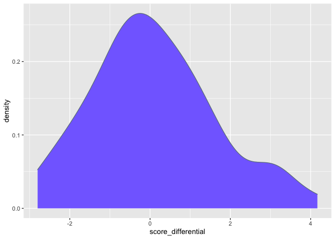
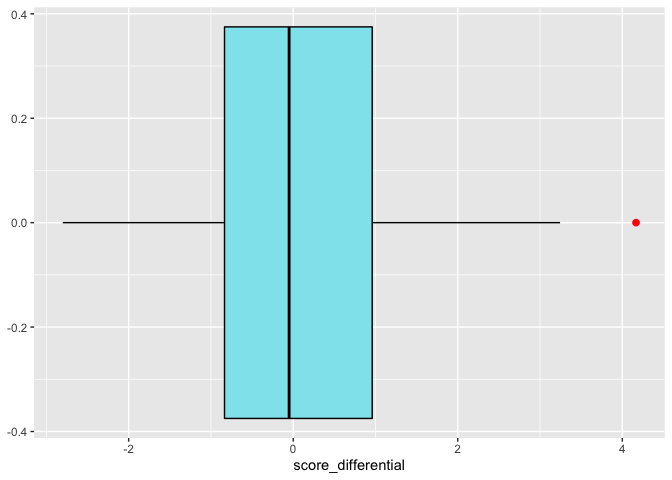
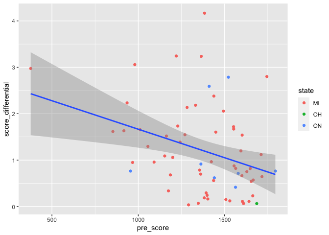

# Setup

### Load libraries


```r
library(tidyverse)
```

```
## ── Attaching packages ─────────────────────────────────────── tidyverse 1.3.1 ──
```

```
## ✓ ggplot2 3.3.5     ✓ purrr   0.3.4
## ✓ tibble  3.1.4     ✓ dplyr   1.0.7
## ✓ tidyr   1.1.3     ✓ stringr 1.4.0
## ✓ readr   2.0.1     ✓ forcats 0.5.1
```

```
## ── Conflicts ────────────────────────────────────────── tidyverse_conflicts() ──
## x dplyr::filter() masks stats::filter()
## x dplyr::lag()    masks stats::lag()
```

```r
library(stringr)
library("RMySQL")
```

```
## Loading required package: DBI
```

### Establish connection to SQL

After processing and formatting the input data as per assignment instructions, we will be saving the output in SQL. I've created two tables:

- players: a table of players

- scores: a table of player scores from tournaments played


```r
mydb = dbConnect(MySQL(), user = 'root', dbname='data_607', host='localhost')
```

The below code will close all open SQL connections if run


```r
lapply(dbListConnections(dbDriver(drv = "MySQL")), dbDisconnect)
```

And here is the code to create the tables


```sql

CREATE TABLE data_607.players (
  id int NOT NULL,
  player_name varchar(100) NOT NULL,
  player_state varchar(25) DEFAULT NULL,
  PRIMARY KEY (id)
) ENGINE=InnoDB DEFAULT CHARSET=utf8mb4 COLLATE=utf8mb4_0900_ai_ci;

CREATE TABLE data_607.scores (
  unique_id int AUTO_INCREMENT NOT NULL,
  tournament_id int NOT NULL,
  player_id int NOT NULL,
  number_of_games int DEFAULT NULL,
  total float DEFAULT NULL,
  expected_total float DEFAULT NULL,
  pre_score int DEFAULT NULL,
  avg_opponent_score int DEFAULT NULL,
  PRIMARY KEY (unique_id),
  FOREIGN KEY (player_id) REFERENCES players(id)
) ENGINE=InnoDB DEFAULT CHARSET=utf8mb4 COLLATE=utf8mb4_0900_ai_ci;

```


# Convert [input data] --> [desired assignment format]

This assignment's input data is a "|" delimited .txt file containing information about players in a chess tournament. This project aims to wrangle the input data into a tabular format, with the following columns:

- Player’s Name

- Player’s State

- Total Number of Points

- Player’s Pre-Rating

- Average Pre Chess Rating of Opponents


### Import data and inspect


```r
data = read.table("https://raw.githubusercontent.com/man-of-moose/masters_607/main/projects/project_1/chess_file.txt", 
                  sep="|",
                  fill=TRUE
                  )
```


```r
data %>%
  select(V1:V11)
```

<div data-pagedtable="false">
  <script data-pagedtable-source type="application/json">
{"columns":[{"label":["V1"],"name":[1],"type":["chr"],"align":["left"]},{"label":["V2"],"name":[2],"type":["chr"],"align":["left"]},{"label":["V3"],"name":[3],"type":["chr"],"align":["left"]},{"label":["V4"],"name":[4],"type":["chr"],"align":["left"]},{"label":["V5"],"name":[5],"type":["chr"],"align":["left"]},{"label":["V6"],"name":[6],"type":["chr"],"align":["left"]},{"label":["V7"],"name":[7],"type":["chr"],"align":["left"]},{"label":["V8"],"name":[8],"type":["chr"],"align":["left"]},{"label":["V9"],"name":[9],"type":["chr"],"align":["left"]},{"label":["V10"],"name":[10],"type":["chr"],"align":["left"]},{"label":["V11"],"name":[11],"type":["lgl"],"align":["right"]}],"data":[{"1":"-----------------------------------------------------------------------------------------","2":"","3":"","4":"","5":"","6":"","7":"","8":"","9":"","10":"","11":"NA"},{"1":"Pair","2":"Player Name","3":"Total","4":"Round","5":"Round","6":"Round","7":"Round","8":"Round","9":"Round","10":"Round","11":"NA"},{"1":"Num","2":"USCF ID / Rtg (Pre->Post)","3":"Pts","4":"1","5":"2","6":"3","7":"4","8":"5","9":"6","10":"7","11":"NA"},{"1":"-----------------------------------------------------------------------------------------","2":"","3":"","4":"","5":"","6":"","7":"","8":"","9":"","10":"","11":"NA"},{"1":"1","2":"GARY HUA","3":"6.0","4":"W  39","5":"W  21","6":"W  18","7":"W  14","8":"W   7","9":"D  12","10":"D   4","11":"NA"},{"1":"ON","2":"15445895 / R: 1794   ->1817","3":"N:2","4":"W","5":"B","6":"W","7":"B","8":"W","9":"B","10":"W","11":"NA"},{"1":"-----------------------------------------------------------------------------------------","2":"","3":"","4":"","5":"","6":"","7":"","8":"","9":"","10":"","11":"NA"},{"1":"2","2":"DAKSHESH DARURI","3":"6.0","4":"W  63","5":"W  58","6":"L   4","7":"W  17","8":"W  16","9":"W  20","10":"W   7","11":"NA"},{"1":"MI","2":"14598900 / R: 1553   ->1663","3":"N:2","4":"B","5":"W","6":"B","7":"W","8":"B","9":"W","10":"B","11":"NA"},{"1":"-----------------------------------------------------------------------------------------","2":"","3":"","4":"","5":"","6":"","7":"","8":"","9":"","10":"","11":"NA"},{"1":"3","2":"ADITYA BAJAJ","3":"6.0","4":"L   8","5":"W  61","6":"W  25","7":"W  21","8":"W  11","9":"W  13","10":"W  12","11":"NA"},{"1":"MI","2":"14959604 / R: 1384   ->1640","3":"N:2","4":"W","5":"B","6":"W","7":"B","8":"W","9":"B","10":"W","11":"NA"},{"1":"-----------------------------------------------------------------------------------------","2":"","3":"","4":"","5":"","6":"","7":"","8":"","9":"","10":"","11":"NA"},{"1":"4","2":"PATRICK H SCHILLING","3":"5.5","4":"W  23","5":"D  28","6":"W   2","7":"W  26","8":"D   5","9":"W  19","10":"D   1","11":"NA"},{"1":"MI","2":"12616049 / R: 1716   ->1744","3":"N:2","4":"W","5":"B","6":"W","7":"B","8":"W","9":"B","10":"B","11":"NA"},{"1":"-----------------------------------------------------------------------------------------","2":"","3":"","4":"","5":"","6":"","7":"","8":"","9":"","10":"","11":"NA"},{"1":"5","2":"HANSHI ZUO","3":"5.5","4":"W  45","5":"W  37","6":"D  12","7":"D  13","8":"D   4","9":"W  14","10":"W  17","11":"NA"},{"1":"MI","2":"14601533 / R: 1655   ->1690","3":"N:2","4":"B","5":"W","6":"B","7":"W","8":"B","9":"W","10":"B","11":"NA"},{"1":"-----------------------------------------------------------------------------------------","2":"","3":"","4":"","5":"","6":"","7":"","8":"","9":"","10":"","11":"NA"},{"1":"6","2":"HANSEN SONG","3":"5.0","4":"W  34","5":"D  29","6":"L  11","7":"W  35","8":"D  10","9":"W  27","10":"W  21","11":"NA"},{"1":"OH","2":"15055204 / R: 1686   ->1687","3":"N:3","4":"W","5":"B","6":"W","7":"B","8":"B","9":"W","10":"B","11":"NA"},{"1":"-----------------------------------------------------------------------------------------","2":"","3":"","4":"","5":"","6":"","7":"","8":"","9":"","10":"","11":"NA"},{"1":"7","2":"GARY DEE SWATHELL","3":"5.0","4":"W  57","5":"W  46","6":"W  13","7":"W  11","8":"L   1","9":"W   9","10":"L   2","11":"NA"},{"1":"MI","2":"11146376 / R: 1649   ->1673","3":"N:3","4":"W","5":"B","6":"W","7":"B","8":"B","9":"W","10":"W","11":"NA"},{"1":"-----------------------------------------------------------------------------------------","2":"","3":"","4":"","5":"","6":"","7":"","8":"","9":"","10":"","11":"NA"},{"1":"8","2":"EZEKIEL HOUGHTON","3":"5.0","4":"W   3","5":"W  32","6":"L  14","7":"L   9","8":"W  47","9":"W  28","10":"W  19","11":"NA"},{"1":"MI","2":"15142253 / R: 1641P17->1657P24","3":"N:3","4":"B","5":"W","6":"B","7":"W","8":"B","9":"W","10":"W","11":"NA"},{"1":"-----------------------------------------------------------------------------------------","2":"","3":"","4":"","5":"","6":"","7":"","8":"","9":"","10":"","11":"NA"},{"1":"9","2":"STEFANO LEE","3":"5.0","4":"W  25","5":"L  18","6":"W  59","7":"W   8","8":"W  26","9":"L   7","10":"W  20","11":"NA"},{"1":"ON","2":"14954524 / R: 1411   ->1564","3":"N:2","4":"W","5":"B","6":"W","7":"B","8":"W","9":"B","10":"B","11":"NA"},{"1":"-----------------------------------------------------------------------------------------","2":"","3":"","4":"","5":"","6":"","7":"","8":"","9":"","10":"","11":"NA"},{"1":"10","2":"ANVIT RAO","3":"5.0","4":"D  16","5":"L  19","6":"W  55","7":"W  31","8":"D   6","9":"W  25","10":"W  18","11":"NA"},{"1":"MI","2":"14150362 / R: 1365   ->1544","3":"N:3","4":"W","5":"W","6":"B","7":"B","8":"W","9":"B","10":"W","11":"NA"},{"1":"-----------------------------------------------------------------------------------------","2":"","3":"","4":"","5":"","6":"","7":"","8":"","9":"","10":"","11":"NA"},{"1":"11","2":"CAMERON WILLIAM MC LEMAN","3":"4.5","4":"D  38","5":"W  56","6":"W   6","7":"L   7","8":"L   3","9":"W  34","10":"W  26","11":"NA"},{"1":"MI","2":"12581589 / R: 1712   ->1696","3":"N:3","4":"B","5":"W","6":"B","7":"W","8":"B","9":"W","10":"B","11":"NA"},{"1":"-----------------------------------------------------------------------------------------","2":"","3":"","4":"","5":"","6":"","7":"","8":"","9":"","10":"","11":"NA"},{"1":"12","2":"KENNETH J TACK","3":"4.5","4":"W  42","5":"W  33","6":"D   5","7":"W  38","8":"H","9":"D   1","10":"L   3","11":"NA"},{"1":"MI","2":"12681257 / R: 1663   ->1670","3":"N:3","4":"W","5":"B","6":"W","7":"B","8":"","9":"W","10":"B","11":"NA"},{"1":"-----------------------------------------------------------------------------------------","2":"","3":"","4":"","5":"","6":"","7":"","8":"","9":"","10":"","11":"NA"},{"1":"13","2":"TORRANCE HENRY JR","3":"4.5","4":"W  36","5":"W  27","6":"L   7","7":"D   5","8":"W  33","9":"L   3","10":"W  32","11":"NA"},{"1":"MI","2":"15082995 / R: 1666   ->1662","3":"N:3","4":"B","5":"W","6":"B","7":"B","8":"W","9":"W","10":"B","11":"NA"},{"1":"-----------------------------------------------------------------------------------------","2":"","3":"","4":"","5":"","6":"","7":"","8":"","9":"","10":"","11":"NA"},{"1":"14","2":"BRADLEY SHAW","3":"4.5","4":"W  54","5":"W  44","6":"W   8","7":"L   1","8":"D  27","9":"L   5","10":"W  31","11":"NA"},{"1":"MI","2":"10131499 / R: 1610   ->1618","3":"N:3","4":"W","5":"B","6":"W","7":"W","8":"B","9":"B","10":"W","11":"NA"},{"1":"-----------------------------------------------------------------------------------------","2":"","3":"","4":"","5":"","6":"","7":"","8":"","9":"","10":"","11":"NA"},{"1":"15","2":"ZACHARY JAMES HOUGHTON","3":"4.5","4":"D  19","5":"L  16","6":"W  30","7":"L  22","8":"W  54","9":"W  33","10":"W  38","11":"NA"},{"1":"MI","2":"15619130 / R: 1220P13->1416P20","3":"N:3","4":"B","5":"B","6":"W","7":"W","8":"B","9":"B","10":"W","11":"NA"},{"1":"-----------------------------------------------------------------------------------------","2":"","3":"","4":"","5":"","6":"","7":"","8":"","9":"","10":"","11":"NA"},{"1":"16","2":"MIKE NIKITIN","3":"4.0","4":"D  10","5":"W  15","6":"H","7":"W  39","8":"L   2","9":"W  36","10":"U","11":"NA"},{"1":"MI","2":"10295068 / R: 1604   ->1613","3":"N:3","4":"B","5":"W","6":"","7":"B","8":"W","9":"B","10":"","11":"NA"},{"1":"-----------------------------------------------------------------------------------------","2":"","3":"","4":"","5":"","6":"","7":"","8":"","9":"","10":"","11":"NA"},{"1":"17","2":"RONALD GRZEGORCZYK","3":"4.0","4":"W  48","5":"W  41","6":"L  26","7":"L   2","8":"W  23","9":"W  22","10":"L   5","11":"NA"},{"1":"MI","2":"10297702 / R: 1629   ->1610","3":"N:3","4":"W","5":"B","6":"W","7":"B","8":"W","9":"B","10":"W","11":"NA"},{"1":"-----------------------------------------------------------------------------------------","2":"","3":"","4":"","5":"","6":"","7":"","8":"","9":"","10":"","11":"NA"},{"1":"18","2":"DAVID SUNDEEN","3":"4.0","4":"W  47","5":"W   9","6":"L   1","7":"W  32","8":"L  19","9":"W  38","10":"L  10","11":"NA"},{"1":"MI","2":"11342094 / R: 1600   ->1600","3":"N:3","4":"B","5":"W","6":"B","7":"W","8":"B","9":"W","10":"B","11":"NA"},{"1":"-----------------------------------------------------------------------------------------","2":"","3":"","4":"","5":"","6":"","7":"","8":"","9":"","10":"","11":"NA"},{"1":"19","2":"DIPANKAR ROY","3":"4.0","4":"D  15","5":"W  10","6":"W  52","7":"D  28","8":"W  18","9":"L   4","10":"L   8","11":"NA"},{"1":"MI","2":"14862333 / R: 1564   ->1570","3":"N:3","4":"W","5":"B","6":"W","7":"B","8":"W","9":"W","10":"B","11":"NA"},{"1":"-----------------------------------------------------------------------------------------","2":"","3":"","4":"","5":"","6":"","7":"","8":"","9":"","10":"","11":"NA"},{"1":"20","2":"JASON ZHENG","3":"4.0","4":"L  40","5":"W  49","6":"W  23","7":"W  41","8":"W  28","9":"L   2","10":"L   9","11":"NA"},{"1":"MI","2":"14529060 / R: 1595   ->1569","3":"N:4","4":"W","5":"B","6":"W","7":"B","8":"W","9":"B","10":"W","11":"NA"},{"1":"-----------------------------------------------------------------------------------------","2":"","3":"","4":"","5":"","6":"","7":"","8":"","9":"","10":"","11":"NA"},{"1":"21","2":"DINH DANG BUI","3":"4.0","4":"W  43","5":"L   1","6":"W  47","7":"L   3","8":"W  40","9":"W  39","10":"L   6","11":"NA"},{"1":"ON","2":"15495066 / R: 1563P22->1562","3":"N:3","4":"B","5":"W","6":"B","7":"W","8":"W","9":"B","10":"W","11":"NA"},{"1":"-----------------------------------------------------------------------------------------","2":"","3":"","4":"","5":"","6":"","7":"","8":"","9":"","10":"","11":"NA"},{"1":"22","2":"EUGENE L MCCLURE","3":"4.0","4":"W  64","5":"D  52","6":"L  28","7":"W  15","8":"H","9":"L  17","10":"W  40","11":"NA"},{"1":"MI","2":"12405534 / R: 1555   ->1529","3":"N:4","4":"W","5":"B","6":"W","7":"B","8":"","9":"W","10":"B","11":"NA"},{"1":"-----------------------------------------------------------------------------------------","2":"","3":"","4":"","5":"","6":"","7":"","8":"","9":"","10":"","11":"NA"},{"1":"23","2":"ALAN BUI","3":"4.0","4":"L   4","5":"W  43","6":"L  20","7":"W  58","8":"L  17","9":"W  37","10":"W  46","11":"NA"},{"1":"ON","2":"15030142 / R: 1363   ->1371","3":"","4":"B","5":"W","6":"B","7":"W","8":"B","9":"W","10":"B","11":"NA"},{"1":"-----------------------------------------------------------------------------------------","2":"","3":"","4":"","5":"","6":"","7":"","8":"","9":"","10":"","11":"NA"},{"1":"24","2":"MICHAEL R ALDRICH","3":"4.0","4":"L  28","5":"L  47","6":"W  43","7":"L  25","8":"W  60","9":"W  44","10":"W  39","11":"NA"},{"1":"MI","2":"13469010 / R: 1229   ->1300","3":"N:4","4":"B","5":"W","6":"B","7":"B","8":"W","9":"W","10":"B","11":"NA"},{"1":"-----------------------------------------------------------------------------------------","2":"","3":"","4":"","5":"","6":"","7":"","8":"","9":"","10":"","11":"NA"},{"1":"25","2":"LOREN SCHWIEBERT","3":"3.5","4":"L   9","5":"W  53","6":"L   3","7":"W  24","8":"D  34","9":"L  10","10":"W  47","11":"NA"},{"1":"MI","2":"12486656 / R: 1745   ->1681","3":"N:4","4":"B","5":"W","6":"B","7":"W","8":"B","9":"W","10":"B","11":"NA"},{"1":"-----------------------------------------------------------------------------------------","2":"","3":"","4":"","5":"","6":"","7":"","8":"","9":"","10":"","11":"NA"},{"1":"26","2":"MAX ZHU","3":"3.5","4":"W  49","5":"W  40","6":"W  17","7":"L   4","8":"L   9","9":"D  32","10":"L  11","11":"NA"},{"1":"ON","2":"15131520 / R: 1579   ->1564","3":"N:4","4":"B","5":"W","6":"B","7":"W","8":"B","9":"W","10":"W","11":"NA"},{"1":"-----------------------------------------------------------------------------------------","2":"","3":"","4":"","5":"","6":"","7":"","8":"","9":"","10":"","11":"NA"},{"1":"27","2":"GAURAV GIDWANI","3":"3.5","4":"W  51","5":"L  13","6":"W  46","7":"W  37","8":"D  14","9":"L   6","10":"U","11":"NA"},{"1":"MI","2":"14476567 / R: 1552   ->1539","3":"N:4","4":"W","5":"B","6":"W","7":"B","8":"W","9":"B","10":"","11":"NA"},{"1":"-----------------------------------------------------------------------------------------","2":"","3":"","4":"","5":"","6":"","7":"","8":"","9":"","10":"","11":"NA"},{"1":"28","2":"SOFIA ADINA STANESCU-BELLU","3":"3.5","4":"W  24","5":"D   4","6":"W  22","7":"D  19","8":"L  20","9":"L   8","10":"D  36","11":"NA"},{"1":"MI","2":"14882954 / R: 1507   ->1513","3":"N:3","4":"W","5":"W","6":"B","7":"W","8":"B","9":"B","10":"W","11":"NA"},{"1":"-----------------------------------------------------------------------------------------","2":"","3":"","4":"","5":"","6":"","7":"","8":"","9":"","10":"","11":"NA"},{"1":"29","2":"CHIEDOZIE OKORIE","3":"3.5","4":"W  50","5":"D   6","6":"L  38","7":"L  34","8":"W  52","9":"W  48","10":"U","11":"NA"},{"1":"MI","2":"15323285 / R: 1602P6 ->1508P12","3":"N:4","4":"B","5":"W","6":"B","7":"W","8":"W","9":"B","10":"","11":"NA"},{"1":"-----------------------------------------------------------------------------------------","2":"","3":"","4":"","5":"","6":"","7":"","8":"","9":"","10":"","11":"NA"},{"1":"30","2":"GEORGE AVERY JONES","3":"3.5","4":"L  52","5":"D  64","6":"L  15","7":"W  55","8":"L  31","9":"W  61","10":"W  50","11":"NA"},{"1":"ON","2":"12577178 / R: 1522   ->1444","3":"","4":"W","5":"B","6":"B","7":"W","8":"W","9":"B","10":"B","11":"NA"},{"1":"-----------------------------------------------------------------------------------------","2":"","3":"","4":"","5":"","6":"","7":"","8":"","9":"","10":"","11":"NA"},{"1":"31","2":"RISHI SHETTY","3":"3.5","4":"L  58","5":"D  55","6":"W  64","7":"L  10","8":"W  30","9":"W  50","10":"L  14","11":"NA"},{"1":"MI","2":"15131618 / R: 1494   ->1444","3":"","4":"B","5":"W","6":"B","7":"W","8":"B","9":"W","10":"B","11":"NA"},{"1":"-----------------------------------------------------------------------------------------","2":"","3":"","4":"","5":"","6":"","7":"","8":"","9":"","10":"","11":"NA"},{"1":"32","2":"JOSHUA PHILIP MATHEWS","3":"3.5","4":"W  61","5":"L   8","6":"W  44","7":"L  18","8":"W  51","9":"D  26","10":"L  13","11":"NA"},{"1":"ON","2":"14073750 / R: 1441   ->1433","3":"N:4","4":"W","5":"B","6":"W","7":"B","8":"W","9":"B","10":"W","11":"NA"},{"1":"-----------------------------------------------------------------------------------------","2":"","3":"","4":"","5":"","6":"","7":"","8":"","9":"","10":"","11":"NA"},{"1":"33","2":"JADE GE","3":"3.5","4":"W  60","5":"L  12","6":"W  50","7":"D  36","8":"L  13","9":"L  15","10":"W  51","11":"NA"},{"1":"MI","2":"14691842 / R: 1449   ->1421","3":"","4":"B","5":"W","6":"B","7":"W","8":"B","9":"W","10":"B","11":"NA"},{"1":"-----------------------------------------------------------------------------------------","2":"","3":"","4":"","5":"","6":"","7":"","8":"","9":"","10":"","11":"NA"},{"1":"34","2":"MICHAEL JEFFERY THOMAS","3":"3.5","4":"L   6","5":"W  60","6":"L  37","7":"W  29","8":"D  25","9":"L  11","10":"W  52","11":"NA"},{"1":"MI","2":"15051807 / R: 1399   ->1400","3":"","4":"B","5":"W","6":"B","7":"B","8":"W","9":"B","10":"W","11":"NA"},{"1":"-----------------------------------------------------------------------------------------","2":"","3":"","4":"","5":"","6":"","7":"","8":"","9":"","10":"","11":"NA"},{"1":"35","2":"JOSHUA DAVID LEE","3":"3.5","4":"L  46","5":"L  38","6":"W  56","7":"L   6","8":"W  57","9":"D  52","10":"W  48","11":"NA"},{"1":"MI","2":"14601397 / R: 1438   ->1392","3":"","4":"W","5":"W","6":"B","7":"W","8":"B","9":"B","10":"W","11":"NA"},{"1":"-----------------------------------------------------------------------------------------","2":"","3":"","4":"","5":"","6":"","7":"","8":"","9":"","10":"","11":"NA"},{"1":"36","2":"SIDDHARTH JHA","3":"3.5","4":"L  13","5":"W  57","6":"W  51","7":"D  33","8":"H","9":"L  16","10":"D  28","11":"NA"},{"1":"MI","2":"14773163 / R: 1355   ->1367","3":"N:4","4":"W","5":"B","6":"W","7":"B","8":"","9":"W","10":"B","11":"NA"},{"1":"-----------------------------------------------------------------------------------------","2":"","3":"","4":"","5":"","6":"","7":"","8":"","9":"","10":"","11":"NA"},{"1":"37","2":"AMIYATOSH PWNANANDAM","3":"3.5","4":"B","5":"L   5","6":"W  34","7":"L  27","8":"H","9":"L  23","10":"W  61","11":"NA"},{"1":"MI","2":"15489571 / R:  980P12->1077P17","3":"","4":"","5":"B","6":"W","7":"W","8":"","9":"B","10":"W","11":"NA"},{"1":"-----------------------------------------------------------------------------------------","2":"","3":"","4":"","5":"","6":"","7":"","8":"","9":"","10":"","11":"NA"},{"1":"38","2":"BRIAN LIU","3":"3.0","4":"D  11","5":"W  35","6":"W  29","7":"L  12","8":"H","9":"L  18","10":"L  15","11":"NA"},{"1":"MI","2":"15108523 / R: 1423   ->1439","3":"N:4","4":"W","5":"B","6":"W","7":"W","8":"","9":"B","10":"B","11":"NA"},{"1":"-----------------------------------------------------------------------------------------","2":"","3":"","4":"","5":"","6":"","7":"","8":"","9":"","10":"","11":"NA"},{"1":"39","2":"JOEL R HENDON","3":"3.0","4":"L   1","5":"W  54","6":"W  40","7":"L  16","8":"W  44","9":"L  21","10":"L  24","11":"NA"},{"1":"MI","2":"12923035 / R: 1436P23->1413","3":"N:4","4":"B","5":"W","6":"B","7":"W","8":"B","9":"W","10":"W","11":"NA"},{"1":"-----------------------------------------------------------------------------------------","2":"","3":"","4":"","5":"","6":"","7":"","8":"","9":"","10":"","11":"NA"},{"1":"40","2":"FOREST ZHANG","3":"3.0","4":"W  20","5":"L  26","6":"L  39","7":"W  59","8":"L  21","9":"W  56","10":"L  22","11":"NA"},{"1":"MI","2":"14892710 / R: 1348   ->1346","3":"","4":"B","5":"B","6":"W","7":"W","8":"B","9":"W","10":"W","11":"NA"},{"1":"-----------------------------------------------------------------------------------------","2":"","3":"","4":"","5":"","6":"","7":"","8":"","9":"","10":"","11":"NA"},{"1":"41","2":"KYLE WILLIAM MURPHY","3":"3.0","4":"W  59","5":"L  17","6":"W  58","7":"L  20","8":"X","9":"U","10":"U","11":"NA"},{"1":"MI","2":"15761443 / R: 1403P5 ->1341P9","3":"","4":"B","5":"W","6":"B","7":"W","8":"","9":"","10":"","11":"NA"},{"1":"-----------------------------------------------------------------------------------------","2":"","3":"","4":"","5":"","6":"","7":"","8":"","9":"","10":"","11":"NA"},{"1":"42","2":"JARED GE","3":"3.0","4":"L  12","5":"L  50","6":"L  57","7":"D  60","8":"D  61","9":"W  64","10":"W  56","11":"NA"},{"1":"MI","2":"14462326 / R: 1332   ->1256","3":"","4":"B","5":"W","6":"B","7":"B","8":"W","9":"W","10":"B","11":"NA"},{"1":"-----------------------------------------------------------------------------------------","2":"","3":"","4":"","5":"","6":"","7":"","8":"","9":"","10":"","11":"NA"},{"1":"43","2":"ROBERT GLEN VASEY","3":"3.0","4":"L  21","5":"L  23","6":"L  24","7":"W  63","8":"W  59","9":"L  46","10":"W  55","11":"NA"},{"1":"MI","2":"14101068 / R: 1283   ->1244","3":"","4":"W","5":"B","6":"W","7":"W","8":"B","9":"B","10":"W","11":"NA"},{"1":"-----------------------------------------------------------------------------------------","2":"","3":"","4":"","5":"","6":"","7":"","8":"","9":"","10":"","11":"NA"},{"1":"44","2":"JUSTIN D SCHILLING","3":"3.0","4":"B","5":"L  14","6":"L  32","7":"W  53","8":"L  39","9":"L  24","10":"W  59","11":"NA"},{"1":"MI","2":"15323504 / R: 1199   ->1199","3":"","4":"","5":"W","6":"B","7":"B","8":"W","9":"B","10":"W","11":"NA"},{"1":"-----------------------------------------------------------------------------------------","2":"","3":"","4":"","5":"","6":"","7":"","8":"","9":"","10":"","11":"NA"},{"1":"45","2":"DEREK YAN","3":"3.0","4":"L   5","5":"L  51","6":"D  60","7":"L  56","8":"W  63","9":"D  55","10":"W  58","11":"NA"},{"1":"MI","2":"15372807 / R: 1242   ->1191","3":"","4":"W","5":"B","6":"W","7":"B","8":"W","9":"B","10":"W","11":"NA"},{"1":"-----------------------------------------------------------------------------------------","2":"","3":"","4":"","5":"","6":"","7":"","8":"","9":"","10":"","11":"NA"},{"1":"46","2":"JACOB ALEXANDER LAVALLEY","3":"3.0","4":"W  35","5":"L   7","6":"L  27","7":"L  50","8":"W  64","9":"W  43","10":"L  23","11":"NA"},{"1":"MI","2":"15490981 / R:  377P3 ->1076P10","3":"","4":"B","5":"W","6":"B","7":"W","8":"B","9":"W","10":"W","11":"NA"},{"1":"-----------------------------------------------------------------------------------------","2":"","3":"","4":"","5":"","6":"","7":"","8":"","9":"","10":"","11":"NA"},{"1":"47","2":"ERIC WRIGHT","3":"2.5","4":"L  18","5":"W  24","6":"L  21","7":"W  61","8":"L   8","9":"D  51","10":"L  25","11":"NA"},{"1":"MI","2":"12533115 / R: 1362   ->1341","3":"","4":"W","5":"B","6":"W","7":"B","8":"W","9":"B","10":"W","11":"NA"},{"1":"-----------------------------------------------------------------------------------------","2":"","3":"","4":"","5":"","6":"","7":"","8":"","9":"","10":"","11":"NA"},{"1":"48","2":"DANIEL KHAIN","3":"2.5","4":"L  17","5":"W  63","6":"H","7":"D  52","8":"H","9":"L  29","10":"L  35","11":"NA"},{"1":"MI","2":"14369165 / R: 1382   ->1335","3":"","4":"B","5":"W","6":"","7":"B","8":"","9":"W","10":"B","11":"NA"},{"1":"-----------------------------------------------------------------------------------------","2":"","3":"","4":"","5":"","6":"","7":"","8":"","9":"","10":"","11":"NA"},{"1":"49","2":"MICHAEL J MARTIN","3":"2.5","4":"L  26","5":"L  20","6":"D  63","7":"D  64","8":"W  58","9":"H","10":"U","11":"NA"},{"1":"MI","2":"12531685 / R: 1291P12->1259P17","3":"","4":"W","5":"W","6":"B","7":"W","8":"B","9":"","10":"","11":"NA"},{"1":"-----------------------------------------------------------------------------------------","2":"","3":"","4":"","5":"","6":"","7":"","8":"","9":"","10":"","11":"NA"},{"1":"50","2":"SHIVAM JHA","3":"2.5","4":"L  29","5":"W  42","6":"L  33","7":"W  46","8":"H","9":"L  31","10":"L  30","11":"NA"},{"1":"MI","2":"14773178 / R: 1056   ->1111","3":"","4":"W","5":"B","6":"W","7":"B","8":"","9":"B","10":"W","11":"NA"},{"1":"-----------------------------------------------------------------------------------------","2":"","3":"","4":"","5":"","6":"","7":"","8":"","9":"","10":"","11":"NA"},{"1":"51","2":"TEJAS AYYAGARI","3":"2.5","4":"L  27","5":"W  45","6":"L  36","7":"W  57","8":"L  32","9":"D  47","10":"L  33","11":"NA"},{"1":"MI","2":"15205474 / R: 1011   ->1097","3":"","4":"B","5":"W","6":"B","7":"W","8":"B","9":"W","10":"W","11":"NA"},{"1":"-----------------------------------------------------------------------------------------","2":"","3":"","4":"","5":"","6":"","7":"","8":"","9":"","10":"","11":"NA"},{"1":"52","2":"ETHAN GUO","3":"2.5","4":"W  30","5":"D  22","6":"L  19","7":"D  48","8":"L  29","9":"D  35","10":"L  34","11":"NA"},{"1":"MI","2":"14918803 / R:  935   ->1092","3":"N:4","4":"B","5":"W","6":"B","7":"W","8":"B","9":"W","10":"B","11":"NA"},{"1":"-----------------------------------------------------------------------------------------","2":"","3":"","4":"","5":"","6":"","7":"","8":"","9":"","10":"","11":"NA"},{"1":"53","2":"JOSE C YBARRA","3":"2.0","4":"H","5":"L  25","6":"H","7":"L  44","8":"U","9":"W  57","10":"U","11":"NA"},{"1":"MI","2":"12578849 / R: 1393   ->1359","3":"","4":"","5":"B","6":"","7":"W","8":"","9":"W","10":"","11":"NA"},{"1":"-----------------------------------------------------------------------------------------","2":"","3":"","4":"","5":"","6":"","7":"","8":"","9":"","10":"","11":"NA"},{"1":"54","2":"LARRY HODGE","3":"2.0","4":"L  14","5":"L  39","6":"L  61","7":"B","8":"L  15","9":"L  59","10":"W  64","11":"NA"},{"1":"MI","2":"12836773 / R: 1270   ->1200","3":"","4":"B","5":"B","6":"W","7":"","8":"W","9":"B","10":"W","11":"NA"},{"1":"-----------------------------------------------------------------------------------------","2":"","3":"","4":"","5":"","6":"","7":"","8":"","9":"","10":"","11":"NA"},{"1":"55","2":"ALEX KONG","3":"2.0","4":"L  62","5":"D  31","6":"L  10","7":"L  30","8":"B","9":"D  45","10":"L  43","11":"NA"},{"1":"MI","2":"15412571 / R: 1186   ->1163","3":"","4":"W","5":"B","6":"W","7":"B","8":"","9":"W","10":"B","11":"NA"},{"1":"-----------------------------------------------------------------------------------------","2":"","3":"","4":"","5":"","6":"","7":"","8":"","9":"","10":"","11":"NA"},{"1":"56","2":"MARISA RICCI","3":"2.0","4":"H","5":"L  11","6":"L  35","7":"W  45","8":"H","9":"L  40","10":"L  42","11":"NA"},{"1":"MI","2":"14679887 / R: 1153   ->1140","3":"","4":"","5":"B","6":"W","7":"W","8":"","9":"B","10":"W","11":"NA"},{"1":"-----------------------------------------------------------------------------------------","2":"","3":"","4":"","5":"","6":"","7":"","8":"","9":"","10":"","11":"NA"},{"1":"57","2":"MICHAEL LU","3":"2.0","4":"L   7","5":"L  36","6":"W  42","7":"L  51","8":"L  35","9":"L  53","10":"B","11":"NA"},{"1":"MI","2":"15113330 / R: 1092   ->1079","3":"","4":"B","5":"W","6":"W","7":"B","8":"W","9":"B","10":"","11":"NA"},{"1":"-----------------------------------------------------------------------------------------","2":"","3":"","4":"","5":"","6":"","7":"","8":"","9":"","10":"","11":"NA"},{"1":"58","2":"VIRAJ MOHILE","3":"2.0","4":"W  31","5":"L   2","6":"L  41","7":"L  23","8":"L  49","9":"B","10":"L  45","11":"NA"},{"1":"MI","2":"14700365 / R:  917   -> 941","3":"","4":"W","5":"B","6":"W","7":"B","8":"W","9":"","10":"B","11":"NA"},{"1":"-----------------------------------------------------------------------------------------","2":"","3":"","4":"","5":"","6":"","7":"","8":"","9":"","10":"","11":"NA"},{"1":"59","2":"SEAN M MC CORMICK","3":"2.0","4":"L  41","5":"B","6":"L   9","7":"L  40","8":"L  43","9":"W  54","10":"L  44","11":"NA"},{"1":"MI","2":"12841036 / R:  853   -> 878","3":"","4":"W","5":"","6":"B","7":"B","8":"W","9":"W","10":"B","11":"NA"},{"1":"-----------------------------------------------------------------------------------------","2":"","3":"","4":"","5":"","6":"","7":"","8":"","9":"","10":"","11":"NA"},{"1":"60","2":"JULIA SHEN","3":"1.5","4":"L  33","5":"L  34","6":"D  45","7":"D  42","8":"L  24","9":"H","10":"U","11":"NA"},{"1":"MI","2":"14579262 / R:  967   -> 984","3":"","4":"W","5":"B","6":"B","7":"W","8":"B","9":"","10":"","11":"NA"},{"1":"-----------------------------------------------------------------------------------------","2":"","3":"","4":"","5":"","6":"","7":"","8":"","9":"","10":"","11":"NA"},{"1":"61","2":"JEZZEL FARKAS","3":"1.5","4":"L  32","5":"L   3","6":"W  54","7":"L  47","8":"D  42","9":"L  30","10":"L  37","11":"NA"},{"1":"ON","2":"15771592 / R:  955P11-> 979P18","3":"","4":"B","5":"W","6":"B","7":"W","8":"B","9":"W","10":"B","11":"NA"},{"1":"-----------------------------------------------------------------------------------------","2":"","3":"","4":"","5":"","6":"","7":"","8":"","9":"","10":"","11":"NA"},{"1":"62","2":"ASHWIN BALAJI","3":"1.0","4":"W  55","5":"U","6":"U","7":"U","8":"U","9":"U","10":"U","11":"NA"},{"1":"MI","2":"15219542 / R: 1530   ->1535","3":"","4":"B","5":"","6":"","7":"","8":"","9":"","10":"","11":"NA"},{"1":"-----------------------------------------------------------------------------------------","2":"","3":"","4":"","5":"","6":"","7":"","8":"","9":"","10":"","11":"NA"},{"1":"63","2":"THOMAS JOSEPH HOSMER","3":"1.0","4":"L   2","5":"L  48","6":"D  49","7":"L  43","8":"L  45","9":"H","10":"U","11":"NA"},{"1":"MI","2":"15057092 / R: 1175   ->1125","3":"","4":"W","5":"B","6":"W","7":"B","8":"B","9":"","10":"","11":"NA"},{"1":"-----------------------------------------------------------------------------------------","2":"","3":"","4":"","5":"","6":"","7":"","8":"","9":"","10":"","11":"NA"},{"1":"64","2":"BEN LI","3":"1.0","4":"L  22","5":"D  30","6":"L  31","7":"D  49","8":"L  46","9":"L  42","10":"L  54","11":"NA"},{"1":"MI","2":"15006561 / R: 1163   ->1112","3":"","4":"B","5":"W","6":"W","7":"B","8":"W","9":"B","10":"B","11":"NA"},{"1":"-----------------------------------------------------------------------------------------","2":"","3":"","4":"","5":"","6":"","7":"","8":"","9":"","10":"","11":"NA"}],"options":{"columns":{"min":{},"max":[10]},"rows":{"min":[10],"max":[10]},"pages":{}}}
  </script>
</div>

### Change column names

Rename columns to make analysis meaningful


```r
column_names <- c("id","name","total","round_1","round_2","round_3","round_4",
                  "round_5","round_6","round_7","delete")

colnames(data) <- column_names
```


### Remove "----------" rows

Following data import, there are some rows that serve no purpose for our assignment. Additionally, an unexpected column of NAs was created which we will want to delete. We will use dplyr::filer and dplyr::select to achieve this.


```r
data<- data %>% 
        filter(str_detect(id, "[a-zA-z\\d]")) %>%
        select(-delete)
```

### Looking at our data now

Due to the structure of the input data, and the steps we've taken so far, our current dataframe is structured in an interesting way. Rows with a numeric "id" value contain information about a player's name, their total score, and the rounds they played. While rows with a character "id" contain information about a player's state and pre_score.


```r
head(data)
```

<div data-pagedtable="false">
  <script data-pagedtable-source type="application/json">
{"columns":[{"label":[""],"name":["_rn_"],"type":[""],"align":["left"]},{"label":["id"],"name":[1],"type":["chr"],"align":["left"]},{"label":["name"],"name":[2],"type":["chr"],"align":["left"]},{"label":["total"],"name":[3],"type":["chr"],"align":["left"]},{"label":["round_1"],"name":[4],"type":["chr"],"align":["left"]},{"label":["round_2"],"name":[5],"type":["chr"],"align":["left"]},{"label":["round_3"],"name":[6],"type":["chr"],"align":["left"]},{"label":["round_4"],"name":[7],"type":["chr"],"align":["left"]},{"label":["round_5"],"name":[8],"type":["chr"],"align":["left"]},{"label":["round_6"],"name":[9],"type":["chr"],"align":["left"]},{"label":["round_7"],"name":[10],"type":["chr"],"align":["left"]}],"data":[{"1":"Pair","2":"Player Name","3":"Total","4":"Round","5":"Round","6":"Round","7":"Round","8":"Round","9":"Round","10":"Round","_rn_":"1"},{"1":"Num","2":"USCF ID / Rtg (Pre->Post)","3":"Pts","4":"1","5":"2","6":"3","7":"4","8":"5","9":"6","10":"7","_rn_":"2"},{"1":"1","2":"GARY HUA","3":"6.0","4":"W  39","5":"W  21","6":"W  18","7":"W  14","8":"W   7","9":"D  12","10":"D   4","_rn_":"3"},{"1":"ON","2":"15445895 / R: 1794   ->1817","3":"N:2","4":"W","5":"B","6":"W","7":"B","8":"W","9":"B","10":"W","_rn_":"4"},{"1":"2","2":"DAKSHESH DARURI","3":"6.0","4":"W  63","5":"W  58","6":"L   4","7":"W  17","8":"W  16","9":"W  20","10":"W   7","_rn_":"5"},{"1":"MI","2":"14598900 / R: 1553   ->1663","3":"N:2","4":"B","5":"W","6":"B","7":"W","8":"B","9":"W","10":"B","_rn_":"6"}],"options":{"columns":{"min":{},"max":[10]},"rows":{"min":[10],"max":[10]},"pages":{}}}
  </script>
</div>

### Get state_data character vector

We need to capture the state data in a character vector, to later be used to represent the state column of our output. We can do this by filtering for rows that contain 2 capital letters, and saving the "id" column into a variable called state_data


```r
state_data <- data$id
state_data <- state_data[grepl("[A-Z]{2}",state_data)]
state_data <- str_trim(state_data, side = c("both"))
```

### Get pre_score data

We can extract the pre_score data in the same way we did state_data. Unlike state_data, the pre_score data will require more advanced regex to properly extract.


```r
pre_score_data <- data$name

data$id <- data$id %>%
  str_trim(side=c("both"))

pre_score_data <- data %>%
  filter(str_detect(id,"[A-Z]{2}")) %>%
  .$name

pre_score_data <- pre_score_data %>% 
              str_extract("R:[^\\d]*\\d*") %>% 
              str_replace("R:","") %>% 
              str_trim(side=c("both"))
```

### Remove rows with non-numeric values

Now that we've extracted the state data and pre_score data, we can remove rows with non-numeric values.


```r
data <- data %>% 
        filter(str_detect(id,"\\d"))
```

### Add state and pre_score columns

And now we can take state_data and pre_score_data and add them as new columns to the recently filtered dataframe.


```r
data$state <- state_data
data$pre_score <- as.integer(pre_score_data)
```

### Rearrange columns for clarity

Using dply::select and everything() we can easily re-arrange our column values for easier reading.


```r
data <- data %>% 
          select(name, state, pre_score, total, everything())
```


```r
head(data)
```

<div data-pagedtable="false">
  <script data-pagedtable-source type="application/json">
{"columns":[{"label":[""],"name":["_rn_"],"type":[""],"align":["left"]},{"label":["name"],"name":[1],"type":["chr"],"align":["left"]},{"label":["state"],"name":[2],"type":["chr"],"align":["left"]},{"label":["pre_score"],"name":[3],"type":["int"],"align":["right"]},{"label":["total"],"name":[4],"type":["chr"],"align":["left"]},{"label":["id"],"name":[5],"type":["chr"],"align":["left"]},{"label":["round_1"],"name":[6],"type":["chr"],"align":["left"]},{"label":["round_2"],"name":[7],"type":["chr"],"align":["left"]},{"label":["round_3"],"name":[8],"type":["chr"],"align":["left"]},{"label":["round_4"],"name":[9],"type":["chr"],"align":["left"]},{"label":["round_5"],"name":[10],"type":["chr"],"align":["left"]},{"label":["round_6"],"name":[11],"type":["chr"],"align":["left"]},{"label":["round_7"],"name":[12],"type":["chr"],"align":["left"]}],"data":[{"1":"GARY HUA","2":"ON","3":"1794","4":"6.0","5":"1","6":"W  39","7":"W  21","8":"W  18","9":"W  14","10":"W   7","11":"D  12","12":"D   4","_rn_":"1"},{"1":"DAKSHESH DARURI","2":"MI","3":"1553","4":"6.0","5":"2","6":"W  63","7":"W  58","8":"L   4","9":"W  17","10":"W  16","11":"W  20","12":"W   7","_rn_":"2"},{"1":"ADITYA BAJAJ","2":"MI","3":"1384","4":"6.0","5":"3","6":"L   8","7":"W  61","8":"W  25","9":"W  21","10":"W  11","11":"W  13","12":"W  12","_rn_":"3"},{"1":"PATRICK H SCHILLING","2":"MI","3":"1716","4":"5.5","5":"4","6":"W  23","7":"D  28","8":"W   2","9":"W  26","10":"D   5","11":"W  19","12":"D   1","_rn_":"4"},{"1":"HANSHI ZUO","2":"MI","3":"1655","4":"5.5","5":"5","6":"W  45","7":"W  37","8":"D  12","9":"D  13","10":"D   4","11":"W  14","12":"W  17","_rn_":"5"},{"1":"HANSEN SONG","2":"OH","3":"1686","4":"5.0","5":"6","6":"W  34","7":"D  29","8":"L  11","9":"W  35","10":"D  10","11":"W  27","12":"W  21","_rn_":"6"}],"options":{"columns":{"min":{},"max":[10]},"rows":{"min":[10],"max":[10]},"pages":{}}}
  </script>
</div>

### Convert total into double

The 'total' value was parsed as a character. since we will be applying math to this later, we need to convert to a double.


```r
data$total <- as.double(data$total)
```

### Create new column, "oppo_ids"

This new column will include vectors containing the opponent ids for each respective player. As an example, Gary Hua's value here would be:

c(39,21,18,14,7,12,4)

This is achieved by first concatenating each of the "round_" columns. Following this, we use stringr to parse out and collect the opponent ids.


```r
data <- data %>% mutate(oppo_ids = str_c(round_1,round_2,round_3,round_4,round_5,round_6,round_7))

data$oppo_ids <- data$oppo_ids %>% 
  str_replace_all("[A-Z]","") %>%
  str_trim(side=c("both")) %>%
  str_replace_all("\\s{2,}","|")

data$oppo_ids <- data$oppo_ids %>% str_split("\\|")
```

### Create function to calculate average opponent score

This function will use the previously created "oppo_id" column values as input, in order to filter for and average the correct opponent pre_scores.


```r
get_avg_oppo_score <- function(id_data) {
  temp_df <- data %>% 
              filter(id %in% id_data) %>%
              summarise(pre_score_mean = mean(pre_score, na.rm=TRUE))
  
  return(temp_df[,1])
}
```

### Test it out on the first example


```r
get_avg_oppo_score(c(39,21,18,14,7,12,4))
```

```
## [1] 1605.286
```

### Apply function to entire dataframe


```r
data$avg_oppo_score <- lapply(data$oppo_ids,FUN=get_avg_oppo_score)
```

### Calculate total number of games played

We will need this later on for extra credit. Here we are counting how many games each player participated in.


```r
data$number_of_games <- as.integer(
  lapply(
    lapply(data$oppo_ids,FUN=lengths),
    FUN=sum
    )
  )
```

### Select only interesting columns

There are a few columns we don't need anymore such as all of the "round_" columns, the "oppo_ids" column, and others. We can use dplyr::select to select only what's interesting.


```r
final_data <- data %>%
                select(name, 
                       state,
                       total, 
                       number_of_games, 
                       pre_score, 
                       avg_oppo_score
                       )
```

### Round avg_oppo_score (Average Opponent Score) and inspect

Based on the description of this project, we will be rounding the values of avg_oppo_score with the round() function.


```r
final_data$avg_oppo_score <- as.integer(
  lapply(final_data$avg_oppo_score,FUN=round)
  )
```


```r
final_data
```

<div data-pagedtable="false">
  <script data-pagedtable-source type="application/json">
{"columns":[{"label":["name"],"name":[1],"type":["chr"],"align":["left"]},{"label":["state"],"name":[2],"type":["chr"],"align":["left"]},{"label":["total"],"name":[3],"type":["dbl"],"align":["right"]},{"label":["number_of_games"],"name":[4],"type":["int"],"align":["right"]},{"label":["pre_score"],"name":[5],"type":["int"],"align":["right"]},{"label":["avg_oppo_score"],"name":[6],"type":["int"],"align":["right"]}],"data":[{"1":"GARY HUA","2":"ON","3":"6.0","4":"7","5":"1794","6":"1605"},{"1":"DAKSHESH DARURI","2":"MI","3":"6.0","4":"7","5":"1553","6":"1469"},{"1":"ADITYA BAJAJ","2":"MI","3":"6.0","4":"7","5":"1384","6":"1564"},{"1":"PATRICK H SCHILLING","2":"MI","3":"5.5","4":"7","5":"1716","6":"1574"},{"1":"HANSHI ZUO","2":"MI","3":"5.5","4":"7","5":"1655","6":"1501"},{"1":"HANSEN SONG","2":"OH","3":"5.0","4":"7","5":"1686","6":"1519"},{"1":"GARY DEE SWATHELL","2":"MI","3":"5.0","4":"7","5":"1649","6":"1372"},{"1":"EZEKIEL HOUGHTON","2":"MI","3":"5.0","4":"7","5":"1641","6":"1468"},{"1":"STEFANO LEE","2":"ON","3":"5.0","4":"7","5":"1411","6":"1523"},{"1":"ANVIT RAO","2":"MI","3":"5.0","4":"7","5":"1365","6":"1554"},{"1":"CAMERON WILLIAM MC LEMAN","2":"MI","3":"4.5","4":"7","5":"1712","6":"1468"},{"1":"KENNETH J TACK","2":"MI","3":"4.5","4":"6","5":"1663","6":"1506"},{"1":"TORRANCE HENRY JR","2":"MI","3":"4.5","4":"7","5":"1666","6":"1498"},{"1":"BRADLEY SHAW","2":"MI","3":"4.5","4":"7","5":"1610","6":"1515"},{"1":"ZACHARY JAMES HOUGHTON","2":"MI","3":"4.5","4":"7","5":"1220","6":"1484"},{"1":"MIKE NIKITIN","2":"MI","3":"4.0","4":"5","5":"1604","6":"1386"},{"1":"RONALD GRZEGORCZYK","2":"MI","3":"4.0","4":"7","5":"1629","6":"1499"},{"1":"DAVID SUNDEEN","2":"MI","3":"4.0","4":"7","5":"1600","6":"1480"},{"1":"DIPANKAR ROY","2":"MI","3":"4.0","4":"7","5":"1564","6":"1426"},{"1":"JASON ZHENG","2":"MI","3":"4.0","4":"7","5":"1595","6":"1411"},{"1":"DINH DANG BUI","2":"ON","3":"4.0","4":"7","5":"1563","6":"1470"},{"1":"EUGENE L MCCLURE","2":"MI","3":"4.0","4":"6","5":"1555","6":"1300"},{"1":"ALAN BUI","2":"ON","3":"4.0","4":"7","5":"1363","6":"1214"},{"1":"MICHAEL R ALDRICH","2":"MI","3":"4.0","4":"7","5":"1229","6":"1357"},{"1":"LOREN SCHWIEBERT","2":"MI","3":"3.5","4":"7","5":"1745","6":"1363"},{"1":"MAX ZHU","2":"ON","3":"3.5","4":"7","5":"1579","6":"1507"},{"1":"GAURAV GIDWANI","2":"MI","3":"3.5","4":"6","5":"1552","6":"1222"},{"1":"SOFIA ADINA STANESCU-BELLU","2":"MI","3":"3.5","4":"7","5":"1507","6":"1522"},{"1":"CHIEDOZIE OKORIE","2":"MI","3":"3.5","4":"6","5":"1602","6":"1314"},{"1":"GEORGE AVERY JONES","2":"ON","3":"3.5","4":"7","5":"1522","6":"1144"},{"1":"RISHI SHETTY","2":"MI","3":"3.5","4":"7","5":"1494","6":"1260"},{"1":"JOSHUA PHILIP MATHEWS","2":"ON","3":"3.5","4":"7","5":"1441","6":"1379"},{"1":"JADE GE","2":"MI","3":"3.5","4":"7","5":"1449","6":"1277"},{"1":"MICHAEL JEFFERY THOMAS","2":"MI","3":"3.5","4":"7","5":"1399","6":"1375"},{"1":"JOSHUA DAVID LEE","2":"MI","3":"3.5","4":"7","5":"1438","6":"1150"},{"1":"SIDDHARTH JHA","2":"MI","3":"3.5","4":"6","5":"1355","6":"1388"},{"1":"AMIYATOSH PWNANANDAM","2":"MI","3":"3.5","4":"5","5":"980","6":"1385"},{"1":"BRIAN LIU","2":"MI","3":"3.0","4":"6","5":"1423","6":"1539"},{"1":"JOEL R HENDON","2":"MI","3":"3.0","4":"7","5":"1436","6":"1430"},{"1":"FOREST ZHANG","2":"MI","3":"3.0","4":"7","5":"1348","6":"1391"},{"1":"KYLE WILLIAM MURPHY","2":"MI","3":"3.0","4":"4","5":"1403","6":"1248"},{"1":"JARED GE","2":"MI","3":"3.0","4":"7","5":"1332","6":"1150"},{"1":"ROBERT GLEN VASEY","2":"MI","3":"3.0","4":"7","5":"1283","6":"1107"},{"1":"JUSTIN D SCHILLING","2":"MI","3":"3.0","4":"6","5":"1199","6":"1327"},{"1":"DEREK YAN","2":"MI","3":"3.0","4":"7","5":"1242","6":"1152"},{"1":"JACOB ALEXANDER LAVALLEY","2":"MI","3":"3.0","4":"7","5":"377","6":"1358"},{"1":"ERIC WRIGHT","2":"MI","3":"2.5","4":"7","5":"1362","6":"1392"},{"1":"DANIEL KHAIN","2":"MI","3":"2.5","4":"5","5":"1382","6":"1356"},{"1":"MICHAEL J MARTIN","2":"MI","3":"2.5","4":"5","5":"1291","6":"1286"},{"1":"SHIVAM JHA","2":"MI","3":"2.5","4":"6","5":"1056","6":"1296"},{"1":"TEJAS AYYAGARI","2":"MI","3":"2.5","4":"7","5":"1011","6":"1356"},{"1":"ETHAN GUO","2":"MI","3":"2.5","4":"7","5":"935","6":"1495"},{"1":"JOSE C YBARRA","2":"MI","3":"2.0","4":"3","5":"1393","6":"1345"},{"1":"LARRY HODGE","2":"MI","3":"2.0","4":"6","5":"1270","6":"1206"},{"1":"ALEX KONG","2":"MI","3":"2.0","4":"6","5":"1186","6":"1406"},{"1":"MARISA RICCI","2":"MI","3":"2.0","4":"5","5":"1153","6":"1414"},{"1":"MICHAEL LU","2":"MI","3":"2.0","4":"6","5":"1092","6":"1363"},{"1":"VIRAJ MOHILE","2":"MI","3":"2.0","4":"6","5":"917","6":"1391"},{"1":"SEAN M MC CORMICK","2":"MI","3":"2.0","4":"6","5":"853","6":"1319"},{"1":"JULIA SHEN","2":"MI","3":"1.5","4":"5","5":"967","6":"1330"},{"1":"JEZZEL FARKAS","2":"ON","3":"1.5","4":"7","5":"955","6":"1327"},{"1":"ASHWIN BALAJI","2":"MI","3":"1.0","4":"1","5":"1530","6":"1186"},{"1":"THOMAS JOSEPH HOSMER","2":"MI","3":"1.0","4":"5","5":"1175","6":"1350"},{"1":"BEN LI","2":"MI","3":"1.0","4":"7","5":"1163","6":"1263"}],"options":{"columns":{"min":{},"max":[10]},"rows":{"min":[10],"max":[10]},"pages":{}}}
  </script>
</div>

### Trim names

While you can't tell from the above tibble, many of the player names actually have surrounding white spaces. We can remoe with stringr::str_trim


```r
final_data$name <- str_trim(final_data$name, side=c("both"))
```

### Calculate expected score for each player

In chess a player's "total score" for a game is determined by whether or not the player wins (+1), loses (+0), or draws (+0.5)

The "expected score" for a player in one game can be represented as a modified probability that they will win, based on their pre_score relative to their opponent's pre_score.

The following function can perform the required calculation:

```r
1/(10^(({oppo_pre_score}-{pre_score})/400)+1)
```

Because have already computed averages for our opponent_pre_scores, we can modify the above equation as such:


```r
1/(10^(({oppo_Pre_score}-{pre_score})/400)+1) * {number_of_games}
```

The function used above was identified from the following sources:

- http://www.uschess.org/index.php/Players-Ratings/Do-NOT-edit-CLOSE-immediately.html

- https://chess.stackexchange.com/questions/18209/how-do-you-calculate-your-tournament-performance-rating


```r
final_data <- final_data %>% 
                mutate(
  expected_total = 1/(10^((avg_oppo_score-pre_score)/400)+1) * number_of_games
  )
```

### EXTRA CREDIT: which player scored the most points relative to their expected score?

Answer is Aditya Bajaj, who performed very well throughout this tournament. In fact, Adtiya's total was more than 4.16 points above his expected total. He won 6 out of 7 games, despite the fact that, on average, he was rated nearly 200 points below each of his opponents. 


```r
final_data %>%
  mutate(score_differential = total - expected_total) %>%
  arrange(desc(score_differential)) %>%
  .[1,c('name','pre_score','avg_oppo_score','total','expected_total','score_differential')]
```

<div data-pagedtable="false">
  <script data-pagedtable-source type="application/json">
{"columns":[{"label":[""],"name":["_rn_"],"type":[""],"align":["left"]},{"label":["name"],"name":[1],"type":["chr"],"align":["left"]},{"label":["pre_score"],"name":[2],"type":["int"],"align":["right"]},{"label":["avg_oppo_score"],"name":[3],"type":["int"],"align":["right"]},{"label":["total"],"name":[4],"type":["dbl"],"align":["right"]},{"label":["expected_total"],"name":[5],"type":["dbl"],"align":["right"]},{"label":["score_differential"],"name":[6],"type":["dbl"],"align":["right"]}],"data":[{"1":"ADITYA BAJAJ","2":"1384","3":"1564","4":"6","5":"1.833237","6":"4.166763","_rn_":"1"}],"options":{"columns":{"min":{},"max":[10]},"rows":{"min":[10],"max":[10]},"pages":{}}}
  </script>
</div>

# Generate a .CSV file and load values into SQL

### Generate a .CSV file


```r
write.table(final_data, sep=",", file = "/Users/alecmccabe/Desktop/Masters Program/DATA 607/masters_607/projects/project_1/chess_output.csv")
```


### Create function to assign ids to players 

The reason why I chose to include two tables in my SQL database was to allow for continued use of this script. When new tournaments happen, new players may participate.

This function will work by looking at the total list of tournament participants, and cross-reference that list against the existing SQL table data_607.players

This ensures that if a participant has already been counted in previous tournaments, they will be assigned the same player_id.

Alternatively, if there is a new participant, this function will ensure that their generated player_id does not match any existing ones.


```r
assign_player_ids <- function(insert_data, mydb) {
  names <- insert_data$name
  players_string <- str_c('"',str_trim(names,side=c("both")),'"',collapse=",")
  insert_data$id <- NA
  query <- str_interp("SELECT player_name, id FROM data_607.players WHERE player_name in (${players_string})")
  
  select_data <- dbGetQuery(mydb, query)
  
  for (row in 1:nrow(select_data)) {
    select_name <- select_data[row,"player_name"]
    select_id <- select_data[row,"id"]
    
    insert_data <- within(insert_data, id[name == select_name] <- select_id)
  }
  
  for (row in 1:nrow(insert_data)){
    if (is.na(insert_data[row,]$id)) {
      if (sum(!is.na(insert_data$id))>0) {
        max_id <- max(insert_data$id, na.rm=TRUE) +1
      } else {
        max_id <- 1
      }
      insert_data[row,]$id <- max_id
    }
  }
  
  return(insert_data)
}
```

### Running id assignment

Because data_607.players is currently empty, each of the participants in this tournament will be provided with incremental ids, starting with 1 and ending at 64.


```r
final_data <-assign_player_ids(final_data,mydb)
```

### Create insert function to load into data_607.players

This function will load any new players, and their associated player_ids and state information into the data_607.players table.


```r
insert_players <- function(data, mydb){
  
  names <- final_data$name
  players_string <- str_c('"',str_trim(names,side=c("both")),'"',collapse=",")
  query <- str_interp("SELECT player_name, id FROM data_607.players WHERE player_name in (${players_string})")
  
  select_data <- dbGetQuery(mydb, query)
  
  for (row in 1:nrow(final_data)){
    id <- as.integer(final_data[row, "id"])
    name <- str_trim(final_data[row, "name"], side=c("both"))
    state <- str_trim(final_data[row, "state"], side=c("both"))
    total <- final_data[row, "total"]
    pre_score <- final_data[row, "pre_score"]
    avg_opponent_score <- final_data[row, "avg_oppo_score"]
  
    insert_query <- str_interp('insert into data_607.players VALUES (${id},"${name}", "${state}")')
    
    if (name %in% select_data$player_name) {
      next
    } else {
      print(name)
      dbGetQuery(mydb, insert_query)
    }
    
  }
}
```

### Create a function to insert into the data_607.scores table 

This function will load a player's performance data and metrics into the data_607.scores table. This function takes 'tournament_id' variable as input in addition to data and db_connection.


```r
insert_scores <- function(data, tournament_id, mydb){
  
  for (row in 1:nrow(final_data)){
    id <- as.integer(final_data[row, "id"])
    name <- str_trim(final_data[row, "name"], side=c("both"))
    total <- final_data[row, "total"]
    pre_score <- final_data[row, "pre_score"]
    avg_opponent_score <- final_data[row, "avg_oppo_score"]
    number_of_games <- final_data[row, "number_of_games"]
    expected_total <- final_data[row, "expected_total"]
  
    insert_query <- str_interp('insert into scores VALUES (DEFAULT,${tournament_id},${id},${number_of_games},${total},${expected_total},${pre_score},${avg_opponent_score})')
    
    dbGetQuery(mydb, insert_query)
  }
}
```

#### Insert into SQL tables

The insert_players function prints to the console each player's name that is added to the SQL data ("new players"). As we see below, everyone is added.


```r
insert_players(final_data, mydb)
```


```r
insert_scores(final_data,1, mydb)
```

# Visualize the distribution of 'score_differential' for players

'score_differential' will be defined as the difference between a player's expected total, and their actual total points.


```r
final_data <- final_data %>%
  mutate(score_differential = total - expected_total)
```


The density plot below suggests that the score_difference distribution is nearly gaussian, with a mean centered around zero and only a slight right skew.


```r
final_data %>%
  ggplot(aes(x=score_differential)) +
  geom_density(
    fill = "slateblue1",
    color = "slategrey"
    ) +
  theme_grey()
```

<!-- -->

The below boxplot also shows that score_difference distribution is centered around zero, and seemingly normally distributed. Roughly 50% of the population's score_difference is between -1 and 1. Tail values stretch from -2.5 (performed much worse than expected) all the way to 2.5 (performed much better than expected).

There is also an outlier identified, with a score_differential of 4.166. As we discussed earlier, Aditya performed much better than expected.

Based on the data, one could make that claim that Aditya's performance was not a fluke, but rather a result of an "inaccurate" initial pre_score going into the tournament.


```r
final_data %>%
  ggplot(aes(x=score_differential)) +
  geom_boxplot(
    color = "black",
    fill="cadetblue2",
    outlier.size=2,
    outlier.colour="red"
  ) +
  theme_grey()
```

<!-- -->

The concept of an "innacurate" pre_score is interesting. Let's see if there is any correlation between the absolute score_differential and a player's pre_score.


```r
final_data %>%
  mutate(
    score_differential = abs(score_differential)
  ) %>%
  select(pre_score, score_differential) %>%
  cor() %>%
  .[1,2]
```

```
## [1] -0.3396838
```

There is a small but not insignificant correlation. The below graph illustrates the correlation between pre_score and score_differential. As pre_score goes up, the absolute score_differential goes down. This implies that players with higher pre_scores can place more faith in their expected_totals than players with low pre_scores.

And intuitively, this makes sense. Many players have low pre_scores simply because they don't have as many tournament games played. Even Magnus Carlson was once lowly rated (though I doubt that lasted long).

head(final_data)


```r
final_data %>%
  mutate(
    score_differential = abs(score_differential)
  ) %>%
  ggplot() +
  geom_point(aes(x=pre_score, y=score_differential, color=state), 
             position="jitter") +
  geom_smooth(aes(x=pre_score, y=score_differential),method='lm', formula=y~x)+
  theme_grey()
```

<!-- -->


# Test functions "assign_player_ids" and "insert_players"

Here we will make sure that the above functions work as expected when presented with new player data.

As an example, imagine that a second tournament includes all of the members of this tournament, plus one new member: Johnny Apple.

If our functions work as expected, then the assign_player_id function will provide Johnny with the id 65, and the insert_players function will only insert Johhny (since the previous players are already contained in the SQL table)


```r
final_data <- add_row(final_data,
        name="Johnny Apple",
        state="OH",
        total=5,
        number_of_games = 7,
        pre_score=1111,
        avg_oppo_score=1245,
        expected_total = 4,
        id=NA)
```


```r
final_data <-assign_player_ids(final_data,mydb)
```


```r
final_data[final_data$name=="Johnny Apple",c('name','id')]
```

<div data-pagedtable="false">
  <script data-pagedtable-source type="application/json">
{"columns":[{"label":[""],"name":["_rn_"],"type":[""],"align":["left"]},{"label":["name"],"name":[1],"type":["chr"],"align":["left"]},{"label":["id"],"name":[2],"type":["int"],"align":["right"]}],"data":[{"1":"Johnny Apple","2":"65","_rn_":"65"}],"options":{"columns":{"min":{},"max":[10]},"rows":{"min":[10],"max":[10]},"pages":{}}}
  </script>
</div>


```r
insert_players(final_data, mydb)
```


