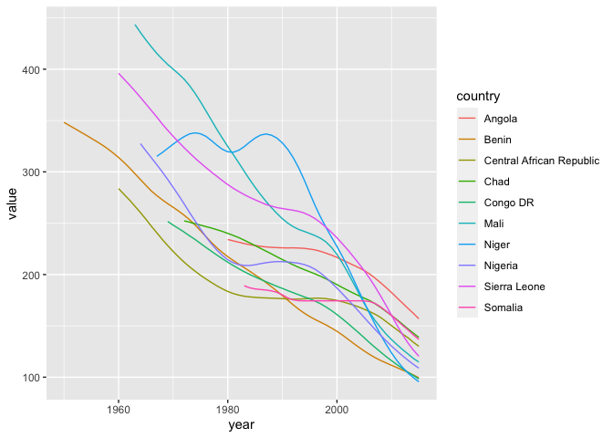
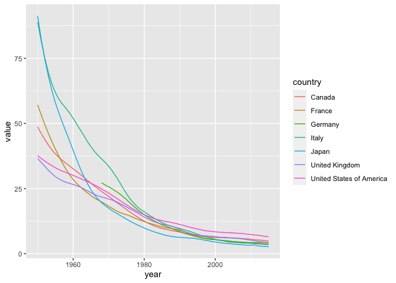

# Introduction

Discussion Board Title: Global Child Mortality Rates

Dataset: https://sejdemyr.github.io/r-tutorials/basics/data/RatesDeaths_AllIndicators.xlsx

Provided by: Alec McCabe

Suggested Prompt: "What 10 countries have the highest under-5 mortality rates today? For the 10 worst countries, visualize the under-5 mortality trend over time. Comparatively, what does the trend for G7 countries look like over time?

# Load Libraries

For this task, we will be using the tidyverse and stringr libraries


```r
library(tidyverse)
```

```
## ── Attaching packages ─────────────────────────────────────── tidyverse 1.3.1 ──
```

```
## ✓ ggplot2 3.3.5     ✓ purrr   0.3.4
## ✓ tibble  3.1.4     ✓ dplyr   1.0.7
## ✓ tidyr   1.1.3     ✓ stringr 1.4.0
## ✓ readr   2.0.1     ✓ forcats 0.5.1
```

```
## ── Conflicts ────────────────────────────────────────── tidyverse_conflicts() ──
## x dplyr::filter() masks stats::filter()
## x dplyr::lag()    masks stats::lag()
```

```r
library(stringr)
library(visdat)
```

# Load Data

Input data has been cleaned (overview and instructions removed from csv) and loaded into a new csv titled child_mortality.csv


```r
input_data <- read_csv("https://raw.githubusercontent.com/man-of-moose/masters_607/main/projects/project_2/children_mortality/child_mortality.csv")
```

### Capture only under-5 mortality rate

This dataset includes information for under-5 mortality rate, infant mortality rate, neonatal mortality rate, and number of deaths. For our analysis, we will be focusing on under-5 mortality.


```r
under_5_mortality <- input_data %>%
  rename(iso_code = `ISO Code`, country = CountryName, measurement = `Uncertainty bounds*`) %>%
  select(iso_code, country, measurement, contains("U5MR"))
```

Viewing the data below, we can see that the earlier years tend to have more NA values.


```r
head(under_5_mortality)
```

<div data-pagedtable="false">
  <script data-pagedtable-source type="application/json">
{"columns":[{"label":["iso_code"],"name":[1],"type":["chr"],"align":["left"]},{"label":["country"],"name":[2],"type":["chr"],"align":["left"]},{"label":["measurement"],"name":[3],"type":["chr"],"align":["left"]},{"label":["U5MR.1950"],"name":[4],"type":["dbl"],"align":["right"]},{"label":["U5MR.1951"],"name":[5],"type":["dbl"],"align":["right"]},{"label":["U5MR.1952"],"name":[6],"type":["dbl"],"align":["right"]},{"label":["U5MR.1953"],"name":[7],"type":["dbl"],"align":["right"]},{"label":["U5MR.1954"],"name":[8],"type":["dbl"],"align":["right"]},{"label":["U5MR.1955"],"name":[9],"type":["dbl"],"align":["right"]},{"label":["U5MR.1956"],"name":[10],"type":["dbl"],"align":["right"]},{"label":["U5MR.1957"],"name":[11],"type":["dbl"],"align":["right"]},{"label":["U5MR.1958"],"name":[12],"type":["dbl"],"align":["right"]},{"label":["U5MR.1959"],"name":[13],"type":["dbl"],"align":["right"]},{"label":["U5MR.1960"],"name":[14],"type":["dbl"],"align":["right"]},{"label":["U5MR.1961"],"name":[15],"type":["dbl"],"align":["right"]},{"label":["U5MR.1962"],"name":[16],"type":["dbl"],"align":["right"]},{"label":["U5MR.1963"],"name":[17],"type":["dbl"],"align":["right"]},{"label":["U5MR.1964"],"name":[18],"type":["dbl"],"align":["right"]},{"label":["U5MR.1965"],"name":[19],"type":["dbl"],"align":["right"]},{"label":["U5MR.1966"],"name":[20],"type":["dbl"],"align":["right"]},{"label":["U5MR.1967"],"name":[21],"type":["dbl"],"align":["right"]},{"label":["U5MR.1968"],"name":[22],"type":["dbl"],"align":["right"]},{"label":["U5MR.1969"],"name":[23],"type":["dbl"],"align":["right"]},{"label":["U5MR.1970"],"name":[24],"type":["dbl"],"align":["right"]},{"label":["U5MR.1971"],"name":[25],"type":["dbl"],"align":["right"]},{"label":["U5MR.1972"],"name":[26],"type":["dbl"],"align":["right"]},{"label":["U5MR.1973"],"name":[27],"type":["dbl"],"align":["right"]},{"label":["U5MR.1974"],"name":[28],"type":["dbl"],"align":["right"]},{"label":["U5MR.1975"],"name":[29],"type":["dbl"],"align":["right"]},{"label":["U5MR.1976"],"name":[30],"type":["dbl"],"align":["right"]},{"label":["U5MR.1977"],"name":[31],"type":["dbl"],"align":["right"]},{"label":["U5MR.1978"],"name":[32],"type":["dbl"],"align":["right"]},{"label":["U5MR.1979"],"name":[33],"type":["dbl"],"align":["right"]},{"label":["U5MR.1980"],"name":[34],"type":["dbl"],"align":["right"]},{"label":["U5MR.1981"],"name":[35],"type":["dbl"],"align":["right"]},{"label":["U5MR.1982"],"name":[36],"type":["dbl"],"align":["right"]},{"label":["U5MR.1983"],"name":[37],"type":["dbl"],"align":["right"]},{"label":["U5MR.1984"],"name":[38],"type":["dbl"],"align":["right"]},{"label":["U5MR.1985"],"name":[39],"type":["dbl"],"align":["right"]},{"label":["U5MR.1986"],"name":[40],"type":["dbl"],"align":["right"]},{"label":["U5MR.1987"],"name":[41],"type":["dbl"],"align":["right"]},{"label":["U5MR.1988"],"name":[42],"type":["dbl"],"align":["right"]},{"label":["U5MR.1989"],"name":[43],"type":["dbl"],"align":["right"]},{"label":["U5MR.1990"],"name":[44],"type":["dbl"],"align":["right"]},{"label":["U5MR.1991"],"name":[45],"type":["dbl"],"align":["right"]},{"label":["U5MR.1992"],"name":[46],"type":["dbl"],"align":["right"]},{"label":["U5MR.1993"],"name":[47],"type":["dbl"],"align":["right"]},{"label":["U5MR.1994"],"name":[48],"type":["dbl"],"align":["right"]},{"label":["U5MR.1995"],"name":[49],"type":["dbl"],"align":["right"]},{"label":["U5MR.1996"],"name":[50],"type":["dbl"],"align":["right"]},{"label":["U5MR.1997"],"name":[51],"type":["dbl"],"align":["right"]},{"label":["U5MR.1998"],"name":[52],"type":["dbl"],"align":["right"]},{"label":["U5MR.1999"],"name":[53],"type":["dbl"],"align":["right"]},{"label":["U5MR.2000"],"name":[54],"type":["dbl"],"align":["right"]},{"label":["U5MR.2001"],"name":[55],"type":["dbl"],"align":["right"]},{"label":["U5MR.2002"],"name":[56],"type":["dbl"],"align":["right"]},{"label":["U5MR.2003"],"name":[57],"type":["dbl"],"align":["right"]},{"label":["U5MR.2004"],"name":[58],"type":["dbl"],"align":["right"]},{"label":["U5MR.2005"],"name":[59],"type":["dbl"],"align":["right"]},{"label":["U5MR.2006"],"name":[60],"type":["dbl"],"align":["right"]},{"label":["U5MR.2007"],"name":[61],"type":["dbl"],"align":["right"]},{"label":["U5MR.2008"],"name":[62],"type":["dbl"],"align":["right"]},{"label":["U5MR.2009"],"name":[63],"type":["dbl"],"align":["right"]},{"label":["U5MR.2010"],"name":[64],"type":["dbl"],"align":["right"]},{"label":["U5MR.2011"],"name":[65],"type":["dbl"],"align":["right"]},{"label":["U5MR.2012"],"name":[66],"type":["dbl"],"align":["right"]},{"label":["U5MR.2013"],"name":[67],"type":["dbl"],"align":["right"]},{"label":["U5MR.2014"],"name":[68],"type":["dbl"],"align":["right"]},{"label":["U5MR.2015"],"name":[69],"type":["dbl"],"align":["right"]}],"data":[{"1":"AFG","2":"Afghanistan","3":"Lower","4":"NA","5":"NA","6":"NA","7":"NA","8":"NA","9":"NA","10":"NA","11":"NA","12":"NA","13":"NA","14":"NA","15":"306.9","16":"305.5","17":"303.1","18":"300.0","19":"295.3","20":"290.6","21":"285.7","22":"280.7","23":"275.9","24":"270.9","25":"265.8","26":"260.9","27":"256.1","28":"251.6","29":"246.6","30":"242.0","31":"237.2","32":"231.7","33":"226.6","34":"221.3","35":"215.3","36":"209.8","37":"204.1","38":"198.5","39":"192.7","40":"186.8","41":"181.0","42":"175.0","43":"169.2","44":"163.1","45":"157.2","46":"151.7","47":"146.5","48":"142.0","49":"138.3","50":"135.6","51":"133.1","52":"130.7","53":"128.3","54":"125.6","55":"122.6","56":"119.4","57":"115.9","58":"112.5","59":"109.0","60":"105.6","61":"102.2","62":"98.9","63":"95.4","64":"92.0","65":"88.1","66":"83.8","67":"79.1","68":"74.5","69":"69.6"},{"1":"AFG","2":"Afghanistan","3":"Median","4":"NA","5":"NA","6":"NA","7":"NA","8":"NA","9":"NA","10":"NA","11":"NA","12":"NA","13":"NA","14":"NA","15":"356.5","16":"350.6","17":"345.0","18":"339.7","19":"334.1","20":"328.7","21":"323.3","22":"318.1","23":"313.0","24":"307.8","25":"302.1","26":"296.4","27":"290.8","28":"284.9","29":"279.4","30":"273.6","31":"267.8","32":"261.6","33":"255.5","34":"249.1","35":"242.7","36":"236.2","37":"229.7","38":"222.9","39":"216.0","40":"209.2","41":"202.1","42":"195.0","43":"187.8","44":"181.0","45":"174.2","46":"167.8","47":"162.0","48":"156.8","49":"152.3","50":"148.6","51":"145.5","52":"142.6","53":"139.9","54":"137.0","55":"133.8","56":"130.3","57":"126.8","58":"123.2","59":"119.6","60":"116.3","61":"113.2","62":"110.4","63":"107.6","64":"105.0","65":"102.3","66":"99.5","67":"96.7","68":"93.9","69":"91.1"},{"1":"AFG","2":"Afghanistan","3":"Upper","4":"NA","5":"NA","6":"NA","7":"NA","8":"NA","9":"NA","10":"NA","11":"NA","12":"NA","13":"NA","14":"NA","15":"413.2","16":"402.7","17":"393.5","18":"385.5","19":"378.1","20":"371.7","21":"366.0","22":"360.8","23":"355.8","24":"351.4","25":"346.0","26":"340.4","27":"334.4","28":"328.1","29":"321.2","30":"313.9","31":"306.3","32":"298.8","33":"290.8","34":"283.8","35":"276.7","36":"269.6","37":"262.1","38":"254.3","39":"246.4","40":"237.7","41":"229.1","42":"220.3","43":"210.7","44":"201.7","45":"192.8","46":"185.3","47":"178.5","48":"172.4","49":"167.2","50":"162.7","51":"159.0","52":"155.9","53":"153.1","54":"150.1","55":"146.8","56":"143.1","57":"139.6","58":"136.1","59":"132.6","60":"129.6","61":"126.7","62":"124.2","63":"122.2","64":"120.6","65":"119.3","66":"118.5","67":"118.2","68":"118.3","69":"118.8"},{"1":"AGO","2":"Angola","3":"Lower","4":"NA","5":"NA","6":"NA","7":"NA","8":"NA","9":"NA","10":"NA","11":"NA","12":"NA","13":"NA","14":"NA","15":"NA","16":"NA","17":"NA","18":"NA","19":"NA","20":"NA","21":"NA","22":"NA","23":"NA","24":"NA","25":"NA","26":"NA","27":"NA","28":"NA","29":"NA","30":"NA","31":"NA","32":"NA","33":"NA","34":"187.4","35":"190.0","36":"192.7","37":"194.3","38":"196.0","39":"197.4","40":"198.4","41":"199.8","42":"200.6","43":"201.1","44":"201.6","45":"201.9","46":"202.3","47":"202.1","48":"201.9","49":"201.1","50":"199.9","51":"198.2","52":"195.9","53":"193.3","54":"190.4","55":"186.9","56":"182.5","57":"178.3","58":"172.7","59":"166.4","60":"159.9","61":"153.2","62":"145.7","63":"137.8","64":"130.1","65":"122.1","66":"114.9","67":"107.7","68":"101.1","69":"94.8"},{"1":"AGO","2":"Angola","3":"Median","4":"NA","5":"NA","6":"NA","7":"NA","8":"NA","9":"NA","10":"NA","11":"NA","12":"NA","13":"NA","14":"NA","15":"NA","16":"NA","17":"NA","18":"NA","19":"NA","20":"NA","21":"NA","22":"NA","23":"NA","24":"NA","25":"NA","26":"NA","27":"NA","28":"NA","29":"NA","30":"NA","31":"NA","32":"NA","33":"NA","34":"234.1","35":"232.8","36":"231.5","37":"230.2","38":"229.1","39":"228.3","40":"227.5","41":"226.9","42":"226.5","43":"226.2","44":"226.0","45":"225.9","46":"226.0","47":"225.8","48":"225.5","49":"224.8","50":"224.0","51":"222.6","52":"220.8","53":"218.9","54":"216.7","55":"214.1","56":"211.7","57":"209.2","58":"206.7","59":"203.9","60":"200.5","61":"196.4","62":"192.0","63":"187.3","64":"182.5","65":"177.3","66":"172.2","67":"167.1","68":"162.2","69":"156.9"},{"1":"AGO","2":"Angola","3":"Upper","4":"NA","5":"NA","6":"NA","7":"NA","8":"NA","9":"NA","10":"NA","11":"NA","12":"NA","13":"NA","14":"NA","15":"NA","16":"NA","17":"NA","18":"NA","19":"NA","20":"NA","21":"NA","22":"NA","23":"NA","24":"NA","25":"NA","26":"NA","27":"NA","28":"NA","29":"NA","30":"NA","31":"NA","32":"NA","33":"NA","34":"290.2","35":"282.9","36":"276.8","37":"271.5","38":"267.4","39":"264.0","40":"260.9","41":"258.6","42":"257.3","43":"256.1","44":"255.3","45":"254.4","46":"253.6","47":"253.1","48":"252.8","49":"252.5","50":"251.7","51":"250.4","52":"249.2","53":"247.9","54":"246.6","55":"245.4","56":"244.7","57":"244.8","58":"245.1","59":"245.4","60":"245.2","61":"245.6","62":"245.8","63":"246.8","64":"248.3","65":"249.5","66":"250.8","67":"252.2","68":"253.6","69":"253.7"}],"options":{"columns":{"min":{},"max":[10]},"rows":{"min":[10],"max":[10]},"pages":{}}}
  </script>
</div>


### Use gather() to convert into long format. We will use gather() on the year column to create new key-value columns "year" and "value"


```r
under_5_mortality <- under_5_mortality %>%
  gather("year","value",contains("U5MR")) %>%
  mutate(
    year = as.integer(str_replace(year, "U5MR.",""))
  ) %>%
  filter(measurement == "Median") %>%
  select(-measurement)
```

Looking at the data below, we now have a "long" dataframe which includes a single column designating the year for each country observation. Notice below that there are many NA values, presumably because not all countries had tracking begin at the same time. 


```r
head(under_5_mortality, n=10)
```

<div data-pagedtable="false">
  <script data-pagedtable-source type="application/json">
{"columns":[{"label":["iso_code"],"name":[1],"type":["chr"],"align":["left"]},{"label":["country"],"name":[2],"type":["chr"],"align":["left"]},{"label":["year"],"name":[3],"type":["int"],"align":["right"]},{"label":["value"],"name":[4],"type":["dbl"],"align":["right"]}],"data":[{"1":"AFG","2":"Afghanistan","3":"1950","4":"NA"},{"1":"AGO","2":"Angola","3":"1950","4":"NA"},{"1":"ALB","2":"Albania","3":"1950","4":"NA"},{"1":"AND","2":"Andorra","3":"1950","4":"NA"},{"1":"ARE","2":"United Arab Emirates","3":"1950","4":"NA"},{"1":"ARG","2":"Argentina","3":"1950","4":"NA"},{"1":"ARM","2":"Armenia","3":"1950","4":"NA"},{"1":"ATG","2":"Antigua & Barbuda","3":"1950","4":"NA"},{"1":"AUS","2":"Australia","3":"1950","4":"31.6"},{"1":"AUT","2":"Austria","3":"1950","4":"NA"}],"options":{"columns":{"min":{},"max":[10]},"rows":{"min":[10],"max":[10]},"pages":{}}}
  </script>
</div>

# Answer the Original Prompts:

### Which countries have the highest recent (2015) rate of under-5 mortality?

Angola, Chad, Somalia, Central African Republic, Seirra Leone, Mali, Nigeria, Benin, Congo DR, Niger had the highest under-5 mortality rates based in 2015. It should be noted that all of these countries are in Africa.


```r
under_5_mortality %>%
  filter(year==max(year)) %>%
  arrange(desc(value)) %>%
  head(10)
```

<div data-pagedtable="false">
  <script data-pagedtable-source type="application/json">
{"columns":[{"label":["iso_code"],"name":[1],"type":["chr"],"align":["left"]},{"label":["country"],"name":[2],"type":["chr"],"align":["left"]},{"label":["year"],"name":[3],"type":["int"],"align":["right"]},{"label":["value"],"name":[4],"type":["dbl"],"align":["right"]}],"data":[{"1":"AGO","2":"Angola","3":"2015","4":"156.9"},{"1":"TCD","2":"Chad","3":"2015","4":"138.7"},{"1":"SOM","2":"Somalia","3":"2015","4":"136.8"},{"1":"CAF","2":"Central African Republic","3":"2015","4":"130.1"},{"1":"SLE","2":"Sierra Leone","3":"2015","4":"120.4"},{"1":"MLI","2":"Mali","3":"2015","4":"114.7"},{"1":"NGA","2":"Nigeria","3":"2015","4":"108.8"},{"1":"BEN","2":"Benin","3":"2015","4":"99.5"},{"1":"COD","2":"Congo DR","3":"2015","4":"98.3"},{"1":"NER","2":"Niger","3":"2015","4":"95.5"}],"options":{"columns":{"min":{},"max":[10]},"rows":{"min":[10],"max":[10]},"pages":{}}}
  </script>
</div>
### Visualize the under-5 mortality trend for the 10 worst countries

Collect the names of the countries shown above into a character vector


```r
worst_countries <- under_5_mortality %>%
  filter(year==max(year)) %>%
  arrange(desc(value)) %>%
  head(10) %>%
  .$country
```

Create a new dataframe to hold these worst countries, using filter() and %in% to match against the "worst_countries" character vector.


```r
under_5_mortality_worst <- under_5_mortality %>%
  filter(
    country %in% worst_countries
  )
```

Despite the fact that these countries have the worst 2015 under-5 mortality rates, it is evident that they have exhibited improvement (dropped rates) over time. Their improvement is roughly linear.


```r
under_5_mortality_worst %>%
  ggplot(mapping=aes(x=year, y=value, color=country)) +
  geom_line()
```

```
## Warning: Removed 168 row(s) containing missing values (geom_path).
```

<!-- -->


### What does the trend for G7 countries look like?

We expect that the under-5 mortality rates for G7 countries to be lower than that of the worst countries, but how will the trend differ?


```r
under_5_mortality_g7 <- under_5_mortality %>%
  filter(
    country %in% c("Canada", "United States of America","France","Germany","Italy","Japan","United Kingdom")
  )
```

Based on the below line graph, it is evident that under-5 child mortality rates have been steadily decreasing over the years for G7 countries. Unlike the trend for mortality rates in the "worst countries" group, this downward trend is not linear.


```r
under_5_mortality_g7 %>%
  ggplot(mapping=aes(x=year, y=value, color=country)) +
  geom_line()
```

```
## Warning: Removed 18 row(s) containing missing values (geom_path).
```

<!-- -->

