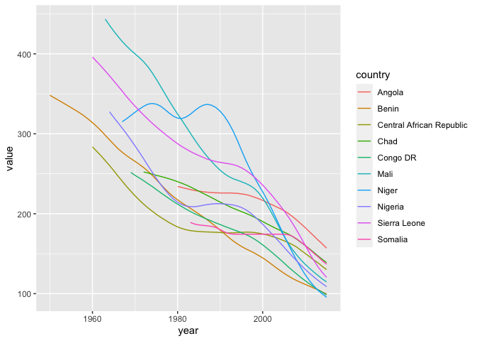
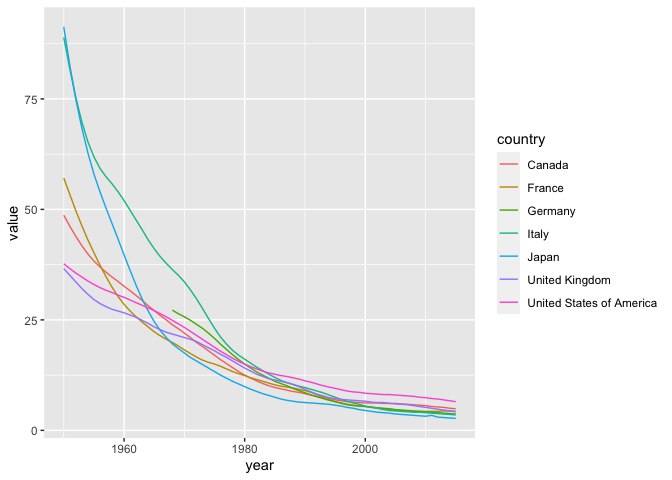

# Introduction

Discussion Board Title: Global Child Mortality Rates

Dataset: https://sejdemyr.github.io/r-tutorials/basics/data/RatesDeaths_AllIndicators.xlsx

Provided by: Alec McCabe

Suggested Prompt: "What 10 countries have the highest under-5 mortality rates today? For the 10 worst countries, visualize the under-5 mortality trend over time. Comparatively, what does the trend for G7 countries look like over time?

# Load Libraries

For this task, we will be using the tidyverse and stringr libraries


```r
library(tidyverse)
```

```
## ── Attaching packages ─────────────────────────────────────── tidyverse 1.3.1 ──
```

```
## ✓ ggplot2 3.3.5     ✓ purrr   0.3.4
## ✓ tibble  3.1.4     ✓ dplyr   1.0.7
## ✓ tidyr   1.1.3     ✓ stringr 1.4.0
## ✓ readr   2.0.1     ✓ forcats 0.5.1
```

```
## ── Conflicts ────────────────────────────────────────── tidyverse_conflicts() ──
## x dplyr::filter() masks stats::filter()
## x dplyr::lag()    masks stats::lag()
```

```r
library(stringr)
```

# Load Data

Input data has been cleaned (overview and instructions removed from csv) and loaded into a new csv titled child_mortality.csv


```r
input_data <- read_csv("https://raw.githubusercontent.com/man-of-moose/masters_607/main/projects/project_2/children_mortality/child_mortality.csv")
```

```
## Rows: 585 Columns: 399
```

```
## ── Column specification ────────────────────────────────────────────────────────
## Delimiter: ","
## chr   (3): ISO Code, CountryName, Uncertainty bounds*
## dbl (394): U5MR.1950, U5MR.1951, U5MR.1952, U5MR.1953, U5MR.1954, U5MR.1955,...
## lgl   (2): NMR.1950, Neonatal.Deaths.1950
```

```
## 
## ℹ Use `spec()` to retrieve the full column specification for this data.
## ℹ Specify the column types or set `show_col_types = FALSE` to quiet this message.
```

### Capture only under-5 mortality rate

This dataset includes information for under-5 mortality rate, infant mortality rate, neonatal mortality rate, and number of deaths. For our analysis, we will be focusing on under-5 mortality.


```r
under_5_mortality <- input_data %>%
  rename(iso_code = `ISO Code`, country = CountryName, measurement = `Uncertainty bounds*`) %>%
  select(iso_code, country, measurement, contains("U5MR"))
```

### Use gather() to convert into long format. We will use gather() on the year column to create new key-value columns "year" and "value"


```r
under_5_mortality <- under_5_mortality %>%
  gather("year","value",contains("U5MR")) %>%
  mutate(
    year = as.integer(str_replace(year, "U5MR.",""))
  ) %>%
  filter(measurement == "Median") %>%
  select(-measurement)
```

Looking at the data below, we now have a "long" dataframe which includes a single column designating the year for each country observation. Notice below that there are many NA values, presumably because not all countries had tracking begin at the same time. 


```r
head(under_5_mortality, n=10)
```

<div data-pagedtable="false">
  <script data-pagedtable-source type="application/json">
{"columns":[{"label":["iso_code"],"name":[1],"type":["chr"],"align":["left"]},{"label":["country"],"name":[2],"type":["chr"],"align":["left"]},{"label":["year"],"name":[3],"type":["int"],"align":["right"]},{"label":["value"],"name":[4],"type":["dbl"],"align":["right"]}],"data":[{"1":"AFG","2":"Afghanistan","3":"1950","4":"NA"},{"1":"AGO","2":"Angola","3":"1950","4":"NA"},{"1":"ALB","2":"Albania","3":"1950","4":"NA"},{"1":"AND","2":"Andorra","3":"1950","4":"NA"},{"1":"ARE","2":"United Arab Emirates","3":"1950","4":"NA"},{"1":"ARG","2":"Argentina","3":"1950","4":"NA"},{"1":"ARM","2":"Armenia","3":"1950","4":"NA"},{"1":"ATG","2":"Antigua & Barbuda","3":"1950","4":"NA"},{"1":"AUS","2":"Australia","3":"1950","4":"31.6"},{"1":"AUT","2":"Austria","3":"1950","4":"NA"}],"options":{"columns":{"min":{},"max":[10]},"rows":{"min":[10],"max":[10]},"pages":{}}}
  </script>
</div>

# Answer the Original Prompts:

### Which countries have the highest recent (2015) rate of under-5 mortality?

Angola, Chad, Somalia, Central African Republic, Seirra Leone, Mali, Nigeria, Benin, Congo DR, Niger had the highest under-5 mortality rates based in 2015. It should be noted that all of these countries are in Africa.


```r
under_5_mortality %>%
  filter(year==max(year)) %>%
  arrange(desc(value)) %>%
  head(10)
```

<div data-pagedtable="false">
  <script data-pagedtable-source type="application/json">
{"columns":[{"label":["iso_code"],"name":[1],"type":["chr"],"align":["left"]},{"label":["country"],"name":[2],"type":["chr"],"align":["left"]},{"label":["year"],"name":[3],"type":["int"],"align":["right"]},{"label":["value"],"name":[4],"type":["dbl"],"align":["right"]}],"data":[{"1":"AGO","2":"Angola","3":"2015","4":"156.9"},{"1":"TCD","2":"Chad","3":"2015","4":"138.7"},{"1":"SOM","2":"Somalia","3":"2015","4":"136.8"},{"1":"CAF","2":"Central African Republic","3":"2015","4":"130.1"},{"1":"SLE","2":"Sierra Leone","3":"2015","4":"120.4"},{"1":"MLI","2":"Mali","3":"2015","4":"114.7"},{"1":"NGA","2":"Nigeria","3":"2015","4":"108.8"},{"1":"BEN","2":"Benin","3":"2015","4":"99.5"},{"1":"COD","2":"Congo DR","3":"2015","4":"98.3"},{"1":"NER","2":"Niger","3":"2015","4":"95.5"}],"options":{"columns":{"min":{},"max":[10]},"rows":{"min":[10],"max":[10]},"pages":{}}}
  </script>
</div>
### Visualize the under-5 mortality trend for the 10 worst countries

Collect the names of the countries shown above into a character vector


```r
worst_countries <- under_5_mortality %>%
  filter(year==max(year)) %>%
  arrange(desc(value)) %>%
  head(10) %>%
  .$country
```

Create a new dataframe to hold these worst countries, using filter() and %in% to match against the "worst_countries" character vector.


```r
under_5_mortality_worst <- under_5_mortality %>%
  filter(
    country %in% worst_countries
  )
```

Despite the fact that these countries have the worst 2015 under-5 mortality rates, it is evident that they have exhibited improvement (dropped rates) over time. Their improvement is roughly linear.


```r
under_5_mortality_worst %>%
  ggplot(mapping=aes(x=year, y=value, color=country)) +
  geom_line()
```

```
## Warning: Removed 168 row(s) containing missing values (geom_path).
```

<!-- -->


### What does the trend for G7 countries look like?

We expect that the under-5 mortality rates for G7 countries to be lower than that of the worst countries, but how will the trend differ?


```r
under_5_mortality_g7 <- under_5_mortality %>%
  filter(
    country %in% c("Canada", "United States of America","France","Germany","Italy","Japan","United Kingdom")
  )
```

Based on the below line graph, it is evident that under-5 child mortality rates have been steadily decreasing over the years for G7 countries. Unlike the trend for mortality rates in the "worst countries" group, this downward trend is not linear.


```r
under_5_mortality_g7 %>%
  ggplot(mapping=aes(x=year, y=value, color=country)) +
  geom_line()
```

```
## Warning: Removed 18 row(s) containing missing values (geom_path).
```

<!-- -->

