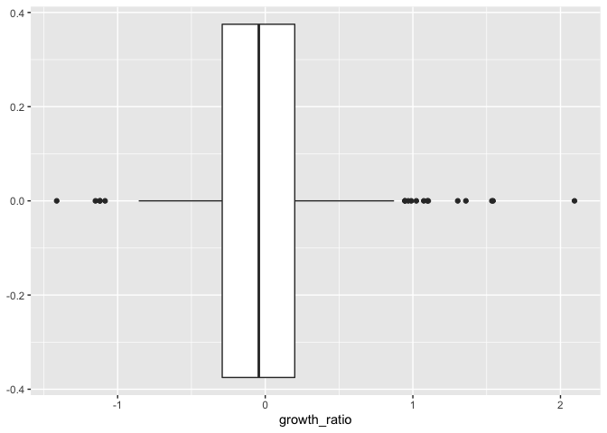

# Introduction

Discussion Board Title: World Government Indicators

Dataset: https://info.worldbank.org/governance/wgi/Home/downLoadFile?fileName=wgidataset.xlsx

Provided by: Thomas Buonora 

Suggested Prompt: None provided, will perform self-exploration around 2 questions: What countries have the lowest Voice and Accountability ratings today? What countries had the greatest drop in Voice and Accountability ratings since they began tracking for that country? What countries had the greatest increase in Voice and Accountability ratings since they began tracking for that country?

# Load Libraries

We will be using tidyverse and stringr packages for this exercise.


```r
library(tidyverse)
```

```
## ── Attaching packages ─────────────────────────────────────── tidyverse 1.3.1 ──
```

```
## ✓ ggplot2 3.3.5     ✓ purrr   0.3.4
## ✓ tibble  3.1.4     ✓ dplyr   1.0.7
## ✓ tidyr   1.1.3     ✓ stringr 1.4.0
## ✓ readr   2.0.1     ✓ forcats 0.5.1
```

```
## ── Conflicts ────────────────────────────────────────── tidyverse_conflicts() ──
## x dplyr::filter() masks stats::filter()
## x dplyr::lag()    masks stats::lag()
```

```r
library(stringr)
```


# Load Data

For this assignment we will focus on the first worksheet in the downloadable excel workbook: "VoiceandAccountability"


```r
data <- read_csv("https://raw.githubusercontent.com/man-of-moose/masters_607/main/projects/project_2/world_indicators/free_speech_indicators.csv")
```

```
## New names:
## * `` -> ...1
## * `` -> ...2
## * `1996` -> `1996...3`
## * `1996` -> `1996...4`
## * `1996` -> `1996...5`
## * ...
```

```
## Rows: 215 Columns: 134
```

```
## ── Column specification ────────────────────────────────────────────────────────
## Delimiter: ","
## chr (134): ...1, ...2, 1996...3, 1996...4, 1996...5, 1996...6, 1996...7, 199...
```

```
## 
## ℹ Use `spec()` to retrieve the full column specification for this data.
## ℹ Specify the column types or set `show_col_types = FALSE` to quiet this message.
```


Viewing the raw data, it is evident that this is in a troublesome "wide" format. The data is grouped horizontally by year, but includes multiple measurements per group (estimate, stderr, numsrc, rank, lower, upper). Because of this, a simple gather() will not suffice.


```r
head(data)
```

<div data-pagedtable="false">
  <script data-pagedtable-source type="application/json">
{"columns":[{"label":["...1"],"name":[1],"type":["chr"],"align":["left"]},{"label":["...2"],"name":[2],"type":["chr"],"align":["left"]},{"label":["1996...3"],"name":[3],"type":["chr"],"align":["left"]},{"label":["1996...4"],"name":[4],"type":["chr"],"align":["left"]},{"label":["1996...5"],"name":[5],"type":["chr"],"align":["left"]},{"label":["1996...6"],"name":[6],"type":["chr"],"align":["left"]},{"label":["1996...7"],"name":[7],"type":["chr"],"align":["left"]},{"label":["1996...8"],"name":[8],"type":["chr"],"align":["left"]},{"label":["1998...9"],"name":[9],"type":["chr"],"align":["left"]},{"label":["1998...10"],"name":[10],"type":["chr"],"align":["left"]},{"label":["1998...11"],"name":[11],"type":["chr"],"align":["left"]},{"label":["1998...12"],"name":[12],"type":["chr"],"align":["left"]},{"label":["1998...13"],"name":[13],"type":["chr"],"align":["left"]},{"label":["1998...14"],"name":[14],"type":["chr"],"align":["left"]},{"label":["2000...15"],"name":[15],"type":["chr"],"align":["left"]},{"label":["2000...16"],"name":[16],"type":["chr"],"align":["left"]},{"label":["2000...17"],"name":[17],"type":["chr"],"align":["left"]},{"label":["2000...18"],"name":[18],"type":["chr"],"align":["left"]},{"label":["2000...19"],"name":[19],"type":["chr"],"align":["left"]},{"label":["2000...20"],"name":[20],"type":["chr"],"align":["left"]},{"label":["2002...21"],"name":[21],"type":["chr"],"align":["left"]},{"label":["2002...22"],"name":[22],"type":["chr"],"align":["left"]},{"label":["2002...23"],"name":[23],"type":["chr"],"align":["left"]},{"label":["2002...24"],"name":[24],"type":["chr"],"align":["left"]},{"label":["2002...25"],"name":[25],"type":["chr"],"align":["left"]},{"label":["2002...26"],"name":[26],"type":["chr"],"align":["left"]},{"label":["2003...27"],"name":[27],"type":["chr"],"align":["left"]},{"label":["2003...28"],"name":[28],"type":["chr"],"align":["left"]},{"label":["2003...29"],"name":[29],"type":["chr"],"align":["left"]},{"label":["2003...30"],"name":[30],"type":["chr"],"align":["left"]},{"label":["2003...31"],"name":[31],"type":["chr"],"align":["left"]},{"label":["2003...32"],"name":[32],"type":["chr"],"align":["left"]},{"label":["2004...33"],"name":[33],"type":["chr"],"align":["left"]},{"label":["2004...34"],"name":[34],"type":["chr"],"align":["left"]},{"label":["2004...35"],"name":[35],"type":["chr"],"align":["left"]},{"label":["2004...36"],"name":[36],"type":["chr"],"align":["left"]},{"label":["2004...37"],"name":[37],"type":["chr"],"align":["left"]},{"label":["2004...38"],"name":[38],"type":["chr"],"align":["left"]},{"label":["2005...39"],"name":[39],"type":["chr"],"align":["left"]},{"label":["2005...40"],"name":[40],"type":["chr"],"align":["left"]},{"label":["2005...41"],"name":[41],"type":["chr"],"align":["left"]},{"label":["2005...42"],"name":[42],"type":["chr"],"align":["left"]},{"label":["2005...43"],"name":[43],"type":["chr"],"align":["left"]},{"label":["2005...44"],"name":[44],"type":["chr"],"align":["left"]},{"label":["2006...45"],"name":[45],"type":["chr"],"align":["left"]},{"label":["2006...46"],"name":[46],"type":["chr"],"align":["left"]},{"label":["2006...47"],"name":[47],"type":["chr"],"align":["left"]},{"label":["2006...48"],"name":[48],"type":["chr"],"align":["left"]},{"label":["2006...49"],"name":[49],"type":["chr"],"align":["left"]},{"label":["2006...50"],"name":[50],"type":["chr"],"align":["left"]},{"label":["2007...51"],"name":[51],"type":["chr"],"align":["left"]},{"label":["2007...52"],"name":[52],"type":["chr"],"align":["left"]},{"label":["2007...53"],"name":[53],"type":["chr"],"align":["left"]},{"label":["2007...54"],"name":[54],"type":["chr"],"align":["left"]},{"label":["2007...55"],"name":[55],"type":["chr"],"align":["left"]},{"label":["2007...56"],"name":[56],"type":["chr"],"align":["left"]},{"label":["2008...57"],"name":[57],"type":["chr"],"align":["left"]},{"label":["2008...58"],"name":[58],"type":["chr"],"align":["left"]},{"label":["2008...59"],"name":[59],"type":["chr"],"align":["left"]},{"label":["2008...60"],"name":[60],"type":["chr"],"align":["left"]},{"label":["2008...61"],"name":[61],"type":["chr"],"align":["left"]},{"label":["2008...62"],"name":[62],"type":["chr"],"align":["left"]},{"label":["2009...63"],"name":[63],"type":["chr"],"align":["left"]},{"label":["2009...64"],"name":[64],"type":["chr"],"align":["left"]},{"label":["2009...65"],"name":[65],"type":["chr"],"align":["left"]},{"label":["2009...66"],"name":[66],"type":["chr"],"align":["left"]},{"label":["2009...67"],"name":[67],"type":["chr"],"align":["left"]},{"label":["2009...68"],"name":[68],"type":["chr"],"align":["left"]},{"label":["2010...69"],"name":[69],"type":["chr"],"align":["left"]},{"label":["2010...70"],"name":[70],"type":["chr"],"align":["left"]},{"label":["2010...71"],"name":[71],"type":["chr"],"align":["left"]},{"label":["2010...72"],"name":[72],"type":["chr"],"align":["left"]},{"label":["2010...73"],"name":[73],"type":["chr"],"align":["left"]},{"label":["2010...74"],"name":[74],"type":["chr"],"align":["left"]},{"label":["2011...75"],"name":[75],"type":["chr"],"align":["left"]},{"label":["2011...76"],"name":[76],"type":["chr"],"align":["left"]},{"label":["2011...77"],"name":[77],"type":["chr"],"align":["left"]},{"label":["2011...78"],"name":[78],"type":["chr"],"align":["left"]},{"label":["2011...79"],"name":[79],"type":["chr"],"align":["left"]},{"label":["2011...80"],"name":[80],"type":["chr"],"align":["left"]},{"label":["2012...81"],"name":[81],"type":["chr"],"align":["left"]},{"label":["2012...82"],"name":[82],"type":["chr"],"align":["left"]},{"label":["2012...83"],"name":[83],"type":["chr"],"align":["left"]},{"label":["2012...84"],"name":[84],"type":["chr"],"align":["left"]},{"label":["2012...85"],"name":[85],"type":["chr"],"align":["left"]},{"label":["2012...86"],"name":[86],"type":["chr"],"align":["left"]},{"label":["2013...87"],"name":[87],"type":["chr"],"align":["left"]},{"label":["2013...88"],"name":[88],"type":["chr"],"align":["left"]},{"label":["2013...89"],"name":[89],"type":["chr"],"align":["left"]},{"label":["2013...90"],"name":[90],"type":["chr"],"align":["left"]},{"label":["2013...91"],"name":[91],"type":["chr"],"align":["left"]},{"label":["2013...92"],"name":[92],"type":["chr"],"align":["left"]},{"label":["2014...93"],"name":[93],"type":["chr"],"align":["left"]},{"label":["2014...94"],"name":[94],"type":["chr"],"align":["left"]},{"label":["2014...95"],"name":[95],"type":["chr"],"align":["left"]},{"label":["2014...96"],"name":[96],"type":["chr"],"align":["left"]},{"label":["2014...97"],"name":[97],"type":["chr"],"align":["left"]},{"label":["2014...98"],"name":[98],"type":["chr"],"align":["left"]},{"label":["2015...99"],"name":[99],"type":["chr"],"align":["left"]},{"label":["2015...100"],"name":[100],"type":["chr"],"align":["left"]},{"label":["2015...101"],"name":[101],"type":["chr"],"align":["left"]},{"label":["2015...102"],"name":[102],"type":["chr"],"align":["left"]},{"label":["2015...103"],"name":[103],"type":["chr"],"align":["left"]},{"label":["2015...104"],"name":[104],"type":["chr"],"align":["left"]},{"label":["2016...105"],"name":[105],"type":["chr"],"align":["left"]},{"label":["2016...106"],"name":[106],"type":["chr"],"align":["left"]},{"label":["2016...107"],"name":[107],"type":["chr"],"align":["left"]},{"label":["2016...108"],"name":[108],"type":["chr"],"align":["left"]},{"label":["2016...109"],"name":[109],"type":["chr"],"align":["left"]},{"label":["2016...110"],"name":[110],"type":["chr"],"align":["left"]},{"label":["2017...111"],"name":[111],"type":["chr"],"align":["left"]},{"label":["2017...112"],"name":[112],"type":["chr"],"align":["left"]},{"label":["2017...113"],"name":[113],"type":["chr"],"align":["left"]},{"label":["2017...114"],"name":[114],"type":["chr"],"align":["left"]},{"label":["2017...115"],"name":[115],"type":["chr"],"align":["left"]},{"label":["2017...116"],"name":[116],"type":["chr"],"align":["left"]},{"label":["2018...117"],"name":[117],"type":["chr"],"align":["left"]},{"label":["2018...118"],"name":[118],"type":["chr"],"align":["left"]},{"label":["2018...119"],"name":[119],"type":["chr"],"align":["left"]},{"label":["2018...120"],"name":[120],"type":["chr"],"align":["left"]},{"label":["2018...121"],"name":[121],"type":["chr"],"align":["left"]},{"label":["2018...122"],"name":[122],"type":["chr"],"align":["left"]},{"label":["2019...123"],"name":[123],"type":["chr"],"align":["left"]},{"label":["2019...124"],"name":[124],"type":["chr"],"align":["left"]},{"label":["2019...125"],"name":[125],"type":["chr"],"align":["left"]},{"label":["2019...126"],"name":[126],"type":["chr"],"align":["left"]},{"label":["2019...127"],"name":[127],"type":["chr"],"align":["left"]},{"label":["2019...128"],"name":[128],"type":["chr"],"align":["left"]},{"label":["2020...129"],"name":[129],"type":["chr"],"align":["left"]},{"label":["2020...130"],"name":[130],"type":["chr"],"align":["left"]},{"label":["2020...131"],"name":[131],"type":["chr"],"align":["left"]},{"label":["2020...132"],"name":[132],"type":["chr"],"align":["left"]},{"label":["2020...133"],"name":[133],"type":["chr"],"align":["left"]},{"label":["2020...134"],"name":[134],"type":["chr"],"align":["left"]}],"data":[{"1":"Country/Territory","2":"Code","3":"Estimate","4":"StdErr","5":"NumSrc","6":"Rank","7":"Lower","8":"Upper","9":"Estimate","10":"StdErr","11":"NumSrc","12":"Rank","13":"Lower","14":"Upper","15":"Estimate","16":"StdErr","17":"NumSrc","18":"Rank","19":"Lower","20":"Upper","21":"Estimate","22":"StdErr","23":"NumSrc","24":"Rank","25":"Lower","26":"Upper","27":"Estimate","28":"StdErr","29":"NumSrc","30":"Rank","31":"Lower","32":"Upper","33":"Estimate","34":"StdErr","35":"NumSrc","36":"Rank","37":"Lower","38":"Upper","39":"Estimate","40":"StdErr","41":"NumSrc","42":"Rank","43":"Lower","44":"Upper","45":"Estimate","46":"StdErr","47":"NumSrc","48":"Rank","49":"Lower","50":"Upper","51":"Estimate","52":"StdErr","53":"NumSrc","54":"Rank","55":"Lower","56":"Upper","57":"Estimate","58":"StdErr","59":"NumSrc","60":"Rank","61":"Lower","62":"Upper","63":"Estimate","64":"StdErr","65":"NumSrc","66":"Rank","67":"Lower","68":"Upper","69":"Estimate","70":"StdErr","71":"NumSrc","72":"Rank","73":"Lower","74":"Upper","75":"Estimate","76":"StdErr","77":"NumSrc","78":"Rank","79":"Lower","80":"Upper","81":"Estimate","82":"StdErr","83":"NumSrc","84":"Rank","85":"Lower","86":"Upper","87":"Estimate","88":"StdErr","89":"NumSrc","90":"Rank","91":"Lower","92":"Upper","93":"Estimate","94":"StdErr","95":"NumSrc","96":"Rank","97":"Lower","98":"Upper","99":"Estimate","100":"StdErr","101":"NumSrc","102":"Rank","103":"Lower","104":"Upper","105":"Estimate","106":"StdErr","107":"NumSrc","108":"Rank","109":"Lower","110":"Upper","111":"Estimate","112":"StdErr","113":"NumSrc","114":"Rank","115":"Lower","116":"Upper","117":"Estimate","118":"StdErr","119":"NumSrc","120":"Rank","121":"Lower","122":"Upper","123":"Estimate","124":"StdErr","125":"NumSrc","126":"Rank","127":"Lower","128":"Upper","129":"Estimate","130":"StdErr","131":"NumSrc","132":"Rank","133":"Lower","134":"Upper"},{"1":"Aruba","2":"ABW","3":"#N/A","4":"#N/A","5":"#N/A","6":"#N/A","7":"#N/A","8":"#N/A","9":"#N/A","10":"#N/A","11":"#N/A","12":"#N/A","13":"#N/A","14":"#N/A","15":"#N/A","16":"#N/A","17":"#N/A","18":"#N/A","19":"#N/A","20":"#N/A","21":"#N/A","22":"#N/A","23":"#N/A","24":"#N/A","25":"#N/A","26":"#N/A","27":"#N/A","28":"#N/A","29":"#N/A","30":"#N/A","31":"#N/A","32":"#N/A","33":"0.737520695","34":"0.338822395","35":"1","36":"73.07691956","37":"56.25","38":"88.94230652","39":"1.153230071","40":"0.357602417","41":"1","42":"85.57691956","43":"64.90384674","44":"100","45":"1.017273426","46":"0.491848856","47":"1","48":"80.28845978","49":"53.84615326","50":"100","51":"0.972128868","52":"0.511655807","53":"1","54":"78.36538696","55":"52.88461685","56":"100","57":"0.967198193","58":"0.511172235","59":"1","60":"79.32691956","61":"51.44230652","62":"100","63":"1.25234437","64":"0.259898603","65":"2","66":"91.4691925","67":"71.5639801","68":"100","69":"1.281883955","70":"0.239399835","71":"2","72":"90.99526215","73":"72.98577881","74":"100","75":"1.273587823","76":"0.234903127","77":"2","78":"90.61032867","79":"74.64788818","80":"100","81":"1.28464973","82":"0.209522918","83":"2","84":"90.61032867","85":"76.05633545","86":"97.65258026","87":"1.278059244","88":"0.20330961","89":"2","90":"90.61032867","91":"75.58685303","92":"97.65258026","93":"1.276822448","94":"0.267147124","95":"1","96":"92.1182251","97":"71.92118073","98":"100","99":"1.273941755","100":"0.276419848","101":"1","102":"91.62561798","103":"72.41379547","104":"100","105":"1.279367566","106":"0.291443586","107":"1","108":"92.1182251","109":"71.92118073","110":"100","111":"1.295541406","112":"0.282478005","113":"1","114":"92.61083984","115":"73.89162445","116":"100","117":"1.271613002","118":"0.24762091","119":"1","120":"90.82125854","121":"76.32849884","122":"99.51690674","123":"1.264410615","124":"0.267498434","125":"1","126":"91.78743744","127":"72.94686127","128":"100","129":"1.28910768","130":"0.260646254","131":"1","132":"92.75362396","133":"72.46376801","134":"99.51690674"},{"1":"Andorra","2":"ADO","3":"1.563216686","4":"0.291690677","5":"3","6":"98.5","7":"81.5","8":"100","9":"1.528759122","10":"0.291445464","11":"3","12":"97.51243591","13":"78.60696411","14":"100","15":"1.535655499","16":"0.29128316","17":"3","18":"97.0149231","19":"80.59701538","20":"100","21":"1.437128186","22":"0.272817552","23":"3","24":"95.52238464","25":"74.6268692","26":"100","27":"1.422261953","28":"0.2690323","29":"3","30":"94.02985382","31":"77.11442566","32":"100","33":"1.563076615","34":"0.260854989","35":"3","36":"94.71154022","37":"85.09615326","38":"100","39":"1.528181553","40":"0.266424268","41":"3","42":"94.71154022","43":"82.69230652","44":"100","45":"1.3299793","46":"0.234210014","47":"3","48":"92.30769348","49":"76.44230652","50":"100","51":"1.305506468","52":"0.230224192","53":"3","54":"92.30769348","55":"74.03845978","56":"100","57":"1.325321794","58":"0.226611674","59":"3","60":"93.2692337","61":"75.96154022","62":"100","63":"1.322938085","64":"0.23278372","65":"3","66":"92.41706085","67":"74.8815155","68":"100","69":"1.324308634","70":"0.236173764","71":"3","72":"92.89099884","73":"75.35545349","74":"100","75":"1.360453367","76":"0.23199603","77":"3","78":"93.89671326","79":"76.52581787","80":"100","81":"1.433837652","82":"0.233316243","83":"4","84":"93.89671326","85":"81.22065735","86":"100","87":"1.406641722","88":"0.226248547","89":"4","90":"93.89671326","91":"81.69013977","92":"100","93":"1.165938854","94":"0.249166101","95":"2","96":"87.68473053","97":"70.93595886","98":"99.01477814","99":"1.194476604","100":"0.234822407","101":"2","102":"88.17733765","103":"72.41379547","104":"99.50739288","105":"1.17659831","106":"0.217248425","107":"2","108":"87.19211578","109":"72.90640259","110":"97.53694916","111":"1.161646605","112":"0.229062557","113":"2","114":"86.20689392","115":"72.90640259","116":"97.53694916","117":"1.036912799","118":"0.265538424","119":"2","120":"82.12560272","121":"68.11594391","122":"95.16908264","123":"1.11012435","124":"0.21835725","125":"2","126":"84.5410614","127":"71.01449585","128":"96.13526917","129":"1.089067698","130":"0.223904222","131":"2","132":"83.57488251","133":"70.04830933","134":"95.6521759"},{"1":"Afghanistan","2":"AFG","3":"-1.90854013","4":"0.261457115","5":"4","6":"1","7":"0","8":"9.5","9":"-2.039301157","10":"0.256089628","11":"4","12":"0.49751243","13":"0","14":"4.975124359","15":"-2.031416893","16":"0.254042536","17":"4","18":"0.99502486","19":"0","20":"5.4726367","21":"-1.433421016","22":"0.189453408","23":"6","24":"9.452735901","25":"2.98507452","26":"14.92537308","27":"-1.177571177","28":"0.207045421","29":"5","30":"14.42786026","31":"6.965174198","32":"24.37810898","33":"-1.203033924","34":"0.175590158","35":"7","36":"15.38461494","37":"7.211538315","38":"21.63461494","39":"-1.12542963","40":"0.173295274","41":"8","42":"14.90384579","43":"8.17307663","44":"23.55769157","45":"-1.110293984","46":"0.150166392","47":"9","48":"17.78846169","49":"8.653845787","50":"25","51":"-1.057653904","52":"0.14550525","53":"10","54":"18.75","55":"10.09615421","56":"25","57":"-1.168901801","58":"0.143898979","59":"10","60":"14.42307663","61":"9.134614944","62":"21.63461494","63":"-1.375496507","64":"0.147714943","65":"10","66":"9.478672981","67":"6.161137581","68":"14.21800995","69":"-1.404468179","70":"0.143254668","71":"10","72":"9.952606201","73":"5.687203884","74":"13.74407578","75":"-1.335976958","76":"0.14380087","77":"10","78":"11.26760578","79":"7.042253494","80":"15.96244144","81":"-1.267430067","82":"0.134757057","83":"11","84":"14.08450699","85":"6.572770119","86":"16.43192482","87":"-1.240068316","88":"0.123408414","89":"12","90":"14.55399036","91":"8.450704575","92":"17.37089157","93":"-1.135444999","94":"0.132238999","95":"10","96":"16.25615692","97":"9.359605789","98":"21.67487717","99":"-1.117563009","100":"0.134630308","101":"10","102":"18.71921158","103":"10.83743858","104":"22.66009903","105":"-1.037837505","106":"0.129879341","107":"10","108":"20.6896553","109":"13.30049229","110":"23.64532089","111":"-0.990854084","112":"0.130806759","113":"10","114":"22.1674881","115":"14.28571415","116":"24.63054276","117":"-1.011603355","118":"0.133870095","119":"10","120":"20.28985596","121":"13.52657032","122":"25.12077332","123":"-1.006792426","124":"0.127234191","125":"10","126":"21.25603867","127":"15.45893764","128":"24.63768196","129":"-1.083458543","130":"0.131292805","131":"9","132":"19.32367134","133":"13.04347801","134":"23.18840599"},{"1":"Angola","2":"AGO","3":"-1.578163505","4":"0.208809838","5":"6","6":"6","7":"0.5","8":"13","9":"-1.411878705","10":"0.214446098","11":"6","12":"9.452735901","13":"2.48756218","14":"16.91542244","15":"-1.458064675","16":"0.19728291","17":"7","18":"8.955224037","19":"1.99004972","20":"12.93532372","21":"-1.238779068","22":"0.159148961","23":"9","24":"12.93532372","25":"7.960198879","26":"20.39801025","27":"-1.272615314","28":"0.156959146","29":"10","30":"10.9452734","31":"6.965174198","32":"20.89552307","33":"-1.285479784","34":"0.144515619","35":"12","36":"11.53846169","37":"6.730769157","38":"18.75","39":"-1.234719396","40":"0.146223292","41":"12","42":"12.01923084","43":"8.17307663","44":"19.23077011","45":"-1.252087951","46":"0.120603837","47":"14","48":"11.53846169","49":"8.17307663","50":"18.75","51":"-1.18531394","52":"0.122697562","53":"13","54":"14.42307663","55":"8.653845787","56":"20.19230843","57":"-1.119346857","58":"0.11480885","59":"14","60":"15.86538506","61":"12.01923084","62":"21.63461494","63":"-1.126124859","64":"0.111552","65":"16","66":"14.69194317","67":"10.42654037","68":"21.32701492","69":"-1.120539427","70":"0.109905921","71":"17","72":"14.69194317","73":"12.79620838","74":"20.85308075","75":"-1.125478387","76":"0.111696735","77":"17","78":"14.55399036","79":"12.20657253","80":"20.18779373","81":"-1.076246738","82":"0.114395961","83":"16","84":"15.96244144","85":"14.08450699","86":"23.47417831","87":"-1.113843441","88":"0.109391339","89":"17","90":"15.96244144","91":"12.67605591","92":"22.06572723","93":"-1.145493984","94":"0.127360865","95":"13","96":"15.27093601","97":"9.359605789","98":"21.67487717","99":"-1.177248359","100":"0.126986519","101":"11","102":"15.27093601","103":"9.852216721","104":"22.1674881","105":"-1.139599919","106":"0.124807447","107":"11","108":"16.74876785","109":"11.82266045","110":"22.66009903","111":"-1.097938538","112":"0.123325311","113":"12","114":"17.73398972","115":"12.31527138","116":"23.15270996","117":"-0.906303406","118":"0.127323955","119":"12","120":"22.70531464","121":"17.87439537","122":"27.53623199","123":"-0.783532202","124":"0.120139003","125":"12","126":"25.12077332","127":"21.25603867","128":"29.46859932","129":"-0.810628235","130":"0.124612637","131":"11","132":"25.60386467","133":"20.28985596","134":"30.43478203"},{"1":"Anguilla","2":"AIA","3":"#N/A","4":"#N/A","5":"#N/A","6":"#N/A","7":"#N/A","8":"#N/A","9":"#N/A","10":"#N/A","11":"#N/A","12":"#N/A","13":"#N/A","14":"#N/A","15":"#N/A","16":"#N/A","17":"#N/A","18":"#N/A","19":"#N/A","20":"#N/A","21":"#N/A","22":"#N/A","23":"#N/A","24":"#N/A","25":"#N/A","26":"#N/A","27":"#N/A","28":"#N/A","29":"#N/A","30":"#N/A","31":"#N/A","32":"#N/A","33":"0.854418099","34":"0.338822395","35":"1","36":"76.44230652","37":"58.17307663","38":"90.38461304","39":"0.903781235","40":"0.357602417","41":"1","42":"75.4807663","43":"59.13461685","44":"93.2692337","45":"1.017273426","46":"0.491848856","47":"1","48":"80.28845978","49":"53.84615326","50":"100","51":"0.972128868","52":"0.511655807","53":"1","54":"78.36538696","55":"52.88461685","56":"100","57":"0.967198193","58":"0.511172235","59":"1","60":"79.32691956","61":"51.44230652","62":"100","63":"0.963812232","64":"0.500100732","65":"1","66":"77.25118256","67":"54.02843475","68":"100","69":"0.988284528","70":"0.478729606","71":"1","72":"78.1990509","73":"55.45023727","74":"100","75":"1.009051681","76":"0.448948443","77":"1","78":"78.87323761","79":"55.86854553","80":"100","81":"1.025671721","82":"0.429885238","83":"1","84":"80.75117493","85":"57.74647903","86":"100","87":"1.004767299","88":"0.457373589","89":"1","90":"81.22065735","91":"56.33802795","92":"100","93":"#N/A","94":"#N/A","95":"#N/A","96":"#N/A","97":"#N/A","98":"#N/A","99":"#N/A","100":"#N/A","101":"#N/A","102":"#N/A","103":"#N/A","104":"#N/A","105":"#N/A","106":"#N/A","107":"#N/A","108":"#N/A","109":"#N/A","110":"#N/A","111":"#N/A","112":"#N/A","113":"#N/A","114":"#N/A","115":"#N/A","116":"#N/A","117":"#N/A","118":"#N/A","119":"#N/A","120":"#N/A","121":"#N/A","122":"#N/A","123":"#N/A","124":"#N/A","125":"#N/A","126":"#N/A","127":"#N/A","128":"#N/A","129":"#N/A","130":"#N/A","131":"#N/A","132":"#N/A","133":"#N/A","134":"#N/A"}],"options":{"columns":{"min":{},"max":[10]},"rows":{"min":[10],"max":[10]},"pages":{}}}
  </script>
</div>

Based on the above data, it is apparent that both the column names, and the values in row 1 should are indicative of true column values. To remedy this, we will rename the columns to contain the concatenated strings of colnames() and row 1.


```r
colnames(data) <- str_c(colnames(data),data[1,])
```


We can now drop row 1 from the table.


```r
data <- data[-1,]
```


Looking at the data now, we can see that each column (starting at column 3) contains both the year and the measurement type for that column.


```r
head(data)
```

<div data-pagedtable="false">
  <script data-pagedtable-source type="application/json">
{"columns":[{"label":["...1Country/Territory"],"name":[1],"type":["chr"],"align":["left"]},{"label":["...2Code"],"name":[2],"type":["chr"],"align":["left"]},{"label":["1996...3Estimate"],"name":[3],"type":["chr"],"align":["left"]},{"label":["1996...4StdErr"],"name":[4],"type":["chr"],"align":["left"]},{"label":["1996...5NumSrc"],"name":[5],"type":["chr"],"align":["left"]},{"label":["1996...6Rank"],"name":[6],"type":["chr"],"align":["left"]},{"label":["1996...7Lower"],"name":[7],"type":["chr"],"align":["left"]},{"label":["1996...8Upper"],"name":[8],"type":["chr"],"align":["left"]},{"label":["1998...9Estimate"],"name":[9],"type":["chr"],"align":["left"]},{"label":["1998...10StdErr"],"name":[10],"type":["chr"],"align":["left"]},{"label":["1998...11NumSrc"],"name":[11],"type":["chr"],"align":["left"]},{"label":["1998...12Rank"],"name":[12],"type":["chr"],"align":["left"]},{"label":["1998...13Lower"],"name":[13],"type":["chr"],"align":["left"]},{"label":["1998...14Upper"],"name":[14],"type":["chr"],"align":["left"]},{"label":["2000...15Estimate"],"name":[15],"type":["chr"],"align":["left"]},{"label":["2000...16StdErr"],"name":[16],"type":["chr"],"align":["left"]},{"label":["2000...17NumSrc"],"name":[17],"type":["chr"],"align":["left"]},{"label":["2000...18Rank"],"name":[18],"type":["chr"],"align":["left"]},{"label":["2000...19Lower"],"name":[19],"type":["chr"],"align":["left"]},{"label":["2000...20Upper"],"name":[20],"type":["chr"],"align":["left"]},{"label":["2002...21Estimate"],"name":[21],"type":["chr"],"align":["left"]},{"label":["2002...22StdErr"],"name":[22],"type":["chr"],"align":["left"]},{"label":["2002...23NumSrc"],"name":[23],"type":["chr"],"align":["left"]},{"label":["2002...24Rank"],"name":[24],"type":["chr"],"align":["left"]},{"label":["2002...25Lower"],"name":[25],"type":["chr"],"align":["left"]},{"label":["2002...26Upper"],"name":[26],"type":["chr"],"align":["left"]},{"label":["2003...27Estimate"],"name":[27],"type":["chr"],"align":["left"]},{"label":["2003...28StdErr"],"name":[28],"type":["chr"],"align":["left"]},{"label":["2003...29NumSrc"],"name":[29],"type":["chr"],"align":["left"]},{"label":["2003...30Rank"],"name":[30],"type":["chr"],"align":["left"]},{"label":["2003...31Lower"],"name":[31],"type":["chr"],"align":["left"]},{"label":["2003...32Upper"],"name":[32],"type":["chr"],"align":["left"]},{"label":["2004...33Estimate"],"name":[33],"type":["chr"],"align":["left"]},{"label":["2004...34StdErr"],"name":[34],"type":["chr"],"align":["left"]},{"label":["2004...35NumSrc"],"name":[35],"type":["chr"],"align":["left"]},{"label":["2004...36Rank"],"name":[36],"type":["chr"],"align":["left"]},{"label":["2004...37Lower"],"name":[37],"type":["chr"],"align":["left"]},{"label":["2004...38Upper"],"name":[38],"type":["chr"],"align":["left"]},{"label":["2005...39Estimate"],"name":[39],"type":["chr"],"align":["left"]},{"label":["2005...40StdErr"],"name":[40],"type":["chr"],"align":["left"]},{"label":["2005...41NumSrc"],"name":[41],"type":["chr"],"align":["left"]},{"label":["2005...42Rank"],"name":[42],"type":["chr"],"align":["left"]},{"label":["2005...43Lower"],"name":[43],"type":["chr"],"align":["left"]},{"label":["2005...44Upper"],"name":[44],"type":["chr"],"align":["left"]},{"label":["2006...45Estimate"],"name":[45],"type":["chr"],"align":["left"]},{"label":["2006...46StdErr"],"name":[46],"type":["chr"],"align":["left"]},{"label":["2006...47NumSrc"],"name":[47],"type":["chr"],"align":["left"]},{"label":["2006...48Rank"],"name":[48],"type":["chr"],"align":["left"]},{"label":["2006...49Lower"],"name":[49],"type":["chr"],"align":["left"]},{"label":["2006...50Upper"],"name":[50],"type":["chr"],"align":["left"]},{"label":["2007...51Estimate"],"name":[51],"type":["chr"],"align":["left"]},{"label":["2007...52StdErr"],"name":[52],"type":["chr"],"align":["left"]},{"label":["2007...53NumSrc"],"name":[53],"type":["chr"],"align":["left"]},{"label":["2007...54Rank"],"name":[54],"type":["chr"],"align":["left"]},{"label":["2007...55Lower"],"name":[55],"type":["chr"],"align":["left"]},{"label":["2007...56Upper"],"name":[56],"type":["chr"],"align":["left"]},{"label":["2008...57Estimate"],"name":[57],"type":["chr"],"align":["left"]},{"label":["2008...58StdErr"],"name":[58],"type":["chr"],"align":["left"]},{"label":["2008...59NumSrc"],"name":[59],"type":["chr"],"align":["left"]},{"label":["2008...60Rank"],"name":[60],"type":["chr"],"align":["left"]},{"label":["2008...61Lower"],"name":[61],"type":["chr"],"align":["left"]},{"label":["2008...62Upper"],"name":[62],"type":["chr"],"align":["left"]},{"label":["2009...63Estimate"],"name":[63],"type":["chr"],"align":["left"]},{"label":["2009...64StdErr"],"name":[64],"type":["chr"],"align":["left"]},{"label":["2009...65NumSrc"],"name":[65],"type":["chr"],"align":["left"]},{"label":["2009...66Rank"],"name":[66],"type":["chr"],"align":["left"]},{"label":["2009...67Lower"],"name":[67],"type":["chr"],"align":["left"]},{"label":["2009...68Upper"],"name":[68],"type":["chr"],"align":["left"]},{"label":["2010...69Estimate"],"name":[69],"type":["chr"],"align":["left"]},{"label":["2010...70StdErr"],"name":[70],"type":["chr"],"align":["left"]},{"label":["2010...71NumSrc"],"name":[71],"type":["chr"],"align":["left"]},{"label":["2010...72Rank"],"name":[72],"type":["chr"],"align":["left"]},{"label":["2010...73Lower"],"name":[73],"type":["chr"],"align":["left"]},{"label":["2010...74Upper"],"name":[74],"type":["chr"],"align":["left"]},{"label":["2011...75Estimate"],"name":[75],"type":["chr"],"align":["left"]},{"label":["2011...76StdErr"],"name":[76],"type":["chr"],"align":["left"]},{"label":["2011...77NumSrc"],"name":[77],"type":["chr"],"align":["left"]},{"label":["2011...78Rank"],"name":[78],"type":["chr"],"align":["left"]},{"label":["2011...79Lower"],"name":[79],"type":["chr"],"align":["left"]},{"label":["2011...80Upper"],"name":[80],"type":["chr"],"align":["left"]},{"label":["2012...81Estimate"],"name":[81],"type":["chr"],"align":["left"]},{"label":["2012...82StdErr"],"name":[82],"type":["chr"],"align":["left"]},{"label":["2012...83NumSrc"],"name":[83],"type":["chr"],"align":["left"]},{"label":["2012...84Rank"],"name":[84],"type":["chr"],"align":["left"]},{"label":["2012...85Lower"],"name":[85],"type":["chr"],"align":["left"]},{"label":["2012...86Upper"],"name":[86],"type":["chr"],"align":["left"]},{"label":["2013...87Estimate"],"name":[87],"type":["chr"],"align":["left"]},{"label":["2013...88StdErr"],"name":[88],"type":["chr"],"align":["left"]},{"label":["2013...89NumSrc"],"name":[89],"type":["chr"],"align":["left"]},{"label":["2013...90Rank"],"name":[90],"type":["chr"],"align":["left"]},{"label":["2013...91Lower"],"name":[91],"type":["chr"],"align":["left"]},{"label":["2013...92Upper"],"name":[92],"type":["chr"],"align":["left"]},{"label":["2014...93Estimate"],"name":[93],"type":["chr"],"align":["left"]},{"label":["2014...94StdErr"],"name":[94],"type":["chr"],"align":["left"]},{"label":["2014...95NumSrc"],"name":[95],"type":["chr"],"align":["left"]},{"label":["2014...96Rank"],"name":[96],"type":["chr"],"align":["left"]},{"label":["2014...97Lower"],"name":[97],"type":["chr"],"align":["left"]},{"label":["2014...98Upper"],"name":[98],"type":["chr"],"align":["left"]},{"label":["2015...99Estimate"],"name":[99],"type":["chr"],"align":["left"]},{"label":["2015...100StdErr"],"name":[100],"type":["chr"],"align":["left"]},{"label":["2015...101NumSrc"],"name":[101],"type":["chr"],"align":["left"]},{"label":["2015...102Rank"],"name":[102],"type":["chr"],"align":["left"]},{"label":["2015...103Lower"],"name":[103],"type":["chr"],"align":["left"]},{"label":["2015...104Upper"],"name":[104],"type":["chr"],"align":["left"]},{"label":["2016...105Estimate"],"name":[105],"type":["chr"],"align":["left"]},{"label":["2016...106StdErr"],"name":[106],"type":["chr"],"align":["left"]},{"label":["2016...107NumSrc"],"name":[107],"type":["chr"],"align":["left"]},{"label":["2016...108Rank"],"name":[108],"type":["chr"],"align":["left"]},{"label":["2016...109Lower"],"name":[109],"type":["chr"],"align":["left"]},{"label":["2016...110Upper"],"name":[110],"type":["chr"],"align":["left"]},{"label":["2017...111Estimate"],"name":[111],"type":["chr"],"align":["left"]},{"label":["2017...112StdErr"],"name":[112],"type":["chr"],"align":["left"]},{"label":["2017...113NumSrc"],"name":[113],"type":["chr"],"align":["left"]},{"label":["2017...114Rank"],"name":[114],"type":["chr"],"align":["left"]},{"label":["2017...115Lower"],"name":[115],"type":["chr"],"align":["left"]},{"label":["2017...116Upper"],"name":[116],"type":["chr"],"align":["left"]},{"label":["2018...117Estimate"],"name":[117],"type":["chr"],"align":["left"]},{"label":["2018...118StdErr"],"name":[118],"type":["chr"],"align":["left"]},{"label":["2018...119NumSrc"],"name":[119],"type":["chr"],"align":["left"]},{"label":["2018...120Rank"],"name":[120],"type":["chr"],"align":["left"]},{"label":["2018...121Lower"],"name":[121],"type":["chr"],"align":["left"]},{"label":["2018...122Upper"],"name":[122],"type":["chr"],"align":["left"]},{"label":["2019...123Estimate"],"name":[123],"type":["chr"],"align":["left"]},{"label":["2019...124StdErr"],"name":[124],"type":["chr"],"align":["left"]},{"label":["2019...125NumSrc"],"name":[125],"type":["chr"],"align":["left"]},{"label":["2019...126Rank"],"name":[126],"type":["chr"],"align":["left"]},{"label":["2019...127Lower"],"name":[127],"type":["chr"],"align":["left"]},{"label":["2019...128Upper"],"name":[128],"type":["chr"],"align":["left"]},{"label":["2020...129Estimate"],"name":[129],"type":["chr"],"align":["left"]},{"label":["2020...130StdErr"],"name":[130],"type":["chr"],"align":["left"]},{"label":["2020...131NumSrc"],"name":[131],"type":["chr"],"align":["left"]},{"label":["2020...132Rank"],"name":[132],"type":["chr"],"align":["left"]},{"label":["2020...133Lower"],"name":[133],"type":["chr"],"align":["left"]},{"label":["2020...134Upper"],"name":[134],"type":["chr"],"align":["left"]}],"data":[{"1":"Aruba","2":"ABW","3":"#N/A","4":"#N/A","5":"#N/A","6":"#N/A","7":"#N/A","8":"#N/A","9":"#N/A","10":"#N/A","11":"#N/A","12":"#N/A","13":"#N/A","14":"#N/A","15":"#N/A","16":"#N/A","17":"#N/A","18":"#N/A","19":"#N/A","20":"#N/A","21":"#N/A","22":"#N/A","23":"#N/A","24":"#N/A","25":"#N/A","26":"#N/A","27":"#N/A","28":"#N/A","29":"#N/A","30":"#N/A","31":"#N/A","32":"#N/A","33":"0.737520695","34":"0.338822395","35":"1","36":"73.07691956","37":"56.25","38":"88.94230652","39":"1.153230071","40":"0.357602417","41":"1","42":"85.57691956","43":"64.90384674","44":"100","45":"1.017273426","46":"0.491848856","47":"1","48":"80.28845978","49":"53.84615326","50":"100","51":"0.972128868","52":"0.511655807","53":"1","54":"78.36538696","55":"52.88461685","56":"100","57":"0.967198193","58":"0.511172235","59":"1","60":"79.32691956","61":"51.44230652","62":"100","63":"1.25234437","64":"0.259898603","65":"2","66":"91.4691925","67":"71.5639801","68":"100","69":"1.281883955","70":"0.239399835","71":"2","72":"90.99526215","73":"72.98577881","74":"100","75":"1.273587823","76":"0.234903127","77":"2","78":"90.61032867","79":"74.64788818","80":"100","81":"1.28464973","82":"0.209522918","83":"2","84":"90.61032867","85":"76.05633545","86":"97.65258026","87":"1.278059244","88":"0.20330961","89":"2","90":"90.61032867","91":"75.58685303","92":"97.65258026","93":"1.276822448","94":"0.267147124","95":"1","96":"92.1182251","97":"71.92118073","98":"100","99":"1.273941755","100":"0.276419848","101":"1","102":"91.62561798","103":"72.41379547","104":"100","105":"1.279367566","106":"0.291443586","107":"1","108":"92.1182251","109":"71.92118073","110":"100","111":"1.295541406","112":"0.282478005","113":"1","114":"92.61083984","115":"73.89162445","116":"100","117":"1.271613002","118":"0.24762091","119":"1","120":"90.82125854","121":"76.32849884","122":"99.51690674","123":"1.264410615","124":"0.267498434","125":"1","126":"91.78743744","127":"72.94686127","128":"100","129":"1.28910768","130":"0.260646254","131":"1","132":"92.75362396","133":"72.46376801","134":"99.51690674"},{"1":"Andorra","2":"ADO","3":"1.563216686","4":"0.291690677","5":"3","6":"98.5","7":"81.5","8":"100","9":"1.528759122","10":"0.291445464","11":"3","12":"97.51243591","13":"78.60696411","14":"100","15":"1.535655499","16":"0.29128316","17":"3","18":"97.0149231","19":"80.59701538","20":"100","21":"1.437128186","22":"0.272817552","23":"3","24":"95.52238464","25":"74.6268692","26":"100","27":"1.422261953","28":"0.2690323","29":"3","30":"94.02985382","31":"77.11442566","32":"100","33":"1.563076615","34":"0.260854989","35":"3","36":"94.71154022","37":"85.09615326","38":"100","39":"1.528181553","40":"0.266424268","41":"3","42":"94.71154022","43":"82.69230652","44":"100","45":"1.3299793","46":"0.234210014","47":"3","48":"92.30769348","49":"76.44230652","50":"100","51":"1.305506468","52":"0.230224192","53":"3","54":"92.30769348","55":"74.03845978","56":"100","57":"1.325321794","58":"0.226611674","59":"3","60":"93.2692337","61":"75.96154022","62":"100","63":"1.322938085","64":"0.23278372","65":"3","66":"92.41706085","67":"74.8815155","68":"100","69":"1.324308634","70":"0.236173764","71":"3","72":"92.89099884","73":"75.35545349","74":"100","75":"1.360453367","76":"0.23199603","77":"3","78":"93.89671326","79":"76.52581787","80":"100","81":"1.433837652","82":"0.233316243","83":"4","84":"93.89671326","85":"81.22065735","86":"100","87":"1.406641722","88":"0.226248547","89":"4","90":"93.89671326","91":"81.69013977","92":"100","93":"1.165938854","94":"0.249166101","95":"2","96":"87.68473053","97":"70.93595886","98":"99.01477814","99":"1.194476604","100":"0.234822407","101":"2","102":"88.17733765","103":"72.41379547","104":"99.50739288","105":"1.17659831","106":"0.217248425","107":"2","108":"87.19211578","109":"72.90640259","110":"97.53694916","111":"1.161646605","112":"0.229062557","113":"2","114":"86.20689392","115":"72.90640259","116":"97.53694916","117":"1.036912799","118":"0.265538424","119":"2","120":"82.12560272","121":"68.11594391","122":"95.16908264","123":"1.11012435","124":"0.21835725","125":"2","126":"84.5410614","127":"71.01449585","128":"96.13526917","129":"1.089067698","130":"0.223904222","131":"2","132":"83.57488251","133":"70.04830933","134":"95.6521759"},{"1":"Afghanistan","2":"AFG","3":"-1.90854013","4":"0.261457115","5":"4","6":"1","7":"0","8":"9.5","9":"-2.039301157","10":"0.256089628","11":"4","12":"0.49751243","13":"0","14":"4.975124359","15":"-2.031416893","16":"0.254042536","17":"4","18":"0.99502486","19":"0","20":"5.4726367","21":"-1.433421016","22":"0.189453408","23":"6","24":"9.452735901","25":"2.98507452","26":"14.92537308","27":"-1.177571177","28":"0.207045421","29":"5","30":"14.42786026","31":"6.965174198","32":"24.37810898","33":"-1.203033924","34":"0.175590158","35":"7","36":"15.38461494","37":"7.211538315","38":"21.63461494","39":"-1.12542963","40":"0.173295274","41":"8","42":"14.90384579","43":"8.17307663","44":"23.55769157","45":"-1.110293984","46":"0.150166392","47":"9","48":"17.78846169","49":"8.653845787","50":"25","51":"-1.057653904","52":"0.14550525","53":"10","54":"18.75","55":"10.09615421","56":"25","57":"-1.168901801","58":"0.143898979","59":"10","60":"14.42307663","61":"9.134614944","62":"21.63461494","63":"-1.375496507","64":"0.147714943","65":"10","66":"9.478672981","67":"6.161137581","68":"14.21800995","69":"-1.404468179","70":"0.143254668","71":"10","72":"9.952606201","73":"5.687203884","74":"13.74407578","75":"-1.335976958","76":"0.14380087","77":"10","78":"11.26760578","79":"7.042253494","80":"15.96244144","81":"-1.267430067","82":"0.134757057","83":"11","84":"14.08450699","85":"6.572770119","86":"16.43192482","87":"-1.240068316","88":"0.123408414","89":"12","90":"14.55399036","91":"8.450704575","92":"17.37089157","93":"-1.135444999","94":"0.132238999","95":"10","96":"16.25615692","97":"9.359605789","98":"21.67487717","99":"-1.117563009","100":"0.134630308","101":"10","102":"18.71921158","103":"10.83743858","104":"22.66009903","105":"-1.037837505","106":"0.129879341","107":"10","108":"20.6896553","109":"13.30049229","110":"23.64532089","111":"-0.990854084","112":"0.130806759","113":"10","114":"22.1674881","115":"14.28571415","116":"24.63054276","117":"-1.011603355","118":"0.133870095","119":"10","120":"20.28985596","121":"13.52657032","122":"25.12077332","123":"-1.006792426","124":"0.127234191","125":"10","126":"21.25603867","127":"15.45893764","128":"24.63768196","129":"-1.083458543","130":"0.131292805","131":"9","132":"19.32367134","133":"13.04347801","134":"23.18840599"},{"1":"Angola","2":"AGO","3":"-1.578163505","4":"0.208809838","5":"6","6":"6","7":"0.5","8":"13","9":"-1.411878705","10":"0.214446098","11":"6","12":"9.452735901","13":"2.48756218","14":"16.91542244","15":"-1.458064675","16":"0.19728291","17":"7","18":"8.955224037","19":"1.99004972","20":"12.93532372","21":"-1.238779068","22":"0.159148961","23":"9","24":"12.93532372","25":"7.960198879","26":"20.39801025","27":"-1.272615314","28":"0.156959146","29":"10","30":"10.9452734","31":"6.965174198","32":"20.89552307","33":"-1.285479784","34":"0.144515619","35":"12","36":"11.53846169","37":"6.730769157","38":"18.75","39":"-1.234719396","40":"0.146223292","41":"12","42":"12.01923084","43":"8.17307663","44":"19.23077011","45":"-1.252087951","46":"0.120603837","47":"14","48":"11.53846169","49":"8.17307663","50":"18.75","51":"-1.18531394","52":"0.122697562","53":"13","54":"14.42307663","55":"8.653845787","56":"20.19230843","57":"-1.119346857","58":"0.11480885","59":"14","60":"15.86538506","61":"12.01923084","62":"21.63461494","63":"-1.126124859","64":"0.111552","65":"16","66":"14.69194317","67":"10.42654037","68":"21.32701492","69":"-1.120539427","70":"0.109905921","71":"17","72":"14.69194317","73":"12.79620838","74":"20.85308075","75":"-1.125478387","76":"0.111696735","77":"17","78":"14.55399036","79":"12.20657253","80":"20.18779373","81":"-1.076246738","82":"0.114395961","83":"16","84":"15.96244144","85":"14.08450699","86":"23.47417831","87":"-1.113843441","88":"0.109391339","89":"17","90":"15.96244144","91":"12.67605591","92":"22.06572723","93":"-1.145493984","94":"0.127360865","95":"13","96":"15.27093601","97":"9.359605789","98":"21.67487717","99":"-1.177248359","100":"0.126986519","101":"11","102":"15.27093601","103":"9.852216721","104":"22.1674881","105":"-1.139599919","106":"0.124807447","107":"11","108":"16.74876785","109":"11.82266045","110":"22.66009903","111":"-1.097938538","112":"0.123325311","113":"12","114":"17.73398972","115":"12.31527138","116":"23.15270996","117":"-0.906303406","118":"0.127323955","119":"12","120":"22.70531464","121":"17.87439537","122":"27.53623199","123":"-0.783532202","124":"0.120139003","125":"12","126":"25.12077332","127":"21.25603867","128":"29.46859932","129":"-0.810628235","130":"0.124612637","131":"11","132":"25.60386467","133":"20.28985596","134":"30.43478203"},{"1":"Anguilla","2":"AIA","3":"#N/A","4":"#N/A","5":"#N/A","6":"#N/A","7":"#N/A","8":"#N/A","9":"#N/A","10":"#N/A","11":"#N/A","12":"#N/A","13":"#N/A","14":"#N/A","15":"#N/A","16":"#N/A","17":"#N/A","18":"#N/A","19":"#N/A","20":"#N/A","21":"#N/A","22":"#N/A","23":"#N/A","24":"#N/A","25":"#N/A","26":"#N/A","27":"#N/A","28":"#N/A","29":"#N/A","30":"#N/A","31":"#N/A","32":"#N/A","33":"0.854418099","34":"0.338822395","35":"1","36":"76.44230652","37":"58.17307663","38":"90.38461304","39":"0.903781235","40":"0.357602417","41":"1","42":"75.4807663","43":"59.13461685","44":"93.2692337","45":"1.017273426","46":"0.491848856","47":"1","48":"80.28845978","49":"53.84615326","50":"100","51":"0.972128868","52":"0.511655807","53":"1","54":"78.36538696","55":"52.88461685","56":"100","57":"0.967198193","58":"0.511172235","59":"1","60":"79.32691956","61":"51.44230652","62":"100","63":"0.963812232","64":"0.500100732","65":"1","66":"77.25118256","67":"54.02843475","68":"100","69":"0.988284528","70":"0.478729606","71":"1","72":"78.1990509","73":"55.45023727","74":"100","75":"1.009051681","76":"0.448948443","77":"1","78":"78.87323761","79":"55.86854553","80":"100","81":"1.025671721","82":"0.429885238","83":"1","84":"80.75117493","85":"57.74647903","86":"100","87":"1.004767299","88":"0.457373589","89":"1","90":"81.22065735","91":"56.33802795","92":"100","93":"#N/A","94":"#N/A","95":"#N/A","96":"#N/A","97":"#N/A","98":"#N/A","99":"#N/A","100":"#N/A","101":"#N/A","102":"#N/A","103":"#N/A","104":"#N/A","105":"#N/A","106":"#N/A","107":"#N/A","108":"#N/A","109":"#N/A","110":"#N/A","111":"#N/A","112":"#N/A","113":"#N/A","114":"#N/A","115":"#N/A","116":"#N/A","117":"#N/A","118":"#N/A","119":"#N/A","120":"#N/A","121":"#N/A","122":"#N/A","123":"#N/A","124":"#N/A","125":"#N/A","126":"#N/A","127":"#N/A","128":"#N/A","129":"#N/A","130":"#N/A","131":"#N/A","132":"#N/A","133":"#N/A","134":"#N/A"},{"1":"Albania","2":"ALB","3":"-0.648297846","4":"0.225410879","5":"5","6":"29.5","7":"16.5","8":"40.5","9":"-0.387372851","10":"0.233763546","11":"5","12":"38.80596924","13":"27.36318398","14":"48.75621796","15":"-0.285138667","16":"0.19642058","17":"6","18":"41.29353333","19":"30.84577179","20":"51.74129486","21":"-0.008150226","22":"0.169131875","23":"7","24":"48.25870514","25":"41.29353333","26":"56.71641922","27":"0.070307702","28":"0.167301029","29":"8","30":"50.24875641","31":"41.79104614","32":"60.19900513","33":"0.007237501","34":"0.175275072","35":"9","36":"49.03845978","37":"39.90384674","38":"58.17307663","39":"0.003671779","40":"0.171999812","41":"11","42":"51.44230652","43":"40.38461685","44":"59.13461685","45":"0.075889945","46":"0.135304466","47":"13","48":"49.03845978","49":"41.82692337","50":"56.25","51":"0.113008492","52":"0.134594038","53":"13","54":"51.92307663","55":"45.19230652","56":"57.21154022","57":"0.174939096","58":"0.134313121","59":"13","60":"53.36538315","61":"45.67307663","62":"58.17307663","63":"0.141477272","64":"0.136983767","65":"13","66":"54.02843475","67":"45.0236969","68":"57.81990433","69":"0.123821586","70":"0.130562931","71":"14","72":"54.02843475","73":"44.07582855","74":"57.34597015","75":"0.062333763","76":"0.126827046","77":"15","78":"52.11267471","79":"43.19248962","80":"55.86854553","81":"0.022064054","82":"0.11787165","83":"16","84":"50.70422363","85":"43.66197205","86":"56.33802795","87":"0.048892584","88":"0.117732346","89":"15","90":"51.17370987","91":"43.19248962","92":"56.33802795","93":"0.143760741","94":"0.124896288","95":"12","96":"50.24630356","97":"46.79803085","98":"59.11330032","99":"0.157148644","100":"0.127310872","101":"12","102":"52.70935822","103":"45.81280899","104":"58.62068939","105":"0.170926735","106":"0.122668102","107":"12","108":"52.21674728","109":"45.32019806","110":"57.63546753","111":"0.203784555","112":"0.124308333","113":"12","114":"54.18719101","115":"46.30541992","116":"59.11330032","117":"0.1807338","118":"0.127143741","119":"12","120":"52.65700531","121":"44.44444275","122":"58.93719864","123":"0.142710745","124":"0.121825702","125":"11","126":"52.17391205","127":"42.99517059","128":"57.48792267","129":"0.087339923","130":"0.124917336","131":"10","132":"51.20772934","133":"40.09661865","134":"57.00482941"}],"options":{"columns":{"min":{},"max":[10]},"rows":{"min":[10],"max":[10]},"pages":{}}}
  </script>
</div>

### Split data into 6 tibbles corresponding to measurement type

In order to fully convert this to long format, without losing data, we will need to split the data into tables representing each of the individual measurements. Then for each of these, we will convert to long format using gather() on the data columns.


```r
estimate_data <- data %>%
  rename(
    country = `...1Country/Territory`,
    code = `...2Code`
    ) %>%
  select(
    country, code, contains("Estimate")
  )
```


View the below table to get a visualization for what we're doing here. The returned table includes the country and code columns, as well as every column which pertains the "Estimate" mesasurements.


```r
head(estimate_data)
```

<div data-pagedtable="false">
  <script data-pagedtable-source type="application/json">
{"columns":[{"label":["country"],"name":[1],"type":["chr"],"align":["left"]},{"label":["code"],"name":[2],"type":["chr"],"align":["left"]},{"label":["1996...3Estimate"],"name":[3],"type":["chr"],"align":["left"]},{"label":["1998...9Estimate"],"name":[4],"type":["chr"],"align":["left"]},{"label":["2000...15Estimate"],"name":[5],"type":["chr"],"align":["left"]},{"label":["2002...21Estimate"],"name":[6],"type":["chr"],"align":["left"]},{"label":["2003...27Estimate"],"name":[7],"type":["chr"],"align":["left"]},{"label":["2004...33Estimate"],"name":[8],"type":["chr"],"align":["left"]},{"label":["2005...39Estimate"],"name":[9],"type":["chr"],"align":["left"]},{"label":["2006...45Estimate"],"name":[10],"type":["chr"],"align":["left"]},{"label":["2007...51Estimate"],"name":[11],"type":["chr"],"align":["left"]},{"label":["2008...57Estimate"],"name":[12],"type":["chr"],"align":["left"]},{"label":["2009...63Estimate"],"name":[13],"type":["chr"],"align":["left"]},{"label":["2010...69Estimate"],"name":[14],"type":["chr"],"align":["left"]},{"label":["2011...75Estimate"],"name":[15],"type":["chr"],"align":["left"]},{"label":["2012...81Estimate"],"name":[16],"type":["chr"],"align":["left"]},{"label":["2013...87Estimate"],"name":[17],"type":["chr"],"align":["left"]},{"label":["2014...93Estimate"],"name":[18],"type":["chr"],"align":["left"]},{"label":["2015...99Estimate"],"name":[19],"type":["chr"],"align":["left"]},{"label":["2016...105Estimate"],"name":[20],"type":["chr"],"align":["left"]},{"label":["2017...111Estimate"],"name":[21],"type":["chr"],"align":["left"]},{"label":["2018...117Estimate"],"name":[22],"type":["chr"],"align":["left"]},{"label":["2019...123Estimate"],"name":[23],"type":["chr"],"align":["left"]},{"label":["2020...129Estimate"],"name":[24],"type":["chr"],"align":["left"]}],"data":[{"1":"Aruba","2":"ABW","3":"#N/A","4":"#N/A","5":"#N/A","6":"#N/A","7":"#N/A","8":"0.737520695","9":"1.153230071","10":"1.017273426","11":"0.972128868","12":"0.967198193","13":"1.25234437","14":"1.281883955","15":"1.273587823","16":"1.28464973","17":"1.278059244","18":"1.276822448","19":"1.273941755","20":"1.279367566","21":"1.295541406","22":"1.271613002","23":"1.264410615","24":"1.28910768"},{"1":"Andorra","2":"ADO","3":"1.563216686","4":"1.528759122","5":"1.535655499","6":"1.437128186","7":"1.422261953","8":"1.563076615","9":"1.528181553","10":"1.3299793","11":"1.305506468","12":"1.325321794","13":"1.322938085","14":"1.324308634","15":"1.360453367","16":"1.433837652","17":"1.406641722","18":"1.165938854","19":"1.194476604","20":"1.17659831","21":"1.161646605","22":"1.036912799","23":"1.11012435","24":"1.089067698"},{"1":"Afghanistan","2":"AFG","3":"-1.90854013","4":"-2.039301157","5":"-2.031416893","6":"-1.433421016","7":"-1.177571177","8":"-1.203033924","9":"-1.12542963","10":"-1.110293984","11":"-1.057653904","12":"-1.168901801","13":"-1.375496507","14":"-1.404468179","15":"-1.335976958","16":"-1.267430067","17":"-1.240068316","18":"-1.135444999","19":"-1.117563009","20":"-1.037837505","21":"-0.990854084","22":"-1.011603355","23":"-1.006792426","24":"-1.083458543"},{"1":"Angola","2":"AGO","3":"-1.578163505","4":"-1.411878705","5":"-1.458064675","6":"-1.238779068","7":"-1.272615314","8":"-1.285479784","9":"-1.234719396","10":"-1.252087951","11":"-1.18531394","12":"-1.119346857","13":"-1.126124859","14":"-1.120539427","15":"-1.125478387","16":"-1.076246738","17":"-1.113843441","18":"-1.145493984","19":"-1.177248359","20":"-1.139599919","21":"-1.097938538","22":"-0.906303406","23":"-0.783532202","24":"-0.810628235"},{"1":"Anguilla","2":"AIA","3":"#N/A","4":"#N/A","5":"#N/A","6":"#N/A","7":"#N/A","8":"0.854418099","9":"0.903781235","10":"1.017273426","11":"0.972128868","12":"0.967198193","13":"0.963812232","14":"0.988284528","15":"1.009051681","16":"1.025671721","17":"1.004767299","18":"#N/A","19":"#N/A","20":"#N/A","21":"#N/A","22":"#N/A","23":"#N/A","24":"#N/A"},{"1":"Albania","2":"ALB","3":"-0.648297846","4":"-0.387372851","5":"-0.285138667","6":"-0.008150226","7":"0.070307702","8":"0.007237501","9":"0.003671779","10":"0.075889945","11":"0.113008492","12":"0.174939096","13":"0.141477272","14":"0.123821586","15":"0.062333763","16":"0.022064054","17":"0.048892584","18":"0.143760741","19":"0.157148644","20":"0.170926735","21":"0.203784555","22":"0.1807338","23":"0.142710745","24":"0.087339923"}],"options":{"columns":{"min":{},"max":[10]},"rows":{"min":[10],"max":[10]},"pages":{}}}
  </script>
</div>

Here we do the same for stderr


```r
stderr_data <- data %>%
  rename(
    country = `...1Country/Territory`,
    code = `...2Code`
    ) %>%
  select(
    country, code, contains("StdErr")
  )
```


Here we do the same for numsrc


```r
numsrc_data <- data %>%
  rename(
    country = `...1Country/Territory`,
    code = `...2Code`
    ) %>%
  select(
    country, code, contains("NumSrc")
  )
```


Here we do the same for rank


```r
rank_data <- data %>%
  rename(
    country = `...1Country/Territory`,
    code = `...2Code`
    ) %>%
  select(
    country, code, contains("Rank")
  )
```


Here we do the same for lower


```r
lower_data <- data %>%
  rename(
    country = `...1Country/Territory`,
    code = `...2Code`
    ) %>%
  select(
    country, code, contains("Lower")
  )
```


Here we do the same for upper


```r
upper_data <- data %>%
  rename(
    country = `...1Country/Territory`,
    code = `...2Code`
    ) %>%
  select(
    country, code, contains("Upper")
  )
```


### create function to rename year columns

Now that we've split the original data up, we need to begin cleaning up the column names so that we can use gather(). Function should take a string vector as input, and return a year if regex year is detected, otherwise return provided


```r
parse_year <- function(col_value) {
  regex <- "\\d{4}"
  extracted <- str_extract(col_value, regex)
  
  if (is.na(extracted)) {
    return(col_value)
  }
  return(extracted)
}
```


### Rename all colnames for all tables


```r
colnames(estimate_data) <- colnames(estimate_data) %>% lapply(parse_year) %>% unlist()
```


Let's take a look at the first table transformation to see what's happening


```r
head(estimate_data)
```

<div data-pagedtable="false">
  <script data-pagedtable-source type="application/json">
{"columns":[{"label":["country"],"name":[1],"type":["chr"],"align":["left"]},{"label":["code"],"name":[2],"type":["chr"],"align":["left"]},{"label":["1996"],"name":[3],"type":["chr"],"align":["left"]},{"label":["1998"],"name":[4],"type":["chr"],"align":["left"]},{"label":["2000"],"name":[5],"type":["chr"],"align":["left"]},{"label":["2002"],"name":[6],"type":["chr"],"align":["left"]},{"label":["2003"],"name":[7],"type":["chr"],"align":["left"]},{"label":["2004"],"name":[8],"type":["chr"],"align":["left"]},{"label":["2005"],"name":[9],"type":["chr"],"align":["left"]},{"label":["2006"],"name":[10],"type":["chr"],"align":["left"]},{"label":["2007"],"name":[11],"type":["chr"],"align":["left"]},{"label":["2008"],"name":[12],"type":["chr"],"align":["left"]},{"label":["2009"],"name":[13],"type":["chr"],"align":["left"]},{"label":["2010"],"name":[14],"type":["chr"],"align":["left"]},{"label":["2011"],"name":[15],"type":["chr"],"align":["left"]},{"label":["2012"],"name":[16],"type":["chr"],"align":["left"]},{"label":["2013"],"name":[17],"type":["chr"],"align":["left"]},{"label":["2014"],"name":[18],"type":["chr"],"align":["left"]},{"label":["2015"],"name":[19],"type":["chr"],"align":["left"]},{"label":["2016"],"name":[20],"type":["chr"],"align":["left"]},{"label":["2017"],"name":[21],"type":["chr"],"align":["left"]},{"label":["2018"],"name":[22],"type":["chr"],"align":["left"]},{"label":["2019"],"name":[23],"type":["chr"],"align":["left"]},{"label":["2020"],"name":[24],"type":["chr"],"align":["left"]}],"data":[{"1":"Aruba","2":"ABW","3":"#N/A","4":"#N/A","5":"#N/A","6":"#N/A","7":"#N/A","8":"0.737520695","9":"1.153230071","10":"1.017273426","11":"0.972128868","12":"0.967198193","13":"1.25234437","14":"1.281883955","15":"1.273587823","16":"1.28464973","17":"1.278059244","18":"1.276822448","19":"1.273941755","20":"1.279367566","21":"1.295541406","22":"1.271613002","23":"1.264410615","24":"1.28910768"},{"1":"Andorra","2":"ADO","3":"1.563216686","4":"1.528759122","5":"1.535655499","6":"1.437128186","7":"1.422261953","8":"1.563076615","9":"1.528181553","10":"1.3299793","11":"1.305506468","12":"1.325321794","13":"1.322938085","14":"1.324308634","15":"1.360453367","16":"1.433837652","17":"1.406641722","18":"1.165938854","19":"1.194476604","20":"1.17659831","21":"1.161646605","22":"1.036912799","23":"1.11012435","24":"1.089067698"},{"1":"Afghanistan","2":"AFG","3":"-1.90854013","4":"-2.039301157","5":"-2.031416893","6":"-1.433421016","7":"-1.177571177","8":"-1.203033924","9":"-1.12542963","10":"-1.110293984","11":"-1.057653904","12":"-1.168901801","13":"-1.375496507","14":"-1.404468179","15":"-1.335976958","16":"-1.267430067","17":"-1.240068316","18":"-1.135444999","19":"-1.117563009","20":"-1.037837505","21":"-0.990854084","22":"-1.011603355","23":"-1.006792426","24":"-1.083458543"},{"1":"Angola","2":"AGO","3":"-1.578163505","4":"-1.411878705","5":"-1.458064675","6":"-1.238779068","7":"-1.272615314","8":"-1.285479784","9":"-1.234719396","10":"-1.252087951","11":"-1.18531394","12":"-1.119346857","13":"-1.126124859","14":"-1.120539427","15":"-1.125478387","16":"-1.076246738","17":"-1.113843441","18":"-1.145493984","19":"-1.177248359","20":"-1.139599919","21":"-1.097938538","22":"-0.906303406","23":"-0.783532202","24":"-0.810628235"},{"1":"Anguilla","2":"AIA","3":"#N/A","4":"#N/A","5":"#N/A","6":"#N/A","7":"#N/A","8":"0.854418099","9":"0.903781235","10":"1.017273426","11":"0.972128868","12":"0.967198193","13":"0.963812232","14":"0.988284528","15":"1.009051681","16":"1.025671721","17":"1.004767299","18":"#N/A","19":"#N/A","20":"#N/A","21":"#N/A","22":"#N/A","23":"#N/A","24":"#N/A"},{"1":"Albania","2":"ALB","3":"-0.648297846","4":"-0.387372851","5":"-0.285138667","6":"-0.008150226","7":"0.070307702","8":"0.007237501","9":"0.003671779","10":"0.075889945","11":"0.113008492","12":"0.174939096","13":"0.141477272","14":"0.123821586","15":"0.062333763","16":"0.022064054","17":"0.048892584","18":"0.143760741","19":"0.157148644","20":"0.170926735","21":"0.203784555","22":"0.1807338","23":"0.142710745","24":"0.087339923"}],"options":{"columns":{"min":{},"max":[10]},"rows":{"min":[10],"max":[10]},"pages":{}}}
  </script>
</div>

As we can see above, this is the same estimate_data table that we viewed earlier, only now the year columns contain only year values!

Let's do the same for the rest of the tibbles.


```r
colnames(stderr_data) <- colnames(stderr_data) %>% lapply(parse_year) %>% unlist()
```


```r
colnames(numsrc_data) <- colnames(numsrc_data) %>% lapply(parse_year) %>% unlist()
```


```r
colnames(rank_data) <- colnames(rank_data) %>% lapply(parse_year) %>% unlist()
```


```r
colnames(lower_data) <- colnames(lower_data) %>% lapply(parse_year) %>% unlist()
```


```r
colnames(upper_data) <- colnames(upper_data) %>% lapply(parse_year) %>% unlist()
```


### Use gather() on all tibbles to convert wide format to long format

Now we are ready to use gather() to convert each of the previously created tibbles into long format.


```r
estimate_data <- estimate_data %>%
  gather("year","estimate",3:24)
```


```r
stderr_data <- stderr_data %>%
  gather("year","stderr",3:24)
```


```r
numsrc_data <- numsrc_data %>%
  gather("year","numsrc",3:24)
```


```r
rank_data <- rank_data %>%
  gather("year","rank",3:24)
```


```r
lower_data <- lower_data %>%
  gather("year","lower",3:24)
```


```r
upper_data <- upper_data %>%
  gather("year","upper",3:24)
```


### Add all gathered values into original dataframe

Finally, we can conbine all of the newly gathered value columns into the first tibble created.


```r
estimate_data$stderr = stderr_data$stderr
estimate_data$numsrc = numsrc_data$numsrc
estimate_data$rank = rank_data$rank
estimate_data$lower = lower_data$lower
estimate_data$upper = upper_data$upper
```


And finally, we can convert all of the measurement columns to double.


```r
estimate_data[,3:8] <- sapply(estimate_data[,3:8],as.double)
```


# Questions

### What countries currently have the worst Voice and Accountability ratings

North Korea, Eritrea, Turkmenistan, Syria, Equatorial Guinea, South Sudan, Somalia, Lao PDR, Tajikistan and Yemen have the lowest Voice and Accountablilty ratings among all included countries.


```r
estimate_data %>%
  filter(year == 2020) %>%
  arrange(estimate) %>%
  select(country, estimate) %>%
  head(10)
```

<div data-pagedtable="false">
  <script data-pagedtable-source type="application/json">
{"columns":[{"label":["country"],"name":[1],"type":["chr"],"align":["left"]},{"label":["estimate"],"name":[2],"type":["dbl"],"align":["right"]}],"data":[{"1":"Korea, Dem. Rep.","2":"-2.158605"},{"1":"Eritrea","2":"-2.076875"},{"1":"Turkmenistan","2":"-2.032845"},{"1":"Syrian Arab Republic","2":"-1.934470"},{"1":"Equatorial Guinea","2":"-1.831820"},{"1":"South Sudan","2":"-1.829846"},{"1":"Somalia","2":"-1.796790"},{"1":"Lao PDR","2":"-1.795886"},{"1":"Tajikistan","2":"-1.783667"},{"1":"Yemen, Rep.","2":"-1.767067"}],"options":{"columns":{"min":{},"max":[10]},"rows":{"min":[10],"max":[10]},"pages":{}}}
  </script>
</div>

### Which countries had the greatest drops in free_speech scores across all years?

Create a new tibble containing unique country names


```r
countries_data <- as_tibble(unique(estimate_data$country))
```


Create function that collects all country estimate entries, then calculates the difference between the first non-na entry and the last non-na entry


```r
get_total_change <- function(country_name){
  values_vector <- estimate_data %>%
                    filter(country==country_name) %>%
                    pull(estimate) %>%
                    .[!is.na(.)]
  
  return(tail(values_vector, n=1) - values_vector[1])
}
```


Test out the function


```r
get_total_change("Zimbabwe")
```

```
## [1] -0.5099288
```


Apply the function to the countries tibble


```r
countries_data$ratings_difference <- countries_data$value %>% lapply(get_total_change) %>% unlist()
```


The below boxplot reveals a lot of interesting trends in the dataset:

1. Most of the countries in the dataset did not see their Voice and Accountablity ratings change much (+/- 0.3) across all years measured.

2. The median is below zero, which suggests that most countries actually decreased in ratings throughout the years!


```r
countries_data %>%
  ggplot() +
  geom_boxplot(aes(x=ratings_difference))
```

<!-- -->

Who are the worst countries in terms of ratings change over time?


```r
countries_data %>%
  arrange(ratings_difference)
```

<div data-pagedtable="false">
  <script data-pagedtable-source type="application/json">
{"columns":[{"label":["value"],"name":[1],"type":["chr"],"align":["left"]},{"label":["ratings_difference"],"name":[2],"type":["dbl"],"align":["right"]}],"data":[{"1":"Venezuela, RB","2":"-1.412944659"},{"1":"Nicaragua","2":"-1.150579073"},{"1":"Thailand","2":"-1.120550424"},{"1":"Cayman Islands","2":"-1.119679749"},{"1":"Yemen, Rep.","2":"-1.085302174"},{"1":"Russian Federation","2":"-0.857095882"},{"1":"United Arab Emirates","2":"-0.774901807"},{"1":"Mali","2":"-0.742727145"},{"1":"Bahrain","2":"-0.738711655"},{"1":"Turkey","2":"-0.731938854"},{"1":"South Sudan","2":"-0.715757013"},{"1":"Eritrea","2":"-0.712946415"},{"1":"Bangladesh","2":"-0.710715760"},{"1":"Gabon","2":"-0.672814041"},{"1":"Lao PDR","2":"-0.663355708"},{"1":"Egypt, Arab Rep.","2":"-0.644547105"},{"1":"Belarus","2":"-0.639051438"},{"1":"Hungary","2":"-0.625374645"},{"1":"Cambodia","2":"-0.609026193"},{"1":"Puerto Rico","2":"-0.599494517"},{"1":"Macao SAR, China","2":"-0.587084621"},{"1":"Qatar","2":"-0.577627957"},{"1":"Nauru","2":"-0.564391374"},{"1":"Djibouti","2":"-0.537783146"},{"1":"Syrian Arab Republic","2":"-0.530715585"},{"1":"Iran, Islamic Rep.","2":"-0.529327214"},{"1":"Jordan","2":"-0.512247488"},{"1":"Zimbabwe","2":"-0.509928763"},{"1":"United States","2":"-0.479723931"},{"1":"Andorra","2":"-0.474148988"},{"1":"Congo, Rep.","2":"-0.463091791"},{"1":"Turkmenistan","2":"-0.455562473"},{"1":"Central African Republic","2":"-0.445587694"},{"1":"Kuwait","2":"-0.436354443"},{"1":"Oman","2":"-0.432244063"},{"1":"Chad","2":"-0.426084578"},{"1":"Poland","2":"-0.425585687"},{"1":"Monaco","2":"-0.424872517"},{"1":"Azerbaijan","2":"-0.424710632"},{"1":"Honduras","2":"-0.380236686"},{"1":"Botswana","2":"-0.368059695"},{"1":"Philippines","2":"-0.361348867"},{"1":"Singapore","2":"-0.341931045"},{"1":"Comoros","2":"-0.339885295"},{"1":"Slovenia","2":"-0.339506745"},{"1":"Benin","2":"-0.336380124"},{"1":"India","2":"-0.326673046"},{"1":"Mozambique","2":"-0.319863557"},{"1":"Spain","2":"-0.311595202"},{"1":"Equatorial Guinea","2":"-0.307120562"},{"1":"Liechtenstein","2":"-0.299369931"},{"1":"Belize","2":"-0.296080768"},{"1":"Hong Kong SAR, China","2":"-0.295164917"},{"1":"Vietnam","2":"-0.292975068"},{"1":"China","2":"-0.286921263"},{"1":"Pakistan","2":"-0.283320248"},{"1":"Brunei Darussalam","2":"-0.282249033"},{"1":"Cameroon","2":"-0.275960625"},{"1":"Mauritania","2":"-0.272694588"},{"1":"Solomon Islands","2":"-0.253191829"},{"1":"France","2":"-0.241728187"},{"1":"Portugal","2":"-0.237355351"},{"1":"Korea, Dem. Rep.","2":"-0.234492183"},{"1":"Lebanon","2":"-0.229522139"},{"1":"Bolivia","2":"-0.226176269"},{"1":"Kazakhstan","2":"-0.223465085"},{"1":"Bosnia and Herzegovina","2":"-0.220158361"},{"1":"Barbados","2":"-0.211214304"},{"1":"St. Kitts and Nevis","2":"-0.208978474"},{"1":"Morocco","2":"-0.191786647"},{"1":"St. Lucia","2":"-0.185164630"},{"1":"Bahamas, The","2":"-0.184155166"},{"1":"Martinique","2":"-0.177984059"},{"1":"Bermuda","2":"-0.175595998"},{"1":"Bulgaria","2":"-0.168912948"},{"1":"Dominica","2":"-0.164227307"},{"1":"San Marino","2":"-0.163702011"},{"1":"Netherlands Antilles (former)","2":"-0.162922919"},{"1":"Madagascar","2":"-0.157426305"},{"1":"Haiti","2":"-0.153715492"},{"1":"Guatemala","2":"-0.152006760"},{"1":"Belgium","2":"-0.150117278"},{"1":"South Africa","2":"-0.143907368"},{"1":"Tajikistan","2":"-0.137834668"},{"1":"Australia","2":"-0.136082410"},{"1":"St. Vincent and the Grenadines","2":"-0.129443229"},{"1":"Cyprus","2":"-0.128664494"},{"1":"Fiji","2":"-0.118470307"},{"1":"Saudi Arabia","2":"-0.111684442"},{"1":"Tuvalu","2":"-0.110714674"},{"1":"Mauritius","2":"-0.108447909"},{"1":"Zambia","2":"-0.096620441"},{"1":"Canada","2":"-0.090160727"},{"1":"Marshall Islands","2":"-0.089349508"},{"1":"Japan","2":"-0.085230709"},{"1":"Iceland","2":"-0.076085090"},{"1":"Italy","2":"-0.072266698"},{"1":"Tanzania","2":"-0.072226822"},{"1":"West Bank and Gaza","2":"-0.067261041"},{"1":"Moldova","2":"-0.065773548"},{"1":"Czech Republic","2":"-0.053636372"},{"1":"Austria","2":"-0.049971342"},{"1":"Papua New Guinea","2":"-0.049523875"},{"1":"Israel","2":"-0.048840106"},{"1":"Luxembourg","2":"-0.047344446"},{"1":"Malta","2":"-0.044812203"},{"1":"Mongolia","2":"-0.044585049"},{"1":"Trinidad and Tobago","2":"-0.042800307"},{"1":"Guyana","2":"-0.039142952"},{"1":"Greece","2":"-0.037244260"},{"1":"New Zealand","2":"-0.032675147"},{"1":"Netherlands","2":"-0.031100392"},{"1":"United Kingdom","2":"-0.025538206"},{"1":"Nepal","2":"-0.024421223"},{"1":"Kiribati","2":"-0.021916747"},{"1":"Cape Verde","2":"-0.019994140"},{"1":"Vanuatu","2":"-0.019403398"},{"1":"Denmark","2":"-0.018610478"},{"1":"Palau","2":"-0.017923117"},{"1":"Sweden","2":"-0.014149428"},{"1":"Eswatini","2":"-0.000892043"},{"1":"Ecuador","2":"0.003431219"},{"1":"Cuba","2":"0.005948543"},{"1":"Mexico","2":"0.006730691"},{"1":"Burundi","2":"0.011542558"},{"1":"Ireland","2":"0.011793017"},{"1":"Jersey, Channel Islands","2":"0.012808919"},{"1":"Micronesia, Fed. Sts.","2":"0.015313029"},{"1":"Brazil","2":"0.018973544"},{"1":"Réunion","2":"0.020978570"},{"1":"Virgin Islands (U.S.)","2":"0.022545696"},{"1":"São Tomé and Principe","2":"0.023977398"},{"1":"Lithuania","2":"0.030237257"},{"1":"Malaysia","2":"0.033028871"},{"1":"Jamaica","2":"0.039563536"},{"1":"Greenland","2":"0.043816328"},{"1":"Germany","2":"0.048680902"},{"1":"Malawi","2":"0.053715728"},{"1":"Uzbekistan","2":"0.062763333"},{"1":"Algeria","2":"0.064151645"},{"1":"Costa Rica","2":"0.065643192"},{"1":"Ethiopia","2":"0.066253305"},{"1":"Namibia","2":"0.067013174"},{"1":"Samoa","2":"0.075929701"},{"1":"Grenada","2":"0.077551902"},{"1":"Somalia","2":"0.095398426"},{"1":"Finland","2":"0.097514510"},{"1":"Côte d'Ivoire","2":"0.100062132"},{"1":"Libya","2":"0.114778519"},{"1":"Switzerland","2":"0.116848350"},{"1":"Senegal","2":"0.136118405"},{"1":"El Salvador","2":"0.138941977"},{"1":"Korea, Rep.","2":"0.147713363"},{"1":"Latvia","2":"0.148701906"},{"1":"Anguilla","2":"0.150349200"},{"1":"Norway","2":"0.162383079"},{"1":"Dominican Republic","2":"0.165010910"},{"1":"Uganda","2":"0.175625384"},{"1":"Paraguay","2":"0.188682355"},{"1":"Kyrgyz Republic","2":"0.192862272"},{"1":"Argentina","2":"0.202250450"},{"1":"Sri Lanka","2":"0.217260774"},{"1":"Slovak Republic","2":"0.237858594"},{"1":"Togo","2":"0.239512265"},{"1":"Estonia","2":"0.245104730"},{"1":"Chile","2":"0.293306291"},{"1":"Romania","2":"0.298372984"},{"1":"Guinea","2":"0.307237924"},{"1":"Kenya","2":"0.312195778"},{"1":"Congo, Dem. Rep.","2":"0.319081306"},{"1":"Seychelles","2":"0.322887085"},{"1":"Maldives","2":"0.329849333"},{"1":"Guam","2":"0.332319021"},{"1":"Burkina Faso","2":"0.362287923"},{"1":"Georgia","2":"0.387152608"},{"1":"Antigua and Barbuda","2":"0.411323398"},{"1":"Tonga","2":"0.413058817"},{"1":"Ukraine","2":"0.413174882"},{"1":"Sudan","2":"0.425707817"},{"1":"Taiwan, China","2":"0.429560304"},{"1":"Panama","2":"0.439807936"},{"1":"North Macedonia","2":"0.442801811"},{"1":"Rwanda","2":"0.474720001"},{"1":"Lesotho","2":"0.482353483"},{"1":"Uruguay","2":"0.485156297"},{"1":"Sierra Leone","2":"0.496809013"},{"1":"Guinea-Bissau","2":"0.501859009"},{"1":"Suriname","2":"0.509650588"},{"1":"Aruba","2":"0.551586985"},{"1":"American Samoa","2":"0.553177237"},{"1":"Armenia","2":"0.614570711"},{"1":"Montenegro","2":"0.636420924"},{"1":"Colombia","2":"0.660192624"},{"1":"Albania","2":"0.735637769"},{"1":"Croatia","2":"0.741602451"},{"1":"Peru","2":"0.748533592"},{"1":"Angola","2":"0.767535270"},{"1":"French Guiana","2":"0.769126475"},{"1":"Ghana","2":"0.790404946"},{"1":"Afghanistan","2":"0.825081587"},{"1":"Tunisia","2":"0.872430056"},{"1":"Myanmar","2":"0.945606053"},{"1":"Iraq","2":"0.946676851"},{"1":"Nigeria","2":"0.968519390"},{"1":"Niger","2":"0.989253700"},{"1":"Indonesia","2":"1.023366205"},{"1":"Gambia, The","2":"1.073824048"},{"1":"Serbia","2":"1.098294735"},{"1":"Bhutan","2":"1.104175388"},{"1":"Cook Islands","2":"1.303988755"},{"1":"Liberia","2":"1.359164700"},{"1":"Kosovo","2":"1.535419598"},{"1":"Niue","2":"1.543221295"},{"1":"Timor-Leste","2":"2.095100402"}],"options":{"columns":{"min":{},"max":[10]},"rows":{"min":[10],"max":[10]},"pages":{}}}
  </script>
</div>

Who are the best countries in terms of ratings change over time?


```r
countries_data %>%
  arrange(desc(ratings_difference))
```

<div data-pagedtable="false">
  <script data-pagedtable-source type="application/json">
{"columns":[{"label":["value"],"name":[1],"type":["chr"],"align":["left"]},{"label":["ratings_difference"],"name":[2],"type":["dbl"],"align":["right"]}],"data":[{"1":"Timor-Leste","2":"2.095100402"},{"1":"Niue","2":"1.543221295"},{"1":"Kosovo","2":"1.535419598"},{"1":"Liberia","2":"1.359164700"},{"1":"Cook Islands","2":"1.303988755"},{"1":"Bhutan","2":"1.104175388"},{"1":"Serbia","2":"1.098294735"},{"1":"Gambia, The","2":"1.073824048"},{"1":"Indonesia","2":"1.023366205"},{"1":"Niger","2":"0.989253700"},{"1":"Nigeria","2":"0.968519390"},{"1":"Iraq","2":"0.946676851"},{"1":"Myanmar","2":"0.945606053"},{"1":"Tunisia","2":"0.872430056"},{"1":"Afghanistan","2":"0.825081587"},{"1":"Ghana","2":"0.790404946"},{"1":"French Guiana","2":"0.769126475"},{"1":"Angola","2":"0.767535270"},{"1":"Peru","2":"0.748533592"},{"1":"Croatia","2":"0.741602451"},{"1":"Albania","2":"0.735637769"},{"1":"Colombia","2":"0.660192624"},{"1":"Montenegro","2":"0.636420924"},{"1":"Armenia","2":"0.614570711"},{"1":"American Samoa","2":"0.553177237"},{"1":"Aruba","2":"0.551586985"},{"1":"Suriname","2":"0.509650588"},{"1":"Guinea-Bissau","2":"0.501859009"},{"1":"Sierra Leone","2":"0.496809013"},{"1":"Uruguay","2":"0.485156297"},{"1":"Lesotho","2":"0.482353483"},{"1":"Rwanda","2":"0.474720001"},{"1":"North Macedonia","2":"0.442801811"},{"1":"Panama","2":"0.439807936"},{"1":"Taiwan, China","2":"0.429560304"},{"1":"Sudan","2":"0.425707817"},{"1":"Ukraine","2":"0.413174882"},{"1":"Tonga","2":"0.413058817"},{"1":"Antigua and Barbuda","2":"0.411323398"},{"1":"Georgia","2":"0.387152608"},{"1":"Burkina Faso","2":"0.362287923"},{"1":"Guam","2":"0.332319021"},{"1":"Maldives","2":"0.329849333"},{"1":"Seychelles","2":"0.322887085"},{"1":"Congo, Dem. Rep.","2":"0.319081306"},{"1":"Kenya","2":"0.312195778"},{"1":"Guinea","2":"0.307237924"},{"1":"Romania","2":"0.298372984"},{"1":"Chile","2":"0.293306291"},{"1":"Estonia","2":"0.245104730"},{"1":"Togo","2":"0.239512265"},{"1":"Slovak Republic","2":"0.237858594"},{"1":"Sri Lanka","2":"0.217260774"},{"1":"Argentina","2":"0.202250450"},{"1":"Kyrgyz Republic","2":"0.192862272"},{"1":"Paraguay","2":"0.188682355"},{"1":"Uganda","2":"0.175625384"},{"1":"Dominican Republic","2":"0.165010910"},{"1":"Norway","2":"0.162383079"},{"1":"Anguilla","2":"0.150349200"},{"1":"Latvia","2":"0.148701906"},{"1":"Korea, Rep.","2":"0.147713363"},{"1":"El Salvador","2":"0.138941977"},{"1":"Senegal","2":"0.136118405"},{"1":"Switzerland","2":"0.116848350"},{"1":"Libya","2":"0.114778519"},{"1":"Côte d'Ivoire","2":"0.100062132"},{"1":"Finland","2":"0.097514510"},{"1":"Somalia","2":"0.095398426"},{"1":"Grenada","2":"0.077551902"},{"1":"Samoa","2":"0.075929701"},{"1":"Namibia","2":"0.067013174"},{"1":"Ethiopia","2":"0.066253305"},{"1":"Costa Rica","2":"0.065643192"},{"1":"Algeria","2":"0.064151645"},{"1":"Uzbekistan","2":"0.062763333"},{"1":"Malawi","2":"0.053715728"},{"1":"Germany","2":"0.048680902"},{"1":"Greenland","2":"0.043816328"},{"1":"Jamaica","2":"0.039563536"},{"1":"Malaysia","2":"0.033028871"},{"1":"Lithuania","2":"0.030237257"},{"1":"São Tomé and Principe","2":"0.023977398"},{"1":"Virgin Islands (U.S.)","2":"0.022545696"},{"1":"Réunion","2":"0.020978570"},{"1":"Brazil","2":"0.018973544"},{"1":"Micronesia, Fed. Sts.","2":"0.015313029"},{"1":"Jersey, Channel Islands","2":"0.012808919"},{"1":"Ireland","2":"0.011793017"},{"1":"Burundi","2":"0.011542558"},{"1":"Mexico","2":"0.006730691"},{"1":"Cuba","2":"0.005948543"},{"1":"Ecuador","2":"0.003431219"},{"1":"Eswatini","2":"-0.000892043"},{"1":"Sweden","2":"-0.014149428"},{"1":"Palau","2":"-0.017923117"},{"1":"Denmark","2":"-0.018610478"},{"1":"Vanuatu","2":"-0.019403398"},{"1":"Cape Verde","2":"-0.019994140"},{"1":"Kiribati","2":"-0.021916747"},{"1":"Nepal","2":"-0.024421223"},{"1":"United Kingdom","2":"-0.025538206"},{"1":"Netherlands","2":"-0.031100392"},{"1":"New Zealand","2":"-0.032675147"},{"1":"Greece","2":"-0.037244260"},{"1":"Guyana","2":"-0.039142952"},{"1":"Trinidad and Tobago","2":"-0.042800307"},{"1":"Mongolia","2":"-0.044585049"},{"1":"Malta","2":"-0.044812203"},{"1":"Luxembourg","2":"-0.047344446"},{"1":"Israel","2":"-0.048840106"},{"1":"Papua New Guinea","2":"-0.049523875"},{"1":"Austria","2":"-0.049971342"},{"1":"Czech Republic","2":"-0.053636372"},{"1":"Moldova","2":"-0.065773548"},{"1":"West Bank and Gaza","2":"-0.067261041"},{"1":"Tanzania","2":"-0.072226822"},{"1":"Italy","2":"-0.072266698"},{"1":"Iceland","2":"-0.076085090"},{"1":"Japan","2":"-0.085230709"},{"1":"Marshall Islands","2":"-0.089349508"},{"1":"Canada","2":"-0.090160727"},{"1":"Zambia","2":"-0.096620441"},{"1":"Mauritius","2":"-0.108447909"},{"1":"Tuvalu","2":"-0.110714674"},{"1":"Saudi Arabia","2":"-0.111684442"},{"1":"Fiji","2":"-0.118470307"},{"1":"Cyprus","2":"-0.128664494"},{"1":"St. Vincent and the Grenadines","2":"-0.129443229"},{"1":"Australia","2":"-0.136082410"},{"1":"Tajikistan","2":"-0.137834668"},{"1":"South Africa","2":"-0.143907368"},{"1":"Belgium","2":"-0.150117278"},{"1":"Guatemala","2":"-0.152006760"},{"1":"Haiti","2":"-0.153715492"},{"1":"Madagascar","2":"-0.157426305"},{"1":"Netherlands Antilles (former)","2":"-0.162922919"},{"1":"San Marino","2":"-0.163702011"},{"1":"Dominica","2":"-0.164227307"},{"1":"Bulgaria","2":"-0.168912948"},{"1":"Bermuda","2":"-0.175595998"},{"1":"Martinique","2":"-0.177984059"},{"1":"Bahamas, The","2":"-0.184155166"},{"1":"St. Lucia","2":"-0.185164630"},{"1":"Morocco","2":"-0.191786647"},{"1":"St. Kitts and Nevis","2":"-0.208978474"},{"1":"Barbados","2":"-0.211214304"},{"1":"Bosnia and Herzegovina","2":"-0.220158361"},{"1":"Kazakhstan","2":"-0.223465085"},{"1":"Bolivia","2":"-0.226176269"},{"1":"Lebanon","2":"-0.229522139"},{"1":"Korea, Dem. Rep.","2":"-0.234492183"},{"1":"Portugal","2":"-0.237355351"},{"1":"France","2":"-0.241728187"},{"1":"Solomon Islands","2":"-0.253191829"},{"1":"Mauritania","2":"-0.272694588"},{"1":"Cameroon","2":"-0.275960625"},{"1":"Brunei Darussalam","2":"-0.282249033"},{"1":"Pakistan","2":"-0.283320248"},{"1":"China","2":"-0.286921263"},{"1":"Vietnam","2":"-0.292975068"},{"1":"Hong Kong SAR, China","2":"-0.295164917"},{"1":"Belize","2":"-0.296080768"},{"1":"Liechtenstein","2":"-0.299369931"},{"1":"Equatorial Guinea","2":"-0.307120562"},{"1":"Spain","2":"-0.311595202"},{"1":"Mozambique","2":"-0.319863557"},{"1":"India","2":"-0.326673046"},{"1":"Benin","2":"-0.336380124"},{"1":"Slovenia","2":"-0.339506745"},{"1":"Comoros","2":"-0.339885295"},{"1":"Singapore","2":"-0.341931045"},{"1":"Philippines","2":"-0.361348867"},{"1":"Botswana","2":"-0.368059695"},{"1":"Honduras","2":"-0.380236686"},{"1":"Azerbaijan","2":"-0.424710632"},{"1":"Monaco","2":"-0.424872517"},{"1":"Poland","2":"-0.425585687"},{"1":"Chad","2":"-0.426084578"},{"1":"Oman","2":"-0.432244063"},{"1":"Kuwait","2":"-0.436354443"},{"1":"Central African Republic","2":"-0.445587694"},{"1":"Turkmenistan","2":"-0.455562473"},{"1":"Congo, Rep.","2":"-0.463091791"},{"1":"Andorra","2":"-0.474148988"},{"1":"United States","2":"-0.479723931"},{"1":"Zimbabwe","2":"-0.509928763"},{"1":"Jordan","2":"-0.512247488"},{"1":"Iran, Islamic Rep.","2":"-0.529327214"},{"1":"Syrian Arab Republic","2":"-0.530715585"},{"1":"Djibouti","2":"-0.537783146"},{"1":"Nauru","2":"-0.564391374"},{"1":"Qatar","2":"-0.577627957"},{"1":"Macao SAR, China","2":"-0.587084621"},{"1":"Puerto Rico","2":"-0.599494517"},{"1":"Cambodia","2":"-0.609026193"},{"1":"Hungary","2":"-0.625374645"},{"1":"Belarus","2":"-0.639051438"},{"1":"Egypt, Arab Rep.","2":"-0.644547105"},{"1":"Lao PDR","2":"-0.663355708"},{"1":"Gabon","2":"-0.672814041"},{"1":"Bangladesh","2":"-0.710715760"},{"1":"Eritrea","2":"-0.712946415"},{"1":"South Sudan","2":"-0.715757013"},{"1":"Turkey","2":"-0.731938854"},{"1":"Bahrain","2":"-0.738711655"},{"1":"Mali","2":"-0.742727145"},{"1":"United Arab Emirates","2":"-0.774901807"},{"1":"Russian Federation","2":"-0.857095882"},{"1":"Yemen, Rep.","2":"-1.085302174"},{"1":"Cayman Islands","2":"-1.119679749"},{"1":"Thailand","2":"-1.120550424"},{"1":"Nicaragua","2":"-1.150579073"},{"1":"Venezuela, RB","2":"-1.412944659"}],"options":{"columns":{"min":{},"max":[10]},"rows":{"min":[10],"max":[10]},"pages":{}}}
  </script>
</div>

