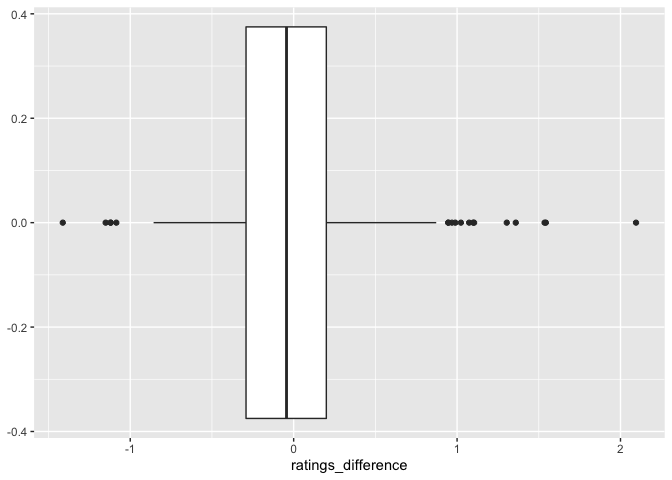
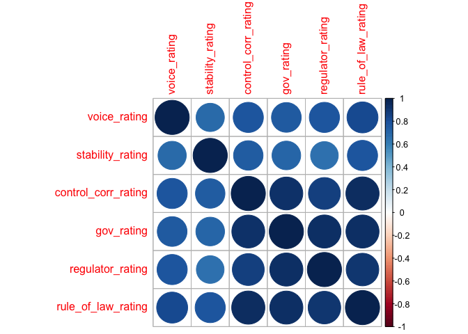

# Introduction

Discussion Board Title: World Government Indicators

Dataset: https://info.worldbank.org/governance/wgi/Home/downLoadFile?fileName=wgidataset.xlsx

Provided by: Thomas Buonora 

Suggested Prompt: None provided, will perform self-exploration around these questions: What countries have the lowest Voice and Accountability ratings today? What countries had the greatest drop in Voice and Accountability ratings since they began tracking for that country? What rating types are most correlated?

# Load Libraries

We will be using tidyverse and stringr packages for this exercise.


```r
library(tidyverse)
```

```
## ── Attaching packages ─────────────────────────────────────── tidyverse 1.3.1 ──
```

```
## ✓ ggplot2 3.3.5     ✓ purrr   0.3.4
## ✓ tibble  3.1.4     ✓ dplyr   1.0.7
## ✓ tidyr   1.1.3     ✓ stringr 1.4.0
## ✓ readr   2.0.1     ✓ forcats 0.5.1
```

```
## ── Conflicts ────────────────────────────────────────── tidyverse_conflicts() ──
## x dplyr::filter() masks stats::filter()
## x dplyr::lag()    masks stats::lag()
```

```r
library(stringr)
library(corrr)
library(corrplot)
```

```
## corrplot 0.90 loaded
```


# Load Data

This assignment will tidy and concatenate 6 global ratings datasets:

- Voice and Accountability Ratings
- Political Stability Ratings
- Control of Corruption Ratings
- Government Effectiveness Ratings
- Regulator Quality Ratings
- Rule of Law Ratings

These ratings are standardized between -2.5 (poor rating) and 2.5 (positive rating). 


```r
voice_ratings <- read_csv("https://raw.githubusercontent.com/man-of-moose/masters_607/main/projects/project_2/world_indicators/free_speech_indicators.csv")
```


```r
stability_ratings <- read_csv("https://raw.githubusercontent.com/man-of-moose/masters_607/main/projects/project_2/world_indicators/political_stability.csv")
```


```r
regulator_quality <- read_csv("https://raw.githubusercontent.com/man-of-moose/masters_607/main/projects/project_2/world_indicators/regulator_quality.csv")
```


```r
control_of_corruption <- read_csv("https://raw.githubusercontent.com/man-of-moose/masters_607/main/projects/project_2/world_indicators/control_of_corruption.csv")
```


```r
government_effectiveness <- read_csv("https://raw.githubusercontent.com/man-of-moose/masters_607/main/projects/project_2/world_indicators/government_effectiveness.csv")
```


```r
rule_of_law <- read_csv("https://raw.githubusercontent.com/man-of-moose/masters_607/main/projects/project_2/world_indicators/rule_of_law.csv")
```


Viewing the raw data for voice_ratings, it is evident that this is in a troublesome "wide" format. The data is grouped horizontally by year, but includes multiple measurements per group (estimate, stderr, numsrc, rank, lower, upper). Because of this, a simple gather() will not suffice.

Because we will be analyzing multiple ratings per country, we will focus only on capturing the year data for "Estimate" column, which corresponds to the rating per year, based on the dataset.


```r
head(voice_ratings)
```

<div data-pagedtable="false">
  <script data-pagedtable-source type="application/json">
{"columns":[{"label":["...1"],"name":[1],"type":["chr"],"align":["left"]},{"label":["...2"],"name":[2],"type":["chr"],"align":["left"]},{"label":["1996...3"],"name":[3],"type":["chr"],"align":["left"]},{"label":["1996...4"],"name":[4],"type":["chr"],"align":["left"]},{"label":["1996...5"],"name":[5],"type":["chr"],"align":["left"]},{"label":["1996...6"],"name":[6],"type":["chr"],"align":["left"]},{"label":["1996...7"],"name":[7],"type":["chr"],"align":["left"]},{"label":["1996...8"],"name":[8],"type":["chr"],"align":["left"]},{"label":["1998...9"],"name":[9],"type":["chr"],"align":["left"]},{"label":["1998...10"],"name":[10],"type":["chr"],"align":["left"]},{"label":["1998...11"],"name":[11],"type":["chr"],"align":["left"]},{"label":["1998...12"],"name":[12],"type":["chr"],"align":["left"]},{"label":["1998...13"],"name":[13],"type":["chr"],"align":["left"]},{"label":["1998...14"],"name":[14],"type":["chr"],"align":["left"]},{"label":["2000...15"],"name":[15],"type":["chr"],"align":["left"]},{"label":["2000...16"],"name":[16],"type":["chr"],"align":["left"]},{"label":["2000...17"],"name":[17],"type":["chr"],"align":["left"]},{"label":["2000...18"],"name":[18],"type":["chr"],"align":["left"]},{"label":["2000...19"],"name":[19],"type":["chr"],"align":["left"]},{"label":["2000...20"],"name":[20],"type":["chr"],"align":["left"]},{"label":["2002...21"],"name":[21],"type":["chr"],"align":["left"]},{"label":["2002...22"],"name":[22],"type":["chr"],"align":["left"]},{"label":["2002...23"],"name":[23],"type":["chr"],"align":["left"]},{"label":["2002...24"],"name":[24],"type":["chr"],"align":["left"]},{"label":["2002...25"],"name":[25],"type":["chr"],"align":["left"]},{"label":["2002...26"],"name":[26],"type":["chr"],"align":["left"]},{"label":["2003...27"],"name":[27],"type":["chr"],"align":["left"]},{"label":["2003...28"],"name":[28],"type":["chr"],"align":["left"]},{"label":["2003...29"],"name":[29],"type":["chr"],"align":["left"]},{"label":["2003...30"],"name":[30],"type":["chr"],"align":["left"]},{"label":["2003...31"],"name":[31],"type":["chr"],"align":["left"]},{"label":["2003...32"],"name":[32],"type":["chr"],"align":["left"]},{"label":["2004...33"],"name":[33],"type":["chr"],"align":["left"]},{"label":["2004...34"],"name":[34],"type":["chr"],"align":["left"]},{"label":["2004...35"],"name":[35],"type":["chr"],"align":["left"]},{"label":["2004...36"],"name":[36],"type":["chr"],"align":["left"]},{"label":["2004...37"],"name":[37],"type":["chr"],"align":["left"]},{"label":["2004...38"],"name":[38],"type":["chr"],"align":["left"]},{"label":["2005...39"],"name":[39],"type":["chr"],"align":["left"]},{"label":["2005...40"],"name":[40],"type":["chr"],"align":["left"]},{"label":["2005...41"],"name":[41],"type":["chr"],"align":["left"]},{"label":["2005...42"],"name":[42],"type":["chr"],"align":["left"]},{"label":["2005...43"],"name":[43],"type":["chr"],"align":["left"]},{"label":["2005...44"],"name":[44],"type":["chr"],"align":["left"]},{"label":["2006...45"],"name":[45],"type":["chr"],"align":["left"]},{"label":["2006...46"],"name":[46],"type":["chr"],"align":["left"]},{"label":["2006...47"],"name":[47],"type":["chr"],"align":["left"]},{"label":["2006...48"],"name":[48],"type":["chr"],"align":["left"]},{"label":["2006...49"],"name":[49],"type":["chr"],"align":["left"]},{"label":["2006...50"],"name":[50],"type":["chr"],"align":["left"]},{"label":["2007...51"],"name":[51],"type":["chr"],"align":["left"]},{"label":["2007...52"],"name":[52],"type":["chr"],"align":["left"]},{"label":["2007...53"],"name":[53],"type":["chr"],"align":["left"]},{"label":["2007...54"],"name":[54],"type":["chr"],"align":["left"]},{"label":["2007...55"],"name":[55],"type":["chr"],"align":["left"]},{"label":["2007...56"],"name":[56],"type":["chr"],"align":["left"]},{"label":["2008...57"],"name":[57],"type":["chr"],"align":["left"]},{"label":["2008...58"],"name":[58],"type":["chr"],"align":["left"]},{"label":["2008...59"],"name":[59],"type":["chr"],"align":["left"]},{"label":["2008...60"],"name":[60],"type":["chr"],"align":["left"]},{"label":["2008...61"],"name":[61],"type":["chr"],"align":["left"]},{"label":["2008...62"],"name":[62],"type":["chr"],"align":["left"]},{"label":["2009...63"],"name":[63],"type":["chr"],"align":["left"]},{"label":["2009...64"],"name":[64],"type":["chr"],"align":["left"]},{"label":["2009...65"],"name":[65],"type":["chr"],"align":["left"]},{"label":["2009...66"],"name":[66],"type":["chr"],"align":["left"]},{"label":["2009...67"],"name":[67],"type":["chr"],"align":["left"]},{"label":["2009...68"],"name":[68],"type":["chr"],"align":["left"]},{"label":["2010...69"],"name":[69],"type":["chr"],"align":["left"]},{"label":["2010...70"],"name":[70],"type":["chr"],"align":["left"]},{"label":["2010...71"],"name":[71],"type":["chr"],"align":["left"]},{"label":["2010...72"],"name":[72],"type":["chr"],"align":["left"]},{"label":["2010...73"],"name":[73],"type":["chr"],"align":["left"]},{"label":["2010...74"],"name":[74],"type":["chr"],"align":["left"]},{"label":["2011...75"],"name":[75],"type":["chr"],"align":["left"]},{"label":["2011...76"],"name":[76],"type":["chr"],"align":["left"]},{"label":["2011...77"],"name":[77],"type":["chr"],"align":["left"]},{"label":["2011...78"],"name":[78],"type":["chr"],"align":["left"]},{"label":["2011...79"],"name":[79],"type":["chr"],"align":["left"]},{"label":["2011...80"],"name":[80],"type":["chr"],"align":["left"]},{"label":["2012...81"],"name":[81],"type":["chr"],"align":["left"]},{"label":["2012...82"],"name":[82],"type":["chr"],"align":["left"]},{"label":["2012...83"],"name":[83],"type":["chr"],"align":["left"]},{"label":["2012...84"],"name":[84],"type":["chr"],"align":["left"]},{"label":["2012...85"],"name":[85],"type":["chr"],"align":["left"]},{"label":["2012...86"],"name":[86],"type":["chr"],"align":["left"]},{"label":["2013...87"],"name":[87],"type":["chr"],"align":["left"]},{"label":["2013...88"],"name":[88],"type":["chr"],"align":["left"]},{"label":["2013...89"],"name":[89],"type":["chr"],"align":["left"]},{"label":["2013...90"],"name":[90],"type":["chr"],"align":["left"]},{"label":["2013...91"],"name":[91],"type":["chr"],"align":["left"]},{"label":["2013...92"],"name":[92],"type":["chr"],"align":["left"]},{"label":["2014...93"],"name":[93],"type":["chr"],"align":["left"]},{"label":["2014...94"],"name":[94],"type":["chr"],"align":["left"]},{"label":["2014...95"],"name":[95],"type":["chr"],"align":["left"]},{"label":["2014...96"],"name":[96],"type":["chr"],"align":["left"]},{"label":["2014...97"],"name":[97],"type":["chr"],"align":["left"]},{"label":["2014...98"],"name":[98],"type":["chr"],"align":["left"]},{"label":["2015...99"],"name":[99],"type":["chr"],"align":["left"]},{"label":["2015...100"],"name":[100],"type":["chr"],"align":["left"]},{"label":["2015...101"],"name":[101],"type":["chr"],"align":["left"]},{"label":["2015...102"],"name":[102],"type":["chr"],"align":["left"]},{"label":["2015...103"],"name":[103],"type":["chr"],"align":["left"]},{"label":["2015...104"],"name":[104],"type":["chr"],"align":["left"]},{"label":["2016...105"],"name":[105],"type":["chr"],"align":["left"]},{"label":["2016...106"],"name":[106],"type":["chr"],"align":["left"]},{"label":["2016...107"],"name":[107],"type":["chr"],"align":["left"]},{"label":["2016...108"],"name":[108],"type":["chr"],"align":["left"]},{"label":["2016...109"],"name":[109],"type":["chr"],"align":["left"]},{"label":["2016...110"],"name":[110],"type":["chr"],"align":["left"]},{"label":["2017...111"],"name":[111],"type":["chr"],"align":["left"]},{"label":["2017...112"],"name":[112],"type":["chr"],"align":["left"]},{"label":["2017...113"],"name":[113],"type":["chr"],"align":["left"]},{"label":["2017...114"],"name":[114],"type":["chr"],"align":["left"]},{"label":["2017...115"],"name":[115],"type":["chr"],"align":["left"]},{"label":["2017...116"],"name":[116],"type":["chr"],"align":["left"]},{"label":["2018...117"],"name":[117],"type":["chr"],"align":["left"]},{"label":["2018...118"],"name":[118],"type":["chr"],"align":["left"]},{"label":["2018...119"],"name":[119],"type":["chr"],"align":["left"]},{"label":["2018...120"],"name":[120],"type":["chr"],"align":["left"]},{"label":["2018...121"],"name":[121],"type":["chr"],"align":["left"]},{"label":["2018...122"],"name":[122],"type":["chr"],"align":["left"]},{"label":["2019...123"],"name":[123],"type":["chr"],"align":["left"]},{"label":["2019...124"],"name":[124],"type":["chr"],"align":["left"]},{"label":["2019...125"],"name":[125],"type":["chr"],"align":["left"]},{"label":["2019...126"],"name":[126],"type":["chr"],"align":["left"]},{"label":["2019...127"],"name":[127],"type":["chr"],"align":["left"]},{"label":["2019...128"],"name":[128],"type":["chr"],"align":["left"]},{"label":["2020...129"],"name":[129],"type":["chr"],"align":["left"]},{"label":["2020...130"],"name":[130],"type":["chr"],"align":["left"]},{"label":["2020...131"],"name":[131],"type":["chr"],"align":["left"]},{"label":["2020...132"],"name":[132],"type":["chr"],"align":["left"]},{"label":["2020...133"],"name":[133],"type":["chr"],"align":["left"]},{"label":["2020...134"],"name":[134],"type":["chr"],"align":["left"]}],"data":[{"1":"Country/Territory","2":"Code","3":"Estimate","4":"StdErr","5":"NumSrc","6":"Rank","7":"Lower","8":"Upper","9":"Estimate","10":"StdErr","11":"NumSrc","12":"Rank","13":"Lower","14":"Upper","15":"Estimate","16":"StdErr","17":"NumSrc","18":"Rank","19":"Lower","20":"Upper","21":"Estimate","22":"StdErr","23":"NumSrc","24":"Rank","25":"Lower","26":"Upper","27":"Estimate","28":"StdErr","29":"NumSrc","30":"Rank","31":"Lower","32":"Upper","33":"Estimate","34":"StdErr","35":"NumSrc","36":"Rank","37":"Lower","38":"Upper","39":"Estimate","40":"StdErr","41":"NumSrc","42":"Rank","43":"Lower","44":"Upper","45":"Estimate","46":"StdErr","47":"NumSrc","48":"Rank","49":"Lower","50":"Upper","51":"Estimate","52":"StdErr","53":"NumSrc","54":"Rank","55":"Lower","56":"Upper","57":"Estimate","58":"StdErr","59":"NumSrc","60":"Rank","61":"Lower","62":"Upper","63":"Estimate","64":"StdErr","65":"NumSrc","66":"Rank","67":"Lower","68":"Upper","69":"Estimate","70":"StdErr","71":"NumSrc","72":"Rank","73":"Lower","74":"Upper","75":"Estimate","76":"StdErr","77":"NumSrc","78":"Rank","79":"Lower","80":"Upper","81":"Estimate","82":"StdErr","83":"NumSrc","84":"Rank","85":"Lower","86":"Upper","87":"Estimate","88":"StdErr","89":"NumSrc","90":"Rank","91":"Lower","92":"Upper","93":"Estimate","94":"StdErr","95":"NumSrc","96":"Rank","97":"Lower","98":"Upper","99":"Estimate","100":"StdErr","101":"NumSrc","102":"Rank","103":"Lower","104":"Upper","105":"Estimate","106":"StdErr","107":"NumSrc","108":"Rank","109":"Lower","110":"Upper","111":"Estimate","112":"StdErr","113":"NumSrc","114":"Rank","115":"Lower","116":"Upper","117":"Estimate","118":"StdErr","119":"NumSrc","120":"Rank","121":"Lower","122":"Upper","123":"Estimate","124":"StdErr","125":"NumSrc","126":"Rank","127":"Lower","128":"Upper","129":"Estimate","130":"StdErr","131":"NumSrc","132":"Rank","133":"Lower","134":"Upper"},{"1":"Aruba","2":"ABW","3":"#N/A","4":"#N/A","5":"#N/A","6":"#N/A","7":"#N/A","8":"#N/A","9":"#N/A","10":"#N/A","11":"#N/A","12":"#N/A","13":"#N/A","14":"#N/A","15":"#N/A","16":"#N/A","17":"#N/A","18":"#N/A","19":"#N/A","20":"#N/A","21":"#N/A","22":"#N/A","23":"#N/A","24":"#N/A","25":"#N/A","26":"#N/A","27":"#N/A","28":"#N/A","29":"#N/A","30":"#N/A","31":"#N/A","32":"#N/A","33":"0.737520695","34":"0.338822395","35":"1","36":"73.07691956","37":"56.25","38":"88.94230652","39":"1.153230071","40":"0.357602417","41":"1","42":"85.57691956","43":"64.90384674","44":"100","45":"1.017273426","46":"0.491848856","47":"1","48":"80.28845978","49":"53.84615326","50":"100","51":"0.972128868","52":"0.511655807","53":"1","54":"78.36538696","55":"52.88461685","56":"100","57":"0.967198193","58":"0.511172235","59":"1","60":"79.32691956","61":"51.44230652","62":"100","63":"1.25234437","64":"0.259898603","65":"2","66":"91.4691925","67":"71.5639801","68":"100","69":"1.281883955","70":"0.239399835","71":"2","72":"90.99526215","73":"72.98577881","74":"100","75":"1.273587823","76":"0.234903127","77":"2","78":"90.61032867","79":"74.64788818","80":"100","81":"1.28464973","82":"0.209522918","83":"2","84":"90.61032867","85":"76.05633545","86":"97.65258026","87":"1.278059244","88":"0.20330961","89":"2","90":"90.61032867","91":"75.58685303","92":"97.65258026","93":"1.276822448","94":"0.267147124","95":"1","96":"92.1182251","97":"71.92118073","98":"100","99":"1.273941755","100":"0.276419848","101":"1","102":"91.62561798","103":"72.41379547","104":"100","105":"1.279367566","106":"0.291443586","107":"1","108":"92.1182251","109":"71.92118073","110":"100","111":"1.295541406","112":"0.282478005","113":"1","114":"92.61083984","115":"73.89162445","116":"100","117":"1.271613002","118":"0.24762091","119":"1","120":"90.82125854","121":"76.32849884","122":"99.51690674","123":"1.264410615","124":"0.267498434","125":"1","126":"91.78743744","127":"72.94686127","128":"100","129":"1.28910768","130":"0.260646254","131":"1","132":"92.75362396","133":"72.46376801","134":"99.51690674"},{"1":"Andorra","2":"ADO","3":"1.563216686","4":"0.291690677","5":"3","6":"98.5","7":"81.5","8":"100","9":"1.528759122","10":"0.291445464","11":"3","12":"97.51243591","13":"78.60696411","14":"100","15":"1.535655499","16":"0.29128316","17":"3","18":"97.0149231","19":"80.59701538","20":"100","21":"1.437128186","22":"0.272817552","23":"3","24":"95.52238464","25":"74.6268692","26":"100","27":"1.422261953","28":"0.2690323","29":"3","30":"94.02985382","31":"77.11442566","32":"100","33":"1.563076615","34":"0.260854989","35":"3","36":"94.71154022","37":"85.09615326","38":"100","39":"1.528181553","40":"0.266424268","41":"3","42":"94.71154022","43":"82.69230652","44":"100","45":"1.3299793","46":"0.234210014","47":"3","48":"92.30769348","49":"76.44230652","50":"100","51":"1.305506468","52":"0.230224192","53":"3","54":"92.30769348","55":"74.03845978","56":"100","57":"1.325321794","58":"0.226611674","59":"3","60":"93.2692337","61":"75.96154022","62":"100","63":"1.322938085","64":"0.23278372","65":"3","66":"92.41706085","67":"74.8815155","68":"100","69":"1.324308634","70":"0.236173764","71":"3","72":"92.89099884","73":"75.35545349","74":"100","75":"1.360453367","76":"0.23199603","77":"3","78":"93.89671326","79":"76.52581787","80":"100","81":"1.433837652","82":"0.233316243","83":"4","84":"93.89671326","85":"81.22065735","86":"100","87":"1.406641722","88":"0.226248547","89":"4","90":"93.89671326","91":"81.69013977","92":"100","93":"1.165938854","94":"0.249166101","95":"2","96":"87.68473053","97":"70.93595886","98":"99.01477814","99":"1.194476604","100":"0.234822407","101":"2","102":"88.17733765","103":"72.41379547","104":"99.50739288","105":"1.17659831","106":"0.217248425","107":"2","108":"87.19211578","109":"72.90640259","110":"97.53694916","111":"1.161646605","112":"0.229062557","113":"2","114":"86.20689392","115":"72.90640259","116":"97.53694916","117":"1.036912799","118":"0.265538424","119":"2","120":"82.12560272","121":"68.11594391","122":"95.16908264","123":"1.11012435","124":"0.21835725","125":"2","126":"84.5410614","127":"71.01449585","128":"96.13526917","129":"1.089067698","130":"0.223904222","131":"2","132":"83.57488251","133":"70.04830933","134":"95.6521759"},{"1":"Afghanistan","2":"AFG","3":"-1.90854013","4":"0.261457115","5":"4","6":"1","7":"0","8":"9.5","9":"-2.039301157","10":"0.256089628","11":"4","12":"0.49751243","13":"0","14":"4.975124359","15":"-2.031416893","16":"0.254042536","17":"4","18":"0.99502486","19":"0","20":"5.4726367","21":"-1.433421016","22":"0.189453408","23":"6","24":"9.452735901","25":"2.98507452","26":"14.92537308","27":"-1.177571177","28":"0.207045421","29":"5","30":"14.42786026","31":"6.965174198","32":"24.37810898","33":"-1.203033924","34":"0.175590158","35":"7","36":"15.38461494","37":"7.211538315","38":"21.63461494","39":"-1.12542963","40":"0.173295274","41":"8","42":"14.90384579","43":"8.17307663","44":"23.55769157","45":"-1.110293984","46":"0.150166392","47":"9","48":"17.78846169","49":"8.653845787","50":"25","51":"-1.057653904","52":"0.14550525","53":"10","54":"18.75","55":"10.09615421","56":"25","57":"-1.168901801","58":"0.143898979","59":"10","60":"14.42307663","61":"9.134614944","62":"21.63461494","63":"-1.375496507","64":"0.147714943","65":"10","66":"9.478672981","67":"6.161137581","68":"14.21800995","69":"-1.404468179","70":"0.143254668","71":"10","72":"9.952606201","73":"5.687203884","74":"13.74407578","75":"-1.335976958","76":"0.14380087","77":"10","78":"11.26760578","79":"7.042253494","80":"15.96244144","81":"-1.267430067","82":"0.134757057","83":"11","84":"14.08450699","85":"6.572770119","86":"16.43192482","87":"-1.240068316","88":"0.123408414","89":"12","90":"14.55399036","91":"8.450704575","92":"17.37089157","93":"-1.135444999","94":"0.132238999","95":"10","96":"16.25615692","97":"9.359605789","98":"21.67487717","99":"-1.117563009","100":"0.134630308","101":"10","102":"18.71921158","103":"10.83743858","104":"22.66009903","105":"-1.037837505","106":"0.129879341","107":"10","108":"20.6896553","109":"13.30049229","110":"23.64532089","111":"-0.990854084","112":"0.130806759","113":"10","114":"22.1674881","115":"14.28571415","116":"24.63054276","117":"-1.011603355","118":"0.133870095","119":"10","120":"20.28985596","121":"13.52657032","122":"25.12077332","123":"-1.006792426","124":"0.127234191","125":"10","126":"21.25603867","127":"15.45893764","128":"24.63768196","129":"-1.083458543","130":"0.131292805","131":"9","132":"19.32367134","133":"13.04347801","134":"23.18840599"},{"1":"Angola","2":"AGO","3":"-1.578163505","4":"0.208809838","5":"6","6":"6","7":"0.5","8":"13","9":"-1.411878705","10":"0.214446098","11":"6","12":"9.452735901","13":"2.48756218","14":"16.91542244","15":"-1.458064675","16":"0.19728291","17":"7","18":"8.955224037","19":"1.99004972","20":"12.93532372","21":"-1.238779068","22":"0.159148961","23":"9","24":"12.93532372","25":"7.960198879","26":"20.39801025","27":"-1.272615314","28":"0.156959146","29":"10","30":"10.9452734","31":"6.965174198","32":"20.89552307","33":"-1.285479784","34":"0.144515619","35":"12","36":"11.53846169","37":"6.730769157","38":"18.75","39":"-1.234719396","40":"0.146223292","41":"12","42":"12.01923084","43":"8.17307663","44":"19.23077011","45":"-1.252087951","46":"0.120603837","47":"14","48":"11.53846169","49":"8.17307663","50":"18.75","51":"-1.18531394","52":"0.122697562","53":"13","54":"14.42307663","55":"8.653845787","56":"20.19230843","57":"-1.119346857","58":"0.11480885","59":"14","60":"15.86538506","61":"12.01923084","62":"21.63461494","63":"-1.126124859","64":"0.111552","65":"16","66":"14.69194317","67":"10.42654037","68":"21.32701492","69":"-1.120539427","70":"0.109905921","71":"17","72":"14.69194317","73":"12.79620838","74":"20.85308075","75":"-1.125478387","76":"0.111696735","77":"17","78":"14.55399036","79":"12.20657253","80":"20.18779373","81":"-1.076246738","82":"0.114395961","83":"16","84":"15.96244144","85":"14.08450699","86":"23.47417831","87":"-1.113843441","88":"0.109391339","89":"17","90":"15.96244144","91":"12.67605591","92":"22.06572723","93":"-1.145493984","94":"0.127360865","95":"13","96":"15.27093601","97":"9.359605789","98":"21.67487717","99":"-1.177248359","100":"0.126986519","101":"11","102":"15.27093601","103":"9.852216721","104":"22.1674881","105":"-1.139599919","106":"0.124807447","107":"11","108":"16.74876785","109":"11.82266045","110":"22.66009903","111":"-1.097938538","112":"0.123325311","113":"12","114":"17.73398972","115":"12.31527138","116":"23.15270996","117":"-0.906303406","118":"0.127323955","119":"12","120":"22.70531464","121":"17.87439537","122":"27.53623199","123":"-0.783532202","124":"0.120139003","125":"12","126":"25.12077332","127":"21.25603867","128":"29.46859932","129":"-0.810628235","130":"0.124612637","131":"11","132":"25.60386467","133":"20.28985596","134":"30.43478203"},{"1":"Anguilla","2":"AIA","3":"#N/A","4":"#N/A","5":"#N/A","6":"#N/A","7":"#N/A","8":"#N/A","9":"#N/A","10":"#N/A","11":"#N/A","12":"#N/A","13":"#N/A","14":"#N/A","15":"#N/A","16":"#N/A","17":"#N/A","18":"#N/A","19":"#N/A","20":"#N/A","21":"#N/A","22":"#N/A","23":"#N/A","24":"#N/A","25":"#N/A","26":"#N/A","27":"#N/A","28":"#N/A","29":"#N/A","30":"#N/A","31":"#N/A","32":"#N/A","33":"0.854418099","34":"0.338822395","35":"1","36":"76.44230652","37":"58.17307663","38":"90.38461304","39":"0.903781235","40":"0.357602417","41":"1","42":"75.4807663","43":"59.13461685","44":"93.2692337","45":"1.017273426","46":"0.491848856","47":"1","48":"80.28845978","49":"53.84615326","50":"100","51":"0.972128868","52":"0.511655807","53":"1","54":"78.36538696","55":"52.88461685","56":"100","57":"0.967198193","58":"0.511172235","59":"1","60":"79.32691956","61":"51.44230652","62":"100","63":"0.963812232","64":"0.500100732","65":"1","66":"77.25118256","67":"54.02843475","68":"100","69":"0.988284528","70":"0.478729606","71":"1","72":"78.1990509","73":"55.45023727","74":"100","75":"1.009051681","76":"0.448948443","77":"1","78":"78.87323761","79":"55.86854553","80":"100","81":"1.025671721","82":"0.429885238","83":"1","84":"80.75117493","85":"57.74647903","86":"100","87":"1.004767299","88":"0.457373589","89":"1","90":"81.22065735","91":"56.33802795","92":"100","93":"#N/A","94":"#N/A","95":"#N/A","96":"#N/A","97":"#N/A","98":"#N/A","99":"#N/A","100":"#N/A","101":"#N/A","102":"#N/A","103":"#N/A","104":"#N/A","105":"#N/A","106":"#N/A","107":"#N/A","108":"#N/A","109":"#N/A","110":"#N/A","111":"#N/A","112":"#N/A","113":"#N/A","114":"#N/A","115":"#N/A","116":"#N/A","117":"#N/A","118":"#N/A","119":"#N/A","120":"#N/A","121":"#N/A","122":"#N/A","123":"#N/A","124":"#N/A","125":"#N/A","126":"#N/A","127":"#N/A","128":"#N/A","129":"#N/A","130":"#N/A","131":"#N/A","132":"#N/A","133":"#N/A","134":"#N/A"}],"options":{"columns":{"min":{},"max":[10]},"rows":{"min":[10],"max":[10]},"pages":{}}}
  </script>
</div>

**As a note, all other input dataframes are of the same structure as voice_ratings.**

Based on the above data, it is apparent that both the column names, and the values in row 1 both contribute to the real column values. To be clear, the current column names (starting at column 3) provide information for the year, while row 1 (starting at column 3) classify the column's datapoints as "Estimate", "StdError","NumSrc","Rank","Lower","Upper". 

To remedy this, we will rename the columns to contain the concatenated strings of colnames() and row 1.


```r
colnames(voice_ratings) <- str_c(colnames(voice_ratings),voice_ratings[1,])
```


```r
colnames(stability_ratings) <- str_c(colnames(stability_ratings),stability_ratings[1,])
```


```r
colnames(control_of_corruption) <- str_c(colnames(control_of_corruption),control_of_corruption[1,])
```


```r
colnames(rule_of_law) <- str_c(colnames(rule_of_law),rule_of_law[1,])
```


```r
colnames(regulator_quality) <- str_c(colnames(regulator_quality),regulator_quality[1,])
```


```r
colnames(government_effectiveness) <- str_c(colnames(government_effectiveness),government_effectiveness[1,])
```

We can now drop row 1 from the tables.


```r
control_of_corruption <- control_of_corruption[-1,]
```


```r
government_effectiveness <- government_effectiveness[-1,]
```


```r
regulator_quality <- regulator_quality[-1,]
```


```r
rule_of_law <- rule_of_law[-1,]
```


```r
stability_ratings <- stability_ratings[-1,]
```


```r
voice_ratings <- voice_ratings[-1,]
```

Looking at the data now, we can see that each column (starting at column 3) contains both the year and the measurement type for that column.


```r
head(voice_ratings)
```

<div data-pagedtable="false">
  <script data-pagedtable-source type="application/json">
{"columns":[{"label":["...1Country/Territory"],"name":[1],"type":["chr"],"align":["left"]},{"label":["...2Code"],"name":[2],"type":["chr"],"align":["left"]},{"label":["1996...3Estimate"],"name":[3],"type":["chr"],"align":["left"]},{"label":["1996...4StdErr"],"name":[4],"type":["chr"],"align":["left"]},{"label":["1996...5NumSrc"],"name":[5],"type":["chr"],"align":["left"]},{"label":["1996...6Rank"],"name":[6],"type":["chr"],"align":["left"]},{"label":["1996...7Lower"],"name":[7],"type":["chr"],"align":["left"]},{"label":["1996...8Upper"],"name":[8],"type":["chr"],"align":["left"]},{"label":["1998...9Estimate"],"name":[9],"type":["chr"],"align":["left"]},{"label":["1998...10StdErr"],"name":[10],"type":["chr"],"align":["left"]},{"label":["1998...11NumSrc"],"name":[11],"type":["chr"],"align":["left"]},{"label":["1998...12Rank"],"name":[12],"type":["chr"],"align":["left"]},{"label":["1998...13Lower"],"name":[13],"type":["chr"],"align":["left"]},{"label":["1998...14Upper"],"name":[14],"type":["chr"],"align":["left"]},{"label":["2000...15Estimate"],"name":[15],"type":["chr"],"align":["left"]},{"label":["2000...16StdErr"],"name":[16],"type":["chr"],"align":["left"]},{"label":["2000...17NumSrc"],"name":[17],"type":["chr"],"align":["left"]},{"label":["2000...18Rank"],"name":[18],"type":["chr"],"align":["left"]},{"label":["2000...19Lower"],"name":[19],"type":["chr"],"align":["left"]},{"label":["2000...20Upper"],"name":[20],"type":["chr"],"align":["left"]},{"label":["2002...21Estimate"],"name":[21],"type":["chr"],"align":["left"]},{"label":["2002...22StdErr"],"name":[22],"type":["chr"],"align":["left"]},{"label":["2002...23NumSrc"],"name":[23],"type":["chr"],"align":["left"]},{"label":["2002...24Rank"],"name":[24],"type":["chr"],"align":["left"]},{"label":["2002...25Lower"],"name":[25],"type":["chr"],"align":["left"]},{"label":["2002...26Upper"],"name":[26],"type":["chr"],"align":["left"]},{"label":["2003...27Estimate"],"name":[27],"type":["chr"],"align":["left"]},{"label":["2003...28StdErr"],"name":[28],"type":["chr"],"align":["left"]},{"label":["2003...29NumSrc"],"name":[29],"type":["chr"],"align":["left"]},{"label":["2003...30Rank"],"name":[30],"type":["chr"],"align":["left"]},{"label":["2003...31Lower"],"name":[31],"type":["chr"],"align":["left"]},{"label":["2003...32Upper"],"name":[32],"type":["chr"],"align":["left"]},{"label":["2004...33Estimate"],"name":[33],"type":["chr"],"align":["left"]},{"label":["2004...34StdErr"],"name":[34],"type":["chr"],"align":["left"]},{"label":["2004...35NumSrc"],"name":[35],"type":["chr"],"align":["left"]},{"label":["2004...36Rank"],"name":[36],"type":["chr"],"align":["left"]},{"label":["2004...37Lower"],"name":[37],"type":["chr"],"align":["left"]},{"label":["2004...38Upper"],"name":[38],"type":["chr"],"align":["left"]},{"label":["2005...39Estimate"],"name":[39],"type":["chr"],"align":["left"]},{"label":["2005...40StdErr"],"name":[40],"type":["chr"],"align":["left"]},{"label":["2005...41NumSrc"],"name":[41],"type":["chr"],"align":["left"]},{"label":["2005...42Rank"],"name":[42],"type":["chr"],"align":["left"]},{"label":["2005...43Lower"],"name":[43],"type":["chr"],"align":["left"]},{"label":["2005...44Upper"],"name":[44],"type":["chr"],"align":["left"]},{"label":["2006...45Estimate"],"name":[45],"type":["chr"],"align":["left"]},{"label":["2006...46StdErr"],"name":[46],"type":["chr"],"align":["left"]},{"label":["2006...47NumSrc"],"name":[47],"type":["chr"],"align":["left"]},{"label":["2006...48Rank"],"name":[48],"type":["chr"],"align":["left"]},{"label":["2006...49Lower"],"name":[49],"type":["chr"],"align":["left"]},{"label":["2006...50Upper"],"name":[50],"type":["chr"],"align":["left"]},{"label":["2007...51Estimate"],"name":[51],"type":["chr"],"align":["left"]},{"label":["2007...52StdErr"],"name":[52],"type":["chr"],"align":["left"]},{"label":["2007...53NumSrc"],"name":[53],"type":["chr"],"align":["left"]},{"label":["2007...54Rank"],"name":[54],"type":["chr"],"align":["left"]},{"label":["2007...55Lower"],"name":[55],"type":["chr"],"align":["left"]},{"label":["2007...56Upper"],"name":[56],"type":["chr"],"align":["left"]},{"label":["2008...57Estimate"],"name":[57],"type":["chr"],"align":["left"]},{"label":["2008...58StdErr"],"name":[58],"type":["chr"],"align":["left"]},{"label":["2008...59NumSrc"],"name":[59],"type":["chr"],"align":["left"]},{"label":["2008...60Rank"],"name":[60],"type":["chr"],"align":["left"]},{"label":["2008...61Lower"],"name":[61],"type":["chr"],"align":["left"]},{"label":["2008...62Upper"],"name":[62],"type":["chr"],"align":["left"]},{"label":["2009...63Estimate"],"name":[63],"type":["chr"],"align":["left"]},{"label":["2009...64StdErr"],"name":[64],"type":["chr"],"align":["left"]},{"label":["2009...65NumSrc"],"name":[65],"type":["chr"],"align":["left"]},{"label":["2009...66Rank"],"name":[66],"type":["chr"],"align":["left"]},{"label":["2009...67Lower"],"name":[67],"type":["chr"],"align":["left"]},{"label":["2009...68Upper"],"name":[68],"type":["chr"],"align":["left"]},{"label":["2010...69Estimate"],"name":[69],"type":["chr"],"align":["left"]},{"label":["2010...70StdErr"],"name":[70],"type":["chr"],"align":["left"]},{"label":["2010...71NumSrc"],"name":[71],"type":["chr"],"align":["left"]},{"label":["2010...72Rank"],"name":[72],"type":["chr"],"align":["left"]},{"label":["2010...73Lower"],"name":[73],"type":["chr"],"align":["left"]},{"label":["2010...74Upper"],"name":[74],"type":["chr"],"align":["left"]},{"label":["2011...75Estimate"],"name":[75],"type":["chr"],"align":["left"]},{"label":["2011...76StdErr"],"name":[76],"type":["chr"],"align":["left"]},{"label":["2011...77NumSrc"],"name":[77],"type":["chr"],"align":["left"]},{"label":["2011...78Rank"],"name":[78],"type":["chr"],"align":["left"]},{"label":["2011...79Lower"],"name":[79],"type":["chr"],"align":["left"]},{"label":["2011...80Upper"],"name":[80],"type":["chr"],"align":["left"]},{"label":["2012...81Estimate"],"name":[81],"type":["chr"],"align":["left"]},{"label":["2012...82StdErr"],"name":[82],"type":["chr"],"align":["left"]},{"label":["2012...83NumSrc"],"name":[83],"type":["chr"],"align":["left"]},{"label":["2012...84Rank"],"name":[84],"type":["chr"],"align":["left"]},{"label":["2012...85Lower"],"name":[85],"type":["chr"],"align":["left"]},{"label":["2012...86Upper"],"name":[86],"type":["chr"],"align":["left"]},{"label":["2013...87Estimate"],"name":[87],"type":["chr"],"align":["left"]},{"label":["2013...88StdErr"],"name":[88],"type":["chr"],"align":["left"]},{"label":["2013...89NumSrc"],"name":[89],"type":["chr"],"align":["left"]},{"label":["2013...90Rank"],"name":[90],"type":["chr"],"align":["left"]},{"label":["2013...91Lower"],"name":[91],"type":["chr"],"align":["left"]},{"label":["2013...92Upper"],"name":[92],"type":["chr"],"align":["left"]},{"label":["2014...93Estimate"],"name":[93],"type":["chr"],"align":["left"]},{"label":["2014...94StdErr"],"name":[94],"type":["chr"],"align":["left"]},{"label":["2014...95NumSrc"],"name":[95],"type":["chr"],"align":["left"]},{"label":["2014...96Rank"],"name":[96],"type":["chr"],"align":["left"]},{"label":["2014...97Lower"],"name":[97],"type":["chr"],"align":["left"]},{"label":["2014...98Upper"],"name":[98],"type":["chr"],"align":["left"]},{"label":["2015...99Estimate"],"name":[99],"type":["chr"],"align":["left"]},{"label":["2015...100StdErr"],"name":[100],"type":["chr"],"align":["left"]},{"label":["2015...101NumSrc"],"name":[101],"type":["chr"],"align":["left"]},{"label":["2015...102Rank"],"name":[102],"type":["chr"],"align":["left"]},{"label":["2015...103Lower"],"name":[103],"type":["chr"],"align":["left"]},{"label":["2015...104Upper"],"name":[104],"type":["chr"],"align":["left"]},{"label":["2016...105Estimate"],"name":[105],"type":["chr"],"align":["left"]},{"label":["2016...106StdErr"],"name":[106],"type":["chr"],"align":["left"]},{"label":["2016...107NumSrc"],"name":[107],"type":["chr"],"align":["left"]},{"label":["2016...108Rank"],"name":[108],"type":["chr"],"align":["left"]},{"label":["2016...109Lower"],"name":[109],"type":["chr"],"align":["left"]},{"label":["2016...110Upper"],"name":[110],"type":["chr"],"align":["left"]},{"label":["2017...111Estimate"],"name":[111],"type":["chr"],"align":["left"]},{"label":["2017...112StdErr"],"name":[112],"type":["chr"],"align":["left"]},{"label":["2017...113NumSrc"],"name":[113],"type":["chr"],"align":["left"]},{"label":["2017...114Rank"],"name":[114],"type":["chr"],"align":["left"]},{"label":["2017...115Lower"],"name":[115],"type":["chr"],"align":["left"]},{"label":["2017...116Upper"],"name":[116],"type":["chr"],"align":["left"]},{"label":["2018...117Estimate"],"name":[117],"type":["chr"],"align":["left"]},{"label":["2018...118StdErr"],"name":[118],"type":["chr"],"align":["left"]},{"label":["2018...119NumSrc"],"name":[119],"type":["chr"],"align":["left"]},{"label":["2018...120Rank"],"name":[120],"type":["chr"],"align":["left"]},{"label":["2018...121Lower"],"name":[121],"type":["chr"],"align":["left"]},{"label":["2018...122Upper"],"name":[122],"type":["chr"],"align":["left"]},{"label":["2019...123Estimate"],"name":[123],"type":["chr"],"align":["left"]},{"label":["2019...124StdErr"],"name":[124],"type":["chr"],"align":["left"]},{"label":["2019...125NumSrc"],"name":[125],"type":["chr"],"align":["left"]},{"label":["2019...126Rank"],"name":[126],"type":["chr"],"align":["left"]},{"label":["2019...127Lower"],"name":[127],"type":["chr"],"align":["left"]},{"label":["2019...128Upper"],"name":[128],"type":["chr"],"align":["left"]},{"label":["2020...129Estimate"],"name":[129],"type":["chr"],"align":["left"]},{"label":["2020...130StdErr"],"name":[130],"type":["chr"],"align":["left"]},{"label":["2020...131NumSrc"],"name":[131],"type":["chr"],"align":["left"]},{"label":["2020...132Rank"],"name":[132],"type":["chr"],"align":["left"]},{"label":["2020...133Lower"],"name":[133],"type":["chr"],"align":["left"]},{"label":["2020...134Upper"],"name":[134],"type":["chr"],"align":["left"]}],"data":[{"1":"Aruba","2":"ABW","3":"#N/A","4":"#N/A","5":"#N/A","6":"#N/A","7":"#N/A","8":"#N/A","9":"#N/A","10":"#N/A","11":"#N/A","12":"#N/A","13":"#N/A","14":"#N/A","15":"#N/A","16":"#N/A","17":"#N/A","18":"#N/A","19":"#N/A","20":"#N/A","21":"#N/A","22":"#N/A","23":"#N/A","24":"#N/A","25":"#N/A","26":"#N/A","27":"#N/A","28":"#N/A","29":"#N/A","30":"#N/A","31":"#N/A","32":"#N/A","33":"0.737520695","34":"0.338822395","35":"1","36":"73.07691956","37":"56.25","38":"88.94230652","39":"1.153230071","40":"0.357602417","41":"1","42":"85.57691956","43":"64.90384674","44":"100","45":"1.017273426","46":"0.491848856","47":"1","48":"80.28845978","49":"53.84615326","50":"100","51":"0.972128868","52":"0.511655807","53":"1","54":"78.36538696","55":"52.88461685","56":"100","57":"0.967198193","58":"0.511172235","59":"1","60":"79.32691956","61":"51.44230652","62":"100","63":"1.25234437","64":"0.259898603","65":"2","66":"91.4691925","67":"71.5639801","68":"100","69":"1.281883955","70":"0.239399835","71":"2","72":"90.99526215","73":"72.98577881","74":"100","75":"1.273587823","76":"0.234903127","77":"2","78":"90.61032867","79":"74.64788818","80":"100","81":"1.28464973","82":"0.209522918","83":"2","84":"90.61032867","85":"76.05633545","86":"97.65258026","87":"1.278059244","88":"0.20330961","89":"2","90":"90.61032867","91":"75.58685303","92":"97.65258026","93":"1.276822448","94":"0.267147124","95":"1","96":"92.1182251","97":"71.92118073","98":"100","99":"1.273941755","100":"0.276419848","101":"1","102":"91.62561798","103":"72.41379547","104":"100","105":"1.279367566","106":"0.291443586","107":"1","108":"92.1182251","109":"71.92118073","110":"100","111":"1.295541406","112":"0.282478005","113":"1","114":"92.61083984","115":"73.89162445","116":"100","117":"1.271613002","118":"0.24762091","119":"1","120":"90.82125854","121":"76.32849884","122":"99.51690674","123":"1.264410615","124":"0.267498434","125":"1","126":"91.78743744","127":"72.94686127","128":"100","129":"1.28910768","130":"0.260646254","131":"1","132":"92.75362396","133":"72.46376801","134":"99.51690674"},{"1":"Andorra","2":"ADO","3":"1.563216686","4":"0.291690677","5":"3","6":"98.5","7":"81.5","8":"100","9":"1.528759122","10":"0.291445464","11":"3","12":"97.51243591","13":"78.60696411","14":"100","15":"1.535655499","16":"0.29128316","17":"3","18":"97.0149231","19":"80.59701538","20":"100","21":"1.437128186","22":"0.272817552","23":"3","24":"95.52238464","25":"74.6268692","26":"100","27":"1.422261953","28":"0.2690323","29":"3","30":"94.02985382","31":"77.11442566","32":"100","33":"1.563076615","34":"0.260854989","35":"3","36":"94.71154022","37":"85.09615326","38":"100","39":"1.528181553","40":"0.266424268","41":"3","42":"94.71154022","43":"82.69230652","44":"100","45":"1.3299793","46":"0.234210014","47":"3","48":"92.30769348","49":"76.44230652","50":"100","51":"1.305506468","52":"0.230224192","53":"3","54":"92.30769348","55":"74.03845978","56":"100","57":"1.325321794","58":"0.226611674","59":"3","60":"93.2692337","61":"75.96154022","62":"100","63":"1.322938085","64":"0.23278372","65":"3","66":"92.41706085","67":"74.8815155","68":"100","69":"1.324308634","70":"0.236173764","71":"3","72":"92.89099884","73":"75.35545349","74":"100","75":"1.360453367","76":"0.23199603","77":"3","78":"93.89671326","79":"76.52581787","80":"100","81":"1.433837652","82":"0.233316243","83":"4","84":"93.89671326","85":"81.22065735","86":"100","87":"1.406641722","88":"0.226248547","89":"4","90":"93.89671326","91":"81.69013977","92":"100","93":"1.165938854","94":"0.249166101","95":"2","96":"87.68473053","97":"70.93595886","98":"99.01477814","99":"1.194476604","100":"0.234822407","101":"2","102":"88.17733765","103":"72.41379547","104":"99.50739288","105":"1.17659831","106":"0.217248425","107":"2","108":"87.19211578","109":"72.90640259","110":"97.53694916","111":"1.161646605","112":"0.229062557","113":"2","114":"86.20689392","115":"72.90640259","116":"97.53694916","117":"1.036912799","118":"0.265538424","119":"2","120":"82.12560272","121":"68.11594391","122":"95.16908264","123":"1.11012435","124":"0.21835725","125":"2","126":"84.5410614","127":"71.01449585","128":"96.13526917","129":"1.089067698","130":"0.223904222","131":"2","132":"83.57488251","133":"70.04830933","134":"95.6521759"},{"1":"Afghanistan","2":"AFG","3":"-1.90854013","4":"0.261457115","5":"4","6":"1","7":"0","8":"9.5","9":"-2.039301157","10":"0.256089628","11":"4","12":"0.49751243","13":"0","14":"4.975124359","15":"-2.031416893","16":"0.254042536","17":"4","18":"0.99502486","19":"0","20":"5.4726367","21":"-1.433421016","22":"0.189453408","23":"6","24":"9.452735901","25":"2.98507452","26":"14.92537308","27":"-1.177571177","28":"0.207045421","29":"5","30":"14.42786026","31":"6.965174198","32":"24.37810898","33":"-1.203033924","34":"0.175590158","35":"7","36":"15.38461494","37":"7.211538315","38":"21.63461494","39":"-1.12542963","40":"0.173295274","41":"8","42":"14.90384579","43":"8.17307663","44":"23.55769157","45":"-1.110293984","46":"0.150166392","47":"9","48":"17.78846169","49":"8.653845787","50":"25","51":"-1.057653904","52":"0.14550525","53":"10","54":"18.75","55":"10.09615421","56":"25","57":"-1.168901801","58":"0.143898979","59":"10","60":"14.42307663","61":"9.134614944","62":"21.63461494","63":"-1.375496507","64":"0.147714943","65":"10","66":"9.478672981","67":"6.161137581","68":"14.21800995","69":"-1.404468179","70":"0.143254668","71":"10","72":"9.952606201","73":"5.687203884","74":"13.74407578","75":"-1.335976958","76":"0.14380087","77":"10","78":"11.26760578","79":"7.042253494","80":"15.96244144","81":"-1.267430067","82":"0.134757057","83":"11","84":"14.08450699","85":"6.572770119","86":"16.43192482","87":"-1.240068316","88":"0.123408414","89":"12","90":"14.55399036","91":"8.450704575","92":"17.37089157","93":"-1.135444999","94":"0.132238999","95":"10","96":"16.25615692","97":"9.359605789","98":"21.67487717","99":"-1.117563009","100":"0.134630308","101":"10","102":"18.71921158","103":"10.83743858","104":"22.66009903","105":"-1.037837505","106":"0.129879341","107":"10","108":"20.6896553","109":"13.30049229","110":"23.64532089","111":"-0.990854084","112":"0.130806759","113":"10","114":"22.1674881","115":"14.28571415","116":"24.63054276","117":"-1.011603355","118":"0.133870095","119":"10","120":"20.28985596","121":"13.52657032","122":"25.12077332","123":"-1.006792426","124":"0.127234191","125":"10","126":"21.25603867","127":"15.45893764","128":"24.63768196","129":"-1.083458543","130":"0.131292805","131":"9","132":"19.32367134","133":"13.04347801","134":"23.18840599"},{"1":"Angola","2":"AGO","3":"-1.578163505","4":"0.208809838","5":"6","6":"6","7":"0.5","8":"13","9":"-1.411878705","10":"0.214446098","11":"6","12":"9.452735901","13":"2.48756218","14":"16.91542244","15":"-1.458064675","16":"0.19728291","17":"7","18":"8.955224037","19":"1.99004972","20":"12.93532372","21":"-1.238779068","22":"0.159148961","23":"9","24":"12.93532372","25":"7.960198879","26":"20.39801025","27":"-1.272615314","28":"0.156959146","29":"10","30":"10.9452734","31":"6.965174198","32":"20.89552307","33":"-1.285479784","34":"0.144515619","35":"12","36":"11.53846169","37":"6.730769157","38":"18.75","39":"-1.234719396","40":"0.146223292","41":"12","42":"12.01923084","43":"8.17307663","44":"19.23077011","45":"-1.252087951","46":"0.120603837","47":"14","48":"11.53846169","49":"8.17307663","50":"18.75","51":"-1.18531394","52":"0.122697562","53":"13","54":"14.42307663","55":"8.653845787","56":"20.19230843","57":"-1.119346857","58":"0.11480885","59":"14","60":"15.86538506","61":"12.01923084","62":"21.63461494","63":"-1.126124859","64":"0.111552","65":"16","66":"14.69194317","67":"10.42654037","68":"21.32701492","69":"-1.120539427","70":"0.109905921","71":"17","72":"14.69194317","73":"12.79620838","74":"20.85308075","75":"-1.125478387","76":"0.111696735","77":"17","78":"14.55399036","79":"12.20657253","80":"20.18779373","81":"-1.076246738","82":"0.114395961","83":"16","84":"15.96244144","85":"14.08450699","86":"23.47417831","87":"-1.113843441","88":"0.109391339","89":"17","90":"15.96244144","91":"12.67605591","92":"22.06572723","93":"-1.145493984","94":"0.127360865","95":"13","96":"15.27093601","97":"9.359605789","98":"21.67487717","99":"-1.177248359","100":"0.126986519","101":"11","102":"15.27093601","103":"9.852216721","104":"22.1674881","105":"-1.139599919","106":"0.124807447","107":"11","108":"16.74876785","109":"11.82266045","110":"22.66009903","111":"-1.097938538","112":"0.123325311","113":"12","114":"17.73398972","115":"12.31527138","116":"23.15270996","117":"-0.906303406","118":"0.127323955","119":"12","120":"22.70531464","121":"17.87439537","122":"27.53623199","123":"-0.783532202","124":"0.120139003","125":"12","126":"25.12077332","127":"21.25603867","128":"29.46859932","129":"-0.810628235","130":"0.124612637","131":"11","132":"25.60386467","133":"20.28985596","134":"30.43478203"},{"1":"Anguilla","2":"AIA","3":"#N/A","4":"#N/A","5":"#N/A","6":"#N/A","7":"#N/A","8":"#N/A","9":"#N/A","10":"#N/A","11":"#N/A","12":"#N/A","13":"#N/A","14":"#N/A","15":"#N/A","16":"#N/A","17":"#N/A","18":"#N/A","19":"#N/A","20":"#N/A","21":"#N/A","22":"#N/A","23":"#N/A","24":"#N/A","25":"#N/A","26":"#N/A","27":"#N/A","28":"#N/A","29":"#N/A","30":"#N/A","31":"#N/A","32":"#N/A","33":"0.854418099","34":"0.338822395","35":"1","36":"76.44230652","37":"58.17307663","38":"90.38461304","39":"0.903781235","40":"0.357602417","41":"1","42":"75.4807663","43":"59.13461685","44":"93.2692337","45":"1.017273426","46":"0.491848856","47":"1","48":"80.28845978","49":"53.84615326","50":"100","51":"0.972128868","52":"0.511655807","53":"1","54":"78.36538696","55":"52.88461685","56":"100","57":"0.967198193","58":"0.511172235","59":"1","60":"79.32691956","61":"51.44230652","62":"100","63":"0.963812232","64":"0.500100732","65":"1","66":"77.25118256","67":"54.02843475","68":"100","69":"0.988284528","70":"0.478729606","71":"1","72":"78.1990509","73":"55.45023727","74":"100","75":"1.009051681","76":"0.448948443","77":"1","78":"78.87323761","79":"55.86854553","80":"100","81":"1.025671721","82":"0.429885238","83":"1","84":"80.75117493","85":"57.74647903","86":"100","87":"1.004767299","88":"0.457373589","89":"1","90":"81.22065735","91":"56.33802795","92":"100","93":"#N/A","94":"#N/A","95":"#N/A","96":"#N/A","97":"#N/A","98":"#N/A","99":"#N/A","100":"#N/A","101":"#N/A","102":"#N/A","103":"#N/A","104":"#N/A","105":"#N/A","106":"#N/A","107":"#N/A","108":"#N/A","109":"#N/A","110":"#N/A","111":"#N/A","112":"#N/A","113":"#N/A","114":"#N/A","115":"#N/A","116":"#N/A","117":"#N/A","118":"#N/A","119":"#N/A","120":"#N/A","121":"#N/A","122":"#N/A","123":"#N/A","124":"#N/A","125":"#N/A","126":"#N/A","127":"#N/A","128":"#N/A","129":"#N/A","130":"#N/A","131":"#N/A","132":"#N/A","133":"#N/A","134":"#N/A"},{"1":"Albania","2":"ALB","3":"-0.648297846","4":"0.225410879","5":"5","6":"29.5","7":"16.5","8":"40.5","9":"-0.387372851","10":"0.233763546","11":"5","12":"38.80596924","13":"27.36318398","14":"48.75621796","15":"-0.285138667","16":"0.19642058","17":"6","18":"41.29353333","19":"30.84577179","20":"51.74129486","21":"-0.008150226","22":"0.169131875","23":"7","24":"48.25870514","25":"41.29353333","26":"56.71641922","27":"0.070307702","28":"0.167301029","29":"8","30":"50.24875641","31":"41.79104614","32":"60.19900513","33":"0.007237501","34":"0.175275072","35":"9","36":"49.03845978","37":"39.90384674","38":"58.17307663","39":"0.003671779","40":"0.171999812","41":"11","42":"51.44230652","43":"40.38461685","44":"59.13461685","45":"0.075889945","46":"0.135304466","47":"13","48":"49.03845978","49":"41.82692337","50":"56.25","51":"0.113008492","52":"0.134594038","53":"13","54":"51.92307663","55":"45.19230652","56":"57.21154022","57":"0.174939096","58":"0.134313121","59":"13","60":"53.36538315","61":"45.67307663","62":"58.17307663","63":"0.141477272","64":"0.136983767","65":"13","66":"54.02843475","67":"45.0236969","68":"57.81990433","69":"0.123821586","70":"0.130562931","71":"14","72":"54.02843475","73":"44.07582855","74":"57.34597015","75":"0.062333763","76":"0.126827046","77":"15","78":"52.11267471","79":"43.19248962","80":"55.86854553","81":"0.022064054","82":"0.11787165","83":"16","84":"50.70422363","85":"43.66197205","86":"56.33802795","87":"0.048892584","88":"0.117732346","89":"15","90":"51.17370987","91":"43.19248962","92":"56.33802795","93":"0.143760741","94":"0.124896288","95":"12","96":"50.24630356","97":"46.79803085","98":"59.11330032","99":"0.157148644","100":"0.127310872","101":"12","102":"52.70935822","103":"45.81280899","104":"58.62068939","105":"0.170926735","106":"0.122668102","107":"12","108":"52.21674728","109":"45.32019806","110":"57.63546753","111":"0.203784555","112":"0.124308333","113":"12","114":"54.18719101","115":"46.30541992","116":"59.11330032","117":"0.1807338","118":"0.127143741","119":"12","120":"52.65700531","121":"44.44444275","122":"58.93719864","123":"0.142710745","124":"0.121825702","125":"11","126":"52.17391205","127":"42.99517059","128":"57.48792267","129":"0.087339923","130":"0.124917336","131":"10","132":"51.20772934","133":"40.09661865","134":"57.00482941"}],"options":{"columns":{"min":{},"max":[10]},"rows":{"min":[10],"max":[10]},"pages":{}}}
  </script>
</div>

### Selecr estimate column for each dataset

Here we will select the "estimate" column for each dataframe, which hold the relevant rankings for each dataset.


```r
control_of_corruption <- control_of_corruption %>%
  rename(
    country = `...1Country/Territory`,
    code = `...2Code`
    ) %>%
  select(
    country, code, contains("Estimate")
  )
```


```r
government_effectiveness <- government_effectiveness %>%
  rename(
    country = `...1Country/Territory`,
    code = `...2Code`
    ) %>%
  select(
    country, code, contains("Estimate")
  )
```


```r
regulator_quality <- regulator_quality %>%
  rename(
    country = `...1Country/Territory`,
    code = `...2Code`
    ) %>%
  select(
    country, code, contains("Estimate")
  )
```


```r
rule_of_law <- rule_of_law %>%
  rename(
    country = `...1Country/Territory`,
    code = `...2Code`
    ) %>%
  select(
    country, code, contains("Estimate")
  )
```


```r
stability_ratings <- stability_ratings %>%
  rename(
    country = `...1Country/Territory`,
    code = `...2Code`
    ) %>%
  select(
    country, code, contains("Estimate")
  )
```


```r
voice_ratings <- voice_ratings %>%
  rename(
    country = `...1Country/Territory`,
    code = `...2Code`
    ) %>%
  select(
    country, code, contains("Estimate")
  )
```

View the below table to get a visualization for what we're doing here. The returned table includes the country and code columns, as well as every column which pertains the "Estimate" mesasurements.


```r
head(voice_ratings)
```

<div data-pagedtable="false">
  <script data-pagedtable-source type="application/json">
{"columns":[{"label":["country"],"name":[1],"type":["chr"],"align":["left"]},{"label":["code"],"name":[2],"type":["chr"],"align":["left"]},{"label":["1996...3Estimate"],"name":[3],"type":["chr"],"align":["left"]},{"label":["1998...9Estimate"],"name":[4],"type":["chr"],"align":["left"]},{"label":["2000...15Estimate"],"name":[5],"type":["chr"],"align":["left"]},{"label":["2002...21Estimate"],"name":[6],"type":["chr"],"align":["left"]},{"label":["2003...27Estimate"],"name":[7],"type":["chr"],"align":["left"]},{"label":["2004...33Estimate"],"name":[8],"type":["chr"],"align":["left"]},{"label":["2005...39Estimate"],"name":[9],"type":["chr"],"align":["left"]},{"label":["2006...45Estimate"],"name":[10],"type":["chr"],"align":["left"]},{"label":["2007...51Estimate"],"name":[11],"type":["chr"],"align":["left"]},{"label":["2008...57Estimate"],"name":[12],"type":["chr"],"align":["left"]},{"label":["2009...63Estimate"],"name":[13],"type":["chr"],"align":["left"]},{"label":["2010...69Estimate"],"name":[14],"type":["chr"],"align":["left"]},{"label":["2011...75Estimate"],"name":[15],"type":["chr"],"align":["left"]},{"label":["2012...81Estimate"],"name":[16],"type":["chr"],"align":["left"]},{"label":["2013...87Estimate"],"name":[17],"type":["chr"],"align":["left"]},{"label":["2014...93Estimate"],"name":[18],"type":["chr"],"align":["left"]},{"label":["2015...99Estimate"],"name":[19],"type":["chr"],"align":["left"]},{"label":["2016...105Estimate"],"name":[20],"type":["chr"],"align":["left"]},{"label":["2017...111Estimate"],"name":[21],"type":["chr"],"align":["left"]},{"label":["2018...117Estimate"],"name":[22],"type":["chr"],"align":["left"]},{"label":["2019...123Estimate"],"name":[23],"type":["chr"],"align":["left"]},{"label":["2020...129Estimate"],"name":[24],"type":["chr"],"align":["left"]}],"data":[{"1":"Aruba","2":"ABW","3":"#N/A","4":"#N/A","5":"#N/A","6":"#N/A","7":"#N/A","8":"0.737520695","9":"1.153230071","10":"1.017273426","11":"0.972128868","12":"0.967198193","13":"1.25234437","14":"1.281883955","15":"1.273587823","16":"1.28464973","17":"1.278059244","18":"1.276822448","19":"1.273941755","20":"1.279367566","21":"1.295541406","22":"1.271613002","23":"1.264410615","24":"1.28910768"},{"1":"Andorra","2":"ADO","3":"1.563216686","4":"1.528759122","5":"1.535655499","6":"1.437128186","7":"1.422261953","8":"1.563076615","9":"1.528181553","10":"1.3299793","11":"1.305506468","12":"1.325321794","13":"1.322938085","14":"1.324308634","15":"1.360453367","16":"1.433837652","17":"1.406641722","18":"1.165938854","19":"1.194476604","20":"1.17659831","21":"1.161646605","22":"1.036912799","23":"1.11012435","24":"1.089067698"},{"1":"Afghanistan","2":"AFG","3":"-1.90854013","4":"-2.039301157","5":"-2.031416893","6":"-1.433421016","7":"-1.177571177","8":"-1.203033924","9":"-1.12542963","10":"-1.110293984","11":"-1.057653904","12":"-1.168901801","13":"-1.375496507","14":"-1.404468179","15":"-1.335976958","16":"-1.267430067","17":"-1.240068316","18":"-1.135444999","19":"-1.117563009","20":"-1.037837505","21":"-0.990854084","22":"-1.011603355","23":"-1.006792426","24":"-1.083458543"},{"1":"Angola","2":"AGO","3":"-1.578163505","4":"-1.411878705","5":"-1.458064675","6":"-1.238779068","7":"-1.272615314","8":"-1.285479784","9":"-1.234719396","10":"-1.252087951","11":"-1.18531394","12":"-1.119346857","13":"-1.126124859","14":"-1.120539427","15":"-1.125478387","16":"-1.076246738","17":"-1.113843441","18":"-1.145493984","19":"-1.177248359","20":"-1.139599919","21":"-1.097938538","22":"-0.906303406","23":"-0.783532202","24":"-0.810628235"},{"1":"Anguilla","2":"AIA","3":"#N/A","4":"#N/A","5":"#N/A","6":"#N/A","7":"#N/A","8":"0.854418099","9":"0.903781235","10":"1.017273426","11":"0.972128868","12":"0.967198193","13":"0.963812232","14":"0.988284528","15":"1.009051681","16":"1.025671721","17":"1.004767299","18":"#N/A","19":"#N/A","20":"#N/A","21":"#N/A","22":"#N/A","23":"#N/A","24":"#N/A"},{"1":"Albania","2":"ALB","3":"-0.648297846","4":"-0.387372851","5":"-0.285138667","6":"-0.008150226","7":"0.070307702","8":"0.007237501","9":"0.003671779","10":"0.075889945","11":"0.113008492","12":"0.174939096","13":"0.141477272","14":"0.123821586","15":"0.062333763","16":"0.022064054","17":"0.048892584","18":"0.143760741","19":"0.157148644","20":"0.170926735","21":"0.203784555","22":"0.1807338","23":"0.142710745","24":"0.087339923"}],"options":{"columns":{"min":{},"max":[10]},"rows":{"min":[10],"max":[10]},"pages":{}}}
  </script>
</div>

### create function to rename year columns

Now that we've split the original data up, we need to begin cleaning up the column names so that we can use gather(). Function should take a string vector as input, and return a year if regex year is detected, otherwise return provided


```r
parse_year <- function(col_value) {
  regex <- "\\d{4}"
  extracted <- str_extract(col_value, regex)
  
  if (is.na(extracted)) {
    return(col_value)
  }
  return(extracted)
}
```


### Rename all colnames for all tables


```r
colnames(voice_ratings) <- colnames(voice_ratings) %>% lapply(parse_year) %>% unlist()
```

Let's take a look at the first table transformation to see what's happening


```r
head(voice_ratings)
```

<div data-pagedtable="false">
  <script data-pagedtable-source type="application/json">
{"columns":[{"label":["country"],"name":[1],"type":["chr"],"align":["left"]},{"label":["code"],"name":[2],"type":["chr"],"align":["left"]},{"label":["1996"],"name":[3],"type":["chr"],"align":["left"]},{"label":["1998"],"name":[4],"type":["chr"],"align":["left"]},{"label":["2000"],"name":[5],"type":["chr"],"align":["left"]},{"label":["2002"],"name":[6],"type":["chr"],"align":["left"]},{"label":["2003"],"name":[7],"type":["chr"],"align":["left"]},{"label":["2004"],"name":[8],"type":["chr"],"align":["left"]},{"label":["2005"],"name":[9],"type":["chr"],"align":["left"]},{"label":["2006"],"name":[10],"type":["chr"],"align":["left"]},{"label":["2007"],"name":[11],"type":["chr"],"align":["left"]},{"label":["2008"],"name":[12],"type":["chr"],"align":["left"]},{"label":["2009"],"name":[13],"type":["chr"],"align":["left"]},{"label":["2010"],"name":[14],"type":["chr"],"align":["left"]},{"label":["2011"],"name":[15],"type":["chr"],"align":["left"]},{"label":["2012"],"name":[16],"type":["chr"],"align":["left"]},{"label":["2013"],"name":[17],"type":["chr"],"align":["left"]},{"label":["2014"],"name":[18],"type":["chr"],"align":["left"]},{"label":["2015"],"name":[19],"type":["chr"],"align":["left"]},{"label":["2016"],"name":[20],"type":["chr"],"align":["left"]},{"label":["2017"],"name":[21],"type":["chr"],"align":["left"]},{"label":["2018"],"name":[22],"type":["chr"],"align":["left"]},{"label":["2019"],"name":[23],"type":["chr"],"align":["left"]},{"label":["2020"],"name":[24],"type":["chr"],"align":["left"]}],"data":[{"1":"Aruba","2":"ABW","3":"#N/A","4":"#N/A","5":"#N/A","6":"#N/A","7":"#N/A","8":"0.737520695","9":"1.153230071","10":"1.017273426","11":"0.972128868","12":"0.967198193","13":"1.25234437","14":"1.281883955","15":"1.273587823","16":"1.28464973","17":"1.278059244","18":"1.276822448","19":"1.273941755","20":"1.279367566","21":"1.295541406","22":"1.271613002","23":"1.264410615","24":"1.28910768"},{"1":"Andorra","2":"ADO","3":"1.563216686","4":"1.528759122","5":"1.535655499","6":"1.437128186","7":"1.422261953","8":"1.563076615","9":"1.528181553","10":"1.3299793","11":"1.305506468","12":"1.325321794","13":"1.322938085","14":"1.324308634","15":"1.360453367","16":"1.433837652","17":"1.406641722","18":"1.165938854","19":"1.194476604","20":"1.17659831","21":"1.161646605","22":"1.036912799","23":"1.11012435","24":"1.089067698"},{"1":"Afghanistan","2":"AFG","3":"-1.90854013","4":"-2.039301157","5":"-2.031416893","6":"-1.433421016","7":"-1.177571177","8":"-1.203033924","9":"-1.12542963","10":"-1.110293984","11":"-1.057653904","12":"-1.168901801","13":"-1.375496507","14":"-1.404468179","15":"-1.335976958","16":"-1.267430067","17":"-1.240068316","18":"-1.135444999","19":"-1.117563009","20":"-1.037837505","21":"-0.990854084","22":"-1.011603355","23":"-1.006792426","24":"-1.083458543"},{"1":"Angola","2":"AGO","3":"-1.578163505","4":"-1.411878705","5":"-1.458064675","6":"-1.238779068","7":"-1.272615314","8":"-1.285479784","9":"-1.234719396","10":"-1.252087951","11":"-1.18531394","12":"-1.119346857","13":"-1.126124859","14":"-1.120539427","15":"-1.125478387","16":"-1.076246738","17":"-1.113843441","18":"-1.145493984","19":"-1.177248359","20":"-1.139599919","21":"-1.097938538","22":"-0.906303406","23":"-0.783532202","24":"-0.810628235"},{"1":"Anguilla","2":"AIA","3":"#N/A","4":"#N/A","5":"#N/A","6":"#N/A","7":"#N/A","8":"0.854418099","9":"0.903781235","10":"1.017273426","11":"0.972128868","12":"0.967198193","13":"0.963812232","14":"0.988284528","15":"1.009051681","16":"1.025671721","17":"1.004767299","18":"#N/A","19":"#N/A","20":"#N/A","21":"#N/A","22":"#N/A","23":"#N/A","24":"#N/A"},{"1":"Albania","2":"ALB","3":"-0.648297846","4":"-0.387372851","5":"-0.285138667","6":"-0.008150226","7":"0.070307702","8":"0.007237501","9":"0.003671779","10":"0.075889945","11":"0.113008492","12":"0.174939096","13":"0.141477272","14":"0.123821586","15":"0.062333763","16":"0.022064054","17":"0.048892584","18":"0.143760741","19":"0.157148644","20":"0.170926735","21":"0.203784555","22":"0.1807338","23":"0.142710745","24":"0.087339923"}],"options":{"columns":{"min":{},"max":[10]},"rows":{"min":[10],"max":[10]},"pages":{}}}
  </script>
</div>

As we can see above, this is the same estimate_data table that we viewed earlier, only now the year columns contain only year values!


```r
colnames(stability_ratings) <- colnames(stability_ratings) %>% lapply(parse_year) %>% unlist()
```


```r
colnames(control_of_corruption) <- colnames(control_of_corruption) %>% lapply(parse_year) %>% unlist()
```


```r
colnames(government_effectiveness) <- colnames(government_effectiveness) %>% lapply(parse_year) %>% unlist()
```


```r
colnames(regulator_quality) <- colnames(regulator_quality) %>% lapply(parse_year) %>% unlist()
```


```r
colnames(rule_of_law) <- colnames(rule_of_law) %>% lapply(parse_year) %>% unlist()
```


### Use gather() on all tibbles to convert wide format to long format

Now we are ready to use gather() to convert each of the previously created tibbles into long format.


```r
voice_ratings <- voice_ratings %>%
  gather("year","voice_rating",3:24)
```


```r
stability_ratings <- stability_ratings %>%
  gather("year","stability_rating",3:24)
```


```r
control_of_corruption <- control_of_corruption %>%
  gather("year","control_corr_rating",3:24)
```


```r
government_effectiveness <- government_effectiveness %>%
  gather("year","gov_rating",3:24)
```


```r
regulator_quality <- regulator_quality %>%
  gather("year","regulator_rating",3:24)
```


```r
rule_of_law <- rule_of_law %>%
  gather("year","rule_of_law_rating",3:24)
```

### Add all gathered values into original dataframe

Finally, we can use a chained inner_join to merge all of the datasets back into one, "long" formatted dataframe.


```r
final_data <- voice_ratings %>%
  inner_join(stability_ratings,by=c("country","code","year")) %>%
  inner_join(control_of_corruption,by=c("country","code","year")) %>%
  inner_join(government_effectiveness,by=c("country","code","year")) %>%
  inner_join(regulator_quality,by=c("country","code","year")) %>%
  inner_join(rule_of_law,by=c("country","code","year"))
```


And finally, we can convert all of the measurement columns to double.


```r
final_data[,3:9] <- sapply(final_data[,3:9],as.double)
```

Below is the original data in "long" format.


```r
final_data
```

<div data-pagedtable="false">
  <script data-pagedtable-source type="application/json">
{"columns":[{"label":["country"],"name":[1],"type":["chr"],"align":["left"]},{"label":["code"],"name":[2],"type":["chr"],"align":["left"]},{"label":["year"],"name":[3],"type":["dbl"],"align":["right"]},{"label":["voice_rating"],"name":[4],"type":["dbl"],"align":["right"]},{"label":["stability_rating"],"name":[5],"type":["dbl"],"align":["right"]},{"label":["control_corr_rating"],"name":[6],"type":["dbl"],"align":["right"]},{"label":["gov_rating"],"name":[7],"type":["dbl"],"align":["right"]},{"label":["regulator_rating"],"name":[8],"type":["dbl"],"align":["right"]},{"label":["rule_of_law_rating"],"name":[9],"type":["dbl"],"align":["right"]}],"data":[{"1":"Aruba","2":"ABW","3":"1996","4":"NA","5":"NA","6":"NA","7":"NA","8":"NA","9":"NA"},{"1":"Andorra","2":"ADO","3":"1996","4":"1.563216686","5":"1.170157313","6":"1.3181432490","7":"1.4140377040","8":"1.266440e+00","9":"1.1583625080"},{"1":"Afghanistan","2":"AFG","3":"1996","4":"-1.908540130","5":"-2.414041758","6":"-1.2917047740","7":"-2.1751666070","8":"-2.090330e+00","9":"-1.7880754470"},{"1":"Angola","2":"AGO","3":"1996","4":"-1.578163505","5":"-2.057286263","6":"-1.1677018400","7":"-0.8599399920","8":"-1.415345e+00","9":"-1.6304693220"},{"1":"Anguilla","2":"AIA","3":"1996","4":"NA","5":"NA","6":"NA","7":"NA","8":"NA","9":"NA"},{"1":"Albania","2":"ALB","3":"1996","4":"-0.648297846","5":"-0.333811402","6":"-0.8939034940","7":"-0.6885879040","8":"-4.744017e-01","9":"-0.6844818000"},{"1":"Netherlands Antilles (former)","2":"ANT","3":"1996","4":"NA","5":"NA","6":"NA","7":"NA","8":"NA","9":"NA"},{"1":"United Arab Emirates","2":"ARE","3":"1996","4":"-0.409403622","5":"0.963122547","6":"-0.0055790590","7":"0.7766396400","8":"6.943053e-01","9":"0.6884139780"},{"1":"Argentina","2":"ARG","3":"1996","4":"0.391903371","5":"0.112985872","6":"-0.1013171520","7":"0.1656900500","8":"5.180674e-01","9":"0.0755526420"},{"1":"Armenia","2":"ARM","3":"1996","4":"-0.569909096","5":"-0.364675879","6":"-0.4730513100","7":"-0.3805644510","8":"-2.827645e-01","9":"-0.4690985080"},{"1":"American Samoa","2":"ASM","3":"1996","4":"NA","5":"NA","6":"NA","7":"NA","8":"NA","9":"NA"},{"1":"Antigua and Barbuda","2":"ATG","3":"1996","4":"0.333532423","5":"0.718495429","6":"0.8698971870","7":"0.6449224950","8":"7.869012e-01","9":"1.0508449080"},{"1":"Australia","2":"AUS","3":"1996","4":"1.440202951","5":"1.396474242","6":"1.8773558140","7":"1.8005645280","8":"1.367597e+00","9":"1.7133990530"},{"1":"Austria","2":"AUT","3":"1996","4":"1.448950052","5":"1.410497546","6":"1.7321635480","7":"1.7316496370","8":"1.658712e+00","9":"1.8081530330"},{"1":"Azerbaijan","2":"AZE","3":"1996","4":"-1.121030688","5":"-0.827652931","6":"-1.4456194640","7":"-0.9163895850","8":"-1.196309e+00","9":"-1.2011615040"},{"1":"Burundi","2":"BDI","3":"1996","4":"-1.549572229","5":"-2.113896847","6":"-0.6806348560","7":"-1.6624231340","8":"-1.641465e+00","9":"-1.4161202910"},{"1":"Belgium","2":"BEL","3":"1996","4":"1.433299541","5":"1.288752794","6":"1.3596543070","7":"1.7115436790","8":"1.214232e+00","9":"1.3669466970"},{"1":"Benin","2":"BEN","3":"1996","4":"0.259205192","5":"1.048929691","6":"-0.5481148960","7":"-0.3805644510","8":"-1.763183e-01","9":"0.0523155070"},{"1":"Burkina Faso","2":"BFA","3":"1996","4":"-0.533439755","5":"-0.301612794","6":"0.1115190910","7":"-0.9289404150","8":"-2.952701e-01","9":"-0.9332216380"},{"1":"Bangladesh","2":"BGD","3":"1996","4":"-0.058428358","5":"-0.546178162","6":"-0.9696822170","7":"-0.6878501180","8":"-9.298178e-01","9":"-0.9340237380"},{"1":"Bulgaria","2":"BGR","3":"1996","4":"0.428986371","5":"-0.090678282","6":"-0.3615051510","7":"-0.0425848290","8":"-1.844347e-01","9":"-0.3449580070"},{"1":"Bahrain","2":"BHR","3":"1996","4":"-0.718783438","5":"-0.307727605","6":"0.3286886810","7":"0.7766396400","8":"7.904871e-01","9":"-0.0101162660"},{"1":"Bahamas, The","2":"BHS","3":"1996","4":"1.102839470","5":"1.070221186","6":"1.1568101640","7":"1.3732420210","8":"9.677236e-01","9":"1.1463612320"},{"1":"Bosnia and Herzegovina","2":"BIH","3":"1996","4":"-0.103825636","5":"-0.592023313","6":"-0.2705697120","7":"-1.1920459270","8":"-9.107713e-01","9":"-0.2416866420"},{"1":"Belarus","2":"BLR","3":"1996","4":"-0.819772601","5":"0.093630686","6":"-0.3896091580","7":"-0.3805644510","8":"-1.093997e+00","9":"-0.7989839910"},{"1":"Belize","2":"BLZ","3":"1996","4":"0.824221611","5":"0.558367968","6":"-0.0265951310","7":"0.3885507580","8":"1.430119e-01","9":"0.0846815480"},{"1":"Bermuda","2":"BMU","3":"1996","4":"1.180363297","5":"0.718495429","6":"1.3181432490","7":"1.1576659680","8":"1.506209e+00","9":"1.2102012630"},{"1":"Bolivia","2":"BOL","3":"1996","4":"0.155518606","5":"-0.134786651","6":"-0.8248291020","7":"-0.1749895360","8":"4.968840e-03","9":"-0.2615283130"},{"1":"Brazil","2":"BRA","3":"1996","4":"0.242076978","5":"-0.218180925","6":"-0.0185795310","7":"-0.1431337150","8":"2.969333e-01","9":"-0.2235022040"},{"1":"Barbados","2":"BRB","3":"1996","4":"1.342969298","5":"1.048929691","6":"1.5427263980","7":"1.4140377040","8":"1.288828e+00","9":"1.0467729570"},{"1":"Brunei Darussalam","2":"BRN","3":"1996","4":"-0.649972320","5":"1.235572696","6":"0.4789949950","7":"0.9272896650","8":"1.348304e+00","9":"0.8160349130"},{"1":"Bhutan","2":"BTN","3":"1996","4":"-0.952189922","5":"0.722960353","6":"0.9428384900","7":"0.6449224950","8":"-4.119453e-01","9":"-0.0315036250"},{"1":"South Sudan","2":"SSD","3":"1996","4":"NA","5":"NA","6":"NA","7":"NA","8":"NA","9":"NA"},{"1":"Botswana","2":"BWA","3":"1996","4":"0.862501025","5":"1.014611602","6":"0.8179612160","7":"0.5563769940","8":"6.507294e-01","9":"0.5845210550"},{"1":"Central African Republic","2":"CAF","3":"1996","4":"-0.827540696","5":"-1.210246682","6":"-1.1409312490","7":"-1.4060512780","8":"-8.914840e-01","9":"-1.1523813010"},{"1":"Canada","2":"CAN","3":"1996","4":"1.566335797","5":"1.233703971","6":"2.0314075950","7":"1.7423636910","8":"1.488291e+00","9":"1.6472547050"},{"1":"Switzerland","2":"CHE","3":"1996","4":"1.424485087","5":"1.456473351","6":"1.9869757890","7":"1.7570805550","8":"1.557659e+00","9":"1.9315519330"},{"1":"Chile","2":"CHL","3":"1996","4":"0.722760618","5":"0.678323686","6":"1.4541187290","7":"1.3379769330","8":"1.542760e+00","9":"1.1137381790"},{"1":"China","2":"CHN","3":"1996","4":"-1.361545205","5":"-0.095957071","6":"-0.2711895110","7":"-0.3486538830","8":"-2.666527e-01","9":"-0.5455899830"},{"1":"Côte d'Ivoire","2":"CIV","3":"1996","4":"-0.583225548","5":"0.034838725","6":"-0.2605668310","7":"-0.2609782220","8":"-3.985770e-01","9":"-0.7854351400"},{"1":"Cameroon","2":"CMR","3":"1996","4":"-0.938624918","5":"-0.956825614","6":"-1.3349847790","7":"-1.0802026990","8":"-1.122349e+00","9":"-1.4418948890"},{"1":"Congo, Rep.","2":"COG","3":"1996","4":"-0.827253401","5":"-1.222377300","6":"-0.8607403040","7":"-1.1692929270","8":"-1.227481e+00","9":"-1.0438100100"},{"1":"Cook Islands","2":"COK","3":"1996","4":"NA","5":"NA","6":"NA","7":"NA","8":"NA","9":"NA"},{"1":"Colombia","2":"COL","3":"1996","4":"-0.510942340","5":"-1.641695261","6":"-0.5122543570","7":"-0.4586288930","8":"-1.054877e-01","9":"-0.7518377900"},{"1":"Comoros","2":"COM","3":"1996","4":"-0.423996627","5":"0.506719232","6":"-0.9985650180","7":"-1.6624231340","8":"-1.131253e+00","9":"-0.8786042930"},{"1":"Cape Verde","2":"CPV","3":"1996","4":"0.937576175","5":"1.031386375","6":"1.1433373690","7":"NA","8":"-5.322676e-01","9":"1.0441881420"},{"1":"Costa Rica","2":"CRI","3":"1996","4":"1.077363610","5":"0.754077494","6":"0.6961424350","7":"0.4684306980","8":"5.518193e-01","9":"0.6181768770"},{"1":"Cuba","2":"CUB","3":"1996","4":"-1.425480008","5":"0.232741192","6":"0.2891525330","7":"-0.9081128240","8":"-1.100114e+00","9":"-1.1368108990"},{"1":"Cayman Islands","2":"CYM","3":"1996","4":"1.620618224","5":"0.718495429","6":"1.3181432490","7":"1.9267811780","8":"1.026670e+00","9":"1.4597682950"},{"1":"Cyprus","2":"CYP","3":"1996","4":"1.035754323","5":"0.387375444","6":"1.3312882180","7":"1.1716637610","8":"1.261967e+00","9":"0.8573210240"},{"1":"Czech Republic","2":"CZE","3":"1996","4":"1.034855723","5":"1.147579074","6":"0.6832193730","7":"0.6205829980","8":"1.071839e+00","9":"0.9153227210"},{"1":"Germany","2":"DEU","3":"1996","4":"1.328895330","5":"1.288752794","6":"1.9052168130","7":"1.7246767280","8":"1.481484e+00","9":"1.6095292570"},{"1":"Djibouti","2":"DJI","3":"1996","4":"-0.882711172","5":"-0.338851511","6":"-0.7199812530","7":"-0.8933079240","8":"-1.002804e+00","9":"-0.9716137650"},{"1":"Dominica","2":"DMA","3":"1996","4":"1.042290330","5":"0.718495429","6":"0.8698971870","7":"0.6449224950","8":"1.026670e+00","9":"0.8424156900"},{"1":"Denmark","2":"DNK","3":"1996","4":"1.538971782","5":"1.442067623","6":"2.2313079830","7":"1.7590478660","8":"1.783265e+00","9":"1.8208086490"},{"1":"Dominican Republic","2":"DOM","3":"1996","4":"0.056515027","5":"-0.073888317","6":"-0.4229954180","7":"-0.2232383940","8":"-2.312835e-01","9":"-0.5225906370"},{"1":"Algeria","2":"DZA","3":"1996","4":"-1.166290164","5":"-1.780030727","6":"-0.5667409300","7":"-1.0887664560","8":"-9.074373e-01","9":"-1.2181948420"},{"1":"Ecuador","2":"ECU","3":"1996","4":"0.013284295","5":"-0.768633664","6":"-0.6848738190","7":"-0.4753116970","8":"-3.082701e-01","9":"-0.4497077760"},{"1":"Egypt, Arab Rep.","2":"EGY","3":"1996","4":"-0.844184160","5":"-0.523576140","6":"-0.4722543950","7":"-0.4736760850","8":"-4.816997e-02","9":"0.0012624410"},{"1":"Eritrea","2":"ERI","3":"1996","4":"-1.363928318","5":"-0.935926080","6":"0.5056852700","7":"-1.1496796610","8":"-1.131253e+00","9":"-0.6551316980"},{"1":"Spain","2":"ESP","3":"1996","4":"1.319526911","5":"0.177704945","6":"1.1292111870","7":"1.6200271840","8":"1.184066e+00","9":"1.4350855350"},{"1":"Estonia","2":"EST","3":"1996","4":"0.926167071","5":"0.767552137","6":"0.4492229820","7":"0.6115037800","8":"1.240010e+00","9":"0.5744267110"},{"1":"Ethiopia","2":"ETH","3":"1996","4":"-1.083550096","5":"-1.051121712","6":"-0.9305459860","7":"-1.2075936790","8":"-1.296775e+00","9":"-0.9657885430"},{"1":"Finland","2":"FIN","3":"1996","4":"1.517697930","5":"1.412274957","6":"2.2068724630","7":"1.7249964480","8":"1.548161e+00","9":"1.9079215530"},{"1":"Fiji","2":"FJI","3":"1996","4":"0.152574241","5":"0.829473197","6":"0.6593025920","7":"-0.1241927000","8":"3.030323e-02","9":"0.3234747950"},{"1":"France","2":"FRA","3":"1996","4":"1.311158419","5":"0.888228416","6":"1.2474092250","7":"1.2518574000","8":"1.048776e+00","9":"1.4836833480"},{"1":"Micronesia, Fed. Sts.","2":"FSM","3":"1996","4":"1.113322139","5":"NA","6":"NA","7":"NA","8":"NA","9":"0.8091405630"},{"1":"Gabon","2":"GAB","3":"1996","4":"-0.321172208","5":"0.123643480","6":"-1.1023769380","7":"-0.1991520080","8":"1.356739e-01","9":"-0.6530522700"},{"1":"United Kingdom","2":"GBR","3":"1996","4":"1.272319436","5":"0.981750965","6":"1.9805189370","7":"1.8821960690","8":"2.020525e+00","9":"1.6287343500"},{"1":"Georgia","2":"GEO","3":"1996","4":"-0.331750810","5":"-1.568470955","6":"-1.5272641180","7":"-0.6369361280","8":"-1.014464e+00","9":"-1.2563259600"},{"1":"Ghana","2":"GHA","3":"1996","4":"-0.207235247","5":"-0.233098611","6":"-0.3399495480","7":"-0.1199337690","8":"-3.438184e-01","9":"-0.2335782500"},{"1":"Guinea","2":"GIN","3":"1996","4":"-1.229575992","5":"-1.150282145","6":"-0.9399415250","7":"-1.1692929270","8":"-8.403013e-01","9":"-1.4470801350"},{"1":"Gambia, The","2":"GMB","3":"1996","4":"-1.274816751","5":"0.559322000","6":"-0.3741952180","7":"-0.6190828680","8":"-8.415683e-01","9":"0.0169813000"},{"1":"Guinea-Bissau","2":"GNB","3":"1996","4":"-0.972923279","5":"-1.539227843","6":"-1.1946548220","7":"-1.4096453190","8":"-8.342023e-01","9":"-1.6729061600"},{"1":"Equatorial Guinea","2":"GNQ","3":"1996","4":"-1.524699688","5":"-0.132513165","6":"-1.2643693690","7":"-0.9584044810","8":"-1.437630e+00","9":"-1.2832177880"},{"1":"Greece","2":"GRC","3":"1996","4":"1.003164291","5":"0.553973258","6":"0.3386541900","7":"0.8375551700","8":"5.371351e-01","9":"1.0535236600"},{"1":"Grenada","2":"GRD","3":"1996","4":"0.614710569","5":"0.913376987","6":"0.8698971870","7":"0.6449224950","8":"5.471318e-01","9":"0.4255571960"},{"1":"Greenland","2":"GRL","3":"1996","4":"NA","5":"NA","6":"NA","7":"NA","8":"NA","9":"NA"},{"1":"Guatemala","2":"GTM","3":"1996","4":"-0.235270128","5":"-1.010376453","6":"-0.8569442030","7":"-0.4546970430","8":"-3.097729e-01","9":"-1.1264882090"},{"1":"French Guiana","2":"GUF","3":"1996","4":"0.519981205","5":"0.041002881","6":"0.8698971870","7":"0.9012942310","8":"1.026670e+00","9":"0.9606344100"},{"1":"Guam","2":"GUM","3":"1996","4":"NA","5":"NA","6":"NA","7":"NA","8":"NA","9":"NA"},{"1":"Guyana","2":"GUY","3":"1996","4":"0.254009694","5":"-0.265934438","6":"-0.1406420170","7":"-0.3787303570","8":"-1.737298e-01","9":"-0.2038503290"},{"1":"Hong Kong SAR, China","2":"HKG","3":"1996","4":"0.333626032","5":"0.577103853","6":"1.4448941950","7":"1.0362254380","8":"1.677795e+00","9":"0.7505657670"},{"1":"Honduras","2":"HND","3":"1996","4":"-0.222767293","5":"-0.470171392","6":"-1.0788109300","7":"-0.7439150810","8":"-6.920494e-01","9":"-0.9293492440"},{"1":"Croatia","2":"HRV","3":"1996","4":"-0.161426276","5":"-0.039481889","6":"-0.5786900520","7":"0.1022060220","8":"-1.714107e-01","9":"-0.6342321630"},{"1":"Haiti","2":"HTI","3":"1996","4":"-0.689029872","5":"-0.756710827","6":"-1.1732771400","7":"-0.9984454510","8":"-9.129846e-01","9":"-1.3873907330"},{"1":"Hungary","2":"HUN","3":"1996","4":"1.015237093","5":"1.006519914","6":"0.6669082050","7":"0.8632687330","8":"8.505728e-01","9":"0.9105006460"},{"1":"Indonesia","2":"IDN","3":"1996","4":"-0.923689842","5":"-1.128239274","6":"-0.8641062970","7":"-0.7053356770","8":"-5.081046e-02","9":"-0.4898703100"},{"1":"India","2":"IND","3":"1996","4":"0.476563722","5":"-0.966973364","6":"-0.3810903430","7":"-0.1116066870","8":"-5.533500e-01","9":"0.3134562080"},{"1":"Ireland","2":"IRL","3":"1996","4":"1.382436991","5":"1.344184279","6":"1.7089080810","7":"1.6703196760","8":"1.512730e+00","9":"1.5010401010"},{"1":"Iran, Islamic Rep.","2":"IRN","3":"1996","4":"-0.951336086","5":"-0.321898997","6":"-0.4806067650","7":"-0.6000682710","8":"-1.423510e+00","9":"-0.9403389100"},{"1":"Iraq","2":"IRQ","3":"1996","4":"-1.956640244","5":"-1.816353798","6":"-1.6021834610","7":"-2.0886445050","8":"-2.152285e+00","9":"-1.5630115270"},{"1":"Iceland","2":"ISL","3":"1996","4":"1.462388992","5":"1.324025869","6":"1.7331100700","7":"1.8607665300","8":"1.253652e+00","9":"1.6015021800"},{"1":"Israel","2":"ISR","3":"1996","4":"0.704071820","5":"-1.150885701","6":"1.3540076020","7":"0.7741725440","8":"1.082424e+00","9":"1.2789260150"},{"1":"Italy","2":"ITA","3":"1996","4":"1.129290819","5":"1.111219525","6":"0.4078475830","7":"0.8403254750","8":"8.552957e-01","9":"1.0564240220"},{"1":"Jamaica","2":"JAM","3":"1996","4":"0.586983860","5":"0.111415185","6":"0.1870613690","7":"0.1399380120","8":"2.046403e-01","9":"-0.3350171450"},{"1":"Jordan","2":"JOR","3":"1996","4":"-0.238322094","5":"-0.044003528","6":"-0.0354074910","7":"-0.0329143000","8":"2.446933e-02","9":"0.2769328950"},{"1":"Japan","2":"JPN","3":"1996","4":"1.072929502","5":"1.162647605","6":"1.1923118830","7":"0.9102907780","8":"7.719467e-01","9":"1.3478288650"},{"1":"Kazakhstan","2":"KAZ","3":"1996","4":"-0.964694977","5":"-0.368922919","6":"-1.1328203680","7":"-0.9584044810","8":"-3.340776e-01","9":"-1.1865377430"},{"1":"Kenya","2":"KEN","3":"1996","4":"-0.652150869","5":"-0.653899491","6":"-1.1588494780","7":"-0.5208500620","8":"-3.134253e-01","9":"-1.0215806960"},{"1":"Kyrgyz Republic","2":"KGZ","3":"1996","4":"-0.787026465","5":"-0.174259156","6":"-0.9939234260","7":"-0.3805644510","8":"-2.981216e-01","9":"-0.7254732850"},{"1":"Cambodia","2":"KHM","3":"1996","4":"-0.749472380","5":"-1.102753401","6":"-1.0198423860","7":"-0.7247630950","8":"-2.279684e-01","9":"-1.1943688390"},{"1":"Kiribati","2":"KIR","3":"1996","4":"1.150897503","5":"NA","6":"NA","7":"NA","8":"NA","9":"0.8091405630"},{"1":"St. Kitts and Nevis","2":"KNA","3":"1996","4":"1.025646329","5":"NA","6":"NA","7":"NA","8":"NA","9":"0.8091405630"},{"1":"Korea, Rep.","2":"KOR","3":"1996","4":"0.668098986","5":"0.568613172","6":"0.3821974400","7":"0.4737186430","8":"4.451489e-01","9":"0.7987473610"},{"1":"Kuwait","2":"KWT","3":"1996","4":"-0.243808046","5":"0.172681257","6":"0.4786821900","7":"0.1158516260","8":"3.140124e-01","9":"0.5988289710"},{"1":"Lao PDR","2":"LAO","3":"1996","4":"-1.132530332","5":"0.371166617","6":"-0.7228339310","7":"-0.6369361280","8":"-1.040396e+00","9":"-1.0479496720"},{"1":"Lebanon","2":"LBN","3":"1996","4":"-0.328649968","5":"-0.667669713","6":"-0.6596950290","7":"-0.1284974370","8":"-4.087347e-01","9":"-0.2829539780"},{"1":"Liberia","2":"LBR","3":"1996","4":"-1.434985638","5":"-2.436677456","6":"-1.5001411440","7":"-1.7195029260","8":"-1.826899e+00","9":"-1.9279782770"},{"1":"Libya","2":"LBY","3":"1996","4":"-1.497305870","5":"-0.987404466","6":"-0.8719370370","7":"-0.8840264080","8":"-1.735717e+00","9":"-1.1834708450"},{"1":"St. Lucia","2":"LCA","3":"1996","4":"1.063221693","5":"1.031386375","6":"NA","7":"NA","8":"NA","9":"0.8091405630"},{"1":"Liechtenstein","2":"LIE","3":"1996","4":"1.563216686","5":"1.170157313","6":"1.3181432490","7":"1.6704094410","8":"1.506209e+00","9":"1.4677033420"},{"1":"Sri Lanka","2":"LKA","3":"1996","4":"-0.269144207","5":"-1.775384188","6":"-0.0565393310","7":"-0.1836292890","8":"6.472997e-02","9":"0.1612602320"},{"1":"Lesotho","2":"LSO","3":"1996","4":"-0.480029017","5":"0.232398674","6":"0.0865449380","7":"-0.1241927000","8":"-2.890270e-01","9":"0.0983566420"},{"1":"Lithuania","2":"LTU","3":"1996","4":"0.977103770","5":"0.522728026","6":"0.4210026860","7":"0.5274738670","8":"1.076941e+00","9":"0.4498797060"},{"1":"Luxembourg","2":"LUX","3":"1996","4":"1.549987316","5":"1.380314231","6":"1.9513745310","7":"1.9597346780","8":"1.757417e+00","9":"1.7099990840"},{"1":"Latvia","2":"LVA","3":"1996","4":"0.723347485","5":"0.560286164","6":"-0.2033387570","7":"0.4854589100","8":"9.041389e-01","9":"0.1336677820"},{"1":"Kosovo","2":"KSV","3":"1996","4":"-1.699881434","5":"NA","6":"NA","7":"NA","8":"NA","9":"NA"},{"1":"Macao SAR, China","2":"MAC","3":"1996","4":"0.299853712","5":"0.266833752","6":"0.4216510060","7":"0.3885507580","8":"5.471318e-01","9":"0.2119336280"},{"1":"Morocco","2":"MAR","3":"1996","4":"-0.416846514","5":"-0.207399115","6":"-0.1069269930","7":"-0.1044110510","8":"-1.025635e-01","9":"0.2212313120"},{"1":"Monaco","2":"MCO","3":"1996","4":"1.098291993","5":"NA","6":"NA","7":"NA","8":"NA","9":"0.8091405630"},{"1":"Moldova","2":"MDA","3":"1996","4":"0.018369680","5":"0.010437623","6":"-0.4374265070","7":"-0.2154653220","8":"-6.654592e-02","9":"-0.1211300940"},{"1":"Madagascar","2":"MDG","3":"1996","4":"-0.117616765","5":"0.217064202","6":"-0.3710938990","7":"-0.4482354220","8":"-9.129846e-01","9":"-0.4035217460"},{"1":"Maldives","2":"MDV","3":"1996","4":"-0.660230458","5":"0.881121993","6":"-0.3229405580","7":"0.9012942310","8":"1.026670e+00","9":"0.0174898300"},{"1":"Mexico","2":"MEX","3":"1996","4":"-0.042313021","5":"-0.923007131","6":"-0.5124286410","7":"0.2253267020","8":"1.317130e-01","9":"-0.7266463640"},{"1":"Marshall Islands","2":"MHL","3":"1996","4":"1.226048350","5":"NA","6":"NA","7":"NA","8":"NA","9":"-0.2021534590"},{"1":"North Macedonia","2":"MKD","3":"1996","4":"-0.387256861","5":"-0.480296880","6":"-0.6138461830","7":"-0.6407331820","8":"-3.480285e-01","9":"-0.3076222540"},{"1":"Mali","2":"MLI","3":"1996","4":"0.012142762","5":"0.363845855","6":"-0.7825617790","7":"-0.9984454510","8":"-5.258044e-01","9":"-0.2969108220"},{"1":"Malta","2":"MLT","3":"1996","4":"1.166311741","5":"1.324025869","6":"0.4789949950","7":"0.9272896650","8":"9.677236e-01","9":"1.0539695020"},{"1":"Myanmar","2":"MMR","3":"1996","4":"-1.889917970","5":"-1.256739140","6":"-1.5007667540","7":"-1.2075936790","8":"-1.677948e+00","9":"-1.5806139710"},{"1":"Mongolia","2":"MNG","3":"1996","4":"0.423779756","5":"0.747289896","6":"0.1117584780","7":"-0.3787303570","8":"-1.737298e-01","9":"0.2014103680"},{"1":"Montenegro","2":"MNE","3":"1996","4":"NA","5":"NA","6":"NA","7":"NA","8":"NA","9":"NA"},{"1":"Mozambique","2":"MOZ","3":"1996","4":"-0.281485260","5":"-0.049613435","6":"-0.4240031240","7":"-0.1440201700","8":"-5.201569e-01","9":"-0.8056899310"},{"1":"Mauritania","2":"MRT","3":"1996","4":"-0.567770183","5":"0.367951274","6":"-0.5556941630","7":"-0.1241927000","8":"-4.017357e-01","9":"-0.5036233070"},{"1":"Martinique","2":"MTQ","3":"1996","4":"0.740108550","5":"0.266833752","6":"0.8698971870","7":"0.9012942310","8":"1.026670e+00","9":"1.2102012630"},{"1":"Mauritius","2":"MUS","3":"1996","4":"0.852914512","5":"1.088934779","6":"0.0346621310","7":"0.2023245840","8":"-1.163504e-01","9":"0.8958460690"},{"1":"Malawi","2":"MWI","3":"1996","4":"-0.088463768","5":"-0.454830498","6":"-0.3160631060","7":"-0.2869338690","8":"-2.890597e-01","9":"-0.3766646090"},{"1":"Malaysia","2":"MYS","3":"1996","4":"-0.181069866","5":"0.571892738","6":"0.3830645380","7":"0.5362827180","8":"7.846446e-01","9":"0.5210909840"},{"1":"Namibia","2":"NAM","3":"1996","4":"0.496299714","5":"0.854775846","6":"0.8087732790","7":"0.4316575530","8":"3.607435e-01","9":"0.2514122720"},{"1":"Niger","2":"NER","3":"1996","4":"-1.506181717","5":"0.026345331","6":"-0.8655900960","7":"-1.1692929270","8":"-9.844006e-01","9":"-0.6550143960"},{"1":"Nigeria","2":"NGA","3":"1996","4":"-1.553701520","5":"-1.055459261","6":"-1.1890085940","7":"-0.9236356020","8":"-9.682310e-01","9":"-1.2897229190"},{"1":"Nicaragua","2":"NIC","3":"1996","4":"0.053369619","5":"-0.516132593","6":"-0.5645443800","7":"-0.5702199340","8":"-4.434396e-01","9":"-0.5159268380"},{"1":"Niue","2":"NIU","3":"1996","4":"NA","5":"NA","6":"NA","7":"NA","8":"NA","9":"NA"},{"1":"Netherlands","2":"NLD","3":"1996","4":"1.557145357","5":"1.525927901","6":"2.0818977360","7":"1.9429347520","8":"1.841060e+00","9":"1.6952569480"},{"1":"Norway","2":"NOR","3":"1996","4":"1.562709570","5":"1.456473351","6":"2.1389548780","7":"1.9508759980","8":"1.531026e+00","9":"1.9233152870"},{"1":"Nepal","2":"NPL","3":"1996","4":"-0.064157009","5":"-0.070961654","6":"-0.6392086740","7":"-0.3805644510","8":"-4.017357e-01","9":"-0.0061752610"},{"1":"Nauru","2":"NRU","3":"1996","4":"0.990575969","5":"NA","6":"NA","7":"NA","8":"NA","9":"0.8091405630"},{"1":"New Zealand","2":"NZL","3":"1996","4":"1.629558206","5":"1.341310501","6":"2.1102457050","7":"1.7717665430","8":"1.891940e+00","9":"1.8583937880"},{"1":"Oman","2":"OMN","3":"1996","4":"-0.713683128","5":"0.874472916","6":"0.4146421550","7":"0.4394189120","8":"9.409800e-02","9":"0.5501597520"},{"1":"Pakistan","2":"PAK","3":"1996","4":"-0.596835911","5":"-1.124411702","6":"-1.2200304270","7":"-0.6241546270","8":"-5.100792e-01","9":"-0.6252896190"},{"1":"Panama","2":"PAN","3":"1996","4":"0.130637661","5":"0.124737382","6":"-0.2011056540","7":"0.2235785130","8":"6.455667e-01","9":"-0.1669799540"},{"1":"Palau","2":"PLW","3":"1996","4":"1.098291993","5":"NA","6":"NA","7":"NA","8":"NA","9":"0.8091405630"},{"1":"Peru","2":"PER","3":"1996","4":"-0.529502690","5":"-1.058624029","6":"-0.3988855480","7":"0.0341111830","8":"4.947839e-01","9":"-0.6967245940"},{"1":"Philippines","2":"PHL","3":"1996","4":"0.257727921","5":"-0.476550221","6":"-0.3588718470","7":"-0.3132541480","8":"1.560006e-02","9":"0.0745114460"},{"1":"Papua New Guinea","2":"PNG","3":"1996","4":"0.078156613","5":"-0.772879779","6":"-0.4334672390","7":"-0.3401964310","8":"-4.259526e-01","9":"-0.6169376370"},{"1":"Poland","2":"POL","3":"1996","4":"1.042701244","5":"0.830975652","6":"0.7079138160","7":"0.6811826230","8":"7.247924e-01","9":"0.7674950360"},{"1":"Puerto Rico","2":"PRI","3":"1996","4":"1.100432992","5":"0.266833752","6":"0.4216510060","7":"1.1576659680","8":"1.266440e+00","9":"0.9606344100"},{"1":"Korea, Dem. Rep.","2":"PRK","3":"1996","4":"-1.924112439","5":"-0.503748477","6":"-1.2843465810","7":"-1.8903503420","8":"-2.281233e+00","9":"-1.1540601250"},{"1":"Portugal","2":"PRT","3":"1996","4":"1.497632861","5":"1.286602974","6":"1.3715448380","7":"1.2741898300","8":"1.219082e+00","9":"1.2862948180"},{"1":"Paraguay","2":"PRY","3":"1996","4":"-0.122391537","5":"-0.458293498","6":"-1.1660146710","7":"-0.9094672800","8":"-4.928614e-01","9":"-0.6635625960"},{"1":"Qatar","2":"QAT","3":"1996","4":"-0.710006773","5":"0.360229105","6":"-0.0455957650","7":"0.5563769940","8":"1.659549e-01","9":"-0.0355938080"},{"1":"Réunion","2":"REU","3":"1996","4":"NA","5":"NA","6":"NA","7":"NA","8":"NA","9":"NA"},{"1":"Romania","2":"ROM","3":"1996","4":"0.286023378","5":"0.598171532","6":"-0.4460426870","7":"-0.2869338690","8":"2.611813e-02","9":"-0.0219424980"},{"1":"Russian Federation","2":"RUS","3":"1996","4":"-0.219651893","5":"-1.174437046","6":"-1.0533416270","7":"-0.4522266090","8":"-4.301675e-01","9":"-0.7941876050"},{"1":"Rwanda","2":"RWA","3":"1996","4":"-1.579203486","5":"-1.842791677","6":"-0.7451399560","7":"-1.1496796610","8":"-1.340930e+00","9":"-1.5021523240"},{"1":"Samoa","2":"WSM","3":"1996","4":"0.736145616","5":"1.320034742","6":"-0.0265951310","7":"0.3885507580","8":"3.030323e-02","9":"0.9479090570"},{"1":"Saudi Arabia","2":"SAU","3":"1996","4":"-1.499028325","5":"-0.187702015","6":"-0.1633033310","7":"-0.1836292890","8":"-3.082625e-01","9":"0.1145626310"},{"1":"Sudan","2":"SDN","3":"1996","4":"-1.858700871","5":"-2.476772308","6":"-1.2400064470","7":"-0.9873310330","8":"-1.360586e+00","9":"-1.7088357210"},{"1":"Senegal","2":"SEN","3":"1996","4":"0.108496256","5":"-0.602498710","6":"-0.1427146940","7":"0.0762425140","8":"-1.299390e-01","9":"-0.1815432310"},{"1":"Singapore","2":"SGP","3":"1996","4":"0.139815584","5":"1.116893291","6":"2.1074337960","7":"1.9930471180","8":"2.177226e+00","9":"1.2393451930"},{"1":"Solomon Islands","2":"SLB","3":"1996","4":"0.807382107","5":"1.031386375","6":"0.3407820760","7":"NA","8":"NA","9":"0.7395181060"},{"1":"Sierra Leone","2":"SLE","3":"1996","4":"-0.587721765","5":"-1.694583774","6":"-0.7564743760","7":"-1.4096453190","8":"-1.529432e+00","9":"-1.3819913860"},{"1":"El Salvador","2":"SLV","3":"1996","4":"-0.102704912","5":"-0.213713154","6":"-0.8652775290","7":"-0.6915003060","8":"-1.930082e-01","9":"-0.8702259660"},{"1":"San Marino","2":"SMR","3":"1996","4":"1.286168933","5":"NA","6":"NA","7":"NA","8":"NA","9":"0.8091405630"},{"1":"Somalia","2":"SOM","3":"1996","4":"-1.892187953","5":"-2.507271528","6":"-1.2738320830","7":"-1.9598554370","8":"-2.352025e+00","9":"-2.1446573730"},{"1":"São Tomé and Principe","2":"STP","3":"1996","4":"0.325054944","5":"1.048929691","6":"0.4016671780","7":"-0.3805644510","8":"-6.517147e-01","9":"0.2687912580"},{"1":"Suriname","2":"SUR","3":"1996","4":"-0.091421932","5":"0.440217286","6":"0.1856471450","7":"-0.6885879040","8":"-5.433571e-01","9":"-0.0809926020"},{"1":"Slovak Republic","2":"SVK","3":"1996","4":"0.644221544","5":"0.878843844","6":"0.2180542800","7":"0.4598626790","8":"6.724221e-01","9":"0.1595635270"},{"1":"Slovenia","2":"SVN","3":"1996","4":"1.275352716","5":"1.310593009","6":"1.1141878370","7":"0.8871601820","8":"1.090561e+00","9":"1.0687229630"},{"1":"Sweden","2":"SWE","3":"1996","4":"1.518390656","5":"1.456473351","6":"2.1739861970","7":"1.9219168420","8":"1.319949e+00","9":"1.7958612440"},{"1":"Eswatini","2":"SWZ","3":"1996","4":"-1.326706529","5":"-0.206514269","6":"0.0373140870","7":"-0.6369361280","8":"-2.702311e-01","9":"-0.4740248020"},{"1":"Seychelles","2":"SYC","3":"1996","4":"0.122146733","5":"1.048929691","6":"0.5459515450","7":"0.6449224950","8":"3.073625e-01","9":"0.5996001360"},{"1":"Syrian Arab Republic","2":"SYR","3":"1996","4":"-1.403753996","5":"-0.345538497","6":"-0.8811762330","7":"-0.8048081990","8":"-1.072738e+00","9":"-0.5461560490"},{"1":"Chad","2":"TCD","3":"1996","4":"-0.993629873","5":"-0.997220874","6":"-1.3804239030","7":"-0.6369361280","8":"-1.228222e+00","9":"-1.2561113830"},{"1":"Togo","2":"TGO","3":"1996","4":"-0.986241639","5":"-0.377003938","6":"-0.8426207900","7":"-0.6885879040","8":"-3.910797e-01","9":"-0.7312496300"},{"1":"Thailand","2":"THA","3":"1996","4":"0.310659021","5":"0.467856109","6":"-0.3611920480","7":"0.1802245530","8":"5.726935e-02","9":"0.5396288040"},{"1":"Tajikistan","2":"TJK","3":"1996","4":"-1.645832658","5":"-2.113896847","6":"-1.2730326650","7":"-1.4060512780","8":"-1.521551e+00","9":"-1.6481573580"},{"1":"Turkmenistan","2":"TKM","3":"1996","4":"-1.577282786","5":"0.448639750","6":"-1.0214934350","7":"-1.1496796610","8":"-1.376554e+00","9":"-1.4873911140"},{"1":"Timor-Leste","2":"TMP","3":"1996","4":"-1.723410606","5":"NA","6":"NA","7":"NA","8":"NA","9":"-1.5685755010"},{"1":"Tonga","2":"TON","3":"1996","4":"0.226543546","5":"NA","6":"NA","7":"NA","8":"NA","9":"0.8091405630"},{"1":"Trinidad and Tobago","2":"TTO","3":"1996","4":"0.687231183","5":"0.274703860","6":"0.9012262820","7":"-0.1044110510","8":"6.019984e-01","9":"0.5342951420"},{"1":"Tunisia","2":"TUN","3":"1996","4":"-0.599355578","5":"0.263159275","6":"-0.5336781140","7":"0.3757234220","8":"1.417089e-01","9":"-0.3034030500"},{"1":"Turkey","2":"TUR","3":"1996","4":"-0.129760310","5":"-1.255754590","6":"-0.1480735240","7":"-0.0761272160","8":"1.035786e-01","9":"-0.1387947800"},{"1":"Tuvalu","2":"TUV","3":"1996","4":"1.286168933","5":"NA","6":"NA","7":"NA","8":"NA","9":"0.8091405630"},{"1":"Taiwan, China","2":"TWN","3":"1996","4":"0.672523856","5":"1.057519555","6":"0.5808210370","7":"0.5534752610","8":"8.720683e-01","9":"0.7597000000"},{"1":"Tanzania","2":"TZA","3":"1996","4":"-0.641581655","5":"-0.624121547","6":"-0.7027624250","7":"-0.6878501180","8":"-4.421453e-01","9":"-0.1862381850"},{"1":"Uganda","2":"UGA","3":"1996","4":"-0.891807199","5":"-1.528671861","6":"-0.7237570880","7":"-0.6878501180","8":"-2.542425e-02","9":"-0.5803903340"},{"1":"Ukraine","2":"UKR","3":"1996","4":"-0.324850231","5":"-0.152462438","6":"-1.1101369860","7":"-0.6700802450","8":"-4.189216e-01","9":"-0.8235466480"},{"1":"Uruguay","2":"URY","3":"1996","4":"0.829836369","5":"0.623366952","6":"1.1249963050","7":"0.5846094490","8":"8.402432e-01","9":"0.5617708560"},{"1":"United States","2":"USA","3":"1996","4":"1.348660827","5":"0.935775101","6":"1.5710412260","7":"1.5249204640","8":"1.593102e+00","9":"1.5002189870"},{"1":"Uzbekistan","2":"UZB","3":"1996","4":"-1.600370407","5":"-0.545672774","6":"-1.1288206580","7":"-1.2006434200","8":"-1.776773e+00","9":"-1.2391786580"},{"1":"St. Vincent and the Grenadines","2":"VCT","3":"1996","4":"1.040676475","5":"1.031386375","6":"NA","7":"NA","8":"NA","9":"0.8091405630"},{"1":"Venezuela, RB","2":"VEN","3":"1996","4":"-0.093646303","5":"-0.580981910","6":"-0.8629471060","7":"-0.5407133100","8":"-3.086905e-01","9":"-0.7501975890"},{"1":"Virgin Islands (U.S.)","2":"VIR","3":"1996","4":"NA","5":"NA","6":"NA","7":"NA","8":"NA","9":"NA"},{"1":"Vietnam","2":"VNM","3":"1996","4":"-1.087494493","5":"0.526184499","6":"-0.4897989330","7":"-0.5808756950","8":"-6.028320e-01","9":"-0.4824266140"},{"1":"Vanuatu","2":"VUT","3":"1996","4":"0.628802180","5":"1.031386375","6":"0.2163094430","7":"NA","8":"NA","9":"0.3235609530"},{"1":"West Bank and Gaza","2":"WBG","3":"1996","4":"-0.758760750","5":"-1.539813042","6":"0.0414915080","7":"-1.1496796610","8":"-8.914840e-01","9":"-0.0396595970"},{"1":"Jersey, Channel Islands","2":"JEY","3":"1996","4":"NA","5":"NA","6":"NA","7":"NA","8":"NA","9":"NA"},{"1":"Yemen, Rep.","2":"YEM","3":"1996","4":"-0.681765139","5":"-1.307886958","6":"-0.7437322140","7":"-0.6241546270","8":"-4.391278e-01","9":"-1.3797636030"},{"1":"Serbia","2":"SRB","3":"1996","4":"-1.215804100","5":"-1.033390403","6":"-1.1400715110","7":"-1.0646799800","8":"-7.171597e-01","9":"-1.2624931340"},{"1":"South Africa","2":"ZAF","3":"1996","4":"0.841138542","5":"-0.377169549","6":"0.7329273820","7":"1.0204958920","8":"5.150138e-01","9":"0.0879291970"},{"1":"Congo, Dem. Rep.","2":"ZAR","3":"1996","4":"-1.600948572","5":"-2.681913614","6":"-1.6478519440","7":"-1.6499978300","8":"-1.756227e+00","9":"-1.8765634300"},{"1":"Zambia","2":"ZMB","3":"1996","4":"-0.334019482","5":"-0.159263119","6":"-0.8406406640","7":"-1.1283755300","8":"-4.827037e-01","9":"-0.5317153930"},{"1":"Zimbabwe","2":"ZWE","3":"1996","4":"-0.611550152","5":"-0.464482754","6":"-0.2788471580","7":"-0.3187705580","8":"-7.658064e-01","9":"-0.8142384890"},{"1":"Aruba","2":"ABW","3":"1998","4":"NA","5":"NA","6":"NA","7":"NA","8":"NA","9":"NA"},{"1":"Andorra","2":"ADO","3":"1998","4":"1.528759122","5":"1.183644533","6":"1.3777037860","7":"1.4620497230","8":"1.300701e+00","9":"1.2132092710"},{"1":"Afghanistan","2":"AFG","3":"1998","4":"-2.039301157","5":"-2.422996044","6":"-1.1808481220","7":"-2.1359422210","8":"-2.087256e+00","9":"-1.7371398210"},{"1":"Angola","2":"AGO","3":"1998","4":"-1.411878705","5":"-2.313072205","6":"-1.4058364630","7":"-1.3417832850","8":"-1.689659e+00","9":"-1.7007533310"},{"1":"Anguilla","2":"AIA","3":"1998","4":"NA","5":"NA","6":"NA","7":"NA","8":"NA","9":"NA"},{"1":"Albania","2":"ALB","3":"1998","4":"-0.387372851","5":"-0.542706430","6":"-1.0331122880","7":"-0.6313924190","8":"-1.730493e-01","9":"-0.9243251680"},{"1":"Netherlands Antilles (former)","2":"ANT","3":"1998","4":"NA","5":"NA","6":"NA","7":"NA","8":"NA","9":"NA"},{"1":"United Arab Emirates","2":"ARE","3":"1998","4":"-0.519163191","5":"0.871171296","6":"0.0512062120","7":"0.7941077950","8":"6.224758e-01","9":"0.7459976080"},{"1":"Argentina","2":"ARG","3":"1998","4":"0.308850229","5":"-0.131969869","6":"-0.1134241670","7":"0.3764850800","8":"5.708775e-01","9":"-0.0057689610"},{"1":"Armenia","2":"ARM","3":"1998","4":"-0.335518450","5":"-0.660395920","6":"-0.8611854310","7":"-0.4754118920","8":"-6.490735e-02","9":"-0.3647018970"},{"1":"American Samoa","2":"ASM","3":"1998","4":"NA","5":"NA","6":"NA","7":"NA","8":"NA","9":"NA"},{"1":"Antigua and Barbuda","2":"ATG","3":"1998","4":"0.339321405","5":"0.730095923","6":"0.9177212720","7":"0.6910514240","8":"8.167071e-01","9":"1.0878955130"},{"1":"Australia","2":"AUS","3":"1998","4":"1.407491207","5":"1.065880299","6":"1.8498928550","7":"1.6824686530","8":"1.491512e+00","9":"1.8003619910"},{"1":"Austria","2":"AUT","3":"1998","4":"1.354778886","5":"1.111128807","6":"1.8511661290","7":"1.8727401490","8":"1.403709e+00","9":"1.8474570510"},{"1":"Azerbaijan","2":"AZE","3":"1998","4":"-1.022841215","5":"-0.700926363","6":"-1.3002650740","7":"-0.9765213130","8":"-9.756591e-01","9":"-1.1397051810"},{"1":"Burundi","2":"BDI","3":"1998","4":"-1.442877650","5":"-2.293344736","6":"-0.7793186310","7":"-1.5819805860","8":"-1.544064e+00","9":"-1.2260230780"},{"1":"Belgium","2":"BEL","3":"1998","4":"1.342847466","5":"1.024162054","6":"1.3557693960","7":"1.8385097980","8":"1.054902e+00","9":"1.2546981570"},{"1":"Benin","2":"BEN","3":"1998","4":"0.425980747","5":"0.741325498","6":"-0.5426646470","7":"-0.2281822260","8":"-1.335503e-01","9":"0.0417536270"},{"1":"Burkina Faso","2":"BFA","3":"1998","4":"-0.396195322","5":"-0.111127324","6":"-0.1027295510","7":"-0.7061151270","8":"-3.656994e-01","9":"-0.7473957540"},{"1":"Bangladesh","2":"BGD","3":"1998","4":"-0.085569881","5":"-0.368563563","6":"-0.7163027520","7":"-0.4404702190","8":"-8.105724e-01","9":"-0.8908103110"},{"1":"Bulgaria","2":"BGR","3":"1998","4":"0.437017411","5":"0.576661706","6":"-0.1726990340","7":"-0.2018884420","8":"4.124373e-02","9":"-0.2126624730"},{"1":"Bahrain","2":"BHR","3":"1998","4":"-1.065402746","5":"-0.161498114","6":"0.2731056210","7":"0.6030470130","8":"8.064877e-01","9":"0.3774786590"},{"1":"Bahamas, The","2":"BHS","3":"1998","4":"1.157476664","5":"1.086337447","6":"1.3375695940","7":"1.3192774060","8":"1.061407e+00","9":"1.2955832480"},{"1":"Bosnia and Herzegovina","2":"BIH","3":"1998","4":"-0.008210574","5":"-0.584123015","6":"-0.3825145070","7":"-1.0753092770","8":"-8.743529e-01","9":"-0.6424659490"},{"1":"Belarus","2":"BLR","3":"1998","4":"-0.772695839","5":"0.110324450","6":"-0.4289592500","7":"-0.6011070010","8":"-1.768959e+00","9":"-0.9349635240"},{"1":"Belize","2":"BLZ","3":"1998","4":"0.881688356","5":"0.595781744","6":"-0.0905185710","7":"0.0913240610","8":"1.383590e-01","9":"-0.0449649240"},{"1":"Bermuda","2":"BMU","3":"1998","4":"1.166620493","5":"0.730095923","6":"1.3777037860","7":"1.2050502300","8":"1.542698e+00","9":"1.2453938720"},{"1":"Bolivia","2":"BOL","3":"1998","4":"0.353770107","5":"-0.239488021","6":"-0.3579106330","7":"-0.0696335960","8":"1.856382e-01","9":"-0.2186583580"},{"1":"Brazil","2":"BRA","3":"1998","4":"0.332852572","5":"-0.336898953","6":"0.0754733010","7":"-0.0804910960","8":"3.646649e-01","9":"-0.1936505290"},{"1":"Barbados","2":"BRB","3":"1998","4":"1.274001479","5":"1.082600355","6":"1.5879180430","7":"1.4620497230","8":"1.340500e+00","9":"1.2696771620"},{"1":"Brunei Darussalam","2":"BRN","3":"1998","4":"-0.723196626","5":"1.110726118","6":"0.3753246670","7":"0.9378153680","8":"9.386868e-01","9":"0.5593166350"},{"1":"Bhutan","2":"BTN","3":"1998","4":"-1.098304272","5":"0.538902581","6":"1.0002467630","7":"0.6075543170","8":"-3.835604e-01","9":"0.1627656970"},{"1":"South Sudan","2":"SSD","3":"1998","4":"NA","5":"NA","6":"NA","7":"NA","8":"NA","9":"NA"},{"1":"Botswana","2":"BWA","3":"1998","4":"0.749341488","5":"0.955479383","6":"0.8894243240","7":"0.5215723510","8":"6.752000e-01","9":"0.6780506370"},{"1":"Central African Republic","2":"CAF","3":"1998","4":"-0.681777358","5":"-1.139869094","6":"-1.0064122680","7":"-1.2515325550","8":"-8.366499e-01","9":"-1.1754713060"},{"1":"Canada","2":"CAN","3":"1998","4":"1.551412940","5":"0.950458109","6":"2.0904662610","7":"1.9484795330","8":"1.598478e+00","9":"1.7580059770"},{"1":"Switzerland","2":"CHE","3":"1998","4":"1.412886262","5":"1.438815117","6":"2.1085104940","7":"1.9788730140","8":"1.705552e+00","9":"1.9733477830"},{"1":"Chile","2":"CHL","3":"1998","4":"0.619043708","5":"0.035288811","6":"1.3806015250","7":"1.1953955890","8":"1.392356e+00","9":"1.1781785490"},{"1":"China","2":"CHN","3":"1998","4":"-1.437437773","5":"-0.391394079","6":"-0.2681119740","7":"-0.1199822870","8":"-3.013043e-01","9":"-0.4570542570"},{"1":"Côte d'Ivoire","2":"CIV","3":"1998","4":"-0.638677180","5":"-0.202324867","6":"-0.4692586960","7":"-0.2291866540","8":"-2.218269e-01","9":"-0.8797795180"},{"1":"Cameroon","2":"CMR","3":"1998","4":"-1.063615322","5":"-0.782407999","6":"-1.2202386860","7":"-0.8050204520","8":"-6.186677e-01","9":"-1.0711545940"},{"1":"Congo, Rep.","2":"COG","3":"1998","4":"-1.465101957","5":"-1.497251987","6":"-1.2707322840","7":"-1.1298764940","8":"-1.159651e+00","9":"-1.6499731540"},{"1":"Cook Islands","2":"COK","3":"1998","4":"NA","5":"NA","6":"NA","7":"NA","8":"NA","9":"NA"},{"1":"Colombia","2":"COL","3":"1998","4":"-0.344189405","5":"-1.788261414","6":"-0.4973064960","7":"-0.2344777140","8":"2.286915e-03","9":"-0.6365505460"},{"1":"Comoros","2":"COM","3":"1998","4":"-0.375156730","5":"0.563996255","6":"-1.2262541060","7":"-1.5819805860","8":"-1.202752e+00","9":"-1.0874136690"},{"1":"Cape Verde","2":"CPV","3":"1998","4":"0.934504032","5":"1.109699368","6":"0.5623661880","7":"0.3660404680","8":"-1.578125e-01","9":"0.8311559560"},{"1":"Costa Rica","2":"CRI","3":"1998","4":"1.142669201","5":"0.904321313","6":"0.9049652220","7":"0.3377901910","8":"7.529925e-01","9":"0.7462899090"},{"1":"Cuba","2":"CUB","3":"1998","4":"-1.584772944","5":"0.009139398","6":"0.3687191610","7":"-0.4960118530","8":"-1.322111e+00","9":"-1.0390760900"},{"1":"Cayman Islands","2":"CYM","3":"1998","4":"1.600651860","5":"0.730095923","6":"1.3777037860","7":"1.9760485890","8":"1.058704e+00","9":"1.5006375310"},{"1":"Cyprus","2":"CYP","3":"1998","4":"0.983076632","5":"0.221684545","6":"1.0994728800","7":"1.2490627770","8":"1.207978e+00","9":"0.9784920810"},{"1":"Czech Republic","2":"CZE","3":"1998","4":"0.967962325","5":"0.899641633","6":"0.5650050040","7":"0.6289970870","8":"9.551734e-01","9":"0.9228487610"},{"1":"Germany","2":"DEU","3":"1998","4":"1.291888475","5":"1.241743326","6":"2.0535125730","7":"1.8819725510","8":"1.285795e+00","9":"1.6637798550"},{"1":"Djibouti","2":"DJI","3":"1998","4":"-0.994008064","5":"-0.962539792","6":"-0.7797426580","7":"-1.0284159180","8":"-1.020682e+00","9":"-0.8470231290"},{"1":"Dominica","2":"DMA","3":"1998","4":"1.094591856","5":"0.730095923","6":"0.5294155480","7":"0.2491655350","8":"4.705746e-01","9":"0.6839393970"},{"1":"Denmark","2":"DNK","3":"1998","4":"1.467340946","5":"1.431465030","6":"2.2560083870","7":"1.9828078750","8":"1.777702e+00","9":"1.8818815950"},{"1":"Dominican Republic","2":"DOM","3":"1998","4":"0.093083277","5":"-0.414179713","6":"-0.7006465790","7":"-0.5208569770","8":"-1.634125e-01","9":"-0.4728355410"},{"1":"Algeria","2":"DZA","3":"1998","4":"-1.244342446","5":"-1.875876427","6":"-0.8817794920","7":"-0.8290017250","8":"-7.448142e-01","9":"-1.1605622770"},{"1":"Ecuador","2":"ECU","3":"1998","4":"0.114651591","5":"-0.160668179","6":"-0.8493824010","7":"-0.5137048360","8":"-1.559631e-01","9":"-0.5524216890"},{"1":"Egypt, Arab Rep.","2":"EGY","3":"1998","4":"-0.911786079","5":"-0.018527826","6":"-0.4563390910","7":"-0.2306922080","8":"-3.255371e-01","9":"-0.0404679220"},{"1":"Eritrea","2":"ERI","3":"1998","4":"-1.231638193","5":"-0.969231606","6":"0.8065691590","7":"-0.8696161510","8":"-5.653853e-01","9":"-0.4238193040"},{"1":"Spain","2":"ESP","3":"1998","4":"1.299594522","5":"0.133022442","6":"1.3993446830","7":"1.6611049180","8":"1.249868e+00","9":"1.3438390490"},{"1":"Estonia","2":"EST","3":"1998","4":"1.034170270","5":"0.656616092","6":"0.6519922020","7":"0.5744917990","8":"1.232288e+00","9":"0.6647612450"},{"1":"Ethiopia","2":"ETH","3":"1998","4":"-0.989250898","5":"-0.630290568","6":"-0.5713557000","7":"-0.9235619900","8":"-1.133257e+00","9":"-0.7976123690"},{"1":"Finland","2":"FIN","3":"1998","4":"1.467298269","5":"1.472587585","6":"2.2590658660","7":"2.0229461190","8":"1.828570e+00","9":"1.9981961250"},{"1":"Fiji","2":"FJI","3":"1998","4":"0.226074696","5":"0.855083823","6":"0.5021858220","7":"-0.2641798560","8":"-1.730905e-01","9":"0.2223946450"},{"1":"France","2":"FRA","3":"1998","4":"1.171781659","5":"0.700112462","6":"1.3940225840","7":"1.5135177370","8":"8.705307e-01","9":"1.4029279950"},{"1":"Micronesia, Fed. Sts.","2":"FSM","3":"1998","4":"0.980310977","5":"NA","6":"-0.1954361500","7":"-0.3988078830","8":"-7.809958e-01","9":"0.4151352640"},{"1":"Gabon","2":"GAB","3":"1998","4":"-0.391127527","5":"0.324185282","6":"-0.9622232910","7":"-0.5207985640","8":"1.753520e-01","9":"-0.3534730080"},{"1":"United Kingdom","2":"GBR","3":"1998","4":"1.195276618","5":"0.930346072","6":"2.1091256140","7":"1.9329437020","8":"2.047205e+00","9":"1.7763472800"},{"1":"Georgia","2":"GEO","3":"1998","4":"-0.385090172","5":"-1.635888815","6":"-0.9628553390","7":"-0.5798627730","8":"-4.762576e-01","9":"-1.2419942620"},{"1":"Ghana","2":"GHA","3":"1998","4":"-0.187200338","5":"-0.135466978","6":"-0.2587136920","7":"-0.1173347230","8":"-2.194145e-01","9":"-0.2757003310"},{"1":"Guinea","2":"GIN","3":"1998","4":"-1.110450149","5":"-0.585923135","6":"-0.9780428410","7":"-0.7815819980","8":"-5.135979e-01","9":"-1.1961568590"},{"1":"Gambia, The","2":"GMB","3":"1998","4":"-0.915815294","5":"0.675626159","6":"-0.4470565020","7":"-0.4515571890","8":"-3.732669e-01","9":"-0.0554243880"},{"1":"Guinea-Bissau","2":"GNB","3":"1998","4":"-0.943927407","5":"-1.856091261","6":"-1.2133700850","7":"-1.2632839680","8":"-1.249058e+00","9":"-1.8023055790"},{"1":"Equatorial Guinea","2":"GNQ","3":"1998","4":"-1.561029911","5":"-0.080742866","6":"-1.3075475690","7":"-1.4323644640","8":"-1.600649e+00","9":"-1.5547957420"},{"1":"Greece","2":"GRC","3":"1998","4":"1.103217363","5":"0.771119893","6":"0.7874541880","7":"0.7780467270","8":"6.164008e-01","9":"0.8063567280"},{"1":"Grenada","2":"GRD","3":"1998","4":"0.724685133","5":"0.952949345","6":"0.7039568420","7":"0.4084494710","8":"4.418888e-01","9":"0.5100390910"},{"1":"Greenland","2":"GRL","3":"1998","4":"NA","5":"NA","6":"NA","7":"NA","8":"NA","9":"NA"},{"1":"Guatemala","2":"GTM","3":"1998","4":"-0.195095882","5":"-0.667385101","6":"-0.8589313630","7":"-0.4172236030","8":"7.275893e-02","9":"-1.0664670470"},{"1":"French Guiana","2":"GUF","3":"1998","4":"0.515573442","5":"0.049772952","6":"0.9177212720","7":"0.9480508570","8":"1.058704e+00","9":"0.9901500940"},{"1":"Guam","2":"GUM","3":"1998","4":"NA","5":"NA","6":"NA","7":"NA","8":"NA","9":"NA"},{"1":"Guyana","2":"GUY","3":"1998","4":"0.390771747","5":"0.123100288","6":"-0.3288912770","7":"-0.0472076830","8":"1.032261e-02","9":"-0.2905394430"},{"1":"Hong Kong SAR, China","2":"HKG","3":"1998","4":"-0.106265157","5":"0.702257216","6":"1.3457298280","7":"1.1475225690","8":"1.904534e+00","9":"1.0175622700"},{"1":"Honduras","2":"HND","3":"1998","4":"-0.022433760","5":"0.031101383","6":"-0.9362539050","7":"-0.5477311020","8":"-1.279094e-01","9":"-0.9182940130"},{"1":"Croatia","2":"HRV","3":"1998","4":"-0.292461693","5":"0.068860143","6":"-0.5557587150","7":"0.0742144360","8":"-8.054685e-02","9":"-0.3571571410"},{"1":"Haiti","2":"HTI","3":"1998","4":"-0.614243031","5":"-0.941241741","6":"-1.2031546830","7":"-1.2214413880","8":"-8.073139e-01","9":"-1.3146504160"},{"1":"Hungary","2":"HUN","3":"1998","4":"1.070460796","5":"1.218999624","6":"0.7662362460","7":"0.9870426650","8":"1.025442e+00","9":"0.8718883400"},{"1":"Indonesia","2":"IDN","3":"1998","4":"-1.024469733","5":"-1.728042722","6":"-1.1763637070","7":"-0.6088230010","8":"-3.399186e-01","9":"-0.7827357650"},{"1":"India","2":"IND","3":"1998","4":"0.391242564","5":"-1.196181417","6":"-0.2478699680","7":"-0.0649760070","8":"-4.552507e-01","9":"0.3539905550"},{"1":"Ireland","2":"IRL","3":"1998","4":"1.355704904","5":"1.512519002","6":"1.5919990540","7":"1.8043211700","8":"1.702234e+00","9":"1.6328799720"},{"1":"Iran, Islamic Rep.","2":"IRN","3":"1998","4":"-0.857599556","5":"-0.690352201","6":"-0.4518095550","7":"-0.4815180000","8":"-1.635503e+00","9":"-0.6720464230"},{"1":"Iraq","2":"IRQ","3":"1998","4":"-1.942543030","5":"-1.530944228","6":"-1.4321419000","7":"-1.9482043980","8":"-2.232750e+00","9":"-1.5479866270"},{"1":"Iceland","2":"ISL","3":"1998","4":"1.429102898","5":"1.375820279","6":"1.9682104590","7":"1.9146165850","8":"1.356542e+00","9":"1.7019451860"},{"1":"Israel","2":"ISR","3":"1998","4":"0.619312763","5":"-1.121567011","6":"1.1879743340","7":"1.0899116990","8":"1.099374e+00","9":"1.0273987050"},{"1":"Italy","2":"ITA","3":"1998","4":"1.063974500","5":"1.192413926","6":"0.5178497430","7":"0.8726358410","8":"7.531931e-01","9":"0.8328922990"},{"1":"Jamaica","2":"JAM","3":"1998","4":"0.727634013","5":"0.085000902","6":"0.1125789580","7":"0.1903146510","8":"1.783790e-01","9":"-0.1613380160"},{"1":"Jordan","2":"JOR","3":"1998","4":"-0.420019746","5":"0.075997278","6":"0.0981220010","7":"0.0477653850","8":"4.174938e-01","9":"0.3541394470"},{"1":"Japan","2":"JPN","3":"1998","4":"0.946786463","5":"1.247656107","6":"1.1037603620","7":"1.0653282400","8":"5.928359e-01","9":"1.3867275710"},{"1":"Kazakhstan","2":"KAZ","3":"1998","4":"-0.763755381","5":"0.194810033","6":"-1.0177791120","7":"-0.7988399860","8":"-3.484526e-01","9":"-1.0673581360"},{"1":"Kenya","2":"KEN","3":"1998","4":"-0.866834044","5":"-0.904797614","6":"-1.1488490100","7":"-0.5046507720","8":"-3.060669e-01","9":"-1.0459469560"},{"1":"Kyrgyz Republic","2":"KGZ","3":"1998","4":"-0.808966398","5":"-0.166231737","6":"-0.8411234620","7":"-0.1034535320","8":"-5.587291e-02","9":"-0.7019391660"},{"1":"Cambodia","2":"KHM","3":"1998","4":"-0.815465987","5":"-1.261917114","6":"-1.1501964330","7":"-1.0198372600","8":"-2.412849e-01","9":"-1.1591389180"},{"1":"Kiribati","2":"KIR","3":"1998","4":"1.175146937","5":"NA","6":"-0.5842584370","7":"-0.5322518940","8":"-9.608219e-01","9":"0.1800275590"},{"1":"St. Kitts and Nevis","2":"KNA","3":"1998","4":"1.041039109","5":"NA","6":"0.1933861230","7":"-0.3988078830","8":"2.979610e-01","9":"0.4151352640"},{"1":"Korea, Rep.","2":"KOR","3":"1998","4":"0.638672411","5":"0.514327407","6":"0.3517909050","7":"0.3630948070","8":"2.836924e-01","9":"0.8114922050"},{"1":"Kuwait","2":"KWT","3":"1998","4":"-0.299082875","5":"0.455152571","6":"0.5907521250","7":"-0.0639357120","8":"-3.789541e-02","9":"0.6368447540"},{"1":"Lao PDR","2":"LAO","3":"1998","4":"-1.306518674","5":"-0.191325411","6":"-0.6033329370","7":"-0.5798627730","8":"-9.356681e-01","9":"-0.9162353280"},{"1":"Lebanon","2":"LBN","3":"1998","4":"-0.399467558","5":"-0.750638485","6":"-0.4454118910","7":"-0.0106133170","8":"-1.574084e-01","9":"-0.3133446570"},{"1":"Liberia","2":"LBR","3":"1998","4":"-0.892448485","5":"-1.750877857","6":"-1.7015517950","7":"-1.8848876950","8":"-2.023813e+00","9":"-1.9278733730"},{"1":"Libya","2":"LBY","3":"1998","4":"-1.679156423","5":"-0.808284461","6":"-0.9070758820","7":"-0.9364730720","8":"-1.911260e+00","9":"-1.1128948930"},{"1":"St. Lucia","2":"LCA","3":"1998","4":"1.078994036","5":"0.347688705","6":"0.1933861230","7":"-0.2653638720","8":"2.979610e-01","9":"0.4151352640"},{"1":"Liechtenstein","2":"LIE","3":"1998","4":"1.528759122","5":"1.183644533","6":"1.3777037860","7":"1.7190492150","8":"1.542698e+00","9":"1.5145310160"},{"1":"Sri Lanka","2":"LKA","3":"1998","4":"-0.150950506","5":"-1.479620337","6":"-0.1476559340","7":"-0.3672958910","8":"2.760819e-01","9":"0.0959821860"},{"1":"Lesotho","2":"LSO","3":"1998","4":"-0.434724659","5":"-0.118553542","6":"0.0405157730","7":"-0.0817895900","8":"-3.731731e-01","9":"0.1960994150"},{"1":"Lithuania","2":"LTU","3":"1998","4":"0.936354220","5":"0.428578764","6":"0.3199018540","7":"0.3136699200","8":"8.694181e-01","9":"0.5944154260"},{"1":"Luxembourg","2":"LUX","3":"1998","4":"1.524928689","5":"1.384049892","6":"1.9403351550","7":"2.0369451050","8":"1.551881e+00","9":"1.8073775770"},{"1":"Latvia","2":"LVA","3":"1998","4":"0.828436792","5":"0.033620328","6":"0.1721002010","7":"0.2305293380","8":"8.447193e-01","9":"0.2915803490"},{"1":"Kosovo","2":"KSV","3":"1998","4":"-1.268769026","5":"NA","6":"NA","7":"NA","8":"NA","9":"NA"},{"1":"Macao SAR, China","2":"MAC","3":"1998","4":"0.298557758","5":"0.276547253","6":"0.4577389060","7":"0.4340519910","8":"5.747102e-01","9":"0.2244188490"},{"1":"Morocco","2":"MAR","3":"1998","4":"-0.243397817","5":"0.308589697","6":"0.1108480100","7":"-0.0034133410","8":"-2.323744e-02","9":"0.2325185390"},{"1":"Monaco","2":"MCO","3":"1998","4":"1.114418864","5":"NA","6":"NA","7":"NA","8":"NA","9":"0.9085175400"},{"1":"Moldova","2":"MDA","3":"1998","4":"0.089800134","5":"0.389010191","6":"-0.4229914250","7":"-0.4047567550","8":"-2.120989e-01","9":"-0.0283815280"},{"1":"Madagascar","2":"MDG","3":"1998","4":"0.152408421","5":"0.196865603","6":"-0.7936238050","7":"-0.7376647000","8":"-7.656654e-01","9":"-0.5193993450"},{"1":"Maldives","2":"MDV","3":"1998","4":"-0.674291372","5":"1.114385843","6":"-0.3815066220","7":"0.8848587270","8":"8.546135e-01","9":"-0.2635218800"},{"1":"Mexico","2":"MEX","3":"1998","4":"0.062786311","5":"-0.420934200","6":"-0.4543452560","7":"0.3636463280","8":"2.093759e-01","9":"-0.5106046200"},{"1":"Marshall Islands","2":"MHL","3":"1998","4":"1.243466020","5":"NA","6":"-0.5842584370","7":"-0.3988078830","8":"-7.809958e-01","9":"-0.2263088670"},{"1":"North Macedonia","2":"MKD","3":"1998","4":"-0.160104439","5":"-0.712203383","6":"-0.5145057440","7":"-0.6040772200","8":"-1.621419e-01","9":"-0.3544571400"},{"1":"Mali","2":"MLI","3":"1998","4":"-0.067682624","5":"0.427290767","6":"-0.8465493920","7":"-0.9764479400","8":"-2.303805e-01","9":"-0.3463075160"},{"1":"Malta","2":"MLT","3":"1998","4":"1.136850238","5":"1.425197244","6":"0.5553550720","7":"0.9378153680","8":"1.061407e+00","9":"1.2982690330"},{"1":"Myanmar","2":"MMR","3":"1998","4":"-1.918437123","5":"-1.482559800","6":"-1.3423219920","7":"-1.2003673320","8":"-1.793482e+00","9":"-1.5339521170"},{"1":"Mongolia","2":"MNG","3":"1998","4":"0.559471786","5":"0.352925599","6":"0.0555013900","7":"-0.2613098030","8":"-7.114943e-02","9":"0.2031093980"},{"1":"Montenegro","2":"MNE","3":"1998","4":"-0.594267905","5":"NA","6":"0.5240871310","7":"NA","8":"NA","9":"-0.7831231360"},{"1":"Mozambique","2":"MOZ","3":"1998","4":"-0.161566690","5":"0.112963997","6":"-0.4327062960","7":"-0.3876752260","8":"-2.846214e-01","9":"-0.7993342280"},{"1":"Mauritania","2":"MRT","3":"1998","4":"-0.711399913","5":"0.352372348","6":"-0.4681849180","7":"-0.0552721580","8":"-5.066063e-01","9":"-0.4816840590"},{"1":"Martinique","2":"MTQ","3":"1998","4":"0.732589126","5":"0.276547253","6":"0.9177212720","7":"0.9480508570","8":"1.058704e+00","9":"1.2453938720"},{"1":"Mauritius","2":"MUS","3":"1998","4":"1.007172227","5":"0.967207730","6":"0.3410695790","7":"0.3846072260","8":"4.328099e-01","9":"1.0541011100"},{"1":"Malawi","2":"MWI","3":"1998","4":"0.064551160","5":"-0.068813480","6":"-0.2539122700","7":"-0.2604285180","8":"-2.150777e-01","9":"-0.3682846430"},{"1":"Malaysia","2":"MYS","3":"1998","4":"-0.421954840","5":"-0.037300333","6":"0.4497058690","7":"0.7605563400","8":"5.853965e-01","9":"0.3034183980"},{"1":"Namibia","2":"NAM","3":"1998","4":"0.330687076","5":"0.505688250","6":"0.6915626530","7":"0.2169357840","8":"1.713381e-01","9":"0.3122132720"},{"1":"Niger","2":"NER","3":"1998","4":"-1.294015050","5":"-0.314050764","6":"-0.9767300490","7":"-1.0304216150","8":"-6.434876e-01","9":"-0.5590544340"},{"1":"Nigeria","2":"NGA","3":"1998","4":"-1.080581784","5":"-0.586372912","6":"-1.1577521560","7":"-1.1163634060","8":"-9.524672e-01","9":"-1.2616357800"},{"1":"Nicaragua","2":"NIC","3":"1998","4":"0.103398241","5":"-0.490144521","6":"-0.8855853080","7":"-0.6164644360","8":"6.126658e-03","9":"-0.6513524650"},{"1":"Niue","2":"NIU","3":"1998","4":"NA","5":"NA","6":"NA","7":"NA","8":"NA","9":"NA"},{"1":"Netherlands","2":"NLD","3":"1998","4":"1.562134027","5":"1.594168544","6":"2.1469068530","7":"2.0787317750","8":"1.932362e+00","9":"1.7858996390"},{"1":"Norway","2":"NOR","3":"1998","4":"1.493818998","5":"1.438815117","6":"2.2209556100","7":"1.9841735360","8":"1.465705e+00","9":"1.9959158900"},{"1":"Nepal","2":"NPL","3":"1998","4":"-0.193280414","5":"-0.728331447","6":"-0.7389180060","7":"-0.6211262350","8":"-3.534624e-01","9":"-0.0126990200"},{"1":"Nauru","2":"NRU","3":"1998","4":"1.005614400","5":"NA","6":"NA","7":"NA","8":"NA","9":"0.9085175400"},{"1":"New Zealand","2":"NZL","3":"1998","4":"1.557806134","5":"1.315322638","6":"2.2068829540","7":"1.6933355330","8":"2.028154e+00","9":"1.8952876330"},{"1":"Oman","2":"OMN","3":"1998","4":"-0.886453092","5":"0.855155170","6":"0.7560631630","7":"0.4493591190","8":"-3.008167e-02","9":"0.4500440360"},{"1":"Pakistan","2":"PAK","3":"1998","4":"-0.544719040","5":"-1.120790124","6":"-1.0540558100","7":"-0.4645905200","8":"-4.823398e-01","9":"-0.7557318210"},{"1":"Panama","2":"PAN","3":"1998","4":"0.511523187","5":"0.370817572","6":"-0.0830270350","7":"0.3824032550","8":"8.713309e-01","9":"-0.0533302200"},{"1":"Palau","2":"PLW","3":"1998","4":"1.114418864","5":"NA","6":"NA","7":"NA","8":"NA","9":"0.9085175400"},{"1":"Peru","2":"PER","3":"1998","4":"-0.638316989","5":"-0.519252241","6":"-0.3657552000","7":"0.1710987990","8":"6.153647e-01","9":"-0.7080340980"},{"1":"Philippines","2":"PHL","3":"1998","4":"0.419711262","5":"-0.254036814","6":"-0.2947631480","7":"0.0259526240","8":"2.529210e-01","9":"0.0898332370"},{"1":"Papua New Guinea","2":"PNG","3":"1998","4":"0.075129718","5":"-0.106483884","6":"-0.7649101610","7":"-0.5003641840","8":"-5.282676e-01","9":"-0.5729678270"},{"1":"Poland","2":"POL","3":"1998","4":"1.087616324","5":"0.839138985","6":"0.8196566100","7":"0.6851199270","8":"7.166154e-01","9":"0.8575055600"},{"1":"Puerto Rico","2":"PRI","3":"1998","4":"1.127611399","5":"0.276547253","6":"0.4577389060","7":"1.2050502300","8":"1.300701e+00","9":"0.9901500940"},{"1":"Korea, Dem. Rep.","2":"PRK","3":"1998","4":"-2.067680836","5":"-0.416480958","6":"-1.2549134490","7":"-1.9456297160","8":"-2.155005e+00","9":"-1.1478171350"},{"1":"Portugal","2":"PRT","3":"1998","4":"1.434567332","5":"1.369237065","6":"1.2940876480","7":"1.1626687050","8":"1.136845e+00","9":"1.2794531580"},{"1":"Paraguay","2":"PRY","3":"1998","4":"-0.251117051","5":"-0.743759394","6":"-1.3351198430","7":"-1.0596618650","8":"-7.008274e-01","9":"-0.8693119880"},{"1":"Qatar","2":"QAT","3":"1998","4":"-0.776588619","5":"1.058954477","6":"0.5012193920","7":"0.4638530020","8":"7.432807e-02","9":"0.1948008840"},{"1":"Réunion","2":"REU","3":"1998","4":"NA","5":"NA","6":"NA","7":"NA","8":"NA","9":"NA"},{"1":"Romania","2":"ROM","3":"1998","4":"0.389990568","5":"0.500386059","6":"-0.6151909830","7":"-0.5690975190","8":"2.247934e-01","9":"-0.1056836400"},{"1":"Russian Federation","2":"RUS","3":"1998","4":"-0.406413347","5":"-1.085838199","6":"-0.9787811640","7":"-0.7270258070","8":"-5.093915e-01","9":"-0.8784618970"},{"1":"Rwanda","2":"RWA","3":"1998","4":"-1.411473036","5":"-2.034042597","6":"-0.7195554970","7":"-0.8779330250","8":"-1.057595e+00","9":"-1.3518000840"},{"1":"Samoa","2":"WSM","3":"1998","4":"0.674378455","5":"1.341902375","6":"-0.0905185710","7":"0.3302499060","8":"-1.730905e-01","9":"0.6700004340"},{"1":"Saudi Arabia","2":"SAU","3":"1998","4":"-1.617568731","5":"0.111408316","6":"-0.2509796620","7":"-0.2031298130","8":"-2.676624e-01","9":"0.0678226280"},{"1":"Sudan","2":"SDN","3":"1998","4":"-1.811389208","5":"-2.255796909","6":"-1.0684674980","7":"-1.1917127370","8":"-1.335428e+00","9":"-1.6850067380"},{"1":"Senegal","2":"SEN","3":"1998","4":"0.029125068","5":"-0.985934556","6":"-0.1497896610","7":"-0.1040770640","8":"-1.459926e-01","9":"0.0000339525"},{"1":"Singapore","2":"SGP","3":"1998","4":"0.112500772","5":"0.930050194","6":"2.1139812470","7":"2.1487145420","8":"2.230809e+00","9":"1.2744536400"},{"1":"Solomon Islands","2":"SLB","3":"1998","4":"0.777904451","5":"1.109699368","6":"0.0299747870","7":"-0.7991399770","8":"-1.140648e+00","9":"0.3011393250"},{"1":"Sierra Leone","2":"SLE","3":"1998","4":"-1.132704616","5":"-2.169111252","6":"-0.8054562210","7":"-1.3844344620","8":"-1.240578e+00","9":"-1.1110242610"},{"1":"El Salvador","2":"SLV","3":"1998","4":"0.043139808","5":"0.092028342","6":"-0.7652702330","7":"-0.4994904700","8":"2.636074e-01","9":"-0.6597739460"},{"1":"San Marino","2":"SMR","3":"1998","4":"1.304194093","5":"NA","6":"NA","7":"NA","8":"NA","9":"0.9085175400"},{"1":"Somalia","2":"SOM","3":"1998","4":"-1.817961335","5":"-2.140620232","6":"-1.4033379550","7":"-2.0653295520","8":"-2.400239e+00","9":"-2.2275652890"},{"1":"São Tomé and Principe","2":"STP","3":"1998","4":"0.514014363","5":"1.082600355","6":"0.0117230820","7":"-0.6129270200","8":"-1.074948e+00","9":"-0.2027991710"},{"1":"Suriname","2":"SUR","3":"1998","4":"0.170819804","5":"0.598621786","6":"0.2769014240","7":"-0.4683719580","8":"-5.191802e-01","9":"0.0163205250"},{"1":"Slovak Republic","2":"SVK","3":"1998","4":"0.710790992","5":"1.179815292","6":"0.0888453200","7":"0.5401693580","8":"5.132929e-01","9":"0.2229140550"},{"1":"Slovenia","2":"SVN","3":"1998","4":"1.204610944","5":"1.242043138","6":"1.2127573490","7":"0.8256007430","8":"1.066002e+00","9":"1.2580944300"},{"1":"Sweden","2":"SWE","3":"1998","4":"1.536840677","5":"1.398288131","6":"2.2281301020","7":"1.9558601380","8":"1.217347e+00","9":"1.7949244980"},{"1":"Eswatini","2":"SWZ","3":"1998","4":"-1.236201644","5":"-0.004795241","6":"0.0662774740","7":"-0.5934647320","8":"-4.016446e-01","9":"-0.5341223480"},{"1":"Seychelles","2":"SYC","3":"1998","4":"0.129361436","5":"1.082600355","6":"0.3250741060","7":"0.3059201240","8":"-4.632938e-01","9":"0.3450357620"},{"1":"Syrian Arab Republic","2":"SYR","3":"1998","4":"-1.559234619","5":"-0.041840475","6":"-0.9145522710","7":"-1.0611732010","8":"-1.250606e+00","9":"-0.5236215590"},{"1":"Chad","2":"TCD","3":"1998","4":"-0.972022057","5":"-1.303814769","6":"-1.2575259210","7":"-0.5752642150","8":"-8.949356e-01","9":"-1.1928540470"},{"1":"Togo","2":"TGO","3":"1998","4":"-1.124888897","5":"-0.614876270","6":"-0.7959197160","7":"-0.8860266800","8":"-4.379479e-01","9":"-0.7275117640"},{"1":"Thailand","2":"THA","3":"1998","4":"0.382473677","5":"0.639298975","6":"-0.0654142800","7":"0.0914752480","8":"1.059495e-01","9":"0.5214028360"},{"1":"Tajikistan","2":"TJK","3":"1998","4":"-1.505258083","5":"-1.838311672","6":"-1.2686790230","7":"-1.4117759470","8":"-1.353111e+00","9":"-1.5356557370"},{"1":"Turkmenistan","2":"TKM","3":"1998","4":"-1.656266570","5":"0.197627664","6":"-1.1037322280","7":"-1.1742924450","8":"-1.886145e+00","9":"-1.4210467340"},{"1":"Timor-Leste","2":"TMP","3":"1998","4":"-1.700446963","5":"NA","6":"NA","7":"NA","8":"NA","9":"-1.5689558980"},{"1":"Tonga","2":"TON","3":"1998","4":"0.249043971","5":"NA","6":"-0.1954361500","7":"-0.2653638720","8":"-1.140648e+00","9":"0.1800275590"},{"1":"Trinidad and Tobago","2":"TTO","3":"1998","4":"0.839022398","5":"0.412372589","6":"0.5874036550","7":"0.2984491880","8":"6.805059e-01","9":"0.5595985050"},{"1":"Tunisia","2":"TUN","3":"1998","4":"-0.823301256","5":"0.265036523","6":"-0.2380090500","7":"0.5322959420","8":"-1.637222e-02","9":"-0.2351598440"},{"1":"Turkey","2":"TUR","3":"1998","4":"-0.615934074","5":"-1.228986859","6":"-0.2964204250","7":"-0.2648128870","8":"5.047144e-01","9":"-0.0633127170"},{"1":"Tuvalu","2":"TUV","3":"1998","4":"1.304194093","5":"NA","6":"NA","7":"NA","8":"NA","9":"0.9085175400"},{"1":"Taiwan, China","2":"TWN","3":"1998","4":"0.765881300","5":"0.957500517","6":"0.6124514340","7":"0.8474705820","8":"1.063864e+00","9":"0.7722097640"},{"1":"Tanzania","2":"TZA","3":"1998","4":"-0.516356766","5":"-0.405617028","6":"-0.7853447790","7":"-0.4514970780","8":"-3.950428e-01","9":"-0.2085511090"},{"1":"Uganda","2":"UGA","3":"1998","4":"-0.855878174","5":"-1.101933956","6":"-0.8898922800","7":"-0.3989715870","8":"1.970407e-01","9":"-0.5284762380"},{"1":"Ukraine","2":"UKR","3":"1998","4":"-0.240636587","5":"-0.119841449","6":"-1.2697842120","7":"-0.8750500680","8":"-7.573931e-01","9":"-1.0027186870"},{"1":"Uruguay","2":"URY","3":"1998","4":"0.974659562","5":"0.766341507","6":"1.0794833900","7":"0.4691713750","8":"8.405209e-01","9":"0.6583515410"},{"1":"United States","2":"USA","3":"1998","4":"1.336877227","5":"0.879810452","6":"1.5964283940","7":"1.7649961710","8":"1.673596e+00","9":"1.6080286500"},{"1":"Uzbekistan","2":"UZB","3":"1998","4":"-1.758488417","5":"-0.684167802","6":"-1.1580513720","7":"-1.3347864150","8":"-2.125510e+00","9":"-1.2753611800"},{"1":"St. Vincent and the Grenadines","2":"VCT","3":"1998","4":"1.056221128","5":"1.109699368","6":"0.1933861230","7":"-0.1319198160","8":"2.979610e-01","9":"0.4151352640"},{"1":"Venezuela, RB","2":"VEN","3":"1998","4":"0.114986144","5":"-0.535040438","6":"-0.9242284890","7":"-0.7876362200","8":"-2.686559e-01","9":"-0.6785628800"},{"1":"Virgin Islands (U.S.)","2":"VIR","3":"1998","4":"NA","5":"NA","6":"NA","7":"NA","8":"NA","9":"NA"},{"1":"Vietnam","2":"VNM","3":"1998","4":"-1.347712874","5":"0.319941044","6":"-0.4680435060","7":"-0.3826130030","8":"-6.856999e-01","9":"-0.4537449480"},{"1":"Vanuatu","2":"VUT","3":"1998","4":"0.639759064","5":"1.109699368","6":"0.1017003730","7":"-0.3988078830","8":"-4.213435e-01","9":"0.0060365980"},{"1":"West Bank and Gaza","2":"WBG","3":"1998","4":"-0.717875600","5":"-1.537647367","6":"0.0435232480","7":"-1.1079444890","8":"-8.772717e-01","9":"-0.0320635070"},{"1":"Jersey, Channel Islands","2":"JEY","3":"1998","4":"NA","5":"NA","6":"NA","7":"NA","8":"NA","9":"NA"},{"1":"Yemen, Rep.","2":"YEM","3":"1998","4":"-0.777622283","5":"-1.189253449","6":"-0.9788756370","7":"-0.7361921670","8":"-4.436439e-01","9":"-1.3233670000"},{"1":"Serbia","2":"SRB","3":"1998","4":"-0.973842919","5":"-2.139183760","6":"-1.2008136510","7":"-0.8846063610","8":"-8.171021e-01","9":"-1.2604563240"},{"1":"South Africa","2":"ZAF","3":"1998","4":"0.846977770","5":"-0.543383718","6":"0.6744444370","7":"0.6576367620","8":"3.288262e-01","9":"0.2705576420"},{"1":"Congo, Dem. Rep.","2":"ZAR","3":"1998","4":"-1.728646636","5":"-2.844653130","6":"-1.7229259010","7":"-1.8781466480","8":"-2.297536e+00","9":"-2.1299963000"},{"1":"Zambia","2":"ZMB","3":"1998","4":"-0.483754486","5":"0.219533890","6":"-0.7731453780","7":"-0.8692510720","8":"-1.084994e-01","9":"-0.3708848950"},{"1":"Zimbabwe","2":"ZWE","3":"1998","4":"-0.789812207","5":"-0.739624739","6":"-0.4802480040","7":"-0.3343123790","8":"-7.024236e-01","9":"-0.6565638780"},{"1":"Aruba","2":"ABW","3":"2000","4":"NA","5":"NA","6":"NA","7":"NA","8":"NA","9":"NA"},{"1":"Andorra","2":"ADO","3":"2000","4":"1.535655499","5":"1.167002082","6":"1.3597118850","7":"1.4462842940","8":"1.276005e+00","9":"1.3121312860"},{"1":"Afghanistan","2":"AFG","3":"2000","4":"-2.031416893","5":"-2.440186501","6":"-1.2953798770","7":"-2.2316508290","8":"-2.109626e+00","9":"-1.7784374950"},{"1":"Angola","2":"AGO","3":"2000","4":"-1.458064675","5":"-2.035582542","6":"-1.5226850510","7":"-1.4623097180","8":"-1.799331e+00","9":"-1.6633071900"},{"1":"Anguilla","2":"AIA","3":"2000","4":"NA","5":"NA","6":"NA","7":"NA","8":"NA","9":"NA"},{"1":"Albania","2":"ALB","3":"2000","4":"-0.285138667","5":"-0.537978530","6":"-0.8572564130","7":"-0.7551177140","8":"-2.543595e-01","9":"-1.0087795260"},{"1":"Netherlands Antilles (former)","2":"ANT","3":"2000","4":"NA","5":"NA","6":"NA","7":"NA","8":"NA","9":"NA"},{"1":"United Arab Emirates","2":"ARE","3":"2000","4":"-0.516841352","5":"0.975109398","6":"0.1169043330","7":"0.7914957400","8":"7.285935e-01","9":"0.6768382190"},{"1":"Argentina","2":"ARG","3":"2000","4":"0.418346971","5":"0.099358760","6":"-0.1921187640","7":"0.0321771390","8":"2.572446e-01","9":"-0.1499227290"},{"1":"Armenia","2":"ARM","3":"2000","4":"-0.374595284","5":"-0.683588326","6":"-0.7595352530","7":"-0.5157526140","8":"-1.165632e-01","9":"-0.4785657230"},{"1":"American Samoa","2":"ASM","3":"2000","4":"NA","5":"NA","6":"NA","7":"NA","8":"NA","9":"NA"},{"1":"Antigua and Barbuda","2":"ATG","3":"2000","4":"0.390961945","5":"0.714189112","6":"0.8956163530","7":"0.6581553220","8":"7.923433e-01","9":"1.0589241980"},{"1":"Australia","2":"AUS","3":"2000","4":"1.471305132","5":"1.334552407","6":"1.9232460260","7":"1.8101874590","8":"1.637249e+00","9":"1.7514072660"},{"1":"Austria","2":"AUT","3":"2000","4":"1.317559481","5":"0.823826671","6":"1.8092113730","7":"1.9292815920","8":"1.534618e+00","9":"1.8423718210"},{"1":"Azerbaijan","2":"AZE","3":"2000","4":"-0.906229019","5":"-0.830194116","6":"-1.3006184100","7":"-1.0059872870","8":"-9.318838e-01","9":"-1.1499803070"},{"1":"Burundi","2":"BDI","3":"2000","4":"-1.489835978","5":"-2.015158892","6":"-0.8042153120","7":"-1.3841267820","8":"-1.172062e+00","9":"-1.3541318180"},{"1":"Belgium","2":"BEL","3":"2000","4":"1.366504431","5":"1.130376697","6":"1.4967788460","7":"1.7346757650","8":"1.204084e+00","9":"1.3401148320"},{"1":"Benin","2":"BEN","3":"2000","4":"0.412923425","5":"0.798396707","6":"-0.4736177920","7":"-0.2342435120","8":"-1.743795e-01","9":"-0.1571774630"},{"1":"Burkina Faso","2":"BFA","3":"2000","4":"-0.230154827","5":"0.059249356","6":"-0.0711843000","7":"-0.5765679480","8":"-1.165311e-01","9":"-0.6203501220"},{"1":"Bangladesh","2":"BGD","3":"2000","4":"-0.227924496","5":"-0.724509239","6":"-1.1086866860","7":"-0.5804370050","8":"-8.357115e-01","9":"-0.9116926790"},{"1":"Bulgaria","2":"BGR","3":"2000","4":"0.460498720","5":"0.379955381","6":"-0.1333263810","7":"0.0029948470","8":"1.969915e-01","9":"-0.1210047980"},{"1":"Bahrain","2":"BHR","3":"2000","4":"-1.056879878","5":"0.055773951","6":"0.3809991480","7":"0.5889424090","8":"7.893434e-01","9":"0.2984581290"},{"1":"Bahamas, The","2":"BHS","3":"2000","4":"1.202225447","5":"1.280098081","6":"1.3483319280","7":"1.2950013880","8":"1.193974e+00","9":"1.3168241980"},{"1":"Bosnia and Herzegovina","2":"BIH","3":"2000","4":"-0.108343370","5":"-0.526444674","6":"-0.5611669420","7":"-0.8378961090","8":"-4.991479e-01","9":"-0.6121616960"},{"1":"Belarus","2":"BLR","3":"2000","4":"-1.312422276","5":"0.138671175","6":"-0.3834206160","7":"-0.6049954890","8":"-1.701348e+00","9":"-1.1338077780"},{"1":"Belize","2":"BLZ","3":"2000","4":"0.975879788","5":"0.182882696","6":"-0.1810935880","7":"0.0628836830","8":"2.077360e-02","9":"0.1299858240"},{"1":"Bermuda","2":"BMU","3":"2000","4":"0.939376175","5":"0.714189112","6":"1.3597118850","7":"1.1835745570","8":"1.517836e+00","9":"1.2565360070"},{"1":"Bolivia","2":"BOL","3":"2000","4":"0.189972907","5":"-0.235554785","6":"-0.4602049590","7":"-0.3550616800","8":"3.539800e-02","9":"-0.3875248430"},{"1":"Brazil","2":"BRA","3":"2000","4":"0.301593602","5":"0.186739698","6":"0.0402037130","7":"0.0940802400","8":"3.616906e-01","9":"-0.2084501240"},{"1":"Barbados","2":"BRB","3":"2000","4":"1.264497519","5":"1.150208235","6":"1.5717058180","7":"1.4462842940","8":"1.308765e+00","9":"1.4230436090"},{"1":"Brunei Darussalam","2":"BRN","3":"2000","4":"-0.712918997","5":"1.302254677","6":"0.3726364080","7":"0.9146783950","8":"9.879685e-01","9":"0.5379639860"},{"1":"Bhutan","2":"BTN","3":"2000","4":"-1.112356544","5":"0.490639716","6":"0.9876837730","7":"0.8294715290","8":"-3.419340e-01","9":"0.1334747970"},{"1":"South Sudan","2":"SSD","3":"2000","4":"NA","5":"NA","6":"NA","7":"NA","8":"NA","9":"NA"},{"1":"Botswana","2":"BWA","3":"2000","4":"0.674277008","5":"1.072952509","6":"0.8311868910","7":"0.5258101820","8":"6.290287e-01","9":"0.5947238210"},{"1":"Central African Republic","2":"CAF","3":"2000","4":"-0.670608699","5":"-1.121049523","6":"-1.1766263250","7":"-1.3244428630","8":"-8.630769e-01","9":"-1.2806907890"},{"1":"Canada","2":"CAN","3":"2000","4":"1.531965375","5":"1.168465853","6":"2.1155438420","7":"1.9311578270","8":"1.523343e+00","9":"1.6943885090"},{"1":"Switzerland","2":"CHE","3":"2000","4":"1.413346887","5":"1.579547167","6":"2.1145522590","7":"2.0421466830","8":"1.859273e+00","9":"1.9768933060"},{"1":"Chile","2":"CHL","3":"2000","4":"0.888868988","5":"0.486966193","6":"1.5860069990","7":"1.1228333710","8":"1.410081e+00","9":"1.3227161170"},{"1":"China","2":"CHN","3":"2000","4":"-1.384080529","5":"-0.208933994","6":"-0.2182887490","7":"-0.1089630280","8":"-3.392896e-01","9":"-0.5271608230"},{"1":"Côte d'Ivoire","2":"CIV","3":"2000","4":"-0.932406247","5":"-1.244039059","6":"-0.6848614220","7":"-0.8187943100","8":"-5.123319e-01","9":"-1.1773842570"},{"1":"Cameroon","2":"CMR","3":"2000","4":"-1.060406923","5":"-0.562828243","6":"-1.1923969980","7":"-0.7503955960","8":"-5.900958e-01","9":"-1.1988694670"},{"1":"Congo, Rep.","2":"COG","3":"2000","4":"-1.430073023","5":"-0.920373738","6":"-1.1218477490","7":"-1.2647035120","8":"-1.205544e+00","9":"-1.4160187240"},{"1":"Cook Islands","2":"COK","3":"2000","4":"NA","5":"NA","6":"0.2264741210","7":"0.1196443070","8":"3.882081e-01","9":"0.6459184890"},{"1":"Colombia","2":"COL","3":"2000","4":"-0.438140959","5":"-1.603680849","6":"-0.3967540260","7":"-0.3215329650","8":"1.026202e-01","9":"-0.8896747830"},{"1":"Comoros","2":"COM","3":"2000","4":"-1.032639146","5":"0.021869849","6":"-1.1061559920","7":"-1.1884227990","8":"-1.237060e+00","9":"-1.2912026640"},{"1":"Cape Verde","2":"CPV","3":"2000","4":"0.803981602","5":"1.219243526","6":"0.6312844750","7":"0.3189252020","8":"2.767036e-02","9":"0.7816455360"},{"1":"Costa Rica","2":"CRI","3":"2000","4":"1.094698906","5":"0.871158779","6":"0.8729088900","7":"0.2842943070","8":"5.708783e-01","9":"0.6344857220"},{"1":"Cuba","2":"CUB","3":"2000","4":"-1.635162115","5":"0.247693226","6":"0.3774331210","7":"-0.3633025880","8":"-1.232174e+00","9":"-1.0419676300"},{"1":"Cayman Islands","2":"CYM","3":"2000","4":"1.591203690","5":"0.714189112","6":"1.3597118850","7":"1.9717036490","8":"1.276005e+00","9":"1.5189515350"},{"1":"Cyprus","2":"CYP","3":"2000","4":"1.057137489","5":"0.515470088","6":"1.1212611200","7":"1.1300840380","8":"1.137256e+00","9":"1.0399335620"},{"1":"Czech Republic","2":"CZE","3":"2000","4":"0.762775123","5":"0.332050323","6":"0.2109772410","7":"0.6494029760","8":"7.561927e-01","9":"0.6365668180"},{"1":"Germany","2":"DEU","3":"2000","4":"1.314802051","5":"1.412949204","6":"1.8610644340","7":"1.8850631710","8":"1.514805e+00","9":"1.6378872390"},{"1":"Djibouti","2":"DJI","3":"2000","4":"-0.877741814","5":"-0.241832718","6":"-0.9463863970","7":"-1.0344718690","8":"-7.061507e-01","9":"-0.8863205910"},{"1":"Dominica","2":"DMA","3":"2000","4":"1.093752384","5":"0.487782598","6":"0.2996701000","7":"0.4698392450","8":"5.098609e-01","9":"0.6349265580"},{"1":"Denmark","2":"DNK","3":"2000","4":"1.535965323","5":"1.503310442","6":"2.3947598930","7":"1.9802774190","8":"1.775641e+00","9":"1.8387448790"},{"1":"Dominican Republic","2":"DOM","3":"2000","4":"0.225749969","5":"0.015838530","6":"-0.7214084860","7":"-0.3161646430","8":"-1.367687e-01","9":"-0.6103398800"},{"1":"Algeria","2":"DZA","3":"2000","4":"-1.110052228","5":"-1.432009816","6":"-0.9379110930","7":"-0.9638409610","8":"-7.053858e-01","9":"-1.2113356590"},{"1":"Ecuador","2":"ECU","3":"2000","4":"-0.247218117","5":"-0.574142456","6":"-0.8942350150","7":"-0.7659044860","8":"-5.439914e-01","9":"-0.6403912310"},{"1":"Egypt, Arab Rep.","2":"EGY","3":"2000","4":"-0.894506156","5":"0.053109750","6":"-0.5535680060","7":"-0.2177530380","8":"-3.394417e-01","9":"-0.0107841240"},{"1":"Eritrea","2":"ERI","3":"2000","4":"-1.470739365","5":"-0.769237876","6":"0.6890781520","7":"-0.9765844350","8":"-9.140913e-01","9":"-0.5635291930"},{"1":"Spain","2":"ESP","3":"2000","4":"1.277019858","5":"0.462261289","6":"1.3749935630","7":"1.7621618510","8":"1.291325e+00","9":"1.4344066380"},{"1":"Estonia","2":"EST","3":"2000","4":"0.988002360","5":"0.900591731","6":"0.8393674490","7":"0.7378456590","8":"1.291119e+00","9":"0.6536699530"},{"1":"Ethiopia","2":"ETH","3":"2000","4":"-1.031738877","5":"-0.943960965","6":"-0.4507736270","7":"-0.9036669730","8":"-1.140291e+00","9":"-0.9293212890"},{"1":"Finland","2":"FIN","3":"2000","4":"1.593033314","5":"1.721372843","6":"2.4430916310","7":"2.1180744170","8":"1.849333e+00","9":"1.9845390320"},{"1":"Fiji","2":"FJI","3":"2000","4":"-0.346214205","5":"0.300153196","6":"0.3135896920","7":"-0.4591800570","8":"-5.156096e-01","9":"-0.4197476510"},{"1":"France","2":"FRA","3":"2000","4":"1.182986617","5":"0.787016034","6":"1.3682568070","7":"1.7117697000","8":"9.601255e-01","9":"1.4594047070"},{"1":"Micronesia, Fed. Sts.","2":"FSM","3":"2000","4":"1.007038713","5":"NA","6":"-0.2188623550","7":"-0.6505268810","8":"-8.420197e-01","9":"0.0507538430"},{"1":"Gabon","2":"GAB","3":"2000","4":"-0.470682234","5":"0.636521697","6":"-0.7115172150","7":"-0.5712403060","8":"-1.137367e-01","9":"-0.2058135870"},{"1":"United Kingdom","2":"GBR","3":"2000","4":"1.323269844","5":"1.035284638","6":"2.1393082140","7":"1.8481129410","8":"1.873088e+00","9":"1.6960587500"},{"1":"Georgia","2":"GEO","3":"2000","4":"-0.283675969","5":"-0.813292325","6":"-1.0081725120","7":"-0.6483842730","8":"-3.892167e-01","9":"-0.9332338570"},{"1":"Ghana","2":"GHA","3":"2000","4":"0.070623517","5":"-0.359843731","6":"-0.1009973060","7":"0.0685982260","8":"-6.738628e-02","9":"0.1546091440"},{"1":"Guinea","2":"GIN","3":"2000","4":"-1.101043224","5":"-1.909677148","6":"-0.9479084010","7":"-0.8139969710","8":"-6.041963e-01","9":"-1.3864326480"},{"1":"Gambia, The","2":"GMB","3":"2000","4":"-1.064674616","5":"0.533183634","6":"-0.3872460130","7":"-0.4721246960","8":"-2.734065e-01","9":"-0.2040494380"},{"1":"Guinea-Bissau","2":"GNB","3":"2000","4":"-0.638303697","5":"-0.349943906","6":"-1.1038825510","7":"-1.0072015520","8":"-1.171995e+00","9":"-1.3150979280"},{"1":"Equatorial Guinea","2":"GNQ","3":"2000","4":"-1.599229217","5":"-0.041141570","6":"-1.5464980600","7":"-1.5147515540","8":"-1.676723e+00","9":"-1.4188065530"},{"1":"Greece","2":"GRC","3":"2000","4":"1.013062000","5":"0.808734059","6":"0.6592862610","7":"0.6252662540","8":"7.773918e-01","9":"0.8837191460"},{"1":"Grenada","2":"GRD","3":"2000","4":"0.715227902","5":"1.018356919","6":"0.5272375940","7":"0.4102466700","8":"4.611357e-01","9":"0.4345085620"},{"1":"Greenland","2":"GRL","3":"2000","4":"NA","5":"NA","6":"NA","7":"NA","8":"NA","9":"NA"},{"1":"Guatemala","2":"GTM","3":"2000","4":"-0.285944521","5":"-0.768010616","6":"-0.7540193200","7":"-0.5082635280","8":"-1.335642e-01","9":"-0.8814749720"},{"1":"French Guiana","2":"GUF","3":"2000","4":"0.504824638","5":"0.034969550","6":"0.8956163530","7":"0.9208649990","8":"1.034174e+00","9":"0.9941203590"},{"1":"Guam","2":"GUM","3":"2000","4":"NA","5":"NA","6":"NA","7":"NA","8":"NA","9":"NA"},{"1":"Guyana","2":"GUY","3":"2000","4":"0.464220554","5":"-0.488472432","6":"-0.3954248130","7":"-0.1860710230","8":"-1.486540e-01","9":"-0.4741173680"},{"1":"Hong Kong SAR, China","2":"HKG","3":"2000","4":"-0.011973736","5":"0.934918344","6":"1.3385707140","7":"1.3262693880","8":"1.827430e+00","9":"0.8186800480"},{"1":"Honduras","2":"HND","3":"2000","4":"-0.098604575","5":"-0.078540653","6":"-0.9548937680","7":"-0.5240233540","8":"-3.238879e-01","9":"-0.9886416790"},{"1":"Croatia","2":"HRV","3":"2000","4":"0.510653853","5":"0.278126091","6":"-0.0725566670","7":"0.3321904840","8":"-2.961765e-02","9":"0.0307860190"},{"1":"Haiti","2":"HTI","3":"2000","4":"-0.733862698","5":"-0.629360497","6":"-1.2432241440","7":"-1.3626698260","8":"-8.997458e-01","9":"-1.4633973840"},{"1":"Hungary","2":"HUN","3":"2000","4":"1.135266662","5":"0.917163730","6":"0.7876830100","7":"0.9825233820","8":"1.090353e+00","9":"0.9061415200"},{"1":"Indonesia","2":"IDN","3":"2000","4":"-0.270175904","5":"-1.996119857","6":"-0.9190737010","7":"-0.2922786470","8":"-2.068660e-01","9":"-0.7173400520"},{"1":"India","2":"IND","3":"2000","4":"0.352063388","5":"-0.998129547","6":"-0.3455511930","7":"-0.1337757260","8":"-1.560733e-01","9":"0.3302150370"},{"1":"Ireland","2":"IRL","3":"2000","4":"1.408248782","5":"1.585570574","6":"1.4327673910","7":"1.6659051180","8":"1.848545e+00","9":"1.5676110980"},{"1":"Iran, Islamic Rep.","2":"IRN","3":"2000","4":"-0.932390332","5":"-0.726326644","6":"-0.4012242850","7":"-0.4916176500","8":"-1.654209e+00","9":"-0.5075056550"},{"1":"Iraq","2":"IRQ","3":"2000","4":"-2.012988806","5":"-1.735942841","6":"-1.5005791190","7":"-1.9772844310","8":"-2.202034e+00","9":"-1.3881721500"},{"1":"Iceland","2":"ISL","3":"2000","4":"1.492715597","5":"1.575938463","6":"2.2672660350","7":"2.0303857330","8":"1.613703e+00","9":"1.8267135620"},{"1":"Israel","2":"ISR","3":"2000","4":"0.694345474","5":"-1.041646004","6":"1.0533360240","7":"1.1098340750","8":"1.129896e+00","9":"1.0247600080"},{"1":"Italy","2":"ITA","3":"2000","4":"1.040719151","5":"0.918071270","6":"0.7291573290","7":"0.7656862140","8":"8.340189e-01","9":"0.8606026170"},{"1":"Jamaica","2":"JAM","3":"2000","4":"0.677775979","5":"0.186778545","6":"0.0261081100","7":"0.0628667550","8":"1.915762e-01","9":"-0.3993403910"},{"1":"Jordan","2":"JOR","3":"2000","4":"-0.284868985","5":"0.000683535","6":"0.0837996380","7":"-0.0157825760","8":"2.559679e-01","9":"0.3691096900"},{"1":"Japan","2":"JPN","3":"2000","4":"0.958087981","5":"1.198904634","6":"1.2739676240","7":"1.1993410590","8":"8.396158e-01","9":"1.3157528640"},{"1":"Kazakhstan","2":"KAZ","3":"2000","4":"-0.965679228","5":"0.090767778","6":"-1.1239682440","7":"-0.6947174670","8":"-5.919851e-01","9":"-1.1074112650"},{"1":"Kenya","2":"KEN","3":"2000","4":"-0.810647130","5":"-1.068249822","6":"-1.0561703440","7":"-0.5308153030","8":"-2.711834e-01","9":"-0.8726286890"},{"1":"Kyrgyz Republic","2":"KGZ","3":"2000","4":"-1.094259858","5":"-0.183197498","6":"-0.9031251070","7":"-0.5030989650","8":"-8.296388e-02","9":"-0.8710806970"},{"1":"Cambodia","2":"KHM","3":"2000","4":"-0.780782759","5":"-0.778639078","6":"-0.9583682420","7":"-0.8275169130","8":"-1.867374e-01","9":"-1.0591294770"},{"1":"Kiribati","2":"KIR","3":"2000","4":"1.142294526","5":"NA","6":"-0.3320303860","7":"-0.1675885320","8":"-9.543953e-01","9":"0.5870306490"},{"1":"St. Kitts and Nevis","2":"KNA","3":"2000","4":"1.039500237","5":"NA","6":"0.1105929390","7":"-0.0582457480","8":"2.338454e-01","9":"0.8455159070"},{"1":"Korea, Rep.","2":"KOR","3":"2000","4":"0.637169182","5":"0.398062229","6":"0.3226251900","7":"0.7543430920","8":"5.951458e-01","9":"0.8812567000"},{"1":"Kuwait","2":"KWT","3":"2000","4":"-0.297324896","5":"0.752351284","6":"0.5906005500","7":"-0.0835126940","8":"-3.052076e-02","9":"0.5727768540"},{"1":"Lao PDR","2":"LAO","3":"2000","4":"-1.341205955","5":"-0.579063475","6":"-0.8859747650","7":"-0.7781561610","8":"-1.412353e+00","9":"-0.9881362920"},{"1":"Lebanon","2":"LBN","3":"2000","4":"-0.314059347","5":"-0.438739389","6":"-0.5427272920","7":"-0.1946664600","8":"-3.672759e-01","9":"-0.1652971360"},{"1":"Liberia","2":"LBR","3":"2000","4":"-1.031444669","5":"-1.951944709","6":"-1.4948523040","7":"-1.7719392780","8":"-1.724857e+00","9":"-2.0085072520"},{"1":"Libya","2":"LBY","3":"2000","4":"-1.688662767","5":"-0.296994478","6":"-0.8673232790","7":"-1.0945562120","8":"-1.787580e+00","9":"-0.9895156030"},{"1":"St. Lucia","2":"LCA","3":"2000","4":"1.080076933","5":"1.219243526","6":"0.5045158270","7":"0.0841761080","8":"2.338454e-01","9":"0.8455159070"},{"1":"Liechtenstein","2":"LIE","3":"2000","4":"1.535655499","5":"1.167002082","6":"1.3597118850","7":"1.7089940310","8":"1.517836e+00","9":"1.5250192880"},{"1":"Sri Lanka","2":"LKA","3":"2000","4":"-0.190723956","5":"-1.904785633","6":"-0.1829985830","7":"-0.2976087630","8":"2.401098e-01","9":"0.1523000450"},{"1":"Lesotho","2":"LSO","3":"2000","4":"-0.370127261","5":"0.095085874","6":"-0.0037386690","7":"-0.1310106520","8":"-3.454552e-01","9":"0.1418615430"},{"1":"Lithuania","2":"LTU","3":"2000","4":"0.855439901","5":"0.424549162","6":"0.3574328720","7":"0.1445975010","8":"7.643174e-01","9":"0.2920863930"},{"1":"Luxembourg","2":"LUX","3":"2000","4":"1.510186672","5":"1.606134653","6":"2.0484395030","7":"1.9739863870","8":"1.917899e+00","9":"1.8453762530"},{"1":"Latvia","2":"LVA","3":"2000","4":"0.742288053","5":"0.416192710","6":"-0.0722134780","7":"0.3294605020","8":"7.483771e-01","9":"0.1973372700"},{"1":"Kosovo","2":"KSV","3":"2000","4":"-0.738669157","5":"NA","6":"0.3920855820","7":"NA","8":"NA","9":"-0.0080067070"},{"1":"Macao SAR, China","2":"MAC","3":"2000","4":"0.287548870","5":"0.487782598","6":"0.4315207600","7":"0.6581553220","8":"5.505125e-01","9":"0.2068737450"},{"1":"Morocco","2":"MAR","3":"2000","4":"-0.449143887","5":"-0.065594815","6":"-0.1097310780","7":"-0.0741050990","8":"-3.352922e-02","9":"0.1293168810"},{"1":"Monaco","2":"MCO","3":"2000","4":"1.117948532","5":"NA","6":"NA","7":"NA","8":"NA","9":"0.8622217770"},{"1":"Moldova","2":"MDA","3":"2000","4":"-0.143778041","5":"-0.431980342","6":"-0.6566540000","7":"-0.5139062400","8":"-2.867666e-01","9":"-0.4834691580"},{"1":"Madagascar","2":"MDG","3":"2000","4":"0.110470921","5":"0.160623714","6":"-0.4506732820","7":"-0.5750998260","8":"-4.321494e-01","9":"-0.2442252040"},{"1":"Maldives","2":"MDV","3":"2000","4":"-0.758386791","5":"1.179369807","6":"-0.3815280200","7":"0.3684213160","8":"7.150751e-01","9":"0.0680506450"},{"1":"Mexico","2":"MEX","3":"2000","4":"0.258450001","5":"-0.198165193","6":"-0.2456289530","7":"0.2423702630","8":"2.536656e-01","9":"-0.3826113340"},{"1":"Marshall Islands","2":"MHL","3":"2000","4":"1.255909681","5":"NA","6":"-0.2875369490","7":"-0.8299039600","8":"-6.619083e-01","9":"0.0031421620"},{"1":"North Macedonia","2":"MKD","3":"2000","4":"-0.343047321","5":"-0.616721630","6":"-0.5986526610","7":"-0.7481188770","8":"-1.332770e-01","9":"-0.5724923010"},{"1":"Mali","2":"MLI","3":"2000","4":"-0.045737430","5":"0.239888325","6":"-0.8399409650","7":"-0.7980371710","8":"-1.045932e-01","9":"-0.3471575680"},{"1":"Malta","2":"MLT","3":"2000","4":"1.191570759","5":"1.586911201","6":"0.9574694630","7":"1.1048398020","8":"1.149950e+00","9":"1.3907223940"},{"1":"Myanmar","2":"MMR","3":"2000","4":"-2.039811373","5":"-1.674297214","6":"-1.3876185420","7":"-1.2305910590","8":"-2.044331e+00","9":"-1.4239449500"},{"1":"Mongolia","2":"MNG","3":"2000","4":"0.383202732","5":"0.823521256","6":"-0.3097890320","7":"-0.2799023090","8":"-7.394689e-02","9":"-0.0061647480"},{"1":"Montenegro","2":"MNE","3":"2000","4":"-0.501997948","5":"NA","6":"-0.1715477260","7":"NA","8":"NA","9":"0.3351968820"},{"1":"Mozambique","2":"MOZ","3":"2000","4":"-0.218968794","5":"-0.125045419","6":"-0.4310654100","7":"-0.4346719980","8":"-1.619026e-01","9":"-0.7273961310"},{"1":"Mauritania","2":"MRT","3":"2000","4":"-0.789923966","5":"0.344207674","6":"-0.4537374680","7":"-0.1399761590","8":"-3.738819e-01","9":"-0.4236262140"},{"1":"Martinique","2":"MTQ","3":"2000","4":"0.722100437","5":"0.487782598","6":"0.8956163530","7":"0.9208649990","8":"1.034174e+00","9":"1.2565360070"},{"1":"Mauritius","2":"MUS","3":"2000","4":"0.982517600","5":"0.756729424","6":"0.3837742210","7":"0.4210843740","8":"6.067637e-01","9":"0.9823495750"},{"1":"Malawi","2":"MWI","3":"2000","4":"-0.133616418","5":"-0.327059031","6":"-0.2718835180","7":"-0.3374150990","8":"-2.123383e-01","9":"-0.4773081840"},{"1":"Malaysia","2":"MYS","3":"2000","4":"-0.421082169","5":"0.094189957","6":"0.3370186690","7":"1.0572644470","8":"5.629202e-01","9":"0.2731183770"},{"1":"Namibia","2":"NAM","3":"2000","4":"0.333465695","5":"-0.254226834","6":"0.5772907730","7":"0.1579080820","8":"2.782966e-01","9":"0.2214460220"},{"1":"Niger","2":"NER","3":"2000","4":"-0.119894370","5":"0.124792472","6":"-0.8821670410","7":"-1.0427935120","8":"-5.738533e-01","9":"-0.7234916090"},{"1":"Nigeria","2":"NGA","3":"2000","4":"-0.481231272","5":"-1.456143498","6":"-1.2186826470","7":"-0.9640100000","8":"-7.479506e-01","9":"-1.0988715890"},{"1":"Nicaragua","2":"NIC","3":"2000","4":"-0.125508606","5":"-0.063983195","6":"-1.0094833370","7":"-0.6232481000","8":"-1.314913e-01","9":"-0.8912315960"},{"1":"Niue","2":"NIU","3":"2000","4":"NA","5":"NA","6":"NA","7":"NA","8":"NA","9":"NA"},{"1":"Netherlands","2":"NLD","3":"2000","4":"1.543961287","5":"1.760102391","6":"2.2066316600","7":"2.0701212880","8":"2.098008e+00","9":"1.7740447520"},{"1":"Norway","2":"NOR","3":"2000","4":"1.526009202","5":"1.533919573","6":"2.1915781500","7":"1.8970571760","8":"1.157422e+00","9":"1.8610583540"},{"1":"Nepal","2":"NPL","3":"2000","4":"-0.280598551","5":"-1.165415883","6":"-0.6666839720","7":"-0.4585487840","8":"-5.050797e-01","9":"-0.2528776820"},{"1":"Nauru","2":"NRU","3":"2000","4":"0.944821060","5":"NA","6":"NA","7":"NA","8":"NA","9":"0.8622217770"},{"1":"New Zealand","2":"NZL","3":"2000","4":"1.678681374","5":"1.362311721","6":"2.2517747880","7":"1.6598190070","8":"1.735728e+00","9":"1.8253222700"},{"1":"Oman","2":"OMN","3":"2000","4":"-0.755833328","5":"1.122518063","6":"0.7975248690","7":"0.3168724180","8":"8.100506e-02","9":"0.5580621360"},{"1":"Pakistan","2":"PAK","3":"2000","4":"-1.220253587","5":"-1.103032470","6":"-0.8410397770","7":"-0.5973353980","8":"-7.600321e-01","9":"-0.9287442560"},{"1":"Panama","2":"PAN","3":"2000","4":"0.631228447","5":"0.252953976","6":"-0.3215199110","7":"0.2559115890","8":"5.823151e-01","9":"-0.1518281250"},{"1":"Palau","2":"PLW","3":"2000","4":"1.117948532","5":"NA","6":"NA","7":"NA","8":"NA","9":"0.8622217770"},{"1":"Peru","2":"PER","3":"2000","4":"-0.370226055","5":"-0.988731205","6":"-0.3930036430","7":"-0.0648075490","8":"4.397036e-01","9":"-0.6897218230"},{"1":"Philippines","2":"PHL","3":"2000","4":"0.232365355","5":"-1.388930202","6":"-0.5104945900","7":"-0.1756711750","8":"1.180455e-01","9":"-0.3752431570"},{"1":"Papua New Guinea","2":"PNG","3":"2000","4":"-0.063969463","5":"-0.210368395","6":"-0.8323220610","7":"-0.4300174710","8":"-4.689761e-01","9":"-0.8443932530"},{"1":"Poland","2":"POL","3":"2000","4":"1.075671673","5":"0.309126228","6":"0.7108390330","7":"0.6061648730","8":"7.536228e-01","9":"0.7141861320"},{"1":"Puerto Rico","2":"PRI","3":"2000","4":"1.112326622","5":"0.261376053","6":"0.8956163530","7":"1.1835745570","8":"1.276005e+00","9":"0.9941203590"},{"1":"Korea, Dem. Rep.","2":"PRK","3":"2000","4":"-2.116823196","5":"-0.012887425","6":"-1.3274060490","7":"-1.8363758330","8":"-2.178509e+00","9":"-1.0585857630"},{"1":"Portugal","2":"PRT","3":"2000","4":"1.357868314","5":"1.397726178","6":"1.1901053190","7":"1.0239666700","8":"9.643233e-01","9":"1.2254931930"},{"1":"Paraguay","2":"PRY","3":"2000","4":"-0.506525874","5":"-0.971018493","6":"-1.3797737360","7":"-1.1584237810","8":"-8.216776e-01","9":"-1.0120898490"},{"1":"Qatar","2":"QAT","3":"2000","4":"-0.651787341","5":"1.158569336","6":"0.5306134820","7":"0.4529074430","8":"9.460400e-04","9":"0.5081302520"},{"1":"Réunion","2":"REU","3":"2000","4":"NA","5":"NA","6":"NA","7":"NA","8":"NA","9":"NA"},{"1":"Romania","2":"ROM","3":"2000","4":"0.469307065","5":"-0.382385701","6":"-0.4912803170","7":"-0.3731692730","8":"-1.087842e-01","9":"-0.2049206200"},{"1":"Russian Federation","2":"RUS","3":"2000","4":"-0.346270412","5":"-1.396771669","6":"-0.9952418800","7":"-0.7200032470","8":"-5.793793e-01","9":"-1.0975589750"},{"1":"Rwanda","2":"RWA","3":"2000","4":"-1.566323996","5":"-1.692821145","6":"-0.6028345230","7":"-0.6453785300","8":"-1.008388e+00","9":"-1.2231469150"},{"1":"Samoa","2":"WSM","3":"2000","4":"0.796699822","5":"1.282059669","6":"0.0933743340","7":"0.4412707090","8":"6.021980e-02","9":"0.7758542900"},{"1":"Saudi Arabia","2":"SAU","3":"2000","4":"-1.602675796","5":"0.226508111","6":"-0.1896649150","7":"-0.2195477040","8":"-1.033548e-01","9":"-0.1506831790"},{"1":"Sudan","2":"SDN","3":"2000","4":"-1.752221942","5":"-2.243965387","6":"-0.8668337460","7":"-1.1658333540","8":"-1.418060e+00","9":"-1.5966376070"},{"1":"Senegal","2":"SEN","3":"2000","4":"0.199801683","5":"-0.590723217","6":"-0.0760410200","7":"-0.1153433170","8":"-9.746978e-02","9":"0.0334480890"},{"1":"Singapore","2":"SGP","3":"2000","4":"0.130497083","5":"1.141278267","6":"2.2085487840","7":"2.1990695000","8":"2.141958e+00","9":"1.2985215190"},{"1":"Solomon Islands","2":"SLB","3":"2000","4":"0.221702695","5":"-0.736339390","6":"-0.3637804690","7":"-0.9589807390","8":"-1.389850e+00","9":"-0.5834654570"},{"1":"Sierra Leone","2":"SLE","3":"2000","4":"-1.335189700","5":"-1.869124293","6":"-0.8885541560","7":"-1.3974113460","8":"-1.328195e+00","9":"-1.3865793940"},{"1":"El Salvador","2":"SLV","3":"2000","4":"-0.043113958","5":"0.332163930","6":"-0.5150961280","7":"-0.5281711820","8":"1.425210e-01","9":"-0.7398564220"},{"1":"San Marino","2":"SMR","3":"2000","4":"1.320832491","5":"NA","6":"NA","7":"NA","8":"NA","9":"0.8622217770"},{"1":"Somalia","2":"SOM","3":"2000","4":"-1.713139653","5":"-1.949348211","6":"-1.5687097310","7":"-2.1955056190","8":"-2.445963e+00","9":"-2.2751510140"},{"1":"São Tomé and Principe","2":"STP","3":"2000","4":"0.477989197","5":"1.150208235","6":"0.1957907680","7":"-0.4550474580","8":"-7.480749e-01","9":"-0.0217853300"},{"1":"Suriname","2":"SUR","3":"2000","4":"0.442086488","5":"0.210413590","6":"0.4778311850","7":"-0.1291140470","8":"-5.711975e-01","9":"-0.0227142330"},{"1":"Slovak Republic","2":"SVK","3":"2000","4":"0.848681509","5":"0.661850512","6":"0.2258144620","7":"0.6055268650","8":"5.668238e-01","9":"0.3423570390"},{"1":"Slovenia","2":"SVN","3":"2000","4":"1.107541919","5":"0.885953069","6":"0.8847986460","7":"0.7519337530","8":"6.924266e-01","9":"1.0357786420"},{"1":"Sweden","2":"SWE","3":"2000","4":"1.573288560","5":"1.392898321","6":"2.2968297000","7":"1.9624565840","8":"1.405465e+00","9":"1.8301321270"},{"1":"Eswatini","2":"SWZ","3":"2000","4":"-1.462375522","5":"0.036450624","6":"-0.1868788450","7":"-0.6597167850","8":"-4.184498e-01","9":"-0.5993407960"},{"1":"Seychelles","2":"SYC","3":"2000","4":"0.044132926","5":"1.282059669","6":"0.4540175200","7":"0.0593203940","8":"-8.060290e-01","9":"0.4701708260"},{"1":"Syrian Arab Republic","2":"SYR","3":"2000","4":"-1.625865698","5":"-0.178229675","6":"-1.0260924100","7":"-0.9585210680","8":"-1.264891e+00","9":"-0.4939647020"},{"1":"Chad","2":"TCD","3":"2000","4":"-0.978057504","5":"-1.135942340","6":"-1.1064776180","7":"-0.7014694810","8":"-7.515630e-01","9":"-1.0917756560"},{"1":"Togo","2":"TGO","3":"2000","4":"-1.125960112","5":"-0.294395715","6":"-0.7603036170","7":"-1.1443005800","8":"-6.073071e-01","9":"-0.7018173340"},{"1":"Thailand","2":"THA","3":"2000","4":"0.467802942","5":"0.455312103","6":"-0.1869879360","7":"0.2110565010","8":"4.867977e-01","9":"0.5811125640"},{"1":"Tajikistan","2":"TJK","3":"2000","4":"-1.382805347","5":"-1.648766875","6":"-1.2752892970","7":"-1.1937303540","8":"-1.117777e+00","9":"-1.3904182910"},{"1":"Turkmenistan","2":"TKM","3":"2000","4":"-1.692534447","5":"0.006976929","6":"-1.1337263580","7":"-1.2730911970","8":"-1.864268e+00","9":"-1.3283442260"},{"1":"Timor-Leste","2":"TMP","3":"2000","4":"-0.130789056","5":"0.437010348","6":"NA","7":"NA","8":"NA","9":"0.2922640440"},{"1":"Tonga","2":"TON","3":"2000","4":"0.217144221","5":"NA","6":"-0.4007049800","7":"-0.4760423000","8":"-6.255415e-01","9":"0.2412005660"},{"1":"Trinidad and Tobago","2":"TTO","3":"2000","4":"0.566399753","5":"0.152573183","6":"0.2405380460","7":"0.4476616980","8":"6.663482e-01","9":"0.4542841320"},{"1":"Tunisia","2":"TUN","3":"2000","4":"-0.813736260","5":"0.324507982","6":"-0.2312203940","7":"0.4959716800","8":"-2.193589e-02","9":"-0.2158194180"},{"1":"Turkey","2":"TUR","3":"2000","4":"-0.289199769","5":"-0.800198317","6":"-0.1972147670","7":"0.0112807270","8":"3.504823e-01","9":"-0.0117942710"},{"1":"Tuvalu","2":"TUV","3":"2000","4":"1.320832491","5":"NA","6":"0.4688683150","7":"0.5015960930","8":"3.882081e-01","9":"1.3620895150"},{"1":"Taiwan, China","2":"TWN","3":"2000","4":"0.853017509","5":"0.537371635","6":"0.7259406450","7":"0.7394254210","8":"1.146491e+00","9":"0.8348612190"},{"1":"Tanzania","2":"TZA","3":"2000","4":"-0.472220510","5":"-0.702226877","6":"-0.8051587940","7":"-0.4171182510","8":"-2.419443e-01","9":"-0.3467302920"},{"1":"Uganda","2":"UGA","3":"2000","4":"-0.993294954","5":"-1.247657776","6":"-0.8738402720","7":"-0.4012284580","8":"5.511878e-02","9":"-0.7861758470"},{"1":"Ukraine","2":"UKR","3":"2000","4":"-0.610850513","5":"-0.410226852","6":"-1.1499651670","7":"-0.6968684790","8":"-5.278614e-01","9":"-1.1088051800"},{"1":"Uruguay","2":"URY","3":"2000","4":"0.989812434","5":"0.931030095","6":"0.9251406790","7":"0.4464894530","8":"7.021272e-01","9":"0.5904653070"},{"1":"United States","2":"USA","3":"2000","4":"1.310166717","5":"1.084508181","6":"1.6577593090","7":"1.8026506900","8":"1.760756e+00","9":"1.5927544830"},{"1":"Uzbekistan","2":"UZB","3":"2000","4":"-1.833386898","5":"-1.306804657","6":"-1.0523873570","7":"-0.9764579530","8":"-2.104799e+00","9":"-1.2247580290"},{"1":"St. Vincent and the Grenadines","2":"VCT","3":"2000","4":"1.055730939","5":"1.219243526","6":"0.1105929390","7":"0.0841761080","8":"2.338454e-01","9":"0.8455159070"},{"1":"Venezuela, RB","2":"VEN","3":"2000","4":"-0.068792894","5":"-0.757350862","6":"-0.6734995840","7":"-0.7373684640","8":"-5.206191e-01","9":"-0.8614165190"},{"1":"Virgin Islands (U.S.)","2":"VIR","3":"2000","4":"NA","5":"NA","6":"NA","7":"NA","8":"NA","9":"NA"},{"1":"Vietnam","2":"VNM","3":"2000","4":"-1.238299251","5":"0.409522414","6":"-0.5683320160","7":"-0.4399108590","8":"-7.283592e-01","9":"-0.3624379340"},{"1":"Vanuatu","2":"VUT","3":"2000","4":"0.639512837","5":"1.219243526","6":"-0.2819904390","7":"-0.5263427500","8":"-4.256092e-01","9":"0.3880664710"},{"1":"West Bank and Gaza","2":"WBG","3":"2000","4":"-0.767446220","5":"-1.549876094","6":"-0.0796011460","7":"-1.1808122400","8":"-9.004721e-01","9":"-0.0813146760"},{"1":"Jersey, Channel Islands","2":"JEY","3":"2000","4":"NA","5":"NA","6":"NA","7":"NA","8":"NA","9":"NA"},{"1":"Yemen, Rep.","2":"YEM","3":"2000","4":"-0.801567316","5":"-1.143510699","6":"-1.0513688330","7":"-0.7789509890","8":"-6.635609e-01","9":"-1.4596700670"},{"1":"Serbia","2":"SRB","3":"2000","4":"-0.637737930","5":"-1.642953277","6":"-1.1772125960","7":"-0.8451636430","8":"-8.563468e-01","9":"-1.2718722820"},{"1":"South Africa","2":"ZAF","3":"2000","4":"0.746240437","5":"-0.225484654","6":"0.6253356930","7":"0.7290565970","8":"4.363826e-01","9":"0.2025030110"},{"1":"Congo, Dem. Rep.","2":"ZAR","3":"2000","4":"-1.733551145","5":"-2.476551056","6":"-1.5489989520","7":"-1.8841507430","8":"-2.027446e+00","9":"-1.9054276940"},{"1":"Zambia","2":"ZMB","3":"2000","4":"-0.413114339","5":"0.033903312","6":"-0.7157776950","7":"-0.8783184290","8":"-2.592472e-01","9":"-0.4819240870"},{"1":"Zimbabwe","2":"ZWE","3":"2000","4":"-1.085387945","5":"-1.322906256","6":"-0.9821413760","7":"-0.7993723750","8":"-1.416606e+00","9":"-1.3405812980"},{"1":"Aruba","2":"ABW","3":"2002","4":"NA","5":"NA","6":"NA","7":"NA","8":"NA","9":"NA"},{"1":"Andorra","2":"ADO","3":"2002","4":"1.437128186","5":"1.282038689","6":"1.3498964310","7":"1.4238739010","8":"1.468842e+00","9":"1.2520008090"},{"1":"Afghanistan","2":"AFG","3":"2002","4":"-1.433421016","5":"-2.035389185","6":"-1.2633659840","7":"-1.5679731370","8":"-1.804449e+00","9":"-1.6708232160"},{"1":"Angola","2":"AGO","3":"2002","4":"-1.238779068","5":"-1.577046394","6":"-1.1836291550","7":"-1.2388566730","8":"-1.463160e+00","9":"-1.6173293590"},{"1":"Anguilla","2":"AIA","3":"2002","4":"NA","5":"NA","6":"NA","7":"NA","8":"NA","9":"NA"},{"1":"Albania","2":"ALB","3":"2002","4":"-0.008150226","5":"-0.294578075","6":"-0.8686020370","7":"-0.5333483220","8":"-2.246936e-01","9":"-0.7621467710"},{"1":"Netherlands Antilles (former)","2":"ANT","3":"2002","4":"NA","5":"NA","6":"NA","7":"NA","8":"NA","9":"NA"},{"1":"United Arab Emirates","2":"ARE","3":"2002","4":"-0.631543517","5":"0.934847116","6":"1.1467782260","7":"0.8454781770","8":"1.120548e+00","9":"0.7262750270"},{"1":"Argentina","2":"ARG","3":"2002","4":"0.260062754","5":"-0.779415369","6":"-0.4682111740","7":"-0.2803573310","8":"-9.190252e-01","9":"-0.7579950690"},{"1":"Armenia","2":"ARM","3":"2002","4":"-0.444421142","5":"-0.257475168","6":"-0.7465239170","7":"-0.0914016660","8":"3.948859e-02","9":"-0.4232720140"},{"1":"American Samoa","2":"ASM","3":"2002","4":"NA","5":"NA","6":"NA","7":"NA","8":"NA","9":"NA"},{"1":"Antigua and Barbuda","2":"ATG","3":"2002","4":"0.336637646","5":"0.792757034","6":"0.8801264760","7":"0.6143454910","8":"7.359084e-01","9":"1.0610457660"},{"1":"Australia","2":"AUS","3":"2002","4":"1.407233238","5":"1.192910552","6":"1.8096281290","7":"1.7189428810","8":"1.467519e+00","9":"1.7999897000"},{"1":"Austria","2":"AUT","3":"2002","4":"1.307496905","5":"1.362205505","6":"1.9664342400","7":"1.9426975250","8":"1.585840e+00","9":"1.8916559220"},{"1":"Azerbaijan","2":"AZE","3":"2002","4":"-0.981288195","5":"-1.193173289","6":"-1.1792724130","7":"-0.9290093780","8":"-7.069774e-01","9":"-0.9086569550"},{"1":"Burundi","2":"BDI","3":"2002","4":"-1.164891243","5":"-2.288240433","6":"-0.8229926230","7":"-1.4014292960","8":"-1.263124e+00","9":"-1.2478617430"},{"1":"Belgium","2":"BEL","3":"2002","4":"1.377452493","5":"1.264332652","6":"1.4999036790","7":"1.9780101780","8":"1.298516e+00","9":"1.3741620780"},{"1":"Benin","2":"BEN","3":"2002","4":"0.050879639","5":"0.820294201","6":"-0.7264618280","7":"-0.3677277270","8":"-4.033242e-01","9":"-0.2285810860"},{"1":"Burkina Faso","2":"BFA","3":"2002","4":"-0.387816608","5":"-0.308865517","6":"0.0072456550","7":"-0.6777476670","8":"-1.145192e-01","9":"-0.6517584920"},{"1":"Bangladesh","2":"BGD","3":"2002","4":"-0.432220519","5":"-1.033550501","6":"-1.3612270360","7":"-0.6887409090","8":"-9.786172e-01","9":"-0.9030272360"},{"1":"Bulgaria","2":"BGR","3":"2002","4":"0.528531313","5":"0.468395174","6":"-0.1543717680","7":"0.2487508510","8":"5.617083e-01","9":"-0.0334653890"},{"1":"Bahrain","2":"BHR","3":"2002","4":"-0.571163654","5":"0.284146130","6":"0.8205785750","7":"0.5528278950","8":"9.075058e-01","9":"0.5676902530"},{"1":"Bahamas, The","2":"BHS","3":"2002","4":"1.188936830","5":"0.956500292","6":"1.4568104740","7":"1.3098378180","8":"1.342486e+00","9":"1.4307010170"},{"1":"Bosnia and Herzegovina","2":"BIH","3":"2002","4":"-0.087044545","5":"-0.162515759","6":"-0.3965272610","7":"-0.9600753780","8":"-5.564302e-01","9":"-0.6596539020"},{"1":"Belarus","2":"BLR","3":"2002","4":"-1.451897144","5":"0.302270532","6":"-0.7032999400","7":"-0.9226208930","8":"-1.527505e+00","9":"-1.3359475140"},{"1":"Belize","2":"BLZ","3":"2002","4":"0.796831012","5":"0.416043013","6":"-0.2361380310","7":"0.0582946650","8":"1.557446e-02","9":"-0.0890892150"},{"1":"Bermuda","2":"BMU","3":"2002","4":"1.125523925","5":"0.792757034","6":"1.3498964310","7":"1.1540311570","8":"1.468842e+00","9":"1.2371662860"},{"1":"Bolivia","2":"BOL","3":"2002","4":"0.140369892","5":"-0.289909422","6":"-0.8996164200","7":"-0.3015049700","8":"-5.928829e-02","9":"-0.4003449980"},{"1":"Brazil","2":"BRA","3":"2002","4":"0.472238034","5":"0.329844594","6":"0.0810591280","7":"0.0559795800","8":"2.966394e-01","9":"-0.2318340390"},{"1":"Barbados","2":"BRB","3":"2002","4":"1.231308818","5":"1.097169161","6":"1.5278453830","7":"1.4238739010","8":"1.125082e+00","9":"1.5244773630"},{"1":"Brunei Darussalam","2":"BRN","3":"2002","4":"-0.833585382","5":"1.156787753","6":"0.3102240860","7":"0.8949295280","8":"1.093588e+00","9":"0.5020637510"},{"1":"Bhutan","2":"BTN","3":"2002","4":"-1.290270805","5":"0.692917943","6":"1.0394709110","7":"0.7845385670","8":"-4.179625e-01","9":"0.0583945140"},{"1":"South Sudan","2":"SSD","3":"2002","4":"NA","5":"NA","6":"NA","7":"NA","8":"NA","9":"NA"},{"1":"Botswana","2":"BWA","3":"2002","4":"0.666893184","5":"0.873669982","6":"0.6551785470","7":"0.6065880660","8":"7.811234e-01","9":"0.5702705380"},{"1":"Central African Republic","2":"CAF","3":"2002","4":"-1.003465772","5":"-1.734490752","6":"-1.0914853810","7":"-1.5389982460","8":"-1.079601e+00","9":"-1.0472285750"},{"1":"Canada","2":"CAN","3":"2002","4":"1.499053836","5":"1.221569419","6":"2.0348517890","7":"1.9230862860","8":"1.581650e+00","9":"1.6934088470"},{"1":"Switzerland","2":"CHE","3":"2002","4":"1.425745010","5":"1.544933558","6":"2.1131749150","7":"2.0002114770","8":"1.783988e+00","9":"1.9524874690"},{"1":"Chile","2":"CHL","3":"2002","4":"1.087187409","5":"1.091703176","6":"1.5922679900","7":"1.1477113960","8":"1.447620e+00","9":"1.3557261230"},{"1":"China","2":"CHN","3":"2002","4":"-1.594193101","5":"-0.327094465","6":"-0.5182464120","7":"-0.0602705590","8":"-5.131720e-01","9":"-0.4977296290"},{"1":"Côte d'Ivoire","2":"CIV","3":"2002","4":"-1.067058206","5":"-1.918557525","6":"-0.7691968680","7":"-0.8806712630","8":"-4.201515e-01","9":"-1.2954816820"},{"1":"Cameroon","2":"CMR","3":"2002","4":"-1.097048998","5":"-0.677342117","6":"-1.1671996120","7":"-0.8495600820","8":"-8.739079e-01","9":"-1.2300299410"},{"1":"Congo, Rep.","2":"COG","3":"2002","4":"-0.913109720","5":"-1.584950805","6":"-0.9945744280","7":"-1.2544093130","8":"-1.018046e+00","9":"-1.2482626440"},{"1":"Cook Islands","2":"COK","3":"2002","4":"NA","5":"NA","6":"0.1846780030","7":"-0.0110881110","8":"3.826776e-01","9":"0.6451815960"},{"1":"Colombia","2":"COL","3":"2002","4":"-0.416357487","5":"-1.950177670","6":"-0.2381676290","7":"-0.4127499760","8":"2.821633e-02","9":"-0.7168011070"},{"1":"Comoros","2":"COM","3":"2002","4":"-0.344777495","5":"0.403080642","6":"-0.8974847200","7":"-0.8046831490","8":"-1.095500e+00","9":"-0.9509803650"},{"1":"Cape Verde","2":"CPV","3":"2002","4":"0.691441357","5":"0.728002667","6":"0.5737613440","7":"-0.0754885080","8":"-2.386135e-01","9":"0.3412981330"},{"1":"Costa Rica","2":"CRI","3":"2002","4":"1.110818624","5":"1.071824074","6":"0.6675301790","7":"0.3515085580","8":"3.941818e-01","9":"0.7056363220"},{"1":"Cuba","2":"CUB","3":"2002","4":"-1.648629546","5":"0.259896070","6":"0.4224055110","7":"-0.5522520540","8":"-1.285342e+00","9":"-1.1669262650"},{"1":"Cayman Islands","2":"CYM","3":"2002","4":"1.573318720","5":"0.792757034","6":"1.3498964310","7":"1.9635593890","8":"1.468842e+00","9":"1.4997409580"},{"1":"Cyprus","2":"CYP","3":"2002","4":"1.117119074","5":"0.194839910","6":"1.1617373230","7":"1.3505957130","8":"1.236986e+00","9":"1.0156912800"},{"1":"Czech Republic","2":"CZE","3":"2002","4":"1.016403556","5":"1.045757771","6":"0.3797225650","7":"0.9689130190","8":"1.200828e+00","9":"0.8640720250"},{"1":"Germany","2":"DEU","3":"2002","4":"1.414031386","5":"1.099539518","6":"1.9394887690","7":"1.7197724580","8":"1.558397e+00","9":"1.6661649940"},{"1":"Djibouti","2":"DJI","3":"2002","4":"-0.830886364","5":"-0.313130200","6":"-0.7393499610","7":"-0.8046831490","8":"-5.297803e-01","9":"-0.9174076320"},{"1":"Dominica","2":"DMA","3":"2002","4":"1.109613538","5":"0.548116386","6":"0.5236325260","7":"0.5200747250","8":"7.411213e-01","9":"0.7616840000"},{"1":"Denmark","2":"DNK","3":"2002","4":"1.532867908","5":"1.527139783","6":"2.3698582650","7":"2.0882856850","8":"1.761257e+00","9":"1.9162989850"},{"1":"Dominican Republic","2":"DOM","3":"2002","4":"0.237251297","5":"0.119549684","6":"-0.4760756490","7":"-0.3928855360","8":"-2.109499e-01","9":"-0.6727702620"},{"1":"Algeria","2":"DZA","3":"2002","4":"-1.044660211","5":"-1.633233786","6":"-0.8756811020","7":"-0.5975197550","8":"-5.834717e-01","9":"-0.6301586030"},{"1":"Ecuador","2":"ECU","3":"2002","4":"-0.044988766","5":"-0.762054026","6":"-0.8860920070","7":"-0.8350484970","8":"-6.697202e-01","9":"-0.7208155390"},{"1":"Egypt, Arab Rep.","2":"EGY","3":"2002","4":"-1.102290034","5":"-0.413438350","6":"-0.4093489050","7":"-0.4060136080","8":"-4.829958e-01","9":"0.0123452840"},{"1":"Eritrea","2":"ERI","3":"2002","4":"-1.824391365","5":"-0.266984373","6":"-0.0306761600","7":"-0.7406211500","8":"-1.065616e+00","9":"-0.5620814560"},{"1":"Spain","2":"ESP","3":"2002","4":"1.274987340","5":"0.443883836","6":"1.3560998440","7":"1.8474295140","8":"1.374277e+00","9":"1.2571365830"},{"1":"Estonia","2":"EST","3":"2002","4":"1.072951317","5":"0.929818749","6":"0.7400398850","7":"0.7357646230","8":"1.388436e+00","9":"0.8249481320"},{"1":"Ethiopia","2":"ETH","3":"2002","4":"-1.226131916","5":"-1.223213792","6":"-0.5810344220","7":"-0.9049702880","8":"-1.206067e+00","9":"-0.9398389460"},{"1":"Finland","2":"FIN","3":"2002","4":"1.552903652","5":"1.755193233","6":"2.4293873310","7":"2.1615371700","8":"1.866809e+00","9":"1.9380369190"},{"1":"Fiji","2":"FJI","3":"2002","4":"0.028650643","5":"0.473249972","6":"0.2961941060","7":"0.1415983590","8":"7.586047e-02","9":"-0.3251819910"},{"1":"France","2":"FRA","3":"2002","4":"1.154342294","5":"0.928578258","6":"1.2283480170","7":"1.6024067400","8":"1.016844e+00","9":"1.2409362790"},{"1":"Micronesia, Fed. Sts.","2":"FSM","3":"2002","4":"1.023825049","5":"NA","6":"-0.3152155880","7":"-0.7711371780","8":"-5.740715e-01","9":"0.0183354930"},{"1":"Gabon","2":"GAB","3":"2002","4":"-0.526887536","5":"0.405798167","6":"-0.5907406810","7":"-0.3423976600","8":"-1.623803e-01","9":"-0.2236328270"},{"1":"United Kingdom","2":"GBR","3":"2002","4":"1.283422589","5":"0.679081917","6":"2.0556662080","7":"1.8409557340","8":"1.757973e+00","9":"1.6838215590"},{"1":"Georgia","2":"GEO","3":"2002","4":"-0.505115449","5":"-1.191802025","6":"-1.2339645620","7":"-0.7959846850","8":"-7.803031e-01","9":"-1.0561673640"},{"1":"Ghana","2":"GHA","3":"2002","4":"0.028416520","5":"-0.163768291","6":"-0.3289041220","7":"-0.0977649470","8":"-4.483666e-01","9":"0.0424118450"},{"1":"Guinea","2":"GIN","3":"2002","4":"-1.263446808","5":"-1.421882272","6":"-0.7173946500","7":"-0.9132543800","8":"-9.817840e-01","9":"-1.0288341050"},{"1":"Gambia, The","2":"GMB","3":"2002","4":"-0.670977175","5":"0.826281488","6":"-0.4409164790","7":"-0.6341122980","8":"-5.196086e-01","9":"-0.3446021380"},{"1":"Guinea-Bissau","2":"GNB","3":"2002","4":"-0.658738375","5":"-0.728957832","6":"-1.0110442640","7":"-1.0890138150","8":"-9.710209e-01","9":"-1.1689833400"},{"1":"Equatorial Guinea","2":"GNQ","3":"2002","4":"-1.623729467","5":"-0.522288918","6":"-1.4266976120","7":"-1.3388861420","8":"-1.462748e+00","9":"-1.4614392520"},{"1":"Greece","2":"GRC","3":"2002","4":"1.048019290","5":"0.875026405","6":"0.4241309760","7":"0.8249017000","8":"9.866242e-01","9":"0.7476031780"},{"1":"Grenada","2":"GRD","3":"2002","4":"0.785680056","5":"0.923647046","6":"0.6988198160","7":"0.4349661770","8":"4.361210e-01","9":"0.4097639320"},{"1":"Greenland","2":"GRL","3":"2002","4":"NA","5":"NA","6":"NA","7":"NA","8":"NA","9":"NA"},{"1":"Guatemala","2":"GTM","3":"2002","4":"-0.358615816","5":"-0.836783171","6":"-0.6454131010","7":"-0.4976255000","8":"-1.577430e-01","9":"-0.9738186600"},{"1":"French Guiana","2":"GUF","3":"2002","4":"0.453831792","5":"0.303475589","6":"0.8801264760","7":"0.8841882940","8":"9.802197e-01","9":"0.9745915530"},{"1":"Guam","2":"GUM","3":"2002","4":"NA","5":"NA","6":"NA","7":"NA","8":"NA","9":"NA"},{"1":"Guyana","2":"GUY","3":"2002","4":"0.542352378","5":"-0.563658476","6":"-0.4334841970","7":"-0.2531132100","8":"-3.693794e-01","9":"-0.4906849860"},{"1":"Hong Kong SAR, China","2":"HKG","3":"2002","4":"0.190888628","5":"0.905931175","6":"1.7132384780","7":"1.3868073230","8":"1.726787e+00","9":"1.2940700050"},{"1":"Honduras","2":"HND","3":"2002","4":"-0.162654772","5":"-0.255840868","6":"-0.9709061980","7":"-0.5907239910","8":"-4.053921e-01","9":"-0.8364113570"},{"1":"Croatia","2":"HRV","3":"2002","4":"0.556711018","5":"0.627438366","6":"0.2172349240","7":"0.3530358370","8":"3.204752e-01","9":"-0.1457034500"},{"1":"Haiti","2":"HTI","3":"2002","4":"-1.180776000","5":"-1.256316900","6":"-1.6854850050","7":"-1.5450255870","8":"-1.022360e+00","9":"-1.7677505020"},{"1":"Hungary","2":"HUN","3":"2002","4":"1.156022310","5":"1.261183977","6":"0.5838847760","7":"1.0507054330","8":"1.313026e+00","9":"0.9750016930"},{"1":"Indonesia","2":"IDN","3":"2002","4":"-0.271903306","5":"-1.582293630","6":"-1.1440396310","7":"-0.4142109160","8":"-6.400325e-01","9":"-0.9140037890"},{"1":"India","2":"IND","3":"2002","4":"0.426245898","5":"-1.209033728","6":"-0.5158786770","7":"-0.1207638980","8":"-3.541076e-01","9":"0.0033841800"},{"1":"Ireland","2":"IRL","3":"2002","4":"1.270815134","5":"1.507423997","6":"1.4089396000","7":"1.6301566360","8":"1.769485e+00","9":"1.6267565490"},{"1":"Iran, Islamic Rep.","2":"IRN","3":"2002","4":"-1.075241089","5":"-0.774513602","6":"-0.1905751530","7":"-0.5403184290","8":"-1.292133e+00","9":"-0.7775793080"},{"1":"Iraq","2":"IRQ","3":"2002","4":"-2.050343513","5":"-1.608509779","6":"-1.4082241060","7":"-1.9474799630","8":"-1.990220e+00","9":"-1.5087186100"},{"1":"Iceland","2":"ISL","3":"2002","4":"1.472992182","5":"1.621676922","6":"2.2514939310","7":"2.0202250480","8":"1.552962e+00","9":"1.8929138180"},{"1":"Israel","2":"ISR","3":"2002","4":"0.589134455","5":"-1.461521626","6":"1.2331763510","7":"1.0827904940","8":"9.596179e-01","9":"1.0966273550"},{"1":"Italy","2":"ITA","3":"2002","4":"1.038653016","5":"0.838929832","6":"0.5468297000","7":"0.8018304110","8":"9.443859e-01","9":"0.7640433910"},{"1":"Jamaica","2":"JAM","3":"2002","4":"0.597427487","5":"-0.209650055","6":"-0.4588550030","7":"0.0198921360","8":"2.366385e-01","9":"-0.2676176730"},{"1":"Jordan","2":"JOR","3":"2002","4":"-0.796563566","5":"-0.461081803","6":"-0.0521463490","7":"0.1065834160","8":"4.474816e-02","9":"0.1121533890"},{"1":"Japan","2":"JPN","3":"2002","4":"1.014470935","5":"1.179546118","6":"0.9685953860","7":"1.0686727760","8":"5.304578e-01","9":"1.1760489940"},{"1":"Kazakhstan","2":"KAZ","3":"2002","4":"-1.072603464","5":"0.358307242","6":"-1.1110018490","7":"-0.9299886820","8":"-6.957945e-01","9":"-1.1426690820"},{"1":"Kenya","2":"KEN","3":"2002","4":"-0.679399788","5":"-1.186470747","6":"-0.9963041540","7":"-0.6327102180","8":"-1.461718e-01","9":"-0.8744457960"},{"1":"Kyrgyz Republic","2":"KGZ","3":"2002","4":"-1.015423298","5":"-0.614028633","6":"-0.9899996520","7":"-0.6167716980","8":"-1.133134e-01","9":"-0.8053126340"},{"1":"Cambodia","2":"KHM","3":"2002","4":"-0.740299761","5":"-0.727674782","6":"-1.0099345450","7":"-0.8083997960","8":"-3.118794e-01","9":"-1.1430515050"},{"1":"Kiribati","2":"KIR","3":"2002","4":"1.090094328","5":"NA","6":"-0.0901321990","7":"-0.2195810970","8":"-9.817631e-01","9":"0.5590888860"},{"1":"St. Kitts and Nevis","2":"KNA","3":"2002","4":"1.015181184","5":"NA","6":"0.3213252720","7":"-0.2800172270","8":"2.010812e-01","9":"0.6734796170"},{"1":"Korea, Rep.","2":"KOR","3":"2002","4":"0.745628059","5":"0.240779549","6":"0.5032603140","7":"0.9067710040","8":"8.213381e-01","9":"0.9473205210"},{"1":"Kuwait","2":"KWT","3":"2002","4":"-0.361814767","5":"-0.153677583","6":"1.0140954260","7":"0.1073371320","8":"3.633764e-01","9":"0.6140341160"},{"1":"Lao PDR","2":"LAO","3":"2002","4":"-1.738892794","5":"-0.104523376","6":"-1.1517776250","7":"-0.9143892530","8":"-1.301713e+00","9":"-1.1546682120"},{"1":"Lebanon","2":"LBN","3":"2002","4":"-0.662610292","5":"-0.356051475","6":"-0.4761418700","7":"-0.2850449980","8":"-3.578168e-01","9":"-0.3082848490"},{"1":"Liberia","2":"LBR","3":"2002","4":"-1.269858479","5":"-2.191442490","6":"-1.2880589960","7":"-1.5241529940","8":"-1.680678e+00","9":"-1.8134437800"},{"1":"Libya","2":"LBY","3":"2002","4":"-1.824064732","5":"-0.097466819","6":"-0.9503065350","7":"-1.0034906860","8":"-1.611041e+00","9":"-1.1363031860"},{"1":"St. Lucia","2":"LCA","3":"2002","4":"1.101619482","5":"0.358000457","6":"0.3213252720","7":"-0.1342993970","8":"2.010812e-01","9":"0.6734796170"},{"1":"Liechtenstein","2":"LIE","3":"2002","4":"1.345596433","5":"1.282038689","6":"1.3498964310","7":"1.6937165260","8":"1.713153e+00","9":"1.5153334140"},{"1":"Sri Lanka","2":"LKA","3":"2002","4":"-0.088549092","5":"-0.777435720","6":"-0.1835917830","7":"-0.0406734310","8":"1.947514e-01","9":"0.3302856680"},{"1":"Lesotho","2":"LSO","3":"2002","4":"0.038615584","5":"-0.047316432","6":"-0.0931795160","7":"-0.0442861100","8":"-3.902856e-01","9":"0.0881358980"},{"1":"Lithuania","2":"LTU","3":"2002","4":"0.904892266","5":"0.892244935","6":"0.2021333280","7":"0.5597879290","8":"1.066879e+00","9":"0.4527943730"},{"1":"Luxembourg","2":"LUX","3":"2002","4":"1.408296943","5":"1.639529586","6":"2.0633249280","7":"2.0388972760","8":"1.916083e+00","9":"1.9044243100"},{"1":"Latvia","2":"LVA","3":"2002","4":"0.837780058","5":"0.944377661","6":"0.0167396850","7":"0.5530607100","8":"8.889499e-01","9":"0.3415673970"},{"1":"Kosovo","2":"KSV","3":"2002","4":"-0.390101403","5":"NA","6":"0.3805756570","7":"NA","8":"NA","9":"-0.0457720830"},{"1":"Macao SAR, China","2":"MAC","3":"2002","4":"0.453831792","5":"0.548116386","6":"-0.0594135560","7":"0.8841882940","8":"7.359084e-01","9":"0.7120168810"},{"1":"Morocco","2":"MAR","3":"2002","4":"-0.465828568","5":"-0.264196336","6":"-0.1875918510","7":"-0.1475834550","8":"-1.391914e-01","9":"-0.0203135260"},{"1":"Monaco","2":"MCO","3":"2002","4":"1.092975616","5":"NA","6":"NA","7":"NA","8":"NA","9":"0.8586731550"},{"1":"Moldova","2":"MDA","3":"2002","4":"-0.532346904","5":"-0.162462309","6":"-0.9451996680","7":"-0.5559443240","8":"-4.019714e-01","9":"-0.6003245710"},{"1":"Madagascar","2":"MDG","3":"2002","4":"-0.153443366","5":"-0.230007097","6":"-0.1847500210","7":"-0.3908237520","8":"-2.410899e-01","9":"-0.3004295230"},{"1":"Maldives","2":"MDV","3":"2002","4":"-0.839590251","5":"1.075046897","6":"-0.1849878280","7":"0.4016014340","8":"8.039562e-01","9":"-0.1425849350"},{"1":"Mexico","2":"MEX","3":"2002","4":"0.346043468","5":"-0.056014918","6":"-0.1808601770","7":"0.2705096010","8":"4.532809e-01","9":"-0.3097693920"},{"1":"Marshall Islands","2":"MHL","3":"2002","4":"1.228395581","5":"NA","6":"-0.4837396740","7":"-1.1327052120","8":"-4.883981e-01","9":"0.1920965310"},{"1":"North Macedonia","2":"MKD","3":"2002","4":"-0.165570736","5":"-1.037647963","6":"-0.8003365990","7":"-0.5187778470","8":"-1.882659e-01","9":"-0.5531185270"},{"1":"Mali","2":"MLI","3":"2002","4":"0.280810177","5":"0.410803497","6":"-0.6849797960","7":"-0.5568048950","8":"-4.298170e-01","9":"-0.2329326870"},{"1":"Malta","2":"MLT","3":"2002","4":"1.167907596","5":"1.599425793","6":"0.8031498190","7":"1.1023836140","8":"1.102868e+00","9":"1.5053138730"},{"1":"Myanmar","2":"MMR","3":"2002","4":"-2.012826204","5":"-1.414158821","6":"-1.3162961010","7":"-1.3147598510","8":"-2.055723e+00","9":"-1.7139629130"},{"1":"Mongolia","2":"MNG","3":"2002","4":"0.378301382","5":"1.171598315","6":"-0.0071525520","7":"-0.1510512830","8":"-5.986965e-02","9":"0.1798876370"},{"1":"Montenegro","2":"MNE","3":"2002","4":"0.012423349","5":"NA","6":"-0.1469823420","7":"NA","8":"NA","9":"0.2938679160"},{"1":"Mozambique","2":"MOZ","3":"2002","4":"-0.218986437","5":"0.186405927","6":"-0.5106827620","7":"-0.3778282400","8":"-3.134336e-01","9":"-0.6395143870"},{"1":"Mauritania","2":"MRT","3":"2002","4":"-0.793843567","5":"0.380958349","6":"-0.0252959040","7":"0.0034893930","8":"3.386530e-01","9":"-0.5234948990"},{"1":"Martinique","2":"MTQ","3":"2002","4":"0.677729130","5":"0.548116386","6":"0.8801264760","7":"0.8841882940","8":"9.802197e-01","9":"1.2371662860"},{"1":"Mauritius","2":"MUS","3":"2002","4":"0.788582921","5":"1.118453264","6":"0.4586178060","7":"0.4061629470","8":"5.811971e-01","9":"1.0548434260"},{"1":"Malawi","2":"MWI","3":"2002","4":"-0.583100677","5":"0.003256926","6":"-0.9581809640","7":"-0.7074963450","8":"-4.904278e-01","9":"-0.4188586470"},{"1":"Malaysia","2":"MYS","3":"2002","4":"-0.492929816","5":"0.540112317","6":"0.2749990520","7":"1.0215759280","8":"5.554124e-01","9":"0.4508346620"},{"1":"Namibia","2":"NAM","3":"2002","4":"0.251939505","5":"0.145299330","6":"0.1140655580","7":"0.1412583740","8":"5.160318e-01","9":"0.3266379830"},{"1":"Niger","2":"NER","3":"2002","4":"-0.204168305","5":"-0.128125787","6":"-0.9945939180","7":"-0.8282535670","8":"-6.775939e-01","9":"-0.6402223710"},{"1":"Nigeria","2":"NGA","3":"2002","4":"-0.634268761","5":"-1.625118494","6":"-1.4312314990","7":"-1.0268309120","8":"-1.216190e+00","9":"-1.4092299940"},{"1":"Nicaragua","2":"NIC","3":"2002","4":"-0.054776959","5":"-0.089238815","6":"-0.4816527370","7":"-0.7664066550","8":"-3.927330e-01","9":"-0.6806561950"},{"1":"Niue","2":"NIU","3":"2002","4":"NA","5":"NA","6":"NA","7":"NA","8":"NA","9":"NA"},{"1":"Netherlands","2":"NLD","3":"2002","4":"1.469413996","5":"1.306483865","6":"2.1227097510","7":"1.9965701100","8":"1.870408e+00","9":"1.7396761180"},{"1":"Norway","2":"NOR","3":"2002","4":"1.487174869","5":"1.610245466","6":"2.1702570920","7":"1.8956182000","8":"1.264643e+00","9":"1.8824155330"},{"1":"Nepal","2":"NPL","3":"2002","4":"-0.798159540","5":"-1.721528172","6":"-0.3575014170","7":"-0.4568249880","8":"-5.237504e-01","9":"-0.4703690110"},{"1":"Nauru","2":"NRU","3":"2002","4":"0.946030617","5":"NA","6":"NA","7":"NA","8":"NA","9":"0.8586731550"},{"1":"New Zealand","2":"NZL","3":"2002","4":"1.501043439","5":"1.322602153","6":"2.3208160400","7":"1.7384277580","8":"1.610015e+00","9":"1.8243064880"},{"1":"Oman","2":"OMN","3":"2002","4":"-0.787837088","5":"0.926792622","6":"0.9346273540","7":"0.3918081220","8":"7.223601e-01","9":"0.4719367330"},{"1":"Pakistan","2":"PAK","3":"2002","4":"-1.109006166","5":"-1.640733004","6":"-0.9082966450","7":"-0.4066568320","8":"-7.802750e-01","9":"-0.7777725460"},{"1":"Panama","2":"PAN","3":"2002","4":"0.619423807","5":"0.344815314","6":"-0.2992167470","7":"0.0295363480","8":"4.843094e-01","9":"-0.0617796560"},{"1":"Palau","2":"PLW","3":"2002","4":"1.092975616","5":"NA","6":"NA","7":"NA","8":"NA","9":"0.8586731550"},{"1":"Peru","2":"PER","3":"2002","4":"0.222937241","5":"-0.967531919","6":"-0.2731196580","7":"-0.3410111670","8":"1.609368e-02","9":"-0.4675914940"},{"1":"Philippines","2":"PHL","3":"2002","4":"0.164603293","5":"-0.856128156","6":"-0.5000148420","7":"-0.1292202030","8":"-9.548203e-02","9":"-0.3747748730"},{"1":"Papua New Guinea","2":"PNG","3":"2002","4":"-0.160774842","5":"-0.552648723","6":"-0.9128661160","7":"-0.4665454630","8":"-5.846058e-01","9":"-0.9390847680"},{"1":"Poland","2":"POL","3":"2002","4":"1.087819576","5":"0.744355440","6":"0.4018972220","7":"0.5051503180","8":"7.710903e-01","9":"0.7093068960"},{"1":"Puerto Rico","2":"PRI","3":"2002","4":"1.011575460","5":"0.303475589","6":"1.3498964310","7":"1.1540311570","8":"1.224531e+00","9":"0.9745915530"},{"1":"Korea, Dem. Rep.","2":"PRK","3":"2002","4":"-2.135807991","5":"0.183864236","6":"-1.0343894960","7":"-1.8481711150","8":"-1.877181e+00","9":"-1.3094117640"},{"1":"Portugal","2":"PRT","3":"2002","4":"1.304545403","5":"1.438887477","6":"1.2553130390","7":"1.2058464290","8":"1.291456e+00","9":"1.3364109990"},{"1":"Paraguay","2":"PRY","3":"2002","4":"-0.456348479","5":"-1.215547681","6":"-1.3358658550","7":"-1.0743480920","8":"-5.674910e-01","9":"-1.0974351170"},{"1":"Qatar","2":"QAT","3":"2002","4":"-0.695015848","5":"0.828890920","6":"0.6849029660","7":"0.4957557320","8":"3.012286e-01","9":"0.5460923910"},{"1":"Réunion","2":"REU","3":"2002","4":"NA","5":"NA","6":"NA","7":"NA","8":"NA","9":"NA"},{"1":"Romania","2":"ROM","3":"2002","4":"0.386146128","5":"0.463401139","6":"-0.4441305100","7":"-0.2003611920","8":"3.867826e-02","9":"-0.2601019440"},{"1":"Russian Federation","2":"RUS","3":"2002","4":"-0.444490135","5":"-0.721183479","6":"-0.9293681980","7":"-0.3102287650","8":"-2.448798e-01","9":"-0.8392410280"},{"1":"Rwanda","2":"RWA","3":"2002","4":"-1.508477807","5":"-1.653260112","6":"-0.4185514750","7":"-0.9091300370","8":"-7.136751e-01","9":"-0.8555389640"},{"1":"Samoa","2":"WSM","3":"2002","4":"0.758520305","5":"1.097169161","6":"0.0699039100","7":"0.4465011060","8":"3.534550e-02","9":"1.0348573920"},{"1":"Saudi Arabia","2":"SAU","3":"2002","4":"-1.702851176","5":"0.002478042","6":"0.1987404230","7":"-0.3027217690","8":"-4.510403e-02","9":"-0.0006009820"},{"1":"Sudan","2":"SDN","3":"2002","4":"-1.543473721","5":"-1.843841314","6":"-1.0221594570","7":"-1.1059951780","8":"-1.268128e+00","9":"-1.3572207690"},{"1":"Senegal","2":"SEN","3":"2002","4":"0.380685329","5":"-0.274070591","6":"0.1764790120","7":"0.0066168860","8":"-1.659428e-01","9":"0.0656045450"},{"1":"Singapore","2":"SGP","3":"2002","4":"0.058619268","5":"1.257209063","6":"2.3209795950","7":"1.8549132350","8":"1.940935e+00","9":"1.4067490100"},{"1":"Solomon Islands","2":"SLB","3":"2002","4":"0.386133492","5":"-0.443107158","6":"-0.7050015930","7":"-2.0466909410","8":"-1.687841e+00","9":"-0.9063571690"},{"1":"Sierra Leone","2":"SLE","3":"2002","4":"-0.554964662","5":"-0.688648164","6":"-0.8344227670","7":"-1.4633307460","8":"-1.227088e+00","9":"-1.2368410830"},{"1":"El Salvador","2":"SLV","3":"2002","4":"0.122130692","5":"0.297612548","6":"-0.6797323230","7":"-0.5032104850","8":"1.650540e-02","9":"-0.5101755860"},{"1":"San Marino","2":"SMR","3":"2002","4":"1.237039447","5":"NA","6":"NA","7":"NA","8":"NA","9":"0.8586731550"},{"1":"Somalia","2":"SOM","3":"2002","4":"-1.507476091","5":"-2.375751495","6":"-1.0407831670","7":"-1.5113031860","8":"-2.064272e+00","9":"-1.9368067980"},{"1":"São Tomé and Principe","2":"STP","3":"2002","4":"0.555894732","5":"0.554480493","6":"-0.0694969820","7":"-0.5639755730","8":"-4.584619e-01","9":"-0.4235322770"},{"1":"Suriname","2":"SUR","3":"2002","4":"0.494850069","5":"0.491346300","6":"0.2797251050","7":"-0.1733356570","8":"-6.569890e-01","9":"-0.1116566060"},{"1":"Slovak Republic","2":"SVK","3":"2002","4":"0.976482391","5":"0.939008474","6":"-0.0066482430","7":"0.6015927200","8":"9.591576e-01","9":"0.3171788450"},{"1":"Slovenia","2":"SVN","3":"2002","4":"1.130460024","5":"1.302580833","6":"0.8068105580","7":"0.9180992250","8":"8.869246e-01","9":"0.9887834190"},{"1":"Sweden","2":"SWE","3":"2002","4":"1.507783890","5":"1.478317618","6":"2.2573933600","7":"2.0260775090","8":"1.638661e+00","9":"1.8760753870"},{"1":"Eswatini","2":"SWZ","3":"2002","4":"-1.402146339","5":"0.126205698","6":"-0.2586729530","7":"-0.5201050040","8":"-1.606069e-01","9":"-0.6700519920"},{"1":"Seychelles","2":"SYC","3":"2002","4":"0.113340296","5":"0.901524663","6":"0.3406863210","7":"0.1746603250","8":"-6.492646e-01","9":"0.3230955300"},{"1":"Syrian Arab Republic","2":"SYR","3":"2002","4":"-1.623203754","5":"0.278355867","6":"-0.3949512240","7":"-0.8806182150","8":"-1.006102e+00","9":"-0.5477789640"},{"1":"Chad","2":"TCD","3":"2002","4":"-0.940512538","5":"-1.560968637","6":"-1.1475892070","7":"-0.8493667240","8":"-8.945824e-01","9":"-1.0489382740"},{"1":"Togo","2":"TGO","3":"2002","4":"-1.383552551","5":"0.054475378","6":"-0.8126608130","7":"-1.2759069200","8":"-6.879103e-01","9":"-0.7837296720"},{"1":"Thailand","2":"THA","3":"2002","4":"0.321516633","5":"0.508866847","6":"-0.3120250400","7":"0.3096918460","8":"1.775825e-01","9":"0.3843652900"},{"1":"Tajikistan","2":"TJK","3":"2002","4":"-1.111795902","5":"-0.983195186","6":"-1.1668760780","7":"-1.2301951650","8":"-1.266518e+00","9":"-1.1889708040"},{"1":"Turkmenistan","2":"TKM","3":"2002","4":"-1.932025552","5":"0.068998754","6":"-1.2717390060","7":"-1.4551651480","8":"-1.907908e+00","9":"-1.4100158210"},{"1":"Timor-Leste","2":"TMP","3":"2002","4":"0.267976731","5":"-0.486652344","6":"-0.2136294540","7":"-0.7348684070","8":"-1.218581e+00","9":"-0.8275247810"},{"1":"Tonga","2":"TON","3":"2002","4":"-0.024412170","5":"NA","6":"-0.5402989390","7":"-0.8094301820","8":"-1.088120e+00","9":"0.1594864130"},{"1":"Trinidad and Tobago","2":"TTO","3":"2002","4":"0.566648781","5":"-0.093693674","6":"-0.0195762590","7":"0.3621132970","8":"7.366931e-01","9":"0.4608893100"},{"1":"Tunisia","2":"TUN","3":"2002","4":"-0.959111214","5":"0.151465684","6":"0.3699424270","7":"0.5826995970","8":"-1.213898e-01","9":"-0.1219748560"},{"1":"Turkey","2":"TUR","3":"2002","4":"-0.219570532","5":"-0.808583200","6":"-0.5218158960","7":"0.0831475630","8":"1.009366e-01","9":"-0.0273651950"},{"1":"Tuvalu","2":"TUV","3":"2002","4":"1.176532745","5":"NA","6":"0.5859712360","7":"0.0162518990","8":"2.982760e-01","9":"1.3724046950"},{"1":"Taiwan, China","2":"TWN","3":"2002","4":"0.965681553","5":"0.698186994","6":"0.6445099120","7":"0.7920456530","8":"1.052132e+00","9":"0.8874630330"},{"1":"Tanzania","2":"TZA","3":"2002","4":"-0.399259180","5":"-0.252414793","6":"-0.8048667310","7":"-0.4018778500","8":"-5.452940e-01","9":"-0.3429466780"},{"1":"Uganda","2":"UGA","3":"2002","4":"-0.930503964","5":"-1.418792129","6":"-0.9083947540","7":"-0.4381390510","8":"-3.689375e-02","9":"-0.6100842950"},{"1":"Ukraine","2":"UKR","3":"2002","4":"-0.519448936","5":"-0.297228694","6":"-1.0532786850","7":"-0.6184562440","8":"-5.773996e-01","9":"-0.8077896240"},{"1":"Uruguay","2":"URY","3":"2002","4":"1.054346561","5":"0.836659789","6":"0.9126394990","7":"0.6088545920","8":"5.282958e-01","9":"0.6840698720"},{"1":"United States","2":"USA","3":"2002","4":"1.344568133","5":"0.287508965","6":"1.9240380530","7":"1.6802002190","8":"1.599691e+00","9":"1.5476462840"},{"1":"Uzbekistan","2":"UZB","3":"2002","4":"-1.809311628","5":"-1.061169147","6":"-1.0300343040","7":"-1.1851100920","8":"-1.518451e+00","9":"-1.4769406320"},{"1":"St. Vincent and the Grenadines","2":"VCT","3":"2002","4":"1.023825049","5":"0.358000457","6":"0.3213252720","7":"-0.1342993970","8":"2.010812e-01","9":"0.9200915690"},{"1":"Venezuela, RB","2":"VEN","3":"2002","4":"-0.462428361","5":"-1.316252828","6":"-1.0622503760","7":"-1.0085585120","8":"-6.425838e-01","9":"-1.1333384510"},{"1":"Virgin Islands (U.S.)","2":"VIR","3":"2002","4":"NA","5":"NA","6":"NA","7":"NA","8":"NA","9":"NA"},{"1":"Vietnam","2":"VNM","3":"2002","4":"-1.448818564","5":"0.351495475","6":"-0.5696135760","7":"-0.4373939040","8":"-7.218186e-01","9":"-0.6433960800"},{"1":"Vanuatu","2":"VUT","3":"2002","4":"0.810420454","5":"1.159108162","6":"-0.2938748600","7":"-0.7902837400","8":"-1.102891e+00","9":"0.2508718070"},{"1":"West Bank and Gaza","2":"WBG","3":"2002","4":"-0.805272520","5":"-1.653650165","6":"-0.3233478370","7":"-1.0047111510","8":"-9.742701e-01","9":"-0.3343390520"},{"1":"Jersey, Channel Islands","2":"JEY","3":"2002","4":"NA","5":"NA","6":"NA","7":"NA","8":"NA","9":"NA"},{"1":"Yemen, Rep.","2":"YEM","3":"2002","4":"-1.161358595","5":"-1.305778623","6":"-0.9794725180","7":"-0.8085187670","8":"-8.045793e-01","9":"-1.5346344710"},{"1":"Serbia","2":"SRB","3":"2002","4":"0.003405629","5":"-0.512325943","6":"-0.8668052550","7":"-0.5066521170","8":"-6.174521e-01","9":"-0.8614516260"},{"1":"South Africa","2":"ZAF","3":"2002","4":"0.659822226","5":"-0.253670752","6":"0.3545168340","7":"0.6730514170","8":"6.556168e-01","9":"0.1324994860"},{"1":"Congo, Dem. Rep.","2":"ZAR","3":"2002","4":"-1.609575033","5":"-1.977575064","6":"-1.2923543450","7":"-1.6922115090","8":"-1.468978e+00","9":"-1.6584614520"},{"1":"Zambia","2":"ZMB","3":"2002","4":"-0.317013323","5":"-0.278804451","6":"-0.7307747600","7":"-0.7786959410","8":"-5.988599e-01","9":"-0.3107055430"},{"1":"Zimbabwe","2":"ZWE","3":"2002","4":"-1.363360763","5":"-1.521978378","6":"-1.2284402850","7":"-0.9081397650","8":"-1.933147e+00","9":"-1.5928598640"},{"1":"Aruba","2":"ABW","3":"2003","4":"NA","5":"NA","6":"NA","7":"NA","8":"NA","9":"NA"},{"1":"Andorra","2":"ADO","3":"2003","4":"1.422261953","5":"1.464985609","6":"1.3766899110","7":"1.4106481080","8":"1.447286e+00","9":"1.0872069600"},{"1":"Afghanistan","2":"AFG","3":"2003","4":"-1.177571177","5":"-2.197808743","6":"-1.3510419130","7":"-1.0824877020","8":"-1.430002e+00","9":"-1.5538287160"},{"1":"Angola","2":"AGO","3":"2003","4":"-1.272615314","5":"-1.006537795","6":"-1.3206654790","7":"-1.1565313340","8":"-1.212144e+00","9":"-1.5214102270"},{"1":"Anguilla","2":"AIA","3":"2003","4":"NA","5":"NA","6":"NA","7":"NA","8":"NA","9":"NA"},{"1":"Albania","2":"ALB","3":"2003","4":"0.070307702","5":"-0.308824211","6":"-0.8122751120","7":"-0.5382093790","8":"-4.475814e-01","9":"-0.7231403590"},{"1":"Netherlands Antilles (former)","2":"ANT","3":"2003","4":"NA","5":"NA","6":"NA","7":"NA","8":"NA","9":"NA"},{"1":"United Arab Emirates","2":"ARE","3":"2003","4":"-0.912192345","5":"0.995016694","6":"0.8603277800","7":"0.5811337830","8":"6.716169e-01","9":"0.5707978010"},{"1":"Argentina","2":"ARG","3":"2003","4":"0.349125266","5":"-0.358941168","6":"-0.4783363340","7":"-0.0474383420","8":"-7.089257e-01","9":"-0.7735141520"},{"1":"Armenia","2":"ARM","3":"2003","4":"-0.467406183","5":"0.237198129","6":"-0.5700286030","7":"-0.1563006940","8":"2.097894e-01","9":"-0.3025564250"},{"1":"American Samoa","2":"ASM","3":"2003","4":"NA","5":"NA","6":"NA","7":"NA","8":"NA","9":"NA"},{"1":"Antigua and Barbuda","2":"ATG","3":"2003","4":"0.317483664","5":"0.865594327","6":"0.8889435530","7":"0.6333275440","8":"7.157142e-01","9":"1.0689889190"},{"1":"Australia","2":"AUS","3":"2003","4":"1.442127824","5":"0.878802061","6":"1.9498538970","7":"1.8376433850","8":"1.607837e+00","9":"1.8820490840"},{"1":"Austria","2":"AUT","3":"2003","4":"1.343882084","5":"0.963399291","6":"2.0197358130","7":"1.9958460330","8":"1.569717e+00","9":"1.8872470860"},{"1":"Azerbaijan","2":"AZE","3":"2003","4":"-1.044704556","5":"-0.948665559","6":"-1.0070874690","7":"-0.7668569090","8":"-5.656479e-01","9":"-0.8365197780"},{"1":"Burundi","2":"BDI","3":"2003","4":"-1.177996397","5":"-2.244527340","6":"-0.8953394890","7":"-1.3948407170","8":"-1.172414e+00","9":"-1.3978366850"},{"1":"Belgium","2":"BEL","3":"2003","4":"1.478290319","5":"0.859670281","6":"1.4198157790","7":"1.9337741140","8":"1.314252e+00","9":"1.3651361470"},{"1":"Benin","2":"BEN","3":"2003","4":"0.187651932","5":"0.679063499","6":"-0.4782559570","7":"-0.2826665040","8":"-4.779921e-01","9":"-0.3779381810"},{"1":"Burkina Faso","2":"BFA","3":"2003","4":"-0.309724420","5":"0.066872470","6":"-0.0119320500","7":"-0.5573869350","8":"-3.026677e-01","9":"-0.5402953620"},{"1":"Bangladesh","2":"BGD","3":"2003","4":"-0.551806808","5":"-1.115403295","6":"-1.4428220990","7":"-0.7254451510","8":"-9.166860e-01","9":"-1.0476526020"},{"1":"Bulgaria","2":"BGR","3":"2003","4":"0.545892000","5":"0.174155131","6":"-0.0287626480","7":"0.1142529920","8":"6.483253e-01","9":"-0.1403736030"},{"1":"Bahrain","2":"BHR","3":"2003","4":"-0.590705574","5":"0.483239025","6":"0.3998931940","7":"0.4817965030","8":"6.542107e-01","9":"0.6202008130"},{"1":"Bahamas, The","2":"BHS","3":"2003","4":"1.032271743","5":"0.826999247","6":"1.4531121250","7":"1.2829347850","8":"1.186557e+00","9":"1.4536646600"},{"1":"Bosnia and Herzegovina","2":"BIH","3":"2003","4":"0.209610566","5":"-0.404707491","6":"-0.2999176680","7":"-0.7451925280","8":"-4.817312e-01","9":"-0.6275072690"},{"1":"Belarus","2":"BLR","3":"2003","4":"-1.458550334","5":"0.693226874","6":"-0.5923604970","7":"-0.9246382120","8":"-1.300569e+00","9":"-1.1942193510"},{"1":"Belize","2":"BLZ","3":"2003","4":"0.842791498","5":"0.485956788","6":"-0.0851569620","7":"-0.0569367670","8":"1.178235e-01","9":"0.0991290210"},{"1":"Bermuda","2":"BMU","3":"2003","4":"1.200390577","5":"0.853129327","6":"1.3766899110","7":"1.1515412330","8":"1.447286e+00","9":"1.2614339590"},{"1":"Bolivia","2":"BOL","3":"2003","4":"-0.056417339","5":"-0.834161580","6":"-0.8151416780","7":"-0.3208049240","8":"-8.448855e-02","9":"-0.4520892500"},{"1":"Brazil","2":"BRA","3":"2003","4":"0.442828864","5":"0.005972705","6":"0.0914829000","7":"0.1975101530","8":"3.096195e-01","9":"-0.3228946030"},{"1":"Barbados","2":"BRB","3":"2003","4":"1.155707598","5":"0.918888807","6":"1.5446691510","7":"1.4106481080","8":"1.154790e+00","9":"1.5551178460"},{"1":"Brunei Darussalam","2":"BRN","3":"2003","4":"-0.776591659","5":"1.145259976","6":"0.3189477320","7":"0.7458652850","8":"1.033847e+00","9":"0.5909169910"},{"1":"Bhutan","2":"BTN","3":"2003","4":"-1.146781921","5":"0.918888807","6":"1.0909044740","7":"0.4894388020","8":"3.344646e-02","9":"0.2066349390"},{"1":"South Sudan","2":"SSD","3":"2003","4":"NA","5":"NA","6":"NA","7":"NA","8":"NA","9":"NA"},{"1":"Botswana","2":"BWA","3":"2003","4":"0.706076980","5":"1.105562091","6":"1.2167370320","7":"0.7258957620","8":"7.945626e-01","9":"0.7305222750"},{"1":"Central African Republic","2":"CAF","3":"2003","4":"-1.248254657","5":"-1.538547039","6":"-1.1605483290","7":"-1.4600726370","8":"-1.104644e+00","9":"-1.4373947380"},{"1":"Canada","2":"CAN","3":"2003","4":"1.547556758","5":"1.054091454","6":"1.9865416290","7":"1.9900273080","8":"1.557192e+00","9":"1.7348420620"},{"1":"Switzerland","2":"CHE","3":"2003","4":"1.453932285","5":"1.247231722","6":"2.0692701340","7":"1.8179732560","8":"1.716271e+00","9":"1.9392545220"},{"1":"Chile","2":"CHL","3":"2003","4":"1.056120157","5":"0.763274074","6":"1.3112390040","7":"1.2245514390","8":"1.459134e+00","9":"1.2895188330"},{"1":"China","2":"CHN","3":"2003","4":"-1.512429118","5":"-0.563666165","6":"-0.3594539760","7":"-0.0820876580","8":"-3.333692e-01","9":"-0.5298270580"},{"1":"Côte d'Ivoire","2":"CIV","3":"2003","4":"-1.154527545","5":"-1.803033113","6":"-0.9799137710","7":"-0.9832975270","8":"-7.841697e-01","9":"-1.3706190590"},{"1":"Cameroon","2":"CMR","3":"2003","4":"-1.060005665","5":"-0.429809421","6":"-0.9788168670","7":"-0.7047145370","8":"-8.390560e-01","9":"-1.0764354470"},{"1":"Congo, Rep.","2":"COG","3":"2003","4":"-0.827222049","5":"-1.168668509","6":"-1.0102876420","7":"-1.2333195210","8":"-1.066752e+00","9":"-1.1734433170"},{"1":"Cook Islands","2":"COK","3":"2003","4":"NA","5":"NA","6":"0.0852633640","7":"-0.2126729490","8":"3.189074e-01","9":"0.6774978640"},{"1":"Colombia","2":"COL","3":"2003","4":"-0.429242462","5":"-2.374467134","6":"-0.1789923460","7":"-0.1526647660","8":"-8.793013e-02","9":"-0.7032688260"},{"1":"Comoros","2":"COM","3":"2003","4":"-0.574106872","5":"-0.672682881","6":"-0.8556129340","7":"-1.2789845470","8":"-1.365606e+00","9":"-0.8690328000"},{"1":"Cape Verde","2":"CPV","3":"2003","4":"0.594847262","5":"0.918888807","6":"0.5884088870","7":"-0.0228101410","8":"-1.854206e-01","9":"0.2935198840"},{"1":"Costa Rica","2":"CRI","3":"2003","4":"0.964284658","5":"0.597415566","6":"0.7497552040","7":"0.2521122690","8":"6.004493e-01","9":"0.7030328510"},{"1":"Cuba","2":"CUB","3":"2003","4":"-1.789759636","5":"0.316352934","6":"0.2428004590","7":"-0.3144864740","8":"-1.424122e+00","9":"-1.2153041360"},{"1":"Cayman Islands","2":"CYM","3":"2003","4":"0.963297606","5":"0.853129327","6":"1.3766899110","7":"1.4106481080","8":"1.447286e+00","9":"1.2614339590"},{"1":"Cyprus","2":"CYP","3":"2003","4":"0.994463027","5":"0.531317830","6":"1.2335447070","7":"1.1834193470","8":"1.214373e+00","9":"0.9688059090"},{"1":"Czech Republic","2":"CZE","3":"2003","4":"1.014175177","5":"0.886859953","6":"0.5074309110","7":"0.8982298970","8":"1.199913e+00","9":"0.8710438010"},{"1":"Germany","2":"DEU","3":"2003","4":"1.413554311","5":"0.578257501","6":"1.9299579860","7":"1.4190703630","8":"1.534465e+00","9":"1.6747614150"},{"1":"Djibouti","2":"DJI","3":"2003","4":"-0.666397214","5":"-0.912508249","6":"-0.8247844580","7":"-0.6645385620","8":"-7.159481e-01","9":"-0.8672840600"},{"1":"Dominica","2":"DMA","3":"2003","4":"1.053587675","5":"0.672487736","6":"0.5291435120","7":"0.3591073750","8":"8.561718e-01","9":"0.7400780920"},{"1":"Denmark","2":"DNK","3":"2003","4":"1.601452231","5":"1.204807281","6":"2.4221205710","7":"2.1543858050","8":"1.765266e+00","9":"1.9605838060"},{"1":"Dominican Republic","2":"DOM","3":"2003","4":"0.023253517","5":"-0.419236034","6":"-0.7030459640","7":"-0.5437886120","8":"-3.293813e-01","9":"-0.6085726020"},{"1":"Algeria","2":"DZA","3":"2003","4":"-1.076718092","5":"-1.753627181","6":"-0.6922611590","7":"-0.6123728750","8":"-5.172341e-01","9":"-0.5876440410"},{"1":"Ecuador","2":"ECU","3":"2003","4":"-0.121541075","5":"-0.960764229","6":"-0.7585784200","7":"-0.8575775620","8":"-6.625450e-01","9":"-0.7380969520"},{"1":"Egypt, Arab Rep.","2":"EGY","3":"2003","4":"-1.083185434","5":"-0.640128970","6":"-0.5528320070","7":"-0.3366209270","8":"-5.981286e-01","9":"0.0213655640"},{"1":"Eritrea","2":"ERI","3":"2003","4":"-1.932921529","5":"-0.719401658","6":"-0.1335290520","7":"-0.8930052520","8":"-1.534940e+00","9":"-0.6582244040"},{"1":"Spain","2":"ESP","3":"2003","4":"1.270559311","5":"-0.044970103","6":"1.3931171890","7":"1.8814542290","8":"1.336925e+00","9":"1.2809474470"},{"1":"Estonia","2":"EST","3":"2003","4":"1.070579410","5":"0.895133376","6":"0.9137153630","7":"0.9419676660","8":"1.301432e+00","9":"0.8059077260"},{"1":"Ethiopia","2":"ETH","3":"2003","4":"-1.114733219","5":"-1.408553958","6":"-0.6589903240","7":"-0.8822549580","8":"-1.156922e+00","9":"-0.8281424050"},{"1":"Finland","2":"FIN","3":"2003","4":"1.572457075","5":"1.688116550","6":"2.4377708440","7":"2.2610986230","8":"1.858854e+00","9":"1.9990972280"},{"1":"Fiji","2":"FJI","3":"2003","4":"0.066641822","5":"0.452733874","6":"0.0565854090","7":"-0.1133135930","8":"-2.638021e-01","9":"-0.0493925770"},{"1":"France","2":"FRA","3":"2003","4":"1.122662783","5":"0.181763723","6":"1.3491437440","7":"1.7146661280","8":"1.248102e+00","9":"1.3673510550"},{"1":"Micronesia, Fed. Sts.","2":"FSM","3":"2003","4":"1.035866261","5":"0.626500607","6":"-0.3352612560","7":"-0.7865791920","8":"-4.378658e-01","9":"-0.0925403910"},{"1":"Gabon","2":"GAB","3":"2003","4":"-0.662809372","5":"0.298883110","6":"-0.6319907900","7":"-0.4415161910","8":"-1.147544e-01","9":"-0.3695136010"},{"1":"United Kingdom","2":"GBR","3":"2003","4":"1.333042264","5":"0.272853971","6":"2.0391831400","7":"1.8105243440","8":"1.680367e+00","9":"1.7048815490"},{"1":"Georgia","2":"GEO","3":"2003","4":"-0.177865684","5":"-1.298721552","6":"-0.6959891920","7":"-0.3994781370","8":"-6.249701e-01","9":"-0.8983057740"},{"1":"Ghana","2":"GHA","3":"2003","4":"0.271764487","5":"0.028774206","6":"-0.2544806300","7":"-0.1973791270","8":"-2.621369e-01","9":"0.0689030660"},{"1":"Guinea","2":"GIN","3":"2003","4":"-1.195398688","5":"-0.788831055","6":"-0.8173986670","7":"-0.7100529670","8":"-9.434079e-01","9":"-1.0900671480"},{"1":"Gambia, The","2":"GMB","3":"2003","4":"-0.489668667","5":"0.324019551","6":"-0.2874304950","7":"-0.4785898630","8":"-4.638152e-01","9":"0.1027907650"},{"1":"Guinea-Bissau","2":"GNB","3":"2003","4":"-1.065574169","5":"-0.494079441","6":"-1.1486566070","7":"-1.2249983550","8":"-8.101194e-01","9":"-1.1406984330"},{"1":"Equatorial Guinea","2":"GNQ","3":"2003","4":"-1.663450122","5":"0.113218956","6":"-1.5151838060","7":"-1.2422624830","8":"-1.361234e+00","9":"-1.4050760270"},{"1":"Greece","2":"GRC","3":"2003","4":"1.156673908","5":"0.479343265","6":"0.3888407950","7":"0.7612694500","8":"1.019930e+00","9":"0.8182082180"},{"1":"Grenada","2":"GRD","3":"2003","4":"0.764794171","5":"0.885665894","6":"0.7022477390","7":"0.3027306200","8":"4.459924e-01","9":"0.3833367530"},{"1":"Greenland","2":"GRL","3":"2003","4":"NA","5":"NA","6":"NA","7":"NA","8":"NA","9":"NA"},{"1":"Guatemala","2":"GTM","3":"2003","4":"-0.483628333","5":"-0.775090814","6":"-0.7666502590","7":"-0.4888726470","8":"-3.460350e-01","9":"-1.0725792650"},{"1":"French Guiana","2":"GUF","3":"2003","4":"0.489111543","5":"0.314941287","6":"0.8889435530","7":"0.8924343590","8":"9.595717e-01","9":"0.9961540100"},{"1":"Guam","2":"GUM","3":"2003","4":"NA","5":"NA","6":"NA","7":"NA","8":"NA","9":"NA"},{"1":"Guyana","2":"GUY","3":"2003","4":"0.428198814","5":"-0.436606914","6":"-0.3975599710","7":"-0.1245092380","8":"-3.125851e-01","9":"-0.5414922830"},{"1":"Hong Kong SAR, China","2":"HKG","3":"2003","4":"0.449889958","5":"0.948586881","6":"1.8529232740","7":"1.6534280780","8":"1.927398e+00","9":"1.5730216500"},{"1":"Honduras","2":"HND","3":"2003","4":"-0.177857652","5":"-0.379416138","6":"-0.9234991670","7":"-0.6418155430","8":"-4.888186e-01","9":"-0.8814018370"},{"1":"Croatia","2":"HRV","3":"2003","4":"0.623684108","5":"0.558648467","6":"0.2914350330","7":"0.3698999580","8":"5.090582e-01","9":"-0.0232639890"},{"1":"Haiti","2":"HTI","3":"2003","4":"-1.200582743","5":"-1.315101027","6":"-1.7222492690","7":"-1.5216262340","8":"-1.029715e+00","9":"-1.7945910690"},{"1":"Hungary","2":"HUN","3":"2003","4":"1.167382121","5":"1.132545948","6":"0.6809822920","7":"0.9579551820","8":"1.116598e+00","9":"0.9326175450"},{"1":"Indonesia","2":"IDN","3":"2003","4":"-0.299386054","5":"-2.094642878","6":"-0.9697265630","7":"-0.4644641280","8":"-7.959020e-01","9":"-0.8508330580"},{"1":"India","2":"IND","3":"2003","4":"0.454564899","5":"-1.508780956","6":"-0.4165716770","7":"-0.0884409470","8":"-3.484355e-01","9":"0.1309935450"},{"1":"Ireland","2":"IRL","3":"2003","4":"1.276466012","5":"1.349686265","6":"1.4592521190","7":"1.5591188670","8":"1.617235e+00","9":"1.5180559160"},{"1":"Iran, Islamic Rep.","2":"IRN","3":"2003","4":"-1.253180027","5":"-0.780579567","6":"-0.2671599390","7":"-0.4676721990","8":"-1.177272e+00","9":"-0.6429739000"},{"1":"Iraq","2":"IRQ","3":"2003","4":"-1.501180291","5":"-2.392757654","6":"-1.2136272190","7":"-1.7012126450","8":"-1.413458e+00","9":"-1.6410415170"},{"1":"Iceland","2":"ISL","3":"2003","4":"1.555669427","5":"1.517587662","6":"2.2883896830","7":"2.1060588360","8":"1.662568e+00","9":"1.9588092570"},{"1":"Israel","2":"ISR","3":"2003","4":"0.644292593","5":"-1.519039392","6":"1.1236079930","7":"1.2001200910","8":"9.382360e-01","9":"0.9407240750"},{"1":"Italy","2":"ITA","3":"2003","4":"0.985716999","5":"0.432390749","6":"0.5124229790","7":"0.8015523550","8":"1.077558e+00","9":"0.7158915400"},{"1":"Jamaica","2":"JAM","3":"2003","4":"0.519186258","5":"-0.383334249","6":"-0.3838085830","7":"0.0507986660","8":"2.522190e-01","9":"-0.4393104020"},{"1":"Jordan","2":"JOR","3":"2003","4":"-0.634042144","5":"-0.073603451","6":"0.3145590720","7":"0.2128708960","8":"2.054460e-01","9":"0.3568603400"},{"1":"Japan","2":"JPN","3":"2003","4":"1.082603693","5":"1.027568579","6":"1.2106847760","7":"1.2178283930","8":"1.102628e+00","9":"1.1963194610"},{"1":"Kazakhstan","2":"KAZ","3":"2003","4":"-1.091705680","5":"0.356537879","6":"-1.0263581280","7":"-0.6258659360","8":"-4.185913e-01","9":"-1.0306686160"},{"1":"Kenya","2":"KEN","3":"2003","4":"-0.257107317","5":"-1.262861729","6":"-0.8803427820","7":"-0.6209576130","8":"-2.523673e-01","9":"-0.8304052350"},{"1":"Kyrgyz Republic","2":"KGZ","3":"2003","4":"-1.027841806","5":"-1.098866940","6":"-0.9836336370","7":"-0.5705334540","8":"-3.711547e-01","9":"-0.7409121990"},{"1":"Cambodia","2":"KHM","3":"2003","4":"-0.899962723","5":"-0.652526021","6":"-0.9947599770","7":"-0.8518499730","8":"-4.549186e-01","9":"-1.2531762120"},{"1":"Kiribati","2":"KIR","3":"2003","4":"0.973531663","5":"1.166212082","6":"0.1624471250","7":"-0.7468366030","8":"-8.289253e-01","9":"0.3059547840"},{"1":"St. Kitts and Nevis","2":"KNA","3":"2003","4":"0.890418649","5":"1.166212082","6":"0.3235539500","7":"-0.3011952040","8":"2.435880e-01","9":"0.6153907180"},{"1":"Korea, Rep.","2":"KOR","3":"2003","4":"0.723233759","5":"0.248398080","6":"0.5583808420","7":"0.9240438940","8":"7.665258e-01","9":"0.8342571850"},{"1":"Kuwait","2":"KWT","3":"2003","4":"-0.396658093","5":"0.293990850","6":"0.7991259100","7":"0.1247503090","8":"4.107331e-01","9":"0.5744020940"},{"1":"Lao PDR","2":"LAO","3":"2003","4":"-1.775456309","5":"-1.232275605","6":"-1.1820758580","7":"-1.0015654560","8":"-1.400387e+00","9":"-1.2727328540"},{"1":"Lebanon","2":"LBN","3":"2003","4":"-0.491062015","5":"-0.459407836","6":"-0.6652665730","7":"-0.2101397220","8":"-1.073055e-01","9":"-0.3865767420"},{"1":"Liberia","2":"LBR","3":"2003","4":"-1.445946336","5":"-2.159336090","6":"-1.2625879050","7":"-1.3913646940","8":"-1.628062e+00","9":"-1.6489529610"},{"1":"Libya","2":"LBY","3":"2003","4":"-1.756654501","5":"0.120380692","6":"-0.8847084050","7":"-0.8828622100","8":"-1.479442e+00","9":"-0.8964424130"},{"1":"St. Lucia","2":"LCA","3":"2003","4":"1.094490886","5":"1.166212082","6":"0.3235539500","7":"0.0040618740","8":"2.435880e-01","9":"0.6153907180"},{"1":"Liechtenstein","2":"LIE","3":"2003","4":"1.397978663","5":"1.464985609","6":"1.3766899110","7":"1.6697549820","8":"1.691144e+00","9":"1.3048970700"},{"1":"Sri Lanka","2":"LKA","3":"2003","4":"-0.092452683","5":"-0.833545923","6":"-0.2262301590","7":"-0.2035329790","8":"1.040968e-01","9":"0.2445324960"},{"1":"Lesotho","2":"LSO","3":"2003","4":"-0.000992402","5":"0.099743605","6":"-0.1706420480","7":"-0.0888196750","8":"-4.950117e-01","9":"0.0923792570"},{"1":"Lithuania","2":"LTU","3":"2003","4":"0.920530558","5":"1.050330877","6":"0.3789164130","7":"0.7632464770","8":"1.039053e+00","9":"0.5413423780"},{"1":"Luxembourg","2":"LUX","3":"2003","4":"1.533095598","5":"1.441612601","6":"1.6928409340","7":"1.9209232330","8":"1.821142e+00","9":"1.8661444190"},{"1":"Latvia","2":"LVA","3":"2003","4":"0.767004192","5":"1.002394199","6":"0.2769963150","7":"0.6452474590","8":"9.609982e-01","9":"0.5957192780"},{"1":"Kosovo","2":"KSV","3":"2003","4":"-0.321591944","5":"NA","6":"-0.4951825740","7":"NA","8":"NA","9":"-0.8221036200"},{"1":"Macao SAR, China","2":"MAC","3":"2003","4":"0.726204634","5":"1.122223496","6":"0.8889435530","7":"1.4106481080","8":"1.203429e+00","9":"1.2614339590"},{"1":"Morocco","2":"MAR","3":"2003","4":"-0.752867103","5":"-0.405340433","6":"-0.2600439490","7":"-0.1379356090","8":"-2.656455e-01","9":"-0.0757260170"},{"1":"Monaco","2":"MCO","3":"2003","4":"0.952753425","5":"1.166212082","6":"NA","7":"NA","8":"NA","9":"0.8622283940"},{"1":"Moldova","2":"MDA","3":"2003","4":"-0.491123945","5":"-0.131737024","6":"-0.8473927970","7":"-0.6650279160","8":"-4.499911e-01","9":"-0.5166645050"},{"1":"Madagascar","2":"MDG","3":"2003","4":"0.044549532","5":"0.621699691","6":"-0.1963034720","7":"-0.4111233350","8":"-2.503695e-01","9":"-0.2347738000"},{"1":"Maldives","2":"MDV","3":"2003","4":"-0.999485612","5":"1.032053590","6":"-0.0530876850","7":"0.1068539690","8":"6.725519e-01","9":"-0.0151742340"},{"1":"Mexico","2":"MEX","3":"2003","4":"0.346937120","5":"-0.116508655","6":"-0.1670817880","7":"0.2065537720","8":"3.637140e-01","9":"-0.3322099450"},{"1":"Marshall Islands","2":"MHL","3":"2003","4":"1.216563106","5":"1.166212082","6":"-0.8329695460","7":"-1.0433297160","8":"-4.661145e-01","9":"0.0727761910"},{"1":"North Macedonia","2":"MKD","3":"2003","4":"-0.021864850","5":"-0.988463879","6":"-0.6358651520","7":"-0.3686069550","8":"-1.837676e-01","9":"-0.4868161080"},{"1":"Mali","2":"MLI","3":"2003","4":"0.336165220","5":"0.258125752","6":"-0.6738480930","7":"-0.5700181130","8":"-4.881367e-01","9":"0.0001893720"},{"1":"Malta","2":"MLT","3":"2003","4":"1.344637990","5":"1.548284650","6":"0.9545632600","7":"0.9377480150","8":"1.181439e+00","9":"1.5761371850"},{"1":"Myanmar","2":"MMR","3":"2003","4":"-2.081955194","5":"-1.154663801","6":"-1.4818862680","7":"-1.2443077560","8":"-1.998693e+00","9":"-1.7007231710"},{"1":"Mongolia","2":"MNG","3":"2003","4":"0.325539052","5":"0.963757277","6":"-0.2017620800","7":"-0.2280668020","8":"-4.412478e-01","9":"0.2130862180"},{"1":"Montenegro","2":"MNE","3":"2003","4":"0.085785493","5":"NA","6":"-0.4011799100","7":"NA","8":"NA","9":"-0.1567816440"},{"1":"Mozambique","2":"MOZ","3":"2003","4":"-0.031171661","5":"0.246201202","6":"-0.5971819160","7":"-0.4798625110","8":"-5.305400e-01","9":"-0.6728060840"},{"1":"Mauritania","2":"MRT","3":"2003","4":"-0.764577210","5":"0.059772704","6":"-0.0311151460","7":"0.0466519590","8":"-4.666743e-02","9":"-0.5244781970"},{"1":"Martinique","2":"MTQ","3":"2003","4":"0.726204634","5":"0.853129327","6":"0.8889435530","7":"0.8924343590","8":"9.595717e-01","9":"0.9961540100"},{"1":"Mauritius","2":"MUS","3":"2003","4":"0.851995170","5":"1.010154247","6":"0.3008123640","7":"0.7171742320","8":"6.068215e-01","9":"1.0771304370"},{"1":"Malawi","2":"MWI","3":"2003","4":"-0.428266704","5":"0.040978003","6":"-0.7312582730","7":"-0.6868252750","8":"-4.490207e-01","9":"-0.2124916910"},{"1":"Malaysia","2":"MYS","3":"2003","4":"-0.457673877","5":"0.486050218","6":"0.3439689580","7":"1.1623556610","8":"6.254485e-01","9":"0.5239099260"},{"1":"Namibia","2":"NAM","3":"2003","4":"0.186523661","5":"0.477720737","6":"0.2374930530","7":"0.2274907980","8":"2.294746e-01","9":"0.3157619830"},{"1":"Niger","2":"NER","3":"2003","4":"-0.156030595","5":"0.042669598","6":"-0.9264553790","7":"-0.6711459160","8":"-6.144285e-01","9":"-0.5187883970"},{"1":"Nigeria","2":"NGA","3":"2003","4":"-0.662227452","5":"-1.633998275","6":"-1.3620791440","7":"-0.9565855260","8":"-1.245469e+00","9":"-1.4272062780"},{"1":"Nicaragua","2":"NIC","3":"2003","4":"0.158112004","5":"-0.367051452","6":"-0.4796035890","7":"-0.6688395740","8":"-3.760960e-01","9":"-0.5355970260"},{"1":"Niue","2":"NIU","3":"2003","4":"NA","5":"NA","6":"NA","7":"NA","8":"NA","9":"NA"},{"1":"Netherlands","2":"NLD","3":"2003","4":"1.526794910","5":"1.162664294","6":"2.0523777010","7":"2.0203440190","8":"1.750716e+00","9":"1.7473857400"},{"1":"Norway","2":"NOR","3":"2003","4":"1.529246092","5":"1.205565333","6":"2.0677270890","7":"1.8988803630","8":"1.340190e+00","9":"1.9207736250"},{"1":"Nepal","2":"NPL","3":"2003","4":"-0.920003414","5":"-1.891537189","6":"-0.4582962690","7":"-0.5159052010","8":"-3.769773e-01","9":"-0.5560039880"},{"1":"Nauru","2":"NRU","3":"2003","4":"1.115269303","5":"1.166212082","6":"NA","7":"NA","8":"NA","9":"0.8622283940"},{"1":"New Zealand","2":"NZL","3":"2003","4":"1.610115528","5":"1.189063907","6":"2.3465750220","7":"1.8262352940","8":"1.683347e+00","9":"1.8876634840"},{"1":"Oman","2":"OMN","3":"2003","4":"-0.822545171","5":"1.061241388","6":"0.5901474950","7":"0.4987275600","8":"7.062459e-01","9":"0.4913110440"},{"1":"Pakistan","2":"PAK","3":"2003","4":"-1.170764208","5":"-1.548632026","6":"-0.7621780040","7":"-0.4030545060","8":"-7.143597e-01","9":"-0.7742093800"},{"1":"Panama","2":"PAN","3":"2003","4":"0.484826952","5":"0.073933519","6":"-0.3483099640","7":"-0.0568805450","8":"3.385739e-01","9":"-0.1098019260"},{"1":"Palau","2":"PLW","3":"2003","4":"1.224354982","5":"1.166212082","6":"NA","7":"NA","8":"NA","9":"0.8622283940"},{"1":"Peru","2":"PER","3":"2003","4":"0.078648843","5":"-1.161484957","6":"-0.0764167830","7":"-0.4384263160","8":"1.603966e-01","9":"-0.5218028430"},{"1":"Philippines","2":"PHL","3":"2003","4":"0.153800815","5":"-1.558961034","6":"-0.5840758680","7":"-0.1031131600","8":"-4.767356e-02","9":"-0.4913498460"},{"1":"Papua New Guinea","2":"PNG","3":"2003","4":"-0.207606077","5":"-0.559461415","6":"-0.8823827510","7":"-0.6049654480","8":"-6.345726e-01","9":"-1.1384583710"},{"1":"Poland","2":"POL","3":"2003","4":"1.012596726","5":"0.578120112","6":"0.4244018200","7":"0.5459216830","8":"7.435727e-01","9":"0.5613903400"},{"1":"Puerto Rico","2":"PRI","3":"2003","4":"0.963035405","5":"0.314941287","6":"1.3766899110","7":"1.1515412330","8":"1.203429e+00","9":"0.7308740020"},{"1":"Korea, Dem. Rep.","2":"PRK","3":"2003","4":"-2.189693451","5":"0.223692581","6":"-1.4400770660","7":"-1.8001729250","8":"-2.036229e+00","9":"-1.1587663890"},{"1":"Portugal","2":"PRT","3":"2003","4":"1.409579992","5":"1.290926337","6":"1.1589506860","7":"1.1668329240","8":"1.255014e+00","9":"1.3097308870"},{"1":"Paraguay","2":"PRY","3":"2003","4":"-0.400354236","5":"-0.748829186","6":"-1.3942381140","7":"-0.9208390120","8":"-7.236943e-01","9":"-1.0278011560"},{"1":"Qatar","2":"QAT","3":"2003","4":"-0.687298834","5":"1.186441302","6":"0.5357438920","7":"0.4987275600","8":"2.262909e-01","9":"0.4490653570"},{"1":"Réunion","2":"REU","3":"2003","4":"NA","5":"NA","6":"NA","7":"NA","8":"NA","9":"NA"},{"1":"Romania","2":"ROM","3":"2003","4":"0.299218893","5":"0.320590228","6":"-0.3749062120","7":"-0.2584385280","8":"-4.114626e-02","9":"-0.2089897100"},{"1":"Russian Federation","2":"RUS","3":"2003","4":"-0.535602927","5":"-1.191555858","6":"-0.7613105180","7":"-0.4012094440","8":"-1.538669e-01","9":"-0.9106629490"},{"1":"Rwanda","2":"RWA","3":"2003","4":"-1.306903243","5":"-1.112362862","6":"-0.4663844110","7":"-0.6945167180","8":"-7.117509e-01","9":"-0.8035703300"},{"1":"Samoa","2":"WSM","3":"2003","4":"0.753192306","5":"1.271879077","6":"0.0762563200","7":"0.4509122370","8":"7.100341e-02","9":"1.0279278760"},{"1":"Saudi Arabia","2":"SAU","3":"2003","4":"-1.644270658","5":"0.141362697","6":"-0.1522317380","7":"-0.3043755590","8":"1.135860e-01","9":"0.1304767430"},{"1":"Sudan","2":"SDN","3":"2003","4":"-1.657191873","5":"-1.976665139","6":"-1.2423927780","7":"-1.2487040760","8":"-1.327771e+00","9":"-1.6405396460"},{"1":"Senegal","2":"SEN","3":"2003","4":"0.266685933","5":"-0.249979705","6":"-0.1573349240","7":"-0.2607707680","8":"-2.094920e-01","9":"-0.0605521130"},{"1":"Singapore","2":"SGP","3":"2003","4":"-0.021019517","5":"0.878139079","6":"2.2289280890","7":"1.9478021860","8":"1.817790e+00","9":"1.5732996460"},{"1":"Solomon Islands","2":"SLB","3":"2003","4":"0.322486877","5":"0.356644809","6":"-0.6321664450","7":"-2.2707540990","8":"-2.625506e+00","9":"-0.8802009220"},{"1":"Sierra Leone","2":"SLE","3":"2003","4":"-0.346790105","5":"-1.080389380","6":"-0.9079412820","7":"-1.1545879840","8":"-1.122344e+00","9":"-1.1234626770"},{"1":"El Salvador","2":"SLV","3":"2003","4":"0.107482299","5":"-0.179622203","6":"-0.3673500120","7":"-0.3509711330","8":"-1.434313e-01","9":"-0.4557932620"},{"1":"San Marino","2":"SMR","3":"2003","4":"1.200979352","5":"1.166212082","6":"NA","7":"NA","8":"NA","9":"0.8622283940"},{"1":"Somalia","2":"SOM","3":"2003","4":"-1.751014113","5":"-2.575844288","6":"-1.5652776960","7":"-1.9861130710","8":"-2.082691e+00","9":"-2.1235020160"},{"1":"São Tomé and Principe","2":"STP","3":"2003","4":"0.244709224","5":"0.259627223","6":"-0.2562697530","7":"-0.5715816020","8":"-5.693606e-01","9":"-0.3997544650"},{"1":"Suriname","2":"SUR","3":"2003","4":"0.326033354","5":"0.483191162","6":"0.3304509220","7":"-0.1099383980","8":"-5.429580e-01","9":"-0.0330004250"},{"1":"Slovak Republic","2":"SVK","3":"2003","4":"0.931504726","5":"0.947514594","6":"0.3109309970","7":"0.7055912020","8":"9.691389e-01","9":"0.3624235090"},{"1":"Slovenia","2":"SVN","3":"2003","4":"1.124961376","5":"1.186496615","6":"0.9278055430","7":"1.0808236600","8":"8.955325e-01","9":"0.9739601610"},{"1":"Sweden","2":"SWE","3":"2003","4":"1.548605323","5":"1.342788935","6":"2.2072403430","7":"2.0828478340","8":"1.642822e+00","9":"1.9264377360"},{"1":"Eswatini","2":"SWZ","3":"2003","4":"-1.530229688","5":"0.066520616","6":"-0.4328074750","7":"-0.7287802100","8":"-3.678929e-01","9":"-0.7338958380"},{"1":"Seychelles","2":"SYC","3":"2003","4":"0.075662278","5":"0.645840406","6":"0.4068456590","7":"0.1002949480","8":"-1.209602e-01","9":"0.1112558320"},{"1":"Syrian Arab Republic","2":"SYR","3":"2003","4":"-1.621074677","5":"0.064804815","6":"-0.7984650730","7":"-1.0940791370","8":"-1.022360e+00","9":"-0.4675912860"},{"1":"Chad","2":"TCD","3":"2003","4":"-1.103416204","5":"-1.372347236","6":"-1.3743598460","7":"-1.0504459140","8":"-9.071748e-01","9":"-1.3354890350"},{"1":"Togo","2":"TGO","3":"2003","4":"-1.180868506","5":"-0.186752677","6":"-0.9153491850","7":"-1.4251258370","8":"-6.434662e-01","9":"-0.9295806290"},{"1":"Thailand","2":"THA","3":"2003","4":"0.218241096","5":"-0.143153235","6":"-0.1730609540","7":"0.3663059180","8":"3.838208e-01","9":"0.1621312950"},{"1":"Tajikistan","2":"TJK","3":"2003","4":"-1.149908900","5":"-1.098866940","6":"-1.1429036860","7":"-1.1069538590","8":"-1.061614e+00","9":"-1.0279349090"},{"1":"Turkmenistan","2":"TKM","3":"2003","4":"-1.957250237","5":"0.053024773","6":"-1.2212080960","7":"-1.4652245040","8":"-1.834535e+00","9":"-1.4218921660"},{"1":"Timor-Leste","2":"TMP","3":"2003","4":"0.165442884","5":"-0.286469609","6":"-0.2214026150","7":"-0.9260253310","8":"-1.231316e+00","9":"-0.5266637210"},{"1":"Tonga","2":"TON","3":"2003","4":"0.061886646","5":"0.626500607","6":"-0.5048001410","7":"-0.4803639650","8":"-1.155545e+00","9":"-0.2755336760"},{"1":"Trinidad and Tobago","2":"TTO","3":"2003","4":"0.613744557","5":"-0.249903604","6":"0.0576754770","7":"0.4575793150","8":"7.347103e-01","9":"0.2765765490"},{"1":"Tunisia","2":"TUN","3":"2003","4":"-0.920870602","5":"0.319450974","6":"0.1597376020","7":"0.5085039730","8":"2.658051e-02","9":"-0.1432530280"},{"1":"Turkey","2":"TUR","3":"2003","4":"-0.033270795","5":"-0.766920745","6":"-0.1838555780","7":"0.0522938450","8":"4.371736e-02","9":"0.1510642620"},{"1":"Tuvalu","2":"TUV","3":"2003","4":"1.035866261","5":"1.166212082","6":"-0.4714947340","7":"-1.0683496000","8":"2.635561e-01","9":"1.2979730370"},{"1":"Taiwan, China","2":"TWN","3":"2003","4":"0.904806018","5":"0.637271404","6":"0.8482102750","7":"0.9784839750","8":"1.040999e+00","9":"0.9776614310"},{"1":"Tanzania","2":"TZA","3":"2003","4":"-0.427327722","5":"-0.854495704","6":"-0.6782916190","7":"-0.3968550560","8":"-4.974516e-01","9":"-0.2493649420"},{"1":"Uganda","2":"UGA","3":"2003","4":"-0.702457309","5":"-1.561002731","6":"-0.8139555450","7":"-0.3801131250","8":"-3.606709e-02","9":"-0.4921862190"},{"1":"Ukraine","2":"UKR","3":"2003","4":"-0.589256763","5":"-0.363276809","6":"-0.9283369180","7":"-0.5820669530","8":"-5.571327e-01","9":"-0.7810804250"},{"1":"Uruguay","2":"URY","3":"2003","4":"0.992518246","5":"0.712262630","6":"1.0503454210","7":"0.4974257650","8":"3.146923e-01","9":"0.6623972060"},{"1":"United States","2":"USA","3":"2003","4":"1.338227630","5":"0.081288747","6":"1.7554394010","7":"1.6029757260","8":"1.601090e+00","9":"1.5907754900"},{"1":"Uzbekistan","2":"UZB","3":"2003","4":"-1.764602900","5":"-1.299608350","6":"-1.0900158880","7":"-1.1030799150","8":"-1.452368e+00","9":"-1.3096141820"},{"1":"St. Vincent and the Grenadines","2":"VCT","3":"2003","4":"1.071115375","5":"0.761428535","6":"0.3235539500","7":"-0.1485666630","8":"2.435880e-01","9":"0.6153907180"},{"1":"Venezuela, RB","2":"VEN","3":"2003","4":"-0.439825684","5":"-1.286455870","6":"-1.0640306470","7":"-0.9624637960","8":"-1.021271e+00","9":"-1.2941484450"},{"1":"Virgin Islands (U.S.)","2":"VIR","3":"2003","4":"NA","5":"NA","6":"NA","7":"NA","8":"NA","9":"NA"},{"1":"Vietnam","2":"VNM","3":"2003","4":"-1.474382758","5":"0.127057061","6":"-0.4990682600","7":"-0.4460183380","8":"-5.614763e-01","9":"-0.5810016990"},{"1":"Vanuatu","2":"VUT","3":"2003","4":"0.732518852","5":"0.761428535","6":"-0.2219643590","7":"-0.8514812590","8":"-1.274894e+00","9":"0.1132962850"},{"1":"West Bank and Gaza","2":"WBG","3":"2003","4":"-0.850594282","5":"-1.299623013","6":"-0.3667901460","7":"-1.1804203990","8":"-9.912876e-01","9":"-0.0879315140"},{"1":"Jersey, Channel Islands","2":"JEY","3":"2003","4":"NA","5":"NA","6":"NA","7":"NA","8":"NA","9":"NA"},{"1":"Yemen, Rep.","2":"YEM","3":"2003","4":"-0.892346799","5":"-1.480240107","6":"-0.9378718140","7":"-0.7327883240","8":"-7.113255e-01","9":"-1.2134256360"},{"1":"Serbia","2":"SRB","3":"2003","4":"-0.120493680","5":"-0.582104743","6":"-0.4909070430","7":"-0.6210333700","8":"-5.854211e-01","9":"-0.8523600700"},{"1":"South Africa","2":"ZAF","3":"2003","4":"0.700217009","5":"-0.311745256","6":"0.3545151050","7":"0.6926963330","8":"8.042418e-01","9":"0.1241469090"},{"1":"Congo, Dem. Rep.","2":"ZAR","3":"2003","4":"-1.555048466","5":"-2.028026819","6":"-1.4042004350","7":"-1.5284562110","8":"-1.475788e+00","9":"-1.6841440200"},{"1":"Zambia","2":"ZMB","3":"2003","4":"-0.366780430","5":"0.217705637","6":"-0.5969002250","7":"-0.8375805020","8":"-5.518124e-01","9":"-0.3904315530"},{"1":"Zimbabwe","2":"ZWE","3":"2003","4":"-1.431191921","5":"-1.088342667","6":"-1.2450549600","7":"-1.0066667800","8":"-1.975507e+00","9":"-1.7008482220"},{"1":"Aruba","2":"ABW","3":"2004","4":"0.737520695","5":"0.993854582","6":"1.1844719650","7":"1.3017127510","8":"7.719577e-01","9":"0.9298062320"},{"1":"Andorra","2":"ADO","3":"2004","4":"1.563076615","5":"1.401487350","6":"1.1374124290","7":"1.5245658160","8":"1.424216e+00","9":"1.2104732990"},{"1":"Afghanistan","2":"AFG","3":"2004","4":"-1.203033924","5":"-2.296178579","6":"-1.3452813630","7":"-0.8940507170","8":"-1.505863e+00","9":"-1.6971427200"},{"1":"Angola","2":"AGO","3":"2004","4":"-1.285479784","5":"-1.062797546","6":"-1.3135588170","7":"-1.3145781760","8":"-1.251539e+00","9":"-1.4962785240"},{"1":"Anguilla","2":"AIA","3":"2004","4":"0.854418099","5":"0.788873911","6":"0.8550555110","7":"1.0788596870","8":"9.169039e-01","9":"1.1591248510"},{"1":"Albania","2":"ALB","3":"2004","4":"0.007237501","5":"-0.428377599","6":"-0.6991984250","7":"-0.4158676860","8":"-1.657453e-01","9":"-0.6877728100"},{"1":"Netherlands Antilles (former)","2":"ANT","3":"2004","4":"0.503726006","5":"0.686383665","6":"0.6197579500","7":"1.2026668790","8":"6.511692e-01","9":"0.9298062320"},{"1":"United Arab Emirates","2":"ARE","3":"2004","4":"-0.687912881","5":"0.769014001","6":"1.0573235750","7":"0.6989811060","8":"8.015861e-01","9":"0.4443080720"},{"1":"Argentina","2":"ARG","3":"2004","4":"0.362040877","5":"-0.609955668","6":"-0.4249913390","7":"-0.0575690720","8":"-7.137598e-01","9":"-0.8073725100"},{"1":"Armenia","2":"ARM","3":"2004","4":"-0.572165549","5":"-0.116862893","6":"-0.6104831100","7":"-0.0922412500","8":"1.291029e-01","9":"-0.4226076600"},{"1":"American Samoa","2":"ASM","3":"2004","4":"0.503726006","5":"0.737628758","6":"0.8079959750","7":"-0.1096906510","8":"5.062230e-01","9":"0.8533667330"},{"1":"Antigua and Barbuda","2":"ATG","3":"2004","4":"0.573030770","5":"1.085709929","6":"0.8566597700","7":"0.5590520500","8":"5.910869e-01","9":"0.9226655360"},{"1":"Australia","2":"AUS","3":"2004","4":"1.501541972","5":"0.936502934","6":"2.0287611480","7":"2.0067775250","8":"1.721607e+00","9":"1.8155715470"},{"1":"Austria","2":"AUT","3":"2004","4":"1.475651145","5":"1.090581775","6":"2.0496251580","7":"1.8653030400","8":"1.524203e+00","9":"1.8369860650"},{"1":"Azerbaijan","2":"AZE","3":"2004","4":"-1.056702495","5":"-1.061107039","6":"-1.1630419490","7":"-0.7424284220","8":"-5.902202e-01","9":"-0.8747746350"},{"1":"Burundi","2":"BDI","3":"2004","4":"-1.281000972","5":"-2.523784637","6":"-0.8922577500","7":"-1.3075758220","8":"-1.196419e+00","9":"-1.5374100210"},{"1":"Belgium","2":"BEL","3":"2004","4":"1.440266132","5":"0.710141778","6":"1.3799042700","7":"1.8758641480","8":"1.356272e+00","9":"1.3281625510"},{"1":"Benin","2":"BEN","3":"2004","4":"0.053056307","5":"0.265106827","6":"-0.4649507110","7":"-0.3562628630","8":"-4.847811e-01","9":"-0.5095384720"},{"1":"Burkina Faso","2":"BFA","3":"2004","4":"-0.433708847","5":"-0.082301155","6":"-0.1356783810","7":"-0.5146185760","8":"-3.306739e-01","9":"-0.5669358970"},{"1":"Bangladesh","2":"BGD","3":"2004","4":"-0.672145784","5":"-1.361260414","6":"-1.4965378050","7":"-0.8191851380","8":"-1.126801e+00","9":"-1.0199704170"},{"1":"Bulgaria","2":"BGR","3":"2004","4":"0.569690168","5":"0.003550667","6":"0.1081774460","7":"0.1505233350","8":"6.629305e-01","9":"-0.1125419360"},{"1":"Bahrain","2":"BHR","3":"2004","4":"-0.561549425","5":"0.312665284","6":"0.4514511230","7":"0.5461019870","8":"7.115225e-01","9":"0.7094292640"},{"1":"Bahamas, The","2":"BHS","3":"2004","4":"0.984539509","5":"0.891071081","6":"1.4308221340","7":"1.2218947410","8":"1.133929e+00","9":"1.3995620010"},{"1":"Bosnia and Herzegovina","2":"BIH","3":"2004","4":"0.168824628","5":"0.016085448","6":"-0.3444513980","7":"-0.6297022100","8":"-2.082520e-01","9":"-0.5021657940"},{"1":"Belarus","2":"BLR","3":"2004","4":"-1.597364068","5":"0.161250234","6":"-0.8002411130","7":"-1.0691214800","8":"-1.218654e+00","9":"-1.2619628910"},{"1":"Belize","2":"BLZ","3":"2004","4":"0.740072370","5":"0.401626587","6":"-0.2873777450","7":"-0.2571345270","8":"-1.599605e-01","9":"-0.1918427800"},{"1":"Bermuda","2":"BMU","3":"2004","4":"1.134971619","5":"0.894766688","6":"1.3256503340","7":"1.1779054400","8":"1.448373e+00","9":"1.1081652640"},{"1":"Bolivia","2":"BOL","3":"2004","4":"-0.170450285","5":"-0.680682898","6":"-0.7758362290","7":"-0.5872478490","8":"-2.028167e-01","9":"-0.6847711210"},{"1":"Brazil","2":"BRA","3":"2004","4":"0.388609469","5":"-0.275706738","6":"0.0230129900","7":"0.0195321610","8":"3.344015e-02","9":"-0.3648766880"},{"1":"Barbados","2":"BRB","3":"2004","4":"1.104969382","5":"1.095372677","6":"1.4287561180","7":"1.2054747340","8":"1.088803e+00","9":"1.4418174030"},{"1":"Brunei Darussalam","2":"BRN","3":"2004","4":"-0.797836304","5":"1.369575500","6":"0.4089672860","7":"0.2431718560","8":"1.205879e+00","9":"0.3814885910"},{"1":"Bhutan","2":"BTN","3":"2004","4":"-0.965037048","5":"1.171561718","6":"0.7965031270","7":"0.0205903350","8":"-8.196210e-01","9":"0.3413720430"},{"1":"South Sudan","2":"SSD","3":"2004","4":"NA","5":"NA","6":"NA","7":"NA","8":"NA","9":"NA"},{"1":"Botswana","2":"BWA","3":"2004","4":"0.735869944","5":"0.916183531","6":"0.8981798290","7":"0.6100825070","8":"6.598923e-01","9":"0.6527845860"},{"1":"Central African Republic","2":"CAF","3":"2004","4":"-1.309359193","5":"-1.424798250","6":"-1.3855891230","7":"-1.5312029120","8":"-1.204948e+00","9":"-1.5847222810"},{"1":"Canada","2":"CAN","3":"2004","4":"1.668454528","5":"0.876835406","6":"1.8277142050","7":"1.9223524330","8":"1.626670e+00","9":"1.7066005470"},{"1":"Switzerland","2":"CHE","3":"2004","4":"1.692533612","5":"1.228192210","6":"2.0080473420","7":"2.1807241440","8":"1.647105e+00","9":"1.9069833760"},{"1":"Chile","2":"CHL","3":"2004","4":"1.225285053","5":"0.692135334","6":"1.3736083510","7":"1.1904073950","8":"1.402693e+00","9":"1.3216664790"},{"1":"China","2":"CHN","3":"2004","4":"-1.462463975","5":"-0.390191853","6":"-0.5596942310","7":"-0.0552381460","8":"-3.086975e-01","9":"-0.5293402080"},{"1":"Côte d'Ivoire","2":"CIV","3":"2004","4":"-1.219648838","5":"-2.116911411","6":"-1.2060590980","7":"-1.2550076250","8":"-9.582267e-01","9":"-1.3720835450"},{"1":"Cameroon","2":"CMR","3":"2004","4":"-0.974191248","5":"-0.360389054","6":"-1.1082829240","7":"-0.6965620520","8":"-6.915929e-01","9":"-1.1859561200"},{"1":"Congo, Rep.","2":"COG","3":"2004","4":"-0.964100897","5":"-1.189875841","6":"-0.9279816150","7":"-1.0860617160","8":"-9.715380e-01","9":"-1.1877549890"},{"1":"Cook Islands","2":"COK","3":"2004","4":"NA","5":"NA","6":"0.1077814400","7":"-0.3794270160","8":"2.594865e-01","9":"0.6388219590"},{"1":"Colombia","2":"COL","3":"2004","4":"-0.318785131","5":"-2.269416094","6":"-0.1289300470","7":"-0.1821400670","8":"-4.655444e-02","9":"-0.6855181460"},{"1":"Comoros","2":"COM","3":"2004","4":"-0.518591583","5":"-0.163022175","6":"-0.8999702930","7":"-1.5429458620","8":"-1.470375e+00","9":"-1.0241270070"},{"1":"Cape Verde","2":"CPV","3":"2004","4":"0.649413168","5":"1.038576007","6":"0.4602060020","7":"-0.0322118590","8":"-3.214182e-01","9":"0.3570846320"},{"1":"Costa Rica","2":"CRI","3":"2004","4":"0.971273601","5":"0.633075416","6":"0.4228295390","7":"0.2117213160","8":"5.156232e-01","9":"0.5596960190"},{"1":"Cuba","2":"CUB","3":"2004","4":"-1.785588145","5":"0.355095297","6":"0.2311667650","7":"-0.4510439340","8":"-1.596839e+00","9":"-1.1064025160"},{"1":"Cayman Islands","2":"CYM","3":"2004","4":"0.877797484","5":"1.237211823","6":"1.2785907980","7":"1.2769511940","8":"1.472531e+00","9":"1.1591248510"},{"1":"Cyprus","2":"CYP","3":"2004","4":"0.950031281","5":"0.379899234","6":"0.8902328010","7":"1.1274751420","8":"1.228797e+00","9":"0.9229076500"},{"1":"Czech Republic","2":"CZE","3":"2004","4":"0.954461277","5":"0.654150546","6":"0.4357042610","7":"0.8643749950","8":"1.069213e+00","9":"0.7831997870"},{"1":"Germany","2":"DEU","3":"2004","4":"1.496040106","5":"0.639836669","6":"1.8620920180","7":"1.4878705740","8":"1.479608e+00","9":"1.6392089130"},{"1":"Djibouti","2":"DJI","3":"2004","4":"-0.784367919","5":"-0.344594181","6":"-0.5835428240","7":"-0.5863041280","8":"-6.529379e-01","9":"-0.8505026700"},{"1":"Dominica","2":"DMA","3":"2004","4":"0.985611916","5":"0.946451068","6":"0.6092975140","7":"0.2266096170","8":"6.312476e-01","9":"0.6210629940"},{"1":"Denmark","2":"DNK","3":"2004","4":"1.800991774","5":"1.085029483","6":"2.4318103790","7":"2.3097071650","8":"1.759092e+00","9":"1.9516091350"},{"1":"Dominican Republic","2":"DOM","3":"2004","4":"0.047007095","5":"-0.343868911","6":"-0.5851997730","7":"-0.6805419920","8":"-4.279510e-01","9":"-0.6721057300"},{"1":"Algeria","2":"DZA","3":"2004","4":"-0.802059054","5":"-1.359521031","6":"-0.6794779900","7":"-0.5726307630","8":"-5.441265e-01","9":"-0.6209092140"},{"1":"Ecuador","2":"ECU","3":"2004","4":"-0.244635746","5":"-0.842865884","6":"-0.7032967810","7":"-0.9080252050","8":"-7.163673e-01","9":"-0.7466742990"},{"1":"Egypt, Arab Rep.","2":"EGY","3":"2004","4":"-0.947557926","5":"-0.821635008","6":"-0.6471385960","7":"-0.2658088800","8":"-5.084369e-01","9":"0.0195378510"},{"1":"Eritrea","2":"ERI","3":"2004","4":"-1.907014132","5":"-0.639192045","6":"-0.2249182020","7":"-1.0038512950","8":"-1.659135e+00","9":"-0.8641899230"},{"1":"Spain","2":"ESP","3":"2004","4":"1.323611856","5":"-0.088050254","6":"1.3565897940","7":"1.3526998760","8":"1.316545e+00","9":"1.1446827650"},{"1":"Estonia","2":"EST","3":"2004","4":"1.093419075","5":"0.703588128","6":"0.9838895800","7":"0.9242360000","8":"1.300697e+00","9":"0.9466916920"},{"1":"Ethiopia","2":"ETH","3":"2004","4":"-1.180990577","5":"-1.311482310","6":"-0.7281385660","7":"-0.7859753370","8":"-9.780463e-01","9":"-0.8613823060"},{"1":"Finland","2":"FIN","3":"2004","4":"1.783608437","5":"1.620260000","6":"2.4351146220","7":"2.1698048110","8":"1.790919e+00","9":"1.9610366820"},{"1":"Fiji","2":"FJI","3":"2004","4":"-0.037026647","5":"0.388892502","6":"0.1584944730","7":"-0.3909178080","8":"-6.317076e-01","9":"0.0260307230"},{"1":"France","2":"FRA","3":"2004","4":"1.456458330","5":"0.345935553","6":"1.3304286000","7":"1.7769732480","8":"1.226130e+00","9":"1.4428896900"},{"1":"Micronesia, Fed. Sts.","2":"FSM","3":"2004","4":"0.786521435","5":"1.003250718","6":"-0.0431867090","7":"-0.6038283110","8":"3.452956e-02","9":"0.4377790390"},{"1":"Gabon","2":"GAB","3":"2004","4":"-0.780080676","5":"0.407774419","6":"-0.8465576170","7":"-0.7830309870","8":"-4.556572e-01","9":"-0.5157500510"},{"1":"United Kingdom","2":"GBR","3":"2004","4":"1.597445846","5":"0.142571852","6":"1.9333080050","7":"1.8896052840","8":"1.736755e+00","9":"1.6265201570"},{"1":"Georgia","2":"GEO","3":"2004","4":"-0.078266896","5":"-0.865184188","6":"-0.4687155780","7":"-0.5374144320","8":"-4.554018e-01","9":"-0.6579158900"},{"1":"Ghana","2":"GHA","3":"2004","4":"0.117705427","5":"0.039966840","6":"-0.2531646490","7":"-0.2004661410","8":"-3.660312e-01","9":"-0.1190322490"},{"1":"Guinea","2":"GIN","3":"2004","4":"-1.270173192","5":"-1.034318089","6":"-0.9157502060","7":"-0.8733570580","8":"-9.466520e-01","9":"-1.2595703600"},{"1":"Gambia, The","2":"GMB","3":"2004","4":"-0.674434602","5":"0.165589795","6":"-0.6113047600","7":"-0.5508381720","8":"-4.423981e-01","9":"-0.4006833730"},{"1":"Guinea-Bissau","2":"GNB","3":"2004","4":"-0.842662632","5":"-0.378959298","6":"-1.2150994540","7":"-1.4554913040","8":"-1.069146e+00","9":"-1.1708827020"},{"1":"Equatorial Guinea","2":"GNQ","3":"2004","4":"-1.638940096","5":"-0.061746225","6":"-1.6626986270","7":"-1.4430304770","8":"-1.453584e+00","9":"-1.4843611720"},{"1":"Greece","2":"GRC","3":"2004","4":"1.191414952","5":"0.489637434","6":"0.4649595320","7":"0.8052154780","8":"8.453354e-01","9":"0.9133037330"},{"1":"Grenada","2":"GRD","3":"2004","4":"0.569066882","5":"0.879528821","6":"0.6092975140","7":"0.1869617400","8":"2.114900e-01","9":"0.3192535040"},{"1":"Greenland","2":"GRL","3":"2004","4":"NA","5":"NA","6":"NA","7":"NA","8":"NA","9":"NA"},{"1":"Guatemala","2":"GTM","3":"2004","4":"-0.324404269","5":"-0.808904588","6":"-0.6092742090","7":"-0.7010107040","8":"-2.006779e-01","9":"-1.0101652150"},{"1":"French Guiana","2":"GUF","3":"2004","4":"0.503726006","5":"0.173931926","6":"0.8079959750","7":"0.6826761960","8":"5.303807e-01","9":"0.5476085540"},{"1":"Guam","2":"GUM","3":"2004","4":"0.597243965","5":"0.635138452","6":"0.3844605390","7":"0.3607771690","8":"7.236423e-01","9":"1.0062457320"},{"1":"Guyana","2":"GUY","3":"2004","4":"0.066932872","5":"-0.555374086","6":"-0.4475659130","7":"-0.1566955450","8":"-3.731754e-01","9":"-0.6200502510"},{"1":"Hong Kong SAR, China","2":"HKG","3":"2004","4":"0.562140465","5":"1.145967603","6":"1.8713488580","7":"1.7568314080","8":"1.959316e+00","9":"1.5864865780"},{"1":"Honduras","2":"HND","3":"2004","4":"-0.340818167","5":"-0.392198145","6":"-0.8933675890","7":"-0.6241323350","8":"-3.480996e-01","9":"-0.7617976070"},{"1":"Croatia","2":"HRV","3":"2004","4":"0.658320665","5":"0.686098754","6":"0.2621404830","7":"0.4415614010","8":"5.356511e-01","9":"0.0850029810"},{"1":"Haiti","2":"HTI","3":"2004","4":"-1.335517883","5":"-1.986138582","6":"-1.4742565160","7":"-1.6594201330","8":"-1.353273e+00","9":"-1.7160599230"},{"1":"Hungary","2":"HUN","3":"2004","4":"1.149414063","5":"0.828669369","6":"0.6933732030","7":"0.8630024190","8":"1.164640e+00","9":"0.9132501480"},{"1":"Indonesia","2":"IDN","3":"2004","4":"-0.255447388","5":"-1.908291817","6":"-0.9321510790","7":"-0.4153518380","8":"-7.015996e-01","9":"-0.7736328240"},{"1":"India","2":"IND","3":"2004","4":"0.399967372","5":"-1.278898835","6":"-0.4111507240","7":"-0.1573191580","8":"-4.284641e-01","9":"0.0400425610"},{"1":"Ireland","2":"IRL","3":"2004","4":"1.477552295","5":"1.172185302","6":"1.2894580360","7":"1.5400826930","8":"1.577290e+00","9":"1.5289498570"},{"1":"Iran, Islamic Rep.","2":"IRN","3":"2004","4":"-1.233033299","5":"-0.762946844","6":"-0.3893229070","7":"-0.4430333080","8":"-1.255103e+00","9":"-0.6649229530"},{"1":"Iraq","2":"IRQ","3":"2004","4":"-1.643005252","5":"-3.180797577","6":"-1.4847744700","7":"-1.5927264690","8":"-1.646048e+00","9":"-1.8283618690"},{"1":"Iceland","2":"ISL","3":"2004","4":"1.628327966","5":"1.456843734","6":"2.1909666060","7":"2.0743243690","8":"1.622952e+00","9":"1.9270458220"},{"1":"Israel","2":"ISR","3":"2004","4":"0.662250340","5":"-1.322921515","6":"0.9291245940","7":"1.2622364760","8":"8.266470e-01","9":"0.8620989920"},{"1":"Italy","2":"ITA","3":"2004","4":"1.177167773","5":"0.270300448","6":"0.3757024710","7":"0.6471076010","8":"1.094056e+00","9":"0.6021006700"},{"1":"Jamaica","2":"JAM","3":"2004","4":"0.396904200","5":"-0.345227987","6":"-0.3478817640","7":"0.1687744410","8":"1.983566e-01","9":"-0.3706678750"},{"1":"Jordan","2":"JOR","3":"2004","4":"-0.549854517","5":"-0.234769151","6":"0.2555922870","7":"0.0609842320","8":"2.934837e-01","9":"0.3160516320"},{"1":"Japan","2":"JPN","3":"2004","4":"1.043494582","5":"1.028518796","6":"1.2186954020","7":"1.3637801410","8":"1.143969e+00","9":"1.2659910920"},{"1":"Kazakhstan","2":"KAZ","3":"2004","4":"-1.128525496","5":"0.070233084","6":"-1.0959608550","7":"-0.6541258100","8":"-4.818529e-01","9":"-1.0088906290"},{"1":"Kenya","2":"KEN","3":"2004","4":"-0.211594954","5":"-1.086908579","6":"-0.8561925290","7":"-0.5918168430","8":"-2.750200e-01","9":"-0.8360939620"},{"1":"Kyrgyz Republic","2":"KGZ","3":"2004","4":"-1.016143322","5":"-1.183889270","6":"-1.1048460010","7":"-0.6829314230","8":"-3.216240e-01","9":"-0.8140251040"},{"1":"Cambodia","2":"KHM","3":"2004","4":"-0.870825171","5":"-0.408753872","6":"-1.0617301460","7":"-0.8856813910","8":"-5.114569e-01","9":"-1.2797294860"},{"1":"Kiribati","2":"KIR","3":"2004","4":"0.411308944","5":"1.156443596","6":"0.3213347490","7":"-0.6121379140","8":"-5.248364e-01","9":"0.3704675440"},{"1":"St. Kitts and Nevis","2":"KNA","3":"2004","4":"0.404390901","5":"1.364291191","6":"0.2605552670","7":"0.0548021570","8":"7.629367e-02","9":"0.7216660980"},{"1":"Korea, Rep.","2":"KOR","3":"2004","4":"0.728531182","5":"0.428416938","6":"0.3887030480","7":"0.9010342960","8":"7.992983e-01","9":"0.9197050330"},{"1":"Kuwait","2":"KWT","3":"2004","4":"-0.303084433","5":"0.344594777","6":"0.7864686850","7":"0.1039223820","8":"5.666956e-01","9":"0.5190188290"},{"1":"Lao PDR","2":"LAO","3":"2004","4":"-1.551036358","5":"-0.611182690","6":"-1.2365409140","7":"-0.9999510650","8":"-1.288410e+00","9":"-1.1217446330"},{"1":"Lebanon","2":"LBN","3":"2004","4":"-0.413962543","5":"-0.714452863","6":"-0.6629033680","7":"-0.2624757590","8":"-8.533268e-02","9":"-0.2583529350"},{"1":"Liberia","2":"LBR","3":"2004","4":"-1.291519523","5":"-1.366980672","6":"-1.3158882860","7":"-1.5273779630","8":"-1.857852e+00","9":"-1.5563734770"},{"1":"Libya","2":"LBY","3":"2004","4":"-1.795187950","5":"0.355195284","6":"-0.9082967040","7":"-0.8475043770","8":"-1.353209e+00","9":"-0.9086056950"},{"1":"St. Lucia","2":"LCA","3":"2004","4":"0.612667918","5":"1.219158292","6":"0.3103755710","7":"0.1408833560","8":"1.739666e-01","9":"0.6785505410"},{"1":"Liechtenstein","2":"LIE","3":"2004","4":"1.452215672","5":"1.514584303","6":"1.3727098700","7":"1.7226576810","8":"1.569162e+00","9":"1.0962320570"},{"1":"Sri Lanka","2":"LKA","3":"2004","4":"-0.164139315","5":"-1.011550546","6":"-0.1458180700","7":"-0.4235738520","8":"-6.996895e-02","9":"0.1759894790"},{"1":"Lesotho","2":"LSO","3":"2004","4":"-0.152925462","5":"0.357608318","6":"-0.0989183560","7":"-0.3514832850","8":"-5.752791e-01","9":"-0.1069800850"},{"1":"Lithuania","2":"LTU","3":"2004","4":"0.882494092","5":"0.765573204","6":"0.4285874370","7":"0.7121692900","8":"1.125147e+00","9":"0.6070058350"},{"1":"Luxembourg","2":"LUX","3":"2004","4":"1.668277264","5":"1.315856695","6":"1.8444991110","7":"1.8989206550","8":"1.794739e+00","9":"1.8654894830"},{"1":"Latvia","2":"LVA","3":"2004","4":"0.700535595","5":"0.617279768","6":"0.1847783630","7":"0.6106073260","8":"9.735729e-01","9":"0.5873425600"},{"1":"Kosovo","2":"KSV","3":"2004","4":"-0.361318380","5":"NA","6":"-0.2942551080","7":"NA","8":"NA","9":"-0.7924038170"},{"1":"Macao SAR, China","2":"MAC","3":"2004","4":"0.129654557","5":"1.352570653","6":"1.4197694060","7":"1.2026668790","8":"1.593320e+00","9":"1.3884434700"},{"1":"Morocco","2":"MAR","3":"2004","4":"-0.508274615","5":"-0.312351018","6":"-0.1432835610","7":"-0.1260797980","8":"-2.473502e-01","9":"-0.0325502160"},{"1":"Monaco","2":"MCO","3":"2004","4":"0.928724051","5":"1.110187769","6":"NA","7":"NA","8":"NA","9":"0.8400117750"},{"1":"Moldova","2":"MDA","3":"2004","4":"-0.585409641","5":"-0.220996439","6":"-0.9832294580","7":"-0.8699873090","8":"-4.440580e-01","9":"-0.3339092430"},{"1":"Madagascar","2":"MDG","3":"2004","4":"0.005362698","5":"0.244327947","6":"-0.2801115810","7":"-0.4946465490","8":"-3.167834e-01","9":"-0.2459595500"},{"1":"Maldives","2":"MDV","3":"2004","4":"-1.194827080","5":"0.502297878","6":"-0.3524566890","7":"-0.0064424670","8":"-5.974636e-02","9":"-0.0796294290"},{"1":"Mexico","2":"MEX","3":"2004","4":"0.319827616","5":"-0.213860646","6":"-0.3039544820","7":"0.1228507680","8":"4.268156e-01","9":"-0.3740855160"},{"1":"Marshall Islands","2":"MHL","3":"2004","4":"1.195130348","5":"1.127730250","6":"-0.5724693540","7":"-0.9387148620","8":"-8.533860e-01","9":"-0.2100039420"},{"1":"North Macedonia","2":"MKD","3":"2004","4":"-0.161177367","5":"-0.852691352","6":"-0.5004288550","7":"-0.1826979370","8":"-4.606930e-02","9":"-0.2352378220"},{"1":"Mali","2":"MLI","3":"2004","4":"0.248863742","5":"0.453274637","6":"-0.5919620390","7":"-0.6571354270","8":"-4.792282e-01","9":"-0.1866324250"},{"1":"Malta","2":"MLT","3":"2004","4":"1.372729182","5":"1.318087578","6":"0.8481681940","7":"0.7983966470","8":"1.134123e+00","9":"1.3302640910"},{"1":"Myanmar","2":"MMR","3":"2004","4":"-2.122652292","5":"-0.986275554","6":"-1.6460973020","7":"-1.5616345410","8":"-2.344109e+00","9":"-1.7397909160"},{"1":"Mongolia","2":"MNG","3":"2004","4":"0.272552013","5":"0.773671269","6":"-0.3980201180","7":"-0.4103425150","8":"-3.911002e-01","9":"0.0276974030"},{"1":"Montenegro","2":"MNE","3":"2004","4":"0.113930926","5":"NA","6":"-0.4574871360","7":"NA","8":"NA","9":"-0.2089675370"},{"1":"Mozambique","2":"MOZ","3":"2004","4":"-0.033941474","5":"0.002371698","6":"-0.6029690500","7":"-0.5411496760","8":"-4.852061e-01","9":"-0.6701969500"},{"1":"Mauritania","2":"MRT","3":"2004","4":"-1.131420732","5":"-0.165007859","6":"-0.5265170340","7":"-0.4320765730","8":"-5.779602e-02","9":"-0.7285797000"},{"1":"Martinique","2":"MTQ","3":"2004","4":"0.784279644","5":"1.256973028","6":"0.9021149280","7":"0.8560064440","8":"8.202731e-01","9":"0.9807658790"},{"1":"Mauritius","2":"MUS","3":"2004","4":"0.840148866","5":"0.974734128","6":"0.2545277770","7":"0.6271924380","8":"4.244867e-01","9":"1.0008418560"},{"1":"Malawi","2":"MWI","3":"2004","4":"-0.542294264","5":"0.123354875","6":"-0.7681208250","7":"-0.7661783100","8":"-5.353156e-01","9":"-0.1227517870"},{"1":"Malaysia","2":"MYS","3":"2004","4":"-0.235716462","5":"0.347444683","6":"0.3377634580","7":"1.0877617600","8":"4.722339e-01","9":"0.5179630520"},{"1":"Namibia","2":"NAM","3":"2004","4":"0.274595320","5":"0.664465785","6":"0.1586243060","7":"0.0632702780","8":"1.534386e-01","9":"-0.0028205390"},{"1":"Niger","2":"NER","3":"2004","4":"-0.190244764","5":"-0.506194651","6":"-0.8242222670","7":"-0.6619203690","8":"-5.826002e-01","9":"-0.6407094000"},{"1":"Nigeria","2":"NGA","3":"2004","4":"-0.796761572","5":"-1.753986955","6":"-1.3418223860","7":"-0.9393838050","8":"-1.351967e+00","9":"-1.4067753550"},{"1":"Nicaragua","2":"NIC","3":"2004","4":"-0.015315128","5":"-0.341270298","6":"-0.3954273460","7":"-0.7323721050","8":"-3.066226e-01","9":"-0.7676253910"},{"1":"Niue","2":"NIU","3":"2004","4":"NA","5":"NA","6":"NA","7":"NA","8":"NA","9":"NA"},{"1":"Netherlands","2":"NLD","3":"2004","4":"1.696608305","5":"1.017081380","6":"1.9982491730","7":"2.0925195220","8":"1.776129e+00","9":"1.7578147650"},{"1":"Norway","2":"NOR","3":"2004","4":"1.704208970","5":"1.197583795","6":"1.9352712630","7":"2.0808868410","8":"1.449231e+00","9":"1.9832587240"},{"1":"Nepal","2":"NPL","3":"2004","4":"-1.134827137","5":"-2.149071693","6":"-0.8709620830","7":"-0.7501413230","8":"-5.373344e-01","9":"-0.7425212860"},{"1":"Nauru","2":"NRU","3":"2004","4":"1.072399616","5":"1.127730250","6":"NA","7":"NA","8":"NA","9":"0.8400117750"},{"1":"New Zealand","2":"NZL","3":"2004","4":"1.653177857","5":"1.500640273","6":"2.3768382070","7":"1.9617844820","8":"1.763689e+00","9":"1.8693683150"},{"1":"Oman","2":"OMN","3":"2004","4":"-0.656644702","5":"1.115455747","6":"0.6733903880","7":"0.4840339720","8":"6.554562e-01","9":"0.5226349230"},{"1":"Pakistan","2":"PAK","3":"2004","4":"-1.142131209","5":"-1.583140016","6":"-1.0825196500","7":"-0.4629055560","8":"-9.052928e-01","9":"-0.8769778610"},{"1":"Panama","2":"PAN","3":"2004","4":"0.516072214","5":"0.084792644","6":"-0.2683276240","7":"-0.0722676740","8":"2.614431e-01","9":"-0.1034641040"},{"1":"Palau","2":"PLW","3":"2004","4":"1.195130348","5":"1.127730250","6":"NA","7":"NA","8":"NA","9":"0.8400117750"},{"1":"Peru","2":"PER","3":"2004","4":"-0.134529516","5":"-1.026663542","6":"-0.3217630090","7":"-0.5122410660","8":"2.127779e-01","9":"-0.4893968110"},{"1":"Philippines","2":"PHL","3":"2004","4":"0.025553640","5":"-1.705912590","6":"-0.6489330530","7":"-0.2364624890","8":"-2.989835e-01","9":"-0.5681161880"},{"1":"Papua New Guinea","2":"PNG","3":"2004","4":"-0.423719347","5":"-0.550495028","6":"-0.9605086450","7":"-0.6469778420","8":"-7.780001e-01","9":"-0.8992642160"},{"1":"Poland","2":"POL","3":"2004","4":"1.016627669","5":"0.152949288","6":"0.1388244330","7":"0.4659075140","8":"8.242418e-01","9":"0.4226497710"},{"1":"Puerto Rico","2":"PRI","3":"2004","4":"0.871200383","5":"0.558825850","6":"1.2785907980","7":"0.9798137550","8":"8.685885e-01","9":"0.8024070260"},{"1":"Korea, Dem. Rep.","2":"PRK","3":"2004","4":"-2.068298340","5":"0.222991198","6":"-1.3806627990","7":"-1.7338380810","8":"-2.266795e+00","9":"-1.2757940290"},{"1":"Portugal","2":"PRT","3":"2004","4":"1.464911222","5":"0.970771909","6":"1.1439632180","7":"1.0640947820","8":"1.196870e+00","9":"1.2494599820"},{"1":"Paraguay","2":"PRY","3":"2004","4":"-0.474593610","5":"-0.565201402","6":"-1.3733648060","7":"-0.9492917660","8":"-7.311249e-01","9":"-1.0004394050"},{"1":"Qatar","2":"QAT","3":"2004","4":"-0.429903537","5":"1.123417139","6":"0.5193220970","7":"0.5282898550","8":"1.653950e-01","9":"0.3493318260"},{"1":"Réunion","2":"REU","3":"2004","4":"1.205110073","5":"0.430157751","6":"0.9962339400","7":"1.1779054400","8":"1.206796e+00","9":"1.0826852320"},{"1":"Romania","2":"ROM","3":"2004","4":"0.367766201","5":"0.059024166","6":"-0.2958707210","7":"-0.2056146120","8":"1.644221e-01","9":"-0.1746931370"},{"1":"Russian Federation","2":"RUS","3":"2004","4":"-0.571611404","5":"-1.513351083","6":"-0.7982658740","7":"-0.4406824110","8":"-1.178624e-01","9":"-0.8854755760"},{"1":"Rwanda","2":"RWA","3":"2004","4":"-1.349340796","5":"-1.187091708","6":"-0.4406287070","7":"-0.5569205280","8":"-6.645405e-01","9":"-0.8192313310"},{"1":"Samoa","2":"WSM","3":"2004","4":"0.683035672","5":"1.158046603","6":"0.1280995460","7":"0.0639810560","8":"-2.880722e-02","9":"0.8546701070"},{"1":"Saudi Arabia","2":"SAU","3":"2004","4":"-1.323740363","5":"-0.655331850","6":"-0.2869726720","7":"-0.3561914860","8":"4.993243e-02","9":"0.0203346950"},{"1":"Sudan","2":"SDN","3":"2004","4":"-1.666589975","5":"-1.550556302","6":"-1.2796137330","7":"-1.2171694040","8":"-1.167874e+00","9":"-1.5445470810"},{"1":"Senegal","2":"SEN","3":"2004","4":"0.172796905","5":"0.028720893","6":"-0.0501517620","7":"-0.1654775590","8":"-2.640057e-01","9":"0.0035157870"},{"1":"Singapore","2":"SGP","3":"2004","4":"0.077511214","5":"1.094727516","6":"2.3255798820","7":"1.9896625280","8":"1.772742e+00","9":"1.6572208400"},{"1":"Solomon Islands","2":"SLB","3":"2004","4":"-0.354120702","5":"0.018317102","6":"-0.3655732270","7":"-1.2702391150","8":"-1.317755e+00","9":"-0.8863053920"},{"1":"Sierra Leone","2":"SLE","3":"2004","4":"-0.311112106","5":"-0.513328433","6":"-0.9077232480","7":"-1.0834267140","8":"-1.024799e+00","9":"-1.1332447530"},{"1":"El Salvador","2":"SLV","3":"2004","4":"0.024640525","5":"-0.068681218","6":"-0.4248563650","7":"-0.3417681750","8":"6.470517e-02","9":"-0.3811760540"},{"1":"San Marino","2":"SMR","3":"2004","4":"1.172118306","5":"1.127730250","6":"NA","7":"NA","8":"NA","9":"0.8400117750"},{"1":"Somalia","2":"SOM","3":"2004","4":"-1.811015725","5":"-2.880442619","6":"-1.7872071270","7":"-2.0523266790","8":"-2.305674e+00","9":"-2.2682731150"},{"1":"São Tomé and Principe","2":"STP","3":"2004","4":"0.109614260","5":"0.572108805","6":"-0.3641293640","7":"-0.6055207250","8":"-8.301845e-01","9":"-0.3191377220"},{"1":"Suriname","2":"SUR","3":"2004","4":"0.114305288","5":"0.301255226","6":"0.2765499350","7":"-0.0289952720","8":"-6.435751e-01","9":"-0.1728216860"},{"1":"Slovak Republic","2":"SVK","3":"2004","4":"0.947524965","5":"0.592736006","6":"0.3941473960","7":"0.8739669920","8":"1.144671e+00","9":"0.5164096950"},{"1":"Slovenia","2":"SVN","3":"2004","4":"1.112388611","5":"1.080859303","6":"1.0335184340","7":"0.9227306840","8":"8.538088e-01","9":"0.9280054570"},{"1":"Sweden","2":"SWE","3":"2004","4":"1.739247203","5":"1.362902045","6":"2.1562016010","7":"2.1218199730","8":"1.679736e+00","9":"1.8932588100"},{"1":"Eswatini","2":"SWZ","3":"2004","4":"-1.464968920","5":"-0.005302975","6":"-0.5278738740","7":"-1.0080329180","8":"-6.331735e-01","9":"-0.8655477170"},{"1":"Seychelles","2":"SYC","3":"2004","4":"0.323293954","5":"0.656815946","6":"0.2735617460","7":"0.0435342270","8":"-8.728689e-01","9":"0.1615316570"},{"1":"Syrian Arab Republic","2":"SYR","3":"2004","4":"-1.505781054","5":"-0.286370724","6":"-0.8213502760","7":"-1.0443701740","8":"-1.097413e+00","9":"-0.4715106490"},{"1":"Chad","2":"TCD","3":"2004","4":"-1.230528593","5":"-1.539691925","6":"-1.3804275990","7":"-1.1684783700","8":"-8.541220e-01","9":"-1.4067101480"},{"1":"Togo","2":"TGO","3":"2004","4":"-1.231241107","5":"-0.315659940","6":"-0.9592494370","7":"-1.5533843040","8":"-7.633483e-01","9":"-1.1149599550"},{"1":"Thailand","2":"THA","3":"2004","4":"0.126583293","5":"-0.716435432","6":"-0.2252420340","7":"0.3153661790","8":"2.264043e-01","9":"0.1063596980"},{"1":"Tajikistan","2":"TJK","3":"2004","4":"-1.222273111","5":"-1.307674766","6":"-1.2882875200","7":"-0.9745044110","8":"-1.066348e+00","9":"-1.1701459880"},{"1":"Turkmenistan","2":"TKM","3":"2004","4":"-1.982012630","5":"-0.116040193","6":"-1.4745768310","7":"-1.6438422200","8":"-1.985751e+00","9":"-1.6340464350"},{"1":"Timor-Leste","2":"TMP","3":"2004","4":"-0.093514897","5":"-0.158741668","6":"-0.2953653930","7":"-0.6770105360","8":"-1.106535e+00","9":"-0.6868411900"},{"1":"Tonga","2":"TON","3":"2004","4":"-0.189794227","5":"0.817572355","6":"-0.4335981310","7":"-0.6049421430","8":"-7.390341e-01","9":"0.0660378340"},{"1":"Trinidad and Tobago","2":"TTO","3":"2004","4":"0.574701726","5":"-0.067939386","6":"-0.0261127190","7":"0.3485295770","8":"6.565735e-01","9":"0.0212762710"},{"1":"Tunisia","2":"TUN","3":"2004","4":"-0.866649389","5":"0.148604885","6":"0.0828652230","7":"0.4365890030","8":"-9.259453e-02","9":"0.0473620590"},{"1":"Turkey","2":"TUR","3":"2004","4":"0.013201932","5":"-0.834218025","6":"-0.1751382650","7":"0.0088390980","8":"5.782557e-02","9":"0.1262434720"},{"1":"Tuvalu","2":"TUV","3":"2004","4":"0.460603118","5":"1.269540668","6":"0.6374190450","7":"-0.7793114190","8":"-3.540225e-02","9":"0.8818525080"},{"1":"Taiwan, China","2":"TWN","3":"2004","4":"0.935679317","5":"0.611871719","6":"0.8291047810","7":"1.1131477360","8":"1.164875e+00","9":"0.9996895790"},{"1":"Tanzania","2":"TZA","3":"2004","4":"-0.533582330","5":"-0.670933247","6":"-0.5605041380","7":"-0.4615988730","8":"-4.672660e-01","9":"-0.3558988270"},{"1":"Uganda","2":"UGA","3":"2004","4":"-0.724424124","5":"-1.305025697","6":"-0.7794362900","7":"-0.3913794460","8":"-2.666345e-02","9":"-0.6303878430"},{"1":"Ukraine","2":"UKR","3":"2004","4":"-0.671051443","5":"-0.471919596","6":"-0.9333907960","7":"-0.6028257610","8":"-4.002070e-01","9":"-0.7571768160"},{"1":"Uruguay","2":"URY","3":"2004","4":"0.842710495","5":"0.591046929","6":"0.8986150620","7":"0.3193935450","8":"2.649729e-01","9":"0.4566519860"},{"1":"United States","2":"USA","3":"2004","4":"1.327751994","5":"-0.231348217","6":"1.8325750830","7":"1.7615678310","8":"1.570001e+00","9":"1.4359551670"},{"1":"Uzbekistan","2":"UZB","3":"2004","4":"-1.780859470","5":"-1.455783248","6":"-1.1341726780","7":"-1.0304597620","8":"-1.622783e+00","9":"-1.3178998230"},{"1":"St. Vincent and the Grenadines","2":"VCT","3":"2004","4":"0.679108441","5":"1.027605772","6":"0.3103755710","7":"0.1673152600","8":"1.642248e-01","9":"0.7216660980"},{"1":"Venezuela, RB","2":"VEN","3":"2004","4":"-0.598475635","5":"-1.392411947","6":"-0.9815667870","7":"-1.0720728640","8":"-1.102264e+00","9":"-1.2440319060"},{"1":"Virgin Islands (U.S.)","2":"VIR","3":"2004","4":"0.760900199","5":"0.840119123","6":"0.6668174860","7":"0.6579147580","8":"1.279269e+00","9":"1.2100845580"},{"1":"Vietnam","2":"VNM","3":"2004","4":"-1.337931871","5":"0.149893716","6":"-0.7348960040","7":"-0.4786767660","8":"-5.594633e-01","9":"-0.5679130550"},{"1":"Vanuatu","2":"VUT","3":"2004","4":"0.276733279","5":"0.623886764","6":"-0.3243553940","7":"-0.6307651400","8":"-3.691154e-01","9":"0.0698279140"},{"1":"West Bank and Gaza","2":"WBG","3":"2004","4":"-0.682446539","5":"-1.132819653","6":"-0.0089477700","7":"-0.7753586170","8":"-6.303802e-01","9":"-0.2631002660"},{"1":"Jersey, Channel Islands","2":"JEY","3":"2004","4":"NA","5":"NA","6":"NA","7":"NA","8":"NA","9":"NA"},{"1":"Yemen, Rep.","2":"YEM","3":"2004","4":"-0.965285063","5":"-1.552557707","6":"-1.0813171860","7":"-0.9130741360","8":"-8.463301e-01","9":"-1.2206553220"},{"1":"Serbia","2":"SRB","3":"2004","4":"-0.176049948","5":"-0.509060681","6":"-0.4962657690","7":"-0.2136248350","8":"-4.465472e-01","9":"-0.7231666450"},{"1":"South Africa","2":"ZAF","3":"2004","4":"0.715736926","5":"-0.131361291","6":"0.4645096060","7":"0.6412200930","8":"6.582638e-01","9":"0.1139173580"},{"1":"Congo, Dem. Rep.","2":"ZAR","3":"2004","4":"-1.697052956","5":"-2.388027668","6":"-1.4542883630","7":"-1.4486736060","8":"-1.607705e+00","9":"-1.7153575420"},{"1":"Zambia","2":"ZMB","3":"2004","4":"-0.444224864","5":"0.189577162","6":"-0.5916286110","7":"-0.8669491410","8":"-5.432987e-01","9":"-0.4896250070"},{"1":"Zimbabwe","2":"ZWE","3":"2004","4":"-1.553577185","5":"-1.207499981","6":"-1.3338289260","7":"-1.0009131430","8":"-2.063846e+00","9":"-1.8016613720"},{"1":"Aruba","2":"ABW","3":"2005","4":"1.153230071","5":"1.379846573","6":"1.2781529430","7":"1.2928619380","8":"8.663251e-01","9":"0.8572026490"},{"1":"Andorra","2":"ADO","3":"2005","4":"1.528181553","5":"1.384696484","6":"1.2781529430","7":"1.2928619380","8":"1.360657e+00","9":"0.9762171510"},{"1":"Afghanistan","2":"AFG","3":"2005","4":"-1.125429630","5":"-2.070934296","6":"-1.4436092380","7":"-1.2108291390","8":"-1.637369e+00","9":"-1.6586680410"},{"1":"Angola","2":"AGO","3":"2005","4":"-1.234719396","5":"-0.887543917","6":"-1.2961388830","7":"-1.1371533870","8":"-1.257796e+00","9":"-1.4276609420"},{"1":"Anguilla","2":"AIA","3":"2005","4":"0.903781235","5":"1.193962097","6":"1.2781529430","7":"1.5584517720","8":"1.113491e+00","9":"1.6448447700"},{"1":"Albania","2":"ALB","3":"2005","4":"0.003671779","5":"-0.507140517","6":"-0.7861930730","7":"-0.6594523790","8":"-3.718735e-01","9":"-0.7363357540"},{"1":"Netherlands Antilles (former)","2":"ANT","3":"2005","4":"0.654332519","5":"0.822193205","6":"1.2781529430","7":"1.0272719860","8":"8.663251e-01","9":"0.8572026490"},{"1":"United Arab Emirates","2":"ARE","3":"2005","4":"-0.708473206","5":"0.875832975","6":"0.9988009930","7":"0.7105102540","8":"6.541783e-01","9":"0.3983429970"},{"1":"Argentina","2":"ARG","3":"2005","4":"0.269231677","5":"-0.041768059","6":"-0.3881924150","7":"-0.1242145230","8":"-5.483672e-01","9":"-0.5546547770"},{"1":"Armenia","2":"ARM","3":"2005","4":"-0.591363311","5":"-0.067534991","6":"-0.6741412880","7":"-0.1399130370","8":"8.347667e-02","9":"-0.4002491530"},{"1":"American Samoa","2":"ASM","3":"2005","4":"0.654332519","5":"0.746486902","6":"0.7969421150","7":"0.2305024560","8":"3.719929e-01","9":"1.1197501420"},{"1":"Antigua and Barbuda","2":"ATG","3":"2005","4":"0.533180118","5":"0.830348432","6":"0.7499955890","7":"0.4532469810","8":"5.873150e-01","9":"0.6685985920"},{"1":"Australia","2":"AUS","3":"2005","4":"1.507055759","5":"0.893511176","6":"1.9523582460","7":"1.7512129550","8":"1.600643e+00","9":"1.7244511840"},{"1":"Austria","2":"AUT","3":"2005","4":"1.378656507","5":"1.105386257","6":"1.9220600130","7":"1.6845946310","8":"1.606079e+00","9":"1.8591910600"},{"1":"Azerbaijan","2":"AZE","3":"2005","4":"-1.124163508","5":"-1.127512336","6":"-1.0449099540","7":"-0.7294371720","8":"-5.777211e-01","9":"-0.7917498950"},{"1":"Burundi","2":"BDI","3":"2005","4":"-0.634234488","5":"-1.524741888","6":"-0.9300242070","7":"-1.2495806220","8":"-1.364591e+00","9":"-1.1538846490"},{"1":"Belgium","2":"BEL","3":"2005","4":"1.420762181","5":"0.795810878","6":"1.3858441110","7":"1.7115614410","8":"1.272992e+00","9":"1.2682983880"},{"1":"Benin","2":"BEN","3":"2005","4":"-0.029964088","5":"0.446815848","6":"-0.8500885370","7":"-0.6576268080","8":"-6.539117e-01","9":"-0.5415416360"},{"1":"Burkina Faso","2":"BFA","3":"2005","4":"-0.446520090","5":"-0.064855136","6":"-0.1257475760","7":"-0.5787716510","8":"-4.010216e-01","9":"-0.5200291280"},{"1":"Bangladesh","2":"BGD","3":"2005","4":"-0.569969237","5":"-1.863764167","6":"-1.3875967260","7":"-0.9113003020","8":"-1.072006e+00","9":"-0.9789065720"},{"1":"Bulgaria","2":"BGR","3":"2005","4":"0.594892740","5":"0.146509647","6":"0.0572950280","7":"0.1818574370","8":"6.437926e-01","9":"-0.0955871340"},{"1":"Bahrain","2":"BHR","3":"2005","4":"-0.743174851","5":"0.011602206","6":"0.3900584880","7":"0.3969874980","8":"6.620233e-01","9":"0.6062749030"},{"1":"Bahamas, The","2":"BHS","3":"2005","4":"0.942519128","5":"0.938636839","6":"1.3373821970","7":"1.2109413150","8":"1.106881e+00","9":"1.3778091670"},{"1":"Bosnia and Herzegovina","2":"BIH","3":"2005","4":"0.213584766","5":"-0.501404464","6":"-0.2380574940","7":"-0.7555057410","8":"-5.762483e-01","9":"-0.5184901360"},{"1":"Belarus","2":"BLR","3":"2005","4":"-1.766817331","5":"0.357308894","6":"-0.7539873120","7":"-1.0839602950","8":"-1.454486e+00","9":"-1.2275896070"},{"1":"Belize","2":"BLZ","3":"2005","4":"0.688429058","5":"0.101920225","6":"-0.2985950110","7":"-0.0891359150","8":"8.822395e-03","9":"-0.1627513170"},{"1":"Bermuda","2":"BMU","3":"2005","4":"1.153230071","5":"0.819997251","6":"1.2781529430","7":"1.0272719860","8":"1.360657e+00","9":"0.8572026490"},{"1":"Bolivia","2":"BOL","3":"2005","4":"-0.156710416","5":"-0.973391593","6":"-0.7362383600","7":"-0.6887373920","8":"-6.925678e-01","9":"-0.7563288210"},{"1":"Brazil","2":"BRA","3":"2005","4":"0.457679510","5":"-0.264487565","6":"-0.1397909520","7":"-0.0963305460","8":"3.920867e-02","9":"-0.4294895830"},{"1":"Barbados","2":"BRB","3":"2005","4":"0.949198723","5":"1.115677238","6":"1.4193289280","7":"1.2958304880","8":"1.155897e+00","9":"1.3455762860"},{"1":"Brunei Darussalam","2":"BRN","3":"2005","4":"-0.776663303","5":"1.214634299","6":"0.2461524160","7":"0.6003119950","8":"9.124033e-01","9":"0.2419075520"},{"1":"Bhutan","2":"BTN","3":"2005","4":"-1.072155476","5":"1.283388257","6":"0.8192553520","7":"0.3245950940","8":"-2.806116e-01","9":"0.3117010590"},{"1":"South Sudan","2":"SSD","3":"2005","4":"NA","5":"NA","6":"NA","7":"NA","8":"NA","9":"NA"},{"1":"Botswana","2":"BWA","3":"2005","4":"0.594607651","5":"1.063448310","6":"1.1599338050","7":"0.6495794650","8":"6.679586e-01","9":"0.6399989720"},{"1":"Central African Republic","2":"CAF","3":"2005","4":"-0.994375527","5":"-1.430053115","6":"-1.2784928080","7":"-1.5645087960","8":"-1.340983e+00","9":"-1.4532951120"},{"1":"Canada","2":"CAN","3":"2005","4":"1.506879449","5":"0.829618096","6":"1.8792608980","7":"1.8874220850","8":"1.566931e+00","9":"1.6616594790"},{"1":"Switzerland","2":"CHE","3":"2005","4":"1.586438179","5":"1.197639823","6":"2.0199365620","7":"1.8512636420","8":"1.551834e+00","9":"1.9137293100"},{"1":"Chile","2":"CHL","3":"2005","4":"1.292520523","5":"0.844650626","6":"1.4705151320","7":"1.2362897400","8":"1.357459e+00","9":"1.3047933580"},{"1":"China","2":"CHN","3":"2005","4":"-1.500785112","5":"-0.501789033","6":"-0.6087337730","7":"-0.1199865560","8":"-1.500192e-01","9":"-0.5890847440"},{"1":"Côte d'Ivoire","2":"CIV","3":"2005","4":"-1.294619322","5":"-2.264046669","6":"-1.2405582670","7":"-1.3233956100","8":"-8.962979e-01","9":"-1.4795731310"},{"1":"Cameroon","2":"CMR","3":"2005","4":"-1.034067273","5":"-0.183142990","6":"-1.1813374760","7":"-0.9095588920","8":"-9.296345e-01","9":"-1.2078871730"},{"1":"Congo, Rep.","2":"COG","3":"2005","4":"-1.079140425","5":"-1.166831851","6":"-1.0448341370","7":"-1.2706923480","8":"-1.314487e+00","9":"-1.4725594520"},{"1":"Cook Islands","2":"COK","3":"2005","4":"NA","5":"NA","6":"0.5690789820","7":"0.9232338070","8":"5.601183e-01","9":"1.1336916690"},{"1":"Colombia","2":"COL","3":"2005","4":"-0.322521359","5":"-2.056106567","6":"-0.1322573130","7":"-0.1780717970","8":"7.986534e-03","9":"-0.6232535240"},{"1":"Comoros","2":"COM","3":"2005","4":"-0.630450964","5":"-0.435432047","6":"-0.8848741650","7":"-1.6010328530","8":"-1.505809e+00","9":"-0.9953502420"},{"1":"Cape Verde","2":"CPV","3":"2005","4":"0.441597372","5":"0.753495395","6":"0.5570096970","7":"-0.2121785130","8":"-3.215024e-01","9":"0.4021336730"},{"1":"Costa Rica","2":"CRI","3":"2005","4":"0.816958487","5":"0.710067809","6":"0.4833409790","7":"0.1561034320","8":"5.835223e-01","9":"0.5587041380"},{"1":"Cuba","2":"CUB","3":"2005","4":"-1.805157542","5":"0.424164832","6":"0.2751988170","7":"-0.5437028410","8":"-1.314237e+00","9":"-1.0809819700"},{"1":"Cayman Islands","2":"CYM","3":"2005","4":"0.903781235","5":"1.193962097","6":"1.2781529430","7":"1.2928619380","8":"1.360657e+00","9":"0.8572026490"},{"1":"Cyprus","2":"CYP","3":"2005","4":"0.955872655","5":"0.516297460","6":"0.9068686960","7":"1.1577613350","8":"1.221836e+00","9":"0.8870873450"},{"1":"Czech Republic","2":"CZE","3":"2005","4":"0.905672550","5":"0.936071336","6":"0.4873076380","7":"0.9252368210","8":"1.110906e+00","9":"0.8675277830"},{"1":"Germany","2":"DEU","3":"2005","4":"1.485833883","5":"0.890193582","6":"1.8850127460","7":"1.5056809190","8":"1.516365e+00","9":"1.6637150050"},{"1":"Djibouti","2":"DJI","3":"2005","4":"-1.109946132","5":"-0.813312232","6":"-0.7104240660","7":"-0.8036718960","8":"-7.841079e-01","9":"-0.9570376280"},{"1":"Dominica","2":"DMA","3":"2005","4":"0.932384193","5":"0.832658172","6":"0.6628075240","7":"0.4908443390","8":"7.853060e-01","9":"0.6193435190"},{"1":"Denmark","2":"DNK","3":"2005","4":"1.739608884","5":"1.074679375","6":"2.2884945870","7":"2.1197516920","8":"1.650685e+00","9":"1.9482440950"},{"1":"Dominican Republic","2":"DOM","3":"2005","4":"-0.070553929","5":"-0.258744866","6":"-0.6901759510","7":"-0.5511778000","8":"-3.848170e-01","9":"-0.6704072360"},{"1":"Algeria","2":"DZA","3":"2005","4":"-0.715685964","5":"-0.915213346","6":"-0.4821720120","7":"-0.4675675030","8":"-3.833986e-01","9":"-0.7508321400"},{"1":"Ecuador","2":"ECU","3":"2005","4":"-0.363743484","5":"-0.794365287","6":"-0.7129550580","7":"-0.9469086530","8":"-7.875217e-01","9":"-0.7937142850"},{"1":"Egypt, Arab Rep.","2":"EGY","3":"2005","4":"-0.964780927","5":"-0.630180418","6":"-0.6244492530","7":"-0.4151941840","8":"-4.241044e-01","9":"-0.0241826940"},{"1":"Eritrea","2":"ERI","3":"2005","4":"-2.184898615","5":"-0.795266271","6":"-0.3567405940","7":"-0.9355374570","8":"-1.696157e+00","9":"-1.0416393280"},{"1":"Spain","2":"ESP","3":"2005","4":"1.131404400","5":"0.195213541","6":"1.3362090590","7":"1.5067298410","8":"1.305955e+00","9":"1.1279020310"},{"1":"Estonia","2":"EST","3":"2005","4":"0.992168546","5":"0.603889704","6":"1.0324144360","7":"0.9649967550","8":"1.294085e+00","9":"0.9697641130"},{"1":"Ethiopia","2":"ETH","3":"2005","4":"-1.238757253","5":"-1.690748692","6":"-0.7700803280","7":"-0.9171304110","8":"-1.133831e+00","9":"-0.9361214040"},{"1":"Finland","2":"FIN","3":"2005","4":"1.687096953","5":"1.595862269","6":"2.3250730040","7":"2.1293718810","8":"1.662623e+00","9":"1.9631088970"},{"1":"Fiji","2":"FJI","3":"2005","4":"0.049308639","5":"0.384415507","6":"-0.3017229440","7":"-0.0797787230","8":"-3.894851e-01","9":"-0.0466100390"},{"1":"France","2":"FRA","3":"2005","4":"1.476771235","5":"0.401587397","6":"1.3661848310","7":"1.6715267900","8":"1.246632e+00","9":"1.4188150170"},{"1":"Micronesia, Fed. Sts.","2":"FSM","3":"2005","4":"0.949673951","5":"1.132724047","6":"-0.2359342720","7":"-0.0956321880","8":"2.897122e-01","9":"0.6634981040"},{"1":"Gabon","2":"GAB","3":"2005","4":"-0.827001750","5":"0.326008767","6":"-0.6710629460","7":"-0.8147785070","8":"-1.478942e-01","9":"-0.4499161540"},{"1":"United Kingdom","2":"GBR","3":"2005","4":"1.443956375","5":"0.126741111","6":"1.9010790590","7":"1.7665959600","8":"1.614293e+00","9":"1.5694730280"},{"1":"Georgia","2":"GEO","3":"2005","4":"-0.090371139","5":"-0.754165471","6":"-0.2154313770","7":"-0.4339971840","8":"-6.019934e-01","9":"-0.7093209030"},{"1":"Ghana","2":"GHA","3":"2005","4":"0.197485253","5":"0.168321386","6":"-0.3671384750","7":"-0.1873817590","8":"-1.254053e-01","9":"-0.1162842960"},{"1":"Guinea","2":"GIN","3":"2005","4":"-1.172004819","5":"-1.156667471","6":"-1.0502569680","7":"-1.0475643870","8":"-1.079883e+00","9":"-1.3720006940"},{"1":"Gambia, The","2":"GMB","3":"2005","4":"-1.015846133","5":"0.202123940","6":"-0.7058645490","7":"-0.7155911330","8":"-5.525596e-01","9":"-0.3793815370"},{"1":"Guinea-Bissau","2":"GNB","3":"2005","4":"-0.484425128","5":"-0.564636886","6":"-1.1527216430","7":"-1.3606278900","8":"-1.117620e+00","9":"-1.2504363060"},{"1":"Equatorial Guinea","2":"GNQ","3":"2005","4":"-1.683500171","5":"-0.392767757","6":"-1.6144734620","7":"-1.4348669050","8":"-1.425849e+00","9":"-1.4598667620"},{"1":"Greece","2":"GRC","3":"2005","4":"1.097569346","5":"0.506985068","6":"0.3582353590","7":"0.7153050300","8":"9.607569e-01","9":"0.7945819500"},{"1":"Grenada","2":"GRD","3":"2005","4":"0.525194049","5":"0.412665069","6":"0.6628075240","7":"0.3275459110","8":"3.502735e-01","9":"0.3190010490"},{"1":"Greenland","2":"GRL","3":"2005","4":"NA","5":"NA","6":"NA","7":"NA","8":"NA","9":"NA"},{"1":"Guatemala","2":"GTM","3":"2005","4":"-0.359379411","5":"-0.838171184","6":"-0.6665170790","7":"-0.7204829450","8":"-4.467168e-01","9":"-1.0511190890"},{"1":"French Guiana","2":"GUF","3":"2005","4":"0.404883742","5":"0.207418069","6":"0.7969421150","7":"0.7616821530","8":"8.663251e-01","9":"0.8572026490"},{"1":"Guam","2":"GUM","3":"2005","4":"0.654332519","5":"0.746486902","6":"0.7969421150","7":"0.2305024560","8":"6.191590e-01","9":"1.1197501420"},{"1":"Guyana","2":"GUY","3":"2005","4":"-0.228859812","5":"-0.455565393","6":"-0.5601329210","7":"-0.5074329380","8":"-4.914171e-01","9":"-0.6667885180"},{"1":"Hong Kong SAR, China","2":"HKG","3":"2005","4":"0.620391667","5":"1.337111235","6":"1.7795768980","7":"1.6145874260","8":"1.789343e+00","9":"1.6130143400"},{"1":"Honduras","2":"HND","3":"2005","4":"-0.345806867","5":"-0.626093209","6":"-0.8117100000","7":"-0.6712699530","8":"-6.264381e-01","9":"-0.7792091370"},{"1":"Croatia","2":"HRV","3":"2005","4":"0.452612311","5":"0.433062315","6":"0.1686194840","7":"0.4607838690","8":"5.099912e-01","9":"0.1285326630"},{"1":"Haiti","2":"HTI","3":"2005","4":"-1.231598139","5":"-1.809078217","6":"-1.3734636310","7":"-1.3345322610","8":"-1.210616e+00","9":"-1.6389378310"},{"1":"Hungary","2":"HUN","3":"2005","4":"1.175189376","5":"1.003020167","6":"0.6543484930","7":"0.7717034820","8":"1.068541e+00","9":"0.8648533820"},{"1":"Indonesia","2":"IDN","3":"2005","4":"-0.121925510","5":"-1.518183231","6":"-0.8781987430","7":"-0.4831278620","8":"-6.254227e-01","9":"-0.8215281960"},{"1":"India","2":"IND","3":"2005","4":"0.413685679","5":"-1.012698412","6":"-0.3607849480","7":"-0.1055001470","8":"-2.887118e-01","9":"0.1279030740"},{"1":"Ireland","2":"IRL","3":"2005","4":"1.623854518","5":"1.299880028","6":"1.5934979920","7":"1.7355968950","8":"1.489262e+00","9":"1.5956530570"},{"1":"Iran, Islamic Rep.","2":"IRN","3":"2005","4":"-1.282150984","5":"-0.784775257","6":"-0.4827623070","7":"-0.6156748530","8":"-1.202849e+00","9":"-0.8289268610"},{"1":"Iraq","2":"IRQ","3":"2005","4":"-1.300999403","5":"-2.692129612","6":"-1.3740170000","7":"-1.6298931840","8":"-1.533039e+00","9":"-1.7127169370"},{"1":"Iceland","2":"ISL","3":"2005","4":"1.568608046","5":"1.444745779","6":"2.3116858010","7":"1.9734069110","8":"1.603446e+00","9":"1.9514659640"},{"1":"Israel","2":"ISR","3":"2005","4":"0.646124363","5":"-1.247689486","6":"0.8307114840","7":"1.0438499450","8":"8.639424e-01","9":"0.8173937200"},{"1":"Italy","2":"ITA","3":"2005","4":"1.057029247","5":"0.490132987","6":"0.4105245170","7":"0.5618377330","8":"9.983290e-01","9":"0.5182707910"},{"1":"Jamaica","2":"JAM","3":"2005","4":"0.418052912","5":"-0.297936231","6":"-0.3063534800","7":"-0.1152491120","8":"2.004285e-01","9":"-0.4230191710"},{"1":"Jordan","2":"JOR","3":"2005","4":"-0.514288366","5":"-0.133757681","6":"0.2568046750","7":"0.0282044470","8":"9.726527e-02","9":"0.3252741100"},{"1":"Japan","2":"JPN","3":"2005","4":"1.006276965","5":"1.036057591","6":"1.2185077670","7":"1.2907512190","8":"1.260381e+00","9":"1.2349817750"},{"1":"Kazakhstan","2":"KAZ","3":"2005","4":"-1.031668067","5":"0.188951969","6":"-1.0141189100","7":"-0.6191216710","8":"-2.990680e-01","9":"-0.8654316070"},{"1":"Kenya","2":"KEN","3":"2005","4":"-0.244841993","5":"-1.249827743","6":"-0.9964005350","7":"-0.7021186350","8":"-2.711389e-01","9":"-0.8815261130"},{"1":"Kyrgyz Republic","2":"KGZ","3":"2005","4":"-0.887550652","5":"-1.175120831","6":"-1.2533862590","7":"-0.8784106970","8":"-1.005210e+00","9":"-1.1144231560"},{"1":"Cambodia","2":"KHM","3":"2005","4":"-1.017338395","5":"-0.396175206","6":"-1.2097467180","7":"-0.9993225340","8":"-5.291467e-01","9":"-1.2339353560"},{"1":"Kiribati","2":"KIR","3":"2005","4":"0.024949199","5":"1.384696484","6":"0.2033173890","7":"-0.4735641780","8":"-9.259279e-01","9":"0.7217456700"},{"1":"St. Kitts and Nevis","2":"KNA","3":"2005","4":"1.191075444","5":"1.285174251","6":"0.9767146110","7":"0.9447590110","8":"1.240804e+00","9":"0.7695147400"},{"1":"Korea, Rep.","2":"KOR","3":"2005","4":"0.745595634","5":"0.484627485","6":"0.6238830090","7":"0.9906010630","8":"8.216798e-01","9":"0.9900065060"},{"1":"Kuwait","2":"KWT","3":"2005","4":"-0.483525157","5":"0.250893533","6":"0.5074719190","7":"0.1745007630","8":"4.733854e-01","9":"0.5368099810"},{"1":"Lao PDR","2":"LAO","3":"2005","4":"-1.655455112","5":"-0.492890745","6":"-1.3024815320","7":"-1.2080715890","8":"-1.325425e+00","9":"-1.1791281700"},{"1":"Lebanon","2":"LBN","3":"2005","4":"-0.281063855","5":"-1.001986742","6":"-0.5307235120","7":"-0.1877014490","8":"-1.647860e-01","9":"-0.3313194510"},{"1":"Liberia","2":"LBR","3":"2005","4":"-0.417990476","5":"-1.361708999","6":"-1.2040357590","7":"-1.4138708110","8":"-1.577216e+00","9":"-1.3265120980"},{"1":"Libya","2":"LBY","3":"2005","4":"-1.858394384","5":"0.448767394","6":"-0.9624601010","7":"-1.0437680480","8":"-1.483219e+00","9":"-0.9750819210"},{"1":"St. Lucia","2":"LCA","3":"2005","4":"1.202947378","5":"1.002679110","6":"1.1193780900","7":"0.9871982930","8":"1.240804e+00","9":"0.7695147400"},{"1":"Liechtenstein","2":"LIE","3":"2005","4":"1.532292128","5":"1.384696484","6":"1.2781529430","7":"1.5584517720","8":"1.607823e+00","9":"0.9762171510"},{"1":"Sri Lanka","2":"LKA","3":"2005","4":"-0.206795961","5":"-1.154863954","6":"-0.3397865000","7":"-0.3130901160","8":"-4.215692e-01","9":"0.1526568380"},{"1":"Lesotho","2":"LSO","3":"2005","4":"-0.209769800","5":"-0.004366194","6":"0.0216868760","7":"-0.1359913050","8":"-6.360288e-01","9":"-0.1209044980"},{"1":"Lithuania","2":"LTU","3":"2005","4":"0.902132928","5":"0.777192235","6":"0.3280523420","7":"0.7792079450","8":"1.003807e+00","9":"0.6287229060"},{"1":"Luxembourg","2":"LUX","3":"2005","4":"1.581917882","5":"1.332352638","6":"1.6565794940","7":"1.7771046160","8":"1.639679e+00","9":"1.8306801320"},{"1":"Latvia","2":"LVA","3":"2005","4":"0.781813085","5":"0.814194143","6":"0.3796195090","7":"0.5684978370","8":"9.258149e-01","9":"0.6184816360"},{"1":"Kosovo","2":"KSV","3":"2005","4":"-0.372446328","5":"NA","6":"-0.5214867590","7":"NA","8":"NA","9":"-0.8155496120"},{"1":"Macao SAR, China","2":"MAC","3":"2005","4":"0.404883742","5":"1.285555720","6":"0.5159156320","7":"1.2928619380","8":"1.113491e+00","9":"0.7296856640"},{"1":"Morocco","2":"MAR","3":"2005","4":"-0.687104881","5":"-0.555952489","6":"-0.3078854380","7":"-0.2798505130","8":"-4.104842e-01","9":"-0.1649063230"},{"1":"Monaco","2":"MCO","3":"2005","4":"0.924126983","5":"1.028071165","6":"NA","7":"NA","8":"NA","9":"0.7861268520"},{"1":"Moldova","2":"MDA","3":"2005","4":"-0.547894061","5":"-0.404873133","6":"-0.6684924960","7":"-0.7495597600","8":"-4.585297e-01","9":"-0.3577876690"},{"1":"Madagascar","2":"MDG","3":"2005","4":"-0.123797461","5":"-0.021505281","6":"-0.0732841270","7":"-0.3535855110","8":"-2.185342e-01","9":"-0.3525314630"},{"1":"Maldives","2":"MDV","3":"2005","4":"-0.979869902","5":"0.811515510","6":"-0.4407611490","7":"0.2022011580","8":"5.065991e-01","9":"0.0409873800"},{"1":"Mexico","2":"MEX","3":"2005","4":"0.198065534","5":"-0.447937936","6":"-0.2710108460","7":"0.0681567560","8":"1.944254e-01","9":"-0.3469595310"},{"1":"Marshall Islands","2":"MHL","3":"2005","4":"1.186263919","5":"1.067156076","6":"-0.4646168050","7":"-1.0398706200","8":"-7.597152e-01","9":"-0.0717686710"},{"1":"North Macedonia","2":"MKD","3":"2005","4":"-0.101468600","5":"-1.158371925","6":"-0.4488492010","7":"-0.3286523520","8":"-2.344970e-01","9":"-0.3178249600"},{"1":"Mali","2":"MLI","3":"2005","4":"0.247933805","5":"0.175682545","6":"-0.4975321290","7":"-0.7059100870","8":"-5.534297e-01","9":"-0.1568029820"},{"1":"Malta","2":"MLT","3":"2005","4":"1.233854294","5":"1.380161762","6":"0.8240553740","7":"0.8227610590","8":"1.062275e+00","9":"1.4268714190"},{"1":"Myanmar","2":"MMR","3":"2005","4":"-2.166204929","5":"-0.903265834","6":"-1.5372065310","7":"-1.5264513490","8":"-2.120716e+00","9":"-1.7317320110"},{"1":"Mongolia","2":"MNG","3":"2005","4":"0.069540665","5":"0.878287911","6":"-0.6109758620","7":"-0.3764116170","8":"-4.919476e-01","9":"-0.2187209130"},{"1":"Montenegro","2":"MNE","3":"2005","4":"0.134036958","5":"NA","6":"-0.3486612740","7":"0.3544824420","8":"-1.287619e-01","9":"-0.1312009100"},{"1":"Mozambique","2":"MOZ","3":"2005","4":"0.008335317","5":"0.124558069","6":"-0.5324818490","7":"-0.5244129300","8":"-7.077828e-01","9":"-0.6165874000"},{"1":"Mauritania","2":"MRT","3":"2005","4":"-0.912761688","5":"-0.230490953","6":"-0.5602200630","7":"-0.2922154960","8":"-3.722040e-01","9":"-0.7111108900"},{"1":"Martinique","2":"MTQ","3":"2005","4":"0.654332519","5":"1.193962097","6":"0.7969421150","7":"0.7616821530","8":"8.663251e-01","9":"0.8572026490"},{"1":"Mauritius","2":"MUS","3":"2005","4":"0.832839370","5":"1.027774453","6":"0.3152202070","7":"0.6086834670","8":"4.771075e-01","9":"1.0291599040"},{"1":"Malawi","2":"MWI","3":"2005","4":"-0.528102636","5":"0.104501933","6":"-0.7099499700","7":"-0.8116758470","8":"-4.705365e-01","9":"-0.1050631480"},{"1":"Malaysia","2":"MYS","3":"2005","4":"-0.146773517","5":"0.564770043","6":"0.1950661540","7":"1.0928227900","8":"6.416844e-01","9":"0.4970897140"},{"1":"Namibia","2":"NAM","3":"2005","4":"0.331786513","5":"0.625277162","6":"0.1975089910","7":"0.0218899550","8":"1.201045e-01","9":"-0.0663912820"},{"1":"Niger","2":"NER","3":"2005","4":"-0.283560395","5":"-0.488364995","6":"-0.7178950310","7":"-0.7724570040","8":"-4.114659e-01","9":"-0.7069026230"},{"1":"Nigeria","2":"NGA","3":"2005","4":"-0.868943393","5":"-1.667194843","6":"-1.1587237120","7":"-0.8927641510","8":"-7.606229e-01","9":"-1.3538063760"},{"1":"Nicaragua","2":"NIC","3":"2005","4":"-0.248995230","5":"-0.338723123","6":"-0.6086186170","7":"-0.8168674110","8":"-4.454578e-01","9":"-0.6137063500"},{"1":"Niue","2":"NIU","3":"2005","4":"NA","5":"NA","6":"NA","7":"NA","8":"NA","9":"NA"},{"1":"Netherlands","2":"NLD","3":"2005","4":"1.666020036","5":"0.988921285","6":"1.9705715180","7":"1.9426711800","8":"1.655154e+00","9":"1.7643582820"},{"1":"Norway","2":"NOR","3":"2005","4":"1.640593052","5":"1.296115756","6":"2.0100457670","7":"1.8641080860","8":"1.479817e+00","9":"1.9245653150"},{"1":"Nepal","2":"NPL","3":"2005","4":"-1.146815538","5":"-2.099816322","6":"-0.7433895470","7":"-0.8523243670","8":"-5.256447e-01","9":"-0.8157675860"},{"1":"Nauru","2":"NRU","3":"2005","4":"1.065369248","5":"1.067156076","6":"NA","7":"NA","8":"NA","9":"0.7861268520"},{"1":"New Zealand","2":"NZL","3":"2005","4":"1.628601551","5":"1.253894687","6":"2.2014484410","7":"1.7463961840","8":"1.632703e+00","9":"1.8583381180"},{"1":"Oman","2":"OMN","3":"2005","4":"-0.919637918","5":"0.945716739","6":"0.3946556150","7":"0.3262324040","8":"5.504777e-01","9":"0.3148483340"},{"1":"Pakistan","2":"PAK","3":"2005","4":"-0.976286173","5":"-1.753716588","6":"-1.0531375410","7":"-0.4531180860","8":"-6.401119e-01","9":"-0.8904083370"},{"1":"Panama","2":"PAN","3":"2005","4":"0.443538368","5":"-0.157878503","6":"-0.3508974310","7":"0.0693119470","8":"1.749342e-01","9":"-0.0887596980"},{"1":"Palau","2":"PLW","3":"2005","4":"1.194323540","5":"1.067156076","6":"NA","7":"NA","8":"NA","9":"0.7861268520"},{"1":"Peru","2":"PER","3":"2005","4":"-0.013819257","5":"-0.975160301","6":"-0.3299646380","7":"-0.6127200720","8":"3.120399e-02","9":"-0.6836704020"},{"1":"Philippines","2":"PHL","3":"2005","4":"-0.007255056","5":"-1.182505965","6":"-0.6162979010","7":"-0.0409449900","8":"-1.802779e-01","9":"-0.3501434920"},{"1":"Papua New Guinea","2":"PNG","3":"2005","4":"-0.306904912","5":"-0.926327348","6":"-1.1316217180","7":"-0.8752830030","8":"-9.864236e-01","9":"-1.0037122960"},{"1":"Poland","2":"POL","3":"2005","4":"0.944372296","5":"0.361621618","6":"0.2669163940","7":"0.4783568080","8":"8.279473e-01","9":"0.4808048610"},{"1":"Puerto Rico","2":"PRI","3":"2005","4":"0.976367772","5":"0.448228389","6":"1.2781529430","7":"1.0272719860","8":"1.113491e+00","9":"0.5946552750"},{"1":"Korea, Dem. Rep.","2":"PRK","3":"2005","4":"-2.163150072","5":"0.018272253","6":"-1.2805308100","7":"-1.7218636270","8":"-2.274059e+00","9":"-1.1361544130"},{"1":"Portugal","2":"PRT","3":"2005","4":"1.430305123","5":"1.017610312","6":"1.0699976680","7":"1.0565172430","8":"1.280887e+00","9":"1.2349004750"},{"1":"Paraguay","2":"PRY","3":"2005","4":"-0.395821035","5":"-0.651111186","6":"-1.3212413790","7":"-0.7963170410","8":"-8.488888e-01","9":"-0.9751471280"},{"1":"Qatar","2":"QAT","3":"2005","4":"-0.513849497","5":"1.027022958","6":"0.7125736470","7":"0.4039586780","8":"2.634854e-01","9":"0.5857045650"},{"1":"Réunion","2":"REU","3":"2005","4":"1.402678609","5":"0.476952463","6":"0.7969421150","7":"1.0272719860","8":"1.113491e+00","9":"1.1197501420"},{"1":"Romania","2":"ROM","3":"2005","4":"0.408908844","5":"0.084560886","6":"-0.2416546200","7":"-0.3068253100","8":"2.342906e-01","9":"-0.1382283420"},{"1":"Russian Federation","2":"RUS","3":"2005","4":"-0.651503563","5":"-1.268545747","6":"-0.8232302070","7":"-0.5004948380","8":"-1.315329e-01","9":"-0.9273135660"},{"1":"Rwanda","2":"RWA","3":"2005","4":"-1.194444418","5":"-1.002252340","6":"-0.6179555650","7":"-0.9069124460","8":"-9.752049e-01","9":"-0.9166066650"},{"1":"Samoa","2":"WSM","3":"2005","4":"0.637201309","5":"1.132200480","6":"0.1817048790","7":"0.4612367750","8":"-5.958886e-02","9":"1.0580829380"},{"1":"Saudi Arabia","2":"SAU","3":"2005","4":"-1.536319256","5":"-0.243672684","6":"-0.0974840970","7":"-0.3747793440","8":"1.142490e-01","9":"-0.0147879640"},{"1":"Sudan","2":"SDN","3":"2005","4":"-1.718841910","5":"-1.976114511","6":"-1.3723257780","7":"-1.3959753510","8":"-1.416499e+00","9":"-1.6320197580"},{"1":"Senegal","2":"SEN","3":"2005","4":"0.056197818","5":"-0.204454094","6":"-0.0502889680","7":"-0.2282515320","8":"-2.386367e-01","9":"0.0100265480"},{"1":"Singapore","2":"SGP","3":"2005","4":"0.132438689","5":"1.156483650","6":"2.1661696430","7":"1.9584223030","8":"1.747712e+00","9":"1.7074854370"},{"1":"Solomon Islands","2":"SLB","3":"2005","4":"-0.098199673","5":"-0.017662611","6":"0.0421122130","7":"-0.6683772800","8":"-9.573420e-01","9":"-0.8004045490"},{"1":"Sierra Leone","2":"SLE","3":"2005","4":"-0.530995667","5":"-0.479250193","6":"-1.0666167740","7":"-1.3413187270","8":"-1.088785e+00","9":"-1.1289381980"},{"1":"El Salvador","2":"SLV","3":"2005","4":"-0.075012766","5":"-0.033107020","6":"-0.4547914270","7":"-0.3816303910","8":"-1.772072e-01","9":"-0.4540861550"},{"1":"San Marino","2":"SMR","3":"2005","4":"1.170144558","5":"1.067156076","6":"NA","7":"NA","8":"NA","9":"0.7861268520"},{"1":"Somalia","2":"SOM","3":"2005","4":"-1.759174347","5":"-2.709518194","6":"-1.6833271980","7":"-2.1284122470","8":"-2.146021e+00","9":"-2.1726350780"},{"1":"São Tomé and Principe","2":"STP","3":"2005","4":"0.061734982","5":"0.575750470","6":"-0.5369120840","7":"-0.6822467450","8":"-8.662047e-01","9":"-0.5316219930"},{"1":"Suriname","2":"SUR","3":"2005","4":"0.129616141","5":"0.230351433","6":"0.2229512480","7":"-0.0543167260","8":"-5.156879e-01","9":"-0.1282363380"},{"1":"Slovak Republic","2":"SVK","3":"2005","4":"0.899956763","5":"0.895388782","6":"0.4919470550","7":"0.9271799330","8":"1.161917e+00","9":"0.5449038150"},{"1":"Slovenia","2":"SVN","3":"2005","4":"1.092290401","5":"1.091757059","6":"0.9099378590","7":"0.8928184510","8":"8.854151e-01","9":"0.8933844570"},{"1":"Sweden","2":"SWE","3":"2005","4":"1.584472775","5":"1.301027060","6":"2.0226130490","7":"1.8928617240","8":"1.534101e+00","9":"1.8095849750"},{"1":"Eswatini","2":"SWZ","3":"2005","4":"-1.494866014","5":"-0.395542771","6":"-0.4739575090","7":"-1.0538043980","8":"-5.068300e-01","9":"-0.9011784790"},{"1":"Seychelles","2":"SYC","3":"2005","4":"0.174468666","5":"0.933235884","6":"0.2304281000","7":"0.1449615210","8":"-2.884377e-02","9":"0.0253657440"},{"1":"Syrian Arab Republic","2":"SYR","3":"2005","4":"-1.508198977","5":"-0.462957382","6":"-0.8480479720","7":"-1.1396662000","8":"-9.807453e-01","9":"-0.5877767210"},{"1":"Chad","2":"TCD","3":"2005","4":"-1.307716489","5":"-1.443999052","6":"-1.5067542790","7":"-1.3838915820","8":"-1.236425e+00","9":"-1.5109516380"},{"1":"Togo","2":"TGO","3":"2005","4":"-1.221733451","5":"-1.446406603","6":"-0.8747956160","7":"-1.4420140980","8":"-7.914191e-01","9":"-1.0798827410"},{"1":"Thailand","2":"THA","3":"2005","4":"-0.098295785","5":"-0.869340003","6":"-0.1905971910","7":"0.3962970080","8":"4.709562e-01","9":"0.0458364520"},{"1":"Tajikistan","2":"TJK","3":"2005","4":"-1.266097903","5":"-1.393728018","6":"-1.1696560380","7":"-1.1511139870","8":"-1.121983e+00","9":"-1.0913498400"},{"1":"Turkmenistan","2":"TKM","3":"2005","4":"-2.001130581","5":"0.071198665","6":"-1.4644837380","7":"-1.6079244610","8":"-1.845370e+00","9":"-1.6143561600"},{"1":"Timor-Leste","2":"TMP","3":"2005","4":"-0.210176095","5":"-0.710453987","6":"-0.5644837620","7":"-0.9939451810","8":"-1.144141e+00","9":"-0.5022836920"},{"1":"Tonga","2":"TON","3":"2005","4":"-0.054514434","5":"0.678637028","6":"-1.3291405440","7":"-0.5476920010","8":"-5.043615e-01","9":"0.5297480230"},{"1":"Trinidad and Tobago","2":"TTO","3":"2005","4":"0.613131702","5":"-0.119814090","6":"0.0158103650","7":"0.1727507410","8":"6.064353e-01","9":"-0.0047944780"},{"1":"Tunisia","2":"TUN","3":"2005","4":"-0.950093031","5":"0.023812089","6":"-0.2578936820","7":"0.3818818930","8":"-8.204628e-02","9":"-0.0129395880"},{"1":"Turkey","2":"TUR","3":"2005","4":"0.000233759","5":"-0.601539254","6":"-0.0313142910","7":"0.1542038170","8":"2.773776e-01","9":"0.1597312840"},{"1":"Tuvalu","2":"TUV","3":"2005","4":"0.587014854","5":"1.384696484","6":"-0.1148843240","7":"0.0230278070","8":"-4.060037e-01","9":"1.2722449300"},{"1":"Taiwan, China","2":"TWN","3":"2005","4":"0.932036042","5":"0.669921219","6":"0.7494035360","7":"0.9493285420","8":"9.324059e-01","9":"1.0252659320"},{"1":"Tanzania","2":"TZA","3":"2005","4":"-0.363443315","5":"-0.582918823","6":"-0.5973649020","7":"-0.4113696520","8":"-5.023046e-01","9":"-0.2792703510"},{"1":"Uganda","2":"UGA","3":"2005","4":"-0.597283959","5":"-1.417636991","6":"-0.8235873580","7":"-0.5569747090","8":"-2.744117e-01","9":"-0.5808566210"},{"1":"Ukraine","2":"UKR","3":"2005","4":"-0.285324842","5":"-0.286026508","6":"-0.7218981980","7":"-0.6397141220","8":"-5.354064e-01","9":"-0.7788848280"},{"1":"Uruguay","2":"URY","3":"2005","4":"0.885737658","5":"0.778608799","6":"1.0746718650","7":"0.4956834320","8":"3.975147e-01","9":"0.4711444970"},{"1":"United States","2":"USA","3":"2005","4":"1.294523597","5":"-0.058653533","6":"1.5456932780","7":"1.5361534360","8":"1.607815e+00","9":"1.5395169260"},{"1":"Uzbekistan","2":"UZB","3":"2005","4":"-1.930238962","5":"-1.959276199","6":"-1.2269912960","7":"-1.2070448400","8":"-1.494140e+00","9":"-1.4624329810"},{"1":"St. Vincent and the Grenadines","2":"VCT","3":"2005","4":"1.086107612","5":"1.149890661","6":"0.9767146110","7":"0.9447590110","8":"1.220339e+00","9":"0.7695147400"},{"1":"Venezuela, RB","2":"VEN","3":"2005","4":"-0.637349963","5":"-1.245572448","6":"-1.0289391280","7":"-0.9306280610","8":"-1.109686e+00","9":"-1.2424441580"},{"1":"Virgin Islands (U.S.)","2":"VIR","3":"2005","4":"1.153230071","5":"0.450424373","6":"0.7969421150","7":"1.2928619380","8":"1.113491e+00","9":"1.1197501420"},{"1":"Vietnam","2":"VNM","3":"2005","4":"-1.403044820","5":"0.481922597","6":"-0.7242912050","7":"-0.2346345930","8":"-5.962995e-01","9":"-0.3248107430"},{"1":"Vanuatu","2":"VUT","3":"2005","4":"0.195848137","5":"1.384696484","6":"0.2358289960","7":"-0.2873106900","8":"2.457585e-01","9":"0.5135380630"},{"1":"West Bank and Gaza","2":"WBG","3":"2005","4":"-0.653496861","5":"-1.409788489","6":"-0.4915587600","7":"-1.0556910040","8":"-1.055032e+00","9":"-0.3360528950"},{"1":"Jersey, Channel Islands","2":"JEY","3":"2005","4":"NA","5":"NA","6":"NA","7":"NA","8":"NA","9":"NA"},{"1":"Yemen, Rep.","2":"YEM","3":"2005","4":"-1.049738765","5":"-1.436715484","6":"-0.8853425380","7":"-0.9098221060","8":"-8.316069e-01","9":"-1.2592667340"},{"1":"Serbia","2":"SRB","3":"2005","4":"-0.206954584","5":"-0.765158296","6":"-0.4125222560","7":"-0.3310835660","8":"-5.829304e-01","9":"-0.9067186120"},{"1":"South Africa","2":"ZAF","3":"2005","4":"0.649010420","5":"-0.162605152","6":"0.5681056380","7":"0.6423729660","8":"7.031338e-01","9":"0.1147511680"},{"1":"Congo, Dem. Rep.","2":"ZAR","3":"2005","4":"-1.521638393","5":"-2.132514477","6":"-1.4182776210","7":"-1.5718996520","8":"-1.683722e+00","9":"-1.5536931750"},{"1":"Zambia","2":"ZMB","3":"2005","4":"-0.430345923","5":"0.105049774","6":"-0.5917786360","7":"-0.9352285860","8":"-7.349188e-01","9":"-0.5200992230"},{"1":"Zimbabwe","2":"ZWE","3":"2005","4":"-1.674941421","5":"-1.272914052","6":"-1.3092620370","7":"-1.3317122460","8":"-2.236245e+00","9":"-1.8182977440"},{"1":"Aruba","2":"ABW","3":"2006","4":"1.017273426","5":"1.305752516","6":"1.2595311400","7":"1.2853269580","8":"8.560500e-01","9":"0.8205130100"},{"1":"Andorra","2":"ADO","3":"2006","4":"1.329979300","5":"1.348995447","6":"1.2595311400","7":"1.5430345540","8":"1.350138e+00","9":"0.8659214970"},{"1":"Afghanistan","2":"AFG","3":"2006","4":"-1.110293984","5":"-2.221301556","6":"-1.4328898190","7":"-1.4303429130","8":"-1.667902e+00","9":"-1.8631886240"},{"1":"Angola","2":"AGO","3":"2006","4":"-1.252087951","5":"-0.541985989","6":"-1.2200611830","7":"-1.3694925310","8":"-1.132907e+00","9":"-1.3003143070"},{"1":"Anguilla","2":"AIA","3":"2006","4":"1.017273426","5":"1.107798457","6":"1.2595311400","7":"1.5430345540","8":"1.350138e+00","9":"1.5995250940"},{"1":"Albania","2":"ALB","3":"2006","4":"0.075889945","5":"-0.508332431","6":"-0.8038450480","7":"-0.5236021880","8":"-1.017605e-01","9":"-0.6847689750"},{"1":"Netherlands Antilles (former)","2":"ANT","3":"2006","4":"0.548463166","5":"1.107798457","6":"1.2595311400","7":"0.7699115870","8":"8.560500e-01","9":"0.8205130100"},{"1":"United Arab Emirates","2":"ARE","3":"2006","4":"-0.999829352","5":"0.923538566","6":"0.8932871820","7":"0.9438545110","8":"6.254781e-01","9":"0.3199202120"},{"1":"Argentina","2":"ARG","3":"2006","4":"0.403436512","5":"0.003055698","6":"-0.3412536980","7":"-0.0455042380","8":"-6.406317e-01","9":"-0.5689440370"},{"1":"Armenia","2":"ARM","3":"2006","4":"-0.742222786","5":"-0.262740493","6":"-0.6708225010","7":"-0.2545791860","8":"2.846058e-01","9":"-0.5464353560"},{"1":"American Samoa","2":"ASM","3":"2006","4":"0.548463166","5":"0.704094112","6":"0.3059877460","7":"0.2544963060","8":"3.619615e-01","9":"1.0801837440"},{"1":"Antigua and Barbuda","2":"ATG","3":"2006","4":"0.631312072","5":"0.799531698","6":"1.1275448800","7":"0.4164589940","8":"5.481927e-01","9":"0.9316705470"},{"1":"Australia","2":"AUS","3":"2006","4":"1.382794738","5":"0.935187817","6":"1.9605684280","7":"1.7119560240","8":"1.623903e+00","9":"1.7700397970"},{"1":"Austria","2":"AUT","3":"2006","4":"1.372684956","5":"1.075933337","6":"1.9145312310","7":"1.8310364480","8":"1.644535e+00","9":"1.9135566950"},{"1":"Azerbaijan","2":"AZE","3":"2006","4":"-1.279161215","5":"-1.094161749","6":"-1.0897594690","7":"-0.6535252930","8":"-5.232428e-01","9":"-0.8850427270"},{"1":"Burundi","2":"BDI","3":"2006","4":"-0.723143578","5":"-1.427005410","6":"-1.0955975060","7":"-1.1033465860","8":"-1.202598e+00","9":"-0.9704405070"},{"1":"Belgium","2":"BEL","3":"2006","4":"1.342394352","5":"0.857654214","6":"1.3096143010","7":"1.7471009490","8":"1.330316e+00","9":"1.2360904220"},{"1":"Benin","2":"BEN","3":"2006","4":"0.362777710","5":"0.547010481","6":"-0.5886190530","7":"-0.6065888400","8":"-4.275719e-01","9":"-0.5339224340"},{"1":"Burkina Faso","2":"BFA","3":"2006","4":"-0.341833860","5":"0.156172335","6":"-0.3099104460","7":"-0.7623369690","8":"-3.436106e-01","9":"-0.4310351610"},{"1":"Bangladesh","2":"BGD","3":"2006","4":"-0.451236516","5":"-1.505493402","6":"-1.4342583420","7":"-0.8245271440","8":"-1.001249e+00","9":"-0.9039654730"},{"1":"Bulgaria","2":"BGR","3":"2006","4":"0.577117205","5":"0.395517141","6":"-0.0707362670","7":"-0.0573757780","8":"5.968993e-01","9":"-0.0935351630"},{"1":"Bahrain","2":"BHR","3":"2006","4":"-0.903966546","5":"-0.366437256","6":"0.1940298680","7":"0.3956851960","8":"6.833447e-01","9":"0.3795383870"},{"1":"Bahamas, The","2":"BHS","3":"2006","4":"1.020233631","5":"0.810648799","6":"1.3516196010","7":"1.1698225740","8":"1.051078e+00","9":"1.0866976980"},{"1":"Bosnia and Herzegovina","2":"BIH","3":"2006","4":"0.187260151","5":"-0.442003340","6":"-0.3024294670","7":"-0.6169131990","8":"-4.643262e-01","9":"-0.4960478840"},{"1":"Belarus","2":"BLR","3":"2006","4":"-1.753809452","5":"0.146807671","6":"-0.6202697160","7":"-1.1171187160","8":"-1.622619e+00","9":"-1.3343619110"},{"1":"Belize","2":"BLZ","3":"2006","4":"0.544680774","5":"0.079578303","6":"-0.3611994980","7":"-0.3331799810","8":"-3.449018e-01","9":"-0.0447870420"},{"1":"Bermuda","2":"BMU","3":"2006","4":"1.017273426","5":"0.775330603","6":"1.2595311400","7":"1.0276192430","8":"1.350138e+00","9":"0.8205130100"},{"1":"Bolivia","2":"BOL","3":"2006","4":"0.076463610","5":"-0.802807093","6":"-0.4345671530","7":"-0.7167103290","8":"-8.880664e-01","9":"-0.8501064180"},{"1":"Brazil","2":"BRA","3":"2006","4":"0.500075698","5":"-0.294623226","6":"-0.1090415640","7":"-0.3203326170","8":"-3.246149e-02","9":"-0.3664046820"},{"1":"Barbados","2":"BRB","3":"2006","4":"1.037203312","5":"0.914642930","6":"1.3341528180","7":"1.4491186140","8":"1.001060e+00","9":"1.2367250920"},{"1":"Brunei Darussalam","2":"BRN","3":"2006","4":"-1.098655343","5":"1.124461412","6":"0.2077920730","7":"0.8732988830","8":"9.364097e-01","9":"0.1228208170"},{"1":"Bhutan","2":"BTN","3":"2006","4":"-1.058763504","5":"1.263382912","6":"0.8159846660","7":"0.2366175060","8":"-5.670030e-01","9":"0.1937874850"},{"1":"South Sudan","2":"SSD","3":"2006","4":"NA","5":"NA","6":"NA","7":"NA","8":"NA","9":"NA"},{"1":"Botswana","2":"BWA","3":"2006","4":"0.513100147","5":"1.016433001","6":"0.9729322790","7":"0.5078345540","8":"5.266036e-01","9":"0.6225432750"},{"1":"Central African Republic","2":"CAF","3":"2006","4":"-1.014793634","5":"-1.851547837","6":"-1.2107493880","7":"-1.5044249300","8":"-1.260503e+00","9":"-1.5382411480"},{"1":"Canada","2":"CAN","3":"2006","4":"1.415594816","5":"1.035532594","6":"1.9625540970","7":"1.8955450060","8":"1.558850e+00","9":"1.8145354990"},{"1":"Switzerland","2":"CHE","3":"2006","4":"1.518005848","5":"1.269324541","6":"2.0934550760","7":"2.0780773160","8":"1.495726e+00","9":"1.8172328470"},{"1":"Chile","2":"CHL","3":"2006","4":"1.082344770","5":"0.614122868","6":"1.4573432210","7":"1.0345093010","8":"1.473752e+00","9":"1.2719573970"},{"1":"China","2":"CHN","3":"2006","4":"-1.748970270","5":"-0.539763808","6":"-0.5145813820","7":"0.0704749300","8":"-2.011652e-01","9":"-0.6394754050"},{"1":"Côte d'Ivoire","2":"CIV","3":"2006","4":"-1.278678060","5":"-1.865293860","6":"-1.1984534260","7":"-1.1630728240","8":"-9.197752e-01","9":"-1.4490989450"},{"1":"Cameroon","2":"CMR","3":"2006","4":"-1.023897529","5":"-0.245271444","6":"-1.0860142710","7":"-0.9493961330","8":"-8.483388e-01","9":"-1.1545372010"},{"1":"Congo, Rep.","2":"COG","3":"2006","4":"-1.208369255","5":"-0.924408674","6":"-1.1022099260","7":"-1.2560634610","8":"-1.212756e+00","9":"-1.2670880560"},{"1":"Cook Islands","2":"COK","3":"2006","4":"NA","5":"NA","6":"0.6034250860","7":"0.6099445820","8":"5.904117e-01","9":"0.9527782200"},{"1":"Colombia","2":"COL","3":"2006","4":"-0.172736719","5":"-1.901590705","6":"-0.1225510390","7":"-0.1666891280","8":"1.017461e-01","9":"-0.5051838160"},{"1":"Comoros","2":"COM","3":"2006","4":"-0.221685231","5":"-0.359773099","6":"-0.6966179610","7":"-1.6773482560","8":"-1.489534e+00","9":"-0.9534047250"},{"1":"Cape Verde","2":"CPV","3":"2006","4":"0.782895863","5":"0.963115752","6":"0.8103395100","7":"0.1572553960","8":"-1.844269e-01","9":"0.6533312200"},{"1":"Costa Rica","2":"CRI","3":"2006","4":"0.915722609","5":"0.737977445","6":"0.4448589380","7":"0.0490956980","8":"3.814260e-01","9":"0.4662501510"},{"1":"Cuba","2":"CUB","3":"2006","4":"-1.887210250","5":"0.474491566","6":"0.2583991890","7":"-0.2430955620","8":"-1.429788e+00","9":"-0.7590931650"},{"1":"Cayman Islands","2":"CYM","3":"2006","4":"0.782868326","5":"1.107798457","6":"1.2595311400","7":"1.2853269580","8":"1.350138e+00","9":"1.0801837440"},{"1":"Cyprus","2":"CYP","3":"2006","4":"1.052067399","5":"0.539754391","6":"1.0934162140","7":"1.2673240900","8":"1.277070e+00","9":"1.1050208810"},{"1":"Czech Republic","2":"CZE","3":"2006","4":"0.962292731","5":"1.053972006","6":"0.3565844600","7":"1.0964601040","8":"1.108626e+00","9":"0.8726435300"},{"1":"Germany","2":"DEU","3":"2006","4":"1.365230918","5":"1.026523352","6":"1.8030523060","7":"1.6502428050","8":"1.569094e+00","9":"1.7834329610"},{"1":"Djibouti","2":"DJI","3":"2006","4":"-1.120305538","5":"-0.259959519","6":"-0.6622970700","7":"-0.8778276440","8":"-7.492219e-01","9":"-0.8768257500"},{"1":"Dominica","2":"DMA","3":"2006","4":"1.005350828","5":"0.912001431","6":"0.6151353120","7":"0.4475068750","8":"8.861196e-01","9":"0.6960428360"},{"1":"Denmark","2":"DNK","3":"2006","4":"1.571636200","5":"1.047865033","6":"2.4699907300","7":"2.2262601850","8":"1.803423e+00","9":"1.9975718260"},{"1":"Dominican Republic","2":"DOM","3":"2006","4":"0.205657691","5":"-0.108513825","6":"-0.7009553910","7":"-0.5851244930","8":"-2.364229e-01","9":"-0.5758091210"},{"1":"Algeria","2":"DZA","3":"2006","4":"-0.916875541","5":"-1.126452804","6":"-0.5213351250","7":"-0.4726412590","8":"-5.715542e-01","9":"-0.7085912820"},{"1":"Ecuador","2":"ECU","3":"2006","4":"-0.253862709","5":"-0.853982389","6":"-0.7513059380","7":"-0.9968690280","8":"-1.111778e+00","9":"-1.0330672260"},{"1":"Egypt, Arab Rep.","2":"EGY","3":"2006","4":"-1.199265122","5":"-0.838822544","6":"-0.7474851010","7":"-0.5064402220","8":"-4.357026e-01","9":"-0.2578102050"},{"1":"Eritrea","2":"ERI","3":"2006","4":"-2.084116697","5":"-0.899921954","6":"-0.3451256450","7":"-1.3002676960","8":"-2.070662e+00","9":"-1.1889647250"},{"1":"Spain","2":"ESP","3":"2006","4":"1.078724980","5":"-0.150258154","6":"1.1857213970","7":"0.8372024300","8":"1.177149e+00","9":"1.1310113670"},{"1":"Estonia","2":"EST","3":"2006","4":"1.068221688","5":"0.736498475","6":"1.0200365780","7":"1.1571509840","8":"1.294109e+00","9":"1.1409001350"},{"1":"Ethiopia","2":"ETH","3":"2006","4":"-1.193717480","5":"-1.738936901","6":"-0.6461358070","7":"-0.6600140930","8":"-1.008481e+00","9":"-0.6598364710"},{"1":"Finland","2":"FIN","3":"2006","4":"1.494072199","5":"1.501350880","6":"2.4649722580","7":"2.1701140400","8":"1.601978e+00","9":"1.9735045430"},{"1":"Fiji","2":"FJI","3":"2006","4":"-0.325200796","5":"-0.038168993","6":"0.0088322370","7":"-0.0913988800","8":"-4.221618e-01","9":"-0.0644721690"},{"1":"France","2":"FRA","3":"2006","4":"1.298722863","5":"0.597088873","6":"1.4637265210","7":"1.6328023670","8":"1.240273e+00","9":"1.4744719270"},{"1":"Micronesia, Fed. Sts.","2":"FSM","3":"2006","4":"1.065407753","5":"1.130558014","6":"-0.2524891500","7":"-0.3004403410","8":"1.946159e-01","9":"0.6847620010"},{"1":"Gabon","2":"GAB","3":"2006","4":"-0.950213253","5":"0.220145106","6":"-0.9727553130","7":"-0.7829701300","8":"-4.083073e-01","9":"-0.7371076940"},{"1":"United Kingdom","2":"GBR","3":"2006","4":"1.378773689","5":"0.669180095","6":"1.7923265700","7":"1.6709942820","8":"1.839874e+00","9":"1.7857491970"},{"1":"Georgia","2":"GEO","3":"2006","4":"-0.092710018","5":"-0.964483857","6":"0.0443965980","7":"-0.2444875240","8":"-1.407454e-01","9":"-0.4639046490"},{"1":"Ghana","2":"GHA","3":"2006","4":"0.407593399","5":"0.008032040","6":"-0.0210537410","7":"0.1603275390","8":"-6.381164e-02","9":"0.0544558020"},{"1":"Guinea","2":"GIN","3":"2006","4":"-1.227811456","5":"-1.907449245","6":"-1.1151785850","7":"-1.2962915900","8":"-1.228478e+00","9":"-1.4046667810"},{"1":"Gambia, The","2":"GMB","3":"2006","4":"-0.896951020","5":"-0.034331392","6":"-0.7218638660","7":"-0.6751559380","8":"-4.042953e-01","9":"-0.3600652520"},{"1":"Guinea-Bissau","2":"GNB","3":"2006","4":"-0.628867745","5":"-0.495186925","6":"-1.0878250600","7":"-1.1023963690","8":"-9.375241e-01","9":"-1.2458376880"},{"1":"Equatorial Guinea","2":"GNQ","3":"2006","4":"-1.826265454","5":"0.165612534","6":"-1.5858429670","7":"-1.5848314760","8":"-1.390018e+00","9":"-1.3710156680"},{"1":"Greece","2":"GRC","3":"2006","4":"0.965482771","5":"0.632189929","6":"0.3637859230","7":"0.6369479890","8":"8.585035e-01","9":"0.8736633660"},{"1":"Grenada","2":"GRD","3":"2006","4":"0.720976889","5":"0.389241964","6":"0.6335924860","7":"0.3075489700","8":"5.129459e-01","9":"0.2294422540"},{"1":"Greenland","2":"GRL","3":"2006","4":"NA","5":"NA","6":"NA","7":"NA","8":"NA","9":"NA"},{"1":"Guatemala","2":"GTM","3":"2006","4":"-0.168789566","5":"-0.735845447","6":"-0.8057335020","7":"-0.6051489110","8":"-2.486923e-01","9":"-1.0941185950"},{"1":"French Guiana","2":"GUF","3":"2006","4":"0.314057976","5":"0.046954747","6":"0.7827594280","7":"0.7699115870","8":"8.560500e-01","9":"0.8205130100"},{"1":"Guam","2":"GUM","3":"2006","4":"0.548463166","5":"0.704094112","6":"0.7827594280","7":"0.2544963060","8":"6.090057e-01","9":"1.0801837440"},{"1":"Guyana","2":"GUY","3":"2006","4":"0.091823734","5":"-0.734978735","6":"-0.5846797230","7":"-0.2981160580","8":"-6.092052e-01","9":"-0.5645602350"},{"1":"Hong Kong SAR, China","2":"HKG","3":"2006","4":"0.508110166","5":"1.190529943","6":"1.8667162660","7":"1.9145754580","8":"1.935577e+00","9":"1.5521903040"},{"1":"Honduras","2":"HND","3":"2006","4":"-0.139432818","5":"-0.669639051","6":"-0.8319468500","7":"-0.6452383400","8":"-4.700296e-01","9":"-0.9913116690"},{"1":"Croatia","2":"HRV","3":"2006","4":"0.481493741","5":"0.559187710","6":"0.0785966740","7":"0.5713952180","8":"4.197808e-01","9":"0.0060766300"},{"1":"Haiti","2":"HTI","3":"2006","4":"-0.712554455","5":"-1.393612266","6":"-1.3111952540","7":"-1.2784984110","8":"-8.538300e-01","9":"-1.4052668810"},{"1":"Hungary","2":"HUN","3":"2006","4":"1.015040755","5":"0.986579478","6":"0.6587241890","7":"0.8729004260","8":"1.212210e+00","9":"0.9977335330"},{"1":"Indonesia","2":"IDN","3":"2006","4":"-0.084252529","5":"-1.417039156","6":"-0.8384197350","7":"-0.3315875230","8":"-3.844717e-01","9":"-0.7190337780"},{"1":"India","2":"IND","3":"2006","4":"0.437193722","5":"-1.063721895","6":"-0.2764439580","7":"-0.0983198960","8":"-2.798955e-01","9":"0.1773311500"},{"1":"Ireland","2":"IRL","3":"2006","4":"1.396540880","5":"1.191982985","6":"1.7103503940","7":"1.5363287930","8":"1.837013e+00","9":"1.7220368390"},{"1":"Iran, Islamic Rep.","2":"IRN","3":"2006","4":"-1.500558734","5":"-1.042581797","6":"-0.4836290180","7":"-0.5267531280","8":"-1.463337e+00","9":"-0.9469782110"},{"1":"Iraq","2":"IRQ","3":"2006","4":"-1.282197595","5":"-2.827310085","6":"-1.4484311340","7":"-1.7186656000","8":"-1.392466e+00","9":"-1.6792210340"},{"1":"Iceland","2":"ISL","3":"2006","4":"1.445336819","5":"1.454132318","6":"2.1831543450","7":"1.8935970070","8":"1.526913e+00","9":"1.8958210950"},{"1":"Israel","2":"ISR","3":"2006","4":"0.774156392","5":"-1.259750724","6":"1.0079112050","7":"1.2534531350","8":"9.978138e-01","9":"0.9015247820"},{"1":"Italy","2":"ITA","3":"2006","4":"1.064523578","5":"0.531827509","6":"0.4838045540","7":"0.3647408190","8":"9.774947e-01","9":"0.3876202400"},{"1":"Jamaica","2":"JAM","3":"2006","4":"0.620725513","5":"-0.318863750","6":"-0.2568220200","7":"0.2259185910","8":"2.662234e-01","9":"-0.4037551880"},{"1":"Jordan","2":"JOR","3":"2006","4":"-0.717004716","5":"-0.763257384","6":"0.2593156100","7":"0.2025135900","8":"3.304124e-01","9":"0.3326735200"},{"1":"Japan","2":"JPN","3":"2006","4":"0.954123318","5":"1.138634086","6":"1.3292194600","7":"1.5894347430","8":"1.260638e+00","9":"1.3634483810"},{"1":"Kazakhstan","2":"KAZ","3":"2006","4":"-1.189626336","5":"0.208218947","6":"-0.9921017890","7":"-0.4263095260","8":"-3.637764e-01","9":"-1.0155873300"},{"1":"Kenya","2":"KEN","3":"2006","4":"-0.130346507","5":"-1.125181913","6":"-0.9332761760","7":"-0.6171426180","8":"-1.932150e-01","9":"-0.8782317640"},{"1":"Kyrgyz Republic","2":"KGZ","3":"2006","4":"-0.759082139","5":"-1.386015654","6":"-1.3178945780","7":"-0.8058546780","8":"-6.635196e-01","9":"-1.3136246200"},{"1":"Cambodia","2":"KHM","3":"2006","4":"-0.931646049","5":"-0.347723693","6":"-1.2536520960","7":"-0.9666379690","8":"-6.125810e-01","9":"-1.2345374820"},{"1":"Kiribati","2":"KIR","3":"2006","4":"0.701956987","5":"1.348995447","6":"0.0480343250","7":"-0.4884037670","8":"-9.842259e-01","9":"0.8492128250"},{"1":"St. Kitts and Nevis","2":"KNA","3":"2006","4":"1.161857247","5":"1.210339546","6":"0.8765422110","7":"0.6719891430","8":"1.046696e+00","9":"0.8278526660"},{"1":"Korea, Rep.","2":"KOR","3":"2006","4":"0.690555096","5":"0.423494428","6":"0.3483673930","7":"1.0453970430","8":"7.479267e-01","9":"0.8714592460"},{"1":"Kuwait","2":"KWT","3":"2006","4":"-0.581767321","5":"0.411089778","6":"0.4330326320","7":"0.2872018810","8":"2.953306e-01","9":"0.5384738450"},{"1":"Lao PDR","2":"LAO","3":"2006","4":"-1.732779741","5":"-0.085582949","6":"-1.3145937920","7":"-0.9770248530","8":"-1.270539e+00","9":"-1.0152401920"},{"1":"Lebanon","2":"LBN","3":"2006","4":"-0.387200743","5":"-1.807396770","6":"-0.9423331020","7":"-0.2568189800","8":"-2.069547e-01","9":"-0.6430190800"},{"1":"Liberia","2":"LBR","3":"2006","4":"-0.167643145","5":"-1.329630375","6":"-0.7188349960","7":"-1.2831213470","8":"-1.473984e+00","9":"-0.8875067830"},{"1":"Libya","2":"LBY","3":"2006","4":"-1.982882380","5":"0.357819289","6":"-1.0840671060","7":"-1.0646568540","8":"-1.460345e+00","9":"-1.0765212770"},{"1":"St. Lucia","2":"LCA","3":"2006","4":"1.191003084","5":"0.861674130","6":"1.0533356670","7":"0.6719891430","8":"1.108760e+00","9":"0.8278526660"},{"1":"Liechtenstein","2":"LIE","3":"2006","4":"1.244855285","5":"1.348995447","6":"1.2595311400","7":"1.8007422690","8":"1.350138e+00","9":"1.0704602000"},{"1":"Sri Lanka","2":"LKA","3":"2006","4":"-0.310158849","5":"-1.421802640","6":"-0.2000842090","7":"-0.1612208490","8":"-2.728167e-01","9":"0.1753447800"},{"1":"Lesotho","2":"LSO","3":"2006","4":"0.181888372","5":"-0.125866547","6":"0.0021441880","7":"-0.4562086160","8":"-6.707316e-01","9":"-0.2229560910"},{"1":"Lithuania","2":"LTU","3":"2006","4":"0.861287594","5":"0.870375872","6":"0.1616950480","7":"0.7263383870","8":"9.738994e-01","9":"0.7163033490"},{"1":"Luxembourg","2":"LUX","3":"2006","4":"1.547201157","5":"1.400937438","6":"1.8826638460","7":"1.5713615420","8":"1.674969e+00","9":"1.6998376850"},{"1":"Latvia","2":"LVA","3":"2006","4":"0.846699059","5":"0.838641167","6":"0.3698640760","7":"0.6851262450","8":"9.998425e-01","9":"0.6693179610"},{"1":"Kosovo","2":"KSV","3":"2006","4":"-0.505195737","5":"NA","6":"-0.5097121600","7":"-0.3290551010","8":"NA","9":"-0.8539606330"},{"1":"Macao SAR, China","2":"MAC","3":"2006","4":"0.314057976","5":"0.973284423","6":"0.3516900240","7":"1.0276192430","8":"1.103094e+00","9":"0.4434069690"},{"1":"Morocco","2":"MAR","3":"2006","4":"-0.712467074","5":"-0.461175293","6":"-0.4084885720","7":"-0.1556439700","8":"-1.834220e-01","9":"-0.2897126380"},{"1":"Monaco","2":"MCO","3":"2006","4":"0.929085612","5":"1.005489945","6":"NA","7":"NA","8":"NA","9":"0.9949803350"},{"1":"Moldova","2":"MDA","3":"2006","4":"-0.267036706","5":"-0.371415973","6":"-0.6421347860","7":"-0.7872776390","8":"-3.446201e-01","9":"-0.5199341770"},{"1":"Madagascar","2":"MDG","3":"2006","4":"-0.110259488","5":"0.183486104","6":"-0.1858237980","7":"-0.5986827610","8":"-1.742754e-01","9":"-0.4458058480"},{"1":"Maldives","2":"MDV","3":"2006","4":"-1.005972147","5":"0.758023858","6":"-0.5997719170","7":"0.1291751860","8":"3.960325e-01","9":"-0.0666001590"},{"1":"Mexico","2":"MEX","3":"2006","4":"0.150474414","5":"-0.638032675","6":"-0.2611699100","7":"0.0914132300","8":"3.782291e-01","9":"-0.4314989450"},{"1":"Marshall Islands","2":"MHL","3":"2006","4":"1.164476037","5":"1.036490917","6":"-0.5547745230","7":"-1.1566027400","8":"-9.324963e-01","9":"0.0318772090"},{"1":"North Macedonia","2":"MKD","3":"2006","4":"0.173717871","5":"-0.737937450","6":"-0.3672492500","7":"-0.1147263870","8":"-4.797238e-02","9":"-0.5324366090"},{"1":"Mali","2":"MLI","3":"2006","4":"0.297409028","5":"0.413544327","6":"-0.4818845090","7":"-0.7386593820","8":"-4.555993e-01","9":"-0.2901621760"},{"1":"Malta","2":"MLT","3":"2006","4":"1.203782439","5":"1.230477810","6":"1.0103569030","7":"1.0250217910","8":"1.115418e+00","9":"1.5682436230"},{"1":"Myanmar","2":"MMR","3":"2006","4":"-2.233270645","5":"-0.852520823","6":"-1.6579530240","7":"-1.4534487720","8":"-2.190411e+00","9":"-1.5333849190"},{"1":"Mongolia","2":"MNG","3":"2006","4":"0.253958493","5":"0.646917999","6":"-0.5846398470","7":"-0.4841075840","8":"-3.254844e-01","9":"-0.3195784990"},{"1":"Montenegro","2":"MNE","3":"2006","4":"0.262788713","5":"0.042552851","6":"-0.4018944200","7":"-0.1277385800","8":"-3.314977e-01","9":"-0.2708179950"},{"1":"Mozambique","2":"MOZ","3":"2006","4":"-0.086383134","5":"0.519500732","6":"-0.6171735530","7":"-0.6244931820","8":"-5.614842e-01","9":"-0.6116575000"},{"1":"Mauritania","2":"MRT","3":"2006","4":"-0.851902544","5":"0.238642186","6":"-0.7424415350","7":"-0.8747498390","8":"-4.302672e-01","9":"-0.7846488950"},{"1":"Martinique","2":"MTQ","3":"2006","4":"0.548463166","5":"1.107798457","6":"0.7827594280","7":"0.7699115870","8":"8.560500e-01","9":"0.8205130100"},{"1":"Mauritius","2":"MUS","3":"2006","4":"0.909173727","5":"0.780406058","6":"0.3484554290","7":"0.6875621080","8":"5.653766e-01","9":"0.8816984890"},{"1":"Malawi","2":"MWI","3":"2006","4":"-0.252313852","5":"0.119262151","6":"-0.5493971110","7":"-0.8596497180","8":"-5.059555e-01","9":"-0.2158597110"},{"1":"Malaysia","2":"MYS","3":"2006","4":"-0.543147862","5":"0.287723362","6":"0.2340543870","7":"1.2671151160","8":"5.509718e-01","9":"0.4673473240"},{"1":"Namibia","2":"NAM","3":"2006","4":"0.481321037","5":"0.782986701","6":"0.2430033530","7":"0.0887336130","8":"1.181504e-01","9":"0.1205517280"},{"1":"Niger","2":"NER","3":"2006","4":"-0.324552685","5":"-0.227492884","6":"-0.8477663400","7":"-0.7782804970","8":"-4.932139e-01","9":"-0.5907869940"},{"1":"Nigeria","2":"NGA","3":"2006","4":"-0.623297811","5":"-2.034140825","6":"-1.1236344580","7":"-0.9713683720","8":"-9.072622e-01","9":"-1.0719114540"},{"1":"Nicaragua","2":"NIC","3":"2006","4":"-0.194359139","5":"-0.267619520","6":"-0.6731690760","7":"-0.8769231440","8":"-4.307803e-01","9":"-0.7515026930"},{"1":"Niue","2":"NIU","3":"2006","4":"NA","5":"NA","6":"NA","7":"NA","8":"NA","9":"NA"},{"1":"Netherlands","2":"NLD","3":"2006","4":"1.539821029","5":"0.902911663","6":"2.0504786970","7":"1.7887177470","8":"1.682698e+00","9":"1.7830917840"},{"1":"Norway","2":"NOR","3":"2006","4":"1.542179823","5":"1.253358245","6":"2.1336882110","7":"1.8791030650","8":"1.221420e+00","9":"1.9797846080"},{"1":"Nepal","2":"NPL","3":"2006","4":"-0.908803582","5":"-1.894412637","6":"-0.6936903600","7":"-0.9054663780","8":"-5.192395e-01","9":"-0.6230243440"},{"1":"Nauru","2":"NRU","3":"2006","4":"1.065395236","5":"1.036490917","6":"NA","7":"NA","8":"NA","9":"0.9949803350"},{"1":"New Zealand","2":"NZL","3":"2006","4":"1.499365449","5":"1.255410314","6":"2.3331232070","7":"1.5878812070","8":"1.695402e+00","9":"1.8082215790"},{"1":"Oman","2":"OMN","3":"2006","4":"-1.159486771","5":"0.840647519","6":"0.3521664740","7":"0.3122646210","8":"6.049306e-01","9":"0.2947117690"},{"1":"Pakistan","2":"PAK","3":"2006","4":"-0.886475384","5":"-2.025915861","6":"-0.8135825400","7":"-0.3752280180","8":"-4.835909e-01","9":"-0.8564096090"},{"1":"Panama","2":"PAN","3":"2006","4":"0.601521611","5":"-0.068027698","6":"-0.3230019510","7":"0.0671503620","8":"3.194317e-01","9":"-0.1327938140"},{"1":"Palau","2":"PLW","3":"2006","4":"1.191498041","5":"1.036490917","6":"NA","7":"NA","8":"NA","9":"0.9949803350"},{"1":"Peru","2":"PER","3":"2006","4":"0.091934875","5":"-0.840538502","6":"-0.2001904250","7":"-0.6693523530","8":"1.347653e-01","9":"-0.6867918370"},{"1":"Philippines","2":"PHL","3":"2006","4":"-0.091142498","5":"-1.640323877","6":"-0.8302639130","7":"-0.1313468520","8":"-1.696740e-01","9":"-0.4109581410"},{"1":"Papua New Guinea","2":"PNG","3":"2006","4":"0.012254033","5":"-0.872475564","6":"-1.1358093020","7":"-0.7484822870","8":"-7.629742e-01","9":"-0.8270266650"},{"1":"Poland","2":"POL","3":"2006","4":"0.803532481","5":"0.353656739","6":"0.2741507290","7":"0.3737843330","8":"7.275951e-01","9":"0.4045060280"},{"1":"Puerto Rico","2":"PRI","3":"2006","4":"1.140376568","5":"0.379422665","6":"0.5135735270","7":"0.5872388480","8":"1.103094e+00","9":"0.5277790430"},{"1":"Korea, Dem. Rep.","2":"PRK","3":"2006","4":"-2.313395023","5":"-0.026111159","6":"-1.4412217140","7":"-1.7529143100","8":"-2.279974e+00","9":"-1.3908270600"},{"1":"Portugal","2":"PRT","3":"2006","4":"1.232661724","5":"0.952955604","6":"1.0169215200","7":"0.8745383020","8":"1.065522e+00","9":"0.9859099980"},{"1":"Paraguay","2":"PRY","3":"2006","4":"-0.256909370","5":"-0.774723649","6":"-1.1407305000","7":"-0.9595746990","8":"-6.907392e-01","9":"-0.9782897230"},{"1":"Qatar","2":"QAT","3":"2006","4":"-0.865734756","5":"0.926315367","6":"0.9306198360","7":"0.5794296260","8":"3.091292e-01","9":"0.6342210770"},{"1":"Réunion","2":"REU","3":"2006","4":"1.251678705","5":"0.704094112","6":"0.7827594280","7":"1.0276192430","8":"1.103094e+00","9":"1.0801837440"},{"1":"Romania","2":"ROM","3":"2006","4":"0.517973423","5":"0.147871539","6":"-0.1638925080","7":"-0.2101832030","8":"4.625684e-01","9":"-0.1178743760"},{"1":"Russian Federation","2":"RUS","3":"2006","4":"-0.920553744","5":"-0.907793164","6":"-0.9108945130","7":"-0.4380455320","8":"-4.042563e-01","9":"-0.9533556700"},{"1":"Rwanda","2":"RWA","3":"2006","4":"-1.222134471","5":"-0.682114542","6":"-0.2080815580","7":"-0.2541009190","8":"-6.567397e-01","9":"-0.6754202840"},{"1":"Samoa","2":"WSM","3":"2006","4":"0.637410522","5":"1.097869635","6":"0.2411328700","7":"0.3234423400","8":"-5.537392e-02","9":"0.9399201870"},{"1":"Saudi Arabia","2":"SAU","3":"2006","4":"-1.781469107","5":"-0.523607790","6":"-0.1903617380","7":"-0.1700444970","8":"-4.473738e-02","9":"0.0186293960"},{"1":"Sudan","2":"SDN","3":"2006","4":"-1.739339948","5":"-2.139491081","6":"-1.1807905440","7":"-1.1371026040","8":"-1.217746e+00","9":"-1.3575158120"},{"1":"Senegal","2":"SEN","3":"2006","4":"0.061726801","5":"-0.264090240","6":"-0.3728656770","7":"-0.2871802750","8":"-3.104712e-01","9":"-0.2216022460"},{"1":"Singapore","2":"SGP","3":"2006","4":"-0.387192518","5":"1.250259042","6":"2.1851651670","7":"2.2124741080","8":"1.753665e+00","9":"1.5865778920"},{"1":"Solomon Islands","2":"SLB","3":"2006","4":"0.045103252","5":"0.067419022","6":"-0.2189573500","7":"-1.0080627200","8":"-1.075968e+00","9":"-0.6041252020"},{"1":"Sierra Leone","2":"SLE","3":"2006","4":"-0.326508969","5":"-0.302183747","6":"-1.0194526910","7":"-1.1105766300","8":"-1.143849e+00","9":"-0.9870427850"},{"1":"El Salvador","2":"SLV","3":"2006","4":"0.096629858","5":"-0.166958243","6":"-0.2962906360","7":"-0.1524330820","8":"3.638429e-02","9":"-0.6216832400"},{"1":"San Marino","2":"SMR","3":"2006","4":"1.164476037","5":"1.036490917","6":"NA","7":"NA","8":"NA","9":"0.9949803350"},{"1":"Somalia","2":"SOM","3":"2006","4":"-1.762414694","5":"-2.748558760","6":"-1.7307753560","7":"-2.1910862920","8":"-2.545303e+00","9":"-2.3404750820"},{"1":"São Tomé and Principe","2":"STP","3":"2006","4":"0.272127628","5":"0.346145242","6":"-0.2851348520","7":"-0.7732205990","8":"-6.446061e-01","9":"-0.4924050570"},{"1":"Suriname","2":"SUR","3":"2006","4":"0.511488795","5":"-0.015526857","6":"-0.0983354370","7":"-0.3219693600","8":"-5.236704e-01","9":"-0.2197510900"},{"1":"Slovak Republic","2":"SVK","3":"2006","4":"0.931123257","5":"0.781917274","6":"0.4223816990","7":"0.8825374840","8":"1.133783e+00","9":"0.5467786790"},{"1":"Slovenia","2":"SVN","3":"2006","4":"1.069614530","5":"1.084756851","6":"1.0341964960","7":"0.9635599850","8":"7.956023e-01","9":"0.9102269410"},{"1":"Sweden","2":"SWE","3":"2006","4":"1.485718250","5":"1.294892907","6":"2.1965963840","7":"1.8043150900","8":"1.439837e+00","9":"1.8647990230"},{"1":"Eswatini","2":"SWZ","3":"2006","4":"-1.251292229","5":"-0.272801280","6":"-0.2181363110","7":"-0.7878063920","8":"-5.091868e-01","9":"-0.6773952250"},{"1":"Seychelles","2":"SYC","3":"2006","4":"0.087051935","5":"0.914025187","6":"0.1202286480","7":"-0.0166655090","8":"-6.226172e-01","9":"-0.0041103640"},{"1":"Syrian Arab Republic","2":"SYR","3":"2006","4":"-1.757812738","5":"-0.277454674","6":"-1.0611480470","7":"-0.9165604110","8":"-1.357165e+00","9":"-0.9425015450"},{"1":"Chad","2":"TCD","3":"2006","4":"-1.418420553","5":"-1.832306385","6":"-1.3518488410","7":"-1.4845561980","8":"-1.102796e+00","9":"-1.5485577580"},{"1":"Togo","2":"TGO","3":"2006","4":"-1.195146680","5":"-0.528968990","6":"-1.0399645570","7":"-1.5350743530","8":"-8.759041e-01","9":"-0.9426322580"},{"1":"Thailand","2":"THA","3":"2006","4":"-0.739193976","5":"-1.130406737","6":"-0.3842641410","7":"0.4517170790","8":"2.430270e-01","9":"-0.0557727290"},{"1":"Tajikistan","2":"TJK","3":"2006","4":"-1.351941347","5":"-1.386591077","6":"-1.0338665250","7":"-1.0572664740","8":"-1.105529e+00","9":"-1.1785243750"},{"1":"Turkmenistan","2":"TKM","3":"2006","4":"-2.088715553","5":"-0.246650010","6":"-1.5236628060","7":"-1.5260398390","8":"-2.133038e+00","9":"-1.6405112740"},{"1":"Timor-Leste","2":"TMP","3":"2006","4":"0.057441618","5":"-1.157849312","6":"-0.6023826600","7":"-1.1959353690","8":"-1.520449e+00","9":"-1.0941524510"},{"1":"Tonga","2":"TON","3":"2006","4":"-0.025430443","5":"0.468505502","6":"-1.3399735690","7":"-0.6578344110","8":"-6.685205e-01","9":"0.5859072800"},{"1":"Trinidad and Tobago","2":"TTO","3":"2006","4":"0.608323753","5":"-0.237470448","6":"-0.1079765930","7":"0.1086851950","8":"6.732379e-01","9":"-0.1949395980"},{"1":"Tunisia","2":"TUN","3":"2006","4":"-1.297919273","5":"0.210723579","6":"-0.1892830430","7":"0.6435237530","8":"1.075113e-01","9":"0.1136478780"},{"1":"Turkey","2":"TUR","3":"2006","4":"-0.064095311","5":"-0.589657187","6":"0.0273458860","7":"0.1200855900","8":"2.891251e-01","9":"0.0482518710"},{"1":"Tuvalu","2":"TUV","3":"2006","4":"0.783710897","5":"1.348995447","6":"-0.0989186910","7":"-0.3377940360","8":"-7.253124e-01","9":"1.0904151200"},{"1":"Taiwan, China","2":"TWN","3":"2006","4":"0.703497112","5":"0.675127208","6":"0.5339415070","7":"1.1967564820","8":"8.439819e-01","9":"0.7837841510"},{"1":"Tanzania","2":"TZA","3":"2006","4":"-0.200293675","5":"-0.355751395","6":"-0.2327513400","7":"-0.3844428660","8":"-3.928336e-01","9":"-0.4421357510"},{"1":"Uganda","2":"UGA","3":"2006","4":"-0.445383340","5":"-1.140198350","6":"-0.7859880920","7":"-0.5415385370","8":"-2.414692e-01","9":"-0.3265081050"},{"1":"Ukraine","2":"UKR","3":"2006","4":"0.049641289","5":"-0.035826743","6":"-0.7508177760","7":"-0.4910055990","8":"-5.230965e-01","9":"-0.7957068680"},{"1":"Uruguay","2":"URY","3":"2006","4":"1.030710816","5":"0.899404109","6":"1.1145139930","7":"0.3900836710","8":"3.661618e-01","9":"0.5625107880"},{"1":"United States","2":"USA","3":"2006","4":"1.101621866","5":"0.493943274","6":"1.3533161880","7":"1.5861704350","8":"1.641070e+00","9":"1.6054031850"},{"1":"Uzbekistan","2":"UZB","3":"2006","4":"-2.071797371","5":"-1.784578443","6":"-1.0047510860","7":"-1.1552615170","8":"-1.607384e+00","9":"-1.4468262200"},{"1":"St. Vincent and the Grenadines","2":"VCT","3":"2006","4":"1.062275410","5":"1.060911536","6":"0.8765422110","7":"0.6719891430","8":"8.861196e-01","9":"0.8278526660"},{"1":"Venezuela, RB","2":"VEN","3":"2006","4":"-0.622201085","5":"-1.252637267","6":"-1.0425062180","7":"-1.0580865140","8":"-1.209443e+00","9":"-1.4246848820"},{"1":"Virgin Islands (U.S.)","2":"VIR","3":"2006","4":"0.782868326","5":"0.513936698","6":"0.7827594280","7":"1.2853269580","8":"6.090057e-01","9":"1.0801837440"},{"1":"Vietnam","2":"VNM","3":"2006","4":"-1.538451314","5":"0.403777927","6":"-0.7458543180","7":"-0.2475518580","8":"-6.221038e-01","9":"-0.5208680630"},{"1":"Vanuatu","2":"VUT","3":"2006","4":"0.454070419","5":"1.348995447","6":"0.1670395580","7":"-0.4303628210","8":"1.454780e-02","9":"0.5475889440"},{"1":"West Bank and Gaza","2":"WBG","3":"2006","4":"-0.434554845","5":"-1.733874917","6":"-0.2983291750","7":"-0.9685308340","8":"-1.013073e+00","9":"-0.3856228890"},{"1":"Jersey, Channel Islands","2":"JEY","3":"2006","4":"NA","5":"NA","6":"NA","7":"NA","8":"NA","9":"NA"},{"1":"Yemen, Rep.","2":"YEM","3":"2006","4":"-1.187120438","5":"-1.345606327","6":"-0.7883422970","7":"-0.9023175240","8":"-7.732760e-01","9":"-1.0356752870"},{"1":"Serbia","2":"SRB","3":"2006","4":"0.214458928","5":"-0.539612234","6":"-0.2927562890","7":"-0.2087979610","8":"-4.431247e-01","9":"-0.5318304300"},{"1":"South Africa","2":"ZAF","3":"2006","4":"0.651613116","5":"0.048196927","6":"0.4522486630","7":"0.4445405300","8":"6.834127e-01","9":"0.2550479770"},{"1":"Congo, Dem. Rep.","2":"ZAR","3":"2006","4":"-1.230791330","5":"-2.250012875","6":"-1.5252434020","7":"-1.6190650460","8":"-1.314578e+00","9":"-1.6171572210"},{"1":"Zambia","2":"ZMB","3":"2006","4":"-0.207338288","5":"0.362500101","6":"-0.5515967010","7":"-0.8524403570","8":"-6.243531e-01","9":"-0.5396251080"},{"1":"Zimbabwe","2":"ZWE","3":"2006","4":"-1.539243817","5":"-0.932960629","6":"-1.3589173560","7":"-1.2250537870","8":"-1.959043e+00","9":"-1.7400261160"},{"1":"Aruba","2":"ABW","3":"2007","4":"0.972128868","5":"1.287162662","6":"1.2699645760","7":"1.2529846430","8":"8.775620e-01","9":"0.8393937950"},{"1":"Andorra","2":"ADO","3":"2007","4":"1.305506468","5":"1.340643764","6":"1.2699645760","7":"1.5082541700","8":"1.377706e+00","9":"1.1828212740"},{"1":"Afghanistan","2":"AFG","3":"2007","4":"-1.057653904","5":"-2.410581350","6":"-1.5873314140","7":"-1.4033516650","8":"-1.688257e+00","9":"-1.8296661380"},{"1":"Angola","2":"AGO","3":"2007","4":"-1.185313940","5":"-0.666032195","6":"-1.2896932360","7":"-1.2064123150","8":"-1.024660e+00","9":"-1.3659036160"},{"1":"Anguilla","2":"AIA","3":"2007","4":"0.972128868","5":"1.086767077","6":"1.2699645760","7":"1.5082541700","8":"1.377706e+00","9":"1.6365828510"},{"1":"Albania","2":"ALB","3":"2007","4":"0.113008492","5":"-0.203224033","6":"-0.6877890230","7":"-0.4066241090","8":"6.061242e-02","9":"-0.6462957260"},{"1":"Netherlands Antilles (former)","2":"ANT","3":"2007","4":"0.517305076","5":"1.086767077","6":"1.2699645760","7":"0.7424455880","8":"8.775620e-01","9":"0.8393937950"},{"1":"United Arab Emirates","2":"ARE","3":"2007","4":"-0.906883299","5":"0.975382268","6":"1.0135161880","7":"0.9238286610","8":"6.098580e-01","9":"0.2850381430"},{"1":"Argentina","2":"ARG","3":"2007","4":"0.448621333","5":"0.098858513","6":"-0.3402916490","7":"-0.0159589330","8":"-6.682156e-01","9":"-0.5916041140"},{"1":"Armenia","2":"ARM","3":"2007","4":"-0.759377897","5":"0.150446042","6":"-0.7423843740","7":"-0.3758437930","8":"2.718040e-01","9":"-0.4983764890"},{"1":"American Samoa","2":"ASM","3":"2007","4":"0.972128868","5":"0.967951357","6":"0.3136365120","7":"0.4871759710","8":"3.774178e-01","9":"1.1051235200"},{"1":"Antigua and Barbuda","2":"ATG","3":"2007","4":"0.543636024","5":"0.802258790","6":"1.1547571420","7":"0.4052124320","8":"5.313625e-01","9":"0.9067558050"},{"1":"Australia","2":"AUS","3":"2007","4":"1.369199991","5":"0.928789794","6":"2.0109183790","7":"1.8255587820","8":"1.683095e+00","9":"1.7612365480"},{"1":"Austria","2":"AUT","3":"2007","4":"1.369262457","5":"1.283751845","6":"2.0133974550","7":"1.8701866870","8":"1.690031e+00","9":"1.9601281880"},{"1":"Azerbaijan","2":"AZE","3":"2007","4":"-1.233396649","5":"-0.625567079","6":"-1.1228947640","7":"-0.7891764640","8":"-4.590306e-01","9":"-0.8793099520"},{"1":"Burundi","2":"BDI","3":"2007","4":"-0.714045227","5":"-1.375334740","6":"-1.1607643370","7":"-1.2686303850","8":"-1.244897e+00","9":"-1.0646359920"},{"1":"Belgium","2":"BEL","3":"2007","4":"1.360771060","5":"0.757429183","6":"1.3557349440","7":"1.6088596580","8":"1.419906e+00","9":"1.3306721450"},{"1":"Benin","2":"BEN","3":"2007","4":"0.368180990","5":"0.386122555","6":"-0.4631714520","7":"-0.5326905850","8":"-4.441905e-01","9":"-0.5172427890"},{"1":"Burkina Faso","2":"BFA","3":"2007","4":"-0.307009161","5":"0.307696730","6":"-0.3318753840","7":"-0.7534196380","8":"-2.646435e-01","9":"-0.3993784190"},{"1":"Bangladesh","2":"BGD","3":"2007","4":"-0.573499918","5":"-1.540047765","6":"-1.0560776000","7":"-0.7045035960","8":"-9.456931e-01","9":"-0.8267856840"},{"1":"Bulgaria","2":"BGR","3":"2007","4":"0.690935373","5":"0.358280092","6":"-0.1834968630","7":"-0.0075428330","8":"6.287009e-01","9":"-0.0459551810"},{"1":"Bahrain","2":"BHR","3":"2007","4":"-0.856526554","5":"-0.247196898","6":"0.1807735560","7":"0.4089860920","8":"7.653286e-01","9":"0.5328298810"},{"1":"Bahamas, The","2":"BHS","3":"2007","4":"1.098432422","5":"0.730004489","6":"1.3362774850","7":"1.1089905500","8":"1.028625e+00","9":"1.2663241620"},{"1":"Bosnia and Herzegovina","2":"BIH","3":"2007","4":"0.131010443","5":"-0.630627513","6":"-0.3767459090","7":"-0.8443847890","8":"-2.771055e-01","9":"-0.4704549610"},{"1":"Belarus","2":"BLR","3":"2007","4":"-1.704454184","5":"0.340541124","6":"-0.6594017150","7":"-1.1129127740","8":"-1.425799e+00","9":"-1.2092275620"},{"1":"Belize","2":"BLZ","3":"2007","4":"0.526492059","5":"0.194411606","6":"-0.3668478130","7":"-0.4533815380","8":"-4.116923e-01","9":"-0.1077924300"},{"1":"Bermuda","2":"BMU","3":"2007","4":"0.972128868","5":"0.771813452","6":"1.2699645760","7":"0.9977151750","8":"1.377706e+00","9":"0.8393937950"},{"1":"Bolivia","2":"BOL","3":"2007","4":"0.042223975","5":"-0.850300491","6":"-0.4037066100","7":"-0.5706811550","8":"-9.819081e-01","9":"-0.8301125170"},{"1":"Brazil","2":"BRA","3":"2007","4":"0.537074029","5":"-0.356955171","6":"-0.0759290830","7":"-0.2142832730","8":"-2.543107e-02","9":"-0.3710028830"},{"1":"Barbados","2":"BRB","3":"2007","4":"1.029950738","5":"1.044320345","6":"1.4109593630","7":"1.3272728920","8":"1.080872e+00","9":"1.3289129730"},{"1":"Brunei Darussalam","2":"BRN","3":"2007","4":"-1.061536789","5":"1.106724620","6":"0.2146688850","7":"0.9243965740","8":"9.862139e-01","9":"0.4125388260"},{"1":"Bhutan","2":"BTN","3":"2007","4":"-0.872591913","5":"0.568663180","6":"0.8810524340","7":"0.2958725990","8":"-6.922845e-01","9":"0.3385212720"},{"1":"South Sudan","2":"SSD","3":"2007","4":"NA","5":"NA","6":"NA","7":"NA","8":"NA","9":"NA"},{"1":"Botswana","2":"BWA","3":"2007","4":"0.507903636","5":"1.055395365","6":"1.0035166740","7":"0.6010549070","8":"4.639552e-01","9":"0.6498755220"},{"1":"Central African Republic","2":"CAF","3":"2007","4":"-1.083287358","5":"-1.854586244","6":"-1.1898608210","7":"-1.5370283130","8":"-1.293416e+00","9":"-1.5683708190"},{"1":"Canada","2":"CAN","3":"2007","4":"1.384671569","5":"1.006867170","6":"2.0008995530","7":"1.7613942620","8":"1.605411e+00","9":"1.8147056100"},{"1":"Switzerland","2":"CHE","3":"2007","4":"1.503814697","5":"1.234160542","6":"2.1507635120","7":"2.0424940590","8":"1.644415e+00","9":"1.8456997870"},{"1":"Chile","2":"CHL","3":"2007","4":"1.104882002","5":"0.407155246","6":"1.3964309690","7":"1.2754883770","8":"1.505748e+00","9":"1.2884199620"},{"1":"China","2":"CHN","3":"2007","4":"-1.721250176","5":"-0.498820543","6":"-0.5896475320","7":"0.1827777180","8":"-1.715566e-01","9":"-0.5422143340"},{"1":"Côte d'Ivoire","2":"CIV","3":"2007","4":"-1.202089906","5":"-1.838057518","6":"-1.0912628170","7":"-1.2095967530","8":"-8.458249e-01","9":"-1.4550505880"},{"1":"Cameroon","2":"CMR","3":"2007","4":"-1.049566150","5":"-0.325032562","6":"-1.0206251140","7":"-0.8412569760","8":"-8.477936e-01","9":"-1.1846929790"},{"1":"Congo, Rep.","2":"COG","3":"2007","4":"-1.233997107","5":"-0.770080030","6":"-1.1466410160","7":"-1.3222664590","8":"-1.203904e+00","9":"-1.2352577450"},{"1":"Cook Islands","2":"COK","3":"2007","4":"NA","5":"NA","6":"1.0477067230","7":"0.7285442950","8":"1.443957e-01","9":"0.5134499070"},{"1":"Colombia","2":"COL","3":"2007","4":"-0.165321589","5":"-1.803280354","6":"-0.2159634680","7":"-0.0468052960","8":"2.413717e-01","9":"-0.4358615880"},{"1":"Comoros","2":"COM","3":"2007","4":"-0.388406992","5":"-1.094133019","6":"-0.7067446110","7":"-1.7575840950","8":"-1.449840e+00","9":"-1.0113514660"},{"1":"Cape Verde","2":"CPV","3":"2007","4":"0.863329768","5":"0.877024710","6":"0.8898131850","7":"0.3535232840","8":"-1.843312e-01","9":"0.6283600330"},{"1":"Costa Rica","2":"CRI","3":"2007","4":"0.935347319","5":"0.583451748","6":"0.5165263410","7":"0.2012670790","8":"4.184185e-01","9":"0.3818599280"},{"1":"Cuba","2":"CUB","3":"2007","4":"-1.853983164","5":"0.451359153","6":"0.3068026010","7":"-0.2008852660","8":"-1.556243e+00","9":"-0.6848091480"},{"1":"Cayman Islands","2":"CYM","3":"2007","4":"0.744717002","5":"1.086767077","6":"1.2699645760","7":"1.2529846430","8":"1.377706e+00","9":"1.1051235200"},{"1":"Cyprus","2":"CYP","3":"2007","4":"1.066655755","5":"0.537154853","6":"1.0809661150","7":"1.4276161190","8":"1.331325e+00","9":"1.1198641060"},{"1":"Czech Republic","2":"CZE","3":"2007","4":"0.995283782","5":"1.015041471","6":"0.3026025300","7":"0.8953340650","8":"1.023206e+00","9":"0.9059033390"},{"1":"Germany","2":"DEU","3":"2007","4":"1.336478472","5":"0.996008515","6":"1.7358403210","7":"1.6378438470","8":"1.615169e+00","9":"1.7729960680"},{"1":"Djibouti","2":"DJI","3":"2007","4":"-1.196665525","5":"-0.122194342","6":"-0.5438492890","7":"-0.8562297820","8":"-6.964887e-01","9":"-0.7562745810"},{"1":"Dominica","2":"DMA","3":"2007","4":"0.997471571","5":"0.787977576","6":"0.6231092810","7":"0.4818252330","8":"7.435877e-01","9":"0.6465367080"},{"1":"Denmark","2":"DNK","3":"2007","4":"1.477704406","5":"1.117681503","6":"2.4460260870","7":"2.3539977070","8":"1.925144e+00","9":"2.0137300490"},{"1":"Dominican Republic","2":"DOM","3":"2007","4":"0.197003692","5":"-0.077550009","6":"-0.7476740480","7":"-0.6747106910","8":"-2.375534e-01","9":"-0.6136354210"},{"1":"Algeria","2":"DZA","3":"2007","4":"-0.984122396","5":"-1.148360014","6":"-0.5599288940","7":"-0.5657254460","8":"-6.220340e-01","9":"-0.7727456690"},{"1":"Ecuador","2":"ECU","3":"2007","4":"-0.161115885","5":"-0.814442813","6":"-0.7718188760","7":"-0.8693713550","8":"-1.141479e+00","9":"-1.0350354910"},{"1":"Egypt, Arab Rep.","2":"EGY","3":"2007","4":"-1.167745471","5":"-0.551373839","6":"-0.7620175480","7":"-0.3891286550","8":"-2.887296e-01","9":"-0.2299755360"},{"1":"Eritrea","2":"ERI","3":"2007","4":"-2.115926266","5":"-1.047725558","6":"-0.4389185010","7":"-1.2901147600","8":"-2.108099e+00","9":"-1.2778031830"},{"1":"Spain","2":"ESP","3":"2007","4":"1.123086691","5":"-0.275348157","6":"1.0866431000","7":"0.9933217760","8":"1.214990e+00","9":"1.1683163640"},{"1":"Estonia","2":"EST","3":"2007","4":"1.073010921","5":"0.633879602","6":"1.0032590630","7":"1.0373182300","8":"1.359947e+00","9":"1.1730049850"},{"1":"Ethiopia","2":"ETH","3":"2007","4":"-1.203704953","5":"-1.803412437","6":"-0.6287453170","7":"-0.4384568930","8":"-9.442089e-01","9":"-0.6488339300"},{"1":"Finland","2":"FIN","3":"2007","4":"1.460226774","5":"1.487836719","6":"2.4005496500","7":"1.9747817520","8":"1.548008e+00","9":"1.9149359460"},{"1":"Fiji","2":"FJI","3":"2007","4":"-0.650255859","5":"0.061845288","6":"-0.0465871730","7":"-0.4322088660","8":"-4.428151e-01","9":"-0.6009282470"},{"1":"France","2":"FRA","3":"2007","4":"1.259766817","5":"0.563624442","6":"1.4646081920","7":"1.4710421560","8":"1.287171e+00","9":"1.4723385570"},{"1":"Micronesia, Fed. Sts.","2":"FSM","3":"2007","4":"1.058531404","5":"1.149342418","6":"-0.3385303910","7":"-0.7275328040","8":"-3.510387e-01","9":"0.6169168950"},{"1":"Gabon","2":"GAB","3":"2007","4":"-0.866477549","5":"0.303301662","6":"-1.0632359980","7":"-0.7906118040","8":"-5.163361e-01","9":"-0.7019254570"},{"1":"United Kingdom","2":"GBR","3":"2007","4":"1.335596442","5":"0.575391293","6":"1.7422080040","7":"1.6481741670","8":"1.866609e+00","9":"1.7374272350"},{"1":"Georgia","2":"GEO","3":"2007","4":"-0.230410203","5":"-0.644772351","6":"-0.1345586630","7":"0.1105726360","8":"2.935729e-01","9":"-0.3469990190"},{"1":"Ghana","2":"GHA","3":"2007","4":"0.497320414","5":"-0.071785778","6":"0.0390468200","7":"0.1288426970","8":"-4.803101e-02","9":"0.0357179790"},{"1":"Guinea","2":"GIN","3":"2007","4":"-1.368683815","5":"-2.400169134","6":"-1.2797737120","7":"-1.2479594950","8":"-1.229044e+00","9":"-1.4447139500"},{"1":"Gambia, The","2":"GMB","3":"2007","4":"-0.891591012","5":"0.047755197","6":"-0.7284809950","7":"-0.5743247270","8":"-3.740375e-01","9":"-0.3124894500"},{"1":"Guinea-Bissau","2":"GNB","3":"2007","4":"-0.712383509","5":"-0.459977478","6":"-1.1909900900","7":"-1.0817587380","8":"-1.090201e+00","9":"-1.3138531450"},{"1":"Equatorial Guinea","2":"GNQ","3":"2007","4":"-1.887979507","5":"0.255957812","6":"-1.5029815440","7":"-1.6660876270","8":"-1.314680e+00","9":"-1.3034620290"},{"1":"Greece","2":"GRC","3":"2007","4":"0.983873904","5":"0.524189413","6":"0.2673829500","7":"0.5579451320","8":"8.947076e-01","9":"0.8723755480"},{"1":"Grenada","2":"GRD","3":"2007","4":"0.794786453","5":"0.384340227","6":"0.3759045900","7":"0.2349971830","8":"4.346262e-01","9":"0.1531920140"},{"1":"Greenland","2":"GRL","3":"2007","4":"NA","5":"NA","6":"NA","7":"NA","8":"NA","9":"NA"},{"1":"Guatemala","2":"GTM","3":"2007","4":"-0.171275631","5":"-0.752272248","6":"-0.7421761750","7":"-0.5503302220","8":"-2.287212e-01","9":"-1.1153799300"},{"1":"French Guiana","2":"GUF","3":"2007","4":"0.289893180","5":"0.056068778","6":"0.7918004390","7":"0.7424455880","8":"8.775620e-01","9":"0.5736640690"},{"1":"Guam","2":"GUM","3":"2007","4":"0.972128868","5":"0.431763172","6":"0.7918004390","7":"0.2319064440","8":"6.274899e-01","9":"1.1051235200"},{"1":"Guyana","2":"GUY","3":"2007","4":"0.100955956","5":"-0.558546424","6":"-0.5934978720","7":"-0.0381354910","8":"-6.080967e-01","9":"-0.4588728250"},{"1":"Hong Kong SAR, China","2":"HKG","3":"2007","4":"0.476365209","5":"1.103630781","6":"1.9179787640","7":"1.8707953690","8":"1.983542e+00","9":"1.5262274740"},{"1":"Honduras","2":"HND","3":"2007","4":"-0.192796737","5":"-0.436666220","6":"-0.7884457710","7":"-0.5486688610","8":"-2.864851e-01","9":"-0.9304911490"},{"1":"Croatia","2":"HRV","3":"2007","4":"0.517976046","5":"0.604719877","6":"0.0918283540","7":"0.4742114250","8":"4.911637e-01","9":"0.0876414330"},{"1":"Haiti","2":"HTI","3":"2007","4":"-0.612985611","5":"-1.318480968","6":"-1.2799079420","7":"-1.3042072060","8":"-8.251184e-01","9":"-1.3440519570"},{"1":"Hungary","2":"HUN","3":"2007","4":"1.041055679","5":"0.747173965","6":"0.6228058930","7":"0.7084755300","8":"1.191060e+00","9":"0.9641743900"},{"1":"Indonesia","2":"IDN","3":"2007","4":"-0.019804804","5":"-1.196296215","6":"-0.6190161710","7":"-0.2771957220","8":"-3.449852e-01","9":"-0.6814665790"},{"1":"India","2":"IND","3":"2007","4":"0.453963935","5":"-1.151810646","6":"-0.3981131320","7":"0.1219054460","8":"-3.048282e-01","9":"0.0937817170"},{"1":"Ireland","2":"IRL","3":"2007","4":"1.397141814","5":"1.214466810","6":"1.7485919000","7":"1.5607554910","8":"1.849392e+00","9":"1.7454950810"},{"1":"Iran, Islamic Rep.","2":"IRN","3":"2007","4":"-1.554468393","5":"-0.930464864","6":"-0.5483279820","7":"-0.6080332400","8":"-1.616982e+00","9":"-0.9749994280"},{"1":"Iraq","2":"IRQ","3":"2007","4":"-1.126172066","5":"-2.768146276","6":"-1.4604767560","7":"-1.5682674650","8":"-1.320034e+00","9":"-1.8379340170"},{"1":"Iceland","2":"ISL","3":"2007","4":"1.431000233","5":"1.484784842","6":"2.2082359790","7":"1.7954794170","8":"1.509135e+00","9":"1.8455494640"},{"1":"Israel","2":"ISR","3":"2007","4":"0.740543842","5":"-1.249815106","6":"0.8503318430","7":"1.2370507720","8":"1.100534e+00","9":"0.8292839530"},{"1":"Italy","2":"ITA","3":"2007","4":"1.111907482","5":"0.447652072","6":"0.3368244470","7":"0.1976259350","8":"9.405472e-01","9":"0.4787489470"},{"1":"Jamaica","2":"JAM","3":"2007","4":"0.637015939","5":"-0.254538953","6":"-0.2976883950","7":"0.2753227950","8":"3.063483e-01","9":"-0.3646320100"},{"1":"Jordan","2":"JOR","3":"2007","4":"-0.676780760","5":"-0.299698919","6":"0.2640593950","7":"0.2266260830","8":"3.050140e-01","9":"0.3873698710"},{"1":"Japan","2":"JPN","3":"2007","4":"0.969946265","5":"1.010044575","6":"1.2382377390","7":"1.4477177860","8":"1.129072e+00","9":"1.3351372480"},{"1":"Kazakhstan","2":"KAZ","3":"2007","4":"-1.163579345","5":"0.647418559","6":"-0.9900697470","7":"-0.5798956750","8":"-3.817636e-01","9":"-0.9477491380"},{"1":"Kenya","2":"KEN","3":"2007","4":"-0.249015316","5":"-1.302541018","6":"-0.9709478020","7":"-0.4995060270","8":"-2.480190e-01","9":"-0.9657166000"},{"1":"Kyrgyz Republic","2":"KGZ","3":"2007","4":"-0.962735653","5":"-0.989464164","6":"-1.3199895620","7":"-0.7781291010","8":"-4.147838e-01","9":"-1.3184989690"},{"1":"Cambodia","2":"KHM","3":"2007","4":"-0.927986920","5":"-0.362984926","6":"-1.1450377700","7":"-0.9037986990","8":"-4.819401e-01","9":"-1.1422437430"},{"1":"Kiribati","2":"KIR","3":"2007","4":"0.642090917","5":"1.340643764","6":"0.0995177180","7":"-0.6684598920","8":"-1.078410e+00","9":"0.7565855980"},{"1":"St. Kitts and Nevis","2":"KNA","3":"2007","4":"1.156144023","5":"0.802258790","6":"0.8882462980","7":"0.6177888510","8":"7.001134e-01","9":"0.7910305860"},{"1":"Korea, Rep.","2":"KOR","3":"2007","4":"0.699741125","5":"0.566274464","6":"0.6020547150","7":"1.2368367910","8":"9.040993e-01","9":"1.0291492940"},{"1":"Kuwait","2":"KWT","3":"2007","4":"-0.545192778","5":"0.620396674","6":"0.3705858590","7":"0.0996809150","8":"2.594693e-01","9":"0.6048880220"},{"1":"Lao PDR","2":"LAO","3":"2007","4":"-1.718498230","5":"-0.175780356","6":"-1.2697750330","7":"-0.8988742230","8":"-1.176816e+00","9":"-0.9570118190"},{"1":"Lebanon","2":"LBN","3":"2007","4":"-0.467369020","5":"-2.116773129","6":"-0.8884738680","7":"-0.3323656620","8":"-2.571481e-01","9":"-0.6963293550"},{"1":"Liberia","2":"LBR","3":"2007","4":"-0.142709941","5":"-1.243969083","6":"-0.4577956500","7":"-1.2146052120","8":"-1.196742e+00","9":"-0.8897216320"},{"1":"Libya","2":"LBY","3":"2007","4":"-1.951152205","5":"0.746703565","6":"-1.0457882880","7":"-1.2213428020","8":"-1.107053e+00","9":"-0.9514513020"},{"1":"St. Lucia","2":"LCA","3":"2007","4":"1.179257989","5":"0.617840588","6":"1.0647848840","7":"0.6177888510","8":"7.904311e-01","9":"0.7910305860"},{"1":"Liechtenstein","2":"LIE","3":"2007","4":"1.297655821","5":"1.340643764","6":"1.0931627750","7":"1.7635236980","8":"1.377706e+00","9":"1.4105498790"},{"1":"Sri Lanka","2":"LKA","3":"2007","4":"-0.435254902","5":"-1.748256564","6":"-0.1529481710","7":"-0.0842958540","8":"-2.877894e-01","9":"0.1295961590"},{"1":"Lesotho","2":"LSO","3":"2007","4":"0.013480448","5":"-0.390631735","6":"-0.0688465980","7":"-0.4258736370","8":"-6.988299e-01","9":"-0.2946635190"},{"1":"Lithuania","2":"LTU","3":"2007","4":"0.886551917","5":"0.817277193","6":"0.1301492900","7":"0.7018702030","8":"1.084034e+00","9":"0.7266968490"},{"1":"Luxembourg","2":"LUX","3":"2007","4":"1.537699461","5":"1.482909203","6":"1.9714661840","7":"1.5925552850","8":"1.736400e+00","9":"1.7652783390"},{"1":"Latvia","2":"LVA","3":"2007","4":"0.828915298","5":"0.562218428","6":"0.3524039690","7":"0.4800133710","8":"1.007933e+00","9":"0.7592566010"},{"1":"Kosovo","2":"KSV","3":"2007","4":"-0.312472790","5":"NA","6":"-0.7324225310","7":"-0.1965056810","8":"3.969023e-02","9":"-0.7527020570"},{"1":"Macao SAR, China","2":"MAC","3":"2007","4":"0.062481310","5":"0.456859827","6":"0.4545580450","7":"0.9977151750","8":"8.775620e-01","9":"0.3198385540"},{"1":"Morocco","2":"MAR","3":"2007","4":"-0.707481861","5":"-0.500054657","6":"-0.3449083570","7":"-0.1704506730","8":"-2.163792e-01","9":"-0.2987185120"},{"1":"Monaco","2":"MCO","3":"2007","4":"0.934261024","5":"1.035064936","6":"NA","7":"NA","8":"NA","9":"0.8900374170"},{"1":"Moldova","2":"MDA","3":"2007","4":"-0.292217821","5":"-0.015208268","6":"-0.6594599490","7":"-0.8201969860","8":"-2.779120e-01","9":"-0.5084907410"},{"1":"Madagascar","2":"MDG","3":"2007","4":"-0.139065206","5":"0.089657471","6":"-0.1902262720","7":"-0.4644684200","8":"-2.107020e-01","9":"-0.3836074470"},{"1":"Maldives","2":"MDV","3":"2007","4":"-0.927418411","5":"0.083124295","6":"-0.8566246630","7":"0.0750399010","8":"7.297431e-02","9":"-0.1642234920"},{"1":"Mexico","2":"MEX","3":"2007","4":"0.121899016","5":"-0.728445470","6":"-0.2726446990","7":"0.1687744410","8":"3.878794e-01","9":"-0.4940353040"},{"1":"Marshall Islands","2":"MHL","3":"2007","4":"1.158912063","5":"1.084265351","6":"-0.6098313930","7":"-1.2883895640","8":"-9.060721e-01","9":"-0.0163190180"},{"1":"North Macedonia","2":"MKD","3":"2007","4":"0.276678562","5":"-0.425797373","6":"-0.3590621350","7":"-0.2117144020","8":"1.087835e-01","9":"-0.4269807040"},{"1":"Mali","2":"MLI","3":"2007","4":"0.225390598","5":"0.230947837","6":"-0.4253260200","7":"-0.7510855790","8":"-3.588320e-01","9":"-0.1830099230"},{"1":"Malta","2":"MLT","3":"2007","4":"1.242634654","5":"1.268683791","6":"1.0234271290","7":"1.2063399550","8":"1.144283e+00","9":"1.6296440360"},{"1":"Myanmar","2":"MMR","3":"2007","4":"-2.213491440","5":"-1.064485431","6":"-1.6251078840","7":"-1.4805356260","8":"-2.267615e+00","9":"-1.5477471350"},{"1":"Mongolia","2":"MNG","3":"2007","4":"0.314249188","5":"0.668420732","6":"-0.6148518320","7":"-0.5388251540","8":"-2.776507e-01","9":"-0.3474435810"},{"1":"Montenegro","2":"MNE","3":"2007","4":"0.258968711","5":"0.107555561","6":"-0.3302479680","7":"-0.2223135980","8":"-1.782944e-01","9":"-0.1541573700"},{"1":"Mozambique","2":"MOZ","3":"2007","4":"-0.081787378","5":"0.357609153","6":"-0.5154081580","7":"-0.5128090980","8":"-5.535753e-01","9":"-0.5978227260"},{"1":"Mauritania","2":"MRT","3":"2007","4":"-0.666273534","5":"-0.278341889","6":"-0.5787114500","7":"-0.9067926410","8":"-4.584383e-01","9":"-0.7030960320"},{"1":"Martinique","2":"MTQ","3":"2007","4":"0.517305076","5":"1.086767077","6":"0.7918004390","7":"0.7424455880","8":"8.775620e-01","9":"0.8393937950"},{"1":"Mauritius","2":"MUS","3":"2007","4":"0.886209965","5":"0.878801227","6":"0.4382765290","7":"0.7470746640","8":"5.221999e-01","9":"0.9095990060"},{"1":"Malawi","2":"MWI","3":"2007","4":"-0.261939257","5":"0.082475796","6":"-0.5144210460","7":"-0.5369154210","8":"-4.459907e-01","9":"-0.1555548460"},{"1":"Malaysia","2":"MYS","3":"2007","4":"-0.523537278","5":"0.193773240","6":"0.1920508440","7":"1.2389874460","8":"5.061190e-01","9":"0.4377053380"},{"1":"Namibia","2":"NAM","3":"2007","4":"0.449754745","5":"1.018451691","6":"0.3195122180","7":"0.0827653930","8":"-3.211828e-02","9":"0.1018892680"},{"1":"Niger","2":"NER","3":"2007","4":"-0.368081421","5":"-0.458439171","6":"-0.7518946530","7":"-0.7760658260","8":"-5.021631e-01","9":"-0.5985432270"},{"1":"Nigeria","2":"NGA","3":"2007","4":"-0.760439992","5":"-2.011331320","6":"-1.0530033110","7":"-1.0428375010","8":"-8.890194e-01","9":"-1.0656726360"},{"1":"Nicaragua","2":"NIC","3":"2007","4":"-0.217171922","5":"-0.119483456","6":"-0.7651211020","7":"-0.9372625350","8":"-4.456767e-01","9":"-0.7883950470"},{"1":"Niue","2":"NIU","3":"2007","4":"NA","5":"NA","6":"NA","7":"NA","8":"NA","9":"NA"},{"1":"Netherlands","2":"NLD","3":"2007","4":"1.523433328","5":"0.778520107","6":"2.1699368950","7":"1.7283327580","8":"1.799105e+00","9":"1.7873495820"},{"1":"Norway","2":"NOR","3":"2007","4":"1.549854994","5":"1.145414233","6":"1.9925812480","7":"2.0247230530","8":"1.329298e+00","9":"1.9465293880"},{"1":"Nepal","2":"NPL","3":"2007","4":"-0.585561931","5":"-1.883255243","6":"-0.7883176210","7":"-0.7107469440","8":"-5.675968e-01","9":"-0.5932156440"},{"1":"Nauru","2":"NRU","3":"2007","4":"1.056956887","5":"1.084265351","6":"-0.3528201880","7":"-0.5789648290","8":"-6.938866e-01","9":"0.5139781830"},{"1":"New Zealand","2":"NZL","3":"2007","4":"1.477947354","5":"1.243147492","6":"2.3285665510","7":"1.6643255950","8":"1.714808e+00","9":"1.8445651530"},{"1":"Oman","2":"OMN","3":"2007","4":"-1.062660575","5":"0.939023852","6":"0.3508053420","7":"0.3354643880","8":"6.138220e-01","9":"0.4123771190"},{"1":"Pakistan","2":"PAK","3":"2007","4":"-0.949874163","5":"-2.429894209","6":"-0.8167263270","7":"-0.4794560070","8":"-5.329705e-01","9":"-0.8870073560"},{"1":"Panama","2":"PAN","3":"2007","4":"0.621265113","5":"-0.060681358","6":"-0.3004164990","7":"0.1382022200","8":"3.723588e-01","9":"-0.1498149040"},{"1":"Palau","2":"PLW","3":"2007","4":"1.186718225","5":"1.084265351","6":"NA","7":"NA","8":"NA","9":"0.8900374170"},{"1":"Peru","2":"PER","3":"2007","4":"0.108356990","5":"-0.773058116","6":"-0.2462706120","7":"-0.5212562680","8":"2.779833e-01","9":"-0.7295002340"},{"1":"Philippines","2":"PHL","3":"2007","4":"-0.110541500","5":"-1.602893353","6":"-0.7197750210","7":"0.0731164660","8":"-1.158655e-01","9":"-0.4642206130"},{"1":"Papua New Guinea","2":"PNG","3":"2007","4":"0.066168189","5":"-0.747278035","6":"-1.1074661020","7":"-0.6539660690","8":"-5.989050e-01","9":"-0.8580712080"},{"1":"Poland","2":"POL","3":"2007","4":"0.879502356","5":"0.682737291","6":"0.2991638180","7":"0.3872337640","8":"7.722009e-01","9":"0.4286533590"},{"1":"Puerto Rico","2":"PRI","3":"2007","4":"1.122001171","5":"0.411220610","6":"0.4115704600","7":"0.5556150670","8":"9.981669e-01","9":"0.5874707700"},{"1":"Korea, Dem. Rep.","2":"PRK","3":"2007","4":"-2.237637281","5":"0.536978483","6":"-1.5432782170","7":"-2.0845901970","8":"-2.273525e+00","9":"-1.2574099300"},{"1":"Portugal","2":"PRT","3":"2007","4":"1.231420636","5":"0.821818531","6":"1.0362806320","7":"0.9007416370","8":"1.081390e+00","9":"1.0168927910"},{"1":"Paraguay","2":"PRY","3":"2007","4":"-0.164958507","5":"-0.738072515","6":"-1.1834946870","7":"-0.8687557580","8":"-5.868172e-01","9":"-0.9733416440"},{"1":"Qatar","2":"QAT","3":"2007","4":"-1.040322661","5":"0.952188432","6":"0.6772064570","7":"0.4442960920","8":"3.998939e-01","9":"0.5312274100"},{"1":"Réunion","2":"REU","3":"2007","4":"1.199540734","5":"0.699857235","6":"0.7918004390","7":"0.9977151750","8":"1.127634e+00","9":"1.1051235200"},{"1":"Romania","2":"ROM","3":"2007","4":"0.498997658","5":"0.198379144","6":"-0.1827063110","7":"-0.3190752270","8":"5.078540e-01","9":"-0.0907400470"},{"1":"Russian Federation","2":"RUS","3":"2007","4":"-0.916404068","5":"-0.861341715","6":"-1.0137896540","7":"-0.3874614830","8":"-2.962315e-01","9":"-0.9701154230"},{"1":"Rwanda","2":"RWA","3":"2007","4":"-1.246035695","5":"-0.358308077","6":"-0.0012737420","7":"-0.1950561110","8":"-6.372008e-01","9":"-0.5771250130"},{"1":"Samoa","2":"WSM","3":"2007","4":"0.608309805","5":"1.004172683","6":"0.2468639610","7":"0.2026847450","8":"-6.786873e-02","9":"0.8886779550"},{"1":"Saudi Arabia","2":"SAU","3":"2007","4":"-1.705146909","5":"-0.466703027","6":"-0.1651608500","7":"-0.1191316920","8":"1.898304e-02","9":"0.0772641820"},{"1":"Sudan","2":"SDN","3":"2007","4":"-1.649223804","5":"-2.359715700","6":"-1.3243969680","7":"-1.0991214510","8":"-1.320729e+00","9":"-1.4034247400"},{"1":"Senegal","2":"SEN","3":"2007","4":"-0.181714088","5":"-0.243885934","6":"-0.5078148250","7":"-0.4743535820","8":"-3.539410e-01","9":"-0.2395411130"},{"1":"Singapore","2":"SGP","3":"2007","4":"-0.363209665","5":"1.174121737","6":"2.2418665890","7":"2.3754587170","8":"1.807520e+00","9":"1.6123592850"},{"1":"Solomon Islands","2":"SLB","3":"2007","4":"0.063472606","5":"0.230076060","6":"-0.3899687830","7":"-1.0787408350","8":"-1.108746e+00","9":"-0.7863566880"},{"1":"Sierra Leone","2":"SLE","3":"2007","4":"-0.218499288","5":"-0.060830321","6":"-0.9119571450","7":"-1.1530771260","8":"-1.070928e+00","9":"-0.9883281590"},{"1":"El Salvador","2":"SLV","3":"2007","4":"0.094508946","5":"-0.006319272","6":"-0.3719791170","7":"-0.2015099230","8":"1.926179e-01","9":"-0.6450426580"},{"1":"San Marino","2":"SMR","3":"2007","4":"1.158912063","5":"1.084265351","6":"NA","7":"NA","8":"NA","9":"0.8900374170"},{"1":"Somalia","2":"SOM","3":"2007","4":"-1.848486543","5":"-3.224752665","6":"-1.7598503830","7":"-2.2262957100","8":"-2.531158e+00","9":"-2.4059553150"},{"1":"São Tomé and Principe","2":"STP","3":"2007","4":"0.191135600","5":"0.393938959","6":"-0.3041009010","7":"-0.7054041620","8":"-7.458607e-01","9":"-0.4344659750"},{"1":"Suriname","2":"SUR","3":"2007","4":"0.556039929","5":"-0.017271595","6":"-0.0074155980","7":"-0.2752068340","8":"-5.908090e-01","9":"-0.2389426680"},{"1":"Slovak Republic","2":"SVK","3":"2007","4":"0.947436213","5":"1.035826325","6":"0.3496629890","7":"0.7320562600","8":"1.021248e+00","9":"0.4927936790"},{"1":"Slovenia","2":"SVN","3":"2007","4":"1.062970877","5":"1.097748756","6":"1.0092543360","7":"0.9361910220","8":"7.999157e-01","9":"0.9238242510"},{"1":"Sweden","2":"SWE","3":"2007","4":"1.510136127","5":"1.271177053","6":"2.2446370120","7":"2.0253980160","8":"1.572080e+00","9":"1.9098896980"},{"1":"Eswatini","2":"SWZ","3":"2007","4":"-1.351682901","5":"0.048024133","6":"-0.2374024390","7":"-0.8257296680","8":"-6.498483e-01","9":"-0.7558658720"},{"1":"Seychelles","2":"SYC","3":"2007","4":"0.064095937","5":"0.787827134","6":"0.1893787680","7":"0.0803885680","8":"-8.547176e-01","9":"0.0988077890"},{"1":"Syrian Arab Republic","2":"SYR","3":"2007","4":"-1.781911016","5":"-0.338194132","6":"-1.1047463420","7":"-0.8090644480","8":"-1.309509e+00","9":"-0.8032435180"},{"1":"Chad","2":"TCD","3":"2007","4":"-1.451322198","5":"-1.865932584","6":"-1.3830729720","7":"-1.6261214020","8":"-1.133406e+00","9":"-1.5388549570"},{"1":"Togo","2":"TGO","3":"2007","4":"-1.067694306","5":"-0.340812892","6":"-0.9900437590","7":"-1.5330865380","8":"-9.354221e-01","9":"-0.9231721760"},{"1":"Thailand","2":"THA","3":"2007","4":"-0.562502325","5":"-1.111438036","6":"-0.3694969120","7":"0.3614826200","8":"1.428552e-01","9":"-0.1189612520"},{"1":"Tajikistan","2":"TJK","3":"2007","4":"-1.292120814","5":"-0.750967860","6":"-1.0369544030","7":"-1.1105948690","8":"-1.129332e+00","9":"-1.2926676270"},{"1":"Turkmenistan","2":"TKM","3":"2007","4":"-2.156128407","5":"0.276233196","6":"-1.5232840780","7":"-1.4317998890","8":"-2.052334e+00","9":"-1.5719102620"},{"1":"Timor-Leste","2":"TMP","3":"2007","4":"0.148541182","5":"-1.101645947","6":"-0.6503536700","7":"-1.1319061520","8":"-1.608514e+00","9":"-1.1928547620"},{"1":"Tonga","2":"TON","3":"2007","4":"-0.171447739","5":"0.281633288","6":"-1.0395379070","7":"-0.4798010590","8":"-6.957079e-01","9":"0.4569987650"},{"1":"Trinidad and Tobago","2":"TTO","3":"2007","4":"0.545622230","5":"-0.187592179","6":"-0.0433679150","7":"0.1961451020","8":"6.311259e-01","9":"-0.1273649330"},{"1":"Tunisia","2":"TUN","3":"2007","4":"-1.378913879","5":"0.159467295","6":"-0.2496069520","7":"0.4686667320","8":"3.274982e-02","9":"0.0857512280"},{"1":"Turkey","2":"TUR","3":"2007","4":"-0.053324576","5":"-0.817547560","6":"0.1052755940","7":"0.3065605160","8":"3.172911e-01","9":"0.0212330480"},{"1":"Tuvalu","2":"TUV","3":"2007","4":"0.746574640","5":"1.340643764","6":"-0.2361939700","7":"-0.4507216220","8":"-8.157669e-01","9":"1.0047290330"},{"1":"Taiwan, China","2":"TWN","3":"2007","4":"0.727425098","5":"0.552524745","6":"0.5250053410","7":"1.1143025160","8":"9.477500e-01","9":"0.7894508240"},{"1":"Tanzania","2":"TZA","3":"2007","4":"-0.142469853","5":"-0.385643601","6":"-0.3374164700","7":"-0.3966933790","8":"-4.146900e-01","9":"-0.3729367260"},{"1":"Uganda","2":"UGA","3":"2007","4":"-0.486063898","5":"-0.915109277","6":"-0.8213380580","7":"-0.4323176440","8":"-2.207041e-01","9":"-0.3595872520"},{"1":"Ukraine","2":"UKR","3":"2007","4":"0.064118445","5":"0.173132136","6":"-0.7974216340","7":"-0.6666755680","8":"-4.321923e-01","9":"-0.7269634600"},{"1":"Uruguay","2":"URY","3":"2007","4":"1.045522690","5":"0.835497677","6":"1.2439848180","7":"0.5312065480","8":"2.756489e-01","9":"0.6046593790"},{"1":"United States","2":"USA","3":"2007","4":"1.109810352","5":"0.375729948","6":"1.3854671720","7":"1.6498087640","8":"1.492916e+00","9":"1.6278554200"},{"1":"Uzbekistan","2":"UZB","3":"2007","4":"-2.117637634","5":"-1.360667706","6":"-1.0310788150","7":"-1.1136721370","8":"-1.493110e+00","9":"-1.2215149400"},{"1":"St. Vincent and the Grenadines","2":"VCT","3":"2007","4":"1.043143034","5":"0.788072705","6":"0.8882462980","7":"0.6177888510","8":"7.435877e-01","9":"0.6410625580"},{"1":"Venezuela, RB","2":"VEN","3":"2007","4":"-0.745731115","5":"-1.227591395","6":"-1.1132339240","7":"-1.0929945710","8":"-1.443969e+00","9":"-1.5744304660"},{"1":"Virgin Islands (U.S.)","2":"VIR","3":"2007","4":"0.744717002","5":"0.485580534","6":"0.7918004390","7":"1.2529846430","8":"6.274899e-01","9":"0.8393937950"},{"1":"Vietnam","2":"VNM","3":"2007","4":"-1.526949406","5":"0.252105504","6":"-0.6293012500","7":"-0.2405103890","8":"-5.622958e-01","9":"-0.4924903210"},{"1":"Vanuatu","2":"VUT","3":"2007","4":"0.392456979","5":"1.231704950","6":"0.2271523920","7":"-0.4346450570","8":"-4.243948e-01","9":"0.5561355350"},{"1":"West Bank and Gaza","2":"WBG","3":"2007","4":"-0.677934110","5":"-1.981083512","6":"-0.1123842080","7":"-1.1011137960","8":"-1.195622e+00","9":"-0.6199759240"},{"1":"Jersey, Channel Islands","2":"JEY","3":"2007","4":"NA","5":"NA","6":"NA","7":"NA","8":"NA","9":"NA"},{"1":"Yemen, Rep.","2":"YEM","3":"2007","4":"-1.112436891","5":"-1.591527462","6":"-0.7903726700","7":"-0.8734782930","8":"-6.727214e-01","9":"-0.9667449590"},{"1":"Serbia","2":"SRB","3":"2007","4":"0.305300176","5":"-0.591053247","6":"-0.3531059030","7":"-0.2283538880","8":"-3.422168e-01","9":"-0.4667415620"},{"1":"South Africa","2":"ZAF","3":"2007","4":"0.578765213","5":"0.215834588","6":"0.2487840800","7":"0.4691789750","8":"4.911874e-01","9":"0.0949020680"},{"1":"Congo, Dem. Rep.","2":"ZAR","3":"2007","4":"-1.211480856","5":"-2.176482201","6":"-1.3570044040","7":"-1.7456827160","8":"-1.254051e+00","9":"-1.6103793380"},{"1":"Zambia","2":"ZMB","3":"2007","4":"-0.206985191","5":"0.363416284","6":"-0.4050106410","7":"-0.7241114380","8":"-4.928786e-01","9":"-0.5252390500"},{"1":"Zimbabwe","2":"ZWE","3":"2007","4":"-1.571520925","5":"-1.108968377","6":"-1.4013277290","7":"-1.2588824030","8":"-2.156215e+00","9":"-1.7985332010"},{"1":"Aruba","2":"ABW","3":"2008","4":"0.967198193","5":"1.319140673","6":"1.2886551620","7":"1.2793264390","8":"8.945503e-01","9":"0.8558133840"},{"1":"Andorra","2":"ADO","3":"2008","4":"1.325321794","5":"1.337765336","6":"1.2886551620","7":"1.5372091530","8":"1.398468e+00","9":"1.1961576940"},{"1":"Afghanistan","2":"AFG","3":"2008","4":"-1.168901801","5":"-2.690477371","6":"-1.6382865910","7":"-1.4960888620","8":"-1.621583e+00","9":"-1.8643795250"},{"1":"Angola","2":"AGO","3":"2008","4":"-1.119346857","5":"-0.362911493","6":"-1.2846206430","7":"-1.0622131820","8":"-1.065344e+00","9":"-1.3669822220"},{"1":"Anguilla","2":"AIA","3":"2008","4":"0.967198193","5":"1.116135955","6":"1.2886551620","7":"1.5372091530","8":"1.398468e+00","9":"1.6709057090"},{"1":"Albania","2":"ALB","3":"2008","4":"0.174939096","5":"-0.030818928","6":"-0.5937066080","7":"-0.3567636610","8":"1.475397e-01","9":"-0.5886946320"},{"1":"Netherlands Antilles (former)","2":"ANT","3":"2008","4":"0.525152504","5":"1.116135955","6":"1.2886551620","7":"0.7635610100","8":"8.945503e-01","9":"0.7282835840"},{"1":"United Arab Emirates","2":"ARE","3":"2008","4":"-0.912381470","5":"0.696904898","6":"1.0824385880","7":"0.8766494390","8":"5.673463e-01","9":"0.4243076440"},{"1":"Argentina","2":"ARG","3":"2008","4":"0.358895928","5":"-0.085222185","6":"-0.4355765280","7":"-0.1468118580","8":"-7.375205e-01","9":"-0.6766080860"},{"1":"Armenia","2":"ARM","3":"2008","4":"-0.857629657","5":"-0.009365265","6":"-0.7080975770","7":"-0.1726939230","8":"3.378677e-01","9":"-0.3405265510"},{"1":"American Samoa","2":"ASM","3":"2008","4":"0.967198193","5":"0.984192848","6":"0.3252694900","7":"0.5056782360","8":"3.906331e-01","9":"1.1275109050"},{"1":"Antigua and Barbuda","2":"ATG","3":"2008","4":"0.573908567","5":"0.813932836","6":"1.2886551620","7":"0.5056782360","8":"6.425917e-01","9":"0.9468430280"},{"1":"Australia","2":"AUS","3":"2008","4":"1.368076086","5":"0.955644846","6":"2.0424818990","7":"1.7939697500","8":"1.765919e+00","9":"1.7708507780"},{"1":"Austria","2":"AUT","3":"2008","4":"1.358464360","5":"1.339205861","6":"1.8430349830","7":"1.7808396820","8":"1.606344e+00","9":"1.9229948520"},{"1":"Azerbaijan","2":"AZE","3":"2008","4":"-1.325132132","5":"-0.333474815","6":"-1.1485478880","7":"-0.7735334630","8":"-3.549210e-01","9":"-0.8324519400"},{"1":"Burundi","2":"BDI","3":"2008","4":"-0.685290635","5":"-1.638163805","6":"-1.0907683370","7":"-1.1270492080","8":"-1.243566e+00","9":"-1.0231332780"},{"1":"Belgium","2":"BEL","3":"2008","4":"1.324988484","5":"0.621243298","6":"1.3748902080","7":"1.3897556070","8":"1.405550e+00","9":"1.3454948660"},{"1":"Benin","2":"BEN","3":"2008","4":"0.344647497","5":"0.374591321","6":"-0.5033103230","7":"-0.4623680710","8":"-4.972941e-01","9":"-0.5339107510"},{"1":"Burkina Faso","2":"BFA","3":"2008","4":"-0.283480763","5":"0.120162971","6":"-0.3048229220","7":"-0.4897977710","8":"-1.939826e-01","9":"-0.3448814450"},{"1":"Bangladesh","2":"BGD","3":"2008","4":"-0.442116976","5":"-1.505937099","6":"-1.0345654490","7":"-0.7324243780","8":"-9.163275e-01","9":"-0.7501395940"},{"1":"Bulgaria","2":"BGR","3":"2008","4":"0.577976346","5":"0.370631129","6":"-0.2546793520","7":"-0.0473091040","8":"6.973000e-01","9":"-0.1072634530"},{"1":"Bahrain","2":"BHR","3":"2008","4":"-0.868917465","5":"-0.237403244","6":"0.1889400180","7":"0.3868126870","8":"7.110434e-01","9":"0.5328768490"},{"1":"Bahamas, The","2":"BHS","3":"2008","4":"1.121914268","5":"0.774838746","6":"1.3421828750","7":"1.1495850090","8":"1.052687e+00","9":"1.1954336170"},{"1":"Bosnia and Herzegovina","2":"BIH","3":"2008","4":"0.015152030","5":"-0.540368795","6":"-0.3626382050","7":"-0.5971420410","8":"-1.511758e-01","9":"-0.4115050440"},{"1":"Belarus","2":"BLR","3":"2008","4":"-1.593317866","5":"0.518489480","6":"-0.6288755540","7":"-1.1141994000","8":"-1.237736e+00","9":"-1.0626983640"},{"1":"Belize","2":"BLZ","3":"2008","4":"0.646870255","5":"0.187959462","6":"-0.3382112090","7":"-0.5131487850","8":"-4.427845e-01","9":"-0.2087325300"},{"1":"Bermuda","2":"BMU","3":"2008","4":"0.967198193","5":"0.796786189","6":"1.2886551620","7":"1.0214437250","8":"1.398468e+00","9":"0.8558133840"},{"1":"Bolivia","2":"BOL","3":"2008","4":"0.002961717","5":"-0.695555389","6":"-0.5232218500","7":"-0.6245781780","8":"-8.709679e-01","9":"-0.9745278360"},{"1":"Brazil","2":"BRA","3":"2008","4":"0.568985701","5":"-0.312599719","6":"0.0078900170","7":"-0.0895777640","8":"5.392864e-02","9":"-0.3152749540"},{"1":"Barbados","2":"BRB","3":"2008","4":"0.946911216","5":"1.070771933","6":"1.3708437680","7":"1.5722345110","8":"8.809694e-01","9":"1.3087633850"},{"1":"Brunei Darussalam","2":"BRN","3":"2008","4":"-1.018134356","5":"1.126965165","6":"0.4911536870","7":"0.8885025380","8":"7.837868e-01","9":"0.4651491640"},{"1":"Bhutan","2":"BTN","3":"2008","4":"-0.505405188","5":"0.720590889","6":"0.8581817150","7":"0.2825854120","8":"-7.493685e-01","9":"0.3841601910"},{"1":"South Sudan","2":"SSD","3":"2008","4":"NA","5":"NA","6":"NA","7":"NA","8":"NA","9":"NA"},{"1":"Botswana","2":"BWA","3":"2008","4":"0.513504624","5":"1.032002091","6":"1.0390684600","7":"0.5673319100","8":"4.948993e-01","9":"0.6959755420"},{"1":"Central African Republic","2":"CAF","3":"2008","4":"-0.988077700","5":"-1.842395306","6":"-1.1154912710","7":"-1.3744112250","8":"-1.206067e+00","9":"-1.4147864580"},{"1":"Canada","2":"CAN","3":"2008","4":"1.407528520","5":"1.041849613","6":"2.0026886460","7":"1.7916806940","8":"1.650838e+00","9":"1.8082903620"},{"1":"Switzerland","2":"CHE","3":"2008","4":"1.516829848","5":"1.223261356","6":"2.1240639690","7":"2.0371711250","8":"1.561896e+00","9":"1.8166341780"},{"1":"Chile","2":"CHL","3":"2008","4":"1.013508320","5":"0.433190316","6":"1.3767265080","7":"1.1682336330","8":"1.518668e+00","9":"1.3133083580"},{"1":"China","2":"CHN","3":"2008","4":"-1.699497223","5":"-0.491274953","6":"-0.5202950840","7":"0.1507679970","8":"-1.547905e-01","9":"-0.4197973610"},{"1":"Côte d'Ivoire","2":"CIV","3":"2008","4":"-1.167560339","5":"-1.806673884","6":"-1.1078214650","7":"-1.2430038450","8":"-9.032416e-01","9":"-1.4215307240"},{"1":"Cameroon","2":"CMR","3":"2008","4":"-1.067795634","5":"-0.550896108","6":"-1.0221673250","7":"-0.8058205250","8":"-8.271499e-01","9":"-1.0998584030"},{"1":"Congo, Rep.","2":"COG","3":"2008","4":"-1.155456424","5":"-0.720065832","6":"-1.1756751540","7":"-1.2205541130","8":"-1.267693e+00","9":"-1.1953936820"},{"1":"Cook Islands","2":"COK","3":"2008","4":"NA","5":"NA","6":"NA","7":"NA","8":"NA","9":"NA"},{"1":"Colombia","2":"COL","3":"2008","4":"-0.165922627","5":"-1.850909352","6":"-0.2376167920","7":"-0.0287407640","8":"2.619745e-01","9":"-0.3967665730"},{"1":"Comoros","2":"COM","3":"2008","4":"-0.287370533","5":"-1.107348084","6":"-0.7902945280","7":"-1.7755365370","8":"-1.494797e+00","9":"-1.0329682830"},{"1":"Cape Verde","2":"CPV","3":"2008","4":"0.937762976","5":"0.813495517","6":"0.8676611190","7":"0.0657869880","8":"-3.994443e-02","9":"0.5762205720"},{"1":"Costa Rica","2":"CRI","3":"2008","4":"0.966759682","5":"0.360314548","6":"0.5518208150","7":"0.2776812610","8":"4.572019e-01","9":"0.4603349570"},{"1":"Cuba","2":"CUB","3":"2008","4":"-1.800638914","5":"0.524764478","6":"0.2703176440","7":"-0.3799520130","8":"-1.497101e+00","9":"-0.8249093890"},{"1":"Cayman Islands","2":"CYM","3":"2008","4":"0.746175408","5":"1.116135955","6":"0.8069623110","7":"1.2793264390","8":"1.146509e+00","9":"1.1275109050"},{"1":"Cyprus","2":"CYP","3":"2008","4":"1.084034085","5":"0.639684081","6":"1.2046440840","7":"1.5325707200","8":"1.367876e+00","9":"1.2164793010"},{"1":"Czech Republic","2":"CZE","3":"2008","4":"1.032758713","5":"1.049844742","6":"0.3582939510","7":"1.0136415960","8":"1.155040e+00","9":"0.9144939780"},{"1":"Germany","2":"DEU","3":"2008","4":"1.336777806","5":"0.945834458","6":"1.7598128320","7":"1.5228357320","8":"1.488769e+00","9":"1.7457059620"},{"1":"Djibouti","2":"DJI","3":"2008","4":"-1.196742058","5":"0.270492584","6":"-0.3279797430","7":"-0.8666221500","8":"-6.587294e-01","9":"-0.6447989940"},{"1":"Dominica","2":"DMA","3":"2008","4":"1.034413218","5":"0.915203333","6":"0.6787189250","7":"0.5415920620","8":"5.974710e-01","9":"0.6365635990"},{"1":"Denmark","2":"DNK","3":"2008","4":"1.538305998","5":"1.065298676","6":"2.3930635450","7":"2.2512719630","8":"1.873556e+00","9":"1.9665033820"},{"1":"Dominican Republic","2":"DOM","3":"2008","4":"0.164732441","5":"-0.037004936","6":"-0.7259653210","7":"-0.6196098920","8":"-1.928230e-01","9":"-0.6602892880"},{"1":"Algeria","2":"DZA","3":"2008","4":"-0.979712248","5":"-1.093989491","6":"-0.5945693850","7":"-0.6265266540","8":"-7.946138e-01","9":"-0.7414688470"},{"1":"Ecuador","2":"ECU","3":"2008","4":"-0.222304702","5":"-0.728910506","6":"-0.6871038080","7":"-0.8649213310","8":"-1.138787e+00","9":"-1.1674807070"},{"1":"Egypt, Arab Rep.","2":"EGY","3":"2008","4":"-1.212239385","5":"-0.510507584","6":"-0.7791318890","7":"-0.3658951520","8":"-1.824392e-01","9":"-0.1292502430"},{"1":"Eritrea","2":"ERI","3":"2008","4":"-2.159969330","5":"-0.711378455","6":"-0.3930492700","7":"-1.2994354960","8":"-2.175177e+00","9":"-1.3022181990"},{"1":"Spain","2":"ESP","3":"2008","4":"1.185325623","5":"-0.380849361","6":"1.1902260780","7":"0.9203469160","8":"1.254760e+00","9":"1.1935088630"},{"1":"Estonia","2":"EST","3":"2008","4":"1.091652870","5":"0.570784152","6":"0.9905756710","7":"1.1618407960","8":"1.419457e+00","9":"1.1991207600"},{"1":"Ethiopia","2":"ETH","3":"2008","4":"-1.307212710","5":"-1.730085373","6":"-0.6642169950","7":"-0.3967329260","8":"-8.601215e-01","9":"-0.6970953350"},{"1":"Finland","2":"FIN","3":"2008","4":"1.463081241","5":"1.445845008","6":"2.3372595310","7":"2.0508413310","8":"1.610824e+00","9":"1.9226760860"},{"1":"Fiji","2":"FJI","3":"2008","4":"-0.704701424","5":"-0.067485437","6":"-0.0481335110","7":"-0.7335429190","8":"-6.782546e-01","9":"-0.5614721780"},{"1":"France","2":"FRA","3":"2008","4":"1.304794312","5":"0.545720041","6":"1.4074280260","7":"1.5829080340","8":"1.284125e+00","9":"1.5071245430"},{"1":"Micronesia, Fed. Sts.","2":"FSM","3":"2008","4":"1.086042166","5":"1.167336583","6":"-0.3131558900","7":"-0.7258899810","8":"-5.524930e-01","9":"0.3410980110"},{"1":"Gabon","2":"GAB","3":"2008","4":"-0.845180631","5":"0.263652891","6":"-1.0789628030","7":"-0.8182434440","8":"-6.336604e-01","9":"-0.6269710660"},{"1":"United Kingdom","2":"GBR","3":"2008","4":"1.321022868","5":"0.494693518","6":"1.6824868920","7":"1.6437749860","8":"1.785171e+00","9":"1.7081989050"},{"1":"Georgia","2":"GEO","3":"2008","4":"-0.256853878","5":"-0.920110285","6":"-0.1083929610","7":"0.2967184480","8":"4.840172e-01","9":"-0.2673091590"},{"1":"Ghana","2":"GHA","3":"2008","4":"0.431884378","5":"-0.027628802","6":"-0.0705423800","7":"0.0327254350","8":"-3.689684e-02","9":"-0.0680183840"},{"1":"Guinea","2":"GIN","3":"2008","4":"-1.426303506","5":"-2.098021269","6":"-1.2039601800","7":"-1.1708296540","8":"-1.212222e+00","9":"-1.5291947130"},{"1":"Gambia, The","2":"GMB","3":"2008","4":"-0.865504742","5":"0.065115325","6":"-0.7382274270","7":"-0.7243499760","8":"-4.031689e-01","9":"-0.4131198530"},{"1":"Guinea-Bissau","2":"GNB","3":"2008","4":"-0.715373099","5":"-0.709055960","6":"-1.1808706520","7":"-1.0416581630","8":"-1.198117e+00","9":"-1.3856763840"},{"1":"Equatorial Guinea","2":"GNQ","3":"2008","4":"-1.894067049","5":"0.204238012","6":"-1.4657853840","7":"-1.6673289540","8":"-1.318621e+00","9":"-1.2689049240"},{"1":"Greece","2":"GRC","3":"2008","4":"0.928211510","5":"0.270058572","6":"0.1335602400","7":"0.5852922800","8":"8.809090e-01","9":"0.8622124790"},{"1":"Grenada","2":"GRD","3":"2008","4":"0.820473313","5":"0.385927677","6":"0.3187274930","7":"0.1900764550","8":"2.976362e-01","9":"0.0846414120"},{"1":"Greenland","2":"GRL","3":"2008","4":"NA","5":"NA","6":"NA","7":"NA","8":"NA","9":"NA"},{"1":"Guatemala","2":"GTM","3":"2008","4":"-0.201825619","5":"-0.714466810","6":"-0.6476532220","7":"-0.5634344220","8":"-1.782018e-01","9":"-1.1097385880"},{"1":"French Guiana","2":"GUF","3":"2008","4":"0.304129630","5":"0.071426935","6":"0.8069623110","7":"0.7635610100","8":"8.945503e-01","9":"0.5841159220"},{"1":"Guam","2":"GUM","3":"2008","4":"0.967198193","5":"0.441932976","6":"0.8069623110","7":"0.2477954480","8":"6.425917e-01","9":"1.1275109050"},{"1":"Guyana","2":"GUY","3":"2008","4":"0.112154983","5":"-0.633733094","6":"-0.5564938780","7":"-0.1888679710","8":"-5.650511e-01","9":"-0.5824051500"},{"1":"Hong Kong SAR, China","2":"HKG","3":"2008","4":"0.447788030","5":"1.130013347","6":"1.9013663530","7":"1.8562983270","8":"1.954163e+00","9":"1.4890046120"},{"1":"Honduras","2":"HND","3":"2008","4":"-0.294657081","5":"-0.529580951","6":"-0.9048844580","7":"-0.6170767550","8":"-3.067068e-01","9":"-0.9648280740"},{"1":"Croatia","2":"HRV","3":"2008","4":"0.467806906","5":"0.571746171","6":"-0.0105805610","7":"0.5699982050","8":"5.098007e-01","9":"0.0863835660"},{"1":"Haiti","2":"HTI","3":"2008","4":"-0.587012768","5":"-1.385095119","6":"-1.2067316770","7":"-1.2934091090","8":"-7.642486e-01","9":"-1.2768601180"},{"1":"Hungary","2":"HUN","3":"2008","4":"0.965708435","5":"0.750205934","6":"0.4717920120","7":"0.7073189620","8":"1.195643e+00","9":"0.9260616900"},{"1":"Indonesia","2":"IDN","3":"2008","4":"-0.011261522","5":"-1.058376312","6":"-0.5936999920","7":"-0.2372018100","8":"-3.482862e-01","9":"-0.6538705830"},{"1":"India","2":"IND","3":"2008","4":"0.462193102","5":"-1.107511878","6":"-0.3371763530","7":"-0.0191939400","8":"-3.894510e-01","9":"0.0860388500"},{"1":"Ireland","2":"IRL","3":"2008","4":"1.422590494","5":"1.186240435","6":"1.7498674390","7":"1.5002382990","8":"1.914170e+00","9":"1.7157039640"},{"1":"Iran, Islamic Rep.","2":"IRN","3":"2008","4":"-1.569738984","5":"-0.940982401","6":"-0.7754393220","7":"-0.6364359260","8":"-1.631880e+00","9":"-0.9099693300"},{"1":"Iraq","2":"IRQ","3":"2008","4":"-1.104686856","5":"-2.468628645","6":"-1.4622502330","7":"-1.2357060910","8":"-1.147853e+00","9":"-1.7687078710"},{"1":"Iceland","2":"ISL","3":"2008","4":"1.425650001","5":"1.215352178","6":"2.3436930180","7":"1.8318096400","8":"1.310709e+00","9":"1.8652858730"},{"1":"Israel","2":"ISR","3":"2008","4":"0.723265231","5":"-1.321099162","6":"0.8951092360","7":"1.3341312410","8":"1.171127e+00","9":"0.8461169600"},{"1":"Italy","2":"ITA","3":"2008","4":"1.032023787","5":"0.549200594","6":"0.2701409160","7":"0.2796265780","8":"9.747458e-01","9":"0.4551161830"},{"1":"Jamaica","2":"JAM","3":"2008","4":"0.579975128","5":"-0.305185735","6":"-0.2955904300","7":"0.2599991260","8":"2.900946e-01","9":"-0.3324658570"},{"1":"Jordan","2":"JOR","3":"2008","4":"-0.737368822","5":"-0.369225621","6":"0.3560880120","7":"0.2286688090","8":"3.165545e-01","9":"0.4115451570"},{"1":"Japan","2":"JPN","3":"2008","4":"0.948859215","5":"0.894153655","6":"1.3359729050","7":"1.4604322910","8":"1.131932e+00","9":"1.3188656570"},{"1":"Kazakhstan","2":"KAZ","3":"2008","4":"-1.092260361","5":"0.623934805","6":"-0.9782890680","7":"-0.4615706800","8":"-3.405128e-01","9":"-0.8240984080"},{"1":"Kenya","2":"KEN","3":"2008","4":"-0.282543808","5":"-1.391941071","6":"-1.0551037790","7":"-0.5901042820","8":"-2.153040e-01","9":"-0.9938358070"},{"1":"Kyrgyz Republic","2":"KGZ","3":"2008","4":"-1.091764927","5":"-0.569574118","6":"-1.2224485870","7":"-0.7883914710","8":"-3.503863e-01","9":"-1.3715631960"},{"1":"Cambodia","2":"KHM","3":"2008","4":"-0.971139133","5":"-0.300469309","6":"-1.2313749790","7":"-0.9887551070","8":"-4.464538e-01","9":"-1.1483044620"},{"1":"Kiribati","2":"KIR","3":"2008","4":"0.748063684","5":"1.337765336","6":"-0.0265449470","7":"-0.6963969470","8":"-1.175143e+00","9":"0.3530945780"},{"1":"St. Kitts and Nevis","2":"KNA","3":"2008","4":"1.076478362","5":"0.920609415","6":"0.9792951350","7":"0.6902903320","8":"6.477721e-01","9":"0.7504106760"},{"1":"Korea, Rep.","2":"KOR","3":"2008","4":"0.657143593","5":"0.421894372","6":"0.4701436160","7":"1.0509901050","8":"7.318411e-01","9":"0.8808925150"},{"1":"Kuwait","2":"KWT","3":"2008","4":"-0.543381393","5":"0.501609623","6":"0.4201856260","7":"-0.0072512860","8":"1.745221e-01","9":"0.5881701710"},{"1":"Lao PDR","2":"LAO","3":"2008","4":"-1.709537506","5":"0.017066929","6":"-1.1970185040","7":"-0.8755752440","8":"-1.143482e+00","9":"-0.8692254420"},{"1":"Lebanon","2":"LBN","3":"2008","4":"-0.422118217","5":"-1.875796199","6":"-0.8183134200","7":"-0.4174394610","8":"-2.471723e-01","9":"-0.6687936190"},{"1":"Liberia","2":"LBR","3":"2008","4":"-0.184938207","5":"-1.285085559","6":"-0.7375426890","7":"-1.2836695910","8":"-1.341423e+00","9":"-1.0911331180"},{"1":"Libya","2":"LBY","3":"2008","4":"-1.941491127","5":"0.808253288","6":"-0.9531514050","7":"-1.1780372860","8":"-9.078937e-01","9":"-0.8242226240"},{"1":"St. Lucia","2":"LCA","3":"2008","4":"1.222064257","5":"0.640583396","6":"1.1597356800","7":"0.6902903320","8":"5.425784e-01","9":"0.8450567720"},{"1":"Liechtenstein","2":"LIE","3":"2008","4":"1.317130685","5":"1.337765336","6":"1.1866264340","7":"1.7950919870","8":"1.398468e+00","9":"1.4310899970"},{"1":"Sri Lanka","2":"LKA","3":"2008","4":"-0.464874446","5":"-1.796857476","6":"-0.2252109200","7":"-0.1228164880","8":"-3.669674e-01","9":"-0.0118437820"},{"1":"Lesotho","2":"LSO","3":"2008","4":"-0.066223256","5":"-0.205928907","6":"0.0497080980","7":"-0.4009565710","8":"-6.459164e-01","9":"-0.2313230780"},{"1":"Lithuania","2":"LTU","3":"2008","4":"0.849656224","5":"0.746256948","6":"0.1396622810","7":"0.6169906260","8":"1.123981e+00","9":"0.7224829200"},{"1":"Luxembourg","2":"LUX","3":"2008","4":"1.545579076","5":"1.512312770","6":"1.9719715120","7":"1.6256265640","8":"1.657930e+00","9":"1.8012140990"},{"1":"Latvia","2":"LVA","3":"2008","4":"0.780786335","5":"0.204594895","6":"0.2548863590","7":"0.5584952830","8":"1.024673e+00","9":"0.8092072010"},{"1":"Kosovo","2":"KSV","3":"2008","4":"-0.313796252","5":"1.007469773","6":"-0.6279115080","7":"-0.4858626720","8":"-1.471995e-02","9":"-0.5934408310"},{"1":"Macao SAR, China","2":"MAC","3":"2008","4":"0.083106764","5":"0.477436393","6":"0.4399870040","7":"1.0214437250","8":"1.027288e+00","9":"0.4649147390"},{"1":"Morocco","2":"MAR","3":"2008","4":"-0.758324027","5":"-0.570644796","6":"-0.3824355010","7":"-0.1756016170","8":"-1.880394e-01","9":"-0.3033495250"},{"1":"Monaco","2":"MCO","3":"2008","4":"0.971235871","5":"1.026809812","6":"NA","7":"NA","8":"NA","9":"0.9107573030"},{"1":"Moldova","2":"MDA","3":"2008","4":"-0.307182461","5":"-0.270948768","6":"-0.6314229970","7":"-0.7730729580","8":"-1.803459e-01","9":"-0.4253813920"},{"1":"Madagascar","2":"MDG","3":"2008","4":"-0.326152921","5":"-0.470053136","6":"-0.2661915120","7":"-0.6498097780","8":"-3.250708e-01","9":"-0.4496756490"},{"1":"Maldives","2":"MDV","3":"2008","4":"-0.301234484","5":"-0.164179891","6":"-0.8181251290","7":"-0.2293085600","8":"-3.537485e-01","9":"-0.1847449090"},{"1":"Mexico","2":"MEX","3":"2008","4":"0.134927571","5":"-0.803766072","6":"-0.2446971830","7":"0.1873923840","8":"3.382414e-01","9":"-0.6678740980"},{"1":"Marshall Islands","2":"MHL","3":"2008","4":"1.188147068","5":"1.007469773","6":"-0.5667387840","7":"-1.3046489950","8":"-6.738319e-01","9":"0.2038760480"},{"1":"North Macedonia","2":"MKD","3":"2008","4":"0.195739970","5":"-0.296046674","6":"-0.1916581240","7":"-0.0189867690","8":"2.222244e-01","9":"-0.3471482990"},{"1":"Mali","2":"MLI","3":"2008","4":"0.202510953","5":"0.210366488","6":"-0.5290690660","7":"-0.7737022040","8":"-4.054857e-01","9":"-0.3209292290"},{"1":"Malta","2":"MLT","3":"2008","4":"1.249736071","5":"1.272664905","6":"0.9979604480","7":"1.2796123030","8":"1.201846e+00","9":"1.6249200110"},{"1":"Myanmar","2":"MMR","3":"2008","4":"-2.207979202","5":"-1.092701435","6":"-1.6164275410","7":"-1.5307514670","8":"-2.213595e+00","9":"-1.5418187380"},{"1":"Mongolia","2":"MNG","3":"2008","4":"0.268697590","5":"0.540898263","6":"-0.6612010000","7":"-0.5280832650","8":"-3.374487e-01","9":"-0.3458995820"},{"1":"Montenegro","2":"MNE","3":"2008","4":"0.235908493","5":"0.765100598","6":"-0.2145137490","7":"-0.0349910890","8":"-1.269680e-01","9":"-0.0756756740"},{"1":"Mozambique","2":"MOZ","3":"2008","4":"-0.072742440","5":"0.381511301","6":"-0.4920206960","7":"-0.5113531950","8":"-4.501007e-01","9":"-0.6069390180"},{"1":"Mauritania","2":"MRT","3":"2008","4":"-0.942664027","5":"-0.642188609","6":"-0.7878205780","7":"-0.9772067070","8":"-6.445220e-01","9":"-1.1411117320"},{"1":"Martinique","2":"MTQ","3":"2008","4":"0.525152504","5":"0.593781531","6":"0.8069623110","7":"0.7635610100","8":"8.945503e-01","9":"0.8558133840"},{"1":"Mauritius","2":"MUS","3":"2008","4":"0.863871872","5":"0.889809728","6":"0.5153102870","7":"0.7739719150","8":"7.931436e-01","9":"0.9962615370"},{"1":"Malawi","2":"MWI","3":"2008","4":"-0.246654779","5":"-0.062180750","6":"-0.4456558820","7":"-0.5456289650","8":"-4.836310e-01","9":"-0.1104348450"},{"1":"Malaysia","2":"MYS","3":"2008","4":"-0.563192904","5":"0.108325094","6":"-0.0473089550","7":"1.1085191970","8":"3.163688e-01","9":"0.3449330630"},{"1":"Namibia","2":"NAM","3":"2008","4":"0.450895995","5":"1.200234175","6":"0.6075082420","7":"0.1828262060","8":"1.697315e-01","9":"0.3484189210"},{"1":"Niger","2":"NER","3":"2008","4":"-0.441894054","5":"-0.668419242","6":"-0.7201004620","7":"-0.6991990210","8":"-4.236389e-01","9":"-0.6682002540"},{"1":"Nigeria","2":"NGA","3":"2008","4":"-0.735603809","5":"-1.860629082","6":"-0.8918831940","7":"-0.9768378730","8":"-8.022400e-01","9":"-1.0387651920"},{"1":"Nicaragua","2":"NIC","3":"2008","4":"-0.367741048","5":"-0.221899137","6":"-0.7624057530","7":"-0.9061905740","8":"-4.101914e-01","9":"-0.8049277070"},{"1":"Niue","2":"NIU","3":"2008","4":"NA","5":"NA","6":"NA","7":"NA","8":"NA","9":"NA"},{"1":"Netherlands","2":"NLD","3":"2008","4":"1.483085513","5":"0.865027070","6":"2.1182353500","7":"1.6962062120","8":"1.775021e+00","9":"1.7613633870"},{"1":"Norway","2":"NOR","3":"2008","4":"1.548039079","5":"1.285149574","6":"1.9064266680","7":"1.8420903680","8":"1.372778e+00","9":"1.9702466730"},{"1":"Nepal","2":"NPL","3":"2008","4":"-0.496126413","5":"-1.834440589","6":"-0.8086574670","7":"-0.8005978470","8":"-6.235901e-01","9":"-0.6734936830"},{"1":"Nauru","2":"NRU","3":"2008","4":"1.082353234","5":"1.007469773","6":"-0.3233833310","7":"-0.4321648180","8":"-8.708317e-01","9":"0.3719441590"},{"1":"New Zealand","2":"NZL","3":"2008","4":"1.478388548","5":"1.162777781","6":"2.3138375280","7":"1.6780866380","8":"1.799816e+00","9":"1.8627462390"},{"1":"Oman","2":"OMN","3":"2008","4":"-1.070742846","5":"0.922230303","6":"0.5153807400","7":"0.4195092320","8":"6.958894e-01","9":"0.5937880870"},{"1":"Pakistan","2":"PAK","3":"2008","4":"-0.838403463","5":"-2.572858095","6":"-0.8950734140","7":"-0.7237101200","8":"-5.982134e-01","9":"-0.9686710240"},{"1":"Panama","2":"PAN","3":"2008","4":"0.600690961","5":"-0.097065493","6":"-0.0863935950","7":"0.1234343870","8":"6.200064e-01","9":"-0.1745902600"},{"1":"Palau","2":"PLW","3":"2008","4":"1.217000008","5":"1.007469773","6":"-0.3233833310","7":"-0.6009423140","8":"-6.974456e-01","9":"0.7794547680"},{"1":"Peru","2":"PER","3":"2008","4":"0.152134761","5":"-0.890705526","6":"-0.1869538580","7":"-0.3564379220","8":"3.453731e-01","9":"-0.7044131160"},{"1":"Philippines","2":"PHL","3":"2008","4":"-0.138752624","5":"-1.778313160","6":"-0.7562125920","7":"0.0164210160","8":"-7.869178e-02","9":"-0.5456503630"},{"1":"Papua New Guinea","2":"PNG","3":"2008","4":"0.010301263","5":"-0.613367856","6":"-1.1547697780","7":"-0.6948547960","8":"-6.860101e-01","9":"-0.9159880880"},{"1":"Poland","2":"POL","3":"2008","4":"0.953482151","5":"0.910481274","6":"0.4613511560","7":"0.4732433260","8":"8.322434e-01","9":"0.5465031270"},{"1":"Puerto Rico","2":"PRI","3":"2008","4":"1.150025129","5":"0.267709672","6":"0.4159820080","7":"0.6013112660","8":"1.022560e+00","9":"0.5449396970"},{"1":"Korea, Dem. Rep.","2":"PRK","3":"2008","4":"-2.226342440","5":"0.521030486","6":"-1.5187253950","7":"-2.0220494270","8":"-2.186227e+00","9":"-1.2340273860"},{"1":"Portugal","2":"PRT","3":"2008","4":"1.201863885","5":"0.988454103","6":"1.0701652770","7":"1.0854851010","8":"1.100412e+00","9":"1.0204036240"},{"1":"Paraguay","2":"PRY","3":"2008","4":"-0.115736693","5":"-0.724694967","6":"-0.9771966340","7":"-0.8867101670","8":"-5.159901e-01","9":"-0.9280209540"},{"1":"Qatar","2":"QAT","3":"2008","4":"-1.020598412","5":"1.114858627","6":"0.9427431230","7":"0.6013124590","8":"6.455752e-01","9":"0.6781046990"},{"1":"Réunion","2":"REU","3":"2008","4":"1.188221097","5":"0.441932976","6":"0.8069623110","7":"1.0214437250","8":"1.146509e+00","9":"0.8558133840"},{"1":"Romania","2":"ROM","3":"2008","4":"0.514151156","5":"0.179960370","6":"-0.1428366600","7":"-0.3241724070","8":"5.807096e-01","9":"-0.0136100710"},{"1":"Russian Federation","2":"RUS","3":"2008","4":"-0.870993555","5":"-0.749369323","6":"-1.1149992940","7":"-0.3622767930","8":"-3.910525e-01","9":"-0.9551019670"},{"1":"Rwanda","2":"RWA","3":"2008","4":"-1.311892033","5":"-0.323933750","6":"0.0962692130","7":"-0.1310468020","8":"-5.066115e-01","9":"-0.4772869350"},{"1":"Samoa","2":"WSM","3":"2008","4":"0.575985312","5":"1.097311258","6":"0.2070554940","7":"0.1640485670","8":"-2.739873e-01","9":"0.7890797850"},{"1":"Saudi Arabia","2":"SAU","3":"2008","4":"-1.729973555","5":"-0.337170124","6":"-0.0084042400","7":"-0.0889558200","8":"1.200698e-01","9":"0.0746006670"},{"1":"Sudan","2":"SDN","3":"2008","4":"-1.641588092","5":"-2.485255241","6":"-1.4168976550","7":"-1.2692489620","8":"-1.476903e+00","9":"-1.4232138400"},{"1":"Senegal","2":"SEN","3":"2008","4":"-0.213503525","5":"-0.147697344","6":"-0.4978308980","7":"-0.1558527050","8":"-3.216820e-01","9":"-0.2803597150"},{"1":"Singapore","2":"SGP","3":"2008","4":"-0.334835500","5":"1.345580578","6":"2.2476444240","7":"2.4369750020","8":"1.868647e+00","9":"1.6060874460"},{"1":"Solomon Islands","2":"SLB","3":"2008","4":"0.020427996","5":"0.206933588","6":"-0.3707808260","7":"-0.9970134500","8":"-1.197549e+00","9":"-0.6368994710"},{"1":"Sierra Leone","2":"SLE","3":"2008","4":"-0.141638219","5":"-0.238069043","6":"-0.9686922430","7":"-1.1505225900","8":"-9.751633e-01","9":"-0.9353672860"},{"1":"El Salvador","2":"SLV","3":"2008","4":"0.112083882","5":"0.040578935","6":"-0.3617318870","7":"-0.1620378200","8":"2.072670e-01","9":"-0.6676516530"},{"1":"San Marino","2":"SMR","3":"2008","4":"1.188147068","5":"1.007469773","6":"NA","7":"NA","8":"NA","9":"0.9107573030"},{"1":"Somalia","2":"SOM","3":"2008","4":"-1.893330455","5":"-3.280529737","6":"-1.8687143330","7":"-2.4021947380","8":"-2.645041e+00","9":"-2.6064450740"},{"1":"São Tomé and Principe","2":"STP","3":"2008","4":"0.184755787","5":"0.175625041","6":"-0.3017964960","7":"-0.6739240880","8":"-7.074816e-01","9":"-0.4845671950"},{"1":"Suriname","2":"SUR","3":"2008","4":"0.605613410","5":"0.098337017","6":"-0.0210492800","7":"-0.1229597930","8":"-5.416289e-01","9":"-0.2293138650"},{"1":"Slovak Republic","2":"SVK","3":"2008","4":"0.935453057","5":"1.080770254","6":"0.3621188700","7":"0.8648350240","8":"1.115403e+00","9":"0.5902709360"},{"1":"Slovenia","2":"SVN","3":"2008","4":"1.017364740","5":"1.147953272","6":"0.9819186330","7":"1.1878273490","8":"8.341884e-01","9":"1.0089824200"},{"1":"Sweden","2":"SWE","3":"2008","4":"1.520166636","5":"1.129975915","6":"2.2273492810","7":"1.9564332960","8":"1.635778e+00","9":"1.9314821960"},{"1":"Eswatini","2":"SWZ","3":"2008","4":"-1.319656968","5":"-0.079301067","6":"-0.2186498190","7":"-0.7458419800","8":"-5.682011e-01","9":"-0.6456985470"},{"1":"Seychelles","2":"SYC","3":"2008","4":"-0.005131568","5":"0.750472367","6":"0.3869212570","7":"0.0883821470","8":"-6.558671e-01","9":"0.2219159450"},{"1":"Syrian Arab Republic","2":"SYR","3":"2008","4":"-1.724320650","5":"-0.336422682","6":"-1.1510932450","7":"-0.6619600060","8":"-1.144832e+00","9":"-0.6935168500"},{"1":"Chad","2":"TCD","3":"2008","4":"-1.445906639","5":"-1.966756105","6":"-1.5229429010","7":"-1.5766530040","8":"-1.175087e+00","9":"-1.6166983840"},{"1":"Togo","2":"TGO","3":"2008","4":"-0.988219619","5":"-0.169521600","6":"-0.9731314780","7":"-1.4965728520","8":"-9.540020e-01","9":"-0.8251987100"},{"1":"Thailand","2":"THA","3":"2008","4":"-0.529666901","5":"-1.271435618","6":"-0.4077929260","7":"0.2205063700","8":"2.105248e-01","9":"-0.1402466150"},{"1":"Tajikistan","2":"TJK","3":"2008","4":"-1.355681419","5":"-0.830066502","6":"-1.1818602090","7":"-1.0729053020","8":"-1.086946e+00","9":"-1.2857711320"},{"1":"Turkmenistan","2":"TKM","3":"2008","4":"-2.109706879","5":"0.532546759","6":"-1.4985023740","7":"-1.4247417450","8":"-2.023839e+00","9":"-1.4717513320"},{"1":"Timor-Leste","2":"TMP","3":"2008","4":"0.217161998","5":"-0.800646067","6":"-0.6473844050","7":"-1.0478472710","8":"-1.357014e+00","9":"-1.0467807050"},{"1":"Tonga","2":"TON","3":"2008","4":"-0.030295873","5":"0.283827156","6":"-0.6556217070","7":"-0.4582746030","8":"-7.720021e-01","9":"0.0736315320"},{"1":"Trinidad and Tobago","2":"TTO","3":"2008","4":"0.533641875","5":"-0.115873083","6":"-0.0643965600","7":"0.1723386790","8":"6.213224e-01","9":"-0.1888208390"},{"1":"Tunisia","2":"TUN","3":"2008","4":"-1.350544930","5":"0.102305144","6":"-0.3039027750","7":"0.3088502290","8":"5.706168e-02","9":"0.0725157780"},{"1":"Turkey","2":"TUR","3":"2008","4":"-0.041286401","5":"-0.823570430","6":"0.1123597320","7":"0.2686567900","8":"2.593855e-01","9":"0.0830612930"},{"1":"Tuvalu","2":"TUV","3":"2008","4":"0.801951885","5":"1.337765336","6":"-0.2121343910","7":"-0.5716190930","8":"-1.093615e+00","9":"0.9869859220"},{"1":"Taiwan, China","2":"TWN","3":"2008","4":"0.715358555","5":"0.841035068","6":"0.5228265520","7":"1.1364821200","8":"1.003865e+00","9":"0.7850089070"},{"1":"Tanzania","2":"TZA","3":"2008","4":"-0.166212574","5":"-0.228036031","6":"-0.4170311990","7":"-0.4926320310","8":"-5.074317e-01","9":"-0.3487117590"},{"1":"Uganda","2":"UGA","3":"2008","4":"-0.509934664","5":"-0.876257420","6":"-0.8326217530","7":"-0.5836248990","8":"-2.322885e-01","9":"-0.3514537810"},{"1":"Ukraine","2":"UKR","3":"2008","4":"0.090666100","5":"0.042411394","6":"-0.8384962080","7":"-0.7180725340","8":"-5.335409e-01","9":"-0.6813426020"},{"1":"Uruguay","2":"URY","3":"2008","4":"1.062144518","5":"0.846269310","6":"1.3084011080","7":"0.5009665490","8":"2.557974e-01","9":"0.5952184800"},{"1":"United States","2":"USA","3":"2008","4":"1.144266844","5":"0.585223854","6":"1.4502117630","7":"1.6139976980","8":"1.532345e+00","9":"1.6400266890"},{"1":"Uzbekistan","2":"UZB","3":"2008","4":"-2.100142717","5":"-1.209088683","6":"-1.0638943910","7":"-0.8726988430","8":"-1.368667e+00","9":"-1.1660352950"},{"1":"St. Vincent and the Grenadines","2":"VCT","3":"2008","4":"1.069163799","5":"0.800598323","6":"0.9792951350","7":"0.6902903320","8":"5.425784e-01","9":"0.8978076580"},{"1":"Venezuela, RB","2":"VEN","3":"2008","4":"-0.752219379","5":"-1.311037540","6":"-1.1672196390","7":"-1.1376842260","8":"-1.387424e+00","9":"-1.6235281230"},{"1":"Virgin Islands (U.S.)","2":"VIR","3":"2008","4":"0.746175408","5":"0.507121801","6":"0.8069623110","7":"1.2793264390","8":"6.425917e-01","9":"0.8558133840"},{"1":"Vietnam","2":"VNM","3":"2008","4":"-1.496713758","5":"0.164629117","6":"-0.7071453930","7":"-0.2121503950","8":"-6.181740e-01","9":"-0.4651268720"},{"1":"Vanuatu","2":"VUT","3":"2008","4":"0.478367478","5":"1.184159160","6":"0.2873170380","7":"-0.3016436100","8":"-6.677086e-01","9":"0.4633516670"},{"1":"West Bank and Gaza","2":"WBG","3":"2008","4":"-0.862080753","5":"-1.998236060","6":"-0.4358964560","7":"-1.2690244910","8":"-1.121119e+00","9":"-0.7558910850"},{"1":"Jersey, Channel Islands","2":"JEY","3":"2008","4":"NA","5":"NA","6":"NA","7":"NA","8":"NA","9":"NA"},{"1":"Yemen, Rep.","2":"YEM","3":"2008","4":"-1.220972538","5":"-2.011097908","6":"-0.7904961710","7":"-0.8784571890","8":"-7.245512e-01","9":"-0.9799251560"},{"1":"Serbia","2":"SRB","3":"2008","4":"0.281703681","5":"-0.543842375","6":"-0.3121010360","7":"-0.1915557830","8":"-2.899177e-01","9":"-0.4950255160"},{"1":"South Africa","2":"ZAF","3":"2008","4":"0.575648129","5":"0.049733307","6":"0.2112635230","7":"0.5094987750","8":"4.988977e-01","9":"0.0725051090"},{"1":"Congo, Dem. Rep.","2":"ZAR","3":"2008","4":"-1.387891054","5":"-2.005968332","6":"-1.2443186040","7":"-1.6654536720","8":"-1.296066e+00","9":"-1.5593208070"},{"1":"Zambia","2":"ZMB","3":"2008","4":"-0.161100164","5":"0.469841927","6":"-0.3910124900","7":"-0.7344369290","8":"-4.648499e-01","9":"-0.4080009460"},{"1":"Zimbabwe","2":"ZWE","3":"2008","4":"-1.549030900","5":"-1.213945031","6":"-1.3556872610","7":"-1.5280416010","8":"-2.140830e+00","9":"-1.7816226480"},{"1":"Aruba","2":"ABW","3":"2009","4":"1.252344370","5":"1.122499466","6":"1.1163612600","7":"1.5005680320","8":"1.291655e+00","9":"1.4331952330"},{"1":"Andorra","2":"ADO","3":"2009","4":"1.322938085","5":"1.296418428","6":"1.3255792860","7":"1.5400958060","8":"1.408183e+00","9":"1.2245014910"},{"1":"Afghanistan","2":"AFG","3":"2009","4":"-1.375496507","5":"-2.712688923","6":"-1.5347960000","7":"-1.4838994740","8":"-1.674311e+00","9":"-1.8470922710"},{"1":"Angola","2":"AGO","3":"2009","4":"-1.126124859","5":"-0.347262442","6":"-1.4046545030","7":"-0.9603533150","8":"-1.031473e+00","9":"-1.2308351990"},{"1":"Anguilla","2":"AIA","3":"2009","4":"0.963812232","5":"0.870085537","6":"1.3255792860","7":"1.5400958060","8":"1.408183e+00","9":"1.4001280070"},{"1":"Albania","2":"ALB","3":"2009","4":"0.141477272","5":"-0.045248605","6":"-0.5384951230","7":"-0.2578981520","8":"2.382841e-01","9":"-0.5004298690"},{"1":"Netherlands Antilles (former)","2":"ANT","3":"2009","4":"0.303896695","5":"0.870085537","6":"0.8390331860","7":"0.7617602350","8":"9.059341e-01","9":"0.8472667930"},{"1":"United Arab Emirates","2":"ARE","3":"2009","4":"-0.838312089","5":"0.920840621","6":"0.9129344820","7":"0.9909845590","8":"4.445139e-01","9":"0.4048462510"},{"1":"Argentina","2":"ARG","3":"2009","4":"0.280047506","5":"-0.232405573","6":"-0.4449960590","7":"-0.3182648420","8":"-8.450356e-01","9":"-0.6754778030"},{"1":"Armenia","2":"ARM","3":"2009","4":"-0.876475453","5":"0.227774754","6":"-0.6197577120","7":"-0.0297347810","8":"2.962559e-01","9":"-0.4758519530"},{"1":"American Samoa","2":"ASM","3":"2009","4":"0.963812232","5":"0.945634067","6":"0.3524870570","7":"0.5023151640","8":"4.036857e-01","9":"1.1316499710"},{"1":"Antigua and Barbuda","2":"ATG","3":"2009","4":"0.589428127","5":"0.721324444","6":"1.3255792860","7":"0.5023151640","8":"6.548098e-01","9":"0.9790636300"},{"1":"Australia","2":"AUS","3":"2009","4":"1.383791804","5":"0.855688989","6":"2.0516614910","7":"1.7057873010","8":"1.819984e+00","9":"1.7403981690"},{"1":"Austria","2":"AUT","3":"2009","4":"1.392845631","5":"1.190602183","6":"1.7030246260","7":"1.6665796040","8":"1.452587e+00","9":"1.7848901750"},{"1":"Azerbaijan","2":"AZE","3":"2009","4":"-1.259756207","5":"-0.275940150","6":"-1.1884537940","7":"-0.6581194400","8":"-3.080575e-01","9":"-0.8799942730"},{"1":"Burundi","2":"BDI","3":"2009","4":"-0.689439297","5":"-1.272694111","6":"-1.1294771430","7":"-1.0461699960","8":"-1.155625e+00","9":"-1.1472966670"},{"1":"Belgium","2":"BEL","3":"2009","4":"1.346693039","5":"0.819908977","6":"1.4602059130","7":"1.5713415150","8":"1.312602e+00","9":"1.3840726610"},{"1":"Benin","2":"BEN","3":"2009","4":"0.342523307","5":"0.403298050","6":"-0.6156270500","7":"-0.5754820700","8":"-3.465345e-01","9":"-0.6538836960"},{"1":"Burkina Faso","2":"BFA","3":"2009","4":"-0.289742321","5":"0.034941409","6":"-0.3353374600","7":"-0.5855719450","8":"-1.119205e-01","9":"-0.2071238460"},{"1":"Bangladesh","2":"BGD","3":"2009","4":"-0.289077908","5":"-1.544713378","6":"-1.0697799920","7":"-0.7912479040","8":"-8.645244e-01","9":"-0.7855526210"},{"1":"Bulgaria","2":"BGR","3":"2009","4":"0.560484111","5":"0.353603989","6":"-0.2125671060","7":"0.1661582890","8":"6.694661e-01","9":"-0.0383404080"},{"1":"Bahrain","2":"BHR","3":"2009","4":"-0.791000724","5":"-0.136449441","6":"0.1851566280","7":"0.4806274180","8":"6.942499e-01","9":"0.5172864790"},{"1":"Bahamas, The","2":"BHS","3":"2009","4":"1.007146001","5":"0.860551536","6":"1.3679554460","7":"1.0085012910","8":"8.027678e-01","9":"0.7967278960"},{"1":"Bosnia and Herzegovina","2":"BIH","3":"2009","4":"0.003142807","5":"-0.666618288","6":"-0.3800561130","7":"-0.7154361610","8":"-9.139151e-02","9":"-0.3580604790"},{"1":"Belarus","2":"BLR","3":"2009","4":"-1.547588706","5":"0.488780081","6":"-0.6282149550","7":"-1.1295206550","8":"-1.121109e+00","9":"-1.0300471780"},{"1":"Belize","2":"BLZ","3":"2009","4":"0.744926989","5":"0.027838364","6":"-0.0466370580","7":"-0.4490965310","8":"-4.385273e-01","9":"-0.3678741750"},{"1":"Bermuda","2":"BMU","3":"2009","4":"0.963812232","5":"0.693840563","6":"1.3255792860","7":"1.0212054250","8":"1.408183e+00","9":"0.8631719350"},{"1":"Bolivia","2":"BOL","3":"2009","4":"0.006946406","5":"-0.507458210","6":"-0.6303166750","7":"-0.6045187710","8":"-8.793064e-01","9":"-1.1079303030"},{"1":"Brazil","2":"BRA","3":"2009","4":"0.522006929","5":"0.166292161","6":"-0.0693085940","7":"-0.0947753940","8":"9.946060e-02","9":"-0.1565111580"},{"1":"Barbados","2":"BRB","3":"2009","4":"1.127871990","5":"1.048899293","6":"1.3841722010","7":"1.4843885900","8":"5.863398e-01","9":"1.0143201350"},{"1":"Brunei Darussalam","2":"BRN","3":"2009","4":"-0.730715275","5":"1.387627125","6":"0.9914090630","7":"0.9180716870","8":"1.087068e+00","9":"0.7886911030"},{"1":"Bhutan","2":"BTN","3":"2009","4":"-0.461808860","5":"0.803936958","6":"0.9099128250","7":"0.4948202970","8":"-1.070560e+00","9":"0.2132207600"},{"1":"South Sudan","2":"SSD","3":"2009","4":"NA","5":"NA","6":"NA","7":"NA","8":"NA","9":"NA"},{"1":"Botswana","2":"BWA","3":"2009","4":"0.437099516","5":"0.952790082","6":"0.9599886540","7":"0.4725233020","8":"4.851633e-01","9":"0.6662245990"},{"1":"Central African Republic","2":"CAF","3":"2009","4":"-1.003473043","5":"-1.905314445","6":"-0.9766904120","7":"-1.4121799470","8":"-1.255856e+00","9":"-1.3050868510"},{"1":"Canada","2":"CAN","3":"2009","4":"1.401845694","5":"1.126739144","6":"2.0617887970","7":"1.7458895440","8":"1.699475e+00","9":"1.8040815590"},{"1":"Switzerland","2":"CHE","3":"2009","4":"1.553311944","5":"1.307553053","6":"2.0701911450","7":"1.9487447740","8":"1.551713e+00","9":"1.7505435940"},{"1":"Chile","2":"CHL","3":"2009","4":"1.016847134","5":"0.603231370","6":"1.3801274300","7":"1.2477905750","8":"1.462517e+00","9":"1.2965147500"},{"1":"China","2":"CHN","3":"2009","4":"-1.701171041","5":"-0.449346364","6":"-0.5149382350","7":"0.0938044120","8":"-2.238316e-01","9":"-0.4070508480"},{"1":"Côte d'Ivoire","2":"CIV","3":"2009","4":"-1.064379930","5":"-1.320874453","6":"-1.1041342020","7":"-1.1089116330","8":"-9.707215e-01","9":"-1.2345314030"},{"1":"Cameroon","2":"CMR","3":"2009","4":"-1.040357351","5":"-0.474470109","6":"-1.0036259890","7":"-0.8375226260","8":"-7.615821e-01","9":"-1.1231423620"},{"1":"Congo, Rep.","2":"COG","3":"2009","4":"-1.104502559","5":"-0.249511823","6":"-1.1956796650","7":"-1.2267264130","8":"-1.287886e+00","9":"-1.2184848790"},{"1":"Cook Islands","2":"COK","3":"2009","4":"-0.386081517","5":"1.144706488","6":"-0.5792319770","7":"-0.9838497040","8":"-9.418253e-01","9":"-0.7772179250"},{"1":"Colombia","2":"COL","3":"2009","4":"-0.149610877","5":"-1.831907868","6":"-0.3094530400","7":"-0.2459242190","8":"1.482843e-01","9":"-0.3884734210"},{"1":"Comoros","2":"COM","3":"2009","4":"-0.341994405","5":"-0.766736090","6":"-0.8286337260","7":"-1.7698429820","8":"-1.548741e+00","9":"-1.1300646070"},{"1":"Cape Verde","2":"CPV","3":"2009","4":"0.891081154","5":"0.819041073","6":"0.8674349190","7":"0.0531145670","8":"4.030897e-02","9":"0.5355930330"},{"1":"Costa Rica","2":"CRI","3":"2009","4":"1.005792499","5":"0.587109923","6":"0.7520682810","7":"0.3313352170","8":"4.219800e-01","9":"0.5635187030"},{"1":"Cuba","2":"CUB","3":"2009","4":"-1.703884602","5":"0.357171685","6":"0.2796220480","7":"-0.3624599870","8":"-1.603957e+00","9":"-0.7082310910"},{"1":"Cayman Islands","2":"CYM","3":"2009","4":"0.558976352","5":"1.094432712","6":"1.1163612600","7":"1.2681915760","8":"1.164975e+00","9":"0.8972524400"},{"1":"Cyprus","2":"CYP","3":"2009","4":"1.068028331","5":"0.389175355","6":"0.9120450020","7":"1.4183291200","8":"1.362604e+00","9":"1.2128350730"},{"1":"Czech Republic","2":"CZE","3":"2009","4":"1.033044815","5":"0.905064225","6":"0.3862098160","7":"0.8832404020","8":"1.311661e+00","9":"0.9625925420"},{"1":"Germany","2":"DEU","3":"2009","4":"1.334961534","5":"0.860530794","6":"1.7552579640","7":"1.5789871220","8":"1.519109e+00","9":"1.6559513810"},{"1":"Djibouti","2":"DJI","3":"2009","4":"-1.209395885","5":"0.493948996","6":"-0.3680763840","7":"-0.8913776280","8":"-6.138551e-01","9":"-0.6765239830"},{"1":"Dominica","2":"DMA","3":"2009","4":"1.012253761","5":"0.666293442","6":"0.7261985540","7":"0.6271886830","8":"5.851444e-01","9":"0.7120465640"},{"1":"Denmark","2":"DNK","3":"2009","4":"1.538261056","5":"1.000632167","6":"2.4464952950","7":"2.2322053910","8":"1.881790e+00","9":"1.9247570040"},{"1":"Dominican Republic","2":"DOM","3":"2009","4":"0.089798309","5":"-0.001411321","6":"-0.7780666350","7":"-0.6126065250","8":"-1.925166e-01","9":"-0.7726221080"},{"1":"Algeria","2":"DZA","3":"2009","4":"-1.038431048","5":"-1.197078228","6":"-0.5778834220","7":"-0.5829369430","8":"-1.073803e+00","9":"-0.7935361860"},{"1":"Ecuador","2":"ECU","3":"2009","4":"-0.250361204","5":"-0.673187852","6":"-0.8042204380","7":"-0.7942843440","8":"-1.296207e+00","9":"-1.2514986990"},{"1":"Egypt, Arab Rep.","2":"EGY","3":"2009","4":"-1.157500863","5":"-0.607051015","6":"-0.5154690740","7":"-0.2795060870","8":"-1.971762e-01","9":"-0.1051766500"},{"1":"Eritrea","2":"ERI","3":"2009","4":"-2.202779770","5":"-0.681066215","6":"-0.4942169190","7":"-1.3651965860","8":"-2.243670e+00","9":"-1.3103556630"},{"1":"Spain","2":"ESP","3":"2009","4":"1.176973462","5":"-0.473776698","6":"1.0621997120","7":"0.9458321930","8":"1.189271e+00","9":"1.1625891920"},{"1":"Estonia","2":"EST","3":"2009","4":"1.085522056","5":"0.565775871","6":"1.0075840950","7":"1.0091141460","8":"1.395184e+00","9":"1.1312533620"},{"1":"Ethiopia","2":"ETH","3":"2009","4":"-1.298283458","5":"-1.640794158","6":"-0.7013902070","7":"-0.4968872370","8":"-9.303918e-01","9":"-0.8270875220"},{"1":"Finland","2":"FIN","3":"2009","4":"1.465268016","5":"1.459815145","6":"2.2511923310","7":"2.2290587430","8":"1.812506e+00","9":"1.9702581170"},{"1":"Fiji","2":"FJI","3":"2009","4":"-0.910687804","5":"-0.274149209","6":"-0.3424163760","7":"-0.9101736550","8":"-9.575822e-01","9":"-0.7710723280"},{"1":"France","2":"FRA","3":"2009","4":"1.244508862","5":"0.511751950","6":"1.4382420780","7":"1.4809744360","8":"1.216958e+00","9":"1.4526761770"},{"1":"Micronesia, Fed. Sts.","2":"FSM","3":"2009","4":"1.074390650","5":"1.287989140","6":"-0.1349801570","7":"-0.7092258330","8":"-8.125128e-01","9":"0.0411409920"},{"1":"Gabon","2":"GAB","3":"2009","4":"-0.971219182","5":"0.141696498","6":"-1.0030239820","7":"-0.7436082360","8":"-5.822802e-01","9":"-0.5456264620"},{"1":"United Kingdom","2":"GBR","3":"2009","4":"1.303301334","5":"0.121583521","6":"1.6327271460","7":"1.5120031830","8":"1.584341e+00","9":"1.7389853000"},{"1":"Georgia","2":"GEO","3":"2009","4":"-0.188830778","5":"-0.966572702","6":"-0.1239845380","7":"0.2873248460","8":"5.008053e-01","9":"-0.2049277280"},{"1":"Ghana","2":"GHA","3":"2009","4":"0.497962654","5":"0.029943397","6":"-0.0072125570","7":"-0.0453507940","8":"8.039721e-02","9":"-0.0420598050"},{"1":"Guinea","2":"GIN","3":"2009","4":"-1.302841544","5":"-2.116101265","6":"-1.0781251190","7":"-1.0222516060","8":"-1.139881e+00","9":"-1.5379781720"},{"1":"Gambia, The","2":"GMB","3":"2009","4":"-1.012211680","5":"0.124417946","6":"-0.5736222860","7":"-0.6718887690","8":"-3.427450e-01","9":"-0.5058881040"},{"1":"Guinea-Bissau","2":"GNB","3":"2009","4":"-0.759197712","5":"-0.666487277","6":"-1.1959581380","7":"-1.0294265750","8":"-1.183313e+00","9":"-1.3355979920"},{"1":"Equatorial Guinea","2":"GNQ","3":"2009","4":"-1.806870341","5":"0.373255581","6":"-1.4665220980","7":"-1.6968834400","8":"-1.278897e+00","9":"-1.2705397610"},{"1":"Greece","2":"GRC","3":"2009","4":"0.891443729","5":"-0.207736254","6":"0.0674696490","7":"0.6194865700","8":"8.366709e-01","9":"0.6528149250"},{"1":"Grenada","2":"GRD","3":"2009","4":"0.823061168","5":"0.390582532","6":"0.3554460410","7":"0.2131737620","8":"3.002185e-01","9":"0.1339727340"},{"1":"Greenland","2":"GRL","3":"2009","4":"1.245291352","5":"1.518349648","6":"1.1907716990","7":"1.0298122170","8":"1.350403e+00","9":"1.7234815360"},{"1":"Guatemala","2":"GTM","3":"2009","4":"-0.250002801","5":"-0.927350283","6":"-0.5268558860","7":"-0.7143920060","8":"-1.505856e-01","9":"-1.0181720260"},{"1":"French Guiana","2":"GUF","3":"2009","4":"1.074114203","5":"0.303654045","6":"1.1163612600","7":"1.1988291740","8":"1.196152e+00","9":"1.1621049640"},{"1":"Guam","2":"GUM","3":"2009","4":"0.963812232","5":"0.401667595","6":"0.8390331860","7":"-0.0165751710","8":"6.548098e-01","9":"1.1316499710"},{"1":"Guyana","2":"GUY","3":"2009","4":"0.092697904","5":"-0.630582929","6":"-0.5397136810","7":"-0.1795436890","8":"-6.066553e-01","9":"-0.5558440090"},{"1":"Hong Kong SAR, China","2":"HKG","3":"2009","4":"0.479499847","5":"0.966199815","6":"1.8861954210","7":"1.7411838770","8":"1.819855e+00","9":"1.4959397320"},{"1":"Honduras","2":"HND","3":"2009","4":"-0.532957733","5":"-0.308119982","6":"-0.9043521290","7":"-0.6754177210","8":"-2.998717e-01","9":"-0.8969461320"},{"1":"Croatia","2":"HRV","3":"2009","4":"0.486277878","5":"0.611587286","6":"-0.0464476160","7":"0.5968498590","8":"5.598809e-01","9":"0.1621466580"},{"1":"Haiti","2":"HTI","3":"2009","4":"-0.657142878","5":"-0.956407368","6":"-1.0879650120","7":"-1.4900635480","8":"-9.313185e-01","9":"-1.3194450140"},{"1":"Hungary","2":"HUN","3":"2009","4":"0.909684956","5":"0.535674214","6":"0.4338322880","7":"0.6731957200","8":"1.081764e+00","9":"0.7964901920"},{"1":"Indonesia","2":"IDN","3":"2009","4":"-0.001040607","5":"-0.751386285","6":"-0.8386455770","7":"-0.2981317340","8":"-3.617966e-01","9":"-0.6026187540"},{"1":"India","2":"IND","3":"2009","4":"0.460684627","5":"-1.353806138","6":"-0.4519712330","7":"-0.0124214000","8":"-3.267712e-01","9":"0.0138240420"},{"1":"Ireland","2":"IRL","3":"2009","4":"1.353574395","5":"1.056545377","6":"1.7594517470","7":"1.3361701970","8":"1.698822e+00","9":"1.7505018710"},{"1":"Iran, Islamic Rep.","2":"IRN","3":"2009","4":"-1.581752419","5":"-1.562760472","6":"-0.8393842580","7":"-0.5548491480","8":"-1.720110e+00","9":"-0.9743365650"},{"1":"Iraq","2":"IRQ","3":"2009","4":"-1.023472190","5":"-2.175567865","6":"-1.3269937040","7":"-1.1826663020","8":"-1.006559e+00","9":"-1.6981370450"},{"1":"Iceland","2":"ISL","3":"2009","4":"1.415215015","5":"1.190853953","6":"2.0415198800","7":"1.6352188590","8":"1.015750e+00","9":"1.7142707110"},{"1":"Israel","2":"ISR","3":"2009","4":"0.570473433","5":"-1.626285553","6":"0.8098461030","7":"1.2754435540","8":"1.101107e+00","9":"0.8413504960"},{"1":"Italy","2":"ITA","3":"2009","4":"1.034180284","5":"0.348210901","6":"0.1990607380","7":"0.4216520190","8":"9.684786e-01","9":"0.4047396480"},{"1":"Jamaica","2":"JAM","3":"2009","4":"0.577552021","5":"-0.361947119","6":"-0.2847841380","7":"0.2073481680","8":"2.654243e-01","9":"-0.4252043070"},{"1":"Jordan","2":"JOR","3":"2009","4":"-0.784595072","5":"-0.354287297","6":"0.1588846000","7":"0.2358157780","8":"2.738815e-01","9":"0.2507830560"},{"1":"Japan","2":"JPN","3":"2009","4":"1.021046162","5":"0.975735784","6":"1.3773378130","7":"1.4540359970","8":"1.098667e+00","9":"1.2938355210"},{"1":"Kazakhstan","2":"KAZ","3":"2009","4":"-1.075511217","5":"0.776811421","6":"-0.9331234690","7":"-0.3915206790","8":"-3.186216e-01","9":"-0.6456798910"},{"1":"Kenya","2":"KEN","3":"2009","4":"-0.331913620","5":"-1.425457478","6":"-1.0599614380","7":"-0.6301031110","8":"-1.474386e-01","9":"-1.0128893850"},{"1":"Kyrgyz Republic","2":"KGZ","3":"2009","4":"-1.019886851","5":"-0.624972045","6":"-1.3058882950","7":"-0.9648596640","8":"-3.317690e-01","9":"-1.3253422980"},{"1":"Cambodia","2":"KHM","3":"2009","4":"-0.913447618","5":"-0.562560201","6":"-1.1747385260","7":"-0.9450982810","8":"-4.859722e-01","9":"-1.1180633310"},{"1":"Kiribati","2":"KIR","3":"2009","4":"0.634891570","5":"1.402752280","6":"-0.1561033580","7":"-0.7840247150","8":"-1.214176e+00","9":"0.1273550390"},{"1":"St. Kitts and Nevis","2":"KNA","3":"2009","4":"1.100338340","5":"1.091904402","6":"1.0371111630","7":"0.7936896680","8":"5.958170e-01","9":"0.7366782430"},{"1":"Korea, Rep.","2":"KOR","3":"2009","4":"0.707668364","5":"0.409564555","6":"0.5350722670","7":"1.0947248940","8":"8.404045e-01","9":"0.9937183260"},{"1":"Kuwait","2":"KWT","3":"2009","4":"-0.484645516","5":"0.352784306","6":"0.3093611300","7":"0.2022371740","8":"1.535748e-01","9":"0.5863043670"},{"1":"Lao PDR","2":"LAO","3":"2009","4":"-1.699371099","5":"-0.158739686","6":"-1.2386912110","7":"-0.9469504360","8":"-1.071857e+00","9":"-1.0534625050"},{"1":"Lebanon","2":"LBN","3":"2009","4":"-0.355251491","5":"-1.561681509","6":"-0.8338656430","7":"-0.4687416850","8":"-5.134467e-02","9":"-0.6807634230"},{"1":"Liberia","2":"LBR","3":"2009","4":"-0.163397804","5":"-1.051082492","6":"-0.5898559090","7":"-1.2311526540","8":"-1.196836e+00","9":"-1.0143988130"},{"1":"Libya","2":"LBY","3":"2009","4":"-1.910279155","5":"0.833272934","6":"-1.2079960110","7":"-1.0896238090","8":"-1.140678e+00","9":"-0.9337165950"},{"1":"St. Lucia","2":"LCA","3":"2009","4":"1.213140965","5":"0.687035084","6":"1.2189762590","7":"0.8761846420","8":"5.851444e-01","9":"0.8627923730"},{"1":"Liechtenstein","2":"LIE","3":"2009","4":"1.545567155","5":"1.553990602","6":"1.6880227330","7":"1.8023068900","8":"1.515809e+00","9":"1.6185148950"},{"1":"Sri Lanka","2":"LKA","3":"2009","4":"-0.480336696","5":"-1.342192411","6":"-0.3974277970","7":"-0.1481891420","8":"-2.784031e-01","9":"-0.1070997710"},{"1":"Lesotho","2":"LSO","3":"2009","4":"-0.083432585","5":"0.325991601","6":"0.1559155290","7":"-0.2942435440","8":"-6.248962e-01","9":"-0.2117992640"},{"1":"Lithuania","2":"LTU","3":"2009","4":"0.902159810","5":"0.631208837","6":"0.2315531970","7":"0.6935583950","8":"9.537430e-01","9":"0.7280318140"},{"1":"Luxembourg","2":"LUX","3":"2009","4":"1.555081606","5":"1.450532794","6":"1.9733333590","7":"1.7473200560","8":"1.646159e+00","9":"1.8271862270"},{"1":"Latvia","2":"LVA","3":"2009","4":"0.849937856","5":"0.348459661","6":"0.2262740580","7":"0.6238098740","8":"9.855881e-01","9":"0.8143532280"},{"1":"Kosovo","2":"KSV","3":"2009","4":"-0.116840363","5":"0.425015926","6":"-0.5845309500","7":"-0.4121115510","8":"1.080052e-01","9":"-0.5977859500"},{"1":"Macao SAR, China","2":"MAC","3":"2009","4":"0.592065454","5":"0.605487645","6":"0.1649591480","7":"1.3496986630","8":"1.282933e+00","9":"0.7121115920"},{"1":"Morocco","2":"MAR","3":"2009","4":"-0.745735705","5":"-0.397728533","6":"-0.3256046180","7":"-0.1404784320","8":"-6.024284e-02","9":"-0.2100238050"},{"1":"Monaco","2":"MCO","3":"2009","4":"0.954713106","5":"0.971190870","6":"NA","7":"NA","8":"NA","9":"0.9502158160"},{"1":"Moldova","2":"MDA","3":"2009","4":"-0.296511173","5":"-0.585581064","6":"-0.6991606350","7":"-0.5585663910","8":"-1.278222e-01","9":"-0.4422736470"},{"1":"Madagascar","2":"MDG","3":"2009","4":"-0.831529379","5":"-0.732852578","6":"-0.3390670120","7":"-0.8023021220","8":"-5.246624e-01","9":"-0.7338410020"},{"1":"Maldives","2":"MDV","3":"2009","4":"-0.048458237","5":"-0.231113032","6":"-0.6669996380","7":"-0.4402516780","8":"-3.694029e-01","9":"-0.1897115410"},{"1":"Mexico","2":"MEX","3":"2009","4":"0.200044572","5":"-0.685495853","6":"-0.3010223510","7":"0.1752323510","8":"2.248415e-01","9":"-0.5598610040"},{"1":"Marshall Islands","2":"MHL","3":"2009","4":"1.132051229","5":"1.383552551","6":"-0.3446968500","7":"-1.3983622790","8":"-9.941752e-01","9":"-0.2858856020"},{"1":"North Macedonia","2":"MKD","3":"2009","4":"0.168138519","5":"-0.299243689","6":"-0.1318223480","7":"-0.0511887480","8":"2.865948e-01","9":"-0.2570461330"},{"1":"Mali","2":"MLI","3":"2009","4":"0.069614626","5":"-0.075570926","6":"-0.6739076380","7":"-0.8013337250","8":"-4.086943e-01","9":"-0.3652175370"},{"1":"Malta","2":"MLT","3":"2009","4":"1.152721882","5":"1.248981118","6":"0.7729582190","7":"1.1739951370","8":"1.366899e+00","9":"1.4807064530"},{"1":"Myanmar","2":"MMR","3":"2009","4":"-2.172563791","5":"-1.294215441","6":"-1.6604244710","7":"-1.6140528920","8":"-2.236680e+00","9":"-1.5319162610"},{"1":"Mongolia","2":"MNG","3":"2009","4":"0.125568166","5":"0.611256778","6":"-0.7586599590","7":"-0.6674091820","8":"-2.979653e-01","9":"-0.2607741060"},{"1":"Montenegro","2":"MNE","3":"2009","4":"0.241793990","5":"0.816264451","6":"-0.1960413160","7":"-0.0219300590","8":"-4.364907e-02","9":"0.0703427340"},{"1":"Mozambique","2":"MOZ","3":"2009","4":"-0.114255242","5":"0.626185596","6":"-0.4373403790","7":"-0.5497075320","8":"-3.936403e-01","9":"-0.5906445380"},{"1":"Mauritania","2":"MRT","3":"2009","4":"-0.924539506","5":"-0.883717835","6":"-0.6133621340","7":"-0.8949570660","8":"-6.849827e-01","9":"-0.8046821360"},{"1":"Martinique","2":"MTQ","3":"2009","4":"0.523868501","5":"0.401667595","6":"0.8390331860","7":"0.7617602350","8":"9.059341e-01","9":"0.8631719350"},{"1":"Mauritius","2":"MUS","3":"2009","4":"0.822893500","5":"0.706366539","6":"0.5392069220","7":"0.7761709690","8":"8.609337e-01","9":"0.9430081250"},{"1":"Malawi","2":"MWI","3":"2009","4":"-0.148801818","5":"0.053240187","6":"-0.4046172500","7":"-0.4744326470","8":"-4.488389e-01","9":"-0.1102533270"},{"1":"Malaysia","2":"MYS","3":"2009","4":"-0.503895342","5":"-0.042381134","6":"-0.0564771970","7":"0.9837059970","8":"3.036891e-01","9":"0.4559681120"},{"1":"Namibia","2":"NAM","3":"2009","4":"0.375795096","5":"0.928174019","6":"0.2950111330","7":"0.1159104850","8":"1.088710e-01","9":"0.1876295360"},{"1":"Niger","2":"NER","3":"2009","4":"-0.737894952","5":"-1.150329709","6":"-0.6102809910","7":"-0.6521962880","8":"-4.834641e-01","9":"-0.4786582890"},{"1":"Nigeria","2":"NGA","3":"2009","4":"-0.848872244","5":"-1.995071530","6":"-1.0317313670","7":"-1.2146439550","8":"-7.460872e-01","9":"-1.1530147790"},{"1":"Nicaragua","2":"NIC","3":"2009","4":"-0.439308286","5":"-0.305605233","6":"-0.7249713540","7":"-0.9621148710","8":"-4.304100e-01","9":"-0.7876278160"},{"1":"Niue","2":"NIU","3":"2009","4":"-0.386081517","5":"1.144706488","6":"-0.5792319770","7":"-0.9838497040","8":"-9.418253e-01","9":"-0.7772179250"},{"1":"Netherlands","2":"NLD","3":"2009","4":"1.464388728","5":"0.944917858","6":"2.1343231200","7":"1.7397263050","8":"1.699952e+00","9":"1.8145061730"},{"1":"Norway","2":"NOR","3":"2009","4":"1.548880458","5":"1.275409818","6":"1.9947853090","7":"1.8413747550","8":"1.467539e+00","9":"1.8810720440"},{"1":"Nepal","2":"NPL","3":"2009","4":"-0.441041797","5":"-1.619922876","6":"-0.7025763990","7":"-0.9502964020","8":"-7.066754e-01","9":"-0.8600230810"},{"1":"Nauru","2":"NRU","3":"2009","4":"1.087100387","5":"1.383552551","6":"-0.3968645630","7":"-0.3946568070","8":"-1.008255e+00","9":"0.4789119060"},{"1":"New Zealand","2":"NZL","3":"2009","4":"1.478483200","5":"1.070570588","6":"2.3911917210","7":"1.8518400190","8":"1.826804e+00","9":"1.9303120370"},{"1":"Oman","2":"OMN","3":"2009","4":"-1.074037790","5":"0.826635301","6":"0.3323365750","7":"0.3839097620","8":"5.277063e-01","9":"0.5552685260"},{"1":"Pakistan","2":"PAK","3":"2009","4":"-0.855752885","5":"-2.644810915","6":"-1.0691586730","7":"-0.8008026480","8":"-5.784156e-01","9":"-0.8310665490"},{"1":"Panama","2":"PAN","3":"2009","4":"0.591263115","5":"0.063681170","6":"-0.2951975170","7":"0.1434586050","8":"3.698560e-01","9":"-0.0882209390"},{"1":"Palau","2":"PLW","3":"2009","4":"1.208629131","5":"1.383552551","6":"-0.3968645630","7":"-0.5462211970","8":"-8.256460e-01","9":"0.8114330770"},{"1":"Peru","2":"PER","3":"2009","4":"0.083485998","5":"-1.179882884","6":"-0.3052301110","7":"-0.4166842700","8":"3.866532e-01","9":"-0.6137839560"},{"1":"Philippines","2":"PHL","3":"2009","4":"-0.027797226","5":"-1.727586031","6":"-0.7682768700","7":"-0.0265841740","8":"-1.061816e-01","9":"-0.5705019240"},{"1":"Papua New Guinea","2":"PNG","3":"2009","4":"-0.010511125","5":"-0.792315245","6":"-1.2325320240","7":"-0.7391809820","8":"-5.720045e-01","9":"-0.8916237950"},{"1":"Poland","2":"POL","3":"2009","4":"1.026880741","5":"0.938080609","6":"0.4450843330","7":"0.5317568180","8":"9.520382e-01","9":"0.6284057500"},{"1":"Puerto Rico","2":"PRI","3":"2009","4":"0.857002437","5":"0.155397117","6":"0.4889098700","7":"0.3678898810","8":"8.891332e-01","9":"0.7671754360"},{"1":"Korea, Dem. Rep.","2":"PRK","3":"2009","4":"-2.270495653","5":"-0.027529098","6":"-1.2887711520","7":"-1.7781603340","8":"-2.396361e+00","9":"-1.3406537770"},{"1":"Portugal","2":"PRT","3":"2009","4":"1.128243089","5":"0.787634373","6":"1.0929312710","7":"1.1562647820","8":"9.914032e-01","9":"1.0649214980"},{"1":"Paraguay","2":"PRY","3":"2009","4":"-0.134577975","5":"-0.882129192","6":"-0.8036358950","7":"-0.9216511250","8":"-4.446054e-01","9":"-0.8837550280"},{"1":"Qatar","2":"QAT","3":"2009","4":"-1.003544807","5":"1.223623157","6":"1.5671858790","7":"0.9654890890","8":"6.843668e-01","9":"0.9084892870"},{"1":"Réunion","2":"REU","3":"2009","4":"1.183784127","5":"0.401667595","6":"0.8390331860","7":"1.0212054250","8":"1.157058e+00","9":"0.8631719350"},{"1":"Romania","2":"ROM","3":"2009","4":"0.464287341","5":"0.360215306","6":"-0.2625499670","7":"-0.3597497050","8":"6.027623e-01","9":"0.0454077570"},{"1":"Russian Federation","2":"RUS","3":"2009","4":"-0.899885774","5":"-0.968456686","6":"-1.1320476530","7":"-0.4134520290","8":"-3.359870e-01","9":"-0.7763292790"},{"1":"Rwanda","2":"RWA","3":"2009","4":"-1.291988492","5":"-0.506201327","6":"0.0899276440","7":"-0.1503173410","8":"-3.198239e-01","9":"-0.5009085540"},{"1":"Samoa","2":"WSM","3":"2009","4":"0.539696455","5":"0.957247078","6":"0.1171294750","7":"0.0305289290","8":"-2.328436e-01","9":"0.6391838790"},{"1":"Saudi Arabia","2":"SAU","3":"2009","4":"-1.822264433","5":"-0.491158813","6":"-0.0165911610","7":"-0.0964171740","8":"1.607207e-01","9":"0.0502953230"},{"1":"Sudan","2":"SDN","3":"2009","4":"-1.686874270","5":"-2.647896290","6":"-1.1461929080","7":"-1.2476301190","8":"-1.261884e+00","9":"-1.2430577280"},{"1":"Senegal","2":"SEN","3":"2009","4":"-0.269090861","5":"-0.204305291","6":"-0.4863387640","7":"-0.5117806200","8":"-2.981089e-01","9":"-0.3694252070"},{"1":"Singapore","2":"SGP","3":"2009","4":"-0.234220803","5":"1.179446220","6":"2.2170891760","7":"2.2707965370","8":"1.778742e+00","9":"1.5660052300"},{"1":"Solomon Islands","2":"SLB","3":"2009","4":"0.137840047","5":"0.214392096","6":"-0.2926673000","7":"-1.0994908810","8":"-1.202818e+00","9":"-0.6806032660"},{"1":"Sierra Leone","2":"SLE","3":"2009","4":"-0.241322547","5":"-0.288516462","6":"-0.9311493040","7":"-1.2030650380","8":"-7.885708e-01","9":"-0.9009484050"},{"1":"El Salvador","2":"SLV","3":"2009","4":"0.057646532","5":"-0.006189431","6":"-0.2503784000","7":"-0.0448861460","8":"3.200334e-01","9":"-0.7476089000"},{"1":"San Marino","2":"SMR","3":"2009","4":"1.182587266","5":"1.383552551","6":"NA","7":"NA","8":"NA","9":"0.9502158160"},{"1":"Somalia","2":"SOM","3":"2009","4":"-2.039461374","5":"-3.314936638","6":"-1.7152861360","7":"-2.2289032940","8":"-2.555349e+00","9":"-2.4473767280"},{"1":"São Tomé and Principe","2":"STP","3":"2009","4":"0.156031355","5":"0.146008536","6":"-0.1968127640","7":"-0.6595206860","8":"-7.418562e-01","9":"-0.6770381330"},{"1":"Suriname","2":"SUR","3":"2009","4":"0.444832236","5":"0.146216318","6":"-0.2570023240","7":"-0.0745019760","8":"-6.127930e-01","9":"-0.1196853220"},{"1":"Slovak Republic","2":"SVK","3":"2009","4":"0.876250327","5":"0.919053733","6":"0.2703548970","7":"0.8689755800","8":"1.050077e+00","9":"0.5397605900"},{"1":"Slovenia","2":"SVN","3":"2009","4":"1.055124044","5":"0.934805810","6":"1.0585657360","7":"1.1547338960","8":"9.156417e-01","9":"1.0754263400"},{"1":"Sweden","2":"SWE","3":"2009","4":"1.546039462","5":"1.085467935","6":"2.2531909940","7":"2.0453588960","8":"1.652537e+00","9":"1.9659652710"},{"1":"Eswatini","2":"SWZ","3":"2009","4":"-1.271792650","5":"-0.014544393","6":"-0.2288855310","7":"-0.7245805260","8":"-5.422304e-01","9":"-0.6222637300"},{"1":"Seychelles","2":"SYC","3":"2009","4":"0.039896928","5":"0.598920882","6":"0.4279479980","7":"0.1320165990","8":"-5.540638e-01","9":"0.0786851050"},{"1":"Syrian Arab Republic","2":"SYR","3":"2009","4":"-1.692829728","5":"-0.506956160","6":"-1.1294138430","7":"-0.5971798900","8":"-9.634421e-01","9":"-0.5739994050"},{"1":"Chad","2":"TCD","3":"2009","4":"-1.398563266","5":"-1.728324413","6":"-1.4022045140","7":"-1.4457832570","8":"-1.062580e+00","9":"-1.5133781430"},{"1":"Togo","2":"TGO","3":"2009","4":"-0.978558838","5":"-0.165024713","6":"-1.0180939440","7":"-1.3778837920","8":"-8.632654e-01","9":"-0.8823795320"},{"1":"Thailand","2":"THA","3":"2009","4":"-0.455883652","5":"-1.424786448","6":"-0.3097054360","7":"0.2672930060","8":"2.179662e-01","9":"-0.2301871030"},{"1":"Tajikistan","2":"TJK","3":"2009","4":"-1.332100153","5":"-1.025994897","6":"-1.2149746420","7":"-1.1065883640","8":"-1.069958e+00","9":"-1.2677196260"},{"1":"Turkmenistan","2":"TKM","3":"2009","4":"-2.082513094","5":"0.483125776","6":"-1.5286962990","7":"-1.4450994730","8":"-1.986239e+00","9":"-1.4700472350"},{"1":"Timor-Leste","2":"TMP","3":"2009","4":"0.097795025","5":"-0.567412138","6":"-0.8001626130","7":"-1.1719521280","8":"-1.152743e+00","9":"-1.1861029860"},{"1":"Tonga","2":"TON","3":"2009","4":"-0.046902046","5":"0.214392096","6":"-0.6779903770","7":"-0.3544413150","8":"-5.760249e-01","9":"-0.0890908090"},{"1":"Trinidad and Tobago","2":"TTO","3":"2009","4":"0.554204643","5":"-0.141282395","6":"-0.0410869270","7":"0.2864291670","8":"5.551491e-01","9":"-0.1783881340"},{"1":"Tunisia","2":"TUN","3":"2009","4":"-1.358339071","5":"0.061774559","6":"-0.2209632990","7":"0.3813874130","8":"-2.140915e-03","9":"0.1295527220"},{"1":"Turkey","2":"TUR","3":"2009","4":"-0.055522546","5":"-1.031842470","6":"0.0877801110","7":"0.2779772280","8":"2.801023e-01","9":"0.1048895050"},{"1":"Tuvalu","2":"TUV","3":"2009","4":"0.741995990","5":"1.402752280","6":"-0.2157806160","7":"-0.4428223970","8":"-1.012224e+00","9":"1.0227836370"},{"1":"Taiwan, China","2":"TWN","3":"2009","4":"0.825764418","5":"0.568475366","6":"0.6201826330","7":"1.1610163450","8":"1.043028e+00","9":"0.9424071310"},{"1":"Tanzania","2":"TZA","3":"2009","4":"-0.160308748","5":"0.089149930","6":"-0.4454531070","7":"-0.5992887020","8":"-4.425703e-01","9":"-0.4803364570"},{"1":"Uganda","2":"UGA","3":"2009","4":"-0.509161592","5":"-0.992435277","6":"-0.9018669720","7":"-0.6237722040","8":"-1.755110e-01","9":"-0.4143902060"},{"1":"Ukraine","2":"UKR","3":"2009","4":"0.059044831","5":"-0.301880687","6":"-1.0393936630","7":"-0.8338413240","8":"-5.703490e-01","9":"-0.7587808370"},{"1":"Uruguay","2":"URY","3":"2009","4":"1.105794668","5":"0.790318489","6":"1.2384026050","7":"0.5959123370","8":"3.753503e-01","9":"0.7180717590"},{"1":"United States","2":"USA","3":"2009","4":"1.097206473","5":"0.448430300","6":"1.2943521740","7":"1.5068936350","8":"1.400837e+00","9":"1.5984896420"},{"1":"Uzbekistan","2":"UZB","3":"2009","4":"-2.102612495","5":"-0.949650824","6":"-1.2681705950","7":"-0.6254953150","8":"-1.469529e+00","9":"-1.3216669560"},{"1":"St. Vincent and the Grenadines","2":"VCT","3":"2009","4":"1.030366659","5":"0.730071247","6":"1.0371111630","7":"0.7936896680","8":"5.851444e-01","9":"0.8924663660"},{"1":"Venezuela, RB","2":"VEN","3":"2009","4":"-0.853561223","5":"-1.276014805","6":"-1.1921752690","7":"-0.9929981230","8":"-1.593088e+00","9":"-1.6179132460"},{"1":"Virgin Islands (U.S.)","2":"VIR","3":"2009","4":"0.743840396","5":"-0.142298877","6":"0.8390331860","7":"1.2806504960","8":"6.548098e-01","9":"0.8631719350"},{"1":"Vietnam","2":"VNM","3":"2009","4":"-1.482666969","5":"0.271709561","6":"-0.5441678760","7":"-0.2552605270","8":"-6.227548e-01","9":"-0.5400581960"},{"1":"Vanuatu","2":"VUT","3":"2009","4":"0.505172074","5":"1.230607390","6":"0.3045431970","7":"-0.3239454030","8":"-6.607080e-01","9":"0.3978991510"},{"1":"West Bank and Gaza","2":"WBG","3":"2009","4":"-0.953671992","5":"-2.043175459","6":"-0.1047163980","7":"-0.6704638600","8":"-2.091562e-01","9":"-0.3104110660"},{"1":"Jersey, Channel Islands","2":"JEY","3":"2009","4":"NA","5":"NA","6":"NA","7":"NA","8":"NA","9":"NA"},{"1":"Yemen, Rep.","2":"YEM","3":"2009","4":"-1.271411657","5":"-2.327018023","6":"-1.0692158940","7":"-1.0673927070","8":"-6.451725e-01","9":"-1.0870964530"},{"1":"Serbia","2":"SRB","3":"2009","4":"0.335619777","5":"-0.477589250","6":"-0.3124349710","7":"-0.0392316210","8":"-1.261082e-01","9":"-0.4133050440"},{"1":"South Africa","2":"ZAF","3":"2009","4":"0.570502579","5":"-0.113299407","6":"0.1821967070","7":"0.4802644850","8":"4.075376e-01","9":"0.1239866910"},{"1":"Congo, Dem. Rep.","2":"ZAR","3":"2009","4":"-1.409387946","5":"-2.002091408","6":"-1.3891797070","7":"-1.6935307980","8":"-1.529051e+00","9":"-1.6331819300"},{"1":"Zambia","2":"ZMB","3":"2009","4":"-0.300324321","5":"0.568317831","6":"-0.4610739350","7":"-0.8076773290","8":"-5.274447e-01","9":"-0.4755372110"},{"1":"Zimbabwe","2":"ZWE","3":"2009","4":"-1.539211273","5":"-1.167149901","6":"-1.3552765850","7":"-1.5458784100","8":"-2.117831e+00","9":"-1.8522957560"},{"1":"Aruba","2":"ABW","3":"2010","4":"1.281883955","5":"1.100847363","6":"1.1275411840","7":"1.2514883280","8":"1.347078e+00","9":"1.4230029580"},{"1":"Andorra","2":"ADO","3":"2010","4":"1.324308634","5":"1.278272152","6":"1.3084560630","7":"1.5177723170","8":"1.391692e+00","9":"1.2045722010"},{"1":"Afghanistan","2":"AFG","3":"2010","4":"-1.404468179","5":"-2.579151869","6":"-1.6361769440","7":"-1.4546111820","8":"-1.532861e+00","9":"-1.8454265590"},{"1":"Angola","2":"AGO","3":"2010","4":"-1.120539427","5":"-0.226182342","6":"-1.3260952230","7":"-1.1178616290","8":"-1.035929e+00","9":"-1.2652752400"},{"1":"Anguilla","2":"AIA","3":"2010","4":"0.988284528","5":"1.373761654","6":"1.3084560630","7":"1.5177723170","8":"1.391692e+00","9":"1.3821482660"},{"1":"Albania","2":"ALB","3":"2010","4":"0.123821586","5":"-0.191482902","6":"-0.5252153870","7":"-0.2828143540","8":"2.294774e-01","9":"-0.4073618050"},{"1":"Netherlands Antilles (former)","2":"ANT","3":"2010","4":"0.325717777","5":"0.959880173","6":"0.8207681780","7":"0.7489696740","8":"8.936761e-01","9":"0.8533707260"},{"1":"United Arab Emirates","2":"ARE","3":"2010","4":"-0.903512776","5":"0.801757872","6":"0.8965205550","7":"0.8977701660","8":"3.202247e-01","9":"0.3230358660"},{"1":"Argentina","2":"ARG","3":"2010","4":"0.361689448","5":"-0.084797867","6":"-0.3615601660","7":"-0.1628622710","8":"-7.623686e-01","9":"-0.5904954080"},{"1":"Armenia","2":"ARM","3":"2010","4":"-0.847555041","5":"0.071855329","6":"-0.6964903470","7":"-0.1839134540","8":"3.094823e-01","9":"-0.4886260030"},{"1":"American Samoa","2":"ASM","3":"2010","4":"0.988284528","5":"0.919146717","6":"0.3330801430","7":"0.4927021270","8":"3.956605e-01","9":"1.1177595850"},{"1":"Antigua and Barbuda","2":"ATG","3":"2010","4":"0.495848954","5":"0.904999375","6":"1.3084560630","7":"0.4927021270","8":"6.446683e-01","9":"0.9592457410"},{"1":"Australia","2":"AUS","3":"2010","4":"1.419765711","5":"0.888859868","6":"2.0320448880","7":"1.7684675460","8":"1.698415e+00","9":"1.7649865150"},{"1":"Austria","2":"AUT","3":"2010","4":"1.430291057","5":"1.152648211","6":"1.6035193200","7":"1.8176010850","8":"1.452815e+00","9":"1.8085190060"},{"1":"Azerbaijan","2":"AZE","3":"2010","4":"-1.304588437","5":"-0.238546923","6":"-1.2441436050","7":"-0.8069345360","8":"-3.723761e-01","9":"-0.8930393460"},{"1":"Burundi","2":"BDI","3":"2010","4":"-0.942693591","5":"-1.625959396","6":"-1.1657764910","7":"-1.1009125710","8":"-1.115116e+00","9":"-1.1954531670"},{"1":"Belgium","2":"BEL","3":"2010","4":"1.360687137","5":"0.810646176","6":"1.4809306860","7":"1.6592772010","8":"1.285020e+00","9":"1.4247438910"},{"1":"Benin","2":"BEN","3":"2010","4":"0.314488977","5":"0.261260122","6":"-0.6609929800","7":"-0.5947125550","8":"-3.335557e-01","9":"-0.6731600760"},{"1":"Burkina Faso","2":"BFA","3":"2010","4":"-0.252950281","5":"-0.117637143","6":"-0.3506989480","7":"-0.5688732270","8":"-1.564010e-01","9":"-0.1944755460"},{"1":"Bangladesh","2":"BGD","3":"2010","4":"-0.268095285","5":"-1.425789475","6":"-1.0574095250","7":"-0.7356407050","8":"-8.470868e-01","9":"-0.8029215930"},{"1":"Bulgaria","2":"BGR","3":"2010","4":"0.531485736","5":"0.360091060","6":"-0.2207138690","7":"0.0457240160","8":"6.495608e-01","9":"-0.0888702350"},{"1":"Bahrain","2":"BHR","3":"2010","4":"-0.965910077","5":"-0.493476391","6":"0.1832770260","7":"0.4567964080","8":"7.138977e-01","9":"0.4355359970"},{"1":"Bahamas, The","2":"BHS","3":"2010","4":"0.988209665","5":"0.993692219","6":"1.3551731110","7":"1.0755352970","8":"5.507844e-01","9":"0.7225040200"},{"1":"Bosnia and Herzegovina","2":"BIH","3":"2010","4":"-0.082464479","5":"-0.693730175","6":"-0.3372249010","7":"-0.7410779600","8":"-8.803340e-02","9":"-0.3508464400"},{"1":"Belarus","2":"BLR","3":"2010","4":"-1.555038214","5":"-0.094990097","6":"-0.6942842600","7":"-1.1141331200","8":"-1.131118e+00","9":"-1.0696492200"},{"1":"Belize","2":"BLZ","3":"2010","4":"0.685301244","5":"0.070427686","6":"-0.1069634480","7":"-0.4301307200","8":"-4.103881e-01","9":"-0.3394975960"},{"1":"Bermuda","2":"BMU","3":"2010","4":"0.988284528","5":"0.911838114","6":"1.3084560630","7":"1.0052372220","8":"1.391692e+00","9":"1.1177595850"},{"1":"Bolivia","2":"BOL","3":"2010","4":"-0.039268941","5":"-0.415407211","6":"-0.4658818840","7":"-0.5023449660","8":"-8.027550e-01","9":"-1.0237290860"},{"1":"Brazil","2":"BRA","3":"2010","4":"0.571348846","5":"0.013475911","6":"0.0463050190","7":"-0.0354277450","8":"1.524443e-01","9":"0.0440960340"},{"1":"Barbados","2":"BRB","3":"2010","4":"1.136577368","5":"1.060636640","6":"1.4838634730","7":"1.4114298820","8":"5.074166e-01","9":"1.0810490850"},{"1":"Brunei Darussalam","2":"BRN","3":"2010","4":"-0.650571167","5":"1.277547002","6":"0.8633850220","7":"0.9017023440","8":"1.110249e+00","9":"0.7792173620"},{"1":"Bhutan","2":"BTN","3":"2010","4":"-0.416917801","5":"0.742221653","6":"0.9129064080","7":"0.5844976310","8":"-1.169393e+00","9":"0.1618840840"},{"1":"South Sudan","2":"SSD","3":"2010","4":"NA","5":"NA","6":"-0.8179171090","7":"NA","8":"NA","9":"NA"},{"1":"Botswana","2":"BWA","3":"2010","4":"0.455533296","5":"0.991209805","6":"1.0272064210","7":"0.4472113550","8":"4.557317e-01","9":"0.6746733780"},{"1":"Central African Republic","2":"CAF","3":"2010","4":"-1.104218125","5":"-2.020625353","6":"-0.9299044610","7":"-1.3876786230","8":"-1.159351e+00","9":"-1.2942647930"},{"1":"Canada","2":"CAN","3":"2010","4":"1.352596402","5":"0.936318219","6":"2.0704002380","7":"1.7829040290","8":"1.695867e+00","9":"1.8057358260"},{"1":"Switzerland","2":"CHE","3":"2010","4":"1.584911585","5":"1.258594275","6":"2.0726749900","7":"1.8760437970","8":"1.623263e+00","9":"1.7570543290"},{"1":"Chile","2":"CHL","3":"2010","4":"1.095608711","5":"0.679604530","6":"1.4977272750","7":"1.2722971440","8":"1.438484e+00","9":"1.3355598450"},{"1":"China","2":"CHN","3":"2010","4":"-1.680548310","5":"-0.657060683","6":"-0.5617908240","7":"0.0885482730","8":"-2.340110e-01","9":"-0.4099018570"},{"1":"Côte d'Ivoire","2":"CIV","3":"2010","4":"-1.048398018","5":"-1.583894253","6":"-1.1582132580","7":"-1.2855901720","8":"-9.260469e-01","9":"-1.2172386650"},{"1":"Cameroon","2":"CMR","3":"2010","4":"-1.058277369","5":"-0.736971438","6":"-1.0613366370","7":"-0.8900628090","8":"-7.441876e-01","9":"-1.0712281470"},{"1":"Congo, Rep.","2":"COG","3":"2010","4":"-1.062742472","5":"-0.316415846","6":"-1.1469488140","7":"-1.2276856900","8":"-1.273730e+00","9":"-1.2195640800"},{"1":"Cook Islands","2":"COK","3":"2010","4":"-0.357333690","5":"1.322361231","6":"-0.2495440100","7":"-1.0114240650","8":"-1.236971e+00","9":"-0.9116843940"},{"1":"Colombia","2":"COL","3":"2010","4":"-0.132379189","5":"-1.537184834","6":"-0.3854887490","7":"-0.0593222380","8":"2.534749e-01","9":"-0.3085753920"},{"1":"Comoros","2":"COM","3":"2010","4":"-0.422287345","5":"-0.562939286","6":"-0.8071334360","7":"-1.7429583070","8":"-1.423614e+00","9":"-1.0463739630"},{"1":"Cape Verde","2":"CPV","3":"2010","4":"0.894677579","5":"0.840972781","6":"0.8564001320","7":"-0.0160153810","8":"-3.262677e-02","9":"0.4746763410"},{"1":"Costa Rica","2":"CRI","3":"2010","4":"1.039889574","5":"0.691537201","6":"0.7083737850","7":"0.3080118890","8":"4.651055e-01","9":"0.5236837270"},{"1":"Cuba","2":"CUB","3":"2010","4":"-1.616888046","5":"0.349292427","6":"0.3129174110","7":"-0.3614789250","8":"-1.671379e+00","9":"-0.7179908160"},{"1":"Cayman Islands","2":"CYM","3":"2010","4":"0.577670813","5":"1.149637938","6":"1.1275411840","7":"1.2514883280","8":"1.159170e+00","9":"0.9007904530"},{"1":"Cyprus","2":"CYP","3":"2010","4":"1.023390770","5":"0.452444822","6":"0.9751628040","7":"1.5315684080","8":"1.423306e+00","9":"1.2162677050"},{"1":"Czech Republic","2":"CZE","3":"2010","4":"1.014817715","5":"0.989233732","6":"0.3890488450","7":"0.9125514630","8":"1.299505e+00","9":"0.9372269510"},{"1":"Germany","2":"DEU","3":"2010","4":"1.297783494","5":"0.796834469","6":"1.7742391820","7":"1.5207501650","8":"1.573053e+00","9":"1.6446396110"},{"1":"Djibouti","2":"DJI","3":"2010","4":"-1.265670776","5":"0.253481269","6":"-0.4045684340","7":"-0.9720800520","8":"-6.264775e-01","9":"-0.7291365270"},{"1":"Dominica","2":"DMA","3":"2010","4":"0.982540607","5":"0.903117776","6":"0.7090814710","7":"0.6497459410","8":"4.842022e-01","9":"0.7056530710"},{"1":"Denmark","2":"DNK","3":"2010","4":"1.541957259","5":"1.040961027","6":"2.3615906240","7":"2.1051733490","8":"1.876393e+00","9":"1.9058660270"},{"1":"Dominican Republic","2":"DOM","3":"2010","4":"0.073861636","5":"-0.044954035","6":"-0.8438581820","7":"-0.6435623760","8":"-1.522817e-01","9":"-0.8083205220"},{"1":"Algeria","2":"DZA","3":"2010","4":"-1.022338390","5":"-1.259367585","6":"-0.5249872800","7":"-0.4795784060","8":"-1.171034e+00","9":"-0.7849345210"},{"1":"Ecuador","2":"ECU","3":"2010","4":"-0.231085300","5":"-0.586674452","6":"-0.7733070850","7":"-0.7166086440","8":"-1.170820e+00","9":"-1.2040637730"},{"1":"Egypt, Arab Rep.","2":"EGY","3":"2010","4":"-1.188053608","5":"-0.898418307","6":"-0.6315338020","7":"-0.3706309200","8":"-1.746296e-01","9":"-0.1794050480"},{"1":"Eritrea","2":"ERI","3":"2010","4":"-2.198293447","5":"-0.875592828","6":"-0.5595325230","7":"-1.3571249250","8":"-2.243315e+00","9":"-1.3486588000"},{"1":"Spain","2":"ESP","3":"2010","4":"1.122543097","5":"-0.318043739","6":"1.1663765910","7":"0.9479849340","8":"1.160325e+00","9":"1.1633900400"},{"1":"Estonia","2":"EST","3":"2010","4":"1.105651855","5":"0.661366999","6":"0.9954623580","7":"1.0854885580","8":"1.390466e+00","9":"1.1597278120"},{"1":"Ethiopia","2":"ETH","3":"2010","4":"-1.344842553","5":"-1.635101199","6":"-0.6908102040","7":"-0.4322721960","8":"-8.702891e-01","9":"-0.8016375300"},{"1":"Finland","2":"FIN","3":"2010","4":"1.486713052","5":"1.423606873","6":"2.1604144570","7":"2.2289996150","8":"1.875640e+00","9":"1.9687465430"},{"1":"Fiji","2":"FJI","3":"2010","4":"-1.106355906","5":"-0.190827519","6":"-0.4592105750","7":"-0.7242481710","8":"-6.676897e-01","9":"-0.8484085200"},{"1":"France","2":"FRA","3":"2010","4":"1.202856779","5":"0.681087554","6":"1.4948905710","7":"1.4677132370","8":"1.312381e+00","9":"1.5067137480"},{"1":"Micronesia, Fed. Sts.","2":"FSM","3":"2010","4":"1.050894141","5":"1.209316969","6":"-0.1497959050","7":"-0.8025251030","8":"-8.759015e-01","9":"-0.1015307980"},{"1":"Gabon","2":"GAB","3":"2010","4":"-0.865145862","5":"0.299279243","6":"-0.8674005870","7":"-0.7721527810","8":"-5.477092e-01","9":"-0.5173445340"},{"1":"United Kingdom","2":"GBR","3":"2010","4":"1.289994001","5":"0.411818206","6":"1.6130943300","7":"1.6230620150","8":"1.732978e+00","9":"1.7819795610"},{"1":"Georgia","2":"GEO","3":"2010","4":"-0.160890982","5":"-0.718320906","6":"0.0079711380","7":"0.3091346320","8":"5.938427e-01","9":"-0.2096013130"},{"1":"Ghana","2":"GHA","3":"2010","4":"0.514730036","5":"0.026093241","6":"0.0115385760","7":"-0.0379719290","8":"1.159474e-01","9":"-0.0280543700"},{"1":"Guinea","2":"GIN","3":"2010","4":"-0.917965651","5":"-1.687079072","6":"-1.2017959360","7":"-1.1089473960","8":"-1.090813e+00","9":"-1.4791681770"},{"1":"Gambia, The","2":"GMB","3":"2010","4":"-1.075465202","5":"0.065416984","6":"-0.5947055820","7":"-0.6788284180","8":"-3.987791e-01","9":"-0.5553954240"},{"1":"Guinea-Bissau","2":"GNB","3":"2010","4":"-0.822992742","5":"-0.690954328","6":"-1.1557307240","7":"-1.0294814110","8":"-1.138213e+00","9":"-1.3314323430"},{"1":"Equatorial Guinea","2":"GNQ","3":"2010","4":"-1.860195398","5":"0.236128226","6":"-1.4694849250","7":"-1.6795201300","8":"-1.380440e+00","9":"-1.3009818790"},{"1":"Greece","2":"GRC","3":"2010","4":"0.897718072","5":"-0.127206877","6":"-0.0591373890","7":"0.4978877900","8":"6.446643e-01","9":"0.5898624060"},{"1":"Grenada","2":"GRD","3":"2010","4":"0.791172504","5":"0.518380046","6":"0.4252478180","7":"0.1758626850","8":"3.645605e-01","9":"0.1084582880"},{"1":"Greenland","2":"GRL","3":"2010","4":"1.282472491","5":"1.645201087","6":"1.2168282270","7":"1.0171618460","8":"1.364372e+00","9":"1.7359137540"},{"1":"Guatemala","2":"GTM","3":"2010","4":"-0.303307742","5":"-0.852924466","6":"-0.5323486920","7":"-0.6980074050","8":"-1.528680e-01","9":"-0.9600651860"},{"1":"French Guiana","2":"GUF","3":"2010","4":"1.116193891","5":"0.191745475","6":"1.1275411840","7":"1.2125294210","8":"1.235815e+00","9":"1.1774898770"},{"1":"Guam","2":"GUM","3":"2010","4":"0.767428935","5":"0.395871073","6":"0.8207681780","7":"-0.0198329330","8":"6.446683e-01","9":"1.1177595850"},{"1":"Guyana","2":"GUY","3":"2010","4":"0.066198118","5":"-0.458965749","6":"-0.5587970020","7":"-0.1063057180","8":"-5.781122e-01","9":"-0.4743661580"},{"1":"Hong Kong SAR, China","2":"HKG","3":"2010","4":"0.514842212","5":"0.935810566","6":"1.9626840350","7":"1.6804263590","8":"1.876570e+00","9":"1.5430530310"},{"1":"Honduras","2":"HND","3":"2010","4":"-0.503610969","5":"-0.496909589","6":"-0.8922617440","7":"-0.6417059900","8":"-2.230574e-01","9":"-0.8780034780"},{"1":"Croatia","2":"HRV","3":"2010","4":"0.476428270","5":"0.608463645","6":"0.0592971970","7":"0.6221605540","8":"5.743341e-01","9":"0.2019624560"},{"1":"Haiti","2":"HTI","3":"2010","4":"-0.711512923","5":"-0.940315425","6":"-1.1874893900","7":"-1.6291116480","8":"-1.028822e+00","9":"-1.3703154330"},{"1":"Hungary","2":"HUN","3":"2010","4":"0.894202769","5":"0.685783744","6":"0.3082171980","7":"0.6587321160","8":"1.016507e+00","9":"0.7787541150"},{"1":"Indonesia","2":"IDN","3":"2010","4":"-0.037774231","5":"-0.853916168","6":"-0.7515621190","7":"-0.2143716660","8":"-4.158570e-01","9":"-0.6399844290"},{"1":"India","2":"IND","3":"2010","4":"0.443272382","5":"-1.277984500","6":"-0.4682386820","7":"0.0258973280","8":"-3.786293e-01","9":"-0.0373795410"},{"1":"Ireland","2":"IRL","3":"2010","4":"1.324431896","5":"1.020165324","6":"1.6887612340","7":"1.3493465190","8":"1.620827e+00","9":"1.7680847640"},{"1":"Iran, Islamic Rep.","2":"IRN","3":"2010","4":"-1.606162906","5":"-1.630591869","6":"-0.9474089740","7":"-0.4788389210","8":"-1.708720e+00","9":"-1.0224832300"},{"1":"Iraq","2":"IRQ","3":"2010","4":"-0.991854608","5":"-2.239267111","6":"-1.2591564660","7":"-1.1970469950","8":"-1.050617e+00","9":"-1.5582679510"},{"1":"Iceland","2":"ISL","3":"2010","4":"1.445752740","5":"1.022253633","6":"1.9431887870","7":"1.5854636430","8":"9.226791e-01","9":"1.7138272520"},{"1":"Israel","2":"ISR","3":"2010","4":"0.583845377","5":"-1.341151714","6":"0.7553718090","7":"1.3912750480","8":"1.216991e+00","9":"0.9160400030"},{"1":"Italy","2":"ITA","3":"2010","4":"0.962797403","5":"0.473923683","6":"0.2876571420","7":"0.4722733500","8":"8.963356e-01","9":"0.4605500100"},{"1":"Jamaica","2":"JAM","3":"2010","4":"0.462827593","5":"-0.429541469","6":"-0.2313788680","7":"0.2152743490","8":"2.788525e-01","9":"-0.4536708590"},{"1":"Jordan","2":"JOR","3":"2010","4":"-0.799326241","5":"-0.312492520","6":"0.0412095150","7":"0.1035823900","8":"2.260692e-01","9":"0.1929891110"},{"1":"Japan","2":"JPN","3":"2010","4":"1.040693045","5":"0.879353166","6":"1.5609173770","7":"1.5274077650","8":"1.018737e+00","9":"1.3263913390"},{"1":"Kazakhstan","2":"KAZ","3":"2010","4":"-1.132222414","5":"0.522971809","6":"-0.9981285330","7":"-0.4361446200","8":"-3.300233e-01","9":"-0.6158918740"},{"1":"Kenya","2":"KEN","3":"2010","4":"-0.218955293","5":"-1.165523529","6":"-0.9102789160","7":"-0.5571368930","8":"-8.167846e-02","9":"-0.9423467520"},{"1":"Kyrgyz Republic","2":"KGZ","3":"2010","4":"-0.934334874","5":"-1.039652348","6":"-1.1735520360","7":"-0.6517149810","8":"-2.512726e-01","9":"-1.2668455840"},{"1":"Cambodia","2":"KHM","3":"2010","4":"-0.927255273","5":"-0.500984430","6":"-1.2433708910","7":"-0.9429737330","8":"-4.753461e-01","9":"-1.1184964180"},{"1":"Kiribati","2":"KIR","3":"2010","4":"0.635396719","5":"1.422731638","6":"-0.0772983580","7":"-0.8504580260","8":"-1.335582e+00","9":"0.0551007580"},{"1":"St. Kitts and Nevis","2":"KNA","3":"2010","4":"1.165698290","5":"1.036112189","6":"1.0069625380","7":"0.7119010090","8":"4.837095e-01","9":"0.6996837850"},{"1":"Korea, Rep.","2":"KOR","3":"2010","4":"0.741086960","5":"0.325895816","6":"0.4696376320","7":"1.2044392820","8":"9.348350e-01","9":"1.0038985010"},{"1":"Kuwait","2":"KWT","3":"2010","4":"-0.524435580","5":"0.451988816","6":"0.3023267390","7":"0.1685247720","8":"1.599515e-01","9":"0.5917423370"},{"1":"Lao PDR","2":"LAO","3":"2010","4":"-1.676841259","5":"-0.282062978","6":"-1.1937956810","7":"-0.8600155710","8":"-1.015746e+00","9":"-0.9797618990"},{"1":"Lebanon","2":"LBN","3":"2010","4":"-0.331298321","5":"-1.625015020","6":"-0.8753335480","7":"-0.2792888280","8":"5.419621e-02","9":"-0.7075613140"},{"1":"Liberia","2":"LBR","3":"2010","4":"-0.211389557","5":"-0.468525290","6":"-0.5619088410","7":"-1.2770326140","8":"-1.056976e+00","9":"-0.9610987900"},{"1":"Libya","2":"LBY","3":"2010","4":"-1.940415621","5":"0.028088447","6":"-1.2886227370","7":"-1.0971866850","8":"-1.190293e+00","9":"-0.9934044480"},{"1":"St. Lucia","2":"LCA","3":"2010","4":"1.202203512","5":"0.790275514","6":"1.2019169330","7":"0.8033084270","8":"4.842022e-01","9":"0.8456442360"},{"1":"Liechtenstein","2":"LIE","3":"2010","4":"1.586911798","5":"1.544087410","6":"1.8471038340","7":"1.7832187410","8":"1.527577e+00","9":"1.6238313910"},{"1":"Sri Lanka","2":"LKA","3":"2010","4":"-0.505229056","5":"-0.942946851","6":"-0.4214559200","7":"-0.1950747970","8":"-2.178601e-01","9":"-0.1214751300"},{"1":"Lesotho","2":"LSO","3":"2010","4":"-0.101529680","5":"0.456775397","6":"0.1686301830","7":"-0.3121840660","8":"-5.963897e-01","9":"-0.2772962750"},{"1":"Lithuania","2":"LTU","3":"2010","4":"0.915634632","5":"0.715260625","6":"0.3768510220","7":"0.7430799600","8":"9.621450e-01","9":"0.7823810580"},{"1":"Luxembourg","2":"LUX","3":"2010","4":"1.574836135","5":"1.461218596","6":"2.0470554830","7":"1.7214903830","8":"1.676335e+00","9":"1.8514643910"},{"1":"Latvia","2":"LVA","3":"2010","4":"0.794243932","5":"0.527854025","6":"0.2283839880","7":"0.7086401580","8":"9.836758e-01","9":"0.7878214720"},{"1":"Kosovo","2":"KSV","3":"2010","4":"-0.180990994","5":"-1.044821143","6":"-0.6178327800","7":"-0.5835854410","8":"-5.338509e-02","9":"-0.6100000140"},{"1":"Macao SAR, China","2":"MAC","3":"2010","4":"0.628308296","5":"0.573578119","6":"0.4174390140","7":"1.3552016020","8":"1.351629e+00","9":"0.7232573630"},{"1":"Morocco","2":"MAR","3":"2010","4":"-0.698589623","5":"-0.383013308","6":"-0.2049558610","7":"-0.1042416240","8":"-8.080928e-02","9":"-0.1718306690"},{"1":"Monaco","2":"MCO","3":"2010","4":"1.024482489","5":"0.964173734","6":"NA","7":"NA","8":"NA","9":"0.8886519070"},{"1":"Moldova","2":"MDA","3":"2010","4":"-0.055239335","5":"-0.381340742","6":"-0.6732890010","7":"-0.6626263860","8":"-1.037980e-01","9":"-0.3630945980"},{"1":"Madagascar","2":"MDG","3":"2010","4":"-0.845434904","5":"-0.978338838","6":"-0.4287964110","7":"-0.9596195820","8":"-5.662375e-01","9":"-0.8746200800"},{"1":"Maldives","2":"MDV","3":"2010","4":"-0.062693708","5":"-0.166243851","6":"-0.5480477210","7":"-0.2071983070","8":"-3.632856e-01","9":"-0.3370195930"},{"1":"Mexico","2":"MEX","3":"2010","4":"0.178506866","5":"-0.726463437","6":"-0.3616401850","7":"0.1623211800","8":"2.527093e-01","9":"-0.5508171920"},{"1":"Marshall Islands","2":"MHL","3":"2010","4":"1.112287760","5":"1.153065562","6":"-0.3347448410","7":"-1.2811969520","8":"-9.824685e-01","9":"-0.2602702980"},{"1":"North Macedonia","2":"MKD","3":"2010","4":"0.114985645","5":"-0.518517077","6":"-0.0809218880","7":"-0.0900458100","8":"3.209654e-01","9":"-0.2642969190"},{"1":"Mali","2":"MLI","3":"2010","4":"0.158107340","5":"-0.182899222","6":"-0.6780840160","7":"-0.8643300530","8":"-4.931963e-01","9":"-0.4499087330"},{"1":"Malta","2":"MLT","3":"2010","4":"1.167212725","5":"1.253456235","6":"0.7902539970","7":"1.1925034520","8":"1.430892e+00","9":"1.4169950490"},{"1":"Myanmar","2":"MMR","3":"2010","4":"-2.067405224","5":"-1.285928011","6":"-1.6733402010","7":"-1.6178098920","8":"-2.244370e+00","9":"-1.5476953980"},{"1":"Mongolia","2":"MNG","3":"2010","4":"0.088456556","5":"0.597042263","6":"-0.7353914980","7":"-0.5720010400","8":"-2.405613e-01","9":"-0.3602033850"},{"1":"Montenegro","2":"MNE","3":"2010","4":"0.189758241","5":"0.584210992","6":"-0.2294112740","7":"0.0900532830","8":"-6.570886e-02","9":"0.0135331190"},{"1":"Mozambique","2":"MOZ","3":"2010","4":"-0.120654978","5":"0.394421875","6":"-0.4468582870","7":"-0.5826063750","8":"-3.978509e-01","9":"-0.4718366270"},{"1":"Mauritania","2":"MRT","3":"2010","4":"-0.909265876","5":"-1.076169848","6":"-0.7155530450","7":"-0.9706646200","8":"-8.279694e-01","9":"-0.8895288710"},{"1":"Martinique","2":"MTQ","3":"2010","4":"0.546573400","5":"0.395871073","6":"0.8207681780","7":"0.7489696740","8":"8.936761e-01","9":"0.8533707260"},{"1":"Mauritius","2":"MUS","3":"2010","4":"0.789677322","5":"0.640258789","6":"0.5596933960","7":"0.8656882050","8":"8.890533e-01","9":"0.8581215740"},{"1":"Malawi","2":"MWI","3":"2010","4":"-0.190986261","5":"0.043895766","6":"-0.4873034950","7":"-0.4107252960","8":"-5.748214e-01","9":"-0.1255548450"},{"1":"Malaysia","2":"MYS","3":"2010","4":"-0.499978125","5":"0.143352136","6":"0.0893046410","7":"1.1203020810","8":"5.889426e-01","9":"0.4781813920"},{"1":"Namibia","2":"NAM","3":"2010","4":"0.349807173","5":"0.846940041","6":"0.3376032710","7":"0.0660207790","8":"8.540603e-02","9":"0.1546859890"},{"1":"Niger","2":"NER","3":"2010","4":"-0.666964769","5":"-1.160744548","6":"-0.6612721680","7":"-0.6592949630","8":"-5.173832e-01","9":"-0.4824572210"},{"1":"Nigeria","2":"NGA","3":"2010","4":"-0.777086914","5":"-2.211123228","6":"-1.0492018460","7":"-1.1650983100","8":"-7.274519e-01","9":"-1.1579831840"},{"1":"Nicaragua","2":"NIC","3":"2010","4":"-0.477635562","5":"-0.499709249","6":"-0.7530336980","7":"-0.9621825220","8":"-2.828920e-01","9":"-0.8286384340"},{"1":"Niue","2":"NIU","3":"2010","4":"-0.357333690","5":"1.322361231","6":"-0.4599035080","7":"-1.0114240650","8":"-9.783322e-01","9":"-0.7357620000"},{"1":"Netherlands","2":"NLD","3":"2010","4":"1.450569272","5":"0.940750122","6":"2.0986559390","7":"1.7754036190","8":"1.731538e+00","9":"1.8190600870"},{"1":"Norway","2":"NOR","3":"2010","4":"1.595088124","5":"1.332311511","6":"2.0858163830","7":"1.8786273000","8":"1.514319e+00","9":"1.8972904680"},{"1":"Nepal","2":"NPL","3":"2010","4":"-0.447492629","5":"-1.583971143","6":"-0.6926662330","7":"-0.8735381960","8":"-7.441027e-01","9":"-0.9518495800"},{"1":"Nauru","2":"NRU","3":"2010","4":"1.066604733","5":"1.453984499","6":"0.0135272270","7":"-0.5599803330","8":"-1.045812e+00","9":"0.4645540710"},{"1":"New Zealand","2":"NZL","3":"2010","4":"1.507505894","5":"1.236488819","6":"2.3385791780","7":"1.8164044620","8":"1.814871e+00","9":"1.8692712780"},{"1":"Oman","2":"OMN","3":"2010","4":"-1.044802904","5":"0.590241730","6":"0.3238110540","7":"0.3777218160","8":"4.445483e-01","9":"0.5427381990"},{"1":"Pakistan","2":"PAK","3":"2010","4":"-0.798663080","5":"-2.675933123","6":"-1.0876882080","7":"-0.7658637170","8":"-5.967962e-01","9":"-0.7387066480"},{"1":"Panama","2":"PAN","3":"2010","4":"0.537198544","5":"-0.116048209","6":"-0.3208462300","7":"0.1371192780","8":"3.807888e-01","9":"-0.0737940820"},{"1":"Palau","2":"PLW","3":"2010","4":"1.192970991","5":"1.453984499","6":"-0.5002190470","7":"-0.8492995500","8":"-8.723449e-01","9":"0.7541238670"},{"1":"Peru","2":"PER","3":"2010","4":"0.111137487","5":"-0.999915421","6":"-0.2288640140","7":"-0.1912398340","8":"4.503337e-01","9":"-0.5629088880"},{"1":"Philippines","2":"PHL","3":"2010","4":"-0.039102528","5":"-1.650759578","6":"-0.7606909870","7":"0.0014643470","8":"-2.335325e-01","9":"-0.5525689130"},{"1":"Papua New Guinea","2":"PNG","3":"2010","4":"-0.030531555","5":"-0.808443785","6":"-1.0442708730","7":"-0.7185656430","8":"-5.588585e-01","9":"-0.9091605540"},{"1":"Poland","2":"POL","3":"2010","4":"1.037601590","5":"1.017330050","6":"0.5192739960","7":"0.6278063060","8":"9.808911e-01","9":"0.6852991580"},{"1":"Puerto Rico","2":"PRI","3":"2010","4":"0.838140845","5":"0.356976479","6":"0.4770161810","7":"0.3280090990","8":"8.572922e-01","9":"0.7670661810"},{"1":"Korea, Dem. Rep.","2":"PRK","3":"2010","4":"-2.227478981","5":"-0.296562105","6":"-1.2827830310","7":"-1.8661615850","8":"-2.445396e+00","9":"-1.3790034060"},{"1":"Portugal","2":"PRT","3":"2010","4":"1.107203126","5":"0.717686951","6":"1.0687669520","7":"0.9864889380","8":"7.198218e-01","9":"1.0322407480"},{"1":"Paraguay","2":"PRY","3":"2010","4":"-0.078933053","5":"-0.834862232","6":"-0.7292296290","7":"-0.9323679210","8":"-3.556239e-01","9":"-0.8634060030"},{"1":"Qatar","2":"QAT","3":"2010","4":"-1.012165904","5":"1.153855920","6":"1.4069691900","7":"0.8449986580","8":"5.984103e-01","9":"0.8519856930"},{"1":"Réunion","2":"REU","3":"2010","4":"1.209140062","5":"0.395871073","6":"0.8207681780","7":"1.0052372220","8":"1.142684e+00","9":"0.8533707260"},{"1":"Romania","2":"ROM","3":"2010","4":"0.432123989","5":"0.273600399","6":"-0.3055118620","7":"-0.1405849900","8":"6.428855e-01","9":"0.0906951200"},{"1":"Russian Federation","2":"RUS","3":"2010","4":"-0.888972819","5":"-0.929458737","6":"-1.0908287760","7":"-0.4688494210","8":"-3.532888e-01","9":"-0.7649186850"},{"1":"Rwanda","2":"RWA","3":"2010","4":"-1.327148080","5":"-0.272093862","6":"0.3537554440","7":"-0.0543773250","8":"-1.971854e-01","9":"-0.3307418820"},{"1":"Samoa","2":"WSM","3":"2010","4":"0.434222847","5":"0.765691876","6":"0.1203971510","7":"-0.0391047860","8":"-2.526039e-01","9":"0.6666054130"},{"1":"Saudi Arabia","2":"SAU","3":"2010","4":"-1.788063765","5":"-0.226726979","6":"0.0405708330","7":"-0.0070120740","8":"1.612306e-01","9":"0.1550169290"},{"1":"Sudan","2":"SDN","3":"2010","4":"-1.725590110","5":"-2.665277719","6":"-1.1875815390","7":"-1.3437250850","8":"-1.348169e+00","9":"-1.3127906320"},{"1":"Senegal","2":"SEN","3":"2010","4":"-0.267737836","5":"-0.417924970","6":"-0.6381637450","7":"-0.5799597500","8":"-2.784313e-01","9":"-0.3986257910"},{"1":"Singapore","2":"SGP","3":"2010","4":"-0.208966196","5":"1.169414878","6":"2.1801552770","7":"2.2410652640","8":"1.786087e+00","9":"1.6259619000"},{"1":"Solomon Islands","2":"SLB","3":"2010","4":"0.065893970","5":"0.343293846","6":"-0.3475578730","7":"-0.9544447660","8":"-1.189545e+00","9":"-0.6517896650"},{"1":"Sierra Leone","2":"SLE","3":"2010","4":"-0.157849088","5":"-0.236645371","6":"-0.7748813030","7":"-1.2156945470","8":"-7.360142e-01","9":"-0.9336285000"},{"1":"El Salvador","2":"SLV","3":"2010","4":"0.071544304","5":"0.058842227","6":"-0.2770080860","7":"0.0073266530","8":"3.630272e-01","9":"-0.8126074670"},{"1":"San Marino","2":"SMR","3":"2010","4":"1.165892482","5":"1.453984499","6":"NA","7":"NA","8":"NA","9":"0.8886519070"},{"1":"Somalia","2":"SOM","3":"2010","4":"-2.010569096","5":"-3.130971432","6":"-1.7397291660","7":"-2.2079603670","8":"-2.388267e+00","9":"-2.4061024190"},{"1":"São Tomé and Principe","2":"STP","3":"2010","4":"0.123737358","5":"0.115442857","6":"-0.2530463930","7":"-0.7941542270","8":"-8.449860e-01","9":"-0.6634509560"},{"1":"Suriname","2":"SUR","3":"2010","4":"0.383502573","5":"0.082475461","6":"-0.3299831750","7":"-0.1037970710","8":"-6.663967e-01","9":"-0.0525057840"},{"1":"Slovak Republic","2":"SVK","3":"2010","4":"0.910906971","5":"1.053316832","6":"0.2522931100","7":"0.7888672350","8":"1.001230e+00","9":"0.5689063070"},{"1":"Slovenia","2":"SVN","3":"2010","4":"1.048638225","5":"0.866508842","6":"0.9231423740","7":"1.0262353420","8":"7.612643e-01","9":"1.0084126000"},{"1":"Sweden","2":"SWE","3":"2010","4":"1.542726278","5":"1.094170451","6":"2.2286355500","7":"1.9677122830","8":"1.658656e+00","9":"1.9377684590"},{"1":"Eswatini","2":"SWZ","3":"2010","4":"-1.325328112","5":"-0.076072693","6":"-0.2315312180","7":"-0.5382691030","8":"-6.018894e-01","9":"-0.5287579890"},{"1":"Seychelles","2":"SYC","3":"2010","4":"0.101656489","5":"0.856766224","6":"0.4489770830","7":"0.2026287170","8":"-4.953183e-01","9":"0.0313091540"},{"1":"Syrian Arab Republic","2":"SYR","3":"2010","4":"-1.696672320","5":"-0.805789709","6":"-1.1346356870","7":"-0.6051161890","8":"-9.023036e-01","9":"-0.5858636500"},{"1":"Chad","2":"TCD","3":"2010","4":"-1.360328674","5":"-1.524827719","6":"-1.3814347980","7":"-1.4662287240","8":"-1.068313e+00","9":"-1.5033134220"},{"1":"Togo","2":"TGO","3":"2010","4":"-0.952039719","5":"-0.179348394","6":"-0.9599216580","7":"-1.3891224860","8":"-8.803849e-01","9":"-0.9222206470"},{"1":"Thailand","2":"THA","3":"2010","4":"-0.495821983","5":"-1.442788363","6":"-0.3339459600","7":"0.1876490860","8":"1.737148e-01","9":"-0.2046878190"},{"1":"Tajikistan","2":"TJK","3":"2010","4":"-1.431078672","5":"-1.034538388","6":"-1.2914159300","7":"-0.9184212680","8":"-1.018682e+00","9":"-1.2094452380"},{"1":"Turkmenistan","2":"TKM","3":"2010","4":"-2.040294886","5":"0.334105611","6":"-1.5321345330","7":"-1.5634453300","8":"-2.036858e+00","9":"-1.4872524740"},{"1":"Timor-Leste","2":"TMP","3":"2010","4":"0.061659403","5":"-0.467514545","6":"-0.7597025630","7":"-1.2243909840","8":"-1.105252e+00","9":"-1.1670885090"},{"1":"Tonga","2":"TON","3":"2010","4":"0.292813390","5":"0.689703107","6":"-0.3344129320","7":"-0.3172603850","8":"-5.810130e-01","9":"0.0694467800"},{"1":"Trinidad and Tobago","2":"TTO","3":"2010","4":"0.523346186","5":"-0.050823182","6":"-0.1738886240","7":"0.2663677040","8":"5.197670e-01","9":"-0.1693477930"},{"1":"Tunisia","2":"TUN","3":"2010","4":"-1.416165471","5":"-0.063976362","6":"-0.2588559090","7":"0.2183107290","8":"-3.031080e-02","9":"0.0617255680"},{"1":"Turkey","2":"TUR","3":"2010","4":"-0.084820725","5":"-0.915285528","6":"0.0292836410","7":"0.2948473390","8":"2.986633e-01","9":"0.1106696430"},{"1":"Tuvalu","2":"TUV","3":"2010","4":"0.721381724","5":"1.422731638","6":"-0.2565226850","7":"-0.4873575570","8":"-1.152120e+00","9":"0.9992948170"},{"1":"Taiwan, China","2":"TWN","3":"2010","4":"0.831275165","5":"0.856610000","6":"0.7436285020","7":"1.1760485170","8":"1.117009e+00","9":"1.0134474040"},{"1":"Tanzania","2":"TZA","3":"2010","4":"-0.130891219","5":"0.014471621","6":"-0.5353698730","7":"-0.5975004430","8":"-4.232683e-01","9":"-0.4855979980"},{"1":"Uganda","2":"UGA","3":"2010","4":"-0.518392324","5":"-1.000558257","6":"-0.9178038240","7":"-0.5250871180","8":"-1.725371e-01","9":"-0.3979504700"},{"1":"Ukraine","2":"UKR","3":"2010","4":"-0.084004156","5":"0.013131719","6":"-1.0273339750","7":"-0.7847116590","8":"-5.159054e-01","9":"-0.8076265450"},{"1":"Uruguay","2":"URY","3":"2010","4":"1.146545410","5":"0.824986041","6":"1.2797091010","7":"0.6267960070","8":"3.940810e-01","9":"0.7386153940"},{"1":"United States","2":"USA","3":"2010","4":"1.133605719","5":"0.438403934","6":"1.2718528510","7":"1.5573313240","8":"1.446141e+00","9":"1.6381230350"},{"1":"Uzbekistan","2":"UZB","3":"2010","4":"-2.085673094","5":"-0.720438123","6":"-1.2975841760","7":"-0.7137957220","8":"-1.550278e+00","9":"-1.4159604310"},{"1":"St. Vincent and the Grenadines","2":"VCT","3":"2010","4":"1.133849859","5":"0.790275514","6":"1.0069625380","7":"0.7119010090","8":"4.536531e-01","9":"0.8773404360"},{"1":"Venezuela, RB","2":"VEN","3":"2010","4":"-0.870547354","5":"-1.256236672","6":"-1.2278573510","7":"-1.1118880510","8":"-1.623488e+00","9":"-1.6542712450"},{"1":"Virgin Islands (U.S.)","2":"VIR","3":"2010","4":"0.767428935","5":"0.339058101","6":"0.8207681780","7":"1.2615047690","8":"6.446683e-01","9":"0.8533707260"},{"1":"Vietnam","2":"VNM","3":"2010","4":"-1.496983051","5":"0.148407876","6":"-0.6237418650","7":"-0.2591992620","8":"-6.165413e-01","9":"-0.5913824440"},{"1":"Vanuatu","2":"VUT","3":"2010","4":"0.496133268","5":"1.275229573","6":"0.2923243940","7":"-0.2723725140","8":"-7.501566e-01","9":"0.2635953430"},{"1":"West Bank and Gaza","2":"WBG","3":"2010","4":"-0.823597729","5":"-1.973575473","6":"-0.1102388430","7":"-0.3688195940","8":"2.146466e-01","9":"-0.2045829450"},{"1":"Jersey, Channel Islands","2":"JEY","3":"2010","4":"NA","5":"NA","6":"NA","7":"NA","8":"NA","9":"NA"},{"1":"Yemen, Rep.","2":"YEM","3":"2010","4":"-1.331268907","5":"-2.423716307","6":"-1.1898425820","7":"-1.0177929400","8":"-6.190434e-01","9":"-1.0873268840"},{"1":"Serbia","2":"SRB","3":"2010","4":"0.286466479","5":"-0.421741664","6":"-0.2947811780","7":"-0.0460715520","8":"-2.239399e-02","9":"-0.3731288020"},{"1":"South Africa","2":"ZAF","3":"2010","4":"0.602069676","5":"-0.029427003","6":"0.1315172460","7":"0.3920065460","8":"3.634101e-01","9":"0.1411913480"},{"1":"Congo, Dem. Rep.","2":"ZAR","3":"2010","4":"-1.409102917","5":"-2.196742058","6":"-1.4383183720","7":"-1.7355406280","8":"-1.586182e+00","9":"-1.6207290890"},{"1":"Zambia","2":"ZMB","3":"2010","4":"-0.243015707","5":"0.515351355","6":"-0.5062105660","7":"-0.8508823510","8":"-4.962905e-01","9":"-0.4902313650"},{"1":"Zimbabwe","2":"ZWE","3":"2010","4":"-1.475183487","5":"-1.104013920","6":"-1.3692607880","7":"-1.5119073390","8":"-2.070647e+00","9":"-1.8231841330"},{"1":"Aruba","2":"ABW","3":"2011","4":"1.273587823","5":"1.285737753","6":"1.1100363730","7":"1.2420212030","8":"1.322830e+00","9":"1.3307726380"},{"1":"Andorra","2":"ADO","3":"2011","4":"1.360453367","5":"1.302488327","6":"1.2793357370","7":"1.5045642850","8":"1.617491e+00","9":"1.4077837470"},{"1":"Afghanistan","2":"AFG","3":"2011","4":"-1.335976958","5":"-2.502059698","6":"-1.5791739230","7":"-1.4484438900","8":"-1.540586e+00","9":"-1.8965461250"},{"1":"Angola","2":"AGO","3":"2011","4":"-1.125478387","5":"-0.369237810","6":"-1.3442772630","7":"-1.1535286900","8":"-1.097776e+00","9":"-1.2653217320"},{"1":"Anguilla","2":"AIA","3":"2011","4":"1.009051681","5":"1.550927639","6":"1.2793357370","7":"1.5045642850","8":"1.372053e+00","9":"1.3605479000"},{"1":"Albania","2":"ALB","3":"2011","4":"0.062333763","5":"-0.282379419","6":"-0.6829865570","7":"-0.2082341160","8":"2.329360e-01","9":"-0.4553453620"},{"1":"Netherlands Antilles (former)","2":"ANT","3":"2011","4":"0.335149825","5":"1.205775380","6":"0.7985579970","7":"0.7412524220","8":"8.811754e-01","9":"0.8368055220"},{"1":"United Arab Emirates","2":"ARE","3":"2011","4":"-0.896244109","5":"0.912175715","6":"1.0775874850","7":"1.0551636220","8":"4.492406e-01","9":"0.5047616360"},{"1":"Argentina","2":"ARG","3":"2011","4":"0.344941825","5":"0.158993661","6":"-0.3661300840","7":"-0.1200883170","8":"-7.222099e-01","9":"-0.5608632560"},{"1":"Armenia","2":"ARM","3":"2011","4":"-0.690779805","5":"-0.063868985","6":"-0.6568626760","7":"-0.1289905760","8":"2.732067e-01","9":"-0.4409415720"},{"1":"American Samoa","2":"ASM","3":"2011","4":"1.009051681","5":"0.933990180","6":"0.3177803460","7":"0.4868151550","8":"3.902979e-01","9":"1.0986765620"},{"1":"Antigua and Barbuda","2":"ATG","3":"2011","4":"0.511174679","5":"0.957588255","6":"1.2793357370","7":"0.4868151550","8":"6.357366e-01","9":"0.9494396450"},{"1":"Australia","2":"AUS","3":"2011","4":"1.453721046","5":"0.935710073","6":"2.0447103980","7":"1.6958140130","8":"1.858609e+00","9":"1.7425144910"},{"1":"Austria","2":"AUT","3":"2011","4":"1.402443647","5":"1.193521619","6":"1.4772658350","7":"1.6085448270","8":"1.382634e+00","9":"1.8084915880"},{"1":"Azerbaijan","2":"AZE","3":"2011","4":"-1.301847577","5":"-0.532135963","6":"-1.1788457630","7":"-0.7651435730","8":"-3.719663e-01","9":"-0.8936626910"},{"1":"Burundi","2":"BDI","3":"2011","4":"-0.927631855","5":"-1.807200432","6":"-1.1871191260","7":"-1.0632071500","8":"-1.012377e+00","9":"-1.1385756730"},{"1":"Belgium","2":"BEL","3":"2011","4":"1.325163245","5":"0.954535425","6":"1.5268900390","7":"1.7291580440","8":"1.241629e+00","9":"1.4434494970"},{"1":"Benin","2":"BEN","3":"2011","4":"0.166390568","5":"0.318356365","6":"-0.5935050250","7":"-0.5459044580","8":"-3.462625e-01","9":"-0.6632627840"},{"1":"Burkina Faso","2":"BFA","3":"2011","4":"-0.280185461","5":"-0.555381477","6":"-0.3678325410","7":"-0.5590530630","8":"-1.795350e-01","9":"-0.3589273100"},{"1":"Bangladesh","2":"BGD","3":"2011","4":"-0.315068930","5":"-1.404736876","6":"-1.0872994660","7":"-0.7552108170","8":"-8.115228e-01","9":"-0.7323930860"},{"1":"Bulgaria","2":"BGR","3":"2011","4":"0.450080156","5":"0.301750302","6":"-0.2491721360","7":"0.0415072590","8":"5.438341e-01","9":"-0.1283148970"},{"1":"Bahrain","2":"BHR","3":"2011","4":"-1.217316866","5":"-0.950841904","6":"0.2173566520","7":"0.5205982920","8":"7.209967e-01","9":"0.3522792760"},{"1":"Bahamas, The","2":"BHS","3":"2011","4":"0.960108459","5":"1.103621483","6":"1.3538668160","7":"0.9799904820","8":"5.280252e-01","9":"0.6171643140"},{"1":"Bosnia and Herzegovina","2":"BIH","3":"2011","4":"-0.159754992","5":"-0.819794893","6":"-0.3209244010","7":"-0.7432450060","8":"-3.354983e-02","9":"-0.3326592450"},{"1":"Belarus","2":"BLR","3":"2011","4":"-1.660208344","5":"-0.087769009","6":"-0.6794291730","7":"-1.0777847770","8":"-1.177444e+00","9":"-1.1072516440"},{"1":"Belize","2":"BLZ","3":"2011","4":"0.695515275","5":"0.151908860","6":"-0.3306846320","7":"-0.3809867800","8":"-5.138005e-01","9":"-0.4849886300"},{"1":"Bermuda","2":"BMU","3":"2011","4":"1.009051681","5":"0.964122117","6":"1.2793357370","7":"0.9956897500","8":"1.372053e+00","9":"1.0986765620"},{"1":"Bolivia","2":"BOL","3":"2011","4":"-0.068237796","5":"-0.417126507","6":"-0.5693955420","7":"-0.4725090560","8":"-7.557204e-01","9":"-0.9790104030"},{"1":"Brazil","2":"BRA","3":"2011","4":"0.513676167","5":"-0.132575423","6":"0.1659399870","7":"-0.1165789810","8":"1.653361e-01","9":"0.0376661350"},{"1":"Barbados","2":"BRB","3":"2011","4":"1.114058852","5":"1.246130109","6":"1.7246481180","7":"1.4707703590","8":"6.473415e-01","9":"1.0817575450"},{"1":"Brunei Darussalam","2":"BRN","3":"2011","4":"-0.610339284","5":"1.085193753","6":"0.8616439100","7":"0.8969321250","8":"1.154296e+00","9":"0.8499597910"},{"1":"Bhutan","2":"BTN","3":"2011","4":"-0.404029369","5":"0.826495349","6":"0.8385481830","7":"0.6325497030","8":"-1.154382e+00","9":"0.1955944900"},{"1":"South Sudan","2":"SSD","3":"2011","4":"-1.114089131","5":"-1.430328488","6":"-1.3957905770","7":"-1.8823221920","8":"-1.673312e+00","9":"-1.3843557830"},{"1":"Botswana","2":"BWA","3":"2011","4":"0.425984055","5":"1.064446568","6":"0.9955905080","7":"0.4605180620","8":"4.938449e-01","9":"0.6676639320"},{"1":"Central African Republic","2":"CAF","3":"2011","4":"-1.087498307","5":"-1.789389133","6":"-0.9466918710","7":"-1.2823315860","8":"-1.191609e+00","9":"-1.2906230690"},{"1":"Canada","2":"CAN","3":"2011","4":"1.380144596","5":"1.077175736","6":"1.9779554610","7":"1.7782369850","8":"1.691034e+00","9":"1.7364654540"},{"1":"Switzerland","2":"CHE","3":"2011","4":"1.584807515","5":"1.300342083","6":"2.0358738900","7":"1.8673515320","8":"1.621409e+00","9":"1.7314748760"},{"1":"Chile","2":"CHL","3":"2011","4":"1.073909163","5":"0.452553362","6":"1.5285068750","7":"1.2474871870","8":"1.459092e+00","9":"1.3658508060"},{"1":"China","2":"CHN","3":"2011","4":"-1.637609124","5":"-0.602054834","6":"-0.5070883630","7":"0.0881574230","8":"-2.214281e-01","9":"-0.4648099840"},{"1":"Côte d'Ivoire","2":"CIV","3":"2011","4":"-1.081876755","5":"-1.405807614","6":"-1.0128853320","7":"-1.1550037860","8":"-8.695123e-01","9":"-1.2691124680"},{"1":"Cameroon","2":"CMR","3":"2011","4":"-1.033121228","5":"-0.661687970","6":"-1.1454356910","7":"-0.8900473710","8":"-8.069494e-01","9":"-1.0744290350"},{"1":"Congo, Rep.","2":"COG","3":"2011","4":"-1.107997775","5":"-0.354300380","6":"-1.1191564800","7":"-1.1952559950","8":"-1.264870e+00","9":"-1.2030818460"},{"1":"Cook Islands","2":"COK","3":"2011","4":"-0.407198876","5":"NA","6":"-0.2318449170","7":"-0.9730545280","8":"-1.169229e+00","9":"-0.8820832970"},{"1":"Colombia","2":"COL","3":"2011","4":"-0.059714235","5":"-1.284655571","6":"-0.2887644470","7":"0.0388379770","8":"3.592378e-01","9":"-0.2558111250"},{"1":"Comoros","2":"COM","3":"2011","4":"-0.373951972","5":"-0.552736104","6":"-0.7906045910","7":"-1.7604435680","8":"-1.361312e+00","9":"-1.0028958320"},{"1":"Cape Verde","2":"CPV","3":"2011","4":"0.970096290","5":"0.722605228","6":"0.9038020370","7":"0.1545995920","8":"7.362273e-02","9":"0.5107206700"},{"1":"Costa Rica","2":"CRI","3":"2011","4":"1.053862691","5":"0.508276045","6":"0.6490011220","7":"0.3380955460","8":"4.497046e-01","9":"0.4513466060"},{"1":"Cuba","2":"CUB","3":"2011","4":"-1.610356808","5":"0.280382127","6":"0.2723884580","7":"-0.3754061760","8":"-1.626527e+00","9":"-0.6907059550"},{"1":"Cayman Islands","2":"CYM","3":"2011","4":"0.579870045","5":"1.336360812","6":"1.3514178990","7":"1.2420212030","8":"1.140772e+00","9":"0.8837105630"},{"1":"Cyprus","2":"CYP","3":"2011","4":"1.053583145","5":"0.607984483","6":"0.8664131160","7":"1.5635397430","8":"1.236406e+00","9":"1.0729719400"},{"1":"Czech Republic","2":"CZE","3":"2011","4":"1.022664309","5":"1.109117627","6":"0.3909163180","7":"0.9343141320","8":"1.201138e+00","9":"1.0250343080"},{"1":"Germany","2":"DEU","3":"2011","4":"1.349210739","5":"0.842218459","6":"1.7488425970","7":"1.5057792660","8":"1.554825e+00","9":"1.6272872690"},{"1":"Djibouti","2":"DJI","3":"2011","4":"-1.411138177","5":"0.177703246","6":"-0.4100014270","7":"-0.9478690620","8":"-5.363827e-01","9":"-0.8070130350"},{"1":"Dominica","2":"DMA","3":"2011","4":"0.987989783","5":"1.139158607","6":"0.7095399500","7":"0.6035677190","8":"3.006368e-01","9":"0.6487897040"},{"1":"Denmark","2":"DNK","3":"2011","4":"1.551707029","5":"1.100293040","6":"2.3995759490","7":"2.1068279740","8":"1.905198e+00","9":"1.9296278950"},{"1":"Dominican Republic","2":"DOM","3":"2011","4":"0.090433285","5":"-0.000481850","6":"-0.8120779990","7":"-0.5907065870","8":"-1.954342e-01","9":"-0.7733674050"},{"1":"Algeria","2":"DZA","3":"2011","4":"-1.004121184","5":"-1.360560656","6":"-0.5445603730","7":"-0.5646222830","8":"-1.189574e+00","9":"-0.8076254130"},{"1":"Ecuador","2":"ECU","3":"2011","4":"-0.293364823","5":"-0.686557531","6":"-0.7084292770","7":"-0.5814250710","8":"-1.031473e+00","9":"-1.2052410840"},{"1":"Egypt, Arab Rep.","2":"EGY","3":"2011","4":"-1.139983296","5":"-1.437057018","6":"-0.6954826120","7":"-0.5683849450","8":"-3.439164e-01","9":"-0.4520213310"},{"1":"Eritrea","2":"ERI","3":"2011","4":"-2.226054192","5":"-0.766404390","6":"-0.6291784640","7":"-1.4115349050","8":"-2.209826e+00","9":"-1.3508507010"},{"1":"Spain","2":"ESP","3":"2011","4":"1.085865974","5":"0.021104537","6":"1.1702836750","7":"0.9779427050","8":"1.065844e+00","9":"1.1773024800"},{"1":"Estonia","2":"EST","3":"2011","4":"1.133725882","5":"0.611041307","6":"1.0525559190","7":"1.0766361950","8":"1.390989e+00","9":"1.1837555170"},{"1":"Ethiopia","2":"ETH","3":"2011","4":"-1.362643838","5":"-1.506963730","6":"-0.6579175590","7":"-0.4841730890","8":"-9.997987e-01","9":"-0.7395201330"},{"1":"Finland","2":"FIN","3":"2011","4":"1.507551432","5":"1.393471003","6":"2.1986687180","7":"2.2409706120","8":"1.819748e+00","9":"1.9494248630"},{"1":"Fiji","2":"FJI","3":"2011","4":"-1.093061566","5":"-0.071288198","6":"-0.1258441060","7":"-0.7061992880","8":"-4.951043e-01","9":"-0.8244902490"},{"1":"France","2":"FRA","3":"2011","4":"1.170668364","5":"0.602992833","6":"1.5447289940","7":"1.3979268070","8":"1.161314e+00","9":"1.4383224250"},{"1":"Micronesia, Fed. Sts.","2":"FSM","3":"2011","4":"0.997179151","5":"1.101389408","6":"-0.3445338010","7":"-0.7549847960","8":"-8.908712e-01","9":"-0.0612899440"},{"1":"Gabon","2":"GAB","3":"2011","4":"-0.905199349","5":"0.384890914","6":"-0.8886268140","7":"-0.7950319050","8":"-5.439157e-01","9":"-0.4612768590"},{"1":"United Kingdom","2":"GBR","3":"2011","4":"1.297411680","5":"0.351707608","6":"1.6217954160","7":"1.6098544600","8":"1.655506e+00","9":"1.6679149870"},{"1":"Georgia","2":"GEO","3":"2011","4":"-0.172698855","5":"-0.656951964","6":"0.1184005220","7":"0.5535931590","8":"6.642455e-01","9":"-0.1242662740"},{"1":"Ghana","2":"GHA","3":"2011","4":"0.484657794","5":"0.167112142","6":"-0.0256771310","7":"-0.0504899250","8":"1.248741e-01","9":"-0.0048717720"},{"1":"Guinea","2":"GIN","3":"2011","4":"-0.887738705","5":"-1.388054013","6":"-1.1002211570","7":"-1.1231772900","8":"-1.009230e+00","9":"-1.4450564380"},{"1":"Gambia, The","2":"GMB","3":"2011","4":"-1.215479136","5":"-0.000270605","6":"-0.5090155600","7":"-0.6078295110","8":"-2.845533e-01","9":"-0.5431247950"},{"1":"Guinea-Bissau","2":"GNB","3":"2011","4":"-0.853439450","5":"-0.753625989","6":"-1.1562293770","7":"-1.0286884310","8":"-1.123603e+00","9":"-1.3063162570"},{"1":"Equatorial Guinea","2":"GNQ","3":"2011","4":"-1.899613738","5":"0.150343806","6":"-1.4630874400","7":"-1.6332520250","8":"-1.333177e+00","9":"-1.2653764490"},{"1":"Greece","2":"GRC","3":"2011","4":"0.820455015","5":"-0.098695189","6":"-0.0937094320","7":"0.4573972520","8":"4.964582e-01","9":"0.5396302940"},{"1":"Grenada","2":"GRD","3":"2011","4":"0.785192192","5":"0.360115409","6":"0.4217851460","7":"0.2278055550","8":"2.856542e-01","9":"0.1373435410"},{"1":"Greenland","2":"GRL","3":"2011","4":"1.276298761","5":"1.940006495","6":"1.2284390930","7":"1.0065813060","8":"1.330946e+00","9":"1.7425043580"},{"1":"Guatemala","2":"GTM","3":"2011","4":"-0.311964631","5":"-0.744141400","6":"-0.5279532670","7":"-0.6978691820","8":"-1.333846e-01","9":"-1.0363746880"},{"1":"French Guiana","2":"GUF","3":"2011","4":"1.089094281","5":"0.193025932","6":"1.1100363730","7":"1.1856511830","8":"1.214001e+00","9":"1.1996986870"},{"1":"Guam","2":"GUM","3":"2011","4":"0.784417808","5":"0.791545987","6":"0.7985579970","7":"-0.0220594440","8":"6.357366e-01","9":"1.0986765620"},{"1":"Guyana","2":"GUY","3":"2011","4":"0.029474288","5":"-0.434282511","6":"-0.6081771250","7":"-0.0817993060","8":"-6.573113e-01","9":"-0.5108708140"},{"1":"Hong Kong SAR, China","2":"HKG","3":"2011","4":"0.574967980","5":"0.948596120","6":"1.8524962660","7":"1.6506359580","8":"1.782080e+00","9":"1.5545834300"},{"1":"Honduras","2":"HND","3":"2011","4":"-0.468656331","5":"-0.390435368","6":"-0.8251773120","7":"-0.5353925230","8":"-1.339601e-01","9":"-0.9038187270"},{"1":"Croatia","2":"HRV","3":"2011","4":"0.521082401","5":"0.623747110","6":"0.0637069640","7":"0.5611810680","8":"5.373026e-01","9":"0.2178908290"},{"1":"Haiti","2":"HTI","3":"2011","4":"-0.749023736","5":"-0.990167558","6":"-1.2231853010","7":"-1.6732611660","8":"-1.052692e+00","9":"-1.4076359270"},{"1":"Hungary","2":"HUN","3":"2011","4":"0.836973131","5":"0.743254066","6":"0.3399771750","7":"0.6647402050","8":"1.032593e+00","9":"0.7634746430"},{"1":"Indonesia","2":"IDN","3":"2011","4":"-0.008531014","5":"-0.770114183","6":"-0.7018530960","7":"-0.2594484090","8":"-3.519141e-01","9":"-0.5929989220"},{"1":"India","2":"IND","3":"2011","4":"0.435818583","5":"-1.326795340","6":"-0.5362575650","7":"0.0059227760","8":"-3.445381e-01","9":"-0.0906830500"},{"1":"Ireland","2":"IRL","3":"2011","4":"1.305360556","5":"0.948998928","6":"1.5630266670","7":"1.4557830100","8":"1.600839e+00","9":"1.7558633090"},{"1":"Iran, Islamic Rep.","2":"IRN","3":"2011","4":"-1.583116174","5":"-1.421767712","6":"-0.8728771810","7":"-0.4330129030","8":"-1.520600e+00","9":"-0.9653095010"},{"1":"Iraq","2":"IRQ","3":"2011","4":"-1.069501519","5":"-1.846983552","6":"-1.1706415410","7":"-1.1306493280","8":"-1.092340e+00","9":"-1.4528888460"},{"1":"Iceland","2":"ISL","3":"2011","4":"1.410729647","5":"1.244009733","6":"1.9396569730","7":"1.5831307170","8":"1.057036e+00","9":"1.6978142260"},{"1":"Israel","2":"ISR","3":"2011","4":"0.653309524","5":"-1.201318026","6":"0.8048924210","7":"1.3424063920","8":"1.316737e+00","9":"1.0128287080"},{"1":"Italy","2":"ITA","3":"2011","4":"0.911823928","5":"0.501207411","6":"0.3069036300","7":"0.4089135530","8":"7.177325e-01","9":"0.4896188680"},{"1":"Jamaica","2":"JAM","3":"2011","4":"0.479151219","5":"-0.062983334","6":"-0.1624131650","7":"0.2233204250","8":"2.925725e-01","9":"-0.3988184030"},{"1":"Jordan","2":"JOR","3":"2011","4":"-0.796205163","5":"-0.513562262","6":"0.1010652930","7":"0.0881749760","8":"2.954305e-01","9":"0.2379159480"},{"1":"Japan","2":"JPN","3":"2011","4":"1.071133375","5":"0.995091975","6":"1.5613259080","7":"1.4725468160","8":"1.079391e+00","9":"1.3119657040"},{"1":"Kazakhstan","2":"KAZ","3":"2011","4":"-1.121369481","5":"-0.338570565","6":"-0.9914734960","7":"-0.4098542030","8":"-2.447563e-01","9":"-0.5734760760"},{"1":"Kenya","2":"KEN","3":"2011","4":"-0.269520193","5":"-1.244790792","6":"-0.9501844050","7":"-0.5665673020","8":"-2.145242e-01","9":"-0.9036305550"},{"1":"Kyrgyz Republic","2":"KGZ","3":"2011","4":"-0.682987273","5":"-1.098030686","6":"-1.2188258170","7":"-0.6379873160","8":"-2.100150e-01","9":"-1.1902902130"},{"1":"Cambodia","2":"KHM","3":"2011","4":"-0.914128304","5":"-0.304419667","6":"-1.2387313840","7":"-0.8627386690","8":"-5.836288e-01","9":"-1.0449895860"},{"1":"Kiribati","2":"KIR","3":"2011","4":"0.837064266","5":"1.302488327","6":"0.0950191320","7":"-0.7764066460","8":"-1.404590e+00","9":"0.1002313940"},{"1":"St. Kitts and Nevis","2":"KNA","3":"2011","4":"1.124403238","5":"0.957588255","6":"1.0177098510","7":"0.7634165880","8":"4.453146e-01","9":"0.7209481600"},{"1":"Korea, Rep.","2":"KOR","3":"2011","4":"0.726919293","5":"0.412495643","6":"0.5283376570","7":"1.2526584860","8":"9.885986e-01","9":"1.0259319540"},{"1":"Kuwait","2":"KWT","3":"2011","4":"-0.558573604","5":"0.311102718","6":"0.0862891450","7":"0.0245403310","8":"8.326372e-02","9":"0.5492277740"},{"1":"Lao PDR","2":"LAO","3":"2011","4":"-1.678506017","5":"-0.058007225","6":"-1.1771206860","7":"-0.8338406680","8":"-9.776725e-01","9":"-1.0004853010"},{"1":"Lebanon","2":"LBN","3":"2011","4":"-0.390134037","5":"-1.558287501","6":"-0.9026303290","7":"-0.2660961450","8":"-5.880829e-02","9":"-0.6909852620"},{"1":"Liberia","2":"LBR","3":"2011","4":"-0.256350547","5":"-0.427370250","6":"-0.6711657640","7":"-1.2509868140","8":"-1.091914e+00","9":"-0.9273058770"},{"1":"Libya","2":"LBY","3":"2011","4":"-1.594412327","5":"-1.287379265","6":"-1.3019602300","7":"-1.3122525220","8":"-1.538268e+00","9":"-1.2000634670"},{"1":"St. Lucia","2":"LCA","3":"2011","4":"1.160672188","5":"0.849078357","6":"1.2074364420","7":"0.8510689140","8":"5.130332e-01","9":"0.7869780060"},{"1":"Liechtenstein","2":"LIE","3":"2011","4":"1.563959241","5":"1.490579605","6":"1.8115605120","7":"1.7701849940","8":"1.502858e+00","9":"1.6193078760"},{"1":"Sri Lanka","2":"LKA","3":"2011","4":"-0.545052946","5":"-0.724771440","6":"-0.3932440280","7":"-0.1114646200","8":"-1.136863e-01","9":"-0.1222855820"},{"1":"Lesotho","2":"LSO","3":"2011","4":"-0.089245625","5":"0.383940756","6":"0.1513585450","7":"-0.3093124330","8":"-6.056187e-01","9":"-0.2519420090"},{"1":"Lithuania","2":"LTU","3":"2011","4":"0.860525906","5":"0.671200335","6":"0.3271469470","7":"0.7037198540","8":"9.313331e-01","9":"0.7749324440"},{"1":"Luxembourg","2":"LUX","3":"2011","4":"1.604539394","5":"1.317426801","6":"2.1599190240","7":"1.7483448980","8":"1.865481e+00","9":"1.8331213000"},{"1":"Latvia","2":"LVA","3":"2011","4":"0.736775279","5":"0.320002139","6":"0.2866877910","7":"0.6980593200","8":"9.598081e-01","9":"0.7469990850"},{"1":"Kosovo","2":"KSV","3":"2011","4":"-0.236089617","5":"-1.042147040","6":"-0.6107442380","7":"-0.4634969830","8":"-1.199262e-01","9":"-0.5206230880"},{"1":"Macao SAR, China","2":"MAC","3":"2011","4":"0.606116414","5":"0.607760489","6":"0.4406993090","7":"1.3317847250","8":"1.337743e+00","9":"0.6928610210"},{"1":"Morocco","2":"MAR","3":"2011","4":"-0.709956825","5":"-0.392256796","6":"-0.4007921520","7":"-0.1516723480","8":"-1.170862e-01","9":"-0.2276604030"},{"1":"Monaco","2":"MCO","3":"2011","4":"0.802048743","5":"1.042408824","6":"NA","7":"NA","8":"NA","9":"0.9469466810"},{"1":"Moldova","2":"MDA","3":"2011","4":"0.049504507","5":"-0.049293749","6":"-0.6201954480","7":"-0.6182616950","8":"-8.422054e-02","9":"-0.3313408200"},{"1":"Madagascar","2":"MDG","3":"2011","4":"-0.879346013","5":"-0.705585897","6":"-0.4793136120","7":"-1.0324009660","8":"-5.281697e-01","9":"-0.8879725340"},{"1":"Maldives","2":"MDV","3":"2011","4":"-0.156640366","5":"-0.242630184","6":"-0.5548047420","7":"-0.3059394960","8":"-3.682638e-01","9":"-0.5539943580"},{"1":"Mexico","2":"MEX","3":"2011","4":"0.121691875","5":"-0.667768598","6":"-0.4020926950","7":"0.3078210650","8":"2.799247e-01","9":"-0.5491861100"},{"1":"Marshall Islands","2":"MHL","3":"2011","4":"1.129664183","5":"1.061803818","6":"-0.3320264520","7":"-1.4618699550","8":"-1.004596e+00","9":"0.1230094580"},{"1":"North Macedonia","2":"MKD","3":"2011","4":"-0.039491851","5":"-0.617963791","6":"-0.0908936630","7":"-0.1077213060","8":"3.198009e-01","9":"-0.2366477250"},{"1":"Mali","2":"MLI","3":"2011","4":"0.167899787","5":"-0.708379745","6":"-0.6385769250","7":"-0.8222885130","8":"-3.982912e-01","9":"-0.5010350350"},{"1":"Malta","2":"MLT","3":"2011","4":"1.143347025","5":"1.063936710","6":"0.7660920620","7":"1.1952331070","8":"1.339909e+00","9":"1.2867825030"},{"1":"Myanmar","2":"MMR","3":"2011","4":"-1.849633694","5":"-1.111098409","6":"-1.5867664810","7":"-1.5967824460","8":"-2.102423e+00","9":"-1.4383909700"},{"1":"Mongolia","2":"MNG","3":"2011","4":"0.052060228","5":"0.606538892","6":"-0.6920757890","7":"-0.5857347850","8":"-2.219121e-01","9":"-0.2670227590"},{"1":"Montenegro","2":"MNE","3":"2011","4":"0.207890570","5":"0.565341532","6":"-0.1981973650","7":"0.0983712900","8":"-5.795151e-02","9":"0.0170887890"},{"1":"Mozambique","2":"MOZ","3":"2011","4":"-0.199520633","5":"0.332048267","6":"-0.4910511670","7":"-0.6394140720","8":"-4.318583e-01","9":"-0.5668411250"},{"1":"Mauritania","2":"MRT","3":"2011","4":"-0.927596331","5":"-1.173678875","6":"-0.6281080250","7":"-0.9495400790","8":"-7.813443e-01","9":"-0.9152061940"},{"1":"Martinique","2":"MTQ","3":"2011","4":"0.559783816","5":"0.618969917","6":"0.7985579970","7":"0.7412524220","8":"8.811754e-01","9":"0.8368055220"},{"1":"Mauritius","2":"MUS","3":"2011","4":"0.795731783","5":"0.946499407","6":"0.5369060640","7":"0.8733371500","8":"8.378959e-01","9":"0.9015703800"},{"1":"Malawi","2":"MWI","3":"2011","4":"-0.245419502","5":"-0.072912723","6":"-0.4169113640","7":"-0.4254066650","8":"-7.004287e-01","9":"-0.1550388780"},{"1":"Malaysia","2":"MYS","3":"2011","4":"-0.474874914","5":"0.077409767","6":"0.0295227840","7":"1.0210657120","8":"5.820687e-01","9":"0.4786734880"},{"1":"Namibia","2":"NAM","3":"2011","4":"0.340737253","5":"0.911657512","6":"0.3063693640","7":"0.0540202860","8":"4.546523e-02","9":"0.1318112610"},{"1":"Niger","2":"NER","3":"2011","4":"-0.246729359","5":"-0.878004491","6":"-0.6396992210","7":"-0.6225544810","8":"-5.308044e-01","9":"-0.3902596530"},{"1":"Nigeria","2":"NGA","3":"2011","4":"-0.713411033","5":"-1.956454515","6":"-1.1729611160","7":"-1.0961518290","8":"-6.811808e-01","9":"-1.1814836260"},{"1":"Nicaragua","2":"NIC","3":"2011","4":"-0.576730072","5":"-0.269735813","6":"-0.7265686990","7":"-0.9013886450","8":"-3.410783e-01","9":"-0.7247067690"},{"1":"Niue","2":"NIU","3":"2011","4":"-0.407198876","5":"NA","6":"-0.4412376880","7":"-0.9730545280","8":"-9.360021e-01","9":"-0.7358480690"},{"1":"Netherlands","2":"NLD","3":"2011","4":"1.537047744","5":"1.113630772","6":"2.0881860260","7":"1.8266977070","8":"1.811241e+00","9":"1.8221367600"},{"1":"Norway","2":"NOR","3":"2011","4":"1.626358032","5":"1.337976933","6":"2.1494016650","7":"1.8374149800","8":"1.609021e+00","9":"1.8738728760"},{"1":"Nepal","2":"NPL","3":"2011","4":"-0.445125788","5":"-1.416443586","6":"-0.7789157630","7":"-0.9025427100","8":"-7.225809e-01","9":"-0.8866996770"},{"1":"Nauru","2":"NRU","3":"2011","4":"1.095168710","5":"1.061803818","6":"-0.0404011940","7":"-0.5776894090","8":"-1.079763e+00","9":"0.5621791480"},{"1":"New Zealand","2":"NZL","3":"2011","4":"1.579075933","5":"1.376731038","6":"2.2975907330","7":"1.8774158950","8":"1.970794e+00","9":"1.9044197800"},{"1":"Oman","2":"OMN","3":"2011","4":"-1.060490608","5":"0.432440460","6":"0.1395913660","7":"0.2511669100","8":"3.236573e-01","9":"0.4679616390"},{"1":"Pakistan","2":"PAK","3":"2011","4":"-0.829199433","5":"-2.810035467","6":"-1.0762776140","7":"-0.8178930280","8":"-6.340992e-01","9":"-0.9018266800"},{"1":"Panama","2":"PAN","3":"2011","4":"0.534638524","5":"-0.028218862","6":"-0.3169659380","7":"0.0857730950","8":"4.256283e-01","9":"0.0187697730"},{"1":"Palau","2":"PLW","3":"2011","4":"1.206217885","5":"1.061803818","6":"-0.5288442970","7":"-0.5776894090","8":"-8.956047e-01","9":"0.8949478860"},{"1":"Peru","2":"PER","3":"2011","4":"0.131239608","5":"-0.760749698","6":"-0.2199285780","7":"-0.1572181430","8":"4.635442e-01","9":"-0.5764814020"},{"1":"Philippines","2":"PHL","3":"2011","4":"-0.019902656","5":"-1.392181635","6":"-0.6670987010","7":"0.0902608110","8":"-2.276281e-01","9":"-0.5110274550"},{"1":"Papua New Guinea","2":"PNG","3":"2011","4":"-0.038828041","5":"-0.754677415","6":"-1.0228308440","7":"-0.7111114860","8":"-5.160761e-01","9":"-0.8055716160"},{"1":"Poland","2":"POL","3":"2011","4":"1.027627707","5":"1.072062969","6":"0.5688850880","7":"0.6073814030","8":"9.282178e-01","9":"0.7662134170"},{"1":"Puerto Rico","2":"PRI","3":"2011","4":"0.719682574","5":"0.600148976","6":"0.4389156700","7":"0.3394972380","8":"8.591784e-01","9":"0.7333241700"},{"1":"Korea, Dem. Rep.","2":"PRK","3":"2011","4":"-2.241722345","5":"-0.251826197","6":"-1.3098266120","7":"-1.8712071180","8":"-2.454963e+00","9":"-1.3844239710"},{"1":"Portugal","2":"PRT","3":"2011","4":"1.107910514","5":"0.741739273","6":"1.0883482690","7":"0.9267776010","8":"6.259704e-01","9":"1.0038771630"},{"1":"Paraguay","2":"PRY","3":"2011","4":"-0.083290026","5":"-0.692596555","6":"-0.7157397270","7":"-0.8444983360","8":"-3.714205e-01","9":"-0.8366938230"},{"1":"Qatar","2":"QAT","3":"2011","4":"-1.084917188","5":"1.174731016","6":"1.0082311630","7":"0.7539229990","8":"5.006636e-01","9":"0.7575913070"},{"1":"Réunion","2":"REU","3":"2011","4":"1.233685613","5":"0.416657001","6":"0.7985579970","7":"0.9956897500","8":"1.126614e+00","9":"0.8368055220"},{"1":"Romania","2":"ROM","3":"2011","4":"0.376137167","5":"0.186090663","6":"-0.2871266010","7":"-0.2061818990","8":"6.582558e-01","9":"0.0927155170"},{"1":"Russian Federation","2":"RUS","3":"2011","4":"-0.883593857","5":"-0.998262107","6":"-1.0650039910","7":"-0.4707774820","8":"-3.491683e-01","9":"-0.7256922130"},{"1":"Rwanda","2":"RWA","3":"2011","4":"-1.328789234","5":"-0.177117780","6":"0.3576387470","7":"0.0703624410","8":"-1.439268e-01","9":"-0.3139539060"},{"1":"Samoa","2":"WSM","3":"2011","4":"0.402175754","5":"0.988590956","6":"0.0970169450","7":"-0.0094810730","8":"-3.039227e-01","9":"0.6886985900"},{"1":"Saudi Arabia","2":"SAU","3":"2011","4":"-1.907197475","5":"-0.464799643","6":"-0.3050013180","7":"-0.3030285840","8":"2.811949e-02","9":"0.0515989070"},{"1":"Sudan","2":"SDN","3":"2011","4":"-1.771315098","5":"-2.522917271","6":"-1.1806706190","7":"-1.3766357900","8":"-1.312921e+00","9":"-1.2750899790"},{"1":"Senegal","2":"SEN","3":"2011","4":"-0.220193043","5":"-0.280602247","6":"-0.4962975980","7":"-0.4963851570","8":"-2.141801e-01","9":"-0.4588757160"},{"1":"Singapore","2":"SGP","3":"2011","4":"-0.102027185","5":"1.191421747","6":"2.1097781660","7":"2.1546232700","8":"1.789596e+00","9":"1.6699298620"},{"1":"Solomon Islands","2":"SLB","3":"2011","4":"-0.004266611","5":"0.307558388","6":"-0.3432977800","7":"-0.8646513220","8":"-1.044504e+00","9":"-0.5232058760"},{"1":"Sierra Leone","2":"SLE","3":"2011","4":"-0.203812584","5":"-0.168444857","6":"-0.8429717420","7":"-1.1921284200","8":"-7.085726e-01","9":"-0.8540886040"},{"1":"El Salvador","2":"SLV","3":"2011","4":"0.043949775","5":"0.111001194","6":"-0.2618777750","7":"-0.1029304190","8":"4.714100e-01","9":"-0.7221859690"},{"1":"San Marino","2":"SMR","3":"2011","4":"1.196963787","5":"1.061803818","6":"NA","7":"NA","8":"NA","9":"0.9469466810"},{"1":"Somalia","2":"SOM","3":"2011","4":"-2.015529394","5":"-3.083846569","6":"-1.7061398030","7":"-2.1405999660","8":"-2.377578e+00","9":"-2.3326931000"},{"1":"São Tomé and Principe","2":"STP","3":"2011","4":"0.248113558","5":"0.007826400","6":"-0.1792066250","7":"-0.7020670770","8":"-7.282253e-01","9":"-0.6613232490"},{"1":"Suriname","2":"SUR","3":"2011","4":"0.380300343","5":"0.119975284","6":"-0.2773663100","7":"-0.1185491230","8":"-5.802497e-01","9":"-0.0429435740"},{"1":"Slovak Republic","2":"SVK","3":"2011","4":"0.965979040","5":"0.974757314","6":"0.2369952200","7":"0.7846150400","8":"1.004638e+00","9":"0.6042221190"},{"1":"Slovenia","2":"SVN","3":"2011","4":"1.056918144","5":"0.969209671","6":"0.9488590960","7":"0.9894158240","8":"6.972604e-01","9":"1.0528151990"},{"1":"Sweden","2":"SWE","3":"2011","4":"1.612955451","5":"1.230688095","6":"2.1747975350","7":"1.9309179780","8":"1.898798e+00","9":"1.9278686050"},{"1":"Eswatini","2":"SWZ","3":"2011","4":"-1.315425396","5":"-0.479735821","6":"-0.3531925080","7":"-0.6832257510","8":"-6.367049e-01","9":"-0.4942229990"},{"1":"Seychelles","2":"SYC","3":"2011","4":"0.017898088","5":"0.937754095","6":"0.4228587450","7":"0.2756782470","8":"-3.770286e-01","9":"-0.0115522730"},{"1":"Syrian Arab Republic","2":"SYR","3":"2011","4":"-1.806280851","5":"-2.012106895","6":"-1.0929678680","7":"-0.5047768350","8":"-9.505237e-01","9":"-0.7758110170"},{"1":"Chad","2":"TCD","3":"2011","4":"-1.350031614","5":"-1.318085194","6":"-1.3288095000","7":"-1.3704980610","8":"-1.025349e+00","9":"-1.4741618630"},{"1":"Togo","2":"TGO","3":"2011","4":"-0.903721452","5":"-0.162598491","6":"-1.0099481340","7":"-1.3665606980","8":"-9.978567e-01","9":"-0.8781076670"},{"1":"Thailand","2":"THA","3":"2011","4":"-0.405181706","5":"-1.133533716","6":"-0.3234362900","7":"0.2058026640","8":"2.016357e-01","9":"-0.2038983260"},{"1":"Tajikistan","2":"TJK","3":"2011","4":"-1.380848050","5":"-1.023233891","6":"-1.2182523010","7":"-0.9482636450","8":"-9.766871e-01","9":"-1.2263401750"},{"1":"Turkmenistan","2":"TKM","3":"2011","4":"-2.165720940","5":"0.234129071","6":"-1.5433601140","7":"-1.6038109060","8":"-2.015868e+00","9":"-1.4568324090"},{"1":"Timor-Leste","2":"TMP","3":"2011","4":"0.132830247","5":"-0.462352425","6":"-0.8097211120","7":"-1.1535611150","8":"-1.043545e+00","9":"-1.1754517560"},{"1":"Tonga","2":"TON","3":"2011","4":"0.321024299","5":"0.937798142","6":"-0.3317236300","7":"-0.3636740450","8":"-5.867458e-01","9":"-0.0166383260"},{"1":"Trinidad and Tobago","2":"TTO","3":"2011","4":"0.520742893","5":"0.141080409","6":"-0.1096283500","7":"0.3247611520","8":"4.235279e-01","9":"-0.1539463850"},{"1":"Tunisia","2":"TUN","3":"2011","4":"-0.370504260","5":"-0.353741795","6":"-0.0567251070","7":"0.0226002990","8":"-1.922985e-01","9":"-0.1321484000"},{"1":"Turkey","2":"TUR","3":"2011","4":"-0.136850700","5":"-0.959997058","6":"0.0442520230","7":"0.3485771120","8":"3.703377e-01","9":"0.0747858580"},{"1":"Tuvalu","2":"TUV","3":"2011","4":"0.715651512","5":"1.302488327","6":"-0.5269584060","7":"-0.7950319050","8":"-1.249603e+00","9":"0.4737954740"},{"1":"Taiwan, China","2":"TWN","3":"2011","4":"0.840462029","5":"0.946774662","6":"0.8722752930","7":"1.1471942660","8":"1.117004e+00","9":"1.0341426130"},{"1":"Tanzania","2":"TZA","3":"2011","4":"-0.141483948","5":"-0.024133479","6":"-0.5917159320","7":"-0.6516158580","8":"-4.188805e-01","9":"-0.5114655490"},{"1":"Uganda","2":"UGA","3":"2011","4":"-0.525404513","5":"-0.976101816","6":"-0.9205314520","7":"-0.5155906680","8":"-1.569812e-01","9":"-0.3606535490"},{"1":"Ukraine","2":"UKR","3":"2011","4":"-0.132440642","5":"-0.070431463","6":"-1.0499769450","7":"-0.8241198660","8":"-6.029896e-01","9":"-0.8187549110"},{"1":"Uruguay","2":"URY","3":"2011","4":"1.121431470","5":"0.957096934","6":"1.2789390090","7":"0.5536727310","8":"4.360313e-01","9":"0.6989947560"},{"1":"United States","2":"USA","3":"2011","4":"1.126965761","5":"0.591247261","6":"1.2691597940","7":"1.5194413660","8":"1.460890e+00","9":"1.5999846460"},{"1":"Uzbekistan","2":"UZB","3":"2011","4":"-2.124430656","5":"-0.599719346","6":"-1.3705457450","7":"-0.6850357060","8":"-1.561155e+00","9":"-1.4457547660"},{"1":"St. Vincent and the Grenadines","2":"VCT","3":"2011","4":"1.020876050","5":"0.849078357","6":"1.0177098510","7":"0.7634165880","8":"4.192622e-01","9":"0.9246001240"},{"1":"Venezuela, RB","2":"VEN","3":"2011","4":"-0.934033573","5":"-1.094045997","6":"-1.1738764050","7":"-1.1908614640","8":"-1.481942e+00","9":"-1.6756495240"},{"1":"Virgin Islands (U.S.)","2":"VIR","3":"2011","4":"0.784417808","5":"0.860623062","6":"0.7985579970","7":"1.2501270770","8":"6.357366e-01","9":"0.8368055220"},{"1":"Vietnam","2":"VNM","3":"2011","4":"-1.459163070","5":"0.189088449","6":"-0.6072855590","7":"-0.2325329630","8":"-5.988311e-01","9":"-0.5448651910"},{"1":"Vanuatu","2":"VUT","3":"2011","4":"0.427274108","5":"1.109436989","6":"0.2993032630","7":"-0.2437020240","8":"-6.674644e-01","9":"0.2747931480"},{"1":"West Bank and Gaza","2":"WBG","3":"2011","4":"-1.005676270","5":"-1.935619950","6":"-0.4457285700","7":"-0.5929077270","8":"2.030038e-01","9":"-0.4328868690"},{"1":"Jersey, Channel Islands","2":"JEY","3":"2011","4":"1.276298761","5":"1.480601311","6":"1.2284390930","7":"1.4552611110","8":"1.124197e+00","9":"1.7425043580"},{"1":"Yemen, Rep.","2":"YEM","3":"2011","4":"-1.393670440","5":"-2.426796436","6":"-1.2275439500","7":"-1.1468789580","8":"-8.377433e-01","9":"-1.2854136230"},{"1":"Serbia","2":"SRB","3":"2011","4":"0.278624475","5":"-0.282882065","6":"-0.2733314040","7":"-0.0898597840","8":"2.529413e-02","9":"-0.2896032930"},{"1":"South Africa","2":"ZAF","3":"2011","4":"0.590838611","5":"0.024031570","6":"0.0617678540","7":"0.4052889350","8":"4.067755e-01","9":"0.1524518130"},{"1":"Congo, Dem. Rep.","2":"ZAR","3":"2011","4":"-1.485155940","5":"-2.212989330","6":"-1.4275053740","7":"-1.6792399880","8":"-1.521802e+00","9":"-1.6180716750"},{"1":"Zambia","2":"ZMB","3":"2011","4":"-0.170420825","5":"0.509773791","6":"-0.3962948620","7":"-0.6594416500","8":"-4.388662e-01","9":"-0.4564058480"},{"1":"Zimbabwe","2":"ZWE","3":"2011","4":"-1.463762522","5":"-0.945328534","6":"-1.4017411470","7":"-1.3715571170","8":"-1.934900e+00","9":"-1.7795896530"},{"1":"Aruba","2":"ABW","3":"2012","4":"1.284649730","5":"1.263881564","6":"1.1026284690","7":"1.2545938490","8":"1.408916e+00","9":"1.3161488770"},{"1":"Andorra","2":"ADO","3":"2012","4":"1.433837652","5":"1.290351152","6":"1.2679888010","7":"1.5312088730","8":"1.568978e+00","9":"1.4076939820"},{"1":"Afghanistan","2":"AFG","3":"2012","4":"-1.267430067","5":"-2.418561459","6":"-1.4197413920","7":"-1.3601958750","8":"-1.193118e+00","9":"-1.6430809500"},{"1":"Angola","2":"AGO","3":"2012","4":"-1.076246738","5":"-0.389322549","6":"-1.2684701680","7":"-0.9896995430","8":"-9.697781e-01","9":"-1.2694836850"},{"1":"Anguilla","2":"AIA","3":"2012","4":"1.025671721","5":"1.476920247","6":"1.2679888010","7":"1.5312088730","8":"1.327829e+00","9":"1.3643776180"},{"1":"Albania","2":"ALB","3":"2012","4":"0.022064054","5":"-0.143631592","6":"-0.7264909150","7":"-0.2678901260","8":"1.991688e-01","9":"-0.5202896000"},{"1":"Netherlands Antilles (former)","2":"ANT","3":"2012","4":"0.350018591","5":"1.078248262","6":"0.7872390150","7":"0.7471920850","8":"8.455312e-01","9":"0.8403973580"},{"1":"United Arab Emirates","2":"ARE","3":"2012","4":"-1.000819206","5":"0.863251448","6":"1.1631526950","7":"1.1494752170","8":"6.762518e-01","9":"0.5394836070"},{"1":"Argentina","2":"ARG","3":"2012","4":"0.295209914","5":"0.103040546","6":"-0.4431859550","7":"-0.2386665490","8":"-9.292172e-01","9":"-0.6796465520"},{"1":"Armenia","2":"ARM","3":"2012","4":"-0.570491433","5":"0.154794976","6":"-0.5878049140","7":"-0.0423688260","8":"3.493370e-01","9":"-0.4178914430"},{"1":"American Samoa","2":"ASM","3":"2012","4":"1.025671721","5":"0.952990830","6":"0.3064891990","7":"0.4858531950","8":"3.632333e-01","9":"1.1023874280"},{"1":"Antigua and Barbuda","2":"ATG","3":"2012","4":"0.640056968","5":"0.975788057","6":"1.2679888010","7":"0.4858531950","8":"6.043823e-01","9":"0.9514989260"},{"1":"Australia","2":"AUS","3":"2012","4":"1.499190331","5":"0.997997224","6":"1.9852485660","7":"1.6212904450","8":"1.786468e+00","9":"1.7668576240"},{"1":"Austria","2":"AUT","3":"2012","4":"1.448773026","5":"1.340566874","6":"1.4347783330","7":"1.5681669710","8":"1.524189e+00","9":"1.8643569950"},{"1":"Azerbaijan","2":"AZE","3":"2012","4":"-1.299481630","5":"-0.715751827","6":"-1.1268053050","7":"-0.7827144270","8":"-4.555908e-01","9":"-0.8344684240"},{"1":"Burundi","2":"BDI","3":"2012","4":"-0.894518375","5":"-1.704738140","6":"-1.4527897830","7":"-1.3201606270","8":"-9.454027e-01","9":"-1.0834755900"},{"1":"Belgium","2":"BEL","3":"2012","4":"1.349421859","5":"0.923599720","6":"1.5666863920","7":"1.6794964080","8":"1.228580e+00","9":"1.4553917650"},{"1":"Benin","2":"BEN","3":"2012","4":"0.124485470","5":"0.364367604","6":"-0.8564975860","7":"-0.5153699520","8":"-3.786036e-01","9":"-0.5856424570"},{"1":"Burkina Faso","2":"BFA","3":"2012","4":"-0.304970831","5":"-0.573129237","6":"-0.4789253180","7":"-0.6240682600","8":"-1.188603e-01","9":"-0.4367747010"},{"1":"Bangladesh","2":"BGD","3":"2012","4":"-0.401940703","5":"-1.379088998","6":"-0.8498091700","7":"-0.8042389750","8":"-9.514050e-01","9":"-0.9292566780"},{"1":"Bulgaria","2":"BGR","3":"2012","4":"0.400915593","5":"0.379833996","6":"-0.2611894610","7":"0.0717688130","8":"5.632586e-01","9":"-0.1037945970"},{"1":"Bahrain","2":"BHR","3":"2012","4":"-1.318024635","5":"-1.129954934","6":"0.3736348150","7":"0.5496432190","8":"6.894466e-01","9":"0.2583265300"},{"1":"Bahamas, The","2":"BHS","3":"2012","4":"0.934573889","5":"1.184026003","6":"1.3235478400","7":"0.9894469980","8":"3.950239e-01","9":"0.6196912530"},{"1":"Bosnia and Herzegovina","2":"BIH","3":"2012","4":"-0.100325383","5":"-0.538148701","6":"-0.3044587370","7":"-0.4573456650","8":"-5.136437e-02","9":"-0.2067265960"},{"1":"Belarus","2":"BLR","3":"2012","4":"-1.567181349","5":"0.068615220","6":"-0.5175281170","7":"-0.9016974570","8":"-1.069632e+00","9":"-0.9369559880"},{"1":"Belize","2":"BLZ","3":"2012","4":"0.695277274","5":"0.180257618","6":"-0.1364851590","7":"-0.3247786460","8":"-4.732476e-01","9":"-0.4577836990"},{"1":"Bermuda","2":"BMU","3":"2012","4":"1.025671721","5":"0.980253696","6":"1.2679888010","7":"1.0085309740","8":"1.327829e+00","9":"1.1023874280"},{"1":"Bolivia","2":"BOL","3":"2012","4":"-0.081585295","5":"-0.458068103","6":"-0.7291897540","7":"-0.3687588570","8":"-8.235803e-01","9":"-1.0160225630"},{"1":"Brazil","2":"BRA","3":"2012","4":"0.477906197","5":"0.045961641","6":"-0.0374033040","7":"-0.1282682120","8":"9.390189e-02","9":"-0.0694452600"},{"1":"Barbados","2":"BRB","3":"2012","4":"1.132978678","5":"1.185965657","6":"1.6558990480","7":"1.4620317220","8":"4.534954e-01","9":"1.0316249130"},{"1":"Brunei Darussalam","2":"BRN","3":"2012","4":"-0.506374061","5":"0.909327209","6":"0.5458051560","7":"0.8434000610","8":"1.151749e+00","9":"0.7930172090"},{"1":"Bhutan","2":"BTN","3":"2012","4":"-0.280920058","5":"0.776309490","6":"0.9395217900","7":"0.5124978420","8":"-1.086905e+00","9":"0.2363020630"},{"1":"South Sudan","2":"SSD","3":"2012","4":"-1.333089590","5":"-1.156583309","6":"-1.2807470560","7":"-1.5847858190","8":"-1.471000e+00","9":"-1.4306589370"},{"1":"Botswana","2":"BWA","3":"2012","4":"0.532969713","5":"1.104041457","6":"0.9333426360","7":"0.4820988770","8":"6.109335e-01","9":"0.6624623540"},{"1":"Central African Republic","2":"CAF","3":"2012","4":"-1.241135001","5":"-1.852922916","6":"-0.9927192330","7":"-1.4485825300","8":"-1.077462e+00","9":"-1.4432979820"},{"1":"Canada","2":"CAN","3":"2012","4":"1.437505364","5":"1.113016248","6":"1.9266226290","7":"1.7655589580","8":"1.714616e+00","9":"1.7634940150"},{"1":"Switzerland","2":"CHE","3":"2012","4":"1.640122056","5":"1.418336034","6":"2.1462030410","7":"1.8918043380","8":"1.658370e+00","9":"1.8189630510"},{"1":"Chile","2":"CHL","3":"2012","4":"1.076945186","5":"0.331102103","6":"1.5817787650","7":"1.2639293670","8":"1.538509e+00","9":"1.3918178080"},{"1":"China","2":"CHN","3":"2012","4":"-1.637941480","5":"-0.538782060","6":"-0.4357483690","7":"0.0233263880","8":"-2.408196e-01","9":"-0.5428619380"},{"1":"Côte d'Ivoire","2":"CIV","3":"2012","4":"-0.777749956","5":"-1.263461113","6":"-0.8303527240","7":"-1.0984786750","8":"-7.648860e-01","9":"-1.0792034860"},{"1":"Cameroon","2":"CMR","3":"2012","4":"-1.021581054","5":"-0.588517427","6":"-1.2612094880","7":"-0.8980767730","8":"-9.286842e-01","9":"-1.0414650440"},{"1":"Congo, Rep.","2":"COG","3":"2012","4":"-1.155133367","5":"-0.489689857","6":"-1.2111675740","7":"-1.1740078930","8":"-1.359338e+00","9":"-1.1429548260"},{"1":"Cook Islands","2":"COK","3":"2012","4":"-0.476738900","5":"NA","6":"-0.2188570350","7":"-0.9988775850","8":"-1.139807e+00","9":"-0.9360892770"},{"1":"Colombia","2":"COL","3":"2012","4":"-0.063991345","5":"-1.401810408","6":"-0.3875084520","7":"0.0228524710","8":"4.006766e-01","9":"-0.3538535540"},{"1":"Comoros","2":"COM","3":"2012","4":"-0.466148853","5":"-0.452308029","6":"-0.7833547590","7":"-1.5509108300","8":"-1.391064e+00","9":"-1.0157172680"},{"1":"Cape Verde","2":"CPV","3":"2012","4":"0.938719630","5":"0.809086382","6":"0.8677261470","7":"0.1204711350","8":"5.636600e-02","9":"0.5241234300"},{"1":"Costa Rica","2":"CRI","3":"2012","4":"1.088219762","5":"0.638402462","6":"0.6180060510","7":"0.5000103710","8":"5.717511e-01","9":"0.5196616650"},{"1":"Cuba","2":"CUB","3":"2012","4":"-1.514607430","5":"0.307248294","6":"0.2350928780","7":"-0.4049996140","8":"-1.560556e+00","9":"-0.7054907080"},{"1":"Cayman Islands","2":"CYM","3":"2012","4":"0.574214995","5":"0.959384382","6":"1.3537353280","7":"1.2545938490","8":"1.108562e+00","9":"0.8966925140"},{"1":"Cyprus","2":"CYP","3":"2012","4":"1.022023559","5":"0.635126054","6":"1.2507535220","7":"1.3910294770","8":"1.130751e+00","9":"1.0995750430"},{"1":"Czech Republic","2":"CZE","3":"2012","4":"0.970379710","5":"1.054106116","6":"0.3172619940","7":"0.9331815240","8":"1.059090e+00","9":"1.0285041330"},{"1":"Germany","2":"DEU","3":"2012","4":"1.393738031","5":"0.775621295","6":"1.8253083230","7":"1.5388622280","8":"1.536132e+00","9":"1.6761657000"},{"1":"Djibouti","2":"DJI","3":"2012","4":"-1.434044123","5":"0.160619214","6":"-0.4624096450","7":"-1.0631879570","8":"-4.301984e-01","9":"-0.7914159300"},{"1":"Dominica","2":"DMA","3":"2012","4":"0.946590006","5":"0.980585456","6":"0.6638977530","7":"0.6610032320","8":"3.269264e-01","9":"0.6369701620"},{"1":"Denmark","2":"DNK","3":"2012","4":"1.674114227","5":"0.914910674","6":"2.3903636930","7":"1.9962949750","8":"1.806774e+00","9":"1.8823287490"},{"1":"Dominican Republic","2":"DOM","3":"2012","4":"0.124592215","5":"0.252366811","6":"-0.8599237200","7":"-0.5103254320","8":"-1.042744e-01","9":"-0.6877353790"},{"1":"Algeria","2":"DZA","3":"2012","4":"-0.906026602","5":"-1.325043321","6":"-0.5032517910","7":"-0.5324013230","8":"-1.276868e+00","9":"-0.7722415330"},{"1":"Ecuador","2":"ECU","3":"2012","4":"-0.296114117","5":"-0.570306480","6":"-0.5780816080","7":"-0.5049651860","8":"-1.017313e+00","9":"-1.1346299650"},{"1":"Egypt, Arab Rep.","2":"EGY","3":"2012","4":"-0.765063465","5":"-1.436329722","6":"-0.5981031660","7":"-0.8085710410","8":"-4.751413e-01","9":"-0.4723590610"},{"1":"Eritrea","2":"ERI","3":"2012","4":"-2.208767176","5":"-0.702197254","6":"-0.7754198310","7":"-1.4477114680","8":"-2.239072e+00","9":"-1.3873465060"},{"1":"Spain","2":"ESP","3":"2012","4":"1.064178824","5":"-0.029516449","6":"1.1778286700","7":"1.0635758640","8":"9.529905e-01","9":"1.0437251330"},{"1":"Estonia","2":"EST","3":"2012","4":"1.111924648","5":"0.636465192","6":"1.0956882240","7":"0.9544093010","8":"1.417086e+00","9":"1.1570487020"},{"1":"Ethiopia","2":"ETH","3":"2012","4":"-1.308907866","5":"-1.564271331","6":"-0.6026048660","7":"-0.4253550170","8":"-1.047956e+00","9":"-0.6774499420"},{"1":"Finland","2":"FIN","3":"2012","4":"1.600697160","5":"1.400765181","6":"2.2346866130","7":"2.2203092580","8":"1.829249e+00","9":"1.9514054060"},{"1":"Fiji","2":"FJI","3":"2012","4":"-0.978677988","5":"-0.067774832","6":"-0.1102151650","7":"-0.8380787970","8":"-5.786811e-01","9":"-0.7911763790"},{"1":"France","2":"FRA","3":"2012","4":"1.238105774","5":"0.554941535","6":"1.4795110230","7":"1.3807778360","8":"1.130379e+00","9":"1.4434957500"},{"1":"Micronesia, Fed. Sts.","2":"FSM","3":"2012","4":"0.977706373","5":"1.150869846","6":"-0.1481446770","7":"-0.6433704500","8":"-9.492707e-01","9":"-0.0155272190"},{"1":"Gabon","2":"GAB","3":"2012","4":"-0.863606691","5":"0.293291420","6":"-0.6998066310","7":"-0.9048899410","8":"-5.915115e-01","9":"-0.4694037440"},{"1":"United Kingdom","2":"GBR","3":"2012","4":"1.339132667","5":"0.402270734","6":"1.6730785370","7":"1.5992840530","8":"1.645116e+00","9":"1.7364435200"},{"1":"Georgia","2":"GEO","3":"2012","4":"0.021580778","5":"-0.680453956","6":"0.4010559320","7":"0.6057202820","8":"6.936821e-01","9":"-0.0145601550"},{"1":"Ghana","2":"GHA","3":"2012","4":"0.431352198","5":"0.130694985","6":"-0.1266761720","7":"-0.0486299690","8":"1.281278e-01","9":"0.0104950590"},{"1":"Guinea","2":"GIN","3":"2012","4":"-1.013888717","5":"-1.287012458","6":"-1.0416239500","7":"-1.2688001390","8":"-1.020365e+00","9":"-1.4075123070"},{"1":"Gambia, The","2":"GMB","3":"2012","4":"-1.287478089","5":"-0.000778838","6":"-0.6446253060","7":"-0.5125123260","8":"-2.281193e-01","9":"-0.5764846210"},{"1":"Guinea-Bissau","2":"GNB","3":"2012","4":"-1.325705886","5":"-0.965295851","6":"-1.2788206340","7":"-1.2304582600","8":"-1.226237e+00","9":"-1.5227009060"},{"1":"Equatorial Guinea","2":"GNQ","3":"2012","4":"-1.905040979","5":"0.232703447","6":"-1.5236883160","7":"-1.6061559920","8":"-1.444630e+00","9":"-1.2955508230"},{"1":"Greece","2":"GRC","3":"2012","4":"0.700790524","5":"-0.217248693","6":"-0.1834935400","7":"0.2804359790","8":"5.269415e-01","9":"0.3931225240"},{"1":"Grenada","2":"GRD","3":"2012","4":"0.747502923","5":"0.492649019","6":"0.4167802330","7":"0.2672838570","8":"2.892919e-01","9":"0.1254321190"},{"1":"Greenland","2":"GRL","3":"2012","4":"1.290535688","5":"1.934407234","6":"1.2212212090","7":"1.0023617740","8":"1.375133e+00","9":"1.7194302080"},{"1":"Guatemala","2":"GTM","3":"2012","4":"-0.356138647","5":"-0.633820176","6":"-0.6587647800","7":"-0.7555184960","8":"-1.723127e-01","9":"-1.0762586590"},{"1":"French Guiana","2":"GUF","3":"2012","4":"1.124147177","5":"0.215082258","6":"1.1026284690","7":"1.1453816890","8":"1.271524e+00","9":"1.1609904770"},{"1":"Guam","2":"GUM","3":"2012","4":"0.800454021","5":"0.780917645","6":"0.7872390150","7":"-0.0368245840","8":"6.043823e-01","9":"1.1023874280"},{"1":"Guyana","2":"GUY","3":"2012","4":"-0.002288181","5":"-0.499614060","6":"-0.7543138270","7":"-0.1148710700","8":"-6.195107e-01","9":"-0.5236783030"},{"1":"Hong Kong SAR, China","2":"HKG","3":"2012","4":"0.639709473","5":"1.006289482","6":"1.7402341370","7":"1.8345109220","8":"1.948253e+00","9":"1.5803481340"},{"1":"Honduras","2":"HND","3":"2012","4":"-0.469777703","5":"-0.350115597","6":"-0.9540034530","7":"-0.6983369590","8":"-1.927110e-01","9":"-1.1401563880"},{"1":"Croatia","2":"HRV","3":"2012","4":"0.540830553","5":"0.606891453","6":"0.0097299550","7":"0.7065706850","8":"4.582827e-01","9":"0.2455958720"},{"1":"Haiti","2":"HTI","3":"2012","4":"-0.762743711","5":"-0.788092673","6":"-1.2356559040","7":"-1.6450492140","8":"-9.403833e-01","9":"-1.3273832800"},{"1":"Hungary","2":"HUN","3":"2012","4":"0.749367654","5":"0.675794780","6":"0.3057809470","7":"0.6230615380","8":"9.879706e-01","9":"0.6163492800"},{"1":"Indonesia","2":"IDN","3":"2012","4":"0.067612648","5":"-0.593262792","6":"-0.6397947070","7":"-0.2730010450","8":"-2.787625e-01","9":"-0.5756521820"},{"1":"India","2":"IND","3":"2012","4":"0.399454206","5":"-1.289309859","6":"-0.5132697220","7":"-0.1710445580","8":"-4.727815e-01","9":"-0.0719576930"},{"1":"Ireland","2":"IRL","3":"2012","4":"1.322521329","5":"0.941072702","6":"1.4632352590","7":"1.5469810960","8":"1.571007e+00","9":"1.7342296840"},{"1":"Iran, Islamic Rep.","2":"IRN","3":"2012","4":"-1.600212693","5":"-1.323926091","6":"-0.7907022830","7":"-0.5259285570","8":"-1.425133e+00","9":"-0.9158468250"},{"1":"Iraq","2":"IRQ","3":"2012","4":"-1.076180577","5":"-1.934050202","6":"-1.2172346120","7":"-1.1086826320","8":"-1.250252e+00","9":"-1.4577883480"},{"1":"Iceland","2":"ISL","3":"2012","4":"1.442950368","5":"1.245032072","6":"1.8857334850","7":"1.4908822770","8":"1.119306e+00","9":"1.6849210260"},{"1":"Israel","2":"ISR","3":"2012","4":"0.644344866","5":"-1.078904390","6":"0.9094316960","7":"1.2768863440","8":"1.177436e+00","9":"0.9345085620"},{"1":"Italy","2":"ITA","3":"2012","4":"0.916809261","5":"0.508217514","6":"0.1790383610","7":"0.4520299140","8":"7.499914e-01","9":"0.4308912460"},{"1":"Jamaica","2":"JAM","3":"2012","4":"0.486024708","5":"0.120508112","6":"-0.2578653400","7":"0.0112853980","8":"2.349755e-01","9":"-0.3757695260"},{"1":"Jordan","2":"JOR","3":"2012","4":"-0.734492719","5":"-0.523977637","6":"0.0719962190","7":"-0.0113729690","8":"1.936769e-01","9":"0.3690803650"},{"1":"Japan","2":"JPN","3":"2012","4":"1.101295233","5":"0.948442876","6":"1.6265482900","7":"1.4154938460","8":"1.143813e+00","9":"1.3577926160"},{"1":"Kazakhstan","2":"KAZ","3":"2012","4":"-1.176720738","5":"-0.408455014","6":"-0.9190874100","7":"-0.4403299390","8":"-3.750818e-01","9":"-0.6845782400"},{"1":"Kenya","2":"KEN","3":"2012","4":"-0.287803650","5":"-1.323441267","6":"-1.0934324260","7":"-0.5233329530","8":"-2.998690e-01","9":"-0.8237592580"},{"1":"Kyrgyz Republic","2":"KGZ","3":"2012","4":"-0.611097157","5":"-0.911251366","6":"-1.1494933370","7":"-0.6495780350","8":"-3.320781e-01","9":"-1.1294242140"},{"1":"Cambodia","2":"KHM","3":"2012","4":"-0.961479783","5":"-0.103577204","6":"-1.0700248480","7":"-0.8159052130","8":"-3.413971e-01","9":"-0.9796242710"},{"1":"Kiribati","2":"KIR","3":"2012","4":"0.774608672","5":"1.290351152","6":"0.0063896790","7":"-0.7959708570","8":"-1.327380e+00","9":"0.1416605860"},{"1":"St. Kitts and Nevis","2":"KNA","3":"2012","4":"1.124435902","5":"0.975788057","6":"0.9432174560","7":"0.8369408250","8":"4.208632e-01","9":"0.7075622080"},{"1":"Korea, Rep.","2":"KOR","3":"2012","4":"0.725595772","5":"0.267103314","6":"0.5349280240","7":"1.1991966960","8":"8.941596e-01","9":"0.9841591120"},{"1":"Kuwait","2":"KWT","3":"2012","4":"-0.642977953","5":"0.203606218","6":"-0.1905540380","7":"-0.0703985540","8":"-3.655431e-02","9":"0.3675954340"},{"1":"Lao PDR","2":"LAO","3":"2012","4":"-1.643571138","5":"0.033739030","6":"-1.0192886590","7":"-0.8377884030","8":"-8.199600e-01","9":"-0.8515941500"},{"1":"Lebanon","2":"LBN","3":"2012","4":"-0.385833383","5":"-1.664812326","6":"-0.8693702820","7":"-0.3468704820","8":"-1.176805e-01","9":"-0.7509995100"},{"1":"Liberia","2":"LBR","3":"2012","4":"-0.306616247","5":"-0.484476507","6":"-0.5985077620","7":"-1.1737903360","8":"-1.050237e+00","9":"-0.8873593210"},{"1":"Libya","2":"LBY","3":"2012","4":"-0.900741994","5":"-1.586959720","6":"-1.3636329170","7":"-1.4742847680","8":"-1.656500e+00","9":"-1.1375093460"},{"1":"St. Lucia","2":"LCA","3":"2012","4":"1.111395359","5":"0.893705666","6":"1.0122498270","7":"0.6636556980","8":"3.401000e-01","9":"0.6612083910"},{"1":"Liechtenstein","2":"LIE","3":"2012","4":"1.506029725","5":"1.389199615","6":"1.8009907010","7":"1.7894093990","8":"1.559538e+00","9":"1.6018081900"},{"1":"Sri Lanka","2":"LKA","3":"2012","4":"-0.575279295","5":"-0.717079222","6":"-0.2368750720","7":"-0.2076245550","8":"-1.124752e-01","9":"-0.1223695950"},{"1":"Lesotho","2":"LSO","3":"2012","4":"0.072332896","5":"0.274199098","6":"0.1212722210","7":"-0.3755269050","8":"-5.237986e-01","9":"-0.2448347960"},{"1":"Lithuania","2":"LTU","3":"2012","4":"0.929509640","5":"0.786209881","6":"0.3937825860","7":"0.8332840800","8":"1.123943e+00","9":"0.8503729100"},{"1":"Luxembourg","2":"LUX","3":"2012","4":"1.649900675","5":"1.331918836","6":"2.1221592430","7":"1.6719206570","8":"1.767417e+00","9":"1.7988139390"},{"1":"Latvia","2":"LVA","3":"2012","4":"0.775515556","5":"0.453626722","6":"0.2452770170","7":"0.8383234140","8":"1.016595e+00","9":"0.7854376440"},{"1":"Kosovo","2":"KSV","3":"2012","4":"-0.223774776","5":"-1.038502336","6":"-0.6516590710","7":"-0.3524628580","8":"-1.962754e-02","9":"-0.5311791300"},{"1":"Macao SAR, China","2":"MAC","3":"2012","4":"-0.243221357","5":"0.628785551","6":"0.4248589280","7":"1.0935868020","8":"1.355734e+00","9":"0.6526603700"},{"1":"Morocco","2":"MAR","3":"2012","4":"-0.605667233","5":"-0.470458776","6":"-0.4368045930","7":"-0.0592621860","8":"-8.318314e-02","9":"-0.2091670190"},{"1":"Monaco","2":"MCO","3":"2012","4":"0.796869934","5":"1.048162341","6":"NA","7":"NA","8":"NA","9":"0.9326305990"},{"1":"Moldova","2":"MDA","3":"2012","4":"-0.034426078","5":"0.046490479","6":"-0.6137594580","7":"-0.5679942370","8":"-1.027179e-01","9":"-0.3247556390"},{"1":"Madagascar","2":"MDG","3":"2012","4":"-0.883270681","5":"-0.536136985","6":"-0.6651420000","7":"-1.0891610380","8":"-5.632995e-01","9":"-0.9060778020"},{"1":"Maldives","2":"MDV","3":"2012","4":"-0.468655318","5":"-0.365171462","6":"-0.7027921080","7":"-0.2152526970","8":"-3.797219e-01","9":"-0.5417811870"},{"1":"Mexico","2":"MEX","3":"2012","4":"0.112745345","5":"-0.662454188","6":"-0.4118761420","7":"0.3425069750","8":"4.771238e-01","9":"-0.5340594650"},{"1":"Marshall Islands","2":"MHL","3":"2012","4":"1.103285909","5":"1.026400208","6":"-0.2639839050","7":"-1.4404691460","8":"-1.047201e+00","9":"0.0284789040"},{"1":"North Macedonia","2":"MKD","3":"2012","4":"-0.028496105","5":"-0.492649525","6":"-0.0410415790","7":"-0.0702381280","8":"3.522735e-01","9":"-0.2207048390"},{"1":"Mali","2":"MLI","3":"2012","4":"-0.495530128","5":"-2.034328699","6":"-0.8253468870","7":"-0.9968628880","8":"-4.108000e-01","9":"-0.6711565850"},{"1":"Malta","2":"MLT","3":"2012","4":"1.165387988","5":"1.065075159","6":"0.9428986910","7":"1.2478234770","8":"1.327936e+00","9":"1.3449145560"},{"1":"Myanmar","2":"MMR","3":"2012","4":"-1.620119333","5":"-0.943674982","6":"-1.0632545950","7":"-1.4814430480","8":"-1.834624e+00","9":"-1.3546670680"},{"1":"Mongolia","2":"MNG","3":"2012","4":"0.065474994","5":"0.471134812","6":"-0.5351030230","7":"-0.6362301710","8":"-2.068852e-01","9":"-0.3754402100"},{"1":"Montenegro","2":"MNE","3":"2012","4":"0.217905939","5":"0.596563041","6":"-0.1116168720","7":"0.1303570870","8":"2.139960e-02","9":"0.0190584190"},{"1":"Mozambique","2":"MOZ","3":"2012","4":"-0.197661296","5":"0.390493691","6":"-0.5683743360","7":"-0.6301660540","8":"-4.481838e-01","9":"-0.5860686900"},{"1":"Mauritania","2":"MRT","3":"2012","4":"-0.910916328","5":"-1.133991718","6":"-0.7825409170","7":"-0.9096831680","8":"-6.368836e-01","9":"-0.9174280760"},{"1":"Martinique","2":"MTQ","3":"2012","4":"0.575236320","5":"0.581581712","6":"0.7872390150","7":"0.7471920850","8":"8.455312e-01","9":"0.8403973580"},{"1":"Mauritius","2":"MUS","3":"2012","4":"0.880852997","5":"0.971312404","6":"0.3033483330","7":"0.9815607670","8":"9.906248e-01","9":"0.9749180670"},{"1":"Malawi","2":"MWI","3":"2012","4":"-0.206084371","5":"-0.002686169","6":"-0.4716567700","7":"-0.4786897000","8":"-7.030605e-01","9":"-0.2187076210"},{"1":"Malaysia","2":"MYS","3":"2012","4":"-0.346539199","5":"-0.005212402","6":"0.2374537890","7":"0.9197365640","8":"5.704837e-01","9":"0.4650093620"},{"1":"Namibia","2":"NAM","3":"2012","4":"0.378439128","5":"0.978104293","6":"0.3408317860","7":"0.1385586860","8":"7.585753e-02","9":"0.2528338730"},{"1":"Niger","2":"NER","3":"2012","4":"-0.284627557","5":"-1.148130894","6":"-0.6417331100","7":"-0.6827406880","8":"-5.946409e-01","9":"-0.6476298570"},{"1":"Nigeria","2":"NGA","3":"2012","4":"-0.700219870","5":"-2.042073727","6":"-1.1690307860","7":"-0.9965442420","8":"-7.124425e-01","9":"-1.1462239030"},{"1":"Nicaragua","2":"NIC","3":"2012","4":"-0.536340475","5":"-0.348777562","6":"-0.7745525240","7":"-0.8950262070","8":"-2.953102e-01","9":"-0.7322060470"},{"1":"Niue","2":"NIU","3":"2012","4":"-0.476738900","5":"NA","6":"-0.4353436230","7":"-0.9988775850","8":"-9.050641e-01","9":"-0.7848001720"},{"1":"Netherlands","2":"NLD","3":"2012","4":"1.605585456","5":"1.187464714","6":"2.0983693600","7":"1.8482141490","8":"1.753006e+00","9":"1.8599079850"},{"1":"Norway","2":"NOR","3":"2012","4":"1.728163242","5":"1.327469826","6":"2.2558305260","7":"1.9089688060","8":"1.546811e+00","9":"1.9584141970"},{"1":"Nepal","2":"NPL","3":"2012","4":"-0.642363489","5":"-1.381232262","6":"-0.8129803540","7":"-0.9827666880","8":"-7.998764e-01","9":"-0.7356650230"},{"1":"Nauru","2":"NRU","3":"2012","4":"1.095533490","5":"1.026400208","6":"-0.0176011140","7":"-0.5563569070","8":"-1.186479e+00","9":"0.7323570250"},{"1":"New Zealand","2":"NZL","3":"2012","4":"1.617722034","5":"1.361365557","6":"2.3157596590","7":"1.8008519410","8":"1.852507e+00","9":"1.8904850480"},{"1":"Oman","2":"OMN","3":"2012","4":"-1.021669745","5":"0.462077081","6":"0.1821118590","7":"0.2644337120","8":"4.715728e-01","9":"0.5239426490"},{"1":"Pakistan","2":"PAK","3":"2012","4":"-0.843582153","5":"-2.677003622","6":"-1.0628480910","7":"-0.7780075670","8":"-7.171134e-01","9":"-0.8841760160"},{"1":"Panama","2":"PAN","3":"2012","4":"0.469416946","5":"-0.179432675","6":"-0.3580857220","7":"0.2849197690","8":"3.772442e-01","9":"-0.1916677650"},{"1":"Palau","2":"PLW","3":"2012","4":"1.205604196","5":"1.026400208","6":"-0.4270296990","7":"-0.5563569070","8":"-9.931960e-01","9":"0.9037625790"},{"1":"Peru","2":"PER","3":"2012","4":"0.114262931","5":"-0.907364726","6":"-0.3705103400","7":"-0.1450104710","8":"4.919731e-01","9":"-0.5743529800"},{"1":"Philippines","2":"PHL","3":"2012","4":"-0.029686740","5":"-1.188240290","6":"-0.5628824830","7":"0.1080892380","8":"-6.110843e-02","9":"-0.5231332780"},{"1":"Papua New Guinea","2":"PNG","3":"2012","4":"-0.059104972","5":"-0.590442359","6":"-0.9380294680","7":"-0.7407336240","8":"-5.122686e-01","9":"-0.8362243180"},{"1":"Poland","2":"POL","3":"2012","4":"1.064275742","5":"1.049478650","6":"0.6583682890","7":"0.6598141190","8":"9.604836e-01","9":"0.7798713450"},{"1":"Puerto Rico","2":"PRI","3":"2012","4":"0.685145795","5":"0.584973395","6":"0.5402684210","7":"0.4016417860","8":"9.206350e-01","9":"0.7986502050"},{"1":"Korea, Dem. Rep.","2":"PRK","3":"2012","4":"-2.240076303","5":"-0.012876378","6":"-1.2805774210","7":"-1.9110543730","8":"-2.528100e+00","9":"-1.3519171480"},{"1":"Portugal","2":"PRT","3":"2012","4":"1.028528333","5":"0.775272608","6":"0.9627851250","7":"1.0081568960","8":"8.269463e-01","9":"1.0420360570"},{"1":"Paraguay","2":"PRY","3":"2012","4":"-0.113736898","5":"-0.871902168","6":"-0.8574876190","7":"-0.8895269630","8":"-3.214780e-01","9":"-0.8461657170"},{"1":"Qatar","2":"QAT","3":"2012","4":"-0.921773374","5":"1.223598838","6":"1.0604189630","7":"0.9368938210","8":"8.013580e-01","9":"0.9581549170"},{"1":"Réunion","2":"REU","3":"2012","4":"1.250889540","5":"0.431884825","6":"0.7872390150","7":"1.0085309740","8":"1.086680e+00","9":"0.8403973580"},{"1":"Romania","2":"ROM","3":"2012","4":"0.318529606","5":"0.082341559","6":"-0.3317571280","7":"-0.1821147950","8":"5.546572e-01","9":"0.0802307200"},{"1":"Russian Federation","2":"RUS","3":"2012","4":"-0.978818178","5":"-0.817712665","6":"-1.0422626730","7":"-0.4205602710","8":"-3.381374e-01","9":"-0.8184275030"},{"1":"Rwanda","2":"RWA","3":"2012","4":"-1.277656555","5":"-0.230615199","6":"0.5577088590","7":"-0.0483512170","8":"-9.981684e-02","9":"-0.2716451590"},{"1":"Samoa","2":"WSM","3":"2012","4":"0.349973142","5":"0.999240160","6":"0.1066658500","7":"-0.0191276890","8":"-3.334909e-01","9":"0.6759908200"},{"1":"Saudi Arabia","2":"SAU","3":"2012","4":"-1.865640283","5":"-0.480688244","6":"-0.0387366380","7":"0.0348835070","8":"1.031542e-01","9":"0.1488518420"},{"1":"Sudan","2":"SDN","3":"2012","4":"-1.774340391","5":"-2.260563374","6":"-1.4854453800","7":"-1.4197111130","8":"-1.488992e+00","9":"-1.2261891370"},{"1":"Senegal","2":"SEN","3":"2012","4":"-0.004189134","5":"-0.108322032","6":"-0.2567062080","7":"-0.4662476180","8":"-8.125356e-02","9":"-0.2867960330"},{"1":"Singapore","2":"SGP","3":"2012","4":"0.053091370","5":"1.368174553","6":"2.1235041620","7":"2.1659247880","8":"1.965846e+00","9":"1.7310992480"},{"1":"Solomon Islands","2":"SLB","3":"2012","4":"-0.028549533","5":"0.187316343","6":"-0.3581655920","7":"-0.8060812950","8":"-1.041204e+00","9":"-0.5399752860"},{"1":"Sierra Leone","2":"SLE","3":"2012","4":"-0.320652544","5":"-0.279945284","6":"-0.9510761500","7":"-1.2257599830","8":"-7.031516e-01","9":"-0.8535240890"},{"1":"El Salvador","2":"SLV","3":"2012","4":"-0.040193722","5":"0.234583974","6":"-0.4127690200","7":"-0.1272727100","8":"3.254577e-01","9":"-0.6986573930"},{"1":"San Marino","2":"SMR","3":"2012","4":"1.205604196","5":"1.026400208","6":"NA","7":"NA","8":"NA","9":"0.9326305990"},{"1":"Somalia","2":"SOM","3":"2012","4":"-2.196763515","5":"-2.860755444","6":"-1.5914671420","7":"-2.2003691200","8":"-2.253568e+00","9":"-2.4232563970"},{"1":"São Tomé and Principe","2":"STP","3":"2012","4":"0.180133849","5":"0.013335418","6":"-0.1783111540","7":"-0.6790250540","8":"-7.845786e-01","9":"-0.7477767470"},{"1":"Suriname","2":"SUR","3":"2012","4":"0.340863466","5":"0.079325452","6":"-0.3339630960","7":"-0.0097926250","8":"-4.732941e-01","9":"-0.0574010240"},{"1":"Slovak Republic","2":"SVK","3":"2012","4":"0.973016918","5":"1.088400960","6":"0.0762675930","7":"0.7878656980","8":"1.046938e+00","9":"0.4909584820"},{"1":"Slovenia","2":"SVN","3":"2012","4":"0.999778092","5":"0.935110688","6":"0.8394476180","7":"1.0315189360","8":"6.306400e-01","9":"1.0149480100"},{"1":"Sweden","2":"SWE","3":"2012","4":"1.690358043","5":"1.170597196","6":"2.2849805360","7":"1.9201035500","8":"1.907862e+00","9":"1.9356243610"},{"1":"Eswatini","2":"SWZ","3":"2012","4":"-1.281684399","5":"-0.407692343","6":"-0.4129134420","7":"-0.5325551630","8":"-5.508170e-01","9":"-0.4935173390"},{"1":"Seychelles","2":"SYC","3":"2012","4":"0.050829604","5":"0.744266331","6":"0.4177048500","7":"0.3951731030","8":"-2.842706e-01","9":"-0.0142705340"},{"1":"Syrian Arab Republic","2":"SYR","3":"2012","4":"-1.844221115","5":"-2.682273865","6":"-1.2128889560","7":"-1.1490341420","8":"-1.530078e+00","9":"-1.1259717940"},{"1":"Chad","2":"TCD","3":"2012","4":"-1.342747569","5":"-1.044117332","6":"-1.3135920760","7":"-1.4888178110","8":"-1.072346e+00","9":"-1.4659911390"},{"1":"Togo","2":"TGO","3":"2012","4":"-0.995809436","5":"-0.386457771","6":"-1.0001614090","7":"-1.3141907450","8":"-8.441291e-01","9":"-0.9279704690"},{"1":"Thailand","2":"THA","3":"2012","4":"-0.321141154","5":"-1.216630697","6":"-0.3662242890","7":"0.2245758180","8":"2.435732e-01","9":"-0.1510797890"},{"1":"Tajikistan","2":"TJK","3":"2012","4":"-1.422403574","5":"-1.240859747","6":"-1.2755157950","7":"-0.9312043790","8":"-1.000983e+00","9":"-1.2003495690"},{"1":"Turkmenistan","2":"TKM","3":"2012","4":"-2.250428438","5":"0.428087890","6":"-1.4311734440","7":"-1.2571592330","8":"-2.067515e+00","9":"-1.4025870560"},{"1":"Timor-Leste","2":"TMP","3":"2012","4":"0.096344516","5":"-0.284831136","6":"-0.7359145880","7":"-1.1808716060","8":"-1.020925e+00","9":"-1.1448639630"},{"1":"Tonga","2":"TON","3":"2012","4":"0.336211622","5":"0.894514441","6":"-0.3212279380","7":"-0.4081212580","8":"-6.274376e-01","9":"-0.0375933680"},{"1":"Trinidad and Tobago","2":"TTO","3":"2012","4":"0.501116395","5":"0.104277603","6":"-0.1554747970","7":"0.4104865190","8":"2.399583e-01","9":"-0.1411319230"},{"1":"Tunisia","2":"TUN","3":"2012","4":"-0.171652213","5":"-0.721316934","6":"-0.0598418750","7":"-0.0345458020","8":"-1.886138e-01","9":"-0.1293579640"},{"1":"Turkey","2":"TUR","3":"2012","4":"-0.206933513","5":"-1.220531940","6":"0.1575746830","7":"0.4084119800","8":"4.200954e-01","9":"0.0363026410"},{"1":"Tuvalu","2":"TUV","3":"2012","4":"0.661697507","5":"1.290351152","6":"-0.3505189720","7":"-0.6933141350","8":"-1.234191e+00","9":"0.4614490570"},{"1":"Taiwan, China","2":"TWN","3":"2012","4":"0.849648178","5":"0.891384780","6":"0.7225365040","7":"1.1539283990","8":"1.187149e+00","9":"1.0498764510"},{"1":"Tanzania","2":"TZA","3":"2012","4":"-0.176013693","5":"0.051454291","6":"-0.7569252850","7":"-0.6914960150","8":"-3.926336e-01","9":"-0.5293468240"},{"1":"Uganda","2":"UGA","3":"2012","4":"-0.493546128","5":"-0.868966520","6":"-0.9883941410","7":"-0.5700992940","8":"-2.389865e-01","9":"-0.3481438460"},{"1":"Ukraine","2":"UKR","3":"2012","4":"-0.279543012","5":"-0.092274904","6":"-1.0772976880","7":"-0.5831429960","8":"-5.954736e-01","9":"-0.7828570010"},{"1":"Uruguay","2":"URY","3":"2012","4":"1.060966730","5":"0.709167778","6":"1.3550755980","7":"0.4417863490","8":"4.357729e-01","9":"0.5931488870"},{"1":"United States","2":"USA","3":"2012","4":"1.161587000","5":"0.632442117","6":"1.4103082420","7":"1.5291788580","8":"1.300954e+00","9":"1.6271975040"},{"1":"Uzbekistan","2":"UZB","3":"2012","4":"-2.033548832","5":"-0.518739343","6":"-1.3014367820","7":"-0.9106965070","8":"-1.579990e+00","9":"-1.2901450400"},{"1":"St. Vincent and the Grenadines","2":"VCT","3":"2012","4":"1.015530825","5":"0.928883851","6":"0.9432174560","7":"0.8369408250","8":"3.780405e-01","9":"0.9090626840"},{"1":"Venezuela, RB","2":"VEN","3":"2012","4":"-0.906963706","5":"-1.027132630","6":"-1.2680518630","7":"-1.1453216080","8":"-1.517801e+00","9":"-1.6897363660"},{"1":"Virgin Islands (U.S.)","2":"VIR","3":"2012","4":"0.800454021","5":"0.679576159","6":"0.7872390150","7":"1.2698698040","8":"6.043823e-01","9":"0.8403973580"},{"1":"Vietnam","2":"VNM","3":"2012","4":"-1.420068979","5":"0.267358661","6":"-0.5280299190","7":"-0.2699398700","8":"-6.687129e-01","9":"-0.5515664220"},{"1":"Vanuatu","2":"VUT","3":"2012","4":"0.395672679","5":"1.201700807","6":"0.3365192410","7":"-0.2233136000","8":"-7.308351e-01","9":"0.2845533790"},{"1":"West Bank and Gaza","2":"WBG","3":"2012","4":"-0.935010076","5":"-1.956032157","6":"-0.2507300970","7":"-0.7112867830","8":"7.658342e-02","9":"-0.4421398640"},{"1":"Jersey, Channel Islands","2":"JEY","3":"2012","4":"1.290535688","5":"1.476132035","6":"1.2212212090","7":"1.4510130880","8":"1.160963e+00","9":"1.7194302080"},{"1":"Yemen, Rep.","2":"YEM","3":"2012","4":"-1.354846120","5":"-2.430663109","6":"-1.2483437060","7":"-1.2732995750","8":"-6.889887e-01","9":"-1.2671997550"},{"1":"Serbia","2":"SRB","3":"2012","4":"0.198943496","5":"-0.217299461","6":"-0.3297717270","7":"-0.1019808950","8":"-6.337815e-02","9":"-0.3562856020"},{"1":"South Africa","2":"ZAF","3":"2012","4":"0.582153320","5":"-0.025386700","6":"-0.1156896800","7":"0.3455215390","8":"3.817532e-01","9":"0.1104266640"},{"1":"Congo, Dem. Rep.","2":"ZAR","3":"2012","4":"-1.481081605","5":"-2.085892916","6":"-1.3121433260","7":"-1.6549817320","8":"-1.489312e+00","9":"-1.6569160220"},{"1":"Zambia","2":"ZMB","3":"2012","4":"-0.132826567","5":"0.660962522","6":"-0.2843720910","7":"-0.4762637320","8":"-4.266993e-01","9":"-0.3651769760"},{"1":"Zimbabwe","2":"ZWE","3":"2012","4":"-1.471968174","5":"-0.778662026","6":"-1.3680067060","7":"-1.3363156320","8":"-1.888528e+00","9":"-1.6299003360"},{"1":"Aruba","2":"ABW","3":"2013","4":"1.278059244","5":"1.312226295","6":"1.1265796420","7":"1.2271727320","8":"1.429111e+00","9":"1.2996721270"},{"1":"Andorra","2":"ADO","3":"2013","4":"1.406641722","5":"1.283926010","6":"1.2607585190","7":"1.5395615100","8":"1.567499e+00","9":"1.4089471100"},{"1":"Afghanistan","2":"AFG","3":"2013","4":"-1.240068316","5":"-2.519349098","6":"-1.4365103240","7":"-1.3853824140","8":"-1.193137e+00","9":"-1.5973478560"},{"1":"Angola","2":"AGO","3":"2013","4":"-1.113843441","5":"-0.391233474","6":"-1.3094633820","7":"-1.2235898970","8":"-1.054224e+00","9":"-1.2679443360"},{"1":"Anguilla","2":"AIA","3":"2013","4":"1.004767299","5":"1.533979535","6":"1.2607585190","7":"1.5395615100","8":"1.327262e+00","9":"1.3678005930"},{"1":"Albania","2":"ALB","3":"2013","4":"0.048892584","5":"0.091929786","6":"-0.6984319090","7":"-0.3171469870","8":"2.097187e-01","9":"-0.5180738570"},{"1":"Netherlands Antilles (former)","2":"ANT","3":"2013","4":"0.340803087","5":"0.676403522","6":"0.7853801850","7":"0.7527683970","8":"8.467881e-01","9":"0.8481842880"},{"1":"United Arab Emirates","2":"ARE","3":"2013","4":"-1.019483566","5":"0.894792199","6":"1.2808020110","7":"1.1764563320","8":"7.807333e-01","9":"0.6189436910"},{"1":"Argentina","2":"ARG","3":"2013","4":"0.276987880","5":"0.065314263","6":"-0.4321392770","7":"-0.2777676580","8":"-9.572610e-01","9":"-0.7077284460"},{"1":"Armenia","2":"ARM","3":"2013","4":"-0.588030756","5":"0.110385142","6":"-0.5317937140","7":"0.0688658430","8":"2.526070e-01","9":"-0.3442721370"},{"1":"American Samoa","2":"ASM","3":"2013","4":"1.004767299","5":"0.928985775","6":"0.3100019100","7":"0.4905039670","8":"3.663140e-01","9":"1.1079925300"},{"1":"Antigua and Barbuda","2":"ATG","3":"2013","4":"0.618955672","5":"0.958863378","6":"1.2607585190","7":"0.4905039670","8":"6.065512e-01","9":"0.8377236720"},{"1":"Australia","2":"AUS","3":"2013","4":"1.436413765","5":"1.031072974","6":"1.7852256300","7":"1.6400554180","8":"1.800868e+00","9":"1.7785352470"},{"1":"Austria","2":"AUT","3":"2013","4":"1.456567407","5":"1.364100575","6":"1.5445296760","7":"1.5789173840","8":"1.490679e+00","9":"1.8426402810"},{"1":"Azerbaijan","2":"AZE","3":"2013","4":"-1.402769446","5":"-0.412859917","6":"-0.9665771720","7":"-0.4752990900","8":"-4.083123e-01","9":"-0.7239092590"},{"1":"Burundi","2":"BDI","3":"2013","4":"-0.953051269","5":"-1.350277543","6":"-1.4094369410","7":"-1.0653418300","8":"-8.779285e-01","9":"-1.0700441600"},{"1":"Belgium","2":"BEL","3":"2013","4":"1.373045683","5":"0.940082729","6":"1.6116098170","7":"1.7099928860","8":"1.291454e+00","9":"1.4643921850"},{"1":"Benin","2":"BEN","3":"2013","4":"0.155496404","5":"0.301189363","6":"-0.7439298030","7":"-0.4897038040","8":"-4.007843e-01","9":"-0.5687224270"},{"1":"Burkina Faso","2":"BFA","3":"2013","4":"-0.255426049","5":"-0.763390124","6":"-0.5229403970","7":"-0.6611416340","8":"-1.749993e-01","9":"-0.5305058360"},{"1":"Bangladesh","2":"BGD","3":"2013","4":"-0.405386418","5":"-1.627858877","6":"-0.8868789080","7":"-0.7941525580","8":"-9.147804e-01","9":"-0.8668658730"},{"1":"Bulgaria","2":"BGR","3":"2013","4":"0.337270766","5":"0.170710385","6":"-0.3040558700","7":"0.0733867060","8":"5.389014e-01","9":"-0.1302276700"},{"1":"Bahrain","2":"BHR","3":"2013","4":"-1.317464471","5":"-1.335417747","6":"0.4331436460","7":"0.5887510180","8":"6.073823e-01","9":"0.3310097460"},{"1":"Bahamas, The","2":"BHS","3":"2013","4":"0.924448729","5":"1.134824634","6":"1.3418437240","7":"0.8725789790","8":"1.900627e-01","9":"0.6378294830"},{"1":"Bosnia and Herzegovina","2":"BIH","3":"2013","4":"-0.116462924","5":"-0.404944122","6":"-0.2384665760","7":"-0.4349537190","8":"-6.598176e-02","9":"-0.1516332480"},{"1":"Belarus","2":"BLR","3":"2013","4":"-1.544428706","5":"0.005959166","6":"-0.4710824190","7":"-0.8971638680","8":"-1.068252e+00","9":"-0.9009677770"},{"1":"Belize","2":"BLZ","3":"2013","4":"0.711436152","5":"0.176189259","6":"-0.0968201530","7":"-0.3293366430","8":"-4.844147e-01","9":"-0.4671091140"},{"1":"Bermuda","2":"BMU","3":"2013","4":"1.004767299","5":"0.970303059","6":"1.2607585190","7":"1.0150327680","8":"1.327262e+00","9":"1.1079925300"},{"1":"Bolivia","2":"BOL","3":"2013","4":"-0.068993039","5":"-0.328593433","6":"-0.5897595880","7":"-0.3868353660","8":"-7.768504e-01","9":"-1.0464740990"},{"1":"Brazil","2":"BRA","3":"2013","4":"0.417426258","5":"-0.258553296","6":"-0.0846047100","7":"-0.0930665430","8":"7.342348e-02","9":"-0.0802454870"},{"1":"Barbados","2":"BRB","3":"2013","4":"1.137358308","5":"1.266929150","6":"1.6193512680","7":"1.3574483390","8":"4.570413e-01","9":"1.0460937020"},{"1":"Brunei Darussalam","2":"BRN","3":"2013","4":"-0.505072534","5":"1.074022293","6":"0.6461149450","7":"0.8697967530","8":"1.105576e+00","9":"0.5945291520"},{"1":"Bhutan","2":"BTN","3":"2013","4":"-0.158783644","5":"0.784624875","6":"0.9015948770","7":"0.4003720880","8":"-1.078863e+00","9":"0.2902508380"},{"1":"South Sudan","2":"SSD","3":"2013","4":"-1.442379832","5":"-1.730328679","6":"-1.3821165560","7":"-1.6797616480","8":"-1.527299e+00","9":"-1.5120502710"},{"1":"Botswana","2":"BWA","3":"2013","4":"0.489367247","5":"1.102347016","6":"0.9236223700","7":"0.4140949550","8":"5.811184e-01","9":"0.5960187320"},{"1":"Central African Republic","2":"CAF","3":"2013","4":"-1.474687338","5":"-2.154896736","6":"-1.0905433890","7":"-1.6103826760","8":"-1.172318e+00","9":"-1.7931103710"},{"1":"Canada","2":"CAN","3":"2013","4":"1.453486681","5":"1.061421752","6":"1.8867259030","7":"1.7889490130","8":"1.739304e+00","9":"1.7558720110"},{"1":"Switzerland","2":"CHE","3":"2013","4":"1.628098488","5":"1.401140213","6":"2.1322865490","7":"1.8248023990","8":"1.628784e+00","9":"1.8045878410"},{"1":"Chile","2":"CHL","3":"2013","4":"1.106285453","5":"0.363742530","6":"1.5414956810","7":"1.2646307950","8":"1.491449e+00","9":"1.3677334790"},{"1":"China","2":"CHN","3":"2013","4":"-1.631408572","5":"-0.543789923","6":"-0.3582174480","7":"0.0034886950","8":"-2.879804e-01","9":"-0.5246463420"},{"1":"Côte d'Ivoire","2":"CIV","3":"2013","4":"-0.751191080","5":"-1.048724174","6":"-0.7353740930","7":"-0.9261432290","8":"-7.363843e-01","9":"-0.9050926570"},{"1":"Cameroon","2":"CMR","3":"2013","4":"-1.036896348","5":"-0.532237291","6":"-1.2050248380","7":"-0.9191061260","8":"-9.374695e-01","9":"-1.0509985690"},{"1":"Congo, Rep.","2":"COG","3":"2013","4":"-1.117779732","5":"-0.475050122","6":"-1.1537063120","7":"-1.1563284400","8":"-1.333404e+00","9":"-1.1128737930"},{"1":"Cook Islands","2":"COK","3":"2013","4":"-0.464022815","5":"NA","6":"-0.2185534240","7":"-0.9944171910","8":"-1.159103e+00","9":"-0.9324831960"},{"1":"Colombia","2":"COL","3":"2013","4":"-0.081278823","5":"-1.291971803","6":"-0.4050652090","7":"0.0712129400","8":"4.028929e-01","9":"-0.4059461950"},{"1":"Comoros","2":"COM","3":"2013","4":"-0.460561037","5":"-0.256929189","6":"-0.7397841220","7":"-1.5898628230","8":"-1.201662e+00","9":"-0.9368512630"},{"1":"Cape Verde","2":"CPV","3":"2013","4":"0.916024446","5":"0.777999878","6":"0.8367346530","7":"0.0967698020","8":"-1.007206e-01","9":"0.5358924270"},{"1":"Costa Rica","2":"CRI","3":"2013","4":"1.078483462","5":"0.677918017","6":"0.6259301300","7":"0.4822477100","8":"5.832982e-01","9":"0.5515914560"},{"1":"Cuba","2":"CUB","3":"2013","4":"-1.478674173","5":"0.370564640","6":"0.1202482360","7":"-0.4400281310","8":"-1.583988e+00","9":"-0.6973167060"},{"1":"Cayman Islands","2":"CYM","3":"2013","4":"0.548934817","5":"1.017615318","6":"1.3591293100","7":"1.2271727320","8":"1.118897e+00","9":"0.9019218090"},{"1":"Cyprus","2":"CYP","3":"2013","4":"0.980822682","5":"0.563347161","6":"1.2457203870","7":"1.3667523860","8":"9.171373e-01","9":"1.0364927050"},{"1":"Czech Republic","2":"CZE","3":"2013","4":"0.984533489","5":"1.084778547","6":"0.3062834440","7":"0.9262398480","8":"1.085486e+00","9":"1.0303063390"},{"1":"Germany","2":"DEU","3":"2013","4":"1.406184077","5":"0.927983880","6":"1.8053045270","7":"1.5177928210","8":"1.553044e+00","9":"1.6502063270"},{"1":"Djibouti","2":"DJI","3":"2013","4":"-1.471034884","5":"-0.102187522","6":"-0.5419273970","7":"-0.9626578690","8":"-5.223163e-01","9":"-0.7721375230"},{"1":"Dominica","2":"DMA","3":"2013","4":"0.966706514","5":"1.119856238","6":"0.6666859390","7":"0.7081674930","8":"3.109870e-01","9":"0.6488343480"},{"1":"Denmark","2":"DNK","3":"2013","4":"1.666270614","5":"0.959233463","6":"2.4067914490","7":"1.9519232510","8":"1.809970e+00","9":"1.9110766650"},{"1":"Dominican Republic","2":"DOM","3":"2013","4":"0.115369543","5":"0.207428694","6":"-0.8743954300","7":"-0.4678042830","8":"-7.107116e-02","9":"-0.5324465630"},{"1":"Algeria","2":"DZA","3":"2013","4":"-0.893353224","5":"-1.202371478","6":"-0.4733369950","7":"-0.5344678760","8":"-1.165970e+00","9":"-0.6894263030"},{"1":"Ecuador","2":"ECU","3":"2013","4":"-0.252721816","5":"-0.178656712","6":"-0.5707964900","7":"-0.5018981700","8":"-9.281889e-01","9":"-0.9683184030"},{"1":"Egypt, Arab Rep.","2":"EGY","3":"2013","4":"-1.051558971","5":"-1.638830900","6":"-0.6311410670","7":"-0.8777449730","8":"-6.400837e-01","9":"-0.6333358880"},{"1":"Eritrea","2":"ERI","3":"2013","4":"-2.196416616","5":"-0.772372127","6":"-0.9015986920","7":"-1.5201987030","8":"-2.226172e+00","9":"-1.4075238700"},{"1":"Spain","2":"ESP","3":"2013","4":"0.988870561","5":"0.012017759","6":"0.9341172580","7":"1.1739227770","8":"9.390443e-01","9":"1.0317512750"},{"1":"Estonia","2":"EST","3":"2013","4":"1.116848588","5":"0.748215437","6":"1.1887292860","7":"0.9748208520","8":"1.447542e+00","9":"1.1983876230"},{"1":"Ethiopia","2":"ETH","3":"2013","4":"-1.313026309","5":"-1.407307386","6":"-0.4947968130","7":"-0.6072854400","8":"-1.118452e+00","9":"-0.6474671960"},{"1":"Finland","2":"FIN","3":"2013","4":"1.573705554","5":"1.385172486","6":"2.2076435090","7":"2.1902141570","8":"1.851513e+00","9":"1.9645837550"},{"1":"Fiji","2":"FJI","3":"2013","4":"-0.909593165","5":"-0.051027689","6":"-0.1209892710","7":"-0.8437901140","8":"-5.474498e-01","9":"-0.8230025770"},{"1":"France","2":"FRA","3":"2013","4":"1.219246626","5":"0.448744118","6":"1.3116015200","7":"1.4893275500","8":"1.157089e+00","9":"1.4097960000"},{"1":"Micronesia, Fed. Sts.","2":"FSM","3":"2013","4":"0.996572316","5":"1.102858543","6":"-0.2044475380","7":"-0.5713716750","8":"-9.383808e-01","9":"0.0652918960"},{"1":"Gabon","2":"GAB","3":"2013","4":"-0.863370001","5":"0.330102742","6":"-0.6575904490","7":"-0.8311784860","8":"-6.402615e-01","9":"-0.5399048330"},{"1":"United Kingdom","2":"GBR","3":"2013","4":"1.329037070","5":"0.486201435","6":"1.7262314560","7":"1.5195798870","8":"1.770620e+00","9":"1.6976541280"},{"1":"Georgia","2":"GEO","3":"2013","4":"0.138814509","5":"-0.441366166","6":"0.4692806010","7":"0.5851756330","8":"7.566072e-01","9":"-0.0060283670"},{"1":"Ghana","2":"GHA","3":"2013","4":"0.438854575","5":"0.060606085","6":"-0.0965169070","7":"-0.0985546480","8":"8.460513e-02","9":"0.1490719620"},{"1":"Guinea","2":"GIN","3":"2013","4":"-1.022311449","5":"-1.229851723","6":"-1.0398719310","7":"-1.1740876440","8":"-1.001378e+00","9":"-1.3754395250"},{"1":"Gambia, The","2":"GMB","3":"2013","4":"-1.257354021","5":"-0.048636407","6":"-0.6962572340","7":"-0.7056881190","8":"-3.614394e-01","9":"-0.6430457230"},{"1":"Guinea-Bissau","2":"GNB","3":"2013","4":"-1.343436956","5":"-0.899927616","6":"-1.3253494500","7":"-1.4335730080","8":"-1.261222e+00","9":"-1.5855880980"},{"1":"Equatorial Guinea","2":"GNQ","3":"2013","4":"-1.969891191","5":"0.120355181","6":"-1.5934525730","7":"-1.5422022340","8":"-1.426211e+00","9":"-1.3493797780"},{"1":"Greece","2":"GRC","3":"2013","4":"0.687237501","5":"-0.171341717","6":"-0.0682584200","7":"0.3606998620","8":"6.334165e-01","9":"0.4721287490"},{"1":"Grenada","2":"GRD","3":"2013","4":"0.770249128","5":"0.426174343","6":"0.4198961260","7":"0.2271349880","8":"2.841353e-01","9":"0.1333007960"},{"1":"Greenland","2":"GRL","3":"2013","4":"1.278615117","5":"1.931952834","6":"1.2426083090","7":"0.9436990020","8":"1.397566e+00","9":"1.6972682480"},{"1":"Guatemala","2":"GTM","3":"2013","4":"-0.366542697","5":"-0.674156249","6":"-0.6224923730","7":"-0.7034487720","8":"-2.037375e-01","9":"-1.0835236310"},{"1":"French Guiana","2":"GUF","3":"2013","4":"1.146864057","5":"0.218277127","6":"1.1265796420","7":"1.1030378340","8":"1.289985e+00","9":"1.1294409040"},{"1":"Guam","2":"GUM","3":"2013","4":"0.783445895","5":"0.798485518","6":"0.7853801850","7":"-0.0340248350","8":"6.065512e-01","9":"1.1079925300"},{"1":"Guyana","2":"GUY","3":"2013","4":"0.021231109","5":"-0.456606746","6":"-0.6506716010","7":"-0.1160514060","8":"-6.017043e-01","9":"-0.5302518010"},{"1":"Hong Kong SAR, China","2":"HKG","3":"2013","4":"0.725162983","5":"0.922868311","6":"1.6435530190","7":"1.7460917230","8":"1.929717e+00","9":"1.5737123490"},{"1":"Honduras","2":"HND","3":"2013","4":"-0.474935949","5":"-0.438611597","6":"-0.9452964070","7":"-0.7289591430","8":"-1.863780e-01","9":"-1.1647055150"},{"1":"Croatia","2":"HRV","3":"2013","4":"0.513741314","5":"0.642667890","6":"0.1348385810","7":"0.7031556370","8":"4.630746e-01","9":"0.2774971720"},{"1":"Haiti","2":"HTI","3":"2013","4":"-0.749445200","5":"-0.631015360","6":"-1.1302671430","7":"-1.5767800810","8":"-9.334102e-01","9":"-1.2943035360"},{"1":"Hungary","2":"HUN","3":"2013","4":"0.737192869","5":"0.796646118","6":"0.3010475640","7":"0.6926903130","8":"9.061847e-01","9":"0.5882750150"},{"1":"Indonesia","2":"IDN","3":"2013","4":"0.036121309","5":"-0.519264638","6":"-0.6136570570","7":"-0.1989507530","8":"-1.954409e-01","9":"-0.5308241250"},{"1":"India","2":"IND","3":"2013","4":"0.432780147","5":"-1.229174137","6":"-0.5172880890","7":"-0.1717331260","8":"-4.706369e-01","9":"-0.0573844570"},{"1":"Ireland","2":"IRL","3":"2013","4":"1.311735153","5":"0.901075721","6":"1.6534162760","7":"1.5113724470","8":"1.582879e+00","9":"1.7174265380"},{"1":"Iran, Islamic Rep.","2":"IRN","3":"2013","4":"-1.608371854","5":"-1.249686599","6":"-0.6869876980","7":"-0.6771569850","8":"-1.493414e+00","9":"-0.9958602790"},{"1":"Iraq","2":"IRQ","3":"2013","4":"-1.057192326","5":"-2.011390448","6":"-1.2775064710","7":"-1.0965044500","8":"-1.238699e+00","9":"-1.4496725800"},{"1":"Iceland","2":"ISL","3":"2013","4":"1.439568877","5":"1.287133694","6":"1.9121639730","7":"1.4902030230","8":"1.140070e+00","9":"1.6620458360"},{"1":"Israel","2":"ISR","3":"2013","4":"0.649406195","5":"-1.101284742","6":"0.9131647940","7":"1.2494398360","8":"1.166611e+00","9":"0.9779557590"},{"1":"Italy","2":"ITA","3":"2013","4":"0.954217374","5":"0.495499194","6":"0.0779803770","7":"0.5366703870","8":"7.847136e-01","9":"0.4412663880"},{"1":"Jamaica","2":"JAM","3":"2013","4":"0.543406129","5":"0.182374373","6":"-0.2752499280","7":"0.0419476520","8":"2.331972e-01","9":"-0.3500848110"},{"1":"Jordan","2":"JOR","3":"2013","4":"-0.806754529","5":"-0.606315255","6":"0.0680020080","7":"-0.0490888840","8":"1.359051e-01","9":"0.3928921820"},{"1":"Japan","2":"JPN","3":"2013","4":"1.109647036","5":"1.019141912","6":"1.6555979250","7":"1.6182476280","8":"1.115993e+00","9":"1.4436098340"},{"1":"Kazakhstan","2":"KAZ","3":"2013","4":"-1.242598891","5":"-0.402473897","6":"-0.9288021920","7":"-0.5330503580","8":"-3.668912e-01","9":"-0.6916572450"},{"1":"Kenya","2":"KEN","3":"2013","4":"-0.212256938","5":"-1.166930914","6":"-1.0310647490","7":"-0.4575239720","8":"-3.002482e-01","9":"-0.7111768720"},{"1":"Kyrgyz Republic","2":"KGZ","3":"2013","4":"-0.538261116","5":"-0.911773801","6":"-1.1626609560","7":"-0.6522024270","8":"-3.130327e-01","9":"-1.1092514990"},{"1":"Cambodia","2":"KHM","3":"2013","4":"-0.980927289","5":"-0.136436149","6":"-1.0522184370","7":"-0.9065328840","8":"-3.383653e-01","9":"-1.0041636230"},{"1":"Kiribati","2":"KIR","3":"2013","4":"0.805797935","5":"1.283926010","6":"-0.0423936320","7":"-0.7700296640","8":"-1.347343e+00","9":"0.1815301480"},{"1":"St. Kitts and Nevis","2":"KNA","3":"2013","4":"1.124345303","5":"0.958863378","6":"0.9406182170","7":"0.8941478730","8":"4.319586e-01","9":"0.7239897250"},{"1":"Korea, Rep.","2":"KOR","3":"2013","4":"0.705827594","5":"0.278578639","6":"0.6144779920","7":"1.1256293060","8":"9.912655e-01","9":"0.9537362460"},{"1":"Kuwait","2":"KWT","3":"2013","4":"-0.657606125","5":"0.166055590","6":"-0.1882258500","7":"-0.0708443220","8":"-7.145538e-02","9":"0.3655519780"},{"1":"Lao PDR","2":"LAO","3":"2013","4":"-1.649452329","5":"0.067443900","6":"-0.9337131980","7":"-0.7303624150","8":"-8.398464e-01","9":"-0.8003265860"},{"1":"Lebanon","2":"LBN","3":"2013","4":"-0.404981285","5":"-1.690353394","6":"-0.9238790870","7":"-0.3954640630","8":"-7.635626e-02","9":"-0.7757402660"},{"1":"Liberia","2":"LBR","3":"2013","4":"-0.387322694","5":"-0.475507081","6":"-0.7103978990","7":"-1.3852186200","8":"-9.119042e-01","9":"-0.8790833950"},{"1":"Libya","2":"LBY","3":"2013","4":"-0.971600056","5":"-1.844076514","6":"-1.4815368650","7":"-1.4715259080","8":"-1.859950e+00","9":"-1.3369158510"},{"1":"St. Lucia","2":"LCA","3":"2013","4":"1.111953974","5":"0.853357732","6":"1.0428152080","7":"0.7069630030","8":"3.197097e-01","9":"0.7008049490"},{"1":"Liechtenstein","2":"LIE","3":"2013","4":"1.486973763","5":"1.397171617","6":"1.8410983090","7":"1.7546961310","8":"1.580631e+00","9":"1.5853377580"},{"1":"Sri Lanka","2":"LKA","3":"2013","4":"-0.594175637","5":"-0.612895429","6":"-0.2147457150","7":"-0.1700599790","8":"-1.534275e-01","9":"-0.2770237330"},{"1":"Lesotho","2":"LSO","3":"2013","4":"0.120267116","5":"0.338074297","6":"0.2756626310","7":"-0.4174486990","8":"-3.541136e-01","9":"-0.2020380500"},{"1":"Lithuania","2":"LTU","3":"2013","4":"0.940019667","5":"0.964532316","6":"0.4260832670","7":"0.8317524790","8":"1.154193e+00","9":"0.8359192610"},{"1":"Luxembourg","2":"LUX","3":"2013","4":"1.631096363","5":"1.335248113","6":"2.1232240200","7":"1.6300863030","8":"1.780547e+00","9":"1.8161938190"},{"1":"Latvia","2":"LVA","3":"2013","4":"0.770423412","5":"0.593635261","6":"0.3284764290","7":"0.8890542390","8":"1.043866e+00","9":"0.7677667740"},{"1":"Kosovo","2":"KSV","3":"2013","4":"-0.250444710","5":"-0.966146648","6":"-0.6490629320","7":"-0.3797324600","8":"-2.444969e-02","9":"-0.5478938220"},{"1":"Macao SAR, China","2":"MAC","3":"2013","4":"-0.267653346","5":"0.757722914","6":"0.5534211400","7":"1.0642579790","8":"1.347440e+00","9":"0.6435967090"},{"1":"Morocco","2":"MAR","3":"2013","4":"-0.698580146","5":"-0.493017614","6":"-0.3709774610","7":"-0.0352921630","8":"-1.160670e-01","9":"-0.2480115890"},{"1":"Monaco","2":"MCO","3":"2013","4":"0.819821715","5":"1.056243896","6":"NA","7":"NA","8":"NA","9":"0.9354026910"},{"1":"Moldova","2":"MDA","3":"2013","4":"-0.071324833","5":"0.000808572","6":"-0.7544627190","7":"-0.4093272390","8":"-7.328743e-02","9":"-0.3721918170"},{"1":"Madagascar","2":"MDG","3":"2013","4":"-0.763357162","5":"-0.659993410","6":"-0.7537844780","7":"-1.1315134760","8":"-6.486014e-01","9":"-0.9128757120"},{"1":"Maldives","2":"MDV","3":"2013","4":"-0.459633708","5":"0.125037372","6":"-0.7475998400","7":"-0.3224894700","8":"-4.310798e-01","9":"-0.7466669080"},{"1":"Mexico","2":"MEX","3":"2013","4":"0.108392306","5":"-0.714223802","6":"-0.5118592380","7":"0.3453087210","8":"4.689431e-01","9":"-0.5445455310"},{"1":"Marshall Islands","2":"MHL","3":"2013","4":"1.186988592","5":"1.054114819","6":"-0.0377923250","7":"-1.5662906170","8":"-1.088059e+00","9":"0.1330848490"},{"1":"North Macedonia","2":"MKD","3":"2013","4":"-0.057545625","5":"-0.416076392","6":"-0.0453056280","7":"-0.0529899900","8":"3.300218e-01","9":"-0.1996856930"},{"1":"Mali","2":"MLI","3":"2013","4":"-0.284507960","5":"-1.722162127","6":"-0.7859336730","7":"-0.9032194020","8":"-4.960637e-01","9":"-0.7491708990"},{"1":"Malta","2":"MLT","3":"2013","4":"1.156572461","5":"1.042757869","6":"0.9834903480","7":"1.2579785590","8":"1.298451e+00","9":"1.3329893350"},{"1":"Myanmar","2":"MMR","3":"2013","4":"-1.461626530","5":"-1.140372396","6":"-0.9998912810","7":"-1.4975777860","8":"-1.494474e+00","9":"-1.2338589430"},{"1":"Mongolia","2":"MNG","3":"2013","4":"0.108955525","5":"0.491320789","6":"-0.4790802900","7":"-0.5487577320","8":"-3.235871e-01","9":"-0.3714383840"},{"1":"Montenegro","2":"MNE","3":"2013","4":"0.178289801","5":"0.504595459","6":"-0.2511204180","7":"0.1599414940","8":"6.553257e-02","9":"0.0454125330"},{"1":"Mozambique","2":"MOZ","3":"2013","4":"-0.256315321","5":"-0.226966470","6":"-0.6033553480","7":"-0.6135589480","8":"-4.026927e-01","9":"-0.8156384230"},{"1":"Mauritania","2":"MRT","3":"2013","4":"-0.959419847","5":"-1.014761448","6":"-0.8334494230","7":"-0.9990028140","8":"-6.545060e-01","9":"-0.9985012410"},{"1":"Martinique","2":"MTQ","3":"2013","4":"0.562124491","5":"0.626667917","6":"0.7853801850","7":"0.7527683970","8":"8.467881e-01","9":"0.8481842880"},{"1":"Mauritius","2":"MUS","3":"2013","4":"0.928681612","5":"0.944801748","6":"0.2926931080","7":"0.8819466830","8":"9.399689e-01","9":"0.9499815700"},{"1":"Malawi","2":"MWI","3":"2013","4":"-0.178754002","5":"-0.205809802","6":"-0.6072340610","7":"-0.4801768060","8":"-6.850817e-01","9":"-0.1623422210"},{"1":"Malaysia","2":"MYS","3":"2013","4":"-0.339679241","5":"0.051791593","6":"0.3502345680","7":"0.9998574260","8":"6.367030e-01","9":"0.4356850090"},{"1":"Namibia","2":"NAM","3":"2013","4":"0.400293231","5":"0.958809972","6":"0.3265514370","7":"0.1871041060","8":"8.509982e-02","9":"0.2668867110"},{"1":"Niger","2":"NER","3":"2013","4":"-0.306289643","5":"-1.321799397","6":"-0.6109077930","7":"-0.7212406990","8":"-5.633752e-01","9":"-0.6596567030"},{"1":"Nigeria","2":"NGA","3":"2013","4":"-0.693028212","5":"-2.088478327","6":"-1.2210336920","7":"-0.9924095870","8":"-6.596290e-01","9":"-1.1137233970"},{"1":"Nicaragua","2":"NIC","3":"2013","4":"-0.457648277","5":"-0.249215871","6":"-0.7357633110","7":"-0.8170147540","8":"-2.932877e-01","9":"-0.6747778060"},{"1":"Niue","2":"NIU","3":"2013","4":"-0.464022815","5":"NA","6":"-0.4238739610","7":"-0.9944171910","8":"-9.210790e-01","9":"-0.7874811290"},{"1":"Netherlands","2":"NLD","3":"2013","4":"1.566972613","5":"1.143815398","6":"2.0242049690","7":"1.8170677420","8":"1.770449e+00","9":"1.8339188100"},{"1":"Norway","2":"NOR","3":"2013","4":"1.737975121","5":"1.352091908","6":"2.2943239210","7":"1.8852044340","8":"1.666547e+00","9":"1.9799015520"},{"1":"Nepal","2":"NPL","3":"2013","4":"-0.528574765","5":"-1.129146099","6":"-0.6867849230","7":"-0.9266178610","8":"-8.489474e-01","9":"-0.7181885840"},{"1":"Nauru","2":"NRU","3":"2013","4":"1.055323839","5":"1.054114819","6":"-0.6431230900","7":"-0.5787580610","8":"-1.378451e+00","9":"0.6232479210"},{"1":"New Zealand","2":"NZL","3":"2013","4":"1.606077671","5":"1.453926563","6":"2.3416006570","7":"1.7580124140","8":"1.828891e+00","9":"1.8788486720"},{"1":"Oman","2":"OMN","3":"2013","4":"-1.038641930","5":"0.459530205","6":"0.1595749860","7":"0.2139999120","8":"4.758003e-01","9":"0.4919403490"},{"1":"Pakistan","2":"PAK","3":"2013","4":"-0.799480557","5":"-2.603302002","6":"-0.9561632280","7":"-0.7921308880","8":"-7.003065e-01","9":"-0.8568649890"},{"1":"Panama","2":"PAN","3":"2013","4":"0.424271792","5":"-0.141260922","6":"-0.3456857500","7":"0.2885043030","8":"3.634679e-01","9":"-0.2160990090"},{"1":"Palau","2":"PLW","3":"2013","4":"1.205798030","5":"1.054114819","6":"-0.6431230900","7":"-0.5787580610","8":"-9.926907e-01","9":"0.9033781290"},{"1":"Peru","2":"PER","3":"2013","4":"0.084785022","5":"-0.805739760","6":"-0.4233451490","7":"-0.1149557460","8":"4.589480e-01","9":"-0.5660232900"},{"1":"Philippines","2":"PHL","3":"2013","4":"0.006347137","5":"-1.084253192","6":"-0.3808225390","7":"0.1183509680","8":"-7.198216e-02","9":"-0.4034489690"},{"1":"Papua New Guinea","2":"PNG","3":"2013","4":"-0.004463061","5":"-0.520246863","6":"-0.9613224270","7":"-0.6633089780","8":"-5.095565e-01","9":"-0.9475831390"},{"1":"Poland","2":"POL","3":"2013","4":"0.998138905","5":"0.973354995","6":"0.6452656390","7":"0.6620970370","8":"1.046450e+00","9":"0.7996315360"},{"1":"Puerto Rico","2":"PRI","3":"2013","4":"0.680240393","5":"0.249155894","6":"0.4733511810","7":"0.3596569900","8":"8.535097e-01","9":"0.6732866170"},{"1":"Korea, Dem. Rep.","2":"PRK","3":"2013","4":"-2.251712799","5":"-0.441554099","6":"-1.2845277790","7":"-1.9019973280","8":"-2.529559e+00","9":"-1.3819842340"},{"1":"Portugal","2":"PRT","3":"2013","4":"1.066934705","5":"0.748763442","6":"0.9193516970","7":"1.2004994150","8":"8.041509e-01","9":"1.0450577740"},{"1":"Paraguay","2":"PRY","3":"2013","4":"-0.104938991","5":"-0.735861599","6":"-1.0377159120","7":"-0.8725114460","8":"-3.103102e-01","9":"-0.8081934450"},{"1":"Qatar","2":"QAT","3":"2013","4":"-0.978366435","5":"1.212546468","6":"1.1108393670","7":"1.0577791930","8":"7.469117e-01","9":"0.9584364300"},{"1":"Réunion","2":"REU","3":"2013","4":"1.226088643","5":"0.423821241","6":"0.7853801850","7":"1.0150327680","8":"1.087025e+00","9":"0.8481842880"},{"1":"Romania","2":"ROM","3":"2013","4":"0.311523467","5":"0.179133072","6":"-0.2525303360","7":"0.0991475730","8":"6.117656e-01","9":"0.1670062240"},{"1":"Russian Federation","2":"RUS","3":"2013","4":"-1.022177219","5":"-0.736093640","6":"-1.0131639240","7":"-0.3550870720","8":"-3.516815e-01","9":"-0.7842402460"},{"1":"Rwanda","2":"RWA","3":"2013","4":"-1.211103439","5":"-0.110951617","6":"0.6279934640","7":"0.0195674710","8":"6.670327e-03","9":"-0.1547880170"},{"1":"Samoa","2":"WSM","3":"2013","4":"0.402441710","5":"0.989007890","6":"0.1452863960","7":"0.0244861840","8":"-2.487883e-01","9":"0.6832135920"},{"1":"Saudi Arabia","2":"SAU","3":"2013","4":"-1.876408696","5":"-0.431784123","6":"-0.0203609240","7":"0.0729945150","8":"8.278958e-02","9":"0.1571440700"},{"1":"Sudan","2":"SDN","3":"2013","4":"-1.775898814","5":"-2.193009615","6":"-1.4687182900","7":"-1.4858952760","8":"-1.454026e+00","9":"-1.2711237670"},{"1":"Senegal","2":"SEN","3":"2013","4":"0.060057402","5":"-0.060722835","6":"-0.1867449280","7":"-0.4187645910","8":"-4.778904e-02","9":"-0.2389108390"},{"1":"Singapore","2":"SGP","3":"2013","4":"0.036768436","5":"1.378178358","6":"2.0779390340","7":"2.0892360210","8":"1.970402e+00","9":"1.7054213290"},{"1":"Solomon Islands","2":"SLB","3":"2013","4":"0.001520949","5":"0.300382704","6":"-0.4001314940","7":"-0.8241681460","8":"-1.103141e+00","9":"-0.5256074670"},{"1":"Sierra Leone","2":"SLE","3":"2013","4":"-0.342591584","5":"-0.174718276","6":"-0.9056510330","7":"-1.2258657220","8":"-7.071913e-01","9":"-0.8590825800"},{"1":"El Salvador","2":"SLV","3":"2013","4":"-0.013092072","5":"-0.033658903","6":"-0.3537656960","7":"-0.1154098880","8":"3.131208e-01","9":"-0.6191134450"},{"1":"San Marino","2":"SMR","3":"2013","4":"1.196393490","5":"1.054114819","6":"NA","7":"NA","8":"NA","9":"0.9354026910"},{"1":"Somalia","2":"SOM","3":"2013","4":"-2.174769878","5":"-2.758686543","6":"-1.5804404020","7":"-2.2179896830","8":"-2.219174e+00","9":"-2.4042632580"},{"1":"São Tomé and Principe","2":"STP","3":"2013","4":"0.135057107","5":"0.111840725","6":"-0.1753870550","7":"-0.7261166570","8":"-7.929333e-01","9":"-0.7682040930"},{"1":"Suriname","2":"SUR","3":"2013","4":"0.357050985","5":"0.132779226","6":"-0.2752662000","7":"-0.0159663710","8":"-4.449131e-01","9":"-0.0452272740"},{"1":"Slovak Republic","2":"SVK","3":"2013","4":"0.959550261","5":"1.119518161","6":"0.0560333210","7":"0.7300130720","8":"9.341252e-01","9":"0.4685842100"},{"1":"Slovenia","2":"SVN","3":"2013","4":"1.001896620","5":"0.882251680","6":"0.7293393020","7":"1.0132164960","8":"6.301469e-01","9":"1.0007044080"},{"1":"Sweden","2":"SWE","3":"2013","4":"1.658110142","5":"1.127778053","6":"2.2467832570","7":"1.7971624140","8":"1.905513e+00","9":"1.9594621660"},{"1":"Eswatini","2":"SWZ","3":"2013","4":"-1.261993408","5":"-0.431911141","6":"-0.4129772190","7":"-0.4484480920","8":"-3.526331e-01","9":"-0.4589107930"},{"1":"Seychelles","2":"SYC","3":"2013","4":"0.020099299","5":"0.825588942","6":"0.4420210120","7":"0.3819878700","8":"-2.841012e-01","9":"0.0716410500"},{"1":"Syrian Arab Republic","2":"SYR","3":"2013","4":"-1.834907055","5":"-2.681142807","6":"-1.2587560420","7":"-1.4009583000","8":"-1.548750e+00","9":"-1.4061806200"},{"1":"Chad","2":"TCD","3":"2013","4":"-1.374709487","5":"-1.089472294","6":"-1.3510299920","7":"-1.3892842530","8":"-9.917988e-01","9":"-1.3825265170"},{"1":"Togo","2":"TGO","3":"2013","4":"-0.904471815","5":"-0.353710830","6":"-1.0266708140","7":"-1.2953926320","8":"-9.222642e-01","9":"-0.9735413190"},{"1":"Thailand","2":"THA","3":"2013","4":"-0.429925770","5":"-1.311682701","6":"-0.3434225620","7":"0.2478922010","8":"2.265044e-01","9":"-0.1205994860"},{"1":"Tajikistan","2":"TJK","3":"2013","4":"-1.504126787","5":"-1.182374001","6":"-1.2841660980","7":"-1.0588310960","8":"-1.055816e+00","9":"-1.2526587250"},{"1":"Turkmenistan","2":"TKM","3":"2013","4":"-2.216408491","5":"0.249095500","6":"-1.4078632590","7":"-1.2823123930","8":"-2.090626e+00","9":"-1.3867055180"},{"1":"Timor-Leste","2":"TMP","3":"2013","4":"0.091121644","5":"-0.384680241","6":"-0.6837089060","7":"-1.2316726450","8":"-9.823202e-01","9":"-1.2084996700"},{"1":"Tonga","2":"TON","3":"2013","4":"0.458545208","5":"0.935446382","6":"-0.2825491430","7":"-0.4047104120","8":"-6.340656e-01","9":"-0.0055070810"},{"1":"Trinidad and Tobago","2":"TTO","3":"2013","4":"0.482290119","5":"0.093686096","6":"-0.2164962590","7":"0.3621014360","8":"2.733814e-01","9":"-0.1685572420"},{"1":"Tunisia","2":"TUN","3":"2013","4":"-0.084427364","5":"-0.902563274","6":"-0.0669364330","7":"-0.0736869130","8":"-3.316378e-01","9":"-0.1893115040"},{"1":"Turkey","2":"TUR","3":"2013","4":"-0.251326382","5":"-1.249932528","6":"0.0923324380","7":"0.3811386820","8":"4.290840e-01","9":"0.0668904330"},{"1":"Tuvalu","2":"TUV","3":"2013","4":"0.712042570","5":"1.283926010","6":"-0.3962666990","7":"-0.6596131320","8":"-1.302011e+00","9":"0.4851203860"},{"1":"Taiwan, China","2":"TWN","3":"2013","4":"0.889037311","5":"0.873134315","6":"0.6794441340","7":"1.2110424040","8":"1.142665e+00","9":"1.0500923400"},{"1":"Tanzania","2":"TZA","3":"2013","4":"-0.203786597","5":"-0.162120849","6":"-0.7739737030","7":"-0.7100800870","8":"-3.290884e-01","9":"-0.4730214480"},{"1":"Uganda","2":"UGA","3":"2013","4":"-0.551976681","5":"-0.838690639","6":"-1.0424491170","7":"-0.5862264040","8":"-2.439245e-01","9":"-0.3413419720"},{"1":"Ukraine","2":"UKR","3":"2013","4":"-0.315396577","5":"-0.777284980","6":"-1.1312997340","7":"-0.6460469960","8":"-6.240215e-01","9":"-0.8045259710"},{"1":"Uruguay","2":"URY","3":"2013","4":"1.085263252","5":"0.804738224","6":"1.3750735520","7":"0.4476173820","8":"5.423520e-01","9":"0.5642030840"},{"1":"United States","2":"USA","3":"2013","4":"1.103018641","5":"0.643072605","6":"1.3132172820","7":"1.5238276720","8":"1.268006e+00","9":"1.5571415420"},{"1":"Uzbekistan","2":"UZB","3":"2013","4":"-1.966497064","5":"-0.536078990","6":"-1.2630307670","7":"-0.9140525460","8":"-1.602690e+00","9":"-1.2267150880"},{"1":"St. Vincent and the Grenadines","2":"VCT","3":"2013","4":"1.026437998","5":"0.853357732","6":"0.9406182170","7":"0.8941478730","8":"3.545902e-01","9":"0.8773677950"},{"1":"Venezuela, RB","2":"VEN","3":"2013","4":"-0.951577425","5":"-1.077632427","6":"-1.3137942550","7":"-1.1675499680","8":"-1.630421e+00","9":"-1.8211627010"},{"1":"Virgin Islands (U.S.)","2":"VIR","3":"2013","4":"0.783445895","5":"0.846709192","6":"0.7853801850","7":"1.2772971390","8":"6.065512e-01","9":"0.8481842880"},{"1":"Vietnam","2":"VNM","3":"2013","4":"-1.366399527","5":"0.250577271","6":"-0.4781187770","7":"-0.2658596930","8":"-6.410623e-01","9":"-0.5148515110"},{"1":"Vanuatu","2":"VUT","3":"2013","4":"0.437806696","5":"1.160386682","6":"0.2884516720","7":"-0.2127796260","8":"-5.216718e-01","9":"0.3092289270"},{"1":"West Bank and Gaza","2":"WBG","3":"2013","4":"-0.928261817","5":"-1.778823495","6":"-0.2519420680","7":"-0.7259518500","8":"1.224575e-01","9":"-0.3982240560"},{"1":"Jersey, Channel Islands","2":"JEY","3":"2013","4":"1.278615117","5":"1.485056996","6":"1.2426083090","7":"1.3795193430","8":"1.185023e+00","9":"1.6972682480"},{"1":"Yemen, Rep.","2":"YEM","3":"2013","4":"-1.333612323","5":"-2.374828100","6":"-1.2448581460","7":"-1.2207685710","8":"-7.277667e-01","9":"-1.1772789960"},{"1":"Serbia","2":"SRB","3":"2013","4":"0.285488486","5":"-0.075638093","6":"-0.3008040790","7":"-0.0869014780","8":"-6.115731e-02","9":"-0.3261667190"},{"1":"South Africa","2":"ZAF","3":"2013","4":"0.600703418","5":"-0.046294536","6":"-0.0699451190","7":"0.4382248520","8":"4.199755e-01","9":"0.1580777760"},{"1":"Congo, Dem. Rep.","2":"ZAR","3":"2013","4":"-1.458553910","5":"-2.192190647","6":"-1.3179547790","7":"-1.4781818390","8":"-1.233635e+00","9":"-1.5734707120"},{"1":"Zambia","2":"ZMB","3":"2013","4":"-0.106042109","5":"0.435933292","6":"-0.3066610990","7":"-0.4927824740","8":"-4.740081e-01","9":"-0.2676231560"},{"1":"Zimbabwe","2":"ZWE","3":"2013","4":"-1.386219740","5":"-0.665949762","6":"-1.4046475890","7":"-1.2779396770","8":"-1.843716e+00","9":"-1.5791994330"},{"1":"Aruba","2":"ABW","3":"2014","4":"1.276822448","5":"1.164567828","6":"1.0191081760","7":"0.8914644720","8":"1.250432e+00","9":"1.0382386450"},{"1":"Andorra","2":"ADO","3":"2014","4":"1.165938854","5":"1.286593318","6":"1.2254321580","7":"1.7183096410","8":"8.850665e-01","9":"1.6418898110"},{"1":"Afghanistan","2":"AFG","3":"2014","4":"-1.135444999","5":"-2.411068439","6":"-1.3548288350","7":"-1.3320147990","8":"-1.118182e+00","9":"-1.4457609650"},{"1":"Angola","2":"AGO","3":"2014","4":"-1.145493984","5":"-0.333232045","6":"-1.4439437390","7":"-1.1242476700","8":"-9.884589e-01","9":"-1.1182445290"},{"1":"Anguilla","2":"AIA","3":"2014","4":"NA","5":"1.164254904","6":"1.2254321580","7":"0.9520539050","8":"8.850665e-01","9":"0.0187730600"},{"1":"Albania","2":"ALB","3":"2014","4":"0.143760741","5":"0.485986233","6":"-0.5481635330","7":"-0.0859348400","8":"2.219903e-01","9":"-0.3379573520"},{"1":"Netherlands Antilles (former)","2":"ANT","3":"2014","4":"NA","5":"NA","6":"NA","7":"NA","8":"NA","9":"NA"},{"1":"United Arab Emirates","2":"ARE","3":"2014","4":"-1.061368585","5":"0.768908918","6":"1.2037864920","7":"1.4354400630","8":"9.920538e-01","9":"0.6521480080"},{"1":"Argentina","2":"ARG","3":"2014","4":"0.345320523","5":"-0.005121871","6":"-0.5415841940","7":"-0.1595264520","8":"-1.074257e+00","9":"-0.8861387970"},{"1":"Armenia","2":"ARM","3":"2014","4":"-0.562082946","5":"-0.297135800","6":"-0.5239607690","7":"-0.1984497010","8":"2.134245e-01","9":"-0.3660012780"},{"1":"American Samoa","2":"ASM","3":"2014","4":"NA","5":"1.080683470","6":"1.2254321580","7":"0.4412166180","8":"1.808667e-01","9":"1.4100159410"},{"1":"Antigua and Barbuda","2":"ATG","3":"2014","4":"0.558710754","5":"0.984550714","6":"0.6400555970","7":"-0.0696206690","8":"5.329666e-01","9":"-0.1772965190"},{"1":"Australia","2":"AUS","3":"2014","4":"1.361716032","5":"1.032191992","6":"1.8537222150","7":"1.6070669890","8":"1.863708e+00","9":"1.9230461120"},{"1":"Austria","2":"AUT","3":"2014","4":"1.391321301","5":"1.270700455","6":"1.4712903500","7":"1.5591772790","8":"1.487730e+00","9":"1.9428805110"},{"1":"Azerbaijan","2":"AZE","3":"2014","4":"-1.479177833","5":"-0.559909523","6":"-1.0187582970","7":"-0.3642464280","8":"-2.771416e-01","9":"-0.6723401550"},{"1":"Burundi","2":"BDI","3":"2014","4":"-1.041284084","5":"-0.784407139","6":"-1.2586878540","7":"-1.1297272440","8":"-7.070148e-01","9":"-0.9661258460"},{"1":"Belgium","2":"BEL","3":"2014","4":"1.366339207","5":"0.701269448","6":"1.5174572470","7":"1.5237045290","8":"1.157765e+00","9":"1.5519505740"},{"1":"Benin","2":"BEN","3":"2014","4":"0.266302288","5":"0.027139762","6":"-0.6660474540","7":"-0.4572671350","8":"-5.859138e-01","9":"-0.4881201980"},{"1":"Burkina Faso","2":"BFA","3":"2014","4":"-0.351851881","5":"-0.787128568","6":"-0.4647940990","7":"-0.5793024300","8":"-3.089368e-01","9":"-0.5473515390"},{"1":"Bangladesh","2":"BGD","3":"2014","4":"-0.473929763","5":"-0.895563185","6":"-0.8869364860","7":"-0.7662596110","8":"-9.375781e-01","9":"-0.7777677770"},{"1":"Bulgaria","2":"BGR","3":"2014","4":"0.366463035","5":"0.078540899","6":"-0.2827536460","7":"-0.0001485660","8":"5.683190e-01","9":"-0.0763632210"},{"1":"Bahrain","2":"BHR","3":"2014","4":"-1.311062574","5":"-0.907474875","6":"0.2789475620","7":"0.5647891760","8":"7.084731e-01","9":"0.4136364460"},{"1":"Bahamas, The","2":"BHS","3":"2014","4":"1.047353506","5":"0.956470132","6":"1.3133959770","7":"0.7287416460","8":"1.719736e-01","9":"0.6653499010"},{"1":"Bosnia and Herzegovina","2":"BIH","3":"2014","4":"-0.070975274","5":"-0.019179042","6":"-0.3079718650","7":"-0.4515903290","8":"-8.986581e-02","9":"-0.1857099380"},{"1":"Belarus","2":"BLR","3":"2014","4":"-1.442871571","5":"0.179782152","6":"-0.3048674460","7":"-0.4866248670","8":"-1.008514e+00","9":"-0.8404085640"},{"1":"Belize","2":"BLZ","3":"2014","4":"0.520088315","5":"0.048583075","6":"-0.1981374920","7":"-0.6578027010","8":"-4.965478e-01","9":"-0.7452538610"},{"1":"Bermuda","2":"BMU","3":"2014","4":"NA","5":"0.913897812","6":"1.2254321580","7":"0.9520539050","8":"8.850665e-01","9":"0.0187730600"},{"1":"Bolivia","2":"BOL","3":"2014","4":"-0.026319770","5":"-0.333112091","6":"-0.6301022170","7":"-0.5881819130","8":"-8.702523e-01","9":"-1.0552998780"},{"1":"Brazil","2":"BRA","3":"2014","4":"0.471927881","5":"-0.070290133","6":"-0.3383985760","7":"-0.1397428510","8":"-7.819727e-02","9":"-0.0499485470"},{"1":"Barbados","2":"BRB","3":"2014","4":"1.145061851","5":"1.277919888","6":"1.1382445100","7":"1.2045879360","8":"3.385934e-01","9":"1.0824204680"},{"1":"Brunei Darussalam","2":"BRN","3":"2014","4":"-0.625025094","5":"1.261507034","6":"0.5313900110","7":"1.0861861710","8":"9.851288e-01","9":"0.4724531470"},{"1":"Bhutan","2":"BTN","3":"2014","4":"-0.102953024","5":"1.068038583","6":"1.2806147340","7":"0.2558367550","8":"-9.980033e-01","9":"0.3789314030"},{"1":"South Sudan","2":"SSD","3":"2014","4":"-1.617889285","5":"-2.646576643","6":"-1.5894991160","7":"-2.0689337250","8":"-1.667920e+00","9":"-1.8230795860"},{"1":"Botswana","2":"BWA","3":"2014","4":"0.435417175","5":"1.011847138","6":"0.8545494080","7":"0.3521115480","8":"5.850612e-01","9":"0.6335363980"},{"1":"Central African Republic","2":"CAF","3":"2014","4":"-1.391623259","5":"-2.699193239","6":"-1.1601881980","7":"-1.8490523100","8":"-1.393427e+00","9":"-1.6958140130"},{"1":"Canada","2":"CAN","3":"2014","4":"1.412359953","5":"1.175503850","6":"1.8366974590","7":"1.7605053190","8":"1.845022e+00","9":"1.8906232120"},{"1":"Switzerland","2":"CHE","3":"2014","4":"1.559489489","5":"1.402652621","6":"2.1518208980","7":"2.1123082640","8":"1.806558e+00","9":"1.9948707820"},{"1":"Chile","2":"CHL","3":"2014","4":"1.055914760","5":"0.447516918","6":"1.4887397290","7":"1.1611970660","8":"1.494421e+00","9":"1.4330734010"},{"1":"China","2":"CHN","3":"2014","4":"-1.616668105","5":"-0.522584021","6":"-0.3400132060","7":"0.3225908280","8":"-2.829926e-01","9":"-0.4145739970"},{"1":"Côte d'Ivoire","2":"CIV","3":"2014","4":"-0.507687390","5":"-1.037160635","6":"-0.4191048740","7":"-0.8343664410","8":"-5.945303e-01","9":"-0.5915153030"},{"1":"Cameroon","2":"CMR","3":"2014","4":"-0.944341660","5":"-1.059252381","6":"-1.1640295980","7":"-0.7915481930","8":"-8.845948e-01","9":"-0.8965526820"},{"1":"Congo, Rep.","2":"COG","3":"2014","4":"-1.108313203","5":"-0.359291583","6":"-1.1788138150","7":"-1.1108863350","8":"-1.214696e+00","9":"-1.1087119580"},{"1":"Cook Islands","2":"COK","3":"2014","4":"NA","5":"NA","6":"NA","7":"NA","8":"NA","9":"NA"},{"1":"Colombia","2":"COL","3":"2014","4":"-0.043316167","5":"-1.114594102","6":"-0.3685733680","7":"-0.1009361590","8":"4.962346e-01","9":"-0.2919965090"},{"1":"Comoros","2":"COM","3":"2014","4":"-0.291746110","5":"-0.186910167","6":"-0.6121734380","7":"-1.6747261290","8":"-1.104208e+00","9":"-0.8918040990"},{"1":"Cape Verde","2":"CPV","3":"2014","4":"0.956972718","5":"0.350779146","6":"0.9382080440","7":"0.0696343710","8":"-1.838116e-01","9":"0.6347257490"},{"1":"Costa Rica","2":"CRI","3":"2014","4":"1.138346195","5":"0.577418208","6":"0.7556039090","7":"0.3963143830","8":"5.148572e-01","9":"0.5604205130"},{"1":"Cuba","2":"CUB","3":"2014","4":"-1.544797778","5":"0.544822037","6":"0.0684971660","7":"-0.0471542960","8":"-1.325052e+00","9":"-0.6578695180"},{"1":"Cayman Islands","2":"CYM","3":"2014","4":"0.473134667","5":"1.046347260","6":"1.0191081760","7":"1.1799229380","8":"8.524853e-01","9":"0.5872156020"},{"1":"Cyprus","2":"CYP","3":"2014","4":"1.019970298","5":"0.551882088","6":"1.0759772060","7":"1.1402449610","8":"1.098858e+00","9":"1.0769462590"},{"1":"Czech Republic","2":"CZE","3":"2014","4":"1.026667476","5":"0.989990473","6":"0.4353733360","7":"1.0386260750","8":"1.005961e+00","9":"1.1411281820"},{"1":"Germany","2":"DEU","3":"2014","4":"1.436330318","5":"0.925186455","6":"1.8167814020","7":"1.6712974310","8":"1.703043e+00","9":"1.8545140030"},{"1":"Djibouti","2":"DJI","3":"2014","4":"-1.430809975","5":"-0.770232260","6":"-0.5993475910","7":"-0.9749343400","8":"-5.309218e-01","9":"-0.8740366700"},{"1":"Dominica","2":"DMA","3":"2014","4":"1.067056060","5":"1.057178140","6":"0.6242031460","7":"0.0759631840","8":"2.735937e-01","9":"0.4928213360"},{"1":"Denmark","2":"DNK","3":"2014","4":"1.524577379","5":"0.951779723","6":"2.2562992570","7":"1.7916278840","8":"1.687075e+00","9":"2.1056981090"},{"1":"Dominican Republic","2":"DOM","3":"2014","4":"0.188960612","5":"0.145934492","6":"-0.8160937430","7":"-0.4357147810","8":"-3.681516e-02","9":"-0.4057658310"},{"1":"Algeria","2":"DZA","3":"2014","4":"-0.815198064","5":"-1.190535188","6":"-0.5999988320","7":"-0.4780060050","8":"-1.282962e+00","9":"-0.7732703690"},{"1":"Ecuador","2":"ECU","3":"2014","4":"-0.202465162","5":"-0.018533209","6":"-0.7549157140","7":"-0.4733957650","8":"-1.007220e+00","9":"-1.0585247280"},{"1":"Egypt, Arab Rep.","2":"EGY","3":"2014","4":"-1.180599570","5":"-1.631176591","6":"-0.6247872110","7":"-0.8231976630","8":"-7.625603e-01","9":"-0.6626169090"},{"1":"Eritrea","2":"ERI","3":"2014","4":"-2.113502741","5":"-0.805872619","6":"-0.8912841680","7":"-1.6077358720","8":"-2.128177e+00","9":"-1.5304988620"},{"1":"Spain","2":"ESP","3":"2014","4":"0.993725598","5":"0.243121743","6":"0.6946790220","7":"1.1783167120","8":"7.504950e-01","9":"0.9682609440"},{"1":"Estonia","2":"EST","3":"2014","4":"1.170310020","5":"0.780257881","6":"1.3036738630","7":"1.0165170430","8":"1.676558e+00","9":"1.3728239540"},{"1":"Ethiopia","2":"ETH","3":"2014","4":"-1.284353971","5":"-1.339387417","6":"-0.4442099630","7":"-0.4249245230","8":"-1.065146e+00","9":"-0.4716608230"},{"1":"Finland","2":"FIN","3":"2014","4":"1.541917205","5":"1.282197237","6":"2.1635034080","7":"2.0328218940","8":"1.884035e+00","9":"2.1296684740"},{"1":"Fiji","2":"FJI","3":"2014","4":"-0.176634297","5":"0.553164601","6":"0.1793655750","7":"-0.3682028950","8":"-3.826222e-01","9":"-0.5115845200"},{"1":"France","2":"FRA","3":"2014","4":"1.218159556","5":"0.300568491","6":"1.2929195170","7":"1.4186831710","8":"1.078786e+00","9":"1.4566563370"},{"1":"Micronesia, Fed. Sts.","2":"FSM","3":"2014","4":"1.110941887","5":"0.984550714","6":"0.7686412330","7":"-0.4979577960","8":"-1.033337e+00","9":"-0.2810299400"},{"1":"Gabon","2":"GAB","3":"2014","4":"-0.865721822","5":"0.149542809","6":"-0.6916032430","7":"-0.6446507570","8":"-7.929766e-01","9":"-0.5089849830"},{"1":"United Kingdom","2":"GBR","3":"2014","4":"1.275789618","5":"0.415347636","6":"1.7509673830","7":"1.6297483440","8":"1.825786e+00","9":"1.8790104390"},{"1":"Georgia","2":"GEO","3":"2014","4":"0.284665972","5":"-0.321507543","6":"0.7860679030","7":"0.4889220000","8":"9.339862e-01","9":"0.1908430160"},{"1":"Ghana","2":"GHA","3":"2014","4":"0.463251561","5":"-0.106807962","6":"-0.1921185260","7":"-0.2812725010","8":"-5.796506e-03","9":"0.0521560240"},{"1":"Guinea","2":"GIN","3":"2014","4":"-0.858070731","5":"-0.955242753","6":"-1.0575042960","7":"-1.2329629660","8":"-1.056362e+00","9":"-1.3606075050"},{"1":"Gambia, The","2":"GMB","3":"2014","4":"-1.267748713","5":"-0.151400715","6":"-0.6938089130","7":"-0.6703849430","8":"-4.569390e-01","9":"-0.6892267470"},{"1":"Guinea-Bissau","2":"GNB","3":"2014","4":"-0.850447953","5":"-0.706451654","6":"-1.5385266540","7":"-1.5836753850","8":"-1.190970e+00","9":"-1.3253172640"},{"1":"Equatorial Guinea","2":"GNQ","3":"2014","4":"-1.976544499","5":"-0.374146551","6":"-1.7728470560","7":"-1.5051957370","8":"-1.361805e+00","9":"-1.4488731620"},{"1":"Greece","2":"GRC","3":"2014","4":"0.618757248","5":"-0.140445963","6":"-0.1299753640","7":"0.3004702930","8":"3.293375e-01","9":"0.3739753660"},{"1":"Grenada","2":"GRD","3":"2014","4":"0.906140924","5":"0.774568856","6":"0.2473854870","7":"-0.1090540660","8":"1.916980e-01","9":"-0.1675772670"},{"1":"Greenland","2":"GRL","3":"2014","4":"1.276822448","5":"1.924541116","6":"1.2080832720","7":"0.9201708440","8":"1.378306e+00","9":"1.7382245060"},{"1":"Guatemala","2":"GTM","3":"2014","4":"-0.337599128","5":"-0.655563533","6":"-0.7359471320","7":"-0.7293924090","8":"-1.920252e-01","9":"-0.9623395800"},{"1":"French Guiana","2":"GUF","3":"2014","4":"1.276822448","5":"0.527634025","6":"1.0191081760","7":"1.1282329560","8":"1.458539e+00","9":"1.0659879450"},{"1":"Guam","2":"GUM","3":"2014","4":"NA","5":"0.750133276","6":"1.2254321580","7":"0.4412166180","8":"1.808667e-01","9":"1.4100159410"},{"1":"Guyana","2":"GUY","3":"2014","4":"0.156029701","5":"-0.136097595","6":"-0.7414942380","7":"-0.2327224310","8":"-5.261358e-01","9":"-0.6166549320"},{"1":"Hong Kong SAR, China","2":"HKG","3":"2014","4":"0.535698533","5":"1.153228521","6":"1.6198891400","7":"1.8328989740","8":"2.057507e+00","9":"1.8606693740"},{"1":"Honduras","2":"HND","3":"2014","4":"-0.409190774","5":"-0.534083962","6":"-0.7854324580","7":"-0.8105073570","8":"-3.983920e-01","9":"-0.9446871280"},{"1":"Croatia","2":"HRV","3":"2014","4":"0.514940262","5":"0.619112372","6":"0.2228187470","7":"0.6967990990","8":"3.950692e-01","9":"0.3045184910"},{"1":"Haiti","2":"HTI","3":"2014","4":"-0.791107893","5":"-0.643627286","6":"-1.2339321370","7":"-2.0422322750","8":"-1.065349e+00","9":"-1.1855692860"},{"1":"Hungary","2":"HUN","3":"2014","4":"0.553266287","5":"0.669904828","6":"0.1623462440","7":"0.5940656660","8":"7.519903e-01","9":"0.5097830300"},{"1":"Indonesia","2":"IDN","3":"2014","4":"0.153904900","5":"-0.416824043","6":"-0.5617322330","7":"-0.0375725290","8":"-1.076597e-01","9":"-0.3422760670"},{"1":"India","2":"IND","3":"2014","4":"0.413294047","5":"-0.997911990","6":"-0.4279765490","7":"-0.2060475800","8":"-4.477591e-01","9":"-0.0633362980"},{"1":"Ireland","2":"IRL","3":"2014","4":"1.317501187","5":"1.052991152","6":"1.6968549490","7":"1.6051830050","8":"1.764863e+00","9":"1.7645916940"},{"1":"Iran, Islamic Rep.","2":"IRN","3":"2014","4":"-1.580743790","5":"-0.874987662","6":"-0.6191764470","7":"-0.4273641110","8":"-1.457999e+00","9":"-1.0564547780"},{"1":"Iraq","2":"IRQ","3":"2014","4":"-1.144258142","5":"-2.480337858","6":"-1.3338005540","7":"-1.1117330790","8":"-1.254100e+00","9":"-1.3348994260"},{"1":"Iceland","2":"ISL","3":"2014","4":"1.357325196","5":"1.246974587","6":"1.8281092640","7":"1.4913295510","8":"1.217898e+00","9":"1.7084702250"},{"1":"Israel","2":"ISR","3":"2014","4":"0.727578998","5":"-1.039735317","6":"0.8658848400","7":"1.2106871600","8":"1.216221e+00","9":"1.1075911520"},{"1":"Italy","2":"ITA","3":"2014","4":"0.999262631","5":"0.458165407","6":"0.0116138010","7":"0.4759765860","8":"6.418828e-01","9":"0.4226374920"},{"1":"Jamaica","2":"JAM","3":"2014","4":"0.562572896","5":"0.024492532","6":"-0.2989615500","7":"0.1371153590","8":"1.486250e-01","9":"-0.2821371850"},{"1":"Jordan","2":"JOR","3":"2014","4":"-0.753645599","5":"-0.540025532","6":"0.1357829870","7":"0.1165035070","8":"7.642204e-02","9":"0.4641309080"},{"1":"Japan","2":"JPN","3":"2014","4":"1.036089063","5":"0.968597353","6":"1.6948515180","7":"1.8124774690","8":"1.142823e+00","9":"1.6014782190"},{"1":"Kazakhstan","2":"KAZ","3":"2014","4":"-1.183920979","5":"0.036018156","6":"-0.8304355740","7":"-0.0430554750","8":"-2.515877e-01","9":"-0.5981513260"},{"1":"Kenya","2":"KEN","3":"2014","4":"-0.145232216","5":"-1.282247186","6":"-0.9333042500","7":"-0.3337690230","8":"-3.161606e-01","9":"-0.4169542190"},{"1":"Kyrgyz Republic","2":"KGZ","3":"2014","4":"-0.462497383","5":"-0.804615676","6":"-1.1279659270","7":"-0.8659377690","8":"-4.346730e-01","9":"-0.9270171520"},{"1":"Cambodia","2":"KHM","3":"2014","4":"-1.107750893","5":"0.023174802","6":"-1.1377867460","7":"-0.6894538400","8":"-4.231628e-01","9":"-0.9553155300"},{"1":"Kiribati","2":"KIR","3":"2014","4":"0.939704716","5":"0.801865816","6":"0.2519078250","7":"-0.5611627100","8":"-9.191490e-01","9":"-0.1244643700"},{"1":"St. Kitts and Nevis","2":"KNA","3":"2014","4":"1.121913314","5":"0.572488189","6":"0.2473854870","7":"-0.0721667040","8":"1.871451e-01","9":"0.0711449380"},{"1":"Korea, Rep.","2":"KOR","3":"2014","4":"0.680225968","5":"0.108568802","6":"0.5477042790","7":"1.1646118160","8":"1.110693e+00","9":"0.9934544560"},{"1":"Kuwait","2":"KWT","3":"2014","4":"-0.657459795","5":"0.149006546","6":"-0.2402572040","7":"-0.1487881090","8":"-1.453513e-01","9":"0.0224011240"},{"1":"Lao PDR","2":"LAO","3":"2014","4":"-1.733219862","5":"0.498692989","6":"-0.8490462900","7":"-0.4157525000","8":"-8.496193e-01","9":"-0.7514610290"},{"1":"Lebanon","2":"LBN","3":"2014","4":"-0.420307428","5":"-1.697941303","6":"-1.0372383590","7":"-0.3759474160","8":"-2.503474e-01","9":"-0.7663508650"},{"1":"Liberia","2":"LBR","3":"2014","4":"-0.275833428","5":"-0.615449607","6":"-0.7714448570","7":"-1.3436769250","8":"-8.632321e-01","9":"-0.8058970570"},{"1":"Libya","2":"LBY","3":"2014","4":"-1.113725781","5":"-2.353407145","6":"-1.5650434490","7":"-1.6921592950","8":"-2.120511e+00","9":"-1.5088076590"},{"1":"St. Lucia","2":"LCA","3":"2014","4":"1.127577901","5":"0.816450417","6":"0.4146333630","7":"-0.0166293760","8":"2.754634e-01","9":"0.5675425530"},{"1":"Liechtenstein","2":"LIE","3":"2014","4":"1.395747304","5":"1.458861828","6":"2.0817563530","7":"1.7051498890","8":"1.428384e+00","9":"1.7436516280"},{"1":"Sri Lanka","2":"LKA","3":"2014","4":"-0.667200983","5":"-0.330464035","6":"-0.3438012000","7":"0.0535278580","8":"-1.011968e-01","9":"-0.1701762080"},{"1":"Lesotho","2":"LSO","3":"2014","4":"0.161970541","5":"-0.332812041","6":"0.1906282450","7":"-0.5556494590","8":"-4.116735e-01","9":"-0.2099165770"},{"1":"Lithuania","2":"LTU","3":"2014","4":"0.961591065","5":"0.742136419","6":"0.5590027570","7":"0.9824841620","8":"1.193723e+00","9":"0.9391028290"},{"1":"Luxembourg","2":"LUX","3":"2014","4":"1.554682136","5":"1.378323793","6":"2.0734767910","7":"1.6543946270","8":"1.630896e+00","9":"1.9064289330"},{"1":"Latvia","2":"LVA","3":"2014","4":"0.849434912","5":"0.487268358","6":"0.4154959620","7":"0.9583764080","8":"1.171654e+00","9":"0.8723073010"},{"1":"Kosovo","2":"KSV","3":"2014","4":"-0.201312855","5":"-0.340774536","6":"-0.4881064000","7":"-0.3156413730","8":"-1.515047e-01","9":"-0.4724601810"},{"1":"Macao SAR, China","2":"MAC","3":"2014","4":"-0.330553174","5":"1.206168532","6":"0.8488347530","7":"1.4683814050","8":"1.732220e+00","9":"0.9518452880"},{"1":"Morocco","2":"MAR","3":"2014","4":"-0.686271131","5":"-0.446265608","6":"-0.2656184430","7":"-0.0749090840","8":"-1.303917e-01","9":"-0.0652355480"},{"1":"Monaco","2":"MCO","3":"2014","4":"0.993912756","5":"1.023347855","6":"NA","7":"NA","8":"NA","9":"NA"},{"1":"Moldova","2":"MDA","3":"2014","4":"0.011545338","5":"-0.158987761","6":"-0.8506122230","7":"-0.4188457730","8":"1.946888e-02","9":"-0.2479306160"},{"1":"Madagascar","2":"MDG","3":"2014","4":"-0.500305891","5":"-0.557235837","6":"-0.8404021260","7":"-1.2999345060","8":"-6.921741e-01","9":"-0.7402293680"},{"1":"Maldives","2":"MDV","3":"2014","4":"-0.372216314","5":"0.679096162","6":"-0.3765602710","7":"-0.3620949690","8":"-3.442715e-01","9":"-0.5302706960"},{"1":"Mexico","2":"MEX","3":"2014","4":"0.000316119","5":"-0.853918791","6":"-0.7616946100","7":"0.1959123760","8":"4.259591e-01","9":"-0.4229217770"},{"1":"Marshall Islands","2":"MHL","3":"2014","4":"1.154827714","5":"0.989585757","6":"-0.1076710150","7":"-1.5590718980","8":"-9.499308e-01","9":"-0.2221721260"},{"1":"North Macedonia","2":"MKD","3":"2014","4":"-0.141482040","5":"0.256382942","6":"-0.0219555290","7":"0.1313288060","8":"4.827735e-01","9":"-0.0525996460"},{"1":"Mali","2":"MLI","3":"2014","4":"-0.161402777","5":"-1.713988781","6":"-0.7453757520","7":"-1.0996619460","8":"-6.023568e-01","9":"-0.6443964840"},{"1":"Malta","2":"MLT","3":"2014","4":"1.184266210","5":"1.125496984","6":"0.8519179820","7":"1.0282013420","8":"1.083089e+00","9":"1.1935694220"},{"1":"Myanmar","2":"MMR","3":"2014","4":"-1.343992472","5":"-1.087580681","6":"-0.8821716900","7":"-1.2799584870","8":"-1.380308e+00","9":"-1.1857678890"},{"1":"Mongolia","2":"MNG","3":"2014","4":"0.241444647","5":"0.791901171","6":"-0.4737496080","7":"-0.4359458090","8":"-2.714638e-01","9":"-0.3448352520"},{"1":"Montenegro","2":"MNE","3":"2014","4":"0.160300255","5":"0.219455272","6":"-0.0591099450","7":"0.2648814020","8":"1.265586e-01","9":"0.0816297080"},{"1":"Mozambique","2":"MOZ","3":"2014","4":"-0.245990410","5":"-0.336002737","6":"-0.6722453240","7":"-0.7231688500","8":"-4.053305e-01","9":"-0.8104369040"},{"1":"Mauritania","2":"MRT","3":"2014","4":"-0.895422757","5":"-0.589508355","6":"-0.9275517460","7":"-0.9920570250","8":"-8.066694e-01","9":"-0.8604732750"},{"1":"Martinique","2":"MTQ","3":"2014","4":"NA","5":"0.913897812","6":"1.2254321580","7":"0.6966352460","8":"1.237166e+00","9":"0.0187730600"},{"1":"Mauritius","2":"MUS","3":"2014","4":"0.940896153","5":"0.667965949","6":"0.3514980380","7":"1.0434792040","8":"1.127270e+00","9":"0.9127630590"},{"1":"Malawi","2":"MWI","3":"2014","4":"-0.064298145","5":"0.081093207","6":"-0.7511190180","7":"-0.6285936240","8":"-8.000299e-01","9":"-0.2864597440"},{"1":"Malaysia","2":"MYS","3":"2014","4":"-0.360303104","5":"0.266619146","6":"0.4112888870","7":"1.1149837970","8":"8.377209e-01","9":"0.5882152920"},{"1":"Namibia","2":"NAM","3":"2014","4":"0.553300560","5":"0.608740628","6":"0.2886477410","7":"0.1133588550","8":"-1.865200e-02","9":"0.1477537600"},{"1":"Niger","2":"NER","3":"2014","4":"-0.195137009","5":"-1.175840497","6":"-0.6868329050","7":"-0.6966826320","8":"-7.179123e-01","9":"-0.6458443400"},{"1":"Nigeria","2":"NGA","3":"2014","4":"-0.586755931","5":"-2.130276442","6":"-1.2747415300","7":"-1.1866077180","8":"-8.163823e-01","9":"-1.0493420360"},{"1":"Nicaragua","2":"NIC","3":"2014","4":"-0.395727456","5":"-0.040780123","6":"-0.8853104710","7":"-0.8384262320","8":"-3.933742e-01","9":"-0.7123449440"},{"1":"Niue","2":"NIU","3":"2014","4":"NA","5":"NA","6":"NA","7":"NA","8":"NA","9":"NA"},{"1":"Netherlands","2":"NLD","3":"2014","4":"1.547281384","5":"1.045115352","6":"1.9648710490","7":"1.8426067830","8":"1.769266e+00","9":"1.9779882430"},{"1":"Norway","2":"NOR","3":"2014","4":"1.684087038","5":"1.119958520","6":"2.2268753050","7":"1.8284527060","8":"1.646469e+00","9":"2.0289914610"},{"1":"Nepal","2":"NPL","3":"2014","4":"-0.430457085","5":"-0.724599540","6":"-0.5882110000","7":"-0.8520671130","8":"-8.319318e-01","9":"-0.6496779920"},{"1":"Nauru","2":"NRU","3":"2014","4":"0.807397604","5":"0.601334393","6":"-0.4725188020","7":"-0.5690625910","8":"-1.238945e+00","9":"-1.0091934200"},{"1":"New Zealand","2":"NZL","3":"2014","4":"1.524383783","5":"1.467927575","6":"2.2536010740","7":"1.9320777650","8":"1.950351e+00","9":"2.0087194440"},{"1":"Oman","2":"OMN","3":"2014","4":"-1.090710998","5":"0.734907329","6":"0.3101677600","7":"0.2654941680","8":"6.923888e-01","9":"0.4857256110"},{"1":"Pakistan","2":"PAK","3":"2014","4":"-0.716023862","5":"-2.401279211","6":"-0.8338269590","7":"-0.7555079460","8":"-6.828627e-01","9":"-0.7604407070"},{"1":"Panama","2":"PAN","3":"2014","4":"0.505627871","5":"0.209008202","6":"-0.3395744560","7":"0.2618097960","8":"3.711920e-01","9":"-0.0596156680"},{"1":"Palau","2":"PLW","3":"2014","4":"1.176770806","5":"0.989585757","6":"-0.4725188020","7":"-0.5690625910","8":"-8.197579e-01","9":"0.2755073310"},{"1":"Peru","2":"PER","3":"2014","4":"0.192517072","5":"-0.550656915","6":"-0.5602819920","7":"-0.2671900090","8":"5.209098e-01","9":"-0.5211660860"},{"1":"Philippines","2":"PHL","3":"2014","4":"0.159266040","5":"-0.713820934","6":"-0.4370157120","7":"0.1927040670","8":"-3.681487e-02","9":"-0.3174057300"},{"1":"Papua New Guinea","2":"PNG","3":"2014","4":"0.012504078","5":"-0.339367092","6":"-0.9104192850","7":"-0.6131731270","8":"-3.448819e-01","9":"-0.8018588420"},{"1":"Poland","2":"POL","3":"2014","4":"1.105112672","5":"0.842940807","6":"0.6834656600","7":"0.7488349080","8":"1.054908e+00","9":"0.8201537130"},{"1":"Puerto Rico","2":"PRI","3":"2014","4":"0.776707172","5":"0.819992661","6":"0.4620451330","7":"0.3629206120","8":"8.947352e-01","9":"0.7673452500"},{"1":"Korea, Dem. Rep.","2":"PRK","3":"2014","4":"-2.193335295","5":"-1.134743333","6":"-1.2974946500","7":"-1.6414631610","8":"-2.188986e+00","9":"-1.6247578860"},{"1":"Portugal","2":"PRT","3":"2014","4":"1.107445598","5":"0.806274414","6":"0.9146361350","7":"0.9878986480","8":"7.499732e-01","9":"1.1216745380"},{"1":"Paraguay","2":"PRY","3":"2014","4":"-0.102842316","5":"-0.088627510","6":"-0.9696695210","7":"-0.9197073580","8":"-2.830149e-01","9":"-0.6732603910"},{"1":"Qatar","2":"QAT","3":"2014","4":"-1.133435845","5":"0.977457762","6":"0.9887243510","7":"0.9446190600","8":"5.732973e-01","9":"0.8639318940"},{"1":"Réunion","2":"REU","3":"2014","4":"NA","5":"0.257044077","6":"0.6400555970","7":"0.9520539050","8":"1.237166e+00","9":"1.1781423090"},{"1":"Romania","2":"ROM","3":"2014","4":"0.428126812","5":"0.049136128","6":"-0.1842422190","7":"0.1636523460","8":"5.813455e-01","9":"0.2084489610"},{"1":"Russian Federation","2":"RUS","3":"2014","4":"-1.044410229","5":"-0.943617463","6":"-0.9192273020","7":"-0.1096965370","8":"-3.886238e-01","9":"-0.7415573600"},{"1":"Rwanda","2":"RWA","3":"2014","4":"-1.111962318","5":"-0.313469648","6":"0.7626482250","7":"-0.0256972570","8":"2.464919e-01","9":"0.0567817020"},{"1":"Samoa","2":"WSM","3":"2014","4":"0.665029645","5":"1.121904850","6":"0.2961685060","7":"0.4545679690","8":"-1.868363e-01","9":"0.7173196670"},{"1":"Saudi Arabia","2":"SAU","3":"2014","4":"-1.882013559","5":"-0.285844654","6":"0.0874231830","7":"0.2074110360","8":"-3.618004e-03","9":"0.1320963350"},{"1":"Sudan","2":"SDN","3":"2014","4":"-1.736627936","5":"-2.363084555","6":"-1.4454760550","7":"-1.5327025650","8":"-1.443862e+00","9":"-1.1675972940"},{"1":"Senegal","2":"SEN","3":"2014","4":"0.292279810","5":"-0.198223099","6":"0.0557512230","7":"-0.4043832120","8":"-2.196877e-01","9":"-0.0819149910"},{"1":"Singapore","2":"SGP","3":"2014","4":"-0.098659426","5":"1.186271429","6":"2.0716595650","7":"2.1826813220","8":"2.233457e+00","9":"1.8247148990"},{"1":"Solomon Islands","2":"SLB","3":"2014","4":"0.226569712","5":"0.470224828","6":"-0.2779048980","7":"-1.0686029200","8":"-1.080401e+00","9":"-0.5023792390"},{"1":"Sierra Leone","2":"SLE","3":"2014","4":"-0.286693156","5":"-0.104039676","6":"-0.9406607150","7":"-1.2443158630","8":"-8.055689e-01","9":"-0.9219633940"},{"1":"El Salvador","2":"SLV","3":"2014","4":"0.152603105","5":"-0.024590004","6":"-0.3768215180","7":"-0.0331000280","8":"3.188713e-01","9":"-0.4764250220"},{"1":"San Marino","2":"SMR","3":"2014","4":"1.165799260","5":"0.989585757","6":"NA","7":"NA","8":"NA","9":"NA"},{"1":"Somalia","2":"SOM","3":"2014","4":"-2.114792585","5":"-2.515828133","6":"-1.6598374840","7":"-2.4467117790","8":"-2.124876e+00","9":"-2.3495094780"},{"1":"São Tomé and Principe","2":"STP","3":"2014","4":"0.321446329","5":"0.184183002","6":"-0.0018195220","7":"-0.8178212050","8":"-7.993983e-01","9":"-0.7929832940"},{"1":"Suriname","2":"SUR","3":"2014","4":"0.516894996","5":"0.249270841","6":"-0.4432377820","7":"-0.1763181090","8":"-6.330165e-01","9":"-0.1372686180"},{"1":"Slovak Republic","2":"SVK","3":"2014","4":"0.959586143","5":"1.039121151","6":"0.1278092860","7":"0.7975253460","8":"8.897797e-01","9":"0.4855319860"},{"1":"Slovenia","2":"SVN","3":"2014","4":"0.956106901","5":"0.965773404","6":"0.7269377710","7":"1.0049949880","8":"6.616281e-01","9":"1.0014406440"},{"1":"Sweden","2":"SWE","3":"2014","4":"1.611089110","5":"1.065414786","6":"2.1151065830","7":"1.6877087350","8":"1.811390e+00","9":"1.9796522860"},{"1":"Eswatini","2":"SWZ","3":"2014","4":"-1.333801031","5":"-0.500559747","6":"-0.4282526670","7":"-0.5634232760","8":"-4.643536e-01","9":"-0.3143914040"},{"1":"Seychelles","2":"SYC","3":"2014","4":"-0.047514915","5":"0.361632437","6":"0.4381422700","7":"0.3604800700","8":"-3.328607e-01","9":"0.1262981590"},{"1":"Syrian Arab Republic","2":"SYR","3":"2014","4":"-1.878197074","5":"-2.748824120","6":"-1.5532321930","7":"-1.4006773230","8":"-1.685532e+00","9":"-1.3622939590"},{"1":"Chad","2":"TCD","3":"2014","4":"-1.331053138","5":"-1.568882704","6":"-1.3157304530","7":"-1.4965784550","8":"-1.158972e+00","9":"-1.1387569900"},{"1":"Togo","2":"TGO","3":"2014","4":"-0.766488612","5":"-0.167126864","6":"-0.8932837250","7":"-1.2501174210","8":"-8.202626e-01","9":"-0.8573198910"},{"1":"Thailand","2":"THA","3":"2014","4":"-0.874782622","5":"-0.906386316","6":"-0.4502287510","7":"0.3376566170","8":"2.732638e-01","9":"-0.1914606690"},{"1":"Tajikistan","2":"TJK","3":"2014","4":"-1.495485544","5":"-0.693340778","6":"-1.1271599530","7":"-0.7831218240","8":"-1.016256e+00","9":"-1.0111174580"},{"1":"Turkmenistan","2":"TKM","3":"2014","4":"-2.259158611","5":"0.074206032","6":"-1.3144018650","7":"-0.8427268270","8":"-2.058527e+00","9":"-1.3646841050"},{"1":"Timor-Leste","2":"TMP","3":"2014","4":"0.148780629","5":"-0.179694876","6":"-0.5263677840","7":"-1.1811848880","8":"-8.895317e-01","9":"-1.1216613050"},{"1":"Tonga","2":"TON","3":"2014","4":"0.663713038","5":"0.847196460","6":"-0.3144410550","7":"-0.0695224400","8":"-4.066270e-01","9":"-0.1459794640"},{"1":"Trinidad and Tobago","2":"TTO","3":"2014","4":"0.473085731","5":"0.247864336","6":"-0.4135041240","7":"0.2717708050","8":"2.305483e-01","9":"-0.0908965690"},{"1":"Tunisia","2":"TUN","3":"2014","4":"0.192784011","5":"-0.851661503","6":"-0.0367989170","7":"-0.1200290550","8":"-3.825953e-01","9":"-0.1097688750"},{"1":"Turkey","2":"TUR","3":"2014","4":"-0.338419706","5":"-1.086035967","6":"-0.1478635820","7":"0.3649530110","8":"3.994922e-01","9":"0.0050336730"},{"1":"Tuvalu","2":"TUV","3":"2014","4":"1.045113087","5":"1.299327254","6":"-0.0145655920","7":"-0.9272263050","8":"-8.787953e-01","9":"0.3735486870"},{"1":"Taiwan, China","2":"TWN","3":"2014","4":"0.881723523","5":"0.766413093","6":"0.8072926400","7":"1.3677394390","8":"1.303973e+00","9":"1.1878750320"},{"1":"Tanzania","2":"TZA","3":"2014","4":"-0.192261621","5":"-0.597118556","6":"-0.7544423940","7":"-0.6555331950","8":"-3.316137e-01","9":"-0.3952203390"},{"1":"Uganda","2":"UGA","3":"2014","4":"-0.584996819","5":"-0.941126168","6":"-1.0850591660","7":"-0.5019341110","8":"-2.150176e-01","9":"-0.3884762230"},{"1":"Ukraine","2":"UKR","3":"2014","4":"-0.142231718","5":"-2.020833492","6":"-0.9942064290","7":"-0.4138592480","8":"-6.288179e-01","9":"-0.7910742760"},{"1":"Uruguay","2":"URY","3":"2014","4":"1.107863307","5":"0.991879582","6":"1.3790184260","7":"0.4825198650","8":"5.301751e-01","9":"0.7104970810"},{"1":"United States","2":"USA","3":"2014","4":"1.071223140","5":"0.582419634","6":"1.3762931820","7":"1.4675114150","8":"1.281425e+00","9":"1.6104094980"},{"1":"Uzbekistan","2":"UZB","3":"2014","4":"-1.913251996","5":"-0.273108631","6":"-1.1852514740","7":"-0.6288042660","8":"-1.710769e+00","9":"-1.1297700410"},{"1":"St. Vincent and the Grenadines","2":"VCT","3":"2014","4":"1.154827714","5":"0.816450417","6":"0.6242031460","7":"0.1315844510","8":"3.567459e-01","9":"0.5527931450"},{"1":"Venezuela, RB","2":"VEN","3":"2014","4":"-1.083764911","5":"-0.852002203","6":"-1.3996113540","7":"-1.2273622750","8":"-1.815137e+00","9":"-1.9164453740"},{"1":"Virgin Islands (U.S.)","2":"VIR","3":"2014","4":"NA","5":"1.164254904","6":"0.6400555970","7":"1.2074725630","8":"5.329666e-01","9":"0.0187730600"},{"1":"Vietnam","2":"VNM","3":"2014","4":"-1.374714971","5":"-0.022347357","6":"-0.4361547230","7":"-0.0708256070","8":"-5.876820e-01","9":"-0.3599140940"},{"1":"Vanuatu","2":"VUT","3":"2014","4":"0.591240466","5":"0.636045277","6":"0.4618847970","7":"-0.5343667860","8":"-3.223630e-01","9":"0.1785327200"},{"1":"West Bank and Gaza","2":"WBG","3":"2014","4":"-0.881765187","5":"-1.985010862","6":"-0.2777094840","7":"-0.4883426430","8":"2.087030e-01","9":"-0.3853178620"},{"1":"Jersey, Channel Islands","2":"JEY","3":"2014","4":"1.276822448","5":"1.464952469","6":"1.2080832720","7":"1.3532860280","8":"1.166139e+00","9":"1.7382245060"},{"1":"Yemen, Rep.","2":"YEM","3":"2014","4":"-1.301007152","5":"-2.665575027","6":"-1.5551818610","7":"-1.4115078450","8":"-8.901079e-01","9":"-1.2003738880"},{"1":"Serbia","2":"SRB","3":"2014","4":"0.212611303","5":"0.184110776","6":"-0.2269285920","7":"0.0892740860","8":"1.412161e-01","9":"-0.1497739850"},{"1":"South Africa","2":"ZAF","3":"2014","4":"0.642118156","5":"-0.146388963","6":"-0.0614517030","7":"0.3407952790","8":"2.876857e-01","9":"0.1827035840"},{"1":"Congo, Dem. Rep.","2":"ZAR","3":"2014","4":"-1.286677957","5":"-2.167921305","6":"-1.3010377880","7":"-1.5620441440","8":"-1.362629e+00","9":"-1.4511615040"},{"1":"Zambia","2":"ZMB","3":"2014","4":"-0.109600693","5":"0.156212017","6":"-0.3421871070","7":"-0.5000320670","8":"-5.034276e-01","9":"-0.2366427030"},{"1":"Zimbabwe","2":"ZWE","3":"2014","4":"-1.256963611","5":"-0.713570178","6":"-1.3913387060","7":"-1.2111933230","8":"-1.903126e+00","9":"-1.4313671590"},{"1":"Aruba","2":"ABW","3":"2015","4":"1.273941755","5":"1.230921268","6":"1.2975602150","7":"0.8832576870","8":"1.371496e+00","9":"1.2609031200"},{"1":"Andorra","2":"ADO","3":"2015","4":"1.194476604","5":"1.391288280","6":"1.2189314370","7":"1.7868520020","8":"9.129404e-01","9":"1.5758562090"},{"1":"Afghanistan","2":"AFG","3":"2015","4":"-1.117563009","5":"-2.571221828","6":"-1.3422158960","7":"-1.3231762650","8":"-9.973711e-01","9":"-1.5040860180"},{"1":"Angola","2":"AGO","3":"2015","4":"-1.177248359","5":"-0.500897765","6":"-1.3950135710","7":"-1.0003265140","8":"-9.091855e-01","9":"-1.0819892880"},{"1":"Anguilla","2":"AIA","3":"2015","4":"NA","5":"1.249272108","6":"1.2189314370","7":"1.0070152280","8":"9.129404e-01","9":"-0.0393400600"},{"1":"Albania","2":"ALB","3":"2015","4":"0.157148644","5":"0.346129060","6":"-0.4790350790","7":"0.0100207810","8":"1.866678e-01","9":"-0.3283078970"},{"1":"Netherlands Antilles (former)","2":"ANT","3":"2015","4":"NA","5":"NA","6":"NA","7":"NA","8":"NA","9":"NA"},{"1":"United Arab Emirates","2":"ARE","3":"2015","4":"-1.112425327","5":"0.759545386","6":"1.0723193880","7":"1.5092674490","8":"1.111059e+00","9":"0.6407622100"},{"1":"Argentina","2":"ARG","3":"2015","4":"0.411787540","5":"0.014785380","6":"-0.5470772980","7":"-0.0752744080","8":"-9.114419e-01","9":"-0.7708782550"},{"1":"Armenia","2":"ARM","3":"2015","4":"-0.536293566","5":"-0.252332628","6":"-0.5338398220","7":"-0.1610711070","8":"2.418069e-01","9":"-0.3879299460"},{"1":"American Samoa","2":"ASM","3":"2015","4":"NA","5":"1.181357265","6":"1.2189314370","7":"0.4871241150","8":"1.724523e-01","9":"1.3451139930"},{"1":"Antigua and Barbuda","2":"ATG","3":"2015","4":"0.594992816","5":"1.004724503","6":"0.6899276380","7":"0.2271785440","8":"3.740782e-01","9":"0.5897811060"},{"1":"Australia","2":"AUS","3":"2015","4":"1.355591297","5":"0.884979844","6":"1.8827112910","7":"1.5641909840","8":"1.788684e+00","9":"1.8250726460"},{"1":"Austria","2":"AUT","3":"2015","4":"1.383533120","5":"1.143079281","6":"1.5119662280","7":"1.4816962480","8":"1.403266e+00","9":"1.8491070270"},{"1":"Azerbaijan","2":"AZE","3":"2015","4":"-1.552387357","5":"-0.729565561","6":"-0.9300975200","7":"-0.2576263840","8":"-2.547193e-01","9":"-0.6737632160"},{"1":"Burundi","2":"BDI","3":"2015","4":"-1.272203445","5":"-1.939510822","6":"-1.2577207090","7":"-1.1844797130","8":"-7.104732e-01","9":"-1.1676366330"},{"1":"Belgium","2":"BEL","3":"2015","4":"1.387440085","5":"0.587094605","6":"1.5143630500","7":"1.5603483920","8":"1.287759e+00","9":"1.4888411760"},{"1":"Benin","2":"BEN","3":"2015","4":"0.296121269","5":"-0.013513958","6":"-0.5508423450","7":"-0.6198767420","8":"-5.630289e-01","9":"-0.5360808970"},{"1":"Burkina Faso","2":"BFA","3":"2015","4":"-0.114341825","5":"-0.611107409","6":"-0.2772889440","7":"-0.6196990610","8":"-3.713624e-01","9":"-0.5234296920"},{"1":"Bangladesh","2":"BGD","3":"2015","4":"-0.512046933","5":"-1.212017894","6":"-0.8084211950","7":"-0.7238549590","8":"-8.990583e-01","9":"-0.7513467070"},{"1":"Bulgaria","2":"BGR","3":"2015","4":"0.432573020","5":"0.017322188","6":"-0.2976200880","7":"0.1148597080","8":"5.637681e-01","9":"-0.1256403330"},{"1":"Bahrain","2":"BHR","3":"2015","4":"-1.313066244","5":"-1.073540211","6":"0.1390044540","7":"0.5595050450","8":"8.196669e-01","9":"0.4249486630"},{"1":"Bahamas, The","2":"BHS","3":"2015","4":"0.951474488","5":"0.907476485","6":"1.1361976860","7":"0.7124428750","8":"1.661729e-01","9":"0.5970144870"},{"1":"Bosnia and Herzegovina","2":"BIH","3":"2015","4":"-0.098100983","5":"-0.402437001","6":"-0.3938885330","7":"-0.5455111270","8":"-1.956575e-01","9":"-0.2814463970"},{"1":"Belarus","2":"BLR","3":"2015","4":"-1.465078473","5":"0.110016517","6":"-0.3350109160","7":"-0.4590868650","8":"-9.935866e-01","9":"-0.8130022880"},{"1":"Belize","2":"BLZ","3":"2015","4":"0.578133345","5":"0.043097582","6":"-0.2224529240","7":"-0.6844356660","8":"-4.634508e-01","9":"-0.7210283280"},{"1":"Bermuda","2":"BMU","3":"2015","4":"NA","5":"0.983049035","6":"1.2189314370","7":"1.0070152280","8":"9.129404e-01","9":"0.8836293220"},{"1":"Bolivia","2":"BOL","3":"2015","4":"-0.004669643","5":"-0.268487215","6":"-0.6964294910","7":"-0.6522306200","8":"-8.858231e-01","9":"-1.1411197190"},{"1":"Brazil","2":"BRA","3":"2015","4":"0.458851516","5":"-0.331458092","6":"-0.3964700100","7":"-0.1843512210","8":"-1.926553e-01","9":"-0.1471590100"},{"1":"Barbados","2":"BRB","3":"2015","4":"1.096536398","5":"1.135361314","6":"1.4910271170","7":"1.0248594280","8":"5.658875e-01","9":"1.0950964690"},{"1":"Brunei Darussalam","2":"BRN","3":"2015","4":"-0.754147708","5":"1.242662311","6":"0.5727226140","7":"1.0596324210","8":"8.523870e-01","9":"0.4078771770"},{"1":"Bhutan","2":"BTN","3":"2015","4":"-0.034818377","5":"0.974714994","6":"1.0227011440","7":"0.4060492810","8":"-7.134356e-01","9":"0.5222453470"},{"1":"South Sudan","2":"SSD","3":"2015","4":"-1.594526291","5":"-2.375689030","6":"-1.6878250840","7":"-2.1632432940","8":"-1.683604e+00","9":"-1.8555086850"},{"1":"Botswana","2":"BWA","3":"2015","4":"0.440341711","5":"1.042091846","6":"0.8524584770","7":"0.5016472940","8":"4.388786e-01","9":"0.5960551500"},{"1":"Central African Republic","2":"CAF","3":"2015","4":"-1.225520730","5":"-1.904764652","6":"-1.3082740310","7":"-1.7848366500","8":"-1.439941e+00","9":"-1.6848444940"},{"1":"Canada","2":"CAN","3":"2015","4":"1.467126369","5":"1.274697781","6":"1.8871809240","7":"1.7617293600","8":"1.717661e+00","9":"1.8419198990"},{"1":"Switzerland","2":"CHE","3":"2015","4":"1.558500648","5":"1.339359045","6":"2.1371362210","7":"1.9976896050","8":"1.741087e+00","9":"1.9450309280"},{"1":"Chile","2":"CHL","3":"2015","4":"1.004488349","5":"0.433439225","6":"1.2804154160","7":"1.0857818130","8":"1.345232e+00","9":"1.3439569470"},{"1":"China","2":"CHN","3":"2015","4":"-1.660776973","5":"-0.550294638","6":"-0.2820594610","7":"0.4075751300","8":"-2.894387e-01","9":"-0.4098732770"},{"1":"Côte d'Ivoire","2":"CIV","3":"2015","4":"-0.407341182","5":"-0.832545936","6":"-0.4349206690","7":"-0.6857619290","8":"-5.041510e-01","9":"-0.6297866700"},{"1":"Cameroon","2":"CMR","3":"2015","4":"-0.954078138","5":"-0.989607453","6":"-1.0746470690","7":"-0.7808178660","8":"-9.170986e-01","9":"-0.9760284420"},{"1":"Congo, Rep.","2":"COG","3":"2015","4":"-1.016873956","5":"-0.526365995","6":"-1.1962233780","7":"-1.0224131350","8":"-1.195739e+00","9":"-1.0785942080"},{"1":"Cook Islands","2":"COK","3":"2015","4":"NA","5":"NA","6":"NA","7":"NA","8":"NA","9":"NA"},{"1":"Colombia","2":"COL","3":"2015","4":"0.003927132","5":"-1.069146633","6":"-0.2981308100","7":"-0.0363947120","8":"4.654273e-01","9":"-0.2684969600"},{"1":"Comoros","2":"COM","3":"2015","4":"-0.291168272","5":"-0.232791469","6":"-0.7191770080","7":"-1.5222055910","8":"-1.029055e+00","9":"-0.8152713780"},{"1":"Cape Verde","2":"CPV","3":"2015","4":"0.943873703","5":"0.867810428","6":"0.9505374430","7":"0.1672158390","8":"-2.646035e-01","9":"0.5906400680"},{"1":"Costa Rica","2":"CRI","3":"2015","4":"1.151578665","5":"0.682025492","6":"0.7487375140","7":"0.3753253220","8":"5.257646e-01","9":"0.5046430830"},{"1":"Cuba","2":"CUB","3":"2015","4":"-1.558119297","5":"0.644101679","6":"0.0706221010","7":"0.0214941800","8":"-1.223550e+00","9":"-0.7015275360"},{"1":"Cayman Islands","2":"CYM","3":"2015","4":"0.469160438","5":"1.153417587","6":"1.0195010900","7":"1.1664611100","8":"8.151542e-01","9":"0.8167586330"},{"1":"Cyprus","2":"CYP","3":"2015","4":"1.031583905","5":"0.550866485","6":"1.0078196530","7":"1.0483008620","8":"1.062325e+00","9":"1.0397933720"},{"1":"Czech Republic","2":"CZE","3":"2015","4":"1.042760968","5":"0.979189098","6":"0.5028811690","7":"1.0598211290","8":"1.098858e+00","9":"1.1372940540"},{"1":"Germany","2":"DEU","3":"2015","4":"1.421997070","5":"0.699824274","6":"1.8171573880","7":"1.6869726180","8":"1.723078e+00","9":"1.7942278390"},{"1":"Djibouti","2":"DJI","3":"2015","4":"-1.412141204","5":"-0.443531573","6":"-0.6576737760","7":"-0.9545508030","8":"-6.991644e-01","9":"-0.9222418670"},{"1":"Dominica","2":"DMA","3":"2015","4":"0.878887236","5":"1.077941298","6":"0.6237018700","7":"0.1170366410","8":"2.325697e-01","9":"0.6733587380"},{"1":"Denmark","2":"DNK","3":"2015","4":"1.552826166","5":"0.897649825","6":"2.2291760440","7":"1.8254287240","8":"1.734574e+00","9":"2.0518100260"},{"1":"Dominican Republic","2":"DOM","3":"2015","4":"0.154268429","5":"0.236706421","6":"-0.8185346720","7":"-0.3575654630","8":"-3.777801e-02","9":"-0.5127613540"},{"1":"Algeria","2":"DZA","3":"2015","4":"-0.849065185","5":"-1.090159774","6":"-0.6456114650","7":"-0.5011278390","8":"-1.173605e+00","9":"-0.8640082480"},{"1":"Ecuador","2":"ECU","3":"2015","4":"-0.211754784","5":"-0.143955871","6":"-0.6713044050","7":"-0.4425787930","8":"-1.157369e+00","9":"-1.0289623740"},{"1":"Egypt, Arab Rep.","2":"EGY","3":"2015","4":"-1.190416574","5":"-1.496645689","6":"-0.6381046770","7":"-0.7697182890","8":"-8.355927e-01","9":"-0.6013535260"},{"1":"Eritrea","2":"ERI","3":"2015","4":"-2.106808662","5":"-0.876751304","6":"-1.3013542890","7":"-1.5934560300","8":"-2.108709e+00","9":"-1.4875465630"},{"1":"Spain","2":"ESP","3":"2015","4":"1.044831276","5":"0.251491189","6":"0.6669498680","7":"1.1881008150","8":"8.076367e-01","9":"0.9148642420"},{"1":"Estonia","2":"EST","3":"2015","4":"1.186864018","5":"0.620919824","6":"1.2940969470","7":"1.0676579480","8":"1.669039e+00","9":"1.3317847250"},{"1":"Ethiopia","2":"ETH","3":"2015","4":"-1.298412919","5":"-1.498187423","6":"-0.4501710530","7":"-0.6469480990","8":"-1.031196e+00","9":"-0.5091007350"},{"1":"Finland","2":"FIN","3":"2015","4":"1.543586493","5":"1.040587306","6":"2.2588355540","7":"1.8740415570","8":"1.836381e+00","9":"2.0894842150"},{"1":"Fiji","2":"FJI","3":"2015","4":"0.027780429","5":"0.580308676","6":"0.1700820330","7":"-0.2915428580","8":"-3.621247e-01","9":"-0.4041793350"},{"1":"France","2":"FRA","3":"2015","4":"1.206640601","5":"0.106706373","6":"1.2864983080","7":"1.4481221440","8":"1.129694e+00","9":"1.3985056880"},{"1":"Micronesia, Fed. Sts.","2":"FSM","3":"2015","4":"1.134734869","5":"1.035154104","6":"0.6807384490","7":"-0.3972600700","8":"-9.827493e-01","9":"-0.2956240180"},{"1":"Gabon","2":"GAB","3":"2015","4":"-0.894151211","5":"0.021186959","6":"-0.7142265440","7":"-0.7338382010","8":"-7.971620e-01","9":"-0.5500096080"},{"1":"United Kingdom","2":"GBR","3":"2015","4":"1.297836781","5":"0.517747939","6":"1.8723777530","7":"1.7358672620","8":"1.845658e+00","9":"1.8055437800"},{"1":"Georgia","2":"GEO","3":"2015","4":"0.274587929","5":"-0.466081887","6":"0.6799067850","7":"0.4042413830","8":"9.224599e-01","9":"0.2714226540"},{"1":"Ghana","2":"GHA","3":"2015","4":"0.489929736","5":"-0.032099333","6":"-0.1887468100","7":"-0.2224221380","8":"-3.125389e-02","9":"0.1423039880"},{"1":"Guinea","2":"GIN","3":"2015","4":"-0.857465446","5":"-0.386988342","6":"-0.9897841220","7":"-1.1458064320","8":"-8.706912e-01","9":"-1.1608248950"},{"1":"Gambia, The","2":"GMB","3":"2015","4":"-1.460066438","5":"0.019588569","6":"-0.7703011630","7":"-0.9037109020","8":"-5.086934e-01","9":"-0.7213935260"},{"1":"Guinea-Bissau","2":"GNB","3":"2015","4":"-0.749621511","5":"-0.518216372","6":"-1.4828504320","7":"-1.6132850650","8":"-1.203109e+00","9":"-1.2835931780"},{"1":"Equatorial Guinea","2":"GNQ","3":"2015","4":"-2.000245571","5":"-0.205352426","6":"-1.7662203310","7":"-1.4180550580","8":"-1.347726e+00","9":"-1.4563400750"},{"1":"Greece","2":"GRC","3":"2015","4":"0.651543617","5":"-0.230252355","6":"-0.0873486330","7":"0.1770223080","8":"4.096230e-01","9":"0.2769418060"},{"1":"Grenada","2":"GRD","3":"2015","4":"0.806058407","5":"0.790708482","6":"0.5562744740","7":"-0.1965280180","8":"9.009181e-02","9":"0.1445752530"},{"1":"Greenland","2":"GRL","3":"2015","4":"1.273941755","5":"1.943137646","6":"1.1909729240","7":"0.8674797420","8":"1.353184e+00","9":"1.7011412380"},{"1":"Guatemala","2":"GTM","3":"2015","4":"-0.346403480","5":"-0.655060232","6":"-0.7332659360","7":"-0.7112793920","8":"-2.162642e-01","9":"-0.9473415610"},{"1":"French Guiana","2":"GUF","3":"2015","4":"1.273941755","5":"0.568954766","6":"1.0195010900","7":"1.1222939490","8":"1.449475e+00","9":"1.2956207990"},{"1":"Guam","2":"GUM","3":"2015","4":"NA","5":"0.807903051","6":"1.2189314370","7":"0.4871241150","8":"1.724523e-01","9":"1.3451139930"},{"1":"Guyana","2":"GUY","3":"2015","4":"0.184077933","5":"-0.139650807","6":"-0.6353654270","7":"-0.3357391060","8":"-5.150861e-01","9":"-0.5275405650"},{"1":"Hong Kong SAR, China","2":"HKG","3":"2015","4":"0.514809549","5":"1.046294570","6":"1.6518543960","7":"1.9088168140","8":"2.189884e+00","9":"1.8254705670"},{"1":"Honduras","2":"HND","3":"2015","4":"-0.421752602","5":"-0.468914419","6":"-0.5667320490","7":"-0.8218004700","8":"-3.959342e-01","9":"-0.9256861210"},{"1":"Croatia","2":"HRV","3":"2015","4":"0.555507064","5":"0.590728045","6":"0.2496056710","7":"0.5309173460","8":"3.640225e-01","9":"0.1868399980"},{"1":"Haiti","2":"HTI","3":"2015","4":"-0.798699439","5":"-0.670838177","6":"-1.2377176280","7":"-2.0164663790","8":"-1.170394e+00","9":"-1.1806914810"},{"1":"Hungary","2":"HUN","3":"2015","4":"0.559974194","5":"0.746297717","6":"0.1517660020","7":"0.5489410760","8":"7.662329e-01","9":"0.4073127510"},{"1":"Indonesia","2":"IDN","3":"2015","4":"0.184857965","5":"-0.615060687","6":"-0.4583642480","7":"-0.2408801170","8":"-2.175578e-01","9":"-0.4221741860"},{"1":"India","2":"IND","3":"2015","4":"0.427870184","5":"-0.948493361","6":"-0.3519882260","7":"0.0900682810","8":"-3.914646e-01","9":"-0.0474092360"},{"1":"Ireland","2":"IRL","3":"2015","4":"1.334673524","5":"0.908455491","6":"1.7138144970","7":"1.5515818600","8":"1.818874e+00","9":"1.7623583080"},{"1":"Iran, Islamic Rep.","2":"IRN","3":"2015","4":"-1.513592720","5":"-0.925701737","6":"-0.6046183110","7":"-0.2091759890","8":"-1.311571e+00","9":"-0.9235454800"},{"1":"Iraq","2":"IRQ","3":"2015","4":"-1.127941728","5":"-2.260351896","6":"-1.3691077230","7":"-1.2466453310","8":"-1.237460e+00","9":"-1.4178184270"},{"1":"Iceland","2":"ISL","3":"2015","4":"1.376501918","5":"1.308164477","6":"1.9397226570","7":"1.4917397500","8":"1.273735e+00","9":"1.6671947240"},{"1":"Israel","2":"ISR","3":"2015","4":"0.744920313","5":"-1.094912767","6":"0.9433661700","7":"1.3874480720","8":"1.272598e+00","9":"1.1621571780"},{"1":"Italy","2":"ITA","3":"2015","4":"1.034772038","5":"0.375919700","6":"0.0597480270","7":"0.5217036600","8":"7.288107e-01","9":"0.3142381010"},{"1":"Jamaica","2":"JAM","3":"2015","4":"0.608770490","5":"0.096484482","6":"-0.2315443610","7":"0.2483407410","8":"1.059551e-01","9":"-0.2274036110"},{"1":"Jordan","2":"JOR","3":"2015","4":"-0.769384980","5":"-0.605778575","6":"0.2602587340","7":"0.1222114860","8":"8.333564e-02","9":"0.4393261080"},{"1":"Japan","2":"JPN","3":"2015","4":"0.988054872","5":"1.065127730","6":"1.5697002410","7":"1.7841676470","8":"1.217743e+00","9":"1.5185849670"},{"1":"Kazakhstan","2":"KAZ","3":"2015","4":"-1.163788199","5":"-0.035000283","6":"-0.8527389170","7":"-0.0735818000","8":"-3.295841e-02","9":"-0.4394074080"},{"1":"Kenya","2":"KEN","3":"2015","4":"-0.146000206","5":"-1.244405627","6":"-1.0136168000","7":"-0.3015066980","8":"-3.124211e-01","9":"-0.4882331790"},{"1":"Kyrgyz Republic","2":"KGZ","3":"2015","4":"-0.404160976","5":"-0.882437944","6":"-1.1498870850","7":"-0.9147313830","8":"-5.026596e-01","9":"-0.9893040660"},{"1":"Cambodia","2":"KHM","3":"2015","4":"-1.122614980","5":"0.061942287","6":"-1.1181532140","7":"-0.6996923690","8":"-5.250493e-01","9":"-0.9785324340"},{"1":"Kiribati","2":"KIR","3":"2015","4":"0.978927851","5":"0.843560576","6":"0.2202898260","7":"-0.4900718630","8":"-8.764771e-01","9":"-0.1553420280"},{"1":"St. Kitts and Nevis","2":"KNA","3":"2015","4":"0.847452879","5":"0.582326353","6":"0.5047486420","7":"0.1170366410","8":"3.781135e-01","9":"0.4794223010"},{"1":"Korea, Rep.","2":"KOR","3":"2015","4":"0.631014287","5":"0.161014125","6":"0.3738366660","7":"1.0120767350","8":"1.113389e+00","9":"0.9322704670"},{"1":"Kuwait","2":"KWT","3":"2015","4":"-0.663663924","5":"-0.213420272","6":"-0.2250343260","7":"-0.0334881170","8":"-1.731270e-01","9":"0.0009840980"},{"1":"Lao PDR","2":"LAO","3":"2015","4":"-1.753514886","5":"0.541362047","6":"-0.9117131230","7":"-0.5108117460","8":"-8.064563e-01","9":"-0.7987957000"},{"1":"Lebanon","2":"LBN","3":"2015","4":"-0.462549537","5":"-1.702586532","6":"-0.8838731050","7":"-0.4745393990","8":"-2.948107e-01","9":"-0.8257188200"},{"1":"Liberia","2":"LBR","3":"2015","4":"-0.229758173","5":"-0.818025708","6":"-0.6454832550","7":"-1.3572742940","8":"-8.650306e-01","9":"-0.8566647170"},{"1":"Libya","2":"LBY","3":"2015","4":"-1.341629386","5":"-2.196628332","6":"-1.6172224280","7":"-1.6533041000","8":"-2.232313e+00","9":"-1.6293066740"},{"1":"St. Lucia","2":"LCA","3":"2015","4":"1.022666693","5":"0.853690803","6":"0.6180407400","7":"-0.0794936720","8":"3.061971e-01","9":"0.6727380750"},{"1":"Liechtenstein","2":"LIE","3":"2015","4":"1.387669921","5":"1.457840443","6":"2.0650331970","7":"1.6887007950","8":"1.389856e+00","9":"1.6857661010"},{"1":"Sri Lanka","2":"LKA","3":"2015","4":"-0.296140879","5":"0.090368114","6":"-0.3441232740","7":"-0.0095256160","8":"-5.295760e-02","9":"0.0372321570"},{"1":"Lesotho","2":"LSO","3":"2015","4":"0.114694834","5":"-0.308428764","6":"0.0626723470","7":"-0.6727693680","8":"-3.962424e-01","9":"-0.1740476040"},{"1":"Lithuania","2":"LTU","3":"2015","4":"0.973910034","5":"0.759793997","6":"0.6179314850","7":"1.1846092940","8":"1.277035e+00","9":"1.0079312320"},{"1":"Luxembourg","2":"LUX","3":"2015","4":"1.546810031","5":"1.439398408","6":"2.0973401070","7":"1.7237277030","8":"1.658029e+00","9":"1.8745082620"},{"1":"Latvia","2":"LVA","3":"2015","4":"0.846534371","5":"0.443747222","6":"0.4684148430","7":"1.0891236070","8":"1.088800e+00","9":"0.7944799070"},{"1":"Kosovo","2":"KSV","3":"2015","4":"-0.150831804","5":"-0.199357048","6":"-0.5355655550","7":"-0.4099417630","8":"-2.967811e-01","9":"-0.4647707340"},{"1":"Macao SAR, China","2":"MAC","3":"2015","4":"-0.067360483","5":"1.202256441","6":"0.6120386720","7":"1.4496644740","8":"1.772440e+00","9":"0.9235585330"},{"1":"Morocco","2":"MAR","3":"2015","4":"-0.628306866","5":"-0.341487437","6":"-0.2202771600","7":"-0.0623169130","8":"-1.707448e-01","9":"-0.0890305560"},{"1":"Monaco","2":"MCO","3":"2015","4":"1.017157674","5":"0.991801858","6":"NA","7":"NA","8":"NA","9":"NA"},{"1":"Moldova","2":"MDA","3":"2015","4":"0.028592959","5":"-0.327440172","6":"-0.9113644960","7":"-0.6549409630","8":"-6.629305e-02","9":"-0.3535252210"},{"1":"Madagascar","2":"MDG","3":"2015","4":"-0.380608559","5":"-0.427362889","6":"-0.8513949510","7":"-1.2858142850","8":"-7.651789e-01","9":"-0.6873299480"},{"1":"Maldives","2":"MDV","3":"2015","4":"-0.517912686","5":"0.420671523","6":"-0.4793919030","7":"-0.3761196140","8":"-4.149505e-01","9":"-0.5763370990"},{"1":"Mexico","2":"MEX","3":"2015","4":"-0.075359024","5":"-0.798699081","6":"-0.7660108210","7":"0.2092916970","8":"3.577256e-01","9":"-0.4471672770"},{"1":"Marshall Islands","2":"MHL","3":"2015","4":"1.178826332","5":"0.919473767","6":"-0.1150457260","7":"-1.6013503070","8":"-1.121721e+00","9":"-0.2127134200"},{"1":"North Macedonia","2":"MKD","3":"2015","4":"-0.181901440","5":"-0.287016064","6":"-0.2560260890","7":"0.1180934530","8":"4.317179e-01","9":"-0.1888950320"},{"1":"Mali","2":"MLI","3":"2015","4":"-0.197933286","5":"-1.685663939","6":"-0.6829015020","7":"-0.9312568310","8":"-5.779870e-01","9":"-0.7352581020"},{"1":"Malta","2":"MLT","3":"2015","4":"1.202808499","5":"1.063938618","6":"0.9007232190","7":"0.8501189350","8":"1.168855e+00","9":"1.1354657410"},{"1":"Myanmar","2":"MMR","3":"2015","4":"-1.218982220","5":"-1.165066719","6":"-0.8362782000","7":"-1.2388075590","8":"-1.222467e+00","9":"-1.2365925310"},{"1":"Mongolia","2":"MNG","3":"2015","4":"0.270258039","5":"0.716384351","6":"-0.4916312990","7":"-0.4190106090","8":"-3.505109e-01","9":"-0.3798697290"},{"1":"Montenegro","2":"MNE","3":"2015","4":"0.144024640","5":"0.140797719","6":"-0.1317247000","7":"0.1553422360","8":"2.267932e-01","9":"0.0516825540"},{"1":"Mozambique","2":"MOZ","3":"2015","4":"-0.270036310","5":"-0.513895094","6":"-0.7489297390","7":"-0.7465386390","8":"-5.003937e-01","9":"-0.8488602640"},{"1":"Mauritania","2":"MRT","3":"2015","4":"-0.887887180","5":"-0.637801230","6":"-0.9234288330","7":"-1.0271091460","8":"-8.694826e-01","9":"-0.8661401870"},{"1":"Martinique","2":"MTQ","3":"2015","4":"NA","5":"0.983049035","6":"1.2189314370","7":"0.7470697160","8":"1.283185e+00","9":"-0.0393400600"},{"1":"Mauritius","2":"MUS","3":"2015","4":"0.827107072","5":"0.998615384","6":"0.2942239640","7":"1.0566744800","8":"1.091458e+00","9":"0.8552021980"},{"1":"Malawi","2":"MWI","3":"2015","4":"-0.004027479","5":"0.031896148","6":"-0.7666516300","7":"-0.6664508580","8":"-8.180815e-01","9":"-0.3069656190"},{"1":"Malaysia","2":"MYS","3":"2015","4":"-0.391476810","5":"0.258957565","6":"0.2352520530","7":"0.9486420150","8":"7.526733e-01","9":"0.5018220540"},{"1":"Namibia","2":"NAM","3":"2015","4":"0.579369128","5":"0.733112812","6":"0.3195393090","7":"0.2479032430","8":"-8.977990e-02","9":"0.1902615430"},{"1":"Niger","2":"NER","3":"2015","4":"-0.204603210","5":"-1.066546202","6":"-0.6542934780","7":"-0.6548588870","8":"-7.289673e-01","9":"-0.5707860590"},{"1":"Nigeria","2":"NGA","3":"2015","4":"-0.373224616","5":"-1.925442815","6":"-1.0795422790","7":"-0.9590327140","8":"-8.505214e-01","9":"-0.9616836310"},{"1":"Nicaragua","2":"NIC","3":"2015","4":"-0.414755285","5":"-0.086607538","6":"-0.8883937000","7":"-0.8161372540","8":"-3.944113e-01","9":"-0.7361761330"},{"1":"Niue","2":"NIU","3":"2015","4":"NA","5":"NA","6":"NA","7":"NA","8":"NA","9":"NA"},{"1":"Netherlands","2":"NLD","3":"2015","4":"1.561142683","5":"0.926119328","6":"1.8751012090","7":"1.8591052290","8":"1.799031e+00","9":"1.9429482220"},{"1":"Norway","2":"NOR","3":"2015","4":"1.687912822","5":"1.161716104","6":"2.2434940340","7":"1.8641425370","8":"1.606871e+00","9":"2.0110025410"},{"1":"Nepal","2":"NPL","3":"2015","4":"-0.415440917","5":"-0.998334587","6":"-0.5780752900","7":"-1.0538676980","8":"-7.995815e-01","9":"-0.6769011020"},{"1":"Nauru","2":"NRU","3":"2015","4":"0.546848834","5":"0.543760240","6":"-0.5247039200","7":"-0.5365816350","8":"-1.223166e+00","9":"-1.0862431530"},{"1":"New Zealand","2":"NZL","3":"2015","4":"1.554844856","5":"1.525453329","6":"2.2763299940","7":"1.8840179440","8":"1.920748e+00","9":"2.0012485980"},{"1":"Oman","2":"OMN","3":"2015","4":"-1.061453104","5":"0.783339798","6":"0.2691023050","7":"0.0811521560","8":"5.745103e-01","9":"0.3767876630"},{"1":"Pakistan","2":"PAK","3":"2015","4":"-0.722066402","5":"-2.482707977","6":"-0.8108425140","7":"-0.6677569750","8":"-6.270130e-01","9":"-0.7667319770"},{"1":"Panama","2":"PAN","3":"2015","4":"0.558510780","5":"0.386077255","6":"-0.3707070050","7":"0.2919121980","8":"3.525367e-01","9":"-0.1064381300"},{"1":"Palau","2":"PLW","3":"2015","4":"1.200872064","5":"0.919473767","6":"-0.5247039200","7":"-0.5365816350","8":"-8.063775e-01","9":"0.2445740400"},{"1":"Peru","2":"PER","3":"2015","4":"0.227367803","5":"-0.397571415","6":"-0.5338569280","7":"-0.2772451340","8":"4.913470e-01","9":"-0.4855335350"},{"1":"Philippines","2":"PHL","3":"2015","4":"0.147069335","5":"-0.855662465","6":"-0.4534664450","7":"0.1119680550","8":"-4.308319e-02","9":"-0.3429786560"},{"1":"Papua New Guinea","2":"PNG","3":"2015","4":"0.044743713","5":"-0.422148317","6":"-0.9399222730","7":"-0.6067826750","8":"-5.526034e-01","9":"-0.8693525790"},{"1":"Poland","2":"POL","3":"2015","4":"1.039736032","5":"0.874852359","6":"0.7202487590","7":"0.7274681330","8":"1.000138e+00","9":"0.7830253240"},{"1":"Puerto Rico","2":"PRI","3":"2015","4":"0.403720766","5":"0.855120778","6":"0.0862900090","7":"0.3583710190","8":"9.857846e-01","9":"0.7474625710"},{"1":"Korea, Dem. Rep.","2":"PRK","3":"2015","4":"-2.201960087","5":"-1.153404713","6":"-1.2481462960","7":"-1.6328098770","8":"-2.325878e+00","9":"-1.6451612710"},{"1":"Portugal","2":"PRT","3":"2015","4":"1.128677726","5":"0.917840123","6":"0.9291470650","7":"1.1888189320","8":"9.568518e-01","9":"1.1316523550"},{"1":"Paraguay","2":"PRY","3":"2015","4":"-0.069935896","5":"0.038498022","6":"-0.9471362230","7":"-0.9486122730","8":"-2.709210e-01","9":"-0.6916425820"},{"1":"Qatar","2":"QAT","3":"2015","4":"-1.144770026","5":"0.996630371","6":"0.8918228150","7":"0.9546039100","8":"6.785886e-01","9":"0.7704064850"},{"1":"Réunion","2":"REU","3":"2015","4":"NA","5":"0.285934329","6":"0.6327610020","7":"1.0070152280","8":"1.283185e+00","9":"1.1143716570"},{"1":"Romania","2":"ROM","3":"2015","4":"0.486136079","5":"0.189114437","6":"-0.1024357680","7":"0.1072816180","8":"5.967953e-01","9":"0.1953148540"},{"1":"Russian Federation","2":"RUS","3":"2015","4":"-1.087747335","5":"-1.029335141","6":"-0.9492744800","7":"-0.2047026310","8":"-5.207789e-01","9":"-0.7637034060"},{"1":"Rwanda","2":"RWA","3":"2015","4":"-1.135208130","5":"0.013241149","6":"0.6359937190","7":"-0.0461110960","8":"2.429835e-01","9":"0.0503256990"},{"1":"Samoa","2":"WSM","3":"2015","4":"0.735832751","5":"1.183973908","6":"0.2912003990","7":"0.5082156660","8":"-8.044139e-02","9":"0.6983694430"},{"1":"Saudi Arabia","2":"SAU","3":"2015","4":"-1.842696309","5":"-0.626398981","6":"0.0522681510","7":"0.1996552940","8":"2.513107e-02","9":"0.1177255810"},{"1":"Sudan","2":"SDN","3":"2015","4":"-1.782845497","5":"-2.162183285","6":"-1.4667193890","7":"-1.4760731460","8":"-1.490344e+00","9":"-1.2110506300"},{"1":"Senegal","2":"SEN","3":"2015","4":"0.283630818","5":"-0.116664805","6":"0.0591479990","7":"-0.4266944230","8":"-1.575582e-01","9":"-0.1417563410"},{"1":"Singapore","2":"SGP","3":"2015","4":"-0.161821723","5":"1.311752796","6":"2.0933673380","7":"2.2360446450","8":"2.260543e+00","9":"1.8133363720"},{"1":"Solomon Islands","2":"SLB","3":"2015","4":"0.284524500","5":"0.660984755","6":"-0.3408055010","7":"-1.0245985980","8":"-9.462257e-01","9":"-0.4862775500"},{"1":"Sierra Leone","2":"SLE","3":"2015","4":"-0.270439655","5":"-0.102516763","6":"-0.7997882960","7":"-1.2501111030","8":"-8.951481e-01","9":"-0.8536821010"},{"1":"El Salvador","2":"SLV","3":"2015","4":"0.152389705","5":"-0.016997365","6":"-0.4236637950","7":"-0.2358463110","8":"1.963225e-01","9":"-0.5851365330"},{"1":"San Marino","2":"SMR","3":"2015","4":"1.189849138","5":"0.919473767","6":"NA","7":"NA","8":"NA","9":"NA"},{"1":"Somalia","2":"SOM","3":"2015","4":"-2.001478195","5":"-2.380827904","6":"-1.6154541970","7":"-2.1970219610","8":"-2.152770e+00","9":"-2.3001356120"},{"1":"São Tomé and Principe","2":"STP","3":"2015","4":"0.280061930","5":"0.144042566","6":"-0.0450553930","7":"-0.7511425610","8":"-7.713445e-01","9":"-0.7561452980"},{"1":"Suriname","2":"SUR","3":"2015","4":"0.411395162","5":"0.256688297","6":"-0.2390532050","7":"-0.3460965450","8":"-6.074461e-01","9":"-0.1954628970"},{"1":"Slovak Republic","2":"SVK","3":"2015","4":"0.965434074","5":"0.874545217","6":"0.1429831090","7":"0.7683401110","8":"7.886620e-01","9":"0.4926068480"},{"1":"Slovenia","2":"SVN","3":"2015","4":"0.986826181","5":"0.953392744","6":"0.7733144760","7":"0.9721034170","8":"6.263494e-01","9":"0.9744548200"},{"1":"Sweden","2":"SWE","3":"2015","4":"1.565309763","5":"0.947106421","6":"2.1883587840","7":"1.7156131270","8":"1.815066e+00","9":"2.0262053010"},{"1":"Eswatini","2":"SWZ","3":"2015","4":"-1.391943336","5":"-0.476151049","6":"-0.3908809130","7":"-0.5626019840","8":"-5.110121e-01","9":"-0.3245142100"},{"1":"Seychelles","2":"SYC","3":"2015","4":"0.080111288","5":"0.688779771","6":"0.8839535120","7":"0.4225657580","8":"-9.188008e-02","9":"0.2009522470"},{"1":"Syrian Arab Republic","2":"SYR","3":"2015","4":"-1.922481179","5":"-2.974081039","6":"-1.5459927320","7":"-1.5906083580","8":"-1.635518e+00","9":"-1.4230914120"},{"1":"Chad","2":"TCD","3":"2015","4":"-1.335179687","5":"-0.974552572","6":"-1.3641947510","7":"-1.4612380270","8":"-1.210751e+00","9":"-1.1833326820"},{"1":"Togo","2":"TGO","3":"2015","4":"-0.700784326","5":"-0.231348053","6":"-0.7239140270","7":"-1.1932718750","8":"-8.177804e-01","9":"-0.7995393870"},{"1":"Thailand","2":"THA","3":"2015","4":"-0.969105124","5":"-0.994429290","6":"-0.4934060570","7":"0.3498438600","8":"2.920193e-01","9":"-0.1477921610"},{"1":"Tajikistan","2":"TJK","3":"2015","4":"-1.569085717","5":"-0.882642269","6":"-1.1258749960","7":"-0.8484808210","8":"-1.024260e+00","9":"-1.0556007620"},{"1":"Turkmenistan","2":"TKM","3":"2015","4":"-2.237535000","5":"-0.087798864","6":"-1.3468568330","7":"-0.8507058620","8":"-2.073841e+00","9":"-1.4178836350"},{"1":"Timor-Leste","2":"TMP","3":"2015","4":"0.186151475","5":"-0.271886349","6":"-0.5216419700","7":"-1.0457526450","8":"-9.656562e-01","9":"-1.1215831040"},{"1":"Tonga","2":"TON","3":"2015","4":"0.661657274","5":"0.886334360","6":"-0.4673940240","7":"-0.3304715450","8":"-4.169923e-01","9":"-0.2009375390"},{"1":"Trinidad and Tobago","2":"TTO","3":"2015","4":"0.480533659","5":"0.286114305","6":"-0.3006882670","7":"0.2321845440","8":"1.544614e-01","9":"-0.1160846650"},{"1":"Tunisia","2":"TUN","3":"2015","4":"0.241413206","5":"-0.960387230","6":"-0.0687086210","7":"-0.1205428390","8":"-4.053105e-01","9":"-0.0661718850"},{"1":"Turkey","2":"TUR","3":"2015","4":"-0.367720127","5":"-1.493914008","6":"-0.1543013300","7":"0.2227048280","8":"2.708806e-01","9":"-0.1131079420"},{"1":"Tuvalu","2":"TUV","3":"2015","4":"1.068597555","5":"1.391288280","6":"-0.0328857750","7":"-0.9637454150","8":"-6.861990e-01","9":"0.3569352920"},{"1":"Taiwan, China","2":"TWN","3":"2015","4":"0.898489475","5":"0.920499682","6":"0.7740635280","7":"1.3954292540","8":"1.345918e+00","9":"1.1620205640"},{"1":"Tanzania","2":"TZA","3":"2015","4":"-0.221776411","5":"-0.416194350","6":"-0.6878751520","7":"-0.6022146340","8":"-3.749183e-01","9":"-0.3718431890"},{"1":"Uganda","2":"UGA","3":"2015","4":"-0.567001939","5":"-0.804501653","6":"-1.0517987010","7":"-0.4849258070","8":"-2.619876e-01","9":"-0.3903004830"},{"1":"Ukraine","2":"UKR","3":"2015","4":"-0.086799234","5":"-1.961800098","6":"-0.9800456760","7":"-0.5238288040","8":"-5.947011e-01","9":"-0.8136155010"},{"1":"Uruguay","2":"URY","3":"2015","4":"1.143403530","5":"1.004238248","6":"1.3173079490","7":"0.5285663600","8":"4.245313e-01","9":"0.7123100160"},{"1":"United States","2":"USA","3":"2015","4":"1.109821081","5":"0.678062379","6":"1.3974095580","7":"1.4631843570","8":"1.256155e+00","9":"1.5959750410"},{"1":"Uzbekistan","2":"UZB","3":"2015","4":"-1.956139565","5":"-0.373036414","6":"-1.2621619700","7":"-0.6720677020","8":"-1.642438e+00","9":"-1.1112619640"},{"1":"St. Vincent and the Grenadines","2":"VCT","3":"2015","4":"0.968771935","5":"1.004724503","6":"0.6749921440","7":"0.0295988810","8":"2.660685e-01","9":"0.5927652120"},{"1":"Venezuela, RB","2":"VEN","3":"2015","4":"-1.091086268","5":"-0.977180898","6":"-1.3915560250","7":"-1.2201346160","8":"-1.884915e+00","9":"-2.0323989390"},{"1":"Virgin Islands (U.S.)","2":"VIR","3":"2015","4":"NA","5":"1.249272108","6":"0.6327610020","7":"1.2669608590","8":"5.426964e-01","9":"0.8836293220"},{"1":"Vietnam","2":"VNM","3":"2015","4":"-1.358865261","5":"0.069970489","6":"-0.4261853100","7":"0.0671269600","8":"-4.827265e-01","9":"-0.3394253250"},{"1":"Vanuatu","2":"VUT","3":"2015","4":"0.592977881","5":"0.478408933","6":"-0.1167238280","7":"-0.7838681940","8":"-3.493441e-01","9":"0.1040306910"},{"1":"West Bank and Gaza","2":"WBG","3":"2015","4":"-0.985835910","5":"-2.160502195","6":"-0.4533282220","7":"-0.4740912620","8":"1.028548e-01","9":"-0.5059260730"},{"1":"Jersey, Channel Islands","2":"JEY","3":"2015","4":"1.273941755","5":"1.529619813","6":"1.1909729240","7":"1.2992788550","8":"1.142126e+00","9":"1.7011412380"},{"1":"Yemen, Rep.","2":"YEM","3":"2015","4":"-1.523453832","5":"-2.680221558","6":"-1.4743175510","7":"-1.6272952560","8":"-1.125278e+00","9":"-1.2711306810"},{"1":"Serbia","2":"SRB","3":"2015","4":"0.231058776","5":"0.238982022","6":"-0.2669984700","7":"0.1108452680","8":"1.553420e-01","9":"-0.1172575880"},{"1":"South Africa","2":"ZAF","3":"2015","4":"0.650173008","5":"-0.212992936","6":"0.0252705460","7":"0.2915251550","8":"2.793786e-01","9":"0.0881371130"},{"1":"Congo, Dem. Rep.","2":"ZAR","3":"2015","4":"-1.303905845","5":"-2.150854349","6":"-1.2854720350","7":"-1.6293948890","8":"-1.345490e+00","9":"-1.5725909470"},{"1":"Zambia","2":"ZMB","3":"2015","4":"-0.066542715","5":"0.151694864","6":"-0.3412286940","7":"-0.5559087990","8":"-4.365156e-01","9":"-0.2297964250"},{"1":"Zimbabwe","2":"ZWE","3":"2015","4":"-1.165901542","5":"-0.618156314","6":"-1.3106745480","7":"-1.1580851080","8":"-1.653554e+00","9":"-1.3175829650"},{"1":"Aruba","2":"ABW","3":"2016","4":"1.279367566","5":"1.284199238","6":"1.2858706710","7":"0.8928661940","8":"1.347553e+00","9":"1.2618249650"},{"1":"Andorra","2":"ADO","3":"2016","4":"1.176598310","5":"1.413419366","6":"1.2288038730","7":"1.8600755930","8":"8.714429e-01","9":"1.5780469180"},{"1":"Afghanistan","2":"AFG","3":"2016","4":"-1.037837505","5":"-2.671053886","6":"-1.5261715650","7":"-1.2264013290","8":"-1.327688e+00","9":"-1.4984782930"},{"1":"Angola","2":"AGO","3":"2016","4":"-1.139599919","5":"-0.315898836","6":"-1.4395282270","7":"-1.0359703300","8":"-1.001380e+00","9":"-1.0875540970"},{"1":"Anguilla","2":"AIA","3":"2016","4":"NA","5":"1.315343738","6":"1.2288038730","7":"1.3284583090","8":"8.714429e-01","9":"-0.0846848260"},{"1":"Albania","2":"ALB","3":"2016","4":"0.170926735","5":"0.344644666","6":"-0.4051488340","7":"0.0130421470","8":"1.890221e-01","9":"-0.3289996090"},{"1":"Netherlands Antilles (former)","2":"ANT","3":"2016","4":"NA","5":"NA","6":"NA","7":"NA","8":"NA","9":"NA"},{"1":"United Arab Emirates","2":"ARE","3":"2016","4":"-1.050370812","5":"0.564748943","6":"1.1717370750","7":"1.4154846670","8":"9.725956e-01","9":"0.8490659590"},{"1":"Argentina","2":"ARG","3":"2016","4":"0.493350893","5":"0.204625502","6":"-0.2839309280","7":"0.1618781390","8":"-4.696253e-01","9":"-0.3937469420"},{"1":"Armenia","2":"ARM","3":"2016","4":"-0.579281390","5":"-0.662263811","6":"-0.5718280080","7":"-0.1583772450","8":"2.500556e-01","9":"-0.1192339810"},{"1":"American Samoa","2":"ASM","3":"2016","4":"NA","5":"1.193235755","6":"1.2288038730","7":"0.5310323240","8":"1.366879e-01","9":"1.3405137060"},{"1":"Antigua and Barbuda","2":"ATG","3":"2016","4":"0.633662701","5":"0.878607213","6":"0.6938039060","7":"0.2652237120","8":"3.414612e-01","9":"0.5088213680"},{"1":"Australia","2":"AUS","3":"2016","4":"1.353702068","5":"1.047958016","6":"1.8161075120","7":"1.5680426360","8":"1.896966e+00","9":"1.7556669710"},{"1":"Austria","2":"AUT","3":"2016","4":"1.337481260","5":"0.909638762","6":"1.5398688320","7":"1.5105208160","8":"1.440436e+00","9":"1.8002638820"},{"1":"Azerbaijan","2":"AZE","3":"2016","4":"-1.561035752","5":"-0.803879082","6":"-0.8383623960","7":"-0.1658140270","8":"-2.820228e-01","9":"-0.5200192930"},{"1":"Burundi","2":"BDI","3":"2016","4":"-1.555503607","5":"-1.970720768","6":"-1.2455378770","7":"-1.4416913990","8":"-8.252589e-01","9":"-1.4605206250"},{"1":"Belgium","2":"BEL","3":"2016","4":"1.377025843","5":"0.441367298","6":"1.5745842460","7":"1.4330409770","8":"1.340684e+00","9":"1.4299428460"},{"1":"Benin","2":"BEN","3":"2016","4":"0.409854740","5":"-0.002027172","6":"-0.5133145450","7":"-0.5643299220","8":"-5.278944e-01","9":"-0.6087622050"},{"1":"Burkina Faso","2":"BFA","3":"2016","4":"0.014498615","5":"-0.867375851","6":"-0.1479759220","7":"-0.5643082860","8":"-3.973829e-01","9":"-0.4414265450"},{"1":"Bangladesh","2":"BGD","3":"2016","4":"-0.583878577","5":"-1.261936784","6":"-0.8569471840","7":"-0.6787810330","8":"-7.966801e-01","9":"-0.6636689310"},{"1":"Bulgaria","2":"BGR","3":"2016","4":"0.402185678","5":"0.077333264","6":"-0.2129944120","7":"0.2084756200","8":"6.585177e-01","9":"-0.1051675680"},{"1":"Bahrain","2":"BHR","3":"2016","4":"-1.372085452","5":"-0.793425679","6":"-0.0157671140","7":"0.3275662960","8":"6.082391e-01","9":"0.4563530680"},{"1":"Bahamas, The","2":"BHS","3":"2016","4":"0.852155507","5":"0.975418746","6":"1.1080856320","7":"0.7191967370","8":"2.575893e-01","9":"0.2602584960"},{"1":"Bosnia and Herzegovina","2":"BIH","3":"2016","4":"-0.131202176","5":"-0.397838831","6":"-0.4563362000","7":"-0.3936032060","8":"-1.666478e-01","9":"-0.2168469280"},{"1":"Belarus","2":"BLR","3":"2016","4":"-1.339444995","5":"0.142281473","6":"-0.2569612560","7":"-0.4780730010","8":"-9.412614e-01","9":"-0.7162233590"},{"1":"Belize","2":"BLZ","3":"2016","4":"0.570830047","5":"0.060622137","6":"-0.2427203210","7":"-0.6760404110","8":"-5.123594e-01","9":"-0.8639369010"},{"1":"Bermuda","2":"BMU","3":"2016","4":"NA","5":"0.999670088","6":"1.2288038730","7":"1.3284583090","8":"8.714429e-01","9":"0.8654476400"},{"1":"Bolivia","2":"BOL","3":"2016","4":"-0.036425006","5":"-0.248866364","6":"-0.7242584230","7":"-0.5672019720","8":"-9.240948e-01","9":"-1.2008060220"},{"1":"Brazil","2":"BRA","3":"2016","4":"0.451849371","5":"-0.377205402","6":"-0.3813245890","7":"-0.1739778220","8":"-2.073155e-01","9":"-0.1573322420"},{"1":"Barbados","2":"BRB","3":"2016","4":"1.085793257","5":"0.976609886","6":"1.2573881150","7":"1.0817793610","8":"4.810649e-01","9":"0.7951409220"},{"1":"Brunei Darussalam","2":"BRN","3":"2016","4":"-0.901009381","5":"1.154172063","6":"0.5684821610","7":"1.0837844610","8":"5.933974e-01","9":"0.5616807940"},{"1":"Bhutan","2":"BTN","3":"2016","4":"-0.025918337","5":"1.123296738","6":"1.1265349390","7":"0.5002068280","8":"-6.651375e-01","9":"0.4934783580"},{"1":"South Sudan","2":"SSD","3":"2016","4":"-1.796338677","5":"-2.418965578","6":"-1.7146155830","7":"-2.3532474040","8":"-1.858261e+00","9":"-1.9298176770"},{"1":"Botswana","2":"BWA","3":"2016","4":"0.396745890","5":"0.994560003","6":"0.9299283620","7":"0.5295248030","8":"5.284874e-01","9":"0.5337085130"},{"1":"Central African Republic","2":"CAF","3":"2016","4":"-1.082307220","5":"-1.789266825","6":"-1.2798353430","7":"-1.7716580630","8":"-1.427307e+00","9":"-1.8168300390"},{"1":"Canada","2":"CAN","3":"2016","4":"1.445155263","5":"1.256058574","6":"1.9898835420","7":"1.7809621100","8":"1.738820e+00","9":"1.8412680630"},{"1":"Switzerland","2":"CHE","3":"2016","4":"1.531852841","5":"1.306290388","6":"1.9883401390","7":"2.0080587860","8":"1.911901e+00","9":"1.9477132560"},{"1":"Chile","2":"CHL","3":"2016","4":"0.995685697","5":"0.413110524","6":"1.1400840280","7":"1.0103718040","8":"1.373064e+00","9":"1.1293313500"},{"1":"China","2":"CHN","3":"2016","4":"-1.559631824","5":"-0.499395043","6":"-0.2539507750","7":"0.3545941410","8":"-2.644748e-01","9":"-0.3345476690"},{"1":"Côte d'Ivoire","2":"CIV","3":"2016","4":"-0.308442324","5":"-0.907559335","6":"-0.5299414990","7":"-0.6732534770","8":"-3.648906e-01","9":"-0.6447258000"},{"1":"Cameroon","2":"CMR","3":"2016","4":"-1.030125856","5":"-1.062137008","6":"-1.1542826890","7":"-0.7639731170","8":"-7.898978e-01","9":"-1.0362282990"},{"1":"Congo, Rep.","2":"COG","3":"2016","4":"-1.160179496","5":"-0.519269526","6":"-1.1868172880","7":"-1.0968534950","8":"-1.165628e+00","9":"-1.0958290100"},{"1":"Cook Islands","2":"COK","3":"2016","4":"NA","5":"NA","6":"NA","7":"NA","8":"NA","9":"NA"},{"1":"Colombia","2":"COL","3":"2016","4":"0.121822357","5":"-0.882459342","6":"-0.3241390590","7":"0.0152156910","8":"4.020093e-01","9":"-0.2789232130"},{"1":"Comoros","2":"COM","3":"2016","4":"-0.290268272","5":"0.035759903","6":"-0.6657363770","7":"-1.5527632240","8":"-1.049556e+00","9":"-0.9987310770"},{"1":"Cape Verde","2":"CPV","3":"2016","4":"0.979162574","5":"0.886215627","6":"0.8689511420","7":"0.1248046460","8":"-2.960399e-01","9":"0.3474011420"},{"1":"Costa Rica","2":"CRI","3":"2016","4":"1.117966413","5":"0.661428332","6":"0.7442903520","7":"0.3551872670","8":"4.074337e-01","9":"0.4660164710"},{"1":"Cuba","2":"CUB","3":"2016","4":"-1.560148597","5":"0.685363889","6":"0.1692235920","7":"-0.1051887800","8":"-1.338703e+00","9":"-0.4425098600"},{"1":"Cayman Islands","2":"CYM","3":"2016","4":"0.474939346","5":"1.168496370","6":"0.5290576820","7":"1.1818182470","8":"7.873485e-01","9":"0.7974545360"},{"1":"Cyprus","2":"CYP","3":"2016","4":"1.046639562","5":"0.604254723","6":"0.8266942500","7":"0.9605695010","8":"1.052626e+00","9":"0.7213519220"},{"1":"Czech Republic","2":"CZE","3":"2016","4":"1.025371313","5":"0.976115525","6":"0.5929415820","7":"1.0449839830","8":"9.864010e-01","9":"1.0201642510"},{"1":"Germany","2":"DEU","3":"2016","4":"1.364374995","5":"0.681363404","6":"1.8261433840","7":"1.6962118150","8":"1.817016e+00","9":"1.6217594150"},{"1":"Djibouti","2":"DJI","3":"2016","4":"-1.370006442","5":"-0.626400411","6":"-0.6533491610","7":"-0.9740393760","8":"-7.000202e-01","9":"-0.9761461620"},{"1":"Dominica","2":"DMA","3":"2016","4":"0.899457276","5":"1.002437711","6":"0.6250263450","7":"0.0541444460","8":"1.990751e-01","9":"0.6063660980"},{"1":"Denmark","2":"DNK","3":"2016","4":"1.541422009","5":"0.867915452","6":"2.2504925730","7":"1.8575086590","8":"1.575408e+00","9":"1.9242763520"},{"1":"Dominican Republic","2":"DOM","3":"2016","4":"0.181911200","5":"0.252106041","6":"-0.7562392350","7":"-0.2638970910","8":"-6.524502e-02","9":"-0.3952907030"},{"1":"Algeria","2":"DZA","3":"2016","4":"-0.862889290","5":"-1.097525716","6":"-0.6777600650","7":"-0.5313044190","8":"-1.171879e+00","9":"-0.8576039080"},{"1":"Ecuador","2":"ECU","3":"2016","4":"-0.247167960","5":"-0.085357957","6":"-0.6801937220","7":"-0.4304731790","8":"-1.018454e+00","9":"-0.7614434960"},{"1":"Egypt, Arab Rep.","2":"EGY","3":"2016","4":"-1.204502225","5":"-1.437696576","6":"-0.6445938940","7":"-0.6596708890","8":"-9.231897e-01","9":"-0.5174580810"},{"1":"Eritrea","2":"ERI","3":"2016","4":"-2.169759035","5":"-0.656912088","6":"-1.3065420390","7":"-1.6960698370","8":"-2.186823e+00","9":"-1.6253676410"},{"1":"Spain","2":"ESP","3":"2016","4":"1.041618347","5":"0.413188279","6":"0.6071716550","7":"1.1299033160","8":"1.008604e+00","9":"0.9971727730"},{"1":"Estonia","2":"EST","3":"2016","4":"1.208047390","5":"0.673907757","6":"1.2723681930","7":"1.0904631610","8":"1.698142e+00","9":"1.2264333960"},{"1":"Ethiopia","2":"ETH","3":"2016","4":"-1.402078986","5":"-1.619813204","6":"-0.4169189930","7":"-0.6384844780","8":"-1.101313e+00","9":"-0.4925029580"},{"1":"Finland","2":"FIN","3":"2016","4":"1.531794310","5":"0.999086499","6":"2.2333307270","7":"1.8779392240","8":"1.817408e+00","9":"2.0499455930"},{"1":"Fiji","2":"FJI","3":"2016","4":"0.028549671","5":"0.917814970","6":"0.1303790060","7":"-0.2490012940","8":"-3.770984e-01","9":"-0.2745952310"},{"1":"France","2":"FRA","3":"2016","4":"1.136472583","5":"-0.095359117","6":"1.3700640200","7":"1.4164335730","8":"1.070323e+00","9":"1.3867257830"},{"1":"Micronesia, Fed. Sts.","2":"FSM","3":"2016","4":"1.147597075","5":"1.057582140","6":"0.6546528340","7":"-0.3351288440","8":"-9.661163e-01","9":"-0.0508679900"},{"1":"Gabon","2":"GAB","3":"2016","4":"-0.966969550","5":"-0.104910977","6":"-0.7531746030","7":"-0.7921679620","8":"-7.979104e-01","9":"-0.6047213670"},{"1":"United Kingdom","2":"GBR","3":"2016","4":"1.295398593","5":"0.360454053","6":"1.8955782650","7":"1.6095538140","8":"1.760709e+00","9":"1.6784073110"},{"1":"Georgia","2":"GEO","3":"2016","4":"0.295214534","5":"-0.313291490","6":"0.6854092480","7":"0.5179424880","8":"1.008661e+00","9":"0.3836237790"},{"1":"Ghana","2":"GHA","3":"2016","4":"0.585498154","5":"-0.130928621","6":"-0.1489118930","7":"-0.1685113310","8":"-2.325097e-01","9":"0.0487038640"},{"1":"Guinea","2":"GIN","3":"2016","4":"-0.759274721","5":"-0.393874824","6":"-0.9188131090","7":"-1.0059320930","8":"-8.676737e-01","9":"-1.2163187270"},{"1":"Gambia, The","2":"GMB","3":"2016","4":"-1.262812734","5":"-0.434412301","6":"-0.8119048480","7":"-0.8420404200","8":"-5.093247e-01","9":"-0.7746599910"},{"1":"Guinea-Bissau","2":"GNB","3":"2016","4":"-0.733113468","5":"-0.442693859","6":"-1.5521177050","7":"-1.6429722310","8":"-1.235827e+00","9":"-1.4870890380"},{"1":"Equatorial Guinea","2":"GNQ","3":"2016","4":"-1.949171662","5":"-0.140868634","6":"-1.8056865930","7":"-1.4080028530","8":"-1.380239e+00","9":"-1.5161418910"},{"1":"Greece","2":"GRC","3":"2016","4":"0.668555319","5":"-0.121599175","6":"-0.1016083360","7":"0.1577258410","8":"1.483869e-01","9":"0.1353243890"},{"1":"Grenada","2":"GRD","3":"2016","4":"0.817096651","5":"1.018932462","6":"0.5639562010","7":"-0.1752158250","8":"8.402497e-02","9":"0.5689524410"},{"1":"Greenland","2":"GRL","3":"2016","4":"1.279367566","5":"1.965061545","6":"1.1671003100","7":"0.8425272110","8":"1.334686e+00","9":"1.7237421270"},{"1":"Guatemala","2":"GTM","3":"2016","4":"-0.290342689","5":"-0.542592645","6":"-0.7396852970","7":"-0.6065265540","8":"-2.024315e-01","9":"-1.0200662610"},{"1":"French Guiana","2":"GUF","3":"2016","4":"1.279367566","5":"0.550957084","6":"0.9750835900","7":"1.1274571420","8":"1.428803e+00","9":"1.3084542750"},{"1":"Guam","2":"GUM","3":"2016","4":"NA","5":"0.675275147","6":"1.2288038730","7":"0.2652237120","8":"1.366879e-01","9":"1.1029807330"},{"1":"Guyana","2":"GUY","3":"2016","4":"0.253596902","5":"-0.026062664","6":"-0.3244397940","7":"-0.3017041980","8":"-4.165162e-01","9":"-0.3092432920"},{"1":"Hong Kong SAR, China","2":"HKG","3":"2016","4":"0.377267778","5":"0.750807106","6":"1.5616931920","7":"1.8416357040","8":"2.153887e+00","9":"1.7229945660"},{"1":"Honduras","2":"HND","3":"2016","4":"-0.438170433","5":"-0.433312118","6":"-0.6576431990","7":"-0.7264651660","8":"-5.130280e-01","9":"-1.1189423800"},{"1":"Croatia","2":"HRV","3":"2016","4":"0.525369883","5":"0.663769484","6":"0.2119800150","7":"0.5035604830","8":"3.562783e-01","9":"0.3843882080"},{"1":"Haiti","2":"HTI","3":"2016","4":"-0.759395123","5":"-0.743788064","6":"-1.3314583300","7":"-2.0783991810","8":"-1.238312e+00","9":"-1.0022188430"},{"1":"Hungary","2":"HUN","3":"2016","4":"0.402037293","5":"0.654678643","6":"0.1059389710","7":"0.5014192460","8":"6.034219e-01","9":"0.4388935860"},{"1":"Indonesia","2":"IDN","3":"2016","4":"0.167946860","5":"-0.372952431","6":"-0.3992098570","7":"0.0074111220","8":"-1.223439e-01","9":"-0.3448856770"},{"1":"India","2":"IND","3":"2016","4":"0.440983623","5":"-0.953839839","6":"-0.2821474080","7":"0.0749454870","8":"-3.065050e-01","9":"-0.0289694560"},{"1":"Ireland","2":"IRL","3":"2016","4":"1.291038752","5":"0.847818851","6":"1.6926589010","7":"1.3646268840","8":"1.740965e+00","9":"1.5021762850"},{"1":"Iran, Islamic Rep.","2":"IRN","3":"2016","4":"-1.343025923","5":"-0.813075423","6":"-0.7112540600","7":"-0.1916112900","8":"-1.229369e+00","9":"-0.6791943310"},{"1":"Iraq","2":"IRQ","3":"2016","4":"-1.015598536","5":"-2.313587666","6":"-1.3867930170","7":"-1.2675617930","8":"-1.125068e+00","9":"-1.6259002690"},{"1":"Iceland","2":"ISL","3":"2016","4":"1.356115341","5":"1.361623883","6":"1.9494785070","7":"1.3852933650","8":"1.276847e+00","9":"1.5196594000"},{"1":"Israel","2":"ISR","3":"2016","4":"0.786663830","5":"-0.794536352","6":"1.1868366000","7":"1.3450551030","8":"1.312630e+00","9":"1.0722309350"},{"1":"Italy","2":"ITA","3":"2016","4":"1.034976244","5":"0.369415313","6":"0.1159534600","7":"0.5785034890","8":"7.105919e-01","9":"0.3939918880"},{"1":"Jamaica","2":"JAM","3":"2016","4":"0.681321144","5":"0.307683945","6":"-0.1589582860","7":"0.4119148550","8":"1.638434e-01","9":"-0.2033859790"},{"1":"Jordan","2":"JOR","3":"2016","4":"-0.711113453","5":"-0.492398381","6":"0.2653727530","7":"0.1335435210","8":"5.167950e-02","9":"0.3042523260"},{"1":"Japan","2":"JPN","3":"2016","4":"0.983627379","5":"0.982944191","6":"1.5249664780","7":"1.8215322490","8":"1.428122e+00","9":"1.4210931060"},{"1":"Kazakhstan","2":"KAZ","3":"2016","4":"-1.205579162","5":"0.008457483","6":"-0.8165768380","7":"-0.0672612340","8":"-9.970073e-02","9":"-0.4352354110"},{"1":"Kenya","2":"KEN","3":"2016","4":"-0.113023192","5":"-1.354791045","6":"-0.8926453590","7":"-0.3251143400","8":"-3.003297e-01","9":"-0.4406989220"},{"1":"Kyrgyz Republic","2":"KGZ","3":"2016","4":"-0.418676496","5":"-0.646861911","6":"-1.0791517500","7":"-0.8957095740","8":"-3.526321e-01","9":"-1.0230832100"},{"1":"Cambodia","2":"KHM","3":"2016","4":"-1.105391979","5":"0.211037859","6":"-1.2727515700","7":"-0.6942337160","8":"-4.652204e-01","9":"-1.0638927220"},{"1":"Kiribati","2":"KIR","3":"2016","4":"1.004907727","5":"0.873236060","6":"0.2496046570","7":"-0.4339802860","8":"-8.390459e-01","9":"0.2362975630"},{"1":"St. Kitts and Nevis","2":"KNA","3":"2016","4":"1.006596804","5":"0.626330733","6":"0.5139871240","7":"0.1413529520","8":"3.680280e-01","9":"0.5054599050"},{"1":"Korea, Rep.","2":"KOR","3":"2016","4":"0.641586125","5":"0.163468957","6":"0.4569813010","7":"1.0636526350","8":"1.114325e+00","9":"1.1609027390"},{"1":"Kuwait","2":"KWT","3":"2016","4":"-0.628910422","5":"-0.049683165","6":"-0.2680979370","7":"-0.1637338550","8":"-7.388196e-02","9":"0.0278456320"},{"1":"Lao PDR","2":"LAO","3":"2016","4":"-1.759197116","5":"0.532291293","6":"-0.9522989990","7":"-0.3983733650","8":"-7.248681e-01","9":"-0.7960192560"},{"1":"Lebanon","2":"LBN","3":"2016","4":"-0.519698501","5":"-1.618972659","6":"-0.9650525450","7":"-0.5386533740","8":"-3.431615e-01","9":"-0.8306962250"},{"1":"Liberia","2":"LBR","3":"2016","4":"-0.104402907","5":"-0.437407762","6":"-0.7214804890","7":"-1.2789609430","8":"-9.484934e-01","9":"-0.9453740720"},{"1":"Libya","2":"LBY","3":"2016","4":"-1.430080891","5":"-2.283329964","6":"-1.6265000100","7":"-1.8918648960","8":"-2.274461e+00","9":"-1.8170254230"},{"1":"St. Lucia","2":"LCA","3":"2016","4":"1.012718558","5":"1.018932462","6":"0.6306164860","7":"0.0278941060","8":"2.904060e-01","9":"0.5169516800"},{"1":"Liechtenstein","2":"LIE","3":"2016","4":"1.250353932","5":"1.477926850","6":"2.0426838400","7":"1.7053611280","8":"1.372598e+00","9":"1.6888015270"},{"1":"Sri Lanka","2":"LKA","3":"2016","4":"-0.081078224","5":"-0.004029536","6":"-0.3106176260","7":"-0.0263916570","8":"-1.000357e-01","9":"0.1105179490"},{"1":"Lesotho","2":"LSO","3":"2016","4":"-0.012434980","5":"-0.236465171","6":"-0.0224305260","7":"-0.8019623160","8":"-3.875899e-01","9":"-0.1684017030"},{"1":"Lithuania","2":"LTU","3":"2016","4":"1.000031829","5":"0.828279972","6":"0.7138903140","7":"1.0696752070","8":"1.136219e+00","9":"1.0294072630"},{"1":"Luxembourg","2":"LUX","3":"2016","4":"1.500275373","5":"1.419484735","6":"2.0968303680","7":"1.6918599610","8":"1.722079e+00","9":"1.7605026960"},{"1":"Latvia","2":"LVA","3":"2016","4":"0.842550933","5":"0.479069233","6":"0.4312084620","7":"1.0048837660","8":"1.080243e+00","9":"0.9590222240"},{"1":"Kosovo","2":"KSV","3":"2016","4":"-0.148764953","5":"-0.282406956","6":"-0.4146264790","7":"-0.4174704250","8":"-1.888688e-01","9":"-0.3503119050"},{"1":"Macao SAR, China","2":"MAC","3":"2016","4":"-0.061346080","5":"1.417061567","6":"0.8462322350","7":"1.1818182470","8":"1.781477e+00","9":"0.8557650450"},{"1":"Morocco","2":"MAR","3":"2016","4":"-0.620477140","5":"-0.312573463","6":"-0.1296133550","7":"-0.1064112710","8":"-2.349505e-01","9":"-0.1584222020"},{"1":"Monaco","2":"MCO","3":"2016","4":"0.836890697","5":"1.014576674","6":"NA","7":"NA","8":"NA","9":"NA"},{"1":"Moldova","2":"MDA","3":"2016","4":"-0.009099581","5":"-0.303559899","6":"-0.9515415430","7":"-0.6270107630","8":"-1.148862e-01","9":"-0.4951432050"},{"1":"Madagascar","2":"MDG","3":"2016","4":"-0.315409541","5":"-0.290094614","6":"-0.9071574810","7":"-1.1677742000","8":"-6.897418e-01","9":"-0.8136014340"},{"1":"Maldives","2":"MDV","3":"2016","4":"-0.733020127","5":"0.420992821","6":"-0.6660670040","7":"-0.3215831820","8":"-4.579050e-01","9":"-0.4077392820"},{"1":"Mexico","2":"MEX","3":"2016","4":"-0.067528807","5":"-0.629069388","6":"-0.7194721700","7":"0.1316671220","8":"2.871219e-01","9":"-0.5563735370"},{"1":"Marshall Islands","2":"MHL","3":"2016","4":"1.191461444","5":"0.207749218","6":"-0.0510467780","7":"-1.5662300590","8":"-9.765467e-01","9":"-0.0982720850"},{"1":"North Macedonia","2":"MKD","3":"2016","4":"-0.234983385","5":"-0.351204664","6":"-0.2851689460","7":"0.1035545770","8":"4.409401e-01","9":"-0.2776906490"},{"1":"Mali","2":"MLI","3":"2016","4":"-0.231505036","5":"-1.617232561","6":"-0.6546673180","7":"-0.9928250310","8":"-5.908752e-01","9":"-0.7823545930"},{"1":"Malta","2":"MLT","3":"2016","4":"1.196371555","5":"1.080441356","6":"0.7212986950","7":"0.9554117320","8":"1.156792e+00","9":"0.9978036880"},{"1":"Myanmar","2":"MMR","3":"2016","4":"-0.796773314","5":"-0.804619908","6":"-0.6210097070","7":"-0.9763568040","8":"-8.683162e-01","9":"-0.8871843220"},{"1":"Mongolia","2":"MNG","3":"2016","4":"0.332766354","5":"0.797792852","6":"-0.4870812300","7":"-0.0982263090","8":"-7.631255e-02","9":"-0.2203148450"},{"1":"Montenegro","2":"MNE","3":"2016","4":"0.076047510","5":"0.276630640","6":"-0.0991209520","7":"0.1311619730","8":"2.244326e-01","9":"-0.0057706370"},{"1":"Mozambique","2":"MOZ","3":"2016","4":"-0.415309966","5":"-1.094004512","6":"-0.8748633860","7":"-0.8631648420","8":"-7.045604e-01","9":"-1.0515383480"},{"1":"Mauritania","2":"MRT","3":"2016","4":"-0.772698641","5":"-0.746967673","6":"-0.7390987280","7":"-0.7720550300","8":"-7.430018e-01","9":"-0.7266172770"},{"1":"Martinique","2":"MTQ","3":"2016","4":"NA","5":"0.999670088","6":"1.2288038730","7":"0.7968409660","8":"1.238820e+00","9":"0.8654476400"},{"1":"Mauritius","2":"MUS","3":"2016","4":"0.820055544","5":"1.013186932","6":"0.2034520210","7":"0.9607886670","8":"1.029757e+00","9":"0.7516837720"},{"1":"Malawi","2":"MWI","3":"2016","4":"-0.029256565","5":"-0.113478556","6":"-0.7565478090","7":"-0.7261133190","8":"-8.448486e-01","9":"-0.3754695060"},{"1":"Malaysia","2":"MYS","3":"2016","4":"-0.416986406","5":"0.136824623","6":"0.0961399600","7":"0.8654159310","8":"7.117952e-01","9":"0.4991277160"},{"1":"Namibia","2":"NAM","3":"2016","4":"0.584241629","5":"0.710089684","6":"0.3329011200","7":"0.1670501230","8":"-1.359364e-01","9":"0.3626262550"},{"1":"Niger","2":"NER","3":"2016","4":"-0.419200152","5":"-1.103307009","6":"-0.6440736060","7":"-0.6336224680","8":"-6.713569e-01","9":"-0.6612532730"},{"1":"Nigeria","2":"NGA","3":"2016","4":"-0.319408983","5":"-1.877709866","6":"-1.0248544220","7":"-1.0875957010","8":"-9.188931e-01","9":"-1.0174734590"},{"1":"Nicaragua","2":"NIC","3":"2016","4":"-0.680073023","5":"-0.088797748","6":"-0.8713118430","7":"-0.6887093780","8":"-5.067052e-01","9":"-0.6444019080"},{"1":"Niue","2":"NIU","3":"2016","4":"NA","5":"NA","6":"NA","7":"NA","8":"NA","9":"NA"},{"1":"Netherlands","2":"NLD","3":"2016","4":"1.540341258","5":"0.912267506","6":"1.9037908320","7":"1.8565601110","8":"1.976167e+00","9":"1.8870369200"},{"1":"Norway","2":"NOR","3":"2016","4":"1.664908171","5":"1.200074434","6":"2.1965534690","7":"1.8688620330","8":"1.697963e+00","9":"2.0365176200"},{"1":"Nepal","2":"NPL","3":"2016","4":"-0.251414269","5":"-0.846812010","6":"-0.7997716670","7":"-0.8265509010","8":"-7.645323e-01","9":"-0.7956640120"},{"1":"Nauru","2":"NRU","3":"2016","4":"0.507907569","5":"0.579077244","6":"-0.4280255440","7":"-0.6884593370","8":"-3.848716e-01","9":"-0.7754999400"},{"1":"New Zealand","2":"NZL","3":"2016","4":"1.533282876","5":"1.519183397","6":"2.2839081290","7":"1.8424962760","8":"2.038275e+00","9":"1.9546403880"},{"1":"Oman","2":"OMN","3":"2016","4":"-1.054356694","5":"0.760053039","6":"0.3395590480","7":"0.1916907430","8":"6.104661e-01","9":"0.4078831080"},{"1":"Pakistan","2":"PAK","3":"2016","4":"-0.699441016","5":"-2.483173132","6":"-0.8753212690","7":"-0.6534616350","8":"-6.395842e-01","9":"-0.8045743110"},{"1":"Panama","2":"PAN","3":"2016","4":"0.523998380","5":"0.411430061","6":"-0.4946144220","7":"0.1854767650","8":"3.606293e-01","9":"0.0494793320"},{"1":"Palau","2":"PLW","3":"2016","4":"1.213393688","5":"0.950405359","6":"-0.4280255440","7":"-0.4018162490","8":"-1.774700e-01","9":"0.3240755500"},{"1":"Peru","2":"PER","3":"2016","4":"0.268972903","5":"-0.201726943","6":"-0.3672632580","7":"-0.1788173170","8":"5.083464e-01","9":"-0.4821758270"},{"1":"Philippines","2":"PHL","3":"2016","4":"0.163422063","5":"-1.379818797","6":"-0.4881241020","7":"-0.0104617180","8":"-4.101375e-03","9":"-0.3550694290"},{"1":"Papua New Guinea","2":"PNG","3":"2016","4":"0.158423200","5":"-0.504772067","6":"-0.9332388640","7":"-0.7375593190","8":"-5.559897e-01","9":"-0.7766212220"},{"1":"Poland","2":"POL","3":"2016","4":"0.844184577","5":"0.507241964","6":"0.7813225980","7":"0.6533463000","8":"9.519957e-01","9":"0.6099275950"},{"1":"Puerto Rico","2":"PRI","3":"2016","4":"0.410297185","5":"0.689354002","6":"0.0351421760","7":"0.3954150970","8":"9.498481e-01","9":"0.6593824030"},{"1":"Korea, Dem. Rep.","2":"PRK","3":"2016","4":"-2.180351973","5":"-0.680760682","6":"-1.4397035840","7":"-1.6268088820","8":"-2.331718e+00","9":"-1.6698888540"},{"1":"Portugal","2":"PRT","3":"2016","4":"1.157668710","5":"0.974051416","6":"0.8978634480","7":"1.1834497450","8":"8.443990e-01","9":"1.0748714210"},{"1":"Paraguay","2":"PRY","3":"2016","4":"-0.063144259","5":"0.141789719","6":"-0.7095437050","7":"-0.7924384470","8":"-2.999762e-01","9":"-0.7299342750"},{"1":"Qatar","2":"QAT","3":"2016","4":"-1.151067257","5":"0.900234580","6":"0.9008222820","7":"0.7351737020","8":"6.959444e-01","9":"0.7942953710"},{"1":"Réunion","2":"REU","3":"2016","4":"NA","5":"0.316858262","6":"0.6408444050","7":"1.0626496080","8":"1.238820e+00","9":"1.1029807330"},{"1":"Romania","2":"ROM","3":"2016","4":"0.540904820","5":"0.277196616","6":"-0.1026777850","7":"-0.0409145800","8":"5.874754e-01","9":"0.4245778320"},{"1":"Russian Federation","2":"RUS","3":"2016","4":"-1.131711960","5":"-0.946210265","6":"-0.8225473760","7":"-0.1974345740","8":"-4.155626e-01","9":"-0.7923562530"},{"1":"Rwanda","2":"RWA","3":"2016","4":"-1.152951717","5":"-0.054899286","6":"0.6441798210","7":"0.0978688230","8":"1.071192e-01","9":"0.1017745510"},{"1":"Samoa","2":"WSM","3":"2016","4":"0.774359524","5":"1.197349429","6":"0.2764556110","7":"0.5403721930","8":"-1.030717e-01","9":"0.7619779710"},{"1":"Saudi Arabia","2":"SAU","3":"2016","4":"-1.727506399","5":"-0.464828491","6":"0.2309857610","7":"0.2609961330","8":"7.933120e-02","9":"0.3375647370"},{"1":"Sudan","2":"SDN","3":"2016","4":"-1.832892060","5":"-2.337218046","6":"-1.5254851580","7":"-1.5151708130","8":"-1.491437e+00","9":"-1.2584433560"},{"1":"Senegal","2":"SEN","3":"2016","4":"0.371310890","5":"-0.218255326","6":"0.0000911367","7":"-0.4540811480","8":"-1.430723e-01","9":"-0.1066033770"},{"1":"Singapore","2":"SGP","3":"2016","4":"-0.150398105","5":"1.495758653","6":"2.0880787370","7":"2.2056803700","8":"2.180612e+00","9":"1.8253983260"},{"1":"Solomon Islands","2":"SLB","3":"2016","4":"0.467450321","5":"0.506028414","6":"-0.3442691860","7":"-0.9847263690","8":"-9.580071e-01","9":"-0.3190675970"},{"1":"Sierra Leone","2":"SLE","3":"2016","4":"-0.196512505","5":"-0.159926459","6":"-0.8189905290","7":"-1.1707240340","8":"-9.254888e-01","9":"-0.7775530820"},{"1":"El Salvador","2":"SLV","3":"2016","4":"0.188949987","5":"-0.099291377","6":"-0.5229223370","7":"-0.2851965430","8":"9.397168e-02","9":"-0.7096999290"},{"1":"San Marino","2":"SMR","3":"2016","4":"1.191461444","5":"0.950405359","6":"NA","7":"NA","8":"NA","9":"NA"},{"1":"Somalia","2":"SOM","3":"2016","4":"-1.908592463","5":"-2.357362509","6":"-1.7010967730","7":"-2.1909365650","8":"-2.265274e+00","9":"-2.3468225000"},{"1":"São Tomé and Principe","2":"STP","3":"2016","4":"0.364222437","5":"0.223286852","6":"-0.0660743790","7":"-0.6722420450","8":"-8.124583e-01","9":"-0.6633282900"},{"1":"Suriname","2":"SUR","3":"2016","4":"0.415298462","5":"0.162081346","6":"-0.3033756020","7":"-0.3381316070","8":"-6.269572e-01","9":"-0.1549865010"},{"1":"Slovak Republic","2":"SVK","3":"2016","4":"0.961429417","5":"0.721170664","6":"0.1863193210","7":"0.8302189110","8":"8.890519e-01","9":"0.6252690550"},{"1":"Slovenia","2":"SVN","3":"2016","4":"1.010921478","5":"0.990436018","6":"0.8230362530","7":"1.1268596650","8":"6.402694e-01","9":"1.0827285050"},{"1":"Sweden","2":"SWE","3":"2016","4":"1.564695716","5":"1.017940879","6":"2.1524240970","7":"1.6991816760","8":"1.854203e+00","9":"1.9934509990"},{"1":"Eswatini","2":"SWZ","3":"2016","4":"-1.429628491","5":"-0.488716841","6":"-0.4499787690","7":"-0.5785231590","8":"-5.762869e-01","9":"-0.3686542510"},{"1":"Seychelles","2":"SYC","3":"2016","4":"0.161519185","5":"0.733004510","6":"0.7762050030","7":"0.3697400390","8":"-2.591546e-01","9":"0.1508064870"},{"1":"Syrian Arab Republic","2":"SYR","3":"2016","4":"-1.986765862","5":"-2.916323185","6":"-1.5719319580","7":"-1.8188688760","8":"-1.666154e+00","9":"-1.9909688230"},{"1":"Chad","2":"TCD","3":"2016","4":"-1.362296581","5":"-1.302364707","6":"-1.4877010580","7":"-1.5118895770","8":"-1.180022e+00","9":"-1.3782022000"},{"1":"Togo","2":"TGO","3":"2016","4":"-0.544174016","5":"-0.172353581","6":"-0.6772624250","7":"-1.0685962440","8":"-7.933024e-01","9":"-0.6337273720"},{"1":"Thailand","2":"THA","3":"2016","4":"-1.023131728","5":"-0.988581419","6":"-0.3888683620","7":"0.3417523500","8":"1.680702e-01","9":"-0.0049647890"},{"1":"Tajikistan","2":"TJK","3":"2016","4":"-1.689522862","5":"-0.777759850","6":"-1.1463797090","7":"-1.0269272330","8":"-1.093137e+00","9":"-1.1482473610"},{"1":"Turkmenistan","2":"TKM","3":"2016","4":"-2.170843124","5":"-0.189692512","6":"-1.5184464450","7":"-1.1266645190","8":"-2.090988e+00","9":"-1.4901121850"},{"1":"Timor-Leste","2":"TMP","3":"2016","4":"0.220816761","5":"-0.010503778","6":"-0.5105580090","7":"-1.0143725870","8":"-9.773058e-01","9":"-1.1583846810"},{"1":"Tonga","2":"TON","3":"2016","4":"0.642753780","5":"0.917814970","6":"-0.4450608490","7":"-0.2822334170","8":"-4.052489e-01","9":"0.2584811150"},{"1":"Trinidad and Tobago","2":"TTO","3":"2016","4":"0.558546603","5":"0.286351979","6":"-0.2401664560","7":"0.2275209720","8":"8.672258e-02","9":"-0.1541807500"},{"1":"Tunisia","2":"TUN","3":"2016","4":"0.304583788","5":"-1.141326785","6":"-0.1347428410","7":"-0.2291936280","8":"-4.700933e-01","9":"-0.0031900530"},{"1":"Turkey","2":"TUR","3":"2016","4":"-0.607184649","5":"-2.009063005","6":"-0.1914556620","7":"0.0482446370","8":"1.961425e-01","9":"-0.2087604400"},{"1":"Tuvalu","2":"TUV","3":"2016","4":"1.081800461","5":"1.413419366","6":"0.0306460020","7":"-0.9257044790","8":"-5.901173e-01","9":"0.4657973950"},{"1":"Taiwan, China","2":"TWN","3":"2016","4":"1.009349704","5":"0.925664425","6":"0.8802444930","7":"1.3610050680","8":"1.287860e+00","9":"1.1414005760"},{"1":"Tanzania","2":"TZA","3":"2016","4":"-0.221992403","5":"-0.440994769","6":"-0.5067785980","7":"-0.5457509160","8":"-4.353084e-01","9":"-0.3768395480"},{"1":"Uganda","2":"UGA","3":"2016","4":"-0.646627665","5":"-0.715322733","6":"-1.0565899610","7":"-0.5713908670","8":"-2.131466e-01","9":"-0.2512983380"},{"1":"Ukraine","2":"UKR","3":"2016","4":"0.001764805","5":"-1.856479883","6":"-0.8139600750","7":"-0.5724170210","8":"-4.295344e-01","9":"-0.7664844390"},{"1":"Uruguay","2":"URY","3":"2016","4":"1.163035035","5":"1.062580466","6":"1.2675218580","7":"0.5738663080","8":"4.894556e-01","9":"0.6303899880"},{"1":"United States","2":"USA","3":"2016","4":"1.110259414","5":"0.402302921","6":"1.3735493420","7":"1.4763399360","8":"1.497076e+00","9":"1.6181238890"},{"1":"Uzbekistan","2":"UZB","3":"2016","4":"-1.886857986","5":"-0.272570699","6":"-1.1687310930","7":"-0.5774477120","8":"-1.619923e+00","9":"-1.1070537570"},{"1":"St. Vincent and the Grenadines","2":"VCT","3":"2016","4":"0.955366135","5":"1.018932462","6":"0.6759607790","7":"0.2169584630","8":"2.793267e-01","9":"0.4041820470"},{"1":"Venezuela, RB","2":"VEN","3":"2016","4":"-1.135474801","5":"-1.024603605","6":"-1.3536572460","7":"-1.2857599260","8":"-1.996754e+00","9":"-2.2414674760"},{"1":"Virgin Islands (U.S.)","2":"VIR","3":"2016","4":"NA","5":"0.999670088","6":"0.6408444050","7":"1.3284583090","8":"8.714429e-01","9":"0.6279144880"},{"1":"Vietnam","2":"VNM","3":"2016","4":"-1.373433471","5":"0.233591929","6":"-0.4523509740","7":"0.0194755870","8":"-4.537929e-01","9":"0.0752823280"},{"1":"Vanuatu","2":"VUT","3":"2016","4":"0.664170980","5":"0.513113916","6":"-0.0958525610","7":"-0.8800073270","8":"-2.931163e-01","9":"0.3382197620"},{"1":"West Bank and Gaza","2":"WBG","3":"2016","4":"-1.094825149","5":"-1.976399302","6":"-0.1493690610","7":"-0.6355624200","8":"6.464462e-02","9":"-0.3436688480"},{"1":"Jersey, Channel Islands","2":"JEY","3":"2016","4":"1.279367566","5":"1.318669081","6":"1.1407341960","7":"1.2684956790","8":"6.987037e-01","9":"1.7237421270"},{"1":"Yemen, Rep.","2":"YEM","3":"2016","4":"-1.690229774","5":"-2.794876575","6":"-1.6635441780","7":"-1.8250048160","8":"-1.479931e+00","9":"-1.6452975270"},{"1":"Serbia","2":"SRB","3":"2016","4":"0.199904174","5":"0.140153602","6":"-0.3223661780","7":"0.0794210360","8":"5.629956e-02","9":"-0.1593600060"},{"1":"South Africa","2":"ZAF","3":"2016","4":"0.651225507","5":"-0.141503975","6":"0.1184791920","7":"0.3061665300","8":"2.118435e-01","9":"0.1161583360"},{"1":"Congo, Dem. Rep.","2":"ZAR","3":"2016","4":"-1.409874320","5":"-2.234621525","6":"-1.3371537920","7":"-1.5109264850","8":"-1.323978e+00","9":"-1.6188125610"},{"1":"Zambia","2":"ZMB","3":"2016","4":"-0.299019843","5":"0.142808050","6":"-0.4017490150","7":"-0.6601837280","8":"-4.835931e-01","9":"-0.3005686100"},{"1":"Zimbabwe","2":"ZWE","3":"2016","4":"-1.177470803","5":"-0.619937897","6":"-1.2592223880","7":"-1.1583989860","8":"-1.720110e+00","9":"-1.3685013060"},{"1":"Aruba","2":"ABW","3":"2017","4":"1.295541406","5":"1.335037708","6":"1.2945890430","7":"0.9199637770","8":"1.194347e+00","9":"1.3350136280"},{"1":"Andorra","2":"ADO","3":"2017","4":"1.161646605","5":"1.421868801","6":"1.2451255320","7":"1.9403010610","8":"1.209727e+00","9":"1.6058176760"},{"1":"Afghanistan","2":"AFG","3":"2017","4":"-0.990854084","5":"-2.801083803","6":"-1.5156255960","7":"-1.3255451920","8":"-1.336691e+00","9":"-1.5624228720"},{"1":"Angola","2":"AGO","3":"2017","4":"-1.097938538","5":"-0.380449027","6":"-1.4109528060","7":"-1.0260343550","8":"-1.042228e+00","9":"-1.1011681560"},{"1":"Anguilla","2":"AIA","3":"2017","4":"NA","5":"1.389451504","6":"1.2451255320","7":"0.8380580540","8":"8.441590e-01","9":"-0.1025972590"},{"1":"Albania","2":"ALB","3":"2017","4":"0.203784555","5":"0.378474772","6":"-0.4207218290","7":"0.0768489390","8":"2.233640e-01","9":"-0.4043230710"},{"1":"Netherlands Antilles (former)","2":"ANT","3":"2017","4":"NA","5":"NA","6":"NA","7":"NA","8":"NA","9":"NA"},{"1":"United Arab Emirates","2":"ARE","3":"2017","4":"-1.096846819","5":"0.618641376","6":"1.1364383700","7":"1.4181911950","8":"1.015221e+00","9":"0.8007954960"},{"1":"Argentina","2":"ARG","3":"2017","4":"0.528648078","5":"0.169504255","6":"-0.2581808270","7":"0.1445933430","8":"-2.898896e-01","9":"-0.2492861450"},{"1":"Armenia","2":"ARM","3":"2017","4":"-0.560828626","5":"-0.620771170","6":"-0.5633132460","7":"-0.1026952190","8":"2.805222e-01","9":"-0.1606278870"},{"1":"American Samoa","2":"ASM","3":"2017","4":"NA","5":"1.218863130","6":"1.8438643220","7":"0.5624971990","8":"-2.525457e-01","9":"1.3617584710"},{"1":"Antigua and Barbuda","2":"ATG","3":"2017","4":"0.608579457","5":"0.748045027","6":"0.2442874760","7":"0.0113757040","8":"2.530876e-01","9":"0.4458082620"},{"1":"Australia","2":"AUS","3":"2017","4":"1.375636101","5":"0.896060824","6":"1.7983509300","7":"1.5382189750","8":"1.933411e+00","9":"1.6864613290"},{"1":"Austria","2":"AUT","3":"2017","4":"1.385912776","5":"1.046832561","6":"1.5452084540","7":"1.5072045330","8":"1.440179e+00","9":"1.8423503640"},{"1":"Azerbaijan","2":"AZE","3":"2017","4":"-1.563683629","5":"-0.747919917","6":"-0.8853079080","7":"-0.1726411730","8":"-2.449824e-01","9":"-0.5575178860"},{"1":"Burundi","2":"BDI","3":"2017","4":"-1.575757265","5":"-2.007869244","6":"-1.2797982690","7":"-1.3371510510","8":"-8.344458e-01","9":"-1.3904509540"},{"1":"Belgium","2":"BEL","3":"2017","4":"1.338482022","5":"0.428185821","6":"1.4477921720","7":"1.2788457870","8":"1.246880e+00","9":"1.3584593530"},{"1":"Benin","2":"BEN","3":"2017","4":"0.382236511","5":"0.030895539","6":"-0.5615160470","7":"-0.6468335390","8":"-4.710597e-01","9":"-0.6260696650"},{"1":"Burkina Faso","2":"BFA","3":"2017","4":"0.065546066","5":"-0.926977336","6":"-0.1169276090","7":"-0.5780835150","8":"-4.423672e-01","9":"-0.4012339410"},{"1":"Bangladesh","2":"BGD","3":"2017","4":"-0.615065575","5":"-1.256080747","6":"-0.8317032460","7":"-0.7350983620","8":"-8.055848e-01","9":"-0.6718881130"},{"1":"Bulgaria","2":"BGR","3":"2017","4":"0.429814517","5":"0.332049906","6":"-0.1534974130","7":"0.1928595600","8":"6.258183e-01","9":"-0.0883203150"},{"1":"Bahrain","2":"BHR","3":"2017","4":"-1.387302995","5":"-0.961563706","6":"-0.1390254650","7":"0.1955772790","8":"4.164841e-01","9":"0.4492348730"},{"1":"Bahamas, The","2":"BHS","3":"2017","4":"0.849582911","5":"0.989585459","6":"1.1766812800","7":"0.5790182350","8":"1.230418e-01","9":"0.1914400610"},{"1":"Bosnia and Herzegovina","2":"BIH","3":"2017","4":"-0.205798045","5":"-0.348237306","6":"-0.5174394850","7":"-0.4826643470","8":"-1.488003e-01","9":"-0.2151614280"},{"1":"Belarus","2":"BLR","3":"2017","4":"-1.356028914","5":"-0.053483382","6":"-0.2574070990","7":"-0.3413015310","8":"-7.347551e-01","9":"-0.8187015060"},{"1":"Belize","2":"BLZ","3":"2017","4":"0.570613921","5":"0.035725731","6":"-0.2985979910","7":"-0.7029623990","8":"-5.466834e-01","9":"-0.8768258690"},{"1":"Bermuda","2":"BMU","3":"2017","4":"NA","5":"1.001911044","6":"1.2451255320","7":"1.3891794680","8":"8.441590e-01","9":"0.8736398820"},{"1":"Bolivia","2":"BOL","3":"2017","4":"-0.024651460","5":"-0.278028756","6":"-0.6587374210","7":"-0.3853792550","8":"-8.970232e-01","9":"-1.2048698660"},{"1":"Brazil","2":"BRA","3":"2017","4":"0.448015571","5":"-0.473864585","6":"-0.4959316550","7":"-0.2328485550","8":"-1.500317e-01","9":"-0.2469498520"},{"1":"Barbados","2":"BRB","3":"2017","4":"1.113586545","5":"0.966827691","6":"1.4241466520","7":"0.8445573450","8":"4.947271e-01","9":"0.6604080200"},{"1":"Brunei Darussalam","2":"BRN","3":"2017","4":"-0.948697686","5":"1.160305381","6":"0.7151719330","7":"1.1467347150","8":"7.176718e-01","9":"0.6497172120"},{"1":"Bhutan","2":"BTN","3":"2017","4":"0.010928728","5":"1.117129922","6":"1.5533213620","7":"0.5571043490","8":"-3.313459e-01","9":"0.6115130190"},{"1":"South Sudan","2":"SSD","3":"2017","4":"-1.822168112","5":"-2.452472210","6":"-1.7077090740","7":"-2.4751422410","8":"-1.940352e+00","9":"-1.9209706780"},{"1":"Botswana","2":"BWA","3":"2017","4":"0.388428092","5":"1.022508383","6":"0.7879915830","7":"0.4318962100","8":"4.649810e-01","9":"0.5090615750"},{"1":"Central African Republic","2":"CAF","3":"2017","4":"-1.107815385","5":"-2.006542683","6":"-1.1742390390","7":"-1.7583457230","8":"-1.478067e+00","9":"-1.7233066560"},{"1":"Canada","2":"CAN","3":"2017","4":"1.477723837","5":"1.102062702","6":"1.9276505710","7":"1.8571140770","8":"1.889669e+00","9":"1.8060228820"},{"1":"Switzerland","2":"CHE","3":"2017","4":"1.556875587","5":"1.256805301","6":"1.9924728870","7":"2.0593724250","8":"1.886934e+00","9":"1.9329346420"},{"1":"Chile","2":"CHL","3":"2017","4":"1.000417113","5":"0.417135537","6":"1.1064645050","7":"0.9961623550","8":"1.350113e+00","9":"1.1492394210"},{"1":"China","2":"CHN","3":"2017","4":"-1.503778577","5":"-0.231018081","6":"-0.2708500030","7":"0.4137717490","8":"-1.467606e-01","9":"-0.2667108770"},{"1":"Côte d'Ivoire","2":"CIV","3":"2017","4":"-0.283097923","5":"-1.090236783","6":"-0.5267719030","7":"-0.7554984690","8":"-3.606390e-01","9":"-0.6314722900"},{"1":"Cameroon","2":"CMR","3":"2017","4":"-1.050992489","5":"-1.095843077","6":"-1.2003221510","7":"-0.8107689020","8":"-8.213113e-01","9":"-1.0299299960"},{"1":"Congo, Rep.","2":"COG","3":"2017","4":"-1.121606112","5":"-0.531724036","6":"-1.3290805820","7":"-1.1961116790","8":"-1.327535e+00","9":"-1.1011779310"},{"1":"Cook Islands","2":"COK","3":"2017","4":"NA","5":"NA","6":"NA","7":"NA","8":"NA","9":"NA"},{"1":"Colombia","2":"COL","3":"2017","4":"0.112462327","5":"-0.772707641","6":"-0.3722760680","7":"-0.0750800150","8":"3.411354e-01","9":"-0.3629578950"},{"1":"Comoros","2":"COM","3":"2017","4":"-0.335578591","5":"0.036118098","6":"-0.6877698300","7":"-1.5593694450","8":"-1.035068e+00","9":"-1.0517157320"},{"1":"Cape Verde","2":"CPV","3":"2017","4":"0.968148112","5":"0.774638414","6":"0.8230365510","7":"0.1633043440","8":"-2.038071e-01","9":"0.4034872060"},{"1":"Costa Rica","2":"CRI","3":"2017","4":"1.121745944","5":"0.608825564","6":"0.5094244480","7":"0.3063277300","8":"3.463587e-01","9":"0.4692507980"},{"1":"Cuba","2":"CUB","3":"2017","4":"-1.552479148","5":"0.647056282","6":"0.2678478360","7":"-0.1804782000","8":"-1.328484e+00","9":"-0.4303127830"},{"1":"Cayman Islands","2":"CYM","3":"2017","4":"0.485478967","5":"1.190801263","6":"0.5292488930","7":"1.2289243940","8":"7.555286e-01","9":"0.7796381710"},{"1":"Cyprus","2":"CYP","3":"2017","4":"1.056236625","5":"0.537865460","6":"0.7853153350","7":"0.9222017530","8":"1.032462e+00","9":"0.8882236480"},{"1":"Czech Republic","2":"CZE","3":"2017","4":"0.880206347","5":"1.000036478","6":"0.6066104770","7":"1.0710431340","8":"1.235234e+00","9":"1.1241635080"},{"1":"Germany","2":"DEU","3":"2017","4":"1.432261825","5":"0.587721467","6":"1.8435283900","7":"1.6531802420","8":"1.786195e+00","9":"1.6149790290"},{"1":"Djibouti","2":"DJI","3":"2017","4":"-1.405831337","5":"-0.736858666","6":"-0.6429945230","7":"-1.0288300510","8":"-6.394617e-01","9":"-0.9120427970"},{"1":"Dominica","2":"DMA","3":"2017","4":"0.884828150","5":"1.198148966","6":"0.6318205600","7":"-0.2626714710","8":"1.290447e-01","9":"0.6130303140"},{"1":"Denmark","2":"DNK","3":"2017","4":"1.517764330","5":"0.868414879","6":"2.2399895190","7":"1.7875190970","8":"1.624285e+00","9":"1.8472784760"},{"1":"Dominican Republic","2":"DOM","3":"2017","4":"0.159221113","5":"0.160588473","6":"-0.7402246000","7":"-0.3719790580","8":"-7.799194e-02","9":"-0.4208525720"},{"1":"Algeria","2":"DZA","3":"2017","4":"-0.904066145","5":"-0.915799141","6":"-0.6018301250","7":"-0.5919687150","8":"-1.194220e+00","9":"-0.8636625410"},{"1":"Ecuador","2":"ECU","3":"2017","4":"-0.172145918","5":"-0.074853867","6":"-0.6216222640","7":"-0.3996412750","8":"-1.059981e+00","9":"-0.8107955460"},{"1":"Egypt, Arab Rep.","2":"EGY","3":"2017","4":"-1.251246095","5":"-1.424527287","6":"-0.5364759560","7":"-0.6207941770","8":"-8.604551e-01","9":"-0.5437980290"},{"1":"Eritrea","2":"ERI","3":"2017","4":"-2.165503740","5":"-0.729676008","6":"-1.2011467220","7":"-1.7118816380","8":"-2.191784e+00","9":"-1.5579954390"},{"1":"Spain","2":"ESP","3":"2017","4":"1.021468163","5":"0.282884181","6":"0.5475208160","7":"1.0386610030","8":"9.452308e-01","9":"1.0593661070"},{"1":"Estonia","2":"EST","3":"2017","4":"1.214439392","5":"0.649775386","6":"1.2453237770","7":"1.1117285490","8":"1.645036e+00","9":"1.2858275180"},{"1":"Ethiopia","2":"ETH","3":"2017","4":"-1.432209015","5":"-1.679858565","6":"-0.5587955710","7":"-0.6928545240","8":"-1.004292e+00","9":"-0.4559002520"},{"1":"Finland","2":"FIN","3":"2017","4":"1.559358120","5":"1.080909133","6":"2.2110385890","7":"2.0186760430","8":"1.823055e+00","9":"2.0693573950"},{"1":"Fiji","2":"FJI","3":"2017","4":"0.122835256","5":"0.619655013","6":"0.3450748920","7":"0.0698404460","8":"-2.234140e-01","9":"-0.2647002640"},{"1":"France","2":"FRA","3":"2017","4":"1.152415276","5":"0.279077590","6":"1.2669913770","7":"1.3480908870","8":"1.159510e+00","9":"1.4364070890"},{"1":"Micronesia, Fed. Sts.","2":"FSM","3":"2017","4":"1.146131516","5":"1.178782463","6":"0.7213003040","7":"0.0467935240","8":"-9.869629e-01","9":"-0.0229298860"},{"1":"Gabon","2":"GAB","3":"2017","4":"-1.059220076","5":"-0.103024840","6":"-0.8207154870","7":"-0.9220088120","8":"-7.849124e-01","9":"-0.6835736630"},{"1":"United Kingdom","2":"GBR","3":"2017","4":"1.363250256","5":"0.386157870","6":"1.8601949210","7":"1.4696617130","8":"1.717483e+00","9":"1.6862369780"},{"1":"Georgia","2":"GEO","3":"2017","4":"0.264796287","5":"-0.370796114","6":"0.7407624720","7":"0.5757037400","8":"1.051975e+00","9":"0.3208365140"},{"1":"Ghana","2":"GHA","3":"2017","4":"0.598254323","5":"0.091834500","6":"-0.2321948110","7":"-0.1118706240","8":"-1.366017e-01","9":"0.1233095380"},{"1":"Guinea","2":"GIN","3":"2017","4":"-0.738005042","5":"-0.700996876","6":"-1.0127815010","7":"-1.0345466140","8":"-8.362353e-01","9":"-1.2268211840"},{"1":"Gambia, The","2":"GMB","3":"2017","4":"-0.622269928","5":"-0.084012918","6":"-0.6267126200","7":"-0.6464026570","8":"-4.470356e-01","9":"-0.4381409290"},{"1":"Guinea-Bissau","2":"GNB","3":"2017","4":"-0.796981990","5":"-0.498639256","6":"-1.5585216280","7":"-1.7600557800","8":"-1.179392e+00","9":"-1.4239807130"},{"1":"Equatorial Guinea","2":"GNQ","3":"2017","4":"-1.972162127","5":"-0.170453146","6":"-1.8158111570","7":"-1.4383071660","8":"-1.391826e+00","9":"-1.4809271100"},{"1":"Greece","2":"GRC","3":"2017","4":"0.658486009","5":"-0.073572554","6":"-0.0790209030","7":"0.2741480470","8":"2.400272e-01","9":"0.0749528180"},{"1":"Grenada","2":"GRD","3":"2017","4":"0.744307578","5":"1.009161353","6":"0.4576816260","7":"-0.1874954250","8":"-5.370858e-02","9":"0.4132089610"},{"1":"Greenland","2":"GRL","3":"2017","4":"1.295541406","5":"1.923352838","6":"1.1858106850","7":"0.8405358200","8":"1.324179e+00","9":"1.7261322740"},{"1":"Guatemala","2":"GTM","3":"2017","4":"-0.279606611","5":"-0.650674939","6":"-0.7411316630","7":"-0.6391508580","8":"-2.546685e-01","9":"-1.0578740840"},{"1":"French Guiana","2":"GUF","3":"2017","4":"1.295541406","5":"0.499761283","6":"0.9986729620","7":"1.3797373770","8":"1.282006e+00","9":"1.1998490100"},{"1":"Guam","2":"GUM","3":"2017","4":"NA","5":"0.699833035","6":"1.2451255320","7":"0.2869364920","8":"1.130226e-01","9":"1.3617584710"},{"1":"Guyana","2":"GUY","3":"2017","4":"0.277797759","5":"-0.043073814","6":"-0.5103615520","7":"-0.2977008520","8":"-3.920297e-01","9":"-0.2938784660"},{"1":"Hong Kong SAR, China","2":"HKG","3":"2017","4":"0.428260326","5":"0.829483867","6":"1.6181027890","7":"1.9053909780","8":"2.166828e+00","9":"1.7225283380"},{"1":"Honduras","2":"HND","3":"2017","4":"-0.440177947","5":"-0.564918101","6":"-0.7189601660","7":"-0.5083556770","8":"-4.349952e-01","9":"-1.0442469120"},{"1":"Croatia","2":"HRV","3":"2017","4":"0.479163736","5":"0.692031920","6":"0.1179554540","7":"0.6090569500","8":"4.240429e-01","9":"0.3588387970"},{"1":"Haiti","2":"HTI","3":"2017","4":"-0.737005413","5":"-0.674481213","6":"-1.2383668420","7":"-2.0579755310","8":"-1.314021e+00","9":"-1.0849790570"},{"1":"Hungary","2":"HUN","3":"2017","4":"0.536937356","5":"0.806563020","6":"0.1253052650","7":"0.5278870460","8":"6.519235e-01","9":"0.5663262610"},{"1":"Indonesia","2":"IDN","3":"2017","4":"0.131600976","5":"-0.497903407","6":"-0.2548541720","7":"0.0383756610","8":"-1.051562e-01","9":"-0.3496760130"},{"1":"India","2":"IND","3":"2017","4":"0.387047917","5":"-0.764801919","6":"-0.2419506310","7":"0.0868714600","8":"-2.529919e-01","9":"-0.0012233360"},{"1":"Ireland","2":"IRL","3":"2017","4":"1.294555902","5":"1.002434850","6":"1.5737254620","7":"1.3061345820","8":"1.588018e+00","9":"1.4187890290"},{"1":"Iran, Islamic Rep.","2":"IRN","3":"2017","4":"-1.299892306","5":"-0.934016049","6":"-0.8102322820","7":"-0.1960938270","8":"-1.198042e+00","9":"-0.6824429040"},{"1":"Iraq","2":"IRQ","3":"2017","4":"-1.047284484","5":"-2.307102680","6":"-1.3724273440","7":"-1.2610613110","8":"-1.200509e+00","9":"-1.6292954680"},{"1":"Iceland","2":"ISL","3":"2017","4":"1.379179478","5":"1.348309040","6":"1.8414530750","7":"1.4531822200","8":"1.434839e+00","9":"1.6110723020"},{"1":"Israel","2":"ISR","3":"2017","4":"0.697223902","5":"-0.887956023","6":"0.8293290730","7":"1.3882739540","8":"1.274343e+00","9":"1.0248771910"},{"1":"Italy","2":"ITA","3":"2017","4":"0.990602255","5":"0.306821197","6":"0.2109730540","7":"0.5278189780","8":"7.062215e-01","9":"0.3488251270"},{"1":"Jamaica","2":"JAM","3":"2017","4":"0.691150546","5":"0.309247434","6":"-0.1753761320","7":"0.4723313750","8":"1.452674e-01","9":"-0.1614729610"},{"1":"Jordan","2":"JOR","3":"2017","4":"-0.721012652","5":"-0.451625347","6":"0.2495352180","7":"0.0935696360","8":"6.717364e-02","9":"0.2985938490"},{"1":"Japan","2":"JPN","3":"2017","4":"1.003692508","5":"1.112167001","6":"1.5255379680","7":"1.6199045180","8":"1.376554e+00","9":"1.5706202980"},{"1":"Kazakhstan","2":"KAZ","3":"2017","4":"-1.247188926","5":"0.028801311","6":"-0.8207139970","7":"0.0036756750","8":"1.709108e-01","9":"-0.4140918850"},{"1":"Kenya","2":"KEN","3":"2017","4":"-0.197740600","5":"-1.131922126","6":"-0.9550213810","7":"-0.3195152880","8":"-2.316267e-01","9":"-0.4156587120"},{"1":"Kyrgyz Republic","2":"KGZ","3":"2017","4":"-0.430895895","5":"-0.375253022","6":"-1.0562212470","7":"-0.7085056900","8":"-3.495833e-01","9":"-0.9245594740"},{"1":"Cambodia","2":"KHM","3":"2017","4":"-1.154713750","5":"0.091221973","6":"-1.2898275850","7":"-0.6596310140","8":"-5.016114e-01","9":"-1.0538858180"},{"1":"Kiribati","2":"KIR","3":"2017","4":"1.047755480","5":"0.881425619","6":"0.3631015120","7":"-0.2675971690","8":"-8.283504e-01","9":"0.4754284020"},{"1":"St. Kitts and Nevis","2":"KNA","3":"2017","4":"0.995646894","5":"0.647076666","6":"0.5241385100","7":"0.3258415760","8":"2.927027e-01","9":"0.5409000520"},{"1":"Korea, Rep.","2":"KOR","3":"2017","4":"0.757256746","5":"0.385621011","6":"0.4832030830","7":"1.0751075740","8":"1.107531e+00","9":"1.1671736240"},{"1":"Kuwait","2":"KWT","3":"2017","4":"-0.607053578","5":"-0.045865465","6":"-0.3297041650","7":"-0.1752013560","8":"-6.050186e-02","9":"0.1034089620"},{"1":"Lao PDR","2":"LAO","3":"2017","4":"-1.751464725","5":"0.396687716","6":"-0.9369708300","7":"-0.3854912520","8":"-7.200474e-01","9":"-0.8810803890"},{"1":"Lebanon","2":"LBN","3":"2017","4":"-0.576152861","5":"-1.627562046","6":"-1.0001494880","7":"-0.5159392950","8":"-3.062975e-01","9":"-0.8235857490"},{"1":"Liberia","2":"LBR","3":"2017","4":"0.045513768","5":"-0.333085030","6":"-0.6652668120","7":"-1.3348227740","8":"-9.444501e-01","9":"-0.9495630260"},{"1":"Libya","2":"LBY","3":"2017","4":"-1.443329573","5":"-2.362225771","6":"-1.5905969140","7":"-1.7737622260","8":"-2.214244e+00","9":"-1.7854567770"},{"1":"St. Lucia","2":"LCA","3":"2017","4":"0.985699713","5":"0.989434838","6":"0.5623927120","7":"0.2360963970","8":"3.068754e-01","9":"0.5667551760"},{"1":"Liechtenstein","2":"LIE","3":"2017","4":"1.279126763","5":"1.481363416","6":"2.0599288940","7":"1.7677717210","8":"1.496659e+00","9":"1.6787194010"},{"1":"Sri Lanka","2":"LKA","3":"2017","4":"-0.061905131","5":"-0.071165547","6":"-0.4532178940","7":"-0.1512184740","8":"-1.308368e-01","9":"0.0484503360"},{"1":"Lesotho","2":"LSO","3":"2017","4":"-0.008578542","5":"-0.186698511","6":"-0.0346407740","7":"-0.8511040210","8":"-3.208480e-01","9":"-0.2799313370"},{"1":"Lithuania","2":"LTU","3":"2017","4":"0.986508071","5":"0.775797248","6":"0.5561544900","7":"0.9675963520","8":"1.158650e+00","9":"0.9961067440"},{"1":"Luxembourg","2":"LUX","3":"2017","4":"1.521880627","5":"1.326013207","6":"1.9889328480","7":"1.6859672070","8":"1.694264e+00","9":"1.7424315210"},{"1":"Latvia","2":"LVA","3":"2017","4":"0.797442615","5":"0.462217093","6":"0.5382368560","7":"0.9060058000","8":"1.157015e+00","9":"0.9347310660"},{"1":"Kosovo","2":"KSV","3":"2017","4":"-0.115504593","5":"-0.246099919","6":"-0.5077723260","7":"-0.3990432320","8":"-1.341557e-01","9":"-0.4250556530"},{"1":"Macao SAR, China","2":"MAC","3":"2017","4":"-0.054562621","5":"1.430735946","6":"0.6444918510","7":"1.3834044930","8":"1.759938e+00","9":"0.8516800400"},{"1":"Morocco","2":"MAR","3":"2017","4":"-0.667775512","5":"-0.373987466","6":"-0.1428196430","7":"-0.1932488980","8":"-2.271556e-01","9":"-0.1665347810"},{"1":"Monaco","2":"MCO","3":"2017","4":"0.836429179","5":"1.630338430","6":"NA","7":"NA","8":"NA","9":"NA"},{"1":"Moldova","2":"MDA","3":"2017","4":"-0.016702464","5":"-0.318989366","6":"-0.7984231710","7":"-0.5249389410","8":"-3.741585e-02","9":"-0.4170844550"},{"1":"Madagascar","2":"MDG","3":"2017","4":"-0.344253421","5":"-0.301281750","6":"-1.0506579880","7":"-1.1357969050","8":"-6.926262e-01","9":"-0.8593843580"},{"1":"Maldives","2":"MDV","3":"2017","4":"-0.741191566","5":"0.232041091","6":"-0.7923263310","7":"-0.4604081810","8":"-4.215108e-01","9":"-0.6224614980"},{"1":"Mexico","2":"MEX","3":"2017","4":"-0.077843010","5":"-0.797446549","6":"-0.8388867970","7":"0.0510240760","8":"2.787054e-01","9":"-0.5586059090"},{"1":"Marshall Islands","2":"MHL","3":"2017","4":"1.189854264","5":"0.874548256","6":"-0.0533027350","7":"-1.5300980810","8":"-1.028267e+00","9":"0.0921489520"},{"1":"North Macedonia","2":"MKD","3":"2017","4":"-0.138960883","5":"-0.254332393","6":"-0.3096819520","7":"0.1445075870","8":"5.044911e-01","9":"-0.2464660700"},{"1":"Mali","2":"MLI","3":"2017","4":"-0.251196831","5":"-1.906900883","6":"-0.6438546180","7":"-0.9337432980","8":"-5.714288e-01","9":"-0.7780491110"},{"1":"Malta","2":"MLT","3":"2017","4":"1.171127319","5":"1.249404788","6":"0.7422086600","7":"1.0066617730","8":"1.284921e+00","9":"1.1473324300"},{"1":"Myanmar","2":"MMR","3":"2017","4":"-0.864671469","5":"-1.084839106","6":"-0.5652859810","7":"-1.0466245410","8":"-8.298815e-01","9":"-0.9440180660"},{"1":"Mongolia","2":"MNG","3":"2017","4":"0.293299019","5":"0.788985789","6":"-0.4541449840","7":"-0.2675595280","8":"-1.161962e-01","9":"-0.3065019850"},{"1":"Montenegro","2":"MNE","3":"2017","4":"0.124194928","5":"-0.057744302","6":"-0.0908439760","7":"0.1672547160","8":"2.985810e-01","9":"0.0051818050"},{"1":"Mozambique","2":"MOZ","3":"2017","4":"-0.420830280","5":"-0.928656161","6":"-0.8344449400","7":"-0.8870086070","8":"-7.280922e-01","9":"-0.9862704870"},{"1":"Mauritania","2":"MRT","3":"2017","4":"-0.799972415","5":"-0.626936257","6":"-0.7546754480","7":"-0.7247852680","8":"-7.744460e-01","9":"-0.6009516120"},{"1":"Martinique","2":"MTQ","3":"2017","4":"NA","5":"1.001911044","6":"1.2451255320","7":"1.1136188510","8":"1.209727e+00","9":"0.8736398820"},{"1":"Mauritius","2":"MUS","3":"2017","4":"0.790156603","5":"0.971130371","6":"0.2422776970","7":"0.9236992600","8":"1.028536e+00","9":"0.7352317570"},{"1":"Malawi","2":"MWI","3":"2017","4":"-0.030039670","5":"-0.251163989","6":"-0.6589843630","7":"-0.6580486890","8":"-7.469076e-01","9":"-0.3730441630"},{"1":"Malaysia","2":"MYS","3":"2017","4":"-0.398898661","5":"0.116410345","6":"0.0590311480","7":"0.8348417280","8":"7.246627e-01","9":"0.4976971150"},{"1":"Namibia","2":"NAM","3":"2017","4":"0.551857650","5":"0.628351569","6":"0.3146573010","7":"0.1956040710","8":"-1.885961e-01","9":"0.2329533100"},{"1":"Niger","2":"NER","3":"2017","4":"-0.428041667","5":"-1.265763640","6":"-0.6648608450","7":"-0.7034824490","8":"-6.779783e-01","9":"-0.6820632820"},{"1":"Nigeria","2":"NGA","3":"2017","4":"-0.340002477","5":"-1.999155045","6":"-1.0789728160","7":"-1.0108199120","8":"-8.839844e-01","9":"-0.8708052640"},{"1":"Nicaragua","2":"NIC","3":"2017","4":"-0.717766881","5":"-0.048894219","6":"-0.8721151950","7":"-0.6272181870","8":"-6.706238e-01","9":"-0.6461701390"},{"1":"Niue","2":"NIU","3":"2017","4":"NA","5":"NA","6":"NA","7":"NA","8":"NA","9":"NA"},{"1":"Netherlands","2":"NLD","3":"2017","4":"1.495970845","5":"0.921112537","6":"1.7919905190","7":"1.8549308780","8":"2.050719e+00","9":"1.8013367650"},{"1":"Norway","2":"NOR","3":"2017","4":"1.694411516","5":"1.170478702","6":"2.2403903010","7":"1.9862779380","8":"1.816498e+00","9":"2.0254764560"},{"1":"Nepal","2":"NPL","3":"2017","4":"-0.203608528","5":"-0.610694349","6":"-0.7522711160","7":"-0.8836535220","8":"-7.145200e-01","9":"-0.6771870260"},{"1":"Nauru","2":"NRU","3":"2017","4":"0.508508921","5":"0.518839777","6":"-0.4712845980","7":"-0.4331814650","8":"-1.096113e+00","9":"-0.7277977470"},{"1":"New Zealand","2":"NZL","3":"2017","4":"1.558654904","5":"1.595223069","6":"2.2447311880","7":"1.7690380810","8":"2.091940e+00","9":"1.9278889890"},{"1":"Oman","2":"OMN","3":"2017","4":"-1.061664939","5":"0.754382253","6":"0.2498263270","7":"0.1945708690","8":"4.227770e-01","9":"0.4349830750"},{"1":"Pakistan","2":"PAK","3":"2017","4":"-0.693435192","5":"-2.406305790","6":"-0.7796809670","7":"-0.5968280430","8":"-5.919536e-01","9":"-0.7241798040"},{"1":"Panama","2":"PAN","3":"2017","4":"0.519480407","5":"0.389816970","6":"-0.5425075290","7":"0.0157371720","8":"3.875535e-01","9":"0.0317584570"},{"1":"Palau","2":"PLW","3":"2017","4":"1.211715698","5":"0.874548256","6":"-0.4712845980","7":"-0.2280605580","8":"-5.965419e-01","9":"0.2858942450"},{"1":"Peru","2":"PER","3":"2017","4":"0.274429888","5":"-0.259545833","6":"-0.4985409380","7":"-0.1301120970","8":"4.183767e-01","9":"-0.5033390520"},{"1":"Philippines","2":"PHL","3":"2017","4":"0.084149532","5":"-1.185080290","6":"-0.4765460190","7":"-0.0546968770","8":"1.966497e-02","9":"-0.4177010360"},{"1":"Papua New Guinea","2":"PNG","3":"2017","4":"0.132871762","5":"-0.697866559","6":"-0.9014523630","7":"-0.6654483080","8":"-6.519080e-01","9":"-0.8239080310"},{"1":"Poland","2":"POL","3":"2017","4":"0.775965989","5":"0.518378258","6":"0.7294688220","7":"0.5678334240","8":"8.811610e-01","9":"0.4414216880"},{"1":"Puerto Rico","2":"PRI","3":"2017","4":"0.492218196","5":"0.484735250","6":"0.1400786490","7":"-0.0988715590","8":"8.722246e-01","9":"0.6252676840"},{"1":"Korea, Dem. Rep.","2":"PRK","3":"2017","4":"-2.203243732","5":"-0.502160609","6":"-1.4801583290","7":"-1.6715288160","8":"-2.340901e+00","9":"-1.7161822320"},{"1":"Portugal","2":"PRT","3":"2017","4":"1.198198438","5":"1.118587017","6":"0.8611921670","7":"1.3331756590","8":"9.111117e-01","9":"1.1386450530"},{"1":"Paraguay","2":"PRY","3":"2017","4":"-0.043727145","5":"0.001770984","6":"-0.7041838770","7":"-0.8088628650","8":"-3.021692e-01","9":"-0.7051967980"},{"1":"Qatar","2":"QAT","3":"2017","4":"-1.176477432","5":"0.661161244","6":"0.7364428640","7":"0.7425819640","8":"4.202242e-01","9":"0.7264165280"},{"1":"Réunion","2":"REU","3":"2017","4":"NA","5":"0.319893390","6":"0.6463866830","7":"1.1136188510","8":"1.209727e+00","9":"1.1176990270"},{"1":"Romania","2":"ROM","3":"2017","4":"0.598582685","5":"0.056402251","6":"-0.0743129480","7":"-0.0524345560","8":"4.881797e-01","9":"0.4195111390"},{"1":"Russian Federation","2":"RUS","3":"2017","4":"-1.089872479","5":"-0.640630484","6":"-0.8921308520","7":"-0.0756785200","8":"-4.741596e-01","9":"-0.7936877010"},{"1":"Rwanda","2":"RWA","3":"2017","4":"-1.119960785","5":"0.088095754","6":"0.6268087630","7":"0.2621303500","8":"1.465750e-01","9":"0.1211631300"},{"1":"Samoa","2":"WSM","3":"2017","4":"0.776505053","5":"1.178782463","6":"0.6232969160","7":"0.5906205770","8":"-8.005058e-02","9":"0.8020398020"},{"1":"Saudi Arabia","2":"SAU","3":"2017","4":"-1.691297174","5":"-0.637824893","6":"0.3661138420","7":"0.2589448390","8":"7.820940e-04","9":"0.1009024830"},{"1":"Sudan","2":"SDN","3":"2017","4":"-1.837902904","5":"-1.977470279","6":"-1.5282409190","7":"-1.4295504090","8":"-1.557940e+00","9":"-1.1064369680"},{"1":"Senegal","2":"SEN","3":"2017","4":"0.318376571","5":"-0.050536823","6":"-0.0916629140","7":"-0.3182058630","8":"-1.465519e-01","9":"-0.1485601810"},{"1":"Singapore","2":"SGP","3":"2017","4":"-0.169062510","5":"1.615669966","6":"2.1371226310","7":"2.2233383660","8":"2.118332e+00","9":"1.8277077670"},{"1":"Solomon Islands","2":"SLB","3":"2017","4":"0.489979893","5":"0.199040696","6":"0.0982467160","7":"-1.0111947060","8":"-7.953451e-01","9":"-0.2301479430"},{"1":"Sierra Leone","2":"SLE","3":"2017","4":"-0.192830577","5":"-0.035861153","6":"-0.5674594640","7":"-1.1701562400","8":"-9.183713e-01","9":"-0.7814530730"},{"1":"El Salvador","2":"SLV","3":"2017","4":"0.154433653","5":"-0.260043442","6":"-0.5018553140","7":"-0.3216019870","8":"1.283240e-06","9":"-0.8105644580"},{"1":"San Marino","2":"SMR","3":"2017","4":"1.189854264","5":"0.874548256","6":"NA","7":"NA","8":"NA","9":"NA"},{"1":"Somalia","2":"SOM","3":"2017","4":"-1.780464053","5":"-2.259042263","6":"-1.7129565480","7":"-2.2056729790","8":"-2.286752e+00","9":"-2.2990672590"},{"1":"São Tomé and Principe","2":"STP","3":"2017","4":"0.300382227","5":"0.186047122","6":"0.1616541590","7":"-0.7487336400","8":"-8.314196e-01","9":"-0.7022804020"},{"1":"Suriname","2":"SUR","3":"2017","4":"0.430524081","5":"0.126681313","6":"-0.1724229160","7":"-0.6161672470","8":"-5.362548e-01","9":"-0.1493487660"},{"1":"Slovak Republic","2":"SVK","3":"2017","4":"0.912052870","5":"0.909989417","6":"0.1321426030","7":"0.7037069200","8":"8.261192e-01","9":"0.5429750680"},{"1":"Slovenia","2":"SVN","3":"2017","4":"1.006712914","5":"0.873399794","6":"0.8164077400","7":"1.1731081010","8":"5.802526e-01","9":"1.0269739630"},{"1":"Sweden","2":"SWE","3":"2017","4":"1.569253445","5":"0.984416783","6":"2.1484308240","7":"1.7164372210","8":"1.801465e+00","9":"1.8618540760"},{"1":"Eswatini","2":"SWZ","3":"2017","4":"-1.448833346","5":"-0.267025799","6":"-0.2696786820","7":"-0.5425782800","8":"-5.596761e-01","9":"-0.2884076540"},{"1":"Seychelles","2":"SYC","3":"2017","4":"0.190769166","5":"0.793362498","6":"0.6720985770","7":"0.4083837270","8":"-1.759432e-01","9":"0.0938101110"},{"1":"Syrian Arab Republic","2":"SYR","3":"2017","4":"-1.969528556","5":"-2.620819092","6":"-1.5620642900","7":"-1.7696497440","8":"-1.827085e+00","9":"-2.0921318530"},{"1":"Chad","2":"TCD","3":"2017","4":"-1.370895743","5":"-1.287527919","6":"-1.4330705400","7":"-1.4633293150","8":"-1.207961e+00","9":"-1.2914388180"},{"1":"Togo","2":"TGO","3":"2017","4":"-0.623771429","5":"-0.882035971","6":"-0.7149165870","7":"-1.1221975090","8":"-7.883667e-01","9":"-0.7158420090"},{"1":"Thailand","2":"THA","3":"2017","4":"-1.045533895","5":"-0.752844870","6":"-0.3881466980","7":"0.3820222910","8":"1.410585e-01","9":"0.0373115020"},{"1":"Tajikistan","2":"TJK","3":"2017","4":"-1.721338511","5":"-0.673529148","6":"-1.3317145110","7":"-1.1075471640","8":"-1.058203e+00","9":"-1.3497381210"},{"1":"Turkmenistan","2":"TKM","3":"2017","4":"-2.159948587","5":"-0.125902340","6":"-1.4756019120","7":"-1.2146530150","8":"-1.996331e+00","9":"-1.4817056660"},{"1":"Timor-Leste","2":"TMP","3":"2017","4":"0.343225837","5":"0.071511343","6":"-0.5433680420","7":"-0.9976667170","8":"-7.369812e-01","9":"-1.1620935200"},{"1":"Tonga","2":"TON","3":"2017","4":"0.603046834","5":"0.790295601","6":"-0.1826309860","7":"-0.2221106740","8":"-3.959075e-01","9":"0.2669213120"},{"1":"Trinidad and Tobago","2":"TTO","3":"2017","4":"0.554886281","5":"0.276504427","6":"-0.3288649020","7":"0.2087561040","8":"1.222486e-01","9":"-0.0867844520"},{"1":"Tunisia","2":"TUN","3":"2017","4":"0.162519082","5":"-1.024681807","6":"-0.1285136640","7":"-0.0985326320","8":"-3.971246e-01","9":"0.0586773980"},{"1":"Turkey","2":"TUR","3":"2017","4":"-0.705859900","5":"-1.788513899","6":"-0.1944939350","7":"0.0732634890","8":"3.584361e-02","9":"-0.2548286620"},{"1":"Tuvalu","2":"TUV","3":"2017","4":"1.080547452","5":"1.241720915","6":"0.0356120430","7":"-0.7460799810","8":"-7.858735e-01","9":"0.5117166640"},{"1":"Taiwan, China","2":"TWN","3":"2017","4":"1.015739918","5":"0.864721537","6":"0.9674955010","7":"1.2660989760","8":"1.372124e+00","9":"1.1411492820"},{"1":"Tanzania","2":"TZA","3":"2017","4":"-0.277387470","5":"-0.561928689","6":"-0.4628760220","7":"-0.6317971940","8":"-5.779683e-01","9":"-0.4476728140"},{"1":"Uganda","2":"UGA","3":"2017","4":"-0.587234080","5":"-0.571629286","6":"-1.0413489340","7":"-0.5780124660","8":"-2.214996e-01","9":"-0.2994136210"},{"1":"Ukraine","2":"UKR","3":"2017","4":"0.014871269","5":"-1.870537519","6":"-0.7848896980","7":"-0.4571084380","8":"-3.201192e-01","9":"-0.7120072250"},{"1":"Uruguay","2":"URY","3":"2017","4":"1.167398691","5":"1.050780296","6":"1.2824884650","7":"0.4895088670","8":"4.764564e-01","9":"0.5833324790"},{"1":"United States","2":"USA","3":"2017","4":"1.008988500","5":"0.291817516","6":"1.3842509980","7":"1.5570180420","8":"1.631051e+00","9":"1.6493221520"},{"1":"Uzbekistan","2":"UZB","3":"2017","4":"-1.797360063","5":"-0.237850487","6":"-1.1577346320","7":"-0.5541741850","8":"-1.258372e+00","9":"-1.1060309410"},{"1":"St. Vincent and the Grenadines","2":"VCT","3":"2017","4":"0.944332838","5":"0.888466477","6":"0.7043970820","7":"0.2360963970","8":"2.450408e-01","9":"0.3981628420"},{"1":"Venezuela, RB","2":"VEN","3":"2017","4":"-1.207136989","5":"-1.272082090","6":"-1.3700644970","7":"-1.4238790270","8":"-1.976389e+00","9":"-2.2368061540"},{"1":"Virgin Islands (U.S.)","2":"VIR","3":"2017","4":"NA","5":"1.001911044","6":"0.6463866830","7":"0.8380580540","8":"8.441590e-01","9":"0.6295805570"},{"1":"Vietnam","2":"VNM","3":"2017","4":"-1.411140203","5":"0.230203792","6":"-0.5843226910","7":"0.0056701360","8":"-3.971560e-01","9":"0.0623793640"},{"1":"Vanuatu","2":"VUT","3":"2017","4":"0.694640398","5":"0.701277971","6":"-0.0056426400","7":"-0.8916904930","8":"-3.301140e-01","9":"0.4450550080"},{"1":"West Bank and Gaza","2":"WBG","3":"2017","4":"-1.031763792","5":"-1.659976840","6":"-0.0260316640","7":"-0.4007472990","8":"2.433863e-02","9":"-0.4145908060"},{"1":"Jersey, Channel Islands","2":"JEY","3":"2017","4":"1.295541406","5":"1.273878336","6":"1.1691309210","7":"1.2651906010","8":"6.827301e-01","9":"1.7261322740"},{"1":"Yemen, Rep.","2":"YEM","3":"2017","4":"-1.691100359","5":"-2.942443371","6":"-1.5894514320","7":"-1.9090741870","8":"-1.447332e+00","9":"-1.7420341970"},{"1":"Serbia","2":"SRB","3":"2017","4":"0.117219582","5":"0.086855382","6":"-0.3775187730","7":"0.1177542140","8":"9.559208e-03","9":"-0.1962158230"},{"1":"South Africa","2":"ZAF","3":"2017","4":"0.632768512","5":"-0.277561665","6":"-0.0263974740","7":"0.2908573150","8":"2.337251e-01","9":"-0.0425191600"},{"1":"Congo, Dem. Rep.","2":"ZAR","3":"2017","4":"-1.463377714","5":"-2.302248716","6":"-1.4165934320","7":"-1.6272239690","8":"-1.463433e+00","9":"-1.6820994620"},{"1":"Zambia","2":"ZMB","3":"2017","4":"-0.334270954","5":"0.146243349","6":"-0.5437550540","7":"-0.6264190080","8":"-4.650216e-01","9":"-0.3283733430"},{"1":"Zimbabwe","2":"ZWE","3":"2017","4":"-1.195012808","5":"-0.708769321","6":"-1.2712783810","7":"-1.1822623010","8":"-1.561047e+00","9":"-1.3736459020"},{"1":"Aruba","2":"ABW","3":"2018","4":"1.271613002","5":"1.356553197","6":"1.2524466510","7":"1.0568121670","8":"8.561839e-01","9":"1.2976765630"},{"1":"Andorra","2":"ADO","3":"2018","4":"1.036912799","5":"1.417627215","6":"1.2390413280","7":"1.9439179900","8":"1.193258e+00","9":"1.6078408960"},{"1":"Afghanistan","2":"AFG","3":"2018","4":"-1.011603355","5":"-2.763864279","6":"-1.4876241680","7":"-1.4530960320","8":"-1.133277e+00","9":"-1.6640380620"},{"1":"Angola","2":"AGO","3":"2018","4":"-0.906303406","5":"-0.335691780","6":"-1.1391919850","7":"-1.0450018640","8":"-8.776826e-01","9":"-1.0483428240"},{"1":"Anguilla","2":"AIA","3":"2018","4":"NA","5":"1.287405729","6":"1.2390413280","7":"0.8284130100","8":"8.234454e-01","9":"-0.0985886310"},{"1":"Albania","2":"ALB","3":"2018","4":"0.180733800","5":"0.370515645","6":"-0.4786321220","7":"0.0572398600","8":"2.541973e-01","9":"-0.4033851030"},{"1":"Netherlands Antilles (former)","2":"ANT","3":"2018","4":"NA","5":"NA","6":"NA","7":"NA","8":"NA","9":"NA"},{"1":"United Arab Emirates","2":"ARE","3":"2018","4":"-1.126925230","5":"0.704976201","6":"1.1520783900","7":"1.4299309250","8":"9.302903e-01","9":"0.8065467480"},{"1":"Argentina","2":"ARG","3":"2018","4":"0.532346129","5":"0.010891375","6":"-0.0687872770","7":"0.0272681790","8":"-2.906713e-01","9":"-0.2436714020"},{"1":"Armenia","2":"ARM","3":"2018","4":"-0.137943789","5":"-0.444908142","6":"-0.3475995960","7":"-0.0284142250","8":"3.279592e-01","9":"-0.1494592430"},{"1":"American Samoa","2":"ASM","3":"2018","4":"1.463231444","5":"1.216776371","6":"1.8456573490","7":"0.5495367650","8":"-2.859912e-01","9":"1.3640654090"},{"1":"Antigua and Barbuda","2":"ATG","3":"2018","4":"0.570064664","5":"0.840856850","6":"0.2775421740","7":"-0.0082157080","8":"4.139312e-01","9":"0.4153409300"},{"1":"Australia","2":"AUS","3":"2018","4":"1.380592823","5":"0.989603996","6":"1.8052144050","7":"1.5952321290","8":"1.902706e+00","9":"1.7153820990"},{"1":"Austria","2":"AUT","3":"2018","4":"1.387744665","5":"0.902334034","6":"1.6057229040","7":"1.4944162370","8":"1.531354e+00","9":"1.8961552380"},{"1":"Azerbaijan","2":"AZE","3":"2018","4":"-1.511333942","5":"-0.706759810","6":"-0.8364835980","7":"-0.1580520420","8":"-1.973939e-01","9":"-0.5875339510"},{"1":"Burundi","2":"BDI","3":"2018","4":"-1.672381163","5":"-1.571772337","6":"-1.4367253780","7":"-1.4147819280","8":"-9.766567e-01","9":"-1.4938127990"},{"1":"Belgium","2":"BEL","3":"2018","4":"1.318996906","5":"0.402350128","6":"1.4661633970","7":"1.2618652580","8":"1.268156e+00","9":"1.3767369990"},{"1":"Benin","2":"BEN","3":"2018","4":"0.240292907","5":"-0.141175643","6":"-0.3887572590","7":"-0.5638022420","8":"-3.385929e-01","9":"-0.6733479500"},{"1":"Burkina Faso","2":"BFA","3":"2018","4":"-0.068288654","5":"-1.059286594","6":"-0.1132987370","7":"-0.5778441430","8":"-3.727933e-01","9":"-0.4453091030"},{"1":"Bangladesh","2":"BGD","3":"2018","4":"-0.747334003","5":"-0.995678365","6":"-0.8999589090","7":"-0.7402486800","8":"-8.343157e-01","9":"-0.6409806610"},{"1":"Bulgaria","2":"BGR","3":"2018","4":"0.356666327","5":"0.456277937","6":"-0.1452328260","7":"0.2030701490","8":"5.865343e-01","9":"-0.0698141980"},{"1":"Bahrain","2":"BHR","3":"2018","4":"-1.421444654","5":"-0.850452602","6":"-0.1461672480","7":"0.1777807180","8":"4.166367e-01","9":"0.4128061530"},{"1":"Bahamas, The","2":"BHS","3":"2018","4":"0.764855385","5":"0.862895131","6":"1.1315823790","7":"0.5372647050","8":"1.802535e-01","9":"0.0970906910"},{"1":"Bosnia and Herzegovina","2":"BIH","3":"2018","4":"-0.265976340","5":"-0.395599693","6":"-0.5669701100","7":"-0.6150291560","8":"-2.157231e-01","9":"-0.2342352570"},{"1":"Belarus","2":"BLR","3":"2018","4":"-1.366688371","5":"0.348057151","6":"-0.1850612910","7":"-0.2951470320","8":"-6.494673e-01","9":"-0.8302919860"},{"1":"Belize","2":"BLZ","3":"2018","4":"0.422361732","5":"0.003179708","6":"-0.1370771680","7":"-0.5964406130","8":"-6.500763e-01","9":"-0.8238621350"},{"1":"Bermuda","2":"BMU","3":"2018","4":"NA","5":"1.152474523","6":"1.2390413280","7":"1.3861655000","8":"8.234454e-01","9":"0.8765140180"},{"1":"Bolivia","2":"BOL","3":"2018","4":"-0.064826660","5":"-0.287118524","6":"-0.6176781060","7":"-0.3178462980","8":"-9.072621e-01","9":"-1.1452145580"},{"1":"Brazil","2":"BRA","3":"2018","4":"0.360251158","5":"-0.440423459","6":"-0.3989659550","7":"-0.4497754870","8":"-3.271396e-01","9":"-0.2524796130"},{"1":"Barbados","2":"BRB","3":"2018","4":"1.091533184","5":"0.913432479","6":"1.4117139580","7":"0.4250213800","8":"5.435893e-01","9":"0.3950066270"},{"1":"Brunei Darussalam","2":"BRN","3":"2018","4":"-0.862692237","5":"1.241359711","6":"0.7959560750","7":"1.2512490750","8":"6.864314e-01","9":"0.6293484570"},{"1":"Bhutan","2":"BTN","3":"2018","4":"0.034850553","5":"1.093906164","6":"1.6409534220","7":"0.3601472380","8":"-3.448173e-01","9":"0.5493637920"},{"1":"South Sudan","2":"SSD","3":"2018","4":"-1.990078211","5":"-2.442854166","6":"-1.7107971910","7":"-2.4290421010","8":"-2.046948e+00","9":"-1.9516421560"},{"1":"Botswana","2":"BWA","3":"2018","4":"0.447550654","5":"0.970987856","6":"0.7478711010","7":"0.3329531550","8":"4.491354e-01","9":"0.4653100070"},{"1":"Central African Republic","2":"CAF","3":"2018","4":"-1.208360314","5":"-2.183385849","6":"-1.2271242140","7":"-1.7139239310","8":"-1.369948e+00","9":"-1.6832691430"},{"1":"Canada","2":"CAN","3":"2018","4":"1.490146399","5":"0.979125917","6":"1.8278847930","7":"1.7149159910","8":"1.706076e+00","9":"1.7565611600"},{"1":"Switzerland","2":"CHE","3":"2018","4":"1.579959989","5":"1.333553433","6":"2.0085864070","7":"2.0386188030","8":"1.798568e+00","9":"1.9313266280"},{"1":"Chile","2":"CHL","3":"2018","4":"1.024110675","5":"0.427360177","6":"1.0396794080","7":"1.0754697320","8":"1.335477e+00","9":"1.0918524270"},{"1":"China","2":"CHN","3":"2018","4":"-1.463187933","5":"-0.300023288","6":"-0.2679587300","7":"0.4792704280","8":"-1.862563e-01","9":"-0.2028825280"},{"1":"Côte d'Ivoire","2":"CIV","3":"2018","4":"-0.255386442","5":"-0.898689389","6":"-0.5038995150","7":"-0.5682683590","8":"-2.026825e-01","9":"-0.5763171320"},{"1":"Cameroon","2":"CMR","3":"2018","4":"-1.132867575","5":"-1.404167533","6":"-1.1498029230","7":"-0.7988625170","8":"-7.983170e-01","9":"-1.0776937010"},{"1":"Congo, Rep.","2":"COG","3":"2018","4":"-1.197620869","5":"-0.348404229","6":"-1.3503805400","7":"-1.2110821010","8":"-1.330903e+00","9":"-1.0987039800"},{"1":"Cook Islands","2":"COK","3":"2018","4":"1.196755648","5":"0.856897652","6":"NA","7":"NA","8":"NA","9":"NA"},{"1":"Colombia","2":"COL","3":"2018","4":"0.163541794","5":"-0.796931744","6":"-0.2857142090","7":"-0.0860052410","8":"3.176741e-01","9":"-0.4062346820"},{"1":"Comoros","2":"COM","3":"2018","4":"-0.500581861","5":"-0.346280336","6":"-0.8059080240","7":"-1.6286096570","8":"-1.110248e+00","9":"-1.0716235640"},{"1":"Cape Verde","2":"CPV","3":"2018","4":"0.966133535","5":"0.845823169","6":"0.7616211180","7":"0.3209889530","8":"-2.403039e-01","9":"0.4441875220"},{"1":"Costa Rica","2":"CRI","3":"2018","4":"1.108450055","5":"0.469464213","6":"0.5527952910","7":"0.3762067850","8":"4.885781e-01","9":"0.4810214640"},{"1":"Cuba","2":"CUB","3":"2018","4":"-1.460087538","5":"0.648924589","6":"0.1663784680","7":"-0.2471845600","8":"-1.459466e+00","9":"-0.4442560970"},{"1":"Cayman Islands","2":"CYM","3":"2018","4":"0.463295758","5":"1.138934135","6":"0.4971413310","7":"1.2028722760","8":"9.759164e-01","9":"0.7745451330"},{"1":"Cyprus","2":"CYP","3":"2018","4":"1.005623579","5":"0.491742969","6":"0.6406870480","7":"0.9192416670","8":"8.727556e-01","9":"0.7535620930"},{"1":"Czech Republic","2":"CZE","3":"2018","4":"0.812715113","5":"1.031982183","6":"0.5428039430","7":"0.9887083170","8":"1.275545e+00","9":"1.0550940040"},{"1":"Germany","2":"DEU","3":"2018","4":"1.431258917","5":"0.591275334","6":"1.9369171860","7":"1.5627053980","8":"1.762925e+00","9":"1.6315833330"},{"1":"Djibouti","2":"DJI","3":"2018","4":"-1.367919087","5":"-0.137615532","6":"-0.7081218960","7":"-0.8953703640","8":"-6.987826e-01","9":"-0.9184132810"},{"1":"Dominica","2":"DMA","3":"2018","4":"0.787683427","5":"1.096157432","6":"0.5402709250","7":"-0.2776327730","8":"7.600541e-02","9":"0.6639392380"},{"1":"Denmark","2":"DNK","3":"2018","4":"1.561592817","5":"0.946250618","6":"2.1965091230","7":"1.8512630460","8":"1.636302e+00","9":"1.8154605630"},{"1":"Dominican Republic","2":"DOM","3":"2018","4":"0.114304714","5":"0.023920313","6":"-0.7541671990","7":"-0.3971497120","8":"-6.902789e-02","9":"-0.3792768420"},{"1":"Algeria","2":"DZA","3":"2018","4":"-1.000404716","5":"-0.836119592","6":"-0.6568700080","7":"-0.5273783210","8":"-1.226688e+00","9":"-0.7409661410"},{"1":"Ecuador","2":"ECU","3":"2018","4":"-0.001272903","5":"-0.089277692","6":"-0.5629482870","7":"-0.2637541290","8":"-8.687586e-01","9":"-0.6387974620"},{"1":"Egypt, Arab Rep.","2":"EGY","3":"2018","4":"-1.328002691","5":"-1.180049419","6":"-0.5604438190","7":"-0.5800367000","8":"-8.642277e-01","9":"-0.4142864050"},{"1":"Eritrea","2":"ERI","3":"2018","4":"-2.185477495","5":"-0.605879247","6":"-1.3099496360","7":"-1.7230374810","8":"-2.217407e+00","9":"-1.5801663400"},{"1":"Spain","2":"ESP","3":"2018","4":"1.019294143","5":"0.287804037","6":"0.6463200450","7":"1.0049388410","8":"9.486250e-01","9":"1.0130618810"},{"1":"Estonia","2":"EST","3":"2018","4":"1.179301023","5":"0.587392688","6":"1.5056095120","7":"1.1904369590","8":"1.551770e+00","9":"1.2407276630"},{"1":"Ethiopia","2":"ETH","3":"2018","4":"-1.165882468","5":"-1.279616594","6":"-0.4833752810","7":"-0.6104850770","8":"-9.730066e-01","9":"-0.4281420110"},{"1":"Finland","2":"FIN","3":"2018","4":"1.576928496","5":"0.908358991","6":"2.2111384870","7":"2.0552585120","8":"1.785690e+00","9":"2.0794432160"},{"1":"Fiji","2":"FJI","3":"2018","4":"0.130468309","5":"0.862233043","6":"0.3971153500","7":"0.2850352530","8":"-2.294028e-01","9":"-0.1363209340"},{"1":"France","2":"FRA","3":"2018","4":"1.146512628","5":"0.029155735","6":"1.3176420930","7":"1.4586583380","8":"1.156292e+00","9":"1.4344486000"},{"1":"Micronesia, Fed. Sts.","2":"FSM","3":"2018","4":"1.112810969","5":"1.168875098","6":"0.7007194760","7":"-0.1060018610","8":"-9.650339e-01","9":"-0.0299164260"},{"1":"Gabon","2":"GAB","3":"2018","4":"-0.966163218","5":"-0.253804445","6":"-0.8539095520","7":"-0.8094348910","8":"-9.160169e-01","9":"-0.7040742640"},{"1":"United Kingdom","2":"GBR","3":"2018","4":"1.369486809","5":"0.079742476","6":"1.8446656470","7":"1.3989059930","8":"1.777152e+00","9":"1.6423856020"},{"1":"Georgia","2":"GEO","3":"2018","4":"0.220891938","5":"-0.441573560","6":"0.7094994190","7":"0.6117710470","8":"1.125411e+00","9":"0.3277741370"},{"1":"Ghana","2":"GHA","3":"2018","4":"0.549855053","5":"-0.025516771","6":"-0.1214552890","7":"-0.2085408570","8":"-9.455983e-02","9":"0.0730976160"},{"1":"Guinea","2":"GIN","3":"2018","4":"-0.773219824","5":"-0.884086370","6":"-1.0423207280","7":"-0.9693155880","8":"-7.780746e-01","9":"-1.2084807160"},{"1":"Gambia, The","2":"GMB","3":"2018","4":"-0.222065970","5":"-0.074431002","6":"-0.4565487800","7":"-0.6198658940","8":"-6.294979e-01","9":"-0.4305807050"},{"1":"Guinea-Bissau","2":"GNB","3":"2018","4":"-0.687600493","5":"-0.685560167","6":"-1.5194035770","7":"-1.4732657670","8":"-1.201560e+00","9":"-1.2321032290"},{"1":"Equatorial Guinea","2":"GNQ","3":"2018","4":"-1.875924349","5":"-0.092380151","6":"-1.7053153510","7":"-1.4556100370","8":"-1.495596e+00","9":"-1.5161921980"},{"1":"Greece","2":"GRC","3":"2018","4":"0.732308686","5":"0.165943772","6":"-0.0252080760","7":"0.2907973230","8":"4.137779e-01","9":"0.1392800060"},{"1":"Grenada","2":"GRD","3":"2018","4":"0.493371278","5":"0.985475183","6":"0.3715164360","7":"-0.2364549340","8":"-2.970077e-01","9":"0.2237960550"},{"1":"Greenland","2":"GRL","3":"2018","4":"1.271613002","5":"1.929880619","6":"1.1749852900","7":"0.8363733890","8":"1.368418e+00","9":"1.7385209800"},{"1":"Guatemala","2":"GTM","3":"2018","4":"-0.362696707","5":"-0.538353622","6":"-0.8171489830","7":"-0.6802149420","8":"-1.895691e-01","9":"-1.0359436270"},{"1":"French Guiana","2":"GUF","3":"2018","4":"1.271613002","5":"0.520632386","6":"0.9530862570","7":"1.3964828250","8":"1.305020e+00","9":"1.2104845050"},{"1":"Guam","2":"GUM","3":"2018","4":"1.145289779","5":"0.699491858","6":"1.2390413280","7":"0.2706605490","8":"8.382100e-02","9":"1.3640654090"},{"1":"Guyana","2":"GUY","3":"2018","4":"0.215668648","5":"-0.187760606","6":"-0.2227801830","7":"-0.2614503800","8":"-5.476355e-01","9":"-0.3725958170"},{"1":"Hong Kong SAR, China","2":"HKG","3":"2018","4":"0.440077871","5":"0.783555508","6":"1.6755049230","7":"1.9025250670","8":"2.226014e+00","9":"1.7714995150"},{"1":"Honduras","2":"HND","3":"2018","4":"-0.530851007","5":"-0.530797541","6":"-0.6142678860","7":"-0.6185808180","8":"-4.489721e-01","9":"-1.0289270880"},{"1":"Croatia","2":"HRV","3":"2018","4":"0.437576383","5":"0.802806497","6":"0.0779361950","7":"0.5073916910","8":"5.371523e-01","9":"0.3527049720"},{"1":"Haiti","2":"HTI","3":"2018","4":"-0.757510006","5":"-0.639761329","6":"-1.2755264040","7":"-1.9050545690","8":"-1.261063e+00","9":"-1.0523759130"},{"1":"Hungary","2":"HUN","3":"2018","4":"0.478430659","5":"0.747175932","6":"0.0865242030","7":"0.4900576170","8":"5.747100e-01","9":"0.5846309070"},{"1":"Indonesia","2":"IDN","3":"2018","4":"0.154351726","5":"-0.545908093","6":"-0.2497391700","7":"0.1805828360","8":"-1.469696e-01","9":"-0.3154930470"},{"1":"India","2":"IND","3":"2018","4":"0.351983607","5":"-0.987013161","6":"-0.1834787430","7":"0.2842538650","8":"-2.273288e-01","9":"0.0256504300"},{"1":"Ireland","2":"IRL","3":"2018","4":"1.284349442","5":"1.021112323","6":"1.5715875630","7":"1.4167432790","8":"1.627818e+00","9":"1.4504415990"},{"1":"Iran, Islamic Rep.","2":"IRN","3":"2018","4":"-1.334078431","5":"-1.347934604","6":"-0.9572914840","7":"-0.4326731560","8":"-1.375782e+00","9":"-0.6935207840"},{"1":"Iraq","2":"IRQ","3":"2018","4":"-1.004161358","5":"-2.528422117","6":"-1.3945060970","7":"-1.3095096350","8":"-1.167922e+00","9":"-1.7536515000"},{"1":"Iceland","2":"ISL","3":"2018","4":"1.377631187","5":"1.406389832","6":"1.8437733650","7":"1.4643149380","8":"1.415550e+00","9":"1.7198371890"},{"1":"Israel","2":"ISR","3":"2018","4":"0.621411204","5":"-0.911670268","6":"0.7872222070","7":"1.2067158220","8":"1.246310e+00","9":"0.9940095540"},{"1":"Italy","2":"ITA","3":"2018","4":"0.953394592","5":"0.342383802","6":"0.2476841060","7":"0.4415723380","8":"7.260119e-01","9":"0.2688291670"},{"1":"Jamaica","2":"JAM","3":"2018","4":"0.584343791","5":"0.432927042","6":"-0.1802417490","7":"0.5039045810","8":"2.019037e-01","9":"-0.2317268100"},{"1":"Jordan","2":"JOR","3":"2018","4":"-0.723808587","5":"-0.388832629","6":"0.1505628380","7":"0.1149040160","8":"2.745908e-02","9":"0.2318894120"},{"1":"Japan","2":"JPN","3":"2018","4":"0.984493315","5":"1.049072146","6":"1.4253258710","7":"1.6746013160","8":"1.342974e+00","9":"1.5342097280"},{"1":"Kazakhstan","2":"KAZ","3":"2018","4":"-1.211343408","5":"-0.045263648","6":"-0.4953895510","7":"0.0217261050","8":"1.237323e-01","9":"-0.4295568470"},{"1":"Kenya","2":"KEN","3":"2018","4":"-0.380423546","5":"-1.184090614","6":"-0.8510733840","7":"-0.4115028980","8":"-2.248414e-01","9":"-0.4110060330"},{"1":"Kyrgyz Republic","2":"KGZ","3":"2018","4":"-0.357298583","5":"-0.538867235","6":"-0.9493044020","7":"-0.6072606440","8":"-3.527106e-01","9":"-0.9044658540"},{"1":"Cambodia","2":"KHM","3":"2018","4":"-1.236658096","5":"0.103041843","6":"-1.3119752410","7":"-0.5602661970","8":"-5.016222e-01","9":"-1.1120715140"},{"1":"Kiribati","2":"KIR","3":"2018","4":"1.112810969","5":"1.023674726","6":"0.3398819270","7":"-0.2469959260","8":"-7.787298e-01","9":"0.4763226210"},{"1":"St. Kitts and Nevis","2":"KNA","3":"2018","4":"0.853578448","5":"0.696238518","6":"0.4534099100","7":"0.5495367650","8":"5.110556e-01","9":"0.5603855250"},{"1":"Korea, Rep.","2":"KOR","3":"2018","4":"0.786822081","5":"0.637072802","6":"0.6063476200","7":"1.1811585430","8":"1.102432e+00","9":"1.2366510630"},{"1":"Kuwait","2":"KWT","3":"2018","4":"-0.610378623","5":"0.101598054","6":"-0.2882377800","7":"-0.0900601970","8":"2.550927e-02","9":"0.2108460220"},{"1":"Lao PDR","2":"LAO","3":"2018","4":"-1.752665043","5":"0.408125371","6":"-0.9758380650","7":"-0.6694068310","8":"-7.734566e-01","9":"-0.8390375970"},{"1":"Lebanon","2":"LBN","3":"2018","4":"-0.519749284","5":"-1.629085422","6":"-1.0983228680","7":"-0.7181443570","8":"-3.667725e-01","9":"-0.7975593810"},{"1":"Liberia","2":"LBR","3":"2018","4":"-0.027831338","5":"-0.211711287","6":"-0.8496869800","7":"-1.3355702160","8":"-9.590582e-01","9":"-0.9896947150"},{"1":"Libya","2":"LBY","3":"2018","4":"-1.537513614","5":"-2.444217205","6":"-1.5508894920","7":"-1.8503268960","8":"-2.283910e+00","9":"-1.7857425210"},{"1":"St. Lucia","2":"LCA","3":"2018","4":"0.841187418","5":"1.006894827","6":"0.5214694740","7":"0.2144511190","8":"2.790565e-01","9":"0.5993176100"},{"1":"Liechtenstein","2":"LIE","3":"2018","4":"1.285558462","5":"1.475574017","6":"2.0077521800","7":"1.7378578190","8":"1.529928e+00","9":"1.6781400440"},{"1":"Sri Lanka","2":"LKA","3":"2018","4":"-0.015467596","5":"-0.145270884","6":"-0.3320414720","7":"-0.2324339600","8":"-1.755948e-01","9":"0.0257044530"},{"1":"Lesotho","2":"LSO","3":"2018","4":"0.001365434","5":"-0.178593338","6":"-0.0977978930","7":"-0.8577620390","8":"-5.002583e-01","9":"-0.3346601720"},{"1":"Lithuania","2":"LTU","3":"2018","4":"0.891696095","5":"0.741042197","6":"0.4986131790","7":"1.0708265300","8":"1.101966e+00","9":"0.9574601650"},{"1":"Luxembourg","2":"LUX","3":"2018","4":"1.530787587","5":"1.362696052","6":"2.0877575870","7":"1.7770656350","8":"1.757189e+00","9":"1.8109893800"},{"1":"Latvia","2":"LVA","3":"2018","4":"0.782422781","5":"0.407373458","6":"0.3294218780","7":"1.0418634410","8":"1.142373e+00","9":"0.9570854310"},{"1":"Kosovo","2":"KSV","3":"2018","4":"-0.144521162","5":"-0.673299015","6":"-0.5128754970","7":"-0.4239177700","8":"-3.233016e-01","9":"-0.3712625500"},{"1":"Macao SAR, China","2":"MAC","3":"2018","4":"-0.075582407","5":"1.253313184","6":"0.7163699270","7":"1.2028722760","8":"1.612415e+00","9":"1.0098673110"},{"1":"Morocco","2":"MAR","3":"2018","4":"-0.680168986","5":"-0.345210612","6":"-0.2204363940","7":"-0.2106368090","8":"-2.858383e-01","9":"-0.1380237490"},{"1":"Monaco","2":"MCO","3":"2018","4":"0.631111085","5":"1.608017206","6":"NA","7":"NA","8":"NA","9":"NA"},{"1":"Moldova","2":"MDA","3":"2018","4":"-0.116711006","5":"-0.404481560","6":"-0.7188478110","7":"-0.4668742420","8":"-3.082119e-02","9":"-0.4115041790"},{"1":"Madagascar","2":"MDG","3":"2018","4":"-0.327880234","5":"-0.579418719","6":"-0.9992471930","7":"-1.1501321790","8":"-7.339826e-01","9":"-0.8135520220"},{"1":"Maldives","2":"MDV","3":"2018","4":"-0.681151748","5":"0.089795142","6":"-0.8770268560","7":"-0.4691004160","8":"-4.773244e-01","9":"-0.5461845990"},{"1":"Mexico","2":"MEX","3":"2018","4":"-0.016696550","5":"-0.648208022","6":"-0.8548902270","7":"-0.1576218750","8":"1.582261e-01","9":"-0.6365064380"},{"1":"Marshall Islands","2":"MHL","3":"2018","4":"0.929378152","5":"0.729669452","6":"-0.0780323000","7":"-1.4857366090","8":"-1.156026e+00","9":"-0.0482661760"},{"1":"North Macedonia","2":"MKD","3":"2018","4":"-0.033329725","5":"-0.208728835","6":"-0.3697799440","7":"0.1981912260","8":"5.655299e-01","9":"-0.2456550000"},{"1":"Mali","2":"MLI","3":"2018","4":"-0.333391845","5":"-2.088723183","6":"-0.6985629200","7":"-1.0031721590","8":"-5.553012e-01","9":"-0.7974240180"},{"1":"Malta","2":"MLT","3":"2018","4":"1.090268731","5":"1.283979058","6":"0.5806578400","7":"0.9671636820","8":"1.336544e+00","9":"1.0540740490"},{"1":"Myanmar","2":"MMR","3":"2018","4":"-0.905172169","5":"-1.268852711","6":"-0.5807476040","7":"-1.0653926130","8":"-7.480327e-01","9":"-1.0330256220"},{"1":"Mongolia","2":"MNG","3":"2018","4":"0.236527234","5":"0.833684564","6":"-0.4238775970","7":"-0.2292288540","8":"2.339439e-02","9":"-0.2673785690"},{"1":"Montenegro","2":"MNE","3":"2018","4":"0.054308128","5":"0.044278473","6":"0.0237472320","7":"0.1326951090","8":"3.540395e-01","9":"0.1000398170"},{"1":"Mozambique","2":"MOZ","3":"2018","4":"-0.493327707","5":"-0.824564099","6":"-0.7770854230","7":"-0.8753169780","8":"-7.524768e-01","9":"-1.0417479280"},{"1":"Mauritania","2":"MRT","3":"2018","4":"-0.873002648","5":"-0.629225910","6":"-0.8045963050","7":"-0.7268552780","8":"-8.109413e-01","9":"-0.6840196250"},{"1":"Martinique","2":"MTQ","3":"2018","4":"NA","5":"0.976172328","6":"1.2390413280","7":"1.1072891950","8":"1.193258e+00","9":"0.8765140180"},{"1":"Mauritius","2":"MUS","3":"2018","4":"0.728958607","5":"0.868699968","6":"0.2681797440","7":"0.8730369810","8":"1.018246e+00","9":"0.7786068320"},{"1":"Malawi","2":"MWI","3":"2018","4":"-0.082783937","5":"-0.432380170","6":"-0.7400822640","7":"-0.7272928950","8":"-6.789179e-01","9":"-0.3782847520"},{"1":"Malaysia","2":"MYS","3":"2018","4":"-0.107198447","5":"0.251568764","6":"0.3161213100","7":"1.0750257970","8":"6.988706e-01","9":"0.6233431700"},{"1":"Namibia","2":"NAM","3":"2018","4":"0.458028972","5":"0.691502392","6":"0.3581539390","7":"0.0886440650","8":"-1.155679e-01","9":"0.2836019990"},{"1":"Niger","2":"NER","3":"2018","4":"-0.603680551","5":"-1.364557862","6":"-0.5763017540","7":"-0.7629804020","8":"-6.386940e-01","9":"-0.5790029760"},{"1":"Nigeria","2":"NGA","3":"2018","4":"-0.430756181","5":"-2.101823092","6":"-1.0510776040","7":"-1.0181257720","8":"-8.044150e-01","9":"-0.8801293970"},{"1":"Nicaragua","2":"NIC","3":"2018","4":"-1.100827932","5":"-0.952392459","6":"-1.0873796940","7":"-0.8029792900","8":"-7.042721e-01","9":"-1.0575171710"},{"1":"Niue","2":"NIU","3":"2018","4":"1.516676188","5":"0.989169419","6":"NA","7":"NA","8":"NA","9":"NA"},{"1":"Netherlands","2":"NLD","3":"2018","4":"1.487597346","5":"0.854267240","6":"1.9278470280","7":"1.8504017590","8":"2.019616e+00","9":"1.7868287560"},{"1":"Norway","2":"NOR","3":"2018","4":"1.696250200","5":"1.141178608","6":"2.0899081230","7":"1.8860276940","8":"1.790837e+00","9":"1.9657350780"},{"1":"Nepal","2":"NPL","3":"2018","4":"-0.135734513","5":"-0.561728776","6":"-0.6708351970","7":"-0.8982425930","8":"-7.379818e-01","9":"-0.4775418340"},{"1":"Nauru","2":"NRU","3":"2018","4":"0.436961353","5":"0.787621439","6":"-0.5525866750","7":"-0.0789918150","8":"-1.430661e-01","9":"-0.6907546520"},{"1":"New Zealand","2":"NZL","3":"2018","4":"1.589524984","5":"1.533905268","6":"2.1746549610","7":"1.6690319780","8":"2.006682e+00","9":"1.8763983250"},{"1":"Oman","2":"OMN","3":"2018","4":"-1.044273734","5":"0.647719920","6":"0.2470056710","7":"0.1844854350","8":"1.731074e-01","9":"0.4649602170"},{"1":"Pakistan","2":"PAK","3":"2018","4":"-0.819089115","5":"-2.269401312","6":"-0.7854259610","7":"-0.6311114430","8":"-6.377932e-01","9":"-0.6735412480"},{"1":"Panama","2":"PAN","3":"2018","4":"0.543430448","5":"0.260900378","6":"-0.5531592970","7":"-0.0161534680","8":"3.578646e-01","9":"-0.0919926990"},{"1":"Palau","2":"PLW","3":"2018","4":"1.112810969","5":"0.849807501","6":"-0.5525866750","7":"-0.0143339170","8":"-5.743090e-02","9":"0.3066581490"},{"1":"Peru","2":"PER","3":"2018","4":"0.202238843","5":"-0.270443350","6":"-0.5298323040","7":"-0.2468995450","8":"4.974400e-01","9":"-0.5290633440"},{"1":"Philippines","2":"PHL","3":"2018","4":"0.013624855","5":"-1.092061639","6":"-0.5422266720","7":"0.0531931260","8":"-6.152466e-02","9":"-0.4749934380"},{"1":"Papua New Guinea","2":"PNG","3":"2018","4":"0.056765415","5":"-0.677217662","6":"-0.8735842700","7":"-0.6704651710","8":"-5.347608e-01","9":"-0.7689355020"},{"1":"Poland","2":"POL","3":"2018","4":"0.700745523","5":"0.492541552","6":"0.6541066170","7":"0.5629847650","8":"9.425502e-01","9":"0.4204909210"},{"1":"Puerto Rico","2":"PRI","3":"2018","4":"0.463295758","5":"0.277776480","6":"0.0411963870","7":"-0.1592189970","8":"9.458223e-01","9":"0.5869438050"},{"1":"Korea, Dem. Rep.","2":"PRK","3":"2018","4":"-2.212071180","5":"-0.347792953","6":"-1.5644276140","7":"-1.5758879180","8":"-2.360641e+00","9":"-1.6344705820"},{"1":"Portugal","2":"PRT","3":"2018","4":"1.167727232","5":"1.129284501","6":"0.8402585980","7":"1.2185449600","8":"8.849584e-01","9":"1.1428294180"},{"1":"Paraguay","2":"PRY","3":"2018","4":"0.029572554","5":"-0.079771213","6":"-0.8349028230","7":"-0.5197215080","8":"-7.538718e-02","9":"-0.5235263110"},{"1":"Qatar","2":"QAT","3":"2018","4":"-1.210583925","5":"0.663570702","6":"0.7255780700","7":"0.6294053200","8":"5.984121e-01","9":"0.7347725030"},{"1":"Réunion","2":"REU","3":"2018","4":"NA","5":"0.259677052","6":"0.6324253680","7":"1.1072891950","8":"1.193258e+00","9":"1.1202895640"},{"1":"Romania","2":"ROM","3":"2018","4":"0.524330497","5":"0.046884775","6":"-0.1516164240","7":"-0.1330298040","8":"4.241509e-01","9":"0.3597459790"},{"1":"Russian Federation","2":"RUS","3":"2018","4":"-1.074535847","5":"-0.541188955","6":"-0.8506646750","7":"-0.0000441919","8":"-5.028223e-01","9":"-0.7823286650"},{"1":"Rwanda","2":"RWA","3":"2018","4":"-1.145612240","5":"0.110401340","6":"0.5805086490","7":"0.2057738160","8":"8.676061e-02","9":"0.1168690920"},{"1":"Samoa","2":"WSM","3":"2018","4":"0.772179186","5":"1.167803764","6":"0.6334496140","7":"0.5919283630","8":"-1.136799e-01","9":"0.8072888850"},{"1":"Saudi Arabia","2":"SAU","3":"2018","4":"-1.695989609","5":"-0.622406602","6":"0.3605622650","7":"0.3214860560","8":"-7.586740e-02","9":"0.1418254080"},{"1":"Sudan","2":"SDN","3":"2018","4":"-1.850729823","5":"-1.823436856","6":"-1.4193155770","7":"-1.6119792460","8":"-1.619956e+00","9":"-1.1196010110"},{"1":"Senegal","2":"SEN","3":"2018","4":"0.213207468","5":"-0.101474032","6":"-0.0246192120","7":"-0.2663278580","8":"-1.100483e-01","9":"-0.2072071140"},{"1":"Singapore","2":"SGP","3":"2018","4":"-0.083970651","5":"1.487936497","6":"2.1744832990","7":"2.2305853370","8":"2.126329e+00","9":"1.8449951410"},{"1":"Solomon Islands","2":"SLB","3":"2018","4":"0.523326635","5":"0.364527315","6":"0.0072424970","7":"-1.0184577700","8":"-8.370585e-01","9":"-0.2328002900"},{"1":"Sierra Leone","2":"SLE","3":"2018","4":"-0.188934788","5":"-0.085297950","6":"-0.4900537130","7":"-1.1434273720","8":"-8.876426e-01","9":"-0.7672427300"},{"1":"El Salvador","2":"SLV","3":"2018","4":"0.017094769","5":"-0.387688458","6":"-0.5969757440","7":"-0.4477289920","8":"3.457718e-02","9":"-0.8254345060"},{"1":"San Marino","2":"SMR","3":"2018","4":"1.112810969","5":"0.849807501","6":"NA","7":"NA","8":"NA","9":"NA"},{"1":"Somalia","2":"SOM","3":"2018","4":"-1.849524617","5":"-2.260304689","6":"-1.7880027290","7":"-2.1857111450","8":"-2.256654e+00","9":"-2.3287537100"},{"1":"São Tomé and Principe","2":"STP","3":"2018","4":"0.132525817","5":"0.522385001","6":"0.1867451370","7":"-0.6335805060","8":"-8.397979e-01","9":"-0.6840167050"},{"1":"Suriname","2":"SUR","3":"2018","4":"0.288393050","5":"0.065085433","6":"-0.2103329300","7":"-0.6578920480","8":"-6.513091e-01","9":"-0.0638731120"},{"1":"Slovak Republic","2":"SVK","3":"2018","4":"0.837235570","5":"0.743443489","6":"0.2620580790","7":"0.6173107030","8":"8.082806e-01","9":"0.5021188260"},{"1":"Slovenia","2":"SVN","3":"2018","4":"0.959886968","5":"0.901137114","6":"0.8705902100","7":"1.1242660280","8":"6.537443e-01","9":"1.0586053130"},{"1":"Sweden","2":"SWE","3":"2018","4":"1.568370819","5":"0.940556705","6":"2.1490149500","7":"1.7113102670","8":"1.832540e+00","9":"1.8261899950"},{"1":"Eswatini","2":"SWZ","3":"2018","4":"-1.372091174","5":"-0.373443812","6":"-0.3604255320","7":"-0.6700685620","8":"-6.556215e-01","9":"-0.2824020980"},{"1":"Seychelles","2":"SYC","3":"2018","4":"0.185492739","5":"0.687558055","6":"0.7057564260","7":"0.5030127170","8":"-1.609532e-01","9":"0.1980097290"},{"1":"Syrian Arab Republic","2":"SYR","3":"2018","4":"-1.970161557","5":"-2.743686676","6":"-1.6249533890","7":"-1.6743553880","8":"-1.737640e+00","9":"-2.0477809910"},{"1":"Chad","2":"TCD","3":"2018","4":"-1.468215346","5":"-1.483272433","6":"-1.4051331280","7":"-1.5242786410","8":"-1.113601e+00","9":"-1.3014527560"},{"1":"Togo","2":"TGO","3":"2018","4":"-0.763609111","5":"-0.893912494","6":"-0.7347275020","7":"-1.0526462790","8":"-6.510134e-01","9":"-0.5895711780"},{"1":"Thailand","2":"THA","3":"2018","4":"-1.022455812","5":"-0.799671888","6":"-0.3968431060","7":"0.3478800650","8":"1.023715e-01","9":"0.0227488150"},{"1":"Tajikistan","2":"TJK","3":"2018","4":"-1.701237559","5":"-0.747465432","6":"-1.4053621290","7":"-1.0937174560","8":"-1.047202e+00","9":"-1.2788141970"},{"1":"Turkmenistan","2":"TKM","3":"2018","4":"-2.154146194","5":"-0.012836550","6":"-1.4999608990","7":"-1.2825046780","8":"-2.003166e+00","9":"-1.4653240440"},{"1":"Timor-Leste","2":"TMP","3":"2018","4":"0.313507169","5":"0.234089255","6":"-0.4615828990","7":"-0.9660567640","8":"-7.919120e-01","9":"-1.1275856490"},{"1":"Tonga","2":"TON","3":"2018","4":"0.645959675","5":"0.865186155","6":"-0.0714803260","7":"0.1503263120","8":"-3.497502e-01","9":"0.3841059800"},{"1":"Trinidad and Tobago","2":"TTO","3":"2018","4":"0.537464499","5":"0.237681374","6":"-0.3162640930","7":"0.1942115430","8":"-1.057298e-01","9":"-0.1200809550"},{"1":"Tunisia","2":"TUN","3":"2018","4":"0.183876961","5":"-0.868881702","6":"-0.0553238350","7":"-0.1030910240","8":"-5.147808e-01","9":"0.0387994830"},{"1":"Turkey","2":"TUR","3":"2018","4":"-0.851068974","5":"-1.318893433","6":"-0.3298205140","7":"0.0062522870","8":"1.511024e-02","9":"-0.3175219000"},{"1":"Tuvalu","2":"TUV","3":"2018","4":"1.112810969","5":"1.417627215","6":"0.0284043290","7":"-0.6643421050","8":"-5.861989e-01","9":"0.5117693540"},{"1":"Taiwan, China","2":"TWN","3":"2018","4":"0.945433795","5":"0.846277058","6":"1.0282684560","7":"1.3609304430","8":"1.381821e+00","9":"1.1123814580"},{"1":"Tanzania","2":"TZA","3":"2018","4":"-0.386717409","5":"-0.570935011","6":"-0.4415197070","7":"-0.7537561660","8":"-6.239105e-01","9":"-0.5540989640"},{"1":"Uganda","2":"UGA","3":"2018","4":"-0.685979486","5":"-0.702562273","6":"-1.0333915950","7":"-0.6044362780","8":"-2.517202e-01","9":"-0.2933207750"},{"1":"Ukraine","2":"UKR","3":"2018","4":"-0.037779942","5":"-1.869737387","6":"-0.8676912190","7":"-0.4136669930","8":"-3.001162e-01","9":"-0.7160581950"},{"1":"Uruguay","2":"URY","3":"2018","4":"1.180450201","5":"1.034956813","6":"1.2547060250","7":"0.5553761720","8":"5.067634e-01","9":"0.5930400490"},{"1":"United States","2":"USA","3":"2018","4":"0.976363897","5":"0.421417832","6":"1.3288689850","7":"1.5757241250","8":"1.620526e+00","9":"1.5145151620"},{"1":"Uzbekistan","2":"UZB","3":"2018","4":"-1.630071759","5":"-0.295807242","6":"-1.0616254810","7":"-0.5473400350","8":"-1.082762e+00","9":"-1.0693529840"},{"1":"St. Vincent and the Grenadines","2":"VCT","3":"2018","4":"0.845159888","5":"0.840856850","6":"0.7648325560","7":"0.2144511190","8":"2.496106e-01","9":"0.4262558820"},{"1":"Venezuela, RB","2":"VEN","3":"2018","4":"-1.434810400","5":"-1.351145864","6":"-1.4660741090","7":"-1.5846511130","8":"-2.363184e+00","9":"-2.3227703570"},{"1":"Virgin Islands (U.S.)","2":"VIR","3":"2018","4":"NA","5":"0.976172328","6":"0.6324253680","7":"0.8284130100","8":"8.234454e-01","9":"1.1202895640"},{"1":"Vietnam","2":"VNM","3":"2018","4":"-1.476468921","5":"0.058508750","6":"-0.4807368220","7":"-0.0013799170","8":"-3.494396e-01","9":"-0.0036924340"},{"1":"Vanuatu","2":"VUT","3":"2018","4":"0.598576188","5":"0.940486491","6":"-0.1547132280","7":"-0.4783626200","8":"-4.685730e-01","9":"0.3248068390"},{"1":"West Bank and Gaza","2":"WBG","3":"2018","4":"-0.920792282","5":"-1.816336274","6":"-0.1942768690","7":"-0.7635407450","8":"1.870086e-02","9":"-0.4836261870"},{"1":"Jersey, Channel Islands","2":"JEY","3":"2018","4":"1.271613002","5":"1.264784098","6":"1.1028823850","7":"1.2584903240","8":"7.143798e-01","9":"1.7385209800"},{"1":"Yemen, Rep.","2":"YEM","3":"2018","4":"-1.762169480","5":"-3.005906105","6":"-1.6262990240","7":"-2.2304432390","8":"-1.587908e+00","9":"-1.7873541120"},{"1":"Serbia","2":"SRB","3":"2018","4":"-0.022351634","5":"0.008951124","6":"-0.3381807800","7":"0.1212776230","8":"1.292206e-01","9":"-0.1843530240"},{"1":"South Africa","2":"ZAF","3":"2018","4":"0.629003584","5":"-0.227779314","6":"-0.0258746020","7":"0.3326285180","8":"1.297222e-01","9":"-0.1022561270"},{"1":"Congo, Dem. Rep.","2":"ZAR","3":"2018","4":"-1.507798076","5":"-2.105781078","6":"-1.5022466180","7":"-1.5521243810","8":"-1.471100e+00","9":"-1.7792705300"},{"1":"Zambia","2":"ZMB","3":"2018","4":"-0.342316270","5":"0.085604392","6":"-0.6507197620","7":"-0.5570718650","8":"-4.833411e-01","9":"-0.3453152780"},{"1":"Zimbabwe","2":"ZWE","3":"2018","4":"-1.140978575","5":"-0.722773671","6":"-1.2308713200","7":"-1.1982102390","8":"-1.504843e+00","9":"-1.2725434300"},{"1":"Aruba","2":"ABW","3":"2019","4":"1.264410615","5":"1.349796057","6":"1.2175459860","7":"1.0296218400","8":"8.574405e-01","9":"1.2633502480"},{"1":"Andorra","2":"ADO","3":"2019","4":"1.110124350","5":"1.602202296","6":"1.2346959110","7":"1.9083889720","8":"1.228282e+00","9":"1.5802322630"},{"1":"Afghanistan","2":"AFG","3":"2019","4":"-1.006792426","5":"-2.655531168","6":"-1.4007329940","7":"-1.4630650280","8":"-1.120690e+00","9":"-1.7137138840"},{"1":"Angola","2":"AGO","3":"2019","4":"-0.783532202","5":"-0.358524978","6":"-1.0544506310","7":"-1.1175398830","8":"-8.940375e-01","9":"-1.0545973780"},{"1":"Anguilla","2":"AIA","3":"2019","4":"NA","5":"1.355694056","6":"1.2346959110","7":"0.8155247570","8":"8.463107e-01","9":"0.3557551800"},{"1":"Albania","2":"ALB","3":"2019","4":"0.142710745","5":"0.111168630","6":"-0.5330888030","7":"-0.0622132010","8":"2.738677e-01","9":"-0.4110932650"},{"1":"Netherlands Antilles (former)","2":"ANT","3":"2019","4":"NA","5":"NA","6":"NA","7":"NA","8":"NA","9":"NA"},{"1":"United Arab Emirates","2":"ARE","3":"2019","4":"-1.140149117","5":"0.685608506","6":"1.1066733600","7":"1.3768906590","8":"9.794140e-01","9":"0.8403460380"},{"1":"Argentina","2":"ARG","3":"2019","4":"0.574006081","5":"-0.091444202","6":"-0.0762876200","7":"-0.0869983660","8":"-4.932295e-01","9":"-0.4306341710"},{"1":"Armenia","2":"ARM","3":"2019","4":"0.055476591","5":"-0.413424373","6":"-0.1782837510","7":"-0.0666463000","8":"2.490070e-01","9":"-0.1309799550"},{"1":"American Samoa","2":"ASM","3":"2019","4":"1.272752404","5":"1.172189116","6":"1.8440560100","7":"0.5423087480","8":"-2.996039e-01","9":"1.3353368040"},{"1":"Antigua and Barbuda","2":"ATG","3":"2019","4":"0.733242273","5":"0.953555167","6":"0.2784068580","7":"-0.0041233780","8":"4.854296e-01","9":"0.4052342180"},{"1":"Australia","2":"AUS","3":"2019","4":"1.267441392","5":"0.911745727","6":"1.8254129890","7":"1.5715552570","8":"1.873689e+00","9":"1.7344725130"},{"1":"Austria","2":"AUT","3":"2019","4":"1.338795304","5":"0.916747928","6":"1.5577377080","7":"1.5277369020","8":"1.459237e+00","9":"1.9041618110"},{"1":"Azerbaijan","2":"AZE","3":"2019","4":"-1.529507756","5":"-0.685912430","6":"-0.8379928470","7":"-0.1401702610","8":"-2.269891e-01","9":"-0.5771515370"},{"1":"Burundi","2":"BDI","3":"2019","4":"-1.723487020","5":"-1.615158916","6":"-1.4578486680","7":"-1.3264447450","8":"-9.489731e-01","9":"-1.4321292640"},{"1":"Belgium","2":"BEL","3":"2019","4":"1.310243368","5":"0.473777533","6":"1.4853466750","7":"1.1481317280","8":"1.291109e+00","9":"1.3740899560"},{"1":"Benin","2":"BEN","3":"2019","4":"0.068090647","5":"-0.412667960","6":"-0.3385690750","7":"-0.4411182700","8":"-3.760342e-01","9":"-0.6637715100"},{"1":"Burkina Faso","2":"BFA","3":"2019","4":"-0.202751324","5":"-1.302386522","6":"-0.2000551820","7":"-0.7587573530","8":"-3.765482e-01","9":"-0.4261681440"},{"1":"Bangladesh","2":"BGD","3":"2019","4":"-0.741820931","5":"-0.932975292","6":"-0.9934731130","7":"-0.7402849200","8":"-9.290726e-01","9":"-0.6363771560"},{"1":"Bulgaria","2":"BGR","3":"2019","4":"0.355639696","5":"0.578860998","6":"-0.1399162410","7":"0.2633897360","8":"5.311002e-01","9":"-0.0063267910"},{"1":"Bahrain","2":"BHR","3":"2019","4":"-1.429294705","5":"-0.627359509","6":"-0.0096476910","7":"0.2984905540","8":"4.851534e-01","9":"0.4944273530"},{"1":"Bahamas, The","2":"BHS","3":"2019","4":"0.906223476","5":"0.816237688","6":"1.1375677590","7":"0.4858154650","8":"-4.828544e-02","9":"0.0764876310"},{"1":"Bosnia and Herzegovina","2":"BIH","3":"2019","4":"-0.243098423","5":"-0.418754309","6":"-0.6089351770","7":"-0.6344742180","8":"-1.947561e-01","9":"-0.2334547790"},{"1":"Belarus","2":"BLR","3":"2019","4":"-1.407982826","5":"0.332389116","6":"-0.0375446530","7":"-0.1843532470","8":"-5.432242e-01","9":"-0.7943493130"},{"1":"Belize","2":"BLZ","3":"2019","4":"0.505617321","5":"0.063038863","6":"-0.1957777290","7":"-0.6776266100","8":"-5.444132e-01","9":"-0.7752398250"},{"1":"Bermuda","2":"BMU","3":"2019","4":"NA","5":"1.065073848","6":"1.2346959110","7":"1.3619569540","8":"8.463107e-01","9":"0.8455459480"},{"1":"Bolivia","2":"BOL","3":"2019","4":"-0.114325702","5":"-0.730085671","6":"-0.7382591960","7":"-0.6993221040","8":"-9.934214e-01","9":"-1.1214456560"},{"1":"Brazil","2":"BRA","3":"2019","4":"0.297465771","5":"-0.713788211","6":"-0.3365894850","7":"-0.1869027170","8":"-1.784509e-01","9":"-0.1806352290"},{"1":"Barbados","2":"BRB","3":"2019","4":"1.102872372","5":"1.049227476","6":"1.1962891820","7":"0.6311361790","8":"4.123509e-01","9":"0.3570479450"},{"1":"Brunei Darussalam","2":"BRN","3":"2019","4":"-0.967902720","5":"1.108798981","6":"0.8022829290","7":"1.3179819580","8":"6.345204e-01","9":"0.6143432260"},{"1":"Bhutan","2":"BTN","3":"2019","4":"0.074757986","5":"1.082095861","6":"1.6183797120","7":"0.3124391440","8":"-3.273374e-01","9":"0.5903587340"},{"1":"South Sudan","2":"SSD","3":"2019","4":"-1.988804698","5":"-2.511948347","6":"-1.7734687330","7":"-2.4519462590","8":"-2.048774e+00","9":"-1.9700403210"},{"1":"Botswana","2":"BWA","3":"2019","4":"0.499961823","5":"1.111055136","6":"0.6905256510","7":"0.4282574650","8":"3.692842e-01","9":"0.4989014570"},{"1":"Central African Republic","2":"CAF","3":"2019","4":"-1.219375014","5":"-2.138271809","6":"-1.2284750940","7":"-1.7469326260","8":"-1.372842e+00","9":"-1.7285783290"},{"1":"Canada","2":"CAN","3":"2019","4":"1.431914687","5":"1.016767740","6":"1.7671635150","7":"1.7312934400","8":"1.716236e+00","9":"1.7602734570"},{"1":"Switzerland","2":"CHE","3":"2019","4":"1.497048736","5":"1.324952960","6":"1.9834913020","7":"1.9517581460","8":"1.664615e+00","9":"1.9070081710"},{"1":"Chile","2":"CHL","3":"2019","4":"0.991149783","5":"0.007929708","6":"1.0669711830","7":"1.0602893830","8":"1.223731e+00","9":"1.0745862720"},{"1":"China","2":"CHN","3":"2019","4":"-1.628118157","5":"-0.256689161","6":"-0.2951186000","7":"0.5170006160","8":"-2.445802e-01","9":"-0.2746036650"},{"1":"Côte d'Ivoire","2":"CIV","3":"2019","4":"-0.245029420","5":"-1.026045561","6":"-0.5397315030","7":"-0.4827834960","8":"-2.433622e-01","9":"-0.5666267870"},{"1":"Cameroon","2":"CMR","3":"2019","4":"-1.212373137","5":"-1.559216738","6":"-1.2108139990","7":"-0.8121258020","8":"-8.267207e-01","9":"-1.1189814810"},{"1":"Congo, Rep.","2":"COG","3":"2019","4":"-1.279170632","5":"-0.896963537","6":"-1.4092019800","7":"-1.3873161080","8":"-1.299283e+00","9":"-1.1497373580"},{"1":"Cook Islands","2":"COK","3":"2019","4":"1.051479220","5":"1.064756751","6":"NA","7":"NA","8":"NA","9":"NA"},{"1":"Colombia","2":"COL","3":"2019","4":"0.204845503","5":"-0.949501574","6":"-0.2363338620","7":"0.0707119030","8":"3.965637e-01","9":"-0.4168378410"},{"1":"Comoros","2":"COM","3":"2019","4":"-0.709586382","5":"-0.154699191","6":"-1.0205557350","7":"-1.6692506070","8":"-1.118452e+00","9":"-1.0868376490"},{"1":"Cape Verde","2":"CPV","3":"2019","4":"0.940728426","5":"0.873942554","6":"0.8325423000","7":"0.2920970020","8":"-2.246151e-01","9":"0.5158915520"},{"1":"Costa Rica","2":"CRI","3":"2019","4":"1.096335769","5":"0.452292860","6":"0.7027699350","7":"0.4225594700","8":"4.971444e-01","9":"0.5445495250"},{"1":"Cuba","2":"CUB","3":"2019","4":"-1.440687776","5":"0.603123069","6":"0.0437993780","7":"-0.1727885310","8":"-1.486811e+00","9":"-0.3226229250"},{"1":"Cayman Islands","2":"CYM","3":"2019","4":"0.469749510","5":"1.433294296","6":"0.4666337370","7":"1.1690748930","8":"9.828503e-01","9":"0.7691197990"},{"1":"Cyprus","2":"CYP","3":"2019","4":"1.048613310","5":"0.557369947","6":"0.6306768060","7":"0.9921815400","8":"1.012434e+00","9":"0.7600085740"},{"1":"Czech Republic","2":"CZE","3":"2019","4":"0.835799515","5":"0.943887472","6":"0.5652812720","7":"0.9553273920","8":"1.245235e+00","9":"1.0528324840"},{"1":"Germany","2":"DEU","3":"2019","4":"1.355591178","5":"0.574308574","6":"1.9032843110","7":"1.5311622620","8":"1.723190e+00","9":"1.6206874850"},{"1":"Djibouti","2":"DJI","3":"2019","4":"-1.423264623","5":"-0.351149470","6":"-0.8554917570","7":"-0.7134088870","8":"-7.714189e-01","9":"-0.9141683580"},{"1":"Dominica","2":"DMA","3":"2019","4":"0.868842959","5":"1.067457080","6":"0.5258991720","7":"-0.2623335120","8":"1.002118e-01","9":"0.6875656840"},{"1":"Denmark","2":"DNK","3":"2019","4":"1.545237541","5":"0.995625198","6":"2.1611185070","7":"1.9102110860","8":"1.565141e+00","9":"1.8767992260"},{"1":"Dominican Republic","2":"DOM","3":"2019","4":"0.177400187","5":"0.005306914","6":"-0.7660195830","7":"-0.3580909670","8":"-5.417517e-02","9":"-0.3475937550"},{"1":"Algeria","2":"DZA","3":"2019","4":"-1.056199312","5":"-1.044342637","6":"-0.6211485270","7":"-0.5163998600","8":"-1.303447e+00","9":"-0.8157083390"},{"1":"Ecuador","2":"ECU","3":"2019","4":"0.037119336","5":"-0.232956856","6":"-0.4865912800","7":"-0.3996101020","8":"-8.239056e-01","9":"-0.5774393680"},{"1":"Egypt, Arab Rep.","2":"EGY","3":"2019","4":"-1.445306063","5":"-1.114191890","6":"-0.6697238090","7":"-0.4244061110","8":"-8.277446e-01","9":"-0.4209398030"},{"1":"Eritrea","2":"ERI","3":"2019","4":"-2.206151247","5":"-0.698492646","6":"-1.3949378730","7":"-1.7570768590","8":"-2.275069e+00","9":"-1.5954719780"},{"1":"Spain","2":"ESP","3":"2019","4":"1.037761688","5":"0.310685813","6":"0.6989555950","7":"1.0011752840","8":"1.050283e+00","9":"1.0258260970"},{"1":"Estonia","2":"EST","3":"2019","4":"1.181097984","5":"0.633256257","6":"1.5617153640","7":"1.1744275090","8":"1.591255e+00","9":"1.2814834120"},{"1":"Ethiopia","2":"ETH","3":"2019","4":"-1.064604878","5":"-1.305072784","6":"-0.4061423840","7":"-0.6343807580","8":"-8.888674e-01","9":"-0.4733812510"},{"1":"Finland","2":"FIN","3":"2019","4":"1.564906120","5":"0.851656735","6":"2.1531996730","7":"2.0065941810","8":"1.851164e+00","9":"2.0580160620"},{"1":"Fiji","2":"FJI","3":"2019","4":"0.021415282","5":"0.777670383","6":"0.5589681270","7":"0.1996178030","8":"-2.190849e-01","9":"-0.0251812060"},{"1":"France","2":"FRA","3":"2019","4":"1.116437674","5":"0.299382240","6":"1.2832512860","7":"1.3721402880","8":"1.440412e+00","9":"1.4076945780"},{"1":"Micronesia, Fed. Sts.","2":"FSM","3":"2019","4":"1.146456718","5":"1.108844757","6":"0.7507070900","7":"-0.1926782130","8":"-9.604086e-01","9":"0.0246855470"},{"1":"Gabon","2":"GAB","3":"2019","4":"-1.049209237","5":"-0.074261740","6":"-0.9329058530","7":"-0.8978240490","8":"-9.569007e-01","9":"-0.7327159050"},{"1":"United Kingdom","2":"GBR","3":"2019","4":"1.261398792","5":"0.539731860","6":"1.7859748600","7":"1.4827376600","8":"1.625986e+00","9":"1.6067019700"},{"1":"Georgia","2":"GEO","3":"2019","4":"0.168720230","5":"-0.488382638","6":"0.7007192370","7":"0.8287398820","8":"1.121732e+00","9":"0.3104377390"},{"1":"Ghana","2":"GHA","3":"2019","4":"0.557907462","5":"0.134411946","6":"-0.0980888080","7":"-0.2106432770","8":"-1.111980e-01","9":"0.0473357550"},{"1":"Guinea","2":"GIN","3":"2019","4":"-0.768453836","5":"-0.843246162","6":"-0.9110320210","7":"-0.7789667250","8":"-7.695868e-01","9":"-1.2090697290"},{"1":"Gambia, The","2":"GMB","3":"2019","4":"-0.238717854","5":"0.224721387","6":"-0.3000942770","7":"-0.6311047080","8":"-6.648403e-01","9":"-0.3714375200"},{"1":"Guinea-Bissau","2":"GNB","3":"2019","4":"-0.480022877","5":"-0.558011115","6":"-1.4534018040","7":"-1.5150932070","8":"-1.232575e+00","9":"-1.2641689780"},{"1":"Equatorial Guinea","2":"GNQ","3":"2019","4":"-1.878096581","5":"-0.156219751","6":"-1.7221027610","7":"-1.3432000880","8":"-1.519900e+00","9":"-1.4227663280"},{"1":"Greece","2":"GRC","3":"2019","4":"0.812400281","5":"0.181738213","6":"0.0431178320","7":"0.3490243550","8":"5.299369e-01","9":"0.1837851550"},{"1":"Grenada","2":"GRD","3":"2019","4":"0.680568278","5":"0.953555167","6":"0.3393367530","7":"-0.1374281050","8":"-3.141913e-01","9":"0.1767789420"},{"1":"Greenland","2":"GRL","3":"2019","4":"1.264410615","5":"1.883893967","6":"1.1407716270","7":"0.8134989140","8":"1.360940e+00","9":"1.7463194130"},{"1":"Guatemala","2":"GTM","3":"2019","4":"-0.335470945","5":"-0.573592246","6":"-0.9007232790","7":"-0.6769782900","8":"-2.246763e-01","9":"-1.0523489710"},{"1":"French Guiana","2":"GUF","3":"2019","4":"1.264410615","5":"0.261218846","6":"0.9196091890","7":"1.3870427610","8":"1.314160e+00","9":"1.1661190990"},{"1":"Guam","2":"GUM","3":"2019","4":"1.114814162","5":"0.892546296","6":"1.2346959110","7":"0.2690926790","8":"8.236761e-02","9":"1.3353368040"},{"1":"Guyana","2":"GUY","3":"2019","4":"0.255163610","5":"-0.246419191","6":"-0.1129526640","7":"-0.3868117630","8":"-6.213980e-01","9":"-0.4311566950"},{"1":"Hong Kong SAR, China","2":"HKG","3":"2019","4":"0.126974329","5":"-0.222177982","6":"1.6903545860","7":"1.7407464980","8":"1.983565e+00","9":"1.6044422390"},{"1":"Honduras","2":"HND","3":"2019","4":"-0.572726190","5":"-0.575151563","6":"-0.8119132520","7":"-0.6119987960","8":"-4.932474e-01","9":"-1.0091325040"},{"1":"Croatia","2":"HRV","3":"2019","4":"0.455314666","5":"0.694699943","6":"0.0820259000","7":"0.4592124820","8":"5.906433e-01","9":"0.3953754010"},{"1":"Haiti","2":"HTI","3":"2019","4":"-0.746345997","5":"-0.891515017","6":"-1.3391338590","7":"-2.0149095060","8":"-1.259841e+00","9":"-0.9713578820"},{"1":"Hungary","2":"HUN","3":"2019","4":"0.343976438","5":"0.772158086","6":"0.0600961340","7":"0.4960531590","8":"6.035496e-01","9":"0.5266540050"},{"1":"Indonesia","2":"IDN","3":"2019","4":"0.132109061","5":"-0.493404567","6":"-0.4160328510","7":"0.1820512260","8":"-9.439357e-02","9":"-0.3424213230"},{"1":"India","2":"IND","3":"2019","4":"0.269039840","5":"-0.770800412","6":"-0.2540471850","7":"0.1708809440","8":"-1.609437e-01","9":"-0.0304647400"},{"1":"Ireland","2":"IRL","3":"2019","4":"1.305089474","5":"0.966389120","6":"1.4945988660","7":"1.2917915580","8":"1.602042e+00","9":"1.3834744690"},{"1":"Iran, Islamic Rep.","2":"IRN","3":"2019","4":"-1.386970282","5":"-1.706922174","6":"-1.0471680160","7":"-0.5537256600","8":"-1.423213e+00","9":"-0.7496017810"},{"1":"Iraq","2":"IRQ","3":"2019","4":"-0.964444935","5":"-2.603781223","6":"-1.3366539480","7":"-1.3366426230","8":"-1.180387e+00","9":"-1.7226226330"},{"1":"Iceland","2":"ISL","3":"2019","4":"1.303974032","5":"1.639300942","6":"1.7081761360","7":"1.5179398060","8":"1.373100e+00","9":"1.7672590020"},{"1":"Israel","2":"ISR","3":"2019","4":"0.660139680","5":"-0.793371558","6":"0.8063500520","7":"1.3253247740","8":"1.281105e+00","9":"1.0477639440"},{"1":"Italy","2":"ITA","3":"2019","4":"0.906643748","5":"0.404385090","6":"0.2645699080","7":"0.4831743840","8":"9.550502e-01","9":"0.3032813670"},{"1":"Jamaica","2":"JAM","3":"2019","4":"0.614289105","5":"0.397309542","6":"-0.0727176440","7":"0.4939841030","8":"1.675474e-01","9":"-0.3124553560"},{"1":"Jordan","2":"JOR","3":"2019","4":"-0.694590330","5":"-0.261968076","6":"0.1082932500","7":"0.0986720100","8":"3.422204e-02","9":"0.1442418690"},{"1":"Japan","2":"JPN","3":"2019","4":"0.931342065","5":"1.031847239","6":"1.4671995640","7":"1.5863221880","8":"1.327070e+00","9":"1.5382488970"},{"1":"Kazakhstan","2":"KAZ","3":"2019","4":"-1.230226874","5":"-0.168488279","6":"-0.3051900270","7":"0.1240962150","8":"1.369649e-01","9":"-0.4321693780"},{"1":"Kenya","2":"KEN","3":"2019","4":"-0.312648177","5":"-1.101751328","6":"-0.7865493300","7":"-0.3833901880","8":"-2.769634e-01","9":"-0.4542259280"},{"1":"Kyrgyz Republic","2":"KGZ","3":"2019","4":"-0.454200268","5":"-0.241771638","6":"-0.9495351910","7":"-0.6816201810","8":"-3.474807e-01","9":"-0.8861677650"},{"1":"Cambodia","2":"KHM","3":"2019","4":"-1.220295787","5":"-0.089493863","6":"-1.2798619270","7":"-0.5800499920","8":"-5.689112e-01","9":"-0.9357081650"},{"1":"Kiribati","2":"KIR","3":"2019","4":"1.065824747","5":"1.128832579","6":"0.3708637360","7":"-0.2388186010","8":"-6.233603e-01","9":"0.7393794660"},{"1":"St. Kitts and Nevis","2":"KNA","3":"2019","4":"0.816947341","5":"0.723924637","6":"0.3855519000","7":"0.5423087480","8":"5.021414e-01","9":"0.4798415900"},{"1":"Korea, Rep.","2":"KOR","3":"2019","4":"0.751484931","5":"0.551206410","6":"0.7374385000","7":"1.3760876660","8":"1.069908e+00","9":"1.1942775250"},{"1":"Kuwait","2":"KWT","3":"2019","4":"-0.655254960","5":"0.192640528","6":"-0.1321924480","7":"0.0182123690","8":"6.495000e-02","9":"0.2156609450"},{"1":"Lao PDR","2":"LAO","3":"2019","4":"-1.816531420","5":"0.516314864","6":"-1.0581496950","7":"-0.7853428130","8":"-7.129982e-01","9":"-0.9408555030"},{"1":"Lebanon","2":"LBN","3":"2019","4":"-0.515475273","5":"-1.672520995","6":"-1.1363401410","7":"-0.8334518070","8":"-4.252670e-01","9":"-0.8583318590"},{"1":"Liberia","2":"LBR","3":"2019","4":"-0.072140813","5":"-0.331433684","6":"-0.8906205300","7":"-1.3749426600","8":"-9.789841e-01","9":"-0.9952623250"},{"1":"Libya","2":"LBY","3":"2019","4":"-1.474824309","5":"-2.568074226","6":"-1.6027252670","7":"-1.9222908020","8":"-2.347087e+00","9":"-1.8485304120"},{"1":"St. Lucia","2":"LCA","3":"2019","4":"0.900143743","5":"0.913268566","6":"0.5235761400","7":"0.2226825650","8":"2.328423e-01","9":"0.5703947540"},{"1":"Liechtenstein","2":"LIE","3":"2019","4":"1.229754090","5":"1.615635753","6":"1.9684580560","7":"1.6964185240","8":"1.540941e+00","9":"1.6796486380"},{"1":"Sri Lanka","2":"LKA","3":"2019","4":"-0.088478222","5":"-0.217622802","6":"-0.2891587020","7":"-0.1143392700","8":"-1.844314e-01","9":"-0.0118800500"},{"1":"Lesotho","2":"LSO","3":"2019","4":"0.005987803","5":"-0.421510428","6":"-0.0489720480","7":"-0.8326481580","8":"-5.353864e-01","9":"-0.3802157940"},{"1":"Lithuania","2":"LTU","3":"2019","4":"0.996375680","5":"0.779812694","6":"0.6983815430","7":"1.0430692430","8":"1.157465e+00","9":"1.0230391030"},{"1":"Luxembourg","2":"LUX","3":"2019","4":"1.493552446","5":"1.349190593","6":"2.1123123170","7":"1.7332957980","8":"1.700020e+00","9":"1.7937668560"},{"1":"Latvia","2":"LVA","3":"2019","4":"0.857149065","5":"0.443465203","6":"0.5117261410","7":"1.1047132020","8":"1.192789e+00","9":"1.0140905380"},{"1":"Kosovo","2":"KSV","3":"2019","4":"-0.115413517","5":"-0.331690282","6":"-0.5264360900","7":"-0.3498966690","8":"-3.465151e-01","9":"-0.3928606510"},{"1":"Macao SAR, China","2":"MAC","3":"2019","4":"-0.324911624","5":"1.238523126","6":"0.7046384220","7":"1.1690748930","8":"1.627207e+00","9":"0.9189487100"},{"1":"Morocco","2":"MAR","3":"2019","4":"-0.647309422","5":"-0.339893311","6":"-0.2890897990","7":"-0.1194801700","8":"-2.115421e-01","9":"-0.1353822650"},{"1":"Monaco","2":"MCO","3":"2019","4":"0.658035874","5":"1.579369545","6":"NA","7":"NA","8":"NA","9":"NA"},{"1":"Moldova","2":"MDA","3":"2019","4":"-0.100007445","5":"-0.393239886","6":"-0.6431275010","7":"-0.3837529420","8":"9.727173e-03","9":"-0.3727617860"},{"1":"Madagascar","2":"MDG","3":"2019","4":"-0.243063197","5":"-0.320696473","6":"-1.0127804280","7":"-1.1426148410","8":"-7.298915e-01","9":"-1.0088894370"},{"1":"Maldives","2":"MDV","3":"2019","4":"-0.463341206","5":"0.032002181","6":"-0.2628274860","7":"-0.1961802240","8":"-4.793369e-01","9":"-0.4102152290"},{"1":"Mexico","2":"MEX","3":"2019","4":"0.007971453","5":"-0.836903393","6":"-0.8269345160","7":"-0.1567869930","8":"1.037782e-01","9":"-0.6580053570"},{"1":"Marshall Islands","2":"MHL","3":"2019","4":"1.129077077","5":"0.755261958","6":"-0.0471654610","7":"-1.4719386100","8":"-1.117219e+00","9":"-0.0309545380"},{"1":"North Macedonia","2":"MKD","3":"2019","4":"-0.018532220","5":"0.004356338","6":"-0.3888580200","7":"-0.0026639500","8":"5.084947e-01","9":"-0.2431617080"},{"1":"Mali","2":"MLI","3":"2019","4":"-0.435630381","5":"-2.201103926","6":"-0.6989094610","7":"-1.0561151500","8":"-5.732464e-01","9":"-0.8342970610"},{"1":"Malta","2":"MLT","3":"2019","4":"1.081704974","5":"1.024583340","6":"0.2399034650","7":"0.8581185940","8":"9.557325e-01","9":"0.9523846510"},{"1":"Myanmar","2":"MMR","3":"2019","4":"-0.857258737","5":"-1.328067183","6":"-0.6149390340","7":"-1.1494399310","8":"-7.607889e-01","9":"-1.0630344150"},{"1":"Mongolia","2":"MNG","3":"2019","4":"0.323754072","5":"0.634378731","6":"-0.4290291670","7":"-0.1954341530","8":"-1.185510e-02","9":"-0.2661898140"},{"1":"Montenegro","2":"MNE","3":"2019","4":"0.024778098","5":"0.067673579","6":"0.0080839660","7":"0.1554428790","8":"3.643730e-01","9":"0.0962938140"},{"1":"Mozambique","2":"MOZ","3":"2019","4":"-0.542991638","5":"-0.749242008","6":"-0.8072243930","7":"-0.8230482940","8":"-7.245978e-01","9":"-1.0202361350"},{"1":"Mauritania","2":"MRT","3":"2019","4":"-0.799977124","5":"-0.568760574","6":"-0.8617609740","7":"-0.4983790810","8":"-7.590866e-01","9":"-0.5825585720"},{"1":"Martinique","2":"MTQ","3":"2019","4":"NA","5":"0.773293197","6":"1.2346959110","7":"1.0887408260","8":"1.228282e+00","9":"0.6006506090"},{"1":"Mauritius","2":"MUS","3":"2019","4":"0.780709505","5":"0.809275508","6":"0.2955123780","7":"0.8703991170","8":"9.961087e-01","9":"0.7642585040"},{"1":"Malawi","2":"MWI","3":"2019","4":"-0.117938563","5":"-0.280175388","6":"-0.7845693830","7":"-0.7496988180","8":"-7.013465e-01","9":"-0.3310178220"},{"1":"Malaysia","2":"MYS","3":"2019","4":"-0.049003709","5":"0.143876836","6":"0.2520591620","7":"0.9974675770","8":"6.732683e-01","9":"0.5916137100"},{"1":"Namibia","2":"NAM","3":"2019","4":"0.516042113","5":"0.529649496","6":"0.3551570770","7":"0.0959153100","8":"-1.093711e-01","9":"0.3104668860"},{"1":"Niger","2":"NER","3":"2019","4":"-0.586169541","5":"-1.410086632","6":"-0.5629888770","7":"-0.8012532000","8":"-6.683207e-01","9":"-0.5327944760"},{"1":"Nigeria","2":"NGA","3":"2019","4":"-0.434532255","5":"-1.920183301","6":"-1.1013178830","7":"-1.0888626580","8":"-8.609191e-01","9":"-0.8980616330"},{"1":"Nicaragua","2":"NIC","3":"2019","4":"-1.095419884","5":"-1.004793763","6":"-1.0968543290","7":"-0.7708514330","8":"-6.889327e-01","9":"-1.1757332090"},{"1":"Niue","2":"NIU","3":"2019","4":"1.325362325","5":"1.326900601","6":"NA","7":"NA","8":"NA","9":"NA"},{"1":"Netherlands","2":"NLD","3":"2019","4":"1.485455990","5":"0.847549617","6":"1.9061027770","7":"1.8032723670","8":"1.861228e+00","9":"1.7777600290"},{"1":"Norway","2":"NOR","3":"2019","4":"1.655280709","5":"1.170564771","6":"2.0735926630","7":"1.8619345430","8":"1.804200e+00","9":"1.9852995870"},{"1":"Nepal","2":"NPL","3":"2019","4":"-0.151117116","5":"-0.453802615","6":"-0.6739820840","7":"-1.0455212590","8":"-7.012125e-01","9":"-0.5353847150"},{"1":"Nauru","2":"NRU","3":"2019","4":"0.470705301","5":"0.772843242","6":"-0.4486384090","7":"-0.1297271550","8":"-3.317425e-02","9":"-0.7639237050"},{"1":"New Zealand","2":"NZL","3":"2019","4":"1.535292029","5":"1.411302328","6":"2.1701743600","7":"1.6705572610","8":"1.881057e+00","9":"1.8851006030"},{"1":"Oman","2":"OMN","3":"2019","4":"-1.154325724","5":"0.587534428","6":"0.4526002710","7":"0.2590411010","8":"2.924988e-01","9":"0.5544669030"},{"1":"Pakistan","2":"PAK","3":"2019","4":"-0.862809360","5":"-2.265187025","6":"-0.8666273360","7":"-0.6771355870","8":"-6.441157e-01","9":"-0.6674314740"},{"1":"Panama","2":"PAN","3":"2019","4":"0.595181704","5":"0.303619921","6":"-0.5822326540","7":"0.0645118210","8":"3.612367e-01","9":"-0.1187436060"},{"1":"Palau","2":"PLW","3":"2019","4":"1.065451741","5":"0.877063215","6":"-0.4486384090","7":"-0.0456735190","8":"-7.519865e-03","9":"0.3144668040"},{"1":"Peru","2":"PER","3":"2019","4":"0.261371672","5":"-0.152364984","6":"-0.4528490900","7":"-0.0678705500","8":"5.636055e-01","9":"-0.4871094820"},{"1":"Philippines","2":"PHL","3":"2019","4":"0.006508442","5":"-0.915112436","6":"-0.5730504990","7":"0.0520084020","8":"8.369118e-03","9":"-0.4769834580"},{"1":"Papua New Guinea","2":"PNG","3":"2019","4":"0.093347594","5":"-0.697371066","6":"-0.9914852980","7":"-0.8091748360","8":"-5.426779e-01","9":"-0.8012538550"},{"1":"Poland","2":"POL","3":"2019","4":"0.673171759","5":"0.563653529","6":"0.6421291830","7":"0.5348010060","8":"1.013399e+00","9":"0.4312603770"},{"1":"Puerto Rico","2":"PRI","3":"2019","4":"0.469749510","5":"0.138034493","6":"0.0136583350","7":"-0.1645184160","8":"7.320309e-01","9":"0.5874102120"},{"1":"Korea, Dem. Rep.","2":"PRK","3":"2019","4":"-2.207623005","5":"-0.317571074","6":"-1.5884501930","7":"-1.3969647880","8":"-2.396936e+00","9":"-1.6518932580"},{"1":"Portugal","2":"PRT","3":"2019","4":"1.196465731","5":"1.066230536","6":"0.7784246210","7":"1.1686815020","8":"9.698351e-01","9":"1.1385177370"},{"1":"Paraguay","2":"PRY","3":"2019","4":"0.058215838","5":"-0.010348520","6":"-0.8308773640","7":"-0.5343442560","8":"-2.042026e-01","9":"-0.5564749240"},{"1":"Qatar","2":"QAT","3":"2019","4":"-1.307917595","5":"0.700104177","6":"0.8493823410","7":"0.7049137950","8":"6.793981e-01","9":"0.7344219090"},{"1":"Réunion","2":"REU","3":"2019","4":"NA","5":"0.239086300","6":"0.6253355740","7":"1.0887408260","8":"1.228282e+00","9":"0.8455459480"},{"1":"Romania","2":"ROM","3":"2019","4":"0.516325116","5":"0.561702192","6":"-0.1613595780","7":"-0.1621793210","8":"4.615858e-01","9":"0.4016760890"},{"1":"Russian Federation","2":"RUS","3":"2019","4":"-1.117827892","5":"-0.557384431","6":"-0.8100985290","7":"0.1501806080","8":"-4.316002e-01","9":"-0.7236124280"},{"1":"Rwanda","2":"RWA","3":"2019","4":"-1.097687125","5":"0.064239681","6":"0.5647855400","7":"0.1845681070","8":"7.753428e-02","9":"0.0765000730"},{"1":"Samoa","2":"WSM","3":"2019","4":"0.778801620","5":"1.157788515","6":"0.6398521070","7":"0.4351541400","8":"-2.246639e-01","9":"1.0792983770"},{"1":"Saudi Arabia","2":"SAU","3":"2019","4":"-1.659704566","5":"-0.605890810","6":"0.2751486900","7":"0.3061740400","8":"-6.817787e-02","9":"0.1685323420"},{"1":"Sudan","2":"SDN","3":"2019","4":"-1.651599884","5":"-1.701786637","6":"-1.3654319050","7":"-1.6220585110","8":"-1.673408e+00","9":"-1.1407206060"},{"1":"Senegal","2":"SEN","3":"2019","4":"0.235598236","5":"0.046547830","6":"0.0387790870","7":"-0.0581013000","8":"-1.123866e-01","9":"-0.1904917960"},{"1":"Singapore","2":"SGP","3":"2019","4":"-0.206010267","5":"1.500786424","6":"2.1595826150","7":"2.2207090850","8":"2.161546e+00","9":"1.8789192440"},{"1":"Solomon Islands","2":"SLB","3":"2019","4":"0.489839196","5":"0.508222222","6":"-0.0071936750","7":"-0.9993161560","8":"-8.320891e-01","9":"-0.1392097320"},{"1":"Sierra Leone","2":"SLE","3":"2019","4":"-0.119431801","5":"-0.052844841","6":"-0.4321528380","7":"-1.1260635850","8":"-8.818939e-01","9":"-0.7662208080"},{"1":"El Salvador","2":"SLV","3":"2019","4":"0.114175513","5":"-0.106418103","6":"-0.5550386910","7":"-0.4654183390","8":"2.155997e-02","9":"-0.7623365520"},{"1":"San Marino","2":"SMR","3":"2019","4":"1.163793445","5":"0.898447454","6":"NA","7":"NA","8":"NA","9":"NA"},{"1":"Somalia","2":"SOM","3":"2019","4":"-1.849943519","5":"-2.386645317","6":"-1.7099025250","7":"-2.2364289760","8":"-2.203409e+00","9":"-2.3509485720"},{"1":"São Tomé and Principe","2":"STP","3":"2019","4":"0.347437173","5":"0.513909996","6":"0.1965523360","7":"-0.6277018790","8":"-9.068380e-01","9":"-0.6794825200"},{"1":"Suriname","2":"SUR","3":"2019","4":"0.364370674","5":"0.101494133","6":"-0.3925850090","7":"-0.5902825590","8":"-6.795763e-01","9":"-0.0597260590"},{"1":"Slovak Republic","2":"SVK","3":"2019","4":"0.862844169","5":"0.667157710","6":"0.2180149260","7":"0.5852264170","8":"1.006871e+00","9":"0.5284448860"},{"1":"Slovenia","2":"SVN","3":"2019","4":"0.979030728","5":"0.807429194","6":"0.9221384530","7":"1.0810906890","8":"1.008930e+00","9":"1.1186105010"},{"1":"Sweden","2":"SWE","3":"2019","4":"1.560975313","5":"1.039472699","6":"2.1312901970","7":"1.7092572450","8":"1.801820e+00","9":"1.8325389620"},{"1":"Eswatini","2":"SWZ","3":"2019","4":"-1.338381767","5":"-0.274552852","6":"-0.4902496040","7":"-0.6789486410","8":"-6.122754e-01","9":"-0.5019524690"},{"1":"Seychelles","2":"SYC","3":"2019","4":"0.310519338","5":"0.682731926","6":"0.9700111150","7":"0.5169019700","8":"-1.536177e-01","9":"0.1717875300"},{"1":"Syrian Arab Republic","2":"SYR","3":"2019","4":"-1.993846893","5":"-2.729880810","6":"-1.6876231430","7":"-1.7114384170","8":"-1.758002e+00","9":"-2.0765910150"},{"1":"Chad","2":"TCD","3":"2019","4":"-1.434415460","5":"-1.343743205","6":"-1.4206705090","7":"-1.5684139730","8":"-1.119378e+00","9":"-1.2833790780"},{"1":"Togo","2":"TGO","3":"2019","4":"-0.740977347","5":"-0.919564307","6":"-0.7546404000","7":"-0.9173684120","8":"-6.785822e-01","9":"-0.5886560080"},{"1":"Thailand","2":"THA","3":"2019","4":"-0.846807480","5":"-0.483683407","6":"-0.4113743600","7":"0.3565670550","8":"1.164975e-01","9":"0.1031694340"},{"1":"Tajikistan","2":"TJK","3":"2019","4":"-1.796872020","5":"-0.520874679","6":"-1.3208061460","7":"-1.0487505200","8":"-1.010630e+00","9":"-1.2279816870"},{"1":"Turkmenistan","2":"TKM","3":"2019","4":"-2.185214520","5":"-0.185278386","6":"-1.5109238620","7":"-1.1574970480","8":"-1.956706e+00","9":"-1.4150109290"},{"1":"Timor-Leste","2":"TMP","3":"2019","4":"0.357388407","5":"0.233639792","6":"-0.3830415900","7":"-0.8858544830","8":"-7.848517e-01","9":"-1.1112397910"},{"1":"Tonga","2":"TON","3":"2019","4":"0.633036315","5":"1.032306910","6":"-0.3470465840","7":"0.1606908740","8":"-3.276921e-01","9":"0.4605189860"},{"1":"Trinidad and Tobago","2":"TTO","3":"2019","4":"0.598372042","5":"0.100833662","6":"-0.2034451220","7":"0.0991703570","8":"-1.511111e-01","9":"-0.1198971500"},{"1":"Tunisia","2":"TUN","3":"2019","4":"0.256517023","5":"-0.869923055","6":"-0.0855062450","7":"-0.1029491570","8":"-4.374437e-01","9":"0.0624796450"},{"1":"Turkey","2":"TUR","3":"2019","4":"-0.834299862","5":"-1.371727586","6":"-0.3082613650","7":"0.0478893220","8":"-7.641004e-03","9":"-0.2826562520"},{"1":"Tuvalu","2":"TUV","3":"2019","4":"1.196030259","5":"1.196916580","6":"0.4090156560","7":"-0.6488500830","8":"-5.577604e-01","9":"0.4823241830"},{"1":"Taiwan, China","2":"TWN","3":"2019","4":"0.977834225","5":"0.788458943","6":"1.0521738530","7":"1.4364200830","8":"1.402878e+00","9":"1.1413159370"},{"1":"Tanzania","2":"TZA","3":"2019","4":"-0.524888873","5":"-0.373524189","6":"-0.4008237420","7":"-0.8793442250","8":"-6.408716e-01","9":"-0.5778358580"},{"1":"Uganda","2":"UGA","3":"2019","4":"-0.644357979","5":"-0.691217363","6":"-1.1693664790","7":"-0.5854657890","8":"-3.742837e-01","9":"-0.3143390420"},{"1":"Ukraine","2":"UKR","3":"2019","4":"0.023889901","5":"-1.423575878","6":"-0.7559235690","7":"-0.2970469590","8":"-2.592331e-01","9":"-0.6982756260"},{"1":"Uruguay","2":"URY","3":"2019","4":"1.227341890","5":"1.038879156","6":"1.2508062120","7":"0.6949803230","8":"5.082366e-01","9":"0.6217153670"},{"1":"United States","2":"USA","3":"2019","4":"0.903805017","5":"0.134975299","6":"1.2156341080","7":"1.4888451100","8":"1.345472e+00","9":"1.4613603350"},{"1":"Uzbekistan","2":"UZB","3":"2019","4":"-1.653185010","5":"-0.284819692","6":"-1.0259231330","7":"-0.5141267180","8":"-9.922252e-01","9":"-1.0480557680"},{"1":"St. Vincent and the Grenadines","2":"VCT","3":"2019","4":"0.899582326","5":"0.953555167","6":"0.7815572020","7":"0.2226825650","8":"2.101836e-01","9":"0.4476968650"},{"1":"Venezuela, RB","2":"VEN","3":"2019","4":"-1.428393245","5":"-1.536777735","6":"-1.4862132070","7":"-1.6584689620","8":"-2.359256e+00","9":"-2.3206360340"},{"1":"Virgin Islands (U.S.)","2":"VIR","3":"2019","4":"NA","5":"1.065073848","6":"0.6253355740","7":"0.8155247570","8":"1.228282e+00","9":"1.0904414650"},{"1":"Vietnam","2":"VNM","3":"2019","4":"-1.405681252","5":"0.025495587","6":"-0.5156115290","7":"0.0383096860","8":"-2.619721e-01","9":"-0.0165803670"},{"1":"Vanuatu","2":"VUT","3":"2019","4":"0.680369496","5":"1.021924138","6":"-0.2589587570","7":"-0.5476380590","8":"-4.605931e-01","9":"0.1790090800"},{"1":"West Bank and Gaza","2":"WBG","3":"2019","4":"-1.026851296","5":"-1.895289540","6":"-0.3256430030","7":"-0.7442973260","8":"3.383952e-02","9":"-0.4856505390"},{"1":"Jersey, Channel Islands","2":"JEY","3":"2019","4":"1.264410615","5":"1.280696511","6":"1.0440433030","7":"1.2371828560","8":"9.228272e-01","9":"1.7463194130"},{"1":"Yemen, Rep.","2":"YEM","3":"2019","4":"-1.781010985","5":"-2.770830393","6":"-1.6809650660","7":"-2.2792556290","8":"-1.663773e+00","9":"-1.7737517360"},{"1":"Serbia","2":"SRB","3":"2019","4":"-0.046222627","5":"-0.065950118","6":"-0.3892009560","7":"0.0484761520","8":"1.321523e-01","9":"-0.1621673850"},{"1":"South Africa","2":"ZAF","3":"2019","4":"0.643621683","5":"-0.267670423","6":"0.0729308650","7":"0.3676561120","8":"1.561929e-01","9":"-0.0761623010"},{"1":"Congo, Dem. Rep.","2":"ZAR","3":"2019","4":"-1.313627243","5":"-1.593898892","6":"-1.5455930230","7":"-1.6269195080","8":"-1.508590e+00","9":"-1.7862734790"},{"1":"Zambia","2":"ZMB","3":"2019","4":"-0.308347195","5":"-0.113846861","6":"-0.6445260640","7":"-0.6755785350","8":"-5.538131e-01","9":"-0.4619572160"},{"1":"Zimbabwe","2":"ZWE","3":"2019","4":"-1.159892201","5":"-0.959749341","6":"-1.2368254660","7":"-1.2048203950","8":"-1.462590e+00","9":"-1.2572623490"},{"1":"Aruba","2":"ABW","3":"2020","4":"1.289107680","5":"1.384053230","6":"1.2354050870","7":"1.1295320990","8":"9.238698e-01","9":"1.3061161040"},{"1":"Andorra","2":"ADO","3":"2020","4":"1.089067698","5":"1.618511677","6":"1.3143739700","7":"1.8255943060","8":"1.339709e+00","9":"1.6986376050"},{"1":"Afghanistan","2":"AFG","3":"2020","4":"-1.083458543","5":"-2.729807615","6":"-1.4754045010","7":"-1.5231148000","8":"-1.378587e+00","9":"-1.8076968190"},{"1":"Angola","2":"AGO","3":"2020","4":"-0.810628235","5":"-0.520678997","6":"-0.9270931480","7":"-1.1817967890","8":"-9.085017e-01","9":"-0.9631715420"},{"1":"Anguilla","2":"AIA","3":"2020","4":"NA","5":"1.540880799","6":"0.6787987950","7":"0.9790366290","8":"9.409034e-01","9":"0.4361146390"},{"1":"Albania","2":"ALB","3":"2020","4":"0.087339923","5":"0.083936319","6":"-0.5401960610","7":"-0.1357431560","8":"2.371311e-01","9":"-0.3582943380"},{"1":"Netherlands Antilles (former)","2":"ANT","3":"2020","4":"NA","5":"NA","6":"NA","7":"NA","8":"NA","9":"NA"},{"1":"United Arab Emirates","2":"ARE","3":"2020","4":"-1.184305429","5":"0.626468301","6":"1.1143959760","7":"1.3255031110","8":"1.083404e+00","9":"0.9169418810"},{"1":"Argentina","2":"ARG","3":"2020","4":"0.594153821","5":"0.036436759","6":"-0.1163816150","7":"-0.2169417290","8":"-5.673085e-01","9":"-0.4693714980"},{"1":"Armenia","2":"ARM","3":"2020","4":"0.044661615","5":"-0.571294367","6":"0.0315969770","7":"-0.1242361140","8":"2.500479e-01","9":"-0.0832231340"},{"1":"American Samoa","2":"ASM","3":"2020","4":"1.056903243","5":"1.169803262","6":"1.3143739700","7":"0.6968507770","8":"5.420980e-01","9":"1.1936285500"},{"1":"Antigua and Barbuda","2":"ATG","3":"2020","4":"0.744855821","5":"0.933893323","6":"0.2752806840","7":"-0.1497070190","8":"5.125659e-01","9":"0.4520201680"},{"1":"Australia","2":"AUS","3":"2020","4":"1.304120541","5":"0.848752201","6":"1.6651645900","7":"1.6191633940","8":"1.816904e+00","9":"1.6511883740"},{"1":"Austria","2":"AUT","3":"2020","4":"1.398978710","5":"0.851911008","6":"1.5096741910","7":"1.6550574300","8":"1.401355e+00","9":"1.8104406600"},{"1":"Azerbaijan","2":"AZE","3":"2020","4":"-1.545741320","5":"-0.725215375","6":"-1.0481971500","7":"-0.1702324600","8":"-3.147717e-01","9":"-0.6910433770"},{"1":"Burundi","2":"BDI","3":"2020","4":"-1.538029671","5":"-1.411314845","6":"-1.5269504790","7":"-1.2592961790","8":"-1.018850e+00","9":"-1.3164818290"},{"1":"Belgium","2":"BEL","3":"2020","4":"1.283182263","5":"0.590562582","6":"1.4780520200","7":"1.1242986920","8":"1.350718e+00","9":"1.3689196110"},{"1":"Benin","2":"BEN","3":"2020","4":"-0.077174932","5":"-0.439753205","6":"-0.0392983670","7":"-0.2638812070","8":"-3.722045e-01","9":"-0.7278787490"},{"1":"Burkina Faso","2":"BFA","3":"2020","4":"-0.171151832","5":"-1.551598310","6":"-0.1011696010","7":"-0.6695252660","8":"-4.172661e-01","9":"-0.4181252720"},{"1":"Bangladesh","2":"BGD","3":"2020","4":"-0.769144118","5":"-0.917398512","6":"-0.9782741670","7":"-0.7878782750","8":"-9.019138e-01","9":"-0.5731801990"},{"1":"Bulgaria","2":"BGR","3":"2020","4":"0.260073423","5":"0.472481012","6":"-0.2723222080","7":"-0.0722199080","8":"5.189232e-01","9":"-0.0870779310"},{"1":"Bahrain","2":"BHR","3":"2020","4":"-1.457495093","5":"-0.591191292","6":"-0.0655485840","7":"0.4287471180","8":"6.258294e-01","9":"0.4913580420"},{"1":"Bahamas, The","2":"BHS","3":"2020","4":"0.918684304","5":"0.849964023","6":"1.1374613050","7":"0.4521627130","8":"1.384117e-02","9":"0.0620066490"},{"1":"Bosnia and Herzegovina","2":"BIH","3":"2020","4":"-0.323983997","5":"-0.514572799","6":"-0.6038762330","7":"-0.9751913550","8":"-2.324903e-01","9":"-0.3060571850"},{"1":"Belarus","2":"BLR","3":"2020","4":"-1.458824039","5":"-0.730354905","6":"-0.1682375670","7":"-0.7293182020","8":"-6.495490e-01","9":"-0.9959166650"},{"1":"Belize","2":"BLZ","3":"2020","4":"0.528140843","5":"0.511743248","6":"-0.1919856970","7":"-0.6464335320","8":"-5.378277e-01","9":"-0.7596992250"},{"1":"Bermuda","2":"BMU","3":"2020","4":"NA","5":"1.014356613","6":"1.3143739700","7":"1.5434085130","8":"9.409034e-01","9":"0.6886192560"},{"1":"Bolivia","2":"BOL","3":"2020","4":"-0.070657663","5":"-0.467674583","6":"-0.7563662530","7":"-0.5620455150","8":"-1.023997e+00","9":"-1.1516058440"},{"1":"Brazil","2":"BRA","3":"2020","4":"0.261050522","5":"-0.421697885","6":"-0.3424238260","7":"-0.4470313490","8":"-1.616535e-01","9":"-0.1758137050"},{"1":"Barbados","2":"BRB","3":"2020","4":"1.131754994","5":"1.129196048","6":"1.2259202000","7":"0.4893115460","8":"4.801968e-01","9":"0.3377488260"},{"1":"Brunei Darussalam","2":"BRN","3":"2020","4":"-0.932221353","5":"1.123705506","6":"1.2812197210","7":"1.4384267330","8":"9.141998e-01","9":"0.9311344620"},{"1":"Bhutan","2":"BTN","3":"2020","4":"0.151985466","5":"1.021577597","6":"1.6484391690","7":"0.3731862900","8":"-3.105174e-01","9":"0.5941438080"},{"1":"South Sudan","2":"SSD","3":"2020","4":"-1.829846144","5":"-2.168306828","6":"-1.9051759240","7":"-2.3444104190","8":"-2.180991e+00","9":"-1.9250295160"},{"1":"Botswana","2":"BWA","3":"2020","4":"0.494441330","5":"1.088047266","6":"0.6290125250","7":"0.2567991610","8":"4.159909e-01","9":"0.4405316410"},{"1":"Central African Republic","2":"CAF","3":"2020","4":"-1.273128390","5":"-2.178488970","6":"-1.2819802760","7":"-1.6897493600","8":"-1.537033e+00","9":"-1.7118123770"},{"1":"Canada","2":"CAN","3":"2020","4":"1.476175070","5":"1.109245777","6":"1.5977067950","7":"1.6443229910","8":"1.595805e+00","9":"1.6551191810"},{"1":"Switzerland","2":"CHE","3":"2020","4":"1.541333437","5":"1.191968799","6":"2.0788574220","7":"2.0200977330","8":"1.590316e+00","9":"1.8281677960"},{"1":"Chile","2":"CHL","3":"2020","4":"1.016066909","5":"0.070618704","6":"1.1465609070","7":"0.9887356760","8":"1.052093e+00","9":"1.0677666660"},{"1":"China","2":"CHN","3":"2020","4":"-1.648466468","5":"-0.291067958","6":"-0.0658865500","7":"0.6479592320","8":"-8.080210e-02","9":"-0.0595887190"},{"1":"Côte d'Ivoire","2":"CIV","3":"2020","4":"-0.483163416","5":"-0.976412833","6":"-0.5265628100","7":"-0.4806497690","8":"-2.758446e-01","9":"-0.5994767550"},{"1":"Cameroon","2":"CMR","3":"2020","4":"-1.214585543","5":"-1.527164102","6":"-1.1312690970","7":"-0.8831259010","8":"-8.171073e-01","9":"-1.1464457510"},{"1":"Congo, Rep.","2":"COG","3":"2020","4":"-1.290345192","5":"-0.895873249","6":"-1.4034271240","7":"-1.4348409180","8":"-1.431044e+00","9":"-1.1603792910"},{"1":"Cook Islands","2":"COK","3":"2020","4":"0.917907238","5":"1.107086897","6":"NA","7":"NA","8":"NA","9":"NA"},{"1":"Colombia","2":"COL","3":"2020","4":"0.149250284","5":"-0.673599482","6":"-0.1819550100","7":"0.0402886090","8":"3.171094e-01","9":"-0.4912356140"},{"1":"Comoros","2":"COM","3":"2020","4":"-0.763881922","5":"-0.291794300","6":"-1.1934896710","7":"-1.5934771300","8":"-1.178481e+00","9":"-1.1992318630"},{"1":"Cape Verde","2":"CPV","3":"2020","4":"0.917582035","5":"0.880794168","6":"0.8279572130","7":"0.2471964810","8":"-6.605324e-02","9":"0.4879067240"},{"1":"Costa Rica","2":"CRI","3":"2020","4":"1.143006802","5":"0.761543870","6":"0.7761228080","7":"0.3622125690","8":"4.498657e-01","9":"0.5699123740"},{"1":"Cuba","2":"CUB","3":"2020","4":"-1.419531465","5":"0.596220911","6":"-0.1267345550","7":"-0.1677657660","8":"-1.504454e+00","9":"-0.2780777810"},{"1":"Cayman Islands","2":"CYM","3":"2020","4":"0.500938475","5":"1.491739631","6":"0.4731021520","7":"1.1295320990","8":"1.054463e+00","9":"0.7685181500"},{"1":"Cyprus","2":"CYP","3":"2020","4":"0.907089829","5":"0.291828424","6":"0.3778924940","7":"0.8832101230","8":"1.002475e+00","9":"0.5808539990"},{"1":"Czech Republic","2":"CZE","3":"2020","4":"0.981219351","5":"0.924458563","6":"0.5850471850","7":"0.9570149780","8":"1.241209e+00","9":"1.0598812100"},{"1":"Germany","2":"DEU","3":"2020","4":"1.377576232","5":"0.671011388","6":"1.8582508560","7":"1.3607977630","8":"1.582715e+00","9":"1.5579319000"},{"1":"Djibouti","2":"DJI","3":"2020","4":"-1.420494318","5":"-0.318376482","6":"-0.7413479090","7":"-0.6767253880","8":"-8.114574e-01","9":"-1.0118511920"},{"1":"Dominica","2":"DMA","3":"2020","4":"0.878063023","5":"1.346246123","6":"0.5562856790","7":"-0.1795864400","8":"1.959981e-01","9":"0.7405058150"},{"1":"Denmark","2":"DNK","3":"2020","4":"1.520361304","5":"0.943032622","6":"2.2704622750","7":"1.8908686640","8":"1.790884e+00","9":"1.8588515520"},{"1":"Dominican Republic","2":"DOM","3":"2020","4":"0.221525937","5":"0.167433441","6":"-0.6808228490","7":"-0.3307422400","8":"-1.376876e-02","9":"-0.2641793490"},{"1":"Algeria","2":"DZA","3":"2020","4":"-1.102138519","5":"-0.860165298","6":"-0.6418455240","7":"-0.5258437400","8":"-1.291494e+00","9":"-0.7803176640"},{"1":"Ecuador","2":"ECU","3":"2020","4":"0.016715514","5":"-0.364633113","6":"-0.5359893440","7":"-0.4388474520","8":"-8.860091e-01","9":"-0.5481316450"},{"1":"Egypt, Arab Rep.","2":"EGY","3":"2020","4":"-1.488731265","5":"-1.207360864","6":"-0.8136714100","7":"-0.5451220270","8":"-6.885961e-01","9":"-0.3598008160"},{"1":"Eritrea","2":"ERI","3":"2020","4":"-2.076874733","5":"-0.984424829","6":"-1.3264319900","7":"-1.6167848110","8":"-2.335106e+00","9":"-1.4716198440"},{"1":"Spain","2":"ESP","3":"2020","4":"1.007931709","5":"0.395267636","6":"0.7411525250","7":"0.8949537280","8":"7.676963e-01","9":"0.9019612070"},{"1":"Estonia","2":"EST","3":"2020","4":"1.171271801","5":"0.710120201","6":"1.6127799750","7":"1.3433357480","8":"1.535388e+00","9":"1.3822455410"},{"1":"Ethiopia","2":"ETH","3":"2020","4":"-1.017296791","5":"-1.738457322","6":"-0.3623945420","7":"-0.5520682930","8":"-9.574109e-01","9":"-0.3977932330"},{"1":"Finland","2":"FIN","3":"2020","4":"1.615212440","5":"0.944625199","6":"2.2041680810","7":"1.9489347930","8":"1.854752e+00","9":"2.0788829330"},{"1":"Fiji","2":"FJI","3":"2020","4":"0.034103934","5":"0.747954428","6":"0.6391488310","7":"0.3018749360","8":"-1.703498e-01","9":"0.1097825840"},{"1":"France","2":"FRA","3":"2020","4":"1.069430232","5":"0.312509805","6":"1.1531090740","7":"1.2478083370","8":"1.195966e+00","9":"1.3274114130"},{"1":"Micronesia, Fed. Sts.","2":"FSM","3":"2020","4":"1.128635168","5":"1.075388670","6":"0.8805573580","7":"-0.0826500510","8":"-9.548313e-01","9":"0.0900508910"},{"1":"Gabon","2":"GAB","3":"2020","4":"-0.993986249","5":"-0.077141568","6":"-0.9244228010","7":"-0.9099023340","8":"-8.784322e-01","9":"-0.6654624340"},{"1":"United Kingdom","2":"GBR","3":"2020","4":"1.246781230","5":"0.474357098","6":"1.6922739740","7":"1.3766319750","8":"1.481055e+00","9":"1.4969354870"},{"1":"Georgia","2":"GEO","3":"2020","4":"0.055401798","5":"-0.430793107","6":"0.5959197280","7":"0.7875009780","8":"1.108767e+00","9":"0.2859657410"},{"1":"Ghana","2":"GHA","3":"2020","4":"0.583169699","5":"0.125865847","6":"-0.1155106720","7":"-0.1526523830","8":"1.738600e-04","9":"-0.0386940870"},{"1":"Guinea","2":"GIN","3":"2020","4":"-0.922338068","5":"-0.637065232","6":"-0.9678045510","7":"-0.8943250780","8":"-8.336266e-01","9":"-1.2636588810"},{"1":"Gambia, The","2":"GMB","3":"2020","4":"-0.200992703","5":"0.245340794","6":"-0.3428271710","7":"-0.6720108390","8":"-6.875781e-01","9":"-0.3659325540"},{"1":"Guinea-Bissau","2":"GNB","3":"2020","4":"-0.471064270","5":"-0.598215044","6":"-1.3191007380","7":"-1.4316873550","8":"-1.263349e+00","9":"-1.3648211960"},{"1":"Equatorial Guinea","2":"GNQ","3":"2020","4":"-1.831820250","5":"-0.192240477","6":"-1.6850680110","7":"-1.4713538890","8":"-1.549407e+00","9":"-1.2538692950"},{"1":"Greece","2":"GRC","3":"2020","4":"0.965920031","5":"0.125100762","6":"0.0598670580","7":"0.4444801210","8":"5.500144e-01","9":"0.3202698830"},{"1":"Grenada","2":"GRD","3":"2020","4":"0.692262471","5":"1.034533501","6":"0.3571172650","7":"-0.0654130580","8":"-1.702272e-01","9":"0.2926352320"},{"1":"Greenland","2":"GRL","3":"2020","4":"1.289107680","5":"1.913187146","6":"1.0342159270","7":"0.7990791800","8":"1.383762e+00","9":"1.7414793970"},{"1":"Guatemala","2":"GTM","3":"2020","4":"-0.387276888","5":"-0.429132700","6":"-1.0959471460","7":"-0.6874367000","8":"-1.747904e-01","9":"-1.0532366040"},{"1":"French Guiana","2":"GUF","3":"2020","4":"1.289107680","5":"0.332547545","6":"0.9297809600","7":"1.3203868870","8":"1.185055e+00","9":"1.1978930230"},{"1":"Guam","2":"GUM","3":"2020","4":"0.929562986","5":"0.936886966","6":"1.3143739700","7":"0.6968507770","8":"5.420980e-01","9":"1.1936285500"},{"1":"Guyana","2":"GUY","3":"2020","4":"0.214866742","5":"-0.145953581","6":"-0.1497357040","7":"-0.4381698970","8":"-5.506580e-01","9":"-0.4252369700"},{"1":"Hong Kong SAR, China","2":"HKG","3":"2020","4":"0.038461115","5":"0.092206337","6":"1.6498268840","7":"1.6624034640","8":"1.787972e+00","9":"1.5902429820"},{"1":"Honduras","2":"HND","3":"2020","4":"-0.603003979","5":"-0.544604123","6":"-0.8577685360","7":"-0.5959823130","8":"-4.955445e-01","9":"-0.9583804610"},{"1":"Croatia","2":"HRV","3":"2020","4":"0.580176175","5":"0.607404768","6":"0.2007412310","7":"0.4377178250","8":"4.339400e-01","9":"0.2941799760"},{"1":"Haiti","2":"HTI","3":"2020","4":"-0.842745364","5":"-1.043329358","6":"-1.3198744060","7":"-2.0338194370","8":"-1.214759e+00","9":"-1.0362464190"},{"1":"Hungary","2":"HUN","3":"2020","4":"0.389862448","5":"0.863838017","6":"0.0974263330","7":"0.5809024570","8":"4.816817e-01","9":"0.5128838420"},{"1":"Indonesia","2":"IDN","3":"2020","4":"0.099676363","5":"-0.500208855","6":"-0.3974239230","7":"0.3691624100","8":"7.765856e-02","9":"-0.3387444020"},{"1":"India","2":"IND","3":"2020","4":"0.149890676","5":"-0.861981809","6":"-0.2448307720","7":"0.3865437510","8":"-1.377745e-01","9":"-0.0177096350"},{"1":"Ireland","2":"IRL","3":"2020","4":"1.394230008","5":"0.975187361","6":"1.5668977500","7":"1.4802192450","8":"1.473795e+00","9":"1.4988853930"},{"1":"Iran, Islamic Rep.","2":"IRN","3":"2020","4":"-1.480663300","5":"-1.667852879","6":"-1.0854471920","7":"-0.9893742800","8":"-1.458911e+00","9":"-0.8671181800"},{"1":"Iraq","2":"IRQ","3":"2020","4":"-1.009963393","5":"-2.528343439","6":"-1.2837752100","7":"-1.3267203570","8":"-1.376893e+00","9":"-1.7536836860"},{"1":"Iceland","2":"ISL","3":"2020","4":"1.386303902","5":"1.394177079","6":"1.6998242140","7":"1.5237762930","8":"1.448037e+00","9":"1.7991100550"},{"1":"Israel","2":"ISR","3":"2020","4":"0.655231714","5":"-0.828207433","6":"0.5657754540","7":"1.0961368080","8":"1.241640e+00","9":"0.9973904490"},{"1":"Italy","2":"ITA","3":"2020","4":"1.057024121","5":"0.440066516","6":"0.5389153960","7":"0.4003631470","8":"5.030249e-01","9":"0.2409934400"},{"1":"Jamaica","2":"JAM","3":"2020","4":"0.626547396","5":"0.270781159","6":"-0.0074756770","7":"0.4144205150","8":"8.936661e-02","9":"-0.2373806830"},{"1":"Jordan","2":"JOR","3":"2020","4":"-0.750569582","5":"-0.322140664","6":"0.0704441890","7":"0.1147701520","8":"2.255307e-01","9":"0.2124759260"},{"1":"Japan","2":"JPN","3":"2020","4":"0.987698793","5":"1.038875818","6":"1.4958702330","7":"1.5961656570","8":"1.353819e+00","9":"1.5251365900"},{"1":"Kazakhstan","2":"KAZ","3":"2020","4":"-1.188160062","5":"-0.260071605","6":"-0.3914681080","7":"0.1555082650","8":"1.395519e-01","9":"-0.3961427510"},{"1":"Kenya","2":"KEN","3":"2020","4":"-0.339955091","5":"-1.003641129","6":"-0.8553774950","7":"-0.3543688360","8":"-4.419633e-01","9":"-0.5577265620"},{"1":"Kyrgyz Republic","2":"KGZ","3":"2020","4":"-0.594164193","5":"-0.427713484","6":"-1.1109023090","7":"-0.5401577350","8":"-4.046249e-01","9":"-0.9265748260"},{"1":"Cambodia","2":"KHM","3":"2020","4":"-1.358498573","5":"-0.235882625","6":"-1.2312464710","7":"-0.4194071290","8":"-6.164084e-01","9":"-0.9458001260"},{"1":"Kiribati","2":"KIR","3":"2020","4":"1.128980756","5":"1.081048727","6":"0.4503272770","7":"-0.1362212900","8":"-5.734185e-01","9":"0.8797513840"},{"1":"St. Kitts and Nevis","2":"KNA","3":"2020","4":"0.816667855","5":"0.933893323","6":"0.3771997990","7":"0.6968507770","8":"5.294037e-01","9":"0.5296314950"},{"1":"Korea, Rep.","2":"KOR","3":"2020","4":"0.815812349","5":"0.559196949","6":"0.7280666230","7":"1.4158688780","8":"1.033297e+00","9":"1.1831634040"},{"1":"Kuwait","2":"KWT","3":"2020","4":"-0.680162489","5":"0.237950027","6":"-0.0646450370","7":"-0.1582288440","8":"2.879493e-01","9":"0.3317030970"},{"1":"Lao PDR","2":"LAO","3":"2020","4":"-1.795886040","5":"0.677848220","6":"-1.0683252810","7":"-0.7660105230","8":"-8.009471e-01","9":"-0.8496244550"},{"1":"Lebanon","2":"LBN","3":"2020","4":"-0.558172107","5":"-1.645607948","6":"-1.1451268200","7":"-1.1697237490","8":"-6.311523e-01","9":"-0.9043814540"},{"1":"Liberia","2":"LBR","3":"2020","4":"-0.075820938","5":"-0.369654357","6":"-0.8733276130","7":"-1.4098930360","8":"-1.002027e+00","9":"-1.0257728100"},{"1":"Libya","2":"LBY","3":"2020","4":"-1.382527351","5":"-2.477249861","6":"-1.6200816630","7":"-2.0094325540","8":"-2.321581e+00","9":"-1.9695855380"},{"1":"St. Lucia","2":"LCA","3":"2020","4":"0.878057063","5":"0.872401178","6":"0.5112875100","7":"0.1528237160","8":"2.882809e-01","9":"0.6233909730"},{"1":"Liechtenstein","2":"LIE","3":"2020","4":"1.263846755","5":"1.698111534","6":"1.9977076050","7":"1.8240677120","8":"1.624495e+00","9":"1.7632380720"},{"1":"Sri Lanka","2":"LKA","3":"2020","4":"-0.051883433","5":"-0.046537451","6":"-0.3124299650","7":"-0.0702100990","8":"-1.790705e-01","9":"-0.0452498680"},{"1":"Lesotho","2":"LSO","3":"2020","4":"0.002324466","5":"-0.334338009","6":"-0.0859291930","7":"-0.9123115540","8":"-5.658796e-01","9":"-0.4566434320"},{"1":"Lithuania","2":"LTU","3":"2020","4":"1.007341027","5":"0.866941750","6":"0.8082244990","7":"1.0588103530","8":"1.088133e+00","9":"0.9938994050"},{"1":"Luxembourg","2":"LUX","3":"2020","4":"1.502642870","5":"1.233050585","6":"2.0577237610","7":"1.8422164920","8":"1.842214e+00","9":"1.7944625620"},{"1":"Latvia","2":"LVA","3":"2020","4":"0.872049391","5":"0.460029662","6":"0.7226006980","7":"0.8822720650","8":"1.187873e+00","9":"0.9567372200"},{"1":"Kosovo","2":"KSV","3":"2020","4":"-0.164461836","5":"-0.307543725","6":"-0.4463966490","7":"-0.3188467320","8":"-2.945844e-01","9":"-0.3857101500"},{"1":"Macao SAR, China","2":"MAC","3":"2020","4":"-0.287230909","5":"1.154981971","6":"0.8041034940","7":"1.1295320990","8":"1.737686e+00","9":"0.8489459160"},{"1":"Morocco","2":"MAR","3":"2020","4":"-0.608633161","5":"-0.326687962","6":"-0.3515292410","7":"-0.0301265510","8":"-1.172722e-01","9":"-0.0884052810"},{"1":"Monaco","2":"MCO","3":"2020","4":"0.673419476","5":"0.877130032","6":"NA","7":"NA","8":"NA","9":"NA"},{"1":"Moldova","2":"MDA","3":"2020","4":"-0.047403868","5":"-0.417325556","6":"-0.5742558240","7":"-0.4556413290","8":"4.253933e-02","9":"-0.4108750220"},{"1":"Madagascar","2":"MDG","3":"2020","4":"-0.275043070","5":"-0.455483556","6":"-0.9716038110","7":"-1.0019479990","8":"-7.433639e-01","9":"-0.8828606010"},{"1":"Maldives","2":"MDV","3":"2020","4":"-0.330381125","5":"0.412038565","6":"-0.3392962520","7":"-0.1140211370","8":"-4.917062e-01","9":"-0.3330472410"},{"1":"Mexico","2":"MEX","3":"2020","4":"-0.035582330","5":"-0.850029349","6":"-0.8476247190","7":"-0.1550608580","8":"7.677812e-02","9":"-0.6701079610"},{"1":"Marshall Islands","2":"MHL","3":"2020","4":"1.136698842","5":"0.589517176","6":"-0.0277040410","7":"-1.4061872960","8":"-1.103951e+00","9":"0.0045259450"},{"1":"North Macedonia","2":"MKD","3":"2020","4":"0.055544950","5":"0.098349527","6":"-0.4226768310","7":"0.1382582490","8":"5.077904e-01","9":"-0.0647446360"},{"1":"Mali","2":"MLI","3":"2020","4":"-0.730584383","5":"-2.147444248","6":"-0.7787145380","7":"-1.1544798610","8":"-6.080129e-01","9":"-0.9234388470"},{"1":"Malta","2":"MLT","3":"2020","4":"1.121499538","5":"0.951036811","6":"0.3712346260","7":"1.0394645930","8":"1.219251e+00","9":"0.9162602420"},{"1":"Myanmar","2":"MMR","3":"2020","4":"-0.944311917","5":"-1.513142228","6":"-0.6537104850","7":"-0.9965180750","8":"-6.322959e-01","9":"-1.1788202520"},{"1":"Mongolia","2":"MNG","3":"2020","4":"0.379194707","5":"0.793757975","6":"-0.4639690220","7":"-0.3437614440","8":"-9.233668e-02","9":"-0.2637609840"},{"1":"Montenegro","2":"MNE","3":"2020","4":"0.042153019","5":"-0.002627857","6":"-0.0030922820","7":"-0.0150123830","8":"3.970378e-01","9":"0.0590737950"},{"1":"Mozambique","2":"MOZ","3":"2020","4":"-0.601348817","5":"-1.161079526","6":"-0.7205738430","7":"-0.7244257930","8":"-6.904809e-01","9":"-1.0221544500"},{"1":"Mauritania","2":"MRT","3":"2020","4":"-0.840464771","5":"-0.751339972","6":"-0.8051440120","7":"-0.7722082730","8":"-8.073273e-01","9":"-0.5869272950"},{"1":"Martinique","2":"MTQ","3":"2020","4":"NA","5":"0.628840983","6":"0.6787987950","7":"0.9790366290","8":"9.409034e-01","9":"0.6886192560"},{"1":"Mauritius","2":"MUS","3":"2020","4":"0.744466603","5":"0.889368236","6":"0.4738657180","7":"0.8660755160","8":"1.126000e+00","9":"0.9225382800"},{"1":"Malawi","2":"MWI","3":"2020","4":"-0.034748040","5":"-0.237184554","6":"-0.3950840230","7":"-0.7944295410","8":"-7.217206e-01","9":"-0.2671366930"},{"1":"Malaysia","2":"MYS","3":"2020","4":"-0.148040995","5":"0.121675640","6":"0.2494958940","7":"1.0413885120","8":"7.720808e-01","9":"0.6586786510"},{"1":"Namibia","2":"NAM","3":"2020","4":"0.563312888","5":"0.646452785","6":"0.3200082180","7":"0.0499710520","8":"-1.089674e-01","9":"0.2980358600"},{"1":"Niger","2":"NER","3":"2020","4":"-0.516928017","5":"-1.742845654","6":"-0.6588671210","7":"-0.6170849800","8":"-7.429972e-01","9":"-0.5473570230"},{"1":"Nigeria","2":"NGA","3":"2020","4":"-0.585182130","5":"-1.859349370","6":"-1.0968800780","7":"-1.0294748540","8":"-9.626663e-01","9":"-0.8124882580"},{"1":"Nicaragua","2":"NIC","3":"2020","4":"-1.097209454","5":"-0.649612427","6":"-1.2494581940","7":"-0.7140197750","8":"-6.596352e-01","9":"-1.2179952860"},{"1":"Niue","2":"NIU","3":"2020","4":"1.157139778","5":"1.350625515","6":"NA","7":"NA","8":"NA","9":"NA"},{"1":"Netherlands","2":"NLD","3":"2020","4":"1.526044965","5":"0.850354731","6":"2.0334155560","7":"1.8533555270","8":"1.753378e+00","9":"1.7598247530"},{"1":"Norway","2":"NOR","3":"2020","4":"1.725092649","5":"1.248286605","6":"2.0999848840","7":"1.9367343190","8":"1.698057e+00","9":"1.9838645460"},{"1":"Nepal","2":"NPL","3":"2020","4":"-0.088578232","5":"-0.197384134","6":"-0.5777507420","7":"-0.9444261190","8":"-6.962198e-01","9":"-0.4909703430"},{"1":"Nauru","2":"NRU","3":"2020","4":"0.426184595","5":"0.935010791","6":"-0.4629043640","7":"-0.0764714930","8":"1.107325e-01","9":"-0.7466933730"},{"1":"New Zealand","2":"NZL","3":"2020","4":"1.596883059","5":"1.486000419","6":"2.1504580970","7":"1.5894062520","8":"1.877044e+00","9":"1.8833667040"},{"1":"Oman","2":"OMN","3":"2020","4":"-1.145927191","5":"0.373773724","6":"0.2311825600","7":"0.1418495030","8":"4.590778e-01","9":"0.6204308870"},{"1":"Pakistan","2":"PAK","3":"2020","4":"-0.880156159","5":"-1.853355765","6":"-0.8403146860","7":"-0.5459958910","8":"-7.166667e-01","9":"-0.6917597060"},{"1":"Panama","2":"PAN","3":"2020","4":"0.570445597","5":"0.229732424","6":"-0.5141932370","7":"0.0715803280","8":"3.191189e-01","9":"-0.2077734920"},{"1":"Palau","2":"PLW","3":"2020","4":"1.080368876","5":"0.888793647","6":"-0.4629043640","7":"-0.0465997310","8":"6.004981e-02","9":"-0.1902315020"},{"1":"Peru","2":"PER","3":"2020","4":"0.219030902","5":"-0.286898792","6":"-0.4895026980","7":"-0.2374633100","8":"5.264729e-01","9":"-0.3429749010"},{"1":"Philippines","2":"PHL","3":"2020","4":"-0.103620946","5":"-0.793794870","6":"-0.4816632570","7":"0.0608745180","8":"2.993043e-02","9":"-0.5518213510"},{"1":"Papua New Guinea","2":"PNG","3":"2020","4":"0.028632738","5":"-0.739316761","6":"-0.5739501710","7":"-0.8467313050","8":"-6.815091e-01","9":"-0.7197714450"},{"1":"Poland","2":"POL","3":"2020","4":"0.617115557","5":"0.574383855","6":"0.6507944460","7":"0.3764992360","8":"8.859966e-01","9":"0.5398861770"},{"1":"Puerto Rico","2":"PRI","3":"2020","4":"0.500938475","5":"0.431649655","6":"0.0164234170","7":"-0.2595392170","8":"7.932770e-01","9":"0.6325482130"},{"1":"Korea, Dem. Rep.","2":"PRK","3":"2020","4":"-2.158604622","5":"-0.398041487","6":"-1.6800049540","7":"-1.4637413020","8":"-2.339893e+00","9":"-1.6029999260"},{"1":"Portugal","2":"PRT","3":"2020","4":"1.260277510","5":"1.026338696","6":"0.7510966660","7":"1.0234357120","8":"8.331245e-01","9":"1.1834319830"},{"1":"Paraguay","2":"PRY","3":"2020","4":"0.066290818","5":"0.015168071","6":"-0.8706585170","7":"-0.4658505920","8":"-2.023511e-01","9":"-0.4150998890"},{"1":"Qatar","2":"QAT","3":"2020","4":"-1.287634730","5":"0.670704424","6":"0.7839145660","7":"0.9082767370","8":"8.512264e-01","9":"1.0009286400"},{"1":"Réunion","2":"REU","3":"2020","4":"NA","5":"0.229135439","6":"0.6787987950","7":"0.9790366290","8":"9.409034e-01","9":"0.6886192560"},{"1":"Romania","2":"ROM","3":"2020","4":"0.584396362","5":"0.589217484","6":"-0.0285287850","7":"-0.2205489430","8":"3.826097e-01","9":"0.3688680530"},{"1":"Russian Federation","2":"RUS","3":"2020","4":"-1.076747775","5":"-0.731464744","6":"-0.9105806350","7":"0.0334168670","8":"-4.377571e-01","9":"-0.7602831130"},{"1":"Rwanda","2":"RWA","3":"2020","4":"-1.104483485","5":"0.032520726","6":"0.5545963050","7":"0.3421281870","8":"1.564013e-01","9":"0.1073663010"},{"1":"Samoa","2":"WSM","3":"2020","4":"0.812075317","5":"1.155737162","6":"0.6941884760","7":"0.5234683160","8":"-2.006688e-01","9":"0.8797513840"},{"1":"Saudi Arabia","2":"SAU","3":"2020","4":"-1.610712767","5":"-0.661095917","6":"0.2689767480","7":"0.1460868720","8":"2.643954e-01","9":"0.2406325790"},{"1":"Sudan","2":"SDN","3":"2020","4":"-1.432993054","5":"-1.763155580","6":"-1.3864557740","7":"-1.4864801170","8":"-1.606018e+00","9":"-1.0674833060"},{"1":"Senegal","2":"SEN","3":"2020","4":"0.244614661","5":"-0.020732857","6":"0.0303711260","7":"0.0108910970","8":"-2.078334e-01","9":"-0.2755702140"},{"1":"Singapore","2":"SGP","3":"2020","4":"-0.202115461","5":"1.465074301","6":"2.1519863610","7":"2.3352997300","8":"2.205607e+00","9":"1.8803819420"},{"1":"Solomon Islands","2":"SLB","3":"2020","4":"0.554190278","5":"0.635733068","6":"0.0968989430","7":"-0.9127187130","8":"-8.383006e-01","9":"-0.0995416190"},{"1":"Sierra Leone","2":"SLE","3":"2020","4":"-0.090912752","5":"-0.243662089","6":"-0.3603600560","7":"-1.0164852140","8":"-8.576535e-01","9":"-0.7564426060"},{"1":"El Salvador","2":"SLV","3":"2020","4":"0.036237065","5":"-0.024203978","6":"-0.5919448140","7":"-0.3564936820","8":"-1.922733e-02","9":"-0.7608627680"},{"1":"San Marino","2":"SMR","3":"2020","4":"1.122466922","5":"0.877130032","6":"NA","7":"NA","8":"NA","9":"NA"},{"1":"Somalia","2":"SOM","3":"2020","4":"-1.796789527","5":"-2.518731356","6":"-1.6703518630","7":"-2.0935707090","8":"-2.063496e+00","9":"-2.2997453210"},{"1":"São Tomé and Principe","2":"STP","3":"2020","4":"0.349032342","5":"0.481792837","6":"0.1639228910","7":"-0.6447410580","8":"-9.014867e-01","9":"-0.6857360600"},{"1":"Suriname","2":"SUR","3":"2020","4":"0.418228656","5":"0.415541768","6":"-0.4340072570","7":"-0.5390079020","8":"-7.700764e-01","9":"-0.1075155360"},{"1":"Slovak Republic","2":"SVK","3":"2020","4":"0.882080138","5":"0.639257193","6":"0.4447879200","7":"0.5440794230","8":"7.844779e-01","9":"0.6785191300"},{"1":"Slovenia","2":"SVN","3":"2020","4":"0.935845971","5":"0.706486404","6":"0.8073283430","7":"1.1662430760","8":"9.220372e-01","9":"1.0664885040"},{"1":"Sweden","2":"SWE","3":"2020","4":"1.504241228","5":"1.022893071","6":"2.1281270980","7":"1.7191014290","8":"1.682474e+00","9":"1.8063881400"},{"1":"Eswatini","2":"SWZ","3":"2020","4":"-1.327598572","5":"-0.118748263","6":"-0.4552509190","7":"-0.7685031890","8":"-5.570649e-01","9":"-0.5307465790"},{"1":"Seychelles","2":"SYC","3":"2020","4":"0.445033818","5":"0.716661811","6":"1.2300014500","7":"0.5116493110","8":"-1.309807e-01","9":"0.2092118560"},{"1":"Syrian Arab Republic","2":"SYR","3":"2020","4":"-1.934469581","5":"-2.731418133","6":"-1.7125701900","7":"-1.7293419840","8":"-1.861650e+00","9":"-2.0721576210"},{"1":"Chad","2":"TCD","3":"2020","4":"-1.419714451","5":"-1.264458060","6":"-1.4145700930","7":"-1.4600033760","8":"-1.137971e+00","9":"-1.3051661250"},{"1":"Togo","2":"TGO","3":"2020","4":"-0.746729374","5":"-0.924991369","6":"-0.7368345860","7":"-0.6909329890","8":"-5.908297e-01","9":"-0.6609387400"},{"1":"Thailand","2":"THA","3":"2020","4":"-0.809891403","5":"-0.624544859","6":"-0.4222211540","7":"0.3007004860","8":"1.833952e-01","9":"0.1213088040"},{"1":"Tajikistan","2":"TJK","3":"2020","4":"-1.783667326","5":"-0.517877162","6":"-1.3201456070","7":"-0.7100464110","8":"-1.017401e+00","9":"-1.2179845570"},{"1":"Turkmenistan","2":"TKM","3":"2020","4":"-2.032845259","5":"-0.289081663","6":"-1.5421382190","7":"-1.1575028900","8":"-1.992943e+00","9":"-1.4067230220"},{"1":"Timor-Leste","2":"TMP","3":"2020","4":"0.371689796","5":"0.177466035","6":"-0.3236951230","7":"-0.8015699980","8":"-7.758869e-01","9":"-1.1725152730"},{"1":"Tonga","2":"TON","3":"2020","4":"0.639602363","5":"1.019066811","6":"-0.3533450660","7":"0.1563914270","8":"-3.949929e-01","9":"0.4389692840"},{"1":"Trinidad and Tobago","2":"TTO","3":"2020","4":"0.644430876","5":"0.177563518","6":"-0.1149028840","7":"0.1799108240","8":"-1.389572e-01","9":"-0.1256215420"},{"1":"Tunisia","2":"TUN","3":"2020","4":"0.273074478","5":"-0.633951724","6":"-0.0680283160","7":"-0.2039159240","8":"-3.649223e-01","9":"0.1375133840"},{"1":"Turkey","2":"TUR","3":"2020","4":"-0.861699164","5":"-1.187759995","6":"-0.3407801690","7":"-0.0440450870","8":"-1.065967e-02","9":"-0.3586216270"},{"1":"Tuvalu","2":"TUV","3":"2020","4":"1.175454259","5":"1.182583332","6":"0.4863857030","7":"-0.6513965730","8":"-4.917400e-01","9":"0.5269588830"},{"1":"Taiwan, China","2":"TWN","3":"2020","4":"1.102084160","5":"0.766056895","6":"1.1560461520","7":"1.5859025720","8":"1.370848e+00","9":"1.2705752850"},{"1":"Tanzania","2":"TZA","3":"2020","4":"-0.713808477","5":"-0.409507900","6":"-0.3900994960","7":"-0.7727987170","8":"-6.575130e-01","9":"-0.6031870840"},{"1":"Uganda","2":"UGA","3":"2020","4":"-0.716181815","5":"-0.780449152","6":"-1.0536606310","7":"-0.5769439940","8":"-4.310607e-01","9":"-0.3288863600"},{"1":"Ukraine","2":"UKR","3":"2020","4":"0.088324651","5":"-1.164059401","6":"-0.7841346260","7":"-0.3556523620","8":"-2.958482e-01","9":"-0.6700378660"},{"1":"Uruguay","2":"URY","3":"2020","4":"1.314992666","5":"1.050673485","6":"1.4229447840","7":"0.7818888430","8":"5.820890e-01","9":"0.6786591410"},{"1":"United States","2":"USA","3":"2020","4":"0.868936896","5":"-0.022032728","6":"1.0688376430","7":"1.3189419510","8":"1.244659e+00","9":"1.3680863380"},{"1":"Uzbekistan","2":"UZB","3":"2020","4":"-1.537607074","5":"-0.436574459","6":"-1.0505845550","7":"-0.5070289970","8":"-9.449065e-01","9":"-1.0628170970"},{"1":"St. Vincent and the Grenadines","2":"VCT","3":"2020","4":"0.911233246","5":"1.034533501","6":"0.8065514560","7":"0.1528237160","8":"2.644302e-01","9":"0.5650525690"},{"1":"Venezuela, RB","2":"VEN","3":"2020","4":"-1.506590962","5":"-1.517865658","6":"-1.5603145360","7":"-1.7802751060","8":"-2.234419e+00","9":"-2.3461046220"},{"1":"Virgin Islands (U.S.)","2":"VIR","3":"2020","4":"NA","5":"1.014356613","6":"0.0432234850","7":"0.6968507770","8":"1.339709e+00","9":"0.9411238430"},{"1":"Vietnam","2":"VNM","3":"2020","4":"-1.380469561","5":"-0.073430449","6":"-0.3527095320","7":"0.2003077120","8":"-1.479097e-01","9":"-0.1339319650"},{"1":"Vanuatu","2":"VUT","3":"2020","4":"0.609398782","5":"0.896638632","6":"-0.1489169750","7":"-0.4613378350","8":"-4.296038e-01","9":"0.2397133110"},{"1":"West Bank and Gaza","2":"WBG","3":"2020","4":"-0.826021791","5":"-2.047813177","6":"-0.5501393080","7":"-0.6438216570","8":"7.979411e-02","9":"-0.4614059030"},{"1":"Jersey, Channel Islands","2":"JEY","3":"2020","4":"1.289107680","5":"1.336372137","6":"1.0342159270","7":"1.2211352590","8":"9.422368e-01","9":"1.7414793970"},{"1":"Yemen, Rep.","2":"YEM","3":"2020","4":"-1.767067313","5":"-2.671682358","6":"-1.6795667410","7":"-2.3076610570","8":"-1.799907e+00","9":"-1.7765613790"},{"1":"Serbia","2":"SRB","3":"2020","4":"-0.117509365","5":"-0.092866421","6":"-0.4258815940","7":"0.0324048290","8":"1.202637e-01","9":"-0.1848579790"},{"1":"South Africa","2":"ZAF","3":"2020","4":"0.697231174","5":"-0.236858428","6":"0.0640369360","7":"0.2993963960","8":"2.039087e-01","9":"-0.1154165860"},{"1":"Congo, Dem. Rep.","2":"ZAR","3":"2020","4":"-1.281867266","5":"-1.708181977","6":"-1.5723928210","7":"-1.6927430630","8":"-1.540846e+00","9":"-1.7905703780"},{"1":"Zambia","2":"ZMB","3":"2020","4":"-0.430639923","5":"-0.128189087","6":"-0.7048540120","7":"-0.7679108380","8":"-6.198913e-01","9":"-0.6225150820"},{"1":"Zimbabwe","2":"ZWE","3":"2020","4":"-1.121478915","5":"-1.080207586","6":"-1.2531400920","7":"-1.2506071330","8":"-1.422032e+00","9":"-1.2748510840"}],"options":{"columns":{"min":{},"max":[10]},"rows":{"min":[10],"max":[10]},"pages":{}}}
  </script>
</div>

# Questions

### What countries currently have the worst Voice and Accountability ratings

North Korea, Eritrea, Turkmenistan, Syria, Equatorial Guinea, South Sudan, Somalia, Lao PDR, Tajikistan and Yemen have the lowest Voice and Accountablilty ratings among all included countries.


```r
final_data %>%
  filter(year == 2020) %>%
  arrange(voice_rating) %>%
  select(country, voice_rating) %>%
  head(10)
```

<div data-pagedtable="false">
  <script data-pagedtable-source type="application/json">
{"columns":[{"label":["country"],"name":[1],"type":["chr"],"align":["left"]},{"label":["voice_rating"],"name":[2],"type":["dbl"],"align":["right"]}],"data":[{"1":"Korea, Dem. Rep.","2":"-2.158605"},{"1":"Eritrea","2":"-2.076875"},{"1":"Turkmenistan","2":"-2.032845"},{"1":"Syrian Arab Republic","2":"-1.934470"},{"1":"Equatorial Guinea","2":"-1.831820"},{"1":"South Sudan","2":"-1.829846"},{"1":"Somalia","2":"-1.796790"},{"1":"Lao PDR","2":"-1.795886"},{"1":"Tajikistan","2":"-1.783667"},{"1":"Yemen, Rep.","2":"-1.767067"}],"options":{"columns":{"min":{},"max":[10]},"rows":{"min":[10],"max":[10]},"pages":{}}}
  </script>
</div>

### Which countries had the greatest drops in free_speech scores across all years?

Create a new tibble containing unique country names


```r
countries_data <- as_tibble(unique(final_data$country))
```


Create function that collects all country estimate entries, then calculates the difference between the first non-na entry and the last non-na entry


```r
get_total_change <- function(country_name){
  values_vector <- final_data %>%
                    filter(country==country_name) %>%
                    pull(voice_rating) %>%
                    .[!is.na(.)]
  
  return(tail(values_vector, n=1) - values_vector[1])
}
```


Test out the function on Zimbabwe.

In 1996, Zimbabwe had a Voice and Accountability ranking of -0.61. In 2020, their ranking had dropped to -1.12 (decrease of 0.51)


```r
final_data %>%
  filter(country=="Zimbabwe" & year %in% c(1996, 2020))
```

<div data-pagedtable="false">
  <script data-pagedtable-source type="application/json">
{"columns":[{"label":["country"],"name":[1],"type":["chr"],"align":["left"]},{"label":["code"],"name":[2],"type":["chr"],"align":["left"]},{"label":["year"],"name":[3],"type":["dbl"],"align":["right"]},{"label":["voice_rating"],"name":[4],"type":["dbl"],"align":["right"]},{"label":["stability_rating"],"name":[5],"type":["dbl"],"align":["right"]},{"label":["control_corr_rating"],"name":[6],"type":["dbl"],"align":["right"]},{"label":["gov_rating"],"name":[7],"type":["dbl"],"align":["right"]},{"label":["regulator_rating"],"name":[8],"type":["dbl"],"align":["right"]},{"label":["rule_of_law_rating"],"name":[9],"type":["dbl"],"align":["right"]}],"data":[{"1":"Zimbabwe","2":"ZWE","3":"1996","4":"-0.6115502","5":"-0.4644828","6":"-0.2788472","7":"-0.3187706","8":"-0.7658064","9":"-0.8142385"},{"1":"Zimbabwe","2":"ZWE","3":"2020","4":"-1.1214789","5":"-1.0802076","6":"-1.2531401","7":"-1.2506071","8":"-1.4220315","9":"-1.2748511"}],"options":{"columns":{"min":{},"max":[10]},"rows":{"min":[10],"max":[10]},"pages":{}}}
  </script>
</div>


```r
zimbabwe_1996_and_2020_estimates <- final_data %>%
  filter(country=="Zimbabwe" & year %in% c(1996, 2020)) %>%
  .$voice_rating

zimbabwe_1996_and_2020_estimates[2] - zimbabwe_1996_and_2020_estimates[1]
```

```
## [1] -0.5099288
```


```r
get_total_change("Zimbabwe")
```

```
## [1] -0.5099288
```


Apply the function to the countries tibble


```r
countries_data$ratings_difference <- countries_data$value %>% lapply(get_total_change) %>% unlist()
```


```r
countries_data %>%
  ggplot() +
  geom_boxplot(aes(x=ratings_difference))
```

<!-- -->

The above boxplot reveals a lot of interesting trends in the dataset:

1. Most of the countries in the dataset did not see their Voice and Accountablity ratings change much (+/- 0.3) across all years measured.

2. The median is below zero, which suggests that most countries actually decreased in ratings throughout the years!

Who are the worst countries in terms of ratings change over time?


```r
countries_data %>%
  arrange(ratings_difference)
```

<div data-pagedtable="false">
  <script data-pagedtable-source type="application/json">
{"columns":[{"label":["value"],"name":[1],"type":["chr"],"align":["left"]},{"label":["ratings_difference"],"name":[2],"type":["dbl"],"align":["right"]}],"data":[{"1":"Venezuela, RB","2":"-1.412944659"},{"1":"Nicaragua","2":"-1.150579073"},{"1":"Thailand","2":"-1.120550424"},{"1":"Cayman Islands","2":"-1.119679749"},{"1":"Yemen, Rep.","2":"-1.085302174"},{"1":"Russian Federation","2":"-0.857095882"},{"1":"United Arab Emirates","2":"-0.774901807"},{"1":"Mali","2":"-0.742727145"},{"1":"Bahrain","2":"-0.738711655"},{"1":"Turkey","2":"-0.731938854"},{"1":"South Sudan","2":"-0.715757013"},{"1":"Eritrea","2":"-0.712946415"},{"1":"Bangladesh","2":"-0.710715760"},{"1":"Gabon","2":"-0.672814041"},{"1":"Lao PDR","2":"-0.663355708"},{"1":"Egypt, Arab Rep.","2":"-0.644547105"},{"1":"Belarus","2":"-0.639051438"},{"1":"Hungary","2":"-0.625374645"},{"1":"Cambodia","2":"-0.609026193"},{"1":"Puerto Rico","2":"-0.599494517"},{"1":"Macao SAR, China","2":"-0.587084621"},{"1":"Qatar","2":"-0.577627957"},{"1":"Nauru","2":"-0.564391374"},{"1":"Djibouti","2":"-0.537783146"},{"1":"Syrian Arab Republic","2":"-0.530715585"},{"1":"Iran, Islamic Rep.","2":"-0.529327214"},{"1":"Jordan","2":"-0.512247488"},{"1":"Zimbabwe","2":"-0.509928763"},{"1":"United States","2":"-0.479723931"},{"1":"Andorra","2":"-0.474148988"},{"1":"Congo, Rep.","2":"-0.463091791"},{"1":"Turkmenistan","2":"-0.455562473"},{"1":"Central African Republic","2":"-0.445587694"},{"1":"Kuwait","2":"-0.436354443"},{"1":"Oman","2":"-0.432244063"},{"1":"Chad","2":"-0.426084578"},{"1":"Poland","2":"-0.425585687"},{"1":"Monaco","2":"-0.424872517"},{"1":"Azerbaijan","2":"-0.424710632"},{"1":"Honduras","2":"-0.380236686"},{"1":"Botswana","2":"-0.368059695"},{"1":"Philippines","2":"-0.361348867"},{"1":"Singapore","2":"-0.341931045"},{"1":"Comoros","2":"-0.339885295"},{"1":"Slovenia","2":"-0.339506745"},{"1":"Benin","2":"-0.336380124"},{"1":"India","2":"-0.326673046"},{"1":"Mozambique","2":"-0.319863557"},{"1":"Spain","2":"-0.311595202"},{"1":"Equatorial Guinea","2":"-0.307120562"},{"1":"Liechtenstein","2":"-0.299369931"},{"1":"Belize","2":"-0.296080768"},{"1":"Hong Kong SAR, China","2":"-0.295164917"},{"1":"Vietnam","2":"-0.292975068"},{"1":"China","2":"-0.286921263"},{"1":"Pakistan","2":"-0.283320248"},{"1":"Brunei Darussalam","2":"-0.282249033"},{"1":"Cameroon","2":"-0.275960625"},{"1":"Mauritania","2":"-0.272694588"},{"1":"Solomon Islands","2":"-0.253191829"},{"1":"France","2":"-0.241728187"},{"1":"Portugal","2":"-0.237355351"},{"1":"Korea, Dem. Rep.","2":"-0.234492183"},{"1":"Lebanon","2":"-0.229522139"},{"1":"Bolivia","2":"-0.226176269"},{"1":"Kazakhstan","2":"-0.223465085"},{"1":"Bosnia and Herzegovina","2":"-0.220158361"},{"1":"Barbados","2":"-0.211214304"},{"1":"St. Kitts and Nevis","2":"-0.208978474"},{"1":"Morocco","2":"-0.191786647"},{"1":"St. Lucia","2":"-0.185164630"},{"1":"Bahamas, The","2":"-0.184155166"},{"1":"Martinique","2":"-0.177984059"},{"1":"Bermuda","2":"-0.175595998"},{"1":"Bulgaria","2":"-0.168912948"},{"1":"Dominica","2":"-0.164227307"},{"1":"San Marino","2":"-0.163702011"},{"1":"Netherlands Antilles (former)","2":"-0.162922919"},{"1":"Madagascar","2":"-0.157426305"},{"1":"Haiti","2":"-0.153715492"},{"1":"Guatemala","2":"-0.152006760"},{"1":"Belgium","2":"-0.150117278"},{"1":"South Africa","2":"-0.143907368"},{"1":"Tajikistan","2":"-0.137834668"},{"1":"Australia","2":"-0.136082410"},{"1":"St. Vincent and the Grenadines","2":"-0.129443229"},{"1":"Cyprus","2":"-0.128664494"},{"1":"Fiji","2":"-0.118470307"},{"1":"Saudi Arabia","2":"-0.111684442"},{"1":"Tuvalu","2":"-0.110714674"},{"1":"Mauritius","2":"-0.108447909"},{"1":"Zambia","2":"-0.096620441"},{"1":"Canada","2":"-0.090160727"},{"1":"Marshall Islands","2":"-0.089349508"},{"1":"Japan","2":"-0.085230709"},{"1":"Iceland","2":"-0.076085090"},{"1":"Italy","2":"-0.072266698"},{"1":"Tanzania","2":"-0.072226822"},{"1":"West Bank and Gaza","2":"-0.067261041"},{"1":"Moldova","2":"-0.065773548"},{"1":"Czech Republic","2":"-0.053636372"},{"1":"Austria","2":"-0.049971342"},{"1":"Papua New Guinea","2":"-0.049523875"},{"1":"Israel","2":"-0.048840106"},{"1":"Luxembourg","2":"-0.047344446"},{"1":"Malta","2":"-0.044812203"},{"1":"Mongolia","2":"-0.044585049"},{"1":"Trinidad and Tobago","2":"-0.042800307"},{"1":"Guyana","2":"-0.039142952"},{"1":"Greece","2":"-0.037244260"},{"1":"New Zealand","2":"-0.032675147"},{"1":"Netherlands","2":"-0.031100392"},{"1":"United Kingdom","2":"-0.025538206"},{"1":"Nepal","2":"-0.024421223"},{"1":"Kiribati","2":"-0.021916747"},{"1":"Cape Verde","2":"-0.019994140"},{"1":"Vanuatu","2":"-0.019403398"},{"1":"Denmark","2":"-0.018610478"},{"1":"Palau","2":"-0.017923117"},{"1":"Sweden","2":"-0.014149428"},{"1":"Eswatini","2":"-0.000892043"},{"1":"Ecuador","2":"0.003431219"},{"1":"Cuba","2":"0.005948543"},{"1":"Mexico","2":"0.006730691"},{"1":"Burundi","2":"0.011542558"},{"1":"Ireland","2":"0.011793017"},{"1":"Jersey, Channel Islands","2":"0.012808919"},{"1":"Micronesia, Fed. Sts.","2":"0.015313029"},{"1":"Brazil","2":"0.018973544"},{"1":"Réunion","2":"0.020978570"},{"1":"Virgin Islands (U.S.)","2":"0.022545696"},{"1":"São Tomé and Principe","2":"0.023977398"},{"1":"Lithuania","2":"0.030237257"},{"1":"Malaysia","2":"0.033028871"},{"1":"Jamaica","2":"0.039563536"},{"1":"Greenland","2":"0.043816328"},{"1":"Germany","2":"0.048680902"},{"1":"Malawi","2":"0.053715728"},{"1":"Uzbekistan","2":"0.062763333"},{"1":"Algeria","2":"0.064151645"},{"1":"Costa Rica","2":"0.065643192"},{"1":"Ethiopia","2":"0.066253305"},{"1":"Namibia","2":"0.067013174"},{"1":"Samoa","2":"0.075929701"},{"1":"Grenada","2":"0.077551902"},{"1":"Somalia","2":"0.095398426"},{"1":"Finland","2":"0.097514510"},{"1":"Côte d'Ivoire","2":"0.100062132"},{"1":"Libya","2":"0.114778519"},{"1":"Switzerland","2":"0.116848350"},{"1":"Senegal","2":"0.136118405"},{"1":"El Salvador","2":"0.138941977"},{"1":"Korea, Rep.","2":"0.147713363"},{"1":"Latvia","2":"0.148701906"},{"1":"Anguilla","2":"0.150349200"},{"1":"Norway","2":"0.162383079"},{"1":"Dominican Republic","2":"0.165010910"},{"1":"Uganda","2":"0.175625384"},{"1":"Paraguay","2":"0.188682355"},{"1":"Kyrgyz Republic","2":"0.192862272"},{"1":"Argentina","2":"0.202250450"},{"1":"Sri Lanka","2":"0.217260774"},{"1":"Slovak Republic","2":"0.237858594"},{"1":"Togo","2":"0.239512265"},{"1":"Estonia","2":"0.245104730"},{"1":"Chile","2":"0.293306291"},{"1":"Romania","2":"0.298372984"},{"1":"Guinea","2":"0.307237924"},{"1":"Kenya","2":"0.312195778"},{"1":"Congo, Dem. Rep.","2":"0.319081306"},{"1":"Seychelles","2":"0.322887085"},{"1":"Maldives","2":"0.329849333"},{"1":"Guam","2":"0.332319021"},{"1":"Burkina Faso","2":"0.362287923"},{"1":"Georgia","2":"0.387152608"},{"1":"Antigua and Barbuda","2":"0.411323398"},{"1":"Tonga","2":"0.413058817"},{"1":"Ukraine","2":"0.413174882"},{"1":"Sudan","2":"0.425707817"},{"1":"Taiwan, China","2":"0.429560304"},{"1":"Panama","2":"0.439807936"},{"1":"North Macedonia","2":"0.442801811"},{"1":"Rwanda","2":"0.474720001"},{"1":"Lesotho","2":"0.482353483"},{"1":"Uruguay","2":"0.485156297"},{"1":"Sierra Leone","2":"0.496809013"},{"1":"Guinea-Bissau","2":"0.501859009"},{"1":"Suriname","2":"0.509650588"},{"1":"Aruba","2":"0.551586985"},{"1":"American Samoa","2":"0.553177237"},{"1":"Armenia","2":"0.614570711"},{"1":"Montenegro","2":"0.636420924"},{"1":"Colombia","2":"0.660192624"},{"1":"Albania","2":"0.735637769"},{"1":"Croatia","2":"0.741602451"},{"1":"Peru","2":"0.748533592"},{"1":"Angola","2":"0.767535270"},{"1":"French Guiana","2":"0.769126475"},{"1":"Ghana","2":"0.790404946"},{"1":"Afghanistan","2":"0.825081587"},{"1":"Tunisia","2":"0.872430056"},{"1":"Myanmar","2":"0.945606053"},{"1":"Iraq","2":"0.946676851"},{"1":"Nigeria","2":"0.968519390"},{"1":"Niger","2":"0.989253700"},{"1":"Indonesia","2":"1.023366205"},{"1":"Gambia, The","2":"1.073824048"},{"1":"Serbia","2":"1.098294735"},{"1":"Bhutan","2":"1.104175388"},{"1":"Cook Islands","2":"1.303988755"},{"1":"Liberia","2":"1.359164700"},{"1":"Kosovo","2":"1.535419598"},{"1":"Niue","2":"1.543221295"},{"1":"Timor-Leste","2":"2.095100402"}],"options":{"columns":{"min":{},"max":[10]},"rows":{"min":[10],"max":[10]},"pages":{}}}
  </script>
</div>

### Are any of the Indicators correlated?

All of these ratings are highly correlated. In other words, it is likely that a country with high ratings for one category have higher ratings in other categories as well.

Notably, control_of_corruption and rule_of_law are the most highly correlated.


```r
final_data %>%
  select(is.numeric, -year) %>%
  cor(use="complete.obs")
```

```
##                     voice_rating stability_rating control_corr_rating
## voice_rating           1.0000000        0.6824166           0.7777878
## stability_rating       0.6824166        1.0000000           0.7430841
## control_corr_rating    0.7777878        0.7430841           1.0000000
## gov_rating             0.7551116        0.7019244           0.9242728
## regulator_rating       0.7780338        0.6552770           0.8689652
## rule_of_law_rating     0.8206824        0.7786554           0.9426131
##                     gov_rating regulator_rating rule_of_law_rating
## voice_rating         0.7551116        0.7780338          0.8206824
## stability_rating     0.7019244        0.6552770          0.7786554
## control_corr_rating  0.9242728        0.8689652          0.9426131
## gov_rating           1.0000000        0.9358783          0.9348742
## regulator_rating     0.9358783        1.0000000          0.9069087
## rule_of_law_rating   0.9348742        0.9069087          1.0000000
```


```r
final_data %>%
  select(is.numeric, -year) %>%
  cor(use="complete.obs") %>%
  corrplot()
```

<!-- -->

